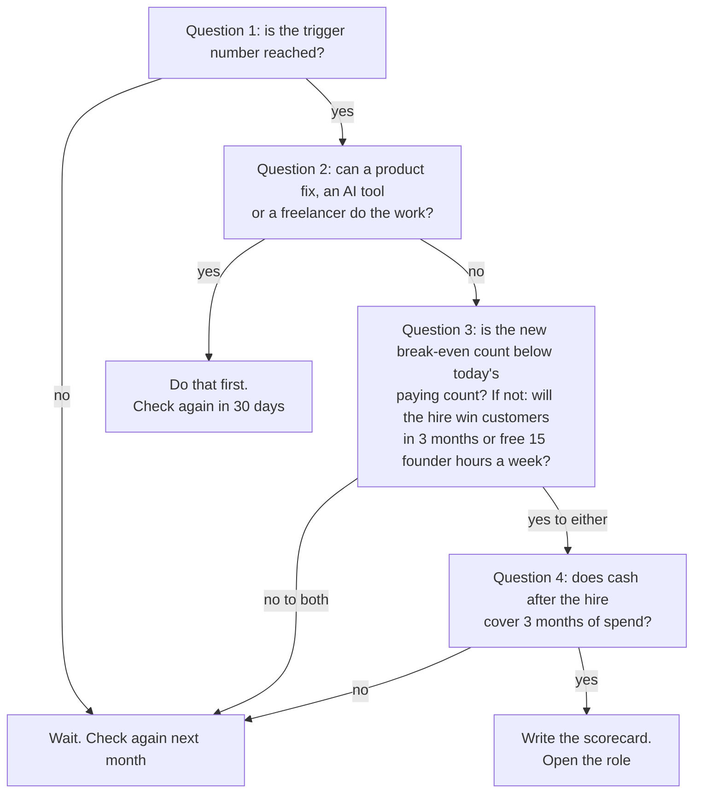
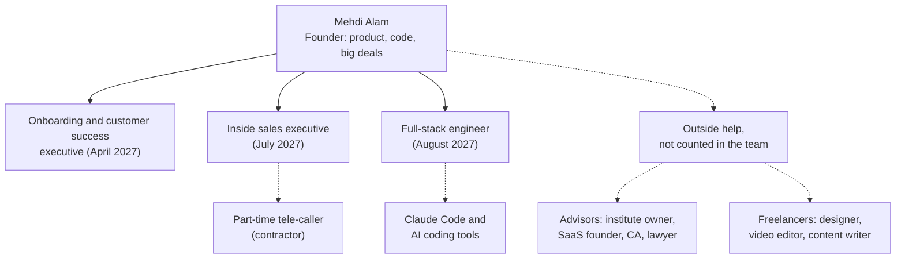
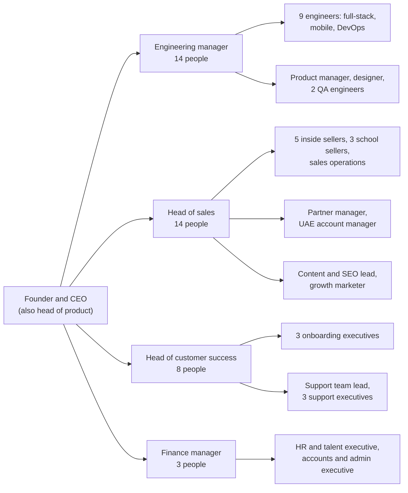
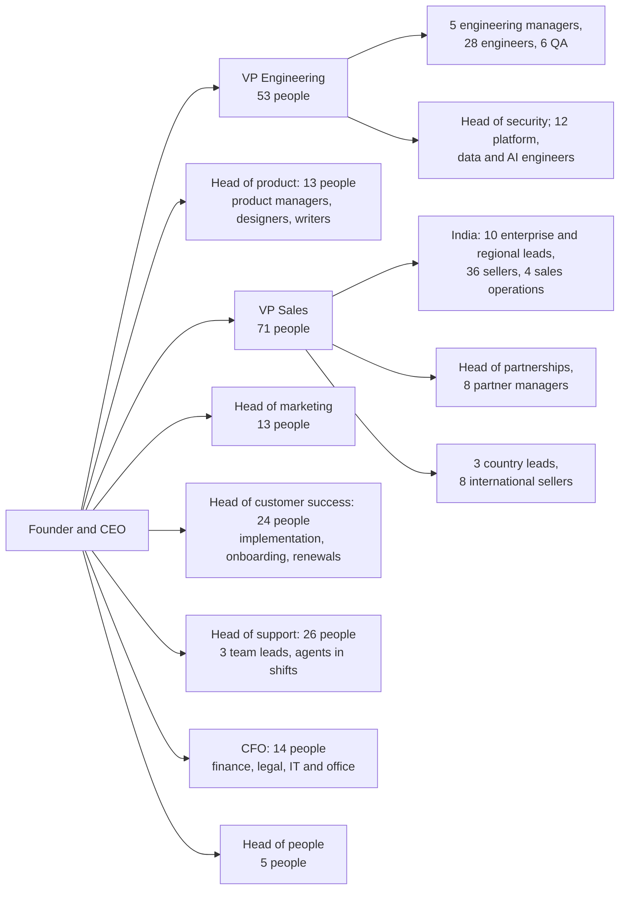

# Organization and Hiring Plan

**In simple words:** This chapter says who joins EduFlow, when, at what cost and why. The company grows from one founder to about 220 people by September 2031. Every hire waits for a number (a trigger), not for a date. The chapter also covers how we hire, how we work, the ESOP pool, outside help, advisors and the risk of depending on one person.

> **Rule:** Team sizes come from the canon: 4, 14, 40, 95 and 220 people at the end of Years 1 to 5. Payroll totals match *Financial Plan and Projections*. All pay figures are estimates in 2026 rupees. This chapter governs roles, hiring order and pay bands. If another chapter shows a different split of roles, use this one.

Three terms are used all through the chapter:

- **CTC** (cost to company) is the full yearly cost of an employee: salary, employer PF (provident fund) and benefits.
- **Loaded cost** is the monthly CTC plus health cover, on-target incentive and a share of equipment. Every "monthly cost" in this chapter is loaded cost.
- **Trigger** is a business number that must be reached before a role is opened.

## How the team grows

The team grows slower than the customer count. That is the whole idea of SaaS. Each person serves more customers every year.

| End of | Paying organizations | MRR | Team | New roles in the year | Paying organizations per person | Exit ARR per person |
|---|---|---|---|---|---|---|
| Year 1 (Sep 2027) | 120 | ₹6 lakh | 4 | 3 | 30 | ₹18 lakh |
| Year 2 (Sep 2028) | 500 | ₹30 lakh | 14 | 10 | 36 | ₹26 lakh |
| Year 3 (Sep 2029) | 1,500 | ₹1.1 crore | 40 | 26 | 38 | ₹34 lakh |
| Year 4 (Sep 2030) | 4,000 | ₹3.4 crore | 95 | 55 | 42 | ₹43 lakh |
| Year 5 (Sep 2031) | 10,000 | ₹9.5 crore | 220 | 125 | 45 | ₹52 lakh |

Exit ARR per person = ARR run-rate ÷ team size. Example for Year 3: ₹13.5 crore ÷ 40 = ₹34 lakh. All rows are targets from the canon, not forecasts.

People also leave. We assume attrition (the share of staff who leave in a year) of 15% from Year 3 (estimate). Replacement hires = average team × 15%: about 4 in Year 3, 10 in Year 4 and 24 in Year 5. So Year 5 needs about 149 accepted offers, or 12 a month. One recruiter closes about 4 hires a month (estimate), which is why Year 5 has a people team of five.

### Team by function

| Function | Year 1 | Year 2 | Year 3 | Year 4 | Year 5 |
|---|---|---|---|---|---|
| Product and engineering | 1.5 | 5 | 14 | 30 | 66 |
| Sales and marketing | 1.5 | 5 | 14 | 36 | 84 |
| Customer success and support | 1 | 3 | 8 | 20 | 50 |
| General and admin (founder, finance, HR, legal) | 0 | 1 | 4 | 9 | 20 |
| **Team at year end (canon)** | **4** | **14** | **40** | **95** | **220** |

This is the same split that *Financial Plan and Projections* uses for payroll. The founder is counted in a different row as his job changes:

- **Year 1:** half in engineering, half in sales. He builds and sells.
- **Year 2:** in sales and marketing. He still closes every Enterprise and school-group deal, opens new cities and leads the UAE entry.
- **Year 3 onwards:** in general and admin, as chief executive (CEO).

> **Note:** *Five-Year Roadmap* shows an earlier draft of the split by function. The yearly totals are the same. Where the two differ by a few people, use the table above, because the payroll numbers are built on it.

## Rules that keep the team lean

A salary is a fixed cost. It must be paid in a bad month too. These six rules protect the company.

1. **Trigger, not date.** A role opens only when its trigger number is reached. No trigger, no hire.
2. **Fix before you hire.** First try a product fix, an AI tool or a freelancer. A product fix is paid for once. A salary is paid every month.
3. **Break-even check.** Before every offer, recompute how many paying customers the company needs to cover its fixed costs. *Financial Plan and Projections* gives the formula: extra customers needed = new monthly cost ÷ (ARPA × 93%).
4. **Cash floor.** After adding the new salary, the bank balance must still cover at least 3 months of spend. Four months or more is the green level in *KPI Framework and Dashboard*.
5. **Payroll brake.** Payroll stays under 40% of revenue. The plan runs at 27% to 39%. If the last 12 months cross 40%, only customer success hires continue. At 50%, all hiring stops.
6. **Span of control.** Span of control means how many people report to one manager. We keep it at 6 to 8. The company never has more than four layers: CEO, head, manager, team member.

**Figure: The hiring gate that every new role must pass**

The gate has four questions. A role opens only when the trigger is met, no cheaper fix exists, the business can carry the cost and the cash floor holds. The founder writes the four answers on one page before the job post goes out.

> **Example:** At the March 2027 review, EduFlow has 30 paying organizations. The first hire costs ₹30,000 plus a ₹2,000 tool seat, so ₹32,000 a month. Each customer brings ₹4,150 × 93% = ₹3,860 of contribution in April. Extra customers needed = ₹32,000 ÷ ₹3,860 = 8.3, so 9. Break-even moves to about 44, just above the 42 paying expected in April. So the second test applies: does the hire free 15 founder hours a week? Yes, that is the trigger itself. Cash on 31 March 2027 is ₹7.22 lakh, about 3.7 months of the new spend of ₹1.95 lakh. The role opens.

## The founder's role by stage

The founder's job changes five times in five years. Each change means giving away work he is good at. That is hard, and it is the only way the company can grow past him.

| Stage | Expected time | Founder's main jobs | What he hands over |
|---|---|---|---|
| Build sprint, no customers | Oct – Dec 2026 | Builds the MVP with Claude Code; runs 5 pilots; books first demos | Bookkeeping and GST to the CA, from day one |
| Founder-led launch, 1 to 30 paying | Jan – Mar 2027 | Every demo, every onboarding, every ticket; ships Phase 2 | First call to each lead, to the tele-caller |
| First team, 30 to 120 paying | Apr – Sep 2027 | Product and code; school and Enterprise demos; trains three hires | Onboarding and first-level support; Growth demos; bug fixes |
| 500 customers | Year 2 | Product direction; big deals; partners; UAE entry; hiring; seed decision | Daily code; sales coaching; invoices and payroll admin |
| 1,000 to 1,500 customers | Year 3 | CEO: strategy, senior hiring, culture, country pilots, security sign-off | Daily sales and support to heads; sprints to the engineering manager |
| 4,000 to 10,000 customers | Years 4 – 5 | CEO: vision, leadership team, capital, key partners, brand | Whole functions to VPs; finance to the CFO |

As a planning guide (estimate), the share of the founder's week spent on building falls from 85% in the sprint to 40% with the first team, 25% in Year 2 and 10% by Year 5. The share spent on hiring and managing rises from zero to 20%, 30% and then 50%. Selling stays between 10% and 35% throughout.

### What to delegate first

Delegate in this order. The order follows one test: how many hours the task eats, and how easy it is to teach.

1. **Bookkeeping, GST returns and TDS** go to the CA from October 2026. Low value for the founder, high penalty for mistakes.
2. **First call to a lead** goes to the part-time tele-caller in February 2027.
3. **Onboarding, data import and first-level support** go to hire 1. This is the biggest block of repeated, teachable hours.
4. **Standard demos for Growth deals** go to hire 2, but only after the founder has 30 wins of his own.
5. **Bug fixes, small features and a share of on-call** go to hire 3.
6. **Sales coaching and the forecast** go to the sales lead in Year 2.
7. **Invoices, vendor payments, payroll and compliance filings** go to the finance and operations executive in Year 2.
8. **Sprint planning, code review and releases** go to the engineering manager in Year 3.
9. **The hiring pipeline** goes to the HR and talent executive in Year 3.

The founder keeps these until at least Year 3: product vision and roadmap cuts, pricing, senior hires, culture, security and privacy sign-off, Enterprise and school-group closing, and investor talks.

> **Founder note:** Hand over a task only when three things are true. You have done it at least 20 times. You have written a one-page checklist and recorded a screen video. Someone else can do it 80% as well as you. Then let go fully. Review the numbers every week, not the person's every step.

## Hiring sequence and triggers

This is the master list for the first ten kinds of role. "Expected time" is when the trigger should be met if the plan holds. If the trigger comes late, the hire comes late.

| # | Role | Trigger | Expected time | Monthly cost | Who does it until then |
|---|---|---|---|---|---|
| 1 | Onboarding and customer success executive | 30 paying organizations, or founder spends 15 hours a week on onboarding | April 2027 | ₹30,000 | Founder |
| 2 | Inside sales executive | MRR ₹3 lakh, and over 8 founder demos a week for 4 weeks | July 2027 | ₹25,000 in ramp; ₹32,000 on target | Founder and tele-caller |
| 3 | Full-stack engineer | MRR ₹4.5 lakh, or bug work takes 40% of founder coding time for 4 weeks | August 2027 | ₹70,000 | Founder with Claude Code |
| 4 | Support executive | Over 500 tickets per support person for 2 months, or first response target met on under 90% of tickets for 2 weeks | Jan – Feb 2028 | ₹32,000 | Onboarding executives |
| 5 | QA engineer | 250 paying, or 3 customer-found serious bugs a month for 2 months | Feb – Mar 2028 | ₹70,000 | Engineers and automated tests |
| 6 | Finance and operations executive | MRR ₹15 lakh, or founder spends 6 hours a week on finance admin | May 2028 | ₹60,000 | Founder and CA |
| 7 | Product designer | 3 engineers ship screens, and freelance design spend tops ₹40,000 a month for 3 months | Jun – Jul 2028 | ₹1,00,000 | Freelance designer and shadcn/ui defaults |
| 8 | Sales lead | 6 people selling, and founder spends 8 hours a week on sales coaching | Jun – Jul 2028 | ₹70,000 | Founder |
| 9 | Engineering manager | Engineers pass 6, or founder spends 15 hours a week running sprints | Oct – Dec 2028 | ₹2,80,000 | Founder |
| 10 | Country leads | UAE: account manager at 15 paying UAE schools; country lead at 60. USA and Australia: pilot checklist passed and 25 paying | UAE from late 2028; others in Year 4 | ₹2.5 lakh to ₹6 lakh | Founder, reseller and contractors |

QA (quality assurance) means testing the product before customers see a release. The "6 people selling" in row 8 counts inside sellers, contract field associates and tele-callers, as in the ratio of *Sales Process and Playbooks*. Row 4 is the hiring rule of *Customer Success, Onboarding and Support*.

> **Warning:** Do not hire ahead of a trigger "to be ready". In the conservative case of *Financial Plan and Projections*, only hire 1 happens in Year 1 and the company is still healthy. An early salary with no trigger behind it is the fastest way to burn the bank balance.

## Year 1 team: the founder and three hires

Year 1 runs from October 2026 to September 2027. The founder takes no pay for the first six months.

| Role | Count | Monthly cost | Expected start | Why now |
|---|---|---|---|---|
| Founder | 1 | ₹0 to March 2027; ₹30,000 from April; ₹60,000 from July | 5 Oct 2026 | Pay starts the month after MRR reaches ₹1 lakh; step two after ₹3 lakh |
| Onboarding and customer success executive | 1 | ₹30,000 | April 2027 | 13 to 19 new customers a month; April to July is peak onboarding season |
| Inside sales executive | 1 | ₹25,000 in a 3-month ramp | July 2027 | The pitch is proven after 30 founder wins; the founder's demo calendar is full |
| Full-stack engineer | 1 | ₹70,000 | 16 Aug 2027 | 100 customers send bugs daily; ends the one-person risk in the code |
| Part-time tele-caller (contractor, not counted) | – | About ₹6,500, inside the marketing budget | February 2027 | Buying season needs 30 dials a day |

Year 1 payroll = founder ₹2,70,000 + customer success ₹1,80,000 + inside sales ₹75,000 + engineer ₹1,05,000 = **₹6,30,000**. The run-rate in September 2027 is ₹1,85,000 a month, which is 31% of the ₹6 lakh MRR.

Whom to look for:

- **Hire 1.** Two to four years at a school front desk, a coaching fee counter or an ERP support desk. Strong Excel, clear Hindi, working English. Lives in the base city. Someone like Suresh Gupta, the accountant at Bright Future Public School, already knows our customers' problems. Never hire from a paying customer without the owner's consent.
- **Hire 2.** One to three years of phone sales in edtech, insurance or telecom. Hindi first. Writes clean WhatsApp messages.
- **Hire 3.** Three to five years with TypeScript, Node.js, React and PostgreSQL. Works well with AI coding tools. Remote, anywhere in India. ₹70,000 a month is about ₹8.4 lakh a year, a fair remote package at this level (estimate).

**Figure: Organization chart at the end of Year 1 (4 people)**

Everyone reports to the founder. Dotted lines show help that is not on the payroll. There are no managers yet, and none are needed for three people.

## Year 2 team: fourteen people

Ten roles are added between October 2027 and September 2028. The seed round is optional. Without it, the same roles open a quarter later.

| Role | Count | Monthly cost each | Expected start | Why now |
|---|---|---|---|---|
| Founder and CEO | 1 | ₹1,00,000 | Step three, about Feb 2028 | The month after MRR reaches ₹10 lakh; still far below market pay |
| Full-stack engineer (hire 3) | 1 | ₹80,000 | In place | Raise after one year |
| Mobile engineer | 1 | ₹1,20,000 | October 2027 | White-label apps are a paid add-on; trigger is 3 signed app orders |
| Senior full-stack engineer | 1 | ₹1,30,000 | April 2028 | MRR ₹12 lakh and roadmap over 3 weeks late; leads the AWS move |
| QA engineer | 1 | ₹70,000 | Feb – Mar 2028 | 250 paying; one bad release now hurts hundreds of institutes |
| Product designer | 1 | ₹1,00,000 | Jun – Jul 2028 | Three engineers ship screens every week; freelance cost crosses ₹40,000 |
| Sales lead (also owns partners) | 1 | ₹70,000 | Jun – Jul 2028 | Six people selling need weekly coaching |
| Inside sales executives | 3 | ₹35,000 | 1 in place; Nov 2027; May 2028 | Add one when the last one holds 10 wins a month for 2 months |
| Senior onboarding executive (hire 1) | 1 | ₹40,000 | In place | Raise; trains every new onboarding and support person |
| Onboarding executive | 1 | ₹33,000 | January 2028 | New wins stay above 25 a month for 2 months |
| Support executive | 1 | ₹32,000 | Jan – Feb 2028 | Ticket rule from the trigger table |
| Finance and operations executive | 1 | ₹60,000 | May 2028 | MRR ₹15 lakh; about 300 invoices, GST and payroll each month |
| **Total** | **14** | **₹9,40,000 a month at year end** | | |

Check by function: engineering 5 × ₹1,00,000 = ₹5,00,000. Sales and marketing 5 × ₹55,000 = ₹2,75,000. Customer success 3 × ₹35,000 = ₹1,05,000. General and admin ₹60,000. The averages are the Year 2 loaded costs in *Financial Plan and Projections*.

> **Note:** *Go-To-Market Strategy* plans two city field sellers and a partner manager by September 2028. Inside the canon team of 14, the sales lead owns partners. The two field sellers work as contract field associates on 11-month contracts. Their pay follows *Sales Process and Playbooks* and comes from the customer acquisition budget. Like the tele-callers and the UAE reseller, they are not counted in the 14. The best one becomes a school sales executive in Year 3.

## Year 3 team: forty people and the first managers

Year 3 is when the founder stops being everyone's manager. Three heads and one engineering manager join or are promoted. *Five-Year Roadmap* makes this an exit test for the year.

| Function | Role | Count | Monthly cost each | Why now |
|---|---|---|---|---|
| Engineering | Engineering manager | 1 | ₹2,80,000 | Engineers pass 6; founder leaves daily sprints |
| Engineering | Product manager | 1 | ₹1,80,000 | 34 modules and 3 new countries need one owner for the backlog |
| Engineering | DevOps engineer | 1 | ₹1,80,000 | AWS is live; 1,000 customers need 99.9% uptime |
| Engineering | Senior full-stack engineers | 3 | ₹1,60,000 | One per product squad: finance, academics, platform |
| Engineering | Full-stack engineers | 3 | ₹1,00,000 | International packs and the public API |
| Engineering | Mobile engineers | 2 | ₹1,30,000 | White-label app orders grow with Pro and Enterprise |
| Engineering | QA engineers | 2 | ₹80,000 | Test automation for weekly releases |
| Engineering | Product designer | 1 | ₹1,20,000 | In place |
| Sales | Head of sales | 1 | ₹2,00,000 | Sellers pass 8; promote the sales lead if quota was met for 2 quarters |
| Sales | Inside sellers (SDR and AE) | 5 | ₹40,000 | About 100 new customers a month |
| Sales | School sales executives | 3 | ₹60,000 | School deals need visits; Patna, Lucknow, Delhi NCR |
| Sales | Partner manager | 1 | ₹80,000 | Over 40 active partners; the sales lead can no longer own them |
| Sales | UAE account manager | 1 | ₹2,50,000 | 15 paying UAE schools; paid at Dubai rates |
| Sales | Content and SEO lead, growth marketer | 2 | ₹80,000 | USA and Australia buy through search; referral programmes at scale |
| Sales | Sales operations executive | 1 | ₹50,000 | CRM hygiene, incentive sheets and lead routing for 10 sellers |
| Success | Head of customer success | 1 | ₹1,20,000 | Churn under 2% needs an owner; promote from inside if ready |
| Success | Onboarding executives | 3 | ₹40,000 | One per 40 new customers a month |
| Success | Support team lead | 1 | ₹55,000 | Four or more agents need rosters and quality checks |
| Success | Support executives | 3 | ₹35,000 | Over 3,000 tickets a month; onboarding keeps a new account's tickets for 30 days |
| Admin | Founder and CEO | 1 | ₹2,00,000 | Counted here from Year 3 |
| Admin | Finance manager (₹90,000), HR and talent executive (₹45,000), accounts executive (₹25,000) | 3 | ₹53,000 | Audit and foreign billing; 30 offers to close in the year |
| | **Total** | **40** | **₹38,40,000 a month at year end** | |

SDR (sales development representative) is a seller who only calls leads and books demos. AE (account executive) is a seller who runs demos and closes. DevOps is the work of running servers, releases and monitoring.

Check by function: engineering 14 × ₹1,40,000 = ₹19.6 lakh. Sales and marketing 14 × ₹80,000 = ₹11.2 lakh. Customer success 8 × ₹50,000 = ₹4.0 lakh. General and admin 4 × ₹90,000 = ₹3.6 lakh. Total ₹38.4 lakh a month.

**Figure: Organization chart at the end of Year 3 (40 people)**

The founder now has four direct reports. The product manager and the designer sit in the engineering team for cost, but they take product direction from the founder. Marketing reports to the head of sales until Year 4, because two marketers do not need their own head.

## Year 4 team: ninety-five people and a leadership layer

From Year 4 the tables show role groups, not single seats. The cost column is the average loaded cost per person in the group (estimate). Staff in the UAE, the USA and Australia are paid at local rates, with a low fixed part and a high incentive part.

| Function | Role group | Count | Average monthly cost | Why now |
|---|---|---|---|---|
| Engineering | VP Engineering | 1 | ₹4,60,000 | 30 people in 4 squads; regional cells begin |
| Engineering | Engineering managers (2), product managers (2) | 4 | ₹2,60,000 | One manager per 6 to 8 engineers |
| Engineering | Security lead, DevOps (2), data engineers (2) | 5 | ₹2,12,000 | SOC 2, Enterprise SLAs, data warehouse |
| Engineering | Full-stack, backend and mobile engineers | 15 | ₹1,34,000 | Squads for Enterprise, payments, country packs |
| Engineering | QA engineers (3), designers (2) | 5 | ₹1,06,000 | One QA per squad; one design system |
| Sales | VP Sales | 1 | ₹3,20,000 | Over 25 sellers in 3 countries |
| Sales | Sales leads (3), enterprise sellers (3) | 6 | ₹1,05,000 | Target of 60 Enterprise contracts |
| Sales | Inside (11) and field (5) sellers, sales operations (1) | 17 | ₹44,000 | About 250 new customers a month |
| Sales | Partner managers | 3 | ₹74,000 | 300 active partners; one manager per 100 |
| Sales | UAE lead and seller; USA and Australia launch leads | 4 | ₹3,30,000 | Pilots passed; full launch from October 2029 |
| Sales | Head of marketing and team | 5 | ₹72,000 | Brand, events and content in 4 countries |
| Success | Head (1), implementation managers (3) | 4 | ₹1,20,000 | School groups need a managed rollout |
| Success | Onboarding and customer success executives | 5 | ₹55,000 | Certified partners onboard most Growth customers |
| Success | Support agents (9), team leads (2) | 11 | ₹49,500 | Early and late shifts for Australia and the USA |
| Admin | Founder and CEO | 1 | ₹3,00,000 | In place |
| Admin | Finance head, accountants (2), HR manager, talent partner, legal counsel, IT admin, assistant | 8 | ₹97,500 | Audits, 65 offers a year, contracts in 4 countries |
| | **Total** | **95** | **₹1,17,000** | **₹110.8 lakh a month at year end** |

Check by function: engineering 30 × ₹1,70,000 = ₹51.0 lakh. Sales and marketing 36 × ₹1,00,000 = ₹36.0 lakh. Customer success 20 × ₹65,000 = ₹13.0 lakh. General and admin 9 × ₹1,20,000 = ₹10.8 lakh.

Leaders at this level are hard to judge. Promote from inside when the person has met the numbers for a year. For an outside VP, speak to at least four references, two of whom the candidate did not name.

## Year 5 team: two hundred and twenty people

| Function | Role group | Count | Average monthly cost | Why now |
|---|---|---|---|---|
| Engineering | VP Engineering, head of product, head of security | 3 | ₹5,00,000 | 10,000 customers in 4 regional cells |
| Engineering | Engineering managers (5), product managers (4) | 9 | ₹3,30,000 | Five squads of 6 to 8 people |
| Engineering | Platform, DevOps, security, data and AI engineers | 12 | ₹2,40,000 | 99.95% uptime; AI Insights at scale; public API |
| Engineering | Full-stack, backend and mobile engineers | 28 | ₹1,55,000 | 34 modules, 4 country packs, marketplace |
| Engineering | QA (6), designers (4), developer relations and writers (4) | 14 | ₹1,08,000 | Partners and customers build on the API |
| Sales | VP Sales, head of marketing, head of partnerships | 3 | ₹3,50,000 | Three channels, each with its own number |
| Sales | Country leads: UAE, USA, Australia | 3 | ₹5,50,000 | 1,500 international customers need local owners |
| Sales | International sellers | 8 | ₹3,00,000 | About 95 new international customers a month |
| Sales | Enterprise sellers and regional sales leads, India | 10 | ₹1,20,000 | School groups and chains across India |
| Sales | Inside and field sellers, India | 36 | ₹45,000 | About 520 new Indian customers a month; partners win 40% or more |
| Sales | Partner managers (8), sales operations and training (4) | 12 | ₹70,000 | Two-level partner network; 65 sellers to train |
| Sales | Marketing team | 12 | ₹1,10,000 | Partner, developer and country marketing |
| Success | Head of customer success, head of support | 2 | ₹3,00,000 | 50 people cannot report to one head |
| Success | Implementation managers | 8 | ₹1,10,000 | Enterprise and group rollouts |
| Success | Customer success and onboarding executives | 15 | ₹62,000 | Renewals and upgrades for 10,000 accounts |
| Success | Support agents (22), team leads (3) | 25 | ₹63,600 | Shifts across four time zones |
| Admin | Founder and CEO | 1 | ₹4,00,000 | In place |
| Admin | CFO | 1 | ₹4,50,000 | Profit-or-Series-B decision; four legal entities |
| Admin | Finance (6), people team (5), legal and compliance (2), IT and office (5) | 18 | ₹1,08,000 | 4 currencies and tax systems; about 149 offers a year; DPDP, FERPA, APP and PDPL duties |
| | **Total** | **220** | **₹1,37,000** | **₹300.8 lakh a month at year end** |

Check by function: engineering 66 × ₹2,00,000 = ₹132.0 lakh. Sales and marketing 84 × ₹1,20,000 = ₹100.8 lakh. Customer success 50 × ₹80,000 = ₹40.0 lakh. General and admin 20 × ₹1,40,000 = ₹28.0 lakh.

> **Note:** *Customer Success, Onboarding and Support* sizes this stage at about 64 people before partner help. This plan has 50. Certified partners and a 50% self-serve rate cover the gap. If either fails, customer success gets the next hires.

**Figure: Organization chart at the end of Year 5 (220 people)**

The CEO has eight direct reports, the top of the span-of-control rule. Every leader on the second level owns one number from *KPI Framework and Dashboard*. No team member is more than four layers from the CEO.

## Total payroll by year

*Financial Plan and Projections* works out payroll with one formula, so the founder can change the inputs:

- Payroll in a year = for each function, average headcount × average loaded monthly cost × 12.
- Average headcount = (opening + closing) ÷ 2.

Worked example for engineering in Year 3: (5 + 14) ÷ 2 = 9.5 people × ₹1,40,000 × 12 = ₹159.6 lakh, shown as ₹160 lakh.

| Payroll, ₹ lakh | Year 1 | Year 2 | Year 3 | Year 4 | Year 5 |
|---|---|---|---|---|---|
| Product and engineering | 2.40 | 39 | 160 | 449 | 1,152 |
| Sales and marketing | 2.10 | 21 | 91 | 300 | 864 |
| Customer success and support | 1.80 | 8 | 33 | 109 | 336 |
| General and admin | 0 | 4 | 27 | 94 | 244 |
| **Total payroll** | **6.30** | **72** | **311** | **952** | **2,596** |
| Total revenue | 23.25 | 190 | 793 | 2,609 | 7,533 |
| Payroll as a share of revenue | 27% | 38% | 39% | 36% | 34% |
| Monthly payroll at year end | 1.85 | 9.4 | 38.4 | 110.8 | 300.8 |
| Year-end payroll as a share of closing MRR | 31% | 31% | 35% | 33% | 32% |

The last two rows come from the role tables of this chapter. Example for Year 3: ₹38.4 lakh ÷ ₹110 lakh MRR = 35%. The average cost per person rises from ₹46,000 to ₹1,37,000 a month in five years, because senior leaders join and staff abroad are paid at local rates. If every trigger fires in its expected month, the cash paid in a year stays within about 5% of the budget (estimate).

### The lean case and the normal case

Many people-heavy SaaS companies spend 50% to 60% of revenue on payroll (estimate, a common rule of thumb). This plan spends 27% to 39%. The gap is the saving from AI tools, self-serve onboarding, partners and Tier 2 city salaries. It is a bet, so the founder must know what it costs to lose it.

| Case | Year 2 | Year 3 | Year 4 | Year 5 |
|---|---|---|---|---|
| Plan: canon team size | 38% | 39% | 36% | 34% |
| Stress: the team must be 50% larger | 57% | 59% | 55% | 52% |
| Stress payroll, ₹ lakh | 108 | 467 | 1,428 | 3,894 |

Stress payroll = plan payroll × 1.5. Example for Year 5: ₹2,596 lakh × 1.5 = ₹3,894 lakh, and ₹3,894 lakh ÷ ₹7,533 lakh = 52%. In the stress case EduFlow looks like a normal SaaS company, and the Year 5 EBITDA margin falls from 19% to about 2%. The company survives, but only with outside funding in Years 2 to 4.

Some people costs sit outside payroll (all estimates). A laptop costs ₹70,000 for each net new person. A tool seat costs ₹2,000 a month; an engineer's AI coding seat and developer tools cost ₹10,000. Referral bonuses are ₹15,000 for junior and ₹50,000 for senior roles, paid after six months. From Year 3, a search firm for a head or VP costs 8% to 12% of first-year CTC. These sit in the tools, equipment and general and admin lines of *Financial Plan and Projections*.

## Hiring process

One process is used for every role, from the first executive to a VP. It is slow on purpose. A wrong hire costs four to six months of pay plus the founder's time (estimate).

| Step, in order | What happens | Time |
|---|---|---|
| Scorecard | One page: mission of the role, 3 to 5 outcomes with numbers, 5 traits, pay band, option band | Before the job post |
| Sourcing | Referrals first; then LinkedIn, job portals, local colleges, WhatsApp groups of school and coaching staff | 2 weeks |
| Screen call | 20 minutes in Hindi or English; pay expectation is asked up front | Week 2 |
| Paid trial task | 2 to 4 hours of real work, paid ₹1,000 to ₹3,000; AI tools are allowed | Week 3 |
| Structured interview | Same questions for all; two interviewers score each scorecard line 1 to 4, apart | Week 3 |
| References | 2 calls; 4 for leaders | Week 4 |
| Offer and probation | Offer within 48 hours; 3-month probation (6 for heads) with a 30-60-90 day plan | Week 4 |

A scorecard is a one-page sheet that says what success in the role means, written before any candidate is met. We hire only when the average score is 3 or more and no line scores 1. Here is the scorecard for hire 1:

| Outcome | Measure | By when |
|---|---|---|
| Take over onboarding | Founder onboarding hours fall from 15 to under 3 a week | Day 60 |
| Activate new customers | 60% record a first receipt or attendance within 7 days | Day 90 |
| Handle the volume | 25 new organizations onboarded a month | Month 4 |
| Keep customers happy | First response target met on 90% of tickets | Month 4 |
| Build the playbook | 10 help articles and 5 Hindi videos published | Month 6 |

Traits for this role: patient on the phone, strong in Excel, writes clear Hindi and English, closes every open issue, honest about mistakes.

A trial task shows real work, which an interview cannot. Each task uses EduFlow's own situations. The designer redesigns the parent fee payment screen for mobile. The sales lead reviews a 60-deal pipeline export and coaches one recorded call. The other main roles:

| Role | Trial task | Pass mark |
|---|---|---|
| Onboarding executive | Import a messy Excel of 200 Sharma Classes students into a demo account; record a 3-minute Hindi walkthrough | Under 5 data errors; clear speech |
| Inside sales executive | 15-minute mock demo with the founder playing Rajesh Sharma; then a WhatsApp follow-up | Asks 5 discovery questions; handles "a free app is enough" |
| Full-stack engineer | 4-hour task in a sample repo: a tenant-scoped endpoint with Zod validation, a Prisma query and one test | Tenant isolation is correct; explains every line |
| Support executive | Answer 5 real tickets, names removed, in 45 minutes | 4 of 5 correct, polite and short |
| QA engineer | Test a staging build of fee collection with 5 planted bugs | Finds 3 of 5; writes clear steps |
| Finance and operations executive | Match a Razorpay settlement report to 40 invoices with 3 planted mismatches | Finds all 3 |
| Engineering manager | Review a real pull request; plan a 6-week release for 5 engineers | Spots the planted tenant-leak bug |
| Country lead | 30-60-90 day plan for Indian-curriculum schools in the UAE, with a first list of 50 schools | Real names, channels and numbers |

Every new person gets a written 30-60-90 day plan on day one. If the 60-day review shows a clear miss, the founder acts in that month, with fair notice pay. *Go-To-Market Strategy* already sets this rule for sellers: under 5 wins in month three means the role ends in month four.

> **Warning:** Employer duties grow with headcount. As a general guide: appointment letters, TDS on salaries and a Shops and Establishments registration from the first employee; an Internal Committee under the POSH Act and ESI cover at 10 employees; EPF registration at 20. India is moving these laws into four new Labour Codes. The CA must confirm each threshold before the hire that crosses it.

## Culture and working norms

### Where the team sits

The choice is between the first three launch cities. All figures are estimates.

| Factor | Patna | Lucknow | Delhi NCR |
|---|---|---|---|
| First customers nearby | Launch city one | Launch city two | Launch city three; strongest competition |
| Monthly pay for support and inside sales | ₹18,000 – ₹30,000 | ₹20,000 – ₹32,000 | ₹28,000 – ₹45,000 |
| Senior engineers and leaders available | Few | Some | Many |
| Risk of staff being hired away | Low | Low to medium | High |
| Co-working seat a month | ₹4,000 – ₹5,000 | ₹5,000 – ₹6,000 | ₹8,000 – ₹12,000 |
| Flights to Dubai and to investors | Through Delhi | A few Gulf flights | Best |

**Decision: a remote-first company with its operations base in Patna.**

- **Patna base.** Onboarding, support and inside sales sit together in a co-working space from hire 1: 4 seats in 2027, about 12 by September 2028. These teams learn by hearing each other's calls. They are more than a third of the Year 5 team, so their cost and loyalty matter most.
- **Remote across India.** Engineering, product, design and marketing, from hire 3. Senior engineers are scarce in Patna and costly to move.
- **Delhi NCR hub from Year 3.** A small office in Noida for leaders, enterprise sellers, investor meetings and international travel.
- **Lucknow** stays a field city with no office. Staff abroad work from home or a co-working desk until a country has 10 people.

The reason in one line: we pay the least, and lose the fewest people, where we need the most people, and we put no limit on where scarce skills come from.

> **Note:** *Go-To-Market Strategy* says the first city must be one the founder can visit every week. The same holds for the base. If the founder lives in Lucknow, swap Patna and Lucknow in this plan. Nothing else changes.

### How we work

| Norm | Rule |
|---|---|
| Working week | Five days. Sales and support run a Saturday rota; Sunday cover starts at four agents |
| Core hours | Everyone is online 11 am to 5 pm IST; other hours are flexible |
| Written first | Every decision fits on one page. Every meeting ends with an owner and a date. Hindi or English are both fine |
| Rhythm | Monday 15-minute KPI review; Friday demo of what shipped; monthly all-hands that shows MRR, churn and months of cash to everyone |
| Customer contact | Everyone, engineers included, answers support for 2 hours a month and visits one institute a year |
| Mistakes | No-blame reviews: what happened, why, and what we change |
| Data | Least access. Only named staff hold `SUPER_ADMIN`. No customer data on personal devices. Children's data never goes into chat or AI tools |
| Meeting in person | Whole team meets twice a year in Patna; about ₹15,000 a head each time (estimate) |
| Pay and leave | Pay bands are visible to staff; one raise cycle each October; 24 paid leave days; no long leave in support from April to July |

## ESOP pool outline

An ESOP (employee stock option plan) gives staff the right to buy company shares later at a fixed low price. It lets a bootstrapped company hire good people at Tier 2 salaries. Vesting means earning the options over time. A cliff is a first period in which nothing vests.

| Term | Decision | Why |
|---|---|---|
| Pool size | 10% before the seed round: 1,00,000 options on 10,00,000 shares. Top-up of up to 2 points at Series A. Ceiling 12% | Matches the dilution example in *Financial Plan and Projections* |
| Who gets options | Every full-time employee after probation. Not contractors. Not the founder | Everyone owns a piece |
| Vesting | 4 years; 1-year cliff; then monthly | Indian company law needs at least one year between grant and vesting |
| Exercise price | ₹10 a share, the face value (assumption) | Staff can afford to exercise |
| On leaving | Unvested options lapse. Vested options stay open for 5 years. All lapse on fraud or data theft | Junior staff cannot pay price and tax within 90 days |
| Liquidity | Aim to buy back up to 10% of vested options at each funding round from Series A | An aim, not a promise |
| Legal form | Private limited company; scheme approved by a special resolution of shareholders | Companies Act 2013, section 62(1)(b), and its share capital rules |
| Tax | Tax on the gain at exercise, as salary; capital gains tax at sale | The CA explains this to each employee in writing |

Planned use of the pool:

| Group | Options | Share of company before seed | Typical grant each |
|---|---|---|---|
| Three Year 1 hires | 9,000 | 0.9% | Engineer 5,000; customer success 2,500; sales 1,500 |
| Ten Year 2 hires | 20,000 | 2.0% | Senior engineer and sales lead 4,000; others 500 to 3,000 |
| Year 3 leaders and hires | 30,000 | 3.0% | Engineering manager 8,000; head of sales 6,000; head of customer success 4,000 |
| Years 4 – 5 VPs, CFO, country leads | 25,000 | 2.5% | 2,000 to 6,000 |
| Years 4 – 5 other staff and refresh grants | 11,000 | 1.1% | 100 to 1,000 |
| Advisors | 5,000 | 0.5% | 1,000 to 2,000 |
| **Total** | **1,00,000** | **10.0%** | |

> **Example:** The first engineer joins on 16 August 2027 with 5,000 options at ₹10. Nothing vests until 16 August 2028. On that day 1,250 options vest. After that about 104 vest each month for 36 months. If the seed round prices a share at ₹160, as in the middle case of *Financial Plan and Projections*, the paper gain is 5,000 × (₹160 − ₹10) = ₹7.5 lakh. It is paper value, not cash, until someone buys the shares.

The lawyer drafts the scheme between October and December 2027, before any seed talks, for about ₹50,000 to ₹75,000 (estimate) from the Year 2 legal budget. The offer letters of the first three hires promise their grants in writing. The CA and a company secretary confirm the valuation and filing rules.

## Freelancers, agencies and AI tools

Outside help turns a fixed cost into a cost that moves with the work. We use it for work that is rare, seasonal or needs an independent eye.

| Work | Who does it | Cost (estimate) | Moves in-house when |
|---|---|---|---|
| Bookkeeping, GST, TDS, audit | CA firm | Retainer in the legal and compliance line | Daily work moves to the finance executive in Year 2 |
| Contracts, terms, DPDP papers, ESOP scheme | Lawyer | Per document | Legal counsel joins in Year 4 |
| Screens, logo, brochures | Freelance designer | ₹25,000 – ₹40,000 a project | Spend tops ₹40,000 a month for 3 months |
| Help videos, city pages, blog posts | Freelance editor and writers, Hindi and English | ₹3,000 – ₹8,000 a video; ₹1.5 – ₹2 a word | Content and SEO lead manages them from Year 3 |
| First call to leads | Part-time tele-callers | ₹5,000 retainer + ₹150 per demo held | The best become SDRs in Year 2 |
| Peak-season data import, April to July | Temporary operators trained in March | ₹600 – ₹800 a day | Stays seasonal |
| Penetration test, ISO 27001, SOC 2 audit | Security firm and auditors | Per project, in the engineering tools line | Never; it must be independent |
| Country entry | UAE reseller; part-time local contractors | Commission or day rate | The country trigger is met |

Four rules apply to all outside help. Every contract has a confidentiality clause and gives EduFlow ownership of the work. No freelancer sees production data or holds `SUPER_ADMIN`. One employee owns each freelancer's output. The CA sets the TDS on each payment.

AI tools are the main reason the canon team sizes are possible.

| Function | How AI tools are used | Guard-rail |
|---|---|---|
| Engineering | Claude Code writes code, tests and documents from the prompts in the Founder Blueprint; engineers review | AI-written code passes the same tests, review and CI |
| Support | A help bot takes the first try at how-to questions, which are 45% of tickets; it drafts replies in Hindi and English | A human sends every reply about fees, refunds or data |
| Sales | Call notes, follow-up drafts, lead scoring | No mass messages; consent rules apply |
| Marketing | First drafts of city pages, video scripts and translations | A human edits; no invented customer quotes |
| Finance and HR | Invoice matching, job posts, scorecard drafts | No salary or personal data in public AI tools |

The cost is small. In Year 5 it is 66 engineer seats × ₹10,000 + 154 other seats × ₹2,000 = ₹9.7 lakh a month, about 3% of payroll. The rule for every role is the second rule of this chapter: list the week's tasks, strike off what a tool can do, and hire only if 25 hours of human work remain.

## Advisors

Advisors give judgement the founder does not yet have. The first four are the ones named in *Business Objectives, Scope and Stakeholders*.

| Advisor | What they give | Time | Reward |
|---|---|---|---|
| Institute owner, coaching or school | Reality check on features and price; introductions to owner groups | 2 hours a month | 1,000 options; free Pro plan |
| SaaS founder who has passed ₹10 crore ARR | Hiring, sales team design, funding advice | One call a month | 2,000 options |
| CA | GST, TDS, audit, ESOP tax, payroll law | Monthly | Paid retainer |
| Lawyer | Contracts, DPDP, employment letters, ESOP scheme | Per document | Paid fees |
| UAE school operator, from Year 2 | KHDA and ADEK expectations; first 20 introductions | 2 hours a month | 1,000 options |
| Privacy and security adviser, from Year 3 | DPDP, ISO 27001, SOC 2 readiness | Per day | Paid contractor |

Advisor options vest monthly over two years after a 3-month cliff, and come from the 5,000 kept in the pool. Either side can end the agreement with 30 days' notice. Each advisor gets the monthly one-page update with three numbers and one question. The customer advisory council in *Five-Year Roadmap* is separate and unpaid.

## Key-person risk

Key-person risk is the damage done when one person becomes unavailable. In Year 1 that person is the founder, for everything. The full risk register is in *Risk Analysis and Mitigation*. This section sets the people-side controls.

| Risk | Highest when | How we reduce it |
|---|---|---|
| Founder is ill, burnt out or unreachable | October 2026 to August 2027 | All knowledge in the repo: PRD, Blueprint prompts, runbooks. Automated tests and CI/CD. One day off a week. A standby freelance Node.js engineer: no retainer, about ₹1,500 an hour when called (estimate) |
| Only the founder holds the keys | Always | Company-owned accounts, never personal email. Password manager with emergency access. Two admins on GitHub, hosting, Razorpay, Meta and the domain from hire 3 |
| Only the founder knows the customers | Years 1 and 2 | CRM notes on every account. From Year 2, two named EduFlow contacts for each Enterprise account |
| An early hire leaves | Year 2 | 60-day notice period; option vesting; written playbooks; every critical task has an owner and a deputy by Year 3 |
| A head or VP leaves | Years 3 to 5 | Each head trains a deputy; succession review every quarter; no function runs on one person's private sheet |
| Founder dies or is disabled | Always | Term life cover from Year 1; keyman insurance of ₹1 crore to ₹2 crore from Year 2 (estimate); a will; a letter with the lawyer that names who runs the company for 90 days |
| One AI tool vendor changes price or terms | Always | The code is standard TypeScript. Prompts live in the repo. A second AI coding tool is always on trial |

Bus factor is the number of people who can do a critical job alone. We track it and raise it each year.

| Critical job | Sep 2027 | Sep 2028 | Sep 2029 |
|---|---|---|---|
| Deploy and roll back production | 2 | 3 | 5 |
| Restore the database from backup | 2 | 3 | 4 |
| Run billing, Razorpay and GST invoices | 1, plus the CA | 2 | 3 |
| Manage WhatsApp templates and the Meta account | 2 | 3 | 3 |
| Close an Enterprise deal | 1 | 2 | 4 |

> **Best practice:** Run a "founder offline" drill every quarter from December 2027. The founder switches off for three working days. The team writes down every question that only he could answer. Each one becomes a runbook page or a handover within 30 days.

## Key takeaways

- The team follows the canon: 4, 14, 40, 95 and 220 people. Each person serves more customers every year, from 30 paying organizations per person to 45.
- Every role has a trigger number and must pass the hiring gate: no cheaper fix, break-even check, and 3 months of cash after the hire.
- The founder delegates in a fixed order: accounts first, then onboarding and support, standard demos, bug fixes, sales coaching, finance admin, sprints and hiring.
- Payroll matches *Financial Plan and Projections*: ₹6.3 lakh in Year 1 to ₹25.96 crore in Year 5, or 27% to 39% of revenue. A team 50% larger would cost 52% to 59%.
- EduFlow is remote-first with a Patna operations base, a Noida hub from Year 3, a 10% to 12% ESOP pool with 4-year vesting, and paid trial tasks for every role.
- Key-person risk is highest before August 2027. Documents in the repo, shared keys, a standby engineer, insurance and a quarterly "founder offline" drill reduce it.
