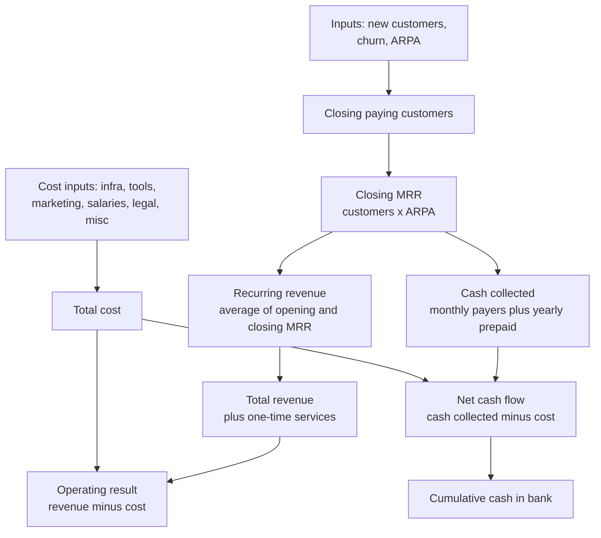
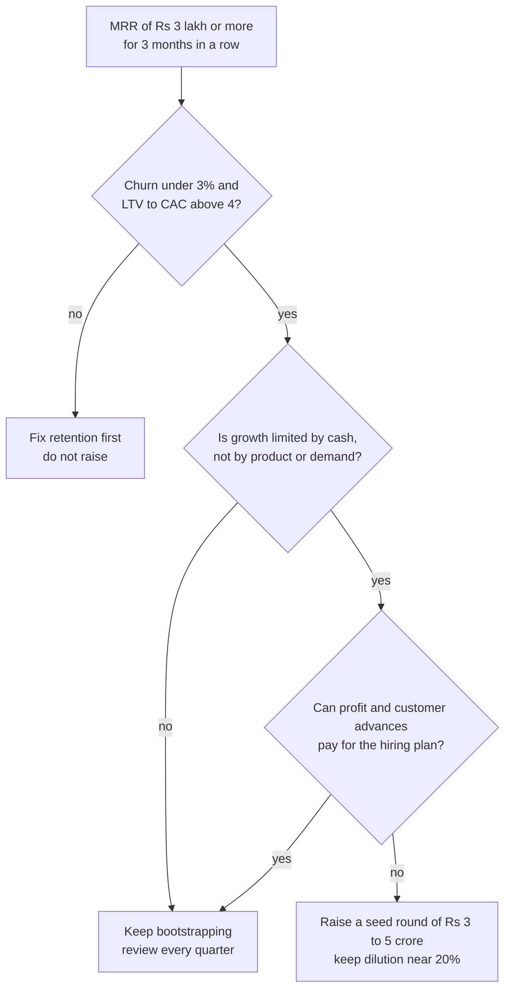
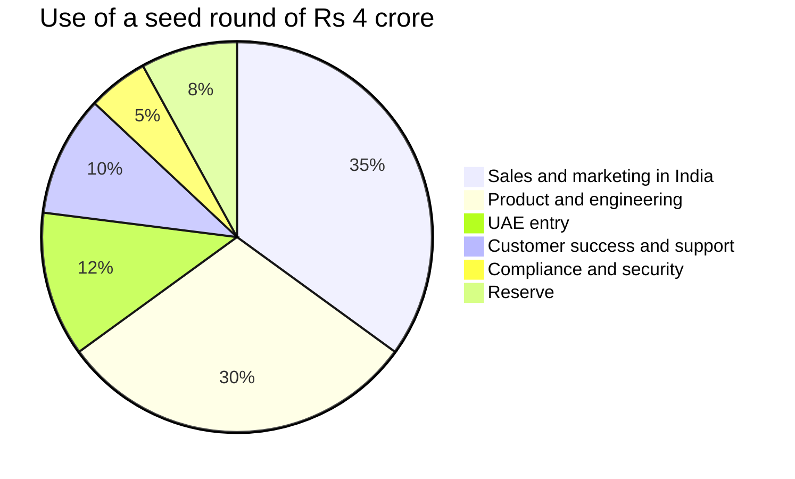

# Financial Plan and Projections

**In simple words:** This chapter turns the EduFlow plan into money tables. It lists every assumption, then shows a month-by-month model for Year 1, a five-year projection, the server cost at each scaling stage, the break-even point, the budget for the first six months, the funding plan and three what-if cases. Every number here is a target or the output of a model. It is not a forecast and not a promise. Each formula is written out so the founder can change an input and see the result.

## How to read this chapter

| Rule | What it means |
|---|---|
| Targets, not forecasts | Customer counts, ARPA and MRR at each year end come from the canon. The model only shows what those targets mean in rupees. |
| Business year | October to September. Year 1 is October 2026 to September 2027. The Indian tax year (April to March) is handled by the CA, not by this model. |
| No GST anywhere | All prices and costs exclude GST. GST collected from customers belongs to the government and never counts as revenue or cash. |
| Two views of money | The profit view compares revenue earned with cost. The cash view compares money received with money paid. Both are shown, because yearly plans make them very different. |
| Rounding | Year 1 tables are in whole rupees. Message cost and gateway fees are rounded to the nearest ₹100. Five-year tables are in ₹ lakh. |
| Estimates | Every input that is not in the canon is an estimate. It must be replaced with real data from the pilot and the first paying quarter. |
| Which chapter wins | If a money number in another chapter differs from this chapter, this chapter governs. The canon governs over both. |

Terms used in this chapter, in one line each:

- **MRR** (monthly recurring revenue) is the subscription, add-on and usage money that repeats every month. **ARR** (annual recurring revenue, run-rate) is MRR × 12.
- **ARPA** (average revenue per account) is MRR ÷ paying organizations.
- **Churn** is the share of paying organizations that cancel in a month.
- **Recognised revenue** is revenue counted in the month the service is given, not in the month the cash arrives.
- **Customer advances** (also called deferred revenue) is cash already received for months of service not yet given. A yearly plan creates it.
- **Cost of service** (also called COGS — cost of goods sold) is money spent only to keep existing customers running: hosting, messages, gateway fees, AI compute and support.
- **Gross margin** is (revenue − cost of service) ÷ revenue.
- **EBITDA** (earnings before interest, tax, depreciation and amortisation) is revenue minus all running costs. In this asset-light business it is the same as the operating result.
- **CAC** (customer acquisition cost) is sales and marketing spend ÷ new paying customers. **LTV** (lifetime value) is the gross profit one customer gives before it leaves.
- **Burn** is cash paid out minus cash received in a month. **Runway** is the number of months the bank balance can cover the burn.

**Figure: How the model is built**

The left side builds revenue from three inputs. The right side builds cost from six lines. The bottom shows two results: the operating result (profit view) and the cash in the bank (cash view).

## Core formulas

Every table in this chapter uses the formulas below. The worked example is June 2027 from the Year 1 model.

| Output | Formula | June 2027 example |
|---|---|---|
| Closing paying customers | Opening + new − churned | 55 + 17 − 2 = 70 |
| Closing MRR | Closing customers × ARPA | 70 × ₹4,500 = ₹3,15,000 |
| Recurring revenue of the month | (Opening MRR + closing MRR) ÷ 2 | (₹2,36,500 + ₹3,15,000) ÷ 2 = ₹2,75,750 |
| One-time services revenue | New customers × ₹1,500 | 17 × ₹1,500 = ₹25,500 |
| Message cost | 5.1% × recurring revenue | 5.1% × ₹2,75,750 = ₹14,100 |
| Cash collected | 60% × recurring revenue + 12 × 40% × MRR added + one-time | ₹1,65,450 + ₹3,76,800 + ₹25,500 = ₹5,67,750 |
| Gateway fees | 1.77% × cash collected | 1.77% × ₹5,67,750 = ₹10,000 |
| Operating result | Total revenue − total cost | ₹3,01,250 − ₹2,09,100 = ₹92,150 |
| Net cash flow | Cash collected − total cost | ₹5,67,750 − ₹2,09,100 = ₹3,58,650 |

Why recurring revenue uses the average: customers join on different days of the month. A customer who joins on the 20th pays for only 10 days of that month. The average of opening and closing MRR is a simple and fair way to count this.

Why cash collected is larger than revenue: 40% of MRR is on yearly plans (estimate). A yearly customer pays 12 months of its MRR on day one. In June, MRR grew by ₹78,500. So the yearly part brought 12 × 40% × ₹78,500 = ₹3,76,800 in cash, while only a small part of it is June revenue.

> **Warning:** Cash from yearly plans is a customer advance. The customer has paid for 12 months of service that we still owe. Never treat it as profit. The tables below always show the operating result next to the cash result for this reason.

## Assumptions

### Revenue assumptions

| Input | Value used | Source |
|---|---|---|
| India prices per month | Growth ₹2,499; Pro ₹5,999; Enterprise from ₹14,999. Yearly = 10 × monthly | Canon |
| Plan mix of paying customers, end of Year 1 | 72 Growth (60%), 40 Pro (33%), 8 Enterprise (7%) | *Business Model*; estimate |
| Plan mix drift after Year 1 | About 3 points a year move from Growth to Pro and Enterprise | Estimate |
| Blended ARPA at year end | ₹5,000; ₹6,000; ₹7,500; ₹8,500; ₹9,500 | Canon targets |
| ARPA path inside Year 1 | ₹4,000 from January to March, ₹4,500 in June, ₹5,000 in September 2027 | *Business Objectives, Scope and Stakeholders* |
| Paying organizations at year end | 120; 500; 1,500; 4,000; 10,000 | Canon targets |
| New customers and churn by month, Year 1 | 131 wins and 11 lost from January to September 2027 | *Go-To-Market Strategy* |
| Monthly logo churn | Year 1: 2.8% on monthly payers. Year 2: 2.5%. Year 3: 2.2%. Year 4: 2.0%. Year 5: 1.8% | Estimate; canon limit is under 3% |
| Free-to-paid conversion | 15% of Starter signups; 300 free organizations at the end of Year 1 | Canon |
| Yearly prepaid share | 40% of MRR is on yearly plans; yearly customers do not leave inside Year 1 | *KPI Framework and Dashboard*; estimate |
| One-time services | 15% of new customers buy assisted migration at ₹9,999, so about ₹1,500 per new customer in Year 1 | Canon price; attach rate is an estimate |
| One-time services, later years | ₹2,500; ₹3,500; ₹4,500; ₹5,500 per new customer in Years 2 to 5 (adds training and white-label setup) | Estimate |
| Add-on attach rates | AI Insights: 12 of 120 customers (10%) in September 2027, about 30% of Growth and Pro customers by Year 5. White-label app: about 5% by Year 5 | *Business Model*; estimate |
| Add-on share of MRR at year end | 4%; 7%; 10%; 12%; 14% | *Business Model* |
| Usage share of MRR at year end (WhatsApp, SMS) | 6%; 8%; 9%; 10%; 10% | *Business Model* |
| Payments share of MRR at year end | 0%; 0%; 1%; 2%; 4% (gateway partner share from Year 3) | *Business Model*; a proposal |
| Exchange rates | US$1 = ₹85; A$1 = ₹56; AED 1 = ₹23 | Canon |
| Growth plan abroad, in rupees | US$79 = ₹6,715; A$119 = ₹6,664; AED 299 = ₹6,877. About 2.7 × the India price of ₹2,499 | Canon prices × canon rates |

### Cost assumptions

| Input | Value used | Source |
|---|---|---|
| Hosting per tenant | ₹10 per organization + ₹0.40 per active student a month | *Business Model*; estimate |
| Hosting path in Year 1 | ₹4,000 in October 2026 rising to ₹28,000 in September 2027 | Estimate; checked below |
| Message cost | 85% of usage revenue, which is 5.1% of recurring revenue in Year 1 (6% × 85%) | Meta cost + 15% margin; SMS ₹0.18 cost on ₹0.25 price |
| Gateway fees on our own billing | 1.5% of the invoice with GST, which is 1.77% of the amount before GST | Razorpay mix of UPI, cards and netbanking; estimate |
| Gateway fees, later years | 1.8% of revenue in Year 2; 2.0% from Year 3 (Stripe costs more abroad) | Estimate |
| AI compute | ₹250 per AI Insights user a month, which is 17% of the ₹1,499 price | Estimate |
| Marketing in Year 1 | ₹5,85,000 by quarter, plus ₹25,000 partner commission | *Go-To-Market Strategy* |
| CAC in India | ₹12,000; ₹13,000; ₹14,000; ₹15,000 in Years 2 to 5 | Estimate; Year 1 limit is ₹12,000 |
| CAC abroad | ₹80,000 in Year 2 (UAE through partners); ₹1,20,000 from Year 3 | Estimate |
| International new customers | 15; 105; 450; 1,150 in Years 2 to 5 | Estimate; fits the canon international counts |
| Recurring partner commission | 1%; 2%; 3%; 3.5% of recurring revenue in Years 2 to 5 | Estimate; policy is in *Business Model* |
| Income tax | 25% of positive EBITDA, paid in the same year | Simplified estimate; the CA computes the real figure |
| Founder capital | ₹6,00,000 paid in on 1 October 2026, plus a ₹4,00,000 personal standby reserve | Assumption |

### People assumptions

Year 1 pay follows triggers, not dates. All amounts are cost to company per month (estimate). *Organization and Hiring Plan* governs the roles.

| Person | Starts | Monthly cost | Trigger |
|---|---|---|---|
| Founder, step one | April 2027 | ₹30,000 | The month after MRR reaches ₹1 lakh |
| Founder, step two | July 2027 | ₹60,000 | The month after MRR reaches ₹3 lakh |
| Onboarding and customer success executive | April 2027 | ₹30,000 | 30 paying organizations |
| Inside sales executive | July 2027 | ₹25,000 during the 3-month ramp | MRR of ₹3 lakh |
| Full-stack engineer | 16 August 2027 | ₹70,000 (half in August) | MRR of ₹4.5 lakh |
| Part-time tele-caller | February 2027 | Inside the marketing budget | Contractor, not counted in the team |

> **Founder note:** The founder takes no pay from October 2026 to March 2027. Keep six months of personal living costs aside before 5 October 2026. That money is outside this model. At a notional ₹50,000 a month, the unpaid founder time in those six months is worth ₹3,00,000. It is real cost, even though no cash moves.

For Years 2 to 5 the model uses the average loaded cost per person per month. Loaded cost means salary plus employer PF (provident fund), insurance, incentives and equipment share.

| Function | Year 2 | Year 3 | Year 4 | Year 5 |
|---|---|---|---|---|
| Product and engineering | ₹1,00,000 | ₹1,40,000 | ₹1,70,000 | ₹2,00,000 |
| Sales and marketing | ₹55,000 | ₹80,000 | ₹1,00,000 | ₹1,20,000 |
| Customer success and support | ₹35,000 | ₹50,000 | ₹65,000 | ₹80,000 |
| General and admin (finance, HR, legal) | ₹60,000 | ₹90,000 | ₹1,20,000 | ₹1,40,000 |

The averages rise each year for two reasons. Senior people join (engineering manager, sales lead, finance head, country leads). Staff in the UAE, USA and Australia are paid at local rates.

## Year 1 month by month

Year 1 runs from October 2026 to September 2027. The first three months have no revenue: the 60-day build sprint ends on 3 December 2026 and the five pilots are free. Paid launch is in January 2027.

### Customers and revenue

The customer numbers are copied from the month-by-month plan in *Go-To-Market Strategy*.

| Month | New paying | Churned | Closing paying | ARPA | Closing MRR | Recurring revenue | One-time services |
|---|---|---|---|---|---|---|---|
| Oct 2026 | 0 | 0 | 0 | — | ₹0 | ₹0 | ₹0 |
| Nov 2026 | 0 | 0 | 0 | — | ₹0 | ₹0 | ₹0 |
| Dec 2026 | 0 | 0 | 0 | — | ₹0 | ₹0 | ₹0 |
| Jan 2027 | 6 | 0 | 6 | ₹4,000 | ₹24,000 | ₹12,000 | ₹9,000 |
| Feb 2027 | 11 | 1 | 16 | ₹4,000 | ₹64,000 | ₹44,000 | ₹16,500 |
| Mar 2027 | 15 | 1 | 30 | ₹4,000 | ₹1,20,000 | ₹92,000 | ₹22,500 |
| Apr 2027 | 13 | 1 | 42 | ₹4,150 | ₹1,74,300 | ₹1,47,150 | ₹19,500 |
| May 2027 | 14 | 1 | 55 | ₹4,300 | ₹2,36,500 | ₹2,05,400 | ₹21,000 |
| Jun 2027 | 17 | 2 | 70 | ₹4,500 | ₹3,15,000 | ₹2,75,750 | ₹25,500 |
| Jul 2027 | 18 | 2 | 86 | ₹4,650 | ₹3,99,900 | ₹3,57,450 | ₹27,000 |
| Aug 2027 | 18 | 1 | 103 | ₹4,800 | ₹4,94,400 | ₹4,47,150 | ₹27,000 |
| Sep 2027 | 19 | 2 | 120 | ₹5,000 | ₹6,00,000 | ₹5,47,200 | ₹28,500 |
| **Year 1** | **131** | **11** | **120** | — | **₹6,00,000** | **₹21,28,100** | **₹1,96,500** |

Checks:

- 131 won − 11 lost = 120 paying organizations on 30 September 2027. This is the canon target.
- Closing MRR = 120 × ₹5,000 = ₹6,00,000. ARR run-rate = ₹6,00,000 × 12 = ₹72 lakh. Both match the canon.
- MRR crosses ₹3 lakh in June 2027. This is the bootstrap line named in *Business Objectives, Scope and Stakeholders*.
- Total Year 1 revenue = ₹21,28,100 + ₹1,96,500 = ₹23,24,600. This is only 32% of the ₹72 lakh run-rate, because most customers join late in the year.

### Cost of service by month

Hosting includes the 300 free Starter organizations. The September figure adds ₹3,000 of AI compute for the first 12 AI Insights users.

| Month | Hosting and AI compute | Message cost | Gateway fees | Total cost of service |
|---|---|---|---|---|
| Oct 2026 | ₹4,000 | ₹0 | ₹0 | ₹4,000 |
| Nov 2026 | ₹5,000 | ₹0 | ₹0 | ₹5,000 |
| Dec 2026 | ₹6,000 | ₹0 | ₹0 | ₹6,000 |
| Jan 2027 | ₹8,000 | ₹600 | ₹2,300 | ₹10,900 |
| Feb 2027 | ₹10,000 | ₹2,200 | ₹4,200 | ₹16,400 |
| Mar 2027 | ₹12,000 | ₹4,700 | ₹6,100 | ₹22,800 |
| Apr 2027 | ₹14,000 | ₹7,500 | ₹6,500 | ₹28,000 |
| May 2027 | ₹16,000 | ₹10,500 | ₹7,800 | ₹34,300 |
| Jun 2027 | ₹19,000 | ₹14,100 | ₹10,000 | ₹43,100 |
| Jul 2027 | ₹22,000 | ₹18,200 | ₹11,500 | ₹51,700 |
| Aug 2027 | ₹25,000 | ₹22,800 | ₹13,300 | ₹61,100 |
| Sep 2027 | ₹31,000 | ₹27,900 | ₹15,300 | ₹74,200 |
| **Year 1** | **₹1,72,000** | **₹1,08,500** | **₹77,000** | **₹3,57,500** |

Hosting check for September 2027: 420 organizations × ₹10 + 60,000 active students × ₹0.40 = ₹4,200 + ₹24,000 = ₹28,200. The table uses ₹28,000.

Message cost is money paid to Meta and MSG91 for customer messages. Customers pay it back, plus 15%, from their prepaid wallets. That income is already inside ARPA.

### All costs by line

"Infra and delivery" is the total from the table above. "Marketing" is the *Go-To-Market Strategy* budget plus partner commission of ₹5,000, ₹8,000 and ₹12,000 in the last three months.

| Month | Infra and delivery | Tools | Marketing | Salaries | Legal and compliance | Misc | Total cost |
|---|---|---|---|---|---|---|---|
| Oct 2026 | ₹4,000 | ₹17,500 | ₹12,000 | ₹0 | ₹42,000 | ₹5,000 | ₹80,500 |
| Nov 2026 | ₹5,000 | ₹17,500 | ₹18,000 | ₹0 | ₹30,000 | ₹5,000 | ₹75,500 |
| Dec 2026 | ₹6,000 | ₹20,000 | ₹22,000 | ₹0 | ₹31,000 | ₹5,000 | ₹84,000 |
| Jan 2027 | ₹10,900 | ₹21,000 | ₹60,000 | ₹0 | ₹8,000 | ₹8,000 | ₹1,07,900 |
| Feb 2027 | ₹16,400 | ₹21,000 | ₹65,000 | ₹0 | ₹8,000 | ₹8,000 | ₹1,18,400 |
| Mar 2027 | ₹22,800 | ₹21,000 | ₹65,000 | ₹0 | ₹8,000 | ₹8,000 | ₹1,24,800 |
| Apr 2027 | ₹28,000 | ₹23,000 | ₹50,000 | ₹60,000 | ₹10,000 | ₹47,000 | ₹2,18,000 |
| May 2027 | ₹34,300 | ₹23,000 | ₹54,000 | ₹60,000 | ₹10,000 | ₹12,000 | ₹1,93,300 |
| Jun 2027 | ₹43,100 | ₹24,000 | ₹60,000 | ₹60,000 | ₹10,000 | ₹12,000 | ₹2,09,100 |
| Jul 2027 | ₹51,700 | ₹26,000 | ₹63,000 | ₹1,15,000 | ₹12,000 | ₹53,000 | ₹3,20,700 |
| Aug 2027 | ₹61,100 | ₹36,000 | ₹68,000 | ₹1,50,000 | ₹47,000 | ₹80,000 | ₹4,42,100 |
| Sep 2027 | ₹74,200 | ₹36,000 | ₹73,000 | ₹1,85,000 | ₹15,000 | ₹20,000 | ₹4,03,200 |
| **Year 1** | **₹3,57,500** | **₹2,86,000** | **₹6,10,000** | **₹6,30,000** | **₹2,31,000** | **₹2,63,000** | **₹23,77,500** |

What sits inside each line:

| Line | What it holds | Why it jumps |
|---|---|---|
| Tools | Claude subscription, error tracking, accounts software, CRM, office email. Itemised in the startup budget below | +₹2,000 for each non-engineer seat; +₹10,000 in August for the engineer's AI coding seat and developer tools |
| Marketing | The 12 lines of the Year 1 marketing budget, plus partner commission | The buying season from January to March takes one third of the budget |
| Salaries | Founder ₹2,70,000 + customer success ₹1,80,000 + inside sales ₹75,000 + engineer ₹1,05,000 = ₹6,30,000 | Each hire follows its trigger |
| Legal and compliance | Company setup, trademark, legal documents, CA retainer | August holds ₹35,000 for the first statutory audit, tax return and annual filings |
| Misc | Internet, phone, local travel outside the marketing budget, co-working passes, bank charges | Laptops: ₹35,000 in April and July, ₹60,000 in August |

### Profit view and cash view

Opening cash is the founder capital of ₹6,00,000.

| Month | Total revenue | Total cost | Operating result | Cash collected | Net cash flow | Cumulative cash |
|---|---|---|---|---|---|---|
| Oct 2026 | ₹0 | ₹80,500 | −₹80,500 | ₹0 | −₹80,500 | ₹5,19,500 |
| Nov 2026 | ₹0 | ₹75,500 | −₹75,500 | ₹0 | −₹75,500 | ₹4,44,000 |
| Dec 2026 | ₹0 | ₹84,000 | −₹84,000 | ₹0 | −₹84,000 | ₹3,60,000 |
| Jan 2027 | ₹21,000 | ₹1,07,900 | −₹86,900 | ₹1,31,400 | ₹23,500 | ₹3,83,500 |
| Feb 2027 | ₹60,500 | ₹1,18,400 | −₹57,900 | ₹2,34,900 | ₹1,16,500 | ₹5,00,000 |
| Mar 2027 | ₹1,14,500 | ₹1,24,800 | −₹10,300 | ₹3,46,500 | ₹2,21,700 | ₹7,21,700 |
| Apr 2027 | ₹1,66,650 | ₹2,18,000 | −₹51,350 | ₹3,68,430 | ₹1,50,430 | ₹8,72,130 |
| May 2027 | ₹2,26,400 | ₹1,93,300 | ₹33,100 | ₹4,42,800 | ₹2,49,500 | ₹11,21,630 |
| Jun 2027 | ₹3,01,250 | ₹2,09,100 | ₹92,150 | ₹5,67,750 | ₹3,58,650 | ₹14,80,280 |
| Jul 2027 | ₹3,84,450 | ₹3,20,700 | ₹63,750 | ₹6,48,990 | ₹3,28,290 | ₹18,08,570 |
| Aug 2027 | ₹4,74,150 | ₹4,42,100 | ₹32,050 | ₹7,48,890 | ₹3,06,790 | ₹21,15,360 |
| Sep 2027 | ₹5,75,700 | ₹4,03,200 | ₹1,72,500 | ₹8,63,700 | ₹4,60,500 | ₹25,75,860 |
| **Year 1** | **₹23,24,600** | **₹23,77,500** | **−₹52,900** | **₹43,53,360** | **₹19,75,860** | **₹25,75,860** |

How to read the result:

1. **Profit view.** Year 1 ends almost at zero: revenue of ₹23.25 lakh against cost of ₹23.78 lakh, a small loss of ₹52,900. The business loses money every month until April 2027 and earns money every month from May 2027.
2. **Cash view.** The bank balance never falls below ₹3,60,000 (end of December 2026). It ends the year at ₹25,75,860.
3. **The gap between the two views** is ₹43,53,360 − ₹23,24,600 = ₹20,28,760. This is the customer advance: cash received for months of service still to be given in Year 2.
4. **Own money.** Closing cash minus customer advances = ₹25,75,860 − ₹20,28,760 = ₹5,47,100. That equals the ₹6,00,000 capital minus the ₹52,900 loss. The company has not yet created new money of its own. It has only kept its capital safe while building ₹6 lakh of MRR.
5. **Safety floor.** *KPI Framework and Dashboard* sets a floor of 3 months of spend in the bank. The tightest month is January 2027: ₹3,83,500 ÷ ₹1,07,900 = 3.6 months. The floor holds all year.
6. **Year-end cash test.** *Five-Year Roadmap* asks for 6 months of costs in the bank on 30 September 2027. ₹25,75,860 ÷ ₹4,03,200 = 6.4 months. The test passes.

Gross margin for Year 1: cost of service is ₹3,57,500 plus 60% of the customer success salary (₹1,08,000), a total of ₹4,65,500. Gross margin = (₹23,24,600 − ₹4,65,500) ÷ ₹23,24,600 = 80.0%. This is exactly on the canon floor of 80%. It is low for two reasons: hosting is paid for three months with no revenue, and gateway fees on yearly plans are paid up front. In September 2027 alone, gross margin is (₹5,75,700 − ₹74,200 − ₹18,000) ÷ ₹5,75,700 = 84.0%.

> **Note:** *Business Model* shows a September 2027 picture with revenue of ₹6,00,000, cost of ₹4,16,000 and a surplus of ₹1,84,000. This chapter shows ₹5,75,700, ₹4,03,200 and ₹1,72,500. The two agree in shape. The difference is that *Business Model* uses the closing MRR as the month's revenue, while this model uses the average MRR of the month and the ramp pay of the new sales executive.

## Five-year projection

The canon fixes the paying organizations and the MRR on the last day of each year. This section works out what those targets mean for revenue, cost, profit, people and cash. All amounts are in ₹ lakh. Year 1 comes from the monthly model above, so it is shown with two decimals. Years 2 to 5 are rounded to whole lakh.

### From exit ARR to recognised revenue

Exit ARR is the MRR of the last month × 12. It answers "how big is the business on the last day?". Recognised revenue answers "how much did we earn during the year?". In a growing company the second number is always much smaller, because most customers were not there for the full 12 months.

Method for Years 2 to 5:

1. MRR grows from the opening value to the closing value at one steady monthly rate. Monthly growth = (closing MRR ÷ opening MRR) to the power of 1/12, minus 1.
2. Recurring revenue of each month = (opening MRR + closing MRR) ÷ 2, the same rule as Year 1.
3. The year's recurring revenue is the sum of the 12 months.
4. Customers lost = the sum over 12 months of (opening customers × monthly churn). New customers needed = net growth + customers lost.

| Item | Year 1 | Year 2 | Year 3 | Year 4 | Year 5 |
|---|---|---|---|---|---|
| Paying organizations at year end (canon) | 120 | 500 | 1,500 | 4,000 | 10,000 |
| Closing MRR, ₹ lakh (canon) | 6.0 | 30.0 | 112.5 | 340.0 | 950.0 |
| Exit ARR, ₹ lakh (canon) | 72 | 360 | 1,350 | 4,080 | 11,400 |
| Monthly MRR growth needed | — | 14.4% | 11.6% | 9.7% | 8.9% |
| MRR at the end of each quarter, ₹ lakh | 0; 1.20; 3.15; 6.00 | 9.0; 13.4; 20.1; 30.0 | 41.7; 58.1; 80.8; 112.5 | 148; 196; 258; 340 | 440; 568; 735; 950 |
| Customers lost to churn | 11 | 75 | 229 | 587 | 1,361 |
| New paying customers needed | 131 | 455 | 1,229 | 3,087 | 7,361 |
| Recognised recurring revenue, ₹ lakh | 21.28 | 179 | 750 | 2,470 | 7,128 |
| Recognised revenue as a share of exit ARR | 30% | 50% | 56% | 61% | 63% |

> **Example:** Year 2 opens at ₹6 lakh MRR and must close at ₹30 lakh. Growth per month = (30 ÷ 6) to the power of 1/12 = 1.1435, or 14.4%. October 2027 revenue = (₹6.00 lakh + ₹6.86 lakh) ÷ 2 = ₹6.43 lakh. September 2028 revenue = (₹26.24 lakh + ₹30.00 lakh) ÷ 2 = ₹28.12 lakh. The 12 months add up to ₹179 lakh. That is half of the ₹360 lakh exit ARR.

> **Note:** Real sales are seasonal. More customers join from January to June than from July to December. A steady monthly rate is a simplification. It slightly overstates revenue in the first half of each year and understates it in the second half.

### Revenue mix

The share of each stream during a year is the average of its opening and closing share of MRR. Example for Year 2 add-ons: (4% + 7%) ÷ 2 = 5.5%, and 5.5% × ₹179 lakh = ₹10 lakh. For Year 1 the model uses 91% subscription, 3% add-ons and 6% usage, because AI Insights ships only in September 2027.

| Revenue stream, ₹ lakh | Year 1 | Year 2 | Year 3 | Year 4 | Year 5 |
|---|---|---|---|---|---|
| Subscription | 19.36 | 156 | 618 | 1,926 | 5,274 |
| Recurring add-ons | 0.64 | 10 | 64 | 272 | 927 |
| Usage (WhatsApp, SMS) | 1.28 | 13 | 64 | 235 | 713 |
| Payments (gateway partner share) | 0.00 | 0 | 4 | 37 | 214 |
| **Recurring revenue** | **21.28** | **179** | **750** | **2,470** | **7,128** |
| One-time services | 1.97 | 11 | 43 | 139 | 405 |
| **Total revenue** | **23.25** | **190** | **793** | **2,609** | **7,533** |
| Subscription share of total revenue | 83% | 82% | 78% | 74% | 70% |

One-time services = new paying customers × the per-customer value from the assumptions. Year 3 example: 1,229 × ₹3,500 = ₹43 lakh.

### Profit and loss projection

| Line, ₹ lakh | Year 1 | Year 2 | Year 3 | Year 4 | Year 5 |
|---|---|---|---|---|---|
| **Total revenue** | **23.25** | **190** | **793** | **2,609** | **7,533** |
| Hosting and infrastructure | 1.72 | 7 | 20 | 48 | 106 |
| Message cost | 1.09 | 11 | 54 | 200 | 606 |
| Gateway fees | 0.77 | 3 | 16 | 52 | 151 |
| AI compute | in hosting | 1 | 8 | 32 | 110 |
| Support team and support tools | 1.08 | 9 | 36 | 117 | 357 |
| **Total cost of service** | **4.66** | **31** | **134** | **449** | **1,330** |
| **Gross profit** | **18.59** | **159** | **659** | **2,160** | **6,203** |
| Gross margin | 80% | 84% | 83% | 83% | 82% |
| Product and engineering | 5.26 | 51 | 200 | 569 | 1,502 |
| Sales and marketing | 8.92 | 67 | 287 | 983 | 2,561 |
| General and admin | 4.94 | 29 | 87 | 274 | 724 |
| **Total operating costs** | **19.12** | **147** | **574** | **1,826** | **4,787** |
| **EBITDA** | **−0.53** | **12** | **85** | **334** | **1,416** |
| EBITDA margin | −2% | 6% | 11% | 13% | 19% |

How each cost line is worked out:

| Line | Formula | Year 3 example |
|---|---|---|
| Hosting | 12 × average of the opening and closing monthly hosting bill | 12 × (₹0.90 lakh + ₹2.40 lakh) ÷ 2 = ₹20 lakh |
| Message cost | 85% × usage revenue | 85% × ₹64 lakh = ₹54 lakh |
| Gateway fees | 2.0% × total revenue | 2.0% × ₹793 lakh = ₹16 lakh |
| AI compute | 17% × AI Insights revenue, taken as 70% of add-on revenue | 17% × 70% × ₹64 lakh = ₹8 lakh |
| Support team | Average support headcount × loaded cost × 12, plus ₹5,000 of tools per person a month | 5.5 × ₹50,000 × 12 + ₹3 lakh = ₹36 lakh |
| Sales and marketing | India new customers × India CAC + international new customers × international CAC + recurring partner commission | 1,124 × ₹13,000 + 105 × ₹1,20,000 + 2% × ₹750 lakh = ₹287 lakh |
| Product and engineering | Average headcount × loaded cost × 12, plus tools, security tests and contractors | 9.5 × ₹1,40,000 × 12 + ₹40 lakh = ₹200 lakh |
| General and admin | Average headcount × loaded cost × 12, plus legal, audit, office, insurance and travel | 2.5 × ₹90,000 × 12 + ₹60 lakh = ₹87 lakh |

Year 1 split by function, from the monthly model: product and engineering = half the founder pay ₹1,35,000 + engineer ₹1,05,000 + tools ₹2,86,000 = ₹5,26,000. Sales and marketing = half the founder pay ₹1,35,000 + inside sales ₹75,000 + 40% of customer success ₹72,000 + marketing ₹6,10,000 = ₹8,92,000. General and admin = legal ₹2,31,000 + misc ₹2,63,000 = ₹4,94,000. With cost of service of ₹4,65,500, the four parts add up to ₹23,77,500.

The month-end hosting bills used are ₹28,000, ₹90,000, ₹2,40,000, ₹5,60,000 and ₹12,00,000 for Years 1 to 5. They come from the infrastructure model below.

### Operating costs by function

| Cost, ₹ lakh | Year 2 | Year 3 | Year 4 | Year 5 |
|---|---|---|---|---|
| Engineering payroll | 39 | 160 | 449 | 1,152 |
| Engineering tools, security tests, contractors | 12 | 40 | 120 | 350 |
| Customer acquisition spend (new customers × CAC) | 65 | 272 | 909 | 2,312 |
| Recurring partner commission | 2 | 15 | 74 | 249 |
| Admin payroll | 4 | 27 | 94 | 244 |
| Legal, audit, office, insurance, travel, foreign entities | 25 | 60 | 180 | 480 |
| **Total operating costs** | **147** | **574** | **1,826** | **4,787** |
| Product and engineering as a share of revenue | 27% | 25% | 22% | 20% |
| Sales and marketing as a share of revenue | 35% | 36% | 38% | 34% |
| General and admin as a share of revenue | 15% | 11% | 11% | 10% |

Customer acquisition spend holds the sales and marketing payroll (₹21 lakh, ₹91 lakh, ₹300 lakh and ₹864 lakh) plus programmes, travel, events and first-year partner commission. Blended CAC rises from about ₹14,200 in Year 2 to ₹22,100, ₹29,500 and ₹31,400, because international customers cost about ₹1,20,000 each to win. They also pay about 2.7 times more. International payback = ₹1,20,000 ÷ (₹19,000 × 80%) = 7.9 months (estimate).

### Headcount and payroll

Year-end headcount is the canon team size. The split by function is an estimate. *Organization and Hiring Plan* governs roles and salaries. Average headcount in a year = (opening + closing) ÷ 2.

| Function | Year 1 | Year 2 | Year 3 | Year 4 | Year 5 |
|---|---|---|---|---|---|
| Product and engineering | 1.5 | 5 | 14 | 30 | 66 |
| Sales and marketing | 1.5 | 5 | 14 | 36 | 84 |
| Customer success and support | 1 | 3 | 8 | 20 | 50 |
| General and admin | 0 | 1 | 4 | 9 | 20 |
| **Team at year end (canon)** | **4** | **14** | **40** | **95** | **220** |
| Total payroll, ₹ lakh | 6.30 | 72 | 311 | 952 | 2,596 |
| Payroll as a share of revenue | 27% | 38% | 39% | 36% | 34% |
| Payroll as a share of total cost | 26% | 40% | 44% | 42% | 42% |
| Exit ARR per person, ₹ lakh | 18 | 26 | 34 | 43 | 52 |

The founder counts as half engineering and half sales in Year 1. Year 3 payroll check: engineering ₹160 lakh + sales ₹91 lakh + support ₹33 lakh + admin ₹27 lakh = ₹311 lakh.

> **Warning:** Exit ARR per person of ₹52 lakh in Year 5 is high for an Indian SaaS company that sells to small institutes. The canon team sizes are lean on purpose. They assume heavy use of AI tools, self-serve onboarding and partners. If the team must be 50% larger, Year 5 payroll rises by about ₹13 crore and the EBITDA margin falls from 19% to about 2%.

### Cash view for five years

Customer advances at year end = 40% of closing MRR × 7 months (estimate). Seven months is the average unused part of a yearly plan on 30 September, because most yearly plans start between January and June. Year 1 uses the exact figure from the monthly model. Equipment is ₹70,000 for each net new person from Year 2. Year 1 laptops are already inside the misc line.

| Cash line, ₹ lakh | Year 1 | Year 2 | Year 3 | Year 4 | Year 5 |
|---|---|---|---|---|---|
| Opening cash | 0.00 | 26 | 92 | 369 | 1,217 |
| Founder capital | 6.00 | 0 | 0 | 0 | 0 |
| EBITDA | −0.53 | 12 | 85 | 334 | 1,416 |
| Increase in customer advances | 20.29 | 64 | 231 | 637 | 1,708 |
| Income tax (25% of positive EBITDA) | 0.00 | −3 | −21 | −84 | −354 |
| Equipment for new people | 0.00 | −7 | −18 | −39 | −88 |
| **Closing cash** | **25.76** | **92** | **369** | **1,217** | **3,899** |
| Customer advances inside closing cash | 20.29 | 84 | 315 | 952 | 2,660 |
| Own cash (closing cash − advances) | 5.47 | 8 | 54 | 265 | 1,239 |

On paper, the base case funds itself in every year. But look at the last line. At the end of Year 2 the company's own cash is only ₹8 lakh. The other ₹84 lakh belongs to service not yet given. A bootstrapped EduFlow grows on its customers' advance money. That works only while yearly plans keep selling and churn stays low. This is the main reason the seed round stays on the table.

## Infrastructure cost model by scaling stage

The canon defines four scaling stages: 100, 500, 1,000 and 10,000 customers. Hosting is a step cost. It stays flat for a while and then jumps when a bigger setup is needed. The totals below match *Business Model*. The split inside each stage is an estimate.

| Stage (paying customers) | Setup | Compute | Database and cache | Storage, CDN, email | Staging, backups, network | Monthly total | Share of MRR |
|---|---|---|---|---|---|---|---|
| 100 | Vercel + Railway, S3, SES | ₹13,000 | ₹9,000 | ₹3,200 | ₹2,800 | ₹28,000 | 4.7% |
| 500 | Bigger Railway plans, read replica, CDN | ₹36,000 | ₹36,000 | ₹12,000 | ₹6,000 | ₹90,000 | 3.0% |
| 1,000 | AWS: ECS Fargate, RDS, ElastiCache, S3, CloudFront | ₹55,000 | ₹77,000 | ₹21,000 | ₹17,000 | ₹1,70,000 | 2.5% |
| 10,000 | AWS in India plus small stacks for UAE, USA, Australia | ₹2,90,000 | ₹3,90,000 | ₹1,60,000 | ₹3,60,000 | ₹12,00,000 | 1.3% |

Cost per paying organization falls at every stage: ₹28,000 ÷ 120 = ₹233, then ₹180, ₹170 and ₹120. The share of MRR uses ₹6 lakh, ₹30 lakh, about ₹68 lakh and ₹9.5 crore. At the last stage, ₹2,70,000 of the "Staging, backups, network" column pays for the three regional stacks that keep foreign student data inside each region.

Costs that grow next to hosting, and where the model puts them:

| Cost | 100 customers | 10,000 customers | Where it sits |
|---|---|---|---|
| Error tracking, uptime, logs, product analytics | About ₹3,000 a month | About ₹3,00,000 a month | Tools, inside product and engineering |
| AI compute for AI Insights | ₹3,000 a month (12 users) | About ₹16 lakh a month (17% of ₹93 lakh AI Insights MRR) | Cost of service |
| Free Starter organizations | About ₹36 each a month, ₹10,800 for 300 | Same unit cost | Already inside hosting |

Rules that keep the infrastructure bill small:

1. Move to the next stage on a trigger, not on a date. Triggers: database CPU above 60% at peak for a week, p95 API time above 800 ms (95 of every 100 requests should finish faster than this), or 80% of the stage's customer count.
2. Review the bill line by line on the first Monday of every month. Any line that grows faster than active students needs a reason.
3. Archive free organizations with no login for 90 days. Move files older than two years to a cheaper S3 storage class.
4. Run heavy jobs (report cards, bulk PDFs, imports) in BullMQ workers at night. This delays the need for bigger servers.
5. Buy AWS savings plans only after three months of stable use on AWS, never before.

> **Best practice:** Track one unit number every month: hosting bill ÷ active students. The Year 1 target is ₹0.47 per student (₹28,000 ÷ 60,000). If it rises two months in a row, fix the cause before adding servers.

## Break-even analysis

Break-even is the point where money coming in covers money going out. Under a bootstrap there are three useful ways to measure it.

| Kind of break-even | Meaning | Base case result |
|---|---|---|
| Monthly operating break-even | Revenue of the month covers the cost of the month | May 2027: revenue ₹2,26,400 against cost ₹1,93,300 |
| Monthly cash break-even | Cash collected covers cash paid | January 2027: ₹1,31,400 against ₹1,07,900 |
| Cumulative break-even | All losses since October 2026 are earned back | October 2027, the first month of Year 2 |

The January cash break-even is fragile. It rests on two or three early customers choosing a yearly plan. The honest milestone is May 2027. The cumulative loss peaks at ₹4,46,450 in April 2027 and shrinks to ₹52,900 by September 2027. The September surplus alone is ₹1,72,500, so the rest is earned back in October 2027.

### Break-even customer count

Formula: break-even customers = fixed monthly cost ÷ (ARPA × contribution margin).

- Variable cost moves with revenue: message cost 5.1% + gateway fees about 1.8% = about 7%. So the contribution margin is 93%.
- Fixed monthly cost is everything else: hosting, tools, marketing, salaries, legal and misc. It equals total cost minus message cost minus gateway fees.
- One-time services revenue is left out, to stay on the safe side.

| Cost base | Fixed monthly cost | ARPA | Contribution per customer | Break-even customers |
|---|---|---|---|---|
| March 2027: solo founder, no pay | ₹1,14,000 | ₹4,000 | ₹3,720 | 31 |
| May 2027: founder at ₹30,000 plus one hire | ₹1,75,000 | ₹4,300 | ₹3,999 | 44 |
| September 2027: team of 4 | ₹3,60,000 | ₹5,000 | ₹4,650 | 78 |
| September 2027 with founder at a market pay of ₹1,50,000 | ₹4,50,000 | ₹5,000 | ₹4,650 | 97 |

Worked example for September 2027: fixed cost = ₹4,03,200 − ₹27,900 − ₹15,300 = ₹3,60,000. Contribution per customer = ₹5,000 × 93% = ₹4,650. Break-even = ₹3,60,000 ÷ ₹4,650 = 77.4, so 78 customers. The plan has 120. Even with a market salary for the founder, break-even is 97, still under 120.

> **Rule:** Every extra ₹50,000 of fixed monthly cost needs 11 more paying customers at an ARPA of ₹5,000 (₹50,000 ÷ ₹4,650). Recompute the break-even count before every hire. If the new count is above the current paying count, the hire must either win customers within three months or free at least 15 founder hours a week.

## Startup budget for the first six months

This is the bootstrap budget from October 2026 to March 2027. It covers the 60-day sprint, the pilot and the first paid quarter. Foreign tools are converted at US$1 = ₹85. All prices are estimates from public price lists as of September 2026. Check the vendor's price page before paying.

### One-time setup costs

| Item | Month | Cost | Note |
|---|---|---|---|
| Private Limited company registration (name approval, digital signature, director number, stamp duty, professional fee) | Oct 2026 | ₹20,000 | Needed for Razorpay, Meta verification and DLT |
| GST registration through the CA | Oct 2026 | ₹2,000 | The government fee is zero |
| Trademark "EduFlow" in class 9 (software) and class 42 (SaaS) | Oct 2026 | ₹15,000 | ₹4,500 government fee + ₹3,000 attorney fee for each class |
| Domain names: `eduflow.app` plus one defensive `.in` name | Oct 2026 | ₹2,500 | Yearly cost; a premium name would cost more |
| Legal documents: terms of service, privacy policy, data processing agreement, parental consent wording | Nov 2026 | ₹25,000 | Lawyer review; contents are in *Compliance, Legal and Data Protection Requirements* |
| DLT registration for SMS sender ID and templates | Dec 2026 | ₹6,000 | One telecom operator portal |
| Basic security test before paid launch (freelance tester) | Dec 2026 | ₹20,000 | Focus on tenant isolation and login |
| Startup India recognition, Udyam (MSME) registration, Meta Business verification, Razorpay account | Oct–Nov 2026 | ₹0 | Free, but each needs the company documents |
| **Total one-time** | | **₹90,500** | |

The founder already owns a laptop (assumption). If not, add ₹80,000.

### Monthly tools and hosting

| Item | Plan | Price per month | Months paid | Six-month cost |
|---|---|---|---|---|
| Claude subscription (AI pair programmer for all coding and documents) | Max, top tier, US$200 | ₹17,000 | 6 | ₹1,02,000 |
| Google Workspace | 1 user | ₹300 | 6 | ₹1,800 |
| Password manager | 1 user | ₹200 | 6 | ₹1,200 |
| Sentry (error tracking) | Free in the sprint; Team plan from December | ₹2,200 | 4 | ₹8,800 |
| Shared support inbox | Starter plan from December | ₹300 | 4 | ₹1,200 |
| Zoho Books (accounts and GST invoices) | Standard, from January | ₹750 | 3 | ₹2,250 |
| CRM for leads and demos | Entry plan, from January | ₹250 | 3 | ₹750 |
| GitHub, PostHog, Better Stack, Figma, Cloudflare | Free plans | ₹0 | 6 | ₹0 |
| **Tools total** | | | | **₹1,18,000** |
| Vercel (web client) | Pro, US$20 | ₹1,700 | 6 | ₹10,200 |
| Railway (API, worker, PostgreSQL, Redis; staging and production) | Pro, pay for use | ₹2,000 rising to ₹8,700 | 6 | ₹29,200 |
| AWS S3 (files, Mumbai region) | Pay for use | ₹100 rising to ₹500 | 6 | ₹1,600 |
| Amazon SES (email) | Pay for use | ₹100 rising to ₹300 | 6 | ₹1,100 |
| MSG91 (our own OTP and test SMS) | Prepaid wallet | ₹0 rising to ₹400 | 5 | ₹1,400 |
| WhatsApp Cloud API (our own demo, pilot and OTP messages) | Pay per message | ₹100 rising to ₹400 | 6 | ₹1,500 |
| **Hosting total** | | | | **₹45,000** |

Railway by month: ₹2,000, ₹2,700, ₹3,500, ₹5,300, ₹7,000 and ₹8,700. It grows because the pilot adds a staging copy in November and paying customers add load from January. Messages sent by customers are not in this table. They are paid from customer wallets and appear as message cost in the monthly model.

> **Tip:** The Claude subscription is 86% of the tools bill (₹1,02,000 of ₹1,18,000), and it is the best value in the budget. It replaces a development team during the sprint. If cash gets tight after the sprint, the US$100 tier saves ₹8,500 a month. Do not cut backups, the CA, the legal documents or the security test.

### Other running costs

| Item | Price per month | Six-month cost |
|---|---|---|
| CA retainer: books, GST returns, TDS (tax deducted at source) | ₹5,000 | ₹30,000 |
| Compliance extras from January: contract reviews, labour law registrations | ₹3,000 | ₹9,000 |
| Internet and phone | ₹1,500 | ₹9,000 |
| Bank charges, courier, stationery | ₹500 | ₹3,000 |
| Local travel and co-working passes outside the marketing budget | ₹500 in October, ₹3,000 in November and December, ₹6,000 from January | ₹24,500 |
| Marketing budget, Q1 and Q2 of *Go-To-Market Strategy* | ₹52,000 + ₹1,90,000 | ₹2,42,000 |
| Customer message cost and gateway fees, January to March | From the monthly model | ₹20,100 |
| Founder pay and other salaries | ₹0 | ₹0 |

### Six-month summary

| Line | Oct–Dec 2026 | Jan–Mar 2027 | Six-month total |
|---|---|---|---|
| Hosting | ₹15,000 | ₹30,000 | ₹45,000 |
| Customer message cost and gateway fees | ₹0 | ₹20,100 | ₹20,100 |
| Tools | ₹55,000 | ₹63,000 | ₹1,18,000 |
| Marketing | ₹52,000 | ₹1,90,000 | ₹2,42,000 |
| Salaries | ₹0 | ₹0 | ₹0 |
| Legal and compliance (₹88,000 one-time + ₹39,000 running) | ₹1,03,000 | ₹24,000 | ₹1,27,000 |
| Misc (₹2,500 domains + ₹36,500 running) | ₹15,000 | ₹24,000 | ₹39,000 |
| **Total spend** | **₹2,40,000** | **₹3,51,100** | **₹5,91,100** |
| Cash collected from customers | ₹0 | ₹7,12,800 | ₹7,12,800 |
| **Net cash flow** | **−₹2,40,000** | **₹3,61,700** | **₹1,21,700** |

The totals match the monthly model: ₹6,00,000 capital + ₹1,21,700 = ₹7,21,700 in the bank on 31 March 2027.

The real cash need is the ₹2,40,000 spent before the first customer pays. The rest of the ₹6,00,000 is a safety buffer. The buffer matters. If no customer at all chooses a yearly plan, the bank balance falls to ₹1,66,250 in April 2027, which is less than one month of spend. That is why the founder keeps a personal standby reserve of ₹4,00,000 that enters the company only if needed.

## Funding strategy

The canon sets the stance: bootstrap to ₹3–5 lakh MRR, then optionally raise a seed round of ₹3–5 crore in Year 2.

| Stage | When | Source of money | Amount | Purpose |
|---|---|---|---|---|
| Founder capital | 1 October 2026 | Founder savings | ₹6,00,000 plus ₹4,00,000 standby | Pre-revenue spend and safety buffer |
| Customer-funded growth | From January 2027 | Yearly plans paid in advance | ₹20.29 lakh of advances by September 2027 | Pays for the first three hires |
| Optional seed round | Year 2, best between January and June 2028 | Angel investors or a seed fund | ₹3–5 crore | Hire ahead of revenue; enter the UAE; cash buffer |
| Non-dilutive options | Any time after ₹5 lakh MRR | Revenue-based financing; government startup schemes through incubators | ₹10–50 lakh | Short gaps only; verify scheme rules before applying |

How to split the founder capital between share capital and a director's loan is a question for the CA. A loan can be repaid later without tax, but investors may ask for it to be converted.

### Bootstrap rules

1. Never let the bank balance fall below 3 months of spend. If it does, freeze hiring and cut marketing to the two best channels the same week.
2. Sell yearly plans first. Hold the yearly prepaid share at 40% or more. Two months free is the only discount.
3. Hire on triggers, not on dates. No trigger, no hire.
4. Founder pay follows MRR: ₹0, then ₹30,000, then ₹60,000. It reaches a market level only in Year 2.
5. Keep GST and customer advances out of the "money we can spend" number. Own cash = bank balance − GST due − customer advances.
6. No office before 10 people. No paid brand campaign before 500 customers.

### When to raise and when not to

**Figure: Seed round decision**

Money fixes a cash problem. It does not fix a churn problem or a product problem. The founder raises only when good unit economics are proven and cash is the one thing that slows growth.

Reasons to raise in Year 2, even though the base case funds itself:

- The base case leaves only ₹8 lakh of own cash at the end of Year 2. One weak buying season would stop hiring.
- The team must grow from 4 to 14 and then to 40. Good people must be hired 3 to 6 months before their revenue shows up.
- UAE entry needs a local entity, travel, a partner and compliance work before the first dirham arrives.
- School groups and Enterprise buyers check the vendor's financial strength before they sign.

### Dilution example

Dilution means the founder's share of the company gets smaller when new shares are given to investors. **Pre-money valuation** is the agreed value of the company before the new money. **Post-money** = pre-money + new money. Investor share = new money ÷ post-money. An **ESOP pool** (employee stock option pool) is a block of shares kept aside for future employees. Investors usually want it created before they invest. *Organization and Hiring Plan* sets the pool at 10–12%. This example uses 10%.

Timing assumption: the round closes around March 2028, when MRR is about ₹13.4 lakh and ARR is about ₹1.6 crore. A pre-money value of ₹16 crore is then about 10 × ARR. This multiple is an estimate. Real offers depend on growth, churn and the market mood.

| Case | New money | Pre-money | Post-money | Investors | ESOP pool | Founder |
|---|---|---|---|---|---|---|
| A: small round, good price | ₹3 crore | ₹15 crore | ₹18 crore | 16.7% | 8.3% | 75.0% |
| B: middle case | ₹4 crore | ₹16 crore | ₹20 crore | 20.0% | 8.0% | 72.0% |
| C: large round, weak price | ₹5 crore | ₹15 crore | ₹20 crore | 25.0% | 7.5% | 67.5% |

Worked example for case B, in shares:

1. Before the round the company has 10,00,000 shares: 9,00,000 with the founder and 1,00,000 in the ESOP pool.
2. Price per share = ₹16 crore ÷ 10,00,000 = ₹160.
3. New shares for investors = ₹4 crore ÷ ₹160 = 2,50,000.
4. Total shares after the round = 12,50,000.
5. Founder = 9,00,000 ÷ 12,50,000 = 72.0%. ESOP pool = 8.0%. Investors = 20.0%.

> **Founder note:** In case B the founder sells 28% of the company (20% to investors, 8% to future staff) for ₹4 crore. A later Series A (the next, larger funding round) usually takes another 15–20%. Aim to stay above 50% after Series A. Walk away from a seed offer that takes more than 25%.

### Use of funds

The middle case of ₹4 crore is planned over 18 months, from April 2028 to September 2029.

| Use | Share | Amount | What it buys |
|---|---|---|---|
| Sales and marketing in India | 35% | ₹1.40 crore | 6 inside sales and 3 field executives, a partner manager, second-wave city launches |
| Product and engineering | 30% | ₹1.20 crore | 4 engineers, 1 tester, 1 designer; move to AWS; mobile app polish |
| UAE entry | 12% | ₹0.48 crore | Local entity, reseller set-up, KHDA and ADEK paperwork, travel, first account executive |
| Customer success and support | 10% | ₹0.40 crore | Onboarding team, Hindi help centre, training videos |
| Compliance and security | 5% | ₹0.20 crore | ISO 27001 work (a security certificate that large buyers ask for), DPDP audit, yearly penetration test |
| Reserve | 8% | ₹0.32 crore | Held back; released only by a written decision |
| **Total** | **100%** | **₹4.00 crore** | |

**Figure: Use of a seed round of Rs 4 crore**

Two thirds of the money goes to people who sell and people who build. Nothing goes to an office or to brand advertising.

Effect on the projection: the seed money is spent ahead of revenue, so EBITDA turns negative on purpose. If ₹1.30 crore is spent in Year 2 and ₹2.38 crore in Year 3, Year 2 EBITDA moves from +₹12 lakh to −₹118 lakh, and Year 3 from +₹85 lakh to −₹153 lakh. This view keeps the canon revenue targets unchanged. The seed money makes the targets safer. It does not raise them.

## Sensitivity analysis

A model is only as good as its inputs. This section changes the inputs and shows what happens.

### Three scenarios for Year 1

All three cases keep the same marketing budget, hosting, tools and legal costs. Hires and founder pay follow the same triggers, so they move by themselves.

| Input or result | Conservative | Base | Optimistic |
|---|---|---|---|
| New paying customers won | 79 (60% of plan) | 131 | 164 (125% of plan) |
| Customers lost to churn | 13 | 11 | 12 |
| Paying organizations on 30 Sep 2027 | 66 | 120 | 152 |
| ARPA in September 2027 | ₹4,250 (−15%) | ₹5,000 | ₹5,500 (+10%) |
| Closing MRR | ₹2,80,500 | ₹6,00,000 | ₹8,36,000 |
| Yearly prepaid share | 25% | 40% | 50% |
| Team on 30 Sep 2027 | 2 | 4 | 4 |
| Total revenue, ₹ lakh | 11.41 | 23.25 | 32.47 |
| Total cost, ₹ lakh | 17.60 | 23.78 | 26.02 |
| Operating result, ₹ lakh | −6.19 | −0.53 | +6.45 |
| Lowest bank balance, ₹ lakh | 2.80 (Feb 2027) | 3.60 (Dec 2026) | 3.60 (Dec 2026) |
| Closing cash, ₹ lakh | 5.67 | 25.76 | 47.61 |
| First profitable month | September 2027 | May 2027 | March 2027 |

What each case means:

- **Conservative.** Only the customer success executive is hired, in June 2027. The sales and engineer triggers are never met. The founder draws ₹30,000 from June. The lowest balance of ₹2.80 lakh is 2.4 months of spend, under the floor of 3. The founder puts in ₹1,00,000 of the standby reserve in February 2027 or trims the fairs and ads lines. The company survives Year 1 without outside money, and the seed round waits until MRR passes ₹3 lakh.
- **Base.** The plan described in this chapter.
- **Optimistic.** Triggers are met early: the sales executive joins in June and the engineer in mid-July 2027. Cost rises by only ₹2.24 lakh while revenue rises by ₹9.22 lakh. The founder can raise from a position of strength, or not raise at all.

### The same cases for later years

The conservative case takes 60% of the canon customer count and 90% of the canon ARPA. The optimistic case takes 120% and 105%. Formula: MRR = customers × ARPA, and ARR = MRR × 12.

| End of | Conservative | Base (canon targets) | Optimistic |
|---|---|---|---|
| Year 2 | 300 × ₹5,400 = ₹16.2 lakh MRR; ARR ₹1.94 crore | 500 × ₹6,000 = ₹30 lakh MRR; ARR ₹3.6 crore | 600 × ₹6,300 = ₹37.8 lakh MRR; ARR ₹4.54 crore |
| Year 3 | 900 × ₹6,750 = ₹60.75 lakh MRR; ARR ₹7.29 crore | 1,500 × ₹7,500 = ₹112.5 lakh MRR; ARR ₹13.5 crore | 1,800 × ₹7,875 = ₹141.75 lakh MRR; ARR ₹17.01 crore |
| Year 5 | 6,000 × ₹8,550 = ₹5.13 crore MRR; ARR ₹61.56 crore | 10,000 × ₹9,500 = ₹9.5 crore MRR; ARR ₹114 crore | 12,000 × ₹9,975 = ₹11.97 crore MRR; ARR ₹143.64 crore |

In the conservative case the company is still a real business: about ₹62 crore ARR in Year 5. But it cannot carry the canon team. The rule for that case is simple: keep payroll under 40% of the last 12 months' revenue, and let the team size follow revenue, not the calendar.

### The five numbers that matter most

Each row changes one input of the Year 1 base case and leaves the rest alone. Base values: closing MRR ₹6,00,000, operating result −₹0.53 lakh, closing cash ₹25.76 lakh.

| Number | Base value | Stress tested | Closing MRR | Operating result | Closing cash |
|---|---|---|---|---|---|
| New paying customers per month | 131 in the year, about 15 a month | 20% fewer wins (104) | ₹4,75,000 | −₹2.99 lakh | ₹19.07 lakh |
| Monthly logo churn | 11 lost in the year | Churn doubles (22 lost) | ₹5,45,000 | −₹1.25 lakh | ₹23.10 lakh |
| ARPA | ₹5,000 in September 2027 | 10% lower (₹4,500) | ₹5,40,000 | −₹1.12 lakh | ₹23.15 lakh |
| Yearly prepaid share | 40% of MRR | 0% | ₹6,00,000 | −₹0.17 lakh | ₹5.83 lakh |
| Sales and marketing spend per win (CAC) | Marketing ₹6.10 lakh; CAC ₹8,283 | Marketing costs 50% more | ₹6,00,000 | −₹3.58 lakh | ₹22.71 lakh |

How to read the table:

1. **New customers per month** is the strongest lever on MRR. A 20% miss on wins costs ₹1,25,000 of closing MRR, which is ₹15 lakh of ARR.
2. **Churn** looks mild in Year 1 because the base is small. In Year 5 the model loses 1,361 customers to churn. At 3% instead of 1.8% it would lose about 2,270, and the company would need about 900 more wins just to stand still.
3. **ARPA** moves MRR one for one. A 10% fall in ARPA is the same as losing 12 customers.
4. **Yearly prepaid share** barely changes profit (only the timing of gateway fees moves), but it changes cash by ₹20 lakh. It decides whether the bootstrap works. At 0% the bank balance falls to ₹1.66 lakh in April 2027.
5. **CAC** hits profit directly. 50% more marketing spend adds ₹3.05 lakh of cost and lifts fully loaded CAC from ₹8,283 to about ₹10,800, still under the canon limit of ₹12,000.

In the first three rows the hires move with their triggers, so cost falls a little when revenue falls. That is the model working as designed.

> **Founder note:** Put these five numbers on one page and look at them every Monday: wins this month, customers lost this month, ARPA, yearly prepaid share, and cash in the bank measured in months of spend. If the five are on plan, the rest of this chapter takes care of itself.

## Monthly finance routine

| Day of the month | Task | Output |
|---|---|---|
| 1st | Move all GST collected last month to the GST bank account | Own cash figure is clean |
| 3rd | Export billing, Razorpay and bank data; record every expense against the six cost lines | Actuals for the month |
| 5th | Put actuals next to this model: customers, MRR, revenue, each cost line, cash | Plan against actual sheet |
| 5th | Recompute break-even customers and months of spend in the bank | Two numbers for the founder review |
| 7th | Replace any estimate that now has three months of real data (ARPA, churn, yearly share, hosting per student, message cost share) | Updated assumptions table |
| Quarter end | Re-run the three scenarios with the new inputs; decide on hires and on the seed round | Written decision, one page |

The CA closes the books and files GST returns. The founder owns the model. *KPI Framework and Dashboard* defines the cash KPIs that this routine feeds.

## Key takeaways

- This chapter is a model built on canon targets. It is not a forecast and not a promise. Every formula is shown so that real data can replace each estimate.
- Year 1 ends at 120 paying organizations and ₹6,00,000 MRR. Recognised revenue is ₹23.25 lakh against cost of ₹23.78 lakh, so the year closes almost at zero, with a loss of ₹52,900.
- The business turns profitable month by month from May 2027. Break-even needs 78 customers with a team of 4, and 97 even if the founder took a market salary.
- The bootstrap needs ₹6,00,000 of founder capital, of which ₹2,40,000 is spent before the first rupee comes in. A ₹4,00,000 personal standby covers the case where nobody buys a yearly plan.
- Yearly plans decide the cash story. They bring ₹20.29 lakh of customer advances in Year 1. That money funds the first hires, but it is owed service, not profit.
- Recognised revenue is far below exit ARR while the company grows fast: ₹1.9 crore in Year 2 against ₹3.6 crore ARR, and ₹75 crore in Year 5 against ₹114 crore ARR. EBITDA margin moves from 6% in Year 2 to 19% in Year 5, with gross margin at 80% or more every year.
- A seed round of about ₹4 crore at ₹16 crore pre-money would cost 20% of the company plus an 8% ESOP pool. Raise it only when unit economics are proven and cash is the only brake. The five numbers to watch are wins, churn, ARPA, yearly prepaid share and CAC.
