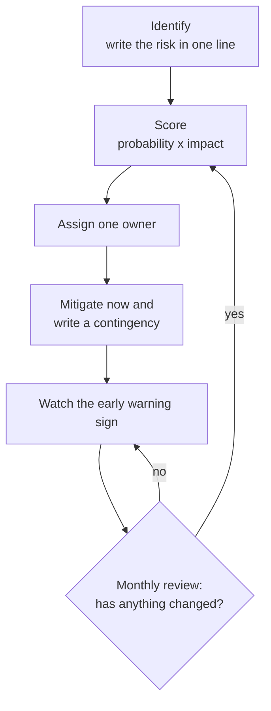
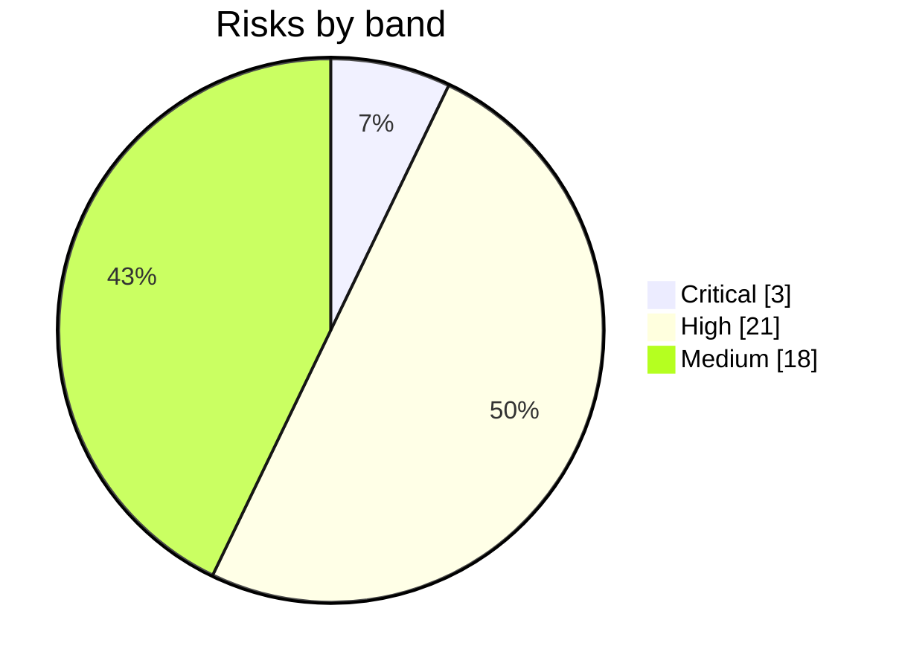

# Risk Analysis and Mitigation

**In simple words:** A risk is something bad that may happen and hurt EduFlow. This chapter lists 42 risks, gives each one a score, and names the person who watches it. For every risk it fixes what we do now to make it less likely, and what we do if it still happens. A solo founder cannot fight every fire, so the scores show which ten risks get his time first.

## How to read this chapter

| Section | What you get |
|---|---|
| Risk management approach | The 1 to 5 scales, the score formula, four bands, the owner rule |
| Risk register | 42 risks in 11 categories, `R-01` to `R-42`, for the monthly review |
| Risk heat map | All 42 risks on one 5 × 5 grid |
| Top ten risks in depth | A dated action plan for each of the ten biggest risks |
| Business continuity basics | Backups, the founder-unavailable plan and vendor exit plans, all set up before the pilot |
| Risk review ritual | The weekly, monthly and quarterly routine |

All scores are the founder's judgement on 20 September 2026, before any code exists. They are estimates, not measurements. They will move as safeguards are built and as real data arrives.

This chapter does not repeat other chapters. Legal duties are in *Compliance, Legal and Data Protection Requirements*. Cash scenarios are in *Financial Plan and Projections*. Strengths, weaknesses and strategy choices are in *SWOT Analysis and Strategic Options*. Beliefs that still need proof are in *Assumptions, Open Questions and Validation Plan*.

The tables use these short forms:

| Short form | Meaning |
|---|---|
| S1, S2 | The two most serious ticket levels: S1 means the institute cannot work or data is at risk |
| CSAT | Customer satisfaction rating from 1 to 5, asked after a ticket closes |
| ARPA, ARR | Average revenue per paying account per month; yearly run-rate of subscription revenue |
| JWT | The signed login token that carries the user's organization |
| RLS | Row-Level Security: a PostgreSQL rule that hides the rows of other tenants |
| CI | Continuous integration: automatic checks that run on every code change |
| KYC | "Know your customer" identity checks by banks and payment gateways |
| DLT | The telecom operators' registration system for business SMS in India |
| DPDP, CERT-In | India's data protection law of 2023; India's cyber incident response agency |
| KHDA, ADEK | The private school regulators of Dubai and Abu Dhabi |
| NDA, SLA | Non-disclosure agreement; service level agreement (a written promise on uptime) |
| OTP, GSTIN | One-time password; GST registration number |

## Risk management approach

Risk management is four habits. Write the risk down. Give it a number. Give it one owner. Look at it again every month. Nothing more is needed for a company of one to four people.

### The risk loop

**Figure: The risk loop**



Every risk goes around this loop. A risk is scored again when its warning sign moves, when a safeguard is finished, or when the world changes, for example when Meta announces a new price.

### Words used in the register

| Word | Meaning in simple words | Example |
|---|---|---|
| Probability | How likely the risk is in the next 12 months, from 1 to 5 | 4 = likely |
| Impact | How badly it hurts if it happens, from 1 to 5 | 5 = the company may not survive |
| Score | Probability × impact, from 1 to 25 | 3 × 5 = 15 |
| Early warning sign | A number or event that shows the risk is coming closer | Free-to-paid conversion under 8% |
| Mitigation | Work done now to make the risk less likely or less painful | Isolation tests on every pull request |
| Contingency | The ready plan for the day the risk happens anyway | Switch off the faulty endpoint within 1 hour |
| Owner | The one person who watches the sign and keeps both plans alive | Founder |

### Probability scale

| Value | Label | Chance in the next 12 months (estimate) | Plain test |
|---|---|---|---|
| 1 | Rare | Under 5% | It would surprise everyone |
| 2 | Unlikely | 5% to 20% | It has happened to similar startups, but not often |
| 3 | Possible | 20% to 50% | It could go either way |
| 4 | Likely | 50% to 80% | Expect it unless we act |
| 5 | Almost certain | Over 80% | It has already started |

### Impact scale

The money bands are sized for Year 1: founder capital of ₹6,00,000 and an MRR (monthly recurring revenue — the subscription money that comes in every month) target of ₹6 lakh. Rescale the bands every October. Read across the row and use the highest column that matches.

| Value | Label | Money lost | Customers | Time, law and trust |
|---|---|---|---|---|
| 1 | Negligible | Under ₹10,000 | Nobody notices | Under 1 day lost |
| 2 | Minor | ₹10,000 to ₹50,000 | 1 or 2 institutes are annoyed | Up to 1 week lost |
| 3 | Moderate | ₹50,000 to ₹3 lakh | Up to 5% of paying customers leave | 2 to 4 weeks lost, or a formal complaint |
| 4 | Major | ₹3 lakh to ₹10 lakh | 5% to 25% leave; bad word of mouth in a city | The January to April season is missed, or a legal notice arrives |
| 5 | Severe | Over ₹10 lakh | More than 25% leave | Children's data is exposed, a regulator fines us, or the company may close |

### Score bands

| Band | Rule | What the founder does | Review |
|---|---|---|---|
| Critical | Score 20 to 25, or impact 5 with probability 3 or more | A dated mitigation plan is in work now; the risk is never simply accepted | Weekly |
| High | Score 12 to 19, or any other risk with impact 5 | A named mitigation with a date; a written contingency | Monthly |
| Medium | Score 6 to 11 | Watch the warning sign; do only cheap mitigations | Monthly glance |
| Low | Score 1 to 5 | Accept it; no work | Quarterly |

> **Rule:** Severity beats arithmetic. A risk that can end the company in one day (impact 5) is never treated as less than High, even when it is unlikely.

> **Example:** `R-11` is a tenant data leak: one institute sees another institute's students. Probability 3 × impact 5 = 15. By score alone it sits below "scope too big" at 16. But its impact is 5 and its probability is 3, so its band is Critical and it is ranked first.

### Who owns the risks

In Year 1 the founder owns almost every risk. That is honest, and it is a risk in itself (`R-30`). Four helpers carry part of the load.

| Person | Helps with | From |
|---|---|---|
| Chartered accountant (CA) on retainer | `R-22` GST mistakes, `R-26` cash runway numbers | October 2026 |
| Lawyer, paid per task | `R-21` DPDP penalties, `R-24` international laws, contracts | November 2026 |
| Freelance security tester | `R-11` tenant data leak, `R-17` external breach | December 2026 |
| Trusted second person (the second director, a family member) | `R-30` founder unavailable; holds emergency access | October 2026 |

Ownership moves as people join. The customer success executive (base case: June 2027) takes `R-04`, `R-10` and `R-31`. The first engineer takes `R-09`, `R-12`, `R-15` and `R-16`. The triggers for these hires are in *Organization and Hiring Plan*. A risk never has two owners. A helper helps; the owner answers.

## Risk register

The register holds 42 risks in 11 categories. Each category has two tables, because ten fields do not fit on one A4 page. The first table gives the ID, the risk, probability (P), impact (I), score, band and owner. The second table gives the early warning sign, the mitigation and the contingency for the same IDs. The category is the heading above the tables. For the ten biggest risks the second table gives a short summary only. Their full plans are in the section on the top ten risks.

### Market risks

| ID | Risk | P | I | Score | Band | Owner |
|---|---|---|---|---|---|---|
| R-01 | Low willingness to pay: owners compare ₹2,499 a month with free apps and cheap local vendors | 4 | 4 | 16 | High | Founder |
| R-02 | Long sales cycles: school trustees and committees take months to decide | 4 | 3 | 12 | High | Founder |
| R-03 | Seasonality: most buying happens from January to April; a late product waits a full year | 3 | 4 | 12 | High | Founder |
| R-04 | Low adoption after the sale: teachers and parents do not use it, so the institute leaves | 3 | 4 | 12 | High | Founder |

| ID | Early warning sign | Mitigation (do now) | Contingency (if it happens) |
|---|---|---|---|
| R-01 | Free-to-paid conversion under 8% by 31 March 2027; over half of lost deals say "too costly" | Sell the rupee value; lead with the yearly plan; keep Starter free | Change the offer under the *Pricing Strategy* rules; aim at institutes with 150+ students |
| R-02 | Median sales cycle above 60 days for schools or above 35 days for coaching | Sell to coaching first, where the owner decides alone. For schools, start with one campus or one module | Move 80% of selling hours to coaching until school cycle data improves |
| R-03 | Fewer than 30 paying organizations on 31 March 2027 | Keep the January 2027 launch date fixed and cut scope instead. Book demos from December 2026 | Sell mid-session starts to coaching, which opens new batches every quarter. Offer schools early yearly deals for April 2028 |
| R-04 | Activation under 60%; parent adoption under 40% on day 30; no staff login for 14 days | Assisted setup in week one; teacher mobile view; parent invites by WhatsApp; health score from *Customer Success, Onboarding and Support* | Founder calls within 2 working days; free retraining; record the true reason if the institute still leaves |

### Competition risks

Competitor behaviour here is a scenario, not a report. Facts about named competitors are in *Competitor Analysis*.

| ID | Risk | P | I | Score | Band | Owner |
|---|---|---|---|---|---|---|
| R-05 | Price war: a funded competitor cuts its price far below our Growth plan | 3 | 3 | 9 | Medium | Founder |
| R-06 | Free products: a funded player such as Teachmint or Classplus gives a full ERP free to win share | 4 | 3 | 12 | High | Founder |
| R-07 | Local vendors undercut us at about ₹20 per student a year, or copy visible features | 4 | 2 | 8 | Medium | Founder |

| ID | Early warning sign | Mitigation (do now) | Contingency (if it happens) |
|---|---|---|---|
| R-05 | Three or more lost deals in one month name the same cheaper quote | Do not match prices. Win on one-day setup, WhatsApp alerts and support in Hindi. Lock in yearly plans | Follow the price-response rules in *Competitor Analysis*; add value, such as free migration, before any discount |
| R-06 | "Why pay when X is free?" comes up in over 30% of demos | Keep Starter free up to 50 students. Show what free tools lack: fee accounts, audit trail, data export, human support | Sell EduFlow as the paid upgrade path; build an import from the free tool; target institutes that outgrow it |
| R-07 | Deals lost to unnamed local vendors rise in one city | Ask buyers to demand proof of backups, uptime and data export. Publish a one-page security note | Offer monthly Growth with no lock-in in that city; invite the local vendor to become a reseller |

### Product risks

| ID | Risk | P | I | Score | Band | Owner |
|---|---|---|---|---|---|---|
| R-08 | Scope too big for a solo founder: 16 modules in 60 days and 12 more by Day 120 | 4 | 4 | 16 | High | Founder |
| R-09 | Quality issues: bugs in fees, attendance or login reach pilot and paying users | 4 | 3 | 12 | High | Founder |
| R-10 | Data migration pain: messy Excel sheets, Tally exports and old ERP data stall onboarding | 4 | 3 | 12 | High | Founder |

| ID | Early warning sign | Mitigation (do now) | Contingency (if it happens) |
|---|---|---|---|
| R-08 | Two or more days behind plan on two Saturdays in a row | Fixed date, flexible scope; Must stories only; the scope-cut ladder | Ladder level 4: pilot with 3 institutes and keep Day 45 |
| R-09 | Over 5 bugs per pilot institute per week; any S1 ticket in fees; CSAT under 4 | Automated tests on money, login and permissions; a staging copy; 5 friendly pilots from Day 45; feature flags | Stop new features for a "bug week"; roll back the bad release; founder calls each affected customer |
| R-10 | Setup takes over 7 days; over 10% of import rows fail | Excel templates with checks; a trial import with an error report; assisted migration add-on at ₹9,999 | Clean the file by hand with a freelancer; load current students first and history later |

### Technology risks

| ID | Risk | P | I | Score | Band | Owner |
|---|---|---|---|---|---|---|
| R-11 | Tenant data leak: one institute sees another institute's students, fees or marks | 3 | 5 | 15 | Critical | Founder |
| R-12 | Downtime in fee or exam season: the first 10 days of a month and result days | 3 | 4 | 12 | High | Founder |
| R-13 | Vendor lock-in: Railway, Vercel or Meta-only features make a move slow and costly | 3 | 2 | 6 | Medium | Founder |
| R-14 | AI-generated code defects: Claude Code writes code that looks right but hides bugs or security holes | 4 | 4 | 16 | High | Founder |
| R-15 | Scaling bottlenecks: the shared database slows at the 9 am attendance peak or during bulk messages | 2 | 3 | 6 | Medium | Founder |
| R-16 | Data loss: a bad migration, a wrong delete, or a backup that does not restore | 2 | 5 | 10 | High | Founder |

In the next table, p95 means the time within which 95 of every 100 requests finish.

| ID | Early warning sign | Mitigation (do now) | Contingency (if it happens) |
|---|---|---|---|
| R-11 | Any isolation test fails; a query without `organization_id` appears in review; a ticket says "I see unknown students" | Tenant from the JWT; Prisma extension; PostgreSQL RLS; isolation tests; outside security test | S1 incident: contain in 1 hour, then the legal notice clocks |
| R-12 | Monthly uptime under 99.5%; API p95 above 1 second; incident notices from Railway | Night deploys only; deploy freeze on days 1 to 10; phone alerts; monthly rollback drill | Roll back and post a status notice, both within 15 minutes |
| R-13 | A vendor raises prices over 30%, or a needed feature exists only on a costly tier | Docker images, standard PostgreSQL, the S3 API, one internal messaging interface; no vendor-only features | Use the vendor exit plans later in this chapter |
| R-14 | The same bug type returns; the founder merges code he cannot explain; tests on fees or login are skipped | Read every diff; tests first for money, permissions and tenant scope; small pull requests | Revert; write the missing test; audit that session's code |
| R-15 | p95 above 800 ms at 9 am; queue wait over 5 minutes; database CPU over 70% | Indexes that start with `organization_id`; BullMQ for heavy work; load test at 3 times the expected peak | Raise the Railway plan the same day; add a read replica; bring the AWS move forward |
| R-16 | Backup job alert; a restore test fails or takes over 4 hours | Nightly backup to S3 kept 35 days; restore tests; soft delete; migrations tried on a copy first | Restore to a new database; tell affected institutes what was lost and from when; re-enter from receipts |

### Security and privacy risks

| ID | Risk | P | I | Score | Band | Owner |
|---|---|---|---|---|---|---|
| R-17 | External breach: a stolen admin password, a secret leaked in GitHub, or an open S3 file | 2 | 5 | 10 | High | Founder |
| R-18 | Children's data misuse: an institute or its staff use student data for marketing or sell lists | 3 | 4 | 12 | High | Founder |
| R-19 | Insider risk: platform staff, a freelancer or a leaving institute employee copies data | 2 | 4 | 8 | Medium | Founder |
| R-20 | Fake fee links: fraudsters send parents payment links that pretend to come from the school | 2 | 4 | 8 | Medium | Founder |

| ID | Early warning sign | Mitigation (do now) | Contingency (if it happens) |
|---|---|---|---|
| R-17 | Login failures spike; logins from new countries; a GitHub secret-scan alert | Login rate limits; two-step login for Super Admin (assumption); private buckets with pre-signed URLs; secret scanning; weekly dependency updates | Revoke sessions and rotate keys; follow the incident clocks in *Compliance, Legal and Data Protection Requirements* |
| R-18 | Large exports of phone numbers; promotional messages to parents who never opted in; a parent complaint | Export right only for the Organization Admin; every export logged; separate consent switch for promotion; contract bans the sale of data | Suspend the export right; send written notice to the institute; end the contract if it happens again |
| R-19 | Super Admin opens a tenant without a ticket; big exports just before a staff exit | Least access; every Super Admin action logged with a reason; no live data on laptops; NDA for every freelancer | Remove access within 15 minutes; review 90 days of logs; treat it as a breach if data left |
| R-20 | A parent reports a pay link from an unknown number; a lookalike domain appears | Pay links only on `{slug}.eduflow.app`; payee name shown before payment; a safety message to parents each term | Warn all parents of that institute within 1 hour; report the number and domain; guide victims to the 1930 cyber crime helpline |

### Compliance risks

The laws behind these risks are explained in *Compliance, Legal and Data Protection Requirements*. This table only scores them.

| ID | Risk | P | I | Score | Band | Owner |
|---|---|---|---|---|---|---|
| R-21 | DPDP penalties: missing parental consent, a late breach notice or weak safeguards | 2 | 5 | 10 | High | Founder |
| R-22 | GST mistakes: wrong rate or place of supply on our invoices, late returns, wrong advice on fee GST | 3 | 3 | 9 | Medium | Founder |
| R-23 | DLT or WhatsApp policy violations: rejected templates, a blocked sender, a low quality rating | 4 | 3 | 12 | High | Founder |
| R-24 | International laws: FERPA, COPPA, Australian Privacy Principles, UAE PDPL and data residency | 2 | 4 | 8 | Medium | Founder |
| R-25 | Coaching-centre rules tighten (2024 guidelines, new state laws) and cut demand or add duties | 2 | 3 | 6 | Medium | Founder |

| ID | Early warning sign | Mitigation (do now) | Contingency (if it happens) |
|---|---|---|---|
| R-21 | Over 10% of students still "Consent pending" after 14 days; no breach drill in 6 months | Consent flow live before the pilot; data processing agreement; logs kept 365 days; breach runbook; lawyer review (₹25,000) | Follow the incident clocks; hire a privacy lawyer within 24 hours; show safeguard records to reduce the penalty |
| R-22 | The CA finds a gap between invoices and returns; a customer's GSTIN is rejected | Invoices from Zoho Books; GST money kept in a separate account; CA files monthly; the product never decides an institute's fee GST | Revise the return, pay the interest, issue credit notes and tell affected customers in writing |
| R-23 | Template rejections over 10%; WhatsApp quality rating turns yellow; SMS blocked at DLT scrubbing | Approved template library; opt-in recorded; daily caps per institute; no free-text promotion; DLT entity and headers registered early | Fall back to SMS, email and in-app; appeal to Meta; move noisy institutes to their own number |
| R-24 | A foreign lead asks for a signed data agreement that we do not have | GDPR principles as the base now; regional data stores; a country addendum before the first sale; cards only through Stripe | Pause selling in that country until a local lawyer signs off; allow pilots only |
| R-25 | A new state bill or central rule on coaching registration, fees or student age | Read Ministry of Education and state notices monthly; grow the school segment as a balance | Turn the rule into a feature pack, such as registration records and refund tracking, and sell it |

### Financial risks

| ID | Risk | P | I | Score | Band | Owner |
|---|---|---|---|---|---|---|
| R-26 | Cash runway: the bank balance falls under 3 months of spend before MRR covers costs | 3 | 5 | 15 | Critical | Founder |
| R-27 | Subscription payment failures: card or UPI mandate renewals fail and customers lapse | 4 | 2 | 8 | Medium | Founder |
| R-28 | Refund disputes and chargebacks: parents dispute fee payments; institutes demand yearly refunds | 3 | 2 | 6 | Medium | Founder |
| R-29 | Currency: the rupee weakens against the dollar; later, foreign revenue swings | 3 | 2 | 6 | Medium | Founder |

A chargeback is a payment that the bank reverses because the payer disputed it.

| ID | Early warning sign | Mitigation (do now) | Contingency (if it happens) |
|---|---|---|---|
| R-26 | Under 4 months of spend in the bank; yearly prepaid share under 25%; win targets missed 2 months running | Sell yearly plans first; hire only on triggers; ₹4,00,000 standby reserve | The tripwire table in the deep dive: freeze hiring, cut marketing, use the reserve |
| R-27 | Payment recovery rate under 70%; failed renewals above 8% of invoices due | The failed-payment routine in *Pricing Strategy*: retries on day 3 and day 7 with reminders; push yearly plans; offer UPI and bank transfer | Personal call between day 7 and day 10; restricted mode from day 15; cancellation on day 30 with export open for 90 days |
| R-28 | Refunds above 2% of billed value; more than 2 chargebacks in a month | Public refund policy; parent fee money settles straight to the institute; receipts and logs kept as proof | Answer the gateway within its deadline with proof; refund fast when we are wrong; fix the cause |
| R-29 | The dollar moves above ₹90, against the ₹85 planning rate | Keep dollar bills small: about ₹28,000 a month in early 2027 (estimate: Claude, Railway, Sentry, Vercel). Review them every quarter | Drop the Claude plan one tier (saves ₹8,500 a month); move hosting to AWS Mumbai, billed in rupees |

### Operational risks

| ID | Risk | P | I | Score | Band | Owner |
|---|---|---|---|---|---|---|
| R-30 | Founder burnout and key-person risk: one person holds all code, sales, support and passwords | 3 | 5 | 15 | Critical | Founder |
| R-31 | Support overload: calls and WhatsApp chats eat the build and sales hours | 4 | 3 | 12 | High | Founder |
| R-32 | Hiring mistakes: a wrong first hire costs 3 to 6 months and about ₹1.5 lakh (estimate) | 3 | 3 | 9 | Medium | Founder |

| ID | Early warning sign | Mitigation (do now) | Contingency (if it happens) |
|---|---|---|---|
| R-30 | Two Sundays worked in a row; sleep under 6 hours for a week; the daily sales block skipped 3 days | Rest is never cut; runbooks; emergency access for the second director; standby engineer | The founder-unavailable plan later in this chapter |
| R-31 | Over 10 support chats a day per 50 customers; over 5 tickets per account a month | Help centre and videos in Hindi and English; in-app guides; fixed support hours; fix the top 3 ticket causes monthly | Pause assisted setup for new free signups for one week; bring the customer success hire forward if its trigger is near |
| R-32 | A new hire misses the 30-day goals; customers complain about the person | Scorecard, paid trial task and 90-day probation, as *Organization and Hiring Plan* describes; hire on triggers only | Part ways inside probation; use a freelancer to cover; write down what the scorecard missed |

### Partner and platform risks

| ID | Risk | P | I | Score | Band | Owner |
|---|---|---|---|---|---|---|
| R-33 | Meta changes WhatsApp pricing or policy, or restricts our shared sender number | 4 | 3 | 12 | High | Founder |
| R-34 | Razorpay account holds: KYC questions or a risk review freeze settlements in fee season | 3 | 4 | 12 | High | Founder |
| R-35 | Cloud cost spikes: a runaway job, an attack or heavy file traffic multiplies the bill | 3 | 2 | 6 | Medium | Founder |
| R-36 | AI coding tool dependency: Claude Code price, limits or an outage slow the build | 2 | 3 | 6 | Medium | Founder |

| ID | Early warning sign | Mitigation (do now) | Contingency (if it happens) |
|---|---|---|---|
| R-33 | A Meta policy or price email; quality rating turns yellow; delivery rate under 90% | Utility templates only on the shared sender; opt-in; daily caps; SMS fallback ready | Move alerts to SMS, email and in-app the same day; appeal to Meta |
| R-34 | Razorpay asks for extra documents; a settlement is late by over 2 working days | Early KYC; expected volumes told in writing; counter and UPI payments always work | Record offline payments meanwhile; open the standby gateway |
| R-35 | Daily hosting cost over 2 times the 7-day average; S3 traffic jumps | Budget alerts on Railway and AWS; rate limits; job retry limits; Cloudflare in front; file size limits | Stop the runaway job; block the abusive source; ask the vendor for a one-time credit |
| R-36 | A price or limit notice from Anthropic; two outages in one week | Coding standards and documents live in the repo, so any tool or engineer can follow them; versions pinned | Use another AI coding tool or code by hand; move non-urgent work by a week |

### Reputation risks

| ID | Risk | P | I | Score | Band | Owner |
|---|---|---|---|---|---|---|
| R-37 | Wrong fee receipt: wrong amount, duplicate receipt, or a paid fee still shown as due | 3 | 4 | 12 | High | Founder |
| R-38 | Wrong result published: wrong marks, rank or grade on a report card, or results sent to the wrong parent | 3 | 4 | 12 | High | Founder |
| R-39 | Wrong message: an absent alert or fee reminder reaches the wrong parent, or goes out at midnight | 3 | 3 | 9 | Medium | Founder |

| ID | Early warning sign | Mitigation (do now) | Contingency (if it happens) |
|---|---|---|---|
| R-37 | The day-close total does not match receipts; nightly gateway matching finds a gap; a parent shows a bank debit with no receipt | Decimal money; idempotency keys; receipts never edited; nightly matching with Razorpay | Correct within 4 hours; corrected receipt and apology; founder calls the owner |
| R-38 | A teacher reports a total that differs from the mark sheet; marks edited after publishing | Two-step publish: teacher enters, Principal approves; preview for one class first; grade rules tested with worked examples; publish log | Unpublish at once; correct and republish with a version note; draft the message to parents for the school |
| R-39 | Replies such as "wrong number"; a jump in blocked or reported messages | Recipients resolved inside the tenant; quiet hours from 9 pm to 7 am; preview and count before bulk sends; phone number check at admission | Stop the queue; send a short correction; fix the guardian record; review the template |

### International expansion risks

These risks start in Year 2. They are scored now so that the UAE decision is made with open eyes.

| ID | Risk | P | I | Score | Band | Owner |
|---|---|---|---|---|---|---|
| R-40 | UAE entry is slower and costlier than planned: KHDA and ADEK expectations, local billing, Arabic needs | 3 | 3 | 9 | Medium | Founder |
| R-41 | Focus dilution: foreign work pulls the small team away from India before India is strong | 3 | 4 | 12 | High | Founder |
| R-42 | Weak product fit in the USA and Australia, where established systems such as PowerSchool, Infinite Campus, Compass and Sentral already serve schools | 4 | 2 | 8 | Medium | Founder |

| ID | Early warning sign | Mitigation (do now) | Contingency (if it happens) |
|---|---|---|---|
| R-40 | The UAE checklist scores under 7 of 9 in August 2028; pilot spend runs over budget | Start with Indian-curriculum schools and tuition centres; sell through a local reseller; bill by Stripe from India first | Extend the pilot by one term, as *Five-Year Roadmap* sets; USA and Australia wait |
| R-41 | India wins per month fall for 2 months after foreign work starts; India churn above 3% | Open no country before its gate in *Five-Year Roadmap*: Year 1 exit criteria first; one named owner per country | Pause new foreign sales for a quarter; serve existing foreign customers only |
| R-42 | Pilots ask for state reporting, local integrations or payroll rules we do not have | Pilots only in Year 3; choose small private schools and tutoring centres; list the must-have integrations before building | Stay a niche tool for tutoring centres abroad, or exit the market cleanly with full data export |

### Register summary

| Category | Risks | Critical | High | Medium | Highest score |
|---|---|---|---|---|---|
| Market | 4 | 0 | 4 | 0 | 16 (`R-01`) |
| Competition | 3 | 0 | 1 | 2 | 12 (`R-06`) |
| Product | 3 | 0 | 3 | 0 | 16 (`R-08`) |
| Technology | 6 | 1 | 3 | 2 | 16 (`R-14`) |
| Security and privacy | 4 | 0 | 2 | 2 | 12 (`R-18`) |
| Compliance | 5 | 0 | 2 | 3 | 12 (`R-23`) |
| Financial | 4 | 1 | 0 | 3 | 15 (`R-26`) |
| Operational | 3 | 1 | 1 | 1 | 15 (`R-30`) |
| Partner and platform | 4 | 0 | 2 | 2 | 12 (`R-33`, `R-34`) |
| Reputation | 3 | 0 | 2 | 1 | 12 (`R-37`, `R-38`) |
| International expansion | 3 | 0 | 1 | 2 | 12 (`R-41`) |
| **Total** | **42** | **3** | **21** | **18** | |

No risk is Low today. That is normal before launch: nothing is built, so nothing is proven safe. The aim for 30 September 2027 is at most 1 Critical risk and at most 12 High risks.

**Figure: Risks by band on 20 September 2026**



Half of the register is High. The founder cannot work on 21 plans at once, which is why the next two sections pick the ten that matter most.

## Risk heat map

A heat map places every risk on a grid of probability against impact. The top right corner is the danger zone. Each cell shows its band and score first, then the risks that sit in it. CRIT means Critical and MED means Medium.

**Figure: Heat map of all 42 risks (20 September 2026)**

```text
                                 I M P A C T
                1           2           3           4           5
            Negligible  Minor       Moderate    Major       Severe
          +-----------+-----------+-----------+-----------+-----------+
 5 Almost | LOW 5     | MED 10    | HIGH 15   | CRIT 20   | CRIT 25   |
          +-----------+-----------+-----------+-----------+-----------+
 4 Likely | LOW 4     | MED 8     | HIGH 12   | HIGH 16   | CRIT 20   |
          |           | R-07 R-27 | R-02 R-06 | R-01 R-08 |           |
          |           | R-42      | R-09 R-10 | R-14      |           |
          |           |           | R-23 R-31 |           |           |
          |           |           | R-33      |           |           |
          +-----------+-----------+-----------+-----------+-----------+
 3 Poss.  | LOW 3     | MED 6     | MED 9     | HIGH 12   | CRIT 15   |
          |           | R-13 R-28 | R-05 R-22 | R-03 R-04 | R-11 R-26 |
          |           | R-29 R-35 | R-32 R-39 | R-12 R-18 | R-30      |
          |           |           | R-40      | R-34 R-37 |           |
          |           |           |           | R-38 R-41 |           |
          +-----------+-----------+-----------+-----------+-----------+
 2 Unlik. | LOW 2     | LOW 4     | MED 6     | MED 8     | HIGH 10   |
          |           |           | R-15 R-25 | R-19 R-20 | R-16 R-17 |
          |           |           | R-36      | R-24      | R-21      |
          +-----------+-----------+-----------+-----------+-----------+
 1 Rare   | LOW 1     | LOW 2     | LOW 3     | LOW 4     | HIGH 5    |
          +-----------+-----------+-----------+-----------+-----------+
 Rows = PROBABILITY            Cell header = band and score (P x I)
```

How to read it:

- The whole impact-5 column is High or Critical, because of the "severity beats arithmetic" rule.
- Two crowded cells hold 15 of the 42 risks: likely with moderate impact (7 risks) and possible with major impact (8 risks). Most mitigation work aims to push these one row down.
- A mitigation usually lowers probability, which moves a risk down. A contingency lowers impact, which moves it left. Good plans do both.
- Row 5 and row 1 are empty. Nothing is certain yet, and nothing is proven rare yet.

## Top ten risks in depth

The ten are ranked by band first, then by score. Ties at 12 are broken by speed: a risk that can hit every customer within one day ranks above one that builds up over months. The three risks at 16 follow the calendar: scope bites in the sprint, AI code defects in the pilot, and price resistance after the launch.

| Rank | ID | Risk | Score | Band | Can hit within |
|---|---|---|---|---|---|
| 1 | R-11 | Tenant data leak | 15 | Critical | One day |
| 2 | R-30 | Founder burnout and key-person risk | 15 | Critical | One day |
| 3 | R-26 | Cash runway | 15 | Critical | Two to three months |
| 4 | R-08 | Scope too big for a solo founder | 16 | High | Weeks |
| 5 | R-14 | AI-generated code defects | 16 | High | One day |
| 6 | R-01 | Low willingness to pay | 16 | High | Months |
| 7 | R-12 | Downtime in fee or exam season | 12 | High | One day |
| 8 | R-37 | Wrong fee receipt | 12 | High | One day |
| 9 | R-34 | Razorpay account holds | 12 | High | One day |
| 10 | R-33 | Meta WhatsApp pricing or policy change | 12 | High | One day |

The next five on the watch list are `R-03`, `R-04`, `R-38`, `R-23` and `R-10`. They move up if their warning signs fire.

### Tenant data leak

All tenants share one database, so one query without a tenant filter is enough. Example: a fee report shows students of Sharma Classes to the accountant of Bright Future Public School. The DPDP ceiling for weak safeguards is ₹250 crore, against a Year 1 ARR target of ₹72 lakh. Trust would be gone in one WhatsApp forward.

| Action | By when | Cost | Proof it is done |
|---|---|---|---|
| Tenant read from the JWT only; Prisma extension adds `organizationId` to every query | Days 1 to 14 of the sprint | Build time | A query without tenant context throws an error in tests |
| PostgreSQL RLS on every tenant table as the second safety net | Days 1 to 14 | Build time | Raw SQL as the app role returns 0 rows of another tenant |
| Isolation test suite: two seeded tenants, every endpoint tried across them | Every pull request | CI minutes | Merge is blocked on failure; removing a filter on purpose turns a test red |
| Outside security test on tenant isolation and login | December 2026 | ₹20,000 | Report with every high finding closed |

If it happens, follow the table "One incident, many clocks" in *Compliance, Legal and Data Protection Requirements*. The fix is merged only with a test that reproduces the leak. The design detail is in the PRD chapter *Multi-Tenancy and Data Isolation*. The goal is probability 2 by the paid launch. The score becomes 10, and the band stays High for ever.

### Founder burnout and key-person risk

One person writes the code, sells, supports customers and holds every password. The sprint runs 6 days a week for 60 days, and the launch season follows at once. If the founder is in hospital for three weeks in February 2027, the buying season is lost and nobody can fix an S1 incident.

| Action | By when | Cost | Proof it is done |
|---|---|---|---|
| No coding on Sunday, 7 hours of sleep and a fixed end to the work day stay on the never-cut list | From 5 Oct 2026 | ₹0 | Sunday review notes |
| Password manager with emergency access for the second director; break-glass kit | 31 Oct 2026 | ₹200 a month | Drill passed |
| Runbooks for deploy, rollback and restore, kept in the repo | 18 Nov 2026 | Build time | A second person restores staging from the runbook |
| Standby freelance engineer with an NDA, paid by the hour | 31 Jan 2027 | ₹1,000 to ₹1,500 an hour (estimate) | Signed agreement; one paid practice task done |
| Health cover and term insurance for the founder | 31 Dec 2026 | About ₹30,000 a year (estimate, personal cost) | Policy numbers in the kit |

The customer success executive, hired on trigger, removes the support load. The first engineer removes the single point of failure in code. If the risk happens, the founder-unavailable plan below starts.

### Cash runway

Runway means the number of months the company can pay its bills from the money it has. The plan starts with ₹6,00,000, and ₹2,40,000 is spent before the first customer pays. In the base case the lowest balance is ₹3.60 lakh in December 2026. If nobody buys a yearly plan, the balance falls to ₹1.66 lakh in April 2027, under one month of spend.

Formula: months of spend = own cash ÷ average monthly spend of the last 3 months. Own cash = bank balance − GST due − customer advances.

| Months of spend in the bank | Action in the same week |
|---|---|
| Under 4 | List possible cuts; stop new tool subscriptions; check the yearly prepaid share |
| Under 3 | Freeze hiring; cut marketing to the two best channels; founder pay returns to ₹0. In the buying season, add ₹1,00,000 from the standby reserve rather than cut sales work |
| Under 2 | Bring in more of the reserve in steps of ₹1,00,000; Claude plan down one tier; pause fairs and ads |
| Under 1, reserve used | Decide within 14 days: revenue-based financing (only above ₹5 lakh MRR), angel money, or a smaller company |

> **Example:** On 5 March 2027 the bank shows ₹5,10,000. GST due is ₹60,000 and customer advances are ₹1,50,000, so own cash is ₹3,00,000. Average spend from January to March is ₹1,17,000. Months of spend = 3,00,000 ÷ 1,17,000 = 2.6. That is under 3. March is buying season, so the founder freezes hiring, keeps the two best channels and adds ₹1,00,000 from the reserve that week. The figures are illustrative.

### Scope too big for a solo founder

Sixteen modules in 60 days is under 4 days a module, with 2 hours a day kept for sales. Falling behind in at least one week is certain. The delay itself is not the danger. The danger is missing January 2027, because the next buying season is a year away (`R-03`).

| Action | By when | Proof it is done |
|---|---|---|
| Count days behind every Saturday evening; choose the ladder level in the Sunday review, never on a bad weekday night | Every weekend from 10 Oct 2026 | Weekly review file |
| Build Must stories only; Should and Could stories go to the Days 61 to 120 backlog | Whole sprint | Backlog file |
| Finish one module (tests pass, demo recorded) before the next one starts | Whole sprint | One demo clip per module |
| Never cut the safety list: tenant isolation, login security, exact money, audit logs, backups, Excel import | Always | Never-cut checks in *How to Use This Blueprint* |
| Sell coaching first; it needs only Phase 1, so sales start even if Phase 2 slips | January 2027 | First 10 paying coaching institutes |

If Phase 2 slips past 1 February 2027, schools are sold fees and attendance for an April start, with a written date for report cards.

### AI-generated code defects

Claude Code writes most of the code, and no second human reviews it. AI code is fast and mostly right, which makes its mistakes easy to miss. Five failure types are known:

1. It forgets the tenant filter in a raw SQL query.
2. It does money maths with floating-point numbers and loses paise.
3. It calls a library function that does not exist in the pinned version.
4. It writes a test that asserts the wrong behaviour, so the bug passes.
5. It drifts away from the coding standards during a long session.

| Action | By when | Proof it is done |
|---|---|---|
| Pull requests under 400 changed lines; the founder reads every diff. "If I cannot explain it, I do not merge it." | From Day 1 | Pull request history |
| Tests built from the PRD's worked examples before the code, for money, permissions and tenant scope | From Day 1 | Tests fail when the code is broken on purpose |
| CI gates: type check, lint, unit and isolation tests, `prisma validate`, dependency audit | Week 1 | Merge blocked when any gate is red |
| A fresh Claude session reviews each login, payment or tenancy change, seeing only the diff and the standards | Each such change | Review note in the pull request |

If a defect reaches production, roll back within 15 minutes, write the failing test first, and audit the other code from that session. *Working with Claude Code* and *Testing Strategy for a Solo Founder* hold the detail.

### Low willingness to pay

> **Example:** A coaching institute has 250 students and an average fee of ₹30,000 a year (assumption). Its fee book is ₹75 lakh. Growth yearly costs ₹24,990, which is ₹100 per student a year, or 0.33% of fees. A local vendor at ₹20 per student charges ₹5,000, so we cost 5 times more. The answer is value: if EduFlow recovers just 1% more fees, that is ₹75,000, three times the plan price.

| Action | By when | Proof it is done |
|---|---|---|
| Rupee-value calculator in every demo: fee leaks, hours saved, reminders sent | First demo, December 2026 | Calculator sheet used in the demo script |
| Starter free and a 14-day Pro trial remove fear; two months free on yearly is the only discount | Launch | Billing settings |
| A lost-deal reason recorded in the CRM for every lost deal | From the first demo | Monthly count of reasons |
| Price test from *Assumptions, Open Questions and Validation Plan* | 31 March 2027 | Written result |

Tripwires: conversion under 8% on 31 March 2027 (the target is 15%), or ARPA under ₹4,000 in June 2027. Then the founder changes the offer under the price-change rules in *Pricing Strategy*. There are no panic discounts.

### Downtime in fee or exam season

An uptime of 99.5% allows 216 minutes of downtime a month. But minutes are not equal. One hour down at 10 am on the 5th, when Suresh Gupta has a queue at the fee counter, hurts more than five hours at 2 am on a Sunday.

| Action | By when | Proof it is done |
|---|---|---|
| Deploy only after 9 pm IST; no feature deploys on days 1 to 10 of a month or on result days | From the pilot | Deploy log |
| Health checks and Better Stack alerts that ring the founder's phone | 18 Nov 2026 | Test alert received |
| Load test at 3 times the expected peak; rollback drill every month | Before the January launch; monthly | Test report; drill note |
| Move to AWS only in a quiet window, never from January to April | At the 500-customer stage | Migration plan date |

If it happens: roll back within 15 minutes and post on the status page within 15 minutes. Accountants continue with a paper receipt book and enter the receipts later with the true date. Customers get a written cause report within 5 working days, and Enterprise customers get the SLA credit.

### Wrong fee receipt

> **Example:** Sunita Devi pays ₹12,000 by UPI for invoice INV-0912. The money leaves her bank, but the gateway's confirmation call (a webhook) never arrives. The invoice stays unpaid, the system sends her a reminder, and she posts the screenshot in the class WhatsApp group. A second case: a bulk late-fee run adds ₹100 by mistake to 1,200 students.

| Action | By when | Proof it is done |
|---|---|---|
| Money stored as Decimal; `Idempotency-Key` on payment requests; receipt numbers never repeat | Days 29 to 42 of the sprint | Money tests pass |
| Nightly matching of Razorpay payments against receipts; any gap raises an alert | Before online payments go live | A planted gap is caught |
| Receipts are cancelled with a reason, never edited; the day close must match the receipts | Sprint | Audit rows exist |
| Bulk money actions show a preview and a count, need a typed confirmation, and can be reversed in one step | Sprint | Reversal test passes |

If it happens: correct the data within 4 hours. Send a corrected receipt and an apology in the institute's name. The founder calls the owner the same day and sends a written cause within 5 working days.

### Razorpay account holds

Two kinds of account are exposed. EduFlow's own account collects subscriptions. Each institute's account receives parent fee money directly. Gateways review new merchants whose volume jumps. Example: an institute that collected ₹2 lakh online in March collects ₹40 lakh in the first week of April. A freeze then arrives at the worst time.

| Action | By when | Proof it is done |
|---|---|---|
| Finish company KYC, bank proof and the public refund, privacy and terms pages | November 2026 | Account live |
| Tell Razorpay in writing about the model and the April and quarterly fee peaks | Before launch | Email on file |
| KYC checklist and expected monthly volume in every institute's onboarding | From the pilot | Checklist in the onboarding kit |
| Payment code behind one interface; standby account at a second Indian gateway such as Cashfree or PayU (assumption) | KYC by September 2027 | Standby account approved |

If it happens: cash, cheque and UPI to the institute's own QR stay open, and the accountant records them. EduFlow helps the institute answer with its fee structure and sample receipts. If our own account is held, yearly plans are invoiced by bank transfer.

### Meta WhatsApp pricing or policy change

WhatsApp is the main parent channel. At the start all institutes share one EduFlow sender, as *Business Objectives, Scope and Stakeholders* records. So spam complaints against one institute can lower the quality rating for all. Meta also changes prices and message categories often. Price rises pass to customer wallets at cost plus 15%, so our margin is safe, but usage can fall.

| Action | By when | Proof it is done |
|---|---|---|
| Only utility templates on the shared sender: attendance, receipt, due reminder, OTP. Marketing is blocked there | Launch | Template list |
| Opt-in stored for each guardian; daily cap per institute; quality rating checked daily | Launch | Alert when the rating changes |
| Per-message prices kept in platform settings; the wallet shows the cost before a bulk send | Launch | Price change takes under 1 day |
| DLT registration done in the sprint; SMS, email and in-app ready as fallback channels | OTP at launch; full SMS by 1 Feb 2027 | Fallback test passes |
| Large senders connect their own number (`WA-API-02`) | Phase 2 | First institute on its own number |

If the sender is restricted, alerts move to the fallback channels the same day, an appeal goes to Meta, and customers are told within 24 hours. If a price rises over 25%, customers get 7 days' notice and a tip to move low-value alerts to in-app messages.

## Business continuity basics

Business continuity means keeping the service and the company alive when something big breaks. Three things cover most of it for a small SaaS company: backups that restore, a plan for a missing founder, and a way out of every vendor. The technical runbooks are in the Blueprint chapter *Monitoring, Backups and Incident Response*.

### Backup and restore

Two terms set the targets. RPO (recovery point objective) is how much recent data we can afford to lose, measured in time. RTO (recovery time objective) is how long the service may stay down while we restore.

| Item | Year 1 on Railway | After the move to AWS |
|---|---|---|
| Database backup | Railway daily backup plus our own nightly `pg_dump` at 02:00 IST | RDS automated backups with point-in-time recovery |
| Copy kept outside the host | Encrypted dump in a private S3 bucket in Mumbai | Second copy in another AWS region in India |
| Retention | 35 days rolling | 35 days rolling |
| Files (S3) | Versioning on; deleted files kept 30 days | Same, plus cross-region copy |
| Code and settings | GitHub plus a weekly encrypted mirror in S3; secrets in the password manager | Same |
| RPO target (assumption) | 24 hours | 5 minutes |
| RTO target (assumption) | 4 hours | 1 hour |
| Restore test | At least every quarter (`CR-12`); monthly in Year 1 | Every quarter |

A loss of 24 hours sounds large, but money data can be rebuilt. Razorpay holds every online payment, and counter receipts are printed. Attendance for one day can be marked again by teachers.

> **Rule:** A backup that has never been restored is not a backup. The restore test loads last night's dump into an empty database, runs a row count on 5 key tables and opens one institute in staging.

### If the founder is unavailable

| Level | Situation | Who acts | What happens |
|---|---|---|---|
| 1 | Away up to 3 days: fever, travel, family function | Founder, by phone for S1 only | Support auto-reply; deploy freeze; S1 alerts still ring; second director informed |
| 2 | Away 4 to 21 days: hospital, accident | Second director and standby engineer | Break-glass kit opened; one honest message to customers; engineer handles S1 and S2 by runbook; demos pause; billing runs by itself |
| 3 | Away over 21 days, or for good | Second director with the CA and the lawyer | Choose an interim lead, a sale, or an orderly close: 90 days' notice, full export for every institute, refund of unused prepaid months |

The break-glass kit is a sealed list that the second director can open without the founder. It holds:

1. Emergency access to the password manager (with a 48-hour waiting period).
2. The vendor list with account IDs: Railway, Vercel, AWS, GitHub, Razorpay, Meta, MSG91, domain registrar, Cloudflare.
3. Bank details, with the second director as a second signatory.
4. A second owner account on GitHub and on the domain registrar.
5. Phone numbers of the standby engineer, the CA and the lawyer.
6. The customer contact list and the message templates for an outage and for a founder absence.
7. The runbooks for deploy, rollback and restore.

The kit is tested twice a year. The second director must reach the restore runbook within 30 minutes without calling the founder.

### Vendor exit plans

Every vendor can fail, raise prices or close our account. An exit plan says what would make us leave, where we would go and how long it takes. Switch times are estimates.

| Vendor | Used for | Exit trigger | Replacement | Switch time | Keep ready |
|---|---|---|---|---|---|
| Railway | API, worker, PostgreSQL, Redis | Repeated outages; price up over 30%; the 500-customer stage | AWS: ECS Fargate, RDS, ElastiCache | 3 to 5 days planned; 1 day in an emergency | Docker images; nightly dump in S3 |
| Vercel | Web client | Price or usage limits | AWS CloudFront with a container | 1 to 2 days | A standard Next.js build with no Vercel-only features |
| Razorpay | Subscriptions and parent fee payments | A hold of over 7 days; a fee rise | A second Indian gateway (assumption: Cashfree or PayU) | 7 to 10 days with KYC | One payment interface; standby KYC |
| Meta WhatsApp Cloud API | Parent alerts and OTP | Sender blocked; policy bans our use | SMS by MSG91, email, in-app | Same day | DLT templates for the same events |
| MSG91 | SMS and OTP fallback | Delivery under 90%; price | Another DLT-compliant SMS provider | 3 to 5 days | DLT entity, header and template IDs on file |
| AWS S3 and SES | Files and email | Account suspended (rare) | Any S3-compatible store; another email API | 2 to 3 days | File copy script; email domain keys |
| GitHub | Code and CI | Account locked | GitLab, from the weekly mirror | 1 day | Encrypted mirror in S3 |
| Anthropic Claude Code | Build speed | Price, limits or a long outage | Another AI coding tool, or hand coding | Same day, at a slower pace | Standards and documents in the repo |

DLT registration belongs to EduFlow's company record with the telecom operators, not to MSG91. That is why an SMS vendor can be changed in days. The domain name is the one asset with no replacement. It stays on auto-renew with a registrar lock and two-step login.

Customers get the same promise from us. An institute can export all its data at any time. After cancellation the export stays open for 90 days, as *Compliance, Legal and Data Protection Requirements* sets.

## Risk review ritual

A register that nobody opens is worse than none, because it gives false comfort. The ritual below costs about 2 hours a month.

| Rhythm | When | Time | What happens | Output |
|---|---|---|---|---|
| Weekly glance | Inside the Sunday weekly review | 10 minutes | Check the warning signs of the 3 Critical risks; note any new risk in one line | Note in the register |
| Monthly review | The 7th of each month, after the finance routine | 60 minutes | The six-step agenda below | Updated register; at most 3 actions with dates |
| Quarterly deep review | January, April, July, October | Half a day | Re-score all risks; rescale the impact bands in October; restore test; vendor exit check; kit drill twice a year | New version of the register |
| Event review | Within 48 hours of a trigger | 30 minutes | Re-score the risks that the event touches | Dated note |

Triggers for an event review are: any S1 incident, a vendor price or policy notice, a new law or rule, a customer who leaves because of a listed risk, and the launch of a new country or a major module.

The monthly agenda:

1. **Signs (10 minutes).** Go through the 42 rows. Mark each warning sign as quiet, moving or fired.
2. **Scores (15 minutes).** Re-score every risk whose sign is moving or fired, and every risk with a finished mitigation.
3. **New risks (10 minutes).** Look at support tickets, lost-deal reasons, incident reviews and vendor emails. Add new risks with the next free ID.
4. **Top ten (15 minutes).** Confirm the order. Pick at most three mitigation actions for the month, each with a date and a proof.
5. **Close or merge (5 minutes).** Close a risk when its cause is gone. `R-08` closes when Phase 2 ships on 1 February 2027. IDs are never reused.
6. **Log (5 minutes).** Write one paragraph in the monthly founder note and send it to the second director.

The register lives in one sheet with the ten fields of this chapter plus four more: status (Open, Watching, Mitigated, Closed), trend (up, same, down), last review date and next action date.

> **Rule:** Probability goes down only on proof, such as a passing test, a signed contract or a report. It never goes down because the founder feels better. Every score change carries a one-line reason.

| Risk health measure | Target |
|---|---|
| Critical risks open | 3 today; at most 1 on 30 September 2027 |
| Mitigation actions past their date | 0 |
| Monthly reviews held | 12 of 12 in Year 1 |
| Restore tests passed | Every test; a failed test is an S2 ticket |
| Break-glass drills passed | 2 a year |

From Year 2, with 14 people, each function head owns the risks of his or her area, and the founder chairs the monthly review. If a seed round happens, investors get the top-ten table every quarter.

> **Founder note:** Do not try to bring every score to zero. Risk is the price of building a company. The aim is no surprises: every big risk is seen early, has an owner, and has a plan that was written on a calm day.

## Key takeaways

- The register holds 42 risks in 11 categories. Today 3 are Critical, 21 are High and 18 are Medium. All scores are founder estimates from 20 September 2026 and must be re-scored every month.
- Score = probability × impact on 1 to 5 scales. Severity beats arithmetic: any risk with impact 5 is at least High, and impact 5 with probability 3 or more is Critical.
- The three Critical risks are a tenant data leak (`R-11`), founder burnout and key-person risk (`R-30`) and cash runway (`R-26`). Each has dated actions, a proof and a tripwire.
- The next seven are scope, AI-generated code defects, willingness to pay, downtime in fee season, wrong fee receipts, Razorpay holds and WhatsApp changes. Most of their mitigations are tests, freezes and fallbacks that cost time, not money.
- Business continuity needs three things before the pilot on 18 November 2026: a backup that has been restored once, a break-glass kit with the second director, and an exit plan for every vendor.
- Cash spent on risk in Year 1 is small: about ₹20,000 for the security test, ₹25,000 for legal documents, ₹200 a month for the password manager, and a standby engineer paid by the hour.
- The ritual is 10 minutes every Sunday, 60 minutes on the 7th of each month and half a day each quarter. Probability goes down only on proof.

