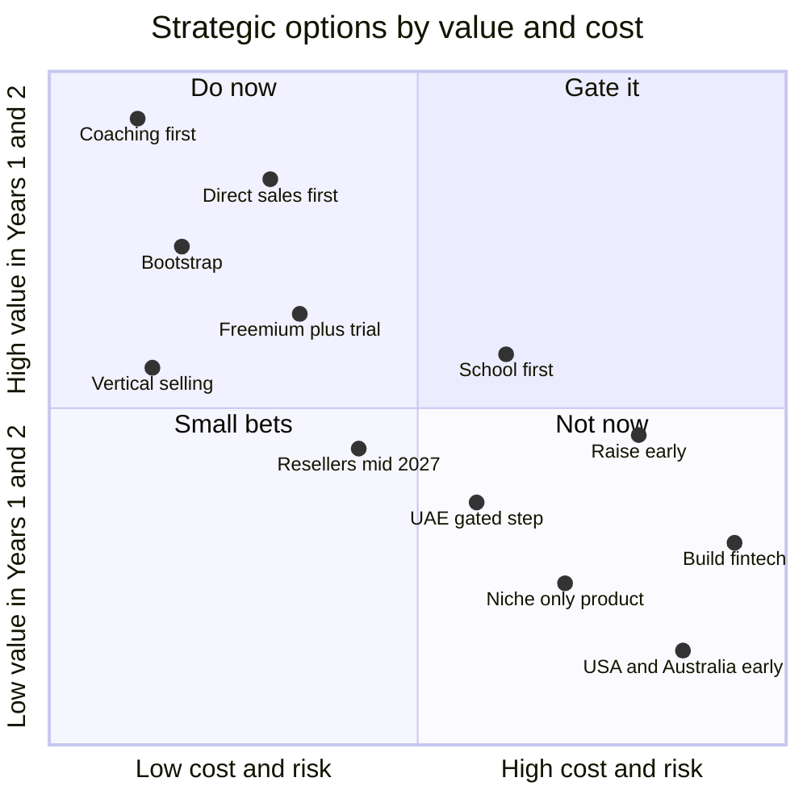
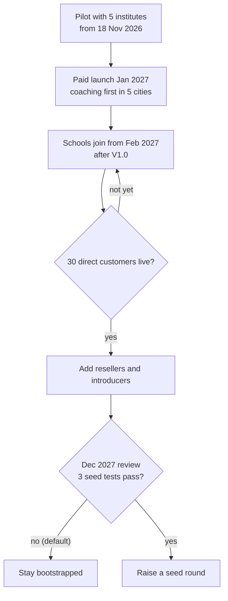
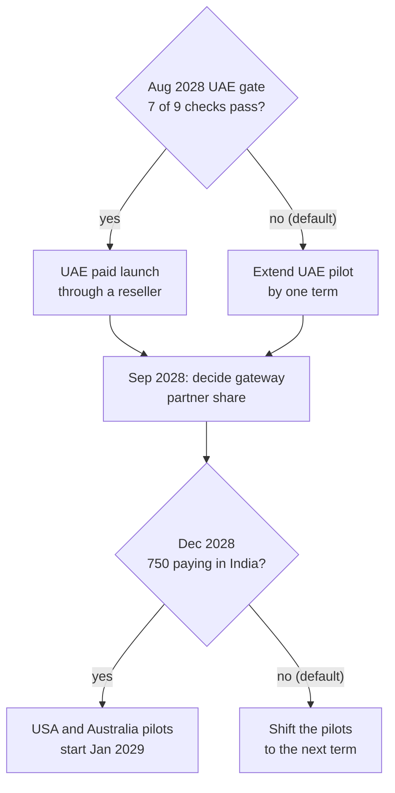

# SWOT Analysis and Strategic Options

**In simple words:** This chapter looks at EduFlow honestly from four sides: what we are good at, where we are weak, what the market offers and what can hurt us. It turns that list into strategies, rates how hard the Indian school and coaching software market is, and answers seven big choices the founder will face. It ends with the signals that tell us to change course, and the whole strategy on one page. It matters because a solo founder has time for only one strategy at a time.

## How to use this chapter

Every point in this chapter has a short ID: `S1` for a strength, `W1` for a weakness, `O1` for an opportunity and `T1` for a threat. Later sections use these IDs, so the founder can trace each strategy back to a fact.

This chapter does not repeat the 42 risks in *Risk Analysis and Mitigation*. Where a threat is already in that register, the row shows its risk ID, for example `R-06`. Numbers come from the canon and from other chapters, which are named in italics. Anything new is marked "assumption" or "estimate".

> **Note:** This chapter used no new outside research. Market, competitor and legal facts come from *Market Research: India*, *Competitor Analysis* and *Compliance, Legal and Data Protection Requirements*, which list their sources. Competitor behaviour here is a scenario, based on public information as of September 2026; verify before external use.

Re-read this chapter at every quarterly review. Rewrite it fully each September, when the business year ends.

## SWOT analysis

SWOT means strengths, weaknesses, opportunities and threats. Strengths and weaknesses are inside the company, so we control them. Opportunities and threats are outside, so we can only respond to them. Each row ends with a "so what" action. A point without an action is only an opinion.

### Strengths

| ID | Strength | Why it is real | So what (action) |
|---|---|---|---|
| S1 | One data model serves schools and coaching | `Organization.type` changes the labels: Section 10-A at Bright Future, Morning Batch M1 at Sharma Classes | Sell to both with one codebase. Never fork the product for one segment |
| S2 | Open price and a free plan | The price is on the website. Starter is free up to 50 students; Growth is ₹2,499 a month | Show the price in every demo, listing and video. The owner can compare without a sales call |
| S3 | Start in one day | Self-serve signup, Excel import, first fee receipt on the same day | Track hours from signup to first receipt. Say "live in one day" only while the median stays under 24 hours |
| S4 | Direct WhatsApp Cloud API | No BSP (business solution provider, a middleman that resells WhatsApp access); messages cost Meta price + 15% | Open every demo with a WhatsApp fee reminder. Show the per-message cost openly |
| S5 | Very low cost base | One founder with Claude Code; start cash ₹6 lakh; 78 paying customers cover costs in September 2027 (*Financial Plan and Projections*) | Stay bootstrapped. Use low costs to hold the price steady, not to cut it |
| S6 | Two-layer tenant isolation | A Prisma extension adds `organizationId`; PostgreSQL RLS (row-level security, a database rule that hides other tenants' rows) is the second net | Publish a one-page security note. Use it in school and Enterprise sales |
| S7 | Full fee loop in the MVP, zero markup | Fees, Payments and Discounts ship in Phase 1. Razorpay settles into the institute's own bank account | Sell "fees on time". Review the 40% online fee share target every month |
| S8 | The founder sells and supports in Hindi | Founder-led demos in Patna, Lucknow, Delhi NCR, Indore and Jaipur; about 22 selling hours a week | Keep the founder on every demo until 30 customers are live. Log every objection in the CRM |
| S9 | Documentation-first build | PRD, schema and API registry exist before the code | Change the document first, then the code. Target: the first engineer ships a fix within 2 weeks of joining |

### Weaknesses

| ID | Weakness | Why it is real | So what (action) |
|---|---|---|---|
| W1 | One person does everything | Build, sell, support and accounts sit with the founder; risk `R-30` | Follow the continuity plan in *Risk Analysis and Mitigation*. Hire the onboarding executive at 30 paying customers |
| W2 | No brand and no references on launch day | Zero case studies exist in January 2027 | Turn the 5 pilots into 3 video testimonials and 5 reference phone numbers by 15 January 2027 (target) |
| W3 | The MVP has 16 of 34 modules | Exams, Report Cards and Timetable arrive on 1 Feb 2027; Transport, Hostel and Payroll by June 2027 | Sell coaching first. Give schools a dated roadmap. Never sell a module before it ships |
| W4 | No native mobile app until Phase 4 | Parents use the mobile web Parent Portal; white-label apps come by September 2027 | Keep the portal fast on a low-cost Android phone. Send alerts on WhatsApp so parents need no app |
| W5 | AI-written code with one human reviewer | Risk `R-14`; a wrong receipt or a data leak is a one-day disaster | Automated tests on every money path and every tenant-isolation path. CI blocks the release if one fails |
| W6 | No field sales team | One founder, about 22 selling hours a week, five cities | Two doors: live demo and self-serve signup. Add resellers after 30 direct customers |
| W7 | Thin cash | Start cash ₹6 lakh; Year 1 marketing budget ₹5.85 lakh | Spend only on channels with CAC (cost to win one customer) under ₹12,000. Push yearly plans for cash up front |
| W8 | Three vendors can stop the business | Meta for WhatsApp, Razorpay for payments, Railway for hosting; risks `R-33` and `R-34` | Keep SMS and email as fallback channels. Test the vendor exit plans once a year |
| W9 | No live classes and no content selling | A deliberate choice in *Five-Year Roadmap*; teaching apps lead here | Position EduFlow as the office system that works beside any teaching app. Support pasted Zoom, Google Meet and YouTube links |

### Opportunities

| ID | Opportunity | Why it is real | So what (action) |
|---|---|---|---|
| O1 | Most small institutes still use registers, Excel and WhatsApp groups | See *Market Research: India* | Sell against the register, not against other vendors. Lead with hours and rupees saved |
| O2 | Parents already pay by UPI | UPI gateway charges are low or zero | Put a UPI pay link inside every fee reminder |
| O3 | WhatsApp is the parent channel | Parents read WhatsApp sooner than email or a new app (assumption) | WhatsApp-first alerts for attendance, fees and results |
| O4 | The DPDP Act 2023 makes loose data risky | Children's data needs verifiable parental consent; the penalty ceiling for breaking children's data duties is ₹200 crore | Capture consent at admission. Offer a free one-page DPDP guide to collect leads |
| O5 | The 2024 coaching centre guidelines | The Ministry of Education guidelines push coaching centres towards registration, proper records and fee receipts (check each state's rule) | Build a "records ready" report pack for coaching owners |
| O6 | Tier 2 and Tier 3 cities are under-served | Vendor field teams are thin there (*Go-To-Market Strategy*) | Follow the five-city rollout. Win one coaching cluster fully before the next |
| O7 | A fixed buying season | January to April before the April 2027 session; coaching opens new batches every quarter | Keep the January 2027 launch fixed. Cut scope, never the date |
| O8 | AI lowers the cost of building | One founder can ship 33 modules by June 2027; AI Insights sells at ₹1,499 a month | Keep a weekly release rhythm. Use AI Insights to lift ARPA (average revenue per account) from Year 2 |
| O9 | Indian-curriculum schools in the UAE | Same product; Growth at AED 299 is about ₹6,877, which is 2.75 times the India price | Enter the UAE in Year 2 through a reseller, only after the gate checklist passes |

### Threats

| ID | Threat | Why it is real | So what (action) |
|---|---|---|---|
| T1 | A funded rival gives a full ERP free | Risk `R-06`; a scenario, not a report | Keep Starter free. Show what free tools lack: fee accounts, audit trail, data export, human support |
| T2 | Local vendors charge about ₹20 per student a year | Risk `R-07` | Teach buyers to ask for proof of backups and data export. Invite the vendor to become a reseller |
| T3 | Low willingness to pay | Risk `R-01`; owners compare ₹2,499 with free tools | Sell the rupee value: one recovered late fee of ₹3,000 pays for a month. Lead with the yearly plan |
| T4 | Meta changes WhatsApp prices or policy | Risk `R-33` | Keep pass-through pricing at cost + 15%. Sell prepaid credits. Keep SMS and email ready |
| T5 | Razorpay account holds or new RBI rules | Risk `R-34` | Never hold customer money. Keep cash, cheque and direct UPI recording as the fallback |
| T6 | A missed season costs a full year | Risk `R-03`; the warning sign is fewer than 30 paying organizations on 31 March 2027 | Sell mid-session starts to coaching. Offer schools early yearly deals for April 2028 |
| T7 | One data leak ends trust | Risk `R-11`; the DPDP ceiling for weak safeguards is ₹250 crore | Run isolation tests on every release. This work is never cut in any budget |
| T8 | AI makes clones cheap | Anyone can build a basic ERP in a few months | Compete on trust, support, data depth and local reach, not on feature count |
| T9 | Coaching rules tighten | Age limits or state registration rules may shrink or close small centres (scenario) | Grow schools to at least 30% of paying customers by the end of Year 2 (assumption) |

> **Founder note:** Read the two left-hand lists together. Almost every strength comes from being small: low cost, fast decisions, the founder on every call. Almost every weakness also comes from being small. The strategy below uses smallness where it helps and buys cover where it hurts.

## TOWS matrix

TOWS is SWOT turned into action. It pairs an inside fact with an outside fact. SO strategies use a strength to take an opportunity. WO strategies use an opportunity to fix a weakness. ST strategies use a strength to blunt a threat. WT strategies reduce a weakness so a threat cannot hit it.

### SO strategies: attack

| ID | Strategy | Uses | What we do |
|---|---|---|---|
| SO1 | The WhatsApp fee engine | S4, S7, O2, O3 | Every fee reminder is a WhatsApp message with a UPI pay link. It is the first thing shown in a demo and the main reason to upgrade to Growth |
| SO2 | One-day switch from the register | S2, S3, O1, O7 | From January to March 2027 the offer is "sign up today, print the first receipt today". Free up to 50 students removes the money fear |
| SO3 | Cluster selling in small cities | S8, O6 | Hindi demos by the founder in five cities. Win one coaching cluster, such as Boring Road in Patna, before moving on |
| SO4 | Compliance as a selling point | S6, O4, O5 | Consent capture, audit trail and Mumbai hosting go into a one-page trust note for trustees and coaching owners |

### WO strategies: repair

| ID | Strategy | Uses | What we do |
|---|---|---|---|
| WO1 | Coaching first while modules ship | W3, O7 | Coaching needs only Phase 1. Schools join from February 2027, when Exams and Report Cards are live |
| WO2 | Pilots into proof | W2, O6 | Owners in one city know each other. Five happy pilots become the references for the next fifty calls |
| WO3 | Partners as the field team | W6, O6 | Local computer vendors and CA firms sell for a commission once 30 direct customers are live |
| WO4 | WhatsApp in place of an app | W4, O3 | Alerts and pay links reach parents on WhatsApp. The mobile web portal handles the rest until Phase 4 |

### ST strategies: defend

| ID | Strategy | Uses | What we do |
|---|---|---|---|
| ST1 | Survive, do not discount | S5, T1, T3 | Low costs let us hold the price. We add value, such as free migration, before any discount |
| ST2 | The trust pack | S6, T2, T7 | Security note, backup proof and a live data export in the demo. Cheap vendors rarely show these |
| ST3 | Own the fee loop | S7, T1 | After one year of invoices, receipts and dues sit in EduFlow, a free attendance app cannot replace it |
| ST4 | One product, two segments | S1, T9 | If coaching rules bite, selling hours shift to schools with no new code |

### WT strategies: protect

| ID | Strategy | Uses | What we do |
|---|---|---|---|
| WT1 | Narrow scope to protect the date | W1, W3, T6 | When the sprint slips, a feature moves to Phase 2. The January launch does not move |
| WT2 | Tests where money and privacy live | W5, T7 | Fee maths, receipts, payments and tenant isolation get automated tests before any other code |
| WT3 | A fallback for every vendor | W8, T4, T5 | SMS and email behind WhatsApp; manual payment recording behind Razorpay; a tested restore behind Railway |
| WT4 | Cash discipline | W7, T3 | Yearly plans first. Recompute months of spend on the 5th of each month. No hire before the break-even recount |

> **Rule:** Year 1 has room for five priorities only: SO1, SO2, WO1, WT1 and WT2. The other eleven strategies run as habits or start on their triggers. They never take build time from these five.

## Porter's five forces

Porter's five forces is a simple test of how hard it is to earn a profit in a market. It looks at five kinds of pressure. We rate each force from 1 (weak, good for us) to 5 (strong, bad for us). The market here is ERP software for private schools and coaching institutes in India. The ratings are the founder's judgement, not measured data.

| Force | Rating | Why | What it means for EduFlow |
|---|---|---|---|
| Threat of new entrants | 4 of 5, high | Cloud hosting is cheap. AI coding tools cut build time. No licence is needed to sell school software | Features are not a moat (a lasting defence). Build trust, data depth and local reach |
| Power of suppliers | 3 of 5, medium | Hosting, SMS and email have many sellers. WhatsApp has one owner, Meta. A payment gateway can hold an account | Pass-through pricing, fallback channels and exit plans (WT3) |
| Power of buyers | 4 of 5, high | Owners are price-sensitive and collect many quotes. Monthly plans make leaving easy. The power falls once a year of fee data is inside | Win on value in the demo. Go deep on fees and parents early. Prefer yearly plans |
| Threat of substitutes | 5 of 5, very high | The register, Excel, WhatsApp groups and Tally cost nothing extra, and everyone knows them. Free teaching apps add to this | The real rival is "do nothing". Answer with a free Starter plan, a one-day start and a rupee gain the owner can see |
| Rivalry among existing players | 4 of 5, high | Funded apps, ERP vendors with field teams and many local vendors all sell here. No single vendor leads in Tier 2 and Tier 3 cities (assumption) | Avoid head-on fights in metros and big school groups. Take the under-served corner first |

Average score = (4 + 3 + 4 + 5 + 4) ÷ 5 = 4.0. This is a hard market. Two facts soften it. First, most of the market has no software yet, as *Market Sizing: TAM, SAM and SOM* shows, so growth does not need to come from stealing customers. Second, the cost of switching rises sharply after an institute has run one full session on a system.

So profit in this market comes from keeping customers, not from high prices. Monthly logo churn (the share of paying customers who leave in a month) under 3% matters more than any single new deal. A customer who stays four years is worth more than three customers who leave after one season.

## Strategic options

The founder will face seven big choices. Each one below has a side-by-side table, a recommendation with its reasoning, and a "change our mind if" line. All seven recommendations agree with the canon and with the decision dates in *Five-Year Roadmap*.

### Coaching-first or school-first

| Criterion | Coaching-first | School-first |
|---|---|---|
| Who decides | The owner alone | Principal, trustees and a committee |
| Sales cycle (examples in *KPI Framework and Dashboard*) | About 14 days | About 51 days |
| Modules needed | Phase 1 is enough | Exams, Report Cards and Timetable (1 Feb 2027) |
| Typical plan | Growth, ₹2,499 a month | Pro, ₹5,999 a month |
| Buying window | Every quarter, with new batches | Mainly January to April |
| Churn risk | Higher; small centres close or merge (assumption) | Lower; schools rarely switch mid-session |

**Recommendation: coaching first, schools second from February 2027.** The Year 1 target mix is 80 coaching customers, 28 schools and 12 others, as set in *Customer Segments and Ideal Customer Profile*. A solo founder needs fast feedback and fast cash. About four coaching sales fit into the time of one school sale (51 ÷ 14 = 3.6). Schools pay more and leave less, so they become the growth engine of Year 2, when the references and the modules exist.

Change our mind if: the median coaching sales cycle goes above 35 days, or coaching logo churn stays above 5% a month for three months. Then 60% of selling hours move to schools.

### Bootstrap or raise early

Bootstrap means running the company on the founder's own money and on customer revenue. Raising early means selling a share of the company to investors before the product has paying customers.

| Criterion | Bootstrap to ₹3–5 lakh MRR | Raise before launch |
|---|---|---|
| Cash available | ₹6 lakh plus a standby reserve | ₹1 crore to ₹2 crore (estimate) |
| Ownership sold | 0% | 15% to 25% at the idea stage (estimate) |
| Speed | One founder's pace | A team of five from the first month |
| Who sets priorities | Customers | Customers and investors; growth pressure invites discounting |
| Main risk | Cash runway, risk `R-26` | Hiring before the pitch is proven; money burns on untested channels |

> **Example:** Raise ₹1.5 crore before launch at a value of ₹6 crore before the money comes in. Share sold = 1.5 ÷ (6 + 1.5) = 20%. Now wait until MRR (monthly recurring revenue) is ₹5 lakh and churn is under 3%. The canon seed round of ₹3 crore to ₹5 crore for the same 20% implies a value of ₹12 crore to ₹20 crore. The founder sells the same share and gets two to three times the money. All valuations here are illustrative estimates.

**Recommendation: bootstrap.** The plan reaches monthly operating break-even in May 2027 and needs only 78 paying customers to cover September 2027 costs. The seed decision is dated: the December 2027 review, with "stay bootstrapped" as the default. Raise only if three tests pass (assumption): LTV:CAC (lifetime value of a customer divided by the cost to win one) above 4:1 for two quarters, at least 10 deals closed without the founder, and a written use of funds that pays back within 12 months.

Change our mind if: months of spend fall under 1 with the reserve used. Then the founder decides within 14 days between revenue-based financing, angel money and a smaller company, as *Risk Analysis and Mitigation* lays out.

### Direct sales or reseller-led

A reseller is a local business that sells EduFlow and earns a commission. The numbers below come from *Business Model* and *Go-To-Market Strategy*.

| Criterion | Direct sales | Reseller-led |
|---|---|---|
| Cost to win one Pro customer | ₹15,000 | ₹13,998 |
| LTV:CAC | 15.3 to 1 | 14.7 to 1 |
| Learning | The founder hears every objection | Feedback arrives second-hand |
| Reach | Five cities | Any town with a trusted partner |
| Control of the promise | Full | A partner may over-promise |
| Share of the 131 Year 1 wins | 126 | 5 |

**Recommendation: direct first, partners as the second channel.** Partner talks start in mid-April 2027. Partners sell only after 30 direct customers are live, expected in May 2027. The unit economics are almost equal, so money is not the reason to wait. The reason is the pitch. A reseller cannot sell what the founder cannot yet sell himself. The guard rails stay: commissions under 8% of MRR, no exclusive territory in Year 1 or Year 2, and EduFlow owns the contract, the billing and the data. Partners grow into a main engine later: *Five-Year Roadmap* plans for them to win about 40% of new customers in Year 4 (assumption). The UAE is partner-led from the first day.

Change our mind if: partner-sourced customers churn at twice the direct rate for two quarters. Then we pause new partner signing and retrain. If partner CAC is half the direct CAC with equal churn, the partner manager hire moves forward by one quarter.

### Freemium or free trial only

Freemium means a free plan that is useful on its own, plus paid plans. A free trial gives full features for a few days and then locks the account.

| Criterion | Freemium plus a 14-day trial | Free trial only |
|---|---|---|
| Top of the funnel | 400 Starter signups planned in Year 1 | Fewer signups; owners fear a locked account (assumption) |
| Cost to us | ₹36 per free account a month; ₹10,800 a month at 300 accounts, or 1.8% of target MRR | Close to zero |
| Conversion | 15% target, spread over many months | Higher rate on a smaller base, all within two weeks (estimate) |
| Word of mouth | About 34 families per free account see "Powered by EduFlow" | Ends when the trial ends |
| Fit for a 30-student tuition | Can stay for years and upgrade when it grows | Leaves on day 15 |
| Main risk | Free users take support time | The owner goes back to the register |

**Recommendation: keep both.** Starter stays free forever up to 50 students. Every new signup also gets the 14-day Pro trial set in *Pricing Strategy*, with no card needed. When the trial ends, an institute with 50 or fewer active students drops to Starter. A larger one goes read-only and can still view and export everything. Nobody is locked out of their data. The five forces rated substitutes at 5 of 5, because the register is free. Only a free plan matches that price. The cost is small: one Growth upgrade earns about ₹2,300 gross profit a month, which pays for 64 free accounts.

Change our mind if: the free pool costs more than 3% of MRR and free-to-paid conversion is under 8%. Then the student limit drops for new signups only, for example from 50 to 30. Existing free users never lose a feature.

### Build payments and fintech, or stay software

Fintech means earning money from financial services, such as payment processing or loans, and not only from software. Fee payments are the largest money flow near EduFlow, so this choice will keep coming back.

| Path | What it needs | Verdict |
|---|---|---|
| Stay software; gateway charges passed through at cost | Nothing new | Year 1 and Year 2 |
| Gateway partner revenue share (Option B in *Business Model*) | A written offer from Razorpay or Stripe | Decide in September 2028; first choice from Year 3 |
| Convenience fee or platform fee | Owners and parents must accept a new charge | Avoid |
| Fee loans through licensed lenders | Legal opinion, lender checks, online fee value above ₹100 crore a year | Study; decide in December 2029 |
| Become a payment aggregator, hold money or lend our own money | RBI licence, capital and a compliance team | Not in this five-year plan |

> **Example:** Bright Future Public School collects about ₹4.32 crore a year. At 40% online, that is ₹1.73 crore. A 0.10% partner share gives EduFlow ₹17,280 a year from this one school, with no new cost to the school or the parents. Across 500 schools of this size it would be about ₹86 lakh a year (illustrative).

**Recommendation: stay software.** Zero markup drives the 40% online fee target and builds trust with owners who already dislike the 2% gateway charge. Holding or routing money brings the RBI rules for payment aggregators, and a solo founder cannot run a compliance team. Payment revenue is a reward for reaching scale. It is not a way to reach scale.

Change our mind if: a gateway makes a written partner-share offer before September 2028. Option B costs customers nothing, so we take it early. Every other path waits for its date.

### Go international in Year 2, or deepen India

| Criterion | Deepen India | Go wide abroad in Year 2 |
|---|---|---|
| Growth price per month | ₹2,499 | UAE AED 299 = ₹6,877; USA $79 = ₹6,715; Australia A$119 = ₹6,664 |
| Market knowledge | High | Low |
| Compliance work | DPDP, GST, DLT | UAE PDPL and KHDA or ADEK; FERPA and COPPA; Australian Privacy Act |
| Product changes | None | Stripe billing, tax invoices, country labels, grading packs |
| Live support hours | Same clock | UAE is 1.5 hours behind India; the USA is on the opposite clock |
| Rivals | Known | PowerSchool, Blackboard, Infinite Campus, Skyward, Compass and Sentral are strong at home |

**Recommendation: deepen India, with one small, gated step into the UAE in Year 2.** The canon fixes the order: the UAE in Year 2 for Indian-curriculum schools, then USA and Australia pilots in Year 3. The UAE step is cheap because the curriculum, the report cards and the working hours match India, and a reseller does the selling. International marketing stays at 15% or less of the Year 2 marketing budget. The 500 paying organizations targeted for Year 2 are planned from India alone. The decision on the UAE paid launch is in August 2028 and needs 7 of 9 checklist passes. USA and Australia pilots need 750 paying organizations in India first.

Change our mind if: real MRR in India is under 70% of plan for two quarters in a row. Then all international spending stops, as the Red rule in *Five-Year Roadmap* says.

### Horizontal ERP or vertical niche

A horizontal product serves every kind of institution. A vertical niche product serves one narrow kind, for example only JEE and NEET coaching.

| Criterion | Horizontal ERP | Vertical niche (JEE and NEET coaching) |
|---|---|---|
| Market size | All coaching and K-12 private schools | One slice of coaching |
| Message | Risk of sounding generic | Sharp: "built for JEE and NEET institutes" |
| Feature depth | 34 modules at medium depth | Test series, rank lists and doubt tracking in depth |
| Exposure to coaching rules (`T9`) | Spread across segments | Concentrated in one segment |
| Fit with the vision | Direct: "every educational institution" | Needs a second product later |

**Recommendation: a horizontal product with vertical selling.** We keep one product and one data model (`S1`). But marketing speaks to one niche at a time, with its own landing page, demo data and case study. The first niche is test-prep and tuition coaching in the five launch cities, shown with Sharma Classes demo data. Coaching needs become templates and labels inside the 34 modules, never a second codebase. This gives the sharp message of a niche without shrinking the market.

Change our mind if: by September 2027 one niche gives over 60% of paying customers and has half the churn of the rest (assumption). Then we deepen that niche for two quarters before widening again.

## Decision principles

These rules apply to every strategic choice, including ones not listed above.

1. **The canon comes first.** If a decision changes a price, a date or a target, change the canon first and the chapters after it.
2. **Cash before growth.** Recompute months of spend and break-even customers before adding any fixed cost. Every extra ₹50,000 a month needs 11 more paying customers.
3. **One beachhead at a time.** Win one segment in one city cluster before opening the next. A beachhead is the first small segment we win fully.
4. **Triggers, not dates, from Year 2.** A hire, a country or a new channel starts when its trigger number is met, not when the calendar says so.
5. **Fast on reversible choices, slow on irreversible ones.** An ad channel, a landing page or a discount test is decided in a day. Investor money, an exclusive territory, holding customer money or a cut in the public price needs a written one-page note and a one-week wait.
6. **Value before discount.** Add migration, training or setup help before lowering a price.
7. **Trust is never traded.** Backups, tenant isolation tests and promised support response times are never cut, even in a bad quarter.
8. **Numbers over opinions.** Change strategy only after 20 deals or four weeks of data. One bad week is not a signal.
9. **The default is written in advance.** Every dated decision has a default that applies when the data is unclear. This stops endless debate.

## Kill criteria

A kill criterion is a number, set in advance, that tells us a strategy is failing and must change. We set it now, while calm, so that hope cannot move it later. Most signals below match the early warning signs in *Risk Analysis and Mitigation*.

| Strategy choice | Signal that it is failing | Checked | What we change |
|---|---|---|---|
| Coaching first | Median coaching sales cycle above 35 days, or coaching churn above 5% a month for three months | Monthly | Move 60% of selling hours to schools |
| Price and value | Free-to-paid conversion under 8% by 31 March 2027, and over half of lost deals say "too costly" | 31 March 2027 | Change the offer under the *Pricing Strategy* rules; aim at institutes with 150 or more students |
| January launch window | Fewer than 30 paying organizations on 31 March 2027 | 31 March 2027 | Sell mid-session coaching starts; offer schools early yearly deals for April 2028 |
| Bootstrap | Months of spend under 1 and the reserve used | 5th of each month | Decide within 14 days: revenue-based financing, angel money or a smaller company |
| Freemium | Free pool cost above 3% of MRR and conversion under 8% | Monthly | Lower the student limit for new signups only |
| Free rivals | "Why pay when X is free?" comes up in over 30% of demos | Monthly | Sell EduFlow as the paid upgrade path; build an import from the free tool |
| Direct first, then partners | Commissions above 8% of MRR, or partner-sourced churn at twice the direct rate | Quarterly | Pause new partner signing; retrain or end inactive partners |
| Stay software | Online fee share under 20% of fee value in September 2027 (assumption) | September 2027 | Fix parent adoption first; no payment revenue plan until the share crosses 40% |
| UAE step | Fewer than 7 of 9 checklist passes in August 2028 | August 2028 | Extend the pilot by one term; no paid launch |
| Horizontal product | "Missing depth" is the reason in over 40% of lost coaching deals (assumption) | Quarterly | Deepen coaching templates and reports for two quarters |
| Whole plan | Real MRR under 70% of planned MRR for two quarters in a row | Quarterly | Stop international spending; shift later dates by two quarters; propose new targets, canon first |

One more rule covers the beachhead itself. It is an assumption made in this chapter. If EduFlow has fewer than 40 paying organizations on 30 September 2027 and monthly churn is above 5%, the beachhead is wrong. The founder then stops paid marketing, interviews 30 owners in four weeks and chooses one of three paths: a narrower niche, a different segment or a smaller company.

> **Warning:** When a kill criterion fires, act within 14 days. "One more month" is the most costly sentence a bootstrapped founder can say. Write the decision in a one-page note, as *Five-Year Roadmap* advises, and set a review date.

## The chosen strategy in pictures

**Figure: Strategic options by value and by cost**

The chart places each option by its value in the first two years and by its cost and risk. The five choices in the top-left corner are the strategy for Year 1. Options on the right are not wrong for ever. They are wrong for a solo founder with ₹6 lakh in the bank, and each one has a date or a gate in the next two figures. The positions are the founder's judgement, not measured data.

**Figure: The chosen path in Year 1, up to the funding gate**

The path runs from top to bottom in date order. Each diamond is a gate with a number. Resellers wait for 30 live direct customers. Investor money waits for the December 2027 review, and the default answer is no.

**Figure: The gates in Year 2 and Year 3**

The second figure continues the same path, whichever way the funding gate went. If a gate number is not met, the default applies and nothing new starts. India keeps running below every gate, so a failed gate never stops the main business.

## The strategy on one page

| Question | Our answer | Why | Review or change signal |
|---|---|---|---|
| Who do we sell to first? | Coaching institutes with 100 to 1,500 students; budget private schools from February 2027 | The owner decides alone; Phase 1 covers the need | Coaching cycle above 35 days, or churn above 5% |
| Where? | Patna, Lucknow, Delhi NCR, Indore and Jaipur | Thin vendor field teams; trust travels between owners | Fewer than 30 paying on 31 March 2027 |
| What is the promise? | Fees on time, parents informed on WhatsApp, live in one day | It beats the register on rupees and hours | Activation under 60% |
| What price? | Canon prices, shown openly; free up to 50 students | Substitutes are free, so trust and a free start matter | Conversion under 8% |
| How do we sell? | Founder-led demos plus self-serve signup; resellers after 30 direct customers | The pitch must be proven before it is handed over | Commissions above 8% of MRR |
| How do we fund it? | Bootstrap to ₹3–5 lakh MRR; seed decision in December 2027, default no | Break-even needs only 78 customers | Months of spend under 1 |
| Payments? | Pass-through at cost; gateway partner share decided in September 2028 | Zero markup drives the 40% online fee target | A written gateway offer arrives |
| International? | India first; gated UAE step in Year 2; USA and Australia pilots in Year 3 | The same product sells at about 2.7 times the India price, but only after India is healthy | India MRR under 70% of plan for two quarters |
| Product shape? | One horizontal ERP with vertical selling by niche | The focus of a niche without a smaller market | One niche above 60% of customers with half the churn |
| What is the moat? | Fee and parent data depth, trust, Hindi support, local partners | Features can be cloned in months | A rival matches all four in our cities |
| What do we refuse? | Price wars, custom code, holding money, live classes, selling before shipping | Each one breaks a small company | Never, except by a canon change |
| Which Year 1 numbers prove it? | 120 paying, ₹6 lakh MRR, churn under 3%, CAC under ₹12,000, NPS 50+ (all targets) | They are the canon targets | Quarterly Green, Amber or Red status |

## Key takeaways

- EduFlow's strengths and weaknesses both come from being small. The strategy uses low cost and founder closeness, and buys cover with tests, fallbacks and partners.
- The market scores 4.0 out of 5 on the five forces, so it is hard. The strongest force is the free register, which is why Starter stays free and setup takes one day.
- Profit comes from keeping customers. Churn under 3% and a deep fee loop matter more than feature count.
- The seven choices are: coaching first, bootstrap, direct sales first, freemium plus a trial, stay software, deepen India with a gated UAE step, and a horizontal product with vertical selling.
- Year 1 has only five priority strategies: the WhatsApp fee engine, the one-day switch, coaching first, scope cuts to protect the January launch, and tests on money and privacy code.
- Every choice has a kill criterion with a number and a date. When one fires, the founder acts within 14 days and writes a one-page decision note.
- Options that are wrong today are not wrong for ever. Each has a gate: 30 direct customers for resellers, December 2027 for funding, August 2028 for the UAE, September 2028 for payment revenue.
