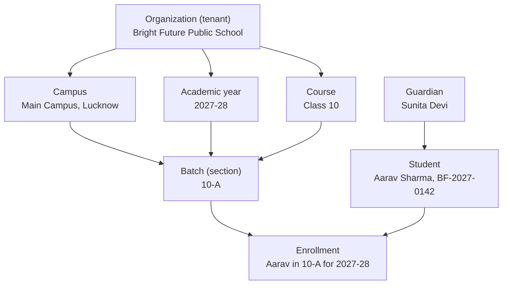
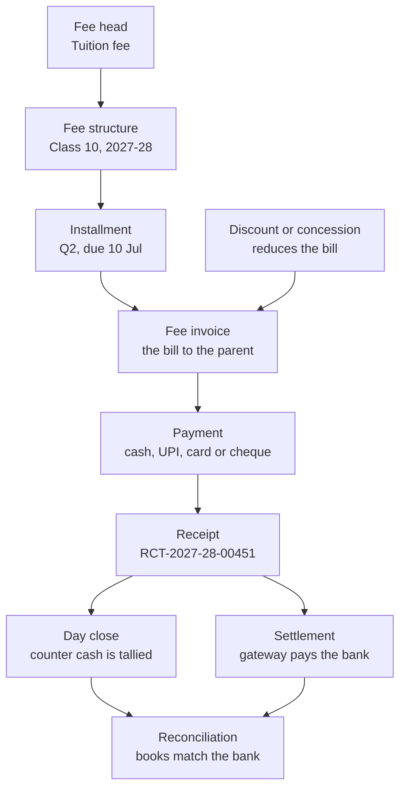

# Glossary

**In simple words:** This chapter explains the words used across the three EduFlow documents: this BRD (business requirements document), the PRD (product requirements document) and the Founder Blueprint. Every term gets a plain meaning and one real EduFlow example. Readers outside India also get a short guide to Indian education words. A list of abbreviations closes the chapter.

## How to use this glossary

- Terms are in alphabetical order, in five letter groups. Each row gives the term, its meaning and an EduFlow example.
- Examples use the shared sample names: Bright Future Public School (Lucknow, 1,200 students), Sharma Classes (Patna, 350 students), student Aarav Sharma, parent Sunita Devi, accountant Suresh Gupta, teacher Priya Nair.
- Business numbers are targets, not forecasts. Their formulas live in *KPI Framework and Dashboard* and *Financial Plan and Projections*.
- Deeper engineering words (outbox, dead-letter queue, snapshot, PWA) are in the *Glossary* of the PRD.
- A word in `code style` is an exact product name: a model, a role key, a permission key or an error code.

> **Rule:** If a chapter and this glossary disagree, fix the glossary. If anything disagrees with the canon (the fixed-facts file of all three documents), the canon wins.

> **Note:** Tax and payroll rates in the examples (GST, PF, ESI) are the rates known in September 2026. A CA (chartered accountant) must confirm them before use.

## How the domain words fit together

Two small pictures place the most used words before the tables start.

**Figure: Domain words, from organization to student**



A batch belongs to one campus, one academic year and one course. An enrollment joins one student to one batch. A guardian is linked to the student.

**Figure: Fee words, from fee head to reconciliation**



Each installment of a fee structure becomes an invoice, and a payment against it creates a receipt. Counter money is checked in the day close; online money arrives through a settlement. Reconciliation proves that both match the bank.

## Terms A to C

| Term | Meaning in simple words | Example in EduFlow |
|---|---|---|
| Academic year | The yearly teaching cycle. Coaching institutes say session. Model: `AcademicYear`. | Bright Future: "Academic year 2027-28", April 2027 to March 2028. |
| Activation | The moment a new customer first gets real value. | First fee receipt or first attendance within 7 days of signup. Target: 60%. |
| Add-on | An extra paid item on top of a plan. | Extra campus ₹999 a month; AI Insights ₹1,499 a month. |
| Admission number | The student ID given at admission. Unique inside one organization. | Aarav Sharma is `BF-2027-0142`. |
| API | Application Programming Interface. Web addresses that software calls to read or change data. | `GET /api/v1/students` returns the student list. |
| ARPA | Average Revenue Per Account. MRR ÷ paying organizations. | ₹6 lakh ÷ 120 = ₹5,000 a month (Year-1 target). |
| ARR | Annual Recurring Revenue. MRR × 12. A run-rate, not cash in the bank. | ₹6 lakh × 12 = ₹72 lakh (Year-1 target). |
| Audit log | A permanent record of who did what and when. Nobody can edit it. | "Dr. Anita Verma changed Aarav's date of birth at 4:10 pm." Old and new values are kept. |
| Batch | The teaching group a student sits in. Schools say section. Model: `Batch`. | Section 10-A at Bright Future; Morning Batch M1 at Sharma Classes. |
| Bonafide certificate | A letter confirming that the student really studies at this institute. | Sunita Devi needs one for Aarav's bank account. Module: Certificates. |
| Bootstrapping | Growing on founder money and customer revenue, without investors. | EduFlow bootstraps to ₹3–5 lakh MRR before any seed round. |
| BSP | Business Solution Provider. A Meta partner that resells WhatsApp API access for a fee. | EduFlow connects to the WhatsApp Cloud API directly, with no BSP. |
| CAC | Customer Acquisition Cost. Sales and marketing spend ÷ new paying customers. | ₹2.4 lakh ÷ 20 new customers = ₹12,000, the target ceiling. |
| CAC payback | Months of gross profit needed to earn the CAC back. | ₹12,000 ÷ (₹5,000 × 80%) = 3 months. |
| Campus | One branch of an organization. Coaching institutes say centre. Model: `Campus`. | Bright Future has 2 campuses. Pro allows up to 3. |
| Churn | Customers that stop paying. Logo churn counts customers; revenue churn counts lost MRR. | 3 of 120 institutes cancel in a month = 2.5% logo churn. Target: under 3%. |
| Cohort | Customers that started in the same period, tracked together over time. | Of 30 institutes that joined in January 2027, 27 still pay in June. |
| Concession | A fee cut given to a student for a stated reason. Stored as a discount. | Sibling concession: 10% off tuition for Aarav's younger sister. |
| Consent (parental) | A parent's clear permission before a child's data is used. DPDP wants it verifiable. | Sunita Devi confirms by OTP during Aarav's admission. |
| Convenience fee | A small extra charge on an online payment to cover the gateway cost. | About 2% on a ₹12,000 card payment = ₹240, if the institute passes it on. |
| Conversion rate | The share of free organizations that become paying ones. | 45 of 300 Starter institutes upgrade = 15% (Year-1 target). |
| COPPA | US law protecting the online data of children under 13. | Matters for the USA pilots in Year 3. |
| Course | The grade or program a student studies. Model: `Course`. | "Class 10" in a school; "JEE Main 2028" in coaching. |

## Terms D to F

| Term | Meaning in simple words | Example in EduFlow |
|---|---|---|
| Data fiduciary | The party that decides why and how personal data is used. GDPR says "controller". | Bright Future is the fiduciary for student data. EduFlow is its processor. |
| Data migration | Moving old records from Excel or other software into EduFlow. | Assisted migration: ₹9,999 one-time; included in Enterprise. |
| Day close | End-of-day cash check at the fee counter. One person submits, another verifies. | Suresh counts ₹48,500, matches the system total and submits. Rajesh Sharma verifies. |
| Defaulter | A student whose fee is unpaid after the due date. | The defaulter report lists 86 students with ₹9.4 lakh overdue. |
| Discount | A rule that cuts a fee by a percentage or a fixed amount. Module: Discounts. | "Early bird 5%" or "Staff child ₹5,000 off". |
| DLT | India's telecom registry (Distributed Ledger Technology) for every SMS sender and template. | The fee reminder SMS is approved on DLT before MSG91 sends it. |
| DPDP Act | India's Digital Personal Data Protection Act 2023. Strict on children's data. | Parental consent at admission; no tracking or targeted ads to students. |
| Enquiry | A parent or student who asked about admission but has not joined. | 40 enquiries in March become 22 admissions. Module: Student Admission. |
| Enrollment | The record that joins one student to one batch for one academic year. Model: `Enrollment`. | Aarav Sharma is enrolled in 10-A for 2027-28. |
| ERP | Enterprise Resource Planning. One software that runs all departments. | EduFlow's 34 modules cover admissions, attendance, fees, exams, staff and parent messages. |
| ESI | Employees' State Insurance. Indian health cover for staff earning up to ₹21,000 a month. | Gross ₹18,000: employee 0.75% = ₹135; employer 3.25% = ₹585. |
| Fee head | One named type of fee. Model: `FeeHead`. | Tuition fee, admission fee, exam fee, transport fee, hostel fee. |
| Fee structure | The fee heads, amounts and due dates of one course for one academic year. | Class 10, 2027-28: tuition ₹48,000 + exam fee ₹2,000, in 4 installments. |
| FERPA | US law that protects student records and gives parents access rights. | US schools will ask EduFlow to sign as a "school official". |
| Freemium | A free plan forever, with paid plans for more. | Starter is free up to 50 students. Growth costs ₹2,499 a month. |
| Funnel | The steps from first contact to paying customer, with a count at each step. | 100 leads, 40 demos, 20 trials, 10 paying customers. |

## Terms G to L

| Term | Meaning in simple words | Example in EduFlow |
|---|---|---|
| GDPR | The European Union's data protection law. EduFlow's baseline everywhere. | Access, correction, deletion, portability; breach notice within 72 hours. |
| Gross margin | Revenue minus the direct cost of serving customers, as a share of revenue. | Target 80%+: of every ₹100 earned, hosting and support use at most ₹20. |
| GST | Goods and Services Tax, India's indirect tax. 18% on the subscription. | Growth ₹2,499 + GST ₹449.82 = ₹2,948.82 a month. |
| Guardian | The parent or other adult responsible for a student. Model: `Guardian`. | Sunita Devi is Aarav's guardian, with the `PARENT` role. |
| ICP | Ideal Customer Profile. The institute that gains most and is easiest to win and keep. | Coaching institute, 100–1,500 students, 1–3 centres, Tier 2 city, runs on Excel. |
| Installment | One part of the yearly fee with its own due date. | Tuition ₹48,000 in 4 installments of ₹12,000. Q2 is due on 10 July. |
| Invoice (fee invoice) | The bill that tells a parent what to pay and by when. Model: `FeeInvoice`. | INV-0912, Tuition Q2, ₹12,000, due 10 July. |
| JWT | JSON Web Token. A signed login pass sent with every request. | The access token lives 15 minutes and carries `orgId`. A 30-day refresh token renews it. |
| KPI | Key Performance Indicator. A number that shows if a goal is being met. | MRR, monthly logo churn, activation rate, NPS. |
| Late fee | A penalty for paying after the due date, by a rule the institute sets. | ₹50 a day after 5 grace days: 10 days late = (10 − 5) × ₹50 = ₹250. |
| Lead | A possible customer who has shown interest but has not bought. | A Patna coaching owner fills the demo form on the website. |
| LOP | Loss of Pay. A salary cut for leave days with no paid leave balance. | Gross ₹30,000, 30-day month, 2 LOP days: ₹30,000 ÷ 30 × 2 = ₹2,000. |
| LTV | Lifetime Value. The gross profit one customer gives before it leaves. | ₹5,000 × 80% ÷ 3% monthly churn = ₹1,33,333. |
| LTV:CAC | LTV ÷ CAC. It shows if growth pays for itself. | ₹1,33,333 ÷ ₹12,000 = 11 to 1. Target: above 4:1. |

## Terms M to R

| Term | Meaning in simple words | Example in EduFlow |
|---|---|---|
| Module | One functional block of the product, with a fixed name and code. | 34 modules. Fees is `FEE`, Attendance is `ATT`. |
| MRR | Monthly Recurring Revenue. Subscription money that comes in every month. One-time fees do not count. | 120 paying institutes × ₹5,000 = ₹6 lakh (Year-1 target). |
| Multi-tenant | One copy of the software and one database serve many customers, with data kept strictly apart. | Every tenant table has `organization_id`. Sharma Classes never sees Bright Future's rows. |
| MVP | Minimum Viable Product. The smallest version real customers can use. | Phase 1: 16 modules, built 5 Oct to 3 Dec 2026. |
| North Star metric | The one number that best shows customers get value. | Weekly active institutions. |
| NPS | Net Promoter Score. Share of promoters (score 9–10) minus share of detractors (0–6). | 60% promoters − 10% detractors = NPS 50. Target: 50+. |
| NRR | Net Revenue Retention. MRR now from old customers ÷ their MRR at the start. | (₹6,00,000 + ₹40,000 upgrades − ₹30,000 lost) ÷ ₹6,00,000 = 101.7%. |
| Onboarding | The steps from signup to daily use. | Import students, set the fee structure, invite teachers and parents. Goal: live in one day. |
| Organization | One customer account, the tenant: a school, school group or institute. Model: `Organization`. | Sharma Classes at `sharma-classes.eduflow.app`. |
| OTP | One-Time Password. A short code sent to a phone to prove who you are. | Parents and students log in with an OTP, not a password. |
| Payment gateway | A licensed company that collects online payments and pays the institute's bank. | Razorpay in India; Stripe in the USA, Australia and the UAE. |
| Payslip | The monthly salary statement: earnings, deductions, net pay. Model: `Payslip`. | Priya Nair, June 2027: gross ₹30,000 − PF ₹1,800 = net ₹28,200. |
| PDPL | The UAE's Personal Data Protection Law (Federal Decree-Law 45 of 2021). | Applies when UAE schools join in Year 2. |
| Permission key | One named right, written `module.action`. A role is a bundle of keys. | `fees.collect`, `attendance.mark`, `students.create`. |
| PF | Provident Fund. India's retirement saving. Employee and employer each pay 12% of basic pay. | Basic ₹15,000: ₹1,800 + ₹1,800 a month. Module: Payroll (Phase 3). |
| Pilot | A free, time-boxed trial with friendly customers before paid launch. | 5 institutes from 18 Nov 2026 (Day 45). |
| Plan limit | The most a plan allows. Going over is blocked with `PLAN_LIMIT_REACHED`. | Growth allows 300 active students. Student 301 needs Pro. |
| Promotion | Moving students to the next class when a new academic year starts. | In April 2028 Aarav moves from 10-A to a Class 11 batch. |
| RBAC | Role-Based Access Control. What a user sees and does depends on the role. | 7 system roles. A `TEACHER` sees own batches only. |
| Receipt | Proof that money was received. Gap-free number, frozen content. Model: `Receipt`. | `RCT-2027-28-00451`, ₹12,000 by UPI, sent to Sunita Devi on WhatsApp. |
| Reconciliation | Matching two records of the same money to find gaps. | A Razorpay settlement of ₹3,42,500 is matched against 41 online receipts. |
| Report card | A student's result for a term or year: marks, grades, remarks. | Aarav's Term 1 report card, a PDF in the Parent Portal. |
| RLS | Row-Level Security. PostgreSQL itself blocks rows of other tenants. | The second safety net after the Prisma filter (`SET app.current_org`). |
| Runway | Months the company can survive on its cash. Cash ÷ monthly net burn. | ₹6 lakh in the bank ÷ ₹1 lakh net burn = 6 months. |

## Terms S to Z

| Term | Meaning in simple words | Example in EduFlow |
|---|---|---|
| SaaS | Software as a Service. Used over the internet, paid by subscription. | Institutes open `app.eduflow.app` in a browser. Nothing is installed. |
| Scholarship | Fee support that a student applies for and wins on merit or need. | A trust pays 50% of tuition for the Class 10 topper. Module: Scholarships. |
| Section | The school word for a batch: one division of a class. | Class 10 has sections 10-A, 10-B and 10-C. |
| Seed round | The first money raised from outside investors. | Optional in Year 2: ₹3–5 crore, after ₹3–5 lakh MRR. |
| Settlement | The transfer in which the payment gateway pays the institute the money it collected. | Monday's ₹3,42,500 of online fees usually reaches the bank in 2 working days. |
| SLA | Service Level Agreement. A written promise on uptime and support response. | Uptime goal 99.5% a month (assumption). Enterprise gets a custom SLA. |
| TAM, SAM, SOM | Total, serviceable and obtainable market: all possible revenue, what we can serve, what we can win. | TAM ₹2,890.6 crore; SAM ₹952.5 crore; SOM 10,000 paying institutes by Year 5. |
| TC (transfer certificate) | The document a school gives when a student leaves. The next school asks for it. | Issued from Certificates after dues are cleared. |
| Template message | A WhatsApp message format that Meta approves before a business may send it. | `Dear {{1}}, fee of Rs {{2}} is due on {{3}}.` |
| Tenant | One customer whose data lives apart from all others. Tenant = organization. | The tenant comes from the JWT `orgId`, never from the request body. |
| Unit economics | Profit and cost for one customer: ARPA, gross margin, CAC, LTV, payback. | ARPA ₹5,000, CAC ₹12,000, payback 3 months. |
| UPI | Unified Payments Interface. India's instant bank-to-bank payments from phone apps. | Sunita Devi scans a QR and pays ₹12,000. Gateway charge: low or zero. |
| WABA | WhatsApp Business Account. The account at Meta that owns the number and templates. | Bright Future connects its own WABA number in the WhatsApp module. |
| Webhook | A message another system sends to our server the moment something happens. | Razorpay tells EduFlow a UPI payment succeeded. EduFlow creates the receipt. |
| White-label | The product carries the institute's name and logo, not EduFlow's. | White-label mobile app: ₹49,999 setup + ₹4,999 a month. |

## One worked example for the money words

The money words depend on each other. This block uses only the Year-1 targets (September 2027), so the founder can change one input and redo the chain.

```text
Paying organizations                        120
ARPA per month                              Rs 5,000
MRR         = 120 x Rs 5,000                Rs 6,00,000    (Rs 6 lakh)
ARR         = MRR x 12                      Rs 72,00,000   (Rs 72 lakh)
Gross margin                                80%
Monthly logo churn                          3%
LTV         = 5,000 x 0.80 / 0.03           Rs 1,33,333
CAC         (target ceiling)                Rs 12,000
LTV:CAC     = 1,33,333 / 12,000             11 to 1   (target above 4:1)
CAC payback = 12,000 / (5,000 x 0.80)       3 months  (target under 6)
```

> **Example:** If monthly logo churn rises from 3% to 5%, LTV falls to ₹5,000 × 0.80 ÷ 0.05 = ₹80,000. LTV:CAC drops from 11 to 1 to 6.7 to 1. One input moved and two results changed.

## Words that are often mixed up

| Words | The difference | Example |
|---|---|---|
| MRR, revenue, cash | MRR is the monthly subscription run-rate. Revenue adds one-time items. Cash is what reached the bank. | A yearly Growth payment brings ₹24,990 cash today but adds only ₹2,082.50 to MRR. |
| Discount, concession, scholarship | Discount is the rule in the system. Concession is the everyday word for it. A scholarship is applied for and awarded. | Sibling 10% is a discount. A trust paying a topper's tuition is a scholarship. |
| Course, batch, section | A course is what is taught. A batch is the group that sits together. Section is the school label for a batch. | Course "Class 10" has batches 10-A and 10-B. |
| Authentication, authorization | Authentication checks who you are. Authorization checks what you may do. | OTP proves it is Sunita Devi. The `PARENT` role limits her to her own children. |

## Indian education terms for international readers

School counts and exam numbers are rounded. *Market Research: India* gives the sources.

| Term | What it means | Closest idea abroad, or why it matters |
|---|---|---|
| CBSE | Central Board of Secondary Education, the national school board. About 28,000+ schools. | A national curriculum with national exams. EduFlow builds this report card first. |
| ICSE and ISC | Class 10 and Class 12 exams of CISCE, a private national board. About 2,800–3,300 schools. | English-medium, mostly urban schools with higher fees. |
| State board | Each state's own board, syllabus and exams, often in the state language. Examples: UP Board, Bihar Board. | Like a state education department in the USA or Australia. |
| Class (Standard) | A grade, from Class 1 to Class 12. Before that: Nursery, LKG, UKG. | Class 10 = Grade 10 (USA) = Year 10 (Australia). |
| Class 10 and 12 boards | Public exams set by the board, not the school, at the end of Class 10 and Class 12. | Similar to GCSE and A-level exams in the British system. |
| Stream | The subject group picked for Classes 11–12: Science, Commerce or Arts. | It decides which entrance exams a student can sit. |
| JEE | Joint Entrance Examination for engineering colleges: JEE Main, then JEE Advanced for the IITs. About 17 lakh candidates in 2026. | One national test, not college-by-college applications. |
| NEET | National Eligibility cum Entrance Test, the single entrance exam for medical colleges. About 22.8 lakh registered in 2026. | The largest coaching funnel in India. |
| Coaching institute | A private business that prepares students for entrance or competitive exams, outside school. | Like a test-prep company, but far bigger. EduFlow's first customer segment. |
| Tuition centre | A small neighbourhood business that helps school students with school subjects after school. | Like an after-school tutoring centre. Often 30–200 students, so many start on Starter. |
| Session | Most schools run April to March. Coaching batches start in April–June, after board exams. | Institutes buy software in January–March, so paid plans launch in January 2027. |
| Lakh and crore | 1 lakh = 1,00,000 (100 thousand). 1 crore = 1,00,00,000 (10 million). | ₹72 lakh = ₹7.2 million, about US$85,000 at ₹85 per dollar. |
| Tier 2 and Tier 3 cities | Tier 2: about 100 cities with 5–40 lakh people, such as Patna and Lucknow. Tier 3: smaller towns, such as Sitapur. | The Year-1 ideal customer sits here, not in the metros. |
| UDISE+ code | The government ID code of every school in India. | Stored on the campus record as `udiseCode`. |
| APAAR ID | A lifelong student ID from the Government of India. It needs parental consent. | An optional field on the student profile (`apaarId`). |

## Abbreviations

Currency codes: INR or ₹ (Indian rupee), USD or $ (US dollar), AUD or A$ (Australian dollar), AED (UAE dirham). Module codes such as `FEE` and `ATT` are listed in *Business Objectives, Scope and Stakeholders*. Read the left pair of columns from top to bottom first, then the right pair.

| Abbreviation | Full form | Abbreviation | Full form |
|---|---|---|---|
| AC | Acceptance Criteria | KHDA | Knowledge and Human Development Authority (Dubai) |
| ADEK | Abu Dhabi Department of Education and Knowledge | KPI | Key Performance Indicator |
| API | Application Programming Interface | LOP | Loss of Pay |
| APP | Australian Privacy Principles | LTV | Lifetime Value |
| ARPA | Average Revenue Per Account | MRR | Monthly Recurring Revenue |
| ARR | Annual Recurring Revenue | MVP | Minimum Viable Product |
| BR | Business Requirement | NEET | National Eligibility cum Entrance Test |
| BRD | Business Requirements Document | NPS | Net Promoter Score |
| BSP | Business Solution Provider | NRR | Net Revenue Retention |
| CA | Chartered Accountant | OTP | One-Time Password |
| CAC | Customer Acquisition Cost | PCI DSS | Payment Card Industry Data Security Standard |
| CBSE | Central Board of Secondary Education | PDPL | Personal Data Protection Law (UAE) |
| CI/CD | Continuous Integration / Continuous Delivery | PF | Provident Fund |
| CISCE | Council for the Indian School Certificate Examinations | PRD | Product Requirements Document |
| COPPA | Children's Online Privacy Protection Act | RBAC | Role-Based Access Control |
| CS | Customer Success | RBI | Reserve Bank of India |
| DAU, WAU, MAU | Daily, Weekly, Monthly Active Users | RLS | Row-Level Security |
| DLT | Distributed Ledger Technology | SaaS | Software as a Service |
| DPDP | Digital Personal Data Protection | SAM | Serviceable Available Market |
| ERP | Enterprise Resource Planning | SLA | Service Level Agreement |
| ESI | Employees' State Insurance | SOM | Serviceable Obtainable Market |
| FERPA | Family Educational Rights and Privacy Act | SSO | Single Sign-On |
| GDPR | General Data Protection Regulation | SWOT | Strengths, Weaknesses, Opportunities, Threats |
| GST | Goods and Services Tax | TAM | Total Addressable Market |
| GTM | Go-To-Market | TC | Transfer Certificate |
| ICP | Ideal Customer Profile | TRAI | Telecom Regulatory Authority of India |
| ICSE | Indian Certificate of Secondary Education | UPI | Unified Payments Interface |
| ISC | Indian School Certificate | VAT | Value Added Tax |
| JEE | Joint Entrance Examination | WABA | WhatsApp Business Account |
| JWT | JSON Web Token |  |  |

## Key takeaways

- The glossary holds 92 terms in five letter groups, 15 Indian education terms and about 60 abbreviations. Each term has a plain meaning and one EduFlow example.
- The domain words are fixed: organization, campus, academic year, course, batch, enrollment, guardian. Only the screen label changes between a school and a coaching institute.
- The money words form one chain: ARPA, MRR, ARR, gross margin, churn, LTV, CAC, payback. Change one input and the rest move.
- The fee words form a second chain: fee head, fee structure, installment, invoice, payment, receipt, day close, settlement, reconciliation.
- Privacy laws differ by country: DPDP (India), FERPA and COPPA (USA), the Privacy Act (Australia), PDPL (UAE). GDPR principles are the baseline everywhere.
