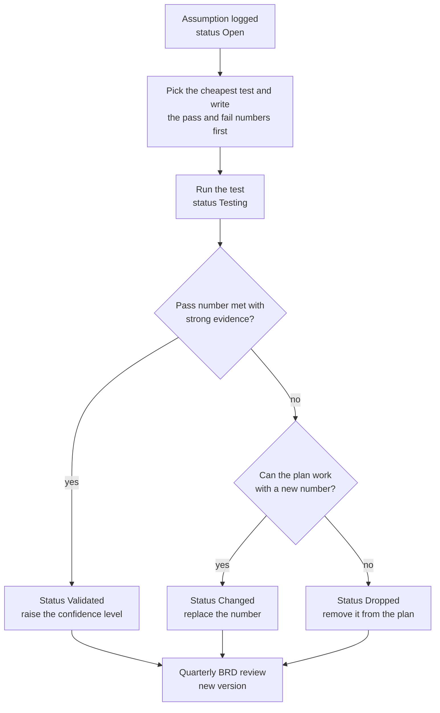

# Assumptions, Open Questions and Validation Plan

**In simple words:** This BRD holds many numbers that nobody has proved yet. This chapter puts them in one log, says how sure we are of each, and gives each one a cheap test and a date. It also lists the questions the founder must answer in the first 90 days, the plan for 20 customer interviews, the experiments to run, and the rules for updating this BRD. The aim is to replace guesses with evidence before the guesses cost money.

## How to read this chapter

The chapter tracks four kinds of items. Each kind has its own ID format.

| Item | Meaning | ID format | Count |
|---|---|---|---|
| Assumption | Something the plan treats as true without proof | `A-01` | 40 |
| Open question | A decision the founder has not made yet | `Q-01` | 14 |
| Experiment | A small test with a pass number and a fail number written in advance | `E-01` | 10 |
| Pilot criterion | One measurable pass or fail check for the 5 pilot institutes | `PC-01` | 14 |

`A-01` to `A-15` are the same 15 assumptions listed in *Business Objectives, Scope and Stakeholders*. This chapter adds a confidence level, a test and a date to each. `A-16` to `A-40` are new here. They collect the values that other chapters marked "Estimate" or "Assumption" and sent to this log.

Short forms used in the log: MRR (monthly recurring revenue), ARPA (average revenue per account a month), CAC (the cost to win one customer), LTV (lifetime value, the gross profit one customer brings before leaving), churn (the share of customers who leave in a month), SAM (the part of the market we can serve today), DLT (the telecom registration needed to send SMS in India) and CA (chartered accountant). The full list is in *Glossary*.

### Confidence levels

| Level | Meaning | What we do |
|---|---|---|
| High | Direct evidence exists: our own data, a signed paper or an official source | Check once a year |
| Medium | Indirect evidence: public data, similar businesses, a few conversations | Test within 6 months |
| Low | A guess with reasoning only; no data yet | Test first; never base a hire or a big spend on it |

### Status values

Every assumption has one status: `Open` (no test yet), `Testing`, `Validated`, `Changed` (the number was wrong and has been replaced) or `Dropped` (the idea left the plan). On 20 September 2026 all 40 assumptions are `Open`.

**Figure: How an assumption becomes a fact**



Each assumption moves from a guess to a test and then to a decision. Every path ends in the quarterly review, where the BRD gets a new version.

> **Rule:** Write the pass number and the fail number before the test starts. A number chosen after the result is not a test.

## Master assumptions log

"By when" is the deadline for the first real reading, not for a perfect answer. "What changes if wrong" names the decision that follows, so nobody argues about it later. Codes such as `E-04` point to the experiment backlog later in this chapter.

### Core assumptions

| ID | Assumption | Area | Confidence | How to validate | By when | What changes if wrong |
|---|---|---|---|---|---|---|
| A-01 | Institutes with 100 to 1,000 students pay ₹2,499 to ₹5,999 a month | Pricing | Medium | Pilot pay ask and price test `E-09` | 31 Mar 2027 | ARPA falls; target institutes with 150+ students; lead with the yearly plan |
| A-02 | Coaching owners decide in 1 to 2 weeks; schools in 4 to 12 weeks | Sales cycle | Medium | Log days from demo to payment for every deal | 31 Mar 2027 | Move 80% of selling hours to coaching; cash forecast shifts |
| A-03 | Above 90% of parents in our cities use WhatsApp daily | Customer | High | Delivered and read rates in the pilot, `E-06` | 18 Dec 2026 | Bring the SMS fallback forward from Phase 2 |
| A-04 | Parents pay online when the pay link comes on WhatsApp | Payments | Medium | Online share of fee value in pilots, `E-08` | 31 Jan 2027 | The 40% online target slips; add in-person parent launch steps |
| A-05 | Starter brings referrals, and 15% of signups upgrade within 90 days | Conversion | Low | Signup cohort report, `E-10` | 30 Jun 2027 | Self-serve gives fewer than 55 wins; tighten Starter for new signups |
| A-06 | One founder with Claude Code builds 16 modules in 60 days | Build speed | Medium | 8 or more modules done on Day 30, `E-02` | 3 Nov 2026 | Launch date stays; use the scope-cut ladder; pilot with 3 institutes |
| A-07 | Blended ARPA reaches ₹5,000 with a 60/33/7 plan mix | Revenue | Medium | Plan mix after the first 30 paying customers | 30 Apr 2027 | ₹6 lakh MRR needs 150+ customers, not 120 |
| A-08 | Monthly logo churn stays under 3% when activation is 60% or more | Churn | Low | Exit reason for every lost customer; cohort curve | 30 Sep 2027 | LTV halves if churn doubles; fix onboarding before adding sales |
| A-09 | Vendor rates stay stable: gateway about 2%, UPI low or zero, WhatsApp utility ₹0.115 | Vendor cost | Medium | Check Meta, Razorpay and MSG91 rate cards | 1 Jan 2027, then quarterly | Reprice credit packs with 15 days notice; credit margin shrinks |
| A-10 | A parent OTP consent flow meets DPDP duties for children's data | Compliance | Medium | Written lawyer review of the flow and notice text | 13 Nov 2026 | Rework admission and portal flows before the pilot |
| A-11 | Planning exchange rates hold: $1 = ₹85, A$1 = ₹56, AED 1 = ₹23 | Exchange rates | Medium | Compare with RBI reference rates | First week Oct 2027 | A move above 10% means new rupee ARPA in the financial model |
| A-12 | Five friendly institutes are ready to pilot for free | Pilot | High | Signed one-page pilot letters | 3 Nov 2026 | Pilot with 3 institutes; keep Day 45 |
| A-13 | Institutes keep data in Excel or on paper, so Excel import is enough | Onboarding | Medium | Time each pilot import, `E-04` | 30 Nov 2026 | Setup passes one day; sell assisted migration; build more importers |
| A-14 | Founder capital of ₹6 lakh plus ₹4 lakh standby lasts until ₹3–5 lakh MRR | Funding | Medium | Monthly cash sheet; 3-month spend floor | Monthly | Cut spend first; then raise a small bridge earlier than planned |
| A-15 | Indian-curriculum schools in the UAE work like Indian schools | International | Low | 10 discovery calls in the UAE | 31 Jan 2028 | The UAE pack needs more work; the pilot moves past 1 Feb 2028 |

### Market and customer assumptions

| ID | Assumption | Area | Confidence | How to validate | By when | What changes if wrong |
|---|---|---|---|---|---|---|
| A-16 | India SAM holds about 1.87 lakh institutions: 1.21 lakh schools, 0.66 lakh coaching | Market count | Medium | Count institutes on Google Maps in 3 Patna clusters; compare with the model | 28 Feb 2027 | Low case is 1.26 lakh; Year 5 India share rises from 4.6% to 6.7% |
| A-17 | About 76% of target schools and 93% of coaching institutes buy no software today | Market count | Low | Ask "what do you use today?" in the first 100 sales conversations | 31 Mar 2027 | Pitch moves from "first system" to "switch"; importers from rival tools move up |
| A-18 | Five launch cities and their satellite towns can supply 3,300 leads in 9 months | Market count | Medium | Lead list size: 700 by 31 Oct 2026, 1,500 by 31 Jan 2027 | 31 Jan 2027 | Open Indore and Jaipur earlier; more inside sales to the rest of India |
| A-19 | The coaching owner decides alone; in schools the accountant is the main blocker | Customer | Medium | Note who objects, and why, in the first 50 demos | 31 Mar 2027 | Shift demo and training time to the real blocker |
| A-20 | A teacher marks 40 students in under 1 minute on her own phone | Product fit | Medium | Stopwatch test with 20 pilot teachers, `E-05` | 5 Dec 2026 | Redesign the attendance screen before the January launch |
| A-21 | Parents trust a pay link that shows the institute's name; Hindi messages raise trust | Customer | Medium | 5 parent interviews; language poll of 50 pilot parents | 15 Dec 2026 | Reorder the language work; add an in-person parent launch |
| A-22 | Teachmint is pulling back from school ERP, so its users will look for a new tool (unconfirmed) | Competition | Low | One official notice, or 3 Teachmint customers confirm it | 31 Mar 2027 | No switch campaign; treat Teachmint as an active competitor |
| A-23 | Coaching buys all year: 99 of the 131 planned wins fall between April and September 2027 | Seasonality | Medium | Monthly wins by institute type | First week Jul 2027 | If coaching is seasonal too, part of the 120 target slips to the next season |

> **Note:** `A-22` rests on public information as of September 2026. Verify it before any external use. The background is in *Feature Comparison Matrix*.

### Conversion, revenue and sales assumptions

| ID | Assumption | Area | Confidence | How to validate | By when | What changes if wrong |
|---|---|---|---|---|---|---|
| A-24 | Sales funnel rates hold: 30%, 30%, 60% and 40%, so 2.16% of leads pay | Conversion | Low | Weekly funnel sheet; first read after 300 leads; `E-07` | 28 Feb 2027 | At half the rate, 65 wins need 6,000 leads, not 3,000 |
| A-25 | 4% of website visitors create a Starter account; 10,000 visitors come in 9 months | Conversion | Low | Landing page test `E-01`; PostHog funnel each month | 30 Nov 2026, then monthly | At 2%, self-serve gives about 30 wins, not 60 |
| A-26 | 60% of signups activate within 7 days | Activation | Medium | Activation rate by weekly signup group | 28 Feb 2027 | Assisted setup call for every signup; no paid ads until fixed |
| A-27 | 40% of MRR comes from yearly plans | Revenue | Medium | Share of new buyers on yearly, each month | 31 Mar 2027 | Less cash in the season; more customers are free to leave each month |
| A-28 | Usage revenue is about ₹300 per paying organization a month; add-ons reach 4% of MRR | Revenue | Low | Wallet and add-on data from the first 30 customers | 30 Jun 2027 | An ARPA of ₹5,000 needs more Pro customers |
| A-29 | 15% of new customers buy assisted migration at ₹9,999 | Revenue | Low | Attach rate in the first 30 wins | 30 Apr 2027 | Small revenue effect; a high rate means onboarding help is hired sooner |
| A-30 | CAC stays under ₹12,000 (₹7,000 Growth, ₹15,000 Pro, ₹35,000 Enterprise) | Sales cost | Medium | Sales and marketing spend ÷ new customers, by plan | First week Apr 2027 | Payback passes 3 months; pause the weakest channel |
| A-31 | The founder sells 22 hours and holds 8 demos a week while building 20 hours | Sales capacity | Low | Weekly timesheet; demos held per week | 28 Feb 2027 | Under 5 demos for 3 weeks: stop features for a week; add tele-caller hours |
| A-32 | Churn by plan is 3.5%, 2.0% and 1.0% a month; yearly payers stay through Year 1 | Churn | Low | Cohort report after six months of paid customers | 30 Sep 2027 | Growth LTV falls below ₹66,000; lower the CAC limit for Growth |

> **Example:** `A-24` says 2.16% of leads become paying customers (30% × 30% × 60% × 40%). Suppose the real rate after 300 leads is 1.5%. Leads needed = 65 ÷ 0.015 = 4,333. That is 1,333 more leads than the base plan of 3,000, or about 34 extra leads a week over 39 weeks. The formula is in *Go-To-Market Strategy*. Only the input changes.

### Cost, vendor, build and international assumptions

| ID | Assumption | Area | Confidence | How to validate | By when | What changes if wrong |
|---|---|---|---|---|---|---|
| A-33 | Institutes send about 15 WhatsApp messages per student a month, all approved as utility templates | WhatsApp cost | Medium | Category of every approved template; pilot message counts | 18 Dec 2026 | A marketing-category message costs about 7.5 times more |
| A-34 | SMS costs ₹0.18 against a ₹0.25 price; DLT approval comes before Phase 2 | Vendor cost | Medium | Written MSG91 quote; DLT status | 15 Jan 2027 | The 28% SMS margin shrinks; the SMS launch slips past 1 Feb 2027 |
| A-35 | Hosting costs ₹10 per organization plus ₹0.40 per active student a month | Infra cost | Medium | Railway bill ÷ active students | Monthly from Dec 2026 | Gross margin under 80%; the AWS move comes before August 2028 |
| A-36 | Phase 2 (12 modules) ships by 1 Feb 2027 while the founder also sells | Build speed | Low | 5 or more Phase 2 modules done by 4 Jan 2027 | 4 Jan 2027 | Exams and Report Cards ship first; the rest slip to March |
| A-37 | AI-written code is safe when every diff is read and money, permission and tenant tests come first | Build quality | Medium | Escaped bugs per week in the pilot; outside security test | 19 Dec 2026 | A bug week; slower feature pace; paid code review hours |
| A-38 | Support load is 1.5 tickets a month per Growth customer and 4 per Pro | Operations | Low | Helpdesk data from the pilot and the first quarter | First week Apr 2027 | The onboarding executive is hired before 30 paying customers |
| A-39 | An Indian company can sell in AED, USD and AUD through Stripe without a foreign entity | International | Low | Written answers from Stripe and the CA | 30 Sep 2027 | Set up a small foreign entity before the UAE entry |
| A-40 | Schools mostly cannot claim GST input credit; coaching institutes usually can | Tax | Medium | Written advice from the company's CA | 30 Nov 2026 | Change how quotes show GST for each segment |

### Confidence summary and test order

| Confidence | Count | IDs |
|---|---|---|
| High | 2 | A-03, A-12 |
| Medium | 24 | All other IDs |
| Low | 14 | A-05, A-08, A-15, A-17, A-22, A-24, A-25, A-28, A-29, A-31, A-32, A-36, A-38, A-39 |

Not all 40 deserve equal effort. The eight below combine high damage with low proof. They get the founder's attention first.

| Rank | ID | Why it is dangerous | First real evidence |
|---|---|---|---|
| 1 | A-01 | Price acceptance decides ARPA and the whole revenue model | Pilot pay ask, 31 Jan 2027 |
| 2 | A-24 | Every sales number rests on four guessed rates | `E-07` on 18 Dec 2026; 300 leads by 28 Feb 2027 |
| 3 | A-06 | A late MVP misses the January to April season and loses a year | Day 30, 3 Nov 2026 |
| 4 | A-31 | One person's hours limit both the product and the sales | Timesheet from 4 Dec 2026 |
| 5 | A-05 | About 60 of the 131 planned wins come from free signups | 30 Jun 2027 |
| 6 | A-08 | Churn is the most sensitive input in LTV | First cohort read, 30 Jun 2027 |
| 7 | A-04 | Online fee collection is what makes institutes stay | 31 Jan 2027 |
| 8 | A-23 | 76% of planned wins fall outside the school buying season | First week Jul 2027 |

## Open questions for the first 90 days

An open question is different from an assumption. It is a decision that waits for the founder. The first 90 days run from 20 September 2026 to 19 December 2026, the day of the launch go or no-go in *Five-Year Roadmap*. Every question has a default. If no clear answer arrives by the date, the default becomes the decision. No question stays open.

| ID | Question | Why it matters | How to answer | Decide by | Default |
|---|---|---|---|---|---|
| Q-01 | Which 5 institutes join the pilot, and in what mix? | Pilot quality decides every early number | Shortlist 8 from the founder's network; visit each one | Yes by 4 Oct; letters by 3 Nov 2026 | 3 coaching institutes and 2 schools; at least 3 in Patna |
| Q-02 | Is the name "EduFlow" free to register in trademark classes 9 and 42? | A forced rename after launch is costly | Trademark search by an agent | 5 Oct 2026 | Pick a close name and update the canon |
| Q-03 | WhatsApp sender: one shared EduFlow number, or each institute's own number? | It changes Meta onboarding, templates and parent trust | Check Meta onboarding limits; ask 10 owners which name parents should see | 19 Oct 2026 | Shared sender; institute name in line one; own number on Enterprise only |
| Q-04 | Will Meta verification, Razorpay activation and DLT approval arrive before 18 Nov 2026? | Without them the pilot has no WhatsApp and no online payment | Apply in the first week of October; check status every Monday | 6 Nov 2026 | Pilot starts with in-app, email, cash and UPI QR; other channels join when approved |
| Q-05 | What do the 5 pilots pay after the pilot, and from when? | The first price sets every later discount | Decide before signing; write it in the pilot letter | 3 Nov 2026 | Free until 31 Jan 2027; then list price with the Founding 100 offer |
| Q-06 | How fast do parents of imported students give consent? | No consent means no messages to that parent | Day-7 consent rate in each pilot | 5 Dec 2026 | Reminders on day 3 and day 7; front desk shows the consent link at the counter |
| Q-07 | Is a direct Tally export needed in Phase 1? | The accountant can block the sale | 5 accountant interviews; pilot accountants | 15 Dec 2026 | Day-wise Excel export only; Tally export enters Phase 2 if 3 of 5 call it a must |
| Q-08 | Which language comes first for parent messages and portal screens? | The 70% parent adoption target depends on it | Poll 50 pilot parents | 15 Dec 2026 | Message templates in Hindi and English; portal language follows the poll |
| Q-09 | How do students log in when they share a parent's phone? | The Student Portal design (Phase 2) depends on it | Ask in 2 pilot schools and 2 pilot coaching institutes | 15 Dec 2026 | Keep separate OTP logins; add a quick switch between parent and student |
| Q-10 | Where does data security sit in the sales pitch? | Owners may fear leaks to rival institutes | Count unprompted mentions in 10 owner interviews and pilot talks | 15 Dec 2026 | One-page security note in every demo; not the opening message |
| Q-11 | Should the sales-call floor stay at 100 students or move to 150? | Growth costs 3% to 5% of fee income for very small institutes | Compare pay signals by size in interviews and pilots | 19 Dec 2026 | Call institutes with 100+ students; smaller ones use self-serve Starter |
| Q-12 | Can 20 January demos be booked in December while pilot bugs are fixed? | January demos feed the first paid wins | Count demos booked each Saturday in December | 19 Dec 2026 | Under 10 booked: the part-time tele-caller starts in January, not February |
| Q-13 | Will pilots allow their name, logo and a short video testimonial? | The first city needs 3 testimonials in January | Permission clause in the pilot letter | 3 Nov 2026 | Anonymous case study with real numbers |
| Q-14 | Do we sell to schools in January, before Exams and Report Cards ship on 1 Feb 2027? | Schools judge an ERP by its report cards | Pilot school feedback; go or no-go data | 19 Dec 2026 | Sell coaching first; schools sign in February for an April start |

Five questions are parked, because their evidence comes later. The partner commission of 20% first year and 10% recurring is tested with 3 to 5 partners before April 2027. The Teachmint question (`A-22`) closes on 31 March 2027. The Stripe entity question (`A-39`) closes on 30 September 2027. The gateway partner share of about 0.10% waits for Year 2 talks. The seed round decision waits until MRR passes ₹3 lakh.

## Customer discovery plan

Customer discovery means talking to real buyers and users before building or selling, to learn what they do today. The plan is 20 interviews, all finished before the pilot starts on 18 November 2026.

### Who to interview

| Group | Interviews | Mix | Where to find them | Length | Finish by |
|---|---|---|---|---|---|
| Owners and principals | 10 | 6 coaching owners, 3 school owners, 1 principal | Founder's network, walk-ins on Boring Road and Kankarbagh, referrals | 30 min | 17 Oct 2026 |
| Accountants | 5 | 3 coaching fee desks, 2 school fee counters | Through the owners above | 20 min | 31 Oct 2026 |
| Parents | 5 | 3 school parents, 2 coaching parents; at least 2 Hindi-first | Through the pilot institutes | 15 min | 14 Nov 2026 |

At least 5 of the 10 owners must be outside the 5 pilot institutes. Friendly pilots are kind, and kind answers are weak evidence.

### Interview rules

1. Ask about last week and last month, not about the future. "Would you use this?" always gets a polite yes.
2. No demo and no pitch in the first 20 minutes.
3. Use Hindi or English, as the person prefers. Meet at the institute, so the register, the receipt book and the Excel sheet are in the room.
4. Ask for numbers, and ask to see the real thing: the defaulter list, the receipt book, the WhatsApp group.
5. End every owner interview with one commitment ask (question 10 below).
6. Write the notes the same day in one sheet: one row per interview, exact quotes, and the evidence level from the ladder below.

### Questions for owners and principals

| # | Question | What it tests |
|---|---|---|
| 1 | How many students, batches, staff and branches do you have today? | Plan fit; `Q-11` |
| 2 | Walk me through your last fee due date. Who did what, with which tool? | The problem is real; `A-13` |
| 3 | How much fee was pending at last month-end? How did you get that number, and how long did it take? | Size of the fee leak; `A-01` |
| 4 | Last week, when a student was absent, how and when did the parent learn of it? | Need for alerts; `A-03` |
| 5 | Which software, apps or Excel sheets do you use today? What do they cost per year? | `A-17`; current spend |
| 6 | Have you tried an institute software before? What happened? | Switching pain; `A-08` |
| 7 | What was your last purchase above ₹20,000? Who decided, and how many days did it take? | `A-02`, `A-19` |
| 8 | What do you pay each month for an office clerk, SMS packs and Tally? | Price anchor; `A-01` |
| 9 | Who else must agree before a new system starts here? | `A-19` |
| 10 | Will you share your student Excel this week and give staff 2 hours for a free setup? | Commitment; `A-12` |

### Questions for accountants

| # | Question | What it tests |
|---|---|---|
| 1 | Show me how you record one payment, from cash in hand to the receipt. | Time per receipt; `A-13` |
| 2 | How do you find who has not paid? How long does that list take? | Defaulter list pain |
| 3 | Which reports do the owner and the CA ask for, and in which format: Excel, Tally or print? | `Q-07` |
| 4 | What went wrong last year: a lost receipt, a wrong total, a dispute with a parent? | Value of an audit trail |
| 5 | What would worry you about moving to a new system? | Blocker belief; `A-19` |

### Questions for parents

| # | Question | What it tests |
|---|---|---|
| 1 | How do you learn today that fees are due, or that your child was absent? | `A-03` |
| 2 | How did you pay the last instalment: cash, UPI, cheque or bank transfer? Why that way? | `A-04` |
| 3 | If the school sends a pay link on WhatsApp, what makes you trust it or doubt it? | `A-21` |
| 4 | Which language do you want for school messages? Who reads them, and on whose phone? | `Q-08` |
| 5 | Does your child use your phone for studies, or a separate phone? | `Q-09` |

### What counts as validation

Words are cheap. The ladder below ranks evidence from weakest to strongest. An assumption moves to `Validated` only with level 3 evidence or higher.

| Level | Evidence | Example | Counts as validation |
|---|---|---|---|
| 1 | Opinion or compliment | "Nice idea, I would use it" | No |
| 2 | Past behaviour with numbers | "Last month ₹1.8 lakh was pending; I called 40 parents myself" | Partial: the problem only |
| 3 | Commitment of time or data | Shares the student Excel; brings the accountant to a second meeting; signs the pilot letter | Yes, for problem and interest |
| 4 | Commitment of money | Pays for a yearly plan; pays an advance by UPI | Yes, for pricing |
| 5 | Repeated use and referral | Uses it daily for 4 weeks; renews; sends another owner | Yes, for retention |

The interviews have number rules too. They are written now, before the first interview.

| Belief | Validated if | Rejected if |
|---|---|---|
| Fee follow-up or absence alerts are a top-3 pain, with a recent example | 7 or more of 10 owners | Fewer than 4 of 10 |
| Owners will commit time or data (level 3) | 5 or more of 10 | Fewer than 3 of 10 |
| Current monthly spend or accepted price is ₹2,000 or more, for institutes with 100+ students | 4 or more owners | Fewer than 2 owners |
| Accountants see a gain for themselves | 4 of 5 name a pain that EduFlow removes | 3 or more mainly fear job loss or extra work |
| Parents will pay through a link | 4 of 5 would pay if the institute's name and a receipt are shown | 3 or more would pay only at the counter |

A result between the two numbers is "unclear". Then the founder does 5 more interviews in that group. If a belief is rejected, the founder rewrites the matching part of *Problem Statement and Proposed Solution* before the January launch.

> **Warning:** Twenty interviews give a direction, not statistics. Do not write "70% of owners" in any sales material on the basis of 7 people.

## Experiment backlog

An experiment is a small test with a fixed method and a number that decides pass or fail. The backlog is in date order. `E-01`, `E-09` and `E-03` have their own sections below.

| ID | Experiment | Tests | Method | Pass | Fail and next step | When |
|---|---|---|---|---|---|---|
| E-01 | Landing page test | A-25 | One page in Hindi and English; 400 visitors; no paid ads | 16 or more verified phone numbers (4%) | Under 8: rewrite the headline; run 2 more weeks | 12 Oct – 30 Nov 2026 |
| E-02 | Build speed checkpoints | A-06 | Count modules whose Must stories pass | 4 by Day 15; 8 by Day 30 | Under 6 on Day 30: scope-cut ladder | 19 Oct and 3 Nov 2026 |
| E-03 | Pilot with 5 institutes | A-03, A-04, A-12, A-37 | On-site onboarding; scorecard `PC-01` to `PC-14` | All hard gates and 5 of 8 soft checks | Launch to coaching only; re-score in January | 18 Nov – 18 Dec 2026 |
| E-04 | Excel import stopwatch | A-13 | Time from file received to first receipt, at each pilot | Median under 3 hours; failed rows 10% or less | Fix the import checks before launch | 18 – 30 Nov 2026 |
| E-05 | Teacher attendance stopwatch | A-20 | Time 20 teachers marking 40 students each | Median 60 seconds or less | Redesign the screen; retest in a week | 23 Nov – 5 Dec 2026 |
| E-06 | WhatsApp delivery and read test | A-03, A-33 | Real fee and absence alerts to pilot parents | 90% delivered; 70% read in 24 hours | Clean the numbers; bring SMS fallback forward | 25 Nov – 18 Dec 2026 |
| E-07 | Cold-call script test | A-24 | 100 Patna leads, 3 tries each | 25 or more conversations; 7 or more demos booked | Under 15 or under 4: new opener and new call hours | 7 – 18 Dec 2026 |
| E-08 | Pay-link test | A-04, A-21 | Fee reminders with a pay link in pilot institutes | 25% of January fee value paid online | Under 10%: in-person parent launch; QR at the counter | 1 Dec 2026 – 31 Jan 2027 |
| E-09 | Price test | A-01, A-07 | Pilot pay ask, objection log, price survey | See "Price test" | See "Price test" | 5 Jan – 31 Mar 2027 |
| E-10 | Starter cohort read | A-05, A-26 | February and March 2027 signup groups, read after 90 days | 15% upgrade; 60% activate | Under 10%: review Starter limits and upgrade prompts | 31 May and 30 Jun 2027 |

Rules for every experiment:

1. One card per experiment, filled before it starts. The card format is below.
2. Before launch, no experiment may cost more than ₹5,000 or 2 founder days (decision; reviewed in January 2027).
3. One experiment per funnel step at a time, as in *Pricing Strategy*.
4. Small numbers give a direction, not proof. Repeat any test that decides a hire or a price.

**Format: experiment card (example for E-01)**

```text
EXPERIMENT CARD
ID:          E-01  Landing page test
Tests:       A-25  (4% of visitors create a Starter account)
We believe:  Owners who see the fee-reminder promise leave their number
Method:      One page, Hindi + English, 400 visitors, no paid ads
Pass:        16 or more verified phone numbers (4%)
Fail:        Fewer than 8 verified phone numbers (under 2%)
Runs:        12 Oct 2026 to 30 Nov 2026
Result:      ______ visitors   ______ verified numbers   ______ %
Decision:    Keep / Change / Drop          Date: ____________
```

### Landing page test

The test checks one belief from *Go-To-Market Strategy*: 4 of every 100 visitors sign up.

- **Page.** `eduflow.app` in Hindi and English: the promise, three screenshots, the canon prices and one form. The form asks for name, institute, student count and a WhatsApp number checked by OTP.
- **What a signup means.** Before the product is live, a signup is a verified number on the early-access list. After launch the same form creates a real Starter account.
- **Traffic.** 400 visitors from free sources: WhatsApp outreach to the first 700 leads, the founder's network, the Google Business Profile, two YouTube videos and coaching-owner groups. No paid ads run before activation reaches 60%.
- **Two headlines, in alternate weeks.** A: "Fees, attendance and parent WhatsApp alerts in one simple system". B: "Stop chasing fees. Automatic WhatsApp fee reminders for your institute". The price is the same on both. PostHog counts the visitors and the verified numbers.
- **Result bands.** Pass: 16 or more verified numbers, and 5 or more agree to a 20-minute call. Unclear: 8 to 15. Fail: under 8.

> **Example:** On 30 November 2026 the page has 420 visitors and 19 verified numbers. The rate is 19 ÷ 420 = 4.5%, so the test passes. Headline B brought 12 of 200 visitors (6.0%). Headline A brought 7 of 220 (3.2%). The founder keeps B and notes that the sample is small. Eleven of the 19 have 100 or more students, and they enter the January lead list.

### Price test

*Risk Analysis and Mitigation* asks for a written price test result by 31 March 2027. *Pricing Strategy* forbids showing two list prices at once. So the test never changes the canon prices. It reads three signals instead.

| Part | Method | Pass | Unclear | Fail |
|---|---|---|---|---|
| Pilot pay ask | On 5 Jan 2027 ask all 5 pilots to buy a yearly plan with the Founding 100 offer | 3 or more pay by 31 Jan 2027 | 2 pay | 0 or 1 pays |
| Objection log | Record the main lost reason for every lost deal in the first 50 demos held | "Too costly" in 30% or less of lost deals | 31% to 50% | Above 50% |
| Price survey | Four price questions to owners; first 15 answers by 31 Mar 2027 (experiment 7 in *Pricing Strategy*) | ₹2,499 and ₹5,999 sit inside the accepted range of their size band | At the top edge of the range | Above the range |

How to read the result:

- **Three passes, or two passes and one unclear:** `A-01` becomes `Validated`. Prices stay until the first yearly review in October 2027.
- **Any fail:** the founder changes the offer under the price-change rules in *Pricing Strategy*. He sells the rupee value harder, leads with the yearly plan, and may move the sales-call floor to 150 students (`Q-11`). Canon prices change only in a major version of this BRD.
- **Everything else:** `A-01` stays in `Testing`. The survey continues to 30 owners by June 2027.

> **Example:** On 31 March 2027, 3 of 5 pilots have paid. Of 14 lost deals, 5 named price as the main reason, which is 36% and "unclear". The survey range for 100 to 300 students is ₹1,800 to ₹3,200, so ₹2,499 sits inside it. Result: two passes and one unclear. `A-01` is `Validated` with Medium confidence, and the founder adds a fee-recovery calculator step to every demo.

### Pilot success criteria

The pilot runs with 5 friendly institutes from 18 November 2026. The scorecard is filled on Friday 18 December 2026, one day before the go or no-go. Hard gates protect customers, so all of them must pass. Soft checks measure fit.

| ID | Criterion | How measured | Pass | Type |
|---|---|---|---|---|
| PC-01 | Every pilot has marked attendance and issued a fee receipt | Count of institutes | 5 of 5 | Hard gate |
| PC-02 | No tenant isolation bug; no open S1 (most severe) bug in fees or login | Isolation tests; bug list | 0 | Hard gate |
| PC-03 | No parent gets a message before consent, other than the consent link | Messages sent to guardians with no consent record | 0 | Hard gate |
| PC-04 | Onboarding is fast | Stopwatch test `E-04` | Median under 3 hours; failed rows 10% or less | Soft |
| PC-05 | Attendance is a daily habit | Working days with attendance marked, weeks 3 and 4 | 80% or more, in 4 of 5 institutes | Soft |
| PC-06 | Teachers are fast | Stopwatch test `E-05` | Median 60 seconds or less | Soft |
| PC-07 | The receipt book is retired | Share of receipts issued in EduFlow, weeks 3 and 4 | 80% or more, in 4 of 5 institutes | Soft |
| PC-08 | Parents are reached | Guardians who read a message or opened the portal by day 30 | 50% or more | Soft |
| PC-09 | WhatsApp works | Delivery test `E-06` | 90% delivered; 70% read in 24 hours | Soft |
| PC-10 | Quality holds | New bugs per institute in week 4; CSAT (satisfaction score) | 5 or fewer; CSAT 4 of 5 or more | Soft |
| PC-11 | Owners see value | Owners who open the dashboard 3 or more days a week, weeks 3 and 4 | 4 of 5 owners | Soft |
| PC-12 | Pilots pay | Pilots on a paid plan | 3 of 5 by 31 Jan 2027 | Later read |
| PC-13 | Pilots speak for us | Testimonials; introductions to other owners | 3 testimonials; 5 introductions by 31 Jan 2027 | Later read |
| PC-14 | Parents pay online | Online share of January fee value | 25% or more | Later read |

Decision rule for 19 December 2026:

- **Go:** `PC-01` to `PC-03` all pass, and at least 5 of the 8 soft checks (`PC-04` to `PC-11`) pass.
- **Limited go:** the hard gates pass, but only 3 or 4 soft checks pass. The launch goes to coaching only, and the failed checks are re-scored on 16 January 2027.
- **No-go:** any hard gate fails, or fewer than 3 soft checks pass. No paid signups until the gate passes. The default in *Five-Year Roadmap* applies.

> **Example:** On 18 December 2026 Sharma Classes has attendance marked on 11 of the 12 working days in weeks 3 and 4 (92%), and 96% of its receipts are in EduFlow. The median across 20 teachers is 48 seconds. Across all five pilots the hard gates pass, and six soft checks pass. Parent reach is 44% and week-4 bugs are 7 per institute, so `PC-08` and `PC-10` fail. The decision is "Go". The two failed checks become the first fixes in January.

`PC-08` uses 50%, not the Year 1 target of 70%, because day 30 is early. Under 40% is the adoption tripwire in *Risk Analysis and Mitigation*.

## How this BRD gets updated

A BRD that never changes becomes fiction. This one changes on a fixed calendar, with simple version rules.

### Review calendar

The BRD review is a 45-minute block inside the quarterly review from *KPI Framework and Dashboard*. That review is in the first week of January, April, July and October.

| Review | Date | Version | Main evidence that arrives |
|---|---|---|---|
| Launch review | 19 Dec 2026 | 1.0.1 | 20 interviews, `E-01` to `E-07`, pilot scorecard |
| Quarterly review 1 | First week Jan 2027 | 1.1 | Pilot lessons go into personas, onboarding and sales chapters |
| Quarterly review 2 | First week Apr 2027 | 1.2 | Season data: funnel rates, sales cycle, CAC, price test result |
| Quarterly review 3 | First week Jul 2027 | 1.3 | First 90-day Starter cohort, plan mix, ARPA, support load |
| Yearly review | First week Oct 2027 | 2.0 | Full Year 1 actuals, churn cohorts, exchange rates, first price review |

After that the cycle repeats: 2.1, 2.2 and 2.3 in the quarters, and 3.0 in October 2028.

### Version rules

| Change | Example | Version step | Files touched |
|---|---|---|---|
| Patch | A typo, a corrected source, a status change in this log | 1.0 to 1.0.1 | One chapter |
| Minor | A rate, cost or date inside a chapter changes; the canon stays as it is | 1.0 to 1.1 | The chapters that use the number |
| Major | A canon fact changes: price, plan limit, target, phase date, market, role or module | 1.3 to 2.0 | The canon first; then the BRD, the PRD and the Founder Blueprint |

### Change procedure

1. When evidence arrives, update the log in the same week: status, confidence and date.
2. If a number must change, write a one-line change note: old value, new value, evidence and the chapters it touches.
3. At the review, mark every assumption that passed its date without a test as "Overdue". It gets a test within 2 weeks, or the founder writes "accepted without test" with a reason.
4. The review approves or rejects each change note. Between reviews only patches are allowed. New assumptions take the next free ID, and IDs are never reused.
5. A failed assumption goes to the risk register, because it is often a risk trigger in *Risk Analysis and Mitigation*.
6. For a canon fact, edit the canon file first. Then search all three documents for the old value and fix each place.
7. Run the linter on every changed chapter, rebuild the PDF, and update the version and date on the cover.
8. Tag the release in Git, for example `brd-v1.1`, and keep every old PDF. Customers and investors may hold an old copy.

> **Founder note:** Do not edit numbers in a hurry after one bad week. One week is noise. Log the evidence, wait for the review, then change the number once and everywhere.

## Key takeaways

- The plan rests on 40 logged assumptions. Only 2 have High confidence, 24 are Medium and 14 are Low. That is normal for a company with no customers yet, as long as each one has a test and a date.
- Eight assumptions can break the plan: price acceptance, funnel rates, build speed, founder hours, free-to-paid conversion, churn, online fee payment and year-round coaching demand. They get tested first.
- Fourteen open questions have a decision date on or before 19 December 2026, and each has a default. No question stays open.
- The 20 interviews ask about past behaviour, not opinions. Only commitments of time, data or money count as validation.
- Ten experiments each have a pass number and a fail number written in advance. The price test never changes the canon prices. It reads the pilot pay ask, the objection log and a price survey by 31 March 2027.
- The pilot passes only if all 3 hard gates and at least 5 of 8 soft checks pass on 18 December 2026. The go or no-go follows the next day.
- The BRD is reviewed every quarter. Patches fix words, minor versions change chapter numbers, and a major version is needed for any canon fact.

