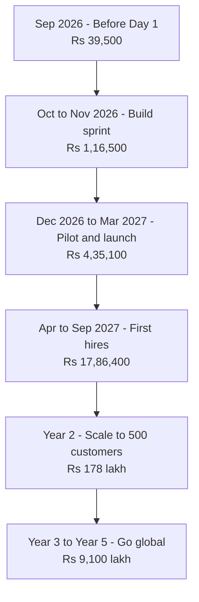
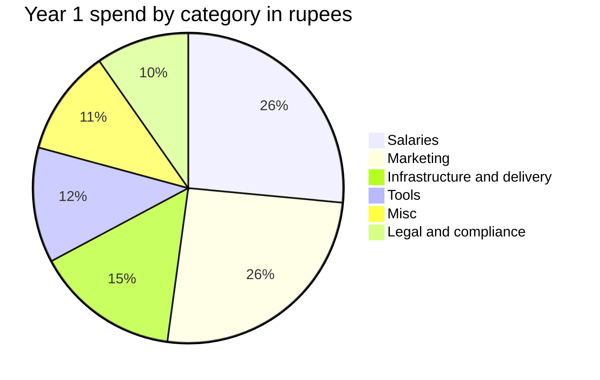

# The Money Map: Day 0 to Year 5

**In simple words:** This chapter shows the whole EduFlow money journey on a few pages. It tells you what you spend at each stage, from the week before the build starts to the end of Year 5, at three budget levels. It names the one number that really matters: the cash you must find before a single customer pays you. Read this chapter first, then jump to the stage you are in today.

## The three budget levels

Every cost in this guide is priced three ways. Pick one level and stay on it for a whole stage. Mixing levels is how budgets break.

| Level | What it means | Who it suits |
|---|---|---|
| **Minimum** | Free tiers, founder does everything, only what is legally or technically unavoidable | You have under Rs 3 lakh and cannot lose it |
| **Recommended** | The plan in the BRD financial model. This guide's default | You have the Rs 6,00,000 capital and want the 60-day sprint to finish on time |
| **Maximum** | The sensible upper end. Above this line the money buys nothing extra | You have surplus cash and want speed and safety |

The standard cost table in this guide has six columns: Item, When to pay, Minimum, Recommended, Maximum, and "Can you avoid or reduce it?". Here it is with three real items.

| Item | When to pay | Minimum | Recommended | Maximum | Can you avoid or reduce it? |
|---|---|---|---|---|---|
| AI coding subscription (Claude) | Monthly, from Day 1 | Rs 1,700 | Rs 17,000 | Rs 25,500 | Reduce, never to zero |
| Trademark "EduFlow" | One time, Oct 2026 | Rs 4,500 | Rs 15,000 | Rs 23,000 | Partly. One class saves Rs 4,500 |
| Error tracking (Sentry) | Monthly, from Dec 2026 | Rs 0 | Rs 2,200 | Rs 2,465 | Yes, until the first paying customer |

Read the first row as a founder, not as an accountant. Minimum is Claude Pro at US$20, which blocks you about five hours of a ten-hour day and stretches the 60-day sprint to roughly 110 days. Recommended is Claude Max 20x at US$200, the plan the BRD uses, which finishes the sprint in 60 days. Maximum adds about Rs 8,500 a month of usage credits for weeks when the limits still bite; that Rs 25,500 is an **Estimate**, reasoning: Max 20x plus half its own price again in pay-as-you-go credits. All three are US dollar prices at US$1 = Rs 85 and exclude Indian GST. EduFlow pays 18% IGST under reverse charge and claims it back the same month, once GST-registered (see Master Price List).

> **Warning:** Choosing Minimum on the AI subscription looks like a Rs 30,600 saving over two months. It is really a 50-day delay. It pushes the paid launch past the January to March buying season, which costs far more than Rs 30,600.

The third row shows the opposite lesson. Sentry Free is enough while five pilot institutes use the product. The Rs 2,200 Team plan is worth paying only from December 2026, when real fee money starts moving through the system. The Rs 2,465 Maximum is simply monthly billing instead of yearly billing for the same plan, so it is the one "Maximum" in this guide you should never choose.

## The master money map

This is the whole journey. The Recommended column is the BRD plan, exactly. Year 1 is a subtotal of the four stages above it, so do not add it twice.

| Stage | What happens | Minimum | Recommended | Maximum | Where the money comes from |
|---|---|---|---|---|---|
| Before Day 1, to 4 Oct 2026 | Company, GST, trademark, domains | Rs 12,209 | Rs 39,500 | Rs 47,845 | Founder savings |
| Build sprint, 5 Oct to 3 Dec 2026 | 16 Phase 1 modules built, legal pack | Rs 26,725 | Rs 1,16,500 | Rs 2,44,816 | Founder capital Rs 6,00,000 |
| Pilot and launch, Dec 2026 to Mar 2027 | 5 free pilots, paid launch, buying season | Rs 1,93,950 | Rs 4,35,100 | Rs 7,19,900 | Capital, then customer cash |
| Months 7 to 12, Apr to Sep 2027 | Founder pay starts, 3 people join | Rs 9,01,700 | Rs 17,86,400 | Rs 28,57,880 | Customer cash only |
| **Year 1 subtotal** | 120 paying organizations | **Rs 11,34,584** | **Rs 23,77,500** | **Rs 38,70,441** | Rs 6,00,000 capital, rest earned |
| Year 2, Oct 2027 to Sep 2028 | 500 customers, team of 14, UAE entry | Rs 116 lakh | Rs 178 lakh | Rs 258 lakh | Customer cash, advances, optional seed |
| Year 3, Oct 2028 to Sep 2029 | 1,500 customers, move to AWS | Rs 474 lakh | Rs 708 lakh | Rs 986 lakh | Customer cash and advances |
| Year 4, Oct 2029 to Sep 2030 | 4,000 customers, USA and Australia | Rs 1,508 lakh | Rs 2,275 lakh | Rs 3,129 lakh | Customer cash and advances |
| Year 5, Oct 2030 to Sep 2031 | 10,000 customers, team of 220 | Rs 4,075 lakh | Rs 6,117 lakh | Rs 8,372 lakh | Customer cash and advances |
| **Five-year total** | | **Rs 61.84 crore** | **Rs 93.02 crore** | **Rs 127.84 crore** | |

Check the arithmetic at Recommended. Year 1: Rs 39,500 + Rs 1,16,500 + Rs 4,35,100 + Rs 17,86,400 = Rs 23,77,500, the BRD Year 1 total cost. The first six months inside it are Rs 39,500 + Rs 1,16,500 + Rs 4,35,100 = Rs 5,91,100, the BRD six-month figure. Five years: Rs 23.78 lakh + Rs 178 lakh + Rs 708 lakh + Rs 2,275 lakh + Rs 6,117 lakh = Rs 9,301.78 lakh, or Rs 93.02 crore. Minimum adds to Rs 6,184.34 lakh and Maximum to Rs 12,783.70 lakh the same way.

Two stage boundaries need one line of explanation. The BRD books company registration, GST, the trademark and the domains in its October column, but you actually pay them in the last week of September. This guide moves that Rs 39,500 into the "Before Day 1" row and removes it from the sprint row, so nothing is counted twice. Everything else follows the BRD month columns.

The sprint row is the only total in the map that no other chapter prints, so here is its build-up.

| Sprint line, Oct and Nov 2026 | Minimum | Recommended | Maximum |
|---|---|---|---|
| Tools and hosting | Rs 6,625 | Rs 44,000 | Rs 73,816 |
| Marketing | Rs 5,000 | Rs 30,000 | Rs 60,000 |
| Legal and compliance | Rs 12,100 | Rs 35,000 | Rs 91,000 |
| Misc: internet, phone, travel, bank | Rs 3,000 | Rs 7,500 | Rs 20,000 |
| **Total** | **Rs 26,725** | **Rs 1,16,500** | **Rs 2,44,816** |

Recommended tools and hosting = Rs 17,500 + Rs 4,000 in October and Rs 17,500 + Rs 5,000 in November. Recommended legal = the Rs 25,000 legal documents pack plus two months of CA retainer at Rs 5,000. Minimum legal = the Rs 6,100 policy generator subscription plus two months of CA retainer at Rs 3,000. Maximum legal is Rs 75,000 for a properly drafted SaaS document set plus two months at Rs 8,000 (see Master Price List). Minimum and Maximum tools and hosting come from *The Build Sprint: Day 1 to Day 60*.

**Figure: Spending stages from Day 0 to Year 5**



The spend curve is flat for six months and then bends sharply. Years 3 to 5 together cost Rs 9,100 lakh, which is 98% of the five-year total. That is normal: by then customers pay for all of it. The only money you personally risk is in the flat part.

## Year 1 in one picture

**Figure: Year 1 spend by category, total Rs 23,77,500**



| Category | Year 1 amount | Share | What it holds |
|---|---|---|---|
| Salaries | Rs 6,30,000 | 26.5% | Founder Rs 2,70,000, customer success Rs 1,80,000, sales Rs 75,000, engineer Rs 1,05,000 |
| Marketing | Rs 6,10,000 | 25.7% | Twelve budget lines plus Rs 25,000 partner commission |
| Infrastructure and delivery | Rs 3,57,500 | 15.0% | Hosting, customer message cost, gateway fees |
| Tools | Rs 2,86,000 | 12.0% | Claude, Sentry, Google Workspace, Zoho Books, CRM |
| Misc | Rs 2,63,000 | 11.1% | Internet, phone, travel, co-working, bank charges, three laptops |
| Legal and compliance | Rs 2,31,000 | 9.7% | Company setup, trademark, legal pack, CA retainer, first audit |
| **Total** | **Rs 23,77,500** | **100%** | |

Check: Rs 6,30,000 + Rs 6,10,000 + Rs 3,57,500 + Rs 2,86,000 + Rs 2,63,000 + Rs 2,31,000 = Rs 23,77,500. Half of Year 1 is people and marketing. Servers are only 15%, and most of that is money customers already paid you for messages.

## The cash you must find before the business pays for itself

This is the number that decides whether EduFlow starts at all.

```text
+------------------------------------------------------------------+
| CASH BEFORE THE BUSINESS PAYS FOR ITSELF                         |
+------------------------------------------------------------------+
| 1 Oct 2026   Founder capital into the company        Rs 6,00,000 |
| Oct-Dec 2026 Spend before any customer pays         Rs -2,40,000 |
| 31 Dec 2026  Money left in the company               Rs 3,60,000 |
|                                                                  |
| Jan-Mar 2027 Cash collected from customers           Rs 7,12,800 |
| Jan-Mar 2027 Spend                                  Rs -3,51,100 |
| 31 Mar 2027  Bank balance                            Rs 7,21,700 |
|                                                                  |
| Outside the company                                              |
| Personal standby reserve, never yet used             Rs 4,00,000 |
| Founder living costs, six months, Tier 2 city        Rs 1,50,000 |
+------------------------------------------------------------------+
```

- Rs 6,00,000 minus Rs 2,40,000 = Rs 3,60,000 left on 31 December 2026.
- Rs 3,60,000 plus Rs 7,12,800 minus Rs 3,51,100 = Rs 7,21,700 on 31 March 2027.
- December 2026 is the last month paid for only by your capital. From January 2027, customer cash covers the month.

| Cash need | When | Amount | Note |
|---|---|---|---|
| Spend before the first customer pays | Oct to Dec 2026 | Rs 2,40,000 | The true out-of-pocket number |
| Founder capital into the company | 1 Oct 2026 | Rs 6,00,000 | Rs 3,60,000 of it is buffer |
| Personal standby reserve | Held outside | Rs 4,00,000 | Enters only if the buying season fails |
| Founder living costs, six months | Monthly | Rs 1,50,000 to Rs 3,00,000 | No founder pay before April 2027 |
| **Money you must be able to reach by 5 Oct 2026** | | **Rs 11,50,000 to Rs 13,00,000** | Rs 6,00,000 + Rs 4,00,000 + living |

The living-cost range is real, not padding. A frugal founder in Patna or Lucknow spends about Rs 25,000 a month, so six months is Rs 1,50,000. The BRD uses a safer Rs 50,000 a month, or Rs 3,00,000 (see Master Price List).

> **Warning:** The Rs 4,00,000 standby reserve is not optional. If no customer at all chooses a yearly plan, the company bank balance falls to Rs 1,66,250 in April 2027, which is under one month of spend. The reserve is what stops that month from ending the company.

One more number keeps founders honest. At the end of Year 1 the company holds Rs 25.76 lakh, but Rs 20.29 lakh of that is customer advance money for service not yet given. Own cash is only Rs 5.47 lakh. At the end of Year 2 own cash is about Rs 8 lakh against Rs 84 lakh of advances. Read *Funding Plan and Cash Management* before you spend a rupee of an advance.

## The top ten costs across five years

Five-year totals at the Recommended level, in rupees lakh, adding to the Rs 9,301.78 lakh above.

| Rank | Cost line | Five-year total | Share | Where it is explained |
|---|---|---|---|---|
| 1 | Sales and marketing programmes | Rs 2,288 lakh | 24.6% | *Sales and Marketing Costs* |
| 2 | Product and engineering payroll | Rs 1,802 lakh | 19.4% | *People Costs and Salary Benchmarks* |
| 3 | Sales and marketing payroll | Rs 1,278 lakh | 13.7% | *People Costs and Salary Benchmarks* |
| 4 | Message cost passed through | Rs 872 lakh | 9.4% | *Messaging and Payment Costs* |
| 5 | Legal, office, insurance, travel, foreign entities | Rs 750 lakh | 8.1% | *Legal, Compliance, Tax and Accounting Costs* |
| 6 | Engineering tools, security tests, contractors | Rs 525 lakh | 5.6% | *Infrastructure and Software Costs by Scale* |
| 7 | Customer success and support payroll | Rs 488 lakh | 5.2% | *People Costs and Salary Benchmarks* |
| 8 | General and admin payroll | Rs 369 lakh | 4.0% | *People Costs and Salary Benchmarks* |
| 9 | Recurring partner commission | Rs 340 lakh | 3.7% | *Sales and Marketing Costs* |
| 10 | Payment gateway fees | Rs 223 lakh | 2.4% | *Messaging and Payment Costs* |
| | **Top ten together** | **Rs 8,935 lakh** | **96.1%** | |

The three lines outside the top ten are hosting Rs 183 lakh (2.0%), AI compute Rs 151 lakh (1.6%) and support tools Rs 33 lakh (0.4%). Add all thirteen and you get Rs 9,301.78 lakh.

Two facts jump out. All payroll together is Rs 1,802 + Rs 1,278 + Rs 488 + Rs 369 = Rs 3,937 lakh, which is 42.3% of everything you will ever spend. Servers are 2.0%. A developer founder's instinct is to optimise the 2% and ignore the 42%.

> **Founder note:** Income tax of Rs 462 lakh over five years (25% of positive EBITDA) and Rs 152 lakh of laptops for new staff are real cash going out, but they sit in the cash statement, not in the cost lines above. Do not forget them when you plan a year.

## Ten golden rules of spending for a developer founder

1. Spend on two things only: what ships the product, and what brings a customer. Everything else waits.
2. Never let the bank balance fall below three months of spend. If it does, freeze hiring and cut marketing to the two best channels that same week.
3. Own cash = bank balance minus GST due minus customer advances. Only own cash is yours to spend.
4. Sell yearly plans first. Hold the prepaid share at 40% or more. Two months free is the only discount you ever give.
5. Hire on triggers, not on dates. No trigger, no hire. Founder pay follows MRR: Rs 0, then Rs 30,000, then Rs 60,000.
6. Buy the tool that replaces a person. Refuse the tool that replaces a habit. Claude Max 20x is 73% of the sprint tools bill and is the best value in this budget.
7. Pay foreign vendors in their own currency with your GSTIN on the account. Rupee billing for Claude costs Rs 23,999 instead of Rs 17,000, or Rs 83,988 more a year.
8. Register for GST the week the company is formed. GST paid before registration is usually lost forever.
9. Move to the next infrastructure stage on a trigger, not a date: database CPU above 60% at peak for a week, p95 API time above 800 ms, or 80% of the stage's customer count. Review the bill line by line on the first Monday of every month.
10. No office before 10 people. No paid brand campaign before 500 customers. No conference stall before the product sells itself.

> **Rule:** Track one unit number every month: hosting bill divided by active students. The Year 1 target is Rs 0.47, from Rs 28,000 divided by 60,000 students. If it rises two months in a row, find the cause before you add servers.

## How to use the rest of this guide

| Chapter | What it answers | Read it when |
|---|---|---|
| *Before Day 1: One-Time Setup Costs* | Company, GST, trademark, domains, laptop | Now, before 5 Oct 2026 |
| *The Build Sprint: Day 1 to Day 60* | Tools and hosting during the 60-day build | Day 1 |
| *Pilot and Launch: Month 3 to Month 6* | Pilot, launch and the buying season | November 2026 |
| *Months 7 to 12: First Hires and Growth* | Founder pay and the first three hires | March 2027 |
| *Infrastructure and Software Costs by Scale* | The server bill at 100, 500, 1,000 and 10,000 customers | Before any stage jump |
| *Messaging and Payment Costs* | WhatsApp, SMS, email and gateway fees | Before you price message packs |
| *People Costs and Salary Benchmarks* | Real salary ranges and the cost on top of salary | Before any offer letter |
| *Sales and Marketing Costs* | What each channel costs per customer | Before any marketing spend |
| *Legal, Compliance, Tax and Accounting Costs* | CA, audit, ROC, DPDP, insurance | Every quarter |
| *Year 2 to Year 5: Budgets by Year* | The budget for each later year | Each September |
| *International Expansion Costs* | The real cost of UAE, USA and Australia | Before the first foreign customer |
| *Free Credits, Grants and Startup Programs* | Credits and schemes you can actually get | Right after incorporation |
| *What to Avoid: The Money Mistakes That Hurt Most* | The spends that kill bootstrapped SaaS | Before any large decision |
| *Founder Personal Finance and Runway* | Your own money, insurance and runway | Before 5 Oct 2026 |
| *Funding Plan and Cash Management* | Where money comes from, and whether to raise | When MRR crosses Rs 3 lakh |
| *Budget Templates and Monthly Tracking* | The sheets and the monthly routine | First Monday of every month |
| *Master Price List* | Every price with its source and date | Before you pay anything |
| *Money Terms in Simple Words* | Plain meanings of MRR, CAC, ITC, EBITDA | Whenever a word is unclear |

## How the prices were researched

| Item | What we did |
|---|---|
| Check date | Public vendor price pages, government fee schedules and trusted secondary sources, read on 21 September 2026 |
| Verified | Price read on the vendor's own page, or a government or regulator page, on that date |
| Estimate | Price from a secondary source, or worked out by us. Every salary, rent and living-cost figure is an Estimate |
| Refused automated reading | MCA, the Income Tax portal, Naukri, AmbitionBox, Glassdoor, IFZA, Google Cloud startup pages, the ASIC fee page |
| Exchange rates | US$1 = Rs 85, A$1 = Rs 56, AED 1 = Rs 23, fixed for the whole guide |
| Currency risk rule | If the real rate moves more than 5% from these, redo the rupee column before a big decision |

GST changes the real cost of many lines, so every table says which case applies.

| Price type | What it means | Can EduFlow claim it back? |
|---|---|---|
| Indian price "+ GST" | 18% is added on top | Yes, as input tax credit once GST-registered |
| Indian price "incl. GST" | The 18% is already inside | Yes, if the invoice shows EduFlow's GSTIN |
| Foreign price in US$, A$ or AED | No Indian GST shown. EduFlow pays 18% IGST under reverse charge | Yes, in the same month |
| Government fee | MCA, IP India, stamp duty, RBI | No GST applies |
| Fuel | Outside GST; state VAT sits in the pump price | No |

> **Tip:** Where the BRD assumption and the September 2026 market price differ, this guide keeps the BRD number as the plan and prints the current price next to it. The full comparison of all 60 assumptions is in *Master Price List*. Five assumptions are genuinely wrong, and four of the five are about payment gateway fees.

## Key takeaways

- The Recommended plan spends Rs 23,77,500 in Year 1 and Rs 93.02 crore over five years. The Minimum path is Rs 61.84 crore and the Maximum path is Rs 127.84 crore over the same five years.
- Only Rs 2,40,000 is spent before any customer pays. Keep Rs 6,00,000 as company capital, Rs 4,00,000 as a personal standby reserve, and Rs 1,50,000 to Rs 3,00,000 for six months of your own living costs.
- December 2026 is the last month funded by your capital alone. From January 2027 customer cash covers the month's spend, and the bank holds Rs 7,21,700 on 31 March 2027.
- Payroll is 42.3% of the five-year spend and servers are 2.0%. Spend your attention where the money is.
- Own cash is not bank balance. At the end of Year 1, Rs 20.29 lakh of the Rs 25.76 lakh in the bank belongs to customers whose service is not yet given.
- Pick one budget level per stage and stay on it. The only Minimum choice that can kill the plan is a cheaper AI subscription, because it costs 50 days and misses the buying season.
- Every price here was checked on 21 September 2026 at US$1 = Rs 85. Open the vendor page and confirm on the day you pay.
