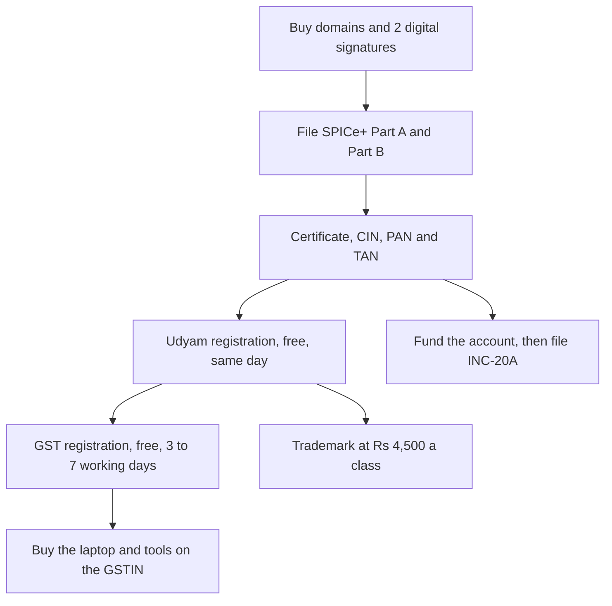

# Before Day 1: One-Time Setup Costs

**In simple words:** This chapter covers every rupee you spend between today, Monday 21 September 2026, and Day 1 of the build sprint, Monday 5 October 2026. It tells you which company type to form, what registration really costs in Bihar, Uttar Pradesh and Delhi, and which registrations are free. The bare-bones version costs Rs 12,209. The BRD plan costs Rs 39,500. Add a laptop and you are between Rs 75,009 and Rs 1,82,845.

## What these two weeks cost

You are not buying software yet. You are buying a legal identity. Razorpay needs it, Meta Business verification needs it, the DLT portal that approves your SMS templates needs it, and a school accountant raising a purchase order needs it. None of it can be bought in a hurry on Day 30.

The Recommended level of Rs 39,500 is 6.6% of the Rs 6,00,000 of founder capital that enters the company on 1 October 2026. With a new laptop it is Rs 1,19,500, or 19.9%.

Every table uses three levels. **Minimum** is free tiers and forms you file yourself. **Recommended** equals the BRD plan, number for number. **Maximum** is the sensible upper end; above it is waste.

> **Rule:** "+ GST" means 18% is added on top. "with GST" means the 18% is already inside the number. Retail prices include GST. Government fees (MCA, IP India, stamp duty) carry no GST at all.

## Which company type to choose

A Private Limited company wins.

| Point | Sole proprietorship | LLP | One Person Company | Private Limited |
|---|---|---|---|---|
| Setup cost, all-in | Rs 0 to 3,000 | Rs 8,000 to 15,000 (Estimate) | Rs 9,000 to 23,000 | Rs 7,000 to 18,000 |
| People needed | 1 | 2 partners | 1 member + 1 nominee | 2 directors, 2 shareholders |
| Can take investors | No | Rarely | No | Yes |
| Can give ESOPs | No | No | No | Yes |
| DPIIT recognition | No | Yes | No | Yes |
| Personal liability | Unlimited | Limited | Limited | Limited |
| Yearly compliance | Rs 15,000 to 30,000 (Estimate) | Rs 10,000 to 25,000 (Estimate) | Rs 25,000 to 1.2 lakh | Rs 25,000 to 1.2 lakh |

The LLP is the real rival: cheaper to run, no audit below Rs 40 lakh of turnover. It loses because it cannot issue ESOPs, and the plan sets aside a 10% to 12% option pool before the Year 2 seed round, and because it cannot issue shares the way a Rs 3 to 5 crore round needs. A One Person Company looks made for a solo founder, but DPIIT does not recognise it, it cannot give ESOPs, and converting it later costs Rs 5,000 to 15,000 (Estimate).

Razorpay, Meta and the DLT portals accept several business types. A Private Limited clears all three fastest, because the certificate, PAN, GST certificate and current account carry one identical legal name. That is reasoning, not a published rule, so treat it as an Estimate.

> **Note:** A Private Limited company needs two directors and two shareholders. Give one trusted family member 100 shares of Rs 1 and keep a signed resignation letter on file. Buy a second digital signature for them, which is why the signature line below is Rs 4,000, not Rs 2,000.

## What registration really costs

Set the authorised capital at Rs 15,00,000 with a face value of Rs 1 per share. The MCA incorporation fee is Rs 0 only up to Rs 15 lakh, and only at incorporation. Raising it later from Rs 10 lakh to Rs 1 crore costs about Rs 1,70,000 in SH-7 fees (see Master Price List). Rs 15 lakh at Rs 1 face value gives 15,00,000 shares: enough for the founder, the ESOP pool and a seed investor with no second fee.

Stamp duty is charged on authorised capital. It is the only line that changes by state.

| State | Stamp duty formula | At Rs 10 lakh capital | At Rs 15 lakh capital |
|---|---|---|---|
| Uttar Pradesh | Rs 10 + Rs 500 + Rs 500, flat | Rs 1,010 | Rs 1,010 |
| Delhi | Rs 10 + Rs 200 + 0.15% of capital | Rs 1,710 | Rs 2,460 |
| Bihar | Rs 20 + Rs 500 + 0.15% of capital | Rs 2,020 | Rs 2,770 |

This chapter prices the Uttar Pradesh case: UP duty is flat at any capital and UP charges no professional tax, while Bihar levies up to Rs 2,500 a year per person (Estimate). Swap the stamp duty row for your state.

| Government item | Price | Unit | Note |
|---|---|---|---|
| SPICe+ incorporation fee (INC-32) | Rs 0 | one time | Only up to Rs 15 lakh authorised capital |
| Name reservation, SPICe+ Part A | Rs 1,000 | per application | Valid 20 days; two names allowed |
| Director number (DIN) | Rs 0 | up to 3 directors | Rs 500 each if applied separately |
| Company PAN and TAN | Rs 155 | one time | Rs 66 + Rs 65 + GST, with the certificate |
| Class 3 signature, 2 directors | Rs 4,000 | 2 years | Rs 1,500 to 2,500 each, token included |
| Stamp duty, Uttar Pradesh | Rs 1,010 | one time | Rs 2,460 Delhi, Rs 2,770 Bihar |
| Commencement of business (INC-20A) | Rs 400 | within 180 days | Late penalty starts at Rs 25,000 |
| First auditor (ADT-1) | Rs 400 | within 15 days | The board appoints within 30 days |
| **Government total, Uttar Pradesh** | **Rs 6,965** | **one time** | **Rs 8,415 Delhi, Rs 8,725 Bihar** |

| Route | Government fees | Professional fee | 18% GST on fee | All-in |
|---|---|---|---|---|
| Do it yourself | Rs 6,965 | Rs 0 | Rs 0 | Rs 6,965 |
| Online platform, LegalWiz Rs 2,999 | Rs 6,965 | Rs 2,999 | Rs 540 | Rs 10,504 |
| Local CA or company secretary | Rs 6,965 | Rs 5,000 to 10,000 | Rs 900 to 1,800 | Rs 12,865 to 18,765 |

The BRD plans Rs 20,000, leaving Rs 9,496 of headroom over the platform route. Keep it: a rejected form delays the sprint start. Choose the local CA if the same person will keep the books and do the first audit, which *Legal, Compliance, Tax and Accounting Costs* budgets at Rs 5,000 a month.

> **Warning:** The 18% GST on that professional fee is almost always lost. You cannot claim input tax credit before your GSTIN exists, and the GSTIN arrives after the company does. Budget it as a real cost.

## The two-week checklist

Fourteen days. "Cost today" is cash leaving the bank at the Minimum level.

| Date | Do this | Cost today | What it unblocks |
|---|---|---|---|
| Mon 21 Sep | Pick company type, state, second shareholder. Search EduFlow on IP India. Check eduflow.app | Rs 0 | Everything |
| Tue 22 Sep | Buy the domains, DNS on Cloudflare Free, order 2 Class 3 signatures, laptop only if you have none | Rs 4,744 | Filing, email, sprint |
| Wed 23 Sep | Signature video check. Collect PAN, Aadhaar, photos, office electricity bill, owner no-objection letter | Rs 0 | SPICe+ Part B |
| Thu 24 Sep | File SPICe+ Part A with two name choices | Rs 1,000 | The company name |
| Fri 25 Sep | Draft MoA and AoA; the object clause must name software as a service. Pick the bank in AGILE-PRO-S | Rs 0 | Part B, bank account |
| Sat 26 to Sun 27 Sep | Name approval usually lands. Set up Node 24, PostgreSQL 16, Redis, Docker, GitHub, Claude Code | Rs 0 | Day 1 |
| Mon 28 Sep | File SPICe+ Part B with INC-33, INC-34, INC-9, AGILE-PRO-S. Pay stamp duty, PAN and TAN | Rs 1,965 | The certificate |
| Tue 29 to Wed 30 Sep | MCA review. Answer any resubmission the same day | Rs 0 | The certificate |
| Thu 1 Oct | Open the Anthropic account, plan starting Day 1, not today | Rs 0 | The sprint |
| Fri 2 Oct | Set up mail on the domain: Zoho Mail Free or Workspace Business Base | Rs 0 to 117 | Vendor signups |
| Sat 3 to Sun 4 Oct | Freeze the scope of the 16 Phase 1 modules | Rs 0 | Day 1 |
| Mon 5 Oct, Day 1 | Write code | Rs 0 | The product |

Add the column: Rs 4,744 (domain 744 + signatures 4,000) + Rs 1,000 + Rs 1,965 (PAN and TAN 155, stamp duty 1,010, INC-20A 400, ADT-1 400) = Rs 7,709. The trademark Rs 4,500 follows the certificate, so Rs 4,500 of the Rs 12,209 Minimum is spent after Day 1.

## What lands after Day 1

Online platforms promise the certificate in 10 to 12 working days. Filing Part B on 28 September means it arrives between about 6 and 14 October (Estimate), so Day 1 starts before the company legally exists. That is fine: nothing in the 60-day sprint needs a CIN. The things that do come later are Meta verification before pilot messaging in November 2026, DLT before SMS in December 2026, and Razorpay at paid launch in January 2027.

**Figure: The order that saves money**

The order matters for money, not tidiness. Udyam before the trademark halves each class fee. GST before the big purchases keeps the 18% inside them claimable.

In that week you pay the capital in, file INC-20A and ADT-1 (already paid above), and register Udyam the same day as the PAN. GST takes 3 to 7 working days and DPIIT one to two weeks, both free. Meta verification and Razorpay follow the GST certificate, also free.

## The company bank account

SPICe+ form AGILE-PRO-S opens the current account during incorporation, so the bank is chosen on 25 September.

| Bank and account | Balance rule | Penalty if short | Cost to EduFlow |
|---|---|---|---|
| Axis Start-up Banking | Zero balance, free banking, 24 months | None in that window | Rs 0 |
| ICICI iStartup 2.0 | Waived 6 to 12 months, then Rs 25,000 | Not published | Rs 0 at first |
| Kotak Start-up | Rs 50,000 average, waived 12 months | Rs 1,500 to 2,500 a quarter | Rs 50,000 locked |
| HDFC SmartUp | Rs 50,000 average | Rs 3,000 a quarter | Rs 50,000 locked |

Open the Axis zero-balance account; IDFC FIRST also offers a nil-balance startup account for three years (Estimate). The BRD Misc line budgets Rs 500 a month for bank charges, courier and stationery, or Rs 6,000 a year. One Kotak or HDFC non-maintenance charge of Rs 2,500 a quarter is Rs 10,000 a year, so a wrong bank choice breaks that line by 67%.

> **Tip:** RazorpayX Business Banking+ Core costs Rs 1,769 a month with GST, or Rs 21,228 a year, for payout automation a solo founder does not need. Revisit it when there is a payroll, April 2027 at the earliest.

## GST registration and why you do it now

The government fee is Rs 0. A CA charges Rs 1,000 to 2,000; an online platform charges Rs 1,999 plus GST (see Master Price List). The BRD budgets Rs 2,000, which fits. Registration is compulsory above Rs 20 lakh of turnover, and Bihar, UP and Delhi are normal-category states, so the Year 1 target of Rs 23.25 lakh crosses it. Register voluntarily at incorporation. The real reason is input tax credit.

Claude Max 20x at Rs 17,000 a month carries 18% IGST under reverse charge, so Rs 3,060 a month comes back. Vercel Pro at Rs 1,700 returns Rs 306 a month the same way. A Rs 80,000 laptop has the GST already inside it: Rs 80,000 x 18 / 118 = Rs 12,203 back, once.

Reverse charge is simple: self-assess 18% IGST on the foreign invoice, pay it in cash, claim the same amount back in the same month GSTR-3B return. Net cost is the list price. Without a GSTIN on the vendor account the vendor charges that 18% itself under the OIDAR rules and the money is gone: Rs 3,060 a month on Claude alone, Rs 36,720 a year.

> **Warning:** Credit on services bought before registration is generally lost, and credit on a laptop bought before registration is a question for your CA, not an assumption. If you own a working 16 GB machine, wait three weeks and buy on the GSTIN. If not, buy on 22 September and treat the Rs 12,203 as the price of starting on time.

Two registrations cost nothing. **Udyam (MSME)** is a paperless self-declaration granted the same day; ignore look-alike sites charging Rs 1,000 to 2,000. **DPIIT startup recognition** takes one to two weeks and needs turnover under Rs 200 crore. Either one cuts the trademark fee to Rs 4,500 a class, and DPIIT also unlocks Zoho for Startups credits of Rs 1,00,000 plus Rs 86,000 (see Master Price List).

## The trademark

Search first. The IP India public search is free. Run it on 21 September, before you print a card or name a GitHub organisation. If EduFlow is already registered in class 9 or 42, every rupee below is wasted and the product needs a new name on day one.

| Level | What you file | Government fee | Professional fee | Total |
|---|---|---|---|---|
| Minimum | Class 42 only, self-filed with Udyam | Rs 4,500 | Rs 0 | Rs 4,500 |
| Recommended (BRD) | Classes 9 and 42 with Udyam | Rs 9,000 | Rs 3,000 a class | Rs 15,000 |
| Maximum | Classes 9 and 42, local IP attorney | Rs 9,000 | Rs 7,000 a class | Rs 23,000 |

Class 9 covers software as a recorded product; class 42 covers software as a service, which is what EduFlow sells. If money is very tight, file class 42 alone and accept the risk that someone takes class 9.

1. **The Rs 4,500 rate needs the certificate at filing.** Without Udyam or DPIIT a company pays Rs 9,000 a class, so two classes cost Rs 18,000 in government fees, which the BRD Rs 15,000 does not cover.
2. **The free attorney scheme has ended.** The SIPP facilitator scheme closed on 31 March 2026, so the professional fee is payable.
3. **Most applications get an examination report.** The reply costs Rs 3,000 to 7,500 (see Master Price List).

Renewal is Rs 9,000 a class every ten years, with no small-entity rate. Skip expedited examination at Rs 20,000.

## Domain names and the renewal trap

The canon fixes the web app at `app.eduflow.app`, tenant subdomains at `{slug}.eduflow.app` and the API at `api.eduflow.app`. All three live on one name, so one domain is enough.

| Name | First year | Every year after | Why buy it |
|---|---|---|---|
| eduflow.app | Rs 744 | Rs 1,269 | The product. Not optional |
| eduflow.in | Rs 666 | Rs 666 | India-first brand; cheap defence |
| eduflow.com | Rs 942 | Rs 942 | Stops a squatter; email credibility |
| eduflow.co.in | Rs 493 | Rs 493 | Optional fourth name |

Prices are Porkbun in US dollars at Rs 85 (see Master Price List). Minimum is one name at Rs 744; Maximum is all four at Rs 2,845 in year one and Rs 3,370 after. The BRD budgets Rs 2,500, which buys the .app and the .in with Rs 1,090 spare in year one and Rs 565 later. An Indian registrar charges Rs 599 then Rs 800 for a .in plus GST, so after credit the two are close.

> **Warning:** The .app renews at Rs 1,269, 71% above the Rs 744 first-year price. That is the renewal trap and it applies at every registrar. Turn auto-renew on and keep a card on file. A lapsed .app is not a small problem: .app is HTTPS-only by registry rule, so every tenant subdomain and the API stop working the same hour.

## Laptop, desk and phone

The BRD assumes the founder owns a laptop and adds Rs 80,000 if not.

| Level | Machine | Price | Why |
|---|---|---|---|
| Do not buy | Acer Aspire 3, Core i5, 8 GB | Rs 51,000 | 8 GB cannot run Docker, PostgreSQL 16, Redis and Next.js together |
| Minimum | Samsung Galaxy Book4, Core i5, 16 GB | Rs 62,800 | The floor for a developer machine |
| Recommended | Lenovo IdeaPad Slim 3, Ryzen 7, 16 GB | Rs 77,490 | Fits the BRD Rs 80,000 with Rs 2,510 left |
| Maximum | Ryzen 7 or Core Ultra 7, 32 GB, 1 TB | Rs 90,000 to 1,10,000 | Comfortable for five years |
| Above maximum | MacBook Air 13-inch M5, 16 GB | Rs 1,49,900 | Rs 69,900 over plan, same Node 24 |

Laptop prices include GST. On Rs 80,000 that is Rs 12,203 of claimable credit, so the real cost on a company GST invoice is Rs 67,797. The MacBook Air premium of Rs 69,900 is 11.7% of all founder capital. The honest counter-argument: the Phase 4 white-label iOS app needs a Mac to build. Phase 4 completes in September 2027, out of revenue. Buy it then.

Desk spending is Rs 0 at Minimum and Recommended: use the table and chair you own. The Maximum is Rs 25,000: a 24-inch monitor Rs 12,000, a mesh chair Rs 9,000, keyboard and mouse Rs 2,500, a stand Rs 1,500. All four are Estimates from common Indian retail bands; none is in the price list.

Airtel Xstream Fiber 100 Mbps is Rs 943 a month with GST, plus a Rs 1,500 advance adjusted against later bills, so that advance is a deposit and not a cost. The 40 Mbps plan at Rs 589 is enough for one developer. A yearly prepaid mobile plan at Rs 3,599 for 365 days is Rs 300 a month. The BRD Misc line budgets Rs 1,500 for both, so Rs 943 plus Rs 300 fits with Rs 257 spare.

> **Best practice:** Buy a second SIM now and make it the business number. It becomes the number on Razorpay, Meta Business, the DLT portal and WhatsApp Business, and changing it later means verifying all four again. Rs 3,599 a year.

## The accounts to open on day zero

| Account | Cost this week | What it needs | Open it on |
|---|---|---|---|
| GitHub Free | Rs 0 | Email only. 2,000 build minutes a month | 22 Sep |
| Cloudflare Free | Rs 0 | The domain. DNS, CDN, DDoS protection | 22 Sep |
| Zoho Mail Forever Free | Rs 0 | The domain. 5 users, 5 GB each, web only | 2 Oct |
| Google Workspace Business Base | Rs 117 a month with GST | The domain and a card | 2 Oct |
| Anthropic (Claude) | Rs 0 to open | A card. The plan starts on Day 1 | 1 Oct |
| Meta Business portfolio | Rs 0 | Incorporation and GST certificates | After the certificate |
| Razorpay | Rs 0 | Company PAN, GST, account, live site | After the certificate |

Figma Starter, Linear Free, PostHog, Better Stack, Bitwarden Free and Docker Personal are all Rs 0 and need only an email. Google Workspace Business Base is Rs 99 plus GST, or Rs 117 with GST, at an introductory Rs 49.50 until 5 January 2027. The BRD budgets Rs 300, so it leaves Rs 183 spare; prefer it to Zoho Mail Free, which is web-access only.

The BRD plans Claude Max 20x at US$200, or Rs 17,000 a month, from October. Open the account now but let the first charge fall in the sprint month, and pay in US dollars with the GSTIN entered: rupee billing is Rs 23,999 with GST, which is Rs 6,999 a month more, or Rs 83,988 a year. The Razorpay account is free, but the BRD 1.5% gateway assumption is low; the published rate is 2% plus 18% GST on the fee, which the *Messaging and Payment Costs* chapter reworks.

## The full bill for Day 0

| Item | When to pay | Minimum | Recommended | Maximum | Can you avoid or reduce it? |
|---|---|---|---|---|---|
| Private Limited registration, all-in | 22 to 28 Sep | Rs 6,965 | Rs 20,000 | Rs 20,000 | Yes. File it yourself, fees only |
| GST registration | Week of the certificate | Rs 0 | Rs 2,000 | Rs 2,000 | Yes. The government fee is Rs 0 |
| Udyam (MSME) registration | Day the PAN arrives | Rs 0 | Rs 0 | Rs 0 | No. Free, halves the trademark fee |
| DPIIT startup recognition | Week of the certificate | Rs 0 | Rs 0 | Rs 0 | No. Free, opens vendor credits |
| Trademark, EduFlow | 1 to 2 weeks after Udyam | Rs 4,500 | Rs 15,000 | Rs 23,000 | Partly. One class saves Rs 4,500 |
| Domain names | 22 Sep | Rs 744 | Rs 2,500 | Rs 2,845 | Partly. One .app name is the floor |
| Company current account | Inside SPICe+ | Rs 0 | Rs 0 | Rs 0 | Yes. Pick a zero-balance account |
| **One-time total, before Day 1** | | **Rs 12,209** | **Rs 39,500** | **Rs 47,845** | |
| Laptop, if you own none | 22 Sep | Rs 62,800 | Rs 80,000 | Rs 1,10,000 | Partly. 16 GB is the floor. Skip the Mac |
| Desk, monitor and chair (Estimate) | 22 to 30 Sep | Rs 0 | Rs 0 | Rs 25,000 | Yes. Use what you have |
| **Total with a new laptop and desk** | | **Rs 75,009** | **Rs 1,19,500** | **Rs 1,82,845** | |

Check the arithmetic. Minimum: 6,965 + 4,500 + 744 = Rs 12,209. Recommended: 20,000 + 2,000 + 15,000 + 2,500 = Rs 39,500. Maximum: 20,000 + 2,000 + 23,000 + 2,845 = Rs 47,845. Then the last two rows: 12,209 + 62,800 = Rs 75,009; 39,500 + 80,000 = Rs 1,19,500; 47,845 + 1,10,000 + 25,000 = Rs 1,82,845.

Two amounts are money you move, not spend: Rs 1,00,000 of subscription capital must sit in the current account before INC-20A is filed, and a bank with a balance rule locks another Rs 50,000 a quarter.

> **Founder note:** One more amount belongs before 5 October and is not in the company at all. The plan pays the founder nothing from October 2026 to March 2027. A frugal Patna or Lucknow founder spends about Rs 25,000 a month, so six months is about Rs 1,50,000 in a personal account; the BRD uses a safer Rs 50,000 a month, or Rs 3,00,000. Buy term life and individual health cover the same week, both GST-free since 22 September 2025. See *Founder Personal Finance and Runway*.

## How this compares with the BRD plan

The BRD lists Rs 90,500 of one-time setup costs, spanning October to December 2026, not only these two weeks.

| BRD one-time item | Month | Amount | Before Day 1? |
|---|---|---|---|
| Private Limited registration | Oct 2026 | Rs 20,000 | Yes |
| GST registration through the CA | Oct 2026 | Rs 2,000 | Yes, after the certificate |
| Trademark, classes 9 and 42 | Oct 2026 | Rs 15,000 | Yes, after Udyam |
| Domain names | Oct 2026 | Rs 2,500 | Yes, on 22 Sep |
| Startup India, Udyam, Meta, Razorpay | Oct to Nov 2026 | Rs 0 | Free |
| Legal documents pack | Nov 2026 | Rs 25,000 | No |
| DLT registration for SMS | Dec 2026 | Rs 6,000 | No |
| Pre-launch security test | Dec 2026 | Rs 20,000 | No |
| **Total** | | **Rs 90,500** | **Rs 39,500 of it** |

So Rs 39,500 belongs here and Rs 51,000 comes later (25,000 + 6,000 + 20,000), in *The Build Sprint: Day 1 to Day 60* and *Pilot and Launch: Month 3 to Month 6*. With a laptop, the true Day 0 to December figure is Rs 1,70,500.

It reconciles to the BRD October column exactly. Legal and compliance shows Rs 42,000: Rs 20,000 + Rs 2,000 + Rs 15,000 + Rs 5,000 CA retainer. Misc shows Rs 5,000: Rs 2,500 domains + Rs 1,500 internet and phone + Rs 500 bank and stationery + Rs 500 travel. Nothing is double counted.

Four gaps are worth naming. Registration at Rs 20,000 fits the Rs 6,965 to 18,765 market, so keep the safe number. The trademark at Rs 15,000 fits only with the Udyam certificate in hand, or it becomes about Rs 24,000. Authorised capital is missing from the plan: set Rs 15 lakh now, while the MCA fee is Rs 0. Bank charges at Rs 500 a month are a risk, because one broken balance rule costs Rs 2,500 a quarter.

## What to skip before Day 1

Everything below is a real cost someone will push you to pay this week. None is needed yet.

| Do not buy yet | Price if bought now | When it is really needed |
|---|---|---|
| Legal documents pack | Rs 25,000 to 75,000 | November 2026, before the pilot |
| DLT registration for SMS | Rs 5,900 with GST, valid 5 years | December 2026. Filing early burns validity |
| Pre-launch security test | Rs 15,000 to 30,000 | December 2026, before paid launch |
| Co-working desk | Rs 4,000 to 6,500 a month | No office before 10 people |
| A logo designer or brand agency | Rs 10,000 upwards | Not before 100 paying customers |

Five more wait too: Sentry Team at Rs 2,210 a month and Vercel Pro plus Railway at Rs 3,700 a month all start on Day 1 or later, the Apple Developer Program at Rs 8,415 a year and Play Console at Rs 2,125 are Phase 4 in September 2027, cyber insurance at Rs 25,000 to 95,000 is Year 2, and ISO 27001 or SOC 2 at Rs 2 lakh to 14 lakh comes out of the seed allocation.

Deferring the first three rows keeps Rs 51,000 in the bank through the sprint, and skipping the co-working desk keeps Rs 12,000 more. Zoho Books Standard at Rs 749 a month and Zoho CRM Standard at Rs 800 a user are also unnecessary: the free tiers save Rs 2,250 and Rs 9,600.

> **Tip:** The test for any Day 0 purchase is one question. Does the 60-day sprint stop without it? If not, the money waits. Five things pass: the company, the domain, the laptop, the internet connection and the Claude plan.

## Key takeaways

- The Recommended before-Day-1 bill is Rs 39,500, the minimum is Rs 12,209 and the ceiling is Rs 47,845. A new 16 GB laptop adds Rs 62,800 to Rs 1,10,000.
- Form a Private Limited company with Rs 15,00,000 of authorised capital at Rs 1 face value. The MCA fee is Rs 0 up to that limit and only at incorporation; raising it later costs about Rs 1,70,000.
- Order matters. Udyam before the trademark halves the fee to Rs 4,500 a class, and GST before the laptop recovers Rs 12,203 of the Rs 80,000 price.
- Open a zero-balance startup current account. A Rs 2,500 quarterly non-maintenance charge is Rs 10,000 a year against a Rs 6,000 budget line.
- Pay every foreign tool in US dollars with the GSTIN on file. Rupee billing on Claude costs Rs 6,999 a month more, and a missing GSTIN costs Rs 3,060 a month in unclaimable OIDAR tax.
- The certificate will probably arrive around 6 to 14 October. Nothing in the sprint stops, so start coding on 5 October anyway.
- Rs 51,000 of the BRD Rs 90,500 one-time budget belongs to November and December. Do not spend it in September.
