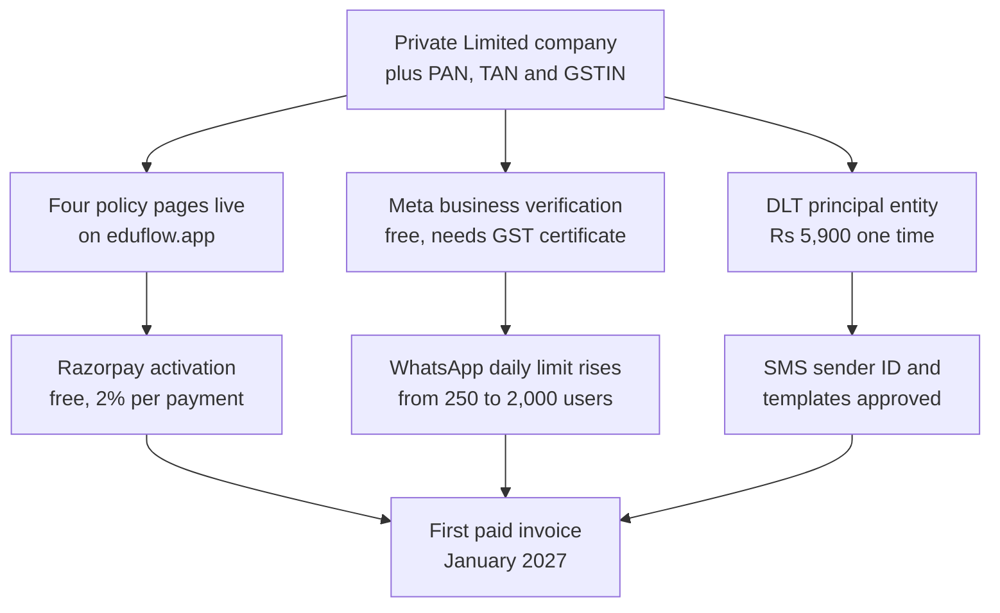

# Pilot and Launch: Month 3 to Month 6

**In simple words:** This chapter covers the money you spend from December 2026 to March 2027: the free pilot with five institutes, the paid launch in January 2027, and the first buying season. Every total shows its arithmetic at three budget levels, so you can change any input. It also names the month when customer cash starts to cover your costs.

## What these four months are

Business Year 1 starts in October 2026, so Month 3 is December 2026 and Month 6 is March 2027. The pilot itself starts earlier, on Day 45 (18 November 2026), inside Month 2. Its spending runs into December, so this chapter carries it.

| Month | What happens | Paying customers at month end | Cash collected |
|---|---|---|---|
| Dec 2026 | Sprint ends 3 Dec. Pilot runs in 5 institutes | 0 | Rs 0 |
| Jan 2027 | Paid launch. First invoices. Buying season opens | 6 | Rs 1,31,400 |
| Feb 2027 | Selling season. First churn (1 institute) | 16 | Rs 2,34,900 |
| Mar 2027 | Peak buying season before the April session | 30 | Rs 3,46,500 |

Counts and cash come from the BRD and *The Money Map: Day 0 to Year 5*. The five pilot institutes pay nothing. They give you screenshots, quotes and a case study, which is what January selling runs on.

> **Note:** "Cash collected" here is the amount before GST. The bank receives 18% more. That 18% is GST you hold for the government, not money you can spend.

## The three budget levels

- **Minimum** means free tiers, the founder does everything himself, and you buy only what is legally or technically unavoidable.
- **Recommended** is the BRD plan. It is the number this chapter reconciles to.
- **Maximum** is the sensible upper end. Above it, the money is waste.

## The month-by-month budget

| Month | Minimum | Recommended | Maximum | Biggest line at Recommended |
|---|---|---|---|---|
| Dec 2026 | Rs 47,400 | Rs 84,000 | Rs 1,71,200 | Legal and compliance Rs 31,000 |
| Jan 2027 | Rs 43,750 | Rs 1,07,900 | Rs 1,67,700 | Marketing Rs 60,000 |
| Feb 2027 | Rs 49,550 | Rs 1,18,400 | Rs 1,85,800 | Marketing Rs 65,000 |
| Mar 2027 | Rs 53,250 | Rs 1,24,800 | Rs 1,95,200 | Marketing Rs 65,000 |
| **Four months** | **Rs 1,93,950** | **Rs 4,35,100** | **Rs 7,19,900** | |

Arithmetic at Recommended: Rs 84,000 + Rs 1,07,900 + Rs 1,18,400 + Rs 1,24,800 = Rs 4,35,100. The Minimum and Maximum columns add up the same way.

The same money, split by line across the four months:

| Line | Minimum | Recommended | Maximum |
|---|---|---|---|
| Hosting (Vercel, Railway, S3, SES, own messages) | Rs 20,000 | Rs 36,000 | Rs 54,000 |
| Customer message cost (paid back by customers) | Rs 7,500 | Rs 7,500 | Rs 7,500 |
| Payment gateway fees on your own billing | Rs 1,050 | Rs 12,600 | Rs 24,400 |
| Tools | Rs 34,000 | Rs 83,000 | Rs 1,24,500 |
| Marketing | Rs 80,000 | Rs 2,12,000 | Rs 3,25,000 |
| Salaries | Rs 0 | Rs 0 | Rs 0 |
| Legal and compliance | Rs 34,900 | Rs 55,000 | Rs 1,33,500 |
| Misc (internet, phone, travel, bank, stationery) | Rs 16,500 | Rs 29,000 | Rs 51,000 |
| **Total** | **Rs 1,93,950** | **Rs 4,35,100** | **Rs 7,19,900** |

Reconciliation: Rs 36,000 + Rs 7,500 + Rs 12,600 = Rs 56,100, the BRD "infra and delivery" line for these four months. Recommended January to March adds to Rs 3,51,100, the BRD six-month summary figure. December's Rs 84,000 closes the Rs 2,40,000 spent before the first customer pays.

> **Rule:** Salaries stay at Rs 0 in all three levels. The founder takes no pay before April 2027, and the first hire needs 30 paying organizations. No trigger, no hire.

### Where the hosting money goes

The BRD books Rs 6,000, Rs 8,000, Rs 10,000 and Rs 12,000 (see Master Price List). Railway grows from Rs 3,500 to Rs 8,700, because the pilot added a staging copy and paying customers add load. Vercel Pro is flat at Rs 1,700; Hobby is free but barred for commercial use. S3, SES, MSG91 and WhatsApp together rise from Rs 800 to Rs 1,600. December: Rs 3,500 + Rs 1,700 + Rs 800 = Rs 6,000. March: Rs 8,700 + Rs 1,700 + Rs 1,600 = Rs 12,000. These are US dollar bills, so EduFlow pays 18% IGST under reverse charge and claims it back.

## Pilot costs: five free institutes

The pilot is free for the institute, not for you. Every rupee below sits inside the marketing lines "Field travel" and "Print and leave-behinds" for November and December (Rs 40,000 together).

| Item | When to pay | Minimum | Recommended | Maximum | Can you avoid or reduce it? |
|---|---|---|---|---|---|
| Travel to 5 institutes, about 15 visits (no GST on fuel) | Nov to Dec | Rs 2,000 | Rs 6,000 | Rs 15,000 | Yes. Keep 4 of 5 pilots in your own city |
| Printed training sheets (GST inside price, ITC yes) | Nov to Dec | Rs 600 | Rs 2,000 | Rs 5,000 | Yes. Send a PDF on WhatsApp instead |
| Demo phone or tablet (one time, ITC yes) | Nov 2026 | Rs 0 | Rs 0 | Rs 12,000 | Yes. Your own phone shows the parent app |
| Tea, snacks and counter printouts | Nov to Dec | Rs 500 | Rs 1,500 | Rs 3,000 | No. It is basic courtesy at a fee counter |
| Thank-you gift for 5 pilot owners | Dec 2026 | Rs 0 | Rs 2,500 | Rs 5,000 | Yes. A signed case study is worth more |
| **Pilot total** | | **Rs 3,100** | **Rs 12,000** | **Rs 40,000** | |

> **Example:** Training sheets at Recommended: 5 institutes x 20 staff users x 4 colour pages x Rs 5 = Rs 2,000. At Minimum: 5 x 20 x 2 black-and-white pages x Rs 1.50 = Rs 300, rounded to Rs 600 with reprints.

Travel at Recommended: four institutes in your city, three visits each at about Rs 300 by auto-rickshaw (Lucknow meter fare Rs 10.24 a km), so 4 x 3 x Rs 300 = Rs 3,600. One institute 75 km away, three visits at Rs 800 return, so Rs 2,400. Total Rs 6,000.

> **Warning:** Do not buy a demo tablet. Owners want the parent app on a normal phone, because that is what their parents hold.

## Switching on the money pipe: Razorpay

You cannot invoice in January if the gateway is not live in December. Opening a Razorpay account is free.

| Item | When to pay | Minimum | Recommended | Maximum | Can you avoid or reduce it? |
|---|---|---|---|---|---|
| Account setup and yearly fee | Dec 2026 | Rs 0 | Rs 0 | Rs 0 | Already free. No setup and no annual fee |
| Platform fee, Dec to Mar, after the GST credit | Per payment | Rs 1,050 | Rs 12,600 | Rs 24,400 | Yes. Move renewals to UPI AutoPay mandates |
| Instant settlement add-on (0.30%) | Per payment | Rs 0 | Rs 0 | Rs 2,500 | Yes. T plus 1 settlement is free. Skip it |

Razorpay asks for the certificate of incorporation, company PAN, GSTIN, the current account, and a live website showing terms of service, privacy policy, refund and cancellation policy and a contact page. That is why the legal documents must be finished in November.

**Worked example, one Growth payment.** Rs 2,499 + 18% GST = Rs 2,948.82 collected. Razorpay takes 2% = Rs 58.98, plus 18% GST on the fee = Rs 10.62, so Rs 69.60 leaves the account. You claim the Rs 10.62 back, so the real cost is Rs 58.98, or 2.36% of Rs 2,499.

The BRD assumes 1.5% of the GST-inclusive invoice, which is 1.77% of the price before GST. On Rs 7,12,800 collected in the quarter, the gross invoiced amount is Rs 7,12,800 x 1.18 = Rs 8,41,104, and 1.5% of that is Rs 12,617, booked as Rs 12,600. At Razorpay's real rate it is 2% of Rs 8,41,104 = Rs 16,822 after the GST credit.

> **Warning:** The BRD gateway assumption is about Rs 4,200 too low for the quarter (Rs 16,822 against Rs 12,600). Keep the plan number and close the gap with mandates.

1. **UPI AutoPay mandates through Cashfree.** Rs 7.50 a mandate plus Rs 15 a debit is 0.6% of Rs 2,499, against 2.36% on a card. On the 52 monthly payments billed in the quarter: 52 x Rs 44 = Rs 2,288 saved.
2. **Cashfree's new-merchant offer.** 0% platform fee on the first Rs 20 lakh of volume, for sign-ups from 21 July 2026, ending 31 March 2027. Your Rs 8.41 lakh sits inside it, so the fee is likely to be zero this quarter and back in April.
3. **Negotiate.** Razorpay goes below 2% above Rs 5 lakh a month, which you cross in March 2027.

> **Rule:** Each institute keeps its own gateway account for student fees. EduFlow never collects them. NPCI bars passing UPI MDR to the payer, so a convenience fee on UPI would break the rule.

## Switching on messaging

**Figure: What must be ready before the first rupee can be collected**

Everything starts with the company papers. Two branches cost almost nothing in cash, but each waits days for approval. Start all three in the first week of December.

### WhatsApp verification and message costs

Meta business verification is free. It needs the certificate of incorporation, the GST certificate, an address proof and proof of your domain or email. Before it, you may message only 250 unique users a day, shared across every number in your portfolio. Verification lifts that to 2,000 a day, then 10,000, then 100,000, as delivery quality holds.

| Item | When to pay | Minimum | Recommended | Maximum | Can you avoid or reduce it? |
|---|---|---|---|---|---|
| Meta business verification | Dec 2026 | Rs 0 | Rs 0 | Rs 0 | Already free. Only the paperwork costs time |
| Own demo, pilot and OTP messages (+ GST, ITC yes) | Dec to Mar | Rs 800 | Rs 1,200 | Rs 2,500 | Yes. Use utility templates, not marketing |
| Customer messages, Jan to Mar (+ GST, ITC yes) | Jan to Mar | Rs 7,500 | Rs 7,500 | Rs 7,500 | No. Customers pay it back at cost plus 15% |
| WhatsApp support number SIM (monthly) | Dec to Mar | Rs 374 | Rs 374 | Rs 374 | Yes, but do not. One clean number matters |

India rates (see Master Price List): marketing Rs 0.8631, utility Rs 0.115 and authentication Rs 0.115 per delivered message, each plus 18% GST which you claim back.

**Worked example, January.** 60 sign-ups x 2 one-time passwords = 120 x Rs 0.115 = Rs 13.80. 60 demo confirmations at the utility rate = Rs 6.90. 200 marketing broadcasts x Rs 0.8631 = Rs 172.62. Total Rs 193.32, plus 18% GST = Rs 228.12. The plan books Rs 250, so it fits.

> **Warning:** From 1 October 2026 Meta charges for service replies inside the 24-hour window, after about 1,000 free per business number per month. A payment method must be on the Meta account by 30 September 2026, or service messages stop being delivered.

### DLT registration and the SMS wallet

DLT is the TRAI register every business must join before sending business SMS in India. Register on one operator portal only. The entity data is shared with the others.

| Portal | Fee | Validity | Cost over 5 years | Verdict |
|---|---|---|---|---|
| Vodafone Idea (Vilpower) | Rs 5,000, GST not stated | 5 years | Rs 5,900 with GST | Use this one |
| Jio (TrueConnect) | Rs 5,900 incl. GST | Reported 1 year | About Rs 29,500 | Avoid. Yearly renewal |

Vodafone Idea instead of Jio is likely to save about Rs 23,600 over five years (Estimate: the Jio validity is a secondary source, so confirm it before paying). The BRD books Rs 6,000 in December, which fits. Sender ID and template registration have no listed fee. Telemarketer registration (Rs 5,000 plus a Rs 50,000 deposit) is for aggregators only, so MSG91 does it.

MSG91 has no monthly fee. You load a prepaid wallet.

| Pack | Cash out (+ 18% GST, ITC yes) | Price per SMS | When to buy it |
|---|---|---|---|
| 5,000 SMS | Rs 1,250 | Rs 0.25 | December, for OTP and template testing |
| 30,000 SMS | Rs 5,400 | Rs 0.18 | Only when customers send over 5,000 a month |

EduFlow resells SMS at Rs 0.25 (canon: Rs 1,250 per 5,000), so the 5,000 pack earns zero margin and the 30,000 pack earns Rs 0.07 a message, or 28%. Break-even on the bigger pack: Rs 5,400 divided by Rs 0.25 = 21,600 messages.

### Amazon SES for email

New SES accounts start on Essentials at US$0.16 per 1,000 emails (Rs 13.60). Switch to a la carte at US$0.10 per 1,000 (Rs 8.50) on day one, which saves 38%. Two free December jobs: move the account out of the SES sandbox, or pilot emails reach only verified addresses; and send report cards as S3 links, not attachments, which cost Rs 10.20 a GB. Rs 300 a month covers about 35,000 emails.

## Legal documents before launch

Four documents must exist before the first paid invoice: terms of service, privacy policy, a data processing agreement for schools, and parental consent wording. Contents are set in the BRD chapter *Compliance, Legal and Data Protection Requirements*.

| Item | When to pay | Minimum | Recommended | Maximum | Can you avoid or reduce it? |
|---|---|---|---|---|---|
| Policy generator subscription (yearly, foreign bill) | Nov 2026 | Rs 6,100 | Rs 0 | Rs 0 | Yes, if a lawyer drafts the set instead |
| Lawyer review or drafting (one time, 18% reverse charge) | Nov 2026 | Rs 0 | Rs 25,000 | Rs 75,000 | No. Do not launch on templates alone |
| DPDP notices and consent drafting (one time) | Before May 2027 | Rs 0 | Rs 0 | Rs 1,00,000 | Partly. Duties start May 2027, not now |

> **Note:** The policy generator row is a substitution, not a level. At Minimum the Rs 6,100 generator does the lawyer's job, so it stands above the Rs 0 at Recommended and Maximum, where the lawyer does that job instead. The Rs 6,100 is a November cost, so the Rs 34,900 Minimum in the legal and compliance line of this chapter, which covers December to March, does not change.

The Recommended Rs 25,000 sits in the **November** budget, not December. It is shown here because the work must finish before the January launch. Do not count it twice. At Minimum you use a generator such as iubenda Essentials (about Rs 6,100 a year) and write the DPA and consent text yourself. Those templates do not cover DPDP children's consent.

> **Warning:** The BRD's Rs 25,000 buys a lawyer's review of documents you prepared, not a drafted set. A full SaaS set costs Rs 25,000 to Rs 75,000, and DPDP drafting alone is Rs 50,000 to Rs 1 lakh. Plan Rs 40,000 to Rs 75,000 more before May 2027, when verifiable parental consent duties begin.

Lawyer fees carry 18% GST under reverse charge: on Rs 25,000 you pay Rs 4,500 and claim the same Rs 4,500 back that month.

## The security test before launch

You hold the personal data of children. This is the one line never to cut.

| Item | When to pay | Minimum | Recommended | Maximum | Can you avoid or reduce it? |
|---|---|---|---|---|---|
| Freelance pre-launch test (one time, + GST) | Dec 2026 | Rs 15,000 | Rs 20,000 | Rs 30,000 | No. Test tenant isolation before real data |
| Startup pentest package with retest (one time) | Dec 2026 | Rs 0 | Rs 0 | Rs 74,999 | Yes in Year 1. Buy it when a group asks |

A freelance test at Rs 15,000 to Rs 30,000 is not a formal VAPT report, and large buyers will not accept it as one. A real report costs Rs 40,000 to Rs 1.5 lakh; under about Rs 25,000 is usually an automated scan. Plan the report for Year 2.

What the December test must cover, in this order:

1. Tenant isolation: can a Sharma Classes user read a Bright Future Public School row by changing an ID?
2. The `orgId` claim in the JWT: can it be edited, and is `X-Organization-Id` accepted from a non-Super-Admin?
3. Login: are 5 attempts per 15 minutes per account and IP enforced, and are refresh tokens rotated?
4. Files: does a pre-signed S3 link leak outside its organization, and does it expire?
5. Direct object access on `/students/:id` and `/fee-invoices/:id` from a parent account.

## Launch costs

### Landing page and free listings

| Item | When to pay | Minimum | Recommended | Maximum | Can you avoid or reduce it? |
|---|---|---|---|---|---|
| Landing page build, on the same Vercel project | Dec 2026 | Rs 0 | Rs 0 | Rs 40,000 | Yes. Build it yourself with Claude Code |
| Website, SEO tools, Hindi proofreading (quarterly) | Dec to Mar | Rs 3,000 | Rs 14,000 | Rs 30,000 | Partly. Hindi proofreading is worth paying for |
| Google Business Profile and Justdial basic listing | Dec 2026 | Rs 0 | Rs 0 | Rs 0 | Already free. Do both on day one |
| Justdial paid package (yearly, + GST) | Jan to Mar | Rs 0 | Rs 8,000 | Rs 20,000 | Yes. No public rate card. Ask for a quote |
| IndiaMART catalogue or TrustSEAL (yearly) | Never in Year 1 | Rs 0 | Rs 0 | Rs 28,000 | Yes. Buyers there look for goods, not SaaS |

The Rs 14,000 is the BRD line "Website, SEO tools and Hindi proofreading" (Rs 8,000 in Q1 plus Rs 6,000 in Q2). The Rs 8,000 is the whole "Justdial and other listings" line for January to March.

> **Best practice:** Buy a paid listing only after the free one has produced measurable calls for 90 days.

### Print: brochures, standees and cards

Retail print prices already include 18% GST, claimable with a GST invoice.

| Item | When to pay | Minimum | Recommended | Maximum | Can you avoid or reduce it? |
|---|---|---|---|---|---|
| Tri-fold brochures, 170 gsm (one time) | Jan 2027 | Rs 0 | Rs 7,334 for 100 | Rs 20,260 for 1,000 | Yes. Send the PDF on WhatsApp |
| Roll-up standee, 2 by 5 feet (one time) | Jan 2027 | Rs 650 local | Rs 1,929 branded | Rs 3,858 for two | Partly. One standee covers a fair |
| Visiting cards, 200 pieces (one time) | Dec 2026 | Rs 230 | Rs 460 | Rs 920 | No. Owners still ask for a card |
| **Print total** | | **Rs 880** | **Rs 9,723** | **Rs 25,038** | |

The BRD print line for January to March is Rs 12,000, so Rs 9,723 fits with Rs 2,277 spare.

> **Warning:** A brochure goes out of date the day you ship a feature. At 1,000 pieces you pay Rs 20.26 each; at 100 pieces Rs 73.34 each. The per-piece price looks terrible, but Rs 7,334 wasted beats Rs 20,260 wasted.

### First paid ad tests

The BRD gives Rs 30,000 for the ads test in January to March. Spend it as a test, not as a channel.

| Split | Amount | What it buys | What it should produce |
|---|---|---|---|
| Google Ads, long-tail and Hindi keywords | Rs 15,000 | 75 to 250 clicks at Rs 60 to Rs 200 | 4 to 12 sign-ups |
| Meta Ads, institute owners in 5 cities | Rs 15,000 | 25 to 100 leads at Rs 150 to Rs 600 | 5 to 15 demo requests |
| GST on ad spend, claimed back | Rs 5,400 | 18% on Rs 30,000 of spend | Input tax credit, not a cost |

**The CAC check.** At Rs 100 a click, Rs 1,00,000 buys 1,000 clicks; 5% sign up is 50 trials; 15% pay is 7.5 customers, so Rs 13,300 each. The canon limit is Rs 12,000, so paid search alone is already above it. That is why the test is capped at Rs 30,000.

> **Rule:** Stop any ad set that costs more than Rs 1,500 per demo held, once it has spent Rs 10,000. Move the money to field visits, which cost about Rs 10,267 per win but sell mostly the Rs 5,999 Pro plan.

Bid on "coaching institute software" (Rs 30 to Rs 120 a click) before "school management software" (Rs 60 to Rs 200). Teachmint, Entab and review sites bid hard on the second phrase. Hindi and city words cost less.

## The CA, the books and the support desk

| Item | When to pay | Minimum | Recommended | Maximum | Can you avoid or reduce it? |
|---|---|---|---|---|---|
| CA retainer: books, GST returns, TDS (monthly, + GST) | Dec to Mar | Rs 3,000 | Rs 5,000 | Rs 8,000 | No. A late GST return costs more |
| Compliance extras: contract review, registrations | Jan to Mar | Rs 0 | Rs 3,000 | Rs 5,000 | Partly. Pay when a real contract arrives |
| Accounting software (monthly, + GST) | Jan to Mar | Rs 0 | Rs 750 | Rs 1,499 | Yes. Zoho Books Free covers all of Year 1 |
| CRM for leads and demos (monthly, + GST) | Jan to Mar | Rs 0 | Rs 250 | Rs 800 | Yes. Zoho CRM Free covers 3 users |
| Shared support inbox (monthly, + GST) | Dec to Mar | Rs 0 | Rs 300 | Rs 800 | Partly. A free tier works at 30 customers |
| Status page and uptime monitoring (monthly) | Dec to Mar | Rs 0 | Rs 0 | Rs 1,275 | Yes. Better Stack free gives 1 status page |
| Sales telephony or IVR (monthly, + GST) | Feb 2027 | Rs 0 | Rs 0 | Rs 2,000 | Yes in Year 1. Your own mobile is enough |

Two BRD corrections, both in your favour. **Zoho Books Free** covers revenue up to Rs 25 lakh and 1,000 invoices a year; Year 1 revenue is Rs 23,24,600 and the quarter bills 52 invoices, so Free saves Rs 2,250. Move to Standard when Year 2 crosses Rs 25 lakh. **Zoho CRM** has no plan at the BRD's Rs 250; Free covers 3 users.

The CA retainer is quoted before GST: at Rs 5,000 you pay Rs 5,900 and claim Rs 900 back. Ask for the QRMP scheme, allowed up to Rs 5 crore of turnover: 8 returns and 8 challans a year instead of 24. Late filing costs Rs 50 a day per return, capped at Rs 2,000.

The WhatsApp support number is the cheapest support tool you own. One SIM is Rs 374 a month, and Meta gives about 1,000 free service replies per number per month. At 30 customers x 15 replies = 450, inside the allowance. At 120 customers it is 1,800, so 800 cost Rs 0.14 each with GST: Rs 112 a month.

## When customer cash starts to cover costs

| Month | Total cost | Cash collected | Net cash flow | Bank balance at month end |
|---|---|---|---|---|
| Dec 2026 | Rs 84,000 | Rs 0 | Minus Rs 84,000 | Rs 3,60,000 |
| Jan 2027 | Rs 1,07,900 | Rs 1,31,400 | Rs 23,500 | Rs 3,83,500 |
| Feb 2027 | Rs 1,18,400 | Rs 2,34,900 | Rs 1,16,500 | Rs 5,00,000 |
| Mar 2027 | Rs 1,24,800 | Rs 3,46,500 | Rs 2,21,700 | Rs 7,21,700 |

**January 2027 is the first cash-positive month:** Rs 1,31,400 in against Rs 1,07,900 out, so Rs 23,500 stays. The balance bottoms at Rs 3,60,000 on 31 December 2026, the lowest point of the whole plan.

Cash-positive is not profit-positive. The accounting result stays negative: minus Rs 86,900, minus Rs 57,900 and minus Rs 10,300. The first profitable month is May 2027. The difference is yearly plans: Rs 24,990 + 18% GST = Rs 29,488 lands at once, but only Rs 2,082 a month counts as revenue.

**How much of the Rs 7,21,700 is really yours.** Cash collected is Rs 7,12,800. Revenue earned is Rs 21,000 + Rs 60,500 + Rs 1,14,500 = Rs 1,96,000. So about Rs 5,16,800 is advance money for service not yet given (Estimate: it assumes all earned revenue was collected). Own cash is roughly Rs 7,21,700 minus Rs 5,16,800 = Rs 2,04,900, with the GST float on top.

> **Rule:** Own cash = bank balance minus GST due minus customer advances. Never let it fall below three months of spend. In March 2027 that is Rs 2,04,900 against Rs 1,24,800 a month, about 1.6 months.

If no customer chooses a yearly plan, the balance falls to Rs 1,66,250 in April 2027, under one month of spend. That is why the founder keeps a personal standby reserve of Rs 4,00,000 outside the company.

## What to avoid in these four months

| Temptation | What it costs | What to do instead |
|---|---|---|
| A launch event with a hall, food and banners | Rs 50,000 to Rs 1,50,000 (Estimate) | 5 pilot case studies and 15 field demos |
| Paid PR or a press release package | Rs 15,000 to Rs 50,000 (Estimate) | Owners read WhatsApp groups, not tech press |
| A DIDAC India stall, 25 to 27 Nov 2026 | Rs 2,86,740 with GST for 9 square metres | Regional expos at Rs 15,000 to Rs 60,000 |
| Ad spend above the Rs 30,000 test | Rs 13,300 per customer at Rs 100 a click | Keep the cap. Field visits sell the Pro plan |
| 1,000 brochures before Phase 2 ships | Rs 20,260, out of date in February | 100 brochures at Rs 7,334, reprint in March |
| IndiaMART TrustSEAL for buy leads | Rs 45,000 to Rs 80,000 a year | Free Justdial and Google Business listings |
| A formal VAPT report nobody asked for | Rs 74,999 and up | Rs 20,000 freelance test now, report in Year 2 |
| The 30,000 SMS pack before customers send | Rs 5,400 of idle cash in a wallet | The 5,000 pack at Rs 1,250 until demand is real |

> **Founder note:** Every row above is bought to feel like a real company. None of them wins a customer in this buying season. The two things that do are a working product in five institutes and your own visits.

## Key takeaways

- These four months cost Rs 4,35,100 at the BRD plan level, Rs 1,93,950 at Minimum and Rs 7,19,900 at Maximum. The January to March part, Rs 3,51,100, matches the BRD six-month summary exactly.
- January 2027 is the first cash-positive month: Rs 1,31,400 in against Rs 1,07,900 out. The balance bottoms at Rs 3,60,000 on 31 December 2026. The first profitable month is May 2027.
- Three switches must be on before the first invoice: Razorpay (free, needs the four policy pages live), Meta verification (free, lifts the daily limit from 250 to 2,000 users) and DLT on the Vodafone Idea portal at Rs 5,900 for five years.
- The BRD gateway assumption of 1.5% is about Rs 4,200 low for the quarter. Close the gap with UPI AutoPay mandates at Rs 15 a debit, or Cashfree's 0% offer, which ends on 31 March 2027.
- The BRD's Rs 25,000 for legal documents buys a review, not a drafted set. Budget Rs 40,000 to Rs 75,000 more before May 2027, when DPDP parental consent duties begin.
- Zoho Books Free and Zoho CRM Free cover all of Year 1. Do not cut the CA retainer, the legal review or the Rs 20,000 security test.
- Marketing is the biggest line in three of the four months. Cap paid ads at Rs 30,000 and keep cost per win under Rs 12,000.
