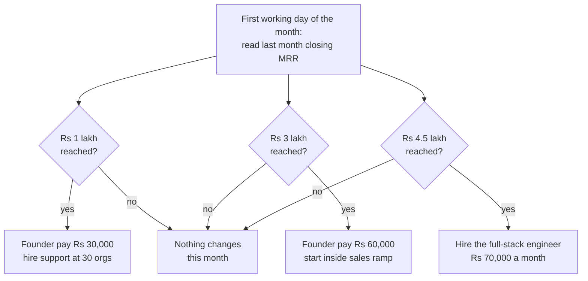

# Months 7 to 12: First Hires and Growth

**In simple words:** This chapter covers April to September 2027, the second half of Business Year 1. You start paying yourself, you hire your first three people, and spending triples. Every number shows its arithmetic at three budget levels, and the six-month total closes the BRD Year 1 figure of Rs 23,77,500.

## What these six months are

Month 7 is April 2027 and Month 12 is September 2027. The buying season is over and the April session has started, so money shifts from selling to onboarding, support and product.

| Month | Paying orgs | Blended ARPA | Closing MRR | Trigger that fires |
|---|---|---|---|---|
| Mar 2027 | 30 | Rs 3,333 | Rs 1,00,000 | 30 orgs; MRR Rs 1 lakh |
| Apr 2027 | 46 | Rs 3,500 | Rs 1,61,000 | None |
| May 2027 | 62 | Rs 3,750 | Rs 2,32,500 | None |
| Jun 2027 | 78 | Rs 3,900 | Rs 3,04,200 | MRR Rs 3 lakh |
| Jul 2027 | 94 | Rs 4,800 | Rs 4,51,200 | MRR Rs 4.5 lakh |
| Aug 2027 | 108 | Rs 4,900 | Rs 5,29,200 | None |
| Sep 2027 | 120 | Rs 5,000 | Rs 6,00,000 | Year 1 canon target met |

The path of customer counts and ARPA (average revenue per account) is an Estimate. Only the ends are fixed: 30 organizations in March, 120 at Rs 5,000 each in September. The July step is Phase 3 moving multi-campus schools from Growth to Pro.

> **Rule:** MRR means monthly recurring revenue: the subscription money that repeats every month. Every hiring decision here reads the closing MRR of the month just finished. Nothing reads a date.

## The three budget levels

- **Minimum:** free tiers, the founder does what he can himself, only what is unavoidable. Here that is one hire, not three.
- **Recommended:** the BRD plan, the number this chapter reconciles to.
- **Maximum:** the sensible upper end. Above it, the money is waste.

| Line | Minimum | Recommended | Maximum |
|---|---|---|---|
| Infra and delivery | Rs 2,11,800 | Rs 2,92,400 | Rs 4,13,900 |
| Tools | Rs 73,000 | Rs 1,68,000 | Rs 2,39,000 |
| Marketing | Rs 1,57,000 | Rs 3,68,000 | Rs 6,25,000 |
| Salaries | Rs 3,12,000 | Rs 6,30,000 | Rs 9,78,000 |
| Legal and compliance | Rs 48,900 | Rs 1,04,000 | Rs 1,98,000 |
| Misc (laptops, internet, travel) | Rs 99,000 | Rs 2,24,000 | Rs 4,03,980 |
| **Six-month total** | **Rs 9,01,700** | **Rs 17,86,400** | **Rs 28,57,880** |

Recommended: Rs 2,92,400 + Rs 1,68,000 + Rs 3,68,000 + Rs 6,30,000 + Rs 1,04,000 + Rs 2,24,000 = Rs 17,86,400.

## Month by month

| Month | Minimum | Recommended | Maximum | Salaries at Recommended |
|---|---|---|---|---|
| Apr 2027 | Rs 1,69,900 | Rs 2,18,000 | Rs 3,82,990 | Rs 60,000 |
| May 2027 | Rs 1,23,400 | Rs 1,93,300 | Rs 3,14,500 | Rs 60,000 |
| Jun 2027 | Rs 1,29,700 | Rs 2,09,100 | Rs 3,33,000 | Rs 60,000 |
| Jul 2027 | Rs 1,41,000 | Rs 3,20,700 | Rs 5,54,490 | Rs 1,15,000 |
| Aug 2027 | Rs 1,71,400 | Rs 4,42,100 | Rs 7,20,000 | Rs 1,50,000 |
| Sep 2027 | Rs 1,66,300 | Rs 4,03,200 | Rs 5,52,900 | Rs 1,85,000 |
| **Total** | **Rs 9,01,700** | **Rs 17,86,400** | **Rs 28,57,880** | **Rs 6,30,000** |

Check: Rs 2,18,000 + Rs 1,93,300 + Rs 2,09,100 + Rs 3,20,700 + Rs 4,42,100 + Rs 4,03,200 = Rs 17,86,400. Three jumps make the shape. April adds Rs 35,000 for a laptop. July adds the founder's second pay step and the inside sales hire. August adds the engineer's half month, a Rs 60,000 laptop, Rs 10,000 of AI coding tools and Rs 35,000 for the first statutory audit and annual filings.

## Founder pay: the two steps

| Step | Trigger | Starts | Monthly | Paid in Year 1 |
|---|---|---|---|---|
| Step one | The month after MRR reaches Rs 1 lakh | Apr 2027 | Rs 30,000 | Rs 90,000 |
| Step two | The month after MRR reaches Rs 3 lakh | Jul 2027 | Rs 60,000 | Rs 1,80,000 |

Rs 30,000 x 3 + Rs 60,000 x 3 = Rs 2,70,000, the whole Year 1 founder cost, because pay is Rs 0 from October 2026 to March 2027. Rs 30,000 covers a frugal single-person budget in Patna or Lucknow, about Rs 25,000 (see Master Price List). It does not cover Noida at about Rs 40,000 or Bengaluru at about Rs 46,000. In a metro, draw on the personal reserve until July rather than break the trigger.

> **Founder note:** Pay yourself through payroll with a salary slip, not as a drawing from the bank. A slip is what a landlord, a bank and an investor's diligence team ask for.

## The three first hires

| Role | Trigger | Starts | Monthly cost in plan | Paid in Year 1 |
|---|---|---|---|---|
| Onboarding and customer success executive | 30 paying orgs | 1 Apr 2027 | Rs 30,000 | Rs 1,80,000 |
| Inside sales executive | MRR Rs 3 lakh | 1 Jul 2027 | Rs 25,000, 3-month ramp | Rs 75,000 |
| Full-stack engineer | MRR Rs 4.5 lakh | 16 Aug 2027 | Rs 70,000 | Rs 1,05,000 |

Salary arithmetic: Rs 1,80,000 + Rs 75,000 + Rs 1,05,000 + founder Rs 2,70,000 = Rs 6,30,000, the BRD Year 1 salary line. The engineer's Rs 1,05,000 is half of August plus all of September.

### What each role costs by city

Monthly gross pay. Tier 2 means Patna, Lucknow, Indore and Jaipur. Every row is an Estimate: salary sites average job posts (see Master Price List).

| Role | Patna or Lucknow | Delhi NCR | Bengaluru | BRD plan | Where the plan sits |
|---|---|---|---|---|---|
| Customer success executive | Rs 20,000 to 30,000 | Rs 30,000 to 50,000 | Rs 35,000 to 50,000 | Rs 30,000 | Top of the Tier 2 band |
| Inside sales executive, fixed | Rs 18,000 to 30,000 | Rs 29,000 to 50,000 | Rs 30,000 to 50,000 | Rs 25,000 | Middle of the Tier 2 band |
| Full-stack engineer, 3 to 5 years | Rs 42,000 to 75,000 | Rs 67,000 to 1,25,000 | Rs 75,000 to 1,25,000 | Rs 70,000 | Top of Tier 2, floor of metro |

Rs 70,000 a month is Rs 8.4 lakh a year. Software engineers average Rs 5.00 lakh in Lucknow and Rs 5.70 lakh in Indore, so you pay about 47% to 68% above the local average. That buys a strong 3-to-5-year developer working remotely from Tier 2, not a weak metro hire.

> **Warning:** Do not chase a senior engineer with this budget. Six years and above costs Rs 9 to 16 lakh in Tier 2 and Rs 15 to 28 lakh in a metro. If the only good candidate is senior, hire a junior at Rs 4 lakh instead.

### The cost-to-company build-up

Cost to company (CTC) is the full yearly cost of one person. At four people almost every Indian statutory cost is still switched off. This is the customer success executive at the plan's Rs 30,000.

| Component | Monthly | Yearly | Why this number |
|---|---|---|---|
| Basic and dearness allowance | Rs 15,000 | Rs 1,80,000 | Labour Codes: keep it at 50% of pay or more |
| House rent allowance | Rs 7,500 | Rs 90,000 | 50% of basic; saves the employee tax |
| Special allowance | Rs 7,500 | Rs 90,000 | Balancing figure |
| **Gross pay (the BRD's CTC)** | **Rs 30,000** | **Rs 3,60,000** | |
| Employer provident fund | Rs 0 | Rs 0 | Starts at 20 employees, which is Year 3 |
| Employer state insurance | Rs 0 | Rs 0 | Starts at 10 people, and pay is above Rs 21,000 |
| Gratuity accrual | Rs 0 | Rs 0 | Starts at 10 employees |
| Statutory bonus | Rs 0 | Rs 0 | Starts at 20 employees, wages to Rs 21,000 only |
| Group health cover, 18% GST inside | Rs 700 | Rs 8,400 | Not in the BRD. Buy it anyway |
| **Real employer cost** | **Rs 30,700** | **Rs 3,68,400** | |

Two costs sit in other lines: a Rs 51,000 laptop, which is Rs 1,417 a month over three years, and a Rs 2,000 tool seat. True loaded cost = Rs 30,700 + Rs 2,000 + Rs 1,417 = Rs 34,117.

### When each statutory cost switches on

| Cost | Switches on at | Employer rate | EduFlow on 30 Sep 2027 |
|---|---|---|---|
| Provident fund and its charges | 20 employees | 13% of PF wages, at most Rs 3,250 | Not due; team is 4 |
| State insurance (ESI) | 10 people | 3.25% of gross up to Rs 21,000 | Not due; all pay is above Rs 21,000 |
| Gratuity | 10 employees | About 2.4% of CTC accrued | Not due; starts in Year 2 |
| Statutory bonus | 20 employees | 8.33% to 20% of wages to Rs 21,000 | Not due |
| Professional tax | State rule | Bihar up to Rs 2,500 a year | Deducted from pay, not an employer cost |
| Group health cover | Voluntary | Rs 2,500 to 6,500 a year plus 18% GST | Buy it: about Rs 700 a month each |

Professional tax is nil in Uttar Pradesh, Delhi, Haryana and Rajasthan, and so is the labour welfare fund in Bihar, Uttar Pradesh and Rajasthan.

> **Note:** The provident fund wage ceiling rose from Rs 15,000 to Rs 25,000 in September 2026. It does not bite in Year 1 or Year 2, but from Year 3 each covered employee costs up to Rs 3,250 a month more. Ask the CA to model it before the twentieth hire.

The BRD misses only group health: Rs 700 x 6 for customer success, Rs 700 x 3 for inside sales and Rs 700 x 1.5 for the engineer = Rs 7,350, which Misc absorbs.

> **Warning:** The inside sales plan of Rs 25,000 holds no incentive. The market pays 10% to 30% of fixed pay on top, so from October 2027 budget Rs 2,500 to Rs 7,500 more a month, or Rs 30,000 to Rs 90,000 in Year 2.

## What hiring itself costs

| Channel | Price | GST | Use it for |
|---|---|---|---|
| Indeed free job post | Rs 0 | None | All three roles; live 30 days |
| LinkedIn free job post | Rs 0 | None | The engineer; 1 post, 14 days, then it pauses |
| Internshala free plan | Rs 0 | None | Interns; 1 listing a month, 20 applications |
| Naukri Classified, non-metro | Rs 400 | Not stated | Customer success and sales in Patna or Lucknow |
| Naukri Classified, metro | Rs 850 | Not stated | The engineer in Delhi NCR or Bengaluru |
| Naukri Hot Vacancy | Rs 1,650 for one, Rs 4,950 for three | Not stated | The engineer, where you need reach |
| Apna job credits | Rs 1,949 for 3 credits | On request | Tele-callers and field sales in Tier 2 |
| LinkedIn Recruiter Lite | Rs 8,260 a seat a month | Not stated | Never, for junior Tier 2 hiring |
| Campus placement cell | Rs 0 to 25,000 (Estimate) | Not stated | Junior engineers, support |

The campus row is an Estimate: most Tier 2 colleges charge nothing, so the cost is travel, a test platform and your time, about Rs 15,000 to Rs 25,000 for two colleges.

**Your plan at Recommended.** A Naukri Classified non-metro post at Rs 400 for customer success, a 3-credit Apna pack at Rs 1,949 for inside sales, and a free LinkedIn post plus one Naukri Hot Vacancy at Rs 1,650 for the engineer: Rs 400 + Rs 1,949 + Rs 1,650 = Rs 3,999, plus one referral bonus of Rs 15,000.

> **Tip:** Pay the referral bonus only after six months of service, so an April hire's Rs 15,000 falls in October 2027, inside Year 2. Write that condition into the offer letter.

## Where people sit

The canon rule is plain: no office before 10 people. Here is the arithmetic, for four people in September 2027.

| Option | Monthly, 4 people | One time | Verdict |
|---|---|---|---|
| Fully remote, Rs 1,000 internet each | Rs 4,000 | Rs 0 | The plan. Fits the Misc line |
| Day passes, 4 days each a month | Rs 4,000 to 12,000 | Rs 0 | Buy these for demos and team days |
| Two open desks, Patna, 18% GST added | Rs 11,800 | Rs 10,000 deposit (Estimate) | Only if home work is impossible |
| Four open desks, Lucknow, 18% GST added | Rs 18,880 | Rs 20,000 deposit (Estimate) | Too much; eats the whole Misc line |
| Small office, 300 square feet, Tier 2 | Rs 19,000 to 25,000 (Estimate) | Rs 2.82 to 3.18 lakh (Estimate) | No. It is a Year 3 decision |

Patna open desks are Rs 5,000 a seat, so 2 x Rs 5,000 x 1.18 = Rs 11,800. Lucknow is Rs 4,000, so 4 x Rs 4,000 x 1.18 = Rs 18,880. The GST returns as input credit, so the real cost is Rs 10,000 and Rs 16,000.

The small-office row is an Estimate. A dedicated Patna desk costs Rs 5,500 all in and an operator needs 60 to 80 square feet a seat with common area, so about Rs 70 to 90 a square foot; a bare shell is half that. A 300 square foot shell is Rs 12,000 to Rs 18,000 rent plus Rs 4,000 electricity, Rs 943 internet and Rs 2,000 cleaning. One time: deposit Rs 72,000 to Rs 1,08,000, furniture Rs 1,50,000, wiring and air-conditioning Rs 60,000.

> **Rule:** Misc is Rs 12,000 to Rs 20,000 a month here, and it also carries internet, phones, local travel and bank charges. Any office or full-time desk breaks it. That is the plan enforcing the canon rule, not an accident.

## Paying people: the payroll routine

| Option | Price | GST | Verdict |
|---|---|---|---|
| Zoho Payroll Free | Rs 0, up to 10 employees | None | Use this. Covers Year 1 and most of Year 2 |
| Zoho Payroll Standard | Rs 1,000 a month for 25, Rs 40 each extra | Plus 18% | Buy it in Year 3, when PF and bonus start |
| RazorpayX Payroll | Free 6 months, then Rs 100 per employee | Plus 18% | Only if you also want its current account |
| Spreadsheet plus your CA | Rs 0 extra inside the retainer | None | Works at 3 staff, breaks at 10 |

The free plan already computes income tax, provident fund, state insurance and professional tax, so there is no payroll software line at any level except Maximum.

Four things must happen every month once the first person joins: pay by the seventh, deposit TDS (tax deducted at source on salary) by the seventh of the next month, file Form 24Q quarterly, and issue Form 16 by 15 June 2028. The CA retainer covers all four, which is why it rises from Rs 5,000 in March to Rs 7,000 in April and Rs 9,000 from July.

## Marketing ramp, month by month

| Month | Programme budget | Partner commission | Marketing total |
|---|---|---|---|
| Apr 2027 | Rs 50,000 | Rs 0 | Rs 50,000 |
| May 2027 | Rs 54,000 | Rs 0 | Rs 54,000 |
| Jun 2027 | Rs 60,000 | Rs 0 | Rs 60,000 |
| Jul 2027 | Rs 58,000 | Rs 5,000 | Rs 63,000 |
| Aug 2027 | Rs 60,000 | Rs 8,000 | Rs 68,000 |
| Sep 2027 | Rs 61,000 | Rs 12,000 | Rs 73,000 |
| **Total** | **Rs 3,43,000** | **Rs 25,000** | **Rs 3,68,000** |

Where the Rs 3,43,000 goes: tele-caller Rs 8,000 x 6 = Rs 48,000; field travel Rs 10,000 x 6 = Rs 60,000; paid ads Rs 15,000 x 6 = Rs 90,000; content, Hindi writing and video Rs 8,000 x 6 = Rs 48,000; one regional school expo stall in August Rs 40,000; listings Rs 8,000; brochure reprint after Phase 3 Rs 12,000; sales telephony Rs 2,000 x 6 = Rs 12,000; referral rewards Rs 25,000.

**The CAC check.** Customer acquisition cost is what one new paying customer costs you. New customers = 120 minus 30 = 90. Sales and marketing spend = marketing Rs 3,68,000 + inside sales Rs 75,000 + 40% of customer success pay (Rs 72,000) + half the founder pay (Rs 1,35,000) = Rs 6,50,000. CAC = Rs 6,50,000 divided by 90 = Rs 7,222, against the canon limit of Rs 12,000.

> **Best practice:** Spend that room on onboarding, not on ads. A customer who files a first fee receipt inside 7 days is the one who renews, and renewals turn Rs 7,222 of CAC into an LTV-to-CAC ratio above 4.

## Infrastructure and tools growth

| Month | Hosting | Customer messages and gateway | Infra total | Hosting per student |
|---|---|---|---|---|
| Apr 2027 | Rs 14,000 | Rs 14,000 | Rs 28,000 | Rs 0.61 |
| May 2027 | Rs 17,500 | Rs 16,800 | Rs 34,300 | Rs 0.56 |
| Jun 2027 | Rs 20,000 | Rs 23,100 | Rs 43,100 | Rs 0.51 |
| Jul 2027 | Rs 22,500 | Rs 29,200 | Rs 51,700 | Rs 0.48 |
| Aug 2027 | Rs 25,000 | Rs 36,100 | Rs 61,100 | Rs 0.46 |
| Sep 2027 | Rs 28,000 | Rs 46,200 | Rs 74,200 | Rs 0.47 |
| **Total** | **Rs 1,27,000** | **Rs 1,65,400** | **Rs 2,92,400** | |

The split is an Estimate; the monthly totals are the BRD's. Student counts assume 500 active students per organization, reaching the canon's 60,000 in September, so the unit number lands on the Year 1 target of Rs 0.47 (Rs 28,000 divided by 60,000). About Rs 10,800 of that carries the 300 free Starter organizations, roughly Rs 36 each.

Messages and gateway split in the BRD ratio: about Rs 1,01,200 of message cost and Rs 64,200 of gateway fees. The gateway figure is 1.5% of Rs 36,40,700 collected with 18% GST added; the exact 1.5% calculation on Rs 42,96,026 gives Rs 64,440, rounded to Rs 64,200 in the split, which is what makes the Year 1 gateway line land on Rs 0.77 lakh. Razorpay's real 2% would cost Rs 85,921, so move renewals to UPI AutoPay mandates at about 0.6%, which costs Rs 25,776.

Tools run Rs 23,000, Rs 23,000, Rs 24,000, Rs 26,000, Rs 36,000, Rs 36,000, totalling Rs 1,68,000. April adds a Rs 2,000 seat for customer success, June Rs 1,000 for a help centre as customers pass 70, July a Rs 2,000 sales seat, August Rs 10,000 for the engineer's AI coding seat and developer tools. The April Rs 23,000 is Claude Max 20x Rs 17,000 + Sentry Rs 2,200 + Google Workspace for 2 Rs 600 + password vault Rs 400 + support inbox Rs 300 + Zoho Books Rs 750 + CRM Rs 250 + other Rs 1,500, all foreign bills carrying reverse-charge GST you claim back.

> **Tip:** Give the engineer a Claude Pro seat at Rs 1,700, not a second Max 20x at Rs 17,000. Move him up only after he hits the usage limit twice in one week.

## The Year 1 total, reconciled

| Line | Oct 2026 to Mar 2027 | Apr to Sep 2027 | Year 1 total | BRD figure |
|---|---|---|---|---|
| Infra and delivery | Rs 65,100 | Rs 2,92,400 | Rs 3,57,500 | Rs 3,57,500 |
| Tools | Rs 1,18,000 | Rs 1,68,000 | Rs 2,86,000 | Rs 2,86,000 |
| Marketing | Rs 2,42,000 | Rs 3,68,000 | Rs 6,10,000 | Rs 6,10,000 |
| Salaries | Rs 0 | Rs 6,30,000 | Rs 6,30,000 | Rs 6,30,000 |
| Legal and compliance | Rs 1,27,000 | Rs 1,04,000 | Rs 2,31,000 | Rs 2,31,000 |
| Misc | Rs 39,000 | Rs 2,24,000 | Rs 2,63,000 | Rs 2,63,000 |
| **Total** | **Rs 5,91,100** | **Rs 17,86,400** | **Rs 23,77,500** | **Rs 23,77,500** |

Every line closes. Note the shape: 75% of the Year 1 budget falls in these six months, and salaries alone are 26% of the year.

**EBITDA** (earnings before interest, tax, depreciation and amortisation) is the operating profit. Revenue of Rs 23,24,600 minus cost of Rs 23,77,500 = minus Rs 52,900, which the BRD shows as minus Rs 0.53 lakh, a margin of minus 2%. Year 1 ends almost exactly at break-even. That is what trigger-based hiring buys.

**Cash** is not profit, because a yearly plan brings twelve months of money in one day. Rs 7,21,700 in the bank on 31 March 2027, plus Rs 36,40,700 collected before GST (Estimate, derived from the BRD opening and closing balances), minus Rs 17,86,400 spent, gives Rs 25,76,000 on 30 September 2027. Of that, Rs 20,29,000 is customer advance money, so own cash = Rs 25,76,000 minus Rs 20,29,000 = Rs 5,47,000.

> **Warning:** Rs 25,76,000 in the bank looks comfortable. It is not. Rs 20,29,000 of it is service not yet delivered, and the GST you hold sits on top. Own cash of Rs 5,47,000 against a September spend of Rs 4,03,200 is 1.4 months of runway.

## What to delay if MRR is behind plan

**Figure: The monthly hiring decision**

Read it on the first working day of every month. It never asks what month it is.

| If the trigger does not fire | Saved a month | What gets worse | Do this instead |
|---|---|---|---|
| No customer success executive | Rs 30,700 | Onboarding slips past 7 days; churn rises | Two fixed onboarding calls a week, in one block |
| No founder step two | Rs 30,000 | Your own reserve drains faster | Draw step two one month late, not never |
| No inside sales executive | Rs 25,000 | Demo follow-up falls back to you | Keep the Rs 8,000 tele-caller for lead filtering |
| No engineer | Rs 80,700 with tools | Phase 3 slips; support eats build time | Buy 20 hours of freelance help at Rs 2,550 an hour |
| Marketing cut to two channels | Rs 30,000 to 40,000 | Fewer leads; growth slows a month | Keep field travel and the referral reward |

At Minimum you hire only the customer success executive at Rs 22,000, take Rs 20,000 of founder pay and buy two months of freelance engineering at Rs 30,000. That is Rs 1,20,000 + Rs 1,32,000 + Rs 60,000 = Rs 3,12,000 of salary, and the six months cost Rs 9,01,700, or Rs 8,84,700 less than the plan. It also means no full-time engineer, so Phase 3 slips or shrinks.

> **Rule:** Never let the bank balance fall below three months of spend. If it does, freeze hiring and cut marketing to the two best channels that week.

## What to avoid in these six months

| Temptation | What it costs | What to do instead |
|---|---|---|
| Hiring all three before the triggers fire | About Rs 3,90,000 extra by September (inside sales +Rs 75,000, engineer +Rs 3,15,000) | Hire on MRR, not on a date |
| A small office for four people | Rs 2.82 to 3.18 lakh one time (Estimate) | Remote plus day passes at Rs 249 to 750 |
| A metro senior engineer | Rs 55,000 a month above the plan | A 3-to-5-year developer remote from Tier 2 |
| LinkedIn Recruiter Lite for junior hires | Rs 8,260 a seat a month | Free Indeed and LinkedIn posts, Rs 400 Naukri |
| Paid payroll software at 3 staff | Rs 1,000 a month plus GST | Zoho Payroll Free, up to 10 employees |
| A Claude Max 20x seat for every hire | Rs 17,000 a seat a month | One Max 20x for you, Rs 1,700 Pro for the rest |

> **Founder note:** The BRD books Rs 35,000 for a laptop in April and July and Rs 60,000 in August, so Rs 1,30,000. The cheapest listed machine is Rs 51,000 with 8 GB of memory, and the minimum sensible developer machine is Rs 62,800. Real cost is nearer Rs 51,000 + Rs 51,000 + Rs 77,490 = Rs 1,79,490, or Rs 49,490 more. Find it by skipping the inside sales laptop or buying refurbished.

## Key takeaways

- April to September 2027 costs Rs 17,86,400 at the plan level, Rs 9,01,700 at Minimum and Rs 28,57,880 at Maximum. With the Rs 5,91,100 of the first six months that closes the BRD Year 1 total of Rs 23,77,500, line by line.
- Salaries are the new giant: Rs 6,30,000, or 26% of the Year 1 budget, all of it here. Founder Rs 2,70,000, customer success Rs 1,80,000, engineer Rs 1,05,000, inside sales Rs 75,000.
- Every hire runs on an MRR trigger, never a date: Rs 1 lakh for founder step one and the support hire, Rs 3 lakh for step two and inside sales, Rs 4.5 lakh for the engineer.
- At four people, provident fund, state insurance, gratuity and statutory bonus are all still off. The only people cost the BRD misses is group health, about Rs 700 a person a month, Rs 7,350 in total.
- Hiring is nearly free: Rs 3,999 of job posts fills all three roles, and Zoho Payroll Free covers payroll up to 10 employees.
- Year 1 ends at EBITDA of minus Rs 52,900 on revenue of Rs 23,24,600, with Rs 25,76,000 in the bank. Only Rs 5,47,000 is your own money, which is 1.4 months of September spend.
- Fix two numbers before April: a laptop budget about Rs 49,490 short, and an inside sales incentive of Rs 2,500 to Rs 7,500 a month from Year 2.

## Sources

- Zoho Payroll India, "Pricing comparison" (checked 22 September 2026), https://www.zoho.com/in/payroll/pricing-comparison/
- Indian HRM, "Zoho Payroll Pricing 2026: India Plans, Rates" (checked 22 September 2026), https://www.indianhrm.com/zoho-payroll-pricing
- All other prices, salary ranges and statutory rates come from the *Master Price List* appendix of this guide, which carries its own dated sources.
