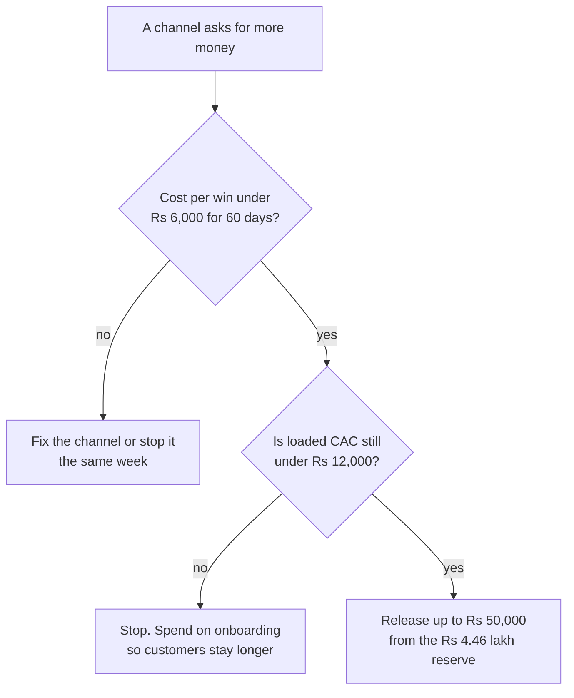

# Sales and Marketing Costs

**In simple words:** This chapter tells you what it costs to find and win a paying institute, channel by channel, with researched 2026 prices. Every channel gets a Minimum, a Recommended and a Maximum budget, and the Recommended column adds up to the BRD Year 1 marketing figure of Rs 6,10,000. It then shows that one customer costs Rs 8,283 against the Rs 12,000 limit, gives the budget for Years 2 to 5, and lists what to refuse before product-market fit.

## What this chapter budgets

Marketing money is cash spent to create leads and close them. The sales and marketing line in the profit and loss also holds salaries, so this chapter budgets the cash first and adds the people cost at the end.

- Year 1 marketing cash budget: **Rs 5,85,000**, the twelve programme lines of *Go-To-Market Strategy*.
- Plus partner commission paid inside Year 1: **Rs 25,000**. Together they make the **Rs 6,10,000** marketing line in the financial model.
- Sales and marketing in the profit and loss: **Rs 8,92,000** (marketing plus inside sales plus part of two salaries).
- Customers won: 131 gross, 120 left on 30 September 2027 after about 11 churn.
- CAC limit set by the canon: **Rs 12,000**. Never cross it for a full quarter.

**Minimum** is bare bootstrap: free tiers, the founder does it himself, only what the channel cannot work without. **Recommended** equals the BRD plan. **Maximum** is the sensible upper end of one line; above it the money is waste.

> **Warning:** Maximum is a per-line ceiling, not a budget. Every Maximum added together is Rs 16,46,726, which already breaks the Rs 14,40,000 that the Rs 12,000 limit allows for 120 customers, before one salary is paid.

## Outbound channels

### Cold calling

Cold calling means phoning an owner who never asked you to call. It is the cheapest way to fill a calendar in a city you have never visited.

| Item | When to pay | Minimum | Recommended | Maximum | Avoid or reduce? |
|---|---|---|---|---|---|
| Calling SIM, unlimited calls | Monthly | Rs 4,500 | Rs 6,000 | Rs 9,000 | No. The Rs 199 pack is Rs 213 a month |
| CRM and call-log tools | Monthly | Rs 0 | Rs 13,500 | Rs 18,000 | Yes. A sheet holds 300 leads |
| Cloud dialer seat | Monthly, billed yearly | Rs 0 | Rs 0 | Rs 47,200 | Yes. Pointless below three callers |
| Tele-caller retainer | Monthly, Feb to Sep 2027 | Rs 0 | Rs 40,000 | Rs 72,000 | Yes, at 3 hours a day of your time |
| Demo incentive | Per demo held | Rs 0 | Rs 12,500 | Rs 20,750 | No. Never pay per dial |
| **Year 1 total** | | **Rs 4,500** | **Rs 72,000** | **Rs 1,66,950** | |

Recommended: Rs 6,000 + Rs 13,500 + (Rs 5,000 x 8 months = Rs 40,000) + (Rs 150 x about 83 demos = Rs 12,450, rounded to Rs 12,500) = Rs 72,000. The CRM line is a CRM seat plus a call-log app at Rs 1,500 a month for the 9 months from January; the Maximum keeps the same paid tools for all 12 months, Rs 1,500 x 12 = Rs 18,000. Maximum swaps loose tools for MyOperator Sedan at Rs 5,000 + GST a month for 10 users, 8 months = Rs 47,200 (see Master Price List). A half-day tele-caller in Patna costs Rs 6,000 to Rs 9,000 a month, above the plan's Rs 5,000; keep the retainer and let the incentive close the gap, since 10 demos a month earns her Rs 6,500. Prepaid recharges hide GST and give no usable credit. Cloud telephony adds 18% on top, which is claimable. A tele-caller under the Rs 20 lakh registration limit charges no GST.

### WhatsApp outreach

The WhatsApp Business app is free for one-to-one chats. You pay Meta only when you send an approved template from the Cloud API.

| Item | When to pay | Minimum | Recommended | Maximum | Avoid or reduce? |
|---|---|---|---|---|---|
| WhatsApp Business app | Free | Rs 0 | Rs 0 | Rs 0 | Free forever |
| Marketing template messages | Per delivered message | Rs 1,000 | Rs 7,000 | Rs 15,000 | Yes. Utility templates cost seven times less |
| Second business number and SIM | Monthly | Rs 0 | Rs 3,000 | Rs 4,500 | Yes, but split selling from support |
| 12 images and 6 short videos | Per batch | Rs 0 | Rs 18,000 | Rs 40,000 | Yes. Canva and a phone cost nothing |
| Link, QR and broadcast tool | Monthly | Rs 0 | Rs 4,000 | Rs 9,000 | Yes. Free QR sites work |
| **Year 1 total** | | **Rs 1,000** | **Rs 32,000** | **Rs 68,500** | |

**The message bill.** 400 opted-in owners x 18 broadcasts = 7,200 delivered messages. 7,200 x Rs 0.8631 = Rs 6,214.32 (see Master Price List). GST at 18% adds Rs 1,118.58, so Rs 7,332.90 leaves the bank and Rs 1,118.58 returns as input tax credit. The plan books Rs 7,000, which covers the net cost of Rs 6,214. The utility rate is Rs 0.115, so a reminder sent as utility instead of marketing saves Rs 0.75.

> **Tip:** A click-to-WhatsApp ad opens a free entry-point window of 72 hours (see Master Price List). Every message inside it is free. Send the price, the demo video and the follow-up inside those three days, not on day four.

### Field sales in a Tier Two city

In Patna and Lucknow a face is trusted more than a website. Field visits cost the most per win of any channel we keep, and they sell mostly Pro.

| Item | When to pay | Minimum | Recommended | Maximum | Avoid or reduce? |
|---|---|---|---|---|---|
| Train, return | Per trip | Rs 900 | Rs 1,800 | Rs 3,500 | Yes. A night train saves a hotel night |
| Hotel, 2 nights | Per trip | Rs 1,400 | Rs 2,600 | Rs 4,000 | Yes |
| Autos and taxis | Per trip | Rs 700 | Rs 1,400 | Rs 2,600 | Yes. Lucknow auto Rs 10.24 a km, taxi Rs 20 |
| Food, daily allowance | Per trip | Rs 600 | Rs 1,200 | Rs 1,900 | No |
| **One city trip** | | **Rs 3,600** | **Rs 7,000** | **Rs 12,000** | |
| Trips taken in Year 1 | Per trip | 8 | 16 | 24 | Yes. Never travel for one Growth deal |
| Home-city travel allowance | Monthly | Rs 6,000 | Rs 10,000 | Rs 60,000 | Yes. Pay against a trip log |
| **Year 1 total** | | **Rs 34,800** | **Rs 1,22,000** | **Rs 3,48,000** | |

Recommended: 16 trips x Rs 7,000 = Rs 1,12,000, plus Rs 10,000 of home-city travel = Rs 1,22,000.

**One field day in Lucknow.** Eight institutes on one road, 24 km on a two-wheeler. The Indian reimbursement norm is Rs 3 to Rs 5 a km (see Master Price List), so at Rs 3.50 that is Rs 84. Add parking Rs 40, lunch Rs 150 and 16 flyers at Rs 3 = Rs 48. The day costs Rs 322, or Rs 40 per institute visited. By app taxi at Rs 20 a km plus a Rs 90 start fee it costs Rs 570 before waiting time. Petrol is Rs 101.86 a litre in Lucknow and Rs 113.37 in Patna, so a scooter doing 45 km to the litre burns only Rs 54 of fuel over those 24 km; the rest of the Rs 3.50 pays for servicing and tyres. Fuel is outside GST, so no credit is available. A full-time field executive would cost 50 km x 24 days x Rs 3.50 = Rs 4,200 a month plus Rs 500 to Rs 1,000 for parking. EduFlow has none in Year 1; the founder travels.

> **Rule:** A trip is allowed only when two demos at institutes of 300 students or more are booked and a cluster can be walked the same day. One field win on Pro pays back in Rs 10,267 divided by (Rs 5,999 x 80% margin) = 2.1 months.

## Paid and inbound channels

### Paid ads on Google and Meta

No public source gives click prices for our exact keywords, and Google Keyword Planner needs a login. The price list gives reasoned bands: "school ERP" and "school management software" Rs 60 to Rs 200 a click, "coaching institute software" Rs 30 to Rs 120, "fee management software" Rs 40 to Rs 150.

| Item | When to pay | Minimum | Recommended | Maximum | Avoid or reduce? |
|---|---|---|---|---|---|
| Google Search, coaching, Hindi, city words | Monthly, from Jan 2027 | Rs 0 | Rs 20,000 | Rs 60,000 | Yes. It is a test, not a channel |
| Google Search, "school ERP" cluster | Monthly | Rs 0 | Rs 0 | Rs 20,000 | Yes. Funded rivals outbid you |
| Meta click-to-WhatsApp ads | Monthly, Jan to Mar 2027 | Rs 0 | Rs 30,000 | Rs 60,000 | Yes. Stop at Rs 400 a lead |
| Meta lead-form ads, Hindi video | Monthly, Apr to Sep 2027 | Rs 0 | Rs 20,000 | Rs 60,000 | Yes |
| **Year 1 net ad cost** | | **Rs 0** | **Rs 70,000** | **Rs 2,00,000** | |
| GST on ad spend, claimed back | With each invoice | Rs 0 | Rs 12,600 | Rs 36,000 | Claim it. GSTIN in the account on day one |
| **Year 1 cash out** | | **Rs 0** | **Rs 82,600** | **Rs 2,36,000** | |

The Rs 20,000 Google and Rs 50,000 Meta split of the BRD's Rs 70,000 line is an Estimate: Meta's cost per lead for a small owner audience starts below a B2B software click price, so the test money goes where the first signal is cheapest. TDS may also apply on Meta invoices; ask the CA.

**Why paid search stays small.** Rs 1,00,000 at Rs 100 a click buys 1,000 clicks; 5% sign up = 50, and 15% of those pay = 7.5 customers, about Rs 13,300 each (see Master Price List), already above the limit. The same sum on the cheap cluster: Rs 20,000 at Rs 60 a click = 333 clicks, 16 signups, 2.4 customers, about Rs 8,300 each. The keyword choice, not the budget size, decides whether paid search is allowed.

**Lead prices on Meta.** The researched band is Rs 500 to Rs 1,500 for a B2B software lead and Rs 150 to Rs 600 for a consumer education lead. The plan expects 70 signups plus 25 demo requests from Rs 50,000: 95 leads at Rs 526 each, the cheap end of the B2B band. Clicks cost Rs 4 to Rs 50, so a Rs 5,000 test reads clearly in two weeks. Together the Rs 70,000 wins 12 customers at Rs 5,833.

### Content and search optimisation

Search optimisation is slow and nearly free, because the founder drafts with Claude. You pay for the Hindi check, the tool and the pictures.

| Item | When to pay | Minimum | Recommended | Maximum | Avoid or reduce? |
|---|---|---|---|---|---|
| Domain and website | Yearly | Rs 900 | Rs 3,000 | Rs 6,000 | No. Also in the one-time setup |
| Keyword tool | Monthly, 3 months | Rs 0 | Rs 9,000 | Rs 36,000 | Yes. Search Console is free |
| Hindi proofreading, 18 articles | Per article | Rs 0 | Rs 8,000 | Rs 90,000 | Yes if your Hindi is strong |
| Graphics for articles and templates | Per batch | Rs 0 | Rs 6,000 | Rs 18,000 | Yes. Canva free tier |
| English writing, 18 articles | Per article | Rs 0 | Rs 0 | Rs 18,000 | Yes. You already pay for Claude |
| **Year 1 total** | | **Rs 900** | **Rs 26,000** | **Rs 1,68,000** | |

**What outsourcing would cost.** English freelancers charge Rs 0.50 to Rs 1.50 a word in the workable band and Rs 1.50 to Rs 5 for a SaaS specialist; a researched Hindi blog costs Rs 3,500 to Rs 8,000 (see Master Price List). Hand out all 36 articles: 18 English x 1,000 words x Rs 1 = Rs 18,000, plus 18 Hindi x Rs 5,000 = Rs 90,000, so Rs 1,08,000 for writing alone, four times the whole line. Proofreading the 18 Hindi articles at about Rs 450 each costs Rs 8,000 and buys most of the quality. This channel wins 18 customers at Rs 1,444 each, the cheapest in the plan.

### YouTube demo videos

Year 1 ships 2 full demos, 24 task videos, 6 customer stories, 4 explainers and 36 Shorts: 72 pieces.

| Item | When to pay | Minimum | Recommended | Maximum | Avoid or reduce? |
|---|---|---|---|---|---|
| USB microphone and one light | One-time | Rs 0 | Rs 6,000 | Rs 15,000 | Yes at first. Bad audio kills a demo |
| Screen-record and edit software | Yearly | Rs 0 | Rs 6,000 | Rs 12,000 | Yes. OBS is free |
| Freelance edits, 40 cuts | Per video | Rs 0 | Rs 24,000 | Rs 80,000 | Yes, at 2 hours a video of your time |
| Thumbnails | Per batch | Rs 0 | Rs 4,000 | Rs 10,000 | Yes |
| Travel to film customer stories | Per shoot | Rs 0 | Rs 5,000 | Rs 15,000 | Yes. Record on a video call |
| **Year 1 total** | | **Rs 0** | **Rs 45,000** | **Rs 1,32,000** | |

The plan pays Rs 600 an edit (Rs 600 x 40 = Rs 24,000) against a market rate of Rs 2,000 to Rs 8,000 a video for a junior freelancer (see Master Price List). The gap is real: Rs 600 buys a screen-recording cut with captions and an end card, not a produced brand film. Write the brief that way or the editor quotes market rate. A junior editor's retainer is Rs 15,000 to Rs 28,000 a month, so Rs 1,80,000 a year at the low end. That is above the Maximum and is waste in Year 1.

### Directories and listings

| Item | When to pay | Minimum | Recommended | Maximum | Avoid or reduce? |
|---|---|---|---|---|---|
| Google Business Profile | Free | Rs 0 | Rs 0 | Rs 0 | Free. Do it in week one |
| Software directory profiles | Free | Rs 0 | Rs 0 | Rs 0 | Free tiers on SoftwareSuggest, Capterra, G2 |
| Justdial paid package, two cities | Monthly, 9 months | Rs 0 | Rs 22,500 | Rs 40,000 | Yes. The basic listing is free |
| Review QR cards | One-time | Rs 0 | Rs 1,500 | Rs 3,000 | Yes |
| Sulekha pay-per-accepted-lead wallet | Per accepted lead | Rs 0 | Rs 0 | Rs 12,000 | Yes. The only one you can stop today |
| IndiaMART catalogue or TrustSEAL | Yearly | Rs 0 | Rs 0 | Rs 0 | Skip. Rs 28,000 to Rs 1,23,000 for goods buyers |
| **Year 1 total** | | **Rs 0** | **Rs 24,000** | **Rs 55,000** | |

Recommended: Rs 2,500 a month x 9 months = Rs 22,500, plus Rs 1,500 of review cards = Rs 24,000. Justdial publishes no rate card and its paid package starts near Rs 20,000 a year, so the Rs 2,500 a month is an Estimate from the BRD plan, to be replaced by a city quote.

> **Warning:** Justdial sends the same lead to several vendors and the first caller usually wins. If you cannot call inside 5 minutes in work hours, the paid listing is wasted money. Stop it if the cost per demo held passes Rs 800 after three months.

## Events, print and partners

### Education fairs and principal meets

| Item | When to pay | Minimum | Recommended | Maximum | Avoid or reduce? |
|---|---|---|---|---|---|
| Association meet: tea and a 15-minute talk | Per event | Rs 6,000 | Rs 45,000 | Rs 90,000 | Yes. Ask for the talk, not a stall |
| Regional school expo stall | Per stall, 1 to 3 days | Rs 0 | Rs 25,000 | Rs 70,800 | Yes. Cancel if 3 meets bring under 5 demos |
| Educators summit vendor seat | Per person | Rs 0 | Rs 0 | Rs 20,000 | Yes. This is Year 2 money |
| DIDAC India shell stall, 9 square metres | Per stall | Rs 0 | Rs 0 | Rs 0 | Skip it in Year 1 |
| **Year 1 total** | | **Rs 6,000** | **Rs 70,000** | **Rs 1,80,800** | |

Recommended: 5 meets x Rs 9,000 = Rs 45,000, plus one regional stall at Rs 25,000 = Rs 70,000. The Maximum stall is Rs 60,000 + 18% GST = Rs 70,800; event charges add GST on top and the credit is claimable. Events cost the most per direct win, Rs 23,333, a 5.8-month payback. They stay because school owners buy on trust built in those rooms, and because resellers and the first Enterprise leads are met there.

> **Warning:** A DIDAC India shell stall of 9 square metres costs about Rs 2,86,740 with GST (see Master Price List): 47% of the whole Year 1 marketing budget for three days, before travel and stand build. DIDAC India 2026 also runs 25 to 27 November 2026, inside the 60-day build sprint, when there is no finished product to show. Go in Year 2.

### Printing and the demo kit

| Item | When to pay | Minimum | Recommended | Maximum | Avoid or reduce? |
|---|---|---|---|---|---|
| A5 one-side flyers, Hindi and English | Per batch | Rs 3,000 | Rs 9,000 | Rs 20,260 | Yes. Rs 3 locally against Rs 20.26 a tri-fold |
| Roll-up standees, 2 by 5 feet | Per piece | Rs 650 | Rs 4,000 | Rs 7,716 | Yes. Local star-flex Rs 650, online Rs 1,929 |
| Visiting cards and QR stickers | Per 100 cards | Rs 230 | Rs 3,000 | Rs 6,000 | No. Rs 2.30 a card, all taxes inside |
| Event banners | Per event | Rs 0 | Rs 6,000 | Rs 12,000 | Yes |
| Reprints after each product phase | Per reprint | Rs 3,000 | Rs 10,000 | Rs 20,000 | Yes. Print 500 at a time, not 3,000 |
| **Year 1 total** | | **Rs 6,880** | **Rs 32,000** | **Rs 65,976** | |

The plan prints 3,000 flyers for Rs 9,000, which is Rs 3 each, while a printed 170 gsm tri-fold costs Rs 20.26 each for 1,000 (see Master Price List). They are two different objects: use the Rs 3 local A5 for walk-ins and keep 200 tri-folds for principals and resellers. Printing prices already include 18% GST, claimable with an invoice in the company name.

**The demo kit** holds a printed sample fee receipt for Aarav Sharma, a one-page price card, a tri-fold brochure, a visiting card and a WhatsApp QR sticker in a plain folder. At Recommended it costs about Rs 300 a kit, and 30 kits come out of the rows above, so it needs no line of its own. The phone that shows the live demo account is the founder's. The 15 richer reseller kits sit in the partner line below.

### Referral rewards

The design is "give a month, get a month". It is the cheapest channel you have, because most of the reward is revenue given up, not cash paid.

| Item | When to pay | Minimum | Recommended | Maximum | Avoid or reduce? |
|---|---|---|---|---|---|
| Free month to the new institute | After its second payment | Rs 0 | Rs 2,499 to Rs 5,999 | Rs 5,999 | Yes, but one-sided offers win far less |
| Free month to a paying referrer | At the same time | Rs 2,499 to Rs 5,999 | Rs 2,499 to Rs 5,999 | Rs 5,999 | No. Keep this one always |
| UPI reward to a non-customer referrer | Per referral | Rs 5,000 | Rs 20,000 | Rs 37,500 | Yes. Rs 2,000 each in the plan |
| Thank-you gifts | Per batch | Rs 0 | Rs 10,000 | Rs 20,000 | Yes |
| **Year 1 cash** | | **Rs 5,000** | **Rs 30,000** | **Rs 57,500** | |
| **Year 1 revenue given up** | | **Rs 42,000** | **Rs 84,000** | **Rs 1,20,000** | Not cash. A discount line on the invoice |

**Worked example.** Rajesh Sharma of Sharma Classes pays Rs 5,999 a month on Pro. He refers a friend with 220 students who buys Growth at Rs 2,499 a month. The friend's month two is free and Rajesh's next invoice is Rs 0, so EduFlow gives up Rs 2,499 + Rs 5,999 = Rs 8,498 of revenue and pays no cash. Cost per referral win is Rs 30,000 divided by 12 = Rs 2,500 in cash, or (Rs 30,000 + Rs 84,000) divided by 12 = Rs 9,500 with the revenue given up, still inside the limit. Cap one referral at Rs 5,999 of value and one referrer at 12 rewards a year. Free months show as a discount line on the GST invoice and reduce the taxable value; confirm the treatment with the CA.

### Reseller and introducer commissions

A reseller is a local computer vendor, a CA firm or an education consultant who already visits institutes. The terms are fixed in *Business Model*: 20% of first-year fees, then 10% from month 13.

| Item | When to pay | Minimum | Recommended | Maximum | Avoid or reduce? |
|---|---|---|---|---|---|
| Partner kit: folder, price card, demo login | Per partner | Rs 2,400 | Rs 15,000 | Rs 40,000 | Yes. A PDF kit costs nothing |
| Partner training meets | Per meet | Rs 0 | Rs 10,000 | Rs 24,000 | Yes. Run the first as a video call |
| Standees and certificates for partner shops | Per batch | Rs 650 | Rs 10,000 | Rs 20,000 | Yes |
| First-year commission, 20% of fees | Per invoice collected | Rs 10,000 | Rs 25,000 | Rs 50,000 | No. Pay only after the money lands |
| Introducer fee, Rs 2,000 a customer | Per paying customer | Rs 0 | Rs 0 | Rs 20,000 | Yes. For suppliers who only introduce |
| **Year 1 total** | | **Rs 13,050** | **Rs 60,000** | **Rs 1,54,000** | |

Recommended: 15 kits x Rs 1,000 + 2 meets x Rs 5,000 + Rs 10,000 of standees and certificates = Rs 35,000, plus Rs 25,000 of commission = Rs 60,000.

**One commission.** A partner sells Growth yearly at Rs 24,990 before GST. First-year commission = 20% x Rs 24,990 = Rs 4,998, paid once the money is in the bank; from month 13 it is 10% x Rs 24,990 = Rs 2,499 a year while the customer stays. Five wins at about Rs 5,000 is the Rs 25,000 in the plan. Cost per partner win with kits is (Rs 35,000 + Rs 25,000) divided by 5 = Rs 12,000, exactly at the limit, because a fixed Rs 35,000 is spread over only five wins; over 20 wins it is Rs 1,750 each. A GST-registered partner invoices commission with 18% GST, which you claim back; an unregistered one below Rs 20 lakh charges none. TDS applies to commission, so ask the CA for the rate before the first payout.

## The Year One marketing budget

Quarters follow the business year: Q1 is October to December 2026 and Q4 ends on 30 September 2027.

| Quarter | Programme spend | What the money mostly buys |
|---|---|---|
| Q1, Oct to Dec 2026 | Rs 52,000 | Videos, website, first flyers, pilot travel |
| Q2, Jan to Mar 2027 | Rs 1,90,000 | Buying season: calling, field trips, the ads test |
| Q3, Apr to Jun 2027 | Rs 1,64,000 | Partner kits, listings, referral rewards |
| Q4, Jul to Sep 2027 | Rs 1,79,000 | One expo stall, reprints, referral push |
| **Programme total** | **Rs 5,85,000** | Plus Rs 25,000 partner commission = Rs 6,10,000 |

About one third of the year is spent in Q2. The month-by-month path from April is in *Months 7 to 12: First Hires and Growth*.

The same year by channel, at all three levels, with what each channel wins. Cost per win uses the Recommended column.

| Channel | Minimum | Recommended | Maximum | Wins | Cost per win |
|---|---|---|---|---|---|
| Word of mouth and invite links | Rs 0 | Rs 0 | Rs 0 | 12 | Rs 0 |
| Content and search optimisation | Rs 900 | Rs 26,000 | Rs 1,68,000 | 18 | Rs 1,444 |
| Referral program | Rs 5,000 | Rs 30,000 | Rs 57,500 | 12 | Rs 2,500 |
| Listings | Rs 0 | Rs 24,000 | Rs 55,000 | 9 | Rs 2,667 |
| WhatsApp outreach | Rs 1,000 | Rs 32,000 | Rs 68,500 | 11 | Rs 2,909 |
| YouTube demos | Rs 0 | Rs 45,000 | Rs 1,32,000 | 15 | Rs 3,000 |
| Cold calling | Rs 4,500 | Rs 72,000 | Rs 1,66,950 | 19 | Rs 3,789 |
| Google and Meta ads | Rs 0 | Rs 70,000 | Rs 2,00,000 | 12 | Rs 5,833 |
| Field visits, travel and print | Rs 41,680 | Rs 1,54,000 | Rs 4,13,976 | 15 | Rs 10,267 |
| Reseller partners with commission | Rs 13,050 | Rs 60,000 | Rs 1,54,000 | 5 | Rs 12,000 |
| Fairs and principal associations | Rs 6,000 | Rs 70,000 | Rs 1,80,800 | 3 | Rs 23,333 |
| Contingency | Rs 0 | Rs 27,000 | Rs 50,000 | 0 | n/a |
| **Year 1 total** | **Rs 72,130** | **Rs 6,10,000** | **Rs 16,46,726** | **131** | **Rs 4,656** |

Blended cost per win = Rs 6,10,000 divided by 131 = Rs 4,656. *Go-To-Market Strategy* shows Rs 4,466 because it divides only the Rs 5,85,000 programme budget and leaves the commission out. The Minimum column is a floor, not a plan: at Rs 72,130 the founder calls, walks, films and writes everything himself and buys only a SIM, flyers and one standee. It is where you retreat if the bank balance falls below three months of spend.

## What one customer costs to win

CAC means customer acquisition cost: all sales and marketing money divided by the new paying customers it won.

| Cost line | Amount | How it is worked out |
|---|---|---|
| Marketing programme budget | Rs 5,85,000 | The twelve lines by quarter |
| Partner commission paid in Year 1 | Rs 25,000 | 5 partner wins, part-year |
| **Marketing line in the model** | **Rs 6,10,000** | Rs 5,85,000 + Rs 25,000 |
| Inside sales executive, Jul to Sep 2027 | Rs 75,000 | 3 ramp months x Rs 25,000 |
| Customer success time spent selling | Rs 72,000 | 40% x Rs 30,000 x 6 months |
| Half the founder's pay | Rs 1,35,000 | 50% x (Rs 90,000 + Rs 1,80,000) |
| **Sales and marketing in the profit and loss** | **Rs 8,92,000** | Matches *Financial Plan and Projections* |
| Referral free months given up | Rs 84,000 | 12 wins x about Rs 7,000; not cash |
| Founder's selling time before he is paid | Rs 2,25,000 | Rs 50,000 x 50% of time x 9 months |

Three views of the same year, each divided by the 120 paying organizations on 30 September 2027:

- Cash programmes only: Rs 6,10,000 divided by 120 = **Rs 5,083**.
- Profit and loss view: Rs 8,92,000 divided by 120 = **Rs 7,433**.
- Fully loaded: Rs 5,85,000 + Rs 75,000 + Rs 25,000 + Rs 84,000 + Rs 2,25,000 = Rs 9,94,000, divided by 120 = **Rs 8,283**.

The two loaded views differ by Rs 1,02,000: the fully loaded view counts the founder's notional time and the referral months but not the customer-success time, while the profit and loss view counts only cash paid. Both sit under Rs 12,000. The limit allows 120 x Rs 12,000 = Rs 14,40,000, so the reserve is Rs 14,40,000 minus Rs 9,94,000 = Rs 4,46,000.

Payback on one win = cost per win divided by Rs 4,000, the monthly gross profit of a customer (Rs 5,000 average revenue per account x 80% margin). Content pays back in 0.4 months, cold calling in 0.9, field visits in 2.6 and fairs in 5.8.

**Figure: Where the next marketing rupee goes**

Two gates, in order. A channel proves its own cost per win over 60 days first. Only then may it draw from the reserve, and never more than Rs 50,000 at a time.

## The budget from Year Two to Year Five

From Year 2 the budget is built from customers, not from lines: India new customers x India CAC, plus new customers abroad x CAC abroad, plus recurring partner commission.

| Year | India new x CAC | Abroad new x CAC | Acquisition spend | Commission | Total | Share of revenue |
|---|---|---|---|---|---|---|
| Year 2 | 442 x Rs 12,000 | 15 x Rs 80,000 | Rs 65 lakh | Rs 2 lakh | Rs 67 lakh | 35% |
| Year 3 | 1,124 x Rs 13,000 | 105 x Rs 1,20,000 | Rs 272 lakh | Rs 15 lakh | Rs 287 lakh | 36% |
| Year 4 | 2,636 x Rs 14,000 | 450 x Rs 1,20,000 | Rs 909 lakh | Rs 74 lakh | Rs 983 lakh | 38% |
| Year 5 | 6,213 x Rs 15,000 | 1,150 x Rs 1,20,000 | Rs 2,312 lakh | Rs 249 lakh | Rs 2,561 lakh | 34% |

Year 3 arithmetic: 1,124 x Rs 13,000 = Rs 146 lakh, plus 105 x Rs 1,20,000 = Rs 126 lakh, giving Rs 272 lakh. The India new-customer counts are an Estimate worked back from the acquisition spend in *Financial Plan and Projections*; the CAC values, the counts abroad and the commission rates (1%, 2%, 3% and 3.5% of recurring revenue) are the plan's own inputs.

Three things to read here. Acquisition spend holds the sales and marketing payroll of Rs 21 lakh, Rs 91 lakh, Rs 300 lakh and Rs 864 lakh, so from Year 2 more than half of "marketing" is salary, not programmes. Recurring partner commission becomes a Rs 2.49 crore line by Year 5: the price of selling through other people. Blended CAC rises from about Rs 14,200 in Year 2 to Rs 31,400 in Year 5, because a customer abroad costs about Rs 1,20,000 to win; those customers also pay about 2.7 times more, so the payback is Rs 1,20,000 divided by (Rs 19,000 x 80%) = 7.9 months (Estimate).

> **Best practice:** The 38% share of revenue in Year 4 is the peak. If sales and marketing passes 40% of revenue for two quarters in a row, the problem is retention, not reach. Fix churn before buying more leads.

## What to avoid before product-market fit

Product-market fit here is measurable: 30 paying institutes, monthly logo churn under 3%, and one channel whose cost per win has stayed under Rs 6,000 for 60 days. Until all three are true, refuse the following.

| Do not buy | What it costs | Why not yet |
|---|---|---|
| A DIDAC India shell stall | Rs 2,86,740 with GST | 47% of the Year 1 budget for three days |
| IndiaMART TrustSEAL or Maximiser | Rs 45,000 to Rs 1,23,000 a year | Those buyers want goods, not software |
| A marketing agency or editor retainer | Rs 15,000 to Rs 58,000 a month | Rs 1,80,000 a year, four times the video line |
| Billboards, newspaper ads, brand campaigns | Rs 50,000 upwards each | No brand campaign before 500 customers |
| A bought phone database | Rs 5,000 to Rs 50,000 | Breaks do-not-disturb rules; the number is blocked |
| A bulk WhatsApp sender tool | Rs 2,000 a month upwards | Meta bans the number, so you lose the channel |
| A cloud dialer seat | Rs 5,000 + GST a month | Pointless below three callers |
| Paid search on "school ERP" | Rs 60 to Rs 200 a click | About Rs 13,300 a customer, above the limit |
| A field trip for one Growth deal | Rs 7,000 a trip | Rs 7,000 spent to win Rs 2,499 a month |
| A field sales hire to open a new city | Rs 55,000 a month loaded | The founder opens cities; staff deepen them |
| A discount deeper than two months free | 17% of a yearly contract | Two months free on yearly is the only discount |

> **Rule:** The Rs 4.46 lakh CAC reserve is not a second budget. Release it only to a channel whose measured cost per win has stayed under Rs 6,000 for 60 days, and never more than Rs 50,000 at a time.

Write the stop rules down before the money is spent. Justdial ends if a demo held costs over Rs 800 after three months. Meta ads end, after Rs 10,000 of spend, if a qualified lead costs over Rs 400 or a demo over Rs 1,500. Google Search keeps only coaching, Hindi and city keywords if a win costs over Rs 6,000. The Rs 25,000 expo stall moves to field travel if the first three meets bring under five demos. No trip happens without two booked demos at institutes of 300 students or more. And if demos held stay under five a week for three weeks, stop building features for one week and sell.

## Key takeaways

- The Year 1 marketing budget is Rs 6,10,000: Rs 5,85,000 of programmes plus Rs 25,000 of partner commission. The bare Minimum is Rs 72,130; the per-line Maximums add to Rs 16,46,726, which must never all be spent.
- Cheapest per win: word of mouth at Rs 0, content at Rs 1,444, referrals at Rs 2,500. Dearest: field visits at Rs 10,267 and fairs at Rs 23,333. Keep the dear two small and deliberate.
- Fully loaded CAC is Rs 8,283 against the Rs 12,000 limit, leaving Rs 4,46,000 of room. Spend that room on onboarding, not on ads.
- Paid search is a test, not a channel: Rs 100 a click gives about Rs 13,300 a customer. Bid only on coaching, Hindi and city words at Rs 30 to Rs 120, and put the GSTIN in every ad account so the 18% comes back.
- Skip the DIDAC stall, IndiaMART packages, agency retainers and bulk WhatsApp tools in Year 1. Any one of them can eat half the budget.
- From Year 2 the budget follows a formula, not a list: new customers x CAC plus recurring partner commission, reaching Rs 2,561 lakh and 34% of revenue in Year 5.
