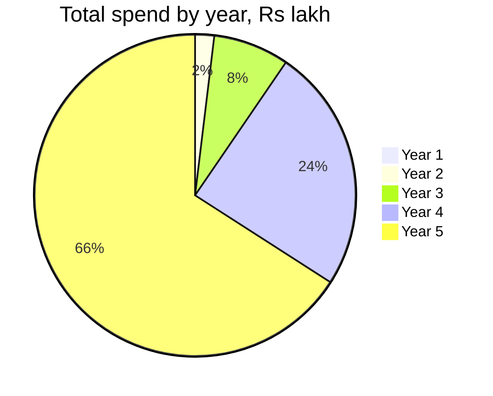

# Year 2 to Year 5: Budgets by Year

**In simple words:** This chapter turns the BRD five-year plan into four yearly budgets you can actually spend from. Every year uses the same eleven lines at three levels, and the Recommended column adds up exactly to the BRD profit and loss. It also says what new spending appears each year, what switches it on, what can wait, and where the cash comes from.

## How to read these four budgets

The Recommended column is not new work. It is the BRD plan cut into lines you can buy. For each year, Recommended = total cost of service + total operating costs.

| Year | Cost of service | Operating costs | Recommended total |
|---|---|---|---|
| Year 2, Oct 2027 to Sep 2028 | Rs 31 lakh | Rs 147 lakh | Rs 178 lakh |
| Year 3, Oct 2028 to Sep 2029 | Rs 134 lakh | Rs 574 lakh | Rs 708 lakh |
| Year 4, Oct 2029 to Sep 2030 | Rs 449 lakh | Rs 1,826 lakh | Rs 2,275 lakh |
| Year 5, Oct 2030 to Sep 2031 | Rs 1,330 lakh | Rs 4,787 lakh | Rs 6,117 lakh |

All tables are in **Rs lakh** (Rs 1,00,000). The same eleven lines run through all four years. Here is where each Recommended number comes from.

| Line | Where the Recommended number comes from |
|---|---|
| People | BRD payroll: engineering, sales, support and admin added together |
| Sales and marketing programmes | Customer acquisition spend minus the sales and marketing payroll |
| Tools, security tests, contractors | Engineering tools line plus Rs 5,000 of support tools per support person a month |
| Message cost | 85% of usage revenue, the messages customers send and pay for |
| Legal, compliance, audit, insurance | *Legal, Compliance, Tax and Accounting Costs* |
| International entities | *International Expansion Costs* |
| Hosting and infrastructure | 12 x the average of the opening and closing monthly bill |
| Office, travel and the rest | What is left inside the BRD general and admin line |
| Gateway fees | 1.8% of revenue in Year 2, then 2.0% of revenue |
| Recurring partner commission | 1%, 2%, 3% and 3.5% of recurring revenue |
| AI compute | 17% of AI Insights revenue |

Minimum and Maximum are built from the Recommended number with one multiplier per line. Three rows are taken straight from other chapters instead.

| Line | Minimum | Maximum | Why this range |
|---|---|---|---|
| People | x 0.70 | x 1.35 | From *People Costs and Salary Benchmarks*: Tier 2 pay with two of five roles on contract, against metro pay with family benefits |
| Sales and marketing programmes | x 0.60 | x 1.40 | Word of mouth and content only, against fairs, paid ads and field travel |
| Tools, security tests, contractors | x 0.60 | x 1.45 | Free tiers and one yearly test, against paid seats and quarterly tests |
| Message cost | x 0.90 | x 1.10 | It follows what customers send; you only choose the pack size |
| Legal, compliance, audit | x 0.65 | x 1.50 | From *Legal, Compliance, Tax and Accounting Costs* |
| International entities | per country | per country | From *International Expansion Costs*; not a multiplier |
| Hosting | x 0.65 | x 1.50 | Savings plans and ARM tasks, against oversized always-on instances |
| Office, travel and the rest | x 0.40 | x 1.80 | Remote first with day passes, against a leased office |
| Gateway fees | x 0.85 | x 1.30 | UPI AutoPay mandates and a negotiated rate, against list card rates |
| Partner commission | x 0.50 | x 1.20 | Selling direct, against a partner-led year |
| AI compute | x 0.60 | x 1.40 | A smaller model for routine summaries, against the largest model everywhere |

The multipliers are an **Estimate**: the spread the stage chapters produce from their own line items, carried forward.

> **Rule:** Every rupee here is the cost **after** input tax credit. Indian bills add 18% GST and foreign bills add 18% IGST under reverse charge; both come back as input tax credit while EduFlow is GST-registered, so neither belongs in the budget. Salaries, government fees (MCA, ROC, ASIC, UAE free zone) and fuel carry no GST and are already full cost. Group health insurance carries 18% claimable GST; individual cover carries none since 22 September 2025.

## The four years on one page

| Year | Revenue | Minimum | Recommended | Maximum | Burn at year end | EBITDA |
|---|---|---|---|---|---|---|
| Year 2 | 190 | 116 | 178 | 258 | 24.0 | 12 |
| Year 3 | 793 | 474 | 708 | 986 | 88.6 | 85 |
| Year 4 | 2,609 | 1,508 | 2,275 | 3,129 | 275.0 | 334 |
| Year 5 | 7,533 | 4,075 | 6,117 | 8,372 | 708.4 | 1,416 |

EBITDA is revenue minus the Recommended total: 190 - 178 = 12, 793 - 708 = 85, 2,609 - 2,275 = 334 and 7,533 - 6,117 = 1,416. Those four figures are the BRD's own, so the line split below is arithmetic, not opinion. Four-year Recommended spend = 178 + 708 + 2,275 + 6,117 = **Rs 9,278 lakh (Rs 92.78 crore)**. With Year 1's Rs 23.78 lakh that is about **Rs 93 crore over five years**.

**Figure: Total spend by year, Rs lakh**

Year 5 alone is 66% of the five-year spend. Almost nothing you decide today changes that number; the customers you win do.

**Monthly burn at year end.** Costs rise through a year in roughly equal steps. With opening monthly cost O and year total T, closing burn = (2T - 11 x O) divided by 13, and the monthly step is (T - 12 x O) divided by 78. Year 2 opens at the September 2027 cost of Rs 4.03 lakh.

| Year | Opening burn | Monthly step | Closing burn | Payroll share of the closing burn |
|---|---|---|---|---|
| Year 2 | 4.03 | 1.66 | 24.0 | 9.4 of 24.0 = 39% |
| Year 3 | 24.0 | 5.38 | 88.6 | 38.4 of 88.6 = 43% |
| Year 4 | 88.6 | 15.54 | 275.0 | 110.8 of 275.0 = 40% |
| Year 5 | 275.0 | 36.12 | 708.4 | 300.8 of 708.4 = 42% |

Year 3 check: (2 x 708 - 11 x 24.0) divided by 13 = 1,152 divided by 13 = **Rs 88.6 lakh a month** in September 2029. The payroll column uses the BRD year-end payroll and lands within two points of the BRD's own payroll share of total cost: 40%, 44%, 42% and 42%. The straight-line path is an **Estimate**, used because the BRD prices hosting the same way.

## Year two: the year the founder stops doing everything

October 2027 to September 2028. The team goes from 4 to 14. Paying organizations go from 120 to 500, of which 15 are the first customers abroad. MRR goes from Rs 6 lakh to Rs 30 lakh. Three things change the shape of the budget: payroll becomes 40% of every rupee spent, a support team exists for the first time, and the UAE appears as a country with its own bills.

| Item | When to pay | Minimum | Recommended | Maximum | Can you avoid or reduce it? |
|---|---|---|---|---|---|
| People, all four functions | Monthly | 50 | 72 | 97 | Reduce: hire in Patna or Lucknow, two of five roles on contract |
| Sales and marketing programmes | Monthly | 26.4 | 44 | 61.6 | Reduce, never to zero. It buys 442 new Indian customers |
| Tools, security tests, contractors | Monthly and per test | 7.8 | 13 | 18.9 | Reduce. Free tiers stop working above 14 people |
| Legal, compliance, audit, insurance | Monthly and yearly | 7.8 | 12 | 18 | No. Audit, ROC filings and cyber cover are now fixed |
| Message cost passed through | Monthly | 9.9 | 11 | 12.1 | No. It moves with what customers send |
| International entities, UAE | One-time and yearly | 2.9 | 8.1 | 23 | Yes. Wait for a named blocker |
| Hosting and infrastructure | Monthly | 4.6 | 7 | 10.5 | Reduce: ARM tasks, night jobs, archive dead free orgs |
| Office, travel and the rest | Monthly | 2.0 | 4.9 | 8.8 | Yes. Day passes beat a lease until 10 people sit together |
| Gateway fees | Per transaction | 2.6 | 3 | 3.9 | Reduce: move renewals to UPI AutoPay mandates |
| Recurring partner commission | Monthly | 1.0 | 2 | 2.4 | Yes, by selling direct, but partners are the cheapest reach |
| AI compute | Monthly | 0.6 | 1 | 1.4 | Reduce: a smaller model for routine summaries |
| **Total** | | **115.6** | **178.0** | **257.6** | |

Recommended check: 72 + 44 + 13 + 12 + 11 + 8.1 + 7 + 4.9 + 3 + 2 + 1 = **178.0**. The Minimum column is Rs 62 lakh below the plan and the Maximum is Rs 80 lakh above it, so the honest range for Year 2 is Rs 1.16 crore to Rs 2.58 crore.

### Year two, quarter by quarter

Costs rise in equal steps of Rs 1.66 lakh a month from a Rs 4.03 lakh base. Revenue does not: it compounds, because MRR grows about 14.4% a month from Rs 6 lakh to Rs 30 lakh.

| Quarter | Months | Revenue | Cost | EBITDA | What drives it |
|---|---|---|---|---|---|
| Q1 | Oct to Dec 2027 | 24 | 22.1 | 1.9 | Two hires land; renewals from the January 2027 cohort |
| Q2 | Jan to Mar 2028 | 35 | 37.0 | -2.0 | Buying season: one third of the marketing budget, plus seed round legal work |
| Q3 | Apr to Jun 2028 | 53 | 52.0 | 1.0 | New session starts; UAE entity and the first support hires |
| Q4 | Jul to Sep 2028 | 78 | 66.9 | 11.1 | Audit, hiring runs ahead of Year 3, margin finally shows |
| **Year 2** | | **190** | **178.0** | **12.0** | |

Cost check: 22.1 + 37.0 + 52.0 + 66.9 = 178.0. EBITDA check: 1.9 - 2.0 + 1.0 + 11.1 = 12.0, which is the BRD Year 2 EBITDA. The quarterly revenue split is an **Estimate** built from a steady monthly MRR growth rate; only the Rs 190 lakh year total is the BRD's.

> **Warning:** Q2 is the only loss-making quarter of Year 2, and it is the quarter that decides the year. January to March is when institutes buy. If you cut marketing in Q2 to protect that quarter's profit, you cut the revenue of every quarter after it.

### New spending in Year two, and what switches it on

| New line | Trigger | Cost in Year 2 | Can it wait? |
|---|---|---|---|
| Support team of three people | 150 paying organizations | 9, inside people | No. One support person per 150 customers |
| State insurance (ESI), 3.25% of gross | The 10th employee | Inside the loaded cost | No. It is the law |
| Group health cover for everyone | Already due from the first hire | About 1.2, inside people | No past three people |
| Cyber and directors insurance | The first school-group security form | 1.10 | No past 500 customers |
| First formal security test (VAPT) | Before the first Enterprise contract | 1.00 | No |
| Seed round legal work | A signed term sheet | 3.00 | Yes, if there is no round |
| UAE free zone company and India filings | A UAE buyer not registered for VAT | 8.10 | Yes. Sell from India under an LUT first |
| Equipment for new people | On each joining date | 7, being 10 net new x Rs 70,000 | No. It is cash, outside EBITDA |

**What to defer in Year two.** The UAE entity (Rs 8.10 lakh), the seed round legal work (Rs 3.00 lakh), an office lease, ISO 27001, and any tool seat a free tier still covers. About Rs 15 lakh of Rs 178 lakh, and none of it wins a customer. **What never waits:** the audit, the CA retainer, ESI, group health cover, the security test and the support hires.

## Year three: two more countries and the move to AWS

October 2028 to September 2029. The team goes from 14 to 40. Customers go from 500 to 1,500, including about 100 abroad: Year 2's 15 plus the 105 new international customers of this year, less about 20 that do not renew (**Estimate**; it is under the 3% a month churn ceiling used everywhere in this guide). MRR reaches Rs 1.1 crore. Hosting crosses the trigger for AWS Mumbai, provident fund switches on at 20 employees, and the USA and Australia pilots each bring a company of their own.

| Item | When to pay | Minimum | Recommended | Maximum | Can you avoid or reduce it? |
|---|---|---|---|---|---|
| People, all four functions | Monthly | 218 | 311 | 420 | Reduce by level mix, but 26 net new people is the plan |
| Sales and marketing programmes | Monthly | 108.6 | 181 | 253.4 | Reduce. It buys 1,124 Indian and 105 foreign customers |
| Message cost passed through | Monthly | 48.6 | 54 | 59.4 | No |
| Tools, security tests, contractors | Monthly and per test | 25.8 | 43 | 62.4 | Reduce, not skip. Engineering tools, contractors and tests only |
| Legal, compliance, audit, insurance | Monthly and yearly | 16.3 | 25 | 37.5 | No |
| International entities, three countries | One-time and yearly | 12.2 | 22.1 | 49.7 | Partly. Australia's resident director is the fixed part |
| Hosting and infrastructure | Monthly | 13 | 20 | 30 | Reduce: ARM, read replicas before bigger writers |
| Gateway fees | Per transaction | 13.6 | 16 | 20.8 | Reduce with mandates; foreign cards cost more |
| Recurring partner commission | Monthly | 7.5 | 15 | 18 | Yes, but partners open the UAE |
| Office, travel and the rest | Monthly | 5.2 | 12.9 | 23.2 | Partly. Forty people need somewhere to sit |
| AI compute | Monthly | 4.8 | 8 | 11.2 | Reduce by model choice |
| **Total** | | **473.6** | **708.0** | **985.6** | |

Recommended check: 311 + 181 + 54 + 43 + 25 + 22.1 + 20 + 16 + 15 + 12.9 + 8 = **708.0**.

Certificates are bought once and booked once, inside the legal, compliance, audit and insurance line, never in the tools line. Year 3's Rs 25 lakh carries Rs 10 lakh for the first year of ISO 27001, the compliance automation platform and the readiness work behind them (see *Legal, Compliance, Tax and Accounting Costs*). SOC 2 Type 2 waits for Year 4, where its Rs 14 lakh sits inside that year's Rs 60 lakh. The tools line holds engineering tools, contractors and penetration tests only, so no certificate is counted twice.

| New line | Trigger | Cost in Year 3 | Can it wait? |
|---|---|---|---|
| Provident fund, 13% of PF wages | The 20th employee | Up to Rs 3,250 per covered person a month | No. The wage ceiling rose to Rs 25,000 on 16 Sep 2026 |
| Statutory bonus, 8.33% minimum | 20 employees, wages up to Rs 21,000 | Inside the loaded cost | No |
| ISO 27001 and the compliance platform, first year | An Enterprise buyer's security questionnaire | 10, inside the legal, compliance, audit and insurance line | Partly. Do ISO before SOC 2; it is cheaper |
| AWS Mumbai move | Database CPU above 60% at peak for a week | 20 for the year | No, once the trigger fires |
| USA and Australia companies | A pilot customer who needs a local invoice | 15.4, being 6.33 + 9.04 | Yes. A merchant of record delays both |
| Transfer pricing report, Form 3CEB | Any charge between India and a subsidiary | 0.5 | No |
| Search firm for head roles | Hiring an engineering manager or a finance head | 8% to 12% of first-year CTC | Yes below a function head |
| Equipment for new people | On each joining date | 18, being 26 net new x Rs 70,000 | No. Cash, outside EBITDA |

**What to defer in Year three.** SOC 2, which belongs in Year 4; the Australian company if Australian schools accept an Indian invoice; a product manager before the engineering team passes ten; and AWS savings plans until three months of stable use. **What never waits:** provident fund, the AWS move once a trigger fires, and the Form 3CEB report, because an intercompany charge without it is a tax exposure.

> **Warning:** Choosing DMCC in Dubai and a trading-company nominee director in Sydney pushes entities to Rs 49.7 lakh and breaks the BRD general and admin line on its own, before one extra hire.

## Year four: a real company with real overheads

October 2029 to September 2030. The team goes from 40 to 95. Customers go from 1,500 to 4,000, including about 500 abroad after churn, on 450 new international customers. MRR reaches Rs 3.4 crore. Nothing dramatic switches on. The work is holding the ratios: sales and marketing peaks at 38% of revenue, payroll at 36%.

| Item | When to pay | Minimum | Recommended | Maximum | Can you avoid or reduce it? |
|---|---|---|---|---|---|
| People, all four functions | Monthly | 666 | 952 | 1,285 | Reduce by level mix, not by headcount |
| Sales and marketing programmes | Monthly | 365 | 609 | 853 | Reduce. It buys 2,636 Indian and 450 foreign customers |
| Message cost passed through | Monthly | 180 | 200 | 220 | No |
| Tools, security tests, contractors | Monthly and per test | 77 | 128 | 186 | Reduce. Quarterly tests sit here; the SOC 2 fee sits in the legal line |
| Office, travel and the rest | Monthly and yearly | 42.8 | 106.9 | 192.4 | Partly. This is the year a lease is honest |
| Recurring partner commission | Monthly | 37 | 74 | 89 | Yes, by selling direct |
| Legal, compliance, audit, insurance | Monthly and yearly | 39 | 60 | 90 | No |
| Gateway fees | Per transaction | 44 | 52 | 68 | Reduce with mandates and a negotiated rate |
| Hosting and infrastructure | Monthly | 31 | 48 | 72 | Reduce: savings plans are now safe to buy |
| AI compute | Monthly | 19 | 32 | 45 | Reduce by model choice |
| International entities, three countries | Yearly | 7 | 13.1 | 29 | No. Renewals only |
| **Total** | | **1,507.8** | **2,275.0** | **3,129.4** | |

Recommended check: 952 + 609 + 200 + 128 + 106.9 + 74 + 60 + 52 + 48 + 32 + 13.1 = **2,275.0**.

| New line | Trigger | Cost in Year 4 | Can it wait? |
|---|---|---|---|
| SOC 2 Type 2 report, first year | A US district or a large school group asks | 14, inside the legal, compliance, audit and insurance line | Yes, until a signed deal needs it |
| A leased office | 95 people and a leadership team | Most of the 106.9 line | Partly. Keep remote roles remote |
| Country leads for UAE, USA and Australia | The country's own revenue covers its own payroll | Inside people | Yes. Partners first |
| Equipment for new people | On each joining date | 39, being 55 net new x Rs 70,000 | No. Cash, outside EBITDA |
| Income tax at 25% of EBITDA | Positive EBITDA | 84 | No. Pay advance tax quarterly |

**What to defer in Year four.** Brand advertising, a second office, and any compliance automation platform such as Vanta or Drata at Rs 17 lakh to Rs 21 lakh a year, while an Indian platform does the same work for Rs 2 lakh to Rs 5 lakh (see Master Price List). **What never waits:** SOC 2 once a signed deal needs it, and advance tax.

## Year five: the platform year

October 2030 to September 2031. The team goes from 95 to 220. Customers reach 10,000, including about 1,500 abroad after churn, on 1,150 new international customers. MRR reaches Rs 9.5 crore. Student data must stay inside the UAE, the USA and Australia, so hosting carries three regional stacks at about Rs 90,000 each a month.

| Item | When to pay | Minimum | Recommended | Maximum | Can you avoid or reduce it? |
|---|---|---|---|---|---|
| People, all four functions | Monthly | 1,817 | 2,596 | 3,505 | Reduce by level mix. 125 net new people is the plan |
| Sales and marketing programmes | Monthly | 869 | 1,448 | 2,027 | Reduce. It buys 6,213 Indian and 1,150 foreign customers |
| Message cost passed through | Monthly | 545 | 606 | 667 | No. It is 8.0% of revenue |
| Tools, security tests, contractors | Monthly and per test | 223 | 371 | 538 | Reduce. Docker Business starts here |
| Office, travel and the rest | Monthly and yearly | 124.1 | 310.2 | 558.4 | Partly |
| Recurring partner commission | Monthly | 125 | 249 | 299 | Yes, by selling direct |
| Gateway fees | Per transaction | 128 | 151 | 196 | Reduce with mandates |
| Legal, compliance, audit, insurance | Monthly and yearly | 98 | 150 | 225 | No |
| AI compute | Monthly | 66 | 110 | 154 | Reduce by model choice |
| Hosting and infrastructure | Monthly | 69 | 106 | 159 | Reduce: savings plans, ARM, merged regions |
| International entities, three countries | Yearly | 11 | 19.8 | 44 | No. Renewals, audit and US state filings |
| **Total** | | **4,075.1** | **6,117.0** | **8,372.4** | |

Recommended check: 2,596 + 1,448 + 606 + 371 + 310.2 + 249 + 151 + 150 + 110 + 106 + 19.8 = **6,117.0**.

| New line | Trigger | Cost in Year 5 | Can it wait? |
|---|---|---|---|
| Three regional hosting stacks | Foreign student data that must stay in its region | 32.4, being Rs 2.70 lakh a month x 12 | No, once a contract says so |
| Docker Business licences | 220 people, close to the 250-staff free limit | 16.2, being Rs 1.35 lakh a month x 12 | Watch the limit, then buy |
| ISO 27001 recertification | Three years after the first certificate | 1.5 to 2.5, inside the legal line | No |
| Equipment for new people | On each joining date | 88, being 125 net new x Rs 70,000 | No. Cash, outside EBITDA |
| Income tax at 25% of EBITDA | Positive EBITDA | 354 | No |

> **Warning:** The canon Year 5 team of 220 people means exit ARR per person of Rs 52 lakh, which is high for an Indian SaaS company selling to small institutes. If the team must be 50% larger, payroll rises from Rs 2,596 lakh to Rs 3,894 lakh, spend passes Rs 74 crore, and the EBITDA margin falls from 19% to about 2%.

## Where the money comes from

On paper the plan funds itself in all four years. Read the last line before you believe it.

| Cash line, Rs lakh | Year 2 | Year 3 | Year 4 | Year 5 |
|---|---|---|---|---|
| Opening cash | 26 | 92 | 369 | 1,217 |
| EBITDA | 12 | 85 | 334 | 1,416 |
| Increase in customer advances | 64 | 231 | 637 | 1,708 |
| Income tax, 25% of positive EBITDA | -3 | -21 | -84 | -354 |
| Equipment for new people | -7 | -18 | -39 | -88 |
| **Closing cash** | **92** | **369** | **1,217** | **3,899** |
| Customer advances inside closing cash | 84 | 315 | 952 | 2,660 |
| **Own cash after advances** | **8** | **54** | **265** | **1,239** |

Year 2 check: 26 + 12 + 64 - 3 - 7 = 92, and 92 - 84 = 8.

> **Warning:** At the end of Year 2 the company holds Rs 92 lakh in the bank, but Rs 84 lakh of it is service the schools have paid for and not yet received. Own cash is Rs 8 lakh, which is ten days of the Rs 24 lakh closing burn. A bootstrapped EduFlow grows on its customers' advance money. That works only while yearly plans keep selling and churn stays under 3%. One weak January-to-March buying season, and hiring stops the same month.

Three sources pay for these four years, in this order.

1. **Customer cash.** A yearly plan collects twelve months at once and two months are free, so 40% or more of MRR should be prepaid. That one policy produces the Rs 64 lakh, Rs 231 lakh, Rs 637 lakh and Rs 1,708 lakh of advances above.
2. **Profit.** EBITDA of Rs 12, 85, 334 and 1,416 lakh. It does not cover a year of hiring on its own before Year 4.
3. **An optional seed round of Rs 3 crore to Rs 5 crore, around March 2028.** Raise only when MRR has been above Rs 3 lakh for three months, churn is under 3%, LTV to CAC is above 4:1, and cash is the one thing slowing growth. Money fixes a cash problem. It does not fix churn.

At the middle case of Rs 4 crore on a Rs 16 crore pre-money valuation, investors take 20.0%, the ESOP pool 8.0% and the founder keeps 72.0%. The money is planned over 18 months, from April 2028 to September 2029.

| Use | Share | Amount | What it buys |
|---|---|---|---|
| Sales and marketing in India | 35% | Rs 1.40 crore | 6 inside sales and 3 field executives, a partner manager, second-wave cities |
| Product and engineering | 30% | Rs 1.20 crore | 4 engineers, 1 tester, 1 designer, the AWS move, mobile app polish |
| UAE entry | 12% | Rs 0.48 crore | Local entity, reseller set-up, KHDA and ADEK paperwork, travel, first account executive |
| Customer success and support | 10% | Rs 0.40 crore | Onboarding team, Hindi help centre, training videos |
| Compliance and security | 5% | Rs 0.20 crore | ISO 27001 work, DPDP audit, yearly penetration test |
| Reserve | 8% | Rs 0.32 crore | Released only by a written decision |
| **Total** | **100%** | **Rs 4.00 crore** | |

The seed money is spent ahead of revenue, so it turns EBITDA negative on purpose. Spend Rs 1.30 crore in Year 2 and Rs 2.38 crore in Year 3, and Year 2 EBITDA moves from +Rs 12 lakh to -Rs 118 lakh, Year 3 from +Rs 85 lakh to -Rs 153 lakh. The round makes the revenue targets safer; it does not raise them.

> **Founder note:** Seed round legal work costs Rs 1.5 lakh to Rs 5 lakh at a boutique firm, plus about Rs 25,000 for the valuation report (see Master Price List). Year 2 carries Rs 3 lakh inside the legal line. No round, no spend: the easiest saving in the year.

## What to cut first when a year goes wrong

Cut in this order, and write it down before the month you need it. The savings use Year 3.

| Order | What you cut | Saving in Year 3 | What it costs you |
|---|---|---|---|
| 1 | Foreign entities not yet needed | Up to 15.4 | Nothing, if buyers accept an Indian invoice |
| 2 | Certificates and platforms not named in a signed deal | Up to 10 | A slower Enterprise sales cycle |
| 3 | Office and travel down to the Minimum level | 7.7 | Team feel; keep the offsites |
| 4 | Sales programmes down to the Minimum level | 72.4 | Fewer new customers next year, not this one |
| 5 | Freeze open roles | Varies | Slower delivery. Never freeze support |
| 6 | Pay cuts | Up to 93 | Trust. This is the last resort |

Never cut backups, the CA, the audit, statutory dues, cyber insurance or the security test. Each costs less than the penalty for skipping it.

> **Best practice:** Read the bill line by line on the first Monday of every month. Any line growing faster than active students needs a written reason that month, not at the year end.

## Key takeaways

- The Recommended budget is the BRD plan split into eleven lines: Rs 178 lakh in Year 2, Rs 708 lakh in Year 3, Rs 2,275 lakh in Year 4 and Rs 6,117 lakh in Year 5, which is Rs 92.78 crore over the four years.
- Revenue minus the Recommended total gives the BRD's own EBITDA: Rs 12, 85, 334 and 1,416 lakh. Change a line and that check must still hold.
- Monthly burn at year end is Rs 24.0 lakh, Rs 88.6 lakh, Rs 2.75 crore and Rs 7.08 crore, worked out as (2 x year total - 11 x opening burn) divided by 13.
- People plus sales and marketing programmes are about 65% of every year's spend. Everything else together, hosting included, is under a fifth.
- Own cash after customer advances is only Rs 8 lakh at the end of Year 2. That number, not the bank balance, decides whether you can hire.
- New spending follows triggers, not dates: support at 150 customers, ESI at 10 people, provident fund at 20, AWS on a database CPU trigger, a foreign company only when a buyer cannot accept an Indian invoice.
- The optional seed round of Rs 3 crore to Rs 5 crore around March 2028 buys safety, not higher targets. Raise it only when churn is under 3% and cash is the single limit on growth.
