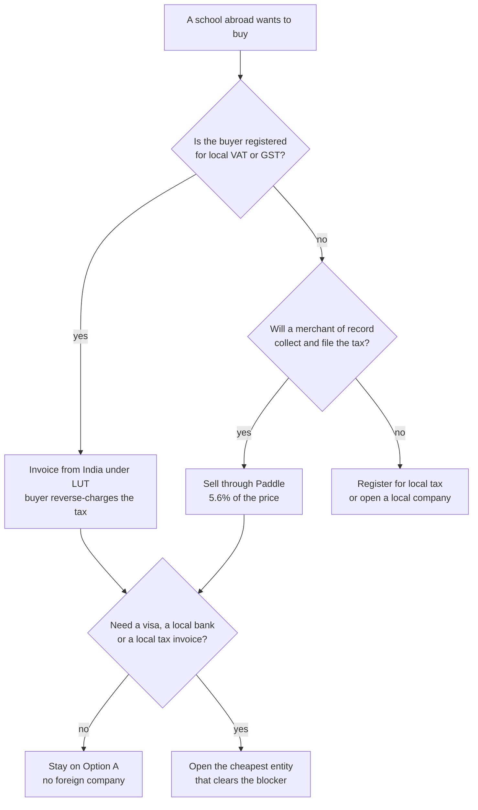

# International Expansion Costs

**In simple words:** This chapter prices the move out of India: the UAE in Year 2, then USA and Australia pilots in Year 3. There are two ways to do it. Option A sells from India with no foreign company, using a free export declaration and a merchant of record. Option B opens a real company in each country. Option A costs about Rs 2,42,000 in the first year; a UAE company costs Rs 8,14,324. This chapter shows exactly when the second one becomes worth it.

## What this chapter covers and what it does not

Every price here is taken from the Master Price List. Anything not in that list is marked **Estimate** with the reason in the same line. Per-message and per-transaction fees are explained in *Messaging and Payment Costs*; only the totals are repeated here. Indian company filings are in *Legal, Compliance, Tax and Accounting Costs*; this chapter adds only the filings that exist because a foreign company exists.

The canon timeline is fixed: UAE entry in Year 2 (Oct 2027 to Sep 2028), USA and Australia pilots in Year 3 (Oct 2028 to Sep 2029). The BRD gives two anchor numbers that this chapter must respect: cost to win one customer abroad is Rs 80,000 in Year 2 and Rs 1,20,000 from Year 3, and the new international customers are 15, 105, 450 and 1,150 in Years 2 to 5.

The three budget levels are used as in the rest of the guide.

- **Minimum:** the cheapest route that is still legal. The founder files what he can himself.
- **Recommended:** the BRD plan, number for number.
- **Maximum:** the sensible upper end. Above it, the money is waste.

> **Rule:** Government fees in the UAE free zones, Delaware and ASIC carry no VAT or GST. When the **Indian** company pays a foreign vendor (Paddle, Stripe Atlas, a UAE law firm), 18% IGST applies under reverse charge and comes back as input tax credit once the GSTIN exists. Fees paid by a foreign subsidiary out of its own account carry no Indian GST. Australian service fees add 10% GST, and that GST is a real cost while the subsidiary stays below the A$75,000 registration threshold.

## The two options in one picture

**Figure: Do you need a foreign company?**

Most first sales abroad end at node H. A foreign company is a tool for a specific blocker, not a milestone to be proud of.

## Option A: sell from India with no foreign company

India treats a SaaS subscription sold to a foreign buyer as an export of services. Export of services is zero-rated: no IGST on the invoice, and the input tax credit on your own costs stays claimable. Two pieces of paper make it work.

| Item | What it is | Fee | When | Status |
|---|---|---|---|---|
| Letter of Undertaking, Form GST RFD-11 | Lets you invoice abroad without charging IGST | Rs 0 | Every financial year, before the first export invoice | Verified |
| Export Declaration Form | Tells the bank an export happened | Rs 0 | Within 30 days of the month end of the invoice | Verified |
| Realisation of export money | Money must reach India in time | Rs 0 | Within 15 months, or 18 if invoiced in rupees | Verified |
| Small-value relief | Short receipts allowed on your own declaration | Rs 0 | Invoices up to Rs 10 lakh | Verified |
| Same-bank rule | Advance and its realisation use one bank | Rs 0 | Every advance | Verified |

The FEMA export rules changed on 1 October 2026, so these are the current rules for every EduFlow export invoice. Every EduFlow subscription invoice is far below Rs 10 lakh, so the small-value relief covers all of them. The only new habit is the monthly Export Declaration Form.

> **Warning:** The Letter of Undertaking expires on 31 March every year. If you invoice a foreign school on 2 April without renewing it, you must pay 18% IGST on that invoice and claim it back later. Put "File RFD-11" in the calendar for the last week of March.

### Getting the money in

Stripe India has been invite-only since May 2024, so a new Indian company cannot open Stripe and cannot open Stripe US, AU or UAE without a local company there. That leaves three routes (see Master Price List).

| Route | Fee on one payment | Who files the local tax | Foreign company needed |
|---|---|---|---|
| Paddle as merchant of record | 5% + US$0.50, which is 5.6% of a US$79 Growth plan | Paddle | No |
| Lemon Squeezy as merchant of record | 5% + US$0.50 | Lemon Squeezy | No |
| Local Stripe account | 3.15% Australia, 4.4% UAE, 4.5% USA, all in | You | Yes |

A merchant of record buys from you and sells in its own name. It collects US sales tax in the 26 states that tax SaaS, California and Colorado from 1 January 2027, UAE VAT and Australian GST, and it files all of them. At pilot scale that single service is worth more than the 1.1 to 2.45 percentage points it costs.

### What foreign tax you still owe without a company

| Country | The rule that bites | What it means for EduFlow |
|---|---|---|
| UAE | A foreign seller has **no** VAT threshold | A non-registered UAE buyer forces FTA registration from the first dirham |
| UAE | B2B supplies to a VAT-registered buyer are reverse-charged | Check the buyer's tax number before you invoice |
| Australia | Overseas sellers register at A$75,000 of turnover | About Rs 42 lakh; not reached in Year 3 |
| USA | Economic nexus, state by state, in 26 states | Unworkable alone; this is why a merchant of record wins |

Late VAT registration in the UAE costs AED 10,000, which is Rs 2,30,000 (Estimate, adviser figure). That penalty alone is the price of the cheapest UAE licence.

### What Option A costs

| Item | When to pay | Minimum | Recommended | Maximum | Can you avoid or reduce it? |
|---|---|---|---|---|---|
| Letter of Undertaking (yearly, no GST) | Every March | Rs 0 | Rs 0 | Rs 0 | No, but it is free |
| CA help with export paperwork (yearly, + GST, claimable) | Monthly | Rs 0 | Rs 12,000 | Rs 36,000 | Yes. The bank portal is self-service |
| Merchant of record fee (per payment, tax included) | Every payment | 5.6% | 5.6% | 5.6% | Partly. A local Stripe needs a company |
| Local legal and data-protection review (one-time, + GST, claimable) | Before the first sale | Rs 0 | Rs 2,30,000 | Rs 6,90,000 | No, once you hold children's data |
| Foreign company | n/a | Rs 0 | Rs 0 | Rs 0 | Yes. That is the whole point |
| **First-year fixed total** | | **Rs 0** | **Rs 2,42,000** | **Rs 7,26,000** | |
| **Yearly after that** | | **Rs 0** | **Rs 12,000** | **Rs 36,000** | |

Check: Rs 0 + Rs 12,000 + Rs 2,30,000 = Rs 2,42,000 for the first year at Recommended. The 5.6% is on top and moves with revenue.

## Option B: a local company in each country

### The UAE free zone company

A free zone is a business park with its own company registry. The licence is the yearly right to trade. The zone you pick changes the price by six times and changes nothing a customer ever sees.

| Item | When to pay | Minimum | Recommended | Maximum | Can you avoid or reduce it? |
|---|---|---|---|---|---|
| Trade licence (yearly, no VAT) | At set-up, then yearly | SHAMS AED 5,750 | RAKEZ SME AED 14,000 | DMCC package AED 43,780 | Yes. Zone choice is free money |
| Residence visa for one person (one-time) | With the licence | AED 0, no visa | Included in RAKEZ | Meydan AED 7,600 | Yes, if the founder stays in India |
| Business bank account (monthly) | Every month | Wio Essential AED 1,188 | Wio Essential AED 1,188 | Wio Grow AED 2,988 | Partly. Wio is already the cheap option |
| Books, corporate tax return, statements (yearly) | Year end | AED 3,000 | AED 5,000 | AED 8,000 | No. Free zones have needed statements since Sep 2025 |
| VAT and corporate tax registration (one-time) | At set-up | AED 0 | AED 0 | AED 1,500 help | Yes. EmaraTax has no fee |
| **Total in AED, first year** | | **AED 9,938** | **AED 20,188** | **AED 63,868** | |
| **Total in rupees, first year** | | **Rs 2,28,574** | **Rs 4,64,324** | **Rs 14,68,964** | |

Arithmetic at Recommended: AED 14,000 + 1,188 + 5,000 = AED 20,188, and AED 20,188 x Rs 23 = Rs 4,64,324. The Master Price List rounds this to about Rs 4.65 lakh. RAKEZ guarantees the same price at renewal, so the yearly cost after year one is the same Rs 4,64,324. The DMCC route also parks AED 50,000 (Rs 11,50,000) of share capital, which is cash you cannot use.

> **Tip:** No UAE school has ever asked which free zone a vendor sits in. RAKEZ in Ras Al Khaimah costs AED 14,000 with a visa; DMCC in Dubai costs AED 43,780 without one. The difference, Rs 6,84,940 a year, buys eleven months of a Year 2 marketing budget.

UAE tax is simple at this size and stays simple for years.

| Rule | The number | What it means |
|---|---|---|
| VAT registration, UAE company | AED 375,000 of sales in 12 months | 15 customers are far below it |
| Voluntary VAT registration | AED 187,500 | Register only to recover input VAT |
| Corporate tax | 0% up to AED 375,000 profit, then 9% | A small subsidiary pays nothing |
| Small Business Relief | Revenue up to AED 3 million treated as no taxable income | Extended to periods ending by 31 Dec 2029 |
| Returns | Still required, even with the relief | Due within 9 months of the year end |

Small Business Relief covers Years 2, 3 and 4 completely. The Qualifying Free Zone Person route also gives 0%, but it needs audited statements and it cannot be combined with Small Business Relief, so it is the wrong choice while revenue is small.

### The US Delaware C-corp

| Item | When to pay | Minimum | Recommended | Maximum | Can you avoid or reduce it? |
|---|---|---|---|---|---|
| Formation, EIN, founder stock (one-time) | At set-up | Atlas US$500 | Atlas US$500 | Clerky US$819 | Partly. Atlas includes state fees and year-one agent |
| Registered agent (yearly, from year two) | Every year | US$100 | US$100 | Firstbase US$299 | No. Delaware requires an agent |
| Franchise tax, assumed par value method (yearly) | By 1 March | US$400 | US$400 | US$400 | No. This is the floor |
| Annual report fee (yearly) | By 1 March | US$50 | US$50 | US$50 | No |
| Form 1120 and Form 5472 preparation (yearly) | After year end | US$800 | US$1,500 | US$2,500 | Partly. A solo CPA beats a platform |
| Business bank account (monthly) | Every month | Mercury US$0 | Mercury US$0 | Mercury Plus US$359 | Yes. The free plan is enough |
| State minimum tax where staff sit (yearly) | If you hire there | US$0 | US$0 | California US$800 | Yes, until a US employee exists |
| Student privacy review, FERPA and COPPA (one-time) | Before the first sale | US$3,000 | US$5,000 | US$15,000 | No. COPPA is per child record |
| **Total in dollars, first year** | | **US$4,750** | **US$7,450** | **US$19,928** | |
| **Total in rupees, first year** | | **Rs 4,03,750** | **Rs 6,33,250** | **Rs 16,93,880** | |
| **Yearly after that, in rupees** | | **Rs 1,14,750** | **Rs 1,74,250** | **Rs 3,74,680** | |

Arithmetic at Recommended, first year: US$500 + 400 + 50 + 1,500 + 5,000 = US$7,450, and US$7,450 x Rs 85 = Rs 6,33,250. Yearly after: US$100 + 400 + 50 + 1,500 = US$2,050, which is Rs 1,74,250.

> **Warning:** Delaware has two ways to compute franchise tax. A normal startup with 10,000,000 authorised shares is billed **US$85,165, about Rs 72.4 lakh**, under the authorised shares method. Refiling on the assumed par value capital method brings it to US$400. The bill arrives looking official. Do not pay it. Report gross assets and issued shares and recompute.

The second US trap is Form 5472. Any charge between the Indian parent and the US subsidiary, even a Rs 50,000 software licence, makes the form compulsory. Not filing costs US$25,000, about Rs 21.25 lakh, per failure. Put it in the CPA's engagement letter in writing.

Sales tax is separate from income tax. Twenty-six states tax SaaS today, and California and Colorado start on 1 January 2027. Stripe Tax computes it at 0.5% per transaction where you are registered, but registering and filing in each state costs extra. This is the single strongest reason to keep a merchant of record in the USA even after the company exists.

### The Australian Pty Ltd

| Item | When to pay | Minimum | Recommended | Maximum | Can you avoid or reduce it? |
|---|---|---|---|---|---|
| ASIC registration (one-time, GST-free) | At set-up | A$636 | A$636 | A$636 | No. It is a government fee |
| Registration service (one-time, + GST) | At set-up | A$0, self-file | A$900 | A$900 | Yes, once a resident director exists |
| Resident director (yearly, + GST) | Every year | A$2,500 | A$6,600 | A$13,200 | No. Section 201A requires one |
| Registered office and ASIC agent (yearly) | Every year | A$0 | A$0 | A$720 | Yes. The director service gives an address |
| Accountant: tax return, statements, BAS (yearly) | After year end | A$2,500 | A$3,000 | A$6,000 | Partly |
| Business name (per term) | Optional | A$0 | A$0 | A$108 | Yes. Trade under the company name |
| Privacy Act and children's code review (one-time) | Before the first sale | A$3,000 | A$5,000 | A$10,000 | No |
| **Total in dollars, first year** | | **A$8,636** | **A$16,136** | **A$31,564** | |
| **Total in rupees, first year** | | **Rs 4,83,616** | **Rs 9,03,616** | **Rs 17,67,584** | |
| **Yearly after that, in rupees** | | **Rs 2,99,152** | **Rs 5,56,752** | **Rs 11,34,672** | |

Arithmetic at Recommended, first year: A$636 + 900 + 6,600 + 3,000 + 5,000 = A$16,136, and A$16,136 x Rs 56 = Rs 9,03,616. The Master Price List rounds this to about Rs 9.02 lakh. Yearly after: annual review A$342 + director A$6,600 + accountant A$3,000 = A$9,942, which is Rs 5,56,752.

Australia is the most expensive of the three to keep alive, and one line is the reason. A proprietary company must have at least one director who ordinarily lives in Australia. A registry agent charges A$6,000 plus GST for a non-trading company and A$12,000 plus GST for a trading one. Market offers run from A$500 to A$7,250; the person signing carries real legal liability, so a A$500 offer is a warning, not a bargain. The founder can be a second director from India once a Director Identification Number is held, and that number is free.

The Australian Privacy Act still exempts businesses under A$3 million of turnover, but private schools are covered entities and will demand full Australian Privacy Principle terms by contract anyway. The Children's Online Privacy Code must be registered by 10 December 2026, before the pilot starts, so budget the review in the same quarter as the company.

## What India requires when you own a foreign company

Sending money into a foreign subsidiary is Overseas Direct Investment. It runs on the automatic route through your bank, with no RBI fee and no approval. The cost is paperwork and CA time.

| Filing | Due | Government fee | If missed | CA fee, Recommended |
|---|---|---|---|---|
| Form FC through the bank | Before the money leaves India | Rs 0 | The remittance is blocked | Rs 50,000 one time per country |
| Annual Performance Report | 31 December every year | Rs 0 | Rs 7,500 plus 0.025% a year of delay; further remittances blocked | Rs 20,000 a year per subsidiary |
| Foreign Liabilities and Assets return | 15 July every year | Rs 0 | Counts as a FEMA breach | Inside the same Rs 20,000 |
| Form 3CEB, transfer pricing | 31 October every year | Rs 0 | Penalty on the company | Rs 50,000 a year, one report for all subsidiaries |

All CA fees carry 18% GST, which is claimable. India-side cost at Recommended is Rs 1,20,000 in the first year for the first subsidiary (Rs 50,000 + Rs 20,000 + Rs 50,000) and Rs 70,000 a year after. Minimum is Rs 60,000 and Rs 35,000; Maximum is Rs 1,80,000 and Rs 1,05,000.

Transfer pricing means the price you charge your own subsidiary must be the price a stranger would pay. Below Rs 1 crore of transactions a year, a Form 3CEB report and a short note are enough. Above it, a full study costs Rs 1 to 3 lakh (see Master Price List).

> **Warning:** A foreign subsidiary can receive at most **400% of the Indian company's net worth in its last audited balance sheet**. After Year 1 that net worth is Rs 6,00,000 of capital minus the Rs 53,000 loss, which is Rs 5,47,000, so the limit is 4 x Rs 5,47,000 = **Rs 21,88,000**. That is enough for one UAE company and nothing more. The limit applies to money you put in, not to money the subsidiary earns and spends. Fund the UAE company with about AED 20,000 (Rs 4,60,000) of working capital, not with a large injection.

The first audited balance sheet exists only in August 2027. Do not plan a foreign subsidiary before it.

## Local compliance and legal review costs

| Country | Law to answer for | Review cost, Recommended | Why the Minimum is not zero |
|---|---|---|---|
| UAE | PDPL and the Child Digital Safety Law | AED 10,000, Rs 2,30,000 | The child law took effect 1 Jan 2026 with one year to comply |
| USA | FERPA, COPPA, state student-privacy laws | US$5,000, Rs 4,25,000 | COPPA penalties run to US$53,088, about Rs 45 lakh, per violation |
| Australia | Privacy Act, Australian Privacy Principles, children's code | A$5,000, Rs 2,80,000 | Schools demand APP terms by contract whatever the exemption says |

The way to cut this bill is to reuse work, not to skip it. The India DPDP pack bought in November 2026 already carries parental consent wording, a data processing agreement and a retention policy. A foreign lawyer editing that pack bills 10 hours instead of 25. The Recommended figures above already assume the pack exists.

## Local sales people and travel

No price list covers foreign salaries or foreign travel, so every figure in this section is an **Estimate** with its reasoning shown.

| Route to a first customer | Fixed cost a year | Variable cost | When it fits |
|---|---|---|---|
| Commission-only reseller | Rs 0 | 20% of first-year value, 10% on renewal | Year 2 UAE, the first 15 customers |
| India-based account executive covering the UAE | Rs 9,60,000 | Travel | From about 20 customers in one country |
| Country-resident sales executive on a company visa | Rs 33,12,000 to Rs 49,68,000 | Visa Rs 80,500 one time | Only above about Rs 1 crore of local revenue |

The India-based figure is the Year 3 sales loaded cost of Rs 80,000 a month times 12. The resident figure is AED 12,000 to 18,000 a month (Estimate: Dubai SaaS sales pay is roughly four to five times the Indian Tier 2 rate), which is Rs 2,76,000 to Rs 4,14,000 a month.

| Trip | What it covers | Cost, Estimate |
|---|---|---|
| Founder trip to Dubai, 7 days | Return flight, hotel, visa, local travel, meals | Rs 1,20,000 |
| Education show in Dubai, small pod | Pass, pod, printing, shipping, two staff | Rs 2,50,000 |
| Founder trip to the USA, 10 days | Return flight, hotel, visa, local travel | Rs 3,00,000 |
| Founder trip to Australia, 10 days | Return flight, hotel, visa, local travel | Rs 2,60,000 |

Reasoning: flights are the largest line and are priced at economy fares booked six weeks ahead; hotel is a mid-range business hotel; the Dubai show figure assumes a shared pod, not a built stand.

### How the BRD cost to win one customer is spent

Year 2 gives Rs 80,000 per UAE customer and plans 15 of them, so 15 x Rs 80,000 = **Rs 12,00,000**.

| Line | Amount |
|---|---|
| Reseller commission, 20% of first-year UAE value | Rs 3,42,000 |
| Two founder trips to Dubai | Rs 2,40,000 |
| One education show in Dubai | Rs 2,50,000 |
| Arabic material, KHDA and ADEK paperwork help | Rs 1,00,000 |
| Paid search and LinkedIn in the UAE | Rs 2,68,000 |
| **Total** | **Rs 12,00,000** |

The reseller line uses Rs 17,10,000 of Year 2 UAE revenue: 15 customers x Rs 19,000 average monthly revenue x 6 average live months. The Rs 19,000 figure is the BRD's own international average.

Year 3 gives Rs 1,20,000 per customer across three countries and plans 105 of them, so 105 x Rs 1,20,000 = **Rs 1,26,00,000**.

| Line | Amount |
|---|---|
| UAE country lead, resident, about AED 14,850 a month all-in | Rs 41,00,000 |
| Two India-based account executives for the USA and Australia | Rs 19,20,000 |
| Travel, about eight trips across three countries | Rs 20,00,000 |
| Education shows in Dubai, one US state and one Australian state | Rs 20,00,000 |
| First-year partner and reseller commission | Rs 15,00,000 |
| Paid search, LinkedIn and localised content | Rs 10,80,000 |
| **Total** | **Rs 1,26,00,000** |

Check: 41,00,000 + 19,20,000 + 20,00,000 + 20,00,000 + 15,00,000 + 10,80,000 = Rs 1,26,00,000. Both tables sit inside the sales and marketing line of *Sales and Marketing Costs*, not inside the entity budget below.

Payback on one international customer is Rs 1,20,000 divided by (Rs 19,000 x 80% gross margin), which is Rs 1,20,000 divided by Rs 15,200 = **7.9 months**. In Year 2 the UAE number is better: Rs 80,000 divided by Rs 15,200 = 5.3 months. At the canon churn ceiling of 3% a month, a customer lasts about 33 months, so lifetime value is Rs 15,200 x 33 = Rs 5,01,600 and the ratio to cost is 4.2 to 1 (Estimate: it uses the canon churn ceiling, not measured data). That clears the canon rule of 4 to 1, but barely. International churn above 3% breaks it.

## First-year and yearly cost per country

This table holds only the company, bank, accountant, legal review and India-side filings. People, travel and events are in the previous section.

| Country | First year, Minimum | First year, Recommended | First year, Maximum | Yearly after, Recommended |
|---|---|---|---|---|
| UAE, company only | Rs 2,28,574 | Rs 4,64,324 | Rs 14,68,964 | Rs 4,64,324 |
| UAE, legal review, one time | Rs 0 | Rs 2,30,000 | Rs 6,90,000 | Rs 0 |
| **UAE, together** | **Rs 2,28,574** | **Rs 6,94,324** | **Rs 21,58,964** | **Rs 4,64,324** |
| **USA, together** | **Rs 4,03,750** | **Rs 6,33,250** | **Rs 16,93,880** | **Rs 1,74,250** |
| **Australia, together** | **Rs 4,83,616** | **Rs 9,03,616** | **Rs 17,67,584** | **Rs 5,56,752** |
| India side, per subsidiary | Rs 60,000 | Rs 1,20,000 | Rs 1,80,000 | Rs 70,000 |

The Master Price List shows Rs 2,30,000, Rs 6,94,600, Rs 6,33,000 and Rs 9,02,000 for the same four Recommended totals. The small differences are rounding in the appendix; the arithmetic above is exact at Rs 23, Rs 85 and Rs 56 per AED, dollar and Australian dollar.

### The foreign entity budget by year

| Year | What runs | Minimum | Recommended | Maximum |
|---|---|---|---|---|
| Year 2 | UAE set-up, India filings | Rs 2,88,574 | Rs 8,14,324 | Rs 23,38,964 |
| Year 3 | UAE renewal, USA and Australia set-up | Rs 12,20,940 | Rs 22,11,190 | Rs 49,74,718 |
| Year 4 | All three running | Rs 7,17,929 | Rs 13,05,326 | Rs 29,36,984 |
| Year 5 | All three, plus audit and US state filings | Rs 10,86,979 | Rs 19,76,326 | Rs 44,46,734 |

Year 2 at Recommended: Rs 6,94,324 UAE + Rs 1,20,000 India = Rs 8,14,324.

Year 3 at Recommended: Rs 4,64,324 UAE renewal + Rs 6,33,250 USA + Rs 9,03,616 Australia + Rs 2,10,000 India (two new Form FC filings at Rs 50,000, three yearly report sets at Rs 20,000, one Form 3CEB at Rs 50,000) = Rs 22,11,190.

Year 4 at Recommended: Rs 4,64,324 + Rs 1,74,250 + Rs 5,56,752 + Rs 1,10,000 = Rs 13,05,326.

Year 5 adds Rs 6,71,000 to the Year 4 base: a UAE audit upgrade of Rs 69,000, five US state registrations at about US$800 each (Rs 3,40,000), Australian GST and activity statement work of Rs 1,12,000 once the A$75,000 threshold is crossed, and a full transfer pricing study instead of a short note (Rs 1,50,000). Rs 13,05,326 + Rs 6,71,000 = Rs 19,76,326.

From Year 4, Minimum is Recommended x 0.55 and Maximum is Recommended x 2.25. Those are the ratios Year 3 produces from its own line items, so the later years stay consistent with the entry years.

### Does it fit the BRD?

*Legal, Compliance, Tax and Accounting Costs* splits the BRD general and admin line into two parts. The second part, "office, travel, foreign entities and everything else", is Rs 13 lakh, Rs 35 lakh, Rs 120 lakh and Rs 330 lakh in Years 2 to 5. The entity budget above must fit inside it.

| Year | Entity budget, Recommended | The line it sits in | Share used | What is left for office and travel |
|---|---|---|---|---|
| Year 2 | Rs 8.14 lakh | Rs 13 lakh | 63% | Rs 4.86 lakh |
| Year 3 | Rs 22.11 lakh | Rs 35 lakh | 63% | Rs 12.89 lakh |
| Year 4 | Rs 13.05 lakh | Rs 120 lakh | 11% | Rs 106.95 lakh |
| Year 5 | Rs 19.76 lakh | Rs 330 lakh | 6% | Rs 310.24 lakh |

It fits, with two warnings. Year 2 and Year 3 use nearly two thirds of the line, and the canon team reaches 14 people by September 2028, which is when an office first becomes reasonable. The Maximum column does not fit at all: Rs 49.74 lakh in Year 3 against a Rs 35 lakh line. Choosing DMCC in Dubai and a trading-company nominee director in Sydney breaks the BRD budget on its own.

## The cheapest safe path

The short answer: **do not open a foreign company until a named blocker forces it.** Payment fees alone never justify one at the planned scale.

| Country | Merchant of record fee | Local Stripe, all in | Saving | Entity plus India cost a year | Revenue where the entity pays for itself |
|---|---|---|---|---|---|
| UAE | 5.6% | 4.4% | 1.2% | Rs 5,34,324 | Rs 4.45 crore |
| USA | 5.6% | 4.5% | 1.1% | Rs 2,44,250 | Rs 2.22 crore |
| Australia | 5.6% | 3.15% | 2.45% | Rs 6,26,752 | Rs 2.56 crore |

Arithmetic for the UAE: Rs 4,64,324 company + Rs 70,000 India filings = Rs 5,34,324 a year, divided by 1.2% = Rs 4,45,27,000. At Rs 19,000 a month that is 195 UAE customers. The plan has 15 in Year 2 and 100 international in total by Year 3. On fees alone, a UAE company never pays for itself before Year 4.

So the entity is bought for a non-money reason. These are the five triggers.

1. A customer will not pay without a tax invoice carrying a local tax number.
2. You must sponsor a person who has to live in that country.
3. The buyer's procurement rules demand a locally registered vendor, as some KHDA and ADEK school groups do.
4. Non-registered UAE buyers appear, which forces FTA registration from the first dirham anyway.
5. Local revenue crosses the crossover in the table above.

The sequence that follows from this:

| When | Action | Cost at Recommended |
|---|---|---|
| Oct 2027 | File the LUT, open a Paddle account, start invoicing UAE schools from India | Rs 0 |
| Nov 2027 | Buy the UAE PDPL and child-safety review, reusing the India DPDP pack | Rs 2,30,000 |
| Oct 2027 to Sep 2028 | Sell through one commission-only reseller in Dubai and Sharjah | 20% of first-year value |
| On the first trigger, expected near customer 8 | Open a RAKEZ company with one visa, fund it with AED 20,000, file Form FC | Rs 4,64,324 plus Rs 1,20,000 India |
| Oct 2028 | Start USA and Australia through Paddle only; buy both legal reviews | Rs 4,25,000 plus Rs 2,80,000 |
| During Year 3, on a trigger | Open the Delaware C-corp, then the Pty Ltd | Rs 6,33,250 and Rs 9,03,616 |
| From Year 4 | Keep all three, review each one against its crossover every September | Rs 13,05,326 a year |

> **Best practice:** Review each foreign company once a year, in September, against one number: its own revenue against the crossover in the table above. A subsidiary below its crossover with no live trigger should be closed, not renewed. Closing a free zone licence is cheap; renewing one for four years by habit is not.

## Money mistakes in this area

| Mistake | What it costs | Do this instead |
|---|---|---|
| Opening the UAE company before the first customer | Rs 8,14,324 of cash before a single dirham arrives | Sell under the LUT first; incorporate on a trigger |
| Paying Delaware franchise tax on the authorised shares method | US$85,165, about Rs 72.4 lakh, for a 10 million share company | Refile on assumed par value capital, US$400 |
| Forgetting Form 5472 for the US subsidiary | US$25,000, about Rs 21.25 lakh, per failure | Name it in the CPA engagement letter |
| Missing the Annual Performance Report on 31 December | Rs 7,500 plus 0.025% a year, and no more money leaves India | Calendar the APR and the 15 July FLA return |
| Invoicing a non-registered UAE buyer from India | Registration from the first dirham; late registration AED 10,000, Rs 2,30,000 | Check the buyer's tax number, or use a merchant of record |
| Choosing DMCC for the Dubai address | Rs 21,58,964 in year one plus AED 50,000, Rs 11,50,000, parked | RAKEZ or SHAMS; no customer asks about the zone |
| Taking the cheapest Australian nominee director | The director carries legal liability; A$500 is not a market price | Budget A$6,000 plus GST from a registry agent |
| Hiring a UAE-resident sales person in Year 2 | Rs 33 lakh to Rs 50 lakh a year against Rs 17.1 lakh of revenue | Commission-only reseller until about 20 customers |
| Planning the subsidiary before the first audit | The bank blocks Form FC; there is no net worth to measure | Wait for the August 2027 audited accounts |
| Registering for US sales tax state by state yourself | Unworkable across 26 states plus California and Colorado from 2027 | Keep Paddle even after the Delaware company exists |

## Key takeaways

- Option A costs Rs 2,42,000 in the first year and Rs 12,000 a year after, plus 5.6% of each payment. A UAE company costs Rs 8,14,324 in year one and Rs 5,34,324 a year after. Start with Option A every time.
- Payment fees never justify a foreign company at planned scale. The crossover is Rs 4.45 crore of yearly revenue in the UAE, Rs 2.22 crore in the USA and Rs 2.56 crore in Australia. The UAE crossover needs about 195 customers; the plan has 15 in Year 2.
- Buy the entity for a blocker, not a milestone: a local tax invoice a customer demands, a visa you must sponsor, a procurement rule, non-registered UAE buyers, or the crossover above.
- The BRD's Rs 80,000 and Rs 1,20,000 cost to win one customer abroad is people, travel, shows and commission, and it is not the entity cost. Year 2 is 15 x Rs 80,000 = Rs 12,00,000; Year 3 is 105 x Rs 1,20,000 = Rs 1,26,00,000. Payback is 5.3 months in Year 2 and 7.9 months from Year 3.
- The entity budget is Rs 8.14 lakh, Rs 22.11 lakh, Rs 13.05 lakh and Rs 19.76 lakh in Years 2 to 5. It uses 63% of the BRD office-and-foreign-entities line in Years 2 and 3, and the Maximum column of Rs 49.74 lakh in Year 3 breaks that line completely.
- Three numbers can destroy a year each: Delaware franchise tax on the wrong method (Rs 72.4 lakh), a missed Form 5472 (Rs 21.25 lakh) and a COPPA violation (Rs 45 lakh). All three are paperwork, not spending.
- India's rule caps what you can put into a foreign company at 400% of audited net worth, which is Rs 21,88,000 after Year 1. Fund the UAE company with about Rs 4,60,000 of working capital and no more, and plan nothing before the August 2027 audit.
