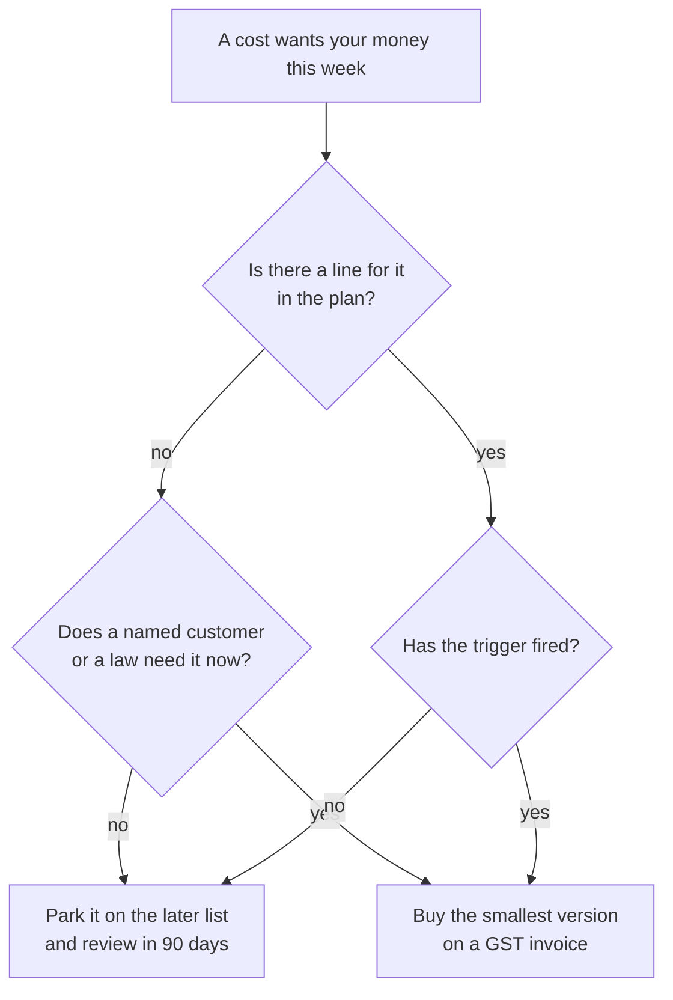

# What to Avoid: The Money Mistakes That Hurt Most

**In simple words:** This chapter lists 49 money mistakes a solo founder makes, what each costs, and the rule that stops it. Ten of them come to Rs 43,85,083, which is 1.8 times the whole Year 1 plan of Rs 23,77,500. The last section is the opposite list: six things you must never cut.

## How a mistake is priced here

- Every cost says whether it is one-time, monthly or yearly. Indian prices are before 18% GST unless the row says "incl. GST". Foreign prices use US$1 = Rs 85.
- Once GST-registered, 18% on a business purchase comes back as input tax credit, but only if the invoice carries the company GSTIN. Where it does not, the 18% is a pure loss.
- Founder time is priced at the plan's notional Rs 50,000 a month, which is Rs 2,273 a working day on 22 days (Estimate, from the BRD).

> **Rule:** A cost is a mistake only if it was avoidable on the day it was paid. Every row below was.

## The one question that stops most of them

**Figure: The test before any new spend**

Most of the 49 die at the second box or the fourth. "Everyone has one" is not a trigger. A named customer, a legal date or a threshold crossed is.

## Mistakes before there is any revenue

| Mistake | What it costs | Do this instead |
|---|---|---|
| Renting an office or a fixed desk | A four-seat room at Rs 32,000 a month plus a Rs 75,000 deposit is Rs 4,59,000 in year one (Estimate) | No office before 10 people. Day passes at Rs 249 |
| Buying a premium domain | Rs 1,50,000 to Rs 10,00,000 for an aftermarket name (Estimate) | The eduflow.app name: Rs 744 the first year, Rs 1,269 on renewal |
| A branding agency or identity package | Rs 25,000 to Rs 1,50,000, one-time (Estimate) | Figma Starter is free. Buy a wordmark at 100 customers |
| Paid ads before product-market fit | Rs 50,000 a month for six months is Rs 3,00,000 | Pass three tests first: 30 paying institutes, churn under 3%, one channel under Rs 6,000 a win for 60 days |
| Ten tool subscriptions one founder does not need | Rs 11,709 a month, Rs 1,40,508 a year | The free tier of each, until a named job fails without it |
| Forgotten trials and unused seats | One Rs 1,700 line noticed on the twelfth invoice is Rs 20,400 | A calendar entry on day 13 of every 14-day trial |
| ISO 27001 or SOC 2 before a buyer asks | Rs 10 to 20 lakh in the first year | A written request from a named customer first |
| Incorporating at Rs 1 lakh authorised capital | About Rs 1,70,000 of SH-7 fees at the seed round | Rs 15 lakh authorised at Rs 1 face value; the MCA fee is Rs 0 |

The ten subscriptions are real products: Zoho Books Standard Rs 749, Zoho CRM Standard Rs 800, Bitwarden Premium Rs 140, Linear Basic Rs 850, Figma Professional Rs 1,360, Slack Pro Rs 245, Docker Pro Rs 765, Sentry Seer Rs 3,400, Vercel password-protected previews Rs 1,700 and Cloudflare Pro Rs 1,700 (see Master Price List). Add them: Rs 749 + Rs 800 + Rs 140 + Rs 850 + Rs 1,360 + Rs 245 + Rs 765 + Rs 3,400 + Rs 1,700 + Rs 1,700 = **Rs 11,709 a month, Rs 1,40,508 a year**, all monthly and claimable. Each has a free plan a solo founder cannot outgrow in Year 1, and the paid set is 49% of the Rs 2,86,000 Year 1 tools budget.

> **Warning:** Paid search on "school ERP" runs at Rs 60 to Rs 200 a click. At Rs 100, Rs 3,00,000 buys 3,000 clicks; at 5% sign-up and 15% conversion that is 22.5 customers at Rs 13,333 each, above the Rs 12,000 CAC limit. Ads multiply fit; they do not create it.

## Technology mistakes

| Mistake | What it costs | Do this instead |
|---|---|---|
| Moving to AWS before the trigger | Rs 12,345 a month more than Railway, Rs 1,48,140 a year, plus three weeks of founder time worth Rs 37,500 | Move on a trigger: database CPU over 60% at peak for a week, p95 over 800 ms, or 80% of the stage count |
| Kubernetes for one Node.js API | Rs 15,488 a month of cluster plus a part-time DevOps contractor at Rs 25,000: Rs 4,55,256 a year more than Railway (Estimate) | Railway Pro now, ECS Fargate later. Neither needs a cluster to babysit |
| Two NAT gateways | Rs 11,826 a month: two gateways at Rs 3,475 plus Rs 4,876 of data processing on 1 TB | VPC endpoints carry the same traffic for about Rs 870 |
| No billing alerts | The nine cloud traps run to Rs 50,673 a month, Rs 6,08,076 a year at the 1,000-customer stage | Every alert in *Infrastructure and Software Costs by Scale* is free. Set them the day an account opens |
| An over-sized database | db.m6g.large across two zones at Rs 28,047 where db.t4g.medium at Rs 10,362 carries 100 customers: Rs 17,685 a month | Size to last month's measured load, not the load you hope for |
| Staging left on 24x7, logs kept for ever | Rs 12,000 plus Rs 3,060 a month | Scale staging to zero for 65% of hours; 30-day app logs, 400-day audit logs |
| x86 Fargate and Redis OSS | Rs 7,080 plus Rs 4,070 a month extra | Rebuild the image for ARM once; Valkey is Redis-compatible and 20% cheaper |
| Stray IPv4 addresses and PDFs served from S3 | 12 addresses at Rs 310 is Rs 3,720, plus Rs 4,645 for 500 GB of downloads | Release unused addresses. CloudFront's first 1 TB a month is always free |
| Running the live product on a Hobby plan | Vercel Hobby is personal use only, so the product can be pulled down | Vercel Pro at Rs 1,700 a month, per developer seat |

The AWS floor is the surprise. A safe Mumbai stack is RDS db.t4g.small across two zones at Rs 5,212, an ElastiCache cache.t4g.micro at Rs 993, two ARM Fargate tasks at Rs 901 each, a load balancer at Rs 1,483, one NAT gateway at Rs 3,475, three public IPv4 addresses at Rs 930 and about Rs 1,000 of logs, secrets and S3 (Estimate). Add: Rs 5,212 + Rs 993 + Rs 1,802 + Rs 1,483 + Rs 3,475 + Rs 930 + Rs 1,000 = **Rs 14,895 a month** before claimable GST. Railway does the same job for about Rs 2,550.

> **Founder note:** Every cloud trap is a decision made once and never revisited. At the 1,000-customer stage the monthly bill review is worth about Rs 6 lakh a year.

## Legal and tax mistakes

| Mistake | What it costs | Do this instead |
|---|---|---|
| Skipping the trademark, then a forced rebrand | Rs 2,10,603 one-time, against Rs 15,000 to file in October 2026 | File TM-A in class 9 and class 42 in the first month |
| Filing the trademark before Udyam arrives | Rs 4,500 extra a class, Rs 9,000 across two classes | Udyam the day the PAN arrives, then file |
| Missing ROC deadlines | AOC-4 and MGT-7A cost Rs 100 a day each with no cap: Rs 36,000 if both are 180 days late | Four dates in the calendar. The Rs 5,000 CA retainer covers filing |
| Missing TDS returns | Rs 200 a day per return: Rs 12,000 at 60 days late | Start 24Q and 26Q with the first salary or contractor payment |
| Registering for GST after the first purchases | GST paid before registration is lost. A Rs 80,000 laptop alone holds Rs 12,203 of credit | Register at incorporation, before any tool or laptop is bought |
| Buying foreign tools without the GSTIN on the account | The vendor charges 18% OIDAR: Rs 3,060 a month on Claude Max, Rs 36,720 a year, unclaimable | Enter the GSTIN at checkout and pay in US dollars from the company card |
| Choosing the concessional tax regime in a loss-making year | Locks out a tax holiday worth up to Rs 1.95 crore | Stay in the normal regime until profit actually arrives |
| No Letter of Undertaking before the first export invoice | 18% IGST blocked on every export: Rs 12,087 on one US$790 yearly plan | File RFD-11 on the GST portal. It is free and lasts a year |

A forced rebrand has the worst ratio here. Price it: a new logo and identity Rs 25,000 (Estimate); reprinting 1,000 brochures at Rs 20,260, two standees at Rs 1,929 each and 500 cards at Rs 1,150, so Rs 25,268; a new .app and .in pair Rs 1,935 a year; DLT header and templates again Rs 5,900; a fresh trademark Rs 15,000; a lawyer's reply or settlement Rs 1,00,000 (Estimate; a boutique SaaS legal pack alone is Rs 25,000 to Rs 75,000); founder time Rs 37,500. Total: Rs 25,000 + Rs 25,268 + Rs 1,935 + Rs 5,900 + Rs 15,000 + Rs 1,00,000 + Rs 37,500 = **Rs 2,10,603**, 14 times the filing cost.

## People mistakes

| Mistake | What it costs | Do this instead |
|---|---|---|
| Hiring before the trigger fires | The engineer hired in April instead of 16 August 2027: 4 x Rs 70,000 = Rs 2,80,000, which is 44% of the Rs 6,30,000 Year 1 salary budget | No trigger, no hire. Read last month's closing MRR before every offer |
| Paying above the band | One engineer at Rs 1,00,000 instead of the plan's Rs 70,000 is Rs 3,60,000 a year, and it resets the band for every later hire | Pay for the city the person lives in, plus a remote premium |
| Undocumented ESOP promises | "Two percent" in a chat message is Rs 32,00,000 of value at a Rs 16 crore pre-money, and it can stall a round | Board resolution, grant letter, strike price, four-year vest with a one-year cliff |
| Budgeting salary instead of loaded cost | 15% to 19% of the payroll line: Rs 46.65 lakh to Rs 59.09 lakh missing at the Year 3 payroll of Rs 311 lakh | Every budget line says loaded cost, with PF, ESI, gratuity, insurance and tools shown |
| Keeping a wrong hire past probation | 6 x Rs 1,40,000 = Rs 8,40,000 for a Year 3 engineer, plus hiring again | A written 90-day goal. Miss it, end it inside probation |
| Missing a statutory switch-on | 12 people at Rs 18,000 gross with no state insurance for a year: 12 x Rs 585 x 12 = Rs 84,240 of back dues, plus damages | The CA checks headcount on the first Monday of every month |
| A search firm for a junior role | 8% to 12% of Rs 8.4 lakh is Rs 67,200 to Rs 1,00,800 | Free Indeed and LinkedIn posts. Search firms only for a function head, from Year 3 |

The ESOP promise costs nothing today, which is why it gets made. The plan sets the pool at 10% to 12%, and the seed example leaves 8% after dilution. A verbal 2% sits outside that pool, so it comes out of the founder's 72%. Two percent of a Rs 16 crore pre-money is Rs 32,00,000, about 46 months of that person's Rs 70,000 salary, given away in one sentence.

> **Rule:** No equity is agreed until a board resolution exists. Say "the pool is being set up, and grants are made in writing after probation". That is free, and true.

## Sales and pricing mistakes

| Mistake | What it costs | Do this instead |
|---|---|---|
| Lifetime deals | Rs 25,000 once against Rs 24,990 a year: Rs 99,950 of revenue forgone per customer over five years, Rs 19,99,000 across 20 | No lifetime plan exists. Yearly, with two months free, is the longest term |
| Discounts deeper than two months free | 50% off Growth gives away Rs 12,495 per customer in year one, Rs 2,49,900 across 20, and the renewal starts from the low price | Two months free on yearly, which is 16.7%, is the only discount |
| Free custom work | A 10-day custom module is Rs 31,820 of engineer time, 127% of that customer's Rs 24,990 yearly fee, and it is maintained for ever | Price it: training Rs 4,999 a day, migration Rs 9,999, white-label Rs 49,999 setup. Or put it on the roadmap for all |
| A field trip for one small deal | Rs 7,000 to win Rs 2,499 a month; at 80% gross margin the payback is 3.5 months | No trip without two booked demos at institutes of 300 students or more |
| A bought phone database or a bulk WhatsApp sender | The number gets banned, pushing 1,20,000 reminders a month from WhatsApp at Rs 0.115 to SMS at Rs 0.18: Rs 7,800 a month, Rs 93,600 a year | Only the official Cloud API, and only numbers that opted in at a demo or on the site |
| A DIDAC stall or an IndiaMART package in Year 1 | Rs 2,86,740 with GST for three days, or Rs 45,000 to Rs 1,23,000 a year | Regional expos at Rs 15,000 to Rs 60,000 and educator summits at Rs 20,000 |

Lifetime deals feel like free cash. Work the five years. Growth is Rs 24,990 a year before GST, so five years is 5 x Rs 24,990 = Rs 1,24,950. A Rs 25,000 lifetime price gives up Rs 1,24,950 - Rs 25,000 = **Rs 99,950 per customer**, Rs 19,99,000 across 20. Serving them never stops costing: hosting is Rs 233 an organization a month, so 60 months is Rs 13,980 each, Rs 2,79,600 across 20.

## Money handling mistakes

| Mistake | What it costs | Do this instead |
|---|---|---|
| Mixing personal and company money | Rs 2,00,000 of vendor bills on a personal card loses Rs 30,508 of input tax credit, plus about Rs 10,000 of clean-up (Estimate) | One current account, one company card. Founder money enters only as share capital or a written director's loan |
| Not reconciling gateway settlements | On Rs 1,00,000 collected, Razorpay credits Rs 97,640: a Rs 2,000 fee plus Rs 360 of GST. Booked as revenue, income is understated and the Rs 360 credit is lost | Match the settlement report to the bank line every week in Zoho Books |
| Treating customer advances as profit | Rs 20.29 lakh of the Rs 25.76 lakh Year 1 closing cash is advance money. Own cash is Rs 5.47 lakh | Own cash = bank balance minus GST due minus customer advances |
| Treating GST collected as revenue | Rs 1,08,000 a month at the Year 1 exit MRR of Rs 6,00,000 | Move the GST to a separate account the day it is collected |
| Breaking the bank's average balance rule | Rs 1,000 to Rs 3,000 + GST a quarter, so Rs 4,000 to Rs 12,000 a year against a Rs 6,000 yearly misc budget | Open the Axis zero-balance startup account, free for the first 24 months |
| Paying foreign tools on a personal card | A 2% to 3.5% forex markup plus GST on it: Rs 550 to Rs 950 a month, Rs 6,600 to Rs 11,400 a year, with no input credit | Company card, with the GSTIN on every vendor account |

Customer advance money is what ends bootstrapped companies. On 30 September 2027 the bank shows Rs 25.76 lakh. Take out Rs 20.29 lakh of yearly plans paid for but not yet delivered, and the company owns Rs 5.47 lakh. Year 2 is worse: Rs 92 lakh of cash, Rs 84 lakh of advances, Rs 8 lakh owned. Spend the advances and one weak buying season turns a growing company insolvent.

> **Best practice:** Keep three numbers on one line of the monthly sheet: bank balance, GST due, customer advances. Only the difference may be spent, and never below three months of spend: Rs 13,26,300 at the August 2027 run rate.

## Funding mistakes

| Mistake | What it costs | Do this instead |
|---|---|---|
| Raising before the numbers are ready | Case C takes 25% at a Rs 15 crore pre-money and leaves 67.5%. Case B takes 20% at Rs 16 crore and leaves 72.0%. On a Rs 20 crore post-money that gap is Rs 90,00,000 | Raise only after MRR of Rs 3 lakh for three months, churn under 3%, LTV to CAC above 4, and cash is the only limit on growth |
| Accepting a seed that takes more than 25% | From 67.5%, a Series A at 20% leaves 54.0%, and the round after that leaves 43.2% | Walk away above 25%. Aim to hold more than 50% after Series A |
| No budget for seed legal work | Rs 1.5 lakh to Rs 5 lakh a round, plus Rs 25,000 or more for the registered valuer report | Add the line to Year 2 general and admin before the term sheet |
| A personal guarantee on a company loan | Limited liability ends. A Rs 10 lakh loan becomes a personal debt the Rs 4,00,000 standby reserve cannot cover | Use CGTMSE or the startup credit guarantee: 0.37% to 1.20% a year, so Rs 3,700 to Rs 12,000 on Rs 10 lakh |
| Giving equity to an incubator for a desk | 2% of a Rs 16 crore pre-money is Rs 32,00,000 for a desk worth Rs 72,000 a year: 44 times the value | Pay the cash seat fee of Rs 3,000 to Rs 10,000 a month, or use the free AKTU and IIT Patna routes |

Money fixes a cash problem. It does not fix churn or a weak product. If churn is 5% a month, a Rs 4 crore round buys faster churn. Three of the four gates in the seed decision flow are about the business, not the bank.

## The ten most expensive mistakes, ranked

| Mistake | Period | Cost | Compared with |
|---|---|---|---|
| Twenty lifetime deals | 5 years | Rs 19,99,000 | 86% of the Rs 23,25,000 Year 1 revenue plan |
| The nine cloud traps at 1,000 customers | a year | Rs 6,08,076 | 48% on top of a Rs 12,71,424 yearly AWS bill |
| Kubernetes for one Node.js API | a year | Rs 4,55,256 | 15 times the Rs 30,600 yearly Railway bill it replaces |
| Paid ads for six months before fit | one-time | Rs 3,00,000 | 50% of the Rs 6,00,000 founder capital |
| Hiring the engineer four months early | one-time | Rs 2,80,000 | 44% of the Year 1 salary budget |
| A forced rebrand after skipping the trademark | one-time | Rs 2,10,603 | 14 times the Rs 15,000 filing cost |
| Moving to AWS at 100 customers | a year | Rs 1,85,640 | 52% of the Rs 3,57,500 Year 1 infra budget |
| Rs 1 lakh authorised capital at incorporation | one-time | Rs 1,70,000 | 8.5 times the Rs 20,000 registration budget |
| Ten unneeded tool subscriptions | a year | Rs 1,40,508 | 49% of the Rs 2,86,000 Year 1 tools budget |
| Both ROC filings 180 days late | one-time | Rs 36,000 | 7.2 months of the Rs 5,000 CA retainer |

These do not all land in one year: five are yearly, four one-time, and the lifetime figure runs over five years. Added up: Rs 19,99,000 + Rs 6,08,076 + Rs 4,55,256 + Rs 3,00,000 + Rs 2,80,000 + Rs 2,10,603 + Rs 1,85,640 + Rs 1,70,000 + Rs 1,40,508 + Rs 36,000 = **Rs 43,85,083**, or 1.8 times the Rs 23,77,500 Year 1 plan.

## Where you must never cut

Recommended equals the BRD plan. Minimum is the bare bootstrap level, not a target. Below Minimum the saving is real and the risk is bigger than the saving.

| Item | When to pay | Minimum | Recommended | Maximum | Can you avoid or reduce it? |
|---|---|---|---|---|---|
| Claude subscription | Monthly, from Oct 2026 | Rs 8,500 (Max 5x) | Rs 17,000 (Max 20x, US$200) | Rs 23,999 incl. GST on rupee billing | Drop a tier if cash is tight. Never to zero: it replaces the team |
| Backups and staging | Monthly, from Day 1 | Rs 0; RDS backup equal to storage is free | Inside the Rs 4,000 to Rs 28,000 hosting line | Rs 12,000 for always-on staging | Scale staging to zero at night. Never switch backups off |
| Pre-launch security test | One-time, Dec 2026 | Rs 15,000 | Rs 20,000 | Rs 30,000 freelance, Rs 1.5 lakh for a full VAPT | No. Tenant isolation and login are what end a company |
| CA retainer | Monthly, from Oct 2026 | Rs 3,000 + GST, Tier 2 | Rs 5,000 + GST | Rs 15,000 + GST, Delhi NCR | Reduce with the QRMP scheme. Never go without one |
| Legal documents pack | One-time, Nov 2026 | Rs 25,000 | Rs 25,000 | Rs 75,000 drafted, Rs 1 lakh with DPDP wording | No. Parent-consent duties apply from May 2027 |
| Founder health and term cover | Yearly, before 5 Oct 2026 | Rs 9,500, health only | Rs 19,028 (health Rs 9,500 + term Rs 9,528) | Rs 39,041 with family cover | No. Both are GST-free since 22 September 2025 |
| Six months of founder living money | One-time reserve, before 5 Oct 2026 | Rs 1,50,000, Tier 2 | Rs 3,00,000 | Rs 3,00,000 | No. It sits outside the company model, and its absence forces bad decisions |

Cutting the Claude subscription is the most tempting and the worst trade. It is 86% of the six-month tools bill at Rs 1,02,000, and it does the work of a development team during the sprint. The honest fallback is Max 5x at Rs 8,500. Cutting it to zero saves Rs 17,000 a month and pushes the launch past the January 2027 buying season.

> **Warning:** Founder health is a company cost, even though it is paid personally. A Rs 10 lakh health policy is Rs 9,500 a year and a Rs 1 crore term policy Rs 9,528 at the median quote, both GST-free. Together Rs 19,028 a year, about one month of Claude, for the only asset that cannot be bought again.

## The first Monday routine that catches these

Four checks, 45 minutes, every month.

1. Read every cloud and tool bill line by line, and compute hosting divided by active students. The Year 1 target is Rs 0.47; two rises in a row means find the cause before adding a server.
2. Write down bank balance, GST due and customer advances. Only the difference is spendable.
3. Reconcile the gateway settlement report against the bank statement, with refunds and failed settlements.
4. Check headcount against the thresholds (state insurance at 10, provident fund at 20) and the next 60 days of legal dates.

## Key takeaways

- The ten costliest mistakes total Rs 43,85,083, or 1.8 times the Rs 23,77,500 Year 1 plan. None looks reckless on the day it is decided.
- Cloud money leaks quietly. The nine traps at the 1,000-customer stage are Rs 6,08,076 a year, and every alert that catches them is free.
- Two rules prevent most people mistakes: no trigger, no hire; and no equity until a board resolution. The early engineer costs Rs 2,80,000, a verbal 2% costs Rs 32,00,000.
- Never sell a lifetime deal or a discount deeper than two months free. One lifetime customer gives up Rs 99,950 over five years and still costs Rs 13,980 of hosting.
- Own cash = bank balance minus GST due minus customer advances: Rs 5.47 lakh at the end of Year 1, not Rs 25.76 lakh; Rs 8 lakh at the end of Year 2, not Rs 92 lakh.
- Six things never get cut: the Claude subscription, backups, the pre-launch security test, the CA retainer, the legal documents pack, and the founder's health cover and living reserve.
