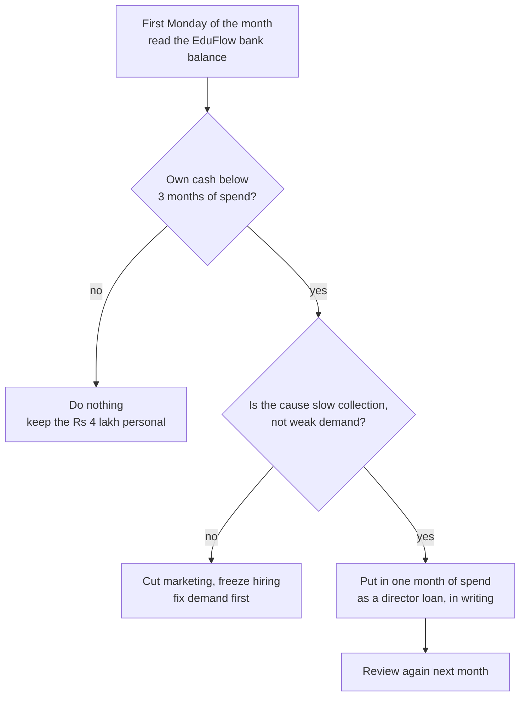

# Founder Personal Finance and Runway

**In simple words:** This chapter is about your own money, not EduFlow's. It says what a month of living costs in Patna, Lucknow, Delhi NCR and Bengaluru, how large a personal reserve to build before 5 October 2026, what health and term cover cost, when you start paying yourself, and how to keep your money and the company's money apart. Every number shows its arithmetic, so you can drop in your own city and your own bills.

## Two wallets, never one

From 5 October 2026 you run two budgets at the same time. The company budget is in the stage chapters. This one is yours.

| Wallet | What it pays for | Who owns it | Where it sits |
|---|---|---|---|
| Personal | Rent, food, travel, insurance, family | You | Your savings account and emergency fund |
| Company | Hosting, tools, marketing, salaries, the CA | EduFlow Private Limited | The company current account |

Three separate pots leave your savings before Day 1:

1. **Six months of living costs.** You take no pay from October 2026 to March 2027.
2. **Rs 6,00,000 of share capital**, paid into the company on 1 October 2026.
3. **Rs 4,00,000 of personal standby reserve**, held by you, put in only if the company runs short.

Pots two and three are the BRD plan. Pot one is not in the company model at all, and that is exactly why founders miss it.

## What one month of living costs, by city

These are the Recommended lines: a frugal single founder in a one-bedroom place, cooking at home, no car (see Master Price List).

| Line | Patna | Lucknow | Delhi NCR | Bengaluru |
|---|---|---|---|---|
| Rent, one bedroom | Rs 8,000 | Rs 8,000 | Rs 16,000 | Rs 20,000 |
| Electricity, water, cooking gas | Rs 2,500 | Rs 2,500 | Rs 3,000 | Rs 2,500 |
| Food and groceries | Rs 7,000 | Rs 7,000 | Rs 10,000 | Rs 11,000 |
| Phone and broadband | Rs 1,000 | Rs 1,000 | Rs 1,200 | Rs 1,300 |
| Local travel | Rs 2,000 | Rs 2,000 | Rs 4,000 | Rs 5,000 |
| Health and term cover | Rs 1,700 | Rs 1,700 | Rs 1,800 | Rs 1,800 |
| Haircuts, clothes, gifts, repairs | Rs 2,800 | Rs 2,800 | Rs 4,000 | Rs 4,400 |
| **Total a month** | **Rs 25,000** | **Rs 25,000** | **Rs 40,000** | **Rs 46,000** |

Patna check: Rs 8,000 + Rs 2,500 + Rs 7,000 + Rs 1,000 + Rs 2,000 + Rs 1,700 + Rs 2,800 = Rs 25,000. Delhi NCR uses Noida rents, not Gurgaon; Gurgaon alone averages Rs 31,738 for a one-bedroom and adds about Rs 16,000 a month.

Now the same cities at three levels. Minimum is the cheapest area, the Rs 199 mobile plan and no eating out. Maximum is a city-centre flat and the full Numbeo single-person basket.

| City | Minimum | Recommended | Maximum | Six months at Recommended | Six months at Maximum |
|---|---|---|---|---|---|
| Patna | Rs 18,000 | Rs 25,000 | Rs 35,000 | Rs 1,50,000 | Rs 2,10,000 |
| Lucknow | Rs 19,000 | Rs 25,000 | Rs 38,000 | Rs 1,50,000 | Rs 2,28,000 |
| Delhi NCR | Rs 30,000 | Rs 40,000 | Rs 62,000 | Rs 2,40,000 | Rs 3,72,000 |
| Bengaluru | Rs 35,000 | Rs 46,000 | Rs 68,000 | Rs 2,76,000 | Rs 4,08,000 |

Both outer columns are Estimates from the price list: Minimum swaps in the cheapest researched rent and cuts food and travel by about 30%; Maximum uses the city-centre rent and the Numbeo spend.

> **Note:** The BRD values unpaid founder time at Rs 50,000 a month, or Rs 3,00,000 for six months. This guide keeps that plan number. At the researched Rs 25,000 a month it buys twelve months in Patna or Lucknow, 7.5 months in Delhi NCR (Rs 3,00,000 divided by Rs 40,000) and 6.5 months in Bengaluru.

## The three levels for your own money

| Item | When to pay | Minimum | Recommended | Maximum | Can you avoid or reduce it? |
|---|---|---|---|---|---|
| Six months of living costs, in a separate account | Before 5 Oct 2026 | Rs 1,50,000 | Rs 3,00,000 | Rs 4,08,000 | No. Cut the monthly figure by moving city, never the six months |
| Personal standby reserve for the company | Held from 5 Oct 2026 | Rs 2,00,000 | Rs 4,00,000 | Rs 6,00,000 | Only after three months of positive company cash |
| Company share capital paid in | 1 Oct 2026 | Rs 3,00,000 | Rs 6,00,000 | Rs 8,00,000 | No. Rs 2,40,000 goes out before the first customer pays |
| Health cover for you, Rs 10 lakh, one year | Yearly, before 5 Oct 2026 | Rs 9,500 | Rs 9,500 | Rs 27,161 | No. GST-free since 22 Sep 2025, so no input credit to claim |
| Term life cover, Rs 1 crore, one year | Yearly, before 5 Oct 2026 | Rs 0 | Rs 9,528 | Rs 11,880 | Only if nobody depends on your income |
| Emergency fund on top of the runway | Before 5 Oct 2026 | Rs 50,000 | Rs 1,00,000 | Rs 2,00,000 | No. It is what stops you raiding the company account |
| **Total personal money committed** | | **Rs 7,09,500** | **Rs 14,19,028** | **Rs 20,47,041** | |

Recommended check: Rs 3,00,000 + Rs 4,00,000 + Rs 6,00,000 + Rs 9,500 + Rs 9,528 + Rs 1,00,000 = Rs 14,19,028. Both insurance rows are yearly premiums with no GST. Share capital and the standby reserve are one-time. The living reserve is six monthly withdrawals, not one payment.

## Working out your own runway

Replace the inputs with yours. The worked example is a single founder in Lucknow with Rs 18,00,000 of liquid savings.

1. Monthly living cost, from the city table: Rs 25,000.
2. Months with no pay: October 2026 to March 2027 = 6.
3. Living reserve needed = Rs 25,000 x 6 = Rs 1,50,000. Use the BRD plan of Rs 3,00,000, which doubles it.
4. Company capital = Rs 6,00,000. Standby reserve = Rs 4,00,000.
5. Emergency fund = Rs 1,00,000. Insurance for the year = Rs 9,500 + Rs 9,528 = Rs 19,028.
6. Total committed = Rs 3,00,000 + Rs 6,00,000 + Rs 4,00,000 + Rs 1,00,000 + Rs 19,028 = Rs 14,19,028.
7. Savings left untouched = Rs 18,00,000 minus Rs 14,19,028 = Rs 3,80,972.

Step 7 decides whether you sleep. If it is negative, drop to the Minimum level or move to a cheaper city before Day 1.

## How much of your savings you may risk

Only two of the six lines are truly at risk: the share capital and the standby reserve. The living reserve, the emergency fund and the premiums are spent on living, not gambled. This guide uses one rule: **money at risk stays at or under 60% of your liquid savings.**

| Level | Capital | Standby | At risk | Liquid savings you need | Protected money |
|---|---|---|---|---|---|
| Minimum | Rs 3,00,000 | Rs 2,00,000 | Rs 5,00,000 | Rs 8,40,000 | Rs 2,09,500 |
| Recommended | Rs 6,00,000 | Rs 4,00,000 | Rs 10,00,000 | Rs 16,70,000 | Rs 4,19,028 |
| Maximum | Rs 8,00,000 | Rs 6,00,000 | Rs 14,00,000 | Rs 23,40,000 | Rs 6,47,041 |

Savings needed = at-risk money divided by 0.60, rounded up: Rs 10,00,000 divided by 0.60 = Rs 16,66,667, shown as Rs 16,70,000. The 60% figure is this guide's rule, not a law (Estimate); it leaves 40% that a bad year cannot touch.

> **Warning:** None of the at-risk money may be borrowed. No personal loan, no credit card balance carried forward, no gold loan, no loan against the family house, no money from a relative without a written agreement and a repayment date. A loan has a fixed monthly payment; a startup has no fixed monthly income. The two do not mix.

If your liquid savings are below Rs 8,40,000, do not start full time in October 2026. Keep the job until March 2027 and build in evenings and weekends, which stretches the 60-day sprint to about 150 days, or start at the Minimum level. Delaying Day 1 by six months is the worst of the three: it pushes the paid launch past the January to March 2027 buying season, and that quarter alone collects Rs 7,12,800 in the plan.

## Health cover, term cover and the emergency fund

The day you leave a job you lose the employer's group policy. Buy your own cover **before** you resign, because waiting periods start on the day the policy starts, not on the day you claim.

| Cover | Who it is for | Yearly premium | Per month | Note |
|---|---|---|---|---|
| Health, Rs 10 lakh, single, age 30 | You alone | Rs 9,500 | Rs 792 | Care Supreme, Zone 1 |
| Health, Rs 15 lakh floater, two adults | You and spouse | Rs 16,299 to Rs 21,528 | Rs 1,360 to Rs 1,795 | Four leading insurers; Tier 2 zones cost less |
| Health, Rs 15 lakh floater, two adults and a child | Small family | Rs 21,478 to Rs 27,161 | Rs 1,790 to Rs 2,265 | Quotes include add-ons |
| Term life, Rs 1 crore, male 30, to age 60 | Anyone with dependants | Rs 8,856 to Rs 10,440 | Rs 738 to Rs 870 | Median Rs 9,528; female 30 pays Rs 7,536 to Rs 8,880 |

All four rows are individual policies, so they carry no GST since 22 September 2025 and there is no input credit to claim. A group policy bought by the company later does carry 18% GST, which the company can claim.

How much term cover: family yearly spend x years until your youngest child turns 21, plus every loan. Worked example: Rs 3,00,000 a year x 20 years = Rs 60,00,000, plus a Rs 10,00,000 home loan = Rs 70,00,000, so buy Rs 1 crore. Premiums rise with age, so a five-year delay costs about Rs 2,350 a year more (Rs 11,880 at age 35 against Rs 9,528 at age 30).

The emergency fund is not the runway. The runway pays bills you know about; the emergency fund pays the ones you do not: a hospital co-payment, a trip home for a funeral, a dead laptop. A replacement 16 GB developer laptop is Rs 62,800 to Rs 80,000 (see Master Price List), which is why Recommended is Rs 1,00,000. Keep it in a different bank, in a sweep-in fixed deposit or a liquid fund you can reach within 24 hours.

## When you start paying yourself

Founder pay follows MRR, never a date. MRR means monthly recurring revenue: the subscription money that repeats every month.

| Step | Trigger | First paid | Monthly | Total in Year 1 |
|---|---|---|---|---|
| Nothing | Day 1 until MRR reaches Rs 1 lakh | Oct 2026 | Rs 0 | Rs 0 |
| Step one | The month after MRR reaches Rs 1 lakh | Apr 2027 | Rs 30,000 | Rs 90,000 |
| Step two | The month after MRR reaches Rs 3 lakh | Jul 2027 | Rs 60,000 | Rs 1,80,000 |

Rs 30,000 x 3 + Rs 60,000 x 3 = Rs 2,70,000, the whole Year 1 founder cost. Rs 30,000 covers Patna or Lucknow at Rs 25,000 with Rs 5,000 to spare. It is Rs 10,000 short in Delhi NCR and Rs 16,000 short in Bengaluru. Here is what the reserve does in the two extremes, both starting from Rs 3,00,000.

| Quarter | Founder pay | Lucknow spend | Reserve left | Bengaluru spend | Reserve left |
|---|---|---|---|---|---|
| Oct to Dec 2026 | Rs 0 | Rs 75,000 | Rs 2,25,000 | Rs 1,38,000 | Rs 1,62,000 |
| Jan to Mar 2027 | Rs 0 | Rs 75,000 | Rs 1,50,000 | Rs 1,38,000 | Rs 24,000 |
| Apr to Jun 2027 | Rs 90,000 | Rs 75,000 | Rs 1,65,000 | Rs 1,38,000 | minus Rs 24,000 |
| Jul to Sep 2027 | Rs 1,80,000 | Rs 75,000 | Rs 2,70,000 | Rs 1,38,000 | Rs 18,000 |

Lucknow check: Rs 3,00,000 minus Rs 1,50,000 spent in six unpaid months = Rs 1,50,000; then Rs 90,000 minus Rs 75,000 = plus Rs 15,000; then Rs 1,80,000 minus Rs 75,000 = plus Rs 1,05,000, giving Rs 2,70,000. The Bengaluru founder crosses zero in May 2027 and only recovers in August. Two fixes, both arithmetic: hold the Maximum reserve of Rs 4,08,000, or live at the Bengaluru Minimum of Rs 35,000, which leaves Rs 90,000 on 31 March 2027 and never breaks.

> **Rule:** Never break a trigger to pay yourself early. If the reserve runs out before MRR reaches Rs 1 lakh, the honest answer is to cut your own living cost or move city, not to take money the company has not earned.

## Paying yourself in the cheapest legal way

Three routes exist, and the gap between them is large. Confirm your choice with the CA before the first payment.

| Route | Company side | Your side | When it fits |
|---|---|---|---|
| Salary to a director-employee | Deductible expense; TDS at your slab; PF only from 20 staff | Taxed at slab; Rs 75,000 standard deduction; nil tax up to about Rs 12.75 lakh in the new regime | Always. The default from April 2027 |
| Professional or sitting fee | Deductible; 10% TDS; GST questions on a sitting fee | Taxed as other income; you may need your own GST number | Rare for a solo founder; skip it |
| Dividend | Paid from profit after 25.168% company tax; not deductible | Added to your income at slab; 10% TDS above Rs 10,000 a year | Only after real profits and free reserves, from Year 3 |

Worked comparison on Rs 1,00,000 of company money:

1. **As dividend.** Company tax 25.168% = Rs 25,168, leaving Rs 74,832. At a 30% slab plus 4% cess, that is 31.2%, so Rs 74,832 x 31.2% = Rs 23,348. You keep Rs 51,484. Total tax Rs 48,516, or 48.5%.
2. **As salary**, while your total salary stays under Rs 12.75 lakh. The Rs 1,00,000 is a company expense, so no company tax on it, and the rebate makes your own tax nil. You keep Rs 1,00,000.

Your Year 1 pay of Rs 2,70,000, and even a full year at Rs 60,000 a month (Rs 7,20,000), sit far below the Rs 12.75 lakh line, so your income tax is nil and the company deducts nil TDS. Form 16 is still issued and you still file a return. On the company side, Year 1 EBITDA is minus Rs 0.53 lakh, so the salary deduction saves no tax that year; it adds to the carried-forward loss and cuts the Year 2 bill instead.

> **Best practice:** A private company has no legal ceiling on director pay, but the board must approve the amount in writing and it must be reasonable for the work done, or the assessing officer can disallow it. Pass one board resolution in April 2027 covering both steps, and keep a short employment agreement on file.

## Keeping the two wallets apart

1. One current account in the company name. Your savings account never pays a company bill.
2. The Rs 6,00,000 goes in as share capital on 1 October 2026, with a board resolution and a share certificate. The Rs 4,00,000 goes in later as an unsecured loan from a director, with your written declaration that the money is your own and not borrowed.
3. Every vendor account, card and subscription is in the company name and carries the company GSTIN. A personal UPI payment for a company tool loses the 18% input credit for ever.
4. Pay yourself only through payroll, with a salary slip. A landlord, a bank and an investor's diligence team all ask for slips.
5. Claim expenses monthly against bills on one sheet. Never fold a reimbursement into the salary.
6. Never take cash out of the company account for personal use. It becomes a loan to a director, which the CA must reverse and which auditors flag.

**Figure: When to put the standby reserve into the company**



Own cash is the bank balance minus GST due minus customer advances. In the plan, own cash on 30 September 2027 is Rs 5.47 lakh out of a Rs 25.76 lakh balance, so the bank balance alone will fool you. Put in one month of spend at a time, never the whole Rs 4,00,000.

## Side income during the sprint

| Option | Typical rate | 30 hours a month brings | What it costs the sprint |
|---|---|---|---|
| Freelance development | Rs 1,275 to Rs 2,550 an hour | Rs 38,250 to Rs 76,500 | 30 hours is a quarter of your week; Day 60 slips by about 15 days |
| Evening tuition or teaching | Rs 300 to Rs 600 an hour | Rs 9,000 to Rs 18,000 | Fixed slots after 7 pm; least damage to deep work |
| Rent from a spare room or old flat | Rs 5,000 to Rs 12,000 a month | Rs 5,000 to Rs 12,000 | Zero hours; the only side income with no sprint cost |

The tuition rate is an Estimate: a full-time tele-calling stipend in Patna of Rs 12,000 to Rs 18,000 a month works out to about Rs 60 to Rs 95 an hour, and a subject tutor charges four to seven times unskilled rates. The room-rent range is an Estimate: a one-bedroom in Patna rents for Rs 6,000 to Rs 10,000 (see Master Price List), and a single room inside a family house is about half of that.

The arithmetic looks tempting. Freelancing 30 hours a month for six months at Rs 1,700 an hour brings Rs 3,06,000, more than the whole Recommended living reserve. The cost is hidden. Day 60 is 3 December 2026 and the pilot starts on Day 45, 18 November 2026, because the paid launch must land in January 2027, before the April 2027 session. A 15-day slip becomes a 30-day slip once pilot feedback arrives late, and missing the January to March window costs the Rs 7,12,800 that quarter collects.

> **Tip:** Take side income only if it needs no daytime hours and no client meetings. Keep it personal: invoice it in your own name, never through EduFlow, or you create a second service line, a GST question and a story you have to explain to every investor.

## Talking to the family before 5 October 2026

Do it once, with the numbers on a page. Four questions cover it.

| The question they will ask | The answer, with numbers |
|---|---|
| How much of our money goes in? | Rs 10,00,000 at risk: Rs 6,00,000 capital plus Rs 4,00,000 standby |
| How long with no salary? | Six months, October 2026 to March 2027, then Rs 30,000 and Rs 60,000 on triggers |
| What is protected? | Rs 3,00,000 living reserve, Rs 1,00,000 emergency fund, health and term cover, all in a different bank |
| What if it fails? | The written stop rule below, checked on 31 March 2027 |

Write the stop rule down before Day 1 and give a copy to your spouse or parent: **"If on 31 March 2027 EduFlow has fewer than 10 paying organizations and less than Rs 2,00,000 of own cash, I take a job and keep EduFlow as evening work."** A rule agreed in advance is calm. The same decision taken in March under pressure is a fight.

Two housekeeping items. Hold a ten-minute review on the first Sunday of each month using the sheet below. Keep a sealed note with bank details, both policy numbers and the CA's phone number, and tell one person where it is. Off the table, always: the family house, gold, a child's education fund, and borrowing of any kind.

## The personal runway sheet

Fill this on the first Sunday of every month. Ten minutes, and it is the only personal report you need.

**Sheet: Founder personal runway, one page a month**

```text
+------------------------------------------------------------------------+
| PERSONAL RUNWAY SHEET   Month: ____________  Filled on: ____________    |
+------------------------------------------------------------------------+
| A. PERSONAL CASH                                                       |
|    Living reserve account balance              Rs ____________         |
|    Emergency fund balance (other bank)         Rs ____________         |
|    A = total personal cash                     Rs ____________         |
|                                                                        |
| B. MONEY OUT THIS MONTH                                                |
|    Rent, bills, food, travel                   Rs ____________         |
|    Insurance premium paid this month           Rs ____________         |
|    B = total personal spend                    Rs ____________         |
|                                                                        |
| C. MONEY IN THIS MONTH                                                 |
|    Founder salary from EduFlow                 Rs ____________         |
|    Side income (tuition, rent, freelance)      Rs ____________         |
|    C = total personal income                   Rs ____________         |
|                                                                        |
| D. PERSONAL RUNWAY                                                     |
|    Net burn = B minus C                        Rs ____________         |
|    Months left = A divided by net burn         _______ months          |
|                                                                        |
| E. COMPANY SIDE (copy from the bank)                                   |
|    EduFlow bank balance                        Rs ____________         |
|    Less GST due and customer advances          Rs ____________         |
|    Own cash                                    Rs ____________         |
|    Standby reserve not yet put in              Rs ____________         |
|                                                                        |
| F. RED LINES CHECKED                                                   |
|    [ ] Personal runway is 4 months or more                             |
|    [ ] EduFlow own cash is 3 months of spend or more                   |
|    [ ] No personal account paid a company bill                         |
|    [ ] No company money paid a personal bill                           |
+------------------------------------------------------------------------+
```

- Section D is the only number that matters in the first six months. At Rs 25,000 of net burn and Rs 1,50,000 of cash, months left = 6.
- Section E copies the definition of own cash used in *Legal, Compliance, Tax and Accounting Costs*. It stops a healthy-looking balance from hiding customer advance money.
- If any box in section F is unticked two months running, act the same week: pull your personal Maximum lines back to Recommended, or move company spend to the two channels that are actually converting.

## Sources

- ClearTax, "Income Tax Slabs FY 2025-26 and FY 2026-27 (New Regime and Old Regime Rates)", 2026, https://cleartax.in/s/income-tax-slabs
- ClearTax, "Section 194 Dividend TDS: Thresholds, Rates and Updates for FY 2025-26", 2026, https://cleartax.in/s/section-194-income-tax-act

## Key takeaways

- Build three pots before 5 October 2026: six months of living costs (Rs 3,00,000 in the plan), Rs 6,00,000 of share capital and a Rs 4,00,000 standby reserve, plus a Rs 1,00,000 emergency fund. The Recommended total is Rs 14,19,028.
- Your city decides everything: Rs 25,000 a month in Patna or Lucknow, Rs 40,000 in Delhi NCR, Rs 46,000 in Bengaluru. In a metro either hold Rs 4,08,000 or live at the Minimum, because Rs 30,000 of step-one pay does not cover a metro.
- Keep money at risk at or under 60% of liquid savings, which needs Rs 16,70,000 of savings for the Recommended level, and never borrow any part of it.
- Buy individual health and term cover before you resign: Rs 9,500 plus Rs 9,528 a year, no GST, and waiting periods start from the policy date.
- Pay yourself as salary, not dividend. Rs 1,00,000 taken as dividend leaves Rs 51,484; the same amount as salary leaves Rs 1,00,000 while your pay stays under about Rs 12.75 lakh a year. Confirm the structure with your CA.
- One current account, one savings account, no crossing over: share capital by resolution, standby money as a written director loan, expenses against bills, pay through payroll.
- Write the stop rule and the family plan before Day 1, and fill the one-page runway sheet on the first Sunday of every month.
