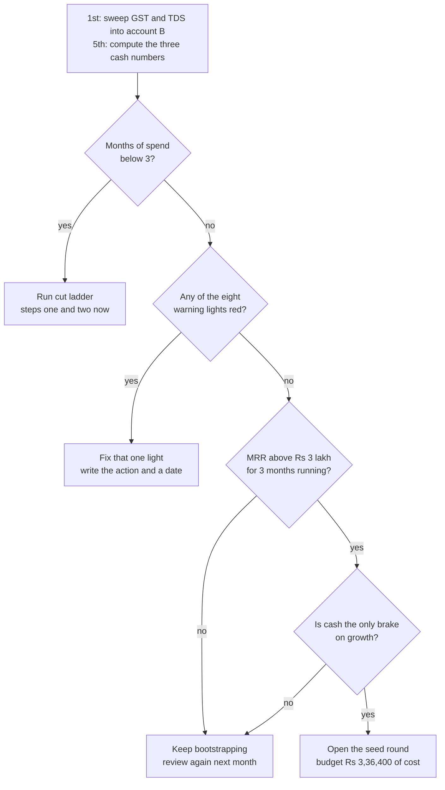

# Funding Plan and Cash Management

**In simple words:** This chapter answers two money questions. Where does EduFlow's cash come from, from the founder's Rs 6,00,000 on 1 October 2026 to an optional seed round of Rs 3 to 5 crore in March 2028? And how do you look after that cash? It gives you three bank accounts, one runway formula, eight warning lights and a three-step cut ladder.

## Where the money comes from, stage by stage

EduFlow has four sources of cash. Three are already in the plan. The fourth is optional and expensive.

| Stage | When | Source | Amount | What this money costs you |
|---|---|---|---|---|
| Day 0 | 1 Oct 2026 | Founder capital, paid in as share capital | Rs 6,00,000 | Nothing. You still own 100% |
| Standby | Any month of Year 1 | Founder's personal reserve, held outside the company | Rs 4,00,000 | Your own savings. Bring it in as a loan, not shares |
| Month 4 onward | From Jan 2027 | Customer cash, monthly plans | Rs 23,24,600 of Year 1 revenue | Gateway fee of about 1.77% before GST |
| Month 4 onward | From Jan 2027 | Customer advances, yearly plans | Rs 20,28,760 in Year 1 | Two months free, plus 12 months of service you owe |
| Year 2 | Oct 2027 to Sep 2028 | More customer advances | Rs 64,00,000 increase | Same |
| Year 2, optional | About Mar 2028 | Seed round, cases A, B and C | Rs 3 to 5 crore | 16.7% to 25% of the company, plus the costs below |
| Any year | Any month | Grants and soft loans | Plan Rs 0 | Weeks of paperwork; loans cost about 11% a year |

The number that decides whether the bootstrap works is small: only Rs 2,40,000 is spent before the first customer pays in January 2027. Everything after that month is paid for by customers. The other Rs 3,60,000 is a buffer, and the buffer is the whole point.

## Founder capital and the standby reserve

Pay the full Rs 6,00,000 in as share capital on 1 October 2026, not as a loan. That bank statement is the proof needed for form INC-20A, the declaration of commencement of business, due within 180 days of incorporation.

Two decisions at incorporation save real money later:

1. **Set authorised capital at Rs 15,00,000 with a Rs 1 face value.** The MCA charges no incorporation fee up to Rs 15 lakh, and only at incorporation; raising it later through form SH-7 costs up to Rs 1,70,000 (see Master Price List). Stamp duty at Rs 15 lakh is a flat Rs 1,010 in Uttar Pradesh, about Rs 2,460 in Delhi and Rs 2,770 in Bihar. That is under Rs 2,000 of extra duty to avoid a Rs 1,70,000 fee.
2. **Keep the Rs 4,00,000 standby outside the company.** If it is ever needed, bring it in as an interest-free unsecured director loan, not as shares; a loan is repaid out of profit with no tax event. Declare it in form DPT-3 by 30 June each year, with a written declaration that it is the director's own money. The MCA fee is about Rs 400 a year.

> **Founder note:** The BRD dilution example uses 10,00,000 shares before the round for easy arithmetic. Your real cap table will be 6,00,000 founder shares of Rs 1 plus a 66,667-share ESOP pool, and the percentages do not change. In case B the price becomes Rs 16 crore divided by 6,66,667 = Rs 240 a share, investors take Rs 4 crore divided by Rs 240 = 1,66,667 shares, the total is 8,33,334, and the founder holds 6,00,000 divided by 8,33,334 = 72.0%.

## Customer advances, the cheapest money you will ever raise

A yearly Growth plan brings Rs 24,990 today instead of Rs 2,499 a month for twelve months, which is Rs 29,988. You give up Rs 4,998, or 16.7%, and the average month you receive the money moves forward by about 5.5 months. In annual terms that is 16.7% divided by 5.5 months, times 12 months, which is about 36% a year (Estimate).

Thirty-six per cent sounds terrible next to an 11% Mudra loan. It is not. There is no repayment date, no collateral, no personal guarantee and no dilution, and the discount buys a customer who has committed for a year, which protects the canon churn target of under 3% a month. This is why bootstrap rule two exists: hold the yearly prepaid share at 40% or more, and make two months free the only discount you ever give.

> **Warning:** Every 10 points of yearly prepaid share is worth about Rs 5,07,000 of Year 1 cash (Rs 20,28,760 divided by 40, times 10). At a 0% yearly share the bank balance falls to Rs 1,66,250 in April 2027, under one month of spend. The yearly plan is not a pricing choice. It is your funding strategy.

Customer advances are not profit; they are service you owe. *Financial Plan and Projections* is blunt: at the end of Year 2 the company holds Rs 92 lakh of cash, but Rs 84 lakh belongs to service not yet given. Own cash is Rs 8 lakh.

## Grants and soft loans

Plan for zero. *Free Credits, Grants and Startup Programs* works this out in full: the Startup India Seed Fund closed on 31 May 2026, the MeitY GENESIS call has closed, and the Bihar and Uttar Pradesh routes depend on where the company is registered. The likely figure is Rs 0; the best case across Years 1 and 2 is Rs 25,00,000, of which only Rs 10,00,000 is a grant.

Still take the two free registrations, Udyam and DPIIT: they unlock the Rs 4,500 trademark rate and the guarantee schemes. But one extra Growth customer at Rs 24,990 arrives in a week; a scheme decision takes four months.

## The seed round and what it costs to raise

*Financial Plan and Projections* fixes the decision rule: raise only when MRR has held at Rs 3 lakh or more for three months, churn is under 3%, LTV to CAC is above 4, and cash is the only brake on growth. Timing is about March 2028, at MRR of Rs 13.4 lakh and ARR of Rs 1.6 crore, so Rs 16 crore pre-money is about 10 times ARR (Estimate).

| Case | New money | Pre-money | Post-money | Investors | ESOP pool | Founder |
|---|---|---|---|---|---|---|
| A: small round, good price | Rs 3 crore | Rs 15 crore | Rs 18 crore | 16.7% | 8.3% | 75.0% |
| B: middle case | Rs 4 crore | Rs 16 crore | Rs 20 crore | 20.0% | 8.0% | 72.0% |
| C: large round, weak price | Rs 5 crore | Rs 15 crore | Rs 20 crore | 25.0% | 7.5% | 67.5% |

Raising money costs money, and the BRD's use-of-funds table has no line for it, so this is a real addition to Year 2 general and admin. All figures below are one-time, for case B.

| Item | When to pay | Minimum | Recommended | Maximum | Can you avoid or reduce it? |
|---|---|---|---|---|---|
| Term sheet review | At term sheet | Rs 25,000 | Rs 40,000 | Rs 75,000 | Partly. Ask the lawyer to fold it into the agreement fee |
| Shareholders' and subscription agreements, our lawyer | At signing | Rs 75,000 | Rs 1,50,000 | Rs 3,00,000 | No. Never cheapen this one line |
| Investor's legal and diligence cost charged to us | At closing | Rs 0 | Rs 75,000 | Rs 3,00,000 | Yes. Cap it in the term sheet before you sign |
| Registered valuer report | Before the board resolution | Rs 25,000 | Rs 35,000 | Rs 75,000 | No. The Companies Act needs it for a private placement |
| Merchant banker valuation, foreign investor only | Before allotment | Rs 0 | Rs 0 | Rs 2,00,000 | Yes, by taking only Indian money |
| CA certificate for FC-GPR, foreign investor only | Within 30 days of allotment | Rs 0 | Rs 0 | Rs 15,000 | Same as the row above |
| ROC forms MGT-14, PAS-3 and placement records | Within 15 days of allotment | Rs 1,000 | Rs 1,400 | Rs 2,000 | No. Late PAS-3 costs Rs 1,000 a day |
| Company secretary fee for the allotment filings | At filing | Rs 10,000 | Rs 18,000 | Rs 25,000 | Partly. A part-time CS on retainer is cheaper |
| Stamp duty on new shares, 0.005% of Rs 4 crore | At allotment | Rs 2,000 | Rs 2,000 | Rs 2,000 | No. The rate is the same in every state |
| SH-7 rise in authorised capital | Before allotment | Rs 0 | Rs 0 | Rs 1,70,000 | Yes. Incorporate at Rs 15 lakh with Rs 1 shares |
| Data room, secretarial clean-up, cap table | During diligence | Rs 0 | Rs 15,000 | Rs 50,000 | Yes. Keep the registers clean from Year 1 |
| **Total cash cost** | **One-time** | **Rs 1,38,000** | **Rs 3,36,400** | **Rs 12,14,000** | **0.35%, 0.84% and 3.04% of Rs 4 crore** |

GST: government fees and stamp duty carry none. Lawyer fees carry 18% under reverse charge, paid in cash and claimed back; CA and CS fees carry 18% on the invoice. All of it is claimable as input tax credit once the company is GST-registered, so the figures above are the real cost.

One cost is not in the table. A round takes about five months and half the founder's working time. At the Year 2 loaded cost of Rs 1,00,000 a month that is 5 times 50% times Rs 1,00,000 = Rs 2,50,000 (Estimate). All-in Recommended cost is Rs 3,36,400 + Rs 2,50,000 = Rs 5,86,400.

> **Rule:** The Minimum column assumes Indian investors only and a boutique lawyer. The moment a foreign investor joins, add the merchant banker valuation and the FC-GPR certificate, and the floor rises by about Rs 80,000. Decide before the term sheet, not after.

## Three bank accounts

One account is how founders spend money they do not own. Open three, all at the same bank so transfers are instant and free.

| Account | What sits in it | Funded when | The one rule |
|---|---|---|---|
| A. Operating current account | Every rupee in and every rupee out | Continuously | Never let it fall below 3 months of spend |
| B. Tax reserve, flexi deposit | Net GST payable and TDS deducted | 1st of each month | Never spend it. GST by the 20th, TDS by the 7th |
| C. Service reserve, flexi deposit | Three of the seven unearned months on yearly plans | 1st of each month | Only for refunds and for serving customers if sales stop |

Pick the bank on balance rules, not branding. Axis Start-up Banking offers zero balance for the first 24 months at its discretion; Kotak's Startup Regular account needs a Rs 50,000 average quarterly balance, waived for 12 months (see Master Price List). Make B and C flexi deposits at the same bank, so the money stays liquid and earns a little.

**Worked example, 30 September 2027.** The BRD's cash numbers are before GST, so first add back the tax float.

| Line | Amount | How it is worked out |
|---|---|---|
| Closing cash in the plan, before GST | Rs 25,75,860 | *Financial Plan and Projections*, cash view |
| Net GST held for the government | Rs 1,11,920 | Rs 1,55,466 output less Rs 43,546 input credit |
| TDS deducted and held | Rs 15,000 | Salary and contractor TDS for September (Estimate) |
| **Real bank balance** | **Rs 27,02,780** | Rs 25,75,860 + Rs 1,11,920 + Rs 15,000 |
| Account B, tax reserve | Rs 1,26,920 | Rs 1,11,920 + Rs 15,000 |
| Account C, service reserve | Rs 8,69,469 | 3 divided by 7, times Rs 20,28,760 of advances |
| **Account A, spendable** | **Rs 17,06,391** | Rs 27,02,780 − Rs 1,26,920 − Rs 8,69,469 |

Output GST is September's cash collection of Rs 8,63,700 times 18% = Rs 1,55,466. The input credit assumes 60% of the month's Rs 4,03,200 cost carries claimable GST, since salaries, government fees and bank interest do not: 60% times Rs 4,03,200 = Rs 2,41,920, and 18% of that is Rs 43,546 (Estimate).

The strictest test is own cash, the real money the company has made: Rs 27,02,780 − Rs 1,26,920 − Rs 20,28,760 = Rs 5,47,100. That is the Rs 6,00,000 of capital minus the Rs 52,900 Year 1 loss, exactly.

## How to compute runway every month

Three numbers, computed on the 5th of every month.

1. **Months of spend** = real bank balance divided by this month's total cost. This is the BRD floor test, and the floor is 3.
2. **Net burn** = cash paid out minus cash collected this month. Negative means the month funded itself.
3. **Net runway** = spendable cash (account A) divided by net burn, meaningful only when net burn is positive.

| Month | Bank balance | That month's cost | Months of spend |
|---|---|---|---|
| Oct 2026 | Rs 5,19,500 | Rs 80,500 | 6.5 |
| Nov 2026 | Rs 4,44,000 | Rs 75,500 | 5.9 |
| Dec 2026 | Rs 3,60,000 | Rs 84,000 | 4.3 |
| Jan 2027 | Rs 3,83,500 | Rs 1,07,900 | 3.6 |
| Feb 2027 | Rs 5,00,000 | Rs 1,18,400 | 4.2 |
| Mar 2027 | Rs 7,21,700 | Rs 1,24,800 | 5.8 |
| Apr 2027 | Rs 8,72,130 | Rs 2,18,000 | 4.0 |
| May 2027 | Rs 11,21,630 | Rs 1,93,300 | 5.8 |
| Jun 2027 | Rs 14,80,280 | Rs 2,09,100 | 7.1 |
| Jul 2027 | Rs 18,08,570 | Rs 3,20,700 | 5.6 |
| Aug 2027 | Rs 21,15,360 | Rs 4,42,100 | 4.8 |
| Sep 2027 | Rs 25,75,860 | Rs 4,03,200 | 6.4 |

**Example one, December 2026.** Bank Rs 3,60,000, no reserves yet. Cash out Rs 84,000, cash in Rs 0, so net runway is Rs 3,60,000 divided by Rs 84,000 = 4.3 months. But look forward: January, February and March cost Rs 1,07,900, Rs 1,18,400 and Rs 1,24,800, an average of Rs 1,17,033, so runway is Rs 3,60,000 divided by Rs 1,17,033 = 3.1 months. That is the tightest point of the whole plan.

**Example two, January 2027.** Cash out Rs 1,07,900, cash in Rs 1,31,400, so net burn is minus Rs 23,500: the month paid for itself. Months of spend is Rs 3,83,500 divided by Rs 1,07,900 = 3.6, just above the floor.

**Example three, September 2027, strict.** Spendable cash Rs 17,06,391 divided by Rs 4,03,200 = 4.2 months. On own cash alone it is Rs 5,47,100 divided by Rs 4,03,200 = 1.4 months. Both are true. Remember the second one before you hire.

## Early warning triggers

Check these eight on the 5th. One red light means one action, written down, with a date.

| Trigger | What you measure | Red line | Action that same week |
|---|---|---|---|
| Cash floor | Months of spend | Below 3 | Run cut ladder steps one and two |
| Yearly prepaid share | Yearly cash as a share of new cash | Below 30% for 2 months | Move every demo pitch to the yearly plan |
| Churn | Organizations lost this month | Above 3% | Stop all hiring; founder calls every leaver |
| Burn direction | Net burn after May 2027 | Positive 2 months running | Cut ladder step one; re-check the hire triggers |
| Tax reserve | Balance of account B | Borrowed from, even once | Refill it this week from account A |
| Collection lag | Invoice value unpaid after 7 days | Above 10% | Switch those accounts to prepaid or card mandate |
| CAC | Marketing spend divided by new customers | Above Rs 12,000 | Cut the worst channel, keep the two best |
| Concentration | Largest customer's share of MRR | Above 10% | No new spend commitment until it falls |

> **Best practice:** Put the eight lights and three runway numbers on one page. Eleven numbers, one sheet, five minutes on the 5th. The BRD's Monday five (wins, losses, ARPA, yearly share, months of spend) is the weekly short version.

## The cut ladder

If cash falls, cut in this order. The example starts from the September 2027 plan month of Rs 4,03,200 and shows the monthly saving.

| Step | What you cut | From | To | Saved a month |
|---|---|---|---|---|
| One | Marketing down to the two best channels | Rs 73,000 | Rs 25,000 | Rs 48,000 |
| One | Claude Max top tier to the lower tier, drop CRM and spare seats | Rs 36,000 | Rs 25,000 | Rs 11,000 |
| One | Misc: co-working passes, travel, courier | Rs 20,000 | Rs 12,000 | Rs 8,000 |
| Two | Founder pay back to zero | Rs 1,85,000 | Rs 1,25,000 | Rs 60,000 |
| Two | Marketing to referrals and WhatsApp only | Rs 25,000 | Rs 8,000 | Rs 17,000 |
| Two | Sentry Team to free, Zoho Books to free | Rs 25,000 | Rs 22,050 | Rs 2,950 |
| Three | Release the newest hire, one month's notice | Rs 1,25,000 | Rs 55,000 | Rs 70,000 |
| Three | Hosting to the smallest setup paying customers need | Rs 74,200 | Rs 60,000 | Rs 14,200 |
| Three | Legal and compliance to the CA retainer only | Rs 15,000 | Rs 6,000 | Rs 9,000 |
| Three | Misc to internet, phone and bank charges only | Rs 12,000 | Rs 6,000 | Rs 6,000 |

The arithmetic: step one saves Rs 67,000, taking the month from Rs 4,03,200 to Rs 3,36,200. Step two saves Rs 79,950 more, reaching Rs 2,56,250. Step three saves Rs 99,200 more, reaching Rs 1,57,050. A survival month is 39% of a plan month, and Rs 5,47,100 of own cash lasts 3.5 months at that rate instead of 1.4.

Step one takes a week and no customer notices. Step two takes 30 days and growth stops. Step three costs you the team. Never skip a step to look decisive.

> **Rule:** Four lines are never cut: database backups, the CA retainer, the legal documents and account B. Cutting the CA saves Rs 5,000 a month, while a late GST return costs Rs 50 a day plus 18% a year interest. Cutting backups can end the company in one afternoon.

## Paying vendors and collecting from customers

Cash management is mostly timing. Collect early, pay on the day it is due, and never confuse the two.

| Money | Timing in the plan | The rule |
|---|---|---|
| Growth and Pro subscriptions | Charged before the period starts | No service without payment. Razorpay settles T+1 |
| Enterprise contracts, from Rs 14,999 a month | Custom yearly contract | 50% on signing, 50% at go-live. Never net 60 |
| WhatsApp and SMS credit packs | Prepaid wallet | Always cash positive; credits are bought before use |
| Migration Rs 9,999, training Rs 4,999 a day | One-time | Collect in full before the work starts |
| Claude, Vercel, Railway, AWS, SES | Monthly card charge or pay for use | Stay monthly until a price is stable for 3 months |
| CA retainer Rs 5,000 a month | Monthly | Pay on time. Late returns cost more than the fee |
| Lawyer, valuer, security tester | One-time on delivery | 50% advance, 50% on the accepted report |
| Salaries | Last working day | Never late, not once |
| GST by the 20th, TDS by the 7th | Monthly | Interest is 18% a year on GST, Rs 200 a day on TDS returns |

On tools, switch from monthly to yearly billing only when the saving is above 15%. Zoho Books is Rs 749 against Rs 899, a 16.7% saving, so pay yearly. Sentry saves only 10.3% (Rs 2,210 yearly against Rs 2,465 monthly), but the plan books the yearly price of Rs 2,200 from December, so it is the one planned exception (see Master Price List).

## Refunds

EduFlow's policy, decided here because the canon does not fix it: a full refund within 7 days of the first payment, and after that a pro-rata credit note for unused months, not cash, unless the law requires cash. A credit note keeps the relationship and the cash.

Three costs sit behind every refund:

1. **The gateway fee is not returned.** Razorpay charges nothing to process a normal refund, and Rs 7.99 to Rs 14.99 for an instant one, but assume the original 2% platform fee stays with the gateway (Estimate; get this in writing from Razorpay). On a Rs 24,990 yearly plan that is Rs 500 of real loss on every full refund.
2. **The GST reverses only through a credit note.** Issue it in GSTR-1 by 30 November after that financial year, or the 18% you already paid is gone.
3. **The cash must already be there.** This is what account C is for.

Budget refunds at 2% of yearly advances: for Year 1, 2% of Rs 20,28,760 = Rs 40,575 (Estimate, until real data replaces it). The service reserve of Rs 8,69,469 covers that about 21 times over, which is why three of the seven unearned months is enough and locking all seven is not.

## The monthly cash review

**Figure: The monthly cash review decision**

Two boxes decide everything: the first asks whether you can survive, the last whether you should dilute. Money fixes a cash problem; it never fixes churn or product. The routine below extends the one in *Financial Plan and Projections* by one line.

| Day | Task | Output |
|---|---|---|
| 1st | Move last month's GST and TDS into account B; top up account C | Account A holds only spendable money |
| 3rd | Export billing, Razorpay and bank data; book every expense to a cost line | Actuals for the month |
| 5th | Put actuals beside the model: customers, MRR, revenue, each cost line, cash | Plan against actual sheet |
| 5th | Recompute break-even customers, months of spend, net burn and net runway | Four numbers for the review |
| 5th | Check the eight warning lights and the credits expiring in 90 days | At most 3 written actions with dates |
| 7th | Replace any estimate that now has 3 months of real data | Updated assumptions table |
| Quarter end | Re-run the three scenarios; decide on hires and on the seed round | One written page |

The CA closes the books and files the returns. You own the model, the reserves and the decision.

## Key takeaways

- Four sources of cash, cheapest first: Rs 6,00,000 of founder capital, Rs 20,28,760 of Year 1 customer advances, an optional Rs 4 crore seed round for 20% of the company, and grants at a planned Rs 0. Only Rs 2,40,000 is spent before the first customer pays.
- Yearly plans are the funding strategy, not a pricing tactic. The two months free cost about 36% a year in effective terms, and every 10 points of yearly share is worth about Rs 5,07,000 of Year 1 cash.
- Run three bank accounts. On 30 September 2027 the real balance is Rs 27,02,780: Rs 1,26,920 tax, Rs 8,69,469 service reserve, Rs 17,06,391 spendable. Own cash is Rs 5,47,100, or 1.4 months of spend.
- Compute three numbers on the 5th: months of spend (floor 3), net burn and net runway. The tightest real point is December 2026 at 3.1 months against the next quarter's average cost.
- The cut ladder takes a plan month from Rs 4,03,200 to Rs 3,36,200, then Rs 2,56,250, then Rs 1,57,050. Step one costs nothing visible. Never cut backups, the CA, the legal documents or the tax reserve.
- Raising a Rs 4 crore round costs Rs 1,38,000 at minimum, Rs 3,36,400 as planned and up to Rs 12,14,000, plus about Rs 2,50,000 of founder time. Cap the investor's legal bill in the term sheet, and incorporate at Rs 15 lakh authorised capital to dodge the Rs 1,70,000 SH-7 fee.
- Collect before you serve; pay on the due date. Refunds cost about Rs 500 each in lost gateway fees, need a credit note by 30 November to reverse the GST, and are budgeted at 2% of advances, or Rs 40,575 in Year 1.
