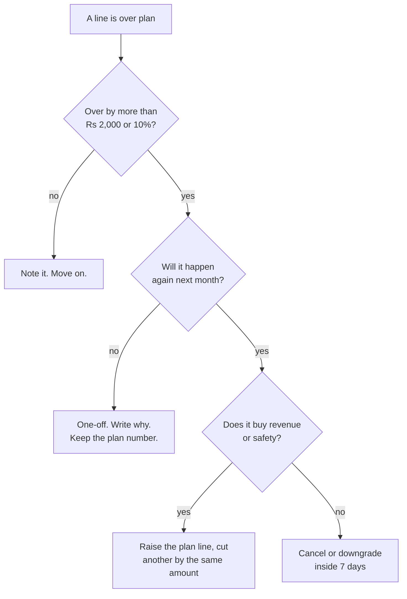

# Budget Templates and Monthly Tracking

**In simple words:** This chapter gives you the sheet to build and the routine to run it. One file with nine tabs holds the plan, the real spending, every subscription and every renewal date. Thirty minutes on the 5th of each month keeps it true. A budget you never compare with your bank statement is a wish, not a budget.

## One file, nine tabs

Build one spreadsheet, `EduFlow-Money.xlsx`, in Google Sheets. Never split money across five files.

| Tab | What it holds | Filled when |
|---|---|---|
| Setup | Planning rates, GST rate, alert thresholds | Once, reviewed quarterly |
| Plan | The 12 BRD months by cost line | Once a year |
| Actual | What really left the bank | Monthly, on the 3rd |
| Variance | Plan minus Actual, by line and month | Automatic |
| Subs | Every recurring tool, price, renewal, owner | When anything changes |
| Renewals | Domains, trademark, ROC, audit, licences | Checked quarterly, with the CA |
| Cash | Three bank accounts, balance, months of spend | Monthly, on the 5th |
| Units | Customers, students, MRR, CAC, cost per student | Monthly, on the 5th |
| Approvals | Every spend decision above the threshold | When it happens |

> **Rule:** The Plan tab is written once and locked. Never edit a plan number to make a bad month look good. Change the plan only at a quarter end, in writing, and say what you cut to pay for the rise.

## The columns and the formulas

Plan and Actual share one shape, so Variance subtracts them.

```text
Setup tab (change these; everything else follows)
  B1 USD_RATE=85  B2 GST_RATE=0.18  B3 CASH_FLOOR=3 months
  B4 REC_ALERT=2000 (new monthly cost that waits 7 days)
  B5 ONE_ALERT=25000 (one-time cost that needs a reason)

Plan tab and Actual tab, one row per month, Oct 2026 to Sep 2027
  A Month
  B Infra and delivery = hosting + messages + gateway fees
  C Tools   D Marketing   E Salaries   F Legal   G Misc
  H Total = SUM(B:G)
  I Cash collected before GST
  J Net cash = I - H
  K Bank at month end = K of last month + J

Variance tab
  B..G = Plan!B - Actual!B       a minus means you overspent
  H    = Actual!H / Plan!H - 1   the whole month in one percent
  L    = "check" when the gap is over Rs 2,000 or over 10%

Units tab
  Hosting per student = hosting bill / active students
  Cost of service     = infra and delivery / paying orgs
  CAC                 = last 3 months marketing / gross new
  Months of spend     = bank balance / this month's total cost
```

Six cost lines only. More lines feel precise and never get filled in. These six match the BRD model, so sheet and plan compare.

## The Plan tab, filled with Year one

Your tab holds one row per month. Shown here by quarter, in rupees, at Recommended.

| Quarter | Infra | Tools | Marketing | Salaries | Legal | Misc | Total |
|---|---|---|---|---|---|---|---|
| Oct to Dec 2026 | 15,000 | 55,000 | 52,000 | 0 | 1,03,000 | 15,000 | 2,40,000 |
| Jan to Mar 2027 | 50,100 | 63,000 | 1,90,000 | 0 | 24,000 | 24,000 | 3,51,100 |
| Apr to Jun 2027 | 1,05,400 | 70,000 | 1,64,000 | 1,80,000 | 30,000 | 71,000 | 6,20,400 |
| Jul to Sep 2027 | 1,87,000 | 98,000 | 2,04,000 | 4,50,000 | 74,000 | 1,53,000 | 11,66,000 |
| **Year 1** | **3,57,500** | **2,86,000** | **6,10,000** | **6,30,000** | **2,31,000** | **2,63,000** | **23,77,500** |

Both directions add up. Across: Rs 3,57,500 + Rs 2,86,000 + Rs 6,10,000 + Rs 6,30,000 + Rs 2,31,000 + Rs 2,63,000 = Rs 23,77,500. Down: Rs 2,40,000 + Rs 3,51,100 + Rs 6,20,400 + Rs 11,66,000 = Rs 23,77,500. Salaries stay zero until April 2027 because founder pay and every hire follow an MRR trigger, not a date.

## A filled month: March 2027

The peak buying month: 30 paying organizations, MRR Rs 1,00,000, cash in Rs 3,46,500 before GST. The sheet on 5 April:

| Line | Plan | Actual | Gap | Why the gap |
|---|---|---|---|---|
| Infra and delivery | 22,800 | 24,650 | −1,850 | Report-card jobs raised Railway usage |
| Tools | 21,000 | 27,999 | −6,999 | Claude billed at Rs 23,999, not US$200 |
| Marketing | 65,000 | 58,400 | +6,600 | One regional expo moved to April |
| Salaries | 0 | 0 | 0 | No hire trigger fired |
| Legal and compliance | 8,000 | 8,000 | 0 | CA retainer only |
| Misc | 8,000 | 10,360 | −2,360 | Bank charge, short average balance |
| **Total** | **1,24,800** | **1,29,409** | **−4,609** | 3.7% over plan |

Arithmetic: Rs 24,650 + Rs 27,999 + Rs 58,400 + Rs 0 + Rs 8,000 + Rs 10,360 = Rs 1,29,409. The gaps add the same way: −1,850 − 6,999 + 6,600 − 2,360 = −Rs 4,609.

| Cash line | Plan | Actual | Gap |
|---|---|---|---|
| Cash collected, before GST | 3,46,500 | 3,31,200 | −15,300 |
| Total spend | 1,24,800 | 1,29,409 | −4,609 |
| Net cash for the month | 2,21,700 | 2,01,791 | −19,909 |
| Bank on 31 March | 7,21,700 | 7,01,791 | −19,909 |
| Months of spend | 5.8 | 5.4 | −0.4 |

Two yearly plans slipped into April, so Rs 15,300 of cash did not arrive. Rs 15,300 + Rs 4,609 = Rs 19,909, the whole bank gap. March at the three levels is Rs 53,250, Rs 1,24,800 and Rs 1,95,200. The actual sits 3.7% above Recommended and 34% below Maximum, so the month is fine.

Two overspends are fixable this week. The Claude rupee price costs Rs 6,999 a month more than US$200 at Rs 85 (see Master Price List): pay in dollars with the GSTIN on file. The Rs 2,360 bank charge is Rs 2,000 plus 18% GST for breaking the average-balance rule: move to a zero-balance startup account.

**Figure: What to do with a line that is over plan**



Only one path lets spending rise, and it costs another line.

## The subscription and renewal tracker

Every recurring charge enters the Subs tab on signup day. Prices are the BRD plan for March 2027.

| Tool and plan | Rs a month | Line | Billing | Renews | Cancel by | Owner |
|---|---|---|---|---|---|---|
| Claude Max 20x, US$200 | 17,000 | Tools | Monthly, US$ card | 5th | 4th | Founder |
| Sentry Team, US$26 | 2,200 | Tools | Yearly | 1 Dec 2027 | 24 Nov 2027 | Founder |
| Zoho Books Standard | 750 | Tools | Yearly | 10 Jan 2028 | 3 Jan 2028 | CA |
| Google Workspace | 300 | Tools | Monthly | 1st | Last day | Founder |
| Shared support inbox | 300 | Tools | Monthly | 1st | Last day | Success exec |
| CRM entry plan | 250 | Tools | Monthly | 1st | Last day | Inside sales |
| Password manager | 200 | Tools | Yearly | Oct 2027 | 7 days before | Founder |
| Railway Pro plus usage | 8,700 | Infra | Monthly, usage | 12th | 11th | Founder |
| Vercel Pro, US$20 | 1,700 | Infra | Monthly | 8th | 7th | Founder |
| AWS S3 and SES, Mumbai | 800 | Infra | Monthly, rupees | 3rd | None | Founder |
| MSG91 SMS wallet | 400 | Infra | Prepaid top-up | When low | None | Founder |
| WhatsApp Cloud API | 400 | Infra | Per message | 1st | None | Founder |

Tools add to Rs 21,000 and infrastructure to Rs 12,000, which is the Tools line and the hosting part of the Infra line for March 2027. GitHub, PostHog, Better Stack, Figma and Cloudflare stay at Rs 0 and still get a row: a free plan can turn paid.

Cheaper choices that do not change the plan: Workspace Business Base Rs 99 plus GST, Bitwarden Free, Zoho Books Free below Rs 25 lakh revenue, Zoho CRM Free for three users (see Master Price List). All four save about Rs 1,300 a month. Keep the plan number and bank the saving.

> **Warning:** Foreign tools add 18% IGST under reverse charge. You pay it and claim it back the same month, so the net cost is the list price. Without a GSTIN on the account the vendor charges 18% you can never claim: Rs 3,060 a month on Claude Max.

## The annual renewal calendar

Yearly things get forgotten because they happen once. Put every row in one shared calendar, with a reminder seven days before, and give the CA edit access.

| When | What falls due | Cost | Who | If you miss it |
|---|---|---|---|---|
| 5 Jan 2027 | Workspace intro price ends | +Rs 58 a month | Founder | A silent price rise |
| 31 March | Export undertaking (LUT) | Rs 0 | CA | Exports need IGST paid first |
| 30 June | Loans and deposits (DPT-3) | Rs 400 | CA | Daily penalty |
| Aug to Sep, from 2027 | Audit, signed accounts, AGM | Rs 35,000 | CA | AOC-4 cannot be filed |
| Oct | Domains: eduflow.app and .in | Rs 1,935 | Founder | Site and email die |
| Oct and Nov | ROC forms AOC-4 and MGT-7A | Rs 800 | CA | Rs 100 a day each, no cap |
| 31 Oct | Company tax return (ITR-6) | Rs 0 fee | CA | Rs 5,000 late fee |
| 30 Nov | Last day for last year's GST credit | Rs 0 | CA | The credit is gone |
| 1 Dec 2027 | Sentry Team, yearly | Rs 26,520 | Founder | Error tracking stops |
| 30 June 2029 | Director KYC (DIR-3 KYC) | Rs 0 | CA | Rs 5,000, DIN blocked |
| Dec 2031 | DLT sender ID and templates | Rs 6,000 | Founder | OTP SMS stops |
| Oct 2036 | Trademark renewal, 2 classes | Rs 18,000 | Attorney | The brand is unprotected |

Sentry yearly = US$26 × 12 = Rs 26,520 at Rs 85. Domains = Rs 1,269 for the .app renewal + Rs 666 for the .in. Trademark renewal = Rs 9,000 × 2 classes (see Master Price List). From Year 2 add cyber insurance, Rs 25,000 to Rs 95,000 a year plus 18% GST, because school groups ask for it. Your term and health cover sits outside the company; see *Founder Personal Finance and Runway*.

## Spending approval rules for one person

You are the whole approval chain, so the chain must be a written rule. Copy it into the Approvals tab.

| Spend | Size | Rule before you pay | Written record |
|---|---|---|---|
| New recurring | Up to Rs 2,000 a month | Pay if the plan line has room | Row in the Subs tab |
| New recurring | Above Rs 2,000 a month | Wait 7 days; buy only if you still need it | Reason, cancel-by date |
| New recurring | Above Rs 10,000 a month | Wait 7 days, price one free option, say why it loses | Reason, comparison |
| One-time | Up to Rs 5,000 | Pay | Receipt in the books |
| One-time | Rs 5,000 to Rs 25,000 | Sleep one night on it | One-line reason |
| One-time | Above Rs 25,000 | Say what it buys, what breaks without it, how you will know in 60 days | Dated half-page note |
| Any | Above Rs 1,00,000 | Check months of spend stays above 3 after paying | Note, updated Cash tab |
| Yearly prepay | Any size | Only after 3 months of use and a saving of 10% or more | Cancel-by date |

> **Founder note:** The seven-day rule is the cheapest tool in this guide. Rs 3,000 a month is Rs 36,000 a year and Rs 1,80,000 over five years. Most tools that feel urgent on Monday feel optional next Monday.

## What the tracking system itself costs

| Item | When to pay | Minimum | Recommended | Maximum | Can you avoid or reduce it? |
|---|---|---|---|---|---|
| Spreadsheet, inside Workspace | Monthly, + GST | 0 | 300 | 1,275 | No. Already in the Tools line |
| Accounts software (Zoho Books) | Monthly, + GST | 0 | 750 | 1,799 | Yes. Free plan covers Year 1 |
| CA retainer: books, GST, TDS | Monthly, + GST | 3,000 | 5,000 | 15,000 | No. Never cut the CA |
| Bookkeeping done for you | Monthly, + GST | 0 | 0 | 1,999 | Yes. Not needed at Year 1 size |
| Your 30 minutes a month | Monthly, no GST | 0 | 0 | 0 | No. The cheapest line in the book |
| **Total a month** | | **3,000** | **6,050** | **20,073** | |

Recommended check: Rs 300 + Rs 750 + Rs 5,000 = Rs 6,050 before GST. With 18% GST you pay Rs 7,139 and claim Rs 1,089 back as input tax credit, so the real cost stays Rs 6,050. All three levels already sit inside the Tools and Legal lines.

## The unit numbers to track every month

Totals say whether you are alive. Unit numbers say whether the business works.

| Number | Formula | March 2027 | Must go to |
|---|---|---|---|
| Hosting per student | Hosting ÷ active students | 12,000 ÷ 13,200 = Rs 0.91 | Rs 0.47 by Sep 2027 |
| Cost of service per org | Infra ÷ paying orgs | 22,800 ÷ 30 = Rs 760 | Under 25% of ARPA |
| Gross margin | (ARPA − cost of service) ÷ ARPA | (3,333 − 760) ÷ 3,333 = 77% | 80% or better |
| CAC, last 3 months | Marketing ÷ gross new customers | 1,90,000 ÷ 31 = Rs 6,129 | Under Rs 12,000 |
| Tools share of MRR | Tools ÷ MRR | 21,000 ÷ 1,00,000 = 21% | Under 10% by Sep 2027 |
| Months of spend | Bank ÷ this month's cost | 7,01,791 ÷ 1,29,409 = 5.4 | Never below 3 |
| Cash per paying org | Cash in ÷ paying orgs | 3,46,500 ÷ 30 = Rs 11,550 | Up with yearly share |
| Message cost share | Message cost ÷ recurring revenue | Plan 5.1% | At or below 5.1% |

The 13,200 students is an Estimate: 30 paying institutes at about 350 students each, plus about 90 free Starter organizations at about 30 each. The hosting formula predicts 120 × Rs 10 + 13,200 × Rs 0.40 = Rs 6,480, but the bill is Rs 12,000. The Rs 5,520 gap is fixed base cost, the Vercel seat and the staging copy, spread over too few students. That is why Rs 0.91 falls to Rs 0.47 by September on its own.

> **Best practice:** Keep hosting per student and months of spend on a sticky note. If hosting per student rises two months running, find the cause before adding one server.

## The 30-minute monthly money review

Do it on the 5th, after the exports reach the CA. Set a timer.

| Minutes | Step | What you have at the end |
|---|---|---|
| 0 to 5 | Tick every bank, card and Razorpay line against Subs | Any subscription you forgot |
| 5 to 12 | Book each payment to one of the six lines in Actual | The month's real total |
| 12 to 18 | Read Variance; one sentence per "check" flag | The variance note |
| 18 to 23 | Update the eight unit numbers | The unit sheet |
| 23 to 27 | Months of spend, and renewals due in 90 days | Cash and renewal check |
| 27 to 30 | Write at most three actions, each with a date | The action list |

Three actions is the limit. A review that produces nine actions produces none. The deeper cash work, the reserves, the warning lights and the cut ladder, sits in *Funding Plan and Cash Management*.

> **Tip:** Keep the month closed. Once the three actions are written, do not reopen March. New information changes April, not a closed month.

## Key takeaways

- One file, nine tabs, six cost lines. Plan and Actual share one shape, so Variance subtracts them and sheet and plan always compare.
- The Plan tab is Year 1 at Recommended, Rs 23,77,500: infra Rs 3,57,500, tools Rs 2,86,000, marketing Rs 6,10,000, salaries Rs 6,30,000, legal Rs 2,31,000, misc Rs 2,63,000.
- March 2027: plan Rs 1,24,800, actual Rs 1,29,409, gap 3.7%. Rs 6,999 was the Claude rupee price, Rs 2,360 a bank charge. Both fixable in a week.
- Every recurring charge enters the Subs tab on signup day with a renewal date, a cancel-by date and an owner: Rs 21,000 of tools and Rs 12,000 of hosting in March 2027.
- The forgotten costs are yearly: domains Rs 1,935, Sentry Rs 26,520, the audit Rs 35,000, ROC forms Rs 400 each, DLT in 2031, the trademark in 2036.
- Two rules do most of the work: a new cost above Rs 2,000 a month waits seven days, a one-time cost above Rs 25,000 needs a dated written reason.
- Eight unit numbers on the 5th. Hosting per student falls from Rs 0.91 to Rs 0.47 by September 2027, CAC stays under Rs 12,000, months of spend never drops under 3.
