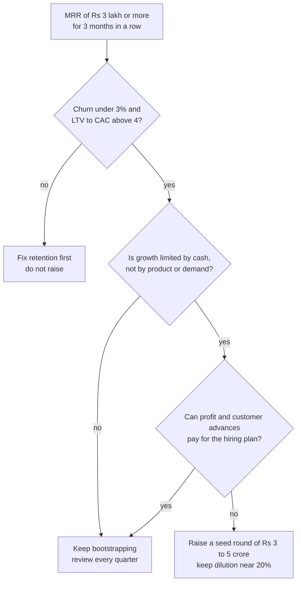
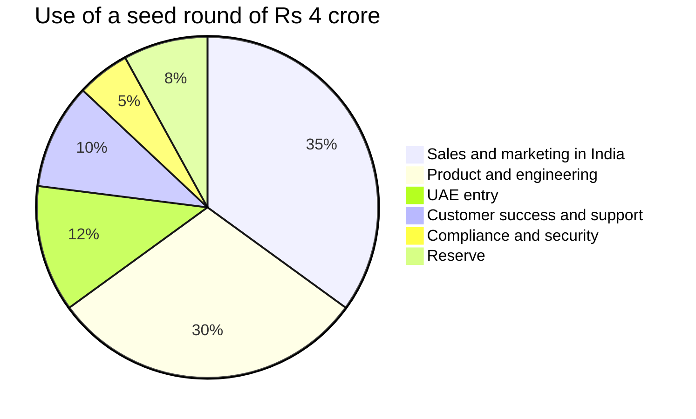

# Anchor numbers from the BRD (the Cost Guide must agree with these)

These sections are copied word for word from the BRD chapters *Financial Plan and Projections* and *Organization and Hiring Plan*. In the Cost Guide, the **Recommended** budget level must equal these numbers. The Minimum and Maximum levels are new ranges around them. If current market prices (from the price list) differ from a BRD assumption, keep the BRD number as the plan, show the current price, and explain the difference in one line.

### Cost assumptions

| Input | Value used | Source |
|---|---|---|
| Hosting per tenant | ₹10 per organization + ₹0.40 per active student a month | *Business Model*; estimate |
| Hosting path in Year 1 | ₹4,000 in October 2026 rising to ₹28,000 in September 2027 | Estimate; checked below |
| Message cost | 85% of usage revenue, which is 5.1% of recurring revenue in Year 1 (6% × 85%) | Meta cost + 15% margin; SMS ₹0.18 cost on ₹0.25 price |
| Gateway fees on our own billing | 1.5% of the invoice with GST, which is 1.77% of the amount before GST | Razorpay mix of UPI, cards and netbanking; estimate |
| Gateway fees, later years | 1.8% of revenue in Year 2; 2.0% from Year 3 (Stripe costs more abroad) | Estimate |
| AI compute | ₹250 per AI Insights user a month, which is 17% of the ₹1,499 price | Estimate |
| Marketing in Year 1 | ₹5,85,000 by quarter, plus ₹25,000 partner commission | *Go-To-Market Strategy* |
| CAC in India | ₹12,000; ₹13,000; ₹14,000; ₹15,000 in Years 2 to 5 | Estimate; Year 1 limit is ₹12,000 |
| CAC abroad | ₹80,000 in Year 2 (UAE through partners); ₹1,20,000 from Year 3 | Estimate |
| International new customers | 15; 105; 450; 1,150 in Years 2 to 5 | Estimate; fits the canon international counts |
| Recurring partner commission | 1%; 2%; 3%; 3.5% of recurring revenue in Years 2 to 5 | Estimate; policy is in *Business Model* |
| Income tax | 25% of positive EBITDA, paid in the same year | Simplified estimate; the CA computes the real figure |
| Founder capital | ₹6,00,000 paid in on 1 October 2026, plus a ₹4,00,000 personal standby reserve | Assumption |

### People assumptions

Year 1 pay follows triggers, not dates. All amounts are cost to company per month (estimate). *Organization and Hiring Plan* governs the roles.

| Person | Starts | Monthly cost | Trigger |
|---|---|---|---|
| Founder, step one | April 2027 | ₹30,000 | The month after MRR reaches ₹1 lakh |
| Founder, step two | July 2027 | ₹60,000 | The month after MRR reaches ₹3 lakh |
| Onboarding and customer success executive | April 2027 | ₹30,000 | 30 paying organizations |
| Inside sales executive | July 2027 | ₹25,000 during the 3-month ramp | MRR of ₹3 lakh |
| Full-stack engineer | 16 August 2027 | ₹70,000 (half in August) | MRR of ₹4.5 lakh |
| Part-time tele-caller | February 2027 | Inside the marketing budget | Contractor, not counted in the team |

> **Founder note:** The founder takes no pay from October 2026 to March 2027. Keep six months of personal living costs aside before 5 October 2026. That money is outside this model. At a notional ₹50,000 a month, the unpaid founder time in those six months is worth ₹3,00,000. It is real cost, even though no cash moves.

For Years 2 to 5 the model uses the average loaded cost per person per month. Loaded cost means salary plus employer PF (provident fund), insurance, incentives and equipment share.

| Function | Year 2 | Year 3 | Year 4 | Year 5 |
|---|---|---|---|---|
| Product and engineering | ₹1,00,000 | ₹1,40,000 | ₹1,70,000 | ₹2,00,000 |
| Sales and marketing | ₹55,000 | ₹80,000 | ₹1,00,000 | ₹1,20,000 |
| Customer success and support | ₹35,000 | ₹50,000 | ₹65,000 | ₹80,000 |
| General and admin (finance, HR, legal) | ₹60,000 | ₹90,000 | ₹1,20,000 | ₹1,40,000 |

The averages rise each year for two reasons. Senior people join (engineering manager, sales lead, finance head, country leads). Staff in the UAE, USA and Australia are paid at local rates.

### All costs by line

"Infra and delivery" is the total from the table above. "Marketing" is the *Go-To-Market Strategy* budget plus partner commission of ₹5,000, ₹8,000 and ₹12,000 in the last three months.

| Month | Infra and delivery | Tools | Marketing | Salaries | Legal and compliance | Misc | Total cost |
|---|---|---|---|---|---|---|---|
| Oct 2026 | ₹4,000 | ₹17,500 | ₹12,000 | ₹0 | ₹42,000 | ₹5,000 | ₹80,500 |
| Nov 2026 | ₹5,000 | ₹17,500 | ₹18,000 | ₹0 | ₹30,000 | ₹5,000 | ₹75,500 |
| Dec 2026 | ₹6,000 | ₹20,000 | ₹22,000 | ₹0 | ₹31,000 | ₹5,000 | ₹84,000 |
| Jan 2027 | ₹10,900 | ₹21,000 | ₹60,000 | ₹0 | ₹8,000 | ₹8,000 | ₹1,07,900 |
| Feb 2027 | ₹16,400 | ₹21,000 | ₹65,000 | ₹0 | ₹8,000 | ₹8,000 | ₹1,18,400 |
| Mar 2027 | ₹22,800 | ₹21,000 | ₹65,000 | ₹0 | ₹8,000 | ₹8,000 | ₹1,24,800 |
| Apr 2027 | ₹28,000 | ₹23,000 | ₹50,000 | ₹60,000 | ₹10,000 | ₹47,000 | ₹2,18,000 |
| May 2027 | ₹34,300 | ₹23,000 | ₹54,000 | ₹60,000 | ₹10,000 | ₹12,000 | ₹1,93,300 |
| Jun 2027 | ₹43,100 | ₹24,000 | ₹60,000 | ₹60,000 | ₹10,000 | ₹12,000 | ₹2,09,100 |
| Jul 2027 | ₹51,700 | ₹26,000 | ₹63,000 | ₹1,15,000 | ₹12,000 | ₹53,000 | ₹3,20,700 |
| Aug 2027 | ₹61,100 | ₹36,000 | ₹68,000 | ₹1,50,000 | ₹47,000 | ₹80,000 | ₹4,42,100 |
| Sep 2027 | ₹74,200 | ₹36,000 | ₹73,000 | ₹1,85,000 | ₹15,000 | ₹20,000 | ₹4,03,200 |
| **Year 1** | **₹3,57,500** | **₹2,86,000** | **₹6,10,000** | **₹6,30,000** | **₹2,31,000** | **₹2,63,000** | **₹23,77,500** |

What sits inside each line:

| Line | What it holds | Why it jumps |
|---|---|---|
| Tools | Claude subscription, error tracking, accounts software, CRM, office email. Itemised in the startup budget below | +₹2,000 for each non-engineer seat; +₹10,000 in August for the engineer's AI coding seat and developer tools |
| Marketing | The 12 lines of the Year 1 marketing budget, plus partner commission | The buying season from January to March takes one third of the budget |
| Salaries | Founder ₹2,70,000 + customer success ₹1,80,000 + inside sales ₹75,000 + engineer ₹1,05,000 = ₹6,30,000 | Each hire follows its trigger |
| Legal and compliance | Company setup, trademark, legal documents, CA retainer | August holds ₹35,000 for the first statutory audit, tax return and annual filings |
| Misc | Internet, phone, local travel outside the marketing budget, co-working passes, bank charges | Laptops: ₹35,000 in April and July, ₹60,000 in August |

### Profit and loss projection

| Line, ₹ lakh | Year 1 | Year 2 | Year 3 | Year 4 | Year 5 |
|---|---|---|---|---|---|
| **Total revenue** | **23.25** | **190** | **793** | **2,609** | **7,533** |
| Hosting and infrastructure | 1.72 | 7 | 20 | 48 | 106 |
| Message cost | 1.09 | 11 | 54 | 200 | 606 |
| Gateway fees | 0.77 | 3 | 16 | 52 | 151 |
| AI compute | in hosting | 1 | 8 | 32 | 110 |
| Support team and support tools | 1.08 | 9 | 36 | 117 | 357 |
| **Total cost of service** | **4.66** | **31** | **134** | **449** | **1,330** |
| **Gross profit** | **18.59** | **159** | **659** | **2,160** | **6,203** |
| Gross margin | 80% | 84% | 83% | 83% | 82% |
| Product and engineering | 5.26 | 51 | 200 | 569 | 1,502 |
| Sales and marketing | 8.92 | 67 | 287 | 983 | 2,561 |
| General and admin | 4.94 | 29 | 87 | 274 | 724 |
| **Total operating costs** | **19.12** | **147** | **574** | **1,826** | **4,787** |
| **EBITDA** | **−0.53** | **12** | **85** | **334** | **1,416** |
| EBITDA margin | −2% | 6% | 11% | 13% | 19% |

How each cost line is worked out:

| Line | Formula | Year 3 example |
|---|---|---|
| Hosting | 12 × average of the opening and closing monthly hosting bill | 12 × (₹0.90 lakh + ₹2.40 lakh) ÷ 2 = ₹20 lakh |
| Message cost | 85% × usage revenue | 85% × ₹64 lakh = ₹54 lakh |
| Gateway fees | 2.0% × total revenue | 2.0% × ₹793 lakh = ₹16 lakh |
| AI compute | 17% × AI Insights revenue, taken as 70% of add-on revenue | 17% × 70% × ₹64 lakh = ₹8 lakh |
| Support team | Average support headcount × loaded cost × 12, plus ₹5,000 of tools per person a month | 5.5 × ₹50,000 × 12 + ₹3 lakh = ₹36 lakh |
| Sales and marketing | India new customers × India CAC + international new customers × international CAC + recurring partner commission | 1,124 × ₹13,000 + 105 × ₹1,20,000 + 2% × ₹750 lakh = ₹287 lakh |
| Product and engineering | Average headcount × loaded cost × 12, plus tools, security tests and contractors | 9.5 × ₹1,40,000 × 12 + ₹40 lakh = ₹200 lakh |
| General and admin | Average headcount × loaded cost × 12, plus legal, audit, office, insurance and travel | 2.5 × ₹90,000 × 12 + ₹60 lakh = ₹87 lakh |

Year 1 split by function, from the monthly model: product and engineering = half the founder pay ₹1,35,000 + engineer ₹1,05,000 + tools ₹2,86,000 = ₹5,26,000. Sales and marketing = half the founder pay ₹1,35,000 + inside sales ₹75,000 + 40% of customer success ₹72,000 + marketing ₹6,10,000 = ₹8,92,000. General and admin = legal ₹2,31,000 + misc ₹2,63,000 = ₹4,94,000. With cost of service of ₹4,65,500, the four parts add up to ₹23,77,500.

The month-end hosting bills used are ₹28,000, ₹90,000, ₹2,40,000, ₹5,60,000 and ₹12,00,000 for Years 1 to 5. They come from the infrastructure model below.

### Operating costs by function

| Cost, ₹ lakh | Year 2 | Year 3 | Year 4 | Year 5 |
|---|---|---|---|---|
| Engineering payroll | 39 | 160 | 449 | 1,152 |
| Engineering tools, security tests, contractors | 12 | 40 | 120 | 350 |
| Customer acquisition spend (new customers × CAC) | 65 | 272 | 909 | 2,312 |
| Recurring partner commission | 2 | 15 | 74 | 249 |
| Admin payroll | 4 | 27 | 94 | 244 |
| Legal, audit, office, insurance, travel, foreign entities | 25 | 60 | 180 | 480 |
| **Total operating costs** | **147** | **574** | **1,826** | **4,787** |
| Product and engineering as a share of revenue | 27% | 25% | 22% | 20% |
| Sales and marketing as a share of revenue | 35% | 36% | 38% | 34% |
| General and admin as a share of revenue | 15% | 11% | 11% | 10% |

Customer acquisition spend holds the sales and marketing payroll (₹21 lakh, ₹91 lakh, ₹300 lakh and ₹864 lakh) plus programmes, travel, events and first-year partner commission. Blended CAC rises from about ₹14,200 in Year 2 to ₹22,100, ₹29,500 and ₹31,400, because international customers cost about ₹1,20,000 each to win. They also pay about 2.7 times more. International payback = ₹1,20,000 ÷ (₹19,000 × 80%) = 7.9 months (estimate).

### Headcount and payroll

Year-end headcount is the canon team size. The split by function is an estimate. *Organization and Hiring Plan* governs roles and salaries. Average headcount in a year = (opening + closing) ÷ 2.

| Function | Year 1 | Year 2 | Year 3 | Year 4 | Year 5 |
|---|---|---|---|---|---|
| Product and engineering | 1.5 | 5 | 14 | 30 | 66 |
| Sales and marketing | 1.5 | 5 | 14 | 36 | 84 |
| Customer success and support | 1 | 3 | 8 | 20 | 50 |
| General and admin | 0 | 1 | 4 | 9 | 20 |
| **Team at year end (canon)** | **4** | **14** | **40** | **95** | **220** |
| Total payroll, ₹ lakh | 6.30 | 72 | 311 | 952 | 2,596 |
| Payroll as a share of revenue | 27% | 38% | 39% | 36% | 34% |
| Payroll as a share of total cost | 26% | 40% | 44% | 42% | 42% |
| Exit ARR per person, ₹ lakh | 18 | 26 | 34 | 43 | 52 |

The founder counts as half engineering and half sales in Year 1. Year 3 payroll check: engineering ₹160 lakh + sales ₹91 lakh + support ₹33 lakh + admin ₹27 lakh = ₹311 lakh.

> **Warning:** Exit ARR per person of ₹52 lakh in Year 5 is high for an Indian SaaS company that sells to small institutes. The canon team sizes are lean on purpose. They assume heavy use of AI tools, self-serve onboarding and partners. If the team must be 50% larger, Year 5 payroll rises by about ₹13 crore and the EBITDA margin falls from 19% to about 2%.

### Cash view for five years

Customer advances at year end = 40% of closing MRR × 7 months (estimate). Seven months is the average unused part of a yearly plan on 30 September, because most yearly plans start between January and June. Year 1 uses the exact figure from the monthly model. Equipment is ₹70,000 for each net new person from Year 2. Year 1 laptops are already inside the misc line.

| Cash line, ₹ lakh | Year 1 | Year 2 | Year 3 | Year 4 | Year 5 |
|---|---|---|---|---|---|
| Opening cash | 0.00 | 26 | 92 | 369 | 1,217 |
| Founder capital | 6.00 | 0 | 0 | 0 | 0 |
| EBITDA | −0.53 | 12 | 85 | 334 | 1,416 |
| Increase in customer advances | 20.29 | 64 | 231 | 637 | 1,708 |
| Income tax (25% of positive EBITDA) | 0.00 | −3 | −21 | −84 | −354 |
| Equipment for new people | 0.00 | −7 | −18 | −39 | −88 |
| **Closing cash** | **25.76** | **92** | **369** | **1,217** | **3,899** |
| Customer advances inside closing cash | 20.29 | 84 | 315 | 952 | 2,660 |
| Own cash (closing cash − advances) | 5.47 | 8 | 54 | 265 | 1,239 |

On paper, the base case funds itself in every year. But look at the last line. At the end of Year 2 the company's own cash is only ₹8 lakh. The other ₹84 lakh belongs to service not yet given. A bootstrapped EduFlow grows on its customers' advance money. That works only while yearly plans keep selling and churn stays low. This is the main reason the seed round stays on the table.

## Infrastructure cost model by scaling stage

The canon defines four scaling stages: 100, 500, 1,000 and 10,000 customers. Hosting is a step cost. It stays flat for a while and then jumps when a bigger setup is needed. The totals below match *Business Model*. The split inside each stage is an estimate.

| Stage (paying customers) | Setup | Compute | Database and cache | Storage, CDN, email | Staging, backups, network | Monthly total | Share of MRR |
|---|---|---|---|---|---|---|---|
| 100 | Vercel + Railway, S3, SES | ₹13,000 | ₹9,000 | ₹3,200 | ₹2,800 | ₹28,000 | 4.7% |
| 500 | Bigger Railway plans, read replica, CDN | ₹36,000 | ₹36,000 | ₹12,000 | ₹6,000 | ₹90,000 | 3.0% |
| 1,000 | AWS: ECS Fargate, RDS, ElastiCache, S3, CloudFront | ₹55,000 | ₹77,000 | ₹21,000 | ₹17,000 | ₹1,70,000 | 2.5% |
| 10,000 | AWS in India plus small stacks for UAE, USA, Australia | ₹2,90,000 | ₹3,90,000 | ₹1,60,000 | ₹3,60,000 | ₹12,00,000 | 1.3% |

Cost per paying organization falls at every stage: ₹28,000 ÷ 120 = ₹233, then ₹180, ₹170 and ₹120. The share of MRR uses ₹6 lakh, ₹30 lakh, about ₹68 lakh and ₹9.5 crore. At the last stage, ₹2,70,000 of the "Staging, backups, network" column pays for the three regional stacks that keep foreign student data inside each region.

Costs that grow next to hosting, and where the model puts them:

| Cost | 100 customers | 10,000 customers | Where it sits |
|---|---|---|---|
| Error tracking, uptime, logs, product analytics | About ₹3,000 a month | About ₹3,00,000 a month | Tools, inside product and engineering |
| AI compute for AI Insights | ₹3,000 a month (12 users) | About ₹16 lakh a month (17% of ₹93 lakh AI Insights MRR) | Cost of service |
| Free Starter organizations | About ₹36 each a month, ₹10,800 for 300 | Same unit cost | Already inside hosting |

Rules that keep the infrastructure bill small:

1. Move to the next stage on a trigger, not on a date. Triggers: database CPU above 60% at peak for a week, p95 API time above 800 ms (95 of every 100 requests should finish faster than this), or 80% of the stage's customer count.
2. Review the bill line by line on the first Monday of every month. Any line that grows faster than active students needs a reason.
3. Archive free organizations with no login for 90 days. Move files older than two years to a cheaper S3 storage class.
4. Run heavy jobs (report cards, bulk PDFs, imports) in BullMQ workers at night. This delays the need for bigger servers.
5. Buy AWS savings plans only after three months of stable use on AWS, never before.

> **Best practice:** Track one unit number every month: hosting bill ÷ active students. The Year 1 target is ₹0.47 per student (₹28,000 ÷ 60,000). If it rises two months in a row, fix the cause before adding servers.

### One-time setup costs

| Item | Month | Cost | Note |
|---|---|---|---|
| Private Limited company registration (name approval, digital signature, director number, stamp duty, professional fee) | Oct 2026 | ₹20,000 | Needed for Razorpay, Meta verification and DLT |
| GST registration through the CA | Oct 2026 | ₹2,000 | The government fee is zero |
| Trademark "EduFlow" in class 9 (software) and class 42 (SaaS) | Oct 2026 | ₹15,000 | ₹4,500 government fee + ₹3,000 attorney fee for each class |
| Domain names: `eduflow.app` plus one defensive `.in` name | Oct 2026 | ₹2,500 | Yearly cost; a premium name would cost more |
| Legal documents: terms of service, privacy policy, data processing agreement, parental consent wording | Nov 2026 | ₹25,000 | Lawyer review; contents are in *Compliance, Legal and Data Protection Requirements* |
| DLT registration for SMS sender ID and templates | Dec 2026 | ₹6,000 | One telecom operator portal |
| Basic security test before paid launch (freelance tester) | Dec 2026 | ₹20,000 | Focus on tenant isolation and login |
| Startup India recognition, Udyam (MSME) registration, Meta Business verification, Razorpay account | Oct–Nov 2026 | ₹0 | Free, but each needs the company documents |
| **Total one-time** | | **₹90,500** | |

The founder already owns a laptop (assumption). If not, add ₹80,000.

### Monthly tools and hosting

| Item | Plan | Price per month | Months paid | Six-month cost |
|---|---|---|---|---|
| Claude subscription (AI pair programmer for all coding and documents) | Max, top tier, US$200 | ₹17,000 | 6 | ₹1,02,000 |
| Google Workspace | 1 user | ₹300 | 6 | ₹1,800 |
| Password manager | 1 user | ₹200 | 6 | ₹1,200 |
| Sentry (error tracking) | Free in the sprint; Team plan from December | ₹2,200 | 4 | ₹8,800 |
| Shared support inbox | Starter plan from December | ₹300 | 4 | ₹1,200 |
| Zoho Books (accounts and GST invoices) | Standard, from January | ₹750 | 3 | ₹2,250 |
| CRM for leads and demos | Entry plan, from January | ₹250 | 3 | ₹750 |
| GitHub, PostHog, Better Stack, Figma, Cloudflare | Free plans | ₹0 | 6 | ₹0 |
| **Tools total** | | | | **₹1,18,000** |
| Vercel (web client) | Pro, US$20 | ₹1,700 | 6 | ₹10,200 |
| Railway (API, worker, PostgreSQL, Redis; staging and production) | Pro, pay for use | ₹2,000 rising to ₹8,700 | 6 | ₹29,200 |
| AWS S3 (files, Mumbai region) | Pay for use | ₹100 rising to ₹500 | 6 | ₹1,600 |
| Amazon SES (email) | Pay for use | ₹100 rising to ₹300 | 6 | ₹1,100 |
| MSG91 (our own OTP and test SMS) | Prepaid wallet | ₹0 rising to ₹400 | 5 | ₹1,400 |
| WhatsApp Cloud API (our own demo, pilot and OTP messages) | Pay per message | ₹100 rising to ₹400 | 6 | ₹1,500 |
| **Hosting total** | | | | **₹45,000** |

Railway by month: ₹2,000, ₹2,700, ₹3,500, ₹5,300, ₹7,000 and ₹8,700. It grows because the pilot adds a staging copy in November and paying customers add load from January. Messages sent by customers are not in this table. They are paid from customer wallets and appear as message cost in the monthly model.

> **Tip:** The Claude subscription is 86% of the tools bill (₹1,02,000 of ₹1,18,000), and it is the best value in the budget. It replaces a development team during the sprint. If cash gets tight after the sprint, the US$100 tier saves ₹8,500 a month. Do not cut backups, the CA, the legal documents or the security test.

### Other running costs

| Item | Price per month | Six-month cost |
|---|---|---|
| CA retainer: books, GST returns, TDS (tax deducted at source) | ₹5,000 | ₹30,000 |
| Compliance extras from January: contract reviews, labour law registrations | ₹3,000 | ₹9,000 |
| Internet and phone | ₹1,500 | ₹9,000 |
| Bank charges, courier, stationery | ₹500 | ₹3,000 |
| Local travel and co-working passes outside the marketing budget | ₹500 in October, ₹3,000 in November and December, ₹6,000 from January | ₹24,500 |
| Marketing budget, Q1 and Q2 of *Go-To-Market Strategy* | ₹52,000 + ₹1,90,000 | ₹2,42,000 |
| Customer message cost and gateway fees, January to March | From the monthly model | ₹20,100 |
| Founder pay and other salaries | ₹0 | ₹0 |

### Six-month summary

| Line | Oct–Dec 2026 | Jan–Mar 2027 | Six-month total |
|---|---|---|---|
| Hosting | ₹15,000 | ₹30,000 | ₹45,000 |
| Customer message cost and gateway fees | ₹0 | ₹20,100 | ₹20,100 |
| Tools | ₹55,000 | ₹63,000 | ₹1,18,000 |
| Marketing | ₹52,000 | ₹1,90,000 | ₹2,42,000 |
| Salaries | ₹0 | ₹0 | ₹0 |
| Legal and compliance (₹88,000 one-time + ₹39,000 running) | ₹1,03,000 | ₹24,000 | ₹1,27,000 |
| Misc (₹2,500 domains + ₹36,500 running) | ₹15,000 | ₹24,000 | ₹39,000 |
| **Total spend** | **₹2,40,000** | **₹3,51,100** | **₹5,91,100** |
| Cash collected from customers | ₹0 | ₹7,12,800 | ₹7,12,800 |
| **Net cash flow** | **−₹2,40,000** | **₹3,61,700** | **₹1,21,700** |

The totals match the monthly model: ₹6,00,000 capital + ₹1,21,700 = ₹7,21,700 in the bank on 31 March 2027.

The real cash need is the ₹2,40,000 spent before the first customer pays. The rest of the ₹6,00,000 is a safety buffer. The buffer matters. If no customer at all chooses a yearly plan, the bank balance falls to ₹1,66,250 in April 2027, which is less than one month of spend. That is why the founder keeps a personal standby reserve of ₹4,00,000 that enters the company only if needed.

### Bootstrap rules

1. Never let the bank balance fall below 3 months of spend. If it does, freeze hiring and cut marketing to the two best channels the same week.
2. Sell yearly plans first. Hold the yearly prepaid share at 40% or more. Two months free is the only discount.
3. Hire on triggers, not on dates. No trigger, no hire.
4. Founder pay follows MRR: ₹0, then ₹30,000, then ₹60,000. It reaches a market level only in Year 2.
5. Keep GST and customer advances out of the "money we can spend" number. Own cash = bank balance − GST due − customer advances.
6. No office before 10 people. No paid brand campaign before 500 customers.

### When to raise and when not to

**Figure: Seed round decision**

Money fixes a cash problem. It does not fix a churn problem or a product problem. The founder raises only when good unit economics are proven and cash is the one thing that slows growth.

Reasons to raise in Year 2, even though the base case funds itself:

- The base case leaves only ₹8 lakh of own cash at the end of Year 2. One weak buying season would stop hiring.
- The team must grow from 4 to 14 and then to 40. Good people must be hired 3 to 6 months before their revenue shows up.
- UAE entry needs a local entity, travel, a partner and compliance work before the first dirham arrives.
- School groups and Enterprise buyers check the vendor's financial strength before they sign.

### Dilution example

Dilution means the founder's share of the company gets smaller when new shares are given to investors. **Pre-money valuation** is the agreed value of the company before the new money. **Post-money** = pre-money + new money. Investor share = new money ÷ post-money. An **ESOP pool** (employee stock option pool) is a block of shares kept aside for future employees. Investors usually want it created before they invest. *Organization and Hiring Plan* sets the pool at 10–12%. This example uses 10%.

Timing assumption: the round closes around March 2028, when MRR is about ₹13.4 lakh and ARR is about ₹1.6 crore. A pre-money value of ₹16 crore is then about 10 × ARR. This multiple is an estimate. Real offers depend on growth, churn and the market mood.

| Case | New money | Pre-money | Post-money | Investors | ESOP pool | Founder |
|---|---|---|---|---|---|---|
| A: small round, good price | ₹3 crore | ₹15 crore | ₹18 crore | 16.7% | 8.3% | 75.0% |
| B: middle case | ₹4 crore | ₹16 crore | ₹20 crore | 20.0% | 8.0% | 72.0% |
| C: large round, weak price | ₹5 crore | ₹15 crore | ₹20 crore | 25.0% | 7.5% | 67.5% |

Worked example for case B, in shares:

1. Before the round the company has 10,00,000 shares: 9,00,000 with the founder and 1,00,000 in the ESOP pool.
2. Price per share = ₹16 crore ÷ 10,00,000 = ₹160.
3. New shares for investors = ₹4 crore ÷ ₹160 = 2,50,000.
4. Total shares after the round = 12,50,000.
5. Founder = 9,00,000 ÷ 12,50,000 = 72.0%. ESOP pool = 8.0%. Investors = 20.0%.

> **Founder note:** In case B the founder sells 28% of the company (20% to investors, 8% to future staff) for ₹4 crore. A later Series A (the next, larger funding round) usually takes another 15–20%. Aim to stay above 50% after Series A. Walk away from a seed offer that takes more than 25%.

### Use of funds

The middle case of ₹4 crore is planned over 18 months, from April 2028 to September 2029.

| Use | Share | Amount | What it buys |
|---|---|---|---|
| Sales and marketing in India | 35% | ₹1.40 crore | 6 inside sales and 3 field executives, a partner manager, second-wave city launches |
| Product and engineering | 30% | ₹1.20 crore | 4 engineers, 1 tester, 1 designer; move to AWS; mobile app polish |
| UAE entry | 12% | ₹0.48 crore | Local entity, reseller set-up, KHDA and ADEK paperwork, travel, first account executive |
| Customer success and support | 10% | ₹0.40 crore | Onboarding team, Hindi help centre, training videos |
| Compliance and security | 5% | ₹0.20 crore | ISO 27001 work (a security certificate that large buyers ask for), DPDP audit, yearly penetration test |
| Reserve | 8% | ₹0.32 crore | Held back; released only by a written decision |
| **Total** | **100%** | **₹4.00 crore** | |

**Figure: Use of a seed round of Rs 4 crore**

Two thirds of the money goes to people who sell and people who build. Nothing goes to an office or to brand advertising.

Effect on the projection: the seed money is spent ahead of revenue, so EBITDA turns negative on purpose. If ₹1.30 crore is spent in Year 2 and ₹2.38 crore in Year 3, Year 2 EBITDA moves from +₹12 lakh to −₹118 lakh, and Year 3 from +₹85 lakh to −₹153 lakh. This view keeps the canon revenue targets unchanged. The seed money makes the targets safer. It does not raise them.

## Total payroll by year

*Financial Plan and Projections* works out payroll with one formula, so the founder can change the inputs:

- Payroll in a year = for each function, average headcount × average loaded monthly cost × 12.
- Average headcount = (opening + closing) ÷ 2.

Worked example for engineering in Year 3: (5 + 14) ÷ 2 = 9.5 people × ₹1,40,000 × 12 = ₹159.6 lakh, shown as ₹160 lakh.

| Payroll, ₹ lakh | Year 1 | Year 2 | Year 3 | Year 4 | Year 5 |
|---|---|---|---|---|---|
| Product and engineering | 2.40 | 39 | 160 | 449 | 1,152 |
| Sales and marketing | 2.10 | 21 | 91 | 300 | 864 |
| Customer success and support | 1.80 | 8 | 33 | 109 | 336 |
| General and admin | 0 | 4 | 27 | 94 | 244 |
| **Total payroll** | **6.30** | **72** | **311** | **952** | **2,596** |
| Total revenue | 23.25 | 190 | 793 | 2,609 | 7,533 |
| Payroll as a share of revenue | 27% | 38% | 39% | 36% | 34% |
| Monthly payroll at year end | 1.85 | 9.4 | 38.4 | 110.8 | 300.8 |
| Year-end payroll as a share of closing MRR | 31% | 31% | 35% | 33% | 32% |

The last two rows come from the role tables of this chapter. Example for Year 3: ₹38.4 lakh ÷ ₹110 lakh MRR = 35%. The average cost per person rises from ₹46,000 to ₹1,37,000 a month in five years, because senior leaders join and staff abroad are paid at local rates. If every trigger fires in its expected month, the cash paid in a year stays within about 5% of the budget (estimate).

### The lean case and the normal case

Many people-heavy SaaS companies spend 50% to 60% of revenue on payroll (estimate, a common rule of thumb). This plan spends 27% to 39%. The gap is the saving from AI tools, self-serve onboarding, partners and Tier 2 city salaries. It is a bet, so the founder must know what it costs to lose it.

| Case | Year 2 | Year 3 | Year 4 | Year 5 |
|---|---|---|---|---|
| Plan: canon team size | 38% | 39% | 36% | 34% |
| Stress: the team must be 50% larger | 57% | 59% | 55% | 52% |
| Stress payroll, ₹ lakh | 108 | 467 | 1,428 | 3,894 |

Stress payroll = plan payroll × 1.5. Example for Year 5: ₹2,596 lakh × 1.5 = ₹3,894 lakh, and ₹3,894 lakh ÷ ₹7,533 lakh = 52%. In the stress case EduFlow looks like a normal SaaS company, and the Year 5 EBITDA margin falls from 19% to about 2%. The company survives, but only with outside funding in Years 2 to 4.

Some people costs sit outside payroll (all estimates). A laptop costs ₹70,000 for each net new person. A tool seat costs ₹2,000 a month; an engineer's AI coding seat and developer tools cost ₹10,000. Referral bonuses are ₹15,000 for junior and ₹50,000 for senior roles, paid after six months. From Year 3, a search firm for a head or VP costs 8% to 12% of first-year CTC. These sit in the tools, equipment and general and admin lines of *Financial Plan and Projections*.
