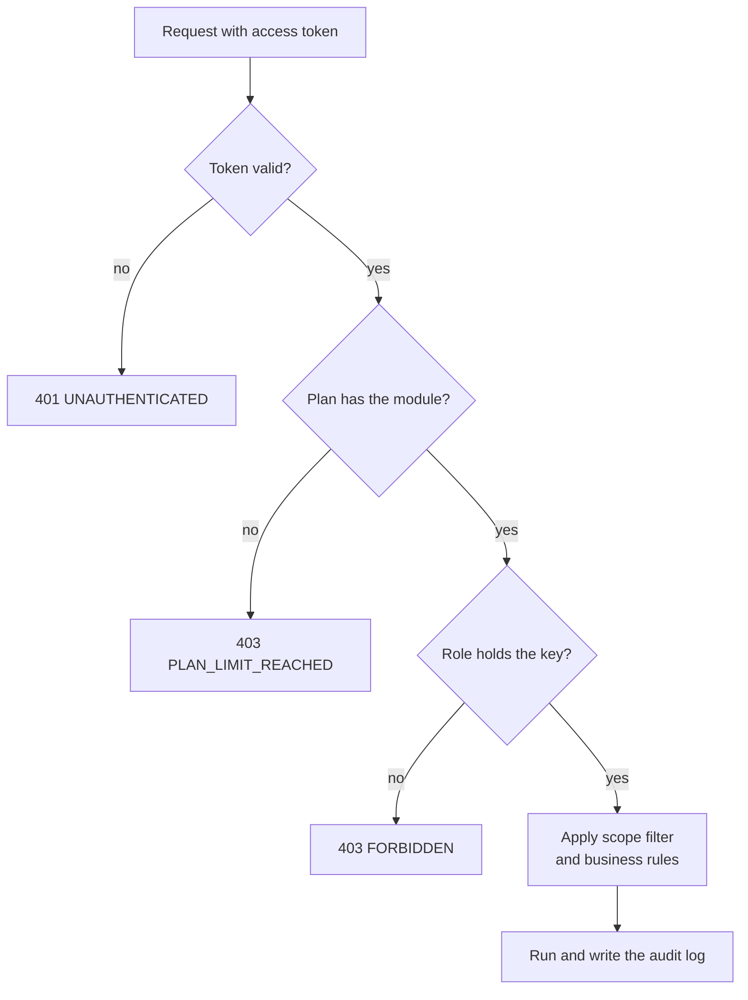

# EduFlow Permission Registry

**In simple words:** This file lists every permission key in EduFlow and says which role gets it. There are 269 keys. The API checks a key before it runs an endpoint. Every module chapter copies its permission matrix from this file, so this file wins when two documents disagree.

## How the permission model works

### Roles

EduFlow has exactly seven system roles. They are the same for every organization. Nobody can edit or delete them.

| Role key | Who it is | Data scope | Default reach in one line |
|---|---|---|---|
| `SUPER_ADMIN` | EduFlow platform staff | Platform console | Runs the platform. Enters a tenant only through audited impersonation. |
| `ORG_ADMIN` | Owner, director, head admin | Whole organization | `Yes` on every key inside the organization. |
| `PRINCIPAL` | Academic head of a campus | Assigned campuses | Runs academics and approvals. Sees finance as read only. |
| `TEACHER` | Teaching staff | Own batches and subjects | Attendance, homework, marks and remarks for own classes only. |
| `ACCOUNTANT` | Fee counter, finance staff | Finance of assigned campuses | Bills, collects, refunds, closes the day. Sees students read only. |
| `PARENT` | Parent or guardian | Own children | Parent Portal only. |
| `STUDENT` | Learner | Own record | Student Portal only. |

**Custom roles.** An organization on the Pro or Enterprise plan can build its own roles, for example Librarian or Front Desk. The ORG_ADMIN picks permission keys and picks a scope word for each key. Four rules protect custom roles:

1. A custom role can never hold a `platform.*` key, `parentportal.access` or `studentportal.access`.
2. A user can only create, edit, assign or invite with a role whose keys and scopes are inside the user's own keys and scopes. Nobody can hand out more power than they hold.
3. A custom role belongs to one organization. It is never visible to another tenant.
4. Every change to a role or to a user's roles is written to the audit log with the old and new values.

Ready-made presets are in the section *Custom role presets* at the end of this file.

### Permission keys

A key has the form `module.action`, for example `students.create`, `fees.collect`, `attendance.mark`. The catalogue of keys lives in the platform table `permissions`. A grant lives in the tenant table `role_permissions` as one row: role, permission and scope. The registry has 269 keys in 41 prefixes. The API registry (folder `_api/`) names the key for every endpoint.

### The cell words

Every matrix in EduFlow uses the same five cell words. Four of them map to the enum `PermissionScope` in the schema.

| Cell word | Stored scope | What the user can do |
|---|---|---|
| `Yes` | `ALL` | Use the key on all rows of the organization, in every campus. |
| `Campus` | `CAMPUS` | Use the key only on rows of the campuses listed for the user in `user_campuses`. |
| `Own` | `OWN` | Use the key only on own records (see the next table). |
| `View` | `VIEW` | Read only, inside the assigned campuses. Only the GET endpoints of the key work. No create, edit, delete, approve, import or export. |
| `No` | no row | The role does not hold the key. The API answers `403 FORBIDDEN`. |

What `Own` means depends on the role:

| Role | `Own` means |
|---|---|
| `TEACHER` | Batches where the user is `Batch.classTeacherId` or has a `BatchSubjectTeacher` row, and the students, sessions, homework, papers and marks of those batches and subjects. |
| Any staff role on `staff.*`, `teachers.*`, `leave.*` | The user's own `Staff` row and own leave requests. |
| Any staff role on `files.*`, `imports.*` | Files the user uploaded or that hang on a record the user may open; import jobs the user started. |
| `PARENT` | Students linked to the guardian through `StudentGuardian` and `Family`. |
| `STUDENT` | The one `Student` row linked to the signed-in user. |

Three more rules complete the picture:

- **Rows without a campus.** Some master data has no `campus_id`: subjects, academic years, grade scales, fee heads, discount schemes, templates, leave types. A `Campus` grant can read these rows. It can write them only when the role holds the write key. That is why the Principal gets the academic set-up keys and does not get the finance or messaging set-up keys.
- **Two roles on one user.** The API takes the union. Reads use the widest read scope. Writes use the widest write scope. `View` never adds a write.
- **ORG_ADMIN and campuses.** An ORG_ADMIN sees all campuses without any `user_campuses` rows. Every other tenant role sees only the campuses assigned to it. The optional header `X-Campus-Id` narrows a request to one of those campuses; a campus outside the list gives `403 FORBIDDEN`.

### How the API enforces a request

**Figure: Permission check on every request**

The check always runs on the server. Hiding a button in the UI is only a comfort for the user; it is never the protection.

1. **Who are you.** The middleware verifies the JWT access token (15 minutes). It reads `userId`, `orgId` and the role ids. The tenant is never taken from the request body.
2. **Tenant wall.** The Prisma client extension adds `organizationId` to every query. PostgreSQL Row-Level Security (`SET app.current_org`) is the second safety net.
3. **Plan gate.** If the plan does not include the module, the API answers `403 PLAN_LIMIT_REACHED`.
4. **Key check.** Each route declares one key, for example `requirePermission('fees.collect')`. The middleware loads the user's grants (cached in Redis, cleared when a role changes). No grant means `403 FORBIDDEN`. The denied attempt is written to the audit log with outcome `DENIED`.
5. **Scope filter.** `CAMPUS` adds `campus_id IN (assigned campuses)` to the query. `OWN` adds the ownership filter from the table above. `VIEW` lets only GET endpoints pass. A single record outside the scope answers `404 NOT_FOUND`, so nobody can test whether a hidden record exists.
6. **Ownership in code.** Portal endpoints (`/portal/parent/...`, `/portal/student/...`) check in code that every `:studentId` belongs to the signed-in guardian or student.
7. **Business rules.** Rules such as separation of duties run after the key check. A failed rule answers `422 BUSINESS_RULE_VIOLATION`.
8. **Audit.** Every write, every export, every read of decrypted data and every denied call goes to `audit_logs` (append only, hash chained).

Some endpoints check two keys. `POST /import-jobs` checks `imports.create` and the module's own `.import` key. Analytics, AI and global search only return data from modules the caller may view.

### Self and public endpoints

Some endpoints have no permission key.

- `self` endpoints work for any signed-in user and only touch the user's own rows. Examples: `/auth/me`, own sessions, own notifications and preferences, staff self check-in, `/my-payslips`, `/my-tax-declarations`, `/my-loan-advances`, `/my-consents`, `/my-data-subject-requests`, own export jobs. PARENT and STUDENT use these too.
- `public` endpoints need no login (login, signup, plan list, payment webhooks). They are rate limited and protected by captcha, signature or a one-time token.

### SUPER_ADMIN and audited impersonation

SUPER_ADMIN is EduFlow staff, not school staff. The role has **no standing access to tenant data**.

1. A SUPER_ADMIN login works on the platform console only (`/platform/...`, keys `platform.view` and `platform.manage`). MFA is mandatory for every platform user.
2. The header `X-Organization-Id` only selects a tenant for console endpoints. Tenant endpoints such as `/students` refuse a plain SUPER_ADMIN token.
3. To look inside a tenant, the SUPER_ADMIN calls `POST /platform/organizations/:id/impersonate` (ORG-API-39, key `platform.impersonate`) and must type a reason, for example a support ticket number.
4. The API returns a short-lived tenant token. It cannot be refreshed. The UI shows a red banner for the whole session.
5. Every action with that token is stored in `audit_logs` with actor type `IMPERSONATION`, the real SUPER_ADMIN user id and the reason. The event `platform.impersonation.started` is emitted. The tenant's ORG_ADMIN can see the full trail in the audit log.

How to read the SUPER_ADMIN column in the tables below: `Yes` means "allowed during an audited impersonation session, never without one". `View` means "read only during impersonation". `No` means "never, not even during impersonation". The `No` list follows five rules:

| Rule | Keys that are `No` for SUPER_ADMIN |
|---|---|
| No decrypted sensitive data | `students.view_medical`, `students.update_medical`, `staff.view_sensitive`, `staff.update_sensitive` |
| No decisions in the school's name | every `.approve` key, `leave.approve_student`, `exams.verify_marks`, `exams.publish`, `reportcards.publish`, `certificates.issue`, `certificates.revoke` |
| No money actions | in fees, payments, discounts, scholarships and payroll only view, set-up, import and reconcile are open; also `library.collect_fine`, `inventory.sell`, `inventory.adjust`, `billing.manage` |
| No messages in the school's name | `notifications.send`, `whatsapp.send`, `email.send`, `sms.send`, `fees.remind` |
| No account control, secrets or bulk export | every `users.*` and `roles.*` key except view, `settings.manage_gateways`, `settings.manage_api_keys`, every `.export` key, the two portal keys |

Three keys are `View` for SUPER_ADMIN: `payments.manage` (read the webhook log, never touch a gateway account), `settings.manage_privacy` (read the consent and request registers) and `files.view` (single files, no bulk download).

> **Rule:** An impersonation token is also refused on ownership transfer (ORG-API-13) and account closure (ORG-API-14). Both need the owner's own password and MFA.

> **Note:** Assumption: the impersonation token lives 30 minutes. The canon does not fix this value.

### Separation of duties for money

The person who asks for money to leave the books must not be the person who agrees. EduFlow splits every money decision into two keys and gives them to different roles.

| Money action | Created with | Approved with | Default creator | Default approver |
|---|---|---|---|---|
| Refund | `payments.refund` | `payments.approve` | Accountant | Principal, ORG_ADMIN |
| Invoice adjustment, waiver, write-off | `fees.update` | `fees.approve` | Accountant | Principal, ORG_ADMIN |
| Discount grant | `discounts.create` | `discounts.approve` | Accountant | Principal, ORG_ADMIN |
| Scholarship application and award | `scholarships.create` | `scholarships.approve` | Accountant | Principal, ORG_ADMIN |
| Daily cash close | `payments.close_day` | `payments.approve` | Accountant | Principal, ORG_ADMIN |
| Payroll run | `payroll.process` | `payroll.approve` | Accountant | ORG_ADMIN |
| Purchase order | `inventory.create` | `inventory.approve` | Store keeper (custom role) | Principal, ORG_ADMIN |

> **Rule:** Holding both keys is not enough. The API compares user ids. The user who created or requested the item (`requestedById`, `createdById`) cannot approve it (`approvedById`). This also applies to ORG_ADMIN. The API answers `422 BUSINESS_RULE_VIOLATION` with the message "You cannot approve your own request".

> **Note:** Assumption: a small institute with one finance user can switch on the setting "Allow owner self-approval" (default off, only the organization owner can change it). Each self-approval is then marked in the audit log.

## dashboard — Dashboard

| Permission | Meaning | SUPER_ADMIN | ORG_ADMIN | PRINCIPAL | TEACHER | ACCOUNTANT | PARENT | STUDENT |
|---|---|---|---|---|---|---|---|---|
| dashboard.view | See the role dashboard and save own layout | Yes | Yes | Campus | Own | Campus | No | No |
| dashboard.view_finance | See fee and collection widgets | Yes | Yes | View | No | Campus | No | No |
| dashboard.manage | Force a metric snapshot recompute | Yes | Yes | No | No | No | No | No |

Widgets only show data from modules the user may view. Parents and students get their home screen from the portal endpoints, not from this module.

## organizations — Organizations

| Permission | Meaning | SUPER_ADMIN | ORG_ADMIN | PRINCIPAL | TEACHER | ACCOUNTANT | PARENT | STUDENT |
|---|---|---|---|---|---|---|---|---|
| organizations.view | View tenant profile, plan usage and enabled features | Yes | Yes | View | No | No | No | No |
| organizations.update | Edit tenant profile and branding | Yes | Yes | No | No | No | No | No |
| organizations.manage | Onboarding wizard, custom domain, ownership transfer, account closure | Yes | Yes | No | No | No | No | No |

SUPER_ADMIN holds `organizations.manage` to help with the onboarding wizard. Ownership transfer and account closure stay blocked for impersonation tokens.

## campuses — Multi Campus

| Permission | Meaning | SUPER_ADMIN | ORG_ADMIN | PRINCIPAL | TEACHER | ACCOUNTANT | PARENT | STUDENT |
|---|---|---|---|---|---|---|---|---|
| campuses.view | View campuses, campus users and campus KPIs | Yes | Yes | Campus | No | No | No | No |
| campuses.create | Create a campus | Yes | Yes | No | No | No | No | No |
| campuses.update | Edit a campus | Yes | Yes | Campus | No | No | No | No |
| campuses.delete | Soft delete a campus | Yes | Yes | No | No | No | No | No |
| campuses.manage | Activate, deactivate, archive, set main, assign users, copy setup | Yes | Yes | No | No | No | No | No |
| campuses.export | Export the campus list | No | Yes | No | No | No | No | No |

Teachers and Accountants get their campus list for the campus switcher from `/auth/me`, so they do not need `campuses.view`.

## admissions — Student Admission

| Permission | Meaning | SUPER_ADMIN | ORG_ADMIN | PRINCIPAL | TEACHER | ACCOUNTANT | PARENT | STUDENT |
|---|---|---|---|---|---|---|---|---|
| admissions.view | View leads, follow-ups, applications, funnel and seats | Yes | Yes | Campus | No | View | No | No |
| admissions.create | Add leads and applications; convert lead to application | Yes | Yes | Campus | No | No | No | No |
| admissions.update | Edit leads and applications, follow-ups, documents, stage and review steps | Yes | Yes | Campus | No | No | No | No |
| admissions.delete | Soft delete leads and draft applications | Yes | Yes | Campus | No | No | No | No |
| admissions.manage | Assign leads to counsellors | Yes | Yes | Campus | No | No | No | No |
| admissions.approve | Approve, waitlist or reject applications; waive application fee | No | Yes | Campus | No | No | No | No |
| admissions.enroll | Convert an approved application into a student | Yes | Yes | Campus | No | No | No | No |
| admissions.import | Import leads from Excel | Yes | Yes | Campus | No | No | No | No |
| admissions.export | Export leads and applications | No | Yes | Campus | No | No | No | No |

The Accountant sees applications read only, because the fee counter collects the application fee. Counsellors and reception staff use the *Front Desk* preset.

## students — Student Profile

| Permission | Meaning | SUPER_ADMIN | ORG_ADMIN | PRINCIPAL | TEACHER | ACCOUNTANT | PARENT | STUDENT |
|---|---|---|---|---|---|---|---|---|
| students.view | View students, guardians, families, enrollments, documents, notes, transfers | Yes | Yes | Campus | Own | View | No | No |
| students.create | Admit a student directly | Yes | Yes | Campus | No | No | No | No |
| students.update | Edit students, guardians, families and documents; bulk update | Yes | Yes | Campus | No | No | No | No |
| students.delete | Soft delete students | Yes | Yes | No | No | No | No | No |
| students.manage | Change student status; verify documents | Yes | Yes | Campus | No | No | No | No |
| students.view_medical | Read decrypted medical notes (schema comment names it students.medical.view) | No | Yes | Campus | Own | No | No | No |
| students.update_medical | Write medical notes | No | Yes | Campus | No | No | No | No |
| students.manage_notes | Add, edit, share and delete student notes | Yes | Yes | Campus | Own | No | No | No |
| students.enroll | Create, edit and end enrollments; assign roll numbers | Yes | Yes | Campus | No | No | No | No |
| students.promote | Run year-end bulk promotion | Yes | Yes | Campus | No | No | No | No |
| students.transfer | Request or cancel a batch, course or campus transfer | Yes | Yes | Campus | No | No | No | No |
| students.approve | Approve or reject student transfers | No | Yes | Campus | No | No | No | No |
| students.import | Import students from Excel | Yes | Yes | Campus | No | No | No | No |
| students.export | Export students; generate ID cards | No | Yes | Campus | No | No | No | No |

- A student leaves through a status change (`students.manage`). Delete is only for a record created by mistake, so it stays with ORG_ADMIN.
- A teacher can read medical notes of own students, because the class teacher must know about an allergy or asthma. Each read of decrypted notes is written to the audit log.
- The user who requested a transfer (`students.transfer`) cannot approve the same transfer (`students.approve`). A transfer between two campuses needs an approver who is assigned to both campuses, or the ORG_ADMIN.

## teachers — Teachers

| Permission | Meaning | SUPER_ADMIN | ORG_ADMIN | PRINCIPAL | TEACHER | ACCOUNTANT | PARENT | STUDENT |
|---|---|---|---|---|---|---|---|---|
| teachers.view | View teachers, subjects, assignments, timetable, workload | Yes | Yes | Campus | Own | No | No | No |
| teachers.create | Create a teacher | Yes | Yes | Campus | No | No | No | No |
| teachers.update | Edit teachers, qualified subjects and documents | Yes | Yes | Campus | No | No | No | No |
| teachers.delete | Soft delete teachers | Yes | Yes | No | No | No | No | No |
| teachers.manage | Change teacher status | Yes | Yes | Campus | No | No | No | No |
| teachers.assign | Assign teachers to batches and subjects | Yes | Yes | Campus | No | No | No | No |
| teachers.import | Import teachers from Excel | Yes | Yes | Campus | No | No | No | No |
| teachers.export | Export the teacher list | No | Yes | Campus | No | No | No | No |

A teacher sees only the own profile, own assignments and own workload. Delete keys on people records (students, teachers, staff, users) stay with ORG_ADMIN.

## staff — Staff

| Permission | Meaning | SUPER_ADMIN | ORG_ADMIN | PRINCIPAL | TEACHER | ACCOUNTANT | PARENT | STUDENT |
|---|---|---|---|---|---|---|---|---|
| staff.view | View staff, history, documents, departments, designations, org chart | Yes | Yes | Campus | Own | Own | No | No |
| staff.create | Create a staff profile | Yes | Yes | No | No | No | No | No |
| staff.update | Edit staff and documents | Yes | Yes | No | No | No | No | No |
| staff.delete | Soft delete staff | Yes | Yes | No | No | No | No | No |
| staff.manage | Status, position, transfer, exit; verify documents; manage departments and designations | Yes | Yes | No | No | No | No | No |
| staff.view_sensitive | Read decrypted bank, tax and national ids | No | Yes | No | No | No | No | No |
| staff.update_sensitive | Write bank, tax, national and statutory ids | No | Yes | No | No | No | No | No |
| staff.import | Import staff from Excel | Yes | Yes | No | No | No | No | No |
| staff.export | Export staff; generate ID cards | No | Yes | No | No | No | No | No |

The Principal runs academics, so the Principal manages teachers but only views non-teaching staff. Hiring, exit and identity numbers belong to ORG_ADMIN or to the *HR Manager* preset. The payroll bank file is built on the server, so the Accountant never needs `staff.view_sensitive`.

## attendance — Attendance

| Permission | Meaning | SUPER_ADMIN | ORG_ADMIN | PRINCIPAL | TEACHER | ACCOUNTANT | PARENT | STUDENT |
|---|---|---|---|---|---|---|---|---|
| attendance.view | View student attendance sessions, records and reports | Yes | Yes | Campus | Own | No | No | No |
| attendance.mark | Take student attendance, send absence alerts, push device punches | Yes | Yes | Campus | Own | No | No | No |
| attendance.update | Correct a saved student attendance record | Yes | Yes | Campus | Own | No | No | No |
| attendance.manage | Lock sessions (single and bulk) | Yes | Yes | Campus | No | No | No | No |
| attendance.unlock | Reopen a locked attendance session | Yes | Yes | Campus | No | No | No | No |
| attendance.import | Import student or staff attendance from Excel | Yes | Yes | Campus | No | No | No | No |
| attendance.export | Export student or staff attendance | No | Yes | Campus | No | No | No | No |
| attendance.view_staff | View staff attendance and the staff monthly register | Yes | Yes | Campus | No | View | No | No |
| attendance.mark_staff | Mark and correct staff attendance | Yes | Yes | Campus | No | No | No | No |

- A teacher can correct own sessions only while they are unlocked. After the lock, the Principal must reopen the session (`attendance.unlock`). This stops silent changes to old registers.
- The Accountant reads staff attendance because payroll needs the paid days.
- Staff mark their own check-in and check-out through `self` endpoints.

## leave — Leave

| Permission | Meaning | SUPER_ADMIN | ORG_ADMIN | PRINCIPAL | TEACHER | ACCOUNTANT | PARENT | STUDENT |
|---|---|---|---|---|---|---|---|---|
| leave.view | View leave types, policies, balances and staff leave requests | Yes | Yes | Campus | Own | Own | No | No |
| leave.create | Apply for staff leave and cancel it | Yes | Yes | Campus | Own | Own | No | No |
| leave.approve | Approve or reject staff leave at the assigned level | No | Yes | Campus | No | No | No | No |
| leave.manage | Configure leave types and policies; allocate, adjust and carry forward balances | Yes | Yes | No | No | No | No | No |
| leave.export | Export leave register and balances | No | Yes | Campus | No | No | No | No |
| leave.view_student | View student leave requests | Yes | Yes | Campus | Own | No | No | No |
| leave.create_student | Record a student leave request on behalf of a parent | Yes | Yes | Campus | Own | No | No | No |
| leave.approve_student | Approve or reject student leave requests | No | Yes | Campus | Own | No | No | No |

Nobody can approve the own leave request; the API skips the requester in the approval chain. The class teacher approves student leave for own batches. Parents apply for a child's leave through the Parent Portal key.

## batches — Batch

| Permission | Meaning | SUPER_ADMIN | ORG_ADMIN | PRINCIPAL | TEACHER | ACCOUNTANT | PARENT | STUDENT |
|---|---|---|---|---|---|---|---|---|
| batches.view | View academic years, terms, courses, batches, enrollments, rooms, holidays, calendar, PTM bookings | Yes | Yes | Campus | Own | View | No | No |
| batches.create | Create batches and clone them from a previous year | Yes | Yes | Campus | No | No | No | No |
| batches.update | Update batches and change batch status | Yes | Yes | Campus | No | No | No | No |
| batches.delete | Delete (soft) batches | Yes | Yes | Campus | No | No | No | No |
| batches.manage | Configure academic years, terms, courses, rooms, holidays and calendar events | Yes | Yes | Campus | No | No | No | No |
| batches.enroll | Enroll, update, withdraw students and assign roll numbers | Yes | Yes | Campus | No | No | No | No |
| batches.promote | Preview and run year-end promotion | Yes | Yes | Campus | No | No | No | No |
| batches.manage_ptm | Book, update and cancel PTM slots as staff | Yes | Yes | Campus | Own | No | No | No |
| batches.import | Import enrollments from Excel | Yes | Yes | Campus | No | No | No | No |
| batches.export | Export batch lists and rosters | No | Yes | Campus | Own | No | No | No |

The Accountant reads courses and batches because fee structures are set per course and batch. A teacher can print the roster of own batches and manage own PTM (parent-teacher meeting) slots.

## timetable — Timetable

| Permission | Meaning | SUPER_ADMIN | ORG_ADMIN | PRINCIPAL | TEACHER | ACCOUNTANT | PARENT | STUDENT |
|---|---|---|---|---|---|---|---|---|
| timetable.view | View bell schedule, timetables, substitutions, class sessions, availability and workload | Yes | Yes | Campus | Own | No | No | No |
| timetable.create | Create timetable cells, copy timetables, create class sessions | Yes | Yes | Campus | No | No | No | No |
| timetable.update | Update timetable cells and class sessions (cancel, reschedule, complete) | Yes | Yes | Campus | Own | No | No | No |
| timetable.delete | Delete timetable cells | Yes | Yes | Campus | No | No | No | No |
| timetable.manage | Configure period slots; generate class sessions | Yes | Yes | Campus | No | No | No | No |
| timetable.substitute | Assign, change and cancel substitutions; see uncovered periods | Yes | Yes | Campus | No | No | No | No |
| timetable.export | Export timetables (PDF / XLSX) | No | Yes | Campus | Own | No | No | No |

> **Rule:** With scope `Own`, `timetable.update` works only on the teacher's own class sessions (complete with topic covered, cancel, reschedule). The weekly grid endpoints TT-API-07 and TT-API-09 need `Campus` or `Yes`.

## subjects — Subjects

| Permission | Meaning | SUPER_ADMIN | ORG_ADMIN | PRINCIPAL | TEACHER | ACCOUNTANT | PARENT | STUDENT |
|---|---|---|---|---|---|---|---|---|
| subjects.view | View subjects, curriculum and teacher allocation | Yes | Yes | Campus | Own | No | No | No |
| subjects.create | Create subjects (single and bulk) | Yes | Yes | Campus | No | No | No | No |
| subjects.update | Update subjects | Yes | Yes | Campus | No | No | No | No |
| subjects.delete | Archive subjects | Yes | Yes | Campus | No | No | No | No |
| subjects.manage | Maintain course curriculum (CourseSubject) | Yes | Yes | Campus | No | No | No | No |
| subjects.assign_teachers | Assign teachers to batch subjects | Yes | Yes | Campus | No | No | No | No |
| subjects.export | Export curriculum and allocation matrix | No | Yes | Campus | No | No | No | No |

Subjects have no campus column. The Principal may still write them, because the curriculum is academic work. In a group with many campuses the ORG_ADMIN can remove these keys from the Principal by using a custom role.

## homework — Homework

| Permission | Meaning | SUPER_ADMIN | ORG_ADMIN | PRINCIPAL | TEACHER | ACCOUNTANT | PARENT | STUDENT |
|---|---|---|---|---|---|---|---|---|
| homework.view | View homework, submissions and study materials | Yes | Yes | Campus | Own | No | No | No |
| homework.create | Create homework and study materials | Yes | Yes | Campus | Own | No | No | No |
| homework.update | Update, publish, close, cancel, remind; manage attachments and materials | Yes | Yes | Campus | Own | No | No | No |
| homework.delete | Delete (soft) homework and study materials | Yes | Yes | Campus | Own | No | No | No |
| homework.grade | Mark submissions, grade and request resubmission | Yes | Yes | Campus | Own | No | No | No |
| homework.export | Export homework reports | No | Yes | Campus | Own | No | No | No |

A teacher works only on homework of own batches and own subjects. Students submit work through the Student Portal key.

## exams — Exams

| Permission | Meaning | SUPER_ADMIN | ORG_ADMIN | PRINCIPAL | TEACHER | ACCOUNTANT | PARENT | STUDENT |
|---|---|---|---|---|---|---|---|---|
| exams.view | View grade scales, exams, papers, marks, results, analysis, re-evaluation requests | Yes | Yes | Campus | Own | No | No | No |
| exams.create | Create exams and exam papers | Yes | Yes | Campus | No | No | No | No |
| exams.update | Update exams and papers; publish date sheet, open marks entry, cancel | Yes | Yes | Campus | No | No | No | No |
| exams.delete | Delete (soft) exams and papers without marks | Yes | Yes | Campus | No | No | No | No |
| exams.manage | Configure grade scales | Yes | Yes | Campus | No | No | No | No |
| exams.enter_marks | Enter and submit marks; download the marks template | Yes | Yes | Campus | Own | No | No | No |
| exams.verify_marks | Verify or reopen submitted marks | No | Yes | Campus | No | No | No | No |
| exams.publish | Publish and unpublish results | No | Yes | Campus | No | No | No | No |
| exams.reevaluate | Record, accept, resolve and reject re-evaluation requests | Yes | Yes | Campus | No | No | No | No |
| exams.import | Import marks from Excel | Yes | Yes | Campus | Own | No | No | No |
| exams.export | Export date sheets, marks and result sheets; generate admit cards | No | Yes | Campus | Own | No | No | No |

- Marks follow a two-person path. The subject teacher enters and submits marks for own papers. A second person verifies them. The user who entered the marks of a paper cannot verify the same paper.
- Only the Principal or ORG_ADMIN publishes results, because publishing sends marks to parents.
- An institute that wants a separate exam office uses the *Exam Coordinator* preset.

## reportcards — Report Cards

| Permission | Meaning | SUPER_ADMIN | ORG_ADMIN | PRINCIPAL | TEACHER | ACCOUNTANT | PARENT | STUDENT |
|---|---|---|---|---|---|---|---|---|
| reportcards.view | View templates, report cards and PDFs | Yes | Yes | Campus | Own | No | No | No |
| reportcards.manage | Configure report card templates | Yes | Yes | Campus | No | No | No | No |
| reportcards.generate | Generate and regenerate report cards | Yes | Yes | Campus | No | No | No | No |
| reportcards.update | Edit overall remarks, result override and template of a card | Yes | Yes | Campus | No | No | No | No |
| reportcards.delete | Delete (soft) unpublished report cards | Yes | Yes | Campus | No | No | No | No |
| reportcards.remark | Write, edit and delete report card remarks | Yes | Yes | Campus | Own | No | No | No |
| reportcards.publish | Publish (single and bulk) and withhold report cards | No | Yes | Campus | No | No | No | No |
| reportcards.export | Bulk download PDFs and export the result register | No | Yes | Campus | No | No | No | No |

A teacher writes class-teacher and subject remarks for own batches. A result override (`reportcards.update`) changes a pass or fail, so it stays with the Principal and ORG_ADMIN and is always audited.

## fees — Fees

| Permission | Meaning | SUPER_ADMIN | ORG_ADMIN | PRINCIPAL | TEACHER | ACCOUNTANT | PARENT | STUDENT |
|---|---|---|---|---|---|---|---|---|
| fees.view | View fee setup, assignments, invoices, ledgers, fee reports | Yes | Yes | View | No | Campus | No | No |
| fees.manage | Manage fee heads, tax rates, late-fee rules, fee structures; year-end carry-forward | Yes | Yes | No | No | No | No | No |
| fees.create | Assign fee structures; create, generate and issue invoices | No | Yes | No | No | Campus | No | No |
| fees.update | Edit assignments and DRAFT invoices; request invoice adjustments | No | Yes | No | No | Campus | No | No |
| fees.delete | Cancel assignments; discard DRAFT and cancel issued invoices | No | Yes | Campus | No | No | No | No |
| fees.approve | Approve or reject adjustments; write off balances | No | Yes | Campus | No | No | No | No |
| fees.remind | Send single and bulk fee reminders | No | Yes | No | No | Campus | No | No |
| fees.collect | Record counter payments, allocate advances, create orders and pay links, send receipts | No | Yes | No | No | Campus | No | No |
| fees.import | Import opening dues from Excel | Yes | Yes | No | No | Campus | No | No |
| fees.export | Export invoices, dues and defaulter reports | No | Yes | No | No | Campus | No | No |

Separation of duties in Fees:

- **Prices and billing are split.** ORG_ADMIN sets fee heads and fee structures (`fees.manage`). The Accountant bills and collects against them. The person at the cash counter cannot lower a price.
- **Adjustments and write-offs need two people.** The Accountant requests a concession, a late-fee waiver, a correction or a write-off with FEE-API-33 (`fees.update`). The Principal or ORG_ADMIN approves with FEE-API-35 (`fees.approve`). The creator of a write-off can never be its approver: the API compares `requestedById` with the approving user and answers `422 BUSINESS_RULE_VIOLATION`.
- **Direct full write-off.** FEE-API-30 needs `fees.approve`. It is refused when the caller requested a write-off on that invoice or recorded a payment on it.
- **Cancelling an issued invoice** (`fees.delete`) removes money from the books. The counter cannot do it alone, so the key goes to the Principal and ORG_ADMIN. The Accountant can still edit a DRAFT invoice with `fees.update`.
- The Principal reads fee data (`View`) to decide on approvals, but cannot bill, collect or export.

## payments — Payments

| Permission | Meaning | SUPER_ADMIN | ORG_ADMIN | PRINCIPAL | TEACHER | ACCOUNTANT | PARENT | STUDENT |
|---|---|---|---|---|---|---|---|---|
| payments.view | View payments, receipts, orders, refunds, settlements, day closes, payment reports | Yes | Yes | View | No | Campus | No | No |
| payments.update | Update cheque status, record cheque bounce | No | Yes | No | No | Campus | No | No |
| payments.cancel | Cancel a payment; cancel and reissue a receipt | No | Yes | Campus | No | No | No | No |
| payments.refund | Request and process refunds | No | Yes | No | No | Campus | No | No |
| payments.approve | Approve or reject refunds; verify day closes | No | Yes | Campus | No | No | No | No |
| payments.close_day | Prepare and submit the daily cash close | No | Yes | No | No | Campus | No | No |
| payments.reconcile | Sync and reconcile gateway settlements | Yes | Yes | No | No | Campus | No | No |
| payments.manage | Manage gateway accounts; view and retry webhook events | View | Yes | No | No | No | No | No |
| payments.import | Import historical payments from Excel | Yes | Yes | No | No | No | No | No |
| payments.export | Export payment, receipt, refund and day-book data | No | Yes | No | No | Campus | No | No |

Separation of duties in Payments:

- **Refunds need two people.** The Accountant requests a refund (PAY-API-19, `payments.refund`). The Principal or ORG_ADMIN approves or rejects it (PAY-API-21 and PAY-API-22, `payments.approve`). Only then can the Accountant process the payout (PAY-API-23). The creator of a refund can never be its approver: the API compares `Refund.requestedById` with the approving user and answers `422 BUSINESS_RULE_VIOLATION`. This also applies to ORG_ADMIN.
- **Day close needs two people.** The Accountant submits the cash close (`payments.close_day`). A different user verifies it (`payments.approve`).
- **Cancelling a payment or a receipt** (`payments.cancel`) is the classic cash-counter fraud path: collect cash, then cancel the receipt. The Accountant does not hold this key. The Principal or ORG_ADMIN cancels after checking the reason, and the user who recorded the payment cannot cancel it.
- **Gateway accounts** decide where online money lands. Only ORG_ADMIN can change them. SUPER_ADMIN can read the webhook log during impersonation to debug a failed payment, but cannot connect or change an account.
- **Historical payment import** creates paid records without money moving, so it stays with ORG_ADMIN (and with EduFlow migration support through impersonation).

## discounts — Discounts

| Permission | Meaning | SUPER_ADMIN | ORG_ADMIN | PRINCIPAL | TEACHER | ACCOUNTANT | PARENT | STUDENT |
|---|---|---|---|---|---|---|---|---|
| discounts.view | View schemes, grants, previews, sibling suggestions, impact report | Yes | Yes | Campus | No | Campus | No | No |
| discounts.manage | Create, update and archive discount schemes | Yes | Yes | No | No | No | No | No |
| discounts.create | Grant a discount to one or many students | No | Yes | No | No | Campus | No | No |
| discounts.update | Edit a pending grant | No | Yes | No | No | Campus | No | No |
| discounts.approve | Approve or reject grants | No | Yes | Campus | No | No | No | No |
| discounts.delete | Revoke an approved grant | No | Yes | Campus | No | No | No | No |
| discounts.export | Export grants and impact report | No | Yes | No | No | Campus | No | No |

Separation of duties: the Accountant enters a grant, the Principal or ORG_ADMIN approves it. The user who created a grant (`createdById`) cannot approve the same grant. Discount schemes are price rules, so only ORG_ADMIN sets them.

## scholarships — Scholarships

| Permission | Meaning | SUPER_ADMIN | ORG_ADMIN | PRINCIPAL | TEACHER | ACCOUNTANT | PARENT | STUDENT |
|---|---|---|---|---|---|---|---|---|
| scholarships.view | View schemes, applications, awards, utilisation report | Yes | Yes | Campus | No | Campus | No | No |
| scholarships.manage | Create, update, archive, open and close schemes | Yes | Yes | No | No | No | No | No |
| scholarships.create | Create and submit applications for a student | No | Yes | No | No | Campus | No | No |
| scholarships.update | Edit, review, shortlist or withdraw applications | No | Yes | Campus | No | Campus | No | No |
| scholarships.approve | Approve or reject applications; award, suspend, reinstate, revoke, renew | No | Yes | Campus | No | No | No | No |
| scholarships.disburse | Record and reverse disbursements | No | Yes | No | No | Campus | No | No |
| scholarships.export | Export scholarship data | No | Yes | No | No | Campus | No | No |

Separation of duties: the office enters the application, the Principal reviews and approves the award, the Accountant records the money. The user who created an application cannot approve it, and the user who approved an award cannot record its disbursement. Parents apply on their own through the Parent Portal key.

## notifications — Notifications

| Permission | Meaning | SUPER_ADMIN | ORG_ADMIN | PRINCIPAL | TEACHER | ACCOUNTANT | PARENT | STUDENT |
|---|---|---|---|---|---|---|---|---|
| notifications.view | View templates, event catalog, announcements, delivery log, summary | Yes | Yes | Campus | Own | No | No | No |
| notifications.manage | Create, update, delete and test notification templates | Yes | Yes | No | No | No | No | No |
| notifications.create | Create announcements and preview audiences | Yes | Yes | Campus | Own | No | No | No |
| notifications.update | Edit draft or scheduled announcements | Yes | Yes | Campus | Own | No | No | No |
| notifications.delete | Delete announcements | Yes | Yes | Campus | Own | No | No | No |
| notifications.send | Send, schedule or cancel announcements; resend messages | No | Yes | Campus | No | No | No | No |
| notifications.export | Export the delivery log | No | Yes | No | No | No | No | No |

A teacher drafts an announcement for own batches. The Principal reads it and sends it. This keeps one voice towards parents and protects the message credits. Automatic alerts (absence, homework, fee receipt) do not need `notifications.send`; they are sent by the module that raises the event. Every user reads the own in-app feed through `self` endpoints.

## whatsapp — WhatsApp

| Permission | Meaning | SUPER_ADMIN | ORG_ADMIN | PRINCIPAL | TEACHER | ACCOUNTANT | PARENT | STUDENT |
|---|---|---|---|---|---|---|---|---|
| whatsapp.view | View accounts, templates, log, inbox, opt-ins, wallet, summary | Yes | Yes | Campus | No | No | No | No |
| whatsapp.manage | Connect accounts, manage templates, record opt-ins, wallet settings and top-ups | Yes | Yes | No | No | No | No | No |
| whatsapp.send | Send WhatsApp messages; handle and reply to inbound messages | No | Yes | Campus | No | No | No | No |
| whatsapp.export | Export the WhatsApp log | No | Yes | No | No | No | No | No |

EduFlow support often helps a school connect its WhatsApp Business account, so SUPER_ADMIN holds `whatsapp.manage` during impersonation. A wallet top-up still needs the school's own payment at the gateway.

## email — Email

| Permission | Meaning | SUPER_ADMIN | ORG_ADMIN | PRINCIPAL | TEACHER | ACCOUNTANT | PARENT | STUDENT |
|---|---|---|---|---|---|---|---|---|
| email.view | View sender identities, email log, suppressions, summary | Yes | Yes | Campus | No | No | No | No |
| email.manage | Manage sender identities and the suppression list | Yes | Yes | No | No | No | No | No |
| email.send | Send and resend emails | No | Yes | Campus | No | No | No | No |
| email.export | Export the email log | No | Yes | No | No | No | No | No |

## sms — SMS

| Permission | Meaning | SUPER_ADMIN | ORG_ADMIN | PRINCIPAL | TEACHER | ACCOUNTANT | PARENT | STUDENT |
|---|---|---|---|---|---|---|---|---|
| sms.view | View headers, DLT templates, SMS log, wallet, summary; preview messages | Yes | Yes | Campus | No | No | No | No |
| sms.manage | Manage headers, DLT templates, wallet settings and top-ups | Yes | Yes | No | No | No | No | No |
| sms.send | Send SMS | No | Yes | Campus | No | No | No | No |
| sms.import | Import DLT templates from Excel | Yes | Yes | No | No | No | No | No |
| sms.export | Export the SMS log | No | Yes | No | No | No | No | No |

Message logs hold phone numbers and email addresses of parents. That is why every log export in WhatsApp, Email and SMS stays with ORG_ADMIN.

## library — Library

| Permission | Meaning | SUPER_ADMIN | ORG_ADMIN | PRINCIPAL | TEACHER | ACCOUNTANT | PARENT | STUDENT |
|---|---|---|---|---|---|---|---|---|
| library.view | View catalogue, categories, copies, loans, holds and library dashboard; print labels | Yes | Yes | Campus | No | View | No | No |
| library.create | Add titles and copies | Yes | Yes | No | No | No | No | No |
| library.update | Update titles and copies; change copy status | Yes | Yes | No | No | No | No | No |
| library.delete | Archive titles | Yes | Yes | No | No | No | No | No |
| library.manage | Configure categories; send due and overdue reminders | Yes | Yes | No | No | No | No | No |
| library.issue | Circulation desk: issue, renew, return, mark lost, holds, member summary | Yes | Yes | No | No | No | No | No |
| library.collect_fine | Bill a library fine to a fee invoice or counter payment | No | Yes | No | No | Campus | No | No |
| library.approve | Waive a library fine | No | Yes | Campus | No | No | No | No |
| library.import | Import catalogue from Excel | Yes | Yes | No | No | No | No | No |
| library.export | Export catalogue, loan, overdue and fine registers | No | Yes | No | No | No | No | No |

The daily library work belongs to the *Librarian* preset (Library is a Pro plan module, and Pro includes custom roles). Separation of duties: the person who collects a fine (`library.collect_fine`) does not waive fines (`library.approve`). Students see their own loans through the Student Portal key.

## inventory — Inventory

| Permission | Meaning | SUPER_ADMIN | ORG_ADMIN | PRINCIPAL | TEACHER | ACCOUNTANT | PARENT | STUDENT |
|---|---|---|---|---|---|---|---|---|
| inventory.view | View items, categories, vendors, purchase orders, ledger, assets, reports | Yes | Yes | Campus | No | View | No | No |
| inventory.create | Create items and purchase orders; submit a PO for approval | Yes | Yes | No | No | No | No | No |
| inventory.update | Update items and DRAFT POs; mark ordered, cancel; direct IN / OUT entries | Yes | Yes | No | No | No | No | No |
| inventory.delete | Archive items; delete DRAFT POs | Yes | Yes | No | No | No | No | No |
| inventory.manage | Configure categories and vendors | Yes | Yes | No | No | No | No | No |
| inventory.approve | Approve or send back purchase orders | No | Yes | Campus | No | No | No | No |
| inventory.receive | Receive goods against a purchase order | Yes | Yes | No | No | No | No | No |
| inventory.issue | Issue and take back stock; assign and close asset assignments | Yes | Yes | No | No | No | No | No |
| inventory.sell | Sell items to students with a fee invoice | No | Yes | No | No | Campus | No | No |
| inventory.transfer | Transfer stock between campus stores | Yes | Yes | No | No | No | No | No |
| inventory.adjust | Stock-count adjustments and write-offs | No | Yes | Campus | No | No | No | No |
| inventory.import | Import items and opening stock from Excel | Yes | Yes | No | No | No | No | No |
| inventory.export | Export items, ledger and asset register | No | Yes | No | No | No | No | No |

Separation of duties: the user who created a purchase order cannot approve it. A stock write-off (`inventory.adjust`) is a loss decision, so it goes to the Principal and not to the store keeper who counts the stock. The Accountant sells uniforms and books at the counter, because a sale creates a fee invoice.

## transport — Transport

| Permission | Meaning | SUPER_ADMIN | ORG_ADMIN | PRINCIPAL | TEACHER | ACCOUNTANT | PARENT | STUDENT |
|---|---|---|---|---|---|---|---|---|
| transport.view | View vehicles, drivers, routes, stops, assignments, trips, maintenance, alerts | Yes | Yes | Campus | No | No | No | No |
| transport.create | Create vehicles and routes | Yes | Yes | No | No | No | No | No |
| transport.update | Update vehicles, routes and stops; schedule, change and cancel trips | Yes | Yes | No | No | No | No | No |
| transport.delete | Archive vehicles and routes | Yes | Yes | No | No | No | No | No |
| transport.manage | Maintain driver profiles and vehicle maintenance records | Yes | Yes | No | No | No | No | No |
| transport.assign | Assign students to routes; change, suspend, resume, end; bulk assign | Yes | Yes | No | No | No | No | No |
| transport.mark | Driver / attendant: own trips, start, boarding marks, complete | Yes | Yes | No | No | No | No | No |
| transport.import | Import transport assignments from Excel | Yes | Yes | No | No | No | No | No |
| transport.export | Export assignments, rosters and trip logs | No | Yes | No | No | No | No | No |

The daily work belongs to the *Transport Manager* preset. A driver or bus attendant gets a small custom role with only `transport.mark` and scope `Own`; the endpoints then show only the trips of that driver. Parents see the bus of their child through the Parent Portal key.

## hostel — Hostel

| Permission | Meaning | SUPER_ADMIN | ORG_ADMIN | PRINCIPAL | TEACHER | ACCOUNTANT | PARENT | STUDENT |
|---|---|---|---|---|---|---|---|---|
| hostel.view | View hostels, rooms, beds, allocations, roll call, visitors, out-passes | Yes | Yes | Campus | No | No | No | No |
| hostel.create | Create hostels and rooms (single and bulk) | Yes | Yes | No | No | No | No | No |
| hostel.update | Update hostels, rooms and beds | Yes | Yes | No | No | No | No | No |
| hostel.delete | Archive hostels and rooms | Yes | Yes | No | No | No | No | No |
| hostel.allocate | Reserve, allocate, check in, transfer, vacate and cancel beds | Yes | Yes | No | No | No | No | No |
| hostel.mark | Warden desk: roll call, visitor register, raise / cancel out-pass, gate check-out and check-in | Yes | Yes | No | No | No | No | No |
| hostel.approve | Approve or reject out-pass requests | No | Yes | Campus | No | No | No | No |
| hostel.export | Export resident and roll-call registers | No | Yes | No | No | No | No | No |

The daily work belongs to the *Hostel Warden* preset. The Principal keeps the right to approve an out-pass, because letting a child leave the hostel is a safety decision.

## payroll — Payroll

| Permission | Meaning | SUPER_ADMIN | ORG_ADMIN | PRINCIPAL | TEACHER | ACCOUNTANT | PARENT | STUDENT |
|---|---|---|---|---|---|---|---|---|
| payroll.view | View pay heads, structures, salaries, runs, payslips, adjustments, loans, declarations, statutory settings | Yes | Yes | No | No | Campus | No | No |
| payroll.manage | Configure pay heads, structures, staff salaries, statutory settings; create adjustments and loans | Yes | Yes | No | No | No | No | No |
| payroll.process | Create, process and delete DRAFT runs; edit, hold, release payslips; mark paid; send payslips; disburse and close loans | No | Yes | No | No | Campus | No | No |
| payroll.approve | Approve, reopen and lock runs; cancel payslips; approve adjustments and loans; verify tax declarations | No | Yes | No | No | No | No | No |
| payroll.import | Import payroll adjustments from Excel | Yes | Yes | No | No | Campus | No | No |
| payroll.export | Bank file, statutory files, salary register and payslip export | No | Yes | No | No | Campus | No | No |

Separation of duties in Payroll:

- ORG_ADMIN (or the *HR Manager* preset) sets salaries with `payroll.manage`. The Accountant prepares the monthly run with `payroll.process`. ORG_ADMIN approves and locks it with `payroll.approve`. The user who processed a run cannot approve the same run. The user who created an adjustment or a loan cannot approve it.
- Salaries are confidential. The Principal and teachers hold no payroll key. Every staff member sees the own payslips, tax declarations and loans through the `self` endpoints `/my-payslips`, `/my-tax-declarations` and `/my-loan-advances`.
- An institute that does not want the fee counter to see salaries removes the payroll keys by giving the counter a custom role.

## certificates — Certificates

| Permission | Meaning | SUPER_ADMIN | ORG_ADMIN | PRINCIPAL | TEACHER | ACCOUNTANT | PARENT | STUDENT |
|---|---|---|---|---|---|---|---|---|
| certificates.view | View templates, requests, issued certificates and PDFs; preview templates | Yes | Yes | Campus | Own | No | No | No |
| certificates.manage | Configure certificate templates | Yes | Yes | No | No | No | No | No |
| certificates.create | Raise and cancel certificate requests as staff | Yes | Yes | Campus | Own | No | No | No |
| certificates.approve | Approve or reject certificate requests | No | Yes | Campus | No | No | No | No |
| certificates.issue | Issue (single, bulk, from request), reissue and send certificates | No | Yes | Campus | No | No | No | No |
| certificates.revoke | Revoke an issued certificate | No | Yes | Campus | No | No | No | No |
| certificates.export | Export the issue register | No | Yes | Campus | No | No | No | No |

A certificate is an official paper of the school, for example a transfer certificate. A teacher can raise a request for an own student; only the Principal or ORG_ADMIN approves and issues. Parents and students raise requests through their portal keys.

## analytics — Analytics

| Permission | Meaning | SUPER_ADMIN | ORG_ADMIN | PRINCIPAL | TEACHER | ACCOUNTANT | PARENT | STUDENT |
|---|---|---|---|---|---|---|---|---|
| analytics.view | Open the report library, saved and shared reports, schedules list, KPI and analysis endpoints | Yes | Yes | Campus | Own | Campus | No | No |
| analytics.build | Use the report builder: datasets, preview, save, update, delete, duplicate, share | Yes | Yes | Campus | No | No | No | No |
| analytics.schedule | Create, update, pause, resume, delete and run report schedules | Yes | Yes | Campus | No | No | No | No |
| analytics.export | Export standard and saved reports | No | Yes | Campus | No | Campus | No | No |
| analytics.manage | Rebuild daily metric snapshots | Yes | Yes | No | No | No | No | No |

> **Rule:** Analytics never widens access. A report only returns data from modules the caller may view, in the caller's scope. The Accountant gets finance reports and the teacher gets reports of own batches. The Principal can open finance reports but cannot export them, because a report on a module where the caller holds only `View` cannot be exported.

## ai — AI Insights

| Permission | Meaning | SUPER_ADMIN | ORG_ADMIN | PRINCIPAL | TEACHER | ACCOUNTANT | PARENT | STUDENT |
|---|---|---|---|---|---|---|---|---|
| ai.view | View insights, risk scores and current quota; mark seen; give feedback | Yes | Yes | Campus | Own | Campus | No | No |
| ai.update | Mark an insight acted or dismissed | Yes | Yes | Campus | Own | Campus | No | No |
| ai.query | Ask the AI assistant and see own question history | Yes | Yes | Campus | Own | Campus | No | No |
| ai.manage | Trigger insight and risk runs; see all questions and usage history | Yes | Yes | No | No | No | No | No |
| ai.export | Export the at-risk student list | No | Yes | Campus | No | No | No | No |

The AI assistant builds a permission-checked query plan. It answers only from modules and rows the caller may read. A teacher can ask about own students; the Accountant can ask about dues and collections; neither can ask about salaries.

## settings — Settings

| Permission | Meaning | SUPER_ADMIN | ORG_ADMIN | PRINCIPAL | TEACHER | ACCOUNTANT | PARENT | STUDENT |
|---|---|---|---|---|---|---|---|---|
| settings.view | View settings, branding, number sequences, custom fields, gateway accounts, policy documents | Yes | Yes | View | No | View | No | No |
| settings.update | Update setting groups and branding; verify custom domain | Yes | Yes | No | No | No | No | No |
| settings.manage | Configure number sequences and custom fields | Yes | Yes | No | No | No | No | No |
| settings.manage_gateways | Connect, update, verify, default and disconnect payment gateway accounts | No | Yes | No | No | No | No | No |
| settings.manage_privacy | Policy documents, consent register, data-subject requests, breach register | View | Yes | No | No | No | No | No |
| settings.manage_api_keys | Create, update, rotate and revoke API keys | No | Yes | No | No | No | No | No |
| settings.export | Export the consent register | No | Yes | No | No | No | No | No |

- The school is the data owner under the DPDP Act, so only ORG_ADMIN handles consents, data-subject requests and the breach register. SUPER_ADMIN can read them during impersonation to help with a request, but cannot change them.
- Gateway secrets and API keys are never shown to EduFlow staff.
- Every user reads the non-secret settings needed by the screen through the `self` endpoint `/settings/effective`. Parents and staff manage their own consents through `/my-consents`.

## users — Users and Logins

| Permission | Meaning | SUPER_ADMIN | ORG_ADMIN | PRINCIPAL | TEACHER | ACCOUNTANT | PARENT | STUDENT |
|---|---|---|---|---|---|---|---|---|
| users.view | View users, sessions, login history, invitations | Yes | Yes | Campus | No | No | No | No |
| users.create | Create user logins directly | No | Yes | No | No | No | No | No |
| users.update | Edit user details | No | Yes | No | No | No | No | No |
| users.delete | Soft delete users | No | Yes | No | No | No | No | No |
| users.manage | Suspend, activate, deactivate, reset password or MFA, revoke sessions, set campuses | No | Yes | No | No | No | No | No |
| users.invite | Send, resend, revoke and bulk-send invitations | No | Yes | Campus | No | No | No | No |
| users.export | Export the user list | No | Yes | No | No | No | No | No |

- SUPER_ADMIN can only look. Creating a login, changing an email address or resetting a password inside a tenant would be a back door, so all of these are `No` even during impersonation. A locked-out owner uses the normal "forgot password" flow.
- The Principal invites teachers, parents and students of the own campuses. The invitation can only carry a role that is inside the Principal's own permissions, so a Principal can never invite a new ORG_ADMIN.
- Every user manages the own password, MFA and sessions through `self` endpoints under `/auth`.

## roles — Roles and Permissions

| Permission | Meaning | SUPER_ADMIN | ORG_ADMIN | PRINCIPAL | TEACHER | ACCOUNTANT | PARENT | STUDENT |
|---|---|---|---|---|---|---|---|---|
| roles.view | View roles and the permission catalogue | Yes | Yes | View | No | No | No | No |
| roles.create | Create or clone custom roles | No | Yes | No | No | No | No | No |
| roles.update | Edit custom roles and their permission grants | No | Yes | No | No | No | No | No |
| roles.delete | Delete custom roles | No | Yes | No | No | No | No | No |
| roles.assign | Assign roles to users | No | Yes | No | No | No | No | No |

Role changes decide who can see what, so they stay with ORG_ADMIN alone. The Principal reads the role list to choose a role in an invitation. The API refuses a role change that would leave the organization without any active ORG_ADMIN.

## billing — Subscription Billing

| Permission | Meaning | SUPER_ADMIN | ORG_ADMIN | PRINCIPAL | TEACHER | ACCOUNTANT | PARENT | STUDENT |
|---|---|---|---|---|---|---|---|---|
| billing.view | View subscription, invoices and add-ons | Yes | Yes | No | No | View | No | No |
| billing.manage | Buy or change plan, pay invoices, buy or cancel add-ons | No | Yes | No | No | No | No | No |

This is the school's own EduFlow subscription. The Accountant downloads the GST tax invoices for the books. EduFlow staff never buy anything in the school's name; they change plans from the platform console (`platform.manage`), which is audited on the platform side.

## platform — Platform Console

| Permission | Meaning | SUPER_ADMIN | ORG_ADMIN | PRINCIPAL | TEACHER | ACCOUNTANT | PARENT | STUDENT |
|---|---|---|---|---|---|---|---|---|
| platform.view | SUPER_ADMIN console: read tenants, subscriptions, invoices, plans, metrics, audit | Yes | No | No | No | No | No | No |
| platform.manage | SUPER_ADMIN console: manage tenants, plans, invoices, platform users | Yes | No | No | No | No | No | No |
| platform.impersonate | SUPER_ADMIN console: act inside a tenant with an audited token | Yes | No | No | No | No | No | No |

> **Rule:** `platform.*` keys exist only on the system role SUPER_ADMIN. They never appear in the permission picker of a tenant, and the API refuses to add them to a custom role. `Yes` here is a real standing permission, not an impersonation permission.

As the EduFlow team grows, platform staff can be split: support agents hold `platform.view` and `platform.impersonate`; only founders and finance hold `platform.manage`.

## files — Files

| Permission | Meaning | SUPER_ADMIN | ORG_ADMIN | PRINCIPAL | TEACHER | ACCOUNTANT | PARENT | STUDENT |
|---|---|---|---|---|---|---|---|---|
| files.view | List files, read metadata, get download URLs, bulk download | View | Yes | Campus | Own | Campus | No | No |
| files.create | Request a pre-signed upload and confirm it | Yes | Yes | Campus | Own | Campus | No | No |
| files.delete | Delete (soft) a file | Yes | Yes | Campus | Own | No | No | No |

- A file key alone opens nothing. The API also checks that the caller may open the record the file hangs on. A teacher cannot download a fee receipt, and nobody without `students.view_medical` can download a medical document.
- `View` for SUPER_ADMIN blocks the bulk ZIP download (a POST endpoint). Single files stay readable during impersonation.
- Parents and students upload through their portal endpoints (for example a homework submission). The portal endpoint issues the pre-signed upload after the ownership check, so they do not need `files.create`.

## imports — Imports

| Permission | Meaning | SUPER_ADMIN | ORG_ADMIN | PRINCIPAL | TEACHER | ACCOUNTANT | PARENT | STUDENT |
|---|---|---|---|---|---|---|---|---|
| imports.view | View import templates, jobs, row errors and error files | Yes | Yes | Campus | Own | Campus | No | No |
| imports.create | Start, detect columns, commit and cancel import jobs | Yes | Yes | Campus | Own | Campus | No | No |

`imports.create` never works alone. The API also checks the module's own `.import` key. A teacher can therefore import only marks (`exams.import`), and the Accountant only opening dues and payroll adjustments. `Own` means the user's own import jobs.

## audit — Audit Log

| Permission | Meaning | SUPER_ADMIN | ORG_ADMIN | PRINCIPAL | TEACHER | ACCOUNTANT | PARENT | STUDENT |
|---|---|---|---|---|---|---|---|---|
| audit.view | Search and read audit logs | Yes | Yes | No | No | No | No | No |
| audit.export | Export audit logs | No | Yes | No | No | No | No | No |
| audit.manage | Verify the audit hash chain | Yes | Yes | No | No | No | No | No |

The audit log shows every action of every user, so it stays with ORG_ADMIN. Nobody can edit or delete an audit row; there is no key for that. The Principal sees recent activity of the own campuses in the dashboard activity feed.

## parentportal — Parent Portal

| Permission | Meaning | SUPER_ADMIN | ORG_ADMIN | PRINCIPAL | TEACHER | ACCOUNTANT | PARENT | STUDENT |
|---|---|---|---|---|---|---|---|---|
| parentportal.access | Parent Portal access; ownership through StudentGuardian and Family checked in code | No | No | No | No | No | Own | No |

- This one key opens all `/portal/parent/...` endpoints: attendance, timetable, homework, exams, report cards, fee invoices, online payment, receipts, child leave, notices, consents, certificates, scholarships, library, transport and hostel of the own children.
- Every endpoint checks in code that the `:studentId` is linked to the signed-in guardian. A parent of Aarav Sharma can never open another child, even with a guessed id.
- Staff roles never hold this key, not even ORG_ADMIN. Staff see the same data through staff keys. A staff member who is also a parent signs in to the portal with the parent login (OTP on the guardian phone number).

## studentportal — Student Portal

| Permission | Meaning | SUPER_ADMIN | ORG_ADMIN | PRINCIPAL | TEACHER | ACCOUNTANT | PARENT | STUDENT |
|---|---|---|---|---|---|---|---|---|
| studentportal.access | Student Portal access; own record only, checked in code | No | No | No | No | No | No | Own |

- This one key opens all `/portal/student/...` endpoints for the one student linked to the login: timetable, attendance, homework and submissions, study materials, exams, results, report cards, notices, library loans, certificates and own fee invoices.
- A student can pay online only when the organization setting allows student payments.
- Under the DPDP Act a child's account needs verifiable parental consent. The Student Portal login is created only after the parent has given that consent.

## Module summary matrix

One cell word per module and role. The word is the role's main working scope in the module. The detailed tables above always win.

| Module | SUPER_ADMIN | ORG_ADMIN | PRINCIPAL | TEACHER | ACCOUNTANT | PARENT | STUDENT |
|---|---|---|---|---|---|---|---|
| Dashboard | Yes | Yes | Campus | Own | Campus | No | No |
| Organizations | Yes | Yes | View | No | No | No | No |
| Multi Campus | Yes | Yes | Campus | No | No | No | No |
| Student Admission | Yes | Yes | Campus | No | View | No | No |
| Student Profile | Yes | Yes | Campus | Own | View | Own | Own |
| Teachers | Yes | Yes | Campus | Own | No | No | No |
| Staff | Yes | Yes | View | Own | Own | No | No |
| Attendance | Yes | Yes | Campus | Own | View | Own | Own |
| Leave | Yes | Yes | Campus | Own | Own | Own | No |
| Batch | Yes | Yes | Campus | Own | View | Own | Own |
| Timetable | Yes | Yes | Campus | Own | No | Own | Own |
| Subjects | Yes | Yes | Campus | Own | No | Own | Own |
| Homework | Yes | Yes | Campus | Own | No | Own | Own |
| Exams | Yes | Yes | Campus | Own | No | Own | Own |
| Report Cards | Yes | Yes | Campus | Own | No | Own | Own |
| Fees | View | Yes | View | No | Campus | Own | Own |
| Payments | View | Yes | View | No | Campus | Own | Own |
| Discounts | View | Yes | Campus | No | Campus | No | No |
| Scholarships | View | Yes | Campus | No | Campus | Own | No |
| Parent Portal | No | No | No | No | No | Own | No |
| Student Portal | No | No | No | No | No | No | Own |
| Notifications | Yes | Yes | Campus | Own | No | Own | Own |
| WhatsApp | Yes | Yes | Campus | No | No | No | No |
| Email | Yes | Yes | Campus | No | No | No | No |
| SMS | Yes | Yes | Campus | No | No | No | No |
| Library | Yes | Yes | View | No | View | Own | Own |
| Inventory | Yes | Yes | View | No | View | No | No |
| Transport | Yes | Yes | View | No | No | Own | Own |
| Hostel | Yes | Yes | View | No | No | Own | Own |
| Payroll | View | Yes | No | No | Campus | No | No |
| Certificates | Yes | Yes | Campus | Own | No | Own | Own |
| Analytics | Yes | Yes | Campus | Own | Campus | No | No |
| AI Insights | Yes | Yes | Campus | Own | Campus | No | No |
| Settings | Yes | Yes | View | No | View | No | No |

How to read the matrix:

- **SUPER_ADMIN.** Every word means "during an audited impersonation session". `View` on the five money modules means EduFlow staff can read and help with set-up and imports, but never bill, collect, approve, refund or pay.
- **PRINCIPAL.** `View` on Fees and Payments means read only plus the approval keys (`fees.approve`, `payments.approve`, `fees.delete`, `payments.cancel`). `View` on Library, Inventory, Transport and Hostel means read only plus the approval key of that module.
- **ACCOUNTANT.** `View` on Attendance means staff attendance only, for payroll.
- **PARENT and STUDENT.** `Own` means the module's data is reached only through `parentportal.access` or `studentportal.access`, for own children or the own record. They hold no key of the module itself. A student's online payment works only when the organization allows it.
- **Staff self service.** Every staff user sees own payslips, own tax declarations and the own attendance check-in through `self` endpoints, even where the matrix says `No`.
- **Parent Portal and Student Portal rows.** Staff do not enter the portals. ORG_ADMIN sets them up with `settings.update` and `users.invite`.

## Custom role presets

A preset is a ready list of keys. The ORG_ADMIN opens Settings, Roles, picks a preset, changes it if needed and saves it as a custom role of the organization. Custom roles need the Pro or Enterprise plan. A user can hold a system role and a custom role together, for example a Teacher who is also the Exam Coordinator.

Rules for all presets:

- Default scope is `Campus`, so the person works only in the assigned campuses. Keys marked `View` are read only.
- No preset holds an approval key for money, a `.delete` key on people, `roles.*`, `settings.*`, `audit.*` or `billing.*`.
- Each preset gets `dashboard.view` for the home screen and the file keys needed for uploads.

### Librarian

Runs the library desk: catalogue, issue and return, reminders and fines.

| Area | Permission keys | Scope |
|---|---|---|
| Library | `library.view`, `library.create`, `library.update`, `library.delete`, `library.manage`, `library.issue`, `library.collect_fine`, `library.import`, `library.export` | Campus |
| Find members | `students.view` | View |
| Common | `dashboard.view`, `files.view`, `files.create`, `imports.view`, `imports.create` | Campus |

Not included: `library.approve`. The Librarian bills a fine; the Principal or ORG_ADMIN waives it.

### Transport Manager

Runs vehicles, routes, stops, drivers, student route assignments and trips.

| Area | Permission keys | Scope |
|---|---|---|
| Transport | `transport.view`, `transport.create`, `transport.update`, `transport.delete`, `transport.manage`, `transport.assign`, `transport.mark`, `transport.import`, `transport.export` | Campus |
| Find students | `students.view` | View |
| Common | `dashboard.view`, `files.view`, `files.create`, `imports.view`, `imports.create` | Campus |

Drivers and bus attendants get a separate small role with only `transport.mark` and scope `Own`. Transport fees are billed by the Accountant through the *Fees* module, so this preset holds no fee key.

### Hostel Warden

Runs room allocation, roll call, the visitor register and out-passes of one or more hostels.

| Area | Permission keys | Scope |
|---|---|---|
| Hostel | `hostel.view`, `hostel.update`, `hostel.allocate`, `hostel.mark`, `hostel.approve`, `hostel.export` | Campus |
| Residents | `students.view`, `students.view_medical`, `leave.view_student` | View |
| Common | `dashboard.view`, `files.view`, `files.create` | Campus |

Not included: `hostel.create` and `hostel.delete` (building set-up stays with ORG_ADMIN). The warden reads medical notes because the warden is the first adult on the spot at night; every read is audited.

### HR Manager

Runs staff records, staff attendance, leave and the payroll set-up.

| Area | Permission keys | Scope |
|---|---|---|
| Staff | `staff.view`, `staff.create`, `staff.update`, `staff.manage`, `staff.view_sensitive`, `staff.update_sensitive`, `staff.import`, `staff.export` | Yes |
| Teachers | `teachers.view`, `teachers.create`, `teachers.update`, `teachers.manage`, `teachers.import`, `teachers.export` | Yes |
| Staff attendance | `attendance.view_staff`, `attendance.mark_staff` | Yes |
| Leave | `leave.view`, `leave.create`, `leave.approve`, `leave.manage`, `leave.export` | Yes |
| Payroll | `payroll.view`, `payroll.manage`, `payroll.process`, `payroll.import`, `payroll.export` | Yes |
| Logins | `users.view`, `users.invite` | Yes |
| Common | `dashboard.view`, `analytics.view`, `files.view`, `files.create`, `files.delete`, `imports.view`, `imports.create` | Yes |

Not included: `payroll.approve` (ORG_ADMIN approves and locks each run), `staff.delete`, `teachers.delete`, `teachers.assign`. HR is an organization-wide job, so the default scope is `Yes`; use `Campus` for an HR person of one campus. The API never lets a user change the own salary or approve the own adjustment, loan or leave.

### Front Desk

Reception and counselling: enquiries, applications, visitors' questions, parent meetings and simple requests.

| Area | Permission keys | Scope |
|---|---|---|
| Admissions | `admissions.view`, `admissions.create`, `admissions.update`, `admissions.enroll` | Campus |
| Look-up | `students.view`, `batches.view`, `timetable.view`, `fees.view` | View |
| Parent requests | `batches.manage_ptm`, `leave.view_student`, `leave.create_student`, `certificates.view`, `certificates.create` | Campus |
| WhatsApp inbox | `whatsapp.view`, `whatsapp.send` | Campus |
| Common | `dashboard.view`, `files.view`, `files.create` | Campus |

Not included: `admissions.approve` (the Principal decides on an application), `fees.collect` (money stays at the fee counter) and every export key. A small coaching centre where the reception also takes fees gives that person the ACCOUNTANT role as a second role.

### Exam Coordinator

Plans exams, builds the date sheet, checks marks and prepares report cards. Often a senior teacher holds this role together with TEACHER.

| Area | Permission keys | Scope |
|---|---|---|
| Exams | `exams.view`, `exams.create`, `exams.update`, `exams.delete`, `exams.verify_marks`, `exams.reevaluate`, `exams.export` | Campus |
| Report cards | `reportcards.view`, `reportcards.generate`, `reportcards.export` | Campus |
| Look-up | `students.view`, `teachers.view`, `batches.view`, `subjects.view`, `timetable.view` | View |
| Common | `dashboard.view`, `analytics.view`, `files.view`, `files.create` | Campus |

Not included: `exams.publish` and `reportcards.publish` (the Principal publishes), `exams.manage` (grade scales are school policy) and `exams.enter_marks` for other teachers' papers. The coordinator verifies marks that teachers entered; the API refuses a verify on a paper where the same user entered the marks.

## Registry check

The detailed tables above hold 269 permission keys in 41 prefixes. Each key appears in exactly one table row. The list was checked against `_api/_permission-keys.txt`. When a new endpoint needs a new key, add the key to the API registry first, then add one row here, then update the seed data for `permissions` and the system roles.
