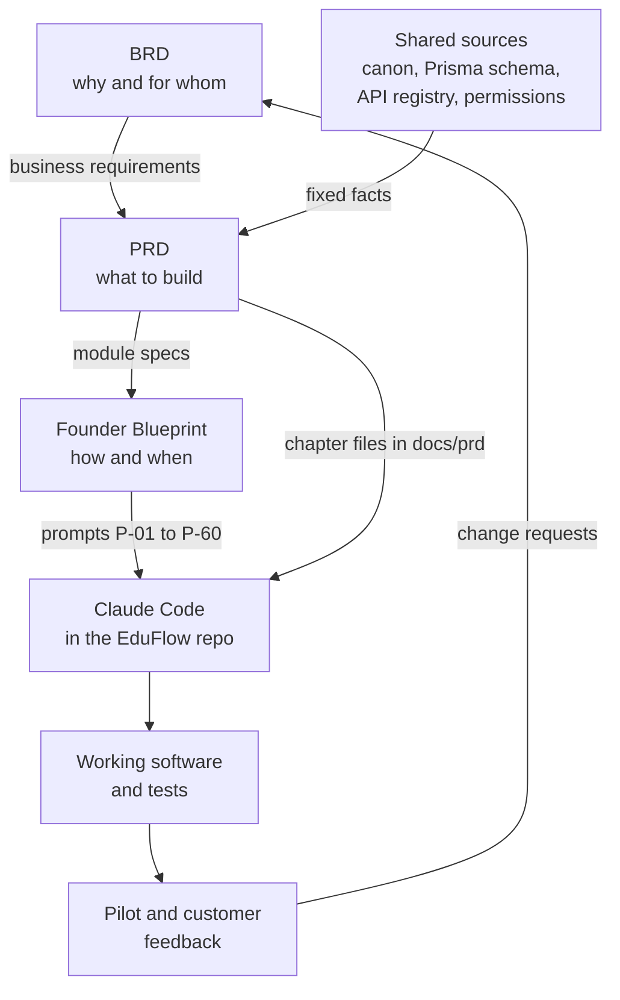
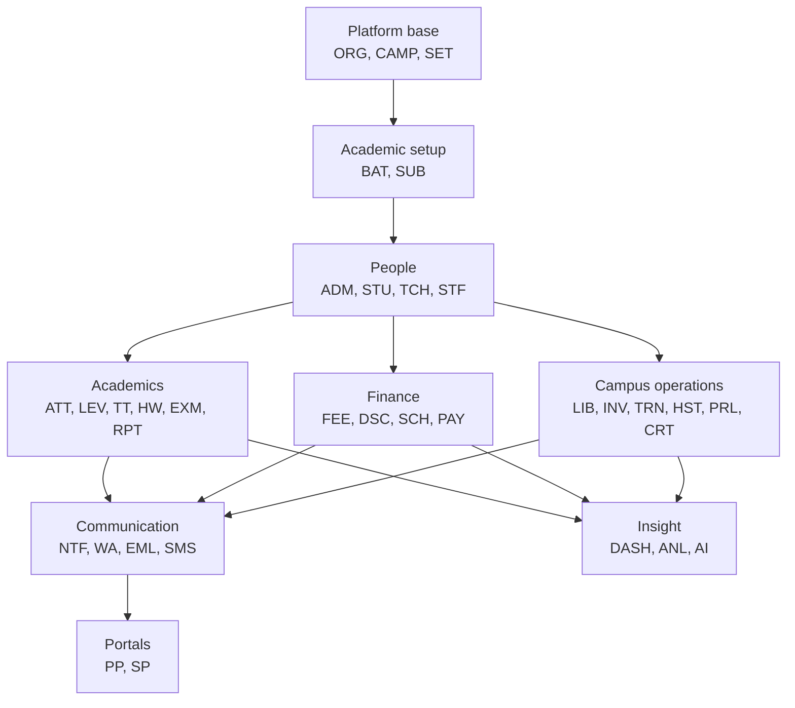
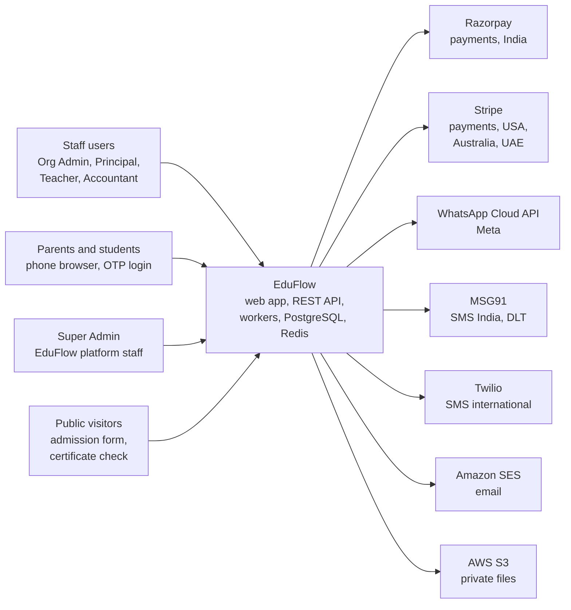
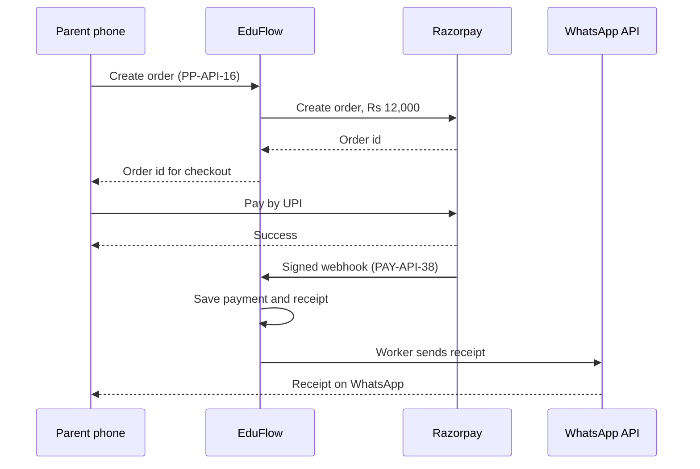

# Introduction and Product Overview

**In simple words:** This chapter is the front door of the PRD. It explains what EduFlow is, who it is for, what we will build and what we will not build. It also explains the IDs, words and symbols that every later chapter uses. Read it once before any module chapter, and the rest of the document becomes easy to follow.

| Item | Value |
|---|---|
| Product | EduFlow, a multi-tenant SaaS ERP for schools and coaching institutes |
| Document | Product Requirements Document (PRD), version 1.0, 20 September 2026 |
| Owner | Mehdi Alam (solo founder), prepared with Claude Code (Anthropic) |
| Product size | 34 modules in 4 release phases; 7 system roles plus custom roles |
| Database size | 189 Prisma models and 186 enums in 14 schema files |
| API size | 1,250 REST endpoints in 37 groups under `/api/v1` |
| MVP build window | Day 1 = 5 Oct 2026 to Day 60 = 3 Dec 2026 |

## Purpose of This PRD

A PRD (product requirements document) says exactly what the product must do. It is written before the code, so that a builder never has to guess.

EduFlow is built by a solo founder with Claude Code (an AI assistant that writes code from written instructions). If the text is vague, the code is wrong. So this PRD goes down to the field, the error message and the endpoint.

This PRD decides seven things:

1. Which modules exist, what each one does, and in which phase it ships.
2. What every main screen shows, and what each button does.
3. The rules and calculations, with worked examples.
4. The database: every table, column, enum and unique key.
5. The API (application programming interface — the URLs that the web app calls on the server): every endpoint with its ID, method, path and permission.
6. Who can do what: the permission keys and the seven roles.
7. The quality bar: security, privacy, speed, backups, languages and tests.

Why we build EduFlow, the price list and the sales plan belong to the BRD. The daily build plan, the Claude Code prompts and the deployment steps belong to the Founder Blueprint.

In daily work the PRD is the build spec that Claude Code reads, the review contract (`PAY-AC-03` passes or fails; there is no "almost") and the test checklist.

> **Rule:** If a behaviour is not written in this PRD, it is not in scope. When a new need appears, first change the PRD chapter, then change the code. Never the other way round.

## Audience

| Reader | What they look for | Best starting point |
|---|---|---|
| Founder (Mehdi Alam) | What to build next; when a module is "done" | This chapter, then *Release Plan and Plan Gating* |
| Claude Code | Exact models, endpoints, rules and error messages | `docs/canon.md`, then one module chapter |
| Future engineers and technical reviewers | How the system is put together; weak points in security and data | *System Architecture*, *Security Architecture* |
| Domain reviewer (pilot owner or principal) | Whether a workflow matches a real institute | *Users, Roles and Key Journeys* |
| Tester | What to test, and the expected result | Acceptance Criteria and Test Scenarios of a module |

The main reader is a first-time founder. So every chapter explains each new term once, in brackets. The *Glossary* holds all terms in one list.

## How the Three Documents Fit Together

| Document | Question it answers | You open it when |
|---|---|---|
| Business Requirements Document (BRD) | Why do we build this, for whom, and how do we earn? | You decide scope, price or priority |
| Product Requirements Document (PRD) | What exactly do we build? | You build, review or test a feature |
| Founder Blueprint | How do we execute, day by day? | You plan the day, or run a prompt |

**Figure: How the three documents and the code connect**



The BRD states a business need. The PRD turns it into stories, rules, tables and endpoints. The Blueprint turns PRD chapters into daily prompts. Pilot feedback goes back to the BRD first, so scope stays under control.

Traceability means we can follow one line from a business need down to a test. This example uses real IDs:

| Step | Item | ID | Where it lives |
|---|---|---|---|
| 1 | Need: a numbered fee receipt in under 60 seconds | `BR-072` | BRD, *Business Requirements Catalog* |
| 2 | Story and acceptance criteria for counter collection | `PAY-US-..`, `PAY-AC-..` | *Payments Module* |
| 3 | Endpoint: record a counter payment, issue the receipt | `PAY-API-02` | Endpoint registry |
| 4 | Permission that the endpoint checks | `fees.collect` | *RBAC and Permissions Matrix* |
| 5 | Prompt that builds it | `P-25` | Blueprint, *Prompts: Finance and Communication* |
| 6 | Test scenario and automated test | Row in Test Scenarios | *Payments Module* |

The Markdown sources are also the working specs inside the code repository: `docs/canon.md`, `docs/prd/<chapter>.md`, `docs/schema/*.prisma` (copied to `server/prisma/schema/`), `docs/api/*.md` and `docs/permissions.md`.

> **Rule:** When two sources disagree, the higher one in this list wins and the lower one is a bug to fix: (1) the canon, (2) the Prisma schema, (3) the endpoint registry, (4) the permission registry, (5) the module chapter, (6) any overview chapter, including this one.

## How to Read This PRD

You do not need to read from cover to cover. Pick the path that fits your task.

| Your task | Read in this order |
|---|---|
| Build a module | Canon, this chapter, the module chapter, its `.prisma` file, its registry section, the Blueprint prompt |
| Understand the whole system | This chapter, *Users, Roles and Key Journeys*, *System Architecture*, *Database Design Overview* |
| Check that a workflow is realistic | *Users, Roles and Key Journeys*, then Workflow, Screens and Edge Cases of the module |
| Review security and privacy | *Multi-Tenancy and Data Isolation*, *Authentication and Sessions*, *Security Architecture*, *Privacy and Compliance* |

All 34 module chapters start with a facts table (code, phase, plans, main users, dependencies, main tables). Then they use exactly these sections, in this order:

| Section | Question it answers |
|---|---|
| Objective | Why does this module exist? |
| Scope | What is in, what is out, what comes in a later phase? |
| User Stories | Who wants what, and why? |
| Workflow | In which order do things happen, and which status follows which? |
| Screens and Wireframes | What does the user see? ASCII wireframes with notes |
| UI Components | Which reusable pieces build the screens? |
| Validation Rules | Which input is accepted, and what exact error text is shown? |
| Business Rules | Which rules and formulas apply? With worked examples |
| Acceptance Criteria | How do we know it is done? Given, When, Then |
| Edge Cases | What happens in unusual situations? |
| Database Schema | Which tables, columns and indexes store the data? |
| Prisma Schema | The exact models and enums from the validated schema |
| API Endpoints | Every endpoint; full examples for the important ones |
| Permissions | Which role may use which permission key? |
| Notifications and Events | Which message goes out, on which channel, to whom? |
| Reports and Exports | Which reports and downloads does the module give? |
| Non-Functional Notes | Speed, audit logging, caching, jobs, plan limits, languages |
| Test Scenarios | Step-by-step tests with the expected result |

> **Tip:** A Claude Code prompt works best when it names files and IDs, not ideas. Keep one module, and at most 8 to 10 endpoints, in one prompt.

**Example: a prompt that uses the PRD files and IDs**

```text
Read docs/canon.md and docs/prd/26-payments-module.md.
Read the models Payment, PaymentAllocation and Receipt in
server/prisma/schema/09-payments.prisma.

Implement PAY-API-01 to PAY-API-05 exactly as written:
- route, Zod validation, service and repository layers
- permission check from the "Permission" column
- canon response envelope and canon error codes
- one Vitest + Supertest file that covers the acceptance
  criteria of counter collection

Do not add fields, tables or endpoints that are not in the docs.
```

## Product Overview

EduFlow is one simple system to run a school or coaching institute: admissions, attendance, fees, exams, staff and parent communication. Three terms describe it:

- **SaaS** (software as a service — used in a browser, paid by subscription, nothing to install).
- **ERP** (enterprise resource planning — one system for all the daily office work of an organization).
- **Multi-tenant** (many customers share one running copy of the software, but each sees only its own data). One customer is one tenant. In EduFlow a tenant is an `Organization`.

Today a typical institute runs on paper registers, Excel sheets, a Tally file and several WhatsApp groups. The same student name is typed in five places. Nobody knows today's collection until the evening. EduFlow keeps one record per student, and every module reads that record.

Phase 1 delivers one complete loop. Every later module plugs into it.

| Step | What happens | Modules |
|---|---|---|
| 1. Set up | Owner signs up; adds campuses, academic year, courses, batches, subjects | Organizations, Multi Campus, Batch, Subjects, Settings |
| 2. Admit | Inquiry, application, admission; or Excel import of existing students | Student Admission, Student Profile |
| 3. Teach | Teachers are linked to batches; attendance is marked on a phone | Teachers, Attendance |
| 4. Bill | Fee structures create invoices with due dates; discounts apply by rule | Fees, Discounts |
| 5. Collect | Counter or online payment; numbered receipt PDF | Payments |
| 6. Inform | Absent alerts, reminders and receipts go out; parents see all of it | Notifications, WhatsApp, Parent Portal |
| 7. Review | Owner sees today's attendance, collection and dues by campus | Dashboard |

> **Example:** A day at Bright Future Public School, Lucknow. At 08:05 teacher Priya Nair marks Class 10-A on her phone: 38 of 40 present. At 08:06 two parents get a WhatsApp absent alert. At 11:30 accountant Suresh Gupta collects ₹12,000 for Aarav Sharma (`BF-2027-0142`) and prints the receipt in under a minute. At 14:00 Sunita Devi sees the receipt in the Parent Portal. At Sharma Classes in Patna, owner Rajesh Sharma runs the same loop. Only the labels change: "Morning Batch M1" in place of "Section 10-A".

Staff use a Next.js web app at `app.eduflow.app` or `{slug}.eduflow.app`. Parents and students use mobile-first portal pages in the same app, with OTP login (a one-time password sent to the phone). Both talk to one Express REST API at `api.eduflow.app/api/v1`. BullMQ workers run slow work in the background: messages, PDFs, imports and reports. The design is in *System Architecture*.

## The Two Customer Types

EduFlow serves two customer types from one codebase and one database schema. Coaching institutes come first, because the owner decides alone and fast. K-12 private schools are the larger, more stable segment. Colleges and training centres come later.

| Topic | K-12 private school | Coaching institute | How EduFlow handles both |
|---|---|---|---|
| Sample customer | Bright Future Public School, Lucknow, 1,200 students, 2 campuses | Sharma Classes, Patna, 350 students, JEE and NEET | Same product; different `Organization.type` |
| Structure | Class, then Section; April to March | Program, then Batch; batches start in any month | `Course` and `Batch` inside an `AcademicYear` |
| Admissions | Seasonal; application, documents, quotas | All year; inquiry, demo class, quick enrolment | One inquiry pipeline; demo stages are optional |
| Attendance | Once a day, or per period | Per lecture | `AttendanceSession` for a day or period; `ClassSession` for a dated lecture |
| Fees | Yearly structure in installments; tuition usually GST exempt | Course fee in 2 to 4 installments; GST 18% | Tax is a setting on each fee head |
| Exams | Unit tests, half-yearly, final; board-style report cards | Weekly tests and mock tests with ranks | Exam types and report card styles cover both |

### Shared Domain Language

The database and the API use one neutral word for each concept. The screen shows the customer's own word. This table comes from the canon.

| Concept | Model | School label | Coaching label |
|---|---|---|---|
| Tenant | `Organization` | School / School group | Institute |
| Branch | `Campus` | Campus / Branch | Centre / Branch |
| Session | `AcademicYear` | Academic year 2027-28 | Session 2027-28 |
| Grade or program | `Course` | Class 10 | JEE Main 2028 |
| Teaching group | `Batch` | Section 10-A | Morning Batch M1 |
| Student joins a batch | `Enrollment` | Enrolled in 10-A | Enrolled in M1 |
| Guardian | `Guardian` | Parent | Parent |

The field `Organization.type` holds one value of the enum `OrganizationType`. The login page gets the type from `GET /auth/tenant` (`AUTH-API-11`). After login the app gets it from `GET /auth/me` (`AUTH-API-14`). A small dictionary in the `shared/` workspace maps the type to the screen words.

```typescript
// shared/src/labels.ts
export type OrganizationType = 'SCHOOL' | 'COACHING' | 'COLLEGE' | 'TRAINING_CENTRE';

export type LabelKey = 'organization' | 'campus' | 'academicYear' | 'course' | 'batch';

const LABELS: Record<OrganizationType, Record<LabelKey, string>> = {
  SCHOOL: {
    organization: 'School', campus: 'Campus', academicYear: 'Academic year',
    course: 'Class', batch: 'Section',
  },
  COACHING: {
    organization: 'Institute', campus: 'Centre', academicYear: 'Session',
    course: 'Program', batch: 'Batch',
  },
  COLLEGE: {
    organization: 'College', campus: 'Campus', academicYear: 'Academic year',
    course: 'Program', batch: 'Section',
  },
  TRAINING_CENTRE: {
    organization: 'Training centre', campus: 'Centre', academicYear: 'Session',
    course: 'Course', batch: 'Batch',
  },
};

export function label(type: OrganizationType, key: LabelKey): string {
  return LABELS[type][key];
}
```

The `COLLEGE` and `TRAINING_CENTRE` words are an assumption of this chapter. They are not sold in Year 1, so they can still change.

> **Rule:** Labels change only on screens, PDFs and message templates. Table names, API paths, permission keys and IDs never change. `/batches` is `/batches` for a school and for a coaching institute. Module chapters write the neutral word and show the school label in wireframes, unless the screen is coaching-specific.

## Product Goals

The goals turn the mission ("affordable, enterprise-grade software they can start using within one day") into things the product must prove. The numbers are Year 1 targets from the canon and the BRD. They are targets, not forecasts. The IDs `PG-01` to `PG-08` are used only in this chapter.

| ID | Goal | What the product must do | Measure and target |
|---|---|---|---|
| PG-01 | Live in one day | Self-signup, setup checklist, Excel import, seeded roles and templates | 60% reach a first receipt or attendance within 7 days |
| PG-02 | Daily tasks under a minute | Few fields, keyboard-friendly counter, one-tap attendance | Attendance for 40 students, or a fee receipt, under 60 seconds |
| PG-03 | Parents always know | Automatic absent alerts, receipts and results; one portal per family | 70% parent portal adoption |
| PG-04 | Fees come in faster | Pay links on WhatsApp, UPI, reminders around the due date | 40% of fee value collected online |
| PG-05 | One product for schools and coaching | One data model; labels by organization type; optional modules | Zero customer-specific code branches |
| PG-06 | No tenant sees another tenant's data | `organization_id` everywhere, Prisma extension, PostgreSQL RLS, isolation tests | Zero cross-tenant leaks, always |
| PG-07 | Ship on the fixed dates | Thin slices per module; scope frozen per phase | 16 modules by 3 Dec 2026; 12 more by 1 Feb 2027 |
| PG-08 | World ready without a rewrite | Currency, timezone, locale and tax per organization; providers behind interfaces | UAE entry in Year 2 needs settings, not new tables |

The time targets in PG-02 come from the BRD chapter *Business Requirements Catalog*. All quality targets of the product are in *Non-Functional Requirements*.

## Non-Goals

A non-goal is something we choose not to build, even if a customer asks. The business reasons are in the BRD chapter *Business Objectives, Scope and Stakeholders*. This table gives the product view.

| Non-goal | Why | What the product offers instead |
|---|---|---|
| Live classes, video hosting, selling content | A different product; free tools exist | A Zoom, Meet or YouTube link in Homework, study material or a notice |
| Online test engine with a question bank | A large product by itself | Marks of offline tests are entered in Exams |
| Full accounting and statutory filing (ledger, PF, ESI, TDS, UDISE+) | Accountants use Tally; formats change often | Excel and CSV exports; Payroll gives the figures, the CA files them |
| Selling or supporting biometric, RFID or GPS hardware | Hardware needs field staff | Web and phone marking; the attendance `source` field is ready for devices |
| On-premise install, or one database per customer | Breaks the one-codebase SaaS model | Cloud only; shared database with strict isolation |
| Custom code for one customer | Kills speed for a solo founder | Settings, custom fields, custom roles, templates; API access on Enterprise |
| Storing card numbers | Not allowed by our own rule | Razorpay and Stripe hold card data; EduFlow stores gateway IDs only |
| Ads to children, tracking children, sale of data | Against the DPDP Act and our principles | Never offered |
| Native mobile apps before Phase 4 | One web codebase is what a solo founder can keep healthy | Mobile-first web pages; white-label apps in Phase 4 |

Three technical non-goals also apply: no microservices (EduFlow is one modular monolith — one deployable API with clear module folders), no GraphQL or NoSQL (REST over JSON, PostgreSQL), and no offline mode in Year 1 (assumption of this chapter). *System Architecture* explains the rejected alternatives.

## Product Principles

The canon gives five guiding principles. Each one becomes a rule that a reviewer can check on a screen or in the code.

| Principle | Rule in the product | How we check it |
|---|---|---|
| Simplicity | One screen, one job; a new organization works without changing a setting | A teacher or accountant works alone after one 45-minute session |
| Automation | The system does repetitive work; a person can preview, pause and audit it | Invoices, reminders, alerts and receipts go out without a click |
| Transparency | Parents see their own child's records the same day | Every absence, due, payment and result reaches the parent |
| Scalability | Every list is paged; every heavy task is a background job | The same screens work for 50 students and for 5,000 |
| Security | Tenant safety before features; permissions are enforced on the server | No endpoint ships without an isolation test and a permission check |

Three working rules follow from the principles. Module chapters apply them, and code reviews check them.

1. **Right device for the role.** Teachers and parents get phone-first screens. Accountants and admins get desktop-first screens with keyboard shortcuts.
2. **Money is never edited silently.** An issued invoice is cancelled and reissued. A payment is cancelled or refunded, never deleted.
3. **Errors in plain words.** Every validation rule has the exact message the user sees, and the message says what to do next.

## The 34 Modules

A module is one area of work with its own screens, tables, endpoints and permission keys. Names, codes, order and phases are fixed by the canon. The module code is the prefix of every ID in that module (`FEE-S01`, `FEE-API-01`). "Custom role" means a role that the organization creates itself.

| # | Module | Code | Phase | Purpose in one line | Main users |
|---|---|---|---|---|---|
| 1 | Dashboard | DASH | 1 | Role-based home page with today's numbers | Organization Admin, Principal, Accountant, Teacher |
| 2 | Organizations | ORG | 1 | Tenant signup, onboarding, subscription, plan limits, add-ons | Organization Admin, Super Admin |
| 3 | Multi Campus | CAMP | 1 | Branches and campus-wise access to data | Organization Admin, Principal |
| 4 | Student Admission | ADM | 1 | Inquiry, follow-up, application, conversion into a student | Front Desk (custom role), Principal |
| 5 | Student Profile | STU | 1 | Student record, guardians, documents, transfers, Excel import | Organization Admin, Principal, Teacher |
| 6 | Teachers | TCH | 1 | Teacher profiles, subjects they teach, batch assignments | Organization Admin, Principal |
| 7 | Staff | STF | 2 | Non-teaching staff, departments, designations, documents | Organization Admin, HR Manager (custom role) |
| 8 | Attendance | ATT | 1 | Student and staff attendance with absent alerts | Teacher, Principal, Parent |
| 9 | Leave | LEV | 2 | Staff leave balances and approvals; student leave requests | Teacher, Principal, Parent |
| 10 | Batch | BAT | 1 | Academic years, terms, courses, batches, enrollments, promotion | Organization Admin, Principal |
| 11 | Timetable | TT | 2 | Bell schedule, weekly timetable, rooms, substitutions | Principal, Teacher |
| 12 | Subjects | SUB | 1 | Subject master, subjects per course, teacher per batch | Organization Admin, Principal |
| 13 | Homework | HW | 2 | Homework, submissions, grading, study material | Teacher, Student, Parent |
| 14 | Exams | EXM | 2 | Exams, date sheets, marks entry, grade scales | Teacher, Principal |
| 15 | Report Cards | RPT | 2 | Templates, generation, remarks, PDF, publishing | Principal, Teacher, Parent |
| 16 | Fees | FEE | 1 | Fee heads, structures, installments, invoices, late fees | Accountant, Organization Admin |
| 17 | Payments | PAY | 1 | Counter and online payments, receipts, refunds, day close | Accountant, Parent |
| 18 | Discounts | DSC | 1 | Discount schemes and per-student discounts with approval | Accountant, Organization Admin |
| 19 | Scholarships | SCH | 2 | Schemes, applications, awards, credits to invoices | Organization Admin, Principal, Accountant |
| 20 | Parent Portal | PP | 1 | Parent's phone view: children, attendance, fees, notices | Parent |
| 21 | Student Portal | SP | 2 | Student's view: timetable, homework, results, library | Student |
| 22 | Notifications | NTF | 1 | Event-to-message engine, templates, in-app feed, announcements | All roles |
| 23 | WhatsApp | WA | 1 | WhatsApp Cloud API sending, templates, replies, credit wallet | Organization Admin, Principal |
| 24 | Email | EML | 2 | Email through Amazon SES, sender identities, bounces | Organization Admin |
| 25 | SMS | SMS | 2 | SMS through MSG91 (DLT) and Twilio, sender IDs, wallet | Organization Admin |
| 26 | Library | LIB | 3 | Catalogue, copies, issue and return, fines, reservations | Librarian (custom role), Student |
| 27 | Inventory | INV | 3 | Items, vendors, purchase orders, stock ledger, assets | Organization Admin, Store Keeper (custom role) |
| 28 | Transport | TRN | 3 | Vehicles, routes, stops, trips, boarding alerts | Transport Manager (custom role), Parent |
| 29 | Hostel | HST | 3 | Rooms, beds, allocation, roll call, visitors, out-pass | Hostel Warden (custom role), Parent |
| 30 | Payroll | PRL | 3 | Salary structures, monthly runs, payslips, loans | Accountant, HR Manager (custom role) |
| 31 | Certificates | CRT | 2 | Templates, requests, issue with QR verification | Principal, Organization Admin, Parent |
| 32 | Analytics | ANL | 2 | Standard reports, report builder, scheduled reports | Organization Admin, Principal |
| 33 | AI Insights | AI | 4 | Student risk scores, plain-language findings, questions in natural language | Organization Admin, Principal |
| 34 | Settings | SET | 1 | Organization settings, number sequences, custom fields, branding, privacy records | Organization Admin |

| Phase | Release | Dates | Modules | Codes |
|---|---|---|---|---|
| 1 | MVP | 5 Oct to 3 Dec 2026 (Day 1 to 60) | 16 | DASH, ORG, CAMP, ADM, STU, TCH, ATT, BAT, SUB, FEE, PAY, DSC, PP, NTF, WA, SET |
| 2 | V1.0 | 4 Dec 2026 to 1 Feb 2027 (Day 61 to 120) | 12 | STF, LEV, TT, HW, EXM, RPT, SCH, SP, EML, SMS, CRT, ANL |
| 3 | V1.5 | By June 2027 | 5 | LIB, INV, TRN, HST, PRL |
| 4 | V2.0 | By September 2027 | 1 | AI, plus international packs and white-label mobile apps |

The phase of a module never changes. A deeper feature inside a Phase 1 module may still arrive later; the module chapter marks it under "Phase notes" in Scope. Exit criteria, and the plan in which each module is sold, are in *Release Plan and Plan Gating*.

Three endpoint groups serve all modules and are not modules themselves. `AUTH` (26 endpoints: login, OTP, refresh, MFA, invitations) is described in *Authentication and Sessions*. `USR` (31 endpoints: users, roles, permission grants) is described in *RBAC and Permissions Matrix*. `CMN` (36 endpoints: files, imports, exports, audit logs, search, health, reference data) is listed in *API Endpoint Catalog*. The 34 modules hold 1,157 endpoints; with these groups the total is 1,250.

**Figure: Module layers (a lower layer needs the layers above it)**



Build order follows the arrows. A student needs a batch, and a batch needs an organization, a campus and an academic year. Fees and attendance need students. Portals and insight modules only read what other modules wrote. Modules call each other through service functions and events, never by writing into another module's tables.

## System Context

A system context diagram shows the product as one box, the people who use it, and the outside services it depends on.

**Figure: EduFlow system context**



Four kinds of people reach EduFlow through a browser. EduFlow reaches seven outside services. Payment, WhatsApp, SMS and email providers also call back with webhooks (a webhook is an HTTP call that a provider makes to our server when something happens, for example "payment captured"). Monitoring and hosting services are left out of the figure; see *System Architecture*.

| Service | Used for | Data that crosses | Webhook into EduFlow | First needed |
|---|---|---|---|---|
| Razorpay | Online fee payments in India into the institute's own account; EduFlow subscription billing | Amount, currency, order reference, payer contact | `PAY-API-38`, `ORG-API-30` | Phase 1 |
| Stripe | The same for USA, Australia and UAE, with Stripe Tax | Same as Razorpay | `PAY-API-39`, `ORG-API-30` | Phase 4, international packs |
| WhatsApp Cloud API | Absent alerts, reminders, receipts, notices, parent replies | Phone number, template name, variables, media link | `WA-API-23`, `WA-API-24` | Phase 1 |
| MSG91 | SMS in India with DLT-registered templates | Phone number, DLT template ID, variables | `SMS-API-18` | System OTP in Phase 1; SMS module in Phase 2 |
| Twilio | SMS outside India | Phone number, message text | `SMS-API-19` | First international customers |
| Amazon SES | Invitations, password reset, receipts, scheduled reports | Email address, subject, body, attachments | `EML-API-14` | System emails in Phase 1; Email module in Phase 2 |
| AWS S3 | Photos, documents, PDFs, import and export files | File bytes, sent from the browser with a pre-signed URL (`CMN-API-02`) | None | Phase 1 |

DLT (distributed ledger technology) is the TRAI system where every SMS sender name and message text must be registered before sending in India. A pre-signed URL is a short-lived link that lets the browser upload or download one file in a private S3 bucket.

Rules at the system boundary:

1. EduFlow never stores card numbers. It stores only the gateway's order and payment IDs.
2. Fee money settles in the institute's own gateway account (`PaymentGatewayAccount`). EduFlow never holds customers' fee money.
3. Every webhook is checked for a valid signature, saved in `webhook_events` and handled once only, even if the provider sends it twice.
4. Calls to WhatsApp, SMS and email providers run in BullMQ workers, not inside the user's request. Creating a payment order is the one exception, because the parent needs the order ID at once.
5. If a provider is down, the core keeps working. Counter collection and attendance need no outside service. Messages wait in the queue and retry.
6. Every provider sits behind a TypeScript interface, so it can change by country without touching module code. See *Integrations and Webhooks*.

**Figure: One request that crosses the boundary (a parent pays a fee online)**



Sunita Devi pays ₹12,000 for Aarav Sharma from the Parent Portal. The money goes from her UPI app to Razorpay, not through EduFlow. EduFlow trusts the signed webhook, not the browser, to mark the invoice paid. The full flow, with failures and retries, is in *Payments Module*.

## Assumptions and Constraints

An assumption is something we believe today without proof. A constraint is a limit we cannot remove. The BRD chapter *Business Objectives, Scope and Stakeholders* lists the business ones (`A-01` and `C-01` onwards): the solo founder, the 60-day window, the budget, the fixed dates. They are not repeated here. The product and technical ones below use `PA-` and `PC-`, so the two sets never mix.

| ID | Assumption | Effect on the product | If it is wrong |
|---|---|---|---|
| PA-01 | Staff and parents are online while they use EduFlow | No offline mode in Year 1 | Add an offline queue for attendance first |
| PA-02 | Every parent has a phone number that receives OTP and WhatsApp; one number may serve several children | OTP login; siblings grouped by `Family` | Add a password or email login for parents |
| PA-03 | Each institute completes its own KYC with Razorpay | Online payment is off until a gateway account is active; counter collection always works | The 40% online target is reached later |
| PA-04 | System OTP and system emails are needed in Phase 1, before the SMS and Email modules ship | Phase 1 has a thin sender for OTP, invitations and password reset | Parent login and staff invitations fail in the pilot |
| PA-05 | The largest Year 1 tenant has about 5,000 students and 10 campuses (estimate) | Paged lists; dashboards read `daily_metric_snapshots`; heavy work runs in jobs | Revisit indexes and caching before adding hardware |

KYC (know your customer) is the identity and business check that a payment gateway does before it moves money for a business.

| ID | Constraint | What it means for the build |
|---|---|---|
| PC-01 | The stack is fixed by the canon; Prisma stays pinned to 6.x until after the MVP | No new framework, database or queue without a canon change |
| PC-02 | Shared database and shared schema | Every tenant table has `organization_id`, an index that starts with it, and unique keys per tenant |
| PC-03 | Law: DPDP parental consent, DLT for SMS, no card data, GST on taxable fees | Consent records are part of admission and portal flows from Phase 1 |
| PC-04 | Provider rules: Meta template approval, the 24-hour reply window, gateway KYC | Message templates are data, not code; approval status is stored and shown |
| PC-05 | Low-cost Android phones on 4G; old desktops at the fee counter | Light pages; main pages open in under 2 seconds on 4G |
| PC-06 | Plans and limits are fixed by the canon | Limits are checked on the server; a breach returns `PLAN_LIMIT_REACHED` (403) |

## Definition of Terms Used in Every Module Chapter

### ID Formats

Every item that someone may need to point at has a permanent ID. `<CODE>` is the module code. `nn` is a two-digit number that starts at 01.

| Item | Format | Example | Where the list lives |
|---|---|---|---|
| Screen | `<CODE>-Snn` | `FEE-S02` | Module chapter; all screens in *Screen Inventory* |
| User story | `<CODE>-US-nn` | `FEE-US-01` | Module chapter, User Stories |
| Business rule | `<CODE>-BR-nn` | `FEE-BR-01` | Module chapter, Business Rules |
| Acceptance criterion | `<CODE>-AC-nn` | `FEE-AC-01` | Module chapter, Acceptance Criteria |
| API endpoint | `<CODE>-API-nn` | `FEE-API-01` | Endpoint registry; *API Endpoint Catalog* |
| Business requirement | `BR-nnn` | `BR-072` | BRD, *Business Requirements Catalog* |
| Risk | `R-nn` | `R-01` | BRD |
| Claude Code prompt | `P-nn` | `P-25` | Founder Blueprint, prompt chapters |
| Permission key | `module.action` | `fees.collect` | *RBAC and Permissions Matrix* |
| Event name | Lower-case words joined by dots | `payment.captured` | *Background Jobs and Events* |

> **Warning:** `FEE-BR-01` and `BR-001` are different things. An ID with a module code in front is a business rule inside this PRD. `BR-` with three digits and no module code is a business requirement in the BRD.

Rules for IDs:

1. An ID is never reused and never renumbered. A removed item keeps its ID with the note "Removed in version x".
2. A new item takes the next free number at the end of its list.
3. Endpoint IDs, paths and permission keys come only from the endpoint registry. A chapter never invents one.
4. Use IDs in prompts, commit messages and test titles, so that a search for `PAY-AC-03` finds the spec, the code and the test.

### Priorities

User stories carry one of three priorities. The words match the MoSCoW method of the BRD. The priority is judged inside the phase in which the module ships.

| Priority | Meaning | When time is short |
|---|---|---|
| Must | The module cannot go live without it | Never dropped; another item leaves |
| Should | Important, but a workaround exists for a few weeks | Ships in the first update after the phase |
| Could | Nice to have; few users would notice in the first month | First to be dropped |

"Won't" items are not user stories. They are listed under "Out of scope" in the Scope section. In requirement sentences, "must" means mandatory, "should" means expected unless the chapter gives a reason, and "may" means optional.

### Status Words

A status says where a record is in its life. Status values are enum values from the Prisma schema. They are written in code font, exactly as stored (`COMPLETED_WITH_ERRORS`). The screen shows normal words ("Completed with errors"). Three shared enums appear in many modules:

| Enum | Values | Used for |
|---|---|---|
| `RecordStatus` | `ACTIVE`, `INACTIVE`, `ARCHIVED` | Master data such as subjects and fee heads |
| `ApprovalStatus` | `PENDING`, `APPROVED`, `REJECTED`, `CANCELLED` | Anything that needs a second person |
| `JobStatus` | `QUEUED`, `PROCESSING`, `COMPLETED`, `COMPLETED_WITH_ERRORS`, `FAILED`, `CANCELLED` | Imports, exports, bulk runs |

Most modules also have their own status enum, for example `StudentStatus` or `ExamStatus`. The Workflow section of the module chapter shows the allowed moves. These words mean the same thing everywhere:

| Word | Meaning |
|---|---|
| `DRAFT` | Saved, visible only to staff who can edit it, free to change |
| `PUBLISHED` | Visible to parents or students; changes are limited and logged |
| `INACTIVE` | Cannot be chosen for new records; old records still show it |
| `ARCHIVED` | Read-only history; hidden from normal lists |
| `LOCKED` | Final; nobody can change it |
| Soft-deleted | `deletedAt` is set; hidden from every list and API; kept for audit |

Invoices, payments and receipts are never deleted, not even softly. They are cancelled or refunded with a reason.

### Matrix Cell Words

| Word | Meaning in a permission matrix | Stored scope |
|---|---|---|
| `Yes` | Allowed on all records of the organization | `ALL` |
| `Campus` | Allowed for the user's assigned campuses only | `CAMPUS` |
| `Own` | Own records only: a teacher's batches, a parent's children | `OWN` |
| `View` | Read only | `VIEW` |
| `No` | Not allowed | No row |

The scopes are the values of the enum `PermissionScope`, stored on each `RolePermission` row. RBAC (role-based access control) means a user gets permissions through roles, not one by one. Plan and feature matrices use `Yes` (included), `No` (not included), `Partial` (included with a limit that a note explains) and `Add-on` (available for an extra price).

### Words in Endpoint Tables

| Word | Meaning |
|---|---|
| `public` | No access token; rate-limited and protected by a captcha, a signature or a one-time token |
| `self` | Any signed-in user, acting on the own account only |
| `(IK)` | The `Idempotency-Key` header is required; the same request sent twice has the effect of one |
| `202 Accepted` | An import or export job was created; the client polls the job for the result |

`PATCH` is a partial update. `PUT` replaces a whole set. `DELETE` is a soft delete unless the chapter says otherwise. Error tables use only the eleven canon error codes, explained in *Error Codes*.

## Document Conventions

All chapters use the same sample names, so examples connect across chapters: Bright Future Public School (Lucknow, 1,200 students, 2 campuses), Sharma Classes (Patna, 350 students, JEE and NEET), owner Rajesh Sharma, principal Dr. Anita Verma, teacher Priya Nair, accountant Suresh Gupta, parent Sunita Devi and student Aarav Sharma (Class 10-A, admission no. `BF-2027-0142`).

| Topic | Convention | Example |
|---|---|---|
| Money in text | ₹ with Indian digit grouping; lakh and crore | ₹12,000; ₹6 lakh; ₹3.6 crore |
| Money in wireframes | `Rs`, because wireframes are plain ASCII | `Rs 12,000` |
| Money in the API | Decimal string with two places, plus a currency code | `"amount": "12000.00", "currency": "INR"` |
| Dates in text | Day, short month, year | 20 Sep 2026 |
| Dates in the API | ISO 8601 in UTC; pure calendar dates as `YYYY-MM-DD` | `2027-07-10T05:30:00.000Z` |

Business numbers are always labelled. A "Target" is a number we aim for. An "Estimate" is our best guess from public information. An "Assumption" is a value we chose so that the plan can be calculated.

### JSON Examples

Every JSON example uses the canon response envelope (the fixed outer shape of every API answer). A list answer has `meta`. A single-record answer has none.

```json
{
  "success": true,
  "data": [
    {
      "id": "7f3b2c1e-5a4d-4e8f-9b6a-2d1c0e9f8a7b",
      "admissionNo": "BF-2027-0142",
      "firstName": "Aarav",
      "lastName": "Sharma",
      "status": "ACTIVE"
    }
  ],
  "meta": { "page": 1, "limit": 20, "total": 134, "totalPages": 7 }
}
```

An error answer always has the same shape, with a `requestId` that support can search in the logs:

```json
{
  "success": false,
  "error": {
    "code": "VALIDATION_ERROR",
    "message": "Please correct the highlighted fields.",
    "details": [{ "field": "phone", "issue": "Invalid phone number" }]
  },
  "requestId": "req_8f3a2b7c9d10"
}
```

The same shapes exist once as TypeScript types in the `shared/` workspace. The client and the server both import them.

```typescript
// shared/src/api-envelope.ts
export type ErrorCode =
  | 'VALIDATION_ERROR' | 'UNAUTHENTICATED' | 'TOKEN_EXPIRED' | 'FORBIDDEN'
  | 'PLAN_LIMIT_REACHED' | 'NOT_FOUND' | 'CONFLICT' | 'BUSINESS_RULE_VIOLATION'
  | 'RATE_LIMITED' | 'INTERNAL_ERROR' | 'SERVICE_UNAVAILABLE';

export interface PageMeta {
  page: number;
  limit: number;
  total: number;
  totalPages: number;
}

export interface ApiSuccess<T> {
  success: true;
  data: T;
  meta?: PageMeta; // present only on list responses
}

export interface ApiFailure {
  success: false;
  error: {
    code: ErrorCode;
    message: string;
    details?: Array<{ field: string; issue: string }>;
  };
  requestId: string;
}

export type ApiResponse<T> = ApiSuccess<T> | ApiFailure;
```

Examples in module chapters show only the fields that matter for the point being made. The Prisma model is the full field list. Headers, paging, sorting and filters are in *API Standards and Conventions*.

### Callouts, Code Blocks and Wireframes

Callouts are short boxed notes with a fixed label. **Note** and **Tip** help understanding. **Warning** marks a mistake that costs money, data or trust. **Best practice** gives the recommended way. **Example** is a worked case with the sample data. **Founder note** is a decision the founder must take. **Rule** is something the product or the team must always follow.

Code blocks name their language. A `prisma` block is copied from the validated schema and is the source of truth for tables. A `typescript` or `tsx` block is a pattern to follow, not always the full file. An `sql` block holds what Prisma cannot express: RLS policies, partial unique indexes and check constraints. A `text` block is an ASCII wireframe or an example prompt.

Wireframes show layout and content, not pixel design. `[Save]` is a button. `[Value v]` is a dropdown. `[x]` and `[ ]` are checkboxes. `(o)` and `( )` are radio buttons. `[________]` is a text input. A `<` after a sidebar item marks the current page. Desktop wireframes are 76 characters wide; phone wireframes are about 38. Colours and components are in *Design System and UX Guidelines*.

### Cross-References and Changes

Other chapters are named by their title in italics, for example *Fees Module*. Chapter and page numbers are never used, because the PDF builder numbers them by itself. Links appear only in a "Sources" list at the end of a chapter that used outside research. This chapter used none.

This PRD is version 1.0, the baseline for execution, reviewed every quarter. A change follows a fixed order. First change the canon, if a canon fact changes. Then change the PRD chapter, and the Prisma schema or the registries if they are touched (run `prisma validate`). Add a line to the revision table. Only then give Claude Code the prompt that changes the code.
