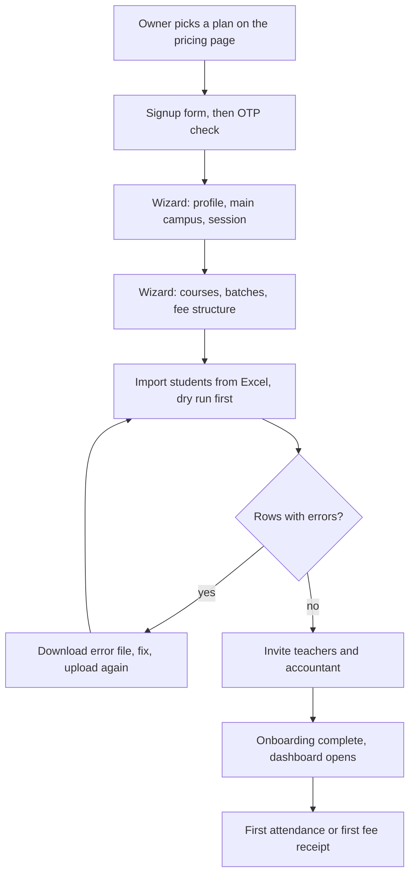
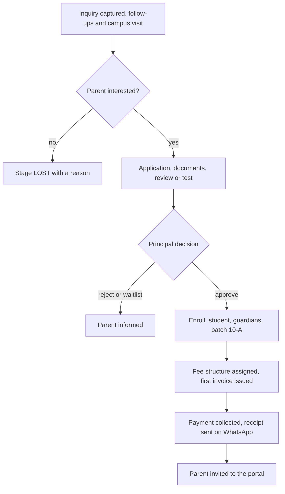
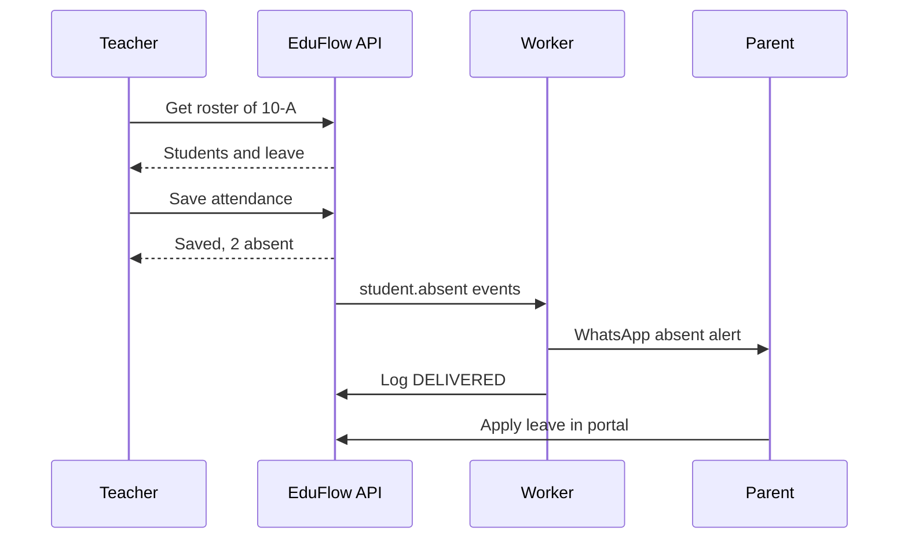
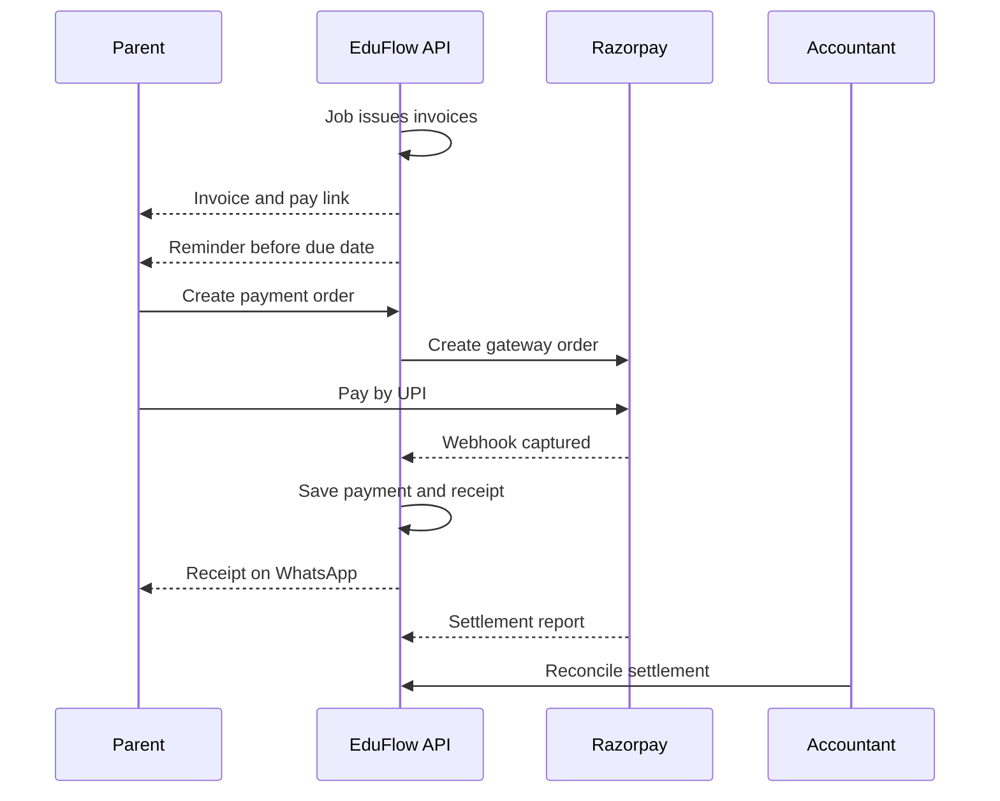
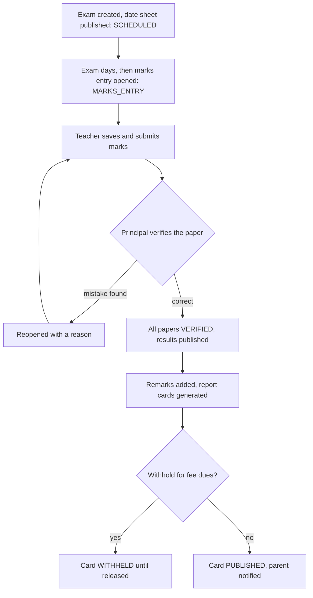
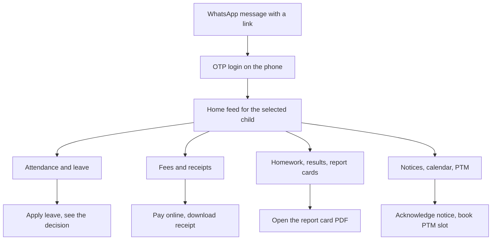
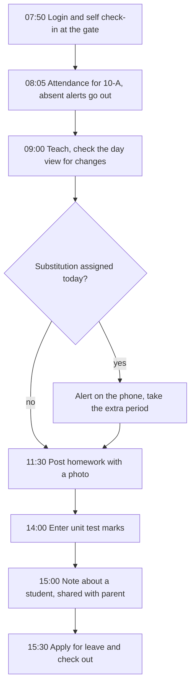
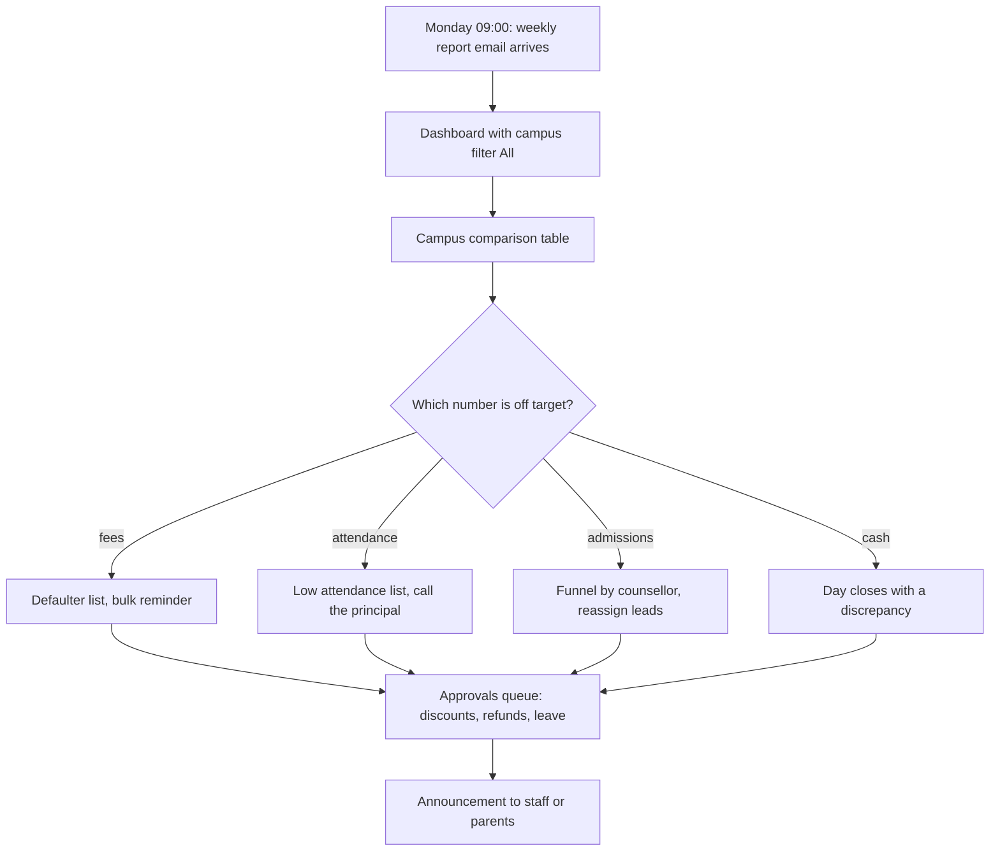
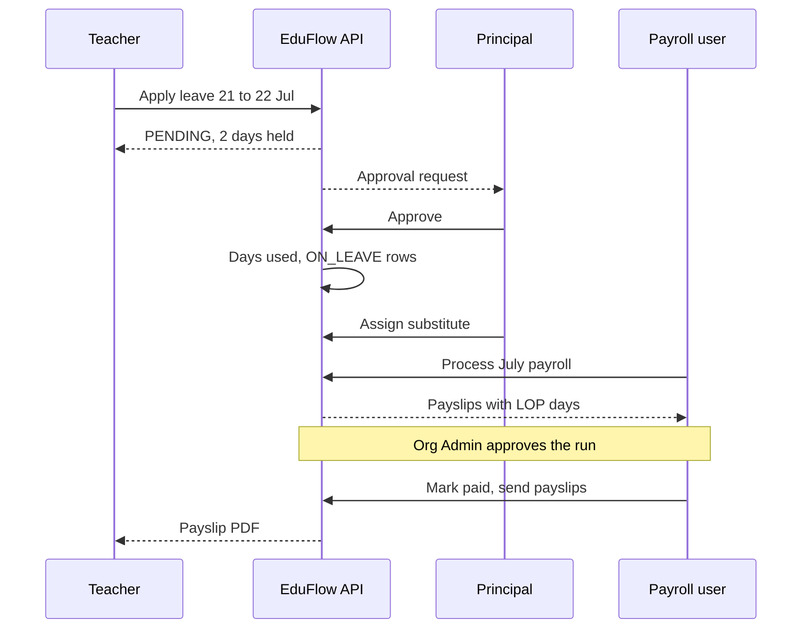
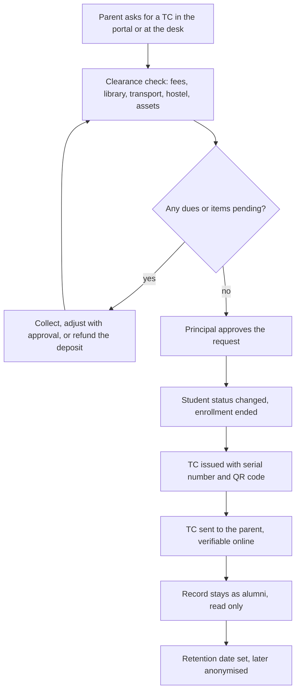

# Users, Roles and Key Journeys

**In simple words:** This chapter explains who uses EduFlow and what each person may and may not do. It covers the seven fixed roles, the custom roles an institute can build, and how a school differs from a coaching institute. Then it walks through the ten most important journeys from start to finish, so that every module chapter can be tested against real daily work.

> **Note:** Endpoint IDs such as `ATT-API-02` come from the endpoint registry. Request and response details live in the module chapters. This chapter only shows how the pieces join into one journey.

## Who Uses EduFlow

Every login is one row in the `users` table. The column `user_type` decides which door the person uses and which roles the person may hold.

| User type | Who it is | Roles it can hold | How they log in | Main device |
|---|---|---|---|---|
| `STAFF` | Owner, principal, teachers, accountant, front desk, librarian | `ORG_ADMIN`, `PRINCIPAL`, `TEACHER`, `ACCOUNTANT`, custom roles | Email or phone plus password; MFA optional | Laptop at the desk; phone for teachers |
| `PARENT` | Father, mother or guardian | `PARENT` | OTP on the phone | Phone |
| `STUDENT` | The learner | `STUDENT` | OTP on the phone | Phone |
| `PLATFORM` | EduFlow support and operations staff | `SUPER_ADMIN` | Password plus mandatory MFA | Laptop |

MFA (multi-factor authentication) means a second code after the password. OTP (one-time password) is a short code sent to the phone, so parents never need to remember a password.

One person can have two logins in the same organization. Priya Nair is a teacher at Bright Future Public School, and her daughter studies there. She has one `STAFF` user and one `PARENT` user with the same phone number. The schema allows this because the unique key is `[organizationId, userType, phone]`. The login page asks which portal she wants to open.

## The Seven System Roles

The seven roles below are created by the seed script. They have `is_system = true` and `organization_id = NULL`, so all tenants share them. Nobody can edit or delete them. The sample people are used in every example of this document.

| Role key | Display name | Sample person | Data scope | Home screen |
|---|---|---|---|---|
| `SUPER_ADMIN` | Super Admin | EduFlow support engineer | All organizations | Platform console |
| `ORG_ADMIN` | Organization Admin | Rajesh Sharma (owner) | Whole organization, all campuses | Owner dashboard |
| `PRINCIPAL` | Principal | Dr. Anita Verma | Assigned campus(es) | Campus dashboard |
| `TEACHER` | Teacher | Priya Nair | Own batches and subjects | Teacher home (today's classes) |
| `ACCOUNTANT` | Accountant | Suresh Gupta | Finance data of assigned campus(es) | Fee counter home |
| `PARENT` | Parent | Sunita Devi | Own children only | Parent Portal home feed |
| `STUDENT` | Student | Aarav Sharma (10-A, `BF-2027-0142`) | Own record only | Student Portal home |

### Super Admin

The Super Admin is EduFlow staff, not a customer. In Year 1 this is the founder himself.

- **Can do:** list and open every tenant in the platform console, create a tenant for a sales-led deal, extend a trial, change a plan, suspend or reactivate a tenant, raise and refund subscription invoices, edit plans and prices, and see platform numbers such as MRR (monthly recurring revenue).
- **Can do with a reason:** enter one tenant through an impersonation session (`ORG-API-39`). The token is short-lived. Every action is written to the audit log with actor type `IMPERSONATION`.
- **Cannot do:** read tenant data without such a session, see any password, OTP or card number, change an audit log row, or log in without MFA.

### Organization Admin

This is the owner, director or head administrator. The user who signs up becomes the first `ORG_ADMIN` and the `ownerUserId` of the organization.

- **Can do:** everything inside the own organization, across all campuses. This includes plan and billing, campuses, users and roles, settings, payment gateway keys, fee structures, approvals of discounts, refunds and write-offs, payroll approval, and the audit log.
- **Cannot do:** see another organization, edit the seven system roles, go above the plan limits (students, campuses, staff users), delete a payment or a receipt (they can only be cancelled or refunded), or change an audit log row.

### Principal

The Principal is the academic head of one campus. In a coaching institute the same role is used for the centre head.

- **Can do:** in the assigned campus only, approve or reject admission applications, manage batches and the timetable, unlock an attendance session for correction, verify marks and publish results, publish or withhold report cards, approve staff leave and student transfers, send announcements, and view fee dues and collection reports.
- **Cannot do:** open a campus that is not in `user_campuses`, change fee structures or collect money, approve refunds or write-offs, see or change the EduFlow subscription, create roles, or open payroll figures.

### Teacher

- **Can do:** for batches where the teacher is class teacher or has a `BatchSubjectTeacher` row, mark attendance, post homework and study material, grade submissions, enter and submit exam marks, write report card remarks, add notes about a student, and view the student list with parent phone numbers. For the own record: check in and out, apply for leave, see leave balance and download payslips.
- **Cannot do:** see any other batch, see fee or payment data, edit the student master record (name, date of birth, guardians), correct attendance after the session is locked, verify or publish marks, read medical notes unless `students.view_medical` is granted, or export student lists.

### Accountant

- **Can do:** in the assigned campus, assign fee structures, generate and issue invoices, collect payments in every mode, print and send receipts, send fee reminders, record cheque bounces, request refunds and invoice adjustments, close the day's cash, reconcile gateway settlements, and run fee and payment reports. The Accountant can search students and open the fee ledger.
- **Cannot do:** approve the own refund, adjustment or day close (a second person with `payments.approve` or `fees.approve` does that), change payment gateway keys, mark attendance, enter marks, edit roles, or see another campus.

> **Rule:** Money actions use maker and checker. The person who requests a refund, a write-off or a discount is never the person who approves it. The registry keeps these as separate permission keys (`payments.refund` and `payments.approve`, `discounts.create` and `discounts.approve`).

### Parent

The Parent role holds one permission key, `parentportal.access`. The code then checks on every request that the child is linked to this guardian through `student_guardians` and that `hasPortalAccess` is true.

- **Can do:** switch between own children, see attendance, timetable, homework, exam dates, published results and report cards, see invoices and pay online, download receipts, apply for a child's leave, read and acknowledge notices, book a PTM (parent-teacher meeting) slot, request certificates, apply for scholarships, give or withdraw consent, and update the own phone, email and language.
- **Cannot do:** see any other student, see draft invoices or unpublished marks, change attendance or marks, change the child's name, date of birth or class (the office does that), or see staff data.

### Student

The Student role holds one key, `studentportal.access`. The student is resolved from the login, so no student ID is ever accepted from the request.

- **Can do:** see own timetable, attendance, homework, study material, exam dates, published results, report cards, notices, library loans and certificates, submit homework, and request a certificate. Fee invoices are read only.
- **Cannot do:** pay fees unless the organization setting allows student payments, apply for leave (the parent does that), edit the profile except photo and language, or see any other student. Product analytics are switched off for students (`analyticsOptOut` is forced to true for minors).

### Roles at a Glance

This table is a plain-language summary of the default grants. The key-by-key matrix is in *RBAC and Permissions Matrix*. `Yes` means the whole organization. For Super Admin, `Yes` means "possible through an audited support session", not daily use.

| Area | Super Admin | Org Admin | Principal | Teacher | Accountant | Parent | Student |
|---|---|---|---|---|---|---|---|
| Platform console, plans | Yes | No | No | No | No | No | No |
| Subscription and billing | Yes | Yes | No | No | No | No | No |
| Users, roles, settings | Yes | Yes | View | No | No | No | No |
| Campuses | Yes | Yes | Campus | No | No | No | No |
| Admissions | Yes | Yes | Campus | No | View | No | No |
| Student profiles | Yes | Yes | Campus | Own | View | Own | Own |
| Student attendance | Yes | Yes | Campus | Own | No | Own | Own |
| Homework and exam marks | Yes | Yes | Campus | Own | No | Own | Own |
| Publish results, report cards | Yes | Yes | Campus | No | No | No | No |
| Fee setup and invoices | Yes | Yes | View | No | Campus | Own | Own |
| Collect fees, receipts | Yes | Yes | No | No | Campus | Own | No |
| Approve discounts, refunds | Yes | Yes | No | No | No | No | No |
| Staff leave and attendance | Yes | Yes | Campus | Own | Own | No | No |
| Payroll | Yes | Yes | No | Own | Campus | No | No |
| Announcements | Yes | Yes | Campus | Own | No | View | View |
| Reports and analytics | Yes | Yes | Campus | Own | Campus | No | No |
| Audit log | Yes | Yes | No | No | No | No | No |

## How a Permission Check Works

A role is only a named bundle of permission keys. Each grant also carries a scope. The four scopes are stored in `role_permissions.scope` and map to the matrix words like this.

| Scope in database | Matrix word | Meaning | Example |
|---|---|---|---|
| `ALL` | Yes | Every record of the organization | Rajesh sees students of both campuses |
| `CAMPUS` | Campus | Records of campuses listed in `user_campuses` | Dr. Anita Verma sees only the Main Campus |
| `OWN` | Own | Records that belong to the user | Priya Nair sees only 10-A and 9-B |
| `VIEW` | View | Read only, no create, edit or delete | Suresh Gupta can open a student profile |

Every API request passes four gates in this order. The details are in *RBAC and Permissions Matrix*.

1. **Who are you?** No valid access token returns `UNAUTHENTICATED` or `TOKEN_EXPIRED` (401).
2. **Is the module in your plan?** If not, `PLAN_LIMIT_REACHED` (403).
3. **Do you hold the key?** For example `attendance.mark`. If not, `FORBIDDEN` (403).
4. **Is this record inside your scope?** The service adds the scope filter to the query. A record outside the scope returns `NOT_FOUND` (404), so the API never leaks that it exists.

The web app reads the same grants once after login from `GET /auth/me` (`AUTH-API-14`) and uses them to build the sidebar and hide buttons. The response below is shortened.

```json
{
  "success": true,
  "data": {
    "user": {
      "id": "7b1f6c1e-2a4d-4c8e-9f3a-5d2e8b7c1a90",
      "userType": "STAFF",
      "firstName": "Priya",
      "lastName": "Nair",
      "status": "ACTIVE"
    },
    "roles": [{ "key": "TEACHER", "name": "Teacher", "isSystem": true }],
    "permissions": [
      { "key": "attendance.mark", "scope": "OWN" },
      { "key": "homework.create", "scope": "OWN" },
      { "key": "exams.enter_marks", "scope": "OWN" },
      { "key": "students.view", "scope": "OWN" }
    ],
    "campuses": [
      { "id": "c2a94f10-6d3b-4e7a-8b21-0f9e8d7c6b5a", "name": "Main Campus", "isDefault": true }
    ],
    "planFeatures": ["module.ATT", "module.HW", "module.EXM", "custom_roles"]
  }
}
```

> **Warning:** Hiding a button is only for comfort. The server checks the key and the scope on every request, because anyone can call the API directly.

## Custom Roles

Seven roles do not fit every institute. A school with a library needs a Librarian. A coaching institute with three centres needs a Front Desk person in each. So an Organization Admin can build custom roles by picking permission keys.

| Item | Decision |
|---|---|
| Plans | Pro and Enterprise (plan feature `custom_roles`). Starter and Growth use the seven system roles only. |
| Who can create | Users with `roles.create`; by default only the Organization Admin |
| Holder type | `STAFF` users only. Parent and Student access stays fixed for child safety. |
| Stored in | `roles` (with the tenant's `organization_id`, `is_system = false`) and `role_permissions` |
| Fastest way | Clone a system role (`USR-API-22`), then add or remove keys (`USR-API-21`) |
| Many roles per user | Allowed. The user gets the union of all keys; for the same key the wider scope wins. |
| Delete | Only when no user holds the role (`USR-API-20`) |

Rules for custom roles:

1. A system role cannot be edited. To change what Principals may do, clone `PRINCIPAL` into "Principal Plus" and assign that instead.
2. A user can grant only keys that the user holds. This stops a Front Desk user with `roles.update` from making himself an admin.
3. Keys of modules outside the plan are greyed out in the picker (`USR-API-23` flags them). `platform.*` keys are never shown to tenants.
4. Every change emits `role.permissions.changed` or `user.roles.changed` and writes an audit log row. The affected users get the new rights at the latest when their 15-minute access token is renewed.

Suggested starter templates, shown in the "New role" dialog:

| Custom role | Typical holder | Main permission keys | Scope |
|---|---|---|---|
| Front Desk | Receptionist, admission counsellor | `admissions.view`, `admissions.create`, `admissions.update`, `students.view`, `certificates.create` | Campus |
| Librarian | Library in-charge | `library.view`, `library.create`, `library.update`, `library.issue`, `library.collect_fine`, `students.view` | Campus |
| Transport Manager | Transport in-charge | `transport.view`, `transport.create`, `transport.update`, `transport.manage`, `transport.assign`, `students.view` | Campus |
| Bus Attendant | Driver or attendant | `transport.mark` | Own |
| Hostel Warden | Warden | `hostel.view`, `hostel.allocate`, `hostel.mark`, `hostel.approve`, `students.view` | Campus |
| HR Manager | HR or office manager | `staff.view`, `staff.create`, `staff.update`, `staff.manage`, `leave.manage`, `attendance.mark_staff`, `payroll.view`, `payroll.process` | Yes |

**Example: set the keys of the Librarian role**

```http
PUT /api/v1/roles/5e0c2f4a-91b7-4d3e-8a6c-1f2b3c4d5e6f/permissions
Authorization: Bearer <accessToken>
Content-Type: application/json

{
  "permissions": [
    { "key": "library.view", "scope": "CAMPUS" },
    { "key": "library.issue", "scope": "CAMPUS" },
    { "key": "library.collect_fine", "scope": "CAMPUS" },
    { "key": "students.view", "scope": "VIEW" }
  ]
}
```

```json
{
  "success": true,
  "data": {
    "id": "5e0c2f4a-91b7-4d3e-8a6c-1f2b3c4d5e6f",
    "key": "LIBRARIAN",
    "name": "Librarian",
    "isSystem": false,
    "permissionCount": 4,
    "userCount": 1
  }
}
```

| Status | Code | When |
|---|---|---|
| 400 | `VALIDATION_ERROR` | Unknown permission key or scope, or an empty list |
| 403 | `FORBIDDEN` | Caller lacks `roles.update`, or tries to grant a key he does not hold |
| 403 | `PLAN_LIMIT_REACHED` | The plan has no `custom_roles` feature, or a key belongs to a module outside the plan |
| 404 | `NOT_FOUND` | The role belongs to another organization or does not exist |
| 422 | `BUSINESS_RULE_VIOLATION` | The role is a system role (`is_system = true`) |

## How School and Coaching Differ

EduFlow has one codebase and one data model for both. `Organization.type` changes the words on the screen and a few default settings. It never changes the tables.

| Topic | School (Bright Future Public School) | Coaching (Sharma Classes) | What changes in EduFlow |
|---|---|---|---|
| Words on screen | Class, Section, Academic year | Course, Batch, Session | Labels picked from `Organization.type` |
| Size and plan | 1,200 students, 2 campuses: Enterprise | 350 students, 1 centre: Pro | Plan limits only |
| Session | April to March, same for all | Tied to the target exam; batches start any month | `AcademicYear` dates; batch start dates |
| Teaching group | One section per student for the year | A student may join two batches (M1 plus a weekend test series) | `Enrollment.isPrimary` flag |
| Attendance | Once a day by the class teacher | Per lecture by the faculty | Session per day, or per `ClassSession` |
| Timetable | Fixed weekly grid with period slots | Dated lectures, extra classes, doubt sessions | `ClassSessionType` values |
| Fees | Yearly structure, quarterly installments, many fee heads | One course fee, lump sum or monthly parts, often negotiated | Custom schedule in `StudentFeeInstallment` |
| Exams | Unit tests, half-yearly, final; board-style report card | Weekly tests and mocks with ranks | `ExamType`; report card style `COACHING` |
| Admissions | Seasonal, form, documents, test or interview | All year, demo class, same-day admission | Inquiry stages `DEMO_SCHEDULED`, `DEMO_ATTENDED` |
| Staff pay | Monthly salary | Visiting faculty paid per lecture | `PayBasis` `PER_LECTURE` |
| Leaving | Transfer certificate (TC), asked for by the next school | Course completion certificate | `CertificateType` `TRANSFER` or `COURSE_COMPLETION` |
| Main app user | Parent | Parent and the student (often 16 or older) | Student Portal matters more in coaching |

In a very small coaching institute the owner does everything and holds `ORG_ADMIN` alone. At Sharma Classes, Rajesh Sharma adds one accountant and four teachers on day one. The Principal role is used for a centre head only when a second centre opens.

## Key Journeys

A journey is one real piece of work from the first click to the final result. It crosses many modules and many roles. Each journey below has four parts: a facts table, a diagram, numbered steps with the endpoints used, and one success measure. All success numbers are targets, not promises. The short codes J1 to J10 are used again in the matrix at the end.

### Journey: Signup and Onboarding in One Day

| Item | Value |
|---|---|
| Code | J1 |
| Main actors | Organization Admin (Rajesh Sharma, Sharma Classes, Patna) |
| Modules touched | Organizations, Multi Campus, Batch, Subjects, Student Profile, Teachers, Fees, Settings, Dashboard |
| Release phase | Phase 1 |
| Success measure | Median time from signup to `onboardingCompletedAt` under 4 hours; 60% of new organizations reach `activatedAt` within 7 days |

**Figure: Signup and onboarding flow**



The owner never talks to sales. The wizard asks only what is needed to take attendance and collect a fee. Every step can be skipped and finished later from a checklist on the dashboard.

1. Rajesh opens the pricing page (`ORG-API-01`). Sharma Classes has 350 students, which is above the Growth limit of 300, so he starts a 14-day trial of Pro (the `Plan.trialDays` default).
2. He fills the signup form. The slug `sharma-classes` is checked live (`ORG-API-02`). `POST /signup` (`ORG-API-03`) creates the organization with type `COACHING` and status `TRIAL`, his user with role `ORG_ADMIN`, the main campus, the trial subscription and his consent records.
3. He enters the OTP (`ORG-API-04`). He is signed in at `sharma-classes.eduflow.app` and the wizard opens (`ORG-API-05`).
4. He saves six wizard steps with `ORG-API-06`: `profile`, `campus`, `academic-year` (Session 2027-28), `courses-batches` (JEE Main 2028 with Morning Batch M1), `fees` (one course fee with monthly parts) and `team`.
5. He downloads the student template (`CMN-API-09`), pastes his old Excel data, uploads the file (`CMN-API-02`) and starts a dry run (`STU-API-41`). 12 of 350 rows fail because of bad phone numbers. He fixes them from the error workbook (`CMN-API-15`) and commits the import (`CMN-API-16`).
6. In the `team` step he invites one accountant and four teachers (`USR-API-25`). Each gets a link and creates a password (`AUTH-API-10`).
7. `ORG-API-07` sets `onboardingCompletedAt` and the dashboard opens with the setup checklist.
8. Next morning a teacher marks the first attendance. The system sets `Organization.activatedAt` and emits `organization.activated`.

> **Warning:** On the free Starter plan the import stops at 50 active students with `PLAN_LIMIT_REACHED`. The error message must offer the upgrade button, not just say "limit reached".

### Journey: Inquiry to Admission to First Fee Receipt

| Item | Value |
|---|---|
| Code | J2 |
| Main actors | Front Desk user, Principal, Accountant, Parent (Sunita Devi) |
| Modules touched | Student Admission, Student Profile, Batch, Fees, Discounts, Payments, Notifications, WhatsApp, Parent Portal |
| Release phase | Phase 1 |
| Success measure | Approved application to printed receipt in under 10 minutes; no field typed twice between inquiry and student record |

**Figure: From first inquiry to first receipt**



Data is typed once. The inquiry fills the application, and the application fills the student, the guardians and the enrollment.

1. In February 2027 Sunita Devi walks into Bright Future Public School. The front desk user adds a lead for Aarav, Class 10 (`ADM-API-02`). The system warns if the phone already exists and issues an inquiry number.
2. The counsellor logs a call and plans the next one (`ADM-API-09`). Due follow-ups show on the dashboard task list (`DASH-API-06`). After the campus visit the stage moves to `VISITED` (`ADM-API-06`).
3. The lead is converted into a prefilled application (`ADM-API-08`). Documents are attached (`ADM-API-29`) and the form is submitted (`ADM-API-18`). At this point the guardian's consent for the child's data is recorded, as the DPDP Act requires.
4. Dr. Anita Verma checks free seats in 10-A (`ADM-API-37`) and approves (`ADM-API-22`). The parent gets the message for `admission.application.approved`.
5. The front desk user clicks Enroll (`ADM-API-27`). One transaction creates the student with admission number `BF-2027-0142`, the guardian rows, the enrollment in 10-A and copies of the documents. The plan's student limit is checked first.
6. Suresh Gupta assigns the Class 10 fee structure for 2027-28 (`FEE-API-18`). A sibling or early-bird discount, if any, is granted here and waits for approval. He issues the first invoice (`FEE-API-28`).
7. He collects the money at the counter with `POST /payments` (`PAY-API-02`) and an `Idempotency-Key` header, so a double click cannot create two payments. The response carries the receipt. He prints it and sends it on WhatsApp (`PAY-API-10`).
8. The office invites Sunita Devi to the Parent Portal (`USR-API-25`). Her first OTP login emits `portal.parent.first_login`.

In a coaching institute steps 3 and 4 are often skipped. After a demo class the office admits the student directly with `STU-API-02` and goes to step 6.

### Journey: Daily Attendance with Absent Alert to Parent

| Item | Value |
|---|---|
| Code | J3 |
| Main actors | Teacher (Priya Nair), Parent (Sunita Devi), Principal |
| Modules touched | Attendance, Batch, Timetable, Leave, Notifications, WhatsApp, SMS, Parent Portal, Dashboard |
| Release phase | Phase 1 (SMS fallback and leave pre-fill arrive in Phase 2) |
| Success measure | A class of 40 is marked in under 60 seconds; the absent alert reaches the parent within 5 minutes of saving; 95% of batches are marked by 09:30 |

**Figure: Attendance save and absent alert**



The teacher's save is fast because messages are not sent inside the request. The API only puts events on the queue. A worker sends them and records each delivery.

1. On Wednesday 14 July 2027 at 08:05, Priya opens the teacher home (`DASH-API-10`). It shows "10-A attendance pending".
2. The roster loads (`ATT-API-08`). Everyone is preset to Present. Students with an approved leave request are preset to `LEAVE`. A holiday shows a banner and blocks marking.
3. She taps the two absent students and saves (`ATT-API-02`). The call is idempotent on batch, date and slot, so a retry on weak 4G cannot create two sessions. A late change uses `ATT-API-04` until the session is locked.
4. For each absent child the system emits `student.absent`. The Notifications engine picks the parent's language, checks the parent's preferences, and tries WhatsApp first, then SMS, and always writes an in-app notification. Each send is one `message_logs` row and one debit in the credit wallet.
5. Sunita Devi reads: "Dear Parent, Aarav Sharma (10-A) is marked absent today, 14 Jul 2027. If this is a mistake, please contact the class teacher." She opens the portal and applies for leave (`PP-API-21`).
6. Dr. Anita Verma sees the campus summary and the list of unmarked batches (`ATT-API-15`). She corrects mistakes with `ATT-API-11` and locks the month with `ATT-API-09`. Reopening a locked session needs `attendance.unlock`.

On the Starter plan WhatsApp and SMS are off. The parent gets only the in-app notification and an email.

### Journey: Monthly Fee Cycle

| Item | Value |
|---|---|
| Code | J4 |
| Main actors | Accountant (Suresh Gupta), Parent, Organization Admin |
| Modules touched | Fees, Discounts, Scholarships, Payments, Notifications, WhatsApp, Parent Portal, Settings, Dashboard |
| Release phase | Phase 1 (Scholarships in Phase 2) |
| Success measure | 40% of fee value collected online; receipt issued within 10 seconds of a captured payment; zero settlements left in `MISMATCH` at month end |

**Figure: Invoice, reminder, online payment, receipt and reconciliation**



Money moves from the parent straight to the institute's own Razorpay account. EduFlow never holds the money and never stores card data.

1. **Invoice.** On 1 July 2027 Suresh runs bulk generation for the Q2 installment (`FEE-API-37`), first with `dryRun` to see the totals, then with `autoIssue`. For Aarav: Tuition Q2 is ₹12,000, the approved 10% sibling discount is ₹1,200, so the invoice total is ₹10,800, due on 10 July. Approved scholarship money is shown as a credit on the same invoice.
2. **Tell and remind.** `fee.invoice.issued` sends the amount, the due date and a pay link on WhatsApp. A daily job then emits `fee.invoice.due_soon`, `fee.invoice.due_today` and `fee.invoice.overdue`. Each reminder is one `fee_reminder_logs` row, so nobody is reminded twice on the same day. The day offsets are settings. Suresh can also send a manual bulk reminder (`FEE-API-39`).
3. **Online payment.** Sunita Devi opens her dues (`PP-API-13`), selects the invoice and taps Pay (`PP-API-16`, with `Idempotency-Key`). She pays by UPI in the Razorpay checkout. The portal verifies the signature (`PP-API-17`). The Razorpay webhook (`PAY-API-38`) arrives too. Whichever comes first records the payment; the other finds the order already `PAID` and does nothing. A repeated webhook is dropped by the unique `(provider, eventId)` key in `webhook_events`.
4. **Receipt.** In one transaction the system writes the payment, the allocation to the invoice, the new balance (₹0, status `PAID`) and a numbered receipt. `receipt.issued` sends the PDF on WhatsApp. It also stays in the portal (`PP-API-19`).
5. **Late fee.** For invoices still unpaid after the due date a job applies the default `LateFeeRule` and emits `fee.late_fee.applied`. A waiver is an invoice adjustment that needs approval (`FEE-API-33`, `FEE-API-35`).
6. **Counter and day close.** Cash, cheque and counter UPI go through `PAY-API-02`. At 17:00 Suresh opens the day close (`PAY-API-34`), counts the cash and submits it (`PAY-API-36`). Rajesh verifies it (`PAY-API-37`).
7. **Reconciliation.** Suresh syncs the gateway payouts (`PAY-API-31`). Each settlement lists its payments, fees and refunds. If the bank amount matches he marks it `RECONCILED` (`PAY-API-32`). If not, it stays `MISMATCH` until the difference is explained.
8. **Follow up.** The defaulter report groups overdue invoices by age and reminder count (`FEE-API-44`).

### Journey: Exam to Marks to Report Card to Parent

| Item | Value |
|---|---|
| Code | J5 |
| Main actors | Principal, Teacher, Parent, Student |
| Modules touched | Exams, Report Cards, Subjects, Batch, Attendance, Fees, Notifications, WhatsApp, Parent Portal, Student Portal |
| Release phase | Phase 2 |
| Success measure | Results published within 7 days of the last paper; no totals or grades calculated by hand; 80% of parents open the report card within 48 hours |

**Figure: Exam, marks and report card lifecycle**



The teacher only types marks. Totals, percentages, grades, ranks and attendance numbers are computed by the system. Two people see every paper before a parent sees it.

1. Dr. Anita Verma creates "Half Yearly 2027-28" (`EXM-API-07`) and adds papers for all Class 10 sections from the curriculum defaults (`EXM-API-27`).
2. She publishes the date sheet (`EXM-API-11`). Parents and students get `exam.schedule.published` and see it in the portal (`PP-API-08`).
3. After the exams she opens marks entry (`EXM-API-12`). Subject teachers are notified.
4. Priya Nair opens the Mathematics paper of 10-A, types marks or marks a student absent (`EXM-API-29`), and submits the paper (`EXM-API-30`). She can also fill the Excel template (`EXM-API-33`) and import it (`EXM-API-35`).
5. The Principal verifies each submitted paper (`EXM-API-31`) or sends it back with a reason (`EXM-API-32`).
6. When every paper is `VERIFIED` she publishes the exam (`EXM-API-13`). The system computes grades from the grade scale, computes ranks, and locks the papers. Marks appear in the portals (`PP-API-09`, `SP-API-11`).
7. Class teachers save remarks for the whole batch (`RPT-API-19`). The Principal generates the report cards (`RPT-API-20`). A worker builds one PDF per student, with the attendance summary.
8. If the school policy says so, cards of students with fee dues are withheld (`RPT-API-14`). All others are published in one click (`RPT-API-21`). Sunita Devi gets `reportcard.published` and opens the PDF (`PP-API-11`).
9. If she doubts a mark she asks for re-checking of one paper (`EXM-API-44`). A revised mark needs `RPT-API-12` to rebuild the card.

Sharma Classes uses the same flow for weekly tests with exam type `WEEKLY_TEST` and the report card style `COACHING`.

### Journey: A Parent's Week in the Portal

| Item | Value |
|---|---|
| Code | J6 |
| Main actors | Parent (Sunita Devi), with two children in the school |
| Modules touched | Parent Portal, Attendance, Leave, Homework, Exams, Report Cards, Fees, Payments, Batch, Notifications, WhatsApp |
| Release phase | Phase 1 for attendance, fees and notices; Phase 2 adds leave, homework and results |
| Success measure | 70% of active students have a guardian who has logged in; half of those guardians come back every week |

**Figure: How a parent moves through the portal**



The parent almost never opens the portal by herself. A WhatsApp message brings her in, and the link opens the right screen. After the first OTP login the refresh token keeps her signed in for 30 days.

| Day | What Sunita Devi does | Endpoints |
|---|---|---|
| Monday | Reads the absent alert, taps the link, logs in with OTP, applies leave for Tuesday | `AUTH-API-02`, `AUTH-API-03`, `PP-API-04`, `PP-API-21` |
| Tuesday | Sees that the school approved the leave; the calendar shows `LEAVE`; checks homework | `PP-API-20`, `PP-API-05`, `PP-API-07` |
| Wednesday | Gets the fee reminder, pays ₹10,800 by UPI, downloads the receipt | `PP-API-13`, `PP-API-16`, `PP-API-17`, `PP-API-19` |
| Thursday | Reads the PTM notice, taps "I have read this", books the 10:20 slot with Priya Nair | `PP-API-24`, `PP-API-25`, `BAT-API-56`, `BAT-API-57` |
| Friday | Opens the unit test marks and the report card PDF | `PP-API-09`, `PP-API-10`, `PP-API-11` |
| Saturday | Switches to her younger daughter in 6-B, reviews her consents, changes the language to Hindi | `PP-API-03`, `PP-API-26`, `PP-API-02` |

Three rules protect this journey:

1. Every `:studentId` in a portal call is checked against `student_guardians`. A wrong ID returns `NOT_FOUND`.
2. The portal shows published data only: no draft invoices, no unverified marks, no withheld report cards.
3. No advertising and no behaviour tracking of children, as the DPDP Act requires. See *Privacy and Compliance*.

### Journey: A Teacher's Day on a Phone

| Item | Value |
|---|---|
| Code | J7 |
| Main actors | Teacher (Priya Nair) |
| Modules touched | Dashboard, Attendance, Timetable, Homework, Exams, Student Profile, Leave, Batch, Notifications |
| Release phase | Phase 1 for attendance; Phase 2 adds timetable, homework, marks and leave |
| Success measure | All daily admin work takes under 15 minutes on the phone; attendance starts within 3 taps after login |

**Figure: One working day of a teacher**



Most teachers in India will never open EduFlow on a laptop. So every teacher screen must work on a 360 px wide phone, with one thumb, on slow 4G.

1. **Check in.** Priya opens the app. She is still signed in from last week. She taps Check In (`ATT-API-22`). The phone's location is compared with the campus geo-fence (`Campus.geoRadiusMeters`).
2. **Home.** The teacher home lists today's classes, pending attendance and homework to grade (`DASH-API-10`).
3. **Attendance.** She marks 10-A as in journey J3.
4. **Day view.** Between periods she checks today's schedule with room changes (`TT-API-13`). If the Principal gave her a substitution, `substitution.assigned` has already alerted her.
5. **Homework.** She takes a photo of the worksheet, uploads it (`CMN-API-02`, `CMN-API-05`) and publishes homework to 10-A and 9-B in one step (`HW-API-02`). Parents and students are notified by `homework.published`.
6. **Marks.** In a free period she types unit test marks on the phone (`EXM-API-29`) and submits them (`EXM-API-30`).
7. **Note.** She adds a note, "Aarav did very well in the algebra quiz", and shares it with the parent (`STU-API-29`).
8. **Leave and check out.** She applies for two days of casual leave (`LEV-API-14`), grades yesterday's submissions (`HW-API-13`) and checks out (`ATT-API-23`).

She sees no fee data, no other batch and no staff list. If she opens a student of another batch by a copied link, the API answers `NOT_FOUND`.

### Journey: The Owner's Weekly Review across Campuses

| Item | Value |
|---|---|
| Code | J8 |
| Main actors | Organization Admin (Rajesh Sharma, Bright Future Public School, 2 campuses) |
| Modules touched | Dashboard, Multi Campus, Analytics, Fees, Payments, Attendance, Student Admission, Notifications, AI Insights |
| Release phase | Phase 1 for dashboard and campus comparison; Phase 2 adds Analytics and scheduled reports; Phase 4 adds AI Insights |
| Success measure | The review takes under 20 minutes without one phone call to a campus; each review ends with at least one action taken from the screen |

**Figure: Weekly review and the actions that follow**



All dashboard numbers come from `daily_metric_snapshots`, a table that a background job keeps up to date. So the screen opens quickly even with 1,200 students, and both campuses are measured the same way.

1. A scheduled report (`ANL-API-17`, weekly, PDF) reaches Rajesh's email on Monday 19 July 2027.
2. He opens the owner dashboard with campus "All" (`DASH-API-01`) and the trend of collection against last month (`DASH-API-02`).
3. The campus comparison (`CAMP-API-16`) shows Main Campus at 93% attendance and 81% of July fees collected, and the City Campus at 88% and 64%.
4. **Fees.** He opens the fee overview (`DASH-API-04`) and the defaulter list of the City Campus (`FEE-API-44`), selects invoices overdue by more than 7 days and sends a bulk reminder (`FEE-API-39`).
5. **Attendance.** He opens students below 75% attendance or with three absences in a row (`ATT-API-18`) and asks the Principal to call the parents.
6. **Admissions.** The funnel (`ADM-API-36`) shows 40 leads with no follow-up. He reassigns them to another counsellor (`ADM-API-12`).
7. **Cash.** He filters day closes with status `DISCREPANCY` (`PAY-API-33`) and reads the accountant's note.
8. **Approvals.** His task list (`DASH-API-06`) holds two discount grants and one refund. He approves or rejects each (`DSC-API-09`, `PAY-API-21`).
9. **Tell people.** He sends a notice about the July fee deadline to parents of the City Campus (`NTF-API-09`, `NTF-API-14`).

From Phase 4 the same screen shows AI insights, for example students with a high risk of dropping out (`AI-API-01`). The owner of a single-centre coaching institute runs the same review without the comparison step.

### Journey: Staff Leave to Payroll

| Item | Value |
|---|---|
| Code | J9 |
| Main actors | Teacher (Priya Nair), Principal, payroll user (Accountant or HR Manager), Organization Admin |
| Modules touched | Leave, Staff, Teachers, Attendance, Timetable, Payroll, Notifications |
| Release phase | Phase 2 for leave and substitution; Phase 3 for payroll |
| Success measure | Leave decided within 24 hours; no leave day typed again into payroll; payroll for 60 staff needs under 30 minutes of human work |

**Figure: From leave request to payslip**



Leave, staff attendance and payroll share one set of rows. An approved leave writes `ON_LEAVE` rows into `staff_attendance`. Payroll reads those rows. Nobody keeps a second register.

1. Priya applies for Casual Leave on 21 and 22 July (`LEV-API-14`). The system checks the policy, the notice period and her balance, holds 2 days as pending, and builds the approval chain.
2. Dr. Anita Verma gets `leave.approval.pending`, opens her inbox (`LEV-API-19`) and approves (`LEV-API-16`). The 2 days move from pending to used. Two `ON_LEAVE` rows are written. Priya gets `leave.request.approved`.
3. The Principal opens the uncovered periods for 21 July (`TT-API-19`), picks a free teacher who is qualified for the subject, and assigns the substitution (`TT-API-16`).
4. If Priya had no balance left, she would apply for the Loss of Pay leave type (`isPaid = false`). The flow is the same. Only the payslip changes.
5. On 31 July the payroll user checks the staff monthly register with payable days (`ATT-API-26`), creates the July run for the campus (`PRL-API-17`) and processes it (`PRL-API-21`). A worker calculates one payslip per staff member.
6. Priya's payslip shows `lopDays` = 0 because Casual Leave is paid. With Loss of Pay leave it would show `lopDays` = 2 and lower earnings. The formula is in *Payroll Module*.
7. Rajesh approves the run (`PRL-API-22`). The payroll user downloads the bank file (`PRL-API-27`), marks the run paid (`PRL-API-24`), sends the payslips (`PRL-API-26`) and locks the run (`PRL-API-25`).
8. Priya opens My Payslips on her phone (`PRL-API-57`, `PRL-API-58`).

> **Note:** Until Payroll ships in Phase 3, the staff monthly register can be exported (`ATT-API-25`) and used with the institute's current salary sheet.

### Journey: A Student Leaves the Institute

| Item | Value |
|---|---|
| Code | J10 |
| Main actors | Parent, Front Desk user, Accountant, Principal |
| Modules touched | Student Profile, Fees, Payments, Certificates, Batch, Parent Portal, Notifications, plus Library, Inventory, Transport and Hostel where used |
| Release phase | Phase 1 for status change and dues; Phase 2 for the transfer certificate |
| Success measure | The exit is finished in one visit of under 30 minutes; every TC is issued with zero balance or an approved waiver; every TC can be verified by QR code |

**Figure: Clearance, transfer certificate and alumni record**



Nothing is deleted when a student leaves. The record, the ledger and the certificates stay, because schools must answer questions about old students for many years.

1. In March 2028 Sunita Devi's family moves to Pune. She requests a transfer certificate for Aarav in the portal (`PP-API-30`). The front desk can raise the same request (`CRT-API-11`).
2. **Clearance.** The front desk opens the student overview (`STU-API-06`) and the fee ledger (`FEE-API-42`). Open library loans, an active transport assignment, a hostel bed or an issued asset each show as a pending item. They are closed in their own modules.
3. **Dues.** Suresh collects the balance (`PAY-API-02`). A waiver goes through an adjustment request and approval (`FEE-API-33`, `FEE-API-35`). The caution deposit is returned as a refund of type `CAUTION_DEPOSIT` (`PAY-API-19`, `PAY-API-21`, `PAY-API-23`).
4. **Approval.** Dr. Anita Verma approves the certificate request (`CRT-API-13`). If the TC template has a fee, this step raises a small invoice.
5. **Status.** The office changes Aarav's status to `TRANSFERRED` with a leaving date and reason (`STU-API-07`). The active enrollment ends, one `student_status_histories` row is written, and `student.status_changed` is emitted. The fee assignment gets an end date (`FEE-API-19`), so no new invoice is generated. The seat in 10-A is free and the plan's active student count drops by one.
6. **Certificate.** The TC is issued from the approved request (`CRT-API-16`). It gets a serial number from the `CERTIFICATE_NO` sequence, a frozen copy of the data and a QR code. `Student.tcNo`, `tcIssuedOn` and `tcCertificateId` are filled. The PDF is sent to the parent (`CRT-API-24`). The new school scans the QR code and sees `VALID` on the public page (`CRT-API-27`).
7. **Access.** Aarav's Student Portal login is deactivated (`USR-API-08`). Sunita Devi keeps her login because her younger daughter still studies here. For Aarav she can still open old receipts, report cards and the TC.
8. **Alumni.** EduFlow has no separate alumni table. Alumni are students with status `GRADUATED` or `TRANSFERRED`, found with the status filter (`STU-API-01`) and exported with `STU-API-42`. `Student.retentionUntil` holds the date until which the record must be kept. After that, personal data is overwritten and `anonymizedAt` is set. See *Privacy and Compliance*.

At Sharma Classes most students leave because the course ends. The enrollment ends as `COMPLETED`, the status becomes `GRADUATED`, and the certificate type is `COURSE_COMPLETION`. A mid-course dropout may get a refund of type `WITHDRAWAL`, which needs approval.

## Journey-to-Module Matrix

`Yes` means the journey cannot work without the module. `Partial` means the module adds an optional step. `No` means the journey does not touch it. Use the matrix to plan the build order and to choose the end-to-end tests in *Testing and Quality Assurance*.

| Code | Journey |
|---|---|
| J1 | Signup and onboarding in one day |
| J2 | Inquiry to admission to first fee receipt |
| J3 | Daily attendance with absent alert |
| J4 | Monthly fee cycle |
| J5 | Exam to marks to report card |
| J6 | A parent's week in the portal |
| J7 | A teacher's day on a phone |
| J8 | The owner's weekly review |
| J9 | Staff leave to payroll |
| J10 | A student leaves the institute |

**Matrix part 1: journeys J1 to J5**

| Module | J1 | J2 | J3 | J4 | J5 |
|---|---|---|---|---|---|
| Dashboard | Yes | Partial | Yes | Yes | Partial |
| Organizations | Yes | No | No | No | No |
| Multi Campus | Yes | Partial | No | No | No |
| Student Admission | No | Yes | No | No | No |
| Student Profile | Yes | Yes | Partial | Partial | Partial |
| Teachers | Yes | No | Partial | No | Partial |
| Staff | Partial | No | No | No | No |
| Attendance | Partial | No | Yes | No | Partial |
| Leave | No | No | Partial | No | No |
| Batch | Yes | Yes | Yes | Partial | Yes |
| Timetable | No | No | Partial | No | No |
| Subjects | Partial | No | No | No | Yes |
| Homework | No | No | No | No | No |
| Exams | No | No | No | No | Yes |
| Report Cards | No | No | No | No | Yes |
| Fees | Yes | Yes | No | Yes | Partial |
| Payments | Partial | Yes | No | Yes | No |
| Discounts | No | Partial | No | Partial | No |
| Scholarships | No | No | No | Partial | No |
| Parent Portal | No | Partial | Yes | Yes | Yes |
| Student Portal | No | No | Partial | Partial | Yes |
| Notifications | Partial | Yes | Yes | Yes | Yes |
| WhatsApp | No | Partial | Yes | Yes | Partial |
| Email | No | Partial | No | Partial | No |
| SMS | No | No | Partial | Partial | No |
| Library | No | No | No | No | No |
| Inventory | No | No | No | No | No |
| Transport | No | No | No | Partial | No |
| Hostel | No | No | No | Partial | No |
| Payroll | No | No | No | No | No |
| Certificates | No | No | No | No | No |
| Analytics | No | No | No | Partial | Partial |
| AI Insights | No | No | No | No | No |
| Settings | Yes | Partial | Partial | Partial | No |

**Matrix part 2: journeys J6 to J10**

| Module | J6 | J7 | J8 | J9 | J10 |
|---|---|---|---|---|---|
| Dashboard | No | Yes | Yes | Partial | No |
| Organizations | No | No | Partial | No | No |
| Multi Campus | No | No | Yes | No | No |
| Student Admission | No | No | Yes | No | No |
| Student Profile | Partial | Yes | Partial | No | Yes |
| Teachers | No | Partial | No | Partial | No |
| Staff | No | No | Partial | Yes | No |
| Attendance | Yes | Yes | Yes | Yes | No |
| Leave | Yes | Yes | Partial | Yes | No |
| Batch | Yes | Yes | No | No | Yes |
| Timetable | Partial | Yes | No | Yes | No |
| Subjects | No | Partial | No | No | No |
| Homework | Yes | Yes | No | No | No |
| Exams | Yes | Yes | Partial | No | No |
| Report Cards | Yes | Partial | No | No | No |
| Fees | Yes | No | Yes | No | Yes |
| Payments | Yes | No | Yes | No | Yes |
| Discounts | No | No | Partial | No | Partial |
| Scholarships | Partial | No | No | No | Partial |
| Parent Portal | Yes | No | No | No | Yes |
| Student Portal | No | No | No | No | Partial |
| Notifications | Yes | Yes | Yes | Yes | Yes |
| WhatsApp | Yes | Partial | Partial | No | Partial |
| Email | No | No | Partial | Partial | No |
| SMS | Partial | No | No | No | No |
| Library | No | No | No | No | Partial |
| Inventory | No | No | No | No | Partial |
| Transport | Partial | No | No | No | Partial |
| Hostel | No | No | No | No | Partial |
| Payroll | No | Partial | No | Yes | No |
| Certificates | Partial | No | No | No | Yes |
| Analytics | No | No | Yes | No | No |
| AI Insights | No | No | Partial | No | No |
| Settings | Partial | No | No | Partial | Partial |

What the matrix tells us:

- **Notifications appears in all ten journeys.** It is a shared engine, not a side feature. It is built in week 7 of the sprint, the same week the pilot starts (Day 45), so it needs the most careful testing.
- **Batch, Student Profile, Fees, Payments and Attendance carry most journeys.** They are built in weeks 3 to 6 of the 60-day sprint. A bug there breaks many flows at once.
- **J1 to J4 run fully on Phase 1.** These four journeys are the MVP promise: sign up, admit, mark attendance, collect fees. They are the first four end-to-end tests.
- **J6, J7 and J8 work in a smaller form on Phase 1** and grow with Phase 2. J5 needs Phase 2. J9 needs Phase 2 for leave and Phase 3 for payroll. J10 needs Phase 2 for the certificate.
- **Library, Inventory, Transport and Hostel appear only as `Partial`.** No key journey depends on them, and Payroll is needed by J9 alone. This confirms that Phase 3 can wait until June 2027.
