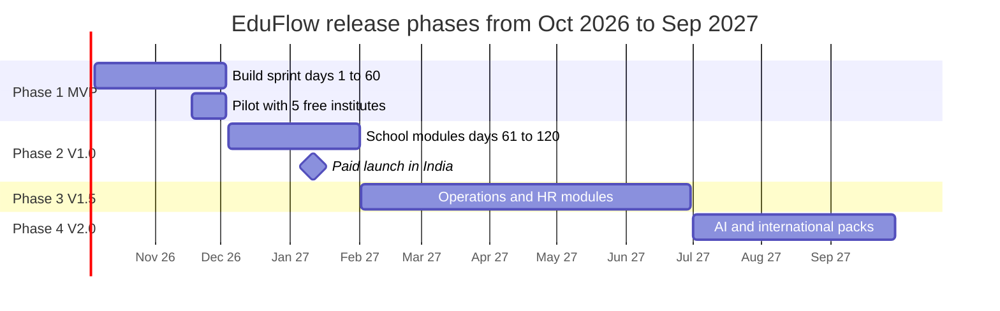
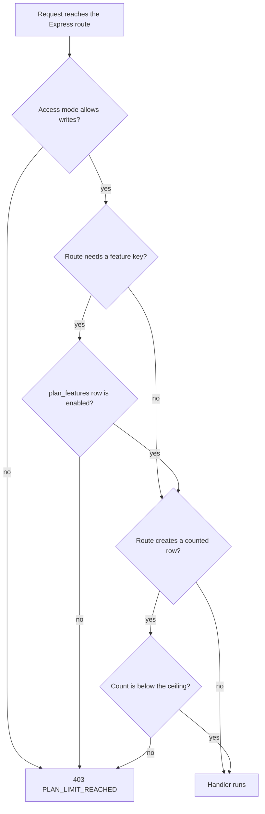

# Release Plan and Plan Gating

**In simple words:** This chapter answers two questions. What gets built when: the four release
phases, their dates, their modules, and the tests that must pass before a phase is called done.
And who may use what: which of the 34 modules each plan unlocks, what the limits are, and how the
code enforces them with the `plan_features` table and the `PLAN_LIMIT_REACHED` error.

> **Rule:** This chapter holds the final list of feature keys and plan limits. Where a module
> chapter and this chapter disagree about a plan or a feature key, this chapter wins.

## The Four Release Phases

EduFlow is built in four phases. Phase 1 is a 60-day solo sprint. Phases 2 to 4 move slower,
because paying customers are live by then and support work takes real hours.

| Phase | Version | Days | Dates | New modules | Main goal |
|---|---|---|---|---|---|
| Phase 1 | V0.9 (MVP) | 1 to 60 | 5 Oct 2026 to 3 Dec 2026 | 16 | Run one coaching institute end to end |
| Phase 2 | V1.0 | 61 to 120 | 4 Dec 2026 to 1 Feb 2027 | 12 | Run a full K-12 school; paid launch in India |
| Phase 3 | V1.5 | 121 to 268 | 2 Feb 2027 to 30 Jun 2027 | 5 | Operations and HR; make Pro worth its price |
| Phase 4 | V2.0 | 269 to 360 | 1 Jul 2027 to 30 Sep 2027 | 1 | AI Insights, country packs, white-label apps |

**Figure: The four release phases on a calendar**



The pilot overlaps the last 16 days of Phase 1 on purpose. Real institutes find the bugs a solo
founder cannot. The paid launch sits in January 2027 because Indian institutes buy software
before the April academic session starts.

### Phase 1 (V0.9, the MVP)

**Goal.** Sharma Classes in Patna leaves its registers and Excel files and runs a whole month
inside EduFlow: admit a student, mark attendance, raise the invoice, take cash or UPI, print the
receipt, tell the parent on WhatsApp.

**Modules (16).** DASH, ORG, CAMP, ADM, STU, TCH, ATT, BAT, SUB, FEE, PAY, DSC, PP, NTF, WA, SET.

| ID | Exit criterion for Phase 1 |
|---|---|
| EXIT-P1-01 | Every acceptance criterion of the 16 module chapters passes |
| EXIT-P1-02 | 5 pilot institutes live on production, each with 5 days of attendance and 1 real receipt |
| EXIT-P1-03 | The cross-tenant isolation suite of *Multi-Tenancy and Data Isolation* is green |
| EXIT-P1-04 | Read endpoints answer under 400 ms (p95) on a tenant with 1,200 students |
| EXIT-P1-05 | Razorpay live mode: 1 real payment and 1 refund, webhook reconciled |
| EXIT-P1-06 | Meta has approved the fee reminder, receipt and absent-alert WhatsApp templates |
| EXIT-P1-07 | A point-in-time backup restore drill finishes under 60 minutes |
| EXIT-P1-08 | No open P1 bug, at most 5 open P2 bugs, and CI blocks a failing build |

### Phase 2 (V1.0, the paid product)

**Goal.** Bright Future Public School, 1,200 students over 2 campuses, runs a full term:
timetable, homework, exams, marks, report cards, staff, leave and a student portal. This is the
version sold for money from January 2027.

**Modules (12).** STF, LEV, TT, HW, EXM, RPT, SCH, SP, EML, SMS, CRT, ANL.

| ID | Exit criterion for Phase 2 |
|---|---|
| EXIT-P2-01 | Exam to report card to parent works: 1,200 report card PDFs built under 15 minutes |
| EXIT-P2-02 | 10 paying organizations on Growth or Pro, with live `ACTIVE` subscriptions |
| EXIT-P2-03 | Self-service upgrade needs no founder help: checkout, GST invoice PDF, plan switch |
| EXIT-P2-04 | Email and SMS send with retries, bounce handling and stored DLT template ids |
| EXIT-P2-05 | Server test coverage above 70% in CI, security review of Phases 1 and 2 closed |
| EXIT-P2-06 | Uptime 99.5% or better over 30 days, one help article per module (28 articles) |

### Phase 3 (V1.5, operations and HR)

**Goal.** Make Pro clearly worth ₹5,999 a month. A school with buses, a hostel, a library and its
own payroll stops paying for separate software.

**Modules (5).** LIB, INV, TRN, HST, PRL.

| ID | Exit criterion for Phase 3 |
|---|---|
| EXIT-P3-01 | 3 schools run one full payroll month inside EduFlow with no manual correction |
| EXIT-P3-02 | Transport tracks 10 routes with pickup attendance, visible in the Parent Portal |
| EXIT-P3-03 | Pro is at least 25% of paying tenants, measured with ORG-API-52 |
| EXIT-P3-04 | Multi-campus rollups match single-campus sums, and queries stay under 200 ms (p95) |

### Phase 4 (V2.0, intelligence and international)

**Goal.** Sell outside India and charge more for intelligence. AI Insights is included in
Enterprise and sold as a ₹1,499 per month add-on to Growth and Pro.

**Modules (1) plus packs.** AI, plus the UAE, USA and Australia country packs (currency, tax, date
format, Stripe billing), Hindi and English UI, and the white-label mobile app.

| ID | Exit criterion for Phase 4 |
|---|---|
| EXIT-P4-01 | AI Insights produces 5 insight types with reasons: fee risk, attendance drop, result drop, lead, capacity |
| EXIT-P4-02 | A UAE tenant is billed in AED with 5% VAT through Stripe, with correct TRN fields |
| EXIT-P4-03 | The Hindi missing-translation-key report is empty for parent-facing screens |
| EXIT-P4-04 | One white-label app is live on Play Store, and Enterprise API keys are documented |

## MVP Scope per Phase 1 Module

"In the MVP" ships by Day 60. "Left for hardening" happens in the Phase 2 window, Days 61 to 120.
Nothing in the right column stops a pilot institute from working.

| Module | In the 60-day MVP | Left for hardening |
|---|---|---|
| DASH | Role dashboards, 6 fixed tiles, daily snapshot job | Widget builder, saved layouts |
| ORG | Signup, onboarding wizard, trial, checkout, usage | Dunning emails, Stripe, credit notes |
| CAMP | Create campus, assign users, campus switcher | Cross-campus transfer, rollups |
| ADM | Inquiry, application, admission, fee at admission | Public form, lead scoring |
| STU | Profile, guardians, documents, Excel import | Custom field groups, photo import |
| TCH | Teacher record, subjects, batches, workload | Documents, qualification checks |
| ATT | Daily and period marking, absent alert, reports | Biometric import, regularisation |
| BAT | Academic year, course, batch, enrollment | Waiting lists, capacity alerts |
| SUB | Subject list, course map, teacher map | Elective groups, weightage |
| FEE | Heads, structures, assignment, invoices, late fee | Instalments, collection forecast |
| PAY | Counter collection, receipt PDF, day close, Razorpay | Cheque bounce, partial refunds |
| DSC | Fixed and percent discounts, approval, audit trail | Sibling rules, auto discounts |
| PP | Fees, attendance, notices, pay now, mobile first | Push notifications, downloads |
| NTF | Event bus, templates, preferences, in-app feed | Quiet hours, digest emails |
| WA | Cloud API sending, 3 templates, credit wallet | Two-way replies, chat inbox |
| SET | Organization settings, number sequences, branding | Custom fields, full data export |

> **Founder note:** The right column is not a promise to the pilot. Tell pilot institutes exactly
> what is in the left column. A pilot that expects biometric attendance in November becomes an
> unhappy reference in January.

## What Each Plan Unlocks

`Yes` means the module is fully open. `Partial` means it opens with a named limit, listed under
the table. `Add-on` means the plan may buy it. `No` means the module endpoints answer 403.

| Module | Code | Phase | Starter | Growth | Pro | Enterprise |
|---|---|---|---|---|---|---|
| Dashboard | DASH | 1 | Partial | Yes | Yes | Yes |
| Organizations | ORG | 1 | Yes | Yes | Yes | Yes |
| Multi Campus | CAMP | 1 | No | Add-on | Yes | Yes |
| Student Admission | ADM | 1 | Yes | Yes | Yes | Yes |
| Student Profile | STU | 1 | Yes | Yes | Yes | Yes |
| Teachers | TCH | 1 | Yes | Yes | Yes | Yes |
| Staff | STF | 2 | No | Yes | Yes | Yes |
| Attendance | ATT | 1 | Yes | Yes | Yes | Yes |
| Leave | LEV | 2 | No | Yes | Yes | Yes |
| Batch | BAT | 1 | Yes | Yes | Yes | Yes |
| Timetable | TT | 2 | No | Yes | Yes | Yes |
| Subjects | SUB | 1 | Yes | Yes | Yes | Yes |
| Homework | HW | 2 | No | Yes | Yes | Yes |
| Exams | EXM | 2 | No | Yes | Yes | Yes |
| Report Cards | RPT | 2 | No | Yes | Yes | Yes |
| Fees | FEE | 1 | Yes | Yes | Yes | Yes |
| Payments | PAY | 1 | Partial | Yes | Yes | Yes |
| Discounts | DSC | 1 | Yes | Yes | Yes | Yes |
| Scholarships | SCH | 2 | No | Yes | Yes | Yes |
| Parent Portal | PP | 1 | Yes | Yes | Yes | Yes |
| Student Portal | SP | 2 | No | Yes | Yes | Yes |
| Notifications | NTF | 1 | Partial | Yes | Yes | Yes |
| WhatsApp | WA | 1 | No | Yes | Yes | Yes |
| Email | EML | 2 | Partial | Yes | Yes | Yes |
| SMS | SMS | 2 | No | Yes | Yes | Yes |
| Library | LIB | 3 | No | No | Yes | Yes |
| Inventory | INV | 3 | No | No | Yes | Yes |
| Transport | TRN | 3 | No | No | Yes | Yes |
| Hostel | HST | 3 | No | No | Yes | Yes |
| Payroll | PRL | 3 | No | No | Yes | Yes |
| Certificates | CRT | 2 | No | Yes | Yes | Yes |
| Analytics | ANL | 2 | No | Partial | Yes | Yes |
| AI Insights | AI | 4 | No | Add-on | Add-on | Yes |
| Settings | SET | 1 | Yes | Yes | Yes | Yes |

| `Partial` cell | What the tenant gets, and what needs an upgrade |
|---|---|
| DASH on Starter | 6 fixed tiles; trend charts and campus comparison need Growth |
| PAY on Starter | Counter collection, receipts, day close; `online_fee_payment` is off |
| NTF on Starter | In-app and email only; the WhatsApp and SMS channels are skipped |
| EML on Starter | System emails (receipt, invoice, OTP, reset); bulk campaigns need Growth |
| ANL on Growth | Ready-made reports; report builder and cohorts need `advanced_analytics` |

> **Note:** A module marked `No` never loses data. If a Pro tenant moves down to Growth, the
> Library rows stay in the database and come back the day the tenant upgrades again.

## Feature Keys That Are Not Whole Modules

Some paid things are not a module but a switch inside one. Each is a row in `plan_features` with
`module` left null. This is the final list; no module chapter may invent another key.

| Feature key | What it opens | Starter | Growth | Pro | Enterprise |
|---|---|---|---|---|---|
| `multi_campus` | More than one campus, switcher, rollups | No | Add-on | Yes | Yes |
| `custom_roles` | Roles like Librarian or Front Desk | No | No | Yes | Yes |
| `whatsapp_sending` | Sending through the WhatsApp Cloud API | No | Yes | Yes | Yes |
| `sms_sending` | Sending through MSG91 or Twilio | No | Yes | Yes | Yes |
| `online_fee_payment` | Razorpay or Stripe payment link for parents | No | Yes | Yes | Yes |
| `advanced_analytics` | Report builder, cohorts, scheduled exports | No | No | Yes | Yes |
| `branding` | Own logo, colours and receipt footer | No | Yes | Yes | Yes |
| `custom_domain` | Own domain instead of `{slug}.eduflow.app` | No | No | No | Yes |
| `sso` | Google Workspace or Microsoft Entra login | No | No | No | Yes |
| `api_access` | API keys for the tenant to call EduFlow | No | No | No | Yes |
| `white_label_app` | Android and iOS app under the school name | No | Add-on | Add-on | Yes |
| `priority_support` | 4-hour first reply, named contact | No | No | Yes | Yes |
| `data_migration` | Assisted import of old data by EduFlow staff | Add-on | Add-on | Add-on | Yes |

Two keys carry a `config` object. On Growth and Pro, `branding` is
`{ "hideEduflowBranding": false }`, so the receipt keeps "Powered by EduFlow"; on Enterprise it is
`true`. On Enterprise, `api_access` is `{ "maxKeys": 5, "scopes": ["read", "write"] }`.

> **Warning:** Starter has no `branding` row at all, so a Starter receipt always carries the
> EduFlow logo and footer. That is the main reason a free tenant upgrades. Do not weaken it.

## Plan Limits

Limits are columns on `plans`, read by one limit service and never by a module. Null means
unlimited.

| Limit | Column | Starter | Growth | Pro | Enterprise |
|---|---|---|---|---|---|
| Active students | `max_students` | 50 | 300 | 1,000 | null |
| Campuses | `max_campuses` | 1 | 1 | 3 | null |
| Admin users | `max_admin_users` | 1 | 3 | 10 | null |
| Other staff users | `max_staff_users` | 3 | null | null | null |
| File storage | `storage_gb` | 1 | 10 | 50 | 250 |
| Trial days | `trial_days` | 14 | 14 | 14 | 14 |

Parents and students are never counted as users. Messaging and the API are metered, not capped:

| Meter | Starter | Growth, Pro and Enterprise |
|---|---|---|
| WhatsApp messages | Blocked | Prepaid wallet, Meta cost plus 15%, balance above zero |
| SMS messages | Blocked | Prepaid pack at ₹0.25 per SMS, credits above zero |
| Email | 1,000 per month | 10,000, 50,000 and unlimited per month |
| API requests | No API access | Canon limits: 100 per user and 1,000 per organization per minute |

No plan includes free WhatsApp or SMS. Every paid tenant buys ₹499, ₹1,999 or ₹7,999 credit packs,
stored as `AddOnPurchase` rows of type `WHATSAPP_CREDITS` or `SMS_CREDITS`.

> **Note:** The storage numbers, the email caps and the admin-user counts above Starter are
> assumptions of this chapter, sized so that hosting cost stays under 10% of revenue. They match
> the BRD chapter *Pricing Strategy*.

## How Gating Works in the Code

A gating check asks three questions, always in this order.

**Figure: The gating check on every write request**



Step 1 is the access mode from the *Organizations Module* chapter: `FULL`, `RESTRICTED`,
`READ_ONLY` or `BLOCKED`. Step 2 is the feature key. Step 3 is the counted limit. All three use
the same error code, so the front end needs only one dialog.

The plan snapshot is built once per request from Redis: key `plan:{planId}:features` for one hour,
key `org:{orgId}:limits` for five minutes. ORG-API-51 clears the plan key for every tenant on that
plan; ORG-API-18 and ORG-API-38 clear the tenant key.

```typescript
// server/src/modules/billing/plan-gate.ts  (Node 24, Express 5)
import type { RequestHandler } from 'express';
import { AppError } from '../../core/errors';
import { getPlanSnapshot } from './plan-snapshot';

export const requireFeature = (featureKey: string): RequestHandler =>
  async (req, _res, next) => {
    const snap = await getPlanSnapshot(req.tenant.organizationId);
    if (snap.features[featureKey]?.isEnabled) return next();
    next(
      new AppError('PLAN_LIMIT_REACHED', 'This feature is not in your plan.', [
        { field: featureKey, issue: `Available from the ${snap.upgradeTo[featureKey]} plan` },
      ]),
    );
  };
```

Each module router uses one line, before the permission check of *RBAC and Permissions Matrix*:

```typescript
router.post(
  '/library/books',
  requireFeature('module.LIB'),
  requirePermission('library.create'),
  validate(createBookSchema),
  createBook,
);
```

Counted limits use a second helper that runs inside the same Prisma transaction as the insert, so
two clerks cannot both add student 300.

```typescript
export async function assertStudentCapacity(tx: Tx, orgId: string) {
  const { limit, ceiling } = await getEffectiveStudentLimit(tx, orgId);
  const used = await tx.student.count({
    where: { organizationId: orgId, status: 'ACTIVE', deletedAt: null },
  });
  if (used >= ceiling) {
    throw new AppError('PLAN_LIMIT_REACHED', 'Your plan is full.', [
      { field: 'students', issue: `${used} of ${limit} active students used` },
    ]);
  }
  if (used + 1 > limit) await startOrContinueGrace(tx, orgId);
}
```

The error that reaches the browser follows the canon envelope exactly:

```json
{
  "success": false,
  "error": {
    "code": "PLAN_LIMIT_REACHED",
    "message": "Your plan is full.",
    "details": [
      { "field": "students", "issue": "330 of 300 active students used" },
      { "field": "upgradeTo", "issue": "PRO" }
    ]
  },
  "requestId": "req_8f3a2c91"
}
```

### What the user sees

The API client watches for `PLAN_LIMIT_REACHED` and opens `PlanLimitDialog` (screen ORG-S11). Its
text is built from `message` and `details`, never hard-coded in a screen.

| Who is signed in | What the dialog offers |
|---|---|
| Holder of `billing.manage` (ORG_ADMIN) | "Compare plans" and "Upgrade now": ORG-API-16, then ORG-API-18 |
| Any other staff user | The same numbers plus "Ask your admin to upgrade", sent in-app |
| Parent or student | Nothing. Portals only read, so they never hit a limit |

Two softer prompts come first. At 80% of any limit, a yellow dashboard banner appears for admins
only, once per limit per 30 days, driven by the event `organization.limit.near`. A `No` module is
not hidden: it shows as a greyed sidebar row labelled "Pro" that opens the plan comparison page.
Hiding a paid module loses upgrades; a dead lock icon only annoys people.

### Gating endpoints in the registry

| ID | Method | Path | Permission | Purpose |
|---|---|---|---|---|
| ORG-API-01 | GET | /plans | public | Public plan catalogue with prices and features |
| ORG-API-12 | GET | /organizations/current/usage | organizations.view | Usage against every limit |
| ORG-API-16 | POST | /subscriptions/preview | billing.view | Price of a plan or cycle change |
| ORG-API-18 | POST | /subscriptions/current/change-plan | billing.manage | Upgrade or downgrade |
| ORG-API-28 | POST | /add-ons | billing.manage | Buy campus, AI Insights or credits |
| ORG-API-38 | POST | /platform/organizations/:id/change-plan | platform.manage | Console plan and overrides |
| ORG-API-51 | PUT | /platform/plans/:id/features | platform.manage | Replace the gating rows of a plan |

ORG-API-12 is the call every front end makes after login. Its answer drives the sidebar, the
banners and the plan page.

```http
GET /api/v1/organizations/current/usage HTTP/1.1
Host: api.eduflow.app
Authorization: Bearer <accessToken>
```

```json
{
  "success": true,
  "data": {
    "plan": { "code": "GROWTH", "name": "Growth" },
    "limits": [
      { "key": "students", "used": 311, "limit": 300, "ceiling": 330, "state": "GRACE" },
      { "key": "campuses", "used": 1, "limit": 1, "state": "AT_LIMIT" },
      { "key": "adminUsers", "used": 2, "limit": 3, "state": "OK" },
      { "key": "storageGb", "used": 4.2, "limit": 10, "state": "OK" }
    ],
    "graceEndsAt": "2027-05-06T18:29:59Z",
    "features": ["module.EXM", "module.RPT", "whatsapp_sending", "online_fee_payment"]
  }
}
```

## Grace and Downgrade Rules

A school must not stop admitting students because a number crossed. Money rules never block
teaching.

| ID | Rule |
|---|---|
| REL-BR-01 | Starter stops hard at 50 active students. The free plan has no grace. |
| REL-BR-02 | Growth and Pro get 10% extra room for 30 days; the ceiling is floor(limit x 1.10). |
| REL-BR-03 | The clock starts on the first crossing, stored in `billing.student_grace_started_at`. |
| REL-BR-04 | The grace ends at the ceiling or on day 31, whichever comes first. |
| REL-BR-05 | It clears when the active count falls back to the limit or below. |
| REL-BR-06 | Campuses, users and storage have no grace. They stop at the number. |
| REL-BR-07 | Attendance, fee collection, receipts, exams and both portals keep working during and after a grace. Only new counted rows are blocked. |
| REL-BR-08 | A downgrade is refused while usage is above the target plan: 422 `BUSINESS_RULE_VIOLATION` listing what to reduce. |
| REL-BR-09 | An allowed downgrade takes effect at `currentPeriodEnd`, and the lost modules are hidden, not deleted. |
| REL-BR-10 | Storage above the new limit blocks new uploads only. Old files stay downloadable. |

> **Example:** Sharma Classes is on Growth (300 students). On 6 April 2027 it admits student 301.
> The grace starts, the ceiling becomes 330, and Rajesh Sharma gets `organization.limit.reached`
> in-app and by email. On 20 April student 331 is refused with `PLAN_LIMIT_REACHED`. Even at 310
> students the block would arrive on 6 May, day 31. Attendance and fee collection keep working for
> all 330 students the whole time. When he tries to move down to Starter, ORG-API-18 answers 422
> with `students: 330 of 50 allowed`, so nothing changes.

## Feature Flags for Gradual Rollout

Plan gating and feature flags look alike and must never be mixed. Gating is commercial and
permanent: has this tenant paid for it. A flag is technical and temporary: it lets unfinished code
sit in the main branch and be switched on for one tenant first.

**Decision: no new table.** The schema is frozen, so flags use what already exists.

| Layer | Where it lives | Changed by |
|---|---|---|
| Default and rollout percent | `server/src/config/flags.ts` in the repo | A deploy |
| Tenant override | `organization_settings`, key `flags.<flagKey>`, campus null | A console script |
| Kill switch | Environment variable `DISABLED_FLAGS` | A restart or a config push |

The order is fixed: kill switch beats tenant override, override beats the percentage bucket,
bucket beats the default. The bucket is a stable hash of the organization id, so a tenant never
flips between old and new code between two requests.

```typescript
// server/src/core/flags.ts
export type Flag = { key: string; default: boolean; rollout: number; removeBy: string };

export async function isFlagOn(flag: Flag, orgId: string): Promise<boolean> {
  if (config.disabledFlags.includes(flag.key)) return false;
  const override = await getSetting<{ enabled: boolean }>(orgId, `flags.${flag.key}`);
  if (override) return override.enabled;
  if (flag.rollout >= 100) return true;
  if (flag.rollout <= 0) return flag.default;
  return bucketOf(orgId) < flag.rollout; // bucketOf = murmur3(orgId) % 100
}
```

Flag keys use `<module>.<thing>` in lower snake case, for example `att.face_marking` or
`rpt.new_pdf_engine`. Every flag carries a `removeBy` date and CI fails the build once that date
has passed. That is what stops a codebase from collecting 200 dead flags.

| Stage | Rollout | Who gets the new code | Move on when |
|---|---|---|---|
| Internal | 0% plus override | The demo tenant only | The founder has used it for 2 days |
| Pilot | 0% plus override | The 5 pilot institutes | No P1 or P2 bug for 5 days |
| Ramp | 5%, then 25% | A stable slice of tenants | Error rate and p95 unchanged |
| Full | 100% | Everybody | Two weeks pass, then the flag is deleted |

| ID | Rule |
|---|---|
| REL-BR-11 | A flag has one owner and a `removeBy` date at most 60 days after it is added. |
| REL-BR-12 | A flag never gates money, permissions or tenant isolation. Those use gating and RBAC. |
| REL-BR-13 | Old and new code must write the same data, so a flag can be turned off without repair. |
| REL-BR-14 | Every flag change is written to `audit_logs` with the actor and the reason. |

## Versioning and Deprecation

EduFlow carries three version numbers, and they move at different speeds.

| Version | Scheme | Where it is seen | Changes when |
|---|---|---|---|
| Product | V0.9, V1.0, V1.5, V2.0 | Help centre, release notes, sales decks | A phase finishes |
| API | `/api/v1` in the path | Every request and the OpenAPI file | Only on a breaking change |
| Build | `2027.01.11-3` | `GET /health`, Sentry release, page footer | Every production deploy |

The rule for `v1` is simple: it never breaks. Everything safe ships inside `v1`.

| Safe inside v1 | Breaking, needs v2 |
|---|---|
| Adding an endpoint, an optional filter or a response field | Removing an endpoint or a response field |
| Adding an optional request field | Renaming a field, or making an optional one required |
| Adding a response enum value clients treat as text | Changing what an existing value means |
| Raising a limit | Lowering a limit or tightening validation |

Nothing is deleted on the day it is decided. It is deprecated first.

| Change | Notice | How it is announced |
|---|---|---|
| Response field, endpoint or webhook payload field | 180 days | `Deprecation` and `Sunset` headers, OpenAPI note, email to Enterprise contacts |
| Screen or report replaced | 90 days | Banner on the old screen plus a help article |
| Notification template text | 30 days | Preview in *Settings Module*, email to admins |

```http
HTTP/1.1 200 OK
Deprecation: true
Sunset: Wed, 01 Sep 2027 00:00:00 GMT
```

The database follows the same idea. A column is never renamed in one deploy. Expand and contract
takes three releases: add the new column and write both, backfill and read the new one, drop the
old one a release later. Migrations are forward-only, so a bad migration is fixed by a new
migration, never by editing a file that already ran. The matching jobs are in *Background Jobs and
Events*.

## Release Checklist

Two lists run at different times. The phase gate runs once, at the end of a phase. The release
checklist runs on every production deploy.

| ID | Phase gate item | Applies to |
|---|---|---|
| GATE-01 | Every exit criterion of the phase is ticked, with evidence | All phases |
| GATE-02 | `plan_features` seed updated for the new modules on all 4 plans | All phases |
| GATE-03 | New permission keys added to `permissions` and to the role presets | All phases |
| GATE-04 | Pricing page, help centre and demo tenant show the new modules | Phases 2 to 4 |
| GATE-05 | Every flag added during the phase is deleted or has a written reason | All phases |
| GATE-06 | Load test at the next customer stage: 100, 500, 1,000, 10,000 | Phases 2 to 4 |
| GATE-07 | Backup restore drill passed within the last 30 days | All phases |
| GATE-08 | Release notes written and emailed to every ORG_ADMIN | Phases 2 to 4 |

| ID | Release checklist item, every deploy |
|---|---|
| REL-01 | CI green: lint, types, unit, integration and end-to-end tests |
| REL-02 | Prisma migration reviewed, run on a copy of production, additive or reversible |
| REL-03 | New endpoints are in the registry with an ID, a permission key and an OpenAPI entry |
| REL-04 | New flags default to off, with an owner and a `removeBy` date |
| REL-05 | Staging smoke test: login, add student, collect fee, print receipt, WhatsApp send |
| REL-06 | Sentry release created, source maps uploaded, alerts unmuted |
| REL-07 | Deploy in the window Tuesday 21:30 IST, when fee counters are closed |
| REL-08 | Watch error rate and p95 for 30 minutes; roll back if either doubles |
| REL-09 | Release notes published and help articles updated for changed screens |

> **Best practice:** Keep the release list in the repository as
> `.github/pull_request_template.md`. A checklist inside a document is read once. A checklist
> inside the tool is read every time.

During the 60-day sprint the rhythm is a staging deploy most days and a production deploy at the
end of each week. After the paid launch in January 2027 it becomes one planned release a week,
plus hotfixes at any hour for a P1 bug. The full go-live runbook is in the Founder Blueprint
chapter *Launch Checklist and Go-Live Runbook*.
