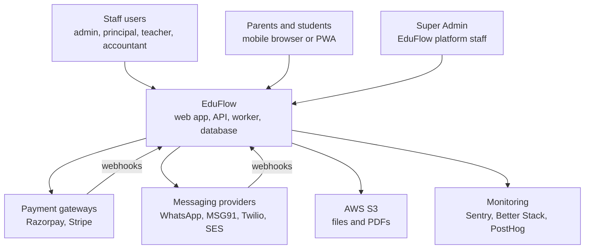
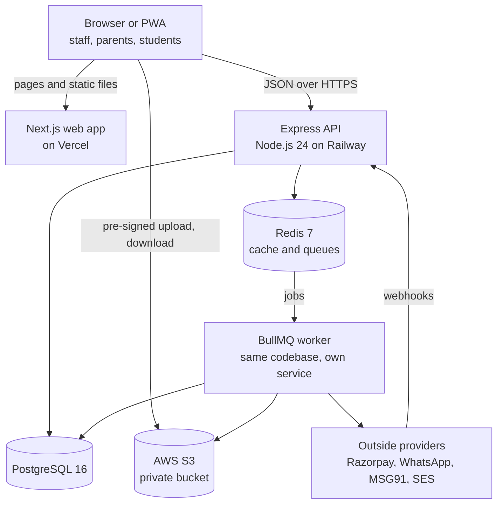
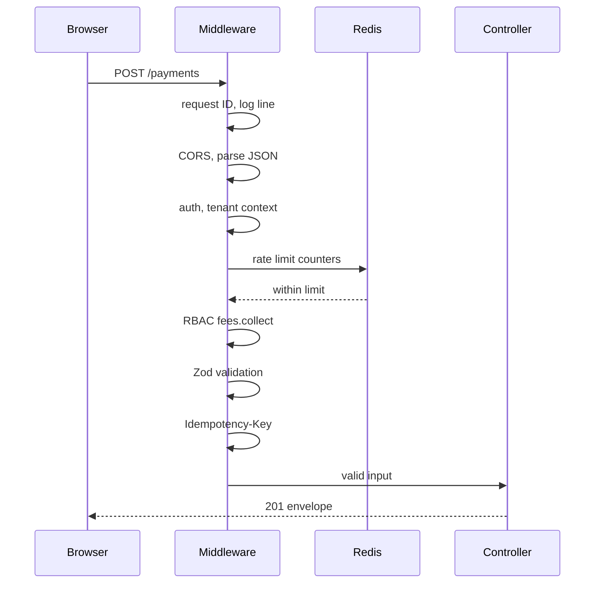
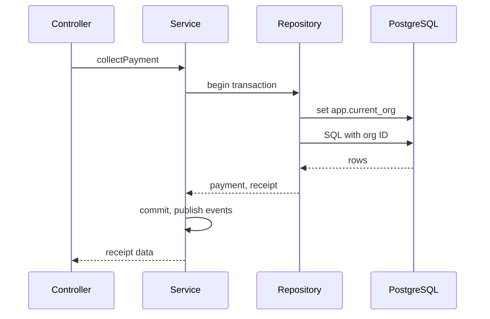
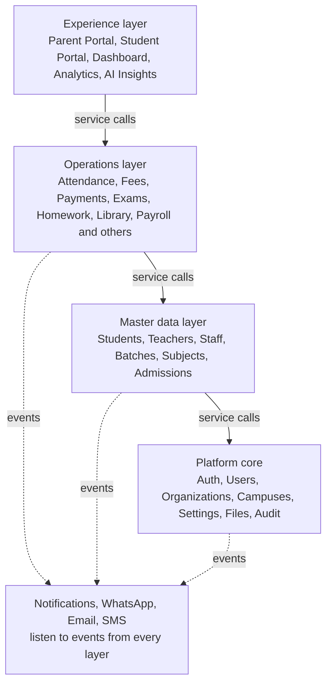
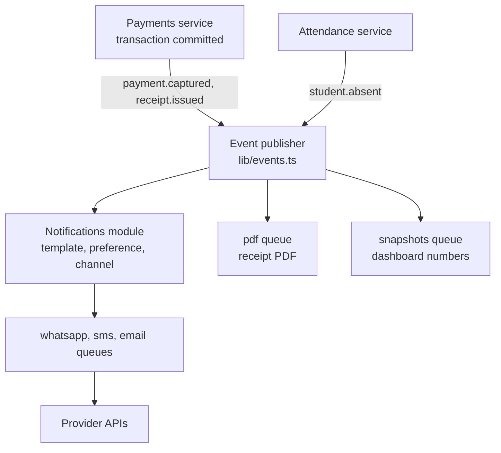
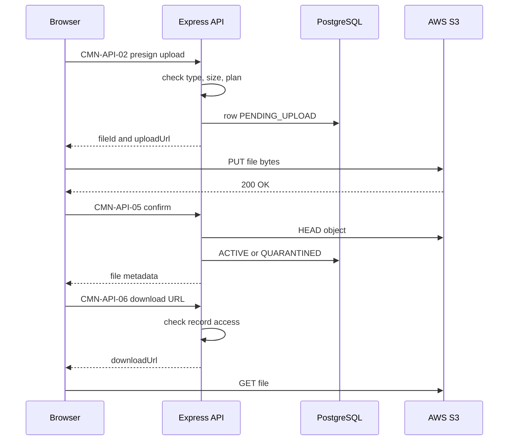
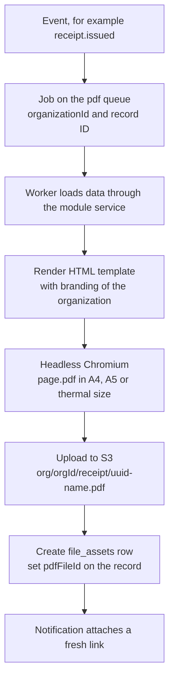
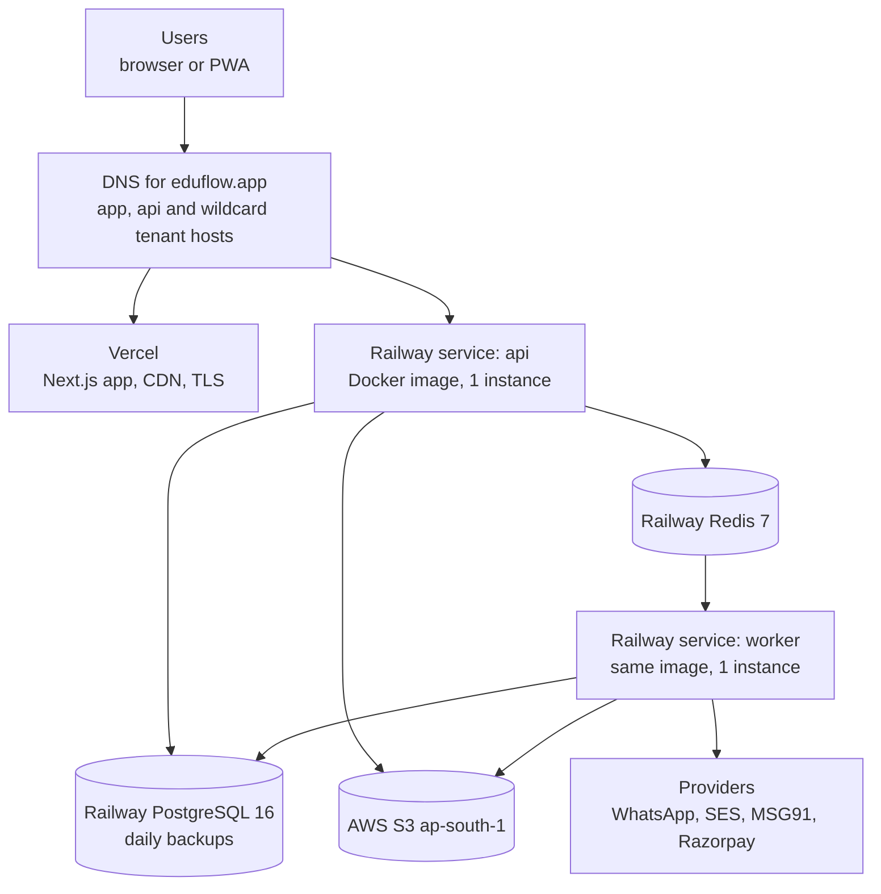
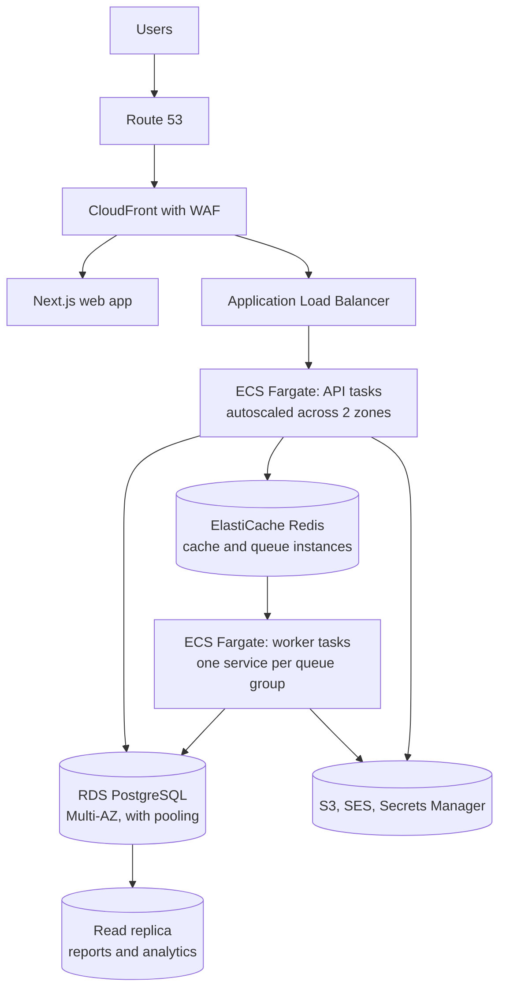

# System Architecture

**In simple words:** This chapter shows how EduFlow is put together: the parts, where each part runs, and how one click in the browser becomes a row in the database and a WhatsApp message on a parent's phone. EduFlow is one codebase with clear walls between modules, one PostgreSQL database, one Redis and a small set of outside providers. The chapter also fixes how we cache, store files, make PDFs, search, watch the system, survive failures and grow from the first institute to thousands. Every module chapter builds on the rules written here.

## Architecture at a glance

| Question | Decision |
|---|---|
| Architecture style | Modular monolith: one API codebase, 34 modules with strict boundaries |
| Running programs | Three: Next.js web app, Express API, BullMQ worker (API and worker share one codebase) |
| Database | One PostgreSQL 16 database, shared schema, `organization_id` on every tenant row |
| Cache and queues | One Redis 7 for cache, rate-limit counters and BullMQ queues |
| Files | AWS S3 private bucket in `ap-south-1` (Mumbai), reached through pre-signed URLs |
| Tenant safety | Tenant from the JWT `orgId` claim, Prisma client extension, PostgreSQL Row-Level Security |
| API style | REST, JSON only, base URL `/api/v1`, one response envelope |
| Mobile | Responsive web plus PWA first; white-label native apps in Phase 4 |
| Slow work | BullMQ queues: messages, PDFs, imports, exports, invoices, webhooks |
| Live updates | Polling first; server-sent events later |
| Hosting at launch | Vercel (web app) and Railway (API, worker, PostgreSQL, Redis) |
| Hosting at scale | AWS: ECS Fargate, RDS PostgreSQL, ElastiCache, S3, CloudFront |

A modular monolith is one program that is split inside into modules with strict rules about who may call whom. It deploys as one unit, so a solo founder can run it. It stays tidy, so a team can split it later.

### Design principles

1. **Boring technology.** Every part is popular, well documented and known to Claude Code.
2. **One of everything until a number says otherwise.** One database, one Redis, one API service, one worker service. A second copy is added only when a metric crosses its trigger.
3. **Tenant safety in every layer.** A tenant is one customer organization. The API, the ORM (object-relational mapper, the library that turns code into SQL), the database, the cache, the queues, the file paths and the logs all carry the organization ID. Row-Level Security (the database itself hides rows of other organizations) is the second net.
4. **Stateless API.** An API process keeps nothing in memory between requests. Sessions, counters and jobs live in PostgreSQL or Redis, so 1 instance or 20 run the same code.
5. **Slow work goes to a queue.** Anything that calls an outside provider, touches more than about 200 rows, or takes more than 2 seconds runs in the worker.
6. **Money paths are transactional and idempotent.** A payment, its allocations, the receipt number and the audit entry are saved together or not at all. A repeated request never creates a second payment.
7. **Degrade, do not fail.** When WhatsApp is down, fee collection still works and messages wait in the queue. Only a PostgreSQL outage stops the product.
8. **Same code in every environment.** Local, staging and production differ only in configuration.

## System context

The context view shows EduFlow as one box, the people who use it and the outside systems it talks to.

**Figure: System context of EduFlow**



Three groups of people use EduFlow through a browser. EduFlow calls four groups of outside systems. Payment gateways and messaging providers also call EduFlow back through webhooks (HTTP calls that a provider makes to our API when something happens, for example "payment captured" or "message delivered").

| Outside system | Used for | Direction | Phase |
|---|---|---|---|
| Razorpay | Online fee payments and EduFlow subscriptions in India | API calls out, webhooks in | 1 |
| Stripe | Payments for USA, Australia and UAE | API calls out, webhooks in | 4 |
| WhatsApp Cloud API (Meta) | Template messages to parents, inbound replies, delivery status | API calls out, webhooks in | 1 |
| Amazon SES | Invitations, password resets, receipts by email | API calls out, bounce webhooks in | 1 (basic), 2 (module) |
| MSG91 and Twilio | SMS and OTP: MSG91 in India with DLT templates, Twilio elsewhere | API calls out, delivery webhooks in | 2 |
| AWS S3 | Private file storage | Browser and worker to S3 | 1 |
| Sentry, Better Stack or Grafana Cloud | Error tracking, uptime checks, log search | Out only | 1 |
| PostHog | Product analytics for staff roles only | Out only, from the browser | 1 |

Setup steps, credentials and webhook formats of each provider are in *Integrations and Webhooks*. This chapter only fixes where each provider connects.

> **Rule:** No provider is called from a web request when the call can wait. The API writes the intent to the database and the queue. The worker makes the call. The only exceptions are calls that the user is waiting for: creating a payment order, verifying a checkout signature and creating a pre-signed file URL.

## Containers

A container in this chapter means one separately running program or data store. It does not mean a Docker container, although the API and the worker also ship as Docker images.

**Figure: Containers of EduFlow and how they talk**



The browser loads pages from Vercel and then calls the API directly. The API never sends a message by itself: it puts a job in Redis, and the worker picks it up. Files travel between the browser and S3, not through the API.

| Container | Technology | Runs on at launch | Its job | State it keeps |
|---|---|---|---|---|
| Browser or PWA | React, TanStack Query, service worker | User's phone or computer | Show screens, hold the access token in memory, keep API answers in memory briefly | Access token in memory, query cache |
| Web app | Next.js App Router, Tailwind CSS, shadcn/ui | Vercel | Serve pages and static files, read the tenant slug from the host name | None |
| API | Node.js 24, Express 5, Zod, Prisma 6, Pino | Railway service `api` | Auth, tenant context, permission checks, validation, business rules, enqueue jobs | None |
| Worker | Same codebase, BullMQ workers and schedulers | Railway service `worker` | Messages, PDFs, imports, exports, invoices, webhooks, nightly jobs | None |
| Database | PostgreSQL 16 | Railway PostgreSQL | All business data, 189 models | Everything that matters |
| Cache and queue store | Redis 7 | Railway Redis | Cache, rate-limit counters, idempotency keys, BullMQ queues | Rebuildable data and pending jobs |
| File store | AWS S3, `ap-south-1` | AWS | Photos, documents, PDFs, import and export files | Files, versioned |

### What the web app does and does not do

- The Next.js app is a thin shell. It has no business rules, no database connection and no Prisma import. Pages load data in the browser with TanStack Query. One API serves the web app today and native apps later.
- The access token (a JWT, a signed text that names the user and the organization, valid for 15 minutes) lives in browser memory only. The refresh token lives in an httpOnly cookie on `.eduflow.app`, so `sharma-classes.eduflow.app` and `api.eduflow.app` can share it. Details are in *Authentication and Sessions*.
- The Next.js `middleware.ts` file only reads the tenant slug from the host name and redirects `/`. It is not a security layer. Security lives in the API.
- A PWA (progressive web app, a website that can be installed on the phone's home screen) gives parents and teachers an app icon without an app store. In Phase 1 the service worker caches only the app shell: JavaScript, CSS, fonts and icons. It never caches API answers, because a shared family phone must not show old fee data after logout. Offline writes are out of scope until Phase 4.

### Two programs from one server codebase

`server/` builds one Docker image. Railway starts it twice with different commands: `node dist/server.js` for the API and `node dist/jobs/worker.js` for the worker. Both import the same services and the same Prisma client. A rule written once in `fees.service.ts` therefore holds for a click in the browser and for the nightly late-fee job. The folder layout is in the Blueprint chapter *Folder Structure*.

## Request lifecycle

Every API request walks through the same chain of middleware (small functions that run before the controller). The order is fixed. RBAC in this chapter means role-based access control: what a user may do depends on the roles given to that user. The example below is accountant Suresh Gupta collecting ₹12,000 from Aarav Sharma's parent at the fee counter of Bright Future Public School, endpoint PAY-API-02.

**Figure: Request lifecycle, part 1: through the middleware chain**



The middleware rejects bad requests early and cheaply. Each step either passes the request on or answers with the error envelope. The last arrow happens after part 2 has finished.

**Figure: Request lifecycle, part 2: controller, service, repository, database**



The controller only translates HTTP. The service holds the rules and the transaction. The repository is the only place that talks to Prisma. Events leave only after the transaction has committed.

| Step | Name | What it does | Rejects with |
|---|---|---|---|
| 1 | `requestId` | Creates `req_...`, puts it on the request, the logs and the `X-Request-Id` response header | Never |
| 2 | `httpLogger` | Writes one Pino log line per request with route, status and duration | Never |
| 3 | Security headers and CORS | Helmet headers; allows only EduFlow web origins with credentials | Browser blocks the call |
| 4 | Webhook routers | Webhook paths read the raw body, because signatures need the exact bytes | `UNAUTHENTICATED` on a bad signature |
| 5 | Body and cookie parsers | JSON up to 1 MB; larger content goes to S3, not through the API | `VALIDATION_ERROR` |
| 6 | `authenticate` with tenant step | Verifies the JWT, loads the cached user snapshot, opens the tenant context (`orgId`, `userId`, campuses) | `UNAUTHENTICATED`, `TOKEN_EXPIRED` |
| 7 | `rateLimit` | Redis counters: 100 per minute per user, 1,000 per minute per organization | `RATE_LIMITED` |
| 8 | `requirePermission` | Checks the permission key and its scope (`ALL`, `CAMPUS`, `OWN`, `VIEW`) and the plan feature | `FORBIDDEN`, `PLAN_LIMIT_REACHED` |
| 9 | `validate` | Parses body, query and params with the Zod schema from `shared/` | `VALIDATION_ERROR` |
| 10 | `idempotency` | Payment-creating POSTs only: requires the `Idempotency-Key` header | `VALIDATION_ERROR`, `CONFLICT` |
| 11 | Controller | Calls exactly one service function and sends the envelope | Never by itself |
| 12 | Service | Business rules, one transaction, calls to other modules; after commit publishes `payment.captured` and `receipt.issued` | `NOT_FOUND`, `CONFLICT`, `BUSINESS_RULE_VIOLATION` |
| 13 | Repository | Prisma queries through the tenant-aware client; the transaction sets `app.current_org` for Row-Level Security | Database errors, mapped by step 14 |
| 14 | `notFound`, `errorHandler` | Turn every miss and every thrown error into the canon error envelope | `NOT_FOUND`, `INTERNAL_ERROR`, `SERVICE_UNAVAILABLE` |

Rate limiting has two checkpoints. Public routes (login, OTP, signup, public forms) have no user yet. They are limited first, by IP address, and login also by account: 5 attempts per 15 minutes. Signed-in routes are limited right after `authenticate`, because the per-user and per-organization counters need the IDs from the token. A `SUPER_ADMIN` request may carry `X-Organization-Id`; the tenant step then opens that tenant's context and the audit log records the action.

The same order is visible in code. Express 5 passes a rejected promise to the error handler by itself, so controllers need no `try` and `catch`.

```typescript
// server/src/app.ts (shortened)
import express from 'express';
import helmet from 'helmet';
import cors from 'cors';
import cookieParser from 'cookie-parser';
import { env } from './config/env';
import { corsOptions } from './config/cors';
import { requestId } from './middleware/request-id';
import { httpLogger } from './middleware/http-logger';
import { notFound } from './middleware/not-found';
import { errorHandler } from './middleware/error-handler';
import { apiRouter, webhookRouter } from './routes';

export function createApp(): express.Express {
  const app = express();
  app.set('trust proxy', env.TRUST_PROXY);
  app.disable('x-powered-by');

  app.use(requestId);
  app.use(httpLogger);
  app.use(helmet());
  app.use(cors(corsOptions));

  // Webhooks first: signature checks need the raw bytes, not parsed JSON.
  app.use('/api/v1/webhooks', express.raw({ type: '*/*', limit: '1mb' }), webhookRouter);

  app.use(express.json({ limit: '1mb' }));
  app.use(cookieParser());

  // Routers add, in this order: authenticate, rateLimit, requirePermission, validate, controller.
  app.use('/api/v1', apiRouter);

  app.use(notFound);
  app.use(errorHandler);
  return app;
}
```

```typescript
// server/src/modules/payments/payments.routes.ts (one route)
paymentsRouter.post(
  '/',
  requirePermission('fees.collect'),
  validate({ body: collectPaymentSchema }),
  idempotency,
  controller.collectPayment,
);
```

The router above is mounted at `/api/v1/payments` and calls `authenticate` and the rate limiter once at its top. A failed step answers with the canon error envelope, and the `requestId` lets support find the exact log lines:

```json
{
  "success": false,
  "error": {
    "code": "BUSINESS_RULE_VIOLATION",
    "message": "Amount is more than the invoice balance",
    "details": [{ "field": "allocations[0].amount", "issue": "Balance is 12000.00" }]
  },
  "requestId": "req_8f3a2c71d94e"
}
```

Envelope formats, status codes, pagination and headers are specified in *API Standards and Conventions*. How the tenant context and Row-Level Security work is in *Multi-Tenancy and Data Isolation*. How permission scopes are resolved is in *RBAC and Permissions Matrix*.

## Modular monolith structure

### Module groups

The 34 product modules plus the platform parts (auth, users and roles, files, audit, common endpoints) live in `server/src/modules/`. They fall into seven groups. Each group maps to schema files and to one endpoint registry file.

| Group | Modules | Schema files | Registry file |
|---|---|---|---|
| Platform core | AUTH, USR, ORG, CAMP, SET, DASH, CMN | `01-platform`, `02-auth` | `01-platform-people`, `04-operations-intelligence` |
| People | ADM, STU, TCH, STF | `04-people` | `01-platform-people` |
| Academics | BAT, SUB, ATT, LEV, TT, HW, EXM, RPT | `03-academics`, `05-attendance-leave`, `06-timetable-homework`, `07-exams` | `02-academics` |
| Finance | FEE, PAY, DSC, SCH | `08-fees`, `09-payments` | `03-finance-portals-comms` |
| Communication and portals | NTF, WA, EML, SMS, PP, SP | `10-communication` | `03-finance-portals-comms` |
| Operations and HR | LIB, INV, TRN, HST, PRL | `11-operations`, `12-payroll` | `04-operations-intelligence` |
| Documents and intelligence | CRT, ANL, AI | `13-certificates-analytics-ai` | `04-operations-intelligence` |

### Boundary rules

1. **One owner per table.** Only the owning module's repository reads or writes a table. `fee_invoices` belongs to Fees. Payments never queries it directly.
2. **Talk through services.** A module that needs another module's data calls an exported function of that module's service. Payments calls the Fees service to reduce an invoice balance inside the same transaction.
3. **Side effects travel as events.** A module never sends a WhatsApp message, never updates a dashboard number and never builds a PDF for another module. It publishes an event and moves on.
4. **Calls go down, events go up.** The layers in the figure below fix the direction. A lower layer never imports a higher one.
5. **Portals own no business tables.** Parent Portal and Student Portal are thin modules. They call the services of Fees, Attendance, Homework and the others with the `Own` scope.
6. **`lib/` knows no module.** Wrappers for Prisma, Redis, S3, WhatsApp and Razorpay never import from `modules/`.
7. **The contract lives in `shared/`.** Zod schemas and types used by both browser and API live in the `@eduflow/shared` package.
8. **The linter enforces it.** ESLint import rules fail the build when a file reaches into another module's repository. The rules are in the Blueprint chapter *Folder Structure*.

**Figure: Layers of modules and the allowed direction of calls**



Fees may call Students, because a bill needs a student. Students never calls Fees. When Students has news that Fees cares about, for example a withdrawal, it publishes `student.withdrawn` and Fees reacts. Modules in the same layer may call each other in one direction only: Payments calls Fees, never the reverse.

### Events between modules

An event is a small message that says "this happened", for example `receipt.issued`. Event names come from the "Events emitted" lines of the endpoint registry. The publisher does not know who listens.

**Figure: One payment, three independent reactions**



The Payments service finishes its transaction and publishes two events. Notifications picks the template and the channel the parent prefers. The PDF worker builds the receipt file. The snapshot worker refreshes today's collection number. If any of the three fails, the payment is still safe, and the failed job retries alone.

| Situation | Mechanism | Example |
|---|---|---|
| The answer is needed to finish the request | Direct service call, same transaction | Fees asks Settings for the next invoice number |
| Two tables of two modules must change together | Direct service call, same transaction | Approving an application (ADM) creates the student (STU) |
| The reaction can happen seconds later | Event | `receipt.issued` sends the WhatsApp receipt to Sunita Devi |
| The reaction may fail without harming the action | Event | `student.absent` alerts the parent |
| A cache must be dropped | Event | `role.permissions.changed`, `settings.updated`, `subscription.plan_changed` |
| Numbers for dashboards | Event plus nightly job | `fee.invoice.paid` refreshes `daily_metric_snapshots` |

Three rules keep events safe. They are published only after the database transaction commits. They carry IDs, not full records, and always the `organizationId`. Every consumer is idempotent (running it twice gives the same result as running it once), because delivery is at-least-once. The event envelope, the full event catalog and the pattern that makes sure no event is lost are in *Background Jobs and Events*.

> **Founder note:** The module walls are what make a later split cheap. If messaging volume ever needs its own service, the Notifications, WhatsApp, Email and SMS modules already talk to the rest only through events and queues. The same holds for PDF rendering and AI Insights. Until a metric forces it, nothing is split.

## Background processing

A queue is a waiting line of jobs stored in Redis. A worker is a function in the worker process that takes jobs from one queue and runs them. BullMQ is the library that manages both. The API adds jobs. The worker runs them. A worker follows the controller rule: read the job data, open the tenant context with the `organizationId` in the job, call one service function.

Work goes to a queue when one of these is true: it calls an outside provider, it touches more than about 200 rows, it takes more than 2 seconds, it runs on a schedule, or it must be retried without the user.

### Queues

| Queue | Work | Concurrency at launch | Attempts | Backoff |
|---|---|---|---|---|
| `notifications` | Turn an event into messages: recipients, template, preference, channel | 10 | 5 | Exponential from 30 s |
| `whatsapp` | Send one WhatsApp template message; debit the credit wallet | 10, max 40 sends per second | 5 | Exponential from 30 s |
| `sms` | Send one SMS through MSG91 or Twilio | 10 | 5 | Exponential from 30 s |
| `email` | Send one email through Amazon SES | 10 | 5 | Exponential from 30 s |
| `pdf` | Receipts, invoices, report cards, certificates, payslips | 2 | 3 | Exponential from 10 s |
| `imports` | Excel and CSV imports in chunks of 200 rows | 1 | 3 | Fixed 60 s |
| `exports` | Excel, CSV, PDF and ZIP exports | 2 | 3 | Fixed 60 s |
| `invoices` | Bulk fee invoice generation, late fees, reconciliation | 2 | 5 | Exponential from 60 s |
| `reminders` | Fee due reminders, follow-up and document expiry alerts | 5 | 5 | Exponential from 60 s |
| `snapshots` | Daily metric snapshots and dashboard refresh | 2 | 3 | Fixed 5 min |
| `webhooks` | Process stored `webhook_events` rows | 5 | 8 | Exponential from 15 s |
| `ai` | Risk scores and insights (Phase 4) | 1 | 3 | Fixed 5 min |

Exponential backoff means each retry waits twice as long as the one before: 30 s, 1 min, 2 min, 4 min. At launch one worker process serves all twelve queues, grouped in six worker files as the Blueprint chapter *Folder Structure* shows. Splitting the worker service by queue group is a scaling lever, not a code change.

### Retry and dead-letter policy

1. A handler throws on any failure. BullMQ then schedules the retry. A handler never swallows an error.
2. A handler is safe to run twice. It checks the row's status first (`message_logs.status`, `import_jobs.status`, `webhook_events.status`) and uses fixed job IDs such as `receipt-pdf-{receiptId}` (BullMQ does not allow `:` in a custom ID), so the same job cannot be queued twice.
3. Errors that a retry cannot fix are not retried: an invalid phone number, a rejected WhatsApp template, an empty credit wallet. The handler throws BullMQ's `UnrecoverableError`, and the job goes straight to the failed set.
4. After the last attempt the job stays in the queue's failed set. This set is the dead-letter store (a parking place for jobs that could not be finished). Completed jobs are removed after 24 hours. Failed jobs are kept 14 days, and 30 days on `invoices` and `webhooks`.
5. The business row always shows the truth. A failed message sets `message_logs.status = FAILED` and publishes `message.failed`. A failed import sets `import_jobs.status = FAILED` with the reason. A failed webhook sets `webhook_events.status = FAILED` with `lastError`, and an admin can run it again with PAY-API-41.
6. Every job that reaches the failed set raises a Sentry event. More than 20 failed jobs in 10 minutes on one queue raises an alert.
7. Fairness between tenants: a broadcast to 1,200 parents is cut into chunks of 100 recipients with a lower priority than single transactional messages. A receipt for Sharma Classes never waits behind a big campaign of another institute.

```typescript
// server/src/lib/queue.ts (shortened)
import { Queue, type JobsOptions } from 'bullmq';
import { env } from '../config/env';
import { redisConnection } from './redis';

const DAY = 24 * 60 * 60; // BullMQ ages are in seconds

function jobOptions(
  attempts: number,
  delayMs: number,
  backoffType: 'exponential' | 'fixed' = 'exponential',
  keepFailedDays = 14,
): JobsOptions {
  return {
    attempts,
    backoff: { type: backoffType, delay: delayMs },
    removeOnComplete: { age: DAY, count: 1000 },
    removeOnFail: { age: keepFailedDays * DAY },
  };
}

function createQueue(name: string, defaults: JobsOptions): Queue {
  return new Queue(name, {
    connection: redisConnection,
    prefix: env.QUEUE_PREFIX, // eduflow-local, eduflow-stg, eduflow-prod
    defaultJobOptions: defaults,
  });
}

export const queues = {
  whatsapp: createQueue('whatsapp', jobOptions(5, 30_000)),
  pdf: createQueue('pdf', jobOptions(3, 10_000)),
  imports: createQueue('imports', jobOptions(3, 60_000, 'fixed')),
  webhooks: createQueue('webhooks', jobOptions(8, 15_000, 'exponential', 30)),
  // ...the other eight queues follow the table above
} as const;

export async function enqueueReceiptPdf(organizationId: string, receiptId: string) {
  await queues.pdf.add(
    'receipt-pdf',
    { organizationId, recordId: receiptId },
    { jobId: `receipt-pdf-${receiptId}`, priority: 1 },
  );
}
```

```typescript
// server/src/jobs/pdf.worker.ts (the shape of every worker)
import { UnrecoverableError, Worker } from 'bullmq';
import { env } from '../config/env';
import { redisConnection } from '../lib/redis';
import { runWithTenant } from '../lib/tenant-context';
import * as receiptsService from '../modules/payments/receipts.service';

interface PdfJob {
  organizationId: string;
  recordId: string;
}

// The job name selects the service function. One line per document type.
const handlers: Record<string, (recordId: string) => Promise<void>> = {
  'receipt-pdf': (recordId) => receiptsService.renderReceiptPdf(recordId),
};

export const pdfWorker = new Worker<PdfJob>(
  'pdf',
  async (job) => {
    const handler = handlers[job.name];
    if (!handler) throw new UnrecoverableError(`No PDF handler for ${job.name}`);
    const { organizationId, recordId } = job.data;
    await runWithTenant({ orgId: organizationId, actor: 'SYSTEM' }, () => handler(recordId));
  },
  { connection: redisConnection, prefix: env.QUEUE_PREFIX, concurrency: 2 },
);
```

> **Note:** The exact argument shape of `runWithTenant()` is defined in *Multi-Tenancy and Data Isolation*. The rule that matters here: no service code runs in a worker outside a tenant context.

Scheduled work (nightly late fees, fee reminders, daily snapshots, monthly invoices) uses BullMQ job schedulers that the worker registers at start. A schedule fires one small "tick" job. The tick lists the organizations whose local time matches and adds one job per organization. The full schedule table, queue monitoring and graceful shutdown of workers are in *Background Jobs and Events*.

## Caching strategy

A cache is a fast copy of data that is slow or costly to fetch. EduFlow caches in three places: the browser, the CDN (content delivery network: servers close to the user that keep copies of static files) and Redis. The rule for all three: cache what is read often and changes rarely, and never cache money.

### What is cached in Redis

TTL (time to live) is how long a cached value stays before Redis deletes it. Invalidation means deleting the value early because the source changed.

| Data | Key | TTL | Invalidated by |
|---|---|---|---|
| User snapshot: status, roles, permissions with scope, campuses | `org:{orgId}:user:{userId}:auth` | 5 min | `user.roles.changed`, `user.campuses.changed`, `user.suspended`, `user.deactivated`, `role.permissions.changed` |
| Effective settings of the organization and campus | `org:{orgId}:settings:{campusId}` | 5 min | `settings.updated` |
| Branding and labels by organization type | `org:{orgId}:branding` | 5 min | `settings.branding.updated` |
| Plan, plan features and limits | `org:{orgId}:plan` | 5 min | `subscription.plan_changed`, `addon.activated` |
| Custom field form schema per entity | `org:{orgId}:custom-fields:{entity}` | 5 min | `settings.custom_field.created`, `settings.custom_field.archived` |
| Dashboard widgets from `daily_metric_snapshots` | `org:{orgId}:dash:{campusId}:{widget}` | 60 s | Expiry only |
| Tenant lookup for the login page | `platform:tenant:{slug}` | 10 min | `organization.updated`, `organization.suspended` |
| Countries, currencies, enum labels | `platform:ref:{name}` | 24 h | Deploy, or a `platform.manage` update |
| Rate-limit counters | `rl:user:{userId}`, `rl:org:{orgId}`, `rl:login:{account}:{ip}` | 60 s, 15 min for login | Expiry only |
| Idempotency keys of payment POSTs | `org:{orgId}:idem:{key}` | 24 h | Expiry only |

### Cache rules

1. **Tenant prefix.** Every key that holds tenant data starts with `org:{orgId}:`. One key builder in `lib/cache.ts` adds the prefix from the tenant context. Code never writes a raw Redis key for tenant data. Only reference data and the public tenant lookup use the `platform:` prefix.
2. **Never cached:** invoice balances, payments, receipts, wallet balances, number sequences, attendance that is being marked, marks that are being entered, OTP codes and anything inside a write path. These are always read from PostgreSQL.
3. **Short TTL as a safety net.** Invalidation happens after the transaction commits. If an invalidation is ever missed, the wrong value lives for 5 minutes at most.
4. **Fail open.** If Redis does not answer within 200 ms, the helper reads from PostgreSQL and logs a warning. A cache problem never produces an error for the user. Rate limiting also fails open, except the login limiter, which falls back to the failed-login counter on the `users` row.
5. **Plain shapes only.** Cache the response shape (strings and numbers), not Prisma rows. `Decimal` and `Date` do not survive JSON.
6. **Every cache key has a TTL.** BullMQ needs Redis to run with the `noeviction` memory policy, so Redis will not delete cache keys by itself when memory is full. At Stage 2 the cache moves to its own Redis instance with the `allkeys-lru` policy.

### Browser and CDN

| Layer | What | How long |
|---|---|---|
| Vercel CDN | JavaScript, CSS, fonts, icons with hashed file names | 1 year, immutable |
| TanStack Query: master data | Courses, batches, subjects, fee heads, settings | `staleTime` 5 min |
| TanStack Query: working lists | Students, invoices, attendance sessions | `staleTime` 30 s, refetch on window focus |
| TanStack Query: money screens | Collect fee, payment status, wallet balance | `staleTime` 0, always refetch |
| API responses | All `/api/v1` answers | `Cache-Control: no-store`; no shared cache may keep tenant data |

After a successful write, the client invalidates the matching query keys, so the accountant sees the new balance without a page reload.

## File storage flow

Files never pass through the API. The API only signs a permission slip, called a pre-signed URL (a normal S3 URL with a signature and an expiry time in it). The browser then talks to S3 directly. This keeps API memory flat when 40 parents upload homework photos at the same time.

**Figure: Upload and download with pre-signed URLs**



An upload has three steps: ask, send, confirm. A file that was never confirmed stays `PENDING_UPLOAD` and cannot be attached to a student or a homework. A download link is created per click, after the API has checked that the caller may see the record that owns the file.

| Topic | Rule |
|---|---|
| Bucket | One private bucket per environment (`eduflow-prod-uploads`). Block Public Access, encryption and versioning on. CORS allows only the EduFlow web origins. |
| Object key | `org/{orgId}/{category}/{uuid}-{name}`, stored in `file_assets.s3_key`. The tenant ID is the first path part. |
| Upload link | PUT, valid 10 minutes, bound to the exact content type and length that the API approved |
| Download link | GET, valid 5 minutes; `Content-Disposition` forces a download for everything except images and PDFs |
| Default size limits | Photo 2 MB, document 10 MB, homework file 25 MB, import file 20 MB. Plan limits are in *Non-Functional Requirements*. |
| Allowed types | Allow-list per category, for example `image/jpeg`, `image/png`, `application/pdf`, `.xlsx`, `.csv`. Executables are never allowed. |
| Confirm step | Compares size and SHA-256 checksum, checks the first bytes against the MIME type. A mismatch sets `QUARANTINED`. |
| Malware scan | Launch: type, size and byte checks. Stage 2: a scan job in the worker before `ACTIVE`. See *Security Architecture*. |
| Public files | Only `visibility = PUBLIC` items such as the institute logo on the login page. Everything else is `PRIVATE`. |
| Delete and orphans | CMN-API-04 sets status `DELETED` and `deletedAt`; a worker removes the S3 object and the row is kept. A nightly job clears `PENDING_UPLOAD` uploads older than 24 hours. |
| Data residency | `file_assets.region` and `organizations.data_region` choose the bucket. India stays in `ap-south-1`. |

Files that the worker creates (receipt PDFs, export files, error workbooks of imports) skip the pre-sign step. The worker writes to S3 with its own IAM role (an AWS identity for a program), creates the `file_assets` row as `ACTIVE`, and links it, for example through `receipts.pdf_file_id` or `export_jobs.file_id`.

## PDF generation service

EduFlow produces six kinds of official PDFs. Each has a `pdfFileId` column in the schema: fee invoices, receipts, report cards, certificates, payslips and EduFlow's own subscription invoices. One shared service in the worker builds them all: `lib/pdf.ts`, "HTML template in, PDF buffer out".

**Figure: From event to PDF link**



The worker turns data into HTML, asks a headless browser (Chromium without a window) to print the HTML to PDF, and stores the result like any other file. The record then points to the file, and later reads only create a new download link.

| Topic | Decision | Why |
|---|---|---|
| Rendering engine | `puppeteer-core` with the Chromium that is installed in the worker Docker image | HTML and CSS are fast to design with Claude Code; tables, logos and Hindi text render correctly |
| Templates | Handlebars HTML files with one shared print stylesheet; per-tenant logo, colours and footer from `organizations.branding` | No code change for a new layout |
| Fonts | Noto Sans and Noto Sans Devanagari inside the image | Names and remarks in Hindi print correctly |
| Browser reuse | One Chromium per worker process, one new page per job, 2 pages in parallel, restart after 200 jobs | A launch costs about 1 second; memory stays near 500 MB |
| Priority | Single documents use priority 1; bulk runs use priority 5 | A counter receipt never waits behind 400 report cards |
| Time targets | One receipt under 3 s after payment; 40 report cards under 2 min | Matches the counter and the class-teacher workflow |
| Immutability | A generated PDF is never edited. Re-issue creates a new file and keeps the old one. | Receipts and certificates are legal records |
| QR codes | Certificates carry a QR with `verificationCode`, drawn as SVG inside the HTML | The public verify page works without login |

The fee counter does not wait for the PDF. "Collect & Print Receipt" opens a print view in the browser at once, built from the same receipt data. The PDF for WhatsApp, email and the archive arrives seconds later through the `pdf` queue. If a parent opens the receipt link before the file exists, the screen shows "Preparing PDF" and asks PAY-API-09 again after 2 seconds.

Rejected options: drawing PDFs by hand with PDFKit (every layout change needs code and takes days), and an outside PDF API (extra cost, and children's personal data would leave our systems).

## Search approach

Search has two shapes in EduFlow: the `?q=` filter on every list, and the global search box in the header (CMN-API-27). Both run on PostgreSQL. A separate search server is not needed before Stage 3.

| Need | Technique | Status in the schema |
|---|---|---|
| Find a person by part of a name, admission number, phone or employee code | Trigram index with `ILIKE` | `idx_students_search_trgm`, `idx_staff_search_trgm`, `idx_guardians_search_trgm` exist |
| Exact lookups: receipt number, invoice number, admission number | Normal B-tree index that starts with `organization_id` | Per-tenant unique keys exist |
| Words inside long text: book titles, announcements, homework | PostgreSQL full-text search (`to_tsvector`, `websearch_to_tsquery`) | Expression index added by SQL migration with the module (Phase 2 and 3) |
| Filters and sorting on lists | Composite indexes that start with `organization_id` | In the schema per model |

A trigram is a group of three letters. The `pg_trgm` extension cuts "Aarav" into pieces such as "aar", "ara" and "rav" and indexes them. This makes "contains" search fast and tolerant of small spelling differences, which matters for Indian names typed in English. Full-text search works on whole words and their stems. It fits long text, not names.

```sql
-- Runs once, in an early migration
CREATE EXTENSION IF NOT EXISTS pg_trgm;

-- Student part of the global search. $1 = organization, $2 = campus ids, $3 = text.
SELECT id, first_name, last_name, admission_no
FROM students
WHERE organization_id = $1
  AND campus_id = ANY($2::uuid[])
  AND deleted_at IS NULL
  AND (
    first_name   ILIKE '%' || $3 || '%'
    OR last_name    ILIKE '%' || $3 || '%'
    OR admission_no ILIKE '%' || $3 || '%'
  )
ORDER BY similarity(first_name || ' ' || coalesce(last_name, ''), $3) DESC
LIMIT 5;
```

Rules for the global search:

1. The UI sends the request after 3 typed characters and waits 300 ms after the last key press.
2. The API runs up to six small queries in parallel: students, guardians, staff, inquiries, invoices and receipts. Each returns 5 rows at most.
3. A group is searched only when the caller holds its view permission. Campus-scoped roles see only their campuses. Parents and students get nothing from staff-only groups.
4. Text in `$3` is escaped for `%` and `_`. Queries use parameters only.
5. Target: p95 (the time that 95 out of 100 requests stay under) below 300 ms for an organization with 20,000 students.

A search service such as OpenSearch or Meilisearch enters only when one of these is true: search p95 stays above 500 ms after index tuning, a customer needs search across many languages and scripts, or Analytics needs free-text search over millions of rows. The Blueprint chapter *Stage 3: Growing to 1,000 Customers* plans that step. The API contract of CMN-API-27 does not change when the engine changes.

## Real-time needs

Very little in a school ERP needs updates within one second. Polling (the browser asks again every few seconds) covers Phase 1 to 3. It works on every host, through every school firewall and on weak mobile networks.

| Need | How it works at launch | Interval | Endpoint |
|---|---|---|---|
| Bell badge with unread count | Poll while the tab is visible | 60 s | NTF-API-20 |
| Import progress | Poll while the progress dialog is open | 2 s | CMN-API-12 |
| Export ready | Poll until `COMPLETED` or `FAILED` | 3 s | CMN-API-19 |
| Online payment result after checkout | Verify call, then poll up to 2 minutes; the webhook is the source of truth | 3 s | PAY-API-15, PAY-API-14 |
| Dashboard numbers | Refetch on focus and on a timer | 5 min | DASH endpoints |
| Attendance by two teachers at once | No live sync; the last save wins per student and the session shows who saved | None | ATT endpoints |
| WhatsApp delivery ticks in the message log | Refetch on focus | None | WA endpoints |

Polling stops when the tab is hidden. The bell poll is one indexed count, the cheapest kind of request.

Server-sent events (SSE, one long HTTP response over which the server pushes small messages to the browser) come later, when one of these is true: the bell poll is more than 20% of API traffic, the Transport module needs live bus positions, or a front desk wants instant inquiry alerts. The design is already fixed:

1. One stream per signed-in tab. The endpoint is added to the registry when it is built.
2. The API subscribes to the Redis channel `org:{orgId}:user:{userId}:events`. Workers and services publish small messages there: a type and an ID, never personal data.
3. The browser receives the message and refetches the matching TanStack Query key. The data still comes through the normal, permission-checked endpoints.
4. If the stream drops, the browser falls back to polling by itself.

WebSockets are rejected for now. They need sticky sessions or a separate gateway, they are blocked more often on school networks, and EduFlow has no case where the browser must push a stream to the server.

## Configuration and secrets

Configuration is every value that lives outside the code. EduFlow has four levels, and each level has exactly one home.

| Level | Examples | Home | Changed by |
|---|---|---|---|
| Build-time, public | `NEXT_PUBLIC_API_URL`, `NEXT_PUBLIC_APP_ENV` | Vercel project variables | Founder, then a new deploy |
| Environment, server | `DATABASE_URL`, `REDIS_URL`, `QUEUE_PREFIX`, `JWT_ACCESS_SECRET`, `MESSAGING_MODE` | Railway service variables; AWS Secrets Manager at scale | Founder |
| Tenant | Attendance mode, late-fee rules, branding, number formats | `organization_settings`, `organizations.branding`, `number_sequences` | Organization Admin, on the screens of the *Settings Module* |
| Tenant secrets | Institute's Razorpay keys, WhatsApp token of a connected number | Encrypted secret store, referenced by `payment_gateway_accounts.secret_ref` and similar columns | Organization Admin; never shown again after save |

1. Only `server/src/config/env.ts` reads `process.env`. It validates every variable with Zod when the process starts. A missing value stops the start with the variable's name.
2. Secrets are never in Git, never in logs, never in error envelopes and never in a `NEXT_PUBLIC_` variable. Pino redacts `authorization`, `cookie`, `password`, `otp`, `token` and `secret` fields.
3. Each environment has its own secrets, its own database roles and its own S3 bucket with its own IAM user. A staging key can never open a production resource.
4. The API connects as the database role `eduflow_app`, which is subject to Row-Level Security. Only the migration step uses the owner role.
5. Rotation: JWT secrets and provider keys once a year and at once after any suspicion. `FIELD_ENCRYPTION_KEY` has a written backup, because losing it loses the encrypted columns.
6. Feature switches come from two places: `plan_features` decides what a plan unlocks, and the `RELEASE_FLAGS_OFF` variable is a kill switch that turns off a risky feature without a deploy.

The full variable catalog with values per environment is in the Blueprint chapter *Environments and Configuration*. Key management and rotation steps are in *Security Architecture*.

## Environments

| Environment | `APP_ENV` | Purpose | Data | Providers |
|---|---|---|---|---|
| Local | `local` | Build and debug with Claude Code | Seed data in Docker PostgreSQL | Razorpay test keys, messages only logged, Mailpit for email |
| Test | `test` | Vitest and Supertest on the laptop and in GitHub Actions | Fresh database per run | All providers mocked |
| Staging | `staging` | Rehearse every release, Playwright end-to-end tests, demos | Demo data, never real data | Razorpay test mode, WhatsApp test number, allow-listed recipients |
| Production | `production` | Pilots and paying customers | Real data | Live keys, `MESSAGING_MODE=live` |

Staging and production use the same Docker image, the same Node.js and PostgreSQL versions and the same two database roles. A merge to `main` deploys to staging after CI is green. A version tag deploys to production. Database migrations run before the new API version starts and are always backward compatible with the version that is still running: first add, later remove.

## Observability

Observability means that we can answer "what is happening and why" from the outside. It stands on four legs: logs, metrics, traces and alerts.

**Logs.** API and worker write one JSON line per event to standard output with Pino. The host ships the lines to Better Stack (or Grafana Cloud). Every line carries the same IDs, so one request can be followed across the API, the queue and the worker.

```json
{
  "level": "info",
  "time": "2027-04-10T04:12:31.552Z",
  "service": "api",
  "env": "production",
  "version": "v1.2.0",
  "requestId": "req_8f3a2c71d94e",
  "orgId": "0b9f6c1e-52a7-4c0e-9a41-7d6f3e2b8c15",
  "userId": "5d2c8a90-1f4b-4e77-b3a6-92c0de417a08",
  "method": "POST",
  "route": "/api/v1/payments",
  "status": 201,
  "durationMs": 184,
  "msg": "request completed"
}
```

Log lines never hold names, phone numbers, message bodies, OTPs or tokens. A phone number appears masked, for example `+91******3210`. Logs are kept 30 days. The audit trail, which is a business record and not a log, lives in `audit_logs` and is described in *Audit Logs, Backups and Disaster Recovery*.

**Metrics.** A metric is a number measured over time.

| Signal | Source | Healthy value at launch |
|---|---|---|
| API p95 latency and 5xx rate | Request logs, Sentry performance | p95 under 500 ms, 5xx under 0.5% |
| Queue depth and oldest waiting job | BullMQ counts, read every minute by the worker | Under 500 jobs, oldest under 2 min |
| Failed jobs per queue | BullMQ failed set | Under 20 in 10 min |
| PostgreSQL CPU, connections, slow queries | Host metrics, `pg_stat_statements` | CPU under 70%, connections under 60% of the limit |
| Redis memory | Host metrics | Under 70% |
| Webhook failures | `webhook_events` with status `FAILED` | 0 older than 15 min |
| Business heartbeat | No receipt by 11 am on a working day for an active institute | Checked by a scheduled job |

**Traces.** A trace shows where the time of one request went. Sentry tracing samples 10% of requests and every request that ends in an error. The `requestId` from step 1 of the request lifecycle is returned in the `X-Request-Id` header, written into `audit_logs`, copied into every job that the request creates, and attached to Sentry events. With the move to AWS, OpenTelemetry replaces the vendor-specific tracing setup. The ID scheme stays.

**Health endpoints.** CMN-API-28 (`GET /health`) says that the process is alive. CMN-API-29 (`GET /health/ready`) checks PostgreSQL, Redis, S3 and the queues, and answers 503 when one fails. The host uses the ready check before it sends traffic to a new instance. The uptime monitor calls it every minute from outside.

**Alerts.** An alert must name an action. Launch alerts go to the founder's phone: API down for 2 minutes, 5xx above 2% for 5 minutes, p95 above 1.5 s for 10 minutes, queue age above 10 minutes, any failed job on `invoices` or `webhooks`, database storage above 80%, backup job missed. Thresholds, channels and the incident process are in the Blueprint chapter *Monitoring, Backups and Incident Response*. Measurable targets are in *Non-Functional Requirements*.

## Deployment topology

### At launch

**Figure: Production at launch (Stage 1)**



Five managed pieces, no servers to patch. GitHub Actions builds one Docker image per commit, runs the tests and deploys it to both Railway services. The monthly bill stays small while the first 100 customers arrive. Steps are in the Blueprint chapters *Docker and CI/CD* and *Deploy on Vercel and Railway*.

### At scale

**Figure: Production on AWS (Stage 3)**



The shape is the same as at launch. ECS Fargate runs Docker containers without servers to manage. Multi-AZ keeps a standby copy of the database in a second data centre. A WAF (web application firewall) blocks common attacks before they reach the API. A read replica is a read-only copy of the database for reports. Each box is now redundant, sits in a private network and scales by a metric. The API contract, the codebase and the tenant model do not change.

| Component | Launch (Stage 1) | Growth (Stage 2) | Scale (Stage 3 and 4) |
|---|---|---|---|
| Web app | Vercel | Vercel | Vercel or CloudFront with ECS |
| API | 1 Railway instance | 2 to 4 replicas | ECS Fargate autoscaling on CPU and latency |
| Worker | 1 process, all queues | Separate services: messaging, documents, finance | Autoscaling on queue depth |
| PostgreSQL | Railway, daily backups | Larger instance, connection pooling, point-in-time recovery | RDS Multi-AZ, read replica, partitioned big tables |
| Redis | One instance | Two: cache and queues | ElastiCache with failover |
| Files | S3 `ap-south-1` | Plus lifecycle rules | Plus one bucket per region |
| Regions | India | India | Regional stacks for UAE, USA, Australia, chosen by `organizations.data_region` |

The triggers, costs and migration runbooks for each step are in the Blueprint chapters *Scaling Overview and Architecture Evolution*, *Stage 1: The First 100 Customers*, *Stage 2: Growing to 500 Customers*, *Stage 3: Growing to 1,000 Customers*, *Stage 4: Growing to 10,000 Customers* and *Deploy on AWS*.

## Technology decisions

| Area | Choice | Main reason |
|---|---|---|
| Language | TypeScript on client, server and shared package | One language, shared Zod schemas, best Claude Code support |
| Web framework | Next.js App Router | Routing, layouts, image and font handling, zero-setup hosting on Vercel |
| API framework | Express 5 | Smallest surface, largest body of examples, async errors handled natively |
| ORM | Prisma 6, pinned version | Typed queries, readable schema files, client extensions for tenant scoping |
| Database | PostgreSQL 16 | Relations, transactions, Row-Level Security, JSON columns, full-text and trigram search in one engine |
| Queue | BullMQ on Redis | Retries, priorities, schedules and rate limits without a new server |
| Auth | Short JWT plus rotating refresh cookie | Stateless API calls, server-side revocation through the refresh token |
| Hosting | Vercel and Railway, then AWS | Hours to production now; a private network (VPC) and compliance when customers ask |

| Rejected alternative | Why it looks attractive | Why it is rejected now | Revisit when |
|---|---|---|---|
| Microservices | Independent scaling and deploys | One developer would run 10 deploy pipelines, network failures between services and distributed transactions for fee payments | A module needs a different scaling profile and a team of its own; then extract that one module |
| Schema per tenant | Feels safer; easy export of one tenant | 10,000 tenants mean 10,000 schemas: each migration runs 10,000 times, connection pools break, Prisma cannot switch schemas per request | Never as the default |
| Database per tenant | Strongest isolation | Cost and operations grow linearly with customers; Starter plan at ₹0 becomes impossible | An Enterprise contract demands it; `data_region` and a tenant directory already allow it |
| NoSQL (MongoDB, DynamoDB) | Flexible documents, easy horizontal scale | Fees, allocations and ledgers need joins, constraints and multi-row transactions; flexible parts already fit in `Json` columns | Event streams or telemetry at Stage 4 |
| GraphQL | Clients pick fields; one endpoint | RBAC with per-field scope, rate limits, caching and control of N+1 query loops (one extra query per row) are all harder; the only clients are our own apps | Public partner API with many unknown clients |
| Kafka or SQS | Durable event streaming | Another system to run; BullMQ on the Redis we already have covers Year 1 to 3 volumes | Event volume above about 1,000 per second, or a data warehouse feed |
| Native apps first | Better push and offline | Two more codebases and store reviews before product-market fit | Phase 4 white-label apps |

The comparison of tenancy models, with the migration path for very large or regulated tenants, is in *Multi-Tenancy and Data Isolation*.

## Capacity assumptions and scaling levers

The numbers below describe the end of Year 1 (September 2027) using the canon targets: 120 paying and 300 free organizations with 60,000 active students. Every input is an assumption that the founder can change. The stage-by-stage load model is in the Blueprint chapter *Scaling Overview and Architecture Evolution*.

| Quantity | Formula | Result |
|---|---|---|
| Staff users | 60,000 students / 20 | 3,000 |
| Parent users | 60,000 x 70% portal adoption | 42,000 |
| Batches | 60,000 / 30 students | 2,000 |
| Attendance rows per year | 60,000 x 220 working days | 13.2 million |
| Messages per year | 60,000 x 15 per month x 12 | 10.8 million `message_logs` rows |
| Morning marking peak | 2,000 batches x 8 calls / 1,800 s x burst factor 3 | About 27 requests per second |
| Parents opening absence alerts | 60,000 x 8% absent x 50% open x 6 calls / 900 s | About 16 requests per second |
| Background polling | 1,200 open staff tabs / 60 s | 20 requests per second |
| Design peak | Sum of the three, plus headroom | 100 requests per second |
| Database size after Year 1 | Attendance 3.5 GB + messages 6.5 GB + audit 5 GB + rest 5 GB | About 20 GB |
| S3 storage after Year 1 | 60,000 x 3 MB files + 600,000 PDFs x 100 KB | About 240 GB |
| Database connections | (2 API + 1 worker) x pool of 10 | 30 of 100 allowed |

One API instance with 1 vCPU handles about 150 simple requests per second (assumption; to be measured with a load test in Week 8). The Year-1 design peak therefore fits on two instances with room to spare. The first real limits will be database connections and slow report queries, not CPU.

Peaks are predictable: 8:30 to 10:00 am on working days (attendance), the 1st to 10th of each month (fee due dates), result days and the April admission season. Heavy batch jobs (invoice generation, snapshots, risk scores) run between 1:00 and 5:00 am in the organization's timezone.

| Order | Lever | Pull it when | Effort |
|---|---|---|---|
| 1 | Fix the query: index, `select`, remove N+1 loops | Any endpoint p95 above 500 ms | Hours |
| 2 | Add API replicas | API CPU above 70% for 10 min at peak | Minutes |
| 3 | Split workers by queue group | Queue age above 2 min at peak | Hours |
| 4 | Connection pooling (PgBouncer or RDS Proxy) | Connections above 60% of the limit | 1 day |
| 5 | Separate Redis for cache | Redis memory above 70% | 1 day |
| 6 | Bigger database instance | Database CPU above 70% after lever 1 | Minutes, short restart |
| 7 | Read replica for reports, exports and Analytics | Reports slow down counters | 2 to 3 days |
| 8 | Partition `attendance_records`, `message_logs`, `audit_logs` by month | A table passes about 100 million rows | 1 week |
| 9 | Move to AWS | 300 to 500 customers, or a compliance request | 2 to 3 weeks |
| 10 | Regional stacks and dedicated databases | International launch, Enterprise contracts | Project |

> **Best practice:** Pull levers in order. Levers 1 to 3 solve most problems in the first two years and cost almost nothing. Each later lever adds a moving part that someone must watch at night.

## Failure modes and resilience

### Timeouts

Every call that leaves the process has a time limit. A call without a limit can hang and take the whole instance down with it.

| Call | Limit | When it is hit |
|---|---|---|
| Incoming HTTP request | 30 s on the server; the web client gives up after 15 s | `SERVICE_UNAVAILABLE` (503); the UI offers "Try again" |
| SQL statement from the API | `statement_timeout` 10 s | Query is cancelled; 503; slow-query log entry |
| Prisma interactive transaction | 10 s, 5 s wait for a connection | Rolled back completely |
| SQL statement from report and export jobs | 5 min | Job fails and retries |
| Redis cache read | 200 ms | Read from PostgreSQL instead |
| Provider HTTP call | 10 s through `AbortSignal.timeout` | Counts as a failure for the circuit breaker |
| Shutdown drain | 25 s | The host stops the process |

### Circuit breakers for providers

A circuit breaker is a small guard around a provider. After several failures in a row it stops calling the provider for a short time and fails at once. This keeps queues and threads free while the provider is down and gives it room to recover. Each wrapper in `lib/` (WhatsApp, MSG91, Twilio, SES, Razorpay, Stripe) owns one breaker: open after 5 failures in a row, stay open 30 seconds, then allow one trial call. Only network errors, timeouts, HTTP 5xx and HTTP 429 count as failures. A 4xx answer such as "invalid phone number" is a normal result.

```typescript
// server/src/lib/circuit-breaker.ts
import { AppError } from './app-error';

type State = 'CLOSED' | 'OPEN' | 'HALF_OPEN';

export class CircuitBreaker {
  private state: State = 'CLOSED';
  private failures = 0;
  private openedAt = 0;

  constructor(
    private readonly name: string,
    private readonly failureThreshold = 5,
    private readonly openMs = 30_000,
  ) {}

  async run<T>(call: () => Promise<T>, isFailure: (error: unknown) => boolean): Promise<T> {
    if (this.state === 'OPEN') {
      if (Date.now() - this.openedAt < this.openMs) {
        throw new AppError('SERVICE_UNAVAILABLE', `${this.name} is not reachable right now`);
      }
      this.state = 'HALF_OPEN'; // let one trial call through
    }
    try {
      const result = await call();
      this.state = 'CLOSED';
      this.failures = 0;
      return result;
    } catch (error) {
      if (isFailure(error)) {
        this.failures += 1;
        if (this.state === 'HALF_OPEN' || this.failures >= this.failureThreshold) {
          this.state = 'OPEN';
          this.openedAt = Date.now();
        }
      }
      throw error;
    }
  }
}
```

In the worker, an open breaker makes the job fail within milliseconds, and the BullMQ backoff brings it back later. In the API, an open Razorpay breaker turns into a clear message for the parent instead of a spinner.

### Idempotency

Idempotent means that doing the same thing twice has the same effect as doing it once. Networks retry, users double-click and providers resend webhooks, so every write that matters is protected.

| Layer | Protection |
|---|---|
| Browser | The submit button locks; a retry of the same form reuses the same `Idempotency-Key` |
| Payment-creating POSTs | `Idempotency-Key` header is required; `payments`, `payment_orders` and `refunds` have a unique key on `(organization_id, idempotency_key)` |
| Same key again | Same body: the first result is returned again. Different body: `CONFLICT` (409). |
| Webhooks | Stored first in `webhook_events` with the unique key `(provider, event_id)`; answered with 200 at once; processed by the `webhooks` queue |
| Jobs | Fixed `jobId` per business record; the handler checks the row status before it acts |
| Wallet and ledgers | One `CONSUME` row per message in `credit_transactions`; allocations reversed, never deleted |
| Document numbers | The `number_sequences` row is locked inside the payment or invoice transaction, so numbers are gap-free and never repeat |

### Graceful degradation

| What fails | What users notice | What still works | Recovery |
|---|---|---|---|
| PostgreSQL | Outage page; ready check 503 | Nothing; status page informs customers | Restore or failover per *Audit Logs, Backups and Disaster Recovery* |
| Redis | Slower pages; messages and PDFs delayed | All screens, counter collection, attendance | Queues resume; unpublished events are sent again from the database |
| Worker | Messages, PDFs, imports and exports wait | Everything interactive; receipts print from the browser | Queue drains after restart, oldest first |
| S3 | Uploads and downloads show "File storage is busy, try again" | All data entry | Automatic |
| Razorpay or Stripe | "Online payment is not available right now. Please pay at the counter or try later." | Counter collection, pay links already paid | Breaker closes; late webhooks and the reconciliation job settle open orders |
| WhatsApp, SES, MSG91 or Twilio | Delivery delayed; after the last retry the fallback channel is used (`message.fallback_triggered`); OTP moves to the next configured channel | In-app notifications, other channels, password login | Automatic |
| Vercel | Web app does not load | API, webhooks and workers keep running; payments in flight are still captured | Follow the host's status page; inform customers |
| Bad release | Error rate jumps after a deploy | Depends on the bug | Roll back to the previous image in about 2 minutes; migrations are backward compatible |
| Noisy tenant | One institute's import or campaign slows others | All other tenants, slightly slower | Per-organization rate limit, chunked jobs, one import at a time per organization |

### Graceful shutdown

Every deploy stops the old process. On `SIGTERM` the API first fails its ready check, so the host stops sending new requests. It then finishes the running requests for up to 25 seconds and closes Prisma and Redis. The worker calls `worker.close()` on each BullMQ worker, which waits for active jobs. A job that cannot finish in time returns to the queue when its lock expires, and idempotent handlers make the second run safe.

## Architecture rules for every pull request

1. No Prisma call outside a repository, and no repository call across module borders.
2. No provider call inside a web request unless the user is waiting for its answer.
3. No Redis key for tenant data without the `org:{orgId}:` prefix, and no cache key without a TTL.
4. No cached money, and no money write outside a transaction.
5. No job payload without `organizationId`, and no job handler that is unsafe to run twice.
6. No outgoing call without a timeout.
7. No file bytes through the API, and no S3 object outside `org/{orgId}/`.
8. No new table, column, endpoint or permission key that is missing from `docs/schema/`, `docs/api/` or the permission registry. Change the spec first, then the code.

