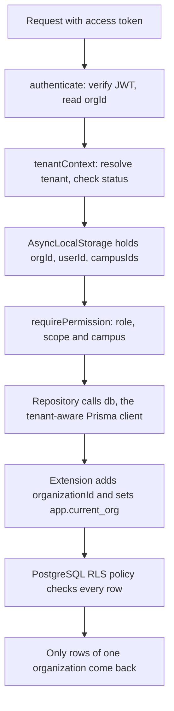
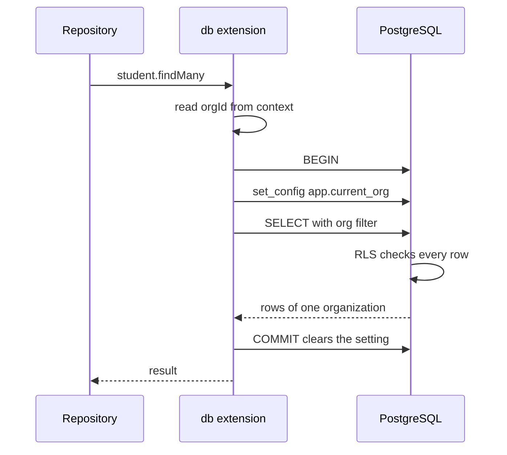
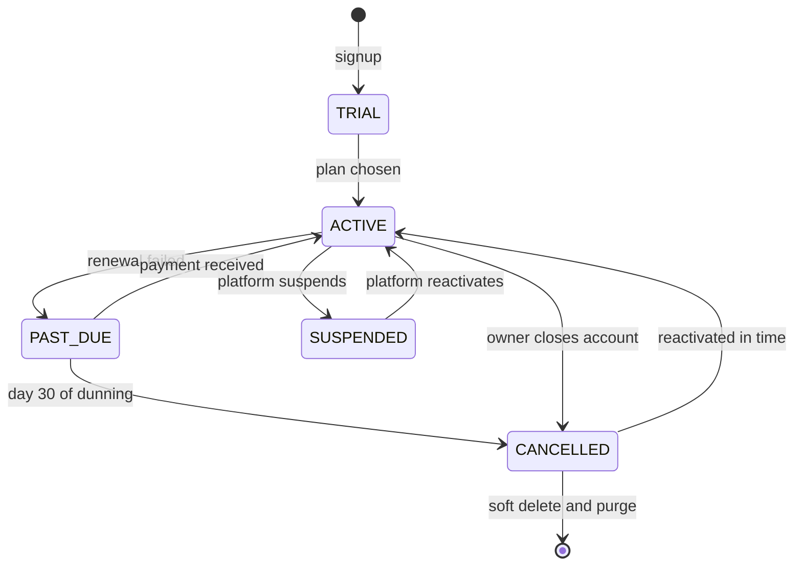

# Multi-Tenancy and Data Isolation

**In simple words:** EduFlow keeps the data of all institutes in one database. Every row carries the ID of its institute, and the system checks that ID in several layers before it reads or writes anything. This chapter gives the design, the code and the database rules which make sure that Bright Future Public School can never see the data of Sharma Classes. One leak between two customers can end the company, so this is the most important technical chapter of the PRD.

A tenant (one customer organization whose data must stay apart from all others) is one row in `organizations`. Everything else hangs below it.

| Item | Value |
|---|---|
| Tenancy model | Shared database, shared schema, `organization_id` on every tenant table |
| Tenant key | `Organization.id` (UUID), carried as the `orgId` claim in the JWT (the signed access token) |
| Tenant tables | 181 of 189 models: 168 with a mandatory `organizationId`, 13 where it may be null |
| Platform tables | 8 models: `Country`, `Currency`, `ExchangeRate`, `Plan`, `PlanPrice`, `PlanFeature`, `Permission`, `Organization` |
| Runtime database role | `eduflow_app`: no superuser, no `BYPASSRLS`, owns no table |
| Migration role | The owner role (`eduflow` on the laptop); bypasses row-level security |
| Built by | Prompt P-06 (sprint Days 5 and 6); campus scoping by P-08 (Day 10) |
| Proof | The mandatory tenant-isolation test suite, run on every pull request |

## Why One Shared Database

There are three common ways to build a multi-tenant system. EduFlow uses the first one. The table shows why.

| Point | Shared database with `organization_id` (chosen) | Schema per tenant | Database per tenant |
|---|---|---|---|
| How it works | All tenants share the same tables. Each row has the tenant ID. | One PostgreSQL schema (a named group of tables) per tenant | One PostgreSQL database or server per tenant |
| Isolation strength | Logical. Needs strict software layers and tests. | Medium. A wrong `search_path` still leaks. | Strongest. Physical separation. |
| Migrations | One run of `prisma migrate deploy` | One run per schema. 10,000 tenants × 189 tables = 1.89 million tables. | One run per database, with custom tooling |
| Cost at 1,000 tenants | One database instance | One instance, but a huge catalog and slow dumps | 1,000 databases, or complex packing |
| New tenant signup | Insert rows. Under 2 seconds. | Create 189 tables. Several seconds. | Provision a database. Minutes. |
| Platform reports (MRR, active students) | One SQL query | A query per schema | A query per database |
| Restore one tenant | Harder. Restore to a side database, copy rows by tenant ID. | Medium | Easy |
| Noisy neighbour (one tenant slows the others) | Possible. Needs limits. | Possible | Rare |
| Fit for a solo founder | Best: one thing to run and watch | Poor: Prisma has no built-in per-tenant schema support | Poor: too much operations work |

The reasons for the choice, in order of weight:

1. **The price list needs it.** The Starter plan is free, and Growth costs ₹2,499 a month. A free tenant must cost almost nothing to host. Only shared tables allow that.
2. **One person runs the system.** One migration, one backup, one dashboard. With 300 free and 120 paying organizations in Year 1, anything per tenant means 420 copies of each chore.
3. **Signup must be instant.** The mission says an institute starts within one day. Signup (`ORG-API-03`) writes a few rows and is done.
4. **The weak point can be fixed in software.** Logical isolation is weaker than physical isolation. EduFlow pays this back with the layers in this chapter and with a test suite that can never be skipped.

### Migration path for very large or regulated tenants

Some customers will outgrow the shared cluster, or their law will demand separation. The design allows this without a rewrite, because every row already carries `organization_id`, every unique key is per tenant, and all primary keys are UUIDs. The rows of one tenant can be lifted out with one simple filter, and their IDs cannot collide in the new home.

| Stage | When | What changes | What stays the same |
|---|---|---|---|
| Shared cluster | Default for every tenant | Nothing | Everything in this chapter |
| Regional cell | First customers in the UAE, USA or Australia, or a data-residency rule | A full copy of the stack (API, worker, PostgreSQL, Redis, S3 bucket) in that region. `Organization.dataRegion` names the cell. | Code, schema, isolation layers |
| Dedicated database | An Enterprise contract demands it, a regulator demands it, or one tenant causes more than 20% of cluster load (assumption) | The tenant's rows move to their own PostgreSQL instance. A routing map in the platform secret store points the tenant to it. | Code, schema, `organization_id`, RLS policies |

How one tenant moves to a dedicated database:

1. Agree a maintenance window with the customer, for example Sunday 02:00 to 04:00 IST.
2. Create the target database and run the same migrations. Copy the 7 platform reference tables in full, plus the shared rows with a null `organization_id` (system roles, default templates, platform policies).
3. Suspend the tenant (`ORG-API-35`) with the reason "Scheduled data move". Logins stop and no new writes arrive.
4. Copy the tenant's rows table by table in foreign-key order: `COPY (SELECT * FROM students WHERE organization_id = '<id>') TO STDOUT`, piped into the target.
5. Compare row counts per table between source and target. Any difference stops the move.
6. If the region changes, sync the S3 prefix `org/<orgId>/` to the new bucket. One prefix holds all files of the tenant.
7. Switch the routing map, reactivate the tenant (`ORG-API-36`), and run the smoke tests as a Super Admin.
8. Keep the source rows for 30 days as a fallback. Then remove them with the normal purge task (see *Tenant Lifecycle* below).

The dedicated database keeps `organization_id` and the RLS policies. The same code must run everywhere. A dedicated database is a hosting decision, not a second product.

## The Isolation Layers at a Glance

No single layer is trusted. Each one assumes that the layer above it has a bug.

**Figure: The path of one request through the isolation layers**



A request of Suresh Gupta passes all boxes from top to bottom. His token says "Bright Future Public School", and the context, the Prisma filter and the database policy all use that one ID.

Three more layers sit around this path. Schema rules (per-tenant unique keys and composite foreign keys) stop a child row from pointing at a parent of another tenant. The edges (Redis keys, job payloads, S3 paths, logs) keep data safe outside the database. The test suite in CI catches a new table or endpoint that arrives without isolation. The *Threat Table* at the end maps every known mistake to its layer.

## Tenant Resolution

Tenant resolution means answering one question at the start of every request: "Which organization is this for?" The answer depends on who calls.

| Caller | Where the tenant comes from | Notes |
|---|---|---|
| Signed-in user (six tenant roles) | `orgId` claim of the verified JWT | The only source. Body, query and URL are never read for this. |
| Login pages and public endpoints | Host `{slug}.eduflow.app`, a custom domain, or the `tenantSlug` parameter | Finds branding and the right `User` row. Grants nothing by itself. |
| `SUPER_ADMIN` | `X-Organization-Id` header | Only for this role. Every use is audited. |
| Enterprise API key | `ApiKey.organizationId` of the matching key hash | The key is the identity. No header can change it. |
| Provider webhook (Razorpay, Stripe, Meta) | Looked up from the payload: gateway account or `WhatsAppAccount.phoneNumberId` | `WebhookEvent.organizationId` stays null until the worker resolves it |
| Background job | `orgId` field in the job payload | Set by the API when it adds the job |

The rules:

1. **The JWT decides.** `authenticate` verifies the signature and reads `orgId`. A `User` row belongs to exactly one organization (`@@unique([organizationId, userType, email])`). A parent with children in two institutes has two separate logins.
2. **Never from the client.** Zod schemas do not contain `organizationId`, so the field is stripped from every body. A route like `/organizations/:id/students` does not exist. The tenant's own profile is `/organizations/current`.
3. **The subdomain is for the door, not for the key.** `brightfuture.eduflow.app` shows the right logo and login options (`AUTH-API-11`), and it tells `/auth/login` in which organization to look for the email. After login, only the JWT counts.
4. **`X-Organization-Id` works for `SUPER_ADMIN` only.** For every other user the header is ignored and logged, and the request goes on under the JWT tenant. The API does not answer `FORBIDDEN`, because a different answer would tell an attacker that the header is a real switch.
5. **A Super Admin inside a tenant is a guest, not a god.** The header sets a normal tenant context. The request then passes the same Prisma filter and the same RLS policy as a tenant user. Each such request writes an `AuditLog` row with `actorType = IMPERSONATION` and `impersonatorUserId`.
6. **Tenant status is checked on every request.** `SUSPENDED` and soft-deleted organizations get `FORBIDDEN`. The status is cached in Redis for 60 seconds under `p:org-status:<orgId>`, and the cache entry is deleted on suspend and reactivate.

**File: `server/src/middleware/tenant-context.ts`**

```typescript
import type { NextFunction, Request, Response } from 'express';
import { AppError } from '../lib/app-error';
import { runWithTenant } from '../lib/tenant-context';
import { getOrgStatus } from '../modules/organizations/org-status.cache';

const UUID_RE = /^[0-9a-f]{8}-[0-9a-f]{4}-[1-8][0-9a-f]{3}-[89ab][0-9a-f]{3}-[0-9a-f]{12}$/i;

// Runs after authenticate(), which puts the verified token claims on req.auth.
export async function tenantContext(req: Request, _res: Response, next: NextFunction) {
  const { userId, roleKeys, campusIds } = req.auth;
  let orgId: string | null = req.auth.orgId; // null only for PLATFORM users
  let impersonatorUserId: string | undefined;

  const headerOrg = req.get('X-Organization-Id');
  if (headerOrg !== undefined) {
    if (roleKeys.includes('SUPER_ADMIN')) {
      if (!UUID_RE.test(headerOrg)) {
        throw new AppError('VALIDATION_ERROR', 'X-Organization-Id must be a UUID', [
          { field: 'X-Organization-Id', issue: 'Invalid UUID' },
        ]);
      }
      orgId = headerOrg;
      impersonatorUserId = userId;
    } else {
      req.log.warn({ userId, headerOrg }, 'X-Organization-Id ignored: not a platform user');
    }
  }

  if (orgId === null) {
    throw new AppError('VALIDATION_ERROR', 'X-Organization-Id header is required', [
      { field: 'X-Organization-Id', issue: 'Required for platform users on tenant routes' },
    ]);
  }

  const org = await getOrgStatus(orgId); // Redis first, then a platform-context read
  if (org === null) throw new AppError('NOT_FOUND', 'Organization not found');
  const blocked = org.status === 'SUSPENDED' || org.deletedAt !== null;
  if (blocked && impersonatorUserId === undefined) {
    throw new AppError('FORBIDDEN', 'This account is suspended. Please contact EduFlow support.');
  }

  await runWithTenant(
    { orgId, userId, campusIds, requestId: req.id, impersonatorUserId },
    async () => next(),
  );
}
```

Express 5 forwards a rejected promise to the error handler, so the `throw` lines need no `try` and `catch`. The `/platform/...` routes skip this middleware and run in the platform context described later.

What the caller sees when tenant resolution fails:

| Situation | Status | Code |
|---|---|---|
| Unknown slug on a login or public endpoint | 404 | `NOT_FOUND` |
| Organization is `SUSPENDED` or soft-deleted | 403 | `FORBIDDEN` |
| Super Admin calls a tenant route without the header | 400 | `VALIDATION_ERROR` |
| Super Admin sends an ID that is no organization | 404 | `NOT_FOUND` |
| A record of another tenant is requested by ID | 404 | `NOT_FOUND` |
| `X-Campus-Id` is not one of the user's campuses | 403 | `FORBIDDEN` |

> **Rule:** A record of another tenant answers `404`, never `403`. A `403` says "this exists, but it is not yours", and that already leaks a fact.

This is the full answer that the owner of Sharma Classes gets when he tries the ID of Aarav Sharma, a student of Bright Future:

```http
GET /api/v1/students/6b1f0c52-7d1e-4a55-9a37-0d2f4f8f1a20 HTTP/1.1
Host: api.eduflow.app
Authorization: Bearer <accessToken of the Sharma Classes owner>
```

```json
{
  "success": false,
  "error": {
    "code": "NOT_FOUND",
    "message": "Student not found",
    "details": []
  },
  "requestId": "req_8f3a2c91d4"
}
```

## Tenant Context with AsyncLocalStorage

`AsyncLocalStorage` is a built-in Node.js class. It carries a small object through one request, across every `await`, without passing it as a function argument. EduFlow stores the tenant there. Code deep inside a service can always ask "which organization am I working for?".

There are exactly two kinds of context:

| Kind | Opened by | Used for | Prisma filter | RLS setting |
|---|---|---|---|---|
| Tenant | `runWithTenant()` | Every tenant request and every tenant job | `organizationId` added | `app.current_org` |
| Platform | `runAsPlatform(reason, fn)` | Platform console, signup, login lookup, webhook inbox, the listing step of nightly jobs, seed | None | `app.platform_bypass` |

**File: `server/src/lib/tenant-context.ts`**

```typescript
import { AsyncLocalStorage } from 'node:async_hooks';
import { logger } from './logger';

export interface TenantContext {
  kind: 'tenant';
  orgId: string;
  userId: string;
  campusIds: string[]; // campuses of the user; applied when the permission scope is CAMPUS
  requestId: string;
  impersonatorUserId?: string; // SUPER_ADMIN acting inside this tenant
  inTransaction?: boolean; // true inside tenantTransaction()
}

export interface PlatformContext {
  kind: 'platform';
  reason: string;
  inTransaction?: boolean;
}

export type TenantInput = Omit<TenantContext, 'kind' | 'inTransaction'>;
type Store = TenantContext | PlatformContext;

const storage = new AsyncLocalStorage<Store>();

export class TenantContextMissingError extends Error {
  constructor(detail: string) {
    super(`Tenant context missing: ${detail}`);
    this.name = 'TenantContextMissingError';
  }
}

export function runWithTenant<T>(input: TenantInput, fn: () => Promise<T>): Promise<T> {
  return storage.run({ kind: 'tenant', ...input }, fn);
}

export function getStore(): Store | undefined {
  return storage.getStore();
}

export function getTenant(): TenantContext {
  const store = storage.getStore();
  if (store?.kind !== 'tenant') {
    throw new TenantContextMissingError('getTenant() called outside runWithTenant()');
  }
  return store;
}

/** Marks the context as "inside one database transaction". Used by lib/prisma.ts only. */
export function runInTransaction<T>(fn: () => Promise<T>): Promise<T> {
  const store = storage.getStore();
  if (store === undefined) throw new TenantContextMissingError('transaction without context');
  return storage.run({ ...store, inTransaction: true }, fn);
}

export function runAsPlatform<T>(reason: string, fn: () => Promise<T>): Promise<T> {
  if (storage.getStore()?.kind === 'tenant') {
    throw new Error('runAsPlatform() is not allowed inside a tenant context');
  }
  if (reason.trim().length < 10) throw new Error('runAsPlatform() needs a clear reason');
  logger.info({ reason }, 'platform context opened');
  return storage.run({ kind: 'platform', reason }, fn);
}
```

Three decisions in this file matter:

- **No default tenant.** There is no fallback organization and no "system" tenant. Missing context is an error, never a guess.
- **A tenant request can never become a platform request.** `runAsPlatform()` throws when it is called inside a tenant context. A bug in a tenant endpoint therefore cannot open the wide door.
- **The reason is mandatory and logged.** A search for "platform context opened" in the logs lists every use. The list must stay short enough to review by hand.

## The Tenant-Aware Prisma Client

All database access goes through one exported client, `db`. It is the normal Prisma client plus an extension (a documented Prisma feature that wraps every query). The extension does two jobs. It adds `organizationId` to the query. It also wraps the query in a small transaction that tells PostgreSQL which tenant is active, so that row-level security can check the same thing again.

The models fall into four groups:

| Group | Models | What the extension does |
|---|---|---|
| Platform reference | `Country`, `Currency`, `ExchangeRate`, `Plan`, `PlanPrice`, `PlanFeature`, `Permission` | Nothing. Readable without context. |
| The tenant itself | `Organization` | Tenant context: filter `id = orgId`, read and update only. Create and delete: platform only. |
| Tenant models, mandatory ID | 168 models, for example `Student`, `FeeInvoice`, `Payment` | Filter on every read and write. Stamp on every create. |
| Tenant models, nullable ID | 13 models, see below | Same, with one read exception for shared defaults |

The 13 models with a nullable `organizationId` need care, because "null" means two different things:

| Group | Models | A null row is | Tenant may read it | Tenant may change it |
|---|---|---|---|---|
| Shared defaults | `Role`, `RolePermission`, `NotificationTemplate`, `PolicyDocument` | A system role, a default template, an EduFlow policy | Yes | No |
| Platform or not yet resolved | `User`, `UserRole`, `RefreshToken`, `OtpCode`, `PasswordResetToken`, `LoginHistory`, `AuditLog`, `DataBreachIncident`, `WebhookEvent` | A platform staff row, or a row written before the tenant was known | No | No |

The SQL migration adds two check constraints that keep these groups honest: `CHECK ((user_type = 'PLATFORM') = (organization_id IS NULL))` on `users`, and `CHECK (is_system = (organization_id IS NULL))` on `roles`.

**File: `server/src/lib/prisma.ts`**

```typescript
import { Prisma, PrismaClient } from '@prisma/client';
import { getStore, runInTransaction, TenantContextMissingError } from './tenant-context';

type Args = Record<string, unknown>;

const base = new PrismaClient();

const PLATFORM_MODELS = new Set([
  'Country', 'Currency', 'ExchangeRate', 'Plan', 'PlanPrice', 'PlanFeature', 'Permission',
]);
const SHARED_READ_MODELS = new Set([
  'Role', 'RolePermission', 'NotificationTemplate', 'PolicyDocument',
]);
// Built from the schema at start-up, so a new model can never be forgotten.
const TENANT_MODELS = new Set(
  Prisma.dmmf.datamodel.models
    .filter((model) => model.fields.some((field) => field.name === 'organizationId'))
    .map((model) => model.name),
);
const READ_OPS = new Set([
  'findUnique', 'findUniqueOrThrow', 'findFirst', 'findFirstOrThrow', 'findMany',
  'count', 'aggregate', 'groupBy',
]);
const CREATE_OPS = new Set(['create', 'createMany', 'createManyAndReturn']);

/** Appends the filter with AND. Works for plain and for unique "where" inputs. */
function addFilter(args: Args, filter: Args): void {
  const where = (args.where ?? {}) as Args;
  const and = where.AND === undefined ? [] : Array.isArray(where.AND) ? where.AND : [where.AND];
  args.where = { ...where, AND: [...and, filter] };
}

function stamp(row: Args, orgId: string): Args {
  if (row.organizationId !== undefined && row.organizationId !== orgId) {
    throw new Error('Tenant mismatch: data.organizationId differs from the tenant context');
  }
  return { ...row, organizationId: orgId };
}

function scopeArgs(model: string, operation: string, input: Args, orgId: string): Args {
  const args: Args = { ...input };

  if (model === 'Organization') {
    if (!READ_OPS.has(operation) && operation !== 'update') {
      throw new Error(`Organization.${operation} is allowed in the platform context only`);
    }
    addFilter(args, { id: orgId });
    return args;
  }

  if (CREATE_OPS.has(operation)) {
    const data = args.data;
    args.data = Array.isArray(data)
      ? data.map((row) => stamp(row as Args, orgId))
      : stamp(data as Args, orgId);
    return args;
  }

  const own = { organizationId: orgId };
  const sharedRead = SHARED_READ_MODELS.has(model) && READ_OPS.has(operation);
  addFilter(args, sharedRead ? { OR: [own, { organizationId: null }] } : own);

  if (operation === 'upsert') args.create = stamp(args.create as Args, orgId);
  const patch = (operation === 'upsert' ? args.update : args.data) as Args | undefined;
  if (patch?.organizationId !== undefined) throw new Error('organizationId can never change');
  return args;
}

export const db = base.$extends({
  name: 'tenant-scope',
  query: {
    $allModels: {
      async $allOperations({ model, operation, args, query }) {
        if (PLATFORM_MODELS.has(model)) return query(args);

        const store = getStore();
        if (store === undefined) throw new TenantContextMissingError(`${model}.${operation}`);
        if (model !== 'Organization' && !TENANT_MODELS.has(model)) {
          throw new Error(`${model} is neither a platform model nor a tenant model`);
        }

        const scoped =
          store.kind === 'tenant'
            ? (scopeArgs(model, operation, args as Args, store.orgId) as typeof args)
            : args; // platform context: no filter; the reason is already in the log

        // Inside tenantTransaction() the setting is already in place on this connection.
        if (store.inTransaction) return query(scoped);

        const setting =
          store.kind === 'tenant'
            ? base.$executeRaw`SELECT set_config('app.current_org', ${store.orgId}, true)`
            : base.$executeRaw`SELECT set_config('app.platform_bypass', 'on', true)`;
        const [, result] = await base.$transaction([setting, query(scoped)]);
        return result;
      },
    },
  },
});

export type TenantTx = Omit<
  typeof db,
  '$connect' | '$disconnect' | '$on' | '$transaction' | '$use' | '$extends'
>;

/** One interactive transaction: the tenant setting is written once, then fn runs on tx. */
export function tenantTransaction<T>(fn: (tx: TenantTx) => Promise<T>): Promise<T> {
  const store = getStore();
  if (store === undefined) throw new TenantContextMissingError('tenantTransaction()');
  return db.$transaction(
    async (tx) => {
      if (store.kind === 'tenant') {
        await tx.$executeRaw`SELECT set_config('app.current_org', ${store.orgId}, true)`;
      } else {
        await tx.$executeRaw`SELECT set_config('app.platform_bypass', 'on', true)`;
      }
      return runInTransaction(() => fn(tx));
    },
    { maxWait: 5_000, timeout: 10_000 },
  );
}
```

What happens per kind of operation:

| Operation | What the extension adds | Result for a row of another tenant |
|---|---|---|
| `findUnique`, `findFirst`, `findMany` and the `OrThrow` forms | `AND organizationId = orgId` (plus null rows for the 4 shared models) | `null`, an empty list, or Prisma error `P2025` mapped to `NOT_FOUND` |
| `count`, `aggregate`, `groupBy` | The same filter | Not counted |
| `create`, `createMany`, `createManyAndReturn` | `organizationId` stamped on every row | A different ID in `data` throws before any SQL runs |
| `update`, `updateMany`, `delete`, `deleteMany` | The same filter; `organizationId` in `data` throws | 0 rows changed, or `P2025` mapped to `NOT_FOUND` |
| `upsert` | Filter on `where`, stamp on `create`, guard on `update` | Falls to `create` inside the own tenant |
| Nested writes and `include` | Nothing. The extension sees only the top-level model. | Stopped by RLS and by the composite foreign keys |
| `$queryRaw`, `$executeRaw` | Nothing | Stopped by RLS |

Rules for everyday code:

1. Import `db` from `lib/prisma.ts`, and only inside repository files. An ESLint rule blocks `new PrismaClient()` everywhere else.
2. TypeScript still asks for `organizationId` in `create` data. Repositories pass `getTenant().orgId`. The extension checks that it matches.
3. Write foreign keys as scalar fields (`campusId`, `batchId`), not with `connect`. Prisma does not allow mixing both styles, and the stamp uses the scalar style.
4. Raw SQL is allowed only inside `tenantTransaction()`, as a tagged template, and with `organization_id` in the `WHERE`. Outside a transaction the setting is absent, so a raw query returns zero rows. It fails safe.
5. Signup (`ORG-API-03`) runs `runAsPlatform('signup: create organization and owner', ...)` with one `tenantTransaction()` inside, and it passes every `organizationId` by hand.

> **Warning:** The extension is a seat belt, not a wall. It cannot see nested writes or raw SQL. That is why the next layer lives inside PostgreSQL, where no application bug can reach it.

## Row-Level Security in PostgreSQL

Row-Level Security (RLS) is a PostgreSQL feature. A policy is attached to a table, and PostgreSQL adds the policy's condition to every query on that table, whoever wrote the query. EduFlow's condition is: "the row's `organization_id` equals the setting `app.current_org` of this transaction".

### Two database roles

| Role | Used by | Attributes | RLS |
|---|---|---|---|
| Owner (`eduflow` on the laptop) | `prisma migrate deploy`, seed, backups with `pg_dump`, Prisma Studio | Owns all tables. Superuser locally. `BYPASSRLS` on managed hosts. | Bypassed |
| `eduflow_app` | API and worker, through `DATABASE_URL` | `NOSUPERUSER`, `NOBYPASSRLS`, cannot create or alter tables, owns nothing | Enforced |

The API process never receives the owner URL (`DATABASE_ADMIN_URL`). It is not even part of the API's environment schema.

### The migration that turns RLS on

```sql
-- Part 1: runtime role. Safe to run twice (Prisma replays migrations on a shadow database).
DO $$
BEGIN
  IF NOT EXISTS (SELECT 1 FROM pg_roles WHERE rolname = 'eduflow_app') THEN
    CREATE ROLE eduflow_app LOGIN PASSWORD 'change-me-outside-local'
      NOSUPERUSER NOCREATEDB NOCREATEROLE NOBYPASSRLS;
  END IF;
END
$$;

GRANT USAGE ON SCHEMA public TO eduflow_app;
GRANT SELECT, INSERT, UPDATE, DELETE ON ALL TABLES IN SCHEMA public TO eduflow_app;
GRANT USAGE, SELECT ON ALL SEQUENCES IN SCHEMA public TO eduflow_app;
ALTER DEFAULT PRIVILEGES IN SCHEMA public
  GRANT SELECT, INSERT, UPDATE, DELETE ON TABLES TO eduflow_app;

-- Part 2: every table that has organization_id gets the same two policies.
DO $$
DECLARE t text;
BEGIN
  FOR t IN
    SELECT c.table_name
    FROM information_schema.columns c
    JOIN information_schema.tables tb USING (table_schema, table_name)
    WHERE c.table_schema = 'public' AND c.column_name = 'organization_id'
      AND tb.table_type = 'BASE TABLE'
  LOOP
    EXECUTE format('ALTER TABLE %I ENABLE ROW LEVEL SECURITY', t);
    EXECUTE format('ALTER TABLE %I FORCE ROW LEVEL SECURITY', t);
    EXECUTE format($p$
      CREATE POLICY tenant_isolation ON %I
        USING (organization_id = NULLIF(current_setting('app.current_org', true), '')::uuid)
        WITH CHECK (organization_id = NULLIF(current_setting('app.current_org', true), '')::uuid)
    $p$, t);
    EXECUTE format($p$
      CREATE POLICY platform_access ON %I
        USING (current_setting('app.platform_bypass', true) = 'on')
        WITH CHECK (current_setting('app.platform_bypass', true) = 'on')
    $p$, t);
  END LOOP;
END
$$;

-- Part 3: shared defaults (organization_id IS NULL) are readable by every tenant, never writable.
CREATE POLICY shared_defaults_read ON roles FOR SELECT USING (organization_id IS NULL);
CREATE POLICY shared_defaults_read ON role_permissions FOR SELECT USING (organization_id IS NULL);
CREATE POLICY shared_defaults_read ON notification_templates FOR SELECT
  USING (organization_id IS NULL);
CREATE POLICY shared_defaults_read ON policy_documents FOR SELECT USING (organization_id IS NULL);

-- Part 4: the tenant table itself is keyed by id.
ALTER TABLE organizations ENABLE ROW LEVEL SECURITY;
ALTER TABLE organizations FORCE ROW LEVEL SECURITY;
CREATE POLICY own_organization_read ON organizations FOR SELECT
  USING (id = NULLIF(current_setting('app.current_org', true), '')::uuid);
CREATE POLICY own_organization_update ON organizations FOR UPDATE
  USING (id = NULLIF(current_setting('app.current_org', true), '')::uuid)
  WITH CHECK (id = NULLIF(current_setting('app.current_org', true), '')::uuid);
CREATE POLICY platform_access ON organizations
  USING (current_setting('app.platform_bypass', true) = 'on')
  WITH CHECK (current_setting('app.platform_bypass', true) = 'on');

-- Part 5: the audit trail is append-only for the runtime role.
REVOKE UPDATE, DELETE ON audit_logs FROM eduflow_app;
```

How to read the policies:

- `USING` filters the rows that a query can see, change or delete. `WITH CHECK` tests the rows that an `INSERT` or `UPDATE` wants to write. Both are needed. Without `WITH CHECK`, a tenant could insert a row for another tenant.
- `current_setting('app.current_org', true)` returns NULL when the setting is absent. `NULLIF(..., '')` also turns an empty string into NULL. A comparison with NULL is never true, so **no setting means no rows**. This is the safe default.
- Several policies on one table are joined with OR. A tenant sees its own rows through `tenant_isolation`, and the system roles through `shared_defaults_read`. That second policy is for `SELECT` only, so a tenant can never edit a system role.
- A later migration that adds a tenant table must add the two policies for it. The guard test in the isolation suite reads `pg_class.relrowsecurity` and `relforcerowsecurity` for every table with `organization_id`, and fails the build if one is missing.
- Every database view must be created `WITH (security_invoker = true)`. A normal view runs with the rights of its owner and would skip RLS.

### How the API sets the tenant for each transaction

**Figure: One query with the tenant setting**



The extension sends the setting and the query as one small transaction on one pooled connection. PostgreSQL checks each row against the setting, and the setting is gone after `COMMIT`.

The third argument `true` of `set_config` means "local to this transaction". This detail is critical. Database connections are pooled and reused. A session-wide `SET` would stay on the connection, and the next request, maybe from another institute, would inherit it. A transaction-local setting disappears at `COMMIT` or `ROLLBACK`. It also stays correct behind PgBouncer (a connection pooler) in transaction mode.

A service that runs several queries uses `tenantTransaction()`. It writes the setting once, and all queries on `tx` share it:

```typescript
// server/src/modules/students/students.service.ts (shortened)
import { tenantTransaction } from '../../lib/prisma';
import { getTenant } from '../../lib/tenant-context';

export function admitStudent(input: AdmitStudentInput) {
  const { orgId } = getTenant();
  return tenantTransaction(async (tx) => {
    const admissionNo = await nextNumber(tx, 'ADMISSION_NO'); // row lock on number_sequences
    const student = await tx.student.create({
      data: { ...input.student, organizationId: orgId, admissionNo },
    });
    await tx.enrollment.create({
      data: { ...input.enrollment, organizationId: orgId, studentId: student.id },
    });
    return student;
  });
}
```

Inside the callback, every call must use `tx`. A call on `db` would run on another connection without the setting, and RLS would return nothing.

### The migration-role bypass

Migrations, the seed and backups must see all rows of all tenants. In PostgreSQL, superusers and roles with the `BYPASSRLS` attribute always skip RLS. Table owners skip it too, unless the table has `FORCE ROW LEVEL SECURITY`. EduFlow sets `FORCE` on purpose. If somebody points the API at an owner role by mistake, the policies still apply, unless that role is also a superuser or has `BYPASSRLS`.

| Environment | Owner role | How it bypasses RLS |
|---|---|---|
| Laptop (Docker) | `eduflow`, created by the PostgreSQL image | It is a superuser |
| Managed host where the admin user is a superuser | The admin user of the service | It is a superuser |
| Managed host where the admin user is not a true superuser (for example AWS RDS) | The master user | Run `ALTER ROLE <owner> BYPASSRLS;` once |

Check the result in every environment:

```sql
SELECT rolname, rolsuper, rolbypassrls FROM pg_roles
WHERE rolname IN ('eduflow', 'eduflow_app');
-- eduflow_app must show f | f. The owner must show t in at least one of the two columns.
```

Backups run with the owner URL. A `pg_dump` with the runtime role stops with a row-security error. That error is correct: a partial backup that looks complete would be worse.

### Performance notes

1. **The policy uses the same index as the query.** The extension already sends `organization_id = $1`, and every tenant index starts with that column. The planner serves both conditions from one index scan.
2. **`current_setting()` is a stable function.** PostgreSQL can evaluate it once per scan when it is part of an index condition. If `EXPLAIN (ANALYZE)` of a large scan shows the policy as a per-row filter, wrap the expression in a scalar sub-select: `(SELECT NULLIF(current_setting('app.current_org', true), '')::uuid)`. PostgreSQL then computes it once per query.
3. **Round trips.** A single query becomes `BEGIN`, `set_config`, the query and `COMMIT` on one connection. Expect 1 to 2 ms extra inside one region (estimate). A handler with more than three queries should use `tenantTransaction()`, which pays this cost once.
4. **Transactions hold a connection.** Never call Razorpay, the WhatsApp API or S3 inside `tenantTransaction()`. The transaction limit is 10 seconds, and the wait for a free connection is 5 seconds.
5. **Target.** RLS may add at most 5% to the p95 time (the time under which 95% of runs finish) of the ten heaviest queries. Prompt P-53 measures this in a test database with RLS on and off.
6. **Foreign-key and unique checks skip RLS by design.** PostgreSQL verifies them without policies, so integrity never depends on the active tenant. This is one more reason why unique keys must be per tenant: a global unique key would tell tenant B that a value exists in tenant A.

## Campus Scoping

A campus is the second scope, inside one tenant. It is an access rule inside one customer, not a wall between customers: Suresh Gupta collects fees at the main campus of Bright Future and must not see the second campus. The application enforces this rule, not RLS, because the Organization Admin sees all campuses, students move between campuses, and reports compare them.

The schema has 65 models with a mandatory `campusId` (for example `Student`, `FeeInvoice`, `AttendanceSession`) and 23 with an optional one. An optional `campusId` that is null means "valid for the whole organization", for example a holiday for all campuses or an organization-wide setting.

| Rule | Detail |
|---|---|
| Who sees which campus | `UserCampus` rows list the campuses of a user. `ORG_ADMIN` has no rows and sees all. |
| Where the scope comes from | `RolePermission.scope`: `ALL`, `CAMPUS`, `OWN` or `VIEW`. `requirePermission()` puts the matched scope on the request. |
| Filter | For scope `CAMPUS` the repository adds `campusId: { in: campusIds }` from `getTenant()` |
| `X-Campus-Id` header | Narrows the request to one campus (the campus switcher). A campus outside the user's list answers `FORBIDDEN`. Without the header, all assigned campuses apply. |
| `campusId` in a body | Allowed, because one user may work in several campuses. It must be in the user's list, else `FORBIDDEN`. |
| Record of another campus by ID | `NOT_FOUND`, for the same reason as with tenants |
| Rows with `campusId` null | Visible to all campuses of the tenant. Only users with scope `ALL` may change them. |

```typescript
// server/src/modules/fees/fee-invoices.repository.ts (shortened)
import type { PermissionScope } from '@prisma/client';
import { db } from '../../lib/prisma';
import { getTenant } from '../../lib/tenant-context';

export function listInvoices(filter: InvoiceFilter, scope: PermissionScope) {
  const { campusIds } = getTenant();
  const campusFilter =
    filter.campusId !== undefined
      ? { campusId: filter.campusId } // already checked against campusIds by the middleware
      : scope === 'CAMPUS'
        ? { campusId: { in: campusIds } }
        : {};

  return db.feeInvoice.findMany({
    where: { deletedAt: null, status: filter.status, ...campusFilter },
    orderBy: { dueDate: 'asc' },
    skip: (filter.page - 1) * filter.limit,
    take: filter.limit,
  });
}
```

The query has no `organizationId`, because the extension adds it. The full scope rules for all seven roles are in *RBAC and Permissions Matrix*, and the campus screens are in *Multi Campus Module*.

## Per-Tenant Unique Keys and Indexes

A value is unique inside one organization, never across the platform. Bright Future and Sharma Classes may both issue receipt number `R-0001`.

| Table | Unique key | Why it matters |
|---|---|---|
| `students` | `(organization_id, admission_no)` | Two institutes can use the same admission numbers |
| `users` | `(organization_id, user_type, email)` and the same with `phone` | Sunita Devi can be a parent in two institutes with one phone number |
| `campuses` | `(organization_id, code)` | Every tenant may have a campus `MAIN` |
| `fee_invoices` | `(organization_id, invoice_no)` | Invoice series per tenant |
| `receipts` | `(organization_id, receipt_no)` | Gap-free receipt series per tenant |
| `payments` | `(organization_id, idempotency_key)` | A retry key of tenant A never blocks tenant B |
| `subscriptions` | Partial: `(organization_id) WHERE status IN ('TRIALING','ACTIVE','PAST_DUE','PAUSED')` | One live subscription per tenant |
| `campuses` | Partial: `(organization_id) WHERE is_main AND deleted_at IS NULL` | One main campus per tenant |

Index rules:

1. Every index on a tenant table starts with `organization_id`. Next comes `campus_id` when lists filter by campus, then the filter columns, then the sort column. Example from `fee_invoices`: `(organization_id, campus_id, status, due_date)`.
2. A few keys are global on purpose, because an outside system issues the value or because the lookup happens before the tenant is known: `organizations.slug`, `organizations.custom_domain`, `file_assets.s3_key`, `api_keys.key_hash`, `payments (gateway, gateway_payment_id)`, `message_logs (provider, provider_message_id)`, and the plain indexes on `users.email` and `users.phone` for the login lookup.
3. The trigram search indexes (`idx_students_search_trgm` and its siblings) have no tenant column. The tenant filter and RLS still apply to every search.

### Tenant-safe foreign keys

A normal foreign key only proves that the parent row exists. It does not prove that the parent belongs to the same tenant. For the six parents that carry money, marks and attendance, the schema closes this gap with a composite key: `Student`, `Batch`, `AttendanceSession`, `ExamSchedule`, `FeeInvoice` and `Payment`.

```prisma
// model Student (parent)
@@unique([id, organizationId]) // target of composite tenant-safe foreign keys

// model FeeInvoice (child): the relation uses both columns
// fields: [studentId, organizationId], references: [id, organizationId], onDelete: Restrict
```

The migration turns this into a two-column constraint:

```sql
ALTER TABLE fee_invoices
  ADD CONSTRAINT fee_invoices_student_id_organization_id_fkey
  FOREIGN KEY (student_id, organization_id)
  REFERENCES students (id, organization_id) ON DELETE RESTRICT;
```

With this key, PostgreSQL itself refuses a fee invoice of Sharma Classes that points to a student of Bright Future. All other relations follow a service rule: every foreign ID that arrives in a request body (`batchId`, `campusId`, `feeHeadId`) is first loaded through `db`. If the row belongs to another tenant, the load returns `null`, and the API answers `NOT_FOUND`.

## Tenant-Safe Caching, Queues, Files, Logs and Analytics

Data also lives outside the database. Every edge below follows one idea: the organization ID is part of the address, and code builds that address from the context, never from user input.

### Redis cache

| Key pattern | Content | Lifetime |
|---|---|---|
| `t:<orgId>:rbac:role:<roleId>` | Permission set of one role | 5 minutes, deleted on role change |
| `t:<orgId>:settings` | Organization settings | 10 minutes, deleted on save |
| `t:<orgId>:dash:<campusKey>:<date>` | Dashboard cards | 60 seconds |
| `p:org-status:<orgId>` | Tenant status for the middleware | 60 seconds, deleted on status change |
| `p:plans` | Public plan catalogue | 1 hour |
| `rl:user:<userId>`, `rl:org:<orgId>` | Rate-limit counters | 60 seconds |

- All tenant keys start with `t:<orgId>:`. The helper in `server/src/lib/cache.ts` builds this prefix from `getTenant()`. Direct calls to the Redis client are blocked by an ESLint rule outside that file.
- A tenant purge deletes `t:<orgId>:*` with `SCAN`.
- API responses carry `Cache-Control: private, no-store`. The CDN never caches `/api`. The web app clears the TanStack Query cache at logout.

### Queues

Every BullMQ job that touches tenant data carries `orgId` (the organization ID) in its payload, plus the `requestId` of the request that created it. The worker checks the payload, opens the tenant context and only then calls the service.

```typescript
// server/src/workers/finance.worker.ts (shortened)
import { UnrecoverableError, Worker } from 'bullmq';
import { z } from 'zod';
import { runWithTenant } from '../lib/tenant-context';

const payload = z.object({
  orgId: z.string().uuid(),
  requestId: z.string().min(1),
  asOfDate: z.string().date(),
});

export const financeWorker = new Worker(
  'finance',
  async (job) => {
    const parsed = payload.safeParse(job.data);
    if (!parsed.success) throw new UnrecoverableError('Job payload has no valid orgId');
    const { orgId, requestId, asOfDate } = parsed.data;
    return runWithTenant({ orgId, userId: SYSTEM_USER_ID, campusIds: [], requestId }, () =>
      applyLateFees(asOfDate),
    );
  },
  { connection, concurrency: 5 },
);
```

A job for all tenants, such as nightly late fees, uses the fan-out pattern. A scheduler opens `runAsPlatform('nightly late fees: list organizations', ...)`, reads only the IDs of active organizations, and adds one job per organization. Business logic never runs in the platform context. Queue names and job contracts are in *Background Jobs and Events*.

### Files in S3

- The object key is `org/<orgId>/<category>/<uuid>-<name>`, as stored in `FileAsset.s3Key`. The bucket of the tenant's region comes from `Organization.dataRegion`.
- The server builds the key. The client never sends a key or a bucket name.
- Buckets are private. A download goes through `CMN-API-06`: the API loads the `FileAsset` row through `db` (a file of another tenant gives `NOT_FOUND`), checks access to the owning record, and returns a pre-signed URL that is valid for 5 minutes.
- An upload uses `CMN-API-02`: a pre-signed `PUT` URL, valid for 10 minutes, locked to one key, one MIME type and a size limit.
- One prefix per tenant makes export, region moves and the final purge simple and safe.

### Logs and analytics

- Every Pino log line carries `requestId`, `orgId` and `userId` from the context. Request bodies, names and phone numbers are not logged.
- Sentry events carry the tag `orgId` and no personal data.
- PostHog receives events of staff users only, grouped by organization. No events of `STUDENT` users and no child identifiers are sent, because the DPDP Act forbids tracking of children.
- Platform numbers (`ORG-API-52`) are counts and sums from `DailyMetricSnapshot` and `Subscription`. No student-level row leaves its tenant.
- AI Insights prompts contain the data of one tenant only. No model is trained across tenants. See *AI Insights Module*.

## Cross-Tenant Operations and the Platform Console

The tenant product has no cross-tenant feature: no global search, no shared student record, no benchmark against named institutes. Work across tenants exists only in these four places, and each one leaves a trail.

| Operation | Who | How it runs | Trail |
|---|---|---|---|
| Platform console, `/platform/...` (`ORG-API-31` to `ORG-API-56`) | `SUPER_ADMIN` with `platform.view` or `platform.manage` | `runAsPlatform()` with the endpoint ID as reason | `AuditLog` row; `organizationId` is the target tenant, or null |
| Acting inside one tenant | `SUPER_ADMIN` with `platform.impersonate` | `X-Organization-Id`, or the short-lived token of `ORG-API-39` with a written reason | `actorType = IMPERSONATION`, `impersonatorUserId`, event `platform.impersonation.started` |
| Scheduled fan-out jobs | System | Platform context lists IDs, then one tenant job each | Log line with reason; job rows per tenant |
| Tenant lookup before login, webhook inbox | System | Platform context reads `organizations`, `users` or a provider account by a unique key | Log line with reason; `LoginHistory` or `WebhookEvent` row |

Rules for platform staff:

1. Platform users are `User` rows with `userType = PLATFORM` and no organization. MFA (a second login factor) is mandatory for them (`ORG-API-54`).
2. Impersonation rows carry the tenant's `organizationId`. The institute's own admin therefore sees them in the audit log (`CMN-API-22`). Support work is never hidden from the customer.
3. The founder reviews `ORG-API-56` (console actions and impersonation trail) once a month.
4. Nobody gets the owner database URL for support work. Production data is never copied to a laptop. Demos use seed data (prompt P-58).

An impersonated change is stored like this in `audit_logs`:

```json
{
  "organizationId": "0b9c6f0e-3a57-4f0e-9d43-6d1f6f2a7c11",
  "actorType": "IMPERSONATION",
  "actorUserId": null,
  "impersonatorUserId": "5d2a7e7c-1c1b-4b62-8e0a-9a4f3c0d2e55",
  "actorLabel": "EduFlow Support (SUPER_ADMIN)",
  "actorRoleKeys": ["SUPER_ADMIN"],
  "action": "fees.late_fee.waive",
  "entityType": "FeeInvoice",
  "entityLabel": "INV-0912 Aarav Sharma (BF-2027-0142)",
  "reason": "Ticket 1042: late fee charged twice after import",
  "outcome": "SUCCESS",
  "requestId": "req_5c1e77ab20"
}
```

## Noisy-Neighbour Protection

A noisy neighbour is one tenant whose load slows down all others. In a shared database this is the main operational risk. Every shared resource therefore has a limit per tenant.

| Resource | Limit | Enforced by | What the tenant sees |
|---|---|---|---|
| API requests | 100 per minute per user; 1,000 per minute per organization | Redis counters in the rate-limit middleware | 429 `RATE_LIMITED` |
| Login attempts | 5 per 15 minutes per account and IP | Auth service | 429 `RATE_LIMITED` |
| API keys | `ApiKey.rateLimitPerMin`, default 100 | Same middleware, keyed by key ID | 429 `RATE_LIMITED` |
| List size | `limit` at most 100; larger outputs only as `ExportJob` | Zod query schema | 400 `VALIDATION_ERROR` |
| Active jobs per tenant | notifications 5, PDFs 3, exports 2, reports 2, imports 1 | Redis counter per queue and tenant | The job waits; the status stays `QUEUED` |
| Bulk messages | 500 recipients per job | The announcement service splits the audience | Messages of other tenants go out in between |
| SQL statement time | 15 seconds in the API; 120 seconds in report and export workers | `statement_timeout` | 503 `SERVICE_UNAVAILABLE` and a Sentry alert |
| Locks and idle transactions | `lock_timeout` 5 s; `idle_in_transaction_session_timeout` 30 s | Role settings | The request fails fast and can be retried |
| Students, campuses, users, storage | Plan limits from `Plan` and `PlanFeature` | Service checks on create | 403 `PLAN_LIMIT_REACHED` |

```sql
ALTER ROLE eduflow_app SET statement_timeout = '15s';
ALTER ROLE eduflow_app SET lock_timeout = '5s';
ALTER ROLE eduflow_app SET idle_in_transaction_session_timeout = '30s';
-- Report and export workers raise the limit inside their own transaction only:
-- SET LOCAL statement_timeout = '120s';
```

Open-source BullMQ has no per-group concurrency, so the worker keeps a small counter per tenant. A job over the limit goes back to the delayed set for 5 seconds and does not block a worker slot:

```typescript
import { DelayedError, type Job } from 'bullmq';
import { redis } from '../lib/redis';

const LIMIT = { notifications: 5, pdf: 3, exports: 2, reports: 2, imports: 1 } as const;

export async function withTenantSlot<T>(
  queue: keyof typeof LIMIT,
  job: Job<{ orgId: string }>,
  token: string | undefined,
  fn: () => Promise<T>,
): Promise<T> {
  const key = `sem:${queue}:${job.data.orgId}`;
  const active = await redis.incr(key);
  await redis.expire(key, 600); // self-heals if a worker crashes
  if (active > LIMIT[queue]) {
    await redis.decr(key);
    await job.moveToDelayed(Date.now() + 5_000, token);
    throw new DelayedError();
  }
  try {
    return await fn();
  } finally {
    await redis.decr(key);
  }
}
```

Monitoring closes the loop. The platform dashboard shows the top ten tenants by request count, database time and queue depth. An alert fires when one tenant uses more than 30% of database time for 10 minutes. The answers, in order: call the customer, lower that tenant's limits, move it to a dedicated database.

## Tenant Lifecycle

**Figure: Status of an organization (`OrganizationStatus`)**



The status lives in `Organization.status`. Suspension is a platform decision (abuse, fraud, a legal order, a data move). Failed payments follow the softer dunning path in the BRD chapter *Pricing Strategy* and never end in lost data.

| Step | Trigger | What happens |
|---|---|---|
| Create | `ORG-API-03` (signup) or `ORG-API-32` (sales-led) | One transaction writes the organization, the owner, the main campus and a `TRIALING` subscription. System roles and default templates are shared rows; nothing is copied. |
| Suspend | `ORG-API-35` | `SUSPENDED` with `suspendedAt` and `suspendedReason`. Refresh tokens are revoked (`ADMIN_REVOKED`). The API answers `FORBIDDEN`, and workers skip the tenant's jobs. Data is untouched. |
| Reactivate | `ORG-API-36` | Back to `ACTIVE`. Status cache deleted. Users log in again. |
| Export | Any time: module exports (`ExportJob`). At closure: full export. | The full export is one ZIP: a CSV per table, a JSON manifest and the files below `org/<orgId>/`. The link lasts 7 days and can be rebuilt. |
| Close | `ORG-API-14` by the owner | Subscription cancelled, `status = CANCELLED`, full export queued, deletion scheduled. The account is read-only. |
| Soft delete | `ORG-API-40`, or the daily lifecycle job on Day 90 | `deletedAt` is set. All logins are blocked. Only the platform console can restore. |
| Purge | Scheduled maintenance task with the owner role, 30 days after `deletedAt` | Tenant rows are deleted in foreign-key order, then the S3 prefix and the Redis keys. A platform `AuditLog` row records it. |

Retention schedule after closure (Day 0 = the day of `ORG-API-14`):

| Day | State | Who can do what |
|---|---|---|
| 0 to 90 | `CANCELLED`, read-only | The owner can log in, export everything and reactivate. This matches the 90-day export promise in *Pricing Strategy*. |
| 90 to 120 | Soft-deleted | Nobody can log in. A Super Admin can restore on a written request of the owner. |
| 120 | Purged | Live data is gone. The slug becomes free again. |
| After 120 | Backups roll off | Within the backup retention window in *Audit Logs, Backups and Disaster Recovery* |

The purge does not run in the API or the worker. The runtime role cannot delete audit rows, and a mass delete must not be reachable from a request. The task runs next to the backup job with `DATABASE_ADMIN_URL`.

What survives the purge: the `organizations` row as a stub without contact data, the tenant's `subscription_invoices` (tax records, kept 8 years; assumption, confirm with the chartered accountant), and the platform audit rows about the tenant. The purge date is not a column. It is always `deletedAt` plus 30 days.

> **Note:** The purge pauses while a `DataBreachIncident` of the tenant is open or a legal hold is recorded by the founder. Deleting one student or one parent inside a living tenant is a different flow (`DataSubjectRequest`, `Student.anonymizedAt`). It is described in *Privacy and Compliance*.

## The Mandatory Tenant-Isolation Test Suite

This suite proves one sentence: organization A can never read or write organization B. It lives in `server/src/test/tenant-isolation.test.ts`, with files named `<module>.isolation.test.ts` for special routes. It runs on every pull request, and a red suite blocks the merge. The tests connect as `eduflow_app`, because a superuser passes every RLS test even when RLS is broken. The fixture is always the same pair: Bright Future Public School (A) and Sharma Classes (B).

| ID | Level | Check | Expected |
|---|---|---|---|
| TI-01 | Extension | Any tenant-model query without context | Throws `TenantContextMissingError` |
| TI-02 | Extension | Every read, update, delete, count and aggregate operation on a row of A, run as B | `null`, 0 rows or `P2025`; the row is unchanged |
| TI-03 | Extension | `create` as B with A's `organizationId` in `data` | Throws; nothing is saved |
| TI-04 | Extension | `Role.findMany` as B | 7 system roles plus B's custom roles; none of A |
| TI-05 | Extension | `User.findMany` as B | No `PLATFORM` user; no user of A |
| TI-06 | Extension | `runAsPlatform()` inside `runWithTenant()` | Throws |
| TI-07 | RLS | Attributes of the connected role | `rolsuper = false`, `rolbypassrls = false` |
| TI-08 | RLS | Raw `SELECT count(*) FROM students` without the setting | 0 |
| TI-09 | RLS | Raw SQL on a row of A with the setting of B | `SELECT` and `UPDATE` touch 0 rows; `INSERT` with A's ID fails |
| TI-10 | RLS | Catalog check of all tables with `organization_id` | RLS enabled and forced; both policies exist |
| TI-11 | RLS | Query on the same connection after `COMMIT` | 0 rows; the setting did not survive |
| TI-12 | HTTP | Matrix, one row per resource: read, list, `PATCH`, `DELETE` as B | Control read as A is 200; B gets 404; A's data is unchanged |
| TI-13 | HTTP | Foreign IDs inside a body (`studentId`, `feeInvoiceId`, `batchId`, `campusId`) | 404; A's data is unchanged |
| TI-14 | HTTP | `organizationId` in a request body | Stripped or rejected; never stored |
| TI-15 | HTTP | `X-Organization-Id` from an `ORG_ADMIN`, then from a `SUPER_ADMIN` | Ignored for the first; works for the second and writes an `IMPERSONATION` audit row |
| TI-16 | Edges | Job without `orgId`; cache key; file download of A as B | Job fails without retry; key starts with `t:<orgId>:`; 404 |
| TI-17 | Guard | Every Prisma model with `organizationId` | Listed in the matrix, or in an exception list with a written reason |
| TI-18 | Campus | Accountant of campus 1 sends `X-Campus-Id` of campus 2 | 403 `FORBIDDEN`; a record of campus 2 by ID gives 404 |

The catalog check is short and catches the most likely future mistake, a new table without policies:

```typescript
it('TI-10: every tenant table has RLS enabled and forced', async () => {
  const unprotected = await rawDb.$queryRaw<{ table_name: string }[]>`
    SELECT c.relname AS table_name
    FROM pg_class c
    JOIN pg_namespace n ON n.oid = c.relnamespace AND n.nspname = 'public'
    JOIN pg_attribute a ON a.attrelid = c.oid AND a.attname = 'organization_id'
    WHERE c.relkind = 'r' AND NOT a.attisdropped
      AND NOT (c.relrowsecurity AND c.relforcerowsecurity)`;
  expect(unprotected).toEqual([]);
});
```

Process rules around the suite:

1. Every module pull request adds its resources to the matrix and carries the line "Isolation: tested with Bright Future and Sharma Classes".
2. The API refuses to start when its database role is a superuser or has `BYPASSRLS`. The start-up check runs the same query as TI-07.
3. Prompt P-52 (security review) repeats the checks per module. The full test code is in the Founder Blueprint chapter *Testing Strategy*.
4. A real cross-tenant leak in production is a personal-data breach. It goes into the breach register (`SET-API-41`) and starts the 72-hour notice clock from *Privacy and Compliance*.

## Threat Table

Each row names one way in which data could leak, the control that stops it, and the test that proves the control.

| How data could leak | Control | Proof |
|---|---|---|
| A query is written without a tenant filter | The Prisma extension adds it; RLS checks again | TI-02, TI-09 |
| Raw SQL forgets `organization_id` | RLS; raw SQL only inside `tenantTransaction()` | TI-08, TI-09 |
| A client sends `organizationId` in a body (mass assignment) | Zod strips it; the extension throws on a mismatch | TI-03, TI-14 |
| A user tries IDs of other records in the URL (IDOR, insecure direct object reference) | UUID keys; the tenant filter turns a foreign ID into 404 | TI-12 |
| A foreign ID hides inside a body, for example an invoice of A in a payment of B | Every foreign ID is loaded through `db`; composite foreign keys on the six core parents | TI-13 |
| The tenant setting stays on a pooled connection | `set_config(..., true)` is local to one transaction | TI-11 |
| The API connects as owner or superuser | Separate role `eduflow_app`; start-up check | TI-07 |
| A new table arrives without policies or tests | Policy loop in the migration; catalog test; guard test | TI-10, TI-17 |
| The platform bypass is opened from tenant code, or by SQL injection | `runAsPlatform()` throws inside a tenant context and logs a reason; SQL only as tagged templates, never built from strings | TI-06 |
| A tenant user sends `X-Organization-Id` | Honoured for `SUPER_ADMIN` only; ignored and logged otherwise | TI-15 |
| Platform staff misuse their access | MFA, `platform.impersonate`, written reason, audit rows that the tenant can see, monthly review | TI-15 |
| A cache key or a job is not bound to a tenant | Key prefix `t:<orgId>:` from the context; `orgId` validated in every job payload | TI-16 |
| A file link is guessed or passed on | Private buckets, UUID in the key, lookup through `db`, 5-minute pre-signed URL | TI-16 |
| A message reaches a parent of another institute with the same phone number | Recipients are resolved inside the tenant context; inbound WhatsApp is routed by `phoneNumberId` | Module isolation tests |
| A view or function runs with owner rights | Views with `security_invoker`; no `SECURITY DEFINER` function without review | Code review, P-52 |
| Logs, errors or analytics carry rows of a tenant | No bodies in logs; the error envelope holds codes and messages only; aggregated platform metrics | Code review, P-52 |
| An export or backup reaches the wrong hands | `ExportJob` is tenant-scoped, downloadable by its requester only, and expires at `expiresAt`; backups are encrypted and owner-only | TI-12 |

> **Founder note:** When time is short, cut features, not this chapter. The Prisma extension, the RLS migration and the TI tests together are about two days of work in Week 1 (prompt P-06). They protect every line of code that comes after them.

