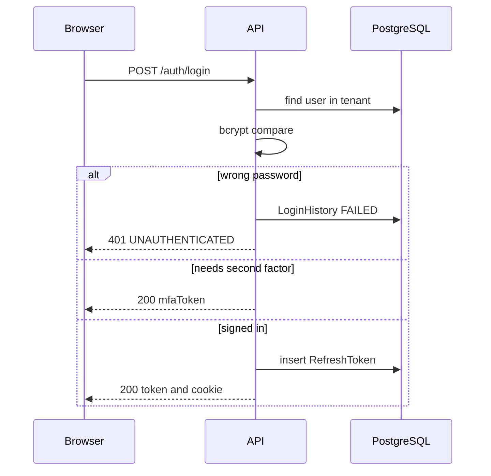
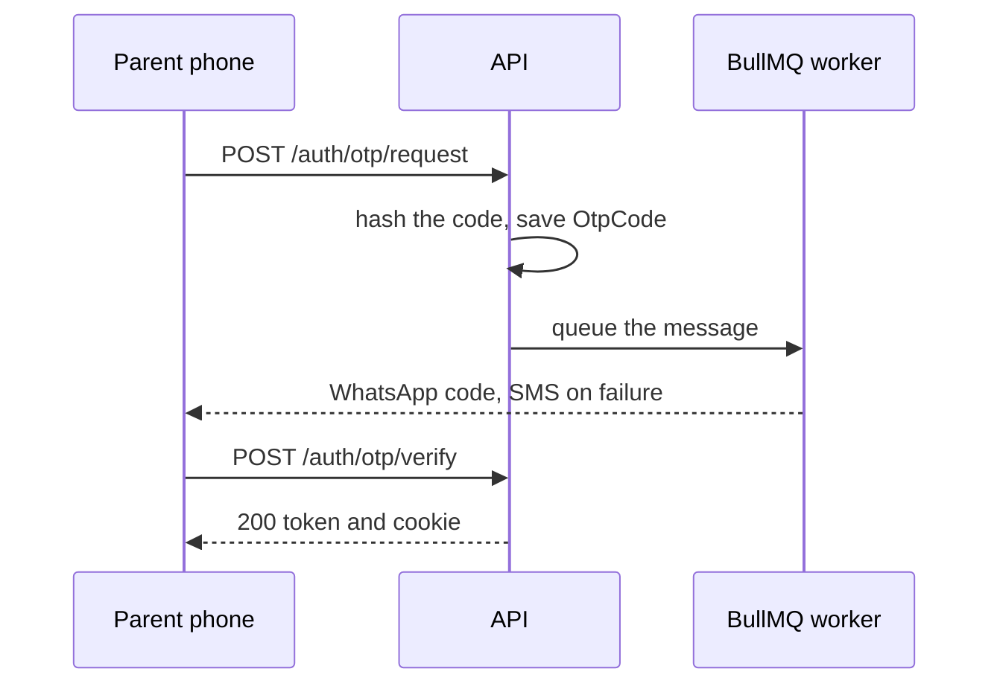
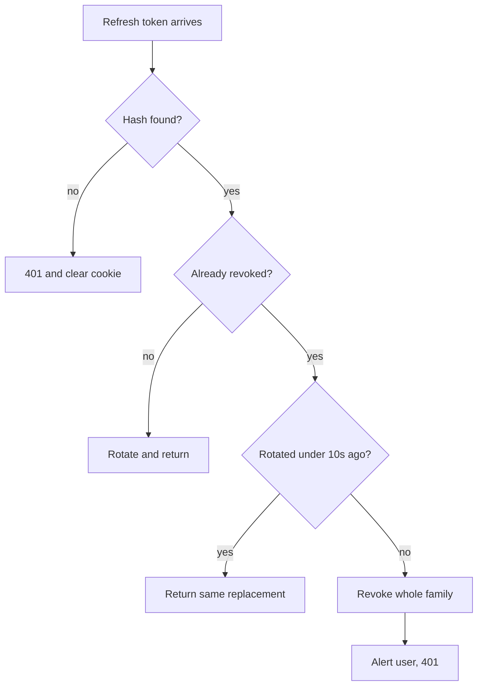
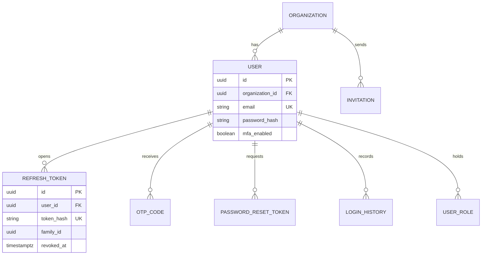

# Authentication and Sessions

**In simple words:** This chapter explains how a person proves who they are in EduFlow, and how the system keeps them signed in afterwards. Staff sign in with a password, parents and students with a one-time code sent to their phone. Every request then carries a short-lived token, and a longer refresh token renews it quietly in the background. Everything below is exact enough to build from: tokens, timings, screens, endpoints and limits.

| Item | Value |
|---|---|
| Built by | Prompt P-07 (sprint Day 8); SSO lands in Phase 4 |
| Access token | JWT, 15 minutes, EdDSA (Ed25519), sent as `Authorization: Bearer` |
| Refresh token | 32 random bytes, 30 days, rotated on every use, stored as SHA-256 |
| Password hash | bcrypt, cost factor 12 |
| One-time code | 6 digits, 5 minutes, at most 5 attempts, bcrypt cost 10 |
| Second factor | TOTP app, SMS or email; on for `ORG_ADMIN` by default |
| Endpoints | 26 keys `AUTH-API-01` to `AUTH-API-26`, all under `/api/v1/auth` |
| Main tables | `users`, `refresh_tokens`, `otp_codes`, `password_reset_tokens`, `invitations`, `login_histories` |
| Screens | `AUTH-S01` to `AUTH-S06` |
| Tunable settings | `security.password_min_length`, `security.mfa_required_roles`, `security.session_lifetime_days`, `security.idle_logout_minutes`, `security.ip_allowlist` |
| Never stored readable | Passwords, one-time codes, refresh tokens, reset tokens, TOTP secrets, recovery codes |

The tenant rules that every line below obeys are in *Multi-Tenancy and Data Isolation*. What a signed-in user may then do is in *RBAC and Permissions Matrix*.

## Who Signs In and How

| User type | Identifier typed | Main method | Second factor | Door |
|---|---|---|---|---|
| `STAFF` | Work email or phone | Password | TOTP, SMS or email when the role is listed | `{slug}.eduflow.app/login` |
| `PARENT` | Phone in E.164 form | One-time code on WhatsApp, SMS fallback | The code is the factor | `{slug}.eduflow.app/parent` |
| `STUDENT` | Phone or email | One-time code; password when the institute sets one | The code is the factor | `{slug}.eduflow.app/student` |
| `PLATFORM` | EduFlow work email | Password | TOTP, always, no exception | `app.eduflow.app/platform` |

Four decisions behind that table:

1. **Parents get codes, not passwords.** Sunita Devi opens the portal four or five times a month. A password set in June is forgotten by August, and every forgotten password is a phone call to the office. The Year-1 target of 70% parent portal adoption needs a login nobody can fail.
2. **Staff get passwords.** Priya Nair marks attendance every morning. Waiting for a code six days a week is slower, and the institute pays for every message sent.
3. **Staff may still ask for a code.** The login screen offers "Sign in with a one-time code" to any user with a verified phone. If the role needs a second factor, that step still runs after the code.
4. **One person, one login per organization and user type.** `User` is unique on `(organizationId, userType, email)` and on `(organizationId, userType, phone)`. Rajesh Sharma, who owns Sharma Classes and whose son studies there, has two rows: one `STAFF`, one `PARENT`. Different passwords, different sessions, different data.

## The Login Page and Tenant Resolution

Before EduFlow can check a password it must know which institute to look in. The host name answers that, never the request body.

| Host the user opened | How the tenant is found | Notes |
|---|---|---|
| `brightfuture.eduflow.app` | `Organization.slug` | Normal case. Logo and options load from `AUTH-API-11` |
| `school.brightfuture.edu.in` | `Organization.customDomain` | Enterprise white-label only |
| `app.eduflow.app` | No tenant yet | The API searches all organizations and may ask the user to pick |
| Mobile app on `api.eduflow.app` | `tenantSlug` field in the body | The app stores the slug after the first sign-in |

`AUTH-API-11` is the first call the login page makes. It returns the display name, logo URL, organization type and the allowed methods, so the page can hide the Google button for a Growth-plan institute. An unknown slug answers `404 NOT_FOUND` and the browser falls back to the plain EduFlow login page.

**Screen AUTH-S01 — Sign in (staff, web)**

```text
+------------------------------------------------------------------------+
|                                                                        |
|        [LOGO]   Bright Future Public School                            |
|                 Lucknow  -  brightfuture.eduflow.app                   |
|                                                                        |
|        Sign in to your account                                         |
|                                                                        |
|        Email or phone                                                  |
|        [ suresh.gupta@brightfuture.edu____________________ ]           |
|                                                                        |
|        Password                                        [Show]          |
|        [ ****************________________________________ ]            |
|                                                                        |
|        [x] Trust this device for 30 days       Forgot password?        |
|                                                                        |
|                    [          Sign in          ]                       |
|                                                                        |
|        -------------------------  or  --------------------------       |
|                                                                        |
|        [ Sign in with a one-time code ]                                |
|        [ Sign in with Google Workspace ]   Enterprise plan only        |
|                                                                        |
|        Parent or student?  [ Open the parent portal ]                  |
|                                                                        |
+------------------------------------------------------------------------+
```

- The header block comes from `AUTH-API-11`, so the user sees their own institute before typing. It is the cheapest anti-phishing signal we can give.
- `[Sign in]` calls `AUTH-API-01`, `[Sign in with a one-time code]` calls `AUTH-API-02`, `[Sign in with Google Workspace]` opens `AUTH-API-12`.
- `[x] Trust this device for 30 days` appears only when the role needs a second factor, and is unchecked by default.
- Errors appear above the button in red, never as a browser alert. The failing field gets a red border.

## Password Login

**Figure: Password login, step by step**



The eight steps the service runs, in order:

1. **Resolve the tenant** from the host or `tenantSlug`. A suspended or soft-deleted organization stops here with `403 FORBIDDEN`.
2. **Check the rate limit** in Redis: 5 attempts per 15 minutes for the pair identifier plus IP. Over the limit answers `429 RATE_LIMITED` with `Retry-After`.
3. **Normalise the identifier.** Emails are trimmed and lower-cased. Phones convert to E.164 using the organization's country, so `98765 43210`, `098765 43210` and `+91 98765 43210` all find one row.
4. **Load the user** by `(organizationId, userType, email)` or `(organizationId, userType, phone)` where `deletedAt` is null. The staff screen searches `userType = STAFF`, the parent tab searches `PARENT`. That is why one phone can belong to a parent and a student at once.
5. **Compare the password** with bcrypt. When no row was found the code still compares against a fixed dummy hash. Without that, a missing account answers in 2 ms and a real one in 250 ms, and the timing alone tells an attacker which emails exist.
6. **Check the account state** in this order: `lockedUntil` in the future, then `status` `SUSPENDED`, `DEACTIVATED` or `LOCKED`, then `INVITED`. Each message is in the validation table below.
7. **Decide the next step.** A role listed in `security.mfa_required_roles` without MFA gets `nextStep = MFA_SETUP_REQUIRED`. MFA on plus an untrusted device gets `MFA_REQUIRED` with an `mfaToken`. Otherwise the session is created.
8. **Create the session**: reset `failedLoginCount`, write `lastLoginAt` and `lastLoginIp`, insert one `RefreshToken` row, append a `LoginHistory` row, set the cookie.

> **Rule:** A wrong password, an unknown email and a wrong phone all answer with the same body: `401 UNAUTHENTICATED`, message "Email, phone or password is wrong." Anything more precise would turn the login form into a staff directory.

## Password Rules and Storage

| Rule | Value | Why |
|---|---|---|
| Minimum length | `security.password_min_length`, default 10, range 8 to 64 | Length beats symbols |
| Characters | At least one letter and one digit | Simple to explain at the counter |
| Maximum length | 72 bytes | bcrypt ignores bytes after 72; longer input is refused, never cut |
| Blocked list | 10,000 common passwords, the organization name, the slug, the user's own name and email local part | Stops "brightfuture123" |
| Repeats | No character three times in a row, no `1234`, no `abcd` | Stops keyboard walks |
| Hash | bcrypt, cost 12, own salt per password | About 250 ms on the API container |
| Re-hash | On a correct login, a hash stored below cost 12 is rewritten | Lets the cost rise later without a reset |
| Reuse | The new password may not equal the current one | There is no password history table, so older passwords cannot be checked. Said openly, not promised |
| Expiry | Never on a timer | Forced rotation only produces `Bright@2027`, then `Bright@2028` |
| First password | Set by the user while accepting the invitation, or forced by `mustChangePassword` after an admin reset | No shared default password exists |

The strength meter on the form is client-side and advisory. The server repeats every check, because a meter in the browser protects nobody.

> **Warning:** Cost 12 is a deliberate cost. Five wrong logins per account per 15 minutes multiplied by 250 ms of CPU is nothing; an attacker working through a stolen password list pays 250 ms per guess. If login ever becomes the slowest route under load, buy more CPU before lowering the cost factor.

## One-Time Code Login for Parents and Students

Sunita Devi types her phone number, gets a six-digit code on WhatsApp and is inside the portal in about 20 seconds. Two endpoints do the work: `AUTH-API-02` sends the code, `AUTH-API-03` checks it.

**Figure: One-time code login**



The rules of the code:

| Rule | Value |
|---|---|
| Length and alphabet | 6 digits, generated with `crypto.randomInt`, never `Math.random` |
| Life | 5 minutes, held in `OtpCode.expiresAt` |
| Storage | bcrypt cost 10 in `codeHash`; the plain code exists only inside the message |
| Attempts | `maxAttempts` 5; the sixth try burns the code and answers `UNAUTHENTICATED` |
| Resend | The button is disabled for 60 seconds, then a new code is made and the old one is marked consumed |
| Volume per identifier | 5 codes per hour, 10 per day |
| Channel order | WhatsApp first; SMS if the WhatsApp send fails or the number is not on WhatsApp; email when only an email exists |
| One live code | Requesting a new code consumes every earlier unused `LOGIN` code for that identifier |
| Reply text | The code is never written to the Pino log, the audit log or Sentry. Logs hold the `OtpCode.id` only |

Three points that are easy to get wrong:

1. **The request endpoint never says whether the number exists.** `AUTH-API-02` always answers `200` with `{ "sent": true, "expiresInSeconds": 300 }`. When no parent has that number, nothing is sent. Otherwise anybody could use the login form to learn which parents study at which institute.
2. **A code is tied to the tenant and the purpose.** `OtpCode` carries `organizationId`, `identifier` and `purpose`. A `VERIFY_PHONE` code cannot be used to sign in, and a code made on the Bright Future portal cannot be used on the Sharma Classes portal.
3. **One phone, two roles.** If the same number belongs to a `PARENT` and a `STUDENT` row, the verify step answers `nextStep = SELECT_PROFILE` with both names and a 2-minute `selectionToken`. The user taps one and the session is created for that row only.

**Screen AUTH-S02 — Parent one-time code login (mobile)**

```text
+------------------------------------+
| <   Bright Future Public School    |
+------------------------------------+
|                                    |
|  Enter the code we sent to         |
|  +91 98765 43210                   |
|                                    |
|   [ 4 ] [ 2 ] [ 7 ] [ _ ] [ _ ] [_]|
|                                    |
|  Code expires in 04:12             |
|                                    |
|  [         Verify and sign in     ]|
|                                    |
|  Did not get it?                   |
|  Resend code in 42s                |
|  [ Send on SMS instead ]           |
|                                    |
|  [ Change phone number ]           |
|                                    |
|  Need help? Call the school office |
|  0522-4000-100                     |
+------------------------------------+
```

- Six single-character boxes. Pasting a code fills all six. On Android the code is filled automatically from the SMS when the message carries the app hash.
- The countdown uses `expiresInSeconds` from the server, not the phone clock, so a wrong phone clock cannot break the screen.
- `[Verify and sign in]` calls `AUTH-API-03`. `[Send on SMS instead]` calls `AUTH-API-02` again with `channel: "SMS"`.
- After three wrong codes the screen adds the line "2 tries left" so the user is not locked out by surprise.

## The Second Factor

MFA (multi-factor authentication, a second proof after the password) is on by default for `ORG_ADMIN` through `security.mfa_required_roles`, and always on for `SUPER_ADMIN`. An organization may add `PRINCIPAL` or `ACCOUNTANT` to the list.

| Item | Decision |
|---|---|
| Methods | `TOTP` (Google Authenticator, Authy, 1Password), `SMS`, `EMAIL` |
| Preferred | TOTP. It costs nothing per login and survives a lost SIM |
| TOTP details | RFC 6238, SHA-1, 6 digits, 30-second step, one step of tolerance each way |
| Secret | 20 random bytes, base32; stored in `mfaSecretEncrypted` with AES-256-GCM |
| Enrolment | `AUTH-API-19` returns the secret and an `otpauth://` URI; `AUTH-API-20` turns MFA on only after one correct code |
| Recovery codes | 10 codes of 10 characters, shown once, bcrypt-hashed into `mfaRecoveryCodes`, each usable once |
| Reuse block | The last accepted TOTP step is kept in Redis for 90 seconds, so a code copied from the screen cannot be replayed |
| Lost device | `USR-API-10` lets the `ORG_ADMIN` clear MFA. Only an `ORG_ADMIN` can do it, and it writes an audit row |
| Turning it off | `AUTH-API-21` needs the current password and a current code |
| The `mfaToken` | A JWT with `typ: "mfa"`, 5 minutes, 5 verify attempts, holds `sub` and `orgId` and is refused by every normal route |

> **Warning:** If the last `ORG_ADMIN` of Sharma Classes loses the phone and has no recovery code, only EduFlow support can help. `SUPER_ADMIN` cannot reset MFA inside a tenant (see the `users.manage` row in *RBAC and Permissions Matrix*). The documented path is a support ticket with identity proof, then a manual database action recorded in the platform audit log. The enrolment screen therefore forces the admin to tick "I have saved my recovery codes" before MFA turns on.

**Trusted devices.** When "Trust this device for 30 days" is ticked, the API sets a second cookie `ef_dt`, a signed JWT holding `sub`, `orgId`, a random `deviceId` and a 30-day expiry. On the next login the API skips the second factor if the cookie verifies, the `deviceId` matches a `RefreshToken` row of this user that was never revoked for `REUSE_DETECTED`, and the IP country is the same. Changing the password, disabling MFA or `AUTH-API-25` clears every trusted device.

## Invitations and the First Password

Nobody types a password for somebody else. Staff, parents and students are invited, and they choose their own password or verify their own phone. Invitations are created in the Users module (`USR-API-25` for one, `USR-API-28` for a whole batch of parents) and accepted here.

| Step | What happens | Endpoint |
|---|---|---|
| Send | An `Invitation` row is written with the role, the campus IDs, the linked `Staff`, `Guardian` or `Student` profile, and a SHA-256 hash of a 32-byte token | `USR-API-25` |
| Deliver | Email with a link to `{slug}.eduflow.app/invite/<token>`; parents also get the link on WhatsApp | Notification worker |
| Open | The page validates the token and shows the institute, the role and the campuses before anything is typed | `AUTH-API-09` |
| Accept | A `User` row is created with `status = ACTIVE`, the `UserRole` and `UserCampus` rows are written, consents are recorded, and the person is signed in at once | `AUTH-API-10` |
| Expire | 7 days. A nightly job flips `PENDING` to `EXPIRED` and emits `invitation.expired` | Background job |
| Resend | Issues a brand-new token and a new 7-day expiry; the old token dies immediately | `USR-API-26` |
| Revoke | `PENDING` becomes `REVOKED`; the link then answers `404 NOT_FOUND` | `USR-API-27` |

Rules that protect the invitation:

1. The token is shown once, in the link. The database holds only `tokenHash`, so a stolen backup cannot be used to join an institute.
2. Accepting is a single transaction. If the role no longer exists or the plan user limit has been reached in the meantime, nothing is created and the answer is `409 CONFLICT` or `403 PLAN_LIMIT_REACHED`.
3. The invited role can never be wider than the inviter's own role. A Principal cannot invite an `ORG_ADMIN`; the check lives in `USR-API-25`.
4. A parent invitation asks for the consent tick boxes required by the DPDP Act, and writes one `ConsentRecord` row per `ConsentType` with `verificationMethod = OTP` or `EMAIL_LINK`. Details are in *Privacy and Compliance*.
5. If the email or phone already has a live `User` row of the same `userType`, acceptance links the invitation to that user instead of creating a second one, and only adds the new role and campuses.

**Screen AUTH-S03 — Accept invitation (teacher, web)**

```text
+------------------------------------------------------------------------+
|  [LOGO]  Bright Future Public School                                   |
+------------------------------------------------------------------------+
|                                                                        |
|   You are invited as   Teacher                                         |
|   Campus              Main Campus, Gomti Nagar                         |
|   Invited by          Dr. Anita Verma  -  18 Oct 2026                  |
|   Link valid until    25 Oct 2026, 6:00 PM                             |
|                                                                        |
|   Full name       [ Priya Nair______________________ ]                 |
|   Email           priya.nair@brightfuture.edu   (locked)               |
|   Mobile          [ +91 90000 12345____________ ]  [Send code]         |
|                                                                        |
|   Create password [ ______________________________ ]  [Show]           |
|   Repeat password [ ______________________________ ]                   |
|   Strength: Good   -  10+ characters, 1 letter, 1 number               |
|                                                                        |
|   [x] I accept the Terms of Service and the Privacy Policy             |
|   [ ] Send me class reminders on WhatsApp                              |
|                                                                        |
|                       [   Create my account   ]                        |
+------------------------------------------------------------------------+
```

- The email is locked because it is the identity in the invitation. A different email needs a new invitation.
- `[Send code]` verifies the mobile number with a `VERIFY_PHONE` code, so `phoneVerifiedAt` is filled on day one and the teacher can later use code login.
- `[Create my account]` calls `AUTH-API-10` and returns tokens, so the teacher lands on the dashboard, not back on the login page.
- An expired or revoked link shows an empty state with the line "This invitation has expired. Ask your school office to send it again."

## Forgot Password and Reset

`AUTH-API-07` starts it, `AUTH-API-08` finishes it.

| Item | Decision |
|---|---|
| Answer | Always `200` with "If an account exists, we have sent the steps." No account enumeration |
| Email path | A 32-byte token, SHA-256 in `PasswordResetToken.tokenHash`, valid 30 minutes, single use |
| Phone path | A `PASSWORD_RESET` one-time code with the same 5-minute rules as login |
| One live token | Creating a new token marks every earlier unused token of that user as used |
| On success | The password is written, `passwordChangedAt` is set, `mustChangePassword` is cleared |
| Side effect | Every `RefreshToken` of the user is revoked with `PASSWORD_CHANGED`, and the trusted-device cookies stop working |
| Notice | An email plus an in-app notice: "Your password was changed on 12 Nov 2026 at 7:42 PM from Lucknow. Not you? Call your admin." |
| Locked account | A successful reset also clears `lockedUntil`, sets `failedLoginCount` to 0 and moves `status` `LOCKED` back to `ACTIVE` |
| Blocked | `SUSPENDED` and `DEACTIVATED` users get the same `200` but no message is ever sent |

**Screen AUTH-S04 — Forgot password (web)**

```text
+------------------------------------------------------------------------+
|  [LOGO]  Bright Future Public School                                   |
+------------------------------------------------------------------------+
|                                                                        |
|   Forgot your password?                                                |
|   Type the email or phone you use for EduFlow. We will send you        |
|   the steps to set a new password.                                     |
|                                                                        |
|   Email or phone  [ suresh.gupta@brightfuture.edu__________ ]          |
|                                                                        |
|                       [   Send reset steps   ]                         |
|                                                                        |
|   ------------------------------------------------------------------   |
|   Sent. If an account exists for that email or phone, the steps        |
|   are on the way. The link works for 30 minutes.                       |
|                                                                        |
|   Did not get anything?                                                |
|   - Check the spam folder                                              |
|   - Try the mobile number instead of the email                         |
|   - Ask your admin to send a reset from the Users screen               |
|                                                                        |
|   [ Back to sign in ]                                                  |
+------------------------------------------------------------------------+
```

- The grey block appears after the call and always says the same thing, whether or not the account exists.
- `[Send reset steps]` calls `AUTH-API-07`. The button stays disabled for 60 seconds afterwards.
- The reset page itself reuses the password fields of `AUTH-S03` and calls `AUTH-API-08`.

## The Access Token

The access token is a JWT (JSON Web Token: signed JSON that the API can trust without a database read). It lives 15 minutes and carries everything the middleware needs.

| Claim | Example | Meaning |
|---|---|---|
| `sub` | `"8f3a...c91d"` | `User.id` |
| `orgId` | `"1b2c...9f0a"` | Tenant. Null only for `PLATFORM` users |
| `ut` | `"STAFF"` | `UserType`, decides which portal routes open |
| `roles` | `["PRINCIPAL"]` | Role keys. Becomes `req.auth.roleKeys` |
| `campusIds` | `["c1", "c2"]` | Campuses of the user. Empty for `ORG_ADMIN`, who reaches all |
| `cid` | `"c1"` | Default campus, overridable with the `X-Campus-Id` header |
| `pv` | `"7a1c9e42"` | Permission version: first 8 hex of the SHA-256 of the user's sorted permission set, status and campus list |
| `sid` | `"6d5e...4b7c"` | `RefreshToken.familyId`, so a log line can be tied to one session |
| `amr` | `["pwd", "totp"]` | How the user proved identity. Step-up checks read this |
| `iss`, `aud` | `"https://api.eduflow.app"`, `"eduflow-api"` | Fixed strings |
| `iat`, `exp`, `jti` | Unix seconds, Unix seconds, UUID | Issued, expires, unique id |

```json
{
  "sub": "8f3a2c91-d4e5-4a6b-9c7d-0e1f2a3b4c5d",
  "orgId": "1b2c3d4e-5f6a-4b7c-8d9e-0f1a2b3c4d5e",
  "ut": "STAFF", "roles": ["ACCOUNTANT"], "campusIds": ["c1f0..."],
  "cid": "c1f0...", "pv": "7a1c9e42", "sid": "6d5e4f3a-2b1c-4d5e-8f9a-0b1c2d3e4f5a",
  "amr": ["pwd"], "iss": "https://api.eduflow.app", "aud": "eduflow-api",
  "iat": 1794470400, "exp": 1794471300, "jti": "3c4d5e6f-7a8b-4c9d-8e0f-1a2b3c4d5e6f"
}
```

Signing and key rotation:

- Algorithm `EdDSA` with an Ed25519 key pair. It is faster than RS256, the signature is 64 bytes, and a public key means a future service can verify a token without holding the secret.
- Two keys are live at all times. `kid` in the header says which one signed. New tokens use the current key; the previous key stays valid for verification for 24 hours.
- Keys rotate every 90 days by a scheduled job, and at once by hand after any suspected leak. The private keys sit in the hosting secret store, never in the repository.
- The public keys are served at `/.well-known/jwks.json`, cached for 10 minutes.
- Clock skew: verification allows 60 seconds of tolerance, so a server that drifts by a few seconds does not sign everybody out. Both API and worker containers run NTP.

Three things the middleware checks after the signature, in this order:

1. **The kill switch.** Redis key `t:<orgId>:kill:<userId>` holds a Unix timestamp, written when the user is suspended, deactivated, deleted, changes the password or revokes all sessions. A token whose `iat` is older than that value is refused with `401 TOKEN_EXPIRED`. The key has a 900-second life, which is longer than any access token.
2. **The permission version.** The current `pv` is recomputed from the Redis entry `t:<orgId>:rbac:user:<userId>` and compared with the claim. A mismatch answers `401 TOKEN_EXPIRED`, so the browser silently refreshes and comes back with the new rights. Role changes therefore take effect in under a second, not in 15 minutes.
3. **The IP allow-list** when `security.ip_allowlist.enabled` is true and the user holds a listed role. Outside the CIDR ranges the answer is `403 FORBIDDEN`. Parents and students are never restricted.

If Redis is unreachable, checks 1 and 2 fall back to a single indexed read of `users.status` and `users.password_changed_at`. The system slows down; it does not open up.

## Refresh Tokens, Rotation and Families

A refresh token is not a JWT. It is 32 random bytes in base64url form, stored only as a SHA-256 hash in `refresh_tokens.token_hash`. A database dump therefore hands an attacker nothing usable.

| Property | Value |
|---|---|
| Cookie name | `ef_rt_<slug>`, for example `ef_rt_brightfuture`; the platform console uses `ef_rt_platform` |
| Cookie flags | `HttpOnly`, `Secure`, `SameSite=Lax`, `Path=/api/v1/auth`, host-only on `api.eduflow.app` |
| Why the slug is in the name | A parent with children in two institutes keeps two live cookies at once and never gets signed out of one by using the other |
| Life | `security.session_lifetime_days`, default 30, reset on every rotation |
| Family cap | 90 days from the first sign-in, then a full login is required |
| Mobile | No cookie. The token comes in the body and lives in the device keychain |
| Rotation | Every `/auth/refresh` issues a new token, sets `revokedAt` and `revokedReason = ROTATED` on the old one and links them with `replacedByTokenId` |
| Family | All rotations of one sign-in share `familyId`, which is also the `sid` claim |
| Retry grace | If a token was rotated less than 10 seconds ago and its replacement has not been used, the same replacement is returned again. Without this, one flaky mobile network would look like an attack |

**Figure: Rotation and reuse detection**



Reuse detection is the point of the whole design. If a token is stolen and used, the real device will sooner or later present its copy, which is now revoked. The API then kills the entire `familyId` with `REUSE_DETECTED`, writes a `LoginHistory` row, emits `auth.token.reuse_detected` and sends the user an in-app and email notice: "Somebody used an old sign-in token for your account. You have been signed out everywhere. Please sign in again and change your password." Both the thief and the victim lose the session, which is the safe outcome.

## Sessions, Idle Timeout and Devices

| Rule | Value |
|---|---|
| Normal staff, parents, students | No idle timeout. The 30-day refresh life is the limit |
| Finance roles | `security.idle_logout_minutes`, default `{ "ACCOUNTANT": 30 }`. A refresh after 30 minutes without any API call is refused with `TOKEN_EXPIRED` |
| Step-up | Cancelling a receipt, approving a refund, closing the day, changing gateway keys or changing a bank account asks for the password again when `amr` is older than 15 minutes |
| Sessions per user | Maximum 10 live families. The eleventh sign-in revokes the oldest with `ADMIN_REVOKED` |
| Device label | Built from the user agent, for example "Chrome on Windows" or "EduFlow app on Android 15" |
| Logout | `AUTH-API-06` revokes the current family with `LOGOUT` and clears the cookie. The browser also drops the TanStack Query cache |
| Cleanup | A nightly BullMQ job deletes `refresh_tokens` rows whose `expiresAt` passed 30 days ago, and `otp_codes` and `password_reset_tokens` older than 7 days |

**Screen AUTH-S05 — My sessions (any user, web)**

```text
+------------------------------------------------------------------------+
| EduFlow | Bright Future Public School          [Search...]      (SG) v |
+------------+-----------------------------------------------------------+
| Dashboard  | My Account > Sessions                                     |
| Students   +-----------------------------------------------------------+
| Fees       | Device              Where        Last used     Action      |
| My Account |-----------------------------------------------------------|
|  Profile   | Chrome on Windows   Lucknow, IN  Now           This device |
|  Password  | This device         49.36.x.x                              |
|  Security  |-----------------------------------------------------------|
|  Sessions <| EduFlow app, Android Lucknow, IN 12 Nov, 7:42 PM [Revoke]  |
|            | Samsung SM-A155F    49.36.x.x                              |
|            |-----------------------------------------------------------|
|            | Safari on iPhone    Kanpur, IN   09 Nov, 8:10 AM [Revoke]  |
|            | Not you? Revoke it and change your password.               |
|            |-----------------------------------------------------------|
|            | [ Sign out of all other devices ]                         |
|            |                                                            |
|            | Recent sign-ins           [ View full login history ]      |
|            | 12 Nov 7:42 PM  Success  Password  Chrome, Lucknow         |
|            | 12 Nov 7:41 PM  Failed   Password  Chrome, Lucknow         |
+------------+-----------------------------------------------------------+
```

- The list comes from `AUTH-API-23`, one row per live `familyId`, newest first. The current session is marked and has no Revoke button.
- `[Revoke]` calls `AUTH-API-24`, `[Sign out of all other devices]` calls `AUTH-API-25`, and `[View full login history]` opens `AUTH-API-26`.
- The IP address is shown with the last two parts masked. The city comes from `LoginHistory.geoCity`.
- The same list for another user is `USR-API-13`, visible to an `ORG_ADMIN` only.

## Brute Force, Lockout and Rate Limits

| Endpoint | Limit | Key | Answer when exceeded |
|---|---|---|---|
| `/auth/login` | 5 per 15 min | identifier plus IP | `429 RATE_LIMITED` |
| `/auth/login` | 30 per hour | IP | `429 RATE_LIMITED` |
| `/auth/otp/request` | 1 per 60 s, 5 per hour, 10 per day | identifier | `429 RATE_LIMITED` |
| `/auth/otp/verify` | 5 tries per code | `OtpCode.attempts` | `401 UNAUTHENTICATED`, code burned |
| `/auth/mfa/verify` | 5 tries per `mfaToken` | token id in Redis | `401 UNAUTHENTICATED` |
| `/auth/forgot-password` | 3 per hour, 10 per day | identifier | `429 RATE_LIMITED` |
| `/auth/refresh` | 60 per hour | `familyId` | `429 RATE_LIMITED` |
| `/auth/invitations/:token` | 20 per hour | IP | `429 RATE_LIMITED` |
| Signed-in routes | 100 per min per user, 1,000 per min per organization | `rl:user:<id>`, `rl:org:<id>` | `429 RATE_LIMITED` |

The lockout ladder on top of the rate limit:

1. Each wrong password raises `failedLoginCount` by one.
2. At 5 within 15 minutes, `lockedUntil` is set to 15 minutes ahead. The user sees "Too many wrong tries. Try again in 15 minutes, or reset your password." `LoginHistory.result` is `LOCKED`.
3. A correct password, or a finished password reset, sets `failedLoginCount` back to 0 and clears `lockedUntil`.
4. Three lockouts within 24 hours set `status = LOCKED`. Now only an `ORG_ADMIN` with `USR-API-07`, or a completed password reset, brings the account back. The admin gets an in-app alert.
5. Every counter lives in PostgreSQL, not only in Redis, so a cache restart does not clear a lockout.

> **Note:** The response headers `RateLimit-Limit`, `RateLimit-Remaining` and `RateLimit-Reset` are sent on every auth route, so the web app can show a real countdown instead of a spinner.

## Single Sign-On for Enterprise

SSO is Phase 4 and Enterprise only, because a school of 40 staff does not have an identity provider and a chain of 20 campuses does.

| Item | Decision |
|---|---|
| Protocols | OpenID Connect with Google Workspace and Microsoft Entra ID; SAML 2.0 for everything else |
| Setup | Stored per tenant in `organization_settings` under the key `security.sso`: issuer, client id, encrypted secret, certificate, email-domain list |
| Start | `AUTH-API-12` builds the redirect with `state` and PKCE, both kept in Redis for 10 minutes |
| Finish | `AUTH-API-13` validates the answer, matches the verified email to a `User` of this organization and signs in with `LoginMethod.SSO` |
| No auto-create | An email with no matching `User` is refused with `403 FORBIDDEN`. Roles come from an invitation, never from the identity provider |
| Second factor | Skipped. The identity provider already did it |
| Who is covered | `STAFF` only. Parents and students keep code login |
| Fallback | Password login stays open for at least one `ORG_ADMIN`, so a broken identity provider cannot lock the institute out |

## Data Model

Seven tables carry authentication. Full column lists are in *Data Dictionary: Platform and People*; the Prisma models are in `_schema/02-auth.prisma` and in *Full Prisma Schema*.

| Table | Holds | Kept for |
|---|---|---|
| `users` | Identity, hashes, MFA, lock counters, status | Life of the account |
| `refresh_tokens` | One row per rotation, hashed, with device and family | 30 days after expiry |
| `otp_codes` | Hashed 6-digit codes with purpose and attempt count | 7 days |
| `password_reset_tokens` | Hashed reset links | 7 days |
| `invitations` | Hashed invite tokens with role and campuses | Life of the organization |
| `login_histories` | Every attempt, success or failure, append-only | 24 months |
| `audit_logs` | Account changes with before and after values | 7 years, hash-chained |

**Figure: Authentication tables**



## API Endpoints

| ID | Method | Path | Permission | Purpose |
|---|---|---|---|---|
| AUTH-API-01 | POST | `/auth/login` | public | Password login, may return an MFA challenge |
| AUTH-API-02 | POST | `/auth/otp/request` | public | Send a one-time code |
| AUTH-API-03 | POST | `/auth/otp/verify` | public | Verify a login code and sign in |
| AUTH-API-04 | POST | `/auth/mfa/verify` | public | Finish login with TOTP, code or recovery code |
| AUTH-API-05 | POST | `/auth/refresh` | public | Rotate the refresh cookie, issue a token |
| AUTH-API-06 | POST | `/auth/logout` | self | Revoke this session, clear the cookie |
| AUTH-API-07 | POST | `/auth/forgot-password` | public | Send reset link or code |
| AUTH-API-08 | POST | `/auth/reset-password` | public | Set a new password with the token |
| AUTH-API-09 | GET | `/auth/invitations/:token` | public | Validate an invitation link |
| AUTH-API-10 | POST | `/auth/invitations/:token/accept` | public | Create the login and sign in |
| AUTH-API-11 | GET | `/auth/tenant` | public | Branding and login options for the page |
| AUTH-API-12 | GET | `/auth/sso/start` | public | Redirect to the identity provider |
| AUTH-API-13 | POST | `/auth/sso/callback` | public | Validate the provider answer, sign in |
| AUTH-API-14 | GET | `/auth/me` | self | Own user, roles, permissions, campuses, features |
| AUTH-API-15 | PATCH | `/auth/me` | self | Update own name, avatar, locale, timezone |
| AUTH-API-16 | POST | `/auth/change-password` | self | Change own password |
| AUTH-API-17 | POST | `/auth/verify-contact` | self | Confirm own phone or email |
| AUTH-API-18 | POST | `/auth/switch-campus` | self | Set the default campus |
| AUTH-API-19 | POST | `/auth/mfa/setup` | self | Start MFA enrolment |
| AUTH-API-20 | POST | `/auth/mfa/enable` | self | Confirm the first code, get recovery codes |
| AUTH-API-21 | POST | `/auth/mfa/disable` | self | Turn MFA off |
| AUTH-API-22 | POST | `/auth/mfa/recovery-codes` | self | Make a new set of recovery codes |
| AUTH-API-23 | GET | `/auth/sessions` | self | List own live sessions |
| AUTH-API-24 | DELETE | `/auth/sessions/:id` | self | Revoke one own session |
| AUTH-API-25 | POST | `/auth/sessions/revoke-all` | self | Revoke all other sessions |
| AUTH-API-26 | GET | `/auth/login-history` | self | Own recent sign-in attempts |

`public` means no access token is needed; the route is rate-limited and resolves the tenant from the host. `self` means any signed-in user acting on the own account, so no permission key is checked. Acting on somebody else always moves to the `users.*` and `roles.*` keys of *RBAC and Permissions Matrix*.

### AUTH-API-01 — Password login

```http
POST /api/v1/auth/login HTTP/1.1
Host: api.eduflow.app
Content-Type: application/json

{ "identifier": "suresh.gupta@brightfuture.edu", "password": "Counter#2027pay",
  "tenantSlug": "brightfuture", "userType": "STAFF", "trustDevice": false }
```

```json
{
  "success": true,
  "data": {
    "nextStep": "DONE",
    "accessToken": "eyJhbGciOiJFZERTQSIsImtpZCI6ImsyIn0...",
    "expiresIn": 900,
    "user": { "id": "8f3a2c91-d4e5-4a6b-9c7d-0e1f2a3b4c5d",
      "firstName": "Suresh", "lastName": "Gupta", "userType": "STAFF",
      "roles": ["ACCOUNTANT"], "defaultCampusId": "c1f0a7b2-...",
      "mustChangePassword": false, "mfaEnabled": false }
  }
}
```

The refresh token comes back only as `Set-Cookie: ef_rt_brightfuture=...; HttpOnly; Secure; SameSite=Lax; Path=/api/v1/auth; Max-Age=2592000`. Other values of `nextStep` are `MFA_REQUIRED` and `MFA_SETUP_REQUIRED`, both with an `mfaToken`, and `SELECT_ORGANIZATION` with a `selectionToken` and the list of organizations where this password matched.

| Status | Code | When |
|---|---|---|
| 400 | `VALIDATION_ERROR` | Missing identifier or password, unknown `userType` |
| 401 | `UNAUTHENTICATED` | Wrong password, unknown identifier, locked account |
| 403 | `FORBIDDEN` | Organization suspended, user suspended, IP not allowed |
| 404 | `NOT_FOUND` | `tenantSlug` matches no organization |
| 429 | `RATE_LIMITED` | More than 5 tries in 15 minutes |

### AUTH-API-02 — Ask for a one-time code

```http
POST /api/v1/auth/otp/request
Content-Type: application/json

{ "identifier": "+919876543210", "purpose": "LOGIN",
  "userType": "PARENT", "tenantSlug": "brightfuture", "channel": "WHATSAPP" }
```

```json
{ "success": true,
  "data": { "sent": true, "channel": "WHATSAPP", "expiresInSeconds": 300,
            "resendAfterSeconds": 60, "maskedTarget": "+91 98***43210" } }
```

| Status | Code | When |
|---|---|---|
| 400 | `VALIDATION_ERROR` | Identifier is not a valid phone or email |
| 429 | `RATE_LIMITED` | Resend too early, or over 5 per hour |
| 503 | `SERVICE_UNAVAILABLE` | WhatsApp and SMS providers both down |

### AUTH-API-03 — Verify the code and sign in

```http
POST /api/v1/auth/otp/verify
Content-Type: application/json

{ "identifier": "+919876543210", "code": "427193", "purpose": "LOGIN",
  "userType": "PARENT", "tenantSlug": "brightfuture" }
```

The success body matches `AUTH-API-01` with `"nextStep": "DONE"`, plus `children` for a parent so the portal can open on the right student.

| Status | Code | When |
|---|---|---|
| 401 | `UNAUTHENTICATED` | Wrong code, expired code, or 5 attempts used |
| 403 | `FORBIDDEN` | User or organization is suspended |
| 429 | `RATE_LIMITED` | Too many verify calls from this IP |

### AUTH-API-05 — Refresh

```http
POST /api/v1/auth/refresh
Cookie: ef_rt_brightfuture=8Jd2...9aQ
Origin: https://brightfuture.eduflow.app
```

```json
{ "success": true,
  "data": { "accessToken": "eyJhbGciOiJFZERTQSIs...", "expiresIn": 900 } }
```

A new cookie replaces the old one in the same answer. The mobile app sends `{ "refreshToken": "..." , "tenantSlug": "brightfuture" }` in the body and gets the new token in the body.

| Status | Code | When |
|---|---|---|
| 401 | `UNAUTHENTICATED` | No cookie, unknown hash, expired, family revoked, reuse found |
| 401 | `TOKEN_EXPIRED` | Idle longer than `security.idle_logout_minutes` for the role |
| 403 | `FORBIDDEN` | Organization suspended while the session was open |

### AUTH-API-08 — Reset the password

```http
POST /api/v1/auth/reset-password
Content-Type: application/json

{ "token": "Qk7f...2xZ", "password": "Ganga#River2027", "tenantSlug": "brightfuture" }
```

```json
{ "success": true,
  "data": { "reset": true, "sessionsRevoked": 3, "signInUrl": "/login" } }
```

| Status | Code | When |
|---|---|---|
| 400 | `VALIDATION_ERROR` | Password fails the policy, or equals the current one |
| 401 | `UNAUTHENTICATED` | Token unknown, already used, or older than 30 minutes |
| 429 | `RATE_LIMITED` | More than 10 tries per hour from this IP |

### AUTH-API-10 — Accept an invitation

```http
POST /api/v1/auth/invitations/Qk7f2xZ9.../accept
Content-Type: application/json

{ "firstName": "Priya", "lastName": "Nair", "phone": "+919000012345",
  "password": "Physics#Lab2027", "phoneOtp": "884120",
  "consents": [{ "type": "TERMS_OF_SERVICE", "granted": true },
               { "type": "PRIVACY_POLICY", "granted": true },
               { "type": "COMMUNICATION_WHATSAPP", "granted": false }] }
```

```json
{ "success": true,
  "data": { "nextStep": "DONE", "accessToken": "eyJhbGciOiJFZERTQSIs...",
            "expiresIn": 900,
            "user": { "id": "2a9b...", "userType": "STAFF",
                      "roles": ["TEACHER"], "defaultCampusId": "c1f0a7b2-..." } }
}
```

| Status | Code | When |
|---|---|---|
| 400 | `VALIDATION_ERROR` | Weak password, bad phone, terms not accepted |
| 403 | `PLAN_LIMIT_REACHED` | The plan user seat limit is full |
| 404 | `NOT_FOUND` | Token unknown, revoked or expired |
| 409 | `CONFLICT` | Already accepted, or the email now belongs to another login |

### AUTH-API-14 — Who am I

```json
{ "success": true,
  "data": {
    "user": { "id": "8f3a...", "firstName": "Suresh", "userType": "STAFF",
              "locale": "en-IN", "timezone": "Asia/Kolkata", "mfaEnabled": false },
    "organization": { "id": "1b2c...", "name": "Bright Future Public School",
                      "slug": "brightfuture", "type": "SCHOOL", "plan": "PRO" },
    "roles": [{ "key": "ACCOUNTANT", "name": "Accountant" }],
    "permissions": [{ "key": "fees.collect", "scope": "CAMPUS" },
                    { "key": "students.view", "scope": "CAMPUS" }],
    "campuses": [{ "id": "c1f0...", "name": "Main Campus", "isDefault": true }],
    "features": ["online_payments", "whatsapp", "custom_roles"],
    "permissionsVersion": "7a1c9e42"
  } }
```

The web app calls this once after every sign-in and after every refresh that changes `pv`. The answer is cached in Redis under `t:<orgId>:rbac:user:<userId>` for 5 minutes and dropped whenever roles, campuses or role permissions change. Errors: `401 UNAUTHENTICATED` without a valid token, `403 FORBIDDEN` when the organization is suspended.

### AUTH-API-20 — Turn MFA on

```http
POST /api/v1/auth/mfa/enable
Authorization: Bearer <accessToken>

{ "method": "TOTP", "code": "552104" }
```

```json
{ "success": true,
  "data": { "mfaEnabled": true, "method": "TOTP",
            "recoveryCodes": ["4KQ2-8ZT9", "7PLM-3XVB", "9DSA-1WER"],
            "note": "Shown once. Save them now." } }
```

| Status | Code | When |
|---|---|---|
| 400 | `VALIDATION_ERROR` | Code is not 6 digits |
| 401 | `UNAUTHENTICATED` | Code wrong or outside the time window |
| 409 | `CONFLICT` | MFA is already on, or `AUTH-API-19` was never called |

### AUTH-API-23 — My sessions

```json
{ "success": true,
  "data": [
    { "id": "5c2a...", "current": true, "deviceName": "Chrome on Windows",
      "platform": "WEB", "ipAddress": "49.36.x.x", "city": "Lucknow",
      "lastUsedAt": "2026-11-12T14:12:03.000Z",
      "expiresAt": "2026-12-12T14:12:03.000Z" },
    { "id": "9f1b...", "current": false, "deviceName": "EduFlow app, Android",
      "platform": "ANDROID", "ipAddress": "49.36.x.x", "city": "Lucknow",
      "lastUsedAt": "2026-11-12T13:42:55.000Z",
      "expiresAt": "2026-12-11T09:05:00.000Z" } ]
}
```

`AUTH-API-24` on a session id that is not the caller's own answers `404 NOT_FOUND`, never `403`. Revoking the current session behaves exactly like logout.

## Validation Rules and Messages

| Field | Rule | Message shown |
|---|---|---|
| `identifier` | Valid email or a phone that converts to E.164 | "Type a valid email or 10-digit mobile number." |
| `password` on login | Present, 1 to 72 bytes | "Enter your password." |
| `password` on set | Meets the policy table above | "Use at least 10 characters with 1 letter and 1 number." |
| `password` repeat | Equal to the first field | "Both passwords must be the same." |
| `code` | Exactly 6 digits | "The code is 6 digits." |
| Expired code | `expiresAt` in the past | "This code has expired. Ask for a new one." |
| Wrong code | Attempts left | "Wrong code. 2 tries left." |
| Locked | `lockedUntil` in the future | "Too many wrong tries. Try again in 15 minutes, or reset your password." |
| `status` `INVITED` | No password set yet | "Open the invitation link we emailed you to finish setting up." |
| `status` `SUSPENDED` | Admin suspended the user | "Your account is on hold. Please contact your school admin." |
| Consent | Terms and privacy ticked | "Please accept the Terms of Service and Privacy Policy." |
| Trusted device | Cookie fails to verify | Silent. The second-factor step simply appears again |

## Security Edge Cases

| Case | What happens |
|---|---|
| Same email at two institutes | Two `User` rows. On `app.eduflow.app` the API answers `SELECT_ORGANIZATION` and lists only organizations where the password matched |
| Parent with children at two institutes | Two logins, two cookies named by slug, both live. The portals never share data |
| Same phone for a parent and a student | Login resolves by `userType` from the portal tab; the code flow offers `SELECT_PROFILE` |
| User disabled while a token is live | The kill switch in Redis stops the next request in under a second; refresh fails with `USER_DEACTIVATED` |
| Role changed mid-session | `pv` no longer matches, the client refreshes silently and continues with the new rights |
| Organization suspended mid-session | Every request answers `403 FORBIDDEN`; refresh also fails |
| Phone clock 3 minutes fast | TOTP accepts one 30-second step each way only, so the user sees "code wrong". The screen therefore shows the server time and a "sync your clock" hint after two failures |
| Server clock drift | JWT verification allows 60 seconds; containers run NTP; a drift alarm fires above 5 seconds |
| Refresh cookie replayed after rotation | Family revoked, user notified, everybody signs in again |
| Two tabs refresh at the same moment | The 10-second grace window returns the same new token to both tabs |
| Password changed on another device | All other sessions die with `PASSWORD_CHANGED`; the open tab refreshes, fails and returns to login |
| Invitation link forwarded to a colleague | It works, because the link is the proof. This is why links expire in 7 days, can be revoked, and every acceptance is audited with the IP |
| Deleted student whose parent still has a session | The parent keeps the login but sees an empty child list; the portal shows "No student is linked to this account" |
| SUPER_ADMIN inside a tenant | Cannot create a login, change an email or reset a password. Every read is audited as `IMPERSONATION` |

## Audit Events

`LoginHistory` records attempts. `AuditLog` records changes to an account. Both carry the `requestId` that also appears in the API error envelope and the Pino log line.

| Event | Written to | Also notified |
|---|---|---|
| `auth.login.succeeded` | `LoginHistory` `SUCCESS` | Only for a new device or a new city |
| `auth.login.failed` | `LoginHistory` `FAILED` with `failureReason` | No |
| `auth.account.locked` | `LoginHistory` `LOCKED`, `AuditLog` | In-app to the user and the `ORG_ADMIN` |
| `auth.otp.requested` | `AuditLog` metadata, never the code | No |
| `auth.password.reset_requested` | `AuditLog` | Email or WhatsApp with the link |
| `auth.password.changed` | `AuditLog`, `changedFields` `["passwordHash"]` | Email plus in-app |
| `auth.contact.verified` | `AuditLog` | No |
| `auth.mfa.enabled`, `auth.mfa.disabled` | `AuditLog` | Email plus in-app |
| `auth.session.revoked` | `AuditLog` with the device label | In-app |
| `auth.token.reuse_detected` | `AuditLog` `FAILED`, `LoginHistory` | Email plus in-app, high priority |
| `invitation.accepted` | `AuditLog`, `Invitation.acceptedAt` | In-app to the inviter |

Passwords, codes, tokens and TOTP secrets never reach a log, an audit row or Sentry. The Pino redaction list covers `password`, `code`, `token`, `refreshToken`, `accessToken`, `mfaSecret`, `recoveryCodes` and the `cookie` and `authorization` headers.

## Test Scenarios

| ID | Scenario | Expected result |
|---|---|---|
| AUTH-TS-01 | Correct password for an active accountant | `200`, `nextStep` `DONE`, cookie set, `LoginHistory` `SUCCESS` |
| AUTH-TS-02 | Six wrong passwords in 10 minutes | Fifth sets `lockedUntil`, sixth answers `429` |
| AUTH-TS-03 | Unknown email versus known email, wrong password | Same body and response time within 20 ms |
| AUTH-TS-04 | Parent code login on WhatsApp | Code hashed in `otp_codes`, verify signs in, code marked consumed |
| AUTH-TS-05 | Reuse an already rotated refresh token after 30 seconds | Whole family revoked with `REUSE_DETECTED`, alert sent |
| AUTH-TS-06 | Two browser tabs refresh in the same second | Both get the same new token, one row created |
| AUTH-TS-07 | Suspend a user holding a live access token | Next request `401` within 1 second |
| AUTH-TS-08 | Change a user's role while signed in | `pv` mismatch, silent refresh, new permission list |
| AUTH-TS-09 | Reset password | All sessions revoked, notice sent, lock cleared |
| AUTH-TS-10 | Accept an expired invitation | `404 NOT_FOUND`, no `User` row created |
| AUTH-TS-11 | Login on the Sharma Classes host with a Bright Future email | `401 UNAUTHENTICATED`, no cross-tenant leak |
| AUTH-TS-12 | TOTP code from 90 seconds ago | Rejected; a code from the current step is accepted once only |

The full test approach, the Vitest and Supertest setup and the Playwright flows are in *Testing and Quality Assurance*.
