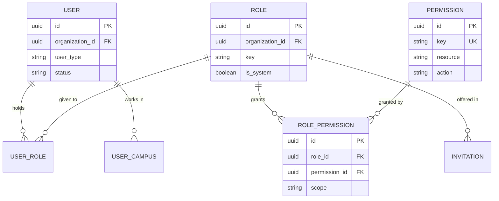
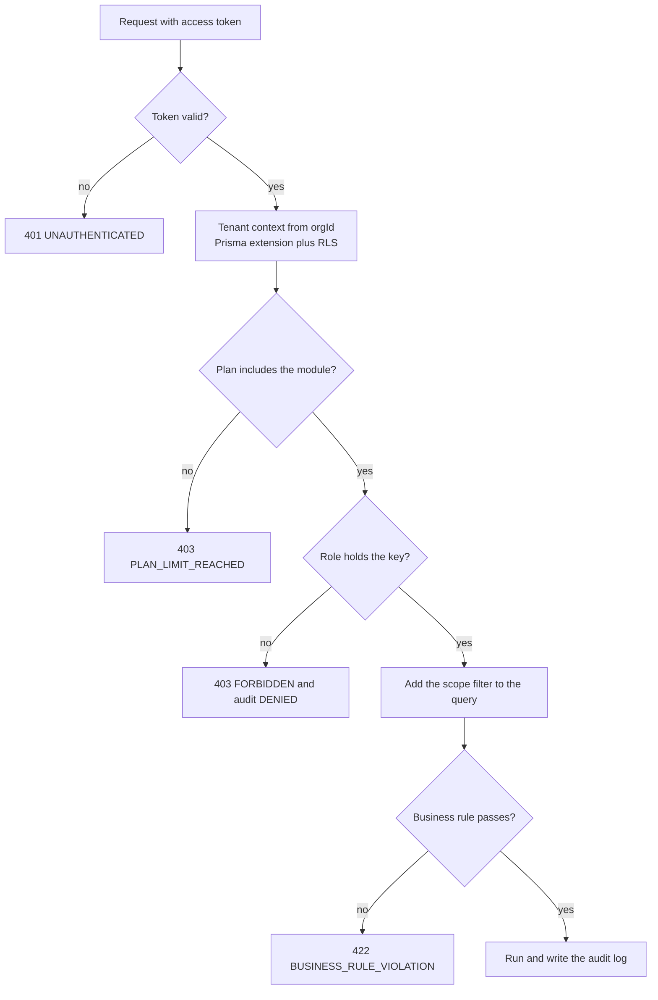

# RBAC and Permissions Matrix

**In simple words:** RBAC means role-based access control. Every person who signs in to EduFlow holds one or more roles, a role is a named list of permission keys such as `fees.collect`, and every key carries a scope that says how many rows the person may touch. This chapter is the reference: it lists all 269 permission keys with the exact rights of the seven system roles, shows the code that enforces them, and fixes the rules for custom roles, separation of duties and impersonation.

## The RBAC Model

Six tables carry the whole model. Nothing about access lives in application code except the key name on each route.

| Piece | Table | What the row is | Who may change it |
|---|---|---|---|
| Permission catalogue | `permissions` | Platform-wide, no tenant column | EduFlow, through a migration |
| Role | `roles` | System role (`organization_id` null) or tenant role | ORG_ADMIN, custom roles only |
| Grant | `role_permissions` | Role plus key plus scope | ORG_ADMIN, custom roles only |
| Role of a user | `user_roles` | One row per user per role | ORG_ADMIN with `roles.assign` |
| Campus reach | `user_campuses` | One row per user per campus | ORG_ADMIN with `users.manage` |
| Invitation | `invitations` | Carries role and campuses before signup | `users.invite` holders |

**Figure: The six RBAC tables**



A system role has `organization_id = NULL` and `is_system = true`. All tenants share those seven rows and nobody can edit or delete them. A custom role carries the tenant's `organization_id` and is invisible to every other tenant. The people behind the seven roles are described in *Users, Roles and Key Journeys*; this chapter fixes what each one may do.

## Permission Naming Rules

A key is always `module.action`, lower case, dot separated, with `snake_case` for a two-word action. The part before the dot is stored in `permissions.resource`, the part after in `permissions.action`. There are 269 keys in 41 prefixes.

| Action | Meaning | Typical verbs | Example |
|---|---|---|---|
| `view` | Read lists, one record, reports | GET | `students.view` |
| `create` | Add a new record | POST | `batches.create` |
| `update` | Edit an existing record | PATCH, PUT | `teachers.update` |
| `delete` | Soft delete or archive | DELETE | `subjects.delete` |
| `manage` | Configure the master data of the module | POST, PATCH | `fees.manage` |
| `approve` | Agree to what another person asked for | POST | `payments.approve` |
| `import`, `export` | Bulk in, bulk out; both create a job | POST | `students.import` |
| Verb of the module | One real job with its own risk | POST | `fees.collect`, `attendance.mark` |

Naming rules that the review checklist enforces:

1. The prefix is the module's resource name in lower case and plural (`fees`, not `fee`). Two-word modules drop the space: `reportcards`, `parentportal`.
2. A new key is created only when an existing key would give too much power. `exams.verify_marks` exists because the person who enters marks must not check them. There is no `exams.view_papers`, because `exams.view` is enough.
3. Sensitive reads get their own key: `students.view_medical`, `staff.view_sensitive`. Everything else sits under `view`.
4. `platform.*` keys exist only on `SUPER_ADMIN`. The API refuses to attach them to any tenant role.
5. A key is added to the endpoint registry first, then to the permission registry, then to the seed data for `permissions` and the system roles. The three must agree; the registry wins in a dispute.

## Scopes and What Own Means

Each grant row carries a scope. The four values of the Prisma enum `PermissionScope` map exactly to the words used in every matrix of this document.

| Matrix word | Stored scope | What the holder may do |
|---|---|---|
| `Yes` | `ALL` | Every row of the organization, in every campus |
| `Campus` | `CAMPUS` | Only rows of the campuses listed in `user_campuses` |
| `Own` | `OWN` | Only rows that belong to the user, as defined below |
| `View` | `VIEW` | Read only, inside the assigned campuses; GET routes only |
| `No` | no row exists | The API answers `403 FORBIDDEN` |

`Own` is not one rule. It is a different filter per role, and the service layer holds one helper per entity.

| Role or key family | `Own` resolves to |
|---|---|
| `TEACHER` | Batches where the user is `Batch.classTeacherId` or has a `BatchSubjectTeacher` row, plus the students, sessions, homework, papers and marks of those batches |
| `staff.*`, `teachers.*`, `leave.*` | The user's own `Staff` row and own leave requests |
| `files.*`, `imports.*` | Files the user uploaded and import jobs the user started |
| `PARENT` | Students linked through `StudentGuardian` and `Family` |
| `STUDENT` | The single `Student` row linked to the signed-in user |

Three rules finish the picture:

- **Master data has no campus.** Subjects, academic years, grade scales, fee heads, discount schemes, message templates and leave types carry no `campus_id`. A `Campus` grant can read them. It can write them only when the role holds the write key, which is why the Principal holds `subjects.manage` but not `fees.manage`.
- **Two roles on one user give the union.** Reads take the widest read scope, writes take the widest write scope, and `View` never adds a write. A senior teacher who also holds the Exam Coordinator role keeps `Own` on homework and gains `Campus` on exams.
- **ORG_ADMIN needs no campus rows.** An ORG_ADMIN sees every campus without any `user_campuses` row. Every other tenant role sees only the assigned campuses. The optional header `X-Campus-Id` narrows one request to one of those campuses; a campus outside the list answers `403 FORBIDDEN`.

## How the API Enforces a Permission

**Figure: The five gates of every request**



The check always runs on the server. Hiding a button in the browser is a comfort for the user, never the protection.

1. **Identity.** The auth middleware verifies the 15-minute JWT access token and reads `userId`, `orgId` and the role ids. The tenant never comes from the request body. See *Authentication and Sessions*.
2. **Tenant wall.** The Prisma client extension adds `organizationId` to every query and PostgreSQL row-level security is the second net. See *Multi-Tenancy and Data Isolation*.
3. **Plan gate.** `Permission.module` holds a `ModuleCode`. If the tenant's plan does not include that module, the answer is `403 PLAN_LIMIT_REACHED` before the key is checked. See *Release Plan and Plan Gating*.
4. **Key check.** Every route declares exactly one key. A missing grant means `403 FORBIDDEN` and an audit row with outcome `DENIED`.
5. **Scope filter.** The scope becomes a `where` fragment. A single record outside the scope answers `404 NOT_FOUND`, so nobody can probe whether a hidden record exists.

One middleware does gates three, four and five.

```typescript
// server/src/middleware/require-permission.ts  (Express 5, Node.js 24)
import type { Request, Response, NextFunction } from 'express';
import { getGrants } from '../services/permission-cache';
import { planHasModule } from '../services/plan-gate';
import { ApiError } from '../errors';
import { auditDenied } from '../services/audit';

export type Scope = 'ALL' | 'CAMPUS' | 'OWN' | 'VIEW';
const READ_METHODS = new Set(['GET', 'HEAD']);

export function requirePermission(key: string) {
  return async (req: Request, _res: Response, next: NextFunction) => {
    const ctx = req.ctx; // set by the tenant middleware (AsyncLocalStorage)

    if (!(await planHasModule(ctx.orgId, key))) {
      await auditDenied(req, key, 'PLAN');
      return next(new ApiError(403, 'PLAN_LIMIT_REACHED',
        'This module is not part of your plan'));
    }

    const grants = await getGrants(ctx.orgId, ctx.userId);
    const scope = grants[key];
    if (!scope) {
      await auditDenied(req, key, 'NO_GRANT');
      return next(new ApiError(403, 'FORBIDDEN',
        'You do not have permission for this action'));
    }
    if (scope === 'VIEW' && !READ_METHODS.has(req.method)) {
      await auditDenied(req, key, 'VIEW_ONLY');
      return next(new ApiError(403, 'FORBIDDEN', 'You may only view this data'));
    }

    ctx.permission = { key, scope };
    return next();
  };
}
```

A route then reads like a sentence, and the key is the same string that appears in the endpoint registry.

```typescript
// server/src/modules/fees/fees.routes.ts
router.post(
  '/fee-invoices/:id/payments',      // FEE-API-24
  requirePermission('fees.collect'),
  requireIdempotencyKey(),
  validate(collectPaymentSchema),
  feesController.collectPayment,
);
```

### The scope filter in the service layer

The controller never writes a `where` clause by hand. One helper per entity turns the scope into Prisma input, so a new endpoint cannot forget it.

```typescript
// server/src/modules/students/student.scope.ts  (Prisma 6)
import type { Prisma } from '@prisma/client';
import type { RequestContext } from '../../types';

export function studentScope(ctx: RequestContext): Prisma.StudentWhereInput {
  switch (ctx.permission.scope) {
    case 'ALL':
      return {};
    case 'CAMPUS':
    case 'VIEW':
      return { campusId: { in: ctx.campusIds } };
    case 'OWN':
      if (ctx.userType === 'STUDENT') return { userId: ctx.userId };
      if (ctx.userType === 'PARENT') {
        return { guardians: { some: { guardian: { userId: ctx.userId } } } };
      }
      return {                       // TEACHER: students of own batches
        enrollments: {
          some: {
            status: 'ACTIVE',
            batch: {
              OR: [
                { classTeacherId: ctx.staffId },
                { subjectTeachers: { some: { staffId: ctx.staffId } } },
              ],
            },
          },
        },
      };
  }
}
```

Reading one record uses the same fragment, so an out-of-scope id can never leak.

```typescript
export async function getStudentOrThrow(ctx: RequestContext, id: string) {
  const student = await prisma.student.findFirst({
    where: { AND: [{ id, deletedAt: null }, studentScope(ctx)] },
  });
  if (!student) throw new ApiError(404, 'NOT_FOUND', 'Student not found');
  return student;
}
```

> **Rule:** A record the caller may not see always answers `404 NOT_FOUND`, never `403 FORBIDDEN`. `403` is used only when the caller holds no key at all for that route. This stops an id-guessing attack from confirming that a student exists.

Portal routes under `/portal/parent/...` and `/portal/student/...` carry only `parentportal.access` or `studentportal.access`. The ownership check there is written in code, because one key opens fifteen kinds of data.

```typescript
// server/src/modules/portal/guard.ts
export async function assertChildOfCaller(ctx: RequestContext, studentId: string) {
  const link = await prisma.studentGuardian.findFirst({
    where: { studentId, hasPortalAccess: true, guardian: { userId: ctx.userId } },
    select: { id: true },
  });
  if (!link) throw new ApiError(404, 'NOT_FOUND', 'Student not found');
}
```

## How the Next.js App Uses the Same Grants

The web app never guesses. After login it reads `GET /auth/me` (AUTH-API-14) once. The answer holds the user, the roles, the grants with scope, the campuses and the plan features, and TanStack Query keeps it for the session.

```tsx
// client/src/lib/permissions.tsx
'use client';
import { createContext, useContext } from 'react';

type Scope = 'ALL' | 'CAMPUS' | 'OWN' | 'VIEW';
type Grants = Record<string, Scope>;
const GrantsContext = createContext<Grants>({});

export function useCan() {
  const grants = useContext(GrantsContext);
  return (key: string, mode: 'read' | 'write' = 'write') => {
    const scope = grants[key];
    if (!scope) return false;
    return mode === 'read' ? true : scope !== 'VIEW';
  };
}

export function Can(
  { do: key, mode = 'write', fallback = null, children }:
  { do: string; mode?: 'read' | 'write'; fallback?: React.ReactNode;
    children: React.ReactNode },
) {
  const can = useCan();
  return can(key, mode) ? <>{children}</> : <>{fallback}</>;
}
```

Three places use it, and nothing else in the app reads a role name:

```tsx
// 1. Hide an action button
<Can do="fees.collect">
  <Button onClick={openCollectDialog}>Collect fee</Button>
</Can>

// 2. Show a read-only badge instead of hiding (better for a Principal)
<Can do="fees.approve" fallback={<Badge variant="muted">View only</Badge>}>
  <Button variant="destructive" onClick={approveWriteOff}>Approve write-off</Button>
</Can>

// 3. Build the sidebar from one list
const NAV = [
  { href: '/students', label: 'Students', key: 'students.view' },
  { href: '/attendance', label: 'Attendance', key: 'attendance.view' },
  { href: '/fees', label: 'Fees', key: 'fees.view' },
  { href: '/settings/roles', label: 'Roles', key: 'roles.view' },
];
const items = NAV.filter((n) => can(n.key, 'read'));
```

Route guards live in the App Router layout of each section. A user who types `/settings/roles` without `roles.view` is sent to the dashboard with a toast, and the API would refuse the data anyway.

> **Warning:** Never write `if (role === 'ORG_ADMIN')` in the client or in a service. A custom role such as HR Manager holds `payroll.process` without being ORG_ADMIN, so a role-name check silently locks out the very people the tenant created the role for. Always check the key.

## Permission Caching and Invalidation

Loading grants from PostgreSQL on every request would add a three-table join to all 1,250 endpoints. EduFlow caches the flattened map in Redis 7.

| Item | Decision |
|---|---|
| Cache key | `org:{orgId}:grants:{userId}` |
| Value | JSON map of key to scope, plus `campusIds`, `staffId`, `roleKeys` |
| Time to live | 15 minutes, the same life as the access token |
| Read path | Redis hit, else one Prisma query, then set |
| Cleared on | `user.roles.changed`, `role.permissions.changed`, `role.updated`, `role.deleted`, `user.campuses.changed`, `user.suspended`, `user.deactivated`, `subscription.plan_changed` |
| Worst staleness | 15 minutes if an event is lost; the next token refresh rebuilds it |

```typescript
// server/src/services/permission-cache.ts
const TTL_SECONDS = 900;

export async function getGrants(orgId: string, userId: string) {
  const cacheKey = `org:${orgId}:grants:${userId}`;
  const hit = await redis.get(cacheKey);
  if (hit) return JSON.parse(hit) as Record<string, Scope>;

  const rows = await prisma.userRole.findMany({
    where: { userId, organizationId: orgId, role: { status: 'ACTIVE' } },
    select: {
      role: { select: { permissions: {
        select: { scope: true, permission: { select: { key: true } } },
      } } },
    },
  });

  const rank: Record<Scope, number> = { VIEW: 1, OWN: 2, CAMPUS: 3, ALL: 4 };
  const grants: Record<string, Scope> = {};
  for (const r of rows) {
    for (const g of r.role.permissions) {
      const key = g.permission.key;
      const current = grants[key];
      if (!current || rank[g.scope] > rank[current]) grants[key] = g.scope;
    }
  }
  await redis.set(cacheKey, JSON.stringify(grants), 'EX', TTL_SECONDS);
  return grants;
}

export async function invalidateRole(orgId: string, roleId: string) {
  const users = await prisma.userRole.findMany({
    where: { organizationId: orgId, roleId }, select: { userId: true },
  });
  if (users.length) {
    await redis.del(...users.map((u) => `org:${orgId}:grants:${u.userId}`));
  }
}
```

> **Note:** Widening rights takes effect on the next request. Removing rights is stricter: USR-API-11, USR-API-19, USR-API-20 and USR-API-21 clear the cache inside the same transaction, and when the change removes keys they also revoke the user's refresh tokens with reason `ADMIN_REVOKED`, so the next access token is built from the new grants.

## Least Privilege and Separation of Duties

Least privilege means a role starts empty and gets only the keys the job needs. Three decisions follow from it, and they explain most surprises in the matrix below:

1. A `delete` key on a person record (`students.delete`, `teachers.delete`, `staff.delete`, `users.delete`) never goes to the Principal. A student who leaves gets a status change, not a delete.
2. Every `export` key is `No` for `SUPER_ADMIN` and for the Teacher, because an export is a copy of personal data that leaves the audit trail of the app.
3. Money set-up and money handling are split. The ORG_ADMIN sets prices with `fees.manage`; the Accountant bills and collects against them with `fees.create` and `fees.collect`. The cash counter cannot lower a price.

Separation of duties goes one step further: the person who asks for money to leave the books must not be the person who agrees.

| Money action | Created with | Approved with | Default creator | Default approver |
|---|---|---|---|---|
| Refund | `payments.refund` | `payments.approve` | Accountant | Principal, ORG_ADMIN |
| Invoice adjustment or write-off | `fees.update` | `fees.approve` | Accountant | Principal, ORG_ADMIN |
| Discount grant | `discounts.create` | `discounts.approve` | Accountant | Principal, ORG_ADMIN |
| Scholarship award | `scholarships.create` | `scholarships.approve` | Accountant | Principal, ORG_ADMIN |
| Daily cash close | `payments.close_day` | `payments.approve` | Accountant | Principal, ORG_ADMIN |
| Payroll run | `payroll.process` | `payroll.approve` | Accountant | ORG_ADMIN |
| Purchase order | `inventory.create` | `inventory.approve` | Store keeper preset | Principal, ORG_ADMIN |

Holding both keys is still not enough. The API compares user ids after the key check.

```typescript
// server/src/services/separation-of-duties.ts
export async function assertDifferentPerson(
  ctx: RequestContext, requestedById: string | null, orgId: string,
) {
  if (requestedById && requestedById === ctx.userId) {
    const allowSelf = await getSetting(orgId, 'finance.allowOwnerSelfApproval');
    if (!(allowSelf && ctx.isOwner)) {
      throw new ApiError(422, 'BUSINESS_RULE_VIOLATION',
        'You cannot approve your own request');
    }
    ctx.audit.flags.push('SELF_APPROVED');
  }
}
```

The same pattern guards three decisions that are not about money: the teacher who entered marks cannot verify them, the user who requested a student transfer cannot approve it, and nobody appears in the approval chain of the own leave request. Details sit in the *Fees Module*, *Payments Module* and *Exams Module* chapters.

> **Note:** Assumption: Sharma Classes has one finance person. The owner can switch on the setting "Allow owner self-approval" (default off, only the organization owner may change it). Every self-approval is then written to `audit_logs` with the flag `SELF_APPROVED` and appears in the monthly finance report.

## Super Admin Impersonation

`SUPER_ADMIN` is EduFlow staff, not school staff. The role has **no standing access to tenant data**. A plain SUPER_ADMIN token is refused on every tenant route such as `/students`; it works only on the platform console (`/platform/...`, keys `platform.view`, `platform.manage`, `platform.impersonate`). MFA is mandatory for every platform user.

To look inside Bright Future Public School, the support engineer must open an audited session and type a reason.

```http
POST /api/v1/platform/organizations/8c1f2a90-.../impersonate HTTP/1.1
Host: api.eduflow.app
Authorization: Bearer <super admin access token>
Content-Type: application/json

{
  "reason": "Ticket EF-4821: fee receipt PDF does not generate",
  "ticketRef": "EF-4821",
  "durationMinutes": 30
}
```

```json
{
  "success": true,
  "data": {
    "accessToken": "eyJhbGciOiJIUzI1NiIsInR5cCI6IkpXVCJ9...",
    "expiresIn": 1800,
    "refreshable": false,
    "organization": { "id": "8c1f2a90-...", "name": "Bright Future Public School" },
    "impersonation": {
      "sessionId": "imp_7d21c4",
      "actorUserId": "b0f2e711-...",
      "actorEmail": "support@eduflow.app",
      "reason": "Ticket EF-4821: fee receipt PDF does not generate",
      "startedAt": "2027-02-11T09:14:22.000Z",
      "expiresAt": "2027-02-11T09:44:22.000Z"
    }
  }
}
```

Five things are true for that token (ORG-API-39, key `platform.impersonate`):

1. It lives 30 minutes and cannot be refreshed. The value is an assumption; the canon does not fix it.
2. The web app shows a red banner for the whole session with the tenant name and a "Leave" button.
3. Every call is written to `audit_logs` with actor type `IMPERSONATION`, the real SUPER_ADMIN user id, the email and the reason. The event `platform.impersonation.started` fires once.
4. The tenant's ORG_ADMIN sees the same rows. Settings, Audit log, filter "EduFlow support" shows date, staff email, reason and every action. Nothing is hidden from the customer, and the ORG_ADMIN can export the list with `audit.export`.
5. Ownership transfer (ORG-API-13) and account closure (ORG-API-14) refuse an impersonation token. Both need the owner's own password and MFA.

How to read the `SUPER` column in every table below: `Yes` means "allowed inside an audited impersonation session, never without one". `View` means read only during impersonation. `No` means never, not even during impersonation. The `No` list follows five rules.

| Rule | Keys that stay `No` for SUPER_ADMIN |
|---|---|
| No decrypted sensitive data | `students.view_medical`, `students.update_medical`, `staff.view_sensitive`, `staff.update_sensitive` |
| No decisions in the school's name | every `.approve` key, `leave.approve_student`, `exams.verify_marks`, `exams.publish`, `reportcards.publish`, `certificates.issue`, `certificates.revoke` |
| No money actions | fees, payments, discounts, scholarships and payroll are open only for view, set-up, import and reconcile; also `library.collect_fine`, `inventory.sell`, `inventory.adjust`, `billing.manage` |
| No messages in the school's name | `notifications.send`, `whatsapp.send`, `email.send`, `sms.send`, `fees.remind` |
| No account control, secrets or bulk export | every `users.*` and `roles.*` key except view, `settings.manage_gateways`, `settings.manage_api_keys`, every `.export` key, both portal keys |

Exactly three keys are `View` for SUPER_ADMIN: `payments.manage` (read the webhook log, never touch a gateway account), `settings.manage_privacy` (read the consent and data-subject registers) and `files.view` (open single files, no bulk ZIP download).

> **Warning:** A locked-out owner is never helped by EduFlow creating or resetting a login inside the tenant. `users.create`, `users.update` and `users.manage` are `No` for SUPER_ADMIN, so the owner uses the normal forgot-password flow described in *Authentication and Sessions*.

## The Complete Permission Matrix

All 269 keys, in 41 prefixes, exactly as the registry file `_permissions.md` holds them. Columns are the seven system roles in canon order: SUPER (`SUPER_ADMIN`), ORG (`ORG_ADMIN`), PRIN (`PRINCIPAL`), TCHR (`TEACHER`), ACCT (`ACCOUNTANT`), PAR (`PARENT`), STU (`STUDENT`). Cell words are the ones fixed in the canon: `Yes`, `No`, `Own`, `Campus`, `View`. A module chapter that disagrees with a row here is wrong.

### Platform and Organization

**`dashboard.*` — Dashboard**

| Key | SUPER | ORG | PRIN | TCHR | ACCT | PAR | STU |
|---|---|---|---|---|---|---|---|
| dashboard.view | Yes | Yes | Campus | Own | Campus | No | No |
| dashboard.view_finance | Yes | Yes | View | No | Campus | No | No |
| dashboard.manage | Yes | Yes | No | No | No | No | No |

**`organizations.*` — Organizations**

| Key | SUPER | ORG | PRIN | TCHR | ACCT | PAR | STU |
|---|---|---|---|---|---|---|---|
| organizations.view | Yes | Yes | View | No | No | No | No |
| organizations.update | Yes | Yes | No | No | No | No | No |
| organizations.manage | Yes | Yes | No | No | No | No | No |

**`campuses.*` — Multi Campus**

| Key | SUPER | ORG | PRIN | TCHR | ACCT | PAR | STU |
|---|---|---|---|---|---|---|---|
| campuses.view | Yes | Yes | Campus | No | No | No | No |
| campuses.create | Yes | Yes | No | No | No | No | No |
| campuses.update | Yes | Yes | Campus | No | No | No | No |
| campuses.delete | Yes | Yes | No | No | No | No | No |
| campuses.manage | Yes | Yes | No | No | No | No | No |
| campuses.export | No | Yes | No | No | No | No | No |

**`settings.*` — Settings**

| Key | SUPER | ORG | PRIN | TCHR | ACCT | PAR | STU |
|---|---|---|---|---|---|---|---|
| settings.view | Yes | Yes | View | No | View | No | No |
| settings.update | Yes | Yes | No | No | No | No | No |
| settings.manage | Yes | Yes | No | No | No | No | No |
| settings.manage_gateways | No | Yes | No | No | No | No | No |
| settings.manage_privacy | View | Yes | No | No | No | No | No |
| settings.manage_api_keys | No | Yes | No | No | No | No | No |
| settings.export | No | Yes | No | No | No | No | No |

**`billing.*` — Subscription Billing**

| Key | SUPER | ORG | PRIN | TCHR | ACCT | PAR | STU |
|---|---|---|---|---|---|---|---|
| billing.view | Yes | Yes | No | No | View | No | No |
| billing.manage | No | Yes | No | No | No | No | No |

**`platform.*` — Platform Console**

| Key | SUPER | ORG | PRIN | TCHR | ACCT | PAR | STU |
|---|---|---|---|---|---|---|---|
| platform.view | Yes | No | No | No | No | No | No |
| platform.manage | Yes | No | No | No | No | No | No |
| platform.impersonate | Yes | No | No | No | No | No | No |

### People and Logins

**`admissions.*` — Student Admission**

| Key | SUPER | ORG | PRIN | TCHR | ACCT | PAR | STU |
|---|---|---|---|---|---|---|---|
| admissions.view | Yes | Yes | Campus | No | View | No | No |
| admissions.create | Yes | Yes | Campus | No | No | No | No |
| admissions.update | Yes | Yes | Campus | No | No | No | No |
| admissions.delete | Yes | Yes | Campus | No | No | No | No |
| admissions.manage | Yes | Yes | Campus | No | No | No | No |
| admissions.approve | No | Yes | Campus | No | No | No | No |
| admissions.enroll | Yes | Yes | Campus | No | No | No | No |
| admissions.import | Yes | Yes | Campus | No | No | No | No |
| admissions.export | No | Yes | Campus | No | No | No | No |

**`students.*` — Student Profile**

| Key | SUPER | ORG | PRIN | TCHR | ACCT | PAR | STU |
|---|---|---|---|---|---|---|---|
| students.view | Yes | Yes | Campus | Own | View | No | No |
| students.create | Yes | Yes | Campus | No | No | No | No |
| students.update | Yes | Yes | Campus | No | No | No | No |
| students.delete | Yes | Yes | No | No | No | No | No |
| students.manage | Yes | Yes | Campus | No | No | No | No |
| students.view_medical | No | Yes | Campus | Own | No | No | No |
| students.update_medical | No | Yes | Campus | No | No | No | No |
| students.manage_notes | Yes | Yes | Campus | Own | No | No | No |
| students.enroll | Yes | Yes | Campus | No | No | No | No |
| students.promote | Yes | Yes | Campus | No | No | No | No |
| students.transfer | Yes | Yes | Campus | No | No | No | No |
| students.approve | No | Yes | Campus | No | No | No | No |
| students.import | Yes | Yes | Campus | No | No | No | No |
| students.export | No | Yes | Campus | No | No | No | No |

**`teachers.*` — Teachers**

| Key | SUPER | ORG | PRIN | TCHR | ACCT | PAR | STU |
|---|---|---|---|---|---|---|---|
| teachers.view | Yes | Yes | Campus | Own | No | No | No |
| teachers.create | Yes | Yes | Campus | No | No | No | No |
| teachers.update | Yes | Yes | Campus | No | No | No | No |
| teachers.delete | Yes | Yes | No | No | No | No | No |
| teachers.manage | Yes | Yes | Campus | No | No | No | No |
| teachers.assign | Yes | Yes | Campus | No | No | No | No |
| teachers.import | Yes | Yes | Campus | No | No | No | No |
| teachers.export | No | Yes | Campus | No | No | No | No |

**`staff.*` — Staff**

| Key | SUPER | ORG | PRIN | TCHR | ACCT | PAR | STU |
|---|---|---|---|---|---|---|---|
| staff.view | Yes | Yes | Campus | Own | Own | No | No |
| staff.create | Yes | Yes | No | No | No | No | No |
| staff.update | Yes | Yes | No | No | No | No | No |
| staff.delete | Yes | Yes | No | No | No | No | No |
| staff.manage | Yes | Yes | No | No | No | No | No |
| staff.view_sensitive | No | Yes | No | No | No | No | No |
| staff.update_sensitive | No | Yes | No | No | No | No | No |
| staff.import | Yes | Yes | No | No | No | No | No |
| staff.export | No | Yes | No | No | No | No | No |

**`users.*` — Users and Logins**

| Key | SUPER | ORG | PRIN | TCHR | ACCT | PAR | STU |
|---|---|---|---|---|---|---|---|
| users.view | Yes | Yes | Campus | No | No | No | No |
| users.create | No | Yes | No | No | No | No | No |
| users.update | No | Yes | No | No | No | No | No |
| users.delete | No | Yes | No | No | No | No | No |
| users.manage | No | Yes | No | No | No | No | No |
| users.invite | No | Yes | Campus | No | No | No | No |
| users.export | No | Yes | No | No | No | No | No |

**`roles.*` — Roles and Permissions**

| Key | SUPER | ORG | PRIN | TCHR | ACCT | PAR | STU |
|---|---|---|---|---|---|---|---|
| roles.view | Yes | Yes | View | No | No | No | No |
| roles.create | No | Yes | No | No | No | No | No |
| roles.update | No | Yes | No | No | No | No | No |
| roles.delete | No | Yes | No | No | No | No | No |
| roles.assign | No | Yes | No | No | No | No | No |

### Academics

**`attendance.*` — Attendance**

| Key | SUPER | ORG | PRIN | TCHR | ACCT | PAR | STU |
|---|---|---|---|---|---|---|---|
| attendance.view | Yes | Yes | Campus | Own | No | No | No |
| attendance.mark | Yes | Yes | Campus | Own | No | No | No |
| attendance.update | Yes | Yes | Campus | Own | No | No | No |
| attendance.manage | Yes | Yes | Campus | No | No | No | No |
| attendance.unlock | Yes | Yes | Campus | No | No | No | No |
| attendance.import | Yes | Yes | Campus | No | No | No | No |
| attendance.export | No | Yes | Campus | No | No | No | No |
| attendance.view_staff | Yes | Yes | Campus | No | View | No | No |
| attendance.mark_staff | Yes | Yes | Campus | No | No | No | No |

**`leave.*` — Leave**

| Key | SUPER | ORG | PRIN | TCHR | ACCT | PAR | STU |
|---|---|---|---|---|---|---|---|
| leave.view | Yes | Yes | Campus | Own | Own | No | No |
| leave.create | Yes | Yes | Campus | Own | Own | No | No |
| leave.approve | No | Yes | Campus | No | No | No | No |
| leave.manage | Yes | Yes | No | No | No | No | No |
| leave.export | No | Yes | Campus | No | No | No | No |
| leave.view_student | Yes | Yes | Campus | Own | No | No | No |
| leave.create_student | Yes | Yes | Campus | Own | No | No | No |
| leave.approve_student | No | Yes | Campus | Own | No | No | No |

**`batches.*` — Batch**

| Key | SUPER | ORG | PRIN | TCHR | ACCT | PAR | STU |
|---|---|---|---|---|---|---|---|
| batches.view | Yes | Yes | Campus | Own | View | No | No |
| batches.create | Yes | Yes | Campus | No | No | No | No |
| batches.update | Yes | Yes | Campus | No | No | No | No |
| batches.delete | Yes | Yes | Campus | No | No | No | No |
| batches.manage | Yes | Yes | Campus | No | No | No | No |
| batches.enroll | Yes | Yes | Campus | No | No | No | No |
| batches.promote | Yes | Yes | Campus | No | No | No | No |
| batches.manage_ptm | Yes | Yes | Campus | Own | No | No | No |
| batches.import | Yes | Yes | Campus | No | No | No | No |
| batches.export | No | Yes | Campus | Own | No | No | No |

**`timetable.*` — Timetable**

| Key | SUPER | ORG | PRIN | TCHR | ACCT | PAR | STU |
|---|---|---|---|---|---|---|---|
| timetable.view | Yes | Yes | Campus | Own | No | No | No |
| timetable.create | Yes | Yes | Campus | No | No | No | No |
| timetable.update | Yes | Yes | Campus | Own | No | No | No |
| timetable.delete | Yes | Yes | Campus | No | No | No | No |
| timetable.manage | Yes | Yes | Campus | No | No | No | No |
| timetable.substitute | Yes | Yes | Campus | No | No | No | No |
| timetable.export | No | Yes | Campus | Own | No | No | No |

**`subjects.*` — Subjects**

| Key | SUPER | ORG | PRIN | TCHR | ACCT | PAR | STU |
|---|---|---|---|---|---|---|---|
| subjects.view | Yes | Yes | Campus | Own | No | No | No |
| subjects.create | Yes | Yes | Campus | No | No | No | No |
| subjects.update | Yes | Yes | Campus | No | No | No | No |
| subjects.delete | Yes | Yes | Campus | No | No | No | No |
| subjects.manage | Yes | Yes | Campus | No | No | No | No |
| subjects.assign_teachers | Yes | Yes | Campus | No | No | No | No |
| subjects.export | No | Yes | Campus | No | No | No | No |

**`homework.*` — Homework**

| Key | SUPER | ORG | PRIN | TCHR | ACCT | PAR | STU |
|---|---|---|---|---|---|---|---|
| homework.view | Yes | Yes | Campus | Own | No | No | No |
| homework.create | Yes | Yes | Campus | Own | No | No | No |
| homework.update | Yes | Yes | Campus | Own | No | No | No |
| homework.delete | Yes | Yes | Campus | Own | No | No | No |
| homework.grade | Yes | Yes | Campus | Own | No | No | No |
| homework.export | No | Yes | Campus | Own | No | No | No |

**`exams.*` — Exams**

| Key | SUPER | ORG | PRIN | TCHR | ACCT | PAR | STU |
|---|---|---|---|---|---|---|---|
| exams.view | Yes | Yes | Campus | Own | No | No | No |
| exams.create | Yes | Yes | Campus | No | No | No | No |
| exams.update | Yes | Yes | Campus | No | No | No | No |
| exams.delete | Yes | Yes | Campus | No | No | No | No |
| exams.manage | Yes | Yes | Campus | No | No | No | No |
| exams.enter_marks | Yes | Yes | Campus | Own | No | No | No |
| exams.verify_marks | No | Yes | Campus | No | No | No | No |
| exams.publish | No | Yes | Campus | No | No | No | No |
| exams.reevaluate | Yes | Yes | Campus | No | No | No | No |
| exams.import | Yes | Yes | Campus | Own | No | No | No |
| exams.export | No | Yes | Campus | Own | No | No | No |

**`reportcards.*` — Report Cards**

| Key | SUPER | ORG | PRIN | TCHR | ACCT | PAR | STU |
|---|---|---|---|---|---|---|---|
| reportcards.view | Yes | Yes | Campus | Own | No | No | No |
| reportcards.manage | Yes | Yes | Campus | No | No | No | No |
| reportcards.generate | Yes | Yes | Campus | No | No | No | No |
| reportcards.update | Yes | Yes | Campus | No | No | No | No |
| reportcards.delete | Yes | Yes | Campus | No | No | No | No |
| reportcards.remark | Yes | Yes | Campus | Own | No | No | No |
| reportcards.publish | No | Yes | Campus | No | No | No | No |
| reportcards.export | No | Yes | Campus | No | No | No | No |

### Finance

**`fees.*` — Fees**

| Key | SUPER | ORG | PRIN | TCHR | ACCT | PAR | STU |
|---|---|---|---|---|---|---|---|
| fees.view | Yes | Yes | View | No | Campus | No | No |
| fees.manage | Yes | Yes | No | No | No | No | No |
| fees.create | No | Yes | No | No | Campus | No | No |
| fees.update | No | Yes | No | No | Campus | No | No |
| fees.delete | No | Yes | Campus | No | No | No | No |
| fees.approve | No | Yes | Campus | No | No | No | No |
| fees.remind | No | Yes | No | No | Campus | No | No |
| fees.collect | No | Yes | No | No | Campus | No | No |
| fees.import | Yes | Yes | No | No | Campus | No | No |
| fees.export | No | Yes | No | No | Campus | No | No |

**`payments.*` — Payments**

| Key | SUPER | ORG | PRIN | TCHR | ACCT | PAR | STU |
|---|---|---|---|---|---|---|---|
| payments.view | Yes | Yes | View | No | Campus | No | No |
| payments.update | No | Yes | No | No | Campus | No | No |
| payments.cancel | No | Yes | Campus | No | No | No | No |
| payments.refund | No | Yes | No | No | Campus | No | No |
| payments.approve | No | Yes | Campus | No | No | No | No |
| payments.close_day | No | Yes | No | No | Campus | No | No |
| payments.reconcile | Yes | Yes | No | No | Campus | No | No |
| payments.manage | View | Yes | No | No | No | No | No |
| payments.import | Yes | Yes | No | No | No | No | No |
| payments.export | No | Yes | No | No | Campus | No | No |

**`discounts.*` — Discounts**

| Key | SUPER | ORG | PRIN | TCHR | ACCT | PAR | STU |
|---|---|---|---|---|---|---|---|
| discounts.view | Yes | Yes | Campus | No | Campus | No | No |
| discounts.manage | Yes | Yes | No | No | No | No | No |
| discounts.create | No | Yes | No | No | Campus | No | No |
| discounts.update | No | Yes | No | No | Campus | No | No |
| discounts.approve | No | Yes | Campus | No | No | No | No |
| discounts.delete | No | Yes | Campus | No | No | No | No |
| discounts.export | No | Yes | No | No | Campus | No | No |

**`scholarships.*` — Scholarships**

| Key | SUPER | ORG | PRIN | TCHR | ACCT | PAR | STU |
|---|---|---|---|---|---|---|---|
| scholarships.view | Yes | Yes | Campus | No | Campus | No | No |
| scholarships.manage | Yes | Yes | No | No | No | No | No |
| scholarships.create | No | Yes | No | No | Campus | No | No |
| scholarships.update | No | Yes | Campus | No | Campus | No | No |
| scholarships.approve | No | Yes | Campus | No | No | No | No |
| scholarships.disburse | No | Yes | No | No | Campus | No | No |
| scholarships.export | No | Yes | No | No | Campus | No | No |

**`payroll.*` — Payroll**

| Key | SUPER | ORG | PRIN | TCHR | ACCT | PAR | STU |
|---|---|---|---|---|---|---|---|
| payroll.view | Yes | Yes | No | No | Campus | No | No |
| payroll.manage | Yes | Yes | No | No | No | No | No |
| payroll.process | No | Yes | No | No | Campus | No | No |
| payroll.approve | No | Yes | No | No | No | No | No |
| payroll.import | Yes | Yes | No | No | Campus | No | No |
| payroll.export | No | Yes | No | No | Campus | No | No |

### Communication and Portals

**`notifications.*` — Notifications**

| Key | SUPER | ORG | PRIN | TCHR | ACCT | PAR | STU |
|---|---|---|---|---|---|---|---|
| notifications.view | Yes | Yes | Campus | Own | No | No | No |
| notifications.manage | Yes | Yes | No | No | No | No | No |
| notifications.create | Yes | Yes | Campus | Own | No | No | No |
| notifications.update | Yes | Yes | Campus | Own | No | No | No |
| notifications.delete | Yes | Yes | Campus | Own | No | No | No |
| notifications.send | No | Yes | Campus | No | No | No | No |
| notifications.export | No | Yes | No | No | No | No | No |

**`whatsapp.*` — WhatsApp**

| Key | SUPER | ORG | PRIN | TCHR | ACCT | PAR | STU |
|---|---|---|---|---|---|---|---|
| whatsapp.view | Yes | Yes | Campus | No | No | No | No |
| whatsapp.manage | Yes | Yes | No | No | No | No | No |
| whatsapp.send | No | Yes | Campus | No | No | No | No |
| whatsapp.export | No | Yes | No | No | No | No | No |

**`email.*` — Email**

| Key | SUPER | ORG | PRIN | TCHR | ACCT | PAR | STU |
|---|---|---|---|---|---|---|---|
| email.view | Yes | Yes | Campus | No | No | No | No |
| email.manage | Yes | Yes | No | No | No | No | No |
| email.send | No | Yes | Campus | No | No | No | No |
| email.export | No | Yes | No | No | No | No | No |

**`sms.*` — SMS**

| Key | SUPER | ORG | PRIN | TCHR | ACCT | PAR | STU |
|---|---|---|---|---|---|---|---|
| sms.view | Yes | Yes | Campus | No | No | No | No |
| sms.manage | Yes | Yes | No | No | No | No | No |
| sms.send | No | Yes | Campus | No | No | No | No |
| sms.import | Yes | Yes | No | No | No | No | No |
| sms.export | No | Yes | No | No | No | No | No |

**`parentportal.*` — Parent Portal**

| Key | SUPER | ORG | PRIN | TCHR | ACCT | PAR | STU |
|---|---|---|---|---|---|---|---|
| parentportal.access | No | No | No | No | No | Own | No |

**`studentportal.*` — Student Portal**

| Key | SUPER | ORG | PRIN | TCHR | ACCT | PAR | STU |
|---|---|---|---|---|---|---|---|
| studentportal.access | No | No | No | No | No | No | Own |

### Operations and Intelligence

**`library.*` — Library**

| Key | SUPER | ORG | PRIN | TCHR | ACCT | PAR | STU |
|---|---|---|---|---|---|---|---|
| library.view | Yes | Yes | Campus | No | View | No | No |
| library.create | Yes | Yes | No | No | No | No | No |
| library.update | Yes | Yes | No | No | No | No | No |
| library.delete | Yes | Yes | No | No | No | No | No |
| library.manage | Yes | Yes | No | No | No | No | No |
| library.issue | Yes | Yes | No | No | No | No | No |
| library.collect_fine | No | Yes | No | No | Campus | No | No |
| library.approve | No | Yes | Campus | No | No | No | No |
| library.import | Yes | Yes | No | No | No | No | No |
| library.export | No | Yes | No | No | No | No | No |

**`inventory.*` — Inventory**

| Key | SUPER | ORG | PRIN | TCHR | ACCT | PAR | STU |
|---|---|---|---|---|---|---|---|
| inventory.view | Yes | Yes | Campus | No | View | No | No |
| inventory.create | Yes | Yes | No | No | No | No | No |
| inventory.update | Yes | Yes | No | No | No | No | No |
| inventory.delete | Yes | Yes | No | No | No | No | No |
| inventory.manage | Yes | Yes | No | No | No | No | No |
| inventory.approve | No | Yes | Campus | No | No | No | No |
| inventory.receive | Yes | Yes | No | No | No | No | No |
| inventory.issue | Yes | Yes | No | No | No | No | No |
| inventory.sell | No | Yes | No | No | Campus | No | No |
| inventory.transfer | Yes | Yes | No | No | No | No | No |
| inventory.adjust | No | Yes | Campus | No | No | No | No |
| inventory.import | Yes | Yes | No | No | No | No | No |
| inventory.export | No | Yes | No | No | No | No | No |

**`transport.*` — Transport**

| Key | SUPER | ORG | PRIN | TCHR | ACCT | PAR | STU |
|---|---|---|---|---|---|---|---|
| transport.view | Yes | Yes | Campus | No | No | No | No |
| transport.create | Yes | Yes | No | No | No | No | No |
| transport.update | Yes | Yes | No | No | No | No | No |
| transport.delete | Yes | Yes | No | No | No | No | No |
| transport.manage | Yes | Yes | No | No | No | No | No |
| transport.assign | Yes | Yes | No | No | No | No | No |
| transport.mark | Yes | Yes | No | No | No | No | No |
| transport.import | Yes | Yes | No | No | No | No | No |
| transport.export | No | Yes | No | No | No | No | No |

**`hostel.*` — Hostel**

| Key | SUPER | ORG | PRIN | TCHR | ACCT | PAR | STU |
|---|---|---|---|---|---|---|---|
| hostel.view | Yes | Yes | Campus | No | No | No | No |
| hostel.create | Yes | Yes | No | No | No | No | No |
| hostel.update | Yes | Yes | No | No | No | No | No |
| hostel.delete | Yes | Yes | No | No | No | No | No |
| hostel.allocate | Yes | Yes | No | No | No | No | No |
| hostel.mark | Yes | Yes | No | No | No | No | No |
| hostel.approve | No | Yes | Campus | No | No | No | No |
| hostel.export | No | Yes | No | No | No | No | No |

**`certificates.*` — Certificates**

| Key | SUPER | ORG | PRIN | TCHR | ACCT | PAR | STU |
|---|---|---|---|---|---|---|---|
| certificates.view | Yes | Yes | Campus | Own | No | No | No |
| certificates.manage | Yes | Yes | No | No | No | No | No |
| certificates.create | Yes | Yes | Campus | Own | No | No | No |
| certificates.approve | No | Yes | Campus | No | No | No | No |
| certificates.issue | No | Yes | Campus | No | No | No | No |
| certificates.revoke | No | Yes | Campus | No | No | No | No |
| certificates.export | No | Yes | Campus | No | No | No | No |

**`analytics.*` — Analytics**

| Key | SUPER | ORG | PRIN | TCHR | ACCT | PAR | STU |
|---|---|---|---|---|---|---|---|
| analytics.view | Yes | Yes | Campus | Own | Campus | No | No |
| analytics.build | Yes | Yes | Campus | No | No | No | No |
| analytics.schedule | Yes | Yes | Campus | No | No | No | No |
| analytics.export | No | Yes | Campus | No | Campus | No | No |
| analytics.manage | Yes | Yes | No | No | No | No | No |

**`ai.*` — AI Insights**

| Key | SUPER | ORG | PRIN | TCHR | ACCT | PAR | STU |
|---|---|---|---|---|---|---|---|
| ai.view | Yes | Yes | Campus | Own | Campus | No | No |
| ai.update | Yes | Yes | Campus | Own | Campus | No | No |
| ai.query | Yes | Yes | Campus | Own | Campus | No | No |
| ai.manage | Yes | Yes | No | No | No | No | No |
| ai.export | No | Yes | Campus | No | No | No | No |

### Cross Module Keys

**`files.*` — Files**

| Key | SUPER | ORG | PRIN | TCHR | ACCT | PAR | STU |
|---|---|---|---|---|---|---|---|
| files.view | View | Yes | Campus | Own | Campus | No | No |
| files.create | Yes | Yes | Campus | Own | Campus | No | No |
| files.delete | Yes | Yes | Campus | Own | No | No | No |

**`imports.*` — Imports**

| Key | SUPER | ORG | PRIN | TCHR | ACCT | PAR | STU |
|---|---|---|---|---|---|---|---|
| imports.view | Yes | Yes | Campus | Own | Campus | No | No |
| imports.create | Yes | Yes | Campus | Own | Campus | No | No |

**`audit.*` — Audit Log**

| Key | SUPER | ORG | PRIN | TCHR | ACCT | PAR | STU |
|---|---|---|---|---|---|---|---|
| audit.view | Yes | Yes | No | No | No | No | No |
| audit.export | No | Yes | No | No | No | No | No |
| audit.manage | Yes | Yes | No | No | No | No | No |

### Reading Notes for the Detailed Tables

Nine rows surprise people. The reason for each is a decision, not an oversight.

1. `students.view_medical` is `Own` for the Teacher. A class teacher must know about an allergy. Every read of decrypted notes is audited.
2. `attendance.update` is `Own` for the Teacher but only while the session is unlocked. After the lock, `attendance.unlock` is needed, and that key is `Campus` on the Principal.
3. `fees.delete` and `payments.cancel` skip the Accountant. Cancelling money is the classic cash-counter fraud path.
4. `payments.manage` is `View` for SUPER_ADMIN so support can read a failed webhook without touching the gateway account.
5. `notifications.send` is `No` for the Teacher. A teacher drafts an announcement; the Principal sends it. This protects one voice to parents and the message credits.
6. `staff.view_sensitive` is `Yes` only for ORG_ADMIN. The payroll bank file is built on the server, so the Accountant never needs bank numbers.
7. `imports.create` never works alone. The API also checks the module key, so a teacher can import marks but not students.
8. `files.view` alone opens nothing. The API also checks the record the file hangs on.
9. `analytics.*` never widens access. A report returns only modules and rows the caller may already read, which is why the Principal can open a fee report but cannot export it.

## Module Summary Matrix

One cell word per module and role: the role's main working scope in that module. The detailed tables above always win when the two disagree.

| Module | SUPER | ORG | PRIN | TCHR | ACCT | PAR | STU |
|---|---|---|---|---|---|---|---|
| Dashboard | Yes | Yes | Campus | Own | Campus | No | No |
| Organizations | Yes | Yes | View | No | No | No | No |
| Multi Campus | Yes | Yes | Campus | No | No | No | No |
| Student Admission | Yes | Yes | Campus | No | View | No | No |
| Student Profile | Yes | Yes | Campus | Own | View | Own | Own |
| Teachers | Yes | Yes | Campus | Own | No | No | No |
| Staff | Yes | Yes | View | Own | Own | No | No |
| Attendance | Yes | Yes | Campus | Own | View | Own | Own |
| Leave | Yes | Yes | Campus | Own | Own | Own | No |
| Batch | Yes | Yes | Campus | Own | View | Own | Own |
| Timetable | Yes | Yes | Campus | Own | No | Own | Own |
| Subjects | Yes | Yes | Campus | Own | No | Own | Own |
| Homework | Yes | Yes | Campus | Own | No | Own | Own |
| Exams | Yes | Yes | Campus | Own | No | Own | Own |
| Report Cards | Yes | Yes | Campus | Own | No | Own | Own |
| Fees | View | Yes | View | No | Campus | Own | Own |
| Payments | View | Yes | View | No | Campus | Own | Own |
| Discounts | View | Yes | Campus | No | Campus | No | No |
| Scholarships | View | Yes | Campus | No | Campus | Own | No |
| Parent Portal | No | No | No | No | No | Own | No |
| Student Portal | No | No | No | No | No | No | Own |
| Notifications | Yes | Yes | Campus | Own | No | Own | Own |
| WhatsApp | Yes | Yes | Campus | No | No | No | No |
| Email | Yes | Yes | Campus | No | No | No | No |
| SMS | Yes | Yes | Campus | No | No | No | No |
| Library | Yes | Yes | View | No | View | Own | Own |
| Inventory | Yes | Yes | View | No | View | No | No |
| Transport | Yes | Yes | View | No | No | Own | Own |
| Hostel | Yes | Yes | View | No | No | Own | Own |
| Payroll | View | Yes | No | No | Campus | No | No |
| Certificates | Yes | Yes | Campus | Own | No | Own | Own |
| Analytics | Yes | Yes | Campus | Own | Campus | No | No |
| AI Insights | Yes | Yes | Campus | Own | Campus | No | No |
| Settings | Yes | Yes | View | No | View | No | No |

How to read this matrix:

- **SUPER.** Every word means "inside an audited impersonation session". `View` on the five money modules means EduFlow staff can read, help with set-up and run an import, but never bill, collect, approve, refund or pay.
- **PRIN.** `View` on Fees and Payments means read only plus the approval keys (`fees.approve`, `payments.approve`, `fees.delete`, `payments.cancel`). `View` on Library, Inventory, Transport and Hostel means read only plus that module's approval key.
- **ACCT.** `View` on Attendance means staff attendance only, because payroll needs the paid days.
- **PAR and STU.** `Own` means the data is reached only through `parentportal.access` or `studentportal.access`, for own children or the own record. They hold no module key at all.
- **Staff self service.** Every staff user reads own payslips, own tax declarations and own check-in through `self` endpoints, even where the matrix says `No`.

## Custom Role Presets

A preset is a ready list of keys. The ORG_ADMIN opens Settings, Roles, picks a preset, edits it and saves it as a custom role of the organization. Custom roles need the Pro or Enterprise plan (`custom_roles` feature, USR-API-17). A user may hold a system role and a custom role together, for example a senior teacher who is also the Exam Coordinator.

Three rules apply to every preset:

1. Default scope is `Campus`. Keys listed under "Read only" are saved with scope `VIEW`.
2. No preset holds `roles.*`, `settings.*`, `audit.*`, `billing.*`, a money approval key or a `.delete` key on a person record.
3. Every preset gets `dashboard.view`, `files.view` and `files.create` so the home screen and uploads work.

| Preset | Module keys (scope `Campus`) | Read only | Never included |
|---|---|---|---|
| Librarian | `library.view`, `.create`, `.update`, `.delete`, `.manage`, `.issue`, `.collect_fine`, `.import`, `.export`; `imports.view`, `imports.create` | `students.view` | `library.approve` |
| Transport Manager | `transport.view`, `.create`, `.update`, `.delete`, `.manage`, `.assign`, `.mark`, `.import`, `.export`; `imports.view`, `imports.create` | `students.view` | every fee key |
| Hostel Warden | `hostel.view`, `.update`, `.allocate`, `.mark`, `.approve`, `.export` | `students.view`, `students.view_medical`, `leave.view_student` | `hostel.create`, `hostel.delete` |
| HR Manager | `staff.*` except delete; `teachers.*` except delete and assign; `attendance.view_staff`, `attendance.mark_staff`; `leave.view`, `.create`, `.approve`, `.manage`, `.export`; `payroll.view`, `.manage`, `.process`, `.import`, `.export`; `users.view`, `users.invite`; `analytics.view` | none | `payroll.approve`, `staff.delete`, `teachers.delete` |
| Front Desk | `admissions.view`, `.create`, `.update`, `.enroll`; `batches.manage_ptm`; `leave.view_student`, `leave.create_student`; `certificates.view`, `certificates.create`; `whatsapp.view`, `whatsapp.send` | `students.view`, `batches.view`, `timetable.view`, `fees.view` | `admissions.approve`, `fees.collect`, every export key |
| Exam Coordinator | `exams.view`, `.create`, `.update`, `.delete`, `.verify_marks`, `.reevaluate`, `.export`; `reportcards.view`, `.generate`, `.export`; `analytics.view` | `students.view`, `teachers.view`, `batches.view`, `subjects.view`, `timetable.view` | `exams.publish`, `reportcards.publish`, `exams.manage`, `exams.enter_marks` |

Notes that decide how each preset behaves in daily work:

- **Librarian** bills a fine; only the Principal waives it. Library is a Pro module and Pro includes custom roles, so the two always arrive together.
- **Transport Manager** does not bill transport fees; the Accountant does. A driver or bus attendant gets a separate tiny role with only `transport.mark` at scope `Own`, so the app shows only that driver's trips.
- **Hostel Warden** reads medical notes because the warden is the first adult on the spot at night. Each read is audited.
- **HR Manager** is usually saved with scope `Yes` (organization wide), not `Campus`. The API still refuses a user changing the own salary or approving the own adjustment, loan or leave.
- **Front Desk** at a small coaching centre such as Sharma Classes often also takes fees. Give that person the `ACCOUNTANT` system role as a second role instead of adding `fees.collect` to the preset.
- **Exam Coordinator** verifies marks that teachers entered. The API refuses a verify on a paper where the same user entered the marks.

## Users and Roles Endpoints

The USR group in the endpoint registry holds 31 endpoints under `/users`, `/roles`, `/permissions` and `/invitations`. They are the only way to change who can do what, and every one of them writes an audit row with the old and the new value.

| ID | Method | Path | Permission | Purpose |
|---|---|---|---|---|
| USR-API-01 | GET | `/users` | `users.view` | List users; filters userType, status, roleId, campusId, q |
| USR-API-02 | POST | `/users` | `users.create` | Create staff login with temporary password; checks plan user limit |
| USR-API-03 | GET | `/users/:id` | `users.view` | User with roles, campuses and linked profile |
| USR-API-04 | PATCH | `/users/:id` | `users.update` | Update name, email, phone, locale |
| USR-API-05 | DELETE | `/users/:id` | `users.delete` | Soft delete; status DEACTIVATED; revoke sessions |
| USR-API-06 | POST | `/users/:id/suspend` | `users.manage` | ACTIVE to SUSPENDED; revoke sessions |
| USR-API-07 | POST | `/users/:id/activate` | `users.manage` | Reactivate SUSPENDED or DEACTIVATED user; unlock LOCKED |
| USR-API-08 | POST | `/users/:id/deactivate` | `users.manage` | Set DEACTIVATED (for example staff exit); revoke sessions |
| USR-API-09 | POST | `/users/:id/reset-password` | `users.manage` | Send reset link or set temporary password (mustChangePassword) |
| USR-API-10 | POST | `/users/:id/reset-mfa` | `users.manage` | Clear MFA secret and recovery codes |
| USR-API-11 | PUT | `/users/:id/roles` | `roles.assign` | Replace the roles of a user |
| USR-API-12 | PUT | `/users/:id/campuses` | `users.manage` | Replace campus assignment and default campus |
| USR-API-13 | GET | `/users/:id/sessions` | `users.view` | Active sessions of a user |
| USR-API-14 | POST | `/users/:id/revoke-sessions` | `users.manage` | Revoke all sessions (ADMIN_REVOKED) |
| USR-API-15 | GET | `/users/:id/login-history` | `users.view` | Login attempts of a user |
| USR-API-16 | GET | `/roles` | `roles.view` | System and custom roles with user counts |
| USR-API-17 | POST | `/roles` | `roles.create` | Create custom role (plan feature custom_roles) |
| USR-API-18 | GET | `/roles/:id` | `roles.view` | Role with granted permissions and scopes |
| USR-API-19 | PATCH | `/roles/:id` | `roles.update` | Rename, describe, activate or deactivate a custom role |
| USR-API-20 | DELETE | `/roles/:id` | `roles.delete` | Delete custom role that has no users |
| USR-API-21 | PUT | `/roles/:id/permissions` | `roles.update` | Replace permission grants with scope (ALL, CAMPUS, OWN, VIEW) |
| USR-API-22 | POST | `/roles/:id/clone` | `roles.create` | Copy a system or custom role into a new custom role |
| USR-API-23 | GET | `/permissions` | `roles.view` | Permission catalogue grouped by module, with plan-gated flags |
| USR-API-24 | GET | `/invitations` | `users.view` | List invitations; filters status, userType |
| USR-API-25 | POST | `/invitations` | `users.invite` | Invite staff, parent or student; links Staff, Guardian or Student profile |
| USR-API-26 | POST | `/invitations/:id/resend` | `users.invite` | Issue new token and expiry; resend message |
| USR-API-27 | POST | `/invitations/:id/revoke` | `users.invite` | PENDING to REVOKED |
| USR-API-28 | POST | `/invitations/bulk` | `users.invite` | Bulk invite guardians or students of a batch, or a staff list |
| USR-API-29 | POST | `/users/export` | `users.export` | Export user list |
| USR-API-30 | GET | `/users/lookup` | `users.view` | Typeahead for assignee and approver pickers |
| USR-API-31 | GET | `/users/summary` | `users.view` | Counts by type and status; seats used against plan limit |

Events emitted by this group: `user.created`, `user.updated`, `user.suspended`, `user.activated`, `user.deactivated`, `user.deleted`, `user.password.reset_by_admin`, `user.mfa.reset`, `user.roles.changed`, `user.campuses.changed`, `user.sessions.revoked`, `role.created`, `role.updated`, `role.deleted`, `role.permissions.changed`, `invitation.sent`, `invitation.resent`, `invitation.revoked`, `invitation.expired`.

### Read the permission catalogue

`GET /permissions` (USR-API-23, `roles.view`) feeds the role editor. It groups keys by module and marks the ones the current plan does not include, so the editor can grey them out instead of hiding them.

```json
{
  "success": true,
  "data": [
    {
      "module": "LIB",
      "moduleName": "Library",
      "planIncluded": false,
      "requiredPlan": "PRO",
      "permissions": [
        { "key": "library.view", "name": "View library", "resource": "library",
          "action": "view", "allowedScopes": ["ALL", "CAMPUS", "VIEW"] },
        { "key": "library.issue", "name": "Issue and return copies", "resource": "library",
          "action": "issue", "allowedScopes": ["ALL", "CAMPUS"] }
      ]
    }
  ]
}
```

`allowedScopes` is computed, not stored. A key whose endpoints have no campus column, for example `subjects.manage`, never offers `CAMPUS`. A write key never offers `VIEW`.

### Create a custom role

```http
POST /api/v1/roles HTTP/1.1
Authorization: Bearer <access token>
Content-Type: application/json

{
  "key": "LIBRARIAN",
  "name": "Librarian",
  "description": "Runs the library desk at the main campus",
  "userType": "STAFF",
  "preset": "LIBRARIAN"
}
```

```json
{
  "success": true,
  "data": {
    "id": "3f9b7c10-4a22-4e90-9a6d-11c2e4a77b01",
    "organizationId": "8c1f2a90-0d44-4c7e-8a31-6b91f0c2d455",
    "key": "LIBRARIAN",
    "name": "Librarian",
    "isSystem": false,
    "userType": "STAFF",
    "status": "ACTIVE",
    "userCount": 0,
    "permissionCount": 15
  }
}
```

| Status | Code | When |
|---|---|---|
| 403 | `PLAN_LIMIT_REACHED` | Plan is Starter or Growth; `custom_roles` is a Pro feature |
| 409 | `CONFLICT` | The key already exists in this organization |
| 422 | `BUSINESS_RULE_VIOLATION` | The preset contains a key the caller does not hold |
| 400 | `VALIDATION_ERROR` | Key is not UPPER_SNAKE_CASE, or name is longer than 80 characters |

### Replace the permission grants of a role

USR-API-21 is the most important endpoint of this chapter. It is a `PUT`: the body is the complete new list, so a key missing from the body is removed.

```http
PUT /api/v1/roles/3f9b7c10-4a22-4e90-9a6d-11c2e4a77b01/permissions HTTP/1.1
Authorization: Bearer <access token>
Content-Type: application/json

{
  "permissions": [
    { "key": "library.view", "scope": "CAMPUS" },
    { "key": "library.issue", "scope": "CAMPUS" },
    { "key": "library.collect_fine", "scope": "CAMPUS" },
    { "key": "students.view", "scope": "VIEW" },
    { "key": "dashboard.view", "scope": "CAMPUS" }
  ]
}
```

```json
{
  "success": true,
  "data": {
    "roleId": "3f9b7c10-4a22-4e90-9a6d-11c2e4a77b01",
    "added": ["library.collect_fine"],
    "removed": ["library.export"],
    "unchanged": 4,
    "affectedUsers": 2,
    "cacheInvalidatedAt": "2027-02-11T10:02:41.000Z"
  }
}
```

| Status | Code | When |
|---|---|---|
| 403 | `FORBIDDEN` | Caller lacks `roles.update`, or the role is a system role |
| 422 | `BUSINESS_RULE_VIOLATION` | A key or scope is wider than what the caller holds |
| 422 | `BUSINESS_RULE_VIOLATION` | A `platform.*` or portal access key was sent |
| 404 | `NOT_FOUND` | The role id belongs to another organization |
| 400 | `VALIDATION_ERROR` | Unknown key, or a scope the key does not allow |

The escalation check is short and runs before anything is written.

```typescript
// server/src/modules/rbac/role.service.ts
const RANK = { VIEW: 1, OWN: 2, CAMPUS: 3, ALL: 4 } as const;
const BLOCKED = ['parentportal.access', 'studentportal.access'];

export function assertNoEscalation(
  requested: { key: string; scope: Scope }[],
  callerGrants: Record<string, Scope>,
) {
  const bad = requested.filter((p) => {
    if (p.key.startsWith('platform.') || BLOCKED.includes(p.key)) return true;
    const mine = callerGrants[p.key];
    return !mine || RANK[p.scope] > RANK[mine];
  });
  if (bad.length) {
    throw new ApiError(422, 'BUSINESS_RULE_VIOLATION',
      'You cannot grant a permission you do not hold',
      bad.map((p) => ({ field: p.key, issue: 'Outside your own permissions' })));
  }
}
```

### Clone a role

`POST /roles/:id/clone` (USR-API-22, `roles.create`) copies a system or custom role into a new custom role. This is how a tenant builds a Principal without finance: clone `PRINCIPAL`, then remove `fees.view` and `payments.view` with USR-API-21. The clone never copies a key the caller does not hold, and the response lists what it dropped.

### Assign roles to a user

```http
PUT /api/v1/users/7a44b1e0-4c3e-4a11-9f02-6d3b9a5e1122/roles HTTP/1.1
Authorization: Bearer <access token>
Content-Type: application/json

{ "roleIds": ["9d0c1a55-6f70-4c02-b8a1-2ef5c9d70044",
              "3f9b7c10-4a22-4e90-9a6d-11c2e4a77b01"] }
```

```json
{
  "success": true,
  "data": {
    "userId": "7a44b1e0-4c3e-4a11-9f02-6d3b9a5e1122",
    "roles": [
      { "key": "TEACHER", "name": "Teacher", "isSystem": true },
      { "key": "LIBRARIAN", "name": "Librarian", "isSystem": false }
    ],
    "effectivePermissionCount": 57,
    "sessionsRevoked": 0
  }
}
```

| Status | Code | When |
|---|---|---|
| 403 | `FORBIDDEN` | Caller lacks `roles.assign` |
| 422 | `BUSINESS_RULE_VIOLATION` | The last active ORG_ADMIN would lose the role |
| 422 | `BUSINESS_RULE_VIOLATION` | Role user type does not match the user |
| 404 | `NOT_FOUND` | User or role id is outside the caller's organization |

The write and the cache clear share one transaction. When the change removes keys, the service also revokes the user's refresh tokens with reason `ADMIN_REVOKED`, and `sessionsRevoked` says how many.

### Set the campuses of a user

`PUT /users/:id/campuses` (USR-API-12, `users.manage`) replaces the `user_campuses` rows and sets the default campus. It answers `422 BUSINESS_RULE_VIOLATION` when the list is empty for a user who is not an ORG_ADMIN: a user with `CAMPUS` scope and no campus sees nothing and raises a support ticket the same day.

```json
{
  "success": true,
  "data": {
    "userId": "7a44b1e0-4c3e-4a11-9f02-6d3b9a5e1122",
    "campuses": [
      { "id": "c1a0e2f4-...", "name": "Main Campus, Gomti Nagar", "isDefault": true },
      { "id": "c2b1f3a5-...", "name": "City Campus, Aliganj", "isDefault": false }
    ],
    "sessionsRevoked": 1
  }
}
```

### Invite a user with a role and campuses

```http
POST /api/v1/invitations HTTP/1.1
Authorization: Bearer <access token>
Content-Type: application/json

{
  "email": "priya.nair@brightfuture.edu.in",
  "phone": "+919876543210",
  "userType": "STAFF",
  "roleId": "9d0c1a55-6f70-4c02-b8a1-2ef5c9d70044",
  "campusIds": ["c1a0e2f4-7b18-49c3-9d55-0a2f61b8e330"],
  "linkedEntity": "Staff",
  "linkedEntityId": "77120a3c-5f61-4a8e-9c02-3b7d1e6f4a99",
  "message": "Welcome to EduFlow, Priya. Please set your password."
}
```

```json
{
  "success": true,
  "data": {
    "id": "5c81d2a7-4e30-4b71-8f2a-9c6e0d15b722",
    "status": "PENDING",
    "email": "priya.nair@brightfuture.edu.in",
    "roleName": "Teacher",
    "campusIds": ["c1a0e2f4-7b18-49c3-9d55-0a2f61b8e330"],
    "expiresAt": "2027-02-18T09:30:00.000Z",
    "sentVia": ["EMAIL", "WHATSAPP"]
  }
}
```

| Status | Code | When |
|---|---|---|
| 403 | `PLAN_LIMIT_REACHED` | Seat limit is full; Starter allows one admin and three staff |
| 409 | `CONFLICT` | An active user or a pending invitation exists for that email or phone |
| 422 | `BUSINESS_RULE_VIOLATION` | The role is wider than the caller's own permissions |
| 422 | `BUSINESS_RULE_VIOLATION` | A campus in the list is outside the caller's own campuses |

The invitation stores only a SHA-256 hash of the token and expires after seven days. Acceptance creates the `User`, the `UserRole` rows and the `UserCampus` rows in one transaction; that flow sits in *Authentication and Sessions*.

### Create a login directly

`POST /users` (USR-API-02, `users.create`) is the offline path: the office hands over a printed temporary password and `mustChangePassword` is true. It checks the plan seat limit first and answers `403 PLAN_LIMIT_REACHED` when Sharma Classes on Growth has used every seat. Only ORG_ADMIN holds this key, so a Principal must use an invitation instead.

### Delete a custom role

`DELETE /roles/:id` (USR-API-20, `roles.delete`) works only on a custom role with zero users. A role that still has users answers `409 CONFLICT` with `details` listing the first ten user names, so the admin can move them first. A system role answers `403 FORBIDDEN`.

## Screens and Wireframes

Three screens carry the whole model for the admin. They all live under Settings, screen SET-S08 in the *Settings Module* chapter, and only a user with `roles.view` sees the Roles tab.

**Screen SET-S08 — Roles list (Organization Admin, web)**

```text
+--------------------------------------------------------------------------+
| EduFlow | Bright Future Public School    [Search...]    (RS) v           |
+------------+-------------------------------------------------------------+
| Dashboard  | Settings > Users and roles                                  |
| Students   |-------------------------------------------------------------|
| Fees       | [ Users ]  [ Invitations ]  [ Roles* ]        [+ New role]  |
| Settings < |-------------------------------------------------------------|
|  Users     | Role                Type    Users   Keys   Updated          |
|  Roles     | Organization Admin  System      2    264   --               |
|  Fields    | Principal           System      2    154   --               |
|  Privacy   | Teacher             System     34     48   --               |
|  Audit log | Accountant          System      3     50   --               |
|            | Parent              System    910      1   --               |
|            | Student             System    840      1   --               |
|            | Librarian           Custom      1     15   11 Feb 2027      |
|            | Exam Coordinator    Custom      2     20   09 Feb 2027      |
|            |-------------------------------------------------------------|
|            | Custom roles 2 of unlimited (Pro).  Row menu: [View]        |
|            | [Clone] [Edit] [Delete]                                     |
+------------+-------------------------------------------------------------+
```

- The seven system roles are always on top, greyed for edit, with a live user count. Custom roles come below with the last change date.
- `[+ New role]` opens a blank role or a preset. On Starter and Growth it is disabled with the hint "Custom roles are a Pro feature".
- The row menu runs USR-API-18 (view), USR-API-22 (clone), USR-API-21 (edit grants) and USR-API-20 (delete).
- The list itself is USR-API-16; the user counts come with it, so the screen makes one call.

**Screen SET-S08 — Role editor, permissions tab (Organization Admin, web)**

```text
+--------------------------------------------------------------------------+
| EduFlow | Bright Future Public School    [Search...]    (RS) v           |
+------------+-------------------------------------------------------------+
| Settings   | Roles > Librarian (custom)            [Cancel]  [Save role] |
|  Users     |-------------------------------------------------------------|
|  Roles   < | Name [Librarian______]  Scope for new keys [Campus v]       |
|  Fields    | Filter [library________]  [x] Hide keys I do not hold       |
|  Privacy   |-------------------------------------------------------------|
|  Audit log | Module / key            Grant   Scope         Note          |
|            | LIBRARY                                                     |
|            |  library.view           [x]     [Campus v]    read desk     |
|            |  library.create         [x]     [Campus v]    add titles    |
|            |  library.issue          [x]     [Campus v]    issue, return |
|            |  library.collect_fine   [x]     [Campus v]    bills a fee   |
|            |  library.approve        [ ]     [ -- v]       waiver: Princ |
|            |  library.export         [ ]     [ -- v]       has PII       |
|            | STUDENT PROFILE                                             |
|            |  students.view          [x]     [View v]      find member   |
|            |  students.view_medical  [ ]     [ -- v]       not allowed   |
|            |-------------------------------------------------------------|
|            | Selected 15 keys.  2 keys greyed: not in your own role.     |
+------------+-------------------------------------------------------------+
```

- The left column is the permission catalogue from USR-API-23, grouped by module and filtered by the search box.
- A checkbox is the grant; the dropdown next to it is the scope, limited to `allowedScopes` for that key. Unchecking sets the key back to `No`.
- Keys outside the admin's own grants are greyed with the reason on hover. Keys the plan does not include are greyed with "Pro plan" and a link to billing.
- `[Save role]` sends the full list to USR-API-21. The confirm dialog names the number of users who will lose or gain access.

**Screen SET-S08 — Invite user (Organization Admin, web)**

```text
+--------------------------------------------------------------------------+
| EduFlow | Bright Future Public School    [Search...]    (RS) v           |
+------------+-------------------------------------------------------------+
| Settings   | Users > Invite user                  [Cancel]  [Send invite]|
|  Users   < |-------------------------------------------------------------|
|  Roles     | User type  (o) Staff  ( ) Parent  ( ) Student               |
|  Fields    | Name       [Priya Nair_________________________]            |
|  Privacy   | Email      [priya.nair@brightfuture.edu.in_____]            |
|  Audit log | Mobile     [+91 98765 43210____]  (OTP login for parents)   |
|            |-------------------------------------------------------------|
|            | Role       [Teacher v]   Keys in this role: 48   [Preview]  |
|            | Campuses   [x] Main Campus, Gomti Nagar  (default (o))      |
|            |            [x] City Campus, Aliganj      (default ( ))      |
|            |            [ ] Coaching Wing  -- outside your campuses      |
|            |-------------------------------------------------------------|
|            | Link to    [Staff: Priya Nair - EMP-0231 v]                 |
|            | Send via   [x] Email  [x] WhatsApp  [ ] SMS                 |
|            | Note       [Welcome to EduFlow. Set your password.____]     |
|            |-------------------------------------------------------------|
|            | Invite expires in 7 days.  Seats used 38 of 100 (Pro).      |
+------------+-------------------------------------------------------------+
```

- `[Preview]` opens a read-only version of the matrix for that role, so the admin sees exactly what Priya Nair will be able to do.
- Campuses outside the inviter's own list are shown greyed, never hidden, with the reason written next to them.
- The seat counter is the plan limit. At the limit the button is disabled and points to the billing page.
- The form calls USR-API-25. The bulk version for a whole batch of guardians is USR-API-28.

## Edge Cases

| Case | What happens | How the system handles it |
|---|---|---|
| Last ORG_ADMIN loses the role | The tenant would have nobody to manage it | USR-API-11 answers `422 BUSINESS_RULE_VIOLATION`; the same guard runs on suspend, deactivate and delete |
| Admin removes a key while a user is working | The old access token still carries nothing; grants are read per request | Cache cleared in the same transaction, refresh tokens revoked with `ADMIN_REVOKED`; the next call is `403` |
| User holds TEACHER plus Exam Coordinator | Two scopes on `exams.view` | Union rule: the widest read scope wins, so `Campus` beats `Own`; writes follow the same rule |
| Teacher is moved to another batch mid-year | `Own` for the old batch must end | `Own` is computed from live `BatchSubjectTeacher` rows, so access ends the moment the assignment ends; old rows stay in the audit log |
| Principal of two campuses transfers a student | Needs rights in both campuses | Allowed when both campuses are in `user_campuses`; otherwise only ORG_ADMIN can approve |
| Custom role holds a key of a module the plan drops | Tenant downgrades Pro to Growth | The grant row stays, the plan gate answers `403 PLAN_LIMIT_REACHED`; re-upgrading restores access with no rework |
| Accountant is also the owner and must approve a refund | One finance person at Sharma Classes | Blocked by default; the owner may switch on self-approval, and every use is flagged `SELF_APPROVED` in the audit log |
| Parent is also a teacher at the school | Two very different reaches | Two separate logins. The staff login never holds `parentportal.access`; the parent login uses OTP on the guardian phone |
| Invitation accepted after the role was deleted | The role id no longer exists | The invitation is marked `EXPIRED` at acceptance and the API answers `409 CONFLICT` with a message to ask the admin again |
| Impersonation session runs past 30 minutes | The support engineer is mid-task | The token simply expires and cannot be refreshed; a new session needs a new reason, which keeps the audit trail honest |
| Redis is down | Grants cannot be cached | `getGrants` falls back to PostgreSQL on every request; the API stays correct and slower, and Sentry raises a cache-miss alert |
| A key is added to the registry but not to the seed | Route declares an unknown key | The boot-time check compares every `requirePermission` string with the `permissions` table and refuses to start |
| Student turns 18 during the year | Consent moves from parent to student | `studentportal.access` stays the same; the consent record changes, which is handled in *Privacy and Compliance* |

## Test Scenarios

| ID | Scenario | Steps | Expected result |
|---|---|---|---|
| RBAC-TS-01 | Teacher cannot see another batch | Sign in as Priya Nair, call `GET /students/:id` for a student of 10-B | `404 NOT_FOUND`, not `403`; audit row with outcome `DENIED` |
| RBAC-TS-02 | Campus scope holds | Principal of Main Campus lists students with `X-Campus-Id` of City Campus | `403 FORBIDDEN`; without the header only Main Campus rows come back |
| RBAC-TS-03 | View scope blocks writes | Principal calls `POST /fee-invoices` with `fees.view` at `VIEW` | `403 FORBIDDEN` with message "You may only view this data" |
| RBAC-TS-04 | No escalation | Principal clones `ORG_ADMIN` and saves it | `422 BUSINESS_RULE_VIOLATION`; `details` lists every key outside the Principal's grants |
| RBAC-TS-05 | Separation of duties on refunds | Accountant creates a refund and approves it with both keys granted | `422 BUSINESS_RULE_VIOLATION`, "You cannot approve your own request" |
| RBAC-TS-06 | Marks verification | The teacher who entered the marks calls `exams.verify_marks` on the same paper | `422 BUSINESS_RULE_VIOLATION`; a second verifier succeeds |
| RBAC-TS-07 | Cache invalidation | Remove `fees.collect` from a role, then call `POST /fee-invoices/:id/payments` | `403 FORBIDDEN` on the very next request; no 15-minute delay |
| RBAC-TS-08 | Last admin guard | Remove ORG_ADMIN from the only admin of Sharma Classes | `422 BUSINESS_RULE_VIOLATION`; the role stays in place |
| RBAC-TS-09 | Impersonation is audited | Open a session, edit a batch, then read the tenant audit log as ORG_ADMIN | The row shows actor type `IMPERSONATION`, the staff email and the reason |
| RBAC-TS-10 | Impersonation limits | With an impersonation token call `POST /users` and `POST /refunds/:id/approve` | Both answer `403 FORBIDDEN` |
| RBAC-TS-11 | Portal ownership | Parent Sunita Devi calls a portal endpoint with another child's id | `404 NOT_FOUND`; the guard runs before any read |
| RBAC-TS-12 | Plan gate before key check | Growth tenant calls `GET /library/titles` with `library.view` granted | `403 PLAN_LIMIT_REACHED`, not `403 FORBIDDEN` |
| RBAC-TS-13 | Every route has a key | Boot-time check over the Express 5 router | Zero routes without `requirePermission`, `self` or `public`; otherwise the process exits |
| RBAC-TS-14 | Registry agreement | Compare `_api/*.md` keys with the `permissions` seed | 269 keys on both sides, no extra and none missing |
