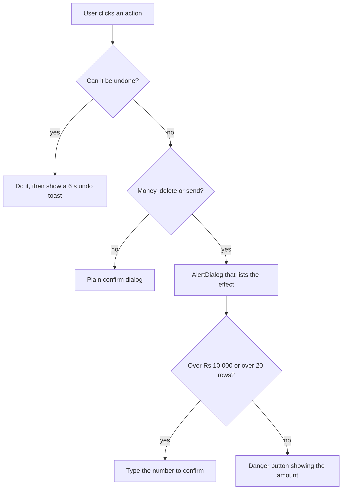

# Design System and UX Guidelines

**In simple words:** This chapter fixes how every EduFlow screen looks and behaves, so that 34 modules feel like one product. It gives the design tokens (colours, type, spacing), the app shell, the navigation of each role, the standard page patterns with wireframes, and the hard rules for forms, tables, accessibility, print and speed. Every module chapter builds its screens from these pieces, so nothing here is repeated there.

## Who We Design For

Our buyer is not a software person. Rajesh Sharma runs Sharma Classes in Patna from a five-year-old Android phone. Dr. Anita Verma uses a laptop but has never used an ERP. Parent Sunita Devi reads Hindi faster than English. The design answers these people.

| ID | Principle | What it means in code | How we check it |
|---|---|---|---|
| DS-P01 | One screen, one job | Each page has exactly one primary button | Design review of every wireframe |
| DS-P02 | Big targets | Minimum touch target 44 x 44 px, 48 px on portals | Playwright box-size assertion |
| DS-P03 | Fewest fields | Required fields only; the rest under "More details" | Field count in the module chapter |
| DS-P04 | Never a blank box | Every list has loading, empty and error art | Storybook state stories |
| DS-P05 | Say it in plain words | Error text names the fix, not the cause | Microcopy table in this chapter |
| DS-P06 | Money needs a second look | Amounts above zero need a confirm step | Test case in the module chapter |
| DS-P07 | Works at 3G | First screen paints under 2.5 s on 4G | Lighthouse budget in CI |
| DS-P08 | Never colour alone | Status shows colour plus a word or letter | Contrast and grayscale review |
| DS-P09 | Same word everywhere | One glossary drives labels and toasts | String catalogue review |
| DS-P10 | Undo beats confirm | Soft actions get a 6 s undo toast, not a dialog | Pattern list in this chapter |

> **Founder note:** DS-P03 saves the most support calls. Every extra field on the admission form costs the clerk about four seconds and gives us one more thing to explain on the phone.

### The device and network reality

We build against this test matrix. Anything outside it is best effort.

| Class | Device we test on | Screen | Network | Who uses it |
|---|---|---|---|---|
| Low-end Android | Redmi A2, 2 GB RAM, Chrome | 360 x 800 | 4G, 3 Mbps | Parents, students, teachers |
| Mid Android | Redmi Note 13, Chrome | 393 x 873 | 4G | Teachers, centre heads |
| iPhone | iPhone 12, Safari | 390 x 844 | 4G | Owners, city schools |
| Office laptop | 1366 x 768, Chrome | 1366 x 768 | Wired or Wi-Fi | Accountant, admin |
| Large desktop | 1920 x 1080, Chrome or Edge | 1920 x 1080 | Wired | Owner, platform console |

Supported browsers: the last two versions of Chrome, Edge, Firefox and Safari, plus Android WebView 110 and newer. No Internet Explorer. If JavaScript fails to load, the page shows one plain sentence and a reload button, never a white screen.

## The App Shell

Three shells cover the whole product. Staff use the sidebar shell on a laptop and the bottom-navigation shell on a phone. Parents and students get a lighter shell, detailed in *Parent Portal Module* and *Student Portal Module*.

**Pattern UX-P01 — Desktop staff shell (Organization Admin, web)**

```text
+--------------------------------------------------------------------------+
| EduFlow  Bright Future Public School [All Campuses v] [?] (RS) v         |
+------------+-------------------------------------------------------------+
| Dashboard  | Students / All students          Year [2027-28 v]           |
| Students  <+-------------------------------------------------------------+
|  All       | ! WhatsApp credits are low (180 left)      [Buy credits]    |
|  Admissions+-------------------------------------------------------------+
| Attendance | Search [aarav____________] Class [10-A v] Status [Active v] |
| Batches    | 3 filters on                       [Clear] [Save this view] |
| Fees       +-------------------------------------------------------------+
| Teachers   | [ ] Name            Adm no.      Class  Due        Status   |
| Exams      | [x] Aarav Sharma    BF-2027-0142 10-A   Rs 5,800   Active   |
| Reports    | [ ] Ananya Sharma   BF-2027-0188 6-B    Rs 9,000   Active   |
| Settings   | [ ] Rohit Kumar     BF-2026-0091 10-A   Rs 0       Left     |
|            +-------------------------------------------------------------+
|            | 1 selected  [Send message] [Assign fee] [Export]            |
|            | Rows 1-20 of 1,200   [20 v]   < 1 2 3 ... 60 >              |
+------------+-------------------------------------------------------------+
```

- Header: product mark, tenant name, campus switcher, help, avatar menu (profile, language, sign out). The campus switcher is hidden when the user has one campus.
- Sidebar: fixed 232 px, collapsible to 64 px icons with `Alt+S`. The open group is marked `<`. Items come from the grants in `AUTH-API-14`, never from a hard-coded list.
- Breadcrumb line: module, then page, with the academic-year switcher at its right.
- The alert strip holds at most two banners. A third becomes a bell notification.

**Pattern UX-P02 — Mobile staff shell (Teacher, phone)**

```text
+------------------------------------+
| (=) Bright Future PS    [?] (PN) v |
+------------------------------------+
| Attendance                         |
| Batch [10-A Maths            v]    |
| Date  [< Mon 19 Jul 2027 >]        |
+------------------------------------+
| 42 students    P 39   A 2   L 1    |
| [Mark all present]                 |
+------------------------------------+
| 01 Aarav Sharma     [P][A][L][H]   |
| 02 Ananya Verma     [P][A][L][H]   |
| 03 Dev Patel        [P][A][L][H]   |
+------------------------------------+
| Saved as draft 09:04               |
|           [Submit attendance]      |
+------------------------------------+
| [Home] [Attend] [Classes] [More]   |
+------------------------------------+
```

- The sidebar becomes a `Sheet` behind `(=)`. The four most used destinations of the role sit in the bottom bar; the rest live under "More".
- The primary button is sticky above the bottom bar, full width, 48 px tall.
- Tables never scroll sideways on a phone. Each row becomes a card with two values.

**Pattern UX-P03 — Parent portal shell (Parent, phone)**

```text
+------------------------------------+
| (=) Bright Future PS      [EN|HI]  |
+------------------------------------+
| Child [Aarav Sharma - 10-A     v]  |
+------------------------------------+
| ! You are offline. Showing saved   |
|   information from 08:40.          |
+------------------------------------+
| Fees due              Rs 5,800     |
| INV-2027-0912  OVERDUE by 5 days   |
|                 [Pay Rs 5,800]     |
+------------------------------------+
| Attendance today      ABSENT 09:05 |
| This month 91.67 pct               |
+------------------------------------+
| Notices (2 unread)                 |
+------------------------------------+
| [Home] [Attendance] [Fees] [More]  |
+------------------------------------+
```

- No sidebar, no jargon, no empty dashboard. The portal opens on the two things a parent came for: money and attendance.
- The language toggle sits in the header of every screen, because a shared phone changes reader in the middle of a session.
- The child switcher is the first row when the guardian has more than one child.

## Navigation by Role

Navigation is generated from permissions. A menu item renders only when the user holds its key, so a custom role such as Librarian gets a correct menu with no extra code. Routes are Next.js App Router paths under `client/src/app/(app)/`.

| Item | Route | Permission key | Phase |
|---|---|---|---|
| Dashboard | `/dashboard` | `dashboard.view` | 1 |
| Students | `/students` | `students.view` | 1 |
| Admissions | `/admissions` | `admissions.view` | 1 |
| Attendance | `/attendance` | `attendance.view` | 1 |
| Batches | `/batches` | `batches.view` | 1 |
| Subjects | `/subjects` | `subjects.view` | 1 |
| Fees | `/fees` | `fees.view` | 1 |
| Payments | `/payments` | `payments.view` | 1 |
| Teachers | `/teachers` | `teachers.view` | 1 |
| Settings | `/settings` | `settings.view` | 1 |
| Staff | `/staff` | `staff.view` | 2 |
| Timetable | `/timetable` | `timetable.view` | 2 |
| Homework | `/homework` | `homework.view` | 2 |
| Exams | `/exams` | `exams.view` | 2 |
| Report cards | `/report-cards` | `reportcards.view` | 2 |
| Analytics | `/analytics` | `analytics.view` | 2 |
| Library | `/library` | `library.view` | 3 |
| Transport | `/transport` | `transport.view` | 3 |
| Payroll | `/payroll` | `payroll.view` | 3 |

The bottom bar shows only four items, so each role has a fixed short list. "More" opens the full permitted menu.

| Role | Item 1 | Item 2 | Item 3 | Item 4 |
|---|---|---|---|---|
| ORG_ADMIN | Home | Students | Fees | More |
| PRINCIPAL | Home | Attendance | Students | More |
| TEACHER | Home | Attendance | Classes | More |
| ACCOUNTANT | Home | Collect | Invoices | More |
| PARENT | Home | Attendance | Fees | More |
| STUDENT | Home | Classes | Work | More |
| Custom role | Home | first permitted | second permitted | More |

> **Rule:** A missing grant hides the menu item; it is never greyed out. A user who types the URL by hand gets the 403 page with a "Go to dashboard" button. The grant rules live in *RBAC and Permissions Matrix*.

## Design Tokens

Tokens are CSS variables defined once in `client/src/styles/globals.css` and exposed to Tailwind. Nothing in the product uses a raw hex code.

### Colour

Text must reach a contrast ratio of 4.5:1 against its background. Large text, borders and icons must reach 3:1. The ratios below are measured against white.

| Token | Hex | Ratio on white | Used for |
|---|---|---|---|
| `--primary` | `#2563EB` | 5.17 | Primary buttons, links, active nav |
| `--primary-hover` | `#1D4ED8` | 6.70 | Hover and pressed state |
| `--primary-soft` | `#EFF6FF` | 1.09 | Selected row, info banner background |
| `--success` | `#16A34A` | 3.30 | Paid chip fill, progress bar |
| `--success-text` | `#15803D` | 5.02 | Success words on a light background |
| `--warning` | `#D97706` | 3.19 | Due-soon chip fill |
| `--warning-text` | `#B45309` | 5.02 | Warning words |
| `--danger` | `#DC2626` | 4.83 | Destructive button, overdue chip |
| `--danger-text` | `#B91C1C` | 6.47 | Error text under a field |
| `--ink` | `#0F172A` | 17.85 | Headings and table values |
| `--ink-muted` | `#334155` | 10.35 | Body text |
| `--ink-subtle` | `#64748B` | 4.76 | Labels, helper text, placeholders |
| `--line` | `#E2E8F0` | 1.23 | Borders and table rules |
| `--surface` | `#F8FAFC` | 1.05 | Page background |
| `--surface-alt` | `#F1F5F9` | 1.10 | Table header, sidebar background |

`--success` and `--warning` fail 4.5:1, so they may fill a shape but never carry text; words use `--success-text` and `--warning-text`. Status colour always travels with a word.

| Status word | Fill | Text | Where it appears |
|---|---|---|---|
| Paid, Present, Active, Approved | `#F0FDF4` | `#15803D` | Fees, attendance, staff |
| Due, Pending, Draft, Late | `#FFFBEB` | `#B45309` | Invoices, approvals |
| Overdue, Absent, Failed, Rejected | `#FEF2F2` | `#B91C1C` | Fees, attendance, payments |
| Info, Scheduled, Queued | `#EFF6FF` | `#1D4ED8` | Notifications, jobs |
| Cancelled, Left, Archived | `#F1F5F9` | `#334155` | Every module |

### Type, spacing and shape

The font is Inter (variable, `latin` and `latin-ext` subsets) with Noto Sans Devanagari for Hindi, both self-hosted through `next/font`. Numbers use tabular figures, so amount columns line up.

| Token | Size and line height | Weight | Used for |
|---|---|---|---|
| `text-display` | 30 / 36 px | 600 | Page title on a wide screen |
| `text-h1` | 24 / 32 px | 600 | Page title, dialog title |
| `text-h2` | 20 / 28 px | 600 | Card and section heading |
| `text-h3` | 16 / 24 px | 600 | Sub-heading, table group |
| `text-body` | 15 / 24 px | 400 | Default body and table cells |
| `text-small` | 13 / 20 px | 400 | Helper text, timestamps |
| `text-label` | 13 / 16 px | 500 | Field labels and chips |
| `text-amount` | 18 / 24 px | 600 | Money on cards, tabular figures |

Spacing uses a 4 px scale: 4, 8, 12, 16, 24, 32, 48, 64. Radius: `sm` 6 px for chips and inputs, `md` 8 px for buttons and cards, `lg` 12 px for dialogs and sheets, `full` for avatars. Shadows: `sm` on cards, `md` on popovers, `lg` on dialogs, none on tables. The focus ring is 2 px `--primary` with a 2 px white offset, on every interactive element.

### The Tailwind and CSS setup

```typescript
// client/tailwind.config.ts
import type { Config } from 'tailwindcss';

export default {
  darkMode: ['class'],
  content: ['./src/**/*.{ts,tsx}'],
  theme: {
    extend: {
      colors: {
        primary: {
          DEFAULT: 'hsl(var(--primary))',
          hover: 'hsl(var(--primary-hover))',
          soft: 'hsl(var(--primary-soft))',
          foreground: 'hsl(var(--primary-foreground))',
        },
        success: 'hsl(var(--success))',
        warning: 'hsl(var(--warning))',
        danger: 'hsl(var(--danger))',
        ink: {
          DEFAULT: 'hsl(var(--ink))',
          muted: 'hsl(var(--ink-muted))',
          subtle: 'hsl(var(--ink-subtle))',
        },
        line: 'hsl(var(--line))',
        surface: {
          DEFAULT: 'hsl(var(--surface))',
          alt: 'hsl(var(--surface-alt))',
        },
      },
      borderRadius: { sm: '6px', md: '8px', lg: '12px' },
      fontFamily: { sans: ['var(--font-inter)', 'system-ui', 'sans-serif'] },
      fontSize: {
        body: ['0.9375rem', { lineHeight: '1.5rem' }],
        small: ['0.8125rem', { lineHeight: '1.25rem' }],
      },
    },
  },
  plugins: [require('tailwindcss-animate')],
} satisfies Config;
```

Tokens are stored as HSL triples, so one tenant colour can replace one variable without touching a component:

```css
/* client/src/styles/globals.css */
:root {
  --primary: 221 83% 53%;          /* #2563EB */
  --primary-hover: 224 76% 48%;    /* #1D4ED8 */
  --primary-soft: 214 100% 97%;    /* #EFF6FF */
  --primary-foreground: 0 0% 100%;
  --ink: 222 47% 11%;
  --ink-muted: 215 25% 27%;
  --ink-subtle: 215 16% 47%;
  --line: 214 32% 91%;
  --surface: 210 40% 98%;
  --surface-alt: 210 40% 96%;
  --radius: 8px;
}
```

### Tenant branding

`Organization.branding` is a JSON column holding `primaryColor`, `secondaryColor`, `faviconUrl`, `receiptFooter` and `hideEduflowBranding`, beside `Organization.logoUrl`. It is read with `SET-API-06` and saved with `SET-API-07`. Only the primary colour, logo, favicon and receipt footer are tenant-controlled. Text, surface and status colours are never overridden, because that is where contrast accidents happen.

```tsx
// client/src/app/(app)/layout.tsx  (server component)
import { hexToHsl, contrastOnWhite } from '@eduflow/shared/color';

export default async function AppLayout({ children }: { children: React.ReactNode }) {
  const org = await getCurrentOrganization();            // ORG-API-08
  const hex = org.branding?.primaryColor ?? '#2563EB';
  const safe = contrastOnWhite(hex) >= 4.5 ? hex : '#2563EB';
  const style = { '--primary': hexToHsl(safe) } as React.CSSProperties;
  return <div style={style} data-org={org.slug}>{children}</div>;
}
```

`SET-API-07` already rejects a colour under 4.5:1 with `422 BUSINESS_RULE_VIOLATION` and the message "This colour is too light for buttons. Pick a darker one." The check above is the second net. `hideEduflowBranding` needs Enterprise; every other plan keeps "Powered by EduFlow". Dark mode ships in Phase 3; every token already has a dark value, so the remaining work is testing, not redesign.

## Component Inventory

Every component is a shadcn/ui primitive wrapped once in `client/src/components/ui/` and used only through that wrapper, so one fix lands everywhere.

| Component | Built on | Rules that never change |
|---|---|---|
| `Button` | shadcn `Button` | Variants `primary`, `secondary`, `ghost`, `danger`. One primary per screen. Spinner inside, disabled while the request runs |
| `DataTable` | TanStack Table plus shadcn `Table` | Server paging, sorting and filters; filters kept in the URL; 8 skeleton rows while loading |
| `Form` | React Hook Form, Zod, shadcn `Form` | The Zod schema is imported from `shared/`, so browser and API agree |
| `Input`, `Textarea` | shadcn | Label above, helper under, error replaces helper. A placeholder is never the label |
| `Select` | shadcn `Select` | Up to 8 options. Above that use `Combobox` |
| `Combobox` | shadcn `Command` plus `Popover` | Search with 300 ms debounce, server side, two extra facts per row |
| `DatePicker` | shadcn `Calendar` plus `Popover` | Typing allowed as `DD/MM/YYYY`; week starts from `Organization.weekStartsOn` |
| `Dialog` | shadcn `Dialog` | Decisions with fewer than 6 fields. Escape closes; a running request blocks closing |
| `Sheet` | shadcn `Sheet` | Side panel on desktop, bottom sheet on phone. Holds filters and quick edits |
| `AlertDialog` | shadcn `AlertDialog` | Only destructive or money actions, with the confirmation pattern below |
| `Toast` | shadcn `Sonner` | Bottom right on desktop, top on phone. One line plus an optional action |
| `Badge` | shadcn `Badge` | Status only, never decoration. Colour plus word |
| `Tabs` | shadcn `Tabs` | Detail pages only. The active tab is in the URL as `?tab=` |
| `Stepper` | Custom on shadcn `Progress` | Wizards. Shows "Step 2 of 5" in words as well as in bars |
| `EmptyState` | Custom | Title, one sentence, one primary action, optional help link |
| `ErrorState` | Custom | Plain sentence, `[Try again]`, `requestId` in small grey text |
| `Skeleton` | shadcn `Skeleton` | Same height as the real content, so the page does not jump |
| `FileUpload` | Custom plus S3 pre-signed URL | Shows the allowed types, the size limit and progress; retries once |
| `MoneyInput` | Custom `Input` | Indian digit grouping, two decimals, never negative, paste-safe |
| `PhoneInput` | Custom `Input` plus `Select` | Country code select and 10 digits for India |
| `PermissionGate` | Custom | Hides its children when the grant is missing; wraps every action button |

## Standard Page Patterns

Six patterns cover almost every screen in the PRD. A module that needs a new one must say why in one line.

| Pattern | When to use it | Example screens |
|---|---|---|
| List with filters and bulk actions | Any collection of records | `STU-S01`, `FEE-S03`, `TCH-S01` |
| Detail with tabs | One record with several groups of data | `STU-S02`, `CAMP-S04` |
| Create or edit form | Fewer than 25 fields, one save | `STU-S03`, `TCH-S02` |
| Wizard | Setup with dependent steps | `ORG-S03`, `FEE-S02` |
| Confirmation dialog | Destructive, money or send actions | `PAY-S07`, `STU-S09` |
| Import flow | Bulk data from Excel or CSV | `STU-S07`, `TCH-S06` |

Pattern UX-P01 is also the list pattern: filters on one line, a "filters on" count with `[Clear]`, saved views, a checkbox column, and a bulk action bar that appears only when rows are selected. Bulk actions take at most 500 rows per call; above that the screen offers "Select all 1,200 matching", which runs as a BullMQ job and reports in the notification bell.

**Pattern UX-P04 — Detail page with tabs (Organization Admin, web)**

```text
+--------------------------------------------------------------------------+
| EduFlow  Bright Future Public School [Main Campus v] [?] (RS) v         |
+------------+-------------------------------------------------------------+
| Students  <| Students / Aarav Sharma                                     |
|            +-------------------------------------------------------------+
|            | (AS) Aarav Sharma  BF-2027-0142  10-A  [Active]             |
|            |      Father Rajesh Sharma  +91 98390 12345                  |
|            |      Due Rs 5,800 OVERDUE       [Collect fee] [...]         |
|            +-------------------------------------------------------------+
|            | [Overview] Fees  Attendance  Exams  Documents  Activity     |
|            +-------------------------------------------------------------+
|            | Personal                    | This year                     |
|            | DOB     14 Mar 2012         | Attendance   91.67 pct        |
|            | Gender  Male                | Fees paid    Rs 24,200        |
|            | Blood   B+                  | Fees due     Rs  5,800        |
|            | Aadhaar xxxx xxxx 4417      | Last exam    Unit Test 1      |
|            +-------------------------------------------------------------+
|            | Guardians                                                   |
|            | Rajesh Sharma Father +91 98390 12345 Primary  [Edit]        |
|            | Sunita Devi   Mother +91 98390 12346          [Edit]        |
+------------+-------------------------------------------------------------+
```

- The identity header repeats on every tab: photo, name, key IDs, status badge, the action this record most often needs, and a `[...]` menu for the rest.
- The active tab is in the URL (`?tab=fees`). Each tab loads its own query; nothing is fetched until the tab opens.
- Tabs never hold a form that can be lost. An edit opens a `Sheet` or its own page.

**Pattern UX-P05 — Create form (front desk, web)**

```text
+--------------------------------------------------------------------------+
| Students / Add student                                  [?] (RS) v       |
+--------------------------------------------------------------------------+
| Basic details                                                            |
| First name *    [Aarav______________] Last name * [Sharma___________]    |
| Date of birth * [14/03/2012_] Gender * (o) Male ( ) Female ( ) Other     |
| Admission no.   [BF-2027-0142] set automatically                         |
+--------------------------------------------------------------------------+
| Class and batch                                                          |
| Course *        [Class 10                 v]                             |
| Batch *         [10-A  (41 of 45 seats)   v]                             |
| Admission date *[19/07/2027]                                             |
+--------------------------------------------------------------------------+
| Primary guardian                                                         |
| Name *          [Rajesh Sharma_________] Relation * [Father        v]    |
| Mobile *        [+91 v] [98390 12345___]                                 |
|                 This number already belongs to Ananya Sharma.            |
|                 [Link as sibling] or change the number.                  |
+--------------------------------------------------------------------------+
| > More details (photo, address, medical, previous school)                |
+--------------------------------------------------------------------------+
| * Required                      [Cancel] [Save and add another] [Save]   |
+--------------------------------------------------------------------------+
```

- Fields are grouped under plain headings, one column on a phone and two on a laptop. Optional fields sit inside the collapsed "More details" group.
- The duplicate-phone hint is a warning, not an error. The clerk can still save, and it offers the sibling link because that is the usual reason.
- "Save and add another" keeps the course, batch and admission date and clears the rest.

**Pattern UX-P06 — Wizard (Organization Admin, first day)**

```text
+--------------------------------------------------------------------------+
| Set up Bright Future Public School                        Step 3 of 5    |
| [####################................] Classes and sections              |
+--------------------------------------------------------------------------+
| 1 Institute  2 Academic year  3 Classes  4 Fees  5 Invite team           |
+--------------------------------------------------------------------------+
| Pick the classes you run. You can change this later.                     |
| [x] Nursery [x] Class 1 [x] Class 2 [x] Class 3 [ ] Class 4              |
| [x] Class 9 [x] Class 10 [ ] Class 11 [ ] Class 12                       |
|                                            [Select all] [Clear]          |
+--------------------------------------------------------------------------+
| Sections per class [2 v]    Name them (o) A, B  ( ) 1, 2                 |
| We will create 18 batches such as 10-A and 10-B.                         |
+--------------------------------------------------------------------------+
| Your answers are saved. You can close this and come back.                |
|                          [Back]  [Skip for now]  [Save and continue]     |
+--------------------------------------------------------------------------+
```

- A wizard is used only when a later step depends on an earlier one. Everything else is one form.
- Each step saves to the server before moving on, so a dropped 4G connection loses nothing. The step number is in the URL.
- Every step except the first can be skipped; the dashboard checklist keeps skipped steps visible.

**Figure: How strong the confirmation should be**



Most actions are reversible, so most need no dialog at all. Only the right branch interrupts the user, and only the last box asks for typing.

**Pattern UX-P07 — Confirmation for a money action (Accountant, web)**

```text
+--------------------------------------------------+
| Cancel receipt R-2027-2211?                      |
+--------------------------------------------------+
| Student  Aarav Sharma (BF-2027-0142)             |
| Amount   Rs 12,000.00, cash, 19 Jul 2027         |
| Effect   Invoice INV-2027-0912 goes back to DUE  |
|          and the parent gets a WhatsApp message  |
+--------------------------------------------------+
| Reason * [Wrong student selected_____________]   |
| Type the receipt number to confirm               |
|          [R-2027-2211______]                     |
+--------------------------------------------------+
|                 [Keep receipt]  [Cancel receipt] |
+--------------------------------------------------+
```

- The title is the question. The body lists what changes, including any message that will leave the building. The destructive button repeats the verb, never "OK".
- The safe choice is on the left and holds focus, so Enter never destroys anything.
- A reason box appears whenever the audit log needs a human explanation.

**Pattern UX-P08 — Import flow, check step (front desk, web)**

```text
+--------------------------------------------------------------------------+
| Students / Import students                    Step 3 of 4: Check         |
+--------------------------------------------------------------------------+
| File students-july.xlsx   312 rows read   [Download template]            |
+--------------------------------------------------------------------------+
| Your column       Maps to              Sample                            |
| Student Name  ->  [First name      v]  Aarav                             |
| Father Name   ->  [Guardian name   v]  Rajesh Sharma                     |
| Mobile        ->  [Guardian phone  v]  9839012345                        |
| Class         ->  [Batch           v]  10-A                              |
+--------------------------------------------------------------------------+
| Ready 298    Warnings 9    Errors 5                                      |
| Row 41 Mobile  9839          Phone must have 10 digits                   |
| Row 77 Class   10-C          No batch named 10-C in 2027-28              |
| Row 90 DOB     31/02/2012    That date does not exist                    |
|                                      [Download error rows (5)]           |
+--------------------------------------------------------------------------+
| [ ] Update students that already exist (match on admission number)       |
|                       [Back]  [Import 298 rows and skip 5]               |
+--------------------------------------------------------------------------+
```

- Four steps, always the same: upload, map columns, check, import. The mapping guesses from the header text and remembers the last mapping per tenant.
- Errors never block the whole file. Good rows import; bad rows come back as an Excel file with one extra column that says what to fix.
- The import runs as a BullMQ job. Above 500 rows the screen shows a progress bar and the result arrives in the notification bell.

## Loading, Empty, Error and Offline

Four states exist for every data area. A blank screen is a bug.

| State | What the user sees | Rules |
|---|---|---|
| Loading | Skeleton of the same shape and height | No spinner on full pages; spinners only inside buttons |
| Slow (over 3 s) | Skeleton plus "Still loading. Your connection is slow." | Never a blocking overlay |
| Empty, first use | Title, one sentence, primary action | "No students yet. Add your first student or import from Excel." |
| Empty, filtered | "No student matches these filters" plus `[Clear filters]` | Never shows the first-use art |
| Error | One sentence, `[Try again]`, request ID | Names the fix; hides the stack trace |
| Forbidden | "You do not have access to this page." plus a dashboard link | From a `403 FORBIDDEN` answer |
| Offline | Grey banner, read-only data with the time it was saved | Writes are blocked with a clear reason |

Toasts report the result of an action. They last 4 seconds, 6 seconds when they carry an undo, and stay until dismissed when they carry an error the user must read.

| Type | Example text | Action inside the toast |
|---|---|---|
| Success | "Receipt R-2027-2211 saved. Rs 12,000 collected." | `[Print]` |
| Undo | "Notice moved to trash." | `[Undo]` for 6 seconds |
| Warning | "Saved. WhatsApp message not sent: 0 credits left." | `[Buy credits]` |
| Error | "Could not save. Check your internet and try again." | `[Try again]` |
| Job started | "Import started. We will tell you when it is done." | `[View progress]` |

## Form Rules

One Zod schema lives in `shared/src/schemas/` and is imported by both the browser form and the Express route, so the two can never disagree. React Hook Form runs it in the browser; the API runs it again and owns the final answer.

| Moment | What happens |
|---|---|
| While typing | Nothing, except the counter on a length-limited field |
| On blur | The field is checked and the error appears under it |
| After the first failed save | The field is checked on every keystroke, so the user sees the fix at once |
| On save | Every field is checked, focus jumps to the first error, the page scrolls to it |
| Server answer `422` | The field error is placed on the named field from `error.details[].field` |
| Server answer `409` | A form-level red banner above the buttons, for example a duplicate admission number |

Required fields carry a red asterisk after the label and `aria-required="true"`. Optional fields are never marked "optional" when more than half the form is required; instead the form ends with the line "\* Required". Error text is one sentence, in the user's words, and says what to do: "Enter a valid 10-digit mobile number." Never "Invalid input", never a field name in code form, never a regular expression.

```typescript
// shared/src/schemas/common.ts
import { z } from 'zod';

export const indiaMobile = z
  .string()
  .transform((v) => v.replace(/[\s-]/g, ''))
  .refine((v) => /^(\+91)?[6-9]\d{9}$/.test(v), 'Enter a valid 10-digit mobile number.')
  .transform((v) => (v.startsWith('+91') ? v : `+91${v}`));   // stored as E.164

export const indiaPin = z
  .string()
  .regex(/^[1-9]\d{5}$/, 'PIN code must be 6 digits.');

export const money = z
  .coerce.number()
  .nonnegative('Amount cannot be less than zero.')
  .max(9_999_999_99, 'Amount is too large.')
  .refine((v) => Number.isInteger(v * 100), 'Use at most two decimal places.');
```

- The phone field shows the country code as a small select (`+91` by default from `Organization.countryCode`) and accepts pasted text with spaces, dashes or a leading zero. The other three countries are in *Internationalization and Localization*.
- Money fields group digits the Indian way (`12,00,000.00`) with `Intl.NumberFormat('en-IN')`, keep two decimals and reject a negative sign. Stored values are `Decimal(12,2)` plus a currency code.
- Dates are typed as `DD/MM/YYYY` or picked. A pure calendar date is sent as `YYYY-MM-DD`, never a timestamp, so a birthday cannot shift across a timezone.
- Leaving a form with unsaved changes opens a dialog: "You have unsaved changes. Leave this page?" with `[Stay]` focused.
- A save button is disabled only while the request runs, never because the form is invalid. The user must be allowed to press save and then read the error.

## Table Rules

| Rule | Detail |
|---|---|
| Paging | Server-side, `?page=1&limit=20`, sizes 20, 50 and 100. The canon caps `limit` at 100 |
| Sorting | Server-side, one column at a time, `?sort=-createdAt`. The sorted column shows an arrow |
| Filters | In the URL, so a view can be shared and the back button works |
| Saved views | A named filter set per user, stored per module in `localStorage` |
| Column chooser | A popover of checkboxes; the choice is kept per user per table in `localStorage` |
| Row density | Comfortable (48 px) by default, Compact (36 px) for 100-row screens |
| Sticky parts | Header row and the first column stay in place while scrolling |
| Export | CSV under 1,000 rows downloads at once; above that it becomes a job with an email link |
| Empty and error | The states listed above, never a bare table with no rows |
| Row actions | Up to two buttons, the rest in a `[...]` menu, all wrapped in `PermissionGate` |
| Money columns | Right aligned, tabular figures, currency symbol only in the header |
| Long text | Trimmed with an ellipsis and a tooltip; never wrapped into three lines |

Bulk selection works the same everywhere: the header checkbox selects the rows on the page, and a line above the table offers "Select all 1,200 matching". Selection survives paging inside the same filter set.

## Accessibility

The target is WCAG 2.1 level AA. This is a legal expectation for schools in the USA and Australia, and simply good design for a 55-year-old principal in Lucknow.

| Area | Rule | How we test it |
|---|---|---|
| Contrast | 4.5:1 for text, 3:1 for icons and borders | Token table above; axe-core in CI |
| Keyboard | Every action reachable by Tab; focus ring always visible | Playwright keyboard walk of the top 20 screens |
| Focus order | Follows the visual order; a dialog traps focus and returns it on close | Manual review per pattern |
| Labels | Every input has a real `<label>`; icon buttons carry `aria-label` | axe-core rule `label` |
| Errors | `aria-describedby` links the message to the field; `role="alert"` on the summary | axe-core plus manual screen-reader pass |
| Landmarks | One `main`, one `nav`, a "Skip to content" link as the first tab stop | axe-core rule `region` |
| Live regions | Toasts are `aria-live="polite"`; a failed payment is `assertive` | Manual pass with NVDA and TalkBack |
| Motion | Animations under 200 ms and removed under `prefers-reduced-motion` | CSS review |
| Zoom | Usable at 200 percent zoom with no sideways scrolling | Manual at 1366 x 768 |
| Targets | 44 x 44 px minimum, 48 px in the portals | Playwright box-size assertion |

Two screens are audited by hand before every release because they carry money or a legal record: collect fee (`FEE-S02`) and the parent payment screen (`PP-S04`). Everything else relies on the automatic axe-core run that fails the pull request on any serious or critical issue.

## Responsive Layout and Icons

| Name | Width | Layout |
|---|---|---|
| `sm` | under 640 px | One column, bottom navigation, cards instead of tables |
| `md` | 640 to 1023 px | Two columns, sidebar as a sheet, tables with 4 visible columns |
| `lg` | 1024 to 1279 px | Sidebar fixed at 232 px, full tables, filters on one line |
| `xl` | 1280 px and above | Same as `lg` with a wider content area, maximum 1,440 px |

Every page is written mobile first. A screen that only makes sense on a laptop, such as the timetable grid, shows a short message on a phone with the part that does work, never a broken grid. Print is treated as its own breakpoint.

Icons come from `lucide-react`, the set that ships with shadcn/ui. Rules: 20 px inside buttons and table rows, 24 px in navigation, `currentColor` always, `stroke-width` 2. An icon alone is allowed only for Search, Close, Menu, More and Edit, and each of those still carries an `aria-label`. Status is never an icon alone. Only one icon per concept across the whole product: a rupee icon means fees everywhere, never payroll.

## Microcopy

Words are part of the design system. The rule is simple: write what a colleague would say at the counter.

| Situation | Write this | Not this |
|---|---|---|
| Empty list | "No students yet. Add your first student or import from Excel." | "No data available" |
| Save error | "Could not save. Check your internet and try again." | "Request failed with status 500" |
| Permission | "You do not have access to fee collection. Ask your admin." | "Forbidden" |
| Plan limit | "Your Growth plan allows 300 students. You have 300. See plans." | "PLAN_LIMIT_REACHED" |
| Destructive | "Delete batch 10-A? 41 students will need a new batch." | "Are you sure?" |
| Success | "Receipt R-2027-2211 saved. Rs 12,000 collected." | "Operation completed successfully" |
| Loading long | "Still loading. Your connection is slow." | "Please wait..." |
| Session end | "You were signed out for safety. Sign in again." | "Token expired" |

Other word rules. Buttons carry a verb and the object: "Collect fee", "Send notice", "Import students"; never "Submit" or "OK". Labels use the tenant's language from `Organization.type`, so a coaching institute sees "Centre" and "Batch" where a school sees "Campus" and "Section". Dates are written out as "19 Jul 2027", never "07/19/2027". Money is always written with the currency: "Rs 12,000" on screen, the rupee sign in PDFs. Numbers over five digits use Indian grouping. We never blame the user: "That number is already used by Ananya Sharma", not "You entered a duplicate".

## Localisation-Ready UI

The full country and language design is in *Internationalization and Localization*. The design system only has to make sure the UI does not fight it.

- Every visible string comes from a message catalogue key, never from a template literal built in the component. `"{count} students selected"` is one ICU message with a plural rule, not three joined pieces.
- Layouts assume Hindi text is 15 to 30 percent longer than English. Buttons and table headers are sized from the Hindi string, not the English one.
- The language toggle writes `User.locale`; parents also carry `Guardian.preferredLanguage`, which the notification worker uses. A missing key falls back to English and is logged, never shown as a raw key.
- Devanagari needs more line height, so `text-body` becomes 15 / 26 px when the locale starts with `hi`.
- Arabic (UAE, Phase 4) needs right-to-left. All spacing uses Tailwind logical classes (`ps-4`, `me-2`), never `pl-4` or `mr-2`, so turning on `dir="rtl"` is a one-line change.

## Print and PDF Templates

Two different paths produce paper. A counter receipt prints straight from the browser with print CSS, because the parent is standing there and cannot wait for a queue. Report cards, certificates and bulk receipts are rendered by the worker with `puppeteer-core` in headless Chromium, as described in *System Architecture*.

| Output | Size | Path | Notes |
|---|---|---|---|
| Fee receipt | A5 or 80 mm thermal | Browser print CSS | Prints in under 2 s; the PDF follows on the queue |
| Duplicate receipt | A5 | Worker PDF | Carries a "DUPLICATE" watermark |
| Report card | A4 portrait | Worker PDF | School logo, grades table, signature blocks |
| Admit card | Two A5 on one A4 | Worker PDF | Photo, roll number, room |
| Certificate | A4 portrait or landscape | Worker PDF | QR code that verifies the certificate |
| Day-close sheet | A4 portrait | Browser print CSS | Cash counted, method split, variance |
| Student list | A4 landscape | Worker PDF | Repeats the header row on every page |

Shared print rules: 12 mm margins, 11 pt body, black text on white, no background colours, no sidebar, no buttons. The tenant logo sits top left and the tenant address top right. The footer holds the page number as "Page 1 of 3", the print time in the organization timezone, and the line "Powered by EduFlow" unless `branding.hideEduflowBranding` is on. `branding.receiptFooter` prints above it, for example "This receipt is valid subject to cheque realisation."

```css
/* client/src/styles/print.css */
@media print {
  @page { size: A4 portrait; margin: 12mm; }
  .no-print, nav, aside, .toast-root { display: none !important; }
  body { font-size: 11pt; color: #000; background: #fff; }
  table { page-break-inside: auto; }
  tr { page-break-inside: avoid; }
  thead { display: table-header-group; }
  a[href]::after { content: ''; }
}
@media print and (width <= 80mm) {
  @page { size: 80mm auto; margin: 3mm; }
  body { font-size: 9pt; }
}
```

PDF templates are plain HTML files in `server/src/templates/` with the same tokens as the app, compiled with the tenant's logo and colour. One template per document, one CSS file shared by all of them. Hindi output needs the Noto Sans Devanagari font file inside the worker Docker image; without it Chromium prints boxes.

## Performance Budgets

These are front-end budgets, measured with Lighthouse in CI on a simulated 4G connection (3 Mbps, 150 ms latency) on a mid-tier Android profile. The API and job targets live in *Non-Functional Requirements*.

| Metric | Budget | Applies to |
|---|---|---|
| Largest Contentful Paint | under 2.5 s | Every first-load route |
| Interaction to Next Paint | under 200 ms | Every click and key press |
| Cumulative Layout Shift | under 0.1 | Every page; skeletons must match real heights |
| First-load JavaScript | 180 KB gzipped | The app shell |
| Per-route JavaScript | 60 KB gzipped | Any single page chunk |
| Fonts | 2 files, 80 KB total | Inter plus Noto Sans Devanagari subsets |
| Images | 150 KB per page | Logos and photos, served as WebP |
| Table render | under 300 ms for 100 rows | `DataTable` with virtual rows above 200 |

How we stay inside them: route-level code splitting from the App Router, `next/font` with `display: swap`, no icon barrel imports, TanStack Query caching with a 30-second stale time on lists, S3 photos delivered through CloudFront at three widths, and a CI step that fails the pull request when a budget is exceeded. The build prints the bundle table on every pull request, so a heavy library is caught before it ships.

## Design Definition of Done

A screen is finished only when all of these are true. Claude Code prompts P-09 and P-10 in the Founder Blueprint build the shell and this kit, so every later module inherits the list.

| Check | Evidence |
|---|---|
| Uses tokens only, no raw hex or pixel value | Code review and a lint rule banning hex in `.tsx` |
| Loading, empty, error and forbidden states exist | Four Storybook stories per screen |
| Works at 360 px wide without sideways scrolling | Playwright viewport test |
| Every action wrapped in `PermissionGate` | Code review against the module permission table |
| Money and destructive actions confirmed as per UX-P07 | Test case in the module chapter |
| axe-core passes with no serious or critical issue | CI job on the pull request |
| Strings come from the catalogue, English and Hindi | Missing-key report is empty |
| Lighthouse budgets met | CI budget report |
| Print view checked when the screen produces paper | Manual print to PDF, attached to the pull request |
