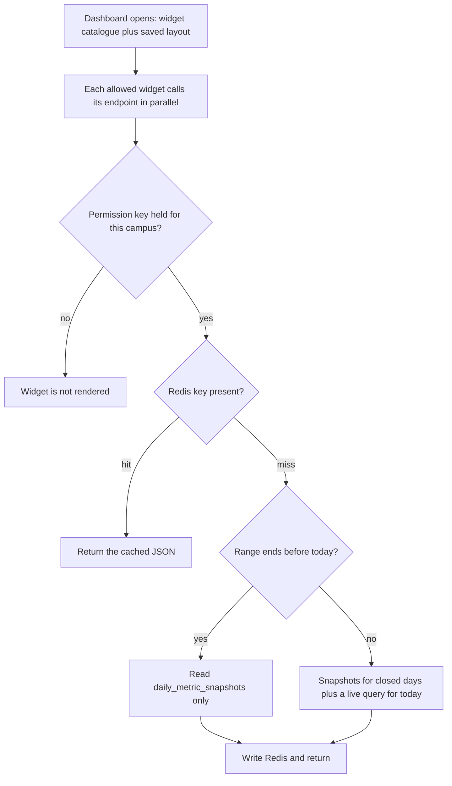
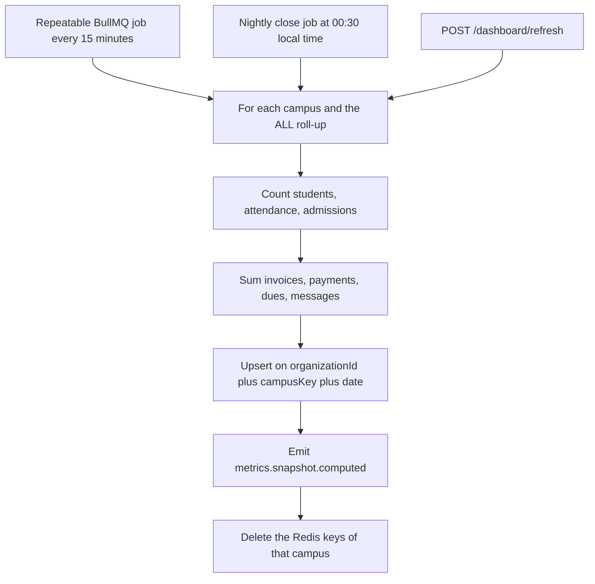
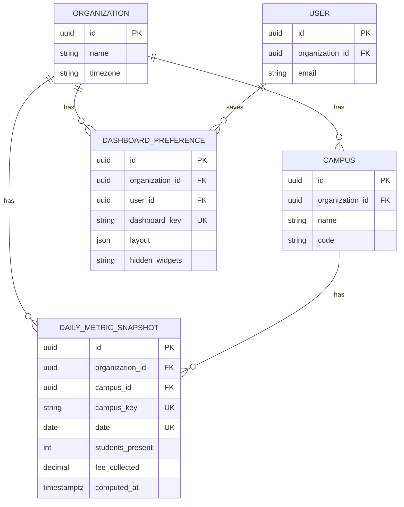

# Dashboard Module

**In simple words:** The dashboard is the first screen a staff member sees after login. It answers one question for each role: what needs my attention right now? The owner sees money and growth, the principal sees attendance and approvals, the teacher sees today's classes, the accountant sees today's counter. This chapter defines every widget, the exact formula behind every number, the pre-computed table that makes the screen open in under a second, and the sixteen endpoints behind it.

| Item | Value |
|---|---|
| Module code | DASH |
| Release phase | Phase 1 (MVP), built in sprint week 8 with prompt P-20 |
| Plans | Starter, Growth, Pro, Enterprise (widget list and history depth differ) |
| Main users | Organization Admin, Principal, Teacher, Accountant, custom roles |
| Depends on | Organizations, Multi Campus, RBAC, Attendance, Fees, Payments, Student Admission, Settings |
| Main tables | `daily_metric_snapshots`, `dashboard_preferences` |

## Objective

A school owner should not have to open six screens to know how the day is going. The dashboard gives him the six numbers that matter in one look, and one click to the list behind each number. The module has five goals.

1. **Answer the role's question in under two seconds.** Rajesh Sharma asks "how much money came in?". Dr. Anita Verma asks "which batches are still unmarked?". Priya Nair asks "what do I teach next?". Suresh Gupta asks "is my counter balanced?". Each role gets its own home screen, not a filtered copy of the owner's.
2. **Be fast on a 1,200-student tenant.** The screen never scans raw rows for closed days. It reads `daily_metric_snapshots`, a small table that a BullMQ worker keeps up to date, and caches the answer in Redis 7 for 60 seconds.
3. **Never show a number the user may not see.** A widget is rendered only when the user holds its permission key with a scope that covers the campus. Money widgets need `dashboard.view_finance`, so a Teacher never sees fee collection.
4. **Be a launch pad, not a dead end.** Every number is a link. "Dues Rs 18,46,500" opens the defaulter list. "3 batches pending" opens the attendance screen with the filter already applied.
5. **Let each user keep the layout they like.** Widget order, hidden widgets, default campus and default date range are saved per user in `dashboard_preferences` and follow the user to any device.

Success measures for Phase 1:

| Measure | Target |
|---|---|
| First useful paint of the home screen | p95 (the time under which 95% of loads finish) under 1.5 s |
| Any single widget endpoint, warm cache | p95 under 250 ms |
| `DASH-API-01` on a 1,200-student tenant, cold cache | p95 under 600 ms |
| Age of the numbers during working hours | Under 15 minutes |
| Staff who open the dashboard at least 4 days a week | 70% by Day 60 |
| Clicks from a widget into a full list, per session | 2 or more (the dashboard is used, not just watched) |

## Scope

### In scope

- Four role dashboards: owner and organization admin (`DASH-S01`), principal (`DASH-S02`), teacher (`DASH-S03`), fee counter (`DASH-S04`), plus the owner's mobile view (`DASH-S05`).
- The widget catalogue and the rules that decide which widgets a user may see (`DASH-API-12`).
- KPI cards, trends, attendance-today, fee overview, admissions funnel, my tasks, alerts, activity feed, upcoming events and birthdays (`DASH-API-01` to `DASH-API-11`).
- Campus switcher and date range picker on the dashboard, including the "All campuses" roll-up.
- Per-user layout: save, read and reset (`DASH-API-13` to `DASH-API-15`).
- Quick actions: collect fee, mark attendance, add student, send notice, add inquiry.
- The metric snapshot table `daily_metric_snapshots`, the BullMQ jobs that fill it, and the manual recompute (`DASH-API-16`).
- The Redis cache layer, its key shape, its TTL (time to live) and the events that clear it.
- Drill-down links from each widget into the list screen of the owning module.
- Empty state for a brand-new tenant: the setup checklist from *Organizations Module*.

### Out of scope

| Topic | Where it lives |
|---|---|
| Parent home screen with children, dues and attendance | *Parent Portal Module* (`PP-API-01`) |
| Student home screen with timetable and homework | *Student Portal Module* (`SP-API-01`) |
| Custom report builder, saved reports, scheduled email digests | *Analytics Module* (`ANL-API-01` to `ANL-API-20`) |
| Platform console metrics across all tenants | *Organizations Module* (`ORG-API-40`, `/platform/metrics`) |
| AI insight cards and student risk scores | *AI Insights Module* (Phase 4) |
| Campus comparison table and its export | *Multi Campus Module* (`CAMP-API-16`) |
| The lists behind a widget (defaulters, unmarked batches, inquiries) | The module that owns the data |
| Sending any message | *Notifications Module*; this module only reads |
| Usage against plan limits, add-on purchase | *Organizations Module* (`ORG-API-12`) |

### Phase notes

| Phase | What arrives |
|---|---|
| Phase 1 (MVP) | All 16 endpoints, four role dashboards, snapshots, cache, preferences, quick actions |
| Phase 2 (V1.0) | Widgets for Exams, Report Cards, Staff and Leave; drill-down into *Analytics Module*; scheduled PDF digest by email through `ANL-API-17` |
| Phase 3 (V1.5) | Library, Inventory, Transport and Hostel counters read from `DailyMetricSnapshot.extra` |
| Phase 4 (V2.0) | AI insight widget, dropout-risk card, natural-language question box |

> **Founder note:** Build the dashboard in sprint week 8, after Attendance, Fees and Payments exist. A dashboard written before its data sources is guesswork, and every widget would need rewriting.

## User Stories

| ID | As a | I want to | So that | Priority |
|---|---|---|---|---|
| DASH-US-01 | Organization Admin | see students, attendance, money collected and dues for today on one screen | I know the state of my institute in 10 seconds | Must |
| DASH-US-02 | Organization Admin | switch between "All campuses", Main Campus and City Campus | I can compare branches without opening reports | Must |
| DASH-US-03 | Organization Admin | change the date range to this week, this month or a custom range | I can check a slow week or close a month | Must |
| DASH-US-04 | Organization Admin | open a mobile summary of the same numbers | I can check the institute from the car | Must |
| DASH-US-05 | Principal | see which batches have not marked attendance yet today | I can call those class teachers before lunch | Must |
| DASH-US-06 | Principal | see my pending approvals in one list | no transfer or leave request waits for days | Must |
| DASH-US-07 | Teacher | see today's classes, pending attendance and homework to grade | I start my day without opening three menus | Must |
| DASH-US-08 | Accountant | see today's collection split by cash, UPI, card and cheque | my day close matches the system | Must |
| DASH-US-09 | Accountant | see cheques that are not cleared yet | I follow up before the day close | Should |
| DASH-US-10 | Organization Admin | see new inquiries and admissions this month with the conversion rate | I know if marketing money is working | Must |
| DASH-US-11 | Organization Admin | get an alert when the trial ends, the plan limit is near or WhatsApp credits run low | nothing stops because of a missed renewal | Must |
| DASH-US-12 | Any staff user | hide widgets I never use and reorder the rest | my dashboard fits my job | Should |
| DASH-US-13 | Any staff user | click a number and land on the list behind it | I can act at once, not search again | Must |
| DASH-US-14 | Principal | see today's birthdays of students in my campus | I can wish the child in the assembly | Could |
| DASH-US-15 | Organization Admin | force a recompute when a number looks wrong | I never have to wait 15 minutes to trust the screen | Should |

## Workflow

### How a widget gets its numbers

**Figure: Dashboard load path**



1. The browser first calls `DASH-API-12`. The answer is the list of widget keys this user may see, after the role keys, the plan features and the enabled modules are all applied.
2. The browser then calls `DASH-API-13` and gets the saved layout. A user with no saved row gets the role default layout.
3. Each visible widget calls its own endpoint. They run in parallel, so one slow widget never blocks the others. TanStack Query keeps the last good answer on screen while a refetch runs.
4. The API checks the permission key of that widget. A missing key gives `403 FORBIDDEN`, and the client hides the card instead of showing an error box.
5. A cache hit returns in about 20 ms. A miss reads snapshots for every closed day in the range and runs one live aggregate query for today only.
6. The answer carries `asOf` (when the numbers were computed) and `isLive` (true when today is inside the range). The card shows "Updated 3 minutes ago" from `asOf`.

### How a daily metric snapshot is built

**Figure: Metric snapshot jobs**



1. The repeatable job runs every 15 minutes. It picks only organizations with activity in the last 15 minutes (a payment, an attendance session, an admission or an invoice), so an idle tenant costs nothing.
2. For each picked organization the worker writes one row per campus plus one roll-up row with `campusId = null` and `campusKey = "ALL"`.
3. The nightly close job runs at 00:30 in the organization timezone and recomputes yesterday one last time. After that the row is final, because late payments always carry their own `paidAt`.
4. `DASH-API-16` puts the same job on the queue with the BullMQ job id `snapshot:{orgId}:{campusKey}:{date}`, so two clicks in the same minute create one job, not two.
5. Every write emits `metrics.snapshot.computed`. The listener deletes the Redis keys of that organization and campus. The next request rebuilds them.

### Snapshot freshness lifecycle

A snapshot row has no status column. Freshness is derived from `date` and `computedAt` and shown as a small label on each card.

| State | How it is derived | What the user sees |
|---|---|---|
| `MISSING` | No row for that campus and date | Card shows the live query result and the label "Live" |
| `LIVE` | `date` is today | "Updated {n} minutes ago", refresh button enabled |
| `STALE` | `date` is today and `computedAt` is older than 30 minutes | Amber dot plus "Numbers may be up to {n} minutes old" |
| `FINAL` | `date` is before today and `computedAt` is after 00:30 of the next day | No label; the number is frozen |
| `REOPENED` | `date` is before today and a later event changed it (a cancelled receipt, a back-dated payment) | "Corrected on {date}" in the card footer |

> **Rule:** A `FINAL` row is never edited by the 15-minute job. Only the nightly close job and `DASH-API-16` may rewrite a past day, and both write an audit entry when the new value differs from the old one.

## Screens and Wireframes

| ID | Screen | Users | Purpose |
|---|---|---|---|
| DASH-S01 | Owner home (web) | ORG_ADMIN | Whole organization: students, attendance, money, admissions, alerts |
| DASH-S02 | Principal campus home (web) | PRINCIPAL | One campus: unmarked batches, approvals, today's events, read-only fee card |
| DASH-S03 | Teacher today (mobile web) | TEACHER | Today's classes, pending attendance, homework to grade |
| DASH-S04 | Fee counter today (web) | ACCOUNTANT | Collection by method, pending cheques, day-close status |
| DASH-S05 | Owner summary (mobile web) | ORG_ADMIN | The six owner numbers on a phone, with one-tap drill-down |
| DASH-S06 | Customize widgets (dialog) | Every staff user | Reorder, hide and reset widgets; set default campus and range |
| DASH-S07 | First-run checklist (web) | ORG_ADMIN | Replaces the empty dashboard until the setup steps are done |

**Screen DASH-S01 — Owner home (Organization Admin, web)**

```text
+--------------------------------------------------------------------------+
| EduFlow   Bright Future Public School   [All Campuses v]   (RS) v        |
+------------+-------------------------------------------------------------+
| Dashboard <| Home     Range [This Month v]   Mon 19 Jul 2027   [Refresh] |
| Students   +-------------------------------------------------------------+
| Attendance | ! Trial ends in 6 days [See plans]   ! WhatsApp credits 180 |
| Batches    +-------------------------------------------------------------+
| Fees       | Students     | Attendance   | Collected    | Dues           |
| Teachers   | 1,200        | 91.3%        | Rs 3,42,500  | Rs 18,46,500   |
| Admissions | +12 this mth | 1,044/1,144  | today        | 37 overdue     |
| Reports    +-------------------------------------------------------------+
| Settings   | Collection this month        | Admissions funnel (July)     |
|            | Rs 11,53,500 of Rs 30,00,000 | Inquiries        86          |
|            | [###########.............]   | Visited          11          |
|            | 38.5 pct                     | Converted   12   (14.0 pct)  |
|            | Cash 41 UPI 38 Card 14 Chq 7 | [Open admissions >]          |
|            +-------------------------------------------------------------+
|            | My tasks (5)                 | Activity                     |
|            | 2 discount approvals         | 09:12 Suresh: receipt R-2211 |
|            | 1 refund approval            | 09:05 Priya: 10-A attendance |
|            | 2 campus transfers           | 08:58 Anita: notice sent     |
|            | [Open tasks >]               | [Open activity log >]        |
|            +-------------------------------------------------------------+
|            | [Collect Fee] [Mark Attendance] [Add Student] [Send Notice] |
+------------+-------------------------------------------------------------+
```

- The owner sees four KPI cards, two charts, his task list and the activity feed.
- The campus switcher in the header sets `campusId`; "All Campuses" reads the `ALL` roll-up row.
- `[Refresh]` calls `DASH-API-16` and needs `dashboard.manage`; other roles do not see the button.
- Calls: `DASH-API-01` (cards), `DASH-API-04` (collection), `DASH-API-05` (funnel), `DASH-API-06` (tasks), `DASH-API-07` (alerts), `DASH-API-08` (activity).
- Every number is a link into the list screen of the module that owns the data.

**Screen DASH-S04 — Fee counter today (Accountant, web)**

```text
+--------------------------------------------------------------------------+
| EduFlow   Bright Future Public School   [Main Campus v]    (SG) v        |
+------------+-------------------------------------------------------------+
| Dashboard <| My counter     Mon 19 Jul 2027        Counter open 08:45 AM |
| Students   +-------------------------------------------------------------+
| Fees       | Collected today  | Receipts | Refunds  | Advance kept       |
|  Collect   | Rs 2,14,000      | 46       | Rs 2,500 | Rs 8,000           |
|  Invoices  +-------------------------------------------------------------+
| Reports    | By method                    | Needs attention              |
| Settings   | Cash      Rs  88,000   41 pct| 3 cheques not cleared        |
|            | UPI       Rs  81,500   38 pct| Rs 46,000 total              |
|            | Card      Rs  30,000   14 pct| 1 failed online payment      |
|            | Cheque    Rs  14,500    7 pct| 2 invoices due today         |
|            |           [Open payments >]  | [Open cheque register >]     |
|            +-------------------------------------------------------------+
|            | Day close                                                   |
|            | Expected cash Rs 90,500 = opening 2,500 + 88,000 - 0        |
|            | Status: OPEN. Last close 18 Jul, variance Rs 0              |
|            |                                       [Start Day Close]     |
|            +-------------------------------------------------------------+
|            | [Collect Fee] [New Receipt] [Search Student]                |
+------------+-------------------------------------------------------------+
```

- Suresh Gupta sees only his own counter, because `DASH-API-11` filters on `receivedById = userId`.
- "Expected cash" repeats the formula of the *Payments Module*, so the two screens can never disagree.
- `[Start Day Close]` opens the day-close screen of *Payments Module*; it is disabled while a cheque of today is still `PENDING`.
- Calls: `DASH-API-11` (counter), `DASH-API-04` (dues card), `DASH-API-06` (tasks).

**Screen DASH-S03 — Teacher today (Teacher, mobile web)**

```text
+------------------------------------+
| EduFlow         Priya Nair   (PN) v|
+------------------------------------+
| Mon 19 Jul 2027                    |
|                                    |
| ! 10-A attendance is pending       |
|   [Mark now]                       |
+------------------------------------+
| Today's classes            4 of 6  |
+------------------------------------+
| 08:00 P1  10-A  Mathematics  R-12  |
|           Marked  38/40            |
| 08:45 P2  10-B  Mathematics  R-14  |
|           Marked  36/38            |
| 09:30 P3  10-A  Maths Lab    Lab-2 |
|           Pending   [Mark]         |
| 11:50 P5  9-C   Mathematics  R-09  |
|           Upcoming                 |
+------------------------------------+
| Homework to grade              12  |
| 10-A Algebra worksheet   due today |
| 10-B Trigonometry set    2 overdue |
| [Open homework]                    |
+------------------------------------+
| [Mark Attendance]  [Add Homework]  |
+------------------------------------+
```

- The card at the top is the only red item, so a teacher on a phone cannot miss unmarked attendance.
- "4 of 6" counts the sessions already marked out of the classes scheduled today.
- Calls: `DASH-API-10` only. One request fills the whole screen, which matters on 4G.
- Homework counts come from the same call, filtered to the teacher's own `Staff` id.

**Screen DASH-S05 — Owner summary (Organization Admin, mobile web)**

```text
+------------------------------------+
| EduFlow    Bright Future    (RS) v |
+------------------------------------+
| [All Campuses v]  [This Month v]   |
+------------------------------------+
| Collected today                    |
| Rs 3,42,500          +18 pct vs Fri|
+------------------------------------+
| This month                         |
| Rs 11,53,500 of Rs 30,00,000       |
| [############................] 38.5|
+------------------------------------+
| Attendance today       91.3 pct    |
| 1,044 present of 1,144 marked      |
| 3 batches not marked   [See]       |
+------------------------------------+
| Dues            Rs 18,46,500       |
| Overdue         Rs  6,92,000       |
| [Send reminders]                   |
+------------------------------------+
| Admissions July   86 leads   12 in |
+------------------------------------+
| Tasks 5   Alerts 2   [Open]        |
+------------------------------------+
```

- The phone view keeps the owner's six numbers and drops the charts, so it loads on a weak connection.
- "+18 pct vs Fri" compares today with the same weekday of the previous week, from `DASH-API-02`.
- Calls: `DASH-API-01`, `DASH-API-02`, `DASH-API-04`, `DASH-API-06`, `DASH-API-07`.

**Screen DASH-S06 — Customize widgets (dialog, web)**

```text
+--------------------------------------------------------------------------+
| Customize my dashboard                                        [ X ]      |
+--------------------------------------------------------------------------+
| Default campus [All Campuses v]     Default range [This Month v]         |
+--------------------------------------------------------------------------+
| Visible widgets   -   drag to reorder                                    |
|  = [x] KPI cards                                       Dashboard         |
|  = [x] Collection this month                           Fees              |
|  = [x] Admissions funnel                               Admissions        |
|  = [x] My tasks                                        Dashboard         |
|  = [ ] Activity feed                                   Audit             |
|  = [ ] Upcoming events and birthdays                   Calendar          |
+--------------------------------------------------------------------------+
| Not available on your plan                                               |
|  ( ) Exam performance           Phase 2 module          [Upgrade]        |
|  ( ) AI insights                Enterprise or add-on    [See add-ons]    |
+--------------------------------------------------------------------------+
|             [Reset to default]        [Cancel]       [Save layout]       |
+--------------------------------------------------------------------------+
```

- The list comes from `DASH-API-12`; only widgets the user may see appear in the top block.
- Unchecking a widget adds its key to `hiddenWidgets`; dragging changes the `layout` array.
- `[Save layout]` calls `DASH-API-14`; `[Reset to default]` calls `DASH-API-15` and deletes the row.
- Locked widgets are shown greyed with the reason, never hidden, so the owner learns what the next plan gives.

## UI Components

| Component | Type | Behaviour |
|---|---|---|
| `KpiCard` | shadcn/ui Card | Big number, delta against the previous period, freshness badge. Loading: shimmer block of the same height, so the grid does not jump. Empty: shows `0` with a grey hint, never a blank card. Error: a small "Could not load" line with a retry link |
| `WidgetGrid` | CSS grid driven by `layout` | 12 columns on desktop, 1 column under 768 px. Drag handles appear only in `DASH-S06` |
| `CampusSwitcher` | shadcn/ui Select | Options from `CAMP-API-14`. Hidden when the user has one campus. Sets `X-Campus-Id` and the query parameter `campusId` |
| `DateRangePicker` | shadcn/ui Popover with presets | Presets: Today, This week, This month, This year, Custom. Custom is limited to 366 days |
| `TrendChart` | Recharts line or bar inside a Card | Reads `DASH-API-02`. The tooltip shows the exact value and the date. No animation on refetch, so the eye does not lose the line |
| `MethodSplitBar` | Stacked bar | Cash, UPI, Card, Netbanking, Cheque, Wallet. A method with a zero value is dropped from the legend |
| `TaskList` | shadcn/ui list with badges | Groups by type, oldest first; each row links to the approval screen |
| `AlertBanner` | shadcn/ui Alert | One line per alert, severity `info`, `warning` or `critical`. Dismiss hides it for 24 hours in `localStorage`, never on the server |
| `ActivityFeed` | Virtual list | Last 20 audit rows in scope, relative time ("9 minutes ago"), actor initials |
| `QuickActionBar` | Button row | Actions filtered by permission: `fees.collect`, `attendance.mark`, `students.create`, `notifications.send` |
| `FreshnessBadge` | shadcn/ui Badge | Green under 15 minutes, amber 15 to 30 minutes, red above 30 minutes or after a failed job |
| `EmptyDashboard` | Card with checklist | Shown when the tenant has zero students; renders the onboarding steps of `ORG-API-05` |
| `WidgetErrorBoundary` | React error boundary | One broken widget never blanks the page; it renders a small error card and reports to Sentry |

> **Best practice:** Every widget renders three states from day one: loading, empty and error. A dashboard that shows one spinner for the whole page feels twice as slow as one that fills card by card.

## Validation Rules

| Field | Rule | Error message shown to user |
|---|---|---|
| `range` | One of `today`, `this_week`, `this_month`, `this_year`, `custom` | Choose a date range from the list. |
| `from`, `to` | Required when `range=custom`; ISO date `YYYY-MM-DD` | Enter both dates as day, month and year. |
| `from`, `to` | `from` is not after `to` | The start date cannot be after the end date. |
| `from`, `to` | At most 366 days apart | Choose a range of 366 days or less. |
| `to` | Not after today in the organization timezone | You cannot pick a future date. |
| `from` | Not before the plan history window of `DASH-BR-15` | Your plan keeps {days} days of history. Upgrade to see older data. |
| `campusId` | A UUID of a campus the user is assigned to, or `ALL` | You do not have access to this campus. |
| `campusId` | `ALL` only when the user reaches two or more campuses | Choose one campus. |
| `metric` | One of the 12 metric keys of `DASH-BR-16` | Unknown metric. Choose one from the list. |
| `granularity` | One of `day`, `week`, `month`; `day` only for ranges up to 92 days | The daily view works for 92 days or less. Choose weekly or monthly. |
| `dashboardKey` | One of `home`, `fees`, `attendance`, `admissions` | Unknown dashboard. |
| `layout` | JSON array, 1 to 40 items, each with `widgetKey`, `x`, `y`, `w`, `h` | Your layout could not be saved. Reset it and try again. |
| `layout[].widgetKey` | Present in the catalogue of `DASH-API-12` for this user | Widget {widgetKey} is not available for your role or plan. |
| `layout[].w`, `layout[].h` | Integers; `w` 1 to 12, `h` 1 to 6 | Widget size is out of range. |
| `hiddenWidgets` | At most 40 strings, each at most 40 characters | Too many hidden widgets. |
| `defaultRange` | One of the five range keys, or null | Choose a default range from the list. |
| `limit` | Integer 1 to 100, default 20 | The list can show at most 100 rows. |

## Business Rules

**DASH-BR-01 — One dashboard per role, one key per dashboard.** The `dashboardKey` decides the default layout: `home` for every role, plus `fees` for ACCOUNTANT and ORG_ADMIN, `attendance` for PRINCIPAL and TEACHER, `admissions` for ORG_ADMIN and the Front Desk preset. A user with two roles gets the union of the widgets and the layout of the highest-ranked role: ORG_ADMIN, then PRINCIPAL, then ACCOUNTANT, then TEACHER.

**DASH-BR-02 — A widget is a permission, not a preference.** The server builds the catalogue as role keys, intersected with plan features, intersected with enabled modules. A hidden widget can never be reached by editing the layout: `DASH-API-14` rejects an unknown or forbidden `widgetKey` with `VALIDATION_ERROR`, and every widget endpoint checks its own key again.

**DASH-BR-03 — Money needs `dashboard.view_finance`.** The widgets `kpi.fee_collected_today`, `kpi.fee_collected_month`, `kpi.dues_outstanding`, `fees.collection_trend`, `fees.method_split` and the whole counter dashboard need this key. A PRINCIPAL holds it as `View`, so Dr. Anita Verma sees the numbers of her campus but gets no export and no drill-down into a payment edit screen.

**DASH-BR-04 — Campus scope comes from the token, never from the query.** `campusId` is checked against `user_campuses`. An ORG_ADMIN reaches every campus without rows there. A campus outside the list answers `403 FORBIDDEN`. `campusId=ALL` reads the row with `campusKey = "ALL"`; a user with exactly one campus is always pinned to that campus.

**DASH-BR-05 — One snapshot row per organization, campus and date.** The unique key is `(organizationId, campusKey, date)`. `campusKey` holds the campus UUID or the literal `ALL`, because a NULL inside a unique key would let the same roll-up be written twice. A tenant with 2 campuses writes 3 rows a day, so 1,095 rows a year.

**DASH-BR-06 — Attendance percent counts students, not sessions.** `attendancePercent = studentsPresent / studentsMarked * 100`, rounded to one decimal. A student counts as present when the status is `PRESENT` or `LATE`; `HALF_DAY` counts as 0.5. `studentsMarked` counts distinct students with at least one record that day, so a school with 8 periods is not counted 8 times. On a day that is a `Holiday` for the whole campus the value is `null`, not `0`.

> **Example:** On Monday 19 July 2027 the Main Campus marked 742 students and 690 were present: 690 / 742 = 92.99%, shown as 93.0%. The City Campus marked 402 and 354 were present, which is 88.1%.

**DASH-BR-07 — The roll-up is recomputed, never averaged.** The `ALL` row recomputes every ratio from the summed counters. Averaging campus percentages is wrong whenever the campuses differ in size.

> **Example:** Right: (690 + 354) / (742 + 402) = 1,044 / 1,144 = 91.3%. Wrong: (93.0 + 88.1) / 2 = 90.6%. The gap is 0.7 points on a 1,200-student school and grows with the size difference.

**DASH-BR-08 — Today is live, closed days are frozen.** A range that includes today is answered as the sum of the snapshots of the closed days plus one live aggregate for today. A range that ends before today reads snapshots only and never touches `payments` or `attendance_records`.

> **Example:** Collected in July up to 19 July = ₹8,11,000 from the snapshot rows of 1 to 18 July, plus ₹3,42,500 from the live query for 19 July, which gives ₹11,53,500.

**DASH-BR-09 — Dues are a balance, not a sum.** `feeDues` is the outstanding balance of all `fee_invoices` at the end of the day, so it must never be summed over days. The live value is the `feeDues` of the last closed snapshot, minus today's allocated collection, plus today's issued invoices.

> **Example:** The 18 July row holds ₹21,63,000. On 19 July the counter allocated ₹3,42,500 and issued ₹26,000 of new invoices: 21,63,000 − 3,42,500 + 26,000 = ₹18,46,500. `feeOverdue` is the part of that balance whose due date has passed: ₹6,92,000 across 37 invoices.

**DASH-BR-10 — Collection rate is money collected against money billed.** `collectionRate = feeCollected / (feeCollected + feeDues) * 100` for the chosen range, to one decimal.

> **Example:** 11,53,500 / (11,53,500 + 18,46,500) = 11,53,500 / 30,00,000 = 38.45%, shown as 38.5%.

**DASH-BR-11 — The admissions funnel counts leads created in the range.** Inquiries are grouped by `InquiryStage`, applications by `ApplicationStatus`. `conversionRate = inquiries now in stage CONVERTED that were created in the range / all inquiries created in the range * 100`. A lead created in June and converted in July counts in the June funnel, so a month's conversion can never rise above 100%.

> **Example:** July 2027 created 86 inquiries: NEW 12, CONTACTED 18, FOLLOW_UP 21, VISIT_SCHEDULED 9, VISITED 11, CONVERTED 12, LOST 3. Conversion = 12 / 86 = 13.95%, shown as 14.0%.

**DASH-BR-12 — One currency per snapshot row.** `currency` is the campus currency, or the organization currency on the `ALL` row. If two campuses of one organization use different currencies, the `ALL` row writes the counts only, leaves every money column at `0` and sets `extra.mixedCurrency = true`. The owner then reads "Select one campus to see money" instead of a wrong total. Every Indian tenant in Phase 1 is single-currency, so this path is rare, but it must never produce a fake number.

**DASH-BR-13 — Cache keys and TTL.** The key is `dash:{orgId}:{campusKey}:{widgetKey}:{rangeKey}:{scopeHash}`. `scopeHash` is the first 12 characters of a SHA-256 hash of the user's permission keys and campus list, so two users with different scopes never share a cached answer. TTL is 60 seconds when the range includes today and 900 seconds when it does not. Every `metrics.snapshot.computed` event deletes `dash:{orgId}:{campusKey}:*`.

**DASH-BR-14 — Manual refresh is rate limited.** `DASH-API-16` allows 4 calls per hour per organization and 1 call per minute per user. Above that the answer is `429 RATE_LIMITED` with `retryAfterSeconds`. The BullMQ job id `snapshot:{orgId}:{campusKey}:{date}` turns a second click inside the same job window into a no-op.

**DASH-BR-15 — History depth follows the plan.** Starter keeps 31 days, Growth 400 days, Pro and Enterprise 1,100 days (about 3 years). A `from` date outside the window answers `403 PLAN_LIMIT_REACHED`, and the screen offers the upgrade. The rows themselves are never deleted early; only the read is gated, so an upgrade shows the old data at once.

**DASH-BR-16 — The twelve trend metrics.** `DASH-API-02` accepts `activeStudents`, `newAdmissions`, `newInquiries`, `withdrawals`, `attendancePercent`, `studentsPresent`, `staffPresent`, `feeInvoiced`, `feeCollected`, `feeCollectedOnline`, `feeDues`, `messagesSent`. Each maps to one column of `daily_metric_snapshots`, so no trend can be asked that the table cannot answer. The money metrics need `dashboard.view_finance`.

**DASH-BR-17 — Alert thresholds.** The alert list of `DASH-API-07` is built from five checks with fixed thresholds, so the owner is warned early enough to act.

| Alert key | Condition | Severity |
|---|---|---|
| `trial.ending` | `Subscription.status = TRIALING` and `trialEndsAt` within 7 days | warning; critical inside 2 days |
| `plan.students.near` | Active students at 90% or more of `Plan.maxStudents` | warning; critical at 100% |
| `credits.low` | Wallet `balance - reserved` below `lowBalanceThreshold`, or below 200 when no threshold is set | warning |
| `subscription.past_due` | `Subscription.status = PAST_DUE` | critical |
| `documents.expiring` | `StaffDocument.expiresOn` within 30 days and `isVerified = true` | info |

> **Example:** Bright Future has 180 WhatsApp credits left and a threshold of 500, so the card reads "WhatsApp credits are low: 180 left, about 1 day of messages." The estimate uses the average `messagesSent` of the last 7 snapshot days, which is 168 a day: 180 / 168 = 1.07 days.

**DASH-BR-18 — Birthdays respect the child's privacy.** The birthday widget shows the first name, the batch and the photo of students whose `dateOfBirth` day and month match today, inside the caller's campus scope. It never shows the year of birth or the age, and it is off by default when `Organization.type` is `SCHOOL` until an admin turns it on, because the DPDP Act 2023 asks for data minimisation on children's data. Staff birthdays need `staff.view`.

**DASH-BR-19 — Tasks are the user's own work, not the module's backlog.** `DASH-API-06` returns four groups: approvals waiting for this user (`StudentTransfer` and `LeaveRequest` with `status = PENDING` where the user is an approver), attendance sessions of today the user must mark, admission follow-ups whose `scheduledAt` has passed with `completedAt` null and `doneById` equal to the user, and invoices due today at the user's counter. A task the user cannot act on is never listed.

**DASH-BR-20 — A stale dashboard says so.** If the newest snapshot of the chosen campus is older than 30 minutes during working hours, every card shows the amber freshness badge and the header reads "Numbers may be up to {n} minutes old". The screen still renders. Honest old numbers beat an endless spinner.

## Acceptance Criteria

| ID | Given / When / Then |
|---|---|
| DASH-AC-01 | **Given** Rajesh Sharma is signed in as ORG_ADMIN of Bright Future, **when** he opens `/dashboard` with campus "All Campuses" and range "This Month", **then** `DASH-API-01` answers inside 600 ms on a cold cache and the four KPI cards show 1,200 students, 91.3%, ₹3,42,500 and ₹18,46,500. |
| DASH-AC-02 | **Given** the same screen is opened again inside 60 seconds, **when** the cards load, **then** the answer comes from Redis, `meta.cached` is `true` and no query reaches PostgreSQL. |
| DASH-AC-03 | **Given** Priya Nair is a TEACHER, **when** she calls `DASH-API-04`, **then** the API answers `403 FORBIDDEN` with code `FORBIDDEN`, and the web app never renders a fee card for her. |
| DASH-AC-04 | **Given** Dr. Anita Verma is PRINCIPAL of Main Campus only, **when** she calls `DASH-API-01` with the City Campus id, **then** the API answers `403 FORBIDDEN` and writes no audit row for a data read. |
| DASH-AC-05 | **Given** Dr. Anita Verma holds `dashboard.view_finance` with scope `View`, **when** she opens the dashboard, **then** she sees the fee numbers of Main Campus and no export button. |
| DASH-AC-06 | **Given** 19 July 2027 is a working day and three batches have no attendance session, **when** `DASH-API-03` is called, **then** it returns `pendingBatches: 3` with the batch names, and the teacher names of those batches. |
| DASH-AC-07 | **Given** 15 August 2027 is a `Holiday` of type `PUBLIC` for the whole campus, **when** `DASH-API-03` is called for that date, **then** `attendancePercent` is `null` and the card reads "Holiday: Independence Day" instead of 0%. |
| DASH-AC-08 | **Given** the snapshot rows of 1 to 18 July hold ₹8,11,000 and today's live collection is ₹3,42,500, **when** the month card is built, **then** it shows ₹11,53,500 and `isLive` is `true`. |
| DASH-AC-09 | **Given** Suresh Gupta collected ₹2,14,000 today and another accountant collected ₹1,28,500, **when** Suresh calls `DASH-API-11`, **then** he sees ₹2,14,000 only, because the counter view filters on `receivedById`. |
| DASH-AC-10 | **Given** a user saves a layout with the unknown key `fees.magic`, **when** `DASH-API-14` runs, **then** it answers `400 VALIDATION_ERROR` with `details[0].field = "layout[2].widgetKey"` and saves nothing. |
| DASH-AC-11 | **Given** a user has a saved layout for `home`, **when** `DASH-API-15` is called, **then** the row is hard deleted and the next `DASH-API-13` returns the role default with `isDefault: true`. |
| DASH-AC-12 | **Given** an organization on the Starter plan, **when** the owner asks for a trend from 1 January 2027 on 19 July 2027, **then** the API answers `403 PLAN_LIMIT_REACHED` and the screen offers the Growth plan. |
| DASH-AC-13 | **Given** the WhatsApp wallet holds 180 credits against a threshold of 500, **when** `DASH-API-07` is called, **then** the alert `credits.low` is returned with severity `warning` and the estimate "about 1 day". |
| DASH-AC-14 | **Given** the subscription is `TRIALING` and ends on 25 July 2027, **when** the owner opens the dashboard on 19 July, **then** the alert `trial.ending` is shown with "6 days left" and a link to the plan page. |
| DASH-AC-15 | **Given** an ORG_ADMIN presses `[Refresh]` twice inside ten seconds, **when** `DASH-API-16` runs, **then** exactly one BullMQ job exists for that organization, campus and date, and the second call answers `202` with the same `jobId`. |
| DASH-AC-16 | **Given** a user without `dashboard.manage` presses a crafted request to `DASH-API-16`, **when** the API runs, **then** it answers `403 FORBIDDEN` and the attempt is written to the audit log with outcome `DENIED`. |
| DASH-AC-17 | **Given** the snapshot worker last wrote at 08:20 and the clock shows 09:15, **when** the dashboard loads, **then** every card carries the amber badge and the header shows "Numbers may be up to 55 minutes old". |
| DASH-AC-18 | **Given** a brand-new tenant with zero students, **when** the owner opens the dashboard, **then** the KPI grid is replaced by the setup checklist of `ORG-API-05` with the next step highlighted. |
| DASH-AC-19 | **Given** `DASH-API-08` is called by a PRINCIPAL, **when** the feed is built, **then** it returns only audit rows whose `campusId` is inside her campus list. |
| DASH-AC-20 | **Given** 86 inquiries were created in July and 12 are `CONVERTED`, **when** `DASH-API-05` runs, **then** `conversionRate` is `14.0` and the stage counts add up to 86. |

## Edge Cases

| Case | What happens | How the system handles it |
|---|---|---|
| The snapshot job has never run for a new tenant | No row for today | The API falls back to the live query, marks `snapshotState: "MISSING"` and queues a snapshot job for that day |
| The job failed three times (database restart) | Rows are older than 30 minutes | Cards render from the last good row with the amber badge; Sentry gets the failure; the repeatable job retries with exponential backoff (5 s, 25 s, 125 s) |
| A payment made on 18 July is cancelled on 19 July | A `FINAL` row becomes wrong | The `payment.cancelled` event queues a recompute of 18 July; the card footer shows "Corrected on 19 Jul 2027" |
| A back-dated receipt is written for 10 July | An old row is wrong | Same recompute path, limited to 90 days back; older dates need `DASH-API-16` with an explicit `date` |
| Two campuses use INR and AED | The `ALL` money total would be meaningless | `DASH-BR-12`: counts only, money zeroed, `extra.mixedCurrency = true`, and the card asks the user to pick one campus |
| A user is removed from a campus while the page is open | The cached answer is now out of scope | `scopeHash` in the cache key changes on the next request, so the stale answer is never served; the widget re-renders empty |
| A teacher has no classes today (a free day) | The teacher home would be blank | `DASH-API-10` returns `classes: []` and the screen shows "No classes today" plus homework to grade and the timetable link |
| Daylight saving or a timezone change in organization settings | "Today" could shift | All date maths uses the organization timezone at query time; a changed timezone queues a recompute of the last 2 days |
| The user asks for a 366-day daily trend | 366 points would be unreadable and slow | `granularity=day` is refused above 92 days with a `VALIDATION_ERROR`; the picker switches to weekly by itself |
| Redis is down | Every widget would fail | The cache layer catches the error, logs once per minute and serves straight from PostgreSQL; the dashboard is slower but works |
| The activity feed has 4 million audit rows | An unindexed scan | The query always uses `(organization_id, created_at DESC)` with a hard `limit` of 100 and a 7-day window |
| A widget endpoint times out at 5 seconds | One card could hang the page | The client aborts at 5 s, renders the error card with a retry link, and the other widgets are untouched. A birthday on 29 February is matched on 28 February in non-leap years |
| A SUPER_ADMIN opens a tenant dashboard in support mode | Tenant data is read by platform staff | The read needs `X-Organization-Id` inside an impersonation session; the audit row carries `actorType = IMPERSONATION` |

## Database Schema

This module owns two tables. Every other number it shows is read from tables that belong to other modules.

| Table | Purpose |
|---|---|
| `daily_metric_snapshots` | One pre-computed row per organization, campus and date. Every dashboard, the campus comparison and the Phase 2 analytics read it |
| `dashboard_preferences` | One row per user and dashboard key: widget order, hidden widgets, default campus and default range |

### Table daily_metric_snapshots

| Column | Type | Null | Default | Notes |
|---|---|---|---|---|
| `id` | uuid | No | `uuid()` | PK |
| `organization_id` | uuid | No | - | FK to `organizations`, `ON DELETE CASCADE` |
| `campus_id` | uuid | Yes | - | FK to `campuses`, `ON DELETE CASCADE`; null = whole organization |
| `campus_key` | varchar(36) | No | `'ALL'` | The campus id as text, or `ALL`; keeps the unique key free of NULLs |
| `date` | date | No | - | Calendar date in the organization timezone |
| `active_students` | int | No | `0` | Students with status `ACTIVE` at the end of the day |
| `new_admissions` | int | No | `0` | Students admitted on that date |
| `new_inquiries` | int | No | `0` | `AdmissionInquiry` rows created on that date |
| `withdrawals` | int | No | `0` | Students moved to `TRANSFERRED`, `DROPPED_OUT` or `EXPELLED` |
| `students_marked` | int | No | `0` | Distinct students with at least one attendance record |
| `students_present` | int | No | `0` | `PRESENT` and `LATE` count 1, `HALF_DAY` counts 0.5, rounded down |
| `attendance_percent` | numeric(5,2) | Yes | - | `students_present / students_marked * 100`; null on a holiday |
| `staff_total` | int | No | `0` | Staff expected at work that day |
| `staff_present` | int | No | `0` | Staff with `StaffAttendance` status `PRESENT` or `LATE` |
| `currency` | char(3) | No | - | Campus currency, or organization currency on the `ALL` row |
| `fee_invoiced` | numeric(14,2) | No | `0` | Invoices issued on that date |
| `fee_collected` | numeric(14,2) | No | `0` | Successful payments with `paid_at` on that date |
| `fee_collected_online` | numeric(14,2) | No | `0` | Part of `fee_collected` where `gateway` is not `OFFLINE` |
| `fee_dues` | numeric(14,2) | No | `0` | Outstanding balance at the end of the day (a balance, not a sum) |
| `fee_overdue` | numeric(14,2) | No | `0` | Part of `fee_dues` past its due date |
| `messages_sent` | int | No | `0` | `MessageLog` rows created that day |
| `extra` | jsonb | Yes | - | Module counters added in later phases (library issues, transport trips) |
| `computed_at` | timestamptz | No | `now()` | When the worker last wrote this row; drives the freshness badge |
| `created_at` | timestamptz | No | `now()` | - |
| `updated_at` | timestamptz | No | - | `@updatedAt` |

### Table dashboard_preferences

| Column | Type | Null | Default | Notes |
|---|---|---|---|---|
| `id` | uuid | No | `uuid()` | PK |
| `organization_id` | uuid | No | - | FK to `organizations`, `ON DELETE CASCADE` |
| `user_id` | uuid | No | - | FK to `users`, `ON DELETE CASCADE` |
| `dashboard_key` | varchar(40) | No | `'home'` | `home`, `fees`, `attendance` or `admissions` |
| `layout` | jsonb | No | - | `[{ widgetKey, x, y, w, h }]`, 1 to 40 items |
| `hidden_widgets` | text[] | No | `'{}'` | Widget keys the user switched off |
| `default_campus_id` | uuid | Yes | - | Campus id, no FK; null = all assigned campuses |
| `default_range` | varchar(20) | Yes | - | `today`, `this_week`, `this_month`, `this_year` |
| `created_at` | timestamptz | No | `now()` | - |
| `updated_at` | timestamptz | No | - | `@updatedAt` |

### Indexes and constraints

- `daily_metric_snapshots`: `UNIQUE (organization_id, campus_key, date)` is the upsert target; `INDEX (organization_id, date)` serves every range read.
- `dashboard_preferences`: `UNIQUE (organization_id, user_id, dashboard_key)` gives one row per user and dashboard; `INDEX (organization_id, dashboard_key)` supports the admin view of role defaults.
- Neither table has `deleted_at`. A preference is hard deleted by `DASH-API-15`. A snapshot row is data, not a business record, and is rebuilt instead of deleted.
- Both tables cascade on the organization, so closing a tenant removes them with the rest of the data.
- The worker writes with one statement, so two overlapping jobs cannot create a duplicate row:

```sql
INSERT INTO daily_metric_snapshots (
  id, organization_id, campus_id, campus_key, date, active_students,
  students_marked, students_present, attendance_percent, currency,
  fee_collected, fee_dues, computed_at, created_at, updated_at
)
VALUES (
  gen_random_uuid(), $1, $2, $3, $4, $5, $6, $7,
  CASE WHEN $6 = 0 THEN NULL ELSE ROUND($7::numeric * 100 / $6, 2) END,
  $8, $9, $10, now(), now(), now()
)
ON CONFLICT (organization_id, campus_key, date) DO UPDATE SET
  active_students   = EXCLUDED.active_students,
  students_marked   = EXCLUDED.students_marked,
  students_present  = EXCLUDED.students_present,
  attendance_percent= EXCLUDED.attendance_percent,
  fee_collected     = EXCLUDED.fee_collected,
  fee_dues          = EXCLUDED.fee_dues,
  computed_at       = now(),
  updated_at        = now();
```

**Figure: Tables this module owns and reads**



A snapshot row hangs on one organization and, when it is not the roll-up, on one campus. A preference row hangs on one organization and one user. Nothing else points at these two tables, which is why they can be rebuilt at any time without touching business data.

## Prisma Schema

The two models below are copied from `docs/src/_schema/13-certificates-analytics-ai.prisma`. Only the layout differs: long trailing comments are kept, and no field is renamed. The models `Organization`, `Campus` and `User` carry the matching back-relations `dailyMetricSnapshots` and `dashboardPreferences` in `01-platform.prisma` and `02-auth.prisma`. This module defines no enum of its own.

```prisma
// Pre-computed daily numbers per organization and campus;
// dashboards read this table instead of scanning raw data.
model DailyMetricSnapshot {
  id                 String   @id @default(uuid()) @db.Uuid
  organizationId     String   @map("organization_id") @db.Uuid
  campusId           String?  @map("campus_id") @db.Uuid // null = roll-up of the whole organization
  campusKey          String   @default("ALL") @map("campus_key") @db.VarChar(36) // "ALL" or the campusId
  date               DateTime @db.Date
  activeStudents     Int      @default(0) @map("active_students")
  newAdmissions      Int      @default(0) @map("new_admissions")
  newInquiries       Int      @default(0) @map("new_inquiries")
  withdrawals        Int      @default(0)
  studentsMarked     Int      @default(0) @map("students_marked") // students with attendance marked
  studentsPresent    Int      @default(0) @map("students_present")
  attendancePercent  Decimal? @map("attendance_percent") @db.Decimal(5, 2) // null on holidays
  staffTotal         Int      @default(0) @map("staff_total")
  staffPresent       Int      @default(0) @map("staff_present")
  currency           String   @db.Char(3)
  feeInvoiced        Decimal  @default(0) @map("fee_invoiced") @db.Decimal(14, 2) // invoices issued
  feeCollected       Decimal  @default(0) @map("fee_collected") @db.Decimal(14, 2) // successful payments
  feeCollectedOnline Decimal  @default(0) @map("fee_collected_online") @db.Decimal(14, 2)
  feeDues            Decimal  @default(0) @map("fee_dues") @db.Decimal(14, 2) // outstanding at end of day
  feeOverdue         Decimal  @default(0) @map("fee_overdue") @db.Decimal(14, 2) // part past the due date
  messagesSent       Int      @default(0) @map("messages_sent")
  extra              Json? // module-specific counters (library issues, transport trips ...)
  computedAt         DateTime @default(now()) @map("computed_at") @db.Timestamptz(6)
  createdAt          DateTime @default(now()) @map("created_at") @db.Timestamptz(6)
  updatedAt          DateTime @updatedAt @map("updated_at") @db.Timestamptz(6)

  organization Organization @relation(fields: [organizationId], references: [id], onDelete: Cascade)
  campus       Campus?      @relation(fields: [campusId], references: [id], onDelete: Cascade)

  @@unique([organizationId, campusKey, date])
  @@index([organizationId, date])
  @@map("daily_metric_snapshots")
}

// A user's dashboard layout: widget order, hidden widgets and default filters.
model DashboardPreference {
  id              String   @id @default(uuid()) @db.Uuid
  organizationId  String   @map("organization_id") @db.Uuid
  userId          String   @map("user_id") @db.Uuid
  dashboardKey    String   @default("home") @map("dashboard_key") @db.VarChar(40) // home, fees, attendance
  layout          Json // [{ widgetKey, x, y, w, h }]
  hiddenWidgets   String[] @map("hidden_widgets")
  defaultCampusId String?  @map("default_campus_id") @db.Uuid // Campus id (no FK); null = all campuses
  defaultRange    String?  @map("default_range") @db.VarChar(20) // today, this_week, this_month, this_year
  createdAt       DateTime @default(now()) @map("created_at") @db.Timestamptz(6)
  updatedAt       DateTime @updatedAt @map("updated_at") @db.Timestamptz(6)

  organization Organization @relation(fields: [organizationId], references: [id], onDelete: Cascade)
  user         User         @relation(fields: [userId], references: [id], onDelete: Cascade)

  @@unique([organizationId, userId, dashboardKey])
  @@index([organizationId, dashboardKey])
  @@map("dashboard_preferences")
}
```

## API Endpoints

All paths are relative to `/api/v1`. Every call sends `Authorization: Bearer <accessToken>`. The tenant always comes from the token. `campusId` accepts a campus UUID or the literal `ALL`; the optional header `X-Campus-Id` does the same and loses against an explicit query parameter. All sixteen endpoints are read-only except `DASH-API-14`, `DASH-API-15` and `DASH-API-16`. The errors `401 UNAUTHENTICATED`, `401 TOKEN_EXPIRED` and `429 RATE_LIMITED` apply everywhere and are not repeated in the tables below.

| ID | Method | Path | Permission | Purpose |
|---|---|---|---|---|
| DASH-API-01 | GET | `/dashboard/summary` | `dashboard.view` | Role-aware KPI cards for a date range and campus |
| DASH-API-02 | GET | `/dashboard/trends` | `dashboard.view` | Time series of one metric (day, week or month) |
| DASH-API-03 | GET | `/dashboard/attendance-today` | `dashboard.view` | Batch-wise marked and pending sessions, present percent |
| DASH-API-04 | GET | `/dashboard/fee-overview` | `dashboard.view_finance` | Collected today and this month, dues, overdue, split by method |
| DASH-API-05 | GET | `/dashboard/admissions-funnel` | `dashboard.view` | Inquiries by stage, applications by status, conversions |
| DASH-API-06 | GET | `/dashboard/tasks` | `dashboard.view` | Pending actions of the user: approvals, unmarked attendance, follow-ups due |
| DASH-API-07 | GET | `/dashboard/alerts` | `dashboard.view` | Plan limit near, trial ending, low message credits, expiring documents |
| DASH-API-08 | GET | `/dashboard/activity` | `dashboard.view` | Recent activity feed inside the user's data scope |
| DASH-API-09 | GET | `/dashboard/upcoming` | `dashboard.view` | Upcoming events, holidays, exams and birthdays |
| DASH-API-10 | GET | `/dashboard/teacher-today` | `dashboard.view` | Teacher home: today's classes, pending attendance, homework to grade |
| DASH-API-11 | GET | `/dashboard/counter-today` | `dashboard.view_finance` | Accountant home: collection by method, pending cheques, day-close status |
| DASH-API-12 | GET | `/dashboard/widgets` | `dashboard.view` | Widget catalogue allowed by role and plan |
| DASH-API-13 | GET | `/dashboard/preferences` | `dashboard.view` | Own saved layouts for all dashboard keys |
| DASH-API-14 | PUT | `/dashboard/preferences/:dashboardKey` | `dashboard.view` | Save own layout, hidden widgets, default campus and range |
| DASH-API-15 | DELETE | `/dashboard/preferences/:dashboardKey` | `dashboard.view` | Reset own layout to the role default (hard delete) |
| DASH-API-16 | POST | `/dashboard/refresh` | `dashboard.manage` | Queue recompute of today's metric snapshot |

### DASH-API-01 — Role KPI cards

```http
GET /api/v1/dashboard/summary?campusId=ALL&range=this_month
Authorization: Bearer <accessToken>
```

`range` may be replaced by `range=custom&from=2027-07-01&to=2027-07-19`. The card list depends on the caller's role and permission keys, so a Teacher gets three cards and an ORG_ADMIN gets six.

```json
{
  "success": true,
  "data": {
    "campusId": "ALL",
    "currency": "INR",
    "range": { "key": "this_month", "from": "2027-07-01", "to": "2027-07-19" },
    "asOf": "2027-07-19T03:45:12.000Z",
    "isLive": true,
    "snapshotState": "LIVE",
    "cards": [
      {
        "key": "kpi.students", "label": "Active students", "unit": "count", "value": 1200,
        "delta": { "value": 12, "unit": "count", "vs": "this_month" },
        "link": "/students?status=ACTIVE"
      },
      {
        "key": "kpi.attendance_today", "label": "Attendance today", "unit": "percent",
        "value": 91.3, "detail": { "present": 1044, "marked": 1144, "pendingBatches": 3 },
        "link": "/attendance?date=2027-07-19"
      },
      {
        "key": "kpi.fee_collected_today", "label": "Collected today", "unit": "money",
        "value": "342500.00",
        "delta": { "value": 18.0, "unit": "percent", "vs": "same_weekday_last_week" },
        "link": "/payments?paidOn=2027-07-19"
      },
      {
        "key": "kpi.fee_collected_month", "label": "Collected this month", "unit": "money",
        "value": "1153500.00",
        "detail": { "billed": "3000000.00", "collectionRate": 38.5 },
        "link": "/fees/invoices?period=2027-07"
      },
      {
        "key": "kpi.dues_outstanding", "label": "Outstanding dues", "unit": "money",
        "value": "1846500.00",
        "detail": { "overdue": "692000.00", "overdueInvoices": 37 },
        "link": "/fees/invoices?status=OVERDUE"
      },
      {
        "key": "kpi.new_admissions", "label": "New admissions", "unit": "count", "value": 12,
        "detail": { "inquiries": 86, "conversionRate": 14.0 },
        "link": "/admissions?month=2027-07"
      }
    ]
  }
}
```

| Status | Code | When |
|---|---|---|
| 400 | `VALIDATION_ERROR` | Unknown `range`, `from` after `to`, range longer than 366 days, `to` in the future |
| 403 | `FORBIDDEN` | The caller lacks `dashboard.view`, or `campusId` is outside the caller's campus list |
| 403 | `PLAN_LIMIT_REACHED` | `from` is older than the plan history window of `DASH-BR-15` |
| 503 | `SERVICE_UNAVAILABLE` | The snapshot table is being migrated; the client retries after `retryAfterSeconds` |

### DASH-API-02 — Trend of one metric

```http
GET /api/v1/dashboard/trends?metric=feeCollected&granularity=day
    &from=2027-07-13&to=2027-07-19&campusId=ALL
Authorization: Bearer <accessToken>
```

`granularity` is `day`, `week` or `month`. Weekly buckets start on the organization's week start day. A day with no snapshot row returns `value: null`, so the chart shows a gap instead of a false zero.

```json
{
  "success": true,
  "data": {
    "metric": "feeCollected",
    "granularity": "day",
    "unit": "money",
    "currency": "INR",
    "campusId": "ALL",
    "points": [
      { "period": "2027-07-13", "value": "118000.00" },
      { "period": "2027-07-14", "value": "96500.00" },
      { "period": "2027-07-15", "value": "142000.00" },
      { "period": "2027-07-16", "value": "290000.00" },
      { "period": "2027-07-17", "value": "64000.00" },
      { "period": "2027-07-18", "value": null },
      { "period": "2027-07-19", "value": "342500.00" }
    ],
    "summary": {
      "total": "1053000.00",
      "average": "175500.00",
      "best": { "period": "2027-07-19", "value": "342500.00" },
      "previousPeriodTotal": "884000.00",
      "changePercent": 19.1
    },
    "asOf": "2027-07-19T03:45:12.000Z"
  }
}
```

| Status | Code | When |
|---|---|---|
| 400 | `VALIDATION_ERROR` | Unknown `metric`, unknown `granularity`, or `granularity=day` on a range longer than 92 days |
| 403 | `FORBIDDEN` | A money metric without `dashboard.view_finance`, or a campus outside the caller's list |
| 403 | `PLAN_LIMIT_REACHED` | `from` outside the plan history window |

### DASH-API-03 — Attendance today

```http
GET /api/v1/dashboard/attendance-today?campusId=c2a41f08-6b7d-4e39-9f15-3a8d2e6c7b90
Authorization: Bearer <accessToken>
```

Always live: it reads `attendance_sessions` and `attendance_records` for today, because a principal must see a session that was marked one minute ago.

```json
{
  "success": true,
  "data": {
    "date": "2027-07-19",
    "campusId": "c2a41f08-6b7d-4e39-9f15-3a8d2e6c7b90",
    "isHoliday": false,
    "summary": {
      "batchesTotal": 32, "batchesMarked": 29, "batchesPending": 3,
      "studentsMarked": 742, "studentsPresent": 690, "attendancePercent": 93.0
    },
    "pending": [
      { "batchId": "7f1c9a84-52d6-4b03-a7e8-9d4f16b2c051", "batchName": "10-A",
        "classTeacher": "Priya Nair", "slot": "DAY", "lastMarkedOn": "2027-07-17" },
      { "batchId": "b4e8d30f-1a27-49c6-8f5b-6c0e7a9d2148", "batchName": "8-C",
        "classTeacher": "Ramesh Yadav", "slot": "DAY", "lastMarkedOn": "2027-07-18" },
      { "batchId": "e9a0c517-8d4b-4e72-93af-2b615d7c840e", "batchName": "6-B",
        "classTeacher": "Meera Joshi", "slot": "DAY", "lastMarkedOn": "2027-07-18" }
    ],
    "lowBatches": [
      { "batchId": "0d5f2b91-7c34-4a68-b2e5-81f9c4a03d67", "batchName": "9-C",
        "attendancePercent": 71.4, "present": 25, "total": 35 }
    ],
    "asOf": "2027-07-19T03:47:02.000Z"
  }
}
```

| Status | Code | When |
|---|---|---|
| 400 | `VALIDATION_ERROR` | `campusId` is not a UUID and not `ALL` |
| 403 | `FORBIDDEN` | No `dashboard.view`, or the campus is outside the caller's list |

### DASH-API-04 — Fee overview

```http
GET /api/v1/dashboard/fee-overview?campusId=ALL&range=this_month
Authorization: Bearer <accessToken>
```

```json
{
  "success": true,
  "data": {
    "currency": "INR",
    "campusId": "ALL",
    "range": { "key": "this_month", "from": "2027-07-01", "to": "2027-07-19" },
    "today": {
      "collected": "342500.00", "online": "128500.00", "offline": "214000.00",
      "receipts": 79, "refunds": "2500.00"
    },
    "period": {
      "invoiced": "3000000.00", "collected": "1153500.00", "collectionRate": 38.5,
      "onlineShare": 36.2
    },
    "dues": {
      "total": "1846500.00", "overdue": "692000.00", "overdueInvoices": 37,
      "buckets": [
        { "label": "1-7 days", "amount": "241000.00", "invoices": 14 },
        { "label": "8-30 days", "amount": "318000.00", "invoices": 16 },
        { "label": "31-90 days", "amount": "98000.00", "invoices": 5 },
        { "label": "90+ days", "amount": "35000.00", "invoices": 2 }
      ]
    },
    "methods": [
      { "method": "CASH", "amount": "88000.00", "share": 41.1 },
      { "method": "UPI", "amount": "81500.00", "share": 38.1 },
      { "method": "CARD", "amount": "30000.00", "share": 14.0 },
      { "method": "CHEQUE", "amount": "14500.00", "share": 6.8 }
    ],
    "asOf": "2027-07-19T03:45:12.000Z",
    "isLive": true
  }
}
```

| Status | Code | When |
|---|---|---|
| 400 | `VALIDATION_ERROR` | Bad range or unknown campus format |
| 403 | `FORBIDDEN` | The caller lacks `dashboard.view_finance` (every TEACHER, PARENT and STUDENT) |
| 422 | `BUSINESS_RULE_VIOLATION` | `campusId=ALL` while the campuses use different currencies (`DASH-BR-12`) |

### DASH-API-06 — My tasks

```http
GET /api/v1/dashboard/tasks?limit=20
Authorization: Bearer <accessToken>
```

```json
{
  "success": true,
  "data": {
    "total": 5,
    "groups": [
      {
        "key": "approvals", "label": "Waiting for your approval", "count": 3,
        "items": [
          { "id": "3c1e7a56-0b92-4d18-8f64-27ae5b930d4c", "type": "StudentDiscount",
            "title": "Sibling discount 20% for Aarav Sharma (BF-2027-0142)",
            "waitingSince": "2027-07-16T05:12:00.000Z", "link": "/discounts/requests/3c1e7a56" },
          { "id": "9b73d215-6e08-4c47-91fa-5d2c840be376", "type": "Refund",
            "title": "Refund Rs 4,500 for Ishita Verma",
            "waitingSince": "2027-07-17T09:40:00.000Z", "link": "/payments/refunds/9b73d215" },
          { "id": "5a0f48c3-27b6-4e91-83d7-1c9e6b045f82", "type": "StudentTransfer",
            "title": "Campus transfer: Main Campus to City Campus",
            "waitingSince": "2027-07-18T04:05:00.000Z", "link": "/students/transfers/5a0f48c3" }
        ]
      },
      {
        "key": "attendance", "label": "Attendance to mark", "count": 0, "items": []
      },
      {
        "key": "followups", "label": "Admission follow-ups due", "count": 2,
        "items": [
          { "id": "c6d92f14-83a7-4b50-9e21-7f0a35c8b649", "type": "InquiryFollowUp",
            "title": "Call Sunita Devi about Class 6 admission",
            "dueAt": "2027-07-18T10:30:00.000Z", "link": "/admissions/inquiries/c6d92f14" },
          { "id": "1e47b0a9-5c36-4f82-b0d4-9a72e6314c85", "type": "InquiryFollowUp",
            "title": "WhatsApp fee structure to Mohit Kumar",
            "dueAt": "2027-07-19T03:00:00.000Z", "link": "/admissions/inquiries/1e47b0a9" }
        ]
      }
    ],
    "asOf": "2027-07-19T03:47:40.000Z"
  }
}
```

| Status | Code | When |
|---|---|---|
| 400 | `VALIDATION_ERROR` | `limit` above 100 |
| 403 | `FORBIDDEN` | The caller lacks `dashboard.view` |

### DASH-API-07 — Alerts

```http
GET /api/v1/dashboard/alerts
Authorization: Bearer <accessToken>
```

Alerts are computed live from `subscriptions`, `plans`, `message_credit_wallets` and `staff_documents`. The answer is cached for 300 seconds, because none of these values changes minute by minute.

```json
{
  "success": true,
  "data": {
    "alerts": [
      {
        "key": "trial.ending", "severity": "warning",
        "title": "Your free trial ends in 6 days",
        "body": "Choose a plan before 25 Jul 2027 to keep WhatsApp and online payments.",
        "action": { "label": "See plans", "link": "/settings/billing" }
      },
      {
        "key": "credits.low", "severity": "warning",
        "title": "WhatsApp credits are low: 180 left",
        "body": "About 1 day of messages at your current rate of 168 a day.",
        "action": { "label": "Buy credits", "link": "/settings/credits" }
      },
      {
        "key": "documents.expiring", "severity": "info",
        "title": "2 staff documents expire within 30 days",
        "body": "Police verification of Ramesh Yadav expires on 02 Aug 2027.",
        "action": { "label": "Open staff documents", "link": "/staff/documents?expiring=30" }
      }
    ],
    "asOf": "2027-07-19T03:45:12.000Z"
  }
}
```

| Status | Code | When |
|---|---|---|
| 403 | `FORBIDDEN` | The caller lacks `dashboard.view` |

### DASH-API-10 — Teacher home

```http
GET /api/v1/dashboard/teacher-today
Authorization: Bearer <accessToken>
X-Campus-Id: c2a41f08-6b7d-4e39-9f15-3a8d2e6c7b90
```

The scope is always `Own`: the classes of the signed-in teacher, taken from `timetable_entries` for today's weekday plus any `ClassSession` rows of today that are not `CANCELLED`.

```json
{
  "success": true,
  "data": {
    "date": "2027-07-19",
    "weekDay": "MONDAY",
    "staffId": "8a3f0c61-94d7-4b25-8e13-62c7f0a95d48",
    "summary": { "classesTotal": 6, "marked": 4, "pending": 1, "upcoming": 1 },
    "classes": [
      { "startTime": "08:00", "endTime": "08:45", "batchName": "10-A", "subject": "Mathematics",
        "room": "R-12", "attendance": { "state": "MARKED", "present": 38, "total": 40 } },
      { "startTime": "08:45", "endTime": "09:30", "batchName": "10-B", "subject": "Mathematics",
        "room": "R-14", "attendance": { "state": "MARKED", "present": 36, "total": 38 } },
      { "startTime": "09:30", "endTime": "10:15", "batchName": "10-A", "subject": "Maths Lab",
        "room": "Lab-2", "attendance": { "state": "PENDING", "present": null, "total": 40 } },
      { "startTime": "11:50", "endTime": "12:35", "batchName": "9-C", "subject": "Mathematics",
        "room": "R-09", "attendance": { "state": "UPCOMING", "present": null, "total": 35 } }
    ],
    "homeworkToGrade": [
      { "homeworkId": "4d81ec26-7a09-4b53-8f61-3e2d5c90a74b", "title": "Algebra worksheet",
        "batchName": "10-A",
        "dueDate": "2027-07-19", "submissions": 34, "ungraded": 9 },
      { "homeworkId": "f70b2c94-18a5-4d63-9e27-05a1c8b34e6d", "title": "Trigonometry set",
        "batchName": "10-B", "dueDate": "2027-07-17", "submissions": 30, "ungraded": 3 }
    ],
    "substitutions": [],
    "asOf": "2027-07-19T03:47:40.000Z"
  }
}
```

| Status | Code | When |
|---|---|---|
| 403 | `FORBIDDEN` | The caller holds `dashboard.view` but has no linked `Staff` row |
| 404 | `NOT_FOUND` | The campus in `X-Campus-Id` does not exist for this tenant |

### DASH-API-11 — Fee counter home

```http
GET /api/v1/dashboard/counter-today?campusId=c2a41f08-6b7d-4e39-9f15-3a8d2e6c7b90
Authorization: Bearer <accessToken>
```

```json
{
  "success": true,
  "data": {
    "date": "2027-07-19",
    "currency": "INR",
    "counterUserId": "6b2c8d15-4f39-47ae-82d0-9e51c3b74a26",
    "totals": {
      "collected": "214000.00", "receipts": 46, "refunds": "2500.00",
      "advanceKept": "8000.00", "cancelledReceipts": 1
    },
    "methods": [
      { "method": "CASH", "amount": "88000.00", "count": 21 },
      { "method": "UPI", "amount": "81500.00", "count": 17 },
      { "method": "CARD", "amount": "30000.00", "count": 5 },
      { "method": "CHEQUE", "amount": "14500.00", "count": 3 }
    ],
    "pendingCheques": { "count": 3, "amount": "46000.00" },
    "failedOnline": { "count": 1, "amount": "12000.00" },
    "dayClose": {
      "status": "OPEN", "openingCash": "2500.00", "expectedCash": "90500.00",
      "lastCloseDate": "2027-07-18", "lastVariance": "0.00", "canClose": false,
      "blockedBy": "3 cheques of today are still PENDING"
    },
    "asOf": "2027-07-19T03:47:40.000Z"
  }
}
```

| Status | Code | When |
|---|---|---|
| 403 | `FORBIDDEN` | The caller lacks `dashboard.view_finance` |
| 422 | `BUSINESS_RULE_VIOLATION` | `campusId=ALL` was sent; a counter view always needs one campus |

### DASH-API-14 — Save my layout

```http
PUT /api/v1/dashboard/preferences/home
Authorization: Bearer <accessToken>
Content-Type: application/json

{
  "layout": [
    { "widgetKey": "kpi.cards", "x": 0, "y": 0, "w": 12, "h": 1 },
    { "widgetKey": "fees.collection_trend", "x": 0, "y": 1, "w": 6, "h": 2 },
    { "widgetKey": "admissions.funnel", "x": 6, "y": 1, "w": 6, "h": 2 },
    { "widgetKey": "tasks.my_tasks", "x": 0, "y": 3, "w": 6, "h": 2 }
  ],
  "hiddenWidgets": ["activity.recent", "upcoming.birthdays"],
  "defaultCampusId": null,
  "defaultRange": "this_month"
}
```

The whole layout is replaced, never merged, so the client always sends the full array. The row is created on the first save (`upsert` on `organizationId`, `userId`, `dashboardKey`).

```json
{
  "success": true,
  "data": {
    "dashboardKey": "home",
    "isDefault": false,
    "layout": [
      { "widgetKey": "kpi.cards", "x": 0, "y": 0, "w": 12, "h": 1 },
      { "widgetKey": "fees.collection_trend", "x": 0, "y": 1, "w": 6, "h": 2 },
      { "widgetKey": "admissions.funnel", "x": 6, "y": 1, "w": 6, "h": 2 },
      { "widgetKey": "tasks.my_tasks", "x": 0, "y": 3, "w": 6, "h": 2 }
    ],
    "hiddenWidgets": ["activity.recent", "upcoming.birthdays"],
    "defaultCampusId": null,
    "defaultRange": "this_month",
    "updatedAt": "2027-07-19T03:52:10.000Z"
  }
}
```

| Status | Code | When |
|---|---|---|
| 400 | `VALIDATION_ERROR` | Unknown `dashboardKey`, unknown or forbidden `widgetKey`, more than 40 items, bad `w` or `h` |
| 403 | `FORBIDDEN` | The caller lacks `dashboard.view` |
| 409 | `CONFLICT` | Two tabs saved the same key at the same moment; the client reloads and saves again |

### DASH-API-16 — Force a recompute

```http
POST /api/v1/dashboard/refresh
Authorization: Bearer <accessToken>
Content-Type: application/json

{ "campusId": "ALL", "date": "2027-07-19" }
```

`date` is optional and defaults to today. A date older than 90 days is refused, because a full rebuild of an old day is a maintenance task, not a dashboard button.

```json
{
  "success": true,
  "data": {
    "jobId": "snapshot:a1f4c9d2-3b6e-47a8-9d51-2c7e8b0f4a63:ALL:2027-07-19",
    "status": "QUEUED",
    "date": "2027-07-19",
    "campusKey": "ALL",
    "queuedAt": "2027-07-19T03:55:01.000Z",
    "estimatedSeconds": 8
  }
}
```

The call answers `202 Accepted`. The client polls `DASH-API-01` and watches `asOf`, or waits for the `metrics.snapshot.computed` event on the in-app channel.

| Status | Code | When |
|---|---|---|
| 400 | `VALIDATION_ERROR` | `date` is not ISO, is in the future, or is older than 90 days |
| 403 | `FORBIDDEN` | The caller lacks `dashboard.manage` (only ORG_ADMIN and SUPER_ADMIN hold it) |
| 429 | `RATE_LIMITED` | More than 4 calls in one hour for the organization, or 1 call per minute per user |

### The other endpoints in short

| ID | Answer shape | Notes |
|---|---|---|
| DASH-API-05 | `{ inquiries: { byStage }, applications: { byStatus }, conversionRate, topSources }` | Counts leads created in the range (`DASH-BR-11`); `topSources` lists the five best `LeadSource` values |
| DASH-API-08 | `{ items: [{ action, actorLabel, entityLabel, createdAt, link }], asOf }` | Reads `audit_logs` with a 7-day window and `limit` up to 100; never returns `before` or `after` payloads |
| DASH-API-09 | `{ events: [], holidays: [], exams: [], birthdays: [] }` | Next 14 days by default, `days` up to 60; birthdays follow `DASH-BR-18` |
| DASH-API-12 | `{ widgets: [{ key, label, module, minWidth, locked, lockReason }] }` | `locked` is `true` when the plan or the module gate blocks a widget; the screen shows it greyed with the reason |
| DASH-API-13 | `{ preferences: [{ dashboardKey, layout, hiddenWidgets, isDefault }] }` | Returns the role default with `isDefault: true` when the user has saved nothing |
| DASH-API-15 | `{ dashboardKey, isDefault: true, layout }` | Hard deletes the row and returns the role default so the screen can redraw without a second call |

## Permissions

The values below are copied from the permission registry. See *RBAC and Permissions Matrix* for the meaning of each word.

| Permission key | SUPER_ADMIN | ORG_ADMIN | PRINCIPAL | TEACHER | ACCOUNTANT | PARENT | STUDENT |
|---|---|---|---|---|---|---|---|
| `dashboard.view` | Yes | Yes | Campus | Own | Campus | No | No |
| `dashboard.view_finance` | Yes | Yes | View | No | Campus | No | No |
| `dashboard.manage` | Yes | Yes | No | No | No | No | No |

| Permission key | Meaning |
|---|---|
| `dashboard.view` | See the role dashboard and save the own layout |
| `dashboard.view_finance` | See fee and collection widgets |
| `dashboard.manage` | Force a metric snapshot recompute |

How to read the matrix:

- **SUPER_ADMIN.** `Yes` means "only inside an audited impersonation session". EduFlow support can open a tenant dashboard to help, and every read carries `actorType = IMPERSONATION`.
- **PRINCIPAL `Campus` and `View`.** Dr. Anita Verma sees every widget of her campus. Finance is read only: no export, no drill-down into a receipt edit screen.
- **TEACHER `Own`.** Priya Nair sees only her own classes, her own batches and her own homework. She has no fee key at all, so `DASH-API-04` and `DASH-API-11` answer `403 FORBIDDEN`.
- **ACCOUNTANT `Campus`.** Suresh Gupta sees the counter and fee widgets of his campuses. `DASH-API-11` narrows further to his own `receivedById`.
- **PARENT and STUDENT.** No dashboard key. Their home screens come from `PP-API-01` and `SP-API-01`. A crafted call to `/dashboard/summary` answers `403 FORBIDDEN`.
- **Custom roles.** Every preset in the registry (Librarian, Transport Manager, Hostel Warden, HR Manager, Front Desk, Exam Coordinator) gets `dashboard.view` with scope `Campus`. Only HR Manager and Front Desk may be given `dashboard.view_finance`, and only when the owner decides so. `dashboard.manage` is never part of a preset.
- **Other keys used on the screen.** Quick actions check `fees.collect`, `attendance.mark`, `students.create` and `notifications.send`. The activity feed needs no extra key: it filters on the caller's own scope.

## Notifications and Events

This module sends no message to a parent or a student, and it spends no WhatsApp or SMS credit. It emits one internal event and listens to many.

| Event | Trigger | Channel | Recipient | Template text |
|---|---|---|---|---|
| `metrics.snapshot.computed` | The 15-minute job, the nightly close job or `DASH-API-16` | None (internal) | - | No message. The event clears the Redis keys of that campus and lets an open dashboard refetch |

Events this module listens to. Each one clears the cache of the touched campus and queues a snapshot recompute for the affected date:

| Event | Source module | What this module does |
|---|---|---|
| `payment.recorded`, `payment.cancelled`, `payment.refunded` | Payments | Recompute `fee_collected`, `fee_dues`, `fee_overdue` for that date |
| `invoice.issued`, `invoice.adjusted` | Fees | Recompute `fee_invoiced` and `fee_dues` |
| `attendance.session.saved`, `attendance.session.locked` | Attendance | Recompute `students_marked`, `students_present`, `attendance_percent` |
| `student.admitted`, `student.status_changed` | Student Profile | Recompute `active_students`, `new_admissions`, `withdrawals` |
| `admission.inquiry.created`, `admission.inquiry.stage_changed` | Student Admission | Refresh the funnel cache; the counter `new_inquiries` follows on the next job run |
| `message.sent` | Notifications | Increase `messages_sent`; used for the credit estimate of `DASH-BR-17` |
| `subscription.plan_changed`, `addon.activated`, `addon.expired` | Organizations | Clear the widget catalogue cache so a new plan unlocks widgets at once |
| `campus.created`, `campus.deactivated` | Multi Campus | Add or drop the campus row in the next job run; clear the switcher cache |
| `user.roles.changed`, `user.campuses.changed` | RBAC | The `scopeHash` changes, so every cached answer of that user is ignored |

The alert cards of `DASH-API-07` are rendered from live data, not from stored notifications. The matching messages (trial ending, plan limit, low credits) are sent by *Notifications Module* on its own schedule, so an owner who never opens the dashboard is still warned by email.

## Reports and Exports

| Report | Source | Users | Format |
|---|---|---|---|
| Daily metric register | `daily_metric_snapshots` for a date range, one row per campus and day | Org Admin | CSV built in the browser from `DASH-API-02`; a full export belongs to *Analytics Module* |
| Collection trend | `DASH-API-02` with `metric=feeCollected` | Org Admin, Accountant | On screen; CSV in the browser |
| Attendance trend | `DASH-API-02` with `metric=attendancePercent` | Org Admin, Principal | On screen; CSV in the browser |
| Unmarked batches of today | `DASH-API-03` | Principal, Org Admin | On screen; the full register is `ATT-API-15` in *Attendance Module* |
| Defaulter list behind the dues card | Drill-down link into *Fees Module* | Org Admin, Accountant | XLSX through the fee export job |
| Counter day sheet | `DASH-API-11` plus the day-close screen of *Payments Module* | Accountant | PDF from the day close, not from this module |
| Weekly owner digest (Phase 2) | A saved report on the same snapshot table, delivered by `ANL-API-17` | Org Admin | PDF by email every Monday 07:00 |

This module has no export endpoint of its own, and that is on purpose: a dashboard is a view, and every list behind it already has an export in the module that owns the data. Because the Phase 2 digest reads the same `daily_metric_snapshots` rows, the email and the screen can never disagree.

## Non-Functional Notes

**Performance targets.**

| Call | Target (p95) | How it is reached |
|---|---|---|
| Full dashboard first paint | 1.5 s | Widgets load in parallel; the shell is server-rendered by Next.js |
| `DASH-API-01` warm cache | 120 ms | One Redis `GET` |
| `DASH-API-01` cold cache | 600 ms | One indexed read of `daily_metric_snapshots` plus one live aggregate for today |
| `DASH-API-02`, 366 days monthly | 300 ms | 366 rows maximum per campus, grouped in SQL |
| `DASH-API-03` | 400 ms | Index `(organization_id, campus_id, date)` on `attendance_sessions` |
| `DASH-API-10` | 300 ms | One weekday read of `timetable_entries` plus today's `class_sessions` |
| Snapshot job for one organization | 3 s | Six aggregate queries per campus, run inside one transaction |

**Caching.** Redis 7 holds every widget answer under the key of `DASH-BR-13`. The helper below never lets a cache failure break a request:

```typescript
export async function cached<T>(
  key: string,
  ttlSeconds: number,
  build: () => Promise<T>
): Promise<T> {
  try {
    const hit = await redis.get(key);
    if (hit) return JSON.parse(hit) as T;
  } catch (err) {
    logger.warn({ err, key }, 'dashboard cache read failed');
  }
  const value = await build();
  try {
    await redis.set(key, JSON.stringify(value), 'EX', ttlSeconds);
  } catch (err) {
    logger.warn({ err, key }, 'dashboard cache write failed');
  }
  return value;
}
```

**Background jobs.** Three BullMQ jobs run on the worker process. The job id makes every enqueue idempotent, so a retry, a webhook storm and a button click cannot produce three rebuilds of the same day:

```typescript
import { Queue } from 'bullmq';

export const metricsQueue = new Queue('metrics', { connection: redisConnection });

export async function queueSnapshot(orgId: string, campusKey: string, date: string) {
  return metricsQueue.add(
    'snapshot',
    { orgId, campusKey, date },
    {
      jobId: `snapshot:${orgId}:${campusKey}:${date}`,
      attempts: 4,
      backoff: { type: 'exponential', delay: 5000 },
      removeOnComplete: 200,
      removeOnFail: 500
    }
  );
}
```

| Job | Schedule | What it does |
|---|---|---|
| `metrics.rollup` | Repeatable, every 15 minutes | Rebuilds today's rows for organizations with activity in the last 15 minutes |
| `metrics.close` | 00:30 in each organization timezone | Writes the final row of yesterday and marks it `FINAL` |
| `metrics.backfill` | On demand from `DASH-API-16` or a migration | Rebuilds one date for one campus key, up to 90 days back |

**Audit logging.** Dashboard reads are not written to `audit_logs`: a busy tenant would add tens of thousands of rows a day with no investigative value. Three things are logged: a denied call (`outcome = DENIED`), every `DASH-API-16` call (`action = dashboard.refresh`), and every snapshot rewrite of a `FINAL` day where a value changed (`action = metrics.snapshot.corrected`, with `before` and `after`). Usage of the screen itself is measured in PostHog, not in the audit trail.

**Plan limits.** History depth follows `DASH-BR-15`. Widget availability follows the `PlanFeature` rows: a widget whose `module` is not enabled for the plan is returned by `DASH-API-12` with `locked: true` and a reason, never silently dropped. On Starter the campus switcher is hidden because the plan allows one campus.

**Internationalization.** Labels come from the translation files of *Internationalization and Localization* (English and Hindi in Phase 1). Money uses the Indian grouping for `INR` (₹11,53,500) and the standard grouping for other currencies. Dates are formatted in the organization timezone with the organization locale, and the week start comes from `Organization`. The layout is direction-agnostic, so an Arabic UAE locale in Year 2 needs no new grid.

**Security.** Every endpoint runs behind the tenant middleware, so `organizationId` is never read from the body or the query. The Prisma client extension adds the tenant filter, and PostgreSQL row-level security is the second net. The `scopeHash` inside the cache key makes a cross-user cache leak impossible even if two users share a campus.

**Observability.** Each widget endpoint reports `dashboard_widget_duration_ms` with the widget key as a label. The snapshot worker reports `metrics_snapshot_lag_seconds`. An alert fires in Better Stack when the lag passes 1,800 seconds for any tenant, because that is the threshold at which `DASH-BR-20` starts showing amber badges to customers.

## Test Scenarios

| ID | Scenario | Steps | Expected result |
|---|---|---|---|
| DASH-TS-01 | Owner dashboard end to end | Seed Bright Future with the 19 July 2027 data; sign in as Rajesh Sharma; open `/dashboard` | Four KPI cards show 1,200, 91.3%, ₹3,42,500 and ₹18,46,500; first paint under 1.5 s |
| DASH-TS-02 | Roll-up maths | Seed Main 690/742 and City 354/402; call `DASH-API-01` with `campusId=ALL` | `attendancePercent` is 91.3, not 90.6 (`DASH-BR-07`) |
| DASH-TS-03 | Live plus frozen days | Seed snapshots of 1 to 18 July with ₹8,11,000 and live payments of ₹3,42,500 today | The month card shows ₹11,53,500 and `isLive` is `true` |
| DASH-TS-04 | Finance gate | Call `DASH-API-04` and `DASH-API-11` as Priya Nair (TEACHER) | Both answer `403 FORBIDDEN` with code `FORBIDDEN`; no data leaks in the body |
| DASH-TS-05 | Campus isolation | Call `DASH-API-01` as Dr. Anita Verma with the City Campus id | `403 FORBIDDEN`; a second call with Main Campus succeeds |
| DASH-TS-06 | Tenant isolation | Call every DASH endpoint with a token of Sharma Classes while a Bright Future campus id is sent | `403 FORBIDDEN` on all sixteen; zero rows of the other tenant appear in the logs |
| DASH-TS-07 | Holiday handling | Set 15 August 2027 as a `PUBLIC` holiday; call `DASH-API-03` for that date | `attendancePercent` is `null` and the response carries `isHoliday: true` |
| DASH-TS-08 | Layout validation | `PUT /dashboard/preferences/home` with `widgetKey = "fees.magic"` | `400 VALIDATION_ERROR`; `details[0].field` points at the layout item; nothing is stored |
| DASH-TS-09 | Reset to default | Save a layout, then call `DASH-API-15`, then `DASH-API-13` | The row is gone from `dashboard_preferences`; the answer has `isDefault: true` |
| DASH-TS-10 | Refresh idempotency | Call `DASH-API-16` five times in 20 seconds as ORG_ADMIN | One BullMQ job exists; the fifth call answers `429 RATE_LIMITED` with `retryAfterSeconds` |
| DASH-TS-11 | Cache correctness | Call `DASH-API-01`, record a payment of ₹5,000, call again inside 60 seconds, then emit the snapshot event | The second call is cached and unchanged; after the event the third call shows the new total |
| DASH-TS-12 | Redis outage | Stop Redis; open the dashboard | Every widget still renders from PostgreSQL; one warning per minute in the logs; no `500` reaches the browser |
