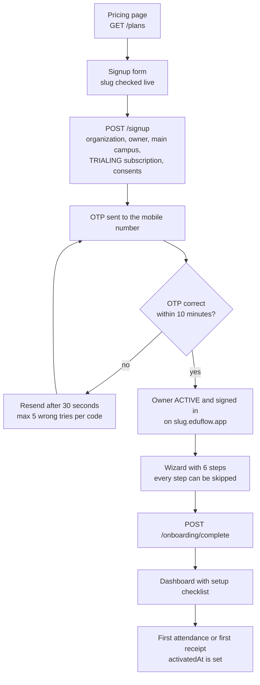
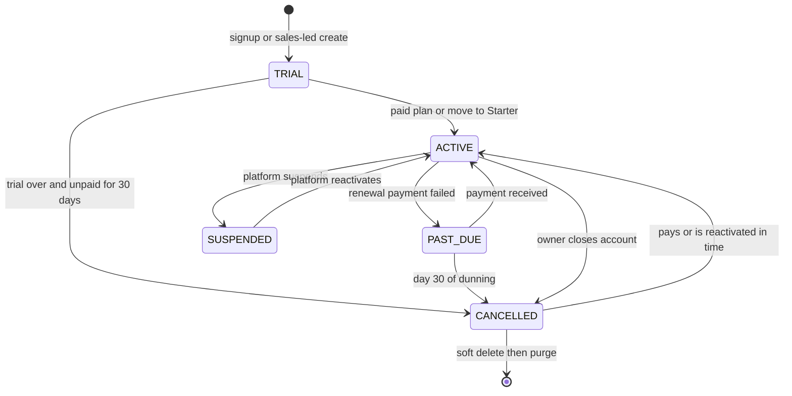
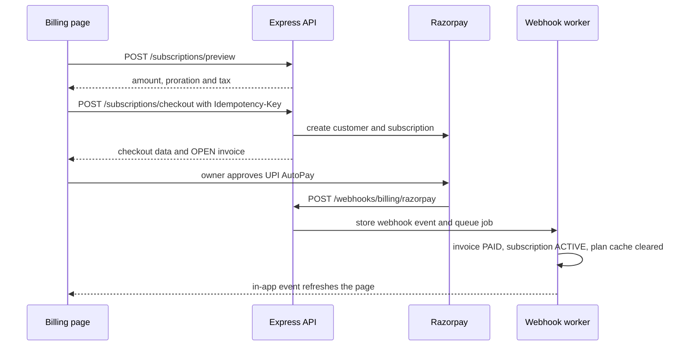
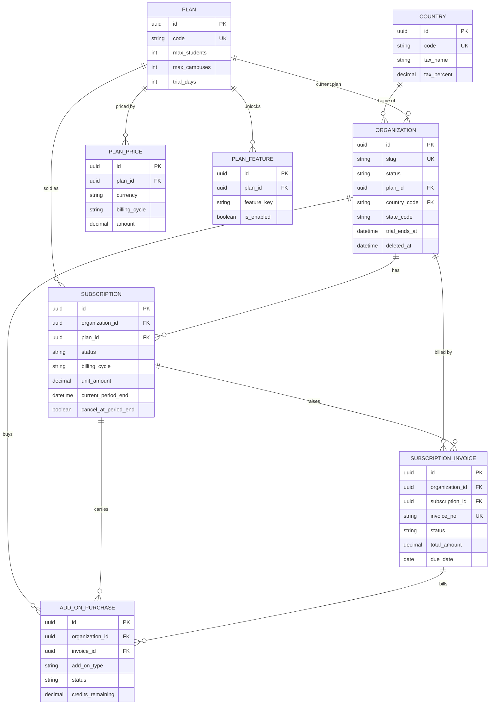

# Organizations Module

**In simple words:** An organization is one customer of EduFlow: one school, one school group or one coaching institute. This chapter explains the whole life of that customer inside the product: signup, the setup wizard, the free trial, the paid plan, plan limits, GST invoices, add-ons, late payment, account closure and data deletion. It also covers the platform console, where EduFlow staff see every customer and help them through an audited "login as" session. Every other module asks this module two questions on each request: "is this customer allowed in?" and "is this inside the plan?".

| Item | Value |
|---|---|
| Module code | ORG |
| Release phase | Phase 1 (MVP); Razorpay subscription checkout before the January 2027 paid launch; Stripe, custom domain and the AI Insights add-on in Phase 4 |
| Plans | Starter, Growth, Pro, Enterprise (every tenant uses this module; add-ons need a paid plan) |
| Main users | Organization Admin (owner), Accountant (reads invoices), Super Admin (platform console) |
| Depends on | Authentication and Sessions, RBAC, Multi Campus, Batch, Settings, Notifications, Payments (shared gateway clients and webhook inbox) |
| Main tables | `organizations`, `subscriptions`, `subscription_invoices`, `add_on_purchases`, `plans`, `plan_prices`, `plan_features` |

## Objective

The module has seven measurable goals.

1. **Fast self-signup.** An owner goes from the pricing page to a signed-in dashboard in under 3 minutes, with no sales call. The wizard takes under 15 minutes for a single-campus institute.
2. **Activation.** The wizard leads the owner to a first attendance or a first fee receipt. This sets `Organization.activatedAt` and feeds the canon target of 60% activation within 7 days of signup.
3. **One place for plan limits.** Every module calls one limit service. A blocked action always returns `PLAN_LIMIT_REACHED` (403) with the numbers and an upgrade path. Daily work (attendance, fee collection, receipts) is never blocked by billing.
4. **Correct tax invoices from the first rupee.** Every subscription invoice has a gap-free number, the SAC code (service accounting code used on Indian GST invoices), the right split of CGST, SGST or IGST, and a PDF.
5. **Billing never loses data.** A trial ends in Starter, a paid plan or a read-only account. A failed payment gets 14 days of full service and 30 days before cancellation. A closed account keeps a full export open for 90 days.
6. **One console for the founder.** The Super Admin sees all tenants, trials, renewals due, MRR (monthly recurring revenue — the subscription money that comes in every month) and churn on one screen.
7. **Support without standing access.** EduFlow staff can enter a tenant only through impersonation (a short "login as" session) with a typed reason. Every action in that session is written to the tenant's audit log.

## Scope

### In scope

- Public plan catalogue with prices in INR, USD, AUD and AED, monthly and yearly.
- Self-signup: slug check, organization, owner user, main campus, trial subscription and consent records in one transaction. Phone OTP verification at signup; email verification from the checklist.
- Onboarding wizard with six steps: `profile`, `campus`, `academic-year`, `courses-batches`, `fees`, `team`. Every step can be skipped.
- Organization profile: name, legal name, tax details, address, timezone, locale, financial year start and week start.
- Branding: logo, colours, receipt footer, subdomain `{slug}.eduflow.app`, and a custom domain for Enterprise.
- 14-day Pro trial without a card, trial reminders, trial end handling and trial extension.
- Subscription: price preview, checkout, upgrade, downgrade, cycle change, cancel, resume and payment method update.
- Plan limits and feature gating: students, campuses, admin users, staff users, storage, modules and features.
- Subscription invoices with GST, VAT or sales tax, credit notes, refunds and PDFs.
- Add-ons: extra campus, AI Insights, white-label app, WhatsApp credits, SMS credits, data migration, on-site training.
- Dunning (the fixed steps to collect a late subscription payment), restricted mode, cancellation and reactivation.
- Ownership transfer and account closure with a full data export and a deletion schedule.
- Platform console: tenant list, tenant 360, sales-led tenant creation, suspend, reactivate, extend trial, change plan, impersonate, soft delete, all subscriptions, all invoices, manual invoices, plan editor, platform metrics, platform staff and the platform audit log.

### Out of scope

| Not in this module | Where it lives or why |
|---|---|
| Login, refresh tokens, OTP sending, MFA, password reset | *Authentication and Sessions*. Signup only calls the OTP service. |
| Users, invitations, roles and custom roles | *RBAC and Permissions Matrix*. The `team` step calls the invitation endpoint `USR-API-25`. |
| Campus create, edit and archive after the wizard | *Multi Campus Module*. This module only answers the campus limit check. |
| Settings keys, number sequences, custom fields | *Settings Module*. This module owns only the `onboarding.*` and `billing.*` setting keys. |
| Fees that parents pay to the institute | *Fees Module* and *Payments Module*. Here EduFlow is the seller and the institute is the buyer. |
| Credit wallet ledger and per-message charges | *WhatsApp Module* and *SMS Module*. This module sells the pack; the wallet spends it. |
| The purge task that deletes tenant rows | *Multi-Tenancy and Data Isolation*. This module only sets the dates that the task reads. |
| Policy texts and consent withdrawal | *Privacy and Compliance*. Signup only writes the first consent rows. |

### Phase notes

| Phase | What ships | Why |
|---|---|---|
| Phase 1, sprint week 3 (19 to 25 Oct 2026, prompt P-11) | ORG-API-01 to 10, 12 to 14; limit service; trial job; console endpoints ORG-API-31 to 40, 47 to 51, 53 to 56 | The pilot on 18 Nov 2026 needs signup, the wizard, limits and a console. Pilot tenants are free. |
| Phase 1, sprint week 6 (with P-26) | ORG-API-15 to 30 on Razorpay, GST invoice PDF, dunning job; ORG-API-41 to 46 | Reuses the Razorpay client and the webhook inbox of the *Payments Module*. Must be live before the paid launch in January 2027. |
| Phase 1, sprint week 8 (with P-20) | ORG-API-52 platform metrics | Reads `daily_metric_snapshots`, which the Dashboard prompt creates. |
| Phase 4 (by Sep 2027) | Stripe checkout (P-32), custom domain ORG-API-11, AI Insights and white-label app add-ons | Needed for the UAE, USA and Australia entry and for Enterprise white-label. |

> **Founder note:** Until week 6 is done you can still sell. Create the tenant with ORG-API-32 or change its plan with ORG-API-38 using `gateway = OFFLINE`, raise the invoice with ORG-API-43 and record the UPI or bank payment with ORG-API-44.

## User Stories

| ID | As a | I want to | So that | Priority |
|---|---|---|---|---|
| ORG-US-01 | Institute owner | sign up with my institute name, mobile number and a web address of my choice | I can try EduFlow today without talking to sales | Must |
| ORG-US-02 | Institute owner | verify my mobile number with an OTP | nobody else can open an account in my name | Must |
| ORG-US-03 | Organization Admin | follow a short wizard for profile, campus, session, courses, fees and team | I can take attendance and collect a fee on day one | Must |
| ORG-US-04 | Organization Admin | skip any wizard step and finish it later from a checklist | I am not stuck when I do not have the data yet | Must |
| ORG-US-05 | Organization Admin | see my usage against my plan limits | I know when I must upgrade | Must |
| ORG-US-06 | Organization Admin | see the exact amount with tax before I pay or change plan | there is no surprise on my bill | Must |
| ORG-US-07 | Organization Admin | pay by UPI AutoPay, card or netbanking | my plan renews without a monthly phone call | Must |
| ORG-US-08 | Accountant | download GST tax invoices of the EduFlow subscription | I can claim input tax credit and close my books | Must |
| ORG-US-09 | Organization Admin | buy WhatsApp credits or an extra campus in one click | I am not blocked during admission season | Should |
| ORG-US-10 | Organization Admin | upload my logo and colours | receipts and the parent portal look like my institute | Should |
| ORG-US-11 | Organization Admin | cancel or close my account and download all my data | I never feel locked in | Must |
| ORG-US-12 | Super Admin | list all tenants with plan, status, usage and last activity | I can spot trials to call and accounts at risk | Must |
| ORG-US-13 | Super Admin | enter a tenant with a typed reason and a visible banner | I can fix a support problem without holding standing access | Must |
| ORG-US-14 | Super Admin | suspend a tenant and reactivate it later | abuse, fraud or a long-unpaid Enterprise contract does not stay open | Must |
| ORG-US-15 | Super Admin | create a tenant for a sales-led deal with a custom price and limits | Enterprise schools such as Bright Future Public School can be billed by contract | Should |

## Workflow

**Figure: From the pricing page to an activated tenant**



The figure shows that one form and one OTP are enough to get a working account. The wizard only prepares data; it never blocks the dashboard.

1. The pricing page calls ORG-API-01. The currency comes from the visitor's country and can be switched.
2. While the owner types the web address, the form calls ORG-API-02 after a 400 ms pause.
3. ORG-API-03 runs one database transaction in the platform context. It writes the `organizations` row (status `TRIAL`, plan Pro), the owner `users` row (status `INVITED`, role `ORG_ADMIN`), the main `campuses` row, the `subscriptions` row (status `TRIALING`) and three `consent_records` rows. It then asks the OTP service for a `VERIFY_PHONE` code.
4. ORG-API-04 checks the code. It sets `User.status = ACTIVE` and `phoneVerifiedAt`, emits `organization.verified`, returns an access token and sets the refresh cookie.
5. The web app redirects to `https://sharma-classes.eduflow.app/onboarding`. ORG-API-05 returns the wizard state. Each step is saved with ORG-API-06.
6. ORG-API-07 sets `onboardingCompletedAt`. Skipped steps stay on the dashboard checklist.
7. The *Attendance Module* or the *Payments Module* calls `markActivated()` of this module on the first submitted session or the first receipt. The call sets `activatedAt` once and emits `organization.activated`.

**Figure: Status of an organization (`OrganizationStatus`)**



This is the same life cycle as in *Multi-Tenancy and Data Isolation*, with the trial path added. A suspension can also hit a `TRIAL` or `PAST_DUE` tenant; the diagram leaves those two arrows out to stay readable.

**Figure: Paying for a plan (Razorpay, India)**



The API never trusts the browser for a payment result. Only the signed webhook marks an invoice `PAID` and switches the plan.

### Organization statuses

| Status | Meaning | Who can log in | Set by |
|---|---|---|---|
| `TRIAL` | Trial running, or trial over and waiting for a plan choice | All users | ORG-API-03, ORG-API-32 |
| `ACTIVE` | On Starter or on a paid plan in good standing | All users | Webhook, trial job, ORG-API-36, ORG-API-44 |
| `PAST_DUE` | A renewal invoice is unpaid (dunning day 0 to 30) | All users | Webhook or dunning job |
| `SUSPENDED` | Blocked by EduFlow staff | Nobody; API answers `FORBIDDEN` | ORG-API-35 |
| `CANCELLED` | Closed by the owner or by dunning day 30 | Read-only for 90 days | ORG-API-14, dunning job, trial job |

### Access modes

The access mode is computed from the statuses on every request. It is not a column.

| Mode | When | What works |
|---|---|---|
| `FULL` | Trial running; `ACTIVE`; `PAST_DUE` on dunning day 0 to 14 | Everything in the plan |
| `RESTRICTED` | `PAST_DUE` on dunning day 15 to 30 | No new students, no WhatsApp or SMS. Attendance, fees, receipts, portals, reports and exports work. |
| `READ_ONLY` | Trial over with more than 50 active students; `CANCELLED` day 0 to 90 | All GET endpoints, exports, the billing endpoints ORG-API-15 to 28 and ORG-API-14. Other writes return `PLAN_LIMIT_REACHED`. |
| `BLOCKED` | `SUSPENDED`, or `deletedAt` is set | Nothing. The API answers `FORBIDDEN`; workers skip the tenant's jobs. |

### Subscription, invoice and add-on statuses

| Entity | Status | Meaning |
|---|---|---|
| Subscription | `TRIALING` | 14-day Pro trial; `unitAmount` is 0 |
| Subscription | `ACTIVE` | Starter, or a paid plan with the current period paid |
| Subscription | `PAST_DUE` | Renewal charge failed; dunning is running |
| Subscription | `PAUSED` | Set by Super Admin for up to 60 days in a special case (flood, campus move) |
| Subscription | `CANCELLED` | Ended by the owner or by dunning; history row |
| Subscription | `EXPIRED` | Trial ended without a plan; history row |
| Invoice | `DRAFT` | Manual invoice being prepared in the console; not sent |
| Invoice | `OPEN` | Issued and waiting for payment |
| Invoice | `PAID` | `amountPaid` equals `totalAmount` |
| Invoice | `VOID` | Cancelled before payment with `voidReason` |
| Invoice | `UNCOLLECTIBLE` | Unpaid on dunning day 30 |
| Invoice | `REFUNDED` | Refunded in full or in part; a credit note number exists |
| Add-on | `PENDING` | Bought; payment not confirmed yet |
| Add-on | `ACTIVE` | Paid and in use |
| Add-on | `CONSUMED` | Credit pack fully used, or one-time service delivered |
| Add-on | `EXPIRED` | `expiresAt` passed |
| Add-on | `CANCELLED` | Recurring add-on ended at period end, or the payment failed |

## Screens and Wireframes

| ID | Screen | Users | Purpose |
|---|---|---|---|
| ORG-S01 | Signup | Public visitor | Create the organization and the owner account |
| ORG-S02 | Verify mobile number | Owner | Enter the 6-digit OTP, resend, change number |
| ORG-S03 | Onboarding wizard | Organization Admin | Six setup steps with skip and "finish later" |
| ORG-S04 | Organization profile | Organization Admin; Principal (view) | Name, legal and tax details, address, regional settings |
| ORG-S05 | Branding | Organization Admin | Logo, colours, receipt footer, web address, custom domain |
| ORG-S06 | Plan and billing | Organization Admin; Accountant (view) | Plan, renewal, usage bars, payment method, recent invoices |
| ORG-S07 | Change plan | Organization Admin | Plan cards, cycle switch, live price preview, checkout |
| ORG-S08 | Invoices | Organization Admin, Accountant | List, detail, tax breakdown, PDF, pay now |
| ORG-S09 | Add-ons | Organization Admin | Catalogue, purchased add-ons, credits left, cancel |
| ORG-S10 | Close account | Owner only | Reason, password, export notice, deletion dates |
| ORG-S11 | Plan limit dialog | Any staff user | Shown on `PLAN_LIMIT_REACHED`; upgrade button for the admin |
| ORG-S12 | Tenants (console) | Super Admin | Search and filter all tenants |
| ORG-S13 | Tenant 360 (console) | Super Admin | One tenant: plan, usage, owner, invoices, actions |
| ORG-S14 | Billing (console) | Super Admin | Renewals due, dunning list, all invoices, manual invoice |
| ORG-S15 | Plans (console) | Super Admin | Limits, prices per currency, feature rows |
| ORG-S16 | Metrics, staff and audit (console) | Super Admin | MRR, trials, churn; platform users; console audit log |

**Screen ORG-S01 — Signup (public, web)**

```text
+--------------------------------------------------------------------------+
| EduFlow                                  Pricing   Login   [Start free]  |
+--------------------------------------------------------------------------+
| Start your 14-day free trial              | In your trial                |
| No card needed. All Pro features.         |  * Up to 1,000 students      |
|                                           |  * 3 campuses, custom roles  |
| Institute name [Sharma Classes_________]  |  * 100 free WhatsApp msgs    |
| Type  (o) Coaching  ( ) School            |  * Excel import of students  |
|       ( ) College   ( ) Training centre   |                              |
| Country [India v]    City [Patna_______]  | After 14 days                |
| Web address                               |  Pick a plan, or stay free   |
| [sharma-classes____].eduflow.app   Free   |  on Starter (50 students).   |
|                                           |  Your data is never lost.    |
| Your name  [Rajesh___] [Sharma________]   |                              |
| Mobile     [+91 v] [98765 43210_______]   |                              |
| Email      [rajesh@sharmaclasses.in___]   |                              |
| Password   [**************]  Strong       |                              |
| [x] I accept the Terms and Privacy Policy |                              |
| [x] I accept the Data Processing Terms    |                              |
|                                           |                              |
|               [Create my account]         | Already with us?  [Login]    |
+--------------------------------------------------------------------------+
```

- The owner sees one form. The right panel explains the trial and what happens after it.
- The web address field shows "Free", "Taken" or "Not allowed" from ORG-API-02. A taken slug shows three suggestions.
- Country sets currency, timezone, locale and dial code. The owner does not pick them here.
- `[Create my account]` calls ORG-API-03 and opens ORG-S02. Both consent boxes are required.

**Screen ORG-S03 — Onboarding wizard, step 3 (Organization Admin, web)**

```text
+--------------------------------------------------------------------------+
| EduFlow | Sharma Classes            Trial: 14 days left         (RS) v   |
+--------------------------------------------------------------------------+
| Set up your institute                         Step 3 of 6  [Skip step]   |
| (1) Profile  (2) Centre  (3) Session  (4) Courses  (5) Fees  (6) Team    |
|     done         done        now                                         |
+--------------------------------------------------------------------------+
| Your first session                                                       |
|                                                                          |
|   Name       [Session 2027-28__________]                                 |
|   Starts on  [01 Apr 2027]     Ends on  [31 Mar 2028]                    |
|   [x] This is the current session                                        |
|                                                                          |
|   Tip: a coaching institute can name a session after the target          |
|   exam year. You can add more sessions later in Settings.                |
|                                                                          |
+--------------------------------------------------------------------------+
| [Back]                          [Finish later]    [Save and continue]    |
+--------------------------------------------------------------------------+
```

- Labels follow `Organization.type`: a coaching institute sees "Centre" and "Session"; a school sees "Campus" and "Academic year".
- `[Save and continue]` calls ORG-API-06 with `stepKey = academic-year`. `[Skip step]` sends the same call with `skipped: true`.
- `[Finish later]` opens the dashboard. The checklist widget keeps the open steps.
- The default dates come from `financialYearStartMonth`: April to March in India.

**Screen ORG-S06 — Plan and billing (Organization Admin, web)**

```text
+--------------------------------------------------------------------------+
| EduFlow | Sharma Classes            [Search...]                 (RS) v   |
+------------+-------------------------------------------------------------+
| Dashboard  | Settings > Plan and billing                                 |
| Students   +-------------------------------------------------------------+
| Attendance | Plan: PRO (monthly)     Status: ACTIVE      [Change plan]   |
| Fees       | Renews 18 Feb 2027   Rs 5,999 + IGST Rs 1,079.82            |
| Settings < |                      Total Rs 7,078.82                      |
|  Profile   | Pays by: UPI AutoPay (rajesh@okhdfc)      [Update method]   |
|  Branding  |-------------------------------------------------------------|
|  Billing   | Usage                                                       |
|  Add-ons   |  Students   352 / 1,000   [#######.............]   35%      |
|  Invoices  |  Centres      1 / 3       [#######.............]   33%      |
|            |  Storage    1.2 / 50 GB   [#...................]    2%      |
|            |  WhatsApp wallet  Rs 1,412.50            [Buy credits]      |
|            |-------------------------------------------------------------|
|            | Recent invoices                                             |
|            |  EF/26-27/000042   18 Jan 2027   Rs 7,078.82   PAID  [PDF]  |
|            |  EF/26-27/000057   25 Jan 2027   Rs 2,358.82   PAID  [PDF]  |
|            |                                          [All invoices]     |
|            | [Cancel subscription]                    [Close account]    |
+------------+-------------------------------------------------------------+
```

- Data comes from ORG-API-15 (plan block), ORG-API-12 (usage bars) and ORG-API-22 (invoices).
- A usage bar turns amber at 80% and red at 100%. During grace the students row shows "12 of 30 grace seats used".
- `[Change plan]` opens ORG-S07. `[PDF]` calls ORG-API-24 and opens the pre-signed URL.
- `[Cancel subscription]` calls ORG-API-19. `[Close account]` opens ORG-S10 and is visible to the owner only.
- The Accountant sees this screen without the buttons that need `billing.manage`.

**Screen ORG-S13 — Tenant 360 (Super Admin, platform console)**

```text
+--------------------------------------------------------------------------+
| EduFlow Platform Console                            Mehdi Alam (SA) v    |
+------------+-------------------------------------------------------------+
| Tenants  < | Tenants > Sharma Classes (sharma-classes)         ACTIVE    |
| Billing    +-------------------------------------------------------------+
| Plans      | COACHING | India, Bihar (10) | Owner: Rajesh Sharma         |
| Metrics    | Signup 04 Jan 2027 (website)   Activated 05 Jan 2027        |
| Staff      |-------------------------------------------------------------|
| Audit log  | Plan PRO monthly   Rs 5,999   Renews 18 Feb 2027  RAZORPAY  |
|            | Students 352/1,000  Centres 1/3  Users 7  Storage 1.2 GB    |
|            | Last 7 days: logins 41, receipts 96, attendance days 6      |
|            |-------------------------------------------------------------|
|            | Invoices                                                    |
|            |  EF/26-27/000042   Rs 7,078.82   PAID   18 Jan 2027         |
|            |  EF/26-27/000057   Rs 2,358.82   PAID   25 Jan 2027         |
|            |-------------------------------------------------------------|
|            | [Extend trial]  [Change plan]  [Raise invoice]  [Suspend]   |
|            | Reason [Ticket 4821: receipt PDF is blank___] [Impersonate] |
+------------+-------------------------------------------------------------+
```

- Data comes from ORG-API-33. The console never shows student or parent data.
- `[Impersonate]` stays disabled until the reason has 10 characters. It calls ORG-API-39 and opens the tenant in a new tab with a red banner "Support session, 30:00 left".
- `[Suspend]` asks for a reason and calls ORG-API-35. For a suspended tenant the button reads `[Reactivate]` (ORG-API-36).
- `[Raise invoice]` opens a form for ORG-API-43, for example for on-site training.

**Screen ORG-S11 — Plan limit dialog (staff phone, mobile web)**

```text
+------------------------------------+
| EduFlow      Success Point, Gaya   |
+------------------------------------+
| Student limit reached              |
|                                    |
| Your Growth plan allows 300        |
| active students. All 30 grace      |
| seats are used (330).              |
|                                    |
| Pro: up to 1,000 students          |
|  Pay today     Rs 2,753.33         |
|  (20 of 30 days, with IGST)        |
|  Then          Rs 7,078.82 / month |
|                                    |
| [Upgrade to Pro]                   |
| [See all plans]                    |
| [Not now]                          |
|                                    |
| Attendance, fees and messages      |
| keep working for all 330 students. |
+------------------------------------+
```

- Any screen that receives `PLAN_LIMIT_REACHED` opens this dialog. The text comes from the error `message` and `details`.
- The price lines come from ORG-API-16 and appear only for a user with `billing.manage`. Other users see "Ask your admin to upgrade".
- `[Upgrade to Pro]` opens ORG-S07 with Pro selected.

## UI Components

| Component | Type | Behaviour |
|---|---|---|
| `SlugInput` | Input with suffix `.eduflow.app` | Lower-cases while typing; debounced ORG-API-02 call; states: checking, free, taken with suggestions, not allowed |
| `OtpInput` | 6-box code input | Auto-submit on the sixth digit; resend timer of 30 s; shows tries left after a wrong code |
| `WizardStepper` | Stepper with 6 steps | States per step: pending, done, skipped; labels change by `Organization.type` |
| `SetupChecklist` | Dashboard card | Reads ORG-API-05; hides itself when all steps are done |
| `PlanCard` | shadcn/ui Card | Price per cycle and currency, limits, "Current plan" badge; disabled with the reason when a downgrade does not fit |
| `CycleSwitch` | Toggle monthly / yearly | Yearly shows "2 months free"; triggers a new preview |
| `PricePreview` | Summary panel | Lines from ORG-API-16: proration, credit, tax rows, total; skeleton while loading; error state with retry |
| `UsageMeter` | Progress bar | Green under 80%, amber from 80%, red at 100%; "Unlimited" when the limit is null |
| `TrialBanner` | Top banner | Days left from `trialEndsAt`; from day 12 it shows a pay button |
| `BillingStateBanner` | Top banner | `PAST_DUE`: "Payment failed, pay now"; restricted and read-only modes name what is switched off |
| `InvoiceTable` | Data table | Columns number, date, amount, status badge, PDF; empty state "No invoices yet. Your trial is free." |
| `AddOnCard` | Card with buy button | Shows eligibility ("Available on Growth and above") and credits left |
| `PlanLimitDialog` | Dialog, sheet on mobile | Opened by the API client on `PLAN_LIMIT_REACHED` anywhere in the app |
| `LogoUploader` | File drop zone | PNG, JPG or WebP up to 2 MB; preview on a receipt header; uses the pre-signed upload `CMN-API-02` |
| `DangerConfirm` | Dialog | Close account, transfer ownership, suspend: type the organization name, give a reason, enter the password |
| `ImpersonationBanner` | Fixed red bar | Reason and countdown; `[End session]` drops the token |

All lists use the shared data table with loading rows, an empty state and an error state with a retry button, as set in *Design System and UX Guidelines*.

## Validation Rules

| Field | Rule | Error message shown to user |
|---|---|---|
| `organization.name` | Required, 3 to 150 characters | "Enter your institute name (3 to 150 characters)." |
| `organization.type` | One of `SCHOOL`, `COACHING`, `COLLEGE`, `TRAINING_CENTRE` | "Choose what kind of institute you run." |
| `organization.countryCode` | A `countries` row with `isSupported = true` | "EduFlow is not open in this country yet." |
| `organization.slug` | 3 to 63 characters; `a-z`, `0-9`, hyphen; starts and ends with a letter or digit; no double hyphen | "Use 3 to 63 small letters, numbers or hyphens." |
| `organization.slug` | Not in the reserved list (ORG-BR-02) | "This web address is not allowed. Try another one." |
| `organization.slug` | Unique across all organizations | "This web address is already taken." |
| `owner.firstName`, `owner.lastName` | Required, 1 to 80 characters each | "Enter your first and last name." |
| `owner.phone` | E.164 format; India: 10 digits starting with 6 to 9 after `+91` | "Enter a valid mobile number." |
| `owner.phone` | Not the verified owner phone of another organization (ORG-BR-03) | "This mobile number already has an EduFlow account. Please log in." |
| `owner.email` | Valid email, up to 255 characters, no disposable domain | "Enter a valid work email address." |
| `owner.password` | 10 to 72 characters with a letter and a digit; not in the common-password list | "Use at least 10 characters with a letter and a number." |
| `consents` | `TERMS_OF_SERVICE`, `PRIVACY_POLICY` and `DATA_PROCESSING` all present | "Please accept the terms to continue." |
| `code` (OTP) | Exactly 6 digits; not expired; under 5 wrong tries | "Wrong code. 3 tries left." or "This code has expired. Request a new one." |
| `stateCode` | Required when `countryCode = IN`; a valid 2-digit GST state code | "Select your state. We need it for the GST invoice." |
| `taxId` (GSTIN) | When `isTaxRegistered`: 15 characters, valid GSTIN pattern, first 2 digits equal `stateCode` | "This GSTIN is not valid for the selected state." |
| `timezone` | A valid IANA name such as `Asia/Kolkata` | "Select a valid time zone." |
| `financialYearStartMonth` | Integer 1 to 12 | "Select the month your financial year starts." |
| `branding.primaryColor` | Hex colour `#RRGGBB`; contrast of at least 4.5:1 against white | "This colour is too light for buttons. Pick a darker one." |
| `branding.receiptFooter` | Up to 300 characters, plain text | "Keep the receipt footer under 300 characters." |
| Logo file | PNG, JPG or WebP; up to 2 MB; at least 200 x 200 px | "Upload a PNG, JPG or WebP logo up to 2 MB." |
| `customDomain` | Valid host name, not under `eduflow.app`, unique | "Enter a domain you own, for example erp.brightfuture.edu.in." |
| `planCode` + `billingCycle` | An active, public plan with an active price in the tenant currency | "This plan is not available in your currency." |
| `reason`, `cancelReason` | Required for cancel, close, suspend, impersonate; 10 to 255 characters | "Please give a reason (at least 10 characters)." |
| `confirmName` (close account) | Equals `Organization.name` exactly | "Type the institute name exactly to confirm." |
| Add-on `quantity` | Integer 1 to 20; 1 for AI Insights and the white-label app | "Quantity must be between 1 and 20." |

## Business Rules

### Signup, slug and trial

**ORG-BR-01 — One transaction.** Signup writes the organization, the owner, the main campus, the trial subscription and the consent rows in one transaction, or nothing. Currency, timezone and locale are copied from `Country.defaultCurrencyCode`, `defaultTimezone` and `defaultLocale`. `dataRegion` is `ap-south-1` for India. The owner gets the system role `ORG_ADMIN`, and `Organization.ownerUserId` points to the owner.

**ORG-BR-02 — Slug.** The slug is a DNS label, so it follows the rules in *Validation Rules*. Reserved slugs: `app`, `api`, `www`, `admin`, `platform`, `console`, `login`, `signup`, `mail`, `status`, `docs`, `help`, `support`, `blog`, `cdn`, `static`, `assets`, `staging`, `demo`, `billing`, `pay`, `eduflow`. A tenant cannot change its slug. Support changes it with ORG-API-34; all sessions of the tenant end because the host name changes.

**ORG-BR-03 — One trial per owner.** A verified mobile number or email that already owns an organization cannot start a second trial. The API answers `CONFLICT` and the form offers the login link. A school group that needs a second organization asks support, who create it with ORG-API-32.

**ORG-BR-04 — Trial length.** The trial uses the Pro plan and `Plan.trialDays` (14). `trialEndsAt` is the end of the local day, 14 days after signup. The value is stored on both `organizations` and `subscriptions`.

> **Example:** Rajesh Sharma signs up on Monday 4 Jan 2027 at 10:42 IST. `trialStartsAt` = `2027-01-04T05:12:00Z`. The trial ends on Monday 18 Jan 2027 at 23:59:59 IST, so `trialEndsAt` = `2027-01-18T18:29:59Z`. The banner shows "14 days left" on 4 Jan and "Last day" on 18 Jan.

**ORG-BR-05 — Trial end.** The hourly lifecycle job picks `TRIALING` subscriptions with `trialEndsAt` in the past. It sets the trial subscription to `EXPIRED` and then decides:

1. A paid plan was bought during the trial: nothing to do. The webhook already made the tenant `ACTIVE`.
2. 50 or fewer active students: a new `ACTIVE` subscription on Starter (`unitAmount` 0, gateway `OFFLINE`), `Organization.planId` = Starter, status `ACTIVE`. Data of paid modules is hidden, not deleted.
3. More than 50 active students: the status stays `TRIAL` and the access mode becomes `READ_ONLY`. Paying for any plan that fits returns the tenant to `ACTIVE` at once.
4. Still unpaid 30 days after `trialEndsAt`: status `CANCELLED` and `Subscription.cancelledAt` = now. The closure schedule of ORG-BR-19 starts.

**ORG-BR-06 — Trial extension.** The owner can ask for 7 more days once. Staff can add up to 14 more days with ORG-API-37. The setting `billing.trial_extensions` stores the count and the dates. ORG-API-37 moves `trialEndsAt` on both rows. It turns an `EXPIRED` trial back to `TRIALING` when the new date is in the future.

> **Note:** The registry has no tenant endpoint for the self-service extension. In Phase 1 the button "Give me 7 more days" sends a support request, and the founder applies it with ORG-API-37. With fewer than 10 trials ending per day this costs one minute each.

### Limits and feature gating

**ORG-BR-07 — Effective limits.** The limit service is the only place that knows the numbers.

| Limit | Formula | Counted rows |
|---|---|---|
| Students | `Subscription.studentLimitOverride`, else `Plan.maxStudents` | `students` with `status = ACTIVE` and `deletedAt` empty |
| Campuses | (`campusLimitOverride`, else `Plan.maxCampuses`) + quantity of `ACTIVE` `EXTRA_CAMPUS` add-ons | `campuses` with `deletedAt` empty |
| Admin users | `Plan.maxAdminUsers` | Active staff users with the role `ORG_ADMIN` |
| Staff users | `Plan.maxStaffUsers` | Other active users with `userType = STAFF` |
| Storage | `Plan.storageGb` | Sum of `file_assets.size_bytes` with `status = ACTIVE` |

A null limit means unlimited. Seeded values: Starter 50 students, 1 campus, 1 admin, 3 staff, 1 GB. Growth 300 students, 1 campus, 10 GB. Pro 1,000 students, 3 campuses, 50 GB. Enterprise unlimited with 250 GB. The storage values are an assumption from the BRD chapter *Pricing Strategy*.

**ORG-BR-08 — Student grace.** Starter stops hard at 50. Growth and Pro get a grace of 10% for 30 days. The ceiling is floor(limit x 1.10) while the grace is open. The date of the first crossing is stored in the setting `billing.student_grace_started_at`. It is cleared when the count falls back to the limit or below. Campuses, users and storage have no grace.

> **Example:** Success Point, a coaching centre in Gaya, is on Growth (300). On 6 April it admits student 301. The grace starts and the owner gets `organization.limit.reached`. The ceiling is floor(300 x 1.10) = 330. On 20 April the count is 330, so student 331 gets `PLAN_LIMIT_REACHED`. The same block would come on 6 May (day 30) even at 310 students. Attendance and fee collection keep working for all 330.

> **Note:** *Student Profile Module* rule STU-BR-02 calls this service. Its examples show the base limit. The ceiling from this rule is what the service really applies.

**ORG-BR-09 — Warnings.** At 80% of any limit the service emits `organization.limit.near` once per limit per 30 days. At 100% it emits `organization.limit.reached` once per crossing.

**ORG-BR-10 — Feature gating.** A module or feature is on when the plan has a `plan_features` row with `isEnabled = true`. Module rows use the key `module.<CODE>`, for example `module.LIB`. Feature keys: `custom_roles`, `whatsapp_sending`, `sms_sending`, `online_fee_payment`, `multi_campus`, `advanced_analytics`, `branding`, `custom_domain`, `sso`, `api_access`. An `ACTIVE` `AI_INSIGHTS` add-on switches on `module.AI` for Growth and Pro. A gated call returns `PLAN_LIMIT_REACHED`. Data of a gated module is hidden, never deleted.

> **Note:** The schema names `module.LIB`, `custom_roles`, `whatsapp_sending` and `api_access`. The other keys are this chapter's proposal. *Release Plan and Plan Gating* holds the final list.

### Prices, tax and invoices

**ORG-BR-11 — Price.** The price comes from `plan_prices` by plan, tenant currency and cycle. Yearly = 10 x monthly. The price is copied to `Subscription.unitAmount` at purchase, so a later list price change does not touch existing customers. Enterprise (`isCustomPriced`) has no public price; staff set `unitAmount` with ORG-API-38.

**ORG-BR-12 — Tax.** `taxPercent` and `taxName` come from the tenant's `countries` row: India GST 18%, Australia GST 10%, UAE VAT 5%. For Stripe countries, Stripe Tax returns the rate. All plan prices exclude tax.

- taxable = `subtotal` - `discountAmount`
- `taxAmount` = round(taxable x `taxPercent` / 100, 2), half up
- `totalAmount` = taxable + `taxAmount`
- India: when `Organization.stateCode` equals the supplier state, the tax splits into CGST and SGST. CGST = round(`taxAmount` / 2, 2) and SGST = `taxAmount` - CGST. Otherwise it is one IGST line. When `stateCode` is empty the invoice uses IGST and the billing page asks for the state.

> **Note:** Assumption: the billing entity `EDUFLOW_IN` is GST-registered in Uttar Pradesh (state code 09). The value lives in the server config `BILLING_SUPPLIER_STATE_CODE`. Change it to the state of the real registration.

> **Example:** Intra-state. Bright Future Public School, Lucknow (09), Enterprise at Rs 14,999 a month. Tax = 14,999 x 18% = Rs 2,699.82. CGST 9% = Rs 1,349.91 and SGST 9% = Rs 1,349.91. Total = Rs 17,698.82.

> **Example:** Inter-state. Sharma Classes, Patna (10), Pro at Rs 5,999 a month. IGST 18% = Rs 1,079.82. Total = Rs 7,078.82. In the UAE the same plan costs AED 749 + VAT 5% AED 37.45 = AED 786.45.

**ORG-BR-13 — Invoice number.** The series is platform-wide and gap-free per Indian financial year: `EF/26-27/000042` (15 characters; the GST rule allows 16). The number is taken inside the issuing transaction under an advisory lock. A `DRAFT` invoice carries `DRAFT-` plus the first 8 characters of its id until it is issued. Credit notes use the series `EF/CN/26-27/0007` in `creditNoteNo`.

```sql
-- platform context, inside the transaction that issues the invoice
SELECT pg_advisory_xact_lock(hashtext('subscription_invoice_no:26-27'));

SELECT coalesce(max(substring(invoice_no from 10)::int), 0) + 1 AS next_no
FROM subscription_invoices
WHERE invoice_no LIKE 'EF/26-27/%';
```

**ORG-BR-14 — Frozen invoice data.** At issue the invoice copies `billingName` (legal name, else name), `billingTaxId`, `billingAddress`, `billingStateCode`, `placeOfSupply`, `supplierTaxId`, `sacCode` (`998314`) and the tax breakdown. A later profile change never changes an issued invoice. A wrong invoice is voided when unpaid, or refunded with a credit note when paid. It is never edited.

**ORG-BR-15 — Proration.** Upgrades apply at once. Downgrades apply at the end of the paid period. Days left include the day of the change.

- Upgrade: amount = (new price - old price) x days left / days in the cycle
- Monthly to yearly: credit = monthly price x days left / days in the month; amount = yearly price - credit
- Recurring add-on in mid-cycle: amount = add-on price x days left / days in the cycle

> **Example:** Success Point is on Growth monthly, billed on the 1st. On 11 June it upgrades to Pro. June has 30 days and 20 are left. Amount = (5,999 - 2,499) x 20 / 30 = Rs 2,333.33. IGST 18% = Rs 420.00. It pays Rs 2,753.33 today and Rs 7,078.82 from 1 July.

> **Example:** A Growth tenant adds an extra campus on the 16th of a 30-day month. 15 days are left. Amount = 999 x 15 / 30 = Rs 499.50. GST = Rs 89.91. Total = Rs 589.41.

**ORG-BR-16 — Downgrade checks.** ORG-API-18 refuses a downgrade with `BUSINESS_RULE_VIOLATION` and one `details` row per failed check:

1. Active students above the new limit. The grace does not count.
2. Campuses above the new limit plus extra-campus add-ons.
3. Storage above the new limit.
4. Users who hold custom roles, when leaving Pro.
5. More than 1 admin and 3 staff users, for a move to Starter.

An accepted downgrade is stored in the setting `billing.scheduled_change` and applied by the renewal job. Until then ORG-API-20 can undo it.

**ORG-BR-17 — Add-ons.** Add-ons need a paid plan in status `ACTIVE`. They are not sold during the trial.

| Add-on | Plans | Recurring | Activation |
|---|---|---|---|
| `EXTRA_CAMPUS` Rs 999 a month | Growth, Pro | Yes, follows the plan cycle | Raises the campus limit by `quantity`; `campusId` is set when the campus is created |
| `AI_INSIGHTS` Rs 1,499 a month | Growth, Pro; included in Enterprise | Yes | Switches on `module.AI` (Phase 4) |
| `WHITE_LABEL_APP` Rs 49,999 setup + Rs 4,999 a month | Growth, Pro | Setup once, then monthly | Two rows: one-time setup and recurring fee |
| `WHATSAPP_CREDITS` Rs 499, 1,999 or 7,999 | Growth and above | No | `creditsGranted` = pack price, `creditUnit = MONEY`; the wallet gets one `PURCHASE` row |
| `SMS_CREDITS` Rs 1,250 | Growth and above | No | `creditsGranted` = 5,000, `creditUnit = MESSAGES` |
| `DATA_MIGRATION` Rs 9,999 | Growth, Pro; included in Enterprise | No | `CONSUMED` when staff mark the work done |
| `ONSITE_TRAINING` Rs 4,999 a day | All paid plans | No | `quantity` = days; `CONSUMED` after the visit |

Tax is charged on the pack price and is not wallet money. A Rs 1,999 WhatsApp pack costs Rs 1,999 + Rs 359.82 GST = Rs 2,358.82 and adds Rs 1,999.00 to the wallet. Credit packs expire 12 months after purchase (assumption). On a yearly plan a recurring add-on costs 10 x its monthly price. An add-on becomes `ACTIVE` only after the webhook confirms the payment.

### Late payment, suspension and closure

**ORG-BR-18 — Dunning.** Day 0 is the `dueDate` of the oldest `OPEN` invoice of the subscription. The daily dunning job and the billing webhook drive the steps.

| Day | System action |
|---|---|
| 0 | Charge failed: subscription and organization `PAST_DUE`; event `subscription.payment_failed`; access mode stays `FULL` |
| 3 and 7 | Retry the charge (three tries in total, never more) and remind |
| 10 | Final notice: restricted mode starts on day 15 |
| 15 | Access mode `RESTRICTED`; event `subscription.past_due`; banner for all staff |
| 30 | Invoice `UNCOLLECTIBLE`; subscription `CANCELLED`. 50 or fewer students: new Starter subscription, status `ACTIVE`. Otherwise status `CANCELLED` and the closure schedule starts. |

A payment at any point returns full service within minutes. The billing date does not move and there is no penalty fee. An Enterprise tenant on invoice terms (`gateway = OFFLINE`) is never restricted by the job. The founder decides after 45 days.

**ORG-BR-19 — Closure schedule.** Day 0 is `Subscription.cancelledAt`.

| Day | State | What happens |
|---|---|---|
| 0 | `CANCELLED`, `READ_ONLY` | Gateway subscription cancelled; full export queued; event `organization.cancelled` |
| 0 to 90 | `CANCELLED`, `READ_ONLY` | The owner can log in, export and pay for a plan to come back |
| 90 | Soft delete | The lifecycle job sets `deletedAt`; all logins are blocked; only staff can restore |
| 120 | Purge | The maintenance task of *Multi-Tenancy and Data Isolation* deletes tenant rows, files and cache keys |

> **Example:** Rajesh closes the account on 10 Mar 2027. Read-only access ends on 8 Jun 2027 (day 90). The purge runs on 8 Jul 2027 (day 120). Reminder emails go out on day 60, day 83 and day 89. Subscription invoices survive the purge as tax records.

**ORG-BR-20 — Cancel is not close.** ORG-API-19 only sets `cancelAtPeriodEnd`. The plan runs until `currentPeriodEnd`. Then the tenant moves to Starter if it fits, else to `READ_ONLY` as in ORG-BR-05. ORG-API-14 closes the whole account at once and is for the owner only. It needs the password, the MFA code when MFA is on, and the typed organization name. An impersonation token is refused.

**ORG-BR-21 — Suspension.** Only EduFlow staff suspend, with a reason of at least 10 characters. Allowed reasons: abuse or spam, fraud or a chargeback, a legal order, a data move, an Enterprise contract unpaid for more than 45 days. A failed card or UPI payment never leads to `SUSPENDED`; it follows ORG-BR-18. Suspension sets `suspendedAt` and `suspendedReason`, revokes all refresh tokens, pauses the gateway subscription, clears the status cache and emails the owner. Reactivation clears both fields and sets the status from the live subscription: `TRIALING` gives `TRIAL`, `PAST_DUE` gives `PAST_DUE`, anything else gives `ACTIVE`. Reactivating a `CANCELLED` tenant creates a new subscription row and clears `deletedAt`.

**ORG-BR-22 — Refunds.** Refund cases and approval limits are fixed in the BRD chapter *Pricing Strategy*. ORG-API-46 sends the refund to the gateway, adds to `amountRefunded`, sets `creditNoteNo` and `creditNoteDate`, and sets the status `REFUNDED`. A refund can never exceed `amountPaid` minus `amountRefunded`.

### Ownership, impersonation and profile locks

**ORG-BR-23 — Ownership transfer.** The new owner must be an `ACTIVE` user of the same organization with the role `ORG_ADMIN` and a verified phone. The current owner confirms with password and MFA code. The old owner keeps the `ORG_ADMIN` role. Both get a message. An organization always has exactly one owner.

**ORG-BR-24 — Impersonation.** ORG-API-39 needs `platform.impersonate`, MFA on the staff account and a reason of 10 to 255 characters. The token lives 30 minutes (assumption), cannot be refreshed and carries the staff user id as `impersonatorUserId`. Its permissions are the SUPER_ADMIN column of *RBAC and Permissions Matrix*: no money actions, no messages, no exports, no decrypted medical data. Each call is written to `audit_logs` with `actorType = IMPERSONATION` and the reason. The owner gets an in-app notice. One staff user can hold one open session at a time.

**ORG-BR-25 — Profile locks.** `currency` and `countryCode` are locked after the first fee invoice or payment exists. `type` can change only through ORG-API-34. A `timezone` change needs a confirm dialog, because due dates and attendance dates are shown in it. `stateCode` and `taxId` changes apply to future invoices only.

**ORG-BR-26 — Activation.** `markActivated()` sets `activatedAt` only when it is empty and emits `organization.activated`. It is called by the first submitted attendance session and by the first fee receipt. Demo data does not count.

The limit check that every module calls:

```typescript
// server/src/modules/organizations/plan-limits.service.ts
import { AppError } from '../../lib/app-error';
import { getTenant } from '../../lib/tenant-context';
import { getPlanSnapshot } from './plan.cache'; // Redis org:{orgId}:plan, TTL 5 min
import { countUsage } from './usage.repository';

export type LimitKey = 'students' | 'campuses' | 'adminUsers' | 'staffUsers';

const GRACE_PERCENT = 10;
const GRACE_DAYS = 30;
const DAY_MS = 86_400_000;

export async function assertWithinLimit(key: LimitKey, adding = 1): Promise<void> {
  const { orgId } = getTenant();
  const plan = await getPlanSnapshot(orgId);
  const base = plan.limits[key]; // null = unlimited
  if (base === null) return;

  let ceiling = base;
  if (key === 'students' && plan.planCode !== 'STARTER') {
    const started = plan.studentGraceStartedAt; // from organization_settings
    const graceOpen = started === null || Date.now() - started.getTime() < GRACE_DAYS * DAY_MS;
    if (graceOpen) ceiling = Math.floor((base * (100 + GRACE_PERCENT)) / 100);
  }

  const used = await countUsage(key); // one indexed count per key
  if (used + adding > ceiling) {
    throw new AppError(
      'PLAN_LIMIT_REACHED',
      `Your ${plan.planName} plan allows ${base} ${LABELS[key]}. Upgrade to add more.`,
      [{ field: 'plan', issue: `limit=${base}, ceiling=${ceiling}, used=${used}` }],
    );
  }
}

const LABELS: Record<LimitKey, string> = {
  students: 'active students',
  campuses: 'campuses',
  adminUsers: 'admin users',
  staffUsers: 'staff users',
};
```

## Acceptance Criteria

| ID | Given | When | Then |
|---|---|---|---|
| ORG-AC-01 | The slug `sharma-classes` is free | Rajesh submits the signup form with valid data and all consents | One organization (`TRIAL`, Pro), one owner (`INVITED`, `ORG_ADMIN`), one main campus, one `TRIALING` subscription and three consent rows exist; an OTP is sent; the API answers 201 |
| ORG-AC-02 | The slug `sharma-classes` is taken | A visitor calls ORG-API-02 with it | `isAvailable` is false and three free suggestions are returned |
| ORG-AC-03 | A signup with an unverified owner | The owner enters the right OTP within 10 minutes | The user is `ACTIVE`, `phoneVerifiedAt` is set, tokens are returned and `organization.verified` is emitted |
| ORG-AC-04 | The same signup | The owner enters a wrong OTP five times | The code is dead; the API answers `RATE_LIMITED` until a new code is requested |
| ORG-AC-05 | A new tenant in the wizard | The admin saves `academic-year` and skips `fees` | ORG-API-05 shows `academic-year` as `DONE`, `fees` as `SKIPPED`, and `nextStepKey = team` |
| ORG-AC-06 | Two steps are skipped | The admin calls ORG-API-07 | `onboardingCompletedAt` is set, `organization.onboarding.completed` is emitted and the checklist still lists the two steps |
| ORG-AC-07 | A Starter tenant with 50 active students | Any user creates student 51 | The API answers `PLAN_LIMIT_REACHED` with `limit=50` in `details`; nothing is saved |
| ORG-AC-08 | A Growth tenant with 300 active students and no open grace | A user creates student 301 | The student is saved, `billing.student_grace_started_at` is set and `organization.limit.reached` is emitted |
| ORG-AC-09 | A Growth tenant on day 31 of the grace with 310 students | A user creates one more student | The API answers `PLAN_LIMIT_REACHED`; marking attendance for the 310 still works |
| ORG-AC-10 | A trial that ended with 42 active students and no payment | The lifecycle job runs | The trial row is `EXPIRED`, a Starter subscription is `ACTIVE`, the status is `ACTIVE` and Pro-only modules return `PLAN_LIMIT_REACHED` |
| ORG-AC-11 | A trial that ended with 352 active students and no payment | A teacher tries to save attendance | The API answers `PLAN_LIMIT_REACHED` with the message "Your trial has ended. Choose a plan to continue."; GET calls and exports work |
| ORG-AC-12 | Sharma Classes (state 10) buys Pro monthly | The webhook confirms the payment | The invoice is `PAID` with subtotal 5,999.00, one IGST row of 1,079.82, total 7,078.82 and the next free `EF/26-27/` number; the tenant is `ACTIVE` |
| ORG-AC-13 | Bright Future Public School (state 09) gets an invoice of Rs 14,999 | The invoice is issued | `taxBreakdown` has CGST 1,349.91 and SGST 1,349.91; total 17,698.82 |
| ORG-AC-14 | A Growth tenant on 11 June, billed on the 1st | The admin previews an upgrade to Pro | The preview shows proration 2,333.33, tax 420.00 and total 2,753.33 |
| ORG-AC-15 | A Pro tenant with 420 active students | The admin asks for a downgrade to Growth | The API answers `BUSINESS_RULE_VIOLATION` with the detail "420 active students; Growth allows 300" |
| ORG-AC-16 | The same checkout request is sent twice with one `Idempotency-Key` | The second call arrives | The first response is returned again; only one invoice and one gateway subscription exist |
| ORG-AC-17 | A renewal charge failed 15 days ago | A user tries to add a student | The API answers `PLAN_LIMIT_REACHED` (restricted mode); fee collection and receipts still work |
| ORG-AC-18 | A suspended tenant | Any tenant user calls any endpoint or logs in | The API answers `FORBIDDEN` with "This account is suspended. Please contact EduFlow support." |
| ORG-AC-19 | A Super Admin with MFA | They call ORG-API-39 with a 12-character reason | A 30-minute token is returned; an `audit_logs` row with `actorType = IMPERSONATION` and the reason exists; the owner gets an in-app notice |
| ORG-AC-20 | An impersonation token | It is used on ORG-API-14, ORG-API-13 or ORG-API-17 | The API answers `FORBIDDEN` and writes an audit row with outcome `DENIED` |
| ORG-AC-21 | The owner closes the account with the right password and name | ORG-API-14 succeeds | Status `CANCELLED`, the gateway subscription is cancelled, a full export job is queued and the response carries the soft-delete and purge dates |
| ORG-AC-22 | An Accountant | They open ORG-API-22 and ORG-API-24, then call ORG-API-19 | The list and the PDF work; the cancel call answers `FORBIDDEN` |

## Edge Cases

| Case | What happens | How the system handles it |
|---|---|---|
| Two visitors submit the same slug in the same second | One insert hits the unique index | The loser gets `CONFLICT` with the message "This web address is already taken." and fresh suggestions |
| The owner closes the browser before the OTP | The organization exists with an `INVITED` owner | Opening the slug or the signup page with the same phone resumes at ORG-S02. A daily job soft-deletes tenants that stay unverified for 7 days, so the slug becomes free. |
| The OTP SMS does not arrive | Operator delay or a DND filter | Resend after 30 s; after the second resend the form offers "Send the code to my email" (`VERIFY_EMAIL` on the same endpoint) |
| The payment succeeds but the browser never returns | The page still shows "unpaid" | Only the webhook changes state. The billing page polls ORG-API-15 for 60 s. A reconciliation job asks the gateway about `OPEN` invoices older than 15 minutes. |
| The gateway sends the same webhook twice | A second `webhook_events` insert | The unique key (`provider`, `eventId`) rejects it; the API still answers 200 |
| A webhook arrives before the checkout transaction commits | The invoice is not found yet | The worker throws; BullMQ retries with backoff (8 attempts) |
| The plan is changed during `PAST_DUE` | An upgrade with an open invoice | ORG-API-18 answers `BUSINESS_RULE_VIOLATION`: "Pay the open invoice first." ORG-API-25 stays open. |
| The tenant has no `stateCode` when the first paid invoice is due | The GST split is unknown | Checkout requires the state first. A renewal with an empty state uses IGST and shows a banner asking for the state. |
| The tenant adds a GSTIN after an invoice was issued | The customer wants the GSTIN on the old invoice | Issued invoices are frozen. Staff void or refund it and raise a new one with ORG-API-43 inside the same tax month. |
| An extra-campus add-on is cancelled while the campus is in use | The campus count would exceed the limit at period end | ORG-API-29 answers `BUSINESS_RULE_VIOLATION` until the campus is archived in the *Multi Campus Module* |
| The student count drops below the limit during the grace | Batches end in March | The grace setting is cleared. The next crossing starts a new 30-day grace. |
| The owner leaves the institute without a transfer | Nobody can use owner-only actions | Staff verify the request by a letter on letterhead and a call, then edit the owner with ORG-API-34; the change is audited on the platform side |
| The impersonation token expires in the middle of a form | The save fails with `TOKEN_EXPIRED` | The banner shows "Session ended". Staff start a new session with a new reason. Nothing is refreshed silently. |
| A closed tenant pays on day 95 | The tenant is already soft-deleted | The owner cannot log in. On a written request staff restore the tenant with ORG-API-36 before day 120. |
| The financial year changes on 1 April | The invoice series must restart | The prefix is computed from the issue date: 31 Mar 2027 gives `EF/26-27/`, 1 Apr 2027 gives `EF/27-28/000001` |

## Database Schema

The module owns seven tables. `plans`, `plan_prices` and `plan_features` are platform tables without a tenant key. `organizations` is the tenant itself, so its `id` is the tenant key of every other table.

| Table | Owner | Purpose in this module |
|---|---|---|
| `organizations` | ORG | The tenant: identity, region, tax, branding, life cycle dates |
| `subscriptions` | ORG | One live row per tenant plus history rows |
| `subscription_invoices` | ORG | Tax invoices from EduFlow to the tenant, with credit note fields |
| `add_on_purchases` | ORG | Extra campus, AI Insights, credit packs and services |
| `plans` | ORG (platform) | Plan catalogue with limits and trial days |
| `plan_prices` | ORG (platform) | Price per plan, currency and billing cycle |
| `plan_features` | ORG (platform) | Module and feature switches per plan |
| `countries`, `currencies` | Platform | Defaults at signup; tax name and percent |
| `campuses` | CAMP | The main campus created at signup; campus count |
| `users`, `user_roles`, `otp_codes`, `refresh_tokens` | AUTH, USR | Owner account, verification, sessions, platform staff |
| `consent_records` | Privacy | Terms, privacy policy and data processing consent of the owner |
| `organization_settings` | SET | Keys `onboarding.state`, `billing.student_grace_started_at`, `billing.trial_extensions`, `billing.scheduled_change` |
| `webhook_events` | PAY | Inbox of Razorpay and Stripe billing events |
| `file_assets`, `export_jobs` | Platform | Logo, invoice PDFs, storage usage, the full export ZIP |
| `audit_logs` | Platform | Tenant trail, console trail (`organization_id` null) and impersonation trail |
| `daily_metric_snapshots` | DASH | Activity numbers on the tenant 360 and platform metrics |

### Table organizations

| Column | Type | Null | Default | Notes |
|---|---|---|---|---|
| `id` | uuid | No | `uuid()` | PK; the tenant key everywhere else |
| `name` | varchar(150) | No | - | Display name |
| `legal_name` | varchar(200) | Yes | null | Used as `billingName` on invoices |
| `slug` | varchar(63) | No | - | Unique; subdomain |
| `custom_domain` | varchar(255) | Yes | null | Unique; Enterprise white-label |
| `type` | enum `OrganizationType` | No | - | Drives UI labels |
| `status` | enum `OrganizationStatus` | No | `TRIAL` | See *Workflow* |
| `plan_id` | uuid | No | - | FK `plans`; copy of the live subscription's plan for fast gating |
| `country_code` | char(2) | No | - | FK `countries.code` |
| `currency` | char(3) | No | - | FK `currencies.code`; default fee currency |
| `timezone` | varchar(64) | No | `Asia/Kolkata` | IANA name; set from the country |
| `locale` | varchar(10) | No | `en-IN` | Set from the country |
| `state_code` | varchar(10) | Yes | null | GST state code; decides CGST + SGST or IGST |
| `is_tax_registered` | boolean | No | `false` | |
| `tax_id_type` | varchar(10) | Yes | null | GSTIN, ABN, TRN or EIN |
| `tax_id` | varchar(30) | Yes | null | Copied to `billingTaxId` at invoice issue |
| `financial_year_start_month` | smallint | No | `4` | 4 = April |
| `week_starts_on` | enum `WeekDay` | No | `MONDAY` | |
| `data_region` | varchar(20) | No | `ap-south-1` | AWS region of files and backups |
| `email` | varchar(255) | No | - | Billing and contact email |
| `phone` | varchar(20) | Yes | null | E.164 |
| `website` | varchar(255) | Yes | null | |
| `address_line1`, `address_line2` | varchar(200) | Yes | null | |
| `city`, `state` | varchar(100) | Yes | null | |
| `postal_code` | varchar(20) | Yes | null | |
| `registration_no` | varchar(60) | Yes | null | Board affiliation or registration number |
| `logo_url` | varchar(500) | Yes | null | Storage key of the logo; served by pre-signed URL |
| `branding` | jsonb | Yes | null | `primaryColor`, `secondaryColor`, `faviconUrl`, `receiptFooter`, `hideEduflowBranding` |
| `owner_user_id` | uuid | Yes | null | User id of the owner; no FK (circular dependency) |
| `trial_starts_at`, `trial_ends_at` | timestamptz(6) | Yes | null | ORG-BR-04 |
| `onboarding_completed_at` | timestamptz(6) | Yes | null | Set by ORG-API-07 |
| `activated_at` | timestamptz(6) | Yes | null | First receipt or first attendance |
| `suspended_at` | timestamptz(6) | Yes | null | |
| `suspended_reason` | varchar(255) | Yes | null | |
| `signup_source` | varchar(60) | Yes | null | website, referral, partner, sales |
| `created_at`, `updated_at` | timestamptz(6) | No | `now()`, auto | |
| `deleted_at` | timestamptz(6) | Yes | null | Soft delete on day 90 after closure |

Indexes and constraints: unique (`slug`); unique (`custom_domain`); index (`status`); index (`plan_id`); index (`country_code`, `type`). Foreign keys to `plans`, `countries` and `currencies` use `ON DELETE RESTRICT`.

### Table subscriptions

| Column | Type | Null | Default | Notes |
|---|---|---|---|---|
| `id` | uuid | No | `uuid()` | PK |
| `organization_id` | uuid | No | - | FK `organizations`; tenant key; RLS |
| `plan_id` | uuid | No | - | FK `plans` |
| `status` | enum `SubscriptionStatus` | No | `TRIALING` | |
| `billing_cycle` | enum `BillingCycle` | No | `MONTHLY` | |
| `currency` | char(3) | No | - | Tenant currency at purchase |
| `unit_amount` | decimal(12,2) | No | - | Price per cycle before tax; 0 for trial and Starter |
| `discount_amount` | decimal(12,2) | No | `0` | For example the Founding 100 offer |
| `tax_percent` | decimal(5,2) | No | `0` | Copied from the country |
| `student_limit_override` | integer | Yes | null | Enterprise contracts |
| `campus_limit_override` | integer | Yes | null | |
| `start_date` | date | No | - | |
| `current_period_start`, `current_period_end` | timestamptz(6) | No | - | The paid period |
| `trial_ends_at` | timestamptz(6) | Yes | null | |
| `cancel_at_period_end` | boolean | No | `false` | Set by ORG-API-19 |
| `cancelled_at` | timestamptz(6) | Yes | null | Day 0 of the closure schedule |
| `cancel_reason` | varchar(255) | Yes | null | |
| `gateway` | enum `PaymentGateway` | No | `OFFLINE` | `RAZORPAY`, `STRIPE` or `OFFLINE` |
| `gateway_customer_id` | varchar(100) | Yes | null | |
| `gateway_subscription_id` | varchar(100) | Yes | null | |
| `notes` | text | Yes | null | Staff notes, for example contract terms |
| `created_at`, `updated_at` | timestamptz(6) | No | `now()`, auto | |

Indexes and constraints: unique (`gateway`, `gateway_subscription_id`); index (`organization_id`, `status`); index (`status`, `current_period_end`) for the renewal and dunning jobs. The SQL migration adds the partial unique index that allows one live row per tenant:

```sql
CREATE UNIQUE INDEX subscriptions_one_live_per_org
  ON subscriptions (organization_id)
  WHERE status IN ('TRIALING', 'ACTIVE', 'PAST_DUE', 'PAUSED');
```

### Table subscription_invoices

| Column | Type | Null | Default | Notes |
|---|---|---|---|---|
| `id` | uuid | No | `uuid()` | PK |
| `organization_id` | uuid | No | - | FK `organizations`; tenant key; RLS |
| `subscription_id` | uuid | Yes | null | FK `subscriptions`; null for one-time add-on invoices |
| `invoice_no` | varchar(40) | No | - | Unique, platform-wide; ORG-BR-13 |
| `status` | enum `SubscriptionInvoiceStatus` | No | `OPEN` | |
| `currency` | char(3) | No | - | |
| `supplier_entity` | varchar(30) | No | `EDUFLOW_IN` | EduFlow billing entity |
| `supplier_tax_id` | varchar(30) | Yes | null | Supplier GSTIN, TRN or ABN, frozen at issue |
| `sac_code` | varchar(10) | Yes | null | `998314` |
| `billing_country_code` | char(2) | No | - | |
| `billing_state_code`, `place_of_supply` | varchar(10) | Yes | null | Decide the GST split |
| `tax_name` | varchar(20) | Yes | null | GST, VAT, Sales Tax |
| `tax_breakdown` | jsonb | Yes | null | Rows of `code`, `percent`, `amount` |
| `is_reverse_charge` | boolean | No | `false` | Not used in Phase 1 |
| `subtotal` | decimal(12,2) | No | - | Sum of line items |
| `discount_amount` | decimal(12,2) | No | `0` | |
| `tax_percent` | decimal(5,2) | No | `0` | |
| `tax_amount` | decimal(12,2) | No | `0` | |
| `total_amount` | decimal(12,2) | No | - | taxable + tax |
| `amount_paid` | decimal(12,2) | No | `0` | |
| `amount_refunded` | decimal(12,2) | No | `0` | |
| `credit_note_no` | varchar(40) | Yes | null | Unique |
| `credit_note_date` | date | Yes | null | |
| `voided_at` | timestamptz(6) | Yes | null | |
| `void_reason` | varchar(255) | Yes | null | |
| `period_start`, `period_end` | date | Yes | null | Null for one-time items |
| `issue_date`, `due_date` | date | No | - | `due_date` is dunning day 0 |
| `paid_at` | timestamptz(6) | Yes | null | |
| `gateway` | enum `PaymentGateway` | No | `OFFLINE` | |
| `gateway_invoice_id`, `gateway_payment_id` | varchar(100) | Yes | null | Each unique together with `gateway` |
| `billing_name` | varchar(200) | No | - | Frozen at issue |
| `billing_tax_id` | varchar(30) | Yes | null | Customer GSTIN at issue |
| `billing_address` | jsonb | Yes | null | |
| `line_items` | jsonb | No | - | Rows of `description`, `quantity`, `unitAmount`, `amount`, `addOnPurchaseId` |
| `pdf_file_id` | uuid | Yes | null | FK `file_assets`, set null on delete |
| `created_at`, `updated_at` | timestamptz(6) | No | `now()`, auto | |

Indexes and constraints: unique (`invoice_no`); unique (`credit_note_no`); unique (`gateway`, `gateway_invoice_id`) and unique (`gateway`, `gateway_payment_id`) for idempotent webhook upserts; index (`organization_id`, `status`); index (`organization_id`, `issue_date`); index (`status`, `due_date`) for the dunning job. There is no `deleted_at`: a tax invoice is never deleted.

### Table add_on_purchases

| Column | Type | Null | Default | Notes |
|---|---|---|---|---|
| `id` | uuid | No | `uuid()` | PK |
| `organization_id` | uuid | No | - | FK `organizations`; tenant key; RLS |
| `subscription_id` | uuid | Yes | null | FK `subscriptions`, set null on delete |
| `invoice_id` | uuid | Yes | null | FK `subscription_invoices`, set null on delete |
| `campus_id` | uuid | Yes | null | FK `campuses`; the campus unlocked by `EXTRA_CAMPUS` |
| `add_on_type` | enum `AddOnType` | No | - | |
| `description` | varchar(255) | Yes | null | |
| `quantity` | integer | No | `1` | |
| `unit_amount`, `total_amount` | decimal(12,2) | No | - | Before tax |
| `currency` | char(3) | No | - | |
| `is_recurring` | boolean | No | `false` | |
| `billing_cycle` | enum `BillingCycle` | Yes | null | Only when recurring |
| `status` | enum `AddOnStatus` | No | `PENDING` | |
| `credits_granted`, `credits_remaining` | decimal(12,4) | Yes | null | Credit packs only |
| `credit_unit` | enum `CreditUnit` | Yes | null | `MESSAGES` or `MONEY` |
| `tax_amount`, `refunded_amount` | decimal(12,2) | No | `0` | |
| `cancelled_at`, `starts_at`, `expires_at` | timestamptz(6) | Yes | null | |
| `purchased_by_id` | uuid | Yes | null | User id; audit only, no FK |
| `created_at`, `updated_at` | timestamptz(6) | No | `now()`, auto | |

Indexes: (`organization_id`, `add_on_type`, `status`) for the limit service; (`organization_id`, `add_on_type`, `expires_at`) for the expiry job.

### Tables plans, plan_prices and plan_features

| Table | Column | Type | Null | Default | Notes |
|---|---|---|---|---|---|
| `plans` | `id` | uuid | No | `uuid()` | PK |
| `plans` | `code` | varchar(30) | No | - | Unique: `STARTER`, `GROWTH`, `PRO`, `ENTERPRISE` |
| `plans` | `name`, `description` | varchar(60), text | No, Yes | - | |
| `plans` | `max_students`, `max_campuses` | integer | Yes | null | Null = unlimited |
| `plans` | `max_admin_users`, `max_staff_users` | integer | Yes | null | Null = unlimited |
| `plans` | `storage_gb` | integer | Yes | null | |
| `plans` | `trial_days` | integer | No | `14` | |
| `plans` | `is_public`, `is_custom_priced` | boolean | No | `true`, `false` | Pricing page; Enterprise contract price |
| `plans` | `sort_order`, `status` | integer, enum `RecordStatus` | No | `0`, `ACTIVE` | |
| `plan_prices` | `plan_id` | uuid | No | - | FK `plans`, cascade |
| `plan_prices` | `currency`, `billing_cycle` | char(3), enum | No | - | Unique with `plan_id` |
| `plan_prices` | `amount` | decimal(12,2) | No | - | Tax excluded |
| `plan_prices` | `is_active` | boolean | No | `true` | |
| `plan_features` | `plan_id` | uuid | No | - | FK `plans`, cascade |
| `plan_features` | `feature_key` | varchar(60) | No | - | Unique with `plan_id` |
| `plan_features` | `module` | enum `ModuleCode` | Yes | null | Set when the row gates a whole module |
| `plan_features` | `is_enabled` | boolean | No | `true` | |
| `plan_features` | `limit_value`, `config` | integer, jsonb | Yes | null | Cap for metered features; options |

All three tables also have `id` (uuid PK on the two child tables), `created_at` and `updated_at`. `plan_features` has the index (`plan_id`, `module`).

**Figure: Tables of the Organizations module**



An organization always points to one plan and has at most one live subscription. Invoices hang on the organization, so they survive when a subscription row becomes history. An add-on is paid by exactly one invoice.

## Prisma Schema

The models below are copied from `docs/src/_schema/00-base.prisma` and `01-platform.prisma`. Long comments are moved to the line above the field. The long back-relation list of `Organization` is shortened. `Currency`, `Campus`, `OrganizationSetting`, `FileAsset`, `ExportJob`, `WebhookEvent`, `ConsentRecord` and `AuditLog` are in *Full Prisma Schema*.

```prisma
PRISMA_BLOCK_PLACEHOLDER
```

## API Endpoints

Base URL `/api/v1`. The rows come from the endpoint registry. `public` means no access token. `(IK)` means the `Idempotency-Key` header is required. All `/platform/...` routes need a `SUPER_ADMIN` login with MFA and run in the platform context.

| ID | Method | Path | Permission | Purpose |
|---|---|---|---|---|
| ORG-API-01 | GET | `/plans` | public | Public plan catalogue: prices by currency and cycle, limits, features |
| ORG-API-02 | GET | `/signup/slug-availability` | public | Check that a subdomain slug is valid and free |
| ORG-API-03 | POST | `/signup` | public | Create organization, owner, main campus, trial subscription; send OTP |
| ORG-API-04 | POST | `/signup/verify` | public | Verify owner OTP, activate the user and sign in |
| ORG-API-05 | GET | `/onboarding` | organizations.manage | Wizard state: steps done, next step, setup checklist |
| ORG-API-06 | PUT | `/onboarding/steps/:stepKey` | organizations.manage | Save one step: profile, campus, academic-year, courses-batches, fees, team |
| ORG-API-07 | POST | `/onboarding/complete` | organizations.manage | Set `onboardingCompletedAt` (skipped steps allowed) |
| ORG-API-08 | GET | `/organizations/current` | organizations.view | Tenant profile, branding, status and current plan |
| ORG-API-09 | PATCH | `/organizations/current` | organizations.update | Update name, legal and tax details, address, timezone, locale, financial year, week start |
| ORG-API-10 | PATCH | `/organizations/current/branding` | organizations.update | Logo, colours, receipt footer; hide EduFlow branding if the plan allows |
| ORG-API-11 | PUT | `/organizations/current/custom-domain` | organizations.manage | Set and verify the white-label domain (Enterprise) |
| ORG-API-12 | GET | `/organizations/current/usage` | organizations.view | Usage against limits: students, campuses, users, storage, credits; enabled features |
| ORG-API-13 | POST | `/organizations/current/transfer-ownership` | organizations.manage | Change `ownerUserId` to another ORG_ADMIN (password and MFA) |
| ORG-API-14 | POST | `/organizations/current/close-account` | organizations.manage | Cancel subscription, queue full export, schedule deletion; status `CANCELLED` |
| ORG-API-15 | GET | `/subscriptions/current` | billing.view | Live subscription: plan, cycle, period, status, renewal amount |
| ORG-API-16 | POST | `/subscriptions/preview` | billing.view | Price preview for a plan or cycle change: proration and tax |
| ORG-API-17 | POST | `/subscriptions/checkout` | billing.manage | Start a paid plan at Razorpay or Stripe; returns checkout data (IK) |
| ORG-API-18 | POST | `/subscriptions/current/change-plan` | billing.manage | Upgrade or downgrade plan or cycle; a downgrade validates current usage |
| ORG-API-19 | POST | `/subscriptions/current/cancel` | billing.manage | Set `cancelAtPeriodEnd` with `cancelReason` |
| ORG-API-20 | POST | `/subscriptions/current/resume` | billing.manage | Undo a scheduled cancel or resume a `PAUSED` subscription |
| ORG-API-21 | POST | `/subscriptions/current/payment-method` | billing.manage | Gateway session to update the card or mandate |
| ORG-API-22 | GET | `/subscription-invoices` | billing.view | List EduFlow invoices of the tenant; filters status, date |
| ORG-API-23 | GET | `/subscription-invoices/:id` | billing.view | Invoice with line items and tax breakdown |
| ORG-API-24 | GET | `/subscription-invoices/:id/pdf` | billing.view | Pre-signed URL of the tax invoice PDF |
| ORG-API-25 | POST | `/subscription-invoices/:id/pay` | billing.manage | Pay an `OPEN` invoice through the gateway (IK) |
| ORG-API-26 | GET | `/add-ons/catalog` | billing.view | Add-on catalogue priced in the tenant currency, eligibility by plan |
| ORG-API-27 | GET | `/add-ons` | billing.view | Purchased add-ons with status, credits remaining, expiry |
| ORG-API-28 | POST | `/add-ons` | billing.manage | Buy an add-on: extra campus, AI Insights, credit pack, migration, training (IK) |
| ORG-API-29 | POST | `/add-ons/:id/cancel` | billing.manage | Cancel a recurring add-on at period end |
| ORG-API-30 | POST | `/webhooks/billing/:provider` | public | Razorpay or Stripe subscription events; signature checked, idempotent |
| ORG-API-31 | GET | `/platform/organizations` | platform.view | List tenants; filters status, plan, country, type, q |
| ORG-API-32 | POST | `/platform/organizations` | platform.manage | Create a tenant for a sales-led or Enterprise deal |
| ORG-API-33 | GET | `/platform/organizations/:id` | platform.view | Tenant 360: plan, usage, owner, invoices, activation |
| ORG-API-34 | PATCH | `/platform/organizations/:id` | platform.manage | Edit tenant profile, type, dataRegion, signupSource |
| ORG-API-35 | POST | `/platform/organizations/:id/suspend` | platform.manage | Status `SUSPENDED` with `suspendedReason`; blocks tenant logins |
| ORG-API-36 | POST | `/platform/organizations/:id/reactivate` | platform.manage | Return a `SUSPENDED` or `CANCELLED` tenant to `ACTIVE` |
| ORG-API-37 | POST | `/platform/organizations/:id/extend-trial` | platform.manage | Move `trialEndsAt` on organization and subscription |
| ORG-API-38 | POST | `/platform/organizations/:id/change-plan` | platform.manage | Set plan, limit overrides, custom price, `OFFLINE` billing |
| ORG-API-39 | POST | `/platform/organizations/:id/impersonate` | platform.impersonate | Short-lived tenant token with reason; audited as `IMPERSONATION` |
| ORG-API-40 | DELETE | `/platform/organizations/:id` | platform.manage | Soft delete a cancelled tenant; schedule purge after retention |
| ORG-API-41 | GET | `/platform/subscriptions` | platform.view | All subscriptions; renewals due, `PAST_DUE` (dunning view) |
| ORG-API-42 | GET | `/platform/subscription-invoices` | platform.view | All invoices; filters status, organization, date |
| ORG-API-43 | POST | `/platform/subscription-invoices` | platform.manage | Raise a manual invoice (Enterprise contract, migration, training) |
| ORG-API-44 | POST | `/platform/subscription-invoices/:id/mark-paid` | platform.manage | Record an offline payment; status `PAID` |
| ORG-API-45 | POST | `/platform/subscription-invoices/:id/void` | platform.manage | Status `VOID` with `voidReason` |
| ORG-API-46 | POST | `/platform/subscription-invoices/:id/refund` | platform.manage | Refund and issue a credit note; status `REFUNDED` |
| ORG-API-47 | GET | `/platform/plans` | platform.view | All plans including non-public and archived |
| ORG-API-48 | POST | `/platform/plans` | platform.manage | Create plan |
| ORG-API-49 | PATCH | `/platform/plans/:id` | platform.manage | Update limits, trial days, visibility, status |
| ORG-API-50 | PUT | `/platform/plans/:id/prices` | platform.manage | Replace prices per currency and billing cycle |
| ORG-API-51 | PUT | `/platform/plans/:id/features` | platform.manage | Replace module and feature gating rows |
| ORG-API-52 | GET | `/platform/metrics` | platform.view | MRR, ARR, paying tenants, trials, conversion, churn, active students |
| ORG-API-53 | GET | `/platform/users` | platform.view | List platform staff (`userType` `PLATFORM`) |
| ORG-API-54 | POST | `/platform/users` | platform.manage | Add a platform staff user (MFA mandatory) |
| ORG-API-55 | PATCH | `/platform/users/:id` | platform.manage | Update or deactivate a platform staff user |
| ORG-API-56 | GET | `/platform/audit-logs` | platform.view | Console actions and impersonation trail |

Errors that every tenant endpoint can return are not repeated below: `UNAUTHENTICATED` and `TOKEN_EXPIRED` (401), `FORBIDDEN` (403) for a missing key or a suspended tenant, `RATE_LIMITED` (429) and `INTERNAL_ERROR` (500).

### ORG-API-02 — Slug availability

```http
GET /api/v1/signup/slug-availability?slug=sharma-classes
```

```json
{
  "success": true,
  "data": {
    "slug": "sharma-classes",
    "isValid": true,
    "isAvailable": false,
    "reason": "TAKEN",
    "suggestions": ["sharma-classes-patna", "sharmaclasses", "sharma-classes-1"]
  }
}
```

`reason` is `TAKEN`, `RESERVED` or `INVALID_FORMAT`, and is absent when the slug is free. The limit is 30 calls per minute per IP address.

### ORG-API-03 — Signup

```http
POST /api/v1/signup
Content-Type: application/json
```

```json
{
  "organization": {
    "name": "Sharma Classes",
    "type": "COACHING",
    "countryCode": "IN",
    "city": "Patna",
    "slug": "sharma-classes"
  },
  "owner": {
    "firstName": "Rajesh",
    "lastName": "Sharma",
    "email": "rajesh@sharmaclasses.in",
    "phone": "+919876543210",
    "password": "Patna4Jee2028x"
  },
  "consents": [
    { "consentType": "TERMS_OF_SERVICE", "policyVersion": "2026-09" },
    { "consentType": "PRIVACY_POLICY", "policyVersion": "2026-09" },
    { "consentType": "DATA_PROCESSING", "policyVersion": "2026-09" }
  ],
  "signupSource": "website",
  "captchaToken": "0.Zq3kT9xLm..."
}
```

Success `201 Created`:

```json
{
  "success": true,
  "data": {
    "organization": {
      "id": "3e7a1d94-6b2c-4f58-8a03-c1d5e9f7a246",
      "name": "Sharma Classes",
      "slug": "sharma-classes",
      "type": "COACHING",
      "status": "TRIAL",
      "countryCode": "IN",
      "currency": "INR",
      "timezone": "Asia/Kolkata",
      "locale": "en-IN",
      "trialEndsAt": "2027-01-18T18:29:59.000Z"
    },
    "plan": { "code": "PRO", "name": "Pro", "trialDays": 14 },
    "owner": { "id": "9a4c2e71-3b5d-4f86-a1c7-0d2e4f6a8b13", "status": "INVITED" },
    "mainCampusId": "6c1f8e20-4a7b-4d39-9e52-b3a7c9d1e0f4",
    "verification": {
      "purpose": "VERIFY_PHONE",
      "sentTo": "+91******3210",
      "expiresInSeconds": 600,
      "resendAfterSeconds": 30
    },
    "appUrl": "https://sharma-classes.eduflow.app"
  }
}
```

| Status | Code | When |
|---|---|---|
| 400 | `VALIDATION_ERROR` | A field breaks a rule in *Validation Rules*; a consent is missing; the captcha fails |
| 409 | `CONFLICT` | The slug is taken, or the phone or email already owns an organization |
| 429 | `RATE_LIMITED` | More than 5 signups per hour from one IP address |
| 503 | `SERVICE_UNAVAILABLE` | The OTP provider is down; the transaction is rolled back |

The handler runs in the platform context and passes the new `organizationId` by hand:

```typescript
// server/src/modules/organizations/signup.service.ts (shortened)
export function signup(input: SignupInput, meta: RequestMeta) {
  return runAsPlatform('signup: create organization and owner', () =>
    tenantTransaction(async (tx) => {
      const country = await tx.country.findUniqueOrThrow({ where: { code: input.countryCode } });
      const pro = await tx.plan.findUniqueOrThrow({ where: { code: 'PRO' } });
      const now = new Date();
      const trialEndsAt = endOfLocalDay(addDays(now, pro.trialDays), country.defaultTimezone);

      const org = await tx.organization.create({
        data: {
          name: input.organization.name,
          slug: input.organization.slug,
          type: input.organization.type,
          planId: pro.id,
          countryCode: country.code,
          currency: country.defaultCurrencyCode,
          timezone: country.defaultTimezone,
          locale: country.defaultLocale,
          email: input.owner.email,
          phone: input.owner.phone,
          city: input.organization.city,
          trialStartsAt: now,
          trialEndsAt,
          signupSource: input.signupSource ?? 'website',
        },
      });
      const owner = await createOwner(tx, org.id, input.owner); // bcrypt hash, role ORG_ADMIN
      await tx.organization.update({ where: { id: org.id }, data: { ownerUserId: owner.id } });
      await createMainCampus(tx, org, country);
      await tx.subscription.create({
        data: {
          organizationId: org.id,
          planId: pro.id,
          status: 'TRIALING',
          billingCycle: 'MONTHLY',
          currency: org.currency,
          unitAmount: 0,
          taxPercent: country.taxPercent ?? 0,
          startDate: now,
          currentPeriodStart: now,
          currentPeriodEnd: trialEndsAt,
          trialEndsAt,
        },
      });
      await writeSignupConsents(tx, org.id, owner.id, input.consents, meta);
      await outbox.add(tx, 'organization.created', { organizationId: org.id });
      return { org, owner, plan: pro };
    }),
  );
}
```

A unique-key error from Prisma (`P2002`) on `slug` is mapped to `CONFLICT`. The OTP is requested after the commit. If the OTP provider fails, a compensating step soft-deletes the new tenant and the API answers `SERVICE_UNAVAILABLE`.

### ORG-API-04 — Verify the owner

```http
POST /api/v1/signup/verify
Content-Type: application/json
```

```json
{
  "organizationId": "3e7a1d94-6b2c-4f58-8a03-c1d5e9f7a246",
  "purpose": "VERIFY_PHONE",
  "identifier": "+919876543210",
  "code": "482913"
}
```

```json
{
  "success": true,
  "data": {
    "accessToken": "eyJhbGciOiJIUzI1NiIsInR5cCI6IkpXVCJ9...",
    "expiresIn": 900,
    "user": {
      "id": "9a4c2e71-3b5d-4f86-a1c7-0d2e4f6a8b13",
      "firstName": "Rajesh",
      "lastName": "Sharma",
      "status": "ACTIVE",
      "roles": ["ORG_ADMIN"]
    },
    "organization": { "id": "3e7a1d94-6b2c-4f58-8a03-c1d5e9f7a246", "slug": "sharma-classes" },
    "redirectTo": "https://sharma-classes.eduflow.app/onboarding"
  }
}
```

The refresh token is set as an httpOnly cookie, as in *Authentication and Sessions*. A new code is requested with `AUTH-API-02` (`purpose` `VERIFY_PHONE` or `VERIFY_EMAIL`).

| Status | Code | When |
|---|---|---|
| 400 | `VALIDATION_ERROR` | The code is not 6 digits, is wrong or has expired; `details` carries the tries left |
| 404 | `NOT_FOUND` | No pending verification for this organization and identifier |
| 409 | `CONFLICT` | The owner is already verified; the UI sends the user to the login page |
| 429 | `RATE_LIMITED` | 5 wrong tries on one code |

### ORG-API-05 and ORG-API-06 — Wizard state and save a step

```http
PUT /api/v1/onboarding/steps/academic-year
Authorization: Bearer <accessToken>
Content-Type: application/json
```

```json
{
  "skipped": false,
  "data": {
    "name": "Session 2027-28",
    "startDate": "2027-04-01",
    "endDate": "2028-03-31",
    "isCurrent": true
  }
}
```

The response of ORG-API-06 is the same wizard state that ORG-API-05 returns:

```json
{
  "success": true,
  "data": {
    "completedAt": null,
    "nextStepKey": "courses-batches",
    "steps": [
      { "key": "profile", "status": "DONE", "updatedAt": "2027-01-04T05:31:10.000Z" },
      { "key": "campus", "status": "DONE", "updatedAt": "2027-01-04T05:34:42.000Z" },
      { "key": "academic-year", "status": "DONE", "updatedAt": "2027-01-04T05:36:05.000Z" },
      { "key": "courses-batches", "status": "PENDING", "updatedAt": null },
      { "key": "fees", "status": "PENDING", "updatedAt": null },
      { "key": "team", "status": "PENDING", "updatedAt": null }
    ],
    "checklist": [
      { "key": "verify-email", "done": false },
      { "key": "import-students", "done": false },
      { "key": "first-attendance", "done": false },
      { "key": "first-receipt", "done": false }
    ]
  }
}
```

Body of `data` per step:

| Step key | Fields | Writes |
|---|---|---|
| `profile` | `legalName`, address fields, `stateCode`, `isTaxRegistered`, `taxIdType`, `taxId`, `timezone`, `locale`, `financialYearStartMonth`, `weekStartsOn`, `logoFileId` | `organizations` |
| `campus` | Name, code, address and phone of the main campus | `campuses` (the row made at signup) |
| `academic-year` | `name`, `startDate`, `endDate`, `isCurrent` | `academic_years` |
| `courses-batches` | Up to 20 courses, each with up to 10 batches (name, capacity) | `courses`, `batches` |
| `fees` | One fee head with an amount and a frequency per course | Saved through the service of the *Fees Module* |
| `team` | Up to 20 invitations: name, email or phone, role key | Sent through `USR-API-25` |

Each step is idempotent: saving it again updates the rows it made before. The ids are kept in the setting `onboarding.state`.

| Status | Code | When |
|---|---|---|
| 400 | `VALIDATION_ERROR` | Unknown `stepKey`; a field breaks the rules of the owning module |
| 403 | `PLAN_LIMIT_REACHED` | The `team` step would pass the user limit of the plan |
| 409 | `CONFLICT` | A course, batch or academic year with the same name already exists |
| 422 | `BUSINESS_RULE_VIOLATION` | `courses-batches` is saved before an academic year exists |

### ORG-API-12 — Usage against limits

```http
GET /api/v1/organizations/current/usage
Authorization: Bearer <accessToken>
```

```json
{
  "success": true,
  "data": {
    "plan": { "code": "PRO", "name": "Pro" },
    "accessMode": "FULL",
    "limits": {
      "students": { "used": 352, "limit": 1000, "ceiling": 1100, "percent": 35, "grace": null },
      "campuses": { "used": 1, "limit": 3, "fromAddOns": 0, "percent": 33 },
      "adminUsers": { "used": 1, "limit": null, "percent": null },
      "staffUsers": { "used": 6, "limit": null, "percent": null },
      "storage": { "usedBytes": 1288490188, "limitGb": 50, "percent": 2 }
    },
    "credits": {
      "whatsapp": { "unit": "MONEY", "currency": "INR", "balance": "1412.5000" },
      "sms": { "unit": "MESSAGES", "balance": "0.0000" }
    },
    "features": ["module.ATT", "module.FEE", "module.PAY", "custom_roles", "whatsapp_sending"],
    "computedAt": "2027-02-02T06:10:00.000Z"
  }
}
```

During a grace the `grace` field is `{ "startedAt": "2027-04-06", "endsOn": "2027-05-06", "seatsUsed": 12, "seatsTotal": 30 }`. The counts are cached for 60 seconds per tenant. A user with `View` scope (Principal) gets the same data.

### ORG-API-16 — Price preview

```http
POST /api/v1/subscriptions/preview
Authorization: Bearer <accessToken>
Content-Type: application/json
```

```json
{ "planCode": "PRO", "billingCycle": "MONTHLY" }
```

Response for Success Point on 11 June 2027 (ORG-BR-15):

```json
{
  "success": true,
  "data": {
    "changeType": "UPGRADE",
    "effective": "IMMEDIATE",
    "currency": "INR",
    "current": { "planCode": "GROWTH", "billingCycle": "MONTHLY", "unitAmount": "2499.00" },
    "target": { "planCode": "PRO", "billingCycle": "MONTHLY", "unitAmount": "5999.00" },
    "proration": { "daysLeft": 20, "daysInCycle": 30, "amount": "2333.33" },
    "dueNow": {
      "subtotal": "2333.33",
      "taxName": "GST",
      "taxBreakdown": [{ "code": "IGST", "percent": "18.00", "amount": "420.00" }],
      "taxAmount": "420.00",
      "totalAmount": "2753.33"
    },
    "nextRenewal": { "date": "2027-07-01", "subtotal": "5999.00", "totalAmount": "7078.82" },
    "blockers": []
  }
}
```

For a downgrade `effective` is `PERIOD_END`, `dueNow.totalAmount` is `"0.00"` and `blockers` lists the failed checks of ORG-BR-16. Money is sent as a string with two decimals, so no client rounds a float.

| Status | Code | When |
|---|---|---|
| 400 | `VALIDATION_ERROR` | Unknown plan or cycle; the plan has no price in the tenant currency |
| 422 | `BUSINESS_RULE_VIOLATION` | The target equals the current plan and cycle; Enterprise is chosen (contact sales) |

### ORG-API-17 — Checkout

```http
POST /api/v1/subscriptions/checkout
Authorization: Bearer <accessToken>
Idempotency-Key: 7c9e6679-7425-40de-944b-e07fc1f90ae7
Content-Type: application/json
```

```json
{
  "planCode": "PRO",
  "billingCycle": "MONTHLY",
  "paymentMethod": "UPI_AUTOPAY",
  "billing": { "stateCode": "10", "isTaxRegistered": false }
}
```

```json
{
  "success": true,
  "data": {
    "gateway": "RAZORPAY",
    "invoice": {
      "id": "e1c3a5b7-2d4f-4681-9a0c-3b5d7f9e1c24",
      "status": "DRAFT",
      "currency": "INR",
      "subtotal": "5999.00",
      "taxAmount": "1079.82",
      "totalAmount": "7078.82"
    },
    "checkout": {
      "keyId": "rzp_live_Jk3mN8pQ2rS5tU",
      "subscriptionId": "sub_PqR7sT8uV9wX0y",
      "customerId": "cust_LmN4oP5qR6sT7u",
      "amount": 707882,
      "currency": "INR",
      "name": "EduFlow",
      "description": "Pro plan, monthly",
      "prefill": { "name": "Rajesh Sharma", "email": "rajesh@sharmaclasses.in" }
    }
  }
}
```

The invoice stays `DRAFT` without a tax number until the webhook confirms the payment. Then one transaction issues the number, sets `PAID`, makes the subscription `ACTIVE` and clears the plan cache. A draft that is unpaid after 24 hours is voided by the lifecycle job. `amount` is in paise because Razorpay expects the smallest currency unit. Yearly plans and one-time items use a Razorpay order instead of a subscription, because a yearly amount is above the auto-debit limit.

| Status | Code | When |
|---|---|---|
| 400 | `VALIDATION_ERROR` | Missing `Idempotency-Key`; unknown plan; `stateCode` missing for India |
| 403 | `FORBIDDEN` | The caller uses an impersonation token or lacks `billing.manage` |
| 409 | `CONFLICT` | The same `Idempotency-Key` was used with a different body |
| 422 | `BUSINESS_RULE_VIOLATION` | Usage does not fit the chosen plan; an `OPEN` invoice must be paid first |
| 503 | `SERVICE_UNAVAILABLE` | The gateway does not answer (circuit breaker open) |

### ORG-API-23 — Invoice detail

```http
GET /api/v1/subscription-invoices/e1c3a5b7-2d4f-4681-9a0c-3b5d7f9e1c24
Authorization: Bearer <accessToken>
```

```json
{
  "success": true,
  "data": {
    "id": "e1c3a5b7-2d4f-4681-9a0c-3b5d7f9e1c24",
    "invoiceNo": "EF/26-27/000042",
    "status": "PAID",
    "currency": "INR",
    "issueDate": "2027-01-18",
    "dueDate": "2027-01-18",
    "periodStart": "2027-01-18",
    "periodEnd": "2027-02-17",
    "supplierEntity": "EDUFLOW_IN",
    "supplierTaxId": "09ABCDE1234F1Z5",
    "sacCode": "998314",
    "billingName": "Sharma Classes",
    "billingTaxId": null,
    "billingStateCode": "10",
    "placeOfSupply": "10",
    "lineItems": [
      { "description": "EduFlow Pro plan, monthly", "quantity": 1, "unitAmount": "5999.00",
        "amount": "5999.00" }
    ],
    "subtotal": "5999.00",
    "discountAmount": "0.00",
    "taxName": "GST",
    "taxPercent": "18.00",
    "taxBreakdown": [{ "code": "IGST", "percent": "18.00", "amount": "1079.82" }],
    "taxAmount": "1079.82",
    "totalAmount": "7078.82",
    "amountPaid": "7078.82",
    "amountRefunded": "0.00",
    "paidAt": "2027-01-18T07:42:11.000Z",
    "gateway": "RAZORPAY",
    "gatewayPaymentId": "pay_QrS8tU9vW0xY1z",
    "hasPdf": true
  }
}
```

The supplier GSTIN above is a sample value. ORG-API-24 returns `{ "url": "...", "expiresAt": "..." }` with a pre-signed URL that lives 5 minutes. If the PDF is not ready yet, it answers 422 and queues the PDF job again.

| Status | Code | When |
|---|---|---|
| 404 | `NOT_FOUND` | The invoice does not exist in this tenant, or it is still `DRAFT` |

### ORG-API-28 — Buy an add-on

```http
POST /api/v1/add-ons
Authorization: Bearer <accessToken>
Idempotency-Key: 2b1d4f6a-8c0e-4a2c-9e4f-6b8d0a2c4e6f
Content-Type: application/json
```

```json
{ "addOnType": "WHATSAPP_CREDITS", "packCode": "WA_1999", "quantity": 1 }
```

```json
{
  "success": true,
  "data": {
    "addOn": {
      "id": "a9e7c5b3-1f2d-4c46-8b0a-6d4f2e0c8a15",
      "addOnType": "WHATSAPP_CREDITS",
      "status": "PENDING",
      "quantity": 1,
      "unitAmount": "1999.00",
      "totalAmount": "1999.00",
      "taxAmount": "359.82",
      "currency": "INR",
      "isRecurring": false,
      "creditsGranted": "1999.0000",
      "creditUnit": "MONEY",
      "expiresAt": null
    },
    "invoice": { "id": "f2d4b6a8-3c5e-4792-8b1d-4c6e8a0f2d35", "status": "DRAFT",
      "totalAmount": "2358.82" },
    "checkout": { "gateway": "RAZORPAY", "orderId": "order_TuV1wX2yZ3aB4c", "amount": 235882,
      "currency": "INR" }
  }
}
```

After the payment webhook the add-on is `ACTIVE`, `expiresAt` is set and `addon.activated` is emitted. For a credit pack the wallet of the *WhatsApp Module* gets exactly one `PURCHASE` row per add-on, so a replayed webhook cannot credit twice. A recurring add-on is added to the gateway subscription and prorated as in ORG-BR-15.

| Status | Code | When |
|---|---|---|
| 400 | `VALIDATION_ERROR` | Unknown `addOnType` or `packCode`; bad quantity; missing `Idempotency-Key` |
| 403 | `PLAN_LIMIT_REACHED` | The plan is not eligible, for example Starter or a running trial |
| 409 | `CONFLICT` | An `ACTIVE` AI Insights or white-label add-on already exists |
| 422 | `BUSINESS_RULE_VIOLATION` | The subscription is `PAST_DUE` or `CANCELLED` |

### ORG-API-14 — Close the account

```http
POST /api/v1/organizations/current/close-account
Authorization: Bearer <accessToken>
Content-Type: application/json
```

```json
{
  "confirmName": "Sharma Classes",
  "password": "Patna4Jee2028x",
  "mfaCode": "381204",
  "reason": "We are merging with another institute in April."
}
```

```json
{
  "success": true,
  "data": {
    "status": "CANCELLED",
    "accessMode": "READ_ONLY",
    "cancelledAt": "2027-03-10T09:15:00.000Z",
    "exportJobId": "c8a6e4f2-0b1d-4359-9c7e-5a3f1d9b7e46",
    "readOnlyUntil": "2027-06-08",
    "purgeOn": "2027-07-08",
    "walletRefundEligible": "1412.50"
  }
}
```

The export job has `exportType = organization.full_export`. It builds one ZIP with a CSV per table, a JSON manifest and the files of the tenant. The owner downloads it with `CMN-API-20`. The link lasts 7 days and can be rebuilt during the 90 days. An unused wallet balance above Rs 100 is refunded by staff with ORG-API-46.

| Status | Code | When |
|---|---|---|
| 400 | `VALIDATION_ERROR` | `confirmName` does not match; the reason is too short |
| 401 | `UNAUTHENTICATED` | Wrong password or MFA code (counts towards the login lockout) |
| 403 | `FORBIDDEN` | The caller is not the owner, or uses an impersonation token |
| 409 | `CONFLICT` | The account is already `CANCELLED` |

### ORG-API-30 — Billing webhook

```http
POST /api/v1/webhooks/billing/razorpay
Content-Type: application/json
X-Razorpay-Signature: 9f2c1e7a4b6d8f0a2c4e6b8d0f1a3c5e7b9d1f3a5c7e9b0d2f4a6c8e0b1d3f5a
X-Razorpay-Event-Id: evt_RsT9uV0wX1yZ2a
```

The route has the same shape as the fee payment webhook in the *Payments Module*. The differences: the secret is EduFlow's own billing secret, `gatewayAccountId` is null, and `organizationId` is null until the worker reads it from `notes.organizationId` in the payload. The API only checks the signature, stores the `webhook_events` row and queues one job on the `webhooks` queue. It answers 200 also for a known event.

| Provider event | Action of the worker |
|---|---|
| Razorpay `subscription.charged`, Stripe `invoice.paid` | Issue or find the invoice, set `PAID`, move `currentPeriodStart` and `currentPeriodEnd`, status `ACTIVE`; emit `subscription.activated` or `subscription.renewed` and `subscription.invoice.paid` |
| Razorpay `payment.captured` on an order | Yearly plan, add-on or ORG-API-25: set the invoice `PAID`; activate the add-on |
| Razorpay `subscription.pending` or `subscription.halted`, Stripe `invoice.payment_failed` | Create the `OPEN` renewal invoice if missing; statuses `PAST_DUE`; emit `subscription.payment_failed` |
| Razorpay `subscription.cancelled`, Stripe `customer.subscription.deleted` | Set `CANCELLED` when the cancel was not started by EduFlow |
| Razorpay `refund.processed`, Stripe `charge.refunded` | Confirm the refund of ORG-API-46; emit `subscription.invoice.refunded` |

```typescript
// server/src/modules/organizations/billing-webhook.worker.ts (shortened)
export async function onSubscriptionCharged(evt: BillingEvent): Promise<void> {
  const orgId = evt.notes.organizationId;
  await runWithTenant(systemContext(orgId, evt.requestId), () =>
    tenantTransaction(async (tx) => {
      const paid = await tx.subscriptionInvoice.findFirst({
        where: { gateway: 'RAZORPAY', gatewayPaymentId: evt.paymentId },
      });
      if (paid?.status === 'PAID') return; // replayed event: nothing to do

      const invoice = await issueInvoice(tx, evt); // takes the number under the advisory lock
      await tx.subscriptionInvoice.update({
        where: { id: invoice.id },
        data: {
          status: 'PAID',
          amountPaid: invoice.totalAmount,
          paidAt: evt.paidAt,
          gatewayPaymentId: evt.paymentId,
        },
      });
      const sub = await activateSubscription(tx, evt); // plan, period, status ACTIVE
      await tx.organization.update({
        where: { id: orgId },
        data: { status: 'ACTIVE', planId: sub.planId },
      });
      await outbox.add(tx, 'subscription.invoice.paid', { invoiceId: invoice.id });
    }),
  );
  await planCache.clear(orgId); // Redis key org:{orgId}:plan
  await queues.pdf.add('subscription-invoice-pdf', { orgId, paymentId: evt.paymentId });
}
```

| Status | Code | When |
|---|---|---|
| 200 | - | Event stored, or already known |
| 400 | `VALIDATION_ERROR` | Unknown `:provider`, or the body is not valid JSON |
| 401 | `UNAUTHENTICATED` | The signature does not match; the row is kept with `signatureValid = false` and status `IGNORED` |

### ORG-API-31 — List tenants (console)

```http
GET /api/v1/platform/organizations?status=TRIAL&country=IN&sort=trialEndsAt&page=1&limit=20
Authorization: Bearer <accessToken>
```

```json
{
  "success": true,
  "data": [
    {
      "id": "3e7a1d94-6b2c-4f58-8a03-c1d5e9f7a246",
      "name": "Sharma Classes",
      "slug": "sharma-classes",
      "type": "COACHING",
      "status": "TRIAL",
      "countryCode": "IN",
      "plan": { "code": "PRO", "billingCycle": "MONTHLY", "gateway": "OFFLINE" },
      "owner": { "name": "Rajesh Sharma", "phone": "+91******3210" },
      "activeStudents": 350,
      "trialEndsAt": "2027-01-18T18:29:59.000Z",
      "activatedAt": "2027-01-05T03:40:12.000Z",
      "lastActivityAt": "2027-01-12T11:02:45.000Z",
      "createdAt": "2027-01-04T05:12:00.000Z"
    }
  ],
  "meta": { "page": 1, "limit": 20, "total": 37, "totalPages": 2 }
}
```

Filters: `status`, `plan`, `country`, `type`, `q` (name, slug, owner email or phone), `activated` (true or false), `trialEndsBefore`. `activeStudents` and `lastActivityAt` come from the newest `daily_metric_snapshots` row, so the list never counts students live. Soft-deleted tenants appear only with `includeDeleted=true`.

### ORG-API-35 — Suspend a tenant (console)

```http
POST /api/v1/platform/organizations/3e7a1d94-6b2c-4f58-8a03-c1d5e9f7a246/suspend
Authorization: Bearer <accessToken>
Content-Type: application/json
```

```json
{ "reason": "Chargeback on invoice EF/26-27/000042; owner not reachable for 10 days." }
```

```json
{
  "success": true,
  "data": {
    "id": "3e7a1d94-6b2c-4f58-8a03-c1d5e9f7a246",
    "status": "SUSPENDED",
    "suspendedAt": "2027-02-20T06:30:00.000Z",
    "suspendedReason": "Chargeback on invoice EF/26-27/000042; owner not reachable for 10 days.",
    "sessionsRevoked": 9
  }
}
```

| Status | Code | When |
|---|---|---|
| 400 | `VALIDATION_ERROR` | The reason is shorter than 10 characters |
| 403 | `FORBIDDEN` | The caller lacks `platform.manage` |
| 404 | `NOT_FOUND` | Unknown organization |
| 409 | `CONFLICT` | The tenant is already `SUSPENDED` or `CANCELLED` |

ORG-API-36 takes `{ "reason": "..." }` and, for a `CANCELLED` tenant, also `planCode`, `billingCycle` and `gateway`. It answers `CONFLICT` when the tenant is neither `SUSPENDED` nor `CANCELLED`, and `BUSINESS_RULE_VIOLATION` when the tenant is already purged.

### ORG-API-39 — Impersonate (console)

```http
POST /api/v1/platform/organizations/3e7a1d94-6b2c-4f58-8a03-c1d5e9f7a246/impersonate
Authorization: Bearer <accessToken>
Content-Type: application/json
```

```json
{ "reason": "Ticket 4821: receipt PDF is blank for the owner" }
```

```json
{
  "success": true,
  "data": {
    "accessToken": "eyJhbGciOiJIUzI1NiIsInR5cCI6IkpXVCJ9...",
    "expiresAt": "2027-02-02T07:00:00.000Z",
    "refreshable": false,
    "organization": { "id": "3e7a1d94-6b2c-4f58-8a03-c1d5e9f7a246", "slug": "sharma-classes" },
    "openUrl": "https://sharma-classes.eduflow.app/?support=1",
    "auditLogId": "b3d5f7a9-4c6e-4810-a2b4-8d0f2a4c6e81"
  }
}
```

The token carries `orgId`, `imp: true` and the staff user id. The tenant middleware copies the staff id to `impersonatorUserId`, and the audit writer stores it on every row. The token is kept in memory of the new tab only; it is never written to a cookie.

| Status | Code | When |
|---|---|---|
| 400 | `VALIDATION_ERROR` | The reason is missing or shorter than 10 characters |
| 403 | `FORBIDDEN` | No `platform.impersonate`; MFA is not set up on the staff account |
| 404 | `NOT_FOUND` | Unknown or purged organization |
| 409 | `CONFLICT` | The staff user already has an open impersonation session |

### Other endpoints in short

| ID | Request body or query | Notes and special errors |
|---|---|---|
| ORG-API-01 | `?currency=INR` | Public plans only; cached 10 minutes at the CDN; Enterprise has `price: null` and "Contact sales" |
| ORG-API-07 | none | 409 `CONFLICT` when already completed |
| ORG-API-08, 09 | PATCH: any profile field | 422 when `currency` or `countryCode` is locked (ORG-BR-25); emits `organization.updated` |
| ORG-API-10 | `logoFileId`, `branding` object | `hideEduflowBranding = true` answers 403 `PLAN_LIMIT_REACHED` below Enterprise |
| ORG-API-11 | `customDomain` | Returns the DNS records to set; verified by a TXT record; 403 `PLAN_LIMIT_REACHED` without `custom_domain` |
| ORG-API-13 | `newOwnerUserId`, `password`, `mfaCode` | 422 when the target is not an active ORG_ADMIN; emits `organization.ownership.transferred` |
| ORG-API-15 | none | After a trial without a plan it returns the newest history row and `accessMode` |
| ORG-API-18 | `planCode`, `billingCycle` | Upgrade: charges the proration on the saved mandate. Downgrade: schedules it (ORG-BR-16). Emits `subscription.plan_changed` when applied. |
| ORG-API-19, 20 | `cancelReason` (19) | 409 when already scheduled (19) or nothing to resume (20) |
| ORG-API-21 | none | Returns a gateway session URL; the new mandate arrives by webhook |
| ORG-API-22 | `?status=PAID&from=2027-01-01&to=2027-03-31` | `DRAFT` invoices are never listed |
| ORG-API-25 | none (IK) | 409 when the invoice is not `OPEN` |
| ORG-API-26, 27 | none | The catalogue marks each item `eligible` true or false with a reason |
| ORG-API-29 | none | 422 when an extra campus is still in use |
| ORG-API-32 | Organization, owner, `planCode`, overrides, `unitAmount`, `gateway` | Owner gets an invitation link instead of an OTP; `signupSource = sales` |
| ORG-API-33 | none | Profile, owner, subscription, usage, last 10 invoices, 30-day activity |
| ORG-API-34 | Profile fields, `type`, `slug`, `dataRegion`, `signupSource`, `ownerUserId` | A slug change ends all tenant sessions |
| ORG-API-37 | `days` (1 to 14), `reason` | 422 when the tenant has ever had a paid subscription |
| ORG-API-38 | `planCode`, `billingCycle`, `unitAmount`, `discountAmount`, `studentLimitOverride`, `campusLimitOverride`, `gateway`, `notes` | Ends the live row and creates a new one in one transaction |
| ORG-API-40 | `reason` | Only for `CANCELLED` tenants; sets `deletedAt` now |
| ORG-API-41, 42 | `?status=PAST_DUE`, `?renewsBefore=`, `?organizationId=` | The dunning view adds `dunningDay` to each row |
| ORG-API-43 | `organizationId`, `lineItems`, `dueDate`, `issueNow` | `issueNow = false` keeps a `DRAFT` |
| ORG-API-44 | `paidAt`, `amount`, `reference`, `mode` | The amount must equal the open balance; ends `PAST_DUE` |
| ORG-API-45, 46 | `voidReason` (45); `amount`, `reason` (46) | 422 when the invoice is paid (45) or the amount exceeds the refundable balance (46) |
| ORG-API-47 to 51 | Plan fields; full price list; full feature list | A price change never touches `Subscription.unitAmount`; clears all `org:{orgId}:plan` keys |
| ORG-API-52 | `?from=&to=&currency=INR` | See *Reports and Exports* |
| ORG-API-53 to 55 | Name, email, phone, keys | The last user with `platform.manage` cannot be deactivated |
| ORG-API-56 | `?actorUserId=&organizationId=&action=&from=&to=` | Read only; rows cannot be edited or deleted |

## Permissions

The values are copied from the permission registry.

| Permission key | SUPER_ADMIN | ORG_ADMIN | PRINCIPAL | TEACHER | ACCOUNTANT | PARENT | STUDENT |
|---|---|---|---|---|---|---|---|
| `organizations.view` | Yes | Yes | View | No | No | No | No |
| `organizations.update` | Yes | Yes | No | No | No | No | No |
| `organizations.manage` | Yes | Yes | No | No | No | No | No |
| `billing.view` | Yes | Yes | No | No | View | No | No |
| `billing.manage` | No | Yes | No | No | No | No | No |
| `platform.view` | Yes | No | No | No | No | No | No |
| `platform.manage` | Yes | No | No | No | No | No | No |
| `platform.impersonate` | Yes | No | No | No | No | No | No |

- For `organizations.*` and `billing.view`, `Yes` for SUPER_ADMIN means "during an audited impersonation session". For `platform.*` it is a real standing permission.
- SUPER_ADMIN holds `organizations.manage` to help with the wizard. Ownership transfer (ORG-API-13) and account closure (ORG-API-14) refuse an impersonation token.
- EduFlow staff never buy in the school's name, so `billing.manage` is `No`. They change plans from the console with `platform.manage`.
- `platform.*` keys never appear in a tenant's permission picker. The API refuses to add them to a custom role.
- A custom role may hold `organizations.view` and `billing.view`. No preset holds `billing.manage`.
- Parents and students never see this module. Teachers only meet it through the plan limit dialog and the banners.

## Notifications and Events

This module only emits events. The *Notifications Module* picks the channel and sends the message. Messages to the owner about the EduFlow subscription come from EduFlow's own sender and never use the tenant's credits.

| Event | Trigger | Channel | Recipient | Template text |
|---|---|---|---|---|
| `organization.created` | ORG-API-03 or 32 | SMS | Owner | "Your EduFlow code is 482913. It is valid for 10 minutes." |
| `organization.verified` | ORG-API-04 | WhatsApp, Email | Owner | "Welcome to EduFlow, Rajesh. Three steps to start: set up your session, import students, collect your first fee." |
| `organization.onboarding.completed` | ORG-API-07 | In-app | Owner | "Setup done. Next: import your students from Excel." |
| `organization.activated` | First attendance or receipt | In-app | Owner; founder dashboard | "Your first receipt is out. Parents can now get it on WhatsApp." |
| `organization.limit.near` | 80% of a limit | In-app | Organization Admins | "You have used 240 of 300 students on Growth." |
| `organization.limit.reached` | 100% of a limit | In-app, WhatsApp, Email | Organization Admins | "You have crossed 300 students. You can add 30 more. Pro costs Rs 5,999 a month." |
| `subscription.trial.ending` | Day 10, 12 and 14 of the trial | In-app, WhatsApp, Email | Owner | "2 days left in your trial. Pay by UPI to keep all Pro features." |
| `subscription.trial.expired` | Lifecycle job | In-app, WhatsApp, Email | Owner | "Your trial has ended. Your data is safe. Choose a plan to continue." |
| `subscription.activated`, `subscription.renewed` | Webhook | Email, In-app | Owner, Accountants | "Payment received. Tax invoice EF/26-27/000042 is attached." |
| `subscription.plan_changed` | Upgrade applied or downgrade at period end | In-app, Email | Organization Admins | "Your plan is now Pro. New limits apply from today." |
| `subscription.payment_failed` | Dunning day 0, 3, 7 | In-app, WhatsApp, Email | Owner | "Your payment of Rs 7,078.82 did not go through. Pay here by UPI." |
| `subscription.past_due` | Dunning day 10 and 15 | In-app banner for all staff, WhatsApp, Email | Owner | "Restricted mode is on. Fee collection still works. Pay to restore everything." |
| `subscription.cancelled`, `organization.cancelled` | Day 30, ORG-API-14 | Email, WhatsApp | Owner | "Your plan has ended. Your data is safe for 90 days. Export or pay to restore." |
| `subscription.invoice.issued` | Renewal or manual invoice | Email | Owner, Accountants | "Invoice EF/26-27/000118 for Rs 17,698.82 is due on 15 Mar 2027." |
| `subscription.invoice.refunded` | ORG-API-46 | Email | Owner, Accountants | "Refund of Rs 2,358.82 started. Credit note EF/CN/26-27/0007 is attached." |
| `addon.purchased`, `addon.activated` | ORG-API-28, webhook | In-app, Email | Organization Admins | "Rs 1,999 added to your WhatsApp wallet." |
| `addon.expired`, `addon.cancelled` | Expiry job, ORG-API-29 | In-app, Email | Organization Admins | "Your extra campus add-on ends on 30 Jun 2027." |
| `organization.suspended`, `organization.reactivated` | ORG-API-35, 36 | Email | Owner | "Your EduFlow account is suspended. Reason: ... Reply to this email to talk to us." |
| `organization.ownership.transferred` | ORG-API-13 | Email, In-app | Old and new owner | "Dr. Anita Verma is now the owner of this EduFlow account." |
| `organization.updated` | ORG-API-09, 10, 34 | none | Cache and audit only | - |
| `platform.impersonation.started` | ORG-API-39 | In-app | Owner | "EduFlow support opened a 30-minute support session. Reason: Ticket 4821." |

The full wording and the Hindi versions are in *Notification Template Catalog*.

## Reports and Exports

| Report | Source | Users | Content |
|---|---|---|---|
| Usage against plan | ORG-API-12 | Organization Admin, Principal | Students, campuses, users, storage, credits, features |
| Invoice register of the tenant | ORG-API-22 with ORG-API-24 | Organization Admin, Accountant | Number, date, taxable value, tax rows, total, status, PDF |
| Full data export | ORG-API-14, or on request | Owner | ZIP: one CSV per table, manifest, files |
| Tenant list | ORG-API-31 | Super Admin | Status, plan, country, students, trial end, activation, last activity |
| Dunning list | ORG-API-41 | Super Admin | `PAST_DUE` subscriptions with dunning day, amount, owner phone |
| GST sales register | ORG-API-42 | Super Admin, the founder's accountant | Invoice no, date, customer, GSTIN, place of supply, taxable value, CGST, SGST, IGST, credit notes |
| Platform metrics | ORG-API-52 | Super Admin | MRR, ARR, paying tenants, trials, conversion, churn, active students |

> **Note:** The registry has no server-side export for the console lists. In Year 1 the accountant reads the GST register page by page with `limit=100`. A console export endpoint is a small later addition to the registry.

Formulas of ORG-API-52. All amounts are before tax and are converted to INR with the day's row in `exchange_rates`.

- MRR = sum over live paid subscriptions (`ACTIVE` or `PAST_DUE`, `unitAmount` above 0) of (`unitAmount` - `discountAmount`), with a yearly amount divided by 12, plus recurring add-ons in the same way.
- ARR = MRR x 12.
- Trial conversion = tenants with a first paid invoice in the period / signups of the same period. The canon target is 15%.
- Logo churn = paid tenants cancelled in the month / paid tenants on the first day of the month. The canon target is under 3%.
- Activation = tenants with `activatedAt` within 7 days of `createdAt` / signups. The canon target is 60%.

> **Example:** Four paying tenants. Sharma Classes, Pro monthly: 5,999. Bright Future Public School, Enterprise monthly: 14,999. One Growth yearly: 24,990 / 12 = 2,082.50. One Growth monthly with an extra campus: 2,499 + 999 = 3,498. MRR = 5,999 + 14,999 + 2,082.50 + 3,498 = Rs 26,578.50. ARR = Rs 3,18,942.

## Non-Functional Notes

**Performance targets (p95).** Slug check under 150 ms. Signup under 1.5 s, most of it the bcrypt hash. Plan and access-mode check under 2 ms added per request, because both come from Redis. Usage under 300 ms. Tenant list under 500 ms with 10,000 tenants. Webhook answer under 300 ms; the work happens in the worker.

**Caching.** The keys follow *System Architecture*.

| Key | Content | TTL | Cleared by |
|---|---|---|---|
| `org:{orgId}:plan` | Plan code, limits, overrides, add-on limits, features, grace date, access mode | 5 min | `subscription.plan_changed`, `addon.activated`, every status change |
| `org:{orgId}:usage` | Counts for ORG-API-12 | 60 s | Expiry only |
| `org:{orgId}:branding` | Logo, colours, labels by type | 5 min | `organization.updated` |
| `platform:tenant:{slug}` | Tenant lookup for the login page: id, status, branding | 10 min | `organization.updated`, `organization.suspended` |
| `platform:ref:plans:{currency}` | Public plan catalogue | 24 h | ORG-API-48 to 51 |

The limit check itself is never cached for writes: `assertWithinLimit()` runs one indexed count inside the create transaction.

**Access-mode guard.** One middleware runs after the tenant context on every tenant route:

```typescript
// server/src/middleware/access-mode.ts
import type { NextFunction, Request, Response } from 'express';
import { AppError } from '../lib/app-error';
import { getTenant } from '../lib/tenant-context';
import { getPlanSnapshot } from '../modules/organizations/plan.cache';

const ALWAYS_OPEN = [/^\/subscriptions/, /^\/subscription-invoices/, /^\/add-ons/,
  /^\/organizations\/current/, /^\/export-jobs/, /^\/auth/];
const RESTRICTED_BLOCK = [/^\/students(\/import)?$/, /^\/admission-applications/,
  /^\/whatsapp/, /^\/sms/];

export async function accessModeGuard(req: Request, _res: Response, next: NextFunction) {
  const { accessMode } = await getPlanSnapshot(getTenant().orgId);
  const isWrite = req.method !== 'GET' && req.method !== 'HEAD';
  if (!isWrite || accessMode === 'FULL') return next();
  if (ALWAYS_OPEN.some((re) => re.test(req.path))) return next();

  const blocked =
    accessMode === 'READ_ONLY' || RESTRICTED_BLOCK.some((re) => re.test(req.path));
  if (blocked) {
    throw new AppError('PLAN_LIMIT_REACHED', MESSAGES[accessMode], [
      { field: 'plan', issue: `accessMode=${accessMode}` },
    ]);
  }
  return next();
}

const MESSAGES = {
  RESTRICTED: 'Your plan payment is overdue. Pay the open invoice to add students or send messages.',
  READ_ONLY: 'Your trial or plan has ended. Choose a plan to continue.',
} as const;
```

`BLOCKED` never reaches this guard: the tenant middleware already answers `FORBIDDEN`. An `.export` call is a POST, so it is matched by its `/export` suffix in the real list; the sketch above shows the idea.

**Background jobs.**

| Job | Queue | Schedule | Work |
|---|---|---|---|
| `org-lifecycle` | `reminders` | Hourly tick | Trial reminders, trial end (ORG-BR-05), void stale drafts, soft delete on day 90, delete unverified signups after 7 days |
| `billing-dunning` | `reminders` | Daily 09:00 in the tenant timezone | Steps of ORG-BR-18, scheduled plan changes, add-on expiry |
| `billing-renewal-invoices` | `invoices` | Daily 06:00 IST | Yearly and `OFFLINE` renewals: issue the invoice 30 days before the period ends; reminders 30, 7 and 1 day before |
| `process-webhook` | `webhooks` | On event | ORG-API-30 events; 8 attempts with backoff |
| `subscription-invoice-pdf` | `pdf` | On issue | Render the tax invoice and credit note PDF to S3; job id `sub-invoice-pdf-{invoiceId}` |
| `organization-full-export` | `exports` | On ORG-API-14 or request | Build the ZIP; link valid 7 days |
| `billing-reconcile` | `invoices` | Every 15 min | Ask the gateway about `DRAFT` and `OPEN` invoices with a started checkout |
| `platform-metrics` | `snapshots` | Daily 01:00 IST | Pre-compute the numbers of ORG-API-52 |

Every job carries `orgId`, opens the tenant context itself and is safe to run twice.

**Audit logging.** Every write of this module goes to `audit_logs`. Tenant actions carry the `organizationId`. Console actions have `organizationId` null and the target in `entityId`. Suspend, reactivate, extend trial, change plan, mark paid, void, refund, impersonate and ownership transfer store the reason in `reason`. Sensitive fields (`taxId`, gateway ids) are masked in `before` and `after`. Denied calls are stored with outcome `DENIED`.

**Security.** Public endpoints have a captcha (assumption: Cloudflare Turnstile) and strict rate limits: signup 5 per hour per IP, slug check 30 per minute per IP, OTP verify 5 tries per code. Signup never says whether an email exists; it only reports a taken slug and an owner phone that must log in. No card or UPI data touches EduFlow servers. Webhook secrets and gateway keys live in the secret store, not in the database.

**Plan limits.** This module is the single source of limits and features. Other modules call `assertWithinLimit()` and `requireFeature()` and never read `plans` themselves.

**Internationalization.** Prices come from `plan_prices` in INR, USD, AUD and AED. Amounts are shown with the tenant `locale`: Rs 3,18,942 in `en-IN`, $3,189.42 in `en-US`. The invoice PDF shows the tax label of the country: GSTIN, ABN, TRN or EIN. The signup page, the wizard and the billing emails ship in English and Hindi. Dates in messages use the tenant timezone. The financial year prefix of the invoice number follows the supplier entity, not the tenant.

## Test Scenarios

| ID | Scenario | Steps | Expected result |
|---|---|---|---|
| ORG-TS-01 | Happy signup | Sign up Sharma Classes; verify the OTP; open `/onboarding` | Five kinds of rows exist in one transaction; status `TRIAL`; `trialEndsAt` is the end of day 14 in IST; the wizard opens on the tenant subdomain |
| ORG-TS-02 | Slug race | Send two signups with the slug `sharma-classes` at the same moment | One 201, one 409 `CONFLICT`; exactly one organization exists; no orphan owner or campus |
| ORG-TS-03 | OTP abuse | Enter a wrong OTP 5 times, then the right one | The sixth call answers 429; a new code works; the old code never works again |
| ORG-TS-04 | Wizard skip and resume | Save `profile`, skip `fees`, complete, reopen ORG-API-05 | `onboardingCompletedAt` set; `fees` is `SKIPPED`; saving `fees` later turns it `DONE` without duplicates |
| ORG-TS-05 | Starter hard stop and grace | Starter tenant with 50 students adds one; Growth tenant with 300 adds 30, then one more | Starter: 403 at 51. Growth: 301 to 330 saved and grace started; 331 answers `PLAN_LIMIT_REACHED` |
| ORG-TS-06 | Trial end paths | Let three trials end: 42 students unpaid, 352 students unpaid, 352 students paid | Starter and `ACTIVE`; `TRIAL` with `READ_ONLY`; `ACTIVE` on Pro. No data is deleted in any case |
| ORG-TS-07 | GST split | Issue Rs 14,999 to a tenant in state 09 and Rs 5,999 to a tenant in state 10 | CGST 1,349.91 + SGST 1,349.91 = 17,698.82; IGST 1,079.82 = 7,078.82; numbers are consecutive |
| ORG-TS-08 | Proration preview | Growth monthly billed on the 1st; preview Pro on 11 June | 2,333.33 + 420.00 = 2,753.33; next renewal 7,078.82 |
| ORG-TS-09 | Webhook replay and order | Send `subscription.charged` twice, and once before the checkout commits | One `PAID` invoice, one number used, one period move; the early event succeeds on retry |
| ORG-TS-10 | Dunning timeline | Fail a renewal; move the clock to day 3, 7, 15 and 30 | Retries on day 3 and 7; `RESTRICTED` on day 15 (no new students, fees still work); day 30 `UNCOLLECTIBLE` and `CANCELLED` or Starter |
| ORG-TS-11 | Suspension and impersonation | Suspend a tenant; try a login; reactivate; impersonate with a reason; call close-account with that token | Login answers `FORBIDDEN`; after reactivation it works; impersonated calls are in `audit_logs` with `IMPERSONATION`; close-account answers `FORBIDDEN` |
| ORG-TS-12 | Closure and deletion | Owner closes the account on 10 Mar 2027; move the clock to day 90 and day 120 | Read-only until 8 Jun 2027 with a working export; then logins are blocked; purge on 8 Jul 2027 keeps invoices and the organization stub |
| ORG-TS-13 | Tenant isolation of billing | As tenant A, request an invoice id of tenant B | 404 `NOT_FOUND`; nothing in the body reveals that the invoice exists |

