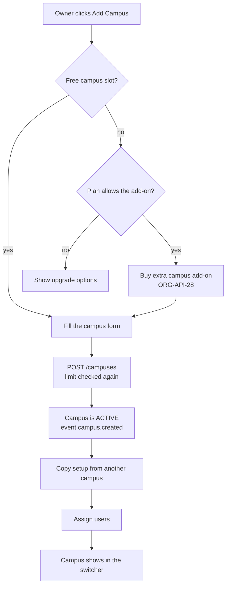
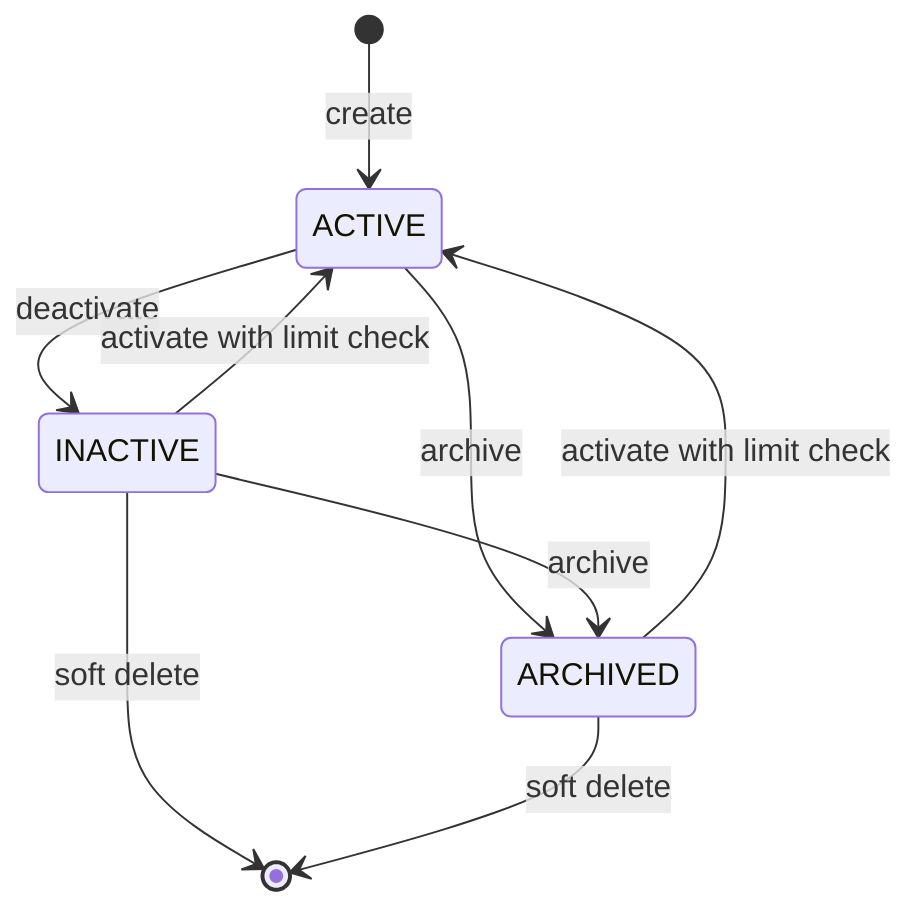
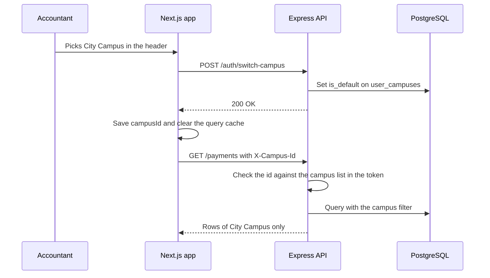
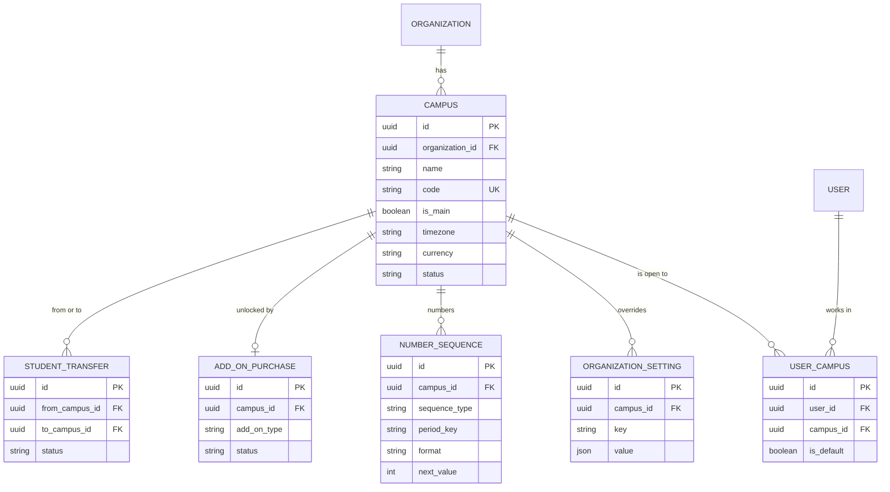

# Multi Campus Module

**In simple words:** A campus is one branch of an institute, for example a school building in Lucknow or a coaching centre in Patna. This module lets the owner add branches, decide which staff member works in which branch, and see all branches side by side on one screen. It also defines the campus switcher in the header, campus-wise receipt and admission numbers, and what happens when the plan allows no more campuses.

| Item | Value |
|---|---|
| Module code | CAMP |
| Release phase | Phase 1 (MVP) |
| Plans | Starter and Growth (1 campus), Pro (up to 3), Enterprise (unlimited); extra campus add-on on Growth and Pro |
| Main users | Organization Admin, Principal; every staff user uses the campus switcher |
| Depends on | Organizations, Authentication and Sessions, RBAC, Settings, Dashboard (metric snapshots) |
| Main tables | campuses, user_campuses, organization_settings, number_sequences |

## Objective

An institute with one branch must never notice this module. An institute with two or more branches must feel that each branch is its own small school, while the owner still sees one organization. The module has five goals:

1. **One main campus from the first minute.** Signup (`ORG-API-03`) creates the main campus, so every student, invoice and attendance sheet always has a campus.
2. **Add a branch in under 5 minutes.** The owner fills one form, copies courses and fee structures from an existing campus, and assigns users.
3. **Each person sees only the own branch.** The table `user_campuses` and the header `X-Campus-Id` decide which rows a Principal, Teacher or Accountant can see. The Organization Admin sees everything.
4. **The owner compares branches without a phone call.** One screen shows students, attendance, fee collection and dues per campus for any date range.
5. **The plan limit is honest and easy to lift.** When no campus slot is free, the screen says so before the form opens and offers the extra campus add-on (₹999 per month in India) or an upgrade.

Success measures for Phase 1:

| Measure | Target |
|---|---|
| Time to add and set up a second campus | Under 5 minutes with "Copy setup" |
| Campus switch in the header | Under 1 second until the new data shows |
| `GET /campuses/lookup` | p95 (the time under which 95% of calls finish) under 100 ms |
| Campus comparison for 1 year and 10 campuses | p95 under 500 ms |
| Cross-campus data leaks in tests | Zero; scoping tests run in CI on every pull request |

## Scope

### In scope

- Create, view, edit, deactivate, activate, archive and soft delete a campus (`CAMP-API-01` to `CAMP-API-08`).
- Exactly one main campus per organization and the action to change it (`CAMP-API-09`).
- Campus profile: name, short code, contact, address, timezone, currency, locale, logo, tax registration (GSTIN), board and affiliation codes, weekly off days, and the geo-fence (a circle around the campus used for staff check-in).
- Assigning staff users to campuses through `user_campuses`, from the campus side (`CAMP-API-10`, `CAMP-API-11`).
- The campus switcher in the web header and in the mobile view, the endpoint `CAMP-API-14`, and the rules of the `X-Campus-Id` header.
- Plan limit on the number of campuses, the extra campus add-on and the behaviour when an add-on ends.
- Campus-level overrides: profile columns, settings rows in `organization_settings`, number series in `number_sequences`, the campus payment gateway account and the campus WhatsApp sender.
- Copying setup data from one campus to another (`CAMP-API-12`).
- Campus KPI summary and the cross-campus comparison for the owner (`CAMP-API-15`, `CAMP-API-16`).
- The campus side of student and staff transfers between campuses.
- Export of the campus list (`CAMP-API-13`).

### Out of scope

| Topic | Where it lives |
|---|---|
| Buying or cancelling the extra campus add-on, invoices, proration | *Organizations Module* (`ORG-API-26` to `ORG-API-29`) |
| The settings screens and the endpoints that save a setting or a number series | *Settings Module* (`SET-API-01` to `SET-API-12`) |
| The transfer request, approval and enrollment change of a student | *Student Profile Module* (`STU-API-32` to `STU-API-37`) |
| The staff transfer action and the staff history | *Staff Module* (`STF-API-08`) |
| Assigning campuses from the user screen | *RBAC and Permissions Matrix*, endpoint `USR-API-12` |
| Connecting a Razorpay or Stripe account | *Payments Module* (`PAY-API-24` to `PAY-API-28`) |
| Connecting a WhatsApp number | *WhatsApp Module* (`WA-API-01` to `WA-API-06`) |
| Rooms, holidays and period slots of a campus | *Batch Module* and *Timetable Module* |
| Stock transfer between campus stores | *Inventory Module* (`INV-API-36`) |
| The query filter that enforces campus scope in every module | *Multi-Tenancy and Data Isolation* |
| Trend charts, scheduled comparison reports, PDF output | *Analytics Module* (`ANL-API-25`) |

### Phase notes

| Phase | What ships |
|---|---|
| Phase 1 (Day 17 of the sprint, prompt P-12) | All 16 endpoints, the switcher, plan limit, user assignment, copy setup, summary and comparison from `daily_metric_snapshots` |
| Phase 1, later weeks | Campus receipt series (with Payments), campus gateway account, campus WhatsApp sender, student campus transfer |
| Phase 2 | Staff campus transfer (`STF-API-08`), comparison trends and scheduled reports in Analytics, campus period slots in "Copy setup" become useful with Timetable |
| Phase 3 | Campus-wise payroll runs, hostels, transport routes and stores read the same `Campus` row; no change in this module |
| Phase 4 | Campuses in different countries: currency and locale overrides are already in the schema; the comparison converts totals with `exchange_rates` |

> **Note:** "Copy setup" can copy period slots in Phase 1, but the table stays empty until the Timetable module ships. The API then simply reports 0 copied rows.

## User Stories

| ID | As a | I want to | So that | Priority |
|---|---|---|---|---|
| CAMP-US-01 | Organization Admin | add a new campus with name, code, address and contact | the second branch can start work on the same day | Must |
| CAMP-US-02 | Organization Admin | see before I start that my plan has no free campus slot, and buy the add-on in one click | I am never stopped by a confusing error | Must |
| CAMP-US-03 | Organization Admin | assign principals, accountants and teachers to one or more campuses | each person sees only the own branch | Must |
| CAMP-US-04 | Staff user with two campuses | switch the campus from the header | I work in one branch at a time without logging out | Must |
| CAMP-US-05 | Organization Admin | choose "All campuses" in the switcher | I see the whole organization in lists and reports | Must |
| CAMP-US-06 | Organization Admin | compare campuses on students, attendance, collection and dues for a date range | I know which branch needs my attention this week | Must |
| CAMP-US-07 | Principal | edit the phone, address, weekly off days and geo-fence of my campus | receipts, report cards and staff check-in use the right data | Should |
| CAMP-US-08 | Organization Admin | give a campus its own receipt and invoice number series | each branch keeps its own book and its own GST series | Should |
| CAMP-US-09 | Organization Admin | override a setting for one campus, for example the attendance mode | a branch that works differently needs no workaround | Should |
| CAMP-US-10 | Organization Admin | copy courses, fee structures, period slots and late-fee rules from an existing campus | a new branch is ready in minutes, not days | Should |
| CAMP-US-11 | Organization Admin | connect a separate Razorpay account and WhatsApp number to a campus | fee money reaches the branch's own bank account and parents see the branch's number | Could |
| CAMP-US-12 | Organization Admin | deactivate or archive a branch that closed | it leaves daily work, but old receipts and marks stay available | Must |
| CAMP-US-13 | Principal | move a student to another campus with the fee dues and history intact | a family that moves house stays with our institute | Should |
| CAMP-US-14 | Organization Admin | make another campus the main campus | the records stay right when the head office moves | Could |
| CAMP-US-15 | Teacher who teaches in two campuses | switch the campus on my phone | I mark attendance for the right branch | Should |

## Workflow

### Adding a campus

**Figure: Add a campus with the plan check**



The screen checks the limit first, so the owner never fills a form that cannot be saved. The API checks the limit again, because the screen can be out of date.

1. Rajesh Sharma opens Campuses and clicks "Add Campus". The page already holds the usage numbers from `ORG-API-12` ("Campuses used: 1 of 3").
2. If a slot is free, the form CAMP-S02 opens. If not, the dialog CAMP-S08 opens. On Growth and Pro it offers the add-on at ₹999 per month and calls `ORG-API-28`. On Starter it offers an upgrade, because Starter cannot buy the add-on. Enterprise has no limit.
3. He enters the name, the code, the address and the contact. The other fields have defaults: weekly off on Sunday, and timezone, currency, locale and logo "same as the organization".
4. `CAMP-API-02` runs in one transaction: lock, limit check, insert, link a free add-on row to the campus, audit log. The event `campus.created` is emitted after the commit.
5. The form offers "Copy setup from". If he picks the main campus, `CAMP-API-12` copies campus-specific courses, fee structures, period slots and late-fee rules.
6. He opens the Users tab and assigns the staff (`CAMP-API-11`). Each added user gets an in-app notice. The campus shows in their switcher after the next token refresh.
7. Optional steps, each on its own tab: a receipt series for the campus (`SET-API-10`), setting overrides (`SET-API-03`), a gateway account (`PAY-API-25`) and a WhatsApp sender (`WA-API-02` or `WA-API-04`).

### Campus status lifecycle

**Figure: Campus status lifecycle**



A campus uses the shared enum `RecordStatus`. Soft delete is not a status; it sets `deletedAt` and hides the row everywhere.

| Status | In switcher and pickers | New records | Existing data | Counts toward the plan limit |
|---|---|---|---|---|
| `ACTIVE` | Yes | Yes | Read and write | Yes |
| `INACTIVE` | No; the Organization Admin sees it under "Inactive" | No new students, batches, staff, inquiries or user assignments | Read and write, so open dues can still be collected | No |
| `ARCHIVED` | No | No | Read only | No |
| Soft deleted | No | No | Hidden; the row stays for foreign keys and audit | No |

Decisions and the reason for each:

- **`INACTIVE` is a pause.** A coaching centre that closes for two months between sessions is deactivated and later activated again. Dues stay collectable, because parents still pay after the last class.
- **`ARCHIVED` is a closed branch.** Nothing can change, so old receipts, marks and certificates stay exactly as they were. An archived campus can be activated again, because owners do click the wrong button.
- **The main campus can never be deactivated, archived or deleted.** First make another campus the main one (`CAMP-API-09`). This keeps at least one working campus in every organization.
- **Only an empty campus can be deleted.** A campus with history is archived instead.

### Campus switcher and the campus header

**Figure: What happens when a user switches the campus**



The switcher is a convenience. The protection is the server check of the header against the user's campus list.

1. After login the web app reads `AUTH-API-14` (`/auth/me`). The answer holds the user's campuses and the default one. Users with `campuses.view` also load `CAMP-API-14` for dropdowns. Teachers and Accountants do not hold `campuses.view`, so their switcher uses the list from `/auth/me`.
2. A user with one campus sees the campus name as plain text. A user with two or more sees a dropdown. An Organization Admin also sees "All campuses" as the first entry.
3. The choice is kept in `localStorage` under the key `eduflow.campusId`. For users with `user_campuses` rows, `AUTH-API-18` also stores it as the default for the next login on any device. An Organization Admin has no such rows, so the choice lives in the browser only, and "All campuses" is the start value.
4. The API client (one Axios or fetch wrapper in `client/src/lib/api.ts`) adds `X-Campus-Id` to every request while one campus is selected. With "All campuses" it sends no header.
5. On a switch the app clears the TanStack Query cache and reloads the current list. A detail page of a record from the old campus is closed and the user lands on the list, because the record would answer `404` under the new header.
6. The server rules are `CAMP-BR-13` and `CAMP-BR-14`.

### Overrides at campus level

A campus can differ from its organization in four layers. Every layer follows one idea: the campus value wins, and an empty campus value means "same as the organization".

| Layer | Stored in | Managed with | Example |
|---|---|---|---|
| Profile columns | `campuses.timezone`, `currency`, `locale`, `logo_url`, `tax_id`, `state_code` | `CAMP-API-04` | City Campus has its own GSTIN |
| Settings | `organization_settings` row with `campus_id` | `SET-API-03`, reset with `SET-API-04` | City Campus marks attendance per period, Main Campus per day |
| Number series | `number_sequences` row with `campus_id` | `SET-API-10`, `SET-API-11`, preview `SET-API-12` | Receipts `RCT-LKO2-2027-28-00001` |
| Integrations | `payment_gateway_accounts.campus_id`, `whats_app_accounts.campus_id` | `PAY-API-25`, `PAY-API-26`, `WA-API-02`, `WA-API-04` | City Campus collects into its own Razorpay account |

The campus detail screen (CAMP-S03) shows all four layers on tabs. The tabs call the endpoints of the owning modules and need their permission keys (`settings.update`, `settings.manage`, `payments.manage`, `whatsapp.manage`). A user without the key sees the tab read only.

### Transfers between campuses

This module owns no transfer endpoint. It defines what a campus transfer must do to campus data, so that both owning modules behave the same way.

**Student.** The office creates a `StudentTransfer` with `transferType = CAMPUS_TRANSFER` (`STU-API-33`). An approver who is assigned to both campuses, or the Organization Admin, approves it (`STU-API-35`). One transaction ends the old enrollment, creates the new one in the target batch and sets `Student.campusId` to the target campus. The admission number stays the same. Old invoices, payments, attendance and marks keep their old `campus_id`, so reports of past months do not change. Open dues follow `feeTreatment.carryDues`; the details are in *Fees Module*.

**Staff.** `STF-API-08` sets `Staff.campusId` (the home campus), writes a `StaffStatusHistory` row with `changeType = CAMPUS_TRANSFER`, `fromCampusId` and `toCampusId`, and updates `user_campuses`: the new campus is added and becomes the default. The request decides whether the old campus is kept (`keepOldCampusAccess`, default `false`). Until Phase 2 the Organization Admin changes a teacher's campus access with `CAMP-API-11` or `USR-API-12`.

> **Example:** Aarav Sharma's family moves from Gomti Nagar to Hazratganj. On 16 August 2027 he moves from 10-A at Main Campus to 10-A at City Campus. His admission number stays `BF-2027-0142`. The July attendance report of Main Campus still counts him. From 16 August his invoices use the City Campus series and the City Campus gateway account.

## Screens and Wireframes

| ID | Screen | Users | Purpose |
|---|---|---|---|
| CAMP-S01 | Campus List | Org Admin, Principal | All campuses with status, student and staff counts, plan usage |
| CAMP-S02 | Add or Edit Campus | Org Admin; Principal edits the own campus | Profile form with defaults "same as the organization" |
| CAMP-S03 | Campus Detail | Org Admin, Principal | Tabs: Overview (KPIs), Users, Settings, Numbering, Integrations |
| CAMP-S04 | Campus Users tab | Org Admin | Assign and remove staff users of one campus |
| CAMP-S05 | Campus Switcher (header) | Every staff user with two or more campuses | Pick the working campus or "All campuses" |
| CAMP-S06 | Campus Comparison | Org Admin, Principal with two or more campuses | KPI table across campuses for a date range |
| CAMP-S07 | Copy Setup dialog | Org Admin | Pick the source campus and the items to copy; shows the result |
| CAMP-S08 | Campus Limit dialog | Org Admin | Plan usage, add-on price, upgrade path |
| CAMP-S09 | Campus Switcher (mobile) | Teacher, Principal, Accountant on a phone | Bottom sheet with the campus list and "make default" |

**Screen CAMP-S01 — Campus List (Organization Admin, web)**

```text
+--------------------------------------------------------------------------+
| EduFlow | Bright Future Public School    [All campuses v]       (RS) v   |
+------------+-------------------------------------------------------------+
| Dashboard  | Campuses                  [Compare] [Export] [+ Add Campus] |
| Campuses < +-------------------------------------------------------------+
|  All       | Plan: Enterprise        Campuses used: 2 of unlimited       |
|  Compare   | Status [Active + Inactive v]   Search [______________]      |
| Admissions +-------------------------------------------------------------+
| Students   | Code  Name          City     Students  Staff  Status   Main |
| Attendance | LKO1  Main Campus   Lucknow       780     52  ACTIVE   Yes  |
| Fees       | LKO2  City Campus   Lucknow       420     31  ACTIVE   -    |
| Settings   | LKO3  Old Annexe    Lucknow         0      0  INACTIVE -    |
|            +-------------------------------------------------------------+
|            | Row menu [...]: View | Edit | Users | Copy setup            |
|            |                 Deactivate | Archive | Set as main | Delete |
|            | Rows 1-3 of 3                                               |
+------------+-------------------------------------------------------------+
```

- The user sees the campuses in scope: all for the Organization Admin, the assigned ones for a Principal. The list calls `CAMP-API-01`; the usage line comes from `ORG-API-12`.
- "Add Campus" opens CAMP-S02 when a slot is free, else CAMP-S08. "Compare" opens CAMP-S06. "Export" calls `CAMP-API-13`.
- The row menu calls `CAMP-API-06` to `CAMP-API-09` and `CAMP-API-05`. An action the rules forbid is greyed out with a tooltip, for example "The main campus cannot be deactivated".
- Student and staff counts come from the newest `daily_metric_snapshots` row of each campus, so the list needs no count query.
- For a coaching institute such as Sharma Classes every label says "Centre" in place of "Campus".

**Screen CAMP-S02 — Add Centre (Organization Admin of a coaching institute, web)**

```text
+--------------------------------------------------------------------------+
| EduFlow | Sharma Classes                 [Boring Road Centre v] (RS) v   |
+------------+-------------------------------------------------------------+
| Dashboard  | Centres > Add Centre                  Centres used: 1 of 3  |
| Centres  < +-------------------------------------------------------------+
| Admissions | Name*  [Kankarbagh Centre______]   Code* [PAT2__]           |
| Students   | Phone  [+916124000002__________]   Email [kkb@sharma.in___] |
| Attendance | Address [12, Main Road, Kankarbagh_______________________]  |
| Fees       | City [Patna______] State [Bihar v] PIN [800020] [India v]   |
| Settings   |-------------------------------------------------------------|
|            | Weekly off [ ]Mo [ ]Tu [ ]We [ ]Th [ ]Fr [ ]Sa [x]Su        |
|            | Timezone [Same as institute v]  Currency [Same (INR) v]     |
|            | Logo     [Same as institute v]  Language [Same (en-IN) v]   |
|            | GST  [ ] This centre has its own GSTIN [_______________]    |
|            | Staff check-in  Lat [25.594100] Long [85.137600] Radius[150]|
|            |                 [Use my current location]                   |
|            |-------------------------------------------------------------|
|            | After saving [x] Copy setup from [Boring Road Centre v]     |
|            |                                  [Cancel]  [Save Centre]    |
+------------+-------------------------------------------------------------+
```

- The header line shows the plan usage, so the owner knows the slot count before saving.
- The code is typed in capital letters. Below the field a live hint shows a sample number, for example "Receipts can look like RCT-PAT2-2027-28-00001".
- "Use my current location" fills latitude and longitude from the browser. Phase 1 has no map picker. This avoids a paid maps key and is enough for a check-in circle.
- "Save Centre" calls `CAMP-API-02`. With the box ticked, the Copy Setup dialog (CAMP-S07) opens next and calls `CAMP-API-12`.
- In edit mode the same form calls `CAMP-API-04`. The code field is locked once the campus has students, staff or receipts (`CAMP-BR-07`). Board, affiliation number, school code and UDISE code sit in a folded "School codes" section that only `SCHOOL` organizations see.

**Screen CAMP-S04 — Campus Users tab (Organization Admin, web)**

```text
+--------------------------------------------------------------------------+
| EduFlow | Bright Future Public School    [All campuses v]       (RS) v   |
+------------+-------------------------------------------------------------+
| Dashboard  | Campuses > City Campus (LKO2)  [ACTIVE]    [Edit] [More v]  |
| Campuses < | Overview | Users < | Settings | Numbering | Integrations    |
|  All       +-------------------------------------------------------------+
|  Compare   | 4 users assigned      [Search name or phone__] [+ Add Users]|
| Admissions |                                                             |
| Students   | [x] Meera Joshi     Principal    1 campus    Default: City  |
| Attendance | [x] Rakesh Yadav    Accountant   1 campus    Default: City  |
| Fees       | [x] Priya Nair      Teacher      2 campuses  Default: Main  |
| Settings   | [x] Kavita Singh    Front Desk   1 campus    Default: City  |
|            | [ ] Suresh Gupta    Accountant   1 campus    Default: Main  |
|            |                                                             |
|            | Organization Admins see every campus and are not listed.    |
|            | Unticking the only campus of a user is blocked.             |
|            |                          [Discard]  [Save Assignments]      |
+------------+-------------------------------------------------------------+
```

- The tab lists the assigned users first (`CAMP-API-10`). "Add Users" searches all staff users (`USR-API-01`) and adds them to the list with a ticked box.
- "Save Assignments" sends the full set of ticked user ids to `CAMP-API-11`. The API replaces the set in one transaction and answers with the added and removed counts.
- A user who would lose the only campus is shown in red, and the save is blocked with the message from `CAMP-BR-12`.
- The same data can be edited from the user side (`USR-API-12`). Both screens write the same table.

**Screen CAMP-S06 — Campus Comparison (Organization Admin, web)**

```text
+--------------------------------------------------------------------------+
| EduFlow | Bright Future Public School    [All campuses v]       (RS) v   |
+------------+-------------------------------------------------------------+
| Dashboard  | Campuses > Compare   From [01 Jul 2027] To [31 Jul 2027]    |
| Campuses < |                      Campuses [All v]      [Download CSV]   |
|  All       +-------------------------------------------------------------+
|  Compare < | Metric                Main Campus  City Campus  All campuses|
| Admissions | Active students               780          420        1,200 |
| Students   | New admissions                 14            9           23 |
| Attendance | Withdrawals                     2            3            5 |
| Fees       | Attendance                  93.0%        88.0%        91.3% |
| Settings   | Staff                          52           31           83 |
|            | Fee collected (Rs)      48,60,000    19,20,000    67,80,000 |
|            | Collected online (Rs)   21,87,000     5,76,000    27,63,000 |
|            | Dues at end (Rs)        11,40,000    10,80,000    22,20,000 |
|            | Collection                  81.0%        64.0%        75.3% |
|            +-------------------------------------------------------------+
|            | The weakest value of a row is amber. Click a number to open |
|            | the matching report with the campus and dates prefilled.    |
+------------+-------------------------------------------------------------+
```

- One call to `CAMP-API-16` fills the table. Metrics are rows and campuses are columns, because an owner has many metrics and few campuses. With more than 4 campuses the table turns: campuses become rows and the metric columns scroll sideways.
- The formulas are in `CAMP-BR-17`. "All campuses" is computed from the sums, never as an average of the campus percentages.
- A click on "64.0%" opens the defaulter list of *Fees Module* for City Campus. A click on "88.0%" opens the low-attendance list of *Attendance Module*.
- Fee rows are hidden when the user lacks `dashboard.view_finance`.
- "Download CSV" builds the file in the browser from the loaded data. No server job is needed for a table this small.

**Screen CAMP-S09 — Campus Switcher (Teacher, mobile)**

```text
+------------------------------------+
| EduFlow                     (PN)   |
| Main Campus v                      |
+------------------------------------+
| Switch campus                  [x] |
|                                    |
| (o) Main Campus           LKO1     |
|     Gomti Nagar, Lucknow           |
|     Your default                   |
|                                    |
| ( ) City Campus           LKO2     |
|     Hazratganj, Lucknow            |
|                                    |
| [x] Make this my default           |
|                                    |
| [Cancel]               [Switch]    |
+------------------------------------+
| Today at Main Campus               |
| 10-A  Period 1  Maths     08:00    |
| 10-B  Period 3  Maths     09:30    |
+------------------------------------+
| Home   Attend.   Homework   More   |
+------------------------------------+
```

- Priya Nair teaches in both campuses. A tap on the campus name under the logo opens this bottom sheet. The list comes from `/auth/me` (`AUTH-API-14`), because a Teacher does not hold `campuses.view`.
- "Switch" stores the campus in `localStorage`, calls `AUTH-API-18` when "Make this my default" is ticked, and reloads the home screen with the new `X-Campus-Id`.
- A teacher with one campus sees the name as plain text and no sheet.
- Parents and students have no switcher. Their data scope is `Own`, and each child card in the Parent Portal shows the campus name of that child.

## UI Components

| Component | Type | Behaviour |
|---|---|---|
| `CampusSwitcher` | shadcn/ui `DropdownMenu` in the header; `Sheet` on mobile | Lists active assigned campuses; "All campuses" only for scope `ALL`; inactive campuses in a grey group for the Organization Admin; keyboard shortcut `Alt+C` |
| `CampusTable` | Data table from the UI kit (P-10) | Sort by name, code, students; status filter; row menu with greyed actions and tooltips |
| `CampusForm` | React Hook Form + Zod, shadcn/ui `Form`, `Input`, `Select`, `Switch` | Shared Zod schema from `shared/`; "Same as organization" is the empty value; unsaved-changes guard |
| `WeeklyOffPicker` | `ToggleGroup` with 7 day chips | At least one day must stay a working day |
| `GeoFenceFields` | Three inputs plus "Use my current location" | Fills 6 decimals from the browser; all three fields or none |
| `CampusStatusBadge` | `Badge` | `ACTIVE` green, `INACTIVE` amber, `ARCHIVED` grey; "Main" chip in blue |
| `PlanLimitDialog` | `AlertDialog` (CAMP-S08) | Shows used and allowed, the add-on price from `ORG-API-26`, the upgrade price, and one primary button |
| `UserAssignmentList` | `Command` search plus checkbox list | Shows role, campus count and default campus; blocks removing a user's only campus |
| `CopySetupDialog` | `Dialog` with 4 checkboxes and a result panel | After the call it lists copied and skipped rows per item with the reason |
| `ComparisonTable` | Table with metric rows | Amber cell for the weakest value per row; drill-down links; CSV download |
| `OverrideChip` | `Badge` plus "Reset" link | On the Settings and Numbering tabs: marks a value as "Campus override" and resets it with `SET-API-04` |
| `DangerConfirmDialog` | `AlertDialog` with a text input | Archive and delete need the campus code typed in, for example `LKO3` |

States that every list and tab must handle:

| State | What the user sees |
|---|---|
| Loading | Skeleton rows; the switcher shows the last known campus name from `localStorage` |
| Empty (only the main campus) | "You have one campus. Add a campus when you open a new branch." with the "Add Campus" button |
| Empty Users tab | "No user is assigned yet. Only Organization Admins can see this campus." |
| Error | Inline alert with the API `message` and the `requestId`, plus "Try again" |
| Forbidden header | The app removes the stored campus, selects the default campus and shows the toast "You no longer have access to City Campus." |
| Snapshot missing | KPI cards show a dash and "Numbers appear after the first nightly run." |

## Validation Rules

| Field | Rule | Error message shown to user |
|---|---|---|
| `name` | Required, 2 to 150 characters, unique among the organization's campuses that are not deleted (case is ignored) | "A campus with this name already exists." |
| `code` | Required, 2 to 8 characters, only `A-Z` and `0-9`, saved in capital letters, unique per organization including deleted campuses | "Code must be 2 to 8 capital letters or digits, for example LKO2." or "Code LKO2 is already used by City Campus." |
| `phone` | Optional, E.164 format | "Enter the phone number with country code, for example +915224000002." |
| `email` | Optional, valid email, at most 255 characters | "Enter a valid email address." |
| `addressLine1`, `addressLine2` | Optional, at most 200 characters each | "Address line is too long (200 characters at most)." |
| `city`, `state` | Optional, at most 100 characters | "City name is too long." |
| `postalCode` | Optional, at most 20 characters; 6 digits when the country is India | "PIN code must be 6 digits." |
| `countryCode` | Optional, a code from `countries`; default is the organization's country | "Select a country from the list." |
| `timezone` | Optional, a valid IANA name such as `Asia/Kolkata` | "Select a timezone from the list." |
| `currency` | Optional, a code from `currencies`; locked after the first invoice or payment of the campus | "The currency cannot change after the first invoice or payment of this campus." |
| `locale` | Optional, a supported locale such as `en-IN` or `hi-IN` | "Select a language from the list." |
| `latitude`, `longitude`, `geoRadiusMeters` | All three or none; latitude -90 to 90, longitude -180 to 180, at most 6 decimals; radius a whole number from 50 to 1000 | "Enter latitude, longitude and radius together, or leave all three empty." or "Radius must be between 50 and 1000 metres." |
| `isTaxRegistered`, `taxId` | `taxId` is required when `isTaxRegistered` is true; for India a 15-character GSTIN whose first 2 digits equal `stateCode` | "Enter the GSTIN of this campus (15 characters, for example 09AAACB1234F1Z5)." or "The GSTIN starts with 09 but the state code is 10." |
| `board`, `affiliationNo`, `schoolCode` | Optional, at most 60, 40 and 40 characters | "This value is too long." |
| `udiseCode` | Optional, exactly 11 digits | "UDISE code must be 11 digits." |
| `weeklyOffDays` | List of `WeekDay` values without repeats, at most 6 entries | "At least one day of the week must be a working day." |
| `logoUrl` | A file of this organization uploaded through the file service; PNG or JPG, at most 2 MB | "Upload a PNG or JPG logo of up to 2 MB." |
| `userIds` (`CAMP-API-11`) | At most 500 UUIDs; each an `ACTIVE` or `INVITED` user of type `STAFF` in this organization | "Select staff users of this organization only." |
| `sourceCampusId` (`CAMP-API-12`) | A campus of this organization, not the target campus | "Pick a different campus to copy from." |
| `items` (`CAMP-API-12`) | At least one of `COURSES`, `FEE_STRUCTURES`, `PERIOD_SLOTS`, `LATE_FEE_RULES` | "Select at least one item to copy." |
| `from`, `to` (`CAMP-API-16`) | Dates `YYYY-MM-DD`; `from` not after `to`; range at most 366 days | "Pick a range of 366 days or less." |
| `X-Campus-Id` header | A UUID | "X-Campus-Id must be a UUID." |

## Business Rules

**CAMP-BR-01 — The main campus always exists.** Signup (`ORG-API-03`) and the platform console (`ORG-API-32`) create the first campus with `isMain = true`, status `ACTIVE`, code `MAIN` and the organization's address. The owner renames it in the onboarding wizard. A partial unique index allows one main campus per organization. The main campus gives the fallback address on organization-level documents and is preselected in forms.

**CAMP-BR-02 — Campus limit.** The limit is checked on create (`CAMP-API-02`) and on activate (`CAMP-API-07`).

```text
base    = Subscription.campusLimitOverride, else Plan.maxCampuses
extras  = sum of quantity of ACTIVE add-ons with type EXTRA_CAMPUS
allowed = base + extras        (empty base = unlimited, no check)
used    = campuses with status ACTIVE and deletedAt empty
free    = allowed - used       (create and activate need free >= 1)
```

| Case | base | extras | used | Result |
|---|---|---|---|---|
| Sharma Classes, Pro, adds the Kankarbagh centre | 3 | 0 | 1 | Allowed; 2 of 3 used afterwards |
| A Growth institute with 1 campus adds a second | 1 | 0 | 1 | `403 PLAN_LIMIT_REACHED` |
| The same institute after buying one add-on | 1 | 1 | 1 | Allowed; 2 of 2 used afterwards |
| Bright Future, Enterprise | empty | 0 | 2 | Always allowed |
| Enterprise contract with `campusLimitOverride = 5` | 5 | 0 | 5 | `403 PLAN_LIMIT_REACHED` |

`INACTIVE` and `ARCHIVED` campuses do not count. This is safe, because such a campus accepts no new students, batches or staff, so nobody can run a real branch on it.

**CAMP-BR-03 — What the owner pays.** Prices and invoices belong to *Organizations Module*; this rule only fixes what the limit dialog shows. The add-on costs ₹999 per month per campus and works on Growth and Pro. Starter cannot buy it. It adds a campus and does not raise the student limit.

> **Example:** A Growth institute with 3 branches pays ₹2,499 + 2 × ₹999 = ₹4,497 per month. GST at 18% is ₹809.46, so the bill is ₹5,306.46. Pro costs ₹5,999 per month before GST, includes 3 campuses, 1,000 students and the Phase 3 modules. The dialog shows both lines, and the owner decides.

> **Example:** The add-on is bought on the 16th of a 30-day billing month. 15 days are left. Amount = ₹999 × 15 ÷ 30 = ₹499.50. GST is ₹89.91. The first charge is ₹589.41, and the campus slot is free as soon as the add-on is `ACTIVE`.

**CAMP-BR-04 — Add-on link and what happens when an add-on ends.** EduFlow sells the add-on with `quantity = 1`, so one `add_on_purchases` row unlocks one campus. When a campus is created on an add-on slot, the API writes the campus id into `AddOnPurchase.campusId` of the oldest `ACTIVE` row that has none. When such an add-on becomes `EXPIRED` or `CANCELLED`, the module recomputes `free`:

1. If `free >= 0`, nothing happens.
2. If `free < 0`, every Organization Admin gets an alert at once: "Your extra campus add-on has ended. City Campus will become inactive on 8 August 2027 unless you renew."
3. After 7 days the job `campus-limit-reconcile` sets the linked campus to `INACTIVE` with actor `SYSTEM`. If the row has no linked campus, the newest non-main `ACTIVE` campus is taken. The main campus is never touched. This system action skips the "active batches" check of `CAMP-BR-05`.
4. No data is lost. After a renewal the owner clicks "Activate".

> **Note:** Assumption: the grace period is 7 days. The canon fixes no value. A plan downgrade never reaches this state, because `ORG-API-18` refuses a downgrade while `used` is above the new `allowed`.

**CAMP-BR-05 — Status actions.**

| Action | Allowed from | Blocked when | Message |
|---|---|---|---|
| Deactivate (`CAMP-API-06`) | `ACTIVE` | Main campus; or the campus has batches with status `ACTIVE` | "The main campus cannot be deactivated." or "City Campus has 14 active batches. Complete or move them first." |
| Activate (`CAMP-API-07`) | `INACTIVE`, `ARCHIVED` | No free slot (`CAMP-BR-02`) | "Your Pro plan allows 3 campuses. Buy an extra campus add-on or upgrade." |
| Archive (`CAMP-API-08`) | `ACTIVE`, `INACTIVE` | Main campus; or active students, active staff (home campus) or active batches exist | "Move 420 students, 31 staff and 14 batches to another campus first." |
| Set main (`CAMP-API-09`) | `ACTIVE`, not already main | Target is not `ACTIVE` | "Only an active campus can be the main campus." |

"Active students" means `Student.status` in `ACTIVE`, `INACTIVE` or `SUSPENDED` (on the rolls). "Active staff" means `Staff.status` in `ACTIVE`, `ON_LEAVE` or `SUSPENDED`. Archive also removes every `user_campuses` row of the campus, after the "last campus" check of `CAMP-BR-12`. A write with the `campusId` of an archived campus answers `422 BUSINESS_RULE_VIOLATION` in every module: "Old Annexe is archived. Its data is read only."

**CAMP-BR-06 — Delete.** `CAMP-API-05` sets `deletedAt`. It is allowed only when the campus is not the main campus and has no students, staff, batches, invoices, payments or number series that already issued a number. In practice this means a campus created by mistake. The foreign keys use `onDelete: Restrict`, so even a bug cannot remove a campus with history.

**CAMP-BR-07 — Campus code.** The code is part of document numbers through the token `{CAMPUS}`. It is 2 to 8 characters, so that a GST invoice number fits into 16 characters. It stays reserved after a soft delete. It can be edited only while the campus has no student, staff member, invoice or receipt. Numbers already printed are never rewritten.

**CAMP-BR-08 — Effective profile values.** For `timezone`, `currency`, `locale` and `logoUrl` the rule is: campus value, else organization value. For tax: when `Campus.isTaxRegistered` is true, invoices and receipts of the campus print `Campus.taxId` and use `Campus.stateCode` to choose CGST plus SGST or IGST. Otherwise they use the organization's values.

> **Example:** Bright Future has `timezone = Asia/Kolkata`. City Campus has an empty `timezone`, so its effective value is `Asia/Kolkata`. A later Dubai campus with `timezone = Asia/Dubai` and `currency = AED` closes its day book 90 minutes after the Lucknow campuses.

API answers carry both: the raw columns and an `effective` object, so the client never repeats this logic.

**CAMP-BR-09 — Setting overrides.** A setting is resolved in three steps: the row with this `campus_id`, else the row with `campus_id` empty, else the default in code.

```sql
SELECT value
FROM organization_settings
WHERE organization_id = $1
  AND key = $2
  AND (campus_id = $3 OR campus_id IS NULL)
ORDER BY campus_id NULLS LAST
LIMIT 1;
```

> **Example:** The organization row says `attendance.mode = "DAILY"`. City Campus has a row `attendance.mode = "PERIOD"`. A teacher at City Campus marks per period, and a teacher at Main Campus marks once a day. After "Reset" (`SET-API-04` with `campusId`) the campus row is deleted and City Campus follows the organization again.

Keys about security, privacy and billing cannot be overridden per campus. The Zod schema of each settings group marks the keys that can; the list is in *Settings Module*. When no `X-Campus-Id` is sent and the record has no campus, the organization value applies.

**CAMP-BR-10 — Number series per campus.** A document number comes from one row of `number_sequences`. The lookup for a type, a campus and a period key is: the campus row, else the organization row (`campus_id` empty).

```sql
SELECT id, prefix, suffix, format, pad_length, next_value
FROM number_sequences
WHERE organization_id = $1
  AND sequence_type = 'RECEIPT_NO'
  AND period_key = $2
  AND (campus_id = $3 OR campus_id IS NULL)
ORDER BY campus_id NULLS LAST
LIMIT 1
FOR UPDATE;

UPDATE number_sequences
SET next_value = next_value + 1, updated_at = now()
WHERE id = $4 AND organization_id = $1;
```

Both statements run inside the business transaction, for example the payment. The row lock makes numbers gap-free, and two campuses with their own rows never wait for each other. When a new period starts, the first request of that period creates the new row. It copies prefix, suffix, format, pad length and reset policy from the newest row of the same campus scope and starts at 1.

```text
format      {PREFIX}-{CAMPUS}-{AY}-{SEQ}     pad length 5
values      PREFIX = RCT   CAMPUS = LKO2   AY = 2027-28   SEQ = 1
result      RCT-LKO2-2027-28-00001           (21 characters)

format      {CAMPUS}/{YY}/{SEQ}              pad length 6, max length 16
result      LKO2/27/000123                   (4 + 1 + 2 + 1 + 6 = 14, fits)
```

Two extra rules protect uniqueness, because `receipt_no`, `invoice_no` and `admission_no` are unique per organization, not per campus:

1. A series with a `campus_id` must contain `{CAMPUS}` in its format, or use a prefix that no other series of the same type uses. `SET-API-10` and `SET-API-11` answer `409 CONFLICT` otherwise.
2. A series with `max_length` set (16 for a GST invoice series) is checked with the longest campus code and the pad length when the format is saved (`SET-API-12`).

> **Best practice:** Keep `ADMISSION_NO` organization-wide, so a student keeps one number for life, also after a campus transfer (`BF-2027-0142`). Make `RECEIPT_NO` and `FEE_INVOICE_NO` campus-wise when each branch has its own fee counter, and always when a campus has its own GSTIN.

**CAMP-BR-11 — Who needs campus rows.** Only users with `userType = STAFF` get `user_campuses` rows. A user whose only role is `ORG_ADMIN` sees all campuses without rows. Parents and students are scoped by their own records. `SUPER_ADMIN` works through audited impersonation and then acts like the Organization Admin.

**CAMP-BR-12 — Assignment rules.**

1. Every staff user who is not an Organization Admin must keep at least one campus. `CAMP-API-11`, archive and `USR-API-12` refuse the change otherwise: "Priya Nair would have no campus. Assign another campus first or deactivate the user."
2. Each user has exactly one default campus. The first assignment becomes the default. When the default campus is removed, the oldest remaining assignment becomes the default.
3. Only an `ACTIVE` campus accepts new assignments.
4. Sending an Organization Admin in `userIds` answers `422`: "Rajesh Sharma is an Organization Admin and already sees every campus."
5. The campus list travels inside the access token (15 minutes). A new campus shows after the next refresh. A removed campus must stop working at once: the API stores the user id in Redis under `t:<orgId>:campus-stale:<userId>` for 15 minutes, and `authenticate` answers `401 TOKEN_EXPIRED` for tokens issued before that moment. The client refreshes silently and gets the new list.

> **Note:** Assumption: the stale-token check is implemented in the auth middleware described in *Authentication and Sessions*. This chapter only fixes the behaviour: removed access ends within seconds, not after 15 minutes.

**CAMP-BR-13 — The `X-Campus-Id` header.**

| Situation | Result |
|---|---|
| No header, scope `ALL` | All campuses of the organization |
| No header, scope `CAMPUS` or `VIEW` | All assigned campuses |
| Header is one of the user's campuses | Lists and sums are narrowed to that campus |
| Header is not a UUID | `400 VALIDATION_ERROR` |
| Header is a campus outside the user's list, or no campus of this organization | `403 FORBIDDEN`; the same answer in both cases, so nothing leaks |
| Header is an archived or inactive campus in the user's scope | Reads work; writes follow `CAMP-BR-05` |
| A single record of another campus is opened by id | `404 NOT_FOUND` |
| Rows without a campus (subjects, fee heads, academic years) | Always visible; the header does not hide them |

**CAMP-BR-14 — The campus of a new record.** For a create call the campus is chosen in this order: `campusId` in the body, else the `X-Campus-Id` header, else the user's only campus. If none of these gives a campus, the API answers `400 VALIDATION_ERROR` with "Select a campus". The chosen campus must be in the user's scope and `ACTIVE`.

**CAMP-BR-15 — Campus transfers.** A student or staff transfer never rewrites history. Rows created before the effective date keep the old `campus_id`. Only the person's current `campusId`, the new enrollment and future documents use the new campus. A transfer into an `INACTIVE` or `ARCHIVED` campus is refused with `422`. A student transfer needs an approver assigned to both campuses, or the Organization Admin (`STU-BR-14` in *Student Profile Module*).

**CAMP-BR-16 — Gateway account and WhatsApp sender of a campus.**

1. Online fee payment: use the `ACTIVE` gateway account with `campus_id` = the campus of the invoice and a set `lastVerifiedAt`; else the organization's default account (`isDefault`); else online payment is not offered. This matches `PAY-BR-12` in *Payments Module*.
2. WhatsApp: use the `ACTIVE` account with `campus_id` = the campus of the student; else the default account; else the channel is skipped and the notification engine tries the next channel.
3. The message credit wallet is one per organization and channel. A campus sender does not get its own wallet. Cost per campus is reported from `message_logs.campus_id`.
4. Deactivating or archiving a campus does not disconnect its gateway account or sender. Archive is blocked while payment orders of the campus are still open.

> **Example:** Main Campus and City Campus belong to two different trusts with two bank accounts. Rajesh connects a second Razorpay account with `campusId` = City Campus. Sunita Devi pays Aarav's City Campus invoice of ₹12,000 online; the money settles into the City Campus bank account. A parent of Main Campus still pays into the default account.

**CAMP-BR-17 — KPI formulas of the summary and the comparison.** All numbers come from `daily_metric_snapshots` rows with `campus_key` = the campus id, for the dates in the range.

```text
activeStudents    = value of the last day in the range
staffTotal        = value of the last day in the range
newAdmissions     = sum over the range      (same for withdrawals)
attendancePercent = sum(studentsPresent) / sum(studentsMarked) * 100
feeCollected      = sum over the range      (same for feeInvoiced, online)
feeDues           = value of the last day in the range
collectionPercent = feeCollected / (feeCollected + feeDues) * 100
onlineSharePercent= feeCollectedOnline / feeCollected * 100
```

Worked example for July 2027 (24 school days):

| Number | Main Campus | City Campus | All campuses |
|---|---|---|---|
| Students marked | 780 × 24 = 18,720 | 420 × 24 = 10,080 | 28,800 |
| Students present | 17,410 | 8,870 | 26,280 |
| Attendance | 17,410 ÷ 18,720 = 93.0% | 8,870 ÷ 10,080 = 88.0% | 26,280 ÷ 28,800 = 91.3% |
| Fee collected | ₹48,60,000 | ₹19,20,000 | ₹67,80,000 |
| Dues at end | ₹11,40,000 | ₹10,80,000 | ₹22,20,000 |
| Collection | 48.6 ÷ 60.0 = 81.0% | 19.2 ÷ 30.0 = 64.0% | 67.8 ÷ 90.0 = 75.3% |
| Online share | 21.87 ÷ 48.6 = 45.0% | 5.76 ÷ 19.2 = 30.0% | 27.63 ÷ 67.8 = 40.8% |

The plain average of 93.0% and 88.0% would be 90.5%. That is wrong, because Main Campus has almost twice as many students. Percentages are rounded to 1 decimal, half up. A division by zero gives `null`, shown as a dash. When campuses use different currencies, money is shown per campus in its own currency, and the "All campuses" column converts to the organization currency with the newest `exchange_rates` row and carries the flag `isConverted: true`.

**CAMP-BR-18 — Copy setup.** `CAMP-API-12` copies from a source campus into the target campus in one transaction.

| Item | What is copied | What is skipped |
|---|---|---|
| `COURSES` | Courses with `campus_id` = source; the new code is `<code>-<target campus code>`, for example `C10-LKO2` | Courses with an empty `campus_id` (already offered everywhere); a code longer than 30 characters or already taken |
| `FEE_STRUCTURES` | Structures of the chosen academic year with `campus_id` = source, with items and installments; status `INACTIVE` so the accountant reviews the amounts | Structures with an empty `campus_id`; a name that already exists in the target for that year |
| `PERIOD_SLOTS` | All slots of the source | A slot whose shift and name already exist in the target |
| `LATE_FEE_RULES` | Rules with `campus_id` = source; the name gets the suffix " (LKO2)"; `isDefault` is kept only if the target has no default rule | Rules with an empty `campus_id` |

Running the copy twice is safe: the second run skips every row and reports the reason. Students, staff, batches, invoices and settings are never copied.

**CAMP-BR-19 — The day of a campus.** "Today", day-book dates, attendance dates and the cut-off of the nightly snapshot use the effective timezone of the campus (`CAMP-BR-08`).

**CAMP-BR-20 — Scope of a Principal.** A Principal holds `campuses.view` and `campuses.update` with scope `Campus`. He or she can edit the contact, address, weekly off days, geo-fence, board codes and logo of an assigned campus. The fields `code`, `currency`, `timezone`, `isTaxRegistered`, `taxId` and `stateCode` need scope `ALL`; a Principal who sends them gets `403 FORBIDDEN`.

## Acceptance Criteria

| ID | Given | When | Then |
|---|---|---|---|
| CAMP-AC-01 | A visitor signs up Sharma Classes (`ORG-API-03`) | The signup transaction commits | One campus exists with `isMain = true`, status `ACTIVE` and `weeklyOffDays = [SUNDAY]`; `CAMP-API-01` returns exactly this campus |
| CAMP-AC-02 | Sharma Classes is on Pro with 1 centre | Rajesh submits "Add Centre" with name "Kankarbagh Centre" and code `pat2` | `201`; the code is saved as `PAT2`; status `ACTIVE`; `isMain = false`; `campus.created` is emitted; one audit row exists |
| CAMP-AC-03 | A Growth institute has 1 active campus and no add-on | The owner calls `CAMP-API-02` | `403 PLAN_LIMIT_REACHED`; the message names the plan, the limit and the add-on; no row is created |
| CAMP-AC-04 | The same institute has one `ACTIVE` `EXTRA_CAMPUS` add-on | The owner calls `CAMP-API-02` again | `201`; `AddOnPurchase.campusId` holds the new campus id; usage shows 2 of 2 |
| CAMP-AC-05 | City Campus uses the code `LKO2` | Another campus is created with `LKO2` | `409 CONFLICT` with "Code LKO2 is already used by City Campus." |
| CAMP-AC-06 | One campus slot is free | Two `POST /campuses` calls arrive at the same moment | Exactly one answers `201` and one answers `403`; `used` never exceeds `allowed` |
| CAMP-AC-07 | Meera Joshi is Principal of City Campus only | She calls `CAMP-API-01`, then opens Main Campus by id, then sends `X-Campus-Id` of Main Campus | The list has 1 row; the detail answers `404 NOT_FOUND`; the header answers `403 FORBIDDEN` |
| CAMP-AC-08 | Rajesh is Organization Admin | He lists students without the header, then with the City Campus header | First 1,200 students, then 420; no `user_campuses` row is needed for him |
| CAMP-AC-09 | Main Campus is the main campus; City Campus has 14 active batches | Rajesh tries to deactivate each | Both answer `422 BUSINESS_RULE_VIOLATION` with the messages of `CAMP-BR-05`; no status changes |
| CAMP-AC-10 | Old Annexe is `INACTIVE` and has one unpaid invoice | A user creates a student with its `campusId`; the Organization Admin collects the invoice | The create answers `422`; the collection succeeds; the campus is missing from `CAMP-API-14` and from `/auth/me` |
| CAMP-AC-11 | A Pro organization has 3 active campuses and 1 inactive campus | The owner activates the inactive campus | `403 PLAN_LIMIT_REACHED`; the status stays `INACTIVE` |
| CAMP-AC-12 | Old Annexe has no active students, staff or batches | Rajesh archives it and types `LKO3` to confirm | Status `ARCHIVED`; its `user_campuses` rows are gone; reads work; any write with its `campusId` answers `422` |
| CAMP-AC-13 | Main Campus is main; City Campus is `ACTIVE` | Rajesh calls `CAMP-API-09` for City Campus | After the commit exactly one campus has `isMain = true` (City Campus); `campus.main_changed` carries both ids |
| CAMP-AC-14 | Priya Nair has Main Campus (default) and City Campus | `CAMP-API-11` for City Campus is saved without her id | Her City Campus row is deleted; her old access token answers `401 TOKEN_EXPIRED`; after the silent refresh her list has 1 campus |
| CAMP-AC-15 | Rakesh Yadav has only City Campus | `CAMP-API-11` is saved without his id | `422` with "Rakesh Yadav would have no campus..."; no assignment of the request is changed |
| CAMP-AC-16 | City Campus has its own `RECEIPT_NO` series; Main Campus has none | One payment is collected in each campus | City Campus gets `RCT-LKO2-2027-28-00001`; Main Campus gets the next organization number, for example `RCT-2027-28-00452` |
| CAMP-AC-17 | `attendance.mode` is `DAILY` for the organization and `PERIOD` for City Campus | `SET-API-05` is called with each campus header, then the override is reset | City Campus gets `PERIOD`, Main Campus gets `DAILY`; after the reset both get `DAILY` |
| CAMP-AC-18 | The July 2027 snapshots of `CAMP-BR-17` exist | Rajesh calls `CAMP-API-16` for 1 to 31 July | Attendance is 93.0, 88.0 and 91.3 in the total; collection is 81.0, 64.0 and 75.3 |
| CAMP-AC-19 | Meera Joshi is Principal of City Campus | She patches `phone`, then patches `taxId` | The first call answers `200`; the second answers `403 FORBIDDEN` and changes nothing |
| CAMP-AC-20 | The add-on linked to City Campus becomes `EXPIRED` and `free` is -1 | The event arrives; 7 days pass without a renewal | Organization Admins get the alert at once; the job then sets City Campus to `INACTIVE` with actor `SYSTEM`; the main campus is never chosen |

## Edge Cases

| Case | What happens | How the system handles it |
|---|---|---|
| Two admins take the last campus slot at the same moment | Both requests pass a naive count check | The create transaction takes a PostgreSQL advisory lock per organization before counting; the second request waits and then fails with `403` |
| The browser still stores a campus that the user lost | The next API call carries a forbidden header | `403 FORBIDDEN`; the client removes `eduflow.campusId`, selects the default campus and shows a toast |
| A user is Organization Admin and also Principal with campus rows | Two roles, two scopes | The API takes the union; scope `ALL` wins; the rows stay but limit nothing |
| The code of a soft-deleted campus is typed for a new campus | The unique key still holds the old row | `409 CONFLICT`: "Code LKO3 was used by a deleted campus. Pick another code." |
| A campus with its own GSTIN sits in another state than the organization | Tax split differs per campus | Invoices of that campus use `Campus.stateCode` for CGST plus SGST or IGST (`CAMP-BR-08`) |
| A campus is deactivated while staff work in it | Open screens point to a hidden campus | Assigned users get the stale-token refresh; their list no longer holds the campus; a user with no active campus sees "No active campus. Please contact your administrator." |
| A pending student transfer points to a campus that the owner wants to archive | The transfer could never be approved | Archive is blocked: "2 pending transfers use this campus. Approve, reject or cancel them first." |
| A new campus has no snapshot row yet | Summary and comparison have nothing to read | The API returns zeros with `snapshotDate: null`; the screen shows "Numbers appear after the first nightly run." |
| The first receipt of a new academic year is collected in two campuses at once | Two transactions try to create the new period row | The unique key on organization, campus, type and period lets one insert win; the other reads the new row and continues |
| An add-on is bought but the payment is still `PENDING` | The owner expects a free slot | Only `ACTIVE` add-ons count; the limit dialog shows "Payment is processing. The slot opens when the payment succeeds." |
| The owner downgrades from Pro with 3 campuses to Growth | The new plan allows 1 campus | `ORG-API-18` refuses until 2 campuses are inactive or archived, or 2 add-ons are active; this module supplies the count |
| A campus created by mistake holds an add-on link | The slot would stay blocked | Soft delete clears `AddOnPurchase.campusId`, so the next campus can use the slot |
| An Enterprise group has 40 campuses | A plain dropdown is too long | Above 8 entries the switcher shows a search box; the comparison turns campuses into rows and pages by 20 |
| A Dubai campus and two Lucknow campuses are compared | Money in AED and INR cannot be added | Each campus keeps its currency; the total converts with `exchange_rates` and is marked "converted, approximate" |

## Database Schema

The module writes two tables and adds campus rows to two tables that *Settings Module* owns. It reads six more tables of other modules.

| Table | Owner | Purpose in this module |
|---|---|---|
| `campuses` | Multi Campus | One row per branch with profile, overrides and status |
| `user_campuses` | Multi Campus with RBAC | Which staff user may work in which campus; one default per user |
| `organization_settings` | Settings | Rows with `campus_id` are campus overrides of a setting |
| `number_sequences` | Settings | Rows with `campus_id` are campus-wise number series |
| `add_on_purchases` | Organizations | `EXTRA_CAMPUS` rows raise the limit; `campus_id` links the unlocked campus |
| `subscriptions`, `plans` | Organizations | `campus_limit_override` and `max_campuses` give the base limit |
| `student_transfers` | Student Profile | `from_campus_id` and `to_campus_id` of a campus transfer |
| `staff_status_histories` | Staff | `CAMPUS_TRANSFER` rows with both campus ids |
| `daily_metric_snapshots` | Dashboard | Source of the summary and the comparison |
| `payment_gateway_accounts`, `whats_app_accounts` | Payments, WhatsApp | Optional `campus_id` for a campus account or sender |

### Table campuses

| Column | Type | Null | Default | Notes |
|---|---|---|---|---|
| id | uuid | No | `uuid()` | PK |
| organization_id | uuid | No | - | FK `organizations`, `ON DELETE RESTRICT` |
| name | varchar(150) | No | - | Shown in the switcher and on documents |
| code | varchar(20) | No | - | Short code for numbering, for example `LKO1`; the API allows 2 to 8 characters |
| is_main | boolean | No | `false` | One `true` row per organization (partial unique index) |
| email | varchar(255) | Yes | - | Campus contact email |
| phone | varchar(20) | Yes | - | E.164 |
| address_line1, address_line2 | varchar(200) | Yes | - | Printed on receipts and certificates |
| city, state | varchar(100) | Yes | - | - |
| postal_code | varchar(20) | Yes | - | 6 digits in India |
| country_code | char(2) | Yes | - | FK `countries.code` |
| timezone | varchar(64) | Yes | - | IANA name; empty = organization timezone |
| latitude, longitude | decimal(9,6) | Yes | - | Centre of the geo-fence for staff check-in |
| geo_radius_meters | integer | Yes | - | Radius of the geo-fence; 50 to 1000 |
| tax_id | varchar(30) | Yes | - | Campus GSTIN when registered separately |
| is_tax_registered | boolean | No | `false` | `true` makes the campus tax values win |
| state_code | varchar(10) | Yes | - | GST state code or ISO 3166-2 |
| currency | char(3) | Yes | - | Empty = organization currency |
| locale | varchar(10) | Yes | - | Empty = organization locale |
| board | varchar(60) | Yes | - | CBSE, ICSE, UP Board |
| affiliation_no | varchar(40) | Yes | - | Printed on transfer certificates and report cards |
| school_code | varchar(40) | Yes | - | Board school code |
| udise_code | varchar(20) | Yes | - | Government school id (India), 11 digits |
| logo_url | varchar(500) | Yes | - | Empty = organization logo |
| weekly_off_days | WeekDay[] | No | `{}` | The API writes `{SUNDAY}` on create; used by attendance, leave and payroll |
| status | RecordStatus | No | `ACTIVE` | `ACTIVE`, `INACTIVE`, `ARCHIVED` |
| created_at, updated_at | timestamptz | No | `now()` | UTC |
| deleted_at | timestamptz | Yes | - | Soft delete |

### Table user_campuses

| Column | Type | Null | Default | Notes |
|---|---|---|---|---|
| id | uuid | No | `uuid()` | PK |
| organization_id | uuid | No | - | FK `organizations`, cascade |
| user_id | uuid | No | - | FK `users`, cascade |
| campus_id | uuid | No | - | FK `campuses`, cascade |
| is_default | boolean | No | `false` | Campus selected after login; the service keeps one `true` row per user |
| created_at, updated_at | timestamptz | No | `now()` | The oldest row becomes the default when the default is removed |

### Table organization_settings

| Column | Type | Null | Default | Notes |
|---|---|---|---|---|
| id | uuid | No | `uuid()` | PK |
| organization_id | uuid | No | - | FK `organizations`, cascade |
| campus_id | uuid | Yes | - | FK `campuses`, cascade; empty = organization-wide value |
| key | varchar(100) | No | - | For example `attendance.mode` |
| value | jsonb | No | - | The setting value |
| updated_by_id | uuid | Yes | - | User id, audit only, no FK |
| created_at, updated_at | timestamptz | No | `now()` | - |

### Table number_sequences

| Column | Type | Null | Default | Notes |
|---|---|---|---|---|
| id | uuid | No | `uuid()` | PK |
| organization_id | uuid | No | - | FK `organizations`, cascade |
| campus_id | uuid | Yes | - | FK `campuses`, cascade; empty = one series for the whole organization |
| sequence_type | NumberSequenceType | No | - | `RECEIPT_NO`, `ADMISSION_NO`, `FEE_INVOICE_NO` and 12 more |
| period_key | varchar(20) | No | `''` | `2027`, `2027-28`, `2027-04`, or empty when never reset |
| prefix, suffix | varchar(20) | Yes | - | For example `RCT` |
| format | varchar(100) | No | `{PREFIX}-{YYYY}-{SEQ}` | Tokens `{PREFIX}` `{CAMPUS}` `{YYYY}` `{YY}` `{AY}` `{MM}` `{SEQ}` `{SUFFIX}` |
| pad_length | smallint | No | `4` | Digits of `{SEQ}` |
| max_length | smallint | Yes | - | 16 for a GST tax-invoice series |
| next_value | integer | No | `1` | Raised under a row lock inside the business transaction |
| reset_policy | SequenceResetPolicy | No | `NEVER` | `NEVER`, `CALENDAR_YEAR`, `ACADEMIC_YEAR`, `FINANCIAL_YEAR`, `MONTHLY` |
| created_at, updated_at | timestamptz | No | `now()` | - |

### Indexes and constraints

- `campuses`: unique `(organization_id, code)`; index `(organization_id, status)`.
- `user_campuses`: unique `(user_id, campus_id)`; index `(organization_id, campus_id)` for the Users tab.
- `organization_settings`: unique `(organization_id, campus_id, key)`; index `(organization_id, key)`.
- `number_sequences`: unique `(organization_id, campus_id, sequence_type, period_key)`; index `(organization_id, sequence_type)`.
- PostgreSQL treats two `NULL` values as different in a unique key. So the rows with an empty `campus_id` need partial unique indexes. They are added by hand in the SQL migration, together with the main-campus index:

```sql
-- One main campus per organization
CREATE UNIQUE INDEX uq_campus_main
  ON campuses (organization_id)
  WHERE is_main AND deleted_at IS NULL;

-- One organization-wide value per setting key
CREATE UNIQUE INDEX uq_org_setting_org_level
  ON organization_settings (organization_id, key)
  WHERE campus_id IS NULL;

-- One organization-wide series per type and period
CREATE UNIQUE INDEX uq_number_sequence_org_level
  ON number_sequences (organization_id, sequence_type, period_key)
  WHERE campus_id IS NULL;
```

- All four tables have Row-Level Security on `organization_id`, as described in *Multi-Tenancy and Data Isolation*.
- Campus scope is an application rule, not an RLS rule, because the Organization Admin sees all campuses and reports compare them.
- "One default campus per user" and "at least one campus per staff user" are service rules (`CAMP-BR-12`). They are covered by tests, not by a database constraint.

**Figure: Tables of the Multi Campus module and their neighbours**



A campus belongs to one organization. Users reach it through `user_campuses`. Settings and number series point to a campus only when they are overrides. One add-on row can unlock one campus.

## Prisma Schema

The models below are copied from `docs/src/_schema/01-platform.prisma` and `02-auth.prisma`. Only the layout differs: long trailing comments sit on the line above their field so that the code fits the page, and the long list of back-relations of `Campus` is shortened with a comment. The enums `RecordStatus` and `WeekDay` live in `00-base.prisma`.

```prisma
// Generic lifecycle for master data (courses, subjects, rooms, leave types ...).
enum RecordStatus {
  ACTIVE
  INACTIVE
  ARCHIVED
}

enum WeekDay {
  MONDAY
  TUESDAY
  WEDNESDAY
  THURSDAY
  FRIDAY
  SATURDAY
  SUNDAY
}

enum NumberSequenceType {
  ADMISSION_NO
  APPLICATION_NO
  INQUIRY_NO
  ROLL_NO
  EMPLOYEE_CODE
  FEE_INVOICE_NO
  RECEIPT_NO
  REFUND_NO
  CERTIFICATE_NO
  PAYSLIP_NO
  PURCHASE_ORDER_NO
  LIBRARY_ACCESSION_NO
  CREDIT_NOTE_NO
  DSR_REQUEST_NO
  OTHER
}

enum SequenceResetPolicy {
  NEVER
  CALENDAR_YEAR
  ACADEMIC_YEAR
  FINANCIAL_YEAR
  MONTHLY
}

// A branch / centre of an organization. Most operational data is scoped to a campus.
// One main campus per organization is enforced by a partial unique index in the SQL migration:
// UNIQUE (organization_id) WHERE is_main AND deleted_at IS NULL
model Campus {
  id              String       @id @default(uuid()) @db.Uuid
  organizationId  String       @map("organization_id") @db.Uuid
  name            String       @db.VarChar(150)
  code            String       @db.VarChar(20) // short code used in numbering, e.g. LKO1
  isMain          Boolean      @default(false) @map("is_main")
  email           String?      @db.VarChar(255)
  phone           String?      @db.VarChar(20)
  addressLine1    String?      @map("address_line1") @db.VarChar(200)
  addressLine2    String?      @map("address_line2") @db.VarChar(200)
  city            String?      @db.VarChar(100)
  state           String?      @db.VarChar(100)
  postalCode      String?      @map("postal_code") @db.VarChar(20)
  countryCode     String?      @map("country_code") @db.Char(2)
  timezone        String?      @db.VarChar(64) // overrides the organization timezone when set
  latitude        Decimal?     @db.Decimal(9, 6) // used for geo-fenced staff attendance
  longitude       Decimal?     @db.Decimal(9, 6)
  geoRadiusMeters Int?         @map("geo_radius_meters")
  // campus-level GSTIN when registered separately
  taxId           String?      @map("tax_id") @db.VarChar(30)
  isTaxRegistered Boolean      @default(false) @map("is_tax_registered")
  stateCode       String?      @map("state_code") @db.VarChar(10) // GST state code / ISO 3166-2
  currency        String?      @db.Char(3) // overrides Organization.currency
  locale          String?      @db.VarChar(10) // overrides Organization.locale
  board           String?      @db.VarChar(60) // CBSE, ICSE, UP Board ...
  // printed on TCs, report cards and board forms
  affiliationNo   String?      @map("affiliation_no") @db.VarChar(40)
  schoolCode      String?      @map("school_code") @db.VarChar(40)
  udiseCode       String?      @map("udise_code") @db.VarChar(20)
  logoUrl         String?      @map("logo_url") @db.VarChar(500) // overrides Organization.logoUrl
  // used by attendance, leave day counts and payroll working days
  weeklyOffDays   WeekDay[]    @map("weekly_off_days")
  status          RecordStatus @default(ACTIVE)
  createdAt       DateTime     @default(now()) @map("created_at") @db.Timestamptz(6)
  updatedAt       DateTime     @updatedAt @map("updated_at") @db.Timestamptz(6)
  deletedAt       DateTime?    @map("deleted_at") @db.Timestamptz(6)

  organization         Organization          @relation(fields: [organizationId], references: [id], onDelete: Restrict)
  country              Country?              @relation(fields: [countryCode], references: [code], onDelete: Restrict)
  addOnPurchases       AddOnPurchase[]
  organizationSettings OrganizationSetting[]
  numberSequences      NumberSequence[]
  userCampuses         UserCampus[]
  // ... about 85 more back-relations, one per campus-scoped model (students, batches, feeInvoices,
  // payments, paymentGatewayAccounts, whatsAppAccounts, dailyMetricSnapshots, studentTransfersFrom,
  // studentTransfersTo ...). The full list is in the chapter "Full Prisma Schema".

  @@unique([organizationId, code])
  @@index([organizationId, status])
  @@map("campuses")
}

// Key/value settings per organization, with an optional campus-level override.
model OrganizationSetting {
  id             String   @id @default(uuid()) @db.Uuid
  organizationId String   @map("organization_id") @db.Uuid
  campusId       String?  @map("campus_id") @db.Uuid // null = organization-wide value
  key            String   @db.VarChar(100) // e.g. attendance.lock_after_hours, fees.late_fee_policy
  value          Json
  updatedById    String?  @map("updated_by_id") @db.Uuid // User id (audit only, no FK)
  createdAt      DateTime @default(now()) @map("created_at") @db.Timestamptz(6)
  updatedAt      DateTime @updatedAt @map("updated_at") @db.Timestamptz(6)

  organization Organization @relation(fields: [organizationId], references: [id], onDelete: Cascade)
  campus       Campus?      @relation(fields: [campusId], references: [id], onDelete: Cascade)

  // NULL campus_id rows are kept unique by a partial unique index added in the SQL migration:
  // UNIQUE (organization_id, key) WHERE campus_id IS NULL
  @@unique([organizationId, campusId, key])
  @@index([organizationId, key])
  @@map("organization_settings")
}

// Gap-free counters for admission, receipt, invoice and other document numbers.
model NumberSequence {
  id             String              @id @default(uuid()) @db.Uuid
  organizationId String              @map("organization_id") @db.Uuid
  // null = one series for the whole organization
  campusId       String?             @map("campus_id") @db.Uuid
  sequenceType   NumberSequenceType  @map("sequence_type")
  // "2027", "2027-28", "2027-04" or "" when never reset
  periodKey      String              @default("") @map("period_key") @db.VarChar(20)
  prefix         String?             @db.VarChar(20)
  suffix         String?             @db.VarChar(20)
  // tokens: {PREFIX} {CAMPUS} {YYYY} {YY} {AY} {MM} {SEQ} {SUFFIX}
  format         String              @default("{PREFIX}-{YYYY}-{SEQ}") @db.VarChar(100)
  padLength      Int                 @default(4) @map("pad_length") @db.SmallInt
  // 16 for GST tax-invoice series; validated when the format is saved
  maxLength      Int?                @map("max_length") @db.SmallInt
  // incremented with SELECT ... FOR UPDATE inside the business transaction
  nextValue      Int                 @default(1) @map("next_value")
  resetPolicy    SequenceResetPolicy @default(NEVER) @map("reset_policy")
  createdAt      DateTime            @default(now()) @map("created_at") @db.Timestamptz(6)
  updatedAt      DateTime            @updatedAt @map("updated_at") @db.Timestamptz(6)

  organization Organization @relation(fields: [organizationId], references: [id], onDelete: Cascade)
  campus       Campus?      @relation(fields: [campusId], references: [id], onDelete: Cascade)

  // NULL campus_id rows are kept unique by a partial unique index added in the SQL migration.
  @@unique([organizationId, campusId, sequenceType, periodKey])
  @@index([organizationId, sequenceType])
  @@map("number_sequences")
}

// Campuses a user may work in (ORG_ADMIN sees all campuses without rows here).
model UserCampus {
  id             String   @id @default(uuid()) @db.Uuid
  organizationId String   @map("organization_id") @db.Uuid
  userId         String   @map("user_id") @db.Uuid
  campusId       String   @map("campus_id") @db.Uuid
  isDefault      Boolean  @default(false) @map("is_default") // campus selected after login
  createdAt      DateTime @default(now()) @map("created_at") @db.Timestamptz(6)
  updatedAt      DateTime @updatedAt @map("updated_at") @db.Timestamptz(6)

  organization Organization @relation(fields: [organizationId], references: [id], onDelete: Cascade)
  user         User         @relation(fields: [userId], references: [id], onDelete: Cascade)
  campus       Campus       @relation(fields: [campusId], references: [id], onDelete: Cascade)

  @@unique([userId, campusId])
  @@index([organizationId, campusId])
  @@map("user_campuses")
}
```

The limit check of `CAMP-BR-02` in code. It shows the advisory lock, which stops two requests from taking the same free slot:

```typescript
// server/src/modules/campuses/campuses.service.ts (shortened)
import { AppError } from '../../lib/app-error';
import { tenantTransaction, type TenantTx } from '../../lib/prisma';
import { getTenant } from '../../lib/tenant-context';
import type { CreateCampusInput } from '@eduflow/shared';

const LIVE = ['TRIALING', 'ACTIVE', 'PAST_DUE', 'PAUSED'] as const;

export async function getCampusLimit(tx: TenantTx) {
  const { orgId } = getTenant();
  const org = await tx.organization.findUniqueOrThrow({
    where: { id: orgId },
    select: { plan: { select: { name: true, maxCampuses: true } } },
  });
  const sub = await tx.subscription.findFirst({
    where: { status: { in: [...LIVE] } },
    select: { campusLimitOverride: true },
  });
  const addOns = await tx.addOnPurchase.aggregate({
    where: { addOnType: 'EXTRA_CAMPUS', status: 'ACTIVE' },
    _sum: { quantity: true },
  });
  const used = await tx.campus.count({ where: { status: 'ACTIVE', deletedAt: null } });

  const base = sub?.campusLimitOverride ?? org.plan.maxCampuses; // null = unlimited
  const extras = addOns._sum.quantity ?? 0;
  return { planName: org.plan.name, base, extras, used, allowed: base === null ? null : base + extras };
}

export function createCampus(input: CreateCampusInput) {
  const { orgId } = getTenant();
  return tenantTransaction(async (tx) => {
    // One create at a time per organization. The lock ends with the transaction.
    await tx.$executeRaw`SELECT pg_advisory_xact_lock(hashtext(${`campus-limit:${orgId}`}))`;

    const limit = await getCampusLimit(tx);
    if (limit.allowed !== null && limit.used >= limit.allowed) {
      throw new AppError(
        'PLAN_LIMIT_REACHED',
        `Your ${limit.planName} plan allows ${limit.allowed} campuses. ` +
          'Buy an extra campus add-on or upgrade your plan.',
        [{ field: 'plan', issue: `allowed=${limit.allowed}, activeCampuses=${limit.used}` }],
      );
    }

    const campus = await tx.campus.create({
      data: {
        ...input,
        organizationId: orgId,
        code: input.code.toUpperCase(),
        weeklyOffDays: input.weeklyOffDays ?? ['SUNDAY'],
      },
    });

    // The campus sits on an add-on slot: link the oldest free add-on row to it.
    if (limit.base !== null && limit.used >= limit.base) {
      const slot = await tx.addOnPurchase.findFirst({
        where: { addOnType: 'EXTRA_CAMPUS', status: 'ACTIVE', campusId: null },
        orderBy: { createdAt: 'asc' },
      });
      if (slot) {
        await tx.addOnPurchase.update({ where: { id: slot.id }, data: { campusId: campus.id } });
      }
    }
    return campus;
  });
}
```

The Prisma extension adds `organizationId` to every tenant query, so the `where` clauses above do not repeat it. A duplicate code raises the Prisma error `P2002`; the global error handler turns it into `409 CONFLICT`. The audit row and the event `campus.created` are written by the route handler after the commit.

## API Endpoints

All paths are relative to `/api/v1`. Every call sends `Authorization: Bearer <accessToken>`. The tenant always comes from the token. Static paths (`/campuses/lookup`, `/campuses/comparison`, `/campuses/export`) are routed before `/campuses/:id`. A campus outside the caller's scope answers `404 NOT_FOUND`. The errors `401 UNAUTHENTICATED`, `401 TOKEN_EXPIRED` and `429 RATE_LIMITED` apply to every endpoint and are not repeated in the tables.

| ID | Method | Path | Permission | Purpose |
|---|---|---|---|---|
| CAMP-API-01 | GET | `/campuses` | `campuses.view` | List campuses; filters `status`, `q`; non-admins see assigned campuses |
| CAMP-API-02 | POST | `/campuses` | `campuses.create` | Create campus; checks `maxCampuses` plus `EXTRA_CAMPUS` add-ons |
| CAMP-API-03 | GET | `/campuses/:id` | `campuses.view` | Campus detail |
| CAMP-API-04 | PATCH | `/campuses/:id` | `campuses.update` | Update contact, address, geo-fence, tax, board codes, weekly offs, logo |
| CAMP-API-05 | DELETE | `/campuses/:id` | `campuses.delete` | Soft delete when no active students, staff or batches; never the main campus |
| CAMP-API-06 | POST | `/campuses/:id/deactivate` | `campuses.manage` | Status `INACTIVE`; hidden from pickers |
| CAMP-API-07 | POST | `/campuses/:id/activate` | `campuses.manage` | Status `ACTIVE`; rechecks the campus limit |
| CAMP-API-08 | POST | `/campuses/:id/archive` | `campuses.manage` | Status `ARCHIVED`; data stays read only |
| CAMP-API-09 | POST | `/campuses/:id/set-main` | `campuses.manage` | Make this the main campus (one per organization) |
| CAMP-API-10 | GET | `/campuses/:id/users` | `campuses.view` | Users assigned to the campus |
| CAMP-API-11 | PUT | `/campuses/:id/users` | `campuses.manage` | Replace the user assignments of the campus |
| CAMP-API-12 | POST | `/campuses/:id/copy-setup` | `campuses.manage` | Copy courses, fee structures, period slots and late-fee rules from another campus |
| CAMP-API-13 | POST | `/campuses/export` | `campuses.export` | Export the campus list |
| CAMP-API-14 | GET | `/campuses/lookup` | `campuses.view` | Assigned campuses (id, name, code) for the switcher and dropdowns |
| CAMP-API-15 | GET | `/campuses/:id/summary` | `campuses.view` | Campus KPIs: students, staff, attendance percent, fee collected, dues |
| CAMP-API-16 | GET | `/campuses/comparison` | `campuses.view` | Compare KPIs across campuses for a date range |

### CAMP-API-01 — List campuses

```http
GET /api/v1/campuses?status=ACTIVE,INACTIVE&sort=name&page=1&limit=20
Authorization: Bearer <accessToken>
```

`status` accepts a comma list; the default is `ACTIVE,INACTIVE`. `q` searches name, code and city. Allowed `sort` values: `name`, `code`, `createdAt`, each with an optional minus sign. The main campus is always the first row.

```json
{
  "success": true,
  "data": [
    {
      "id": "c2a41f08-6b7d-4e39-9f15-3a8d2e6c7b90",
      "name": "Main Campus",
      "code": "LKO1",
      "isMain": true,
      "status": "ACTIVE",
      "city": "Lucknow",
      "state": "Uttar Pradesh",
      "phone": "+915224000001",
      "effective": { "timezone": "Asia/Kolkata", "currency": "INR", "locale": "en-IN" },
      "counts": { "activeStudents": 780, "staffTotal": 52, "assignedUsers": 38 }
    },
    {
      "id": "d7b3e6a2-9c14-4f58-8a2d-5e1f0b9c3a76",
      "name": "City Campus",
      "code": "LKO2",
      "isMain": false,
      "status": "ACTIVE",
      "city": "Lucknow",
      "state": "Uttar Pradesh",
      "phone": "+915224000002",
      "effective": { "timezone": "Asia/Kolkata", "currency": "INR", "locale": "en-IN" },
      "counts": { "activeStudents": 420, "staffTotal": 31, "assignedUsers": 4 }
    }
  ],
  "meta": { "page": 1, "limit": 20, "total": 2, "totalPages": 1 }
}
```

| Status | Code | When |
|---|---|---|
| 400 | `VALIDATION_ERROR` | `status` is not a `RecordStatus`, `limit` is above 100, or `sort` is unknown |
| 403 | `FORBIDDEN` | The caller does not hold `campuses.view`, or `X-Campus-Id` is outside the caller's list |

### CAMP-API-02 — Create a campus

```http
POST /api/v1/campuses
Authorization: Bearer <accessToken>
Content-Type: application/json
```

```json
{
  "name": "City Campus",
  "code": "LKO2",
  "phone": "+915224000002",
  "email": "city@brightfuture.edu.in",
  "addressLine1": "21, Shahnajaf Road, Hazratganj",
  "city": "Lucknow",
  "state": "Uttar Pradesh",
  "postalCode": "226001",
  "countryCode": "IN",
  "weeklyOffDays": ["SUNDAY"],
  "board": "CBSE",
  "affiliationNo": "2131457",
  "latitude": 26.850600,
  "longitude": 80.946200,
  "geoRadiusMeters": 150
}
```

Fields left out stay `null` and mean "same as the organization". `organizationId`, `isMain` and `status` are never accepted from the body.

```json
{
  "success": true,
  "data": {
    "id": "d7b3e6a2-9c14-4f58-8a2d-5e1f0b9c3a76",
    "name": "City Campus",
    "code": "LKO2",
    "isMain": false,
    "status": "ACTIVE",
    "phone": "+915224000002",
    "email": "city@brightfuture.edu.in",
    "addressLine1": "21, Shahnajaf Road, Hazratganj",
    "addressLine2": null,
    "city": "Lucknow",
    "state": "Uttar Pradesh",
    "postalCode": "226001",
    "countryCode": "IN",
    "timezone": null,
    "currency": null,
    "locale": null,
    "logoUrl": null,
    "isTaxRegistered": false,
    "taxId": null,
    "stateCode": null,
    "board": "CBSE",
    "affiliationNo": "2131457",
    "schoolCode": null,
    "udiseCode": null,
    "latitude": "26.850600",
    "longitude": "80.946200",
    "geoRadiusMeters": 150,
    "weeklyOffDays": ["SUNDAY"],
    "effective": {
      "timezone": "Asia/Kolkata",
      "currency": "INR",
      "locale": "en-IN",
      "logoUrl": "https://eduflow-files.s3.ap-south-1.amazonaws.com/org/...signed",
      "taxId": "09AAACB1234F1Z5",
      "stateCode": "09"
    },
    "usage": { "activeCampuses": 2, "allowedCampuses": null },
    "createdAt": "2027-03-02T06:15:22.000Z",
    "updatedAt": "2027-03-02T06:15:22.000Z"
  }
}
```

The status code is `201`. `allowedCampuses: null` means unlimited (Enterprise).

| Status | Code | When |
|---|---|---|
| 400 | `VALIDATION_ERROR` | A field rule fails; `details` names each field |
| 403 | `FORBIDDEN` | The caller does not hold `campuses.create` |
| 403 | `PLAN_LIMIT_REACHED` | No free campus slot (`CAMP-BR-02`) |
| 409 | `CONFLICT` | The code or the name is already used |

Example of the plan error for a Growth institute:

```json
{
  "success": false,
  "error": {
    "code": "PLAN_LIMIT_REACHED",
    "message": "Your Growth plan allows 1 campus. Buy an extra campus add-on or upgrade your plan.",
    "details": [{ "field": "plan", "issue": "allowed=1, activeCampuses=1" }]
  },
  "requestId": "req_8f3a2c71d94e"
}
```

### CAMP-API-04 — Update a campus

```http
PATCH /api/v1/campuses/d7b3e6a2-9c14-4f58-8a2d-5e1f0b9c3a76
Authorization: Bearer <accessToken>
Content-Type: application/json
```

```json
{
  "phone": "+915224000022",
  "weeklyOffDays": ["SATURDAY", "SUNDAY"],
  "isTaxRegistered": true,
  "taxId": "09AAATB5678K1Z2",
  "stateCode": "09"
}
```

Only the fields that are sent change. Sending `null` for `timezone`, `currency`, `locale` or `logoUrl` removes the override. The answer has the same shape as `CAMP-API-02` with status `200`. The event `campus.updated` lists the changed field names, and the cache of campuses is cleared.

| Status | Code | When |
|---|---|---|
| 400 | `VALIDATION_ERROR` | A field rule fails, for example a GSTIN that does not match `stateCode` |
| 403 | `FORBIDDEN` | A caller with scope `Campus` sends `code`, `currency`, `timezone`, `isTaxRegistered`, `taxId` or `stateCode` (`CAMP-BR-20`) |
| 404 | `NOT_FOUND` | Unknown id, deleted campus, or a campus outside the caller's scope |
| 409 | `CONFLICT` | The new code or name is already used |
| 422 | `BUSINESS_RULE_VIOLATION` | The campus is `ARCHIVED`; the code is locked (`CAMP-BR-07`); the currency is locked after the first invoice or payment |

### CAMP-API-05 — Delete a campus

```http
DELETE /api/v1/campuses/e1f4a9c3-2d58-4b76-9e0a-7c3b5d1f8a42
Authorization: Bearer <accessToken>
```

```json
{
  "success": true,
  "data": {
    "id": "e1f4a9c3-2d58-4b76-9e0a-7c3b5d1f8a42",
    "deletedAt": "2027-03-05T09:41:07.000Z"
  }
}
```

| Status | Code | When |
|---|---|---|
| 403 | `FORBIDDEN` | The caller does not hold `campuses.delete` |
| 404 | `NOT_FOUND` | Unknown id or already deleted |
| 422 | `BUSINESS_RULE_VIOLATION` | Main campus, or the campus has history (`CAMP-BR-06`); `details` lists each blocker with its count |

### CAMP-API-06, CAMP-API-07 and CAMP-API-08 — Deactivate, activate, archive

The three status actions share one shape. The optional `reason` (at most 255 characters) is stored in the audit log and sent with the event.

```http
POST /api/v1/campuses/d7b3e6a2-9c14-4f58-8a2d-5e1f0b9c3a76/deactivate
Authorization: Bearer <accessToken>
Content-Type: application/json
```

```json
{ "reason": "Centre closed for renovation until 1 June 2027" }
```

```json
{
  "success": true,
  "data": {
    "id": "d7b3e6a2-9c14-4f58-8a2d-5e1f0b9c3a76",
    "name": "City Campus",
    "status": "INACTIVE",
    "usage": { "activeCampuses": 1, "allowedCampuses": 3 },
    "updatedAt": "2027-05-01T04:30:00.000Z"
  }
}
```

A blocked action explains every blocker, so the screen can link to the right list:

```json
{
  "success": false,
  "error": {
    "code": "BUSINESS_RULE_VIOLATION",
    "message": "Move 420 students, 31 staff and 14 batches to another campus first.",
    "details": [
      { "field": "students", "issue": "420 students are on the rolls of this campus" },
      { "field": "staff", "issue": "31 staff members have this home campus" },
      { "field": "batches", "issue": "14 batches are ACTIVE" }
    ]
  },
  "requestId": "req_8f3a2c71d94e"
}
```

| Status | Code | When |
|---|---|---|
| 403 | `FORBIDDEN` | The caller does not hold `campuses.manage` |
| 403 | `PLAN_LIMIT_REACHED` | Activate only: no free campus slot |
| 404 | `NOT_FOUND` | Unknown id or deleted campus |
| 409 | `CONFLICT` | The campus already has the target status |
| 422 | `BUSINESS_RULE_VIOLATION` | A rule of `CAMP-BR-05` blocks the action; archive is also blocked by pending transfers, open payment orders, or a user who would lose the only campus |

### CAMP-API-09 — Set the main campus

```http
POST /api/v1/campuses/d7b3e6a2-9c14-4f58-8a2d-5e1f0b9c3a76/set-main
Authorization: Bearer <accessToken>
```

The service first sets `is_main = false` on the old main campus and then `true` on the new one, inside one transaction. This order is needed, because the partial unique index is checked after every statement.

```json
{
  "success": true,
  "data": {
    "id": "d7b3e6a2-9c14-4f58-8a2d-5e1f0b9c3a76",
    "name": "City Campus",
    "isMain": true,
    "previousMainCampusId": "c2a41f08-6b7d-4e39-9f15-3a8d2e6c7b90"
  }
}
```

| Status | Code | When |
|---|---|---|
| 403 | `FORBIDDEN` | The caller does not hold `campuses.manage` |
| 404 | `NOT_FOUND` | Unknown id or deleted campus |
| 409 | `CONFLICT` | The campus is already the main campus |
| 422 | `BUSINESS_RULE_VIOLATION` | The campus is not `ACTIVE` |

### CAMP-API-10 and CAMP-API-11 — Users of a campus

`GET /campuses/:id/users` returns a paged list (filters `q`, `roleId`) with the same user shape as below. `PUT` replaces the whole set:

```http
PUT /api/v1/campuses/d7b3e6a2-9c14-4f58-8a2d-5e1f0b9c3a76/users
Authorization: Bearer <accessToken>
Content-Type: application/json
```

```json
{
  "userIds": [
    "3b8e1d4f-6a2c-4e97-b5d0-8f1a7c9e2b64",
    "7c1f9a3e-5d2b-4a68-8e4f-0b6d2c8a1e93",
    "5d9a2f7c-8e1b-4c36-a0f4-3e7b1d6c9a58",
    "2e6b8c1a-9f4d-4d25-b7a3-6c0e5f2d8b17"
  ]
}
```

```json
{
  "success": true,
  "data": {
    "campusId": "d7b3e6a2-9c14-4f58-8a2d-5e1f0b9c3a76",
    "added": 1,
    "removed": 0,
    "unchanged": 3,
    "users": [
      {
        "userId": "3b8e1d4f-6a2c-4e97-b5d0-8f1a7c9e2b64",
        "name": "Meera Joshi",
        "roles": ["PRINCIPAL"],
        "status": "ACTIVE",
        "isDefault": true,
        "campusCount": 1
      },
      {
        "userId": "5d9a2f7c-8e1b-4c36-a0f4-3e7b1d6c9a58",
        "name": "Priya Nair",
        "roles": ["TEACHER"],
        "status": "ACTIVE",
        "isDefault": false,
        "campusCount": 2
      }
    ]
  }
}
```

The list above is shortened to two users. The API compares the new set with the stored set, inserts the missing rows and deletes the extra rows in one transaction. It then marks the removed users as stale (`CAMP-BR-12`) and emits `campus.users.changed` with the added and removed ids.

| Status | Code | When |
|---|---|---|
| 400 | `VALIDATION_ERROR` | `userIds` is missing, has more than 500 entries or holds a value that is not a UUID |
| 403 | `FORBIDDEN` | The caller does not hold `campuses.manage` |
| 404 | `NOT_FOUND` | Unknown campus, or a user id that is not in this organization |
| 422 | `BUSINESS_RULE_VIOLATION` | The campus is not `ACTIVE`; a user is not of type `STAFF`; a user is an Organization Admin; a removed user would have no campus left |

### CAMP-API-12 — Copy setup

```http
POST /api/v1/campuses/d7b3e6a2-9c14-4f58-8a2d-5e1f0b9c3a76/copy-setup
Authorization: Bearer <accessToken>
Content-Type: application/json
```

```json
{
  "sourceCampusId": "c2a41f08-6b7d-4e39-9f15-3a8d2e6c7b90",
  "items": ["COURSES", "FEE_STRUCTURES", "PERIOD_SLOTS", "LATE_FEE_RULES"],
  "academicYearId": "a4d8f2b6-1c3e-4a59-8f7d-2b9e6c0a5d31"
}
```

`academicYearId` is needed only with `FEE_STRUCTURES`; the default is the current academic year. The `:id` in the path is the target campus.

```json
{
  "success": true,
  "data": {
    "sourceCampusId": "c2a41f08-6b7d-4e39-9f15-3a8d2e6c7b90",
    "targetCampusId": "d7b3e6a2-9c14-4f58-8a2d-5e1f0b9c3a76",
    "result": {
      "COURSES": { "copied": 2, "skipped": 12 },
      "FEE_STRUCTURES": { "copied": 14, "skipped": 0 },
      "PERIOD_SLOTS": { "copied": 0, "skipped": 0 },
      "LATE_FEE_RULES": { "copied": 1, "skipped": 1 }
    },
    "skippedRows": [
      { "item": "COURSES", "name": "Class 10", "reason": "SHARED_BY_ALL_CAMPUSES" },
      { "item": "LATE_FEE_RULES", "name": "Standard late fee", "reason": "SHARED_BY_ALL_CAMPUSES" }
    ]
  }
}
```

`skippedRows` is cut after 50 entries. Possible reasons: `SHARED_BY_ALL_CAMPUSES`, `ALREADY_EXISTS`, `CODE_TOO_LONG`. The 14 fee structures arrive with status `INACTIVE`.

| Status | Code | When |
|---|---|---|
| 400 | `VALIDATION_ERROR` | `items` is empty or holds an unknown value; an id is not a UUID |
| 403 | `FORBIDDEN` | The caller does not hold `campuses.manage` |
| 403 | `PLAN_LIMIT_REACHED` | `PERIOD_SLOTS` is asked for, but the plan has no Timetable module |
| 404 | `NOT_FOUND` | Source campus, target campus or academic year not found |
| 422 | `BUSINESS_RULE_VIOLATION` | Source equals target; the target is not `ACTIVE`; the academic year is `CLOSED` |

### CAMP-API-14 — Campus lookup

```http
GET /api/v1/campuses/lookup
Authorization: Bearer <accessToken>
```

```json
{
  "success": true,
  "data": [
    { "id": "c2a41f08-6b7d-4e39-9f15-3a8d2e6c7b90", "name": "Main Campus", "code": "LKO1",
      "isMain": true, "isDefault": true, "status": "ACTIVE" },
    { "id": "d7b3e6a2-9c14-4f58-8a2d-5e1f0b9c3a76", "name": "City Campus", "code": "LKO2",
      "isMain": false, "isDefault": false, "status": "ACTIVE" }
  ]
}
```

The list has no paging; it is sorted with the main campus first, then by name. Only `ACTIVE` campuses are returned. A caller with scope `ALL` may add `?includeInactive=true` to get `INACTIVE` and `ARCHIVED` campuses too, for report filters. The answer is cached in Redis per organization for 10 minutes and filtered per user in memory.

| Status | Code | When |
|---|---|---|
| 403 | `FORBIDDEN` | The caller does not hold `campuses.view`. Teachers and Accountants read their campuses from `AUTH-API-14` |

### CAMP-API-15 — Campus summary

```http
GET /api/v1/campuses/d7b3e6a2-9c14-4f58-8a2d-5e1f0b9c3a76/summary?date=2027-07-19
Authorization: Bearer <accessToken>
```

`date` defaults to today in the campus timezone. "Month to date" runs from the first day of that month to `date`.

```json
{
  "success": true,
  "data": {
    "campusId": "d7b3e6a2-9c14-4f58-8a2d-5e1f0b9c3a76",
    "snapshotDate": "2027-07-19",
    "computedAt": "2027-07-19T10:45:03.000Z",
    "currency": "INR",
    "today": {
      "activeStudents": 420,
      "studentsMarked": 418,
      "studentsPresent": 371,
      "attendancePercent": 88.8,
      "staffTotal": 31,
      "staffPresent": 29,
      "newAdmissions": 1,
      "newInquiries": 4,
      "feeCollected": "86500.00",
      "feeCollectedOnline": "24000.00"
    },
    "monthToDate": {
      "newAdmissions": 6,
      "withdrawals": 2,
      "attendancePercent": 88.1,
      "feeInvoiced": "2460000.00",
      "feeCollected": "1153500.00",
      "feeDues": "1846500.00",
      "feeOverdue": "612000.00",
      "collectionPercent": 38.5
    }
  }
}
```

Here 371 ÷ 418 = 88.8% and 11,53,500 ÷ (11,53,500 + 18,46,500) = 38.5%. All money fields are `null` when the caller lacks `dashboard.view_finance`.

| Status | Code | When |
|---|---|---|
| 400 | `VALIDATION_ERROR` | `date` is not `YYYY-MM-DD` or lies in the future |
| 403 | `FORBIDDEN` | The caller does not hold `campuses.view` |
| 404 | `NOT_FOUND` | Unknown campus or a campus outside the caller's scope |

### CAMP-API-16 — Campus comparison

```http
GET /api/v1/campuses/comparison?from=2027-07-01&to=2027-07-31
Authorization: Bearer <accessToken>
```

Optional filter: `campusIds` (comma list). Without it all campuses in the caller's scope with status `ACTIVE` or `INACTIVE` are compared. The header `X-Campus-Id` is ignored by this endpoint, because comparing needs more than one campus.

```json
{
  "success": true,
  "data": {
    "from": "2027-07-01",
    "to": "2027-07-31",
    "currency": "INR",
    "campuses": [
      {
        "campusId": "c2a41f08-6b7d-4e39-9f15-3a8d2e6c7b90",
        "name": "Main Campus",
        "code": "LKO1",
        "currency": "INR",
        "activeStudents": 780,
        "newAdmissions": 14,
        "withdrawals": 2,
        "attendancePercent": 93.0,
        "staffTotal": 52,
        "feeInvoiced": "5250000.00",
        "feeCollected": "4860000.00",
        "feeCollectedOnline": "2187000.00",
        "feeDues": "1140000.00",
        "collectionPercent": 81.0,
        "onlineSharePercent": 45.0
      },
      {
        "campusId": "d7b3e6a2-9c14-4f58-8a2d-5e1f0b9c3a76",
        "name": "City Campus",
        "code": "LKO2",
        "currency": "INR",
        "activeStudents": 420,
        "newAdmissions": 9,
        "withdrawals": 3,
        "attendancePercent": 88.0,
        "staffTotal": 31,
        "feeInvoiced": "2460000.00",
        "feeCollected": "1920000.00",
        "feeCollectedOnline": "576000.00",
        "feeDues": "1080000.00",
        "collectionPercent": 64.0,
        "onlineSharePercent": 30.0
      }
    ],
    "total": {
      "isConverted": false,
      "activeStudents": 1200,
      "newAdmissions": 23,
      "withdrawals": 5,
      "attendancePercent": 91.3,
      "staffTotal": 83,
      "feeInvoiced": "7710000.00",
      "feeCollected": "6780000.00",
      "feeCollectedOnline": "2763000.00",
      "feeDues": "2220000.00",
      "collectionPercent": 75.3,
      "onlineSharePercent": 40.8
    }
  }
}
```

The query behind it reads at most one snapshot row per campus and day:

```sql
SELECT campus_id,
       SUM(new_admissions)   AS new_admissions,
       SUM(withdrawals)      AS withdrawals,
       SUM(students_present) AS students_present,
       SUM(students_marked)  AS students_marked,
       SUM(fee_invoiced)     AS fee_invoiced,
       SUM(fee_collected)    AS fee_collected,
       SUM(fee_collected_online) AS fee_collected_online
FROM daily_metric_snapshots
WHERE organization_id = $1
  AND campus_key = ANY($2)
  AND "date" BETWEEN $3 AND $4
GROUP BY campus_id;
```

`$2` is the list of campus ids as text. The "last day" values (`activeStudents`, `staffTotal`, `feeDues`) come from a second query for the newest row of each campus up to `to`. The unique key `(organization_id, campus_key, date)` serves both queries.

| Status | Code | When |
|---|---|---|
| 400 | `VALIDATION_ERROR` | `from` is after `to`, the range is above 366 days, or an id is not a UUID |
| 403 | `FORBIDDEN` | The caller does not hold `campuses.view`, or `campusIds` holds a campus outside the caller's list |

### Short notes on the other endpoints

- **CAMP-API-03 — Campus detail.** Same shape as the answer of `CAMP-API-02`, plus `counts` (students, staff, active batches, assigned users), `overrides` (number of setting rows and number series with this `campus_id`) and `integrations` (`gatewayAccountId`, `whatsAppAccountId`, each `null` when the campus uses the organization default). Errors: `403 FORBIDDEN`, `404 NOT_FOUND`.
- **CAMP-API-13 — Export.** Body `{ "format": "XLSX", "filters": { "status": ["ACTIVE", "INACTIVE"] } }`; `format` is `XLSX` or `CSV`. The answer is `202` with `{ "jobId": "..." }`. Status and download use `CMN-API-19` and `CMN-API-20`. SUPER_ADMIN has no export key, also not during impersonation.

## Permissions

The values below are copied from the permission registry. See *RBAC and Permissions Matrix* for the meaning of each word.

| Permission key | SUPER_ADMIN | ORG_ADMIN | PRINCIPAL | TEACHER | ACCOUNTANT | PARENT | STUDENT |
|---|---|---|---|---|---|---|---|
| `campuses.view` | Yes | Yes | Campus | No | No | No | No |
| `campuses.create` | Yes | Yes | No | No | No | No | No |
| `campuses.update` | Yes | Yes | Campus | No | No | No | No |
| `campuses.delete` | Yes | Yes | No | No | No | No | No |
| `campuses.manage` | Yes | Yes | No | No | No | No | No |
| `campuses.export` | No | Yes | No | No | No | No | No |

| Permission key | Meaning |
|---|---|
| `campuses.view` | View campuses, campus users and campus KPIs |
| `campuses.create` | Create a campus |
| `campuses.update` | Edit a campus |
| `campuses.delete` | Soft delete a campus |
| `campuses.manage` | Activate, deactivate, archive, set main, assign users, copy setup |
| `campuses.export` | Export the campus list |

How to read the matrix:

- **SUPER_ADMIN.** `Yes` means "only inside an audited impersonation session". EduFlow support can help an owner set up a campus, but can never export.
- **PRINCIPAL `Campus`.** Dr. Anita Verma sees and edits Main Campus only, with the field limits of `CAMP-BR-20`. She cannot create, archive or assign users.
- **TEACHER and ACCOUNTANT.** They hold no `campuses.*` key. Their switcher reads the campus list from `/auth/me` (`AUTH-API-14`), and `AUTH-API-18` is a `self` endpoint.
- **PARENT and STUDENT.** No campus key and no switcher. The portals show the campus name of each child.
- **Custom roles.** A "Regional Manager" role on Pro or Enterprise can hold `campuses.view` and `campuses.update` with scope `Campus` for a group of campuses. `campuses.manage` with scope `Campus` is allowed, but creating a campus always needs scope `ALL`, because a new campus is not in anybody's list yet.
- **Other keys used on the tabs.** Settings tab: `settings.view`, `settings.update`. Numbering tab: `settings.view`, `settings.manage`. Integrations tab: `payments.manage`, `settings.manage_gateways`, `whatsapp.view`, `whatsapp.manage`. Fee numbers in KPIs: `dashboard.view_finance`.

## Notifications and Events

The module emits 9 events. Messages are sent by *Notifications Module*; this module only emits. All messages go to staff, so the channels are in-app and email. No WhatsApp or SMS credit is used. Texts are the English defaults.

| Event | Trigger | Channel | Recipient | Template text |
|---|---|---|---|---|
| `campus.created` | `CAMP-API-02`, signup | In-app, Email | All Organization Admins | New campus {campusName} ({campusCode}) was added by {actorName}. Next steps: copy setup and assign users. |
| `campus.deactivated` | `CAMP-API-06`, or the limit job | In-app, Email | Organization Admins and users assigned to the campus | {campusName} is now inactive. You can no longer select it. Reason: {reason}. |
| `campus.activated` | `CAMP-API-07` | In-app | Organization Admins and users assigned to the campus | {campusName} is active again. |
| `campus.archived` | `CAMP-API-08` | In-app, Email | All Organization Admins | {campusName} was archived by {actorName}. Its data stays available as read only. |
| `campus.deleted` | `CAMP-API-05` | In-app | All Organization Admins | The empty campus {campusName} was deleted by {actorName}. |
| `campus.main_changed` | `CAMP-API-09` | In-app, Email | All Organization Admins | {campusName} is now the main campus of {orgName}. Before: {previousCampusName}. |
| `campus.users.changed` | `CAMP-API-11`, `USR-API-12`, staff transfer | In-app; Email for added users | Each added or removed user | You now have access to {campusName}. Use the campus switcher at the top of the screen. / Your access to {campusName} was removed. |
| `campus.setup.copied` | `CAMP-API-12` | In-app | The user who ran the copy | Setup copied from {sourceName} to {targetName}: {coursesCopied} courses, {feeStructuresCopied} fee structures. Review the fee structures and activate them. |
| `campus.updated` | `CAMP-API-04` | None | - | No message. The event clears caches and feeds the audit trail and customer webhooks. |

Events of other modules that this module listens to:

| Event | Source | What this module does |
|---|---|---|
| `addon.activated` | Organizations | Clears the usage cache, so the free slot shows at once |
| `addon.expired`, `addon.cancelled` | Organizations | Recomputes the limit; starts the 7-day grace of `CAMP-BR-04` and alerts the Organization Admins |
| `subscription.plan_changed` | Organizations | Clears the usage cache |
| `organization.limit.near`, `organization.limit.reached` | Organizations | Shown as a dashboard alert (`DASH-API-07`); no action here |
| `student.transfer.approved` | Student Profile | Clears the campus counts cache of both campuses |
| `staff.transferred` | Staff | Emits `campus.users.changed` for the changed `user_campuses` rows |

## Reports and Exports

| Report | Source | Users | Format |
|---|---|---|---|
| Campus list | `CAMP-API-13`: code, name, status, main flag, address, phone, email, GSTIN, board codes, weekly off days, students, staff, created date | Org Admin | XLSX, CSV through an export job |
| Campus comparison | `CAMP-API-16` for any range up to 366 days | Org Admin, Principal with two or more campuses | On screen; CSV built in the browser |
| Campus summary card | `CAMP-API-15` on the Overview tab and in the owner dashboard | Org Admin, Principal | On screen |
| Users by campus | `CAMP-API-10`, or `USR-API-01` with the filter `campusId` | Org Admin | On screen; export in *RBAC and Permissions Matrix* |
| Campus transfer register | `STU-API-32` with `transferType=CAMPUS_TRANSFER` and the filters `fromCampusId`, `toCampusId`; staff moves from `staff_status_histories` | Org Admin, Principal | On screen; student export in *Student Profile Module* |
| Number series register | `SET-API-09` filtered by campus: type, format, next value | Org Admin | On screen |
| Campus change history | Audit log filtered by entity `Campus` | Org Admin | On screen; see *Audit Logs, Backups and Disaster Recovery* |

Trend charts per campus, scheduled weekly emails and PDF output arrive in Phase 2 with `ANL-API-25` and the report schedules of *Analytics Module*. Both read the same snapshot table, so the numbers always match this module.

## Non-Functional Notes

**Performance targets.**

| Call | Target (p95) | How it is reached |
|---|---|---|
| `CAMP-API-14` lookup | 100 ms | Redis cache per organization; filtered per user in memory |
| `CAMP-API-01` list | 300 ms | Index `(organization_id, status)`; counts from the snapshot table, no live count |
| `CAMP-API-02` create | 500 ms | One short transaction; the advisory lock is per organization, so tenants never wait for each other |
| `CAMP-API-16` comparison | 500 ms for 10 campuses and 366 days | 3,660 snapshot rows, served by the unique key |
| Campus switch in the browser | 1 second | One call to `AUTH-API-18` plus the reload of the open list |

**Caching.** Redis keys follow the tenant prefix of *Multi-Tenancy and Data Isolation*. `t:<orgId>:campuses` holds id, name, code, status, main flag and the effective timezone, currency and locale of every campus for 10 minutes. Every write of this module deletes it. `t:<orgId>:campus-usage` holds `used` and `allowed` for 60 seconds and is deleted on campus writes and add-on events; the create transaction never trusts it and always counts again. Setting overrides live inside the settings cache `t:<orgId>:settings`, which is deleted on every settings save.

**Background jobs (BullMQ).**

| Job | Queue | Schedule | What it does |
|---|---|---|---|
| `campus-limit-reconcile` | `maintenance` | Daily at 02:00 IST, and 7 days after an `addon.expired` or `addon.cancelled` event | Applies `CAMP-BR-04` step 3; idempotent, because it checks `free` again before acting |
| `campus-export` | `exports` | On `CAMP-API-13` | Builds the XLSX or CSV file, stores it as a `FileAsset`, link valid for 24 hours |
| Snapshot job (owned by *Dashboard Module*) | `reports` | Nightly per campus for its local date, plus refreshes during the day | Fills `daily_metric_snapshots`; this module only reads |

Every job payload carries `orgId` and runs inside `runWithTenant()`.

**Audit logging.** Every write of this module creates an `audit_logs` row with `entityType = Campus`, the campus id in `campusId`, and the old and new values of the changed fields. `CAMP-API-11` stores the added and removed user ids. System actions of the limit job use actor type `SYSTEM`. Denied calls (`403`) are stored with outcome `DENIED`. A forbidden `X-Campus-Id` is logged with the user id and the header value, because repeated attempts can show a curious employee.

**Security.** `organizationId`, `isMain` and `status` are stripped from request bodies by the Zod schemas. The campus check of the header runs in the `requirePermission` middleware before any handler. Scoping tests (a Principal of `LKO2` against `LKO1`, and a campus id of another tenant) run in CI and must never be skipped.

**Plan limits.**

| Plan | Campuses included | Extra campus add-on | Behaviour at the limit |
|---|---|---|---|
| Starter | 1 | No | Dialog offers an upgrade to Growth or Pro |
| Growth | 1 | Yes, ₹999 per month each | Dialog offers the add-on and shows the Pro price next to it |
| Pro | 3 | Yes, ₹999 per month each | Dialog offers the add-on; from about 10 campuses it suggests Enterprise |
| Enterprise | Unlimited, or the contract value in `campusLimitOverride` | Not needed | With an override: "Contact your account manager" |

There is no grace on create: slot number `allowed + 1` is always refused. The add-on prices in other currencies (US$29, A$45, AED 119 per month) come from the add-on catalogue `ORG-API-26`, never from constants in this module.

**Internationalization.** The word for a campus follows `Organization.type`: "Campus" for `SCHOOL` and `COLLEGE`, "Centre" for `COACHING` and `TRAINING_CENTRE`. The labels come from the locale pack (English and Hindi in Phase 1), so no screen hard-codes the word. Each campus can have its own timezone, currency and locale for Phase 4 groups with branches in India and the UAE. Dates on campus documents use the effective timezone; amounts use the effective currency and the number format of the effective locale (₹48,60,000 in `en-IN`). Campus names and addresses are free Unicode text and print correctly in Hindi on receipts.

**Accessibility and mobile.** The switcher is reachable by keyboard (`Alt+C`, arrow keys, Enter) and announces the selected campus to screen readers. On a phone it is a bottom sheet with touch targets of at least 44 px.

## Test Scenarios

| ID | Scenario | Steps | Expected result |
|---|---|---|---|
| CAMP-TS-01 | Signup creates the main campus | Sign up Sharma Classes; call `CAMP-API-01` | One campus, `isMain = true`, `ACTIVE`, weekly off `SUNDAY` |
| CAMP-TS-02 | Create within the plan limit | As the Pro owner of Sharma Classes, create `PAT2` and `PAT3`; then create `PAT4` | Two calls answer `201`; the third answers `403 PLAN_LIMIT_REACHED` and names the limit of 3 |
| CAMP-TS-03 | Add-on opens a slot | Set one `EXTRA_CAMPUS` add-on to `ACTIVE`; create `PAT4` | `201`; the add-on row holds the new campus id; usage shows 4 of 4 |
| CAMP-TS-04 | Race on the last slot | Fire two `POST /campuses` calls in parallel with one free slot (Vitest with `Promise.all`) | One `201`, one `403`; the table holds exactly `allowed` active campuses |
| CAMP-TS-05 | Duplicate and reserved code | Create `LKO2` twice; soft delete an empty campus `LKO3` and create `LKO3` again | Both second calls answer `409 CONFLICT` with the right message |
| CAMP-TS-06 | Campus scoping | Principal assigned only to `LKO2`: list campuses, open `LKO1` by id, send `X-Campus-Id` of `LKO1`, send a campus id of another tenant as header | 1 row; `404`; `403`; `403`; the Organization Admin without a header sees both campuses |
| CAMP-TS-07 | Status rules | Deactivate the main campus; deactivate a campus with active batches; deactivate an empty campus; create a student in it; activate it with a full limit | `422`; `422`; `200`; `422`; `403 PLAN_LIMIT_REACHED` |
| CAMP-TS-08 | Archive makes data read only | Archive a campus without active students, staff and batches; read an old receipt; try to edit a holiday of the campus | `200`; the receipt opens; the edit answers `422`; its `user_campuses` rows are gone |
| CAMP-TS-09 | Set main campus | Call `CAMP-API-09` for `LKO2`; count rows with `is_main`; call it again | One main row (`LKO2`); the event carries both ids; the second call answers `409` |
| CAMP-TS-10 | Replace user assignments | `PUT` with 4 ids, then with 3 ids; then remove a user whose only campus this is | Counts `added` and `removed` are right; the removed user's old token answers `401 TOKEN_EXPIRED`; the last call answers `422` and changes nothing |
| CAMP-TS-11 | Campus number series and setting override | Create a `RECEIPT_NO` series for `LKO2`; collect one payment per campus; set `attendance.mode = PERIOD` for `LKO2`; read `SET-API-05` with each header; reset | Receipts `RCT-LKO2-2027-28-00001` and the next organization number; `PERIOD` and `DAILY`; after the reset `DAILY` twice |
| CAMP-TS-12 | Comparison maths and finance gate | Seed the July 2027 snapshots of `CAMP-BR-17`; call `CAMP-API-16` as owner and as a custom role without `dashboard.view_finance` | Owner gets 93.0, 88.0, 91.3 and 81.0, 64.0, 75.3; the custom role gets `null` in every money field |
