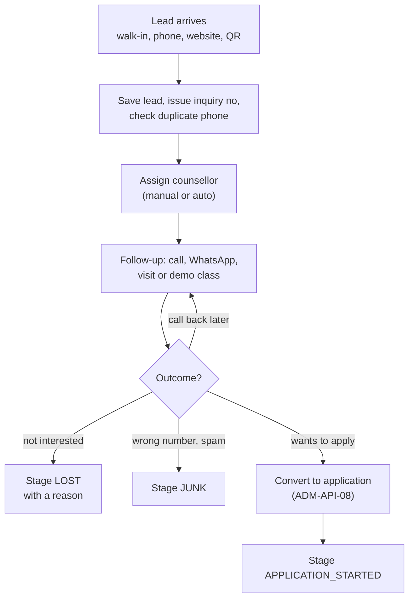
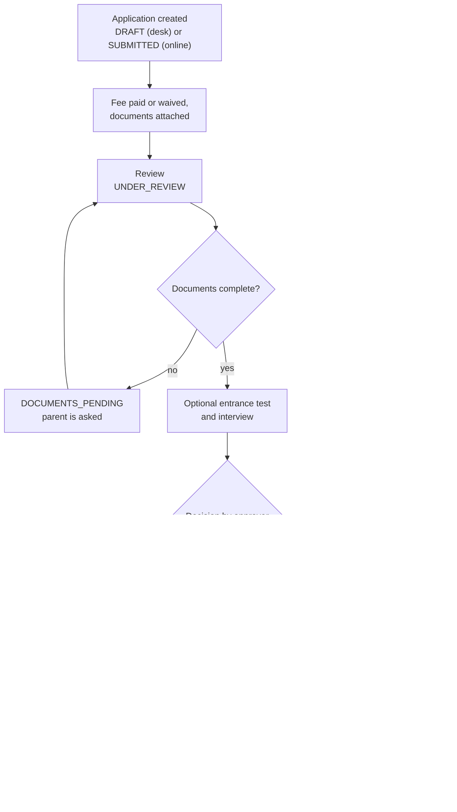
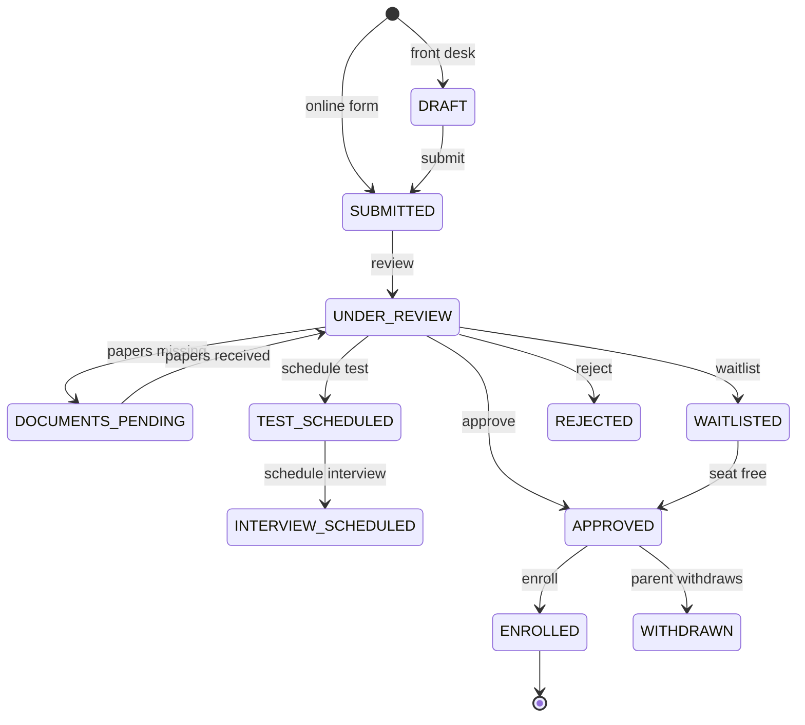
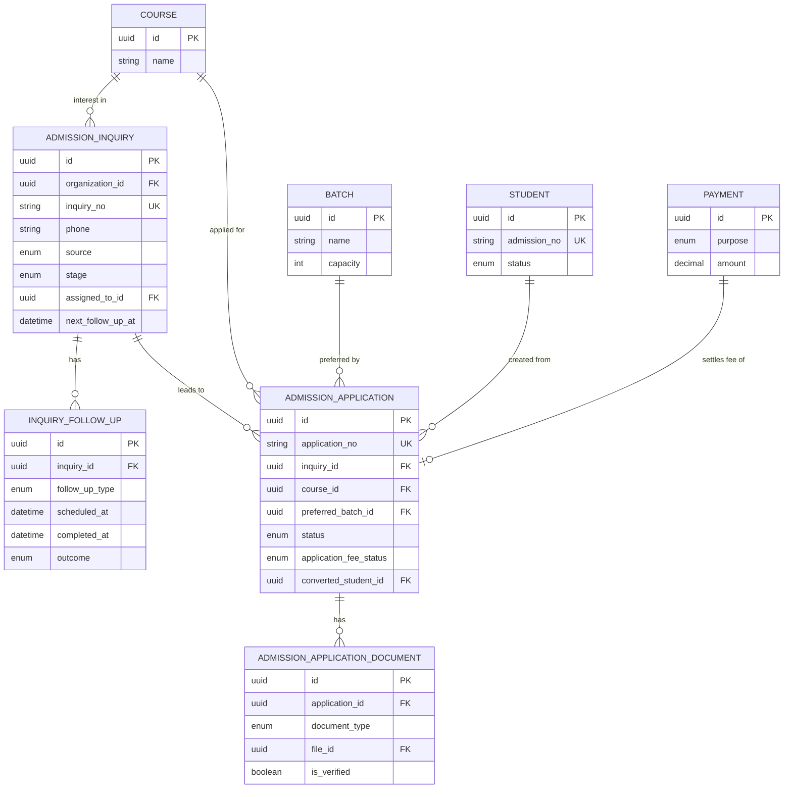

# Student Admission Module

**In simple words:** This module covers everything that happens before a child becomes a student. It records every inquiry (a family that asks about admission), reminds the counsellor to call back, takes the application form online or at the front desk, and lets the Principal approve, waitlist or reject. One click then turns an approved application into a student with an admission number, parents, a batch and copied documents. Without it, leads live in notebooks and the same data is typed three times.

| Item | Value |
|---|---|
| Module code | ADM |
| Release phase | Phase 1 (MVP) |
| Plans | Starter (no WhatsApp or SMS, fee at the counter only), Growth, Pro, Enterprise |
| Main users | Front Desk (custom role), Principal, Organization Admin, Accountant (read only), Parent (public form, no login) |
| Depends on | Organizations, Multi Campus, Batch, Student Profile, Settings, Payments, Notifications, shared file upload and import services |
| Main tables | admission_inquiries, inquiry_follow_ups, admission_applications, admission_application_documents |

## Objective

The module turns interest into admissions and loses no lead on the way. A lead (also called an inquiry) is one family asking about one child. In a coaching institute such as Sharma Classes a lead can become a student on the same day after a demo class. In a school such as Bright Future Public School the path is longer: form, documents, entrance test, decision, then admission.

Goals and how we measure them:

| Goal | Target |
|---|---|
| Add a walk-in lead | Under 60 seconds, 6 required fields |
| No lead without a next step | 100% of open leads have an owner; overdue follow-ups are visible on one screen |
| Data typed once | Lead fills the application; application fills student, guardians and enrollment |
| Approved application to student | One click, one database transaction, under 2 seconds |
| Parent can apply from a phone | Public form works on a 360 px screen, in English and Hindi |
| Owner sees what works | Funnel by source, counsellor and course, with conversion percent |

## Scope

### In scope

- Lead CRM (customer relationship management: a list of possible customers with their contact history): 11 sources, 11 stages, 3 priorities, notes, custom fields.
- Follow-ups: log a finished contact or plan a future one, with a reminder to the counsellor and a daily overdue list.
- Counsellor assignment by hand, in bulk, or automatically for website leads.
- Demo class booking for coaching institutes (`DEMO_SCHEDULED`, `DEMO_ATTENDED`).
- Public lead form and public application form on `{slug}.eduflow.app/apply`, with a shareable link and a printable QR code.
- Application fee: set per course, paid online or at the fee counter, waived with a reason.
- Document checklist per application, with upload and verification.
- Optional entrance test and interview with date, venue and score.
- Decision: approve, waitlist, reject with remarks, withdraw. Seat availability per batch.
- Conversion of an approved application into a student in one transaction.
- Duplicate detection on phone, name and date of birth, for leads, applications and students.
- Re-admission of a past student and progression of a current student through an application.
- Lead import from Excel, lead and application export, admission funnel report, application form PDF.

### Out of scope

- Editing the student after admission, the Excel import of existing students and direct admission without an application. See *Student Profile Module*.
- Creating batches and setting their capacity. See *Batch Module*.
- Fee structures, invoices and discounts. See *Fees Module* and *Discounts Module*.
- Gateway orders, webhooks, receipts and refunds. See *Payments Module*. This module only starts an application fee order and reads its result.
- Sending messages. This module emits events; *Notifications Module* and *WhatsApp Module* deliver them.
- Online entrance tests with questions and automatic marking. Only the date, venue and score are stored here.
- Lottery draws for RTE seats (the 25% free seats under the Right to Education Act). The quota is recorded; the draw is done outside EduFlow.
- Marketing automation: drip campaigns, ad platform integrations, lead scoring by machine learning.

### Phase notes

| Phase | What arrives |
|---|---|
| Phase 1 | All 43 endpoints of this chapter. Online application fee payment needs Growth or higher and Razorpay |
| Phase 2 | Email and SMS channels for the same events; deeper funnel in *Analytics Module* (`ANL-API-26`) |
| Phase 4 | Stripe for the application fee outside India; lead conversion hints in *AI Insights Module* |

## User Stories

"Front Desk user" means a person with the *Front Desk* role preset, for example the counsellor Neha Singh at Bright Future Public School.

| ID | As a | I want to | So that | Priority |
|---|---|---|---|---|
| ADM-US-01 | Front Desk user | add a walk-in or phone lead in under a minute | no inquiry is lost on a busy day | Must |
| ADM-US-02 | Front Desk user | see a warning when the phone number already exists | I do not call the same family twice as a new lead | Must |
| ADM-US-03 | Front Desk user | log each call and plan the next one with a reminder | I follow up on time | Must |
| ADM-US-04 | Front Desk user | open one list of follow-ups due today and overdue | I know whom to call first | Must |
| ADM-US-05 | Principal | assign many leads to a counsellor at once | work is shared fairly | Should |
| ADM-US-06 | Centre head (coaching) | book a free demo class for a lead and mark attendance | the student can try before paying | Should |
| ADM-US-07 | Parent | fill the admission form on my phone from a link or QR code | I do not have to visit the school to apply | Must |
| ADM-US-08 | Parent | pay the application fee online and track my application | I know where it stands without calling | Should |
| ADM-US-09 | Front Desk user | turn a lead into a prefilled application | I never type the same data twice | Must |
| ADM-US-10 | Front Desk user | tick off required documents and verify them | incomplete files are caught early | Must |
| ADM-US-11 | Principal | see free seats per batch before I decide | I never approve more children than seats | Must |
| ADM-US-12 | Principal | approve, waitlist or reject with remarks | the decision and its reason are on record | Must |
| ADM-US-13 | Front Desk user | convert an approved application into a student in one click | the student gets an admission number, batch and parent link at once | Must |
| ADM-US-14 | Front Desk user | re-admit a student who left earlier | the old admission number and history are kept | Should |
| ADM-US-15 | Organization Admin | see the funnel by source and counsellor | I spend on the sources that bring admissions | Must |

## Workflow

The module has two connected pipelines. The lead pipeline ends when the family applies or is lost. The application pipeline ends with a student or a closed application.

**Figure: Lead pipeline**



Each lead always has one current stage and, while it is open, one next follow-up. Lost and junk leads stay in the database for the funnel report.

1. A lead is saved through `ADM-API-02` (staff), `ADM-API-39` (website form or QR) or `ADM-API-33` (Excel import). The inquiry number comes from the `INQUIRY_NO` sequence.
2. The phone is normalised to E.164 (the international form, for example `+919839012345`). Other open leads, applications and students with the same phone are returned as a warning (`ADM-BR-03`).
3. A staff lead belongs to its creator. A website lead is assigned automatically when auto-assignment is on (`ADM-BR-04`). The Principal can reassign in bulk (`ADM-API-12`).
4. The counsellor logs contacts and plans the next one (`ADM-API-09`). A planned follow-up creates a delayed reminder job. The lead's `lastContactedAt`, `nextFollowUpAt` and `stage` are updated in the same transaction.
5. For a demo class the counsellor picks a batch and a time (`ADM-API-07`). After the class she marks attendance on the lead.
6. When the family wants to apply, `ADM-API-08` creates a `DRAFT` application with the lead's data and moves the lead to `APPLICATION_STARTED`.
7. When that application is enrolled, the system sets the lead to `CONVERTED`. No user can set `CONVERTED` by hand.

**Figure: Application pipeline**



1. A front-desk application starts as `DRAFT` (`ADM-API-14`) and is submitted with `ADM-API-18`. An online application (`ADM-API-40`) is saved directly as `SUBMITTED`. Both record the guardian's consent.
2. The application fee is copied from the settings when the application is created (`ADM-BR-08`). The parent pays online (`ADM-API-42`) or at the fee counter; the Principal may waive it (`ADM-API-26`).
3. The reviewer attaches and verifies documents (`ADM-API-29`, `ADM-API-31`). Missing papers move the application to `DOCUMENTS_PENDING` and the parent gets a message (`ADM-API-19`).
4. The institute may schedule an entrance test (`ADM-API-20`) and an interview (`ADM-API-21`). The score is saved with `ADM-API-16`.
5. A user with `admissions.approve` checks the seats (`ADM-API-37`) and approves, waitlists or rejects (`ADM-API-22` to `ADM-API-24`). Approval needs a free seat in the chosen batch (`ADM-BR-10`).
6. A user with `admissions.enroll` converts the approved application (`ADM-API-27`). The steps of that transaction are listed in `ADM-BR-13`.

### Lead stage lifecycle

| Stage | Meaning | Set by | Open? |
|---|---|---|---|
| `NEW` | Saved, nobody has spoken to the family yet | Create, import, website form | Yes |
| `CONTACTED` | First contact made | Follow-up or `ADM-API-06` | Yes |
| `FOLLOW_UP` | In conversation; a next contact is planned | Follow-up or `ADM-API-06` | Yes |
| `VISIT_SCHEDULED` | Campus visit booked | Follow-up outcome `VISIT_BOOKED` | Yes |
| `VISITED` | Family has seen the campus | Follow-up type `VISIT` completed | Yes |
| `DEMO_SCHEDULED` | Coaching: free demo class booked | `ADM-API-07` | Yes |
| `DEMO_ATTENDED` | Demo class attended | `ADM-API-04` with `demoAttended = true` | Yes |
| `APPLICATION_STARTED` | An application exists for this lead | `ADM-API-08`, system | Yes |
| `CONVERTED` | The application was enrolled | System only | No (final) |
| `LOST` | Family said no; `lostReason` required | `ADM-API-06` | No (can be reopened) |
| `JUNK` | Wrong number, spam, test entry | `ADM-API-06` | No (can be reopened) |

Open stages may move in any direction, because real conversations do not follow a straight line. `LOST` and `JUNK` can be reopened to `FOLLOW_UP` or `NEW`. `CONVERTED` never changes.

### Application status lifecycle

**Figure: Application status changes**



The diagram shows the main path. The table below is complete.

| Status | Meaning | Allowed next statuses |
|---|---|---|
| `DRAFT` | Being typed at the front desk; can be deleted | `SUBMITTED` |
| `SUBMITTED` | Complete form received; consent recorded | `UNDER_REVIEW`, `DOCUMENTS_PENDING`, `TEST_SCHEDULED`, `INTERVIEW_SCHEDULED`, `APPROVED`, `WAITLISTED`, `REJECTED`, `WITHDRAWN` |
| `UNDER_REVIEW` | Office is checking the form and papers | Same as `SUBMITTED`, except itself |
| `DOCUMENTS_PENDING` | Parent must bring or upload papers | `UNDER_REVIEW`, `TEST_SCHEDULED`, `INTERVIEW_SCHEDULED`, `APPROVED`, `WAITLISTED`, `REJECTED`, `WITHDRAWN` |
| `TEST_SCHEDULED` | Entrance test date given | `UNDER_REVIEW`, `INTERVIEW_SCHEDULED`, `APPROVED`, `WAITLISTED`, `REJECTED`, `WITHDRAWN` |
| `INTERVIEW_SCHEDULED` | Interview date given | `UNDER_REVIEW`, `APPROVED`, `WAITLISTED`, `REJECTED`, `WITHDRAWN` |
| `APPROVED` | Seat offered and held | `ENROLLED`, `WITHDRAWN`, `REJECTED` (approval revoked, remarks required) |
| `WAITLISTED` | Suitable, but no seat now | `UNDER_REVIEW`, `APPROVED`, `REJECTED`, `WITHDRAWN` |
| `REJECTED` | Not admitted; remarks required | None (final). The family may apply again with a new application |
| `WITHDRAWN` | Parent cancelled | None (final) |
| `ENROLLED` | Student created or re-admitted | None (final) |

Any other change answers `422 BUSINESS_RULE_VIOLATION` with the message "An application in status {status} cannot move to {target}."

## Screens and Wireframes

| ID | Screen | Users | Purpose |
|---|---|---|---|
| ADM-S01 | Leads | Front Desk, Principal, Org Admin | List with stage counters, filters, bulk assign, import, export |
| ADM-S02 | Add or Edit Lead | Front Desk | Dialog with 6 required fields, duplicate warning, consent tick |
| ADM-S03 | Lead Detail | Front Desk, Principal | Stage bar, timeline of follow-ups, demo booking, convert |
| ADM-S04 | Follow-ups Today | Front Desk | Due and overdue follow-ups of the signed-in user; works on a phone |
| ADM-S05 | Applications | Front Desk, Principal, Accountant (read only) | List by status, course, session and fee status |
| ADM-S06 | Application Detail and Review | Front Desk, Principal | Form data, document checklist, fee, test, seats, decision |
| ADM-S07 | New Application | Front Desk | Four steps: student, guardians, previous school, documents |
| ADM-S08 | Enroll Student | Front Desk, Principal | Conversion dialog: batch, date, guardian match, fees, invitation |
| ADM-S09 | Seats and Waitlist | Principal, Org Admin | Capacity, enrolled, held, free and waitlisted per batch |
| ADM-S10 | Public Application Form | Parent (no login, mobile) | Four-step form with consent, documents and fee payment |
| ADM-S11 | Track Application | Parent (no login, mobile) | Status, pending documents, fee payment, test date |
| ADM-S12 | Admission Funnel | Principal, Org Admin | Funnel by stage, source and counsellor with conversion percent |
| ADM-S13 | Online Form Settings | Org Admin | Switch the form on, open courses, fee, required documents, link and QR poster |

**Screen ADM-S01 — Leads (Front Desk, web)**

```text
+--------------------------------------------------------------------------+
| EduFlow | Bright Future Public School    [Search leads...]      (NS) v   |
+--------------+-----------------------------------------------------------+
| Dashboard    | Admissions > Leads              [Import]  [+ Add Lead]    |
| Admissions   +-----------------------------------------------------------+
|  Leads <     | Stage [Open v]  Source [All v]  Owner [Me v]  [x] Due     |
|  Follow-ups  | New 14 | Contacted 22 | Follow-up 31 | Visited 9 | Lost 6 |
|  Applications+-----------------------------------------------------------+
|  Seats       | Lead no   Student       Course    Pri   Stage      Next   |
|  Funnel      | INQ-0318  Aarav Sharma  Class 10  HOT   VISITED    Today  |
| Students     | INQ-0321  Riya Singh    Class 10  WARM  FOLLOW_UP  Today  |
| Fees         | INQ-0322  Kabir Khan    Class 8   WARM  CONTACTED  Overdue|
| Settings     | INQ-0325  Meera Joshi   Class 6   COLD  NEW        -      |
|              | INQ-0326  Arjun Verma   Class 10  HOT   NEW (dup)  -      |
|              +-----------------------------------------------------------+
|              | Selected 0  [Assign to v]  [Export]    < 1 2 3 >  20/page |
+--------------+-----------------------------------------------------------+
```

- The list calls `ADM-API-01`. The stage counters come from `ADM-API-36`. "Due" sets the filter `followUpDue=true`.
- "Overdue" is shown in red when `nextFollowUpAt` is in the past. "(dup)" marks a lead whose phone matches another record.
- [+ Add Lead] opens ADM-S02 and calls `ADM-API-02`. [Import] starts the shared import wizard (`ADM-API-33`).
- [Assign to] calls `ADM-API-12` and is hidden without `admissions.manage`. [Export] calls `ADM-API-34` and is hidden without `admissions.export`.

**Screen ADM-S03 — Lead Detail (Front Desk, web)**

```text
+--------------------------------------------------------------------------+
| EduFlow | Bright Future Public School    [Search leads...]      (NS) v   |
+--------------+-----------------------------------------------------------+
| Dashboard    | Leads > INQ-2027-0318           [Edit]  [Change stage v]  |
| Admissions   +-----------------------------------------------------------+
|  Leads <     | Aarav Sharma, Class 10 (2027-28)          Priority: HOT   |
|  Follow-ups  | Parent: Sunita Devi (Mother)   +91 98390 12345            |
|  Applications| Source: WALK_IN   Owner: Neha Singh   Consent: Yes 12 Feb |
|  Seats       | NEW > CONTACTED > FOLLOW_UP > [VISITED] > APPLICATION     |
|  Funnel      +-----------------------------------------------------------+
| Students     | Timeline                            [+ Log follow-up]     |
| Fees         | 18 Mar 16:00  CALL   planned             [Done] [Move]    |
| Settings     | 20 Feb 11:00  VISIT  done: INTERESTED    Neha Singh       |
|              | 15 Feb 11:30  CALL   done: VISIT_BOOKED  Neha Singh       |
|              | 12 Feb 09:40  Lead created at the front desk              |
|              +-----------------------------------------------------------+
|              | [Schedule demo]  [Mark lost]   [Convert to application]   |
+--------------+-----------------------------------------------------------+
```

- Data comes from `ADM-API-03`. The timeline merges follow-ups, stage changes from the audit log and linked applications.
- [+ Log follow-up] calls `ADM-API-09`. [Done] and [Move] call `ADM-API-11` to complete or reschedule the planned call.
- [Change stage] and [Mark lost] call `ADM-API-06`. "Mark lost" asks for a reason from a list plus free text.
- [Schedule demo] (`ADM-API-07`) is shown only for organizations of type `COACHING` or `TRAINING_CENTRE`.
- [Convert to application] calls `ADM-API-08` and opens ADM-S07 with every known field filled.

**Screen ADM-S06 — Application Detail and Review (Principal, web)**

```text
+--------------------------------------------------------------------------+
| EduFlow | Bright Future Public School    [Search...]            (AV) v   |
+--------------+-----------------------------------------------------------+
| Dashboard    | Applications > APP-2027-0207      Status: UNDER_REVIEW    |
| Admissions   +-----------------------------------------------------------+
|  Leads       | Aarav Sharma  DOB 14 Aug 2012  Class 10, 2027-28  NEW     |
|  Follow-ups  | Parent: Sunita Devi +91 98390 12345  Lead: INQ-2027-0318  |
| Applications<| Application fee: Rs 500   PAID 18 Mar 2027   [Receipt]    |
|  Seats       +-----------------------------------------------------------+
|  Funnel      | Documents                 Status     | Seats in 10-A      |
| Students     | [x] Birth certificate     Verified   | Capacity      40   |
| Fees         | [x] Transfer certificate  Uploaded   | Enrolled      36   |
| Settings     | [x] Marksheet Class 9     Verified   | Held           2   |
|              | [ ] Photo                 Missing    | Free           2   |
|              | [Request documents]  [+ Attach]      | Waitlisted     3   |
|              +-----------------------------------------------------------+
|              | Entrance test 22 Mar 10:00, Room 4    Score [ 78 ] / 100  |
|              | Remarks [Good score. Sister Ananya is in Class 6.______]  |
|              +-----------------------------------------------------------+
|              | [Withdraw]  [Reject]  [Waitlist]   [Approve for 10-A v]   |
+--------------+-----------------------------------------------------------+
```

- Data comes from `ADM-API-15`; the seat panel from `ADM-API-37` for the application's course and session.
- The checklist rows come from the setting `admissions.required_documents`. [+ Attach] uploads through the shared file service, then calls `ADM-API-29`. A click on "Uploaded" verifies the file (`ADM-API-31`).
- [Request documents] calls `ADM-API-19` with `status = DOCUMENTS_PENDING`. The score field saves through `ADM-API-16`.
- The four decision buttons call `ADM-API-25`, `ADM-API-24`, `ADM-API-23` and `ADM-API-22`. Reject, Waitlist and Approve are hidden without `admissions.approve`. [Approve] is disabled while the fee is `PENDING` or the chosen batch has no free seat.

**Screen ADM-S08 — Enroll Student (Front Desk, web dialog)**

```text
+--------------------------------------------------------------------------+
| EduFlow | Bright Future Public School    [Search...]            (NS) v   |
+--------------+-----------------------------------------------------------+
| Dashboard    | Enroll student - APP-2027-0207 (APPROVED)            [X]  |
| Admissions   +-----------------------------------------------------------+
|  Leads       | Student    Aarav Sharma, DOB 14 Aug 2012, Male            |
|  Follow-ups  | Batch      [10-A - 2 seats free v]   Roll no [ auto ]     |
| Applications<| Adm. date  [01-04-2027]              Quota [GENERAL v]    |
|  Seats       | Guardian   Sunita Devi (Mother) +91 98390 12345           |
|  Funnel      |            (i) Existing parent: mother of Ananya Sharma   |
| Students     |            [x] Link to this parent and family FAM-0087    |
| Fees         | Fees       [Class 10 Fees 2027-28 - Rs 53,000 v]          |
| Settings     | Portal     [x] Invite parent to the Parent Portal         |
|              | Documents  3 files will be copied to the student profile  |
|              +-----------------------------------------------------------+
|              | Next admission no: BF-2027-0142     Plan seat: available  |
|              |                    [Cancel]  [Enroll and open profile]    |
+--------------+-----------------------------------------------------------+
```

- The dialog reads the application (`ADM-API-15`), the seats (`ADM-API-37`) and the number preview (`SET-API-12`). The preview is a hint; the real number is issued inside the transaction.
- The "Fees" select is shown only to users who also hold `fees.create`. For others the Accountant assigns the structure later (`FEE-API-18`).
- [Enroll and open profile] calls `ADM-API-27`, then opens the student in *Student Profile Module*. On `409 CONFLICT` the dialog shows the possible duplicate with the buttons "Open existing" and "Enroll anyway".

**Screen ADM-S10 — Public Application Form (Parent, mobile web)**

```text
+------------------------------------+
| Bright Future Public School        |
| Admission form 2027-28             |
| Step 2 of 4: Student details       |
+------------------------------------+
| Class applying for *               |
| [Class 10                      v]  |
| Campus *                           |
| [Gomti Nagar                   v]  |
| Student first name *               |
| [Aarav_________________________]   |
| Last name                          |
| [Sharma________________________]   |
| Date of birth *      Gender *      |
| [14-08-2012]         [Male    v]   |
| Previous school                    |
| [City Montessori School________]   |
|                                    |
| Application fee: Rs 500            |
| [ ] I am the parent or guardian.   |
|     I agree to the privacy notice  |
|     (tap to read).                 |
|                                    |
| [Back]           [Save and next]   |
+------------------------------------+
| Language [English v]   Need help?  |
+------------------------------------+
```

- The page loads `ADM-API-38` for the open courses, campuses, custom fields, fee and consent text. It needs no login.
- Step 1 verifies the parent's phone with an OTP (`AUTH-API-02`). Step 4 uploads documents and submits.
- The consent box is never ticked in advance. Without it [Save and next] stays disabled.
- Submit calls `ADM-API-40`. Documents use `ADM-API-41`, the fee uses `ADM-API-42`. The last page shows the application number and the tracking link for ADM-S11 (`ADM-API-43`).
- Draft answers are kept in the browser's local storage, so a dropped mobile connection does not lose the form.

## UI Components

All components are built from shadcn/ui pieces and follow *Design System and UX Guidelines*.

| Component | Type | Behaviour |
|---|---|---|
| `LeadTable` | Data table | Server-side paging, sort and filters (`ADM-API-01`). Row click opens ADM-S03. Overdue dates in red. Checkbox column for bulk assign |
| `StageCounterBar` | Chip row | One chip per stage with its count (`ADM-API-36`). A click filters the table |
| `LeadFormDialog` | Dialog + React Hook Form + Zod | Six required fields first, "More details" collapsed. Consent checkbox is never ticked by default |
| `DuplicateWarning` | Inline alert | Appears 400 ms after the phone is typed (`ADM-API-01` with `q`). Lists matching leads, applications and students with links. Never blocks saving a lead |
| `FollowUpDialog` | Dialog | Tabs "Log done" and "Plan next". Outcome chips. Quick dates: Tomorrow, In 3 days, Next week |
| `StageBar` | Stepper | Shows the path of the lead; the current stage is highlighted; `LOST` and `JUNK` show as a red badge |
| `LeadTimeline` | Vertical list | Follow-ups, stage changes and applications, newest first |
| `ApplicationStepper` | Multi-step form | Four steps with per-step Zod schemas; "Save draft" on every step (`ADM-API-14`, `ADM-API-16`) |
| `DocumentChecklist` | List with upload | Required types first. States: Missing, Uploaded, Verified. Upload progress bar; file picker limited to PDF, JPG, PNG |
| `SeatPanel` | Card | Capacity, enrolled, held, free and waitlisted for each batch of the course. Free = 0 is red |
| `DecisionBar` | Button group + confirm dialog | Approve, Waitlist, Reject, Withdraw. Reject and Withdraw ask for remarks |
| `EnrollDialog` | Dialog | ADM-S08. Shows guardian match, number preview and plan seat state before the user confirms |
| `QrPosterCard` | Card | Builds the QR code of the form link in the browser and downloads an A4 poster as PDF or PNG |
| `FunnelChart` | Funnel + table | Stage counts with conversion percent; switch between source, counsellor and course |

States for every list and detail view:

- **Loading:** skeleton rows in tables, skeleton cards in detail views. Buttons that submit show a spinner and are disabled until the API answers.
- **Empty:** Leads: "No leads yet. Add your first lead or share your online form." with the buttons [+ Add Lead] and [Get form link]. Follow-ups Today: "Nothing due. Well done."
- **Error:** inline red alert with the API `message` and the `requestId`, plus [Try again]. Field errors from `details` appear under the matching field.
- **No permission:** action buttons are hidden, not disabled, when the key is missing. The Accountant sees ADM-S05 and ADM-S06 without any action button.

## Validation Rules

The same Zod schemas live in the `shared/` workspace and run in the browser and in the API.

| Field | Rule | Error message shown to user |
|---|---|---|
| `studentFirstName` | Required, 1 to 80 characters, letters, spaces, dot, hyphen, apostrophe | Enter the student's first name (letters only, up to 80 characters). |
| `studentLastName` | Optional, up to 80 characters, same characters | Last name can have letters only, up to 80 characters. |
| `guardianName` | Required, 2 to 160 characters | Enter the parent or guardian name. |
| `phone` | Required; valid mobile number for the organization's country; saved as E.164 | Enter a valid 10-digit mobile number. |
| `alternatePhone` | Optional; valid; different from `phone` | Alternate number must be valid and different from the main number. |
| `email` | Optional; valid email, up to 255 characters | Enter a valid email address. |
| `dateOfBirth` (lead) | Optional; real date; not in the future | Date of birth cannot be in the future. |
| `dateOfBirth` (application) | Required to submit; age 2 to 60 years on the session start date | Enter a valid date of birth. The student must be between 2 and 60 years old. |
| `gender` (application) | Required to submit; one of `Gender` | Select the gender. |
| `campusId` | Required; ACTIVE campus the user can access | Select a campus you have access to. |
| `courseId` | Lead: optional. Application: required, ACTIVE, offered at the campus | Select the class or course. |
| `academicYearId` | Application: required; status `PLANNED` or `ACTIVE` | Select an open session. Closed sessions cannot take admissions. |
| `preferredBatchId` | Optional; batch of the same course, session and campus; status `PLANNED` or `ACTIVE` | This batch does not belong to the selected class and session. |
| `source` | One of `LeadSource`; default `WALK_IN` | Select how the family heard about us. |
| `sourceDetail` | Optional, up to 200 characters; required when `source = REFERRAL` | Enter who referred this family. |
| `lostReason` | Required when the stage becomes `LOST`; 3 to 255 characters | Tell us why this lead was lost. |
| Follow-up `scheduledAt` | Required for a planned follow-up; in the future; within 365 days | Pick a future date and time within one year. |
| Follow-up `outcome` | Required when `completedAt` is set and type is not `NOTE` | Select the outcome of this contact. |
| `demoAt`, `demoBatchId` | Both required together; `demoAt` in the future; batch ACTIVE in the same campus | Pick a demo batch and a future time. |
| `consent` (application) | Must be `true` to submit | Please confirm that you are the parent or guardian and accept the privacy notice. |
| `entranceTestMaxScore` | Greater than 0, up to 9999.99 | Maximum score must be more than 0. |
| `entranceTestScore` | 0 to `entranceTestMaxScore`; two decimals | Score must be between 0 and {maxScore}. |
| `entranceTestAt`, `interviewAt` | In the future when scheduled | Pick a future date and time. |
| `decisionRemarks` | Required for reject, revoke and withdraw; 5 to 500 characters | Add remarks of at least 5 characters. |
| Waive `reason` | Required; 5 to 255 characters | Give a reason for waiving the application fee. |
| Document file | PDF, JPG or PNG; up to 5 MB; at most 15 documents per application | Upload a PDF, JPG or PNG file up to 5 MB. |
| `admissionDate` (enroll) | Required; not in the future; not before `dateOfBirth` | Admission date cannot be in the future or before the date of birth. |
| Bulk assign `inquiryIds` | 1 to 200 ids | Select between 1 and 200 leads. |
| Import file | `.xlsx` or `.csv`, up to 10 MB and 5,000 rows | Upload an .xlsx or .csv file up to 10 MB and 5,000 rows. |
| `captchaToken` (public) | Required; verified with the captcha provider | Please complete the "I am not a robot" check. |

## Business Rules

The module reads its settings from the group `admissions` in `organization_settings`. They are edited on ADM-S13 through `SET-API-02` and `SET-API-03`. A campus may override any key.

| Setting key | Default | Meaning |
|---|---|---|
| `admissions.online_form_enabled` | `false` | Switches the public form and the public lead form on |
| `admissions.open_academic_year_id` | none | Session the public form admits to |
| `admissions.open_course_ids` | empty list | Courses shown on the public form |
| `admissions.application_fee` | `{ "default": 0, "byCourse": {} }` | Application fee in the organization's currency |
| `admissions.required_documents` | `{ "default": ["BIRTH_CERTIFICATE", "PHOTO"], "byCourse": {} }` | Document checklist |
| `admissions.seat_hold_days` | `7` | Days an approved application holds a seat |
| `admissions.auto_assign` | `OFF` | `OFF` or `LEAST_OPEN` for website leads |
| `admissions.counsellor_user_ids` | empty list | Users who receive auto-assigned leads |
| `admissions.invite_guardian_on_enroll` | `true` | Create a Parent Portal invitation at conversion |
| `admissions.retention_months` | `12` | Months after closure before personal data is erased |

**ADM-BR-01 — Inquiry and application numbers.** `inquiryNo` comes from the `NumberSequence` of type `INQUIRY_NO` and `applicationNo` from `APPLICATION_NO`. The service locks the row (`SELECT ... FOR UPDATE`), formats the value and adds 1 inside the create transaction. The admission number is not issued here. It is issued only at conversion (`ADM-BR-13`), so a rejected application never uses one.

> **Example:** Bright Future uses prefix `INQ`, format `{PREFIX}-{YYYY}-{SEQ}`, pad length 4, reset policy `CALENDAR_YEAR` and `nextValue = 318`. The lead for Aarav on 12 February 2027 gets `INQ-2027-0318`. His application on 18 March gets `APP-2027-0207` from the `APP` series.

**ADM-BR-02 — Phone format.** Every phone is normalised to E.164 with the organization's country as the default. `98390 12345` and `09839012345` both become `+919839012345`. All duplicate checks use the normalised value.

**ADM-BR-03 — Duplicate detection.** There are three levels.

1. **Phone match (warning).** On lead create and update the API looks for the same phone on other leads in an open stage, on applications that are not final and on guardians. Matches are returned in `data.duplicates`. The lead is always saved, because one parent may ask about two children.
2. **Same child applied twice (block).** An application is a duplicate when the phone, the first name (case ignored), the date of birth and the academic year match another application that is not `REJECTED`, `WITHDRAWN` or deleted. The API answers `409 CONFLICT`. Staff may resend with `allowDuplicate: true`. The public form never allows it; the message tells the parent to track the existing application.
3. **Same child already a student (block).** At conversion the duplicate rule of *Student Profile Module* (`STU-BR-03`: first name, date of birth and a guardian phone) runs. `409 CONFLICT` unless `allowDuplicate: true`.

> **Example:** Sunita Devi (`+919839012345`) is already the guardian of Ananya Sharma. The new lead for Aarav is saved, and `duplicates` lists one guardian match. That is level 1: a hint that this is a sibling, not an error. If a second online form for "aarav", born 14 August 2012, arrives from the same phone for 2027-28, level 2 blocks it.

**ADM-BR-04 — Owner and auto-assignment.** A lead created by staff is assigned to its creator unless `assignedToId` is sent. A website lead is unassigned when `admissions.auto_assign = OFF`. With `LEAST_OPEN` it goes to the user in `admissions.counsellor_user_ids` who has access to the lead's campus and has the fewest leads in an open stage. On a tie, the user whose latest assignment is oldest wins. The assignee must be an ACTIVE staff user with `admissions.update`.

> **Example:** Neha Singh has 41 open leads and Amit Tiwari has 38. A website lead for the Gomti Nagar campus goes to Amit. He now has 39.

**ADM-BR-05 — Follow-ups keep the lead in sync.** A follow-up is either done (`completedAt` set, `outcome` required) or planned (`scheduledAt` in the future, `completedAt` empty). After every write the service recomputes, in the same transaction:

- `lastContactedAt` = latest `completedAt` among follow-ups whose type is not `NOTE`;
- `nextFollowUpAt` = earliest `scheduledAt` among planned follow-ups, or empty;
- `stage`, when the client does not send `stageAfter`: the first real contact moves `NEW` to `CONTACTED`; outcome `INTERESTED` or `CALL_BACK_LATER` moves `NEW` or `CONTACTED` to `FOLLOW_UP`; `VISIT_BOOKED` sets `VISIT_SCHEDULED`; `DEMO_BOOKED` sets `DEMO_SCHEDULED`; a completed `VISIT` sets `VISITED`; a completed `DEMO_CLASS` sets `DEMO_ATTENDED` and `demoAttended = true`. `NO_RESPONSE` and `NOT_INTERESTED` never change the stage alone; the screen proposes "Mark lost".

The stage that results is stored in `stageAfter` of the follow-up. A planned follow-up is overdue when `scheduledAt` is in the past. One request may log a done contact and plan the next one; two rows are written.

> **Example:** On 15 February at 11:30 Neha logs a `CALL` with outcome `VISIT_BOOKED` and plans a `VISIT` for 20 February 11:00. Aarav's lead gets `lastContactedAt = 15 Feb 11:30`, `nextFollowUpAt = 20 Feb 11:00` and stage `VISIT_SCHEDULED`. A reminder job is set for 20 February 10:45.

**ADM-BR-06 — Closing a lead.** `LOST` needs `lostReason`. When a lead becomes `LOST`, `JUNK` or `CONVERTED`, its planned follow-ups are deleted (they never happened), their reminder jobs are removed and `nextFollowUpAt` is cleared. Reopening sets the stage the user picks and keeps `lostReason` for history.

**ADM-BR-07 — Consent.** `consentToContact` is `false` until the parent clearly agrees. Without it, staff may still return the parent's own call, but no WhatsApp, SMS or email goes to the lead. An application cannot be submitted without the guardian's consent for the child's data. The API stores `consentAt`, `consentSource` and `consentIp` on the application and writes a `ConsentRecord`: type `CHILD_DATA_PROCESSING` when the applicant is under 18, else `DATA_PROCESSING`. The record keeps the exact `policyDocumentId` that was shown. Verification is `OTP` for the online form and `IN_PERSON` or `SIGNED_FORM` at the desk. At conversion the record is linked to the new `studentId` and `guardianId`. The legal basis is in *Privacy and Compliance*.

**ADM-BR-08 — Application fee.** Amount = `byCourse[courseId]` if present, else `default`. The amount and the organization's currency are copied to the application when it is created; later setting changes do not touch existing applications. Amount 0 gives `NOT_REQUIRED`; any other amount gives `PENDING`.

- Counter: the Accountant records it with `PAY-API-02`, `purpose = APPLICATION_FEE` and `admissionApplicationId`. Online: `ADM-API-42` creates the gateway order. In both cases *Payments Module* sets `PAID`, `applicationFeePaidAt` and `applicationFeePaymentId` in the payment transaction and emits `admission.application.fee_paid`.
- `ADM-API-26` changes `PENDING` to `WAIVED`. The reason is stored in the audit log.
- `REFUNDED` is set by *Payments Module* when a refund of type `APPLICATION_FEE` completes.
- An application with a `PENDING` fee cannot be approved or enrolled. The fee is separate income: it is never adjusted against the admission fee or tuition.

> **Example:** Bright Future sets `default = 500` and `byCourse = { Class 11: 1000 }`. Aarav applies for Class 10, so his application stores ₹500 and `PENDING`. Suresh Gupta collects ₹500 in cash on 18 March; the status becomes `PAID` and the receipt is linked. Sharma Classes keeps the default 0, so every application is `NOT_REQUIRED`.

**ADM-BR-09 — Document checklist.** Required types = `byCourse[courseId]` if present, else `default`; `TRANSFER_CERTIFICATE` is added when `admissionType = TRANSFER_IN`. Each required type is Missing (no row), Uploaded (row exists) or Verified (`isVerified = true`). Approval answers `422` while a required type is Missing, unless the approver sends `allowMissingDocuments: true`; the missing types are then written to the audit log. Removing a document deletes the row; the file itself is purged by the file service.

**ADM-BR-10 — Seat availability.** For each batch of the course, session and campus:

```text
enrolled = ACTIVE enrollments of the batch (not deleted)
held     = APPROVED applications with preferredBatchId = batch
           and reviewedAt + seat_hold_days >= now
free     = capacity - enrolled - held      (never below 0)
```

A batch with `capacity = null` has no cap and `free` is returned as `null`. Approval needs a `batchId` with `free >= 1` (or no cap). The batch is saved as `preferredBatchId`. When the hold ends, the application stays `APPROVED` but no longer counts as held; conversion checks the capacity again. To admit above capacity, a user with `batches.update` first raises the capacity in *Batch Module*. This keeps one number as the truth.

> **Example:** Batch 10-A has capacity 40, 36 active enrollments and 2 approved applications inside the hold period. Free = 40 - 36 - 2 = 2. Aarav is approved on 27 March 2027 with a 7-day hold, so his seat is held until 3 April. Now held = 3 and free = 1. He is enrolled on 1 April: enrolled = 37, held = 2, and free stays 40 - 37 - 2 = 1.

**ADM-BR-11 — Waitlist.** The position is computed when read: rank among `WAITLISTED` applications of the same course, session and campus, ordered by `reviewedAt`, oldest first. An application with `siblingStudentId` shows a "Sibling" badge; the order does not change, the approver decides. When a seat becomes free (withdrawal, revoked approval, ended hold, ended enrollment or higher capacity) and the course has a waitlist, approvers get an in-app notice. Nothing is approved automatically.

> **Example:** Three applications were waitlisted for Class 10 on 20, 21 and 23 March. Their positions are 1, 2 and 3. When the first is approved, the others move to 1 and 2.

**ADM-BR-12 — Decisions.** Approve, waitlist and reject store `reviewedById`, `reviewedAt` and `decisionRemarks`. Remarks are for staff only. The parent's message is neutral and never contains remarks or the test score. Revoking an approval (`APPROVED` to `REJECTED`) frees the held seat at once.

**ADM-BR-13 — Conversion in one transaction.** `ADM-API-27` runs these steps in one PostgreSQL transaction. Any failure rolls everything back, so no admission number is used and no half student exists.

1. Lock the application row. It must be `APPROVED` with a fee status other than `PENDING`. An `ENROLLED` application answers `409 CONFLICT` with the existing `convertedStudentId`.
2. Check the plan's student limit (`STU-BR-02`). No free plan seat answers `403 PLAN_LIMIT_REACHED`.
3. Lock the batch row and count active enrollments against the capacity.
4. Run the student duplicate check (`ADM-BR-03`, level 3).
5. For each guardian in the form data (1 to 3), link the guardian with the same phone or create a new one, then create `StudentGuardian`. Exactly one guardian is primary. Siblings join one `Family` (`STU-BR-05`, `STU-BR-06`).
6. Issue the admission number from the `ADMISSION_NO` sequence (`STU-BR-01`).
7. Create the `Student` from the form data with `admissionType`, `admissionQuota`, `admissionDate` and `admittedCourseId`. Create the `Enrollment`, set `currentBatchId` and write the first `StudentStatusHistory` row.
8. Copy every application document to `StudentDocument`. The copy points to the same `fileId`, so no file is duplicated in S3. Verified flags are kept.
9. Copy custom field values whose key exists for both inquiries or applications and students.
10. If `feeStructureId` is sent, create a `StudentFeeAssignment` with `startDate` = enrollment date. The caller must also hold `fees.create`. The structure must be ACTIVE, belong to the same session and match the course or be generic. Overrides are not possible here; see *Fees Module*.
11. If `inviteGuardian` is `true` and the primary guardian has no login, create an `Invitation` (`userType = PARENT`, system PARENT role, `linkedEntity = Guardian`). Its message is sent after commit. See *Authentication and Sessions*.
12. Set the application to `ENROLLED` with `convertedStudentId` and `convertedAt`. Set the linked lead to `CONVERTED`. Link the consent record.

After commit the API emits `admission.application.enrolled`, `student.admitted` and `student.enrolled`. The welcome message to the parent belongs to `student.admitted`, so the parent does not get two messages.

```typescript
// server/src/modules/admissions/enroll.service.ts (shortened)
export async function enrollApplication(ctx: RequestContext, id: string, input: EnrollInput) {
  const result = await prisma.$transaction(async (tx) => {
    const [app] = await tx.$queryRaw<{ id: string; status: string; fee: string }[]>`
      SELECT id, status, application_fee_status AS fee
      FROM admission_applications
      WHERE id = ${id}::uuid AND organization_id = ${ctx.orgId}::uuid AND deleted_at IS NULL
      FOR UPDATE`;
    if (!app) throw new AppError(404, 'NOT_FOUND', 'Application not found');
    if (app.status === 'ENROLLED') throw new AppError(409, 'CONFLICT', 'Already enrolled');
    if (app.status !== 'APPROVED' || app.fee === 'PENDING') {
      throw new AppError(422, 'BUSINESS_RULE_VIOLATION', 'Only an approved application can be enrolled');
    }
    await assertPlanSeat(tx, ctx.orgId);                          // step 2
    await lockBatchAndCheckCapacity(tx, ctx.orgId, input.batchId); // step 3
    const application = await tx.admissionApplication.findUniqueOrThrow({
      where: { id },
      include: { documents: true },
    });
    const student = await createStudentFromApplication(tx, ctx, application, input); // steps 4-9
    if (input.feeStructureId) await assignFeeStructure(tx, ctx, student, input);    // step 10
    const invitation = input.inviteGuardian ? await inviteGuardian(tx, ctx, student) : null;
    await tx.admissionApplication.update({
      where: { id },
      data: { status: 'ENROLLED', convertedStudentId: student.id, convertedAt: new Date() },
    });
    if (application.inquiryId) {
      await tx.admissionInquiry.update({
        where: { id: application.inquiryId },
        data: { stage: 'CONVERTED', nextFollowUpAt: null },
      });
    }
    return { student, invitation };
  }, { timeout: 10_000 });
  await eventBus.publish('admission.application.enrolled', {
    organizationId: ctx.orgId,
    applicationId: id,
    studentId: result.student.id,
  });
  return result;
}
```

**ADM-BR-14 — Re-admission, progression and transfer in.** `admissionType` decides what conversion does.

| Type | Needs | What conversion does |
|---|---|---|
| `NEW` | Nothing extra | Creates a new student (`ADM-BR-13`) |
| `TRANSFER_IN` | Previous school in the form data; transfer certificate on the checklist | Creates a new student; `previousSchool` and `previousTcNo` are filled |
| `RE_ADMISSION` | `existingStudentId` of a student in a leaving status | No new student. Runs the readmission of `STU-BR-10`: status `ACTIVE`, same admission number, `readmittedOn` set. Adds the enrollment. Needs a plan seat. An `EXPELLED` student needs the ORG_ADMIN |
| `INTERNAL_PROGRESSION` | `existingStudentId` of an `ACTIVE` student | Only adds an enrollment in the new session, for example Class 10 to Class 11 Science. No plan seat, no new number |

When an application is created, the API searches students in a leaving status with the same first name and date of birth. Matches are returned in `data.returningStudentMatches`, and ADM-S07 offers "This looks like a former student. Re-admit?". In both existing-student cases `convertedStudentId` = `existingStudentId`.

> **Example:** Kabir Khan left Bright Future in March 2025 with a transfer certificate. His admission number was `BF-2023-0067`. In 2027 his family returns for Class 8. The desk picks him as the existing student. After conversion he is `ACTIVE` again with `BF-2023-0067`, `readmittedOn = 2027-04-01` and a new enrollment in 8-B. His old fee receipts and report cards are still on his profile.

**ADM-BR-15 — Public form safety.** The public endpoints work only when `admissions.online_form_enabled` is `true`; otherwise they answer `404 NOT_FOUND`. The tenant comes from the host `{slug}.eduflow.app`. Protection, in order: a captcha token (Cloudflare Turnstile; an assumption of this chapter), a hidden honeypot field that must stay empty, at most 10 submissions per IP address per hour and 3 applications per phone per day (`429 RATE_LIMITED`), and a phone OTP for the application (`AUTH-API-02`, purpose `VERIFY_PHONE`). After submit the API returns a tracking token: a signed value (HMAC-SHA256) that holds the application id, the organization id and an expiry of 180 days. It travels in the header `X-Tracking-Token`. The tracking link puts it after `#` in the URL, so it never reaches server logs. The token opens only that one application and only the three public follow-up endpoints. The status answer never contains remarks, scores of other children or staff names.

**ADM-BR-16 — Funnel numbers.** All numbers use leads created inside the chosen date range that are not deleted.

```text
valid leads         = leads - JUNK leads
lead conversion %   = CONVERTED leads / valid leads x 100   (1 decimal)
application rate %  = leads with an application / valid leads x 100
enrolment rate %    = ENROLLED applications / submitted applications x 100
days to convert     = average of (convertedAt - lead createdAt) in days
```

> **Example:** Sharma Classes, February 2027: 120 leads, 8 junk, so 112 valid. 28 are converted: 28 / 112 = 25.0%. By source: `REFERRAL` 30 leads, 0 junk, 12 converted = 40.0%. `GOOGLE_ADS` 50 leads, 6 junk, 7 converted = 7 / 44 = 15.9%. Rajesh Sharma sees that referrals convert more than twice as well as ads.

**ADM-BR-17 — Edit and delete limits.** A lead can be soft deleted only when it has no application, or only deleted drafts. An application can be deleted only in `DRAFT`. Form data can be edited up to `INTERVIEW_SCHEDULED` and in `WAITLISTED`. In `APPROVED` only `preferredBatchId` can change, and the seat check runs again. `REJECTED`, `WITHDRAWN` and `ENROLLED` applications are read only. Every change is written to the audit log with old and new values.

**ADM-BR-18 — Sensitive form data.** `formData` holds the full form as JSON: student, guardians, address, previous school and custom fields. Government id numbers are encrypted with AES-256-GCM before save and moved to `Student.nationalIdEncrypted` at conversion. Bank numbers are never accepted; the API removes such keys. Medical notes are not asked on the application; they are collected after admission.

**ADM-BR-19 — Retention of people who never joined.** A nightly job finds leads in `LOST` or `JUNK` and applications in `REJECTED` or `WITHDRAWN` that were closed more than `admissions.retention_months` ago. It overwrites the personal fields (names become `Removed`, the phone becomes `+000`, email, address, notes and form data are emptied) and deletes the uploaded files. The rows stay, so the funnel counts of past years remain correct.

## Acceptance Criteria

| ID | Given | When | Then |
|---|---|---|---|
| ADM-AC-01 | Neha Singh has `admissions.create` for the Gomti Nagar campus | she saves a lead for Aarav with first name, guardian name, phone, course, source and campus | the API returns `201`, `inquiryNo` is `INQ-2027-0318`, stage is `NEW`, she is the owner and `admission.inquiry.created` is emitted |
| ADM-AC-02 | A guardian with phone `+919839012345` exists | a lead with `98390 12345` is saved | the lead is saved and `data.duplicates` contains that guardian with `matchType = PHONE` |
| ADM-AC-03 | A lead in stage `CONTACTED` | a `CALL` with outcome `VISIT_BOOKED` is logged and a `VISIT` is planned for 20 February 11:00 | two follow-up rows exist, the stage is `VISIT_SCHEDULED`, `nextFollowUpAt` is 20 February 11:00 and a reminder job is queued for 10:45 |
| ADM-AC-04 | A planned follow-up whose time has passed | the counsellor opens ADM-S04 | it appears under "Overdue" and the lead shows "Overdue" in red on ADM-S01 |
| ADM-AC-05 | An open lead | the stage is changed to `LOST` without `lostReason` | the API returns `400 VALIDATION_ERROR` for the field `lostReason` and nothing changes |
| ADM-AC-06 | A lead with two planned follow-ups | the stage becomes `LOST` with a reason | both planned follow-ups are deleted, `nextFollowUpAt` is empty and `admission.inquiry.lost` is emitted |
| ADM-AC-07 | The Principal selects 25 leads | she assigns them to Amit Tiwari (`ADM-API-12`) | all 25 have `assignedToId` = Amit, one audit row per lead exists and Amit gets one in-app notice, not 25 |
| ADM-AC-08 | A lead with name, phone, course and date of birth | it is converted (`ADM-API-08`) | a `DRAFT` application exists with the same values, `inquiryId` is set, the fee amount is copied from the settings and the lead is `APPLICATION_STARTED` |
| ADM-AC-09 | The public form is enabled for Class 10, 2027-28 | Sunita Devi submits the form with a verified OTP and the consent box ticked | the API returns `201` with `applicationNo` and `trackingToken`, status is `SUBMITTED`, `submittedVia` is `ONLINE_FORM` and a `ConsentRecord` of type `CHILD_DATA_PROCESSING` with method `OTP` exists |
| ADM-AC-10 | The same child has an open application for 2027-28 | the public form is submitted again from the same phone | the API returns `409 CONFLICT` and no second application is created |
| ADM-AC-11 | An application with fee ₹500 `PENDING` | the Accountant records ₹500 with `purpose = APPLICATION_FEE` | the fee status is `PAID`, `applicationFeePaymentId` points to the payment and `admission.application.fee_paid` is emitted |
| ADM-AC-12 | An application with a `PENDING` fee | the Principal clicks Approve | the API returns `422 BUSINESS_RULE_VIOLATION` with "Collect or waive the application fee first." |
| ADM-AC-13 | Batch 10-A has capacity 40, 36 enrolled and 2 held | `ADM-API-37` is called for Class 10 | the row for 10-A shows `free = 2` and `waitlisted` for the course |
| ADM-AC-14 | Batch 10-A has `free = 0` | the Principal approves an application for 10-A | the API returns `422` with "No free seat in 10-A. Waitlist the application or choose another batch." |
| ADM-AC-15 | An `APPROVED` application for Aarav, `nextValue = 142` | Neha enrolls him in 10-A with admission date 1 April 2027 | one student `BF-2027-0142`, one guardian link to the existing Sunita Devi, one enrollment and copied documents exist; the application is `ENROLLED`; the lead is `CONVERTED` |
| ADM-AC-16 | The Starter organization already has 50 active students | an approved application is enrolled | the API returns `403 PLAN_LIMIT_REACHED`, the application stays `APPROVED` and the `ADMISSION_NO` sequence is unchanged |
| ADM-AC-17 | An `ENROLLED` application | `ADM-API-27` is called again | the API returns `409 CONFLICT` with the existing `convertedStudentId`; no second student exists |
| ADM-AC-18 | Kabir Khan is `TRANSFERRED` with number `BF-2023-0067` | an approved `RE_ADMISSION` application with his `existingStudentId` is enrolled | no new student row is created, his status is `ACTIVE`, the number is unchanged and `readmittedOn` is set |
| ADM-AC-19 | A user with only the Accountant role | he opens an application and calls `ADM-API-22` | the screen shows no action buttons and the API returns `403 FORBIDDEN` |
| ADM-AC-20 | A Principal assigned only to the Gomti Nagar campus | she lists leads | only Gomti Nagar leads are returned; a lead id of the Aliganj campus answers `404 NOT_FOUND` |

## Edge Cases

| Case | What happens | How the system handles it |
|---|---|---|
| Two desks enroll for the last seat at the same second | Both pass the screen check | The batch row lock makes the second wait; it then sees the seat taken and gets `422` |
| Double click on Enroll | Two identical requests | The application row lock serialises them; the second gets `409 CONFLICT` with the student id |
| Twins with the same parent phone | Same phone and birth date | First names differ, so level 2 and 3 checks pass. Same first name is blocked until staff sends `allowDuplicate: true` |
| Parent pays online, then the browser closes | The form page never sees the success | The gateway webhook sets `PAID`. The tracking page shows the paid state |
| Parent pays online and at the counter | Two payments for one fee | The second payment is refused by *Payments Module* because the fee is already `PAID` |
| Batch capacity is lowered below the enrolled count | `free` would be negative | `free` is shown as 0; no approval is possible until seats open up |
| Approved family does not come back | The hold ends after 7 days | The seat is released, the owner gets an in-app notice, the application stays `APPROVED` until someone rejects or withdraws it |
| Course removed from the open list while a parent is typing | Submit arrives for a closed course | `422` with "Admissions for {course} are closed." The draft stays in the browser |
| Counsellor leaves the institute | Open leads still belong to a deactivated user | On `user.deactivated` the leads show "Owner inactive" and appear in a filter for bulk reassignment (`ADM-API-12`) |
| Lead phone belongs to an existing student's parent | Sibling inquiry | Level 1 warning with a link to the family; at conversion the guardian is linked, not duplicated |
| Academic year is closed during the season | Applications still point to it | Submit, approve and enroll answer `422`; the list shows a banner "Session closed" |
| Tracking token is lost | Parent cannot open the status page | The desk resends the link from ADM-S06; a new token is signed, the old one stays valid until its expiry |
| Uploaded file fails the virus scan | File status is `QUARANTINED` | `ADM-API-29` and `ADM-API-41` answer `422`; the checklist stays "Missing" |
| Import row without a phone | Row cannot be contacted | The row fails with `VALIDATION_ERROR` in the error workbook; other rows are imported |
| Existing student picked for re-admission is still `ACTIVE` | Wrong admission type | `422` with "This student is still active. Use internal progression or a batch transfer." |

## Database Schema

The module owns four tables. All four carry `organization_id`, and every index starts with it, as *Multi-Tenancy and Data Isolation* requires.

| Table | Purpose |
|---|---|
| `admission_inquiries` | One lead: a family asking about one child. Holds stage, owner, consent and demo class |
| `inquiry_follow_ups` | One planned or completed contact with a lead |
| `admission_applications` | One admission form with fee, test, decision and the link to the student it became |
| `admission_application_documents` | One document attached to an application; copied to `student_documents` at conversion |

Tables the module writes but does not own: `students`, `guardians`, `student_guardians`, `families`, `enrollments`, `student_documents`, `student_status_histories` (through the student service of *Student Profile Module*), `number_sequences`, `consent_records`, `invitations`, `student_fee_assignments`, `payment_orders` and `audit_logs`.

### Table admission_inquiries

| Column | Type | Null | Default | Notes |
|---|---|---|---|---|
| `id` | uuid | No | `uuid()` | PK |
| `organization_id` | uuid | No | | FK `organizations`, restrict |
| `campus_id` | uuid | No | | FK `campuses`, restrict |
| `inquiry_no` | varchar(30) | No | | Unique per organization; from `NumberSequence` |
| `academic_year_id` | uuid | Yes | | FK `academic_years`, set null; session the lead wants |
| `course_id` | uuid | Yes | | FK `courses`, set null; course of interest |
| `student_first_name` | varchar(80) | No | | |
| `student_last_name` | varchar(80) | Yes | | |
| `date_of_birth` | date | Yes | | |
| `gender` | Gender | Yes | | |
| `guardian_name` | varchar(160) | No | | |
| `guardian_relation` | GuardianRelation | Yes | | |
| `phone` | varchar(20) | No | | E.164; key of the duplicate check |
| `alternate_phone` | varchar(20) | Yes | | |
| `email` | varchar(255) | Yes | | |
| `city`, `address` | varchar(100), varchar(500) | Yes | | |
| `previous_school` | varchar(200) | Yes | | |
| `source` | LeadSource | No | `WALK_IN` | |
| `source_detail` | varchar(200) | Yes | | Campaign or referrer name |
| `utm` | jsonb | Yes | | `utm_source`, `utm_medium`, `utm_campaign` from the public form |
| `stage` | InquiryStage | No | `NEW` | |
| `priority` | LeadPriority | No | `WARM` | |
| `assigned_to_id` | uuid | Yes | | FK `users`, set null; the counsellor |
| `last_contacted_at` | timestamptz | Yes | | Maintained by `ADM-BR-05` |
| `next_follow_up_at` | timestamptz | Yes | | Copy of the earliest planned follow-up |
| `lost_reason` | varchar(255) | Yes | | Required for `LOST` |
| `notes` | text | Yes | | |
| `demo_batch_id` | uuid | Yes | | FK `batches`, set null |
| `demo_at` | timestamptz | Yes | | |
| `demo_attended` | boolean | Yes | | Null = not yet known |
| `consent_to_contact` | boolean | No | `false` | Never ticked in advance |
| `consent_at`, `consent_source`, `consent_ip` | timestamptz, varchar(40), varchar(45) | Yes | | Source is `WEB_FORM`, `FRONT_DESK` or `WHATSAPP_OPT_IN` |
| `custom_fields` | jsonb | Yes | | Cached `CustomFieldValue` rows |
| `created_by_id` | uuid | Yes | | User id for audit, no FK; null for website leads |
| `created_at`, `updated_at` | timestamptz | No | `now()` | |
| `deleted_at` | timestamptz | Yes | | Soft delete |

### Table inquiry_follow_ups

| Column | Type | Null | Default | Notes |
|---|---|---|---|---|
| `id` | uuid | No | `uuid()` | PK |
| `organization_id` | uuid | No | | FK `organizations`, cascade |
| `inquiry_id` | uuid | No | | FK `admission_inquiries`, cascade |
| `follow_up_type` | FollowUpType | No | | |
| `scheduled_at` | timestamptz | Yes | | Set for a planned contact |
| `completed_at` | timestamptz | Yes | | Null = still pending |
| `outcome` | FollowUpOutcome | Yes | | Required when completed (not for `NOTE`) |
| `stage_after` | InquiryStage | Yes | | Stage of the lead after this contact |
| `notes` | text | Yes | | |
| `done_by_id` | uuid | Yes | | FK `users`, set null |
| `created_at`, `updated_at` | timestamptz | No | `now()` | No soft delete: planned rows of a closed lead are removed |

### Table admission_applications

| Column | Type | Null | Default | Notes |
|---|---|---|---|---|
| `id` | uuid | No | `uuid()` | PK |
| `organization_id` | uuid | No | | FK `organizations`, restrict |
| `campus_id` | uuid | No | | FK `campuses`, restrict |
| `application_no` | varchar(30) | No | | Unique per organization |
| `inquiry_id` | uuid | Yes | | FK `admission_inquiries`, set null |
| `academic_year_id` | uuid | No | | FK `academic_years`, restrict |
| `course_id` | uuid | No | | FK `courses`, restrict |
| `preferred_batch_id` | uuid | Yes | | FK `batches`, set null; the held batch once approved |
| `status` | ApplicationStatus | No | `DRAFT` | |
| `admission_type` | AdmissionType | No | `NEW` | |
| `existing_student_id` | uuid | Yes | | FK `students`, set null; re-admission or progression |
| `sibling_student_id` | uuid | Yes | | Student id of a sibling, no FK |
| `submitted_via` | ApplicationChannel | No | `FRONT_DESK` | |
| `student_first_name` | varchar(80) | No | | Copied out of the form for lists and search |
| `student_last_name` | varchar(80) | Yes | | |
| `date_of_birth` | date | Yes | | Required to submit |
| `gender` | Gender | Yes | | Required to submit |
| `guardian_name` | varchar(160) | No | | |
| `phone` | varchar(20) | No | | E.164 |
| `email` | varchar(255) | Yes | | |
| `form_data` | jsonb | No | | Full form; government ids encrypted (`ADM-BR-18`) |
| `consent_at`, `consent_source`, `consent_ip` | timestamptz, varchar(40), varchar(45) | Yes | | Guardian consent at application time |
| `application_fee_amount` | decimal(12,2) | No | `0` | |
| `currency` | char(3) | No | | Organization currency, for example `INR` |
| `application_fee_status` | ApplicationFeeStatus | No | `NOT_REQUIRED` | |
| `application_fee_paid_at` | timestamptz | Yes | | |
| `application_fee_payment_id` | uuid | Yes | | Unique; FK `payments`, set null |
| `application_fee_ref` | varchar(100) | Yes | | Old receipt number; imports only |
| `submitted_at` | timestamptz | Yes | | |
| `entrance_test_at` | timestamptz | Yes | | |
| `entrance_test_venue` | varchar(150) | Yes | | |
| `entrance_test_max_score`, `entrance_test_score` | decimal(6,2) | Yes | | |
| `interview_at` | timestamptz | Yes | | |
| `reviewed_by_id` | uuid | Yes | | FK `users`, set null; who decided |
| `reviewed_at` | timestamptz | Yes | | Start of the seat hold and waitlist order |
| `decision_remarks` | varchar(500) | Yes | | Staff only |
| `converted_student_id` | uuid | Yes | | FK `students`, set null; not unique, a student may return |
| `converted_at` | timestamptz | Yes | | |
| `created_by_id` | uuid | Yes | | Null for online forms |
| `created_at`, `updated_at` | timestamptz | No | `now()` | |
| `deleted_at` | timestamptz | Yes | | Soft delete, `DRAFT` only |

Shape of `form_data` (keys are fixed; `customFields` follows the definitions from `SET-API-18`):

```json
{
  "student": {
    "firstName": "Aarav", "lastName": "Sharma", "dateOfBirth": "2012-08-14",
    "gender": "MALE", "category": "GENERAL", "nationality": "Indian",
    "admissionQuota": "GENERAL"
  },
  "guardians": [
    {
      "relation": "MOTHER", "firstName": "Sunita", "lastName": "Devi",
      "phone": "+919839012345", "preferredLanguage": "hi",
      "isPrimary": true, "isFeePayer": true
    }
  ],
  "address": {
    "addressLine1": "B-14, Vipul Khand, Gomti Nagar", "city": "Lucknow",
    "state": "Uttar Pradesh", "postalCode": "226010", "countryCode": "IN"
  },
  "previousSchool": {
    "name": "City Montessori School", "previousClass": "Class 9", "tcNo": "CMS-TC-270118"
  },
  "customFields": { "bus_pass": true }
}
```

### Table admission_application_documents

| Column | Type | Null | Default | Notes |
|---|---|---|---|---|
| `id` | uuid | No | `uuid()` | PK |
| `organization_id` | uuid | No | | FK `organizations`, cascade |
| `application_id` | uuid | No | | FK `admission_applications`, cascade |
| `document_type` | StudentDocumentType | No | | Same enum as student documents |
| `title` | varchar(150) | No | | For example "Marksheet Class 9" |
| `file_id` | uuid | No | | FK `file_assets`, restrict |
| `is_verified` | boolean | No | `false` | |
| `verified_by_id` | uuid | Yes | | User id for audit, no FK |
| `verified_at` | timestamptz | Yes | | |
| `created_at`, `updated_at` | timestamptz | No | `now()` | Hard delete on removal |

### Indexes and constraints

- `admission_inquiries`: unique `(organization_id, inquiry_no)`. Indexes `(organization_id, campus_id, stage, created_at)` for the list, `(organization_id, assigned_to_id, next_follow_up_at)` for "my follow-ups", `(organization_id, phone)` for the duplicate check and `(organization_id, source, created_at)` for the funnel.
- `inquiry_follow_ups`: indexes `(organization_id, inquiry_id, created_at)` for the timeline, `(organization_id, done_by_id, scheduled_at)` and `(organization_id, completed_at, scheduled_at)` for pending follow-ups.
- `admission_applications`: unique `(organization_id, application_no)`; unique `application_fee_payment_id`. Indexes `(organization_id, campus_id, status, created_at)`, `(organization_id, academic_year_id, course_id, status)` for seats and waitlist, `(organization_id, phone)` and `(organization_id, converted_student_id)`.
- `admission_application_documents`: index `(organization_id, application_id)`.
- Row-Level Security is on for all four tables with the policy `organization_id = current_setting('app.current_org')::uuid`.
- The search box (`q`) on leads and applications matches name, number and phone. Add the same `pg_trgm` GIN index style as `students` when a tenant passes about 20,000 leads; below that the B-tree indexes are enough.

The seat query behind `ADM-API-37` (parameters: organization, session, course, hold days):

```sql
SELECT b.id, b.name, b.capacity,
       COALESCE(e.cnt, 0) AS enrolled,
       COALESCE(h.cnt, 0) AS held
FROM batches b
LEFT JOIN (
  SELECT batch_id, COUNT(*) AS cnt
  FROM enrollments
  WHERE organization_id = $1 AND status = 'ACTIVE' AND deleted_at IS NULL
  GROUP BY batch_id
) e ON e.batch_id = b.id
LEFT JOIN (
  SELECT preferred_batch_id, COUNT(*) AS cnt
  FROM admission_applications
  WHERE organization_id = $1 AND status = 'APPROVED' AND deleted_at IS NULL
    AND reviewed_at >= now() - make_interval(days => $4::int)
  GROUP BY preferred_batch_id
) h ON h.preferred_batch_id = b.id
WHERE b.organization_id = $1
  AND b.academic_year_id = $2 AND b.course_id = $3
  AND b.status IN ('PLANNED', 'ACTIVE') AND b.deleted_at IS NULL
ORDER BY b.name;
```

**Figure: Tables of the Student Admission module and their neighbours**



A lead can have many follow-ups and, rarely, more than one application (for example a rejected one and a new one next year). An application points to the student it created. One payment settles one application fee.

## Prisma Schema

Copied from `docs/src/_schema/04-people.prisma`. Long comments sit on the line above their field so the code fits the page. The shared enums `Gender`, `GuardianRelation` and `StudentDocumentType` are printed in *Student Profile Module* and in *Full Prisma Schema*.

```prisma
enum LeadSource {
  WALK_IN
  WEBSITE
  PHONE_CALL
  WHATSAPP
  REFERRAL
  SOCIAL_MEDIA
  GOOGLE_ADS
  NEWSPAPER
  EVENT
  PARTNER
  OTHER
}

enum InquiryStage {
  NEW
  CONTACTED
  FOLLOW_UP
  VISIT_SCHEDULED
  VISITED
  DEMO_SCHEDULED // coaching: free demo class booked
  DEMO_ATTENDED
  APPLICATION_STARTED
  CONVERTED
  LOST
  JUNK
}

enum LeadPriority {
  HOT
  WARM
  COLD
}

enum FollowUpType {
  CALL
  WHATSAPP
  SMS
  EMAIL
  VISIT
  MEETING
  DEMO_CLASS
  NOTE
}

enum FollowUpOutcome {
  INTERESTED
  NOT_INTERESTED
  NO_RESPONSE
  CALL_BACK_LATER
  VISIT_BOOKED
  DEMO_BOOKED
  APPLICATION_SHARED
  CONVERTED
}

enum ApplicationStatus {
  DRAFT
  SUBMITTED
  UNDER_REVIEW
  DOCUMENTS_PENDING
  TEST_SCHEDULED
  INTERVIEW_SCHEDULED
  APPROVED
  WAITLISTED
  REJECTED
  WITHDRAWN
  ENROLLED // converted into a Student + Enrollment
}

enum ApplicationChannel {
  ONLINE_FORM
  FRONT_DESK
  IMPORT
}

enum ApplicationFeeStatus {
  NOT_REQUIRED
  PENDING
  PAID
  WAIVED
  REFUNDED
}

// How the student came in; needed by UDISE and admission reports.
enum AdmissionType {
  NEW
  RE_ADMISSION
  TRANSFER_IN
  INTERNAL_PROGRESSION
}

// Seat quota of the admission; drives fee rules and government returns.
enum AdmissionQuota {
  GENERAL
  RTE
  MANAGEMENT
  STAFF_WARD
  SPORTS
  NRI
  OTHER
}

// Admission lead captured from walk-in, website form, phone or WhatsApp.
model AdmissionInquiry {
  id               String            @id @default(uuid()) @db.Uuid
  organizationId   String            @map("organization_id") @db.Uuid
  campusId         String            @map("campus_id") @db.Uuid
  inquiryNo        String            @map("inquiry_no") @db.VarChar(30)
  // session the lead wants to join
  academicYearId   String?           @map("academic_year_id") @db.Uuid
  courseId         String?           @map("course_id") @db.Uuid // course of interest
  studentFirstName String            @map("student_first_name") @db.VarChar(80)
  studentLastName  String?           @map("student_last_name") @db.VarChar(80)
  dateOfBirth      DateTime?         @map("date_of_birth") @db.Date
  gender           Gender?
  guardianName     String            @map("guardian_name") @db.VarChar(160)
  guardianRelation GuardianRelation? @map("guardian_relation")
  phone            String            @db.VarChar(20)
  alternatePhone   String?           @map("alternate_phone") @db.VarChar(20)
  email            String?           @db.VarChar(255)
  city             String?           @db.VarChar(100)
  address          String?           @db.VarChar(500)
  previousSchool   String?           @map("previous_school") @db.VarChar(200)
  source           LeadSource        @default(WALK_IN)
  // campaign name, referrer name
  sourceDetail     String?           @map("source_detail") @db.VarChar(200)
  utm              Json? // utm_source / utm_medium / utm_campaign from the website form
  stage            InquiryStage      @default(NEW)
  priority         LeadPriority      @default(WARM)
  // counsellor (User) who owns the lead
  assignedToId     String?           @map("assigned_to_id") @db.Uuid
  lastContactedAt  DateTime?         @map("last_contacted_at") @db.Timestamptz(6)
  // denormalised from the latest follow-up
  nextFollowUpAt   DateTime?         @map("next_follow_up_at") @db.Timestamptz(6)
  lostReason       String?           @map("lost_reason") @db.VarChar(255)
  notes            String?           @db.Text
  // coaching: batch of the free demo class
  demoBatchId      String?           @map("demo_batch_id") @db.Uuid
  demoAt           DateTime?         @map("demo_at") @db.Timestamptz(6)
  demoAttended     Boolean?          @map("demo_attended")
  // never pre-ticked: needs a clear affirmative action (DPDP / GDPR / TRAI)
  consentToContact Boolean           @default(false) @map("consent_to_contact")
  consentAt        DateTime?         @map("consent_at") @db.Timestamptz(6)
  // WEB_FORM | FRONT_DESK | WHATSAPP_OPT_IN
  consentSource    String?           @map("consent_source") @db.VarChar(40)
  consentIp        String?           @map("consent_ip") @db.VarChar(45)
  customFields     Json?             @map("custom_fields") // cached CustomFieldValue rows
  // User id (audit only, no FK); null for website leads
  createdById      String?           @map("created_by_id") @db.Uuid
  createdAt        DateTime          @default(now()) @map("created_at") @db.Timestamptz(6)
  updatedAt        DateTime          @updatedAt @map("updated_at") @db.Timestamptz(6)
  deletedAt        DateTime?         @map("deleted_at") @db.Timestamptz(6)

  organization Organization @relation(fields: [organizationId], references: [id], onDelete: Restrict)
  campus Campus @relation(fields: [campusId], references: [id], onDelete: Restrict)
  academicYear AcademicYear? @relation(fields: [academicYearId], references: [id], onDelete: SetNull)
  course Course? @relation(fields: [courseId], references: [id], onDelete: SetNull)
  assignedTo User? @relation(fields: [assignedToId], references: [id], onDelete: SetNull)
  demoBatch Batch? @relation(fields: [demoBatchId], references: [id], onDelete: SetNull)
  followUps      InquiryFollowUp[]
  applications   AdmissionApplication[]
  consentRecords ConsentRecord[]

  @@unique([organizationId, inquiryNo])
  @@index([organizationId, campusId, stage, createdAt])
  @@index([organizationId, assignedToId, nextFollowUpAt])
  @@index([organizationId, phone])
  @@index([organizationId, source, createdAt])
  @@map("admission_inquiries")
}

// A planned or completed contact with an admission lead.
model InquiryFollowUp {
  id             String           @id @default(uuid()) @db.Uuid
  organizationId String           @map("organization_id") @db.Uuid
  inquiryId      String           @map("inquiry_id") @db.Uuid
  followUpType   FollowUpType     @map("follow_up_type")
  scheduledAt    DateTime?        @map("scheduled_at") @db.Timestamptz(6)
  completedAt    DateTime?        @map("completed_at") @db.Timestamptz(6) // null = still pending
  outcome        FollowUpOutcome?
  // stage the inquiry moved to after this contact
  stageAfter     InquiryStage?    @map("stage_after")
  notes          String?          @db.Text
  doneById       String?          @map("done_by_id") @db.Uuid
  createdAt      DateTime         @default(now()) @map("created_at") @db.Timestamptz(6)
  updatedAt      DateTime         @updatedAt @map("updated_at") @db.Timestamptz(6)

  organization Organization @relation(fields: [organizationId], references: [id], onDelete: Cascade)
  inquiry      AdmissionInquiry @relation(fields: [inquiryId], references: [id], onDelete: Cascade)
  doneBy       User?            @relation(fields: [doneById], references: [id], onDelete: SetNull)

  @@index([organizationId, inquiryId, createdAt])
  @@index([organizationId, doneById, scheduledAt])
  @@index([organizationId, completedAt, scheduledAt]) // today's pending follow-ups
  @@map("inquiry_follow_ups")
}

// Admission form submitted online or at the front desk; approved applications become students.
model AdmissionApplication {
  id                      String               @id @default(uuid()) @db.Uuid
  organizationId          String               @map("organization_id") @db.Uuid
  campusId                String               @map("campus_id") @db.Uuid
  applicationNo           String               @map("application_no") @db.VarChar(30)
  inquiryId               String?              @map("inquiry_id") @db.Uuid
  academicYearId          String               @map("academic_year_id") @db.Uuid
  courseId                String               @map("course_id") @db.Uuid
  preferredBatchId        String?              @map("preferred_batch_id") @db.Uuid
  status                  ApplicationStatus    @default(DRAFT)
  admissionType           AdmissionType        @default(NEW) @map("admission_type")
  // returning student chosen at the front desk (re-admission / progression)
  existingStudentId       String?              @map("existing_student_id") @db.Uuid
  // Student id of a sibling already studying here (priority + sibling discount); no FK
  siblingStudentId        String?              @map("sibling_student_id") @db.Uuid
  submittedVia            ApplicationChannel   @default(FRONT_DESK) @map("submitted_via")
  studentFirstName        String               @map("student_first_name") @db.VarChar(80)
  studentLastName         String?              @map("student_last_name") @db.VarChar(80)
  dateOfBirth             DateTime?            @map("date_of_birth") @db.Date
  gender                  Gender?
  guardianName            String               @map("guardian_name") @db.VarChar(160)
  phone                   String               @db.VarChar(20)
  email                   String?              @db.VarChar(255)
  // national id / bank numbers must be stripped or field-level encrypted before save
  // full form: student, guardians, address, previous school, custom fields
  formData                Json                 @map("form_data")
  // guardian consent for the child's data at application time
  consentAt               DateTime?            @map("consent_at") @db.Timestamptz(6)
  // WEB_FORM | FRONT_DESK | WHATSAPP_OPT_IN
  consentSource           String?              @map("consent_source") @db.VarChar(40)
  consentIp               String?              @map("consent_ip") @db.VarChar(45)
  applicationFeeAmount Decimal @default(0) @map("application_fee_amount") @db.Decimal(12, 2)
  currency                String               @db.Char(3)
  applicationFeeStatus    ApplicationFeeStatus @default(NOT_REQUIRED) @map("application_fee_status")
  applicationFeePaidAt    DateTime?            @map("application_fee_paid_at") @db.Timestamptz(6)
  // Payment (purpose APPLICATION_FEE) that settled the fee: receipt, day book and DayClose
  applicationFeePaymentId String?              @unique @map("application_fee_payment_id") @db.Uuid
  // legacy receipt no.; imports only
  applicationFeeRef       String?              @map("application_fee_ref") @db.VarChar(100)
  submittedAt             DateTime?            @map("submitted_at") @db.Timestamptz(6)
  entranceTestAt          DateTime?            @map("entrance_test_at") @db.Timestamptz(6)
  entranceTestVenue       String?              @map("entrance_test_venue") @db.VarChar(150)
  entranceTestMaxScore    Decimal?             @map("entrance_test_max_score") @db.Decimal(6, 2)
  entranceTestScore       Decimal?             @map("entrance_test_score") @db.Decimal(6, 2)
  interviewAt             DateTime?            @map("interview_at") @db.Timestamptz(6)
  reviewedById            String?              @map("reviewed_by_id") @db.Uuid
  reviewedAt              DateTime?            @map("reviewed_at") @db.Timestamptz(6)
  decisionRemarks         String?              @map("decision_remarks") @db.VarChar(500)
  // Student created from (or re-admitted by) this application; not unique: a student may return
  convertedStudentId      String?              @map("converted_student_id") @db.Uuid
  convertedAt             DateTime?            @map("converted_at") @db.Timestamptz(6)
  // User id (audit only, no FK); null for online forms
  createdById             String?              @map("created_by_id") @db.Uuid
  createdAt               DateTime             @default(now()) @map("created_at") @db.Timestamptz(6)
  updatedAt               DateTime             @updatedAt @map("updated_at") @db.Timestamptz(6)
  deletedAt               DateTime?            @map("deleted_at") @db.Timestamptz(6)

  organization Organization @relation(fields: [organizationId], references: [id], onDelete: Restrict)
  campus Campus @relation(fields: [campusId], references: [id], onDelete: Restrict)
  inquiry AdmissionInquiry? @relation(fields: [inquiryId], references: [id], onDelete: SetNull)
  academicYear AcademicYear @relation(fields: [academicYearId], references: [id], onDelete: Restrict)
  course Course @relation(fields: [courseId], references: [id], onDelete: Restrict)
  preferredBatch Batch? @relation(fields: [preferredBatchId], references: [id], onDelete: SetNull)
  reviewedBy User? @relation(fields: [reviewedById], references: [id], onDelete: SetNull)
  convertedStudent Student? @relation("ApplicationConvertedStudent", fields: [convertedStudentId], references: [id], onDelete: SetNull)
  existingStudent Student? @relation("ApplicationExistingStudent", fields: [existingStudentId], references: [id], onDelete: SetNull)
  applicationFeePayment Payment? @relation("ApplicationFeePayment", fields: [applicationFeePaymentId], references: [id], onDelete: SetNull)
  documents             AdmissionApplicationDocument[]
  // every APPLICATION_FEE payment attempt of this application
  payments              Payment[]                      @relation("PaymentAdmissionApplication")
  paymentOrders         PaymentOrder[]
  receipts              Receipt[]

  @@unique([organizationId, applicationNo])
  @@index([organizationId, convertedStudentId])
  @@index([organizationId, campusId, status, createdAt])
  @@index([organizationId, academicYearId, courseId, status])
  @@index([organizationId, phone])
  @@map("admission_applications")
}

// Document attached to an admission application; copied to StudentDocument on conversion.
model AdmissionApplicationDocument {
  id             String              @id @default(uuid()) @db.Uuid
  organizationId String              @map("organization_id") @db.Uuid
  applicationId  String              @map("application_id") @db.Uuid
  documentType   StudentDocumentType @map("document_type")
  title          String              @db.VarChar(150)
  fileId         String              @map("file_id") @db.Uuid
  isVerified     Boolean             @default(false) @map("is_verified")
  verifiedById   String?             @map("verified_by_id") @db.Uuid // User id (audit only, no FK)
  verifiedAt     DateTime?           @map("verified_at") @db.Timestamptz(6)
  createdAt      DateTime            @default(now()) @map("created_at") @db.Timestamptz(6)
  updatedAt      DateTime            @updatedAt @map("updated_at") @db.Timestamptz(6)

  organization Organization @relation(fields: [organizationId], references: [id], onDelete: Cascade)
  application AdmissionApplication @relation(fields: [applicationId], references: [id], onDelete: Cascade)
  file FileAsset @relation(fields: [fileId], references: [id], onDelete: Restrict)

  @@index([organizationId, applicationId])
  @@map("admission_application_documents")
}
```

## API Endpoints

Base URL `/api/v1`. Staff endpoints need `Authorization: Bearer <accessToken>` and accept `X-Campus-Id`. Public endpoints need no token; the tenant comes from the host `{slug}.eduflow.app`. Every response uses the standard envelope from *API Standards and Conventions*. Money is sent as a string with two decimals.

| ID | Method | Path | Permission | Purpose |
|---|---|---|---|---|
| ADM-API-01 | GET | `/admission-inquiries` | `admissions.view` | List leads; filters `stage`, `priority`, `source`, `assignedToId`, `courseId`, `followUpDue`, `q` |
| ADM-API-02 | POST | `/admission-inquiries` | `admissions.create` | Add walk-in or phone lead; duplicate phone warning; `inquiryNo` issued |
| ADM-API-03 | GET | `/admission-inquiries/:id` | `admissions.view` | Lead with follow-ups and applications |
| ADM-API-04 | PATCH | `/admission-inquiries/:id` | `admissions.update` | Update lead details, priority, notes, consent |
| ADM-API-05 | DELETE | `/admission-inquiries/:id` | `admissions.delete` | Soft delete lead |
| ADM-API-06 | POST | `/admission-inquiries/:id/change-stage` | `admissions.update` | Move stage; `LOST` needs `lostReason`; `JUNK` allowed |
| ADM-API-07 | POST | `/admission-inquiries/:id/schedule-demo` | `admissions.update` | Set `demoBatchId` and `demoAt`; stage `DEMO_SCHEDULED` |
| ADM-API-08 | POST | `/admission-inquiries/:id/convert` | `admissions.create` | Create prefilled application; stage `APPLICATION_STARTED` |
| ADM-API-09 | POST | `/admission-inquiries/:id/follow-ups` | `admissions.update` | Log or schedule a follow-up; updates `lastContactedAt`, `nextFollowUpAt`, stage |
| ADM-API-10 | GET | `/inquiry-follow-ups` | `admissions.view` | Follow-ups due today or overdue; filters `inquiryId`, `doneById`, `date` |
| ADM-API-11 | PATCH | `/inquiry-follow-ups/:id` | `admissions.update` | Complete with outcome, or reschedule |
| ADM-API-12 | POST | `/admission-inquiries/bulk-assign` | `admissions.manage` | Assign one or many leads to a counsellor |
| ADM-API-13 | GET | `/admission-applications` | `admissions.view` | List applications; filters status, `courseId`, `academicYearId`, fee status, `q` |
| ADM-API-14 | POST | `/admission-applications` | `admissions.create` | Front-desk application in `DRAFT`; `applicationNo` issued |
| ADM-API-15 | GET | `/admission-applications/:id` | `admissions.view` | Application with form data, documents and fee status |
| ADM-API-16 | PATCH | `/admission-applications/:id` | `admissions.update` | Edit form data, preferred batch, test score |
| ADM-API-17 | DELETE | `/admission-applications/:id` | `admissions.delete` | Soft delete; `DRAFT` only |
| ADM-API-18 | POST | `/admission-applications/:id/submit` | `admissions.update` | `DRAFT` to `SUBMITTED`; guardian consent captured |
| ADM-API-19 | POST | `/admission-applications/:id/review` | `admissions.update` | Set `UNDER_REVIEW` or `DOCUMENTS_PENDING` with remarks |
| ADM-API-20 | POST | `/admission-applications/:id/schedule-test` | `admissions.update` | Set entrance test time, venue, max score; `TEST_SCHEDULED` |
| ADM-API-21 | POST | `/admission-applications/:id/schedule-interview` | `admissions.update` | Set `interviewAt`; `INTERVIEW_SCHEDULED` |
| ADM-API-22 | POST | `/admission-applications/:id/approve` | `admissions.approve` | Status `APPROVED` with decision remarks |
| ADM-API-23 | POST | `/admission-applications/:id/waitlist` | `admissions.approve` | Status `WAITLISTED` |
| ADM-API-24 | POST | `/admission-applications/:id/reject` | `admissions.approve` | Status `REJECTED` with decision remarks |
| ADM-API-25 | POST | `/admission-applications/:id/withdraw` | `admissions.update` | Status `WITHDRAWN` at the parent's request |
| ADM-API-26 | POST | `/admission-applications/:id/waive-fee` | `admissions.approve` | Application fee status `WAIVED` with reason |
| ADM-API-27 | POST | `/admission-applications/:id/enroll` | `admissions.enroll` | Convert `APPROVED` application to student, guardians, enrollment; copy documents; `ENROLLED` |
| ADM-API-28 | GET | `/admission-applications/:id/documents` | `admissions.view` | List application documents |
| ADM-API-29 | POST | `/admission-applications/:id/documents` | `admissions.update` | Attach an uploaded file as a document |
| ADM-API-30 | DELETE | `/admission-application-documents/:id` | `admissions.update` | Remove document (hard delete of the row) |
| ADM-API-31 | POST | `/admission-application-documents/:id/verify` | `admissions.update` | Mark document verified |
| ADM-API-32 | GET | `/admission-applications/:id/pdf` | `admissions.view` | Printable application form PDF |
| ADM-API-33 | POST | `/admission-inquiries/import` | `admissions.import` | Import leads from Excel (type `INQUIRIES`) |
| ADM-API-34 | POST | `/admission-inquiries/export` | `admissions.export` | Export lead list |
| ADM-API-35 | POST | `/admission-applications/export` | `admissions.export` | Export application list |
| ADM-API-36 | GET | `/admission-inquiries/summary` | `admissions.view` | Funnel by stage, source and counsellor; conversion percent; applications by status |
| ADM-API-37 | GET | `/admission-applications/seat-availability` | `admissions.view` | Capacity against active enrollments and approved applications per batch |
| ADM-API-38 | GET | `/public/admission-form` | public | Online form config: open courses, campuses, session, custom fields, fee, consent text |
| ADM-API-39 | POST | `/public/admission-inquiries` | public | Website lead form; captcha, consent, UTM saved |
| ADM-API-40 | POST | `/public/admission-applications` | public | Submit online application; returns `applicationNo` and tracking token |
| ADM-API-41 | POST | `/public/admission-applications/:id/documents` | public | Attach document with pre-signed upload (tracking token) |
| ADM-API-42 | POST | `/public/admission-applications/:id/pay` | public | Create gateway order for the application fee (tracking token, `Idempotency-Key`) |
| ADM-API-43 | GET | `/public/admission-applications/:id/status` | public | Track application status (tracking token) |

Errors that every staff endpoint can return are not repeated below: `401 UNAUTHENTICATED` or `TOKEN_EXPIRED`, `403 FORBIDDEN` (key missing, or the record is in a campus the user is not assigned to, for write calls), `404 NOT_FOUND` (unknown id, other tenant, or other campus for read calls), `429 RATE_LIMITED` and `500 INTERNAL_ERROR`. Static paths (`/summary`, `/import`, `/export`, `/bulk-assign`, `/seat-availability`) are routed before `/:id`.

### ADM-API-01 — List leads

```http
GET /api/v1/admission-inquiries?stage=VISITED,FOLLOW_UP&followUpDue=true&sort=nextFollowUpAt&page=1&limit=20
Authorization: Bearer <accessToken>
X-Campus-Id: c2a41f08-6b7d-4e39-9f15-3a8d2e6c7b90
```

`stage`, `priority` and `source` accept several values separated by commas. `followUpDue=true` keeps leads whose `nextFollowUpAt` is before the end of today. `q` searches name, inquiry number and phone.

```json
{
  "success": true,
  "data": [
    {
      "id": "7d1e4b9a-3c52-4f86-a1d7-2e9b6c4f8a10",
      "inquiryNo": "INQ-2027-0318",
      "studentFirstName": "Aarav",
      "studentLastName": "Sharma",
      "course": { "id": "c0a8b1d2-e3f4-4a5b-9c6d-7e8f9a0b1c2d", "name": "Class 10" },
      "guardianName": "Sunita Devi",
      "phone": "+919839012345",
      "source": "WALK_IN",
      "stage": "VISITED",
      "priority": "HOT",
      "assignedTo": { "id": "3b8e6d2f-1a94-4c07-8e5b-9d2f4a6c1b73", "name": "Neha Singh" },
      "lastContactedAt": "2027-02-20T05:30:00.000Z",
      "nextFollowUpAt": "2027-03-18T10:30:00.000Z",
      "isOverdue": false,
      "hasDuplicate": true,
      "createdAt": "2027-02-12T04:10:00.000Z"
    }
  ],
  "meta": { "page": 1, "limit": 20, "total": 1, "totalPages": 1 }
}
```

| Status | Code | When |
|---|---|---|
| 400 | `VALIDATION_ERROR` | Unknown enum value, a filter that is not a UUID, `limit` above 100 or an unknown `sort` field |

### ADM-API-02 — Add a lead

```http
POST /api/v1/admission-inquiries
Authorization: Bearer <accessToken>
Content-Type: application/json
```

```json
{
  "campusId": "c2a41f08-6b7d-4e39-9f15-3a8d2e6c7b90",
  "academicYearId": "0b3e6f1a-9d42-4a7c-b815-6c2f8e0d3a59",
  "courseId": "c0a8b1d2-e3f4-4a5b-9c6d-7e8f9a0b1c2d",
  "studentFirstName": "Aarav",
  "studentLastName": "Sharma",
  "dateOfBirth": "2012-08-14",
  "gender": "MALE",
  "guardianName": "Sunita Devi",
  "guardianRelation": "MOTHER",
  "phone": "98390 12345",
  "previousSchool": "City Montessori School",
  "source": "WALK_IN",
  "priority": "HOT",
  "notes": "Wants Science stream later. Asked about the bus to Gomti Nagar.",
  "consentToContact": true,
  "consentSource": "FRONT_DESK"
}
```

Success `201 Created`:

```json
{
  "success": true,
  "data": {
    "id": "7d1e4b9a-3c52-4f86-a1d7-2e9b6c4f8a10",
    "inquiryNo": "INQ-2027-0318",
    "stage": "NEW",
    "priority": "HOT",
    "phone": "+919839012345",
    "assignedTo": { "id": "3b8e6d2f-1a94-4c07-8e5b-9d2f4a6c1b73", "name": "Neha Singh" },
    "consentToContact": true,
    "consentAt": "2027-02-12T04:10:00.000Z",
    "duplicates": [
      {
        "entity": "GUARDIAN",
        "id": "8a5d3e1f-7c2b-4a96-b0d4-6e1f9c8a2b75",
        "label": "Sunita Devi, parent of Ananya Sharma (Class 6-B)",
        "matchType": "PHONE"
      }
    ],
    "createdAt": "2027-02-12T04:10:00.000Z"
  }
}
```

| Status | Code | When |
|---|---|---|
| 400 | `VALIDATION_ERROR` | A field rule fails; `details` names each field |
| 422 | `BUSINESS_RULE_VIOLATION` | Course not offered at the campus, session `CLOSED`, or `assignedToId` is not an active user with `admissions.update` in that campus |

### ADM-API-09 — Log or plan a follow-up

One call may carry a finished contact (`done`), a planned one (`next`), or both. At least one is required.

```http
POST /api/v1/admission-inquiries/7d1e4b9a-3c52-4f86-a1d7-2e9b6c4f8a10/follow-ups
Authorization: Bearer <accessToken>
Content-Type: application/json
```

```json
{
  "done": {
    "followUpType": "CALL",
    "completedAt": "2027-02-15T06:00:00.000Z",
    "outcome": "VISIT_BOOKED",
    "notes": "Mother wants to see the science labs."
  },
  "next": {
    "followUpType": "VISIT",
    "scheduledAt": "2027-02-20T05:30:00.000Z",
    "notes": "Campus tour with Dr. Anita Verma."
  }
}
```

Success `201 Created`:

```json
{
  "success": true,
  "data": {
    "followUps": [
      {
        "id": "e2b7c4d9-5a1f-4e38-9b60-1c8d3f7a5e24",
        "followUpType": "CALL",
        "completedAt": "2027-02-15T06:00:00.000Z",
        "outcome": "VISIT_BOOKED",
        "stageAfter": "VISIT_SCHEDULED"
      },
      {
        "id": "a9d4f1c7-2e6b-4053-8b9a-4f7e1d3c6a58",
        "followUpType": "VISIT",
        "scheduledAt": "2027-02-20T05:30:00.000Z",
        "completedAt": null,
        "outcome": null
      }
    ],
    "inquiry": {
      "id": "7d1e4b9a-3c52-4f86-a1d7-2e9b6c4f8a10",
      "stage": "VISIT_SCHEDULED",
      "lastContactedAt": "2027-02-15T06:00:00.000Z",
      "nextFollowUpAt": "2027-02-20T05:30:00.000Z"
    }
  }
}
```

| Status | Code | When |
|---|---|---|
| 400 | `VALIDATION_ERROR` | Neither `done` nor `next`; outcome missing; `scheduledAt` in the past; `completedAt` in the future |
| 422 | `BUSINESS_RULE_VIOLATION` | The lead is `CONVERTED`, `LOST` or `JUNK`. Message: "Reopen the lead before adding a follow-up." |

### ADM-API-08 — Convert a lead into an application

```http
POST /api/v1/admission-inquiries/7d1e4b9a-3c52-4f86-a1d7-2e9b6c4f8a10/convert
Authorization: Bearer <accessToken>
Content-Type: application/json
```

```json
{
  "admissionType": "NEW",
  "allowDuplicate": false
}
```

`academicYearId`, `courseId` and `campusId` default to the lead's values and may be sent to override them.

Success `201 Created`:

```json
{
  "success": true,
  "data": {
    "id": "9a6f3c1e-8b24-4d75-b3e9-5f0a7c2d1e48",
    "applicationNo": "APP-2027-0207",
    "status": "DRAFT",
    "submittedVia": "FRONT_DESK",
    "admissionType": "NEW",
    "inquiry": { "id": "7d1e4b9a-3c52-4f86-a1d7-2e9b6c4f8a10", "stage": "APPLICATION_STARTED" },
    "applicationFeeAmount": "500.00",
    "currency": "INR",
    "applicationFeeStatus": "PENDING",
    "requiredDocuments": ["BIRTH_CERTIFICATE", "PHOTO", "MARKSHEET"],
    "returningStudentMatches": [],
    "createdAt": "2027-03-18T05:05:00.000Z"
  }
}
```

| Status | Code | When |
|---|---|---|
| 409 | `CONFLICT` | The lead already has an application that is not final, or the level 2 duplicate rule matches; the existing application id is in `details` |
| 422 | `BUSINESS_RULE_VIOLATION` | The lead is `LOST`, `JUNK` or `CONVERTED`; no course or session on the lead and none sent; session `CLOSED` |

### ADM-API-18 — Submit an application

```http
POST /api/v1/admission-applications/9a6f3c1e-8b24-4d75-b3e9-5f0a7c2d1e48/submit
Authorization: Bearer <accessToken>
Content-Type: application/json
```

```json
{
  "consent": {
    "accepted": true,
    "policyDocumentId": "c5e9a2f4-7b13-4d86-9a0c-3f6d8b1e4a27",
    "givenByName": "Sunita Devi",
    "verificationMethod": "SIGNED_FORM",
    "evidenceFileId": "1f6b4d8a-2c9e-4a53-9e07-6d3a5c8b0f41"
  }
}
```

Success `200 OK`:

```json
{
  "success": true,
  "data": {
    "id": "9a6f3c1e-8b24-4d75-b3e9-5f0a7c2d1e48",
    "applicationNo": "APP-2027-0207",
    "status": "SUBMITTED",
    "submittedAt": "2027-03-18T05:40:00.000Z",
    "consentAt": "2027-03-18T05:40:00.000Z",
    "consentSource": "FRONT_DESK",
    "consentRecordId": "b2d7f4a9-6c31-4e85-a7d0-9e4b1c6f3a82"
  }
}
```

| Status | Code | When |
|---|---|---|
| 400 | `VALIDATION_ERROR` | `consent.accepted` is not `true`; date of birth, gender or a primary guardian is missing in the form |
| 422 | `BUSINESS_RULE_VIOLATION` | Status is not `DRAFT`; session `CLOSED`; a minor without a guardian |

### ADM-API-22 — Approve

```http
POST /api/v1/admission-applications/9a6f3c1e-8b24-4d75-b3e9-5f0a7c2d1e48/approve
Authorization: Bearer <accessToken>
Content-Type: application/json
```

```json
{
  "batchId": "5e8a1c3d-2b7f-4e60-9a14-8d6c0f2b7e95",
  "decisionRemarks": "Entrance test 78/100. Sister Ananya studies in Class 6-B.",
  "allowMissingDocuments": false
}
```

Success `200 OK`:

```json
{
  "success": true,
  "data": {
    "id": "9a6f3c1e-8b24-4d75-b3e9-5f0a7c2d1e48",
    "status": "APPROVED",
    "preferredBatchId": "5e8a1c3d-2b7f-4e60-9a14-8d6c0f2b7e95",
    "reviewedBy": { "id": "6c1f9a3e-7d48-4b25-a0e6-4b8d2f5c9a17", "name": "Dr. Anita Verma" },
    "reviewedAt": "2027-03-27T06:45:00.000Z",
    "seatHeldUntil": "2027-04-03T06:45:00.000Z",
    "seats": { "capacity": 40, "enrolled": 36, "held": 3, "free": 1 }
  }
}
```

| Status | Code | When |
|---|---|---|
| 400 | `VALIDATION_ERROR` | `batchId` missing or not a UUID; remarks longer than 500 characters |
| 422 | `BUSINESS_RULE_VIOLATION` | Fee `PENDING`; no free seat; required document missing; status does not allow approval; batch of another course, session or campus |

Example of the seat error:

```json
{
  "success": false,
  "error": {
    "code": "BUSINESS_RULE_VIOLATION",
    "message": "No free seat in 10-A. Waitlist the application or choose another batch.",
    "details": [{ "field": "batchId", "issue": "capacity=40, enrolled=36, held=4, free=0" }]
  },
  "requestId": "req_5c2e9a7f1b4d"
}
```

`ADM-API-23` (waitlist), `ADM-API-24` (reject) and `ADM-API-25` (withdraw) take `{ "decisionRemarks": "..." }` and return the same shape without `seats`; waitlist adds `waitlistPosition`.

### ADM-API-27 — Enroll (convert to student)

```http
POST /api/v1/admission-applications/9a6f3c1e-8b24-4d75-b3e9-5f0a7c2d1e48/enroll
Authorization: Bearer <accessToken>
Content-Type: application/json
```

```json
{
  "batchId": "5e8a1c3d-2b7f-4e60-9a14-8d6c0f2b7e95",
  "admissionDate": "2027-04-01",
  "admissionQuota": "GENERAL",
  "rollNo": null,
  "feeStructureId": "8b9c0d1e-2f3a-4b4c-8d5e-6f7a8b9c0d1e",
  "inviteGuardian": true,
  "allowDuplicate": false
}
```

`batchId` defaults to `preferredBatchId`. `inviteGuardian` defaults to the setting `admissions.invite_guardian_on_enroll`. `feeStructureId` is optional and needs `fees.create` as a second key.

Success `201 Created`:

```json
{
  "success": true,
  "data": {
    "application": {
      "id": "9a6f3c1e-8b24-4d75-b3e9-5f0a7c2d1e48",
      "status": "ENROLLED",
      "convertedAt": "2027-04-01T05:12:44.000Z"
    },
    "student": {
      "id": "4f9c2b7e-1d3a-4c58-a6e0-9b8f7d2c5a31",
      "admissionNo": "BF-2027-0142",
      "status": "ACTIVE",
      "firstName": "Aarav",
      "lastName": "Sharma",
      "familyId": "d6f2a9b4-3e18-4c75-8a0d-7b5c1e9f2a63"
    },
    "guardians": [
      {
        "guardianId": "8a5d3e1f-7c2b-4a96-b0d4-6e1f9c8a2b75",
        "relation": "MOTHER",
        "isPrimary": true,
        "matchedExisting": true
      }
    ],
    "enrollment": {
      "id": "2c7b9e4f-6a15-4d08-8e3b-0a9f5d1c7e62",
      "batchId": "5e8a1c3d-2b7f-4e60-9a14-8d6c0f2b7e95",
      "status": "ACTIVE",
      "isPrimary": true
    },
    "documentsCopied": 3,
    "feeAssignment": {
      "id": "f1a7d3c5-9e2b-4860-b4d1-3c6e8a0f2b59",
      "feeStructureId": "8b9c0d1e-2f3a-4b4c-8d5e-6f7a8b9c0d1e",
      "startDate": "2027-04-01"
    },
    "invitation": { "id": "0e5c8a2d-4f7b-4193-8d6a-7b1e3c9f5a20", "status": "PENDING" },
    "inquiry": { "id": "7d1e4b9a-3c52-4f86-a1d7-2e9b6c4f8a10", "stage": "CONVERTED" }
  }
}
```

For `RE_ADMISSION` and `INTERNAL_PROGRESSION` the `student` block is the existing student and `guardians` lists only newly linked guardians.

| Status | Code | When |
|---|---|---|
| 400 | `VALIDATION_ERROR` | `admissionDate` in the future or before the date of birth; ids that are not UUIDs |
| 403 | `FORBIDDEN` | `feeStructureId` sent without `fees.create`; re-admission of an `EXPELLED` student by a user who is not ORG_ADMIN |
| 403 | `PLAN_LIMIT_REACHED` | No free student seat on the plan |
| 409 | `CONFLICT` | Application already `ENROLLED` (the student id is in `details`), or a likely duplicate student and `allowDuplicate` is not `true` |
| 422 | `BUSINESS_RULE_VIOLATION` | Status is not `APPROVED`; fee `PENDING`; batch full or of another course; session `CLOSED`; minor without a primary guardian; fee structure does not fit; existing student in the wrong status |

### ADM-API-36 — Funnel summary

```http
GET /api/v1/admission-inquiries/summary?dateFrom=2027-02-01&dateTo=2027-02-28&groupBy=source
Authorization: Bearer <accessToken>
```

`groupBy` is `source` (default), `counsellor`, `course` or `lostReason`. Optional filters: `academicYearId`, `courseId`, `assignedToId`. The numbers follow `ADM-BR-16`.

```json
{
  "success": true,
  "data": {
    "range": { "dateFrom": "2027-02-01", "dateTo": "2027-02-28" },
    "totals": {
      "leads": 120, "junk": 8, "validLeads": 112, "converted": 28,
      "conversionPercent": 25.0,
      "withApplication": 36, "applicationRatePercent": 32.1,
      "avgDaysToConvert": 9.4,
      "overdueFollowUps": 17
    },
    "byStage": [
      { "stage": "NEW", "count": 10 },
      { "stage": "CONTACTED", "count": 14 },
      { "stage": "FOLLOW_UP", "count": 22 },
      { "stage": "VISIT_SCHEDULED", "count": 0 },
      { "stage": "VISITED", "count": 0 },
      { "stage": "DEMO_SCHEDULED", "count": 6 },
      { "stage": "DEMO_ATTENDED", "count": 9 },
      { "stage": "APPLICATION_STARTED", "count": 5 },
      { "stage": "CONVERTED", "count": 28 },
      { "stage": "LOST", "count": 18 },
      { "stage": "JUNK", "count": 8 }
    ],
    "groups": [
      { "key": "REFERRAL", "leads": 30, "junk": 0, "converted": 12, "conversionPercent": 40.0 },
      { "key": "WALK_IN", "leads": 25, "junk": 0, "converted": 7, "conversionPercent": 28.0 },
      { "key": "GOOGLE_ADS", "leads": 50, "junk": 6, "converted": 7, "conversionPercent": 15.9 },
      { "key": "WEBSITE", "leads": 15, "junk": 2, "converted": 2, "conversionPercent": 15.4 }
    ],
    "applicationsByStatus": [
      { "status": "DRAFT", "count": 2 },
      { "status": "SUBMITTED", "count": 3 },
      { "status": "WITHDRAWN", "count": 3 },
      { "status": "ENROLLED", "count": 28 }
    ],
    "enrolmentRatePercent": 82.4
  }
}
```

The example is Sharma Classes in February 2027. Enrolment rate = 28 enrolled / 34 submitted applications (36 minus 2 drafts) = 82.4%.

| Status | Code | When |
|---|---|---|
| 400 | `VALIDATION_ERROR` | `dateFrom` after `dateTo`, a range longer than 366 days, or an unknown `groupBy` |

### ADM-API-37 — Seat availability

```http
GET /api/v1/admission-applications/seat-availability?academicYearId=0b3e6f1a-9d42-4a7c-b815-6c2f8e0d3a59&courseId=c0a8b1d2-e3f4-4a5b-9c6d-7e8f9a0b1c2d
Authorization: Bearer <accessToken>
X-Campus-Id: c2a41f08-6b7d-4e39-9f15-3a8d2e6c7b90
```

```json
{
  "success": true,
  "data": {
    "course": { "id": "c0a8b1d2-e3f4-4a5b-9c6d-7e8f9a0b1c2d", "name": "Class 10" },
    "academicYear": { "id": "0b3e6f1a-9d42-4a7c-b815-6c2f8e0d3a59", "name": "2027-28" },
    "seatHoldDays": 7,
    "waitlisted": 3,
    "batches": [
      {
        "batchId": "5e8a1c3d-2b7f-4e60-9a14-8d6c0f2b7e95",
        "name": "10-A", "capacity": 40, "enrolled": 36, "held": 2, "free": 2
      },
      {
        "batchId": "d3f8b6a1-4c27-4e90-b5d2-8a1c7e4f9b36",
        "name": "10-B", "capacity": 40, "enrolled": 40, "held": 0, "free": 0
      }
    ]
  }
}
```

The answer is never cached. `courseId` is optional; without it every course of the session is returned, grouped by course.

| Status | Code | When |
|---|---|---|
| 400 | `VALIDATION_ERROR` | `academicYearId` missing or not a UUID |

### ADM-API-40 — Submit an online application (public)

```http
POST /api/v1/public/admission-applications
Host: brightfuture.eduflow.app
Content-Type: application/json
```

```json
{
  "campusId": "c2a41f08-6b7d-4e39-9f15-3a8d2e6c7b90",
  "courseId": "c0a8b1d2-e3f4-4a5b-9c6d-7e8f9a0b1c2d",
  "formData": {
    "student": {
      "firstName": "Riya", "lastName": "Singh", "dateOfBirth": "2012-05-03", "gender": "FEMALE"
    },
    "guardians": [
      {
        "relation": "FATHER", "firstName": "Vikram", "lastName": "Singh",
        "phone": "9415067890", "email": "vikram.singh@example.com", "isPrimary": true
      }
    ],
    "address": { "addressLine1": "22 Indira Nagar", "city": "Lucknow", "postalCode": "226016" },
    "previousSchool": { "name": "St. Francis College", "previousClass": "Class 9" }
  },
  "phoneOtp": "482915",
  "consent": { "accepted": true, "policyDocumentId": "c5e9a2f4-7b13-4d86-9a0c-3f6d8b1e4a27" },
  "utm": { "utm_source": "qr_poster", "utm_medium": "offline" },
  "captchaToken": "0.AbCdEf123456",
  "website": ""
}
```

The session is always `admissions.open_academic_year_id`. `website` is the honeypot and must be empty. If no open lead exists for this phone and first name, a lead with source `WEBSITE` and stage `APPLICATION_STARTED` is created in the same transaction and receives the `utm` values.

Success `201 Created`:

```json
{
  "success": true,
  "data": {
    "id": "c8a1e5f3-9d47-4b62-8e0a-1f5c7d3b9a64",
    "applicationNo": "APP-2027-0211",
    "status": "SUBMITTED",
    "applicationFeeAmount": "500.00",
    "currency": "INR",
    "applicationFeeStatus": "PENDING",
    "onlinePaymentAvailable": true,
    "requiredDocuments": ["BIRTH_CERTIFICATE", "PHOTO", "MARKSHEET"],
    "trackingToken": "eyJhIjoiYzhhMWU1ZjMiLCJvIjoiYmYiLCJlIjoxODE1MzQ0MDAwfQ.k3JxQ9vT2mLw",
    "trackingUrl": "https://brightfuture.eduflow.app/apply/track#eyJhIjoiYzhhMWU1ZjMi..."
  }
}
```

| Status | Code | When |
|---|---|---|
| 400 | `VALIDATION_ERROR` | A form rule fails; wrong or expired `phoneOtp`; captcha check fails; consent not accepted |
| 404 | `NOT_FOUND` | Unknown tenant host, or the online form is switched off |
| 409 | `CONFLICT` | The same child already has an open application for this session |
| 422 | `BUSINESS_RULE_VIOLATION` | Course or campus is not open for online admission; session `CLOSED` |
| 429 | `RATE_LIMITED` | More than 10 submissions per hour from one IP address, or 3 per day for one phone |

### ADM-API-42 — Pay the application fee online (public)

```http
POST /api/v1/public/admission-applications/c8a1e5f3-9d47-4b62-8e0a-1f5c7d3b9a64/pay
Host: brightfuture.eduflow.app
X-Tracking-Token: eyJhIjoiYzhhMWU1ZjMiLCJvIjoiYmYiLCJlIjoxODE1MzQ0MDAwfQ.k3JxQ9vT2mLw
Idempotency-Key: 5b1d7e3a-9c46-4f20-8a5e-2d6f0b4c8e17
Content-Type: application/json
```

```json
{ "platform": "WEB" }
```

Success `201 Created`. The order is a `PaymentOrder` with `purpose = APPLICATION_FEE`, no student and the application id. It expires after 30 minutes.

```json
{
  "success": true,
  "data": {
    "order": {
      "id": "b7e3a1c9-6d05-4f82-9a4e-2c8f0d6b3e15",
      "status": "CREATED",
      "gateway": "RAZORPAY",
      "gatewayOrderId": "order_Rk4Tn8WcU1mGbh",
      "amount": "500.00",
      "currency": "INR",
      "expiresAt": "2027-03-19T09:05:00.000Z"
    },
    "checkout": {
      "key": "rzp_live_8Hk2VdLq0sXw3T",
      "orderId": "order_Rk4Tn8WcU1mGbh",
      "amountInSmallestUnit": 50000,
      "name": "Bright Future Public School",
      "description": "Application fee APP-2027-0211 - Riya Singh"
    }
  }
}
```

The page opens the gateway checkout with these values. The result arrives through the gateway webhook in *Payments Module*, which marks the fee `PAID` and issues the receipt. The same `Idempotency-Key` returns the same order.

| Status | Code | When |
|---|---|---|
| 401 | `UNAUTHENTICATED` | Tracking token missing, wrong, expired or for another application |
| 403 | `PLAN_LIMIT_REACHED` | The organization's plan has no online payments (Starter) |
| 409 | `CONFLICT` | The `Idempotency-Key` was used with a different application |
| 422 | `BUSINESS_RULE_VIOLATION` | Fee status is not `PENDING`; application is final; no gateway account in live mode |
| 503 | `SERVICE_UNAVAILABLE` | The gateway did not answer; the parent can retry or pay at the counter |

### ADM-API-43 — Track an application (public)

```http
GET /api/v1/public/admission-applications/c8a1e5f3-9d47-4b62-8e0a-1f5c7d3b9a64/status
Host: brightfuture.eduflow.app
X-Tracking-Token: eyJhIjoiYzhhMWU1ZjMiLCJvIjoiYmYiLCJlIjoxODE1MzQ0MDAwfQ.k3JxQ9vT2mLw
```

```json
{
  "success": true,
  "data": {
    "applicationNo": "APP-2027-0211",
    "studentName": "Riya Singh",
    "course": "Class 10",
    "academicYear": "2027-28",
    "status": "DOCUMENTS_PENDING",
    "statusLabel": "Documents needed",
    "submittedAt": "2027-03-19T08:31:00.000Z",
    "applicationFee": { "amount": "500.00", "currency": "INR", "status": "PAID" },
    "documents": [
      { "documentType": "BIRTH_CERTIFICATE", "title": "Birth certificate", "state": "VERIFIED" },
      { "documentType": "PHOTO", "title": "Photo", "state": "UPLOADED" }
    ],
    "missingDocuments": ["MARKSHEET"],
    "entranceTest": null,
    "interviewAt": null,
    "waitlistPosition": null,
    "nextStep": "Upload the Class 9 marksheet."
  }
}
```

| Status | Code | When |
|---|---|---|
| 401 | `UNAUTHENTICATED` | Tracking token missing, wrong, expired or for another application |
| 404 | `NOT_FOUND` | Unknown tenant host or application deleted |
| 429 | `RATE_LIMITED` | More than 30 status calls per minute from one IP address |

### Short notes on the other endpoints

| Endpoint | Body or query | Rules and specific errors |
|---|---|---|
| ADM-API-03 | none | Returns the lead, its latest 50 follow-ups, its applications and current `duplicates` |
| ADM-API-04 | Any lead field except `inquiryNo` and `stage`; `demoAttended` | Setting `consentToContact` to `true` stamps `consentAt`; setting it to `false` writes a withdrawn `ConsentRecord`. `400` on field rules |
| ADM-API-05 | none | `422` when the lead has an application that is not a deleted draft |
| ADM-API-06 | `{ stage, lostReason }` | `400` without `lostReason` for `LOST`; `422` when the target or the current stage is `CONVERTED` |
| ADM-API-07 | `{ demoBatchId, demoAt }` | Also writes a planned `DEMO_CLASS` follow-up. `422` when the batch is not ACTIVE in the lead's campus |
| ADM-API-10 | `due=today`, `overdue` or `upcoming`; `inquiryId`, `doneById`, `date` | Defaults to the caller's own pending follow-ups, oldest first |
| ADM-API-11 | `{ completedAt, outcome, notes, stageAfter }` or `{ scheduledAt }` | `422` when the follow-up is already completed |
| ADM-API-12 | `{ inquiryIds, assignedToId }` | All or nothing. `422` when the assignee fails `ADM-BR-04` or a lead is in another campus scope |
| ADM-API-13 | `status`, `courseId`, `academicYearId`, `applicationFeeStatus`, `submittedVia`, `q` | `WAITLISTED` rows carry `waitlistPosition` |
| ADM-API-14 | Same fields as the form data, plus `inquiryId`, `admissionType`, `existingStudentId`, `siblingStudentId`, `allowDuplicate` | Without `inquiryId` a lead is created too. `409` on a level 2 duplicate. Returns `returningStudentMatches` |
| ADM-API-15 | none | Form data with government ids masked, documents, checklist states, fee block with receipt link |
| ADM-API-16 | `formData`, `preferredBatchId`, `entranceTestScore` | Limits of `ADM-BR-17`; `422` outside them |
| ADM-API-17 | none | `422` unless `DRAFT` |
| ADM-API-19 | `{ status, remarks, missingDocumentTypes }` | `status` is `UNDER_REVIEW` or `DOCUMENTS_PENDING`; the second emits `admission.application.documents_requested` |
| ADM-API-20, 21 | `{ entranceTestAt, entranceTestVenue, entranceTestMaxScore }`; `{ interviewAt }` | `422` when the status does not allow it |
| ADM-API-26 | `{ reason }` | `422` unless the fee is `PENDING` |
| ADM-API-28 to 31 | 29: `{ documentType, title, fileId }` | The file must be confirmed and clean (`CMN-API-05`). `422` above 15 documents or on a final application |
| ADM-API-32 | none | Returns `{ url, expiresAt }`. The PDF worker renders the form; the file is cached until the application changes |
| ADM-API-33 | `{ fileId, columnMapping, isDryRun, options }` | `202` with the import job id. Each row: duplicate phone inside the file is an error; outside the file a warning |
| ADM-API-34, 35 | Same filters as the list, plus `format` (`XLSX` or `CSV`) and `columns` | `202` with the export job id. The file link comes from the shared export endpoints |
| ADM-API-38 | none (host gives the tenant) | Name, logo, open session, campuses, courses with fee, custom fields, required documents, consent text and language list. Cached for 10 minutes |
| ADM-API-39 | Lead fields, `consentToContact`, `utm`, `captchaToken`, `website` | Always answers `201` with only `inquiryNo`; never reveals whether the phone is known |
| ADM-API-41 | Call 1: `{ documentType, title, fileName, mimeType, sizeBytes }`. Call 2: `{ fileId, confirm: true }` | Call 1 returns a pre-signed upload URL. Call 2 checks the upload and the virus scan, then creates the document. Needs `X-Tracking-Token` |

Import template for `ADM-API-33`:

```csv
Student first name,Last name,Parent name,Phone,Course,Source,Priority,Notes
Meera,Joshi,Anil Joshi,9838011223,Class 6,NEWSPAPER,COLD,Saw the Sunday advertisement
```

## Permissions

The values are copied from the permission registry. See *RBAC and Permissions Matrix* for the scope rules.

| Permission | SUPER_ADMIN | ORG_ADMIN | PRINCIPAL | TEACHER | ACCOUNTANT | PARENT | STUDENT |
|---|---|---|---|---|---|---|---|
| `admissions.view` | Yes | Yes | Campus | No | View | No | No |
| `admissions.create` | Yes | Yes | Campus | No | No | No | No |
| `admissions.update` | Yes | Yes | Campus | No | No | No | No |
| `admissions.delete` | Yes | Yes | Campus | No | No | No | No |
| `admissions.manage` | Yes | Yes | Campus | No | No | No | No |
| `admissions.approve` | No | Yes | Campus | No | No | No | No |
| `admissions.enroll` | Yes | Yes | Campus | No | No | No | No |
| `admissions.import` | Yes | Yes | Campus | No | No | No | No |
| `admissions.export` | No | Yes | Campus | No | No | No | No |

How to read the matrix:

- **SUPER_ADMIN.** `Yes` means "only inside an audited impersonation session". Approvals and exports stay closed even then.
- **PRINCIPAL `Campus`.** Dr. Anita Verma sees and decides only for her assigned campuses. A record of another campus answers `404`.
- **ACCOUNTANT `View`.** Suresh Gupta can open applications read only, because the fee counter collects the application fee. He records the money with `fees.collect` in *Payments Module*.
- **Front Desk preset.** Counsellors and reception staff get `admissions.view`, `admissions.create`, `admissions.update` and `admissions.enroll` at scope `Campus`. They do not get `admissions.approve`: the Principal decides. They do not get `admissions.manage`, `admissions.import` or `admissions.export`.
- **Two-key calls.** `ADM-API-27` with `feeStructureId` also needs `fees.create`. `ADM-API-33` through the shared wizard also checks `imports.create`. Uploading a file needs `files.create`.
- **PARENT and STUDENT.** They hold no `admissions.*` key. A parent without a login uses the public endpoints, which are protected by the tracking token, not by a role.
- **Owner filter.** The list filter "Owner: Me" is a convenience, not a security rule. Any user with `admissions.view` sees all leads of the campus, so a colleague can take over when a counsellor is on leave.

## Notifications and Events

The module emits 17 events. *Notifications Module* sends the messages. Texts below are the English defaults; each has a Hindi version and can be edited by the institute. Messages to a lead are sent only when `consentToContact` is `true`. On the Starter plan WhatsApp and SMS are replaced by email and in-app.

| Event | Trigger | Channel | Recipient | Template text |
|---|---|---|---|---|
| `admission.inquiry.created` | Lead saved (not by import) | WhatsApp, Email; In-app | Parent; owner of a website lead | Thank you for your interest in {orgName}. Your inquiry number is {inquiryNo}. {counsellorName} will call you soon. |
| `admission.inquiry.assigned` | Owner changed, by hand or automatically | In-app | New owner | {count} lead(s) assigned to you by {actorName}. |
| `admission.followup.due` | Reminder job, 15 minutes before `scheduledAt` | In-app | Owner of the follow-up | Follow-up at {time}: {followUpType} with {guardianName} for {studentName} ({inquiryNo}). |
| `admission.demo.scheduled` | `ADM-API-07` | WhatsApp, In-app | Parent; class teacher of the demo batch | Your free demo class at {orgName} is booked: {batchName}, {demoDate} at {demoTime}. Address: {campusAddress}. |
| `admission.application.submitted` | `ADM-API-18`, `ADM-API-40` | WhatsApp, Email; In-app | Guardian; lead owner | We received application {applicationNo} for {studentName}, {courseName}. Track it here: {trackingUrl} |
| `admission.application.documents_requested` | `ADM-API-19` with `DOCUMENTS_PENDING` | WhatsApp, Email | Guardian | Please submit these documents for application {applicationNo}: {documentList}. Upload here: {trackingUrl} |
| `admission.application.test_scheduled` | `ADM-API-20` | WhatsApp, Email | Guardian | Entrance test for {studentName}: {testDate} at {testTime}, {venue}. Please bring application number {applicationNo}. |
| `admission.application.interview_scheduled` | `ADM-API-21` | WhatsApp, Email | Guardian | Interview for the admission of {studentName}: {interviewDate} at {interviewTime}, {campusName}. |
| `admission.application.approved` | `ADM-API-22` | WhatsApp, Email; In-app | Guardian; lead owner | Good news. {studentName} is selected for {courseName} at {orgName}. Please complete the admission by {seatHeldUntil} to keep the seat. |
| `admission.application.waitlisted` | `ADM-API-23` | WhatsApp, Email | Guardian | Application {applicationNo} of {studentName} is on the waiting list. We will inform you when a seat is free. |
| `admission.application.rejected` | `ADM-API-24` | WhatsApp, Email | Guardian | Thank you for applying to {orgName}. We are unable to offer {studentName} a seat in {courseName} this session. |
| `admission.application.withdrawn` | `ADM-API-25` | WhatsApp; In-app | Guardian; approvers of the campus | Application {applicationNo} has been withdrawn as you requested. |
| `admission.application.fee_paid` | Payment completed in *Payments Module* | In-app | Lead owner | Application fee received for {applicationNo} ({studentName}). |
| `admission.application.enrolled` | `ADM-API-27` | In-app | Lead owner, Principal | {studentName} is admitted: {admissionNo}, {batchName}. |

Events without a message: `admission.inquiry.stage_changed`, `admission.inquiry.lost` and `admission.followup.scheduled`. They feed the audit trail, the dashboard funnel (`DASH-API-05`), the reminder queue and customer webhooks. See *Background Jobs and Events*.

Rules for all messages of this module:

1. The fee receipt goes to the parent from *Payments Module*, and the welcome message comes from `student.admitted` in *Student Profile Module*. This module sends neither, so the parent never gets the same news twice.
2. Decision remarks, test scores and document contents never appear in a message.
3. Two in-app notices are written directly by the module's jobs and have no event of their own: the 09:00 digest "You have {count} overdue follow-ups" and the notice "A seat is free in {batchName}. {count} applications are waiting."
4. Imported leads get no message. WhatsApp messages to new numbers use approved templates; see *WhatsApp Module*.

## Reports and Exports

| Report | Content | Source | Format |
|---|---|---|---|
| Admission funnel | Leads by stage, conversion percent, application rate, days to convert | `ADM-API-36` | Screen ADM-S12 |
| Source performance | Leads, junk, converted and conversion percent per `LeadSource` | `ADM-API-36` with `groupBy=source` | Screen, XLSX |
| Counsellor performance | Leads owned, converted, conversion percent, overdue follow-ups per user | `ADM-API-36` with `groupBy=counsellor` | Screen, XLSX |
| Lost reasons | Count of `LOST` leads per reason | `ADM-API-36` with `groupBy=lostReason` | Screen |
| Follow-ups due and overdue | Pending follow-ups by owner and date | `ADM-API-10` | Screen ADM-S04 |
| Applications register | All applications with status, fee status, test score and decision | `ADM-API-13`, `ADM-API-35` | Screen, XLSX, CSV |
| Seats and waitlist | Capacity, enrolled, held, free and waitlisted per batch | `ADM-API-37` | Screen ADM-S09 |
| Application fee collection | Payments with `purpose = APPLICATION_FEE` by date and method | `PAY-API-01` in *Payments Module* | Screen, XLSX |
| Lead export | Filtered lead list with chosen columns | `ADM-API-34` | XLSX, CSV |
| Application form | One application as a printable form with the logo | `ADM-API-32` | PDF |

Exports run as background jobs and are written to the audit log with the filter and the row count. The Organization Admin dashboard shows a small funnel widget (`DASH-API-05`). Year-on-year comparison and cohort views arrive with *Analytics Module* in Phase 2.

## Non-Functional Notes

**Performance targets (p95, the time within which 95 of 100 requests finish).**

| Operation | Target |
|---|---|
| List leads or applications, 50,000 rows in the tenant | Under 300 ms |
| Create a lead, including duplicate check and number | Under 250 ms |
| Log a follow-up | Under 200 ms |
| Seat availability for one course | Under 150 ms |
| Funnel summary for 12 months | Under 500 ms uncached, under 50 ms cached |
| Enroll (full conversion transaction) | Under 1.5 seconds |
| Public form config | Under 100 ms from cache |
| Public application submit | Under 1 second, excluding file uploads |

**Caching.** The funnel summary is cached in Redis for 5 minutes under `adm:summary:{orgId}:{campusId}:{hash of filters}`. The public form config is cached for 10 minutes under `adm:form:{orgId}` and cleared when the `admissions` settings, courses or campuses change. Seat availability, lists and details are never cached, because a wrong seat count causes a wrong promise to a parent.

**Background jobs (BullMQ).**

| Job | Schedule | Work |
|---|---|---|
| `admission-followup-reminder` | Delayed job per planned follow-up, job id `followup:{id}` | Emits `admission.followup.due` 15 minutes before the time. Removed and added again on reschedule |
| `admission-daily-digest` | 09:00 in the organization's timezone | One in-app notice per user with overdue follow-ups |
| `admission-seat-hold-sweep` | Every hour | Finds holds that ended; notifies the owner and, if a waitlist exists, the approvers |
| `admission-retention` | 02:00 every night | Erases personal data of closed leads and applications (`ADM-BR-19`) |
| Shared import, export and PDF workers | On demand | Lead import in chunks of 100 rows, exports, application form PDF |

**Transactions and locking.** Number issue, follow-up sync and conversion run in database transactions. Conversion locks the application row, the batch row and the number sequence row, always in this order, so two conversions cannot deadlock. The conversion transaction has a 10-second timeout.

**Audit logging.** Every create, update, delete, stage change, assignment, decision, fee waiver, document verification, conversion and export writes an `audit_logs` row with actor, IP address and old and new values. Public submissions are stored with the actor type `PUBLIC` and the IP address. Government ids are masked in audit rows. See *Audit Logs, Backups and Disaster Recovery*.

**Security.** Public endpoints resolve the tenant only from the host and never accept an organization id. Ids are UUIDs and useless without the tracking token. Phones are masked in logs (`+91*****2345`). Uploaded files go to a private S3 bucket through pre-signed URLs and are virus scanned before use.

**Plan limits.** Leads and applications are unlimited on every plan. The student limit is checked at conversion, not at application, so a full Starter institute can still collect leads and sees the upgrade button at the moment it matters. Online application fee payment needs Growth or higher. Custom roles such as Front Desk need Pro or higher; on smaller plans the Principal or the Organization Admin does the front-desk work.

**Internationalization.** All labels come from the translation files in English and Hindi; the public form has a language switch and remembers the choice. Labels follow `Organization.type`: "Class" and "Section" for schools, "Course" and "Batch" for coaching, and the demo class stages appear only for coaching and training centres. Dates show as `dd-MM-yyyy` in the organization's timezone. Phone validation uses the organization's country. Money uses the organization's currency and the Indian digit grouping for INR (₹1,00,000). See *Internationalization and Localization*.

**Accessibility.** The public form meets WCAG 2.1 AA: labels on every input, error text linked to the field, 44 px touch targets, and it works with a slow 3G connection (first load under 200 KB).

## Test Scenarios

| ID | Scenario | Steps | Expected result |
|---|---|---|---|
| ADM-TS-01 | Walk-in lead with sibling hint | Log in as Neha Singh. Add a lead for Aarav with Sunita Devi's phone | `201`, `INQ-2027-0318`, stage `NEW`, owner Neha, `duplicates` lists the guardian |
| ADM-TS-02 | Follow-up keeps the lead in sync | Log a `CALL` with `VISIT_BOOKED` and plan a `VISIT`. Then complete the visit | Stage moves to `VISIT_SCHEDULED`, then `VISITED`; `nextFollowUpAt` is set, then empty; one reminder job exists, then none |
| ADM-TS-03 | Lost lead needs a reason | Change the stage to `LOST` without a reason, then with "Joined another school" | First call `400`; second call `200`, planned follow-ups deleted, `admission.inquiry.lost` emitted |
| ADM-TS-04 | Tenant and campus isolation | With a Sharma Classes token, read a Bright Future lead id. With an Aliganj-only user, read a Gomti Nagar lead | Both answer `404 NOT_FOUND`; no data leaks in the message |
| ADM-TS-05 | Online application end to end | Open the public form, verify OTP, submit for Riya Singh, upload two files, pay ₹500 in gateway test mode, open the tracking link | Application `SUBMITTED` with consent record; two documents; fee `PAID` after the webhook; status page shows the missing marksheet |
| ADM-TS-06 | Public form abuse | Send 11 submissions in one hour from one IP; send one with the honeypot filled; send one with a wrong OTP | 11th answers `429`; honeypot and wrong OTP answer `400`; no rows are created |
| ADM-TS-07 | Fee blocks approval | Approve an application with a `PENDING` fee. Waive the fee as Principal. Approve again | First `422`; waiver `200` with an audit row holding the reason; approval `200` |
| ADM-TS-08 | Seat check and waitlist | Set 10-A capacity to 37 with 36 enrolled. Approve application A, then B for 10-A. Waitlist B. Withdraw A | A approved with `free = 0` after; B gets `422`; B is `WAITLISTED` position 1; after the withdrawal approvers get the seat notice |
| ADM-TS-09 | Conversion happy path | Enroll Aarav with batch 10-A, fee structure and invitation | Student `BF-2027-0142`, guardian linked (not duplicated), enrollment, 3 documents, fee assignment, invitation; lead `CONVERTED`; three events emitted |
| ADM-TS-10 | Conversion rolls back | Make the fee structure id invalid and enroll | `422`; no student, no enrollment; `ADMISSION_NO` `nextValue` unchanged; application still `APPROVED` |
| ADM-TS-11 | Concurrent conversion | Fire two enroll calls for the same application at once; then two different applications for the last seat of 10-A | Same application: one `201`, one `409`. Last seat: one `201`, one `422`. Exactly one student each time |
| ADM-TS-12 | Re-admission keeps the number | Create a `RE_ADMISSION` application for Kabir Khan (`TRANSFERRED`), approve and enroll | No new student row; status `ACTIVE`; number `BF-2023-0067`; `readmittedOn` set; new enrollment in 8-B |
| ADM-TS-13 | Plan limit at conversion | On a Starter tenant with 50 active students, enroll an approved application | `403 PLAN_LIMIT_REACHED` with the upgrade hint; leads can still be added |
| ADM-TS-14 | Role checks | As Accountant call approve; as Front Desk call approve and bulk assign; as Front Desk call enroll | Accountant and Front Desk get `403` on approve and bulk assign; Front Desk enroll succeeds |
| ADM-TS-15 | Funnel numbers | Seed 120 leads for Sharma Classes as in `ADM-BR-16`; call the summary grouped by source | Totals 112 valid, 28 converted, 25.0%; `REFERRAL` 40.0%; `GOOGLE_ADS` 15.9% |

