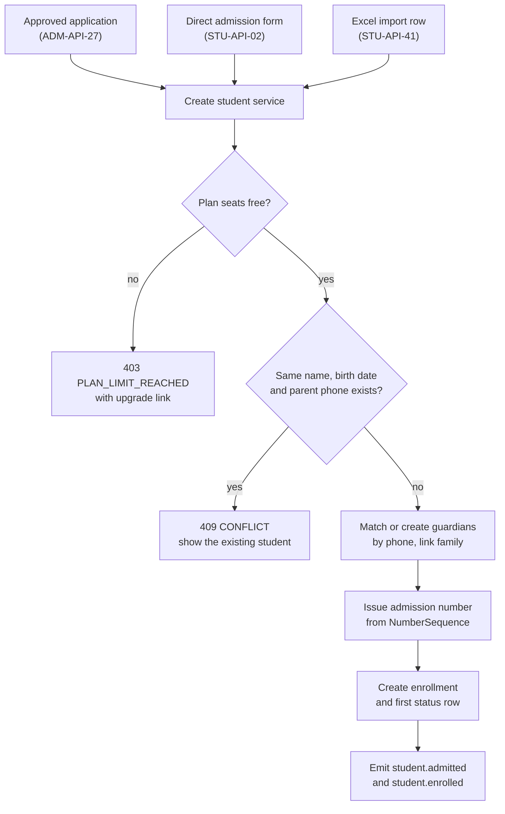
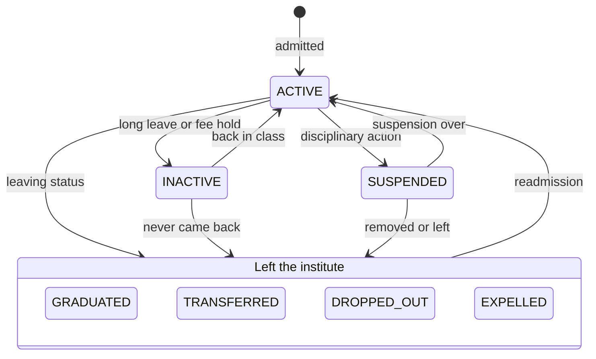
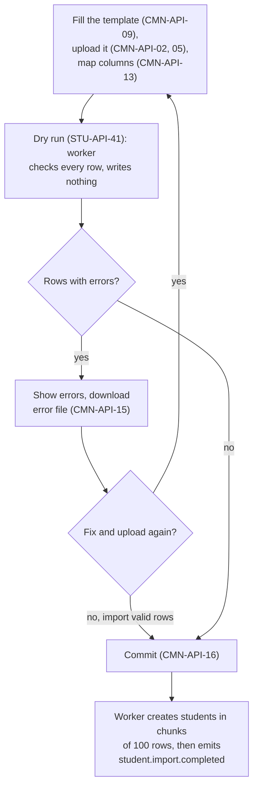
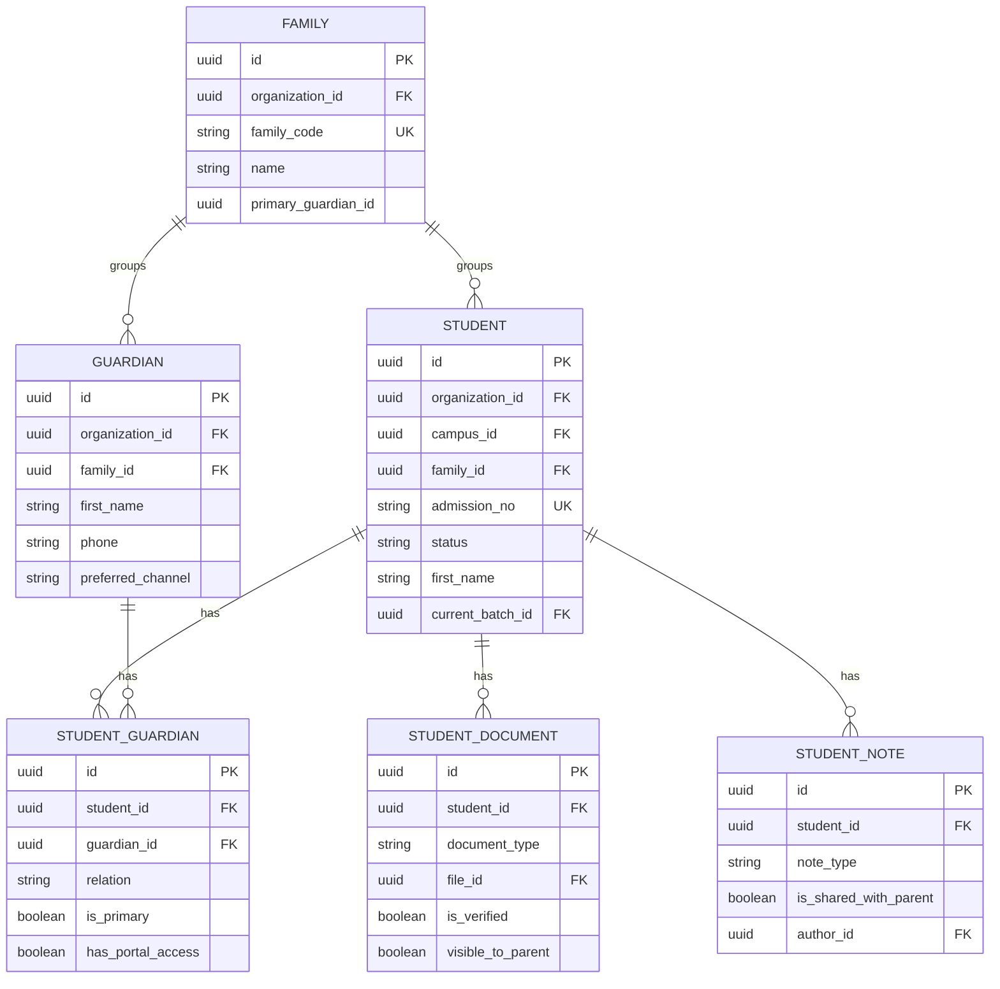
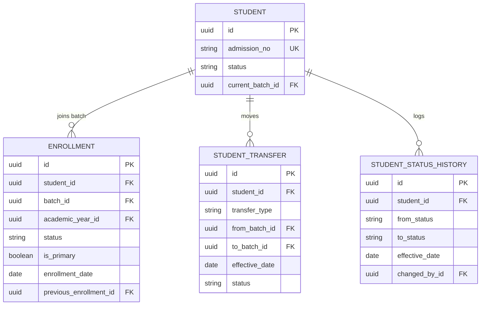

# Student Profile Module

**In simple words:** This module is the digital file of every student. It keeps personal details, parents, siblings, documents, medical notes, batch history and the current status in one place. Attendance, fees, exams, homework and the parent portal all read the student from here. If this record is wrong, every other module is wrong, so this chapter is strict about rules and checks.

| Item | Value |
|---|---|
| Module code | STU |
| Release phase | Phase 1 (MVP). Only the Student Portal profile (`STU-API-51`) waits for Phase 2 |
| Plans | Starter (up to 50 active students), Growth (300), Pro (1,000), Enterprise (unlimited) |
| Main users | Organization Admin, Principal, office staff with a custom role, Teacher, Accountant (read only), Parent, Student |
| Depends on | Organizations, Multi Campus, Batch, Settings, Student Admission, shared file upload and import services |
| Main tables | students, guardians, families, student_guardians, enrollments, student_documents, student_notes, student_status_histories, student_transfers |

## Objective

Give every institute one clean, complete and safe record per student. The record must be quick to create, easy to find and hard to damage.

The module has five measurable goals.

| Goal | Target |
|---|---|
| Find a student | Under 5 seconds by name, admission number or parent phone |
| Admit a walk-in student | Under 3 minutes for student, one parent and batch |
| Move old data in | Sharma Classes imports 350 students from Excel in under 30 minutes, including fixing bad rows |
| Keep data clean | 95% of active students have a primary guardian with a valid phone number within 30 days of go-live |
| Respect privacy | A verified data export request is answered within 7 days (internal target, shorter than any legal deadline) |

Why it matters for the business: the canon activation target is "first fee receipt or first attendance within 7 days of signup". Neither can happen before students exist. So student import is the first real task of every new customer.

## Scope

### In scope

- Student master record: name, date of birth, gender, blood group, category, quota, government ids (PEN, APAAR), house, RFID card, contact, address, previous school, photo.
- Guardians with relation, primary flag, fee payer flag, pickup flag, emergency flag and portal access flag.
- Sibling linking through a household record (`Family`). One parent login sees all children.
- Documents with verification and a "visible to parent" switch.
- Encrypted medical notes and encrypted national id (Aadhaar or passport).
- Custom fields defined by the institute in *Settings Module*.
- Status lifecycle with a full history (`StudentStatusHistory`).
- Enrollment history, extra coaching batches, roll numbers and the entry points for promotion and transfer.
- Transfer requests between batches, courses and campuses with approval.
- Staff notes, optionally shared with the parent.
- Profile tabs that show data of other modules: attendance, fees, exams, homework, documents, notes, timeline.
- Search, filters, typeahead lookup and summary counts.
- Bulk work: Excel import with dry run and row-level error report, bulk update, export, ID card PDF.
- Privacy controls and the per-student data export for DPDP and GDPR requests.
- Read-only profile views for parents and students in their portals.

### Out of scope

- Inquiries, applications and the admission funnel. See *Student Admission Module*. That module ends by creating a student here.
- Creating academic years, courses and batches, and the full year-end promotion wizard. See *Batch Module*.
- Fee assignment, invoices and the ledger. See *Fees Module*. This module only shows the dues.
- Marking attendance, entering marks, giving homework. Their modules own the data; the profile only shows it.
- Transfer certificate and bonafide certificate PDFs. See *Certificates Module*.
- Creating parent and student logins and sending invitations. See *Authentication and Sessions*.
- A structured health record (vaccination chart, clinic visits). Medical notes are free text only.
- An alumni community portal. Alumni are students with status `GRADUATED`; there is no separate alumni table.

### Phase notes

| Phase | What ships |
|---|---|
| Phase 1 (MVP) | `STU-API-01` to `STU-API-50`. Tabs Overview, Personal, Guardians, Enrollment, Attendance, Fees, Documents, Notes, Timeline. Two built-in ID card layouts |
| Phase 2 (V1.0) | `STU-API-51` with the Student Portal. Tabs Exams and Homework appear when those modules go live. TC fields are filled by *Certificates Module* |
| Phase 3 (V1.5) | Overview shows library loans, transport route and hostel bed as extra cards |
| Phase 4 (V2.0) | Risk score badge from *AI Insights Module*. Country packs hide India-only fields (category, PEN, APAAR) outside India |

## User Stories

| ID | As a | I want to | So that | Priority |
|---|---|---|---|---|
| STU-US-01 | Office user | admit a walk-in student with parent and batch in one form | the student is ready for attendance and fees in 3 minutes | Must |
| STU-US-02 | Organization Admin | import all students from my old Excel file, with a dry run and a clear error for every bad row | I can go live in one day without typing 350 records | Must |
| STU-US-03 | Office user | set the house, category, quota or RFID card for many selected students in one step | I do not open 40 profiles one by one after the house draw | Should |
| STU-US-04 | Principal | search by name, admission number or parent phone | I find a student while the parent is still on the call | Must |
| STU-US-05 | Office user | link a new student to an existing parent by phone number | siblings share one parent login and the sibling discount works | Must |
| STU-US-06 | Principal | change a student's status with a date and a reason | the rolls, the seat count and the plan count stay correct | Must |
| STU-US-07 | Teacher | open the profile of a student in my batch on my phone | I can call the parent or check an allergy quickly | Must |
| STU-US-08 | Principal | store medical notes that only a few people can read | the class teacher knows about asthma, but others do not | Must |
| STU-US-09 | Office user | upload and verify documents like the birth certificate | the file is complete for inspections | Should |
| STU-US-10 | Principal | approve a batch or campus transfer requested by the office | no student moves without a second pair of eyes | Should |
| STU-US-11 | Organization Admin | print ID cards for a whole batch in one click | I do not pay an outside vendor for design work | Should |
| STU-US-12 | Teacher | write a note and share it with the parent | the parent hears good news and concerns early | Should |
| STU-US-13 | Parent | see my child's profile and documents and correct my own contact details | the school always reaches me on the right number | Must |
| STU-US-14 | Parent | ask for a copy of all data the school holds about my child | I can use my right under the DPDP Act | Must |

## Workflow

A student record can be born in three ways. All three end in the same service function, so the same rules apply.

**Figure: Three ways to create a student**



The whole path from "Create student service" to the events runs in one database transaction. If any step fails, no admission number is used and nothing is saved.

1. Zod checks the fields of the form or of the import row (see "Validation Rules").
2. The service checks the plan seats (`STU-BR-02`) and looks for a likely duplicate (`STU-BR-03`).
3. Each guardian phone is normalised to E.164 (the international form, for example `+919839012345`). A guardian with that phone is linked; otherwise a new one is created. Siblings join one `Family` (`STU-BR-05`, `STU-BR-06`).
4. The admission number is taken from the `ADMISSION_NO` sequence under a row lock (`STU-BR-01`).
5. One `Enrollment` is created after a capacity check, `Student.currentBatchId` is set, and the first `StudentStatusHistory` row is written with `fromStatus = null`.
6. After commit, `student.admitted` and `student.enrolled` go to the queue. The welcome message, the fee assignment prompt and the dashboard counters listen to them.

### Status lifecycle

**Figure: Student status changes**



`ACTIVE`, `INACTIVE` and `SUSPENDED` mean the student is still on the rolls. The four statuses in the box are leaving statuses. A leaving status ends all active enrollments. The way back is a readmission, which keeps the old admission number and the full history. The box keeps the picture small; the table below is exact. For example, only an `ACTIVE` student can become `GRADUATED`.

| Status | UI label | Meaning | Plan count | On rosters | Allowed next status |
|---|---|---|---|---|---|
| `ACTIVE` | Active | Studying now | Yes | Yes | Any other status |
| `INACTIVE` | Inactive | Long leave or fee hold; seat is kept | No | No | `ACTIVE`, `TRANSFERRED`, `DROPPED_OUT`, `EXPELLED` |
| `SUSPENDED` | Suspended | Disciplinary break; seat is kept | No | No | `ACTIVE`, `TRANSFERRED`, `DROPPED_OUT`, `EXPELLED` |
| `GRADUATED` | Alumni | Finished the final course | No | No | `ACTIVE` (readmission) |
| `TRANSFERRED` | Transferred | Left for another institute with a TC | No | No | `ACTIVE` (readmission) |
| `DROPPED_OUT` | Dropped | Stopped coming without a TC | No | No | `ACTIVE` (readmission) |
| `EXPELLED` | Expelled | Removed by the institute | No | No | `ACTIVE` (readmission, ORG_ADMIN only) |

> **Note:** The status `TRANSFERRED` means the student left the organization. A move between two batches or two campuses of the same organization is a `StudentTransfer`. It keeps the status `ACTIVE`.

A status change starts on screen `STU-S09` and calls `STU-API-07`. The API checks the transition against the table and the date rule (`STU-BR-09`). Warnings such as open fee dues inform but do not block: a student may drop out with unpaid fees, and the dues must stay collectable. The effects of a leaving status are listed in `STU-BR-08`. After commit the API emits `student.status_changed`, and for a leaving status also `student.withdrawn` and `student.enrollment.ended`. *Fees Module* listens and stops future invoices.

### Excel import

**Figure: Import with dry run and error report**



The dry run is a call of `STU-API-41` with `isDryRun = true`. It uses the same validation code as the real run, so the result is honest. The user may import the valid rows and fix the bad ones later. The error workbook has the original rows plus two extra columns, "Error column" and "Error message", so the user can fix and upload that same file.

### Transfer inside the organization

1. A user with `students.transfer` opens "More > Transfer" on the profile and picks the type: `BATCH_CHANGE`, `COURSE_CHANGE` or `CAMPUS_TRANSFER`. The user adds the target batch, the effective date, the reason and the fee treatment (`STU-API-33`).
2. The request is saved as `PENDING`. Approvers get an in-app notification (`student.transfer.requested`).
3. A different user with `students.approve` approves or rejects (`STU-API-35`, `STU-API-36`). The requester can cancel while it is pending (`STU-API-37`).
4. On approval one transaction ends the old enrollment as `TRANSFERRED`, creates the new enrollment with `previousEnrollmentId`, and updates `currentBatchId`, `rollNo` and, for a campus transfer, `campusId` (`STU-BR-14`).
5. `student.transfer.approved` is emitted. *Fees Module* reads `feeTreatment` to carry dues and assign the new fee structure. Both class teachers are informed.

### Promotion entry point

Year-end promotion for whole batches, with a preview based on report card results, lives in *Batch Module* (`BAT-API-34`, `BAT-API-35`). This module offers a shortcut for a hand-picked group: select students in the list, click "Promote", pick the outcome and the target batch (`STU-API-39`). Both paths call the same promotion service, so the rules are identical. The same is true for roll numbers (`STU-API-40` and `BAT-API-22`).

## Screens and Wireframes

| ID | Screen | Users | Purpose |
|---|---|---|---|
| STU-S01 | Student List | All staff roles | Search, filter, select, bulk actions |
| STU-S02 | Add Student | Office user, Principal, Org Admin | Direct admission in three steps: student, guardians, batch |
| STU-S03 | Student Profile | All staff roles | Header card, Overview and all tabs |
| STU-S04 | Edit Student | Office user, Principal, Org Admin | Edit personal, address, identity, photo, custom fields |
| STU-S05 | Guardian and Family drawer | Office user, Principal, Org Admin | Add, link, edit or unlink guardians; open the household |
| STU-S06 | Medical Notes panel | Principal, Org Admin, class teacher | Read (logged) and edit encrypted notes |
| STU-S07 | Import Students wizard | Org Admin, Principal, office user | Upload, map, dry run, error report, commit |
| STU-S08 | Bulk Update dialog | Office user, Principal, Org Admin | Set house, category, quota or RFID card for a selection |
| STU-S09 | Change Status dialog | Principal, Org Admin | New status, date, reason, warnings |
| STU-S10 | Transfers | Office user, Principal, Org Admin | Request list, detail, approve, reject, cancel |
| STU-S11 | ID Card Generator | Principal, Org Admin | Pick batch or selection, layout, fields; download PDF |
| STU-S12 | Families | Office user, Principal, Org Admin | Household list with siblings and guardians |
| STU-S13 | My Child (mobile) | Parent | Child profile, documents, shared notes, privacy requests |
| STU-S14 | Student Quick Card (mobile) | Teacher | Photo, batch, parent phone with call button, medical flag |
| STU-S15 | My Profile (mobile) | Student | Own profile, read only (Phase 2) |

**Screen STU-S01 — Student List (Principal, web)**

```text
+--------------------------------------------------------------------------+
| EduFlow | Bright Future Public School    [Search students...]   (AV) v   |
+------------+-------------------------------------------------------------+
| Dashboard  | Students                  [Import] [Export] [+ Add Student] |
| Admissions +-------------------------------------------------------------+
| Students < | Campus [Gomti Nagar v]  Year [2027-28 v]  Class [Class 10 v]|
|  All       | Batch [10-A v]  Status [Active v]  Category [All v]  [Clear]|
|  Families  | Search [aarav_______________]   42 students, 3 selected     |
|  Transfers | Selected: [Bulk Update] [ID Cards] [Promote] [Export]       |
|  Import    +-------------------------------------------------------------+
| Attendance | [ ] Adm No        Name              Batch Roll Parent phone |
| Fees       | [x] BF-2027-0142  Aarav Sharma      10-A  01   98390 12345  |
| Batches    | [x] BF-2027-0151  Aditi Verma       10-A  02   94150 66771  |
| Settings   | [ ] BF-2026-0088  Farhan Khan       10-A  03   97940 20318  |
|            | [x] BF-2027-0160  Kavya Singh       10-A  04   80520 49126  |
|            | [ ] BF-2025-0034  Rohan Gupta       10-A  05   (missing)    |
|            +-------------------------------------------------------------+
|            | Rows 1-20 of 42            [< Prev]  Page 1 of 3  [Next >]  |
+------------+-------------------------------------------------------------+
```

- The user sees the students of the campuses assigned to them. A teacher sees only own batches. The default status filter is "on the rolls" (`ACTIVE`, `INACTIVE`, `SUSPENDED`).
- Filters and search call `STU-API-01`. Typing in the search box waits 300 ms, then searches name, admission number and parent phone.
- A missing parent phone is shown as "(missing)" in amber, so the office can fix it.
- "Bulk Update" opens `STU-S08` (`STU-API-38`). "ID Cards" opens `STU-S11` (`STU-API-43`). "Promote" calls `STU-API-39`. "Export" calls `STU-API-42`. Buttons are hidden when the user lacks the permission key.
- The labels "Class" and "Batch" become "Course" and "Batch" for a coaching institute such as Sharma Classes.

**Screen STU-S03 — Student Profile, Overview tab (Principal, web)**

```text
+--------------------------------------------------------------------------+
| EduFlow | Bright Future Public School    [Search students...]   (AV) v   |
+------------+-------------------------------------------------------------+
| Dashboard  | Students > Aarav Sharma                                     |
| Admissions +-------------------------------------------------------------+
| Students < | (photo)  Aarav Sharma   [ACTIVE]          [Edit] [More v]   |
|  All       |          BF-2027-0142 | Class 10-A | Roll 01 | Blue House   |
|  Families  |          DOB 14 Aug 2012 (15 y) | B+ | Mother: Sunita Devi  |
|  Transfers +-------------------------------------------------------------+
|  Import    | [Overview] Personal  Guardians  Enrollment  Attendance      |
| Attendance | Fees  Exams  Homework  Documents  Notes  Timeline           |
| Fees       +-------------------------------------------------------------+
| Batches    | Attendance 2027-28 | Fee dues         | Last result         |
| Settings   | 95.2 %             | Rs 10,800        | Unit Test 1         |
|            | 118 of 124 days    | 1 invoice 10 Jul | 86.4 % (A2)         |
|            +-------------------------------------------------------------+
|            | Pinned note: Carries an inhaler. See Medical (locked).      |
|            | Alert: Transfer certificate of previous school not verified |
|            | Sibling: Ananya Sharma, Class 6-B          [Open family]    |
+------------+-------------------------------------------------------------+
```

- The header card comes from `STU-API-03`. The three cards come from `STU-API-06`. A card is hidden when the user may not view that module. Suresh Gupta (Accountant) sees the fee card; Priya Nair (Teacher) does not.
- "More" holds: Change status (`STU-S09`), Transfer (`STU-S10`), Add enrollment (`STU-API-22`), Print ID card, Privacy and data export, Delete (ORG_ADMIN only).
- Medical text is never shown on this page. The pinned note only points to the Medical panel, which needs `students.view_medical`.

The tabs load their data only when opened. Each tab uses the endpoint of the module that owns the data.

| Tab | Data source | Key needed | Phase |
|---|---|---|---|
| Overview | `STU-API-06` | `students.view` | 1 |
| Personal | `STU-API-03`, custom fields from `SET-API-18` | `students.view` | 1 |
| Guardians | `STU-API-03`, `STU-API-19` | `students.view` | 1 |
| Enrollment | `STU-API-21` | `students.view` | 1 |
| Attendance | `ATT-API-17`, `ATT-API-10` filtered by student | `attendance.view` | 1 |
| Fees | `FEE-API-42` (student fee ledger) | `fees.view` | 1 |
| Exams | `EXM-API-34`, `RPT-API-08` filtered by student | `exams.view`, `reportcards.view` | 2 |
| Homework | `HW-API-01` for the student's batch, with own submission status | `homework.view` | 2 |
| Documents | `STU-API-24` | `students.view` | 1 |
| Notes | `STU-API-28` | `students.view` | 1 |
| Timeline | `STU-API-08`, `STU-API-21`, `STU-API-32`, `STU-API-24`, and `CMN-API-22` for users with `audit.view` | `students.view` | 1 |

The Timeline tab merges these lists in the browser and sorts them by date. No extra endpoint is needed.

**Screen STU-S07 — Import Students wizard, step 3 (Organization Admin, web)**

```text
+--------------------------------------------------------------------------+
| EduFlow | Bright Future Public School    [Search students...]   (RS) v   |
+------------+-------------------------------------------------------------+
| Dashboard  | Students > Import                                           |
| Admissions | Steps: 1 Upload > 2 Map columns > [3 Check] > 4 Import      |
| Students < +-------------------------------------------------------------+
|  All       | File: class-10-students.xlsx     Rows: 180     Dry run      |
|  Families  | Valid rows: 171  |  Rows with errors: 9  |  Plan seats: OK  |
|  Transfers +-------------------------------------------------------------+
|  Import    | Row  Column         Error                                   |
| Attendance | 14   Parent phone   Enter a 10-digit mobile number          |
| Fees       | 27   Date of birth  Date not valid. Use DD-MM-YYYY          |
| Batches    | 63   Batch          Batch 10-F not found in 2027-28         |
| Settings   | 118  Admission no   This admission number is already used   |
|            | 131  Gender         Use Male, Female, Other or Undisclosed  |
|            | Showing 5 of 9 errors                           [Next >]    |
|            +-------------------------------------------------------------+
|            | [Download error file]  [Upload fixed file]  [Import 171]    |
+------------+-------------------------------------------------------------+
```

- The page polls `CMN-API-12` every 2 seconds while the job is `QUEUED` or `PROCESSING` and shows a progress bar (`processedRows` of `totalRows`).
- The error table reads `CMN-API-14`. "Download error file" calls `CMN-API-15`.
- "Import 171" calls `CMN-API-16`. It starts a new job with the same file and mapping, with `isDryRun = false`.
- "Plan seats" compares valid rows with free seats. If 171 rows are valid but only 120 seats are free, the text turns red: "Only 120 seats left on your plan" with an "Upgrade" button.

**Screen STU-S09 — Change Status dialog (Principal, web)**

```text
+--------------------------------------------------------------+
| Change status - Aarav Sharma (BF-2027-0142)             [X]  |
+--------------------------------------------------------------+
| Current status   ACTIVE                                      |
| New status       [Transferred v]                             |
| Effective date   [31-03-2028]                                |
| Reason           [Family moved to Pune_________________]     |
|                                                              |
| * This ends the enrollment in 10-A on 31 Mar 2028.           |
| * Rs 10,800 is still due on 1 invoice. Dues stay open.       |
| * The Student Portal login will be deactivated.              |
|                                                              |
|                           [Cancel]  [Change status]          |
+--------------------------------------------------------------+
```

- The dropdown lists only the statuses allowed from the current one.
- The three lines with a star are warnings built from `STU-API-06`. They inform; they do not block.
- "Change status" calls `STU-API-07`. On success the profile header shows the new badge and the Timeline tab shows the new row.

**Screen STU-S13 — My Child (Parent, mobile)**

```text
+------------------------------------+
| <  My Child               (SD) v   |
+------------------------------------+
| Child: [Aarav Sharma v]            |
| (photo)  Aarav Sharma              |
| Class 10-A | Roll 01               |
| Adm No BF-2027-0142                |
+------------------------------------+
| Attendance     95.2 %              |
| Fee due        Rs 10,800   [Pay]   |
| Last result    86.4 % (A2)         |
+------------------------------------+
| Date of birth  14 Aug 2012         |
| Blood group    B+                  |
| Class teacher  Priya Nair          |
| House          Blue                |
+------------------------------------+
| Documents (2)                  >   |
| Notes from school (1)          >   |
| My contact details             >   |
| Privacy and data export        >   |
+------------------------------------+
| Home  Attendance  Fees  More       |
+------------------------------------+
```

- Sunita Devi switches between Aarav and Ananya with the "Child" dropdown (`STU-API-46`). The profile comes from `STU-API-47`.
- The three summary lines come from the *Parent Portal Module* home endpoints. This module only supplies the profile block.
- "Documents" lists files with `visibleToParent = true` (`STU-API-48`). "Notes from school" shows notes with `isSharedWithParent = true`.
- "My contact details" opens a form for phone, email, language and preferred channel (`STU-API-49`, `STU-API-50`). A phone change needs an OTP on the new number.
- "Privacy and data export" raises a request with `SET-API-54`. The parent cannot edit the child's name or date of birth; the screen tells them to ask the office, which keeps certificates correct.

## UI Components

| Component | Type | Behaviour |
|---|---|---|
| `StudentDataTable` | shadcn/ui DataTable + TanStack Query | Server-side paging, sorting and filters. Row click opens the profile. Skeleton rows while loading. Keeps filters in the URL |
| `StudentFilterBar` | Select, Combobox, Input | Campus, year, course, batch, status, category, quota, text search with 300 ms debounce |
| `StudentLookup` | Combobox (typeahead) | Calls `STU-API-44` after 2 characters. Shows photo, name, admission number, batch. Reused by Fees, Attendance and Certificates |
| `StudentHeaderCard` | Card + Avatar + Badge | Photo, name, status badge (green Active, grey Inactive, amber Suspended, blue Alumni, red for the other leaving statuses) |
| `ProfileTabs` | Tabs | Lazy loads each tab. Hides tabs the user may not see. Remembers the last open tab per user |
| `GuardianCard` | Card + Switch | Relation, phone with call and WhatsApp buttons, flags as switches. Primary shown with a star |
| `GuardianMatchDialog` | Dialog | Appears when a typed phone matches an existing guardian: "Sunita Devi is already the parent of Ananya Sharma. Link her?" |
| `PhotoUploader` | Dropzone + cropper | Square crop, JPEG, PNG or WebP, up to 2 MB. Uploads through a pre-signed URL |
| `DocumentList` | Table + Badge | Type, title, last 4 digits of the number, verified badge, parent-visible switch, download |
| `MedicalNotesPanel` | Collapsible + Textarea | Closed by default. Opening it calls `STU-API-09` and shows "This view is logged" |
| `CustomFieldsForm` | React Hook Form + Zod | Renders fields from `SET-API-18`. Builds the Zod schema from each definition |
| `ImportWizard` | Stepper + Progress | Four steps. Polls the job. Shared with Teachers and Fees imports |

States used on every screen:

- **Loading:** skeleton rows in tables, skeleton cards on the profile. No spinner that blocks the full page.
- **Empty:** the list shows "No students yet. Import from Excel or add your first student." with both buttons. A filtered list with no result shows "No student matches these filters" and a "Clear filters" link.
- **Error:** a red inline banner with the API `message` and the `requestId`, plus a "Try again" button. Form errors appear under the field, using `error.details`.
- **No permission:** the screen shows "You do not have access to this student". The API returns `404 NOT_FOUND` for a student outside the user's scope, so the UI never confirms that a hidden student exists.

## Validation Rules

The same Zod schemas live in the `shared/` folder. The form and the API both use them, so the user sees the same message in both places. The import worker uses them too and writes the message into the error report.

| Field | Rule | Error message shown to user |
|---|---|---|
| `firstName` | Required, 1 to 80 characters, letters of any script, space, dot, hyphen, apostrophe; no digits | Enter the student's first name (letters only, up to 80 characters). |
| `middleName`, `lastName` | Optional, same characters, up to 80 | Name can have letters only, up to 80 characters. |
| `dateOfBirth` | Required, real calendar date, not in the future, age 2 to 60 years on the admission date | Enter a valid date of birth. The student must be between 2 and 60 years old. |
| `gender` | Required, one of `MALE`, `FEMALE`, `OTHER`, `UNDISCLOSED` | Select a gender. |
| `admissionDate` | Required, not in the future, not before `dateOfBirth` | Admission date cannot be in the future or before the date of birth. |
| `campusId` | Required, a campus assigned to the user | Select a campus you have access to. |
| `admissionNo` (import only) | Optional, 1 to 30 characters, letters, digits, hyphen, slash; unique in the organization | This admission number is already used. |
| `phone` (student, guardian) | Valid mobile number for the country, stored as E.164; required for a guardian | Enter a valid mobile number, for example 98390 12345. |
| `email` | Valid email, up to 255 characters | Enter a valid email address. |
| `postalCode` | India: exactly 6 digits. Other countries: up to 20 characters | Enter a 6-digit PIN code. |
| `nationalId` | India: 12 digits with a valid Aadhaar checksum, or a passport number (1 letter + 7 digits) | Enter a valid 12-digit Aadhaar number or a passport number. |
| `apaarId`, `penNumber` | Optional. APAAR: exactly 12 digits. PEN: digits only, up to 20 | APAAR ID must have 12 digits. / PEN must contain digits only. |
| `rfidCardNo` | Optional, up to 40 characters, unique in the organization | This card is already assigned to {name} ({admissionNo}). |
| Photo file | JPEG, PNG or WebP, up to 2 MB, at least 300 x 300 pixels | Upload a JPG, PNG or WebP photo up to 2 MB. |
| Document file | PDF, JPEG or PNG, up to 10 MB | Upload a PDF, JPG or PNG file up to 10 MB. |
| `guardians` | At least one for a student under 18; exactly one with `isPrimary = true` | Add at least one parent or guardian. Mark exactly one as primary. |
| `annualIncome` | Optional, 0 or more, 2 decimals, needs a `currency` | Enter the yearly income as a positive amount. |
| Status `reason` | Required, 5 to 500 characters | Give a reason (at least 5 characters). |
| Status `effectiveDate` | Between the admission date and today | Effective date must be between the admission date and today. |
| Note `body`, medical notes | Up to 5,000 characters; the note body is required | Write the note (up to 5,000 characters). |
| Transfer `toBatchId` | Required, different from the current batch, batch status `ACTIVE` or `PLANNED` | Pick a different, open batch. |
| Custom field | Rules of its definition: required, `min`, `max`, `regex`, `maxLength`, allowed options | {label} is required. / {label} is not valid. |
| Import file | `.xlsx` or `.csv`, up to 10 MB and 5,000 data rows | Upload an .xlsx or .csv file up to 10 MB and 5,000 rows. |
| Bulk selection | 1 to 500 students per request | Select between 1 and 500 students. |

## Business Rules

**STU-BR-01 — Admission number.** The number comes from the `NumberSequence` row of type `ADMISSION_NO`. The service locks the row (`SELECT ... FOR UPDATE`), formats the value and adds 1, all inside the admission transaction. The number never changes and is never reused, not even after a soft delete. An import may carry old admission numbers; then the sequence is not touched.

> **Example:** Bright Future uses prefix `BF`, format `{PREFIX}-{YYYY}-{SEQ}`, pad length 4 and `nextValue = 142`. Aarav is admitted on 1 April 2027. His number is `BF-2027-0142`. `nextValue` becomes 143.

**STU-BR-02 — Plan limit.** The plan counts students with `status = ACTIVE` and `deletedAt` empty. Free seats = `Plan.maxStudents` minus that count. Creating a student, a readmission and a change from `INACTIVE` or `SUSPENDED` to `ACTIVE` each need one free seat. With no free seat the API answers `403 PLAN_LIMIT_REACHED` and the UI shows the upgrade button. An inactive student cannot be marked in attendance, so parking students as `INACTIVE` to dodge the limit does not work in practice.

> **Example:** Sharma Classes is on Growth (300 students). 288 are active, so 12 seats are free. An import with 20 valid rows creates the first 12. The other 8 rows fail with the code `PLAN_LIMIT_REACHED` and appear in the error file. The job ends as `COMPLETED_WITH_ERRORS`.

**STU-BR-03 — Duplicate check.** A new student is a likely duplicate when the first name (case ignored), the date of birth and one guardian phone all match a student that is not deleted. The API answers `409 CONFLICT` and returns the existing student. The user may send the request again with `allowDuplicate: true`, for example when two cousins with the same first name and birth date share a guardian. The import treats a likely duplicate as a row error.

**STU-BR-04 — Guardians and minors.** Age = full years between `dateOfBirth` and `admissionDate`. A student under 18 needs at least one guardian. For an adult learner (college, training centre) guardians are optional.

> **Example:** Aarav was born on 14 August 2012 and is admitted on 1 April 2027. That is 14 years and 7 months, so 14 full years. He is a minor. A guardian is required, and *Privacy and Compliance* asks for a `CHILD_DATA_PROCESSING` consent from that guardian.

**STU-BR-05 — One guardian row per person.** The guardian phone is the matching key inside one organization. If the phone already exists, the API links that guardian and does not create a second row. Name and other details of the existing guardian are not overwritten by the new form.

**STU-BR-06 — Family linking.** When a guardian gets a second child, the service creates a `Family` if none exists. It sets `familyId` on the guardian and on both students. The name is built as "{last name} family ({guardian first name})", for example "Sharma family (Sunita)". `familyCode` looks like `FAM-0087`. It does not need to be gap-free, so it does not use `NumberSequence`: the service takes the highest code plus 1, and the unique key `(organization_id, family_code)` with one retry covers two users saving at the same second. The office can also build or correct a family by hand (`STU-API-18`, `STU-API-20`).

**STU-BR-07 — Guardian flags.** Exactly one guardian per student is primary. A partial unique index enforces it. Setting a new primary clears the old one in the same transaction. The only primary guardian cannot be unlinked (`STU-API-13` answers `422`). If no guardian is marked as fee payer, the primary guardian gets fee reminders. `hasPortalAccess = false` hides this child from that guardian in the portal; use it for custody restrictions. `receivesCommunication = false` stops all messages about this child to that guardian.

**STU-BR-08 — Status effects.** Only the transitions in the status table are allowed. A leaving status (`GRADUATED`, `TRANSFERRED`, `DROPPED_OUT`, `EXPELLED`) does all of this in one transaction:

1. It ends every `ACTIVE` enrollment: `COMPLETED` for `GRADUATED`, else `WITHDRAWN`, with `endDate` = effective date.
2. It clears `currentBatchId` and `rollNo` and fills `leavingDate` and `leavingReason`.
3. It sets `retentionUntil` (`STU-BR-09`).
4. It is refused while a `PENDING` transfer exists. The user must cancel the transfer first.
5. It deactivates the linked Student Portal user. Guardian logins stay.

`INACTIVE` and `SUSPENDED` keep the enrollment and the seat. Other modules treat only `ACTIVE` students as attending: the others are skipped on attendance rosters and get no absence alerts. Invoices already raised stay due.

**STU-BR-09 — Dates.** The effective date must lie between `admissionDate` and today. Future-dated changes are not supported, because status and history must always agree without a scheduler. `retentionUntil` = leaving date + the retention period from *Settings Module*. The default is 7 years (assumption; the legal basis is in *Privacy and Compliance*).

> **Example:** Aarav leaves on 31 March 2028. `retentionUntil` = 31 March 2035. After that date the anonymisation job may overwrite his personal data.

**STU-BR-10 — Readmission.** A change from a leaving status to `ACTIVE` is a readmission. It needs a free plan seat. The student keeps the admission number. The API sets `readmittedOn` = effective date and `admissionType = RE_ADMISSION`, and clears `leavingDate`, `leavingReason` and `retentionUntil`. The user must then add an enrollment (`STU-API-22`). Readmission of an `EXPELLED` student needs the ORG_ADMIN.

**STU-BR-11 — Delete.** `STU-API-05` is a soft delete for records created by mistake. It is blocked with `422` when the student has any fee invoice or payment. A student who really studied here leaves through a status change, never through delete.

**STU-BR-12 — Encrypted fields.** `medicalNotesEncrypted`, `nationalIdEncrypted` and `documentNoEncrypted` hold AES-256-GCM ciphertext. Key handling is described in *Security Architecture*. Rules:

- Medical notes leave the server only through `STU-API-09`, for callers with `students.view_medical`. Every read writes an audit row with the action `student.medical.read`. The text itself is never written to the audit log, to exports, to list responses or to error logs.
- The full national id is never returned. The profile shows `nationalIdLast4` only. To correct it, the user types the full number again.
- A document of type `MEDICAL` needs `students.update_medical` to upload and `students.view_medical` to download. Other staff do not see it in the list.

**STU-BR-13 — Enrollments.** A student has at most one primary `ACTIVE` enrollment per academic year. A coaching student may join extra batches with `isPrimary = false`, for example a weekend test series. A batch cannot take more students than its capacity; the API answers `422` with "Batch 10-A is full (40 of 40)". A user with `batches.update` may raise the capacity in *Batch Module*. `Student.currentBatchId` and `Student.rollNo` always mirror the active primary enrollment of the current academic year. An academic year with status `CLOSED` accepts no new enrollment.

**STU-BR-14 — Transfers.** One student can have only one `PENDING` transfer. The requester cannot approve the own request. A campus transfer needs an approver assigned to both campuses, or the ORG_ADMIN. On approval:

- old enrollment: `status = TRANSFERRED`, `endDate` = effective date minus 1 day;
- new enrollment: `enrollmentDate` = effective date, `previousEnrollmentId` = old enrollment, capacity checked again;
- `fromEnrollmentId`, `toEnrollmentId`, `approvedById` and `approvedAt` are stored on the transfer;
- the admission number stays the same, also across campuses;
- attendance and marks of the old batch stay with the old enrollment.

> **Example:** Aarav moves from 10-A to 10-B with effective date 16 August 2027. The 10-A enrollment ends on 15 August 2027. The 10-B enrollment starts on 16 August 2027. Attendance reports for July still count him in 10-A.

**STU-BR-15 — Roll numbers.** `STU-API-40` numbers the active students of one batch by `NAME` (first name, then last name, A to Z) or by `ADMISSION_NO`. Numbers start at 1, have 2 digits and replace existing roll numbers only when `overwrite = true`.

> **Example:** Batch 10-A has Kavya Singh, Aarav Sharma and Aditi Verma. Order by name gives Aarav Sharma 01, Aditi Verma 02, Kavya Singh 03. A student who joins in August gets the next free number, 04. The list is not sorted again.

**STU-BR-16 — Promotion shortcut.** `STU-API-39` takes a list of enrollments, one outcome and a target. `PROMOTED` and `DETAINED` end the old enrollment with that status and create a new one in the target batch of the next academic year. `COMPLETED` ends the enrollment and creates nothing; with `markGraduated = true` the student also becomes `GRADUATED`. The events `student.promoted` and `student.detained` are emitted per student. A detained student gets no automatic parent message; the Principal talks to the family first.

**STU-BR-17 — Bulk update.** Only four fields can be set in bulk: `house`, `category`, `admissionQuota`, `rfidCardNo`. The request runs in one transaction: all rows or none. RFID cards are sent as pairs of student and card, because each card is unique.

**STU-BR-18 — Import.** The worker reads the file in chunks of 100 rows. Each row runs in its own small transaction, so one bad row never blocks the good ones. A row holds the student, up to two guardians and the batch. With `options.updateExisting = true`, a row whose admission number exists updates that student instead of failing; status, campus and batch are never changed by an import. When the job ends, `totalRows = successRows + failedRows`.

```csv
First name,Last name,Date of birth,Gender,Admission no,Admission date,Batch,Parent 1 name,Parent 1 phone
Aarav,Sharma,14-08-2012,Male,BF-2027-0142,01-04-2027,10-A,Sunita Devi,9839012345
Ananya,Sharma,02-11-2016,Female,BF-2027-0143,01-04-2027,6-B,Sunita Devi,9839012345
```

The two rows share the parent phone. The worker creates Sunita Devi once, links both children and creates one family (`STU-BR-05`, `STU-BR-06`). More columns of the template: parent relation, middle name, roll number, blood group, category, quota, a second parent, address, previous school and one column per custom field.

**STU-BR-19 — ID cards.** A card is 54 x 86 mm (CR80 size). Layout `A4_SHEET` prints 9 cards per page (3 x 3) with cut marks. Layout `SINGLE_CARD` prints one card per page for PVC card printers. The card shows the logo, photo, name, class, admission number, date of birth, blood group, primary guardian phone and a QR code with the admission number. Students without a photo get a grey placeholder and are listed in the job result.

> **Example:** Batch 10-A has 42 students. Pages = 42 / 9 rounded up = 5 pages. The last page has 6 cards.

**STU-BR-20 — Overview numbers.** The overview never recalculates what another module owns. Attendance percent uses the formula of *Attendance Module* for the current academic year. Fee dues = sum of `balance` of the student's issued invoices that are not fully paid. Each block is `null` when the caller lacks the view key of that module or the plan does not include it.

> **Example:** Aarav has one open invoice. Tuition Q2 is ₹12,000, the sibling discount is ₹1,200, nothing is paid. `balance` = ₹10,800, so the fee card shows "₹10,800, 1 invoice, due 10 Jul". Attendance: 118 present days of 124 working days = 95.2%.

**STU-BR-21 — Notes.** A note is internal unless `isSharedWithParent = true`. Sharing emits `student.note.shared` and the parent gets a message. Notes of type `MEDICAL` are returned only to callers with `students.view_medical`. Notes of type `COUNSELLING` are returned only to callers with `students.manage_notes`, so the Accountant never sees them. A teacher edits and deletes only own notes. Pinned notes show on the Overview tab; at most 3 notes can be pinned per student.

**STU-BR-22 — Privacy controls and data export.** The module gives these controls:

| Control | Where | Effect |
|---|---|---|
| Field-level secrecy | Medical notes, national id, document numbers | Encrypted; separate permission; logged reads |
| Income secrecy | `Guardian.annualIncome` | Returned only to callers with `students.update` or `scholarships.view` |
| Parent visibility | `visibleToParent` on documents and custom fields, `isSharedWithParent` on notes | The portal shows only flagged items |
| Custody restriction | `hasPortalAccess`, `receivesCommunication`, `canPickup` | Set per guardian and child |
| Scope | Teacher `Own`, Principal `Campus`, Accountant `View` | Students outside the scope answer `404` |
| Export control | `students.export` | Every export is logged with filters and row count |

A parent (or an adult student) can ask for a copy of all data. The request is a `DataSubjectRequest` with `subjectType = STUDENT`. The parent raises it in the portal (`SET-API-54`); the office logs a letter or email request with `SET-API-32`. After the identity check (`SET-API-36`) the handler completes it (`SET-API-37`). A worker then builds a ZIP package and stores it as `exportFileId`. The handler downloads it through `SET-API-39`, which is an audited read. The package holds `student.json` plus the files:

- profile, guardians, family, custom fields, status history, enrollments and transfers;
- attendance records, fee invoices, payments and receipts, exam marks, report cards, homework submissions;
- notes shared with the parent; internal notes only when the handler ticks "include internal notes" after review, because they can name other children;
- documents and the photo, consent records, and the list of messages sent about the student.

An approved deletion request does not remove the row, because receipts and ledgers must stay valid. The student is anonymised: the name becomes "Deleted Student", the date of birth is set to 1 January of the birth year, and phone, email, address, government ids, medical notes, custom fields and photo are emptied. Documents and notes are deleted and their files purged. `anonymizedAt` is set. A guardian with no other child is anonymised in the same run. A deletion request for a student who is still `ACTIVE` is rejected with the reason "the record is needed to provide the service". Details are in *Privacy and Compliance*.

**STU-BR-23 — Custom fields.** Definitions with `entityType = STUDENT` come from *Settings Module*. `STU-API-04` validates each value against its definition, upserts `CustomFieldValue` rows and refreshes the cached copy in `Student.customFields` in the same transaction. Reads use the cached copy. A definition with `showInList = true` becomes an optional column of the student list and the export. Only definitions with `visibleToParent = true` reach the parent portal.

## Acceptance Criteria

| ID | Given | When | Then |
|---|---|---|---|
| STU-AC-01 | An office user with `students.create` at the Gomti Nagar campus | she submits the Add Student form for Aarav with one primary guardian and batch 10-A | the API returns `201`, the admission number is `BF-2027-0142`, one enrollment and one status history row exist, and `student.admitted` is emitted |
| STU-AC-02 | A Starter organization with 50 active students | a user creates one more student | the API returns `403 PLAN_LIMIT_REACHED`, nothing is saved and no admission number is used |
| STU-AC-03 | Sunita Devi (`+919839012345`) is already the guardian of Ananya | the office admits Aarav with the same parent phone | no new guardian row is created, both children share one family, and the response has `matchedExisting: true` |
| STU-AC-04 | A student with the same first name, birth date and parent phone exists | the form is submitted without `allowDuplicate` | the API returns `409 CONFLICT` with the existing student in `details` |
| STU-AC-05 | A file with 180 rows, 9 of them invalid | the user runs a dry run | the job ends as `COMPLETED_WITH_ERRORS` with `successRows = 171` and `failedRows = 9`, no student is created, and the error file lists 9 rows with column and message |
| STU-AC-06 | A finished dry run | the user clicks "Import 171" | a new job creates 171 students, links guardians by phone, and `student.import.completed` is emitted once |
| STU-AC-07 | Priya Nair teaches only batch 10-A | she opens the list and then a student of 9-C by URL | the list shows only 10-A students and the 9-C profile returns `404 NOT_FOUND` |
| STU-AC-08 | Suresh Gupta (Accountant, `View`) | he opens a profile and tries to edit it | he sees the profile and the fee card, the Edit button is hidden, and a direct `PATCH` returns `403 FORBIDDEN` |
| STU-AC-09 | Suresh Gupta (Accountant) has no `students.view_medical` | he calls `STU-API-09` for Aarav | the API returns `403 FORBIDDEN`, an audit row with the outcome `DENIED` is written, and no response he can open holds the medical text |
| STU-AC-10 | The class teacher of 10-A with `students.view_medical` scope `Own` | she opens the Medical panel of Aarav | the notes are shown and one audit row `student.medical.read` holds her user id, without the note text |
| STU-AC-11 | Aarav is `ACTIVE` with one open invoice | the Principal changes the status to `TRANSFERRED` on 31 March 2028 with a reason | status and history are saved, the 10-A enrollment ends as `WITHDRAWN`, `retentionUntil` is 31 March 2035, the invoice stays open, and `student.status_changed` and `student.withdrawn` are emitted |
| STU-AC-12 | A student with status `GRADUATED` | a user tries to set `SUSPENDED` | the API returns `422 BUSINESS_RULE_VIOLATION` with "Cannot change GRADUATED to SUSPENDED" |
| STU-AC-13 | A student has one guardian, who is primary | the user unlinks that guardian | the API returns `422` with "Add another primary guardian first" |
| STU-AC-14 | An office user requested a batch change | the same user calls approve | the API returns `422` with "You cannot approve your own request" |
| STU-AC-15 | A pending transfer from 10-A to 10-B, and 10-B is full | the Principal approves | the API returns `422` with "Batch 10-B is full (40 of 40)" and the transfer stays `PENDING` |
| STU-AC-16 | 42 students are selected | the user generates ID cards with layout `A4_SHEET` | the API returns `202`, the export job ends as `COMPLETED` with a 5-page PDF, and the download link works until `expiresAt` |
| STU-AC-17 | A guardian link with `hasPortalAccess = false` | that guardian calls `STU-API-47` for the child | the API returns `404 NOT_FOUND` and the child is missing from `STU-API-46` |
| STU-AC-18 | Sunita Devi is signed in to the parent portal | she changes her phone with `STU-API-50` and a valid OTP on the new number | the phone is saved in E.164 and the next OTP login uses it; a number that belongs to another guardian returns `409 CONFLICT` |
| STU-AC-19 | 3 students are selected and one RFID card in the request belongs to a fourth student | the user sends the bulk update (`STU-API-38`) | the API returns `409 CONFLICT` with that card in `details`, and none of the 3 students is changed |
| STU-AC-20 | A verified `EXPORT` request for Aarav | the handler completes it | a ZIP package is built within 10 minutes, stored as `exportFileId`, and each download is written to the audit log |

## Edge Cases

| Case | What happens | How the system handles it |
|---|---|---|
| Twins | Same birth date and parent phone, different first names | Not a duplicate, because the first name differs. Both join one family |
| Parent phone typed in different ways | `98390 12345`, `09839012345` and `+919839012345` are the same number | The phone is normalised to E.164 before matching and saving |
| Two parents share one phone | Father and mother give the same mobile | The second guardian needs another phone. The UI suggests keeping one guardian and adding the second number as `alternatePhone` |
| Parent is also a teacher | Priya Nair's daughter studies here | One `Guardian` row and one `Staff` row. Logins stay separate by `userType`; see *Authentication and Sessions* |
| Guardian changes phone | The old number is the matching key and the OTP login | The office edits it with `STU-API-16`; the parent edits it with `STU-API-50` after an OTP on the new number. A number used by another guardian answers `409` |
| Two users admit at the same second | Both need the next admission number | The row lock on `number_sequences` makes the second wait. No gap, no duplicate |
| Import stopped halfway | Worker crash or deploy during a job | BullMQ retries the job. It continues after `processedRows`; rows already created are also caught by the admission number and duplicate checks, so nothing is doubled |
| Student leaves and comes back next year | Status `TRANSFERRED`, then the family returns | Readmission keeps the admission number and history. `readmittedOn` is set. A new enrollment is added |
| Status change while a transfer is pending | The enrollment would end twice | The status change answers `422`: "Cancel the pending transfer first" |
| Date of birth corrected after certificates were issued | Old certificates show the old date | The edit is allowed and audited. Issued certificates keep their frozen data; *Certificates Module* can revoke and re-issue |
| Delete of a student with payments | The ledger would lose its owner | `422`: "This student has fee records. Change the status instead" |
| Anonymised student opened | Old URL from a bookmark | The profile opens read only as "Deleted Student" with a banner. Edit, notes and documents are disabled |

## Database Schema

The module owns nine tenant tables. All of them carry `organization_id` and are protected by the Prisma tenant extension and by PostgreSQL Row-Level Security. See *Multi-Tenancy and Data Isolation*.

| Table | Model | Purpose |
|---|---|---|
| `students` | `Student` | Master record of a student. Batch membership lives in `enrollments` |
| `guardians` | `Guardian` | One row per parent or guardian per organization |
| `families` | `Family` | Household that groups siblings and their guardians |
| `student_guardians` | `StudentGuardian` | Link of student and guardian with relation and flags |
| `enrollments` | `Enrollment` | Membership of a student in a batch for one academic year. Shared with *Batch Module* |
| `student_documents` | `StudentDocument` | Uploaded document with verification and parent visibility |
| `student_notes` | `StudentNote` | Staff remark, optionally shared with parents |
| `student_status_histories` | `StudentStatusHistory` | Append-only log of every status change |
| `student_transfers` | `StudentTransfer` | Request to move to another batch, course or campus, with approval |

The module also writes to shared platform tables: `import_jobs`, `import_job_row_errors`, `export_jobs`, `file_assets`, `custom_field_values`, `number_sequences`, `audit_logs` and `data_subject_requests`. Their columns are in *Data Dictionary: Platform and People*.

Columns that every table below has are listed once here and left out of the column tables: `id` (`uuid`, PK, default `uuid()`), `organization_id` (`uuid`, not null, FK `organizations`), `created_at` (`timestamptz`, default `now()`) and `updated_at` (`timestamptz`). `student_status_histories` is append-only and has no `updated_at`. Tables with soft delete show `deleted_at`.

### Table students

| Column | Type | Null | Default | Notes |
|---|---|---|---|---|
| `campus_id` | uuid | No | | FK `campuses`; home campus |
| `user_id` | uuid | Yes | | Unique; FK `users`; Student Portal login |
| `family_id` | uuid | Yes | | FK `families`; groups siblings |
| `admission_no` | varchar(30) | No | | Unique per organization; from `NumberSequence` |
| `roll_no` | varchar(20) | Yes | | Copy of the roll number of the current primary enrollment |
| `status` | StudentStatus | No | `ACTIVE` | See status lifecycle |
| `first_name` | varchar(80) | No | | |
| `middle_name`, `last_name` | varchar(80) | Yes | | |
| `date_of_birth` | date | No | | |
| `gender` | Gender | No | | |
| `blood_group` | BloodGroup | Yes | | |
| `category` | StudentCategory | Yes | | Asked only where the institute needs it |
| `admission_type` | AdmissionType | No | `NEW` | `RE_ADMISSION` after a readmission |
| `admission_quota` | AdmissionQuota | No | `GENERAL` | Drives fee rules and government returns |
| `is_minority`, `is_bpl` | boolean | No | `false` | Used by scholarship criteria |
| `pen_number`, `apaar_id` | varchar(20) | Yes | | UDISE+ and APAAR ids (India) |
| `board_registration_no` | varchar(40) | Yes | | |
| `house` | varchar(40) | Yes | | School house |
| `rfid_card_no` | varchar(40) | Yes | | Unique per organization |
| `religion`, `mother_tongue` | varchar(40) | Yes | | |
| `nationality` | varchar(60) | Yes | | |
| `national_id_encrypted` | text | Yes | | AES-256-GCM ciphertext |
| `email` | varchar(255) | Yes | | |
| `phone` | varchar(20) | Yes | | E.164 |
| `address_line1`, `address_line2` | varchar(200) | Yes | | Current address |
| `city`, `state` | varchar(100) | Yes | | |
| `postal_code` | varchar(20) | Yes | | |
| `country_code` | char(2) | Yes | | ISO 3166 |
| `permanent_address` | jsonb | Yes | | Only when different from the current address |
| `photo_file_id` | uuid | Yes | | FK `file_assets` |
| `admission_date` | date | No | | |
| `readmitted_on` | date | Yes | | |
| `admitted_course_id` | uuid | Yes | | FK `courses`; class at first admission, printed on the TC |
| `current_batch_id` | uuid | Yes | | FK `batches`; copy of the active primary enrollment |
| `previous_school` | varchar(200) | Yes | | |
| `previous_class` | varchar(60) | Yes | | |
| `previous_tc_no` | varchar(40) | Yes | | TC number of the previous school |
| `medical_notes_encrypted` | text | Yes | | AES-256-GCM; never copied into `audit_logs` |
| `status_changed_at` | timestamptz | Yes | | |
| `leaving_date` | date | Yes | | |
| `leaving_reason` | varchar(255) | Yes | | |
| `tc_no` | varchar(40) | Yes | | TC register number issued by us |
| `tc_issued_on` | date | Yes | | |
| `tc_certificate_id` | uuid | Yes | | Unique; FK `issued_certificates` |
| `anonymized_at` | timestamptz | Yes | | Set after an approved deletion request |
| `retention_until` | date | Yes | | |
| `custom_fields` | jsonb | Yes | | Cached `CustomFieldValue` rows |
| `created_by_id` | uuid | Yes | | User id, audit only, no FK |
| `deleted_at` | timestamptz | Yes | | Soft delete |

### Table guardians

| Column | Type | Null | Default | Notes |
|---|---|---|---|---|
| `user_id` | uuid | Yes | | Unique; FK `users`; Parent Portal login |
| `family_id` | uuid | Yes | | FK `families` |
| `first_name` | varchar(80) | No | | |
| `last_name` | varchar(80) | Yes | | |
| `gender` | Gender | Yes | | |
| `email` | varchar(255) | Yes | | |
| `phone` | varchar(20) | No | | E.164; key for sibling matching |
| `alternate_phone`, `whatsapp_phone` | varchar(20) | Yes | | WhatsApp number only when different |
| `preferred_channel` | Channel | No | `WHATSAPP` | |
| `preferred_language` | varchar(10) | No | `en` | |
| `occupation`, `education` | varchar(100) | Yes | | |
| `annual_income` | decimal(12,2) | Yes | | For scholarship eligibility |
| `currency` | char(3) | Yes | | Currency of `annual_income` |
| Address columns | as in `students` | Yes | | `address_line1`, `address_line2`, `city`, `state`, `postal_code`, `country_code` |
| `national_id_encrypted` | text | Yes | | Ciphertext; for verifiable parental consent |
| `status` | RecordStatus | No | `ACTIVE` | |
| `anonymized_at` | timestamptz | Yes | | |
| `custom_fields` | jsonb | Yes | | |
| `deleted_at` | timestamptz | Yes | | Soft delete |

### Table families

| Column | Type | Null | Default | Notes |
|---|---|---|---|---|
| `family_code` | varchar(30) | No | | Unique per organization, for example `FAM-0087` |
| `name` | varchar(160) | No | | For example "Sharma family (Sunita)" |
| `primary_guardian_id` | uuid | Yes | | Guardian id; no FK, to avoid a circular dependency |
| `notes` | varchar(500) | Yes | | |
| `deleted_at` | timestamptz | Yes | | Soft delete |

### Table student_guardians

| Column | Type | Null | Default | Notes |
|---|---|---|---|---|
| `student_id` | uuid | No | | FK `students`, cascade |
| `guardian_id` | uuid | No | | FK `guardians`, cascade |
| `relation` | GuardianRelation | No | | |
| `is_primary` | boolean | No | `false` | One per student (partial unique index) |
| `can_pickup` | boolean | No | `true` | |
| `is_emergency_contact` | boolean | No | `false` | |
| `is_fee_payer` | boolean | No | `false` | Gets fee reminders and receipts |
| `receives_communication` | boolean | No | `true` | |
| `has_portal_access` | boolean | No | `true` | `false` for custody restrictions |

This table has no `deleted_at`. Unlinking is a hard delete (`STU-API-13`); the audit log keeps the trace.

### Table enrollments

| Column | Type | Null | Default | Notes |
|---|---|---|---|---|
| `campus_id` | uuid | No | | FK `campuses` |
| `student_id` | uuid | No | | Composite FK `(student_id, organization_id)` to `students` |
| `academic_year_id` | uuid | No | | FK `academic_years` |
| `course_id` | uuid | No | | FK `courses`; copy from the batch for reports |
| `batch_id` | uuid | No | | Composite FK `(batch_id, organization_id)` to `batches` |
| `roll_no` | varchar(20) | Yes | | |
| `status` | EnrollmentStatus | No | `ACTIVE` | |
| `is_primary` | boolean | No | `true` | One primary per year |
| `enrollment_date` | date | No | | |
| `end_date` | date | Yes | | |
| `end_reason` | varchar(255) | Yes | | |
| `elective_subject_ids` | uuid[] | Yes | | Prisma scalar list of chosen elective subjects; empty reads as `[]` |
| `previous_enrollment_id` | uuid | Yes | | Self FK; promoted or transferred from |
| `created_by_id` | uuid | Yes | | Audit only |
| `deleted_at` | timestamptz | Yes | | Soft delete |

### Table student_documents

| Column | Type | Null | Default | Notes |
|---|---|---|---|---|
| `student_id` | uuid | No | | FK `students`, cascade |
| `document_type` | StudentDocumentType | No | | |
| `title` | varchar(150) | No | | |
| `document_no_encrypted` | text | Yes | | Ciphertext of Aadhaar or passport number |
| `document_no_last4` | varchar(4) | Yes | | Safe to display |
| `file_id` | uuid | No | | FK `file_assets`, restrict |
| `issued_on` | date | Yes | | |
| `is_verified` | boolean | No | `false` | |
| `verified_by_id` | uuid | Yes | | User id, audit only |
| `verified_at` | timestamptz | Yes | | |
| `visible_to_parent` | boolean | No | `true` | |
| `deleted_at` | timestamptz | Yes | | Soft delete |

### Table student_notes

| Column | Type | Null | Default | Notes |
|---|---|---|---|---|
| `student_id` | uuid | No | | FK `students`, cascade |
| `note_type` | StudentNoteType | No | `GENERAL` | |
| `title` | varchar(150) | Yes | | |
| `body` | text | No | | |
| `is_shared_with_parent` | boolean | No | `false` | |
| `is_pinned` | boolean | No | `false` | |
| `author_id` | uuid | Yes | | FK `users`, set null |
| `deleted_at` | timestamptz | Yes | | Soft delete |

### Table student_status_histories

| Column | Type | Null | Default | Notes |
|---|---|---|---|---|
| `student_id` | uuid | No | | FK `students`, cascade |
| `from_status` | StudentStatus | Yes | | Null for the first row written at admission |
| `to_status` | StudentStatus | No | | |
| `reason` | varchar(500) | Yes | | |
| `effective_date` | date | No | | |
| `changed_by_id` | uuid | Yes | | FK `users`, set null |

### Table student_transfers

| Column | Type | Null | Default | Notes |
|---|---|---|---|---|
| `student_id` | uuid | No | | FK `students`, restrict |
| `transfer_type` | StudentTransferType | No | | |
| `from_campus_id`, `to_campus_id` | uuid | No | | FK `campuses`; equal for a batch change |
| `from_batch_id`, `to_batch_id` | uuid | No | | FK `batches` |
| `from_enrollment_id` | uuid | Yes | | Enrollment that ends; no FK |
| `to_enrollment_id` | uuid | Yes | | Enrollment created on approval; no FK |
| `effective_date` | date | No | | |
| `reason` | varchar(500) | No | | |
| `fee_treatment` | jsonb | Yes | | `{ carryDues, newFeeStructureId, endTransport }` |
| `status` | ApprovalStatus | No | `PENDING` | |
| `requested_by_id` | uuid | Yes | | Audit only |
| `approved_by_id` | uuid | Yes | | FK `users`, set null |
| `approved_at` | timestamptz | Yes | | |

### Indexes and constraints

- `students`: unique `(organization_id, admission_no)`, unique `(organization_id, rfid_card_no)`, unique `(id, organization_id)` as the target of composite tenant-safe foreign keys. Indexes on `(organization_id, campus_id, status)`, `(organization_id, current_batch_id, status)`, `(organization_id, first_name, last_name)`, `(organization_id, phone)`, `(organization_id, admission_date)`, `(organization_id, family_id)` and `(organization_id, admission_quota)`.
- `students` and `guardians` each have a GIN trigram index for the `?q=` search (`idx_students_search_trgm`, `idx_guardians_search_trgm`). They need `CREATE EXTENSION pg_trgm` in an earlier migration.
- `guardians`: indexes on `(organization_id, phone)`, `(organization_id, email)`, `(organization_id, first_name, last_name)`, `(organization_id, family_id)`. The phone has a plain index, not a unique key. The service enforces one live guardian per phone (`STU-BR-05`) and ignores soft-deleted and anonymised rows in that check.
- `families`: unique `(organization_id, family_code)`.
- `student_guardians`: unique `(organization_id, student_id, guardian_id)`.
- Partial unique indexes cannot be written in Prisma. They are added by hand in the SQL migration:

```sql
-- One primary guardian per student
CREATE UNIQUE INDEX uq_student_guardian_primary
  ON student_guardians (organization_id, student_id)
  WHERE is_primary;

-- Ended enrollments must not block a new one
CREATE UNIQUE INDEX uq_enrollment_student_batch_year
  ON enrollments (organization_id, student_id, batch_id, academic_year_id)
  WHERE status = 'ACTIVE' AND deleted_at IS NULL;

CREATE UNIQUE INDEX uq_enrollment_batch_roll
  ON enrollments (organization_id, batch_id, roll_no)
  WHERE status = 'ACTIVE' AND deleted_at IS NULL;

CREATE UNIQUE INDEX uq_enrollment_primary
  ON enrollments (organization_id, student_id, academic_year_id)
  WHERE is_primary AND status = 'ACTIVE' AND deleted_at IS NULL;
```

The plan limit check (`STU-BR-02`) is one indexed count:

```sql
SELECT count(*) AS active_students
FROM students
WHERE organization_id = $1
  AND status = 'ACTIVE'
  AND deleted_at IS NULL;
```

**Figure: People and records of a student**



A family groups students and guardians. The link table `STUDENT_GUARDIAN` carries the relation and the flags. Documents and notes hang on one student.

**Figure: Movement of a student (enrollments, transfers, status)**



Every move leaves a row behind: an enrollment per batch and year, a transfer per approved move, and a history row per status change. A transfer also points to two campuses and two batches, which belong to *Multi Campus Module* and *Batch Module*.

## Prisma Schema

The models below are copied from `04-people.prisma` in the schema folder. Two presentation changes were made for the page width: long trailing comments were moved to the line above the field, and the long back-relation lists of `Student` and `Guardian` were shortened with a comment. No field, type or attribute was changed. Shared enums (`Gender`, `BloodGroup`, `Channel`, `RecordStatus`, `ApprovalStatus`) live in `00-base.prisma`; see *Full Prisma Schema*.

```prisma
enum StudentStatus {
  ACTIVE
  INACTIVE // temporarily not attending (long leave, fee hold)
  SUSPENDED
  GRADUATED // completed the final course; alumni
  TRANSFERRED // left with a transfer certificate
  DROPPED_OUT
  EXPELLED
}

// Reservation / social category used in Indian admissions and scholarship reports.
enum StudentCategory {
  GENERAL
  OBC
  SC
  ST
  EWS
  OTHER
}

enum GuardianRelation {
  FATHER
  MOTHER
  GRANDFATHER
  GRANDMOTHER
  BROTHER
  SISTER
  UNCLE
  AUNT
  LEGAL_GUARDIAN
  OTHER
}

enum EnrollmentStatus {
  ACTIVE
  PROMOTED // moved to the next course at year end
  COMPLETED // finished the course / batch
  DETAINED // repeats the same course next year
  TRANSFERRED // moved to another batch or campus mid-year
  WITHDRAWN
  CANCELLED
}

enum StudentDocumentType {
  BIRTH_CERTIFICATE
  TRANSFER_CERTIFICATE
  MARKSHEET
  ID_PROOF
  ADDRESS_PROOF
  PHOTO
  CATEGORY_CERTIFICATE
  INCOME_CERTIFICATE
  MEDICAL
  OTHER
}

enum StudentNoteType {
  GENERAL
  ACADEMIC
  BEHAVIOUR
  MEDICAL
  COUNSELLING
  FEE
  ACHIEVEMENT
}

// How the student came in; needed by UDISE and admission reports.
enum AdmissionType {
  NEW
  RE_ADMISSION
  TRANSFER_IN
  INTERNAL_PROGRESSION
}

// Seat quota of the admission; drives fee rules and government returns.
enum AdmissionQuota {
  GENERAL
  RTE
  MANAGEMENT
  STAFF_WARD
  SPORTS
  NRI
  OTHER
}

enum StudentTransferType {
  BATCH_CHANGE
  CAMPUS_TRANSFER
  COURSE_CHANGE
}

// Student master record. Batch membership per year lives in Enrollment.
model Student {
  id                    String           @id @default(uuid()) @db.Uuid
  organizationId        String           @map("organization_id") @db.Uuid
  campusId              String           @map("campus_id") @db.Uuid
  // linked Student Portal login; optional
  userId                String?          @unique @map("user_id") @db.Uuid
  familyId              String?          @map("family_id") @db.Uuid // household; groups siblings
  // e.g. BF-2027-0142, from NumberSequence
  admissionNo           String           @map("admission_no") @db.VarChar(30)
  // copy of the roll number in the current primary enrollment
  rollNo                String?          @map("roll_no") @db.VarChar(20)
  status                StudentStatus    @default(ACTIVE)
  firstName             String           @map("first_name") @db.VarChar(80)
  middleName            String?          @map("middle_name") @db.VarChar(80)
  lastName              String?          @map("last_name") @db.VarChar(80)
  dateOfBirth           DateTime         @map("date_of_birth") @db.Date
  gender                Gender
  bloodGroup            BloodGroup?      @map("blood_group")
  category              StudentCategory? // optional; asked only where the institute needs it
  admissionType         AdmissionType    @default(NEW) @map("admission_type")
  // RTE / staff ward ... drives fee rules and government returns
  admissionQuota        AdmissionQuota   @default(GENERAL) @map("admission_quota")
  isMinority            Boolean          @default(false) @map("is_minority")
  // below poverty line; used by scholarship criteria
  isBpl                 Boolean          @default(false) @map("is_bpl")
  // UDISE+ Permanent Education Number
  penNumber             String?          @map("pen_number") @db.VarChar(20)
  apaarId               String?          @map("apaar_id") @db.VarChar(20)
  boardRegistrationNo   String?          @map("board_registration_no") @db.VarChar(40)
  house                 String?          @db.VarChar(40) // school house for sports and report cards
  // RFID / QR card used for gate attendance
  rfidCardNo            String?          @map("rfid_card_no") @db.VarChar(40)
  religion              String?          @db.VarChar(40)
  nationality           String?          @db.VarChar(60)
  motherTongue          String?          @map("mother_tongue") @db.VarChar(40)
  // Aadhaar / passport ciphertext (AES-256-GCM)
  nationalIdEncrypted   String?          @map("national_id_encrypted") @db.Text
  email                 String?          @db.VarChar(255)
  phone                 String?          @db.VarChar(20)
  addressLine1          String?          @map("address_line1") @db.VarChar(200)
  addressLine2          String?          @map("address_line2") @db.VarChar(200)
  city                  String?          @db.VarChar(100)
  state                 String?          @db.VarChar(100)
  postalCode            String?          @map("postal_code") @db.VarChar(20)
  countryCode           String?          @map("country_code") @db.Char(2)
  // only when different from the current address
  permanentAddress      Json?            @map("permanent_address")
  photoFileId           String?          @map("photo_file_id") @db.Uuid
  admissionDate         DateTime         @map("admission_date") @db.Date
  readmittedOn          DateTime?        @map("readmitted_on") @db.Date
  // class at first admission, printed on the TC
  admittedCourseId      String?          @map("admitted_course_id") @db.Uuid
  // denormalised from the active primary enrollment for fast lists
  currentBatchId        String?          @map("current_batch_id") @db.Uuid
  previousSchool        String?          @map("previous_school") @db.VarChar(200)
  previousClass         String?          @map("previous_class") @db.VarChar(60)
  // TC number of the previous school
  previousTcNo          String?          @map("previous_tc_no") @db.VarChar(40)
  // allergies, conditions; AES-256-GCM, decrypted only for users with students.medical.view;
  // never copied into AuditLog
  medicalNotesEncrypted String?          @map("medical_notes_encrypted") @db.Text
  statusChangedAt       DateTime?        @map("status_changed_at") @db.Timestamptz(6)
  leavingDate           DateTime?        @map("leaving_date") @db.Date
  leavingReason         String?          @map("leaving_reason") @db.VarChar(255)
  // transfer certificate register number issued by us
  tcNo                  String?          @map("tc_no") @db.VarChar(40)
  tcIssuedOn            DateTime?        @map("tc_issued_on") @db.Date
  // IssuedCertificate that closed the record
  tcCertificateId       String?          @unique @map("tc_certificate_id") @db.Uuid
  // PII overwritten after an approved deletion request; row kept for financial/legal retention
  anonymizedAt          DateTime?        @map("anonymized_at") @db.Timestamptz(6)
  retentionUntil        DateTime?        @map("retention_until") @db.Date
  // cached CustomFieldValue rows for fast profile reads
  customFields          Json?            @map("custom_fields")
  // User id (audit only, no FK)
  createdById           String?          @map("created_by_id") @db.Uuid
  createdAt             DateTime         @default(now()) @map("created_at") @db.Timestamptz(6)
  updatedAt             DateTime         @updatedAt @map("updated_at") @db.Timestamptz(6)
  deletedAt             DateTime?        @map("deleted_at") @db.Timestamptz(6)

  organization Organization @relation(fields: [organizationId], references: [id], onDelete: Restrict)
  campus Campus @relation(fields: [campusId], references: [id], onDelete: Restrict)
  user User? @relation(fields: [userId], references: [id], onDelete: SetNull)
  photoFile FileAsset? @relation(fields: [photoFileId], references: [id], onDelete: SetNull)
  currentBatch Batch? @relation(fields: [currentBatchId], references: [id], onDelete: SetNull)
  family Family? @relation(fields: [familyId], references: [id], onDelete: SetNull)
  admittedCourse Course? @relation(fields: [admittedCourseId], references: [id], onDelete: SetNull)
  tcCertificate IssuedCertificate? @relation("StudentTransferCertificate", fields: [tcCertificateId], references: [id], onDelete: SetNull)

  guardians                StudentGuardian[]
  enrollments              Enrollment[]
  documents                StudentDocument[]
  notes                    StudentNote[]
  statusHistory            StudentStatusHistory[]
  studentTransfers         StudentTransfer[]
  // ... plus 39 back-relations to other modules (see Full Prisma Schema)

  @@unique([id, organizationId]) // target of composite tenant-safe foreign keys
  @@unique([organizationId, admissionNo])
  @@unique([organizationId, rfidCardNo])
  @@index([organizationId, familyId])
  @@index([organizationId, admissionQuota])
  // ?q= contains search; needs CREATE EXTENSION pg_trgm in an earlier SQL migration
  @@index([firstName(ops: raw("gin_trgm_ops")), lastName(ops: raw("gin_trgm_ops")), admissionNo(ops: raw("gin_trgm_ops"))], type: Gin, map: "idx_students_search_trgm")
  @@index([organizationId, campusId, status])
  @@index([organizationId, currentBatchId, status])
  @@index([organizationId, firstName, lastName])
  @@index([organizationId, phone])
  @@index([organizationId, admissionDate])
  @@map("students")
}

// Parent or guardian. One row per person per organization; linked to children through
// StudentGuardian.
model Guardian {
  id                  String       @id @default(uuid()) @db.Uuid
  organizationId      String       @map("organization_id") @db.Uuid
  userId              String?      @unique @map("user_id") @db.Uuid // linked Parent Portal login
  // household; one Parent Portal login sees every child of the family
  familyId            String?      @map("family_id") @db.Uuid
  firstName           String       @map("first_name") @db.VarChar(80)
  lastName            String?      @map("last_name") @db.VarChar(80)
  gender              Gender?
  email               String?      @db.VarChar(255)
  // E.164; used to match siblings to the same guardian
  phone               String       @db.VarChar(20)
  alternatePhone      String?      @map("alternate_phone") @db.VarChar(20)
  // when different from phone
  whatsappPhone       String?      @map("whatsapp_phone") @db.VarChar(20)
  preferredChannel    Channel      @default(WHATSAPP) @map("preferred_channel")
  preferredLanguage   String       @default("en") @map("preferred_language") @db.VarChar(10)
  occupation          String?      @db.VarChar(100)
  education           String?      @db.VarChar(100)
  // for scholarship eligibility
  annualIncome        Decimal?     @map("annual_income") @db.Decimal(12, 2)
  currency            String?      @db.Char(3) // currency of annualIncome
  addressLine1        String?      @map("address_line1") @db.VarChar(200)
  addressLine2        String?      @map("address_line2") @db.VarChar(200)
  city                String?      @db.VarChar(100)
  state               String?      @db.VarChar(100)
  postalCode          String?      @map("postal_code") @db.VarChar(20)
  countryCode         String?      @map("country_code") @db.Char(2)
  // ciphertext; used for verifiable parental consent where required
  nationalIdEncrypted String?      @map("national_id_encrypted") @db.Text
  status              RecordStatus @default(ACTIVE)
  // PII overwritten after an approved deletion request
  anonymizedAt        DateTime?    @map("anonymized_at") @db.Timestamptz(6)
  customFields        Json?        @map("custom_fields") // cached CustomFieldValue rows
  createdAt           DateTime     @default(now()) @map("created_at") @db.Timestamptz(6)
  updatedAt           DateTime     @updatedAt @map("updated_at") @db.Timestamptz(6)
  deletedAt           DateTime?    @map("deleted_at") @db.Timestamptz(6)

  organization Organization @relation(fields: [organizationId], references: [id], onDelete: Restrict)
  user User? @relation(fields: [userId], references: [id], onDelete: SetNull)
  family Family? @relation(fields: [familyId], references: [id], onDelete: SetNull)
  students                StudentGuardian[]
  // ... plus 9 back-relations to other modules (see Full Prisma Schema)

  @@index([organizationId, phone])
  @@index([organizationId, email])
  @@index([organizationId, firstName, lastName])
  @@index([organizationId, familyId])
  // ?q= contains search; needs CREATE EXTENSION pg_trgm in an earlier SQL migration
  @@index([firstName(ops: raw("gin_trgm_ops")), lastName(ops: raw("gin_trgm_ops")), phone(ops: raw("gin_trgm_ops"))], type: Gin, map: "idx_guardians_search_trgm")
  @@map("guardians")
}

// Household that groups siblings and their guardians (sibling discount, family statement, one
// parent login).
model Family {
  id                String    @id @default(uuid()) @db.Uuid
  organizationId    String    @map("organization_id") @db.Uuid
  familyCode        String    @map("family_code") @db.VarChar(30)
  name              String    @db.VarChar(160) // e.g. "Sharma family (Rajesh)"
  // Guardian id (no FK to avoid a circular dependency)
  primaryGuardianId String?   @map("primary_guardian_id") @db.Uuid
  notes             String?   @db.VarChar(500)
  createdAt         DateTime  @default(now()) @map("created_at") @db.Timestamptz(6)
  updatedAt         DateTime  @updatedAt @map("updated_at") @db.Timestamptz(6)
  deletedAt         DateTime? @map("deleted_at") @db.Timestamptz(6)

  organization Organization @relation(fields: [organizationId], references: [id], onDelete: Restrict)
  students      Student[]
  guardians     Guardian[]
  paymentOrders PaymentOrder[]
  payments      Payment[]

  @@unique([organizationId, familyCode])
  @@index([organizationId, name])
  @@map("families")
}

// Link between a student and a guardian with the relationship and contact flags.
model StudentGuardian {
  id                    String           @id @default(uuid()) @db.Uuid
  organizationId        String           @map("organization_id") @db.Uuid
  studentId             String           @map("student_id") @db.Uuid
  guardianId            String           @map("guardian_id") @db.Uuid
  relation              GuardianRelation
  // main contact; one per student: partial unique index in the SQL migration, UNIQUE
  // (organization_id, student_id) WHERE is_primary
  isPrimary             Boolean          @default(false) @map("is_primary")
  canPickup             Boolean          @default(true) @map("can_pickup")
  isEmergencyContact    Boolean          @default(false) @map("is_emergency_contact")
  // receives fee reminders and receipts
  isFeePayer            Boolean          @default(false) @map("is_fee_payer")
  receivesCommunication Boolean          @default(true) @map("receives_communication")
  // false for custody restrictions
  hasPortalAccess       Boolean          @default(true) @map("has_portal_access")
  createdAt             DateTime         @default(now()) @map("created_at") @db.Timestamptz(6)
  updatedAt             DateTime         @updatedAt @map("updated_at") @db.Timestamptz(6)

  organization Organization @relation(fields: [organizationId], references: [id], onDelete: Cascade)
  student Student @relation(fields: [studentId], references: [id], onDelete: Cascade)
  guardian Guardian @relation(fields: [guardianId], references: [id], onDelete: Cascade)

  @@unique([organizationId, studentId, guardianId])
  @@index([organizationId, guardianId])
  @@map("student_guardians")
}

// A student's membership of a batch in an academic year (history is kept across years).
// Ended rows (TRANSFERRED, WITHDRAWN, CANCELLED, soft-deleted) must not block a new row, so the
// rules live in
// partial unique indexes in the SQL migration:
// uq_enrollment_student_batch_year (organization_id, student_id, batch_id, academic_year_id)
// WHERE status = 'ACTIVE' AND deleted_at IS NULL
// uq_enrollment_batch_roll         (organization_id, batch_id, roll_no) WHERE status = 'ACTIVE'
// AND deleted_at IS NULL
// uq_enrollment_primary            (organization_id, student_id, academic_year_id) WHERE
// is_primary AND status = 'ACTIVE' AND deleted_at IS NULL
model Enrollment {
  id                   String           @id @default(uuid()) @db.Uuid
  organizationId       String           @map("organization_id") @db.Uuid
  campusId             String           @map("campus_id") @db.Uuid
  studentId            String           @map("student_id") @db.Uuid
  academicYearId       String           @map("academic_year_id") @db.Uuid
  // denormalised from the batch for course-level reports
  courseId             String           @map("course_id") @db.Uuid
  batchId              String           @map("batch_id") @db.Uuid
  rollNo               String?          @map("roll_no") @db.VarChar(20)
  status               EnrollmentStatus @default(ACTIVE)
  // coaching students may join extra batches; one primary per year
  isPrimary            Boolean          @default(true) @map("is_primary")
  enrollmentDate       DateTime         @map("enrollment_date") @db.Date
  endDate              DateTime?        @map("end_date") @db.Date
  endReason            String?          @map("end_reason") @db.VarChar(255)
  // chosen elective Subject ids
  electiveSubjectIds   String[]         @map("elective_subject_ids") @db.Uuid
  // enrollment this one was promoted / transferred from
  previousEnrollmentId String?          @map("previous_enrollment_id") @db.Uuid
  // User id (audit only, no FK)
  createdById          String?          @map("created_by_id") @db.Uuid
  createdAt            DateTime         @default(now()) @map("created_at") @db.Timestamptz(6)
  updatedAt            DateTime         @updatedAt @map("updated_at") @db.Timestamptz(6)
  deletedAt            DateTime?        @map("deleted_at") @db.Timestamptz(6)

  organization Organization @relation(fields: [organizationId], references: [id], onDelete: Restrict)
  campus Campus @relation(fields: [campusId], references: [id], onDelete: Restrict)
  // composite FK: same tenant guaranteed by the database
  student Student @relation(fields: [studentId, organizationId], references: [id, organizationId], onDelete: Restrict)
  academicYear AcademicYear @relation(fields: [academicYearId], references: [id], onDelete: Restrict)
  course Course @relation(fields: [courseId], references: [id], onDelete: Restrict)
  // composite FK
  batch Batch @relation(fields: [batchId, organizationId], references: [id, organizationId], onDelete: Restrict)
  previousEnrollment Enrollment? @relation("EnrollmentProgression", fields: [previousEnrollmentId], references: [id], onDelete: SetNull)
  nextEnrollments Enrollment[] @relation("EnrollmentProgression")
  studentFeeAssignments StudentFeeAssignment[]

  // uniqueness of ACTIVE rows: partial unique index (see model comment)
  @@index([organizationId, studentId, batchId, academicYearId])
  @@index([organizationId, batchId, rollNo])
  @@index([organizationId, batchId, status])
  @@index([organizationId, studentId, academicYearId])
  @@index([organizationId, campusId, academicYearId, status])
  @@index([organizationId, courseId, academicYearId])
  @@map("enrollments")
}

// Document uploaded for a student (birth certificate, transfer certificate, marksheet).
model StudentDocument {
  id                  String              @id @default(uuid()) @db.Uuid
  organizationId      String              @map("organization_id") @db.Uuid
  studentId           String              @map("student_id") @db.Uuid
  documentType        StudentDocumentType @map("document_type")
  title               String              @db.VarChar(150)
  // AES-256-GCM ciphertext (Aadhaar, passport); never plain
  documentNoEncrypted String?             @map("document_no_encrypted") @db.Text
  // safe to display
  documentNoLast4     String?             @map("document_no_last4") @db.VarChar(4)
  fileId              String              @map("file_id") @db.Uuid
  issuedOn            DateTime?           @map("issued_on") @db.Date
  isVerified          Boolean             @default(false) @map("is_verified")
  // User id (audit only, no FK)
  verifiedById        String?             @map("verified_by_id") @db.Uuid
  verifiedAt          DateTime?           @map("verified_at") @db.Timestamptz(6)
  visibleToParent     Boolean             @default(true) @map("visible_to_parent")
  createdAt           DateTime            @default(now()) @map("created_at") @db.Timestamptz(6)
  updatedAt           DateTime            @updatedAt @map("updated_at") @db.Timestamptz(6)
  deletedAt           DateTime?           @map("deleted_at") @db.Timestamptz(6)

  organization Organization @relation(fields: [organizationId], references: [id], onDelete: Cascade)
  student Student @relation(fields: [studentId], references: [id], onDelete: Cascade)
  file FileAsset @relation(fields: [fileId], references: [id], onDelete: Restrict)

  @@index([organizationId, studentId, documentType])
  @@map("student_documents")
}

// Staff remark on a student (academic, behaviour, medical, counselling), optionally shared with
// parents.
model StudentNote {
  id                 String          @id @default(uuid()) @db.Uuid
  organizationId     String          @map("organization_id") @db.Uuid
  studentId          String          @map("student_id") @db.Uuid
  noteType           StudentNoteType @default(GENERAL) @map("note_type")
  title              String?         @db.VarChar(150)
  body               String          @db.Text
  isSharedWithParent Boolean         @default(false) @map("is_shared_with_parent")
  isPinned           Boolean         @default(false) @map("is_pinned")
  authorId           String?         @map("author_id") @db.Uuid
  createdAt          DateTime        @default(now()) @map("created_at") @db.Timestamptz(6)
  updatedAt          DateTime        @updatedAt @map("updated_at") @db.Timestamptz(6)
  deletedAt          DateTime?       @map("deleted_at") @db.Timestamptz(6)

  organization Organization @relation(fields: [organizationId], references: [id], onDelete: Cascade)
  student Student @relation(fields: [studentId], references: [id], onDelete: Cascade)
  author User? @relation(fields: [authorId], references: [id], onDelete: SetNull)

  @@index([organizationId, studentId, createdAt])
  @@index([organizationId, noteType, createdAt])
  @@map("student_notes")
}

// Every change of Student.status with reason and actor. Append-only: no updatedAt / deletedAt.
model StudentStatusHistory {
  id             String         @id @default(uuid()) @db.Uuid
  organizationId String         @map("organization_id") @db.Uuid
  studentId      String         @map("student_id") @db.Uuid
  fromStatus     StudentStatus? @map("from_status") // null for the first row written at admission
  toStatus       StudentStatus  @map("to_status")
  reason         String?        @db.VarChar(500)
  effectiveDate  DateTime       @map("effective_date") @db.Date
  changedById    String?        @map("changed_by_id") @db.Uuid
  createdAt      DateTime       @default(now()) @map("created_at") @db.Timestamptz(6)

  organization Organization @relation(fields: [organizationId], references: [id], onDelete: Cascade)
  student Student @relation(fields: [studentId], references: [id], onDelete: Cascade)
  changedBy User? @relation(fields: [changedById], references: [id], onDelete: SetNull)

  @@index([organizationId, studentId, createdAt])
  @@index([organizationId, toStatus, effectiveDate])
  @@map("student_status_histories")
}

// Request to move a student to another batch, course or campus, with approval and fee treatment.
model StudentTransfer {
  id               String              @id @default(uuid()) @db.Uuid
  organizationId   String              @map("organization_id") @db.Uuid
  studentId        String              @map("student_id") @db.Uuid
  transferType     StudentTransferType @map("transfer_type")
  fromCampusId     String              @map("from_campus_id") @db.Uuid
  toCampusId       String              @map("to_campus_id") @db.Uuid
  fromBatchId      String              @map("from_batch_id") @db.Uuid
  toBatchId        String              @map("to_batch_id") @db.Uuid
  // Enrollment id that ends (no FK)
  fromEnrollmentId String?             @map("from_enrollment_id") @db.Uuid
  // Enrollment id created on approval (no FK)
  toEnrollmentId   String?             @map("to_enrollment_id") @db.Uuid
  effectiveDate    DateTime            @map("effective_date") @db.Date
  reason           String              @db.VarChar(500)
  // { carryDues, newFeeStructureId, endTransport }
  feeTreatment     Json?               @map("fee_treatment")
  status           ApprovalStatus      @default(PENDING)
  // User id (audit only, no FK)
  requestedById    String?             @map("requested_by_id") @db.Uuid
  approvedById     String?             @map("approved_by_id") @db.Uuid
  approvedAt       DateTime?           @map("approved_at") @db.Timestamptz(6)
  createdAt        DateTime            @default(now()) @map("created_at") @db.Timestamptz(6)
  updatedAt        DateTime            @updatedAt @map("updated_at") @db.Timestamptz(6)

  organization Organization @relation(fields: [organizationId], references: [id], onDelete: Restrict)
  student Student @relation(fields: [studentId], references: [id], onDelete: Restrict)
  fromCampus Campus @relation("StudentTransferFromCampus", fields: [fromCampusId], references: [id], onDelete: Restrict)
  toCampus Campus @relation("StudentTransferToCampus", fields: [toCampusId], references: [id], onDelete: Restrict)
  fromBatch Batch @relation("StudentTransferFromBatch", fields: [fromBatchId], references: [id], onDelete: Restrict)
  toBatch Batch @relation("StudentTransferToBatch", fields: [toBatchId], references: [id], onDelete: Restrict)
  approvedBy User? @relation(fields: [approvedById], references: [id], onDelete: SetNull)

  @@index([organizationId, studentId, effectiveDate])
  @@index([organizationId, toCampusId, status])
  @@index([organizationId, fromCampusId, status])
  @@map("student_transfers")
}
```

## API Endpoints

All paths are relative to `/api/v1`. Every call sends `Authorization: Bearer <accessToken>`. Staff calls may send `X-Campus-Id` to narrow the request to one assigned campus. The tenant always comes from the token. Dates are `YYYY-MM-DD`, phones are E.164, money is a string with 2 decimals plus a `currency`.

| ID | Method | Path | Permission | Purpose |
|---|---|---|---|---|
| STU-API-01 | GET | `/students` | `students.view` | List and search; filters `campusId`, `batchId`, `courseId`, `academicYearId`, `status`, `category`, `quota`, `q` |
| STU-API-02 | POST | `/students` | `students.create` | Direct admission: student, guardians, enrollment; admission number issued; plan limit check |
| STU-API-03 | GET | `/students/:id` | `students.view` | Profile with guardians, family and current enrollment |
| STU-API-04 | PATCH | `/students/:id` | `students.update` | Update personal, address, identity, photo and custom fields |
| STU-API-05 | DELETE | `/students/:id` | `students.delete` | Soft delete; blocked when invoices or payments exist |
| STU-API-06 | GET | `/students/:id/overview` | `students.view` | 360 snapshot: attendance percent, fee dues, last result, notes count |
| STU-API-07 | POST | `/students/:id/change-status` | `students.manage` | Change status with reason and effective date; leaving ends enrollments |
| STU-API-08 | GET | `/students/:id/status-history` | `students.view` | Status changes with reason and actor |
| STU-API-09 | GET | `/students/:id/medical` | `students.view_medical` | Decrypt medical notes; logged as sensitive read |
| STU-API-10 | PUT | `/students/:id/medical` | `students.update_medical` | Replace encrypted medical notes |
| STU-API-11 | POST | `/students/:id/guardians` | `students.update` | Link existing guardian (phone match) or create and link |
| STU-API-12 | PATCH | `/student-guardians/:id` | `students.update` | Relation and flags: primary, fee payer, pickup, emergency, portal access |
| STU-API-13 | DELETE | `/student-guardians/:id` | `students.update` | Unlink guardian; the only primary cannot be removed (hard delete) |
| STU-API-14 | GET | `/guardians` | `students.view` | Search guardians by name, phone, email; sibling detection |
| STU-API-15 | GET | `/guardians/:id` | `students.view` | Guardian with children and portal login status |
| STU-API-16 | PATCH | `/guardians/:id` | `students.update` | Update contact, language, preferred channel, occupation, income |
| STU-API-17 | GET | `/families` | `students.view` | List and search households |
| STU-API-18 | POST | `/families` | `students.update` | Create household with students and guardians; family code issued |
| STU-API-19 | GET | `/families/:id` | `students.view` | Household with siblings and guardians |
| STU-API-20 | PATCH | `/families/:id` | `students.update` | Update name, primary guardian, notes, members |
| STU-API-21 | GET | `/students/:id/enrollments` | `students.view` | Enrollment history across academic years |
| STU-API-22 | POST | `/students/:id/enrollments` | `students.enroll` | Enroll in a batch (new year or extra coaching batch); capacity check |
| STU-API-23 | POST | `/enrollments/:id/end` | `students.enroll` | End as `WITHDRAWN`, `CANCELLED` or `COMPLETED` with date and reason |
| STU-API-24 | GET | `/students/:id/documents` | `students.view` | List student documents |
| STU-API-25 | POST | `/students/:id/documents` | `students.update` | Attach an uploaded file as a document; parent visibility flag |
| STU-API-26 | DELETE | `/student-documents/:id` | `students.update` | Soft delete document |
| STU-API-27 | POST | `/student-documents/:id/verify` | `students.manage` | Mark document verified |
| STU-API-28 | GET | `/students/:id/notes` | `students.view` | List notes; filters `noteType`, `pinned` |
| STU-API-29 | POST | `/students/:id/notes` | `students.manage_notes` | Add note; optionally shared with parent |
| STU-API-30 | PATCH | `/student-notes/:id` | `students.manage_notes` | Edit, pin or share a note |
| STU-API-31 | DELETE | `/student-notes/:id` | `students.manage_notes` | Soft delete note |
| STU-API-32 | GET | `/student-transfers` | `students.view` | List transfers; filters `status`, `transferType`, `fromCampusId`, `toCampusId`, `studentId` |
| STU-API-33 | POST | `/student-transfers` | `students.transfer` | Request batch change, course change or campus transfer with fee treatment |
| STU-API-34 | GET | `/student-transfers/:id` | `students.view` | Transfer detail |
| STU-API-35 | POST | `/student-transfers/:id/approve` | `students.approve` | Approve and execute: end old enrollment (`TRANSFERRED`), create new one |
| STU-API-36 | POST | `/student-transfers/:id/reject` | `students.approve` | Status `REJECTED` with reason |
| STU-API-37 | POST | `/student-transfers/:id/cancel` | `students.transfer` | Requester cancels a `PENDING` transfer |
| STU-API-38 | POST | `/students/bulk-update` | `students.update` | Set house, category, quota or RFID card for selected students |
| STU-API-39 | POST | `/enrollments/bulk-promote` | `students.promote` | Year end: mark `PROMOTED`, `DETAINED` or `COMPLETED`; create next-year enrollments |
| STU-API-40 | POST | `/enrollments/assign-roll-numbers` | `students.enroll` | Auto roll numbers for a batch (by name or admission order) |
| STU-API-41 | POST | `/students/import` | `students.import` | Import students with guardians and enrollments from Excel; dry run |
| STU-API-42 | POST | `/students/export` | `students.export` | Export student list with chosen columns |
| STU-API-43 | POST | `/students/id-cards` | `students.export` | ID card PDF for a batch or selection |
| STU-API-44 | GET | `/students/lookup` | `students.view` | Typeahead by name, admission number or phone |
| STU-API-45 | GET | `/students/summary` | `students.view` | Counts by status, gender, course, batch, category; admissions and withdrawals |
| STU-API-46 | GET | `/portal/parent/students` | `parentportal.access` | Own children with batch and photo |
| STU-API-47 | GET | `/portal/parent/students/:id` | `parentportal.access` | Child profile (needs `hasPortalAccess`) |
| STU-API-48 | GET | `/portal/parent/students/:id/documents` | `parentportal.access` | Child documents with `visibleToParent` |
| STU-API-49 | GET | `/portal/parent/profile` | `parentportal.access` | Own guardian profile |
| STU-API-50 | PATCH | `/portal/parent/profile` | `parentportal.access` | Update own contact details, language, preferred channel |
| STU-API-51 | GET | `/portal/student/profile` | `studentportal.access` | Own student profile with current enrollment |

Static paths such as `/students/lookup`, `/students/summary`, `/students/import`, `/students/export`, `/students/id-cards` and `/students/bulk-update` are registered before `/students/:id` in the Express router.

These errors can come from every endpoint and are not repeated in the tables below:

| Status | Code | When |
|---|---|---|
| 401 | `UNAUTHENTICATED` or `TOKEN_EXPIRED` | No token, bad token, or the 15-minute access token has expired |
| 403 | `FORBIDDEN` | The role lacks the permission key, the scope is `View` on a write, or `X-Campus-Id` is not an assigned campus |
| 404 | `NOT_FOUND` | The record does not exist, belongs to another tenant, or is outside the caller's campus or own batches |
| 429 | `RATE_LIMITED` | More than 100 requests per minute per user |
| 500 | `INTERNAL_ERROR` | Unexpected error; the `requestId` links to the log |

### STU-API-01 — List and search students

```http
GET /api/v1/students?batchId=5e8a1c3d-2b7f-4e60-9a14-8d6c0f2b7e95&status=ACTIVE&q=aarav&limit=20
Authorization: Bearer <accessToken>
X-Campus-Id: c2a41f08-6b7d-4e39-9f15-3a8d2e6c7b90
```

`status` accepts a comma list. Without it the API returns `ACTIVE`, `INACTIVE` and `SUSPENDED`. `q` searches first name, last name, admission number and guardian phone. Allowed `sort` values: `firstName`, `admissionNo`, `rollNo`, `admissionDate`, `createdAt`, each with an optional minus sign.

```json
{
  "success": true,
  "data": [
    {
      "id": "4f9c2b7e-1d3a-4c58-a6e0-9b8f7d2c5a31",
      "admissionNo": "BF-2027-0142",
      "rollNo": "01",
      "firstName": "Aarav",
      "lastName": "Sharma",
      "status": "ACTIVE",
      "gender": "MALE",
      "dateOfBirth": "2012-08-14",
      "campusId": "c2a41f08-6b7d-4e39-9f15-3a8d2e6c7b90",
      "currentBatch": {
        "id": "5e8a1c3d-2b7f-4e60-9a14-8d6c0f2b7e95",
        "name": "10-A",
        "courseName": "Class 10"
      },
      "primaryGuardian": {
        "id": "8a5d3e1f-7c2b-4a96-b0d4-6e1f9c8a2b75",
        "name": "Sunita Devi",
        "relation": "MOTHER",
        "phone": "+919839012345"
      },
      "photoUrl": "https://eduflow-files.s3.ap-south-1.amazonaws.com/org/...signed",
      "customFields": { "bus_pass": true }
    }
  ],
  "meta": { "page": 1, "limit": 20, "total": 1, "totalPages": 1 }
}
```

| Status | Code | When |
|---|---|---|
| 400 | `VALIDATION_ERROR` | A filter is not a UUID, `status` is not a `StudentStatus`, `limit` is above 100, or `sort` is unknown |

### STU-API-02 — Direct admission

```http
POST /api/v1/students
Authorization: Bearer <accessToken>
Content-Type: application/json
```

```json
{
  "campusId": "c2a41f08-6b7d-4e39-9f15-3a8d2e6c7b90",
  "firstName": "Aarav",
  "lastName": "Sharma",
  "dateOfBirth": "2012-08-14",
  "gender": "MALE",
  "bloodGroup": "B_POS",
  "category": "GENERAL",
  "admissionType": "NEW",
  "admissionQuota": "GENERAL",
  "admissionDate": "2027-04-01",
  "addressLine1": "B-14, Vipul Khand, Gomti Nagar",
  "city": "Lucknow",
  "state": "Uttar Pradesh",
  "postalCode": "226010",
  "countryCode": "IN",
  "previousSchool": "City Montessori School",
  "previousClass": "Class 9",
  "previousTcNo": "CMS-TC-270118",
  "photoFileId": "3d9e5a1c-8f42-4b76-a0e5-7c2b4f6d9a13",
  "guardians": [
    {
      "relation": "MOTHER",
      "firstName": "Sunita",
      "lastName": "Devi",
      "phone": "+919839012345",
      "preferredLanguage": "hi",
      "isPrimary": true,
      "isFeePayer": true,
      "isEmergencyContact": true
    }
  ],
  "enrollment": {
    "academicYearId": "0b3e6f1a-9d42-4a7c-b815-6c2f8e0d3a59",
    "batchId": "5e8a1c3d-2b7f-4e60-9a14-8d6c0f2b7e95",
    "enrollmentDate": "2027-04-01"
  },
  "customFields": { "bus_pass": true },
  "allowDuplicate": false
}
```

Success `201 Created`:

```json
{
  "success": true,
  "data": {
    "id": "4f9c2b7e-1d3a-4c58-a6e0-9b8f7d2c5a31",
    "admissionNo": "BF-2027-0142",
    "status": "ACTIVE",
    "firstName": "Aarav",
    "lastName": "Sharma",
    "familyId": "d6f2a9b4-3e18-4c75-8a0d-7b5c1e9f2a63",
    "guardians": [
      {
        "studentGuardianId": "b4e1f7a3-0c69-4b52-9d8e-5a2c6f3e1d07",
        "guardianId": "8a5d3e1f-7c2b-4a96-b0d4-6e1f9c8a2b75",
        "relation": "MOTHER",
        "isPrimary": true,
        "matchedExisting": true
      }
    ],
    "enrollment": {
      "id": "2c7b9e4f-6a15-4d08-8e3b-0a9f5d1c7e62",
      "batchId": "5e8a1c3d-2b7f-4e60-9a14-8d6c0f2b7e95",
      "status": "ACTIVE",
      "isPrimary": true
    },
    "createdAt": "2027-04-01T05:12:44.000Z"
  }
}
```

`matchedExisting: true` tells the UI that Sunita Devi already existed (she is Ananya's mother), so the form shows "Linked to existing parent".

| Status | Code | When |
|---|---|---|
| 400 | `VALIDATION_ERROR` | Any field rule fails; `details` names each field |
| 403 | `PLAN_LIMIT_REACHED` | No free student seat on the plan |
| 409 | `CONFLICT` | Likely duplicate (`STU-BR-03`) and `allowDuplicate` is not `true` |
| 422 | `BUSINESS_RULE_VIOLATION` | Batch full, batch not in this campus, academic year `CLOSED`, or a minor without a primary guardian |

Example of the plan error:

```json
{
  "success": false,
  "error": {
    "code": "PLAN_LIMIT_REACHED",
    "message": "Your Starter plan allows 50 active students. Upgrade to add more.",
    "details": [{ "field": "plan", "issue": "maxStudents=50, activeStudents=50" }]
  },
  "requestId": "req_8f3a1c5e7b2d"
}
```

### STU-API-03 — Student profile

```http
GET /api/v1/students/4f9c2b7e-1d3a-4c58-a6e0-9b8f7d2c5a31
Authorization: Bearer <accessToken>
```

```json
{
  "success": true,
  "data": {
    "id": "4f9c2b7e-1d3a-4c58-a6e0-9b8f7d2c5a31",
    "campusId": "c2a41f08-6b7d-4e39-9f15-3a8d2e6c7b90",
    "admissionNo": "BF-2027-0142",
    "rollNo": "01",
    "status": "ACTIVE",
    "firstName": "Aarav",
    "middleName": null,
    "lastName": "Sharma",
    "dateOfBirth": "2012-08-14",
    "gender": "MALE",
    "bloodGroup": "B_POS",
    "category": "GENERAL",
    "admissionType": "NEW",
    "admissionQuota": "GENERAL",
    "house": "Blue",
    "rfidCardNo": null,
    "nationalIdLast4": "4321",
    "hasMedicalNotes": true,
    "phone": null,
    "email": null,
    "addressLine1": "B-14, Vipul Khand, Gomti Nagar",
    "city": "Lucknow",
    "state": "Uttar Pradesh",
    "postalCode": "226010",
    "countryCode": "IN",
    "admissionDate": "2027-04-01",
    "previousSchool": "City Montessori School",
    "photoUrl": "https://eduflow-files.s3.ap-south-1.amazonaws.com/org/...signed",
    "customFields": { "bus_pass": true },
    "currentEnrollment": {
      "id": "2c7b9e4f-6a15-4d08-8e3b-0a9f5d1c7e62",
      "academicYear": "2027-28",
      "courseName": "Class 10",
      "batchId": "5e8a1c3d-2b7f-4e60-9a14-8d6c0f2b7e95",
      "batchName": "10-A",
      "classTeacher": "Priya Nair"
    },
    "guardians": [
      {
        "studentGuardianId": "b4e1f7a3-0c69-4b52-9d8e-5a2c6f3e1d07",
        "guardianId": "8a5d3e1f-7c2b-4a96-b0d4-6e1f9c8a2b75",
        "name": "Sunita Devi",
        "relation": "MOTHER",
        "phone": "+919839012345",
        "isPrimary": true,
        "isFeePayer": true,
        "canPickup": true,
        "isEmergencyContact": true,
        "hasPortalAccess": true,
        "portalLoginStatus": "ACTIVE"
      }
    ],
    "family": {
      "id": "d6f2a9b4-3e18-4c75-8a0d-7b5c1e9f2a63",
      "familyCode": "FAM-0087",
      "siblings": [
        {
          "id": "a1d7e3c9-5b24-4f80-9c36-2e8b0f6d4a17",
          "name": "Ananya Sharma",
          "batchName": "6-B"
        }
      ]
    },
    "updatedAt": "2027-06-18T09:40:11.000Z"
  }
}
```

The response never holds medical text or the full national id. `photoUrl` is a pre-signed link that lives for 5 minutes. This endpoint has no errors besides the common ones.

### STU-API-04 — Update a student

```http
PATCH /api/v1/students/4f9c2b7e-1d3a-4c58-a6e0-9b8f7d2c5a31
Authorization: Bearer <accessToken>
Content-Type: application/json
```

```json
{
  "house": "Blue",
  "bloodGroup": "B_POS",
  "nationalId": "234567894321",
  "photoFileId": "3d9e5a1c-8f42-4b76-a0e5-7c2b4f6d9a13",
  "customFields": { "bus_pass": false }
}
```

The body holds only the changed fields, so two users who edit different fields do not overwrite each other. The response is the full profile as in `STU-API-03`. These fields are refused here because they have their own endpoints: `admissionNo`, `status`, `campusId`, `currentBatchId`, `rollNo`, `familyId`, medical notes.

| Status | Code | When |
|---|---|---|
| 400 | `VALIDATION_ERROR` | A field rule or a custom field rule fails, or the body holds a refused field |
| 409 | `CONFLICT` | `rfidCardNo` is already assigned to another student |
| 422 | `BUSINESS_RULE_VIOLATION` | The student is anonymised, or `photoFileId` is not an `ACTIVE` image file of this tenant |

### STU-API-06 — Overview

```http
GET /api/v1/students/4f9c2b7e-1d3a-4c58-a6e0-9b8f7d2c5a31/overview
Authorization: Bearer <accessToken>
```

```json
{
  "success": true,
  "data": {
    "studentId": "4f9c2b7e-1d3a-4c58-a6e0-9b8f7d2c5a31",
    "academicYear": "2027-28",
    "attendance": { "workingDays": 124, "presentDays": 118, "percent": 95.2 },
    "fees": {
      "currency": "INR",
      "totalDue": "10800.00",
      "overdue": "0.00",
      "openInvoices": 1,
      "nextDueDate": "2027-07-10"
    },
    "lastResult": { "examName": "Unit Test 1", "percent": 86.4, "grade": "A2" },
    "notes": { "total": 3, "pinned": 1 },
    "documents": { "total": 4, "unverified": 1 },
    "alerts": [
      {
        "code": "DOCUMENT_UNVERIFIED",
        "message": "Transfer certificate of previous school not verified"
      }
    ]
  }
}
```

A block is `null` when the caller may not view that module (`STU-BR-20`). For Priya Nair the `fees` block is `null`. The response is cached for 60 seconds per student and role set. This endpoint has no errors besides the common ones.

### STU-API-07 — Change status

```http
POST /api/v1/students/4f9c2b7e-1d3a-4c58-a6e0-9b8f7d2c5a31/change-status
Authorization: Bearer <accessToken>
Content-Type: application/json
```

```json
{
  "toStatus": "TRANSFERRED",
  "effectiveDate": "2028-03-31",
  "reason": "Family moved to Pune"
}
```

```json
{
  "success": true,
  "data": {
    "studentId": "4f9c2b7e-1d3a-4c58-a6e0-9b8f7d2c5a31",
    "fromStatus": "ACTIVE",
    "status": "TRANSFERRED",
    "leavingDate": "2028-03-31",
    "retentionUntil": "2035-03-31",
    "historyId": "f3a8d2c6-7e91-4b05-a4c3-9e1b6d0f8a24",
    "endedEnrollmentIds": ["2c7b9e4f-6a15-4d08-8e3b-0a9f5d1c7e62"],
    "warnings": [
      { "code": "OPEN_FEE_DUES", "message": "Rs 10,800 is still due on 1 invoice." }
    ]
  }
}
```

| Status | Code | When |
|---|---|---|
| 400 | `VALIDATION_ERROR` | Unknown status, bad date, or reason shorter than 5 characters |
| 403 | `PLAN_LIMIT_REACHED` | A change to `ACTIVE` needs a seat and none is free |
| 403 | `FORBIDDEN` | Readmission of an `EXPELLED` student by a user who is not ORG_ADMIN |
| 422 | `BUSINESS_RULE_VIOLATION` | Transition not allowed, date outside the allowed range, same status as now, or a `PENDING` transfer exists |

The service behind this endpoint, shortened. `ctx.db` is the tenant-scoped Prisma client from *Multi-Tenancy and Data Isolation*; `AppError` is the error class of the API skeleton.

```typescript
import { z } from 'zod';
import { addYears } from 'date-fns';
import { StudentStatus } from '@prisma/client';

export const changeStatusSchema = z.object({
  toStatus: z.nativeEnum(StudentStatus),
  effectiveDate: z.string().regex(/^\d{4}-\d{2}-\d{2}$/, 'Use YYYY-MM-DD'),
  reason: z.string().trim().min(5).max(500),
});
type ChangeStatusInput = z.infer<typeof changeStatusSchema>;

const LEAVING: StudentStatus[] = ['GRADUATED', 'TRANSFERRED', 'DROPPED_OUT', 'EXPELLED'];
const FROM_PAUSED: StudentStatus[] = ['ACTIVE', 'TRANSFERRED', 'DROPPED_OUT', 'EXPELLED'];
const ALLOWED: Record<StudentStatus, StudentStatus[]> = {
  ACTIVE: ['INACTIVE', 'SUSPENDED', ...LEAVING],
  INACTIVE: FROM_PAUSED,
  SUSPENDED: FROM_PAUSED,
  GRADUATED: ['ACTIVE'],
  TRANSFERRED: ['ACTIVE'],
  DROPPED_OUT: ['ACTIVE'],
  EXPELLED: ['ACTIVE'],
};

export async function changeStudentStatus(
  ctx: TenantContext,
  id: string,
  input: ChangeStatusInput,
) {
  const effective = new Date(`${input.effectiveDate}T00:00:00.000Z`);
  const today = ctx.todayUtcMidnight(); // "today" in the organization timezone
  const result = await ctx.db.$transaction(async (tx) => {
    const student = await tx.student.findFirst({ where: { id, deletedAt: null } });
    if (!student) throw new AppError('NOT_FOUND', 'Student not found');
    if (!ALLOWED[student.status].includes(input.toStatus)) {
      throw new AppError(
        'BUSINESS_RULE_VIOLATION',
        `Cannot change ${student.status} to ${input.toStatus}`,
      );
    }
    if (effective < student.admissionDate || effective > today) {
      throw new AppError('BUSINESS_RULE_VIOLATION', 'Effective date is outside the allowed range');
    }
    const pending = await tx.studentTransfer.count({
      where: { studentId: id, status: 'PENDING' },
    });
    if (pending > 0) {
      throw new AppError('BUSINESS_RULE_VIOLATION', 'Cancel the pending transfer first');
    }

    const leaving = LEAVING.includes(input.toStatus);
    if (input.toStatus === 'ACTIVE') await assertStudentSeatFree(tx, ctx.orgId); // STU-BR-02
    if (leaving) {
      await tx.enrollment.updateMany({
        where: { studentId: id, status: 'ACTIVE', deletedAt: null },
        data: {
          status: input.toStatus === 'GRADUATED' ? 'COMPLETED' : 'WITHDRAWN',
          endDate: effective,
          endReason: input.reason.slice(0, 255),
        },
      });
    }
    const readmission = LEAVING.includes(student.status);
    const updated = await tx.student.update({
      where: { id },
      data: {
        status: input.toStatus,
        statusChangedAt: new Date(),
        leavingDate: leaving ? effective : null,
        leavingReason: leaving ? input.reason.slice(0, 255) : null,
        // retention period from Settings, default 7 years (STU-BR-09)
        retentionUntil: leaving ? addYears(effective, ctx.settings.studentRetentionYears) : null,
        ...(leaving ? { currentBatchId: null, rollNo: null } : {}),
        ...(readmission ? { readmittedOn: effective, admissionType: 'RE_ADMISSION' } : {}),
      },
    });
    const history = await tx.studentStatusHistory.create({
      data: {
        organizationId: ctx.orgId,
        studentId: id,
        fromStatus: student.status,
        toStatus: input.toStatus,
        reason: input.reason,
        effectiveDate: effective,
        changedById: ctx.userId,
      },
    });
    // The linked Student Portal user is deactivated here for a leaving status (not shown).
    return { student: updated, historyId: history.id, fromStatus: student.status, leaving };
  });
  // Events carry ids only, never personal data. They are published after the commit.
  const payload = { studentId: id, fromStatus: result.fromStatus, toStatus: input.toStatus };
  await ctx.events.publish('student.status_changed', payload);
  if (result.leaving) await ctx.events.publish('student.withdrawn', payload);
  return result;
}
```

### STU-API-09 — Read medical notes

```http
GET /api/v1/students/4f9c2b7e-1d3a-4c58-a6e0-9b8f7d2c5a31/medical
Authorization: Bearer <accessToken>
```

```json
{
  "success": true,
  "data": {
    "studentId": "4f9c2b7e-1d3a-4c58-a6e0-9b8f7d2c5a31",
    "medicalNotes": "Mild asthma. Carries an inhaler. Allergic to peanuts.",
    "updatedAt": "2027-04-03T06:20:05.000Z"
  }
}
```

The response carries `Cache-Control: no-store`. One audit row is written per call. `STU-API-10` takes `{ "medicalNotes": "..." }`; an empty string clears the notes.

| Status | Code | When |
|---|---|---|
| 403 | `FORBIDDEN` | No `students.view_medical`; SUPER_ADMIN is always refused, also during impersonation |
| 503 | `SERVICE_UNAVAILABLE` | The encryption key service cannot be reached; nothing is returned |

### STU-API-11 — Add or link a guardian

```http
POST /api/v1/students/4f9c2b7e-1d3a-4c58-a6e0-9b8f7d2c5a31/guardians
Authorization: Bearer <accessToken>
Content-Type: application/json
```

```json
{
  "relation": "FATHER",
  "guardian": {
    "firstName": "Manoj",
    "lastName": "Sharma",
    "phone": "9839067890",
    "preferredChannel": "WHATSAPP",
    "preferredLanguage": "hi",
    "occupation": "Shop owner"
  },
  "isPrimary": false,
  "isFeePayer": false,
  "canPickup": true,
  "isEmergencyContact": true,
  "hasPortalAccess": true
}
```

To link a known guardian, send `"guardianId"` and leave out the `guardian` object. Success `201 Created`:

```json
{
  "success": true,
  "data": {
    "studentGuardianId": "0e5c9a7b-4d12-4f38-8b6e-7a1d3f9c2e54",
    "guardianId": "f1b8d6a2-3c97-4e05-a2d1-9c4e7b0a5f38",
    "name": "Manoj Sharma",
    "relation": "FATHER",
    "phone": "+919839067890",
    "isPrimary": false,
    "matchedExisting": false,
    "familyId": "d6f2a9b4-3e18-4c75-8a0d-7b5c1e9f2a63"
  }
}
```

| Status | Code | When |
|---|---|---|
| 400 | `VALIDATION_ERROR` | Bad phone, missing relation, or both `guardianId` and `guardian` are sent |
| 409 | `CONFLICT` | This guardian is already linked to this student |
| 422 | `BUSINESS_RULE_VIOLATION` | The student is anonymised or deleted |

### STU-API-25 — Attach a document

The file is uploaded first: `CMN-API-02` gives a pre-signed S3 URL, the browser uploads, `CMN-API-05` confirms and runs the virus scan. Then the file is attached:

```http
POST /api/v1/students/4f9c2b7e-1d3a-4c58-a6e0-9b8f7d2c5a31/documents
Authorization: Bearer <accessToken>
Content-Type: application/json
```

```json
{
  "documentType": "TRANSFER_CERTIFICATE",
  "title": "TC from City Montessori School",
  "documentNo": "CMS-TC-270118",
  "issuedOn": "2027-03-25",
  "fileId": "e7c3b1f9-4a68-4d20-9b5e-2a6f0d8c1e47",
  "visibleToParent": true
}
```

```json
{
  "success": true,
  "data": {
    "id": "c9f0a4e7-2d83-4b16-a5c9-6e1d7f3b8a02",
    "documentType": "TRANSFER_CERTIFICATE",
    "title": "TC from City Montessori School",
    "documentNoLast4": "0118",
    "issuedOn": "2027-03-25",
    "fileId": "e7c3b1f9-4a68-4d20-9b5e-2a6f0d8c1e47",
    "isVerified": false,
    "visibleToParent": true,
    "createdAt": "2027-04-01T05:30:02.000Z"
  }
}
```

| Status | Code | When |
|---|---|---|
| 400 | `VALIDATION_ERROR` | Unknown `documentType`, empty title, or bad date |
| 403 | `FORBIDDEN` | Type `MEDICAL` without `students.update_medical` |
| 422 | `BUSINESS_RULE_VIOLATION` | The file is not `ACTIVE` (still `PENDING_UPLOAD` or `QUARANTINED`), is used by another record, or has a type that is not allowed |

### STU-API-33 and STU-API-35 — Request and approve a transfer

```http
POST /api/v1/student-transfers
Authorization: Bearer <accessToken>
Content-Type: application/json
```

```json
{
  "studentId": "4f9c2b7e-1d3a-4c58-a6e0-9b8f7d2c5a31",
  "transferType": "BATCH_CHANGE",
  "toBatchId": "9d0f4b6a-8c31-4e27-b5a9-3f7e1c2d6b48",
  "effectiveDate": "2027-08-16",
  "reason": "Parent asked for the section with the later bus",
  "feeTreatment": { "carryDues": true, "newFeeStructureId": null, "endTransport": false }
}
```

The API fills `fromCampusId`, `fromBatchId` and `fromEnrollmentId` from the active primary enrollment. Success `201 Created` returns the transfer with `"status": "PENDING"`. The approver then calls:

```http
POST /api/v1/student-transfers/6b2d8f0e-3a57-4c19-b7e4-1f9a5c3d0e86/approve
Authorization: Bearer <accessToken>
```

```json
{
  "success": true,
  "data": {
    "id": "6b2d8f0e-3a57-4c19-b7e4-1f9a5c3d0e86",
    "studentId": "4f9c2b7e-1d3a-4c58-a6e0-9b8f7d2c5a31",
    "transferType": "BATCH_CHANGE",
    "status": "APPROVED",
    "effectiveDate": "2027-08-16",
    "fromEnrollmentId": "2c7b9e4f-6a15-4d08-8e3b-0a9f5d1c7e62",
    "toEnrollmentId": "83f6c1d9-0b47-4a2e-9e75-d4a8b2c6f013",
    "approvedById": "a9c4e2f7-6b18-4d35-8f0a-1e7d3c5b9a42",
    "approvedAt": "2027-08-12T10:05:33.000Z"
  }
}
```

| Status | Code | When |
|---|---|---|
| 400 | `VALIDATION_ERROR` | Missing target batch, bad date or short reason |
| 409 | `CONFLICT` | The student already has a `PENDING` transfer (on request); the transfer is no longer `PENDING` (on approve) |
| 422 | `BUSINESS_RULE_VIOLATION` | Student not `ACTIVE`, target batch full or not open, approver is the requester, or a campus transfer without access to both campuses |

### STU-API-38 — Bulk update

```http
POST /api/v1/students/bulk-update
Authorization: Bearer <accessToken>
Content-Type: application/json
```

```json
{
  "studentIds": [
    "4f9c2b7e-1d3a-4c58-a6e0-9b8f7d2c5a31",
    "a1d7e3c9-5b24-4f80-9c36-2e8b0f6d4a17"
  ],
  "set": { "house": "Blue" }
}
```

For RFID cards the body is `{ "items": [{ "studentId": "...", "rfidCardNo": "04A1B2C3" }] }`. The response is `{ "success": true, "data": { "updated": 2 } }`.

| Status | Code | When |
|---|---|---|
| 400 | `VALIDATION_ERROR` | More than 500 students, a field outside the four allowed ones, or both `set` and `items` |
| 404 | `NOT_FOUND` | At least one student is outside the caller's scope; nothing is saved |
| 409 | `CONFLICT` | An RFID card is already used; `details` lists the cards; nothing is saved |

### STU-API-41 — Import students

```http
POST /api/v1/students/import
Authorization: Bearer <accessToken>
Content-Type: application/json
```

```json
{
  "campusId": "c2a41f08-6b7d-4e39-9f15-3a8d2e6c7b90",
  "sourceFileId": "1a6f4c8e-9b30-4e75-8d2a-5e7c3b0f9d16",
  "isDryRun": true,
  "columnMapping": {
    "First name": "firstName",
    "Last name": "lastName",
    "Date of birth": "dateOfBirth",
    "Gender": "gender",
    "Admission no": "admissionNo",
    "Admission date": "admissionDate",
    "Batch": "batchName",
    "Parent 1 name": "guardian1.name",
    "Parent 1 phone": "guardian1.phone"
  },
  "options": {
    "updateExisting": false,
    "academicYearId": "0b3e6f1a-9d42-4a7c-b815-6c2f8e0d3a59",
    "dateFormat": "DD-MM-YYYY"
  }
}
```

Success `202 Accepted`:

```json
{
  "success": true,
  "data": {
    "id": "7e4a2d9c-1f56-4b83-9e0a-3c8d5b7f2a61",
    "importType": "STUDENTS",
    "status": "QUEUED",
    "isDryRun": true,
    "totalRows": 0,
    "createdAt": "2027-03-22T07:15:00.000Z"
  }
}
```

The client then polls `CMN-API-12`. One row of `CMN-API-14` looks like this:

```json
{
  "rowNumber": 14,
  "columnName": "Parent 1 phone",
  "errorCode": "INVALID_PHONE",
  "message": "Enter a valid mobile number, for example 98390 12345."
}
```

Row error codes used by this import: `REQUIRED`, `INVALID_DATE`, `INVALID_PHONE`, `INVALID_VALUE`, `BATCH_NOT_FOUND`, `BATCH_FULL`, `DUPLICATE_ADMISSION_NO`, `DUPLICATE_STUDENT`, `DUPLICATE_IN_FILE`, `PLAN_LIMIT_REACHED`.

| Status | Code | When |
|---|---|---|
| 400 | `VALIDATION_ERROR` | A required column is not mapped, or a mapped field name is unknown |
| 409 | `CONFLICT` | Another `STUDENTS` import of this organization is still `QUEUED` or `PROCESSING` |
| 422 | `BUSINESS_RULE_VIOLATION` | The file is not an `ACTIVE` `.xlsx` or `.csv`, is above 10 MB, or has more than 5,000 rows |

### STU-API-43 — ID cards

```http
POST /api/v1/students/id-cards
Authorization: Bearer <accessToken>
Content-Type: application/json
```

```json
{
  "batchId": "5e8a1c3d-2b7f-4e60-9a14-8d6c0f2b7e95",
  "layout": "A4_SHEET",
  "fields": [
    "photo", "name", "batch", "admissionNo",
    "dateOfBirth", "bloodGroup", "guardianPhone"
  ],
  "validUntil": "2028-03-31"
}
```

Send `studentIds` in place of `batchId` for a hand-picked selection. Success `202 Accepted` returns an export job:

```json
{
  "success": true,
  "data": {
    "id": "0f8c6a3e-5d27-4e94-b1c8-4a9e2f7d6b30",
    "exportType": "students.id_cards",
    "format": "PDF",
    "status": "QUEUED"
  }
}
```

The client polls `CMN-API-19` and downloads with `CMN-API-20`. `STU-API-42` works the same way with `exportType = students.list`, `format` `XLSX` or `CSV`, the active list filters and a `columns` array.

| Status | Code | When |
|---|---|---|
| 400 | `VALIDATION_ERROR` | Neither `batchId` nor `studentIds`, unknown layout or field, or more than 500 students |
| 422 | `BUSINESS_RULE_VIOLATION` | The selection holds no `ACTIVE` student |

### STU-API-47 — Child profile for the parent

```http
GET /api/v1/portal/parent/students/4f9c2b7e-1d3a-4c58-a6e0-9b8f7d2c5a31
Authorization: Bearer <accessToken>
```

```json
{
  "success": true,
  "data": {
    "id": "4f9c2b7e-1d3a-4c58-a6e0-9b8f7d2c5a31",
    "admissionNo": "BF-2027-0142",
    "firstName": "Aarav",
    "lastName": "Sharma",
    "dateOfBirth": "2012-08-14",
    "bloodGroup": "B_POS",
    "house": "Blue",
    "status": "ACTIVE",
    "photoUrl": "https://eduflow-files.s3.ap-south-1.amazonaws.com/org/...signed",
    "enrollment": {
      "academicYear": "2027-28",
      "courseName": "Class 10",
      "batchName": "10-A",
      "rollNo": "01",
      "classTeacher": "Priya Nair"
    },
    "relation": "MOTHER",
    "customFields": { "bus_pass": true }
  }
}
```

The API checks in code that a `StudentGuardian` row links the signed-in guardian to this student and that `hasPortalAccess` is `true`. If not, it answers `404 NOT_FOUND`. Category, quota, government ids, internal notes, medical notes and custom fields without `visibleToParent` are never part of this response. For a student who has left, the endpoint still works, so the parent can reach old receipts and report cards.

### Short notes on the other endpoints

- **STU-API-05** answers `422` when any `FeeInvoice` or `Payment` row exists for the student. It emits `student.deleted`.
- **STU-API-12** answers `422` when `isPrimary: false` would leave the student without a primary guardian. **STU-API-13** answers `422` for the only primary guardian.
- **STU-API-14** with `?phone=9839012345` returns the guardian and the children. The Add Student form calls it when the phone field loses focus, to offer the link.
- **STU-API-16** and **STU-API-50** answer `409 CONFLICT` when the new phone belongs to another guardian. `STU-API-50` accepts only `phone`, `alternatePhone`, `whatsappPhone`, `email`, the address fields, `preferredLanguage` and `preferredChannel`, and needs an OTP check for a new `phone`.
- **STU-API-22** takes `academicYearId`, `batchId`, `enrollmentDate`, `isPrimary` and `electiveSubjectIds`. It answers `422` when the batch is full, the year is `CLOSED`, or a second primary enrollment would exist in that year.
- **STU-API-27** sets `isVerified`, `verifiedById` and `verifiedAt` and emits `student.document.verified`. A verified document can no longer be deleted by a user without `students.manage`.
- **STU-API-39** takes `enrollmentIds` (up to 500), `outcome`, `targetAcademicYearId`, `targetBatchId` and `markGraduated`. It runs in one transaction and returns the counts per outcome.
- **STU-API-40** takes `batchId`, `orderBy` (`NAME` or `ADMISSION_NO`) and `overwrite`.
- **STU-API-44** needs `q` with at least 2 characters and returns at most 10 rows: `id`, name, `admissionNo`, batch name, status and photo link.
- **STU-API-45** reads live counts for today and `DailyMetricSnapshot` rows for the trend of admissions and withdrawals.
- **STU-API-51** returns the same shape as `STU-API-47` without `relation`, for the one student linked to the login.

## Permissions

The values below are copied from the permission registry. See *RBAC and Permissions Matrix* for the meaning of each word.

| Permission key | SUPER_ADMIN | ORG_ADMIN | PRINCIPAL | TEACHER | ACCOUNTANT | PARENT | STUDENT |
|---|---|---|---|---|---|---|---|
| `students.view` | Yes | Yes | Campus | Own | View | No | No |
| `students.create` | Yes | Yes | Campus | No | No | No | No |
| `students.update` | Yes | Yes | Campus | No | No | No | No |
| `students.delete` | Yes | Yes | No | No | No | No | No |
| `students.manage` | Yes | Yes | Campus | No | No | No | No |
| `students.view_medical` | No | Yes | Campus | Own | No | No | No |
| `students.update_medical` | No | Yes | Campus | No | No | No | No |
| `students.manage_notes` | Yes | Yes | Campus | Own | No | No | No |
| `students.enroll` | Yes | Yes | Campus | No | No | No | No |
| `students.promote` | Yes | Yes | Campus | No | No | No | No |
| `students.transfer` | Yes | Yes | Campus | No | No | No | No |
| `students.approve` | No | Yes | Campus | No | No | No | No |
| `students.import` | Yes | Yes | Campus | No | No | No | No |
| `students.export` | No | Yes | Campus | No | No | No | No |

How to read the matrix:

- **SUPER_ADMIN.** `Yes` means "only inside an audited impersonation session", never with a plain platform login. Medical data, approvals and exports stay closed even then.
- **TEACHER `Own`.** Students of batches where the teacher is the class teacher or teaches a subject. Priya Nair can read a student of 10-A, read the medical notes, and write notes. She cannot edit the profile.
- **ACCOUNTANT `View`.** Only the GET endpoints of `students.view` work, inside the assigned campuses. Suresh Gupta needs this to find a student at the fee counter.
- **PARENT and STUDENT.** They hold no `students.*` key. They reach their own data through `parentportal.access` (`STU-API-46` to `STU-API-50`) and `studentportal.access` (`STU-API-51`). The API checks the ownership in code on every call.
- **Office user.** This chapter uses the words "office user" for the person who holds the write keys. In a small institute that is the ORG_ADMIN or the Principal. On the Pro and Enterprise plans it can be a custom role, for example "Student Office" with `students.view`, `students.create`, `students.update`, `students.enroll`, `students.transfer` and `students.import` at scope `Campus`. The ready-made *Front Desk* preset only has `students.view` at scope `View`; it admits students through `admissions.enroll` in *Student Admission Module*.
- **Separation of duties.** The user who requested a transfer cannot approve it. The check runs after the key check and answers `422`.
- **Two-key endpoints.** Starting an import through the shared wizard (`CMN-API-11`) checks `imports.create` and `students.import`. Uploading a file needs `files.create`. Downloading a document also checks that the caller may open the student it hangs on.

## Notifications and Events

The module emits 19 events. Messages are sent by *Notifications Module*; this module only emits. Template texts below are the EduFlow defaults in English; each has a Hindi version, and the institute can edit them. On the Starter plan WhatsApp and SMS are not sent; the same message goes in-app and by email.

| Event | Trigger | Channel | Recipient | Template text |
|---|---|---|---|---|
| `student.admitted` | Student created by any of the three paths (not sent for imports) | WhatsApp, In-app, Email | Primary guardian | Welcome to {orgName}. {studentName} is admitted to {batchName}. Admission no: {admissionNo}. |
| `student.enrolled` | New enrollment | In-app | Class teacher | {studentName} ({admissionNo}) has joined {batchName}. |
| `student.status_changed` | `STU-API-07` | In-app | Principal, Accountant of the campus | {studentName} is now {status} from {effectiveDate}. Reason: {reason}. |
| `student.withdrawn` | Leaving status saved | WhatsApp, Email | Primary guardian | {studentName} has been marked as {status} at {orgName} from {effectiveDate}. Old receipts and report cards stay in your parent app. |
| `student.promoted` | Promotion run | WhatsApp, In-app | Primary guardian, student | Congratulations. {studentName} is promoted to {batchName} for {academicYear}. |
| `student.detained` | Promotion run | In-app | Principal | {studentName} is marked as detained in {courseName}. Please speak to the family. |
| `student.document.verified` | `STU-API-27` | In-app | Primary guardian | The {documentTitle} of {studentName} has been verified by the school. |
| `student.note.shared` | Note saved with `isSharedWithParent` | WhatsApp, In-app | Guardians with `receivesCommunication` | A note from {teacherName} about {studentName}: "{noteTitle}". Open the app to read it. |
| `student.transfer.requested` | `STU-API-33` | In-app | Users with `students.approve` for the campus | Transfer request: {studentName} from {fromBatch} to {toBatch} on {effectiveDate}. |
| `student.transfer.approved` | `STU-API-35` | In-app, WhatsApp | Requester, both class teachers (in-app); primary guardian (WhatsApp) | {studentName} moves to {toBatch} from {effectiveDate}. |
| `student.transfer.rejected` | `STU-API-36` | In-app | Requester | Transfer of {studentName} was rejected: {reason}. |
| `student.import.completed` | Import job ends | In-app, Email | User who started the job | Student import finished: {successRows} created, {failedRows} failed. Download the error file to fix them. |
| `student.birthday` | Daily job at 08:00 in the organization's timezone | WhatsApp, In-app | Primary guardian, student; class teacher (in-app) | Happy birthday, {studentName}! Best wishes from everyone at {orgName}. |

Events without a message: `student.updated`, `student.deleted`, `student.guardian.linked`, `student.guardian.unlinked`, `student.enrollment.ended` and `student.document.uploaded`. After a guardian is linked, the screen itself offers "Send portal invitation?". They feed the audit trail, the dashboard counters, the cache and customer webhooks. See *Background Jobs and Events*.

Rules for all messages of this module:

1. Medical text, category, income and government ids never appear in a message.
2. A guardian with `receivesCommunication = false` gets nothing about that child.
3. An import does not send 350 welcome messages. The ORG_ADMIN sends portal invitations in bulk later (`USR-API-28`).
4. The birthday message can be switched off per organization in *Settings Module*. It is not sent for students who are not `ACTIVE`.

## Reports and Exports

| Report | What it shows | Source | Format |
|---|---|---|---|
| Student list export | Any filtered list with chosen columns, including custom fields | `STU-API-42` | XLSX, CSV |
| Strength report | Students by course, batch, gender and category, with capacity | `STU-API-45` | Screen, XLSX |
| Admissions and withdrawals | New students and leavers per month of the academic year | `STU-API-45` (uses `DailyMetricSnapshot`) | Screen chart |
| Category and quota register | Counts by category, quota, minority and BPL flags for government returns such as UDISE+ | `STU-API-42` with those columns | XLSX |
| Alumni and leavers list | Students with a leaving status, leaving date, reason and TC number | `STU-API-01` with `status`, then `STU-API-42` | XLSX |
| Sibling and family list | Households with children and guardians | `STU-API-17` | Screen |
| Data quality list | Students with no photo, no guardian phone or unverified documents (export columns "Has photo", "Primary phone", "Unverified documents") | `STU-API-42` | XLSX |
| Birthday list | Birthdays of the week or month per batch | `STU-API-42` with `dateOfBirth` | XLSX |
| ID cards | Print-ready cards | `STU-API-43` | PDF |
| Import error workbook | Failed rows with column and message | `CMN-API-15` | XLSX |
| Personal data package | All data of one student for a privacy request | `SET-API-37`, `SET-API-39` | ZIP with JSON and files |

Export rules:

- Exports run in the background as an `ExportJob`. The file link lives for 24 hours (`expiresAt`), then the file is purged.
- The export never holds medical notes, national ids or document numbers. Guardian income is included only for callers who may see it (`STU-BR-22`).
- The scope applies. A Principal exports only the own campuses.
- Each export writes an audit row with the filters, the columns and the row count. Cross-module reports, such as attendance against fee dues, belong to *Analytics Module*.

## Non-Functional Notes

**Performance targets** (95th percentile, measured at the API, tenant with 10,000 students):

| Operation | Target |
|---|---|
| `STU-API-01` list, 20 rows with filters | under 300 ms |
| `STU-API-44` lookup | under 150 ms |
| `STU-API-03` profile | under 400 ms |
| `STU-API-06` overview, not cached | under 800 ms |
| `STU-API-02` direct admission | under 700 ms |
| Import, 1,000 rows | under 2 minutes |
| Export, 10,000 rows | under 60 seconds |
| ID cards, 100 cards | under 60 seconds |

How the targets are met: list queries always start with `organization_id` and use the indexes listed above. The `q` search uses the trigram index together with the tenant filter. The list reads `current_batch_id` and the primary guardian with one joined query, never one query per row.

**Caching (Redis).** The overview is cached for 60 seconds under `org:{orgId}:student:{studentId}:overview:{roleHash}`. The summary is cached for 5 minutes. Both keys are deleted when a `student.*` event for that student or campus arrives. Profiles and lists are not cached. Pre-signed photo links live for 5 minutes. Medical notes are never cached.

**Background jobs (BullMQ).** Import worker (chunks of 100 rows, progress after every chunk, 3 retries that continue after `processedRows`). Export worker. PDF worker for ID cards. Data package worker for privacy requests. A daily scheduler for birthdays and for the anonymisation of records past `retentionUntil`, which runs only when the organization has switched that policy on. Only one `STUDENTS` import runs per organization at a time, so admission numbers and plan seats stay predictable.

**Audit logging.** Every create, update, delete, status change, guardian link and unlink, document verify, transfer decision, import, export and ID card run writes an `audit_logs` row with a before and after diff. Encrypted fields are shown as `[encrypted]` in the diff. Each read of medical notes and each download of a data package is logged as a sensitive read. Denied calls are logged with the outcome `DENIED`.

**Security.** Input is validated with Zod and unknown fields are stripped. File uploads go to a private S3 bucket in `ap-south-1` and pass a virus scan before they become `ACTIVE`. The file type is checked from the file content, not only from the name. Excel cells that start with `=`, `+`, `-` or `@` are prefixed with a single quote on export, which stops formula injection. No tracking and no targeted advertising uses student data; see *Privacy and Compliance*.

**Plan limits.** The student seat count follows `STU-BR-02`. The UI shows "288 of 300 students" on the list header from 80% usage. Custom fields, custom roles and multi-campus transfers follow the plan features in *Release Plan and Plan Gating*. A campus transfer needs at least two campuses, so it appears only on Pro and Enterprise or with the extra-campus add-on.

**Internationalization.** Names are stored as typed, in any script; search works on any script because trigram matching is script-neutral. Screens are in English and Hindi at launch. Dates show as `14 Aug 2012` in India; the import accepts `DD-MM-YYYY`, `DD/MM/YYYY` and `YYYY-MM-DD` and the US pack adds `MM/DD/YYYY`. Phones use the organization's country as the default region. Labels follow `Organization.type`: "Class" and "Section" for a school, "Course" and "Batch" for coaching. Outside India the fields category, quota, minority, BPL, PEN and APAAR are hidden, and the national id label changes, for example to "Emirates ID" in the UAE.

**Accessibility and mobile.** All forms work with the keyboard. Status is never shown by colour alone; the badge always has text. The list and the profile work from 360 px width, because teachers open them on phones.

## Test Scenarios

| ID | Scenario | Steps | Expected result |
|---|---|---|---|
| STU-TS-01 | Direct admission, happy path | Log in as Dr. Anita Verma. Add Aarav Sharma with mother Sunita Devi and batch 10-A | `201`; admission number `BF-2027-0142`; enrollment `ACTIVE`; first status history row; welcome message queued |
| STU-TS-02 | Sibling linking by phone | Admit Ananya first, then Aarav with the same parent phone typed as `09839012345` | One guardian row; one family with two students; `matchedExisting: true` |
| STU-TS-03 | Plan limit | Starter organization with 50 active students. Create one more. Then set one student to `TRANSFERRED` and try again | First call `403 PLAN_LIMIT_REACHED`; second call `201` |
| STU-TS-04 | Import dry run and commit | Upload a file with 180 rows, 9 bad. Run the dry run, download the error file, commit | Dry run creates nothing; error file has 9 rows; commit creates 171 students; one `student.import.completed` |
| STU-TS-05 | Import retry is safe | Kill the worker after 300 of 1,000 rows. Let BullMQ retry | 1,000 students in total, no duplicates, counters add up |
| STU-TS-06 | Status lifecycle | `ACTIVE` to `TRANSFERRED` with a date. Then try `SUSPENDED`. Then readmit | Enrollment `WITHDRAWN`, `retentionUntil` set; second call `422`; readmission keeps the admission number and sets `readmittedOn` |
| STU-TS-07 | Medical privacy | Read medical notes as Principal, as the class teacher, as a teacher of another batch, as Accountant and as an impersonating SUPER_ADMIN | Principal and class teacher get `200` with audit rows; other teacher `404`; Accountant and SUPER_ADMIN `403`; no note text in any log |
| STU-TS-08 | Tenant isolation | With a Bright Future token, call `STU-API-03`, `STU-API-04` and `STU-API-24` with a Sharma Classes student id | All answer `404`; no data leaks; RLS test with the tenant extension switched off also returns no row |
| STU-TS-09 | Transfer with separation of duties | Office user requests 10-A to 10-B. Same user approves. Then the Principal approves | First approve `422`; second `200`; old enrollment `TRANSFERRED` ending the day before; new enrollment linked by `previousEnrollmentId` |
| STU-TS-10 | Primary guardian guard | Unlink the only primary guardian. Then add a second guardian as primary and unlink the first | First call `422`; after the switch exactly one primary exists; unlink succeeds |
| STU-TS-11 | Parent portal ownership | Sunita Devi opens Aarav, then a guessed id of another child, then a child with `hasPortalAccess = false` | Aarav `200` without category or internal notes; the other two `404` |
| STU-TS-12 | ID cards and export | Generate `A4_SHEET` cards for 42 students, one without a photo. Export the list as XLSX with a custom field column | 5-page PDF with one placeholder photo listed in the job result; XLSX has the custom column and no medical or id data; both jobs are in the audit log |
