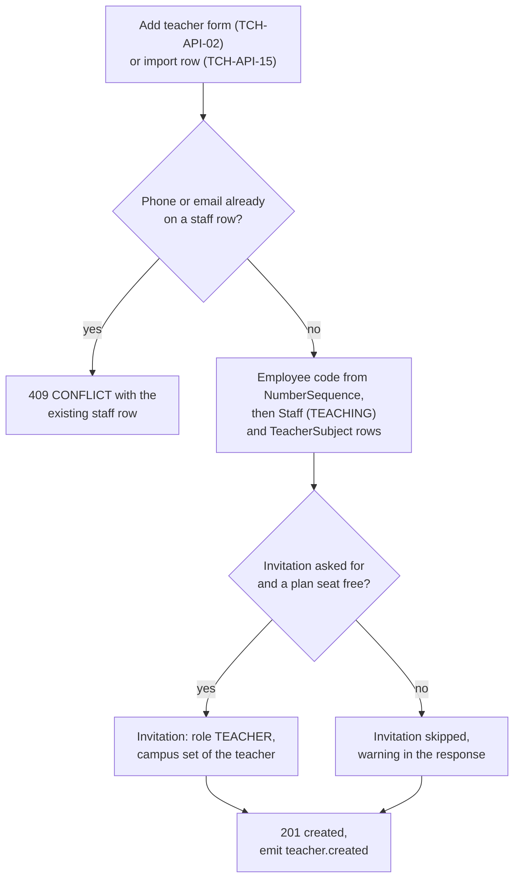
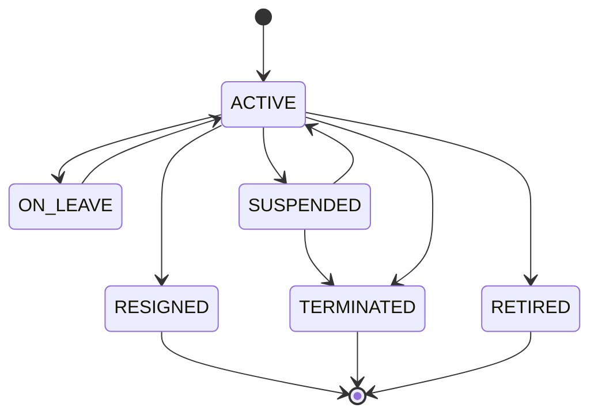
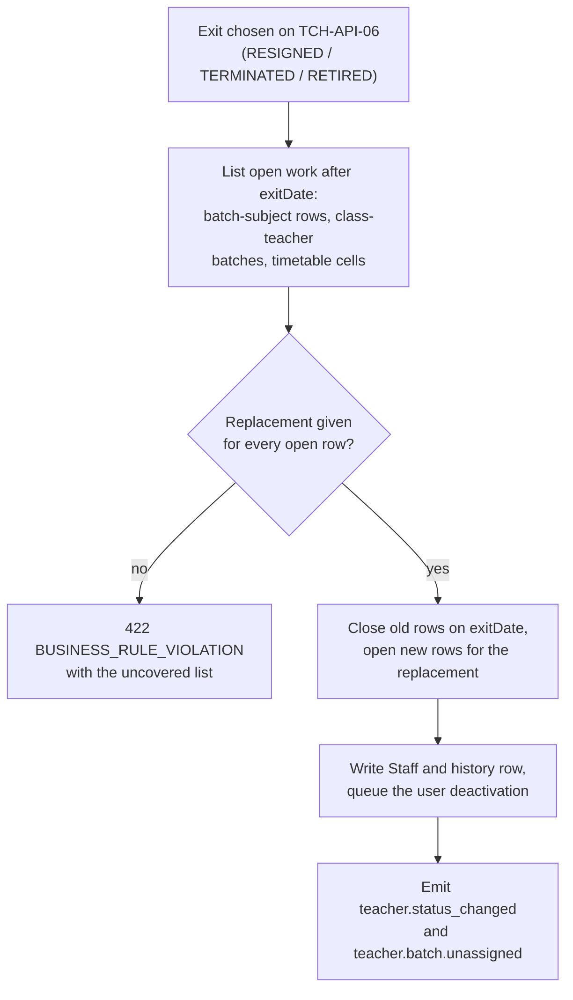
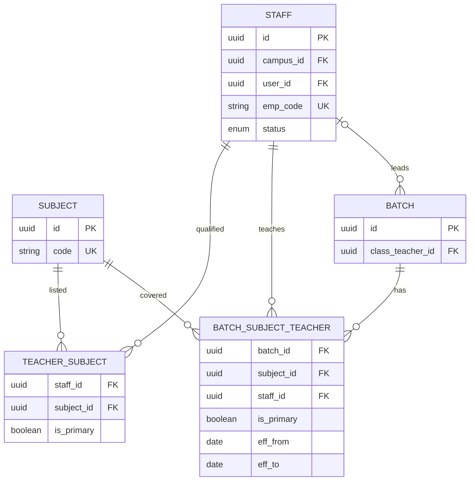

# Teachers Module

**In simple words:** This module keeps one record for every teacher: who she is, what she can teach, which batches she teaches, how busy her week is, her documents and her login. Attendance, homework, exams and the timetable all read the teacher from here. The rule "a teacher sees only her own batches" is built from the rows this module writes. When a teacher leaves, the module hands her batches to someone else before her login stops.

| Item | Value |
|---|---|
| Module code | TCH |
| Release phase | Phase 1 (MVP), sprint week 4, Claude Code prompt `P-17` |
| Plans | Starter, Growth, Pro, Enterprise. Teacher records are unlimited; only logins use plan seats |
| Main users | Organization Admin, Principal, Teacher (own record only) |
| Depends on | Organizations, Multi Campus, Subjects, Batch, Settings, Authentication and Sessions |
| Main tables | `staff`, `teacher_subjects`, `batch_subject_teachers`, `staff_documents`, `staff_status_histories` |

## Objective

Without a teacher row there is no class teacher, attendance sheet, marks entry or teacher login. So the module is judged by how fast a new teacher starts work and how safely her work moves when she leaves. It also drives activation: first attendance within 7 days of signup.

| Goal | Target |
|---|---|
| Add one teacher and send her login | Under 2 minutes, subjects included |
| Import a faculty list | Sharma Classes loads 22 teachers from Excel in under 10 minutes |
| Give a teacher a batch and subject | Under 30 seconds per row |
| Open the workload board | Under 1 second for the 48 teachers of Bright Future |
| Exit without a gap | Every batch has a new teacher before the old login stops |
| Attendance marked on time | 90% of sheets inside the cut-off in the first 30 days |

## Scope

### In scope

- The teacher record: personal, contact, home campus, employee code, employment, qualification, department and designation.
- Subject expertise with one primary subject (`TeacherSubject`).
- Batch and subject allocation with dates and a co-teacher flag (`BatchSubjectTeacher`); class-teacher view.
- Workload in periods per week, the phone screen "My classes today", documents with expiry.
- Login invitation with the role Teacher, substitute availability, a three-number snapshot.
- Status lifecycle, exit with reassignment, search, summary, Excel import and export.

### Out of scope

| Item | Where it lives |
|---|---|
| Non-teaching staff, department and designation masters, bank and tax details | *Staff Module* |
| Staff check-in and check-out | *Attendance Module* |
| Leave requests and balances | *Leave Module* |
| Building the timetable grid and substitution rows | *Timetable Module* |
| Salary and per-lecture pay | *Payroll Module* |
| Logins, roles and passwords | *Authentication and Sessions*, *RBAC and Permissions Matrix* |
| Teacher ranking and result comparison | *Analytics Module*, *AI Insights Module* (read only) |

### Phase notes

| Phase | What ships |
|---|---|
| Phase 1 (MVP) | Every endpoint except `TCH-API-14`. Load is counted from `CourseSubject.weeklyPeriods`. The snapshot shows attendance only |
| Phase 2 (V1.0) | `TCH-API-14` and timetable-based load with substitutions. The snapshot adds homework and marks entry |

> **Note:** Every teacher is a `Staff` row with `staffType = TEACHING`. There is no `teachers` table, and a teacher id is always a `Staff` id. Payroll, leave and staff attendance therefore work for teachers without a second record.

## User Stories

| ID | As a | I want to | So that | Priority |
|---|---|---|---|---|
| TCH-US-01 | Organization Admin | add a teacher with her subjects and login in one form | she marks attendance the same morning | Must |
| TCH-US-02 | Organization Admin | import the faculty list from Excel with a dry run | I do not type 48 records by hand | Must |
| TCH-US-03 | Principal | search by name, employee code, subject or department | I find the right person while a parent waits | Must |
| TCH-US-04 | Principal | mark which subjects a teacher is qualified to teach | nobody gives Physics to an English teacher | Must |
| TCH-US-05 | Principal | assign a teacher to a batch and subject from a date | her attendance, homework and marks open at once | Must |
| TCH-US-06 | Principal | see and change the class teacher of a batch | one person owns remarks and report cards | Must |
| TCH-US-07 | Principal | see periods per week of every teacher on one board | I share the load fairly | Should |
| TCH-US-08 | Principal | find qualified teachers who are free in period 4 today | I cover an absence in two minutes | Should |
| TCH-US-09 | Teacher | open my classes for today on my phone | I know where to go and what is pending | Must |
| TCH-US-10 | Teacher | see my profile, subjects, batches and timetable | I can check my own load | Should |
| TCH-US-11 | Organization Admin | store degree, appointment letter and police verification | the file is ready for an inspection | Should |
| TCH-US-12 | Principal | set a teacher on leave or suspended with a reason | substitution and reports know she is away | Must |
| TCH-US-13 | Organization Admin | record a resignation and hand over every batch in one flow | no class is left without a teacher | Must |
| TCH-US-14 | Organization Admin | see a punctuality snapshot per teacher | the staff meeting talks about facts | Could |

## Workflow

**Figure: Adding a teacher and giving the login**



1. Zod validates the body or import row; the duplicate check follows (`TCH-BR-03`).
2. In one transaction: the code is taken under a row lock (`TCH-BR-02`), then the `Staff` row (`TEACHING`, `ACTIVE`) and the `TeacherSubject` rows are written. A failure saves nothing.
3. If a login was asked for, the plan seat is checked. No free seat means a warning, not a failure (`TCH-BR-16`).
4. After commit, `teacher.created` is queued for the welcome message, counters and webhooks.

### Status lifecycle

The status is the enum `StaffStatus`. `TCH-API-06` is the only way to change it. Every change writes a `StaffStatusHistory` row with `changeType = STATUS`.

**Figure: Teacher status lifecycle**



| Status | Meaning | Login | New assignment | In the ratio |
|---|---|---|---|---|
| `ACTIVE` | Working normally | Active | Yes | Yes |
| `ON_LEAVE` | Long leave (maternity, study, sick) | Active | No; old rows stay | Yes |
| `SUSPENDED` | Stopped during an inquiry | Suspended | No | No |
| `RESIGNED` | Left on her own | Deactivated on `exitDate` | No | No |
| `TERMINATED` | Service ended by the institute | Deactivated on `exitDate` | No | No |
| `RETIRED` | Normal retirement | Deactivated on `exitDate` | No | No |

The three exit statuses end that spell of work. The only way back is a rehire (`TCH-BR-13`): a new joining date through `TCH-API-04`, then `ACTIVE` through `TCH-API-06`. The old employee code and history stay.

### Giving a teacher her classes

| Work | Stored in | Key needed | Meaning |
|---|---|---|---|
| Subject expertise | `teacher_subjects` | `teachers.update` | What she may teach |
| Batch and subject | `batch_subject_teachers` | `teachers.assign` | What she really teaches; drives the `Own` scope |
| Class teacher | `batches.class_teacher_id` | `batches.update` | Owner of one whole batch |

### Teacher exit and reassignment

**Figure: Exit with reassignment**



1. The exit wizard (`TCH-S07`) loads open work from `TCH-API-09` and shows a replacement picker per line.
2. `TCH-API-06` gets `status`, `effectiveDate`, `reason` and `reassignments`. Each replacement is checked like a normal assignment.
3. Old rows get `effectiveTo = exitDate`; new rows start the next day. Class-teacher batches get the new `classTeacherId`, and *Timetable Module* rewrites later cells.
4. A BullMQ job deactivates the `User` at 23:59 on the exit date and revokes refresh tokens with reason `USER_DEACTIVATED`.

> **Warning:** An exit never deletes past work. Attendance, homework, marks and remarks keep the old teacher id, so `staff` rows are soft-deleted and `BatchSubjectTeacher` restricts deletes of its staff row.

## Screens and Wireframes

| ID | Screen | Users | Purpose |
|---|---|---|---|
| TCH-S01 | Teachers list | Organization Admin, Principal | Find, filter, compare load, bulk invite, bulk status change |
| TCH-S02 | Add or edit teacher | Organization Admin, Principal | Create the record, pick subjects, ask for the login |
| TCH-S03 | Teacher profile with tabs | Holders of `teachers.view`; a teacher sees her own | Overview, subjects, batches, timetable, documents, log |
| TCH-S04 | Assign batch and subject dialog | Organization Admin, Principal | One batch plus subject with dates and the primary flag |
| TCH-S05 | Workload board | Organization Admin, Principal | Balance periods and spot uncovered work |
| TCH-S06 | My classes today (mobile) | Teacher | Today's periods, pending attendance, homework to check |
| TCH-S07 | Exit and reassignment wizard | Organization Admin | Hand over every batch before the login stops |
| TCH-S08 | Import teachers wizard | Organization Admin | Map columns, dry run, fix errors, commit |

**Screen TCH-S01 — Teachers list (Principal, web)**

```text
+--------------------------------------------------------------------------+
| EduFlow | Bright Future Public School   [Search teachers..]  (AV) v      |
+------------+-------------------------------------------------------------+
| Dashboard  | Teachers                  [Import] [Export] [+ Add teacher] |
| Students   +-------------------------------------------------------------+
| Teachers < | Campus [Main v] Dept [All v] Subject [All v] Status [Act v] |
|  List      | 48 teachers . ratio 25:1 . 3 on leave . 2 without login     |
|  Workload  |-------------------------------------------------------------|
|  Import    | [ ] Code        Name         Subjects    Batch Load  Status |
| Batches    | [x] BF-EMP-0031 Priya Nair   Maths, Phy  5     28/30 Active |
| Attendance | [x] BF-EMP-0044 Rahul Verma  English     4     22/30 Active |
| Fees       | [ ] BF-EMP-0052 Meena Joshi  Biology     3     18/30 Leave  |
| Exams      | [ ] BF-EMP-0067 Amit Khanna  - none -    0      0/30 Active |
| Settings   |-------------------------------------------------------------|
|            | 2 selected  [Send login invite]  [Change status]  [Export]  |
|            | Page 1 of 3                            [< Prev]  [Next >]   |
+------------+-------------------------------------------------------------+
```

- Header counts come from `TCH-API-18`, the grid from `TCH-API-01`. "Load" is periods per week against the cap (`TCH-BR-09`).
- `[+ Add teacher]` opens `TCH-S02`, `[Import]` opens `TCH-S08`, `[Export]` queues `TCH-API-16`.
- `[Send login invite]` calls `USR-API-28` for selected rows with an email and no user. `[Change status]` calls `TCH-API-06` per row; rows that need a handover are skipped and listed.

**Screen TCH-S02 — Add teacher (office user, web)**

```text
+--------------------------------------------------------------------------+
| EduFlow | Bright Future Public School                    (AV) v          |
+------------+-------------------------------------------------------------+
| Dashboard  | Teachers > Add teacher                    Step 1 of 2       |
| Students   +-------------------------------------------------------------+
| Teachers < | Campus *   [Main Campus, Lucknow v]  Code: auto BF-EMP-0068 |
|  List      | First name * [Kavita____________] Last name [Rao_________]  |
|  Workload  | Phone *      [+91 98390 41527__] Email [kavita.rao@bright]  |
| Batches    | Gender [Female v]  Date of birth [03-02-1994]               |
| Attendance |-------------------------------------------------------------|
| Fees       | Employment * [Full time v]   Joining date * [18-10-2027]    |
| Exams      | Department [Science v]    Designation [PGT Mathematics v]   |
| Settings   | Qualification [M.Sc. Mathematics, B.Ed.______________]      |
|            | Experience before joining [ 4.0 ] years                     |
|            |-------------------------------------------------------------|
|            | Subjects she can teach *  [x] Maths (primary) [x] Physics   |
|            |                           [ ] Chemistry       [ ] Biology   |
|            | [x] Send login invitation to the email above (role Teacher) |
|            |                  [Cancel]  [Save]  [Save & assign batches]  |
+------------+-------------------------------------------------------------+
```

- Required: campus, first name, phone, employment type, joining date and one subject. The office often has only a phone number on day one.
- The code is a preview; the real code is taken at save time (`TCH-BR-02`).
- `[Save]` calls `TCH-API-02`. `[Save & assign batches]` also opens `TCH-S04`. The checkbox sends `sendInvitation: true`.

**Screen TCH-S03 — Teacher profile, Batches tab (Principal, web)**

```text
+--------------------------------------------------------------------------+
| EduFlow | Bright Future Public School                    (AV) v          |
+------------+-------------------------------------------------------------+
| Dashboard  | Priya Nair  BF-EMP-0031  Active  Login: active  Maths       |
| Students   +-------------------------------------------------------------+
| Teachers < | [Overview][Subjects][Batches <][Timetable][Documents][Log]  |
|  List      |-------------------------------------------------------------|
|  Workload  | Class teacher of: 10-A (32 students)      [Change batch]    |
| Batches    |-------------------------------------------------------------|
| Attendance | Batch   Subject    Role       From        To    Periods     |
| Fees       | 10-A    Maths      Primary    01-04-2027  -     6           |
| Exams      | 10-B    Maths      Primary    01-04-2027  -     6           |
| Settings   | 9-A     Maths      Primary    01-04-2027  -     5           |
|            | 9-B     Physics    Co-teacher 01-04-2027  -     5           |
|            | 8-C     Maths      Primary    01-07-2027  -     6           |
|            |-------------------------------------------------------------|
|            | Weekly load 28 of 30 periods (93%)   Substitutions 2/week   |
|            |            [+ Assign batch and subject]  [Print timetable]  |
+------------+-------------------------------------------------------------+
```

- Tabs call: Subjects `TCH-API-07` and `TCH-API-08`, Batches `TCH-API-09`, Timetable `TCH-API-14`, Documents `TCH-API-11` and `TCH-API-12`. Overview shows the snapshot.
- "Class teacher of" lives on `Batch.classTeacherId`; `[Change batch]` calls `BAT-API-19` in *Batch Module*.
- `[+ Assign batch and subject]` opens `TCH-S04` (`TCH-API-10`). Ended rows move to a collapsed "Past assignments" group.
- A teacher on her own profile sees the same tabs with every write button hidden.

**Screen TCH-S05 — Workload board (Principal, web)**

```text
+--------------------------------------------------------------------------+
| EduFlow | Bright Future Public School                    (AV) v          |
+------------+-------------------------------------------------------------+
| Dashboard  | Teachers > Workload board      Week 11-16 Oct 2027          |
| Students   +-------------------------------------------------------------+
| Teachers < | Campus [Main v]  Dept [All v]  Sort [Load, high first v]    |
|  List      |-------------------------------------------------------------|
|  Workload< | Teacher       Periods Free Batches Subs  Load               |
| Batches    | Priya Nair     28/30    2    5       2    ##########   93%  |
| Attendance | Rahul Verma    22/30    8    4       0    #######      73%  |
| Fees       | Meena Joshi    18/30   12    3       0    ######       60%  |
| Exams      | Amit Khanna     0/30   30    0       0                  0%  |
| Settings   |-------------------------------------------------------------|
|            | Warning: 1 teacher over the cap, 1 teacher with no batch    |
|            | Uncovered periods today: 3     [Open substitutions]         |
|            |                              [Export XLSX]  [Print]         |
+------------+-------------------------------------------------------------+
```

- One call, `TCH-API-19`, feeds the board.
- "Subs" counts `Substitution` rows of the week and is never added to the load (`TCH-BR-10`).
- `[Open substitutions]` opens `TT-API-19` in *Timetable Module*. In Phase 1 a grey line says "Load is planned periods; the timetable is not live yet".

**Screen TCH-S06 — My classes today (Teacher, mobile)**

```text
+------------------------------------+
| EduFlow            Mon 11 Oct      |
| Hello Priya Nair                   |
|------------------------------------|
| MY CLASSES TODAY            4      |
| 08:00 P1  10-A  Maths              |
|           [Mark attendance]        |
| 08:45 P2  9-A   Maths  DONE        |
| 10:30 P4  10-B  Maths              |
|           [Mark attendance]        |
| 12:15 P6  9-B   SUBSTITUTE         |
|           for Meena Joshi          |
|           [Mark attendance]        |
|------------------------------------|
| TO DO                              |
| 2 attendance sheets pending        |
| 1 homework to check (10-A)         |
| Marks entry ends in 2 days         |
|------------------------------------|
| [Classes] [Homework] [Me]          |
+------------------------------------+
```

- The first screen after a teacher logs in. One request, `DASH-API-10`, merges timetable, substitutions, attendance and homework, so it works on weak 4G. Before the timetable ships it lists her batches with today's attendance status.
- `[Mark attendance]` opens the mark sheet (`ATT-API-08`) of *Attendance Module*; a marked period shows `DONE`.
- `[Me]` opens her own profile (`TCH-API-03`), read only.

## UI Components

| Component | Type | Behaviour |
|---|---|---|
| Teacher table | shadcn/ui `DataTable` + TanStack Query | Server paging, filters in the URL. Loading: 8 skeleton rows. Empty: "No teacher matches these filters" + `[Clear filters]`. Error: "Could not load teachers" + `[Try again]` |
| Subject picker | `Command` + `Badge` | Multi-select with search; one badge can be set as primary |
| Teacher picker | `Combobox`, async | Calls `TCH-API-17` with `subjectId` and `campusId`; shows code, primary subject and load |
| Assignment dialog | `Dialog` + React Hook Form + Zod | Batch, subject, role, from and to dates; qualification checked before submit |
| Load bar | Custom bar with number | Blocks plus the percent as text; "over cap" tag above 100% |
| Exit wizard | `Stepper` in a `Sheet` | Status and dates, one replacement per open row, review. `[Confirm exit]` stays disabled until all rows are covered |
| Document card | `Card` + dropzone | Upload via `CMN-API-02` and `CMN-API-05`, then `TCH-API-12`; shows "expires in 24 days" |
| Import wizard | `Stepper` | Mapping from `CMN-API-13`, dry run, error workbook; polls `CMN-API-12` every 3 seconds |
| Today card (mobile) | `Card` list | Tap targets of 44 px, offline banner, automatic retry |

## Validation Rules

One Zod schema in the `shared/` workspace runs on the server and in the form, so each message is written once.

| Field | Rule | Error message shown to user |
|---|---|---|
| `campusId` | Required; a campus the caller may use | Pick a campus you have access to. |
| `firstName` | Required, 2 to 80 characters, any script | Enter the first name (at least 2 letters). |
| `phone` | Required, E.164 after normalising; unique among staff | This phone number already belongs to {name} ({code}). |
| `email` | Valid, lower-cased, unique; required when `sendInvitation` is true | Enter an email address to send the login invitation. |
| `dateOfBirth` | Past date; age 18 to 75 on the joining date | A teacher must be at least 18 years old on the joining date. |
| `joiningDate` | Required; at most 90 days in the future | Joining date cannot be more than 90 days in the future. |
| `employmentType` | Required `EmploymentType` value | Choose the employment type. |
| `designationId` | Active row whose `staffType` is `TEACHING` or null | This designation is not meant for teaching staff. |
| `subjectIds` | 1 to 12 active subjects, no duplicates | Choose at least one subject this teacher can teach. |
| `primarySubjectId` | Inside `subjectIds` | The primary subject must be one of the chosen subjects. |
| `batchId` + `subjectId` | Subject is in `CourseSubject` of the batch course | {subject} is not taught in {course}, so it cannot be assigned. |
| Assigned teacher | `ACTIVE` and qualified for the subject | {teacher} is not marked as qualified for {subject}. Add the subject first. |
| `effectiveTo` | On or after `effectiveFrom`, inside the academic year | The end date must be on or after the start date. |
| `status` | Transition allowed by the lifecycle | You cannot change the status from {from} to {to}. |
| `effectiveDate` | At most 365 days back and 180 days ahead | Choose a date within the allowed range. |
| `reason` | Required for suspension and exits; 5 to 500 characters | Write a short reason (at least 5 letters). |
| `reassignments` | One entry per open item on an exit | {n} classes still have no new teacher. Choose a replacement for each. |
| `fileId` (document) | An `ACTIVE` `FileAsset` of the tenant | Upload the file again. The old upload was not finished. |
| `expiresOn` | After `issuedOn` | The expiry date must be after the issue date. |

## Business Rules

**TCH-BR-01 — A teacher is a staff row.** Every `/teachers` query adds `staffType = TEACHING`. An id of a `NON_TEACHING` row answers `404 NOT_FOUND`. A staff member who starts teaching is switched in *Staff Module*.

**TCH-BR-02 — Gap-free employee code per tenant.** The code comes from the `NumberSequence` row with `sequenceType = EMPLOYEE_CODE`. It is locked with `SELECT ... FOR UPDATE` in the same transaction as the insert, and `resetPolicy` is `NEVER`.

```text
Bright Future: prefix BF-EMP, format {PREFIX}-{SEQ}, padLength 4
  nextValue 68  ->  code BF-EMP-0068, nextValue becomes 69
Sharma Classes: prefix SC, padLength 3
  nextValue 23  ->  code SC-023
```

A code typed in an import file must still be unique per tenant.

**TCH-BR-03 — No duplicate people.** The same normalised phone or lower-cased email on a live `staff` row of the tenant answers `409 CONFLICT` with that row's id, name, code and status.

**TCH-BR-04 — Home campus and reach.** A campus move is `STF-API-08` in *Staff Module*; a second campus comes through `UserCampus` (`USR-API-12`). A batch outside her campuses answers `422`.

**TCH-BR-05 — One primary subject.** A teacher has 1 to 12 subjects and at most one `isPrimary = true`. `TCH-API-08` replaces the whole set in one transaction. A subject used by an open assignment cannot be removed; the API answers `422` and names the batches.

**TCH-BR-06 — Four checks before an assignment.** `TCH-API-10` writes only when: the teacher is `ACTIVE`; a `TeacherSubject` row exists for the subject; a `CourseSubject` row links the batch course and the subject; and no identical row exists (`@@unique([organizationId, batchId, subjectId, staffId])`). `SUB-API-17` in *Subjects Module* writes the same table through the same service.

**TCH-BR-07 — One main teacher per batch and subject.** At any date only one open row (`effectiveTo` null or not passed) per batch and subject has `isPrimary = true`. Co-teachers get the same data rights; the parent app names the primary teacher.

**TCH-BR-08 — Class teacher.** `Batch.classTeacherId` holds one `ACTIVE` teacher. If she teaches no subject there, the save works with the warning "This teacher does not teach any subject in 10-A".

**TCH-BR-09 — Weekly load and the cap.** Load is periods per week. The cap is the setting `teachers.max_periods_per_week` (default 30; a campus may override it).

```text
Phase 1: load = SUM(CourseSubject.weeklyPeriods) over open
                BatchSubjectTeacher rows (co-teacher rows count)
Phase 2: load = COUNT(TimetableEntry rows with staffId = teacher)
free        = cap - load
utilisation = round(load / cap * 100)

Priya Nair: 10-A 6 + 10-B 6 + 9-A 5 + 9-B 5 + 8-C 6 = 28 periods
            free = 30 - 28 = 2, utilisation = round(93.3) = 93%
```

The board warns from 90%. It never blocks: an assignment above the cap succeeds with the warning `LOAD_ABOVE_CAP` and an audit row.

**TCH-BR-10 — Substitutions are counted, not added.** They show next to the load (`28/30`, `Subs 2`) because they change every week. `TT-API-12` offers a substitute only if she is `ACTIVE`, qualified, free in that period, not on approved leave and under the cap. Lowest load comes first.

**TCH-BR-11 — Student-teacher ratio.** `TCH-API-18` divides active students in scope by `ACTIVE` plus `ON_LEAVE` teachers. `SUSPENDED` and exit statuses are left out.

```text
Bright Future:  1,200 / 48 = 25.0   -> shown as 25:1
Sharma Classes:   350 / 22 = 15.9   -> shown as 15.9:1
```

**TCH-BR-12 — The snapshot has three facts, no score.** It covers the last 30 days and always shows the raw counts. The cut-off is the setting `teachers.attendance_cutoff_minutes` (default 60 minutes after the period ends, measured on `AttendanceSession.takenAt`).

```text
attendance_on_time = sessions taken inside the cut-off / sessions due
homework_given     = Homework rows with status PUBLISHED set by her
marks_on_time      = ExamSchedule rows with marksSubmittedAt on or
                     before Exam.marksEntryDeadline / her papers

Priya Nair, Sep 2027: 88 / 92 = 95.7 -> "96% (88 of 92)"
                      12 homework
                      7 / 8 = 87.5   -> "88% (7 of 8)"
```

Fewer than 10 sessions due shows "not enough data".

**TCH-BR-13 — Status transitions.** Only the arrows of the lifecycle diagram are allowed, plus a rehire from an exit status to `ACTIVE` when `joiningDate` is after the old `exitDate`. Any other move answers `422`. A future `effectiveDate` is stored at once and applied by the nightly job, so today's rolls do not change.

**TCH-BR-14 — An exit leaves no gap.** For `RESIGNED`, `TERMINATED` or `RETIRED` the service lists every assignment open after `effectiveDate`, every class-teacher batch and every later timetable cell. Each needs a replacement in the same call, or the answer is `422` with the uncovered list. At year end, when all her batches are `COMPLETED`, the list is empty.

**TCH-BR-15 — Status and the login.** `SUSPENDED` suspends the `User` at once. An exit deactivates it at 23:59 on `exitDate`. A return to `ACTIVE` reactivates it only if the account was not deleted.

**TCH-BR-16 — Logins and plan seats.** Teacher records never count against a plan; users do. Starter allows 1 admin plus 3 staff logins, so a Starter school with 12 teachers keeps 12 records and 3 logins. Without a free seat `TCH-API-02` still answers `201` with `warnings: ["INVITATION_SKIPPED_PLAN_LIMIT"]`.

**TCH-BR-17 — Delete is for mistakes.** `TCH-API-05` soft-deletes only a teacher with no assignment, class-teacher batch, timetable cell, attendance, homework, marks or payslip. Everyone else leaves through a status change.

**TCH-BR-18 — What a teacher may see.** With scope `Own`, `teachers.view` matches only the `Staff` row whose `userId` is the caller. `TCH-API-01` and `TCH-API-19` return her row only; `TCH-API-17` and `TCH-API-18` answer `403`.

**TCH-BR-19 — Documents.** A document expiring within 30 days appears in `DASH-API-07` and `STF-API-17`. The document number is stored encrypted; only `documentNoLast4` is ever shown.

**TCH-BR-20 — Import.** `TCH-API-15` takes XLSX or CSV up to 2,000 rows and 5 MB. A row matches by employee code, then phone; a match updates, else it inserts. `staffType` is forced to `TEACHING`. Subjects come as codes (`MATH;PHY`), the first is primary. A bad row fails alone.

**TCH-BR-21 — Sensitive fields stay out.** `/teachers` never returns bank, tax, national id or statutory fields. Only `STF-API-11` and `STF-API-12` handle them, with `staff.view_sensitive` and `staff.update_sensitive`.

**TCH-BR-22 — Assignments are dated, not deleted.** A mid-year change closes the old row with `effectiveTo` and opens a new one, so April reports still show the old teacher.

## Acceptance Criteria

| ID | Given | When | Then |
|---|---|---|---|
| TCH-AC-01 | Dr. Anita Verma is Principal of the Main Campus | she saves a teacher with name, phone, joining date, employment type and Mathematics | `201`, code `BF-EMP-0068`, one `TeacherSubject` row, `teacher.created` queued |
| TCH-AC-02 | A staff row has the phone `+919415023678` | a new teacher is saved with `09415023678` | `409 CONFLICT` naming the existing teacher, code and status |
| TCH-AC-03 | Starter has used 1 admin and 3 staff logins | a teacher is saved with the invitation ticked | `201`, no `Invitation` row, warning `INVITATION_SKIPPED_PLAN_LIMIT` |
| TCH-AC-04 | Priya Nair is qualified for Mathematics and Physics | she is assigned to 10-A Chemistry | `422 BUSINESS_RULE_VIOLATION` "not marked as qualified"; nothing written |
| TCH-AC-05 | 10-A Mathematics has Priya as primary teacher | Rahul Verma is assigned there with `isPrimary` true | `409 CONFLICT`; with `isPrimary` false a co-teacher row is created |
| TCH-AC-06 | Priya has 28 planned periods and the cap is 30 | the workload board opens | her row shows `28/30`, `2` free, `93%` and a near-cap note |
| TCH-AC-07 | Meena Joshi is on approved leave on 11 Oct | substitutes for period 6 are listed | Meena is absent; every teacher listed is qualified, free and under the cap |
| TCH-AC-08 | Priya is signed in as Teacher | she calls the list, the lookup and another profile | own row only; lookup `403 FORBIDDEN`; other profile `404 NOT_FOUND` |
| TCH-AC-09 | Priya teaches 5 batches and leads 10-A | an exit on 30 Nov is sent without replacements | `422` listing 6 uncovered items |
| TCH-AC-10 | The same exit now has 6 replacements | it is sent again | old rows end 30 Nov, new rows start 1 Dec, `classTeacherId` changes, deactivation job set for 23:59 on 30 Nov |
| TCH-AC-11 | Priya exited yesterday | she tries to log in | `401`; her refresh tokens show `USER_DEACTIVATED`; past attendance unchanged |
| TCH-AC-12 | A Sharma Classes file has 22 rows, 3 with bad subject codes | a dry run is started | nothing written; 19 valid, 3 failed; error workbook names column and reason |
| TCH-AC-13 | Suresh Gupta is signed in as Accountant | he calls any `/teachers` endpoint | `403 FORBIDDEN`, logged with outcome `DENIED` |
| TCH-AC-14 | A Bright Future token is used | it asks for a Sharma Classes teacher id | `404 NOT_FOUND`; RLS returns no row even with the Prisma extension off |
| TCH-AC-15 | Priya took 88 of 92 due sessions inside the cut-off | her overview opens | "96% (88 of 92)" with no single score |
| TCH-AC-16 | A teacher has one open assignment | delete is called | `422` with the reason; after the row ends, delete sets `deletedAt` |

## Edge Cases

| Case | What happens | How the system handles it |
|---|---|---|
| Teacher has no email | Invitation cannot be mailed | Record saved; checkbox disabled. Later invite by phone OTP through `USR-API-25` |
| Subject removed while still taught | Assignment would lose its qualification | `TCH-API-08` answers `422` and names the open batches |
| Batch cancelled mid-year | Assignments point at a dead batch | Nightly job closes them with the cancel date; load drops |
| Resigns on the joining day | Exit date equals joining date | Allowed; both history rows kept; code never reused |
| Exited teacher hired again | A second record would split history | Old record rehired (`TCH-BR-13`); the phone check blocks a twin |
| 31st period over the cap | The cap is a guide | Saved with `LOAD_ABOVE_CAP` and an audit row |
| Same phone twice in one import file | Two rows claim one person | First row wins; second fails with `DUPLICATE_IN_FILE` |
| Upload never confirmed | `PENDING_UPLOAD` file hangs | `TCH-API-12` refuses it; cleanup deletes it after 24 hours |
| Phone changed while the login uses it | Staff and user phones could drift | `TCH-API-04` changes the staff phone only; the login phone changes with OTP in *Authentication and Sessions* |

## Database Schema

| Table | Purpose | Owned by |
|---|---|---|
| `staff` | The teacher record, filtered by `staff_type = 'TEACHING'` | Shared with *Staff Module* |
| `teacher_subjects` | Subjects a teacher may teach, one primary | This module |
| `batch_subject_teachers` | Who teaches which subject in which batch | This module; read by all academic modules |
| `staff_documents` | Degree, appointment letter, police verification | Shared with *Staff Module* |
| `staff_status_histories` | Every status, campus, department or designation change | Shared with *Staff Module* |
| `batches` | Holds `class_teacher_id` | *Batch Module* |

### Table staff

| Column | Type | Null | Default | Notes |
|---|---|---|---|---|
| `id` | uuid | No | `uuid()` | PK; the teacher id |
| `organization_id`, `campus_id` | uuid | No | - | FKs; `campus_id` is the home campus |
| `user_id` | uuid | Yes | null | FK `users`, unique; set when the invite is accepted |
| `employee_code` | varchar(30) | No | - | Unique per tenant |
| `staff_type`, `employment_type`, `status` | enums | No | `FULL_TIME`, `ACTIVE` | `staff_type` is always `TEACHING` here |
| `first_name`, `last_name` | varchar(80) | No, Yes | - | Any script |
| `gender`, `blood_group`, `date_of_birth` | enum, date | Yes | null | |
| `phone`, `alternate_phone`, `email` | varchar | No, Yes, Yes | - | E.164 phones; email needed for the invite |
| `photo_file_id`, `department_id`, `designation_id`, `reports_to_id` | uuid | Yes | null | FKs, set null on delete |
| `joining_date`, `confirmation_date` | date | No, Yes | - | |
| `qualification`, `specialization`, `experience_years` | varchar(255), decimal(4,1) | Yes | null | Experience before joining |
| Six address and two emergency contact columns | varchar | Yes | null | |
| `notice_period_days`, `resignation_date`, `exit_date`, `exit_reason` | smallint, date, varchar | Yes | null | Login stops at 23:59 on `exit_date` |
| `custom_fields` | jsonb | Yes | null | Cached custom values |
| `created_by_id`, `created_at`, `updated_at`, `deleted_at` | uuid, timestamptz | Mixed | `now()` | Audit and soft delete |

Ten more columns are never touched here: eight bank, tax and statutory columns (`TCH-BR-21`) and the privacy columns `anonymized_at` and `retention_until`.

### Table teacher_subjects

| Column | Type | Null | Default | Notes |
|---|---|---|---|---|
| `id`, `organization_id` | uuid | No | `uuid()`, - | PK; tenant FK |
| `staff_id`, `subject_id` | uuid | No | - | FKs, cascade |
| `is_primary` | boolean | No | `false` | One true row per teacher |
| `created_at`, `updated_at` | timestamptz | No | `now()` | No soft delete; the set is replaced |

### Table batch_subject_teachers

| Column | Type | Null | Default | Notes |
|---|---|---|---|---|
| `id`, `organization_id` | uuid | No | `uuid()`, - | PK; tenant FK |
| `campus_id` | uuid | No | - | FK `campuses`; copied from the batch |
| `batch_id` | uuid | No | - | FK `batches`, cascade |
| `subject_id`, `staff_id` | uuid | No | - | FKs, restrict |
| `is_primary` | boolean | No | `true` | `false` = co-teacher |
| `effective_from`, `effective_to` | date | Yes | null | Null = from batch start / still running |
| `created_at`, `updated_at` | timestamptz | No | `now()` | Rows are closed, not deleted |

### Table staff_documents

| Column | Type | Null | Default | Notes |
|---|---|---|---|---|
| `id`, `organization_id`, `staff_id` | uuid | No | `uuid()`, - | PK; FKs, cascade |
| `document_type`, `title` | enum, varchar(150) | No | - | Ten fixed `StaffDocumentType` values |
| `document_no_encrypted`, `document_no_last4` | text, varchar(4) | Yes | null | Ciphertext; only the last 4 are shown |
| `file_id` | uuid | No | - | FK `file_assets`, restrict |
| `issued_on`, `expires_on` | date | Yes | null | Expiry drives the alert |
| `is_verified`, `verified_by_id`, `verified_at` | boolean, uuid, timestamptz | No, Yes, Yes | `false` | Set by `STF-API-16` |
| `created_at`, `updated_at`, `deleted_at` | timestamptz | No, No, Yes | `now()` | Soft delete |

### Table staff_status_histories

| Column | Type | Null | Default | Notes |
|---|---|---|---|---|
| `id`, `organization_id`, `staff_id` | uuid | No | `uuid()`, - | PK; FKs, cascade |
| `change_type` | `StaffChangeType` | No | - | `STATUS` for this module |
| `from_value`, `to_value` | varchar(100) | Yes, No | - | Old and new value |
| `from_campus_id`, `to_campus_id` | uuid | Yes | null | Transfers only, no FK |
| `effective_date`, `reason` | date, varchar(500) | No, Yes | - | Reason required for suspension and exit |
| `changed_by_id`, `created_at` | uuid, timestamptz | Yes, No | `now()` | Append-only |

### Indexes and constraints

- `staff`: unique `(organization_id, employee_code)` and `user_id`; indexes on `(organization_id, campus_id, staff_type, status)`, `(organization_id, phone)` and names; GIN trigram index for `q`.
- `teacher_subjects`: unique `(organization_id, staff_id, subject_id)`. `batch_subject_teachers`: unique `(organization_id, batch_id, subject_id, staff_id)` and index `(organization_id, staff_id)` for the `Own` scope.
- `staff_documents`: index `(organization_id, expires_on)` for alerts. `staff_status_histories`: index `(organization_id, staff_id, effective_date)`.
- Every table has RLS on `app.current_org`. The two "one primary" rules depend on dates, so the service enforces them in the transaction.

**Figure: What a teacher may teach and what she really teaches**



`TEACHER_SUBJECT` says what a teacher may teach. `BATCH_SUBJECT_TEACHER` says what she really teaches, and only that row opens student data to her. Documents and history hang on `STAFF`, survive an exit and are left out of the picture.

## Prisma Schema

Copied from `docs/src/_schema/04-people.prisma` and `docs/src/_schema/03-academics.prisma`. The long back-relation list of `Staff` and some long trailing comments are shortened; every field, attribute and mapping is unchanged.

```prisma
enum StaffType {
  TEACHING
  NON_TEACHING
}

enum EmploymentType {
  FULL_TIME
  PART_TIME
  CONTRACT
  VISITING
  INTERN
}

enum StaffStatus {
  ACTIVE
  ON_LEAVE
  SUSPENDED
  RESIGNED
  TERMINATED
  RETIRED
}

enum StaffDocumentType {
  ID_PROOF
  ADDRESS_PROOF
  QUALIFICATION
  EXPERIENCE_LETTER
  APPOINTMENT_LETTER
  CONTRACT
  POLICE_VERIFICATION
  BANK_PROOF
  PHOTO
  OTHER
}

enum StaffChangeType {
  STATUS
  CAMPUS_TRANSFER
  DESIGNATION
  DEPARTMENT
  EMPLOYMENT_TYPE
}

// Employee profile (teacher or non-teaching). The login lives in User and is linked by userId.
model Staff {
  id                    String         @id @default(uuid()) @db.Uuid
  organizationId        String         @map("organization_id") @db.Uuid
  campusId              String         @map("campus_id") @db.Uuid // home campus
  userId                String?        @unique @map("user_id") @db.Uuid // null until invited
  employeeCode          String         @map("employee_code") @db.VarChar(30)
  staffType             StaffType      @map("staff_type")
  employmentType        EmploymentType @default(FULL_TIME) @map("employment_type")
  status                StaffStatus    @default(ACTIVE)
  firstName             String         @map("first_name") @db.VarChar(80)
  lastName              String?        @map("last_name") @db.VarChar(80)
  gender                Gender?
  dateOfBirth           DateTime?      @map("date_of_birth") @db.Date
  bloodGroup            BloodGroup?    @map("blood_group")
  email                 String?        @db.VarChar(255)
  phone                 String         @db.VarChar(20) // E.164
  alternatePhone        String?        @map("alternate_phone") @db.VarChar(20)
  photoFileId           String?        @map("photo_file_id") @db.Uuid
  departmentId          String?        @map("department_id") @db.Uuid
  designationId         String?        @map("designation_id") @db.Uuid
  reportsToId           String?        @map("reports_to_id") @db.Uuid // manager
  joiningDate           DateTime       @map("joining_date") @db.Date
  confirmationDate      DateTime?      @map("confirmation_date") @db.Date // end of probation
  qualification         String?        @db.VarChar(255) // e.g. M.Sc. Physics, B.Ed.
  specialization        String?        @db.VarChar(255)
  experienceYears       Decimal?       @map("experience_years") @db.Decimal(4, 1) // before joining
  addressLine1          String?        @map("address_line1") @db.VarChar(200)
  addressLine2          String?        @map("address_line2") @db.VarChar(200)
  city                  String?        @db.VarChar(100)
  state                 String?        @db.VarChar(100)
  postalCode            String?        @map("postal_code") @db.VarChar(20)
  countryCode           String?        @map("country_code") @db.Char(2)
  emergencyContactName  String?        @map("emergency_contact_name") @db.VarChar(120)
  emergencyContactPhone String?        @map("emergency_contact_phone") @db.VarChar(20)
  bankDetailsEncrypted  String?        @map("bank_details_encrypted") @db.Text // AES-256-GCM
  bankAccountLast4      String?        @map("bank_account_last4") @db.VarChar(4) // safe to display
  taxIdEncrypted        String?        @map("tax_id_encrypted") @db.Text // PAN / TFN / SSN
  nationalIdEncrypted   String?        @map("national_id_encrypted") @db.Text // Aadhaar ciphertext
  uan                   String?        @db.VarChar(12) // India PF Universal Account Number
  pfMemberId            String?        @map("pf_member_id") @db.VarChar(30) // PF member id
  esiIpNumber           String?        @map("esi_ip_number") @db.VarChar(20) // ESI person number
  statutoryIdsEncrypted String?        @map("statutory_ids_encrypted") @db.Text // ciphertext
  noticePeriodDays      Int?           @map("notice_period_days") @db.SmallInt
  resignationDate       DateTime?      @map("resignation_date") @db.Date
  exitDate              DateTime?      @map("exit_date") @db.Date
  exitReason            String?        @map("exit_reason") @db.VarChar(255)
  anonymizedAt          DateTime?      @map("anonymized_at") @db.Timestamptz(6) // after deletion
  retentionUntil        DateTime?      @map("retention_until") @db.Date
  customFields          Json?          @map("custom_fields") // cached CustomFieldValue rows
  createdById           String?        @map("created_by_id") @db.Uuid // User id (audit only)
  createdAt             DateTime       @default(now()) @map("created_at") @db.Timestamptz(6)
  updatedAt             DateTime       @updatedAt @map("updated_at") @db.Timestamptz(6)
  deletedAt             DateTime?      @map("deleted_at") @db.Timestamptz(6)

  organization Organization @relation(fields: [organizationId], references: [id], onDelete: Restrict)
  campus       Campus       @relation(fields: [campusId], references: [id], onDelete: Restrict)
  user         User?        @relation(fields: [userId], references: [id], onDelete: SetNull)
  photoFile    FileAsset?   @relation(fields: [photoFileId], references: [id], onDelete: SetNull)
  department   Department?  @relation("DepartmentStaff", fields: [departmentId], references: [id], onDelete: SetNull)
  designation  Designation? @relation(fields: [designationId], references: [id], onDelete: SetNull)
  reportsTo    Staff?       @relation("StaffManager", fields: [reportsToId], references: [id], onDelete: SetNull)

  directReports        Staff[]               @relation("StaffManager")
  headedDepartments    Department[]          @relation("DepartmentHead")
  documents            StaffDocument[]
  subjects             TeacherSubject[]
  classTeacherOf       Batch[]
  batchSubjects        BatchSubjectTeacher[]
  timetableEntries     TimetableEntry[]
  classSessions        ClassSession[]
  assignedHomework     Homework[]
  staffStatusHistories StaffStatusHistory[]
  // 26 more back-relations (leave, substitutions, staff attendance, homework
  // submissions, exams, library, transport, hostel, inventory, payroll, PTM,
  // study material, payments) stay as written in 04-people.prisma

  @@unique([organizationId, employeeCode])
  @@index([organizationId, campusId, staffType, status])
  @@index([organizationId, departmentId])
  @@index([organizationId, phone])
  @@index([organizationId, firstName, lastName])
  // ?q= contains search; needs CREATE EXTENSION pg_trgm in an earlier SQL migration
  @@index([firstName(ops: raw("gin_trgm_ops")), lastName(ops: raw("gin_trgm_ops")), employeeCode(ops: raw("gin_trgm_ops"))], type: Gin, map: "idx_staff_search_trgm")
  @@map("staff")
}

// Subjects a teacher is qualified to teach (used when assigning batches and substitutions).
model TeacherSubject {
  id             String   @id @default(uuid()) @db.Uuid
  organizationId String   @map("organization_id") @db.Uuid
  staffId        String   @map("staff_id") @db.Uuid
  subjectId      String   @map("subject_id") @db.Uuid
  isPrimary      Boolean  @default(false) @map("is_primary") // main subject of the teacher
  createdAt      DateTime @default(now()) @map("created_at") @db.Timestamptz(6)
  updatedAt      DateTime @updatedAt @map("updated_at") @db.Timestamptz(6)

  organization Organization @relation(fields: [organizationId], references: [id], onDelete: Cascade)
  staff        Staff        @relation(fields: [staffId], references: [id], onDelete: Cascade)
  subject      Subject      @relation(fields: [subjectId], references: [id], onDelete: Cascade)

  @@unique([organizationId, staffId, subjectId])
  @@index([organizationId, subjectId])
  @@map("teacher_subjects")
}

// Which teacher teaches which subject in which batch; drives the TEACHER "own batches" data scope.
model BatchSubjectTeacher {
  id             String    @id @default(uuid()) @db.Uuid
  organizationId String    @map("organization_id") @db.Uuid
  campusId       String    @map("campus_id") @db.Uuid
  batchId        String    @map("batch_id") @db.Uuid
  subjectId      String    @map("subject_id") @db.Uuid
  staffId        String    @map("staff_id") @db.Uuid
  isPrimary      Boolean   @default(true) @map("is_primary") // false = co-teacher / assistant
  effectiveFrom  DateTime? @map("effective_from") @db.Date
  effectiveTo    DateTime? @map("effective_to") @db.Date
  createdAt      DateTime  @default(now()) @map("created_at") @db.Timestamptz(6)
  updatedAt      DateTime  @updatedAt @map("updated_at") @db.Timestamptz(6)

  organization Organization @relation(fields: [organizationId], references: [id], onDelete: Cascade)
  campus       Campus       @relation(fields: [campusId], references: [id], onDelete: Restrict)
  batch        Batch        @relation(fields: [batchId], references: [id], onDelete: Cascade)
  subject      Subject      @relation(fields: [subjectId], references: [id], onDelete: Restrict)
  staff        Staff        @relation(fields: [staffId], references: [id], onDelete: Restrict)

  @@unique([organizationId, batchId, subjectId, staffId])
  @@index([organizationId, staffId])
  @@index([organizationId, campusId, batchId])
  @@map("batch_subject_teachers")
}

// Document uploaded for a staff member (ID proof, degree, contract).
model StaffDocument {
  id                  String            @id @default(uuid()) @db.Uuid
  organizationId      String            @map("organization_id") @db.Uuid
  staffId             String            @map("staff_id") @db.Uuid
  documentType        StaffDocumentType @map("document_type")
  title               String            @db.VarChar(150)
  documentNoEncrypted String?           @map("document_no_encrypted") @db.Text // never plain
  documentNoLast4     String?           @map("document_no_last4") @db.VarChar(4) // safe to display
  fileId              String            @map("file_id") @db.Uuid
  issuedOn            DateTime?         @map("issued_on") @db.Date
  expiresOn           DateTime?         @map("expires_on") @db.Date
  isVerified          Boolean           @default(false) @map("is_verified")
  verifiedById        String?           @map("verified_by_id") @db.Uuid // User id (audit only)
  verifiedAt          DateTime?         @map("verified_at") @db.Timestamptz(6)
  createdAt           DateTime          @default(now()) @map("created_at") @db.Timestamptz(6)
  updatedAt           DateTime          @updatedAt @map("updated_at") @db.Timestamptz(6)
  deletedAt           DateTime?         @map("deleted_at") @db.Timestamptz(6)

  organization Organization @relation(fields: [organizationId], references: [id], onDelete: Cascade)
  staff        Staff        @relation(fields: [staffId], references: [id], onDelete: Cascade)
  file         FileAsset    @relation(fields: [fileId], references: [id], onDelete: Restrict)

  @@index([organizationId, staffId])
  @@index([organizationId, expiresOn])
  @@map("staff_documents")
}

// Every status, campus, department or designation change of a staff member. Append-only.
model StaffStatusHistory {
  id             String          @id @default(uuid()) @db.Uuid
  organizationId String          @map("organization_id") @db.Uuid
  staffId        String          @map("staff_id") @db.Uuid
  changeType     StaffChangeType @map("change_type")
  fromValue      String?         @map("from_value") @db.VarChar(100) // value before
  toValue        String          @map("to_value") @db.VarChar(100)
  fromCampusId   String?         @map("from_campus_id") @db.Uuid // set for CAMPUS_TRANSFER
  toCampusId     String?         @map("to_campus_id") @db.Uuid
  effectiveDate  DateTime        @map("effective_date") @db.Date
  reason         String?         @db.VarChar(500)
  changedById    String?         @map("changed_by_id") @db.Uuid // User id (audit only, no FK)
  createdAt      DateTime        @default(now()) @map("created_at") @db.Timestamptz(6)

  organization Organization @relation(fields: [organizationId], references: [id], onDelete: Cascade)
  staff        Staff        @relation(fields: [staffId], references: [id], onDelete: Cascade)

  @@index([organizationId, staffId, effectiveDate])
  @@index([organizationId, changeType, effectiveDate])
  @@map("staff_status_histories")
}
```

## API Endpoints

Paths are relative to `/api/v1`. The tenant comes from the token; `X-Campus-Id` narrows a call to one assigned campus.

| ID | Method | Path | Permission | Purpose |
|---|---|---|---|---|
| TCH-API-01 | GET | `/teachers` | `teachers.view` | List; filters `campusId`, `departmentId`, `subjectId`, `status`, `employmentType`, `q` |
| TCH-API-02 | POST | `/teachers` | `teachers.create` | Create teaching staff; code issued; optional invitation |
| TCH-API-03 | GET | `/teachers/:id` | `teachers.view` | Profile with subjects, batches and login status |
| TCH-API-04 | PATCH | `/teachers/:id` | `teachers.update` | Update personal, contact, qualification, department, designation |
| TCH-API-05 | DELETE | `/teachers/:id` | `teachers.delete` | Soft delete; blocked while assignments are active |
| TCH-API-06 | POST | `/teachers/:id/change-status` | `teachers.manage` | Change status with reason and date; exit deactivates the login |
| TCH-API-07 | GET | `/teachers/:id/subjects` | `teachers.view` | Subjects she is qualified to teach |
| TCH-API-08 | PUT | `/teachers/:id/subjects` | `teachers.update` | Replace subjects and the primary subject |
| TCH-API-09 | GET | `/teachers/:id/batch-assignments` | `teachers.view` | Batches and subjects taught; class-teacher batches |
| TCH-API-10 | POST | `/teachers/:id/batch-assignments` | `teachers.assign` | Assign batch and subject with dates and primary flag |
| TCH-API-11 | GET | `/teachers/:id/documents` | `teachers.view` | List documents |
| TCH-API-12 | POST | `/teachers/:id/documents` | `teachers.update` | Attach an uploaded file as a document |
| TCH-API-13 | DELETE | `/teacher-documents/:id` | `teachers.update` | Soft delete a document |
| TCH-API-14 | GET | `/teachers/:id/timetable` | `teachers.view` | Weekly timetable with substitutions |
| TCH-API-15 | POST | `/teachers/import` | `teachers.import` | Import from Excel (type `STAFF`, `staffType` `TEACHING`) |
| TCH-API-16 | POST | `/teachers/export` | `teachers.export` | Export the teacher list |
| TCH-API-17 | GET | `/teachers/lookup` | `teachers.view` | Dropdown search; filters `subjectId`, `campusId` |
| TCH-API-18 | GET | `/teachers/summary` | `teachers.view` | Counts by status, department, type; student-teacher ratio |
| TCH-API-19 | GET | `/teachers/workload` | `teachers.view` | Periods, batches, students and substitutions per teacher |

Static segments (`lookup`, `summary`, `workload`, `import`, `export`) are routed before `/teachers/:id`. Every endpoint can also answer `401 UNAUTHENTICATED` or `TOKEN_EXPIRED`, `403 FORBIDDEN` (key or scope missing), `404 NOT_FOUND` (unknown id, other tenant, `NON_TEACHING` row, outside campus scope), `429 RATE_LIMITED` and `500 INTERNAL_ERROR`.

### TCH-API-01 — List teachers

```http
GET /api/v1/teachers?subjectId=9c4f7a21-5d38-4b6e-8f02-1a7d3c9e5b84&status=ACTIVE&q=nair&limit=20
Authorization: Bearer <accessToken>
X-Campus-Id: c2a41f08-6b7d-4e39-9f15-3a8d2e6c7b90
```

Without `status` the list shows `ACTIVE`, `ON_LEAVE` and `SUSPENDED`. `sort` accepts `firstName`, `employeeCode`, `joiningDate`, `load` and `createdAt`, with `-` for descending.

```json
{
  "success": true,
  "data": [
    {
      "id": "7b1e9d42-3c85-4f07-9a6d-2e5b8c1f4a63",
      "employeeCode": "BF-EMP-0031",
      "firstName": "Priya",
      "lastName": "Nair",
      "status": "ACTIVE",
      "employmentType": "FULL_TIME",
      "phone": "+919415023678",
      "department": { "id": "4a8c2e60-7f19-4d53-b8a1-5c9e0b3f7d24", "name": "Science" },
      "designation": { "id": "8f3b1d76-2e49-4c80-a5f7-3d6b9e1c4a58", "name": "PGT Mathematics" },
      "primarySubject": { "id": "9c4f7a21-5d38-4b6e-8f02-1a7d3c9e5b84", "name": "Mathematics" },
      "batchCount": 5,
      "weeklyPeriods": 28,
      "periodCap": 30,
      "isClassTeacher": true,
      "hasLogin": true
    }
  ],
  "meta": { "page": 1, "limit": 20, "total": 48, "totalPages": 3 }
}
```

| Status | Code | When |
|---|---|---|
| 400 | `VALIDATION_ERROR` | Filter not a UUID, unknown `status` or `sort`, `limit` above 100 |

### TCH-API-02 — Create a teacher

```http
POST /api/v1/teachers
Authorization: Bearer <accessToken>
Content-Type: application/json
```

```json
{
  "campusId": "c2a41f08-6b7d-4e39-9f15-3a8d2e6c7b90",
  "firstName": "Kavita",
  "lastName": "Rao",
  "phone": "+919839041527",
  "email": "kavita.rao@brightfuture.edu.in",
  "gender": "FEMALE",
  "dateOfBirth": "1994-02-03",
  "employmentType": "FULL_TIME",
  "joiningDate": "2027-10-18",
  "departmentId": "4a8c2e60-7f19-4d53-b8a1-5c9e0b3f7d24",
  "designationId": "8f3b1d76-2e49-4c80-a5f7-3d6b9e1c4a58",
  "qualification": "M.Sc. Mathematics, B.Ed.",
  "experienceYears": "4.0",
  "subjectIds": [
    "9c4f7a21-5d38-4b6e-8f02-1a7d3c9e5b84",
    "2e6b8d15-4a79-4c03-9d5f-7b1c4e8a2f69"
  ],
  "primarySubjectId": "9c4f7a21-5d38-4b6e-8f02-1a7d3c9e5b84",
  "sendInvitation": true
}
```

```json
{
  "success": true,
  "data": {
    "id": "f25d8b61-7a39-4c0e-b184-6e3a9d2c7f50",
    "employeeCode": "BF-EMP-0068",
    "status": "ACTIVE",
    "staffType": "TEACHING",
    "subjects": [
      { "subjectId": "9c4f7a21-5d38-4b6e-8f02-1a7d3c9e5b84", "isPrimary": true },
      { "subjectId": "2e6b8d15-4a79-4c03-9d5f-7b1c4e8a2f69", "isPrimary": false }
    ],
    "invitation": {
      "id": "e14c7b90-5a38-42f6-b01d-9c7e2a4f6b83",
      "status": "PENDING",
      "expiresAt": "2027-10-18T18:29:59.000Z"
    },
    "warnings": []
  }
}
```

| Status | Code | When |
|---|---|---|
| 400 | `VALIDATION_ERROR` | Required field missing, age rule fails, more than 12 subjects |
| 409 | `CONFLICT` | Phone or email already on a staff row; `details` names it |
| 422 | `BUSINESS_RULE_VIOLATION` | Designation not for teaching staff, or subject inactive |

No free seat: still `201`, with `invitation` null and the warning of `TCH-BR-16`.

### TCH-API-03 — Teacher profile

```http
GET /api/v1/teachers/7b1e9d42-3c85-4f07-9a6d-2e5b8c1f4a63
Authorization: Bearer <accessToken>
```

```json
{
  "success": true,
  "data": {
    "id": "7b1e9d42-3c85-4f07-9a6d-2e5b8c1f4a63",
    "employeeCode": "BF-EMP-0031",
    "firstName": "Priya",
    "lastName": "Nair",
    "status": "ACTIVE",
    "joiningDate": "2024-04-08",
    "qualification": "M.Sc. Mathematics, B.Ed.",
    "campus": { "id": "c2a41f08-6b7d-4e39-9f15-3a8d2e6c7b90", "name": "Main Campus" },
    "login": {
      "userId": "b8e34f27-1c69-40d5-9a72-4f8b1e6c3d05",
      "status": "ACTIVE",
      "lastLoginAt": "2027-10-11T02:41:18.000Z",
      "roles": ["TEACHER"]
    },
    "subjects": [
      { "subjectId": "9c4f7a21-5d38-4b6e-8f02-1a7d3c9e5b84", "name": "Mathematics", "isPrimary": true },
      { "subjectId": "2e6b8d15-4a79-4c03-9d5f-7b1c4e8a2f69", "name": "Physics", "isPrimary": false }
    ],
    "classTeacherOf": [
      { "batchId": "5e8a1c3d-2b7f-4e60-9a14-8d6c0f2b7e95", "name": "10-A", "strength": 32 }
    ],
    "workload": {
      "weeklyPeriods": 28, "periodCap": 30, "freePeriods": 2, "utilisation": 93,
      "batchCount": 5, "studentsReached": 156, "substitutionsThisWeek": 2
    },
    "performanceSnapshot": {
      "windowDays": 30,
      "attendanceOnTime": { "percent": 96, "marked": 88, "due": 92 },
      "homeworkPublished": 12,
      "marksOnTime": { "percent": 88, "submitted": 7, "papers": 8 }
    },
    "documentCount": 4,
    "expiringDocuments": 1
  }
}
```

The snapshot is computed on read and cached for 10 minutes (`TCH-BR-12`); its homework and marks parts are `null` until those modules are live.

| Status | Code | When |
|---|---|---|
| 404 | `NOT_FOUND` | Non-teaching row, other tenant, outside the campus scope, or another teacher for scope `Own` |

### TCH-API-06 — Change status and hand over the work

```http
POST /api/v1/teachers/7b1e9d42-3c85-4f07-9a6d-2e5b8c1f4a63/change-status
Authorization: Bearer <accessToken>
Content-Type: application/json
```

```json
{
  "status": "RESIGNED",
  "effectiveDate": "2027-11-30",
  "resignationDate": "2027-10-31",
  "reason": "Moving to another city for family reasons",
  "reassignments": [
    { "batchSubjectTeacherId": "1d7a4e93-6b25-4f18-9c30-8e2a5d7b1f46",
      "toStaffId": "a3f6c281-9d74-4b05-8e13-7c2f5a9b6d48" },
    { "classTeacherOfBatchId": "5e8a1c3d-2b7f-4e60-9a14-8d6c0f2b7e95",
      "toStaffId": "a3f6c281-9d74-4b05-8e13-7c2f5a9b6d48" }
  ],
  "deactivateLogin": true
}
```

The example shows two of Priya's six entries; the response counts all of them.

```json
{
  "success": true,
  "data": {
    "id": "7b1e9d42-3c85-4f07-9a6d-2e5b8c1f4a63",
    "status": "RESIGNED",
    "resignationDate": "2027-10-31",
    "exitDate": "2027-11-30",
    "historyId": "c07b5e39-4a18-4d62-9f80-3b6e1c7a2d95",
    "reassigned": { "batchSubjects": 5, "classTeacherBatches": 1, "timetableCells": 28 },
    "loginDeactivationJobAt": "2027-11-30T18:29:59.000Z"
  }
}
```

When work is left uncovered, the exit wizard draws this answer:

```json
{
  "success": false,
  "error": {
    "code": "BUSINESS_RULE_VIOLATION",
    "message": "3 classes still have no new teacher. Choose a replacement for each.",
    "details": [
      { "field": "reassignments", "issue": "10-A Mathematics has no replacement" },
      { "field": "reassignments", "issue": "9-B Physics has no replacement" },
      { "field": "reassignments", "issue": "Class teacher of 10-A has no replacement" }
    ]
  },
  "requestId": "req_8f3a2c71"
}
```

| Status | Code | When |
|---|---|---|
| 400 | `VALIDATION_ERROR` | Unknown status, date outside the window, reason missing |
| 409 | `CONFLICT` | The replacement already holds that batch and subject as primary |
| 422 | `BUSINESS_RULE_VIOLATION` | Transition not allowed, or open work without a replacement |

### TCH-API-08 — Replace qualified subjects

```http
PUT /api/v1/teachers/7b1e9d42-3c85-4f07-9a6d-2e5b8c1f4a63/subjects
Authorization: Bearer <accessToken>
Content-Type: application/json
```

```json
{
  "subjectIds": [
    "9c4f7a21-5d38-4b6e-8f02-1a7d3c9e5b84",
    "2e6b8d15-4a79-4c03-9d5f-7b1c4e8a2f69",
    "6d2a9f14-8c37-4e51-b0a6-1f7e3c5d9b28"
  ],
  "primarySubjectId": "9c4f7a21-5d38-4b6e-8f02-1a7d3c9e5b84"
}
```

```json
{
  "success": true,
  "data": {
    "staffId": "7b1e9d42-3c85-4f07-9a6d-2e5b8c1f4a63",
    "subjects": [
      { "subjectId": "9c4f7a21-5d38-4b6e-8f02-1a7d3c9e5b84", "code": "MATH", "isPrimary": true },
      { "subjectId": "2e6b8d15-4a79-4c03-9d5f-7b1c4e8a2f69", "code": "PHY", "isPrimary": false },
      { "subjectId": "6d2a9f14-8c37-4e51-b0a6-1f7e3c5d9b28", "code": "CHEM", "isPrimary": false }
    ],
    "added": 1,
    "removed": 0
  }
}
```

| Status | Code | When |
|---|---|---|
| 400 | `VALIDATION_ERROR` | Empty list, more than 12, duplicates, primary not in the list |
| 422 | `BUSINESS_RULE_VIOLATION` | A removed subject is still taught in an open assignment, or a subject is inactive |

### TCH-API-10 — Assign batch and subject

```http
POST /api/v1/teachers/7b1e9d42-3c85-4f07-9a6d-2e5b8c1f4a63/batch-assignments
Authorization: Bearer <accessToken>
Content-Type: application/json
```

```json
{
  "batchId": "3b9d6f20-7e14-4a85-9c3b-2d8f5a1e6c47",
  "subjectId": "9c4f7a21-5d38-4b6e-8f02-1a7d3c9e5b84",
  "isPrimary": true,
  "effectiveFrom": "2027-07-01",
  "effectiveTo": null
}
```

```json
{
  "success": true,
  "data": {
    "id": "0f4c8a72-1e93-4b56-8d20-6a7b3e9c5f18",
    "batch": { "id": "3b9d6f20-7e14-4a85-9c3b-2d8f5a1e6c47", "name": "8-C" },
    "subject": { "id": "9c4f7a21-5d38-4b6e-8f02-1a7d3c9e5b84", "name": "Mathematics" },
    "staffId": "7b1e9d42-3c85-4f07-9a6d-2e5b8c1f4a63",
    "isPrimary": true,
    "effectiveFrom": "2027-07-01",
    "effectiveTo": null,
    "weeklyPeriods": 6,
    "teacherLoad": { "weeklyPeriods": 28, "periodCap": 30, "utilisation": 93 },
    "warnings": []
  }
}
```

| Status | Code | When |
|---|---|---|
| 400 | `VALIDATION_ERROR` | Bad UUID, end date before start date |
| 409 | `CONFLICT` | Same row exists, or an open primary already exists for the batch and subject |
| 422 | `BUSINESS_RULE_VIOLATION` | Teacher not `ACTIVE`, not qualified, subject not in the course, batch outside her campuses |

### TCH-API-15 — Import teachers

```http
POST /api/v1/teachers/import
Authorization: Bearer <accessToken>
Content-Type: application/json
```

```json
{
  "fileId": "d81e5b37-4c20-4f96-a7e3-9b2c6d4f1a05",
  "campusId": "1a7e4c92-5b38-4f06-8d21-9e3c7a5b0f64",
  "isDryRun": true,
  "columnMapping": {
    "Faculty Code": "employeeCode",
    "Name": "firstName",
    "Surname": "lastName",
    "Mobile": "phone",
    "Joining Date": "joiningDate",
    "Type": "employmentType",
    "Subjects": "subjectCodes"
  },
  "options": { "updateExisting": true, "dateFormat": "DD-MM-YYYY" }
}
```

```json
{
  "success": true,
  "data": {
    "importJobId": "64a9c1e7-3f28-4b0d-9e75-1c8a2f6d3b90",
    "importType": "STAFF",
    "status": "QUEUED",
    "isDryRun": true
  }
}
```

The wizard polls `CMN-API-12`. For the Sharma Classes file it ends as `COMPLETED_WITH_ERRORS` with 22 total, 19 success and 3 failed rows. `CMN-API-15` gives the error workbook and `CMN-API-16` commits the fixed run.

| Status | Code | When |
|---|---|---|
| 400 | `VALIDATION_ERROR` | Mapping misses `firstName`, `phone`, `joiningDate`, `employmentType` or `subjectCodes` |
| 409 | `CONFLICT` | A `STAFF` import of this organization is already queued or running |
| 422 | `BUSINESS_RULE_VIOLATION` | File not `ACTIVE`, not XLSX or CSV, over 5 MB or 2,000 rows |

### TCH-API-19 — Workload board

```http
GET /api/v1/teachers/workload?campusId=c2a41f08-6b7d-4e39-9f15-3a8d2e6c7b90&weekStart=2027-10-11&sort=-load
Authorization: Bearer <accessToken>
```

The board is one object (at most 500 teachers per campus), not a paged list, so there is no `meta`.

```json
{
  "success": true,
  "data": {
    "weekStart": "2027-10-11",
    "weekEnd": "2027-10-16",
    "loadSource": "TIMETABLE",
    "periodCap": 30,
    "totals": { "teachers": 48, "overCap": 1, "nearCap": 6, "noBatch": 1 },
    "teachers": [
      {
        "staffId": "7b1e9d42-3c85-4f07-9a6d-2e5b8c1f4a63",
        "name": "Priya Nair",
        "employeeCode": "BF-EMP-0031",
        "weeklyPeriods": 28,
        "freePeriods": 2,
        "utilisation": 93,
        "batchCount": 5,
        "studentsReached": 156,
        "substitutions": 2
      }
    ]
  }
}
```

In Phase 1 `loadSource` is `PLANNED` and `substitutions` is `0` (`TCH-BR-09`).

| Status | Code | When |
|---|---|---|
| 400 | `VALIDATION_ERROR` | `weekStart` is not a date, unknown `sort` |

## Permissions

Copied from the permission registry. `Campus` means assigned campuses only; `Own` means her own staff row only.

| Permission key | Super Admin | Org Admin | Principal | Teacher | Accountant | Parent | Student |
|---|---|---|---|---|---|---|---|
| `teachers.view` | Yes | Yes | Campus | Own | No | No | No |
| `teachers.create` | Yes | Yes | Campus | No | No | No | No |
| `teachers.update` | Yes | Yes | Campus | No | No | No | No |
| `teachers.delete` | Yes | Yes | No | No | No | No | No |
| `teachers.manage` | Yes | Yes | Campus | No | No | No | No |
| `teachers.assign` | Yes | Yes | Campus | No | No | No | No |
| `teachers.import` | Yes | Yes | Campus | No | No | No | No |
| `teachers.export` | No | Yes | Campus | No | No | No | No |

- Keys of other modules used on these screens: `batches.update` (class teacher), `subjects.assign_teachers` (`SUB-API-17`), `timetable.substitute` (uncovered periods), `users.invite` (bulk invite) and `staff.view_sensitive` (bank and tax data, never shown here).
- The HR Manager custom-role preset holds every teacher key except `teachers.delete` and `teachers.assign`.

## Notifications and Events

| Event | Trigger | Channel | Recipient | Template text |
|---|---|---|---|---|
| `teacher.created` | `TCH-API-02` or import, with invitation | Email, WhatsApp | New teacher | "Hi Kavita, Bright Future Public School added you to EduFlow. Set your password: {link}" |
| `teacher.batch.assigned` | `TCH-API-10` or a handover | In-app, WhatsApp | The teacher | "From 1 Jul 2027 you teach Mathematics in 8-C." |
| `teacher.batch.unassigned` | Row closed or exit handover | In-app | Old and new teacher | "From 1 Dec 2027 Rahul Verma teaches 10-A Mathematics." |
| `teacher.status_changed` | `TCH-API-06` | In-app, Email | Principal, Organization Admin | "Priya Nair (BF-EMP-0031) resigned. Last day 30 Nov 2027." |
| `teacher.subjects.changed` | `TCH-API-08` | In-app | The teacher | "Your subjects: Mathematics (main), Physics, Chemistry." |
| `teacher.document.uploaded` | `TCH-API-12` | In-app | Principal | "New police verification for Priya Nair. Please verify." |
| `teacher.import.completed` | Import job ends | In-app, Email | User who started it | "Teacher import done: 22 added, 0 failed." |
| `staff.document.expiring` | Daily job, 30 days ahead | In-app, Email | Organization Admin | "Police verification of Priya Nair expires on 4 Nov 2027." |
| `teacher.updated`, `teacher.deleted` | `TCH-API-04`, `TCH-API-05` | None | Webhooks and audit only | - |

Starter sends in-app and email only; WhatsApp needs Growth or higher and message credits. Template keys are listed in *Notification Template Catalog*.

## Reports and Exports

| Report | Content | Source | Users |
|---|---|---|---|
| Teacher list | Code, name, subjects, department, status, phone, joining date, load | `TCH-API-16`, export type `teachers.list` | Organization Admin, Principal |
| Workload | Periods, free periods, batches, students, substitutions for one week | `TCH-API-16`, export type `teachers.workload` | Organization Admin, Principal |
| Teacher timetable | One printable week per teacher | `TCH-API-14`, PDF print | Principal, Teacher (own) |
| Document register | Documents with expiry and verification | `STF-API-17` | Organization Admin |
| Summary | Counts by status, department and type; ratio | `TCH-API-18` on the dashboard | Organization Admin, Principal |

Exports run on the BullMQ `exports` queue as XLSX or CSV. The file link expires after 24 hours (`ExportJob.expiresAt`). Sensitive fields (`TCH-BR-21`) are never exported, and every export writes an audit row with its filters and row count.

## Non-Functional Notes

| Area | Target or rule |
|---|---|
| Performance | p95: list 300 ms at 500 teachers, profile 400 ms, lookup 150 ms, workload 1 s at 200 teachers |
| Caching | Redis: summary 5 min, snapshot 10 min, workload 2 min; keys `org:{orgId}:tch:*`; cleared by `teacher.*` and `timetable.updated` |
| Background jobs | BullMQ `imports`, `exports`, `notifications`; nightly status apply at 00:15; login deactivation at 23:59 on the exit date |
| Audit logging | Every write with before and after values, actor and `requestId`; denied calls too; phones masked in Pino logs |
| Plan limits | Logins use seats (`TCH-BR-16`); custom roles and extra campuses need Pro or above |
| i18n | Labels follow `Organization.type` (coaching shows "Faculty" and "Centre"); names in any script; dates `DD-MM-YYYY` in India; Hindi UI with `P-60` |
| Accessibility | 44 px tap targets; status, load and percent always as words or numbers, never colour alone |

## Test Scenarios

| ID | Scenario | Steps | Expected result |
|---|---|---|---|
| TCH-TS-01 | Create with invitation | Principal saves Kavita Rao with two subjects and the invite ticked | `201`, `BF-EMP-0068`, 2 subject rows, 1 invitation, event queued |
| TCH-TS-02 | Parallel create | Send two creates with different phones at the same instant | Codes `0068` and `0069`; no gap, no duplicate |
| TCH-TS-03 | Remove a taught subject | Priya teaches 9-B Physics; send `TCH-API-08` without Physics | `422` naming 9-B; subject set unchanged |
| TCH-TS-04 | Future suspension | Suspend Rahul from Monday; run the 00:15 job on Sunday, then Monday | Sunday no change; Monday `SUSPENDED`, login suspended, one history row |
| TCH-TS-05 | Class teacher without a subject | Make Amit Khanna class teacher of 10-A | Saved with the warning "does not teach any subject in 10-A" |
| TCH-TS-06 | Document expiry | Priya's police verification expires in 30 days; run the daily job | `staff.document.expiring` sent once; alert in `DASH-API-07` |
| TCH-TS-07 | Load | Seed Priya's five rows; open the board | `28/30`, 2 free, `93%` |
| TCH-TS-08 | Exit handover | Resign Priya without, then with, six replacements | `422` with 6 items; then rows closed and opened, job scheduled |
| TCH-TS-09 | Own scope | Log in as Priya; call `TCH-API-01`, `TCH-API-17`, and `TCH-API-03` for Rahul | Own row; `403`; `404` |
| TCH-TS-10 | Tenant isolation | Bright Future token on a Sharma Classes teacher id; repeat with the extension off | `404`; zero rows from RLS |
| TCH-TS-11 | Import | Dry run of 22 rows with 3 bad codes; fix; commit | 19 valid and 3 failed, nothing written; then 22 rows and one event |


