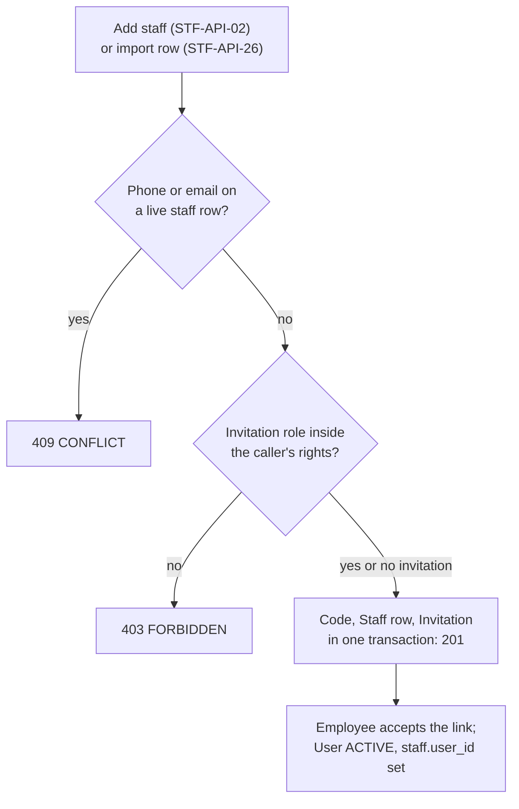
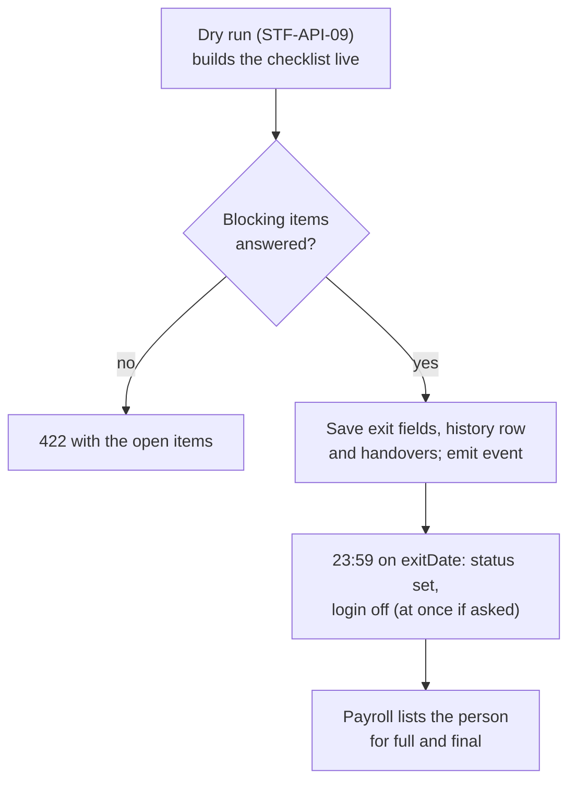
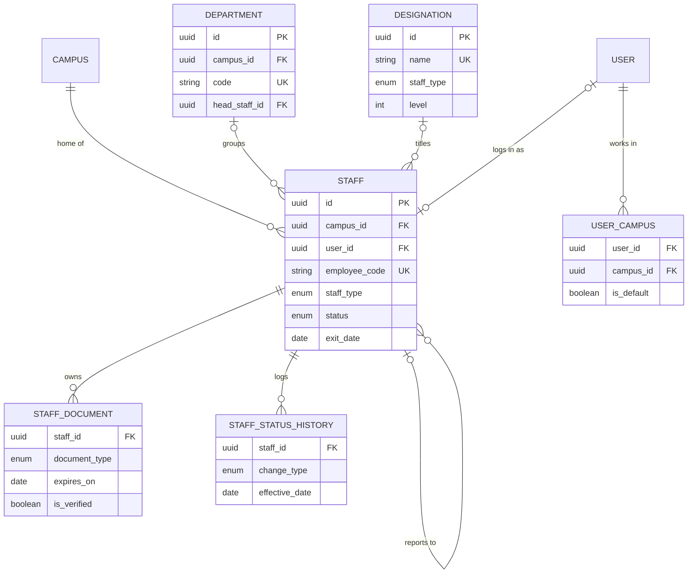

# Staff Module

**In simple words:** This module is the people file of the institute. It keeps one record for every employee, teaching and non-teaching: accountant, driver, front desk, lab assistant, guard. It holds departments, designations, joining and exit, documents and encrypted bank and identity numbers, links each record to a login and closes everything cleanly when a person leaves. Attendance, leave and payroll read the employee from here.

| Item | Value |
|---|---|
| Module code | STF |
| Release phase | Phase 2 (V1.0), Days 61 to 120, Claude Code prompt `P-33`. The shared `staff` table ships in Phase 1 with *Teachers Module* |
| Plans | Growth, Pro, Enterprise. Starter keeps teacher records only and reads the seeded department and designation lists |
| Main users | Organization Admin, HR Manager (custom role preset, Pro and Enterprise), Principal (view), every staff member (own record) |
| Depends on | Organizations, Multi Campus, Teachers, Settings, Authentication and Sessions |
| Main tables | `staff`, `departments`, `designations`, `staff_documents`, `staff_status_histories`; writes `invitations` and `user_campuses` through the user service |

## Objective

A school of 1,200 students has about 80 employees, and a third of them never teach. Their details sit today in a register, an Excel sheet and a drawer. The module puts everyone in one register, protects the sensitive numbers and turns joining and leaving into a checklist.

| Goal | Target |
|---|---|
| Add a non-teaching employee and send the login | Under 3 minutes |
| Load the full staff list | Bright Future's 82 staff (48 teaching, 34 non-teaching) in under 15 minutes, dry run included |
| Find any employee | Under 1 second by name, code or phone |
| Clean exit | 100% of leavers lose login access by 23:59 on the last day |
| Sensitive numbers | 100% ciphertext; every reveal audited |
| Document expiry | Alert 30 days ahead for every dated document |
| ID cards | 100 cards as one PDF in under 60 seconds |

## Scope

### In scope

- One record per employee of both `StaffType` values: employment, joining, notice period, manager, contact, one emergency contact and custom fields.
- Masters: departments (per campus or organization-wide, with a head) and designations (staff type, seniority level).
- Encrypted bank, PAN, Aadhaar, UAN, PF, ESI and foreign statutory ids, revealed only with an audit row.
- Documents with expiry, verification and alerts.
- Status, position, campus transfer, exit with an offboarding checklist, rehire, and the login invitation.
- Directory, lookup, headcount, org chart, ID cards, Excel import and export.

### Out of scope

| Item | Where it lives |
|---|---|
| Subjects, batch allocation, workload, teacher handover | *Teachers Module* |
| Check-in, day register, payable days | *Attendance Module* |
| Leave types, balances, approvals | *Leave Module* |
| Salary, payslips, loans, full and final settlement | *Payroll Module* |
| Logins, roles, passwords, MFA | *Authentication and Sessions*, *RBAC and Permissions Matrix* |
| Assets, library loans, driver licences, wardens | *Inventory Module*, *Library Module*, *Transport Module*, *Hostel Module* |
| Recruitment (job posts, candidates, interviews) | Not planned before V2.0 |

### Phase notes

| Phase | What ships |
|---|---|
| Phase 1 (MVP) | The `staff`, `staff_documents` and `staff_status_histories` tables, used by teachers. `STF-API-18` and `STF-API-22` serve the seeded lists, read only |
| Phase 2 (V1.0) | All 31 endpoints: non-teaching staff, master editing, sensitive details, exit checklist, import, export, ID cards |
| Phase 3 (V1.5) | Checklist lines for assets, books, vehicles, hostels, loans and settlement, once those Pro modules are on |

> **Note:** Assumption: every tenant gets seeded masters. Departments `ADMIN`, `ACAD`, `ACCTS`, `FRONT`, `TRANS`, `SUPPORT`. Designations Principal, Vice Principal, PGT, TGT, PRT, Office Superintendent, Accountant, Front Desk Executive, Lab Assistant, Driver, Support Staff; coaching tenants get Centre Head, Faculty and Counsellor instead of PGT, TGT and PRT.

> **Note:** A teacher is a `Staff` row with `staffType = TEACHING`. `/teachers` is a filtered view of the same table, and one exit service serves both modules.

## User Stories

| ID | As a | I want to | So that | Priority |
|---|---|---|---|---|
| STF-US-01 | Organization Admin | add a non-teaching employee with department, designation and manager | everyone is in one register | Must |
| STF-US-02 | HR Manager | send a login invitation with the right role and campus while saving | the new accountant works on day one | Must |
| STF-US-03 | Organization Admin | import the whole staff list from Excel with a dry run | 82 people load in one sitting | Must |
| STF-US-04 | Organization Admin | store bank, PAN, Aadhaar, UAN and ESI numbers encrypted | salary data is safe | Must |
| STF-US-05 | HR Manager | upload documents with expiry dates and mark them verified | nothing lapses before an inspection | Must |
| STF-US-06 | Principal | search the directory by name, code, department or phone | I reach the right person fast | Must |
| STF-US-07 | HR Manager | change designation, department or employment type from a date | promotions and moves are dated and traceable | Must |
| STF-US-08 | Organization Admin | transfer an employee to another campus | access and attendance follow the move | Should |
| STF-US-09 | Organization Admin | record a resignation and work through an offboarding checklist | the login stops and work is handed over | Must |
| STF-US-10 | Organization Admin | manage departments and designations with heads and levels | reports group people correctly | Must |
| STF-US-11 | HR Manager | print ID cards for selected employees | new joiners get a card in their first week | Should |
| STF-US-12 | Staff member | see my own profile, documents and history on my phone | I know what the office holds about me | Should |
| STF-US-13 | Organization Admin | see headcount, joiners and leavers by month and department | I plan hiring and the salary budget | Should |
| STF-US-14 | Principal | see the reporting tree | leave requests reach the right manager | Could |

## Workflow

### Joining and login link

**Figure: From staff record to a working login**



1. Zod validates the body, then the duplicate check (`STF-BR-02`) and the role check: nobody grants a role with more rights than their own.
2. One transaction takes the code and writes the `Staff` row and the `Invitation` (`linkedEntity = "Staff"`, `linkedEntityId` = staff id, `campusIds` = home campus). `staff.created` is queued after commit.
3. On acceptance the user service creates the `User` (`userType = STAFF`), sets `staff.user_id` and writes `UserCampus`. Later role changes use `USR-API-11`.

### Status lifecycle

`StaffStatus` is shared with *Teachers Module*, so the allowed moves are the same. `STF-API-06` sets the working statuses, `STF-API-09` the exit statuses. Every change writes a `STATUS` history row.

| Status | Set by | Meaning | Login | Staff register | Headcount |
|---|---|---|---|---|---|
| `ACTIVE` | `STF-API-02`, `STF-API-06` | Working | Active | Expected every working day | Yes |
| `ON_LEAVE` | `STF-API-06` | Long leave (maternity, study, medical) | Active | Days come from approved leave | Yes |
| `SUSPENDED` | `STF-API-06` | Stopped during an inquiry | Suspended at once | Listed with a "Suspended" tag | No |
| `RESIGNED` | `STF-API-09` | Left on own notice | Deactivated 23:59 on `exitDate` | Not after `exitDate` | Leaver |
| `TERMINATED` | `STF-API-09` | Service ended by the institute | Same, or at once on request | Not after `exitDate` | Leaver |
| `RETIRED` | `STF-API-09` | Normal retirement | Deactivated 23:59 on `exitDate` | Not after `exitDate` | Leaver |

Allowed moves: `ACTIVE` to and from `ON_LEAVE` or `SUSPENDED`; `ACTIVE` to any exit status; `SUSPENDED` to `TERMINATED`; rehire back to `ACTIVE` (`STF-BR-11`).

### Exit and offboarding

**Figure: Exit with the offboarding checklist**



1. The wizard (`STF-S04`) calls `STF-API-09` with `dryRun: true`; nothing is written.
2. On confirm, the same call without `dryRun` re-checks everything and saves the exit fields, history row and handovers in one transaction.
3. A delayed BullMQ job sets the status and switches off the login at 23:59 on `exitDate` (`STF-BR-10`).

**Offboarding checklist.** It is not stored. It is computed on every call from the tables below, so it never goes stale.

| Line | Read from | Blocks the exit | How it closes |
|---|---|---|---|
| Teaching work | `batch_subject_teachers`, `batches.class_teacher_id`, `timetable_entries` | Yes (teachers) | `reassignments`, as in *Teachers Module* |
| Direct reports | `staff.reports_to_id` | Yes | `newManagerId` |
| Department head | `departments.head_staff_id` | No | `newDepartmentHeadId`, else null |
| Leave approvals waiting | `leave_approval_steps` (`PENDING`) | No | Re-routed by *Leave Module* |
| Login and invitations | `users`, `invitations` | No, automatic | Deactivated; invitations `REVOKED` |
| Assets on loan | `asset_assignments` (`ASSIGNED`) | No | Return in *Inventory Module* |
| Library books | `book_issues` (`ISSUED`, `OVERDUE`) | No | Return or charge in *Library Module* |
| Vehicle and hostel duty | `vehicles`, `hostels` | No | *Transport Module*, *Hostel Module* |
| Loans and advances | `staff_loan_advances` (`ACTIVE`) | No | Recovered in the settlement |
| Final settlement | `payroll_runs` (`FULL_AND_FINAL`) | No | *Payroll Module* (`PRL-API-17`) |

> **Rule:** The Staff module never moves money. Notice pay, leave encashment and loan recovery are calculated in *Payroll Module*.

## Screens and Wireframes

| ID | Screen | Users | Purpose |
|---|---|---|---|
| STF-S01 | Staff directory | Organization Admin, HR Manager, Principal (view) | Search, filter, bulk invite, export, ID cards |
| STF-S02 | Add or edit staff | Organization Admin, HR Manager | Personal, employment, manager, login invitation |
| STF-S03 | Staff profile with tabs | Holders of `staff.view`; staff see their own | Profile, documents, bank and IDs, history, login |
| STF-S04 | Exit and offboarding wizard | Organization Admin, HR Manager | Dates, reason, checklist, handover |
| STF-S05 | Departments and designations | Organization Admin, HR Manager | Masters with code, head, level, status |
| STF-S06 | Import staff wizard | Organization Admin, HR Manager | Map columns, dry run, error file, commit |
| STF-S07 | ID card generator | Organization Admin, HR Manager | Pick staff, preview, PDF |
| STF-S08 | Org chart | Organization Admin, HR Manager, Principal | Reporting tree |
| STF-S09 | My profile (mobile) | Every staff user | Own record, read only |

**Screen STF-S01 — Staff directory (HR Manager, web)**

```text
+--------------------------------------------------------------------------+
| EduFlow | Bright Future Public School   [Search staff...]    (PM) v      |
+------------+-------------------------------------------------------------+
| Dashboard  | Staff                     [Import] [Export] [+ Add staff]   |
| Students   +-------------------------------------------------------------+
| Teachers   | Campus [All v] Type [All v] Dept [All v] Status [Active v]  |
| Staff    < | 82 staff . 48 teaching . 34 non-teaching . 2 leaving        |
|  Directory |-------------------------------------------------------------|
|  Depts     | [ ] Code        Name          Designation      Dept   Login |
|  Org chart | [x] BF-EMP-0012 Suresh Gupta  Accountant       ACCTS  Yes   |
|  Import    | [x] BF-EMP-0040 Ramesh Yadav  Transport Supvr  TRANS  No    |
|  ID cards  | [ ] BF-EMP-0072 Neha Kapoor   Front Desk Exec  FRONT  Sent  |
| Attendance | [ ] BF-EMP-0031 Priya Nair    PGT Mathematics  ACAD   Yes   |
| Leave      | [ ] BF-EMP-0055 Kamla Devi    Support Staff    SUPPORT No   |
| Settings   |-------------------------------------------------------------|
|            | 2 selected   [Send login invite]  [ID cards]  [Export]      |
|            | Page 1 of 5                            [< Prev]  [Next >]   |
+------------+-------------------------------------------------------------+
```

- Header counts from `STF-API-30`, grid from `STF-API-01`. "Leaving" = future `exitDate`; "Sent" = invitation pending.
- `[+ Add staff]` opens `STF-S02` (`STF-API-02`), `[Import]` opens `STF-S06`, `[Export]` queues `STF-API-27`, `[ID cards]` queues `STF-API-28`, `[Send login invite]` calls `USR-API-28`.
- A Principal sees the assigned campuses and no write buttons.

**Screen STF-S03 — Staff profile, Bank and IDs tab (Organization Admin, web)**

```text
+--------------------------------------------------------------------------+
| EduFlow | Bright Future Public School                    (RS) v          |
+------------+-------------------------------------------------------------+
| Dashboard  | Suresh Gupta  BF-EMP-0012  Accountant  Active  Login: Yes   |
| Teachers   +-------------------------------------------------------------+
| Staff    < | [Overview][Employment][Documents][Bank and IDs <][History]  |
|  Directory |-------------------------------------------------------------|
|  Depts     | Bank account   XXXXXXXXXX7891    Bank     on file           |
|  Org chart | PAN            on file           Aadhaar  on file           |
|  Import    | UAN            XXXXXXXX3456      ESI no.  not on file       |
| Attendance | PF member id   XXXXXXXX0012      Other    none              |
| Leave      |-------------------------------------------------------------|
| Payroll    | Numbers are stored encrypted. Every reveal is written to    |
| Settings   | the audit log with your name, the time and the reason.      |
|            | Reason [Salary account change request, 14-10-2027______]    |
|            |                          [Reveal for 60 s]  [Edit details]  |
+------------+-------------------------------------------------------------+
```

- The masked view comes from `STF-API-03`. PAN and Aadhaar have no "last 4" column, so they show "on file".
- `[Reveal for 60 s]` calls `STF-API-11` with the reason; values hide after 60 seconds or on a tab change. `[Edit details]` saves with `STF-API-12`. The tab is hidden without `staff.view_sensitive`.
- Other tabs: Documents `STF-API-13` to `STF-API-16`, History `STF-API-10`, Login `USR-API-03`.

**Screen STF-S04 — Exit and offboarding wizard (Organization Admin, web)**

```text
+--------------------------------------------------------------------------+
| EduFlow | Bright Future Public School                    (RS) v          |
+------------+-------------------------------------------------------------+
| Dashboard  | Staff > Ramesh Yadav (BF-EMP-0040) > Record exit            |
| Staff    < +-------------------------------------------------------------+
|  Directory | Exit type  (o) Resigned  ( ) Terminated  ( ) Retired        |
|  Depts     | Resigned on [01-11-2027]  Last day [20-11-2027]  Notice 30  |
|  Org chart | Reason [Moving to Kanpur with his family_______________]    |
|  Import    | Notice short by 10 days. Payroll decides any recovery.      |
| Attendance |-------------------------------------------------------------|
| Leave      | OFFBOARDING CHECKLIST                   1 must fix, 3 to do |
| Payroll    | [*] 2 attendants report to him New manager [Vikram Singh v] |
| Settings   | [ ] Default driver of bus UP32 AB 4521  -> Transport        |
|            | [ ] Salary advance Rs 6,000 open  -> recover in settlement  |
|            | [x] Login off 20-11-2027 23:59      [ ] Switch off now      |
|            | [ ] Final settlement: full and final run in Payroll         |
|            |                       [Cancel]  [Check again]  [Confirm]    |
+------------+-------------------------------------------------------------+
```

- Opening and `[Check again]` call `STF-API-09` with `dryRun: true`. `[*]` marks a blocking line; `[Confirm]` stays disabled until each has an answer.
- The notice line follows `STF-BR-08`. For a teacher the wizard adds the batch handover step. "Switch off now" sends `deactivateLoginNow: true`.

**Screen STF-S09 — My profile (any staff member, mobile)**

```text
+------------------------------------+
| EduFlow                  Me        |
| Neha Kapoor                        |
| BF-EMP-0072 . Front Desk Executive |
|------------------------------------|
| Campus      Main Campus            |
| Department  Front Office           |
| Manager     Mohd. Imran            |
| Joined      01-08-2027             |
| Status      Active                 |
|------------------------------------|
| MY DOCUMENTS                       |
| ID proof             Verified      |
| Police verification  Exp 12-12-27  |
| Appointment letter   Not checked   |
|------------------------------------|
| Bank a/c  XXXX2208   PAN  on file  |
| A detail is wrong: tell the office |
|------------------------------------|
| [Home] [Attendance] [Leave] [Me]   |
+------------------------------------+
```

- `STF-API-03` with scope `Own`, plus `STF-API-13`. Read only: `staff.update` belongs to the office.
- `[Attendance]` opens check-in (`ATT-S08`); `[Leave]` opens *Leave Module*.

## UI Components

| Component | Type | Behaviour |
|---|---|---|
| Staff table | shadcn/ui `DataTable` + TanStack Query | Server paging, filters in the URL. Loading: 8 skeleton rows. Empty: "No staff match these filters" + `[Clear filters]`. Error: "Could not load staff" + `[Try again]` |
| Staff form | `Tabs` + React Hook Form + Zod | Designations filtered by staff type, departments by campus |
| Manager picker | `Combobox`, async | `STF-API-29`; hides the person and own reports |
| Sensitive panel | `Card` + masked text | Reason box, 60-second timer, copy disabled |
| Checklist | `Accordion` + `Badge` | "Must fix" and "To do" in words; each line links to its module |
| Document card | `Card` + dropzone | `CMN-API-02`, `CMN-API-05`, then `STF-API-14`; "Expires in 24 days" badge |
| Org chart | Collapsible tree | Two levels per load; search highlights the path |
| Import wizard | `Stepper` | Mapping (`CMN-API-13`), dry run, polls `CMN-API-12` every 3 seconds |

## Validation Rules

One Zod schema in `shared/` runs in the form and on the server. Indian formats apply when the organization country is `IN`.

| Field | Rule | Error message shown to user |
|---|---|---|
| `campusId` | Active campus inside the caller's scope | Pick a campus you have access to. |
| `phone` | Required, E.164 after normalising, unique among live staff | This phone number already belongs to {name} ({code}). |
| `email` | Valid, lower-cased, unique among live staff | This email already belongs to {name} ({code}). |
| `dateOfBirth` | Age 18 to 75 on the joining date | A staff member must be at least 18 years old on the joining date. |
| `joiningDate` | Required; at most 90 days ahead | Joining date cannot be more than 90 days in the future. |
| `designationId` | Active; its `staffType` is null or equal | This designation is not meant for {type} staff. |
| `departmentId` | Active; organization-wide or on the home campus | This department belongs to another campus. |
| `reportsToId` | Live staff row, not the person, no loop | {name} already reports to this person. Choose someone else. |
| `emergencyContactPhone` | E.164; not the person's own phone | The emergency contact needs a different phone number. |
| `bank.accountNo` | 9 to 18 digits | Enter a bank account number of 9 to 18 digits. |
| `bank.ifsc` | `^[A-Z]{4}0[A-Z0-9]{6}$` | Enter a valid 11-character IFSC, for example SBIN0001234. |
| `taxId` (PAN) | `^[A-Z]{5}[0-9]{4}[A-Z]$` | Enter a valid PAN, for example ABCPN1234K. |
| `nationalId` (Aadhaar) | 12 digits, first digit 2 to 9, Verhoeff check | This Aadhaar number is not valid. Please check the 12 digits. |
| `uan`, `esiIpNumber` | 12 digits; 10 digits | UAN must be 12 digits. / ESI number must be 10 digits. |
| `exitDate` | On or after joining and resignation dates; 90 days back to 180 ahead | The last working day cannot be before the resignation date. |
| `exitReason`, `reason` | 5 to 255 characters | Write a short reason (at least 5 letters). |
| `expiresOn` | After `issuedOn` | The expiry date must be after the issue date. |

## Business Rules

**STF-BR-01 — One table, one code series.** `/staff` returns both staff types; `/teachers` adds `staffType = TEACHING` and owns subjects and batches. Both share the gap-free `EMPLOYEE_CODE` sequence of *Teachers Module*. A code is never reused, not even after a delete.

```text
nextValue 72 -> Neha Kapoor (Front Desk Executive) gets BF-EMP-0072
nextValue 73 -> the next teacher gets BF-EMP-0073
```

**STF-BR-02 — No duplicate people.** A normalised phone (`094150 23678` becomes `+919415023678`) or lower-cased email already on a live row of either type answers `409 CONFLICT` with that row's id, name, code and status. Exited rows count, so a returning employee is rehired (`STF-BR-11`).

**STF-BR-03 — Staff type follows the designation.** When `STF-API-07` sets a designation of the other type, the row switches type in the same transaction. Mohd. Imran, Lab Assistant, becomes "TGT Science" and turns `TEACHING`; he needs a subject (`TCH-API-08`) before any batch. A switch to `NON_TEACHING` answers `422` while teaching work is open.

**STF-BR-04 — Masters.** A department with `campusId` null serves every campus; a campus department serves only staff of that home campus. The head must be a live, non-exited employee. A designation with `staffType` null fits both types; `level` 1 is the most senior and sorts the directory. `INACTIVE` hides a row from dropdowns but keeps links. Delete answers `422` while a live, non-exited employee uses the row.

**STF-BR-05 — Reporting line without loops.** `reportsToId` cannot be the person, an exited employee or anyone below the person; the service walks up the chain (at most 20 levels) before saving. The manager is the first leave approver in *Leave Module*.

```text
Vikram Singh -> Mohd. Imran -> Dr. Anita Verma (root)
Set Dr. Anita Verma.reportsTo = Vikram Singh
  walk up from Vikram: Imran, Anita = the person -> loop -> 422
```

**STF-BR-06 — Dated changes.** `STF-API-06`, `STF-API-07` and `STF-API-08` take an `effectiveDate` from 365 days back to 180 days ahead. One history row per changed attribute is written at once, names stored as text; a future date reaches the `Staff` row through the 00:15 job. `SUSPENDED` suspends the login; `ACTIVE` reactivates it. On 1 Apr 2028 Neha becomes Senior Front Desk Executive and `FULL_TIME`: two rows (`DESIGNATION`, `EMPLOYMENT_TYPE`). Salary revision stays in *Payroll Module* (`PRL-API-12`).

**STF-BR-07 — Campus transfer.** `STF-API-08` needs an `ACTIVE` target campus other than the home campus. On the effective date it sets `campusId`, writes a `CAMPUS_TRANSFER` row with both campus ids and replaces the user's `UserCampus` rows (target as default, old one kept only with `keepOldCampusAccess`). An old-campus department must be replaced in the same call; a teacher with open batch rows there gets `422`. *Payroll Module* still pays one regular payslip for the month.

**STF-BR-08 — Exit fields and notice.** `STF-API-09` sets `resignationDate` (resignations only), `exitDate` (last working day), `exitReason` and `noticePeriodDays`. The directory shows "Leaving 20 Nov" until then. The shortfall is information for *Payroll Module*, which decides recovery or waiver.

```text
noticeEnd = resignationDate + noticePeriodDays - 1 day
shortfall = max(0, noticeEnd - exitDate) in days
Ramesh Yadav: 01-11-2027 + 30 - 1 = 30-11-2027 -> 10 days short
```

**STF-BR-09 — Blocking lines and settlement.** Open teaching work needs `reassignments` (checked as in *Teachers Module*) and direct reports need `newManagerId`; otherwise `422` with one `details` entry per item. Other lines are advisory; Phase 3 lines appear only when the module is in the plan. The module stores no money: the profile shows the `FULL_AND_FINAL` run state from *Payroll Module* ("Not started", "Draft", "Approved", "Paid"), or "Settle outside EduFlow" on Growth.

**STF-BR-10 — Exit job.** A BullMQ delayed job `staff-exit:{staffId}:{exitDate}` runs at 23:59 on `exitDate` in the organization's timezone. It sets the exit status, deactivates the `User`, revokes refresh tokens (`USER_DEACTIVATED`) and `PENDING` invitations, and emits `staff.exited`. A past date runs it at once; `deactivateLoginNow` stops only the login at once. The 00:15 sweep catches a missed job. Before `exitDate`, `withdraw: true` cancels the job, clears the exit fields and writes an "Exit withdrawn" row.

**STF-BR-11 — Rehire.** An exited employee returns on the same row and code: `STF-API-06` with `ACTIVE` and an `effectiveDate` after the old `exitDate` sets `joiningDate` and clears the exit fields (history keeps them). The login is reactivated (`USR-API-07`) or invited again.

**STF-BR-12 — Encrypted columns.** Bank details, tax id, national id and foreign statutory ids use AES-256-GCM with `FIELD_ENCRYPTION_KEY` and a fresh 12-byte IV per value. `bankAccountLast4` is plain. `uan`, `pfMemberId` and `esiIpNumber` stay plain for the PF and ESI files, but every response except `STF-API-11` masks them to the last 4. PAN and Aadhaar show only "on file". Lists, exports, events, webhooks and logs never carry them.

```typescript
import { createCipheriv, randomBytes } from 'node:crypto';

const KEY = Buffer.from(process.env.FIELD_ENCRYPTION_KEY!, 'base64'); // 32 bytes

export function encryptField(plain: string): string {
  const iv = randomBytes(12);
  const cipher = createCipheriv('aes-256-gcm', KEY, iv);
  const data = Buffer.concat([cipher.update(plain, 'utf8'), cipher.final()]);
  const tag = cipher.getAuthTag();
  const parts = [iv, tag, data].map((b) => b.toString('base64url'));
  return ['v1', ...parts].join('.');
}

// "50100234567891" -> "XXXXXXXXXX7891"
export const maskLast4 = (v: string): string =>
  'X'.repeat(Math.max(0, v.length - 4)) + v.slice(-4);
```

**STF-BR-13 — Reveal and write.** `STF-API-11` needs `staff.view_sensitive` and a reason (5 to 255 characters). It writes an audit row (`staff.sensitive.read`, field names, reason), sends `Cache-Control: no-store` and allows 20 reveals per user per hour (assumption). Nobody reveals or writes the own row, so no key holder can redirect the own salary. A bank change emails the employee at once. The payroll bank file is built on the server (`PRL-API-27`).

**STF-BR-14 — Documents.** Upload (`CMN-API-02`), scan (`CMN-API-05`), then attach (`STF-API-14`); only an `ACTIVE` file is accepted. The document number is encrypted with its last 4 kept. Nobody verifies the own document. A 06:30 job alerts once per threshold at 30, 7 and 0 days before `expiresOn` (setting `staff.document_expiry_alert_days`); exited staff get none.

```text
Neha Kapoor, police verification, expiresOn 12-12-2027
alerts on 12-11-2027, 05-12-2027 and 12-12-2027
```

**STF-BR-15 — Delete is for mistakes.** `STF-API-05` soft-deletes only a row with no payslip and no open assignment (batch row, class-teacher batch, direct report, department head, asset or book loan), and deactivates any linked login. Everyone else leaves through `STF-API-09`.

**STF-BR-16 — Own scope.** With `Own`, `STF-API-01` returns only the caller's row, and `STF-API-03`, `STF-API-10` and `STF-API-13` work for it; another id gives `404`. `STF-API-17`, `STF-API-29`, `STF-API-30` and `STF-API-31` give `403`. Department and designation names stay readable.

**STF-BR-17 — Import.** `STF-API-26` takes XLSX or CSV up to 2,000 rows and 5 MB (`ImportType = STAFF`). A row matches by employee code, then phone; a match updates, else it inserts. `staffType` is required; department comes as a code, designation as a name, manager as an employee code resolved in a second pass. Mapping a bank or identity column without `staff.update_sensitive` gives `403` before the job starts. A bad row fails alone.

**STF-BR-18 — ID cards.** `STF-API-28` builds a PDF (`exportType = staff.id_cards`) for up to 500 live, non-suspended staff: CR80 cards (85.6 x 54 mm), 10 per A4 page. A card shows photo, name, code, designation, department, campus, blood group, emergency phone, validity to year end and a QR code of the employee code for punch devices (`ATT-API-12`). A missing photo prints initials.

```text
pages = ceil(cards / 10)
34 non-teaching staff -> ceil(3.4) = 4 pages (10 + 10 + 10 + 4)
```

**STF-BR-19 — Headcount and attrition.** `STF-API-30` counts a person on a date inside the joining-to-exit window whose status is not `SUSPENDED`. Past days come from `DailyMetricSnapshot.staffTotal`.

```text
attrition % = leavers / ((headcount start + headcount end) / 2) x 100
Bright Future, Oct 2027: start 80, joiners 4, leavers 2, end 82
                         2 / 81 x 100 = 2.47 -> shown as 2.5%
```

**STF-BR-20 — Attendance link and celebrations.** The staff register of *Attendance Module* lists a person for each date inside the joining-to-exit window; this module never writes `staff_attendance`. A 07:00 job emits `staff.birthday` and `staff.work_anniversary` for `ACTIVE` and `ON_LEAVE` staff (29 Feb is greeted on 28 Feb). Joining on 8 Apr 2024 gives "3 years" on 8 Apr 2027.

## Acceptance Criteria

| ID | Given | When | Then |
|---|---|---|---|
| STF-AC-01 | Pooja Mehta holds the HR Manager preset | she saves Neha Kapoor (`NON_TEACHING`) with an invitation for the Front Desk role | `201`, `BF-EMP-0072`, one `Invitation` linked to the staff row, `staff.created` queued |
| STF-AC-02 | A custom role holds `fees.refund`, which Pooja lacks | she invites with that role | `403 FORBIDDEN`; nothing written |
| STF-AC-03 | Neha accepts the invitation | she sets her password | `User` `ACTIVE`, `staff.user_id` set, one `UserCampus` row |
| STF-AC-04 | Suresh Gupta is signed in as Accountant | he opens the directory and another profile | only his own row; the other profile `404` |
| STF-AC-05 | Rajesh Sharma (ORG_ADMIN) holds `staff.view_sensitive` | he reveals Suresh's bank details with a reason | decrypted values, `no-store`, one audit row with the reason |
| STF-AC-06 | Pooja has a staff row of her own | she calls `STF-API-12` on it | `422`; nothing changes |
| STF-AC-07 | A SUPER_ADMIN impersonates Bright Future | he calls `STF-API-11` | `403`, audit outcome `DENIED` |
| STF-AC-08 | Any list, export or event is produced | its payload is inspected | no bank, PAN, Aadhaar or statutory value; UAN last 4 only |
| STF-AC-09 | Dr. Anita Verma is the root of the tree | her manager is set to Vikram Singh | `422` loop message |
| STF-AC-10 | Neha works at Main Campus | a transfer to City Campus from 16 Aug 2027 runs | campus changes on 16 Aug; one history row; City Campus is her default |
| STF-AC-11 | Ramesh resigned on 1 Nov; 2 attendants report to him | the exit for 20 Nov lacks `newManagerId` | `422` naming both reports |
| STF-AC-12 | The exit is sent again with Vikram Singh | it is confirmed | reports re-pointed; job set for 20 Nov 23:59; status `ACTIVE` until then |
| STF-AC-13 | The exit job ran | Ramesh logs in on 21 Nov | `401`; tokens revoked (`USER_DEACTIVATED`); status `RESIGNED` |
| STF-AC-14 | Neha's police verification expires on 12 Dec 2027 | the daily job runs from 12 Nov to 12 Dec | exactly three expiry alerts |
| STF-AC-15 | A Bright Future token is used | it asks for a Sharma Classes staff id | `404`; RLS returns no row even with the Prisma extension off |

## Edge Cases

| Case | What happens | How the system handles it |
|---|---|---|
| Driver or guard without email or smartphone | No login | Record saved; the office marks the register |
| Login created first with `USR-API-02` | Two things for one person | A staff invitation to the same email links the existing user; no second login |
| Resignation withdrawn before the last day | Scheduled exit must stop | `withdraw: true` (`STF-BR-10`) |
| Person on maternity leave resigns | `ON_LEAVE` has no exit arrow | Automatic `ON_LEAVE` to `ACTIVE` row with the same date, then the exit |
| Exit recorded after the last day | Login should already be off | Job runs at once, with a warning |
| Department head exits | Department without head | `headStaffId` set to null; "No head" badge until a new head is chosen |
| Two campuses want department code `SCI` | Code unique per tenant | `409`; use `SCI-MAIN` and `SCI-CITY` |
| Encryption key unavailable | Reveal or write impossible | `503 SERVICE_UNAVAILABLE`; masked views still work |
| Transfer and exit on the same date | Two dated changes collide | Exit wins; transfer answers `422` "This person leaves on that date" |
| Same phone twice in one import file | Two rows claim one person | First row wins; second fails with `DUPLICATE_IN_FILE` |

## Database Schema

| Table | Purpose | Owner |
|---|---|---|
| `departments` | Departments, per campus or organization-wide, with a head | This module |
| `designations` | Job titles with staff type and level | This module |
| `staff` | One row per employee | This module |
| `staff_documents` | Documents with expiry and verification | This module |
| `staff_status_histories` | Append-only change log | This module |
| `users`, `user_campuses`, `invitations` | Login, campus reach, invitation link | *Authentication and Sessions* |

### Table departments

| Column | Type | Null | Default | Notes |
|---|---|---|---|---|
| `id`, `organization_id` | uuid | No | `uuid()`, - | PK; tenant FK |
| `campus_id` | uuid | Yes | null | Null = organization-wide |
| `name`, `code` | varchar(100), varchar(30) | No | - | Code unique per tenant |
| `head_staff_id` | uuid | Yes | null | FK `staff`, set null |
| `status` | `RecordStatus` | No | `ACTIVE` | |
| `created_at`, `updated_at`, `deleted_at` | timestamptz | No, No, Yes | `now()` | Soft delete |

### Table designations

| Column | Type | Null | Default | Notes |
|---|---|---|---|---|
| `id`, `organization_id` | uuid | No | `uuid()`, - | PK; tenant FK |
| `name` | varchar(100) | No | - | Unique per tenant |
| `staff_type`, `level` | `StaffType`, smallint | Yes | null | Null type = both; level 1 = most senior |
| `status` | `RecordStatus` | No | `ACTIVE` | |
| `created_at`, `updated_at`, `deleted_at` | timestamptz | No, No, Yes | `now()` | Soft delete |

### Table staff

| Column | Type | Null | Default | Notes |
|---|---|---|---|---|
| `id`, `organization_id`, `campus_id` | uuid | No | `uuid()`, - | PK; FKs; home campus |
| `user_id` | uuid | Yes | null | Unique; set on invitation acceptance |
| `employee_code` | varchar(30) | No | - | Unique per tenant |
| `staff_type`, `employment_type`, `status` | enums | No | -, `FULL_TIME`, `ACTIVE` | |
| Name, gender, birth date, blood group, email, phones | varchar, enums, date | Mostly yes | null | `first_name` and `phone` required |
| `photo_file_id`, `department_id`, `designation_id`, `reports_to_id` | uuid | Yes | null | FKs, set null |
| `joining_date`, `confirmation_date` | date | No, Yes | - | |
| Qualification, specialization, experience, six address columns | varchar, decimal(4,1) | Yes | null | |
| `emergency_contact_name`, `emergency_contact_phone` | varchar | Yes | null | One contact |
| Four `*_encrypted` columns | text | Yes | null | AES-256-GCM |
| `bank_account_last4`, `uan`, `pf_member_id`, `esi_ip_number` | varchar | Yes | null | Plain; masked in responses |
| `notice_period_days`, `resignation_date`, `exit_date`, `exit_reason` | smallint, date, varchar | Yes | null | Exit fields |
| `anonymized_at`, `retention_until`, `custom_fields` | timestamptz, date, jsonb | Yes | null | Privacy and custom values |
| `created_by_id`, `created_at`, `updated_at`, `deleted_at` | uuid, timestamptz | Mixed | `now()` | Audit, soft delete |

### Tables staff_documents and staff_status_histories

| Table | Key columns | Notes |
|---|---|---|
| `staff_documents` | `staff_id`, `document_type`, `title`, `file_id`, `issued_on`, `expires_on` | Encrypted number plus last 4; verification columns; soft delete |
| `staff_status_histories` | `staff_id`, `change_type`, `from_value`, `to_value`, `effective_date`, `reason` | Campus ids for transfers; no update or delete |

### Indexes and constraints

- `staff`: unique `(organization_id, employee_code)` and `user_id`; indexes on campus, type and status, department, phone and names; GIN trigram index for `q`.
- `departments` unique `(organization_id, code)`; `designations` unique `(organization_id, name)`; `staff_documents` index `(organization_id, expires_on)`; `staff_status_histories` index `(organization_id, change_type, effective_date)`.
- RLS on `app.current_org` everywhere; the no-loop and live-phone checks run in the service.

**Figure: Staff tables and the login link**



Campus, department and designation describe the job; documents and history hang below `STAFF`; the optional `USER` link gives the login, and `USER_CAMPUS` decides which campuses it may open.

## Prisma Schema

Copied from `docs/src/_schema/04-people.prisma` (enums and the five module models) and `docs/src/_schema/02-auth.prisma` (`UserCampus`, `Invitation`). Long trailing comments and the long back-relation list of `Staff` are shortened; every field, attribute and mapping is unchanged. `RecordStatus`, `Gender` and `BloodGroup` come from `00-base.prisma`; `UserType` and `InvitationStatus` from `02-auth.prisma`.

```prisma
enum StaffType {
  TEACHING
  NON_TEACHING
}

enum EmploymentType {
  FULL_TIME
  PART_TIME
  CONTRACT
  VISITING
  INTERN
}

enum StaffStatus {
  ACTIVE
  ON_LEAVE
  SUSPENDED
  RESIGNED
  TERMINATED
  RETIRED
}

enum StaffDocumentType {
  ID_PROOF
  ADDRESS_PROOF
  QUALIFICATION
  EXPERIENCE_LETTER
  APPOINTMENT_LETTER
  CONTRACT
  POLICE_VERIFICATION
  BANK_PROOF
  PHOTO
  OTHER
}

enum StaffChangeType {
  STATUS
  CAMPUS_TRANSFER
  DESIGNATION
  DEPARTMENT
  EMPLOYMENT_TYPE
}

// Staff department, e.g. Science, Accounts, Administration.
model Department {
  id             String       @id @default(uuid()) @db.Uuid
  organizationId String       @map("organization_id") @db.Uuid
  campusId       String?      @map("campus_id") @db.Uuid // null = organization-wide department
  name           String       @db.VarChar(100)
  code           String       @db.VarChar(30)
  headStaffId    String?      @map("head_staff_id") @db.Uuid
  status         RecordStatus @default(ACTIVE)
  createdAt      DateTime     @default(now()) @map("created_at") @db.Timestamptz(6)
  updatedAt      DateTime     @updatedAt @map("updated_at") @db.Timestamptz(6)
  deletedAt      DateTime?    @map("deleted_at") @db.Timestamptz(6)

  organization Organization @relation(fields: [organizationId], references: [id], onDelete: Cascade)
  campus       Campus?      @relation(fields: [campusId], references: [id], onDelete: Restrict)
  headStaff Staff? @relation("DepartmentHead", fields: [headStaffId], references: [id], onDelete: SetNull)
  staff        Staff[]      @relation("DepartmentStaff")

  @@unique([organizationId, code])
  @@index([organizationId, campusId, status])
  @@map("departments")
}

// Job title, e.g. PGT Mathematics, Accountant, Front Desk Executive.
model Designation {
  id             String       @id @default(uuid()) @db.Uuid
  organizationId String       @map("organization_id") @db.Uuid
  name           String       @db.VarChar(100)
  staffType      StaffType?   @map("staff_type") // null = usable for both
  level          Int?         @db.SmallInt // seniority ordering, 1 = most senior
  status         RecordStatus @default(ACTIVE)
  createdAt      DateTime     @default(now()) @map("created_at") @db.Timestamptz(6)
  updatedAt      DateTime     @updatedAt @map("updated_at") @db.Timestamptz(6)
  deletedAt      DateTime?    @map("deleted_at") @db.Timestamptz(6)

  organization Organization @relation(fields: [organizationId], references: [id], onDelete: Cascade)
  staff        Staff[]

  @@unique([organizationId, name])
  @@index([organizationId, status])
  @@map("designations")
}

// Employee profile (teacher or non-teaching). The login lives in User and is linked by userId.
model Staff {
  id                    String         @id @default(uuid()) @db.Uuid
  organizationId        String         @map("organization_id") @db.Uuid
  campusId              String         @map("campus_id") @db.Uuid // home campus
  userId                String?        @unique @map("user_id") @db.Uuid // linked login
  employeeCode          String         @map("employee_code") @db.VarChar(30)
  staffType             StaffType      @map("staff_type")
  employmentType        EmploymentType @default(FULL_TIME) @map("employment_type")
  status                StaffStatus    @default(ACTIVE)
  firstName             String         @map("first_name") @db.VarChar(80)
  lastName              String?        @map("last_name") @db.VarChar(80)
  gender                Gender?
  dateOfBirth           DateTime?      @map("date_of_birth") @db.Date
  bloodGroup            BloodGroup?    @map("blood_group")
  email                 String?        @db.VarChar(255)
  phone                 String         @db.VarChar(20) // E.164
  alternatePhone        String?        @map("alternate_phone") @db.VarChar(20)
  photoFileId           String?        @map("photo_file_id") @db.Uuid
  departmentId          String?        @map("department_id") @db.Uuid
  designationId         String?        @map("designation_id") @db.Uuid
  reportsToId           String?        @map("reports_to_id") @db.Uuid // manager; first leave approver
  joiningDate           DateTime       @map("joining_date") @db.Date
  confirmationDate      DateTime?      @map("confirmation_date") @db.Date // end of probation
  qualification         String?        @db.VarChar(255) // e.g. M.Sc. Physics, B.Ed.
  specialization        String?        @db.VarChar(255)
  experienceYears       Decimal?       @map("experience_years") @db.Decimal(4, 1) // before joining
  addressLine1          String?        @map("address_line1") @db.VarChar(200)
  addressLine2          String?        @map("address_line2") @db.VarChar(200)
  city                  String?        @db.VarChar(100)
  state                 String?        @db.VarChar(100)
  postalCode            String?        @map("postal_code") @db.VarChar(20)
  countryCode           String?        @map("country_code") @db.Char(2)
  emergencyContactName  String?        @map("emergency_contact_name") @db.VarChar(120)
  emergencyContactPhone String?        @map("emergency_contact_phone") @db.VarChar(20)
  bankDetailsEncrypted  String?        @map("bank_details_encrypted") @db.Text // AES-256-GCM ciphertext
  bankAccountLast4      String?        @map("bank_account_last4") @db.VarChar(4) // safe to display
  taxIdEncrypted        String?        @map("tax_id_encrypted") @db.Text // PAN / TFN / SSN ciphertext
  nationalIdEncrypted   String?        @map("national_id_encrypted") @db.Text // Aadhaar / Emirates ID
  uan                   String?        @db.VarChar(12) // India PF Universal Account Number
  pfMemberId            String?        @map("pf_member_id") @db.VarChar(30) // PF member id
  esiIpNumber           String?        @map("esi_ip_number") @db.VarChar(20) // ESI insured person number
  statutoryIdsEncrypted String?        @map("statutory_ids_encrypted") @db.Text // ciphertext
  noticePeriodDays      Int?           @map("notice_period_days") @db.SmallInt
  resignationDate       DateTime?      @map("resignation_date") @db.Date
  exitDate              DateTime?      @map("exit_date") @db.Date
  exitReason            String?        @map("exit_reason") @db.VarChar(255)
  anonymizedAt          DateTime?      @map("anonymized_at") @db.Timestamptz(6) // after deletion
  retentionUntil        DateTime?      @map("retention_until") @db.Date
  customFields          Json?          @map("custom_fields") // cached CustomFieldValue rows
  createdById           String?        @map("created_by_id") @db.Uuid // User id (audit only, no FK)
  createdAt             DateTime       @default(now()) @map("created_at") @db.Timestamptz(6)
  updatedAt             DateTime       @updatedAt @map("updated_at") @db.Timestamptz(6)
  deletedAt             DateTime?      @map("deleted_at") @db.Timestamptz(6)

  organization Organization @relation(fields: [organizationId], references: [id], onDelete: Restrict)
  campus       Campus       @relation(fields: [campusId], references: [id], onDelete: Restrict)
  user         User?        @relation(fields: [userId], references: [id], onDelete: SetNull)
  photoFile    FileAsset?   @relation(fields: [photoFileId], references: [id], onDelete: SetNull)
  department Department? @relation("DepartmentStaff", fields: [departmentId], references: [id], onDelete: SetNull)
  designation  Designation? @relation(fields: [designationId], references: [id], onDelete: SetNull)
  reportsTo Staff? @relation("StaffManager", fields: [reportsToId], references: [id], onDelete: SetNull)

  directReports        Staff[]              @relation("StaffManager")
  headedDepartments    Department[]         @relation("DepartmentHead")
  documents            StaffDocument[]
  staffStatusHistories StaffStatusHistory[]
  // 32 more back-relations (teaching, leave, attendance, timetable, homework,
  // exams, library, transport, hostel, inventory, payroll, PTM, payments)
  // stay exactly as written in 04-people.prisma

  @@unique([organizationId, employeeCode])
  @@index([organizationId, campusId, staffType, status])
  @@index([organizationId, departmentId])
  @@index([organizationId, phone])
  @@index([organizationId, firstName, lastName])
  // ?q= contains search; needs CREATE EXTENSION pg_trgm in an earlier SQL migration
  @@index([firstName(ops: raw("gin_trgm_ops")), lastName(ops: raw("gin_trgm_ops")), employeeCode(ops: raw("gin_trgm_ops"))], type: Gin, map: "idx_staff_search_trgm")
  @@map("staff")
}

// Document uploaded for a staff member (ID proof, degree, contract).
model StaffDocument {
  id                  String            @id @default(uuid()) @db.Uuid
  organizationId      String            @map("organization_id") @db.Uuid
  staffId             String            @map("staff_id") @db.Uuid
  documentType        StaffDocumentType @map("document_type")
  title               String            @db.VarChar(150)
  documentNoEncrypted String?           @map("document_no_encrypted") @db.Text // never plain
  documentNoLast4     String?           @map("document_no_last4") @db.VarChar(4) // safe to display
  fileId              String            @map("file_id") @db.Uuid
  issuedOn            DateTime?         @map("issued_on") @db.Date
  expiresOn           DateTime?         @map("expires_on") @db.Date
  isVerified          Boolean           @default(false) @map("is_verified")
  verifiedById        String?           @map("verified_by_id") @db.Uuid // User id (audit only, no FK)
  verifiedAt          DateTime?         @map("verified_at") @db.Timestamptz(6)
  createdAt           DateTime          @default(now()) @map("created_at") @db.Timestamptz(6)
  updatedAt           DateTime          @updatedAt @map("updated_at") @db.Timestamptz(6)
  deletedAt           DateTime?         @map("deleted_at") @db.Timestamptz(6)

  organization Organization @relation(fields: [organizationId], references: [id], onDelete: Cascade)
  staff        Staff        @relation(fields: [staffId], references: [id], onDelete: Cascade)
  file         FileAsset    @relation(fields: [fileId], references: [id], onDelete: Restrict)

  @@index([organizationId, staffId])
  @@index([organizationId, expiresOn])
  @@map("staff_documents")
}

// Every status, campus, department or designation change. Append-only.
model StaffStatusHistory {
  id             String          @id @default(uuid()) @db.Uuid
  organizationId String          @map("organization_id") @db.Uuid
  staffId        String          @map("staff_id") @db.Uuid
  changeType     StaffChangeType @map("change_type")
  fromValue      String?         @map("from_value") @db.VarChar(100) // name before the change
  toValue        String          @map("to_value") @db.VarChar(100)
  fromCampusId   String?         @map("from_campus_id") @db.Uuid // Campus id (no FK); transfers
  toCampusId     String?         @map("to_campus_id") @db.Uuid
  effectiveDate  DateTime        @map("effective_date") @db.Date
  reason         String?         @db.VarChar(500)
  changedById    String?         @map("changed_by_id") @db.Uuid // User id (audit only, no FK)
  createdAt      DateTime        @default(now()) @map("created_at") @db.Timestamptz(6)

  organization Organization @relation(fields: [organizationId], references: [id], onDelete: Cascade)
  staff        Staff        @relation(fields: [staffId], references: [id], onDelete: Cascade)

  @@index([organizationId, staffId, effectiveDate])
  @@index([organizationId, changeType, effectiveDate])
  @@map("staff_status_histories")
}

// Campuses a user may work in (ORG_ADMIN sees all campuses without rows here).
model UserCampus {
  id             String   @id @default(uuid()) @db.Uuid
  organizationId String   @map("organization_id") @db.Uuid
  userId         String   @map("user_id") @db.Uuid
  campusId       String   @map("campus_id") @db.Uuid
  isDefault      Boolean  @default(false) @map("is_default") // campus selected after login
  createdAt      DateTime @default(now()) @map("created_at") @db.Timestamptz(6)
  updatedAt      DateTime @updatedAt @map("updated_at") @db.Timestamptz(6)

  organization Organization @relation(fields: [organizationId], references: [id], onDelete: Cascade)
  user         User         @relation(fields: [userId], references: [id], onDelete: Cascade)
  campus       Campus       @relation(fields: [campusId], references: [id], onDelete: Cascade)

  @@unique([userId, campusId])
  @@index([organizationId, campusId])
  @@map("user_campuses")
}

// Invitation sent to a staff member, parent or student to create their login.
model Invitation {
  id             String           @id @default(uuid()) @db.Uuid
  organizationId String           @map("organization_id") @db.Uuid
  email          String?          @db.VarChar(255)
  phone          String?          @db.VarChar(20)
  userType       UserType         @map("user_type")
  roleId         String           @map("role_id") @db.Uuid
  campusIds      String[]         @map("campus_ids") @db.Uuid // campuses granted on acceptance
  linkedEntity   String?          @map("linked_entity") @db.VarChar(20) // profile to link
  linkedEntityId String?          @map("linked_entity_id") @db.Uuid
  tokenHash      String           @unique @map("token_hash") @db.Char(64)
  status         InvitationStatus @default(PENDING)
  message        String?          @db.VarChar(500)
  expiresAt      DateTime         @map("expires_at") @db.Timestamptz(6)
  acceptedAt     DateTime?        @map("accepted_at") @db.Timestamptz(6)
  invitedById    String?          @map("invited_by_id") @db.Uuid
  acceptedUserId String?          @map("accepted_user_id") @db.Uuid
  createdAt      DateTime         @default(now()) @map("created_at") @db.Timestamptz(6)
  updatedAt      DateTime         @updatedAt @map("updated_at") @db.Timestamptz(6)

  organization Organization @relation(fields: [organizationId], references: [id], onDelete: Cascade)
  role         Role         @relation(fields: [roleId], references: [id], onDelete: Restrict)
  invitedBy User? @relation("InvitationInvitedBy", fields: [invitedById], references: [id], onDelete: SetNull)
  acceptedUser User? @relation("InvitationAcceptedUser", fields: [acceptedUserId], references: [id], onDelete: SetNull)

  @@index([organizationId, status, createdAt])
  @@index([organizationId, email])
  @@index([organizationId, phone])
  @@map("invitations")
}
```

## API Endpoints

Paths are relative to `/api/v1`. The tenant comes from the token; `X-Campus-Id` narrows a call to one assigned campus.

| ID | Method | Path | Permission | Purpose |
|---|---|---|---|---|
| STF-API-01 | GET | `/staff` | `staff.view` | List with filters and `q` |
| STF-API-02 | POST | `/staff` | `staff.create` | Create; optional invitation |
| STF-API-03 | GET | `/staff/:id` | `staff.view` | Profile, masked |
| STF-API-04 | PATCH | `/staff/:id` | `staff.update` | Edit personal and job fields |
| STF-API-05 | DELETE | `/staff/:id` | `staff.delete` | Soft delete |
| STF-API-06 | POST | `/staff/:id/change-status` | `staff.manage` | Working status |
| STF-API-07 | POST | `/staff/:id/change-position` | `staff.manage` | Position change |
| STF-API-08 | POST | `/staff/:id/transfer` | `staff.manage` | Campus transfer |
| STF-API-09 | POST | `/staff/:id/exit` | `staff.manage` | Exit with checklist |
| STF-API-10 | GET | `/staff/:id/history` | `staff.view` | Change history |
| STF-API-11 | GET | `/staff/:id/sensitive-details` | `staff.view_sensitive` | Reveal, audited |
| STF-API-12 | PUT | `/staff/:id/sensitive-details` | `staff.update_sensitive` | Replace sensitive set |
| STF-API-13 | GET | `/staff/:id/documents` | `staff.view` | List documents |
| STF-API-14 | POST | `/staff/:id/documents` | `staff.update` | Attach document |
| STF-API-15 | DELETE | `/staff-documents/:id` | `staff.update` | Remove document |
| STF-API-16 | POST | `/staff-documents/:id/verify` | `staff.manage` | Verify document |
| STF-API-17 | GET | `/staff-documents/expiring` | `staff.view` | Expiring documents |
| STF-API-18 | GET | `/departments` | `staff.view` | List departments |
| STF-API-19 | POST | `/departments` | `staff.manage` | Create department |
| STF-API-20 | PATCH | `/departments/:id` | `staff.manage` | Update department |
| STF-API-21 | DELETE | `/departments/:id` | `staff.manage` | Delete department |
| STF-API-22 | GET | `/designations` | `staff.view` | List designations |
| STF-API-23 | POST | `/designations` | `staff.manage` | Create designation |
| STF-API-24 | PATCH | `/designations/:id` | `staff.manage` | Update designation |
| STF-API-25 | DELETE | `/designations/:id` | `staff.manage` | Delete designation |
| STF-API-26 | POST | `/staff/import` | `staff.import` | Excel import |
| STF-API-27 | POST | `/staff/export` | `staff.export` | Export list |
| STF-API-28 | POST | `/staff/id-cards` | `staff.export` | ID card PDF |
| STF-API-29 | GET | `/staff/lookup` | `staff.view` | Typeahead |
| STF-API-30 | GET | `/staff/summary` | `staff.view` | Headcount |
| STF-API-31 | GET | `/staff/org-chart` | `staff.view` | Reporting tree from `reportsToId` |

Static segments are routed before `/:id`. Every endpoint may also answer `401`, `403 FORBIDDEN`, `403 PLAN_LIMIT_REACHED` (Starter, except `STF-API-18` and `STF-API-22`), `404`, `429` and `500`.

### STF-API-01 — List staff

```http
GET /api/v1/staff?staffType=NON_TEACHING&departmentId=3b6e9d21-4c78-4f05-a2d9-7e1b5c8f3a62&limit=20
Authorization: Bearer <accessToken>
```

```json
{
  "success": true,
  "data": [
    {
      "id": "8a3d6f92-1b47-4e5c-9d08-4c6e2a1f7b35",
      "employeeCode": "BF-EMP-0012",
      "firstName": "Suresh",
      "lastName": "Gupta",
      "staffType": "NON_TEACHING",
      "status": "ACTIVE",
      "phone": "+919415067712",
      "department": { "id": "3b6e9d21-4c78-4f05-a2d9-7e1b5c8f3a62", "name": "Accounts" },
      "designation": { "id": "7a4e2c90-1d58-4b37-9f26-8c3b5e1d7a04", "name": "Accountant" },
      "campus": { "id": "c2a41f08-6b7d-4e39-9f15-3a8d2e6c7b90", "name": "Main Campus" },
      "exitDate": null,
      "login": "ACTIVE"
    }
  ],
  "meta": { "page": 1, "limit": 20, "total": 3, "totalPages": 1 }
}
```

Without `status` the list hides exited staff.

| Status | Code | When |
|---|---|---|
| 400 | `VALIDATION_ERROR` | Bad filter or `limit` above 100 |

### STF-API-02 — Create staff

```http
POST /api/v1/staff
Authorization: Bearer <accessToken>
Content-Type: application/json
```

```json
{
  "staffType": "NON_TEACHING",
  "campusId": "c2a41f08-6b7d-4e39-9f15-3a8d2e6c7b90",
  "firstName": "Neha",
  "lastName": "Kapoor",
  "phone": "+919839052214",
  "email": "neha.kapoor@brightfuture.edu.in",
  "employmentType": "CONTRACT",
  "joiningDate": "2027-08-01",
  "departmentId": "1f7c3a95-8d26-4b40-9e71-c5a2d8b3f016",
  "designationId": "5c2d8f47-9a13-4e6b-8d05-2f7a1c9e4b38",
  "reportsToId": "0d8b5e36-7c21-4a94-b6f3-2e9a4d1c8f57",
  "noticePeriodDays": 30,
  "emergencyContactName": "Anil Kapoor",
  "emergencyContactPhone": "+919415098120",
  "invitation": { "roleId": "4e6a9c21-8b35-4f70-a1d6-3c9e7b2f5d18" }
}
```

```json
{
  "success": true,
  "data": {
    "id": "2b7f4c18-6e93-4d05-a8c2-1f9d3e7b5a60",
    "employeeCode": "BF-EMP-0072",
    "staffType": "NON_TEACHING",
    "status": "ACTIVE",
    "invitation": {
      "id": "a7f2c4e9-3b61-4d08-9c5a-6e1b8d3f2a70",
      "status": "PENDING",
      "expiresAt": "2027-08-08T18:29:59.000Z"
    },
    "warnings": []
  }
}
```

| Status | Code | When |
|---|---|---|
| 400 | `VALIDATION_ERROR` | Field rules of the validation table |
| 403 | `FORBIDDEN` | Role outside the caller's rights |
| 409 | `CONFLICT` | Duplicate phone or email |
| 422 | `BUSINESS_RULE_VIOLATION` | Designation type, campus department, manager loop |

### STF-API-03 — Staff profile (masked)

```http
GET /api/v1/staff/8a3d6f92-1b47-4e5c-9d08-4c6e2a1f7b35
Authorization: Bearer <accessToken>
```

```json
{
  "success": true,
  "data": {
    "id": "8a3d6f92-1b47-4e5c-9d08-4c6e2a1f7b35",
    "employeeCode": "BF-EMP-0012",
    "firstName": "Suresh",
    "lastName": "Gupta",
    "staffType": "NON_TEACHING",
    "status": "ACTIVE",
    "joiningDate": "2021-06-14",
    "reportsTo": { "id": "0d8b5e36-7c21-4a94-b6f3-2e9a4d1c8f57", "name": "Mohd. Imran" },
    "emergencyContact": { "name": "Rekha Gupta", "phone": "+919415033401" },
    "sensitive": {
      "bank": { "onFile": true, "accountLast4": "7891" },
      "taxId": { "onFile": true },
      "nationalId": { "onFile": true },
      "uan": "XXXXXXXX3456",
      "pfMemberId": "XXXXXXXX0012",
      "esiIpNumber": null
    },
    "login": {
      "userId": "5d2b8e61-9c34-4a7f-8e15-3b6d1a9c4f27",
      "status": "ACTIVE",
      "roles": ["ACCOUNTANT"]
    },
    "exit": null,
    "documents": { "total": 5, "verified": 4, "expiringIn30Days": 0 }
  }
}
```

| Status | Code | When |
|---|---|---|
| 404 | `NOT_FOUND` | Outside tenant, campus or `Own` scope |

### STF-API-07 — Change position

```http
POST /api/v1/staff/2b7f4c18-6e93-4d05-a8c2-1f9d3e7b5a60/change-position
Authorization: Bearer <accessToken>
Content-Type: application/json
```

```json
{
  "designationId": "9e4a1b73-2d58-4c96-b0f1-6a3e8d5c2b17",
  "employmentType": "FULL_TIME",
  "effectiveDate": "2028-04-01",
  "reason": "Promoted after annual review 2027-28"
}
```

```json
{
  "success": true,
  "data": {
    "staffId": "2b7f4c18-6e93-4d05-a8c2-1f9d3e7b5a60",
    "applied": false,
    "appliesOn": "2028-04-01",
    "historyRows": [
      {
        "changeType": "DESIGNATION",
        "fromValue": "Front Desk Executive",
        "toValue": "Senior Front Desk Executive"
      },
      { "changeType": "EMPLOYMENT_TYPE", "fromValue": "CONTRACT", "toValue": "FULL_TIME" }
    ],
    "hints": ["Salary revision is done in Payroll (PRL-API-12)"]
  }
}
```

| Status | Code | When |
|---|---|---|
| 400 | `VALIDATION_ERROR` | No change, date out of range |
| 422 | `BUSINESS_RULE_VIOLATION` | Open teaching work on a type switch; exited person |

### STF-API-08 — Campus transfer

```http
POST /api/v1/staff/2b7f4c18-6e93-4d05-a8c2-1f9d3e7b5a60/transfer
Authorization: Bearer <accessToken>
Content-Type: application/json
```

```json
{
  "toCampusId": "6d93b2e5-0f47-4a18-b3c6-8e2f5a7d1c49",
  "effectiveDate": "2027-08-16",
  "departmentId": "1f7c3a95-8d26-4b40-9e71-c5a2d8b3f016",
  "keepOldCampusAccess": false,
  "reason": "City Campus front office opens"
}
```

```json
{
  "success": true,
  "data": {
    "staffId": "2b7f4c18-6e93-4d05-a8c2-1f9d3e7b5a60",
    "fromCampusId": "c2a41f08-6b7d-4e39-9f15-3a8d2e6c7b90",
    "toCampusId": "6d93b2e5-0f47-4a18-b3c6-8e2f5a7d1c49",
    "applied": true,
    "userCampuses": [{ "campusId": "6d93b2e5-0f47-4a18-b3c6-8e2f5a7d1c49", "isDefault": true }]
  }
}
```

| Status | Code | When |
|---|---|---|
| 422 | `BUSINESS_RULE_VIOLATION` | Rules of `STF-BR-07` |

### STF-API-09 — Record exit

```http
POST /api/v1/staff/e5c19a73-4f28-4b6d-8a30-9d1f7c2e6b84/exit
Authorization: Bearer <accessToken>
Content-Type: application/json
```

```json
{
  "exitType": "RESIGNED",
  "resignationDate": "2027-11-01",
  "exitDate": "2027-11-20",
  "exitReason": "Moving to Kanpur with his family",
  "noticePeriodDays": 30,
  "newManagerId": "9f1a6d24-3e87-4c50-b2d9-6a8e4c1f3b72",
  "reassignments": [],
  "deactivateLoginNow": false,
  "dryRun": false
}
```

```json
{
  "success": true,
  "data": {
    "staffId": "e5c19a73-4f28-4b6d-8a30-9d1f7c2e6b84",
    "status": "ACTIVE",
    "exitStatus": "RESIGNED",
    "exitDate": "2027-11-20",
    "noticeShortfallDays": 10,
    "loginDeactivationAt": "2027-11-20T18:29:00.000Z",
    "checklist": [
      { "item": "DIRECT_REPORTS", "blocking": true, "state": "DONE", "count": 2 },
      {
        "item": "VEHICLE_DUTY", "blocking": false, "state": "OPEN",
        "refs": ["8e2b6f41-5c93-4d07-b8a2-1f6d9c3e7a54"]
      },
      { "item": "LOANS", "blocking": false, "state": "OPEN", "balance": "6000.00", "currency": "INR" },
      { "item": "LOGIN", "blocking": false, "state": "SCHEDULED" },
      { "item": "FINAL_SETTLEMENT", "blocking": false, "state": "NOT_STARTED" }
    ]
  }
}
```

`dryRun: true` returns the checklist and writes nothing. `loginDeactivationAt` is 23:59 IST in UTC.

| Status | Code | When |
|---|---|---|
| 400 | `VALIDATION_ERROR` | Date order or reason length |
| 409 | `CONFLICT` | Exit already recorded |
| 422 | `BUSINESS_RULE_VIOLATION` | Blocking lines open, one `details` entry each |

### STF-API-11 — Reveal sensitive details

```http
GET /api/v1/staff/8a3d6f92-1b47-4e5c-9d08-4c6e2a1f7b35/sensitive-details?reason=Salary%20account%20change
Authorization: Bearer <accessToken>
```

```json
{
  "success": true,
  "data": {
    "bank": {
      "accountName": "Suresh Gupta",
      "accountNo": "50100234567891",
      "ifsc": "HDFC0001234",
      "bankName": "HDFC Bank"
    },
    "taxId": "ABCPG1234K",
    "nationalId": "234567890124",
    "uan": "100923453456",
    "pfMemberId": "UPLKO00123450000000012",
    "esiIpNumber": null,
    "statutoryIds": null
  }
}
```

| Status | Code | When |
|---|---|---|
| 400 | `VALIDATION_ERROR` | Reason missing or too short |
| 403 | `FORBIDDEN` | No key, or SUPER_ADMIN |
| 422 | `BUSINESS_RULE_VIOLATION` | Caller reveals the own row |
| 429 | `RATE_LIMITED` | More than 20 reveals in one hour |
| 503 | `SERVICE_UNAVAILABLE` | Encryption key not available |

### STF-API-12 — Replace sensitive details

```http
PUT /api/v1/staff/8a3d6f92-1b47-4e5c-9d08-4c6e2a1f7b35/sensitive-details
Authorization: Bearer <accessToken>
Content-Type: application/json
```

```json
{
  "bank": {
    "accountName": "Suresh Gupta",
    "accountNo": "50100987654322",
    "ifsc": "SBIN0001234",
    "bankName": "State Bank of India"
  },
  "taxId": "ABCPG1234K",
  "nationalId": "234567890124",
  "uan": "100923453456",
  "pfMemberId": "UPLKO00123450000000012",
  "esiIpNumber": null,
  "statutoryIds": null
}
```

The body has the shape of the `STF-API-11` data and replaces the whole set, so the form pre-fills from `STF-API-11`. The answer is the masked `sensitive` object.

```json
{
  "success": true,
  "data": {
    "bank": { "onFile": true, "accountLast4": "4322" },
    "taxId": { "onFile": true },
    "nationalId": { "onFile": true },
    "uan": "XXXXXXXX3456",
    "pfMemberId": "XXXXXXXX0012",
    "esiIpNumber": null
  }
}
```

| Status | Code | When |
|---|---|---|
| 400 | `VALIDATION_ERROR` | IFSC, PAN, Aadhaar, UAN or ESI format |
| 422 | `BUSINESS_RULE_VIOLATION` | Caller edits the own row |

### STF-API-26 — Import staff

```http
POST /api/v1/staff/import
Authorization: Bearer <accessToken>
Content-Type: application/json
```

```json
{
  "fileId": "b61e4a38-7d92-4c05-9f13-5e8a2c7b4d69",
  "isDryRun": true,
  "sendInvitations": false,
  "columnMapping": {
    "Emp Code": "employeeCode",
    "Name": "firstName",
    "Mobile": "phone",
    "Type": "staffType",
    "Dept": "departmentCode",
    "Post": "designationName",
    "DOJ": "joiningDate"
  }
}
```

```json
{
  "success": true,
  "data": {
    "importJobId": "3f9e1c74-5a26-4d8b-b7e0-2c4a6f8d1e93",
    "status": "QUEUED",
    "importType": "STAFF",
    "isDryRun": true
  }
}
```

Answers `202`. Progress: `CMN-API-12`; rejected rows: `CMN-API-14`; commit a clean dry run: `CMN-API-16`.

| Status | Code | When |
|---|---|---|
| 403 | `FORBIDDEN` | Sensitive column without the key, or no `imports.create` |
| 422 | `BUSINESS_RULE_VIOLATION` | File not `ACTIVE` or too large |

### STF-API-28 — ID cards

```http
POST /api/v1/staff/id-cards
Authorization: Bearer <accessToken>
Content-Type: application/json
```

```json
{ "staffIds": ["2b7f4c18-6e93-4d05-a8c2-1f9d3e7b5a60", "8a3d6f92-1b47-4e5c-9d08-4c6e2a1f7b35"] }
```

```json
{
  "success": true,
  "data": {
    "exportJobId": "c84b2e17-9d53-4a6f-8e21-7b0d5c3a9f64",
    "status": "QUEUED",
    "format": "PDF",
    "cards": 2,
    "pages": 1
  }
}
```

Answers `202`; `CMN-API-20` gives the PDF link.

| Status | Code | When |
|---|---|---|
| 422 | `BUSINESS_RULE_VIOLATION` | Over 500 ids, or exited or suspended staff |

## Permissions

Copied from the permission registry. `Own` = the caller's own staff row.

| Permission key | Super Admin | Org Admin | Principal | Teacher | Accountant | Parent | Student |
|---|---|---|---|---|---|---|---|
| `staff.view` | Yes | Yes | Campus | Own | Own | No | No |
| `staff.create` | Yes | Yes | No | No | No | No | No |
| `staff.update` | Yes | Yes | No | No | No | No | No |
| `staff.delete` | Yes | Yes | No | No | No | No | No |
| `staff.manage` | Yes | Yes | No | No | No | No | No |
| `staff.view_sensitive` | No | Yes | No | No | No | No | No |
| `staff.update_sensitive` | No | Yes | No | No | No | No | No |
| `staff.import` | Yes | Yes | No | No | No | No | No |
| `staff.export` | No | Yes | No | No | No | No | No |

- SUPER_ADMIN `Yes` works only inside an audited impersonation session.
- The HR Manager preset holds every `staff.*` key except `staff.delete`.
- Other keys used here: `users.invite`, `imports.create`, `teachers.assign` (handover on exit).

## Notifications and Events

| Event | Trigger | Channel | Recipient | Template text |
|---|---|---|---|---|
| `staff.created` | `STF-API-02` or import, with invitation | Email, WhatsApp | New employee | "Hi Neha, Bright Future Public School added you to EduFlow: {link}" |
| `staff.updated` | Bank details changed (`STF-API-12`) | Email, In-app | The employee | "Your salary bank account was changed on 14 Oct 2027. Not you? Call the office." |
| `staff.status_changed` | `STF-API-06` | In-app | Org Admin, the manager | "Mohd. Imran is on leave from 1 Dec 2027." |
| `staff.position_changed` | `STF-API-07` | In-app, Email | The employee | "From 1 Apr 2028 your designation is Senior Front Desk Executive." |
| `staff.transferred` | `STF-API-08` | In-app, Email | Employee, both campus heads | "Neha Kapoor moves to City Campus from 16 Aug 2027." |
| `staff.exit.recorded` | `STF-API-09` | In-app, Email | Org Admin, HR, Payroll users | "Ramesh Yadav resigned. Last day 20 Nov 2027. Full and final pending." |
| `staff.exited` | Exit job | In-app | Org Admin | "Ramesh Yadav's login was switched off at 23:59." |
| `staff.document.uploaded`, `staff.document.verified` | `STF-API-14`, `STF-API-16` | In-app | HR; the employee | "Your police verification was verified." |
| `staff.document.expiring` | Daily job (`STF-BR-14`) | In-app, Email | Org Admin, HR, the employee | "Police verification of Neha Kapoor expires on 12 Dec 2027." |
| `staff.import.completed` | Import job ends | In-app, Email | User who started it | "Staff import done: 78 added, 4 failed." |
| `staff.birthday`, `staff.work_anniversary` | 07:00 job (`STF-BR-20`) | In-app, WhatsApp | The employee | "Happy 3rd work anniversary, Priya!" |
| `staff.deleted` | `STF-API-05` | None | Webhooks and audit only | - |

Payloads carry ids only. WhatsApp needs message credits.

## Reports and Exports

| Report | Content | Source | Users |
|---|---|---|---|
| Staff list | Code, name, type, department, designation, campus, phone, status | `STF-API-27` (`staff.list`) | Organization Admin, HR |
| Headcount and attrition | By month, department, type and campus | `STF-API-30` | Organization Admin, Principal |
| Joiners and leavers | Dated history rows with reasons | `STF-API-10` | Organization Admin, HR |
| Document expiry | Expiring documents and verification | `STF-API-17` | HR |
| Org chart | Printable tree | `STF-API-31` | Organization Admin, Principal |
| ID cards | PDF, 10 per A4 page | `STF-API-28` | HR |

Exports run on the BullMQ `exports` queue; links expire after 24 hours. Sensitive columns are never exported, and every export is audited.

## Non-Functional Notes

| Area | Target or rule |
|---|---|
| Performance | p95: list 300 ms at 2,000 staff, profile 300 ms, lookup 150 ms, org chart 800 ms at 500 staff, reveal 250 ms |
| Caching | Redis: summary 5 min, org chart 10 min, masters 30 min (`org:{orgId}:stf:*`), cleared by `staff.*` events; sensitive data never cached |
| Background jobs | BullMQ `imports`, `exports`, `notifications`; exit job at 23:59 on `exitDate`; nightly apply and sweep at 00:15; expiry alerts 06:30; celebrations 07:00 |
| Audit logging | Every write (sensitive values masked), reveal and denied call; append-only, hash chained |
| Privacy | `retentionUntil` = `exitDate` + 8 years (assumption; see *Privacy and Compliance*); erasure fills `anonymizedAt` and keeps code and payroll links |
| Plan limits | Module on Growth and above; custom roles (HR Manager) and multi-campus transfers need Pro; logins use plan seats |
| i18n | Coaching shows "Faculty" and "Centre"; names in any script; `DD-MM-YYYY` in India; other countries' statutory ids in Phase 4 |

## Test Scenarios

| ID | Scenario | Steps | Expected result |
|---|---|---|---|
| STF-TS-01 | Create with invitation | HR saves Neha Kapoor with the Front Desk role | `201`, `BF-EMP-0072`, one invitation, event queued |
| STF-TS-02 | Role escalation | HR invites with a role holding `fees.refund` | `403`; no rows written |
| STF-TS-03 | Masking everywhere | Call list, profile, export and read the event payload | No bank, PAN or Aadhaar value; UAN last 4 only |
| STF-TS-04 | Reveal audit and limit | Reveal 21 times in one hour as Org Admin | 20 audit rows; the 21st call `429` |
| STF-TS-05 | Own-row write | HR calls `STF-API-12` on her own row | `422`; ciphertext unchanged |
| STF-TS-06 | Future transfer | Transfer Neha from 16 Aug; run the 00:15 job on 15 and 16 Aug | No change on 15 Aug; campus and `UserCampus` switch on 16 Aug |
| STF-TS-07 | Exit with blockers | Resign Ramesh without, then with, `newManagerId` | `422` with 2 reports; then saved, shortfall 10, job scheduled |
| STF-TS-08 | Exit job | Advance the clock to 20 Nov 23:59 | Status `RESIGNED`, user `DEACTIVATED`, tokens revoked, `staff.exited` emitted |
| STF-TS-09 | Withdraw | Record exit, then send `withdraw: true` before the date | Job removed, exit fields null, one "Exit withdrawn" history row |
| STF-TS-10 | Import dry run | 82 rows with 2 bad IFSC, 1 unknown department, 1 duplicate phone | Nothing written; 78 valid, 4 failed; error workbook |
