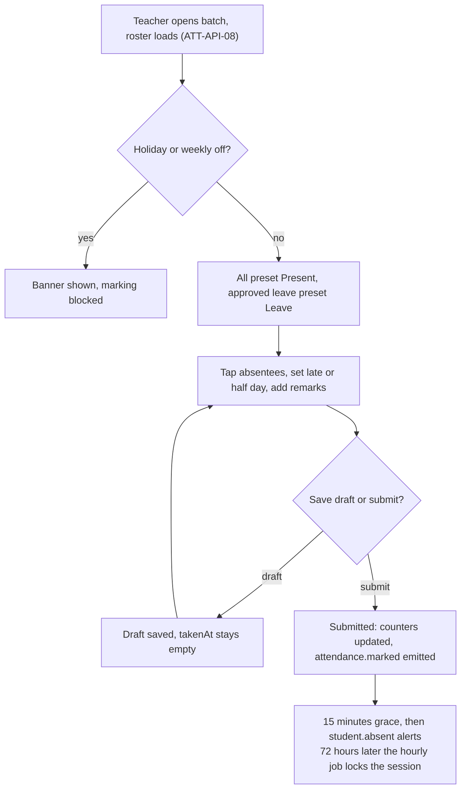
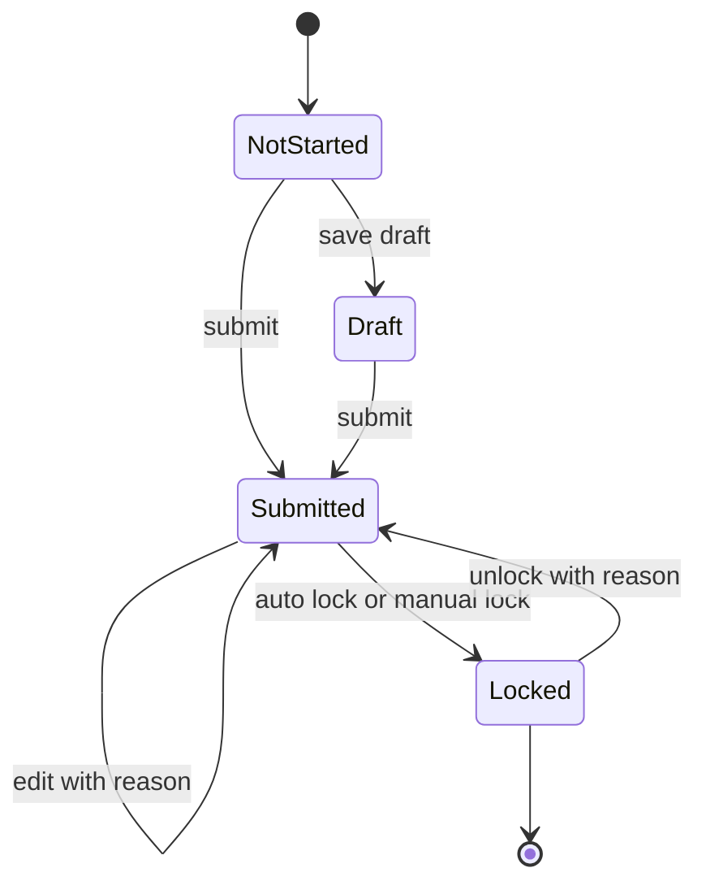
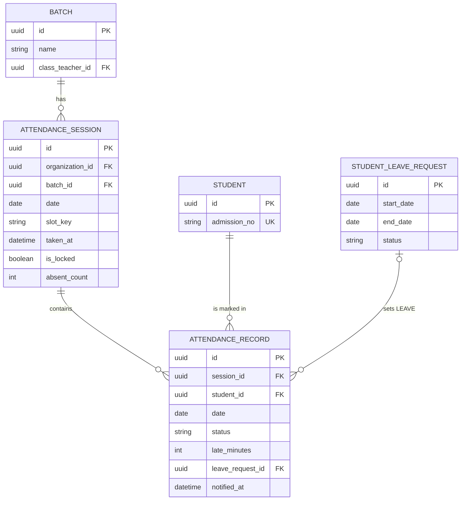
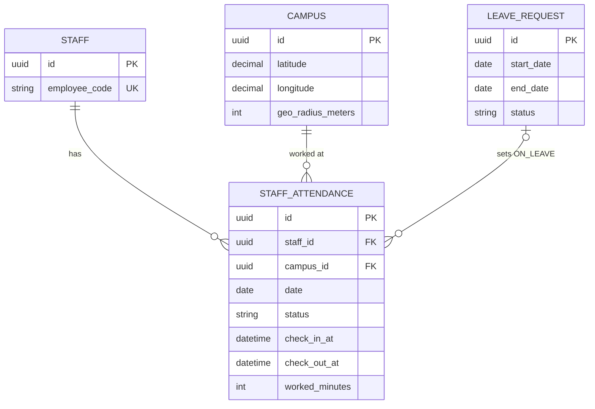

# Attendance Module

**In simple words:** This chapter explains how EduFlow records who came to class and who did not. A teacher marks a full class on a phone in under 30 seconds, and the parent of an absent child gets a message a few minutes later. The same module keeps the staff register, the monthly register, the below-75% list and the one attendance percentage that report cards and payroll rely on. Teachers touch this module every working day, so it must be fast, hard to get wrong and impossible to change silently.

| Item | Value |
|---|---|
| Module code | ATT |
| Release phase | Phase 1 (MVP); period-wise mode, imports and geo check-in in Phase 2; device punches in Phase 3 |
| Plans | Starter (daily mode, in-app and email alerts), Growth, Pro, Enterprise |
| Main users | Teacher, Principal, Organization Admin, Parent; Accountant reads the staff register |
| Depends on | Batch, Student Profile, Teachers, Settings, Notifications; later Leave, Timetable, Payroll |
| Main tables | `attendance_sessions`, `attendance_records`, `staff_attendance` |

## Objective

The module has six measurable goals.

1. **Speed.** A teacher marks a batch of 40 students in under 30 seconds on a normal day (0 to 3 absentees). The hard upper limit is 60 seconds, which is product goal PG-02 in *Introduction and Product Overview*.
2. **Parent transparency.** The parent of an absent child gets an alert within 20 minutes of the submit: 15 minutes of grace for the teacher to fix a wrong tap, then the send.
3. **Trust in the register.** A submitted session locks after a set time. Every change after submit needs a reason and writes one row in `audit_logs`. Nobody can change an old register silently.
4. **One formula everywhere.** The monthly register, the Parent Portal, the report card, the below-75% list and AI Insights all use the same percentage function. Two screens never show two different numbers for the same child.
5. **Staff register for payroll.** One row per staff member per day gives the payable days that the *Payroll Module* reads.
6. **Activation.** The first submitted session of a new organization sets `Organization.activatedAt`. This feeds the canon target of 60% activation within 7 days of signup.

## Scope

### In scope

- Three marking modes, chosen per organization (with an optional campus override): `DAILY` (one session per batch per day), `PERIOD` (one session per batch per period slot) and `LECTURE` (one session per dated coaching lecture, linked to a `ClassSession`).
- Mobile-first mark sheet: everyone is Present by default, the teacher taps only the exceptions. Statuses: Present, Absent, Late (with minutes), Half day (which half), Leave, Holiday. One short remark per student.
- Save draft, submit, automatic lock after N hours, manual lock, month close (bulk lock), unlock with a reason.
- Corrections with a mandatory reason and a full audit trail.
- Absent and late alerts to parents through the *Notifications Module* (in-app, WhatsApp, SMS, email).
- Holiday calendar and weekly-off awareness. Approved student leave shows as `LEAVE` on the mark sheet.
- Bulk marking: "All present", "Mark all as holiday", multi-select on the web grid, Excel import.
- Staff attendance: manual day register, biometric file import, self check-in and check-out inside the campus geo-fence (a virtual circle around the campus).
- Reports: daily summary, monthly register, student summary, below-75% and consecutive-absence list, staff monthly register with payable days.
- Correct percentages for mid-month joiners, batch transfers and students who left.
- Parent view of the child's month calendar.

### Out of scope

| Not in this module | Where it lives or why |
|---|---|
| Selling or supporting biometric, RFID or GPS hardware | EduFlow sells no hardware. It accepts a file import and a punch API only. |
| Face recognition processing | A device may send a punch with source `FACE`. EduFlow never stores or matches face images. |
| Leave applications and approvals | *Leave Module*. This module only reads approved leave. |
| Holiday calendar create, edit, delete | *Batch Module* owns `/holidays`. This module reads it. |
| Period slots and dated lectures | *Timetable Module* owns `period_slots` and `class_sessions`. |
| Bus boarding and hostel roll call | *Transport Module* and *Hostel Module* have their own tables. |
| Live sync between two teachers, native offline app | Last save wins per student. The browser keeps a local draft, which is enough for a 30-second task. |

### Phase notes

| Phase | What ships | Why |
|---|---|---|
| Phase 1 (Day 29 to 35 of the sprint, prompt P-18) | `DAILY` mode, draft, submit, lock, unlock, corrections, absent alerts, roster with holidays, all four student reports, export, parent calendar, manual staff register and staff monthly register | Enough for the pilot on 18 Nov 2026. A coaching batch meets once a day, so `DAILY` mode per batch also fits Sharma Classes. |
| Phase 2 (by 1 Feb 2027) | `PERIOD` and `LECTURE` modes, leave integration, Excel imports (ATT-API-13, ATT-API-24), geo check-in and check-out (ATT-API-22, ATT-API-23), Student Portal view | These need the Timetable and Leave modules, which are Phase 2. |
| Phase 3 (by June 2027) | Device punches (ATT-API-12), payable days feed to Payroll | Needs Enterprise API keys and the Payroll module. |

> **Note:** The WhatsApp channel arrives in sprint week 7, two weeks after this module. Until then absent alerts go out in-app and by email. No code change is needed later, because this module only emits events and never sends messages itself.

## User Stories

| ID | As a | I want to | So that | Priority |
|---|---|---|---|---|
| ATT-US-01 | Teacher | open my batch and see everyone preset to Present | I only tap the 1 or 2 absentees | Must |
| ATT-US-02 | Teacher | mark a student Late with minutes or Half day with the half attended | the register shows what really happened | Must |
| ATT-US-03 | Teacher | save a draft and finish it later | a phone call or weak network does not lose my work | Must |
| ATT-US-04 | Teacher | see approved leave already filled in as Leave | I do not mark a child absent whose parent informed the school | Should |
| ATT-US-05 | Teacher | fix a wrong tap after submit, with a reason | the parent gets a correction and the register stays honest | Must |
| ATT-US-06 | Parent | get a message when my child is marked absent | I know the same morning if my child did not reach school | Must |
| ATT-US-07 | Parent | see my child's month calendar and percentage | I can track attendance without calling the school | Must |
| ATT-US-08 | Principal | see which batches are not marked yet today | I can remind those teachers before 10:00 | Must |
| ATT-US-09 | Principal | lock a month and reopen one session with a reason | old registers cannot change without my knowledge | Must |
| ATT-US-10 | Principal | open the list of students below 75% or absent 3 days in a row | I can call the parents early | Must |
| ATT-US-11 | Organization Admin | choose daily or period-wise mode and the lock time | the module fits how my institute works | Must |
| ATT-US-12 | Principal | print the monthly register of a batch | I can file the statutory register and show it at inspections | Must |
| ATT-US-13 | Principal | mark the staff register for the day or import the biometric file | staff attendance is complete without typing every row | Should |
| ATT-US-14 | Teacher | check in from my phone when I reach the campus | my own attendance is recorded without a paper register | Should |
| ATT-US-15 | Accountant | read the staff monthly register with payable days | salary is paid for the correct number of days | Should |

## Workflow

**Figure: Daily marking flow (teacher)**



The teacher never waits for messages. The submit only saves rows and adds one delayed job. A worker sends the alerts later.

Step by step, for Priya Nair and batch 10-A of Bright Future Public School on Wednesday 14 July 2027:

1. At 08:05 Priya taps "10-A attendance pending" on the teacher home. The client calls ATT-API-08. The server returns the 41 students enrolled in 10-A on that date, the holiday flag, approved leave and any existing marks.
2. Every student shows `P`. Diya Kapoor shows `LV` because her approved sick leave covers 14 July.
3. Priya taps Aarav Sharma and Rohan Verma once each. One tap turns `P` into `A`. She long-presses Arjun Mehta, picks Late and types 10 minutes. The browser keeps a local draft after every tap.
4. She taps Submit at 08:07. The client sends only the exceptions. The server writes 1 session row and 41 record rows in one transaction, fills the counters (37 present, 2 absent, 1 late, 1 leave) and sets `takenAt` and `takenById`.
5. The server emits `attendance.marked` and adds one delayed job with the ID `absent-alerts-{sessionId}`. The delay is `attendance.notify_delay_minutes` (default 15).
6. At 08:12 Rohan walks in. Priya changes him to Late with the reason "Came at 08:12". His parent never gets an absent alert, because the job has not run yet.
7. At 08:22 the job runs. It finds the records that are still `ABSENT` with `notifiedAt` empty, emits `student.absent` for Aarav, and stamps `notifiedAt` on the record and `parentsNotifiedAt` on the session.
8. After 72 hours the hourly auto-lock job sets `isLocked = true` and `lockedAt`. From now on only a user with `attendance.unlock` can reopen the session.
9. On 2 August Dr. Anita Verma runs Month Close (ATT-API-09) for July. All submitted sessions up to 31 July are locked. Drafts are listed so she can submit them first.

**Figure: Session lifecycle**



A session has no status column. The state is read from two fields, so the database can never hold a state that disagrees with its own timestamps.

### Session states

| State | How the system knows | Who can change records | Counts in reports |
|---|---|---|---|
| Not started | No row for batch + date + `slotKey` | Nobody yet; the first save creates the row | No |
| Draft | Row exists, `takenAt` is null | Users with `attendance.mark` in scope | No |
| Submitted | `takenAt` is set, `isLocked` is false | `attendance.mark` (whole sheet) or `attendance.update` (one record), with a reason | Yes |
| Locked | `isLocked` is true, `lockedAt` is set | Nobody, until a user with `attendance.unlock` reopens it | Yes |
| Reopened | Same as Submitted; the unlock is in `audit_logs` | Same as Submitted; locks again 24 to 48 hours later | Yes |

### Student record statuses

| Status | Meaning | Weight in the percentage | Who sets it |
|---|---|---|---|
| `PRESENT` | Attended the full session | 1 | Default, teacher, device punch |
| `LATE` | Attended, arrived after the start; `lateMinutes` optional | 1 | Teacher, device punch |
| `HALF_DAY` | Attended one half; `halfDaySession` says which | 0.5 | Teacher, approved half-day leave |
| `ABSENT` | Did not attend and no approved leave | 0 | Teacher |
| `LEAVE` | Approved leave covers the date; `leaveRequestId` is set | 0 (or left out, by setting) | System from the *Leave Module*, teacher |
| `HOLIDAY` | No class for this student on this date | Left out of working days | "Mark all as holiday" action |

### Staff statuses

| Status | Meaning | Payable day value |
|---|---|---|
| `PRESENT` | Worked the day | 1 |
| `LATE` | Worked, arrived after the late time | 1 |
| `HALF_DAY` | Worked less than the half-day limit | 0.5 |
| `ON_LEAVE` | Approved staff leave; paid or unpaid by `LeaveType.isPaid` | 1 if paid, 0 if unpaid |
| `HOLIDAY` | Holiday that applies to staff | 1 |
| `WEEK_OFF` | Weekly off day of the campus | 1 |
| `ABSENT` | Did not work and has no leave | 0 |

## Screens and Wireframes

| ID | Screen | Users | Purpose |
|---|---|---|---|
| ATT-S01 | Mark Attendance (mobile) | Teacher | Tap-the-absentees mark sheet with draft and submit |
| ATT-S02 | Mark Attendance (web grid) | Teacher, Principal | Keyboard and multi-select marking, bulk actions, back-dated entry |
| ATT-S03 | Attendance Today | Principal, Organization Admin | Campus totals, state of every batch, unmarked batches, month close |
| ATT-S04 | Monthly Register | Principal, Teacher, Organization Admin | Batch x month grid with working days, attended days and percent |
| ATT-S05 | Session Detail and Correction | Teacher, Principal | One session with counters, record edit with reason, change history, lock and unlock |
| ATT-S06 | Below 75% and Consecutive Absences | Principal, Teacher | Follow-up list with parent phone and last alert date |
| ATT-S07 | Staff Attendance Register | Principal, Organization Admin, Accountant (view) | Day register for all staff, month grid, payable days |
| ATT-S08 | Staff Check-in (mobile) | Every staff user | Geo check-in and check-out |
| ATT-S09 | Import Attendance | Principal, Organization Admin | Upload student or staff Excel, dry run, error file |
| ATT-S10 | Child Attendance Calendar (mobile) | Parent | Month calendar, totals and percent of one child |
| ATT-S11 | Month Close dialog | Principal, Organization Admin | Lock all sessions up to a date; lists drafts first |

**Screen ATT-S01 — Mark Attendance (Teacher, mobile)**

```text
+------------------------------------+
| < 10-A   Wed 14 Jul 2027      (PN) |
| Daily attendance         Not saved |
+------------------------------------+
| P 37   A 2   L 1   LV 1   of 41    |
| [All Present]  [Search roll, name] |
+------------------------------------+
| 01 Aarav Sharma             [ A ]  |
|    Absent          [+ Add remark]  |
| 02 Aditi Singh              [ P ]  |
| 03 Arjun Mehta              [ L ]  |
|    Late 10 min                     |
| 04 Diya Kapoor              [ LV]  |
|    Approved leave: Sick            |
| 05 Farhan Ali               [ P ]  |
| 06 Ishita Rao               [ P ]  |
| 07 Kavya Iyer               [ P ]  |
| 08 Lakshmi Pillai           [ P ]  |
|    ... 33 more students            |
+------------------------------------+
| [Save Draft]        [Submit (41)]  |
+------------------------------------+
```

- The teacher sees the roster sorted by roll number. Every chip starts as `P`. One tap switches between `P` and `A`. A long press opens the status sheet with Late (minutes), Half day (first or second half), Leave and the remark box.
- The counter bar updates on every tap, so the teacher can check "2 absent" before she submits.
- `[All Present]` resets every chip to `P` after a confirm. Chips with approved leave stay `LV`.
- The page loads with ATT-API-08. `[Save Draft]` and `[Submit (41)]` call ATT-API-02 for a new session and ATT-API-04 for an existing one. The only difference is the field `submit`.
- The sheet is kept in `localStorage` under the key `att-draft-{batchId}-{date}-{slotKey}` after every tap. A reload or a lost connection restores it. The key is removed after a successful submit.

**Screen ATT-S03 — Attendance Today (Principal, web)**

```text
+--------------------------------------------------------------------------+
| EduFlow | Bright Future Public School      [Search students...]  (AV) v  |
+--------------+-----------------------------------------------------------+
| Dashboard    | Attendance > Today   Campus [Main Campus v] [14 Jul 2027] |
| Students     +-----------------------------------------------------------+
| Attendance < | Present 702  Absent 38  Late 11  Leave 9  In class 93.8%  |
|  Today       | Batches marked 18 of 20    Not marked: 9-B    Draft: 9-A  |
|  Register    |-----------------------------------------------------------|
|  Below 75%   | Batch  Teacher       State        P   A   L  Lv  Action   |
|  Staff       | 10-A   Priya Nair    Submitted   37   2   1   1  [View]   |
|  Import      | 10-B   R. Mishra     Submitted   39   1   0   0  [View]   |
| Fees         | 9-A    S. Khan       Draft        -   -   -   -  [Open]   |
| Exams        | 9-B    A. Das        Not marked   -   -   -   -  [Mark]   |
| Settings     | 8-A    N. Bose       Locked      40   0   1   0  [View]   |
|              |-----------------------------------------------------------|
|              | [Month Close]  [Export v]        Showing 5 of 20 batches  |
+--------------+-----------------------------------------------------------+
```

- The Principal sees the campus totals and one row per batch with its state: Not marked, Draft, Submitted or Locked.
- "In class" is (present + late) divided by all marked students: (702 + 11) / 760 = 93.8%.
- `[Mark]` and `[Open]` go to ATT-S02. `[View]` goes to ATT-S05. `[Month Close]` opens ATT-S11 and calls ATT-API-09. `[Export v]` calls ATT-API-14.
- The page calls ATT-API-15. It refetches every 60 seconds while the tab is open, because batches get marked between 08:00 and 10:00.

**Screen ATT-S04 — Monthly Register (Principal, web)**

```text
+--------------------------------------------------------------------------+
| EduFlow | Bright Future Public School      [Search students...]  (AV) v  |
+--------------------------------------------------------------------------+
| Attendance:   Today | [Register] | Below 75% | Staff | Import            |
+--------------------------------------------------------------------------+
| Batch [10-A v]  Month [Jul 2027 v]  (o) Days ( ) Summary  [Export v]     |
+--------------------------------------------------------------------------+
| No  Name           1  2  3  5  6  7  8  9 10 12 13 14 ..  WD  Att      % |
| 01  Aarav Sharma   P  P  P  P  L  P  P  P  P  P  P  A ..  26 23.5  90.38 |
| 02  Aditi Singh    P  P  P  P  P  P  P  P  P  P  P  P ..  26 26.0 100.00 |
| 03  Arjun Mehta    P  P  A  P  P  P  P  P  P  P  P  L ..  26 25.0  96.15 |
| 22  Meera Joshi    P  P  P  P  P  P  P  P  A  P  P  P ..  14 13.0  92.86 |
| 28  Rohan Verma    P  P  P  P  P  P  P  P  P  P  P  L ..  26 23.0  88.46 |
| 42  Kabir Khan     -  -  -  -  -  -  -  -  -  -  -  - ..  11 10.0  90.91 |
+--------------------------------------------------------------------------+
| P Present  A Absent  L Late  H Half day  Lv Leave  Ho Holiday            |
| - Not in this batch on that date.  Sundays are hidden.  22 Jul = Ho      |
| Working days 26    Batch average 94.10%    Below 75%: 0 students         |
+--------------------------------------------------------------------------+
```

- One row per student who was in the batch on at least one day of the month. `-` means the student was not in this batch on that date (Kabir Khan joined on 19 July; Meera Joshi moved to 10-B after 16 July).
- `WD` is the student's own working days. `Att` is attended days with half days as 0.5. The percent uses rule ATT-BR-13.
- The Summary view hides the day columns and shows Present, Absent, Late, Half day and Leave totals instead.
- The page calls ATT-API-16. `[Export v]` offers XLSX and PDF (A4 landscape register) through ATT-API-14.

**Screen ATT-S08 — Staff Check-in (every staff user, mobile)**

```text
+------------------------------------+
| EduFlow          Priya Nair (PN) v |
+------------------------------------+
| Wed 14 Jul 2027              07:52 |
| Main Campus, Lucknow               |
|                                    |
| Location      Inside campus (42 m) |
| GPS accuracy  18 m                 |
|                                    |
|           [  CHECK IN  ]           |
|                                    |
| Late after 08:00. Half day < 4 h.  |
+------------------------------------+
| Today                              |
| Check-in     --:--                 |
| Check-out    --:--                 |
| Status       Not checked in        |
+------------------------------------+
| [Apply Leave]        [My Classes]  |
+------------------------------------+
```

- The page asks the browser for the location. It shows the distance to the campus centre and the GPS accuracy before the user taps.
- `[CHECK IN]` calls ATT-API-22 with `lat`, `lng`, `accuracyMeters` and `deviceRef`. After a successful check-in the button changes to `[CHECK OUT]`, which calls ATT-API-23.
- The button is disabled with the text "You are outside the campus" when the distance is more than `Campus.geoRadiusMeters`. The server checks the distance again, because a client can be faked.
- No `self` list endpoint exists. The screen shows today's row from the last check-in response, which the browser keeps for the day. A second check-in call is safe: it returns the existing row.

**Screen ATT-S10 — Child Attendance Calendar (Parent, mobile)**

```text
+------------------------------------+
| < Attendance       Aarav (10-A) v  |
+------------------------------------+
|         <   July 2027   >          |
| Mo   Tu   We   Th   Fr   Sa   Su   |
|                1P   2P   3P   4    |
| 5P   6L   7P   8P   9P   10P  11   |
| 12P  13P  14A  15P  16P  17P  18   |
| 19P  20L  21P  22Ho 23P  24P  25   |
| 26P  27Lv 28P  29P  30H  31P       |
+------------------------------------+
| Working days 26     Attended 23.5  |
| Present 21   Late 2   Half day 1   |
| Absent 1     Leave 1               |
| This month 90.38%   Year 93.10%    |
+------------------------------------+
| Wed 14 Jul: Absent                 |
| Alert sent 08:22 on WhatsApp       |
| [Apply Leave for a Date]           |
+------------------------------------+
```

- The parent sees one code per day: `P` present, `A` absent, `L` late, `H` half day, `Lv` leave, `Ho` holiday. Sundays are empty.
- A tap on a day shows the detail line: the status and the time the alert was sent. Teacher remarks are internal and are not shown to parents.
- The page calls ATT-API-27 with `studentId` and `month`. Only submitted sessions appear. A draft is invisible to parents.
- `[Apply Leave for a Date]` opens the leave form of the *Parent Portal Module*.

### Screens without a wireframe

- **ATT-S02 (web grid).** One row per student with Roll, Name, Status, Late min, Half, Remark. Keys `P`, `A`, `L`, `H` set the status of the focused row and move down. Shift + click selects a range for "Set selected to" and "Mark all as holiday". A date picker allows back-dated entry.
- **ATT-S05 (session detail).** Header with batch, date, slot, taken by, state badge and counters. The edit dialog of a record asks for the new status and a mandatory reason. A History tab lists the `audit_logs` rows: who, when, before, after, reason.
- **ATT-S06 (follow-up list).** Two tabs, "Below 75%" and "Absent 3+ days in a row", with percent, streak, guardian phone and last alert (ATT-API-18).
- **ATT-S07 (staff register).** Day view with status, in and out time, source and remark per staff member (ATT-API-21). Month view with payable days (ATT-API-26).
- **ATT-S09 and ATT-S11.** The shared import wizard with dry run and error file; and a dialog "Lock all sessions up to 31 Jul 2027" that lists the drafts it will skip.

## UI Components

| Component | Type | Behaviour |
|---|---|---|
| `MarkSheetList` | Custom list (mobile) | Virtualised list of students. Tap toggles `P` and `A`. Long press opens `StatusSheet`. Works with one thumb. |
| `StatusChip` | shadcn `Badge` as button | Codes `P`, `A`, `L`, `H`, `LV`, `HO`. Colour plus letter, never colour alone. Touch size 44 x 44 px. |
| `StatusSheet` | shadcn `Sheet` (bottom) | Radio list of statuses, minutes input for Late, half picker for Half day, remark box. |
| `CounterBar` | Custom | Live totals per status. Turns amber when more than 30% are absent, to catch a wrong bulk tap. |
| `SubmitBar` | Sticky footer | `[Save Draft]` and `[Submit (n)]`. Disabled while a request runs. Shows "Saved 08:07" after success. |
| `HolidayBanner` | shadcn `Alert` | Shows the holiday name and hides the chips. Shows "Mark anyway" only with `attendance.manage`. |
| `LockBadge` | shadcn `Badge` + `Tooltip` | Draft, Submitted or Locked. The tooltip says when the session locks or who locked it. |
| `ReasonDialog` | shadcn `Dialog` + React Hook Form | Mandatory reason (5 to 500 characters) for edits after submit and for unlock. |
| `AttendanceGrid` | TanStack Table (web) | Keyboard marking, range select, bulk bar, inline remark. |
| `MonthRegisterTable` | TanStack Table | Sticky Roll and Name columns, horizontal scroll for days, totals on the right, A4 landscape print style. |
| `PercentBadge` | shadcn `Badge` | Green at 90% or more, amber from the minimum percent to 89.99%, red below the minimum percent. |
| `CalendarMonth` | Custom grid | Month view for the parent and student portals. Swipe changes the month. |
| `CheckInButton` | Custom | States: locating, inside, outside, weak GPS, checked in, checked out. |
| `ImportWizard`, `ExportMenu` | Shared kit | Same components as in the *Student Profile Module*. They poll the job until it is `COMPLETED`. |

States that every screen must handle:

- **Loading.** Skeleton rows in the list and grid. The submit bar stays hidden until the roster is loaded.
- **Empty.** "No students are enrolled in 10-A on this date." with a link to the batch. For reports: "No submitted attendance in this period."
- **Error.** A toast with the API message and a Retry button. The local draft is never cleared on an error.
- **Offline.** A grey bar "You are offline. Your marks are kept on this phone." The submit waits and retries when the network returns. The retry is safe because ATT-API-02 is idempotent.

## Validation Rules

| Field | Rule | Error message shown to user |
|---|---|---|
| `batchId` | Required UUID. Batch is `ACTIVE` and inside the user's scope. | "You can mark attendance only for your own batches." |
| `date` | Format `YYYY-MM-DD`. Not after today in the campus timezone. | "Attendance cannot be marked for a future date." |
| `date` | Not older than `attendance.backdate_days` for a user without `attendance.manage`. | "You can mark attendance up to 7 days back. Ask the Principal for older dates." |
| `date` | Inside the academic year and inside the batch start and end dates. | "14 Jul 2027 is outside the dates of this batch." |
| `date` | Not a holiday and not a weekly off (see ATT-BR-07). | "22 Jul 2027 is a holiday (Heavy rain closure). Attendance cannot be marked." |
| `periodSlotId` | Required in `PERIOD` mode. Slot belongs to the batch's campus and has type `PERIOD`. | "Select a period." |
| `classSessionId` | Required in `LECTURE` mode. Lecture belongs to the same batch and date. | "Select a lecture." |
| `records[].studentId` | Student is on the roster of the batch for the date. No duplicates. | "Kabir Khan is not enrolled in 10-A on 14 Jul 2027." |
| `records[].status` | One of the six `AttendanceStatus` values. | "Choose a valid status." |
| `records[].lateMinutes` | Only with `LATE`. Whole number from 1 to 240. | "Late minutes must be between 1 and 240." |
| `records[].halfDaySession` | Required with `HALF_DAY`. `FIRST_HALF` or `SECOND_HALF`. | "Select which half the student attended." |
| `records[].status = LEAVE` | Without an approved request, a remark is required. | "Add a remark when you mark Leave without an approved request." |
| `records[].remark` | At most 255 characters. | "Remark can have at most 255 characters." |
| `notes` | At most 500 characters. | "Notes can have at most 500 characters." |
| `reason` | Required for any change after submit and for unlock. 5 to 500 characters. | "Please enter a reason (at least 5 characters)." |
| `upToDate` (month close) | Not after today. | "Month close date cannot be in the future." |
| `threshold` | Number from 1 to 100. | "Threshold must be between 1 and 100." |
| `month` | Format `YYYY-MM`, inside an academic year of the organization. | "Select a valid month." |
| Staff `checkOutAt` | After `checkInAt`, same calendar date in the campus timezone. | "Check-out time must be after check-in time." |
| `lat`, `lng` | -90 to 90 and -180 to 180. | "Location is not valid." |
| `accuracyMeters` | 100 or less. | "GPS signal is weak. Move near a window and try again." |
| Distance to campus | At most `Campus.geoRadiusMeters`. | "You are 640 m from Main Campus. Check-in works within 150 m." |
| Import file | `.xlsx` or `.csv`, at most 5 MB and 10,000 rows. | "File must be .xlsx or .csv and smaller than 5 MB." |

## Business Rules

### Settings that drive the rules

These keys live as rows of `organization_settings` (key and JSON value). A row with `campus_id` overrides the organization value for that campus. The *Settings Module* owns the screen.

| Key | Default | Meaning |
|---|---|---|
| `attendance.mode` | `"DAILY"` | `DAILY`, `PERIOD` or `LECTURE` |
| `attendance.lock_after_hours` | `72` | Hours after `takenAt` when a session locks by itself. The screen shows days (3 days). `0` means manual lock only. |
| `attendance.backdate_days` | `7` | How far back a teacher may create a session |
| `attendance.notify_absent` | `true` | Send absent alerts to parents |
| `attendance.notify_late` | `false` | Send late alerts to parents |
| `attendance.notify_delay_minutes` | `15` | Grace time between submit and the alerts |
| `attendance.leave_counts_as` | `"ABSENT"` | `ABSENT` keeps leave days in the working days. `EXCLUDED` removes them. |
| `attendance.min_percent` | `75` | Threshold of the low-attendance list and alert |
| `attendance.consecutive_absent_days` | `3` | Streak length that puts a student on the follow-up list |
| `attendance.staff_late_after` | `"09:15"` | Staff check-in after this local time is `LATE` |
| `attendance.staff_half_day_minutes` | `240` | Worked minutes below this value give `HALF_DAY` |
| `attendance.geo_checkin` | `false` | Allow self check-in; needs campus latitude, longitude and radius |

The lock time is stored in hours, not days, so that a coaching institute can choose 12 hours and a school can choose 72.

### Marking rules

- **ATT-BR-01 — Mode and slot key.** The mode decides what one session means. `slotKey` is `"DAY"` in `DAILY` mode, the `periodSlotId` in `PERIOD` mode and the `classSessionId` in `LECTURE` mode. A mode change applies to new dates only. Old sessions keep their slot key.
- **ATT-BR-02 — One session per slot.** The unique key (`organizationId`, `batchId`, `date`, `slotKey`) allows one session per batch, date and slot. A second POST for the same key does not fail. It returns the existing session with `alreadyExisted: true` and changes nothing.
- **ATT-BR-03 — Who is on the roster.** A student is on the roster of batch B for date D when an enrollment in B exists with `enrollmentDate <= D`, and `endDate` is null or `endDate >= D`, and the status is not `CANCELLED`, and the row is not deleted. The rule uses dates, not today's status. So a back-dated sheet for 10 July still shows a student who was transferred out on 17 July.
- **ATT-BR-04 — Defaults.** Every roster student is preset `PRESENT`. An approved `StudentLeaveRequest` that covers D presets `LEAVE` with `leaveRequestId`. A half-day leave presets `HALF_DAY`, and `halfDaySession` is the half the student attends. Example: leave for `SECOND_HALF` gives `halfDaySession = FIRST_HALF`. The teacher may overrule a preset if the child came anyway; the link to the leave request is then cleared.
- **ATT-BR-05 — Drafts are invisible.** A draft (`takenAt` is null) never counts in any report, never appears in a portal and never sends an alert.
- **ATT-BR-06 — Submit and counters.** Submit sets `takenAt = now()` and `takenById`. The server recounts on every save: `totalCount` = all records, `presentCount` = `PRESENT` + `HALF_DAY`, `lateCount` = `LATE`, `absentCount` = `ABSENT`, `leaveCount` = `LEAVE`. `HOLIDAY` records are only in `totalCount`. "In class" on dashboards is `presentCount + lateCount`.
- **ATT-BR-07 — Holidays and weekly off.** A date is blocked when a `Holiday` row with `appliesTo` `ALL` or `STUDENTS` covers it for the campus (or for all campuses), or when its weekday is in `Campus.weeklyOffDays`. Two exceptions exist. In `LECTURE` mode a session with a `classSessionId` is allowed, because the lecture itself proves that a class was held. In the other modes a user with `attendance.manage` may send `overrideHoliday: true`, for example for a working Saturday that replaces a rain day. When a holiday is declared after a batch was already marked, the Principal uses "Mark all as holiday". The action calls ATT-API-04 with every record set to `HOLIDAY` and a reason. The server accepts an all-`HOLIDAY` sheet only from a user with `attendance.manage`, so a teacher cannot wipe a working day. All records become `HOLIDAY`, and the date drops out of the working days.
- **ATT-BR-08 — Time window.** Future dates are never allowed. A user without `attendance.manage` may create a session at most `attendance.backdate_days` back. No write is allowed when the `AcademicYear` is `CLOSED` (`BUSINESS_RULE_VIOLATION`).
- **ATT-BR-09 — Lock.** The hourly job locks every submitted session where `takenAt` is older than `attendance.lock_after_hours` and `updatedAt` is older than 24 hours. A manual lock (ATT-API-05) and the month close (ATT-API-09) lock at once. A draft cannot be locked. The month close skips drafts and returns them in `draftSessions`.
- **ATT-BR-10 — Unlock.** Only `attendance.unlock` reopens a session, always with a reason. The unlock changes `updatedAt`, so the hourly job leaves the session open for at least 24 hours and locks it again at the first run after that.
- **ATT-BR-11 — Changes after submit.** Any change to a record of a submitted session needs `reason`. The server writes one `audit_logs` row per changed record with `action = "attendance.update"`, `entityType = "AttendanceRecord"`, `before`, `after`, `changedFields` and `reason`, and emits `attendance.updated`. Records are never deleted.
- **ATT-BR-12 — Alerts.** At most one absent alert goes out per student per date, also in `PERIOD` mode with six sessions a day. The delayed job sends it after the grace time, only for records that are still `ABSENT` with `notifiedAt` empty. If a record with `notifiedAt` set is later corrected to `PRESENT` or `LATE`, the parent gets one correction message. On the Starter plan the channels are in-app and email only.

### Percentage formula

- **ATT-BR-13 — One formula.**

```text
working units  = records of the student in submitted sessions,
                 inside the period, without status HOLIDAY
                 (and without LEAVE when leave_counts_as = EXCLUDED)
attended units = PRESENT x 1 + LATE x 1 + HALF_DAY x 0.5
percent        = attended units / working units x 100
                 rounded to 2 decimals; "not available" when
                 working units = 0
```

A unit is a day in `DAILY` mode and a session in `PERIOD` and `LECTURE` mode.

> **Example:** Aarav Sharma, 10-A, July 2027. July has 31 days. Sundays fall on 4, 11, 18 and 25 July, and 22 July is a holiday (Heavy rain closure). Working days = 31 - 4 - 1 = 26. Aarav has Present 21, Late 2 (6 and 20 July), Half day 1 (30 July), Absent 1 (14 July) and Leave 1 (27 July). Attended = 21 + 2 + 0.5 = 23.5. Percent = 23.5 / 26 x 100 = 90.38%. With `leave_counts_as = EXCLUDED` the working days become 25 and the percent becomes 23.5 / 25 x 100 = 94.00%.

```typescript
// shared/src/attendance/percent.ts - used by the API, the portals and report cards
export type AttendanceStatus =
  | 'PRESENT' | 'ABSENT' | 'LATE' | 'HALF_DAY' | 'LEAVE' | 'HOLIDAY';
export type LeaveCountsAs = 'ABSENT' | 'EXCLUDED';

const WEIGHT: Record<AttendanceStatus, number> = {
  PRESENT: 1, LATE: 1, HALF_DAY: 0.5, ABSENT: 0, LEAVE: 0, HOLIDAY: 0,
};

export interface AttendanceSummary {
  workingUnits: number;
  attendedUnits: number;
  percent: number | null; // null = not available
}

export function summarize(
  statuses: AttendanceStatus[],
  leaveCountsAs: LeaveCountsAs = 'ABSENT',
): AttendanceSummary {
  let workingUnits = 0;
  let attendedUnits = 0;
  for (const status of statuses) {
    if (status === 'HOLIDAY') continue;
    if (status === 'LEAVE' && leaveCountsAs === 'EXCLUDED') continue;
    workingUnits += 1;
    attendedUnits += WEIGHT[status];
  }
  const percent =
    workingUnits === 0 ? null : Math.round((attendedUnits / workingUnits) * 10000) / 100;
  return { workingUnits, attendedUnits, percent };
}
```

- **ATT-BR-14 — Mid-month joiner.** Working units are counted from the student's own records. A student has records only for dates on which he was on the roster (ATT-BR-03). So days before the joining date never count against him.

> **Example:** Kabir Khan joins 10-A on Monday 19 July 2027. From 19 to 31 July there are 12 Monday-to-Saturday dates. One is the holiday of 22 July, so his working days are 11. He is present on 10 and absent on 1. Percent = 10 / 11 x 100 = 90.91%. Dividing by the batch's 26 days would give 38.46%. That is wrong, and it would put him on the below-75% list in his second week.

- **ATT-BR-15 — Batch transfer.** Records stay with the batch in which they were marked (`attendance_records.batch_id`). The student summary adds the records of all batches in the period. The register of each batch shows only its own dates and `-` for the rest. The *Batch Module* makes sure the old `endDate` and the new `enrollmentDate` do not overlap.

> **Example:** Meera Joshi is in 10-A until Friday 16 July and in 10-B from Saturday 17 July. 10-A has 14 working days from 1 to 16 July; she attended 13. 10-B has 12 working days from 17 to 31 July; she attended 11. Her July percent = (13 + 11) / (14 + 12) x 100 = 24 / 26 x 100 = 92.31%. The 10-A register shows 13 / 14 = 92.86% for her, because it sees only its own dates.

- **ATT-BR-16 — Period and lecture modes.** The percent counts sessions. A student with 5 of 6 periods on one day has 5 attended units of 6. The parent calendar shows the day as `P` when every period was attended, `A` when none was, and `5/6` otherwise. A coaching student with a primary and an extra batch gets one percent per batch and one overall percent over all sessions.

### Follow-up rules

- **ATT-BR-17 — Follow-up list.** A student is on the low list when the percent in the chosen period is below the threshold (default `attendance.min_percent`). A student is on the streak list when the newest N records, ignoring `HOLIDAY`, are all `ABSENT` (default N = 3). Sundays and holidays do not break a streak. `LEAVE`, `PRESENT`, `LATE` and `HALF_DAY` end it.

> **Example:** Rohan Verma is absent on Friday 23, Saturday 24 and Monday 26 July. Sunday 25 July has no session. His newest three records are all `ABSENT`, so he is on the streak list on 26 July.

- **ATT-BR-18 — Low attendance alert.** A weekly job (Monday 06:00 in the organization's timezone) computes the year-to-date percent of every active student. It emits `student.attendance.low` when the percent is below the threshold and the student has at least 20 working units. The 20-unit floor stops false alarms in the first weeks: 1 absence in 3 days is already 66.67%. A student gets at most one such alert per calendar month.

### Staff rules

- **ATT-BR-19 — One row per staff per day.** The unique key (`organizationId`, `staffId`, `date`) makes every staff write an upsert. A manual correction may overwrite a device row; it sets `markedById` and needs a remark. Approved staff leave writes `ON_LEAVE` rows from the *Leave Module* (LEV-API-16). A nightly job at 23:30 writes `HOLIDAY` and `WEEK_OFF` rows for active staff who have no row for the date. It never writes `ABSENT` by itself. A missing row shows as "Not marked" in the register.
- **ATT-BR-20 — Geo check-in.** The server computes the great-circle distance between the sent position and `Campus.latitude` and `Campus.longitude`. It accepts the check-in when the distance is at most `Campus.geoRadiusMeters` and `accuracyMeters` is at most 100. The first check-in of the day wins. The status is `LATE` with `lateMinutes` when the local time is after `attendance.staff_late_after`, else `PRESENT`. Check-out sets `workedMinutes` = whole minutes between `checkInAt` and `checkOutAt`. When `workedMinutes` is below `attendance.staff_half_day_minutes`, the status becomes `HALF_DAY`.

> **Example:** Bright Future Public School sets the late time to 08:00. Priya Nair checks in at 07:52, 42 m from the campus centre (radius 150 m), and checks out at 15:10. Worked minutes = 7 h 18 min = 438. 438 is above 240, so the status stays `PRESENT`. On 10 July she checks in at 08:21: `LATE` with `lateMinutes = 21`.

- **ATT-BR-21 — Payable days.**

```text
payable days = PRESENT + LATE + HALF_DAY x 0.5
             + ON_LEAVE rows whose leave type is paid
             + HOLIDAY + WEEK_OFF
loss of pay  = days in month - payable days - not marked days
```

> **Example:** Priya Nair, July 2027 (31 days): Present 22, Late 2, Half day 1, paid casual leave 1, Holiday 1, Week off 4. The rows add up to 31, so nothing is unmarked. Payable days = 22 + 2 + 0.5 + 1 + 1 + 4 = 30.5. Loss of pay = 0.5 day. The *Payroll Module* blocks a payroll run while a staff member has "Not marked" days in the month.

- **ATT-BR-22 — Device data.** For a staff punch file or a punch API call, the first punch of a date is the check-in and the last is the check-out. Staff are matched by `Staff.employeeCode`, students by `Student.rfidCardNo` or admission number. A student punch creates the day's session as a draft if it is missing, and writes `PRESENT` with `checkInAt` and the device `source`. When a draft holds device punches, roster students without a punch are preset `ABSENT` instead of `PRESENT`. The teacher still reviews and submits.
- **ATT-BR-23 — Nothing is deleted.** Attendance is a statutory record. There is no delete endpoint. Foreign keys use `onDelete: Restrict`, so a batch or student with attendance cannot be hard deleted.

## Acceptance Criteria

| ID | Given | When | Then |
|---|---|---|---|
| ATT-AC-01 | Priya Nair is class teacher of 10-A; 41 students are on the roster of 14 Jul 2027; Diya Kapoor has approved leave | she opens the mark sheet | 40 students show `P`, Diya shows `LV`, and the counter reads P 40, LV 1 |
| ATT-AC-02 | the sheet of ATT-AC-01 | she marks 2 absent and 1 late and taps Submit | 1 session and 41 records are saved in one transaction; counters are 37, 2, 1, 1; `takenAt` and `takenById` are set |
| ATT-AC-03 | the submit of ATT-AC-02 succeeded but the response was lost | the client sends the same POST again | the API answers 200 with `alreadyExisted: true`; no new rows and no second alert job exist |
| ATT-AC-04 | a session is saved as a draft | any report or portal is opened | the draft is not counted, not shown to the parent, and no alert is queued |
| ATT-AC-05 | Aarav Sharma is `ABSENT` in a submitted session and the grace time is 15 minutes | 15 minutes pass | exactly one `student.absent` event is emitted, `notifiedAt` is set, and Sunita Devi gets the alert |
| ATT-AC-06 | Rohan Verma was changed from `ABSENT` to `LATE` inside the grace time | the alert job runs | no alert is sent for Rohan |
| ATT-AC-07 | Aarav's alert was already sent | the teacher corrects him to `PRESENT` with a reason | one `audit_logs` row holds before, after and reason; `attendance.updated` is emitted; the parent gets one correction message |
| ATT-AC-08 | a submitted, unlocked session | a record is changed without `reason` | the API answers 400 `VALIDATION_ERROR` with `field: "reason"` and nothing changes |
| ATT-AC-09 | a session was submitted 73 hours ago and not edited in the last 24 hours; the lock time is 72 hours | the hourly job runs | `isLocked` is true, `lockedAt` is set, `attendance.session.locked` is emitted |
| ATT-AC-10 | a locked session | the teacher tries to save a change | the API answers 422 with "This session is locked. Ask the Principal to reopen it." |
| ATT-AC-11 | a locked session in her campus | Dr. Anita Verma unlocks it with a reason | `isLocked` is false, one audit row holds the reason, the teacher can edit, and the session locks again 24 to 48 hours later |
| ATT-AC-12 | 22 Jul 2027 is a holiday for the campus | a teacher loads the roster or posts a session for that date | the roster has `canMark: false` with the holiday name; the POST answers 422 |
| ATT-AC-13 | Kabir Khan's enrollment in 10-A starts on 19 Jul 2027 | the roster of 14 Jul and the July register are opened | he is not on the 14 Jul roster; the register shows `-` before 19 Jul and 11 working days |
| ATT-AC-14 | Aarav's July records from the worked example | the register, the student summary and the parent calendar are opened | all three show 26 working days, 23.5 attended and 90.38% |
| ATT-AC-15 | Priya teaches 10-A only | she requests the roster of 9-B | the API answers 403 `FORBIDDEN` |
| ATT-AC-16 | July has 518 submitted sessions and 2 drafts in the campus (20 batches x 26 days) | the Principal runs month close up to 31 Jul | 518 sessions are locked; the 2 drafts are unchanged and listed in `draftSessions` |
| ATT-AC-17 | threshold 75 and streak length 3 | the follow-up list is opened | only students below 75% with at least 1 working unit, or with 3 newest records `ABSENT`, are listed, each with its reason code |
| ATT-AC-18 | geo check-in is on; the radius is 150 m | a staff user checks in 640 m away | the API answers 422 with the distance message and writes no row |
| ATT-AC-19 | Priya is inside the campus at 07:52 | she checks in, calls check-in again, then checks out at 15:10 | one row exists with source `GEO` and status `PRESENT`; the second call returns the same row; `workedMinutes` is 438 |
| ATT-AC-20 | Sunita Devi is linked to Aarav only | she calls ATT-API-27 with another student's ID | the API answers 403 `FORBIDDEN` and the attempt is logged |

## Edge Cases

| Case | What happens | How the system handles it |
|---|---|---|
| Two teachers mark the same batch at the same time | Both press Submit within seconds | The unique key lets one POST create the session. The other gets the existing session with `alreadyExisted: true` and a message "Already taken by Priya Nair at 08:07". Later saves use ATT-API-04; last save wins per student. |
| Wrong bulk tap: everyone absent | 41 alerts would go out | The counter bar turns amber and a confirm dialog says "41 of 41 absent. Submit?". The 15-minute grace gives time to fix it before any alert is sent. |
| Holiday declared after marking | An emergency closure at 10:00; three batches were marked | The Principal opens each session and uses "Mark all as holiday". Records become `HOLIDAY`; the date leaves the working days. Alerts that were sent are not recalled. |
| Student added to the batch after the session was submitted | The roster has a student without a record | ATT-API-04 creates the missing record (upsert on session + student) and raises `totalCount`. A reason is required. |
| Leave approved after the child was marked absent | The record is `ABSENT`, maybe locked, and the alert was sent | The *Leave Module* (LEV-API-25) sets the record to `LEAVE` with `leaveRequestId`, even when locked. The audit row has actor type `SYSTEM`. No correction message, because the parent asked for the leave. |
| Approved leave is cancelled | Records already saved as `LEAVE` | They stay as they are. If the child attended, the teacher corrects the record by hand with a reason. Future rosters no longer preset `LEAVE`. |
| Parent has no phone number or no WhatsApp | The alert cannot go by WhatsApp | The *Notifications Module* falls back to SMS, then email, and always writes the in-app notification. ATT-API-07 lists such students under `skipped` with `NO_CONTACT`. |
| Back-dated withdrawal | `Enrollment.endDate` is set before dates that already have records | The records stay and still count, because the student was really marked on those days. The *Batch Module* warns the user. |
| Coaching student in two batches on one date | Two records on one date, both absent | Each record counts in its own batch. Only one absent alert goes out for the date (ATT-BR-12). |
| Mode change in the middle of a year | Old records are days, new ones are periods | Every record is one unit, so a range across the change mixes units. The settings screen warns and recommends changing the mode only at the start of a term. |
| Submit near midnight | The phone's date and the campus date differ | The client always sends the date it shows. The server checks "not in the future" in the campus timezone, never in UTC. |
| Roster is empty | A new batch without enrollments | The mark sheet shows the empty state. A POST answers 422 "No students are enrolled in this batch on this date." |
| Staff forgets to check out | `checkOutAt` and `workedMinutes` stay empty | The status stays as set at check-in. The Principal fixes the row with ATT-API-20. No automatic check-out, because a guessed time would be a false record. |
| Campus has no coordinates | A staff user taps Check In | The API answers 422 "Geo check-in is not set up for Main Campus." The Organization Admin adds latitude, longitude and radius in the *Multi Campus Module*. |
| Import row points to a locked session | The Excel has marks for a closed month | That row is rejected with error code `SESSION_LOCKED` in the error file. All other rows are imported. |

## Database Schema

The module owns three tables. It reads eight more.

| Table | Owner | Purpose in this module |
|---|---|---|
| `attendance_sessions` | ATT | One attendance-taking event for a batch: the whole day, one period or one lecture |
| `attendance_records` | ATT | Attendance of one student in one session |
| `staff_attendance` | ATT | One row per staff member per date with check-in and check-out |
| `enrollments` | BAT | Roster: who is in the batch on a date |
| `holidays` | BAT | Blocked dates per campus; day types in the register |
| `campuses` | CAMP | `weeklyOffDays`, timezone, latitude, longitude, `geoRadiusMeters` |
| `student_leave_requests` | LEV | Approved leave that presets `LEAVE` |
| `leave_requests` | LEV | Approved staff leave behind `ON_LEAVE` rows; paid or unpaid |
| `period_slots`, `class_sessions` | TT | Slot of a `PERIOD` session; lecture of a `LECTURE` session |
| `organization_settings` | SET | The `attendance.*` keys |
| `import_jobs`, `export_jobs`, `audit_logs` | Platform | Imports, exports and the change trail |

### Table attendance_sessions

| Column | Type | Null | Default | Notes |
|---|---|---|---|---|
| `id` | uuid | No | `uuid()` | PK |
| `organization_id` | uuid | No | - | FK `organizations`; tenant key; RLS |
| `campus_id` | uuid | No | - | FK `campuses` |
| `academic_year_id` | uuid | No | - | FK `academic_years` |
| `batch_id` | uuid | No | - | FK `batches` |
| `date` | date | No | - | Calendar date in the campus timezone |
| `period_slot_id` | uuid | Yes | null | FK `period_slots`; null = daily attendance |
| `slot_key` | varchar(36) | No | `'DAY'` | `DAY`, the period slot ID or the class session ID; keeps the unique key free of NULLs |
| `class_session_id` | uuid | Yes | null | FK `class_sessions` (set null on delete); coaching lecture |
| `subject_id` | uuid | Yes | null | FK `subjects` (set null on delete); period-wise only |
| `taken_by_id` | uuid | Yes | null | FK `users` (set null on delete); who submitted |
| `taken_at` | timestamptz(6) | Yes | null | Null = draft |
| `is_locked` | boolean | No | `false` | Locked sessions need `attendance.unlock` to edit |
| `locked_at` | timestamptz(6) | Yes | null | Set on lock, cleared on unlock |
| `total_count` | integer | No | `0` | Cached counter: all records |
| `present_count` | integer | No | `0` | `PRESENT` + `HALF_DAY` |
| `absent_count` | integer | No | `0` | `ABSENT` |
| `late_count` | integer | No | `0` | `LATE` |
| `leave_count` | integer | No | `0` | `LEAVE` |
| `parents_notified_at` | timestamptz(6) | Yes | null | When the absent alerts were queued |
| `notes` | varchar(500) | Yes | null | Free note of the teacher |
| `created_at` | timestamptz(6) | No | `now()` | |
| `updated_at` | timestamptz(6) | No | auto | Also read by the auto-lock job (ATT-BR-09) |

Indexes and constraints:

- Unique (`id`, `organization_id`): target of the tenant-safe composite foreign key from `attendance_records`.
- Unique (`organization_id`, `batch_id`, `date`, `slot_key`): one session per batch, date and slot; makes ATT-API-02 idempotent.
- Index (`organization_id`, `class_session_id`): find the attendance of a lecture.
- Index (`organization_id`, `campus_id`, `date`): daily summary of a campus.
- Index (`organization_id`, `academic_year_id`, `batch_id`, `date`): monthly register.
- Index (`organization_id`, `taken_by_id`, `date`): "my sessions" of a teacher.
- All foreign keys to `organizations`, `campuses`, `academic_years`, `batches` and `period_slots` use `ON DELETE RESTRICT`.

### Table attendance_records

| Column | Type | Null | Default | Notes |
|---|---|---|---|---|
| `id` | uuid | No | `uuid()` | PK |
| `organization_id` | uuid | No | - | FK `organizations`; tenant key; RLS |
| `campus_id` | uuid | No | - | FK `campuses` |
| `session_id` | uuid | No | - | Composite FK (`session_id`, `organization_id`) to `attendance_sessions` |
| `student_id` | uuid | No | - | Composite FK (`student_id`, `organization_id`) to `students` |
| `batch_id` | uuid | No | - | FK `batches`; copied from the session for reports |
| `date` | date | No | - | Copied from the session for reports |
| `status` | enum `AttendanceStatus` | No | - | `PRESENT`, `ABSENT`, `LATE`, `HALF_DAY`, `LEAVE`, `HOLIDAY` |
| `late_minutes` | smallint | Yes | null | Only with `LATE`; 1 to 240 |
| `half_day_session` | enum `HalfDaySession` | Yes | null | Half that was attended when `HALF_DAY` |
| `source` | enum `AttendanceSource` | No | `MANUAL` | How the mark came in |
| `check_in_at` | timestamptz(6) | Yes | null | Device punch (RFID, QR, face) |
| `check_out_at` | timestamptz(6) | Yes | null | Device punch |
| `device_ref` | varchar(100) | Yes | null | Device ID |
| `remark` | varchar(255) | Yes | null | Internal remark of the teacher |
| `leave_request_id` | uuid | Yes | null | FK `student_leave_requests` (set null on delete) |
| `marked_by_id` | uuid | Yes | null | User ID, audit only, no FK |
| `notified_at` | timestamptz(6) | Yes | null | When the absent alert for this record was emitted |
| `created_at` | timestamptz(6) | No | `now()` | |
| `updated_at` | timestamptz(6) | No | auto | |

Indexes and constraints:

- Unique (`organization_id`, `session_id`, `student_id`): one record per student per session; lets saves run as upserts.
- Index (`organization_id`, `student_id`, `date`): student summary and parent calendar.
- Index (`organization_id`, `batch_id`, `date`, `status`): monthly register and follow-up list.
- Index (`organization_id`, `campus_id`, `date`, `status`): campus totals.
- The foreign keys to the session, the student and the batch use `ON DELETE RESTRICT`. Attendance is never removed by a cascade.
- Growth plan: about 13.2 million rows per year at 60,000 students (see *System Architecture*). The table is partitioned by month once it passes about 100 million rows.

### Table staff_attendance

| Column | Type | Null | Default | Notes |
|---|---|---|---|---|
| `id` | uuid | No | `uuid()` | PK |
| `organization_id` | uuid | No | - | FK `organizations`; tenant key; RLS |
| `campus_id` | uuid | No | - | FK `campuses`; campus where the day was worked |
| `staff_id` | uuid | No | - | FK `staff` |
| `date` | date | No | - | Calendar date in the campus timezone |
| `status` | enum `StaffAttendanceStatus` | No | - | Seven values, see the staff status table |
| `check_in_at` | timestamptz(6) | Yes | null | |
| `check_out_at` | timestamptz(6) | Yes | null | |
| `worked_minutes` | integer | Yes | null | Set at check-out or by import |
| `late_minutes` | smallint | Yes | null | Minutes after `attendance.staff_late_after` |
| `source` | enum `AttendanceSource` | No | `MANUAL` | `MANUAL`, `BIOMETRIC`, `GEO`, `RFID`, `QR_CODE`, `FACE` |
| `check_in_lat` | numeric(9,6) | Yes | null | `GEO` source only |
| `check_in_lng` | numeric(9,6) | Yes | null | `GEO` source only |
| `check_out_lat` | numeric(9,6) | Yes | null | `GEO` source only |
| `check_out_lng` | numeric(9,6) | Yes | null | `GEO` source only |
| `device_ref` | varchar(100) | Yes | null | Biometric device ID or mobile device ID |
| `leave_request_id` | uuid | Yes | null | FK `leave_requests` (set null on delete); behind `ON_LEAVE` |
| `remark` | varchar(255) | Yes | null | |
| `marked_by_id` | uuid | Yes | null | User ID, audit only; null for device punches |
| `created_at` | timestamptz(6) | No | `now()` | |
| `updated_at` | timestamptz(6) | No | auto | |

Indexes and constraints:

- Unique (`organization_id`, `staff_id`, `date`): one row per staff member per day; every write is an upsert.
- Index (`organization_id`, `campus_id`, `date`, `status`): day register and staff totals.

All three tables have Row-Level Security with the policy `organization_id = current_setting('app.current_org')::uuid`, as *Multi-Tenancy and Data Isolation* describes.

**Figure: Student attendance tables and their neighbours**



A batch has many sessions and a session has one record per student. A record may point to the approved student leave that produced `LEAVE`.

**Figure: Staff attendance table and its neighbours**



Staff rows stand alone: one per staff member per date. The campus gives the geo-fence for self check-in. An `ON_LEAVE` row points to the approved staff leave that produced it.

The follow-up list shows why the record table copies `batch_id` and `date` from the session. The report runs on one table with one index, and only joins the session to skip drafts:

```sql
-- Students of one campus below 75% between two dates (leave counts as absent)
SELECT r.student_id,
       COUNT(*) FILTER (WHERE r.status <> 'HOLIDAY') AS working_units,
       SUM(CASE r.status
             WHEN 'PRESENT'  THEN 1
             WHEN 'LATE'     THEN 1
             WHEN 'HALF_DAY' THEN 0.5
             ELSE 0
           END) AS attended_units
FROM attendance_records r
JOIN attendance_sessions s
  ON s.id = r.session_id
 AND s.organization_id = r.organization_id
WHERE r.organization_id = $1
  AND r.campus_id = $2
  AND r.date BETWEEN $3 AND $4
  AND s.taken_at IS NOT NULL          -- drafts never count (ATT-BR-05)
GROUP BY r.student_id
HAVING COUNT(*) FILTER (WHERE r.status <> 'HOLIDAY') > 0
   AND SUM(CASE r.status
             WHEN 'PRESENT'  THEN 1
             WHEN 'LATE'     THEN 1
             WHEN 'HALF_DAY' THEN 0.5
             ELSE 0
           END) * 100.0
       / COUNT(*) FILTER (WHERE r.status <> 'HOLIDAY') < $5;
```

## Prisma Schema

Copied from `docs/src/_schema/05-attendance-leave.prisma`. The enum `HalfDaySession` comes from `00-base.prisma`. Field names, types and attributes are unchanged. A few long trailing comments were moved to the line above the field so that the lines fit the page.

```prisma
enum AttendanceStatus {
  PRESENT
  ABSENT
  LATE
  HALF_DAY
  LEAVE // approved leave
  HOLIDAY
}

enum StaffAttendanceStatus {
  PRESENT
  ABSENT
  LATE
  HALF_DAY
  ON_LEAVE
  HOLIDAY
  WEEK_OFF
}

enum AttendanceSource {
  MANUAL
  BIOMETRIC
  GEO // mobile check-in inside the campus geo-fence
  RFID // card tap at the gate
  QR_CODE
  FACE
  PARENT_APP
}

// Which half of a day a half-day leave or attendance refers to. (00-base.prisma)
enum HalfDaySession {
  FIRST_HALF
  SECOND_HALF
}

// One attendance-taking event for a batch: the whole day, or one period of the day.
model AttendanceSession {
  id                String    @id @default(uuid()) @db.Uuid
  organizationId    String    @map("organization_id") @db.Uuid
  campusId          String    @map("campus_id") @db.Uuid
  academicYearId    String    @map("academic_year_id") @db.Uuid
  batchId           String    @map("batch_id") @db.Uuid
  date              DateTime  @db.Date
  periodSlotId      String?   @map("period_slot_id") @db.Uuid // null = daily attendance
  // "DAY", the periodSlotId or the classSessionId; makes the unique key work without NULLs
  slotKey           String    @default("DAY") @map("slot_key") @db.VarChar(36)
  // coaching: the dated lecture this attendance belongs to
  classSessionId    String?   @map("class_session_id") @db.Uuid
  subjectId         String?   @map("subject_id") @db.Uuid // period-wise attendance only
  takenById         String?   @map("taken_by_id") @db.Uuid // User who marked the attendance
  takenAt           DateTime? @map("taken_at") @db.Timestamptz(6)
  // locked sessions need attendance.unlock to edit
  isLocked          Boolean   @default(false) @map("is_locked")
  lockedAt          DateTime? @map("locked_at") @db.Timestamptz(6)
  totalCount        Int       @default(0) @map("total_count") // cached counters for dashboards
  presentCount      Int       @default(0) @map("present_count")
  absentCount       Int       @default(0) @map("absent_count")
  lateCount         Int       @default(0) @map("late_count")
  leaveCount        Int       @default(0) @map("leave_count")
  // absence alerts queued
  parentsNotifiedAt DateTime? @map("parents_notified_at") @db.Timestamptz(6)
  notes             String?   @db.VarChar(500)
  createdAt         DateTime  @default(now()) @map("created_at") @db.Timestamptz(6)
  updatedAt         DateTime  @updatedAt @map("updated_at") @db.Timestamptz(6)

  organization Organization       @relation(fields: [organizationId], references: [id], onDelete: Restrict)
  campus       Campus             @relation(fields: [campusId], references: [id], onDelete: Restrict)
  academicYear AcademicYear       @relation(fields: [academicYearId], references: [id], onDelete: Restrict)
  batch        Batch              @relation(fields: [batchId], references: [id], onDelete: Restrict)
  periodSlot   PeriodSlot?        @relation(fields: [periodSlotId], references: [id], onDelete: Restrict)
  subject      Subject?           @relation(fields: [subjectId], references: [id], onDelete: SetNull)
  takenBy      User?              @relation(fields: [takenById], references: [id], onDelete: SetNull)
  classSession ClassSession?      @relation(fields: [classSessionId], references: [id], onDelete: SetNull)
  records      AttendanceRecord[]

  @@unique([id, organizationId]) // target of composite tenant-safe foreign keys
  @@unique([organizationId, batchId, date, slotKey])
  @@index([organizationId, classSessionId])
  @@index([organizationId, campusId, date])
  @@index([organizationId, academicYearId, batchId, date])
  @@index([organizationId, takenById, date])
  @@map("attendance_sessions")
}

// Attendance of one student in one session.
model AttendanceRecord {
  id             String           @id @default(uuid()) @db.Uuid
  organizationId String           @map("organization_id") @db.Uuid
  campusId       String           @map("campus_id") @db.Uuid
  sessionId      String           @map("session_id") @db.Uuid
  studentId      String           @map("student_id") @db.Uuid
  batchId        String           @map("batch_id") @db.Uuid // denormalised from the session for reports
  date           DateTime         @db.Date // denormalised from the session for reports
  status         AttendanceStatus
  lateMinutes    Int?             @map("late_minutes") @db.SmallInt
  // which half was attended when HALF_DAY
  halfDaySession HalfDaySession?  @map("half_day_session")
  source         AttendanceSource @default(MANUAL)
  // device punch (RFID / QR / face)
  checkInAt      DateTime?        @map("check_in_at") @db.Timestamptz(6)
  checkOutAt     DateTime?        @map("check_out_at") @db.Timestamptz(6)
  deviceRef      String?          @map("device_ref") @db.VarChar(100)
  remark         String?          @db.VarChar(255)
  // approved student leave that produced status LEAVE
  leaveRequestId String?          @map("leave_request_id") @db.Uuid
  markedById     String?          @map("marked_by_id") @db.Uuid // User id (audit only, no FK)
  // absence alert sent to the parent
  notifiedAt     DateTime?        @map("notified_at") @db.Timestamptz(6)
  createdAt      DateTime         @default(now()) @map("created_at") @db.Timestamptz(6)
  updatedAt      DateTime         @updatedAt @map("updated_at") @db.Timestamptz(6)

  organization Organization         @relation(fields: [organizationId], references: [id], onDelete: Restrict)
  campus       Campus               @relation(fields: [campusId], references: [id], onDelete: Restrict)
  // composite FK; attendance is a statutory record, never cascade-deleted
  session      AttendanceSession    @relation(fields: [sessionId, organizationId], references: [id, organizationId], onDelete: Restrict)
  // composite FK: same tenant guaranteed by the database
  student      Student              @relation(fields: [studentId, organizationId], references: [id, organizationId], onDelete: Restrict)
  batch        Batch                @relation(fields: [batchId], references: [id], onDelete: Restrict)
  leaveRequest StudentLeaveRequest? @relation(fields: [leaveRequestId], references: [id], onDelete: SetNull)

  @@unique([organizationId, sessionId, studentId])
  @@index([organizationId, studentId, date])
  @@index([organizationId, batchId, date, status])
  @@index([organizationId, campusId, date, status])
  @@map("attendance_records")
}

// Daily attendance of a staff member with check-in / check-out.
model StaffAttendance {
  id             String                @id @default(uuid()) @db.Uuid
  organizationId String                @map("organization_id") @db.Uuid
  campusId       String                @map("campus_id") @db.Uuid
  staffId        String                @map("staff_id") @db.Uuid
  date           DateTime              @db.Date
  status         StaffAttendanceStatus
  checkInAt      DateTime?             @map("check_in_at") @db.Timestamptz(6)
  checkOutAt     DateTime?             @map("check_out_at") @db.Timestamptz(6)
  workedMinutes  Int?                  @map("worked_minutes")
  lateMinutes    Int?                  @map("late_minutes") @db.SmallInt
  source         AttendanceSource      @default(MANUAL)
  checkInLat     Decimal?              @map("check_in_lat") @db.Decimal(9, 6) // GEO source only
  checkInLng     Decimal?              @map("check_in_lng") @db.Decimal(9, 6)
  checkOutLat    Decimal?              @map("check_out_lat") @db.Decimal(9, 6)
  checkOutLng    Decimal?              @map("check_out_lng") @db.Decimal(9, 6)
  // biometric device id or mobile device id
  deviceRef      String?               @map("device_ref") @db.VarChar(100)
  // approved leave that produced status ON_LEAVE
  leaveRequestId String?               @map("leave_request_id") @db.Uuid
  remark         String?               @db.VarChar(255)
  // User id (audit only, no FK); null for device punches
  markedById     String?               @map("marked_by_id") @db.Uuid
  createdAt      DateTime              @default(now()) @map("created_at") @db.Timestamptz(6)
  updatedAt      DateTime              @updatedAt @map("updated_at") @db.Timestamptz(6)

  organization Organization  @relation(fields: [organizationId], references: [id], onDelete: Restrict)
  campus       Campus        @relation(fields: [campusId], references: [id], onDelete: Restrict)
  staff        Staff         @relation(fields: [staffId], references: [id], onDelete: Restrict)
  leaveRequest LeaveRequest? @relation(fields: [leaveRequestId], references: [id], onDelete: SetNull)

  @@unique([organizationId, staffId, date])
  @@index([organizationId, campusId, date, status])
  @@map("staff_attendance")
}
```

> **Note:** The schema does not say when `AttendanceSource.PARENT_APP` is used. This chapter decides: it marks a `LEAVE` record that was written from a leave request the parent raised in the Parent Portal (LEV-API-25). Teachers and staff never pick it by hand. This is an assumption; it keeps "who caused this mark" visible in reports.

The models `Holiday` and `Enrollment` (file `03-academics.prisma` and `04-people.prisma`) and `StudentLeaveRequest` (same file as above) are read by this module. Their full definitions are in the *Batch Module*, the *Student Profile Module*, the *Leave Module* and the appendix *Full Prisma Schema*. The fields this module reads are: `Holiday.campusId`, `startDate`, `endDate`, `appliesTo`, `name`; `Enrollment.batchId`, `studentId`, `rollNo`, `status`, `enrollmentDate`, `endDate`; `StudentLeaveRequest.studentId`, `startDate`, `endDate`, `startHalf`, `endHalf`, `category`, `status`.

## API Endpoints

Base URL `/api/v1`. All endpoints need `Authorization: Bearer <accessToken>`, except ATT-API-12, which uses an API key. The tenant comes from the token. `X-Campus-Id` narrows the campus. The `TEACHER` scope `Own` means batches where the user is `Batch.classTeacherId` or has a `BatchSubjectTeacher` row.

| ID | Method | Path | Permission | Purpose |
|---|---|---|---|---|
| ATT-API-01 | GET | `/attendance-sessions` | `attendance.view` | List sessions (batch, date range, period, locked) |
| ATT-API-02 | POST | `/attendance-sessions` | `attendance.mark` | Create day, period or lecture session with all student records; idempotent on batch + date + slotKey |
| ATT-API-03 | GET | `/attendance-sessions/:id` | `attendance.view` | Session with records and counters |
| ATT-API-04 | PUT | `/attendance-sessions/:id/records` | `attendance.mark` | Save statuses of an unlocked session; recount totals |
| ATT-API-05 | POST | `/attendance-sessions/:id/lock` | `attendance.manage` | Lock session (`isLocked`, `lockedAt`) |
| ATT-API-06 | POST | `/attendance-sessions/:id/unlock` | `attendance.unlock` | Reopen a locked session for correction |
| ATT-API-07 | POST | `/attendance-sessions/:id/notify-absentees` | `attendance.mark` | Queue absent and late alerts to parents |
| ATT-API-08 | GET | `/attendance-sessions/roster` | `attendance.mark` | Mark sheet for batch + date: enrollments, approved leave, holiday flag, existing marks |
| ATT-API-09 | POST | `/attendance-sessions/bulk-lock` | `attendance.manage` | Lock all sessions up to a date (month close) |
| ATT-API-10 | GET | `/attendance-records` | `attendance.view` | List records (student, batch, date range, status, source) |
| ATT-API-11 | PATCH | `/attendance-records/:id` | `attendance.update` | Correct one record (status, lateMinutes, halfDaySession, remark) |
| ATT-API-12 | POST | `/attendance-records/device-punches` | `attendance.mark` | Ingest RFID, biometric, QR or face punches (API key); writes student or staff rows |
| ATT-API-13 | POST | `/attendance-records/import` | `attendance.import` | Excel import of student attendance (`ImportType` `ATTENDANCE`) |
| ATT-API-14 | POST | `/attendance-records/export` | `attendance.export` | Export records or monthly register (XLSX, PDF) |
| ATT-API-15 | GET | `/attendance-reports/daily-summary` | `attendance.view` | Present, absent, late, leave per campus and batch; unmarked batches |
| ATT-API-16 | GET | `/attendance-reports/monthly-register` | `attendance.view` | Batch x month grid with totals and percent |
| ATT-API-17 | GET | `/attendance-reports/student-summary` | `attendance.view` | Per-student working days, present, absent, late, percent |
| ATT-API-18 | GET | `/attendance-reports/defaulters` | `attendance.view` | Students below a percent threshold or with N consecutive absences |
| ATT-API-19 | GET | `/staff-attendance` | `attendance.view_staff` | List staff attendance (campus, date range, staff, status) |
| ATT-API-20 | PATCH | `/staff-attendance/:id` | `attendance.mark_staff` | Correct one row (status, times, remark) |
| ATT-API-21 | POST | `/staff-attendance/bulk-mark` | `attendance.mark_staff` | Upsert the day register for many staff |
| ATT-API-22 | POST | `/staff-attendance/check-in` | `self` | Self check-in (GEO, QR) with lat, lng, deviceRef |
| ATT-API-23 | POST | `/staff-attendance/check-out` | `self` | Self check-out; computes `workedMinutes` |
| ATT-API-24 | POST | `/staff-attendance/import` | `attendance.import` | Excel import of biometric or manual staff register |
| ATT-API-25 | POST | `/staff-attendance/export` | `attendance.export` | Export staff register (XLSX, PDF) |
| ATT-API-26 | GET | `/staff-attendance/monthly-register` | `attendance.view_staff` | Staff x month grid with payable-day totals (feeds Payroll) |
| ATT-API-27 | GET | `/portal/parent/attendance` | `parentportal.access` | Child's month calendar and summary |

The Student Portal reads the same data through SP-API-05 (`/portal/student/attendance`), and the Parent Portal also has PP-API-05 (`/portal/parent/children/:studentId/attendance`). Both call the same service function as ATT-API-27. They are documented in the *Student Portal Module* and the *Parent Portal Module*.

The eleven endpoints below carry the daily work. They are specified in full. The other sixteen follow in a short table at the end of this section.

### ATT-API-08 — Roster (mark sheet)

```http
GET /api/v1/attendance-sessions/roster?batchId=b10a7f2c-4d5e-4f6a-9b8c-7d6e5f4a3b2c&date=2027-07-14
Authorization: Bearer <accessToken>
```

In `PERIOD` mode add `periodSlotId`. In `LECTURE` mode add `classSessionId`.

```json
{
  "success": true,
  "data": {
    "batch": { "id": "b10a7f2c-4d5e-4f6a-9b8c-7d6e5f4a3b2c", "name": "10-A", "courseName": "Class 10" },
    "date": "2027-07-14",
    "mode": "DAILY",
    "slotKey": "DAY",
    "canMark": true,
    "blockedReason": null,
    "holiday": null,
    "isWeeklyOff": false,
    "session": null,
    "lockAfterHours": 72,
    "totalStudents": 41,
    "students": [
      {
        "studentId": "0142aa7a-6b1c-4d2e-8f3a-4b5c6d7e8f90",
        "rollNo": "01",
        "name": "Aarav Sharma",
        "admissionNo": "BF-2027-0142",
        "photoUrl": null,
        "defaultStatus": "PRESENT",
        "recordId": null,
        "status": null,
        "lateMinutes": null,
        "halfDaySession": null,
        "remark": null,
        "leaveRequestId": null
      },
      {
        "studentId": "0104dd1e-9f4a-4b5c-9c6d-7e8f90123456",
        "rollNo": "04",
        "name": "Diya Kapoor",
        "admissionNo": "BF-2027-0188",
        "photoUrl": null,
        "defaultStatus": "LEAVE",
        "recordId": null,
        "status": null,
        "lateMinutes": null,
        "halfDaySession": null,
        "remark": null,
        "leaveRequestId": "1ea7e0d1-2b3c-4d4e-8f5a-6b7c8d9e0f1a"
      }
    ]
  }
}
```

The example shows 2 of the 41 students. When a session exists, `session` holds `id`, `state`, `takenAt`, `takenByName` and `isLocked`, and each student carries `recordId` and the saved `status`. The roster never fails for a business reason. It explains it: `canMark: false` with `blockedReason` = `HOLIDAY`, `WEEKLY_OFF`, `FUTURE_DATE`, `BACKDATE_LIMIT`, `YEAR_CLOSED` or `SESSION_LOCKED`, and `holiday` = `{ "name": "Heavy rain closure", "holidayType": "EMERGENCY" }`.

| Status | Code | When |
|---|---|---|
| 400 | `VALIDATION_ERROR` | `batchId` or `date` missing or malformed; slot missing in `PERIOD` or `LECTURE` mode |
| 401 | `UNAUTHENTICATED` / `TOKEN_EXPIRED` | No token or expired token |
| 403 | `FORBIDDEN` | No `attendance.mark`, or the batch is outside the user's scope |
| 404 | `NOT_FOUND` | Batch, period slot or lecture does not exist in this organization |

### ATT-API-02 — Create session

The client sends only the exceptions. Roster students that are not listed are saved as `PRESENT`, or as `LEAVE` when approved leave covers the date.

```http
POST /api/v1/attendance-sessions
Authorization: Bearer <accessToken>
Content-Type: application/json
```

```json
{
  "batchId": "b10a7f2c-4d5e-4f6a-9b8c-7d6e5f4a3b2c",
  "date": "2027-07-14",
  "submit": true,
  "notes": null,
  "records": [
    { "studentId": "0142aa7a-6b1c-4d2e-8f3a-4b5c6d7e8f90", "status": "ABSENT" },
    { "studentId": "0128bb5c-7d2e-4f3a-9a4b-5c6d7e8f9012", "status": "ABSENT" },
    { "studentId": "0103cc9d-8e3f-4a4b-8b5c-6d7e8f901234", "status": "LATE", "lateMinutes": 10 }
  ]
}
```

Optional fields: `periodSlotId`, `classSessionId`, `subjectId`, `overrideHoliday` (needs `attendance.manage`). `submit: false` saves a draft. Success is `201 Created`, or `200 OK` with `alreadyExisted: true` when the session already exists.

```json
{
  "success": true,
  "data": {
    "id": "5e55107a-1c2d-4e3f-a4b5-c6d7e8f9a0b1",
    "batchId": "b10a7f2c-4d5e-4f6a-9b8c-7d6e5f4a3b2c",
    "date": "2027-07-14",
    "slotKey": "DAY",
    "state": "SUBMITTED",
    "takenById": "9f1e2d3c-4b5a-4697-8a8b-9c0d1e2f3a4b",
    "takenAt": "2027-07-14T02:37:00.000Z",
    "isLocked": false,
    "lockedAt": null,
    "totalCount": 41,
    "presentCount": 37,
    "absentCount": 2,
    "lateCount": 1,
    "leaveCount": 1,
    "parentsNotifiedAt": null,
    "alertsScheduledFor": "2027-07-14T02:52:00.000Z",
    "locksAt": "2027-07-17T02:37:00.000Z",
    "alreadyExisted": false
  }
}
```

`state`, `alertsScheduledFor`, `locksAt` and `alreadyExisted` are computed by the API. They are not columns.

| Status | Code | When |
|---|---|---|
| 400 | `VALIDATION_ERROR` | Bad field, duplicate student, student not on the roster, `lateMinutes` without `LATE`, `HALF_DAY` without `halfDaySession` |
| 403 | `FORBIDDEN` | No `attendance.mark`, batch outside scope, or `overrideHoliday` without `attendance.manage` |
| 403 | `PLAN_LIMIT_REACHED` | `PERIOD` or `LECTURE` session on the Starter plan |
| 404 | `NOT_FOUND` | Batch, slot or lecture not found |
| 422 | `BUSINESS_RULE_VIOLATION` | Holiday or weekly off, future date, back-date limit passed, empty roster, date outside the batch dates, academic year `CLOSED` |
| 429 | `RATE_LIMITED` | More than 100 requests per minute by the user |

```typescript
// server/src/modules/attendance/attendance.service.ts (shortened)
import { Prisma } from '@prisma/client';
import { notificationsQueue } from '../../lib/queue';

export async function createSession(ctx: RequestContext, input: CreateSessionInput) {
  const roster = await buildRoster(ctx, input); // ATT-BR-03, 04, 07, 08; throws 422 when blocked
  const rows = mergeWithDefaults(roster, input.records); // not listed = PRESENT or LEAVE
  const where = {
    organizationId_batchId_date_slotKey: {
      organizationId: ctx.orgId,
      batchId: input.batchId,
      date: new Date(`${input.date}T00:00:00.000Z`),
      slotKey: roster.slotKey,
    },
  };
  try {
    const session = await ctx.db.$transaction(async (tx) => {
      const created = await tx.attendanceSession.create({
        data: {
          ...where.organizationId_batchId_date_slotKey,
          campusId: roster.batch.campusId,
          academicYearId: roster.batch.academicYearId,
          periodSlotId: input.periodSlotId ?? null,
          classSessionId: input.classSessionId ?? null,
          subjectId: input.subjectId ?? null,
          takenById: input.submit ? ctx.userId : null,
          takenAt: input.submit ? new Date() : null,
          notes: input.notes ?? null,
          ...countByStatus(rows), // ATT-BR-06
        },
      });
      await tx.attendanceRecord.createMany({
        data: rows.map((row) => ({
          ...row,
          organizationId: ctx.orgId,
          campusId: created.campusId,
          sessionId: created.id,
          batchId: created.batchId,
          date: created.date,
          markedById: ctx.userId,
        })),
      });
      return created;
    });
    if (input.submit) {
      await ctx.events.emit('attendance.marked', { sessionId: session.id });
      await notificationsQueue.add(
        'attendance.absent-alerts',
        { orgId: ctx.orgId, sessionId: session.id },
        { jobId: `absent-alerts-${session.id}`, delay: roster.notifyDelayMinutes * 60_000 },
      );
    }
    return { session, alreadyExisted: false };
  } catch (error) {
    // Unique key hit: a retry or a second teacher. Return what exists (ATT-BR-02).
    if (error instanceof Prisma.PrismaClientKnownRequestError && error.code === 'P2002') {
      const session = await ctx.db.attendanceSession.findUniqueOrThrow({ where });
      return { session, alreadyExisted: true };
    }
    throw error;
  }
}
```

### ATT-API-04 — Save records

Updates the listed students and leaves the others unchanged. Use it to finish a draft (`submit: true`) or to change a submitted, unlocked session. After submit, `reason` is mandatory.

```http
PUT /api/v1/attendance-sessions/5e55107a-1c2d-4e3f-a4b5-c6d7e8f9a0b1/records
Authorization: Bearer <accessToken>
Content-Type: application/json
```

```json
{
  "submit": true,
  "reason": "Came at 08:12",
  "records": [
    { "studentId": "0128bb5c-7d2e-4f3a-9a4b-5c6d7e8f9012", "status": "LATE", "lateMinutes": 7 }
  ]
}
```

```json
{
  "success": true,
  "data": {
    "id": "5e55107a-1c2d-4e3f-a4b5-c6d7e8f9a0b1",
    "state": "SUBMITTED",
    "changedCount": 1,
    "totalCount": 41,
    "presentCount": 37,
    "absentCount": 1,
    "lateCount": 2,
    "leaveCount": 1,
    "updatedAt": "2027-07-14T02:43:10.000Z"
  }
}
```

| Status | Code | When |
|---|---|---|
| 400 | `VALIDATION_ERROR` | Bad field; `reason` missing on a submitted session; student not on the roster |
| 403 | `FORBIDDEN` | No `attendance.mark` or session outside scope |
| 404 | `NOT_FOUND` | Session not found |
| 422 | `BUSINESS_RULE_VIOLATION` | Session is locked ("This session is locked. Ask the Principal to reopen it."); academic year `CLOSED`; `submit: false` on a submitted session |

### ATT-API-06 — Unlock session

ATT-API-05 (lock) has the same shape without a body. It answers 422 for a draft and 200 for a session that is already locked.

```http
POST /api/v1/attendance-sessions/5e55107a-1c2d-4e3f-a4b5-c6d7e8f9a0b1/unlock
Authorization: Bearer <accessToken>
Content-Type: application/json
```

```json
{ "reason": "Parent showed a medical slip for 14 Jul. Class teacher will correct Aarav." }
```

```json
{
  "success": true,
  "data": {
    "id": "5e55107a-1c2d-4e3f-a4b5-c6d7e8f9a0b1",
    "state": "SUBMITTED",
    "isLocked": false,
    "lockedAt": null,
    "relocksAfter": "2027-07-20T05:15:00.000Z"
  }
}
```

| Status | Code | When |
|---|---|---|
| 400 | `VALIDATION_ERROR` | `reason` missing or shorter than 5 characters |
| 403 | `FORBIDDEN` | No `attendance.unlock`, or session in another campus |
| 404 | `NOT_FOUND` | Session not found |
| 409 | `CONFLICT` | Session is not locked |
| 422 | `BUSINESS_RULE_VIOLATION` | Academic year is `CLOSED` |

### ATT-API-07 — Notify absentees

Sends the alerts now instead of waiting for the delayed job, or sends them again after a provider outage. It only picks records that are `ABSENT` (and `LATE` with `includeLate`) with `notifiedAt` empty.

```http
POST /api/v1/attendance-sessions/5e55107a-1c2d-4e3f-a4b5-c6d7e8f9a0b1/notify-absentees
Authorization: Bearer <accessToken>
Content-Type: application/json
```

```json
{ "includeLate": false }
```

```json
{
  "success": true,
  "data": {
    "queued": 1,
    "alreadyNotified": 0,
    "skipped": [],
    "parentsNotifiedAt": "2027-07-14T02:45:00.000Z"
  }
}
```

The status is `202 Accepted`, because the messages go out from a worker.

| Status | Code | When |
|---|---|---|
| 403 | `FORBIDDEN` | No `attendance.mark` or session outside scope |
| 404 | `NOT_FOUND` | Session not found |
| 422 | `BUSINESS_RULE_VIOLATION` | Session is a draft; `attendance.notify_absent` is off; date is older than 2 days (an old alert would confuse parents) |

### ATT-API-11 — Correct one record

```http
PATCH /api/v1/attendance-records/4ec0bd14-2a3b-4c5d-9e6f-7a8b9c0d1e2f
Authorization: Bearer <accessToken>
Content-Type: application/json
```

```json
{
  "status": "LEAVE",
  "remark": "Medical slip shown on 19 Jul",
  "reason": "Parent submitted a medical certificate for 14 Jul"
}
```

```json
{
  "success": true,
  "data": {
    "id": "4ec0bd14-2a3b-4c5d-9e6f-7a8b9c0d1e2f",
    "sessionId": "5e55107a-1c2d-4e3f-a4b5-c6d7e8f9a0b1",
    "studentId": "0142aa7a-6b1c-4d2e-8f3a-4b5c6d7e8f90",
    "date": "2027-07-14",
    "status": "LEAVE",
    "previousStatus": "ABSENT",
    "lateMinutes": null,
    "halfDaySession": null,
    "remark": "Medical slip shown on 19 Jul",
    "source": "MANUAL",
    "notifiedAt": "2027-07-14T02:52:04.000Z",
    "updatedAt": "2027-07-19T05:20:00.000Z"
  }
}
```

The server recounts the session, writes the audit row and emits `attendance.updated`.

| Status | Code | When |
|---|---|---|
| 400 | `VALIDATION_ERROR` | `reason` missing; bad status; `lateMinutes` without `LATE`; `HALF_DAY` without `halfDaySession` |
| 403 | `FORBIDDEN` | No `attendance.update` or record outside scope |
| 404 | `NOT_FOUND` | Record not found |
| 422 | `BUSINESS_RULE_VIOLATION` | Session is locked or still a draft; academic year `CLOSED` |

### ATT-API-16 — Monthly register

```http
GET /api/v1/attendance-reports/monthly-register?batchId=b10a7f2c-4d5e-4f6a-9b8c-7d6e5f4a3b2c&month=2027-07
Authorization: Bearer <accessToken>
```

```json
{
  "success": true,
  "data": {
    "batch": { "id": "b10a7f2c-4d5e-4f6a-9b8c-7d6e5f4a3b2c", "name": "10-A" },
    "month": "2027-07",
    "mode": "DAILY",
    "leaveCountsAs": "ABSENT",
    "days": [
      { "date": "2027-07-01", "type": "WORKING" },
      { "date": "2027-07-04", "type": "WEEKLY_OFF" },
      { "date": "2027-07-22", "type": "HOLIDAY", "name": "Heavy rain closure" }
    ],
    "students": [
      {
        "studentId": "0142aa7a-6b1c-4d2e-8f3a-4b5c6d7e8f90",
        "rollNo": "01",
        "name": "Aarav Sharma",
        "marks": { "2027-07-01": "P", "2027-07-06": "L", "2027-07-14": "A", "2027-07-27": "Lv" },
        "present": 21,
        "late": 2,
        "halfDay": 1,
        "absent": 1,
        "leave": 1,
        "workingUnits": 26,
        "attendedUnits": 23.5,
        "percent": 90.38
      }
    ],
    "totals": { "workingDays": 26, "averagePercent": 94.1, "belowThreshold": 0 }
  }
}
```

The example shortens `days` (31 entries in full) and `marks`. Day types are `WORKING`, `HOLIDAY`, `WEEKLY_OFF` and `NOT_MARKED` (a working day without a submitted session). In `PERIOD` and `LECTURE` mode a mark is `"5/6"` style text.

| Status | Code | When |
|---|---|---|
| 400 | `VALIDATION_ERROR` | `batchId` missing; `month` not `YYYY-MM` |
| 403 | `FORBIDDEN` | No `attendance.view` or batch outside scope |
| 404 | `NOT_FOUND` | Batch not found |

### ATT-API-18 — Follow-up list (defaulters)

```http
GET /api/v1/attendance-reports/defaulters?from=2027-04-01&to=2027-07-31&threshold=75&consecutiveAbsences=3
Authorization: Bearer <accessToken>
X-Campus-Id: c1a5e0d2-3b4f-4a6c-8d7e-9f0a1b2c3d4e
```

Optional filters: `batchId`, `courseId`, `type` (`LOW_PERCENT`, `CONSECUTIVE_ABSENT`, `ALL`). Defaults come from the settings.

```json
{
  "success": true,
  "data": [
    {
      "studentId": "0217ee2f-1a5b-4c6d-8e7f-8091a2b3c4d5",
      "name": "Vivaan Gupta",
      "admissionNo": "BF-2026-0067",
      "batchName": "10-B",
      "workingUnits": 58,
      "attendedUnits": 41.5,
      "percent": 71.55,
      "currentAbsentStreak": 0,
      "reasons": ["LOW_PERCENT"],
      "guardianName": "Neha Gupta",
      "guardianPhone": "+919839012345",
      "lastLowAlertAt": "2027-07-05T00:30:00.000Z"
    },
    {
      "studentId": "0128bb5c-7d2e-4f3a-9a4b-5c6d7e8f9012",
      "name": "Rohan Verma",
      "admissionNo": "BF-2027-0151",
      "batchName": "10-A",
      "workingUnits": 58,
      "attendedUnits": 53,
      "percent": 91.38,
      "currentAbsentStreak": 3,
      "reasons": ["CONSECUTIVE_ABSENT"],
      "guardianName": "Manoj Verma",
      "guardianPhone": "+919415067890",
      "lastLowAlertAt": null
    }
  ],
  "meta": { "page": 1, "limit": 20, "total": 2, "totalPages": 1 }
}
```

| Status | Code | When |
|---|---|---|
| 400 | `VALIDATION_ERROR` | `from` after `to`; range longer than one academic year; `threshold` outside 1 to 100 |
| 403 | `FORBIDDEN` | No `attendance.view`; campus not assigned to the user |

### ATT-API-21 — Staff bulk mark

```http
POST /api/v1/staff-attendance/bulk-mark
Authorization: Bearer <accessToken>
X-Campus-Id: c1a5e0d2-3b4f-4a6c-8d7e-9f0a1b2c3d4e
Content-Type: application/json
```

```json
{
  "date": "2027-07-14",
  "entries": [
    {
      "staffId": "57aff001-7c8d-4e9f-a0b1-c2d3e4f5a6b7",
      "status": "PRESENT",
      "checkInAt": "2027-07-14T02:22:00.000Z",
      "checkOutAt": "2027-07-14T09:40:00.000Z"
    },
    {
      "staffId": "57aff002-8d9e-4fa0-b1c2-d3e4f5a6b7c8",
      "status": "HALF_DAY",
      "remark": "Left at 12:00 for bank work"
    }
  ]
}
```

```json
{
  "success": true,
  "data": { "date": "2027-07-14", "created": 2, "updated": 0, "skipped": [] }
}
```

A row that came from approved leave (`leaveRequestId` is set) is skipped with the reason `ON_APPROVED_LEAVE`, unless the entry carries `overrideLeave: true` and a remark. At most 500 entries per call.

| Status | Code | When |
|---|---|---|
| 400 | `VALIDATION_ERROR` | Bad status; `checkOutAt` before `checkInAt`; duplicate `staffId`; staff not in this campus |
| 403 | `FORBIDDEN` | No `attendance.mark_staff`; campus not assigned |
| 422 | `BUSINESS_RULE_VIOLATION` | Future date; the payroll run of that month is locked |

### ATT-API-22 — Staff self check-in

ATT-API-23 (check-out) takes the same body and returns the same row with `checkOutAt`, `checkOutLat`, `checkOutLng` and `workedMinutes`.

```http
POST /api/v1/staff-attendance/check-in
Authorization: Bearer <accessToken>
Content-Type: application/json
```

```json
{ "lat": 26.8467, "lng": 80.9462, "accuracyMeters": 18, "deviceRef": "web-7f3a2c1e" }
```

```json
{
  "success": true,
  "data": {
    "id": "57a7700d-1e2f-4a3b-8c4d-5e6f7a8b9c0d",
    "staffId": "57aff001-7c8d-4e9f-a0b1-c2d3e4f5a6b7",
    "campusId": "c1a5e0d2-3b4f-4a6c-8d7e-9f0a1b2c3d4e",
    "date": "2027-07-14",
    "status": "PRESENT",
    "checkInAt": "2027-07-14T02:22:00.000Z",
    "checkOutAt": null,
    "workedMinutes": null,
    "lateMinutes": null,
    "source": "GEO",
    "checkInLat": 26.8467,
    "checkInLng": 80.9462,
    "distanceMeters": 42,
    "alreadyCheckedIn": false
  }
}
```

| Status | Code | When |
|---|---|---|
| 400 | `VALIDATION_ERROR` | `lat`, `lng` or `accuracyMeters` missing or out of range |
| 403 | `FORBIDDEN` | The login is not linked to an active `Staff` row |
| 403 | `PLAN_LIMIT_REACHED` | Geo check-in on the Starter plan |
| 422 | `BUSINESS_RULE_VIOLATION` | Outside the geo-fence; GPS accuracy worse than 100 m; campus without coordinates; `attendance.geo_checkin` is off; check-out without a check-in |

### ATT-API-27 — Parent: child's month

```http
GET /api/v1/portal/parent/attendance?studentId=0142aa7a-6b1c-4d2e-8f3a-4b5c6d7e8f90&month=2027-07
Authorization: Bearer <accessToken>
```

```json
{
  "success": true,
  "data": {
    "student": { "id": "0142aa7a-6b1c-4d2e-8f3a-4b5c6d7e8f90", "name": "Aarav Sharma", "batchName": "10-A" },
    "month": "2027-07",
    "days": [
      { "date": "2027-07-06", "status": "LATE", "lateMinutes": 12 },
      { "date": "2027-07-14", "status": "ABSENT", "notifiedAt": "2027-07-14T02:52:04.000Z" },
      { "date": "2027-07-22", "status": "HOLIDAY", "name": "Heavy rain closure" },
      { "date": "2027-07-27", "status": "LEAVE" }
    ],
    "summary": {
      "workingUnits": 26,
      "attendedUnits": 23.5,
      "present": 21,
      "late": 2,
      "halfDay": 1,
      "absent": 1,
      "leave": 1,
      "percent": 90.38
    },
    "yearToDate": { "workingUnits": 58, "attendedUnits": 54, "percent": 93.1 }
  }
}
```

`days` is shortened; the full response has one entry per marked day and per holiday. Remarks and `markedById` are never returned to parents. The year-to-date figure is 58 units because the sample school had 24 working days in April, 8 in May (summer vacation from 11 May to 30 June) and 26 in July.

| Status | Code | When |
|---|---|---|
| 400 | `VALIDATION_ERROR` | `studentId` missing; `month` not `YYYY-MM` |
| 403 | `FORBIDDEN` | The student is not linked to this parent through `StudentGuardian` |
| 404 | `NOT_FOUND` | Student not found in this organization |

### Other endpoints in short

| ID | Key request fields | Success | Notes |
|---|---|---|---|
| ATT-API-01 | `batchId`, `from`, `to`, `periodSlotId`, `isLocked`, `state`, `page`, `limit` | 200 list + `meta` | `state` filter: `DRAFT`, `SUBMITTED`, `LOCKED` |
| ATT-API-03 | `:id` | 200 session + `records[]` | Records carry student name and roll number |
| ATT-API-05 | `:id` | 200 session | 422 for a draft |
| ATT-API-09 | `upToDate`, optional `batchIds[]` | 200 `{ lockedCount, alreadyLockedCount, draftSessions[] }` | Campus from `X-Campus-Id`; runs in one SQL update |
| ATT-API-10 | `studentId`, `batchId`, `from`, `to`, `status`, `source` | 200 list + `meta` | Range at most 366 days |
| ATT-API-12 | `deviceRef`, `punches[]` with `personType`, `identifier`, `punchedAt`, `source` | 200 `{ accepted, rejected[] }` | API key with scope `attendance.mark`; at most 500 punches per call; a punch more than 5 minutes in the future is rejected |
| ATT-API-13 | `fileId`, `batchId`, `isDryRun`, `columnMapping` | 202 `{ importJobId }` | Columns: Admission No, Date, Status, Late Minutes, Remark |
| ATT-API-14 | `exportType` (`attendance.records`, `attendance.monthly`), `format`, `filters` | 202 `{ exportJobId }` | PDF only for the monthly register |
| ATT-API-15 | `date`, optional campus | 200 totals + `batches[]` with state | Reads the cached counters, never the records |
| ATT-API-17 | `studentId` or `batchId`, `from`, `to` | 200 list of summaries | Same function as the register |
| ATT-API-19 | `date` or `from` + `to`, `staffId`, `status` | 200 list + `meta` | Accountant has `View` |
| ATT-API-20 | `status`, `checkInAt`, `checkOutAt`, `remark` (required) | 200 row | Writes an audit row with before and after |
| ATT-API-23 | `lat`, `lng`, `accuracyMeters`, `deviceRef` | 200 row | Sets `workedMinutes`; may turn the status to `HALF_DAY` |
| ATT-API-24 | `fileId`, `isDryRun`, `columnMapping` | 202 `{ importJobId }` | Columns: Employee Code, Date, In Time, Out Time, Status; source `BIOMETRIC` |
| ATT-API-25 | `month`, `format` | 202 `{ exportJobId }` | `exportType` = `attendance.staff_monthly` |
| ATT-API-26 | `month`, optional `departmentId` | 200 grid + `payableDays`, `lossOfPayDays`, `notMarkedDays` per staff | Rule ATT-BR-21 |

## Permissions

Values are copied from the permission registry. `Own` for a teacher means own batches. `Campus` means assigned campuses only.

| Permission key | SUPER_ADMIN | ORG_ADMIN | PRINCIPAL | TEACHER | ACCOUNTANT | PARENT | STUDENT |
|---|---|---|---|---|---|---|---|
| `attendance.view` | Yes | Yes | Campus | Own | No | No | No |
| `attendance.mark` | Yes | Yes | Campus | Own | No | No | No |
| `attendance.update` | Yes | Yes | Campus | Own | No | No | No |
| `attendance.manage` | Yes | Yes | Campus | No | No | No | No |
| `attendance.unlock` | Yes | Yes | Campus | No | No | No | No |
| `attendance.import` | Yes | Yes | Campus | No | No | No | No |
| `attendance.export` | No | Yes | Campus | No | No | No | No |
| `attendance.view_staff` | Yes | Yes | Campus | No | View | No | No |
| `attendance.mark_staff` | Yes | Yes | Campus | No | No | No | No |

- A teacher can correct own sessions only while they are unlocked. After the lock, the Principal must reopen the session with `attendance.unlock`. This stops silent changes to old registers.
- The Accountant reads staff attendance because payroll needs the paid days.
- Staff mark their own check-in and check-out through the `self` endpoints (ATT-API-22, ATT-API-23). `self` is not a permission key. It means any signed-in staff user acting on the own `Staff` row.
- Parents use `parentportal.access` (`Own`: own children, checked through `StudentGuardian`). Students use `studentportal.access` (`Own`). Neither role holds any `attendance.*` key.
- A custom role such as *HR Manager* usually gets `attendance.view_staff` and `attendance.mark_staff` only.

## Notifications and Events

The module emits events. The *Notifications Module* picks the recipients, the language, the channel order (WhatsApp, then SMS, then email; in-app always) and the template. Message texts live in the *Notification Template Catalog*.

| Event | Trigger | Channel | Recipient | Template text |
|---|---|---|---|---|
| `student.absent` | Delayed job or ATT-API-07 finds an `ABSENT` record with `notifiedAt` empty | In-app, WhatsApp, SMS, Email | Guardians of the student | "Dear Parent, {{studentName}} ({{batchName}}) is marked absent today, {{date}}. If this is a mistake, please contact the class teacher." |
| `student.late` | Same job, only when `attendance.notify_late` is on | In-app, WhatsApp | Guardians | "{{studentName}} ({{batchName}}) reached {{lateMinutes}} minutes late today, {{date}}." |
| `attendance.updated` | A record with `notifiedAt` set is corrected to `PRESENT` or `LATE` | In-app, WhatsApp, SMS | Guardians | "Correction: {{studentName}} ({{batchName}}) was present on {{date}}. Please ignore the earlier absent message." |
| `student.attendance.low` | Weekly job, rule ATT-BR-18 | In-app, WhatsApp, Email | Guardians; in-app copy to the class teacher | "{{studentName}}'s attendance is {{percent}}% ({{attended}} of {{working}} days). The minimum is {{minPercent}}%. Please meet the class teacher." |
| `attendance.marked` | A session is submitted | None | Dashboard and Analytics listeners | No message. The first one sets `Organization.activatedAt`. |
| `attendance.session.locked` | Auto-lock, manual lock or month close | None | Audit and Dashboard listeners | No message. |
| `attendance.session.unlocked` | ATT-API-06 | In-app | Teacher who took the session | "{{batchName}}, {{date}} was reopened by {{actorName}}. You can correct it until it locks again." |
| `staff.checked_in`, `staff.checked_out` | ATT-API-22, ATT-API-23 | None | Dashboard listener | No message. The screen shows the result. |
| `staff.absent` | A staff row is saved as `ABSENT` | In-app | The staff member and the reporting manager | "You are marked absent on {{date}}. Apply for leave if this was a planned day off." |
| `attendance.import.completed` | Import job ends | In-app, Email | User who started the import | "Attendance import finished: {{successRows}} rows saved, {{failedRows}} failed. Download the error file." |

> **Rule:** Attendance alerts are transactional messages about the parent's own child. They contain no marketing text. This keeps them inside the WhatsApp utility category and the DLT transactional category in India, and inside the consent given at admission (see *Privacy and Compliance*).

## Reports and Exports

| Report | Endpoint | Filters | Output | Users |
|---|---|---|---|---|
| Attendance Today | ATT-API-15 | Campus, date | Screen ATT-S03 | Principal, Organization Admin |
| Monthly Register | ATT-API-16, export ATT-API-14 | Batch, month | Screen, XLSX, PDF (A4 landscape, one page per 35 students, with signature lines for class teacher and Principal) | Principal, Teacher |
| Student Summary | ATT-API-17 | Student or batch, date range | Screen, XLSX | Principal, Teacher |
| Below 75% and Streaks | ATT-API-18, export ATT-API-14 | Campus, batch, range, threshold, streak | Screen, XLSX with guardian phone | Principal, Teacher |
| Attendance Records | ATT-API-10, export ATT-API-14 | Student, batch, range, status, source | Screen, XLSX, CSV | Principal |
| Staff Day Register | ATT-API-19 | Campus, date | Screen | Principal, Accountant |
| Staff Monthly Register | ATT-API-26, export ATT-API-25 | Campus, month, department | Screen, XLSX, PDF | Principal, Accountant |

Rules for all exports:

1. An export is an `ExportJob`. The API answers 202 with the job ID. The file link is a pre-signed S3 URL that expires.
2. Exports use the filters that were active on the screen and respect the user's scope. A teacher cannot export (`attendance.export` is `No`).
3. Every export writes an `audit_logs` row, because the file holds children's personal data.
4. Report cards do not call these reports. The *Report Cards Module* calls the summary function for the term dates and freezes the result in `ReportCard.attendanceSummary` (`workingDays`, `presentDays`, `percent`).

Sample rows of the follow-up export:

| Student | Batch | Working | Attended | Percent | Streak | Reason |
|---|---|---|---|---|---|---|
| Vivaan Gupta | 10-B | 58 | 41.5 | 71.55 | 0 | LOW_PERCENT |
| Rohan Verma | 10-A | 58 | 53 | 91.38 | 3 | CONSECUTIVE_ABSENT |

## Non-Functional Notes

**Performance targets (p95, at 60 students per batch):**

| Operation | Target | How |
|---|---|---|
| Roster (ATT-API-08) | under 300 ms | Three indexed reads: enrollments, approved leave, holiday |
| Submit (ATT-API-02) | under 500 ms | One insert plus one `createMany` in one transaction; no message is sent inside the request |
| Attendance Today (ATT-API-15) | under 300 ms | Reads the cached counters on `attendance_sessions` |
| Monthly register (ATT-API-16) | under 1.5 s | About 1,900 records for 60 students x 31 days, one index scan |
| Follow-up list for a campus | under 3 s | One grouped query (see *Database Schema*) |
| Mark sheet on a phone | usable in under 2 s on 3G | Payload under 15 KB for 60 students; photos load lazily |

**Caching.** A mark sheet that is being edited is never cached on the server; it is always read from PostgreSQL. Attendance Today is cached in Redis for 60 seconds under `org:{orgId}:att:summary:{campusId}:{date}` (the tenant prefix rule of *System Architecture*) and is cleared on every submit in that campus. The register of a fully locked month is cached for 10 minutes. On the client, TanStack Query uses a `staleTime` of 30 seconds for lists and refetches on window focus.

**Background jobs.** The module uses the shared queues of *Background Jobs and Events*. No new queue is added.

| Job | Queue | Schedule | What it does |
|---|---|---|---|
| `attendance.absent-alerts` | `notifications` | Delayed per session; job ID `absent-alerts-{sessionId}` | Emits `student.absent` and `student.late`; stamps `notifiedAt` |
| `attendance.auto-lock` | `snapshots` | Every hour at minute 10 | Locks sessions by rule ATT-BR-09 in one update per organization |
| `attendance.low-check` | `reminders` | Monday 06:00, organization timezone | Rule ATT-BR-18 |
| `attendance.staff-fill` | `snapshots` | Daily 23:30, campus timezone | Writes `HOLIDAY` and `WEEK_OFF` staff rows |
| Import and export | `imports`, `exports` | On request | Chunks of 200 rows; error workbook on failure |

Every job is safe to run twice. The alert job checks `notifiedAt` before it emits. The lock job filters on `is_locked = false`. The fill job is an insert that skips existing rows.

**Audit logging.** These actions write `audit_logs` rows: `attendance.update` (each changed record, with before, after and reason), `attendance.lock`, `attendance.unlock` (with reason), `attendance.bulk_lock` (with `upToDate` and count in `metadata`), `attendance.mark_staff` corrections, imports, exports and every `overrideHoliday`. The first submit of a session is not audited row by row; `takenById`, `takenAt` and `markedById` already say who did it.

**Privacy.** Attendance of a child is personal data under the DPDP Act. Parents see only their own children. Remarks stay internal. Staff GPS positions are stored only at check-in and check-out, never tracked in between, and the staff member is told so on the check-in screen. Exports are logged. Data is kept for the life of the organization's account, because schools must keep registers for inspections.

**Plan limits.**

| Capability | Starter | Growth | Pro | Enterprise |
|---|---|---|---|---|
| `DAILY` mode, lock, corrections, four student reports | Yes | Yes | Yes | Yes |
| Absent alerts in-app and by email | Yes | Yes | Yes | Yes |
| Absent alerts by WhatsApp and SMS (credits) | No | Yes | Yes | Yes |
| `PERIOD` and `LECTURE` modes | No | Yes | Yes | Yes |
| Excel import, geo check-in, leave integration | No | Yes | Yes | Yes |
| Attendance Today across several campuses | No | No | Yes | Yes |
| Device punches (ATT-API-12, API key) | No | No | No | Yes |

A blocked feature answers 403 `PLAN_LIMIT_REACHED`. The gating itself is described in *Release Plan and Plan Gating*.

**Internationalization.** Status names, legends and messages are translated (English and Hindi at launch). Status codes in the register stay Latin letters in every language, because printed registers use them. Dates show in the organization's format and timezone; the API always uses `YYYY-MM-DD` for attendance dates. The weekly off comes from `Campus.weeklyOffDays`, so a UAE campus can use Friday and Saturday or Saturday and Sunday. The minimum percent is a setting, because 75% is an Indian board rule and other markets differ.

**Accessibility.** Status is never shown by colour alone. Chips carry a letter and an `aria-label` such as "Aarav Sharma, absent". The web grid works fully by keyboard.

## Test Scenarios

| ID | Scenario | Steps | Expected result |
|---|---|---|---|
| ATT-TS-01 | Happy path on a phone | Log in as Priya Nair; open 10-A for 14 Jul 2027; tap 2 students absent; long-press 1 student, set Late 10; Submit | 201; 1 session, 41 records; counters 37, 2, 1, 1; total time under 30 seconds in a usability run |
| ATT-TS-02 | Idempotent retry | Send the same POST of ATT-TS-01 again | 200 with `alreadyExisted: true`; row counts unchanged; still one job `absent-alerts-{sessionId}` |
| ATT-TS-03 | Draft is invisible | Save 9-A as a draft; open Attendance Today, the register and the parent calendar | State "Draft" on the dashboard; register shows the date as `NOT_MARKED`; parent sees nothing; no alert job |
| ATT-TS-04 | Grace time and correction | Submit with Rohan absent; change him to Late after 5 minutes with a reason; let the job run | No alert for Rohan; one alert for Aarav; one audit row for Rohan's change |
| ATT-TS-05 | Correction after alert | After Aarav's alert, PATCH his record to `PRESENT` with a reason | Audit row with before `ABSENT`, after `PRESENT`; `attendance.updated`; exactly one correction message |
| ATT-TS-06 | Lock and unlock | Set the lock time to 1 hour in a test organization; submit; run the lock job after the time; try PUT as teacher; unlock as Principal; PUT again | Session locks; teacher gets 422; unlock needs a reason; the second PUT succeeds; audit rows for lock and unlock |
| ATT-TS-07 | Holiday block | Create a holiday for 22 Jul 2027; load the roster; POST a session as teacher; POST as Principal with `overrideHoliday: true` | Roster `canMark: false` with `HOLIDAY`; teacher gets 422; Principal gets 201 and an audit row |
| ATT-TS-08 | Percentage formula | Seed Aarav's July: 21 P, 2 L, 1 H, 1 A, 1 Lv and a holiday on 22 Jul; read the register, the summary and ATT-API-27; switch `leave_counts_as` to `EXCLUDED` | 26, 23.5, 90.38 in all three; after the switch 25, 23.5, 94.00 |
| ATT-TS-09 | Mid-month joiner and transfer | Enroll Kabir from 19 Jul; transfer Meera to 10-B from 17 Jul; open rosters of 14 and 20 Jul and both registers | Kabir only on the 20 Jul roster with 11 working days; Meera in 10-A until 16 Jul (14 days) and in 10-B after (12 days); her summary shows 92.31% |
| ATT-TS-10 | Scope and tenant isolation | As Priya request the 9-B roster; as a user of Sharma Classes request a session ID of Bright Future Public School | 403 `FORBIDDEN` for 9-B; 404 `NOT_FOUND` across tenants; nothing leaks in the error text |
| ATT-TS-11 | Follow-up list | Seed Vivaan at 41.5 of 58 and Rohan absent on 23, 24 and 26 Jul; call ATT-API-18 with threshold 75 and streak 3 | Vivaan with `LOW_PERCENT` 71.55; Rohan with `CONSECUTIVE_ABSENT` and streak 3; nobody else |
| ATT-TS-12 | Staff geo check-in and payable days | Check in 640 m away; check in at 42 m at 07:52; check in again; check out at 15:10; seed Priya's July rows; open ATT-API-26 | 422 with the distance message; then one `GEO` row, `PRESENT`; the repeat returns the same row; `workedMinutes` 438; payable days 30.5 |
