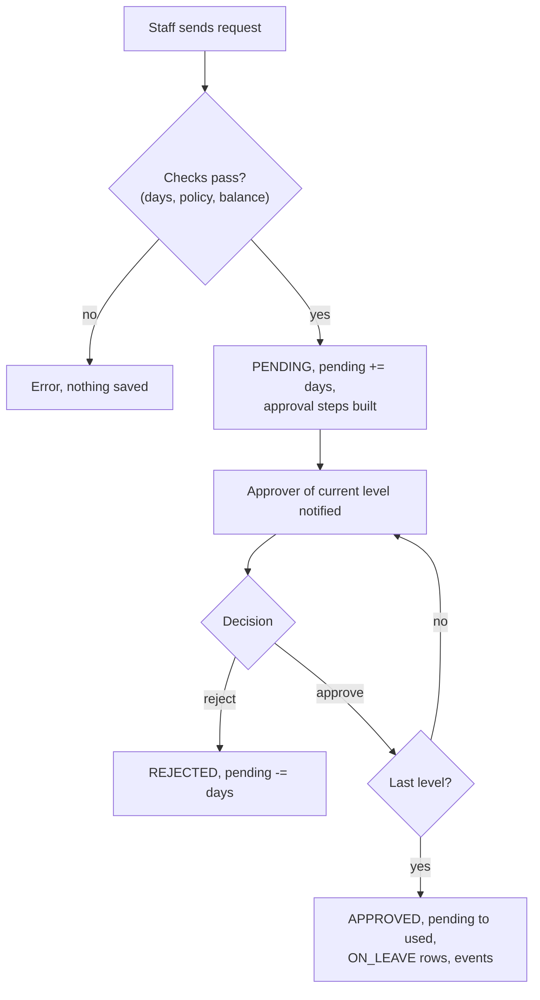
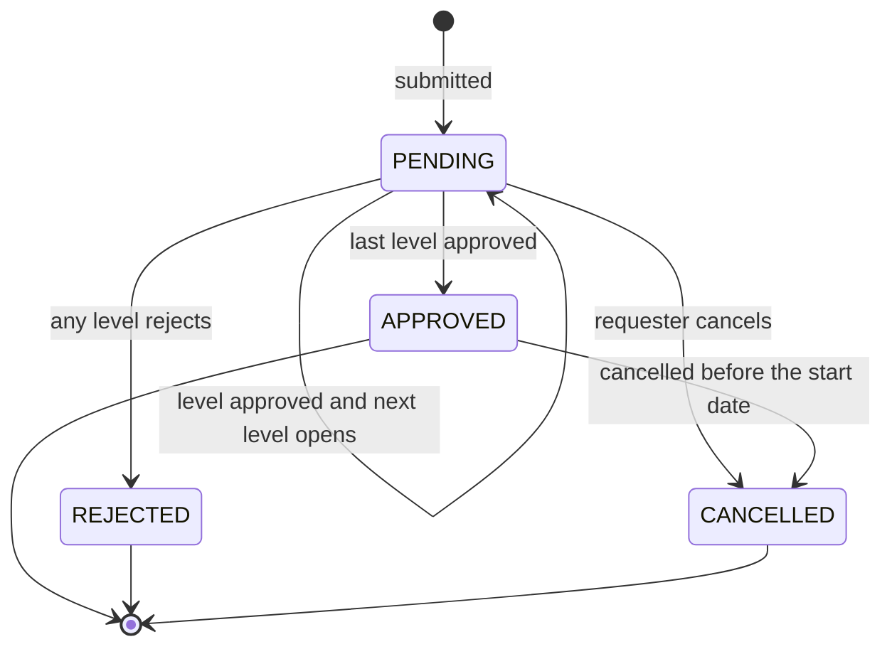
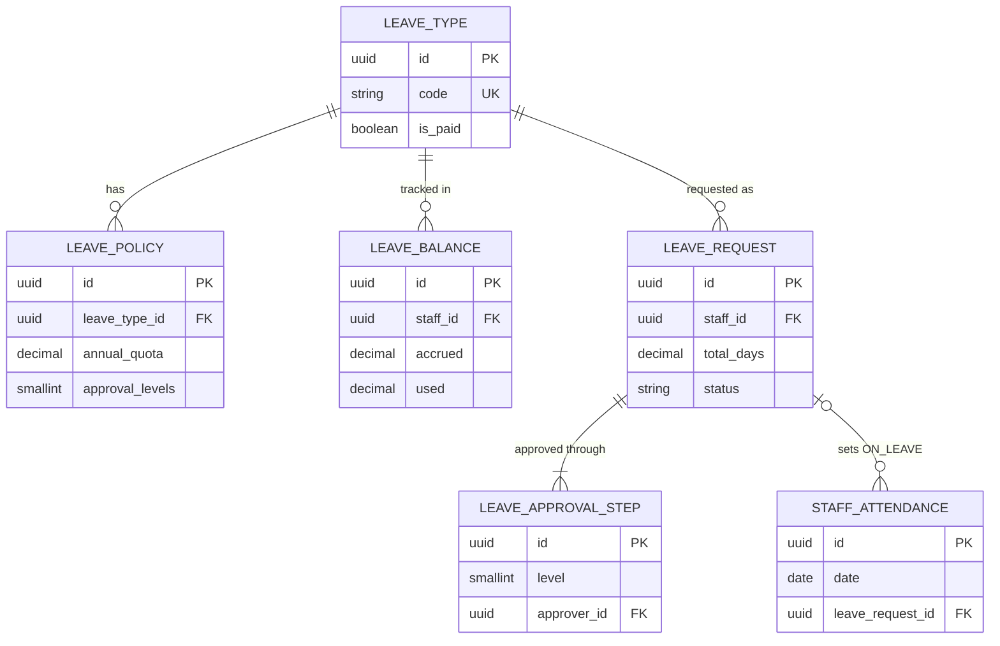
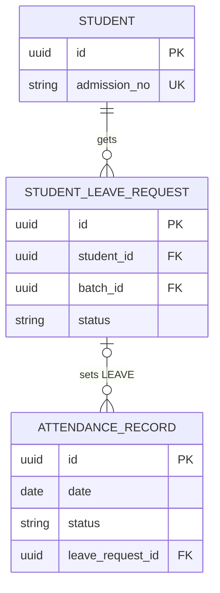

# Leave Module

**In simple words:** This chapter explains how staff ask for leave, how the right people approve it, and how EduFlow keeps every leave balance correct through the year. It also covers leave for students, which a parent asks for on the phone and the class teacher approves. Approved leave flows into attendance by itself, unpaid leave flows into payroll as loss of pay, and the year closes with one carry-forward run instead of a week of spreadsheet work.

| Item | Value |
|---|---|
| Module code | LEV |
| Release phase | Phase 2 (V1.0), Day 61 to 120, prompt P-34; the Payroll loss-of-pay link goes live with Payroll in Phase 3 |
| Plans | Growth, Pro, Enterprise (not Starter) |
| Main users | Teacher, Principal, Organization Admin, HR Manager (custom role), Accountant, Parent |
| Depends on | Staff, Teachers, Batch (holidays), Attendance, Settings, Notifications, Parent Portal; feeds Timetable and Payroll |
| Main tables | `leave_types`, `leave_policies`, `leave_balances`, `leave_requests`, `leave_approval_steps`, `student_leave_requests` |

## Objective

1. **Paperless in 60 seconds.** A teacher applies for leave on a phone in under 60 seconds and sees the balance before sending.
2. **Quick decisions.** 90% of staff requests are decided within 24 hours. Reminders go to the approver after 24 hours (LEV-BR-16).
3. **One balance formula.** Every screen and export shows the same available days; a quota balance never goes below zero.
4. **No typing twice.** Final approval writes `ON_LEAVE` rows into the staff register. Unpaid leave becomes loss-of-pay (LOP — salary cut for days not worked and not paid) days in the *Payroll Module*.
5. **Parents are heard.** A parent's request reaches the class teacher at once. Approved dates show `LEAVE` in attendance, so the parent gets no absence alert.
6. **Year end in one hour.** Carry-forward, lapse and next-year balances run as one previewed job.

## Scope

### In scope

- Leave types with paid flag, half-day flag, colour and document rule.
- Policies: quota, accrual (how days are earned: upfront, monthly or quarterly), carry-forward cap, encashment, notice, longest stretch, probation, approval levels; targeted by staff type, employment type and gender.
- Yearly balances with bulk allocation, monthly accrual, manual adjustment and a year-end run.
- Staff requests: full and half days, on-behalf requests, compensatory off, attachment, suggested substitute.
- Approval chain of 1 to 3 levels, approval inbox, reject with remarks, cancel before the start date.
- Optional sandwich rule, leave calendar, dashboard summary, register and balance export.
- Student leave from the Parent Portal or the front desk, approved by the class teacher, turning attendance into `LEAVE`.

### Out of scope

| Not in this module | Where it lives or why |
|---|---|
| Parent screens and endpoints | *Parent Portal Module* (PP-S10, PP-API-20 to PP-API-22) |
| Creating substitutions | *Timetable Module* (TT-API-16, TT-API-19) |
| Salary cut and encashment amount | *Payroll Module* |
| Holiday calendar | *Batch Module* owns `/holidays`. This module reads it. |
| Hostel out-pass | *Hostel Module* (`hostel_leave_requests`). |
| Long-leave staff status (`Staff.status = ON_LEAVE`) | *Teachers Module*, *Staff Module*; normal leave never changes it |

### Phase notes

| Phase | What ships | Why |
|---|---|---|
| Phase 2 (by 1 Feb 2027) | All LEV endpoints, student leave, `ON_LEAVE` writes, calendar, year-end run | Leave is a Phase 2 module; the parent leave screen ships with it. |
| Phase 3 (by June 2027) | Payroll reads unpaid and `encashed` days | Payroll is Phase 3; until then the accountant reads LOP days in ATT-API-26. |

## User Stories

| ID | As a | I want to | So that | Priority |
|---|---|---|---|---|
| LEV-US-01 | Organization Admin | set up leave types and policies once | every staff member gets the right quota without my help | Must |
| LEV-US-02 | HR Manager | allocate the year's balances for all staff in one click | nobody waits for a balance on 1 April | Must |
| LEV-US-03 | Teacher | apply for leave from my phone and see my balance first | I know before I ask whether the days are paid | Must |
| LEV-US-04 | Teacher | take only half a day | I do not lose a full day for a two-hour errand | Must |
| LEV-US-05 | Principal | approve or reject from one inbox and see who else is off | the campus never runs short of teachers | Must |
| LEV-US-06 | Teacher | cancel a leave I no longer need | my days come back | Must |
| LEV-US-07 | Principal | see a month calendar of staff leave | I plan exams and events around it | Should |
| LEV-US-08 | Accountant | get unpaid leave days in payroll by themselves | salary is right without manual lists | Must |
| LEV-US-09 | Class teacher | approve a parent's leave request for my batch | the child is marked Leave, not Absent | Must |
| LEV-US-10 | Principal | see uncovered periods when a teacher's leave is approved | every class gets a substitute | Should |
| LEV-US-11 | Organization Admin | preview and run the year-end carry-forward | balances of the new year are right on day one | Must |
| LEV-US-12 | Organization Admin | switch on the sandwich rule for chosen leave types | staff cannot stretch a long weekend for free | Could |

## Workflow

### Staff leave request

**Figure: Staff leave request from apply to attendance**



One level waits at a time; only the final approval touches the staff register.

1. Priya Nair picks Casual Leave, Saturday 7 to Wednesday 11 August 2027, on LEV-S02. The dry run of LEV-API-14 shows "3.0 days, balance after approval: 5.0" (8 August is a Sunday, 10 August a holiday).
2. On send, the server repeats every check in one transaction and locks her balance row (LEV-BR-10).
3. It saves `PENDING` with `currentApprovalLevel = 1`, adds 3.0 to `pending` and writes one `LeaveApprovalStep` per level (LEV-BR-11).
4. Each approval moves `currentApprovalLevel` up and notifies the next approver. The final approval moves 3.0 days from `pending` to `used` and upserts `staff_attendance` rows (LEV-BR-13). The event `leave.request.approved` lets the *Timetable Module* list uncovered periods.

### Status lifecycle

**Figure: Staff leave request states**



| Record | Status | Balance effect | Moved by |
|---|---|---|---|
| `LeaveRequest` | `PENDING` (waits at `currentApprovalLevel`) | `pending` + days | LEV-API-14 |
| `LeaveRequest` | `APPROVED` | `pending` - days, `used` + days | LEV-API-16 at the last level |
| `LeaveRequest` | `REJECTED` | `pending` - days | LEV-API-17 |
| `LeaveRequest` | `CANCELLED` | `pending` - days, or `used` - days before the start | LEV-API-18 |
| `LeaveApprovalStep` | `PENDING`, `APPROVED`, `REJECTED`; `CANCELLED` when the request ended earlier | none | LEV-API-14, 16, 17, 18 |
| `StudentLeaveRequest` | `PENDING`, `APPROVED`, `REJECTED`, `CANCELLED` (parent, only while `PENDING`) | none | PP-API-21, PP-API-22, LEV-API-23, 25, 26 |

An approved student leave cannot be cancelled. If the child comes anyway, the teacher overrides the `LEAVE` preset on the mark sheet (ATT-BR-04 in *Attendance Module*).

### Year-end processing

1. On 15 March a job tells every `leave.manage` holder how many requests of the closing year are still `PENDING`. LEV-API-12 refuses to run until they are decided.
2. The HR Manager runs LEV-API-12 with `dryRun: true` on LEV-S07 and checks the carry, encash and lapse preview.
3. On confirm, the server writes `lapsed` and `encashed` on the old rows and creates next-year rows with `carriedForward` (LEV-BR-07).
4. LEV-API-11 allocates the new quotas; the monthly accrual job keeps them growing (LEV-BR-05).
5. When the Organization Admin later closes the old `AcademicYear`, leave writes for it answer `422 BUSINESS_RULE_VIOLATION`.

## Screens and Wireframes

| ID | Screen | Users | Purpose |
|---|---|---|---|
| LEV-S01 | Leave Calendar | Principal, Organization Admin, HR Manager | Month grid of staff on leave, pending count |
| LEV-S02 | Apply Leave | All staff (phone and web) | Form with live day count and balance |
| LEV-S03 | My Leave | All staff | Own balances per type and request history |
| LEV-S04 | Approval Inbox | Approvers | Pending steps with overlap facts; approve or reject |
| LEV-S05 | Leave Request Detail | Requester, approvers, HR Manager | Step timeline, attachment, cancel |
| LEV-S06 | Leave Types and Policies | Organization Admin, HR Manager | Types, policies and the sandwich setting |
| LEV-S07 | Balances and Year End | Organization Admin, HR Manager | Balance grid, adjust, allocate, carry-forward preview |
| LEV-S08 | Student Leave Requests | Class teacher, Principal, front desk | Decide parent requests; record on behalf |

**Screen LEV-S01 — Leave Calendar (Principal, web)**

```text
+--------------------------------------------------------------------------+
| EduFlow | Bright Future Public School      [Search staff...]      (AV) v |
+------------+-------------------------------------------------------------+
| Dashboard  | Leave > Calendar      Campus [Main Campus v]  [Aug 2027 v]  |
| Staff      +-------------------------------------------------------------+
| Attendance | Pending 4   On leave today 2   [Approval inbox (4)]         |
| Leave    < |-------------------------------------------------------------|
|  Calendar  | Sat 07 | Sun 08 | Mon 09 | Tue 10       | Wed 11 | Thu 12   |
|  Inbox     | PN CL  | off    | PN CL  | HOLIDAY      | PN CL  | MJ SL    |
|  My leave  |        |        | RK EL  | Founders Day | RK EL  | RK EL    |
|  Balances  | 1 off  | -      | 2 off  | -            | 2 off  | 2 off    |
|  Students  |-------------------------------------------------------------|
|  Setup     | PN Priya Nair   CL  7-11 Aug  3.0 days  APPROVED            |
| Settings   | RK Rohit Kumar  EL  9-13 Aug  4.0 days  PENDING (level 2)   |
|            | MJ Meena Joshi  SL  12 Aug    0.5 day   APPROVED            |
|            | [List view]  [Export register]   Legend: CL SL EL LOP CO    |
+------------+-------------------------------------------------------------+
```

- Grid and list: LEV-API-13 (`from`, `to`, `status=PENDING,APPROVED`); counters: LEV-API-20. [Export register] calls LEV-API-21.
- Chips show initials and type code in the type colour; `PENDING` is outlined. No reasons on the grid (LEV-BR-21).

**Screen LEV-S02 — Apply Leave (Teacher, mobile)**

```text
+------------------------------------+
| <  Apply leave                     |
+------------------------------------+
| Type  [Casual Leave (CL)       v]  |
| Balance: 8.0 available of 12.0     |
| From  [07 Aug 2027] [Full day  v]  |
| To    [11 Aug 2027] [Full day  v]  |
| Days: 3.0  (8 Aug off, 10 Aug hol) |
| Reason                             |
| [Brother's wedding in Kochi.____]  |
| Contact [+91 98390 11223______]    |
| Substitute (optional)              |
| [Meena Joshi - free P3, P5    v]   |
| Attach [Choose file]  PDF/JPG      |
+------------------------------------+
| Goes to: Dr. Anita Verma           |
| Balance after approval: 5.0        |
|         [Cancel]  [Send request]   |
+------------------------------------+
```

- Types and balances: LEV-API-01 and LEV-API-09. Half-day selects hide when `allowHalfDay = false`.
- Each date change calls LEV-API-14 with `?dryRun=true`: day count, excluded dates, approver chain, balance after approval.
- Substitutes (teaching staff only) come from TT-API-12. [Send request] calls LEV-API-14.

**Screen LEV-S04 — Approval Inbox (Principal, web)**

```text
+--------------------------------------------------------------------------+
| EduFlow | Bright Future Public School      [Search staff...]      (AV) v |
+------------+-------------------------------------------------------------+
| Dashboard  | Leave > Approval Inbox (4)        [All types v] [Oldest v]  |
| Staff      +-------------------------------------------------------------+
| Leave    < | Rohit Kumar  PGT Physics   EL  9-13 Aug   4.0 d  Level 2/2  |
|  Calendar  | Reason: Family function in Varanasi                         |
|  Inbox     | Level 1: Meena Joshi (HOD) APPROVED 02 Aug 10:14            |
|  My leave  | Balance EL: 9.0 -> 5.0    Others off: PN 9, 11 Aug          |
|  Balances  | Periods to cover: 14  (Timetable)                           |
| Timetable  | Remarks [____________________________]  [Reject] [Approve]  |
| Settings   |-------------------------------------------------------------|
|            | Suresh Gupta  Accountant   LOP 16 Aug     1.0 d  Level 1/1  |
|            | Reason: Bank work in home town                              |
|            | Balance LOP: no limit     Others off: none                  |
|            | Remarks [____________________________]  [Reject] [Approve]  |
+------------+-------------------------------------------------------------+
```

- List: LEV-API-19, with the balance after approval and campus colleagues off on the same dates. "Periods to cover" links to TT-API-19.
- [Approve] calls LEV-API-16. [Reject] calls LEV-API-17 and needs a 5-character remark.

**Screen LEV-S07 — Balances and Year End (Organization Admin, web)**

```text
+--------------------------------------------------------------------------+
| EduFlow | Bright Future Public School      [Search staff...]      (RS) v |
+------------+-------------------------------------------------------------+
| Leave    < | Balances and Year End   Year [2027-28 v]  Type [EL v]       |
|  Calendar  +-------------------------------------------------------------+
|  Balances  | Staff         Open  CF   Accr  Adj   Used  Pend  Avail      |
|  Setup     | Priya Nair     0.0  4.0  15.0  0.0   9.0   0.0  10.0 [Adj]  |
| Settings   | Rohit Kumar    0.0  2.0  15.0  1.0  12.0   0.0   6.0 [Adj]  |
|            | Kavya Iyer     0.0  0.0   5.0  0.0   0.0   0.0   5.0 [Adj]  |
|            |-------------------------------------------------------------|
|            | Year-end run: 2027-28 -> 2028-29   Pending requests: 0      |
|            | [x] Encash days above the carry cap (encashable types)      |
|            | Preview: carry 142.0 d  encash 38.0 d  lapse 211.5 d        |
|            | Priya Nair  EL  carry 6.0  encash 4.0  lapse 0.0            |
|            | Priya Nair  CL  carry 0.0  encash 0.0  lapse 3.5            |
|            |      [Allocate 2028-29]  [Run preview]  [Confirm year end]  |
+------------+-------------------------------------------------------------+
```

- Grid: LEV-API-09. [Adj] calls LEV-API-10. [Allocate 2028-29] calls LEV-API-11.
- [Run preview] and [Confirm year end] call LEV-API-12 with `dryRun` true and then false.

**Screen LEV-S08 — Student Leave Requests (Class teacher, mobile)**

```text
+------------------------------------+
| <  Student leave - 10-A    (3)     |
+------------------------------------+
| [Pending v]            [+ Record]  |
+------------------------------------+
| Aarav Sharma  BF-2027-0142         |
| Family  Tue 27 Jul  1.0 day        |
| "Family wedding in Kanpur. Back    |
|  on 28 July."  by Sunita Devi      |
| Remark [_______________________]   |
|          [Reject]  [Approve]       |
+------------------------------------+
| Diya Kapoor                        |
| Sick  Mon 26 Jul  1.0 day  (past)  |
| Attach: fever-note.jpg  [View]     |
| Marked ABSENT - becomes LEAVE      |
|          [Reject]  [Approve]       |
+------------------------------------+
```

- List: LEV-API-22 (`status=PENDING`, own class-teacher batches); [View] uses LEV-API-24. A past date shows what approval changes.
- [Approve] calls LEV-API-25, [Reject] LEV-API-26, [+ Record] LEV-API-23.

## UI Components

| Component | Type | Behaviour |
|---|---|---|
| `LeaveBalanceCard` | Card | Available of quota per type. Skeleton while loading. Empty: "No balance yet. HR allocates it at the start of the year." |
| `LeaveDayCounter` | Inline text | Calls the dry run 400 ms after the last date change. Lists excluded dates with the reason. |
| `HalfDaySelect` | Select | Full day, First half, Second half. Offers only the halves that the validation rules allow for that date. |
| `ApprovalStepsTimeline` | Vertical steps | Level, approver, status, `actedAt`, remarks. |
| `LeaveCalendarGrid` | Month grid | Chips in `LeaveType.color`; `PENDING` outlined. Empty: "Nobody is on leave in August 2027." |
| `ApprovalCard` | Card with actions | Optimistic removal after a decision. On `409` it shows "Already decided by Meena Joshi" and refreshes. |
| `YearEndPreviewTable` | Data table | Dry-run rows with totals. Confirm stays disabled until a preview exists and pending requests are 0. |
| `FileAttachment` | Upload field | PDF, JPG or PNG up to 5 MB through a pre-signed PUT; progress bar and retry. |

Lists use the shared data table of *Design System and UX Guidelines* with skeleton, empty and error states ([Retry] plus `requestId`).

## Validation Rules

| Field | Rule | Error message shown to user |
|---|---|---|
| `leaveTypeId` | Active type with a matching policy (LEV-BR-02) | "No leave policy covers you for Earned Leave. Please ask HR." |
| `leaveTypeId` | Not in probation when `appliesInProbation = false` | "Earned Leave starts after your confirmation date (1 Oct 2027)." |
| `startDate` | Not before today minus `leave.backdate_days` | "Leave can start at most 7 days in the past." |
| `startDate` | At least `minNoticeDays` after today (not for `leave.manage` on behalf) | "Earned Leave needs 7 days' notice. Earliest start: 16 Aug 2027." |
| `endDate` | Not before `startDate`; same academic year | "A request cannot cross 31 Mar 2028. Please split it into two requests." |
| `startHalf`, `endHalf` | Only with `allowHalfDay`; one day: equal; longer: start `SECOND_HALF`, end `FIRST_HALF` | "Leave can start in the second half or end in the first half only." |
| `totalDays` | Above 0 | "These dates are holidays or weekly offs. No leave is needed." |
| `totalDays` | Not above `maxConsecutiveDays`, touching same-type requests included | "Casual Leave can be at most 3 days in a row." |
| `totalDays` | Not above available, unless accrual is `NONE` | "Only 2.0 days of Casual Leave are left. Apply the rest as Loss of Pay." |
| Dates | No overlap with own `PENDING` or `APPROVED` request | "You already have leave on 9 Aug 2027 (EL, PENDING)." |
| `reason` | 10 to 1,000 characters | "Please write a reason (at least 10 characters)." |
| `attachmentFileId` | Required when `totalDays` > `requiresDocumentDays` | "Please attach a document for Sick Leave longer than 2 days." |
| `contactDuringLeave` | E.164 phone | "Enter a valid phone number, for example +91 98390 11223." |
| `workedOnDate` | Comp-off only; LEV-BR-18 | "Pick the holiday or Sunday you worked. It must be within 90 days and not used before." |
| `substituteStaffId` | Active, same campus, not the requester, not on leave then | "Meena Joshi is on leave on 9 Aug. Please pick another colleague." |
| Policy `annualQuota` | 0 to 365, steps of 0.5; 0 when accrual is `NONE` | "Quota must be 0 to 365 days in steps of 0.5." |
| Policy `approvalLevels` | 1, 2 or 3 | "Approval levels must be 1, 2 or 3." |
| Adjustment `days` | Not 0; steps of 0.5; available stays at 0 or more | "This adjustment would make the balance negative (-1.5 days)." |
| Reject `remarks`, cancel `reason`, adjust `reason` | At least 5 characters | "Please write a short reason (at least 5 characters)." |
| Student request (LEV-API-23) | PP-API-21 rules; `guardianId` linked to the child | "This guardian is not linked to Aarav Sharma." |

## Business Rules

### Set-up and balances

**LEV-BR-01 — Seeded leave types.** Each new Growth-or-higher organization gets six types with one default policy each (assumption; editable in LEV-S06).

| Code | Name | Paid | Half day | Default policy |
|---|---|---|---|---|
| CL | Casual Leave | Yes | Yes | 12 days upfront, no carry, notice 1, max 3 in a row, 1 level |
| SL | Sick Leave | Yes | Yes | 10 days upfront, carry 10, document after 2 days, 1 level |
| EL | Earned Leave | Yes | No | 15 days monthly, carry 6, encashable, notice 7, not in probation, 2 levels |
| ML | Maternity Leave | Yes | No | 182 days, female staff, document always, 2 levels |
| LOP | Loss of Pay | No | Yes | No quota (`NONE`), 1 level |
| CO | Compensatory Off | Yes | Yes | No quota, `isCompOff`, 1 level |

> **Note:** Assumption: 182 days mirrors the 26 weeks of the Maternity Benefit (Amendment) Act 2017; the school's HR adviser confirms it.

**LEV-BR-02 — Which policy applies.** Among `ACTIVE` policies of the type valid on the date, a policy matches when `staffType`, `employmentType` and `genderRestriction` are each null or equal to the staff value. Most non-null filters wins, then the latest `effectiveFrom`. No match: the type is not offered.

**LEV-BR-03 — Balance formula.**

```text
available = opening + carriedForward + accrued + adjusted
          - used - pending - encashed - lapsed
```

`opening` holds a balance brought from an old system; `carriedForward` comes only from the year-end run.

> **Example:** Priya Nair, Casual Leave, 6 August 2027: 12.0 accrued - 4.0 used = 8.0. After her request for 7 to 11 August, `pending` = 3.0 and available = 5.0.

**LEV-BR-04 — Allocation.** LEV-API-11 upserts one row per active staff member and matching policy and sets (never adds) `accrued` to the LEV-BR-05 value, so a rerun changes nothing. A joiner earns from the joining month if joining by the 15th, else from the next month. With `appliesInProbation = false` the rule starts at `Staff.confirmationDate`; without it the row stays 0.

**LEV-BR-05 — Accrual.** A BullMQ job re-runs the allocation at 01:00 on the 1st of each month (organization timezone).

```typescript
export type Accrual = 'YEARLY_UPFRONT' | 'MONTHLY' | 'QUARTERLY' | 'NONE';

/** Balances are Decimal(5, 1): round down to the nearest half day. */
export const floorHalf = (days: number): number => Math.floor(days * 2) / 2;

/**
 * Cumulative days earned under one policy (LEV-BR-05).
 * firstMonth: index 0-11 of the first academic-year month the person earns in.
 * monthsStarted: academic-year months that have begun on the run date (1-12).
 */
export function accruedDays(
  quota: number,
  accrual: Accrual,
  firstMonth: number,
  monthsStarted: number,
): number {
  switch (accrual) {
    case 'NONE':
      return 0;
    case 'YEARLY_UPFRONT':
      return floorHalf((quota * (12 - firstMonth)) / 12);
    case 'MONTHLY':
      return floorHalf((quota * Math.max(0, monthsStarted - firstMonth)) / 12);
    case 'QUARTERLY': {
      const starts = [0, 3, 6, 9].filter((m) => m >= firstMonth && m < monthsStarted);
      return floorHalf((quota * starts.length) / 4);
    }
  }
}
```

> **Example:** Earned Leave, 15 days, monthly, year from April 2027. On 1 August: 15 x 5 / 12 = 6.25, stored as 6.0. Kavya Iyer joins on 20 November and earns from December: 15 x 4 / 12 = 5.0 EL and 12 x 4 / 12 = 4.0 CL.

**LEV-BR-06 — Manual adjustment.** LEV-API-10 adds signed days to `adjusted` with a reason; `available` stays at 0 or more. Nobody adjusts the own balance (`403 FORBIDDEN`).

**LEV-BR-07 — Year-end run.** LEV-API-12 needs the closing year not `CLOSED`, the next `AcademicYear` present and no `PENDING` request left in the closing year. Per balance row:

```text
avail   = available on the last day of the closing year
carry   = carryForwardAllowed ? min(avail, maxCarryForward) : 0
encash  = (encashExcess and isEncashable) ? avail - carry : 0
lapsed  = avail - carry - encash
next year row: carriedForward = carry   (row created if missing)
```

The run is idempotent. `encashed` days reach the *Payroll Module* as a `LEAVE_ENCASHMENT` adjustment.

> **Example:** Priya Nair, EL 2027-28: 4.0 + 15.0 - 9.0 used = 10.0. The cap, 6.0, moves to 2028-29; the other 4.0 are encashed with `encashExcess`, else they lapse. Her unused 3.5 CL lapse.

### Staff requests and approval

**LEV-BR-08 — Day count.** A working day has its weekday in `academic.working_days` and no campus `Holiday` with `appliesTo` `ALL` or `STAFF`. It counts 1, a half day 0.5; other dates 0 unless LEV-BR-09 applies.

```typescript
type Half = 'FIRST_HALF' | 'SECOND_HALF';
interface DayInfo { date: string; working: boolean }

/** totalDays of a staff request; days = every date from startDate to endDate. */
export function countLeaveDays(
  days: DayInfo[],
  startHalf: Half | null,
  endHalf: Half | null,
  sandwich: boolean,
): number {
  const first = days.findIndex((d) => d.working);
  const last = days.map((d) => d.working).lastIndexOf(true);
  if (first === -1) return 0; // only holidays and weekly offs
  let total = 0;
  days.forEach((d, i) => {
    if (!d.working) {
      if (sandwich && i > first && i < last) total += 1; // enclosed by leave days
      return;
    }
    const half =
      (days.length === 1 && startHalf !== null) ||
      (i === 0 && startHalf === 'SECOND_HALF') ||
      (i === days.length - 1 && endHalf === 'FIRST_HALF');
    total += half ? 0.5 : 1;
  });
  return total;
}
```

**LEV-BR-09 — Sandwich rule.** For codes in `leave.sandwich_leave_types`, a holiday or weekly off between two leave days counts as leave, inside one request and across touching requests (the gap days join the new request).

> **Example:** Priya Nair, CL from Saturday 7 to Wednesday 11 August 2027; Sunday 8 is a weekly off, Tuesday 10 is Founders Day. Rule off: 3.0 days; CL listed: 5.0; with `endHalf = FIRST_HALF`: 2.5 and 4.5. Meena Joshi has approved CL on Saturday 21 August and asks for Monday 23: 2.0 days with the rule.

**LEV-BR-10 — Checks and concurrency.** LEV-API-14 runs the validation rules in table order and stops at the first failure. The save locks the balance row (`SELECT ... FOR UPDATE`), so parallel requests cannot spend the same days.

**LEV-BR-11 — Approval chain.** Candidates in order: (1) the user of `Staff.reportsToId`, if that user holds `leave.approve` for the campus; (2) the campus Principal, the earliest `user_campuses` assignment when there are several; (3) `Organization.ownerUserId`. The server drops the requester and duplicates and keeps the first `approvalLevels` names as levels 1 to 3. A shorter chain is fine, an empty one is not: `422` "No approver is available. Add a second Organization Admin."

> **Example:** Rohit Kumar reports to Meena Joshi (custom role Head of Department with `leave.approve`). His EL chain: Meena Joshi, then Dr. Anita Verma. Dr. Anita Verma's own EL goes to Rajesh Sharma alone.

**LEV-BR-12 — Acting on a step.** Only the current level's `approverId` acts. An ORG_ADMIN may act on any open step, becoming its `approverId`; the audit row keeps the original. A request no longer `PENDING`, or a passed level, answers `409 CONFLICT`. A rejection needs remarks, releases `pending` and cancels later steps.

**LEV-BR-13 — Final approval.** One transaction: `APPROVED`, `pending` minus the days, `used` plus the days, and one `staff_attendance` upsert per counted date.

| Counted date | Paid type | Unpaid type |
|---|---|---|
| Full day or sandwich day | `ON_LEAVE`, payable 1 | `ON_LEAVE`, payable 0 |
| Half day | `ON_LEAVE`, payable 1 (half worked, half paid) | `HALF_DAY`, payable 0.5 |

Rows get `leaveRequestId`, `source = MANUAL` and `markedById`. Missing, `ABSENT`, `HOLIDAY` and `WEEK_OFF` rows are overwritten; a row with `checkInAt` is kept and returned in `attendanceConflicts`.

**LEV-BR-14 — Cancellation.** The requester, or a holder of a wider `leave.create` scope, cancels. `PENDING`: `CANCELLED`, `pending` released, open steps `CANCELLED`. `APPROVED` and starting after today: `CANCELLED`, `used` released, its `staff_attendance` rows deleted. Already started: `422` "This leave has started. Ask HR to correct the balance and the register." HR then uses LEV-API-10 and ATT-API-20.

**LEV-BR-15 — Loss of pay.** Unpaid days reach payroll only through the staff register (ATT-BR-21 in *Attendance Module*) and land in `Payslip.lopDays`. The *Payroll Module* owns the salary formula. A change that touches a month whose payroll run is `APPROVED`, `PAID` or `LOCKED` is saved with the warning `PAYROLL_MONTH_CLOSED`; Payroll settles it in the next run.

> **Example:** Suresh Gupta takes LOP on Monday 16 August 2027 and the first half of 24 August: `ON_LEAVE` (payable 0) and `HALF_DAY` (0.5). Payable = 31 - 1.5 = 29.5, `lopDays` = 1.5. On a calendar-day basis with gross ₹31,000: 31,000 x 1.5 / 31 = ₹1,500.

**LEV-BR-16 — Reminders, never auto-approval.** An hourly job re-sends `leave.approval.pending` after `leave.approval_reminder_hours`, then every 24 hours, copying the owner from the start date. Silence is never consent.

**LEV-BR-17 — Substitute pointer.** `substituteStaffId` is a suggestion carried by `leave.request.approved`. The *Timetable Module* lists uncovered periods (TT-API-19), creates `Substitution` rows with `leaveRequestId` (TT-API-16) and cancels future ones on cancellation.

**LEV-BR-18 — Compensatory off.** No quota. Each request names a `workedOnDate`, a holiday or weekly off with a `PRESENT`, `LATE` or `HALF_DAY` row, worth 1 day (0.5 for `HALF_DAY`), used within `leave.comp_off_valid_days` and only once.

### Student leave

**LEV-BR-19 — Who decides.** Routing, the 7-day back limit and the day count follow PP-BR-08 in *Parent Portal Module*. A TEACHER decides only as `Batch.classTeacherId`; subject teachers view. The Principal decides campus-wide and for batches without a class teacher.

**LEV-BR-20 — Approval writes attendance.** Every existing `ABSENT` record of the child on a covered date becomes `LEAVE` with `leaveRequestId`, even in a locked session (audit actor `SYSTEM`); `PRESENT` and `LATE` records stay, because the child came. A half day becomes `HALF_DAY` with the half the child attends. `source` is `PARENT_APP` when a guardian raised the request, else `MANUAL`. Session counters are recounted. Future dates get no rows now; the roster presets `LEAVE` (ATT-API-08). A rejection needs `reviewRemarks` and changes no attendance.

> **Example:** Diya Kapoor was `ABSENT` on Monday 26 July 2027. Her mother applies on 27 July; Priya Nair approves. The record becomes `LEAVE`, `absentCount` falls by 1 and `leaveCount` rises by 1.

**LEV-BR-21 — Privacy of reasons.** Lists, calendar and exports show name, type, dates, days and status. Reason, contact and attachment are shown only to the requester, its approvers and `leave.manage` holders; for a student, to guardians, class teacher, Principal and Organization Admin.

### Settings

**LEV-BR-22 — Settings group `leave`.** Assumption: keys and defaults are fixed here, stored like other module groups of *Settings Module*, no campus override.

| Key | Default | Meaning |
|---|---|---|
| `leave.sandwich_leave_types` | `["ML"]` | Type codes that count enclosed holidays and weekly offs; empty = rule off |
| `leave.backdate_days` | `7` | How many days back a staff leave may start |
| `leave.approval_reminder_hours` | `24` | Wait before the first reminder to an approver |
| `leave.comp_off_valid_days` | `90` | Days after the worked holiday within which a comp-off must start |

## Acceptance Criteria

| ID | Given | When | Then |
|---|---|---|---|
| LEV-AC-01 | Priya Nair has 8.0 CL; 8 Aug 2027 is a Sunday and 10 Aug a holiday | she applies CL for 7 to 11 Aug | `PENDING`, `totalDays` 3.0, `pending` 3.0, available 5.0, one step for Dr. Anita Verma |
| LEV-AC-02 | Priya has 2.0 CL left | she asks for 3.0 days, or sends two 2.0-day requests in the same second | `422` "Only 2.0 days of Casual Leave are left..."; `pending` never exceeds 2.0 |
| LEV-AC-03 | EL has 2 levels; Rohit Kumar reports to Meena Joshi | Rohit applies for EL | steps: level 1 Meena Joshi, level 2 Dr. Anita Verma; only Meena sees it in LEV-API-19 |
| LEV-AC-04 | Meena approved level 1 | Dr. Anita Verma approves | `APPROVED`; `used` +4.0, `pending` -4.0; `ON_LEAVE` rows for 9, 11, 12, 13 Aug with `leaveRequestId` |
| LEV-AC-05 | the request is at level 2 | Meena calls approve again | `409 CONFLICT`; nothing changes |
| LEV-AC-06 | Dr. Anita Verma has no manager | she applies for EL | one step, approver Rajesh Sharma; she is never her own approver |
| LEV-AC-07 | Suresh Gupta's LOP on 16 Aug and first half of 24 Aug are approved | the staff register for August is read (ATT-API-26) | `ON_LEAVE` unpaid on 16 Aug, `HALF_DAY` on 24 Aug; LOP 1.5 days |
| LEV-AC-08 | Priya's CL 7 to 11 Aug is `APPROVED`; today is 5 Aug | she cancels | `CANCELLED`; `used` -3.0; her rows with this `leaveRequestId` are gone |
| LEV-AC-09 | the same leave; today is 9 Aug | she cancels | `422` "This leave has started..." |
| LEV-AC-10 | Sunita Devi's request for Aarav Sharma on 27 Jul is `PENDING` | Priya Nair, class teacher of 10-A, approves | `APPROVED`; the 27 Jul roster presets `LEAVE`; Sunita gets the WhatsApp approval message |
| LEV-AC-11 | Rohit Kumar teaches Physics in 10-A but is not its class teacher | he calls LEV-API-25 on that request | `403 FORBIDDEN` "Only the class teacher of 10-A can decide this request." |
| LEV-AC-12 | Diya Kapoor is `ABSENT` on 26 Jul in a locked session | her backdated leave is approved | the record is `LEAVE` with `leaveRequestId` and `source = PARENT_APP`; counters recounted; audit actor `SYSTEM` |
| LEV-AC-13 | 3 requests of 2027-28 are still `PENDING` | HR runs LEV-API-12 | `422` listing the 3 requests; no balance changes |
| LEV-AC-14 | Priya's EL: 10.0 available, cap 6.0, `encashExcess: true` | HR confirms the year end | `encashed` 4.0, `lapsed` 0; 2028-29 `carriedForward` 6.0; a rerun changes nothing |

## Edge Cases

| Case | What happens | How the system handles it |
|---|---|---|
| Request crosses the year end (29 Mar to 3 Apr 2028) | Two balances would be touched | Refused with the split message; the April part works once 2028-29 balances exist. |
| Holiday declared after approval | A paid day was counted that is now a holiday | `totalDays` stays. HR returns the day with LEV-API-10 and a reason, so paid leave never changes silently. |
| Approver leaves or is deactivated | Open steps would wait forever | A nightly job moves them to the next LEV-BR-11 candidate, with notice and audit row. |
| Staff worked on an approved leave day | Check-in exists on an `ON_LEAVE` date | The row with `checkInAt` wins (LEV-BR-13). HR gives the day back with LEV-API-10. |
| No balance row yet | HR has not allocated the year | Quota types: `422` "No 2027-28 balance yet. Please ask HR to allocate it." `NONE` types: the row is created on the fly. |
| Quota lowered mid-year | New `accrued` is below `used` + `pending` | Allocation never lowers `accrued` below `used` + `pending`; HR sees a warning in the run result. |
| Leave type archived with future approved leave | Approved leave must stay valid | Only `PENDING` requests block LEV-API-04 (`422`); approved leave stays. |
| Child changes batch after approval | The request holds the old `batchId` | The roster reads approved leave by student and date, so the new batch still presets `LEAVE`. |
| Child came on a leave date | Record is `PRESENT` before the decision | Approval keeps `PRESENT` and `LATE` records (LEV-BR-20); the teacher sees the list in the answer. |

## Database Schema

| Table | Purpose |
|---|---|
| `leave_types` | Kind of staff leave (CL, SL, EL, ML, LOP, CO) |
| `leave_policies` | Entitlement rule of a type for a staff group |
| `leave_balances` | Balance per staff member, type and year |
| `leave_requests` | Staff leave application |
| `leave_approval_steps` | One approval level of a request |
| `student_leave_requests` | Student leave from a guardian or staff |

Every table also has `id` (uuid PK, Prisma `uuid()`), `organization_id` (uuid FK `organizations`), `created_at` and `updated_at`. Both request tables, `leave_types` and `leave_policies` add `deleted_at`.

### Table leave_types

| Column | Type | Null | Default | Notes |
|---|---|---|---|---|
| name, code | varchar(80), varchar(10) | No | - | `code` unique per organization |
| is_paid, allow_half_day, is_comp_off | boolean | No | true, true, false | Unpaid = loss of pay |
| requires_document_days | smallint | Yes | null | Attachment above this length |
| color, status | varchar(7), RecordStatus | Yes, No | null, ACTIVE | `#RRGGBB` |

### Table leave_policies

| Column | Type | Null | Default | Notes |
|---|---|---|---|---|
| leave_type_id, name | uuid, varchar(120) | No | - | FK `leave_types`, cascade |
| staff_type, employment_type, gender_restriction | enums | Yes | null | null = all |
| annual_quota, max_carry_forward | decimal(5,1) | No, Yes | -, null | Days |
| accrual | LeaveAccrual | No | YEARLY_UPFRONT | - |
| carry_forward_allowed, is_encashable, applies_in_probation | boolean | No | false, false, true | - |
| max_consecutive_days, min_notice_days, approval_levels | smallint | Yes, No, No | null, 0, 1 | Levels 1 to 3 |
| effective_from, effective_to, status | date, date, RecordStatus | No, Yes, No | -, null, ACTIVE | Validity window |

### Table leave_balances

| Column | Type | Null | Default | Notes |
|---|---|---|---|---|
| staff_id, leave_type_id, academic_year_id | uuid | No | - | FKs: cascade, restrict, restrict |
| opening, carried_forward, accrued, adjusted | decimal(5,1) | No | 0 | Credits; `adjusted` may be negative |
| used, pending, encashed, lapsed | decimal(5,1) | No | 0 | Debits |

### Table leave_requests

| Column | Type | Null | Default | Notes |
|---|---|---|---|---|
| campus_id, staff_id, leave_type_id, academic_year_id | uuid | No | - | FKs, restrict |
| start_date, end_date, start_half, end_half | date, HalfDaySession | No, Yes | null for halves | - |
| total_days, reason | decimal(4,1), varchar(1000) | No | - | Days computed by the server |
| worked_on_date, contact_during_leave | date, varchar(20) | Yes | null | Comp-off; E.164 |
| attachment_file_id, substitute_staff_id | uuid | Yes | null | FK `file_assets`, `staff`; set null |
| status, current_approval_level | ApprovalStatus, smallint | No | PENDING, 1 | - |
| decided_by_id, decided_at, cancelled_at, cancel_reason | uuid, timestamptz, varchar(255) | Yes | null | FK `users` |

### Table leave_approval_steps

| Column | Type | Null | Default | Notes |
|---|---|---|---|---|
| leave_request_id, approver_id | uuid | No | - | FK cascade; FK `users` restrict |
| level, status | smallint, ApprovalStatus | No | -, PENDING | 1 = first approver |
| remarks, acted_at | varchar(500), timestamptz | Yes | null | - |

### Table student_leave_requests

| Column | Type | Null | Default | Notes |
|---|---|---|---|---|
| campus_id, student_id, batch_id | uuid | No, No, Yes | - | Batch routes to the class teacher |
| requested_by_guardian_id, pickup_guardian_id | uuid | Yes | null | FK `guardians` |
| requested_by_user_id, reviewed_by_id | uuid | Yes | null | FK `users` |
| category | StudentLeaveCategory | No | OTHER | - |
| start_date, end_date, start_half, end_half, total_days | date, HalfDaySession, decimal(4,1) | No, Yes | null | School days |
| reason, attachment_file_id | varchar(1000), uuid | No, Yes | - | FK `file_assets` |
| status, reviewed_at, review_remarks | ApprovalStatus, timestamptz, varchar(500) | No, Yes | PENDING | Remarks shown to the parent |

**Indexes and constraints.** Exactly the `@@unique` and `@@index` lines of the Prisma schema below, each starting with `organization_id`. The SQL migration adds `CHECK (end_date >= start_date)` on both request tables and `CHECK (approval_levels BETWEEN 1 AND 3)`. Row-Level Security covers all six tables.

**Figure: Staff leave tables**



A type has policies, balances and requests; an approved request carries its steps and the register rows it produced.

**Figure: Student leave link to attendance**



## Prisma Schema

Copied from `05-attendance-leave.prisma`, with shared enums from `00-base.prisma`. Long comments moved above their field and relation padding was compacted; no field was renamed or added. A few relation lines stay long because Prisma allows no line breaks inside a field.

```prisma
enum LeaveAccrual {
  YEARLY_UPFRONT
  MONTHLY
  QUARTERLY
  NONE // unpaid / on-request leave without a quota
}

enum StudentLeaveCategory {
  SICK
  FAMILY
  TRAVEL
  EXAM_OR_EVENT
  OTHER
}

// 00-base.prisma
enum ApprovalStatus {
  PENDING
  APPROVED
  REJECTED
  CANCELLED
}

// 00-base.prisma
enum HalfDaySession {
  FIRST_HALF
  SECOND_HALF
}

// 00-base.prisma
enum RecordStatus {
  ACTIVE
  INACTIVE
  ARCHIVED
}

// Kind of staff leave: Casual, Sick, Earned, Maternity, Loss of Pay.
model LeaveType {
  id                   String       @id @default(uuid()) @db.Uuid
  organizationId       String       @map("organization_id") @db.Uuid
  name                 String       @db.VarChar(80)
  code                 String       @db.VarChar(10) // CL, SL, EL, LOP
  isPaid               Boolean      @default(true) @map("is_paid") // unpaid leave reduces salary in Payroll
  allowHalfDay         Boolean      @default(true) @map("allow_half_day")
  // compensatory off earned by working on a holiday / exam duty
  isCompOff            Boolean      @default(false) @map("is_comp_off")
  // attachment needed when the leave is longer than this many days
  requiresDocumentDays Int?         @map("requires_document_days") @db.SmallInt
  color                String?      @db.VarChar(7)
  status               RecordStatus @default(ACTIVE)
  createdAt            DateTime     @default(now()) @map("created_at") @db.Timestamptz(6)
  updatedAt            DateTime     @updatedAt @map("updated_at") @db.Timestamptz(6)
  deletedAt            DateTime?    @map("deleted_at") @db.Timestamptz(6)

  organization Organization   @relation(fields: [organizationId], references: [id], onDelete: Cascade)
  policies     LeavePolicy[]
  balances     LeaveBalance[]
  requests     LeaveRequest[]

  @@unique([organizationId, code])
  @@index([organizationId, status])
  @@map("leave_types")
}

// Entitlement rule for a leave type: quota, accrual, carry-forward, who it applies to.
model LeavePolicy {
  id                  String          @id @default(uuid()) @db.Uuid
  organizationId      String          @map("organization_id") @db.Uuid
  leaveTypeId         String          @map("leave_type_id") @db.Uuid
  name                String          @db.VarChar(120)
  staffType           StaffType?      @map("staff_type") // null = all staff
  employmentType      EmploymentType? @map("employment_type") // null = all employment types
  genderRestriction   Gender?         @map("gender_restriction") // e.g. FEMALE for maternity leave
  annualQuota         Decimal         @map("annual_quota") @db.Decimal(5, 1) // days per academic year
  accrual             LeaveAccrual    @default(YEARLY_UPFRONT)
  carryForwardAllowed Boolean         @default(false) @map("carry_forward_allowed")
  maxCarryForward     Decimal?        @map("max_carry_forward") @db.Decimal(5, 1)
  isEncashable        Boolean         @default(false) @map("is_encashable")
  maxConsecutiveDays  Int?            @map("max_consecutive_days") @db.SmallInt
  minNoticeDays       Int             @default(0) @map("min_notice_days") @db.SmallInt
  appliesInProbation  Boolean         @default(true) @map("applies_in_probation")
  // 1 = manager only, 2 = manager then principal ...
  approvalLevels      Int             @default(1) @map("approval_levels") @db.SmallInt
  effectiveFrom       DateTime        @map("effective_from") @db.Date
  effectiveTo         DateTime?       @map("effective_to") @db.Date
  status              RecordStatus    @default(ACTIVE)
  createdAt           DateTime        @default(now()) @map("created_at") @db.Timestamptz(6)
  updatedAt           DateTime        @updatedAt @map("updated_at") @db.Timestamptz(6)
  deletedAt           DateTime?       @map("deleted_at") @db.Timestamptz(6)

  organization Organization @relation(fields: [organizationId], references: [id], onDelete: Cascade)
  leaveType    LeaveType    @relation(fields: [leaveTypeId], references: [id], onDelete: Cascade)

  @@index([organizationId, leaveTypeId, status])
  @@index([organizationId, staffType, status])
  @@map("leave_policies")
}

// Leave balance of one staff member for one leave type in one academic year.
// Available = opening + carriedForward + accrued + adjusted - used - pending - encashed - lapsed.
model LeaveBalance {
  id             String   @id @default(uuid()) @db.Uuid
  organizationId String   @map("organization_id") @db.Uuid
  staffId        String   @map("staff_id") @db.Uuid
  leaveTypeId    String   @map("leave_type_id") @db.Uuid
  academicYearId String   @map("academic_year_id") @db.Uuid
  opening        Decimal  @default(0) @db.Decimal(5, 1)
  carriedForward Decimal  @default(0) @map("carried_forward") @db.Decimal(5, 1)
  accrued        Decimal  @default(0) @db.Decimal(5, 1)
  adjusted       Decimal  @default(0) @db.Decimal(5, 1) // manual corrections (+/-), always audited
  used           Decimal  @default(0) @db.Decimal(5, 1) // approved leave days
  pending        Decimal  @default(0) @db.Decimal(5, 1) // days in requests awaiting approval
  // days paid out through payroll (LEAVE_ENCASHMENT adjustment)
  encashed       Decimal  @default(0) @db.Decimal(5, 1)
  lapsed         Decimal  @default(0) @db.Decimal(5, 1) // days lost at year end
  createdAt      DateTime @default(now()) @map("created_at") @db.Timestamptz(6)
  updatedAt      DateTime @updatedAt @map("updated_at") @db.Timestamptz(6)

  organization Organization @relation(fields: [organizationId], references: [id], onDelete: Cascade)
  staff        Staff        @relation(fields: [staffId], references: [id], onDelete: Cascade)
  leaveType    LeaveType    @relation(fields: [leaveTypeId], references: [id], onDelete: Restrict)
  academicYear AcademicYear @relation(fields: [academicYearId], references: [id], onDelete: Restrict)

  @@unique([organizationId, staffId, leaveTypeId, academicYearId])
  @@index([organizationId, academicYearId, leaveTypeId])
  @@map("leave_balances")
}

// Staff leave application; approvals are tracked level by level in LeaveApprovalStep.
model LeaveRequest {
  id                   String          @id @default(uuid()) @db.Uuid
  organizationId       String          @map("organization_id") @db.Uuid
  campusId             String          @map("campus_id") @db.Uuid
  staffId              String          @map("staff_id") @db.Uuid
  leaveTypeId          String          @map("leave_type_id") @db.Uuid
  academicYearId       String          @map("academic_year_id") @db.Uuid
  startDate            DateTime        @map("start_date") @db.Date
  endDate              DateTime        @map("end_date") @db.Date
  startHalf            HalfDaySession? @map("start_half") // set when the first day is a half day
  endHalf              HalfDaySession? @map("end_half") // set when the last day is a half day
  // working days, excluding holidays and weekly offs
  totalDays            Decimal         @map("total_days") @db.Decimal(4, 1)
  reason               String          @db.VarChar(1000)
  // comp-off: the holiday / Sunday that was worked
  workedOnDate         DateTime?       @map("worked_on_date") @db.Date
  attachmentFileId     String?         @map("attachment_file_id") @db.Uuid // medical certificate etc.
  contactDuringLeave   String?         @map("contact_during_leave") @db.VarChar(20)
  substituteStaffId    String?         @map("substitute_staff_id") @db.Uuid // suggested substitute teacher
  status               ApprovalStatus  @default(PENDING)
  // level waiting for action
  currentApprovalLevel Int             @default(1) @map("current_approval_level") @db.SmallInt
  decidedById          String?         @map("decided_by_id") @db.Uuid // User who gave the final decision
  decidedAt            DateTime?       @map("decided_at") @db.Timestamptz(6)
  cancelledAt          DateTime?       @map("cancelled_at") @db.Timestamptz(6)
  cancelReason         String?         @map("cancel_reason") @db.VarChar(255)
  createdAt            DateTime        @default(now()) @map("created_at") @db.Timestamptz(6)
  updatedAt            DateTime        @updatedAt @map("updated_at") @db.Timestamptz(6)
  deletedAt            DateTime?       @map("deleted_at") @db.Timestamptz(6)

  organization Organization @relation(fields: [organizationId], references: [id], onDelete: Restrict)
  campus Campus @relation(fields: [campusId], references: [id], onDelete: Restrict)
  staff Staff @relation("LeaveRequestStaff", fields: [staffId], references: [id], onDelete: Restrict)
  substituteStaff Staff? @relation("LeaveRequestSubstitute", fields: [substituteStaffId], references: [id], onDelete: SetNull)
  leaveType LeaveType @relation(fields: [leaveTypeId], references: [id], onDelete: Restrict)
  academicYear AcademicYear @relation(fields: [academicYearId], references: [id], onDelete: Restrict)
  attachmentFile FileAsset? @relation(fields: [attachmentFileId], references: [id], onDelete: SetNull)
  decidedBy User? @relation(fields: [decidedById], references: [id], onDelete: SetNull)
  approvalSteps   LeaveApprovalStep[]
  staffAttendance StaffAttendance[]
  substitutions   Substitution[]

  @@index([organizationId, staffId, startDate])
  @@index([organizationId, campusId, status, startDate])
  @@index([organizationId, academicYearId, leaveTypeId])
  @@map("leave_requests")
}

// One level of the approval chain of a staff leave request.
model LeaveApprovalStep {
  id             String         @id @default(uuid()) @db.Uuid
  organizationId String         @map("organization_id") @db.Uuid
  leaveRequestId String         @map("leave_request_id") @db.Uuid
  level          Int            @db.SmallInt // 1 = first approver
  approverId     String         @map("approver_id") @db.Uuid // User expected to act at this level
  status         ApprovalStatus @default(PENDING)
  remarks        String?        @db.VarChar(500)
  actedAt        DateTime?      @map("acted_at") @db.Timestamptz(6)
  createdAt      DateTime       @default(now()) @map("created_at") @db.Timestamptz(6)
  updatedAt      DateTime       @updatedAt @map("updated_at") @db.Timestamptz(6)

  organization Organization @relation(fields: [organizationId], references: [id], onDelete: Cascade)
  leaveRequest LeaveRequest @relation(fields: [leaveRequestId], references: [id], onDelete: Cascade)
  approver     User         @relation(fields: [approverId], references: [id], onDelete: Restrict)

  @@unique([organizationId, leaveRequestId, level])
  @@index([organizationId, approverId, status]) // "my pending approvals"
  @@map("leave_approval_steps")
}

// Leave application for a student, raised by a parent in the Parent Portal
// (or by staff on their behalf).
model StudentLeaveRequest {
  id                    String               @id @default(uuid()) @db.Uuid
  organizationId        String               @map("organization_id") @db.Uuid
  campusId              String               @map("campus_id") @db.Uuid
  studentId             String               @map("student_id") @db.Uuid
  // batch at the time of the request; routes it to the class teacher
  batchId               String?              @map("batch_id") @db.Uuid
  requestedByGuardianId String?              @map("requested_by_guardian_id") @db.Uuid
  // login that submitted the request
  requestedByUserId     String?              @map("requested_by_user_id") @db.Uuid
  category              StudentLeaveCategory @default(OTHER)
  startDate             DateTime             @map("start_date") @db.Date
  endDate               DateTime             @map("end_date") @db.Date
  startHalf             HalfDaySession?      @map("start_half") // set when the first day is a half day
  endHalf               HalfDaySession?      @map("end_half")
  totalDays             Decimal?             @map("total_days") @db.Decimal(4, 1)
  // who collects the child for an early-leave request
  pickupGuardianId      String?              @map("pickup_guardian_id") @db.Uuid
  reason                String               @db.VarChar(1000)
  attachmentFileId      String?              @map("attachment_file_id") @db.Uuid
  status                ApprovalStatus       @default(PENDING)
  reviewedById          String?              @map("reviewed_by_id") @db.Uuid
  reviewedAt            DateTime?            @map("reviewed_at") @db.Timestamptz(6)
  reviewRemarks         String?              @map("review_remarks") @db.VarChar(500)
  createdAt             DateTime             @default(now()) @map("created_at") @db.Timestamptz(6)
  updatedAt             DateTime             @updatedAt @map("updated_at") @db.Timestamptz(6)
  deletedAt             DateTime?            @map("deleted_at") @db.Timestamptz(6)

  organization        Organization @relation(fields: [organizationId], references: [id], onDelete: Restrict)
  campus              Campus       @relation(fields: [campusId], references: [id], onDelete: Restrict)
  student             Student      @relation(fields: [studentId], references: [id], onDelete: Restrict)
  batch               Batch?       @relation(fields: [batchId], references: [id], onDelete: SetNull)
  requestedByGuardian Guardian? @relation("StudentLeaveRequestedByGuardian", fields: [requestedByGuardianId], references: [id], onDelete: SetNull)
  pickupGuardian Guardian? @relation("StudentLeavePickupGuardian", fields: [pickupGuardianId], references: [id], onDelete: SetNull)
  requestedByUser User? @relation("StudentLeaveRequestedBy", fields: [requestedByUserId], references: [id], onDelete: SetNull)
  reviewedBy User? @relation("StudentLeaveReviewedBy", fields: [reviewedById], references: [id], onDelete: SetNull)
  attachmentFile      FileAsset?   @relation(fields: [attachmentFileId], references: [id], onDelete: SetNull)
  attendanceRecords   AttendanceRecord[]

  @@index([organizationId, studentId, startDate])
  @@index([organizationId, campusId, status, startDate])
  @@index([organizationId, batchId, status])
  @@map("student_leave_requests")
}
```

## API Endpoints

Paths are under `/api/v1`. Writes on a `CLOSED` year answer `422`; outside the plan, `403 PLAN_LIMIT_REACHED`.

| ID | Method | Path | Permission | Purpose |
|---|---|---|---|---|
| LEV-API-01 | GET | `/leave-types` | leave.view | List types (also dropdown) |
| LEV-API-02 | POST | `/leave-types` | leave.manage | Create type |
| LEV-API-03 | PATCH | `/leave-types/:id` | leave.manage | Update type or status |
| LEV-API-04 | DELETE | `/leave-types/:id` | leave.manage | Archive; blocked by pending requests |
| LEV-API-05 | GET | `/leave-policies` | leave.view | List policies |
| LEV-API-06 | POST | `/leave-policies` | leave.manage | Create policy |
| LEV-API-07 | PATCH | `/leave-policies/:id` | leave.manage | Update or end policy |
| LEV-API-08 | DELETE | `/leave-policies/:id` | leave.manage | Archive policy |
| LEV-API-09 | GET | `/leave-balances` | leave.view | Balances with available days |
| LEV-API-10 | POST | `/leave-balances/:id/adjust` | leave.manage | Manual adjustment with reason |
| LEV-API-11 | POST | `/leave-balances/allocate` | leave.manage | Allocate or accrue a year |
| LEV-API-12 | POST | `/leave-balances/carry-forward` | leave.manage | Year-end run |
| LEV-API-13 | GET | `/leave-requests` | leave.view | List; feeds the calendar |
| LEV-API-14 | POST | `/leave-requests` | leave.create | Apply (self or on behalf) |
| LEV-API-15 | GET | `/leave-requests/:id` | leave.view | Detail with steps |
| LEV-API-16 | POST | `/leave-requests/:id/approve` | leave.approve | Approve current level |
| LEV-API-17 | POST | `/leave-requests/:id/reject` | leave.approve | Reject with remarks |
| LEV-API-18 | POST | `/leave-requests/:id/cancel` | leave.create | Cancel pending or future leave |
| LEV-API-19 | GET | `/leave-requests/pending-approvals` | leave.approve | Approver inbox |
| LEV-API-20 | GET | `/leave-requests/summary` | leave.view | Dashboard counts |
| LEV-API-21 | POST | `/leave-requests/export` | leave.export | Register or balances (XLSX) |
| LEV-API-22 | GET | `/student-leave-requests` | leave.view_student | List student leave |
| LEV-API-23 | POST | `/student-leave-requests` | leave.create_student | Record for a parent |
| LEV-API-24 | GET | `/student-leave-requests/:id` | leave.view_student | Detail with pickup guardian |
| LEV-API-25 | POST | `/student-leave-requests/:id/approve` | leave.approve_student | Approve; marks `LEAVE` |
| LEV-API-26 | POST | `/student-leave-requests/:id/reject` | leave.approve_student | Reject with remarks |

Parent side: PP-API-20 to PP-API-22 (*Parent Portal Module*). Readers: ATT-API-08, ATT-API-26, TT-API-19, DASH-API-06.

### LEV-API-14 Apply for leave

`staffId` is left out for the own leave. A save answers `201`; `?dryRun=true` runs every check and answers `200` without saving.

```http
POST /api/v1/leave-requests HTTP/1.1
Authorization: Bearer <accessToken>
Content-Type: application/json

{
  "leaveTypeId": "6f1e2d3c-4b5a-4c9d-8e7f-1a2b3c4d5e6f",
  "startDate": "2027-08-07",
  "endDate": "2027-08-11",
  "startHalf": null,
  "endHalf": null,
  "reason": "Brother's wedding in Kochi. Back on 12 August.",
  "contactDuringLeave": "+919839011223",
  "substituteStaffId": "b2c3d4e5-f6a7-4b8c-9d0e-1f2a3b4c5d6e",
  "attachmentFileId": null
}
```

```json
{
  "success": true,
  "data": {
    "id": "d4e5f6a7-b8c9-4d0e-8f1a-2b3c4d5e6f7a",
    "status": "PENDING",
    "totalDays": "3.0",
    "excludedDates": [
      { "date": "2027-08-08", "reason": "WEEKLY_OFF" },
      { "date": "2027-08-10", "reason": "HOLIDAY", "name": "Founders Day" }
    ],
    "currentApprovalLevel": 1,
    "approvalSteps": [
      {
        "level": 1,
        "approverId": "5e6f7a8b-9c0d-4e1f-a2b3-c4d5e6f7a8b9",
        "approverName": "Dr. Anita Verma",
        "status": "PENDING"
      }
    ],
    "balanceAfterApproval": "5.0"
  }
}
```

| Status | Code | When |
|---|---|---|
| 400 | `VALIDATION_ERROR` | Field format, date window, half-day position, reason, missing attachment |
| 409 | `CONFLICT` | Overlaps an own `PENDING` or `APPROVED` request |
| 422 | `BUSINESS_RULE_VIOLATION` | No policy, probation, notice, longest stretch, balance, no approver |

### LEV-API-16 Approve current level

```http
POST /api/v1/leave-requests/9a8b7c6d-5e4f-4a3b-9c2d-1e0f9a8b7c6d/approve HTTP/1.1
Authorization: Bearer <accessToken>
Content-Type: application/json

{ "remarks": "Approved. Meena Joshi covers 10-A Physics." }
```

```json
{
  "success": true,
  "data": {
    "id": "9a8b7c6d-5e4f-4a3b-9c2d-1e0f9a8b7c6d",
    "status": "APPROVED",
    "currentApprovalLevel": 2,
    "decidedAt": "2027-08-02T06:12:40.000Z",
    "balance": { "leaveTypeCode": "EL", "used": "4.0", "pending": "0.0", "available": "5.0" },
    "attendanceRowsWritten": 4,
    "attendanceConflicts": [],
    "warnings": []
  }
}
```

A non-final level answers the same shape with `status` `PENDING` and the next `currentApprovalLevel`.

| Status | Code | When |
|---|---|---|
| 403 | `FORBIDDEN` | Caller is not the current approver and not an ORG_ADMIN, or is the requester |
| 404 | `NOT_FOUND` | Request outside the caller's scope |
| 409 | `CONFLICT` | Request no longer `PENDING`, or the level already moved |

### LEV-API-17 Reject

```http
POST /api/v1/leave-requests/9a8b7c6d-5e4f-4a3b-9c2d-1e0f9a8b7c6d/reject HTTP/1.1
Authorization: Bearer <accessToken>
Content-Type: application/json

{ "remarks": "Unit test week for Class 10. Please pick 16 to 20 August." }
```

```json
{
  "success": true,
  "data": {
    "id": "9a8b7c6d-5e4f-4a3b-9c2d-1e0f9a8b7c6d",
    "status": "REJECTED",
    "decidedAt": "2027-08-02T06:15:03.000Z",
    "balance": { "leaveTypeCode": "EL", "pending": "0.0", "available": "9.0" }
  }
}
```

| Status | Code | When |
|---|---|---|
| 400 | `VALIDATION_ERROR` | Remarks missing or shorter than 5 characters |
| 403, 404, 409 | `FORBIDDEN`, `NOT_FOUND`, `CONFLICT` | Same cases as LEV-API-16 |

### LEV-API-18 Cancel

```http
POST /api/v1/leave-requests/d4e5f6a7-b8c9-4d0e-8f1a-2b3c4d5e6f7a/cancel HTTP/1.1
Authorization: Bearer <accessToken>
Content-Type: application/json

{ "reason": "Wedding moved to December." }
```

```json
{
  "success": true,
  "data": {
    "id": "d4e5f6a7-b8c9-4d0e-8f1a-2b3c4d5e6f7a",
    "status": "CANCELLED",
    "cancelledAt": "2027-08-05T04:40:11.000Z",
    "balance": { "leaveTypeCode": "CL", "used": "4.0", "available": "8.0" },
    "attendanceRowsRemoved": 3
  }
}
```

| Status | Code | When |
|---|---|---|
| 400 | `VALIDATION_ERROR` | Reason missing |
| 404 | `NOT_FOUND` | Not own and outside a wider `leave.create` scope |
| 422 | `BUSINESS_RULE_VIOLATION` | Already started, or already `REJECTED` or `CANCELLED` |

### LEV-API-19 Approval inbox

```http
GET /api/v1/leave-requests/pending-approvals?page=1&limit=20 HTTP/1.1
Authorization: Bearer <accessToken>
```

```json
{
  "success": true,
  "data": [
    {
      "stepId": "e1f2a3b4-c5d6-4e7f-8a9b-0c1d2e3f4a5b",
      "level": 2,
      "totalLevels": 2,
      "request": {
        "id": "9a8b7c6d-5e4f-4a3b-9c2d-1e0f9a8b7c6d",
        "staffName": "Rohit Kumar",
        "leaveTypeCode": "EL",
        "startDate": "2027-08-09",
        "endDate": "2027-08-13",
        "totalDays": "4.0"
      },
      "balanceAfterApproval": "5.0",
      "othersOff": [{ "staffName": "Priya Nair", "dates": ["2027-08-09", "2027-08-11"] }],
      "periodsToCover": 14
    }
  ],
  "meta": { "page": 1, "limit": 20, "total": 4, "totalPages": 1 }
}
```

| Status | Code | When |
|---|---|---|
| 403 | `FORBIDDEN` | Caller lacks `leave.approve` |

### LEV-API-11 Allocate balances

```http
POST /api/v1/leave-balances/allocate HTTP/1.1
Authorization: Bearer <accessToken>
Content-Type: application/json

{ "academicYearId": "2c3d4e5f-6a7b-4c8d-9e0f-1a2b3c4d5e6f", "asOf": "2027-08-01" }
```

```json
{
  "success": true,
  "data": {
    "academicYear": "2027-28",
    "staffCount": 96,
    "rowsCreated": 0,
    "rowsUpdated": 96,
    "rowsUnchanged": 480,
    "warnings": [{ "staffName": "Neha Kapoor", "code": "ACCRUED_BELOW_USED" }]
  }
}
```

| Status | Code | When |
|---|---|---|
| 404 | `NOT_FOUND` | Academic year not in the organization |
| 422 | `BUSINESS_RULE_VIOLATION` | Academic year `CLOSED` |

### LEV-API-12 Year-end carry-forward

```http
POST /api/v1/leave-balances/carry-forward HTTP/1.1
Authorization: Bearer <accessToken>
Content-Type: application/json

{
  "fromAcademicYearId": "2c3d4e5f-6a7b-4c8d-9e0f-1a2b3c4d5e6f",
  "toAcademicYearId": "7d8e9f0a-1b2c-4d3e-8f4a-5b6c7d8e9f0a",
  "encashExcess": true,
  "dryRun": true
}
```

```json
{
  "success": true,
  "data": {
    "dryRun": true,
    "totals": { "carry": "142.0", "encash": "38.0", "lapse": "211.5" },
    "rows": [
      { "staffName": "Priya Nair", "leaveTypeCode": "EL", "available": "10.0",
        "carry": "6.0", "encash": "4.0", "lapse": "0.0" },
      { "staffName": "Priya Nair", "leaveTypeCode": "CL", "available": "3.5",
        "carry": "0.0", "encash": "0.0", "lapse": "3.5" }
    ]
  }
}
```

| Status | Code | When |
|---|---|---|
| 422 | `BUSINESS_RULE_VIOLATION` | `PENDING` requests left (listed in `details`), year `CLOSED`, target year missing |

### LEV-API-25 Approve student leave

```http
POST /api/v1/student-leave-requests/a1c3e5f7-9b2d-4f6a-8c0e-2d4f6a8c0e39/approve HTTP/1.1
Authorization: Bearer <accessToken>
Content-Type: application/json

{ "reviewRemarks": "Approved. Please share the class notes with Aarav." }
```

```json
{
  "success": true,
  "data": {
    "id": "a1c3e5f7-9b2d-4f6a-8c0e-2d4f6a8c0e39",
    "status": "APPROVED",
    "reviewedAt": "2027-07-26T10:05:22.000Z",
    "attendance": { "recordsSetToLeave": 0, "keptPresent": [], "futureDates": ["2027-07-27"] }
  }
}
```

| Status | Code | When |
|---|---|---|
| 403 | `FORBIDDEN` | A teacher who is not the class teacher of the batch |
| 404 | `NOT_FOUND` | Request outside the caller's campuses or batches |
| 409 | `CONFLICT` | Request no longer `PENDING` |

## Permissions

Copied from the permission registry.

| Permission | SUPER_ADMIN | ORG_ADMIN | PRINCIPAL | TEACHER | ACCOUNTANT | PARENT | STUDENT |
|---|---|---|---|---|---|---|---|
| leave.view | Yes | Yes | Campus | Own | Own | No | No |
| leave.create | Yes | Yes | Campus | Own | Own | No | No |
| leave.approve | No | Yes | Campus | No | No | No | No |
| leave.manage | Yes | Yes | No | No | No | No | No |
| leave.export | No | Yes | Campus | No | No | No | No |
| leave.view_student | Yes | Yes | Campus | Own | No | No | No |
| leave.create_student | Yes | Yes | Campus | Own | No | No | No |
| leave.approve_student | No | Yes | Campus | Own | No | No | No |

SUPER_ADMIN `Yes` works only in an audited impersonation session. Parents use `parentportal.access` (PP-API-20 to PP-API-22). A Head of Department approves through a custom role with `leave.approve` (Pro, Enterprise).

## Notifications and Events

All events use category `LEAVE`.

| Event | Trigger | Channel | Recipient | Template text |
|---|---|---|---|---|
| `leave.request.submitted` | LEV-API-14 | In-app | Requester | "Your CL for 7-11 Aug (3.0 days) went to Dr. Anita Verma." |
| `leave.approval.pending` | LEV-API-14, next level, reminder job | In-app, Email | Current approver | "Priya Nair asks for CL, 7-11 Aug 2027 (3.0 days). Please decide." |
| `leave.request.approved` | LEV-API-16, last level | In-app, Email | Requester; Timetable listener | "Your CL for 7-11 Aug is approved by Dr. Anita Verma." |
| `leave.request.rejected` | LEV-API-17 | In-app, Email | Requester | "Your EL for 9-13 Aug was not approved: {{remarks}}" |
| `leave.request.cancelled` | LEV-API-18 | In-app | Approvers | "Priya Nair cancelled CL for 7-11 Aug." |
| `leave.balance.allocated`, `leave.balance.adjusted` | LEV-API-10, 11, 12 | In-app | Staff concerned | "Your EL balance changed by +1.0 day: {{reason}}" |
| `student.leave.requested` | PP-API-21, LEV-API-23 | In-app | Class teacher | "Sunita Devi asked leave for Aarav Sharma (10-A): 27 Jul, 1 day." |
| `student.leave.approved`, `student.leave.rejected` | LEV-API-25, 26 | In-app, WhatsApp | Guardians | "Leave for Aarav on 27 Jul is approved by Priya Nair." |
| `student.leave.cancelled` | PP-API-22 | In-app | Class teacher | "Sunita Devi cancelled the leave request for Aarav (30 Jul)." |

## Reports and Exports

| Report | Source | Filters | Output |
|---|---|---|---|
| Leave register | LEV-API-21, `report: REGISTER` | Campus, dates, type, status | XLSX |
| Balance statement | LEV-API-21, `report: BALANCES` | Year, type, staff | XLSX |
| Leave calendar | LEV-API-13 | Campus, month | Screen LEV-S01 |
| Unpaid days per month | ATT-API-26 | Month, campus | Screen, Payroll feed |

Exports run as `ExportJob` rows and return `202` with the job id. Student leave appears in attendance reports as `LEAVE`.

## Non-Functional Notes

- **Performance (p95).** LEV-API-14 and its dry run under 400 ms; LEV-API-16 with 10 register rows under 600 ms; a month calendar for 200 staff under 500 ms; allocation for 500 staff and 6 types under 10 s.
- **Caching.** Types and policies in Redis per organization for 10 minutes, cleared on every write. Balances and requests are never cached.
- **Background jobs (BullMQ).** `leave-accrual` (1st of month, 01:00), `leave-approval-reminder` (hourly), `leave-approver-reroute` (nightly), `leave-year-end-reminder` (15 March). Job ids include organization and date, so a retry never runs twice.
- **Audit.** Every create, decision, cancel, adjust, allocation, year-end run and set-up change, with old and new balance values. Attendance writes from leave carry actor type `SYSTEM`.
- **Plan limits.** Growth and higher; Starter gets `403 PLAN_LIMIT_REACHED`. Custom approver roles need Pro; the Payroll link needs a plan with Payroll.
- **i18n.** English and Hindi templates; dates in the organization's timezone ("7 Aug 2027"); days with one decimal. The working week comes from `academic.working_days`, so a UAE school sets Monday to Friday.

## Test Scenarios

| ID | Scenario | Steps | Expected result |
|---|---|---|---|
| LEV-TS-01 | Day count and sandwich | Holiday on 10 Aug; apply CL 7 to 11 Aug with the rule off, then on; then `endHalf = FIRST_HALF` | 3.0 and 5.0; then 2.5 and 4.5 |
| LEV-TS-02 | Parallel spending | 2.0 CL left; send two 2.0-day requests at once | One `201`, one `422`; `pending` = 2.0 |
| LEV-TS-03 | Two-level chain | Rohit applies EL; Meena approves; Dr. Anita Verma approves | Steps 1 and 2 `APPROVED`; 4 `ON_LEAVE` rows; `used` 4.0 |
| LEV-TS-04 | Cancel rules | Cancel Priya's approved CL on 5 Aug; repeat the setup and cancel on 9 Aug | First: rows removed, `used` back; second: `422` |
| LEV-TS-05 | Loss of pay | Approve Suresh's LOP 16 Aug and half day 24 Aug; read ATT-API-26 | Payable 29.5, LOP 1.5 |
| LEV-TS-06 | Accrual reruns | Run LEV-API-11 twice on 1 Aug; run for Kavya on 1 Mar 2028 | EL 6.0 both times; Kavya EL 5.0, CL 4.0 |
| LEV-TS-07 | Year end | Leave one request `PENDING`, run; decide it; dry run; confirm; confirm again | `422`; preview 6.0 / 4.0 / 0.0 for Priya EL; second confirm changes nothing |
| LEV-TS-08 | Student leave | Diya `ABSENT` 26 Jul in a locked session; Rohit tries approve; Priya approves | Rohit `403`; record `LEAVE`, `PARENT_APP`; counters updated |
| LEV-TS-09 | Tenant wall | A Sharma Classes admin calls LEV-API-15 with a Bright Future request id | `404 NOT_FOUND`; audit row with outcome `DENIED` |
