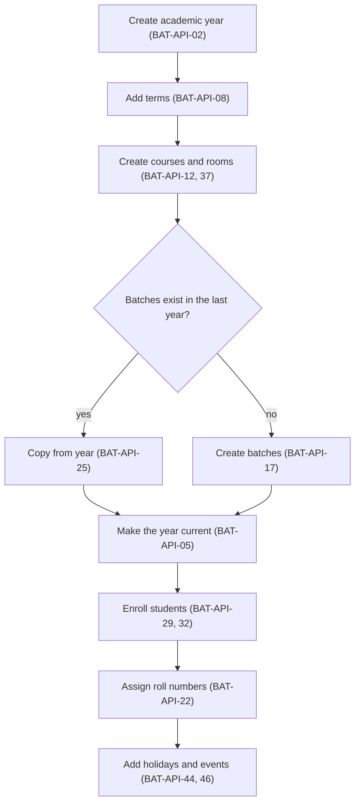
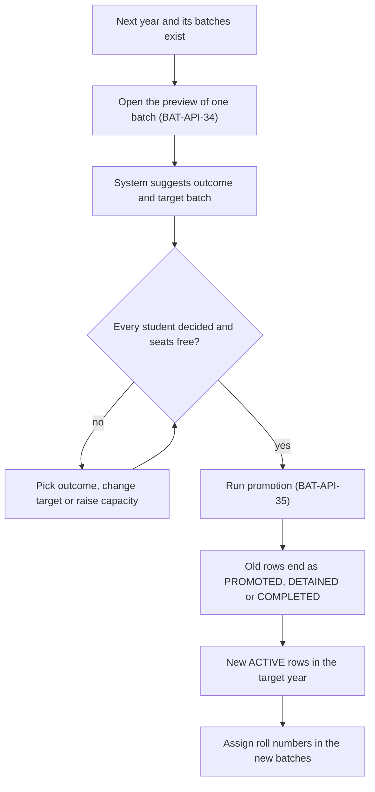
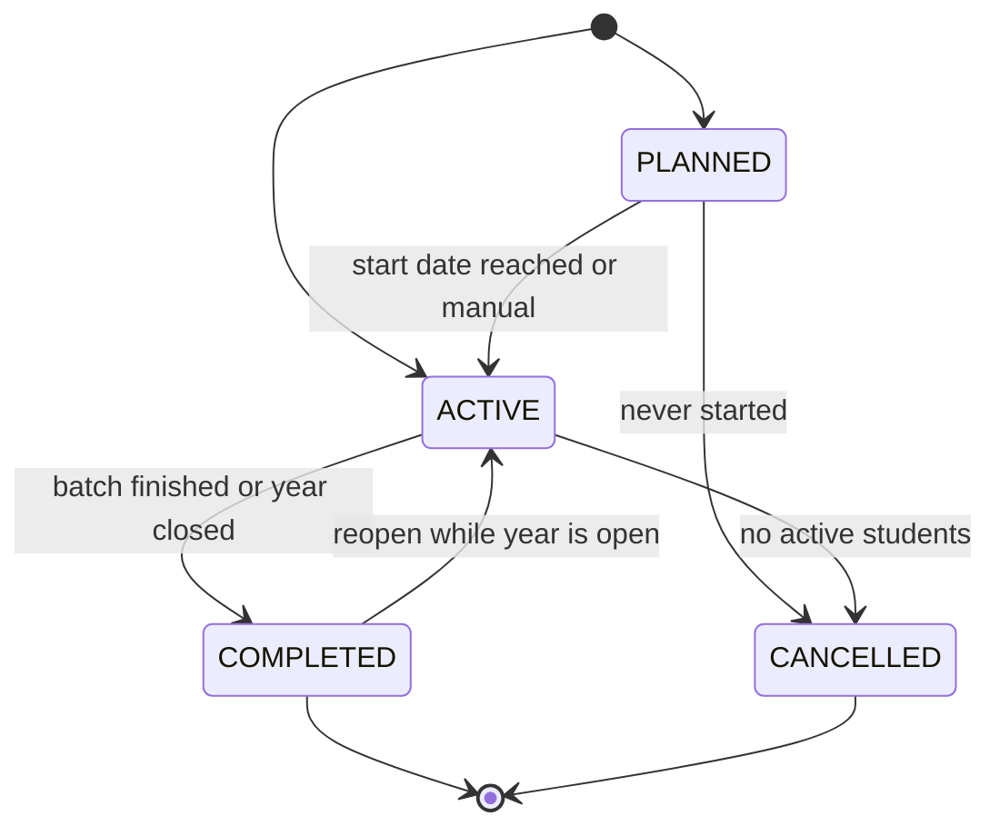
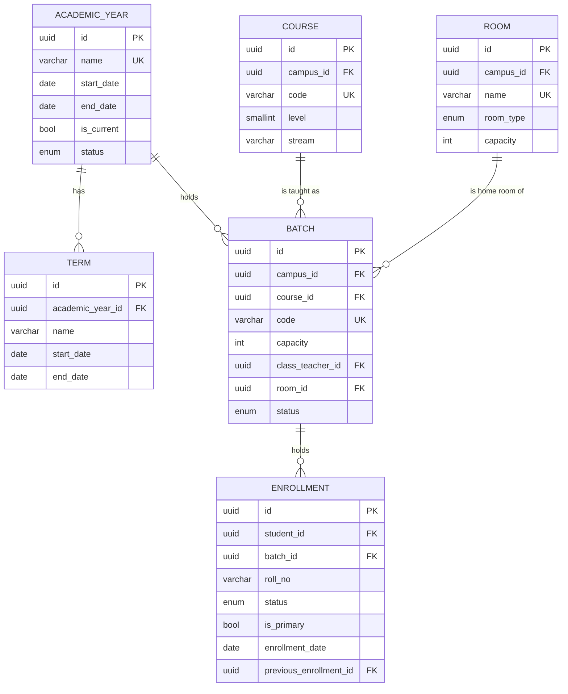

# Batch Module

**In simple words:** This chapter explains how EduFlow stores the academic skeleton of an institute: the academic year (session), its terms, the courses (Class 10 or JEE Main 2028), the batches (Section 10-A or Morning Batch M1) and the list of students in each batch. It also covers roll numbers, year-end promotion, batch changes in the middle of the year, and the academic calendar with holidays and events. Attendance, fees, exams and the timetable all ask this module one question: "who is in which batch on which date?" So this data must be right before any other module can work.

| Item | Value |
|---|---|
| Module code | BAT |
| Release phase | Phase 1 (MVP); enrollment import, report-card based promotion suggestions, PTM bookings and the Student Portal calendar in Phase 2 |
| Plans | Starter, Growth, Pro, Enterprise (enrollment import and PTM booking from Growth) |
| Main users | Organization Admin, Principal; Teacher (own batches); Accountant (read only); Parent and Student (calendar, PTM) |
| Depends on | Organizations, Multi Campus, Settings, Teachers, Student Profile |
| Main tables | `academic_years`, `terms`, `courses`, `batches`, `enrollments`, `rooms`, `holidays`, `calendar_events`, `ptm_bookings` |

## Objective

The module has six measurable goals.

1. **Fast set-up.** Rajesh Sharma of Sharma Classes creates 1 session, 2 courses and 6 batches in under 15 minutes on his first day. Bright Future Public School copies its 28 batches into the next year in under 1 minute.
2. **One roster.** Every module reads batch membership from the `enrollments` table. There is no second student list anywhere in the product.
3. **No overfilled batch.** Capacity is checked inside the database transaction on every path: single enrollment, bulk enrollment, import, transfer and promotion.
4. **Year end in one sitting.** A Principal promotes a batch of 45 students in under 2 minutes of screen time. The API call answers in under 3 seconds. A school with 28 batches finishes in under one hour.
5. **History is never lost.** An enrollment row is never moved to another batch. A move ends one row and creates a new row that points back through `previousEnrollmentId`.
6. **One calendar.** A holiday is entered once. Attendance working days, leave day counts, payroll days and the parent calendar all read the same row.

## Scope

### In scope

- Academic years with the statuses `PLANNED`, `ACTIVE`, `CLOSED`, exactly one current year, and closing of old years.
- Terms (term, semester or quarter) inside a year. Exams, fees and report cards point to them.
- Courses: class or programme with code, level, stream, board and duration in months.
- Batches (sections in a school): capacity, class teacher, home room, shift, start and end time, meeting days, start and end date, medium and status.
- Coaching needs: batches with their own dates that do not follow the session, weekend and evening batches, fast-track (crash course) batches, extra batches for one student (`isPrimary = false`).
- Rooms of a campus with type and seat capacity.
- Enrollment: single, bulk and Excel import; electives; primary flag; withdraw and cancel.
- Roll number generation by name or by admission number.
- Capacity numbers and warnings on every batch list, batch page and enrollment call.
- Year-end promotion: preview with suggested outcome, then promote, detain or complete (graduate) in bulk.
- Guided merge and split of batches, built on the transfer flow of *Student Profile Module*.
- Archiving: finished batches become `COMPLETED` and leave the daily lists; nothing is hard deleted.
- Academic calendar: holidays (single day or range, per campus, for students, staff or all), events with draft and publish, a merged feed, and parent-teacher meeting (PTM) slot booking.
- Parent Portal and Student Portal read views of the calendar.

### Out of scope

| Not in this module | Where it lives or why |
|---|---|
| Subjects, course curriculum and subject teachers of a batch | *Subjects Module* owns `subjects`, `course_subjects` and `batch_subject_teachers`. This module only reads them. |
| Weekly timetable, period slots, dated lectures, room double-booking checks | *Timetable Module*. This module stores only the home room and the usual timing of a batch. |
| Transfer request, approval and fee treatment (`student_transfers`) | *Student Profile Module* (STU-API-32 to STU-API-37). This module supplies the capacity, date and roll number rules that the transfer service calls. |
| Student status changes (left, graduated, expelled) | *Student Profile Module* (STU-API-07). A leaving status ends all enrollments there. |
| Seats promised to approved admission applications | *Student Admission Module* (ADM-API-37) adds approved applications to the strength from this module. |
| Fee structure per course or batch | *Fees Module*. It listens to `enrollment.created`. |
| Weekly off days of a campus | *Multi Campus Module* (`Campus.weeklyOffDays`). Holidays here are the exceptions on top. |
| Sending messages | *Notifications Module*. This module only emits events. |

### Phase notes

| Phase | What ships | Why |
|---|---|---|
| Phase 1 (sprint week 3, Day 15 to 21, prompt P-13) | BAT-API-01 to BAT-API-32 and BAT-API-34 to BAT-API-49: years, terms, courses, rooms, batches, enrollments, roll numbers, promotion with manual outcomes, copy from year, holidays, events, feed, export | Every Phase 1 module needs batches and rosters. Coaching batches end at any time of the year, so promotion and completion cannot wait. |
| Phase 1 (sprint week 7, with prompt P-30) | BAT-API-54: parent calendar | It ships with the Parent Portal. |
| Phase 2 (by 1 Feb 2027) | BAT-API-33 (enrollment import), suggestions from `ReportCard.result` in BAT-API-34, PTM bookings (BAT-API-50 to BAT-API-53, BAT-API-55 to BAT-API-59), BAT-API-60 (student calendar), exam dates in the feed | These need the Report Cards, Exams, Subjects teacher allocation and Student Portal work of Phase 2. All of it is live before the first Indian year end in March 2027. |

> **Note:** In Phase 1 the student import of *Student Profile Module* (STU-API-41) already creates the first enrollment of each imported student. BAT-API-33 is only for institutes that enroll existing students into new batches from an Excel sheet.

## User Stories

| ID | As a | I want to | So that | Priority |
|---|---|---|---|---|
| BAT-US-01 | Organization Admin | create the academic year 2027-28 with its terms and make it current | every module works in the right session | Must |
| BAT-US-02 | Organization Admin | define courses such as Class 10 or JEE Main 2028 with level, stream and board | batches, fees and subjects hang on the right programme | Must |
| BAT-US-03 | Principal | create a batch with capacity, class teacher, room, shift and timing | teachers, students and parents know where and when the batch meets | Must |
| BAT-US-04 | Principal | see strength against capacity for every batch, with a warning from 90% | I stop admissions or open a new section in time | Must |
| BAT-US-05 | Principal | enroll one student or many students into a batch | the roster is ready before the first class | Must |
| BAT-US-06 | Principal | generate roll numbers by name or by admission number | registers and exam sheets follow one order | Must |
| BAT-US-07 | Principal | promote, detain or graduate a whole batch from one screen | the new session starts with correct rosters | Must |
| BAT-US-08 | Principal | move a student to another batch in the middle of the year with full history | attendance and marks of the old batch stay intact | Must |
| BAT-US-09 | Principal (centre head) | set start date, end date, days and timing of a batch, also for a fast-track batch | a 4-month crash course runs beside the 2-year programme | Must |
| BAT-US-10 | Principal (centre head) | merge two small batches or split a big one | rooms and teachers are used well | Should |
| BAT-US-11 | Organization Admin | copy last year's batches into the new year | I do not retype 28 sections every April | Should |
| BAT-US-12 | Principal | declare holidays and publish events on one calendar | attendance skips holidays and parents see the plan | Must |
| BAT-US-13 | Teacher | see my batches with roster, room and timing on my phone | I have the class list without asking the office | Must |
| BAT-US-14 | Parent | see holidays and events for my child's batch and book a PTM slot | I can plan leave and meet the teacher without waiting in a queue | Should |
| BAT-US-15 | Organization Admin | close an old academic year | nobody changes old registers by mistake | Should |

## Workflow

**Figure: Academic set-up at the start of a session**



The set-up runs from the top of the tree to the leaves: year, then course, then batch, then students. A new organization does the first four steps inside the onboarding wizard of *Organizations Module*.

Step by step, for Bright Future Public School and the year 2027-28:

1. In March 2027 Rajesh Sharma creates the year "2027-28" with the dates 1 Apr 2027 to 31 Mar 2028. The status is `PLANNED`.
2. He adds two terms: "Term 1" (1 Apr to 30 Sep 2027) and "Term 2" (1 Oct 2027 to 31 Mar 2028).
3. Courses Class 1 to Class 12 already exist from the year before. Courses do not belong to a year, so nothing is retyped.
4. He clicks "Copy from Year" and picks 2026-27. The system creates 28 batches for 2027-28 with the same names, codes, capacity, rooms and timing, all `PLANNED` and with no students.
5. Dr. Anita Verma runs the promotion for each old batch (see the next figure). New admissions are enrolled directly into the 2027-28 batches.
6. On 1 April 2027 Rajesh makes 2027-28 the current year. The year and its batches become `ACTIVE`. All screens now open in 2027-28 by default.
7. Dr. Verma generates roll numbers for every batch by name order.
8. She loads the public-holiday list, adds the summer vacation (11 May to 30 Jun 2027) and publishes the PTM of 17 July 2027.
9. When the results of 2026-27 are final, Rajesh closes 2026-27. Its attendance, marks and enrollments are now read only.

**Figure: Year-end promotion of one batch**



The run is all or nothing for one batch. If one student fails a check, nothing is written and the screen shows which row to fix. A half-promoted class is worse than a failed click.

**Figure: Batch status lifecycle**



A batch is born `PLANNED` when its year is `PLANNED` or its start date is in the future. Otherwise it is born `ACTIVE`. `COMPLETED` is the archive state. `CANCELLED` is for a batch that never ran.

### Academic year statuses

| Status | Meaning | What is allowed | How it changes |
|---|---|---|---|
| `PLANNED` | A future session | Create batches, pre-enroll students, plan fees and calendar. No attendance and no marks. | BAT-API-05 makes it `ACTIVE` and current |
| `ACTIVE` | A running session | Everything. Two years can be `ACTIVE` at the same time while old results are finished, but only one has `isCurrent = true`. | BAT-API-06 closes it |
| `CLOSED` | A locked session | Read only. Every write in any module answers 422. | Final. Only EduFlow support can reopen it, with an audit entry. |

### Batch statuses

| Status | Meaning | New enrollments | Shown in daily pickers | Set by |
|---|---|---|---|---|
| `PLANNED` | Created, not started | Yes | No | Create, copy from year |
| `ACTIVE` | Running | Yes | Yes | Create, BAT-API-21, BAT-API-05, daily job |
| `COMPLETED` | Finished and archived | No | No | BAT-API-21, BAT-API-06 |
| `CANCELLED` | Never ran or was merged away early | No | No | BAT-API-21, BAT-API-06 |

### Enrollment statuses

| Status | Meaning | Set by |
|---|---|---|
| `ACTIVE` | The student is in the batch now | BAT-API-29, BAT-API-32, BAT-API-33, BAT-API-35, STU-API-22, STU-API-35 |
| `PROMOTED` | Moved to the next course at year end | BAT-API-35, STU-API-39 |
| `DETAINED` | Repeats the same course next year | BAT-API-35, STU-API-39 |
| `COMPLETED` | Finished the course or batch | BAT-API-35, BAT-API-21 with `completeEnrollments`, STU-API-07 (graduated) |
| `TRANSFERRED` | Moved to another batch or campus in the middle of the year | STU-API-35 |
| `WITHDRAWN` | Left the batch before it ended | BAT-API-31, STU-API-23, STU-API-07 |
| `CANCELLED` | Enrolled by mistake; never attended | BAT-API-31 |

Only `ACTIVE` rows count for strength, rosters and unique keys. All other statuses are final. A wrong final status is fixed by a new enrollment, never by editing the old row.

## Screens and Wireframes

| ID | Screen | Users | Purpose |
|---|---|---|---|
| BAT-S01 | Batch List | Organization Admin, Principal, Accountant (read) | All batches of a year with strength, capacity and warnings |
| BAT-S02 | Batch Form (drawer) | Organization Admin, Principal | Create or edit a batch |
| BAT-S03 | Batch Detail | Organization Admin, Principal, Teacher (own) | Header, roster, subject teachers, calendar, history |
| BAT-S04 | Enroll Students dialog | Organization Admin, Principal | Pick students, electives and enrollment date; single or bulk |
| BAT-S05 | Year-End Promotion wizard | Organization Admin, Principal | Pick batch, review outcomes, run, see result |
| BAT-S06 | Academic Years and Terms | Organization Admin, Principal | Create years and terms, set current, close |
| BAT-S07 | Courses | Organization Admin, Principal | Course list and form |
| BAT-S08 | Rooms | Organization Admin, Principal | Room list and form per campus |
| BAT-S09 | Academic Calendar | Organization Admin, Principal; Teacher and Accountant (read) | Month view of holidays, events and exam dates |
| BAT-S10 | Move Students dialog (merge and split) | Organization Admin, Principal | Move selected students to another batch |
| BAT-S11 | My Batch (mobile) | Teacher | Roster, room, timing and next events of own batches |
| BAT-S12 | School Calendar and PTM (mobile) | Parent, Student | Published events and holidays; PTM slot booking for parents |

**Screen BAT-S01 — Batch List (Principal, web)**

```text
+--------------------------------------------------------------------------+
| EduFlow | Bright Future Public School      [Search...]           (AV) v  |
+------------+-------------------------------------------------------------+
| Dashboard  | Academics > Batches          [Copy from Year] [+ New Batch] |
| Students   +-------------------------------------------------------------+
| Academics< | Year [2027-28 v] Course [All v] Status [Active v]  [Export] |
|  Batches   |-------------------------------------------------------------|
|  Courses   | Batch  Course    Class teacher  Room   Strength     Status  |
|  Rooms     | 9-A    Class 9   Rakesh Tiwari  R-201  38/40  95% !  ACTIVE |
|  Calendar  | 9-B    Class 9   (not set) !    R-202  36/40  90% !  ACTIVE |
|  Promotion | 10-A   Class 10  Priya Nair     R-204  41/45  91% !  ACTIVE |
| Attendance | 10-B   Class 10  Manoj Pandey   R-205  40/40  FULL   ACTIVE |
| Fees       | 11S-A  Class 11  Kavita Rao     R-301  32/45  71%    ACTIVE |
| Settings   |-------------------------------------------------------------|
|            | Showing 5 of 28 | Students 1,180 | Seats 1,290 | Free 110   |
|            | ! 1 batch without class teacher  ! 6 batches at 90% or more |
|            |                                 < Prev  Page 1 of 6  Next > |
+------------+-------------------------------------------------------------+
```

- The list opens in the current year with the status filter on "Active" (`PLANNED` and `ACTIVE`). "Archived" shows `COMPLETED` and `CANCELLED`. Data comes from BAT-API-16; the footer numbers come from BAT-API-27.
- The strength column shows `strength/capacity`, the percent and a badge: amber `!` from 90%, red `FULL` at 100% (rule BAT-BR-11).
- "+ New Batch" opens BAT-S02 (BAT-API-17). "Copy from Year" opens a dialog with source year, target year and a checklist of batches (BAT-API-25). "Export" calls BAT-API-26.
- A teacher sees the same list with own batches only and without the create buttons. The Accountant sees it read only.

**Screen BAT-S03 — Batch Detail, Roster tab (Principal, web)**

```text
+--------------------------------------------------------------------------+
| EduFlow | Bright Future Public School      [Search...]           (AV) v  |
+------------+-------------------------------------------------------------+
| Dashboard  | Batches > 10-A (Class 10, 2027-28)  ACTIVE  [Edit] [More v] |
| Students   +-------------------------------------------------------------+
| Academics< | Class teacher: Priya Nair    Room: R-204 (48 seats)         |
|  Batches   | Shift: Morning 07:30-13:30 Mon-Sat   Medium: English        |
|  Courses   | Strength: 41 / 45 (91%)  4 seats left   [NEAR FULL]         |
|  Rooms     | [Roster] [Subject Teachers] [Calendar] [History]            |
|  Calendar  |-------------------------------------------------------------|
|  Promotion | [+ Enroll] [Assign Roll Nos] [Move to Batch] [Export]       |
| Attendance | [ ] Roll Name           Adm. No       Joined     Elective   |
| Fees       | [ ] 01   Aarav Sharma   BF-2027-0142  01 Apr 27  Sanskrit   |
| Settings   | [ ] 02   Aditi Verma    BF-2027-0151  01 Apr 27  French     |
|            | [ ] 03   Arjun Mehta    BF-2027-0117  01 Apr 27  Sanskrit   |
|            | [ ] 04   Diya Kapoor    BF-2027-0188  05 Apr 27  Sanskrit   |
|            | [ ] --   Kabir Khan     BF-2027-0391  19 Jul 27  (none) !   |
|            |-------------------------------------------------------------|
|            | 41 students | 1 without roll number | 1 without elective    |
+------------+-------------------------------------------------------------+
```

- The header comes from BAT-API-18 and the roster from BAT-API-23. The History tab lists ended enrollments of this batch (BAT-API-28 with `batchId` and all statuses).
- "+ Enroll" opens BAT-S04 (BAT-API-29 for one student, BAT-API-32 for many). "Assign Roll Nos" opens a small dialog with the order and an "overwrite" switch (BAT-API-22).
- "Move to Batch" opens BAT-S10 for the ticked students. It creates one transfer request per student (STU-API-33).
- "More" holds Change Status (BAT-API-21), Duplicate and Delete (BAT-API-20). The row menu of a student holds Edit Enrollment (BAT-API-30) and Withdraw (BAT-API-31).
- Kabir Khan joined on 19 July. He has no roll number and no elective yet, so the footer counts him twice as a to-do.

**Screen BAT-S05 — Year-End Promotion, step 2 (Principal, web)**

```text
+--------------------------------------------------------------------------+
| EduFlow | Bright Future Public School      [Search...]           (AV) v  |
+------------+-------------------------------------------------------------+
| Dashboard  | Academics > Promotion                   Step 2 of 3: Review |
| Students   +-------------------------------------------------------------+
| Academics< | From [2027-28 v] Batch [9-A v] To [2028-29 v] [01 Apr 2028] |
|  Batches   | Default: promoted -> 10-A (0/45)   detained -> 9-A (0/40)   |
|  Courses   |-------------------------------------------------------------|
|  Rooms     | [x] Roll Name          Result       Outcome       Target    |
|  Calendar  | [x] 01   Aditya Rao    PASS         [Promote v]   [10-A v]  |
|  Promotion | [x] 02   Farhan Ali    PASS         [Promote v]   [10-A v]  |
| Attendance | [x] 03   Ishita Jain   COMPARTMENT  [Decide  v] ! [     v]  |
| Fees       | [x] 04   Meera Joshi   FAIL         [Detain  v]   [9-A  v]  |
| Settings   | [x] 05   Rohit Yadav   PASS         [Promote v]   [10-A v]  |
|            | ... 33 more rows                                            |
|            |-------------------------------------------------------------|
|            | Promote 35 | Detain 2 | Complete 0 | Undecided 1 !          |
|            | Seats after run: 10-A 35/45   9-A 2/40                      |
|            | [Back]                              [Run Promotion (37)]    |
+------------+-------------------------------------------------------------+
```

- Step 1 picks the source batch and the target year. Step 2 (shown) loads BAT-API-34. Step 3 shows the result of BAT-API-35 with links to the new batches.
- The Result column is the annual report card result. It is empty when *Report Cards Module* is not in use. The Outcome and Target columns are pre-filled by rule BAT-BR-19 and can be changed per row or for all ticked rows.
- An undecided row shows `!`. "Run Promotion" counts only decided rows. The Principal can run 37 students now and come back for Ishita Jain after her compartment exam.
- "Seats after run" adds the planned rows to the present strength of each target batch. A target above capacity turns red and blocks the button.

**Screen BAT-S09 — Academic Calendar (Principal, web)**

```text
+--------------------------------------------------------------------------+
| EduFlow | Bright Future Public School      [Search...]           (AV) v  |
+------------+-------------------------------------------------------------+
| Dashboard  | Academics > Calendar  [< Jul 2027 >]  [+ Holiday] [+ Event] |
| Students   +-------------------------------------------------------------+
| Academics< | Campus [Main Campus v]  [x] Holidays [x] Events [x] Exams   |
|  Batches   |-------------------------------------------------------------|
|  Courses   | Mon     Tue     Wed     Thu     Fri     Sat     Sun         |
|  Rooms     |                         1       2       3       4 off       |
|  Calendar  | 5       6       7       8       9       10      11 off      |
|  Promotion | 12      13      14      15      16      17 PTM  18 off      |
| Attendance | 19      20      21      22 HOL  23      24      25 off      |
| Fees       | 26 UT1  27 UT1  28 UT1  29      30      31                  |
| Settings   |-------------------------------------------------------------|
|            | 17 Jul  PTM Classes 9-10, 09:00-13:00 Main Hall [Published] |
|            | 22 Jul  Heavy rain closure (EMERGENCY, all)      [Holiday]  |
|            | 26-28   Unit Test 1 window (EXAM)                [Draft]    |
|            | Working days in July: 26          [Import Holiday List]     |
+------------+-------------------------------------------------------------+
```

- One call to BAT-API-49 fills the month: holidays, events and, from Phase 2, exam dates. "off" marks the weekly off days of the campus.
- "+ Holiday" opens a form with name, type, from, to, campus and "applies to" (BAT-API-41). "+ Event" opens the event form with audience, batches and a "Publish now" switch (BAT-API-46). A click on a row opens the edit form (BAT-API-42, BAT-API-47).
- "Import Holiday List" loads a preset list or a weekly-off pattern, shows the rows for review and saves them in one call (BAT-API-44).
- "Working days" applies the formula of rule BAT-BR-24: 31 days - 4 Sundays - 1 holiday = 26.

**Screen BAT-S11 — My Batch (Teacher, mobile)**

```text
+------------------------------------+
| <  10-A  Class 10           (PN) v |
+------------------------------------+
| Class teacher: You                 |
| Room R-204 | Mon-Sat 07:30-13:30   |
| Strength 41 / 45    4 seats left   |
+------------------------------------+
| [Roster]  [Calendar]  [PTM]        |
| [Search student...             ]   |
|------------------------------------|
| 01 Aarav Sharma            [Call]  |
|    BF-2027-0142   Sanskrit         |
| 02 Aditi Verma             [Call]  |
|    BF-2027-0151   French           |
| 03 Arjun Mehta             [Call]  |
|    BF-2027-0117   Sanskrit         |
| 04 Diya Kapoor             [Call]  |
|    BF-2027-0188   Sanskrit         |
|------------------------------------|
| Next: Sat 17 Jul PTM 09:00-13:00   |
| [Download Roster PDF]              |
+------------------------------------+
```

- Priya Nair sees only her own batches (BAT-API-24 for the switcher, BAT-API-18 and BAT-API-23 for the page). Nothing can be edited here.
- "Call" opens the phone dialer with the number of the primary guardian. The number comes from *Student Profile Module* and is shown only when the teacher holds `students.view`.
- "Download Roster PDF" calls BAT-API-26 with `exportType = batches.roster`. The teacher holds `batches.export` with scope `Own`.
- The PTM tab lists her booked slots for the next PTM (BAT-API-50) and lets her mark each as attended or no-show (BAT-API-52).

### Screens without a wireframe

- **BAT-S02 (Batch Form).** Fields: course, name, code, capacity, class teacher, room, shift, start time, end time, days, start date, end date, medium, status. For a `SCHOOL` the date fields are folded away under "Advanced", because a section follows the year. For `COACHING` they are on top.
- **BAT-S04 (Enroll Students).** Left: searchable list of active students of the campus who have no primary enrollment in this year (STU-API-01 with filters). Right: the picked students, the enrollment date, the elective choice and a live "seats left" counter.
- **BAT-S06, BAT-S07, BAT-S08.** Simple list and form pages built from the shared data table and form kit. BAT-S06 shows a "Current" badge, a "Make current" button and a "Close year" button with a checklist dialog (rule BAT-BR-03).
- **BAT-S10 (Move Students).** Target batch picker with seats left, effective date, reason and fee treatment. It shows "This creates 12 transfer requests that need approval".
- **BAT-S12 (parent and student calendar).** A month list of published events and holidays of the child's batches (BAT-API-54, BAT-API-60). For a PTM event the parent sees the free slots per teacher (BAT-API-56) and books one (BAT-API-57). Details are in *Parent Portal Module*.

The label of every screen follows `Organization.type`. A school sees "Class", "Section" and "Academic year". A coaching institute sees "Course", "Batch" and "Session".

## UI Components

| Component | Type | Behaviour |
|---|---|---|
| `AcademicYearSwitcher` | shadcn `Select` in the page header | Lists years from BAT-API-01; current year first with a badge. The choice is kept per user in local storage and sent as `academicYearId` on list calls. |
| `BatchTable` | Shared `DataTable` | Server-side paging, sorting and filters. Loading: 8 skeleton rows. Empty: "No batches in 2027-28 yet" with the buttons "+ New Batch" and "Copy from Year". Error: inline alert with "Retry". |
| `CapacityBadge` | shadcn `Badge` + `Progress` | Shows `41/45` and the level `OK`, `NEAR_FULL` or `FULL` from the API. Colour plus text, never colour alone. No badge when capacity is empty. |
| `BatchForm` | `Sheet` with React Hook Form + Zod | Uses the shared Zod schema of BAT-API-17. Warnings from the API (room smaller than capacity, teacher already class teacher) show as amber notes and do not block saving. |
| `StaffPicker`, `RoomPicker`, `CoursePicker` | shadcn `Combobox` | Search as you type; options limited to the campus of the batch. `RoomPicker` shows seats per room. |
| `DaysOfWeekToggle` | `ToggleGroup` | Seven buttons Mon to Sun. Weekly off days of the campus are greyed but can still be chosen (weekend batches). |
| `EnrollDialog` | `Dialog` with two lists | Live counter "Selected 12, seats left 4". The confirm button is disabled when the selection is bigger than the free seats. |
| `RollNumberDialog` | `Dialog` | Radio `By name` or `By admission number`, switch "Replace existing roll numbers", and a preview of the first 5 rows. |
| `PromotionGrid` | `DataTable` with inline `Select` cells | Bulk bar "Set outcome for ticked rows". Sticky footer with counters and seats after run. The grid keeps a draft in local storage per source batch. |
| `StatusChangeDialog` | `AlertDialog` | Shows what will happen: "41 active students will be marked as completed". Needs a typed reason for `CANCELLED`. |
| `CalendarMonth` | Custom grid on top of `date-fns` | Chips per day: holiday (red), event (blue), exam (purple), weekly off (grey). On a phone it turns into a list grouped by date. |
| `HolidayForm`, `EventForm` | `Dialog` forms | Date range pickers in the organization timezone. `EventForm` has the audience select, a multi-select of batches and the "Publish now" switch. |
| `YearCloseChecklist` | `AlertDialog` with check rows | Green or red row per check of rule BAT-BR-03. The "Close year" button is enabled only when all rows are green and the user typed the year name. |

## Validation Rules

Every rule below runs twice: in the browser with Zod (the shared schema in `shared/src/schemas/batch.ts`) and again in the API with the same schema. The API never trusts the client. Messages are shown in the user's language; the English text is the source string.

| Field | Rule | Error message shown to user |
|---|---|---|
| `AcademicYear.name` | 2 to 30 characters; unique per organization | "A session with this name already exists." |
| `AcademicYear.startDate`, `endDate` | `endDate` after `startDate`; length 1 to 24 months | "The end date must be after the start date." / "A session must be between 1 and 24 months long." |
| `AcademicYear` delete | Only `PLANNED`, no batches, no enrollments | "This session already has batches. Delete the batches first." |
| `Term.name` | 2 to 60 characters; unique inside the session | "Term 1 already exists in this session." |
| `Term.startDate`, `endDate` | Inside the session; no overlap with another term | "Term dates must lie inside 2027-28 (01 Apr 2027 to 31 Mar 2028)." / "These dates overlap with Term 1." |
| `Course.name` | 2 to 120 characters | "Enter a course name (2 to 120 characters)." |
| `Course.code` | 2 to 30 characters, A-Z, 0-9 and dash; unique per organization | "Course code C10 is already used by Class 10." |
| `Course.level` | Whole number 1 to 20, or empty | "Level must be a number between 1 and 20." |
| `Course.durationMonths` | Whole number 1 to 120, or empty | "Duration must be between 1 and 120 months." |
| `Batch.name` | 1 to 80 characters | "Enter a batch name." |
| `Batch.code` | 1 to 30 characters; unique per campus and session | "Batch code 10-A already exists in Main Campus for 2027-28." |
| `Batch.capacity` | Empty, or a whole number 1 to 500 | "Capacity must be between 1 and 500. Leave it empty for no limit." |
| `Batch.capacity` on edit | Not lower than the present strength | "41 students are enrolled. Capacity cannot be lower than 41." |
| `Batch.startTime`, `endTime` | `HH:mm`, 24-hour; end after start; both or none | "The end time must be after the start time." |
| `Batch.daysOfWeek` | At least one day when a start time is set | "Pick at least one day the batch meets." |
| `Batch.startDate`, `endDate` | Inside the session; end on or after start | "Batch dates must lie inside 2027-28 (01 Apr 2027 to 31 Mar 2028)." |
| `Batch.roomId` | Room of the same campus and `ACTIVE` | "This room belongs to another campus." |
| `Batch.classTeacherId` | `ACTIVE` teaching staff of the same campus | "Choose an active teacher of this campus." |
| `Batch.courseId`, `campusId`, `academicYearId` | Cannot change once any enrollment row exists | "This batch already has students. Create a new batch instead." |
| `Enrollment.studentId` | `ACTIVE` student of the same organization and campus | "Aarav Sharma is not an active student of this campus." |
| `Enrollment.enrollmentDate` | Inside the session; on or after `Batch.startDate`; not more than 365 days back | "The joining date must be inside the session and on or after 01 Apr 2027." |
| `Enrollment` duplicate | No `ACTIVE` row for this student in this batch and session | "Aarav Sharma is already enrolled in 10-A." |
| `Enrollment.isPrimary` | Only one primary row per student per session | "Aarav Sharma already has a main batch (10-A) in 2027-28. Save this as an extra batch." |
| `Enrollment.rollNo` | 1 to 20 characters; unique among `ACTIVE` rows of the batch | "Roll number 01 is already used by Aditi Verma." |
| `Enrollment.electiveSubjectIds` | Only elective subjects of the batch's course | "Sanskrit is not an elective of Class 10." |
| `Enrollment` withdraw | `endDate` on or after `enrollmentDate`; reason 3 to 255 characters | "The leaving date cannot be before the joining date." |
| `Room.name` | 1 to 80 characters; unique per campus | "Room R-204 already exists in Main Campus." |
| `Room.capacity` | Empty, or 1 to 1,000 | "Seats must be between 1 and 1,000." |
| `Holiday.name` | 2 to 120 characters | "Enter a holiday name." |
| `Holiday.startDate`, `endDate` | End on or after start; range at most 120 days | "A holiday range cannot be longer than 120 days." |
| `CalendarEvent.title` | 3 to 150 characters | "Enter an event title (3 to 150 characters)." |
| `CalendarEvent.startAt`, `endAt` | End after start; same day for a `PTM` event | "The end time must be after the start time." / "A PTM must start and end on the same day." |
| `CalendarEvent.batchIds` | Batches of the event's campus and session | "Batch 10-A is not part of this campus." |
| `CalendarEvent.color` | `#` plus 6 hex characters | "Use a colour like #2563eb." |
| `PtmBooking.slotStart` | Inside the event window; free slot of that teacher | "This slot is already booked. Pick another time." |
| Promotion `targetAcademicYearId` | Different from the source session; `PLANNED` or `ACTIVE` | "Pick a different session to promote into." |

> **Note:** A warning is not an error. The batch form shows amber notes ("Room R-204 has 48 seats but capacity is 45", "Priya Nair is already class teacher of 10-A") and still saves. Only the rows above block the save.

## Business Rules

### Settings that drive the rules

These keys live in `organization_settings` (see *Settings Module*). The defaults are an assumption of this chapter and can be changed per organization.

| Key | Default | What it changes |
|---|---|---|
| `batches.roll_number_source` | `NAME` | Order used by BAT-API-22: `NAME` or `ADMISSION_NO` |
| `batches.roll_number_width` | `2` | Zero padding of a generated roll number (`01`, `02`) |
| `batches.capacity_warn_percent` | `90` | When the amber `NEAR_FULL` badge appears |
| `batches.allow_over_capacity` | `false` | When `true`, `ORG_ADMIN` may pass `force: true` and go over capacity |
| `batches.backdate_enroll_days` | `365` | How far back a joining date may be set |
| `batches.auto_complete_batches` | `true` | The daily job closes a batch one day after its `endDate` |
| `batches.ptm_slot_minutes` | `10` | Length of one PTM slot |
| `batches.ptm_booking_cutoff_hours` | `6` | Booking closes this many hours before the slot |

### Rules

**BAT-BR-01 — Exactly one current session.** `AcademicYear.isCurrent` is true for one row per organization. The database holds the line with a partial unique index (`UNIQUE (organization_id) WHERE is_current AND deleted_at IS NULL`). BAT-API-05 clears the old row and sets the new one inside one transaction, so the index is never broken. Every list endpoint that gets no `academicYearId` uses the current row.

**BAT-BR-02 — Sessions may overlap, statuses may not clash.** A session lasts 1 to 24 months. Two sessions may overlap in dates and both may be `ACTIVE`, because Bright Future Public School runs the 2027-28 admissions while 2026-27 results are still open. Only one of them is current. A `PLANNED` session accepts batches, pre-enrollments, fee structures and calendar rows, but no attendance, marks or payments.

**BAT-BR-03 — Closing a session.** BAT-API-06 runs five checks. Each one must pass:

1. No unlocked attendance session in the year.
2. No `DRAFT` or `PENDING` report card in the year (skipped when *Report Cards Module* is off).
3. No `PENDING` student transfer that starts in the year.
4. The year is not `isCurrent`.
5. A newer session exists and is current.

When all five pass, the close runs in one transaction: `status = CLOSED`, `closedAt = now()`, every `ACTIVE` batch of the year becomes `COMPLETED`, and every `ACTIVE` enrollment of the year becomes `COMPLETED` with `endDate = AcademicYear.endDate` and `endReason = 'Session closed'`. After that, any write in any module that points at this year answers 422 `BUSINESS_RULE_VIOLATION` with the message "Session 2026-27 is closed. Ask EduFlow support to reopen it." Unpaid invoices are not touched; money outlives the session.

**BAT-BR-04 — Terms.** Terms must lie inside their session and must not overlap each other. `sortOrder` is set automatically from the start date. A term cannot be deleted once an exam, a fee structure or a report card points at it (422).

**BAT-BR-05 — `Course.level` drives promotion.** `level` is the ladder of grades: Class 1 = 1 up to Class 12 = 12. The suggested next course is the course with the smallest `level` greater than the current one, inside the same campus scope, with the same `board` when both have one. Class 9 (level 9) suggests Class 10 (level 10). A course with the highest level in the organization suggests `COMPLETE` (graduation). A coaching programme such as "JEE Main 2028" usually has no `level`; then no next course is suggested and the default outcome is `COMPLETE` once the batch `endDate` has passed.

**BAT-BR-06 — Archiving a course.** BAT-API-15 sets `status = ARCHIVED` and `deletedAt`. It is refused (422) while the course has a batch that is `PLANNED` or `ACTIVE`. An archived course stays readable in old report cards and invoices, and disappears from every picker.

**BAT-BR-07 — Batch identity.** The pair campus plus session plus `code` is unique (`@@unique([organizationId, campusId, academicYearId, code])`). Names can repeat: two campuses may both have "10-A". The code is what imports, exports and the timetable use.

**BAT-BR-08 — A batch never changes its place.** Once a batch has any enrollment row, even an ended one, `campusId`, `academicYearId` and `courseId` are frozen. Name, code, capacity, class teacher, room, shift, timing, days, dates, medium and status stay editable. Reason: attendance, marks and fee rows already carry the old course. Moving the batch would rewrite history.

**BAT-BR-09 — Batch status transitions.** Allowed moves: `PLANNED` to `ACTIVE` or `CANCELLED`; `ACTIVE` to `COMPLETED` or `CANCELLED`; `COMPLETED` back to `ACTIVE` while the session is open. Any other move answers 422. `COMPLETED` with `completeEnrollments: true` ends every `ACTIVE` enrollment as `COMPLETED`. `CANCELLED` needs zero `ACTIVE` enrollments and a typed reason of at least 5 characters.

**BAT-BR-10 — Capacity is checked inside the transaction.** Every path that creates an `ACTIVE` enrollment (BAT-API-29, 32, 33, 35 and the transfer service of *Student Profile Module*) locks the batch row first, counts the `ACTIVE` rows, then inserts.

```sql
-- runs inside the same transaction as the INSERT
SELECT b.capacity,
       (SELECT count(*) FROM enrollments e
          WHERE e.organization_id = b.organization_id
            AND e.batch_id       = b.id
            AND e.status         = 'ACTIVE'
            AND e.deleted_at IS NULL) AS strength
  FROM batches b
 WHERE b.id = $1 AND b.organization_id = $2 AND b.deleted_at IS NULL
   FOR UPDATE OF b;
```

`FOR UPDATE` on the batch row serialises two counter clerks who enroll the last seat at the same moment. The second call waits, re-reads the count and answers 422 `BUSINESS_RULE_VIOLATION` with `details[0].issue = "Batch 10-A is full (45 of 45)."` A batch with `capacity = null` has no limit. The service looks like this:

```typescript
// server/src/modules/batch/enrollment.service.ts
export async function enrollStudent(ctx: TenantContext, input: EnrollInput) {
  return prisma.$transaction(async (tx) => {
    const batch = await lockBatchForUpdate(tx, ctx.orgId, input.batchId);
    if (!batch) throw new NotFoundError('Batch not found');
    if (batch.status !== 'ACTIVE' && batch.status !== 'PLANNED') {
      throw new BusinessRuleError(`Batch ${batch.code} is ${batch.status}.`);
    }
    const strength = await tx.enrollment.count({
      where: { batchId: batch.id, status: 'ACTIVE', deletedAt: null },
    });
    if (batch.capacity !== null && strength >= batch.capacity && !input.force) {
      throw new BusinessRuleError(
        `Batch ${batch.code} is full (${strength} of ${batch.capacity}).`,
      );
    }
    return tx.enrollment.create({
      data: {
        organizationId: ctx.orgId,
        campusId: batch.campusId,
        academicYearId: batch.academicYearId,
        courseId: batch.courseId,
        batchId: batch.id,
        studentId: input.studentId,
        enrollmentDate: input.enrollmentDate,
        isPrimary: input.isPrimary ?? true,
        electiveSubjectIds: input.electiveSubjectIds ?? [],
        createdById: ctx.userId,
      },
    });
  });
}
```

**BAT-BR-11 — Capacity levels.** `seatsLeft = max(capacity - strength, 0)` and `occupancyPercent = round(strength / capacity * 100)`. The level is `OK` below `batches.capacity_warn_percent`, `NEAR_FULL` from that number to 99, and `FULL` at 100 or more. Worked example: 10-A has 41 of 45. 41 / 45 = 0.9111, so 91%, level `NEAR_FULL`, 4 seats left. 10-B has 40 of 40: 100%, level `FULL`, 0 seats left. A batch without capacity returns `seatsLeft: null` and `level: null`, and the badge is hidden.

**BAT-BR-12 — What counts as strength.** Strength is the number of `ACTIVE`, not soft-deleted enrollment rows, whatever their `isPrimary` value. Seats promised to approved admission applications are counted separately as `heldSeats` and are shown as a grey part of the capacity bar. Worked example for 10-A: 41 active plus 2 approved applications that name 10-A. The API returns `strength: 41`, `heldSeats: 2`, `seatsLeft: 4`, `seatsLeftAfterHolds: 2`. The hard block of BAT-BR-10 uses `strength` only, so a held seat never stops a real enrollment.

**BAT-BR-13 — One main batch, many extra batches.** A student has at most one `ACTIVE` enrollment with `isPrimary = true` per session. That row decides the course, the campus and the fee structure. Extra rows carry `isPrimary = false`. Worked example at Sharma Classes: a student sits in "JEE Main M1" (primary, whole year) and also in "Physics Crash Course" (extra, 15 Feb to 30 Apr). Attendance is taken in both. Fees are billed from the primary batch unless the *Fees Module* has a structure for the extra batch.

**BAT-BR-14 — Joining date.** `enrollmentDate` defaults to today in the campus timezone. It must lie inside the session and on or after `Batch.startDate`. Back-dating is allowed up to `batches.backdate_enroll_days` (365) and is written to the audit log. Attendance, working days and fee proration all start from this date, so a wrong date costs money: the Excel import shows the date column in bold for this reason.

**BAT-BR-15 — Roll numbers.** BAT-API-22 reads every `ACTIVE` enrollment of the batch, sorts them, and writes `rollNo` as a zero-padded number starting at 1 with the width `batches.roll_number_width`. The order is `NAME` (family-name-blind: `firstName`, then `lastName`, `en-IN` collation) or `ADMISSION_NO` (natural order, so `BF-2027-0099` comes before `BF-2027-0142`). With `overwrite: false` the call fills only empty roll numbers and keeps the taken ones free. Worked example: 10-A has 41 students; by name Aarav Sharma gets `01` and the last student gets `41`. Kabir Khan joins on 19 July and gets `42`, not `05`, because renumbering in the middle of a year would break exam sheets already printed. The Principal can run the generator again with `overwrite: true` at the start of the next term.

**BAT-BR-16 — Ending an enrollment.** BAT-API-31 sets `status` to `WITHDRAWN` (the student really left the batch) or `CANCELLED` (the row was a mistake), plus `endDate` and `endReason`. The seat and the roll number are free the moment the row is not `ACTIVE`. `CANCELLED` is allowed only within 30 days of `enrollmentDate` and only when the row has no attendance record and no fee invoice; otherwise the API answers 422 and asks for `WITHDRAWN`. Ended rows are never deleted. Worked example: Diya Kapoor is withdrawn on 12 Sep 2027 with the reason "Family moved to Delhi". 10-A goes from 41 to 40, roll number 04 becomes free, and her attendance until 11 Sep stays readable.

**BAT-BR-17 — Batch dates and the daily status job.** A batch whose `startDate` is in the future is created as `PLANNED`. The job `batch.status-sync` runs at 00:30 in each campus timezone and does two things: it turns `PLANNED` batches whose `startDate` has arrived into `ACTIVE`, and, when `batches.auto_complete_batches` is on, it turns `ACTIVE` batches into `COMPLETED` one day after their `endDate` and ends their `ACTIVE` enrollments as `COMPLETED`. Worked example at Sharma Classes: "NEET Crash 2027" runs 15 Feb 2027 to 30 Apr 2027. It is `PLANNED` from 2 Jan, `ACTIVE` on 15 Feb, and `COMPLETED` on 1 May with its 22 enrollments closed. The session 2026-27 stays open until June.

**BAT-BR-18 — Copy from session.** BAT-API-25 clones the picked batches into the target session. Copied: `courseId`, `name`, `code`, `capacity`, `classTeacherId`, `roomId`, `shift`, `startTime`, `endTime`, `daysOfWeek`, `medium`, `campusId`. Not copied: students, roll numbers, subject teachers, `startDate` and `endDate`. When the source batch had dates, they are shifted by the difference between the two sessions' start dates and then clipped to the target session. A code that already exists in the target session is skipped, not overwritten. Worked example: Bright Future copies 28 batches from 2026-27 to 2027-28. Two codes (`12S-A`, `12C-A`) already existed because the Principal created them by hand. Result: `created: 26`, `skipped: 2`, and the skipped codes are listed on screen. New batches are `PLANNED` while the target session is `PLANNED`.

**BAT-BR-19 — Suggested promotion outcome.** BAT-API-34 suggests one outcome per student, from the annual report card of the source session:

| `ReportCard.result` | Suggested outcome | Suggested target |
|---|---|---|
| `PASS` | `PROMOTE` | Batch with the same code suffix in the next course, for example 9-A to 10-A |
| `FAIL` | `DETAIN` | The batch with the same code in the next session, for example 9-A to 9-A |
| `COMPARTMENT`, `ABSENT` | none (undecided) | none |
| No report card, or *Report Cards Module* not in use | `PROMOTE` | Same rule as `PASS` |
| Student already in the highest `level` course | `COMPLETE` | none |

When the same-suffix batch is missing or full, the suggestion falls back to the batch of the next course with the most free seats. When no batch of the next course exists in the target session, the row is undecided and the screen shows "Create a Class 10 batch in 2028-29 first".

**BAT-BR-20 — What a promotion writes.** For every decided row, in one transaction: the old enrollment gets `status` (`PROMOTED`, `DETAINED` or `COMPLETED`), `endDate = AcademicYear.endDate` of the source session, and `endReason` ("Year-end promotion"). For `PROMOTE` and `DETAIN` a new `Enrollment` row is inserted in the target session with `previousEnrollmentId` pointing at the old row, `status = ACTIVE`, `isPrimary = true`, `rollNo = null`, `electiveSubjectIds = []`, `enrollmentDate = effectiveDate` and the target batch's `campusId` and `courseId`. `COMPLETE` writes no new row; with `setStudentStatus: true` the service asks *Student Profile Module* to set the student to `GRADUATED`. The call carries an `Idempotency-Key`, so a double click cannot promote twice.

Worked example for 9-A of Bright Future, 38 students, effective 1 Apr 2028: 35 `PASS`, 2 `FAIL`, 1 `COMPARTMENT`. The Principal leaves the compartment row undecided and runs the other 37. Result: 37 old rows ended (35 `PROMOTED`, 2 `DETAINED`), 37 new rows created (35 in 10-A, 2 in 9-A of 2028-29). 10-A goes from 0 to 35 of 45. 9-A of 2028-29 goes from 0 to 2 of 40. One row is left for later.

**BAT-BR-21 — A promotion run is all or nothing.** One call handles at most 200 rows and one source batch. Before writing, the service re-checks every target batch for free seats under `FOR UPDATE`, checks that the target session is not `CLOSED`, and checks that no student already has a primary enrollment in the target session. If one row fails, nothing is written and the response lists the failing rows with their index, student name and reason. A half-promoted class is harder to repair than a failed click.

**BAT-BR-22 — Merge and split.** Both are guided flows on top of the transfer service of *Student Profile Module*, not new tables. Merge: move every `ACTIVE` student of batch A into batch B with an effective date, then set A to `CANCELLED` with the reason "Merged into B". Split: create batch B, tick the students to move, run the same move. Each moved student gets an ended row (`TRANSFERRED`) and a new `ACTIVE` row with `previousEnrollmentId`. Worked example at Sharma Classes: "Evening E1" has 9 students, "Evening E2" has 11, capacity of E1 is 30. The merge moves 11 students, E1 becomes 20 of 30, E2 becomes `CANCELLED`, and the timetable of E2 is removed by *Timetable Module* when it hears `batch.status_changed`. Roll numbers of the moved students are cleared and regenerated in E1.

**BAT-BR-23 — Holidays.** A holiday row covers `startDate` to `endDate` inclusive. `campusId = null` means every campus. `appliesTo` is `ALL`, `STAFF` or `STUDENTS`. Overlapping rows are allowed and are not merged: a day is a holiday when at least one row covers it. Attendance blocks student marking on days with a `STUDENTS` or `ALL` holiday, and *Leave Module* and *Payroll Module* skip `STAFF` and `ALL` days. The normal weekly off comes from `Campus.weeklyOffDays`, not from a holiday row; the `WEEKLY_OFF` type is only for an extra off day that one campus keeps for one session.

**BAT-BR-24 — Working days.** For a date range and a campus:

`workingDays = calendarDays - weeklyOffDays - holidayDays`

`holidayDays` counts only days that apply to students and are not already a weekly off, so no day is subtracted twice. Worked example one, July 2027 at Bright Future (weekly off Sunday): 31 calendar days, 4 Sundays (4, 11, 18, 25), one holiday (22 Jul, heavy rain closure). 31 - 4 - 1 = 26 working days. Worked example two, May 2027 with the summer vacation 11 May to 30 Jun: 31 calendar days, 5 Sundays (2, 9, 16, 23, 30), vacation days 11 to 31 May = 21 days of which 3 are Sundays already counted, so 18 count. 31 - 5 - 18 = 8 working days. Attendance percentages, leave balances and payroll days all call this one function.

**BAT-BR-25 — Calendar events.** An event with `isPublished = false` is a draft and is visible only to users who hold `batches.manage`. Publishing emits `calendar.event.published` once; a second publish of the same row emits nothing. `audience` plus `batchIds` decide who sees it: an empty `batchIds` array means every batch of the campus scope. A change of `startAt`, `endAt` or `location` on a published event emits `calendar.event.updated`, which sends parents a short change message. Deleting a published event sends nothing; the Principal is asked to write a note in the event first.

**BAT-BR-26 — PTM slots.** A `PTM` event has a start and end time on one day. For each teacher, the window is cut into slots of `batches.ptm_slot_minutes`. A slot is free when no `BOOKED` `PtmBooking` exists for that teacher and `slotStart` (the unique key `organizationId, calendarEventId, staffId, slotStart` makes the race impossible). One student may hold one booking per teacher per event. Booking opens when the event is published and closes `batches.ptm_booking_cutoff_hours` before the slot starts. A cancelled booking frees the slot at once. Worked example: the PTM on 17 Jul 2027 runs 09:00 to 13:00. That is 240 minutes, so 24 slots per teacher. Five class teachers of Classes 9 and 10 give 120 slots. Sunita Devi books 09:30 with Priya Nair for Aarav.

**BAT-BR-27 — Plan limits.** Batches, courses, rooms and calendar rows are not counted by the plan. Active students are, and that check lives in *Organizations Module*: an enrollment that would push the organization over the student limit of the Starter plan (50) is refused with 403 `PLAN_LIMIT_REACHED`. Enrollment import (BAT-API-33) needs Growth. PTM booking needs Growth. Courses that are offered at more than one campus (`campusId = null`) need Pro, because they only matter with multi-campus.

## Acceptance Criteria

| ID | Given | When | Then |
|---|---|---|---|
| BAT-AC-01 | Sharma Classes has no session | Rajesh creates "Session 2027-28" (1 Apr 2027 to 31 Mar 2028) | 201; status `PLANNED`; `isCurrent` false; the year appears in the switcher |
| BAT-AC-02 | 2026-27 is current and 2027-28 is `PLANNED` | Rajesh calls BAT-API-05 on 2027-28 | 200; 2027-28 is `ACTIVE` and current; 2026-27 keeps `ACTIVE` but `isCurrent` false; one `academic_year.activated` event |
| BAT-AC-03 | Class 10 exists with level 10 | Dr. Verma creates batch 10-A, capacity 45, class teacher Priya Nair, room R-204, Morning 07:30-13:30, Mon to Sat | 201; `status` `ACTIVE`; `strength` 0; `seatsLeft` 45 |
| BAT-AC-04 | 10-A already exists in Main Campus for 2027-28 | The same code is saved again | 409 `CONFLICT` with "Batch code 10-A already exists in Main Campus for 2027-28." |
| BAT-AC-05 | 10-A holds 44 of 45 students | Two clerks enroll a student at the same second | One 201; one 422 `BUSINESS_RULE_VIOLATION` with "Batch 10-A is full (45 of 45)."; strength is 45, never 46 |
| BAT-AC-06 | 10-A holds 41 of 45 | The Principal opens the batch list | The row shows `41/45`, `91%` and the amber `NEAR_FULL` badge; the footer counts the batch in "6 batches at 90% or more" |
| BAT-AC-07 | 10-A has 41 active students without roll numbers | BAT-API-22 runs with `order: NAME`, `overwrite: true` | 200; roll numbers `01` to `41` in name order; Aarav Sharma has `01`; a second run changes nothing |
| BAT-AC-08 | Aarav Sharma is enrolled in 10-A as primary | He is enrolled in "Olympiad Extra" with `isPrimary: true` | 422 with "Aarav Sharma already has a main batch (10-A) in 2027-28. Save this as an extra batch." |
| BAT-AC-09 | Aarav Sharma is enrolled in 10-A as primary | He is enrolled in "Olympiad Extra" with `isPrimary: false` | 201; two `ACTIVE` rows; his fee structure still comes from 10-A |
| BAT-AC-10 | Diya Kapoor is `ACTIVE` in 10-A since 1 Apr 2027 | BAT-API-31 withdraws her on 12 Sep 2027 with a reason | 200; status `WITHDRAWN`, `endDate` 2027-09-12; strength 40; roll number 04 free; her old attendance is unchanged |
| BAT-AC-11 | 2026-27 has 28 batches and 2027-28 is empty | BAT-API-25 copies all of them | 200; `created` 26, `skipped` 2 with the reason `CODE_EXISTS`; no enrollment row is created |
| BAT-AC-12 | 9-A of 2027-28 has 38 students with report card results | BAT-API-34 is called for target 2028-29 | 200; 35 rows suggest `PROMOTE` to 10-A, 2 suggest `DETAIN` to 9-A, 1 compartment row is undecided |
| BAT-AC-13 | The preview of BAT-AC-12 is on screen | BAT-API-35 runs with the 37 decided rows | 200; 37 old rows ended; 35 new rows in 10-A and 2 in 9-A of 2028-29, each with `previousEnrollmentId`; 1 student untouched |
| BAT-AC-14 | The same promotion call is sent twice with one `Idempotency-Key` | The second call arrives | 200 with the first result; no second set of enrollments; strength of 10-A stays 35 |
| BAT-AC-15 | 10-B of 2028-29 has capacity 40 and 39 students | A promotion tries to move 3 students into it | 422; nothing is written; the response names the 3 rows and says "1 seat left in 10-B" |
| BAT-AC-16 | The campus has Sunday off | A holiday "Heavy rain closure" is saved for 22 Jul 2027 | 201; BAT-API-49 shows it in the July feed; the working days of July fall from 27 to 26; attendance refuses marking on that date |
| BAT-AC-17 | A PTM event on 17 Jul 2027, 09:00 to 13:00, is published | Sunita Devi books 09:30 with Priya Nair | 201; the slot disappears from BAT-API-56; a second parent booking the same slot gets 409 `CONFLICT` |
| BAT-AC-18 | 2026-27 is `ACTIVE`, not current, and all five checks pass | BAT-API-06 closes it | 200; status `CLOSED`; its batches are `COMPLETED`; its `ACTIVE` enrollments are `COMPLETED`; a later attendance write for that year gets 422 |
| BAT-AC-19 | Priya Nair is class teacher of 10-A only | She calls BAT-API-16 without filters | 200 with 1 batch; a direct call for 9-B gets 403 `FORBIDDEN` |
| BAT-AC-20 | Sharma Classes and Bright Future both exist | A Sharma Classes user requests a Bright Future batch ID | 404 `NOT_FOUND`; no name, code or count leaks in the message |

## Edge Cases

| Case | What happens | How the system handles it |
|---|---|---|
| Two clerks enroll into the last seat | Both read strength 44 of 45 | `FOR UPDATE` on the batch row serialises them; the loser gets 422 with the exact numbers (BAT-BR-10) |
| A student is enrolled twice in the same batch | Duplicate roster row | The partial unique index on `ACTIVE` rows refuses it; the API answers 409 with "Aarav Sharma is already enrolled in 10-A." |
| A student re-joins a batch he left | An old `WITHDRAWN` row exists | The partial index only covers `ACTIVE` rows, so the new row is created; the roster shows one line, the history tab shows both |
| Capacity is lowered below the present strength | Over-full batch | The edit is refused (422) with "41 students are enrolled. Capacity cannot be lower than 41." |
| The class teacher leaves the institute | `Staff.status` becomes `INACTIVE` | `classTeacherId` is kept (the FK is `SetNull` only on delete); the batch list shows an amber "class teacher inactive" flag and the Principal picks a new one |
| A room is deleted while a batch uses it | Batch without a home room | `onDelete: SetNull` clears `roomId`; the batch stays usable; the timetable asks for a room on the next edit |
| Promotion into a session that has no batches | Nothing to promote into | The preview returns rows with `targetBatchId: null` and the message "Create a Class 10 batch in 2028-29 first"; the run button stays disabled |
| A student is detained but the old batch is full next year | No seat in the repeat batch | The preview marks the row red; the Principal raises the capacity or picks the parallel section; the run is blocked until then |
| A coaching batch ends in the middle of the session | Students sit idle in a finished batch | The daily job sets `COMPLETED` and ends the enrollments (BAT-BR-17); the students keep their primary enrollment in their main batch |
| A fast-track batch overlaps the main batch timing | Two classes at the same hour | This module allows two `ACTIVE` rows for one student; *Timetable Module* raises the clash warning, because only it knows the periods |
| The whole batch is merged away mid-year | Attendance and marks of the old batch | Enrollments end as `TRANSFERRED` and new rows start; old attendance and marks stay attached to the old batch and still appear in the report card |
| A holiday is declared for a day that is already marked | Attendance exists for 22 Jul | The holiday is saved; attendance of that day is not deleted; the register shows the day as a holiday with a note "marked before the holiday was declared" |
| A vacation crosses the session end | 25 Mar to 10 Apr | The row is saved once with `academicYearId` of the session that holds `startDate`; the feed of both sessions shows the days that fall inside them |
| A parent books a PTM slot that a clerk books at the same moment | Double booking | The unique key on (`calendarEventId`, `staffId`, `slotStart`) refuses the second write; the parent sees 409 and a refreshed slot list |
| A student has no primary enrollment in the current session | Fees, report cards and the parent portal have no course | The Student Profile page shows a red "not enrolled" banner with a direct link to BAT-S04; the dashboard counts these students in "Needs attention" |

## Database Schema

The module owns nine tables. Eight live in `03-academics.prisma` and `enrollments` lives in `04-people.prisma`, next to `students`, because an enrollment is a fact about a person.

| Table | Owner | Purpose in this module |
|---|---|---|
| `academic_years` | BAT | The session; exactly one row is current |
| `terms` | BAT | Term, semester or quarter inside a session |
| `courses` | BAT | Class or programme; `level` drives promotion |
| `batches` | BAT | Teaching group: capacity, class teacher, room, shift, timing, dates |
| `enrollments` | BAT (table in the people file) | Who is in which batch in which session, with roll number and electives |
| `rooms` | BAT | Physical rooms of a campus |
| `holidays` | BAT | Holidays and vacations per campus |
| `calendar_events` | BAT | Institute calendar entries, including PTM windows |
| `ptm_bookings` | BAT | One parent slot with one teacher in a PTM event |
| `students`, `staff` | STU, TCH | Read for the roster, the class teacher and PTM |
| `campuses`, `organization_settings` | CAMP, SET | Weekly off days, timezone and the `batches.*` settings |
| `course_subjects`, `batch_subject_teachers` | SUB | Electives and the teacher scope `Own` |
| `report_cards` | RPT | `result` behind the promotion suggestion |
| `export_jobs`, `import_jobs`, `audit_logs` | Platform | Exports, imports and the change trail |

### Table academic_years

| Column | Type | Null | Default | Notes |
|---|---|---|---|---|
| `id` | uuid | No | `uuid()` | PK |
| `organization_id` | uuid | No | - | FK `organizations` (restrict); tenant key; RLS |
| `name` | varchar(30) | No | - | "2027-28" |
| `start_date` | date | No | - | Calendar date, no timezone |
| `end_date` | date | No | - | After `start_date`; 1 to 24 months |
| `is_current` | boolean | No | `false` | One true row per organization |
| `status` | enum `AcademicYearStatus` | No | `PLANNED` | `PLANNED`, `ACTIVE`, `CLOSED` |
| `closed_at` | timestamptz(6) | Yes | null | Set by BAT-API-06 |
| `created_at` | timestamptz(6) | No | `now()` | |
| `updated_at` | timestamptz(6) | No | auto | |
| `deleted_at` | timestamptz(6) | Yes | null | Soft delete |

Indexes and constraints: unique (`organization_id`, `name`); index (`organization_id`, `is_current`); index (`organization_id`, `start_date`); partial unique index `UNIQUE (organization_id) WHERE is_current AND deleted_at IS NULL` added in the SQL migration.

### Table terms

| Column | Type | Null | Default | Notes |
|---|---|---|---|---|
| `id` | uuid | No | `uuid()` | PK |
| `organization_id` | uuid | No | - | FK `organizations` (cascade) |
| `academic_year_id` | uuid | No | - | FK `academic_years` (restrict) |
| `name` | varchar(60) | No | - | "Term 1", "Semester 2" |
| `sort_order` | integer | No | `0` | Set from the start date |
| `start_date` | date | No | - | Inside the session |
| `end_date` | date | No | - | No overlap with another term |
| `status` | enum `RecordStatus` | No | `ACTIVE` | `ACTIVE`, `INACTIVE`, `ARCHIVED` |
| `created_at` | timestamptz(6) | No | `now()` | |
| `updated_at` | timestamptz(6) | No | auto | |
| `deleted_at` | timestamptz(6) | Yes | null | Soft delete |

Indexes and constraints: unique (`organization_id`, `academic_year_id`, `name`); index (`organization_id`, `academic_year_id`, `sort_order`).

### Table courses

| Column | Type | Null | Default | Notes |
|---|---|---|---|---|
| `id` | uuid | No | `uuid()` | PK |
| `organization_id` | uuid | No | - | FK `organizations` (restrict) |
| `campus_id` | uuid | Yes | null | FK `campuses` (restrict); null = every campus |
| `name` | varchar(120) | No | - | "Class 10", "JEE Main 2028" |
| `code` | varchar(30) | No | - | Unique per organization |
| `description` | text | Yes | null | Shown on the admission site |
| `level` | smallint | Yes | null | 1 to 20; drives promotion (BAT-BR-05) |
| `stream` | varchar(60) | Yes | null | Science, Commerce, Arts, JEE, NEET |
| `board` | varchar(60) | Yes | null | CBSE, ICSE, State Board, IB |
| `duration_months` | smallint | Yes | null | Coaching programmes |
| `sort_order` | integer | No | `0` | Order in pickers |
| `status` | enum `RecordStatus` | No | `ACTIVE` | `ARCHIVED` hides it |
| `custom_fields` | jsonb | Yes | null | Cached `custom_field_values` rows |
| `created_at` | timestamptz(6) | No | `now()` | |
| `updated_at` | timestamptz(6) | No | auto | |
| `deleted_at` | timestamptz(6) | Yes | null | Soft delete |

Indexes and constraints: unique (`organization_id`, `code`); index (`organization_id`, `campus_id`, `status`); index (`organization_id`, `sort_order`).

### Table batches

| Column | Type | Null | Default | Notes |
|---|---|---|---|---|
| `id` | uuid | No | `uuid()` | PK |
| `organization_id` | uuid | No | - | FK `organizations` (restrict); tenant key; RLS |
| `campus_id` | uuid | No | - | FK `campuses` (restrict); frozen after the first enrollment |
| `academic_year_id` | uuid | No | - | FK `academic_years` (restrict); frozen |
| `course_id` | uuid | No | - | FK `courses` (restrict); frozen |
| `name` | varchar(80) | No | - | "10-A", "Morning Batch M1" |
| `code` | varchar(30) | No | - | Unique per campus and session |
| `capacity` | integer | Yes | null | 1 to 500; null = no limit |
| `class_teacher_id` | uuid | Yes | null | FK `staff` (set null); class teacher or batch in-charge |
| `room_id` | uuid | Yes | null | FK `rooms` (set null); home room only |
| `shift` | enum `Shift` | No | `FULL_DAY` | `MORNING`, `AFTERNOON`, `EVENING`, `FULL_DAY`, `WEEKEND` |
| `start_time` | varchar(5) | Yes | null | `HH:mm` in the campus timezone |
| `end_time` | varchar(5) | Yes | null | `HH:mm`; after `start_time` |
| `days_of_week` | enum `WeekDay`[] | No | `{}` | Days the batch meets |
| `start_date` | date | Yes | null | Coaching batches need not follow the session |
| `end_date` | date | Yes | null | Drives the auto-complete job |
| `medium` | varchar(30) | Yes | null | Language of instruction |
| `status` | enum `BatchStatus` | No | `ACTIVE` | `PLANNED`, `ACTIVE`, `COMPLETED`, `CANCELLED` |
| `custom_fields` | jsonb | Yes | null | Cached `custom_field_values` rows |
| `created_at` | timestamptz(6) | No | `now()` | |
| `updated_at` | timestamptz(6) | No | auto | |
| `deleted_at` | timestamptz(6) | Yes | null | Soft delete; blocked with active enrollments |

Indexes and constraints: unique (`id`, `organization_id`) as the target of tenant-safe composite foreign keys; unique (`organization_id`, `campus_id`, `academic_year_id`, `code`); index (`organization_id`, `campus_id`, `academic_year_id`, `status`) for the batch list; index (`organization_id`, `course_id`, `academic_year_id`) for course reports; index (`organization_id`, `class_teacher_id`) for "my batches".

### Table enrollments

| Column | Type | Null | Default | Notes |
|---|---|---|---|---|
| `id` | uuid | No | `uuid()` | PK |
| `organization_id` | uuid | No | - | FK `organizations` (restrict); tenant key; RLS |
| `campus_id` | uuid | No | - | FK `campuses` (restrict); copied from the batch |
| `student_id` | uuid | No | - | Composite FK (`student_id`, `organization_id`) to `students` |
| `academic_year_id` | uuid | No | - | FK `academic_years` (restrict) |
| `course_id` | uuid | No | - | FK `courses` (restrict); copied from the batch for course reports |
| `batch_id` | uuid | No | - | Composite FK (`batch_id`, `organization_id`) to `batches` |
| `roll_no` | varchar(20) | Yes | null | Unique among `ACTIVE` rows of the batch |
| `status` | enum `EnrollmentStatus` | No | `ACTIVE` | Seven values; only `ACTIVE` counts for strength |
| `is_primary` | boolean | No | `true` | One primary row per student per session |
| `enrollment_date` | date | No | - | Joining date; drives attendance and fee proration |
| `end_date` | date | Yes | null | Set when the row stops being `ACTIVE` |
| `end_reason` | varchar(255) | Yes | null | "Family moved to Delhi", "Year-end promotion" |
| `elective_subject_ids` | uuid[] | No | `{}` | Chosen elective `subjects` rows |
| `previous_enrollment_id` | uuid | Yes | null | Self FK (set null); promotion or transfer chain |
| `created_by_id` | uuid | Yes | null | User id, audit only, no FK |
| `created_at` | timestamptz(6) | No | `now()` | |
| `updated_at` | timestamptz(6) | No | auto | |
| `deleted_at` | timestamptz(6) | Yes | null | Soft delete |

Indexes and constraints: six indexes, all starting with `organization_id` (`student_id, batch_id, academic_year_id`; `batch_id, roll_no`; `batch_id, status`; `student_id, academic_year_id`; `campus_id, academic_year_id, status`; `course_id, academic_year_id`). Three partial unique indexes are added in the SQL migration, because an ended row must never block a new one:

```sql
CREATE UNIQUE INDEX uq_enrollment_student_batch_year
  ON enrollments (organization_id, student_id, batch_id, academic_year_id)
  WHERE status = 'ACTIVE' AND deleted_at IS NULL;

CREATE UNIQUE INDEX uq_enrollment_batch_roll
  ON enrollments (organization_id, batch_id, roll_no)
  WHERE status = 'ACTIVE' AND deleted_at IS NULL;

CREATE UNIQUE INDEX uq_enrollment_primary
  ON enrollments (organization_id, student_id, academic_year_id)
  WHERE is_primary AND status = 'ACTIVE' AND deleted_at IS NULL;
```

### Table rooms

| Column | Type | Null | Default | Notes |
|---|---|---|---|---|
| `id` | uuid | No | `uuid()` | PK |
| `organization_id` | uuid | No | - | FK `organizations` (cascade) |
| `campus_id` | uuid | No | - | FK `campuses` (restrict) |
| `name` | varchar(80) | No | - | "R-204"; unique per campus |
| `building` | varchar(80) | Yes | null | "Main Block" |
| `floor` | varchar(20) | Yes | null | "2" |
| `room_type` | enum `RoomType` | No | `CLASSROOM` | `CLASSROOM`, `LAB`, `LIBRARY`, `HALL`, `OFFICE`, `STAFF_ROOM`, `OTHER` |
| `capacity` | integer | Yes | null | Seats; warns when smaller than batch capacity |
| `status` | enum `RecordStatus` | No | `ACTIVE` | |
| `created_at` | timestamptz(6) | No | `now()` | |
| `updated_at` | timestamptz(6) | No | auto | |
| `deleted_at` | timestamptz(6) | Yes | null | Soft delete |

Indexes and constraints: unique (`organization_id`, `campus_id`, `name`); index (`organization_id`, `campus_id`, `room_type`, `status`).

### Table holidays

| Column | Type | Null | Default | Notes |
|---|---|---|---|---|
| `id` | uuid | No | `uuid()` | PK |
| `organization_id` | uuid | No | - | FK `organizations` (cascade) |
| `campus_id` | uuid | Yes | null | FK `campuses` (cascade); null = all campuses |
| `academic_year_id` | uuid | Yes | null | FK `academic_years` (set null) |
| `name` | varchar(120) | No | - | "Independence Day", "Summer Vacation" |
| `holiday_type` | enum `HolidayType` | No | `PUBLIC` | `PUBLIC`, `FESTIVAL`, `VACATION`, `WEEKLY_OFF`, `EMERGENCY`, `OTHER` |
| `start_date` | date | No | - | Inclusive |
| `end_date` | date | No | - | Inclusive; same as start for one day |
| `applies_to` | enum `Audience` | No | `ALL` | `ALL`, `STAFF`, `STUDENTS` are used here |
| `description` | varchar(500) | Yes | null | Shown to parents |
| `created_by_id` | uuid | Yes | null | User id, audit only, no FK |
| `created_at` | timestamptz(6) | No | `now()` | |
| `updated_at` | timestamptz(6) | No | auto | |
| `deleted_at` | timestamptz(6) | Yes | null | Soft delete |

Indexes and constraints: index (`organization_id`, `campus_id`, `start_date`); index (`organization_id`, `start_date`, `end_date`) for the range scan of the working-day function.

### Table calendar_events

| Column | Type | Null | Default | Notes |
|---|---|---|---|---|
| `id` | uuid | No | `uuid()` | PK |
| `organization_id` | uuid | No | - | FK `organizations` (cascade) |
| `campus_id` | uuid | Yes | null | FK `campuses` (cascade); null = all campuses |
| `academic_year_id` | uuid | Yes | null | FK `academic_years` (set null) |
| `title` | varchar(150) | No | - | "PTM Classes 9-10" |
| `description` | text | Yes | null | Long text for the portal |
| `event_type` | enum `CalendarEventType` | No | `OTHER` | `ACADEMIC`, `EXAM`, `PTM`, `CULTURAL`, `SPORTS`, `MEETING`, `ADMISSION`, `OTHER` |
| `start_at` | timestamptz(6) | No | - | Stored UTC, shown in the organization timezone |
| `end_at` | timestamptz(6) | No | - | After `start_at` |
| `is_all_day` | boolean | No | `false` | Hides the times |
| `location` | varchar(150) | Yes | null | "Main Hall" |
| `audience` | enum `Audience` | No | `ALL` | Who sees it |
| `batch_ids` | uuid[] | No | `{}` | Empty = every batch in scope |
| `color` | varchar(7) | Yes | null | Hex colour for the calendar chip |
| `is_published` | boolean | No | `true` | Drafts are staff only |
| `created_by_id` | uuid | Yes | null | User id, audit only, no FK |
| `created_at` | timestamptz(6) | No | `now()` | |
| `updated_at` | timestamptz(6) | No | auto | |
| `deleted_at` | timestamptz(6) | Yes | null | Soft delete |

Indexes and constraints: index (`organization_id`, `campus_id`, `start_at`) for the month feed; index (`organization_id`, `event_type`, `start_at`) for the PTM and exam lists.

### Table ptm_bookings

| Column | Type | Null | Default | Notes |
|---|---|---|---|---|
| `id` | uuid | No | `uuid()` | PK |
| `organization_id` | uuid | No | - | FK `organizations` (restrict) |
| `campus_id` | uuid | No | - | FK `campuses` (restrict) |
| `calendar_event_id` | uuid | No | - | FK `calendar_events` (cascade); the PTM window |
| `student_id` | uuid | No | - | FK `students` (restrict) |
| `guardian_id` | uuid | Yes | null | FK `guardians` (set null); who booked |
| `staff_id` | uuid | No | - | FK `staff` (restrict); the teacher |
| `slot_start` | timestamptz(6) | No | - | Start of the slot |
| `slot_end` | timestamptz(6) | No | - | `slot_start` plus the slot length |
| `status` | enum `PtmBookingStatus` | No | `BOOKED` | `BOOKED`, `ATTENDED`, `NO_SHOW`, `CANCELLED` |
| `teacher_notes` | text | Yes | null | Internal; never shown to the parent |
| `parent_feedback` | varchar(1000) | Yes | null | Written after the meeting |
| `created_at` | timestamptz(6) | No | `now()` | |
| `updated_at` | timestamptz(6) | No | auto | No soft delete: a cancelled booking keeps its row |

Indexes and constraints: unique (`organization_id`, `calendar_event_id`, `staff_id`, `slot_start`) stops double booking; index (`organization_id`, `student_id`); index (`organization_id`, `calendar_event_id`, `status`); index (`organization_id`, `campus_id`, `slot_start`).

**Figure: Tables of the Batch module**



The picture shows the five tables of the academic skeleton plus the roster row. Three more tables of the module hang beside it and are left out to keep it readable: `holidays` and `calendar_events` point at `academic_years` and at a campus, and `ptm_bookings` points at a `calendar_events` row, a student, a guardian and a staff member. Every table also carries `organization_id`, the tenant key of *Multi-Tenancy and Data Isolation*.

## Prisma Schema

The models below are copied from `docs/src/_schema/03-academics.prisma` and `docs/src/_schema/04-people.prisma`. Long back-relation lists are shortened with a comment line; nothing is renamed and no field is added. The full file is printed in *Full Prisma Schema*.

These enums are shared and live in `00-base.prisma`:

```prisma
enum RecordStatus { ACTIVE INACTIVE ARCHIVED }

enum WeekDay { MONDAY TUESDAY WEDNESDAY THURSDAY FRIDAY SATURDAY SUNDAY }

enum Audience { ALL STAFF STUDENTS PARENTS STUDENTS_AND_PARENTS }

enum Shift { MORNING AFTERNOON EVENING FULL_DAY WEEKEND }
```

The enums of this module:

```prisma
enum AcademicYearStatus {
  PLANNED
  ACTIVE
  CLOSED // locked: no more attendance, marks or enrollment changes
}

enum BatchStatus {
  PLANNED
  ACTIVE
  COMPLETED
  CANCELLED
}

enum RoomType {
  CLASSROOM
  LAB
  LIBRARY
  HALL
  OFFICE
  STAFF_ROOM
  OTHER
}

enum HolidayType {
  PUBLIC
  FESTIVAL
  VACATION
  WEEKLY_OFF
  EMERGENCY
  OTHER
}

enum CalendarEventType {
  ACADEMIC
  EXAM
  PTM // parent-teacher meeting
  CULTURAL
  SPORTS
  MEETING
  ADMISSION
  OTHER
}

enum PtmBookingStatus {
  BOOKED
  ATTENDED
  NO_SHOW
  CANCELLED
}

// from 04-people.prisma
enum EnrollmentStatus {
  ACTIVE
  PROMOTED // moved to the next course at year end
  COMPLETED // finished the course / batch
  DETAINED // repeats the same course next year
  TRANSFERRED // moved to another batch or campus mid-year
  WITHDRAWN
  CANCELLED
}
```

The session, its terms and the course:

```prisma
// Academic year / session, e.g. 2027-28. Organization-wide; exactly one row is current.
// Enforced by a partial unique index in the SQL migration:
// UNIQUE (organization_id) WHERE is_current AND deleted_at IS NULL
model AcademicYear {
  id             String             @id @default(uuid()) @db.Uuid
  organizationId String             @map("organization_id") @db.Uuid
  name           String             @db.VarChar(30) // e.g. 2027-28
  startDate      DateTime           @map("start_date") @db.Date
  endDate        DateTime           @map("end_date") @db.Date
  isCurrent      Boolean            @default(false) @map("is_current")
  status         AcademicYearStatus @default(PLANNED)
  closedAt       DateTime?          @map("closed_at") @db.Timestamptz(6)
  createdAt      DateTime           @default(now()) @map("created_at") @db.Timestamptz(6)
  updatedAt      DateTime           @updatedAt @map("updated_at") @db.Timestamptz(6)
  deletedAt      DateTime?          @map("deleted_at") @db.Timestamptz(6)

  organization   Organization    @relation(fields: [organizationId], references: [id], onDelete: Restrict)
  terms          Term[]
  batches        Batch[]
  enrollments    Enrollment[]
  holidays       Holiday[]
  calendarEvents CalendarEvent[]
  // plus back-relations from ADM, ATT, LEV, TT, HW, EXM, RPT, FEE, DSC, SCH, TRN, HST, AI

  @@unique([organizationId, name])
  @@index([organizationId, isCurrent])
  @@index([organizationId, startDate])
  @@map("academic_years")
}

// Term / semester / quarter inside an academic year (used by exams, fees and report cards).
model Term {
  id             String       @id @default(uuid()) @db.Uuid
  organizationId String       @map("organization_id") @db.Uuid
  academicYearId String       @map("academic_year_id") @db.Uuid
  name           String       @db.VarChar(60) // Term 1, Semester 2
  sortOrder      Int          @default(0) @map("sort_order")
  startDate      DateTime     @map("start_date") @db.Date
  endDate        DateTime     @map("end_date") @db.Date
  status         RecordStatus @default(ACTIVE)
  createdAt      DateTime     @default(now()) @map("created_at") @db.Timestamptz(6)
  updatedAt      DateTime     @updatedAt @map("updated_at") @db.Timestamptz(6)
  deletedAt      DateTime?    @map("deleted_at") @db.Timestamptz(6)

  organization Organization @relation(fields: [organizationId], references: [id], onDelete: Cascade)
  academicYear AcademicYear @relation(fields: [academicYearId], references: [id], onDelete: Restrict)
  exams        Exam[]
  reportCards  ReportCard[]

  @@unique([organizationId, academicYearId, name])
  @@index([organizationId, academicYearId, sortOrder])
  @@map("terms")
}

// Grade or program: "Class 10" in a school, "JEE Main 2028" in a coaching institute.
model Course {
  id             String       @id @default(uuid()) @db.Uuid
  organizationId String       @map("organization_id") @db.Uuid
  campusId       String?      @map("campus_id") @db.Uuid // null = offered at every campus
  name           String       @db.VarChar(120)
  code           String       @db.VarChar(30)
  description    String?      @db.Text
  level          Int?         @db.SmallInt // ordering of grades; drives promotion
  stream         String?      @db.VarChar(60) // Science, Commerce, Arts, JEE, NEET
  board          String?      @db.VarChar(60) // CBSE, ICSE, State Board, IB
  durationMonths Int?         @map("duration_months") @db.SmallInt // coaching programs
  sortOrder      Int          @default(0) @map("sort_order")
  status         RecordStatus @default(ACTIVE)
  customFields   Json?        @map("custom_fields") // cached CustomFieldValue rows
  createdAt      DateTime     @default(now()) @map("created_at") @db.Timestamptz(6)
  updatedAt      DateTime     @updatedAt @map("updated_at") @db.Timestamptz(6)
  deletedAt      DateTime?    @map("deleted_at") @db.Timestamptz(6)

  organization Organization    @relation(fields: [organizationId], references: [id], onDelete: Restrict)
  campus       Campus?         @relation(fields: [campusId], references: [id], onDelete: Restrict)
  subjects     CourseSubject[]
  batches      Batch[]
  enrollments  Enrollment[]
  // plus back-relations from ADM, FEE, STU and LIB

  @@unique([organizationId, code])
  @@index([organizationId, campusId, status])
  @@index([organizationId, sortOrder])
  @@map("courses")
}
```

The batch and the room it meets in:

```prisma
// Teaching group of a course in one academic year: "Section 10-A" or "Morning Batch M1".
model Batch {
  id             String      @id @default(uuid()) @db.Uuid
  organizationId String      @map("organization_id") @db.Uuid
  campusId       String      @map("campus_id") @db.Uuid
  academicYearId String      @map("academic_year_id") @db.Uuid
  courseId       String      @map("course_id") @db.Uuid
  name           String      @db.VarChar(80) // 10-A, Morning Batch M1
  code           String      @db.VarChar(30)
  capacity       Int? // max active enrollments; null = no cap
  classTeacherId String?     @map("class_teacher_id") @db.Uuid // Staff id of the class teacher
  roomId         String?     @map("room_id") @db.Uuid // home room
  shift          Shift       @default(FULL_DAY)
  startTime      String?     @map("start_time") @db.VarChar(5) // HH:mm in the campus timezone
  endTime        String?     @map("end_time") @db.VarChar(5) // HH:mm in the campus timezone
  daysOfWeek     WeekDay[]   @map("days_of_week") // days the batch meets (coaching: MON/WED/FRI)
  startDate      DateTime?   @map("start_date") @db.Date // coaching batches may not follow the year
  endDate        DateTime?   @map("end_date") @db.Date
  medium         String?     @db.VarChar(30) // language of instruction
  status         BatchStatus @default(ACTIVE)
  customFields   Json?       @map("custom_fields") // cached CustomFieldValue rows
  createdAt      DateTime    @default(now()) @map("created_at") @db.Timestamptz(6)
  updatedAt      DateTime    @updatedAt @map("updated_at") @db.Timestamptz(6)
  deletedAt      DateTime?   @map("deleted_at") @db.Timestamptz(6)

  organization    Organization @relation(fields: [organizationId], references: [id], onDelete: Restrict)
  campus          Campus       @relation(fields: [campusId], references: [id], onDelete: Restrict)
  academicYear    AcademicYear @relation(fields: [academicYearId], references: [id], onDelete: Restrict)
  course          Course       @relation(fields: [courseId], references: [id], onDelete: Restrict)
  classTeacher    Staff?       @relation(fields: [classTeacherId], references: [id], onDelete: SetNull)
  room            Room?        @relation(fields: [roomId], references: [id], onDelete: SetNull)
  subjectTeachers BatchSubjectTeacher[]
  enrollments     Enrollment[]
  currentStudents Student[]
  // plus back-relations from ADM, ATT, LEV, TT, HW, EXM, RPT, FEE and STU transfers

  @@unique([id, organizationId]) // target of composite tenant-safe foreign keys
  @@unique([organizationId, campusId, academicYearId, code])
  @@index([organizationId, campusId, academicYearId, status])
  @@index([organizationId, courseId, academicYearId])
  @@index([organizationId, classTeacherId])
  @@map("batches")
}

// Physical room of a campus (classroom, lab, hall) used by batches and the timetable.
model Room {
  id             String       @id @default(uuid()) @db.Uuid
  organizationId String       @map("organization_id") @db.Uuid
  campusId       String       @map("campus_id") @db.Uuid
  name           String       @db.VarChar(80)
  building       String?      @db.VarChar(80)
  floor          String?      @db.VarChar(20)
  roomType       RoomType     @default(CLASSROOM) @map("room_type")
  capacity       Int?
  status         RecordStatus @default(ACTIVE)
  createdAt      DateTime     @default(now()) @map("created_at") @db.Timestamptz(6)
  updatedAt      DateTime     @updatedAt @map("updated_at") @db.Timestamptz(6)
  deletedAt      DateTime?    @map("deleted_at") @db.Timestamptz(6)

  organization Organization @relation(fields: [organizationId], references: [id], onDelete: Cascade)
  campus       Campus       @relation(fields: [campusId], references: [id], onDelete: Restrict)
  batches      Batch[]
  // plus back-relations from TT, EXM, INV and SP

  @@unique([organizationId, campusId, name])
  @@index([organizationId, campusId, roomType, status])
  @@map("rooms")
}
```

The roster row, copied from `04-people.prisma`:

```prisma
// partial unique indexes in the SQL migration:
//   uq_enrollment_student_batch_year (organization_id, student_id, batch_id, academic_year_id)
//     WHERE status = 'ACTIVE' AND deleted_at IS NULL
//   uq_enrollment_batch_roll (organization_id, batch_id, roll_no)
//     WHERE status = 'ACTIVE' AND deleted_at IS NULL
//   uq_enrollment_primary (organization_id, student_id, academic_year_id)
//     WHERE is_primary AND status = 'ACTIVE' AND deleted_at IS NULL
model Enrollment {
  id                   String           @id @default(uuid()) @db.Uuid
  organizationId       String           @map("organization_id") @db.Uuid
  campusId             String           @map("campus_id") @db.Uuid
  studentId            String           @map("student_id") @db.Uuid
  academicYearId       String           @map("academic_year_id") @db.Uuid
  courseId             String           @map("course_id") @db.Uuid // denormalised from the batch
  batchId              String           @map("batch_id") @db.Uuid
  rollNo               String?          @map("roll_no") @db.VarChar(20)
  status               EnrollmentStatus @default(ACTIVE)
  isPrimary            Boolean          @default(true) @map("is_primary") // one primary per year
  enrollmentDate       DateTime         @map("enrollment_date") @db.Date
  endDate              DateTime?        @map("end_date") @db.Date
  endReason            String?          @map("end_reason") @db.VarChar(255)
  electiveSubjectIds   String[]         @map("elective_subject_ids") @db.Uuid
  previousEnrollmentId String?          @map("previous_enrollment_id") @db.Uuid
  createdById          String?          @map("created_by_id") @db.Uuid // User id (audit only, no FK)
  createdAt            DateTime         @default(now()) @map("created_at") @db.Timestamptz(6)
  updatedAt            DateTime         @updatedAt @map("updated_at") @db.Timestamptz(6)
  deletedAt            DateTime?        @map("deleted_at") @db.Timestamptz(6)

  organization Organization @relation(fields: [organizationId], references: [id], onDelete: Restrict)
  campus       Campus       @relation(fields: [campusId], references: [id], onDelete: Restrict)
  // composite FK: the database guarantees student and batch are in the same tenant
  student Student @relation(fields: [studentId, organizationId], references: [id, organizationId], onDelete: Restrict)
  batch   Batch   @relation(fields: [batchId, organizationId], references: [id, organizationId], onDelete: Restrict)

  academicYear AcademicYear @relation(fields: [academicYearId], references: [id], onDelete: Restrict)
  course       Course       @relation(fields: [courseId], references: [id], onDelete: Restrict)

  previousEnrollment Enrollment? @relation("EnrollmentProgression", fields: [previousEnrollmentId], references: [id], onDelete: SetNull)
  nextEnrollments       Enrollment[]           @relation("EnrollmentProgression")
  studentFeeAssignments StudentFeeAssignment[]

  @@index([organizationId, studentId, batchId, academicYearId])
  @@index([organizationId, batchId, rollNo])
  @@index([organizationId, batchId, status])
  @@index([organizationId, studentId, academicYearId])
  @@index([organizationId, campusId, academicYearId, status])
  @@index([organizationId, courseId, academicYearId])
  @@map("enrollments")
}
```

The calendar:

```prisma
// Holiday or vacation (one day or a date range); attendance is not expected on these dates.
model Holiday {
  id             String      @id @default(uuid()) @db.Uuid
  organizationId String      @map("organization_id") @db.Uuid
  campusId       String?     @map("campus_id") @db.Uuid // null = all campuses
  academicYearId String?     @map("academic_year_id") @db.Uuid
  name           String      @db.VarChar(120)
  holidayType    HolidayType @default(PUBLIC) @map("holiday_type")
  startDate      DateTime    @map("start_date") @db.Date
  endDate        DateTime    @map("end_date") @db.Date // same as startDate for a single day
  appliesTo      Audience    @default(ALL) @map("applies_to") // ALL, STAFF or STUDENTS
  description    String?     @db.VarChar(500)
  createdById    String?     @map("created_by_id") @db.Uuid // User id (audit only, no FK)
  createdAt      DateTime    @default(now()) @map("created_at") @db.Timestamptz(6)
  updatedAt      DateTime    @updatedAt @map("updated_at") @db.Timestamptz(6)
  deletedAt      DateTime?   @map("deleted_at") @db.Timestamptz(6)

  organization Organization  @relation(fields: [organizationId], references: [id], onDelete: Cascade)
  campus       Campus?       @relation(fields: [campusId], references: [id], onDelete: Cascade)
  academicYear AcademicYear? @relation(fields: [academicYearId], references: [id], onDelete: SetNull)

  @@index([organizationId, campusId, startDate])
  @@index([organizationId, startDate, endDate])
  @@map("holidays")
}

// Institute calendar entry: PTM, exam window, sports day, staff meeting.
model CalendarEvent {
  id             String            @id @default(uuid()) @db.Uuid
  organizationId String            @map("organization_id") @db.Uuid
  campusId       String?           @map("campus_id") @db.Uuid // null = all campuses
  academicYearId String?           @map("academic_year_id") @db.Uuid
  title          String            @db.VarChar(150)
  description    String?           @db.Text
  eventType      CalendarEventType @default(OTHER) @map("event_type")
  startAt        DateTime          @map("start_at") @db.Timestamptz(6)
  endAt          DateTime          @map("end_at") @db.Timestamptz(6)
  isAllDay       Boolean           @default(false) @map("is_all_day")
  location       String?           @db.VarChar(150)
  audience       Audience          @default(ALL)
  batchIds       String[]          @map("batch_ids") @db.Uuid // empty = every batch in scope
  color          String?           @db.VarChar(7)
  isPublished    Boolean           @default(true) @map("is_published") // drafts: calendar.manage only
  createdById    String?           @map("created_by_id") @db.Uuid // User id (audit only, no FK)
  createdAt      DateTime          @default(now()) @map("created_at") @db.Timestamptz(6)
  updatedAt      DateTime          @updatedAt @map("updated_at") @db.Timestamptz(6)
  deletedAt      DateTime?         @map("deleted_at") @db.Timestamptz(6)

  organization Organization  @relation(fields: [organizationId], references: [id], onDelete: Cascade)
  campus       Campus?       @relation(fields: [campusId], references: [id], onDelete: Cascade)
  academicYear AcademicYear? @relation(fields: [academicYearId], references: [id], onDelete: SetNull)
  ptmBookings  PtmBooking[]

  @@index([organizationId, campusId, startAt])
  @@index([organizationId, eventType, startAt])
  @@map("calendar_events")
}

// A parent's slot with one teacher in a PTM calendar event, with attendance and notes.
model PtmBooking {
  id              String           @id @default(uuid()) @db.Uuid
  organizationId  String           @map("organization_id") @db.Uuid
  campusId        String           @map("campus_id") @db.Uuid
  calendarEventId String           @map("calendar_event_id") @db.Uuid
  studentId       String           @map("student_id") @db.Uuid
  guardianId      String?          @map("guardian_id") @db.Uuid
  staffId         String           @map("staff_id") @db.Uuid
  slotStart       DateTime         @map("slot_start") @db.Timestamptz(6)
  slotEnd         DateTime         @map("slot_end") @db.Timestamptz(6)
  status          PtmBookingStatus @default(BOOKED)
  teacherNotes    String?          @map("teacher_notes") @db.Text
  parentFeedback  String?          @map("parent_feedback") @db.VarChar(1000)
  createdAt       DateTime         @default(now()) @map("created_at") @db.Timestamptz(6)
  updatedAt       DateTime         @updatedAt @map("updated_at") @db.Timestamptz(6)

  organization  Organization  @relation(fields: [organizationId], references: [id], onDelete: Restrict)
  campus        Campus        @relation(fields: [campusId], references: [id], onDelete: Restrict)
  calendarEvent CalendarEvent @relation(fields: [calendarEventId], references: [id], onDelete: Cascade)
  student       Student       @relation(fields: [studentId], references: [id], onDelete: Restrict)
  guardian      Guardian?     @relation(fields: [guardianId], references: [id], onDelete: SetNull)
  staff         Staff         @relation(fields: [staffId], references: [id], onDelete: Restrict)

  @@unique([organizationId, calendarEventId, staffId, slotStart])
  @@index([organizationId, studentId])
  @@index([organizationId, calendarEventId, status])
  @@index([organizationId, campusId, slotStart])
  @@map("ptm_bookings")
}
```

## API Endpoints

Base URL `/api/v1`. Every endpoint needs `Authorization: Bearer <accessToken>`. The tenant comes from the token, never from the body. `X-Campus-Id` narrows the campus for a user who works in several. List endpoints follow the paging rules of *API Standards and Conventions*: `?page=1&limit=20&sort=-createdAt&q=...`, maximum `limit` 100. A list without `academicYearId` uses the current session (BAT-BR-01). For a `TEACHER` the scope `Own` means batches where the user is `Batch.classTeacherId` or holds a `BatchSubjectTeacher` row.

| ID | Method | Path | Permission | Purpose |
|---|---|---|---|---|
| BAT-API-01 | GET | `/academic-years` | `batches.view` | List years (also dropdown; flags the current one) |
| BAT-API-02 | POST | `/academic-years` | `batches.manage` | Create year (`PLANNED`) |
| BAT-API-03 | PATCH | `/academic-years/:id` | `batches.manage` | Update name or dates |
| BAT-API-04 | DELETE | `/academic-years/:id` | `batches.manage` | Soft delete a `PLANNED` year without batches |
| BAT-API-05 | POST | `/academic-years/:id/set-current` | `batches.manage` | Make the year `ACTIVE` and current; unset the previous one |
| BAT-API-06 | POST | `/academic-years/:id/close` | `batches.manage` | Set `CLOSED`: locks attendance, marks and enrollments |
| BAT-API-07 | GET | `/terms` | `batches.view` | List terms of a year (also dropdown) |
| BAT-API-08 | POST | `/terms` | `batches.manage` | Create term |
| BAT-API-09 | PATCH | `/terms/:id` | `batches.manage` | Update term, order or status |
| BAT-API-10 | DELETE | `/terms/:id` | `batches.manage` | Soft delete; blocked when exams or report cards use it |
| BAT-API-11 | GET | `/courses` | `batches.view` | List courses (campus, stream, board, status; also dropdown) |
| BAT-API-12 | POST | `/courses` | `batches.manage` | Create course (class / program) |
| BAT-API-13 | GET | `/courses/:id` | `batches.view` | Course with subjects and batch counts |
| BAT-API-14 | PATCH | `/courses/:id` | `batches.manage` | Update course, level or status |
| BAT-API-15 | DELETE | `/courses/:id` | `batches.manage` | Archive (soft delete); blocked with active batches |
| BAT-API-16 | GET | `/batches` | `batches.view` | List batches (campus, year, course, status, class teacher, q) with strength |
| BAT-API-17 | POST | `/batches` | `batches.create` | Create batch (capacity, shift, days, class teacher, room) |
| BAT-API-18 | GET | `/batches/:id` | `batches.view` | Batch detail: strength vs capacity, class teacher, room, subject teachers |
| BAT-API-19 | PATCH | `/batches/:id` | `batches.update` | Update batch |
| BAT-API-20 | DELETE | `/batches/:id` | `batches.delete` | Soft delete; blocked with active enrollments |
| BAT-API-21 | POST | `/batches/:id/change-status` | `batches.update` | Move between `PLANNED`, `ACTIVE`, `COMPLETED`, `CANCELLED` |
| BAT-API-22 | POST | `/batches/:id/assign-roll-numbers` | `batches.enroll` | Generate roll numbers by name or admission-number order |
| BAT-API-23 | GET | `/batches/:id/students` | `batches.view` | Active roster with roll numbers and electives |
| BAT-API-24 | GET | `/batches/lookup` | `batches.view` | Light dropdown list; `TEACHER` gets own batches |
| BAT-API-25 | POST | `/batches/copy-from-year` | `batches.create` | Clone batches of a previous year into a target year (no students) |
| BAT-API-26 | POST | `/batches/export` | `batches.export` | Export batch list or batch rosters (XLSX / PDF) |
| BAT-API-27 | GET | `/batches/summary` | `batches.view` | Dashboard: batches by status, strength vs capacity, batches without class teacher |
| BAT-API-28 | GET | `/enrollments` | `batches.view` | List enrollments (student, batch, course, year, status) |
| BAT-API-29 | POST | `/enrollments` | `batches.enroll` | Enroll a student in a batch (capacity, primary flag, electives) |
| BAT-API-30 | PATCH | `/enrollments/:id` | `batches.enroll` | Update `rollNo`, `electiveSubjectIds`, `isPrimary` |
| BAT-API-31 | POST | `/enrollments/:id/withdraw` | `batches.enroll` | End enrollment as `WITHDRAWN` or `CANCELLED` with `endDate`, `endReason` |
| BAT-API-32 | POST | `/enrollments/bulk` | `batches.enroll` | Enroll many students into one batch |
| BAT-API-33 | POST | `/enrollments/import` | `batches.import` | Excel import (`ImportType` `ENROLLMENTS`) |
| BAT-API-34 | GET | `/enrollments/promotion-preview` | `batches.promote` | Students of a source batch with suggested outcome and target batch |
| BAT-API-35 | POST | `/enrollments/promote` | `batches.promote` | Bulk year end: mark `PROMOTED` / `DETAINED` / `COMPLETED` and create next-year rows |
| BAT-API-36 | GET | `/rooms` | `batches.view` | List rooms (campus, type, status; also dropdown) |
| BAT-API-37 | POST | `/rooms` | `batches.manage` | Create room |
| BAT-API-38 | PATCH | `/rooms/:id` | `batches.manage` | Update room or status |
| BAT-API-39 | DELETE | `/rooms/:id` | `batches.manage` | Soft delete room |
| BAT-API-40 | GET | `/holidays` | `batches.view` | List holidays (campus, year, type, date range) |
| BAT-API-41 | POST | `/holidays` | `batches.manage` | Create holiday or vacation range |
| BAT-API-42 | PATCH | `/holidays/:id` | `batches.manage` | Update holiday |
| BAT-API-43 | DELETE | `/holidays/:id` | `batches.manage` | Soft delete holiday |
| BAT-API-44 | POST | `/holidays/bulk` | `batches.manage` | Create many at once (weekly offs, preset public-holiday list) |
| BAT-API-45 | GET | `/calendar-events` | `batches.view` | List events (campus, type, audience, date range, published) |
| BAT-API-46 | POST | `/calendar-events` | `batches.manage` | Create event (draft or published) |
| BAT-API-47 | PATCH | `/calendar-events/:id` | `batches.manage` | Update or publish event (`isPublished`) |
| BAT-API-48 | DELETE | `/calendar-events/:id` | `batches.manage` | Soft delete event |
| BAT-API-49 | GET | `/calendar-events/feed` | `batches.view` | Merged calendar for a date range: events, holidays, exam dates |
| BAT-API-50 | GET | `/ptm-bookings` | `batches.view` | List PTM bookings (event, teacher, student, status) |
| BAT-API-51 | POST | `/ptm-bookings` | `batches.manage_ptm` | Staff books a slot for a parent |
| BAT-API-52 | PATCH | `/ptm-bookings/:id` | `batches.manage_ptm` | Mark `ATTENDED` / `NO_SHOW`, write `teacherNotes` |
| BAT-API-53 | POST | `/ptm-bookings/:id/cancel` | `batches.manage_ptm` | Cancel booking and free the slot |
| BAT-API-54 | GET | `/portal/parent/calendar-events` | `parentportal.access` | Published events and holidays for the child's batches |
| BAT-API-55 | GET | `/portal/parent/ptm-bookings` | `parentportal.access` | Own PTM bookings |
| BAT-API-56 | GET | `/portal/parent/ptm-bookings/available-slots` | `parentportal.access` | Free slots per teacher for a PTM event |
| BAT-API-57 | POST | `/portal/parent/ptm-bookings` | `parentportal.access` | Book a slot |
| BAT-API-58 | POST | `/portal/parent/ptm-bookings/:id/cancel` | `parentportal.access` | Cancel own booking |
| BAT-API-59 | POST | `/portal/parent/ptm-bookings/:id/feedback` | `parentportal.access` | Save `parentFeedback` after the meeting |
| BAT-API-60 | GET | `/portal/student/calendar-events` | `studentportal.access` | Published events and holidays for own batches |

The eleven endpoints below carry the daily work and the year end. They are written in full. The rest follow the same shapes: a list endpoint answers `data` plus `meta`, a create answers 201 with the new row, a `PATCH` answers 200 with the changed row, and a `DELETE` answers 200 with `{ "id": "...", "deleted": true }`.

### BAT-API-05 — Make a session current

```http
POST /api/v1/academic-years/7a2c8e10-3b4d-4c5e-9f60-1a2b3c4d5e6f/set-current
Authorization: Bearer <accessToken>
Content-Type: application/json

{ "activateBatches": true }
```

```json
{
  "success": true,
  "data": {
    "id": "7a2c8e10-3b4d-4c5e-9f60-1a2b3c4d5e6f",
    "name": "2027-28",
    "startDate": "2027-04-01",
    "endDate": "2028-03-31",
    "status": "ACTIVE",
    "isCurrent": true,
    "previousCurrent": { "id": "6f1b7d09-2a3c-4b4d-8e5f-0a1b2c3d4e5f", "name": "2026-27" },
    "batchesActivated": 28
  }
}
```

`activateBatches` turns every `PLANNED` batch of the year into `ACTIVE`. Both updates and the clearing of the old `isCurrent` run in one transaction.

| Status | Code | When |
|---|---|---|
| 401 | `UNAUTHENTICATED` / `TOKEN_EXPIRED` | No token or expired token |
| 403 | `FORBIDDEN` | No `batches.manage` |
| 404 | `NOT_FOUND` | The year does not exist in this organization |
| 422 | `BUSINESS_RULE_VIOLATION` | The year is `CLOSED`, or it is already current |

### BAT-API-16 — List batches

```http
GET /api/v1/batches?academicYearId=7a2c8e10-3b4d-4c5e-9f60-1a2b3c4d5e6f&status=ACTIVE
Authorization: Bearer <accessToken>
X-Campus-Id: ca11a1b2-c3d4-4e5f-8a9b-0c1d2e3f4a5b
```

Filters: `campusId`, `academicYearId`, `courseId`, `status` (repeatable), `classTeacherId`, `shift`, `q` (name or code), plus `page`, `limit` and `sort`. The screen sends `sort=course.sortOrder,name`. The filter "Active" on screen BAT-S01 means `PLANNED` plus `ACTIVE`.

```json
{
  "success": true,
  "data": [
    {
      "id": "b10a7f2c-4d5e-4f6a-9b8c-7d6e5f4a3b2c",
      "name": "10-A",
      "code": "10-A",
      "course": { "id": "c10c0a5e-1b2c-4d3e-8f49-5a6b7c8d9e0f", "name": "Class 10", "level": 10 },
      "campusId": "ca11a1b2-c3d4-4e5f-8a9b-0c1d2e3f4a5b",
      "classTeacher": { "id": "5fa1b2c3-d4e5-4f60-8a71-9b2c3d4e5f60", "name": "Priya Nair" },
      "room": { "id": "40204a1b-2c3d-4e5f-9a6b-7c8d9e0f1a2b", "name": "R-204", "capacity": 48 },
      "shift": "MORNING",
      "startTime": "07:30",
      "endTime": "13:30",
      "daysOfWeek": ["MONDAY", "TUESDAY", "WEDNESDAY", "THURSDAY", "FRIDAY", "SATURDAY"],
      "medium": "English",
      "status": "ACTIVE",
      "capacity": 45,
      "strength": 41,
      "heldSeats": 2,
      "seatsLeft": 4,
      "occupancyPercent": 91,
      "capacityLevel": "NEAR_FULL"
    }
  ],
  "meta": { "page": 1, "limit": 20, "total": 28, "totalPages": 2 }
}
```

The strength comes from one grouped sub-query over `enrollments`, not from 28 extra calls. A batch with `capacity: null` returns `seatsLeft: null` and `capacityLevel: null`.

| Status | Code | When |
|---|---|---|
| 400 | `VALIDATION_ERROR` | `limit` above 100, unknown `sort` field, malformed UUID |
| 401 | `UNAUTHENTICATED` / `TOKEN_EXPIRED` | No token or expired token |
| 403 | `FORBIDDEN` | No `batches.view`, or `campusId` outside the user's campuses |

### BAT-API-17 — Create a batch

```http
POST /api/v1/batches
Authorization: Bearer <accessToken>
Content-Type: application/json

{
  "campusId": "ca11a1b2-c3d4-4e5f-8a9b-0c1d2e3f4a5b",
  "academicYearId": "7a2c8e10-3b4d-4c5e-9f60-1a2b3c4d5e6f",
  "courseId": "c10c0a5e-1b2c-4d3e-8f49-5a6b7c8d9e0f",
  "name": "10-A",
  "code": "10-A",
  "capacity": 45,
  "classTeacherId": "5fa1b2c3-d4e5-4f60-8a71-9b2c3d4e5f60",
  "roomId": "40204a1b-2c3d-4e5f-9a6b-7c8d9e0f1a2b",
  "shift": "MORNING",
  "startTime": "07:30",
  "endTime": "13:30",
  "daysOfWeek": ["MONDAY", "TUESDAY", "WEDNESDAY", "THURSDAY", "FRIDAY", "SATURDAY"],
  "medium": "English"
}
```

```json
{
  "success": true,
  "data": {
    "id": "b10a7f2c-4d5e-4f6a-9b8c-7d6e5f4a3b2c",
    "name": "10-A",
    "code": "10-A",
    "status": "ACTIVE",
    "capacity": 45,
    "strength": 0,
    "seatsLeft": 45,
    "occupancyPercent": 0,
    "capacityLevel": "OK",
    "warnings": [
      { "field": "classTeacherId", "issue": "Priya Nair is already class teacher of 9-C." }
    ],
    "createdAt": "2027-03-18T06:41:22.117Z"
  }
}
```

`warnings` never block the save. The status is `PLANNED` when the session is `PLANNED` or `startDate` is in the future.

| Status | Code | When |
|---|---|---|
| 400 | `VALIDATION_ERROR` | Missing or malformed field; `endTime` before `startTime`; capacity outside 1 to 500 |
| 403 | `FORBIDDEN` | No `batches.create`, or the campus is outside the user's scope |
| 404 | `NOT_FOUND` | Course, room, class teacher or session not found in this organization |
| 409 | `CONFLICT` | The code already exists in this campus and session |
| 422 | `BUSINESS_RULE_VIOLATION` | The session is `CLOSED`; the room belongs to another campus |

### BAT-API-23 — Roster of a batch

```http
GET /api/v1/batches/b10a7f2c-4d5e-4f6a-9b8c-7d6e5f4a3b2c/students?sort=rollNo
Authorization: Bearer <accessToken>
```

Add `includeEnded=true` to see `WITHDRAWN`, `TRANSFERRED`, `PROMOTED`, `DETAINED` and `COMPLETED` rows; the History tab uses it.

```json
{
  "success": true,
  "data": [
    {
      "enrollmentId": "e1a1c0de-1111-4222-8333-444455556666",
      "studentId": "0142aa7a-6b1c-4d2e-8f3a-4b5c6d7e8f90",
      "name": "Aarav Sharma",
      "admissionNo": "BF-2027-0142",
      "rollNo": "01",
      "photoUrl": null,
      "status": "ACTIVE",
      "isPrimary": true,
      "enrollmentDate": "2027-04-01",
      "electiveSubjects": [
        { "id": "5b1e0a2c-3d4e-4f5a-9b6c-7d8e9f0a1b2c", "name": "Sanskrit" }
      ],
      "primaryGuardian": { "name": "Sunita Devi", "phone": "+919415000142" }
    }
  ],
  "meta": { "page": 1, "limit": 100, "total": 41, "totalPages": 1 }
}
```

`primaryGuardian` is returned only to a caller who also holds `students.view`. The mobile screen BAT-S11 uses it for the Call button.

| Status | Code | When |
|---|---|---|
| 401 | `UNAUTHENTICATED` / `TOKEN_EXPIRED` | No token or expired token |
| 403 | `FORBIDDEN` | No `batches.view`, or the batch is outside the user's scope |
| 404 | `NOT_FOUND` | Batch not found in this organization |

### BAT-API-22 — Assign roll numbers

```http
POST /api/v1/batches/b10a7f2c-4d5e-4f6a-9b8c-7d6e5f4a3b2c/assign-roll-numbers
Authorization: Bearer <accessToken>
Content-Type: application/json

{ "order": "NAME", "startAt": 1, "width": 2, "overwrite": true }
```

```json
{
  "success": true,
  "data": {
    "batchId": "b10a7f2c-4d5e-4f6a-9b8c-7d6e5f4a3b2c",
    "order": "NAME",
    "assigned": 41,
    "skipped": 0,
    "firstRows": [
      { "rollNo": "01", "name": "Aarav Sharma" },
      { "rollNo": "02", "name": "Aditi Verma" },
      { "rollNo": "03", "name": "Arjun Mehta" }
    ]
  }
}
```

With `overwrite: false` only empty roll numbers are filled and `skipped` counts the rows that already had one. The whole batch is written in one `UPDATE ... FROM (VALUES ...)` statement inside a transaction, so no half-numbered roster can exist.

| Status | Code | When |
|---|---|---|
| 400 | `VALIDATION_ERROR` | `order` not `NAME` or `ADMISSION_NO`; `width` outside 1 to 5 |
| 403 | `FORBIDDEN` | No `batches.enroll` |
| 404 | `NOT_FOUND` | Batch not found |
| 422 | `BUSINESS_RULE_VIOLATION` | Session `CLOSED`; batch has no active students |

### BAT-API-25 — Copy batches from a session

```http
POST /api/v1/batches/copy-from-year
Authorization: Bearer <accessToken>
Content-Type: application/json
Idempotency-Key: 9d0f1a2b-3c4d-4e5f-8a9b-0c1d2e3f4a5b

{
  "sourceAcademicYearId": "6f1b7d09-2a3c-4b4d-8e5f-0a1b2c3d4e5f",
  "targetAcademicYearId": "7a2c8e10-3b4d-4c5e-9f60-1a2b3c4d5e6f",
  "campusId": "ca11a1b2-c3d4-4e5f-8a9b-0c1d2e3f4a5b",
  "batchIds": [],
  "copyClassTeacher": true,
  "copyRoom": true
}
```

An empty `batchIds` array means every `ACTIVE` and `COMPLETED` batch of the source session in that campus.

```json
{
  "success": true,
  "data": {
    "created": 26,
    "skipped": 2,
    "skippedBatches": [
      { "code": "12S-A", "reason": "CODE_EXISTS" },
      { "code": "12C-A", "reason": "CODE_EXISTS" }
    ],
    "batches": [
      { "id": "b10a2829-5e6f-4a7b-8c9d-0e1f2a3b4c5d", "code": "10-A", "status": "PLANNED" }
    ]
  }
}
```

| Status | Code | When |
|---|---|---|
| 400 | `VALIDATION_ERROR` | Source and target are the same; more than 200 batch IDs |
| 403 | `FORBIDDEN` | No `batches.create` |
| 404 | `NOT_FOUND` | A session or campus does not exist in this organization |
| 409 | `CONFLICT` | The same `Idempotency-Key` is still running |
| 422 | `BUSINESS_RULE_VIOLATION` | The target session is `CLOSED`; the source session has no batches |

### BAT-API-29 — Enroll one student

```http
POST /api/v1/enrollments
Authorization: Bearer <accessToken>
Content-Type: application/json

{
  "studentId": "0142aa7a-6b1c-4d2e-8f3a-4b5c6d7e8f90",
  "batchId": "b10a7f2c-4d5e-4f6a-9b8c-7d6e5f4a3b2c",
  "enrollmentDate": "2027-04-01",
  "isPrimary": true,
  "rollNo": null,
  "electiveSubjectIds": ["5b1e0a2c-3d4e-4f5a-9b6c-7d8e9f0a1b2c"]
}
```

`campusId`, `academicYearId` and `courseId` are never sent. The server copies them from the batch, so a roster row can never point at the wrong course.

```json
{
  "success": true,
  "data": {
    "id": "e1a1c0de-1111-4222-8333-444455556666",
    "studentId": "0142aa7a-6b1c-4d2e-8f3a-4b5c6d7e8f90",
    "studentName": "Aarav Sharma",
    "batchId": "b10a7f2c-4d5e-4f6a-9b8c-7d6e5f4a3b2c",
    "batchName": "10-A",
    "courseId": "c10c0a5e-1b2c-4d3e-8f49-5a6b7c8d9e0f",
    "academicYearId": "7a2c8e10-3b4d-4c5e-9f60-1a2b3c4d5e6f",
    "status": "ACTIVE",
    "isPrimary": true,
    "rollNo": null,
    "enrollmentDate": "2027-04-01",
    "batchAfter": { "strength": 41, "capacity": 45, "seatsLeft": 4 }
  }
}
```

An error keeps the same envelope. The full-batch case looks like this:

```json
{
  "success": false,
  "error": {
    "code": "BUSINESS_RULE_VIOLATION",
    "message": "This batch is full.",
    "details": [
      { "field": "batchId", "issue": "Batch 10-A is full (45 of 45)." }
    ]
  },
  "requestId": "req_8f3a4c19d2"
}
```

| Status | Code | When |
|---|---|---|
| 400 | `VALIDATION_ERROR` | Missing `studentId` or `batchId`; joining date outside the session |
| 403 | `FORBIDDEN` | No `batches.enroll`, or the batch is outside the user's campuses |
| 403 | `PLAN_LIMIT_REACHED` | The active-student limit of the plan is reached |
| 404 | `NOT_FOUND` | Student or batch not found in this organization |
| 409 | `CONFLICT` | The student already has an `ACTIVE` row in this batch; roll number taken |
| 422 | `BUSINESS_RULE_VIOLATION` | Batch full; batch `COMPLETED` or `CANCELLED`; session `CLOSED`; second primary row; elective not part of the course |

### BAT-API-32 — Enroll many students

```http
POST /api/v1/enrollments/bulk
Authorization: Bearer <accessToken>
Content-Type: application/json
Idempotency-Key: 2c3d4e5f-6a7b-4c8d-9e0f-1a2b3c4d5e6f

{
  "batchId": "b10a7f2c-4d5e-4f6a-9b8c-7d6e5f4a3b2c",
  "enrollmentDate": "2027-04-01",
  "isPrimary": true,
  "assignRollNumbers": true,
  "studentIds": [
    "0142aa7a-6b1c-4d2e-8f3a-4b5c6d7e8f90",
    "0104dd1e-9f4a-4b5c-9c6d-7e8f90123456"
  ]
}
```

```json
{
  "success": true,
  "data": {
    "batchId": "b10a7f2c-4d5e-4f6a-9b8c-7d6e5f4a3b2c",
    "requested": 2,
    "created": 2,
    "failed": 0,
    "errors": [],
    "batchAfter": { "strength": 41, "capacity": 45, "seatsLeft": 4 }
  }
}
```

One call takes at most 200 students. The run is all or nothing: if one student fails, nothing is written and `errors` names each failing row, for example `{ "index": 7, "studentId": "...", "issue": "Already enrolled in 10-B." }`. The capacity is checked once for the whole list under the row lock of BAT-BR-10.

| Status | Code | When |
|---|---|---|
| 400 | `VALIDATION_ERROR` | Empty or duplicated `studentIds`; more than 200 entries |
| 403 | `FORBIDDEN` / `PLAN_LIMIT_REACHED` | No `batches.enroll`; plan student limit reached |
| 404 | `NOT_FOUND` | Batch not found |
| 422 | `BUSINESS_RULE_VIOLATION` | Not enough free seats ("12 selected, 4 seats left"); batch not open; session `CLOSED` |

### BAT-API-34 — Promotion preview

```http
GET /api/v1/enrollments/promotion-preview
  ?sourceBatchId=b09a3e5d-7c8d-4e9f-a0b1-c2d3e4f5a6b7
  &targetAcademicYearId=8b3d9f21-4c5e-4d6f-a071-2b3c4d5e6f70
Authorization: Bearer <accessToken>
```

```json
{
  "success": true,
  "data": {
    "sourceBatch": { "id": "b09a3e5d-7c8d-4e9f-a0b1-c2d3e4f5a6b7", "name": "9-A", "strength": 38 },
    "targetAcademicYear": { "id": "8b3d9f21-4c5e-4d6f-a071-2b3c4d5e6f70", "name": "2028-29" },
    "defaultTargets": {
      "PROMOTE": { "batchId": "b10a2829-5e6f-4a7b-8c9d-0e1f2a3b4c5d", "name": "10-A", "seatsLeft": 45 },
      "DETAIN": { "batchId": "b09a2829-6f7a-4b8c-9d0e-1f2a3b4c5d6e", "name": "9-A", "seatsLeft": 40 }
    },
    "counts": { "promote": 35, "detain": 2, "complete": 0, "undecided": 1 },
    "students": [
      {
        "enrollmentId": "e9a10001-2222-4333-8444-555566667777",
        "studentId": "0301ad7c-1b2c-4d3e-8f4a-5b6c7d8e9f01",
        "name": "Aditya Rao",
        "rollNo": "01",
        "result": "PASS",
        "suggestedOutcome": "PROMOTE",
        "suggestedBatchId": "b10a2829-5e6f-4a7b-8c9d-0e1f2a3b4c5d",
        "feeDue": 0,
        "blockers": []
      },
      {
        "enrollmentId": "e9a10003-2222-4333-8444-555566667779",
        "studentId": "0303c7e1-8d2f-4a3b-9c4d-5e6f7a8b9c0d",
        "name": "Ishita Jain",
        "rollNo": "03",
        "result": "COMPARTMENT",
        "suggestedOutcome": null,
        "suggestedBatchId": null,
        "feeDue": 4500,
        "blockers": ["FEE_DUE"]
      }
    ]
  }
}
```

`feeDue` is read from *Fees Module* and shown only as information: money never blocks a promotion, because a detained child is not a debt tool. `blockers` may hold `FEE_DUE`, `NO_REPORT_CARD`, `NO_TARGET_BATCH` or `TARGET_FULL`; only the last two stop the run.

| Status | Code | When |
|---|---|---|
| 400 | `VALIDATION_ERROR` | Missing `sourceBatchId` or `targetAcademicYearId`; same session on both sides |
| 403 | `FORBIDDEN` | No `batches.promote`, or the batch is outside the user's campuses |
| 404 | `NOT_FOUND` | Source batch or target session not found |
| 422 | `BUSINESS_RULE_VIOLATION` | The source batch has no `ACTIVE` students; the target session is `CLOSED` |

### BAT-API-35 — Run the promotion

```http
POST /api/v1/enrollments/promote
Authorization: Bearer <accessToken>
Content-Type: application/json
Idempotency-Key: 4e5f6a7b-8c9d-40e1-b2a3-c4d5e6f7a8b9

{
  "sourceBatchId": "b09a3e5d-7c8d-4e9f-a0b1-c2d3e4f5a6b7",
  "targetAcademicYearId": "8b3d9f21-4c5e-4d6f-a071-2b3c4d5e6f70",
  "effectiveDate": "2028-04-01",
  "setStudentStatus": true,
  "rows": [
    {
      "enrollmentId": "e9a10001-2222-4333-8444-555566667777",
      "outcome": "PROMOTE",
      "targetBatchId": "b10a2829-5e6f-4a7b-8c9d-0e1f2a3b4c5d"
    },
    {
      "enrollmentId": "e9a10004-2222-4333-8444-55556666777a",
      "outcome": "DETAIN",
      "targetBatchId": "b09a2829-6f7a-4b8c-9d0e-1f2a3b4c5d6e"
    }
  ]
}
```

```json
{
  "success": true,
  "data": {
    "runId": "9f8e7d6c-5b4a-4938-8271-605f4e3d2c1b",
    "promoted": 35,
    "detained": 2,
    "completed": 0,
    "skipped": 1,
    "newEnrollments": 37,
    "targetBatches": [
      { "batchId": "b10a2829-5e6f-4a7b-8c9d-0e1f2a3b4c5d", "name": "10-A", "strength": 35, "capacity": 45 },
      { "batchId": "b09a2829-6f7a-4b8c-9d0e-1f2a3b4c5d6e", "name": "9-A", "strength": 2, "capacity": 40 }
    ],
    "events": ["enrollment.promoted", "enrollment.detained"]
  }
}
```

A repeat of the same `Idempotency-Key` returns this body again without writing anything. A failure returns 422 and writes nothing:

```json
{
  "success": false,
  "error": {
    "code": "BUSINESS_RULE_VIOLATION",
    "message": "The promotion was not run. Fix the rows below and try again.",
    "details": [
      { "field": "rows[12].targetBatchId", "issue": "10-B has 1 seat left, 3 students selected." },
      { "field": "rows[19].enrollmentId", "issue": "Meera Joshi already has a batch in 2028-29." }
    ]
  },
  "requestId": "req_c41b7e0a93"
}
```

| Status | Code | When |
|---|---|---|
| 400 | `VALIDATION_ERROR` | Empty `rows`; more than 200 rows; unknown `outcome`; `effectiveDate` outside the target session |
| 403 | `FORBIDDEN` | No `batches.promote` |
| 404 | `NOT_FOUND` | Source batch, target batch or enrollment not found |
| 409 | `CONFLICT` | The same `Idempotency-Key` is still running |
| 422 | `BUSINESS_RULE_VIOLATION` | Target batch full; student already enrolled in the target session; source or target session `CLOSED`; row is not `ACTIVE` any more |

### BAT-API-49 — Calendar feed

```http
GET /api/v1/calendar-events/feed?from=2027-07-01&to=2027-07-31
  &campusId=ca11a1b2-c3d4-4e5f-8a9b-0c1d2e3f4a5b&include=events,holidays,exams
Authorization: Bearer <accessToken>
```

```json
{
  "success": true,
  "data": {
    "from": "2027-07-01",
    "to": "2027-07-31",
    "timezone": "Asia/Kolkata",
    "weeklyOffDays": ["SUNDAY"],
    "workingDays": 26,
    "items": [
      {
        "kind": "EVENT",
        "id": "e17a7b2c-3d4e-4f5a-9b6c-7d8e9f0a1b2c",
        "title": "PTM Classes 9-10",
        "eventType": "PTM",
        "startAt": "2027-07-17T03:30:00.000Z",
        "endAt": "2027-07-17T07:30:00.000Z",
        "isAllDay": false,
        "location": "Main Hall",
        "audience": "PARENTS",
        "isPublished": true,
        "color": "#2563eb"
      },
      {
        "kind": "HOLIDAY",
        "id": "40ad1b2c-3d4e-4f5a-8b6c-9d0e1f2a3b4c",
        "title": "Heavy rain closure",
        "holidayType": "EMERGENCY",
        "startDate": "2027-07-22",
        "endDate": "2027-07-22",
        "appliesTo": "ALL"
      },
      {
        "kind": "EXAM",
        "id": "ea1b2c3d-4e5f-4a6b-8c7d-9e0f1a2b3c4d",
        "title": "Unit Test 1",
        "startDate": "2027-07-26",
        "endDate": "2027-07-28",
        "isPublished": false
      }
    ]
  }
}
```

Times are sent in UTC and shown in `timezone`. 09:00 in Asia/Kolkata is `03:30:00.000Z`. `workingDays` uses rule BAT-BR-24. Drafts appear only for callers who hold `batches.manage`. The range may cover at most 400 days.

| Status | Code | When |
|---|---|---|
| 400 | `VALIDATION_ERROR` | `from` after `to`; range longer than 400 days; unknown value in `include` |
| 401 | `UNAUTHENTICATED` / `TOKEN_EXPIRED` | No token or expired token |
| 403 | `FORBIDDEN` | No `batches.view`, or the campus is outside the user's scope |

### Other endpoints in short

| Endpoint | Body or filters that matter | Answer |
|---|---|---|
| BAT-API-21 change status | `{ "status": "COMPLETED", "completeEnrollments": true, "reason": "..." }` | The batch plus `enrollmentsEnded` |
| BAT-API-26 export | `{ "exportType": "batches.list" \| "batches.roster", "format": "XLSX" \| "PDF", "batchIds": [] }` | 202 with `exportJobId` |
| BAT-API-27 summary | `campusId`, `academicYearId` | Counts by status, total strength, total seats, `batchesWithoutClassTeacher`, `batchesNearFull` |
| BAT-API-31 withdraw | `{ "status": "WITHDRAWN", "endDate": "2027-09-12", "endReason": "..." }` | The ended row plus `batchAfter` |
| BAT-API-33 import | `multipart/form-data` with the XLSX file | 202 with `importJobId`; rows are checked in chunks of 200 |
| BAT-API-44 holidays bulk | `{ "holidays": [ ... ] }`, at most 200 rows | `created`, `skipped` with the reason `DUPLICATE` |
| BAT-API-51 staff books PTM | `{ "calendarEventId", "studentId", "staffId", "slotStart" }` | 201 with the booking; 409 when the slot is gone |
| BAT-API-56 free slots | `calendarEventId`, optional `staffId` | Slots per teacher with `isFree` and `bookedByMe` |

## Permissions

The values are copied from the permission registry. `Campus` means the user's assigned campuses only. `Own` for a teacher means batches where the user is the class teacher or holds a `BatchSubjectTeacher` row. `View` means read only.

| Permission key | SUPER_ADMIN | ORG_ADMIN | PRINCIPAL | TEACHER | ACCOUNTANT | PARENT | STUDENT |
|---|---|---|---|---|---|---|---|
| `batches.view` | Yes | Yes | Campus | Own | View | No | No |
| `batches.create` | Yes | Yes | Campus | No | No | No | No |
| `batches.update` | Yes | Yes | Campus | No | No | No | No |
| `batches.delete` | Yes | Yes | Campus | No | No | No | No |
| `batches.manage` | Yes | Yes | Campus | No | No | No | No |
| `batches.enroll` | Yes | Yes | Campus | No | No | No | No |
| `batches.promote` | Yes | Yes | Campus | No | No | No | No |
| `batches.manage_ptm` | Yes | Yes | Campus | Own | No | No | No |
| `batches.import` | Yes | Yes | Campus | No | No | No | No |
| `batches.export` | No | Yes | Campus | Own | No | No | No |

- The Accountant reads courses, batches and rosters because fee structures are set per course and per batch. The Accountant can never enroll, promote or change a batch.
- A teacher reads own batches and can export the roster of own batches. `batches.export` is `No` for `SUPER_ADMIN` on purpose: platform staff must not pull a tenant's student list into a file.
- Parents and students hold no `batches.*` key. They read the calendar and book PTM slots through `parentportal.access` and `studentportal.access`, which are scoped to their own children or their own record.
- A custom role "Front Desk" usually gets `batches.view` plus `batches.enroll`, so the desk can seat a new admission without touching capacity or the session.
- A custom role "Exam Coordinator" usually gets `batches.view` plus `batches.manage`, so exam windows can be put on the calendar.
- Every endpoint checks three things in this order: the permission key, the campus scope, then the tenant of the row. A cross-tenant ID answers 404, never 403, so no name or count leaks.

## Notifications and Events

This module writes no message itself. It emits events on the `events` queue. *Notifications Module* picks the recipients, the language, the channel order (WhatsApp, then SMS, then email; in-app always) and the template. The exact texts live in the *Notification Template Catalog*.

| Event | Trigger | Channel | Recipient | Template text |
|---|---|---|---|---|
| `academic_year.activated` | BAT-API-05 | In-app | All staff of the organization | "Session {{yearName}} is now the current session. All screens open in it from today." |
| `academic_year.closed` | BAT-API-06 | In-app, Email | `ORG_ADMIN`, Principals | "Session {{yearName}} is closed. Attendance, marks and enrollments of that session are now read only." |
| `batch.created` | BAT-API-17, BAT-API-25 | None | Dashboard, Timetable, Fees listeners | No message. |
| `batch.status_changed` | BAT-API-21, the daily job, BAT-API-06 | In-app | Class teacher of the batch | "Batch {{batchName}} is now {{status}}." |
| `enrollment.created` | BAT-API-29, 32, 33, 35, transfers | In-app, WhatsApp, Email | Guardians of the student; in-app to the class teacher | "{{studentName}} is enrolled in {{batchName}} ({{courseName}}) from {{enrollmentDate}}." |
| `enrollment.withdrawn` | BAT-API-31 | In-app, Email | Guardians; class teacher; Accountant | "{{studentName}} has left {{batchName}} on {{endDate}}. Reason: {{endReason}}." |
| `enrollment.promoted` | BAT-API-35 | In-app, WhatsApp | Guardians | "Good news. {{studentName}} is promoted to {{targetCourseName}}, batch {{targetBatchName}}, for session {{targetYearName}}." |
| `enrollment.detained` | BAT-API-35 | In-app only | Class teacher and Principal | No parent message. The school talks to the family first; the Principal sends a personal message from *Notifications Module*. |
| `holiday.declared` | BAT-API-41, BAT-API-44 | In-app, WhatsApp | Guardians and staff of the campus | "{{holidayName}}: the institute is closed from {{startDate}} to {{endDate}}." |
| `calendar.event.published` | BAT-API-46 or BAT-API-47 sets `isPublished` true | In-app, WhatsApp, Email | Audience of the event | "{{eventTitle}} on {{startDate}} at {{location}}, {{startTime}} to {{endTime}}." |
| `calendar.event.updated` | `startAt`, `endAt` or `location` of a published event changes | In-app, WhatsApp | Audience of the event | "Change: {{eventTitle}} is now on {{startDate}}, {{startTime}} at {{location}}." |
| `ptm.booking.created` | BAT-API-51, BAT-API-57 | In-app, WhatsApp | The guardian; in-app to the teacher | "Your meeting with {{teacherName}} for {{studentName}} is booked on {{date}} at {{slotTime}}." |
| `ptm.booking.cancelled` | BAT-API-53, BAT-API-58 | In-app, WhatsApp | The guardian; in-app to the teacher | "Your PTM slot on {{date}} at {{slotTime}} is cancelled. You can book a new slot in the app." |

> **Rule:** A detention is never announced by an automatic message. A promotion is. This is a product decision, not a technical one: bad news about a child must come from a person.

Two reminders are sent by the *Notifications Module* on a schedule, not by an event: a PTM reminder 24 hours before the slot, and a holiday reminder on the evening before a vacation starts. Both read the rows of this module.

## Reports and Exports

| Report | Endpoint | Filters | Output | Users |
|---|---|---|---|---|
| Batch list with strength | BAT-API-16, export BAT-API-26 | Campus, session, course, status, class teacher | Screen BAT-S01, XLSX, PDF | Organization Admin, Principal |
| Batch roster | BAT-API-23, export BAT-API-26 | Batch, include ended rows | Screen BAT-S03, XLSX, PDF (A4 portrait, signature line for the class teacher) | Principal, Teacher (own) |
| Capacity and free seats | BAT-API-27 | Campus, session | Screen and Dashboard tile | Organization Admin, Principal |
| Enrollment history of a student | BAT-API-28 with `studentId` | Student, all statuses | Screen (Student Profile, History tab) | Principal, Accountant (view) |
| Batches without a class teacher | BAT-API-27 | Campus, session | Screen BAT-S01 footer and Dashboard warning | Principal |
| Promotion result | BAT-API-35 response, export BAT-API-26 | Source batch, target session | Screen BAT-S05 step 3, XLSX | Principal |
| Academic calendar | BAT-API-49 | Campus, date range, include | Screen BAT-S09, PDF month sheet for the notice board | All staff; parents through BAT-API-54 |
| PTM sheet per teacher | BAT-API-50 | Event, teacher, status | Screen, PDF (slot, student, guardian, phone) | Principal, Teacher (own) |

Rules for every export: the call creates an `ExportJob` and answers 202 with the job ID; the worker writes the file to S3 and the client polls the job; the link is a pre-signed URL that expires after 15 minutes. Exports use the filters of the screen and the caller's scope, so a teacher can only export own batches. Every export writes an `audit_logs` row, because a roster holds children's names, admission numbers and guardian phone numbers.

The roster XLSX has these columns: Roll No, Admission No, Name, Gender, Date of Birth, Guardian Name, Guardian Phone, Elective. The batch-list XLSX has: Campus, Session, Course, Batch, Code, Class Teacher, Room, Shift, Timing, Days, Capacity, Strength, Seats Left, Status.

## Non-Functional Notes

**Performance targets (p95, measured on a campus with 1,200 students and 28 batches):**

| Operation | Target | How it is reached |
|---|---|---|
| Batch list with strength (BAT-API-16) | under 400 ms | One paged query plus one grouped count on `enrollments` by `batch_id`; no N+1 |
| Batch detail (BAT-API-18) | under 250 ms | Index (`organization_id`, `batch_id`, `status`) |
| Roster of 45 students (BAT-API-23) | under 300 ms | One join on `enrollments` and `students`; payload under 20 KB |
| Enroll one student (BAT-API-29) | under 400 ms | One locked read plus one insert in one transaction |
| Bulk enroll 200 students (BAT-API-32) | under 2 s | One `createMany` after one capacity check |
| Roll numbers for 45 students (BAT-API-22) | under 500 ms | One `UPDATE ... FROM (VALUES ...)` |
| Promotion preview of 45 students (BAT-API-34) | under 800 ms | Enrollments, report cards and target batches in three queries |
| Promotion run of 45 students (BAT-API-35) | under 3 s | One transaction: one `updateMany` and one `createMany` |
| Copy 28 batches from a session (BAT-API-25) | under 1.5 s | One read plus one `createMany` |
| Calendar feed of one month (BAT-API-49) | under 350 ms | Two indexed range scans plus the cached working-day count |

**Caching.** The dropdown lists that every screen loads are cached in Redis 7 for 10 minutes under the tenant prefix of *System Architecture*: `org:{orgId}:bat:years`, `org:{orgId}:bat:courses`, `org:{orgId}:bat:batches:{yearId}:{campusId}` and `org:{orgId}:bat:holidays:{campusId}:{yearId}`. Every write in this module clears the keys of its own tenant with a tagged delete. Strength numbers are never cached; they are counted live, because a stale seat count would let a clerk oversell a batch. On the client, TanStack Query keeps lists for 30 seconds and refetches on window focus.

**Background jobs (BullMQ on Redis 7).** The module adds no new queue; it uses the shared ones of *Background Jobs and Events*.

| Job | Queue | Schedule | What it does |
|---|---|---|---|
| `batch.status-sync` | `snapshots` | Daily 00:30, campus timezone | Rule BAT-BR-17: `PLANNED` to `ACTIVE`, `ACTIVE` to `COMPLETED` after the end date |
| `batch.capacity-digest` | `reminders` | Monday 07:00, organization timezone | In-app note to the Principal: batches at 90% or more, batches without a class teacher |
| `enrollment.import` | `imports` | On request (BAT-API-33) | Chunks of 200 rows; writes `ImportJobRowError` rows and an error workbook |
| `batch.export` | `exports` | On request (BAT-API-26) | Builds XLSX or PDF, uploads to S3, stores the pre-signed link |
| `ptm.reminder` | `reminders` | Hourly | Finds `BOOKED` slots 24 hours ahead and emits the reminder |

Every job is safe to run twice. `batch.status-sync` filters on the status it is about to change. The import worker writes one row at a time inside a per-chunk transaction and skips rows that already exist.

**Audit logging.** These actions write `audit_logs` rows with before and after values: create, update, delete and status change of a batch; create, update and close of a session; every enrollment create, update and withdraw; every roll-number run; every promotion run (one summary row with `runId`, counts and the source and target batch in `metadata`, plus one row per changed enrollment); copy from session; every holiday and calendar change; every export. Reads are not audited, except exports, because the file leaves the system.

**Plan limits.**

| Capability | Starter | Growth | Pro | Enterprise |
|---|---|---|---|---|
| Sessions, terms, courses, batches, rooms, enrollment, roll numbers | Yes | Yes | Yes | Yes |
| Promotion, copy from session, holidays, events, exports | Yes | Yes | Yes | Yes |
| Enrollment import from Excel (BAT-API-33) | No | Yes | Yes | Yes |
| PTM booking for parents (BAT-API-50 to BAT-API-59) | No | Yes | Yes | Yes |
| Holiday and event messages by WhatsApp or SMS | No | Yes | Yes | Yes |
| Courses shared across campuses (`campusId` null), batches in several campuses | No | No | Yes | Yes |
| Active students | 50 | 300 | 1,000 | Unlimited |

A blocked feature answers 403 `PLAN_LIMIT_REACHED` with the plan name and the next plan up. The gating itself lives in *Release Plan and Plan Gating*.

**Internationalization.** All labels, statuses and messages are translated (English and Hindi at launch). The label set follows `Organization.type`: a `SCHOOL` reads "Class", "Section" and "Academic year"; a `COACHING` institute reads "Course", "Batch" and "Session". Dates are stored as calendar dates (`@db.Date`) for sessions, batches, enrollments and holidays, and as `timestamptz` for calendar events, which are shown in the organization timezone. `Campus.weeklyOffDays` decides the weekly off, so a UAE campus can run Saturday to Wednesday. Names are sorted with the `en-IN` collation, which keeps Indian names in the order a school register expects.

**Accessibility.** The capacity badge carries text (`41/45`, `NEAR FULL`), never colour alone. The promotion grid works fully by keyboard: arrow keys move, space ticks a row, and the bulk bar is reachable by tab. Every calendar chip has an `aria-label` such as "22 July 2027, holiday, Heavy rain closure".

**Data retention and privacy.** Enrollment rows are personal data under the DPDP Act 2023. They are kept for the life of the organization's account, because schools must show old registers to boards and inspectors. When an organization is deleted, the rows go with the tenant (see *Privacy and Compliance*). An export of a roster is logged with the user, the filter and the row count.

## Test Scenarios

| ID | Scenario | Steps | Expected result |
|---|---|---|---|
| BAT-TS-01 | Set up a session end to end | As Rajesh create 2027-28, add Term 1 and Term 2, create Class 10, create batch 10-A (45 seats), set the session current | Year `ACTIVE` and current, 2 terms, 1 course, 1 batch `ACTIVE` with `strength` 0; total screen time under 5 minutes |
| BAT-TS-02 | Capacity race | Seed 10-A with 44 of 45; fire two BAT-API-29 calls for different students in the same millisecond | One 201, one 422 with "Batch 10-A is full (45 of 45)."; `SELECT count(*)` returns 45 |
| BAT-TS-03 | Duplicate, re-join, primary and extra batch | Enroll Aarav in 10-A twice; withdraw and enroll again; then enroll him in "Olympiad Extra" with `isPrimary` true, then false | Second call 409; re-join 201 with one roster row and two history rows; extra batch 422 then 201; the fee assignment still points at 10-A |
| BAT-TS-04 | Roll numbers | Run BAT-API-22 with `NAME`, `overwrite: true` on 41 students; add Kabir on 19 Jul; run with `overwrite: false` | `01` to `41` in name order; Kabir gets `42`, nobody is renumbered; a repeat with `overwrite: true` gives the same list |
| BAT-TS-05 | Copy from session | Create `12S-A` by hand in 2027-28, then copy all 28 batches of 2026-27 | `created` 26, `skipped` 2 with `CODE_EXISTS`; no enrollment row; all new batches `PLANNED` |
| BAT-TS-06 | Promotion happy path | Seed 9-A with 38 students and report cards (35 `PASS`, 2 `FAIL`, 1 `COMPARTMENT`); preview; run the 37 decided rows | Preview counts 35, 2, 0, 1; run gives 35 `PROMOTED`, 2 `DETAINED`, 37 new rows with `previousEnrollmentId`; 10-A 35 of 45 |
| BAT-TS-07 | Promotion is idempotent and atomic | Repeat the BAT-TS-06 call with the same `Idempotency-Key`; then run a promotion where one target has 1 free seat and 3 students | Second call returns the first result and writes nothing; the second run gives 422 naming the 3 rows; no new enrollment exists |
| BAT-TS-08 | Mid-year move and merge | Move Meera from 10-A to 10-B on 17 Sep 2027 through the transfer flow; merge Evening E2 into E1 at Sharma Classes | Old rows `TRANSFERRED` with `endDate`; new `ACTIVE` rows with `previousEnrollmentId`; E1 20 of 30; E2 `CANCELLED`; old attendance stays in the old batch |
| BAT-TS-09 | Calendar and working days | Add the holiday 22 Jul 2027 and the PTM of 17 Jul; call BAT-API-49 for July; add the summer vacation 11 May to 30 Jun and call for May | July shows 3 items and `workingDays` 26; May shows `workingDays` 8; attendance refuses marking on 22 Jul |
| BAT-TS-10 | PTM slot race | Publish the PTM; let a parent and a clerk book 09:30 with Priya Nair at the same moment; cancel one booking | One 201, one 409; after the cancel the slot is free again in BAT-API-56; two `ptm.booking.*` events |
| BAT-TS-11 | Close a session | Try BAT-API-06 on 2026-27 while an attendance session is unlocked; fix it and close again; then POST attendance for 2026-27 | First call 422 naming the failing check; second call 200 with batches and enrollments `COMPLETED`; the attendance write gets 422 "Session 2026-27 is closed." |
| BAT-TS-12 | Scope, tenant isolation and plan gate | As Priya Nair list batches, open 9-B, export the 10-A roster; as a Sharma Classes user open a Bright Future batch ID; on a Starter organization call BAT-API-33 and enroll the 51st student | Only own batches listed; 403 for 9-B; roster export allowed; 404 across tenants with no data in the message; two 403 `PLAN_LIMIT_REACHED` answers |
