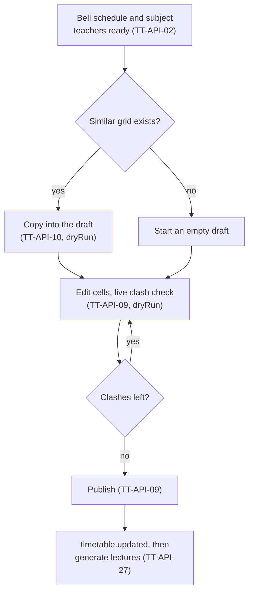
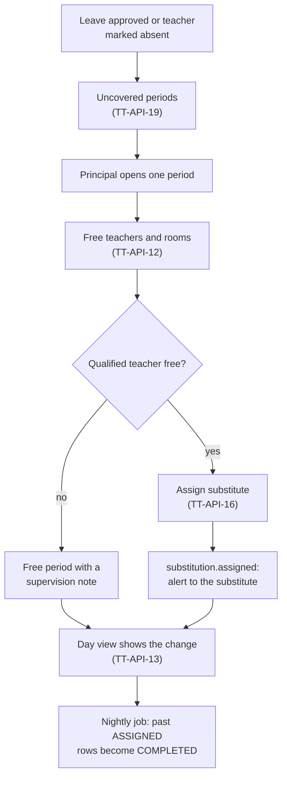
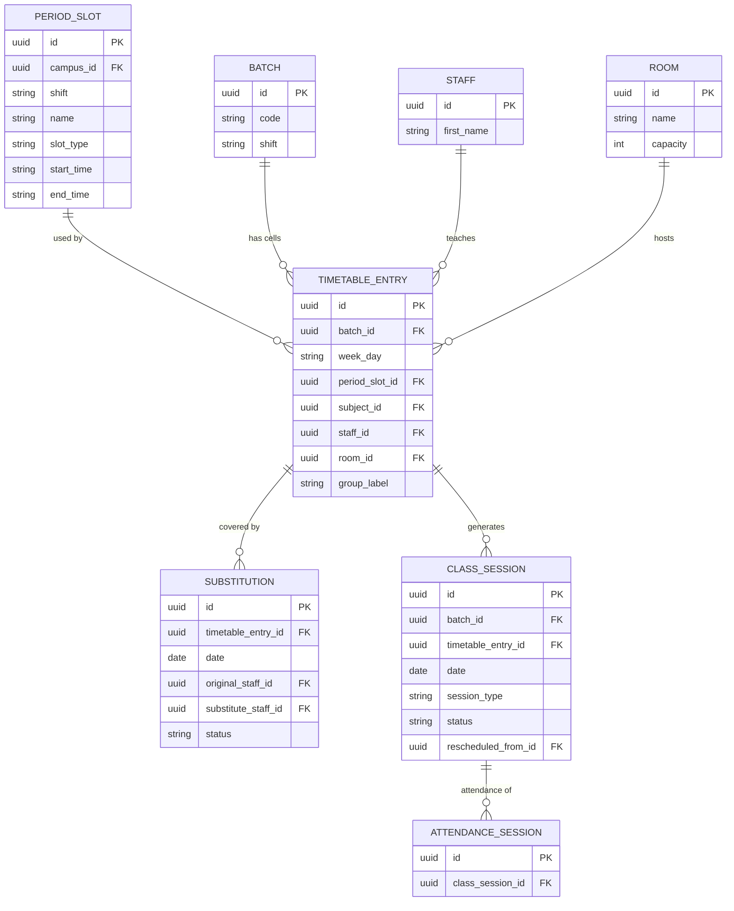

# Timetable Module

**In simple words:** This module plans when and where every class happens. The Principal sets the bell schedule, builds a weekly grid for each batch, and EduFlow stops any teacher, room or batch from being booked twice. When a teacher is absent, the module lists the periods that need cover and suggests free teachers. Teachers, parents and students see the live timetable and today's changes on their phones. Coaching institutes also get dated lectures: extra classes, doubt sessions, cancelled lectures and test days.

| Item | Value |
|---|---|
| Module code | TT |
| Release phase | Phase 2 (V1.0), Day 61 to 120; built with prompt P-35 on Days 78 to 80 |
| Plans | Growth, Pro, Enterprise (not Starter) |
| Main users | Principal, Organization Admin, Teacher, Parent, Student, custom role "Timetable Coordinator" (Pro and up) |
| Depends on | Batch (academic years, rooms, holidays), Subjects, Teachers, Leave, Attendance, Settings, Notifications |
| Main tables | `period_slots`, `timetable_entries`, `substitutions`, `class_sessions` |

## Objective

1. **One day to build.** A school with 20 sections builds all grids in one working day, or in 2 hours by copying last year's grids.
2. **Zero double bookings.** The database, not only the screen, stops a teacher, room or batch from being booked twice.
3. **Clear clash messages.** Each clash names the person, the batch or room and the period, in under 1 second.
4. **No class without a teacher.** Uncovered periods are listed before the first bell. Target: 95% are covered before they start.
5. **Parents see the truth.** Portals show only the published grid and real changes, never a draft.
6. **Coaching lectures by date.** A month of lectures is generated in one click, holidays skipped. Lecture attendance and per-lecture pay attach to them.
7. **Fair load.** Teacher load and subject coverage sit on one screen.

## Scope

### In scope

- Bell schedule per campus and shift; weekly grid per batch with elective groups and combined classes.
- Batch, teacher and room clash checks, including time overlaps across shifts and campuses.
- Draft with a live clash panel, publish, version history, restore, and copy from another batch or year.
- Substitutions with free-teacher suggestions and alerts; the resolved day view of one date.
- Dated lectures: generate, extra, doubt-clearing, revision, test-discussion and online classes; cancel, reschedule, complete.
- Workload and coverage, PDF and Excel export, teacher, parent and student views.

### Out of scope

| Not in this module | Where it lives or why |
|---|---|
| Automatic timetable generator | Not in V1.0; a manual grid with clash checks fits pilot schools |
| Rooms and holidays | *Batch Module* owns `/rooms` and `/holidays`; read here |
| Subject-teacher allocation | *Subjects Module* (`batch_subject_teachers`) |
| Leave requests, attendance marking | *Leave Module*, *Attendance Module* |
| Exam date sheet, per-lecture pay amount | *Exams Module*, *Payroll Module* |
| Creating Zoom or Meet rooms | The teacher pastes the link into `meetingUrl` |

### Phase notes

| Phase | What ships |
|---|---|
| Phase 1 (MVP) | Nothing; teacher load uses curriculum periods |
| Phase 2 (by 1 Feb 2027) | TT-API-01 to TT-API-29, all screens, `PERIOD` and `LECTURE` attendance modes, ready before the April 2027 session |
| Phase 3 (by June 2027) | *Payroll Module* reads `COMPLETED` lectures for per-lecture pay |
| Phase 4 (by Sep 2027) | AI Insights `STAFF_WORKLOAD` reads TT-API-14 |

## User Stories

| ID | As a | I want to | So that | Priority |
|---|---|---|---|---|
| TT-US-01 | Principal | set the bell schedule per campus and shift | grids use the real bell times | Must |
| TT-US-02 | Principal | fill a batch's week with subject, teacher and room | classes run to one plan | Must |
| TT-US-03 | Principal | see a plain clash message at once | I fix clashes before anyone sees them | Must |
| TT-US-04 | Principal | edit a draft and publish it in one go | parents never see a half-done grid | Must |
| TT-US-05 | Organization Admin | copy a grid from a twin batch or last year | I do not start from zero each April | Must |
| TT-US-06 | Principal | cover today's periods of absent teachers | no class sits without a teacher | Must |
| TT-US-07 | Teacher | be alerted about my substitutions | I reach the right room on time | Must |
| TT-US-08 | Teacher | see my day and week on my phone | I know where to be | Must |
| TT-US-09 | Parent | see my child's timetable and today's changes | I know about substitutes and cancelled classes | Should |
| TT-US-10 | Student | see extra classes and online class links | I never miss a lecture | Should |
| TT-US-11 | Principal (coaching centre head) | schedule extra classes and test days by date | the calendar shows real lectures | Must |
| TT-US-12 | Teacher | complete, cancel or move my lecture | the office and parents know what happened | Should |
| TT-US-13 | Principal | see teacher load and subject coverage | work is fair and syllabus hours are met | Should |
| TT-US-14 | Principal | print batch, teacher or room timetables | I can post them on notice boards | Should |

## Workflow

**Figure: From bell schedule to published timetable**



The draft stays in the editor until Publish. The server dry-runs every change. Publish replaces the live grid in one transaction.

1. In March 2027 Dr. Anita Verma keeps the 11 slots of the Gomti Nagar `FULL_DAY` bell schedule.
2. She copies 10-A's 2026-27 grid into the draft (TT-API-10, `dryRun: true`). 46 cells load; 2 have no teacher because that teacher left.
3. She fills them. 600 ms after each change, TT-API-09 runs with `dryRun: true` and shows one teacher clash. She moves that cell.
4. With no clash left she publishes. TT-API-09 replaces the grid, writes one audit row and emits `timetable.updated`. Portals show the new grid within one minute.
5. At Sharma Classes, Patna, the centre head publishes batch E2 and generates January lectures (TT-API-27).

**Figure: Daily substitution flow**



1. On Monday 5 July 2027 Priya Nair's sick leave for Tuesday 6 July is approved (`leave.request.approved`).
2. At 07:20 on Tuesday TT-API-19 lists her 3 periods: 10-A Period 2, 9-B Period 3 and 10-B Period 6.
3. TT-API-12 puts Rahul Singh first for 10-A Period 2: qualified, free and with the lightest week. TT-API-16 assigns him, and the alert reaches him within a minute.
4. For 10-B Period 6 nobody qualified is free, so she saves a supervised free period. Parents see "Free period (supervised)".
5. At night, Tuesday's `ASSIGNED` rows become `COMPLETED`.

### Status lifecycle

| Object | Status | Meaning | Next | Set by |
|---|---|---|---|---|
| Batch grid | Draft | Editor copy, never on the server | Live | Principal |
| Batch grid | Live | Rows in `timetable_entries` | Superseded | TT-API-09, quick edits |
| Batch grid | Superseded | Kept in the audit log | Draft (restore) | Next publish |
| `Substitution` | `ASSIGNED` | Cover planned | `COMPLETED`, `CANCELLED` | TT-API-16 |
| `Substitution` | `COMPLETED`, `CANCELLED` | Date passed, or cover not needed | Final | Nightly job; TT-API-18, leave cancelled, holiday |
| `ClassSession` | `SCHEDULED` | Lecture planned | `COMPLETED`, `CANCELLED`, `RESCHEDULED` | TT-API-21, TT-API-27 |
| `ClassSession` | `COMPLETED` | Held; topic recorded | Final | TT-API-26 |
| `ClassSession` | `CANCELLED` | Will not happen | Final | TT-API-24, holiday |
| `ClassSession` | `RESCHEDULED` | Replaced by a new session | Final | TT-API-25 |

No status goes back. A mistake is fixed by cancelling and creating a new row.

## Screens and Wireframes

| ID | Screen | Users | Purpose |
|---|---|---|---|
| TT-S01 | Bell Schedule | Principal, Organization Admin | Period slots per campus and shift |
| TT-S02 | Weekly Grid Editor | Principal, Organization Admin | Draft grid, clash panel, coverage, Publish |
| TT-S03 | Teacher and Room Timetable | Principal, Teacher (own) | The same grid seen by teacher or by room |
| TT-S04 | Copy Timetable (dialog) | Principal, Organization Admin | Pick a source and preview |
| TT-S05 | Substitution Board | Principal | Uncovered periods of a date and their cover |
| TT-S06 | Lecture Calendar | Principal, Teacher (own) | Dated lectures: add, cancel, move, complete |
| TT-S07 | Workload and Coverage | Principal, Organization Admin | Periods per teacher; subject hours against target |
| TT-S08 | My Day and My Week (mobile) | Teacher | Personal timetable with substitutions |
| TT-S09 | Timetable (mobile portal) | Parent, Student | Week, today's changes, upcoming lectures |
| TT-S10 | Version History (drawer) | Principal, Organization Admin | Past publishes; restore one into the draft |
| TT-S11 | Export Timetable (dialog) | Principal, Organization Admin, Teacher (own) | PDF or XLSX for a batch, teacher or room |

**Screen TT-S02 — Weekly Grid Editor (Principal, web)**

```text
+--------------------------------------------------------------------------+
| EduFlow | Bright Future Public School      [Search students...]   (AV) v |
+------------+-------------------------------------------------------------+
| Dashboard  | Timetable > Weekly Grid                                     |
| Batches    | Batch [10-A v]   Year [2027-28 v]   Shift: FULL_DAY         |
| Subjects   | DRAFT: 3 changes not published       Live: v4, 28 Mar 2027  |
| Timetable< |-------------------------------------------------------------|
|  Grid    < | Day | P1 08:00 | P2 08:40 | P3 09:20 |Brk| P4 10:15 |  >>   |
|  Bells     | Mon | MAT  AK  | ENG  RK  | PHY  PN  |///| HIN  SD  |       |
|  Subs      | Tue | MAT  AK  | PHY  PN  | CHE  RS  |///| ENG  RK  |       |
|  Lectures  | Wed | ENG  RK  | MAT  AK  | PHY PN ! |///| [  +  ]  |       |
|  Workload  | Thu | BIO  MJ  | PHY  PN  | MAT  AK  |///| LIB  --  |       |
| Settings   | Fri | MAT  AK  | ENG  RK  | SKT/FRE  |///| CHE  RS  |       |
|            | Sat | GAM  VS  | MAT  AK  | PHY  PN  |///| ART  NK  |       |
|            |-------------------------------------------------------------|
|            | Cell Wed P3: Subject [Physics v]  Teacher [Priya Nair v]    |
|            | Room [Physics Lab v]  Group [Whole batch v]  Combined [No v]|
|            | Clashes (1)                                                 |
|            | ! Priya Nair already teaches 10-B on Wednesday, Period 3.   |
|            |   [Show free teachers]                                      |
|            | Coverage: PHY 6/6  MAT 7/7  ENG 6/6  CHE 4/5 (short by 1)   |
|            | [Copy from...] [History] [Export v]    [Discard] [Publish]  |
+------------+-------------------------------------------------------------+
```

- Cells show the subject code and teacher initials in `Subject.color`. `///` is a break; `>>` scrolls to Periods 5 to 8. `SKT/FRE` is an elective split (groups `SANSKRIT` and `FRENCH`).
- Each change calls TT-API-09 with `dryRun: true`. `[Publish]` calls it for real and stays disabled while clashes exist. `[Copy from...]` opens TT-S04 (TT-API-10), `[History]` opens TT-S10 and `[Export v]` opens TT-S11 (TT-API-11). Coverage comes from TT-API-14.

**Screen TT-S05 — Substitution Board (Principal, web)**

```text
+--------------------------------------------------------------------------+
| EduFlow | Bright Future Public School      [Search students...]   (AV) v |
+------------+-------------------------------------------------------------+
| Timetable< | Substitutions   Date [Tue 06 Jul 2027 v]   [Gomti Nagar v]  |
|  Grid      | Uncovered: 2    Covered: 1    Free periods: 0               |
|  Bells     |-------------------------------------------------------------|
|  Subs    < | Period     Batch  Subject  Absent teacher  Reason   Action  |
|  Lectures  | P2 08:40   10-A   Physics  Priya Nair      Leave    Done    |
|  Workload  |   -> Rahul Singh, Room 10-A             alert sent 07:24    |
|            | P3 09:20   9-B    Physics  Priya Nair      Leave    [Assign]|
|            | P6 12:05   10-B   Physics  Priya Nair      Leave    [Assign]|
|            |-------------------------------------------------------------|
|            | Assign cover: 9-B, Period 3 (09:20-10:00), Physics          |
|            | Free in this period, qualified first:                       |
|            | (o) Rahul Singh    Physics   load 24/30   subs this week 1  |
|            | ( ) Meena Joshi    Biology   load 26/30   subs this week 0  |
|            | ( ) Free period (supervised)  Note [____________________]   |
|            | Room [Keep 9-B room v]    Reason [Teacher on leave_______]  |
|            | [ ] Show teachers above the weekly cap                      |
|            |                                  [Cancel] [Assign & Alert]  |
+------------+-------------------------------------------------------------+
```

- Rows come from TT-API-19 and TT-API-15 and refresh every 60 seconds. Suggestions come from TT-API-12; teachers over the weekly cap appear only when the box is ticked.
- `[Assign & Alert]` calls TT-API-16. A covered row offers `[Change]` (TT-API-17) and `[Cancel]` (TT-API-18).

**Screen TT-S08 — My Day (Teacher, mobile)**

```text
+------------------------------------+
| EduFlow        Priya Nair      (=) |
+------------------------------------+
| [My Day]  My Week    Thu 08 Jul    |
|------------------------------------|
| P1 08:00-08:40  Free               |
| P2 08:40-09:20  10-A Physics       |
|                 Room 10-A   [Mark] |
| P3 09:20-10:00  10-B Physics       |
|                 Physics Lab [Mark] |
| -- Break 10:00-10:15 ------------- |
| P4 10:15-10:55  SUBSTITUTION       |
|                 8-C Maths for      |
|                 Ajay Kumar, Rm 8-C |
| P5 10:55-11:35  9-A Physics  [Mark]|
| -- Lunch 11:35-12:05 ------------- |
| P6 12:05-12:45  Free               |
| P7 12:45-13:25  9-B Physics  [Mark]|
|------------------------------------|
| Today: 5 periods, 1 substitution   |
| [Home] [Timetable] [Attend.] [More]|
+------------------------------------+
```

- Calls TT-API-13 with her `staffId`; `My Week` calls TCH-API-14 (*Teachers Module*). `[Mark]` opens ATT-API-08 and shows only in `PERIOD` attendance mode.
- A substitution names the absent teacher, so the substitute knows whose class it is.

**Screen TT-S09 — Timetable (Parent, mobile)**

```text
+------------------------------------+
| EduFlow Parent    Sunita Devi  (=) |
+------------------------------------+
| Child [Aarav Sharma - 10-A v]      |
| [Today]  Week     Tue 06 Jul 2027  |
|------------------------------------|
| ! 1 change today                   |
| P2 Physics: Rahul Singh replaces   |
|    Priya Nair today                |
|------------------------------------|
| 07:45     Assembly                 |
| P1 08:00  Maths      Ajay Kumar    |
| P2 08:40  Physics    Rahul Singh * |
| P3 09:20  Chemistry  Ravi S.       |
| 10:00     Break                    |
| P4 10:15  English    Rekha Kapoor  |
| P5 10:55  Hindi      Sarita Dubey  |
| 11:35     Lunch                    |
| P6 12:05  Sanskrit   Kavita Mishra |
| P7 12:45  Games      Vikram Singh  |
| P8 13:25  Library                  |
|------------------------------------|
| * substitute for today             |
| [Home] [Fees] [Timetable] [More]   |
+------------------------------------+
```

- Calls TT-API-28; the Student Portal uses TT-API-29, and the *Parent Portal Module* calls this screen PP-S05. The elective slot shows only Aarav's group. Coaching students also see upcoming lectures with `[Join]` for online classes.
- No teacher phone numbers. On a holiday only the holiday name shows.

## UI Components

| Component | Type | Behaviour |
|---|---|---|
| `TimetableGrid` | shadcn `Table`, dnd-kit | Days by slots; drag to move; arrow keys and Enter. Loading: 6 x 8 skeleton. Empty: "No timetable yet. Copy one or add the first cell." |
| `CellEditor` | `Popover`, `Command` | Curriculum subjects; teachers allocated to that subject; room; group; combined-with |
| `ClashPanel` | `Card`, `Alert` | Plain-word clashes; a click focuses the cell |
| `DraftBar` | Sticky bar | Change count, Discard, Publish; draft kept in browser storage; warns on tab close |
| `CoverageStrip` | `Badge` row | Scheduled against target; amber under, red over |
| `FreeTeacherList` | `RadioGroup` | TT-API-12 rows with load and substitutions this week |
| `DayTimeline` | Mobile list | Badges `SUB`, `CANCELLED`, `EXTRA`, `ONLINE` with `[Join]` |
| `SessionDialog` | `Dialog`, React Hook Form, Zod | Type, date, times, teacher, room, link; inline clash message |
| `VersionHistoryDrawer` | `Sheet` | Past publishes; `[Preview]`, `[Restore to draft]` |
| Error state | `Alert` | "Could not load the timetable. [Retry]" with the `requestId` |

## Validation Rules

| Field | Rule | Error message shown to user |
|---|---|---|
| Slot `name` | 1 to 40 characters, unique per campus and shift | "A slot named Period 3 already exists for this shift." |
| Slot times | `HH:mm`; end after start; 10 to 240 minutes | "A slot must end after it starts and last 10 minutes to 4 hours." |
| Slot overlap | No overlap with an active slot of the same campus and shift | "This slot overlaps Period 2 (08:40-09:20)." |
| Cell slot | `PERIOD` or `ACTIVITY`; same campus and shift as the batch | "Classes cannot be placed in Lunch." |
| Cell `weekDay` | A batch day, not a campus weekly off | "10-A does not meet on Sunday." |
| Cell `subjectId` | In the course curriculum | "Sanskrit is not a subject of Class 10." |
| Cell subject or `label` | One is required; `label` up to 80 characters | "Pick a subject or type a label such as Library." |
| Cell `staffId` | Open allocation for batch and subject; staff `ACTIVE` | "Priya Nair is not assigned to Chemistry in 10-A. Assign her in Subjects first." |
| Cell `roomId` | `ACTIVE` room of the same campus | "Physics Lab is not available at this campus." |
| Cell `groupLabel` | Empty, or A-Z, 0-9 and `_`, up to 30 | "Group name can use A-Z, 0-9 and _ only (up to 30)." |
| Cell `combinedWithEntryId` | Owner in the same day, slot and subject, other batch | "A combined class must use the same day, period and subject." |
| Substitution `date` | Weekday of the cell; 7 days back to 60 days ahead | "6 Jul 2027 is a Tuesday. This period is on Monday." |
| Substitution `substituteStaffId` | Not the absent teacher; `ACTIVE` | "The substitute must be a different teacher." |
| Session `date` and times | Inside year and batch dates; end after start; up to 240 minutes | "The date is outside the batch dates (1 Apr 2027 to 31 Mar 2028)." |
| Session `meetingUrl` | `https://`, up to 500; required for `ONLINE` | "Paste the online class link (https://...)." |
| Cancel `reason`, complete `topic` | 5 to 255 and 3 to 255 characters | "Please give a reason (at least 5 characters)." |
| Generate range | `from` not after `to`; up to 62 days | "Generate at most 62 days at a time." |

## Business Rules

**TT-BR-01 — Bell schedule per campus and shift.** Each campus and `Shift` has its own slots, ordered by `startTime`. Slot minutes = end minus start.

```text
Bright Future, Gomti Nagar, FULL_DAY (Mon-Sat):
  Assembly 07:45-08:00 | P1-P3 08:00-10:00 | Break 10:00-10:15
  P4-P5 10:15-11:35 | Lunch 11:35-12:05 | P6-P8 12:05-14:05
  8 periods x 40 min = 320 teaching minutes a day
  6 days x 8 = 48 period slots a week (32 hours)
Sharma Classes, Patna, EVENING:
  Lecture 1 16:00-17:30 (90) | Break 17:30-17:45 | Lecture 2 17:45-19:15
```

**TT-BR-02 — Changing slots.** New times apply to every cell of the slot; generated lectures keep theirs. A slot used by live cells cannot be deleted or deactivated: `422` "Period 9 is used by 12 timetable cells. Remove them first."

**TT-BR-03 — Where a cell may go.** The Validation Rules apply. A teacher without an open `BatchSubjectTeacher` row gets `422` naming the subject. A room smaller than the batch saves with the warning `ROOM_TOO_SMALL`.

**TT-BR-04 — Three clash guards in the database.** `uq_timetable_batch_slot`, `uq_timetable_teacher_slot` and `uq_timetable_room_slot` make double bookings impossible, even for simultaneous requests. The service pre-check only builds a readable message; a unique violation becomes `409 CONFLICT`, never a raw database error.

```typescript
// server/src/modules/timetable/clash-errors.ts
import { Prisma } from '@prisma/client';

export type ClashKind = 'BATCH' | 'TEACHER' | 'ROOM';

const BY_INDEX: Record<string, ClashKind> = {
  uq_timetable_batch_slot: 'BATCH',
  uq_timetable_teacher_slot: 'TEACHER',
  uq_timetable_room_slot: 'ROOM',
};

// Prisma reports the violated unique index as a name or as a list of fields.
export function clashKindOf(err: unknown): ClashKind | null {
  if (!(err instanceof Prisma.PrismaClientKnownRequestError) || err.code !== 'P2002') {
    return null;
  }
  const target = err.meta?.target;
  if (typeof target === 'string') return BY_INDEX[target] ?? null;
  if (Array.isArray(target)) {
    const f = target.map(String);
    if (f.includes('staffId') || f.includes('staff_id')) return 'TEACHER';
    if (f.includes('roomId') || f.includes('room_id')) return 'ROOM';
    if (f.includes('groupLabel') || f.includes('group_label')) return 'BATCH';
  }
  return null;
}

// In the service: the pre-check throws AppError('CONFLICT', message, details).
export async function createEntry(input: CreateEntryInput, ctx: TenantContext) {
  await assertNoClash(input, ctx);
  try {
    return await ctx.db.timetableEntry.create({ data: toEntryRow(input, ctx) });
  } catch (err) {
    if (!clashKindOf(err)) throw err;
    await assertNoClash(input, ctx); // a parallel request won: rebuild the message
    throw new AppError('CONFLICT', 'This period was just booked by someone else. Reload.');
  }
}
```

```text
Batch:   "{batch} already has {subject} on {day}, {slot}."
Teacher: "{teacher} already teaches {batch} on {day}, {slot}."
Room:    "{room} is already used by {batch} on {day}, {slot}."
Overlap: "{teacher} teaches {batch} at {campus} on {day}, {start}-{end}.
          The times overlap by {n} minutes."
```

**TT-BR-05 — Time overlap across shifts and campuses.** The unique keys compare slot ids, so two different slots at the same time slip past them. The service also compares the times of the teacher's cells on that weekday in every campus and shift, and of the room's cells in other shifts. A positive overlap is a clash.

```text
overlap = min(endA, endB) - max(startA, startB)
Priya, Monday: Gomti Nagar P3 09:20-10:00, Aliganj MORNING P2 09:30-10:10
overlap = 10:00 - 09:30 = 30 min -> clash
Back-to-back 09:20-10:00 and 10:00-10:40 -> 0 min -> allowed
```

**TT-BR-06 — Elective groups.** `groupLabel` `""` means the whole batch. Group rows share a slot, each with its own teacher and room. A whole-batch row and group rows never share a slot (`409`); the service checks this because the batch key alone would allow it. A student sees only the group whose subject is in `Enrollment.electiveSubjectIds`.

**TT-BR-07 — Combined classes.** For 11-A and 11-B together, the owner row (11-A) holds `staffId` and `roomId`. The follower (11-B) leaves both empty and sets `combinedWithEntryId`. Capacity adds both strengths: 38 + 35 = 73 against Hall capacity 80, so it passes. Deleting the owner deletes followers. Cover is recorded on the owner.

**TT-BR-08 — Draft and publish.** The schema keeps one live grid per batch and year. The draft lives only in the editor's browser storage (`tt:draft:{batchId}:{academicYearId}`), so parents never see it. Publish (TT-API-09) runs one transaction:

1. A stale `baseVersion` answers `409` "Dr. Anita Verma published version 5 at 10:42. Reload and apply your changes again."
2. Cells are compared by day, slot and group. Changed rows are updated in place, keeping ids, substitutions and lecture links; they first get `staffId` and `roomId` set to null, so a swap never hits a false clash. Removed rows are deleted, new rows inserted.
3. `effectiveFrom` is set, one audit row is written (`timetable.publish` on the `Batch`, `before` and `after` grids, `metadata.version`) and `timetable.updated` is emitted once.

Version = earlier `timetable.publish` rows for the batch and year, plus 1. Quick edits (TT-API-06 to TT-API-08) change one live cell with their own audit rows and keep the version. Restore (TT-S10) loads an old grid into the draft and flags missing slots, teachers or rooms.

**TT-BR-09 — Copy.** TT-API-10 copies from another batch of the same year or from an earlier year. Slots map by id within the same campus and shift, else by name (`SLOT_NOT_FOUND` otherwise). A source teacher stays if she is allocated to that subject in the target batch; else the target's primary teacher is used, or none. `dryRun: true` (default) returns cells for the draft; `dryRun: false` works only into an empty grid.

```text
10-A 2026-27 -> 10-A 2027-28: 46 cells, same slots; 44 teachers kept,
  2 cells without teacher (teacher left) -> fill 2, publish.
10-A -> 10-B (same year): 46 cells; Priya (Physics 6) and Rekha Kapoor
  (English 6) teach both sections -> 12 teacher clashes, 34 clean cells.
```

**TT-BR-10 — Uncovered periods.** For date D, TT-API-19 lists live cells of weekday(D) whose teacher has `APPROVED` leave on D or a staff register row `ABSENT` or `ON_LEAVE`, and no `ASSIGNED` or `COMPLETED` substitution for D. First-half leave covers slots that start before the shift's first `LUNCH` slot (12:00 if none); second-half leave covers the rest. Holidays (`appliesTo` `ALL` or `STUDENTS`) and weekly offs give an empty list.

**TT-BR-11 — Free teacher suggestions.** TT-API-12 offers `ACTIVE` teaching staff of the campus who are not on leave or absent on D and have no cell, substitution or lecture in that time (TT-BR-05 check). Order: qualified in the subject (`TeacherSubject`) first, then lower load plus substitutions this week, then name. Teachers at `teachers.max_periods_per_week` (default 30) are hidden unless `includeOverCap=true`; choosing one saves with `LOAD_ABOVE_CAP` (TCH-BR-09, *Teachers Module*).

```text
Rahul Singh  Physics  load 24 + subs 1 = 25 < 30  -> 1st (qualified)
Meena Joshi  Biology  load 26 + subs 0 = 26 < 30  -> 2nd
Arjun Mehta  Physics  load 29 + subs 1 = 30       -> hidden (cap reached)
```

**TT-BR-12 — Substitutions.** One cover per cell and date: a second answers `409` "10-A Period 2 on 6 Jul already has a substitute: Rahul Singh." `uq_substitution_teacher_slot` stops one substitute covering two classes at once. An empty `substituteStaffId` is a supervised free period. A lecture of that cell and date switches to the substitute's teacher and room, so attendance and per-lecture pay follow who taught; cancelling restores them. The alert is queued after commit (`notifiedAt`).

**TT-BR-13 — Reactions to other modules.** `leave.request.approved` for today or tomorrow tells the Principal in-app: "Priya Nair is on leave on 6 Jul: 3 periods need cover." `leave.request.cancelled` cancels future `ASSIGNED` substitutions with that `leaveRequestId` and alerts each substitute. `holiday.declared` cancels `SCHEDULED` lectures and `ASSIGNED` substitutions in the range with reason "Holiday: {name}" and no extra alert, because the *Batch Module* announced the holiday.

**TT-BR-14 — Generating lectures.** TT-API-27 walks each date from `from` to `to`. It skips dates outside the year or batch dates, weekly offs, days not in `Batch.daysOfWeek`, and holidays (`ALL` or `STUDENTS`) of the campus or all campuses. Each live cell of the weekday becomes a `REGULAR` session with the slot's times, the cell's subject, teacher and room (the owner's for a follower) and `timetableEntryId`; a substitution sets the teacher. Existing sessions for batch, date and cell are skipped, and an advisory lock per batch stops parallel runs.

```text
Sharma Classes, JEE batch E2, meets TUE/THU/SAT, 2 lectures a day.
January 2027: Tue 5,12,19,26 + Thu 7,14,21,28 + Sat 2,9,16,23,30 = 13 days
26 Jan (Republic Day) is a holiday -> 12 days x 2 lectures = 24 created,
2 skipped as HOLIDAY. Second run: created 0, alreadyExisted 24.
```

**TT-BR-15 — Extra classes, online classes and test days.** TT-API-21 adds `EXTRA`, `DOUBT_CLEARING`, `REVISION`, `TEST_DISCUSSION` or `ONLINE` lectures; `REGULAR` comes only from generation. Teacher, room and batch are checked by time overlap. `ONLINE` needs `meetingUrl` and no room. A test is an exam paper in the *Exams Module*, which sends its own alert. "Mark test day" on TT-S06 cancels overlapping lectures with reason "Test day: {exam}" and `notify: false`, so parents get one message, not three.

**TT-BR-16 — Cancel, reschedule, complete.** Cancel needs a reason and alerts students and guardians (`parentsNotifiedAt`). A lecture with submitted attendance cannot be cancelled: `422` "Attendance is already taken for this lecture." Reschedule marks the old lecture `RESCHEDULED` and creates a `SCHEDULED` copy with `rescheduledFromId`; one alert names both times. Complete needs the topic, from the start time until 7 days later. A teacher with scope `Own` acts only on her own lectures.

**TT-BR-17 — Workload and coverage.** Load = live cells with the teacher as `staffId` (each elective group row counts; a combined follower does not). Coverage = a batch's cells of a subject against `CourseSubject.weeklyPeriods`.

```text
Priya: 10-A 6 + 10-B 6 + 9-A 5 + 9-B 5 + 8-C 6 = 28; cap 30
       utilisation = round(28 / 30 x 100) = 93%   (warning from 90%)
10-A Physics: target 6, scheduled 5 -> shortBy 1 (amber)
10-A week: 48 period slots; curriculum targets 45 -> 3 slots for Library,
           Games or Art labels
```

**TT-BR-18 — Year, batch, plan and portals.** Writes to a `CLOSED` year answer `422`. A `COMPLETED` or `CANCELLED` batch has a read-only grid. A new year starts empty until copied. On Starter every TT endpoint answers `403 PLAN_LIMIT_REACHED`. Portals show the live grid, changes for the next 7 days and upcoming lectures, with teacher names but never phone numbers or drafts.

## Acceptance Criteria

| ID | Given | When | Then |
|---|---|---|---|
| TT-AC-01 | Gomti Nagar `FULL_DAY` Period 2 is 08:40-09:20 | "Period 2A" 09:00-09:30 is saved | `400` "This slot overlaps Period 2 (08:40-09:20)." |
| TT-AC-02 | Priya teaches 10-A Physics on Monday, Period 3 | she is placed in 10-B in that slot | `409` "Priya Nair already teaches 10-A on Monday, Period 3."; nothing saved |
| TT-AC-03 | Physics Lab holds 9-A on Monday, Period 3 | 10-B is placed there in that slot | `409` "Physics Lab is already used by 9-A on Monday, Period 3." |
| TT-AC-04 | Two requests book Priya in one slot at the same moment | both reach the API | one `201`, one `409` with a readable message |
| TT-AC-05 | 11-A has `SANSKRIT` and `FRENCH` cells in one slot | a whole-batch cell is added there | `409`; both group cells stay |
| TT-AC-06 | Rahul has no Chemistry allocation in 10-A | a Chemistry cell is saved with him | `422` naming Chemistry and 10-A |
| TT-AC-07 | A draft has 3 clashes | TT-API-09 runs with `dryRun: true` | `200` lists 3 clashes; `timetable_entries` count unchanged |
| TT-AC-08 | A draft was opened at version 4; version 5 is published by someone else | the draft is published | `409` asking to reload; version 5 stays live |
| TT-AC-09 | 10-A has a published grid and a draft | Sunita Devi opens TT-S09 | she sees only the published grid, updated within 60 seconds of a publish |
| TT-AC-10 | Priya's approved leave covers Tue 6 Jul 2027 | TT-API-19 runs for that date | 3 periods listed; after one substitution, 2 |
| TT-AC-11 | Rahul covers 10-A Period 2 on 6 Jul | he is also assigned to 9-B Period 2 | `409` naming 10-A |
| TT-AC-12 | A substitution is saved | the alert job runs | Rahul gets push and WhatsApp within 60 seconds; `notifiedAt` set |
| TT-AC-13 | Priya's leave is cancelled on 5 Jul | `leave.request.cancelled` arrives | her future substitutions are `CANCELLED`; substitutes alerted |
| TT-AC-14 | Batch E2 meets TUE/THU/SAT; 26 Jan 2027 is a holiday | January is generated twice | 24 created and 2 skipped, then 0 created |
| TT-AC-15 | A lecture has submitted attendance | the teacher cancels it | `422` "Attendance is already taken for this lecture." |
| TT-AC-16 | A Bright Future Principal holds a Sharma Classes `batchId` | TT-API-05 is called | `404 NOT_FOUND`; nothing leaks |

## Edge Cases

| Case | What happens | How the system handles it |
|---|---|---|
| Teacher swap between two cells | Looks like a clash mid-way | Changed rows lose teacher and room first, then get final values, in one transaction (TT-BR-08) |
| Removed cell had past substitutions | `onDelete: Cascade` deletes them | Publish dialog warns "2 past substitutions will be removed"; the audit row keeps them in `before` |
| Teacher exits mid-year | Later cells lose their teacher | *Teachers Module* exit flow reassigns them; leftovers show "No teacher" in the clash panel |
| Room deleted | `roomId` becomes null | Cell stays; grid shows "Room needed" |
| Holiday declared after generation | Lectures exist on a holiday | `holiday.declared` cancels them quietly (TT-BR-13) |
| Leave approved after the day started | Some periods already passed | TT-API-19 still lists them; cover can be recorded 7 days back for pay |
| Half-day leave | Only some periods need cover | First half ends at the first `LUNCH` slot (TT-BR-10) |
| Absent teacher's class is combined | Followers have no teacher | Cover on the owner cell shows for both batches |
| Student changes elective | Portal grid must change | Portal reads `Enrollment.electiveSubjectIds` each time; no grid edit |
| Two principals edit one batch | Two drafts | `baseVersion` check; the second gets `409` (TT-BR-08) |
| Test on a lecture day | Lectures and test overlap | "Mark test day" cancels lectures with `notify: false` (TT-BR-15) |

## Database Schema

| Table | Purpose |
|---|---|
| `period_slots` | Bell schedule rows of a campus and shift |
| `timetable_entries` | Live weekly grid cells; hard deleted when the grid changes |
| `substitutions` | Cover for one cell on one date |
| `class_sessions` | Dated lectures: generated, extra, cancelled, moved, online |

Rooms, holidays, allocations, leave and staff attendance are read from their own modules. The full column reference is in *Data Dictionary: Academics*.

### period_slots

| Column | Type | Null | Default | Notes |
|---|---|---|---|---|
| `id` | uuid | No | `uuid()` | PK |
| `organization_id`, `campus_id` | uuid | No | - | FKs; cascade, restrict |
| `shift` | enum `Shift` | No | `FULL_DAY` | One schedule per shift |
| `name` | varchar(40) | No | - | "Period 3" |
| `slot_type` | enum `PeriodSlotType` | No | `PERIOD` | |
| `start_time`, `end_time` | varchar(5) | No | - | `HH:mm`, campus time |
| `sort_order` | int | No | `0` | |
| `status` | enum `RecordStatus` | No | `ACTIVE` | |
| `created_at`, `updated_at` | timestamptz | No | `now()` | |
| `deleted_at` | timestamptz | Yes | - | Soft delete |

Indexes: unique (`organization_id`, `campus_id`, `shift`, `name`); index (`organization_id`, `campus_id`, `shift`, `sort_order`).

### timetable_entries

| Column | Type | Null | Default | Notes |
|---|---|---|---|---|
| `id` | uuid | No | `uuid()` | PK |
| `organization_id`, `campus_id`, `academic_year_id` | uuid | No | - | FKs |
| `batch_id` | uuid | No | - | FK, cascade |
| `week_day` | enum `WeekDay` | No | - | |
| `period_slot_id` | uuid | No | - | FK, restrict |
| `subject_id` | uuid | Yes | - | Null for Library, Games |
| `staff_id`, `room_id` | uuid | Yes | - | FKs, set null; null on followers |
| `group_label` | varchar(30) | No | `""` | Elective group |
| `combined_with_entry_id` | uuid | Yes | - | Owner row, cascade |
| `label` | varchar(80) | Yes | - | Shown without subject |
| `effective_from` | date | Yes | - | Set on publish |
| `notes` | varchar(255) | Yes | - | |
| `created_by_id` | uuid | Yes | - | Audit only |
| `created_at`, `updated_at` | timestamptz | No | `now()` | No `deleted_at` |

Indexes: unique `uq_timetable_batch_slot` (`organization_id`, `academic_year_id`, `batch_id`, `week_day`, `period_slot_id`, `group_label`); unique `uq_timetable_teacher_slot` (same with `staff_id` instead of batch and group); unique `uq_timetable_room_slot` (same with `room_id`); index (`organization_id`, `campus_id`, `academic_year_id`, `week_day`); index (`organization_id`, `staff_id`, `week_day`). PostgreSQL treats NULLs as distinct, so cells without a teacher or room never clash.

### substitutions

| Column | Type | Null | Default | Notes |
|---|---|---|---|---|
| `id` | uuid | No | `uuid()` | PK |
| `organization_id`, `campus_id` | uuid | No | - | FKs |
| `timetable_entry_id` | uuid | No | - | FK, cascade |
| `date` | date | No | - | |
| `period_slot_id` | uuid | No | - | Copied for the clash key |
| `original_staff_id` | uuid | No | - | FK, restrict |
| `substitute_staff_id` | uuid | Yes | - | Null = free period |
| `room_id`, `leave_request_id` | uuid | Yes | - | FKs, set null |
| `reason` | varchar(255) | Yes | - | |
| `status` | enum `SubstitutionStatus` | No | `ASSIGNED` | |
| `notified_at` | timestamptz | Yes | - | Alert queued |
| `assigned_by_id` | uuid | Yes | - | Audit only |
| `created_at`, `updated_at` | timestamptz | No | `now()` | |

Indexes: unique (`organization_id`, `timetable_entry_id`, `date`); unique `uq_substitution_teacher_slot` (`organization_id`, `substitute_staff_id`, `date`, `period_slot_id`); index (`organization_id`, `campus_id`, `date`); index (`organization_id`, `original_staff_id`, `date`).

### class_sessions

| Column | Type | Null | Default | Notes |
|---|---|---|---|---|
| `id` | uuid | No | `uuid()` | PK |
| `organization_id`, `campus_id`, `academic_year_id`, `batch_id` | uuid | No | - | FKs, restrict |
| `subject_id`, `staff_id`, `room_id` | uuid | Yes | - | FKs, set null |
| `timetable_entry_id` | uuid | Yes | - | Source cell; set null when the cell goes |
| `date` | date | No | - | |
| `start_time`, `end_time` | varchar(5) | No | - | `HH:mm`, copied at creation |
| `session_type` | enum `ClassSessionType` | No | `REGULAR` | |
| `status` | enum `ClassSessionStatus` | No | `SCHEDULED` | |
| `topic` | varchar(255) | Yes | - | Syllabus covered |
| `meeting_url` | varchar(500) | Yes | - | Online class link |
| `cancel_reason` | varchar(255) | Yes | - | |
| `rescheduled_from_id` | uuid | Yes | - | Self FK to the replaced session |
| `parents_notified_at` | timestamptz | Yes | - | Cancel or move alert queued |
| `created_by_id` | uuid | Yes | - | User id, audit only |
| `created_at`, `updated_at` | timestamptz | No | `now()` | |
| `deleted_at` | timestamptz | Yes | - | Soft delete |

Indexes: (`organization_id`, `batch_id`, `date`); (`organization_id`, `staff_id`, `date`); (`organization_id`, `campus_id`, `date`, `status`). There is no unique key, so TT-API-27 is idempotent through the service check and an advisory lock (TT-BR-14).

**Figure: Timetable tables and their neighbours**



A cell links a slot, batch, teacher and room. Substitutions and lectures hang off the cell; lecture attendance hangs off the lecture.

## Prisma Schema

Copied from `06-timetable-homework.prisma`. The shared enums `Shift`, `WeekDay` and `RecordStatus` come from `00-base.prisma`.

```prisma
enum Shift {
  MORNING
  AFTERNOON
  EVENING
  FULL_DAY
  WEEKEND
}

enum WeekDay {
  MONDAY
  TUESDAY
  WEDNESDAY
  THURSDAY
  FRIDAY
  SATURDAY
  SUNDAY
}

enum PeriodSlotType {
  PERIOD
  BREAK
  LUNCH
  ASSEMBLY
  ACTIVITY
}

enum SubstitutionStatus {
  ASSIGNED
  COMPLETED
  CANCELLED
}

enum ClassSessionType {
  REGULAR
  EXTRA
  DOUBT_CLEARING
  REVISION
  TEST_DISCUSSION
  ONLINE
}

enum ClassSessionStatus {
  SCHEDULED
  COMPLETED
  CANCELLED
  RESCHEDULED
}

// A row of the campus bell schedule: Period 1 08:00-08:40, Lunch 11:20-11:50.
model PeriodSlot {
  id             String         @id @default(uuid()) @db.Uuid
  organizationId String         @map("organization_id") @db.Uuid
  campusId       String         @map("campus_id") @db.Uuid
  shift          Shift          @default(FULL_DAY) // each shift has its own bell schedule
  name           String         @db.VarChar(40)
  slotType       PeriodSlotType @default(PERIOD) @map("slot_type")
  startTime      String         @map("start_time") @db.VarChar(5) // HH:mm in the campus timezone
  endTime        String         @map("end_time") @db.VarChar(5) // HH:mm in the campus timezone
  sortOrder      Int            @default(0) @map("sort_order")
  status         RecordStatus   @default(ACTIVE)
  createdAt      DateTime       @default(now()) @map("created_at") @db.Timestamptz(6)
  updatedAt      DateTime       @updatedAt @map("updated_at") @db.Timestamptz(6)
  deletedAt      DateTime?      @map("deleted_at") @db.Timestamptz(6)

  organization       Organization        @relation(fields: [organizationId], references: [id], onDelete: Cascade)
  campus             Campus              @relation(fields: [campusId], references: [id], onDelete: Restrict)
  timetableEntries   TimetableEntry[]
  substitutions      Substitution[]
  attendanceSessions AttendanceSession[]

  @@unique([organizationId, campusId, shift, name])
  @@index([organizationId, campusId, shift, sortOrder])
  @@map("period_slots")
}

// One cell of a batch's weekly timetable. Rows are replaced (hard delete) when the timetable changes,
// so the three unique keys below guarantee: no double booking of a batch, a teacher or a room.
// Elective split: one row per elective group (groupLabel) in the same slot. Combined class (11-A + 11-B together):
// one owner row holds staffId / roomId; follower rows keep them NULL and point to the owner with combinedWithEntryId.
model TimetableEntry {
  id                  String    @id @default(uuid()) @db.Uuid
  organizationId      String    @map("organization_id") @db.Uuid
  campusId            String    @map("campus_id") @db.Uuid
  academicYearId      String    @map("academic_year_id") @db.Uuid
  batchId             String    @map("batch_id") @db.Uuid
  weekDay             WeekDay   @map("week_day")
  periodSlotId        String    @map("period_slot_id") @db.Uuid
  subjectId           String?   @map("subject_id") @db.Uuid // null for non-subject periods (assembly, library, sports)
  staffId             String?   @map("staff_id") @db.Uuid // teacher; NULLs never clash in the unique key
  roomId              String?   @map("room_id") @db.Uuid // NULLs never clash in the unique key
  groupLabel          String    @default("") @map("group_label") @db.VarChar(30) // "" = whole batch; otherwise the elective group, e.g. SANSKRIT
  combinedWithEntryId String?   @map("combined_with_entry_id") @db.Uuid // follower row of a combined class: points to the owner row
  label               String?   @db.VarChar(80) // shown when subjectId is null, e.g. "Library"
  effectiveFrom       DateTime? @map("effective_from") @db.Date // informational; one timetable version is live per academic year
  notes               String?   @db.VarChar(255)
  createdById         String?   @map("created_by_id") @db.Uuid // User id (audit only, no FK)
  createdAt           DateTime  @default(now()) @map("created_at") @db.Timestamptz(6)
  updatedAt           DateTime  @updatedAt @map("updated_at") @db.Timestamptz(6)

  organization    Organization     @relation(fields: [organizationId], references: [id], onDelete: Cascade)
  campus          Campus           @relation(fields: [campusId], references: [id], onDelete: Restrict)
  academicYear    AcademicYear     @relation(fields: [academicYearId], references: [id], onDelete: Restrict)
  batch           Batch            @relation(fields: [batchId], references: [id], onDelete: Cascade)
  periodSlot      PeriodSlot       @relation(fields: [periodSlotId], references: [id], onDelete: Restrict)
  subject         Subject?         @relation(fields: [subjectId], references: [id], onDelete: Restrict)
  staff           Staff?           @relation(fields: [staffId], references: [id], onDelete: SetNull)
  room            Room?            @relation(fields: [roomId], references: [id], onDelete: SetNull)
  combinedWith    TimetableEntry?  @relation("TimetableCombined", fields: [combinedWithEntryId], references: [id], onDelete: Cascade)
  combinedEntries TimetableEntry[] @relation("TimetableCombined")
  substitutions   Substitution[]
  classSessions   ClassSession[]

  @@unique([organizationId, academicYearId, batchId, weekDay, periodSlotId, groupLabel], map: "uq_timetable_batch_slot") // batch clash (per elective group)
  @@unique([organizationId, academicYearId, staffId, weekDay, periodSlotId], map: "uq_timetable_teacher_slot") // teacher clash
  @@unique([organizationId, academicYearId, roomId, weekDay, periodSlotId], map: "uq_timetable_room_slot") // room clash
  @@index([organizationId, campusId, academicYearId, weekDay])
  @@index([organizationId, staffId, weekDay])
  @@map("timetable_entries")
}

// Replacement teacher for one timetable entry on one date (absent teacher, leave).
model Substitution {
  id                String             @id @default(uuid()) @db.Uuid
  organizationId    String             @map("organization_id") @db.Uuid
  campusId          String             @map("campus_id") @db.Uuid
  timetableEntryId  String             @map("timetable_entry_id") @db.Uuid
  date              DateTime           @db.Date
  periodSlotId      String             @map("period_slot_id") @db.Uuid // denormalised from the entry for the clash key
  originalStaffId   String             @map("original_staff_id") @db.Uuid
  substituteStaffId String?            @map("substitute_staff_id") @db.Uuid // null = free / self-study period
  roomId            String?            @map("room_id") @db.Uuid // room override for the day
  leaveRequestId    String?            @map("leave_request_id") @db.Uuid // leave that caused the substitution
  reason            String?            @db.VarChar(255)
  status            SubstitutionStatus @default(ASSIGNED)
  notifiedAt        DateTime?          @map("notified_at") @db.Timestamptz(6)
  assignedById      String?            @map("assigned_by_id") @db.Uuid // User id (audit only, no FK)
  createdAt         DateTime           @default(now()) @map("created_at") @db.Timestamptz(6)
  updatedAt         DateTime           @updatedAt @map("updated_at") @db.Timestamptz(6)

  organization    Organization   @relation(fields: [organizationId], references: [id], onDelete: Cascade)
  campus          Campus         @relation(fields: [campusId], references: [id], onDelete: Restrict)
  timetableEntry  TimetableEntry @relation(fields: [timetableEntryId], references: [id], onDelete: Cascade)
  periodSlot      PeriodSlot     @relation(fields: [periodSlotId], references: [id], onDelete: Restrict)
  originalStaff   Staff          @relation("SubstitutionOriginalStaff", fields: [originalStaffId], references: [id], onDelete: Restrict)
  substituteStaff Staff?         @relation("SubstitutionSubstituteStaff", fields: [substituteStaffId], references: [id], onDelete: SetNull)
  room            Room?          @relation(fields: [roomId], references: [id], onDelete: SetNull)
  leaveRequest    LeaveRequest?  @relation(fields: [leaveRequestId], references: [id], onDelete: SetNull)

  @@unique([organizationId, timetableEntryId, date])
  @@unique([organizationId, substituteStaffId, date, periodSlotId], map: "uq_substitution_teacher_slot") // a substitute cannot cover two classes at once
  @@index([organizationId, campusId, date])
  @@index([organizationId, originalStaffId, date])
  @@map("substitutions")
}

// One dated lecture of a batch (generated from the weekly timetable or created ad hoc): extra class, doubt session,
// cancelled / rescheduled lecture, online class. Coaching attendance and per-lecture faculty pay attach to it.
model ClassSession {
  id                String             @id @default(uuid()) @db.Uuid
  organizationId    String             @map("organization_id") @db.Uuid
  campusId          String             @map("campus_id") @db.Uuid
  academicYearId    String             @map("academic_year_id") @db.Uuid
  batchId           String             @map("batch_id") @db.Uuid
  subjectId         String?            @map("subject_id") @db.Uuid
  staffId           String?            @map("staff_id") @db.Uuid // faculty who takes the lecture
  roomId            String?            @map("room_id") @db.Uuid
  timetableEntryId  String?            @map("timetable_entry_id") @db.Uuid // weekly cell this session was generated from
  date              DateTime           @db.Date
  startTime         String             @map("start_time") @db.VarChar(5) // HH:mm in the campus timezone
  endTime           String             @map("end_time") @db.VarChar(5)
  sessionType       ClassSessionType   @default(REGULAR) @map("session_type")
  status            ClassSessionStatus @default(SCHEDULED)
  topic             String?            @db.VarChar(255) // syllabus covered
  meetingUrl        String?            @map("meeting_url") @db.VarChar(500) // online class link
  cancelReason      String?            @map("cancel_reason") @db.VarChar(255)
  rescheduledFromId String?            @map("rescheduled_from_id") @db.Uuid // the session this one replaces
  parentsNotifiedAt DateTime?          @map("parents_notified_at") @db.Timestamptz(6) // cancel / reschedule alert queued
  createdById       String?            @map("created_by_id") @db.Uuid // User id (audit only, no FK)
  createdAt         DateTime           @default(now()) @map("created_at") @db.Timestamptz(6)
  updatedAt         DateTime           @updatedAt @map("updated_at") @db.Timestamptz(6)
  deletedAt         DateTime?          @map("deleted_at") @db.Timestamptz(6)

  organization       Organization        @relation(fields: [organizationId], references: [id], onDelete: Restrict)
  campus             Campus              @relation(fields: [campusId], references: [id], onDelete: Restrict)
  academicYear       AcademicYear        @relation(fields: [academicYearId], references: [id], onDelete: Restrict)
  batch              Batch               @relation(fields: [batchId], references: [id], onDelete: Restrict)
  subject            Subject?            @relation(fields: [subjectId], references: [id], onDelete: SetNull)
  staff              Staff?              @relation(fields: [staffId], references: [id], onDelete: SetNull)
  room               Room?               @relation(fields: [roomId], references: [id], onDelete: SetNull)
  timetableEntry     TimetableEntry?     @relation(fields: [timetableEntryId], references: [id], onDelete: SetNull)
  rescheduledFrom    ClassSession?       @relation("ClassSessionReschedule", fields: [rescheduledFromId], references: [id], onDelete: SetNull)
  rescheduledTo      ClassSession[]      @relation("ClassSessionReschedule")
  attendanceSessions AttendanceSession[]

  @@index([organizationId, batchId, date])
  @@index([organizationId, staffId, date])
  @@index([organizationId, campusId, date, status])
  @@map("class_sessions")
}
```

## API Endpoints

Paths start with `/api/v1`; auth, `X-Campus-Id` and envelopes follow the canon. Related: TCH-API-14 and TCH-API-19 (*Teachers Module*), PP-API-06 (*Parent Portal Module*).

| ID | Method | Path | Permission | Purpose |
|---|---|---|---|---|
| TT-API-01 | GET | `/period-slots` | timetable.view | Bell schedule of a campus and shift |
| TT-API-02 | POST | `/period-slots` | timetable.manage | Create a slot |
| TT-API-03 | PATCH | `/period-slots/:id` | timetable.manage | Update times, order or status |
| TT-API-04 | DELETE | `/period-slots/:id` | timetable.manage | Soft delete; blocked when cells use it |
| TT-API-05 | GET | `/timetable-entries` | timetable.view | Weekly grid by `batchId`, `staffId` or `roomId` |
| TT-API-06 | POST | `/timetable-entries` | timetable.create | Add one cell; `409` on clash |
| TT-API-07 | PATCH | `/timetable-entries/:id` | timetable.update | Change subject, teacher, room, group, combined |
| TT-API-08 | DELETE | `/timetable-entries/:id` | timetable.delete | Remove one cell (hard delete) |
| TT-API-09 | POST | `/timetable-entries/bulk-replace` | timetable.update | Publish a batch grid; `dryRun` checks only |
| TT-API-10 | POST | `/timetable-entries/copy` | timetable.create | Copy from another batch or year |
| TT-API-11 | POST | `/timetable-entries/export` | timetable.export | Batch, teacher or room PDF or XLSX |
| TT-API-12 | GET | `/timetable-entries/availability` | timetable.view | Free teachers and rooms |
| TT-API-13 | GET | `/timetable-entries/day-view` | timetable.view | Resolved schedule of one date |
| TT-API-14 | GET | `/timetable-entries/workload` | timetable.view | Load per teacher; coverage per subject |
| TT-API-15 | GET | `/substitutions` | timetable.view | List substitutions |
| TT-API-16 | POST | `/substitutions` | timetable.substitute | Assign cover or free period |
| TT-API-17 | PATCH | `/substitutions/:id` | timetable.substitute | Change substitute, room or reason |
| TT-API-18 | POST | `/substitutions/:id/cancel` | timetable.substitute | Cancel a substitution |
| TT-API-19 | GET | `/substitutions/uncovered` | timetable.substitute | Periods of a date that need cover |
| TT-API-20 | GET | `/class-sessions` | timetable.view | List dated lectures |
| TT-API-21 | POST | `/class-sessions` | timetable.create | Add extra, doubt, revision, test-discussion or online lecture |
| TT-API-22 | GET | `/class-sessions/:id` | timetable.view | Lecture with its attendance session |
| TT-API-23 | PATCH | `/class-sessions/:id` | timetable.update | Update teacher, room, time, topic, link |
| TT-API-24 | POST | `/class-sessions/:id/cancel` | timetable.update | Cancel with reason; alert families |
| TT-API-25 | POST | `/class-sessions/:id/reschedule` | timetable.update | Move and create the replacement |
| TT-API-26 | POST | `/class-sessions/:id/complete` | timetable.update | Complete with topic covered |
| TT-API-27 | POST | `/class-sessions/generate` | timetable.manage | Generate `REGULAR` lectures for a date range |
| TT-API-28 | GET | `/portal/parent/timetable-entries` | parentportal.access | Child's grid, changes, upcoming lectures |
| TT-API-29 | GET | `/portal/student/timetable-entries` | studentportal.access | Own grid, changes, upcoming lectures |

### TT-API-05 — Weekly grid

`academicYearId` defaults to the current year.

```http
GET /api/v1/timetable-entries?batchId=3f6c2a1e-8b4d-4c7a-9e21-5d0b7a9c4e12 HTTP/1.1
Authorization: Bearer <accessToken>
```

```json
{
  "success": true,
  "data": {
    "batch": { "id": "3f6c2a1e-8b4d-4c7a-9e21-5d0b7a9c4e12", "name": "10-A", "shift": "FULL_DAY" },
    "version": 4,
    "publishedAt": "2027-03-28T09:12:44Z",
    "slots": [
      { "id": "7c1d2e3f-4a5b-4c6d-8e7f-9a0b1c2d3e4f", "name": "Period 3", "slotType": "PERIOD",
        "startTime": "09:20", "endTime": "10:00", "sortOrder": 4 }
    ],
    "cells": [
      {
        "id": "e5f6a7b8-9c0d-4e1f-a2b3-c4d5e6f7a8b9",
        "weekDay": "MONDAY",
        "periodSlotId": "7c1d2e3f-4a5b-4c6d-8e7f-9a0b1c2d3e4f",
        "subject": { "id": "d4e5f6a7-8b9c-4d0e-8f1a-2b3c4d5e6f70", "code": "PHY", "color": "#2563EB" },
        "staff": { "id": "b7e4c2d1-5a6f-4b8c-9d0e-2f1a3b4c5d6e", "name": "Priya Nair" },
        "room": { "id": "c2d3e4f5-6a7b-4c8d-9e0f-1a2b3c4d5e6f", "name": "Physics Lab" },
        "groupLabel": "",
        "combinedWithEntryId": null
      }
    ]
  }
}
```

| Status | Code | When |
|---|---|---|
| 400 | `VALIDATION_ERROR` | None or more than one of `batchId`, `staffId`, `roomId` |
| 403 | `FORBIDDEN` | Role without `timetable.view`, such as Accountant |
| 404 | `NOT_FOUND` | Batch, teacher or room outside the tenant, campus or own batches |

### TT-API-06 — Add one cell

```http
POST /api/v1/timetable-entries HTTP/1.1
Authorization: Bearer <accessToken>
Content-Type: application/json

{
  "batchId": "4a7d3b2f-9c5e-4d8b-a032-6e1c8b0d5f23",
  "academicYearId": "a1b2c3d4-0e1f-4a2b-8c3d-4e5f6a7b8c9d",
  "weekDay": "MONDAY",
  "periodSlotId": "7c1d2e3f-4a5b-4c6d-8e7f-9a0b1c2d3e4f",
  "subjectId": "d4e5f6a7-8b9c-4d0e-8f1a-2b3c4d5e6f70",
  "staffId": "b7e4c2d1-5a6f-4b8c-9d0e-2f1a3b4c5d6e",
  "roomId": null,
  "groupLabel": ""
}
```

```json
{
  "success": false,
  "error": {
    "code": "CONFLICT",
    "message": "Priya Nair already teaches 10-A on Monday, Period 3.",
    "details": [ { "field": "staffId", "issue": "TEACHER_CLASH" } ]
  },
  "requestId": "req_8f3a61c2d9"
}
```

A clean save answers `201` with the cell and any `warnings`, such as `ROOM_TOO_SMALL`.

| Status | Code | When |
|---|---|---|
| 400 | `VALIDATION_ERROR` | Slot type, shift, weekday, group label or missing subject and label |
| 409 | `CONFLICT` | Batch, teacher, room, group or time-overlap clash (TT-BR-04 to TT-BR-06) |
| 422 | `BUSINESS_RULE_VIOLATION` | Teacher not allocated to the subject; year closed; batch completed |

### TT-API-09 — Replace (publish) a batch grid

```http
POST /api/v1/timetable-entries/bulk-replace HTTP/1.1
Authorization: Bearer <accessToken>
Content-Type: application/json

{
  "batchId": "3f6c2a1e-8b4d-4c7a-9e21-5d0b7a9c4e12",
  "academicYearId": "a1b2c3d4-0e1f-4a2b-8c3d-4e5f6a7b8c9d",
  "baseVersion": 4,
  "dryRun": false,
  "effectiveFrom": "2027-04-01",
  "cells": [
    { "weekDay": "MONDAY", "periodSlotId": "7c1d2e3f-4a5b-4c6d-8e7f-9a0b1c2d3e4f",
      "subjectId": "d4e5f6a7-8b9c-4d0e-8f1a-2b3c4d5e6f70",
      "staffId": "b7e4c2d1-5a6f-4b8c-9d0e-2f1a3b4c5d6e",
      "roomId": "c2d3e4f5-6a7b-4c8d-9e0f-1a2b3c4d5e6f", "groupLabel": "" }
  ]
}
```

```json
{
  "success": true,
  "data": {
    "version": 5,
    "added": 2,
    "changed": 3,
    "removed": 1,
    "unchanged": 40,
    "clashes": [],
    "warnings": [ { "code": "SUBJECT_SHORT", "message": "Chemistry has 4 of 5 periods." } ]
  }
}
```

A dry run writes nothing and lists clashes as `{ weekDay, periodSlotId, kind, message }`. A real publish with clashes writes nothing and answers `409` with that list in `details`.

| Status | Code | When |
|---|---|---|
| 400 | `VALIDATION_ERROR` | More than 200 cells, duplicate cells, bad field |
| 409 | `CONFLICT` | Clashes, or `baseVersion` is not the live version |
| 422 | `BUSINESS_RULE_VIOLATION` | Year closed, batch completed, teacher not allocated |

### TT-API-10 — Copy a grid

```http
POST /api/v1/timetable-entries/copy HTTP/1.1
Authorization: Bearer <accessToken>
Content-Type: application/json

{
  "sourceBatchId": "2e5b9d1c-7a3f-4c6e-8d20-4b9a6f8c3e01",
  "targetBatchId": "3f6c2a1e-8b4d-4c7a-9e21-5d0b7a9c4e12",
  "targetAcademicYearId": "a1b2c3d4-0e1f-4a2b-8c3d-4e5f6a7b8c9d",
  "keepTeachers": true,
  "keepRooms": true,
  "dryRun": true
}
```

```json
{
  "success": true,
  "data": {
    "proposedCells": 46,
    "cells": [ { "weekDay": "MONDAY", "periodSlotId": "7c1d2e3f-4a5b-4c6d-8e7f-9a0b1c2d3e4f",
                 "subjectId": "d4e5f6a7-8b9c-4d0e-8f1a-2b3c4d5e6f70",
                 "staffId": "b7e4c2d1-5a6f-4b8c-9d0e-2f1a3b4c5d6e", "groupLabel": "" } ],
    "issues": [
      { "code": "NO_TEACHER", "weekDay": "THURSDAY", "slot": "Period 1", "subject": "Biology" },
      { "code": "NO_TEACHER", "weekDay": "FRIDAY", "slot": "Period 6", "subject": "Biology" }
    ]
  }
}
```

| Status | Code | When |
|---|---|---|
| 404 | `NOT_FOUND` | Source or target batch not in this tenant |
| 422 | `BUSINESS_RULE_VIOLATION` | `dryRun: false` into a grid that is not empty; different course |

### TT-API-12 — Free teachers and rooms

The optional `subjectId` ranks qualified teachers first.

```http
GET /api/v1/timetable-entries/availability?date=2027-07-06&periodSlotId=7c1d2e3f-4a5b-4c6d-8e7f-9a0b1c2d3e4f
Authorization: Bearer <accessToken>
```

```json
{
  "success": true,
  "data": {
    "teachers": [
      { "staffId": "f1a2b3c4-d5e6-4f70-8a9b-0c1d2e3f4a5b", "name": "Rahul Singh",
        "qualified": true, "load": 24, "subsThisWeek": 1, "cap": 30 }
    ],
    "rooms": [ { "roomId": "c2d3e4f5-6a7b-4c8d-9e0f-1a2b3c4d5e6f", "name": "Physics Lab", "capacity": 45 } ],
    "hiddenOverCap": 1
  }
}
```

| Status | Code | When |
|---|---|---|
| 400 | `VALIDATION_ERROR` | Neither `date` nor `weekDay` given; slot of another campus |

### TT-API-16 — Assign a substitute

```http
POST /api/v1/substitutions HTTP/1.1
Authorization: Bearer <accessToken>
Content-Type: application/json

{
  "timetableEntryId": "8b2c4d6e-1f3a-4b5c-9d7e-0a2b4c6d8e1f",
  "date": "2027-07-06",
  "substituteStaffId": "f1a2b3c4-d5e6-4f70-8a9b-0c1d2e3f4a5b",
  "roomId": null,
  "leaveRequestId": "9d8c7b6a-5f4e-4d3c-b2a1-0f9e8d7c6b5a",
  "reason": "Teacher on leave"
}
```

```json
{
  "success": true,
  "data": {
    "id": "0a1b2c3d-4e5f-4a6b-9c7d-8e9f0a1b2c3d",
    "date": "2027-07-06",
    "batch": "10-A",
    "slot": "Period 2",
    "originalStaff": "Priya Nair",
    "substituteStaff": "Rahul Singh",
    "status": "ASSIGNED",
    "classSessionUpdated": false,
    "warnings": []
  }
}
```

| Status | Code | When |
|---|---|---|
| 400 | `VALIDATION_ERROR` | Date weekday differs from the cell; date out of window |
| 409 | `CONFLICT` | Cell already covered that day; substitute busy in that slot |
| 422 | `BUSINESS_RULE_VIOLATION` | Holiday or weekly off; substitute on leave; year closed |

### TT-API-19 — Uncovered periods

```http
GET /api/v1/substitutions/uncovered?date=2027-07-06 HTTP/1.1
Authorization: Bearer <accessToken>
X-Campus-Id: 6d4f2b8a-3c1e-4a9d-b7f0-2e8c5a1d9b36
```

```json
{
  "success": true,
  "data": [
    { "timetableEntryId": "9c3d5e7f-2a4b-4c6d-8e0f-1b3c5d7e9f2a", "batch": "9-B",
      "slot": "Period 3", "startTime": "09:20", "endTime": "10:00", "subject": "Physics",
      "originalStaff": "Priya Nair", "cause": "LEAVE",
      "leaveRequestId": "9d8c7b6a-5f4e-4d3c-b2a1-0f9e8d7c6b5a" },
    { "timetableEntryId": "1d4e6f8a-3b5c-4d7e-9f1a-2c4e6a8b0d3f", "batch": "10-B",
      "slot": "Period 6", "startTime": "12:05", "endTime": "12:45", "subject": "Physics",
      "originalStaff": "Priya Nair", "cause": "LEAVE",
      "leaveRequestId": "9d8c7b6a-5f4e-4d3c-b2a1-0f9e8d7c6b5a" }
  ]
}
```

| Status | Code | When |
|---|---|---|
| 400 | `VALIDATION_ERROR` | Missing or invalid `date` |
| 403 | `FORBIDDEN` | Campus outside the user's scope |

### TT-API-27 — Generate lectures

```http
POST /api/v1/class-sessions/generate HTTP/1.1
Authorization: Bearer <accessToken>
Content-Type: application/json

{
  "batchIds": ["5b8e4c3a-0d6f-4e9c-b143-7f2d9c1e6a34"],
  "from": "2027-01-01",
  "to": "2027-01-31"
}
```

```json
{
  "success": true,
  "data": {
    "created": 24,
    "alreadyExisted": 0,
    "skipped": { "HOLIDAY": 2, "WEEKLY_OFF": 0, "OUTSIDE_BATCH_DATES": 0 }
  }
}
```

Up to 5 batches run in the request (`200`). More batches, or `allBatches: true`, answer `202` with a `jobId` and run on the `timetable` BullMQ queue.

| Status | Code | When |
|---|---|---|
| 400 | `VALIDATION_ERROR` | `from` after `to`; range above 62 days |
| 422 | `BUSINESS_RULE_VIOLATION` | Batch has no published grid; year closed |

Other inputs: TT-API-13 takes `date` plus `batchId` or `staffId`. TT-API-24 takes `reason` and `notify` (default `true`). TT-API-25 takes `date`, `startTime`, `endTime` and optional `staffId`, `roomId`. TT-API-26 takes `topic`. TT-API-11 takes `type` (`BATCH`, `TEACHER`, `ROOM`), `ids[]` and `format`, and answers `202` with an export job id.

## Permissions

| Permission | SUPER_ADMIN | ORG_ADMIN | PRINCIPAL | TEACHER | ACCOUNTANT | PARENT | STUDENT |
|---|---|---|---|---|---|---|---|
| timetable.view | Yes | Yes | Campus | Own | No | No | No |
| timetable.create | Yes | Yes | Campus | No | No | No | No |
| timetable.update | Yes | Yes | Campus | Own | No | No | No |
| timetable.delete | Yes | Yes | Campus | No | No | No | No |
| timetable.manage | Yes | Yes | Campus | No | No | No | No |
| timetable.substitute | Yes | Yes | Campus | No | No | No | No |
| timetable.export | No | Yes | Campus | Own | No | No | No |

> **Rule:** With scope `Own`, `timetable.update` works only on the teacher's own class sessions (complete with topic covered, cancel, reschedule). The weekly grid endpoints TT-API-07 and TT-API-09 need `Campus` or `Yes`.

`Own` on `timetable.view` covers the teacher's own cells, substitutions and lectures plus the grids of her batches. Portals use `parentportal.access` and `studentportal.access`.

## Notifications and Events

| Event | Trigger | Channel | Recipient | Template text |
|---|---|---|---|---|
| `substitution.assigned` | TT-API-16, TT-API-17 | In-app, push, WhatsApp | Substitute | "{{date}}: please take {{batch}} {{subject}}, {{slot}} ({{time}}), {{room}}, for {{absentTeacher}}." |
| `substitution.cancelled` | TT-API-18, leave cancelled, holiday | In-app, push | Substitute | "Cover for {{batch}}, {{slot}} on {{date}} is cancelled." |
| `class.session.scheduled` | TT-API-21 | In-app, push, WhatsApp | Students, guardians | "Extra {{subject}} class for {{batch}} on {{date}}, {{start}}-{{end}}, {{roomOrLink}}." |
| `class.session.cancelled` | TT-API-24 with `notify` | In-app, push, WhatsApp | Students, guardians, teacher | "{{subject}} class of {{batch}} on {{date}} at {{start}} is cancelled: {{reason}}." |
| `class.session.rescheduled` | TT-API-25 | In-app, push, WhatsApp | Students, guardians, teacher | "{{subject}} class moved from {{oldDate}} {{oldStart}} to {{newDate}} {{newStart}}." |
| `class.session.completed` | TT-API-26 | None | Dashboard, Payroll listeners | No message. |
| `timetable.updated` | TT-API-06 to 09 | In-app (one per batch after 15 quiet minutes) | Teachers, students, guardians of the batch | "The timetable of {{batch}} has changed. Tap to see the new week." |

Messages use category `TIMETABLE`; the *Notifications Module* falls back to SMS when WhatsApp fails. Generated `REGULAR` sessions send nothing. Listens to: `leave.request.approved`, `leave.request.cancelled`, `holiday.declared` (TT-BR-13).

## Reports and Exports

| Report | Source | Format | Users |
|---|---|---|---|
| Batch timetable | TT-API-05, TT-API-11 | Screen, PDF (A4 landscape, days by periods, breaks shaded), XLSX | Principal, Teacher (own) |
| Teacher timetable | TT-API-05 by `staffId`, TT-API-11 | Screen, PDF, XLSX | Principal, Teacher (own) |
| Room timetable | TT-API-05 by `roomId`, TT-API-11 | Screen, PDF for the room door | Principal |
| Workload and coverage | TT-API-14 | Screen, XLSX | Principal, Organization Admin |
| Substitution register | TT-API-15 | Screen, XLSX by month and teacher | Principal |
| Lecture log (coaching) | TT-API-20 | Screen, XLSX: date, batch, subject, teacher, status, topic | Principal |

The PDF worker renders an `ExportJob` (`timetable.batch`, `timetable.teacher` or `timetable.room`), one page per id.

## Non-Functional Notes

| Area | Target or rule |
|---|---|
| Performance | TT-API-05 and TT-API-13 under 300 ms at p95; dry run under 500 ms; publish of 48 cells under 800 ms; availability under 400 ms |
| Caching | Redis `org:{orgId}:tt:grid:{batchId}:{yearId}` for 10 minutes and portal views for 60 seconds; cleared by `timetable.updated`, substitution and session events |
| Background jobs | `timetable` queue: bulk generation, nightly `COMPLETED` marking at 23:30 campus time, rolling generation 14 days ahead for `LECTURE`-mode campuses, the 15-minute debounced `timetable.updated` alert |
| Audit | Every slot, cell, publish, copy, substitution and session change writes `audit_logs` with before and after |
| Plan limits | Growth, Pro, Enterprise; cross-campus checks matter from Pro |
| i18n | Day and slot names translated (English, Hindi); times shown as `HH:mm` or 12-hour by locale in `Campus.timezone`; labels follow `Organization.type` ("Lecture" for coaching, "Period" for schools) |
| Mobile | TT-S08 and TT-S09 work at 360 px on slow 4G; one request per screen |

## Test Scenarios

| ID | Scenario | Steps | Expected result |
|---|---|---|---|
| TT-TS-01 | Bell overlap | Add "Period 2A" 09:00-09:30 to Gomti Nagar `FULL_DAY` | `400` overlap message naming Period 2 |
| TT-TS-02 | Teacher clash | Place Priya in 10-B at her 10-A Monday Period 3 slot | `409` "Priya Nair already teaches 10-A on Monday, Period 3." |
| TT-TS-03 | Parallel clash | Fire two inserts for Priya in the same slot at once | One `201`, one `409`; one row in the table |
| TT-TS-04 | Cross-campus overlap | Give Priya Aliganj `MORNING` P2 09:30-10:10 on Monday | `409` with overlap of 30 minutes |
| TT-TS-05 | Dry run writes nothing | Count `timetable_entries`, run TT-API-09 with `dryRun: true` and 3 clashes, count again | Same count; 3 clashes listed |
| TT-TS-06 | Copy from last year | Copy 10-A 2026-27 into empty 10-A 2027-28 with `dryRun: true` | 46 cells, 2 `NO_TEACHER` issues, 0 rows written |
| TT-TS-07 | Substitution flow | Approve Priya's leave for 6 Jul; call TT-API-19; assign Rahul to 10-A P2 | 3 then 2 uncovered; Rahul alerted; `notifiedAt` set |
| TT-TS-08 | Leave cancelled | Cancel Priya's leave on 5 Jul | Her 6 Jul substitutions become `CANCELLED`; Rahul alerted |
| TT-TS-09 | Idempotent generation | Generate January 2027 for E2 twice | 24 created and 2 holiday skips, then 0 created |
| TT-TS-10 | Tenant isolation and portal | As a Bright Future Principal request a Sharma Classes grid; as Sunita Devi open TT-S09 while a draft exists | `404`; Sunita sees only the published grid |

