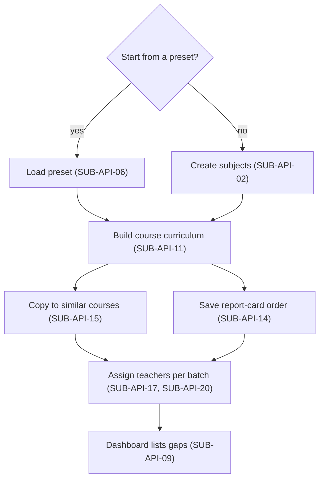
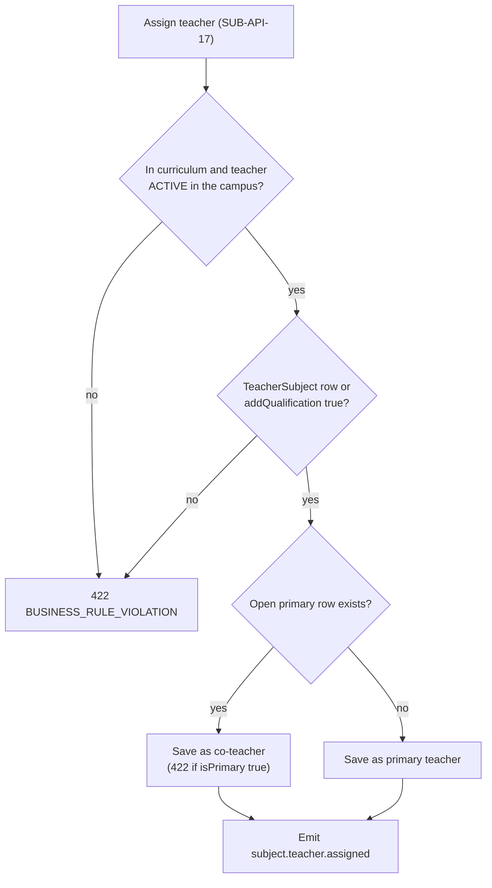
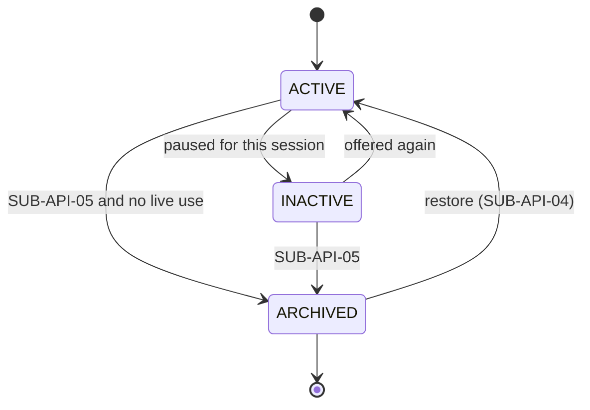
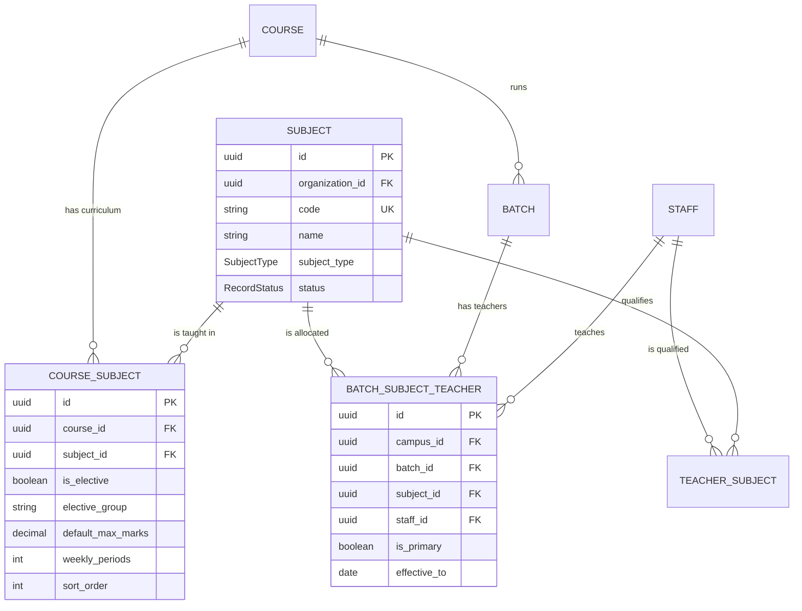

# Subjects Module

**In simple words:** This chapter explains how EduFlow stores what is taught. The subject master holds one row per subject for the whole organization. The curriculum says which subjects Class 10 or JEE Main 2028 teaches, with electives, marks and weekly periods, and the allocation says who teaches each subject in each batch. Timetable, homework, exams and report cards all read these three tables.

| Item | Value |
|---|---|
| Module code | SUB |
| Release phase | Phase 1 (MVP), sprint week 3, Day 15 to 21, prompt P-14 |
| Plans | Starter, Growth, Pro, Enterprise (export and copy tools from Growth) |
| Main users | Organization Admin, Principal; Teacher (own subjects, read); Parent and Student (read) |
| Depends on | Organizations, Multi Campus, Batch (courses and batches), Teachers, Settings |
| Main tables | `subjects`, `course_subjects`, `batch_subject_teachers` |

## Objective

1. **Set-up in minutes.** Bright Future Public School loads its CBSE subjects for Class 1 to 12 in under 3 minutes; Sharma Classes loads JEE and NEET in under 1 minute.
2. **One name everywhere.** "Mathematics" exists once per organization, with one code and one colour.
3. **No uncovered batch subject.** Target: zero batch subjects without a teacher on the first day of the session.
4. **Exams get their numbers from here.** Marks defaults, `includeInTotal` and `sortOrder` are set once and copied into every exam paper.
5. **Electives are safe.** Aarav Sharma picks exactly one second language out of two.
6. **History never breaks.** A subject is archived, not deleted, so old report cards still print "Sanskrit".

## Scope

### In scope

- Subject master: name, code, type (`THEORY`, `PRACTICAL`, `LANGUAGE`, `CO_CURRICULAR`, `TEST_SERIES`), description, colour, status.
- Bulk create from presets: CBSE, ICSE, State Board, JEE, NEET and Foundation sets (SUB-BR-04).
- Curriculum per course (`CourseSubject`): elective groups with choice limits, additional subjects, marks defaults, weekly periods, credit hours, order and `includeInTotal` (co-scholastic subjects graded but kept out of the percentage).
- Copy a curriculum; reorder with up and down arrows.
- Teacher allocation per batch (`BatchSubjectTeacher`): primary teacher, co-teachers, effective dates, bulk replace.
- Read views for other modules, teachers, parents and students; archive with a usage check; Excel export; dashboard summary.

### Out of scope

| Not in this module | Where it lives or why |
|---|---|
| Courses, batches, enrollment | *Batch Module* |
| Storing the student's elective choice | `Enrollment.electiveSubjectIds`, written by *Batch Module*; this module supplies the validator (SUB-BR-09) |
| Teacher qualifications (`teacher_subjects`) | *Teachers Module* (TCH-API-08); SUB-API-17 may add one row |
| Weekly grid, clashes, substitutions | *Timetable Module* |
| Exam papers, marks, best-of-five | *Exams Module* and *Report Cards Module* |
| Chapter tables, lesson plans | Not built; see SUB-BR-19 |
| Fee per elective subject | *Fees Module*; fee heads point at courses in Phase 1 |

### Phase notes

| Phase | What ships | Why |
|---|---|---|
| Phase 1, week 3 (P-14) | SUB-API-01 to SUB-API-15; screens SUB-S01, S02, S03, S05, S08 | Attendance, batch page and fee screens need subjects in week 5 |
| Phase 1, week 4 (P-17, Day 27) | SUB-API-16 to SUB-API-20; screens SUB-S04, S06 | Teachers exist only after P-17; one assignment service serves both modules |
| Phase 1, week 7 (P-30) | SUB-API-21 | Ships with the Parent Portal |
| Phase 2 | SUB-API-22; period budget read from real timetable slots | Student Portal and Timetable are Phase 2 |

> **Founder note:** Build this module before Admissions. It takes about one day, and without it every module invents its own subject list.

## User Stories

| ID | As a | I want to | So that | Priority |
|---|---|---|---|---|
| SUB-US-01 | Organization Admin | load the CBSE subject list in one click | I do not type 40 subjects on day one | Must |
| SUB-US-02 | Organization Admin | add a subject with code, type and colour | timetable and mark sheet show it right | Must |
| SUB-US-03 | Principal | set the subjects of Class 10 in report-card order | every mark sheet lists them the same way | Must |
| SUB-US-04 | Principal | set marks and weekly periods per subject once | exams and timetable reuse them | Must |
| SUB-US-05 | Principal | make Sanskrit and French one group with one choice | each student picks exactly one | Must |
| SUB-US-06 | Principal | keep Art and PE out of the percentage | the total stays 600 and grades still print | Must |
| SUB-US-07 | Principal | copy Class 10 into Class 9 and edit two rows | 12 classes take 15 minutes | Should |
| SUB-US-08 | Principal | assign a teacher per subject per batch in one grid | no class is left without a teacher | Must |
| SUB-US-09 | Principal | add a lab assistant as co-teacher | both see the batch | Should |
| SUB-US-10 | Principal | see batch subjects without a teacher | I fix gaps before the session | Must |
| SUB-US-11 | Centre head | create a `TEST_SERIES` subject for Sunday mocks | mocks get marks without a timetable cell | Should |
| SUB-US-12 | Teacher | see my subjects and batches on my phone | I need not call the office | Must |
| SUB-US-13 | Parent | see my child's subjects, teachers and elective | I know whom to contact | Must |
| SUB-US-14 | Organization Admin | archive a subject we dropped | old report cards still print it | Must |
| SUB-US-15 | Organization Admin | export curriculum and allocation to Excel | I can share the academic plan | Could |

## Workflow

**Figure: Subject set-up for a new organization**



The flow runs from general to specific: subject, then subject in a course, then teacher in a batch. Each step is its own table, so one subject row is reused everywhere.

Step by step, for Bright Future Public School in March 2027:

1. Rajesh Sharma loads "CBSE Class 9 to 10" and "CBSE Class 1 to 5": 14 subjects (SUB-BR-04). He renames "Social Science" to "Social Studies" once.
2. Dr. Anita Verma adds to Class 10: English, Hindi, Science, Mathematics, Social Studies, group `LANG2` (Sanskrit, French), Computer Applications as additional, and Physical Education and Art Education with `includeInTotal = false`.
3. She sets 100/33 marks on the seven scoring rows and 50/17 on Computer Applications. Weekly periods: 6, 5, 7, 6, 6, 4, 4, 2, 2, 1 in the order above.
4. She copies the list to Class 9 and edits two rows there.
5. She moves Mathematics above Science; SUB-API-14 saves the whole order.
6. In the 10-A grid she picks a teacher per row; Priya Nair gets Mathematics. The dashboard shows "2 batch subjects without a teacher" until she fills them before 1 April 2027.

**Figure: Assigning a teacher to a batch subject**



TCH-API-10 of *Teachers Module* runs the same checks (TCH-BR-06, TCH-BR-07) through the same service. When `addQualification` is true, the transaction first creates the missing `TeacherSubject` row.

**Figure: Subject status lifecycle**



### Subject statuses

| Status | Meaning | What is allowed | How it changes |
|---|---|---|---|
| `ACTIVE` | Taught now | Everywhere | SUB-API-04 or SUB-API-05 |
| `INACTIVE` | Not offered this session | Hidden from new dropdowns; existing rows and marks keep working | SUB-API-04 |
| `ARCHIVED` | Retired | Read only; blocked in create calls; old records still print the name | SUB-API-04 with `status: ACTIVE` restores it |

> **Warning:** The unique key `(organization_id, code)` also covers archived rows, so a code is never free again. Correct a wrong row; do not archive it and retype the code.

## Screens and Wireframes

| ID | Screen | Users | Purpose |
|---|---|---|---|
| SUB-S01 | Subject Master | Organization Admin, Principal | List, search and filter subjects; open the preset loader |
| SUB-S02 | Subject Form (side drawer) | Organization Admin, Principal | Create or edit one subject; archive and restore |
| SUB-S03 | Course Curriculum | Principal, Organization Admin | Build the subject list of one course with marks, periods, electives and order |
| SUB-S04 | Teacher Allocation Grid | Principal, Organization Admin | One row per subject of a batch, one teacher per row, gaps in red |
| SUB-S05 | Preset Loader | Organization Admin | Pick a ready subject set and preview what will be created |
| SUB-S06 | My Subjects (mobile) | Teacher | Own subjects and batches on a phone |
| SUB-S07 | Child's Subjects (mobile) | Parent, Student | Subjects with teacher names and the chosen elective |
| SUB-S08 | Subjects Card on the academic dashboard | Principal, Organization Admin | Counts by type and the list of uncovered batch subjects |

**Screen SUB-S01 — Subject Master (Organization Admin, web)**

```text
+--------------------------------------------------------------------------+
| EduFlow | Bright Future Public School    2027-28   [Search]    (RS) v    |
+------------+-------------------------------------------------------------+
| Dashboard  | Academics > Subjects                                        |
| Students   +-------------------------------------------------------------+
| Attendance | Type [All v]  Status [Active v]  [Search subject...    ]    |
| Academics< |                    [Load Preset]  [Export]  [+ New Subject] |
|  Courses   +-------------------------------------------------------------+
|  Batches   | Code  Name             Type        Courses  Teachers  Status|
|  Subjects  |---------------------------------------------------------    |
|  Timetable | MATH  Mathematics      Theory         12        9    Active |
| Fees       | SCI   Science          Theory          5        6    Active |
| Exams      | ENG   English          Language       12       11    Active |
| Settings   | HIN   Hindi            Language       10        7    Active |
|            | SST   Social Studies   Theory          7        5    Active |
|            | SAN   Sanskrit         Language        2        1    Active |
|            | FRE   French           Language        2        1    Active |
|            | CS    Comp. Applicat.  Practical       4        2    Active |
|            | PE    Physical Educat. Co-curr.       12        3    Active |
|            | GK    General Knowl.   Theory          0        0   Archived|
|            |---------------------------------------------------------    |
|            | 14 subjects        Rows [20 v]        < 1 2 >               |
+------------+-------------------------------------------------------------+
```

- `Courses` counts `course_subjects` rows; `Teachers` counts distinct staff in `batch_subject_teachers`.
- `[+ New Subject]` opens SUB-S02, `[Load Preset]` opens SUB-S05, `[Export]` queues SUB-API-08.
- Calls SUB-API-01 on load and on each filter change (debounce 300 ms).

**Screen SUB-S03 — Course Curriculum for Class 10 (Principal, web)**

```text
+--------------------------------------------------------------------------+
| EduFlow | Bright Future Public School    2027-28   [Search]    (AV) v    |
+------------+-------------------------------------------------------------+
| Academics< | Courses > Class 10 (CBSE) > Curriculum                      |
|  Courses   |            [Copy from course]  [Reorder]  [+ Add Subject]   |
|  Batches   +-------------------------------------------------------------+
|  Subjects  | # Subject        Elect.  Max  Pass  Per/wk  InTotal  Action |
|  Timetable |----------------------------------------------------------   |
| Fees       | 1 English         -      100   33     6      [x]     [edit] |
| Exams      | 2 Hindi           -      100   33     5      [x]     [edit] |
| Reports    | 3 Mathematics     -      100   33     6      [x]     [edit] |
| Settings   | 4 Science         -      100   33     7      [x]     [edit] |
|            | 5 Social Studies  -      100   33     6      [x]     [edit] |
|            | 6 Sanskrit       LANG2   100   33     4      [x]     [edit] |
|            | 7 French         LANG2   100   33     4      [x]     [edit] |
|            | 8 Comp. Applic.  add-on   50   17     2      [ ]     [edit] |
|            | 9 Phys. Educat.   -       --   --     2      [ ]     [edit] |
|            |----------------------------------------------------------   |
|            | Group LANG2: choose min 1, max 1        [Edit group rules]  |
|            | Marks total in report card: 600    Periods/week: 39 of 48   |
+------------+-------------------------------------------------------------+
```

- `#` is `sortOrder`, the mark-sheet order; `[Reorder]` shows up and down arrows.
- `Elect.` shows the group code, `add-on` for `isAdditional`, `-` for compulsory.
- The footer follows SUB-BR-06 and SUB-BR-07; it also counts row 10 (Art Education) below the fold.
- Calls SUB-API-10, SUB-API-11, SUB-API-12, SUB-API-14 and SUB-API-15.

**Screen SUB-S04 — Teacher Allocation Grid for batch 10-A (Principal, web)**

```text
+--------------------------------------------------------------------------+
| EduFlow | Bright Future Public School    2027-28   [Search]    (AV) v    |
+------------+-------------------------------------------------------------+
| Academics< | Batches > 10-A (Class 10, Main Campus) > Subject Teachers   |
|  Courses   | Batch [10-A v]   Copy from [10-B v]   [Save All]            |
|  Batches   +-------------------------------------------------------------+
|  Subjects  | Subject         Primary teacher      Co-teacher      Load   |
|  Timetable |----------------------------------------------------------   |
| Fees       | English         [R. Menon      v]    [None      v]   22/30  |
| Exams      | Hindi           [S. Tripathi   v]    [None      v]   19/30  |
| Reports    | Mathematics     [Priya Nair    v]    [None      v]   17/30  |
| Settings   | Science         [K. Das        v]    [A. Yadav  v]   26/30  |
|            | Social Studies  [-- select --  v]    [None      v]    --    |
|            | Sanskrit        [S. Tripathi   v]    [None      v]   19/30  |
|            | Comp. Applic.   [-- select --  v]    [None      v]    --    |
|            | Phys. Educat.   [M. Khan       v]    [None      v]   12/30  |
|            |----------------------------------------------------------   |
|            | ! 2 subjects have no teacher. Save is allowed.              |
|            | Dropdown shows qualified teachers of Main Campus first.     |
+------------+-------------------------------------------------------------+
```

- One row per curriculum row of the batch's course.
- `Load` is weekly periods against the setting `teachers.max_periods_per_week`, default 30 (SUB-BR-11).
- `Copy from` fills the dropdowns from another batch of the course without saving.
- Calls SUB-API-16 and SUB-API-10 on load, SUB-API-17 per cell, SUB-API-20 on `[Save All]`, SUB-API-19 when a cell is cleared.

**Screen SUB-S05 — Preset Loader (Organization Admin, web)**

```text
+--------------------------------------------------------------------------+
| Load a ready subject list                                          [x]   |
+--------------------------------------------------------------------------+
| Board / stream [CBSE v]     Preset [Class 9 to 10 v]                     |
|                                                                          |
| This preset creates 10 subjects. 3 already exist and will be skipped.    |
|                                                                          |
| [x] MATH  Mathematics        Theory        new                           |
| [x] SCI   Science            Theory        new                           |
| [ ] ENG   English            Language      exists - skipped              |
| [ ] HIN   Hindi              Language      exists - skipped              |
| [x] SST   Social Science     Theory        new                           |
| [x] SAN   Sanskrit           Language      new                           |
| [x] FRE   French             Language      new                           |
| [x] CS    Computer Applic.   Practical     new                           |
| [ ] PE    Physical Education Co-curricular exists - skipped              |
| [x] ART   Art Education      Co-curricular new                           |
|                                                                          |
| [ ] Also add these subjects to course [Class 10 v] with 100 / 33 marks   |
|                                                                          |
|                                        [Cancel]   [Create 7 subjects]    |
+--------------------------------------------------------------------------+
```

- Existing codes show `exists - skipped` with a disabled checkbox; nothing is overwritten.
- The last checkbox sends `addToCourse`, so subjects and curriculum rows are created in one transaction.
- Calls SUB-API-01 for the "exists" check and SUB-API-06 on `[Create]`.

**Screen SUB-S07 — Child's Subjects (Parent, mobile)**

```text
+------------------------------------+
| < Aarav Sharma       10-A   (SD) v |
+------------------------------------+
| Subjects        2027-28            |
+------------------------------------+
| English                            |
| R. Menon          Mon Wed Fri      |
+------------------------------------+
| Hindi                              |
| S. Tripathi       Tue Thu          |
+------------------------------------+
| Mathematics                        |
| Priya Nair        Daily            |
+------------------------------------+
| Science  (theory + lab)            |
| K. Das, A. Yadav  Mon Tue Thu      |
+------------------------------------+
| Social Studies                     |
| Teacher not assigned yet           |
+------------------------------------+
| Sanskrit        [Your choice]      |
| S. Tripathi       Wed Fri          |
+------------------------------------+
| Computer Applications  [Extra]     |
| Not counted in the total           |
+------------------------------------+
| [ Message class teacher ]          |
+------------------------------------+
```

- Cards follow `sortOrder`, so app and mark sheet match. `[Your choice]` marks the picked elective; `[Extra]` an additional subject.
- Day names come from *Timetable Module* in Phase 2; in Phase 1 the line shows the subject type.
- Calls SUB-API-21; the Student Portal uses the same shape from SUB-API-22.

### Screens without a wireframe

| ID | Screen | Note |
|---|---|---|
| SUB-S02 | Subject Form drawer | Name, code, type, description, colour, status; "Used in 12 courses, 9 batches"; archive with usage result |
| SUB-S06 | My Subjects (teacher, mobile) | Own batch-subject pairs from SUB-API-16; each opens the batch roster |
| SUB-S08 | Dashboard card | Counts by type and a red "without a teacher" count linking to SUB-S04 (SUB-API-09) |

## UI Components

| Component | Type | Behaviour |
|---|---|---|
| `SubjectTable` | shadcn/ui `DataTable` | Server paging; filters kept in the URL. Empty: "No subjects yet. Load a preset or add your first subject." |
| `SubjectTypeBadge` | `Badge` | One fixed colour per type; the label is translated |
| `SubjectColorPicker` | `Popover` + swatches | 16 accessible colours plus a `#rrggbb` field |
| `CurriculumRows` | List with up and down buttons | No drag-and-drop package (Blueprint P-14); each move calls SUB-API-14; Alt plus arrow keys |
| `ElectiveGroupDialog` | `Dialog` + `Form` | Sets limits on all rows of a group |
| `MarksCell` | Inline `Input` | 2 decimals, saves on blur, shows "33 of 100 = 33%" |
| `TeacherSelect` | `Combobox` | Qualified campus teachers first, then others marked "not qualified" |
| `LoadChip` | `Badge` | Neutral below 90%, amber from 90%, red above the cap |
| `UncoveredAlert` | `Alert` | "2 subjects have no teacher", never blocks saving |
| `ArchiveDialog` | `AlertDialog` | Shows the usage result; a red list blocks the archive |
| States | Skeleton, empty, error | 6-row skeleton; error state with `[Retry]` through TanStack Query |

## Validation Rules

| Field | Rule | Error message shown to user |
|---|---|---|
| `Subject.name` | 2 to 100 characters; unique among live rows, ignoring case | "A subject called Mathematics already exists." |
| `Subject.code` | Trimmed, upper-cased, `^[A-Z0-9-]{2,30}$` | "Use 2 to 30 letters, digits or hyphens, for example MATH-1." |
| `Subject.code` unique | Unique per organization, archived rows included | "Code MATH is already used. Codes cannot be reused." |
| `Subject.subjectType` | One of the five `SubjectType` values | "Choose a subject type." |
| `Subject.color` | `#` plus 6 hex characters | "Use a colour like #2563eb." |
| Archive | No live use (SUB-BR-05) | "Sanskrit is used in 4 timetable periods and 1 exam paper. Remove those first." |
| `CourseSubject.subjectId` | `ACTIVE` subject | "This subject is archived. Restore it before adding it to a course." |
| `CourseSubject` duplicate | One row per course and subject | "Mathematics is already in the Class 10 curriculum." |
| `defaultMaxMarks` | Empty, or 1 to 9999.99 | "Maximum marks must be between 1 and 9999.99." |
| `defaultPassMarks` | Empty, or 0 to max marks | "Pass marks (40) cannot be higher than maximum marks (30)." |
| `weeklyPeriods` | Empty, or 0 to 40 | "Weekly periods must be between 0 and 40." |
| `creditHours` | Empty, or 0.5 to 99.9 | "Credit hours must be between 0.5 and 99.9." |
| `electiveGroup` | 2 to 40 characters, upper case; only with `isElective` | "Tick 'Elective' before you enter a group name." |
| Group limits | SUB-BR-08 | "Group LANG2 has 2 subjects, so the minimum cannot be 3." |
| `isAdditional` | Not with `isElective` | "A subject can be an elective or an additional subject, not both." |
| Reorder list | Every row of the course exactly once | "Send the complete subject list of this course when you reorder." |
| `CourseSubject` delete | No exam paper, timetable cell or elective choice uses it | "3 students chose Sanskrit in 2027-28. Change their choice first." |
| `batchId` | Not `CANCELLED` | "This batch is cancelled. Pick another batch." |
| `subjectId` in a batch | In the course curriculum | "Sanskrit is not part of the Class 10 curriculum." |
| `staffId` | `ACTIVE` in the batch campus (Org Admin may cross campuses) | "Priya Nair is not active in Main Campus." |
| Qualification | `TeacherSubject` row or `addQualification: true` | "Priya Nair is not listed for Sanskrit. Tick 'add to her subjects' to continue." |
| Duplicate assignment | One row per batch, subject and teacher | "Priya Nair is already assigned to Mathematics in 10-A." |
| Second primary | SUB-BR-12 | "Mathematics in 10-A already has a main teacher. Save this one as co-teacher." |
| Effective dates | Inside the academic year; end not before start | "The end date must be on or after the start date." |
| Bulk size | 1 to 60 rows | "Create at most 60 subjects in one go." |

## Business Rules

**SUB-BR-01 — One subject list per organization.** `subjects` has no `campus_id`. Both campuses of Bright Future Public School share one "Mathematics". Campus differences live in courses (`Course.campusId`) and batches, never in the subject row.

**SUB-BR-02 — Codes are permanent.** The code is trimmed and upper-cased before save. `@@unique([organizationId, code])` also covers archived rows, so a duplicate returns `409 CONFLICT`. The code is editable until the first `ExamMark` uses the subject, then read only, because printed mark sheets carry it.

**SUB-BR-03 — Names are unique among live rows.** The service compares `lower(name)` among rows that are not `ARCHIVED`. An archived "General Knowledge" does not block a new one with a new code.

**SUB-BR-04 — Presets are idempotent.** Presets are versioned JSON files in `server/src/modules/subjects/presets/`. SUB-API-06 inserts with `ON CONFLICT (organization_id, code) DO NOTHING` and returns the ids of both new and existing codes.

| Preset | Codes it creates |
|---|---|
| CBSE Class 1 to 5 | ENG, HIN, MATH, EVS, GK, ART, PE, MUS, VED |
| CBSE Class 6 to 8 | ENG, HIN, MATH, SCI, SST, SAN, CS, ART, PE |
| CBSE Class 9 to 10 | MATH, SCI, ENG, HIN, SST, SAN, FRE, CS, PE, ART |
| CBSE Class 11 to 12 Science / Commerce / Arts | ENG, PHY, CHEM, MATH, BIO, CS, PE / ENG, ACC, BST, ECO, MATH, IP, PE / ENG, HIST, POL, GEO, ECO, PSY, PE |
| ICSE Class 9 to 10 | ENG, HIN, MATH, PHY, CHEM, BIO, HCG, CS, PE |
| State Board general | ENG, REG, MATH, SCI, SST, PE |
| JEE Main, JEE Advanced | PHY, CHEM, MATH, TS-JEE |
| NEET | PHY, CHEM, BIO, TS-NEET |
| Foundation (Class 8 to 10) | PHY, CHEM, MATH, BIO, MAT, TS-FND |

> **Example:** Bright Future loads "CBSE Class 9 to 10" (10 new), then "CBSE Class 1 to 5". ENG, HIN, MATH, ART and PE exist, so only EVS, GK, MUS and VED are added: 14 subjects in total. Sharma Classes loads "JEE Main" (4 new), then "NEET": PHY and CHEM are skipped, BIO and TS-NEET are added, 6 in total.

**SUB-BR-05 — Archive, never delete.** SUB-API-05 sets `status = ARCHIVED` and `deletedAt = now()`. It is refused with `422` while a live use exists: a `TimetableEntry` of a year that is not `CLOSED`, a `SCHEDULED` `ClassSession` after today, or an `ExamSchedule` whose exam is `DRAFT`, `SCHEDULED`, `ONGOING` or `MARKS_ENTRY`. Curriculum rows and past marks do not block it. Joins from marks, registers and report cards ignore `deletedAt` for subjects, so old names still print. Restore (SUB-API-04 with `status: ACTIVE`) clears `deletedAt`.

**SUB-BR-06 — Report-card total.** Exams copy these defaults into `ExamSchedule.maxMarks` and `passMarks` when a paper is created. Later edits here never change an existing paper.

```text
total = SUM(defaultMaxMarks) of rows with includeInTotal = true,
          isElective = false, isAdditional = false
      + for each elective group:
          electiveGroupMaxChoices x MAX(defaultMaxMarks in the group)
Class 10: 5 x 100 + (1 x 100) = 600
Computer Applications (additional), PE and Art (not in total) add 0
```

**SUB-BR-07 — Weekly period budget.** Subjects of one elective group run in the same slot for different students (`TimetableEntry.groupLabel`). So a group costs its longest subject once per allowed choice.

```text
need = SUM(weeklyPeriods) of rows with isElective = false
     + for each group: maxChoices x MAX(weeklyPeriods in the group)
Class 10: (6+5+6+7+6+2+2+1) + 1 x 4 = 35 + 4 = 39
budget = setting subjects.weekly_period_budget, default 48
         (8 periods x 6 days); teaching period slots once Timetable is live
```

Above the budget the footer turns amber. It never blocks a save.

**SUB-BR-08 — Elective groups are saved together.** All rows of a group share `isElective = true`, the group code, and the same minimum and maximum. SUB-API-12 with new limits on one row updates every row of the group in one transaction. The limits must satisfy `0 <= min <= max <= rows in group`.

**SUB-BR-09 — Elective choice check.** The service exports `validateElectiveChoice(courseId, subjectIds)`. BAT-API-29 and BAT-API-30 of *Batch Module* call it. Every id must be an elective row of the course, and each group's count must lie between its limits. Electives without a group have no count limit.

> **Example:** LANG2 has minimum 1 and maximum 1. Aarav Sharma with `[SAN]` passes. `[SAN, FRE]` fails with "Choose at most 1 subject from LANG2." An empty list fails with "Choose at least 1 subject from LANG2."

**SUB-BR-10 — Additional subject.** `isAdditional` and `isElective` are never both true. When `isAdditional` is set and `includeInTotal` is not sent, the service stores `includeInTotal = false`. *Report Cards Module* reads the flag for its best-of-five rule.

**SUB-BR-11 — Teacher load is a warning.** Load follows TCH-BR-09: the sum of `weeklyPeriods` over the teacher's open rows, co-teacher rows included. Priya Nair has 10-A Mathematics 6 + 10-B Mathematics 6 + 9-A Mathematics 5 = 17 of 30. The chip is amber from 27 (90%) and red above 30. It never blocks.

**SUB-BR-12 — One primary per batch and subject.** At most one open row per batch and subject has `isPrimary = true` (TCH-BR-07). Without `isPrimary`, the first teacher becomes primary and later ones co-teachers. The service locks the batch row (`SELECT ... FOR UPDATE`) before the check, so parallel requests cannot both win.

**SUB-BR-13 — Campus comes from the batch.** `BatchSubjectTeacher.campusId` is copied from `Batch.campusId`, never from the body. A Principal assigns only in batches of own campuses.

**SUB-BR-14 — Remove or end.** SUB-API-19 deletes the row when `effectiveFrom` is after today or the batch is `PLANNED`. Otherwise it sets `effectiveTo` to today and answers `ended: true`, so registers and marks still show who taught.

**SUB-BR-15 — Bulk replace is a diff.** SUB-API-20 compares the payload with the open rows of the batch. New pairs are created, changed flags or dates are updated, and missing pairs follow SUB-BR-14. All of it runs in one transaction.

> **Example:** 10-A has 7 open rows. The payload adds R. Menon for Social Studies and moves Hindi from S. Tripathi to A. Pandey. Result: 2 created, 1 ended, 6 unchanged; two `subject.teacher.assigned` events and one `subject.teacher.unassigned`.

**SUB-BR-16 — Copy curriculum.** SUB-API-15 copies source rows whose subject is `ACTIVE` and not yet in the target. Marks, periods, elective rules and order come along, placed after the target's last row. The source is never changed.

**SUB-BR-17 — Reorder writes 1 to N.** The payload lists every row of the course once. The server writes `sortOrder` 1 to N in that order, with no gaps. A new row gets last plus 1.

**SUB-BR-18 — Closed session.** Writes to `batch_subject_teachers` of a batch whose academic year is `CLOSED` return `422`. Curriculum rows are not tied to a year.

**SUB-BR-19 — Syllabus without a new table.** The schema has no chapter table, and Phase 1 adds none. Four existing fields carry the syllabus:

| Need | Field | Owner |
|---|---|---|
| One-line scope | `Subject.description` | This module |
| Board syllabus PDF | `StudyMaterial` with `materialType = SYLLABUS` | *Homework Module* |
| Chapter taught in a lecture | `ClassSession.topic` | *Timetable Module* |
| Exam portion | `ExamSchedule.syllabus` | *Exams Module* |

A structured chapter list with progress tracking is a Phase 3 candidate, decided after pilot feedback.

**SUB-BR-20 — Plan gating.** Every plan gets the full module except SUB-API-08 (export) and SUB-API-15 (copy). On Starter these return `403 PLAN_LIMIT_REACHED`. No plan limits the number of subjects.

## Acceptance Criteria

| ID | Given | When | Then |
|---|---|---|---|
| SUB-AC-01 | Bright Future has no subjects | Rajesh loads "CBSE Class 9 to 10" | `201`, 10 rows in one transaction, one `subject.created` event with 10 ids |
| SUB-AC-02 | That preset was loaded once | the same call runs again | `200`, `created: 0`, `skipped: 10`, the same 10 ids |
| SUB-AC-03 | `MATH` exists, even archived | a user creates code `math ` | `409 CONFLICT`, "Code MATH is already used. Codes cannot be reused." |
| SUB-AC-04 | Sanskrit has 4 timetable cells and 1 open exam paper | Rajesh archives it | `422`, the dialog lists both uses, status stays `ACTIVE` |
| SUB-AC-05 | Class 10 is set up as on SUB-S03 | the curriculum loads | footer shows total 600 and periods 39 of 48 |
| SUB-AC-06 | LANG2 allows exactly 1 choice | Aarav is enrolled with Sanskrit and French | BAT-API-29 returns `422`, "Choose at most 1 subject from LANG2." |
| SUB-AC-07 | LANG2 has 2 rows | Dr. Anita Verma sets the minimum to 3 | `400`, "Group LANG2 has 2 subjects, so the minimum cannot be 3." |
| SUB-AC-08 | Class 9 has no curriculum | she copies Class 10 into it | 10 rows in Class 9; Class 10 rows keep their `updatedAt` |
| SUB-AC-09 | Class 10 has 10 rows | she moves Mathematics above Science | `sortOrder` is 1 to 10 without gaps; SUB-API-10 returns the new order |
| SUB-AC-10 | Priya Nair has no Sanskrit qualification | she is assigned Sanskrit in 10-A without `addQualification` | `422`, "Priya Nair is not listed for Sanskrit..." |
| SUB-AC-11 | Priya Nair is primary for 10-A Mathematics | another teacher is sent with `isPrimary: true` | `422`, "Mathematics in 10-A already has a main teacher..." |
| SUB-AC-12 | Priya Nair teaches 10-A since 1 Apr 2027 | the row is removed on 10 Aug 2027 | row kept with `effectiveTo` 2027-08-10, `ended: true`; 10-A leaves her lookup from 11 Aug |
| SUB-AC-13 | 10-A has 2 subjects without a teacher | the academic dashboard loads | SUB-API-09 returns `uncoveredCount: 2` with both names |
| SUB-AC-14 | Sunita Devi is Aarav's parent | she calls SUB-API-21 with another child's id | `404 NOT_FOUND` |
| SUB-AC-15 | A subject id of Sharma Classes | a Bright Future user reads it | `404 NOT_FOUND` |
| SUB-AC-16 | The organization is on Starter | the Admin exports the curriculum | `403 PLAN_LIMIT_REACHED` |

## Edge Cases

| Case | What happens | How the system handles it |
|---|---|---|
| Two admins load the same preset in the same second | Both inserts race | `ON CONFLICT DO NOTHING`; both calls return the same ids |
| A subject is renamed mid-year | Every screen shows the new name | Report card PDFs already generated keep the old name, because they are files |
| LANG2 maximum drops from 2 to 1 while 3 students chose 2 | Choices would break the rule | `422` listing the 3 students; fix their choices in *Batch Module* first |
| A teacher resigns | Her open rows end on her last working day (*Teachers Module*) | SUB-S04 shows the cell empty; the dashboard gap count rises |
| Priya Nair goes on 3-month leave | A stand-in is needed | End her row with `effectiveTo`, add the stand-in with `effectiveFrom`; history stays intact |
| `TEST_SERIES` subject with no `weeklyPeriods` | It has no timetable cell | Counted as 0 in the budget; offered in exam dropdowns |
| Code typo `MATHS` found after marks exist | The code is locked (SUB-BR-02) | Keep the code, fix the name; codes are internal |
| Copy into a course of another board | Some subjects do not fit | Allowed; the response lists copied and skipped rows with reasons |
| Parent with two children in different courses | Two subject lists | SUB-API-21 is called once per `studentId`; the app shows a child switcher |

## Database Schema

| Table | Purpose |
|---|---|
| `subjects` | Subject master of the organization |
| `course_subjects` | Curriculum: which subject a course teaches, with elective rules and marks defaults |
| `batch_subject_teachers` | Which teacher teaches which subject in which batch, with dates |

The module reads `courses`, `batches` and `enrollments` (*Batch Module*) and `teacher_subjects` and `staff` (*Teachers Module*). It writes a `teacher_subjects` row only through `addQualification` on SUB-API-17.

### Table subjects

| Column | Type | Null | Default | Notes |
|---|---|---|---|---|
| `id` | uuid | No | `uuid()` | PK |
| `organization_id` | uuid | No | | FK `organizations`, on delete RESTRICT |
| `name` | varchar(100) | No | | Display name |
| `code` | varchar(30) | No | | Upper case; unique per organization forever |
| `subject_type` | `SubjectType` | No | `THEORY` | Five values, see the enum |
| `description` | varchar(500) | Yes | | One-line scope (SUB-BR-19) |
| `color` | varchar(7) | Yes | | `#rrggbb` for the timetable grid |
| `status` | `RecordStatus` | No | `ACTIVE` | See the status table |
| `created_at`, `updated_at` | timestamptz | No | `now()` (created only) | `updated_at` set by Prisma |
| `deleted_at` | timestamptz | Yes | | Set on archive |

Indexes: unique `(organization_id, code)`; `(organization_id, status, name)` for the list and lookup.

### Table course_subjects

| Column | Type | Null | Default | Notes |
|---|---|---|---|---|
| `id` | uuid | No | `uuid()` | PK |
| `organization_id` | uuid | No | | FK `organizations`, on delete CASCADE |
| `course_id` | uuid | No | | FK `courses`, on delete CASCADE |
| `subject_id` | uuid | No | | FK `subjects`, on delete RESTRICT |
| `is_elective` | boolean | No | `false` | Student chooses it at enrollment |
| `elective_group` | varchar(40) | Yes | | For example `LANG2` |
| `elective_group_min_choices` | smallint | Yes | | Same on every row of the group |
| `elective_group_max_choices` | smallint | Yes | | Same on every row of the group |
| `include_in_total` | boolean | No | `true` | `false` = graded only |
| `is_additional` | boolean | No | `false` | Optional sixth subject |
| `default_max_marks` | decimal(6,2) | Yes | | Copied into exam papers |
| `default_pass_marks` | decimal(6,2) | Yes | | Not above max marks |
| `weekly_periods` | smallint | Yes | | Timetable target |
| `credit_hours` | decimal(4,1) | Yes | | Colleges |
| `sort_order` | integer | No | `0` | Report-card order, 1 to N |
| `created_at`, `updated_at` | timestamptz | No | `now()` (created only) | `updated_at` set by Prisma |

Indexes: unique `(organization_id, course_id, subject_id)`; `(organization_id, subject_id)` for usage counts. There is no `deleted_at`: SUB-API-13 is a real delete, guarded by the usage check.

### Table batch_subject_teachers

| Column | Type | Null | Default | Notes |
|---|---|---|---|---|
| `id` | uuid | No | `uuid()` | PK |
| `organization_id` | uuid | No | | FK `organizations`, on delete CASCADE |
| `campus_id` | uuid | No | | FK `campuses`; copied from the batch |
| `batch_id` | uuid | No | | FK `batches`, on delete CASCADE |
| `subject_id` | uuid | No | | FK `subjects`, on delete RESTRICT |
| `staff_id` | uuid | No | | FK `staff`, on delete RESTRICT |
| `is_primary` | boolean | No | `true` | `false` = co-teacher |
| `effective_from` | date | Yes | | Null = from the batch start |
| `effective_to` | date | Yes | | Null = open |
| `created_at`, `updated_at` | timestamptz | No | `now()` (created only) | `updated_at` set by Prisma |

Indexes: unique `(organization_id, batch_id, subject_id, staff_id)`; `(organization_id, staff_id)` for the teacher scope; `(organization_id, campus_id, batch_id)` for the grid. The one-primary rule (SUB-BR-12) lives in the service, because it depends on dates.

All three tables get the PostgreSQL RLS policy `organization_id = current_setting('app.current_org')::uuid`, like every tenant table.

**Figure: Subjects module tables and their neighbours**



A course picks subjects through `COURSE_SUBJECT`; its batches get teachers through `BATCH_SUBJECT_TEACHER`. The assignment check reads `TEACHER_SUBJECT`.

## Prisma Schema

Copied from `docs/src/_schema/03-academics.prisma` (and `RecordStatus` from `00-base.prisma`). Long trailing comments sit on the line above their field so the page does not wrap. Schema changes go through the schema files first.

```prisma
// Generic lifecycle for master data (courses, subjects, rooms, leave types ...).
enum RecordStatus {
  ACTIVE
  INACTIVE
  ARCHIVED
}

enum SubjectType {
  THEORY
  PRACTICAL
  LANGUAGE
  CO_CURRICULAR
  TEST_SERIES
}

// Subject master, e.g. Mathematics, Physics. Shared by all campuses of the organization.
model Subject {
  id             String       @id @default(uuid()) @db.Uuid
  organizationId String       @map("organization_id") @db.Uuid
  name           String       @db.VarChar(100)
  code           String       @db.VarChar(30)
  subjectType    SubjectType  @default(THEORY) @map("subject_type")
  description    String?      @db.VarChar(500)
  color          String?      @db.VarChar(7) // hex colour for the timetable grid
  status         RecordStatus @default(ACTIVE)
  createdAt      DateTime     @default(now()) @map("created_at") @db.Timestamptz(6)
  updatedAt      DateTime     @updatedAt @map("updated_at") @db.Timestamptz(6)
  deletedAt      DateTime?    @map("deleted_at") @db.Timestamptz(6)

  organization  Organization @relation(fields: [organizationId], references: [id], onDelete: Restrict)
  courses       CourseSubject[]
  batchTeachers BatchSubjectTeacher[]
  teachers      TeacherSubject[]
  // Back-relations from other modules, unchanged in the schema file:
  // attendanceSessions, timetableEntries, homework, examSchedules, reportCardRemarks,
  // books, classSessions, studyMaterials, examMarks

  @@unique([organizationId, code])
  @@index([organizationId, status, name])
  @@map("subjects")
}

// Subject taught in a course (curriculum), with elective flag and weekly period count.
model CourseSubject {
  id                      String   @id @default(uuid()) @db.Uuid
  organizationId          String   @map("organization_id") @db.Uuid
  courseId                String   @map("course_id") @db.Uuid
  subjectId               String   @map("subject_id") @db.Uuid
  // students choose electives at enrollment
  isElective              Boolean  @default(false) @map("is_elective")
  // subjects sharing a group are alternatives, e.g. LANG2
  electiveGroup           String?  @map("elective_group") @db.VarChar(40)
  // same value on every row of the group
  electiveGroupMinChoices Int?     @map("elective_group_min_choices") @db.SmallInt
  electiveGroupMaxChoices Int?     @map("elective_group_max_choices") @db.SmallInt
  // false = graded only, left out of percentage and rank
  includeInTotal          Boolean  @default(true) @map("include_in_total")
  // optional 6th subject (best-of-five rules)
  isAdditional            Boolean  @default(false) @map("is_additional")
  defaultMaxMarks         Decimal? @map("default_max_marks") @db.Decimal(6, 2)
  defaultPassMarks        Decimal? @map("default_pass_marks") @db.Decimal(6, 2)
  // target periods per week for the timetable
  weeklyPeriods           Int?     @map("weekly_periods") @db.SmallInt
  creditHours             Decimal? @map("credit_hours") @db.Decimal(4, 1) // colleges
  sortOrder               Int      @default(0) @map("sort_order") // order on report cards
  createdAt               DateTime @default(now()) @map("created_at") @db.Timestamptz(6)
  updatedAt               DateTime @updatedAt @map("updated_at") @db.Timestamptz(6)

  organization Organization @relation(fields: [organizationId], references: [id], onDelete: Cascade)
  course       Course       @relation(fields: [courseId], references: [id], onDelete: Cascade)
  subject      Subject      @relation(fields: [subjectId], references: [id], onDelete: Restrict)

  @@unique([organizationId, courseId, subjectId])
  @@index([organizationId, subjectId])
  @@map("course_subjects")
}

// Which teacher teaches which subject in which batch; drives the TEACHER "own batches" data scope.
model BatchSubjectTeacher {
  id             String    @id @default(uuid()) @db.Uuid
  organizationId String    @map("organization_id") @db.Uuid
  campusId       String    @map("campus_id") @db.Uuid
  batchId        String    @map("batch_id") @db.Uuid
  subjectId      String    @map("subject_id") @db.Uuid
  staffId        String    @map("staff_id") @db.Uuid
  isPrimary      Boolean   @default(true) @map("is_primary") // false = co-teacher / assistant
  effectiveFrom  DateTime? @map("effective_from") @db.Date
  effectiveTo    DateTime? @map("effective_to") @db.Date
  createdAt      DateTime  @default(now()) @map("created_at") @db.Timestamptz(6)
  updatedAt      DateTime  @updatedAt @map("updated_at") @db.Timestamptz(6)

  organization Organization @relation(fields: [organizationId], references: [id], onDelete: Cascade)
  campus       Campus       @relation(fields: [campusId], references: [id], onDelete: Restrict)
  batch        Batch        @relation(fields: [batchId], references: [id], onDelete: Cascade)
  subject      Subject      @relation(fields: [subjectId], references: [id], onDelete: Restrict)
  staff        Staff        @relation(fields: [staffId], references: [id], onDelete: Restrict)

  @@unique([organizationId, batchId, subjectId, staffId])
  @@index([organizationId, staffId])
  @@index([organizationId, campusId, batchId])
  @@map("batch_subject_teachers")
}
```

## API Endpoints

| ID | Method | Path | Permission | Purpose |
|---|---|---|---|---|
| SUB-API-01 | GET | `/subjects` | `subjects.view` | List subjects (type, status, q) |
| SUB-API-02 | POST | `/subjects` | `subjects.create` | Create subject (code, subjectType, color) |
| SUB-API-03 | GET | `/subjects/:id` | `subjects.view` | Subject with courses and teachers using it |
| SUB-API-04 | PATCH | `/subjects/:id` | `subjects.update` | Update subject or status |
| SUB-API-05 | DELETE | `/subjects/:id` | `subjects.delete` | Archive; blocked when used in timetable or exams |
| SUB-API-06 | POST | `/subjects/bulk` | `subjects.create` | Create many subjects (preset list) |
| SUB-API-07 | GET | `/subjects/lookup` | `subjects.view` | Dropdown list by courseId or batchId; Teacher gets own |
| SUB-API-08 | POST | `/subjects/export` | `subjects.export` | Export curriculum and allocation matrix (XLSX) |
| SUB-API-09 | GET | `/subjects/summary` | `subjects.view` | Subjects by type, batch subjects without a teacher |
| SUB-API-10 | GET | `/course-subjects` | `subjects.view` | Curriculum of a course in `sortOrder` |
| SUB-API-11 | POST | `/course-subjects` | `subjects.manage` | Add subject to a course |
| SUB-API-12 | PATCH | `/course-subjects/:id` | `subjects.manage` | Update elective rules, marks defaults, includeInTotal |
| SUB-API-13 | DELETE | `/course-subjects/:id` | `subjects.manage` | Remove from a course; blocked when papers exist |
| SUB-API-14 | POST | `/course-subjects/reorder` | `subjects.manage` | Save report-card order |
| SUB-API-15 | POST | `/course-subjects/copy` | `subjects.manage` | Copy curriculum from another course |
| SUB-API-16 | GET | `/batch-subject-teachers` | `subjects.view` | Allocation by batchId or staffId |
| SUB-API-17 | POST | `/batch-subject-teachers` | `subjects.assign_teachers` | Assign a teacher to a batch subject |
| SUB-API-18 | PATCH | `/batch-subject-teachers/:id` | `subjects.assign_teachers` | Update isPrimary or dates |
| SUB-API-19 | DELETE | `/batch-subject-teachers/:id` | `subjects.assign_teachers` | Remove or end an assignment |
| SUB-API-20 | POST | `/batch-subject-teachers/bulk-replace` | `subjects.assign_teachers` | Replace all rows of one batch |
| SUB-API-21 | GET | `/portal/parent/subjects` | `parentportal.access` | Child's subjects, teachers, chosen electives |
| SUB-API-22 | GET | `/portal/student/subjects` | `studentportal.access` | Own subjects, teachers, chosen electives |

Filters: SUB-API-01 takes `?q=&subjectType=&status=`; SUB-API-07 takes `?courseId=` or `?batchId=` and returns `ACTIVE` subjects only; SUB-API-10 needs `?courseId=`; SUB-API-16 takes `?batchId=` or `?staffId=` plus `?activeOn=2027-08-11`. The static paths `/subjects/bulk`, `/lookup`, `/export` and `/summary` are registered before `/subjects/:id` in the Express 5 router.

### SUB-API-02 — Create a subject

```http
POST /api/v1/subjects
Authorization: Bearer <accessToken>
Content-Type: application/json

{ "name": "French", "code": "fre", "subjectType": "LANGUAGE",
  "description": "Second language, CBSE code 018", "color": "#7c3aed" }
```

```json
{
  "success": true,
  "data": {
    "id": "6c2f1b3d-4e5f-4a6b-8c7d-8e9f0a1b2c3d",
    "name": "French",
    "code": "FRE",
    "subjectType": "LANGUAGE",
    "description": "Second language, CBSE code 018",
    "color": "#7c3aed",
    "status": "ACTIVE",
    "createdAt": "2027-03-08T05:42:11.000Z"
  }
}
```

| Status | Code | When |
|---|---|---|
| 400 | `VALIDATION_ERROR` | Bad code pattern, colour or type |
| 403 | `FORBIDDEN` | No `subjects.create` |
| 409 | `CONFLICT` | Code used before, or a live subject has the same name |

### SUB-API-05 — Archive a subject

```http
DELETE /api/v1/subjects/5b1e0a2c-3d4e-4f5a-9b6c-7d8e9f0a1b2c
Authorization: Bearer <accessToken>
```

```json
{
  "success": false,
  "error": {
    "code": "BUSINESS_RULE_VIOLATION",
    "message": "Sanskrit is used in 4 timetable periods and 1 exam paper. Remove those first.",
    "details": [
      { "field": "timetableEntries", "issue": "4 cells in 10-A, 10-B (2027-28)" },
      { "field": "examSchedules", "issue": "Half Yearly 2027, 10-A, status SCHEDULED" }
    ]
  },
  "requestId": "req_5c1d9e27ab"
}
```

On success the answer is `200` with `{ "id": "...", "status": "ARCHIVED", "deletedAt": "2028-04-02T06:10:00.000Z" }`.

| Status | Code | When |
|---|---|---|
| 403 | `FORBIDDEN` | No `subjects.delete` |
| 404 | `NOT_FOUND` | Not a subject of this organization |
| 422 | `BUSINESS_RULE_VIOLATION` | A live use exists (SUB-BR-05) |

### SUB-API-06 — Create subjects from a preset

Send either `presetKey` with the ticked `codes`, or a `subjects` array of 1 to 60 rows.

```http
POST /api/v1/subjects/bulk
Authorization: Bearer <accessToken>
Content-Type: application/json

{ "presetKey": "CBSE_9_10",
  "codes": ["MATH", "SCI", "SST", "SAN", "FRE", "CS", "ART"],
  "addToCourse": { "courseId": "c10c0a5e-1b2c-4d3e-8f49-5a6b7c8d9e0f",
                   "defaultMaxMarks": "100.00", "defaultPassMarks": "33.00" } }
```

```json
{
  "success": true,
  "data": {
    "created": 7,
    "skipped": 0,
    "courseSubjectsAdded": 7,
    "subjects": [
      { "id": "9c4f7a21-5d38-4b6e-8f02-1a7d3c9e5b84", "code": "MATH", "result": "CREATED" },
      { "id": "5b1e0a2c-3d4e-4f5a-9b6c-7d8e9f0a1b2c", "code": "SAN", "result": "CREATED" }
    ]
  }
}
```

The `subjects` list is shortened to two rows. A repeat call returns `200`, `created: 0` and `result: "EXISTS"` rows with the same ids.

| Status | Code | When |
|---|---|---|
| 400 | `VALIDATION_ERROR` | Unknown `presetKey`; both or neither of `presetKey` and `subjects`; more than 60 rows |
| 404 | `NOT_FOUND` | `addToCourse.courseId` not found |
| 422 | `BUSINESS_RULE_VIOLATION` | The course is `ARCHIVED` |

### SUB-API-11 — Add a subject to a course

```http
POST /api/v1/course-subjects
Authorization: Bearer <accessToken>
Content-Type: application/json

{ "courseId": "c10c0a5e-1b2c-4d3e-8f49-5a6b7c8d9e0f",
  "subjectId": "6c2f1b3d-4e5f-4a6b-8c7d-8e9f0a1b2c3d",
  "isElective": true, "electiveGroup": "LANG2",
  "electiveGroupMinChoices": 1, "electiveGroupMaxChoices": 1,
  "defaultMaxMarks": "100.00", "defaultPassMarks": "33.00", "weeklyPeriods": 4 }
```

```json
{
  "success": true,
  "data": {
    "id": "a3c5e7f9-1b2d-4f6a-8c0e-2d4f6a8b0c1e",
    "courseId": "c10c0a5e-1b2c-4d3e-8f49-5a6b7c8d9e0f",
    "subject": { "id": "6c2f1b3d-4e5f-4a6b-8c7d-8e9f0a1b2c3d", "name": "French", "code": "FRE" },
    "isElective": true,
    "electiveGroup": "LANG2",
    "electiveGroupMinChoices": 1,
    "electiveGroupMaxChoices": 1,
    "includeInTotal": true,
    "isAdditional": false,
    "defaultMaxMarks": "100.00",
    "defaultPassMarks": "33.00",
    "weeklyPeriods": 4,
    "sortOrder": 7,
    "courseTotals": { "marksTotal": "600.00", "periodsNeeded": 39, "periodBudget": 48 }
  }
}
```

| Status | Code | When |
|---|---|---|
| 400 | `VALIDATION_ERROR` | Pass above max; elective and additional together; group limits invalid |
| 409 | `CONFLICT` | The subject is already in this course |
| 422 | `BUSINESS_RULE_VIOLATION` | Subject `ARCHIVED`; course `ARCHIVED` |

### SUB-API-14 — Save report-card order

```http
POST /api/v1/course-subjects/reorder
Authorization: Bearer <accessToken>
Content-Type: application/json

{ "courseId": "f3a1c7e5-9b2d-4e6f-8a0c-1d3e5f7a9b2c",
  "orderedIds": ["2b4d6f80-1a3c-4e5f-9a7b-3c5e7f9a1b2d", "4d6f8a02-3c5e-4a7b-8c9d-5e7f9a1b3c4d",
                 "6f8a0c24-5e7a-4c9d-8e1f-7a9b1c3d5e6f", "8a0c2e46-7a9c-4e1f-9a3b-9b1d3e5f7a8b"] }
```

```json
{
  "success": true,
  "data": {
    "courseId": "f3a1c7e5-9b2d-4e6f-8a0c-1d3e5f7a9b2c",
    "items": [
      { "id": "2b4d6f80-1a3c-4e5f-9a7b-3c5e7f9a1b2d", "code": "PHY", "sortOrder": 1 },
      { "id": "4d6f8a02-3c5e-4a7b-8c9d-5e7f9a1b3c4d", "code": "CHEM", "sortOrder": 2 },
      { "id": "6f8a0c24-5e7a-4c9d-8e1f-7a9b1c3d5e6f", "code": "MATH", "sortOrder": 3 },
      { "id": "8a0c2e46-7a9c-4e1f-9a3b-9b1d3e5f7a8b", "code": "TS-JEE", "sortOrder": 4 }
    ]
  }
}
```

The example is the JEE Main 2028 course of Sharma Classes.

| Status | Code | When |
|---|---|---|
| 400 | `VALIDATION_ERROR` | A row is missing, repeated or from another course |
| 404 | `NOT_FOUND` | Course not found |

### SUB-API-15 — Copy a curriculum

```http
POST /api/v1/course-subjects/copy
Authorization: Bearer <accessToken>
Content-Type: application/json

{ "sourceCourseId": "c10c0a5e-1b2c-4d3e-8f49-5a6b7c8d9e0f",
  "targetCourseId": "c09c0a5e-2b3c-4d4e-8f5a-6b7c8d9e0f1a" }
```

```json
{
  "success": true,
  "data": {
    "copied": 9,
    "skipped": [ { "code": "ENG", "reason": "ALREADY_IN_TARGET" } ],
    "targetRowCount": 10
  }
}
```

| Status | Code | When |
|---|---|---|
| 400 | `VALIDATION_ERROR` | Source and target are the same course |
| 403 | `PLAN_LIMIT_REACHED` | Starter plan (SUB-BR-20) |
| 422 | `BUSINESS_RULE_VIOLATION` | The source has no rows; the target is `ARCHIVED` |

### SUB-API-17 — Assign a teacher

```http
POST /api/v1/batch-subject-teachers
Authorization: Bearer <accessToken>
Content-Type: application/json

{ "batchId": "b10a7f2c-4d5e-4f6a-9b8c-7d6e5f4a3b2c",
  "subjectId": "9c4f7a21-5d38-4b6e-8f02-1a7d3c9e5b84",
  "staffId": "7b1e9d42-3c85-4f07-9a6d-2e5b8c1f4a63",
  "effectiveFrom": "2027-04-01", "addQualification": false }
```

```json
{
  "success": true,
  "data": {
    "id": "d4e6f8a0-2c4e-4a6b-9d1f-3e5a7c9e1b2d",
    "campusId": "ca11a1b2-c3d4-4e5f-8a9b-0c1d2e3f4a5b",
    "batch": { "id": "b10a7f2c-4d5e-4f6a-9b8c-7d6e5f4a3b2c", "name": "10-A" },
    "subject": { "id": "9c4f7a21-5d38-4b6e-8f02-1a7d3c9e5b84", "name": "Mathematics" },
    "staff": { "id": "7b1e9d42-3c85-4f07-9a6d-2e5b8c1f4a63", "name": "Priya Nair" },
    "isPrimary": true,
    "effectiveFrom": "2027-04-01",
    "effectiveTo": null,
    "qualificationAdded": false,
    "teacherLoad": { "weeklyPeriods": 17, "cap": 30, "level": "OK" }
  }
}
```

| Status | Code | When |
|---|---|---|
| 403 | `FORBIDDEN` | No `subjects.assign_teachers`, or the batch is outside the user's campuses |
| 404 | `NOT_FOUND` | Batch, subject or teacher not in this organization |
| 409 | `CONFLICT` | The same batch, subject and teacher row exists |
| 422 | `BUSINESS_RULE_VIOLATION` | Not in curriculum; teacher not `ACTIVE`; not qualified; second primary; year `CLOSED` |

### SUB-API-20 — Replace all teachers of a batch

The example is batch M1 of JEE Main 2028 at Sharma Classes. Before the call, Chemistry had another teacher and the test series had none.

```http
POST /api/v1/batch-subject-teachers/bulk-replace
Authorization: Bearer <accessToken>
Content-Type: application/json

{ "batchId": "e7b3d5f1-8a2c-4e6b-9d0f-2c4e6a8b0d1f",
  "rows": [
    { "subjectId": "4b6d8f0a-2c4e-4b6d-8f0a-3c5e7a9b1d2f",
      "staffId": "5a7c9e1b-3d5f-4a8c-9e0b-4f6a8c0e2d3f" },
    { "subjectId": "7c9e1a3b-5d7f-4b9d-8f1a-6b8d0f2a4c5e",
      "staffId": "9e1b3d5f-7a9c-4d1e-8b3c-8d0f2b4d6e7a" },
    { "subjectId": "3f5a7c9e-1b3d-4f5a-8c7e-0a2c4e6f8b9d",
      "staffId": "1b3d5f7a-9c1e-4f3a-9d5b-0f2b4d6f8a9c" },
    { "subjectId": "0a2c4e6f-8b0d-4a2c-9e4f-2b4d6f8a0c1e",
      "staffId": "1b3d5f7a-9c1e-4f3a-9d5b-0f2b4d6f8a9c" } ] }
```

```json
{
  "success": true,
  "data": {
    "batchId": "e7b3d5f1-8a2c-4e6b-9d0f-2c4e6a8b0d1f",
    "created": 2,
    "updated": 0,
    "ended": 1,
    "deleted": 0,
    "unchanged": 2,
    "uncoveredSubjects": []
  }
}
```

| Status | Code | When |
|---|---|---|
| 400 | `VALIDATION_ERROR` | More than 40 rows; a pair repeated |
| 422 | `BUSINESS_RULE_VIOLATION` | Any row fails a SUB-API-17 check; nothing is saved |

### SUB-API-21 — Child's subjects for a parent

```http
GET /api/v1/portal/parent/subjects?studentId=0142aa7a-6b1c-4d2e-8f3a-4b5c6d7e8f90
Authorization: Bearer <accessToken>
```

```json
{
  "success": true,
  "data": {
    "student": { "id": "0142aa7a-6b1c-4d2e-8f3a-4b5c6d7e8f90", "name": "Aarav Sharma",
                 "batch": "10-A", "course": "Class 10" },
    "academicYear": "2027-28",
    "subjects": [
      { "name": "Mathematics", "code": "MATH", "color": "#2563eb", "isElective": false,
        "chosen": false, "isAdditional": false, "includeInTotal": true,
        "teachers": [ { "name": "Priya Nair", "isPrimary": true } ] },
      { "name": "Sanskrit", "code": "SAN", "color": "#d97706", "isElective": true,
        "chosen": true, "isAdditional": false, "includeInTotal": true,
        "teachers": [ { "name": "S. Tripathi", "isPrimary": true } ] }
    ]
  }
}
```

`chosen` is true only on the elective the child picked; electives not picked are left out. Teacher phone numbers are never returned.

| Status | Code | When |
|---|---|---|
| 403 | `FORBIDDEN` | The user is not a parent |
| 404 | `NOT_FOUND` | The child is not linked to this parent through `StudentGuardian` |

## Permissions

| Permission | Super Admin | Org Admin | Principal | Teacher | Accountant | Parent | Student |
|---|---|---|---|---|---|---|---|
| `subjects.view` | Yes | Yes | Campus | Own | No | No | No |
| `subjects.create` | Yes | Yes | Campus | No | No | No | No |
| `subjects.update` | Yes | Yes | Campus | No | No | No | No |
| `subjects.delete` | Yes | Yes | Campus | No | No | No | No |
| `subjects.manage` | Yes | Yes | Campus | No | No | No | No |
| `subjects.assign_teachers` | Yes | Yes | Campus | No | No | No | No |
| `subjects.export` | No | Yes | Campus | No | No | No | No |
| `parentportal.access` (SUB-API-21) | No | No | No | No | No | Own | No |
| `studentportal.access` (SUB-API-22) | No | No | No | No | No | No | Own |

- **Teacher, `Own`.** SUB-API-07, SUB-API-10 and SUB-API-16 return only the courses and batches where she is class teacher or has an open `BatchSubjectTeacher` row.
- **Principal, `Campus`.** Subjects have no campus column, so a Principal edits the shared master and curricula. Assignments are limited to batches of own campuses. A multi-campus group can give Principals a custom role without these keys.
- **Super Admin.** Reaches tenant data only through an audited support session, and never exports it.

## Notifications and Events

This module only emits events after the commit. *Notifications Module* picks channel and language; Starter organizations get in-app and email only.

| Event | Trigger | Channel | Recipient | Template text |
|---|---|---|---|---|
| `subject.created` | SUB-API-02, SUB-API-06 | None | Listeners only | No message; clears lookup and dashboard caches |
| `subject.archived` | SUB-API-05 | In-app | Org Admins, Principals | "Sanskrit was archived by Rajesh Sharma. It is hidden from new timetables and exams." |
| `curriculum.updated` | SUB-API-11 to SUB-API-15 | In-app | Principals of campuses running the course | "Class 10 curriculum changed by Dr. Anita Verma: French added to LANG2." |
| `subject.teacher.assigned` | SUB-API-17, SUB-API-20, TCH-API-10 | In-app, email | The teacher | "You teach Mathematics in 10-A from 1 Apr 2027." |
| `subject.teacher.assigned` (new primary after the batch started) | Same | In-app, WhatsApp | Parents of the batch | "Aarav's Hindi teacher is A. Pandey from 11 Aug 2027." |
| `subject.teacher.unassigned` | SUB-API-19, SUB-API-20 | In-app | The teacher | "Your Hindi class in 10-A ends on 10 Aug 2027." |

Listeners: *Dashboard Module* refreshes the SUB-S08 card, *Timetable Module* updates the default teacher of cells, and *Teachers Module* recomputes load.

## Reports and Exports

| Output | Content | Source |
|---|---|---|
| Curriculum and allocation matrix (XLSX) | Sheets "Curriculum" (one row per `course_subjects` row), "Allocation" (batch, subject, teachers, dates, load) and "Gaps" | SUB-API-08, `exportType = subjects.curriculum_matrix`, filters `campusId`, `courseId`; link valid 24 hours |
| Subjects dashboard card | Count by type, uncovered batch subjects with links | SUB-API-09 |
| Used by other reports | Workload (TCH-API-19), timetable coverage (TT-API-14), report-card subject order and totals | Read directly from the three tables |

## Non-Functional Notes

| Area | Target or rule |
|---|---|
| Performance | p95 under 200 ms for SUB-API-01, 07, 10 and 16 with 150 subjects and 60 batches; SUB-API-06 with 60 rows under 1 s; SUB-API-20 under 500 ms |
| Caching | SUB-API-07 in Redis, key `sub:lookup:{orgId}:{scope}`, TTL 10 minutes, deleted on every event of this module |
| Background jobs | Only the export runs on the BullMQ `exports` queue; every other call is synchronous |
| Transactions | Bulk create, group limits, reorder, copy and bulk replace each run in one database transaction |
| Audit logging | Every write goes to `AuditLog` with before and after values; archive attempts log the usage result |
| Plan limits | SUB-BR-20; no limit on subject count |
| i18n | Names are stored as typed, in any script. Type labels, messages and preset names use translation keys such as `subjects.type.LANGUAGE`; coaching accounts see "Program" instead of "Class" |
| Security | `subjects.isolation.test.ts` covers SUB-AC-15; RLS is the second net |

## Test Scenarios

| ID | Scenario | Steps | Expected result |
|---|---|---|---|
| SUB-TS-01 | Preset set-up | Load "CBSE Class 9 to 10", then "CBSE Class 1 to 5", then the first again | 10, then 4 created; third call `created: 0`, same ids |
| SUB-TS-02 | Code is permanent | Create `MATH`, archive it, create `math` again | `409 CONFLICT` |
| SUB-TS-03 | Curriculum totals | Build Class 10 as in the workflow | Footer 600 marks, 39 of 48 periods |
| SUB-TS-04 | Elective limits | Enroll Aarav with SAN, then with SAN and FRE | First `201`; second `422` with the LANG2 message |
| SUB-TS-05 | Archive guard | Archive Sanskrit with 1 open paper; cancel the exam; archive again | `422`, then `200`; an old report card still prints "Sanskrit" |
| SUB-TS-06 | Qualification | Assign Priya Nair to Sanskrit; retry with `addQualification: true` | `422`; then `201` and a new `TeacherSubject` row |
| SUB-TS-07 | Parallel primaries | Send two primary assignments for 10-A Mathematics at once | Exactly one primary; the other call gets `422` |
| SUB-TS-08 | End, not delete | Remove Priya's 10-A row on 10 Aug 2027 | Row kept with `effectiveTo`; attendance history shows her name |
| SUB-TS-09 | Scopes | Teacher reads 10-C allocation; parent reads another child | Empty list; `404` |
| SUB-TS-10 | Plan and tenant | Starter org calls SUB-API-08; Bright Future reads a Sharma Classes id | `403 PLAN_LIMIT_REACHED`; `404` |
