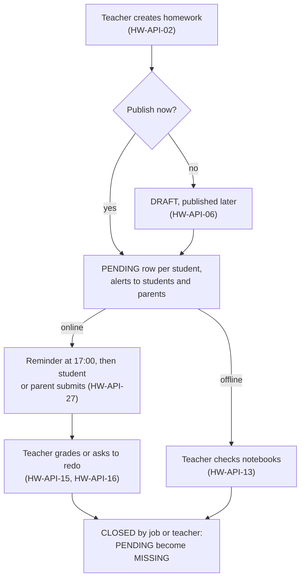
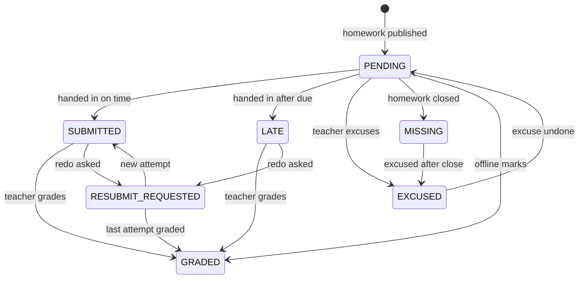
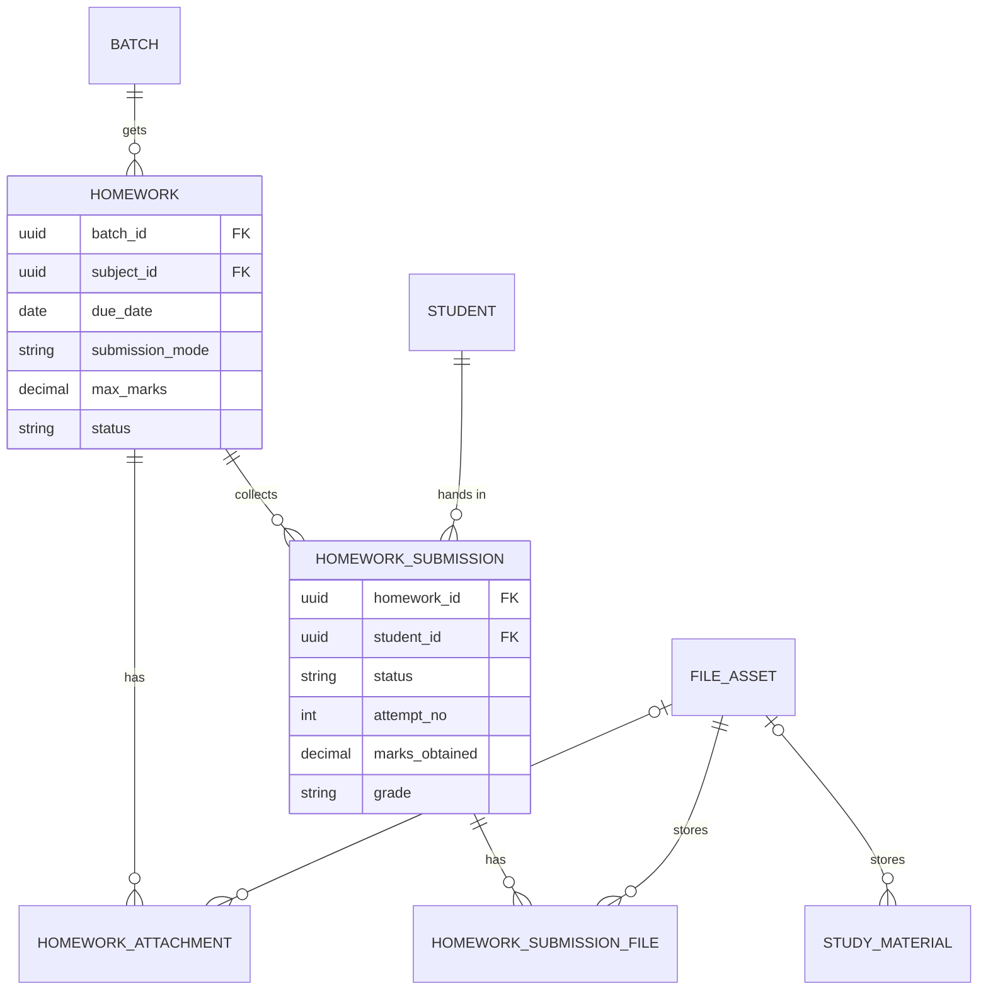

# Homework Module

**In simple words:** This chapter explains how a teacher gives homework and how it comes back checked. Priya Nair sets one piece of work for two batches in a minute, with a worksheet and a due date. Aarav Sharma, or his mother Sunita Devi, hands it in from a phone, or Priya ticks notebooks in class. Priya then grades it with marks and feedback, and parents see all of it in the portal. The same module shares study material such as notes and DPP sheets (daily practice problems) with batches.

| Item | Value |
|---|---|
| Module code | HW |
| Release phase | Phase 2 (V1.0), Day 61 to 120, prompt P-36 |
| Plans | Growth, Pro, Enterprise (plan feature `module.HW`); not on Starter |
| Main users | Teacher, Principal, Student, Parent; Organization Admin for oversight |
| Depends on | Batch, Subjects, Teachers, Student Profile, Notifications, Settings; shown inside Parent Portal and Student Portal |
| Main tables | `homework`, `homework_attachments`, `homework_submissions`, `homework_submission_files`, `study_materials`; uses `file_assets`, `export_jobs` |

## Objective

1. **Set homework in under one minute.** One form, several batches, files and links, publish now or keep as draft.
2. **Parents know the same day.** The in-app and push alert arrives within one minute of publishing. A WhatsApp reminder goes to parents the evening before the due date.
3. **Hand in from a phone.** A student photographs three notebook pages and submits in under two minutes, even on a slow 3G line.
4. **Checking is visible.** The dashboard shows what is due and what waits to be checked. A teacher grades 40 online submissions in about 20 minutes.
5. **One record for every child.** Submission rate and marks per student feed the *Student Profile Module*, parent-teacher meetings and the *Analytics Module*.

## Scope

### In scope

- Homework per batch and subject, for one or many batches in one step, with teacher files and links.
- Three submission modes: `ONLINE` (files or text through the portals), `OFFLINE` (notebook checked in class) and `NOT_REQUIRED` (reading or revision).
- Draft, publish, edit, close, cancel and soft delete, with rules per status.
- Hand-in by the student or by a parent; late work, redo requests, excused and missing work.
- Marks, a grade from the grade scale and feedback; reminders; a dashboard of pending checks and rates.
- Study materials with a parent switch; Excel export; file limits and plan storage.

### Out of scope

| Not in this module | Where it lives or why |
|---|---|
| Online quizzes with auto-marking, question bank | Not built in V1.0; teachers attach a Google Form link if needed |
| Plagiarism or AI-writing checks | Not built; costly and unreliable for school-level work |
| Free chat between teacher and parent | Not built; see the contact rules in *Parent Portal Module* |
| Homework marks inside report card totals | Not in V1.0; report cards use exam marks from the *Exams Module* |
| Upload, confirm and download of files | Shared file service (`CMN-API-02` to `CMN-API-06`), see *System Architecture* |
| Delivery of messages, quiet hours, credits | *Notifications Module* and *WhatsApp Module* |

### Phase notes

- Phase 2 (prompt P-36) ships all 27 endpoints, screens HW-S01 to HW-S05, and the nightly close and reminder jobs.
- Phase 3: the *Analytics Module* adds homework trends across campuses. Phase 4: the *AI Insights Module* reads falling submission rates as an early warning sign.

## User Stories

| ID | As a | I want to | So that | Priority |
|---|---|---|---|---|
| HW-US-01 | Teacher | give the same homework to 10-A and 9-B in one step | I do not type it twice | Must |
| HW-US-02 | Teacher | attach a worksheet PDF and a video link | students have everything in one place | Must |
| HW-US-03 | Teacher | save a draft tonight and publish it tomorrow morning | I can prepare the week ahead | Should |
| HW-US-04 | Student | see today's homework and hand in photos of my notebook | I do not lose marks for a forgotten notebook | Must |
| HW-US-05 | Parent | see what my child must finish and whether it was handed in | I can help at home | Must |
| HW-US-06 | Parent | submit the work for my young child | a Class 3 child without a phone is not left out | Should |
| HW-US-07 | Teacher | tick notebooks in class as done, missing or excused | offline homework is recorded too | Must |
| HW-US-08 | Teacher | give marks and feedback, or ask for a redo | the student learns from mistakes | Must |
| HW-US-09 | Teacher | see how many submissions wait for me | nothing stays unchecked for a week | Must |
| HW-US-10 | Teacher | remind only the students who have not handed in | I do not disturb the others | Should |
| HW-US-11 | Principal | see submission rates by batch and subject | I spot a weak class or a slow teacher early | Should |
| HW-US-12 | Teacher | share notes and DPP sheets with my batches | students revise from the right material | Must |
| HW-US-13 | Organization Admin | know that homework files count against our storage | the plan limit does not surprise us | Should |

## Workflow

**Figure: Homework lifecycle from creation to close**



Online work comes back through the portals; offline work is recorded by the teacher in one bulk screen. Both paths end with a status for every student.

Step by step, for Bright Future Public School (session 2027-28, timezone Asia/Kolkata):

1. On Mon 12 Jul 2027 at 13:35 IST Priya Nair opens HW-S02: 10-A and 9-B, Mathematics, "Quadratic Equations - Exercise 4.2", due Wed 14 Jul, `ONLINE`, max marks 10, a worksheet PDF and a video link.
2. [Publish] makes HW-API-02 create two `PUBLISHED` rows and 38 plus 41 `PENDING` submissions. Students and guardians get an in-app item and a push at once.
3. On Tue 13 Jul at 17:00 IST the reminder job finds 19 students still `PENDING`; their guardians get a WhatsApp reminder.
4. Aarav submits three photos at 20:40 IST on 13 Jul. His row becomes `SUBMITTED`.
5. On 15 Jul Priya grades 10-A in HW-S03 and asks Kabir Mehta to redo Q5 and Q6 (`RESUBMIT_REQUESTED`).
6. Late work is accepted until 21 Jul. At 00:30 IST on 22 Jul the nightly job closes the homework; two `PENDING` rows become `MISSING`.

### Homework statuses

| Status | Meaning | Students and parents see | Next step |
|---|---|---|---|
| `DRAFT` | Being prepared; no submission rows | Nothing | `PUBLISHED` (HW-API-06) or soft delete (HW-API-05) |
| `PUBLISHED` | Live; submissions accepted | Homework, files, own status | `CLOSED` (job or HW-API-07) or `CANCELLED` (HW-API-08) |
| `CLOSED` | No more submissions; grading continues | Homework, marks, feedback | `CANCELLED` (HW-API-08) |
| `CANCELLED` | Called off; kept for history | Nothing (alert only) | Soft delete (HW-API-05) |

**Figure: Status of one student's submission**



A submission only moves forward, except that a teacher may undo an excuse while the homework is still open. `GRADED` can be graded again; every regrade is audited.

| Submission status | Meaning | Counts as handed in | Set by |
|---|---|---|---|
| `PENDING` | Nothing handed in yet | No | Publish, new enrollment |
| `SUBMITTED` | Handed in on time, or a requested redo | Yes | Portal submit, teacher bulk mark |
| `LATE` | Handed in after the due day | Yes | Portal submit, teacher bulk mark |
| `RESUBMIT_REQUESTED` | Teacher wants a better attempt | Yes | HW-API-16 |
| `GRADED` | Checked, with marks or feedback | Yes | HW-API-15, HW-API-13 |
| `MISSING` | Not handed in when the homework closed | No | Close job, HW-API-07, HW-API-13 |
| `EXCUSED` | Not expected (leave, new joiner) | Left out of the rate | HW-API-13, enrollment end |

## Screens and Wireframes

| ID | Screen | Users | Purpose |
|---|---|---|---|
| HW-S01 | Homework list and dashboard | Teacher, Principal, Organization Admin | Due today, to check, submission rates, filtered list |
| HW-S02 | Create or edit homework | Teacher, Principal | Batches, subject, dates, mode, marks, files, publish |
| HW-S03 | Submissions and grading | Teacher, Principal | Per-student status, open files, grade, redo, bulk mark |
| HW-S04 | Study materials | Teacher, Principal | Share and manage notes, worksheets and links |
| HW-S05 | Homework detail and submit (mobile) | Student, Parent | Read the task, open files, upload photos, see feedback |

HW-S05 opens from the homework tab of the Student Portal and from PP-S06 in the *Parent Portal Module*.

**Screen HW-S01 — Homework list and dashboard (Teacher, web)**

```text
+--------------------------------------------------------------------------+
| EduFlow | Bright Future Public School    [Search homework...]     (PN) v |
+------------+-------------------------------------------------------------+
| Dashboard  | Homework                                  [+ New homework]  |
| Attendance +-------------------------------------------------------------+
| Homework < | Due today: 2    To check: 31    Oldest unchecked: 2 days    |
|  Homework  | Rate (30 days): 10-A Maths 91%    9-B Maths 84%             |
|  Materials +-------------------------------------------------------------+
| Timetable  | [Batch: All v] [Subject: All v] [Status: Active v] [Jul v]  |
| Exams      |-------------------------------------------------------------|
| Students   | Title                  Batch  Due     Mode     In     Check |
|            | Quadratic Eq. Ex 4.2   10-A   14 Jul  Online   36/38      9 |
|            | Quadratic Eq. Ex 4.2   9-B    14 Jul  Online   30/41     22 |
|            | Linear Eq. worksheet   9-B    13 Jul  Offline  38/40      0 |
|            | Probability revision   10-A   09 Jul  None     --        -- |
|            | Triangles 6.3 (draft)  10-A   16 Jul  Online   --        -- |
|            |                                     < 1 2 3 >   20 per page |
+------------+-------------------------------------------------------------+
```

- The strip calls HW-API-18; "To check" counts `SUBMITTED` and `LATE` rows. The list calls HW-API-01; a row opens HW-S03.
- [+ New homework] opens HW-S02. A Principal sees all campus batches and a [Teacher v] filter.

**Screen HW-S02 — Create homework (Teacher, web)**

```text
+--------------------------------------------------------------------------+
| EduFlow | Bright Future Public School    [Search homework...]     (PN) v |
+------------+-------------------------------------------------------------+
| Homework < | Homework > New                                              |
|  Homework  +-------------------------------------------------------------+
|  Materials | Batches  [x] 10-A  [ ] 10-B  [x] 9-B   (only your classes)  |
|            | Subject  [Mathematics v]                                    |
|            | Title    [Quadratic Equations - Exercise 4.2______________] |
|            | Details  [Solve Q1 to Q8 in the maths notebook. Show steps.]|
|            | Given on [12 Jul 2027]     Due on [14 Jul 2027]             |
|            | Handed in (o) Online  ( ) In notebook  ( ) Not required     |
|            | [x] Accept late work (up to 7 days)   Max marks [ 10 ]      |
|            | [x] Tell parents                                            |
|            | Files    Worksheet-4.2.pdf  1.2 MB             [Remove]     |
|            |          Formula method (youtube.com)          [Remove]     |
|            |          [+ Add file]  [+ Add link]       2 of 10 used      |
|            |                                                             |
|            |                 [Cancel]  [Save draft]  [Publish to 2]      |
+------------+-------------------------------------------------------------+
```

- Only the teacher's own batches are listed (HW-BR-01). [+ Add file] uploads through `CMN-API-02` and `CMN-API-05`.
- [Save draft] and [Publish to 2] call HW-API-02 with `publish` false or true. An edit calls HW-API-04 and hides locked fields (HW-BR-06).

**Screen HW-S03 — Submissions and grading (Teacher, web)**

```text
+--------------------------------------------------------------------------+
| EduFlow | Bright Future Public School    [Search homework...]     (PN) v |
+------------+-------------------------------------------------------------+
| Homework < | Quadratic Eq. Ex 4.2 - 10-A - Due 14 Jul - Max 10           |
|  Homework  | In 36/38   Graded 26   To check 9   Excused 0   [Remind 3]  |
|  Materials +-------------------------------------------------------------+
|            | [Status: All v]            [Mark offline work]  [Export]    |
|            | Roll Student          Status     Handed in     Marks  Grade |
|            | 01   Aarav Sharma     SUBMITTED  13 Jul 20:40  [8.5]  A2    |
|            | 07   Diya Kapoor      LATE       15 Jul 07:15  [__ ]  --    |
|            | 12   Kabir Mehta      REDO (1)   14 Jul 21:02  [__ ]  --    |
|            | 19   Riya Singh       PENDING    --            --     --    |
|            |-------------------------------------------------------------|
|            | Aarav Sharma - 3 files  [page1.jpg] [page2.jpg] [page3.jpg] |
|            | Answer: Q7 done by the formula method.                      |
|            | Feedback [Good work. Check the sign in Q4.______________]   |
|            |               [Ask to redo]  [Save grade]  [Save and next]  |
+------------+-------------------------------------------------------------+
```

- The table calls HW-API-12; a row loads HW-API-14, and file buttons open 5-minute links (`CMN-API-06`).
- [Save grade] calls HW-API-15, [Ask to redo] HW-API-16, [Mark offline work] HW-API-13 and [Remind 3] HW-API-09.

**Screen HW-S05 — Homework detail and submit (Student, mobile)**

```text
+------------------------------------+
| <  Homework              Aarav (v) |
+------------------------------------+
| MATHEMATICS          Due Wed 14 Jul|
| Quadratic Equations - Ex 4.2       |
| Solve Q1 to Q8 in the maths        |
| notebook. Show steps.              |
| [Worksheet-4.2.pdf]                |
| [Video: Formula method]            |
|------------------------------------|
| Your work              Max marks 10|
| [page1.jpg x] [page2.jpg x]        |
| [+ Take photo]  [+ Add file]       |
| Note [Q7 done by formula method.]  |
| 2 of 5 files - 0.9 MB              |
|                                    |
|        [ Submit homework ]         |
|------------------------------------|
| Status: PENDING - 1 day left       |
+------------------------------------+
```

- The detail comes from SP-API-07 (student) or HW-API-24 (parent). Photos are resized before upload (HW-BR-14).
- [Submit homework] runs the two calls of HW-API-27 or HW-API-25. After grading, the lower part shows marks, grade and feedback.
- `OFFLINE` homework shows "Hand in your notebook in class" instead of the upload area.

## UI Components

| Component | Type | Behaviour |
|---|---|---|
| `HomeworkSummaryStrip` | Stat cards | Due today, to check, oldest unchecked, rate per batch |
| `HomeworkTable` | Data table (TanStack Query) | Server paging, sort by due date, filters kept in the URL |
| `BatchMultiSelect` | Checkbox group | Only allowed batches; disables batches without the subject |
| `DueDatePicker` | Date picker | Blocks dates before the given-on date; holiday hint from the campus calendar |
| `AttachmentList` | File list + uploader | Progress per file, retry, 10-item limit, `https`-only link dialog |
| `SubmissionStatusBadge` | Badge | `LATE` amber, `MISSING` red, `EXCUSED` grey, `GRADED` green |
| `GradePanel` | Side panel form | Marks with max shown, grade preview, feedback; `Ctrl+Enter` saves and moves on |
| `BulkMarkSheet` | Sheet with grid | Status and marks per row, "Set all to Submitted", unsaved-change guard |
| `PhotoUploader` | Mobile camera input | Opens the camera, resizes to 1,600 px, max 5 files |
| `ConfirmDialog` | Alert dialog | Cancel and delete confirm; cancel asks for a reason |
| States | `Skeleton`, `EmptyState`, `ErrorState` | Skeleton at once; empty text per screen; error with [Try again] and request ID |

## Validation Rules

| Field | Rule | Error message shown to user |
|---|---|---|
| `batchIds` | 1 to 20 batches, same campus and academic year, status `ACTIVE`, allowed for the user | "Pick at least one of your batches." |
| `subjectId` | Taught in the course of every chosen batch (`course_subjects`) | "Mathematics is not a subject of 11-Commerce." |
| `title` | Required, 3 to 200 characters after trimming | "Enter a title of 3 to 200 characters." |
| `description` | Optional, up to 5,000 characters | "Keep the instructions under 5,000 characters." |
| `assignedDate` | Inside the academic year; not more than 7 days in the past | "The given-on date must be inside 2027-28 and not older than 7 days." |
| `dueDate` | On or after `assignedDate`; at most 90 days later; inside the academic year | "The due date must be on or after the given-on date." |
| `submissionMode` | One of `ONLINE`, `OFFLINE`, `NOT_REQUIRED` | "Choose how the work is handed in." |
| `maxMarks` | Empty, or 0.5 to 1000.00 with at most 2 decimals | "Max marks must be between 0.5 and 1000." |
| Attachment | Exactly one of `fileId` or `externalUrl`; at most 10 per homework | "Add a file or a link, not both." |
| Attachment file | `ACTIVE` file of this organization; PDF, JPG, PNG, WebP, DOCX, XLSX or PPTX; up to 25 MB | "Upload a PDF, image, Word, Excel or PowerPoint file up to 25 MB." |
| `externalUrl` | `https://` only, up to 1,000 characters | "Enter a full link that starts with https://." |
| Submission files | 1 to 5 files; PDF, JPG, PNG, WebP or DOCX; each up to 25 MB; total up to 50 MB | "Add up to 5 files (PDF, photo or Word), each up to 25 MB." |
| `answerText` | Up to 10,000 characters; text or at least one file is required | "Write your answer or add at least one file." |
| `marksObtained` | 0 to `maxMarks`, at most 2 decimals; must be empty when `maxMarks` is empty | "Marks must be between 0 and 10." |
| `grade` | Up to 10 characters | "A grade can have at most 10 characters." |
| `feedback` | Up to 2,000 characters; 5 or more when asking for a redo | "Tell the student what to fix (at least 5 characters)." |
| `reason` (cancel) | 5 to 300 characters | "Give a short reason (5 to 300 characters)." |
| Bulk items | 1 to 200 rows; each `studentId` has a row in this homework | "Aarav Sharma is not in this homework." |
| Study material `batchIds` | Batches of the chosen course; empty only for Principal and Organization Admin | "Pick at least one of your batches." |

The same Zod schemas in `shared/` run in the browser and in the API.

## Business Rules

**HW-BR-01 — Who may set and check homework.** A Teacher works on a batch as its class teacher (`Batch.classTeacherId`) or through a `BatchSubjectTeacher` row for that batch and subject, valid today. A class teacher may set homework in any subject of the own batch, which suits primary classes. Access follows the batch, not the author: when 9-B Mathematics gets a new teacher, the new teacher grades the open work. A Principal or Organization Admin may set `assignedById` to another teacher of that batch and subject.

**HW-BR-02 — One row per batch.** `batchIds` with n batches creates n `homework` rows in one transaction. Each row gets its own attachment rows that point to the same `file_id`, so a file is stored once.

> **Example:** Exercise 4.2 for 10-A and 9-B with one PDF and one link gives 2 homework rows, 4 attachment rows and 1 file in S3. Extending only 9-B later is a PATCH on that one row.

**HW-BR-03 — Who gets a submission row.** Publishing an `ONLINE` or `OFFLINE` homework creates one `PENDING` row per student with an `ACTIVE` enrollment in the batch. For an elective subject (`CourseSubject.isElective`), only students whose `electiveSubjectIds` hold it get a row. `NOT_REQUIRED` homework has no rows, counters or reminders. The unique key `(organization_id, homework_id, student_id)` makes a repeated insert harmless.

**HW-BR-04 — Due moment and late work.** The due date is a calendar date. Work is on time until 23:59:59.999 of that date in the campus timezone (`Campus.timezone`, else `Organization.timezone`). A hand-in after that moment is `LATE`.

```typescript
import { fromZonedTime } from 'date-fns-tz';

// dueDate is homework.due_date as "YYYY-MM-DD"; timeZone is an IANA name
export function dueEndUtc(dueDate: string, timeZone: string): Date {
  return fromZonedTime(`${dueDate}T23:59:59.999`, timeZone);
}

export function handInStatus(at: Date, dueDate: string, timeZone: string) {
  return at.getTime() > dueEndUtc(dueDate, timeZone).getTime() ? 'LATE' : 'SUBMITTED';
}
```

> **Example:** Due 14 Jul 2027 in Asia/Kolkata (UTC+05:30): the due end is 2027-07-14T18:29:59.999Z. Aarav submits at 2027-07-13T15:10:00Z (20:40 IST on 13 Jul): `SUBMITTED`. Diya submits at 2027-07-15T01:45:00Z (07:15 IST on 15 Jul): `LATE`.

**HW-BR-05 — Late window and automatic close.** With `allowLateSubmission = true`, late work is accepted for 7 more days; with `false`, the portals refuse any hand-in after the due end. A nightly job at 00:30 campus time closes every `PUBLISHED` homework whose last accepted day has passed. Closing, by the job or by HW-API-07, turns all `PENDING` rows into `MISSING` in one statement. The 7-day window is fixed in V1.0 (Assumption; it can become a setting later).

> **Example:** Due 14 Jul with late work allowed: the last late day is 21 Jul, and the job closes the homework at 00:30 IST on 22 Jul. With late work off, it closes at 00:30 IST on 15 Jul.

**HW-BR-06 — What can change in each status.**

| Field | `DRAFT` | `PUBLISHED` | `CLOSED`, `CANCELLED` |
|---|---|---|---|
| `title`, `description`, attachments | Yes | Yes | No |
| `dueDate` | Yes | Yes; not before today or `assignedDate` | No |
| `assignedDate` | Yes | No | No |
| `submissionMode` | Yes | Between `ONLINE` and `OFFLINE`, while every row is `PENDING` or `EXCUSED` | No |
| `maxMarks` | Yes | While no row is `GRADED` | No |
| `allowLateSubmission`, `notifyParents` | Yes | Yes | No |
| Batch, subject | Never; create a new homework | Never | Never |

A new due date recalculates `SUBMITTED` and `LATE` rows from `submittedAt`; `GRADED` rows keep their status. Only a changed due date or a new file sends `homework.updated`.

**HW-BR-07 — Cancel and delete.** Cancel works from `PUBLISHED` or `CLOSED` and needs a reason, which goes into the audit log and the alert. Submissions, files and marks stay, hidden from the portals and left out of every rate. Soft delete works only on `DRAFT` and `CANCELLED` homework, so parents are always told before work disappears. Submissions of a deleted homework stay for audit (foreign key `Restrict`).

**HW-BR-08 — Handing in online.** Only `ONLINE`, `PUBLISHED` homework accepts a hand-in, from a student who has a row, with text or at least one file. `submittedById` stores who pressed Submit, student or parent. Before the due end a `SUBMITTED` row may be replaced; `attemptNo` stays. After the due end, or once graded, the row is locked unless a redo is asked. A row lock (`SELECT ... FOR UPDATE`) serialises a parent and a child who submit together; the later one wins.

**HW-BR-09 — Redo requests.** HW-API-16 needs feedback and works on `SUBMITTED` or `LATE` rows of a `PUBLISHED` homework. A student gets at most 3 attempts, so the request is refused when `attemptNo` is 3. The new hand-in raises `attemptNo` by 1 and is always `SUBMITTED`, because the teacher asked for it. Old files are unlinked and set to `DELETED`; their IDs stay in the audit log.

**HW-BR-10 — Marking offline work in bulk.** HW-API-13 takes up to 200 rows in one transaction. Targets: `PENDING` (undo), `SUBMITTED`, `LATE`, `MISSING` (only after the due end), `EXCUSED` and `GRADED`. `EXCUSED` goes back to `PENDING` only while `PUBLISHED`. On `ONLINE` homework the teacher may record a paper hand-in; `submittedById` is then the teacher's user ID. A `GRADED` row only takes new marks, never a lower status.

**HW-BR-11 — Grading and the grade.** Marks are allowed only when `maxMarks` is set; without it, `GRADED` means "checked". When the grade is empty and marks exist, the API takes the percentage (half-up, 2 decimals) and looks it up in the organization's default grade scale (see *Exams Module*). A grade typed by the teacher wins. No default scale means no grade.

> **Example:** On the CBSE 9-point scale, 8.5 of 10 = 85.00% = A2 (band 81 to 90). 7 of 12 = 58.33% = C1 (band 51 to 60).

Every save sets `gradedById` and `gradedAt`. A regrade is allowed while `PUBLISHED` or `CLOSED`, is audited with old and new marks, and sends no second WhatsApp.

**HW-BR-12 — Submission rate.** Handed in = `SUBMITTED`, `LATE`, `RESUBMIT_REQUESTED` and `GRADED`. Expected = all rows except `EXCUSED`. Rate = handed in / expected x 100, one decimal. The on-time rate counts only hand-ins with `submittedAt` on or before the due end. Only `PUBLISHED` and `CLOSED` homework count.

> **Example:** 10-A Mathematics in July 2027: 12 homework x 38 students = 456 rows; 6 `EXCUSED`, so 450 expected. 409 handed in, 381 on time. Rate = 409 / 450 = 90.9%; on-time rate = 381 / 450 = 84.7%. Aarav this term: 48 rows, 1 excused, 46 handed in, so 46 / 47 = 97.9%.

**HW-BR-13 — Reminders.** At 17:00 campus time on the day before the due date, a job reminds each student with a `PENDING` row (in-app, push). Guardians get WhatsApp when `notifyParents` is true. Same-day homework gets no automatic reminder. HW-API-09 reminds `PENDING` and `RESUBMIT_REQUESTED` students at most once per 6 hours per homework. The *Notifications Module* still applies quiet hours and its cap of 10 paid `NORMAL` messages per guardian per day.

**HW-BR-14 — Files.** Teacher files use `file_assets.category = 'homework'` (`ownerType = 'Homework'`); student files use `'homework-submission'` (`ownerType = 'HomeworkSubmission'`). All are `PRIVATE`. Only `ACTIVE` files can be linked; a `QUARANTINED` file is refused. The phone resizes photos to 1,600 px on the long side at JPEG quality 0.8, about 250 to 450 KB per page.

**HW-BR-15 — Storage by plan.** Every `ACTIVE` file counts against `Plan.storageGb`: Growth 10 GB, Pro 50 GB, Enterprise 250 GB. The pre-sign step refuses a file that would cross the limit with `403 PLAN_LIMIT_REACHED`; storage has no grace (see *Organizations Module*).

> **Example:** Sharma Classes is on Pro: 50 GB = 53,687,091,200 bytes, with 53,680,000,000 used. Three photos of 420,000 bytes bring it to 53,681,260,000, so they upload. A 25 MB PDF (26,214,400 bytes) would reach 53,706,214,400 and is refused.

Submission files get `retentionUntil` = academic year end + 90 days; a nightly job then purges them. Marks, feedback and answer text stay; teacher files and study materials are kept (Assumption). Sizing: 350 students x 2 online homework a week x 2 photos x 0.4 MB = 560 MB a week, about 22 GB per 40-week session, which fits Pro.

**HW-BR-16 — What parents and students see.** The portals show `PUBLISHED` and `CLOSED` homework only (PP-BR-04). A parent sees each own child's row with files, marks, grade and feedback, never another student's work. A student sees published materials of the own batch, or of the whole course when `batchIds` is empty; a parent also needs `visibleToParents`. Children who left see no homework (PP-BR-15).

**HW-BR-17 — Enrollment changes.** When a student joins a batch (`student.enrolled`), `PENDING` rows are created for its `PUBLISHED` homework due today or later. When an enrollment ends, the student's `PENDING` rows in open homework become `EXCUSED`; handed-in work stays.

**HW-BR-18 — Study materials.** Each material has exactly one file or one link. A Teacher names own batches; only a Principal or Organization Admin may leave `batchIds` empty for the whole course. The first publish raises `study_material.published`.

**HW-BR-19 — Closed year.** Every write is refused with `BUSINESS_RULE_VIOLATION` when the homework's `AcademicYear` is `CLOSED`. Reads and exports still work.

## Acceptance Criteria

- **HW-AC-01** Given Priya Nair teaches Mathematics in 10-A and 9-B, when she posts HW-API-02 with both batches and `publish: true`, then 2 `PUBLISHED` homework rows and 79 `PENDING` submissions exist, and students get the alert within 60 seconds.
- **HW-AC-02** Given Priya does not teach 10-B, when she includes 10-B in `batchIds`, then the API answers `403 FORBIDDEN` and no homework row is created for any batch.
- **HW-AC-03** Given a `DRAFT` homework, when it is published with HW-API-06, then one `PENDING` row exists per `ACTIVE` student, and a second publish call answers `422` without new rows.
- **HW-AC-04** Given Sanskrit is elective for Class 10, when a 10-A Sanskrit homework is published, then only the 14 students with Sanskrit in `electiveSubjectIds` get rows.
- **HW-AC-05** Given due date 14 Jul in Asia/Kolkata, when Aarav submits at 23:50 IST on 14 Jul, then the row is `SUBMITTED`; when Diya submits at 00:10 IST on 15 Jul, then her row is `LATE`.
- **HW-AC-06** Given `allowLateSubmission = false` and the due end has passed, when a student submits, then the API answers `422 BUSINESS_RULE_VIOLATION` with "Late work is not accepted for this homework."
- **HW-AC-07** Given late work is allowed and due 14 Jul, when the nightly job runs at 00:30 IST on 22 Jul, then the homework is `CLOSED` and every `PENDING` row is `MISSING`.
- **HW-AC-08** Given a `SUBMITTED` row, when Priya asks for a redo with feedback, then the row is `RESUBMIT_REQUESTED`, the student gets an alert, and the next hand-in has `attemptNo` 2 and status `SUBMITTED`.
- **HW-AC-09** Given a row with `attemptNo` 3, when a redo is requested, then the API answers `422` and the row does not change.
- **HW-AC-10** Given `maxMarks` 10 and the CBSE scale is the default, when Priya saves 8.5 with an empty grade, then the row is `GRADED` with grade `A2`, and 10.5 is refused with `400 VALIDATION_ERROR`.
- **HW-AC-11** Given an `OFFLINE` homework, when Priya bulk-marks 38 students (35 submitted, 2 missing, 1 excused) after the due day, then all 38 rows change in one transaction and the rate shows 35 / 37 = 94.6%.
- **HW-AC-12** Given 6 students are `PENDING`, when Priya presses [Remind], then only those 6 and their guardians are messaged; a second press within 6 hours answers `422` with the next allowed time.
- **HW-AC-13** Given a student's homework is `DRAFT` or `CANCELLED`, when the parent opens HW-API-23, then that homework is not in the list.
- **HW-AC-14** Given Sharma Classes has 5 MB of storage left, when a student asks to upload a 6 MB PDF, then the API answers `403 PLAN_LIMIT_REACHED` before any upload URL exists.
- **HW-AC-15** Given a `PUBLISHED` homework, when Priya tries to delete it, then the API answers `422` with "Cancel the homework first so that parents are told."

## Edge Cases

| Case | What happens | How the system handles it |
|---|---|---|
| Due date on a holiday or Sunday | Teacher picks 15 Aug | Non-blocking hint "15 Aug is a holiday (Independence Day)"; save still allowed |
| Student joins the batch after publishing | No row yet | HW-BR-17 creates `PENDING` rows for homework due today or later |
| Student withdrawn mid-homework | Row would count as missing | HW-BR-17 sets open `PENDING` rows to `EXCUSED` |
| Student on approved leave on the due day | Teacher may not know | HW-S03 shows an "On leave" tag from student leave data; the teacher can excuse |
| Upload drops on a weak network | File stays `PENDING_UPLOAD` | Hand-in is not confirmed; the phone retries; the nightly job clears uploads older than 24 hours |
| Parent and child submit together | Two writes race | Row lock; the later hand-in wins; both see who submitted (HW-BR-08) |
| Photo fails the byte check | File is `QUARANTINED` | Confirm call answers `422` "This file could not be accepted. Take the photo again." |
| Teacher changes batch mid-year | Old teacher loses access | New subject teacher grades open work (HW-BR-01); `assignedById` keeps the author |
| Homework cancelled after grading | Marks exist | Marks stay in the database, hidden from portals and rates (HW-BR-07) |
| Due date moved later after late hand-ins | Rows marked `LATE` wrongly | `LATE` rows with `submittedAt` before the new due end become `SUBMITTED` (HW-BR-06) |
| Storage limit reached during term | Students cannot upload | `403 PLAN_LIMIT_REACHED` with "Hand in your notebook in class"; admin sees the limit alert |
| Two teachers grade the same row | Last save would win silently | `baseUpdatedAt` check answers `409 CONFLICT`; the second teacher reloads |

## Database Schema

| Table | Purpose | Key columns |
|---|---|---|
| `homework` | One homework for one batch and one subject | `campus_id`, `academic_year_id`, `batch_id`, `subject_id`, `assigned_by_id`, `assigned_date`, `due_date`, `submission_mode`, `allow_late_submission`, `max_marks`, `status`, `published_at`, `notify_parents` |
| `homework_attachments` | Teacher file or link | `homework_id`, `file_id` or `external_url`, `title`, `sort_order` |
| `homework_submissions` | One student's work on one homework | `homework_id`, `student_id`, `status`, `answer_text`, `submitted_at`, `submitted_by_id`, `attempt_no`, `marks_obtained`, `grade`, `feedback`, `graded_by_id`, `graded_at` |
| `homework_submission_files` | Files of the current attempt | `submission_id`, `file_id`, `sort_order` |
| `study_materials` | Notes, DPP sheets and links for batches | `course_id`, `subject_id`, `batch_ids` (uuid array), `material_type`, `file_id` or `external_url`, `topic`, `is_published`, `visible_to_parents`, `uploaded_by_id` |

Every table has `id` (uuid PK), `organization_id` (NOT NULL, FK) and `created_at`, `updated_at`. `homework` and `study_materials` have `deleted_at`; submissions are never deleted. Dates are `date`, marks `decimal(6,2)`. `submitted_by_id` is a user ID for audit, with no foreign key. All five tables carry the RLS policy `organization_id = current_setting('app.current_org')::uuid`.

> **Note:** Column tables with type, null, default and delete rule are in *Data Dictionary: Academics*, generated from the Prisma Schema below.

### Indexes and constraints

In this table `org` stands for `organization_id`.

| Table | Unique | Other indexes | Delete rules |
|---|---|---|---|
| `homework` | None | `(org, batch_id, due_date)`, `(org, campus_id, status, due_date)`, `(org, assigned_by_id, status)`, `(org, batch_id, subject_id, assigned_date)` | Restrict to batch, subject, staff |
| `homework_attachments` | None | `(org, homework_id, sort_order)` | Cascade with homework; restrict on file |
| `homework_submissions` | `(org, homework_id, student_id)` | `(org, student_id, status)`, `(org, homework_id, status)` | Restrict to homework and student; grader set null |
| `homework_submission_files` | None | `(org, submission_id)` | Cascade with submission; restrict on file |
| `study_materials` | None | `(org, campus_id, subject_id, created_at)`, `(org, course_id, is_published)` | Course, subject, uploader set null |

"Exactly one of file or link" on attachments and materials is a service rule, not a database check.

**Figure: Homework module tables**



A batch gets many homework rows; each homework collects one submission per student. Files live once in `file_assets` and are linked from attachments, submissions and study materials.

## Prisma Schema

Copied from `docs/src/_schema/06-timetable-homework.prisma`. The timetable models of the same file are in the *Timetable Module*. On lines too long for the page, trailing comments move above the field and alignment spaces are dropped.

```prisma
enum HomeworkStatus {
  DRAFT
  PUBLISHED
  CLOSED // past due date and no more submissions accepted
  CANCELLED
}

enum HomeworkSubmissionMode {
  ONLINE // students / parents upload files or text
  OFFLINE // notebook checked in class; the teacher only marks the status
  NOT_REQUIRED // reading / revision work
}

enum HomeworkSubmissionStatus {
  PENDING
  SUBMITTED
  LATE
  RESUBMIT_REQUESTED
  GRADED
  MISSING
  EXCUSED
}

enum StudyMaterialType {
  NOTES
  WORKSHEET // DPP / practice sheet
  VIDEO_LINK
  QUESTION_PAPER
  SOLUTION
  SYLLABUS
  OTHER
}

// Homework / assignment given to a batch for a subject.
model Homework {
  id                  String                 @id @default(uuid()) @db.Uuid
  organizationId      String                 @map("organization_id") @db.Uuid
  campusId            String                 @map("campus_id") @db.Uuid
  academicYearId      String                 @map("academic_year_id") @db.Uuid
  batchId             String                 @map("batch_id") @db.Uuid
  subjectId           String                 @map("subject_id") @db.Uuid
  // teacher (Staff) who set the homework
  assignedById        String                 @map("assigned_by_id") @db.Uuid
  title               String                 @db.VarChar(200)
  description         String?                @db.Text
  assignedDate        DateTime               @map("assigned_date") @db.Date
  dueDate             DateTime               @map("due_date") @db.Date
  submissionMode      HomeworkSubmissionMode @default(OFFLINE) @map("submission_mode")
  allowLateSubmission Boolean                @default(true) @map("allow_late_submission")
  // null = not graded
  maxMarks            Decimal?               @map("max_marks") @db.Decimal(6, 2)
  status              HomeworkStatus         @default(DRAFT)
  publishedAt         DateTime?              @map("published_at") @db.Timestamptz(6)
  notifyParents       Boolean                @default(true) @map("notify_parents")
  createdAt           DateTime               @default(now()) @map("created_at") @db.Timestamptz(6)
  updatedAt           DateTime               @updatedAt @map("updated_at") @db.Timestamptz(6)
  deletedAt           DateTime?              @map("deleted_at") @db.Timestamptz(6)

  organization Organization @relation(fields: [organizationId], references: [id], onDelete: Restrict)
  campus Campus @relation(fields: [campusId], references: [id], onDelete: Restrict)
  academicYear AcademicYear @relation(fields: [academicYearId], references: [id], onDelete: Restrict)
  batch Batch @relation(fields: [batchId], references: [id], onDelete: Restrict)
  subject Subject @relation(fields: [subjectId], references: [id], onDelete: Restrict)
  assignedBy Staff @relation(fields: [assignedById], references: [id], onDelete: Restrict)
  attachments HomeworkAttachment[]
  submissions HomeworkSubmission[]

  @@index([organizationId, batchId, dueDate])
  @@index([organizationId, campusId, status, dueDate])
  @@index([organizationId, assignedById, status])
  @@index([organizationId, batchId, subjectId, assignedDate])
  @@map("homework")
}

// File or link attached to a homework by the teacher.
model HomeworkAttachment {
  id             String   @id @default(uuid()) @db.Uuid
  organizationId String   @map("organization_id") @db.Uuid
  homeworkId     String   @map("homework_id") @db.Uuid
  fileId         String?  @map("file_id") @db.Uuid // either a file ...
  // ... or a link (video, Google Drive)
  externalUrl    String?  @map("external_url") @db.VarChar(1000)
  title          String?  @db.VarChar(150)
  sortOrder      Int      @default(0) @map("sort_order")
  createdAt      DateTime @default(now()) @map("created_at") @db.Timestamptz(6)
  updatedAt      DateTime @updatedAt @map("updated_at") @db.Timestamptz(6)

  organization Organization @relation(fields: [organizationId], references: [id], onDelete: Cascade)
  homework     Homework     @relation(fields: [homeworkId], references: [id], onDelete: Cascade)
  file         FileAsset?   @relation(fields: [fileId], references: [id], onDelete: Restrict)

  @@index([organizationId, homeworkId, sortOrder])
  @@map("homework_attachments")
}

// A student's work for a homework: status, files, marks and teacher feedback.
model HomeworkSubmission {
  id             String                   @id @default(uuid()) @db.Uuid
  organizationId String                   @map("organization_id") @db.Uuid
  homeworkId     String                   @map("homework_id") @db.Uuid
  studentId      String                   @map("student_id") @db.Uuid
  status         HomeworkSubmissionStatus @default(PENDING)
  answerText     String?                  @map("answer_text") @db.Text
  submittedAt    DateTime?                @map("submitted_at") @db.Timestamptz(6)
  // User id of the student or parent (audit only, no FK)
  submittedById  String?                  @map("submitted_by_id") @db.Uuid
  // increases after RESUBMIT_REQUESTED
  attemptNo      Int                      @default(1) @map("attempt_no") @db.SmallInt
  marksObtained  Decimal?                 @map("marks_obtained") @db.Decimal(6, 2)
  grade          String?                  @db.VarChar(10)
  feedback       String?                  @db.Text
  gradedById     String?                  @map("graded_by_id") @db.Uuid // teacher (Staff)
  gradedAt       DateTime?                @map("graded_at") @db.Timestamptz(6)
  createdAt      DateTime                 @default(now()) @map("created_at") @db.Timestamptz(6)
  updatedAt      DateTime                 @updatedAt @map("updated_at") @db.Timestamptz(6)

  organization Organization @relation(fields: [organizationId], references: [id], onDelete: Restrict)
  // homework is soft-deleted; submissions and marks are never cascade-deleted
  homework Homework @relation(fields: [homeworkId], references: [id], onDelete: Restrict)
  student Student @relation(fields: [studentId], references: [id], onDelete: Restrict)
  gradedBy Staff? @relation(fields: [gradedById], references: [id], onDelete: SetNull)
  files HomeworkSubmissionFile[]

  @@unique([organizationId, homeworkId, studentId])
  @@index([organizationId, studentId, status])
  @@index([organizationId, homeworkId, status])
  @@map("homework_submissions")
}

// File uploaded by the student / parent as part of a homework submission.
model HomeworkSubmissionFile {
  id             String   @id @default(uuid()) @db.Uuid
  organizationId String   @map("organization_id") @db.Uuid
  submissionId   String   @map("submission_id") @db.Uuid
  fileId         String   @map("file_id") @db.Uuid
  sortOrder      Int      @default(0) @map("sort_order")
  createdAt      DateTime @default(now()) @map("created_at") @db.Timestamptz(6)
  updatedAt      DateTime @updatedAt @map("updated_at") @db.Timestamptz(6)

  organization Organization @relation(fields: [organizationId], references: [id], onDelete: Cascade)
  submission HomeworkSubmission @relation(fields: [submissionId], references: [id], onDelete: Cascade)
  file FileAsset @relation(fields: [fileId], references: [id], onDelete: Restrict)

  @@index([organizationId, submissionId])
  @@map("homework_submission_files")
}

// Learning resource (notes, DPP sheet, recorded-lecture link) shared with one or more batches;
// no due date or submission.
model StudyMaterial {
  id               String            @id @default(uuid()) @db.Uuid
  organizationId   String            @map("organization_id") @db.Uuid
  campusId         String            @map("campus_id") @db.Uuid
  academicYearId   String            @map("academic_year_id") @db.Uuid
  courseId         String?           @map("course_id") @db.Uuid
  subjectId        String?           @map("subject_id") @db.Uuid
  batchIds         String[]          @map("batch_ids") @db.Uuid // empty = every batch of the course
  title            String            @db.VarChar(200)
  description      String?           @db.Text
  materialType     StudyMaterialType @default(NOTES) @map("material_type")
  fileId           String?           @map("file_id") @db.Uuid // either a file ...
  externalUrl      String?           @map("external_url") @db.VarChar(1000) // ... or a link
  topic            String?           @db.VarChar(150)
  isPublished      Boolean           @default(true) @map("is_published")
  visibleToParents Boolean           @default(true) @map("visible_to_parents")
  uploadedById     String?           @map("uploaded_by_id") @db.Uuid // Staff
  createdAt        DateTime          @default(now()) @map("created_at") @db.Timestamptz(6)
  updatedAt        DateTime          @updatedAt @map("updated_at") @db.Timestamptz(6)
  deletedAt        DateTime?         @map("deleted_at") @db.Timestamptz(6)

  organization Organization @relation(fields: [organizationId], references: [id], onDelete: Restrict)
  campus       Campus       @relation(fields: [campusId], references: [id], onDelete: Restrict)
  academicYear AcademicYear @relation(fields: [academicYearId], references: [id], onDelete: Restrict)
  course       Course?      @relation(fields: [courseId], references: [id], onDelete: SetNull)
  subject      Subject?     @relation(fields: [subjectId], references: [id], onDelete: SetNull)
  file         FileAsset?   @relation(fields: [fileId], references: [id], onDelete: Restrict)
  uploadedBy   Staff?       @relation(fields: [uploadedById], references: [id], onDelete: SetNull)

  @@index([organizationId, campusId, subjectId, createdAt])
  @@index([organizationId, courseId, isPublished])
  @@map("study_materials")
}
```

## API Endpoints

Paths start with `/api/v1`; IDs, paths and keys are copied from the registry.

| ID | Method | Path | Permission | Purpose |
|---|---|---|---|---|
| HW-API-01 | GET | `/homework` | homework.view | List by batch, subject, teacher, status, due range, with counters |
| HW-API-02 | POST | `/homework` | homework.create | Create draft or publish now; one row per batch; attachments inline |
| HW-API-03 | GET | `/homework/:id` | homework.view | Homework with attachments and counters |
| HW-API-04 | PATCH | `/homework/:id` | homework.update | Update text, due date, mode, marks (HW-BR-06) |
| HW-API-05 | DELETE | `/homework/:id` | homework.delete | Soft delete; submissions are kept |
| HW-API-06 | POST | `/homework/:id/publish` | homework.update | Draft to published; create `PENDING` rows; notify |
| HW-API-07 | POST | `/homework/:id/close` | homework.update | Close; `PENDING` rows become `MISSING` |
| HW-API-08 | POST | `/homework/:id/cancel` | homework.update | Cancel with a reason and notify |
| HW-API-09 | POST | `/homework/:id/remind` | homework.update | Remind `PENDING` and `RESUBMIT_REQUESTED` students |
| HW-API-10 | POST | `/homework/:id/attachments` | homework.update | Add a file or link |
| HW-API-11 | DELETE | `/homework-attachments/:id` | homework.update | Remove an attachment |
| HW-API-12 | GET | `/homework/:id/submissions` | homework.view | Per-student status list |
| HW-API-13 | POST | `/homework/:id/mark-submissions` | homework.grade | Bulk status, marks and grade (offline work) |
| HW-API-14 | GET | `/homework-submissions/:id` | homework.view | Submission with files and feedback |
| HW-API-15 | POST | `/homework-submissions/:id/grade` | homework.grade | Save marks, grade, feedback; set `GRADED` |
| HW-API-16 | POST | `/homework-submissions/:id/request-resubmit` | homework.grade | Set `RESUBMIT_REQUESTED` with feedback |
| HW-API-17 | POST | `/homework/export` | homework.export | Homework and submission report (XLSX) |
| HW-API-18 | GET | `/homework/summary` | homework.view | Due today, to check, rates by batch and subject |
| HW-API-19 | GET | `/study-materials` | homework.view | List materials by course, batch, subject, type |
| HW-API-20 | POST | `/study-materials` | homework.create | Share a file or link with batches |
| HW-API-21 | PATCH | `/study-materials/:id` | homework.update | Update, publish or unpublish, parent visibility |
| HW-API-22 | DELETE | `/study-materials/:id` | homework.delete | Soft delete a material |
| HW-API-23 | GET | `/portal/parent/homework` | parentportal.access | Child's homework with own status |
| HW-API-24 | GET | `/portal/parent/homework/:id` | parentportal.access | Detail, attachments, feedback |
| HW-API-25 | POST | `/portal/parent/homework/:id/submit` | parentportal.access | Submit or resubmit for the child |
| HW-API-26 | GET | `/portal/parent/study-materials` | parentportal.access | Published materials visible to parents |
| HW-API-27 | POST | `/portal/student/homework/:id/submit` | studentportal.access | Submit or resubmit own work |

Student list and detail use SP-API-06 and SP-API-07 (*Student Portal Module*); PP-API-07 (*Parent Portal Module*) is a twin of HW-API-23. All share one homework service.

Common errors, not repeated below: `401 UNAUTHENTICATED` or `TOKEN_EXPIRED`; `403 PLAN_LIMIT_REACHED` without `module.HW`; `404 NOT_FOUND` for another tenant's or out-of-scope ID; `422 BUSINESS_RULE_VIOLATION` in a `CLOSED` year; `429 RATE_LIMITED`.

### HW-API-02 — Create homework

```http
POST /api/v1/homework
Authorization: Bearer <accessToken>
X-Campus-Id: 2b6f0c1d-8e9a-4b7c-9d0e-1f2a3b4c5d6e
Content-Type: application/json
```

```json
{
  "batchIds": [
    "c7e2a4b6-1d3f-4a5c-8e7b-9d0f2a4c6e81",
    "d3f5a7c9-2e4b-4c6d-9f8a-0b1c3d5e7f92"
  ],
  "subjectId": "5a7c9e1b-3d5f-4b7a-8c9e-1f3a5b7c9d02",
  "title": "Quadratic Equations - Exercise 4.2",
  "description": "Solve Q1 to Q8 in the maths notebook. Show every step.",
  "assignedDate": "2027-07-12",
  "dueDate": "2027-07-14",
  "submissionMode": "ONLINE",
  "allowLateSubmission": true,
  "maxMarks": 10,
  "notifyParents": true,
  "publish": true,
  "attachments": [
    { "fileId": "6c8e0a2b-4d6f-4a8c-9e0b-2d4f6a8c0e13", "title": "Worksheet 4.2" },
    { "externalUrl": "https://www.youtube.com/watch?v=Qd4kR8nZt2M", "title": "Formula method" }
  ]
}
```

```json
{
  "success": true,
  "data": {
    "homework": [
      {
        "id": "4f2a9c1e-7b3d-4e8a-9c2f-1d6e8b0a3c57",
        "batchId": "c7e2a4b6-1d3f-4a5c-8e7b-9d0f2a4c6e81",
        "batchName": "10-A",
        "status": "PUBLISHED",
        "publishedAt": "2027-07-12T08:05:14.000Z",
        "submissionsCreated": 38
      },
      {
        "id": "8b1d3e5f-2a4c-4d6e-8f0a-3c5e7a9b1d24",
        "batchId": "d3f5a7c9-2e4b-4c6d-9f8a-0b1c3d5e7f92",
        "batchName": "9-B",
        "status": "PUBLISHED",
        "publishedAt": "2027-07-12T08:05:14.000Z",
        "submissionsCreated": 41
      }
    ],
    "warnings": []
  }
}
```

The answer is `201`. With `"publish": false` both rows are `DRAFT` and `submissionsCreated` is 0.

| Status | Code | When |
|---|---|---|
| 400 | `VALIDATION_ERROR` | Due date before the given-on date; file and link in one attachment; more than 10 attachments |
| 403 | `FORBIDDEN` | Any batch or subject outside the teacher's scope; nothing is created |
| 422 | `BUSINESS_RULE_VIOLATION` | Batch not `ACTIVE`; subject not in the course; file not `ACTIVE` |

### HW-API-06 — Publish a draft

```http
POST /api/v1/homework/1e3c5a7b-9d2f-4b6a-8c0e-4f6a8b0c2d68/publish
Authorization: Bearer <accessToken>
```

```json
{
  "success": true,
  "data": {
    "id": "1e3c5a7b-9d2f-4b6a-8c0e-4f6a8b0c2d68",
    "status": "PUBLISHED",
    "publishedAt": "2027-07-14T02:30:05.000Z",
    "submissionsCreated": 38,
    "recipientsQueued": { "students": 38, "guardians": 61 }
  }
}
```

| Status | Code | When |
|---|---|---|
| 403 | `FORBIDDEN` | Not the caller's batch and subject |
| 422 | `BUSINESS_RULE_VIOLATION` | Status is not `DRAFT`; due date already passed; batch has no active students |

### HW-API-07 — Close homework

```http
POST /api/v1/homework/4f2a9c1e-7b3d-4e8a-9c2f-1d6e8b0a3c57/close
Authorization: Bearer <accessToken>
```

```json
{
  "success": true,
  "data": {
    "id": "4f2a9c1e-7b3d-4e8a-9c2f-1d6e8b0a3c57",
    "status": "CLOSED",
    "counts": { "handedIn": 36, "missing": 2, "excused": 0, "toCheck": 3 }
  }
}
```

| Status | Code | When |
|---|---|---|
| 422 | `BUSINESS_RULE_VIOLATION` | Status is not `PUBLISHED` |

### HW-API-09 — Remind students who have not handed in

```http
POST /api/v1/homework/4f2a9c1e-7b3d-4e8a-9c2f-1d6e8b0a3c57/remind
Authorization: Bearer <accessToken>
```

```json
{
  "success": true,
  "data": {
    "remindedStudents": 3,
    "guardiansQueued": 4,
    "nextAllowedAt": "2027-07-14T10:40:00.000Z"
  }
}
```

| Status | Code | When |
|---|---|---|
| 422 | `BUSINESS_RULE_VIOLATION` | Homework not `PUBLISHED`; mode `NOT_REQUIRED`; last reminder less than 6 hours ago (`details` gives `nextAllowedAt`) |

### HW-API-12 — Submission list

```http
GET /api/v1/homework/4f2a9c1e-7b3d-4e8a-9c2f-1d6e8b0a3c57/submissions?status=SUBMITTED,LATE&limit=50
Authorization: Bearer <accessToken>
```

```json
{
  "success": true,
  "data": [
    {
      "id": "a1c3e5f7-9b2d-4f6a-8c0e-2b4d6f8a0c35",
      "studentId": "f4a6c8e0-2b4d-4c6e-8a0b-3d5f7b9c1e46",
      "studentName": "Aarav Sharma",
      "admissionNo": "BF-2027-0142",
      "rollNo": "01",
      "status": "SUBMITTED",
      "submittedAt": "2027-07-13T15:10:00.000Z",
      "isLate": false,
      "attemptNo": 1,
      "fileCount": 3,
      "marksObtained": null,
      "grade": null,
      "onLeave": false
    }
  ],
  "meta": { "page": 1, "limit": 50, "total": 9, "totalPages": 1 }
}
```

`isLate` is worked out from `submittedAt` and the due end, so a `GRADED` row still shows that it came late. Only errors from the common list apply.

### HW-API-13 — Mark offline work in bulk

```http
POST /api/v1/homework/2c4e6a8b-0d2f-4a4c-8e6b-5a7c9e1f3b79/mark-submissions
Authorization: Bearer <accessToken>
Content-Type: application/json
```

```json
{
  "items": [
    {
      "studentId": "0b2d4f6a-8c0e-4b2d-9f6a-7c9e1b3d5f80",
      "status": "GRADED",
      "marksObtained": 9,
      "feedback": "Neat work."
    },
    { "studentId": "1c3e5a7b-9d1f-4c3e-a5b7-8d0f2a4c6e91", "status": "MISSING" },
    { "studentId": "2d4f6b8c-0e2a-4d4f-b6c8-9e1a3b5d7f02", "status": "EXCUSED" }
  ]
}
```

```json
{
  "success": true,
  "data": {
    "updated": 3,
    "skipped": [],
    "rate": { "expected": 40, "handedIn": 38, "percent": "95.0" }
  }
}
```

| Status | Code | When |
|---|---|---|
| 400 | `VALIDATION_ERROR` | Marks above max; `GRADED` without marks when max is set; over 200 items; `details` names the row |
| 403 | `FORBIDDEN` | No `homework.grade` on this batch and subject |
| 422 | `BUSINESS_RULE_VIOLATION` | Homework `DRAFT` or `CANCELLED`; `MISSING` before the due end; a lower status on a `GRADED` row |

### HW-API-15 — Grade a submission

```http
POST /api/v1/homework-submissions/a1c3e5f7-9b2d-4f6a-8c0e-2b4d6f8a0c35/grade
Authorization: Bearer <accessToken>
Content-Type: application/json
```

```json
{
  "marksObtained": 8.5,
  "grade": null,
  "feedback": "Good work. Check the sign in Q4.",
  "baseUpdatedAt": "2027-07-13T15:10:02.000Z"
}
```

```json
{
  "success": true,
  "data": {
    "id": "a1c3e5f7-9b2d-4f6a-8c0e-2b4d6f8a0c35",
    "status": "GRADED",
    "marksObtained": "8.50",
    "percent": "85.00",
    "grade": "A2",
    "gradedById": "9e1f3a5b-7c9d-4e1f-a3b5-c7d9e1f3a5b6",
    "gradedAt": "2027-07-15T09:12:40.000Z",
    "nextToCheckId": "c5e7a9b1-3d5f-4a7b-8c9d-1e3f5a7b9c17"
  }
}
```

| Status | Code | When |
|---|---|---|
| 400 | `VALIDATION_ERROR` | Marks above max or below 0; marks sent when max is empty |
| 409 | `CONFLICT` | `baseUpdatedAt` is older than the saved row |
| 422 | `BUSINESS_RULE_VIOLATION` | Row is `PENDING`, `MISSING` or `EXCUSED` (use HW-API-13); homework `CANCELLED` |

### HW-API-16 — Ask for a redo

```http
POST /api/v1/homework-submissions/b7d9f1a3-5c7e-4b9d-a1c3-e5f7a9b1c3d6/request-resubmit
Authorization: Bearer <accessToken>
Content-Type: application/json
```

```json
{ "feedback": "Q5 and Q6 are missing. Please add them by Friday." }
```

```json
{
  "success": true,
  "data": {
    "id": "b7d9f1a3-5c7e-4b9d-a1c3-e5f7a9b1c3d6",
    "status": "RESUBMIT_REQUESTED",
    "attemptNo": 1,
    "attemptsLeft": 2
  }
}
```

| Status | Code | When |
|---|---|---|
| 400 | `VALIDATION_ERROR` | Feedback shorter than 5 characters |
| 422 | `BUSINESS_RULE_VIOLATION` | Row not `SUBMITTED` or `LATE`; `attemptNo` is 3; homework not `PUBLISHED` |

### HW-API-27 — Student hands in work

The hand-in takes two calls, like ADM-API-41 in the *Student Admission Module*. Call 1 sends the file list and gets pre-signed upload URLs, issued only after the ownership check. The phone uploads straight to S3. Call 2 confirms. HW-API-25 is the same for a parent, with `?studentId=` checked through `StudentGuardian`.

```http
POST /api/v1/portal/student/homework/4f2a9c1e-7b3d-4e8a-9c2f-1d6e8b0a3c57/submit
Authorization: Bearer <accessToken>
Content-Type: application/json
```

```json
{
  "files": [
    { "fileName": "page1.jpg", "mimeType": "image/jpeg", "sizeBytes": 412733 },
    { "fileName": "page2.jpg", "mimeType": "image/jpeg", "sizeBytes": 398120 },
    { "fileName": "page3.jpg", "mimeType": "image/jpeg", "sizeBytes": 401552 }
  ]
}
```

```json
{
  "success": true,
  "data": {
    "submissionId": "a1c3e5f7-9b2d-4f6a-8c0e-2b4d6f8a0c35",
    "status": "PENDING",
    "uploads": [
      {
        "fileId": "b2d4f6a8-0c2e-4a4b-9d6f-8a0c2e4b6d57",
        "uploadUrl": "https://eduflow-prod-uploads.s3.ap-south-1.amazonaws.com/org/...",
        "expiresAt": "2027-07-13T15:18:40.000Z"
      }
    ]
  }
}
```

The `uploads` array has one entry per file; two are left out here. Call 2:

```json
{
  "answerText": "Q7 done by the formula method.",
  "fileIds": [
    "b2d4f6a8-0c2e-4a4b-9d6f-8a0c2e4b6d57",
    "e3f5a7c9-1b3d-4e5f-a7b9-c1d3e5f7a9b8",
    "f6a8c0e2-4b6d-4f8a-b0c2-d4e6f8a0b2c4"
  ],
  "confirm": true
}
```

```json
{
  "success": true,
  "data": {
    "id": "a1c3e5f7-9b2d-4f6a-8c0e-2b4d6f8a0c35",
    "status": "SUBMITTED",
    "submittedAt": "2027-07-13T15:10:00.000Z",
    "attemptNo": 1,
    "isLate": false,
    "fileCount": 3
  }
}
```

| Status | Code | When |
|---|---|---|
| 400 | `VALIDATION_ERROR` | File type, size or count; no text and no file |
| 403 | `PLAN_LIMIT_REACHED` | The files would cross the storage limit (HW-BR-15) |
| 404 | `NOT_FOUND` | Homework not of the own batch, or not `PUBLISHED` or `CLOSED` |
| 422 | `BUSINESS_RULE_VIOLATION` | Mode not `ONLINE`; homework `CLOSED`; late work not accepted; row locked (HW-BR-08); file not uploaded or `QUARANTINED` |

### HW-API-18 — Teacher and principal dashboard

```http
GET /api/v1/homework/summary?from=2027-07-01&to=2027-07-31
Authorization: Bearer <accessToken>
```

```json
{
  "success": true,
  "data": {
    "dueToday": 2,
    "toCheck": 31,
    "oldestUncheckedDays": 2,
    "byBatchSubject": [
      {
        "batchName": "10-A",
        "subjectName": "Mathematics",
        "expected": 450,
        "handedIn": 409,
        "onTime": 381,
        "rate": "90.9",
        "onTimeRate": "84.7"
      }
    ]
  }
}
```

The rates come from one grouped query. The service adds the teacher or campus scope and counts on-time work with the due end of HW-BR-04.

```sql
-- Submission rate per batch and subject (HW-BR-12). $1 org, $2 from, $3 to
SELECT h.batch_id,
       h.subject_id,
       COUNT(*) FILTER (WHERE s.status <> 'EXCUSED') AS expected,
       COUNT(*) FILTER (
         WHERE s.status IN ('SUBMITTED', 'LATE', 'RESUBMIT_REQUESTED', 'GRADED')
       ) AS handed_in
FROM homework h
JOIN homework_submissions s
  ON s.homework_id = h.id
 AND s.organization_id = h.organization_id
WHERE h.organization_id = $1
  AND h.deleted_at IS NULL
  AND h.status IN ('PUBLISHED', 'CLOSED')
  AND h.due_date BETWEEN $2 AND $3
GROUP BY h.batch_id, h.subject_id;
```

## Permissions

| Permission key | SUPER_ADMIN | ORG_ADMIN | PRINCIPAL | TEACHER | ACCOUNTANT | PARENT | STUDENT |
|---|---|---|---|---|---|---|---|
| `homework.view` | Yes | Yes | Campus | Own | No | No | No |
| `homework.create` | Yes | Yes | Campus | Own | No | No | No |
| `homework.update` | Yes | Yes | Campus | Own | No | No | No |
| `homework.delete` | Yes | Yes | Campus | Own | No | No | No |
| `homework.grade` | Yes | Yes | Campus | Own | No | No | No |
| `homework.export` | No | Yes | Campus | Own | No | No | No |
| `parentportal.access` | No | No | No | No | No | Own | No |
| `studentportal.access` | No | No | No | No | No | No | Own |

- Teacher `Own` = batches where the user is class teacher or has a `BatchSubjectTeacher` row (HW-BR-01). The `update` key covers publish, close, cancel, remind, attachments and study materials.
- Parents and students never hold `homework.*`. They reach their own rows only through the portal keys, and upload through the portal submit endpoints, so they need no `files.create`.

## Notifications and Events

The *Notifications Module* picks language, channel order and quiet hours under category `HOMEWORK`, priority `NORMAL`. Guardian alerts go out only when `notifyParents` is true.

| Event | Trigger | Channel | Recipient | Template text |
|---|---|---|---|---|
| `homework.published` | HW-API-02 with publish, HW-API-06 | In-app, Push | Students; guardians | "New {{subject}} homework for {{studentName}}: {{title}}. Due {{dueDate}}." |
| `homework.updated` | Due date changed or file added | In-app, Push | Students; guardians | "{{subject}} homework {{title}} changed. Due {{dueDate}}." |
| `homework.reminder.sent` | 17:00 job, HW-API-09 | Push; WhatsApp to guardians | `PENDING` students and their guardians | "Reminder: {{studentName}}'s {{subject}} homework {{title}} is due {{dueDate}}." |
| `homework.cancelled` | HW-API-08 | In-app, Push | Students; guardians | "{{subject}} homework {{title}} is cancelled: {{reason}}." |
| `homework.closed` | Close job, HW-API-07 | In-app | Author teacher | "{{title}} ({{batchName}}) closed: {{missing}} missing, {{toCheck}} to check." |
| `homework.submitted` | HW-API-25, HW-API-27 | In-app digest (`LOW`) | Author teacher | "{{studentName}} handed in {{title}} ({{status}})." |
| `homework.graded` | HW-API-15; HW-API-13 with `GRADED` | In-app, Push | Student; guardians in-app | "{{title}} checked: {{marks}}/{{maxMarks}} {{grade}}. {{feedback}}" |
| `homework.resubmit_requested` | HW-API-16 | In-app, Push | Student; guardians in-app | "Please redo {{title}}: {{feedback}}" |
| `study_material.published` | HW-API-20, HW-API-21 | In-app, Push | Students; guardians if `visibleToParents` | "New {{materialType}} in {{subject}}: {{title}}." |

Only reminders use WhatsApp, which keeps credit use low. `homework.resubmitted` in the Student Portal registry is `homework.submitted` with `attemptNo` above 1.

## Reports and Exports

| Report | Source | Format | Permission |
|---|---|---|---|
| Homework register: one row per homework with counts and rates | HW-API-17, type `homework.register` | XLSX | `homework.export` |
| Submission sheet: students x homework, status and marks | HW-API-17, type `homework.submissions` | XLSX | `homework.export` |
| Checking backlog and rates by batch and subject | HW-S01, HW-API-18 | Screen | `homework.view` |
| One student's homework record | *Student Profile Module* through HW-API-01 | Screen | `homework.view` |

Exports return `202` with an `ExportJob`; the file link expires after 24 hours.

## Non-Functional Notes

- **Performance (p95):** list of 20 under 300 ms; create for 2 batches of 45 students under 800 ms; submission list of 60 under 300 ms; bulk mark of 200 rows under 1 s; summary under 500 ms.
- **Uploads:** files go from the phone straight to S3; three resized photos take about 10 seconds at 1 Mbps.
- **Caching:** HW-API-18 in Redis at `org:{orgId}:hw:summary:{scopeKey}` for 5 minutes, cleared on publish, submit, grade and close. Reminder throttle key `org:{orgId}:hw:{homeworkId}:remind`, TTL 21,600 seconds.
- **Background jobs:** the `reminders` queue runs the 17:00 reminder and 00:30 close per campus (job IDs `hw-remind-{homeworkId}-{date}`, `hw-close-{homeworkId}`); `notifications` sends alerts; `exports` builds files; a nightly purge applies `retentionUntil`.
- **Audit log:** publish; changes to due date, mode or max marks; close; cancel with reason; delete; grade and regrade with old and new marks; bulk marks; redo; excuse.
- **Plan limits:** `module.HW` on Growth and above; no cap on homework count; storage per HW-BR-15.
- **i18n:** "Class" or "Batch" follows `Organization.type`; English and Hindi templates; dates in the campus timezone.

## Test Scenarios

| ID | Scenario | Steps | Expected result |
|---|---|---|---|
| HW-TS-01 | Multi-batch create | Create for 10-A and 9-B, publish | 2 rows, 79 `PENDING` submissions, alerts queued |
| HW-TS-02 | Teacher scope | Priya adds 10-B to `batchIds` | `403`; nothing created |
| HW-TS-03 | Late boundary | Due 14 Jul IST; submit 23:59 and 00:01 | `SUBMITTED`, then `LATE` |
| HW-TS-04 | Late refused | `allowLateSubmission` false; submit on 15 Jul | `422`; row stays `PENDING` |
| HW-TS-05 | Auto close | Run the job at 00:30 IST on 22 Jul | `CLOSED`; 2 rows `MISSING` |
| HW-TS-06 | Redo limit | Ask redo three times | Attempts 2 and 3 accepted; third request `422` |
| HW-TS-07 | Grade from scale | Save 8.5 of 10, grade empty | `GRADED`, `A2`, `85.00` |
| HW-TS-08 | Offline bulk | 35 submitted, 2 missing, 1 excused | One transaction; rate 94.6% |
| HW-TS-09 | Storage full | 5 MB left, upload a 6 MB PDF | `403 PLAN_LIMIT_REACHED`; no upload URL |
| HW-TS-10 | Parent visibility | Parent lists homework with a `CANCELLED` item | Cancelled item absent; own child only |
| HW-TS-11 | Tenant isolation | Sharma Classes user opens a Bright Future homework ID | `404`; no data leaks |

