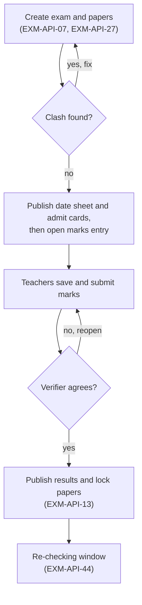
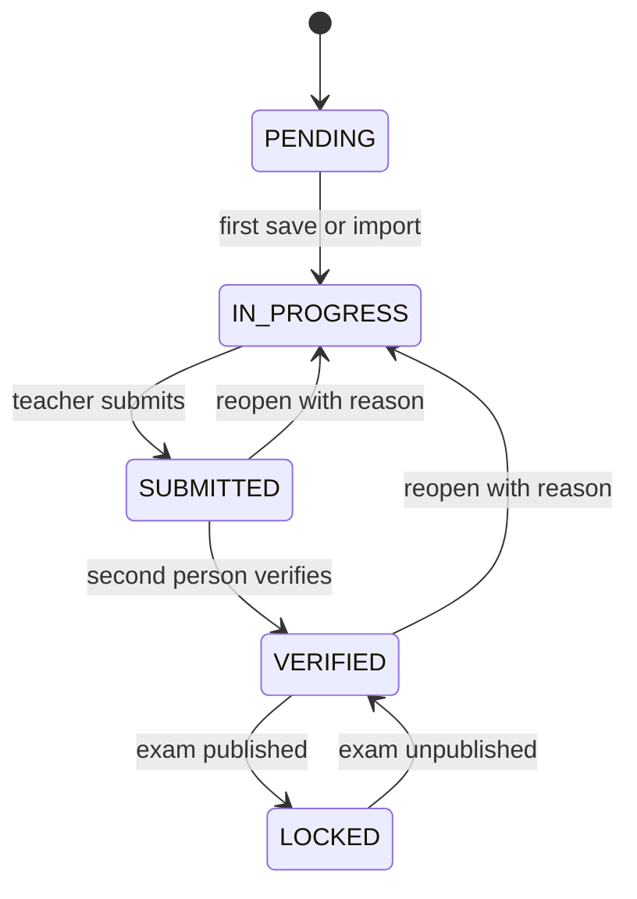
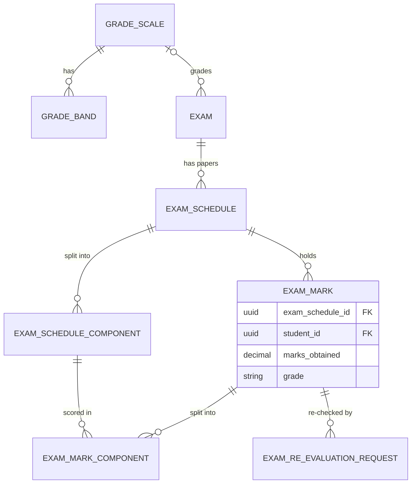

# Exams Module

**In simple words:** This chapter explains how EduFlow runs an exam from set-up to results. The principal builds the date sheet, teachers type marks, a second person checks them, and one click publishes results to parents. The same module runs a school's Half Yearly exam and a coaching institute's Sunday JEE mock with negative marking, rank and percentile. Report card PDFs are built from these marks in the *Report Cards Module*.

| Item | Value |
|---|---|
| Module code | EXM |
| Release phase | Phase 2 (V1.0), Day 61 to 120, prompt P-37 |
| Plans | Growth, Pro, Enterprise (plan feature `module.EXM`); not on Starter |
| Main users | Principal, Teacher, Organization Admin; Parent and Student (read, re-checking) |
| Depends on | Batch, Subjects, Teachers, Student Profile, Fees, Notifications, Settings |
| Main tables | `grade_scales`, `grade_bands`, `exams`, `exam_schedules`, `exam_schedule_components`, `exam_marks`, `exam_mark_components`, `exam_re_evaluation_requests` |

## Objective

1. **Date sheet in 20 minutes.** Bright Future Public School creates 70 Half Yearly papers from curriculum defaults with zero clashes.
2. **Fast marks entry.** A teacher enters 40 students in under 5 minutes by keyboard, or uploads one Excel file.
3. **Two-person accuracy.** Someone other than the typist verifies every paper.
4. **Results reach parents within one minute of publish**, in the portal and on WhatsApp.
5. **Coaching-ready and locked.** Sharma Classes publishes a JEE mock with rank and percentile the same evening; published marks change only through an audited path.

## Scope

### In scope

- Grade scales with bands (`PERCENTAGE_BANDS`, `GRADE_POINT`, `PASS_FAIL`), one default per organization.
- Exams per campus, year and optional term, with ten `ExamType` values; `SUPPLEMENTARY` and `RETEST` link to the original through `parentExamId`.
- Date sheet: one `ExamSchedule` row (a "paper") per batch and subject, with optional room, invigilator and components (Theory 80 + Internal 20), and clash checks.
- Admit cards and sheet exports.
- Keyboard marks grid, Excel import, codes AB (absent), EX (exempt) and M (malpractice), negative marking.
- Verification, moderation, grace marks, publish, unpublish and lock.
- Results with grade, rank and percentile; subject and batch analysis.
- Re-evaluation (re-checking) with an optional fee; parent and student result views.

### Out of scope

| Not in this module | Where it lives or why |
|---|---|
| Report card PDF, term and annual totals | *Report Cards Module* |
| Collecting the re-checking fee | *Fees Module* and *Payments Module*; this module raises the invoice |
| Student date sheet screen | *Student Portal Module* (SP-API-10) |
| Seat-by-seat seating plan | Not in V1.0; a paper gets a room, the admit card prints room and roll number |
| Online tests, OMR scanning, question bank | Not built; OMR results come in through the vendor's Excel |

### Phase notes

- Phase 2 (P-37) ships all 45 endpoints and screens EXM-S01 to EXM-S09.
- Later phases only read this data: cross-campus comparison in the *Analytics Module*, marks trends in the *AI Insights Module*.

## User Stories

| ID | As a | I want to | So that | Priority |
|---|---|---|---|---|
| EXM-US-01 | Organization Admin | set up the CBSE 9-point grade scale once | every exam grades the same way | Must |
| EXM-US-02 | Principal | create "Half Yearly 2027" for Term 1 | the campus plans around it | Must |
| EXM-US-03 | Principal | create all Class 9 and 10 papers from curriculum defaults | I do not type 70 rows | Must |
| EXM-US-04 | Principal | be stopped when a batch, room or invigilator clashes | the date sheet has no mistakes | Must |
| EXM-US-05 | Principal | print admit cards for a batch | students carry them to the hall | Should |
| EXM-US-06 | Teacher | type marks by keyboard and mark AB or EX | I finish a batch in minutes | Must |
| EXM-US-07 | Teacher | fill an Excel template and upload it | I can work offline | Must |
| EXM-US-08 | Principal | verify papers entered by other people | wrong marks are caught before parents see them | Must |
| EXM-US-09 | Principal | apply the board's grace rule automatically | borderline students are treated alike | Should |
| EXM-US-10 | Principal | publish results and lock marks | nobody changes marks silently | Must |
| EXM-US-11 | Principal | unpublish with a reason | I can fix a mistake with a trail | Must |
| EXM-US-12 | Parent | see my child's marks and grades on my phone | I know the result the same day | Must |
| EXM-US-13 | Parent | ask for re-checking of one paper and pay online | I need not visit the school | Should |
| EXM-US-14 | Centre head | run a weekly JEE test with negative marking, rank and percentile | students know where they stand | Must |
| EXM-US-15 | Principal | compare subject averages and batches | I know which class needs help | Should |

## Workflow

**Figure: Exam lifecycle from set-up to results**



Each paper has its own marks status, so one late teacher blocks only the final publish.

Step by step, for Bright Future Public School:

1. On 1 Sep 2027 Dr. Anita Verma creates "Half Yearly 2027": `MID_TERM`, Term 1, 20 to 30 Sep, CBSE 9-point scale, ranks hidden.
2. She bulk-creates papers for 10 batches; Mathematics gets TH 80 and IA 20.
3. The clash check rejects 10-A Hindi at 11:00 on 24 Sep (Science runs 09:00 to 12:00). She moves Hindi and publishes the date sheet; guardians get WhatsApp.
4. On 20 Sep at 00:05 IST the nightly job sets the exam `ONGOING`. On 21 Sep she opens marks entry.
5. Priya Nair enters 10-A Mathematics and submits. Dr. Verma verifies papers she did not type; Rajesh Sharma verifies the two she typed.
6. On 8 Oct at 17:00 all 70 papers are `VERIFIED`. She publishes; marks lock and the 7-day re-checking window opens.

**Figure: Marks-entry status of one paper**



A paper is locked only by publishing the whole exam, and unlocked only by an audited unpublish.

### Exam statuses

| Status | Meaning | Parents see | Next step |
|---|---|---|---|
| `DRAFT` | Being set up | Nothing | `SCHEDULED` (EXM-API-11) or `CANCELLED` |
| `SCHEDULED` | Date sheet sent | Date sheet | `ONGOING` (nightly job on `startDate`) or `CANCELLED` |
| `ONGOING` | Papers being written | Date sheet | `MARKS_ENTRY` (EXM-API-12) or `CANCELLED` |
| `MARKS_ENTRY` | Marks typed and verified | Date sheet | `PUBLISHED` (EXM-API-13); `CANCELLED` only with zero marks |
| `PUBLISHED` | Results out, papers locked | Marks and grades | `MARKS_ENTRY` (EXM-API-14) |
| `CANCELLED` | Called off, kept for history | Nothing | None (terminal) |

### Re-evaluation statuses

| Status | Meaning | Next step |
|---|---|---|
| `REQUESTED` | Parent or staff asked for re-checking | Accept (EXM-API-39) or reject (EXM-API-41) |
| `FEE_PENDING` | Accepted; fee invoice raised | `UNDER_REVIEW` when paid; reject cancels the invoice |
| `UNDER_REVIEW` | Paper being re-checked | Resolve (EXM-API-40) |
| `NO_CHANGE`, `MARKS_REVISED`, `REJECTED` | Closed; reject needs `reviewRemarks` | Terminal |

## Screens and Wireframes

| ID | Screen | Users | Purpose |
|---|---|---|---|
| EXM-S01 | Exams list and dashboard | Principal, Organization Admin, Teacher | Upcoming exams, marks progress, late papers |
| EXM-S02 | Exam set-up and date sheet | Principal | Exam details, papers, clashes, admit cards |
| EXM-S03 | Marks entry grid | Teacher, Principal | Keyboard entry, Excel import, submit |
| EXM-S04 | Verification queue | Principal, Organization Admin | Verify or reopen submitted papers |
| EXM-S05 | Results and analysis | Principal; Teacher for own batches | Result sheet, analysis, publish |
| EXM-S06 | Grade scales and exam settings | Organization Admin, Principal | Scales, bands, grace and re-checking policy |
| EXM-S07 | Re-evaluation requests | Principal, Organization Admin | Accept, resolve or reject |
| EXM-S08 | Exams and Results (parent app) | Parent | Date sheet, marks, re-checking request |
| EXM-S09 | My Results (student app) | Student | Own published marks; rank when shown |

**Screen EXM-S02 — Exam set-up and date sheet (Principal, web)**

```text
+--------------------------------------------------------------------------+
| EduFlow | Bright Future Public School        [Search...]          (AV) v |
+------------+-------------------------------------------------------------+
| Dashboard  | Exams > Half Yearly 2027 > Date sheet        Status: DRAFT  |
| Students   | Term 1 | MID_TERM | 20-30 Sep 2027 | Scale: CBSE 9-point    |
| Attendance +-------------------------------------------------------------+
| Exams    < | Batch [10-A v]   [+ Add paper]   [Bulk from curriculum]     |
|  Exams     | Date    Time         Subject       Room     Invig.   Max    |
|  Marks     | 20 Sep  09:00-12:00  English       Room 12  R.Khan   100    |
|  Results   | 22 Sep  09:00-12:00  Mathematics   Room 12  S.Paul   80+20  |
|  Re-checks | 24 Sep  09:00-12:00  Science       Hall A   P.Nair   100    |
|  Grades    | 24 Sep  11:00-13:00  Hindi   ! Clash: 10-A has Science      |
| Settings   | 27 Sep  09:00-12:00  Social St.    Room 12  M.Das    100    |
|            | 30 Sep  09:00-12:00  Sanskrit      Room 14  A.Iyer   100    |
|            |-------------------------------------------------------------|
|            | 6 papers | 1 clash | Hall A: 82 seated of 80 !              |
|            |          [Admit cards]  [Export v]  [Publish date sheet]    |
+------------+-------------------------------------------------------------+
```

- One row per paper of the chosen batch; clash and room-capacity warnings show in red.
- **Bulk from curriculum** calls EXM-API-27, **+ Add paper** EXM-API-23, cell edits EXM-API-25.
- **Publish date sheet** (EXM-API-11) stays disabled while a clash exists. **Admit cards** calls EXM-API-16; **Export** calls EXM-API-17.

**Screen EXM-S03 — Marks entry grid (Teacher, web and tablet)**

```text
+--------------------------------------------------------------------------+
| EduFlow | Bright Future Public School        [Search...]          (PN) v |
+--------------------------------------------------------------------------+
| Half Yearly 2027 > 10-A > Mathematics      Max 100 = TH 80 + IA 20       |
| Status: IN_PROGRESS    Saved 10:42    Pass 33    Deadline 5 Oct          |
+------+---------------------+--------+--------+-------+------+------------+
| Roll | Student             | TH /80 | IA /20 | Total | Code | Remarks    |
+------+---------------------+--------+--------+-------+------+------------+
|  01  | Aarav Sharma        | [ 74 ] | [ 18 ] |   92  | [  ] | [________] |
|  02  | Diya Kapoor         | [ 61 ] | [ 17 ] |   78  | [  ] | [________] |
|  03  | Kabir Mehta         | [ -- ] | [ -- ] |   AB  | [AB] | [________] |
|  04  | Rohan Verma         | [ 21 ] | [ 10 ] |   31  | [  ] | [________] |
|  05  | Sana Khan           | [ -- ] | [ -- ] |   EX  | [EX] | [Medical ] |
|  06  | Vivaan Gupta        | [ 00 ] | [ 00 ] |    0  | [M ] | [Chits   ] |
|  07  | Zoya Ali            | [ 7_ ] | [    ] |       | [  ] | [________] |
+------+---------------------+--------+--------+-------+------+------------+
| 37 of 40 done | AB 1 | EX 1 | M 1 | Below pass 2 | Average 70.85         |
| Enter = down  Tab = right  a = AB  e = EX  m = M  Ctrl+S = save          |
| [Template]  [Import Excel]              [Save]  [Submit for verification]|
+--------------------------------------------------------------------------+
```

- Rows are students enrolled on the paper date; for an elective, only those who chose it (EXM-API-28).
- A cell above its maximum turns red and blocks the save. The grid autosaves 3 seconds after the last key (EXM-API-29).
- **Template** calls EXM-API-33, **Import Excel** EXM-API-35, **Submit** EXM-API-30 (every row filled or coded).
- A negative-marking paper shows Correct, Incorrect and Unattempted columns instead.

**Screen EXM-S05 — Results and analysis (Principal, web)**

```text
+--------------------------------------------------------------------------+
| EduFlow | Bright Future Public School        [Search...]          (AV) v |
+--------------------------------------------------------------------------+
| Half Yearly 2027 > Results        70 of 70 papers VERIFIED    [Publish]  |
| Batch [10-A v]  (o) Result sheet  ( ) Subject analysis  ( ) Batches      |
+----+--------------+-----+-----+-----+-----+-----+-----+-------+-------+--+
| Rk | Student      | ENG | HIN | MAT | SCI | SST | SKT | Total |   %   |Gr|
+----+--------------+-----+-----+-----+-----+-----+-----+-------+-------+--+
|  1 | Diya Kapoor  |  94 |  90 |  98 |  96 |  95 |  97 |  570  | 95.00 |A1|
|  2 | Meera Joshi  |  91 |  88 |  95 |  93 |  90 |  96 |  553  | 92.17 |A1|
| .. | ...          |     |     |     |     |     |     |       |       |  |
| 12 | Aarav Sharma |  78 |  71 |  92 |  85 |  80 |  88 |  494  | 82.33 |A2|
| -- | Kabir Mehta  |  AB |  AB |  AB |  AB |  AB |  AB |    0  |  0.00 |E |
+----+--------------+-----+-----+-----+-----+-----+-----+-------+-------+--+
| Subject  Avg    Pass%    Highest   A1  A2  B1  B2  C1  C2  D   E         |
| MAT      71.6   94.74%   98        6   7   9   8   4   1   1   2         |
| SCI      69.8   97.44%   96        5   6   10  9   5   2   1   1         |
| 10-A pass 35/39 = 89.74%       10-B pass 39/42 = 92.86%     [Export v]   |
+--------------------------------------------------------------------------+
```

- Before publish this is a preview (EXM-API-18). Staff always see ranks; `showRank` controls the portals only. Kabir, absent in every paper, gets no rank (EXM-BR-14).
- Subject rows and batch pass rates come from EXM-API-19. **Publish** opens a checklist (all papers verified, grace preview, guardians to notify) and calls EXM-API-13.

**Screen EXM-S08 — Exams and Results (Parent, mobile)**

```text
+------------------------------------+
| <  Exams and Results         (SD)  |
+------------------------------------+
| Child [Aarav Sharma - 10-A     v]  |
| Half Yearly 2027                   |
| Published 8 Oct 2027               |
+------------------------------------+
| Subject          Marks    Grade    |
| English          78/100   B1       |
| Hindi            71/100   B1       |
| Mathematics      92/100   A1       |
| Science          85/100   A2       |
| Social Studies   80/100   B1       |
| Sanskrit         88/100   A2       |
+------------------------------------+
| Total 494/600   82.33%   Grade A2  |
| Result: PASS                       |
+------------------------------------+
| Re-checking open till 15 Oct       |
| [ Request re-checking ]            |
| [ Upcoming: Unit Test 3, 8 Nov ]   |
+------------------------------------+
```

- Sunita Devi sees only `PUBLISHED` results (EXM-API-43) and upcoming date sheets (EXM-API-42). Rank and percentile show only when `showRank` is true.
- **Request re-checking** calls EXM-API-44 while the window is open; a fee arrives as an invoice in the *Parent Portal Module*.
- The student view EXM-S09 is the same card without child picker and request button (EXM-API-45).

## UI Components

| Component | Type | Behaviour |
|---|---|---|
| `DateSheetTable` | `DataTable`, inline cells | Skeleton while loading; empty state "No papers yet. Use Bulk from curriculum."; clash rows red |
| `BulkPaperDialog` | `Dialog` + stepper | Batches, slots per subject, preview of created and skipped rows |
| `MarksGrid` | TanStack Table, editable cells | Enter down, Tab right, arrows; `a`, `e`, `m` set codes; autosave; offline banner |
| `ObjectiveCountsCell` | Three `Input`s | Correct, incorrect, unattempted; red when counts do not add up |
| `MarksImportDialog` | `Dialog` + dropzone | Dry run first; good and bad rows; link to the error workbook |
| `VerifyPanel` | `Sheet` | Entered-by name, average, below-pass list; **Verify** or **Reopen** with reason |
| `PublishDialog` | `AlertDialog` | Checklist, grace count, guardians to notify; confirm disabled until all checks pass |
| `AnalysisCharts` | Recharts bar and histogram | Subject averages, grade spread, batch comparison; table fallback for screen readers |
| `GradeScaleEditor` | Form with band rows | Live 0 to 100 bar that shows gaps and overlaps |

Errors show a retry button and the `requestId`. The grid keeps typed marks in browser storage until saved.

## Validation Rules

| Field | Rule | Error message shown to user |
|---|---|---|
| Exam `name` | 3 to 120 characters; unique per campus and academic year | "An exam called Half Yearly 2027 already exists in 2027-28." |
| `startDate`, `endDate` | End on or after start; both inside the academic year | "Exam dates must be inside session 2027-28 (1 Apr 2027 to 31 Mar 2028)." |
| `marksEntryDeadline` | On or after `endDate` | "The marks deadline cannot be before the last paper." |
| `parentExamId` | Required for `SUPPLEMENTARY` and `RETEST`; a `PUBLISHED` exam, same campus and year | "Choose the published exam that this re-test follows." |
| Paper `examDate` | Between the exam's start and end dates | "Paper date must be between 20 Sep and 30 Sep 2027." |
| `startTime`, `endTime` | `HH:mm`; end after start | "End time must be after start time." |
| `maxMarks` | 1 to 1,000, steps of 0.5 | "Max marks must be between 1 and 1000." |
| `passMarks` | 0 to `maxMarks` | "Pass marks cannot be more than max marks (100)." |
| Components | Unique codes; maximums add up to paper `maxMarks` | "Components add up to 90, but max marks is 100." |
| `negativeMarkPerWrong` | 0.25 to 10; needs `totalQuestions` 1 to 500 | "Enter the number of questions to use negative marking." |
| `marksObtained` | 0 to the paper or component maximum; steps of 0.5 | "Marks must be between 0 and 80 (Theory)." |
| Objective counts | Correct + incorrect + unattempted = `totalQuestions` | "Correct, incorrect and unattempted must add up to 25." |
| Codes | One of AB, EX, M; AB and EX need empty marks | "Clear the marks or remove the AB code." |
| Code M | Remark of 5 to 200 characters | "Write what happened (for example: copying from chits)." |
| Reopen, unpublish, re-checking `reason` | 10 to 500 characters | "Tell us what must be checked or fixed (at least 10 characters)." |
| `revisedMarks` | 0 to the paper maximum | "Revised marks cannot be more than 100." |
| Grade bands | Cover 0.00 to 100.00; no gap or overlap; unique grades | "Bands leave a gap between 40.99 and 42.00." |

## Business Rules

> **Note:** Assumption: four `organization_settings` keys (JSON values, edited on EXM-S06) drive this module: `exams.grace_policy`, `exams.re_evaluation`, `exams.allow_self_verify`, `exams.admit_card_block_on_dues`.

**EXM-BR-01 — Exam set-up.** An exam belongs to one campus (from `X-Campus-Id`) and one academic year, with a name unique per campus and year. `gradeScaleId` null means the organization default at publish time.

**EXM-BR-02 — Papers from the curriculum.** EXM-API-27 creates one paper per batch and subject with `defaultMaxMarks` and `defaultPassMarks` from `CourseSubject`, else the fallback (100 and 33). An existing pair is skipped and reported. An elective paper needs at least one student who chose the subject.

**EXM-BR-03 — Clash checks.** They run on every paper create and update, and again on EXM-API-11. Slots overlap when `startA < endB` and `startB < endA`. Two untimed papers of one batch on one date always clash.

| Check | Result |
|---|---|
| Same batch, overlapping slot | `409 CONFLICT` |
| Same invigilator, overlapping slot, different room | `409 CONFLICT` |
| Students of all batches in one room and slot above `Room.capacity` | `422 BUSINESS_RULE_VIOLATION` |
| Date is a `PUBLIC`, `FESTIVAL`, `VACATION` or `EMERGENCY` holiday | `422 BUSINESS_RULE_VIOLATION` |
| Date is a `WEEKLY_OFF` day (coaching Sunday tests) | Warning only |
| One student in two batches with overlapping papers | Warning with names |

> **Example:** 10-A Science runs 09:00 to 12:00. Hindi at 11:00 to 13:00 overlaps, because 09:00 < 13:00 and 11:00 < 12:00. Hall A seats 80; 10-A (40) plus 10-B (42) = 82 fails.

**EXM-BR-04 — Components.** Component maximums add up to the paper maximum, and `ExamMark.marksObtained` caches their sum. A component `passMarks` adds a second pass condition. Absent in every component means absent in the paper.

> **Example:** Aarav's Mathematics: Theory 74/80 + Internal 18/20 = 92/100. With a Theory pass mark of 26, Theory 24 + Internal 19 = 43 still fails.

**EXM-BR-05 — Who enters marks, and when.** Writes need the exam in `MARKS_ENTRY`, the paper `PENDING` or `IN_PROGRESS`, and the paper date today or earlier (campus timezone). A teacher enters marks only for own batches: subject teacher (`BatchSubjectTeacher`) or class teacher. The deadline is soft; late papers show "Late" on EXM-S01.

**EXM-BR-06 — Mark codes.**

| Code | Stored as | In total | Ranked | Paper result |
|---|---|---|---|---|
| Marks | `marksObtained` | Yes | Yes | By `passMarks` |
| AB | `isAbsent = true`, marks null | 0 of the maximum | Yes, unless absent in all | Fail |
| EX | `isExempt = true`, marks null | Left out of marks and maximum | Yes, by percentage | None |
| M | `marksObtained = 0`, remark starts `MALPRACTICE:` | 0 of the maximum | No | Fail |

> **Note:** Assumption: the schema has no malpractice column, so the service writes the reserved remark prefix `MALPRACTICE:` and refuses it when typed by hand.

**EXM-BR-07 — Negative marking.** With `negativeMarkPerWrong` set, marks come from counts only. Per correct answer = `maxMarks / totalQuestions`. Marks = correct x per correct - incorrect x `negativeMarkPerWrong`; that second part is stored as `negativeMarks`. Marks may go below zero; the grade uses a percentage floored at 0.

> **Example:** Sharma Classes, JEE Mock 7, Sunday 12 Sep 2027. Physics has 25 questions, max 100, minus 1 per wrong answer, so 4 per correct. Ishaan Kumar (Morning Batch M1): 18 correct, 5 incorrect, 2 unattempted. Marks = 18 x 4 - 5 x 1 = 67; `negativeMarks` = 5.00.

**EXM-BR-08 — Total and percentage.** Only papers whose `CourseSubject.includeInTotal` is true count. Total = sum of marks (AB and M count 0). Maximum = sum of paper maximums minus exempt papers. Percentage = total / maximum x 100, rounded half up to 2 decimals.

> **Example:** Aarav: 78 + 71 + 92 + 85 + 80 + 88 = 494 of 600 = 82.33%. Exempt from Hindi, it would be 423 of 500 = 84.60%.

**EXM-BR-09 — Grades.** The exam's scale is used, else the organization default. A paper grade uses the paper percentage; the exam grade uses the total percentage. The band with `minPercent <= percent <= maxPercent` wins. Each save computes a preview grade; publish freezes `grade` and `gradePoint`, so later scale edits change nothing.

> **Example:** CBSE 9-point: A1 91.00-100.00 (10), A2 81.00-90.99 (9), B1 71.00-80.99 (8), B2 61.00-70.99 (7), C1 51.00-60.99 (6), C2 41.00-50.99 (5), D 33.00-40.99 (4), E 0.00-32.99. Science 85/100 is A2 with grade point 9.

**EXM-BR-10 — Pass and fail.** A paper passes when marks reach `passMarks` and every component pass mark. The exam result is PASS when every counted, non-exempt paper passes, ABSENT when absent in all papers, else FAIL. `GradeBand.isPass` only colours the grade; outcomes such as `COMPARTMENT` belong to the *Report Cards Module*.

**EXM-BR-11 — Two-person verification.** The verifier needs `exams.verify_marks` and must not be the `enteredById` of any mark in the paper, imports included; otherwise `422`. A one-admin organization may switch on `exams.allow_self_verify`; each self-verification is audited.

**EXM-BR-12 — Moderation.** When a paper was too hard for everyone, the principal reopens it (EXM-API-32) and uses **Add to all** in the grid. It adds N marks to every student who appeared, capped at the maximum, writes `MODERATION +N` in the remark, and the paper goes through verification again.

> **Example:** 10-B Science, max 80, was too long. Dr. Verma adds 3 to all 41 students who appeared; 79 becomes 80, not 82.

**EXM-BR-13 — Grace marks at publish.** Off by default. With `exams.grace_policy` = `{ "enabled": true, "maxPerPaper": 2, "maxPapers": 2, "examTypes": ["FINAL", "SUPPLEMENTARY"] }`, publish checks each failed paper that is not AB or M. Shortfall = `passMarks` - marks; a paper qualifies when the shortfall is at most `maxPerPaper`. A student with more qualifying papers than `maxPapers` gets none. Grace lifts marks exactly to `passMarks` and writes `GRACE +n` plus an audit row.

> **Example:** Annual Exam 2028 (`FINAL`). Rohan Verma: Science 31 of pass 33 (shortfall 2) becomes 33; Social Studies 30 (shortfall 3) stays failed. A student failing Maths 32, English 32 and Hindi 31 has three qualifying papers, so gets no grace.

**EXM-BR-14 — Ranks and ties.** Ranks use the percentage, so exempt students compare fairly. Equal percentages share a rank and the next rank is skipped (1, 2, 2, 4). Batch rank covers one batch; overall rank covers all batches of the course in the exam; `ExamMark.subjectRank` ranks one subject across them. Students absent in all papers or with any M code get no rank.

> **Example:** JEE Mock 7 totals 251, 243, 243 and 240 give ranks 1, 2, 2 and 4.

**EXM-BR-15 — Percentile.** Percentile = students of the course who appeared with a percentage at or below yours / students who appeared x 100, rounded to 2 decimals. It shows when `showRank` is true; the *Report Cards Module* freezes it in `ReportCard.percentile`.

> **Example:** 120 JEE Main 2028 students (batches M1, M2, E1) took JEE Mock 7. Ishaan: 67 + 58 + 72 = 197 of 300 (65.67%). 102 students are at or below him: 102 / 120 x 100 = 85.00. The topper always gets 100.00.

**EXM-BR-16 — Publish and lock.** Publish needs the exam in `MARKS_ENTRY` and every paper `VERIFIED`. One transaction applies grace, freezes grades and subject ranks, sets papers `LOCKED` and the exam `PUBLISHED` with `publishedAt`. After commit the result cache is cleared and `exam.results.published` is emitted. A `LOCKED` paper refuses marks writes with `422`.

**EXM-BR-17 — Unpublish.** It needs a reason. It is blocked while a report card with `scopeKey` `EXAM:{examId}` is `PUBLISHED` (withhold it first, RPT-API-14) or a request is `UNDER_REVIEW`. The exam returns to `MARKS_ENTRY`, papers to `VERIFIED`, and grace is reversed. Portals show "Results under revision".

**EXM-BR-18 — Re-evaluation.** With `exams.re_evaluation` = `{ "enabled": true, "windowDays": 7, "feePerPaper": 200, "feeHeadId": "<EXAM fee head>" }`, parents may ask until `publishedAt` + 7 days, 23:59 campus time. A mark has at most one request that is not `REJECTED`; it stores `originalMarks`. Accept raises an ad hoc `FeeInvoice` (fee head type `EXAM`, due in 3 days) and sets `FEE_PENDING`, or `UNDER_REVIEW` when there is no fee; payment moves it on automatically. `MARKS_REVISED` writes the new marks, adds 1 to `revisionCount`, recomputes grade and subject rank, and triggers report card regeneration (RPT-API-12). Marks may go down; the fee is not refunded.

> **Example:** Results out Fri 8 Oct 2027 at 17:00; the window closes Fri 15 Oct, 23:59 IST. Sunita Devi asks for Aarav's Science on 10 Oct and pays ₹200 by UPI. The reviewer finds an untotalled 3-mark answer: 85 becomes 88, total 497/600 = 82.83%, grade stays A2.

**EXM-BR-19 — Supplementary and re-test.** The parent exam must be `PUBLISHED`, same campus and year. The marks sheet lists only students who failed or were absent in the parent paper; marks save with `isSupplementary = true`.

**EXM-BR-20 — Admit cards.** Allowed from `SCHEDULED`; two A5 cards per A4 page with photo, roll number, papers, rooms and instructions. With `exams.admit_card_block_on_dues` true, students with overdue invoices are skipped and listed in the job result.

**EXM-BR-21 — Delete and cancel.** An exam or paper can be soft-deleted only without marks. Cancel works up to `MARKS_ENTRY` while no marks exist. Guardians are told only if the date sheet was sent.

## Acceptance Criteria

| ID | Given | When | Then |
|---|---|---|---|
| EXM-AC-01 | 10-A has Science on 24 Sep, 09:00 to 12:00 | The principal adds 10-A Hindi at 11:00 to 13:00 | `409 CONFLICT` names the Science paper; nothing is saved |
| EXM-AC-02 | Class 10 has 7 subjects; 10-A already has English | Bulk create runs for 10-A and 10-B | 13 papers created, 1 skipped and listed |
| EXM-AC-03 | The exam is `SCHEDULED` | A teacher saves marks | `422` "Marks entry is not open for this exam." |
| EXM-AC-04 | Priya Nair teaches Mathematics in 10-A only | She opens 10-B Mathematics marks | `403 FORBIDDEN` |
| EXM-AC-05 | Mathematics has TH 80 and IA 20 | Priya saves TH 74 and IA 18 for Aarav | `marksObtained` 92.00, two component rows, paper `IN_PROGRESS` |
| EXM-AC-06 | 25 questions, minus 1 per wrong answer | Counts 18, 5, 2 are saved | Marks 67.00, `negativeMarks` 5.00 |
| EXM-AC-07 | One of 40 rows has code AB and marks 40 | The grid saves | `400 VALIDATION_ERROR` for that row; no row is saved |
| EXM-AC-08 | Two rows are empty | The teacher submits | `422` lists both students; status stays `IN_PROGRESS` |
| EXM-AC-09 | Dr. Verma typed 10-A Hindi | She verifies it | `422`; Rajesh Sharma's verify sets `VERIFIED` and `marksVerifiedAt` |
| EXM-AC-10 | 69 of 70 papers are `VERIFIED` | The principal publishes | `422` lists the open paper; nothing changes |
| EXM-AC-11 | All verified; grace on; Rohan has Science 31 of 33 in a `FINAL` exam | The principal publishes | Science 33 with `GRACE +2`; papers `LOCKED`; guardians messaged within 60 seconds |
| EXM-AC-12 | The exam is `PUBLISHED` | A teacher saves marks | `422` "Marks are locked because results are published." |
| EXM-AC-13 | A report card of this exam is `PUBLISHED` | The principal unpublishes | `422` "Withhold the report cards of this exam first." |
| EXM-AC-14 | Published 8 Oct with a 7-day window | Sunita Devi asks on 16 Oct | `422` "Re-checking closed on 15 Oct 2027." |
| EXM-AC-15 | A request is `UNDER_REVIEW`, original 85 | Staff resolve `MARKS_REVISED` with 88 | Mark 88, `revisionCount` 1, grade and rank recomputed, parent notified |
| EXM-AC-16 | Totals 251, 243, 243, 240; `showRank` true | The result sheet loads | Ranks 1, 2, 2, 4 and a percentile per student |
| EXM-AC-17 | The organization is on Starter | Any EXM endpoint is called | `403 PLAN_LIMIT_REACHED` with an upgrade message |

## Edge Cases

| Case | What happens | How the system handles it |
|---|---|---|
| Two devices edit one paper | Second save has an old `baseUpdatedAt` | `409 CONFLICT`; grid reloads changed rows and keeps unsaved cells marked |
| Internet drops while typing | Saves fail | Rows stay in browser storage; "Offline, 4 rows waiting"; retry every 10 seconds |
| Excel row for a student of another batch | Row cannot match | Listed in the error workbook; good rows are saved |
| Import on a `SUBMITTED` paper | Would overwrite checked marks | `422`; reopen the paper first |
| Student moves from 10-A to 10-B mid-exam | Papers in both batches | Each mark stays with its paper; result sheet uses the batch held on `endDate` |
| Paper date moved after the date sheet was sent | Admit cards are stale | Guardians get "Updated date sheet"; principal sees "Reprint admit cards" |
| Medical certificate arrives after publish | EX must be set | Unpublish, reopen, set EX, verify, publish again |
| Re-checking fee never paid | Request waits | Nightly job rejects it 3 days after the window closes ("Fee not paid") and cancels the invoice |
| Negative total in a JEE mock | Percentage below 0 | Grade uses 0; rank and percentile use the real value |

## Database Schema

| Table | Purpose | Key columns |
|---|---|---|
| `grade_scales` | Grading scheme, for example "CBSE 9-point" | `name`, `scale_type`, `is_default` |
| `grade_bands` | One band: A1 = 91.00 to 100.00, grade point 10 | `grade`, `min_percent`, `max_percent`, `grade_point` |
| `exams` | One exam of a campus in a year or term | `campus_id`, `academic_year_id`, `term_id`, `parent_exam_id`, `exam_type`, `status`, `show_rank` |
| `exam_schedules` | One paper: exam + batch + subject | `exam_date`, `start_time`, `room_id`, `max_marks`, `pass_marks`, `negative_mark_per_wrong`, `marks_entry_status` |
| `exam_schedule_components` | Parts of a paper: TH 80 + IA 20 | `code`, `max_marks`, `pass_marks` |
| `exam_marks` | One student's marks in one paper | `student_id`, `marks_obtained`, objective counts, `grade`, `is_absent`, `is_exempt`, `entered_by_id` |
| `exam_mark_components` | One student's marks in one component | `component_id`, `marks_obtained`, `is_absent` |
| `exam_re_evaluation_requests` | Re-checking request for one mark | `status`, `fee_invoice_id`, `original_marks`, `revised_marks` |

Every table has `id` (uuid PK), `organization_id`, `created_at` and `updated_at`. `grade_scales`, `exams` and `exam_schedules` have `deleted_at`; marks are never deleted. Marks are `decimal(6,2)`, percentages `decimal(5,2)`. All eight tables carry the RLS policy `organization_id = current_setting('app.current_org')::uuid`.

> **Note:** Column-level tables (type, null, default, delete rule) are in *Data Dictionary: Academics*, generated from the Prisma Schema below, so they are not repeated here.

### Indexes and constraints

In this table `org` stands for `organization_id`.

| Table | Unique | Other indexes |
|---|---|---|
| `grade_scales` | `(org, name)`; partial `(org) WHERE is_default AND deleted_at IS NULL` | `(org, status)` |
| `grade_bands` | `(org, grade_scale_id, grade)` | `(org, grade_scale_id, sort_order)` |
| `exams` | `(org, campus_id, academic_year_id, name)` | `(org, campus_id, academic_year_id, status)`, `(org, parent_exam_id)`, `(org, term_id)`, `(org, exam_type, start_date)` |
| `exam_schedules` | `(id, org)`; `(org, exam_id, batch_id, subject_id)` | `(org, campus_id, exam_date)`, `(org, batch_id, exam_date)`, `(org, invigilator_id, exam_date)`, `(org, exam_id, marks_entry_status)` |
| `exam_schedule_components` | `(org, exam_schedule_id, code)` | None |
| `exam_marks` | `(org, exam_schedule_id, student_id)` | `(org, campus_id, exam_id)`, `(org, student_id, exam_id)`, `(org, exam_id, subject_id)`, `(org, exam_id, batch_id)` |
| `exam_mark_components` | `(org, exam_mark_id, component_id)` | `(org, component_id)` |
| `exam_re_evaluation_requests` | None; one open request per mark is a service rule | `(org, campus_id, status, created_at)`, `(org, student_id)`, `(org, exam_mark_id)` |

`exam_marks` points to `exam_schedules` and `students` with composite keys `(id, organization_id)`, so the database itself refuses a mark that crosses tenants.

**Figure: Exams module tables**



An exam has papers, and a paper holds one mark per student. Components split both the paper and the mark. A re-checking request always points to one mark.

## Prisma Schema

Copied from `docs/src/_schema/07-exams.prisma`, with `RecordStatus` from `00-base.prisma`. The report card models of the same file are in the *Report Cards Module*. On lines too long for the page, trailing comments move above the field and alignment spaces are dropped.

```prisma
// Generic lifecycle for master data (courses, subjects, rooms, leave types ...).
enum RecordStatus {
  ACTIVE
  INACTIVE
  ARCHIVED
}

enum GradeScaleType {
  PERCENTAGE_BANDS // A1, A2, B1 ... by percentage (CBSE style)
  GRADE_POINT // GPA / CGPA with grade points
  PASS_FAIL
}

enum ExamType {
  UNIT_TEST
  MID_TERM
  FINAL
  MOCK
  WEEKLY_TEST
  PRE_BOARD
  PRACTICAL
  SUPPLEMENTARY // compartment exam; linked to the original through Exam.parentExamId
  RETEST
  ENTRANCE
}

enum ReEvaluationStatus {
  REQUESTED
  FEE_PENDING
  UNDER_REVIEW
  NO_CHANGE
  MARKS_REVISED
  REJECTED
}

// Lifecycle: DRAFT -> SCHEDULED -> ONGOING -> MARKS_ENTRY -> PUBLISHED. CANCELLED is a terminal
// side exit.
enum ExamStatus {
  DRAFT
  SCHEDULED
  ONGOING
  MARKS_ENTRY
  PUBLISHED
  CANCELLED
}

// Marks-entry progress of one exam paper (ExamSchedule).
enum MarksEntryStatus {
  PENDING
  IN_PROGRESS
  SUBMITTED // teacher finished; waiting for verification
  VERIFIED
  LOCKED // published; changes need exams.marks.unlock
}

// Grading scheme of the organization, e.g. "CBSE 9-point" or "GPA 4.0".
model GradeScale {
  id             String         @id @default(uuid()) @db.Uuid
  organizationId String         @map("organization_id") @db.Uuid
  name           String         @db.VarChar(80)
  scaleType      GradeScaleType @default(PERCENTAGE_BANDS) @map("scale_type")
  description    String?        @db.VarChar(255)
  // single default: service layer + partial unique index in the SQL migration, UNIQUE
  // (organization_id) WHERE is_default AND deleted_at IS NULL
  isDefault      Boolean        @default(false) @map("is_default")
  status         RecordStatus   @default(ACTIVE)
  createdAt      DateTime       @default(now()) @map("created_at") @db.Timestamptz(6)
  updatedAt      DateTime       @updatedAt @map("updated_at") @db.Timestamptz(6)
  deletedAt      DateTime?      @map("deleted_at") @db.Timestamptz(6)

  organization Organization @relation(fields: [organizationId], references: [id], onDelete: Cascade)
  bands               GradeBand[]
  exams               Exam[]
  reportCardTemplates ReportCardTemplate[]

  @@unique([organizationId, name])
  @@index([organizationId, status])
  @@map("grade_scales")
}

// One band of a grade scale: grade A1 = 91-100 %, grade point 10.
model GradeBand {
  id             String   @id @default(uuid()) @db.Uuid
  organizationId String   @map("organization_id") @db.Uuid
  gradeScaleId   String   @map("grade_scale_id") @db.Uuid
  grade          String   @db.VarChar(10) // A1, B+, Distinction
  minPercent     Decimal  @map("min_percent") @db.Decimal(5, 2) // inclusive
  maxPercent     Decimal  @map("max_percent") @db.Decimal(5, 2) // inclusive
  gradePoint     Decimal? @map("grade_point") @db.Decimal(4, 2)
  description    String?  @db.VarChar(120) // Outstanding, Needs improvement
  isPass         Boolean  @default(true) @map("is_pass")
  sortOrder      Int      @default(0) @map("sort_order")
  createdAt      DateTime @default(now()) @map("created_at") @db.Timestamptz(6)
  updatedAt      DateTime @updatedAt @map("updated_at") @db.Timestamptz(6)

  organization Organization @relation(fields: [organizationId], references: [id], onDelete: Cascade)
  gradeScale   GradeScale   @relation(fields: [gradeScaleId], references: [id], onDelete: Cascade)

  @@unique([organizationId, gradeScaleId, grade])
  @@index([organizationId, gradeScaleId, sortOrder])
  @@map("grade_bands")
}

// An examination of a campus in an academic year / term: "Unit Test 1", "Half Yearly", "JEE Mock
// 7".
model Exam {
  id                 String     @id @default(uuid()) @db.Uuid
  organizationId     String     @map("organization_id") @db.Uuid
  campusId           String     @map("campus_id") @db.Uuid
  academicYearId     String     @map("academic_year_id") @db.Uuid
  termId             String?    @map("term_id") @db.Uuid
  gradeScaleId       String?    @map("grade_scale_id") @db.Uuid // null = organization default scale
  // original exam that this supplementary / re-test replaces
  parentExamId       String?    @map("parent_exam_id") @db.Uuid
  name               String     @db.VarChar(120)
  code               String?    @db.VarChar(30)
  examType           ExamType   @map("exam_type")
  status             ExamStatus @default(DRAFT)
  startDate          DateTime   @map("start_date") @db.Date
  endDate            DateTime   @map("end_date") @db.Date
  weightage          Decimal?   @db.Decimal(5, 2) // % contribution to the term / annual result
  marksEntryDeadline DateTime?  @map("marks_entry_deadline") @db.Date
  instructions       String?    @db.Text
  // coaching tests usually show ranks; many schools do not
  showRank           Boolean    @default(false) @map("show_rank")
  publishedAt        DateTime?  @map("published_at") @db.Timestamptz(6)
  publishedById      String?    @map("published_by_id") @db.Uuid // User id (audit only, no FK)
  createdById        String?    @map("created_by_id") @db.Uuid // User id (audit only, no FK)
  createdAt          DateTime   @default(now()) @map("created_at") @db.Timestamptz(6)
  updatedAt          DateTime   @updatedAt @map("updated_at") @db.Timestamptz(6)
  deletedAt          DateTime?  @map("deleted_at") @db.Timestamptz(6)

  organization Organization @relation(fields: [organizationId], references: [id], onDelete: Restrict)
  campus       Campus         @relation(fields: [campusId], references: [id], onDelete: Restrict)
  academicYear AcademicYear @relation(fields: [academicYearId], references: [id], onDelete: Restrict)
  term         Term?          @relation(fields: [termId], references: [id], onDelete: SetNull)
  gradeScale   GradeScale?    @relation(fields: [gradeScaleId], references: [id], onDelete: SetNull)
  parentExam Exam? @relation("ExamRetest", fields: [parentExamId], references: [id], onDelete: SetNull)
  retests      Exam[]         @relation("ExamRetest")
  schedules    ExamSchedule[]
  marks        ExamMark[]
  reportCards  ReportCard[]

  @@unique([organizationId, campusId, academicYearId, name])
  @@index([organizationId, parentExamId])
  @@index([organizationId, campusId, academicYearId, status])
  @@index([organizationId, termId])
  @@index([organizationId, examType, startDate])
  @@map("exams")
}

// One paper of an exam: exam + batch + subject with date, time, room and marks limits (the date
// sheet).
model ExamSchedule {
  id                   String           @id @default(uuid()) @db.Uuid
  organizationId       String           @map("organization_id") @db.Uuid
  campusId             String           @map("campus_id") @db.Uuid
  examId               String           @map("exam_id") @db.Uuid
  batchId              String           @map("batch_id") @db.Uuid
  subjectId            String           @map("subject_id") @db.Uuid
  examDate             DateTime         @map("exam_date") @db.Date
  // HH:mm in the campus timezone
  startTime            String?          @map("start_time") @db.VarChar(5)
  // HH:mm in the campus timezone
  endTime              String?          @map("end_time") @db.VarChar(5)
  durationMinutes      Int?             @map("duration_minutes") @db.SmallInt
  roomId               String?          @map("room_id") @db.Uuid
  invigilatorId        String?          @map("invigilator_id") @db.Uuid // Staff on duty
  maxMarks             Decimal          @map("max_marks") @db.Decimal(6, 2)
  passMarks            Decimal          @map("pass_marks") @db.Decimal(6, 2)
  // JEE / NEET style mock tests
  negativeMarkPerWrong Decimal?         @map("negative_mark_per_wrong") @db.Decimal(4, 2)
  totalQuestions       Int?             @map("total_questions") @db.SmallInt
  syllabus             String?          @db.Text
  marksEntryStatus     MarksEntryStatus @default(PENDING) @map("marks_entry_status")
  marksSubmittedAt     DateTime?        @map("marks_submitted_at") @db.Timestamptz(6)
  marksVerifiedAt      DateTime?        @map("marks_verified_at") @db.Timestamptz(6)
  createdAt            DateTime         @default(now()) @map("created_at") @db.Timestamptz(6)
  updatedAt            DateTime         @updatedAt @map("updated_at") @db.Timestamptz(6)
  deletedAt            DateTime?        @map("deleted_at") @db.Timestamptz(6)

  organization Organization @relation(fields: [organizationId], references: [id], onDelete: Restrict)
  campus Campus @relation(fields: [campusId], references: [id], onDelete: Restrict)
  // exams are soft-deleted; marks are never cascade-deleted
  exam Exam @relation(fields: [examId], references: [id], onDelete: Restrict)
  batch Batch @relation(fields: [batchId], references: [id], onDelete: Restrict)
  subject Subject @relation(fields: [subjectId], references: [id], onDelete: Restrict)
  room Room? @relation(fields: [roomId], references: [id], onDelete: SetNull)
  invigilator Staff? @relation(fields: [invigilatorId], references: [id], onDelete: SetNull)
  marks        ExamMark[]
  components   ExamScheduleComponent[]

  @@unique([id, organizationId]) // target of composite tenant-safe foreign keys
  @@unique([organizationId, examId, batchId, subjectId])
  @@index([organizationId, campusId, examDate])
  @@index([organizationId, batchId, examDate])
  @@index([organizationId, invigilatorId, examDate])
  @@index([organizationId, examId, marksEntryStatus])
  @@map("exam_schedules")
}

// Marks of one student in one exam paper.
model ExamMark {
  id               String    @id @default(uuid()) @db.Uuid
  organizationId   String    @map("organization_id") @db.Uuid
  // denormalised from the schedule for campus scoping
  campusId         String    @map("campus_id") @db.Uuid
  examScheduleId   String    @map("exam_schedule_id") @db.Uuid
  // denormalised from the schedule for result queries
  examId           String    @map("exam_id") @db.Uuid
  batchId          String    @map("batch_id") @db.Uuid // denormalised from the schedule
  subjectId        String    @map("subject_id") @db.Uuid // denormalised from the schedule
  studentId        String    @map("student_id") @db.Uuid
  // null when absent or exempt; cached total when the paper has components
  marksObtained    Decimal?  @map("marks_obtained") @db.Decimal(6, 2)
  correctCount     Int?      @map("correct_count") @db.SmallInt // objective tests
  incorrectCount   Int?      @map("incorrect_count") @db.SmallInt
  unattemptedCount Int?      @map("unattempted_count") @db.SmallInt
  negativeMarks    Decimal?  @map("negative_marks") @db.Decimal(6, 2)
  // rank in this paper across all batches that took it
  subjectRank      Int?      @map("subject_rank")
  // mark earned in a SUPPLEMENTARY / RETEST exam
  isSupplementary  Boolean   @default(false) @map("is_supplementary")
  // times changed after re-evaluation
  revisionCount    Int       @default(0) @map("revision_count") @db.SmallInt
  grade            String?   @db.VarChar(10) // from the grade scale at save time
  gradePoint       Decimal?  @map("grade_point") @db.Decimal(4, 2)
  isAbsent         Boolean   @default(false) @map("is_absent")
  // medical or other exemption; left out of totals
  isExempt         Boolean   @default(false) @map("is_exempt")
  remarks          String?   @db.VarChar(255)
  enteredById      String?   @map("entered_by_id") @db.Uuid
  enteredAt        DateTime? @map("entered_at") @db.Timestamptz(6)
  verifiedById     String?   @map("verified_by_id") @db.Uuid
  verifiedAt       DateTime? @map("verified_at") @db.Timestamptz(6)
  createdAt        DateTime  @default(now()) @map("created_at") @db.Timestamptz(6)
  updatedAt        DateTime  @updatedAt @map("updated_at") @db.Timestamptz(6)

  organization Organization @relation(fields: [organizationId], references: [id], onDelete: Restrict)
  campus Campus @relation(fields: [campusId], references: [id], onDelete: Restrict)
  // composite FK: same tenant guaranteed by the database
  examSchedule ExamSchedule @relation(fields: [examScheduleId, organizationId], references: [id, organizationId], onDelete: Restrict)
  exam Exam @relation(fields: [examId], references: [id], onDelete: Restrict)
  batch Batch @relation(fields: [batchId], references: [id], onDelete: Restrict)
  subject Subject @relation(fields: [subjectId], references: [id], onDelete: Restrict)
  // composite FK
  student Student @relation(fields: [studentId, organizationId], references: [id, organizationId], onDelete: Restrict)
  enteredBy User? @relation("ExamMarkEnteredBy", fields: [enteredById], references: [id], onDelete: SetNull)
  verifiedBy User? @relation("ExamMarkVerifiedBy", fields: [verifiedById], references: [id], onDelete: SetNull)
  components           ExamMarkComponent[]
  reEvaluationRequests ExamReEvaluationRequest[]

  @@unique([organizationId, examScheduleId, studentId])
  @@index([organizationId, campusId, examId])
  @@index([organizationId, studentId, examId])
  @@index([organizationId, examId, subjectId])
  @@index([organizationId, examId, batchId])
  @@map("exam_marks")
}

// Marks component of an exam paper: Theory 80 + Internal 20, or Theory 70 + Practical 30.
model ExamScheduleComponent {
  id             String   @id @default(uuid()) @db.Uuid
  organizationId String   @map("organization_id") @db.Uuid
  examScheduleId String   @map("exam_schedule_id") @db.Uuid
  name           String   @db.VarChar(60) // Theory, Practical, Internal Assessment
  code           String   @db.VarChar(20) // TH, PR, IA
  maxMarks       Decimal  @map("max_marks") @db.Decimal(6, 2)
  // set when the component has its own pass rule
  passMarks      Decimal? @map("pass_marks") @db.Decimal(6, 2)
  sortOrder      Int      @default(0) @map("sort_order")
  createdAt      DateTime @default(now()) @map("created_at") @db.Timestamptz(6)
  updatedAt      DateTime @updatedAt @map("updated_at") @db.Timestamptz(6)

  organization Organization @relation(fields: [organizationId], references: [id], onDelete: Restrict)
  examSchedule ExamSchedule @relation(fields: [examScheduleId], references: [id], onDelete: Cascade)
  marks        ExamMarkComponent[]

  @@unique([organizationId, examScheduleId, code])
  @@map("exam_schedule_components")
}

// Marks of one student in one component of a paper; ExamMark.marksObtained holds the cached total.
model ExamMarkComponent {
  id             String   @id @default(uuid()) @db.Uuid
  organizationId String   @map("organization_id") @db.Uuid
  examMarkId     String   @map("exam_mark_id") @db.Uuid
  componentId    String   @map("component_id") @db.Uuid
  marksObtained  Decimal? @map("marks_obtained") @db.Decimal(6, 2)
  isAbsent       Boolean  @default(false) @map("is_absent")
  createdAt      DateTime @default(now()) @map("created_at") @db.Timestamptz(6)
  updatedAt      DateTime @updatedAt @map("updated_at") @db.Timestamptz(6)

  organization Organization @relation(fields: [organizationId], references: [id], onDelete: Restrict)
  examMark ExamMark @relation(fields: [examMarkId], references: [id], onDelete: Cascade)
  component ExamScheduleComponent @relation(fields: [componentId], references: [id], onDelete: Restrict)

  @@unique([organizationId, examMarkId, componentId])
  @@index([organizationId, componentId])
  @@map("exam_mark_components")
}

// Re-checking / re-totalling request for one exam paper of a student, raised after results are
// published.
model ExamReEvaluationRequest {
  id                String             @id @default(uuid()) @db.Uuid
  organizationId    String             @map("organization_id") @db.Uuid
  campusId          String             @map("campus_id") @db.Uuid
  examMarkId        String             @map("exam_mark_id") @db.Uuid
  studentId         String             @map("student_id") @db.Uuid
  // parent / student login
  requestedByUserId String?            @map("requested_by_user_id") @db.Uuid
  reason            String             @db.VarChar(500)
  status            ReEvaluationStatus @default(REQUESTED)
  // ad-hoc invoice for the re-checking fee
  feeInvoiceId      String?            @map("fee_invoice_id") @db.Uuid
  originalMarks     Decimal?           @map("original_marks") @db.Decimal(6, 2)
  revisedMarks      Decimal?           @map("revised_marks") @db.Decimal(6, 2)
  reviewedById      String?            @map("reviewed_by_id") @db.Uuid
  reviewedAt        DateTime?          @map("reviewed_at") @db.Timestamptz(6)
  reviewRemarks     String?            @map("review_remarks") @db.VarChar(500)
  createdAt         DateTime           @default(now()) @map("created_at") @db.Timestamptz(6)
  updatedAt         DateTime           @updatedAt @map("updated_at") @db.Timestamptz(6)

  organization Organization @relation(fields: [organizationId], references: [id], onDelete: Restrict)
  campus          Campus       @relation(fields: [campusId], references: [id], onDelete: Restrict)
  examMark        ExamMark     @relation(fields: [examMarkId], references: [id], onDelete: Restrict)
  student         Student      @relation(fields: [studentId], references: [id], onDelete: Restrict)
  feeInvoice FeeInvoice? @relation(fields: [feeInvoiceId], references: [id], onDelete: SetNull)
  requestedByUser User? @relation("ReEvaluationRequestedBy", fields: [requestedByUserId], references: [id], onDelete: SetNull)
  reviewedBy User? @relation("ReEvaluationReviewedBy", fields: [reviewedById], references: [id], onDelete: SetNull)

  @@index([organizationId, campusId, status, createdAt])
  @@index([organizationId, studentId])
  @@index([organizationId, examMarkId])
  @@map("exam_re_evaluation_requests")
}
```

## API Endpoints

Paths are under `/api/v1`; staff calls send `X-Campus-Id`. On Starter every endpoint answers `403 PLAN_LIMIT_REACHED`; writes answer `422` when the academic year is `CLOSED`.

| ID | Method | Path | Permission | Purpose |
|---|---|---|---|---|
| EXM-API-01 | GET | `/grade-scales` | `exams.view` | List scales with bands |
| EXM-API-02 | POST | `/grade-scales` | `exams.manage` | Create scale with bands |
| EXM-API-03 | PATCH | `/grade-scales/:id` | `exams.manage` | Update scale, replace bands |
| EXM-API-04 | DELETE | `/grade-scales/:id` | `exams.manage` | Soft delete; blocked when in use |
| EXM-API-05 | POST | `/grade-scales/:id/set-default` | `exams.manage` | Make it the organization default |
| EXM-API-06 | GET | `/exams` | `exams.view` | List exams with filters |
| EXM-API-07 | POST | `/exams` | `exams.create` | Create exam (`DRAFT`) |
| EXM-API-08 | GET | `/exams/:id` | `exams.view` | Exam, papers, marks progress |
| EXM-API-09 | PATCH | `/exams/:id` | `exams.update` | Update exam details |
| EXM-API-10 | DELETE | `/exams/:id` | `exams.delete` | Soft delete without marks |
| EXM-API-11 | POST | `/exams/:id/publish-schedule` | `exams.update` | `SCHEDULED`; send date sheet |
| EXM-API-12 | POST | `/exams/:id/open-marks-entry` | `exams.update` | `MARKS_ENTRY`; notify teachers |
| EXM-API-13 | POST | `/exams/:id/publish` | `exams.publish` | Grades, ranks, lock, `PUBLISHED` |
| EXM-API-14 | POST | `/exams/:id/unpublish` | `exams.publish` | Back to `MARKS_ENTRY` with reason |
| EXM-API-15 | POST | `/exams/:id/cancel` | `exams.update` | `CANCELLED` and notify |
| EXM-API-16 | POST | `/exams/:id/admit-cards` | `exams.export` | Admit card PDF job |
| EXM-API-17 | POST | `/exams/:id/export` | `exams.export` | Date, marks or result sheet job |
| EXM-API-18 | GET | `/exams/:id/results` | `exams.view` | Batch result sheet |
| EXM-API-19 | GET | `/exams/:id/analysis` | `exams.view` | Averages, pass rate, grades, toppers |
| EXM-API-20 | GET | `/exams/lookup` | `exams.view` | Light dropdown list |
| EXM-API-21 | GET | `/exams/summary` | `exams.view` | Dashboard numbers |
| EXM-API-22 | GET | `/exam-schedules` | `exams.view` | List papers |
| EXM-API-23 | POST | `/exam-schedules` | `exams.create` | One paper with components |
| EXM-API-24 | GET | `/exam-schedules/:id` | `exams.view` | Paper with components |
| EXM-API-25 | PATCH | `/exam-schedules/:id` | `exams.update` | Date, time, room, limits |
| EXM-API-26 | DELETE | `/exam-schedules/:id` | `exams.delete` | Soft delete without marks |
| EXM-API-27 | POST | `/exam-schedules/bulk` | `exams.create` | Papers from `CourseSubject` defaults |
| EXM-API-28 | GET | `/exam-schedules/:id/marks` | `exams.view` | Marks sheet of the batch |
| EXM-API-29 | PUT | `/exam-schedules/:id/marks` | `exams.enter_marks` | Bulk save marks and codes |
| EXM-API-30 | POST | `/exam-schedules/:id/submit-marks` | `exams.enter_marks` | Submit (`SUBMITTED`) |
| EXM-API-31 | POST | `/exam-schedules/:id/verify-marks` | `exams.verify_marks` | Verify (`VERIFIED`) |
| EXM-API-32 | POST | `/exam-schedules/:id/reopen-marks` | `exams.verify_marks` | `IN_PROGRESS` with reason |
| EXM-API-33 | GET | `/exam-schedules/:id/marks-template` | `exams.enter_marks` | Prefilled Excel template |
| EXM-API-34 | GET | `/exam-marks` | `exams.view` | Query marks |
| EXM-API-35 | POST | `/exam-marks/import` | `exams.import` | Excel import job (`EXAM_MARKS`) |
| EXM-API-36 | GET | `/exam-re-evaluation-requests` | `exams.view` | List requests |
| EXM-API-37 | POST | `/exam-re-evaluation-requests` | `exams.reevaluate` | Staff records a request |
| EXM-API-38 | GET | `/exam-re-evaluation-requests/:id` | `exams.view` | Request detail |
| EXM-API-39 | POST | `/exam-re-evaluation-requests/:id/accept` | `exams.reevaluate` | Invoice, or `UNDER_REVIEW` |
| EXM-API-40 | POST | `/exam-re-evaluation-requests/:id/resolve` | `exams.reevaluate` | `NO_CHANGE` or `MARKS_REVISED` |
| EXM-API-41 | POST | `/exam-re-evaluation-requests/:id/reject` | `exams.reevaluate` | Reject with remarks |
| EXM-API-42 | GET | `/portal/parent/exams` | `parentportal.access` | Child's upcoming date sheet |
| EXM-API-43 | GET | `/portal/parent/exam-results` | `parentportal.access` | Child's published marks |
| EXM-API-44 | POST | `/portal/parent/exam-re-evaluation-requests` | `parentportal.access` | Parent asks for re-checking |
| EXM-API-45 | GET | `/portal/student/exam-results` | `studentportal.access` | Own published marks |

### EXM-API-07 — Create exam

```http
POST /api/v1/exams
Authorization: Bearer <accessToken>
X-Campus-Id: 2b6f0c1d-8e9a-4b7c-9d0e-1f2a3b4c5d6e
Content-Type: application/json
```

```json
{
  "name": "Half Yearly 2027",
  "code": "HY-2027",
  "examType": "MID_TERM",
  "academicYearId": "4d8e2f3a-5b6c-4d7e-8f9a-0b1c2d3e4f5a",
  "termId": "5e9f3a4b-6c7d-4e8f-9a0b-1c2d3e4f5a6b",
  "startDate": "2027-09-20",
  "endDate": "2027-09-30",
  "marksEntryDeadline": "2027-10-05",
  "gradeScaleId": "6f0a4b5c-7d8e-4f9a-8b1c-2d3e4f5a6b7c",
  "weightage": 40,
  "showRank": false,
  "instructions": "Reach the hall by 08:45 with your admit card."
}
```

```json
{
  "success": true,
  "data": {
    "id": "7c1e4a2b-3d5f-4a6b-8c9d-0e1f2a3b4c5d",
    "campusId": "2b6f0c1d-8e9a-4b7c-9d0e-1f2a3b4c5d6e",
    "name": "Half Yearly 2027",
    "examType": "MID_TERM",
    "status": "DRAFT",
    "startDate": "2027-09-20",
    "endDate": "2027-09-30",
    "gradeScaleId": "6f0a4b5c-7d8e-4f9a-8b1c-2d3e4f5a6b7c",
    "parentExamId": null,
    "weightage": "40.00",
    "showRank": false,
    "createdAt": "2027-09-01T04:30:00.000Z"
  }
}
```

| Status | Code | When |
|---|---|---|
| 400 | `VALIDATION_ERROR` | Dates outside the session; `parentExamId` missing for `RETEST` |
| 409 | `CONFLICT` | Name already used in this campus and year |
| 422 | `BUSINESS_RULE_VIOLATION` | Year `CLOSED`; parent exam not `PUBLISHED` |

### EXM-API-27 — Bulk papers from the curriculum

Allowed while the exam is `DRAFT` or `SCHEDULED`. Clashes fail the whole call; nothing is saved.

```http
POST /api/v1/exam-schedules/bulk
Authorization: Bearer <accessToken>
X-Campus-Id: 2b6f0c1d-8e9a-4b7c-9d0e-1f2a3b4c5d6e
Content-Type: application/json
```

```json
{
  "examId": "7c1e4a2b-3d5f-4a6b-8c9d-0e1f2a3b4c5d",
  "batchIds": ["8a1b5c6d-9e0f-4a1b-8c2d-3e4f5a6b7c8d", "8a1b5c6d-9e0f-4a1b-8c2d-3e4f5a6b7c8e"],
  "fallbackMaxMarks": 100,
  "fallbackPassMarks": 33,
  "slots": [
    {
      "subjectId": "9b2c6d7e-0f1a-4b2c-9d3e-4f5a6b7c8d9e",
      "examDate": "2027-09-22",
      "startTime": "09:00",
      "endTime": "12:00"
    }
  ]
}
```

```json
{
  "success": true,
  "data": {
    "created": 13,
    "skipped": [
      {
        "batchId": "8a1b5c6d-9e0f-4a1b-8c2d-3e4f5a6b7c8d",
        "subjectId": "0c3d7e8f-1a2b-4c3d-8e4f-5a6b7c8d9e0f",
        "reason": "ALREADY_EXISTS"
      }
    ],
    "warnings": []
  }
}
```

```json
{
  "success": false,
  "error": {
    "code": "CONFLICT",
    "message": "10-A already has Science on 24 Sep 2027, 09:00 to 12:00.",
    "details": [{ "field": "slots[3].startTime", "issue": "Overlaps the 10-A Science paper" }]
  },
  "requestId": "req_8f3a61c2d4"
}
```

| Status | Code | When |
|---|---|---|
| 400 | `VALIDATION_ERROR` | Slot date outside the exam; bad `HH:mm` |
| 409 | `CONFLICT` | Batch or invigilator clash (EXM-BR-03) |
| 422 | `BUSINESS_RULE_VIOLATION` | Exam past `SCHEDULED`; room over capacity; holiday |

### EXM-API-29 — Save marks

Upserts only the rows sent. Objective papers send `correctCount`, `incorrectCount` and `unattemptedCount` instead of components.

```http
PUT /api/v1/exam-schedules/a3c7e9f1-2b4d-4e6f-8a0b-1c3d5e7f9a2b/marks
Authorization: Bearer <accessToken>
X-Campus-Id: 2b6f0c1d-8e9a-4b7c-9d0e-1f2a3b4c5d6e
Content-Type: application/json
```

```json
{
  "baseUpdatedAt": "2027-09-23T05:12:40.000Z",
  "rows": [
    {
      "studentId": "0128bb5c-7d2e-4f3a-9a4b-5c6d7e8f9012",
      "components": [
        { "componentId": "b4d8f0a2-3c5e-4f7a-9b1c-2d4e6f8a0b3c", "marksObtained": 74 },
        { "componentId": "b4d8f0a2-3c5e-4f7a-9b1c-2d4e6f8a0b3d", "marksObtained": 18 }
      ]
    },
    { "studentId": "0128bb5c-7d2e-4f3a-9a4b-5c6d7e8f9013", "isAbsent": true },
    { "studentId": "0128bb5c-7d2e-4f3a-9a4b-5c6d7e8f9014", "isExempt": true, "remarks": "Medical" }
  ]
}
```

```json
{
  "success": true,
  "data": {
    "examScheduleId": "a3c7e9f1-2b4d-4e6f-8a0b-1c3d5e7f9a2b",
    "marksEntryStatus": "IN_PROGRESS",
    "savedRows": 3,
    "filledRows": 37,
    "totalRows": 40,
    "rows": [
      {
        "studentId": "0128bb5c-7d2e-4f3a-9a4b-5c6d7e8f9012",
        "marksObtained": "92.00",
        "grade": "A1",
        "isAbsent": false,
        "isExempt": false
      }
    ],
    "updatedAt": "2027-09-23T05:13:02.000Z"
  }
}
```

| Status | Code | When |
|---|---|---|
| 400 | `VALIDATION_ERROR` | Marks above maximum, code with marks, counts not adding up; `details` names the row |
| 403 | `FORBIDDEN` | Teacher does not teach this batch and subject |
| 409 | `CONFLICT` | `baseUpdatedAt` is older than the saved sheet |
| 422 | `BUSINESS_RULE_VIOLATION` | Exam not `MARKS_ENTRY`; paper `SUBMITTED`, `VERIFIED` or `LOCKED`; paper date in the future |

### EXM-API-31 — Verify marks

```http
POST /api/v1/exam-schedules/a3c7e9f1-2b4d-4e6f-8a0b-1c3d5e7f9a2b/verify-marks
Authorization: Bearer <accessToken>
X-Campus-Id: 2b6f0c1d-8e9a-4b7c-9d0e-1f2a3b4c5d6e
```

```json
{
  "success": true,
  "data": {
    "id": "a3c7e9f1-2b4d-4e6f-8a0b-1c3d5e7f9a2b",
    "marksEntryStatus": "VERIFIED",
    "marksVerifiedAt": "2027-09-25T06:40:11.000Z",
    "verifiedById": "3c4d5e6f-7a8b-4c9d-8e0f-1a2b3c4d5e70",
    "examProgress": { "verified": 41, "total": 70 }
  }
}
```

| Status | Code | When |
|---|---|---|
| 403 | `FORBIDDEN` | No `exams.verify_marks`, or paper in another campus |
| 404 | `NOT_FOUND` | Paper not found |
| 422 | `BUSINESS_RULE_VIOLATION` | Paper not `SUBMITTED`; verifier entered marks in it (EXM-BR-11) |

### EXM-API-13 — Publish results

Runs EXM-BR-13 to EXM-BR-16 in one transaction, then queues the messages.

```http
POST /api/v1/exams/7c1e4a2b-3d5f-4a6b-8c9d-0e1f2a3b4c5d/publish
Authorization: Bearer <accessToken>
X-Campus-Id: 2b6f0c1d-8e9a-4b7c-9d0e-1f2a3b4c5d6e
Content-Type: application/json
```

```json
{ "notifyGuardians": true }
```

```json
{
  "success": true,
  "data": {
    "id": "7c1e4a2b-3d5f-4a6b-8c9d-0e1f2a3b4c5d",
    "status": "PUBLISHED",
    "publishedAt": "2027-10-08T11:30:00.000Z",
    "papersLocked": 70,
    "graceApplied": 3,
    "guardiansQueued": 812,
    "reEvaluationClosesAt": "2027-10-15T18:29:59.000Z"
  }
}
```

| Status | Code | When |
|---|---|---|
| 403 | `FORBIDDEN` | No `exams.publish` (Super Admin never has it) |
| 409 | `CONFLICT` | Another publish or unpublish of this exam is running |
| 422 | `BUSINESS_RULE_VIOLATION` | Exam not `MARKS_ENTRY`; papers not `VERIFIED` (listed in `details`) |

### EXM-API-18 — Result sheet

Filter with `batchId`; the default sort is batch, then batch rank. Staff see ranks and percentile even when `showRank` is false.

```http
GET /api/v1/exams/7c1e4a2b-3d5f-4a6b-8c9d-0e1f2a3b4c5d/results?page=1&limit=50
Authorization: Bearer <accessToken>
X-Campus-Id: 2b6f0c1d-8e9a-4b7c-9d0e-1f2a3b4c5d6e
```

```json
{
  "success": true,
  "data": [
    {
      "studentId": "0128bb5c-7d2e-4f3a-9a4b-5c6d7e8f9012",
      "name": "Aarav Sharma",
      "admissionNo": "BF-2027-0142",
      "papers": [
        { "subjectCode": "MAT", "marksObtained": "92.00", "maxMarks": "100.00", "grade": "A1" },
        { "subjectCode": "SCI", "marksObtained": "85.00", "maxMarks": "100.00", "grade": "A2" }
      ],
      "total": "494.00",
      "maxTotal": "600.00",
      "percentage": "82.33",
      "grade": "A2",
      "result": "PASS",
      "batchRank": 12,
      "overallRank": 23,
      "percentile": "72.84"
    }
  ],
  "meta": { "page": 1, "limit": 50, "total": 398, "totalPages": 8 }
}
```

| Status | Code | When |
|---|---|---|
| 400 | `VALIDATION_ERROR` | `limit` above 100; unknown `sort` |
| 403 | `FORBIDDEN` | Teacher asks for a batch that is not own (without `batchId` a teacher gets own batches only) |
| 404 | `NOT_FOUND` | Exam not found or deleted |

### EXM-API-44 — Parent asks for re-checking

```http
POST /api/v1/portal/parent/exam-re-evaluation-requests?studentId=0128bb5c-7d2e-4f3a-9a4b-5c6d7e8f9012
Authorization: Bearer <accessToken>
Content-Type: application/json
```

```json
{
  "examMarkId": "c5e9a1b3-4d6f-4a8b-8c2d-3e5f7a9b1c4d",
  "reason": "Question 14 of Science looks unmarked in the copy shown at the PTM."
}
```

```json
{
  "success": true,
  "data": {
    "id": "d6f0b2c4-5e7a-4b9c-9d3e-4f6a8b0c2d5e",
    "status": "REQUESTED",
    "subjectName": "Science",
    "originalMarks": "85.00",
    "feeAmount": "200.00",
    "currency": "INR",
    "windowClosesAt": "2027-10-15T18:29:59.000Z",
    "createdAt": "2027-10-10T04:12:45.000Z"
  }
}
```

| Status | Code | When |
|---|---|---|
| 403 | `FORBIDDEN` | Student is not the parent's child |
| 409 | `CONFLICT` | This mark already has an open request |
| 422 | `BUSINESS_RULE_VIOLATION` | Window closed; re-checking off; mark is AB or EX |

### EXM-API-40 — Resolve a re-checking request

```http
POST /api/v1/exam-re-evaluation-requests/d6f0b2c4-5e7a-4b9c-9d3e-4f6a8b0c2d5e/resolve
Authorization: Bearer <accessToken>
X-Campus-Id: 2b6f0c1d-8e9a-4b7c-9d0e-1f2a3b4c5d6e
Content-Type: application/json
```

```json
{
  "outcome": "MARKS_REVISED",
  "revisedMarks": 88,
  "reviewRemarks": "Q14 (3 marks) was checked but not totalled."
}
```

```json
{
  "success": true,
  "data": {
    "id": "d6f0b2c4-5e7a-4b9c-9d3e-4f6a8b0c2d5e",
    "status": "MARKS_REVISED",
    "originalMarks": "85.00",
    "revisedMarks": "88.00",
    "examMark": {
      "id": "c5e9a1b3-4d6f-4a8b-8c2d-3e5f7a9b1c4d",
      "marksObtained": "88.00",
      "grade": "A2",
      "revisionCount": 1,
      "subjectRank": 9
    },
    "reportCardRegenerationQueued": true
  }
}
```

| Status | Code | When |
|---|---|---|
| 400 | `VALIDATION_ERROR` | `revisedMarks` missing for `MARKS_REVISED` or above the maximum |
| 403 | `FORBIDDEN` | No `exams.reevaluate` for this campus |
| 422 | `BUSINESS_RULE_VIOLATION` | Request not `UNDER_REVIEW` (fee unpaid or already closed) |

## Permissions

| Permission key | SUPER_ADMIN | ORG_ADMIN | PRINCIPAL | TEACHER | ACCOUNTANT | PARENT | STUDENT |
|---|---|---|---|---|---|---|---|
| `exams.view` | Yes | Yes | Campus | Own | No | No | No |
| `exams.create` | Yes | Yes | Campus | No | No | No | No |
| `exams.update` | Yes | Yes | Campus | No | No | No | No |
| `exams.delete` | Yes | Yes | Campus | No | No | No | No |
| `exams.manage` | Yes | Yes | Campus | No | No | No | No |
| `exams.enter_marks` | Yes | Yes | Campus | Own | No | No | No |
| `exams.verify_marks` | No | Yes | Campus | No | No | No | No |
| `exams.publish` | No | Yes | Campus | No | No | No | No |
| `exams.reevaluate` | Yes | Yes | Campus | No | No | No | No |
| `exams.import` | Yes | Yes | Campus | Own | No | No | No |
| `exams.export` | No | Yes | Campus | Own | No | No | No |
| `parentportal.access` | No | No | No | No | No | Own | No |
| `studentportal.access` | No | No | No | No | No | No | Own |

- Teacher `Own` = batches where the user is class teacher or has a `BatchSubjectTeacher` row. Super Admin never verifies or publishes in a school's name.
- Parents and students reach published data only through the portal keys. The Exam Coordinator custom role is in *RBAC and Permissions Matrix*.

## Notifications and Events

The *Notifications Module* picks recipients, language and channel order (WhatsApp, then SMS without WhatsApp consent, then email; in-app always) under category `EXAMS`.

| Event | Trigger | Channel | Recipient | Template text |
|---|---|---|---|---|
| `exam.schedule.published` | EXM-API-11, or a paper change after it | In-app, WhatsApp, SMS | Guardians and students of the batches | "{{examName}} date sheet for {{studentName}} ({{batchName}}) is out. First paper: {{subject}}, {{date}}." |
| `exam.marks_entry.opened` | EXM-API-12 | In-app, Email | Subject and class teachers | "Marks entry is open for {{examName}}. Deadline {{deadline}}." |
| `exam.marks.submitted` | EXM-API-30 | In-app | Users with `exams.verify_marks` | "{{teacherName}} submitted {{batchName}} {{subject}}. Please verify." |
| `exam.marks.reopened` | EXM-API-32 | In-app, Email | Teacher who entered | "{{batchName}} {{subject}} was sent back: {{reason}}" |
| `exam.results.published` | EXM-API-13 | In-app, WhatsApp, SMS, Email | Guardians and students | "{{examName}} results for {{studentName}}: {{total}}/{{max}} ({{percent}}%), Grade {{grade}}." |
| `exam.cancelled` | EXM-API-15 after the date sheet was sent | In-app, WhatsApp, SMS | Guardians and students | "{{examName}} is cancelled. New dates will follow." |
| `exam.reevaluation.fee_pending` | EXM-API-39 with a fee | In-app, WhatsApp | Requesting guardian | "Re-checking of {{subject}} accepted. Pay ₹{{fee}} by {{dueDate}} in the app." |
| `exam.reevaluation.resolved`, `.rejected` | EXM-API-40, EXM-API-41 | In-app, WhatsApp | Requesting guardian | "{{subject}} re-checked: {{outcomeText}}." |

`exam.marks.verified`, `exam.results.unpublished`, `exam.reevaluation.requested` and `exam.marks.import.completed` send in-app notes to staff only; parents are never told about an unpublish.

## Reports and Exports

| Report | Source | Format | Permission |
|---|---|---|---|
| Date sheet, per batch or whole exam | EXM-API-17, `exams.date_sheet` | PDF, XLSX | `exams.export` |
| Admit cards | EXM-API-16 | PDF, 2 per A4 | `exams.export` |
| Marks sheet with components, codes and enterer | EXM-API-17, `exams.marks_sheet` | XLSX, PDF | `exams.export` |
| Result sheet with ranks and percentile | EXM-API-17, `exams.result_sheet` | XLSX, PDF | `exams.export` |
| Subject and batch analysis, toppers | EXM-S05, EXM-API-19 | Screen, XLSX | `exams.view` |
| Marks progress and late papers | EXM-S01, EXM-API-21 | Screen | `exams.view` |

Exports return `202` with an `ExportJob` (download through CMN-API-20).

## Non-Functional Notes

- **Performance (p95):** marks sheet of 60 students under 300 ms; save of 40 rows under 500 ms; result sheet of 1,200 students under 1.5 s; publish of 2,800 marks under 5 s.
- **Publish runs in the request**, an exception to the "over 200 rows goes to a queue" rule, because the principal needs an all-or-nothing answer. It uses set-based SQL and locks the exam row (`SELECT ... FOR UPDATE`).
- **Caching:** result sheet and analysis in Redis under `org:{orgId}:exam:{examId}:results:{batchId}` for 10 minutes; cleared on publish, unpublish and re-evaluation resolve.
- **Background jobs:** `imports` (marks, 200-row chunks), `exports` (sheets), `pdf` (admit cards), `notifications`. A nightly job at 00:05 campus time moves exams to `ONGOING` and rejects unpaid re-checking requests.
- **Audit log:** verify, reopen, moderation, grace, self-verification, publish, unpublish and re-evaluation changes, with before and after marks.
- **Plan limits:** `module.EXM` on Growth and above; no cap on exams or papers. The 3-second autosave keeps a teacher far below 100 requests per minute.
- **i18n:** "Exam" and "Class" become "Test" and "Batch" for `COACHING`; English and Hindi templates; campus timezone.

## Test Scenarios

| ID | Scenario | Steps | Expected result |
|---|---|---|---|
| EXM-TS-01 | Batch clash | Add 10-A Science 09:00-12:00, then Hindi 11:00-13:00 on 24 Sep | `409`; Hindi not saved |
| EXM-TS-02 | Bulk papers | Bulk for 10-A and 10-B; English already exists in 10-A | 13 created, 1 skipped |
| EXM-TS-03 | Components | Save TH 74 and IA 18 for Aarav | `marksObtained` 92.00, preview grade A1 |
| EXM-TS-04 | Negative marking | 25 questions, minus 1; counts 18, 5, 2 | 67.00; `negativeMarks` 5.00 |
| EXM-TS-05 | Teacher scope | Priya Nair saves 10-B Mathematics | `403`; nothing written |
| EXM-TS-06 | Self-verify blocked | Dr. Verma types 10-A Hindi, then verifies it | `422`; paper stays `SUBMITTED` |
| EXM-TS-07 | Publish with grace | `FINAL` exam, grace on, Rohan Science 31 of 33 | 33 with `GRACE +2`; papers `LOCKED`; WhatsApp within 60 s |
| EXM-TS-08 | Ties and percentile | Four students total 251, 243, 243, 240 | Ranks 1, 2, 2, 4; percentiles 100.00, 75.00, 75.00, 25.00 |
| EXM-TS-09 | Re-checking end to end | Request, accept, pay ₹200 by UPI, resolve 88 | `FEE_PENDING`, `UNDER_REVIEW`, `MARKS_REVISED`; `revisionCount` 1; report card regeneration queued |
| EXM-TS-10 | Unpublish guard | Publish report cards of the exam, then unpublish | `422` until the cards are withheld |
| EXM-TS-11 | Tenant isolation | Sharma Classes user calls EXM-API-08 with a Bright Future exam ID | `404`; no data leaks |
