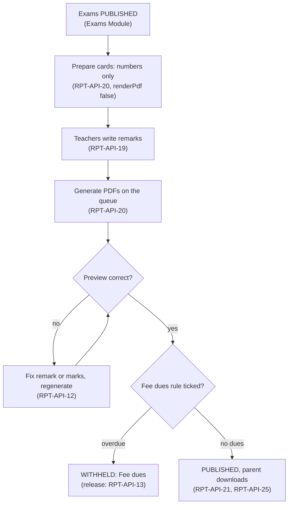
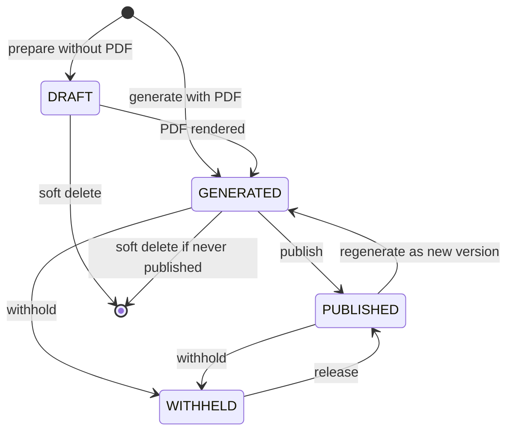
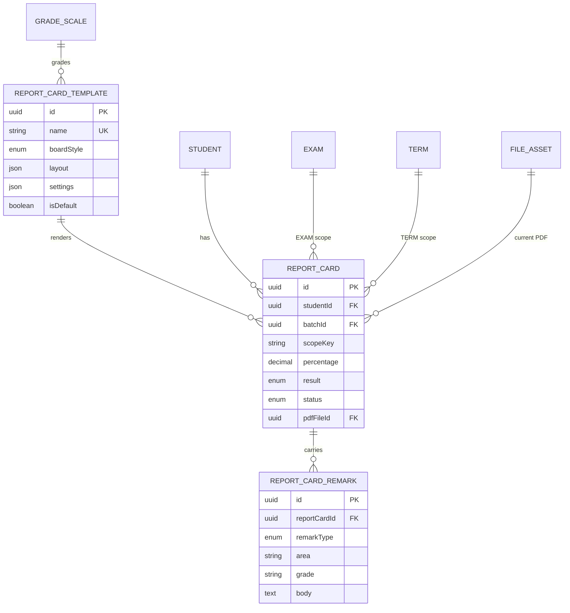

# Report Cards Module

**In simple words:** This chapter explains how EduFlow turns published exam marks into a report card PDF for every student. The principal picks a design (CBSE, ICSE, state board, coaching test report or GPA). EduFlow adds the weighted term result, attendance and remarks, and a background job builds the PDFs. The principal previews and publishes, parents download on their phone, and a corrected card is reissued as a new version.

| Item | Value |
|---|---|
| Module code | RPT |
| Release phase | Phase 2 (V1.0), prompt P-38, Days 99 to 103 (11 to 15 Jan 2027) |
| Plans | Growth, Pro, Enterprise (plan feature `module.RPT`); not on Starter |
| Main users | Principal, Teacher (class and subject teacher), Organization Admin; Parent and Student (download) |
| Depends on | Exams, Attendance, Batch, Subjects, Student Profile, Fees, Notifications, Settings |
| Main tables | `report_card_templates`, `report_cards`, `report_card_remarks` (reads `grade_scales`, `grade_bands`, `exam_marks`, `attendance_records`) |

## Objective

1. **A batch in two minutes.** The 42 Term 1 cards of 10-A, with PDFs, are ready 2 minutes after one click; a campus of 1,200 students in 15 minutes.
2. **One set of numbers.** A card never differs from the *Exams Module* result sheet of the same exam.
3. **Remarks in one sitting.** A class teacher finishes remarks and co-scholastic grades for 42 students in about 20 minutes.
4. **Same-day delivery.** Within one minute of publish, the PDF is in the Parent Portal and WhatsApp tells the parent.
5. **Frozen and traceable.** A published card never changes silently; a correction is a new version with a reason.

## Scope

### In scope

- Templates in five board styles (`CBSE`, `ICSE`, `STATE`, `COACHING`, `GPA`): layout blocks, display options, grade scale, courses, signature images, a default, a preview with demo data.
- Scopes `EXAM` (one exam), `TERM` (weighted exams of a term) and `ANNUAL` (the session, weighted by term).
- Weighted subject results, total, percentage, grade or GPA, ranks, percentile, result and attendance summary.
- Class teacher, principal, subject and co-scholastic remarks, one at a time or for a batch.
- Bulk generation on the BullMQ `pdf` queue with progress; regeneration of one card.
- Preview, publish (the approval step), withhold, bulk publish, optional withholding for fee dues.
- Reissue with version numbers; parent and student download; merged PDF or ZIP; result register; dashboard.

### Out of scope

| Not in this module | Where it lives or why |
|---|---|
| Marks entry, verification, grade scales, grace marks, re-evaluation | *Exams Module* |
| Transfer and character certificates, QR verification | *Certificates Module* |
| Free-form designer, custom HTML per school | Not in V1.0; layout is block-based. Enterprise can order a custom template |
| Cryptographic digital signatures | Not built; scanned signature images only |

### Phase notes

| Phase | What ships | Why |
|---|---|---|
| Phase 2, P-38 | RPT-API-01 to RPT-API-24; screens RPT-S01 to RPT-S07 | Schools print half-yearly cards in January |
| Phase 2, P-40 | RPT-API-25, portal routes PP-API-10, PP-API-11, SP-API-12, SP-API-13; RPT-S08, RPT-S09 | The portals get all Phase 2 content in one prompt |
| Phase 4 | AI Insights drafts a class-teacher remark; the teacher edits it | AI Insights ships in V2.0 |

## User Stories

| ID | As a | I want to | So that | Priority |
|---|---|---|---|---|
| RPT-US-01 | Organization Admin | pick the CBSE template and upload the principal's signature | cards look like the printed ones parents know | Must |
| RPT-US-02 | Principal | give each exam of a term a weightage | the term result follows school policy | Must |
| RPT-US-03 | Principal | generate a whole batch in one click and watch progress | I do not wait on a frozen screen | Must |
| RPT-US-04 | Class teacher | type remarks and co-scholastic grades for 42 students in one grid | I finish in one sitting | Must |
| RPT-US-05 | Subject teacher | add a remark for my subject | parents get subject feedback | Could |
| RPT-US-06 | Principal | preview any card before publishing | mistakes are caught first | Must |
| RPT-US-07 | Principal | publish a whole batch in one action | parents get cards the same day | Must |
| RPT-US-08 | Principal | withhold one card with a reason | I can hold a card during a dispute | Should |
| RPT-US-09 | Organization Admin | withhold cards for overdue fees, if our policy allows it | the office talks to the family first | Could |
| RPT-US-10 | Principal | reissue a corrected card as version 2 | parents hold the right copy | Must |
| RPT-US-11 | Parent | download my child's card on my phone | I can keep and share it | Must |
| RPT-US-12 | Centre head | give each JEE mock a report with rank, percentile and accuracy | students know where they stand | Must |
| RPT-US-13 | Coordinator of an international school | print a GPA card with credit hours | the card fits our curriculum | Should |
| RPT-US-14 | Principal | download all cards of 10-A as one PDF | the office prints them for the PTM | Should |

## Workflow

**Figure: Report card flow for one batch and one scope**



Without remarks (a coaching mock report), one generate call builds numbers and PDFs together.

Bright Future Public School, 10-A, Term 1 of 2027-28:

1. Unit Test 1, Unit Test 2 and Half Yearly are `PUBLISHED` with weightages 10, 10 and 80.
2. Sat 9 Oct 2027: Dr. Anita Verma clicks **Prepare**. 42 `DRAFT` cards appear with totals, grades and ranks.
3. Mon 11 Oct: Priya Nair, class teacher, fills the remarks grid by 13:42.
4. 14:05: **Generate PDFs**. The API answers at once; 42 PDFs are ready at 14:06.
5. A preview shows a spelling mistake; Priya fixes it and that card is regenerated.
6. 16:30: bulk publish with the fee dues option. 40 published, 2 withheld. Parents get WhatsApp.
7. 12 Oct: a re-evaluation raises Aarav's Science from 85 to 88. On 13 Oct his card is reissued as version 2.

**Figure: Status of one report card**



A published PDF changes only through regeneration, which creates the next version.

### Report card statuses

| Status | Meaning | Visible in portals | Next step |
|---|---|---|---|
| `DRAFT` | Numbers computed, no PDF | No | `GENERATED` (RPT-API-20, RPT-API-12), soft delete |
| `GENERATED` | PDF ready, awaiting approval | No | `PUBLISHED` (RPT-API-13, RPT-API-21), `WITHHELD`, soft delete if never published |
| `PUBLISHED` | Approved and released | Yes | `WITHHELD` (RPT-API-14), `GENERATED` by reissue (RPT-API-12) |
| `WITHHELD` | Held back with a reason | No; exam marks stay visible | `PUBLISHED` (RPT-API-13) |

"Needs regenerate" is a flag computed on read, not a status (RPT-BR-13).

## Screens and Wireframes

| ID | Screen | Users | Purpose |
|---|---|---|---|
| RPT-S01 | Templates | Organization Admin, Principal | List, create, set default, archive |
| RPT-S02 | Template Editor | Organization Admin, Principal | Board style, blocks, options, weights, signatures, preview |
| RPT-S03 | Batch Report Cards | Principal, Organization Admin | Prepare, generate, progress, status, publish, download |
| RPT-S04 | Remarks Grid | Teacher, Principal | Remarks and co-scholastic grades for one batch |
| RPT-S05 | Card Detail | Principal, Teacher (view) | PDF preview, result, versions, regenerate, withhold |
| RPT-S06 | Publish Dialog | Principal, Organization Admin | Checklist, fee dues option, counts, confirm |
| RPT-S07 | Results Dashboard | Principal, Organization Admin | Status per batch and result distribution |
| RPT-S08 | Report Cards (mobile) | Parent | Published cards of a child, download |
| RPT-S09 | My Report Cards (mobile) | Student | Own published cards, download |

**Screen RPT-S02 — Template Editor (Organization Admin, web)**

```text
+--------------------------------------------------------------------------+
| EduFlow | Bright Future Public School      [Search students...]  (RS) v  |
+------------+-------------------------------------------------------------+
| Dashboard  | Report Cards > Templates > CBSE Class 9-10                  |
| Students   | Name [CBSE Class 9-10______]   Board style [CBSE v]         |
| Exams      | Grade scale [CBSE 9-point v]  Courses [Class 9, Class 10 v] |
| Report   < | Layout blocks (drag to order)  Display options              |
|  Cards     | [x] Header with logo           [ ] Show rank                |
|  Templates | [x] Student details            [x] Show attendance          |
|  Remarks   | [x] Scholastic marks table     [x] Show co-scholastic       |
| Settings   | [x] Co-scholastic grades       [ ] Grades only, no marks    |
|            | [x] Attendance summary         [x] Show percentage          |
|            | [x] Remarks and result     Paper [A4 v]  Font [Noto Sans v] |
|            | Annual weights: Term 1 [ 40 ]%   Term 2 [ 60 ]%             |
|            | Co-scholastic areas [Work Ed., Art Ed., HPE, Discipline v]  |
|            | Signatures: Class teacher (auto)   Principal [sign.png v]   |
|            |-------------------------------------------------------------|
|            | [Preview]  [Set as default]              [Cancel]  [Save]   |
+------------+-------------------------------------------------------------+
```

- A new board style loads that style's default blocks and options (RPT-BR-20).
- **Preview** calls RPT-API-07; **Save** calls RPT-API-02 or RPT-API-04; **Set as default** calls RPT-API-06. The signature file id is stored in the layout.

**Screen RPT-S03 — Batch Report Cards (Principal, web)**

```text
+--------------------------------------------------------------------------+
| EduFlow | Bright Future Public School      [Search students...]  (AV) v  |
+------------+-------------------------------------------------------------+
| Dashboard  | Report Cards > 10-A > Term 1 (2027-28)                      |
| Students   | Batch [10-A v]  Scope [Term v]  Term [Term 1 v]             |
| Exams      | Template [CBSE Class 9-10 v]    [Prepare]  [Generate PDFs]  |
| Report   < | Last job 11 Oct 14:06: 42 of 42 PDFs, 0 failed              |
|  Cards     | Draft 0  Generated 0  Withheld 2  Published 40  Stale 1     |
|  Templates | Counted: UT1 10%, UT2 10%, Half Yearly 80%                  |
|  Remarks   | Remarks: 42 of 42 done                                      |
| Fees       | [ ] Roll Student          %      Grade  Rank  Status        |
| Settings   | [ ] 01   Aanya Gupta      86.10  A2     1     PUBLISHED     |
|            | [ ] 02   Aarav Sharma     84.00  A2     2     PUBLISHED     |
|            | [ ] 03   Arjun Mehta      61.20  B2     31    WITHHELD dues |
|            | [ ] 04   Diya Rao         78.45  B1     12    PUBLISHED  *  |
|            | ... 38 more rows                        Page [1 v] of 1     |
|            |-------------------------------------------------------------|
|            | [Preview] [Download all v] [Export register] [Publish...]   |
+------------+-------------------------------------------------------------+
```

- **Prepare** and **Generate PDFs** call RPT-API-20 with `renderPdf` false or true; progress polls CMN-API-19 every 2 seconds.
- `*` marks a stale card (RPT-BR-13). **Publish...** opens RPT-S06 (RPT-API-21); **Download all** calls RPT-API-22; **Export register** calls RPT-API-23. Counts come from RPT-API-24, rows from RPT-API-08.

**Screen RPT-S04 — Remarks Grid (Teacher, web)**

```text
+--------------------------------------------------------------------------+
| EduFlow | Bright Future Public School      [Search students...]  (PN) v  |
+------------+-------------------------------------------------------------+
| Dashboard  | Report Cards > Remarks > 10-A > Term 1                      |
| Attendance | Type (o) Class teacher  ( ) Subject [Mathematics v]         |
| Homework   | Remark bank [Sincere] [Must revise daily] [Helpful] [+]     |
| Exams      | Co-scholastic grades: A, B or C                             |
| Report   < |                                                             |
|  Remarks   | Roll Student       WE AE HPE Dis  Class teacher remark      |
|            | 01   Aanya Gupta   A  A  A   A    Sincere and creative. K.. |
|            | 02   Aarav Sharma  A  B  A   A    Strong in Maths; revise.. |
|            | 03   Arjun Mehta   B  A  A   B    [_______________________] |
|            | 04   Diya Rao      A  A  B   A    [_______________________] |
|            | 05   Ishita Jain   [ ] [ ] [ ] [ ] [_______________________]|
|            | Chars 58 of 500   Tab = next cell   Enter = next student    |
|            |-------------------------------------------------------------|
|            | 40 of 42 done   Saved 11 Oct 2027 13:42          [Save all] |
+------------+-------------------------------------------------------------+
```

- WE, AE, HPE and Dis are the template's co-scholastic areas. A teacher sees only own batches and, in Subject mode, own subjects.
- Remark bank chips insert a saved phrase. **Save all** calls RPT-API-19; the grid autosaves every 30 seconds.

**Screen RPT-S05 — Card Detail (Principal, web)**

```text
+--------------------------------------------------------------------------+
| EduFlow | Bright Future Public School      [Search students...]  (AV) v  |
+------------+-------------------------------------------------------------+
| Dashboard  | Report Cards > 10-A > Aarav Sharma (BF-2027-0142)           |
| Students   | Term 1   Status PUBLISHED   Version 2 of 2   Template CBSE  |
| Exams      | Result PASS   84.40%   Grade A2   Rank 2 of 42              |
| Report   < | -- PDF preview (version 2) --------------------------       |
|  Cards     | Subject         UT1   UT2   HY    Term    Grade             |
|            | English         22    23    78    80.40   B1                |
|            | Mathematics     23    24    92    92.40   A1                |
|            | Science         24    23    88    89.20   A2                |
|            | ... 3 more      Total 506.40 / 600  (84.40%)                |
|            | Attendance 118.5 / 124 days (95.56%)   Discipline A         |
|            | Class teacher: Strong in Maths; revise Hindi daily.         |
|            | Signed: P. Nair (class teacher)   Dr. A. Verma (principal)  |
|            |-------------------------------------------------------------|
|            | Versions: v1 11 Oct 2027 (replaced)   v2 13 Oct 2027        |
|            | [Download PDF] [Regenerate] [Withhold] [Change result]      |
+------------+-------------------------------------------------------------+
```

- Data from RPT-API-09, PDF from RPT-API-15; older versions open read-only. Teachers see own batches without the buttons.
- **Regenerate** asks for a reason (RPT-API-12). **Withhold** calls RPT-API-14. **Change result** calls RPT-API-10.

**Screen RPT-S08 — Report Cards (Parent, mobile)**

```text
+------------------------------------+
| <  Report Cards              (SD)  |
+------------------------------------+
| Child [Aarav Sharma - 10-A     v]  |
| Session [2027-28 v]                |
+------------------------------------+
| Term 1 report card                 |
| 84.40%   Grade A2   Result PASS    |
| Version 2 - updated 13 Oct 2027    |
| [ Download PDF ]   [ Share ]       |
+------------------------------------+
| Unit Test 3 report card            |
| Published 22 Nov 2027              |
| [ Download PDF ]                   |
+------------------------------------+
| Annual card: after the Annual Exam |
| Older versions: ask the school     |
+------------------------------------+
```

- Lists only `PUBLISHED` cards (RPT-API-25, also served as PP-API-10). **Download PDF** asks PP-API-11 for a 5-minute link; **Share** opens the phone's share sheet.
- A withheld card is not listed; the child's exam marks stay visible in the Exams and Results tab.

## UI Components

| Component | Type | Behaviour |
|---|---|---|
| `ScopePicker` | shadcn `Select` group | Batch, scope, then exam or term |
| `JobProgress` | `Progress` | Polls CMN-API-19 every 2 s ("23 of 42"); lists failed students at the end |
| `CardStatusChip` | `Badge` | `DRAFT` grey, `GENERATED` blue, `PUBLISHED` green, `WITHHELD` amber; star when stale |
| `CardsTable` | TanStack `DataTable` | Server paging, sort by roll, percent or rank, multi-select |
| `RemarksGrid` | Editable grid | Keyboard only, remark bank, 500-character counter, autosave, unsaved-changes guard |
| `TemplateBlockList` | Sortable checklist | Drag to order; student block and marks table are locked on |
| `PublishDialog` (RPT-S06) | `Dialog` | Counts by status, stale count, fee dues option with caution text, notify switch |
| `VersionList` | List | Version, date, user, reason; opens older PDFs |
| States | Skeleton, empty, error | Empty: "No report cards for 10-A Term 1 yet. Click Prepare."; error toast with `requestId`; Starter sees an upgrade card |

## Validation Rules

| Field | Rule | Error message shown to user |
|---|---|---|
| Template `name` | 3 to 100 characters, unique | "A template named CBSE Class 9-10 already exists." |
| `gradeScaleId` | Active; `GPA` style needs a `GRADE_POINT` scale | "GPA templates need a grade-point scale." |
| `layout.blocks` | Contains `STUDENT_INFO` and `SCHOLASTIC` | "A template needs the student details block and the marks table." |
| `settings.termWeights` | Each 1 to 100; total 100 | "Term weights must add up to 100. They add up to 90." |
| Signature image | PNG or JPG, at most 500 KB | "The signature must be a PNG or JPG file under 500 KB." |
| `examId` (scope `EXAM`) | Required; `PUBLISHED`; same campus and year | "Unit Test 3 is not published yet. Publish its results first." |
| Counted exams (`TERM`) | One or more `PUBLISHED` with weightage; none unpublished with weightage | "Half Yearly counts for Term 1 but is not published yet." |
| Remark `body` | 1 to 500 characters | "Keep the remark under 500 characters so it fits on the card." |
| `CO_SCHOLASTIC` remark | `area` and `grade` from the template | "Choose grade A, B or C for Discipline." |
| `SUBJECT_TEACHER` remark | Subject taught in the batch | "Sanskrit is not taught in 10-A." |
| Result override | `PROMOTED`, `DETAINED` or null; reason 10 to 500 characters | "Give a reason of at least 10 characters for changing the result." |
| Withhold `reason` | 5 to 500 characters | "Give a reason for withholding this card." |
| Regenerate `reason` | Required if ever published; 10 to 500 characters | "Say why this published card is being reissued." |

## Business Rules

**RPT-BR-01 — One source for exam numbers.** Only `PUBLISHED` exams feed a card. Per-exam numbers come from the exams results function (EXM-BR-08 to EXM-BR-15). This module adds only the `TERM` and `ANNUAL` weighting.

**RPT-BR-02 — One card per student, year and scope.** `scopeKey` is `EXAM:{examId}`, `TERM:{termId}` or `ANNUAL`, unique per student and year. Generating again updates the same rows; a soft-deleted row with the same key is restored.

**RPT-BR-03 — Who gets a card.** Students with an `ACTIVE` enrollment in the batch on the scope end date (or today, if earlier) and a mark in a counted exam. Marks from another batch of the same course count, so a student moved from 10-B keeps Unit Test 1. Students who left are skipped unless named in `studentIds`.

**RPT-BR-04 — Term weighting.** Counted exams are the `PUBLISHED` exams of the term with `weightage` above 0. For each subject:

```text
exam percent    = marks / paper max x 100   (AB = 0; below 0 = 0)
subject percent = sum(weight x exam percent) / sum(weight)
                  over the exams where the subject is not exempt
subject marks   = subject percent x subjectMaxMarks / 100
total           = sum of subject marks (includeInTotal subjects)
percentage      = total / (subjectMaxMarks x counted subjects) x 100
```

Rounding (half up, 2 decimals) happens only at the end. Weights are normalised, so 10/10/80 and 1/1/8 give the same result.

> **Example:** Aarav Sharma, 10-A, Term 1, `subjectMaxMarks` 100, weights 10/10/80.

| Subject | UT1 of 25 | UT2 of 25 | HY of 100 | Term |
|---|---|---|---|---|
| English | 22 | 23 | 78 | 80.40 |
| Hindi | 20 | 21 | 71 | 73.20 |
| Mathematics | 23 | 24 | 92 | 92.40 |
| Science | 24 | 23 | 85 | 86.80 |
| Social Studies | 22 | 22 | 80 | 81.60 |
| Sanskrit | 24 | 24 | 88 | 89.60 |
| Total | 135 | 137 | 494 | 504.00 |

Mathematics = (10 x 92 + 10 x 96 + 80 x 92) / 100 = 92.40. Total 504.00 of 600 = 84.00%, grade A2.

**RPT-BR-05 — Absent and exempt.** AB counts 0 for that exam. EX removes that exam from the subject's weights. Hindi exempt in Unit Test 2: (10 x 80 + 80 x 71) / 90 = 72.00. Hindi absent in Unit Test 1: (0 + 10 x 84 + 80 x 71) / 100 = 65.20. A subject exempt in every exam prints "EX" and leaves the total and the maximum.

**RPT-BR-06 — Annual weighting.** Weights come from `settings.termWeights` of the template, applied per term, else from `Exam.weightage` over the year; with neither, `422`. Term 1 = 84.40% and Term 2 = 86.50% at 40/60 give 33.76 + 51.90 = 85.66%, grade A2. Annual cards recompute from marks and do not need term cards.

**RPT-BR-07 — Grades and GPA.** The scale is the template's, else the organization default. Subject grades use the subject percent; the overall grade uses the percentage. For `GPA`, GPA = sum(grade point x credit hours) / sum(credit hours), with a null `CourseSubject.creditHours` counted as 1; it is stored in `gradePoint`.

> **Example:** Grade 9 in a Dubai school, 4.0 scale: Mathematics A (4.0 x 5 = 20.0), English B+ (3.3 x 4 = 13.2), Physics A- (3.7 x 4 = 14.8), Art B (3.0 x 2 = 6.0). GPA = 54.0 / 15 = 3.60.

**RPT-BR-08 — Result.** Checked in this order:

1. `COACHING` template: `NOT_APPLICABLE`.
2. Absent in every counted paper: `ABSENT`.
3. `EXAM` scope: the exam's own result (EXM-BR-10).
4. `TERM` and `ANNUAL`: a subject fails below the pass percent of its highest-weighted paper (usually 33.00). No failed subject: `PASS`. `ANNUAL` with 1 to `settings.compartmentMaxSubjects` (default 2) failed: `COMPARTMENT`. Otherwise `FAIL`.
5. `PROMOTED` and `DETAINED` are never computed; only an override sets them (RPT-BR-14).

> **Example:** Vivaan Singh, Annual: Science 31.50%, Social Studies 30.80%, all others above 33. Two failed subjects give `COMPARTMENT`.

**RPT-BR-09 — Supplementary marks.** After a `SUPPLEMENTARY` exam is published, regenerating the `ANNUAL` card uses the supplementary mark (`isSupplementary = true`) for that subject only, as entered (Assumption). If every subject now passes, the result becomes `PASS` and the card prints "Passed in supplementary examination".

**RPT-BR-10 — Ranks and percentile.** Ranks use the percentage and the EXM-BR-14 tie rule (1, 2, 2, 4): `rank` inside the batch, `overallRank` across batches of the same course and campus. Percentile follows EXM-BR-15. When ranks are switched off (template `showRank`, or the exam's `showRank` for `EXAM` scope), the rank fields stay null. `ABSENT` cards get no rank.

**RPT-BR-11 — Coaching test report.** Per subject: marks, correct, incorrect, unattempted, negative marks, accuracy and subject rank; then total, overall rank and percentile. Accuracy = correct / (correct + incorrect) x 100.

> **Example:** Ishaan Kumar, Sharma Classes, JEE Mock 7. Physics: 18 correct, 5 incorrect, accuracy 78.26%. Total 197 of 300 = 65.67%. 102 of 120 are at or below him: percentile 85.00; 18 are above him: overall rank 19 of 120.

**RPT-BR-12 — Attendance summary.** The ATT-BR-13 formula over the scope period, never past today: `EXAM` from term start to the exam end date, `TERM` over the term, `ANNUAL` over the year. Term 1 (1 Apr to 30 Sep 2027): 118.5 of 124 days = 95.56%, stored as `{ "workingDays": 124, "presentDays": 118.5, "percent": 95.56 }`.

**RPT-BR-13 — Snapshot and "needs regenerate".** `subjectResults` freezes the subject rows, and the PDF is built only from the card row and its remarks. A card is stale when a counted mark of the student or a remark of the card has `updatedAt` after `generatedAt`. Attendance and template edits do not count. A stale card cannot be published.

**RPT-BR-14 — Remarks and result override.**

| Remark type | Who writes it | One row per |
|---|---|---|
| `CLASS_TEACHER` | Class teacher of the batch, Principal, Organization Admin | Card |
| `SUBJECT_TEACHER` | Teacher of that subject in the batch (`BatchSubjectTeacher`) | Card and subject |
| `CO_SCHOLASTIC` | Class teacher, Principal | Card and area |
| `PRINCIPAL` | Principal, Organization Admin | Card |

A co-scholastic row with only a grade gets the grade's descriptor as `body` ("A - Outstanding"). Remarks stay editable at every status; on a published card an edit only makes it stale. The override (RPT-API-10) accepts `PROMOTED`, `DETAINED` or null with a reason and writes an audit row `reportcards.result_override`. Regeneration keeps `PROMOTED` and `DETAINED`; null lets it compute the result again.

**RPT-BR-15 — Publish is the approval.** Only the Principal or Organization Admin publishes (`reportcards.publish`). The card must be `GENERATED` or `WITHHELD`, have a PDF and not be stale. One transaction sets `PUBLISHED`, `publishedAt`, `publishedById` and the audit row; then `reportcard.published` is emitted. Bulk publish skips `WITHHELD`, `DRAFT` and stale cards.

**RPT-BR-16 — Withhold.** It needs a reason of 5 to 500 characters. The schema has no reason column, so the reason lives in `AuditLog.reason` of the `reportcards.withhold` row (Assumption; no schema change). Portals hide the card, but the exam marks stay visible. Parents get no message. Withholding is also the first step before an exam is unpublished (EXM-BR-17). RPT-API-13 releases the card.

**RPT-BR-17 — Optional withholding for fee dues.** Setting `reportcards.withhold_on_fee_dues` defaults to `{ "enabled": false, "minOverdueAmount": 1, "courseIds": [] }`. Only the Organization Admin switches it on, after accepting the caution text (audited). Then RPT-S06 shows an unticked option "Withhold cards of students with overdue fees". The *Fees Module* service returns students with `OVERDUE` invoices of at least `minOverdueAmount`; fee tables are never read directly. A non-empty `courseIds` limits the rule to those courses.

> **Example:** Arjun Mehta of 10-A owes ₹12,000 of Q2 tuition due 10 Jul; one classmate is also overdue. Bulk publish with the option: 40 `PUBLISHED`, 2 `WITHHELD` ("Fee dues"). Arjun's family pays on 14 Oct; RPT-S03 shows "Dues cleared" and Dr. Verma releases the card.

> **Warning:** Legal caution. In India, several state fee-regulation rules and court orders restrict holding back a child's result or documents for unpaid fees, and the RTE Act 2009 protects children aged 6 to 14. In the USA, FERPA gives parents the right to inspect education records. So the rule is off by default, holds back only the PDF (never the marks), and the school must take local legal advice first. This is not legal advice.

**RPT-BR-18 — Reissue and versions.** Regenerating a card whose `publishedAt` is set creates the next version:

1. A reason is required; the audit row stores it with the old and new numbers.
2. The current PDF is kept if it was created before `publishedAt` (it was issued); an unissued draft PDF is purged (`FileAsset.status = DELETED`).
3. The new PDF is a new `FileAsset` (category `report-card`, `ownerType` `ReportCard`, `ownerId` = card id). Version = count of `ACTIVE` report-card files of the card; there is no version column.
4. The card returns to `GENERATED`, so the wrong version leaves the portals until the new one is published.
5. The footer prints "Version 2 - issued 13 Oct 2027 - replaces version 1 of 11 Oct 2027".

> **Example:** Aarav's Science goes from 85 to 88 on 12 Oct. Science = (10 x 96 + 10 x 92 + 80 x 88) / 100 = 89.20; total 506.40 = 84.40%, A2, rank 2. Version 2 is published on 13 Oct and Sunita Devi gets the "updated report card" message.

**RPT-BR-19 — Template and signatures.** The template is the one in the request, else the `ACTIVE` default whose `courseIds` contain the course or are empty, else `422`. In `layout.signatures`, the class teacher slot uses the teacher's signature file (`FileAsset` category `signature`, `ownerType` `Staff`) or a blank line; the principal slot uses its stored file; the parent slot is blank. Images are embedded at render time, so a new image never changes an issued PDF.

**RPT-BR-20 — Board style defaults.**

| Style | Default content |
|---|---|
| `CBSE` | Exam columns and term total, 9-point grades (A1 to E), co-scholastic areas graded A, B or C, attendance, remarks; ranks off |
| `ICSE` | Marks with internal assessment shown, percentage; ranks off |
| `STATE` | Marks, percentage and division: Distinction 75, First 60, Second 45, Third 33 (`settings.divisions`); English and Hindi labels |
| `COACHING` | RPT-BR-11 layout; ranks and percentile on |
| `GPA` | Letter grade, grade point, credit hours and GPA; percentage hidden |

On a `STATE` card, Aarav's 84.00% prints "First Division with Distinction".

**RPT-BR-21 — Bulk generation job.** RPT-API-20 creates an `ExportJob` (`exportType` `reportcards.generate`, format `PDF`), queues one `pdf` job per batch with id `rc-gen-{exportJobId}` (BullMQ does not allow the `:` of a `scopeKey`) and answers `202`. The worker first computes all cards, because ranks need the whole batch, and upserts them as `DRAFT`. It then renders the PDFs one by one, sets each `GENERATED` and updates `rowCount`. A failing student emits `reportcard.generation.failed` and the rest continue (`COMPLETED_WITH_ERRORS`). Bulk generation never touches `PUBLISHED` or `WITHHELD` cards.

## Acceptance Criteria

| ID | Given | When | Then |
|---|---|---|---|
| RPT-AC-01 | UT1, UT2 and Half Yearly of 10-A are `PUBLISHED`, weights 10/10/80 | Dr. Verma generates Term 1 | One job; 42 `GENERATED` cards with PDFs; Aarav 84.00%, A2, rank 2 of 42 |
| RPT-AC-02 | RPT-AC-01 is done | she generates again | the same 42 rows are updated; no new rows |
| RPT-AC-03 | Half Yearly (weight 80) is still `MARKS_ENTRY` | she generates Term 1 | `422` "Half Yearly counts for Term 1 but is not published yet." |
| RPT-AC-04 | a job for 10-A Term 1 is `PROCESSING` | a second generate arrives | `409 CONFLICT` |
| RPT-AC-05 | Priya Nair teaches only 10-A | she saves remarks for 10-B | `403 FORBIDDEN`; nothing saved |
| RPT-AC-06 | Diya Rao's remark changed after her PDF | the Principal publishes her card | `422` "Regenerate this card first. Marks or remarks changed after the PDF was built." |
| RPT-AC-07 | fee dues rule on; 2 of 42 overdue | bulk publish with the option | 40 `PUBLISHED`, 2 `WITHHELD` ("Fee dues"); 40 families notified |
| RPT-AC-08 | Aarav's card is `WITHHELD` | Sunita Devi opens Report Cards | card not listed; PP-API-11 answers `404`; exam marks still visible |
| RPT-AC-09 | Aarav's version 1 is `PUBLISHED`; Science revised to 88 | regenerate with a reason, then publish | version 1 file kept; version 2 shows 84.40%; portal shows "Version 2" |
| RPT-AC-10 | a Teacher | calls RPT-API-13 | `403 FORBIDDEN` |
| RPT-AC-11 | a card is `PUBLISHED` | RPT-API-11 is called | `422` "A published card cannot be deleted. Withhold it instead." |
| RPT-AC-12 | an Organization Admin of Sharma Classes | requests a Bright Future card id | `404 NOT_FOUND` |
| RPT-AC-13 | a link from RPT-API-15 | opened 20 minutes later | S3 denies access (links live 5 minutes) |
| RPT-AC-14 | result overridden to `PROMOTED` | the card is regenerated | result stays `PROMOTED`; audit shows the reason |
| RPT-AC-15 | a Starter organization | calls any RPT endpoint | `403 PLAN_LIMIT_REACHED` |

## Edge Cases

| Case | What happens | How the system handles it |
|---|---|---|
| Student moved from 10-B to 10-A in August | Marks in two batches | RPT-BR-03 counts both; `batchId` is 10-A |
| Student admitted after Unit Test 1 | No mark row for that exam | Treated like EX: the exam leaves the weights; prints "NA" |
| Exam unpublished after generation | Numbers from the old publish | Publish checks all counted exams are still `PUBLISHED`; else `422` |
| One reissue changes classmates' ranks | Their PDFs show old ranks | `reportcard.regenerated` lists them; RPT-S03 offers to regenerate them |
| PDF fails for one student | That card stays `DRAFT` | Job continues; `reportcard.generation.failed`; retry with RPT-API-12 |
| Worker crashes mid-job | Some PDFs exist | BullMQ retries; cards built after the job started are skipped |
| Template deleted after generation | `templateId` becomes null | Issued PDFs unchanged; next regeneration uses the default |
| Class teacher has no signature image | Empty slot | A blank signature line is printed |
| Guardian of two children, one card withheld | One child affected | The other child's cards show normally |
| No student has a counted mark | Nothing to build | `422` "No student of 10-A has marks in the Term 1 exams." |
| Parent keeps an old link after a reissue | Link points to version 1 | Links expire in 5 minutes; PP-API-11 signs only the current version |

## Database Schema

| Table | Purpose |
|---|---|
| `report_card_templates` | Design of a card: board style, grade scale, layout blocks, display options, courses |
| `report_cards` | One student's frozen result for an exam, term or year, with status and PDF |
| `report_card_remarks` | Class teacher, principal, subject and co-scholastic remarks of a card |

The module also writes `file_assets` (PDFs), `export_jobs` (progress) and `audit_logs`, and only reads exam, grade, curriculum and attendance tables.

### report_card_templates

| Column | Type | Null | Default | Notes |
|---|---|---|---|---|
| `id` | uuid | No | `uuid()` | PK |
| `organization_id` | uuid | No | | FK `organizations`, cascade |
| `name` | varchar(100) | No | | Unique per organization |
| `board_style` | enum `ReportCardBoardStyle` | No | | CBSE, ICSE, STATE, COACHING, GPA |
| `grade_scale_id` | uuid | Yes | | FK `grade_scales`, set null; null = default scale |
| `layout` | jsonb | No | | Blocks, page, fonts, logo, signature slots |
| `settings` | jsonb | Yes | | Display options, weights, areas |
| `course_ids` | uuid[] | No | `{}` | Empty = every course |
| `is_default` | boolean | No | false | One default per organization (service layer) |
| `status` | enum `RecordStatus` | No | ACTIVE | ACTIVE, INACTIVE, ARCHIVED |
| `created_at`, `updated_at`, `deleted_at` | timestamptz | No, No, Yes | now() | Soft delete |

Constraints: unique (`organization_id`, `name`); index (`organization_id`, `board_style`, `status`).

### report_cards

| Column | Type | Null | Default | Notes |
|---|---|---|---|---|
| `id` | uuid | No | `uuid()` | PK |
| `organization_id`, `campus_id`, `academic_year_id` | uuid | No | | FKs, restrict |
| `student_id`, `batch_id` | uuid | No | | FKs, restrict; batch at the time of the result |
| `scope` | enum `ReportCardScope` | No | | EXAM, TERM, ANNUAL |
| `exam_id`, `term_id` | uuid | Yes | | Set for EXAM or TERM scope |
| `scope_key` | varchar(45) | No | | `EXAM:{id}`, `TERM:{id}` or `ANNUAL` |
| `template_id` | uuid | Yes | | FK templates, set null |
| `total_marks`, `max_marks` | decimal(8,2) | Yes | | Obtained and maximum |
| `percentage`, `percentile` | decimal(5,2) | Yes | | Rounded half up |
| `grade` | varchar(10) | Yes | | A2, B+ |
| `grade_point` | decimal(4,2) | Yes | | Grade point or GPA |
| `rank`, `rank_out_of` | int | Yes | | Batch rank; null when ranks are off |
| `overall_rank`, `overall_rank_out_of` | int | Yes | | Across batches of the course |
| `result` | enum `ReportCardResult` | No | NOT_APPLICABLE | RPT-BR-08 |
| `remarks` | text | Yes | | Overall remark printed on the card |
| `attendance_summary` | jsonb | Yes | | `{ workingDays, presentDays, percent }` |
| `subject_results` | jsonb | Yes | | Frozen subject rows for the PDF |
| `status` | enum `ReportCardStatus` | No | DRAFT | Lifecycle above |
| `pdf_file_id` | uuid | Yes | | FK `file_assets`, set null; current version |
| `generated_at`, `published_at` | timestamptz | Yes | | Last render, last publish |
| `published_by_id` | uuid | Yes | | User id, audit only, no FK |
| `created_at`, `updated_at`, `deleted_at` | timestamptz | No, No, Yes | now() | Soft delete |

Constraints: unique (`organization_id`, `student_id`, `academic_year_id`, `scope_key`); indexes (`organization_id`, `batch_id`, `scope_key`, `status`), (`organization_id`, `campus_id`, `academic_year_id`, `status`), (`organization_id`, `exam_id`).

### report_card_remarks

| Column | Type | Null | Default | Notes |
|---|---|---|---|---|
| `id` | uuid | No | `uuid()` | PK |
| `organization_id` | uuid | No | | FK, cascade |
| `report_card_id` | uuid | No | | FK `report_cards`, cascade |
| `remark_type` | enum `ReportCardRemarkType` | No | | Four types |
| `subject_id` | uuid | Yes | | SUBJECT_TEACHER only; FK, set null |
| `area` | varchar(80) | Yes | | CO_SCHOLASTIC area |
| `grade` | varchar(10) | Yes | | Co-scholastic grade |
| `body` | text | No | | Up to 500 characters (API rule) |
| `author_id` | uuid | Yes | | FK `users`, set null |
| `created_at`, `updated_at` | timestamptz | No | now() | No soft delete |

Index: (`organization_id`, `report_card_id`, `remark_type`). The service keeps one row per card, type and subject or area with an upsert.

**Figure: Report card tables and their neighbours**



A template renders many cards; a card carries many remarks. Older PDF versions are `file_assets` rows with `ownerType` `ReportCard`.

JSON column shapes (keys beyond the schema comment are defined here; no schema change):

```json
{
  "layout": {
    "pageSize": "A4",
    "fontFamily": "Noto Sans",
    "blocks": ["HEADER", "STUDENT_INFO", "SCHOLASTIC", "CO_SCHOLASTIC",
               "ATTENDANCE", "REMARKS", "RESULT", "GRADING_KEY", "SIGNATURES"],
    "signatures": [
      { "slot": "CLASS_TEACHER", "label": "Class Teacher", "source": "CLASS_TEACHER_STAFF" },
      { "slot": "PRINCIPAL", "label": "Principal",
        "fileId": "0d6b2e8f-4c1a-4f3e-9b7d-2a5c8e1f6b30" },
      { "slot": "PARENT", "label": "Parent", "source": "BLANK" }
    ]
  },
  "settings": {
    "showRank": false, "showAttendance": true, "showCoScholastic": true,
    "showGradeOnly": false, "showPercentage": true, "subjectMaxMarks": 100,
    "termWeights": { "e1d2c3b4-5a6f-4b7c-8d9e-0f1a2b3c4d71": 40,
                     "e1d2c3b4-5a6f-4b7c-8d9e-0f1a2b3c4d72": 60 },
    "coScholasticAreas": ["Work Education", "Art Education",
                          "Health and Physical Education", "Discipline"],
    "coScholasticGrades": ["A", "B", "C"],
    "compartmentMaxSubjects": 2
  }
}
```

One row of `subject_results`:

```json
{
  "subjectId": "d4e5f6a7-b8c9-4d0e-8f1a-2b3c4d5e6f70", "subjectName": "Mathematics",
  "sortOrder": 4, "includeInTotal": true,
  "exams": [
    { "examId": "0a1b2c3d-4e5f-4a6b-8c7d-9e0f1a2b3c41", "name": "Unit Test 1", "weight": 10,
      "marks": 23, "max": 25, "code": null },
    { "examId": "0a1b2c3d-4e5f-4a6b-8c7d-9e0f1a2b3c42", "name": "Unit Test 2", "weight": 10,
      "marks": 24, "max": 25, "code": null },
    { "examId": "0a1b2c3d-4e5f-4a6b-8c7d-9e0f1a2b3c43", "name": "Half Yearly", "weight": 80,
      "marks": 92, "max": 100, "code": null }
  ],
  "percent": 92.40, "marks": 92.40, "max": 100, "grade": "A1", "gradePoint": 10.00,
  "passed": true
}
```

## Prisma Schema

Copied from `docs/src/_schema/07-exams.prisma`; long trailing comments sit above their field. Grade and exam models are in the *Exams Module*.

```prisma
enum ReportCardBoardStyle {
  CBSE
  ICSE
  STATE
  COACHING
  GPA
}

enum ReportCardScope {
  EXAM // one exam
  TERM // all exams of a term, weighted
  ANNUAL // whole academic year
}

enum ReportCardStatus {
  DRAFT
  GENERATED // PDF ready, not visible to parents yet
  PUBLISHED
  WITHHELD // e.g. fee dues; hidden from the portals
}

enum ReportCardResult {
  PASS
  FAIL
  COMPARTMENT // must re-appear in one or more subjects
  PROMOTED
  DETAINED
  ABSENT
  NOT_APPLICABLE // coaching tests without pass / fail
}

enum ReportCardRemarkType {
  CLASS_TEACHER
  PRINCIPAL
  SUBJECT_TEACHER
  CO_SCHOLASTIC // art, sports, discipline, values
}

// Report card design: board style, layout blocks and display options.
model ReportCardTemplate {
  id             String               @id @default(uuid()) @db.Uuid
  organizationId String               @map("organization_id") @db.Uuid
  name           String               @db.VarChar(100)
  boardStyle     ReportCardBoardStyle @map("board_style")
  gradeScaleId   String?              @map("grade_scale_id") @db.Uuid
  layout         Json // blocks, columns, fonts, logo position, signature slots
  // { showRank, showAttendance, showCoScholastic, showGradeOnly, showPercentage }
  settings       Json?
  courseIds      String[]             @map("course_ids") @db.Uuid // empty = usable for every course
  isDefault      Boolean              @default(false) @map("is_default")
  status         RecordStatus         @default(ACTIVE)
  createdAt      DateTime             @default(now()) @map("created_at") @db.Timestamptz(6)
  updatedAt      DateTime             @updatedAt @map("updated_at") @db.Timestamptz(6)
  deletedAt      DateTime?            @map("deleted_at") @db.Timestamptz(6)

  organization Organization @relation(fields: [organizationId], references: [id], onDelete: Cascade)
  gradeScale   GradeScale?  @relation(fields: [gradeScaleId], references: [id], onDelete: SetNull)
  reportCards  ReportCard[]

  @@unique([organizationId, name])
  @@index([organizationId, boardStyle, status])
  @@map("report_card_templates")
}

// Generated result of one student for an exam, a term or the whole year, with the PDF.
model ReportCard {
  id                String           @id @default(uuid()) @db.Uuid
  organizationId    String           @map("organization_id") @db.Uuid
  campusId          String           @map("campus_id") @db.Uuid
  academicYearId    String           @map("academic_year_id") @db.Uuid
  studentId         String           @map("student_id") @db.Uuid
  batchId           String           @map("batch_id") @db.Uuid // batch at the time of the result
  scope             ReportCardScope
  examId            String?          @map("exam_id") @db.Uuid // set when scope is EXAM
  termId            String?          @map("term_id") @db.Uuid // set when scope is TERM
  // "EXAM:{examId}", "TERM:{termId}" or "ANNUAL"; makes the unique key work without NULLs
  scopeKey          String           @map("scope_key") @db.VarChar(45)
  templateId        String?          @map("template_id") @db.Uuid
  totalMarks        Decimal?         @map("total_marks") @db.Decimal(8, 2) // marks obtained
  maxMarks          Decimal?         @map("max_marks") @db.Decimal(8, 2)
  percentage        Decimal?         @db.Decimal(5, 2)
  grade             String?          @db.VarChar(10)
  gradePoint        Decimal?         @map("grade_point") @db.Decimal(4, 2) // GPA / CGPA
  rank              Int? // rank in the batch; null when ranks are switched off
  rankOutOf         Int?             @map("rank_out_of")
  // rank across all batches that took the exam ("AIR-style")
  overallRank       Int?             @map("overall_rank")
  overallRankOutOf  Int?             @map("overall_rank_out_of")
  percentile        Decimal?         @db.Decimal(5, 2)
  result            ReportCardResult @default(NOT_APPLICABLE)
  remarks           String?          @db.Text // overall remark printed on the card
  // { workingDays, presentDays, percent }
  attendanceSummary Json?            @map("attendance_summary")
  // frozen per-subject rows used to render the PDF
  subjectResults    Json?            @map("subject_results")
  status            ReportCardStatus @default(DRAFT)
  pdfFileId         String?          @map("pdf_file_id") @db.Uuid
  generatedAt       DateTime?        @map("generated_at") @db.Timestamptz(6)
  publishedAt       DateTime?        @map("published_at") @db.Timestamptz(6)
  publishedById     String?          @map("published_by_id") @db.Uuid // User id (audit only, no FK)
  createdAt         DateTime         @default(now()) @map("created_at") @db.Timestamptz(6)
  updatedAt         DateTime         @updatedAt @map("updated_at") @db.Timestamptz(6)
  deletedAt         DateTime?        @map("deleted_at") @db.Timestamptz(6)

  organization Organization        @relation(fields: [organizationId], references: [id], onDelete: Restrict)
  campus       Campus              @relation(fields: [campusId], references: [id], onDelete: Restrict)
  academicYear AcademicYear        @relation(fields: [academicYearId], references: [id], onDelete: Restrict)
  student      Student             @relation(fields: [studentId], references: [id], onDelete: Restrict)
  batch        Batch               @relation(fields: [batchId], references: [id], onDelete: Restrict)
  exam         Exam?               @relation(fields: [examId], references: [id], onDelete: Restrict)
  term         Term?               @relation(fields: [termId], references: [id], onDelete: Restrict)
  template     ReportCardTemplate? @relation(fields: [templateId], references: [id], onDelete: SetNull)
  pdfFile      FileAsset?          @relation(fields: [pdfFileId], references: [id], onDelete: SetNull)
  remarkRows   ReportCardRemark[]

  @@unique([organizationId, studentId, academicYearId, scopeKey])
  @@index([organizationId, batchId, scopeKey, status])
  @@index([organizationId, campusId, academicYearId, status])
  @@index([organizationId, examId])
  @@map("report_cards")
}

// Remark written on a report card by the class teacher, principal or a subject teacher.
model ReportCardRemark {
  id             String               @id @default(uuid()) @db.Uuid
  organizationId String               @map("organization_id") @db.Uuid
  reportCardId   String               @map("report_card_id") @db.Uuid
  remarkType     ReportCardRemarkType @map("remark_type")
  subjectId      String?              @map("subject_id") @db.Uuid // SUBJECT_TEACHER remarks only
  area           String?              @db.VarChar(80) // CO_SCHOLASTIC area, e.g. Discipline, Art
  grade          String?              @db.VarChar(10) // optional grade for co-scholastic areas
  body           String               @db.Text
  authorId       String?              @map("author_id") @db.Uuid
  createdAt      DateTime             @default(now()) @map("created_at") @db.Timestamptz(6)
  updatedAt      DateTime             @updatedAt @map("updated_at") @db.Timestamptz(6)

  organization Organization @relation(fields: [organizationId], references: [id], onDelete: Cascade)
  reportCard   ReportCard   @relation(fields: [reportCardId], references: [id], onDelete: Cascade)
  subject      Subject?     @relation(fields: [subjectId], references: [id], onDelete: SetNull)
  author       User?        @relation(fields: [authorId], references: [id], onDelete: SetNull)

  @@index([organizationId, reportCardId, remarkType])
  @@map("report_card_remarks")
}
```

RPT-BR-04 and RPT-BR-05 in code, with `Prisma.Decimal` (no float rounding):

```typescript
// server/src/modules/report-cards/weighting.ts
import { Prisma } from '@prisma/client';

const D = Prisma.Decimal;

export interface ExamPart {
  weight: Prisma.Decimal; // Exam.weightage, e.g. 10, 10, 80
  marks: Prisma.Decimal | null; // null when absent, exempt or no mark row
  max: Prisma.Decimal;
  isAbsent: boolean;
  isExempt: boolean; // also true when the student has no mark row (joined later)
}

/** Weighted percent of one subject; null when the subject is exempt in every exam. */
export function subjectPercent(parts: ExamPart[]): Prisma.Decimal | null {
  const counted = parts.filter((p) => !p.isExempt && p.weight.gt(0));
  if (counted.length === 0) return null;
  let sumWeight = new D(0);
  let sumWeighted = new D(0);
  for (const p of counted) {
    let pct = p.isAbsent || p.marks === null ? new D(0) : p.marks.div(p.max).mul(100);
    if (pct.lt(0)) pct = new D(0); // negative marking never goes below 0 %
    sumWeight = sumWeight.add(p.weight);
    sumWeighted = sumWeighted.add(pct.mul(p.weight));
  }
  return sumWeighted.div(sumWeight); // full precision; round only when storing
}

export const round2 = (v: Prisma.Decimal) => v.toDecimalPlaces(2, D.ROUND_HALF_UP);
```

## API Endpoints

Paths start with `/api/v1`. Every route checks the token, the plan feature `module.RPT` and the permission below, scoped to own batches (Teacher) or assigned campuses (Principal).

| ID | Method | Path | Permission | Purpose |
|---|---|---|---|---|
| RPT-API-01 | GET | `/report-card-templates` | `reportcards.view` | List templates (board style, status; dropdown) |
| RPT-API-02 | POST | `/report-card-templates` | `reportcards.manage` | Create a template |
| RPT-API-03 | GET | `/report-card-templates/:id` | `reportcards.view` | Template with layout JSON |
| RPT-API-04 | PATCH | `/report-card-templates/:id` | `reportcards.manage` | Update template or status |
| RPT-API-05 | DELETE | `/report-card-templates/:id` | `reportcards.manage` | Soft delete a template |
| RPT-API-06 | POST | `/report-card-templates/:id/set-default` | `reportcards.manage` | Make this the default template |
| RPT-API-07 | POST | `/report-card-templates/:id/preview` | `reportcards.manage` | Sample PDF with demo data |
| RPT-API-08 | GET | `/report-cards` | `reportcards.view` | List cards (batch, student, scope, exam, term, status, result) |
| RPT-API-09 | GET | `/report-cards/:id` | `reportcards.view` | Card with subjects, attendance, remarks, versions |
| RPT-API-10 | PATCH | `/report-cards/:id` | `reportcards.update` | Overall remark, result override, template |
| RPT-API-11 | DELETE | `/report-cards/:id` | `reportcards.delete` | Soft delete a never-published card |
| RPT-API-12 | POST | `/report-cards/:id/regenerate` | `reportcards.generate` | Recompute and rebuild the PDF (reissue) |
| RPT-API-13 | POST | `/report-cards/:id/publish` | `reportcards.publish` | Publish, or release a withheld card |
| RPT-API-14 | POST | `/report-cards/:id/withhold` | `reportcards.publish` | Withhold with a reason |
| RPT-API-15 | GET | `/report-cards/:id/pdf` | `reportcards.view` | Pre-signed PDF link |
| RPT-API-16 | POST | `/report-cards/:id/remarks` | `reportcards.remark` | Add one remark |
| RPT-API-17 | PATCH | `/report-card-remarks/:id` | `reportcards.remark` | Update a remark |
| RPT-API-18 | DELETE | `/report-card-remarks/:id` | `reportcards.remark` | Delete a remark |
| RPT-API-19 | POST | `/report-card-remarks/bulk` | `reportcards.remark` | Save remarks and co-scholastic grades of a batch |
| RPT-API-20 | POST | `/report-cards/generate` | `reportcards.generate` | Bulk generate for a batch and scope |
| RPT-API-21 | POST | `/report-cards/bulk-publish` | `reportcards.publish` | Publish a batch and scope; skips withheld |
| RPT-API-22 | POST | `/report-cards/bulk-download` | `reportcards.export` | Merged PDF or ZIP of a batch |
| RPT-API-23 | POST | `/report-cards/export` | `reportcards.export` | Result register (XLSX) |
| RPT-API-24 | GET | `/report-cards/summary` | `reportcards.view` | Status and result counts per batch |
| RPT-API-25 | GET | `/portal/parent/report-cards` | `parentportal.access` | Child's published cards |

The portal routes PP-API-10, PP-API-11, SP-API-12 and SP-API-13 call the same service and return the same shapes.

### RPT-API-02 Create template

```http
POST /api/v1/report-card-templates
Authorization: Bearer <accessToken>
Content-Type: application/json

{
  "name": "CBSE Class 9-10",
  "boardStyle": "CBSE",
  "gradeScaleId": "3a8d2f6c-1e4b-4d7a-9c2e-5f8b1a3d6e27",
  "courseIds": ["5c1e9a7d-2b4f-4e6a-8d3c-1f7b9e2a4c09", "5c1e9a7d-2b4f-4e6a-8d3c-1f7b9e2a4c10"],
  "layout": { "pageSize": "A4", "blocks": ["HEADER", "STUDENT_INFO", "SCHOLASTIC", "SIGNATURES"] },
  "settings": { "showRank": false, "showAttendance": true, "subjectMaxMarks": 100 }
}
```

```json
{
  "success": true,
  "data": {
    "id": "7c3e9a1f-2b4d-4f6e-8a1c-3d5e7f9b2c41",
    "name": "CBSE Class 9-10",
    "boardStyle": "CBSE",
    "isDefault": false,
    "status": "ACTIVE",
    "createdAt": "2027-09-28T05:12:44.000Z"
  }
}
```

| Status | Code | When |
|---|---|---|
| 400 | `VALIDATION_ERROR` | Missing `STUDENT_INFO` or `SCHOLASTIC` block; term weights do not add up to 100 |
| 409 | `CONFLICT` | Name already used |
| 422 | `BUSINESS_RULE_VIOLATION` | `GPA` style with a scale that is not `GRADE_POINT` |

### RPT-API-20 Generate for a batch

```http
POST /api/v1/report-cards/generate
Authorization: Bearer <accessToken>
X-Campus-Id: c4a1e7d2-3b5f-4a6c-9d8e-1f2a3b4c5d60
Content-Type: application/json

{
  "batchId": "b10a7f2c-4d5e-4f6a-9b8c-7d6e5f4a3b2c",
  "scope": "TERM",
  "termId": "e1d2c3b4-5a6f-4b7c-8d9e-0f1a2b3c4d71",
  "templateId": "7c3e9a1f-2b4d-4f6e-8a1c-3d5e7f9b2c41",
  "renderPdf": true
}
```

```json
{
  "success": true,
  "data": {
    "exportJobId": "6e2a9c4f-1d7b-4e3a-8f5c-9b2d6a4e1c58",
    "status": "QUEUED",
    "scopeKey": "TERM:e1d2c3b4-5a6f-4b7c-8d9e-0f1a2b3c4d71",
    "studentCount": 42,
    "countedExams": [
      { "name": "Unit Test 1", "weight": 10 },
      { "name": "Unit Test 2", "weight": 10 },
      { "name": "Half Yearly", "weight": 80 }
    ],
    "skipped": { "published": 0, "withheld": 0, "left": 0 }
  }
}
```

| Status | Code | When |
|---|---|---|
| 400 | `VALIDATION_ERROR` | `termId` missing for `TERM`; `examId` missing for `EXAM` |
| 404 | `NOT_FOUND` | Batch not in the caller's campuses |
| 409 | `CONFLICT` | A job for this batch and scope is `QUEUED` or `PROCESSING` |
| 422 | `BUSINESS_RULE_VIOLATION` | Counted exam not published; no weightage; no template; no student with marks |

### RPT-API-19 Save remarks for a batch

```http
POST /api/v1/report-card-remarks/bulk
Authorization: Bearer <accessToken>
Content-Type: application/json

{
  "batchId": "b10a7f2c-4d5e-4f6a-9b8c-7d6e5f4a3b2c",
  "scopeKey": "TERM:e1d2c3b4-5a6f-4b7c-8d9e-0f1a2b3c4d71",
  "rows": [
    { "reportCardId": "8d4f2a6c-9e1b-4c3d-a7f5-2b6e8c1d4f93", "remarkType": "CLASS_TEACHER",
      "body": "Strong in Maths; revise Hindi daily." },
    { "reportCardId": "8d4f2a6c-9e1b-4c3d-a7f5-2b6e8c1d4f93", "remarkType": "CO_SCHOLASTIC",
      "area": "Discipline", "grade": "A", "body": "A - Outstanding" }
  ]
}
```

```json
{
  "success": true,
  "data": { "saved": 210, "created": 168, "updated": 42, "staleCards": 0 }
}
```

At most 500 rows per call. Rows are upserted by card, type and subject or area.

| Status | Code | When |
|---|---|---|
| 400 | `VALIDATION_ERROR` | A body over 500 characters; `details` names the row index |
| 403 | `FORBIDDEN` | Teacher is not class or subject teacher of the batch |
| 422 | `BUSINESS_RULE_VIOLATION` | Area or grade not in the template; subject not taught in the batch |

### RPT-API-09 Get one card

```json
{
  "success": true,
  "data": {
    "id": "8d4f2a6c-9e1b-4c3d-a7f5-2b6e8c1d4f93",
    "student": { "id": "5f2c8a1e-7b3d-4c9f-a6e2-1d4b8f3c7a95", "name": "Aarav Sharma",
                 "admissionNo": "BF-2027-0142" },
    "batch": { "id": "b10a7f2c-4d5e-4f6a-9b8c-7d6e5f4a3b2c", "name": "10-A" },
    "scope": "TERM", "scopeKey": "TERM:e1d2c3b4-5a6f-4b7c-8d9e-0f1a2b3c4d71",
    "totalMarks": "506.40", "maxMarks": "600.00", "percentage": "84.40",
    "grade": "A2", "rank": 2, "rankOutOf": 42, "result": "PASS",
    "attendanceSummary": { "workingDays": 124, "presentDays": 118.5, "percent": 95.56 },
    "status": "PUBLISHED", "version": 2, "isStale": false, "withheldReason": null,
    "remarks": [
      { "id": "2c6e8a4f-3b1d-4f9e-8a2c-6d4b1e9f3a77", "remarkType": "CLASS_TEACHER",
        "body": "Strong in Maths; revise Hindi daily.", "author": "Priya Nair" }
    ],
    "versions": [
      { "version": 1, "createdAt": "2027-10-11T08:36:10.000Z", "current": false },
      { "version": 2, "createdAt": "2027-10-13T06:02:51.000Z", "current": true }
    ],
    "generatedAt": "2027-10-13T06:02:51.000Z", "publishedAt": "2027-10-13T07:15:00.000Z"
  }
}
```

`subjectResults` is returned too. `version`, `isStale`, `withheldReason` and `versions` are computed on read. Error: `404 NOT_FOUND` for another tenant, campus or a teacher's non-own batch.

### RPT-API-10 Override the result

```http
PATCH /api/v1/report-cards/8d4f2a6c-9e1b-4c3d-a7f5-2b6e8c1d4f93
Authorization: Bearer <accessToken>
Content-Type: application/json

{
  "result": "PROMOTED",
  "reason": "Promoted by the principal after review of the compartment result."
}
```

```json
{
  "success": true,
  "data": { "id": "8d4f2a6c-9e1b-4c3d-a7f5-2b6e8c1d4f93", "result": "PROMOTED", "isStale": true }
}
```

| Status | Code | When |
|---|---|---|
| 400 | `VALIDATION_ERROR` | `result` other than `PROMOTED`, `DETAINED` or null |
| 403 | `FORBIDDEN` | Caller lacks `reportcards.update` |
| 422 | `BUSINESS_RULE_VIOLATION` | Reason missing or shorter than 10 characters |

### RPT-API-12 Regenerate or reissue

```http
POST /api/v1/report-cards/8d4f2a6c-9e1b-4c3d-a7f5-2b6e8c1d4f93/regenerate
Authorization: Bearer <accessToken>
Content-Type: application/json

{ "reason": "Science re-evaluated from 85 to 88 (re-checking request of 10 Oct 2027)." }
```

```json
{
  "success": true,
  "data": {
    "id": "8d4f2a6c-9e1b-4c3d-a7f5-2b6e8c1d4f93",
    "status": "PUBLISHED",
    "pdfJob": "QUEUED",
    "nextVersion": 2
  }
}
```

The worker stores the new numbers and PDF and sets `GENERATED` in one step, so version 1 stays visible until version 2 exists.

| Status | Code | When |
|---|---|---|
| 409 | `CONFLICT` | A rebuild of this card is already queued |
| 422 | `BUSINESS_RULE_VIOLATION` | Reason missing for a card that was ever published; a counted exam is no longer published |

### RPT-API-21 Bulk publish

```http
POST /api/v1/report-cards/bulk-publish
Authorization: Bearer <accessToken>
Content-Type: application/json

{
  "batchId": "b10a7f2c-4d5e-4f6a-9b8c-7d6e5f4a3b2c",
  "scopeKey": "TERM:e1d2c3b4-5a6f-4b7c-8d9e-0f1a2b3c4d71",
  "withholdForFeeDues": true,
  "notify": true
}
```

```json
{
  "success": true,
  "data": {
    "published": 40,
    "withheld": 2,
    "skipped": { "draft": 0, "stale": 0, "alreadyWithheld": 0, "alreadyPublished": 0 },
    "withheldCards": [
      { "reportCardId": "9a3c7e1f-5b2d-4f8a-8c6e-3d1b7f9a2e40", "studentName": "Arjun Mehta",
        "reason": "Fee dues" }
    ]
  }
}
```

| Status | Code | When |
|---|---|---|
| 403 | `FORBIDDEN` | Caller lacks `reportcards.publish` (Teacher, `SUPER_ADMIN`) |
| 422 | `BUSINESS_RULE_VIOLATION` | `withholdForFeeDues` while the setting is off; a counted exam is no longer published |

RPT-API-13 (single publish or release) returns the card with `status: "PUBLISHED"`; it answers `422` for a `DRAFT` or stale card.

### RPT-API-14 Withhold

```http
POST /api/v1/report-cards/9a3c7e1f-5b2d-4f8a-8c6e-3d1b7f9a2e40/withhold
Authorization: Bearer <accessToken>
Content-Type: application/json

{ "reason": "Fee dues" }
```

```json
{
  "success": true,
  "data": { "id": "9a3c7e1f-5b2d-4f8a-8c6e-3d1b7f9a2e40", "status": "WITHHELD",
            "withheldReason": "Fee dues" }
}
```

| Status | Code | When |
|---|---|---|
| 400 | `VALIDATION_ERROR` | Reason shorter than 5 characters |
| 422 | `BUSINESS_RULE_VIOLATION` | Card is `DRAFT` or already `WITHHELD` |

### RPT-API-15 PDF link

```http
GET /api/v1/report-cards/8d4f2a6c-9e1b-4c3d-a7f5-2b6e8c1d4f93/pdf?version=2
Authorization: Bearer <accessToken>
```

```json
{
  "success": true,
  "data": {
    "url": "https://eduflow-prod-files.s3.ap-south-1.amazonaws.com/org/9b1f0c2e/report-card/...",
    "expiresAt": "2027-10-13T07:25:00.000Z",
    "version": 2,
    "fileName": "BF-2027-0142-Term-1-v2.pdf"
  }
}
```

| Status | Code | When |
|---|---|---|
| 404 | `NOT_FOUND` | Card or version not visible to the caller |
| 422 | `BUSINESS_RULE_VIOLATION` | "The PDF is still being prepared." |

## Permissions

| Permission key | SUPER_ADMIN | ORG_ADMIN | PRINCIPAL | TEACHER | ACCOUNTANT | PARENT | STUDENT |
|---|---|---|---|---|---|---|---|
| `reportcards.view` | Yes | Yes | Campus | Own | No | No | No |
| `reportcards.manage` | Yes | Yes | Campus | No | No | No | No |
| `reportcards.generate` | Yes | Yes | Campus | No | No | No | No |
| `reportcards.update` | Yes | Yes | Campus | No | No | No | No |
| `reportcards.delete` | Yes | Yes | Campus | No | No | No | No |
| `reportcards.remark` | Yes | Yes | Campus | Own | No | No | No |
| `reportcards.publish` | No | Yes | Campus | No | No | No | No |
| `reportcards.export` | No | Yes | Campus | No | No | No | No |

A teacher writes remarks for own batches only. A result override changes a pass or fail, so it stays with the Principal and Organization Admin and is always audited. Parents and students use `parentportal.access` and `studentportal.access`.

## Notifications and Events

| Event | Trigger | Channel | Recipient | Template text |
|---|---|---|---|---|
| `reportcard.generated` | Job finished | In-app | Requester | "Report cards for {{batchName}} {{scopeName}} are ready: {{generatedCount}} built, {{failedCount}} failed." |
| `reportcard.generation.failed` | One student failed | In-app, Email | Requester | "The report card of {{studentName}} ({{batchName}}) could not be built: {{reason}}." |
| `reportcard.published` (version 1) | RPT-API-13, RPT-API-21 | In-app, WhatsApp, Email | Guardians; student in-app | "The {{scopeName}} report card of {{studentName}} ({{batchName}}) is ready. Open the EduFlow app to view and download it." |
| `reportcard.published` (version 2 or later) | Publish after a reissue | In-app, WhatsApp | Guardians | "An updated {{scopeName}} report card (version {{version}}) of {{studentName}} is available. Please use this copy." |
| `reportcard.regenerated` | Worker after RPT-API-12 | In-app | Principal, class teacher | "{{studentName}}'s card is rebuilt as version {{version}}. Ranks changed for {{rankChangedCount}} students." |
| `reportcard.withheld` | RPT-API-14, RPT-API-21 | In-app | Class teacher; Accountant for "Fee dues" | "{{studentName}}'s {{scopeName}} card is withheld: {{reason}}." No parent message. |

Messages never contain marks, because WhatsApp previews show on locked phones. Category `EXAMS` applies the parent's preferences (*Notifications Module*).

## Reports and Exports

- **Merged PDF or ZIP (RPT-API-22).** A batch in roll order for printing, or one file per student named `{admissionNo}-{scope}-v{version}.pdf`. Runs on `exports`; the link expires after 24 hours.
- **Result register (RPT-API-23).** XLSX, one sheet per batch: roll, admission number, name, marks and grade per subject, total, percentage, grade, rank, result, attendance percent.
- **Dashboard (RPT-API-24, RPT-S07).** Per batch: counts by status, stale count, result distribution, average percentage.
- The *Analytics Module* reads `report_cards` for year-on-year trends; the *Batch Module* reads `result` for promotion (BAT-BR-19).

## Non-Functional Notes

| Area | Target or rule |
|---|---|
| Performance | RPT-API-20 answers under 1 s; a card renders in 1.5 s (p95); 42 cards under 2 min, 1,200 under 15 min |
| API reads | RPT-API-08 and RPT-API-09 under 400 ms (p95) |
| Background jobs | `pdf` queue (concurrency 2, 3 attempts, backoff from 10 s); merged PDF, ZIP and register on `exports` |
| Caching | Template list 10 min and RPT-API-24 60 s in Redis, cleared on change; PDFs only via 5-minute links |
| Audit logging | Template edits, generation, reissue, publish, withhold, release, override, deletes, fee-dues setting; staff PDF reads as `isSensitiveRead` |
| Security | Prisma tenant extension plus RLS; private S3 under `org/{orgId}/report-card/`; kept until session end + 7 years (Assumption) |
| Plan limits | `module.RPT` on Growth, Pro, Enterprise; Starter gets `403 PLAN_LIMIT_REACHED` |
| i18n | Noto Sans and Noto Sans Devanagari embedded; Hindi labels on `STATE`; dates like "13 Oct 2027" in the organization timezone; A4 or US Letter; no Arabic cards in V1.0 |

## Test Scenarios

| ID | Scenario | Steps | Expected result |
|---|---|---|---|
| RPT-TS-01 | Term weighting | Seed Aarav's marks from RPT-BR-04; generate Term 1 | 84.00%, A2; subject rows match the table |
| RPT-TS-02 | Exempt and absent | Hindi EX in UT2 for one student, AB in UT1 for another | Hindi 72.00 and 65.20 |
| RPT-TS-03 | Idempotent rerun | Generate 10-A Term 1 twice | 42 rows after both runs |
| RPT-TS-04 | Parallel generate | Send two generate calls at once | One `202`, one `409` |
| RPT-TS-05 | Stale card | Edit a remark after generation; publish; regenerate; publish | First `422`, then `PUBLISHED` |
| RPT-TS-06 | Fee dues | Rule on, 2 of 42 overdue; bulk publish with the option | 40 published, 2 withheld, 40 guardian messages |
| RPT-TS-07 | Reissue | Publish; revise Science to 88; regenerate; publish | 2 active files; footer "Version 2"; parent sees only version 2 |
| RPT-TS-08 | Coaching report | JEE Mock 7 for 120 students, `COACHING` template | Ishaan: accuracy 78.26, percentile 85.00, rank 19, `NOT_APPLICABLE` |
| RPT-TS-09 | GPA | Four subjects with credit hours 5, 4, 4, 2 | GPA 3.60 |
| RPT-TS-10 | Isolation and scope | Sharma Classes admin opens a Bright Future card; Priya opens a 10-B card | `404` both times |
