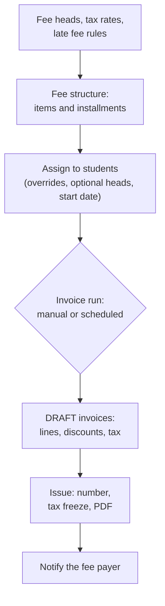
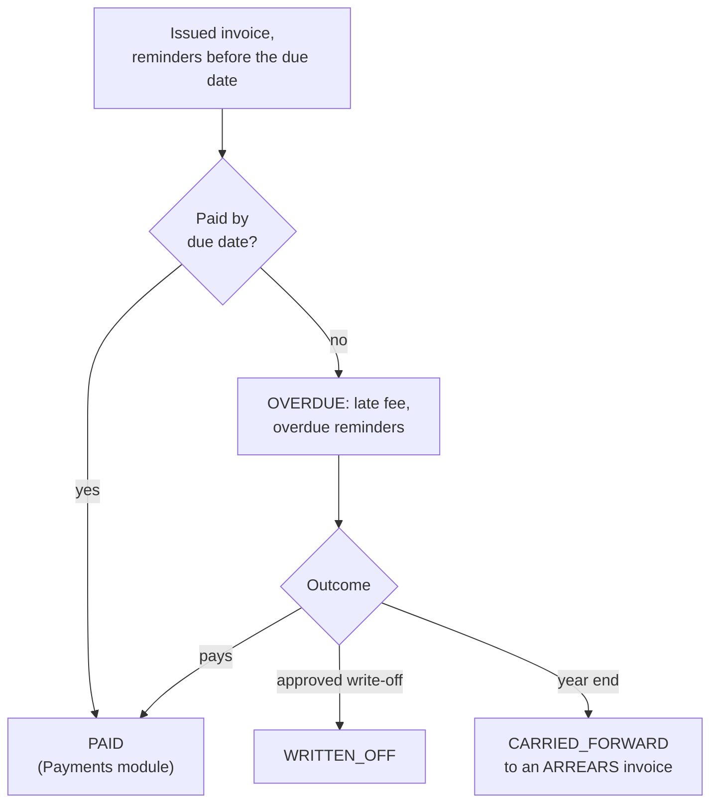
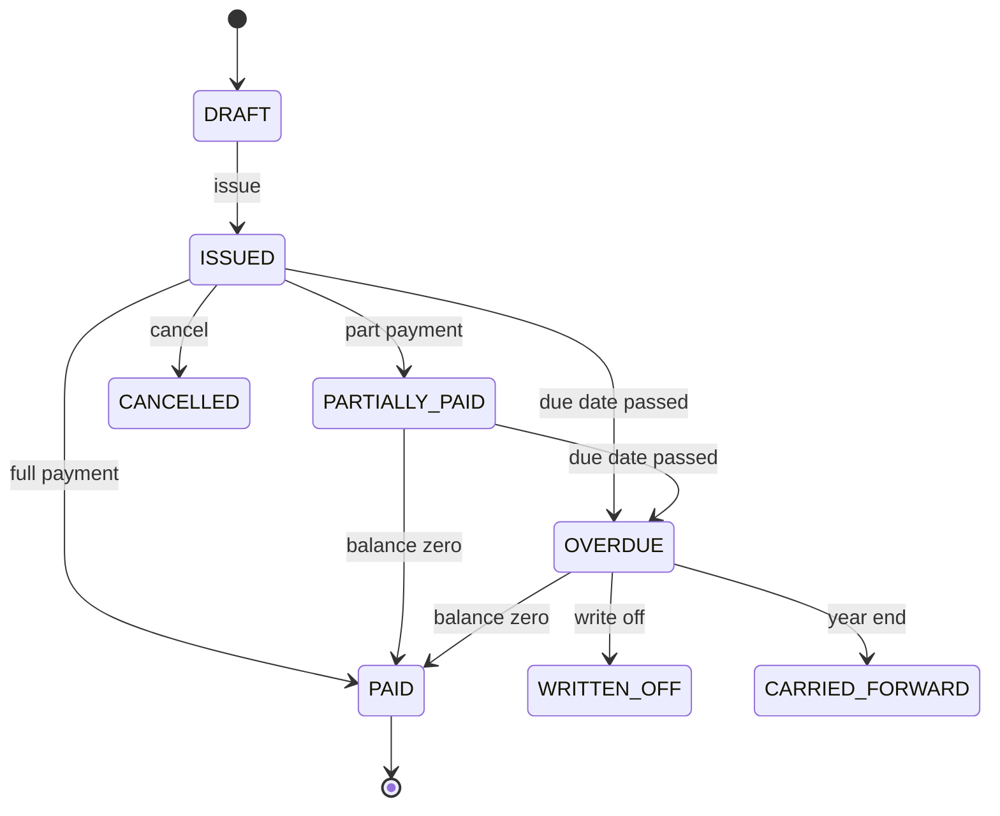
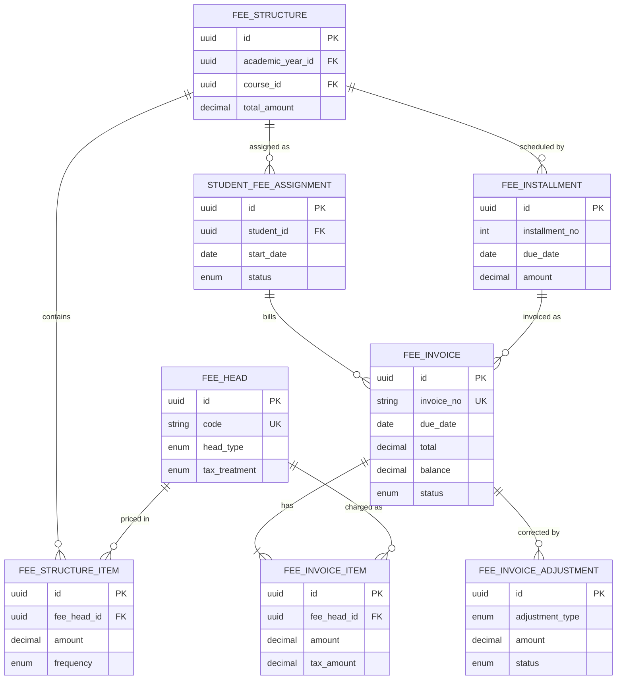

# Fees Module

**In simple words:** The Fees module decides how much each student must pay, for what, and by when. It turns a fee plan into invoices (bills), adds late fees, sends reminders and shows who still owes money. It does not take the money: collecting payments and printing receipts is the job of the *Payments Module*. For most institutes this module is the reason to buy EduFlow, so every rupee in it must be traceable.

| Item | Value |
|---|---|
| Module code | FEE |
| Release phase | Phase 1 (MVP) |
| Plans | Starter (reminders by in-app and email only), Growth, Pro, Enterprise |
| Main users | Accountant, Organization Admin, Principal (approvals), Parent (reads invoices in the portal) |
| Depends on | Student Profile, Batch, Multi Campus, Settings, Notifications |
| Used by | Payments, Discounts, Scholarships, Parent Portal, Dashboard, Transport, Hostel |
| Main tables | `fee_heads`, `tax_rates`, `late_fee_rules`, `fee_structures`, `fee_structure_items`, `fee_installments`, `student_fee_assignments`, `student_fee_installments`, `fee_invoices`, `fee_invoice_items`, `fee_invoice_adjustments`, `fee_reminder_logs` |
| Endpoints | FEE-API-01 to FEE-API-46 |
| Build prompts | P-23 (heads, structures, assignment) and P-24 (invoices, late fees, reminders) |

## Objective

Institutes lose money in three ways: bills go out late, nobody follows up, and old dues get lost in registers. The Fees module closes these three gaps.

Measurable goals:

1. Rajesh Sharma can set up the full fee plan of one course in under 10 minutes.
2. Suresh Gupta can bill 1,200 students in under 2 minutes, with zero duplicate invoices.
3. Every parent gets the bill, a reminder before the due date and a reminder after it, without a click from staff.
4. The dues list is always correct. It reads the cached `balance` column, which changes only inside a database transaction.
5. No issued invoice is ever changed silently. Every correction is a cancelled invoice, a credit note or an approved adjustment with a name and a time.
6. GST (Goods and Services Tax, the Indian indirect tax) is right per fee head: 18% on coaching fees, exempt on school tuition, and configurable for everything else.

## Scope

### In scope

- Fee heads (kinds of charge such as Tuition or Transport) with tax flags, tax code, settlement priority and refundable flag.
- Effective-dated tax rates with components (CGST + SGST, IGST, VAT, sales tax).
- Late fee rules: fixed once, fixed per day, fixed per month, percent once, percent per month, with grace days and a cap.
- Fee structures per academic year, campus, course and optional batch, with items and installments (due dates).
- Assigning a structure to one student or in bulk, with amount overrides, optional heads, a start date for proration (charging only for the part of the period the student attends) and a custom payment schedule.
- Invoice generation: single ad-hoc invoice, bulk run with preview, and scheduled runs driven by installment due dates (monthly, quarterly, half-yearly, yearly).
- Invoice lifecycle: draft, issue, cancel and reissue, credit note number, adjustments with approval, write-off, year-end carry-forward.
- Nightly overdue marking and late fee job. Reminder schedule before and after the due date, plus manual and bulk reminders.
- Optional fees linked to Transport and Hostel records.
- Opening dues import from Excel, student fee ledger, dues report, defaulter report, summary numbers and exports.

### Out of scope

- Taking money, receipts, refunds, cheque bounce, day close and gateway reconciliation. See the *Payments Module* chapter.
- Defining discount schemes and approving student discounts. See the *Discounts Module* chapter. This module only applies approved discounts when it builds an invoice.
- Scholarship schemes and awards. See the *Scholarships Module* chapter. This module only shows `scholarshipCredit` on the invoice.
- Double-entry accounting and GST return filing. EduFlow exports a tax register for Tally or a GST tool.
- EduFlow's own subscription invoices. See the *Organizations Module* chapter.

### Phase notes

| Phase | What ships |
|---|---|
| Phase 1 (MVP) | Everything in scope except the two items below |
| Phase 2 | Scholarship credit on invoices (`scholarship_disbursements`), student view of invoices in the Student Portal |
| Phase 3 | Transport and Hostel lines billed from `transport_assignments` and `hostel_allocations` with `billedUpTo` tracking |

In Phase 1 transport and hostel charges are plain optional items inside a fee structure.

## User Stories

| ID | As a | I want to | So that | Priority |
|---|---|---|---|---|
| FEE-US-01 | Organization Admin | create fee heads with a tax setting per head | coaching fees carry 18% GST and school tuition stays exempt | Must |
| FEE-US-02 | Organization Admin | build a fee structure for a course and year with installments | every student of Class 10 gets the same plan and due dates | Must |
| FEE-US-03 | Organization Admin | copy last year's structure and change the amounts | the new session is ready in minutes | Should |
| FEE-US-04 | Accountant | assign a structure to a whole batch in one action | I do not repeat the work 40 times | Must |
| FEE-US-05 | Accountant | set a start date, optional heads and amount overrides for one student | a mid-session joiner or a transport user is billed correctly | Must |
| FEE-US-06 | Accountant | preview a bulk invoice run before it is saved | I catch a wrong amount before 1,200 parents see it | Must |
| FEE-US-07 | Organization Admin | let the system generate and issue invoices on a schedule | monthly and quarterly bills go out even when staff are busy | Must |
| FEE-US-08 | Organization Admin | define a late fee rule with grace days and a cap | late payers are charged fairly and the same way every time | Must |
| FEE-US-09 | Parent | get reminders before and after the due date with a pay link | I do not forget and do not pay a late fee | Must |
| FEE-US-10 | Accountant | see dues and defaulters by batch and by age of the debt | I call the right parents first | Must |
| FEE-US-11 | Accountant | request a concession, a late fee waiver or a correction on an issued invoice | the change is visible and approved, not hidden | Must |
| FEE-US-12 | Principal | approve or reject adjustments and write-offs | no single person can remove money from the books | Must |
| FEE-US-13 | Accountant | cancel a wrong invoice and reissue a correct one | the parent gets a clean bill and the old one stays on record | Must |
| FEE-US-14 | Organization Admin | carry unpaid balances into the new academic year | old dues are not lost when the session changes | Should |
| FEE-US-15 | Accountant | import opening dues from Excel on day one | we start EduFlow in the middle of a session | Should |

## Workflow

**Figure: From fee setup to an issued invoice**



Setup (the first three boxes) is done once per session. The run, the drafts and the issue step repeat for every installment.

**Figure: From an issued invoice to a closed invoice**



Money enters through the *Payments Module*, which calls the Fees service to reduce the balance inside the same transaction. The steps in plain words:

1. **Setup.** Rajesh creates fee heads (FEE-API-02), a tax rate if the institute is taxable (FEE-API-06) and a late fee rule (FEE-API-09).
2. **Structure.** He creates "Class 10 Fees 2027-28" with items and four quarterly installments (FEE-API-12).
3. **Assign.** Suresh assigns it to batch 10-A (FEE-API-16), or to one student with a start date and optional heads (FEE-API-18).
4. **Generate.** On 1 July 2027 Suresh previews installment 2 (FEE-API-37 with `dryRun: true`), then runs it with `autoIssue: true`. When `fees.auto_generate` is on, a scheduled job does the same without a click.
5. **Issue.** Each invoice gets a number, frozen tax values and a PDF. `fee.invoice.issued` tells the fee payer.
6. **Remind and charge.** A daily job sends reminders around the due date. A nightly job sets `OVERDUE` and applies the late fee.
7. **Correct.** A mistake on an issued invoice is fixed by an approved adjustment (FEE-API-33, FEE-API-35) or by cancel and reissue (FEE-API-29).
8. **Close.** The invoice ends as `PAID`, `CANCELLED`, `WRITTEN_OFF` or `CARRIED_FORWARD`.

**Figure: Invoice status lifecycle**



The diagram shows the main paths; the table below lists every allowed move. A discarded draft is soft-deleted and has no status of its own. `OVERDUE` wins over `PARTIALLY_PAID`: an invoice that is late and half paid shows `OVERDUE` until the balance is zero.

### Invoice status lifecycle

| Status | Meaning | Set by | Next statuses |
|---|---|---|---|
| `DRAFT` | Built but not sent. Freely editable. No number that counts for tax. | Generate run, FEE-API-25 | `ISSUED`, or discarded |
| `ISSUED` | Official bill, not yet due or within the due date, nothing paid | FEE-API-28, FEE-API-38, auto-issue | `PARTIALLY_PAID`, `PAID`, `OVERDUE`, `CANCELLED`, `WRITTEN_OFF`, `CARRIED_FORWARD` |
| `PARTIALLY_PAID` | Some money or credit received, balance above zero, not late | Payments service | `PAID`, `OVERDUE`, `WRITTEN_OFF`, `CARRIED_FORWARD` |
| `OVERDUE` | Due date has passed and balance is above zero | Nightly job, or status recompute after a payment is reversed | `PAID`, `CANCELLED` (if nothing is paid), `WRITTEN_OFF`, `CARRIED_FORWARD` |
| `PAID` | Balance is zero. `paidAt` is set. | Payments service, or an approved credit that clears the balance | Reopens to `PARTIALLY_PAID`, `ISSUED` or `OVERDUE` only when a payment is cancelled, bounced or refunded |
| `CANCELLED` | Issued by mistake. Kept for history. Credit note number if tax was charged. | FEE-API-29 | None |
| `WRITTEN_OFF` | The institute gave up the balance. `writtenOffAmount` holds it. | FEE-API-30 | None |
| `CARRIED_FORWARD` | Old-year invoice whose balance moved to an ARREARS invoice of the new session | FEE-API-40 | None |

### Assignment status lifecycle

| Status | Meaning | Set by | Effect on invoicing |
|---|---|---|---|
| `ACTIVE` | Structure applies to the student | FEE-API-16, FEE-API-18, FEE-API-22 | Included in every run |
| `PAUSED` | Long leave; billing on hold | FEE-API-21 | Skipped, shown as "paused" in the preview |
| `ENDED` | Student left or the year closed; `endDate` set | Event `student.withdrawn`, year close, FEE-API-19 | No new invoices after `endDate` |
| `CANCELLED` | Assigned by mistake | FEE-API-23 | Never invoiced; allowed only when no issued invoice exists |

## Screens and Wireframes

| ID | Screen | Users | Purpose |
|---|---|---|---|
| FEE-S01 | Fees Overview | Accountant, Organization Admin, Principal | Billed, collected, outstanding and overdue cards; shortcuts to runs and approvals |
| FEE-S02 | Fee Heads and Tax Rates | Organization Admin | Create and archive fee heads; maintain tax rates |
| FEE-S03 | Late Fee Rules | Organization Admin | Create rules, set the default rule |
| FEE-S04 | Fee Structures | Organization Admin, Accountant (view) | List by year, campus, course; copy; archive |
| FEE-S05 | Fee Structure Builder | Organization Admin | Items, frequencies, optional heads, installments |
| FEE-S06 | Assign Structure | Accountant | Bulk assign to course, batch or list; single assign with overrides |
| FEE-S07 | Student Fee Assignments | Accountant | List, pause, resume, end, custom schedule |
| FEE-S08 | Generate Invoices | Accountant | Choose installment, preview (dry run), generate and issue |
| FEE-S09 | Invoices | Accountant, Principal | Search and filter invoices; bulk issue and bulk remind |
| FEE-S10 | Invoice Detail | Accountant, Principal | Lines, payments, adjustments, reminders, history, actions |
| FEE-S11 | Adjustment Approvals | Principal, Organization Admin | Approve or reject concessions, waivers, corrections, write-offs |
| FEE-S12 | Dues and Defaulters | Accountant, Organization Admin, Principal | Age buckets, reminder count, bulk reminder, export |
| FEE-S13 | Student Fee Ledger | Accountant | One student's invoices, payments, refunds, credits, advance |
| FEE-S14 | Year-end Carry Forward | Organization Admin | Preview and move balances to the new session |
| FEE-S15 | Import Opening Dues | Accountant, Organization Admin | Excel upload with dry run and error file |
| FEE-S16 | Invoice in the Parent Portal | Parent | Dues, invoice lines, late fee, pay button, PDF |

> **Note:** The counter screen "Collect Fee" sits in the same Fees menu, but it records a payment. It is specified in the *Payments Module* chapter. FEE-S16 is rendered inside the *Parent Portal Module*; this chapter owns what the invoice card shows.

**Screen FEE-S05 — Fee Structure Builder (Organization Admin, web)**

```text
+--------------------------------------------------------------------------+
| EduFlow | Bright Future Public School      [Search students...]   (RS) v |
+------------+-------------------------------------------------------------+
| Dashboard  | Fees > Structures > New structure                           |
| Students   +-------------------------------------------------------------+
| Attendance | Name [Class 10 Fees 2027-28    ]  Year [2027-28 v]          |
| Fees     < | Course [Class 10 v]  Batch [All v]  Campus [All v]          |
|  Overview  | Late fee rule [Rs 50 per day, cap Rs 1,000 v]               |
|  Structures|-------------------------------------------------------------|
|  Assign    | Fee head       Amount  Frequency       Opt  Applies to      |
|  Invoices  | Tuition        12,000  [Quarterly v]   [ ]  [All v]         |
|  Dues      | Exam fee        1,500  [Half-yearly v] [ ]  [All v]         |
|  Reports   | Activity fee    2,000  [Yearly v]      [ ]  [All v]         |
| Exams      | Admission fee   5,000  [One time v]    [ ]  [New only v]    |
| Settings   | Transport       3,000  [Quarterly v]   [x]  [All v]         |
|            | [+ Add fee head]                                            |
|            |-------------------------------------------------------------|
|            | Installments  (o) Quarterly ( ) Monthly ( ) Custom          |
|            | 1  Quarter 1  Due [10 Apr 2027]  Planned Rs 15,500          |
|            | 2  Quarter 2  Due [10 Jul 2027]  Planned Rs 12,000          |
|            | 3  Quarter 3  Due [10 Oct 2027]  Planned Rs 13,500          |
|            | 4  Quarter 4  Due [10 Jan 2028]  Planned Rs 12,000          |
|            | Yearly total without optional heads: Rs 53,000              |
|            |                            [Cancel]  [Save structure]       |
+------------+-------------------------------------------------------------+
```

- The user sees one row per fee head. "Opt" marks an optional head that is charged only to students who take it.
- Choosing Quarterly, Monthly, Half-yearly or Yearly creates the installment rows with period dates. The user edits only the due dates. "Custom" allows free rows.
- Planned amounts are calculated by the server (FEE-BR-04) and shown read-only.
- [Save structure] calls FEE-API-12. On an existing structure it calls FEE-API-14. After the first invoice the amount fields are locked and a banner says "Locked: invoices exist. Copy the structure to change amounts."

**Screen FEE-S08 — Generate Invoices with preview (Accountant, web)**

```text
+--------------------------------------------------------------------------+
| EduFlow | Bright Future Public School      [Search students...]   (SG) v |
+------------+-------------------------------------------------------------+
| Dashboard  | Fees > Invoices > Generate                                  |
| Students   +-------------------------------------------------------------+
| Attendance | Year [2027-28 v]   Structure [Class 10 Fees 2027-28 v]      |
| Fees     < | Installment [2 - Quarter 2, due 10 Jul 2027 v]              |
|  Overview  | Students (o) All assigned ( ) Batch [10-A v] ( ) Selected   |
|  Structures| Issue date [01 Jul 2027]   [x] Issue now and notify payers  |
|  Assign    | [Preview]                                                   |
|  Invoices  |-------------------------------------------------------------|
|  Dues      | Preview (dry run) - nothing is saved yet                    |
|  Reports   | To create 184    Skipped 6    Total Rs 21,45,600            |
| Exams      | Student             Lines  Discount   Tax    Total          |
| Settings   | Aarav Sharma 10-A     1      1,200      0   10,800          |
|            | Riya Singh 10-A       4          0      0   16,500 prorated |
|            | Kabir Khan 10-B       2          0      0   15,000          |
|            | ... 181 more                        [Download preview]      |
|            | Skipped: 4 already invoiced, 2 paused                       |
|            |                         [Back]  [Generate 184 invoices]     |
+------------+-------------------------------------------------------------+
```

- [Preview] calls FEE-API-37 with `dryRun: true`. The server returns counts, totals, the first 50 rows and the skip reasons. Nothing is written.
- [Generate 184 invoices] calls FEE-API-37 with `dryRun: false`. The answer is `202` with a job ID. A toast says "Generating 184 invoices. We will notify you when it is done."
- With the checkbox off, invoices stay `DRAFT`. The user reviews them on FEE-S09 and issues them with FEE-API-38.
- A row tagged "prorated" opens a popover with the proration formula.

**Screen FEE-S10 — Invoice Detail (Accountant, web)**

```text
+--------------------------------------------------------------------------+
| EduFlow | Bright Future Public School      [Search students...]   (SG) v |
+------------+-------------------------------------------------------------+
| Dashboard  | Fees > Invoices > INV-2027-0912                  [OVERDUE]  |
| Students   +-------------------------------------------------------------+
| Attendance | Aarav Sharma  BF-2027-0142  Class 10-A  Payer: Sunita Devi  |
| Fees     < | Issued 01 Jul 2027   Due 10 Jul 2027   Period Jul-Sep 2027  |
|  Overview  |-------------------------------------------------------------|
|  Structures| Fee head        Amount   Discount     Tax       Net         |
|  Assign    | Tuition Q2      12,000      1,200       0    10,800         |
|  Invoices  |-------------------------------------------------------------|
|  Dues      | Subtotal 12,000   Discount -1,200   Tax 0   Late fee 250    |
|  Reports   | Adjustments 0   Total 11,050   Paid 5,000   Balance 6,050   |
| Exams      |-------------------------------------------------------------|
| Settings   | [Lines] [Payments] [Adjustments] [Reminders] [History]      |
|            | 20 Jul  Late fee now Rs 250 (5 days x Rs 50)                |
|            | 17 Jul  Overdue reminder   WhatsApp   Delivered             |
|            | 12 Jul  Payment Rs 5,000   UPI   RCP-2027-1044              |
|            | 01 Jul  Issued by Suresh Gupta, WhatsApp sent               |
|            |-------------------------------------------------------------|
|            | [Collect] [Remind] [Request adjustment] [PDF] [More v]      |
+------------+-------------------------------------------------------------+
```

- Data comes from FEE-API-26. The History tab merges audit log rows, reminder logs and payment allocations by time.
- [Collect] opens the counter screen of the *Payments Module* with this invoice ticked. [Remind] calls FEE-API-32. [Request adjustment] opens a dialog and calls FEE-API-33. [PDF] calls FEE-API-31.
- [More v] holds "Cancel invoice" (FEE-API-29) and "Write off balance" (FEE-API-30). Each item is hidden when the user lacks the permission key.
- On a `DRAFT` invoice the line table is editable and the buttons are [Save draft] (FEE-API-27), [Issue] (FEE-API-28) and [Discard] (FEE-API-29).

**Screen FEE-S12 — Dues and Defaulters (Accountant, web)**

```text
+--------------------------------------------------------------------------+
| EduFlow | Bright Future Public School      [Search students...]   (SG) v |
+------------+-------------------------------------------------------------+
| Dashboard  | Fees > Dues > Defaulters                                    |
| Students   +-------------------------------------------------------------+
| Attendance | Campus [Main v] Course [All v] Batch [All v] Age [> 7 d v]  |
| Fees     < | Overdue Rs 8,42,500    Students 96    Invoices 121          |
|  Overview  | 1-30 d: 61     31-60 d: 22     61-90 d: 9     90+ d: 4      |
|  Structures|-------------------------------------------------------------|
|  Assign    | [ ] Student          Batch  Overdue  Days  Rem.  Last sent  |
|  Invoices  | [x] Aarav Sharma     10-A     6,050    10    5   17 Jul     |
|  Dues    < | [x] Meera Joshi      9-B     27,000    41    7   09 Jul     |
|  Reports   | [ ] Kabir Khan       10-B    15,000    10    5   17 Jul     |
| Exams      | [x] Zoya Ansari      8-A     12,500    72    8   02 Jul     |
| Settings   | ...                                  Page 1 of 5  [<] [>]   |
|            |-------------------------------------------------------------|
|            | 3 selected    [Send reminder]  [Export Excel]  [Print list] |
+------------+-------------------------------------------------------------+
```

- Data comes from FEE-API-44. Age buckets are days after the due date. "Rem." is `reminderCount`.
- [Send reminder] calls FEE-API-39 with the selected invoice IDs. With nothing selected it sends the active filter, after a confirm dialog that shows the count and the message cost.
- [Export Excel] calls FEE-API-46 with `exportType: "fees.defaulters"`.
- A click on a student opens the Student Fee Ledger (FEE-S13, FEE-API-42).

**Screen FEE-S16 — Invoice in the Parent Portal (Parent, mobile)**

```text
+------------------------------------+
| <  Fees           Aarav Sharma v   |
+------------------------------------+
| Total due             Rs 6,050     |
| 1 invoice is overdue               |
+------------------------------------+
| INV-2027-0912           [OVERDUE]  |
| Tuition Q2 (Jul-Sep 2027)          |
| Due 10 Jul 2027                    |
|                                    |
| Fee                   Rs 12,000    |
| Sibling discount     - Rs 1,200    |
| Late fee                Rs 250     |
| Paid                 - Rs 5,000    |
| Balance               Rs 6,050     |
|                                    |
| [Pay Rs 6,050]     [Invoice PDF]   |
+------------------------------------+
| INV-2027-0311              [PAID]  |
| Quarter 1   Rs 14,300              |
| Paid 08 Apr 2027       [Receipt]   |
+------------------------------------+
| Home    Fees    Attendance   More  |
+------------------------------------+
```

- The parent sees only issued invoices of her own children (PP-API-13, PP-API-14). `DRAFT` and `CANCELLED` invoices never appear.
- [Pay Rs 6,050] creates a checkout order (PP-API-16). [Invoice PDF] calls PP-API-15. Payment is specified in the *Payments Module* chapter.
- The late fee line shows the rule in small text: "Rs 50 per day after 15 Jul, maximum Rs 1,000".

## UI Components

| Component | Type | Behaviour |
|---|---|---|
| `FeeHeadForm` | Dialog form (React Hook Form + Zod) | Tax fields appear only when "Taxable" is on; code auto-fills from the name in upper case |
| `LateFeeRuleForm` | Dialog form | Amount or percent field switches with the calculation; live example line "10 days late = Rs 250" |
| `StructureItemsTable` | Editable table | Add, remove, reorder rows; frequency select; optional checkbox; applicability select |
| `InstallmentEditor` | Editable list | Preset buttons create rows; due date pickers; planned amount read-only |
| `AssignDialog` | Stepper dialog | Step 1 target (course, batch, students), step 2 optional heads and start date, step 3 summary with skipped students |
| `OverrideEditor` | Inline table | Per head: structure amount, new amount, reason; a lower amount shows "needs fees.manage" |
| `GeneratePreviewTable` | Data table | Virtualised rows, skip reason chips, totals footer, download preview as CSV |
| `InvoiceStatusBadge` | Badge | Grey DRAFT, blue ISSUED, amber PARTIALLY_PAID, green PAID, red OVERDUE, slate for the three closed statuses |
| `AdjustmentDialog` | Dialog form | Type select, amount, optional line, reason; shows the balance after approval |
| `ApprovalQueueTable` | Data table | Pending first; Approve and Reject buttons; Reject needs a reason |
| `JobProgressToast` | Toast | Shown after a `202`; closes when the in-app notification of the finished job arrives |
| `ConfirmDangerDialog` | Alert dialog | Cancel, write-off and carry-forward; the user types the invoice number or "CARRY FORWARD" to confirm |

States every list and form must handle:

| State | What the user sees |
|---|---|
| Loading | Skeleton rows in tables; disabled submit button with spinner |
| Empty | "No fee structures yet. Create the first one." with a primary button; defaulters: "No overdue invoices. Well done." |
| Error | Red text under the field for `VALIDATION_ERROR`; toast with the server message for `BUSINESS_RULE_VIOLATION` and `CONFLICT`; retry card for `INTERNAL_ERROR` |
| No permission | The action button is hidden; a direct URL shows "You do not have access to this page" |
| Stale money | Money screens refetch on focus (`staleTime` 0); a changed balance flashes once |

## Validation Rules

All rules are checked on the client with Zod and again on the server. The server is the authority.

| Field | Rule | Error message shown to user |
|---|---|---|
| Fee head name | Required, 2 to 100 characters | Enter a fee head name (2 to 100 characters). |
| Fee head code | Required, 2 to 30 characters, `A-Z 0-9 _ -`, unique per organization | This code is already used by another fee head. |
| Fee head tax percent | 0 to 100, two decimals; above 0 when taxable and no tax rate chosen | Enter a tax percent above 0, or choose a tax rate. |
| Fee head tax treatment | `isTaxable = true` needs `TAXABLE`; any other treatment needs `isTaxable = false` | A taxable fee head must use the treatment "Taxable". |
| Fee head tax code | Required when taxable and the organization has a tax ID | Enter the SAC or HSN code for this taxable fee head. |
| Tax rate components | Each list must add up to `ratePercent` | The components must add up to the rate (18%). |
| Tax rate dates | `validTo` on or after `validFrom`; no overlap for the same name | This rate overlaps another "GST 18%" rate. Change the dates. |
| Late fee amount | Required and above 0 for the three FIXED calculations | Enter an amount for a fixed late fee. |
| Late fee percent | Required, 0.01 to 100, for the two PERCENT calculations | Enter a percent between 0.01 and 100. |
| Late fee cap and grace | Cap empty or not lower than `amount`; grace days 0 to 90 | The cap cannot be lower than the late fee amount. / Grace days must be between 0 and 90. |
| Structure name | Required, 3 to 120 characters, unique per year and campus | A structure with this name already exists for this year and campus. |
| Structure items | At least 1; fee head ACTIVE and used once; amount 0.01 to 99,99,999.99 | Add at least one fee head. / This fee head is already in the structure. |
| Installments | 1 to 24 rows; numbers 1..n without gaps; due dates ascending and inside the academic year | Due dates must be inside the academic year 2027-28 and in ascending order. |
| Assignment student | ACTIVE student with an ACTIVE enrollment in the structure's course and year | Aarav Sharma is not enrolled in Class 10 for 2027-28. |
| Assignment start date | Inside the academic year; not before the admission date | Start date must be inside the academic year and on or after the admission date. |
| Override | Head must be in the structure; amount 0 or more; reason 5 to 255 characters | Give a reason for the changed amount. |
| Excluded heads | Only heads marked optional in the structure | Tuition is a mandatory fee head and cannot be removed. |
| Custom schedule | 1 to 24 rows; sum equals the amount still to be invoiced | Installments add up to Rs 47,000 but Rs 48,000 must be scheduled. |
| Ad-hoc invoice | At least 1 line; line amount above 0; due date on or after issue date | Due date cannot be before the issue date. |
| Issue | Invoice total must be 0 or more; at least one line | Invoice total cannot be negative. Reduce the discount. |
| Cancel reason | Required, 5 to 255 characters | Give a reason for cancelling this invoice. |
| Adjustment amount | Above 0; a credit cannot exceed the balance; a waiver cannot exceed the unwaived late fee | The waiver cannot be more than the late fee of Rs 250. |
| Write-off reason | Required, 10 to 255 characters | Give a reason of at least 10 characters for the write-off. |
| Bulk actions | At most 2,000 invoice IDs per call; otherwise use a filter | Select 2,000 invoices or fewer, or use the filter option. |

## Business Rules

Settings used by these rules are rows of `organization_settings` (key plus JSON value, optional campus override), edited in the *Settings Module*. The key names below are an assumption of this chapter; the table and its columns come from the schema.

| Setting key | Default | Meaning |
|---|---|---|
| `fees.auto_generate` | `false` | Opt-in switch for the scheduled invoice run; off until the institute trusts its setup |
| `fees.auto_generate_days_before` | `10` | Scheduled run creates invoices this many days before the due date |
| `fees.auto_issue` | `true` | Scheduled run also issues and notifies; `false` leaves drafts |
| `fees.proration_mode` | `"MONTHLY"` | `MONTHLY`, `DAILY` or `NONE` |
| `fees.proration_cutoff_day` | `15` | MONTHLY mode: joining after this day makes the joining month free |
| `fees.proration_head_types` | TUITION, TRANSPORT, HOSTEL, MESS | Only time-based heads are prorated |
| `fees.reminder_offsets` | before 7, 3; after 3, 7, 15; final 30 | Days relative to the due date |
| `fees.reminder_send_time` | `"09:00"` | Local time of the daily reminder job |
| `fees.late_fee_policy` | enabled | Master switch for the nightly late fee job |

### Setup rules

**FEE-BR-01 — Fee heads.** `code` is unique per organization. A head inside an ACTIVE structure cannot be archived (`409 CONFLICT`). Archiving never touches old invoices, because each invoice line keeps its own copy of tax treatment, tax code and rate. `settlementPriority` decides which head a part payment settles first (lower first); the *Payments Module* uses it.

**FEE-BR-02 — Which tax applies.** A line is taxed only when the head has `isTaxable = true` and `taxTreatment = TAXABLE`. With a `taxRateId` the system takes the `tax_rates` row valid on the issue date; otherwise it uses `FeeHead.taxRate`. The seller state is `campuses.state_code`, else `organizations.state_code`. `placeOfSupply` defaults to the seller state. Same state means `components` (CGST + SGST). Another state means `interStateComponents` (IGST). On a DRAFT the accountant may change `placeOfSupply` and `buyerTaxId`, for example for a company that sponsors a student.

> **Founder note:** Typical setup in India: Sharma Classes marks its course fee TAXABLE at 18% with SAC code 999293 (SAC means Services Accounting Code, the GST code of a service). Bright Future Public School keeps tuition EXEMPT; uniforms and books may be taxable. EduFlow makes this a choice per fee head and does not decide the law. The institute's chartered accountant confirms each head before go-live.

**FEE-BR-03 — Tax calculation.** Tax is calculated per line, after the discount.

```text
Tax-exclusive head:
  taxableAmount = amount - discountAmount
  netAmount     = amount - discountAmount + taxAmount
Tax-inclusive head:
  taxableAmount = (amount - discountAmount) * 100 / (100 + rate)
  netAmount     = amount - discountAmount
Both:
  component     = round_half_up(taxableAmount * componentPercent / 100, 2)
  taxAmount     = sum of components
```

> **Example:** Sharma Classes, Patna (state code 10). Course fee installment ₹15,000, early-bird discount ₹1,000, GST 18%. Taxable amount = ₹14,000. CGST 9% = ₹1,260. SGST 9% = ₹1,260. Tax = ₹2,520. Net = ₹16,520. With `placeOfSupply = 20` (Jharkhand) the same line shows IGST 18% = ₹2,520.

> **Example:** Tax-inclusive head in Australia, price A$1,100, GST 10%. Taxable amount = 1,100 x 100 / 110 = A$1,000. GST = A$100. Net = A$1,100.

Invoice totals are not rounded to whole rupees. The invoice-level `taxBreakdown` is the sum of the line components.

**FEE-BR-04 — Structure arithmetic.** An item's `amount` is the price for one period of its `frequency`. The charge of an item on an installment is:

- `installmentNos` filled: the full `amount` on each listed installment.
- `installmentNos` empty: `amount` x the number of frequency periods that start inside the installment's `periodStart` to `periodEnd`. A ONE_TIME or YEARLY item lands on installment 1.

`FeeInstallment.amount` (planned amount) is the sum of the charges of all items that are not optional and apply to all students. `FeeStructure.totalAmount` is the sum of the planned amounts. The server calculates both; values sent by the client are ignored.

> **Example:** Class 10 Fees 2027-28 with four quarterly installments. Tuition ₹12,000 QUARTERLY lands on all four. Exam fee ₹1,500 HALF_YEARLY lands on installments 1 and 3. Activity fee ₹2,000 YEARLY lands on installment 1. Admission fee (new admissions only) and Transport (optional) are left out of the plan. Planned: Q1 ₹15,500, Q2 ₹12,000, Q3 ₹13,500, Q4 ₹12,000. `totalAmount` = ₹53,000.

**FEE-BR-05 — Structure lock.** Once one non-cancelled invoice exists for a structure, FEE-API-14 accepts only `name`, `description`, `lateFeeRuleId` and `status`. Any other change answers `422 BUSINESS_RULE_VIOLATION`. To change prices in the middle of a year, copy the structure (`copyFromId`), assign the copy with a start date and end the old assignment.

### Assignment rules

**FEE-BR-06 — Assignment.** A student has at most one live assignment per structure and year (index `uq_student_fee_assignment_live`), but may have several structures, for example "Class 10 Fees" and "Bus Plan". `overrides` replace the structure amount of a head for this student. An override that lowers an amount needs `fees.manage`; without it the API answers `403 FORBIDDEN`, and the counter uses the approval flow of the *Discounts Module* instead. Optional heads are billed unless they are in `excludedFeeHeadIds`; when the request omits this field, the server excludes every optional head. An item applies only when three filters pass: `applicability` (a new admission is a student whose admission date lies inside this academic year), `studentCategories` and `admissionQuotas` (an empty list means everyone). `netYearlyAmount` is recalculated on every change: all applicable charges of the year after overrides, exclusions and proration, before discounts and tax.

**FEE-BR-07 — Proration for mid-session joiners.** Proration uses `StudentFeeAssignment.startDate`. It applies only to heads whose `headType` is in `fees.proration_head_types`. One-time, exam, activity and admission charges are never prorated.

- An installment whose `periodEnd` is before the start date is not invoiced at all. Charges on it that are not prorated move to the student's first invoice.
- When an installment's due date is already in the past on the issue date, the invoice is due 7 days after the issue date, so a late joiner never starts with a late fee.
- MONTHLY mode: billable months = months of the period from the joining month onward. The joining month counts only when the joining day is on or before the cutoff day. Charge = amount x billable months / months in the period.
- DAILY mode: charge = amount x days from the start date to `periodEnd` / days in the period, rounded half up to 2 decimals.

> **Example:** Riya Singh joins Class 10-A on 5 August 2027. Quarter 1 (April to June) is skipped. Quarter 2 runs July to September. August counts (day 5 is before day 15) and September counts: 2 of 3 months. Tuition = ₹12,000 x 2 / 3 = ₹8,000. Had she joined on 20 August, only September would count: ₹4,000. Her first invoice also carries the charges that sat on the skipped Quarter 1 and are not prorated: admission fee ₹5,000, exam fee ₹1,500 and activity fee ₹2,000. Invoice subtotal = ₹16,500.

> **Example:** Sharma Classes uses DAILY mode. Monthly fee ₹4,500. A student joins on 16 September 2027. Days left = 15 of 30. Charge = ₹4,500 x 15 / 30 = ₹2,250, plus GST 18% ₹405 = ₹2,655.

**FEE-BR-08 — Custom schedule.** FEE-API-20 replaces the student's schedule with `student_fee_installments` rows and sets `hasCustomSchedule = true`. The rows must add up to the amount that is still to be invoiced. Rows that already have an `invoiceId` cannot be replaced. An invoice for a custom installment splits its amount over the student's heads in the ratio of each head's share of `netYearlyAmount`, in `sortOrder`. The last line takes the rounding difference.

### Invoice rules

**FEE-BR-09 — How an invoice is built.** Order of work: (1) lines from the items that land on the installment, after FEE-BR-06 and FEE-BR-07; (2) approved student discounts that are valid on the issue date, written to `discountAmount` per line and to `appliedDiscounts`; (3) tax per line (FEE-BR-03); (4) scholarship credit, from Phase 2; (5) totals.

```text
total   = subtotal - discountTotal + taxTotal + lateFee + adjustmentTotal
balance = total - scholarshipCredit - amountPaid - writtenOffAmount
```

> **Example:** Aarav Sharma, Quarter 2. Subtotal ₹12,000. Sibling discount 10% on Tuition = ₹1,200. Tax ₹0 (exempt). Total = 12,000 - 1,200 + 0 + 0 + 0 = ₹10,800. Balance = ₹10,800. Suppose Sunita Devi pays only ₹5,000 on 12 July: balance = ₹5,800. On 20 July the late fee job adds ₹250: total = ₹11,050 and balance = 11,050 - 0 - 5,000 - 0 = ₹6,050.

`adjustmentTotal` is signed: credits are negative. The cached money columns are written in the same transaction as the change that causes them.

**FEE-BR-10 — No duplicate invoices.** The partial unique index `uq_fee_invoice_installment` allows one live invoice per student, assignment and installment. A run skips a student with one of these reasons: `ALREADY_INVOICED`, `ASSIGNMENT_PAUSED`, `BEFORE_START_DATE`, `AFTER_END_DATE`, `ZERO_AMOUNT`, `STUDENT_INACTIVE`. Running the same installment twice is therefore safe. A unique-key error (Prisma code `P2002`) in the worker counts as `ALREADY_INVOICED`, not as a failure.

**FEE-BR-11 — Scheduled generation.** The job `fees-scheduled-generate` runs at 02:00 local time for organizations with `fees.auto_generate = true`. It finds installments (also custom ones) whose due date minus `fees.auto_generate_days_before` is today or earlier and whose live invoices are missing, and generates them with issue date = today. With `fees.auto_issue = true` it also issues them; the payer is notified at 09:00, not at night. A monthly plan is a structure with 12 installments, a quarterly plan has 4. Nothing else is needed for monthly or quarterly billing.

**FEE-BR-12 — Issue.** Issue locks the `number_sequences` row of `FEE_INVOICE_NO` with `SELECT ... FOR UPDATE` inside the transaction, so numbers have no gaps and no repeats. For a GST-registered issuer the sequence has `maxLength = 16`. Issue freezes `sellerTaxId`, `placeOfSupply` and all tax values, sets `issueDate` and the status, queues the PDF and publishes `fee.invoice.issued`. An invoice with total ₹0 (100% concession) is issued and set to `PAID` at once.

**FEE-BR-13 — One function decides the status.** Payments, reversals, adjustments and the nightly job all call the same function after they change the money columns.

```typescript
import { Prisma, FeeInvoiceStatus } from '@prisma/client';

const FROZEN: FeeInvoiceStatus[] = ['DRAFT', 'CANCELLED', 'WRITTEN_OFF', 'CARRIED_FORWARD'];

export function deriveInvoiceStatus(
  inv: {
    status: FeeInvoiceStatus;
    balance: Prisma.Decimal;
    amountPaid: Prisma.Decimal;
    scholarshipCredit: Prisma.Decimal;
    dueDate: Date;
  },
  todayLocal: Date, // calendar date in the organization's timezone
): FeeInvoiceStatus {
  if (FROZEN.includes(inv.status)) return inv.status;
  if (inv.balance.lte(0)) return 'PAID';
  if (inv.dueDate < todayLocal) return 'OVERDUE';
  const partPaid = inv.amountPaid.gt(0) || inv.scholarshipCredit.gt(0);
  return partPaid ? 'PARTIALLY_PAID' : 'ISSUED';
}
```

**FEE-BR-14 — Late fee.** The rule is the structure's `lateFeeRuleId`, else the default rule of the campus, else the default rule of the organization. Ad-hoc, ARREARS and cheque bounce invoices never get a late fee. The nightly job `fees-late-fee` (01:00 local time) first sets `OVERDUE`, then recalculates the late fee of every `OVERDUE` invoice and stores the new value when it is higher.

```typescript
import { Prisma, LateFeeCalculation } from '@prisma/client';
import { differenceInCalendarDays } from 'date-fns';

type Rule = {
  calculation: LateFeeCalculation;
  amount: Prisma.Decimal | null;
  percent: Prisma.Decimal | null;
  graceDays: number;
  maxAmount: Prisma.Decimal | null;
};
type Inv = {
  dueDate: Date; total: Prisma.Decimal; lateFee: Prisma.Decimal; lateFeeWaived: boolean;
  scholarshipCredit: Prisma.Decimal; amountPaid: Prisma.Decimal; writtenOffAmount: Prisma.Decimal;
};
const D = Prisma.Decimal;

export function calcLateFee(rule: Rule, inv: Inv, todayLocal: Date): Prisma.Decimal {
  const chargeDays = differenceInCalendarDays(todayLocal, inv.dueDate) - rule.graceDays;
  if (chargeDays <= 0 || inv.lateFeeWaived) return inv.lateFee;
  // base = unpaid principal; a late fee is never charged on a late fee
  const base = D.max(0, inv.total.minus(inv.lateFee).minus(inv.scholarshipCredit)
    .minus(inv.amountPaid).minus(inv.writtenOffAmount));
  const months = Math.ceil(chargeDays / 30);
  let fee: Prisma.Decimal;
  switch (rule.calculation) {
    case 'FIXED_ONCE': fee = new D(rule.amount ?? 0); break;
    case 'FIXED_PER_DAY': fee = new D(rule.amount ?? 0).mul(chargeDays); break;
    case 'FIXED_PER_MONTH': fee = new D(rule.amount ?? 0).mul(months); break;
    case 'PERCENT_OF_BALANCE':
      fee = inv.lateFee.gt(0) ? inv.lateFee : base.mul(rule.percent ?? 0).div(100);
      break;
    case 'PERCENT_PER_MONTH': fee = base.mul(rule.percent ?? 0).div(100).mul(months); break;
  }
  fee = fee.toDecimalPlaces(2, D.ROUND_HALF_UP);
  if (rule.maxAmount) fee = D.min(fee, rule.maxAmount);
  return D.max(fee, inv.lateFee); // a late fee never goes down by itself
}
```

Worked examples:

| Rule | Invoice | Date | Calculation | Late fee |
|---|---|---|---|---|
| FIXED_ONCE ₹200, grace 5 | Due 10 Jul, unpaid ₹10,800 | 15 Jul | 5 days late, inside grace | ₹0 |
| FIXED_ONCE ₹200, grace 5 | Same | 16 Jul and later | Charged once | ₹200 |
| FIXED_PER_DAY ₹50, grace 5, cap ₹1,000 | Due 10 Jul, unpaid ₹5,800 | 20 Jul | (10 - 5) x 50 | ₹250 |
| FIXED_PER_DAY ₹50, grace 5, cap ₹1,000 | Same | 9 Aug | (30 - 5) x 50 = 1,250, capped | ₹1,000 |
| FIXED_PER_MONTH ₹100, grace 0 | Due 10 Jul | 25 Aug | 46 days = 2 started months x 100 | ₹200 |
| PERCENT_OF_BALANCE 2%, grace 7 | Due 5 Aug, unpaid ₹16,520 | 13 Aug | 2% x 16,520, once | ₹330.40 |
| PERCENT_PER_MONTH 2%, cap ₹1,500 | Due 5 Aug, unpaid ₹10,000 | 6 Aug | 2% x 10,000 x 1 month | ₹200 |
| PERCENT_PER_MONTH 2%, cap ₹1,500 | Same | 5 Sep | 31 days = 2 months | ₹400 |

The job adds the difference to `lateFee`, `total` and `balance` and sets `lateFeeAppliedAt`. It publishes `fee.late_fee.applied` only the first time, so a per-day rule does not message the parent every night. The late fee stops growing when the invoice is `PAID`, `CANCELLED`, `WRITTEN_OFF` or `CARRIED_FORWARD`, or when `lateFeeWaived` is true.

> **Note:** `fee_invoices.late_fee` has no tax column, so a late fee is added without tax. A GST-registered institute that must charge GST on penalties bills the penalty as an ad-hoc invoice with a taxable FINE head instead. Ask the chartered accountant which way applies.

**FEE-BR-15 — Late fee waiver.** A waiver is an adjustment of type `LATE_FEE_WAIVER`. On approval the system adds the amount as a credit to `adjustmentTotal`, fills `lateFeeWaivedAmount`, `lateFeeWaivedById`, `lateFeeWaivedAt` and `lateFeeWaiveReason`, and sets `lateFeeWaived = true`. From then on the nightly job leaves the invoice alone.

**FEE-BR-16 — Editing rules.** A `DRAFT` can be edited or discarded freely (FEE-API-27, FEE-API-29). An issued invoice is never edited: no endpoint changes its lines, amounts, dates or student. There are only two ways to correct it:

1. **Adjustment** (credit or debit note) for a change in value. See FEE-BR-17.
2. **Cancel and reissue** for a wrong bill. FEE-API-29 sets `CANCELLED` with time, user and reason. If `taxTotal` is above 0, a credit note number from the `CREDIT_NOTE_NO` sequence and its date are stored (a credit note is the tax document that reverses an invoice). Scholarship disbursements on the invoice are reversed. With `reissue: true` the server builds a new DRAFT whose `replacesInvoiceId` points to the old invoice.

An invoice with `amountPaid` above 0 cannot be cancelled. The payment is first cancelled or refunded in the *Payments Module*, or the difference is handled by an adjustment.

**FEE-BR-17 — Adjustments need two people.** The requester (`fees.update`) creates a `PENDING` row. The approver (`fees.approve`) must be a different user; if `requestedById` equals the caller, the API answers `422 BUSINESS_RULE_VIOLATION`. Credit types (`CONCESSION`, `WAIVER`, `LATE_FEE_WAIVER`, `CREDIT_CORRECTION`, `PARTIAL_WRITE_OFF`) reduce `adjustmentTotal`; `DEBIT_CORRECTION` increases it. Approval recomputes `adjustmentTotal`, `total`, `balance` and the status in one transaction. A credit above the current balance is refused at request time and again at approval time. An adjustment never recalculates tax; a tax mistake is fixed by cancel and reissue.

> **Example:** INV-2027-0912 has a balance of ₹6,050. Suresh requests a late fee waiver of ₹250 with the reason "Parent was in hospital". Dr. Anita Verma approves. `adjustmentTotal` = -250, total = ₹10,800, balance = ₹5,800, `lateFeeWaived` = true.

**FEE-BR-18 — Write-off.** A write-off means the institute stops expecting the money. A part write-off is an adjustment of type `PARTIAL_WRITE_OFF`. A full write-off uses FEE-API-30 (`fees.approve`): `writtenOffAmount` = current balance, balance = 0, status `WRITTEN_OFF`, with time, user and reason. The call is refused when the caller requested a write-off adjustment on this invoice or recorded a payment on it. A written-off invoice is final; money that arrives later becomes an advance in the *Payments Module*.

**FEE-BR-19 — Reminders.** The job `fees-reminders` runs daily at `fees.reminder_send_time`.

| Day relative to due date | `reminderType` | Event |
|---|---|---|
| 7 and 3 days before | `UPCOMING_DUE` | `fee.invoice.due_soon` |
| Due date | `DUE_TODAY` | `fee.invoice.due_today` |
| 3, 7 and 15 days after | `OVERDUE` | `fee.invoice.overdue` |
| 30 days after | `FINAL_NOTICE` | `fee.invoice.overdue` with `final: true` in the payload |
| Any day, by a user | `MANUAL` | `fee.reminder.sent` |

Only invoices in `ISSUED`, `PARTIALLY_PAID` or `OVERDUE` with a balance above 0 are reminded. The receiver is each guardian whose link to the student has `student_guardians.is_fee_payer = true`, else the primary guardian. There is at most one automatic reminder per invoice per day. Several invoices of one payer on the same day become one combined message, with one `fee_reminder_logs` row per invoice and the same `messageLogId`. A manual reminder is refused when a reminder for the invoice went out in the last 12 hours. Every send updates `lastReminderAt` and `reminderCount`. Channel choice, parent preferences and quiet hours belong to the *Notifications Module*.

**FEE-BR-20 — Optional fees from Transport and Hostel.** In Phase 1 transport, hostel and mess are optional items of a structure. From Phase 3 a student with an ACTIVE `transport_assignments` or `hostel_allocations` row that has a `feeHeadId` is billed from that row. The run adds a line with `monthlyFee` or `monthlyRent` x months of the period, stores `transportAssignmentId` or `hostelAllocationId` with the period on the line and moves `billedUpTo` forward. A structure item with the same fee head is then skipped for this student, so nobody pays twice. After a stop change in the middle of a quarter, only the time after `billedUpTo` is billed.

**FEE-BR-21 — Carry-forward of old dues.** FEE-API-40 runs once at year end, first with `dryRun`. For every invoice of the closing year in `ISSUED`, `PARTIALLY_PAID` or `OVERDUE` with a balance above 0, it creates one issued invoice in the new year: one line with the ARREARS head (treatment `OUT_OF_SCOPE`, because tax was billed on the old invoice), amount = old balance, `carriedFromInvoiceId` = old invoice, no assignment, no late fee. The old invoice becomes `CARRIED_FORWARD` and keeps its numbers as a frozen record. Every dues query excludes this status, so nothing is counted twice. An invoice with a `PENDING` adjustment is skipped with the reason `PENDING_ADJUSTMENT`; it is carried by a later run, after the request is approved or rejected.

> **Example:** On 31 March 2028 INV-2027-0912 still has a balance of ₹5,800. Carry-forward creates INV-2028-0003 "Arrears from INV-2027-0912" for ₹5,800, due 15 April 2028, in session 2028-29.

**FEE-BR-22 — Student leaves or pauses.** On `student.withdrawn` the Fees service sets the student's ACTIVE assignments to `ENDED` with `endDate` = withdrawal date and discards `DRAFT` invoices. Issued invoices stay; the accountant collects, requests a credit correction for the unused period, or writes off. A `PAUSED` assignment is skipped by every run. FEE-API-22 returns the installments missed during the pause, so they can be generated by hand if they are owed.

**FEE-BR-23 — Currency.** A structure, its assignments and its invoices use one currency, copied from `organizations.currency`. Money is `Decimal(12,2)`. This module never converts currencies.

**FEE-BR-24 — Opening dues import.** FEE-API-41 reads an Excel file with admission number, fee head code, title, amount, due date and academic year. Each row becomes one issued invoice without an assignment. The import sends no `fee.invoice.issued` messages; the reminder job picks the invoices up from the next day.

## Acceptance Criteria

| ID | Given | When | Then |
|---|---|---|---|
| FEE-AC-01 | Sharma Classes has the tax rate "GST 18%" (CGST 9 + SGST 9) | Rajesh creates the head "Course Fee" as TAXABLE with that rate and an invoice line of ₹14,000 is issued | The line stores CGST ₹1,260, SGST ₹1,260, `taxAmount` ₹2,520 and `netAmount` ₹16,520 |
| FEE-AC-02 | The items and installments of FEE-BR-04 | The structure is saved (FEE-API-12) | Planned amounts are 15,500, 12,000, 13,500 and 12,000 and `totalAmount` is 53,000, whatever the client sent |
| FEE-AC-03 | One issued invoice exists for the structure | Rajesh changes the Tuition amount (FEE-API-14) | `422 BUSINESS_RULE_VIOLATION`; a change of `name` alone succeeds |
| FEE-AC-04 | Batch 10-A has 40 enrolled students, 2 already assigned | Suresh bulk-assigns the structure to the batch (FEE-API-16) | 38 assignments are created, 2 are reported as skipped, one `fee.structure.assigned` event is published |
| FEE-AC-05 | Suresh has `fees.create` but not `fees.manage` | He assigns with an override of Tuition ₹10,000 instead of ₹12,000 | `403 FORBIDDEN`; the same call by Rajesh succeeds and stores the reason |
| FEE-AC-06 | Riya Singh's assignment starts on 5 Aug 2027, MONTHLY proration, cutoff day 15 | Quarter 2 is generated | No Quarter 1 invoice exists; the Quarter 2 Tuition line is ₹8,000 with the description "2 of 3 months"; admission, exam and activity fees are on the same invoice in full |
| FEE-AC-07 | 190 ACTIVE assignments | Suresh calls FEE-API-37 with `dryRun: true` | The answer shows `toCreate`, `skipped` and totals; the row count of `fee_invoices` is unchanged |
| FEE-AC-08 | Quarter 2 was generated for 184 students | The same run is started again | 0 invoices are created; 184 students are reported as `ALREADY_INVOICED` |
| FEE-AC-09 | Two DRAFT invoices | Two users issue them at the same moment | Both get different, consecutive numbers; each has status `ISSUED`, a queued PDF and one `fee.invoice.issued` event |
| FEE-AC-10 | Installment 3 is due on 10 Oct 2027; `fees.auto_generate` and `fees.auto_issue` are true; days before = 10 | The scheduled job runs on 30 Sep 2027 at 02:00 | Invoices for all ACTIVE assignments exist with issue date 30 Sep; payers are notified at 09:00 |
| FEE-AC-11 | Invoice due 10 Jul, balance ₹5,800, rule ₹50 per day, grace 5, cap ₹1,000 | The nightly job runs on 20 Jul and again on 9 Aug | 20 Jul: `OVERDUE`, late fee ₹250, balance ₹6,050, one `fee.late_fee.applied`. 9 Aug: late fee ₹1,000, no new message |
| FEE-AC-12 | An `ISSUED` invoice | Suresh calls FEE-API-27 to change a line | `422 BUSINESS_RULE_VIOLATION` with the message "Only draft invoices can be edited" |
| FEE-AC-13 | An issued, unpaid invoice with `taxTotal` ₹2,520 | The Principal cancels it with `reissue: true` (FEE-API-29) | Old invoice: `CANCELLED` with a credit note number and date. New DRAFT: `replacesInvoiceId` set. Event `fee.invoice.cancelled` |
| FEE-AC-14 | An invoice with `amountPaid` ₹5,000 | Anyone cancels it | `422 BUSINESS_RULE_VIOLATION` with the message "Cancel or refund the payment first" |
| FEE-AC-15 | Suresh requested a waiver of ₹250 | Suresh tries to approve it; then Dr. Anita Verma approves it | First call: `422`. Second call: adjustment `APPROVED`, `adjustmentTotal` -250, balance ₹5,800, `lateFeeWaived` true |
| FEE-AC-16 | An `OVERDUE` invoice with balance ₹5,800 | Rajesh writes it off with a reason (FEE-API-30) | `writtenOffAmount` 5,800, balance 0, status `WRITTEN_OFF`; the invoice leaves the dues and defaulter reports |
| FEE-AC-17 | An invoice was reminded automatically today, another invoice was paid yesterday | The reminder job runs a second time today | No second reminder for the first invoice; no reminder at all for the paid invoice |
| FEE-AC-18 | Session 2027-28 has 37 open invoices with ₹2,14,300 balance | Rajesh runs carry-forward into 2028-29 (FEE-API-40) | 37 ARREARS invoices totalling ₹2,14,300 exist; the 37 old invoices are `CARRIED_FORWARD`; a second run creates nothing |
| FEE-AC-19 | Suresh is assigned to the Main Campus only | He opens an invoice of the City Campus by ID, or an invoice of another organization | `404 NOT_FOUND` in both cases; nothing about the invoice leaks |

## Edge Cases

| Case | What happens | How the system handles it |
|---|---|---|
| Student moves from 10-A to 10-B in the middle of a quarter | Two structures could bill the same months | On `student.transfer.approved` the old assignment gets an `endDate` and the structure named in `feeTreatment.newFeeStructureId` starts on the transfer date; proration runs on both sides; issued invoices are not touched |
| GST rate changes on 1 Oct 2027 | Old and new rate in one year | A new `tax_rates` row with `validFrom` 1 Oct and an end date on the old row; the rate valid on the issue date wins; issued invoices keep their frozen tax |
| Discount is approved after the invoice was issued | Parent expects the lower amount | No retroactive change; the accountant requests a `CONCESSION` adjustment; later invoices get the discount automatically |
| Cheque bounces after the invoice was `PAID` | Invoice must reopen | Payments reverses the allocation; the status function returns `OVERDUE`; the next nightly job charges the late fee from the original due date; a waiver is possible |
| Two accountants start the same run at once | Double billing risk | Fixed BullMQ job ID `fee-generate-{structureId}-{installmentNo}` blocks the second queue entry; the partial unique index is the final guard |
| Worker crashes after 600 of 1,200 invoices | Half a run | Each student is one transaction; the retry skips the 600 as `ALREADY_INVOICED` and finishes the rest |
| Invoice number would be longer than 16 characters (GST) | Invalid tax invoice | Issue answers `422` with "Invoice number format is too long for GST (16)"; the format is fixed in the *Settings Module* |
| Fee payer has no phone and no email | Reminder cannot leave the system | In-app notification only; the reminder log has channel `IN_APP`; the defaulter list flags "No contact" |
| Student withdraws with an issued, unpaid invoice | Bill for a period not used | Assignment `ENDED`, drafts discarded; the accountant collects, requests `CREDIT_CORRECTION` or writes off, as the institute's policy says |
| Institute in Dubai, server in Mumbai | "Today" differs | Due dates are calendar dates; every job works with the local date of `organizations.timezone` |
| All heads of an installment are excluded or 100% discounted | Zero invoice | Amount 0 before discount: skipped as `ZERO_AMOUNT`. Amount above 0 but total 0: issued and `PAID` at once, no reminder |
| Carry-forward job is started twice | Double arrears | `carriedFromInvoiceId` is unique; the second run finds no open invoice and creates nothing |

## Database Schema

The module owns 12 tables. All live in the schema file `08-fees.prisma`. The discount and scholarship tables in the same file belong to the *Discounts Module* and the *Scholarships Module*.

| Table | Model | Purpose |
|---|---|---|
| `fee_heads` | `FeeHead` | Kind of charge with tax settings |
| `tax_rates` | `TaxRate` | Effective-dated tax rate with components |
| `late_fee_rules` | `LateFeeRule` | How the late fee is calculated |
| `fee_structures` | `FeeStructure` | Fee plan for a course (or batch) in a year |
| `fee_structure_items` | `FeeStructureItem` | One head inside a structure: amount and frequency |
| `fee_installments` | `FeeInstallment` | Payment schedule of a structure |
| `student_fee_assignments` | `StudentFeeAssignment` | Structure applied to one student with overrides |
| `student_fee_installments` | `StudentFeeInstallment` | Custom schedule of one student |
| `fee_invoices` | `FeeInvoice` | The bill, with cached money columns |
| `fee_invoice_items` | `FeeInvoiceItem` | One line of an invoice |
| `fee_invoice_adjustments` | `FeeInvoiceAdjustment` | Credit or debit note with approval |
| `fee_reminder_logs` | `FeeReminderLog` | One reminder sent for an invoice (append-only) |

> **Rule:** Every table has `id` (uuid, primary key), `organization_id` (uuid, NOT NULL, FK to `organizations`), `created_at` and `updated_at` (timestamptz). These four are not repeated below. `deleted_at` (timestamptz, nullable, soft delete) exists on `fee_heads`, `tax_rates`, `late_fee_rules`, `fee_structures`, `student_fee_assignments` and `fee_invoices`. `fee_reminder_logs` has no `updated_at`.

### Table fee_heads

| Column | Type | Null | Default | Notes |
|---|---|---|---|---|
| `name` | varchar(100) | No | | "Tuition" |
| `code` | varchar(30) | No | | Unique per organization |
| `head_type` | FeeHeadType | No | TUITION | Drives proration, ARREARS, bounce charge |
| `description` | varchar(255) | Yes | | |
| `is_taxable` | boolean | No | false | |
| `tax_rate` | numeric(5,2) | No | 0 | Used when taxable and `tax_rate_id` is empty |
| `tax_rate_id` | uuid | Yes | | FK `tax_rates`; wins over `tax_rate` |
| `tax_treatment` | TaxTreatment | No | EXEMPT | |
| `is_tax_inclusive` | boolean | No | false | Price already contains tax |
| `tax_code` | varchar(20) | Yes | | HSN or SAC; copied to each line |
| `settlement_priority` | int | No | 0 | Lower is settled first |
| `is_refundable` | boolean | No | false | Caution deposit |
| `account_code` | varchar(30) | Yes | | Ledger code for exports |
| `sort_order` | int | No | 0 | |
| `status` | RecordStatus | No | ACTIVE | |

### Table tax_rates

| Column | Type | Null | Default | Notes |
|---|---|---|---|---|
| `campus_id` | uuid | Yes | | FK `campuses`; empty means every campus |
| `name` | varchar(80) | No | | "GST 18%" |
| `country_code` | char(2) | No | | "IN" |
| `region` | varchar(10) | Yes | | State code for per-state rates |
| `tax_type` | TaxType | No | | GST, VAT, SALES_TAX, NONE |
| `rate_percent` | numeric(5,2) | No | | |
| `components` | jsonb | Yes | | CGST 9 + SGST 9 |
| `inter_state_components` | jsonb | Yes | | IGST 18 |
| `valid_from` | date | No | | |
| `valid_to` | date | Yes | | Empty means open ended |
| `status` | RecordStatus | No | ACTIVE | |

### Table late_fee_rules

| Column | Type | Null | Default | Notes |
|---|---|---|---|---|
| `campus_id` | uuid | Yes | | FK `campuses`; empty means all campuses |
| `name` | varchar(100) | No | | Unique per organization |
| `calculation` | LateFeeCalculation | No | | Five methods, see FEE-BR-14 |
| `amount` | numeric(12,2) | Yes | | For FIXED calculations |
| `percent` | numeric(5,2) | Yes | | For PERCENT calculations |
| `currency` | char(3) | No | | |
| `grace_days` | smallint | No | 0 | |
| `max_amount` | numeric(12,2) | Yes | | Cap per invoice |
| `is_default` | boolean | No | false | One default per organization or campus |
| `status` | RecordStatus | No | ACTIVE | |

### Table fee_structures

| Column | Type | Null | Default | Notes |
|---|---|---|---|---|
| `campus_id` | uuid | Yes | | FK `campuses`; empty means same plan everywhere |
| `campus_key` | varchar(36) | No | 'ALL' | "ALL" or the campus ID; makes the unique key work |
| `academic_year_id` | uuid | No | | FK `academic_years` |
| `course_id` | uuid | Yes | | FK `courses`; empty means generic plan |
| `batch_id` | uuid | Yes | | FK `batches`; only for a batch-specific plan |
| `late_fee_rule_id` | uuid | Yes | | FK `late_fee_rules`, set null on delete |
| `name` | varchar(120) | No | | |
| `description` | varchar(500) | Yes | | |
| `currency` | char(3) | No | | |
| `total_amount` | numeric(12,2) | No | 0 | Cached yearly total |
| `status` | RecordStatus | No | ACTIVE | |
| `created_by_id` | uuid | Yes | | User ID, audit only |

### Table fee_structure_items

| Column | Type | Null | Default | Notes |
|---|---|---|---|---|
| `fee_structure_id` | uuid | No | | FK `fee_structures`, cascade |
| `fee_head_id` | uuid | No | | FK `fee_heads`, restrict |
| `amount` | numeric(12,2) | No | | Per frequency period, before tax |
| `frequency` | FeeFrequency | No | ONE_TIME | |
| `is_optional` | boolean | No | false | |
| `applicability` | FeeApplicability | No | ALL_STUDENTS | |
| `installment_nos` | int[] | No | | Empty means spread by frequency |
| `student_categories` | StudentCategory[] | No | | Empty means every category |
| `admission_quotas` | AdmissionQuota[] | No | | Empty means every quota |
| `sort_order` | int | No | 0 | |

### Table fee_installments

| Column | Type | Null | Default | Notes |
|---|---|---|---|---|
| `fee_structure_id` | uuid | No | | FK `fee_structures`, cascade |
| `installment_no` | smallint | No | | Unique inside the structure |
| `name` | varchar(80) | No | | "Quarter 1", "April 2027" |
| `due_date` | date | No | | |
| `period_start` | date | Yes | | |
| `period_end` | date | Yes | | |
| `amount` | numeric(12,2) | No | | Planned amount |

### Table student_fee_assignments

| Column | Type | Null | Default | Notes |
|---|---|---|---|---|
| `campus_id` | uuid | No | | FK `campuses` |
| `student_id` | uuid | No | | FK `students` |
| `enrollment_id` | uuid | Yes | | FK `enrollments`, set null on delete |
| `academic_year_id` | uuid | No | | FK `academic_years` |
| `fee_structure_id` | uuid | No | | FK `fee_structures` |
| `status` | FeeAssignmentStatus | No | ACTIVE | |
| `start_date` | date | No | | Billing starts here (proration) |
| `end_date` | date | Yes | | |
| `overrides` | jsonb | Yes | | List of head ID, amount, reason |
| `excluded_fee_head_ids` | uuid[] | No | | Optional heads not taken |
| `has_custom_schedule` | boolean | No | false | |
| `currency` | char(3) | No | | |
| `net_yearly_amount` | numeric(12,2) | Yes | | Cached, before discounts |
| `notes` | varchar(500) | Yes | | |
| `assigned_by_id` | uuid | Yes | | User ID, audit only |

### Table student_fee_installments

| Column | Type | Null | Default | Notes |
|---|---|---|---|---|
| `assignment_id` | uuid | No | | FK `student_fee_assignments` |
| `installment_no` | smallint | No | | Unique inside the assignment |
| `name` | varchar(80) | Yes | | |
| `due_date` | date | No | | |
| `amount` | numeric(12,2) | No | | |
| `currency` | char(3) | No | | |
| `invoice_id` | uuid | Yes | | Unique; FK `fee_invoices`; set once invoiced |

### Table fee_invoices

Columns with the same type and purpose share a row.

| Column | Type | Null | Default | Notes |
|---|---|---|---|---|
| `campus_id`, `academic_year_id` | uuid | No | | FK `campuses`, `academic_years` |
| `student_id` | uuid | No | | Composite FK (`student_id`, `organization_id`) |
| `assignment_id`, `installment_id` | uuid | Yes | | Empty for ad-hoc invoices |
| `invoice_no` | varchar(40) | No | | Unique per organization; max 16 for GST |
| `replaces_invoice_id` | uuid | Yes | | Cancelled invoice that this one corrects |
| `carried_from_invoice_id` | uuid | Yes | | Unique; old-year invoice behind an ARREARS invoice |
| `title` | varchar(150) | Yes | | "Quarter 2 fees 2027-28" |
| `period_start`, `period_end` | date | Yes | | |
| `issue_date`, `due_date` | date | No | | |
| `currency` | char(3) | No | | |
| `subtotal`, `total`, `balance` | numeric(12,2) | No | | Formulas in FEE-BR-09 |
| `discount_total`, `tax_total`, `late_fee`, `scholarship_credit`, `amount_paid`, `written_off_amount`, `late_fee_waived_amount` | numeric(12,2) | No | 0 | Cached money parts |
| `adjustment_total` | numeric(12,2) | No | 0 | Signed; credits negative |
| `tax_breakdown`, `applied_discounts` | jsonb | Yes | | Totals per tax component; discounts with name and amount |
| `is_tax_inclusive`, `late_fee_waived` | boolean | No | false | |
| `seller_tax_id`, `buyer_tax_id` | varchar(30) | Yes | | GSTIN, ABN or TRN frozen at issue; buyer for B2B |
| `place_of_supply` | varchar(10) | Yes | | State code |
| `status` | FeeInvoiceStatus | No | DRAFT | |
| `late_fee_applied_at`, `late_fee_waived_at`, `last_reminder_at`, `paid_at`, `cancelled_at`, `written_off_at` | timestamptz | Yes | | |
| `late_fee_waived_by_id`, `cancelled_by_id`, `written_off_by_id`, `created_by_id` | uuid | Yes | | User IDs, audit only, no FK |
| `late_fee_waive_reason`, `cancel_reason`, `write_off_reason` | varchar(255) | Yes | | |
| `reminder_count` | int | No | 0 | |
| `credit_note_no`, `credit_note_date` | varchar(40), date | Yes | | Number unique per organization |
| `notes` | varchar(500) | Yes | | |
| `pdf_file_id` | uuid | Yes | | FK `file_assets` |

### Table fee_invoice_items

| Column | Type | Null | Default | Notes |
|---|---|---|---|---|
| `invoice_id` | uuid | No | | Composite FK (`invoice_id`, `organization_id`) |
| `fee_head_id` | uuid | No | | FK `fee_heads` |
| `description` | varchar(200) | Yes | | |
| `amount`, `net_amount` | numeric(12,2) | No | | Before discount and tax; after both |
| `discount_amount`, `taxable_amount`, `tax_amount`, `amount_paid`, `amount_refunded` | numeric(12,2) | No | 0 | `amount_paid` feeds head-wise collection |
| `tax_treatment` | TaxTreatment | No | EXEMPT | Frozen from the head at issue |
| `tax_code` | varchar(20) | Yes | | HSN or SAC snapshot |
| `tax_rate` | numeric(5,2) | No | 0 | |
| `tax_breakdown` | jsonb | Yes | | Code, percent, amount per component |
| `transport_assignment_id`, `hostel_allocation_id` | uuid | Yes | | FK to the Transport or Hostel row that is billed |
| `period_start`, `period_end` | date | Yes | | Billed period of a recurring line |
| `sort_order` | int | No | 0 | |

### Table fee_invoice_adjustments

| Column | Type | Null | Default | Notes |
|---|---|---|---|---|
| `campus_id` | uuid | No | | FK `campuses`; scopes the approval queue |
| `invoice_id` | uuid | No | | Composite FK to `fee_invoices` |
| `invoice_item_id` | uuid | Yes | | FK `fee_invoice_items`; one line only |
| `student_id` | uuid | No | | FK `students` |
| `adjustment_type` | FeeAdjustmentType | No | | The type gives the sign |
| `amount` | numeric(12,2) | No | | Always positive |
| `currency` | char(3) | No | | |
| `reason` | varchar(500) | No | | |
| `status` | ApprovalStatus | No | PENDING | |
| `requested_by_id` | uuid | Yes | | User ID, audit only |
| `approved_by_id` | uuid | Yes | | FK `users` |
| `approved_at` | timestamptz | Yes | | |

### Table fee_reminder_logs

| Column | Type | Null | Default | Notes |
|---|---|---|---|---|
| `campus_id` | uuid | No | | FK `campuses` |
| `invoice_id` | uuid | No | | FK `fee_invoices`, restrict |
| `student_id` | uuid | No | | FK `students` |
| `guardian_id` | uuid | Yes | | FK `guardians`; who received it |
| `reminder_type` | FeeReminderType | No | | |
| `channel` | Channel | No | | IN_APP, WHATSAPP, SMS, EMAIL, PUSH |
| `message_log_id` | uuid | Yes | | FK `message_logs`; delivery status |
| `balance_at_send` | numeric(12,2) | No | | |
| `currency` | char(3) | No | | |
| `is_automatic` | boolean | No | true | false when a user sent it |
| `triggered_by_id` | uuid | Yes | | User ID, audit only |
| `sent_at` | timestamptz | No | now() | |

### Indexes and constraints

- Unique keys: `fee_heads (organization_id, code)`; `tax_rates (organization_id, name, valid_from)`; `late_fee_rules (organization_id, name)`; `fee_structures (organization_id, academic_year_id, campus_key, name)`; `fee_structure_items (organization_id, fee_structure_id, fee_head_id)`; `fee_installments (organization_id, fee_structure_id, installment_no)`; `student_fee_installments (organization_id, assignment_id, installment_no)`; `fee_invoices (organization_id, invoice_no)`, `(organization_id, credit_note_no)` and `(id, organization_id)`.
- Hot-path indexes: `fee_invoices (organization_id, status, due_date)` for the overdue and late fee job; `(organization_id, campus_id, status, due_date)` for dues lists; `(organization_id, student_id, status)` for the ledger; `fee_invoice_items (organization_id, fee_head_id)` for head-wise reports; `fee_invoice_adjustments (organization_id, campus_id, status, created_at)` for the approval queue; `fee_reminder_logs (organization_id, invoice_id, sent_at)` for the once-a-day check.
- Money columns cannot be negative, except `adjustment_total`. The migration adds `CHECK` constraints for this.
- Row-Level Security is on for all 12 tables, as described in *Multi-Tenancy and Data Isolation*.

Prisma cannot express a partial unique index (a unique index with a `WHERE` clause), so the migration adds them by hand:

```sql
-- one live invoice per student + assignment + installment
CREATE UNIQUE INDEX uq_fee_invoice_installment
  ON fee_invoices (organization_id, student_id, assignment_id, installment_id)
  WHERE status <> 'CANCELLED' AND deleted_at IS NULL;

-- one live assignment per student + structure + year
CREATE UNIQUE INDEX uq_student_fee_assignment_live
  ON student_fee_assignments (organization_id, student_id, fee_structure_id, academic_year_id)
  WHERE deleted_at IS NULL AND status <> 'CANCELLED';

-- one default late fee rule per organization or campus
CREATE UNIQUE INDEX uq_late_fee_rule_default
  ON late_fee_rules (
    organization_id,
    (COALESCE(campus_id, '00000000-0000-0000-0000-000000000000'::uuid))
  )
  WHERE is_default AND deleted_at IS NULL;

ALTER TABLE fee_invoices
  ADD CONSTRAINT chk_fee_invoice_money CHECK (
    subtotal >= 0 AND discount_total >= 0 AND tax_total >= 0 AND late_fee >= 0
    AND amount_paid >= 0 AND written_off_amount >= 0 AND scholarship_credit >= 0
  );
```

Ad-hoc invoices have an empty `installment_id`. PostgreSQL treats NULL values as different from each other in a unique index, so the first index never blocks them.

**Figure: Core tables of the Fees module**



A structure holds items (what is charged) and installments (when). An assignment links a student to a structure. Each invoice belongs to one assignment and one installment and has lines and adjustments. Four more tables hang on this core: `tax_rates` (parent of `fee_heads`), `late_fee_rules` (parent of `fee_structures`), `student_fee_installments` (child of the assignment) and `fee_reminder_logs` (child of the invoice).

## Prisma Schema

The models and enums below are copied from `docs/src/_schema/08-fees.prisma`. Field names, types and attributes are unchanged. Long trailing comments were moved to the line above the field so that the code fits the page. Two long back-relation lists are shortened with a comment line. The shared enums `RecordStatus`, `ApprovalStatus` and `Channel` are in `00-base.prisma`; the complete schema is in the appendix *Full Prisma Schema*.

```prisma
enum FeeHeadType {
  TUITION
  ADMISSION
  REGISTRATION
  TRANSPORT
  HOSTEL
  EXAM
  LIBRARY
  LAB
  ACTIVITY
  UNIFORM
  BOOKS
  CAUTION_DEPOSIT // refundable security / caution money (school or hostel)
  FINE
  ARREARS // previous-year dues carried forward
  MESS // hostel mess charges
  CHEQUE_BOUNCE_CHARGE
  CERTIFICATE
  MISCELLANEOUS
}

// How a supply is treated for tax. Most education fees are EXEMPT; coaching in India is TAXABLE;
// UAE education is ZERO_RATED.
enum TaxTreatment {
  TAXABLE
  EXEMPT
  NIL_RATED
  ZERO_RATED
  OUT_OF_SCOPE
}

enum TaxType {
  GST
  VAT
  SALES_TAX
  NONE
}

// Which students a fee structure item is charged to.
enum FeeApplicability {
  ALL_STUDENTS
  NEW_ADMISSIONS_ONLY // admission fee, registration fee, caution deposit
  EXISTING_STUDENTS_ONLY
}

// Credit / debit note types for an issued invoice; the sign of the amount comes from the type.
enum FeeAdjustmentType {
  CONCESSION // credit
  WAIVER // credit
  LATE_FEE_WAIVER // credit
  DEBIT_CORRECTION // debit
  CREDIT_CORRECTION // credit
  PARTIAL_WRITE_OFF // credit
}

enum FeeFrequency {
  ONE_TIME
  MONTHLY
  QUARTERLY
  HALF_YEARLY
  YEARLY
}

enum FeeAssignmentStatus {
  ACTIVE
  PAUSED // invoicing on hold (long leave)
  ENDED // student left or the year closed
  CANCELLED
}

enum FeeInvoiceStatus {
  DRAFT
  ISSUED
  PARTIALLY_PAID
  PAID
  OVERDUE
  CANCELLED
  WRITTEN_OFF
  // closed old-year invoice whose balance moved to an ARREARS invoice of the new session
  CARRIED_FORWARD
}

enum LateFeeCalculation {
  FIXED_ONCE // one flat amount after the grace period
  FIXED_PER_DAY
  FIXED_PER_MONTH
  PERCENT_OF_BALANCE // one-time % of the unpaid balance
  PERCENT_PER_MONTH
}

enum FeeReminderType {
  UPCOMING_DUE
  DUE_TODAY
  OVERDUE
  FINAL_NOTICE
  MANUAL
}

// Kind of charge: Tuition, Transport, Hostel, Exam ... with tax settings.
model FeeHead {
  id                 String       @id @default(uuid()) @db.Uuid
  organizationId     String       @map("organization_id") @db.Uuid
  name               String       @db.VarChar(100)
  code               String       @db.VarChar(30)
  headType           FeeHeadType  @default(TUITION) @map("head_type")
  description        String?      @db.VarChar(255)
  // most education fees are tax exempt; uniform / books may not be
  isTaxable          Boolean      @default(false) @map("is_taxable")
  // percent, used only when isTaxable and taxRateId is null
  taxRate            Decimal      @default(0) @map("tax_rate") @db.Decimal(5, 2)
  // effective-dated rate with components (CGST + SGST / IGST); wins over taxRate
  taxRateId          String?      @map("tax_rate_id") @db.Uuid
  taxTreatment       TaxTreatment @default(EXEMPT) @map("tax_treatment")
  // price already includes tax (Australia GST)
  isTaxInclusive     Boolean      @default(false) @map("is_tax_inclusive")
  // HSN / SAC master value; frozen onto each invoice line
  taxCode            String?      @map("tax_code") @db.VarChar(20)
  // lower = settled first when a partial payment is split over heads
  settlementPriority Int          @default(0) @map("settlement_priority")
  isRefundable       Boolean      @default(false) @map("is_refundable") // e.g. caution deposit
  // ledger code for accounting exports
  accountCode        String?      @map("account_code") @db.VarChar(30)
  sortOrder          Int          @default(0) @map("sort_order")
  status             RecordStatus @default(ACTIVE)
  createdAt          DateTime     @default(now()) @map("created_at") @db.Timestamptz(6)
  updatedAt          DateTime     @updatedAt @map("updated_at") @db.Timestamptz(6)
  deletedAt          DateTime?    @map("deleted_at") @db.Timestamptz(6)

  organization Organization @relation(fields: [organizationId], references: [id], onDelete: Restrict)
  taxRateRef TaxRate? @relation(fields: [taxRateId], references: [id], onDelete: Restrict)
  structureItems         FeeStructureItem[]
  invoiceItems           FeeInvoiceItem[]
  // ... back-relations owned by other modules are omitted here: paymentAllocationItems, refunds,
  // inventoryItems, transportAssignments, hostelAllocations

  @@unique([organizationId, code])
  @@index([organizationId, headType, status])
  @@map("fee_heads")
}

// Effective-dated tax rate with components: GST 18 % = CGST 9 + SGST 9 (intra-state) or IGST 18
// (inter-state); VAT 5 %; US state sales tax.
model TaxRate {
  id                   String       @id @default(uuid()) @db.Uuid
  organizationId       String       @map("organization_id") @db.Uuid
  campusId             String?      @map("campus_id") @db.Uuid // null = every campus
  name                 String       @db.VarChar(80) // "GST 18%"
  countryCode          String       @map("country_code") @db.Char(2)
  region               String?      @db.VarChar(10) // state code for per-state rates
  taxType              TaxType      @map("tax_type")
  ratePercent          Decimal      @map("rate_percent") @db.Decimal(5, 2)
  components           Json? // [{ code: "CGST", percent: 9 }, { code: "SGST", percent: 9 }]
  interStateComponents Json?        @map("inter_state_components") // [{ code: "IGST", percent: 18 }]
  validFrom            DateTime     @map("valid_from") @db.Date
  validTo              DateTime?    @map("valid_to") @db.Date
  status               RecordStatus @default(ACTIVE)
  createdAt            DateTime     @default(now()) @map("created_at") @db.Timestamptz(6)
  updatedAt            DateTime     @updatedAt @map("updated_at") @db.Timestamptz(6)
  deletedAt            DateTime?    @map("deleted_at") @db.Timestamptz(6)

  organization Organization @relation(fields: [organizationId], references: [id], onDelete: Restrict)
  campus       Campus?      @relation(fields: [campusId], references: [id], onDelete: Restrict)
  feeHeads     FeeHead[]

  @@unique([organizationId, name, validFrom])
  @@index([organizationId, countryCode, region, status])
  @@map("tax_rates")
}

// How the late fee is calculated after the due date.
// One default rule per organization / campus is enforced by a partial unique index in the SQL
// migration (WHERE is_default AND deleted_at IS NULL).
model LateFeeRule {
  id             String             @id @default(uuid()) @db.Uuid
  organizationId String             @map("organization_id") @db.Uuid
  campusId       String?            @map("campus_id") @db.Uuid // null = all campuses
  name           String             @db.VarChar(100)
  calculation    LateFeeCalculation
  amount         Decimal?           @db.Decimal(12, 2) // for FIXED_* calculations
  percent        Decimal?           @db.Decimal(5, 2) // for PERCENT_* calculations
  currency       String             @db.Char(3)
  graceDays      Int                @default(0) @map("grace_days") @db.SmallInt
  maxAmount      Decimal?           @map("max_amount") @db.Decimal(12, 2) // cap per invoice
  // used when a fee structure has no rule of its own
  isDefault      Boolean            @default(false) @map("is_default")
  status         RecordStatus       @default(ACTIVE)
  createdAt      DateTime           @default(now()) @map("created_at") @db.Timestamptz(6)
  updatedAt      DateTime           @updatedAt @map("updated_at") @db.Timestamptz(6)
  deletedAt      DateTime?          @map("deleted_at") @db.Timestamptz(6)

  organization  Organization   @relation(fields: [organizationId], references: [id], onDelete: Cascade)
  campus        Campus?        @relation(fields: [campusId], references: [id], onDelete: Cascade)
  feeStructures FeeStructure[]

  @@unique([organizationId, name])
  @@index([organizationId, campusId, status])
  @@map("late_fee_rules")
}

// Fee plan for a course (optionally one batch) in an academic year.
model FeeStructure {
  id             String       @id @default(uuid()) @db.Uuid
  organizationId String       @map("organization_id") @db.Uuid
  campusId       String?      @map("campus_id") @db.Uuid // null = same plan at every campus
  // "ALL" or the campusId; makes the unique key work without NULLs
  campusKey      String       @default("ALL") @map("campus_key") @db.VarChar(36)
  academicYearId String       @map("academic_year_id") @db.Uuid
  courseId       String?      @map("course_id") @db.Uuid // null = generic plan (e.g. transport only)
  batchId        String?      @map("batch_id") @db.Uuid // set only when one batch has its own plan
  lateFeeRuleId  String?      @map("late_fee_rule_id") @db.Uuid
  name           String       @db.VarChar(120)
  description    String?      @db.VarChar(500)
  currency       String       @db.Char(3)
  // cached yearly total of all items
  totalAmount    Decimal      @default(0) @map("total_amount") @db.Decimal(12, 2)
  status         RecordStatus @default(ACTIVE)
  createdById    String?      @map("created_by_id") @db.Uuid // User id (audit only, no FK)
  createdAt      DateTime     @default(now()) @map("created_at") @db.Timestamptz(6)
  updatedAt      DateTime     @updatedAt @map("updated_at") @db.Timestamptz(6)
  deletedAt      DateTime?    @map("deleted_at") @db.Timestamptz(6)

  organization Organization @relation(fields: [organizationId], references: [id], onDelete: Restrict)
  campus Campus? @relation(fields: [campusId], references: [id], onDelete: Restrict)
  academicYear AcademicYear @relation(fields: [academicYearId], references: [id], onDelete: Restrict)
  course Course? @relation(fields: [courseId], references: [id], onDelete: Restrict)
  batch        Batch?                 @relation(fields: [batchId], references: [id], onDelete: Restrict)
  lateFeeRule LateFeeRule? @relation(fields: [lateFeeRuleId], references: [id], onDelete: SetNull)
  items        FeeStructureItem[]
  installments FeeInstallment[]
  assignments  StudentFeeAssignment[]

  // two campuses may each have "Class 10 Fees 2027-28"
  @@unique([organizationId, academicYearId, campusKey, name])
  @@index([organizationId, academicYearId, courseId, status])
  @@index([organizationId, campusId, academicYearId])
  @@index([organizationId, batchId])
  @@map("fee_structures")
}

// One fee head inside a fee structure with its amount and billing frequency.
model FeeStructureItem {
  id                String            @id @default(uuid()) @db.Uuid
  organizationId    String            @map("organization_id") @db.Uuid
  feeStructureId    String            @map("fee_structure_id") @db.Uuid
  feeHeadId         String            @map("fee_head_id") @db.Uuid
  amount            Decimal           @db.Decimal(12, 2) // amount per frequency period, before tax
  frequency         FeeFrequency      @default(ONE_TIME)
  // e.g. transport; added per student in the assignment
  isOptional        Boolean           @default(false) @map("is_optional")
  // admission fee / caution deposit: NEW_ADMISSIONS_ONLY
  applicability     FeeApplicability  @default(ALL_STUDENTS)
  // installments that carry this head; empty = spread by frequency
  installmentNos    Int[]             @map("installment_nos")
  studentCategories StudentCategory[] @map("student_categories") // empty = every category
  // empty = every quota; e.g. exclude RTE / STAFF_WARD from a head
  admissionQuotas   AdmissionQuota[]  @map("admission_quotas")
  sortOrder         Int               @default(0) @map("sort_order")
  createdAt         DateTime          @default(now()) @map("created_at") @db.Timestamptz(6)
  updatedAt         DateTime          @updatedAt @map("updated_at") @db.Timestamptz(6)

  organization Organization @relation(fields: [organizationId], references: [id], onDelete: Cascade)
  feeStructure FeeStructure @relation(fields: [feeStructureId], references: [id], onDelete: Cascade)
  feeHead      FeeHead      @relation(fields: [feeHeadId], references: [id], onDelete: Restrict)

  @@unique([organizationId, feeStructureId, feeHeadId])
  @@index([organizationId, feeHeadId])
  @@map("fee_structure_items")
}

// Payment schedule of a fee structure: installment 1 due 10 Apr, installment 2 due 10 Jul ...
model FeeInstallment {
  id             String    @id @default(uuid()) @db.Uuid
  organizationId String    @map("organization_id") @db.Uuid
  feeStructureId String    @map("fee_structure_id") @db.Uuid
  installmentNo  Int       @map("installment_no") @db.SmallInt
  name           String    @db.VarChar(80) // "Quarter 1", "April 2027"
  dueDate        DateTime  @map("due_date") @db.Date
  periodStart    DateTime? @map("period_start") @db.Date
  periodEnd      DateTime? @map("period_end") @db.Date
  // planned amount before student-level overrides and discounts
  amount         Decimal   @db.Decimal(12, 2)
  createdAt      DateTime  @default(now()) @map("created_at") @db.Timestamptz(6)
  updatedAt      DateTime  @updatedAt @map("updated_at") @db.Timestamptz(6)

  organization Organization @relation(fields: [organizationId], references: [id], onDelete: Cascade)
  feeStructure FeeStructure @relation(fields: [feeStructureId], references: [id], onDelete: Cascade)
  invoices     FeeInvoice[]

  @@unique([organizationId, feeStructureId, installmentNo])
  @@index([organizationId, dueDate])
  @@map("fee_installments")
}

// A fee structure applied to one student for one academic year, with per-student overrides.
model StudentFeeAssignment {
  id                 String              @id @default(uuid()) @db.Uuid
  organizationId     String              @map("organization_id") @db.Uuid
  campusId           String              @map("campus_id") @db.Uuid
  studentId          String              @map("student_id") @db.Uuid
  enrollmentId       String?             @map("enrollment_id") @db.Uuid
  academicYearId     String              @map("academic_year_id") @db.Uuid
  feeStructureId     String              @map("fee_structure_id") @db.Uuid
  status             FeeAssignmentStatus @default(ACTIVE)
  // mid-year joiners are billed from this date
  startDate          DateTime            @map("start_date") @db.Date
  endDate            DateTime?           @map("end_date") @db.Date
  overrides          Json? // [{ feeHeadId, amount, reason }] amounts that replace the structure amounts
  // optional heads the student does not take
  excludedFeeHeadIds String[]            @map("excluded_fee_head_ids") @db.Uuid
  // true = StudentFeeInstallment rows replace the structure's installments
  hasCustomSchedule  Boolean             @default(false) @map("has_custom_schedule")
  currency           String              @db.Char(3)
  // cached total after overrides, before discounts
  netYearlyAmount    Decimal?            @map("net_yearly_amount") @db.Decimal(12, 2)
  notes              String?             @db.VarChar(500)
  assignedById       String?             @map("assigned_by_id") @db.Uuid // User id (audit only, no FK)
  createdAt          DateTime            @default(now()) @map("created_at") @db.Timestamptz(6)
  updatedAt          DateTime            @updatedAt @map("updated_at") @db.Timestamptz(6)
  deletedAt          DateTime?           @map("deleted_at") @db.Timestamptz(6)

  organization Organization @relation(fields: [organizationId], references: [id], onDelete: Restrict)
  campus Campus @relation(fields: [campusId], references: [id], onDelete: Restrict)
  student Student @relation(fields: [studentId], references: [id], onDelete: Restrict)
  enrollment Enrollment? @relation(fields: [enrollmentId], references: [id], onDelete: SetNull)
  academicYear AcademicYear @relation(fields: [academicYearId], references: [id], onDelete: Restrict)
  feeStructure FeeStructure @relation(fields: [feeStructureId], references: [id], onDelete: Restrict)
  invoices           FeeInvoice[]
  customInstallments StudentFeeInstallment[]

  // One live assignment per student + structure + year: partial unique index in the SQL migration,
  // uq_student_fee_assignment_live (organization_id, student_id, fee_structure_id,
  // academic_year_id) WHERE deleted_at IS NULL AND status <> 'CANCELLED'
  @@index([organizationId, studentId, feeStructureId, academicYearId])
  @@index([organizationId, studentId, status])
  @@index([organizationId, campusId, academicYearId, status])
  @@index([organizationId, feeStructureId])
  @@map("student_fee_assignments")
}

// Per-student payment schedule negotiated at the counter; replaces the structure's installments
// when hasCustomSchedule is true.
model StudentFeeInstallment {
  id             String   @id @default(uuid()) @db.Uuid
  organizationId String   @map("organization_id") @db.Uuid
  assignmentId   String   @map("assignment_id") @db.Uuid
  installmentNo  Int      @map("installment_no") @db.SmallInt
  name           String?  @db.VarChar(80)
  dueDate        DateTime @map("due_date") @db.Date
  amount         Decimal  @db.Decimal(12, 2)
  currency       String   @db.Char(3)
  // set once the invoice is generated; one invoice per installment
  invoiceId      String?  @unique @map("invoice_id") @db.Uuid
  createdAt      DateTime @default(now()) @map("created_at") @db.Timestamptz(6)
  updatedAt      DateTime @updatedAt @map("updated_at") @db.Timestamptz(6)

  organization Organization @relation(fields: [organizationId], references: [id], onDelete: Restrict)
  assignment StudentFeeAssignment @relation(fields: [assignmentId], references: [id], onDelete: Restrict)
  invoice      FeeInvoice?          @relation(fields: [invoiceId], references: [id], onDelete: SetNull)

  @@unique([organizationId, assignmentId, installmentNo])
  @@index([organizationId, dueDate]) // invoice and reminder workers
  @@map("student_fee_installments")
}

// Fee bill raised to a student for a period. Cached money columns (kept in the row for fast dues
// lists):
//   total   = subtotal - discountTotal + taxTotal + lateFee + adjustmentTotal
//   balance = total - scholarshipCredit - amountPaid - writtenOffAmount
// Issued invoices are cancelled, never deleted; a corrected invoice points back with replacesInvoiceId.
// One LIVE invoice per student per installment is enforced by a partial unique index in the SQL
// migration:
// uq_fee_invoice_installment (organization_id, student_id, assignment_id, installment_id) WHERE
// status <> 'CANCELLED' AND deleted_at IS NULL
model FeeInvoice {
  id                   String           @id @default(uuid()) @db.Uuid
  organizationId       String           @map("organization_id") @db.Uuid
  campusId             String           @map("campus_id") @db.Uuid
  academicYearId       String           @map("academic_year_id") @db.Uuid
  studentId            String           @map("student_id") @db.Uuid
  // null for ad-hoc invoices (fine, certificate fee)
  assignmentId         String?          @map("assignment_id") @db.Uuid
  installmentId        String?          @map("installment_id") @db.Uuid
  // from NumberSequence FEE_INVOICE_NO; max 16 chars when the issuer is GST-registered (India)
  invoiceNo            String           @map("invoice_no") @db.VarChar(40)
  // cancelled invoice that this one corrects
  replacesInvoiceId    String?          @map("replaces_invoice_id") @db.Uuid
  // old-year invoice whose balance this ARREARS invoice carries
  carriedFromInvoiceId String?          @unique @map("carried_from_invoice_id") @db.Uuid
  title                String?          @db.VarChar(150) // "Quarter 1 fees 2027-28"
  periodStart          DateTime?        @map("period_start") @db.Date
  periodEnd            DateTime?        @map("period_end") @db.Date
  issueDate            DateTime         @map("issue_date") @db.Date
  dueDate              DateTime         @map("due_date") @db.Date
  currency             String           @db.Char(3)
  subtotal             Decimal          @db.Decimal(12, 2) // sum of item amounts
  // discounts applied at issue (scholarship money is in scholarshipCredit)
  discountTotal        Decimal          @default(0) @map("discount_total") @db.Decimal(12, 2)
  taxTotal             Decimal          @default(0) @map("tax_total") @db.Decimal(12, 2)
  // invoice-level totals per tax component: [{ code: CGST|SGST|IGST|GST|VAT|SALES_TAX, percent,
  // amount }]
  taxBreakdown         Json?            @map("tax_breakdown")
  isTaxInclusive       Boolean          @default(false) @map("is_tax_inclusive")
  // campus / organization GSTIN / ABN / TRN frozen at issue
  sellerTaxId          String?          @map("seller_tax_id") @db.VarChar(30)
  // payer GSTIN for B2B invoices
  buyerTaxId           String?          @map("buyer_tax_id") @db.VarChar(30)
  // GST state code / US state / emirate
  placeOfSupply        String?          @map("place_of_supply") @db.VarChar(10)
  lateFee              Decimal          @default(0) @map("late_fee") @db.Decimal(12, 2)
  // signed net of APPROVED FeeInvoiceAdjustment rows (credits negative)
  adjustmentTotal      Decimal          @default(0) @map("adjustment_total") @db.Decimal(12, 2)
  // subtotal - discountTotal + taxTotal + lateFee + adjustmentTotal
  total                Decimal          @db.Decimal(12, 2)
  // sum of active ScholarshipDisbursement rows
  scholarshipCredit    Decimal          @default(0) @map("scholarship_credit") @db.Decimal(12, 2)
  // sum of active PaymentAllocation rows minus refunds
  amountPaid           Decimal          @default(0) @map("amount_paid") @db.Decimal(12, 2)
  writtenOffAmount     Decimal          @default(0) @map("written_off_amount") @db.Decimal(12, 2)
  // total - scholarshipCredit - amountPaid - writtenOffAmount
  balance              Decimal          @db.Decimal(12, 2)
  status               FeeInvoiceStatus @default(DRAFT)
  // [{ studentDiscountId | scholarshipAwardId, name, amount }]
  appliedDiscounts     Json?            @map("applied_discounts")
  lateFeeAppliedAt     DateTime?        @map("late_fee_applied_at") @db.Timestamptz(6)
  lateFeeWaived        Boolean          @default(false) @map("late_fee_waived")
  lateFeeWaivedAmount  Decimal          @default(0) @map("late_fee_waived_amount") @db.Decimal(12, 2)
  // User id (audit only, no FK)
  lateFeeWaivedById    String?          @map("late_fee_waived_by_id") @db.Uuid
  lateFeeWaivedAt      DateTime?        @map("late_fee_waived_at") @db.Timestamptz(6)
  lateFeeWaiveReason   String?          @map("late_fee_waive_reason") @db.VarChar(255)
  lastReminderAt       DateTime?        @map("last_reminder_at") @db.Timestamptz(6)
  reminderCount        Int              @default(0) @map("reminder_count")
  // when the balance reached zero
  paidAt               DateTime?        @map("paid_at") @db.Timestamptz(6)
  cancelledAt          DateTime?        @map("cancelled_at") @db.Timestamptz(6)
  cancelledById        String?          @map("cancelled_by_id") @db.Uuid // User id (audit only, no FK)
  cancelReason         String?          @map("cancel_reason") @db.VarChar(255)
  writtenOffAt         DateTime?        @map("written_off_at") @db.Timestamptz(6)
  writeOffReason       String?          @map("write_off_reason") @db.VarChar(255)
  // User id (audit only, no FK)
  writtenOffById       String?          @map("written_off_by_id") @db.Uuid
  // GST credit note raised when an issued taxable invoice is cancelled (NumberSequence
  // CREDIT_NOTE_NO)
  creditNoteNo         String?          @map("credit_note_no") @db.VarChar(40)
  creditNoteDate       DateTime?        @map("credit_note_date") @db.Date
  notes                String?          @db.VarChar(500)
  pdfFileId            String?          @map("pdf_file_id") @db.Uuid
  // User id (audit only, no FK); null when generated by the worker
  createdById          String?          @map("created_by_id") @db.Uuid
  createdAt            DateTime         @default(now()) @map("created_at") @db.Timestamptz(6)
  updatedAt            DateTime         @updatedAt @map("updated_at") @db.Timestamptz(6)
  // only DRAFT invoices may be deleted; issued ones are cancelled
  deletedAt            DateTime?        @map("deleted_at") @db.Timestamptz(6)

  organization Organization @relation(fields: [organizationId], references: [id], onDelete: Restrict)
  campus Campus @relation(fields: [campusId], references: [id], onDelete: Restrict)
  academicYear AcademicYear @relation(fields: [academicYearId], references: [id], onDelete: Restrict)
  // composite FK: same tenant guaranteed by the database
  student Student @relation(fields: [studentId, organizationId], references: [id, organizationId], onDelete: Restrict)
  // never strip the link from an issued invoice
  assignment StudentFeeAssignment? @relation(fields: [assignmentId], references: [id], onDelete: Restrict)
  installment FeeInstallment? @relation(fields: [installmentId], references: [id], onDelete: Restrict)
  pdfFile FileAsset? @relation(fields: [pdfFileId], references: [id], onDelete: SetNull)
  replacesInvoice FeeInvoice? @relation("FeeInvoiceReplacement", fields: [replacesInvoiceId], references: [id], onDelete: SetNull)
  replacedBy               FeeInvoice[]              @relation("FeeInvoiceReplacement")
  carriedFromInvoice FeeInvoice? @relation("FeeInvoiceCarryForward", fields: [carriedFromInvoiceId], references: [id], onDelete: SetNull)
  carriedToInvoice         FeeInvoice?               @relation("FeeInvoiceCarryForward")
  items                    FeeInvoiceItem[]
  adjustments              FeeInvoiceAdjustment[]
  customInstallment        StudentFeeInstallment?
  scholarshipDisbursements ScholarshipDisbursement[]
  reminderLogs             FeeReminderLog[]
  paymentAllocations       PaymentAllocation[]
  // ... back-relations owned by other modules are omitted here: bookIssues, certificateRequests,
  // bouncedPayments, examReEvaluationRequests, refunds, refundAllocations, stockTransactions

  @@unique([id, organizationId]) // target of composite tenant-safe foreign keys
  @@unique([organizationId, invoiceNo])
  @@unique([organizationId, creditNoteNo])
  // uniqueness of LIVE rows: partial unique index (see model comment)
  @@index([organizationId, studentId, assignmentId, installmentId])
  @@index([organizationId, assignmentId])
  @@index([organizationId, installmentId]) // FK check and "invoices of installment X" worker query
  @@index([organizationId, studentId, status])
  @@index([organizationId, campusId, status, dueDate])
  @@index([organizationId, academicYearId, status])
  @@index([organizationId, status, dueDate]) // overdue and late-fee worker
  @@index([organizationId, campusId, issueDate])
  @@map("fee_invoices")
}

// One line of a fee invoice (a fee head with amount, discount and tax).
model FeeInvoiceItem {
  id                    String       @id @default(uuid()) @db.Uuid
  organizationId        String       @map("organization_id") @db.Uuid
  invoiceId             String       @map("invoice_id") @db.Uuid
  feeHeadId             String       @map("fee_head_id") @db.Uuid
  description           String?      @db.VarChar(200)
  amount                Decimal      @db.Decimal(12, 2) // before discount and tax
  discountAmount        Decimal      @default(0) @map("discount_amount") @db.Decimal(12, 2)
  // frozen from FeeHead at issue
  taxTreatment          TaxTreatment @default(EXEMPT) @map("tax_treatment")
  taxCode               String?      @map("tax_code") @db.VarChar(20) // HSN / SAC snapshot from FeeHead
  // amount - discountAmount when TAXABLE
  taxableAmount         Decimal      @default(0) @map("taxable_amount") @db.Decimal(12, 2)
  taxRate               Decimal      @default(0) @map("tax_rate") @db.Decimal(5, 2)
  // sum of the components in taxBreakdown
  taxAmount             Decimal      @default(0) @map("tax_amount") @db.Decimal(12, 2)
  // [{ code: CGST|SGST|IGST|GST|VAT|SALES_TAX, percent, amount }]
  taxBreakdown          Json?        @map("tax_breakdown")
  // amount - discountAmount + taxAmount
  netAmount             Decimal      @map("net_amount") @db.Decimal(12, 2)
  // sum of active PaymentAllocationItem rows; updated in the same transaction (head-wise
  // collection)
  amountPaid            Decimal      @default(0) @map("amount_paid") @db.Decimal(12, 2)
  amountRefunded        Decimal      @default(0) @map("amount_refunded") @db.Decimal(12, 2)
  // transport line: the assignment it bills
  transportAssignmentId String?      @map("transport_assignment_id") @db.Uuid
  // hostel line: the allocation it bills
  hostelAllocationId    String?      @map("hostel_allocation_id") @db.Uuid
  // billed period of a recurring line (prevents double billing)
  periodStart           DateTime?    @map("period_start") @db.Date
  periodEnd             DateTime?    @map("period_end") @db.Date
  sortOrder             Int          @default(0) @map("sort_order")
  createdAt             DateTime     @default(now()) @map("created_at") @db.Timestamptz(6)
  updatedAt             DateTime     @updatedAt @map("updated_at") @db.Timestamptz(6)

  organization Organization @relation(fields: [organizationId], references: [id], onDelete: Restrict)
  // composite FK; the service deletes items explicitly when a DRAFT is discarded
  invoice FeeInvoice @relation(fields: [invoiceId, organizationId], references: [id, organizationId], onDelete: Restrict)
  feeHead FeeHead @relation(fields: [feeHeadId], references: [id], onDelete: Restrict)
  transportAssignment TransportAssignment? @relation(fields: [transportAssignmentId], references: [id], onDelete: SetNull)
  hostelAllocation HostelAllocation? @relation(fields: [hostelAllocationId], references: [id], onDelete: SetNull)
  adjustments            FeeInvoiceAdjustment[]
  paymentAllocationItems PaymentAllocationItem[]

  @@index([organizationId, invoiceId, sortOrder])
  @@index([organizationId, feeHeadId]) // head-wise collection report
  @@index([organizationId, transportAssignmentId])
  @@index([organizationId, hostelAllocationId])
  @@map("fee_invoice_items")
}

// Approved change to an issued invoice (credit / debit note): post-issue concession, late-fee
// waiver, correction, partial write-off.
model FeeInvoiceAdjustment {
  id             String            @id @default(uuid()) @db.Uuid
  organizationId String            @map("organization_id") @db.Uuid
  campusId       String            @map("campus_id") @db.Uuid
  invoiceId      String            @map("invoice_id") @db.Uuid
  // set when the adjustment targets one fee head line
  invoiceItemId  String?           @map("invoice_item_id") @db.Uuid
  studentId      String            @map("student_id") @db.Uuid
  adjustmentType FeeAdjustmentType @map("adjustment_type")
  amount         Decimal           @db.Decimal(12, 2) // always positive; the sign comes from the type
  currency       String            @db.Char(3)
  reason         String            @db.VarChar(500)
  // only APPROVED rows change FeeInvoice.adjustmentTotal
  status         ApprovalStatus    @default(PENDING)
  requestedById  String?           @map("requested_by_id") @db.Uuid // User id (audit only, no FK)
  approvedById   String?           @map("approved_by_id") @db.Uuid
  approvedAt     DateTime?         @map("approved_at") @db.Timestamptz(6)
  createdAt      DateTime          @default(now()) @map("created_at") @db.Timestamptz(6)
  updatedAt      DateTime          @updatedAt @map("updated_at") @db.Timestamptz(6)

  organization Organization    @relation(fields: [organizationId], references: [id], onDelete: Restrict)
  campus       Campus          @relation(fields: [campusId], references: [id], onDelete: Restrict)
  // composite FK
  invoice FeeInvoice @relation(fields: [invoiceId, organizationId], references: [id, organizationId], onDelete: Restrict)
  invoiceItem  FeeInvoiceItem? @relation(fields: [invoiceItemId], references: [id], onDelete: SetNull)
  student      Student         @relation(fields: [studentId], references: [id], onDelete: Restrict)
  approvedBy   User?           @relation(fields: [approvedById], references: [id], onDelete: SetNull)

  @@index([organizationId, invoiceId])
  @@index([organizationId, campusId, status, createdAt]) // approval queue
  @@index([organizationId, studentId])
  @@map("fee_invoice_adjustments")
}

// One fee reminder sent for an invoice. Append-only: no updatedAt / deletedAt.
model FeeReminderLog {
  id             String          @id @default(uuid()) @db.Uuid
  organizationId String          @map("organization_id") @db.Uuid
  campusId       String          @map("campus_id") @db.Uuid
  invoiceId      String          @map("invoice_id") @db.Uuid
  studentId      String          @map("student_id") @db.Uuid
  guardianId     String?         @map("guardian_id") @db.Uuid // fee payer who received the reminder
  reminderType   FeeReminderType @map("reminder_type")
  channel        Channel
  messageLogId   String?         @map("message_log_id") @db.Uuid // delivery status lives in MessageLog
  balanceAtSend  Decimal         @map("balance_at_send") @db.Decimal(12, 2)
  currency       String          @db.Char(3)
  // false = sent by a user from the dues list
  isAutomatic    Boolean         @default(true) @map("is_automatic")
  triggeredById  String?         @map("triggered_by_id") @db.Uuid // User id (audit only, no FK)
  sentAt         DateTime        @default(now()) @map("sent_at") @db.Timestamptz(6)
  createdAt      DateTime        @default(now()) @map("created_at") @db.Timestamptz(6)

  organization Organization @relation(fields: [organizationId], references: [id], onDelete: Restrict)
  campus       Campus       @relation(fields: [campusId], references: [id], onDelete: Restrict)
  // the reminder trail is financial history
  invoice      FeeInvoice   @relation(fields: [invoiceId], references: [id], onDelete: Restrict)
  student      Student      @relation(fields: [studentId], references: [id], onDelete: Restrict)
  guardian     Guardian?    @relation(fields: [guardianId], references: [id], onDelete: SetNull)
  messageLog   MessageLog?  @relation(fields: [messageLogId], references: [id], onDelete: SetNull)

  @@index([organizationId, invoiceId, sentAt])
  @@index([organizationId, studentId, sentAt])
  @@index([organizationId, campusId, reminderType, sentAt])
  @@map("fee_reminder_logs")
}
```

## API Endpoints

Base URL `/api/v1`. All endpoints need `Authorization: Bearer <accessToken>`. The tenant comes from the token. `X-Campus-Id` narrows lists and sets the campus of new rows. Money travels as a decimal string with two places. Calendar dates are `YYYY-MM-DD`.

| ID | Method | Path | Permission | Purpose |
|---|---|---|---|---|
| FEE-API-01 | GET | `/fee-heads` | fees.view | List fee heads (type, status; dropdown) |
| FEE-API-02 | POST | `/fee-heads` | fees.manage | Create fee head with tax settings |
| FEE-API-03 | PATCH | `/fee-heads/:id` | fees.manage | Update fee head |
| FEE-API-04 | DELETE | `/fee-heads/:id` | fees.manage | Archive fee head (blocked if in an active structure) |
| FEE-API-05 | GET | `/tax-rates` | fees.view | List effective-dated tax rates |
| FEE-API-06 | POST | `/tax-rates` | fees.manage | Create tax rate with components (CGST/SGST/IGST, VAT) |
| FEE-API-07 | PATCH | `/tax-rates/:id` | fees.manage | Update, end-date or archive tax rate |
| FEE-API-08 | GET | `/late-fee-rules` | fees.view | List late-fee rules |
| FEE-API-09 | POST | `/late-fee-rules` | fees.manage | Create late-fee rule (fixed, per day, percent, cap) |
| FEE-API-10 | PATCH | `/late-fee-rules/:id` | fees.manage | Update, set default or archive rule |
| FEE-API-11 | GET | `/fee-structures` | fees.view | List structures (year, campus, course, batch) |
| FEE-API-12 | POST | `/fee-structures` | fees.manage | Create structure with items and installments, or copy via `copyFromId` |
| FEE-API-13 | GET | `/fee-structures/:id` | fees.view | Structure detail with items, installments, assignment count |
| FEE-API-14 | PATCH | `/fee-structures/:id` | fees.manage | Update structure, items, installments (locked once invoiced) |
| FEE-API-15 | DELETE | `/fee-structures/:id` | fees.manage | Archive structure |
| FEE-API-16 | POST | `/fee-structures/:id/assign` | fees.create | Bulk assign to a course, batch or student list (job) |
| FEE-API-17 | GET | `/student-fee-assignments` | fees.view | List assignments (student, batch, year, status) |
| FEE-API-18 | POST | `/student-fee-assignments` | fees.create | Assign to one student: overrides, excluded heads, start date |
| FEE-API-19 | PATCH | `/student-fee-assignments/:id` | fees.update | Update overrides, excluded heads, end date, notes |
| FEE-API-20 | PUT | `/student-fee-assignments/:id/installments` | fees.update | Replace the student's custom payment schedule |
| FEE-API-21 | POST | `/student-fee-assignments/:id/pause` | fees.update | ACTIVE to PAUSED (invoicing on hold) |
| FEE-API-22 | POST | `/student-fee-assignments/:id/resume` | fees.update | PAUSED to ACTIVE |
| FEE-API-23 | POST | `/student-fee-assignments/:id/cancel` | fees.delete | Cancel assignment (no issued invoices allowed) |
| FEE-API-24 | GET | `/fee-invoices` | fees.view | List invoices (status, student, batch, due date, q) |
| FEE-API-25 | POST | `/fee-invoices` | fees.create | Create ad-hoc DRAFT invoice (fine, certificate fee, misc.) |
| FEE-API-26 | GET | `/fee-invoices/:id` | fees.view | Invoice detail: items, adjustments, allocations, reminders |
| FEE-API-27 | PATCH | `/fee-invoices/:id` | fees.update | Edit a DRAFT invoice only |
| FEE-API-28 | POST | `/fee-invoices/:id/issue` | fees.create | DRAFT to ISSUED: invoice number, tax freeze, PDF |
| FEE-API-29 | POST | `/fee-invoices/:id/cancel` | fees.delete | Discard DRAFT or cancel issued invoice (credit note, optional reissue) |
| FEE-API-30 | POST | `/fee-invoices/:id/write-off` | fees.approve | Write off the balance, status WRITTEN_OFF |
| FEE-API-31 | GET | `/fee-invoices/:id/pdf` | fees.view | Invoice PDF link |
| FEE-API-32 | POST | `/fee-invoices/:id/remind` | fees.remind | Send a manual reminder to the fee payer |
| FEE-API-33 | POST | `/fee-invoices/:id/adjustments` | fees.update | Request credit or debit note: concession, waiver, correction, partial write-off |
| FEE-API-34 | GET | `/fee-invoice-adjustments` | fees.view | Adjustment approval queue |
| FEE-API-35 | POST | `/fee-invoice-adjustments/:id/approve` | fees.approve | Approve; recompute adjustmentTotal, total, balance |
| FEE-API-36 | POST | `/fee-invoice-adjustments/:id/reject` | fees.approve | Reject with reason |
| FEE-API-37 | POST | `/fee-invoices/generate` | fees.create | Bulk generate for an installment or period (`dryRun`, `autoIssue`) (job) |
| FEE-API-38 | POST | `/fee-invoices/bulk-issue` | fees.create | Issue many DRAFT invoices (job) |
| FEE-API-39 | POST | `/fee-invoices/bulk-remind` | fees.remind | Remind by filter or ID list (job) |
| FEE-API-40 | POST | `/fee-invoices/carry-forward` | fees.manage | Year end: move balances to ARREARS invoices (job) |
| FEE-API-41 | POST | `/fee-invoices/import` | fees.import | Import opening dues from Excel, type FEE_DUES (job) |
| FEE-API-42 | GET | `/students/:id/fee-ledger` | fees.view | Student ledger: invoices, payments, refunds, credits, advance |
| FEE-API-43 | GET | `/fee-reports/dues` | fees.view | Dues report by student, batch, course or fee head |
| FEE-API-44 | GET | `/fee-reports/defaulters` | fees.view | Defaulters: overdue age buckets, reminder count |
| FEE-API-45 | GET | `/fee-reports/summary` | fees.view | Dashboard stats: billed, collected, outstanding, overdue |
| FEE-API-46 | POST | `/fee-reports/export` | fees.export | Export invoices, dues or defaulters to Excel or PDF (job) |

Static segments (`/generate`, `/bulk-issue`, `/bulk-remind`, `/carry-forward`, `/import`) are routed before `/:id`. A "(job)" endpoint answers `202` with a job ID and a queued count. The requester gets an in-app notification when the job is done. Import and export jobs are tracked through the common import and export job endpoints listed in the *API Endpoint Catalog*.

Errors that every endpoint can return:

| Status | Code | When |
|---|---|---|
| 401 | `UNAUTHENTICATED` / `TOKEN_EXPIRED` | No token, bad token, or the 15-minute access token has expired |
| 403 | `FORBIDDEN` | The permission key is missing, or the campus is not assigned to the user |
| 404 | `NOT_FOUND` | The ID does not exist in this organization or in the user's campuses |
| 429 | `RATE_LIMITED` | More than 100 requests per minute for the user |
| 500 | `INTERNAL_ERROR` | Unexpected failure; the `requestId` is in the answer |

### FEE-API-02 — Create fee head

```http
POST /api/v1/fee-heads
Authorization: Bearer <accessToken>
Content-Type: application/json
```

```json
{
  "name": "Course Fee",
  "code": "COURSE_FEE",
  "headType": "TUITION",
  "isTaxable": true,
  "taxTreatment": "TAXABLE",
  "taxRateId": "5e6f7a8b-9c0d-4e1f-8a3b-4c5d6e7f8a9b",
  "isTaxInclusive": false,
  "taxCode": "999293",
  "settlementPriority": 10,
  "isRefundable": false,
  "accountCode": "4001"
}
```

Success `201 Created`:

```json
{
  "success": true,
  "data": {
    "id": "1a2b3c4d-5e6f-4a7b-8c9d-0e1f2a3b4c5d",
    "name": "Course Fee",
    "code": "COURSE_FEE",
    "headType": "TUITION",
    "isTaxable": true,
    "taxRate": "0.00",
    "taxRateId": "5e6f7a8b-9c0d-4e1f-8a3b-4c5d6e7f8a9b",
    "taxRateRef": { "name": "GST 18%", "ratePercent": "18.00" },
    "taxTreatment": "TAXABLE",
    "isTaxInclusive": false,
    "taxCode": "999293",
    "settlementPriority": 10,
    "isRefundable": false,
    "accountCode": "4001",
    "sortOrder": 0,
    "status": "ACTIVE",
    "createdAt": "2027-03-02T06:10:12.000Z"
  }
}
```

| Status | Code | When |
|---|---|---|
| 400 | `VALIDATION_ERROR` | A rule of the validation table fails, for example taxable without a rate |
| 404 | `NOT_FOUND` | `taxRateId` does not belong to this organization |
| 409 | `CONFLICT` | `code` is already used by another fee head |

### FEE-API-09 — Create late-fee rule

```http
POST /api/v1/late-fee-rules
Authorization: Bearer <accessToken>
Content-Type: application/json
```

```json
{
  "name": "Rs 50 per day, cap Rs 1,000",
  "calculation": "FIXED_PER_DAY",
  "amount": "50.00",
  "currency": "INR",
  "graceDays": 5,
  "maxAmount": "1000.00",
  "isDefault": true
}
```

Success `201 Created`:

```json
{
  "success": true,
  "data": {
    "id": "7a8b9c0d-1e2f-4a3b-9c4d-5e6f7a8b9c0d",
    "campusId": null,
    "name": "Rs 50 per day, cap Rs 1,000",
    "calculation": "FIXED_PER_DAY",
    "amount": "50.00",
    "percent": null,
    "currency": "INR",
    "graceDays": 5,
    "maxAmount": "1000.00",
    "isDefault": true,
    "status": "ACTIVE",
    "example": "10 days late = 250.00"
  }
}
```

Setting `isDefault: true` clears the flag on the previous default rule of the same scope in the same transaction.

| Status | Code | When |
|---|---|---|
| 400 | `VALIDATION_ERROR` | Amount missing for a FIXED rule, percent missing for a PERCENT rule, cap below amount |
| 409 | `CONFLICT` | A rule with this name exists |

### FEE-API-12 — Create fee structure

```http
POST /api/v1/fee-structures
Authorization: Bearer <accessToken>
Content-Type: application/json
```

```json
{
  "name": "Class 10 Fees 2027-28",
  "academicYearId": "a3d5e7f9-1b2c-4d3e-8f4a-5b6c7d8e9f01",
  "campusId": null,
  "courseId": "c0a8b1d2-e3f4-4a5b-9c6d-7e8f9a0b1c2d",
  "batchId": null,
  "lateFeeRuleId": "7a8b9c0d-1e2f-4a3b-9c4d-5e6f7a8b9c0d",
  "items": [
    { "feeHeadId": "1f0e9d8c-7b6a-4f5e-8d4c-3b2a1f0e9d8c", "amount": "12000.00",
      "frequency": "QUARTERLY" },
    { "feeHeadId": "2b3c4d5e-6f7a-4b8c-9d0e-1f2a3b4c5d6e", "amount": "1500.00",
      "frequency": "HALF_YEARLY" },
    { "feeHeadId": "6a7b8c9d-0e1f-4a2b-8c3d-4e5f6a7b8c9d", "amount": "2000.00",
      "frequency": "YEARLY" },
    { "feeHeadId": "3c4d5e6f-7a8b-4c9d-8e1f-2a3b4c5d6e7f", "amount": "5000.00",
      "frequency": "ONE_TIME", "applicability": "NEW_ADMISSIONS_ONLY" },
    { "feeHeadId": "4d5e6f7a-8b9c-4d0e-9f2a-3b4c5d6e7f8a", "amount": "3000.00",
      "frequency": "QUARTERLY", "isOptional": true }
  ],
  "installments": [
    { "installmentNo": 1, "name": "Quarter 1", "dueDate": "2027-04-10",
      "periodStart": "2027-04-01", "periodEnd": "2027-06-30" },
    { "installmentNo": 2, "name": "Quarter 2", "dueDate": "2027-07-10",
      "periodStart": "2027-07-01", "periodEnd": "2027-09-30" },
    { "installmentNo": 3, "name": "Quarter 3", "dueDate": "2027-10-10",
      "periodStart": "2027-10-01", "periodEnd": "2027-12-31" },
    { "installmentNo": 4, "name": "Quarter 4", "dueDate": "2028-01-10",
      "periodStart": "2028-01-01", "periodEnd": "2028-03-31" }
  ]
}
```

With `"copyFromId": "<structure id>"` the body needs only `name` and `academicYearId`. The server copies items and installments and shifts every date by the distance between the two academic years.

Success `201 Created` (shortened):

```json
{
  "success": true,
  "data": {
    "id": "8b9c0d1e-2f3a-4b4c-8d5e-6f7a8b9c0d1e",
    "name": "Class 10 Fees 2027-28",
    "campusKey": "ALL",
    "currency": "INR",
    "totalAmount": "53000.00",
    "status": "ACTIVE",
    "items": [
      { "id": "0a1b2c3d-4e5f-4a6b-8c7d-8e9f0a1b2c3d", "feeHead": { "code": "TUITION" },
        "amount": "12000.00", "frequency": "QUARTERLY", "isOptional": false,
        "applicability": "ALL_STUDENTS", "installmentNos": [] }
    ],
    "installments": [
      { "id": "9c8b7a6f-5e4d-4c3b-8a2f-1e0d9c8b7a6f", "installmentNo": 1,
        "name": "Quarter 1", "dueDate": "2027-04-10", "amount": "15500.00" },
      { "id": "0d1e2f3a-4b5c-4d6e-9f7a-8b9c0d1e2f3a", "installmentNo": 2,
        "name": "Quarter 2", "dueDate": "2027-07-10", "amount": "12000.00" }
    ],
    "assignmentCount": 0,
    "isLocked": false
  }
}
```

| Status | Code | When |
|---|---|---|
| 400 | `VALIDATION_ERROR` | No items, duplicate head, due date outside the academic year, gaps in installment numbers |
| 404 | `NOT_FOUND` | Year, course, batch, late-fee rule, fee head or `copyFromId` not found |
| 409 | `CONFLICT` | Same name already exists for this year and campus |
| 422 | `BUSINESS_RULE_VIOLATION` | A fee head is archived, or the batch does not belong to the course |

### FEE-API-18 — Assign a structure to one student

```http
POST /api/v1/student-fee-assignments
Authorization: Bearer <accessToken>
X-Campus-Id: 6f1c2a7e-3b4d-4e8a-9c51-0d2e7b8a1f34
Content-Type: application/json
```

```json
{
  "studentId": "2c9e8d7f-6b5a-4c3d-9e2f-1a0b9c8d7e6f",
  "feeStructureId": "8b9c0d1e-2f3a-4b4c-8d5e-6f7a8b9c0d1e",
  "startDate": "2027-08-05",
  "excludedFeeHeadIds": ["4d5e6f7a-8b9c-4d0e-9f2a-3b4c5d6e7f8a"],
  "overrides": [],
  "notes": "Joined in August, no bus"
}
```

Success `201 Created`:

```json
{
  "success": true,
  "data": {
    "id": "e1f2a3b4-c5d6-4e7f-8a9b-0c1d2e3f4a5b",
    "studentId": "2c9e8d7f-6b5a-4c3d-9e2f-1a0b9c8d7e6f",
    "enrollmentId": "5b6c7d8e-9f0a-4b1c-8d2e-3f4a5b6c7d8e",
    "academicYearId": "a3d5e7f9-1b2c-4d3e-8f4a-5b6c7d8e9f01",
    "feeStructureId": "8b9c0d1e-2f3a-4b4c-8d5e-6f7a8b9c0d1e",
    "status": "ACTIVE",
    "startDate": "2027-08-05",
    "endDate": null,
    "excludedFeeHeadIds": ["4d5e6f7a-8b9c-4d0e-9f2a-3b4c5d6e7f8a"],
    "hasCustomSchedule": false,
    "currency": "INR",
    "netYearlyAmount": "42000.00",
    "schedulePreview": [
      { "installmentNo": 1, "skipped": true, "reason": "BEFORE_START_DATE" },
      { "installmentNo": 2, "dueDate": "2027-08-12", "amount": "16500.00", "prorated": true },
      { "installmentNo": 3, "dueDate": "2027-10-10", "amount": "13500.00" },
      { "installmentNo": 4, "dueDate": "2028-01-10", "amount": "12000.00" }
    ]
  }
}
```

The due date of installment 2 (10 July) is already in the past for Riya. Her first invoice therefore gets the due date "issue date plus 7 days" (FEE-BR-07).

| Status | Code | When |
|---|---|---|
| 400 | `VALIDATION_ERROR` | Start date outside the year, override without reason, excluded head is mandatory |
| 403 | `FORBIDDEN` | An override lowers an amount and the caller lacks `fees.manage` |
| 404 | `NOT_FOUND` | Student or structure not found in the caller's campuses |
| 409 | `CONFLICT` | A live assignment for this student, structure and year exists |
| 422 | `BUSINESS_RULE_VIOLATION` | The student has no ACTIVE enrollment in the structure's course and year |

### FEE-API-37 — Bulk generate invoices

```http
POST /api/v1/fee-invoices/generate
Authorization: Bearer <accessToken>
X-Campus-Id: 6f1c2a7e-3b4d-4e8a-9c51-0d2e7b8a1f34
Content-Type: application/json
```

```json
{
  "feeStructureId": "8b9c0d1e-2f3a-4b4c-8d5e-6f7a8b9c0d1e",
  "installmentNo": 2,
  "batchId": null,
  "studentIds": [],
  "issueDate": "2027-07-01",
  "dryRun": true,
  "autoIssue": true
}
```

Instead of `feeStructureId` and `installmentNo` the body may carry `dueFrom` and `dueTo`. The run then covers every installment of every ACTIVE structure with a due date in that range.

Success for `dryRun: true` is `200 OK`. Nothing is written:

```json
{
  "success": true,
  "data": {
    "dryRun": true,
    "toCreate": 184,
    "skipped": 6,
    "skipReasons": { "ALREADY_INVOICED": 4, "ASSIGNMENT_PAUSED": 2 },
    "totals": {
      "subtotal": "2230500.00",
      "discountTotal": "84900.00",
      "taxTotal": "0.00",
      "total": "2145600.00",
      "currency": "INR"
    },
    "preview": [
      {
        "studentId": "7f3b2c1e-5a4d-4e8f-9b6a-2d1c0e9f8a7b",
        "studentName": "Aarav Sharma",
        "batch": "10-A",
        "lines": 1,
        "subtotal": "12000.00",
        "discountTotal": "1200.00",
        "taxTotal": "0.00",
        "total": "10800.00",
        "prorated": false
      }
    ]
  }
}
```

Success for `dryRun: false` is `202 Accepted`:

```json
{
  "success": true,
  "data": {
    "jobId": "fee-generate-8b9c0d1e-2f3a-4b4c-8d5e-6f7a8b9c0d1e-2",
    "queued": 184,
    "autoIssue": true
  }
}
```

| Status | Code | When |
|---|---|---|
| 400 | `VALIDATION_ERROR` | Neither an installment nor a due-date range is given; issue date is not a date |
| 404 | `NOT_FOUND` | Structure, installment, batch or a student ID not found |
| 409 | `CONFLICT` | The same run is already queued or running |
| 422 | `BUSINESS_RULE_VIOLATION` | The structure is archived, or the academic year is closed |

### FEE-API-28 — Issue an invoice

```http
POST /api/v1/fee-invoices/f2a3b4c5-d6e7-4f8a-9b0c-1d2e3f4a5b6c/issue
Authorization: Bearer <accessToken>
Content-Type: application/json
```

```json
{ "issueDate": "2027-07-01", "notify": true }
```

Success `200 OK`:

```json
{
  "success": true,
  "data": {
    "id": "f2a3b4c5-d6e7-4f8a-9b0c-1d2e3f4a5b6c",
    "invoiceNo": "INV-2027-0912",
    "status": "ISSUED",
    "issueDate": "2027-07-01",
    "dueDate": "2027-07-10",
    "total": "10800.00",
    "balance": "10800.00",
    "currency": "INR",
    "pdfStatus": "QUEUED"
  }
}
```

| Status | Code | When |
|---|---|---|
| 422 | `BUSINESS_RULE_VIOLATION` | Status is not `DRAFT`; no lines; total below 0; the number would exceed the sequence `maxLength` |
| 409 | `CONFLICT` | A live invoice for the same student and installment was issued in the meantime |

### FEE-API-26 — Invoice detail

```http
GET /api/v1/fee-invoices/f2a3b4c5-d6e7-4f8a-9b0c-1d2e3f4a5b6c
Authorization: Bearer <accessToken>
```

Success `200 OK` (state on 20 July 2027):

```json
{
  "success": true,
  "data": {
    "id": "f2a3b4c5-d6e7-4f8a-9b0c-1d2e3f4a5b6c",
    "invoiceNo": "INV-2027-0912",
    "title": "Quarter 2 fees 2027-28",
    "status": "OVERDUE",
    "student": {
      "id": "7f3b2c1e-5a4d-4e8f-9b6a-2d1c0e9f8a7b",
      "name": "Aarav Sharma",
      "admissionNo": "BF-2027-0142",
      "batch": "10-A"
    },
    "assignmentId": "b4a3f2e1-d6c5-4f7e-9b8a-5b4a3f2e1d0c",
    "installmentId": "0d1e2f3a-4b5c-4d6e-9f7a-8b9c0d1e2f3a",
    "periodStart": "2027-07-01",
    "periodEnd": "2027-09-30",
    "issueDate": "2027-07-01",
    "dueDate": "2027-07-10",
    "currency": "INR",
    "subtotal": "12000.00",
    "discountTotal": "1200.00",
    "taxTotal": "0.00",
    "taxBreakdown": [],
    "lateFee": "250.00",
    "adjustmentTotal": "0.00",
    "total": "11050.00",
    "scholarshipCredit": "0.00",
    "amountPaid": "5000.00",
    "writtenOffAmount": "0.00",
    "balance": "6050.00",
    "appliedDiscounts": [
      { "studentDiscountId": "3e2d1c0b-9a8f-4e7d-8c6b-5a4f3e2d1c0b",
        "name": "Sibling 10%", "amount": "1200.00" }
    ],
    "lateFeeAppliedAt": "2027-07-15T19:30:04.000Z",
    "lateFeeWaived": false,
    "reminderCount": 5,
    "lastReminderAt": "2027-07-17T03:30:08.000Z",
    "items": [
      {
        "id": "6d5c4b3a-2f1e-4d0c-9b8a-7f6e5d4c3b2a",
        "feeHead": { "id": "1f0e9d8c-7b6a-4f5e-8d4c-3b2a1f0e9d8c", "code": "TUITION" },
        "description": "Tuition Q2 (Jul-Sep 2027)",
        "amount": "12000.00",
        "discountAmount": "1200.00",
        "taxTreatment": "EXEMPT",
        "taxRate": "0.00",
        "taxAmount": "0.00",
        "netAmount": "10800.00",
        "amountPaid": "5000.00"
      }
    ],
    "adjustments": [],
    "allocations": [
      { "paymentId": "8e7d6c5b-4a3f-4e2d-9c1b-0a9f8e7d6c5b", "receiptNo": "RCP-2027-1044",
        "amount": "5000.00", "method": "UPI", "paidOn": "2027-07-12" }
    ],
    "reminders": [
      { "reminderType": "UPCOMING_DUE", "channel": "WHATSAPP", "sentAt": "2027-07-03T03:30:07.000Z" },
      { "reminderType": "UPCOMING_DUE", "channel": "WHATSAPP", "sentAt": "2027-07-07T03:30:09.000Z" },
      { "reminderType": "DUE_TODAY", "channel": "WHATSAPP", "sentAt": "2027-07-10T03:30:05.000Z" },
      { "reminderType": "OVERDUE", "channel": "WHATSAPP", "sentAt": "2027-07-13T03:30:11.000Z" },
      { "reminderType": "OVERDUE", "channel": "WHATSAPP", "sentAt": "2027-07-17T03:30:08.000Z" }
    ]
  }
}
```

The list endpoint FEE-API-24 returns the same header fields without the nested arrays, plus `meta`. Useful filters: `status`, `studentId`, `batchId`, `courseId`, `academicYearId`, `dueFrom`, `dueTo`, `overdueOnly=true`, `q` (invoice number, student name, admission number).

### FEE-API-29 — Cancel an invoice

```http
POST /api/v1/fee-invoices/f2a3b4c5-d6e7-4f8a-9b0c-1d2e3f4a5b6c/cancel
Authorization: Bearer <accessToken>
Content-Type: application/json
```

```json
{
  "reason": "Transport was billed by mistake, student does not use the bus",
  "reissue": true
}
```

Success `200 OK`:

```json
{
  "success": true,
  "data": {
    "cancelled": {
      "id": "f2a3b4c5-d6e7-4f8a-9b0c-1d2e3f4a5b6c",
      "invoiceNo": "INV-2027-0912",
      "status": "CANCELLED",
      "cancelledAt": "2027-07-03T07:12:40.000Z",
      "creditNoteNo": null,
      "creditNoteDate": null
    },
    "replacement": {
      "id": "c7b6a5f4-e3d2-4c1b-8a0f-9e8d7c6b5a4f",
      "status": "DRAFT",
      "replacesInvoiceId": "f2a3b4c5-d6e7-4f8a-9b0c-1d2e3f4a5b6c",
      "total": "10800.00"
    }
  }
}
```

For a `DRAFT` invoice the same call discards it: lines are deleted, `deletedAt` is set and `replacement` is `null`. For a taxable invoice `creditNoteNo` looks like `CN-2027-0007`.

| Status | Code | When |
|---|---|---|
| 400 | `VALIDATION_ERROR` | Reason is missing or shorter than 5 characters |
| 422 | `BUSINESS_RULE_VIOLATION` | `amountPaid` is above 0 (cancel or refund the payment first); the status is already closed |

### FEE-API-33 and FEE-API-35 — Request and approve an adjustment

```http
POST /api/v1/fee-invoices/f2a3b4c5-d6e7-4f8a-9b0c-1d2e3f4a5b6c/adjustments
Authorization: Bearer <accessToken>
Content-Type: application/json
```

```json
{
  "adjustmentType": "LATE_FEE_WAIVER",
  "amount": "250.00",
  "invoiceItemId": null,
  "reason": "Parent was in hospital from 8 to 18 July"
}
```

Success `201 Created`:

```json
{
  "success": true,
  "data": {
    "id": "a4b5c6d7-e8f9-4a0b-8c1d-2e3f4a5b6c7d",
    "invoiceId": "f2a3b4c5-d6e7-4f8a-9b0c-1d2e3f4a5b6c",
    "adjustmentType": "LATE_FEE_WAIVER",
    "amount": "250.00",
    "currency": "INR",
    "status": "PENDING",
    "requestedById": "d4c3b2a1-f6e5-4b7a-9c8d-7e6f5a4b3c2d",
    "balanceAfterApproval": "5800.00"
  }
}
```

The approver then calls:

```http
POST /api/v1/fee-invoice-adjustments/a4b5c6d7-e8f9-4a0b-8c1d-2e3f4a5b6c7d/approve
Authorization: Bearer <accessToken>
```

Success `200 OK`:

```json
{
  "success": true,
  "data": {
    "adjustment": {
      "id": "a4b5c6d7-e8f9-4a0b-8c1d-2e3f4a5b6c7d",
      "status": "APPROVED",
      "approvedById": "c5d6e7f8-a9b0-4c1d-8e2f-3a4b5c6d7e8f",
      "approvedAt": "2027-07-21T05:02:18.000Z"
    },
    "invoice": {
      "id": "f2a3b4c5-d6e7-4f8a-9b0c-1d2e3f4a5b6c",
      "lateFee": "250.00",
      "adjustmentTotal": "-250.00",
      "total": "10800.00",
      "balance": "5800.00",
      "lateFeeWaived": true,
      "status": "OVERDUE"
    }
  }
}
```

| Status | Code | When |
|---|---|---|
| 400 | `VALIDATION_ERROR` | Amount is 0 or less; reason is missing; the line does not belong to the invoice |
| 409 | `CONFLICT` | The adjustment is no longer `PENDING` |
| 422 | `BUSINESS_RULE_VIOLATION` | Invoice is `DRAFT` or closed; credit exceeds the balance; waiver exceeds the late fee; approver is the requester |

FEE-API-36 takes `{ "reason": "..." }` and sets `REJECTED`. The invoice does not change.

### FEE-API-30 — Write off the balance

```http
POST /api/v1/fee-invoices/f2a3b4c5-d6e7-4f8a-9b0c-1d2e3f4a5b6c/write-off
Authorization: Bearer <accessToken>
Content-Type: application/json
```

```json
{ "reason": "Family moved abroad in August 2027, three notices unanswered" }
```

Success `200 OK`:

```json
{
  "success": true,
  "data": {
    "id": "f2a3b4c5-d6e7-4f8a-9b0c-1d2e3f4a5b6c",
    "status": "WRITTEN_OFF",
    "writtenOffAmount": "5800.00",
    "balance": "0.00",
    "writtenOffAt": "2028-02-15T09:40:00.000Z",
    "writtenOffById": "b1a2c3d4-e5f6-4a7b-8c9d-0e1f2a3b4c5d",
    "writeOffReason": "Family moved abroad in August 2027, three notices unanswered"
  }
}
```

| Status | Code | When |
|---|---|---|
| 400 | `VALIDATION_ERROR` | Reason is shorter than 10 characters |
| 422 | `BUSINESS_RULE_VIOLATION` | Balance is 0; status is `DRAFT` or closed; a `PENDING` adjustment exists; the caller requested a write-off or recorded a payment on this invoice |

### FEE-API-39 — Bulk reminder

```http
POST /api/v1/fee-invoices/bulk-remind
Authorization: Bearer <accessToken>
X-Campus-Id: 6f1c2a7e-3b4d-4e8a-9c51-0d2e7b8a1f34
Content-Type: application/json
```

```json
{
  "invoiceIds": [],
  "filter": { "status": "OVERDUE", "minDaysOverdue": 7, "courseId": null, "batchId": null },
  "note": "Please pay before 25 July to avoid a higher late fee."
}
```

Success `202 Accepted`:

```json
{
  "success": true,
  "data": {
    "jobId": "fee-remind-6f1c2a7e-20270720-093455",
    "queued": 118,
    "skipped": 3,
    "skipReasons": { "REMINDED_IN_LAST_12_HOURS": 3 }
  }
}
```

| Status | Code | When |
|---|---|---|
| 400 | `VALIDATION_ERROR` | Both `invoiceIds` and `filter` are empty; more than 2,000 IDs |
| 422 | `BUSINESS_RULE_VIOLATION` | No invoice in the selection can be reminded |

On the Starter plan the job still runs, but it sends in-app and email only. The single reminder FEE-API-32 takes an optional `note` and answers `200` with the new `fee_reminder_logs` row. It answers `422` when a reminder went out in the last 12 hours.

### FEE-API-44 — Defaulter report

```http
GET /api/v1/fee-reports/defaulters?minDaysOverdue=7&page=1&limit=20&sort=-daysOverdue
Authorization: Bearer <accessToken>
X-Campus-Id: 6f1c2a7e-3b4d-4e8a-9c51-0d2e7b8a1f34
```

Success `200 OK`:

```json
{
  "success": true,
  "data": {
    "summary": {
      "overdueAmount": "842500.00",
      "students": 96,
      "invoices": 121,
      "buckets": [
        { "label": "1-30", "students": 61, "amount": "391500.00" },
        { "label": "31-60", "students": 22, "amount": "262000.00" },
        { "label": "61-90", "students": 9, "amount": "121000.00" },
        { "label": "90+", "students": 4, "amount": "68000.00" }
      ],
      "currency": "INR"
    },
    "rows": [
      {
        "studentId": "7f3b2c1e-5a4d-4e8f-9b6a-2d1c0e9f8a7b",
        "studentName": "Aarav Sharma",
        "admissionNo": "BF-2027-0142",
        "batch": "10-A",
        "overdueAmount": "6050.00",
        "oldestDueDate": "2027-07-10",
        "daysOverdue": 10,
        "invoiceIds": ["f2a3b4c5-d6e7-4f8a-9b0c-1d2e3f4a5b6c"],
        "reminderCount": 5,
        "lastReminderAt": "2027-07-17T03:30:08.000Z",
        "feePayer": { "name": "Sunita Devi", "phone": "+919876543210" }
      }
    ]
  },
  "meta": { "page": 1, "limit": 20, "total": 96, "totalPages": 5 }
}
```

| Status | Code | When |
|---|---|---|
| 400 | `VALIDATION_ERROR` | `minDaysOverdue` is negative; `limit` above 100; unknown sort field |

### FEE-API-40 — Year-end carry-forward

```http
POST /api/v1/fee-invoices/carry-forward
Authorization: Bearer <accessToken>
Content-Type: application/json
```

```json
{
  "fromAcademicYearId": "a3d5e7f9-1b2c-4d3e-8f4a-5b6c7d8e9f01",
  "toAcademicYearId": "b4e6f8a0-2c3d-4e4f-9a5b-6c7d8e9f0a12",
  "dueDate": "2028-04-15",
  "dryRun": true
}
```

Success for the dry run, `200 OK`:

```json
{
  "success": true,
  "data": {
    "dryRun": true,
    "invoices": 37,
    "students": 31,
    "totalBalance": "214300.00",
    "currency": "INR",
    "skipped": { "PENDING_ADJUSTMENT": 2 }
  }
}
```

With `dryRun: false` the answer is `202 Accepted` with `jobId` and `queued`, in the same shape as FEE-API-37.

| Status | Code | When |
|---|---|---|
| 400 | `VALIDATION_ERROR` | Same year twice; due date outside the target year |
| 404 | `NOT_FOUND` | An academic year is not found |
| 422 | `BUSINESS_RULE_VIOLATION` | No ACTIVE fee head of type ARREARS exists; the target year does not start after the source year |

### Request notes for the other endpoints

| ID | Body or query | Notes |
|---|---|---|
| FEE-API-01, 05, 08, 11, 17, 34 | `page`, `limit`, `sort`, `q`, `status` and field filters | `?status=ACTIVE&limit=100` is the dropdown lookup |
| FEE-API-06 | `name`, `countryCode`, `region`, `taxType`, `ratePercent`, `components`, `interStateComponents`, `validFrom`, `validTo` | `409` on the same name and `validFrom` |
| FEE-API-14 | Same shape as FEE-API-12; `items` and `installments` replace the old lists | `422` when locked (FEE-BR-05) |
| FEE-API-16 | `courseId` or `batchId` or `studentIds`; `startDate`; `excludedFeeHeadIds` | `202`; already assigned students are reported as skipped |
| FEE-API-19 | `overrides`, `excludedFeeHeadIds`, `endDate`, `notes` | Changes affect only invoices that are not yet generated |
| FEE-API-20 | `installments`: list of `installmentNo`, `name`, `dueDate`, `amount` | `422` when the sum is wrong or an invoiced row would be replaced |
| FEE-API-21, 22 | Optional `reason` | FEE-API-22 returns `missedInstallments` |
| FEE-API-23 | `reason` | `422` when an issued invoice exists; drafts are discarded |
| FEE-API-25 | `studentId`, `title`, `dueDate`, `items` (list of `feeHeadId`, `description`, `amount`) | Creates a DRAFT without assignment; tax is calculated per line |
| FEE-API-27 | `title`, `dueDate`, `notes`, `placeOfSupply`, `buyerTaxId`, `items` | `422` unless the status is `DRAFT` |
| FEE-API-31 | None | Pre-signed URL valid for 5 minutes; `202` while the PDF is being built |
| FEE-API-38 | `invoiceIds` or `filter`; `issueDate`; `notify` | `202`; non-draft invoices are skipped |
| FEE-API-41 | `fileId`, `columnMapping`, `academicYearId`, `dryRun` | `202` with an `ImportJob`; errors come as an Excel error file |
| FEE-API-42 | `academicYearId` (optional) | Dated entries with running balance, closing balance and advance |
| FEE-API-43 | `groupBy` = `student`, `batch`, `course` or `feeHead`; `asOf`; `courseId`; `batchId` | Excludes `DRAFT`, `CANCELLED`, `WRITTEN_OFF`, `CARRIED_FORWARD` |
| FEE-API-45 | `academicYearId`, `from`, `to` | Trend values come from `daily_metric_snapshots`; today's values are live |
| FEE-API-46 | `exportType` = `fees.invoices`, `fees.dues` or `fees.defaulters`; `format` = `XLSX` or `PDF`; `filters` | `202` with an `ExportJob`; the file link expires after 24 hours |

## Permissions

The values are copied from the permission registry. `Campus` means the key works only inside the user's assigned campuses. `View` means read only.

| Permission key | SUPER_ADMIN | ORG_ADMIN | PRINCIPAL | TEACHER | ACCOUNTANT | PARENT | STUDENT |
|---|---|---|---|---|---|---|---|
| `fees.view` | Yes | Yes | View | No | Campus | No | No |
| `fees.manage` | Yes | Yes | No | No | No | No | No |
| `fees.create` | No | Yes | No | No | Campus | No | No |
| `fees.update` | No | Yes | No | No | Campus | No | No |
| `fees.delete` | No | Yes | Campus | No | No | No | No |
| `fees.approve` | No | Yes | Campus | No | No | No | No |
| `fees.remind` | No | Yes | No | No | Campus | No | No |
| `fees.collect` | No | Yes | No | No | Campus | No | No |
| `fees.import` | Yes | Yes | No | No | Campus | No | No |
| `fees.export` | No | Yes | No | No | Campus | No | No |

What the matrix means in daily work:

- **Prices and billing are split.** The Organization Admin sets heads, tax, late fee rules and structures (`fees.manage`). The Accountant bills against them and cannot lower a price (FEE-BR-06).
- **Two people for every reduction.** The Accountant requests with `fees.update`; the Principal or the Organization Admin approves with `fees.approve`. Cancelling an issued invoice (`fees.delete`) is also kept away from the counter.
- **`fees.collect`** has the fees prefix but guards endpoints of the *Payments Module* (counter payment, payment order, pay link, receipt send).
- **Parents and students have no `fees.*` key.** They read their own invoices through the portal endpoints with `parentportal.access`.
- **SUPER_ADMIN** can view, manage setup and import for support work, with the `X-Organization-Id` header and an audit entry. It cannot bill, cancel, approve or remind in a customer's name.

## Notifications and Events

The module publishes 15 events. The Notifications engine turns an event into messages, picks the language and the channel (WhatsApp first, then SMS, then email; in-app always) and respects parent preferences. On the Starter plan only in-app and email are sent. Full template texts are in the *Notification Template Catalog*.

| Event | Trigger | Channel | Recipient | Template text |
|---|---|---|---|---|
| `fee.structure.assigned` | Bulk or single assignment finished | In-app | Requester | "Class 10 Fees 2027-28 assigned to 38 students. 2 skipped." |
| `fee.invoices.generated` | Generate, bulk-issue or carry-forward job finished | In-app | Requester; Organization Admin for scheduled runs | "184 invoices created for Quarter 2. 6 skipped. 0 failed." |
| `fee.invoice.issued` | Invoice issued | WhatsApp, SMS, Email, In-app | Fee payer | "Dear Parent, the fee of Rs 10,800 for Aarav Sharma (10-A) is due on 10 Jul 2027. Pay here: {link}" |
| `fee.invoice.due_soon` | 7 and 3 days before the due date | WhatsApp, SMS, Email, In-app | Fee payer | "Reminder: Rs 10,800 for Aarav Sharma is due on 10 Jul 2027. Pay here: {link}" |
| `fee.invoice.due_today` | On the due date | WhatsApp, SMS, Email, In-app | Fee payer | "The fee of Rs 10,800 for Aarav Sharma is due today. Pay here: {link}" |
| `fee.invoice.overdue` | 3, 7, 15 and 30 days after the due date | WhatsApp, SMS, Email, In-app | Fee payer | "Rs 6,050 for Aarav Sharma is overdue since 10 Jul 2027. A late fee may apply. Pay here: {link}" |
| `fee.late_fee.applied` | First time the late fee job charges an invoice | WhatsApp, In-app | Fee payer | "A late fee has been added to invoice INV-2027-0912. New balance: Rs 5,850." |
| `fee.invoice.paid` | Balance reaches zero | In-app | Accountant feed, Dashboard | "INV-2027-0912 of Aarav Sharma is fully paid." The parent gets the receipt from the *Payments Module* |
| `fee.invoice.cancelled` | Issued invoice cancelled | WhatsApp, Email, In-app | Fee payer | "Invoice INV-2027-0912 has been cancelled. Please ignore it. A corrected invoice will follow." |
| `fee.invoice.written_off` | Full write-off | In-app | Organization Admin | "Rs 5,800 written off on INV-2027-0912 by Rajesh Sharma." |
| `fee.invoice.carried_forward` | Carry-forward created the ARREARS invoice | Email, In-app | Fee payer | "Your balance of Rs 5,800 from 2027-28 has moved to invoice INV-2028-0003, due on 15 Apr 2028." |
| `fee.adjustment.requested` | Adjustment created | In-app, Email | Users with `fees.approve` in the campus | "Suresh Gupta requests a late fee waiver of Rs 250 on INV-2027-0912." |
| `fee.adjustment.approved` | Adjustment approved | In-app; WhatsApp to the payer | Requester; fee payer | "Your invoice INV-2027-0912 was reduced by Rs 250. New balance: Rs 5,800." |
| `fee.adjustment.rejected` | Adjustment rejected | In-app | Requester | "Waiver of Rs 250 on INV-2027-0912 was rejected: {reason}" |
| `fee.reminder.sent` | Manual or bulk reminder by a user | WhatsApp, SMS, Email, In-app | Fee payer | Same text as the overdue reminder, plus the optional note of the sender |

Events this module listens to:

| Event | Source | Reaction |
|---|---|---|
| `student.withdrawn` | Student Profile | End assignments, discard drafts (FEE-BR-22) |
| `payment.captured`, `payment.cancelled`, `payment.cheque.bounced`, `refund.processed` | Payments | Payments calls the Fees service in its transaction; Fees recomputes `amountPaid`, `balance`, status and publishes `fee.invoice.paid` when the balance is zero |
| `student.transfer.approved` | Student Profile | Read `student_transfers.fee_treatment` (`carryDues`, `newFeeStructureId`, `endTransport`): end the old assignment and create the new one from the transfer date |

Payload of every event: `organizationId`, `campusId`, `invoiceId` or `assignmentId`, `studentId`, amounts as strings, `currency`, `occurredAt`. The event bus and delivery rules are in *Background Jobs and Events*.

## Reports and Exports

| Report | Endpoint | Filters and grouping | Main columns |
|---|---|---|---|
| Fees overview | FEE-API-45 | Year, campus, date range | Billed, collected, outstanding, overdue, collection rate, 30-day trend |
| Dues report | FEE-API-43 | `groupBy` student, batch, course or fee head; as-of date | Billed, discount, tax, late fee, paid, balance, not yet due, overdue |
| Defaulter report | FEE-API-44 | Minimum days overdue, course, batch | Student, payer phone, overdue amount, days, age bucket, reminder count, last reminder |
| Invoice register | FEE-API-24 and FEE-API-46 (`fees.invoices`) | Status, dates, batch, fee head | Invoice no, date, student, taxable value, CGST, SGST, IGST, SAC, total, status, credit note no |
| Student fee ledger | FEE-API-42 | Student, year | Date, document, debit, credit, running balance, advance |
| Adjustment and write-off register | FEE-API-34 and FEE-API-46 (`fees.invoices` with status filter) | Type, status, date, approver | Invoice, type, amount, reason, requested by, approved by |
| Reminder log | FEE-API-26 (per invoice) | Invoice | Type, channel, balance at send, delivery status |

Rules for all reports:

1. `DRAFT`, `CANCELLED`, `WRITTEN_OFF` and `CARRIED_FORWARD` invoices never count as dues. Written-off amounts have their own column.
2. Collection rate = collected / (billed - cancelled) x 100. With ₹48,20,000 billed, ₹20,000 cancelled and ₹39,84,000 collected, the rate is 39,84,000 / 48,00,000 = 83%.
3. The invoice register with its tax columns is the GST register. The institute's accountant uploads it to the GST tool. Cancelled taxable invoices appear with their credit note number and date.
4. Exports run as `ExportJob` on the `exports` queue, as XLSX or PDF. The file is kept for 24 hours behind a pre-signed link. An export above 50,000 rows is refused with a hint to narrow the filter.
5. Head-wise collection and the day book are payment reports. They are in the *Payments Module* chapter. Cross-module charts are in the *Analytics Module* chapter.

## Non-Functional Notes

### Performance targets

| Operation | Target |
|---|---|
| Invoice list and dues list, 50,000 invoices in the tenant | p95 under 300 ms |
| Invoice detail with lines, allocations and reminders | p95 under 250 ms |
| Dry run for 1,200 students | Under 5 seconds, synchronous |
| Generate and issue 1,200 invoices (worker) | Under 2 minutes |
| Nightly overdue and late fee job | 10,000 invoices per minute per worker |
| Defaulter report for 5,000 open invoices | Under 1 second |
| Invoice PDF | Ready within 10 seconds of issue |

The worker loads assignments in chunks of 200, builds the invoices in memory and writes one student per transaction. Approved discounts, items and tax rates are loaded once per run, not per student, so there is no N+1 query pattern (one extra query per row).

### Background jobs

| Job | Queue | Schedule | What it does |
|---|---|---|---|
| `fees-late-fee` | `invoices` | Daily 01:00 local | Sets `OVERDUE`, recalculates late fees |
| `fees-scheduled-generate` | `invoices` | Daily 02:00 local | Generates and issues invoices of coming installments |
| `fees-reminders` | `reminders` | Daily at `fees.reminder_send_time` | Due-soon, due-today, overdue and final notices |
| `fee-generate-{structureId}-{installmentNo}` | `invoices` | On demand | Bulk generation (FEE-API-37) |
| `fee-bulk-issue`, `fee-remind`, `fee-carry-forward`, `fee-assign` | `invoices`, `reminders` | On demand | FEE-API-38, 39, 40 and 16 |
| `invoice-pdf-{invoiceId}` | `pdf` | On issue | Builds the PDF, stores it in S3, sets `pdfFileId` |
| `FEE_DUES` import, fee exports | `imports`, `exports` | On demand | FEE-API-41 and FEE-API-46 |

Scheduled jobs use the fan-out pattern of *System Architecture*: one tick lists the organizations whose local time matches and adds one job per organization. Every handler is idempotent (safe to run twice): it checks the row status first and relies on the unique indexes. Failed jobs on `invoices` stay 30 days in the failed set and raise a Sentry alert.

### Caching

- Fee heads, tax rates, late fee rules and structures are master data: Redis cache per organization for 5 minutes, cleared on every write; TanStack Query `staleTime` 5 minutes.
- FEE-API-45 is cached for 60 seconds per organization, campus and filter.
- Invoice balances, invoice lists on money screens and number sequences are never cached.

### Audit logging

Every write in this module creates an audit log row with user, IP address, old and new values. This includes structure changes, overrides, issue, cancel, adjustments, write-off, carry-forward, import and every export (who exported which filter). Denied attempts are logged with outcome `DENIED`. Reminder logs and cancelled invoices are never deleted. Details are in *Audit Logs, Backups and Disaster Recovery*.

### Plan limits

| Plan | Fees module |
|---|---|
| Starter | All setup, invoices and reports for up to 50 active students and 1 campus; reminders by in-app and email only; no pay link in messages (online payment starts at Growth); EduFlow branding on the invoice PDF |
| Growth | Everything; WhatsApp and SMS reminders use message credits; pay link in every message |
| Pro | Growth plus campus-specific structures and tax rates for up to 3 campuses; Transport and Hostel billing (Phase 3) |
| Enterprise | Pro plus API access to all FEE endpoints and white-label invoice PDF |

A bulk reminder never fails because the WhatsApp credit wallet is empty. The Notifications engine falls back to SMS, then email, and tells the Organization Admin that the wallet is empty.

### Internationalization

- Currency comes from the organization. Grouping follows the locale: ₹21,45,600 in India, AED 2,145,600 in the UAE.
- Tax is data, not code: GST with CGST, SGST and IGST in India, VAT 5% in the UAE, tax-inclusive GST 10% in Australia, sales tax by state in the USA. The PDF shows the tax ID label of the country (GSTIN, TRN, ABN, EIN).
- Reminder templates exist in English and Hindi in Phase 1; the parent's language decides. Dates use the organization's timezone.
- Invoices of children are personal data. Pay links are signed and expire. No fee data goes to analytics tools. See *Privacy and Compliance*.

## Test Scenarios

| ID | Scenario | Steps | Expected result |
|---|---|---|---|
| FEE-TS-01 | Structure arithmetic | Create the Class 10 structure of FEE-BR-04 through the API | Planned amounts 15,500, 12,000, 13,500, 12,000; total 53,000 |
| FEE-TS-02 | GST split | Issue a ₹14,000 taxable line for Sharma Classes, once with the seller's state and once with `placeOfSupply` 20 | First: CGST 1,260 + SGST 1,260. Second: IGST 2,520. Totals equal |
| FEE-TS-03 | Proration | Assign Riya Singh with start date 5 Aug 2027; generate Quarter 1 and Quarter 2 | Quarter 1 skipped as `BEFORE_START_DATE`; Quarter 2 invoice ₹16,500 with Tuition ₹8,000; due date = issue date + 7 days |
| FEE-TS-04 | Idempotent generation | Run FEE-API-37 twice for the same installment, the second time in parallel from two sessions | One invoice per student; second run reports `ALREADY_INVOICED`; parallel request gets `409` |
| FEE-TS-05 | Gap-free numbering | Issue 50 drafts with 5 parallel workers | 50 consecutive invoice numbers, no gap, no duplicate |
| FEE-TS-06 | Late fee with grace and cap | Freeze the clock on 15 Jul, 16 Jul, 20 Jul and 9 Aug; run `fees-late-fee` each time | Late fee 0, 50, 250 and 1,000; exactly one `fee.late_fee.applied` event |
| FEE-TS-07 | Issued invoice is immutable | Call FEE-API-27 on an `ISSUED` invoice; try a direct status change in the body | `422` both times; the row is unchanged; an audit row with outcome `DENIED` exists |
| FEE-TS-08 | Cancel and reissue with credit note | Cancel a taxable unpaid invoice with `reissue: true`; issue the replacement | Old: `CANCELLED` with `CN-` number. New: own number, `replacesInvoiceId` set. The partial unique index allows it |
| FEE-TS-09 | Maker and checker | Accountant requests a waiver and tries to approve; Principal of another campus tries; Principal of the same campus approves | `422`, then `404`, then `200` with balance reduced and `lateFeeWaived` true |
| FEE-TS-10 | Reminder schedule | Create invoices due in 7 days, today and 3 days ago; one of them paid; run `fees-reminders` twice | One log row per unpaid invoice with the right `reminderType`; none for the paid one; the second run adds nothing |
| FEE-TS-11 | Carry-forward | Close 2027-28 with 37 open invoices; dry run, real run, real run again | Dry run writes nothing; real run creates 37 ARREARS invoices of equal total; third run creates 0; dues total unchanged |
| FEE-TS-12 | Tenant and campus isolation | With a Sharma Classes token read a Bright Future invoice ID; with a Main Campus accountant read a City Campus invoice | `404` both times; RLS test with a wrong `app.current_org` returns 0 rows |

