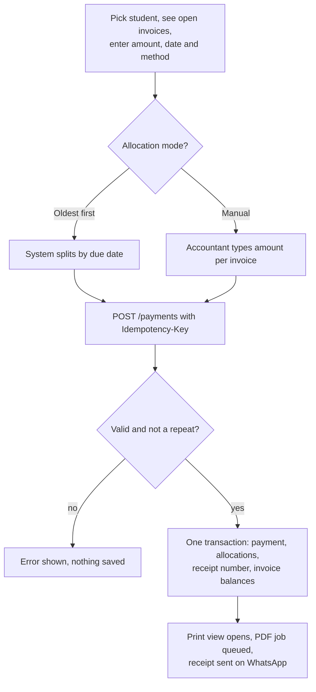
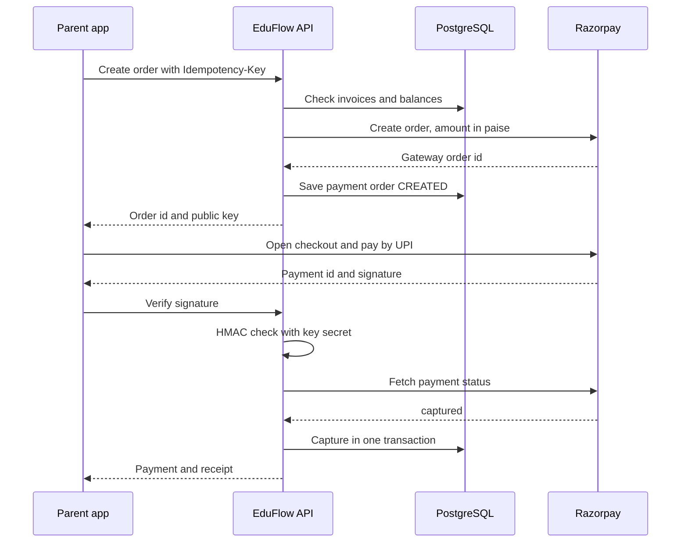
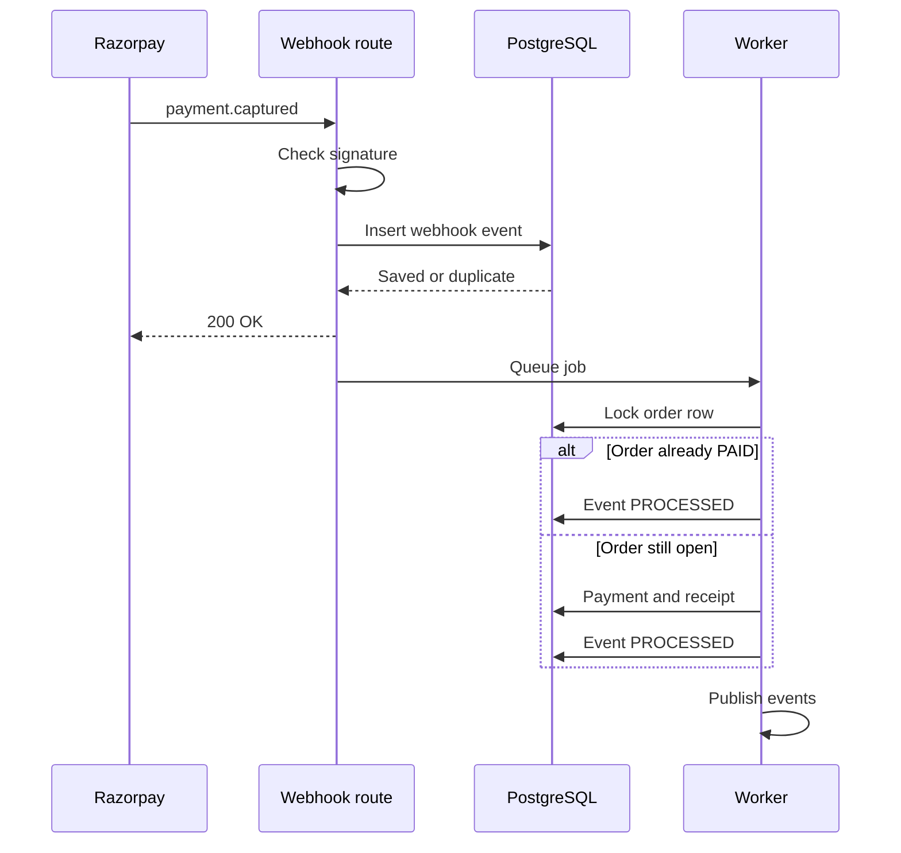
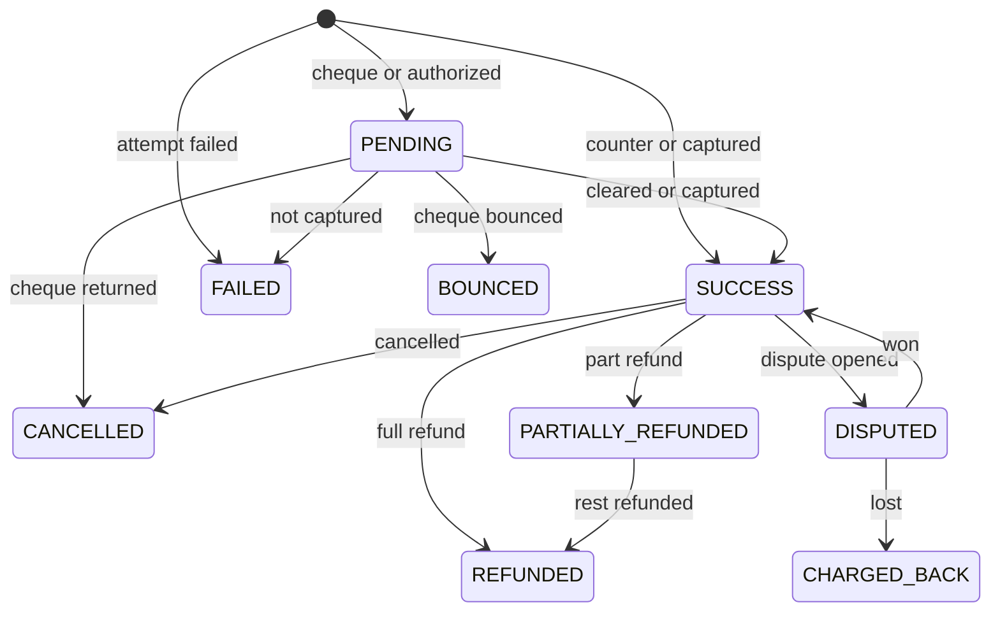
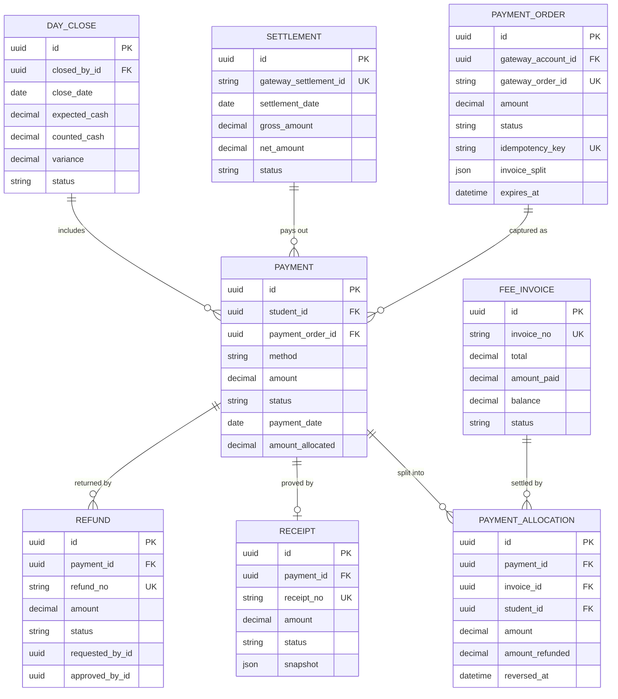

# Payments Module

**In simple words:** This chapter explains how EduFlow takes money in, proves it with a receipt, and gives money back when needed. It covers the fee counter (cash, UPI, cheque, card, bank transfer), online payments with Razorpay and Stripe, refunds, cheque bounces, the daily cash close and the matching of gateway payouts with the bank. Money mistakes destroy trust fast. So the rules here are strict: nothing is deleted, a receipt number never changes, and a repeated click never creates a second payment.

| Item | Value |
|---|---|
| Module code | PAY |
| Release phase | Phase 1 (MVP); the Stripe adapter follows in Phase 4 |
| Plans | Starter (counter collection only), Growth, Pro, Enterprise (online payments from Growth) |
| Main users | Accountant, Organization Admin, Principal, Parent |
| Depends on | Fees, Student Profile, Settings, Notifications, WhatsApp, Parent Portal |
| Main tables | payments, payment_allocations, payment_allocation_items, receipts, payment_orders, refunds, refund_allocations, payment_gateway_accounts, webhook_events, settlements, day_closes |

## Objective

The *Fees Module* chapter decides how much a student owes. This chapter decides how that money is received, split over invoices, receipted, returned and matched with the bank. The module must leave a trail that an auditor or an angry parent can follow line by line.

| Goal | Target |
|---|---|
| Counter speed | Receipt on screen in under 30 seconds from student search |
| Online receipt | Receipt issued within 10 seconds of a captured payment |
| Online share | 40% of fee value paid online by the end of Year 1 (canon target) |
| Double payments caused by retries or double clicks | Zero |
| Settlements left in `MISMATCH` at month end | Zero |
| Cash variance | Every rupee of difference in a day close has a written reason |

## Scope

### In scope

- Counter collection in cash, UPI, card (swipe machine slip), cheque, demand draft, bank transfer and wallet.
- Part payments and allocation (the split of one payment over one or more invoices), oldest first or manual.
- Excess money kept as an advance (credit) and applied to later invoices.
- Immutable, gap-free receipt numbers, a receipt PDF, and sharing on WhatsApp, email or SMS.
- Online payments with the institute's own Razorpay account: create order, checkout, verify signature, webhook (a call from Razorpay to our API) as the source of truth.
- Pay links sent to a guardian, failed and pending payments, order expiry.
- Refunds with maker and checker approval, online through the gateway or offline.
- Cheque tracking, cheque bounce reversal with a penalty invoice.
- Card disputes and chargebacks reported by the gateway.
- Day close with denominations and bank deposit.
- Settlement sync and reconciliation with gateway payouts.
- The convenience fee setting (who pays the gateway charge).
- Import of old payments from Excel, payment reports and exports.

### Out of scope

- Fee heads, structures, invoices, late fees and reminders. See the *Fees Module* chapter.
- Discount and scholarship rules. See the *Discounts Module* and *Scholarships Module* chapters.
- EduFlow's own subscription billing to the institute. See the *Organizations Module* chapter.
- Salary payouts. See the *Payroll Module* chapter.
- Storing card numbers, CVV or UPI PINs. EduFlow stores only gateway ids and masked details.
- Auto-debit mandates (UPI AutoPay, e-NACH), EMI and fee loans. Not planned before Phase 4.
- A direct link to card swipe machines. A counter card payment is typed in with its slip number.

### Phase notes

| Phase | What ships |
|---|---|
| Phase 1 (Day 36 to 42 of the sprint) | Counter collection, receipts, day close, Razorpay orders, webhooks, refunds, cheques, settlements, reports, import |
| Phase 2 | Application fee, certificate fee and re-evaluation fee payments reuse the same order and receipt flow (`PaymentPurpose`) |
| Phase 3 | Library fines collected through `purpose = LIBRARY_FINE` |
| Phase 4 | Stripe adapter and PAY-API-39 for USA, Australia and UAE; multi-currency display |

> **Note:** The parent's own screens call the portal endpoints PP-API-16 to PP-API-19 (see the *Parent Portal Module* chapter). Those endpoints run the same service functions as PAY-API-13, PAY-API-15 and PAY-API-09. The rules in this chapter apply to both doors.

## User Stories

| ID | As a | I want to | So that | Priority |
|---|---|---|---|---|
| PAY-US-01 | Accountant | record a counter payment in any mode and print the receipt at once | the parent leaves the counter in under a minute | Must |
| PAY-US-02 | Accountant | accept a part payment and let the system split it oldest first, or split it by hand | old dues close first and special requests are still possible | Must |
| PAY-US-03 | Accountant | keep extra money as an advance and use it on a later invoice | I never return small change or lose track of credit | Must |
| PAY-US-04 | Parent | pay one or more invoices from my phone by UPI, card or netbanking | I do not need to visit the school | Must |
| PAY-US-05 | Parent | get the receipt on WhatsApp and find it again in the portal | I always have proof of payment | Must |
| PAY-US-06 | Accountant | send a pay link to a guardian | a parent who called can pay in two taps | Should |
| PAY-US-07 | Accountant | track each cheque from received to cleared, and record a bounce with a penalty | dues reopen by themselves when a cheque fails | Must |
| PAY-US-08 | Accountant | request a refund with deductions | money leaves the books only after a second person agrees | Must |
| PAY-US-09 | Principal | approve or reject refunds and cancel a wrong payment with a reason | the counter cannot hide cash by cancelling receipts | Must |
| PAY-US-10 | Accountant | close my cash for the day with a note count and the bank deposit | any shortage is found the same evening | Must |
| PAY-US-11 | Organization Admin | connect our Razorpay account in test mode, then go live | online money lands directly in our bank account | Must |
| PAY-US-12 | Accountant | match each gateway payout with the payments inside it | the bank statement and EduFlow always agree | Should |
| PAY-US-13 | Organization Admin | decide if the parent or the institute pays the gateway charge | we control our collection cost | Should |
| PAY-US-14 | Organization Admin | import this year's old payments from Excel | ledgers are complete when we join in the middle of a session | Should |

## Workflow

### Counter collection

**Figure: Counter payment from student search to WhatsApp receipt**



The whole money step is one database transaction. If any part fails, nothing is saved and the accountant can press the button again safely.

1. Suresh Gupta searches "Aarav" and picks Aarav Sharma (`BF-2027-0142`). The screen loads open invoices with FEE-API-24 and the advance with FEE-API-42.
2. He types ₹13,500, keeps today's date, picks UPI and enters the UTR (the bank reference number of a UPI or bank transfer).
3. The preview shows the split. Oldest first gives ₹12,000 to INV-0912 and ₹1,500 to INV-0977.
4. The browser sends PAY-API-02 with a fresh `Idempotency-Key` (a unique id per form, so a retry is recognised).
5. The service locks the receipt counter, saves the payment, the allocations, the head-wise split and the receipt, recomputes both invoices and commits.
6. After the commit it publishes `payment.captured` and `receipt.issued`. The print view opens from the response data. The PDF job and the WhatsApp message to Sunita Devi run in the background. If one of them fails, the payment is still safe and the job retries alone.

### Online payment

**Figure: Online payment with Razorpay (create order, checkout, verify)**



The parent's phone is never trusted alone. The API checks the signature (a code that only Razorpay and the institute's secret key can produce) and also asks Razorpay for the payment status before it records money.

1. Sunita Devi selects INV-1204 (₹10,800) and the method UPI. The app calls PP-API-16, the portal twin of PAY-API-13.
2. The API checks that each invoice is payable, adds the convenience fee if the institute passes it on, and creates the order at Razorpay in paise (₹10,800 = 1080000 paise).
3. The `payment_orders` row is saved as `CREATED` with the intended split in `invoiceSplit` and an expiry time. Razorpay Checkout opens and Sunita pays with her UPI app.
4. Checkout returns `razorpay_payment_id`, `razorpay_order_id` and `razorpay_signature`. The app posts them to the verify endpoint (PAY-API-15 or PP-API-17).
5. If the signature and the fetched status are good, the shared function `capturePayment` saves the payment, allocations and receipt. If Razorpay still says `authorized`, the API answers "pending" and the app polls PAY-API-14 every 3 seconds for up to 2 minutes.
6. The webhook arrives as well. Whichever comes first records the payment. The other one finds the order `PAID` and changes nothing.

### Webhook handling

**Figure: Webhook inbox, queue and idempotent processing**



The route only stores and acknowledges. All business work happens in the worker, so a slow database never makes Razorpay time out and resend.

1. The route reads the raw bytes, because the signature is calculated over the exact body.
2. It finds the gateway account from the URL, reads the webhook secret and checks `X-Razorpay-Signature` (HMAC SHA-256).
3. It inserts a `webhook_events` row. The unique key `(provider, eventId)` rejects a repeat, and the route still answers 200.
4. The worker on the `webhooks` queue (8 attempts, exponential backoff from 15 seconds) handles the event by type. The table below lists the handled types.
5. A failed event keeps `status = FAILED` with `lastError`. An admin can run it again with PAY-API-41.

| Razorpay event | Stripe event (Phase 4) | What the worker does |
|---|---|---|
| `payment.authorized` | `payment_intent.processing` | Payment row `PENDING`, order `ATTEMPTED` |
| `payment.captured`, `order.paid` | `payment_intent.succeeded` | `capturePayment`: payment `SUCCESS`, allocations, receipt, order `PAID` |
| `payment.failed` | `payment_intent.payment_failed` | Payment row `FAILED` with reason, order `FAILED`, emit `payment.failed` |
| `refund.processed` | `charge.refunded` | Refund `PROCESSED`, emit `refund.processed` |
| `refund.failed` | `refund.failed` | Refund `FAILED` with reason, emit `refund.failed` |
| `payment.dispute.created` | `charge.dispute.created` | Payment `DISPUTED`, dispute columns filled, emit `payment.disputed` |
| `payment.dispute.won`, `payment.dispute.lost` | `charge.dispute.closed` | Won: back to `SUCCESS`. Lost: `CHARGED_BACK`, allocations reversed |
| `settlement.processed` | `payout.paid` | Upsert the settlement, queue reconciliation |

### Refund with approval

The Accountant requests a refund (PAY-API-19) and it gets a number from the `REFUND_NO` sequence. A different user with `payments.approve` approves or rejects it (PAY-API-21, PAY-API-22). Only then the Accountant processes it (PAY-API-23): an online payment goes back through the gateway to the same card or UPI account, an offline refund is recorded with its mode and reference. Rules PAY-BR-18 to PAY-BR-20 give the amounts and the effect on invoices.

### Status lifecycles

**Figure: Payment status lifecycle**



A payment row is never deleted. Every arrow is one audited action or one gateway event.

| Entity | Statuses and allowed moves | Moved by |
|---|---|---|
| `PaymentOrder` | `CREATED` to `ATTEMPTED` to `PAID`; or to `FAILED`, `EXPIRED`, `CANCELLED`. A late capture moves any unpaid status to `PAID` | Checkout, webhook, expiry job, PAY-API-17 |
| Cheque (`chequeStatus`) | `RECEIVED` to `DEPOSITED` to `CLEARED`; `DEPOSITED` to `BOUNCED`; `RECEIVED` to `RETURNED` | PAY-API-06, PAY-API-07 |
| `Receipt` | `ISSUED` to `CANCELLED` (cancel, bounce, chargeback or reissue) | PAY-API-04, 07, 11, worker |
| `Refund` | `REQUESTED` to `APPROVED` or `REJECTED`; `APPROVED` to `PROCESSING` to `PROCESSED` or `FAILED`; `FAILED` back to `PROCESSING` on retry | PAY-API-19 to 23, webhook |
| `DayClose` | `OPEN` to `SUBMITTED` to `VERIFIED` or `DISCREPANCY`; `DISCREPANCY` back to `SUBMITTED` after a corrected count | PAY-API-34, 36, 37 |
| `Settlement` | `PENDING` to `PROCESSED` to `RECONCILED` or `MISMATCH`; `MISMATCH` to `RECONCILED`; `FAILED` when the payout bounced | Sync job, PAY-API-32 |
| `WebhookEvent` | `RECEIVED` to `PROCESSING` to `PROCESSED`, `FAILED` or `IGNORED`; `FAILED` back to `PROCESSING` on retry | Route, worker, PAY-API-41 |

## Screens and Wireframes

| ID | Screen | Users | Purpose |
|---|---|---|---|
| PAY-S01 | Collect Payment | Accountant, Organization Admin | Take a counter payment, preview the split, print the receipt |
| PAY-S02 | Payments List and Detail | Accountant, Principal, Organization Admin | Search payments; see allocations, receipt, refunds; cancel |
| PAY-S03 | Receipts | Accountant, Principal, Organization Admin | List, print, send again, reissue |
| PAY-S04 | Online Orders and Pay Links | Accountant, Organization Admin | See created, failed, paid and expired orders; send or cancel links |
| PAY-S05 | Pay Fees (mobile) | Parent | Select invoices, choose method, pay |
| PAY-S06 | Payment Result (mobile) | Parent | Success, pending or failed result with the receipt |
| PAY-S07 | Refunds and Approval Queue | Accountant, Principal, Organization Admin | Request, approve, reject, process refunds |
| PAY-S08 | Cheque Register | Accountant | Cheques to deposit today, post-dated cheques, bounces |
| PAY-S09 | Day Close | Accountant, Principal, Organization Admin | Count cash, record the deposit, submit, verify |
| PAY-S10 | Settlements | Accountant, Organization Admin | Sync payouts, see mismatches, reconcile |
| PAY-S11 | Gateway Accounts and Webhook Log | Organization Admin | Connect Razorpay or Stripe, set the convenience fee, retry failed events |

The counter screen is specified here because every button on it calls a Payments endpoint. The invoice and ledger screens of the *Fees Module* chapter open it with the student already selected.

**Screen PAY-S01 — Collect Payment (Accountant, web)**

```text
+--------------------------------------------------------------------------+
| EduFlow | Bright Future Public School      [Search students...]  (SG) v  |
+--------------+-----------------------------------------------------------+
| Dashboard    | Payments > Collect Payment                                |
| Students     +-----------------------------------------------------------+
| Attendance   | Student [Aarav Sharma - BF-2027-0142 v]   Class 10-A      |
| Fees         | Payer   [Sunita Devi (Mother)       v]   Advance: Rs 0    |
| Payments   < |                                                           |
|  Collect     | Open invoices               Due     Balance    Pay now    |
|  Payments    | [x] INV-0912 Tuition Q2     10 Jul   12,000   [ 12000 ]   |
|  Receipts    | [x] INV-0977 Transport Q2   10 Jul    3,000   [  1500 ]   |
|  Refunds     | Allocation (o) Oldest first   ( ) Manual                  |
|  Cheques     | --------------------------------------------------------- |
|  Day Close   | Amount [ 13500 ]   Date [08 Jul 2027]                     |
|  Payouts     | Mode ( ) Cash (o) UPI ( ) Card ( ) Cheque ( ) Bank        |
| Exams        | UPI ref / UTR [ 418822337711 ]   Note [______________]    |
| Reports      | --------------------------------------------------------- |
| Settings     | Allocated Rs 13,500   Advance Rs 0   Still due Rs 1,500   |
|              | [Cancel]  [Create Pay Link]  [Collect & Print Receipt]    |
+--------------+-----------------------------------------------------------+
```

- The user sees the open invoices of the student or family, the advance held and a live split preview. "Pay now" boxes are editable only in Manual mode.
- The Mode choice shows extra fields: cheque number, date, bank and branch for Cheque; slip number for Card; UTR for UPI and Bank.
- [Collect & Print Receipt] calls PAY-API-02, opens the print view from the response and locks until the answer arrives.
- [Create Pay Link] calls PAY-API-13 with the ticked invoices and then PAY-API-16.
- A yellow banner "Advance available Rs 1,000 [Apply]" appears when the student holds an advance. [Apply] calls PAY-API-05.

**Screen PAY-S05 — Pay Fees (Parent, mobile)**

```text
+------------------------------------+
| <  Pay Fees               Aarav v  |
+------------------------------------+
| Bright Future Public School        |
| Aarav Sharma  -  Class 10-A        |
|                                    |
| [x] INV-1204  Tuition Q3           |
|     Due 10 Oct          Rs 10,800  |
| [ ] INV-1260  Transport Q3         |
|     Due 10 Oct          Rs  3,000  |
|                                    |
| Pay with                           |
| (o) UPI              no extra fee  |
| ( ) Card             + Rs 254.88   |
| ( ) Netbanking       + Rs 254.88   |
|                                    |
| Fee amount           Rs 10,800.00  |
| Convenience fee      Rs      0.00  |
| You pay              Rs 10,800.00  |
|                                    |
| [       Pay Rs 10,800.00       ]   |
|                                    |
| Secured by Razorpay. EduFlow never |
| sees your card number or UPI PIN.  |
+------------------------------------+
```

- The parent sees the dues of the selected child. The child switcher at the top right changes the list. Ticking invoices of two children creates one family order.
- The method is chosen before the order is created, because the convenience fee depends on it. The extra amount is shown before the parent pays, never after.
- [Pay] calls PP-API-16 (same service as PAY-API-13) with an `Idempotency-Key`, then opens Razorpay Checkout limited to the chosen method.
- A pay link from WhatsApp opens this same screen with the invoices already ticked.

**Screen PAY-S06 — Payment Result (Parent, mobile)**

```text
+------------------------------------+
| <  Payment Result                  |
+------------------------------------+
|         (OK) Payment successful    |
|                                    |
|            Rs 10,800.00            |
|    06 Oct 2027, 8:15 pm  -  UPI    |
|                                    |
| Receipt no    RCT-2027-28-01873    |
| Student       Aarav Sharma, 10-A   |
| Paid by       Sunita Devi          |
| UPI ref       pay_Qx7NfR3cW8hJzs   |
| ---------------------------------- |
| INV-1204 Tuition Q3    Rs 10,800   |
| Balance now            Rs      0   |
| ---------------------------------- |
| [    Download receipt (PDF)    ]   |
| [    Share on WhatsApp         ]   |
| [    Back to fees              ]   |
|                                    |
| A copy was sent to your WhatsApp   |
| number ending 4321.                |
+------------------------------------+
```

- The screen appears after PP-API-17 (verify). It has three faces: success (above), pending and failed.
- Pending shows "We are confirming your payment with the bank. Do not pay again." and polls the order every 3 seconds for up to 2 minutes. After that it says the receipt will arrive on WhatsApp.
- Failed shows the gateway reason in plain words and a [Try again] button, which creates a new order with a new key.
- [Download receipt] calls PP-API-19. If the PDF is not ready, the button shows "Preparing PDF" and asks again after 2 seconds.

**Screen PAY-S09 — Day Close (Accountant, web)**

```text
+--------------------------------------------------------------------------+
| EduFlow | Bright Future Public School      [Search students...]  (SG) v  |
+--------------+-----------------------------------------------------------+
| Dashboard    | Payments > Day Close > 08 Jul 2027        Status: OPEN    |
| Students     +-----------------------------------------------------------+
| Attendance   | Counter: Suresh Gupta          Campus: Main Campus        |
| Fees         | System totals (42 payments)                               |
| Payments   < | Cash 48,500   UPI 96,200   Card 22,000   Cheque 36,000    |
|  Collect     | --------------------------------------------------------- |
|  Payments    | Opening cash    Rs  2,000    Cash refunded  Rs  1,500     |
|  Receipts    | Cash collected  Rs 48,500    Expected cash  Rs 49,000     |
|  Refunds     | --------------------------------------------------------- |
|  Cheques     | Count   500 x [ 90 ]  200 x [ 15 ]  100 x [ 8 ]  50 x [2] |
|  Day Close < | Counted Rs 48,900          Variance Rs -100 (short)       |
|  Payouts     | Reason [Rs 100 extra change given to a parent_______]     |
| Exams        | --------------------------------------------------------- |
| Reports      | Deposit Rs [ 45000 ]  Bank [SBI Hazratganj v]             |
| Settings     | Slip no [ 00871 ]  [Upload slip]   Cash in hand Rs 3,900  |
|              | [Refresh totals]          [Save draft]  [Submit close]    |
+--------------+-----------------------------------------------------------+
```

- The user sees the system totals of the own counter by method and the expected cash. [Refresh totals] calls PAY-API-34 again and recalculates the `OPEN` close.
- Typing note counts fills "Counted" and "Variance" at once. A variance makes the Reason box mandatory.
- [Submit close] calls PAY-API-36. After that the counter's payments of this date are locked. The verifier sees [Verify] and [Mark discrepancy], which call PAY-API-37.

**Screen PAY-S10 — Settlements (Accountant, web)**

```text
+--------------------------------------------------------------------------+
| EduFlow | Bright Future Public School      [Search students...]  (SG) v  |
+--------------+-----------------------------------------------------------+
| Dashboard    | Payments > Settlements          [Sync from Razorpay]      |
| Students     +-----------------------------------------------------------+
| Attendance   | From [01 Oct 2027]  To [07 Oct 2027]  Status [All v]      |
| Fees         |                                                           |
| Payments   < | Date    Settlement id        Gross       Net  Status      |
|  Collect     | 07 Oct  setl_Qy2AbC9dEf   1,51,200  1,45,702  RECONCILED  |
|  Payments    | 06 Oct  setl_Qx8ZtR4mNp     84,600    83,202  MISMATCH    |
|  Receipts    | 05 Oct  setl_Qw5KjH2sLc   1,12,350  1,10,494  RECONCILED  |
|  Refunds     | --------------------------------------------------------- |
|  Cheques     | Detail: setl_Qx8ZtR4mNp   UTR SBIN527279104455            |
|  Day Close   | Gateway gross Rs 84,600     EduFlow gross Rs 73,800       |
|  Payouts   < | Difference Rs 10,800: 1 gateway payment not in EduFlow    |
| Exams        | pay_Qx7NfR3cW8hJzs  Rs 10,800  UPI  [Find order]          |
| Reports      | Fee Rs 1,184.40   Tax Rs 213.19   Refunds Rs 0.00         |
| Settings     | --------------------------------------------------------- |
|              | [Export]      [Resolve with note]  [Mark reconciled]      |
+--------------+-----------------------------------------------------------+
```

- The list comes from PAY-API-29. [Sync from Razorpay] calls PAY-API-31 and shows a job toast.
- A click on a row loads PAY-API-30: the payments and refunds inside the payout and the differences found.
- [Find order] opens PAY-S04 filtered by the gateway payment id, where the stuck order can be verified again.
- [Mark reconciled] and [Resolve with note] call PAY-API-32. The UTR helps the accountant find the credit in the bank statement.

## UI Components

| Component | Type | Behaviour |
|---|---|---|
| `StudentPicker` | Combobox (shadcn Command) | Search by name, admission no. or guardian phone, 300 ms debounce; shows class and total due |
| `OpenInvoiceTable` | Data table with checkboxes and amount inputs | Sorted by due date; overdue rows in red; amount input capped at the balance |
| `AllocationPreview` | Summary bar | Recalculates allocated, advance and still due on every key press; the server result is final |
| `PaymentMethodFields` | Radio group with conditional fields | Shows only the fields of the chosen method; remembers the last method per user |
| `MoneyInput` | Input | Indian digit grouping, two decimals, no negative values, numeric keypad on mobile |
| `ReceiptPrintView` | Dialog with print CSS | A5 and 80 mm thermal layouts; built from the API response, so it never waits for the PDF |
| `CheckoutButton` | Button with lazy script loader | Loads Razorpay Checkout on first use; locked while an order is open; handles "dismissed" |
| `DenominationGrid` | Number inputs | Notes and coins of the organization's currency; running total; keyboard friendly |
| `ApprovalSheet` | Side sheet | Refund or day-close details with Approve and Reject; hidden when the viewer is the requester |
| `StatusBadge` | Badge | Green `SUCCESS`, `PAID`, `RECONCILED`; amber `PENDING`, `REQUESTED`; red `FAILED`, `BOUNCED`, `MISMATCH` |

States: lists show skeleton rows while loading. Empty states give the next action, for example "No open invoices. You can still record an advance." An API error shows a toast with the `requestId`, and the form retries with the same `Idempotency-Key`.

## Validation Rules

| Field | Rule | Error message shown to user |
|---|---|---|
| `Idempotency-Key` header | Required on PAY-API-02, 13 and 19; 16 to 100 characters | "Something went wrong. Refresh the page and try again." |
| `amount` | Greater than 0, at most two decimals, at most 9,99,99,999.99 | "Enter an amount greater than 0." |
| `amount` with `method = CASH` (India) | Below ₹2,00,000 per receipt | "Cash of Rs 2,00,000 or more cannot be accepted. Please use another mode." |
| `method` | One of the counter methods; `ONLINE_GATEWAY` is refused on PAY-API-02 | "Choose how the money was paid." |
| `reference` | Required for UPI, card, netbanking, bank transfer and wallet; 6 to 100 characters; not used before in this organization | "This reference number is already used on receipt {receiptNo}." |
| `chequeNo` | Required for cheque and demand draft; exactly 6 digits | "Enter the 6-digit cheque number." |
| `chequeDate` | Not older than 90 days; at most 180 days ahead | "This cheque is older than 3 months and cannot be deposited." |
| `chequeBank` | Required for cheque and demand draft; 2 to 100 characters | "Enter the bank name printed on the cheque." |
| `paymentDate` | Not in the future; at most 3 days back; not inside a submitted day close | "The day close for {date} is already submitted. Use today's date." |
| `allocations[].invoiceId` | Invoice of this student or family, same campus, status `ISSUED`, `PARTIALLY_PAID` or `OVERDUE` | "Invoice {invoiceNo} cannot receive a payment." |
| `allocations[].amount` | Greater than 0 and not above the invoice balance | "You cannot allocate more than the balance of Rs {balance}." |
| Sum of allocations | Not above `amount` | "The split is Rs {x} more than the amount received." |
| `currency` | Equals the invoice currency and the organization currency | "Currency does not match the invoice." |
| Cancel or reject `reason` | 10 to 255 characters | "Please write a reason of at least 10 characters." |
| Refund `amount` | Greater than 0; not above the refundable amount | "You can refund at most Rs {refundable} from this payment." |
| `deductionAmount` | 0 to `grossAmount`; `deductionReason` required when above 0 | "Tell us why money is being kept back." |
| `denominations` | Non-negative whole numbers; total equals `countedCash` | "The note count adds up to Rs {x}, but counted cash says Rs {y}." |
| `depositedAmount` | 0 to `countedCash`; slip number required when above 0 | "Deposit cannot be more than the cash you counted." |
| Gateway `publicKey` | Starts with `rzp_test_` in `TEST` mode and `rzp_live_` in `LIVE` mode | "This key does not belong to {mode} mode." |

> **Warning:** The ₹2,00,000 cash limit follows section 269ST of the Indian Income-tax Act. Assumption: the founder confirms the exact rule with a chartered accountant before launch. The limit is the setting `payments.cash_limit_per_receipt`, so other countries can switch it off.

## Business Rules

1. **PAY-BR-01 Money is never deleted.** A payment, allocation, receipt or refund row is never removed or edited in its money columns. Mistakes are cancelled, reversed or refunded, each with a reason and an actor.
2. **PAY-BR-02 Oldest first allocation.** Open invoices are sorted by due date, then issue date, then invoice number. Each gets `min(money left, balance)`. Example: Aarav owes INV-0912 ₹12,000 and INV-0977 ₹3,000, both due 10 Jul. A payment of ₹13,500 gives ₹12,000 to INV-0912 (`PAID`) and ₹1,500 to INV-0977 (`PARTIALLY_PAID`, balance ₹1,500).
3. **PAY-BR-03 Manual allocation.** The accountant types the amount per invoice. Each amount must fit the invoice balance, and the sum must fit the payment. Anything left over becomes an advance.
4. **PAY-BR-04 Head-wise split.** Inside one invoice the money settles lines by `FeeHead.settlementPriority`, lowest number first. `taxPortion = line amount settled x line tax / line total`, rounded to 2 decimals. Example at Sharma Classes: Tuition ₹11,800 (includes GST ₹1,800, priority 1) and Test Series ₹2,360 (includes GST ₹360, priority 2). A payment of ₹12,980 settles Tuition fully (tax portion ₹1,800) and ₹1,180 of Test Series (tax portion 1,180 x 360 / 2,360 = ₹180).
5. **PAY-BR-05 Advance.** `advance = amount - convenienceFee - convenienceFeeTax - amountAllocated - amountRefunded`. Example: dues are ₹15,000 and the parent hands over ₹16,000. Allocated ₹15,000, advance ₹1,000. The advance stays on the payment and is printed on the receipt as "Advance". PAY-API-05 applies it later. It is never applied silently.
6. **PAY-BR-06 Invoice recalculation.** After every allocation, reversal or refund the service recomputes `amountPaid` (active allocations minus refunds) and `balance = total - scholarshipCredit - amountPaid - writtenOffAmount`. Balance 0 means `PAID` with `paidAt`. A part payment means `PARTIALLY_PAID`. A full reversal returns the invoice to `ISSUED`, or to `OVERDUE` when the due date has passed. The status rules themselves belong to the *Fees Module* chapter.
7. **PAY-BR-07 Receipt numbers.** One receipt per payment. The number comes from the `RECEIPT_NO` row of `number_sequences`, locked with `SELECT ... FOR UPDATE` inside the payment transaction. So numbers are gap-free and never repeat. Default series for India: prefix `RCT`, format `{PREFIX}-{AY}-{SEQ}`, 5 digits, reset each academic year, for example `RCT-2027-28-00451`. A failed transaction rolls the counter back too.
8. **PAY-BR-08 Receipt content is frozen.** `snapshot` stores the student, batch, payer, method, allocations, fee-head lines and tax breakdown as they were. `contentHash` is the SHA-256 of the snapshot. The PDF worker checks the hash before every render.
9. **PAY-BR-09 Cancel and reissue.** A wrong payer name is fixed with PAY-API-11: the old receipt becomes `CANCELLED`, a new number is issued and `replacedByReceiptId` links the two. The payment does not change. A wrong amount needs PAY-API-04 (cancel the payment) and a new payment.
10. **PAY-BR-10 Who may cancel.** Only a holder of `payments.cancel` who did not record the payment. Only counter payments with status `SUCCESS` or `PENDING`, without refunds, and not inside a `SUBMITTED` or `VERIFIED` day close. Everything else needs a refund. Cancelling reverses all allocations and cancels the receipt in one transaction.
11. **PAY-BR-11 Idempotency.** The same `Idempotency-Key` with the same body returns the first result again. The same key with a different body returns `409 CONFLICT`. The key is stored on the row and guarded by a unique index per organization.
12. **PAY-BR-12 Online order.** An order needs an `ACTIVE` gateway account (campus account first, else the default) with `lastVerifiedAt` set. Checkout orders expire after 30 minutes and pay links after 7 days. A new order cancels older `CREATED` orders of the same payer for the same invoices. `ATTEMPTED` orders are left alone, because money may be in flight.
13. **PAY-BR-13 Convenience fee.** When `passFeeToPayer` is true, `convenienceFee = fee amount x rate of the chosen method` and `convenienceFeeTax = convenienceFee x 18%` (GST in India). Example: ₹10,800 by card at 2% gives fee ₹216.00, tax ₹38.88, the parent pays ₹11,054.88. By UPI at 0% the parent pays ₹10,800.00. Only ₹10,800 is fee income and only that part is allocated. Default is off: the institute absorbs the charge. EduFlow adds no markup (canon).
14. **PAY-BR-14 Webhook is the source of truth.** Money is recorded only by `capturePayment`, called from the verify endpoint (after signature check and a status fetch) or from the webhook worker. It locks the order row, so the two callers cannot both win. The unique key `(gateway, gatewayPaymentId)` is the last guard. A capture for an `EXPIRED`, `FAILED` or `CANCELLED` order is still recorded, because the money is real.
15. **PAY-BR-15 Failed and pending.** `payment.failed` stores a `FAILED` payment row without receipt, so the counter can see that the parent tried. A job checks every 10 minutes all orders in `CREATED` or `ATTEMPTED` that are older than 15 minutes by asking the gateway. Orders past `expiresAt` without money become `EXPIRED`.
16. **PAY-BR-16 Cheques.** A cheque payment starts as `PENDING` with `chequeStatus = RECEIVED`. Allocations and the receipt are made at once, and the receipt prints "Subject to realisation of cheque", because Indian institutes hand over a receipt when they take the cheque. `CLEARED` turns the payment into `SUCCESS`. `RETURNED` (handed back without deposit) reverses allocations and cancels payment and receipt. A post-dated cheque cannot be marked `DEPOSITED` before its date.
17. **PAY-BR-17 Cheque bounce.** PAY-API-07 sets `BOUNCED`, reverses the allocations, cancels the receipt and raises an ad-hoc invoice under the fee head type `CHEQUE_BOUNCE_CHARGE`. Example: Aarav's cheque of ₹12,000 bounces on 14 Jul 2027. The bank debits the school ₹295 (`bounceCharge`). The parent's penalty is the setting value ₹500 (`bounceChargeInvoiceId`). INV-0912 is `OVERDUE` again with balance ₹12,000, so the parent owes ₹12,500 plus any late fee from the *Fees Module* rules.
18. **PAY-BR-18 Refund amount.** `amount = grossAmount - deductionAmount`. Example: Aarav withdraws. Gross ₹12,000, cancellation charge ₹2,000, refund ₹10,000. Refundable ceiling of a payment = `amount - convenienceFee - convenienceFeeTax - amountRefunded - open refund requests`. The convenience fee is not refunded, because the gateway keeps its charge.
19. **PAY-BR-19 Refund effect.** Each `RefundAllocation` lowers `PaymentAllocation.amountRefunded` and the invoice's `amountPaid`, so the invoice balance rises. For `PAYMENT_REVERSAL` that is intended. For `WITHDRAWAL` the accountant also lowers the invoice with a credit adjustment (FEE-API-33), and the screen reminds him. A row with `paymentAllocationId = null` refunds the advance (`EXCESS_PAYMENT`).
20. **PAY-BR-20 Maker and checker.** `Refund.requestedById` can never equal `approvedById`. `DayClose.closedById` can never equal `verifiedById`. The recorder of a payment cannot cancel it. The owner-only setting "Allow owner self-approval" from *RBAC and Permissions Matrix* is the single exception, and each use is flagged in the audit log.
21. **PAY-BR-21 Day close.** `expectedCash = openingCash + cashCollected - cashRefunded`. `variance = countedCash - expectedCash`. `closingCash = countedCash - depositedAmount`, and it becomes the next opening cash. Example: 2,000 + 48,500 - 1,500 = ₹49,000 expected. Counted ₹48,900, variance -₹100. Deposit ₹45,000, cash in hand ₹3,900. One close exists per campus, date and accountant. Only cash counts toward expected cash; other methods are shown for information.
22. **PAY-BR-22 Settlement reconciliation.** `netAmount = grossAmount - feeAmount - taxAmount - refundAmount - chargebackAmount + adjustmentAmount`. Example: gross ₹1,51,200, fee ₹2,116.80, tax ₹381.02, refunds ₹3,000 gives net ₹1,45,702.18. The job links each payment and refund of the gateway report to the settlement. `mismatchAmount = gateway gross - sum of linked EduFlow payments`. Zero means `RECONCILED` by the system. Anything else means `MISMATCH` until a user resolves it with a note.
23. **PAY-BR-23 Disputes.** A dispute sets `DISPUTED` and keeps the receipt. A lost dispute sets `CHARGED_BACK`, reverses allocations, cancels the receipt and reopens the invoices. A won dispute returns the payment to `SUCCESS`.
24. **PAY-BR-24 Gateway accounts.** Each institute connects its own account, so money goes from the parent straight to the institute's bank and EduFlow never holds fee money. The table stores only references to secrets. One default account per organization; a campus may have its own. While an account is in `TEST` mode the portals do not offer online payment. The Organization Admin can run a ₹1 test checkout from PAY-S11; it is saved with `purpose = OTHER` and never touches an invoice.
25. **PAY-BR-25 Plan gating.** Starter has counter collection, receipts and day close. Gateway accounts, orders, pay links and settlements need Growth or higher and answer `403 PLAN_LIMIT_REACHED` on Starter.

### Settings used by this module

All keys live in `organization_settings` and can have a campus override. Assumption: the key names below are fixed by this chapter; the *Settings Module* chapter shows them on its Finance tab.

| Key | Default | Meaning |
|---|---|---|
| `payments.default_allocation_mode` | `OLDEST_FIRST` | Mode preselected on PAY-S01 |
| `payments.backdate_days` | 3 | How far back `paymentDate` may go |
| `payments.cash_limit_per_receipt` | 199999.99 (India) | Highest cash amount per receipt; null switches the check off |
| `payments.cheque_bounce_charge` | 500.00 | Penalty invoice amount after a bounce |
| `payments.order_expiry_minutes` | 30 | Life of a checkout order |
| `payments.pay_link_expiry_days` | 7 | Life of a pay link |
| `payments.online_min_part_payment` | 500.00 | Smallest part payment a parent may make online; 0 means full invoices only |
| `payments.convenience_fee_rates` | `{ "upi": 0, "card": 2.0, "netbanking": 2.0, "wallet": 2.0 }` | Percent per method, used only when `passFeeToPayer` is true |
| `payments.allow_student_payments` | false | Lets the Student Portal create orders |

## Acceptance Criteria

| ID | Given | When | Then |
|---|---|---|---|
| PAY-AC-01 | Aarav has INV-0912 ₹12,000 and INV-0977 ₹3,000 open | Suresh records ₹13,500 by UPI, oldest first | INV-0912 is `PAID`, INV-0977 has balance ₹1,500, one receipt is issued, all in one transaction |
| PAY-AC-02 | A counter payment was saved with key K | The same body arrives again with key K | The API returns the first payment and receipt; no new row is written |
| PAY-AC-03 | A counter payment was saved with key K | A different amount arrives with key K | `409 CONFLICT`; nothing is written |
| PAY-AC-04 | Dues are ₹15,000 | The parent pays ₹16,000 in cash | ₹15,000 is allocated, ₹1,000 shows as "Advance" on the receipt and in the ledger |
| PAY-AC-05 | Two accountants of one campus collect at the same moment | Both transactions commit | The two receipt numbers are consecutive, with no gap and no duplicate |
| PAY-AC-06 | A receipt was issued for Aarav | His name is corrected a month later | A new PDF render of the old receipt still shows the old name, and `contentHash` matches |
| PAY-AC-07 | An order of ₹10,800 is `CREATED` | Verify arrives with a valid signature and Razorpay says `captured` | Payment `SUCCESS`, order `PAID`, receipt issued within 10 seconds, WhatsApp message queued |
| PAY-AC-08 | An order is `CREATED` | Verify arrives with a changed signature | `422 BUSINESS_RULE_VIOLATION`; no payment; the attempt is in the audit log |
| PAY-AC-09 | Verify and the webhook arrive in the same second | Both run `capturePayment` | Exactly one payment and one receipt exist; the loser ends without changes |
| PAY-AC-10 | Razorpay delivers one event three times | Each delivery reaches the route | One `webhook_events` row exists; every delivery gets 200 |
| PAY-AC-11 | A request with a wrong webhook signature arrives | The route checks it | `401 UNAUTHENTICATED`; the row has `signatureValid = false` and status `IGNORED`; no money is recorded |
| PAY-AC-12 | `passFeeToPayer` is on and the card rate is 2% | A parent chooses Card for ₹10,800 | The order amount is ₹11,054.88; only ₹10,800 is allocated; the receipt lists fee and tax on separate lines |
| PAY-AC-13 | A cheque of ₹12,000 is allocated to INV-0912 | Suresh records the bounce | Payment `BOUNCED`, allocation reversed, receipt `CANCELLED`, INV-0912 balance ₹12,000, penalty invoice ₹500 created, parent notified |
| PAY-AC-14 | Suresh requested a refund | Suresh calls approve | `422` with "You cannot approve your own request" |
| PAY-AC-15 | A refund of ₹10,000 on an online payment is `APPROVED` | Suresh processes it | The gateway refund is created, status `PROCESSING`; `refund.processed` sets `PROCESSED`; payment `PARTIALLY_REFUNDED`; invoice `amountPaid` falls by ₹10,000 |
| PAY-AC-16 | The day close of 8 Jul is `SUBMITTED` | Suresh records or cancels a payment dated 8 Jul | `422 BUSINESS_RULE_VIOLATION`; he is told to use today's date or a refund |
| PAY-AC-17 | Expected cash ₹49,000, counted ₹48,900 | Suresh submits without a note, then with a note | First `400 VALIDATION_ERROR`; then `SUBMITTED` with variance -100 and event `dayclose.submitted` |
| PAY-AC-18 | A synced settlement matches the linked payments | The reconciliation job runs | Status `RECONCILED`, `reconciledById` null; a difference gives `MISMATCH` and event `settlement.mismatch` |
| PAY-AC-19 | Suresh works only in Main Campus | He opens a payment of the City Campus by id | `404 NOT_FOUND`; the row is invisible to him |
| PAY-AC-20 | The organization is on the Starter plan | Anyone calls PAY-API-13 or PAY-API-25 | `403 PLAN_LIMIT_REACHED` with an upgrade hint |

## Edge Cases

| Case | What happens | How the system handles it |
|---|---|---|
| Parent pays an invoice twice (two tabs), or it was paid at the counter while checkout was open | The capture finds the invoice `PAID` | The money is recorded and kept as an advance, never rejected. The accountant gets an alert with a one-click `EXCESS_PAYMENT` refund request |
| Parent closes the app right after paying | Verify is never called | The webhook records the payment; the receipt arrives on WhatsApp; the pending order job is the second safety net |
| Webhook names a row that is not committed yet, for example `refund.processed` before `gatewayRefundId` is saved | The worker cannot find the refund | The handler throws; BullMQ retries with backoff; after 8 attempts the event is `FAILED` and can be retried with PAY-API-41 |
| Razorpay is down during order creation | The gateway call times out after 8 seconds | `503 SERVICE_UNAVAILABLE` with "Online payment is not available right now"; counter collection keeps working |
| Late fee is added between order creation and capture | The invoice balance is higher than the order amount | The order amount stays as agreed; the late fee remains as balance on the invoice |
| One cheque for two siblings | One payment must settle invoices of two students | `familyId` is set; each allocation carries its own `studentId`; one receipt lists both children; ledgers read allocations |
| Gateway refund fails (low balance in the Razorpay account) | `refund.failed` arrives | Refund `FAILED` with the reason; the accountant retries PAY-API-23 or processes it offline with a reference |
| Payment after midnight, 00:10 IST | UTC date is still yesterday | `paymentDate` uses the campus timezone, so day book and day close show the right day |
| Accountant forgot yesterday's day close | Today's opening cash is unknown | PAY-API-34 accepts a `closeDate` up to 7 days back; today's close cannot be submitted before older ones |
| Gateway account is disconnected with open orders | A late capture may still arrive | DELETE is refused while orders are `CREATED` or `ATTEMPTED` or refunds are `PROCESSING`; the soft-deleted row still accepts webhooks |
| Receipt PDF job fails three times | The receipt has no `pdfFileId` | The receipt is valid; the print view works; PAY-API-09 queues the render again; Sentry raises an alert |
| Amount conversion to paise | Floating point could give 1079999 | The service uses `Prisma.Decimal`: `amount.mul(100).toFixed(0)`; JavaScript floats are never used for money |

## Database Schema

The module owns 11 tables. All are tenant tables with `organization_id` and Row-Level Security, as described in *Multi-Tenancy and Data Isolation*. Full definitions of neighbouring tables are in *Data Dictionary: Finance and Communication*.

| Table | Purpose |
|---|---|
| `payments` | Money received by any method; never deleted |
| `payment_allocations` | Split of a payment over fee invoices; reversed, not deleted |
| `payment_allocation_items` | Head-wise split of one allocation with the tax portion |
| `receipts` | Numbered proof of one payment with frozen snapshot and PDF |
| `payment_orders` | Online checkout order created at the gateway before the parent pays |
| `refunds` | Money returned, with approval trail |
| `refund_allocations` | Which allocation or invoice a refund comes out of |
| `payment_gateway_accounts` | The institute's Razorpay or Stripe account, per organization or campus |
| `webhook_events` | Inbox of provider webhooks; makes handling idempotent |
| `settlements` | Gateway payouts to the bank, reconciled with payments |
| `day_closes` | Daily cash close of one accountant in one campus |

Every table has `id` (uuid, PK, default `uuid()`), `organization_id` (uuid, FK to `organizations`, NOT NULL except in `webhook_events`), `created_at` and `updated_at` (timestamptz). Every table that holds money also has `currency` (char(3), NOT NULL, ISO 4217 code). The tables below do not repeat these columns. Related columns with the same nullability share one row; exact types are in the Prisma section.

### Table payments

| Column | Type | Null | Default | Notes |
|---|---|---|---|---|
| campus_id | uuid | No | - | FK campuses |
| purpose | PaymentPurpose | No | FEE | Only `FEE` payments are allocated to invoices |
| student_id, family_id | uuid | Yes | - | FK students, families; family = one payment for siblings |
| admission_application_id, staff_id | uuid | Yes | - | Payer context for application fees and staff fines |
| payer_guardian_id, payer_name | uuid, varchar(160) | Yes | - | Payer printed on the receipt |
| payment_order_id, gateway_account_id | uuid | Yes | - | FK; online payments only |
| settlement_id | uuid | Yes | - | FK settlements; set by reconciliation |
| day_close_id | uuid | Yes | - | FK day_closes; set on submit |
| method | PaymentMethod | No | - | Cash, UPI, card and so on |
| amount | decimal(12,2) | No | - | All money received |
| convenience_fee, convenience_fee_tax | decimal(12,2) | No | 0 | Part of amount that is not fee income |
| status | PaymentStatus | No | SUCCESS | See lifecycle |
| payment_date | date | No | - | Day-book date in campus timezone |
| paid_at | timestamptz | No | now() | Exact moment |
| received_by_id | uuid | Yes | - | FK users; null for online |
| gateway | PaymentGateway | No | OFFLINE | Razorpay, Stripe or offline |
| gateway_payment_id | varchar(100) | Yes | - | Unique together with gateway |
| gateway_fee, gateway_tax | decimal(12,2) | Yes | - | Real charge reported by the gateway |
| method_details | jsonb | Yes | - | Masked only: vpa, cardLast4, cardNetwork, bank, wallet |
| cheque_no, cheque_bank, cheque_branch | varchar | Yes | - | Cheque or demand draft details |
| cheque_date, cheque_deposited_on, cheque_cleared_on, cheque_bounced_on | date | Yes | - | Cheque timeline |
| cheque_status | ChequeStatus | Yes | - | Null for non-cheque payments |
| bounce_reason, bounce_charge | varchar(255), decimal(12,2) | Yes | - | Bank's reason and debit |
| bounce_charge_invoice_id | uuid | Yes | - | FK fee_invoices; penalty invoice |
| gateway_dispute_id, dispute_status, dispute_reason, disputed_amount | varchar, decimal | Yes | - | Card dispute data |
| dispute_opened_at, dispute_resolved_at | timestamptz | Yes | - | Dispute timeline |
| reference | varchar(100) | Yes | - | UTR or card slip number |
| idempotency_key | varchar(100) | Yes | - | Unique per organization |
| amount_allocated, amount_refunded | decimal(12,2) | No | 0 | Cached sums |
| failure_reason, notes | varchar | Yes | - | Gateway failure text; free note (500) |
| cancelled_at, cancelled_by_id, cancel_reason | timestamptz, uuid, varchar(255) | Yes | - | Cancellation trail |

- Unique: `(id, organization_id)` as the target of tenant-safe composite keys; `(gateway, gateway_payment_id)`; `(organization_id, idempotency_key)`.
- Twelve indexes, all starting with `organization_id`. The main ones: campus, date and method (day book); student and date (ledger); cheque status and cheque date (cheque register); order (webhook capture); gateway account and date (reconciliation).

### Table payment_allocations

| Column | Type | Null | Default | Notes |
|---|---|---|---|---|
| payment_id | uuid | No | - | Composite FK `(payment_id, organization_id)` to payments |
| invoice_id | uuid | No | - | Composite FK to fee_invoices |
| student_id | uuid | No | - | Copied from the invoice; drives the student ledger |
| amount | decimal(12,2) | No | - | Money given to this invoice |
| amount_refunded | decimal(12,2) | No | 0 | Sum of refund allocations |
| allocated_at, allocated_by_id | timestamptz, uuid | No, Yes | now(), - | Who allocated and when |
| reversed_at, reversed_by_id, reversal_reason | timestamptz, uuid, varchar(255) | Yes | - | Set on cancel, bounce or chargeback |

- Indexes: `(organization_id, payment_id, invoice_id)`, `(organization_id, invoice_id)`, `(organization_id, student_id, allocated_at)`.
- Partial unique index `uq_payment_allocation_active`: one row per payment and invoice where `reversed_at IS NULL`.

### Table payment_allocation_items

| Column | Type | Null | Default | Notes |
|---|---|---|---|---|
| allocation_id | uuid | No | - | FK payment_allocations |
| invoice_item_id | uuid | No | - | FK fee_invoice_items |
| fee_head_id | uuid | No | - | FK fee_heads; copied for the head-wise report |
| amount | decimal(12,2) | No | - | Part of the allocation for this line |
| tax_portion | decimal(12,2) | No | 0 | Tax inside amount |

- Unique: `(organization_id, allocation_id, invoice_item_id)`. Indexes on fee head and on invoice item.

### Table receipts

| Column | Type | Null | Default | Notes |
|---|---|---|---|---|
| campus_id | uuid | No | - | FK campuses |
| payment_id | uuid | No | - | Unique; composite FK to payments |
| purpose | PaymentPurpose | No | FEE | Copied from the payment |
| student_id, admission_application_id | uuid | Yes | - | Null for staff or application receipts |
| receipt_no | varchar(40) | No | - | Gap-free; unique per organization |
| receipt_date | date | No | - | Equals payment date |
| financial_year | varchar(9) | Yes | - | For example 2027-28 |
| method | PaymentMethod | No | - | Frozen from the payment |
| amount, tax_amount | decimal(12,2) | No | -, 0 | Receipt total and tax inside it |
| status | ReceiptStatus | No | ISSUED | `ISSUED` or `CANCELLED` |
| snapshot | jsonb | No | - | Frozen data used to render the PDF |
| content_hash | char(64) | Yes | - | SHA-256 of snapshot |
| replaced_by_receipt_id | uuid | Yes | - | Self FK; the receipt issued instead |
| pdf_file_id | uuid | Yes | - | FK file_assets |
| sent_at | timestamptz | Yes | - | Last share to the parent |
| issued_by_id | uuid | Yes | - | Null for online payments |
| cancelled_at, cancelled_by_id, cancel_reason | timestamptz, uuid, varchar(255) | Yes | - | Cancellation trail |

- Unique: `payment_id`; `(payment_id, organization_id)`; `(organization_id, receipt_no)`. Indexes: student and date; campus, date and status.

### Table payment_orders

| Column | Type | Null | Default | Notes |
|---|---|---|---|---|
| campus_id, gateway_account_id | uuid | No | - | FK campuses, payment_gateway_accounts |
| purpose | PaymentPurpose | No | FEE | What is being paid |
| student_id, family_id, admission_application_id | uuid | Yes | - | Who the order is for |
| payer_user_id | uuid | Yes | - | FK users; parent or student login |
| gateway | PaymentGateway | No | - | Razorpay or Stripe |
| gateway_order_id | varchar(100) | Yes | - | Razorpay order id or Stripe PaymentIntent id; unique with gateway |
| amount | decimal(12,2) | No | - | Includes the convenience fee parts |
| convenience_fee, convenience_fee_tax | decimal(12,2) | No | 0 | Added when `passFeeToPayer` is true |
| status | PaymentOrderStatus | No | CREATED | See lifecycle |
| idempotency_key | varchar(100) | No | - | Unique per organization |
| invoice_split | jsonb | No | - | `[{ invoiceId, amount }]` intended allocation |
| platform | DevicePlatform | No | WEB | Web, Android, iOS or API |
| attempts | smallint | No | 0 | Checkout attempts |
| expires_at, paid_at | timestamptz | No, Yes | - | Expiry and capture time |
| failure_reason | varchar(255) | Yes | - | Last gateway failure |
| metadata | jsonb | Yes | - | Pay-link channel, counter user id |

- Unique: `(organization_id, idempotency_key)`; `(gateway, gateway_order_id)`. Indexes: student and created time; campus, status and created time; gateway account; application; status and expiry (expiry job).

### Table refunds

| Column | Type | Null | Default | Notes |
|---|---|---|---|---|
| campus_id | uuid | No | - | FK campuses |
| payment_id | uuid | No | - | Composite FK to payments |
| student_id | uuid | Yes | - | Null for application-fee refunds |
| refund_no | varchar(40) | No | - | From sequence `REFUND_NO`; unique per organization |
| refund_type | RefundType | No | PAYMENT_REVERSAL | Reason class |
| invoice_id, fee_head_id | uuid | Yes | - | Main invoice; refundable head such as caution deposit |
| gross_amount | decimal(12,2) | Yes | - | Before deductions |
| deduction_amount, deduction_reason | decimal(12,2), varchar(255) | No, Yes | 0, - | Charges kept back |
| amount | decimal(12,2) | No | - | Money actually paid back |
| refund_date | date | Yes | - | Day-book date |
| idempotency_key | varchar(100) | Yes | - | Unique per organization |
| day_close_id, settlement_id | uuid | Yes | - | Cash refunds in a day close; online refunds in a payout |
| reason | varchar(500) | No | - | Why the refund is needed |
| status | RefundStatus | No | REQUESTED | See lifecycle |
| method | PaymentMethod | No | - | How the money goes back |
| gateway, gateway_refund_id | PaymentGateway, varchar(100) | No, Yes | OFFLINE, - | Unique together |
| reference | varchar(100) | Yes | - | UTR or cheque number of an offline refund |
| requested_by_id | uuid | Yes | - | Maker |
| approved_by_id, approved_at, rejection_reason | uuid, timestamptz, varchar(255) | Yes | - | Checker decision |
| processed_at, processed_by_id | timestamptz, uuid | Yes | - | Payout trail |
| voucher_file_id | uuid | Yes | - | FK file_assets; signed refund voucher |
| failure_reason, cancelled_at, cancel_reason | varchar, timestamptz | Yes | - | Failure and withdrawal of a request |

- Unique: `(organization_id, refund_no)`; `(organization_id, idempotency_key)`; `(gateway, gateway_refund_id)`. Indexes: payment; invoice; settlement; day close; campus and refund date; campus, status and created time; student.

### Table refund_allocations

| Column | Type | Null | Default | Notes |
|---|---|---|---|---|
| refund_id | uuid | No | - | FK refunds |
| payment_allocation_id | uuid | Yes | - | Null means refund of the unallocated advance |
| invoice_id | uuid | Yes | - | FK fee_invoices; the invoice that reopens |
| amount | decimal(12,2) | No | - | Part of the refund |

- Indexes on refund, invoice and payment allocation, each after `organization_id`.

### Table payment_gateway_accounts

| Column | Type | Null | Default | Notes |
|---|---|---|---|---|
| campus_id | uuid | Yes | - | Null = used by every campus without its own account |
| provider | PaymentGateway | No | - | `RAZORPAY` or `STRIPE`; never `OFFLINE` |
| mode | GatewayMode | No | TEST | `TEST` or `LIVE` |
| display_name | varchar(100) | No | - | Shown in settings |
| merchant_id | varchar(100) | Yes | - | Razorpay merchant id or Stripe account id |
| public_key | varchar(200) | No | - | Key id or publishable key; safe for the client |
| secret_ref, webhook_secret_ref | varchar(255) | No, Yes | - | References into the secrets store, never the secret |
| currency | char(3) | No | - | Settlement currency |
| pass_fee_to_payer | boolean | No | false | Convenience fee switch |
| enabled_methods | jsonb | Yes | - | For example `["upi", "card", "netbanking"]` |
| is_default | boolean | No | false | One default per organization |
| status | RecordStatus | No | ACTIVE | Master data lifecycle |
| last_verified_at | timestamptz | Yes | - | Last good credentials test |
| created_by_id, deleted_at | uuid, timestamptz | Yes | - | Audit and soft delete |

- Unique: `(organization_id, campus_id, provider, mode)`. Index: `(organization_id, provider, mode, status)`.

### Table webhook_events

| Column | Type | Null | Default | Notes |
|---|---|---|---|---|
| organization_id | uuid | Yes | - | Null until the tenant is resolved |
| gateway_account_id | uuid | Yes | - | Payment providers only |
| provider | WebhookProvider | No | - | Razorpay, Stripe and the messaging providers |
| event_id | varchar(150) | No | - | Provider event id, or a payload hash |
| event_type | varchar(100) | No | - | For example `payment.captured` |
| signature_valid | boolean | No | false | Result of the signature check |
| payload, headers | jsonb | No, Yes | - | Raw event and selected headers |
| status | WebhookEventStatus | No | RECEIVED | See lifecycle |
| attempts | smallint | No | 0 | Processing attempts |
| last_error, next_retry_at | text, timestamptz | Yes | - | Retry data |
| related_entity_type, related_entity_id | varchar(60), uuid | Yes | - | The row the event changed |
| received_at, processed_at | timestamptz | No, Yes | now(), - | Timing |

- Unique: `(provider, event_id)`. Indexes: organization, provider and received time; organization, status and received time; `(status, next_retry_at)` for the retry worker.

### Table settlements

| Column | Type | Null | Default | Notes |
|---|---|---|---|---|
| gateway_account_id | uuid | No | - | FK payment_gateway_accounts |
| gateway, gateway_settlement_id | PaymentGateway, varchar(100) | No | - | Unique per organization |
| settlement_date | date | No | - | Payout date |
| gross_amount, net_amount | decimal(12,2) | No | - | Before and after deductions |
| fee_amount, tax_amount, refund_amount, chargeback_amount, adjustment_amount | decimal(12,2) | No | 0 | Deductions and adjustments in this payout |
| utr | varchar(50) | Yes | - | Bank reference of the payout |
| payment_count | int | No | 0 | Payments inside |
| status | SettlementStatus | No | PENDING | See lifecycle |
| mismatch_amount | decimal(12,2) | Yes | - | Gateway gross minus EduFlow gross |
| reconciled_at, reconciled_by_id | timestamptz, uuid | Yes | - | User id is null when the system reconciled |
| raw_data | jsonb | Yes | - | Settlement report rows |

- Unique: `(organization_id, gateway, gateway_settlement_id)`. Indexes on settlement date and on status.

### Table day_closes

| Column | Type | Null | Default | Notes |
|---|---|---|---|---|
| campus_id | uuid | No | - | FK campuses |
| close_date | date | No | - | The cash day |
| closed_by_id | uuid | No | - | FK users; the accountant |
| opening_cash, cash_collected, cash_refunded | decimal(12,2) | No | 0 | System values |
| expected_cash, counted_cash | decimal(12,2) | No | - | Opening + collected - refunded; physical count |
| variance | decimal(12,2) | No | 0 | Counted minus expected |
| denominations, totals_by_method | jsonb | Yes | - | Note count; totals of all methods |
| payment_count | int | No | 0 | Payments of the day |
| deposited_amount, deposit_bank, deposit_slip_no, deposited_on, deposit_slip_id | mixed | Yes | - | Bank deposit and scanned slip |
| closing_cash | decimal(12,2) | Yes | - | Cash kept; next opening |
| status | DayCloseStatus | No | OPEN | See lifecycle |
| notes | varchar(500) | Yes | - | Variance reason |
| submitted_at, verified_by_id, verified_at | timestamptz, uuid | Yes | - | Maker and checker trail |

- Unique: `(organization_id, campus_id, close_date, closed_by_id)`. Indexes: campus and date; status and date.

The SQL migration adds what Prisma cannot express:

```sql
-- One ACTIVE allocation per payment and invoice (reversed rows are history).
CREATE UNIQUE INDEX uq_payment_allocation_active
  ON payment_allocations (organization_id, payment_id, invoice_id)
  WHERE reversed_at IS NULL;

-- One default gateway account per organization.
CREATE UNIQUE INDEX uq_gateway_account_default
  ON payment_gateway_accounts (organization_id)
  WHERE is_default AND deleted_at IS NULL;

-- Organization-wide accounts (campus_id IS NULL) stay unique per provider and mode.
CREATE UNIQUE INDEX uq_gateway_account_org_wide
  ON payment_gateway_accounts (organization_id, provider, mode)
  WHERE campus_id IS NULL;

-- Receipt counter: locked inside the payment transaction.
SELECT id, next_value, prefix, format, pad_length
  FROM number_sequences
 WHERE organization_id = $1
   AND campus_id IS NOT DISTINCT FROM $2
   AND sequence_type = 'RECEIPT_NO'
   AND period_key = $3
   FOR UPDATE;
UPDATE number_sequences SET next_value = next_value + 1 WHERE id = $4;
```

**Figure: Core tables of the Payments module**



One payment belongs to at most one order, one receipt, one settlement and one day close. It can have many allocations and many refunds. `payment_allocation_items`, `refund_allocations`, `payment_gateway_accounts` and `webhook_events` hang off these tables as described above.

## Prisma Schema

The block below is copied from `docs/src/_schema/09-payments.prisma`. Only the layout differs: long trailing comments sit on the line above their field so that the code fits the page. The shared enums `PaymentGateway` (`RAZORPAY`, `STRIPE`, `OFFLINE`), `RecordStatus` and `DevicePlatform` live in `00-base.prisma`. `FeeInvoice`, `FeeInvoiceItem` and `FeeHead` are in the *Fees Module* chapter, and `NumberSequence` is in the *Settings Module* chapter.

```prisma
// 09-payments: gateway accounts, online payment orders, payments (all methods), allocation to invoices,
// receipts, refunds, idempotent webhook inbox, gateway settlements and the daily cash close.
// EduFlow never stores card numbers or CVV; only gateway tokens / ids and masked details.

enum GatewayMode {
  TEST
  LIVE
}

enum PaymentOrderStatus {
  CREATED
  ATTEMPTED // checkout opened, at least one attempt made
  PAID
  FAILED
  EXPIRED
  CANCELLED
}

enum PaymentMethod {
  CASH
  UPI
  CARD
  NETBANKING
  CHEQUE
  DEMAND_DRAFT // uses the cheque* columns (number, date, bank)
  BANK_TRANSFER
  WALLET
  ONLINE_GATEWAY // paid through Razorpay / Stripe checkout; the instrument is in methodDetails
}

enum PaymentStatus {
  PENDING // cheque not cleared yet, or gateway payment not captured yet
  SUCCESS
  FAILED
  CANCELLED // receipt cancelled by the accountant
  BOUNCED // cheque returned by the bank
  PARTIALLY_REFUNDED
  REFUNDED
  DISPUTED // card dispute opened at the gateway; money may be held
  CHARGED_BACK // dispute lost; allocations are reversed and the invoices reopen
}

// What the money was paid for. Only FEE payments are allocated to fee invoices.
enum PaymentPurpose {
  FEE
  APPLICATION_FEE // paid before a Student row exists; linked to AdmissionApplication
  LIBRARY_FINE
  CERTIFICATE_FEE
  DEPOSIT
  OTHER
}

enum RefundType {
  PAYMENT_REVERSAL
  EXCESS_PAYMENT // refund of an advance / unallocated amount
  WITHDRAWAL // student left; fees refunded with deductions
  CAUTION_DEPOSIT // refundable deposit returned at TC time
  APPLICATION_FEE
  OTHER
}

enum ChequeStatus {
  RECEIVED
  DEPOSITED
  CLEARED
  BOUNCED
  RETURNED // handed back to the payer without depositing
}

enum ReceiptStatus {
  ISSUED
  CANCELLED
}

enum RefundStatus {
  REQUESTED
  APPROVED
  REJECTED
  PROCESSING // sent to the gateway or the bank
  PROCESSED
  FAILED
}

enum WebhookProvider {
  RAZORPAY
  STRIPE
  WHATSAPP
  MSG91
  TWILIO
  SES
}

enum WebhookEventStatus {
  RECEIVED
  PROCESSING
  PROCESSED
  FAILED // will be retried until attempts reach the limit
  IGNORED // event type not used, or the tenant could not be resolved
}

enum SettlementStatus {
  PENDING
  PROCESSED // paid out by the gateway
  RECONCILED // matched with the payments in EduFlow
  MISMATCH
  FAILED
}

enum DayCloseStatus {
  OPEN
  SUBMITTED
  VERIFIED
  DISCREPANCY
}

// A tenant's own Razorpay / Stripe account used to collect fees online (optionally one per campus).
// One default account per organization is enforced by a partial unique index in the SQL migration
//   (WHERE is_default AND deleted_at IS NULL).
model PaymentGatewayAccount {
  id               String         @id @default(uuid()) @db.Uuid
  organizationId   String         @map("organization_id") @db.Uuid
  // null = used by every campus without its own account
  campusId         String?        @map("campus_id") @db.Uuid
  provider         PaymentGateway // RAZORPAY or STRIPE (OFFLINE is never stored here)
  mode             GatewayMode    @default(TEST)
  displayName      String         @map("display_name") @db.VarChar(100)
  // Razorpay merchant id / Stripe account id
  merchantId       String?        @map("merchant_id") @db.VarChar(100)
  // key id / publishable key (safe for the client)
  publicKey        String         @map("public_key") @db.VarChar(200)
  // reference to the encrypted key secret in the secrets store; never the secret itself
  secretRef        String         @map("secret_ref") @db.VarChar(255)
  // reference to the encrypted webhook signing secret
  webhookSecretRef String?        @map("webhook_secret_ref") @db.VarChar(255)
  currency         String         @db.Char(3) // settlement currency of the account
  // add the gateway charge as a convenience fee
  passFeeToPayer   Boolean        @default(false) @map("pass_fee_to_payer")
  enabledMethods   Json?          @map("enabled_methods") // e.g. ["upi", "card", "netbanking"]
  isDefault        Boolean        @default(false) @map("is_default")
  status           RecordStatus   @default(ACTIVE)
  // last successful credentials test
  lastVerifiedAt   DateTime?      @map("last_verified_at") @db.Timestamptz(6)
  createdById      String?        @map("created_by_id") @db.Uuid // User id (audit only, no FK)
  createdAt        DateTime       @default(now()) @map("created_at") @db.Timestamptz(6)
  updatedAt        DateTime       @updatedAt @map("updated_at") @db.Timestamptz(6)
  deletedAt        DateTime?      @map("deleted_at") @db.Timestamptz(6)

  organization  Organization   @relation(fields: [organizationId], references: [id], onDelete: Restrict)
  campus        Campus?        @relation(fields: [campusId], references: [id], onDelete: Restrict)
  orders        PaymentOrder[]
  payments      Payment[]
  settlements   Settlement[]
  webhookEvents WebhookEvent[]

  // NULL campus_id rows are kept unique by a partial unique index added in the SQL migration.
  @@unique([organizationId, campusId, provider, mode])
  @@index([organizationId, provider, mode, status])
  @@map("payment_gateway_accounts")
}

// Online checkout order created at the gateway before the parent pays; safe to retry with the same
//   idempotency key.
model PaymentOrder {
  id                     String             @id @default(uuid()) @db.Uuid
  organizationId         String             @map("organization_id") @db.Uuid
  campusId               String             @map("campus_id") @db.Uuid
  gatewayAccountId       String             @map("gateway_account_id") @db.Uuid
  purpose                PaymentPurpose     @default(FEE)
  // primary student; null for APPLICATION_FEE orders (no Student row yet)
  studentId              String?            @map("student_id") @db.Uuid
  // one checkout for all children of a family
  familyId               String?            @map("family_id") @db.Uuid
  // APPLICATION_FEE orders
  admissionApplicationId String?            @map("admission_application_id") @db.Uuid
  // parent / student login that started the checkout
  payerUserId            String?            @map("payer_user_id") @db.Uuid
  gateway                PaymentGateway
  // Razorpay order id / Stripe PaymentIntent id
  gatewayOrderId         String?            @map("gateway_order_id") @db.VarChar(100)
  amount                 Decimal            @db.Decimal(12, 2)
  // included in amount when passFeeToPayer
  convenienceFee         Decimal            @default(0) @map("convenience_fee") @db.Decimal(12, 2)
  // tax on the convenience fee; included in amount
  convenienceFeeTax      Decimal            @default(0) @map("convenience_fee_tax") @db.Decimal(12, 2)
  currency               String             @db.Char(3)
  status                 PaymentOrderStatus @default(CREATED)
  // from the Idempotency-Key header
  idempotencyKey         String             @map("idempotency_key") @db.VarChar(100)
  // [{ invoiceId, amount }] intended allocation
  invoiceSplit           Json               @map("invoice_split")
  platform               DevicePlatform     @default(WEB)
  attempts               Int                @default(0) @db.SmallInt
  expiresAt              DateTime           @map("expires_at") @db.Timestamptz(6)
  paidAt                 DateTime?          @map("paid_at") @db.Timestamptz(6)
  failureReason          String?            @map("failure_reason") @db.VarChar(255)
  metadata               Json?
  createdAt              DateTime           @default(now()) @map("created_at") @db.Timestamptz(6)
  updatedAt              DateTime           @updatedAt @map("updated_at") @db.Timestamptz(6)

  organization Organization @relation(fields: [organizationId], references: [id], onDelete: Restrict)
  campus Campus @relation(fields: [campusId], references: [id], onDelete: Restrict)
  gatewayAccount PaymentGatewayAccount @relation(fields: [gatewayAccountId], references: [id], onDelete: Restrict)
  student Student? @relation(fields: [studentId], references: [id], onDelete: Restrict)
  family Family? @relation(fields: [familyId], references: [id], onDelete: SetNull)
  admissionApplication AdmissionApplication? @relation(fields: [admissionApplicationId], references: [id], onDelete: Restrict)
  payerUser User? @relation(fields: [payerUserId], references: [id], onDelete: SetNull)
  payments Payment[]

  @@unique([organizationId, idempotencyKey])
  @@unique([gateway, gatewayOrderId])
  @@index([organizationId, studentId, createdAt])
  @@index([organizationId, campusId, status, createdAt]) // "online payments" screen
  @@index([organizationId, gatewayAccountId])
  @@index([organizationId, admissionApplicationId])
  @@index([organizationId, status, expiresAt]) // expiry worker
  @@map("payment_orders")
}

// Money received from a payer by any method. Never deleted: mistakes are cancelled or refunded.
// advance (unallocated money) = amount - convenienceFee - convenienceFeeTax - amountAllocated -
//   amountRefunded.
// Student ledgers are built from PaymentAllocation.studentId, not Payment.studentId (family payments
//   cover several children).
model Payment {
  id                     String         @id @default(uuid()) @db.Uuid
  organizationId         String         @map("organization_id") @db.Uuid
  campusId               String         @map("campus_id") @db.Uuid
  purpose                PaymentPurpose @default(FEE)
  // primary student; null for application fees and staff payments
  studentId              String?        @map("student_id") @db.Uuid
  // family payment: one cheque / UPI transfer for several children
  familyId               String?        @map("family_id") @db.Uuid
  // APPLICATION_FEE payments
  admissionApplicationId String?        @map("admission_application_id") @db.Uuid
  // staff payer, e.g. LIBRARY_FINE of a staff member
  staffId                String?        @map("staff_id") @db.Uuid
  payerGuardianId        String?        @map("payer_guardian_id") @db.Uuid
  payerName              String?        @map("payer_name") @db.VarChar(160) // printed on the receipt
  paymentOrderId         String?        @map("payment_order_id") @db.Uuid // online payments only
  gatewayAccountId       String?        @map("gateway_account_id") @db.Uuid
  // gateway payout that contained this payment
  settlementId           String?        @map("settlement_id") @db.Uuid
  // daily cash close that included this payment
  dayCloseId             String?        @map("day_close_id") @db.Uuid
  method                 PaymentMethod
  amount                 Decimal        @db.Decimal(12, 2)
  // part of amount that is not fee income (gateway charge passed to the payer)
  convenienceFee         Decimal        @default(0) @map("convenience_fee") @db.Decimal(12, 2)
  convenienceFeeTax      Decimal        @default(0) @map("convenience_fee_tax") @db.Decimal(12, 2)
  currency               String         @db.Char(3)
  status                 PaymentStatus  @default(SUCCESS)
  // day-book date in the campus timezone
  paymentDate            DateTime       @map("payment_date") @db.Date
  paidAt                 DateTime       @default(now()) @map("paid_at") @db.Timestamptz(6)
  // accountant at the counter; null for online payments
  receivedById           String?        @map("received_by_id") @db.Uuid
  gateway                PaymentGateway @default(OFFLINE)
  gatewayPaymentId       String?        @map("gateway_payment_id") @db.VarChar(100)
  gatewayFee             Decimal?       @map("gateway_fee") @db.Decimal(12, 2)
  gatewayTax             Decimal?       @map("gateway_tax") @db.Decimal(12, 2) // tax on the gateway fee
  // masked only: { vpa, cardLast4, cardNetwork, bank, wallet }
  methodDetails          Json?          @map("method_details")
  chequeNo               String?        @map("cheque_no") @db.VarChar(20)
  chequeDate             DateTime?      @map("cheque_date") @db.Date
  chequeBank             String?        @map("cheque_bank") @db.VarChar(100)
  chequeBranch           String?        @map("cheque_branch") @db.VarChar(100)
  chequeStatus           ChequeStatus?  @map("cheque_status")
  chequeDepositedOn      DateTime?      @map("cheque_deposited_on") @db.Date
  chequeClearedOn        DateTime?      @map("cheque_cleared_on") @db.Date
  chequeBouncedOn        DateTime?      @map("cheque_bounced_on") @db.Date
  bounceReason           String?        @map("bounce_reason") @db.VarChar(255)
  // charge debited by the bank
  bounceCharge           Decimal?       @map("bounce_charge") @db.Decimal(12, 2)
  // ad-hoc CHEQUE_BOUNCE_CHARGE invoice raised to the parent
  bounceChargeInvoiceId  String?        @map("bounce_charge_invoice_id") @db.Uuid
  gatewayDisputeId       String?        @map("gateway_dispute_id") @db.VarChar(100)
  // provider status, e.g. needs_response, won, lost
  disputeStatus          String?        @map("dispute_status") @db.VarChar(30)
  disputeReason          String?        @map("dispute_reason") @db.VarChar(255)
  disputedAmount         Decimal?       @map("disputed_amount") @db.Decimal(12, 2)
  disputeOpenedAt        DateTime?      @map("dispute_opened_at") @db.Timestamptz(6)
  disputeResolvedAt      DateTime?      @map("dispute_resolved_at") @db.Timestamptz(6)
  // UTR / transaction reference for UPI, bank transfer, card slip
  reference              String?        @db.VarChar(100)
  // from the Idempotency-Key header on counter payments
  idempotencyKey         String?        @map("idempotency_key") @db.VarChar(100)
  // sum of active allocations; the rest is an advance
  amountAllocated        Decimal        @default(0) @map("amount_allocated") @db.Decimal(12, 2)
  amountRefunded         Decimal        @default(0) @map("amount_refunded") @db.Decimal(12, 2)
  failureReason          String?        @map("failure_reason") @db.VarChar(255)
  notes                  String?        @db.VarChar(500)
  cancelledAt            DateTime?      @map("cancelled_at") @db.Timestamptz(6)
  cancelledById          String?        @map("cancelled_by_id") @db.Uuid // User id (audit only, no FK)
  cancelReason           String?        @map("cancel_reason") @db.VarChar(255)
  createdAt              DateTime       @default(now()) @map("created_at") @db.Timestamptz(6)
  updatedAt              DateTime       @updatedAt @map("updated_at") @db.Timestamptz(6)

  organization Organization @relation(fields: [organizationId], references: [id], onDelete: Restrict)
  campus Campus @relation(fields: [campusId], references: [id], onDelete: Restrict)
  student Student? @relation(fields: [studentId], references: [id], onDelete: Restrict)
  family Family? @relation(fields: [familyId], references: [id], onDelete: SetNull)
  admissionApplication AdmissionApplication? @relation("PaymentAdmissionApplication", fields: [admissionApplicationId], references: [id], onDelete: Restrict)
  // back-link of AdmissionApplication.applicationFeePaymentId
  applicationFeeFor AdmissionApplication? @relation("ApplicationFeePayment")
  staff Staff? @relation(fields: [staffId], references: [id], onDelete: Restrict)
  bounceChargeInvoice FeeInvoice? @relation("PaymentBounceChargeInvoice", fields: [bounceChargeInvoiceId], references: [id], onDelete: SetNull)
  payerGuardian Guardian? @relation(fields: [payerGuardianId], references: [id], onDelete: SetNull)
  paymentOrder PaymentOrder? @relation(fields: [paymentOrderId], references: [id], onDelete: Restrict)
  gatewayAccount PaymentGatewayAccount? @relation(fields: [gatewayAccountId], references: [id], onDelete: Restrict)
  settlement Settlement? @relation(fields: [settlementId], references: [id], onDelete: SetNull)
  dayClose DayClose? @relation(fields: [dayCloseId], references: [id], onDelete: SetNull)
  receivedBy User? @relation(fields: [receivedById], references: [id], onDelete: SetNull)
  allocations PaymentAllocation[]
  receipt Receipt?
  refunds Refund[]
  scholarshipDisbursements ScholarshipDisbursement[]
  bookIssues BookIssue[]

  @@unique([id, organizationId]) // target of composite tenant-safe foreign keys
  @@unique([gateway, gatewayPaymentId])
  @@unique([organizationId, idempotencyKey])
  @@index([organizationId, studentId, paymentDate])
  @@index([organizationId, campusId, paymentDate, method]) // day book and collection report
  @@index([organizationId, campusId, status, paymentDate])
  @@index([organizationId, purpose, paymentDate])
  @@index([organizationId, receivedById, paymentDate])
  @@index([organizationId, chequeStatus, chequeDate]) // "cheques to deposit today" and PDC follow-up
  @@index([organizationId, settlementId])
  @@index([organizationId, paymentOrderId]) // webhook capture
  @@index([organizationId, dayCloseId])
  @@index([organizationId, gatewayAccountId, paymentDate]) // reconciliation
  @@index([organizationId, admissionApplicationId])
  @@index([organizationId, familyId])
  @@map("payments")
}

// Split of a payment across fee invoices. Reversed (not deleted) when the payment is cancelled or
//   bounced.
// One ACTIVE allocation per payment + invoice is enforced by a partial unique index in the SQL
//   migration:
//   uq_payment_allocation_active (organization_id, payment_id, invoice_id) WHERE reversed_at IS NULL
// so a re-presented cheque or a corrected split can be allocated to the same invoice again.
model PaymentAllocation {
  id             String    @id @default(uuid()) @db.Uuid
  organizationId String    @map("organization_id") @db.Uuid
  paymentId      String    @map("payment_id") @db.Uuid
  invoiceId      String    @map("invoice_id") @db.Uuid
  // denormalised from the invoice; may differ from Payment.studentId for family payments
  studentId      String    @map("student_id") @db.Uuid
  amount         Decimal   @db.Decimal(12, 2)
  // sum of RefundAllocation rows
  amountRefunded Decimal   @default(0) @map("amount_refunded") @db.Decimal(12, 2)
  currency       String    @db.Char(3)
  allocatedAt    DateTime  @default(now()) @map("allocated_at") @db.Timestamptz(6)
  allocatedById  String?   @map("allocated_by_id") @db.Uuid // User id (audit only, no FK)
  reversedAt     DateTime? @map("reversed_at") @db.Timestamptz(6)
  reversedById   String?   @map("reversed_by_id") @db.Uuid // User id (audit only, no FK)
  reversalReason String?   @map("reversal_reason") @db.VarChar(255)
  createdAt      DateTime  @default(now()) @map("created_at") @db.Timestamptz(6)
  updatedAt      DateTime  @updatedAt @map("updated_at") @db.Timestamptz(6)

  organization Organization @relation(fields: [organizationId], references: [id], onDelete: Restrict)
  // composite FK: payment and invoice are always of the same tenant
  payment Payment @relation(fields: [paymentId, organizationId], references: [id, organizationId], onDelete: Restrict)
  // composite FK
  invoice FeeInvoice @relation(fields: [invoiceId, organizationId], references: [id, organizationId], onDelete: Restrict)
  // composite FK
  student Student @relation(fields: [studentId, organizationId], references: [id, organizationId], onDelete: Restrict)
  items PaymentAllocationItem[]
  refundAllocations RefundAllocation[]

  // uniqueness of ACTIVE rows: partial unique index (see model comment)
  @@index([organizationId, paymentId, invoiceId])
  @@index([organizationId, invoiceId])
  @@index([organizationId, studentId, allocatedAt]) // student ledger
  @@map("payment_allocations")
}

// Head-wise split of one payment allocation (which fee heads a partial payment settled, by
//   FeeHead.settlementPriority).
model PaymentAllocationItem {
  id             String   @id @default(uuid()) @db.Uuid
  organizationId String   @map("organization_id") @db.Uuid
  allocationId   String   @map("allocation_id") @db.Uuid
  invoiceItemId  String   @map("invoice_item_id") @db.Uuid
  // denormalised from the invoice item for the head-wise collection report
  feeHeadId      String   @map("fee_head_id") @db.Uuid
  amount         Decimal  @db.Decimal(12, 2)
  // part of amount that is tax (receipt-basis GST)
  taxPortion     Decimal  @default(0) @map("tax_portion") @db.Decimal(12, 2)
  currency       String   @db.Char(3)
  createdAt      DateTime @default(now()) @map("created_at") @db.Timestamptz(6)
  updatedAt      DateTime @updatedAt @map("updated_at") @db.Timestamptz(6)

  organization Organization @relation(fields: [organizationId], references: [id], onDelete: Restrict)
  allocation PaymentAllocation @relation(fields: [allocationId], references: [id], onDelete: Restrict)
  invoiceItem FeeInvoiceItem @relation(fields: [invoiceItemId], references: [id], onDelete: Restrict)
  feeHead FeeHead @relation(fields: [feeHeadId], references: [id], onDelete: Restrict)

  @@unique([organizationId, allocationId, invoiceItemId])
  @@index([organizationId, feeHeadId])
  @@index([organizationId, invoiceItemId])
  @@map("payment_allocation_items")
}

// Numbered receipt for a successful payment (one per payment) with the PDF. Cancelled, never deleted.
model Receipt {
  id                     String         @id @default(uuid()) @db.Uuid
  organizationId         String         @map("organization_id") @db.Uuid
  campusId               String         @map("campus_id") @db.Uuid
  paymentId              String         @unique @map("payment_id") @db.Uuid
  purpose                PaymentPurpose @default(FEE)
  // null for application-fee and staff receipts
  studentId              String?        @map("student_id") @db.Uuid
  admissionApplicationId String?        @map("admission_application_id") @db.Uuid
  // gap-free, from NumberSequence RECEIPT_NO
  receiptNo              String         @map("receipt_no") @db.VarChar(40)
  receiptDate            DateTime       @map("receipt_date") @db.Date
  financialYear          String?        @map("financial_year") @db.VarChar(9) // 2027-28
  method                 PaymentMethod // frozen from the payment
  amount                 Decimal        @db.Decimal(12, 2)
  taxAmount              Decimal        @default(0) @map("tax_amount") @db.Decimal(12, 2)
  currency               String         @db.Char(3)
  status                 ReceiptStatus  @default(ISSUED)
  // frozen student, batch, payer, method, allocations [{ invoiceNo, amount }], fee-head lines and tax
  //   breakdown used to render the PDF
  snapshot               Json
  // SHA-256 of snapshot; verified before re-render
  contentHash            String?        @map("content_hash") @db.Char(64)
  // receipt issued in place of this cancelled one
  replacedByReceiptId    String?        @map("replaced_by_receipt_id") @db.Uuid
  pdfFileId              String?        @map("pdf_file_id") @db.Uuid
  // shared with the parent on WhatsApp / email
  sentAt                 DateTime?      @map("sent_at") @db.Timestamptz(6)
  // User id (audit only, no FK); null for online payments
  issuedById             String?        @map("issued_by_id") @db.Uuid
  cancelledAt            DateTime?      @map("cancelled_at") @db.Timestamptz(6)
  cancelledById          String?        @map("cancelled_by_id") @db.Uuid
  cancelReason           String?        @map("cancel_reason") @db.VarChar(255)
  createdAt              DateTime       @default(now()) @map("created_at") @db.Timestamptz(6)
  updatedAt              DateTime       @updatedAt @map("updated_at") @db.Timestamptz(6)

  organization Organization @relation(fields: [organizationId], references: [id], onDelete: Restrict)
  campus Campus @relation(fields: [campusId], references: [id], onDelete: Restrict)
  // composite FK: same tenant guaranteed by the database
  payment Payment @relation(fields: [paymentId, organizationId], references: [id, organizationId], onDelete: Restrict)
  student Student? @relation(fields: [studentId], references: [id], onDelete: Restrict)
  admissionApplication AdmissionApplication? @relation(fields: [admissionApplicationId], references: [id], onDelete: Restrict)
  pdfFile FileAsset? @relation(fields: [pdfFileId], references: [id], onDelete: SetNull)
  cancelledBy User? @relation(fields: [cancelledById], references: [id], onDelete: SetNull)
  replacedByReceipt Receipt? @relation("ReceiptReplacement", fields: [replacedByReceiptId], references: [id], onDelete: SetNull)
  replacesReceipts Receipt[] @relation("ReceiptReplacement")

  @@unique([paymentId, organizationId]) // required by the composite one-to-one FK to Payment
  @@unique([organizationId, receiptNo])
  @@index([organizationId, studentId, receiptDate])
  @@index([organizationId, campusId, receiptDate, status])
  @@map("receipts")
}

// Refund of a payment (full or part) with approval; online refunds go back through the gateway.
model Refund {
  id              String         @id @default(uuid()) @db.Uuid
  organizationId  String         @map("organization_id") @db.Uuid
  campusId        String         @map("campus_id") @db.Uuid
  paymentId       String         @map("payment_id") @db.Uuid
  studentId       String?        @map("student_id") @db.Uuid // null for application-fee refunds
  refundNo        String         @map("refund_no") @db.VarChar(40) // from NumberSequence REFUND_NO
  refundType      RefundType     @default(PAYMENT_REVERSAL) @map("refund_type")
  // main invoice the money goes back against; the exact split is in RefundAllocation
  invoiceId       String?        @map("invoice_id") @db.Uuid
  // e.g. the refundable caution deposit head
  feeHeadId       String?        @map("fee_head_id") @db.Uuid
  // before deductions; amount = grossAmount - deductionAmount
  grossAmount     Decimal?       @map("gross_amount") @db.Decimal(12, 2)
  // damage / cancellation charges kept back
  deductionAmount Decimal        @default(0) @map("deduction_amount") @db.Decimal(12, 2)
  deductionReason String?        @map("deduction_reason") @db.VarChar(255)
  amount          Decimal        @db.Decimal(12, 2) // money actually paid back
  currency        String         @db.Char(3)
  refundDate      DateTime?      @map("refund_date") @db.Date // day-book date in the campus timezone
  // from the Idempotency-Key header; stops double refunds on retry / double click
  idempotencyKey  String?        @map("idempotency_key") @db.VarChar(100)
  // cash refunds summed in DayClose.cashRefunded
  dayCloseId      String?        @map("day_close_id") @db.Uuid
  // gateway payout that netted this refund
  settlementId    String?        @map("settlement_id") @db.Uuid
  reason          String         @db.VarChar(500)
  status          RefundStatus   @default(REQUESTED)
  method          PaymentMethod // how the money goes back
  gateway         PaymentGateway @default(OFFLINE)
  gatewayRefundId String?        @map("gateway_refund_id") @db.VarChar(100)
  reference       String?        @db.VarChar(100) // UTR / cheque number of an offline refund
  requestedById   String?        @map("requested_by_id") @db.Uuid // User id (audit only, no FK)
  approvedById    String?        @map("approved_by_id") @db.Uuid // User who approved or rejected
  approvedAt      DateTime?      @map("approved_at") @db.Timestamptz(6)
  rejectionReason String?        @map("rejection_reason") @db.VarChar(255)
  processedAt     DateTime?      @map("processed_at") @db.Timestamptz(6)
  processedById   String?        @map("processed_by_id") @db.Uuid // User id (audit only, no FK)
  voucherFileId   String?        @map("voucher_file_id") @db.Uuid // signed refund voucher
  failureReason   String?        @map("failure_reason") @db.VarChar(255)
  cancelledAt     DateTime?      @map("cancelled_at") @db.Timestamptz(6)
  cancelReason    String?        @map("cancel_reason") @db.VarChar(255)
  createdAt       DateTime       @default(now()) @map("created_at") @db.Timestamptz(6)
  updatedAt       DateTime       @updatedAt @map("updated_at") @db.Timestamptz(6)

  organization Organization @relation(fields: [organizationId], references: [id], onDelete: Restrict)
  campus Campus @relation(fields: [campusId], references: [id], onDelete: Restrict)
  // composite FK: same tenant guaranteed by the database
  payment Payment @relation(fields: [paymentId, organizationId], references: [id, organizationId], onDelete: Restrict)
  student Student? @relation(fields: [studentId], references: [id], onDelete: Restrict)
  invoice FeeInvoice? @relation(fields: [invoiceId], references: [id], onDelete: Restrict)
  feeHead FeeHead? @relation(fields: [feeHeadId], references: [id], onDelete: Restrict)
  dayClose DayClose? @relation(fields: [dayCloseId], references: [id], onDelete: SetNull)
  settlement Settlement? @relation(fields: [settlementId], references: [id], onDelete: SetNull)
  voucherFile FileAsset? @relation(fields: [voucherFileId], references: [id], onDelete: SetNull)
  approvedBy User? @relation(fields: [approvedById], references: [id], onDelete: SetNull)
  allocations RefundAllocation[]

  @@unique([organizationId, refundNo])
  @@unique([organizationId, idempotencyKey])
  @@unique([gateway, gatewayRefundId])
  @@index([organizationId, paymentId])
  @@index([organizationId, invoiceId])
  @@index([organizationId, settlementId])
  @@index([organizationId, dayCloseId])
  @@index([organizationId, campusId, refundDate])
  @@index([organizationId, campusId, status, createdAt])
  @@index([organizationId, studentId])
  @@map("refunds")
}

// Which allocation / invoice the refunded money comes out of, so amountPaid and balance can be
//   recomputed and the right invoice reopens.
model RefundAllocation {
  id                  String   @id @default(uuid()) @db.Uuid
  organizationId      String   @map("organization_id") @db.Uuid
  refundId            String   @map("refund_id") @db.Uuid
  // null = refund of the unallocated advance
  paymentAllocationId String?  @map("payment_allocation_id") @db.Uuid
  invoiceId           String?  @map("invoice_id") @db.Uuid
  amount              Decimal  @db.Decimal(12, 2)
  currency            String   @db.Char(3)
  createdAt           DateTime @default(now()) @map("created_at") @db.Timestamptz(6)
  updatedAt           DateTime @updatedAt @map("updated_at") @db.Timestamptz(6)

  organization Organization @relation(fields: [organizationId], references: [id], onDelete: Restrict)
  refund Refund @relation(fields: [refundId], references: [id], onDelete: Restrict)
  paymentAllocation PaymentAllocation? @relation(fields: [paymentAllocationId], references: [id], onDelete: Restrict)
  invoice FeeInvoice? @relation(fields: [invoiceId], references: [id], onDelete: Restrict)

  @@index([organizationId, refundId])
  @@index([organizationId, invoiceId])
  @@index([organizationId, paymentAllocationId])
  @@map("refund_allocations")
}

// Inbox of provider webhooks. The unique (provider, eventId) key makes handling idempotent.
model WebhookEvent {
  id                String             @id @default(uuid()) @db.Uuid
  // null until the worker resolves the tenant from the payload
  organizationId    String?            @map("organization_id") @db.Uuid
  gatewayAccountId  String?            @map("gateway_account_id") @db.Uuid // payment providers only
  provider          WebhookProvider
  // provider's event id (or a payload hash when none is sent)
  eventId           String             @map("event_id") @db.VarChar(150)
  // e.g. payment.captured, charge.refunded
  eventType         String             @map("event_type") @db.VarChar(100)
  signatureValid    Boolean            @default(false) @map("signature_valid")
  payload           Json
  headers           Json? // selected request headers kept for debugging
  status            WebhookEventStatus @default(RECEIVED)
  attempts          Int                @default(0) @db.SmallInt
  lastError         String?            @map("last_error") @db.Text
  nextRetryAt       DateTime?          @map("next_retry_at") @db.Timestamptz(6)
  // Payment, Refund, MessageLog ...
  relatedEntityType String?            @map("related_entity_type") @db.VarChar(60)
  relatedEntityId   String?            @map("related_entity_id") @db.Uuid
  receivedAt        DateTime           @default(now()) @map("received_at") @db.Timestamptz(6)
  processedAt       DateTime?          @map("processed_at") @db.Timestamptz(6)
  createdAt         DateTime           @default(now()) @map("created_at") @db.Timestamptz(6)
  updatedAt         DateTime           @updatedAt @map("updated_at") @db.Timestamptz(6)

  // evidence trail for gateway disputes; never purged with a cascade
  organization Organization? @relation(fields: [organizationId], references: [id], onDelete: Restrict)
  gatewayAccount PaymentGatewayAccount? @relation(fields: [gatewayAccountId], references: [id], onDelete: SetNull)

  @@unique([provider, eventId])
  @@index([organizationId, provider, receivedAt])
  @@index([organizationId, status, receivedAt]) // tenant-facing webhook log
  @@index([status, nextRetryAt]) // retry worker
  @@map("webhook_events")
}

// Gateway payout to the institute's bank account, reconciled against the payments it contains.
model Settlement {
  id                  String           @id @default(uuid()) @db.Uuid
  organizationId      String           @map("organization_id") @db.Uuid
  gatewayAccountId    String           @map("gateway_account_id") @db.Uuid
  gateway             PaymentGateway
  gatewaySettlementId String           @map("gateway_settlement_id") @db.VarChar(100)
  settlementDate      DateTime         @map("settlement_date") @db.Date
  currency            String           @db.Char(3)
  grossAmount         Decimal          @map("gross_amount") @db.Decimal(12, 2)
  feeAmount           Decimal          @default(0) @map("fee_amount") @db.Decimal(12, 2)
  taxAmount           Decimal          @default(0) @map("tax_amount") @db.Decimal(12, 2)
  refundAmount        Decimal          @default(0) @map("refund_amount") @db.Decimal(12, 2)
  // disputes debited in this payout
  chargebackAmount    Decimal          @default(0) @map("chargeback_amount") @db.Decimal(12, 2)
  // other gateway adjustments (+/-)
  adjustmentAmount    Decimal          @default(0) @map("adjustment_amount") @db.Decimal(12, 2)
  // credited to the bank: gross - fee - tax - refund - chargeback + adjustment
  netAmount           Decimal          @map("net_amount") @db.Decimal(12, 2)
  utr                 String?          @db.VarChar(50) // bank reference of the payout
  paymentCount        Int              @default(0) @map("payment_count")
  status              SettlementStatus @default(PENDING)
  mismatchAmount      Decimal?         @map("mismatch_amount") @db.Decimal(12, 2)
  reconciledAt        DateTime?        @map("reconciled_at") @db.Timestamptz(6)
  // User id (audit only, no FK); null when auto-reconciled
  reconciledById      String?          @map("reconciled_by_id") @db.Uuid
  rawData             Json?            @map("raw_data") // settlement report rows from the gateway
  createdAt           DateTime         @default(now()) @map("created_at") @db.Timestamptz(6)
  updatedAt           DateTime         @updatedAt @map("updated_at") @db.Timestamptz(6)

  organization Organization @relation(fields: [organizationId], references: [id], onDelete: Restrict)
  gatewayAccount PaymentGatewayAccount @relation(fields: [gatewayAccountId], references: [id], onDelete: Restrict)
  payments Payment[]
  refunds Refund[]

  @@unique([organizationId, gateway, gatewaySettlementId])
  @@index([organizationId, settlementDate])
  @@index([organizationId, status])
  @@map("settlements")
}

// Daily cash closing by an accountant: counted cash vs system cash, and the bank deposit.
model DayClose {
  id              String         @id @default(uuid()) @db.Uuid
  organizationId  String         @map("organization_id") @db.Uuid
  campusId        String         @map("campus_id") @db.Uuid
  closeDate       DateTime       @map("close_date") @db.Date
  closedById      String         @map("closed_by_id") @db.Uuid // accountant whose counter is closed
  currency        String         @db.Char(3)
  openingCash     Decimal        @default(0) @map("opening_cash") @db.Decimal(12, 2)
  cashCollected   Decimal        @default(0) @map("cash_collected") @db.Decimal(12, 2)
  cashRefunded    Decimal        @default(0) @map("cash_refunded") @db.Decimal(12, 2)
  // opening + collected - refunded
  expectedCash    Decimal        @map("expected_cash") @db.Decimal(12, 2)
  countedCash     Decimal        @map("counted_cash") @db.Decimal(12, 2)
  variance        Decimal        @default(0) @db.Decimal(12, 2) // counted - expected
  denominations   Json? // { "500": 12, "200": 5, ... }
  totalsByMethod  Json?          @map("totals_by_method") // { CASH, UPI, CARD, CHEQUE ... } for the day
  paymentCount    Int            @default(0) @map("payment_count")
  depositedAmount Decimal?       @map("deposited_amount") @db.Decimal(12, 2)
  depositBank     String?        @map("deposit_bank") @db.VarChar(100)
  depositSlipNo   String?        @map("deposit_slip_no") @db.VarChar(50)
  depositedOn     DateTime?      @map("deposited_on") @db.Date
  depositSlipId   String?        @map("deposit_slip_id") @db.Uuid // scanned deposit slip
  // cash kept in hand; next day's opening
  closingCash     Decimal?       @map("closing_cash") @db.Decimal(12, 2)
  status          DayCloseStatus @default(OPEN)
  notes           String?        @db.VarChar(500)
  submittedAt     DateTime?      @map("submitted_at") @db.Timestamptz(6)
  verifiedById    String?        @map("verified_by_id") @db.Uuid
  verifiedAt      DateTime?      @map("verified_at") @db.Timestamptz(6)
  createdAt       DateTime       @default(now()) @map("created_at") @db.Timestamptz(6)
  updatedAt       DateTime       @updatedAt @map("updated_at") @db.Timestamptz(6)

  organization Organization @relation(fields: [organizationId], references: [id], onDelete: Restrict)
  campus Campus @relation(fields: [campusId], references: [id], onDelete: Restrict)
  closedBy User @relation("DayCloseClosedBy", fields: [closedById], references: [id], onDelete: Restrict)
  verifiedBy User? @relation("DayCloseVerifiedBy", fields: [verifiedById], references: [id], onDelete: SetNull)
  depositSlip FileAsset? @relation(fields: [depositSlipId], references: [id], onDelete: SetNull)
  payments Payment[]
  refunds Refund[]

  @@unique([organizationId, campusId, closeDate, closedById])
  @@index([organizationId, campusId, closeDate])
  @@index([organizationId, status, closeDate])
  @@map("day_closes")
}
```

## API Endpoints

All paths are relative to `/api/v1`. The table is copied from the endpoint registry. **(IK)** means the `Idempotency-Key` header is required. **(job)** means the work runs in a BullMQ worker and the response carries the job. `public` means no JWT: the provider signature is checked instead.

| ID | Method | Path | Permission | Purpose |
|---|---|---|---|---|
| PAY-API-01 | GET | `/payments` | `payments.view` | List payments (date, method, status, collector, student) |
| PAY-API-02 | POST | `/payments` | `fees.collect` | Record counter payment with allocations (oldest first or manual); issues receipt (IK) |
| PAY-API-03 | GET | `/payments/:id` | `payments.view` | Payment detail: allocations, receipt, refunds |
| PAY-API-04 | POST | `/payments/:id/cancel` | `payments.cancel` | Cancel payment: reverse allocations, cancel receipt |
| PAY-API-05 | POST | `/payments/:id/allocate` | `fees.collect` | Allocate the unallocated advance to invoices |
| PAY-API-06 | POST | `/payments/:id/update-cheque` | `payments.update` | Mark cheque DEPOSITED, CLEARED or RETURNED |
| PAY-API-07 | POST | `/payments/:id/bounce-cheque` | `payments.update` | Cheque BOUNCED: reverse allocations, raise bounce-charge invoice |
| PAY-API-08 | GET | `/receipts` | `payments.view` | List receipts (no, date, status) |
| PAY-API-09 | GET | `/receipts/:id/pdf` | `payments.view` | Receipt PDF link |
| PAY-API-10 | POST | `/receipts/:id/send` | `fees.collect` | Send receipt on WhatsApp, email or SMS |
| PAY-API-11 | POST | `/receipts/:id/reissue` | `payments.cancel` | Cancel receipt and issue a replacement |
| PAY-API-12 | GET | `/payment-orders` | `payments.view` | List online orders (created, failed, paid, expired) |
| PAY-API-13 | POST | `/payment-orders` | `fees.collect` | Create Razorpay/Stripe order for invoices: counter checkout or pay link (IK) |
| PAY-API-14 | GET | `/payment-orders/:id` | `payments.view` | Order status (poll after checkout) |
| PAY-API-15 | POST | `/payment-orders/:id/verify` | `fees.collect` | Verify checkout signature; capture if the webhook is not in yet |
| PAY-API-16 | POST | `/payment-orders/:id/send-link` | `fees.collect` | Send pay link to the guardian (opens portal checkout) |
| PAY-API-17 | POST | `/payment-orders/:id/cancel` | `fees.collect` | Cancel an unpaid order or link |
| PAY-API-18 | GET | `/refunds` | `payments.view` | List refunds (status, type, date) |
| PAY-API-19 | POST | `/refunds` | `payments.refund` | Request refund: full or part, deductions, split (IK) |
| PAY-API-20 | GET | `/refunds/:id` | `payments.view` | Refund detail |
| PAY-API-21 | POST | `/refunds/:id/approve` | `payments.approve` | REQUESTED to APPROVED |
| PAY-API-22 | POST | `/refunds/:id/reject` | `payments.approve` | REQUESTED to REJECTED with reason |
| PAY-API-23 | POST | `/refunds/:id/process` | `payments.refund` | Gateway refund or record offline payout; reopen invoices |
| PAY-API-24 | GET | `/payment-gateway-accounts` | `payments.manage` | List gateway accounts |
| PAY-API-25 | POST | `/payment-gateway-accounts` | `payments.manage` | Connect Razorpay/Stripe account (secrets stored encrypted) |
| PAY-API-26 | PATCH | `/payment-gateway-accounts/:id` | `payments.manage` | Update mode, methods, convenience fee, default |
| PAY-API-27 | DELETE | `/payment-gateway-accounts/:id` | `payments.manage` | Disconnect account |
| PAY-API-28 | POST | `/payment-gateway-accounts/:id/verify` | `payments.manage` | Test credentials; sets lastVerifiedAt |
| PAY-API-29 | GET | `/settlements` | `payments.view` | List gateway payouts |
| PAY-API-30 | GET | `/settlements/:id` | `payments.view` | Payout detail with payments and refunds |
| PAY-API-31 | POST | `/settlements/sync` | `payments.reconcile` | Fetch payouts from the gateway (job) |
| PAY-API-32 | POST | `/settlements/:id/reconcile` | `payments.reconcile` | Mark RECONCILED or resolve MISMATCH |
| PAY-API-33 | GET | `/day-closes` | `payments.view` | List day closes |
| PAY-API-34 | POST | `/day-closes` | `payments.close_day` | Open or refresh today's close with system totals |
| PAY-API-35 | GET | `/day-closes/:id` | `payments.view` | Day-close detail with payments |
| PAY-API-36 | POST | `/day-closes/:id/submit` | `payments.close_day` | Counted cash, denominations, deposit; status SUBMITTED |
| PAY-API-37 | POST | `/day-closes/:id/verify` | `payments.approve` | Set VERIFIED or DISCREPANCY |
| PAY-API-38 | POST | `/webhooks/razorpay/:gatewayAccountId` | `public` | Razorpay webhook receiver (signature, idempotent) |
| PAY-API-39 | POST | `/webhooks/stripe/:gatewayAccountId` | `public` | Stripe webhook receiver (signature, idempotent) |
| PAY-API-40 | GET | `/webhook-events` | `payments.manage` | Webhook inbox log (provider, status) |
| PAY-API-41 | POST | `/webhook-events/:id/retry` | `payments.manage` | Re-process a FAILED event |
| PAY-API-42 | POST | `/payments/import` | `payments.import` | Import historical payments from Excel (FEE_PAYMENTS) (job) |
| PAY-API-43 | GET | `/payment-reports/summary` | `payments.view` | Collection stats: today, month, by method, online share |
| PAY-API-44 | GET | `/payment-reports/day-book` | `payments.view` | Day book by date, method, collector |
| PAY-API-45 | GET | `/payment-reports/head-wise` | `payments.view` | Head-wise collection with tax portion |
| PAY-API-46 | POST | `/payment-reports/export` | `payments.export` | Export payments, receipts, refunds or day book (job) |

List endpoints accept `page`, `limit`, `sort` and `q` plus these filters:

| Endpoint | Filters |
|---|---|
| PAY-API-01 | `dateFrom`, `dateTo`, `method`, `status`, `receivedById`, `studentId`, `chequeStatus`, `purpose`, `hasAdvance` |
| PAY-API-08 | `dateFrom`, `dateTo`, `status`, `studentId`; `q` matches the receipt number |
| PAY-API-12 | `status`, `studentId`, `gatewayAccountId`, `dateFrom`, `dateTo`; `q` matches gateway order or payment id |
| PAY-API-18 | `status`, `refundType`, `dateFrom`, `dateTo`, `studentId` |
| PAY-API-29 | `status`, `gatewayAccountId`, `dateFrom`, `dateTo` |
| PAY-API-33 | `status`, `closedById`, `dateFrom`, `dateTo` |
| PAY-API-40 | `provider`, `status`, `eventType`, `dateFrom`, `dateTo` |

### PAY-API-02 Record counter payment

```http
POST /api/v1/payments HTTP/1.1
Host: api.eduflow.app
Authorization: Bearer <accessToken>
X-Campus-Id: c2a9f0d4-1b7e-4a35-9f68-3e5d7c8b2a10
Idempotency-Key: 0b6f2a3e-7c1d-4e58-9a44-2f8e6d1c5b90
Content-Type: application/json

{
  "studentId": "4f8d2a6b-3c1e-4b7a-a9d5-6e2f1c0b8d37",
  "payerGuardianId": "9e3c5b7a-2d4f-4e1a-b8c6-0a7d9f2e4b51",
  "payerName": "Sunita Devi",
  "purpose": "FEE",
  "method": "UPI",
  "amount": "13500.00",
  "currency": "INR",
  "paymentDate": "2027-07-08",
  "reference": "418822337711",
  "allocationMode": "OLDEST_FIRST",
  "notes": "Paid at the counter by the mother",
  "sendReceiptVia": ["WHATSAPP"]
}
```

With `"allocationMode": "MANUAL"` the body also carries `"allocations": [{ "invoiceId": "...", "amount": "12000.00" }]`. A cheque adds `chequeNo`, `chequeDate`, `chequeBank` and `chequeBranch`. A family payment sends `familyId`.

Success `201 Created`:

```json
{
  "success": true,
  "data": {
    "payment": {
      "id": "e6b1c9d3-7a2f-4d5e-8b0c-1f3a5e7d9c24",
      "status": "SUCCESS",
      "method": "UPI",
      "amount": "13500.00",
      "currency": "INR",
      "paymentDate": "2027-07-08",
      "paidAt": "2027-07-08T06:12:41.000Z",
      "reference": "418822337711",
      "amountAllocated": "13500.00",
      "advance": "0.00",
      "receivedById": "5a7c9e1b-3d2f-4b4a-8c6e-0d1f3b5a7c99"
    },
    "allocations": [
      {
        "invoiceId": "a1d4e7b2-5c8f-4a3b-9e6d-2f0c8b7a5e13",
        "invoiceNo": "INV-0912",
        "amount": "12000.00",
        "invoiceStatus": "PAID",
        "balanceAfter": "0.00"
      },
      {
        "invoiceId": "3b9e1f7c-6a2d-4c8b-b5e0-7d4a2c9f1e68",
        "invoiceNo": "INV-0977",
        "amount": "1500.00",
        "invoiceStatus": "PARTIALLY_PAID",
        "balanceAfter": "1500.00"
      }
    ],
    "receipt": {
      "id": "b3f7a1c5-9d2e-4c6b-a8f0-4e1d3c5b7a96",
      "receiptNo": "RCT-2027-28-00451",
      "receiptDate": "2027-07-08",
      "status": "ISSUED",
      "pdfReady": false
    }
  }
}
```

| Status | Code | When |
|---|---|---|
| 400 | `VALIDATION_ERROR` | Missing `Idempotency-Key`, bad amount, missing reference or cheque fields |
| 403 | `FORBIDDEN` | No `fees.collect`, or the campus is not assigned to the user |
| 404 | `NOT_FOUND` | Student or invoice is not in this tenant and campus |
| 409 | `CONFLICT` | Same key with a different body; reference number already used |
| 422 | `BUSINESS_RULE_VIOLATION` | Invoice not payable, split above balance, date inside a submitted day close, cash limit |

The oldest-first split is a pure function, so it can be unit tested without a database:

```typescript
// server/src/modules/payments/allocation.ts
import { Prisma } from '@prisma/client';

export type OpenInvoice = {
  id: string;
  invoiceNo: string;
  dueDate: Date;
  issueDate: Date;
  balance: Prisma.Decimal;
};

export function allocateOldestFirst(amount: Prisma.Decimal, invoices: OpenInvoice[]) {
  const sorted = [...invoices].sort(
    (a, b) =>
      a.dueDate.getTime() - b.dueDate.getTime() ||
      a.issueDate.getTime() - b.issueDate.getTime() ||
      a.invoiceNo.localeCompare(b.invoiceNo),
  );
  let left = amount;
  const split: { invoiceId: string; amount: Prisma.Decimal }[] = [];
  for (const invoice of sorted) {
    if (left.lte(0)) break;
    const part = Prisma.Decimal.min(left, invoice.balance);
    if (part.gt(0)) split.push({ invoiceId: invoice.id, amount: part });
    left = left.minus(part);
  }
  return { split, advance: left }; // advance stays on the payment (PAY-BR-05)
}
```

### PAY-API-04 Cancel payment

```http
POST /api/v1/payments/9b1d3f5a-7c2e-4a4b-8d6f-0a2c4e6b8d57/cancel HTTP/1.1
Authorization: Bearer <accessToken>
Content-Type: application/json

{ "reason": "Entered for the wrong student. The money belongs to Aarav Verma of 9-B." }
```

```json
{
  "success": true,
  "data": {
    "payment": {
      "id": "9b1d3f5a-7c2e-4a4b-8d6f-0a2c4e6b8d57",
      "status": "CANCELLED",
      "cancelledAt": "2027-07-08T09:40:12.000Z",
      "cancelledById": "2d4f6b8a-0c1e-4a3c-9e5b-7f9d1b3a5c20"
    },
    "receipt": { "receiptNo": "RCT-2027-28-00452", "status": "CANCELLED" },
    "reopenedInvoices": [
      { "invoiceNo": "INV-0931", "status": "ISSUED", "balance": "9500.00" }
    ]
  }
}
```

| Status | Code | When |
|---|---|---|
| 400 | `VALIDATION_ERROR` | Reason shorter than 10 characters |
| 403 | `FORBIDDEN` | No `payments.cancel` |
| 404 | `NOT_FOUND` | Payment not visible to the user |
| 409 | `CONFLICT` | Payment is already `CANCELLED` |
| 422 | `BUSINESS_RULE_VIOLATION` | Caller recorded the payment; online payment; refunds exist; day close submitted |

### PAY-API-07 Record cheque bounce

```http
POST /api/v1/payments/6c0e2a4b-8d1f-4b3a-9c5e-1a7d3f9b5c46/bounce-cheque HTTP/1.1
Authorization: Bearer <accessToken>
Content-Type: application/json

{
  "bouncedOn": "2027-07-14",
  "bounceReason": "Funds insufficient",
  "bounceCharge": "295.00",
  "raisePenaltyInvoice": true
}
```

```json
{
  "success": true,
  "data": {
    "payment": {
      "id": "6c0e2a4b-8d1f-4b3a-9c5e-1a7d3f9b5c46",
      "status": "BOUNCED",
      "chequeStatus": "BOUNCED",
      "chequeNo": "004512",
      "chequeBouncedOn": "2027-07-14",
      "bounceCharge": "295.00",
      "amountAllocated": "0.00"
    },
    "receipt": { "receiptNo": "RCT-2027-28-00398", "status": "CANCELLED" },
    "reopenedInvoices": [
      { "invoiceNo": "INV-0912", "status": "OVERDUE", "balance": "12000.00" }
    ],
    "bounceChargeInvoice": {
      "id": "8f2b4d6a-1c3e-4a5f-b7d9-0e2c4a6b8d71",
      "invoiceNo": "INV-1033",
      "total": "500.00",
      "dueDate": "2027-07-21",
      "status": "ISSUED"
    }
  }
}
```

| Status | Code | When |
|---|---|---|
| 403 | `FORBIDDEN` | No `payments.update` |
| 404 | `NOT_FOUND` | Payment not visible to the user |
| 409 | `CONFLICT` | Cheque is already `BOUNCED` |
| 422 | `BUSINESS_RULE_VIOLATION` | Method is not cheque or demand draft; cheque is not `DEPOSITED`; `bouncedOn` before the deposit date |

### PAY-API-13 Create payment order

```http
POST /api/v1/payment-orders HTTP/1.1
Authorization: Bearer <accessToken>
X-Campus-Id: c2a9f0d4-1b7e-4a35-9f68-3e5d7c8b2a10
Idempotency-Key: 7d2c9f4e-1a6b-4c83-b0e5-3f8a2d6c9e17
Content-Type: application/json

{
  "studentId": "4f8d2a6b-3c1e-4b7a-a9d5-6e2f1c0b8d37",
  "invoices": [
    { "invoiceId": "5e7a9c1d-2b4f-4d6a-8e0c-9b1d3f5a7c35", "amount": "10800.00" }
  ],
  "method": "upi",
  "channel": "PAY_LINK",
  "platform": "WEB"
}
```

`channel` is `COUNTER_CHECKOUT` (expires in 30 minutes) or `PAY_LINK` (expires in 7 days). The portal twin PP-API-16 always uses checkout.

```json
{
  "success": true,
  "data": {
    "order": {
      "id": "d9a2c4e6-1b3f-4a5d-8c7e-0f2b4d6a8c15",
      "status": "CREATED",
      "gateway": "RAZORPAY",
      "gatewayOrderId": "order_Qx7Lm2VbT9kEaf",
      "amount": "10800.00",
      "convenienceFee": "0.00",
      "convenienceFeeTax": "0.00",
      "currency": "INR",
      "expiresAt": "2027-10-13T14:30:05.000Z"
    },
    "checkout": {
      "key": "rzp_live_8Hk2VdLq0sXw3T",
      "orderId": "order_Qx7Lm2VbT9kEaf",
      "amountInSmallestUnit": 1080000,
      "name": "Bright Future Public School",
      "description": "INV-1204 Tuition Q3 - Aarav Sharma",
      "allowedMethods": ["upi"]
    },
    "payLinkUrl": "https://brightfuture.eduflow.app/pay/eyJvIjoiZDlhMmM0ZTYi..."
  }
}
```

| Status | Code | When |
|---|---|---|
| 400 | `VALIDATION_ERROR` | Missing key, empty `invoices`, unknown `method` |
| 403 | `FORBIDDEN` | No `fees.collect` |
| 403 | `PLAN_LIMIT_REACHED` | Starter plan: online payments are not included |
| 404 | `NOT_FOUND` | Student or invoice not found |
| 409 | `CONFLICT` | Same key with a different body |
| 422 | `BUSINESS_RULE_VIOLATION` | Invoice not payable, amount above balance or below the part-payment minimum, no verified gateway account |
| 503 | `SERVICE_UNAVAILABLE` | Gateway did not answer within 8 seconds or the circuit breaker is open |

### PAY-API-15 Verify checkout

```http
POST /api/v1/payment-orders/d9a2c4e6-1b3f-4a5d-8c7e-0f2b4d6a8c15/verify HTTP/1.1
Authorization: Bearer <accessToken>
Content-Type: application/json

{
  "razorpayOrderId": "order_Qx7Lm2VbT9kEaf",
  "razorpayPaymentId": "pay_Qx7NfR3cW8hJzs",
  "razorpaySignature": "5f1c0a9e7b3d2c4f6a8e0b1d3f5a7c9e2b4d6f8a0c1e3a5b7d9f1c3e5a7b9d0f"
}
```

For Stripe the body is `{ "paymentIntentId": "pi_..." }`. There is no client signature, so the API fetches the PaymentIntent and requires the status `succeeded`.

```json
{
  "success": true,
  "data": {
    "order": {
      "id": "d9a2c4e6-1b3f-4a5d-8c7e-0f2b4d6a8c15",
      "status": "PAID",
      "paidAt": "2027-10-06T14:45:12.000Z"
    },
    "payment": {
      "id": "1a3c5e7b-9d0f-4b2a-8c4e-6f8a0b2d4c59",
      "status": "SUCCESS",
      "method": "ONLINE_GATEWAY",
      "methodDetails": { "instrument": "upi", "vpa": "su****@okhdfcbank" },
      "amount": "10800.00",
      "currency": "INR",
      "gatewayPaymentId": "pay_Qx7NfR3cW8hJzs"
    },
    "receipt": {
      "id": "7e9b1d3f-5a6c-4e8a-9b0d-2c4e6a8b0d83",
      "receiptNo": "RCT-2027-28-01873",
      "status": "ISSUED",
      "pdfReady": false
    }
  }
}
```

If the gateway still says `authorized`, the answer is `200` with `"order": { "status": "ATTEMPTED" }`, `"payment": null` and `"retryAfterSeconds": 3`.

| Status | Code | When |
|---|---|---|
| 400 | `VALIDATION_ERROR` | A field is missing |
| 404 | `NOT_FOUND` | Order not found for this tenant |
| 422 | `BUSINESS_RULE_VIOLATION` | Signature is wrong; ids do not belong to this order; amount or currency differs |
| 503 | `SERVICE_UNAVAILABLE` | Status fetch failed; the client keeps polling PAY-API-14 |

```typescript
// server/src/lib/payments/razorpay.ts
import crypto from 'node:crypto';

export function isValidCheckoutSignature(
  orderId: string,
  paymentId: string,
  signature: string,
  keySecret: string,
): boolean {
  const expected = crypto
    .createHmac('sha256', keySecret)
    .update(`${orderId}|${paymentId}`)
    .digest('hex');
  const a = Buffer.from(expected, 'utf8');
  const b = Buffer.from(signature, 'utf8');
  return a.length === b.length && crypto.timingSafeEqual(a, b);
}
```

### PAY-API-38 Razorpay webhook

The URL carries the gateway account id, so the route can find the tenant and the webhook secret without a JWT. `express.raw()` is mounted on `/api/v1/webhooks`, so `req.body` is a `Buffer`.

```http
POST /api/v1/webhooks/razorpay/f1c3e5a7-2b4d-4f6a-9c8e-7d5b3a1f0e62 HTTP/1.1
Content-Type: application/json
X-Razorpay-Event-Id: QxA1b2C3d4E5f6
X-Razorpay-Signature: 3a7f0c9d1e5b2a4c6e8f0b1d3a5c7e9f1b3d5a7c9e0f2b4d6a8c0e1f3b5d7a9c

{
  "entity": "event",
  "account_id": "acc_Kp3Xv81LdQz9Aa",
  "event": "payment.captured",
  "contains": ["payment"],
  "payload": {
    "payment": {
      "entity": {
        "id": "pay_Qx7NfR3cW8hJzs",
        "amount": 1080000,
        "currency": "INR",
        "status": "captured",
        "order_id": "order_Qx7Lm2VbT9kEaf",
        "method": "upi",
        "fee": 0,
        "tax": 0
      }
    }
  },
  "created_at": 1822833912
}
```

```json
{ "success": true, "data": { "received": true } }
```

| Status | Code | When |
|---|---|---|
| 200 | - | Event stored, or already known (duplicate delivery) |
| 400 | `VALIDATION_ERROR` | Body is not valid JSON |
| 401 | `UNAUTHENTICATED` | Signature does not match; the row is kept with `signatureValid = false`, status `IGNORED` and an `invalid-` event id |
| 404 | `NOT_FOUND` | Unknown `gatewayAccountId` |

```typescript
// server/src/modules/payments/webhooks.razorpay.ts
webhookRouter.post('/razorpay/:gatewayAccountId', async (req, res) => {
  const rawBody = req.body as Buffer;
  const account = await gatewayAccounts.findForWebhook(req.params.gatewayAccountId);
  if (!account) throw new AppError('NOT_FOUND', 'Unknown gateway account');

  const secret = await secrets.read(account.webhookSecretRef);
  const signatureValid = isValidHmac(rawBody, req.get('X-Razorpay-Signature') ?? '', secret);
  const event = parseJsonOrThrow(rawBody); // VALIDATION_ERROR on bad JSON
  // A forged request must never block the id of the real event, so it gets its own id.
  const eventId = signatureValid
    ? (req.get('X-Razorpay-Event-Id') ?? sha256Hex(rawBody))
    : `invalid-${sha256Hex(rawBody)}`;

  // INSERT ... ON CONFLICT (provider, event_id) DO NOTHING
  const saved = await webhookEvents.insertIfNew({
    organizationId: account.organizationId,
    gatewayAccountId: account.id,
    provider: 'RAZORPAY',
    eventId,
    eventType: event.event,
    signatureValid,
    payload: event,
    status: signatureValid ? 'RECEIVED' : 'IGNORED',
  });
  if (!signatureValid) throw new AppError('UNAUTHENTICATED', 'Invalid webhook signature');

  if (saved.isNew) {
    await queues.webhooks.add(
      'process-webhook',
      { webhookEventId: saved.id },
      { jobId: `webhook-${saved.id}` },
    );
  }
  res.status(200).json({ success: true, data: { received: true } });
});
```

PAY-API-39 has the same shape. It verifies the `Stripe-Signature` header with `stripe.webhooks.constructEvent(rawBody, header, secret)` and uses the Stripe event id.

### PAY-API-19 Request refund

```http
POST /api/v1/refunds HTTP/1.1
Authorization: Bearer <accessToken>
Idempotency-Key: a4e8c2f6-9b1d-4d37-8a5c-6e0f2b4d8a19
Content-Type: application/json

{
  "paymentId": "e6b1c9d3-7a2f-4d5e-8b0c-1f3a5e7d9c24",
  "refundType": "WITHDRAWAL",
  "grossAmount": "12000.00",
  "deductionAmount": "2000.00",
  "deductionReason": "Cancellation charge as per the fee policy",
  "method": "BANK_TRANSFER",
  "reason": "Aarav withdrawn on 20 Aug 2027. The family is moving to Pune.",
  "allocations": [
    {
      "paymentAllocationId": "0d2f4b6a-8c1e-4a3d-b5f7-9e1c3a5d7f20",
      "invoiceId": "a1d4e7b2-5c8f-4a3b-9e6d-2f0c8b7a5e13",
      "amount": "10000.00"
    }
  ]
}
```

```json
{
  "success": true,
  "data": {
    "id": "c7e9a1b3-4d6f-4b8a-a0c2-5e7d9f1b3a48",
    "refundNo": "RFD-2027-28-00012",
    "status": "REQUESTED",
    "refundType": "WITHDRAWAL",
    "grossAmount": "12000.00",
    "deductionAmount": "2000.00",
    "amount": "10000.00",
    "currency": "INR",
    "method": "BANK_TRANSFER",
    "gateway": "OFFLINE",
    "requestedById": "5a7c9e1b-3d2f-4b4a-8c6e-0d1f3b5a7c99",
    "createdAt": "2027-08-21T05:02:10.000Z"
  }
}
```

| Status | Code | When |
|---|---|---|
| 400 | `VALIDATION_ERROR` | Missing key or reason; `deductionReason` missing when a deduction is set |
| 403 | `FORBIDDEN` | No `payments.refund` |
| 404 | `NOT_FOUND` | Payment or allocation not found |
| 409 | `CONFLICT` | Same key with a different body |
| 422 | `BUSINESS_RULE_VIOLATION` | Amount above the refundable ceiling; payment is `PENDING`, `FAILED`, `CANCELLED` or `BOUNCED`; allocations do not add up to `amount` |

**PAY-API-21 and PAY-API-22.** Approve takes `{ "note": "Checked against TC request" }`. Reject takes `{ "rejectionReason": "..." }` (10 to 255 characters). Both answer with the refund row. `409 CONFLICT` means the refund is not `REQUESTED`. `422 BUSINESS_RULE_VIOLATION` means "You cannot approve your own request".

### PAY-API-23 Process refund

```http
POST /api/v1/refunds/c7e9a1b3-4d6f-4b8a-a0c2-5e7d9f1b3a48/process HTTP/1.1
Authorization: Bearer <accessToken>
Content-Type: application/json

{ "refundDate": "2027-08-23", "reference": "SBIN327235004411" }
```

An online refund needs no body. The service calls the gateway with the refund id as the gateway's own idempotency key, sets `PROCESSING` and waits for the webhook.

```json
{
  "success": true,
  "data": {
    "refund": {
      "id": "c7e9a1b3-4d6f-4b8a-a0c2-5e7d9f1b3a48",
      "refundNo": "RFD-2027-28-00012",
      "status": "PROCESSED",
      "amount": "10000.00",
      "refundDate": "2027-08-23",
      "reference": "SBIN327235004411",
      "processedAt": "2027-08-23T07:15:44.000Z"
    },
    "payment": { "status": "PARTIALLY_REFUNDED", "amountRefunded": "10000.00" },
    "invoices": [
      { "invoiceNo": "INV-0912", "amountPaid": "2000.00", "balance": "10000.00" }
    ]
  }
}
```

| Status | Code | When |
|---|---|---|
| 403 | `FORBIDDEN` | No `payments.refund` |
| 404 | `NOT_FOUND` | Refund not found |
| 409 | `CONFLICT` | Refund is already `PROCESSING` or `PROCESSED` |
| 422 | `BUSINESS_RULE_VIOLATION` | Refund is not `APPROVED` (or `FAILED`, for a retry); offline refund without `reference`; cash refund date inside a submitted day close |
| 503 | `SERVICE_UNAVAILABLE` | Gateway unreachable; the refund stays `APPROVED` |

### PAY-API-36 Submit day close

```http
POST /api/v1/day-closes/a8c0e2b4-6d1f-4e3a-b5c7-9f2d4b6a8e70/submit HTTP/1.1
Authorization: Bearer <accessToken>
Content-Type: application/json

{
  "countedCash": "48900.00",
  "denominations": { "500": 90, "200": 15, "100": 8, "50": 2 },
  "depositedAmount": "45000.00",
  "depositBank": "SBI Hazratganj",
  "depositSlipNo": "00871",
  "depositedOn": "2027-07-08",
  "notes": "Rs 100 extra change given to a parent"
}
```

```json
{
  "success": true,
  "data": {
    "id": "a8c0e2b4-6d1f-4e3a-b5c7-9f2d4b6a8e70",
    "closeDate": "2027-07-08",
    "closedById": "5a7c9e1b-3d2f-4b4a-8c6e-0d1f3b5a7c99",
    "status": "SUBMITTED",
    "openingCash": "2000.00",
    "cashCollected": "48500.00",
    "cashRefunded": "1500.00",
    "expectedCash": "49000.00",
    "countedCash": "48900.00",
    "variance": "-100.00",
    "depositedAmount": "45000.00",
    "closingCash": "3900.00",
    "paymentCount": 42,
    "totalsByMethod": {
      "CASH": "48500.00",
      "UPI": "96200.00",
      "CARD": "22000.00",
      "CHEQUE": "36000.00"
    },
    "submittedAt": "2027-07-08T12:05:30.000Z"
  }
}
```

| Status | Code | When |
|---|---|---|
| 400 | `VALIDATION_ERROR` | Note count does not equal `countedCash`; variance without `notes`; deposit without slip number |
| 403 | `FORBIDDEN` | No `payments.close_day`, or the close belongs to another accountant |
| 404 | `NOT_FOUND` | Day close not found |
| 409 | `CONFLICT` | Close is already `SUBMITTED` or `VERIFIED` |
| 422 | `BUSINESS_RULE_VIOLATION` | An older close of the same accountant is still `OPEN` |

PAY-API-37 takes `{ "status": "VERIFIED" }` or `{ "status": "DISCREPANCY", "notes": "..." }`. It answers `422` when the verifier is the accountant who closed.

### PAY-API-32 Reconcile settlement

```http
POST /api/v1/settlements/e2b4d6f8-0a1c-4c3e-9d5f-7b9a1c3e5d82/reconcile HTTP/1.1
Authorization: Bearer <accessToken>
Content-Type: application/json

{
  "action": "RESOLVE_MISMATCH",
  "linkPaymentIds": ["1a3c5e7b-9d0f-4b2a-8c4e-6f8a0b2d4c59"],
  "note": "pay_Qx7NfR3cW8hJzs was captured late. Order verified again, receipt issued."
}
```

```json
{
  "success": true,
  "data": {
    "id": "e2b4d6f8-0a1c-4c3e-9d5f-7b9a1c3e5d82",
    "gatewaySettlementId": "setl_Qx8ZtR4mNp",
    "settlementDate": "2027-10-06",
    "grossAmount": "84600.00",
    "feeAmount": "1184.40",
    "taxAmount": "213.19",
    "netAmount": "83202.41",
    "utr": "SBIN527279104455",
    "paymentCount": 9,
    "status": "RECONCILED",
    "mismatchAmount": "0.00",
    "reconciledAt": "2027-10-08T05:20:11.000Z",
    "reconciledById": "5a7c9e1b-3d2f-4b4a-8c6e-0d1f3b5a7c99"
  }
}
```

| Status | Code | When |
|---|---|---|
| 400 | `VALIDATION_ERROR` | Unknown `action`; note shorter than 10 characters |
| 403 | `FORBIDDEN` | No `payments.reconcile` |
| 404 | `NOT_FOUND` | Settlement or a linked payment not found |
| 409 | `CONFLICT` | Settlement is already `RECONCILED` |
| 422 | `BUSINESS_RULE_VIOLATION` | `MARK_RECONCILED` while a difference remains; linked payment belongs to another gateway account |

## Permissions

The values are copied from the permission registry. `fees.collect` belongs to the Fees prefix but guards the money-taking endpoints of this module. For SUPER_ADMIN, `Yes` and `View` apply only inside an audited impersonation session (see *RBAC and Permissions Matrix*).

| Permission | SUPER_ADMIN | ORG_ADMIN | PRINCIPAL | TEACHER | ACCOUNTANT | PARENT | STUDENT |
|---|---|---|---|---|---|---|---|
| `fees.collect` | No | Yes | No | No | Campus | No | No |
| `payments.view` | Yes | Yes | View | No | Campus | No | No |
| `payments.update` | No | Yes | No | No | Campus | No | No |
| `payments.cancel` | No | Yes | Campus | No | No | No | No |
| `payments.refund` | No | Yes | No | No | Campus | No | No |
| `payments.approve` | No | Yes | Campus | No | No | No | No |
| `payments.close_day` | No | Yes | No | No | Campus | No | No |
| `payments.reconcile` | Yes | Yes | No | No | Campus | No | No |
| `payments.manage` | View | Yes | No | No | No | No | No |
| `payments.import` | Yes | Yes | No | No | No | No | No |
| `payments.export` | No | Yes | No | No | Campus | No | No |

- Parents and students hold no `payments.*` key. They pay and download receipts through `parentportal.access` and `studentportal.access`, limited to their own children or their own record.
- The Accountant takes money but cannot cancel it. The Principal cancels and approves but cannot take money. This closes the "collect cash, then cancel the receipt" fraud path.
- The webhook endpoints are `public`. Their only protection is the provider signature, a 1 MB body limit and an IP-based rate limit.
- Campus scope is enforced in the repository layer: a `Campus` grant adds `campus_id IN (user's campuses)` to every query. A row of another campus answers `404 NOT_FOUND`.

## Notifications and Events

Events are published after the database commit. The *Notifications Module* chapter picks the template, the language and the channel the recipient allows. WhatsApp needs an approved Meta template, SMS needs a DLT template in India, and Starter organizations get in-app and email only.

| Event | Trigger | Channel | Recipient | Template text |
|---|---|---|---|---|
| `receipt.issued` | Payment saved at the counter or captured online | WhatsApp with PDF, Email, In-app | Payer guardian | "Dear {{guardianName}}, we received Rs {{amount}} for {{studentName}} ({{className}}) on {{date}}. Receipt {{receiptNo}} is attached. Balance due: Rs {{balance}}. {{schoolName}}" |
| `payment.link.sent` | PAY-API-16 | WhatsApp, SMS | Fee-payer guardian | "Fee of Rs {{amount}} for {{studentName}} is due on {{dueDate}}. Pay safely here: {{payLink}} (valid till {{expiry}}). {{schoolName}}" |
| `payment.captured` | Online capture | In-app | Accountants of the campus | "Online payment of Rs {{amount}} received from {{payerName}} for {{studentName}}." |
| `payment.failed` | Gateway failure event | In-app, WhatsApp | Payer | "Your payment of Rs {{amount}} did not go through. If money left your account, the bank returns it in 5 to 7 working days. Try again: {{payLink}}" |
| `payment.cheque.bounced` | PAY-API-07 | WhatsApp, SMS, In-app | Guardian, Principal | "Cheque {{chequeNo}} of Rs {{amount}} for {{studentName}} was returned by the bank. A charge of Rs {{penalty}} is added. Please pay by {{dueDate}}." |
| `payment.cancelled`, `receipt.cancelled` | PAY-API-04, PAY-API-11 | WhatsApp, In-app | Guardian, Organization Admin | "Receipt {{receiptNo}} of Rs {{amount}} has been cancelled. Reason: {{reason}}. Please contact the accounts office." |
| `refund.requested` | PAY-API-19 | In-app, Email | Users with `payments.approve` | "Refund {{refundNo}} of Rs {{amount}} for {{studentName}} needs your approval." |
| `refund.approved`, `refund.rejected` | PAY-API-21, PAY-API-22 | In-app | Requester | "Refund {{refundNo}} was {{decision}} by {{approverName}}." |
| `refund.processed` | PAY-API-23 or gateway event | WhatsApp, Email | Guardian | "Refund of Rs {{amount}} for {{studentName}} was sent by {{method}}, reference {{reference}}. It can take 5 to 7 working days to reach your account." |
| `refund.failed` | Gateway event | In-app, Email | Accountant | "Refund {{refundNo}} failed at the gateway: {{failureReason}}. Retry or pay it offline." |
| `payment.disputed` | Gateway dispute event | In-app, Email | Organization Admin, Accountant | "A card dispute of Rs {{amount}} was opened on receipt {{receiptNo}}. Reply in your Razorpay dashboard before {{respondBy}}." |
| `settlement.mismatch` | Reconciliation job | In-app, Email | Accountant, Organization Admin | "Payout {{settlementId}} of {{date}} differs by Rs {{mismatchAmount}}. Please review." |
| `dayclose.submitted`, `dayclose.discrepancy` | PAY-API-36, PAY-API-37 | In-app, Email | Users with `payments.approve`; Organization Admin | "Day close of {{date}} by {{accountantName}}: variance Rs {{variance}}." |

`payment.order.created`, `payment.cheque.cleared` and `settlement.reconciled` send no message. The Dashboard and Analytics modules listen to them. `fee.invoice.paid` is emitted by the Fees module when an allocation brings a balance to zero.

## Reports and Exports

| Report | Endpoint | Filters | Shows |
|---|---|---|---|
| Collection summary | PAY-API-43 | Campus, date range | Today, this month, by method, online share in percent, pending cheques, open advances |
| Day book | PAY-API-44 | Date, method, collector | Every payment and refund of the day in receipt order, with totals per method |
| Head-wise collection | PAY-API-45 | Date range, fee head, course | Amount and tax portion per fee head from `payment_allocation_items`; the base for receipt-basis GST |
| Cheque register | PAY-API-01 with `method=CHEQUE` | Cheque status, cheque date | Cheques to deposit today, post-dated cheques, bounced cheques |
| Refund register | PAY-API-18 | Status, type, date | Refunds with requester, approver and payout reference |
| Settlement report | PAY-API-29 | Date range, status | Gross, fee, tax, refunds, net and UTR per payout |
| Day close register | PAY-API-33 | Date range, accountant, status | Expected, counted, variance and deposit per day |

PAY-API-46 exports `PAYMENTS`, `RECEIPTS`, `REFUNDS` or `DAY_BOOK` as XLSX, CSV or PDF through an `ExportJob`. The file link expires after 24 hours. Assumption: if *Background Jobs and Events* fixes another expiry for export files, that value wins. Every export is written to the audit log with its filters. The online share uses this formula: `online share = sum of SUCCESS payments with gateway RAZORPAY or STRIPE / sum of all SUCCESS payments x 100`. Example: ₹14.2 lakh online out of ₹35.5 lakh collected in July gives 40%.

## Non-Functional Notes

| Topic | Requirement |
|---|---|
| Performance | PAY-API-02 p95 under 500 ms. PAY-API-13 p95 under 1.5 s including the gateway call (8 s timeout, circuit breaker). Webhook route answers in under 300 ms. Lists p95 under 400 ms with 5 lakh payment rows per tenant. Receipt PDF in under 3 s (`pdf` queue, job id `receipt-pdf-{receiptId}`, priority 1) |
| Transactions | Payment, allocations, items, receipt, number sequence and invoice updates commit together at `READ COMMITTED` with row locks on the sequence row, the order row and the invoices (locked in id order to avoid deadlocks) |
| Caching | None for money. Payments, receipts, balances and number sequences are always read from PostgreSQL. Only PAY-API-43 reads `daily_metric_snapshots` plus today's live rows |
| Background jobs | `webhooks` (event processing), `pdf` (receipts, refund vouchers), `invoices` (settlement sync daily at 06:00 IST, pending-order check every 10 minutes, order expiry), `notifications`, `imports` (PAY-API-42), `exports` (PAY-API-46) |
| Audit logging | Every write endpoint writes `audit_logs` with actor, before and after values and the request id. Denied attempts, failed signature checks and impersonated reads of the webhook log are logged too |
| Security | No card number, CVV or UPI PIN is ever stored (PCI DSS scope stays with Razorpay and Stripe). Gateway secrets are encrypted in the secrets store; the API returns only `publicKey`. Webhook payloads are kept as dispute evidence |
| Retention | Payment, receipt and refund rows are kept for 8 years after the financial year ends, even when a student record is erased. Assumption based on Indian tax practice; see *Privacy and Compliance* |
| i18n | Amounts use the organization's currency and locale (₹ with lakh grouping in India). Receipts print the amount in words ("Rupees Thirteen Thousand Five Hundred Only") in English or Hindi. `paymentDate` follows the campus timezone. Stripe amounts use the currency's smallest unit |
| Monitoring | Alerts: a `webhook_events` row `FAILED` for over 15 minutes; an order `ATTEMPTED` for over 30 minutes |

## Test Scenarios

| ID | Scenario | Steps | Expected result |
|---|---|---|---|
| PAY-TS-01 | Counter payment, oldest first | Record ₹13,500 by UPI for Aarav with two open invoices | INV-0912 `PAID`, INV-0977 balance ₹1,500, receipt `RCT-...` issued, events published once |
| PAY-TS-02 | Double click | Send PAY-API-02 twice in parallel with the same key | One payment and one receipt; both calls return the same ids |
| PAY-TS-03 | Receipt numbers under load | Run 50 parallel payments in one campus | 50 consecutive numbers, no gap, no duplicate, no deadlock |
| PAY-TS-04 | Excess and later allocation | Pay ₹16,000 against ₹15,000; issue a new invoice; call PAY-API-05 | Advance ₹1,000 first; after allocation advance ₹0 and the new invoice is reduced by ₹1,000 |
| PAY-TS-05 | Online happy path (Razorpay test mode) | Create order, pay with test UPI, call verify | Order `PAID`, payment `SUCCESS`, receipt within 10 s, WhatsApp job queued |
| PAY-TS-06 | Verify and webhook race | Fire verify and `payment.captured` at the same time, 20 rounds | Always exactly one payment per order; second caller makes no change |
| PAY-TS-07 | Forged and replayed webhook | Post a captured event signed with a wrong secret; then post a valid event 3 times | Forged: `401`, `signatureValid = false`, no payment. Replay: one `webhook_events` row, three `200` answers, one payment |
| PAY-TS-08 | Cheque bounce | Record cheque ₹12,000, deposit it, bounce it with charge ₹295 | Payment `BOUNCED`, receipt `CANCELLED`, invoice `OVERDUE` ₹12,000, penalty invoice ₹500, parent message queued |
| PAY-TS-09 | Refund maker and checker | Accountant requests ₹10,000, tries to approve, Principal approves, Accountant processes | Own approval gives `422`; final status `PROCESSED`; payment `PARTIALLY_REFUNDED`; invoice `amountPaid` down by ₹10,000 |
| PAY-TS-10 | Day close lock | Submit the close of 8 Jul with variance -100, then post a payment dated 8 Jul | Close `SUBMITTED` with note; the late payment gets `422` |
| PAY-TS-11 | Tenant and campus isolation | With a Sharma Classes token, read a Bright Future payment id; with a Main Campus accountant, read a City Campus receipt | Both answer `404 NOT_FOUND`; nothing leaks in the error text |
