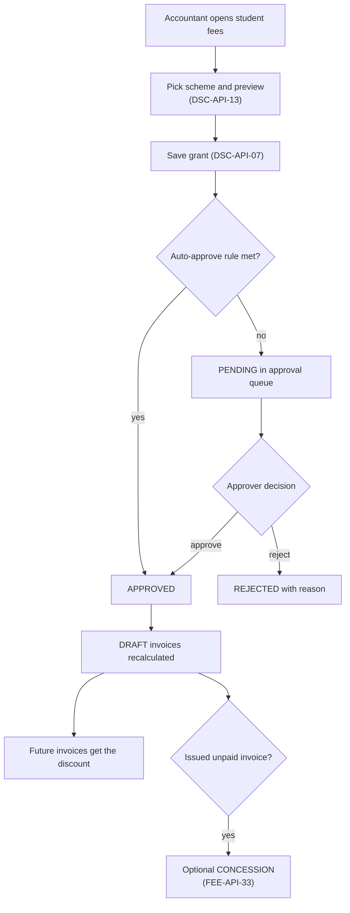
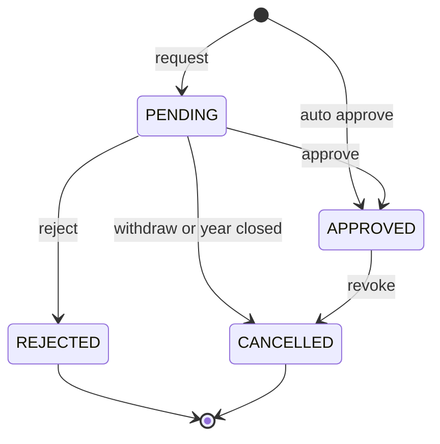
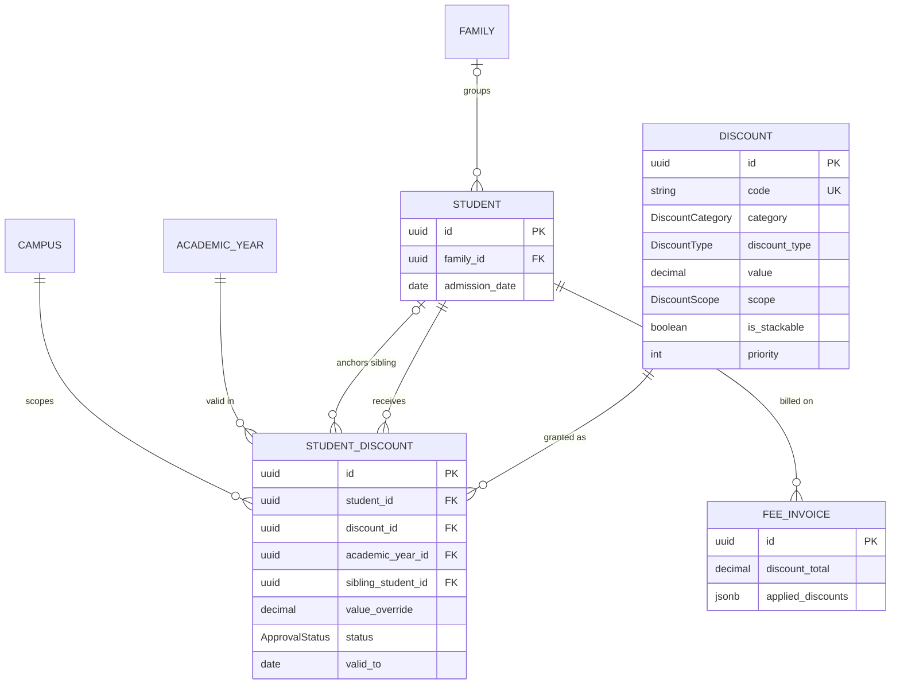

# Discounts Module

**In simple words:** A discount lowers a student's fee for a clear reason: a brother or sister in the same school, early admission, a staff parent, good marks or paying the whole year upfront. This module lets the owner define discount schemes once, lets the accountant give a scheme to a student, and makes a second person approve it before any invoice changes. Every rupee of discount on an invoice can then be traced to a rule, a requester and an approver. That stops the most common fee leak in Indian institutes: the quiet "10% off" given at the counter.

| Item | Value |
|---|---|
| Module code | DSC |
| Release phase | Phase 1 (MVP) |
| Plans | Starter, Growth, Pro, Enterprise (Starter sends discount messages by in-app and email only) |
| Main users | Accountant (grants), Principal (approves), Organization Admin (schemes, approvals), Parent (sees discounts on invoices) |
| Depends on | Fees, Student Profile, Batch, Settings, Notifications |
| Used by | Fees (invoice builder), Parent Portal, Dashboard (approval tasks), Analytics |
| Main tables | `discounts`, `student_discounts`; reads `fee_invoices`, `fee_invoice_items`, `families`, `student_guardians` |
| Endpoints | DSC-API-01 to DSC-API-16 |
| Build prompt | P-27 |

## Objective

Today most institutes give discounts by word of mouth. Later nobody knows who agreed, one family gets the sibling discount twice and another never gets it, and the owner cannot say how much fee income the discounts cost. This module closes these gaps.

Measurable goals:

1. Every discount amount on an invoice points to one grant (`appliedDiscounts`), and every grant has a requester and an approver or an auto-approval rule.
2. Suresh Gupta grants a discount at the counter in under 30 seconds and sees the net fee before he saves.
3. Zero missed sibling discounts: every family with two or more active children stays in the sibling suggestion list until a grant exists.
4. No grant reaches an invoice without a second person, except low-risk schemes under the auto-approve limit set by the owner.
5. Rajesh Sharma sees discount given as a share of fees billed, per scheme, category and batch, in one screen.
6. An issued invoice never changes because of a discount. Late discounts reach issued invoices only as approved concessions.

## Scope

### In scope

- Discount schemes: percent or fixed value, category, scope (whole invoice or selected fee heads), course filter, cap for percent schemes, offer window, stacking flag, priority and approval flag.
- Category rules for sibling, early-bird, staff child, merit, full-year payment, referral, financial aid, promotional and custom discounts.
- Granting a scheme to one student or to many students (bulk job), with an optional value override and reason.
- Approval workflow with maker-checker (the requester can never approve), an auto-approve limit and always-approve categories.
- Preview of the net effect on a student's fees before saving, using the same engine as the invoice builder.
- Automatic sibling detection from `Family` and shared guardians.
- Effect on invoices: DRAFT invoices are recalculated, future invoices get the discount, issued invoices are listed for an optional concession.
- Revoking a grant from a date, including automatic revoke when the qualifying sibling leaves.
- Audit trail, discount impact report, abuse flags and exports.

### Out of scope

- Scholarships (application, selection, outside funding, disbursement). See the *Scholarships Module* chapter.
- Changing an issued invoice. Post-issue concessions, late-fee waivers and corrections are adjustments of the *Fees Module* (FEE-API-33).
- Coupon codes typed by parents during online payment. Not planned; discounts are always granted by staff.
- Discounts on EduFlow's own subscription. See the *Organizations Module* chapter.

### Phase notes

| Phase | What ships |
|---|---|
| Phase 1 (MVP) | Everything in scope |
| Phase 2 | Merit schemes read exam results from the *Exams Module* as evidence; Student Portal shows discount lines |
| Phase 4 | *AI Insights Module* flags unusual discount patterns per requester and campus |

## User Stories

| ID | As a | I want to | So that | Priority |
|---|---|---|---|---|
| DSC-US-01 | Organization Admin | create schemes with type, value, scope, cap and offer window | the counter uses only approved price rules | Must |
| DSC-US-02 | Organization Admin | set priority and stacking per scheme | combined discounts are predictable | Must |
| DSC-US-03 | Accountant | grant a scheme to a student and see the net fee before saving | I can answer the parent at once | Must |
| DSC-US-04 | Accountant | see sibling candidates found from family and guardian links | no family misses its sibling discount | Must |
| DSC-US-05 | Accountant | grant one scheme to many students or copy last year's grants | a new session starts in minutes | Should |
| DSC-US-06 | Principal | approve or reject pending grants in one queue with the yearly amount | I control fee leakage in my campus | Must |
| DSC-US-07 | Principal | be blocked from approving a grant I requested | maker-checker holds for everyone | Must |
| DSC-US-08 | Accountant | edit or withdraw a pending grant | I fix a mistake before approval | Should |
| DSC-US-09 | Principal | revoke a grant from a date | the discount stops when its reason ends | Must |
| DSC-US-10 | Parent | see each discount as a named line on the invoice and get a message on approval | I trust the bill | Must |
| DSC-US-11 | Organization Admin | see discount impact by scheme, category and batch and export it | I know what discounts cost | Must |
| DSC-US-12 | Organization Admin | see flags for large overrides and busy requesters | I spot abuse early | Should |
| DSC-US-13 | Accountant | turn an approved discount into a concession on an issued invoice | the parent is not overcharged | Should |

## Workflow

### Grant and approval

**Figure: From discount request to invoice**



The accountant asks, the system checks the rules, and a second person decides unless the scheme is low risk. Approval never edits an issued invoice. It only changes drafts and everything billed later.

1. **Scheme.** Rajesh Sharma (ORG_ADMIN) creates "Sibling - second child" (`SIB2`): 10% on Tuition, stackable, priority 10, approval required (DSC-API-02).
2. **Detect.** On 5 April 2027 Suresh Gupta opens the sibling suggestions (DSC-API-14). Aarav Sharma (Class 10-A, admitted 2027) and Ishaan Sharma (Class 7-B, admitted 2024) share the family "Sharma family (Sunita Devi)". Aarav is child 2, so `SIB2` is suggested with Ishaan as the anchor sibling.
3. **Preview.** Suresh sees Q1 Tuition ₹12,000 drop by ₹1,200 and a yearly discount of ₹4,800 (DSC-API-13).
4. **Request.** He saves the grant (DSC-API-07). `SIB2` needs approval, so the grant is `PENDING` and `discount.requested` reaches Dr. Anita Verma.
5. **Decide.** Dr. Verma approves on 6 April (DSC-API-09). DRAFT invoices of Aarav are recalculated in the same transaction. Sunita Devi gets a WhatsApp message.
6. **Issued invoice.** Aarav's Q1 invoice `INV-0588` was already issued on 5 April. It does not change. The approval response lists it with a suggested concession of ₹1,200, and Suresh requests a `CONCESSION` adjustment with one click (FEE-API-33).
7. **Later invoices.** On 1 July the Q2 run applies the grant: Tuition ₹12,000, discount ₹1,200.

### Status lifecycle

**Figure: Status of a student discount grant**



A grant uses the shared `ApprovalStatus` enum. A revoked grant is `CANCELLED` but keeps its `approvedAt`, so invoices issued before its end date stay explained.

| Status | Meaning | Used by invoices | Next | Set by |
|---|---|---|---|---|
| `PENDING` | Waiting for a second person | No | APPROVED, REJECTED, CANCELLED | DSC-API-07, DSC-API-12 |
| `APPROVED` | Active inside `validFrom` to `validTo` | Yes | CANCELLED | DSC-API-09 or auto-approval |
| `REJECTED` | Refused with `rejectionReason` | No | None | DSC-API-10 |
| `CANCELLED` without `approvedAt` | Withdrawn, or scheme archived, or year closed | No | None | DSC-API-08, system |
| `CANCELLED` with `approvedAt` | Revoked; shown as "Revoked" | Only up to `validTo` | None | DSC-API-11, sibling job |

The UI shows two derived labels that are not stored: "Ended" for an `APPROVED` grant whose `validTo` is in the past, and "Revoked" as in the table.

## Screens and Wireframes

| ID | Screen | Users | Purpose |
|---|---|---|---|
| DSC-S01 | Discount schemes | Organization Admin (edit); Accountant, Principal (view) | List schemes with category, value, scope and live grant count |
| DSC-S02 | Scheme editor (drawer) | Organization Admin | Create or edit one scheme |
| DSC-S03 | Grant discount with preview (dialog) | Accountant, Organization Admin | Grant a scheme to one student and see the net fee |
| DSC-S04 | Approval queue | Principal, Organization Admin | Approve or reject pending grants |
| DSC-S05 | Sibling suggestions | Accountant, Organization Admin | Families with two or more active children and the suggested scheme |
| DSC-S06 | Grant detail and history | Accountant, Principal, Organization Admin | Timeline, invoices touched, withdraw or revoke |
| DSC-S07 | Discount impact report | Organization Admin, Accountant, Principal | Cost of discounts by scheme, category and batch |
| DSC-S08 | Invoice with discount lines (Parent Portal, mobile) | Parent | Each discount as a named line |

**Screen DSC-S02 — Scheme editor (Organization Admin, web)**

```text
+--------------------------------------------------------------------------+
| EduFlow | Bright Future Public School      [Search students...]  (RS) v  |
+------------+-------------------------------------------------------------+
| Dashboard  | Discounts > Schemes > New scheme                            |
| Students   +-------------------------------------------------------------+
| Fees       | Name [Sibling - second child__]   Code [SIB2______]         |
| Discounts <| Category [Sibling v]         Sibling number [2 v]           |
|  Schemes   | Type (o) Percent ( ) Fixed   Value [ 10.00 ] %              |
|  Grants    | Cap per invoice Rs [________]  (percent only)               |
|  Approvals | Applies to ( ) Whole invoice  (o) Selected fee heads        |
|  Siblings  |   [x] Tuition  [ ] Transport  [ ] Exam  [ ] Activity        |
|  Impact    | Courses [All courses v]                                     |
| Payments   | Offer window [01-03-2027] to [31-03-2028]                   |
| Settings   | [x] Can combine with other discounts   Priority [ 10 ]      |
|            | [x] Needs approval by a second person                       |
|            | Note: fines, deposits and arrears are never discounted.     |
|            |-------------------------------------------------------------|
|            |                               [Cancel]  [Save scheme]       |
+------------+-------------------------------------------------------------+
```

- The form changes with the choices: "Sibling number" shows only for `SIBLING`, the cap only for `PERCENT`, the fee head list only for "Selected fee heads".
- "Needs approval" is ticked and locked for `STAFF_CHILD`, `FINANCIAL_AID` and `CUSTOM` (DSC-BR-06).
- When approved grants exist, the money fields are read only with the hint "Used by 212 grants. Archive and create a new scheme to change the value."
- Save calls DSC-API-02 (new) or DSC-API-04 (edit).

**Screen DSC-S03 — Grant discount with preview (Accountant, web)**

```text
+--------------------------------------------------------------------------+
| EduFlow | Bright Future Public School      [Search students...]  (SG) v  |
+--------------------------------------------------------------------------+
| Grant discount - Aarav Sharma (BF-2027-0142) - Class 10-A        [X]     |
+--------------------------------------------------------------------------+
| Scheme [SIB2 - Sibling - second child v]       Year [2027-28 v]          |
| Anchor sibling [Ishaan Sharma - 7-B - BF-2024-0087 v]                    |
| Override value [______] %    Valid [01-04-2027] to [31-03-2028]          |
| Reason [Elder brother Ishaan Sharma studies in Class 7-B_______]         |
|--------------------------------------------------------------------------|
| Preview (server)         Gross    Discount   Tax      Net                |
| Q1 Apr  INV-0588 issued  18,500        0 *     0   18,500                |
| Q2 Jul  not billed       15,000   -1,200       0   13,800                |
| Q3 Oct  not billed       16,500   -1,200       0   15,300                |
| Q4 Jan  not billed       15,000   -1,200       0   13,800                |
| Year                     65,000   -3,600       0   61,400                |
| * Issued: not changed. Concession of Rs 1,200 can be requested.          |
| Yearly estimate Rs 4,800. Scheme SIB2 needs a second person.             |
|--------------------------------------------------------------------------|
|                                    [Cancel]  [Send for approval]         |
+--------------------------------------------------------------------------+
```

- Opens from the student's Fees tab or from DSC-S05. The scheme list shows only `ACTIVE` schemes inside their offer window that match the student's course.
- Every change of scheme, override or dates calls DSC-API-13 after 400 ms. The browser never computes a discount.
- The main button reads "Grant" when DSC-BR-04 allows auto-approval and "Send for approval" otherwise. It calls DSC-API-07.

**Screen DSC-S04 — Approval queue (Principal, web)**

```text
+--------------------------------------------------------------------------+
| EduFlow | Bright Future Public School      [Search students...]  (AV) v  |
+------------+-------------------------------------------------------------+
| Dashboard  | Discounts > Approvals          Campus [Main Campus v]       |
| Students   +-------------------------------------------------------------+
| Attendance | Pending 4    Oldest 3 days    Category [All v]              |
| Fees       |-------------------------------------------------------------|
| Discounts <| [ ] Student       Scheme   Value   Year est  By        Age  |
|  Approvals | [x] Aarav Sharma  SIB2     10%       4,800  Suresh G  1d    |
|  Grants    | [ ] Riya Singh    MERIT90  5%        2,400  Suresh G  2d    |
|  Siblings  | [ ] Neha Joshi    STAFF    50% !    24,000  Suresh G  2d    |
|  Impact    | [ ] Meera Das     CUSTOM   Rs 3,000  3,000  Suresh G  3d    |
| Reports    |-------------------------------------------------------------|
| Settings   | ! Value override or above the auto-approve limit.           |
|            | Click a row for reason, sibling, preview and history.       |
|            |-------------------------------------------------------------|
|            | Selected 1           [Reject...]   [Approve selected]       |
+------------+-------------------------------------------------------------+
```

- Data comes from DSC-API-06 with `status=PENDING`, oldest first, limited to the Principal's campuses.
- Rows the viewer requested have a disabled checkbox with the tooltip "You cannot approve your own request".
- "Approve selected" calls DSC-API-09 once per row and shows one toast per failure. "Reject..." opens a reason dialog and calls DSC-API-10.

**Screen DSC-S05 — Sibling suggestions (Accountant, web)**

```text
+--------------------------------------------------------------------------+
| EduFlow | Bright Future Public School      [Search students...]  (SG) v  |
+------------+-------------------------------------------------------------+
| Dashboard  | Discounts > Sibling suggestions      Year [2027-28 v]       |
| Students   +-------------------------------------------------------------+
| Fees       | Family               No  Student        Class  Suggest      |
| Discounts <|-------------------------------------------------------------|
|  Schemes   | Sharma (Sunita Devi)  1  Ishaan Sharma  7-B    anchor       |
|  Grants    |                       2  Aarav Sharma   10-A   [x] SIB2     |
|  Approvals |                       3  Diya Sharma    3-A    [x] SIB3     |
|  Siblings  | Khan (Imran Khan)     1  Zoya Khan      9-B    anchor       |
|  Impact    |                       2  Kabir Khan     5-A    [x] SIB2     |
| Payments   |-------------------------------------------------------------|
| Settings   | Shared guardian, no family record (check first)             |
|            | Mohan Das (father)    1  Tara Das       8-A    anchor       |
|            |                       2  Rohan Das      4-B    [ ] SIB2     |
|            |-------------------------------------------------------------|
|            | Selected 3        [Preview]   [Grant selected (3)]          |
+------------+-------------------------------------------------------------+
```

- The list comes from DSC-API-14. "Shared guardian" rows are not ticked by default, because two families can share a guardian record by mistake.
- "Grant selected" sends one DSC-API-12 call per scheme, each item with its anchor as `siblingStudentId`.

**Screen DSC-S08 — Invoice with discount lines (Parent, mobile)**

```text
+------------------------------------+
| EduFlow Parent       Sunita D  =   |
+------------------------------------+
| < Fees   Aarav Sharma - 10-A       |
|------------------------------------|
| Quarter 2 fees 2027-28             |
| INV-1043        Due 10 Jul 2027    |
|------------------------------------|
| Tuition fee             Rs 12,000  |
| Transport fee           Rs  3,000  |
| Sibling discount 10%   -Rs  1,200  |
|   (on Tuition)                     |
|------------------------------------|
| Total                   Rs 13,800  |
| Paid                    Rs      0  |
| Balance                 Rs 13,800  |
|------------------------------------|
| [ Pay Rs 13,800 now ]              |
| [ Download invoice PDF ]           |
+------------------------------------+
```

- The screen belongs to the *Parent Portal Module*. It reads `appliedDiscounts` of the invoice; the parent never calls a DSC endpoint.
- Each grant is one line with the scheme name. Requester, approver and internal reason are never shown to parents.

## UI Components

| Component | Type | Behaviour |
|---|---|---|
| `SchemeTable` | shadcn `Table` with TanStack Table | Code, name, category badge, value, scope, grant count; filters category and status; empty state "No discount schemes yet. Start with Sibling and Early-bird." |
| `SchemeForm` | `Sheet` with React Hook Form and Zod | Fields appear by type and category; locked money fields show a lock icon and tooltip |
| `CategoryBadge` | `Badge` | One colour per category; archived schemes in grey |
| `GrantDialog` | `Dialog` with `Command` combobox | Student search by name or admission number; scheme select filtered by course and offer window |
| `DiscountPreview` | `Card` with table | Server numbers only; skeleton rows while loading; chips for skip reasons (`NOT_STACKABLE`, `CAPPED`) |
| `ApprovalQueue` | Data table with row selection | Oldest first; flag icon for overrides and grants above the limit; own rows disabled |
| `DecisionDialog` | `AlertDialog` | Reject needs a reason of 5 to 255 characters |
| `RevokeDialog` | `Dialog` with `Calendar` | Effective date, reason, list of issued invoices to review |
| `SiblingGroupList` | Grouped table | Grouped by family; confidence chip "Family" or "Shared guardian" |
| `ImpactChart` | Recharts bar chart plus table | Discount given against gross billed per group; percent share label |
| Page states | `Skeleton`, `EmptyState`, `ErrorState`, `Toast` | Error state shows the `requestId` and a Retry button; success and failure toasts after each action |

## Validation Rules

The same Zod schemas live in `shared/src/schemas/discounts.ts` and run in the browser and in the API.

| Field | Rule | Error message shown to user |
|---|---|---|
| Scheme `name` | Required, 3 to 100 characters | Enter a name of 3 to 100 characters. |
| Scheme `code` | Required, 2 to 30 characters, `A-Z`, `0-9`, `-`, `_`; unique per organization | Code SIB2 is already used by another discount. |
| `value` (PERCENT) | Above 0 and at most 100, 2 decimals | Percent must be between 0.01 and 100. |
| `value` (FIXED) | Above 0 and at most 10,00,000, 2 decimals | Enter an amount between Rs 0.01 and Rs 10,00,000. |
| `currency` | Required for FIXED and equal to the organization currency; empty for PERCENT | Fixed discounts must use INR. |
| `maxAmount` | Only for PERCENT; above 0 | A cap can be set only on percent discounts. |
| `feeHeadIds` | Scope FEE_HEADS: 1 to 30 active heads, none of type FINE, CAUTION_DEPOSIT, ARREARS, CHEQUE_BOUNCE_CHARGE; scope INVOICE_TOTAL: empty | Fines, deposits and arrears cannot be discounted. |
| `criteria.siblingIndex` | Required for SIBLING, 2 to 5; one ACTIVE scheme per sibling number and course | Another active sibling discount already covers child 2. |
| `criteria.payBeforeDays` | EARLY_BIRD only, 0 to 180 | Early-bird days must be between 0 and 180. |
| `criteria.installmentNos` | Optional, 1 to 24 numbers from 1 to 24 | Choose installment numbers between 1 and 24. |
| `validFrom`, `validTo` | Both optional; `validTo` on or after `validFrom` | The end date must be on or after the start date. |
| `priority` | Whole number 0 to 999 | Priority must be a whole number from 0 to 999. |
| `requiresApproval` | Must be true for STAFF_CHILD, FINANCIAL_AID, CUSTOM | Staff child, financial aid and custom discounts always need approval. |
| Grant `studentId` | Student is ACTIVE and in the user's campus | Discounts can be given only to active students. |
| Grant `discountId` | Scheme ACTIVE; today inside the offer window | This discount offer ended on 31 Mar 2027. |
| Grant `academicYearId` | Year is current or next, not closed | The academic year 2026-27 is closed. |
| Grant course | Scheme `courseIds` empty or contains the student's course | This discount is only for JEE Main 2028. |
| `siblingStudentId` | Required for SIBLING; ACTIVE; same family or shared guardian; earlier in sibling order | Ishaan Sharma is not linked to this student's family. |
| `valueOverride` | PERCENT: above 0, at most 100; FIXED: above 0 | Override cannot be more than 100 percent. |
| Grant `reason` | 10 to 500 characters; required with an override or for STAFF_CHILD, MERIT, FINANCIAL_AID, CUSTOM | Give a reason of at least 10 characters. |
| Grant dates | Inside the academic year; `validTo` on or after `validFrom` | Dates must lie inside 1 Apr 2027 to 31 Mar 2028. |
| Duplicate grant | No live grant of the same scheme, student and year | Aarav Sharma already has this discount for 2027-28. |
| `rejectionReason` | Required, 5 to 255 characters | Give a reason for rejecting this discount. |
| Revoke `effectiveFrom` | Inside the grant's validity window | The revoke date must lie between 1 Apr 2027 and 31 Mar 2028. |
| Revoke `reason` | Required, 10 to 255 characters | Give a reason of at least 10 characters. |
| Bulk `items` | 1 to 2,000 students | Select 2,000 students or fewer. |

## Business Rules

Settings are rows of `organization_settings` (key plus JSON value, optional campus override), edited in the *Settings Module*. The key names are an assumption of this chapter.

| Setting key | Default | Meaning |
|---|---|---|
| `discounts.auto_approve_max_yearly_amount` | `5000` | Highest yearly estimate that may skip approval (organization currency) |
| `discounts.max_total_percent` | `100` | Most that all discounts together may take from one invoice line; Bright Future uses 50 |
| `discounts.sibling_order` | `"ADMISSION_DATE"` | Sibling numbering: `ADMISSION_DATE` (earliest first) or `DATE_OF_BIRTH` (eldest first) |

### Scheme rules

**DSC-BR-01 — Schemes are price rules.** Only holders of `discounts.manage` (ORG_ADMIN by default) create, edit or archive schemes. `code` is unique per organization. Once a scheme has one `APPROVED` grant, DSC-API-04 accepts only `name`, `validFrom`, `validTo`, `requiresApproval` and `courseIds`. A change to `discountType`, `value`, `currency`, `maxAmount`, `scope`, `feeHeadIds`, `criteria`, `isStackable`, `priority` or `category` answers `422 BUSINESS_RULE_VIOLATION`. Why: the invoice builder reads these fields at build time, so one edit would silently reprice hundreds of students. To change a price, archive the scheme and create a new one.

**DSC-BR-02 — Offer window and grant window.** `Discount.validFrom` and `validTo` are the offer window: a new grant is accepted only when today lies inside it. `StudentDiscount.validFrom` and `validTo` are the grant window: the invoice issue dates the grant covers. Empty grant dates mean the whole academic year. The end of an offer never ends existing grants. Example: early-bird `EB28` is on offer from 1 January to 31 March 2027; a family that took it on 20 March keeps it on every invoice of 2027-28.

**DSC-BR-03 — Category rules.** Each category adds one check at grant time.

| Category | Extra rule |
|---|---|
| `SIBLING` | Scheme has `criteria.siblingIndex`; grant has `siblingStudentId` = sibling number 1 of the family (the anchor) |
| `EARLY_BIRD` | Grant date is at least `criteria.payBeforeDays` days before the due date of the student's first installment of the year |
| `STAFF_CHILD` | Always approved by a second person; reason names the staff member and employee code |
| `MERIT` | Reason names the evidence, for example "92.4% in Class 9 finals"; from Phase 2 the approver sees the exam result |
| `FULL_PAYMENT` | Student's assignment has exactly one uninvoiced installment: a one-installment structure or a custom schedule (FEE-API-20) |
| `REFERRAL`, `PROMOTIONAL` | No extra rule; usually FIXED with `criteria.installmentNos: [1]` |
| `FINANCIAL_AID`, `CUSTOM` | Always approved by a second person; reason required |

`criteria` accepts only three keys, all optional except `siblingIndex` for SIBLING: `siblingIndex` (2 to 5), `payBeforeDays` (0 to 180) and `installmentNos` (the grant applies only to invoices of these installment numbers). Unknown keys answer `400 VALIDATION_ERROR`.

### Approval rules

**DSC-BR-04 — Auto-approval.** DSC-API-07 and DSC-API-12 compute a yearly estimate: the discount this grant alone would give on every planned installment of the student's live fee assignments for the year, issued ones included. The grant is `APPROVED` at once only when all four are true:

1. the scheme has `requiresApproval = false`;
2. the category is not `STAFF_CHILD`, `FINANCIAL_AID` or `CUSTOM`;
3. there is no `valueOverride`, or it is at or below the scheme value;
4. the yearly estimate is at or below `discounts.auto_approve_max_yearly_amount`.

Otherwise the grant is `PENDING` with one reason code: `SCHEME_REQUIRES_APPROVAL`, `ALWAYS_APPROVE_CATEGORY`, `VALUE_OVERRIDE_ABOVE_SCHEME`, `ABOVE_AUTO_APPROVE_LIMIT` or `NO_FEE_ASSIGNMENT` (no estimate possible). An auto-approved grant has `approvedAt` = now and `approvedById` = null; the audit log records the rule.

> **Example:** Sharma Classes, JEE Main 2028, four installments of ₹15,000. Scheme `EB28`: FIXED ₹1,000, `installmentNos: [1]`, no approval. Estimate = ₹1,000, below ₹5,000, so the grant is approved at once. The same grant with an override of ₹2,500 fails rule 3, because the override is above ₹1,000, so it waits as `VALUE_OVERRIDE_ABOVE_SCHEME`. A scheme of ₹1,500 without `installmentNos` applies to all four installments: the estimate is ₹6,000, so its grants wait as `ABOVE_AUTO_APPROVE_LIMIT`.

**DSC-BR-05 — Maker and checker.** The approver or rejecter must differ from `requestedById`, even for ORG_ADMIN; otherwise `422 BUSINESS_RULE_VIOLATION` "You cannot approve your own request". DSC-API-08 sets `requestedById` to the user who edits a pending grant, because that user now owns the request. The only exception is the owner self-approval setting described in *RBAC and Permissions Matrix*; each such approval is marked in the audit log. The approver also needs the grant's campus in scope.

**DSC-BR-06 — One live grant.** The partial unique index `uq_student_discount_live` allows one `PENDING` or `APPROVED` grant per student, scheme and academic year. A second request answers `409 CONFLICT`. A PENDING grant becomes `CANCELLED` when its requester withdraws it (DSC-API-08 with `"status": "CANCELLED"`), when its scheme is archived, or when the year is closed.

### Calculation rules

**DSC-BR-07 — Which grants reach an invoice.** The Fees invoice builder (step 2 of FEE-BR-09) calls `applyDiscounts()` with every grant that passes all checks:

- status `APPROVED`, or `CANCELLED` with `approvedAt` set (revoked);
- same student and academic year as the invoice, and the invoice has an `assignmentId` (ad-hoc invoices such as fines or certificate fees never get discounts);
- the invoice issue date lies inside the grant window;
- `criteria.installmentNos` is empty or contains the invoice's installment number;
- the scheme's `courseIds` is empty or contains the course of the invoice's fee structure.

The value used is `valueOverride` when set, else `Discount.value`.

**DSC-BR-08 — Order and stacking.** Grants are sorted by `priority` (lower first), then `approvedAt`, then id. The first grant always applies. After that, a grant applies only when it is stackable and every grant applied so far is stackable. A skipped grant gets the reason `NOT_STACKABLE` in the preview. Priority decides, not size: the owner controls the order, and the preview shows every skipped grant.

> **Example:** Neha Joshi has `STAFF` (50% on Tuition, not stackable, priority 5) and `SIB2` (10% on Tuition, stackable, priority 10). `STAFF` applies: ₹6,000 on ₹12,000. `SIB2` is skipped. If `STAFF` had priority 50, `SIB2` would apply first and `STAFF` would be skipped, so ORG_ADMIN gives non-stackable schemes the lowest numbers.

**DSC-BR-09 — Amount of one grant.** The target lines are all lines (scope `INVOICE_TOTAL`) or the lines of `feeHeadIds` (scope `FEE_HEADS`), minus the heads in DSC-BR-11. The base is what is left on those lines after earlier grants, so percents compound.

```text
PERCENT: amount = round2(base x value / 100), then min(amount, maxAmount)
FIXED:   amount = min(value, base)          (per invoice)
Split:   line share = round2(amount x line base / base); last line
         takes the rounding difference. round2 = half up, 2 decimals.
```

> **Example:** The Day 41 case. Aarav's Q2 invoice: Tuition ₹12,000, Transport ₹3,000, gross ₹15,000. `SIB2` gives ₹1,200 on Tuition. Total = ₹13,800. After a ₹500 late fee the parent pays ₹14,300.

> **Example:** Aarav also gets `MERIT90` (5% on the whole invoice, cap ₹1,000, stackable, priority 20). Base = ₹10,800 + ₹3,000 = ₹13,800. Amount = ₹690. Tuition share = 690 x 10,800 / 13,800 = ₹540.00; Transport takes ₹150.00. Discount total ₹1,890; invoice total ₹13,110.

> **Example:** 10% with `maxAmount` ₹500 on Tuition ₹12,000: ₹1,200 is capped to ₹500. A FIXED ₹5,000 grant on a ₹3,000 line gives ₹3,000; the invoice total is ₹0, so FEE-BR-12 issues it as `PAID` at once.

**DSC-BR-10 — Overall cap.** On one line, all grants together never take more than `amount x discounts.max_total_percent / 100`. The last grant in order is cut first and gets the note `CAPPED`. A line never goes below ₹0.00.

> **Example:** Bright Future sets the cap to 50. A Tuition line of ₹12,000 carries `SIB2` (₹1,200), `MERIT90` (5% of ₹10,800 = ₹540) and a financial-aid grant of 50% (50% of ₹10,260 = ₹5,130). The cap is ₹6,000, so the aid grant is cut to ₹6,000 - ₹1,740 = ₹4,260.

**DSC-BR-11 — Heads never discounted; tax after discount.** Lines of type `FINE`, `CAUTION_DEPOSIT`, `ARREARS` and `CHEQUE_BOUNCE_CHARGE` are never discounted: penalties would lose their purpose and a refundable deposit would be refunded in full although less was paid. Tax is calculated on `amount - discountAmount` (FEE-BR-03). Example: Sharma Classes, installment ₹15,000, `EB28` ₹1,000, GST 18% on ₹14,000 = ₹2,520, total ₹16,520.

All maths lives in one pure function that the invoice builder and DSC-API-13 both call:

```typescript
// server/src/modules/discounts/apply-discounts.ts
import { Prisma } from '@prisma/client';

type Dec = Prisma.Decimal;
const ZERO = new Prisma.Decimal(0);
const round2 = (x: Dec) => x.toDecimalPlaces(2, Prisma.Decimal.ROUND_HALF_UP);
const NEVER = new Set(['FINE', 'CAUTION_DEPOSIT', 'ARREARS', 'CHEQUE_BOUNCE_CHARGE']);

export type Line = { key: string; feeHeadId: string; headType: string; amount: Dec };
export type Grant = {
  studentDiscountId: string;
  name: string;
  discountType: 'PERCENT' | 'FIXED';
  value: Dec; // valueOverride ?? Discount.value
  maxAmount: Dec | null;
  scope: 'INVOICE_TOTAL' | 'FEE_HEADS';
  feeHeadIds: string[];
  isStackable: boolean;
  priority: number;
  approvedAt: Date;
};
type Note = { studentDiscountId: string; reason: 'NOT_STACKABLE' | 'NO_LINES' | 'CAPPED' };

export function applyDiscounts(lines: Line[], grants: Grant[], maxTotalPercent: Dec) {
  const given = new Map<string, Dec>(lines.map((l) => [l.key, ZERO]));
  const applied: { studentDiscountId: string; name: string; amount: Dec }[] = [];
  const notes: Note[] = [];
  const ordered = [...grants].sort(
    (a, b) =>
      a.priority - b.priority ||
      a.approvedAt.getTime() - b.approvedAt.getTime() ||
      a.studentDiscountId.localeCompare(b.studentDiscountId),
  );
  let closed = false; // a non-stackable grant has been applied
  for (const g of ordered) {
    if (closed || (!g.isStackable && applied.length > 0)) {
      notes.push({ studentDiscountId: g.studentDiscountId, reason: 'NOT_STACKABLE' });
      continue;
    }
    const targets = lines.filter(
      (l) => !NEVER.has(l.headType) && (g.scope === 'INVOICE_TOTAL' || g.feeHeadIds.includes(l.feeHeadId)),
    );
    const bases = targets.map((l) => l.amount.minus(given.get(l.key)!));
    const baseSum = bases.reduce((s, b) => s.plus(b), ZERO);
    if (baseSum.lte(0)) {
      notes.push({ studentDiscountId: g.studentDiscountId, reason: 'NO_LINES' });
      continue;
    }
    let want = g.discountType === 'PERCENT' ? round2(baseSum.mul(g.value).div(100)) : g.value;
    if (g.discountType === 'PERCENT' && g.maxAmount) want = Prisma.Decimal.min(want, g.maxAmount);
    want = Prisma.Decimal.min(want, baseSum);
    let left = want;
    let total = ZERO;
    targets.forEach((l, i) => {
      const share = i === targets.length - 1 ? left : round2(want.mul(bases[i]).div(baseSum));
      const room = round2(l.amount.mul(maxTotalPercent).div(100)).minus(given.get(l.key)!);
      const part = Prisma.Decimal.max(ZERO, Prisma.Decimal.min(share, room, bases[i]));
      given.set(l.key, given.get(l.key)!.plus(part));
      left = left.minus(share);
      total = total.plus(part);
    });
    if (total.gt(0)) {
      applied.push({ studentDiscountId: g.studentDiscountId, name: g.name, amount: total });
      if (!g.isStackable) closed = true;
    }
    if (total.lt(want)) notes.push({ studentDiscountId: g.studentDiscountId, reason: 'CAPPED' });
  }
  return { lineDiscounts: given, applied, notes }; // discountTotal = sum of applied amounts
}
```

### Invoice effect rules

**DSC-BR-12 — Effect of approval on invoices.** Approval runs in one transaction with the recalculation of the student's DRAFT invoices. Issued invoices are never repriced.

| Invoice state when the grant is approved | What happens |
|---|---|
| Not yet generated | Gets the discount when generated, if DSC-BR-07 passes |
| `DRAFT` | Lines, tax, `discountTotal`, `appliedDiscounts`, `total` and `balance` recalculated at once |
| `ISSUED`, `PARTIALLY_PAID`, `OVERDUE` | Unchanged; listed in the response with `suggestedConcession`; the accountant may request a `CONCESSION` (FEE-API-33), approved separately |
| `PAID` | Unchanged; a concession creates credit that the *Payments Module* keeps as an advance or refunds |
| `CANCELLED`, `WRITTEN_OFF`, `CARRIED_FORWARD` | Never touched |

**DSC-BR-13 — Revoke.** DSC-API-11 takes `effectiveFrom` and a reason. It sets `validTo = effectiveFrom - 1 day` and `status = CANCELLED`, keeps `approvedAt`, and writes the reason to `rejectionReason` with the prefix "Revoked: ". DRAFT invoices are recalculated. Issued invoices dated on or after `effectiveFrom` that carry this grant are returned as `issuedInvoicesToReview`; the accountant may raise a `DEBIT_CORRECTION` (FEE-API-33). A revoke date on or before the grant start leaves an empty window, so the grant never applies.

> **Example:** Ishaan Sharma leaves with a transfer certificate on 31 August 2027. Aarav's `SIB2` is revoked from 1 September: `validTo` = 31 August. The Q3 invoice issued on 30 September carries full Tuition of ₹12,000. Q1 and Q2 keep their ₹1,200 discounts.

### Sibling rules

**DSC-BR-14 — Sibling detection.** DSC-API-14 groups the `ACTIVE` students of the academic year by `familyId`. Students without a family who share a guardian through `student_guardians` form a second group with confidence `SHARED_GUARDIAN`. Inside a group, students are numbered by `discounts.sibling_order`; ties go to the earlier date of birth, then the lower admission number. Number 1 is the anchor. For number n from 2, the suggested scheme is the `ACTIVE` `SIBLING` scheme with `siblingIndex` = n, or the highest index below n, whose course filter and offer window pass. Students who already hold a live `SIBLING` grant for the year are left out. A family can span campuses: the accountant sees the anchor's name and class only, nothing else from the other campus.

**DSC-BR-15 — Anchor leaves.** When a student moves to `TRANSFERRED`, `DROPPED_OUT`, `EXPELLED` or `GRADUATED` (`student.status_changed` or `student.withdrawn`), the job `dsc-sibling-revoke-{studentId}` on the `invoices` queue revokes every live `SIBLING` grant with that `siblingStudentId`: approved ones from the day after `leavingDate` (today when empty), pending ones become `CANCELLED`. The family is then renumbered and appears again in the suggestions. `INACTIVE` and `SUSPENDED` do not trigger it, because they are temporary.

### Year-end and abuse rules

**DSC-BR-16 — Grants do not roll over.** A grant belongs to one academic year. On `academic_year.closed`, PENDING grants of that year become `CANCELLED`. For the new session, DSC-API-12 with `copyFromAcademicYearId` requests the same scheme again for every student who held an approved, unrevoked grant and is still `ACTIVE`. Sibling anchors are checked again, and the normal approval rules apply.

**DSC-BR-17 — Abuse flags.** DSC-API-15 returns these flags for the chosen period. They warn; they do not block.

| Flag | Condition |
|---|---|
| `OVERRIDE_ABOVE_SCHEME` | Approved grant with `valueOverride` above the scheme value |
| `LARGE_GRANT` | Yearly estimate above 3 times the auto-approve limit |
| `MANY_GRANTS_ONE_STUDENT` | Student with 3 or more live grants in the year |
| `BUSY_REQUESTER` | One user requested more than 20 grants in 7 days |
| `FAST_PAIR` | Same requester and approver, 10 or more approvals within 2 minutes of the request |

## Acceptance Criteria

| ID | Given | When | Then |
|---|---|---|---|
| DSC-AC-01 | ORG_ADMIN creates `SIB2` with a valid body | DSC-API-02 is called | `201`, status `ACTIVE`, audit row written |
| DSC-AC-02 | `SIB2` has 1 approved grant | ORG_ADMIN changes `value` to 15 | `422 BUSINESS_RULE_VIOLATION`; renaming the scheme still works |
| DSC-AC-03 | A `STAFF_CHILD` scheme body with `requiresApproval: false` | DSC-API-02 | `422` with "Staff child, financial aid and custom discounts always need approval." |
| DSC-AC-04 | `SIB2` needs approval | Suresh grants it to Aarav | Grant `PENDING`, reason code `SCHEME_REQUIRES_APPROVAL`, `discount.requested` published once |
| DSC-AC-05 | `EB28` needs no approval, estimate ₹1,000, limit ₹5,000 | Suresh grants it | Grant `APPROVED`, `approvedById` null, audit marks auto-approval |
| DSC-AC-06 | Suresh requested a grant | Suresh calls DSC-API-09 | `422` "You cannot approve your own request"; grant stays `PENDING` |
| DSC-AC-07 | Aarav has a live `SIB2` grant for 2027-28 | A second `SIB2` grant is requested | `409 CONFLICT` "Aarav Sharma already has this discount for 2027-28." |
| DSC-AC-08 | Aarav has one DRAFT and one ISSUED invoice | Dr. Verma approves `SIB2` | DRAFT total drops by ₹1,200 in the same transaction; ISSUED total unchanged and listed with `suggestedConcession` 1200.00 |
| DSC-AC-09 | Q2 invoice: Tuition ₹12,000, Transport ₹3,000, `SIB2` approved | Invoice is generated | `discountTotal` 1200.00, `total` 13800.00, `appliedDiscounts` holds the grant id |
| DSC-AC-10 | Two non-stackable grants, priorities 5 and 10 | DSC-API-13 preview | Only priority 5 applies; the other shows `NOT_STACKABLE` |
| DSC-AC-11 | 10% grant with `maxAmount` 500 on ₹12,000 Tuition | Preview | Discount 500.00 |
| DSC-AC-12 | Cap 50 and three grants from the DSC-BR-10 example | Preview | Line discount 6000.00; aid grant 4260.00 with note `CAPPED` |
| DSC-AC-13 | An invoice with a `FINE` line and an `INVOICE_TOTAL` 10% grant | Invoice is generated | The fine line has `discountAmount` 0.00 |
| DSC-AC-14 | Ishaan (anchor) is transferred with leaving date 31 Aug 2027 | Status change event is processed | Aarav's `SIB2` is `CANCELLED`, `validTo` 2027-08-31, `discount.revoked` published |
| DSC-AC-15 | Family with 3 active children and no sibling grants | DSC-API-14 | Child 2 gets `SIB2`, child 3 `SIB3`, both anchored to child 1 |
| DSC-AC-16 | A Principal of Main Campus | Approves a City Campus grant | `404 NOT_FOUND` |
| DSC-AC-17 | Grant with override 15% on a 10% scheme | DSC-API-07 | Grant `PENDING` with `VALUE_OVERRIDE_ABOVE_SCHEME`, flag in the impact report after approval |

## Edge Cases

| Case | What happens | How the system handles it |
|---|---|---|
| Discount approved after the invoice was issued | Parent expects the lower amount | No repricing; approval response lists the invoice; one-click CONCESSION request (FEE-API-33) |
| Scheme archived with pending grants | Pending requests lose their basis | Pending grants become `CANCELLED`; approved grants keep working to their `validTo` |
| Scheme archived with approved grants | Parents keep their discount | Allowed; the archive response gives the live grant count so ORG_ADMIN can revoke if needed |
| Two approvers click Approve at the same moment | Double processing | Row lock on the grant (`SELECT ... FOR UPDATE`); the second call gets `409 CONFLICT` "Already approved by Dr. Anita Verma" |
| Student changes course mid-year | Course-limited scheme no longer fits | Builder re-checks the course; the preview shows the grant as not applied; accountant revokes it |
| Anchor sibling is in another campus | Accountant has no rights there | Suggestion shows only the anchor's name and class (DSC-BR-14) |
| Shared guardian by data-entry mistake | Wrong sibling suggestion | Shared-guardian rows are unticked by default and labelled "check first" |
| Re-admitted anchor sibling | Family qualifies again | The anchor appears again in DSC-API-14; a new grant is requested (the old one is `CANCELLED`, so no conflict) |
| Grant would make the invoice negative | Over-discount | Line never goes below ₹0.00; a ₹0 invoice is issued as `PAID` (FEE-BR-12) |
| FIXED grant on an organization with USD currency | Currency mismatch | FIXED schemes must use the organization currency; mismatch gives `400` |
| Scheme value edited while grants are pending | Approver would see stale numbers | Money fields lock only after the first approval; pending grants are re-estimated on approval and the new estimate is shown |
| Bulk grant with 400 students, 12 already granted | Partial success | The job creates 388 grants and skips 12 with `ALREADY_GRANTED`; summary in the requester's notifications |
| Academic year closed with pending grants | Stale queue | Pending grants of that year become `CANCELLED` on `academic_year.closed` |
| Requester's account is deactivated | Pending grant has no owner | Grant stays `PENDING`; any other approver can still decide; audit keeps the old requester |
| Parent disputes the discount amount | Trust issue | Invoice PDF and portal show one named line per grant; staff open DSC-S06 to see the calculation and approver |

## Database Schema

The module owns two tables in `08-fees.prisma`. Both are tenant tables with Row-Level Security (see *Multi-Tenancy and Data Isolation*). It writes discount columns of `fee_invoices` and `fee_invoice_items` only through the Fees invoice builder.

| Table | Purpose |
|---|---|
| `discounts` | Discount scheme: the price rule |
| `student_discounts` | One scheme granted to one student for one academic year, with approval trail |

Both tables have `id` (uuid, PK), `organization_id` (uuid, FK `organizations`, NOT NULL), `created_at`, `updated_at` (timestamptz, NOT NULL) and `deleted_at` (timestamptz, NULL). The tables below do not repeat them.

### Table discounts

| Column | Type | Null | Default | Notes |
|---|---|---|---|---|
| `name`, `code` | varchar(100), varchar(30) | No | - | Code unique per organization |
| `category` | DiscountCategory | No | - | Drives DSC-BR-03 |
| `discount_type` | DiscountType | No | - | PERCENT or FIXED |
| `value` | decimal(12,2) | No | - | Percent 0 to 100 or amount |
| `currency` | char(3) | Yes | - | FIXED only |
| `max_amount` | decimal(12,2) | Yes | - | Cap per invoice, PERCENT only |
| `scope` | DiscountScope | No | INVOICE_TOTAL | Whole invoice or listed heads |
| `fee_head_ids`, `course_ids` | uuid[] | No | - | Heads for FEE_HEADS; empty courses = all |
| `criteria` | jsonb | Yes | - | `siblingIndex`, `payBeforeDays`, `installmentNos` |
| `valid_from`, `valid_to` | date | Yes | - | Offer window |
| `is_stackable`, `requires_approval` | boolean | No | false, true | DSC-BR-08, DSC-BR-04 |
| `priority` | integer | No | 0 | Lower applies first |
| `status` | RecordStatus | No | ACTIVE | `ARCHIVED` after DSC-API-05 |

### Table student_discounts

| Column | Type | Null | Default | Notes |
|---|---|---|---|---|
| `campus_id` | uuid | No | - | FK `campuses`; student's campus at grant time; scopes queues |
| `student_id`, `discount_id`, `academic_year_id` | uuid | No | - | FKs, restrict on delete |
| `sibling_student_id` | uuid | Yes | - | FK `students`; the anchor sibling |
| `value_override` | decimal(12,2) | Yes | - | Replaces the scheme value |
| `reason` | varchar(500) | Yes | - | Why the grant was requested |
| `status` | ApprovalStatus | No | PENDING | See lifecycle |
| `valid_from`, `valid_to` | date | Yes | - | Grant window; empty = whole year |
| `requested_by_id` | uuid | Yes | - | User id, no FK (audit) |
| `approved_by_id`, `approved_at` | uuid, timestamptz | Yes | - | Approver or rejecter; null approver = auto |
| `rejection_reason` | varchar(255) | Yes | - | Rejection or "Revoked: ..." reason |

Indexes and constraints:

- `discounts`: unique `(organization_id, code)`; index `(organization_id, category, status)`.
- `student_discounts`: indexes `(organization_id, student_id, discount_id, academic_year_id)`, `(organization_id, campus_id, status, created_at)`, `(organization_id, status, created_at)` and `(organization_id, discount_id)`.
- Added in the SQL migration, because Prisma cannot express them:

```sql
CREATE UNIQUE INDEX uq_student_discount_live
  ON student_discounts (organization_id, student_id, discount_id, academic_year_id)
  WHERE deleted_at IS NULL AND status IN ('PENDING', 'APPROVED');

ALTER TABLE discounts ADD CONSTRAINT chk_discounts_value
  CHECK (value > 0 AND (discount_type <> 'PERCENT' OR value <= 100));
```

**Figure: Discount tables and their neighbours**



A grant links a scheme, a student and a year. The sibling link points back to `students`. Invoices do not hold a foreign key to grants; they cite grant ids inside `applied_discounts`, so an invoice keeps its history even when a grant changes later.

## Prisma Schema

Copied from `docs/src/_schema/08-fees.prisma` and, for the two shared enums, `00-base.prisma`. Long end-of-line comments are moved above their field; nothing is renamed.

```prisma
// 00-base.prisma (shared)
enum RecordStatus {
  ACTIVE
  INACTIVE
  ARCHIVED
}

// Generic approval outcome (leave, student leave, discounts, refunds ...).
enum ApprovalStatus {
  PENDING
  APPROVED
  REJECTED
  CANCELLED
}

// 08-fees.prisma
enum DiscountType {
  PERCENT
  FIXED
}

enum DiscountCategory {
  SIBLING
  EARLY_BIRD
  STAFF_CHILD
  MERIT
  FULL_PAYMENT // pays the whole year upfront
  REFERRAL
  FINANCIAL_AID
  PROMOTIONAL
  CUSTOM
}

enum DiscountScope {
  INVOICE_TOTAL // applies to the whole invoice subtotal
  FEE_HEADS // applies only to the fee heads listed in feeHeadIds
}

// Discount scheme: sibling, early-bird, staff child, merit ... percent or fixed.
model Discount {
  id               String           @id @default(uuid()) @db.Uuid
  organizationId   String           @map("organization_id") @db.Uuid
  name             String           @db.VarChar(100)
  code             String           @db.VarChar(30)
  category         DiscountCategory
  discountType     DiscountType     @map("discount_type")
  value            Decimal          @db.Decimal(12, 2) // percent (0-100) or fixed amount, by discountType
  currency         String?          @db.Char(3) // FIXED discounts only
  maxAmount        Decimal?         @map("max_amount") @db.Decimal(12, 2) // cap for PERCENT discounts
  scope            DiscountScope    @default(INVOICE_TOTAL)
  feeHeadIds       String[]         @map("fee_head_ids") @db.Uuid // used when scope is FEE_HEADS
  courseIds        String[]         @map("course_ids") @db.Uuid // empty = every course
  criteria         Json? // auto-apply rules, e.g. { siblingIndex: 2 } or { payBeforeDays: 15 }
  validFrom        DateTime?        @map("valid_from") @db.Date
  validTo          DateTime?        @map("valid_to") @db.Date
  // may combine with other discounts
  isStackable      Boolean          @default(false) @map("is_stackable")
  priority         Int              @default(0) // order of application when stacked; lower first
  requiresApproval Boolean          @default(true) @map("requires_approval")
  status           RecordStatus     @default(ACTIVE)
  createdAt        DateTime         @default(now()) @map("created_at") @db.Timestamptz(6)
  updatedAt        DateTime         @updatedAt @map("updated_at") @db.Timestamptz(6)
  deletedAt        DateTime?        @map("deleted_at") @db.Timestamptz(6)

  organization     Organization      @relation(fields: [organizationId], references: [id], onDelete: Restrict)
  studentDiscounts StudentDiscount[]

  @@unique([organizationId, code])
  @@index([organizationId, category, status])
  @@map("discounts")
}

// A discount granted to one student for an academic year, with approval.
model StudentDiscount {
  id               String         @id @default(uuid()) @db.Uuid
  organizationId   String         @map("organization_id") @db.Uuid
  // student's campus at grant time; scopes the approval queue for ACCOUNTANT / PRINCIPAL
  campusId         String         @map("campus_id") @db.Uuid
  studentId        String         @map("student_id") @db.Uuid
  discountId       String         @map("discount_id") @db.Uuid
  academicYearId   String         @map("academic_year_id") @db.Uuid
  // sibling that qualifies the student for a SIBLING discount; revoke when that sibling leaves
  siblingStudentId String?        @map("sibling_student_id") @db.Uuid
  // replaces Discount.value for this student
  valueOverride    Decimal?       @map("value_override") @db.Decimal(12, 2)
  reason           String?        @db.VarChar(500)
  status           ApprovalStatus @default(PENDING)
  validFrom        DateTime?      @map("valid_from") @db.Date
  validTo          DateTime?      @map("valid_to") @db.Date
  requestedById    String?        @map("requested_by_id") @db.Uuid // User id (audit only, no FK)
  approvedById     String?        @map("approved_by_id") @db.Uuid // User who approved or rejected
  approvedAt       DateTime?      @map("approved_at") @db.Timestamptz(6)
  rejectionReason  String?        @map("rejection_reason") @db.VarChar(255)
  createdAt        DateTime       @default(now()) @map("created_at") @db.Timestamptz(6)
  updatedAt        DateTime       @updatedAt @map("updated_at") @db.Timestamptz(6)
  deletedAt        DateTime?      @map("deleted_at") @db.Timestamptz(6)

  organization   Organization @relation(fields: [organizationId], references: [id], onDelete: Restrict)
  campus         Campus       @relation(fields: [campusId], references: [id], onDelete: Restrict)
  student        Student      @relation("StudentDiscountStudent", fields: [studentId], references: [id], onDelete: Restrict)
  siblingStudent Student?     @relation("StudentDiscountSibling", fields: [siblingStudentId], references: [id], onDelete: SetNull)
  discount       Discount     @relation(fields: [discountId], references: [id], onDelete: Restrict)
  academicYear   AcademicYear @relation(fields: [academicYearId], references: [id], onDelete: Restrict)
  approvedBy     User?        @relation(fields: [approvedById], references: [id], onDelete: SetNull)

  // One live grant per student + discount + year: partial unique index in the SQL migration,
  // uq_student_discount_live (organization_id, student_id, discount_id, academic_year_id)
  // WHERE deleted_at IS NULL AND status IN ('PENDING','APPROVED')
  @@index([organizationId, studentId, discountId, academicYearId])
  @@index([organizationId, campusId, status, createdAt]) // approval queue per campus
  @@index([organizationId, status, createdAt]) // approval queue
  @@index([organizationId, discountId])
  @@map("student_discounts")
}
```

## API Endpoints

All paths are relative to `/api/v1`. The tenant comes from the JWT; campus scope from `X-Campus-Id` and the user's campuses.

| ID | Method | Path | Permission | Purpose |
|---|---|---|---|---|
| DSC-API-01 | GET | `/discounts` | `discounts.view` | List schemes (category, status; dropdown) |
| DSC-API-02 | POST | `/discounts` | `discounts.manage` | Create scheme: percent/fixed, scope, stacking, cap, validity |
| DSC-API-03 | GET | `/discounts/:id` | `discounts.view` | Scheme detail with grant count |
| DSC-API-04 | PATCH | `/discounts/:id` | `discounts.manage` | Update scheme (DSC-BR-01 lock) |
| DSC-API-05 | DELETE | `/discounts/:id` | `discounts.manage` | Archive scheme; pending grants cancelled |
| DSC-API-06 | GET | `/student-discounts` | `discounts.view` | List grants and approval queue (status, student, year) |
| DSC-API-07 | POST | `/student-discounts` | `discounts.create` | Grant to a student (PENDING or auto-approved) |
| DSC-API-08 | PATCH | `/student-discounts/:id` | `discounts.update` | Edit or withdraw a PENDING grant |
| DSC-API-09 | POST | `/student-discounts/:id/approve` | `discounts.approve` | Approve; applies to DRAFT and future invoices |
| DSC-API-10 | POST | `/student-discounts/:id/reject` | `discounts.approve` | Reject with reason |
| DSC-API-11 | POST | `/student-discounts/:id/revoke` | `discounts.delete` | Revoke an approved grant from a date |
| DSC-API-12 | POST | `/student-discounts/bulk` | `discounts.create` | Grant one scheme to many students (job) |
| DSC-API-13 | POST | `/student-discounts/preview` | `discounts.view` | Net effect on a student's fees |
| DSC-API-14 | GET | `/student-discounts/sibling-suggestions` | `discounts.view` | Detected sibling candidates |
| DSC-API-15 | GET | `/discount-reports/impact` | `discounts.view` | Impact by scheme, category, batch |
| DSC-API-16 | POST | `/discount-reports/export` | `discounts.export` | Export grants or impact report (job) |

List filters: DSC-API-01 takes `category`, `status`, `courseId`; DSC-API-06 takes `status`, `studentId`, `discountId`, `academicYearId`, `campusId`, `requestedById`, `category`, `flagged`. Static paths (`/bulk`, `/preview`, `/sibling-suggestions`) are routed before `/:id`.

### DSC-API-02 Create scheme

```http
POST /api/v1/discounts HTTP/1.1
Host: api.eduflow.app
Authorization: Bearer <accessToken>
Content-Type: application/json

{
  "name": "Sibling - second child",
  "code": "SIB2",
  "category": "SIBLING",
  "discountType": "PERCENT",
  "value": "10.00",
  "maxAmount": null,
  "scope": "FEE_HEADS",
  "feeHeadIds": ["9d2f4b6a-1c3e-4a5b-8d7f-6e8a0c2b4d19"],
  "courseIds": [],
  "criteria": { "siblingIndex": 2 },
  "validFrom": "2027-03-01",
  "validTo": "2028-03-31",
  "isStackable": true,
  "priority": 10,
  "requiresApproval": true
}
```

```json
{
  "success": true,
  "data": {
    "id": "2b7d4f9a-6c1e-4a8b-b3d5-9e0f2a4c6b18",
    "code": "SIB2",
    "name": "Sibling - second child",
    "category": "SIBLING",
    "discountType": "PERCENT",
    "value": "10.00",
    "scope": "FEE_HEADS",
    "status": "ACTIVE",
    "liveGrantCount": 0,
    "createdAt": "2027-02-20T06:30:00.000Z"
  }
}
```

| Status | Code | When |
|---|---|---|
| 400 | `VALIDATION_ERROR` | Field rules, unknown `criteria` key |
| 403 | `FORBIDDEN` | No `discounts.manage` |
| 409 | `CONFLICT` | Code already used |
| 422 | `BUSINESS_RULE_VIOLATION` | Always-approve category without approval; sibling number already covered; head type never discounted |

### DSC-API-07 Grant discount

```http
POST /api/v1/student-discounts HTTP/1.1
Authorization: Bearer <accessToken>
X-Campus-Id: c2a9f0d4-1b7e-4a35-9f68-3e5d7c8b2a10
Content-Type: application/json

{
  "studentId": "4f8d2a6b-3c1e-4b7a-a9d5-6e2f1c0b8d37",
  "discountId": "2b7d4f9a-6c1e-4a8b-b3d5-9e0f2a4c6b18",
  "academicYearId": "5d9b1f3a-8c2e-4a6d-b7f9-3e1c5a7d9b42",
  "siblingStudentId": "7c3e9a1f-5b2d-4e8c-9a6f-1d4b7e2c8a53",
  "valueOverride": null,
  "validFrom": "2027-04-01",
  "validTo": "2028-03-31",
  "reason": "Elder brother Ishaan Sharma studies in Class 7-B"
}
```

```json
{
  "success": true,
  "data": {
    "studentDiscount": {
      "id": "3e2d1c0b-9a8f-4e7d-8c6b-5a4f3e2d1c0b",
      "status": "PENDING",
      "campusId": "c2a9f0d4-1b7e-4a35-9f68-3e5d7c8b2a10",
      "requestedById": "5a7c9e1b-3d2f-4b4a-8c6e-0d1f3b5a7c99",
      "createdAt": "2027-04-05T04:55:12.000Z"
    },
    "approval": { "autoApproved": false, "reasonCode": "SCHEME_REQUIRES_APPROVAL" },
    "estimate": { "yearlyDiscount": "4800.00", "currency": "INR" }
  }
}
```

| Status | Code | When |
|---|---|---|
| 400 | `VALIDATION_ERROR` | Missing reason, dates outside the year, bad override |
| 403 | `FORBIDDEN` | No `discounts.create` or campus not assigned |
| 404 | `NOT_FOUND` | Student or scheme outside tenant or campus |
| 409 | `CONFLICT` | Live grant of the same scheme, student and year |
| 422 | `BUSINESS_RULE_VIOLATION` | Student not active, offer ended, course, sibling, early-bird or full-payment rule failed |

### DSC-API-09 Approve grant

```http
POST /api/v1/student-discounts/3e2d1c0b-9a8f-4e7d-8c6b-5a4f3e2d1c0b/approve HTTP/1.1
Authorization: Bearer <accessToken>
Content-Type: application/json

{ "note": "Family record checked" }
```

```json
{
  "success": true,
  "data": {
    "studentDiscount": {
      "id": "3e2d1c0b-9a8f-4e7d-8c6b-5a4f3e2d1c0b",
      "status": "APPROVED",
      "approvedById": "1f3b5d7a-9c2e-4e6a-8b0d-4c6e8a0b2d74",
      "approvedAt": "2027-04-06T05:42:10.000Z"
    },
    "draftInvoicesRecalculated": [],
    "issuedInvoicesNotChanged": [
      {
        "invoiceId": "6c8e0a2b-4d6f-4a8c-9e1b-3f5a7c9e1b26",
        "invoiceNo": "INV-0588",
        "status": "ISSUED",
        "balance": "18500.00",
        "suggestedConcession": "1200.00"
      }
    ]
  }
}
```

| Status | Code | When |
|---|---|---|
| 403 | `FORBIDDEN` | No `discounts.approve` |
| 404 | `NOT_FOUND` | Grant outside tenant or campus |
| 409 | `CONFLICT` | Grant is no longer `PENDING` (someone decided first) |
| 422 | `BUSINESS_RULE_VIOLATION` | Approver is the requester; scheme archived; student no longer active |

### DSC-API-10 Reject grant

```http
POST /api/v1/student-discounts/6a4c2e8f-1b3d-4f5a-9c7e-2d4f6a8b0c35/reject HTTP/1.1
Authorization: Bearer <accessToken>
Content-Type: application/json

{ "rejectionReason": "Merit rule needs 90 percent; marksheet shows 86.2" }
```

```json
{
  "success": true,
  "data": {
    "id": "6a4c2e8f-1b3d-4f5a-9c7e-2d4f6a8b0c35",
    "status": "REJECTED",
    "approvedById": "1f3b5d7a-9c2e-4e6a-8b0d-4c6e8a0b2d74",
    "approvedAt": "2027-04-07T08:10:44.000Z",
    "rejectionReason": "Merit rule needs 90 percent; marksheet shows 86.2"
  }
}
```

Errors are the same as DSC-API-09, plus `400 VALIDATION_ERROR` for a missing or short reason.

### DSC-API-11 Revoke grant

```http
POST /api/v1/student-discounts/3e2d1c0b-9a8f-4e7d-8c6b-5a4f3e2d1c0b/revoke HTTP/1.1
Authorization: Bearer <accessToken>
Content-Type: application/json

{
  "effectiveFrom": "2027-09-01",
  "reason": "Anchor sibling Ishaan Sharma left on 31 Aug 2027 (TC issued)"
}
```

```json
{
  "success": true,
  "data": {
    "studentDiscount": {
      "id": "3e2d1c0b-9a8f-4e7d-8c6b-5a4f3e2d1c0b",
      "status": "CANCELLED",
      "validTo": "2027-08-31",
      "approvedAt": "2027-04-06T05:42:10.000Z"
    },
    "draftInvoicesRecalculated": [],
    "issuedInvoicesToReview": []
  }
}
```

| Status | Code | When |
|---|---|---|
| 400 | `VALIDATION_ERROR` | Date outside the grant window; short reason |
| 403 | `FORBIDDEN` | No `discounts.delete` |
| 404 | `NOT_FOUND` | Grant outside tenant or campus |
| 422 | `BUSINESS_RULE_VIOLATION` | Grant is not `APPROVED` |

### DSC-API-12 Bulk grant

```http
POST /api/v1/student-discounts/bulk HTTP/1.1
Authorization: Bearer <accessToken>
Content-Type: application/json

{
  "discountId": "2b7d4f9a-6c1e-4a8b-b3d5-9e0f2a4c6b18",
  "academicYearId": "5d9b1f3a-8c2e-4a6d-b7f9-3e1c5a7d9b42",
  "items": [
    {
      "studentId": "4f8d2a6b-3c1e-4b7a-a9d5-6e2f1c0b8d37",
      "siblingStudentId": "7c3e9a1f-5b2d-4e8c-9a6f-1d4b7e2c8a53"
    }
  ],
  "reason": "Sibling suggestions of 5 April 2027"
}
```

Instead of `items`, the body may carry `copyFromAcademicYearId` (DSC-BR-16). Success `202 Accepted`:

```json
{
  "success": true,
  "data": { "jobId": "dsc-bulk-req_8f3a2c1d", "queued": 1 }
}
```

| Status | Code | When |
|---|---|---|
| 400 | `VALIDATION_ERROR` | No items, more than 2,000, or both `items` and `copyFromAcademicYearId` |
| 403 | `FORBIDDEN` | No `discounts.create` |
| 422 | `BUSINESS_RULE_VIOLATION` | Scheme archived or outside its offer window |

Each item follows the DSC-API-07 rules. Failures are skipped with a reason (`ALREADY_GRANTED`, `NOT_ACTIVE`, `SIBLING_NOT_LINKED`) and summarised in the requester's in-app notification.

### DSC-API-13 Preview

```http
POST /api/v1/student-discounts/preview HTTP/1.1
Authorization: Bearer <accessToken>
Content-Type: application/json

{
  "studentId": "4f8d2a6b-3c1e-4b7a-a9d5-6e2f1c0b8d37",
  "academicYearId": "5d9b1f3a-8c2e-4a6d-b7f9-3e1c5a7d9b42",
  "add": [{ "discountId": "2b7d4f9a-6c1e-4a8b-b3d5-9e0f2a4c6b18", "valueOverride": null }]
}
```

```json
{
  "success": true,
  "data": {
    "currency": "INR",
    "installments": [
      {
        "installmentNo": 1,
        "invoiceNo": "INV-0588",
        "invoiceStatus": "ISSUED",
        "gross": "18500.00",
        "discount": "0.00",
        "suggestedConcession": "1200.00"
      },
      {
        "installmentNo": 2,
        "invoiceNo": null,
        "invoiceStatus": null,
        "gross": "15000.00",
        "discount": "1200.00",
        "applied": [{ "name": "Sibling - second child", "amount": "1200.00" }],
        "notes": []
      }
    ],
    "year": { "gross": "65000.00", "onNewInvoices": "3600.00", "yearlyEstimate": "4800.00" },
    "approval": { "autoApprove": false, "reasonCode": "SCHEME_REQUIRES_APPROVAL" }
  }
}
```

Installments 3 and 4 are left out above. Errors are `400`, `403` and `404` as for DSC-API-07. The preview writes nothing.

### DSC-API-14 Sibling suggestions

```http
GET /api/v1/student-discounts/sibling-suggestions?academicYearId=5d9b1f3a-8c2e-4a6d-b7f9-3e1c5a7d9b42
Authorization: Bearer <accessToken>
```

```json
{
  "success": true,
  "data": [
    {
      "familyId": "8b0d2f4a-6c8e-4a1b-9d3f-7e9a1c3e5f60",
      "familyName": "Sharma family (Sunita Devi)",
      "confidence": "FAMILY",
      "anchor": { "studentId": "7c3e9a1f-5b2d-4e8c-9a6f-1d4b7e2c8a53", "name": "Ishaan Sharma" },
      "candidates": [
        {
          "studentId": "4f8d2a6b-3c1e-4b7a-a9d5-6e2f1c0b8d37",
          "name": "Aarav Sharma",
          "siblingNo": 2,
          "suggestedDiscountId": "2b7d4f9a-6c1e-4a8b-b3d5-9e0f2a4c6b18",
          "suggestedCode": "SIB2"
        }
      ]
    }
  ],
  "meta": { "page": 1, "limit": 20, "total": 38, "totalPages": 2 }
}
```

Errors: `403 FORBIDDEN` without `discounts.view`; `404 NOT_FOUND` for an unknown year.

### DSC-API-15 Impact report

```http
GET /api/v1/discount-reports/impact?groupBy=scheme&dateFrom=2027-04-01&dateTo=2027-09-30
Authorization: Bearer <accessToken>
```

```json
{
  "success": true,
  "data": {
    "groupBy": "scheme",
    "currency": "INR",
    "rows": [
      { "key": "SIB2", "grants": 212, "discountGiven": "508800.00", "sharePercent": "1.46" },
      { "key": "STAFF", "grants": 18, "discountGiven": "216000.00", "sharePercent": "0.62" }
    ],
    "totals": {
      "grossBilled": "34800000.00",
      "discountGiven": "780000.00",
      "postIssueConcessions": "38400.00",
      "sharePercent": "2.24"
    },
    "flags": [{ "code": "OVERRIDE_ABOVE_SCHEME", "studentDiscountId": "b2d4f6a8-0c2e-4a6b-8d0f-1e3a5c7e9b64" }]
  }
}
```

`groupBy` is `scheme`, `category` or `batch`; `academicYearId` defaults to the current year. `sharePercent = discountGiven / grossBilled x 100`: 7,80,000 / 3,48,00,000 = 2.24%. Discount given comes from `applied_discounts` of issued invoices; approved `CONCESSION` adjustments are shown apart.

```sql
SELECT sd.discount_id,
       COUNT(DISTINCT sd.id)                  AS grants,
       SUM((ad ->> 'amount')::numeric(12, 2)) AS discount_given
FROM fee_invoices fi
CROSS JOIN LATERAL jsonb_array_elements(fi.applied_discounts) AS ad
JOIN student_discounts sd
  ON sd.id = (ad ->> 'studentDiscountId')::uuid
 AND sd.organization_id = fi.organization_id
WHERE fi.organization_id = $1
  AND fi.academic_year_id = $2
  AND fi.issue_date BETWEEN $3 AND $4
  AND fi.status NOT IN ('DRAFT', 'CANCELLED')
  AND fi.deleted_at IS NULL
  AND ad ? 'studentDiscountId'
GROUP BY sd.discount_id;
```

Errors: `400` for an unknown `groupBy`, `403` without `discounts.view`. DSC-API-16 takes `type` (`GRANTS` or `IMPACT`), `format` (`XLSX`, `CSV`, `PDF`) and `filters`, and returns an `ExportJob` with `exportType` `discounts.grants` or `discounts.impact`.

## Permissions

Copied from the permission registry. For SUPER_ADMIN, `Yes` applies only inside an audited impersonation session (see *RBAC and Permissions Matrix*).

| Permission | SUPER_ADMIN | ORG_ADMIN | PRINCIPAL | TEACHER | ACCOUNTANT | PARENT | STUDENT |
|---|---|---|---|---|---|---|---|
| `discounts.view` | Yes | Yes | Campus | No | Campus | No | No |
| `discounts.manage` | Yes | Yes | No | No | No | No | No |
| `discounts.create` | No | Yes | No | No | Campus | No | No |
| `discounts.update` | No | Yes | No | No | Campus | No | No |
| `discounts.approve` | No | Yes | Campus | No | No | No | No |
| `discounts.delete` | No | Yes | Campus | No | No | No | No |
| `discounts.export` | No | Yes | No | No | Campus | No | No |

- The Accountant requests; the Principal or ORG_ADMIN decides. The requester can never approve (DSC-BR-05).
- Schemes have no campus, so only ORG_ADMIN sets them. Parents see discounts only as invoice lines through `parentportal.access`.

## Notifications and Events

Events are published after the database commit. The *Notifications Module* picks template, language and allowed channel.

| Event | Trigger | Channel | Recipient | Template text |
|---|---|---|---|---|
| `discount.requested` | DSC-API-07; one per DSC-API-12 job | In-app, Email | Approvers of the campus | "{{requesterName}} asks for {{schemeName}} ({{value}}) for {{studentName}}. Yearly estimate Rs {{estimate}}." |
| `discount.approved` | DSC-API-09 or auto-approval | In-app; WhatsApp, Email | Requester; fee-payer guardian | "Dear {{guardianName}}, {{schemeName}} of {{value}} is approved for {{studentName}} for {{year}}. It shows on your next invoice. {{schoolName}}" |
| `discount.rejected` | DSC-API-10 | In-app | Requester | "{{schemeName}} for {{studentName}} was rejected by {{approverName}}: {{reason}}" |
| `discount.revoked` | DSC-API-11, sibling job | In-app; WhatsApp, Email | Requester; fee-payer guardian | "Dear {{guardianName}}, {{schemeName}} for {{studentName}} ends on {{validTo}}. Later invoices show the full fee. {{schoolName}}" |

Guardians never receive `discount.requested` or `discount.rejected`, so a refused request is not announced to a family.

## Reports and Exports

| Report | Endpoint | Filters | Shows |
|---|---|---|---|
| Discount impact | DSC-API-15 | Year, dates, campus, group | Discount given, share of billed fees, concessions, abuse flags |
| Grant register | DSC-API-06 | Status, scheme, requester, year | Every grant with requester, approver, dates and override |
| Approval ageing | DSC-API-06 with `status=PENDING` | Campus | Pending grants under 1 day, 1 to 3 days, over 3 days |
| Sibling coverage | DSC-API-14 | Year, campus | Families with open sibling candidates |

DSC-API-16 exports the register or the impact report through an `ExportJob`; each export is audited with its filters.

## Non-Functional Notes

| Topic | Requirement |
|---|---|
| Performance | DSC-API-13 p95 under 300 ms; DSC-API-09 under 800 ms with up to 12 drafts; DSC-API-14 under 1.5 s for 5,000 students; under 10% extra time on a 1,200-student invoice run (grants loaded once per run) |
| Transactions | Approve and revoke lock the grant row (`FOR UPDATE`) and recalculate drafts in the same transaction |
| Caching | Active schemes per organization in Redis (`dsc:schemes:{orgId}`, TTL 10 minutes, cleared on scheme writes). Grants and amounts are never cached |
| Background jobs | `invoices` queue: bulk grant (`dsc-bulk-{requestId}`), sibling revoke (`dsc-sibling-revoke-{studentId}`); `exports` queue: DSC-API-16 |
| Audit logging | Every scheme and grant write stores before and after values, actor, request id and any auto-approval rule; denied calls too |
| Plan limits | All plans, no scheme or grant limit; bulk calls take up to 2,000 students |
| i18n | Scheme names print as typed; amounts in the organization currency and locale (lakh grouping in India); dates in the campus timezone |

## Test Scenarios

| ID | Scenario | Steps | Expected result |
|---|---|---|---|
| DSC-TS-01 | Maker-checker | Suresh grants `SIB2` and approves it; then Dr. Verma approves | First `422`; then `APPROVED` |
| DSC-TS-02 | Day 41 money check | Generate Q2: Tuition ₹12,000, Transport ₹3,000; add ₹500 late fee | Discount 1200.00, total 13800.00, then 14300.00 |
| DSC-TS-03 | Stacking with merit | Add `MERIT90`, 5% of the whole invoice | Tuition 540.00, Transport 150.00, total 13110.00 |
| DSC-TS-04 | Non-stackable | Two non-stackable grants, priorities 5 and 10 | Only priority 5 applies |
| DSC-TS-05 | Caps | 10% capped at 500 on ₹12,000; FIXED 5,000 on ₹3,000; cap-50 case | 500.00; 3000.00; 6000.00 with `CAPPED` |
| DSC-TS-06 | Issued invoice untouched | Approve while Q1 is `ISSUED` | Q1 total unchanged; concession 1200.00 suggested |
| DSC-TS-07 | Auto-approval limit | Grant `EB28` (₹1,000) and a ₹1,500 all-installment scheme | First `APPROVED` at once; second `PENDING`, `ABOVE_AUTO_APPROVE_LIMIT` |
| DSC-TS-08 | Anchor leaves | Transfer Ishaan, leaving date 31 Aug 2027 | Aarav's grant `CANCELLED`, `validTo` 2027-08-31; Q3 without discount |
| DSC-TS-09 | Duplicate race | Send the same DSC-API-07 twice in parallel | One grant; the other `409 CONFLICT` |
| DSC-TS-10 | GST after discount | Sharma Classes ₹15,000, `EB28` ₹1,000, GST 18% | Taxable 14000.00, tax 2520.00, total 16520.00 |
| DSC-TS-11 | Tenant and campus isolation | Sharma Classes token reads a Bright Future grant; Main Campus Principal approves a City Campus grant | Both `404 NOT_FOUND` |

