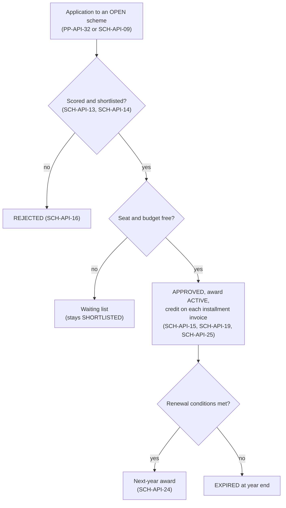
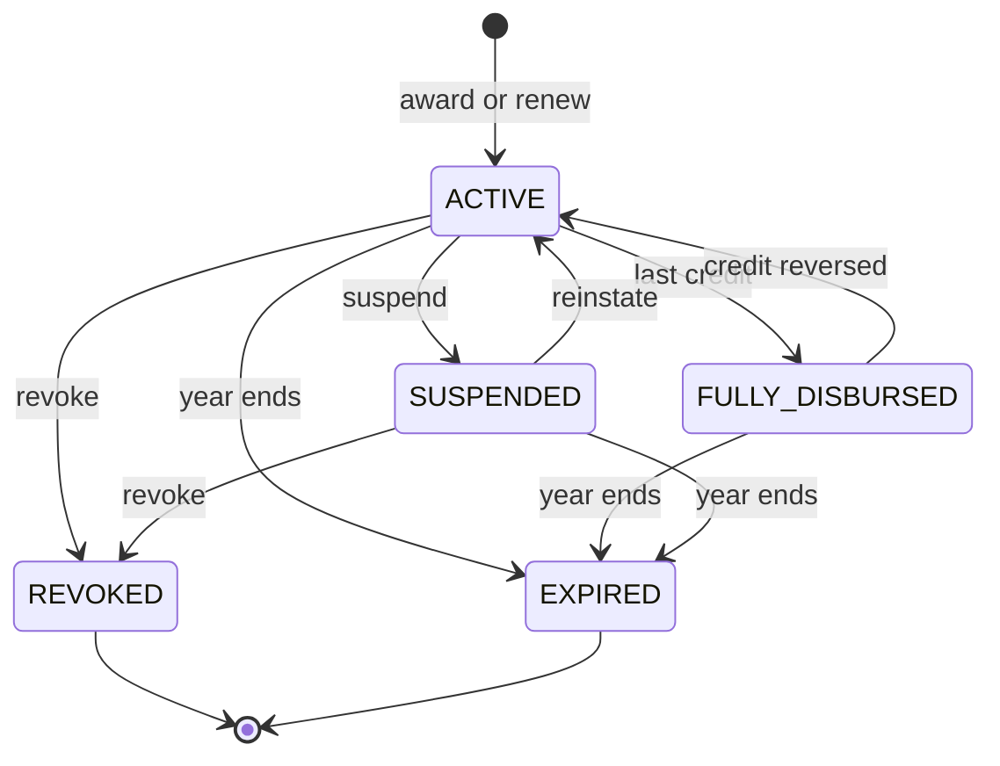
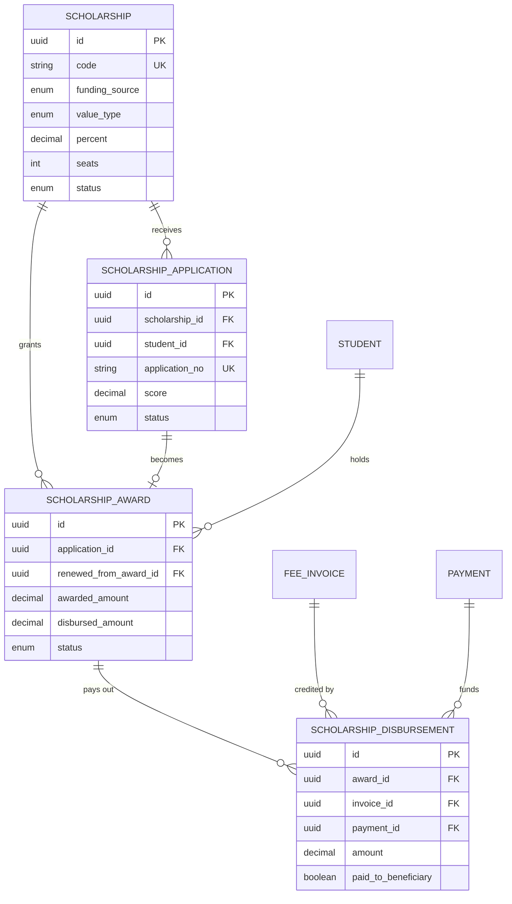

# Scholarships Module

**In simple words:** A scholarship is money support that a student earns or needs: for high marks, low family income or sports, or through a government, trust, donor or company fund. It is not a price rule like a discount. The family applies with proof, a committee scores and selects within a fixed number of seats, and the money reaches the fee invoices one installment at a time. This chapter covers the full chain from scheme to renewal, so every rupee of support can be traced and reported to the person who paid for it.

| Item | Value |
|---|---|
| Module code | SCH |
| Release phase | Phase 2 (V1.0), Day 61 to 120 (4 Dec 2026 to 1 Feb 2027) |
| Plans | Growth, Pro, Enterprise (plan feature `module.SCH`); not on Starter |
| Main users | Organization Admin, Principal, Accountant, Parent |
| Depends on | Fees, Student Profile, Batch, Attendance, Report Cards, Parent Portal, Notifications, Settings |
| Used by | Fees (invoice builder), Parent Portal, Dashboard (review tasks), Analytics |
| Main tables | `scholarships`, `scholarship_applications`, `scholarship_awards`, `scholarship_disbursements` |
| Endpoints | SCH-API-01 to SCH-API-28; parent side PP-API-31 and PP-API-32 |
| Build prompt | P-39 |

## Objective

Institutes run scholarships on paper today. Seats get over-committed, nobody knows which invoice a trust's money paid, and renewal depends on memory. Goals:

1. Every scholarship rupee on an invoice points to one disbursement, award, scheme and funder.
2. Seat and budget limits are never crossed, even when two approvers click at the same second.
3. Sunita Devi applies from her phone in under 5 minutes and sees every status change.
4. Dr. Anita Verma ranks 200 applications by score on one screen.
5. Rajesh Sharma sends a trust or CSR (corporate social responsibility, the legal duty of large Indian companies to fund social causes) funder a utilisation report in one click.
6. Renewal reads attendance and published marks. Nobody re-types results.

### How a scholarship differs from a discount

| Point | Discount (*Discounts Module*) | Scholarship (this module) |
|---|---|---|
| Reason | Price rule: sibling, early bird, staff child | Support for merit, need, sports or a funder's goal |
| Who pays | The institute gives up income | Institute, government, trust, donor or company CSR fund |
| How a student gets it | Staff grant plus one approval | Application, documents, score, committee, seat limit |
| Limits | No seat or budget limit | Seats, maximum per student, optional budget cap |
| Invoice effect | Lowers the price before tax (`discountTotal`) | Pays the bill after tax (`scholarshipCredit`), like a payment |
| Issued invoice | Never changed; needs a concession | Credited any time while a balance is open |
| Duration | Offer window | One academic year; renewal needs attendance and marks |
| Main report | Cost of discounts | Utilisation per funder and scheme |

> **Rule:** If a selection or an outside funder is involved, it is a scholarship. If it is an automatic price rule, it is a discount. A student can have both. The discount applies first, and a percent scholarship is calculated on the fee after the discount (SCH-BR-09).

## Scope

### In scope

- Schemes (value, cap, payable heads, criteria, seats, budget cap, window, renewal) with templates for merit, need-based, sports, government and donor or CSR kinds.
- Applications by staff (SCH-API-09) or parents (PP-API-32) with documents and an eligibility check; committee scoring, shortlist, approval, rejection, withdrawal.
- Awards from an application or direct (government sanction lists), with a calculated amount.
- Credits on each installment invoice (automatic or manual), records of money paid to the family, reversals.
- Renewal on attendance and marks; suspension, reinstatement, revocation; parent view; utilisation and donor reports.

### Out of scope

- Applying on government scholarship portals, collecting donations or issuing donor tax receipts.
- Moving money to families. `paidToBeneficiary` only records a payment made by the funder.
- Price rules (*Discounts Module*); invoice building and cancellation (*Fees Module*).
- A Student Portal view. There is no student endpoint in V1.0.

### Phase notes

| Phase | What ships |
|---|---|
| Phase 2 (V1.0) | Everything in scope |
| Phase 4 (V2.0) | *AI Insights Module* predicts which awards will fail renewal; international income bands |

## User Stories

| ID | As a | I want to | So that | Priority |
|---|---|---|---|---|
| SCH-US-01 | Organization Admin | create a scheme from a template | rules are fixed before anyone applies | Must |
| SCH-US-02 | Organization Admin | open and close the application window | late applications are impossible | Must |
| SCH-US-03 | Parent | apply from my phone with document photos | I need not visit the office | Must |
| SCH-US-04 | Accountant | enter an application for a family at the counter | families without a smartphone are not left out | Must |
| SCH-US-05 | Principal | score applications with remarks and see them ranked | selection is fair and explainable | Must |
| SCH-US-06 | Principal | approve within seats and budget, never my own entries | limits and maker-checker hold | Must |
| SCH-US-07 | Principal | award directly from a government sanction list | outside schemes need no fake application | Should |
| SCH-US-08 | Accountant | have institute awards credited on each installment invoice | I never apply them by hand | Must |
| SCH-US-09 | Accountant | spread one government or trust transfer over many invoices | the bank matches the books | Must |
| SCH-US-10 | Principal | see awards at risk and suspend, reinstate or revoke them | support follows the rules | Must |
| SCH-US-11 | Organization Admin | renew awards that meet attendance and marks | scholars need no new form | Should |
| SCH-US-12 | Organization Admin | get utilisation per funder and scheme and export it | I can report to trusts and CSR partners | Must |
| SCH-US-13 | Parent | see the award and the credit on each invoice | I know what I still have to pay | Must |

## Workflow

### From scheme to money

**Figure: Scholarship flow from scheme to renewal**



The committee selects only while seats and budget last. The award then pays the invoices installment by installment, and at year end it renews or expires.

1. **Scheme.** On 20 February 2027 Rajesh Sharma creates "Merit-cum-Means Scholarship" (`MCM`) at Bright Future Public School: institute-funded, 50% of Tuition, at most ₹30,000, 20 seats, marks 85%+, income up to ₹6,00,000, renewable (SCH-API-02). The 12 continuing scholars from the paper register get direct awards (SCH-API-19). He opens it on 1 March (SCH-API-06).
2. **Apply.** On 12 March Sunita Devi sees `MCM` as "Likely eligible" in the Parent Portal, enters income ₹4,80,000 and Class 9 result 92.40%, photographs two certificates and submits (PP-API-32): `SCH-2027-28-0007`, `SUBMITTED`.
3. **Close.** The window job closes the scheme on 1 April (SCH-BR-04).
4. **Review.** On 15 April Dr. Anita Verma sees a suggested score of 66.20, adds 8 panel points and saves 74.20 (SCH-API-13, SCH-BR-07). She shortlists on 18 April (SCH-API-14).
5. **Approve and award.** On 20 April she approves Aarav Sharma (SCH-API-15); 7 seats remain. The award is ₹16,200, because Q1 was already paid on 10 April (SCH-API-19, SCH-BR-09).
6. **Credit.** On 1 July Q2 invoice `INV-1204` is issued: Tuition ₹12,000, sibling discount ₹1,200, Transport ₹3,000. The builder credits ₹5,400; balance ₹8,400 (SCH-BR-12).
7. **Renew.** In April 2028 the annual card shows 88.50% and attendance 91.2%. Rajesh renews for 2028-29 (SCH-API-24, SCH-BR-20).

### Award status

**Figure: Status of a scholarship award**



Only an `ACTIVE` award pays. A suspended award keeps its seat. Revoked and expired awards are final; renewal creates a new row.

### Status lifecycle

| Record | Status | Set by | Can move to |
|---|---|---|---|
| Scheme | `DRAFT` | SCH-API-02 | `OPEN`, `ARCHIVED` |
| Scheme | `OPEN` | SCH-API-06 | `CLOSED` |
| Scheme | `CLOSED` | SCH-API-07 or window job | `OPEN`, `ARCHIVED` |
| Scheme | `ARCHIVED` | SCH-API-05 | None |
| Application | `DRAFT` | SCH-API-09 (staff only) | `SUBMITTED`, `WITHDRAWN` |
| Application | `SUBMITTED` | SCH-API-12, PP-API-32 | `UNDER_REVIEW`, `REJECTED`, `WITHDRAWN` |
| Application | `UNDER_REVIEW` | SCH-API-13 | `SHORTLISTED`, `APPROVED`, `REJECTED`, `WITHDRAWN` |
| Application | `SHORTLISTED` | SCH-API-14 | `APPROVED`, `REJECTED`, `WITHDRAWN` |
| Application | `APPROVED` | SCH-API-15 | `AWARDED`, `REJECTED`, `WITHDRAWN` |
| Application | `AWARDED` | SCH-API-19 | None |
| Application | `REJECTED`, `WITHDRAWN` | SCH-API-16, SCH-API-17 | None |
| Award | `ACTIVE` | SCH-API-19, SCH-API-22, SCH-API-24 | `FULLY_DISBURSED`, `SUSPENDED`, `REVOKED`, `EXPIRED` |
| Award | `FULLY_DISBURSED` | Last credit | `ACTIVE`, `EXPIRED` |
| Award | `SUSPENDED` | SCH-API-21 | `ACTIVE`, `REVOKED`, `EXPIRED` |
| Award | `REVOKED`, `EXPIRED` | SCH-API-23; year-end job or student left | None |

Parent applications skip `DRAFT`: PP-API-32 creates them as `SUBMITTED`.

## Screens and Wireframes

| ID | Screen | Users | Purpose |
|---|---|---|---|
| SCH-S01 | Schemes | Organization Admin (edit); Principal, Accountant (view) | Schemes with funder, value, seats used and status |
| SCH-S02 | Scheme editor | Organization Admin | Create from a template; value, criteria, seats, window |
| SCH-S03 | Review board | Principal, Accountant, Organization Admin | Ranked applications; shortlist, approve, reject |
| SCH-S04 | Application detail | Principal, Accountant | Documents, eligibility checks, score panel, timeline |
| SCH-S05 | Award detail | Principal, Accountant, Organization Admin | Amount, credits per invoice, suspend, revoke, renew |
| SCH-S06 | Record disbursement (dialog) | Accountant | Manual credit, funder payment or direct-to-family record |
| SCH-S07 | Utilisation report | Organization Admin, Principal, Accountant | Seats, awarded, disbursed and unused per funder |
| SCH-S08 | Scholarships (Parent Portal, mobile) | Parent | Open schemes, apply, status, credits |

**Screen SCH-S02 — Scheme editor (Organization Admin, web)**

```text
+--------------------------------------------------------------------------+
| EduFlow | Bright Future Public School      [Search students...]  (RS) v  |
+------------+-------------------------------------------------------------+
| Dashboard  | Scholarships > Schemes > New scheme                         |
| Students   +-------------------------------------------------------------+
| Fees       | Template [Merit v]   Funding (o) Institute ( ) Government   |
| Discounts  |             ( ) Trust  ( ) Donor  ( ) Company CSR           |
| Scholars. <| Name [Merit-cum-Means Scholarship_]  Code [MCM_____]        |
|  Schemes   | Funder name [______________] (not for Institute)            |
|  Review    | Value (o) Percent [ 50.00 ] %   ( ) Fixed Rs [________]     |
|  Awards    | Max per student Rs [ 30000 ]  Seats [ 20 ] (blank = any)    |
|  Reports   | Pays heads [x] Tuition  [ ] Transport  [ ] Activity         |
| Payments   | Min marks [ 85 ] %    Max family income Rs [ 600000 ]       |
| Settings   | Category [All v]  Courses [All courses v]  [ ] BPL only     |
|            | Proofs [x] Marksheet [x] Income cert. [ ] Category cert.    |
|            | Apply [01-03-2027] to [31-03-2027]   Year [Every year v]    |
|            | [x] Renewable if attendance >= [75]% and marks >= [80]%     |
|            | Budget cap Rs [__________] (optional)                       |
|            |-------------------------------------------------------------|
|            |              [Cancel]  [Save draft]  [Save and open]        |
+------------+-------------------------------------------------------------+
```

- The template pre-fills funding, criteria and proofs (SCH-BR-03). Heads that can never be paid are not offered; money fields lock after the first award (SCH-BR-01).
- "Save draft" calls SCH-API-02 or SCH-API-04; "Save and open" also calls SCH-API-06.

**Screen SCH-S03 — Review board (Principal, web)**

```text
+--------------------------------------------------------------------------+
| EduFlow | Bright Future Public School      [Search students...]  (AV) v  |
+------------+-------------------------------------------------------------+
| Scholars. <| Review > Merit-cum-Means Scholarship (MCM) 2027-28          |
|  Schemes   | Seats 20: awarded 12, approved 0, left 8  Budget: none      |
|  Review    | Status [All v]  Campus [Main v]  Score [>= 60]  [Export]    |
|  Awards    +-------------------------------------------------------------+
|  Reports   |     # Student      Class Marks Income    Score Status       |
|            | [ ] 1 Kavya Rao    10-B  96.20 1,80,000  88.10 Shortlisted  |
|            | [ ] 2 Ishita Jain  10-A  94.00 2,20,000  85.00 Shortlisted  |
|            | [x] 3 Rohan Das    9-C   91.00 1,20,000  83.50 In review    |
|            | [x] 4 Neha Pal     10-B  89.60 2,90,000  82.80 In review    |
|            | [ ] 5 Zoya Khan    9-A   95.80 5,40,000  80.40 In review    |
|            | [x] 6 Aarav Sharma 10-A  92.40 4,80,000  74.20 In review    |
|            | [ ] 7 Dev Mehta    10-C  86.00 5,90,000  63.00 Submitted    |
|            |     ... 24 more                     Page 1 of 4  [<] [>]    |
|            |-------------------------------------------------------------|
|            | Selected: 3   [Shortlist]  [Approve and award]  [Reject]    |
+------------+-------------------------------------------------------------+
```

- Rows come from SCH-API-08, ranked by SCH-BR-07. A click opens SCH-S04, which saves the score (SCH-API-13).
- "Approve and award" calls SCH-API-15 then SCH-API-19 per row and stops at the first seat or budget error. Rows the user submitted cannot be approved (SCH-BR-06).

**Screen SCH-S05 — Award detail (Accountant, web)**

```text
+--------------------------------------------------------------------------+
| EduFlow | Bright Future Public School      [Search students...]  (SG) v  |
+--------------------------------------------------------------------------+
| Awards > Aarav Sharma (BF-2027-0142) - Class 10-A                        |
| Scheme  Merit-cum-Means Scholarship (MCM)   Funding Institute  2027-28   |
| Status  ACTIVE      Awarded 20-04-2027 by Dr. Anita Verma                |
| Amount  Rs 16,200 = 50% of Tuition still to pay (cap Rs 30,000)          |
| Credited Rs 5,400   Left Rs 10,800   Mode: auto credit at invoice issue  |
| Renewal check: attendance 91.2% (need 75)   last result 88.5% (need 80)  |
+--------------------------------------------------------------------------+
| Date        Invoice         Amount    Reference   Status                 |
| 10-04-2027  INV-0588 (Q1)       0.00  -           Paid before award      |
| 01-07-2027  INV-1204 (Q2)   5,400.00  auto        Credited               |
| --          Q3 (Oct)        5,400.00  -           Planned                |
| --          Q4 (Jan)        5,400.00  -           Planned                |
+--------------------------------------------------------------------------+
| Application SCH-2027-28-0007   Score 74.20   Approved by Dr. Anita Verma |
+--------------------------------------------------------------------------+
| [Record disbursement]  [Suspend]  [Revoke]  [Renew for 2028-29]          |
+--------------------------------------------------------------------------+
```

- Data comes from SCH-API-20; "Planned" rows are a forecast (SCH-BR-12), not stored.
- "Record disbursement" opens SCH-S06 (SCH-API-25), hidden for the award's approver. The other buttons call SCH-API-21, SCH-API-23 and SCH-API-24.

**Screen SCH-S08 — Scholarships (Parent, mobile)**

```text
+------------------------------------+
| < Requests          Scholarships   |
| Child [Aarav Sharma - 10-A v]      |
+------------------------------------+
| OPEN NOW                           |
| Sports Excellence Award 2027       |
| Rs 10,000 for state-level players  |
| Last date 31 Jul 2027              |
| Needs: sports certificate  [Apply] |
+------------------------------------+
| MY APPLICATIONS                    |
| SCH-2027-28-0007  Merit-cum-Means  |
| [x] Submitted          12 Mar 2027 |
| [x] Under review       15 Apr 2027 |
| [x] Shortlisted        18 Apr 2027 |
| [x] Awarded            20 Apr 2027 |
| Award for 2027-28      Rs 16,200   |
| Credited so far        Rs  5,400   |
|   INV-1204 (Q2)        Rs  5,400   |
| Next credit: Q3 invoice in October |
|           [View award details >]   |
+------------------------------------+
```

- Part of *Requests* (PP-S15). Data from PP-API-31; "Apply" opens a 3-step form that posts to PP-API-32.
- Parents see status, award, credits and rejection remarks, never scores or other applicants.

## UI Components

| Component | Type | Behaviour |
|---|---|---|
| `SchemeTemplatePicker` | Radio cards | Pre-fills a kind; switching asks for confirmation |
| `EligibilityChecklist` | Pass or fail list | One line per SCH-BR-05 check; submit disabled on a failure |
| `DocumentUploader` | File input with preview | PDF, JPG, PNG up to 5 MB; camera on mobile; reuses student documents |
| `ScoreBreakdown` | Card with number input | Merit, need, panel and total; a manual total needs a remark |
| `RankedApplicationsTable` | Data table (TanStack Table) | Server sort by score; bulk select |
| `SeatMeter` | Progress bar | Awarded, approved and free seats; budget used |
| `AwardActionDialog` | Confirm dialog | Reason field; lists the invoices affected |

Lists show skeletons while loading, an empty state ("No applications yet.") and an error toast with the `requestId`.

## Validation Rules

| Field | Rule | Error message shown to user |
|---|---|---|
| Scheme `name` | 3 to 150 characters | "Scheme name must be 3 to 150 characters." |
| Scheme `code` | 2 to 30 characters: A-Z, 0-9 and "-"; unique | "Use capital letters, digits and '-' only." / "This code is already used." |
| `funderName` | Required unless `fundingSource` is `INSTITUTE` | "Enter the name of the funder." |
| `percent` | `PERCENT` only; 0.01 to 100 | "Enter a percent between 0.01 and 100." |
| `amount` | `FIXED` only; above 0 | "Enter an amount above 0." |
| `maxAmountPerStudent` | Empty or above 0; for `FIXED` not below `amount` | "The maximum cannot be lower than the amount." |
| `feeHeadIds` | Active heads; SCH-BR-01 exclusions | "Scholarships cannot pay fines, deposits, arrears or bounce charges." |
| `seats` | Empty or 1 to 10,000; not below seats awarded | "12 seats are already awarded. Seats cannot be lower." |
| Application window | End on or after start | "The last date must be on or after the start date." |
| `statement` | 50 to 2,000 characters at submit | "Write at least 50 characters on why the student needs support." |
| `familyIncome` | Required with `maxFamilyIncome`; 0 or more | "Enter the family's yearly income." |
| `lastPercentage` | Required with `minPercentage`; 0 to 100 | "Enter the last exam percentage (0 to 100)." |
| `documents` | Required types; PDF, JPG, PNG; 5 MB each; 8 files | "Upload the income certificate." |
| `score` | 0 to 100, two decimals | "Score must be between 0 and 100." |
| `reviewRemarks` | Required on reject; 10 to 500 characters | "Give a reason for the rejection (at least 10 characters)." |
| Award `awardedAmount` | Above 0; not above the calculated amount | "The amount cannot be more than Rs {max}." |
| Suspend, revoke, reversal reason | 10 to 255 characters | "Give a reason (at least 10 characters)." |
| Disbursement `amount` | Above 0; within the SCH-BR-13 limits | "Only Rs {max} can be credited to this invoice." |
| `disbursedOn` | Not in the future; inside the award's academic year | "The date must be inside 2027-28 and not in the future." |
| `reference` | Required for `GOVERNMENT` and `TRUST`; up to 100 characters | "Enter the sanction or bank transfer reference." |

## Business Rules

### Scheme rules

**SCH-BR-01 — Ownership and lock.** Schemes are organization-wide, so only ORG_ADMIN manages them. Value type, amount, percent, cap, heads and currency lock at the first award; to change them, create a new scheme. A scheme never pays `FINE`, `CAUTION_DEPOSIT`, `ARREARS` or `CHEQUE_BOUNCE_CHARGE` heads, or a late fee. Empty `feeHeadIds` means every other head.

**SCH-BR-02 — Criteria JSON.** One shared Zod schema validates `criteria`; unknown keys are refused.

```typescript
import { z } from 'zod';

const money = z.string().regex(/^\d{1,10}(\.\d{1,2})?$/); // decimals travel as strings

export const scholarshipCriteria = z.object({
  kind: z.enum(['MERIT', 'NEED', 'SPORTS', 'GOVERNMENT', 'DONOR', 'OTHER']),
  minPercentage: z.number().min(0).max(100).optional(),
  maxFamilyIncome: money.optional(),
  categories: z.array(z.enum(['GENERAL', 'OBC', 'SC', 'ST', 'EWS', 'OTHER'])).default([]),
  courseIds: z.array(z.string().uuid()).default([]),
  bplOnly: z.boolean().default(false), // Student.isBpl must be true
  requiredDocuments: z.array(z.enum(['MARKSHEET', 'INCOME_CERTIFICATE',
    'CATEGORY_CERTIFICATE', 'ID_PROOF', 'OTHER'])).default([]),
  budgetCap: money.optional(), // yearly ceiling in the scheme currency
  renewal: z.object({
    minAttendancePercent: z.number().min(0).max(100),
    minPercentage: z.number().min(0).max(100),
  }).optional(),
}).strict();
```

**SCH-BR-03 — Templates.** A template only pre-fills the form.

| Kind | Funding source | Pre-filled criteria | Required proofs |
|---|---|---|---|
| Merit | `INSTITUTE` | `minPercentage` 85 | `MARKSHEET` |
| Need-based | `INSTITUTE` | `maxFamilyIncome` 3,00,000 | `INCOME_CERTIFICATE` |
| Sports | `INSTITUTE` | None; scored by hand | `OTHER` (district-level sports certificate or higher) |
| Government | `GOVERNMENT` | `maxFamilyIncome` 2,50,000; notified categories | `INCOME_CERTIFICATE`, `CATEGORY_CERTIFICATE` |
| Donor or CSR | `DONOR`, `CORPORATE_CSR` | As agreed; `budgetCap` suggested | As agreed |

**SCH-BR-04 — Window and status.** Opening needs a value and an end date of today or later. The job `sch-window` (00:30 local time) closes `OPEN` schemes past their end date. Applications need `OPEN` and today inside the window; direct awards also work when `CLOSED`. Archive needs `DRAFT` or `CLOSED`, no application in review and no `ACTIVE` or `SUSPENDED` award.

### Application and review rules

**SCH-BR-05 — Eligibility.** Submit checks: student `ACTIVE`; course in `courseIds`; `Student.category` in `categories`; `Student.isBpl` when `bplOnly`; `lastPercentage` ≥ `minPercentage`; `familyIncome` ≤ `maxFamilyIncome`; every required document. Empty lists mean "all". Failures answer `422` with one `details` line each. The form pre-fills income from the fee payer's `Guardian.annualIncome` and the percentage from the latest `PUBLISHED` report card.

**SCH-BR-06 — Numbers and maker-checker.** One application per student, scheme and year. `applicationNo` uses the `OTHER` number sequence, prefix `SCH`, format `{PREFIX}-{AY}-{SEQ}` (`SCH-2027-28-0007`). The `submittedById` user cannot approve the application; the award's `approvedById` user cannot record its manual disbursements. Both get `422` "You cannot approve your own request". System credits (`createdById` null) are exempt.

**SCH-BR-07 — Suggested score and ranking.** The committee may change the suggested total, with a remark.

```text
merit = lastPercentage x 0.5                              (max 50)
need  = 40 if income <= 1,00,000;  30 if <= 2,50,000;
        20 if <= 5,00,000;         10 if <= 8,00,000;  else 0
panel = 0 to 10, given by the committee
score = merit + need + panel
```

> **Example:** Aarav Sharma: merit 92.40 x 0.5 = 46.20; income ₹4,80,000 gives need 20; suggested 66.20. Dr. Verma adds panel 8: `score` 74.20. Ranking: `score`, then `lastPercentage` (both high first), then earliest `submittedAt`. Sports schemes skip the formula.

### Seats, budget and award rules

**SCH-BR-08 — Seat and budget check.** SCH-API-15 and SCH-API-19 lock the scheme row (`SELECT ... FOR UPDATE`) and count, for the award's year, awards not `REVOKED` plus `APPROVED` applications. At `seats` the call fails. Committed money = `awardedAmount` of `ACTIVE`, `SUSPENDED` and `FULLY_DISBURSED` awards + `disbursedAmount` of `REVOKED` and `EXPIRED` ones; an award fails when it would push this above `budgetCap`. `seatsAwarded` caches the latest year's count.

> **Example:** Sharma Classes runs donor scheme `RPS-MEM` ("R. P. Sharma Memorial Fund"): fixed ₹24,000, 10 seats, cap ₹2,00,000. After 8 awards ₹1,92,000 is committed. A 9th award of ₹24,000 would reach ₹2,16,000, so it fails although 2 seats are free. ₹8,000 fits exactly.

**SCH-BR-09 — Award amount.** A scholarship pays what is still to pay in the year; it never refunds paid fees.

```text
FIXED:   awardedAmount = min(amount, maxAmountPerStudent)
PERCENT: base = covered net fee (after discounts, with tax) of
                installments not yet invoiced
              + open balance of covered lines on issued invoices
         awardedAmount = min(base x percent / 100, maxAmountPerStudent)
```

The base comes from the Fees preview engine (the invoice builder code), so `PERCENT` needs an `ACTIVE` fee assignment. The approver may lower the amount, never raise it. `validTo` is the last day of the academic year.

> **Example:** Aarav's Tuition is ₹12,000 a quarter less 10% sibling discount = ₹10,800. Q1 (`INV-0588`) was paid on 10 April, before the award. Base = 3 x 10,800 = ₹32,400; 50% = ₹16,200, under the cap.

### Disbursement rules

**SCH-BR-10 — Credit mode by funding source.**

| Funding source | Credit mode | Why |
|---|---|---|
| `INSTITUTE` | Automatic at invoice issue | Own money; no waiting |
| `DONOR`, `CORPORATE_CSR` | Automatic at invoice issue | Assumption: the fund arrives before awards |
| `GOVERNMENT`, `TRUST` | Manual (SCH-API-25) on arrival | Release dates are uncertain; no credit that may never come |
| Any, paid to the family | Manual record, `paidToBeneficiary` | Money went to the family's bank account |

**SCH-BR-11 — Automatic credit.** At issue the invoice builder runs step 4 of FEE-BR-09 (*Fees Module*) for every automatic `ACTIVE` award of the student and year. After an award or reinstatement, job `sch-credit-open` credits issued invoices that still have a balance.

**SCH-BR-12 — Credit per installment.** `covered` = net (after discount, with tax) of the lines the scheme may pay. `openSlots` = this invoice + other uncredited open invoices + uninvoiced installments of the year.

```typescript
import { Prisma } from '@prisma/client';
const D = Prisma.Decimal;

type AwardMoney = {
  awardedAmount: Prisma.Decimal;
  awardedPercent: Prisma.Decimal | null;
  disbursedAmount: Prisma.Decimal;
};

export function installmentCredit(
  award: AwardMoney, covered: Prisma.Decimal, balance: Prisma.Decimal, openSlots: number,
): Prisma.Decimal {
  const remaining = award.awardedAmount.minus(award.disbursedAmount);
  if (remaining.lte(0) || covered.lte(0) || balance.lte(0)) return new D(0);
  const raw = award.awardedPercent
    ? covered.mul(award.awardedPercent).div(100)
    : remaining.div(Math.max(openSlots, 1)); // FIXED: spread evenly, last slot takes the rest
  const credit = raw.toDecimalPlaces(2, D.ROUND_HALF_UP);
  return D.min(credit, remaining, covered, balance);
}
```

> **Example (percent):** Aarav's Q2 `INV-1204`: Tuition 12,000 - 1,200 = 10,800 covered; Transport 3,000 not covered; total ₹13,800. Credit = 10,800 x 50% = ₹5,400. Balance = 13,800 - 5,400 = ₹8,400.

> **Example (fixed, with GST):** Meera Kumari, Sharma Classes, JEE Main 2028: 4 installments of ₹30,000 + 18% GST = ₹35,400. `RPS-MEM` ₹24,000 over 4 slots = ₹6,000 each. Invoice 1: GST ₹5,400 unchanged, credit ₹6,000, balance ₹29,400. A scholarship pays the bill; it does not lower the taxable value.

**SCH-BR-13 — Manual credit (SCH-API-25).** Award `ACTIVE`; invoice of the same student, year and currency, status `ISSUED`, `PARTIALLY_PAID` or `OVERDUE`; amount ≤ min(remaining, balance, covered); one active credit per award and invoice. When the funder paid the institute, the call creates one `Payment` (`purpose = OTHER`, `BANK_TRANSFER`, `studentId` null, `payerName` = funder, `reference` = UTR, the bank transfer number) or reuses its `paymentId`. Linked credits never exceed `payment.amount`. That Payment has no allocations, and its unused part is not an advance.

> **Example:** The State Education Department sends ₹1,50,000 in one transfer for 15 students (₹10,000 each). Suresh Gupta records the first with `funderPayment` and the other 14 with the returned `paymentId`.

**SCH-BR-14 — One transaction per credit.** Lock the award, then the invoice (payments lock only the invoice, so no deadlock). Insert the disbursement; update `scholarshipCredit`, `balance`, status (FEE-BR-13) and `appliedDiscounts` (`{ scholarshipAwardId, name, amount }`); add to `disbursedAmount`; set `FULLY_DISBURSED` when it reaches `awardedAmount`. A retry hitting the unique index (Prisma `P2002`) counts as "already credited".

**SCH-BR-15 — Reversal.** SCH-API-26, invoice cancellation (FEE-API-29) and revocation set `reversedAt` and `reversalReason`, reduce the invoice credit and `disbursedAmount`, and turn `FULLY_DISBURSED` back into `ACTIVE`. Reversal on a `PAID` invoice reopens its balance; the dialog warns and the guardian is told. A linked Payment keeps the money as unused.

### Status and renewal rules

**SCH-BR-16 — At-risk check.** Job `sch-condition-check` (02:30) compares renewable awards with `criteria.renewal`, using attendance so far and the latest `PUBLISHED` report card. Failing awards get `atRisk=true` and a reason. EduFlow never suspends by itself; illness can explain a dip, so the Principal decides.

**SCH-BR-17 — Suspend and reinstate.** `SUSPENDED` stops credits and keeps the seat; the reason goes to `notes` and the audit log. Reinstate runs `sch-credit-open` for invoices issued meanwhile.

**SCH-BR-18 — Revoke.** Sets `REVOKED`, `revokedAt` and `revokeReason`, reverses credits on invoices not `PAID`, and releases the seat. Credits on `PAID` invoices stay; recovery is a debit correction (FEE-API-33).

> **Example:** Meera has ₹6,000 credits on invoice 1 (`PAID`) and invoice 2 (`ISSUED`). Revocation on 10 October 2027 reverses invoice 2 (balance ₹29,400 to ₹35,400). `disbursedAmount` falls to ₹6,000, which stays committed against the cap.

**SCH-BR-19 — Expiry and leavers.** Job `sch-expire` sets `EXPIRED` after `validTo`. A student who becomes `TRANSFERRED`, `DROPPED_OUT` or `EXPELLED` has the award expire on the leaving date. Unused money shows in utilisation.

**SCH-BR-20 — Renewal.** Needs `isRenewable`; old award `ACTIVE`, `FULLY_DISBURSED` or `EXPIRED`; student enrolled in the new year; no earlier renewal (`renewedFromAwardId` is unique); seat and budget (SCH-BR-08). Conditions come from the `ANNUAL` report card (`percentage`, `attendanceSummary.percent`), or in coaching from the latest `PUBLISHED` card and attendance records. The approver may override a failure with a reason. The amount is recalculated (SCH-BR-09). Renewals may run before the scheme reopens, so continuing scholars keep their seats.

> **Example:** Aarav's annual card: 88.50% (needs 80), attendance 91.2% (needs 75). 2028-29 Tuition ₹14,000 a quarter less 10% = ₹12,600; x 4 = ₹50,400; 50% = ₹25,200 new award.

## Acceptance Criteria

| ID | Given | When | Then |
|---|---|---|---|
| SCH-AC-01 | `MCM` is `DRAFT`, end date ahead | Rajesh opens it | `OPEN`; eligible parents get `scholarship.opened` |
| SCH-AC-02 | `MCM` ended on 31 March | The window job runs on 1 April | `CLOSED`; PP-API-32 answers `422` |
| SCH-AC-03 | Income ₹7,20,000 against a ₹6,00,000 limit | Sunita submits | `422` with the income check in `details` |
| SCH-AC-04 | Aarav has an `MCM` application for 2027-28 | Staff create another | `409 CONFLICT` |
| SCH-AC-05 | Suresh submitted Riya's application | Suresh approves it | `422` "You cannot approve your own request" |
| SCH-AC-06 | 19 of 20 seats counted | Two approvals at the same moment | One `APPROVED`; one `422` "All 20 seats are taken" |
| SCH-AC-07 | ₹1,92,000 of a ₹2,00,000 cap committed | A ₹24,000 award | `422` naming the ₹16,000 excess |
| SCH-AC-08 | Q1 paid, Q2 to Q4 not invoiced | Aarav is awarded `MCM` | `awardedAmount` 16200.00 |
| SCH-AC-09 | Aarav's award is `ACTIVE` | Q2 `INV-1204` is issued | `scholarshipCredit` 5400.00, balance 8400.00 |
| SCH-AC-10 | A credit job is retried | It runs twice | One active disbursement |
| SCH-AC-11 | A `GOVERNMENT` award | An invoice is issued | No automatic credit |
| SCH-AC-12 | A ₹1,50,000 funder payment has ₹1,40,000 used | ₹20,000 more is credited from it | `422`; ₹10,000 is left |
| SCH-AC-13 | Credits on a `PAID` and an `ISSUED` invoice | The award is revoked | Only the `ISSUED` credit is reversed; seat released |
| SCH-AC-14 | An award is `SUSPENDED` | An invoice is issued | No credit until reinstatement |
| SCH-AC-15 | Aarav meets both renewal conditions | Rajesh renews for 2028-29 | New award 25200.00 with `renewedFromAwardId` |
| SCH-AC-16 | Sunita is signed in | She calls PP-API-31 | Own children only; no score, no other family |
| SCH-AC-17 | The organization is on Starter | Any SCH endpoint is called | `403 PLAN_LIMIT_REACHED` |

## Edge Cases

| Case | What happens | How the system handles it |
|---|---|---|
| Invoice paid in full before the award | Nothing to credit | Left out of the base (SCH-BR-09); shown as "Paid before award" |
| Fee assignment changes after the award | Covered amount changes | `awardedAmount` stays; each credit is capped by covered, balance and remaining |
| Credited invoice is cancelled and reissued | Credit must move | FEE-API-29 reverses it; the new invoice is credited at issue |
| Part payment leaves less balance than the planned credit | Overpayment risk | Credit = min(..., balance); the rest moves to later installments |
| Student changes campus mid-year | Scopes differ | The award keeps its campus; new invoices carry the new one; both principals can view |
| Student leaves in October | Credits must stop | Award `EXPIRED` on the leaving date (SCH-BR-19); unused money reported |
| Blurred certificate after submit | Review stalls | Staff replace the document with SCH-API-11 before a decision; a second application is blocked by the unique key |
| Only one ORG_ADMIN, no Principal | Self-approval is blocked | Hint "Add a Principal or second admin to approve"; no bypass |
| Discount and scholarship together | Order matters | Discount at issue first, scholarship credit after tax (SCH-BR-12) |

## Database Schema

Four tenant tables in `08-fees.prisma`, with Row-Level Security (*Multi-Tenancy and Data Isolation*). Invoice money columns change only through the Fees service; `payments` rows only through SCH-API-25.

| Table | Purpose |
|---|---|
| `scholarships` | Scheme: funder, value, criteria, seats, window |
| `scholarship_applications` | One student's application with documents, score and review |
| `scholarship_awards` | Scholarship granted to one student for one academic year |
| `scholarship_disbursements` | One credit to an invoice, or one record of money paid to the family |

Every table also has `id` (uuid, PK), `organization_id` (uuid, FK `organizations`), `created_at` and `updated_at`; the first three have `deleted_at`. In key lists, org = `organization_id`.

### scholarships

| Column | Type | Null | Default | Notes |
|---|---|---|---|---|
| `academic_year_id` | uuid | Yes | | FK `academic_years`, set null; null = every year |
| `name`, `code` | varchar(150), varchar(30) | No | | Code unique per organization |
| `scheme_name`, `description` | varchar(150), text | Yes | | Official scheme name; text for parents |
| `funding_source` | ScholarshipFundingSource | No | INSTITUTE | Credit mode (SCH-BR-10) |
| `funder_name` | varchar(150) | Yes | | Required unless INSTITUTE |
| `value_type` | DiscountType | No | | PERCENT or FIXED |
| `amount`, `percent` | decimal(12,2), decimal(5,2) | Yes | | One of them, by `value_type` |
| `currency` | char(3) | No | | Organization currency |
| `max_amount_per_student` | decimal(12,2) | Yes | | Yearly cap per student |
| `fee_head_ids` | uuid[] | No | | Payable heads; empty = all allowed |
| `criteria` | jsonb | Yes | | SCH-BR-02 |
| `seats`, `seats_awarded` | integer | Yes, No | -, 0 | Null seats = unlimited |
| `application_start_date`, `application_end_date` | date | Yes | | Window |
| `is_renewable` | boolean | No | false | SCH-BR-20 |
| `status` | ScholarshipStatus | No | DRAFT | Lifecycle table |

Keys: unique (org, `code`); index (org, `status`, `application_end_date`).

### scholarship_applications

| Column | Type | Null | Default | Notes |
|---|---|---|---|---|
| `campus_id` | uuid | No | | FK `campuses`; the student's campus |
| `scholarship_id`, `student_id`, `academic_year_id` | uuid | No | | FKs, restrict on delete |
| `application_no` | varchar(30) | No | | SCH-BR-06 |
| `status` | ScholarshipApplicationStatus | No | DRAFT | Lifecycle table |
| `statement` | text | Yes | | Why the student needs it |
| `family_income`, `currency` | decimal(12,2), char(3) | Yes | | Declared yearly income |
| `last_percentage` | decimal(5,2) | Yes | | Merit input |
| `documents` | jsonb | Yes | | `[{ type, title, fileId }]` |
| `score` | decimal(6,2) | Yes | | 0 to 100 (service rule) |
| `submitted_at`, `submitted_by_id` | timestamptz, uuid | Yes | | Submitter, audit only |
| `reviewed_by_id`, `reviewed_at`, `review_remarks` | uuid, timestamptz, varchar(500) | Yes | | FK `users`, set null |

Keys: unique (org, `application_no`) and (org, `scholarship_id`, `student_id`, `academic_year_id`); indexes (org, `scholarship_id`, `status`, `score`), (org, `student_id`), (org, `campus_id`, `status`).

### scholarship_awards

| Column | Type | Null | Default | Notes |
|---|---|---|---|---|
| `campus_id`, `scholarship_id`, `student_id`, `academic_year_id` | uuid | No | | FKs, restrict on delete |
| `application_id` | uuid | Yes | | Unique; FK, set null; null = direct award |
| `awarded_amount`, `awarded_percent` | decimal(12,2), decimal(5,2) | No, Yes | | SCH-BR-09 |
| `disbursed_amount` | decimal(12,2) | No | 0 | Sum of active disbursements |
| `currency` | char(3) | No | | Scheme currency |
| `status` | ScholarshipAwardStatus | No | ACTIVE | Lifecycle table |
| `awarded_on`, `valid_from`, `valid_to` | date | No, Yes, Yes | | Validity |
| `approved_by_id` | uuid | Yes | | FK `users`, set null |
| `renewed_from_award_id` | uuid | Yes | | Unique; self FK, set null |
| `revoked_at`, `revoke_reason` | timestamptz, varchar(255) | Yes | | SCH-BR-18 |
| `notes` | varchar(500) | Yes | | Also suspension reasons |

Keys: unique (org, `scholarship_id`, `student_id`, `academic_year_id`); indexes (org, `student_id`, `status`), (org, `campus_id`, `academic_year_id`, `status`).

### scholarship_disbursements

| Column | Type | Null | Default | Notes |
|---|---|---|---|---|
| `campus_id`, `award_id`, `student_id` | uuid | No | | FKs, restrict; student copied from the award |
| `invoice_id` | uuid | Yes | | FK `fee_invoices`, restrict; null when paid to the family |
| `paid_to_beneficiary` | boolean | No | false | SCH-BR-10 |
| `payment_id` | uuid | Yes | | FK `payments`; funder transfer |
| `amount`, `currency` | decimal(12,2), char(3) | No | | Above 0 |
| `disbursed_on` | date | No | | Day of credit or transfer |
| `reference` | varchar(100) | Yes | | Sanction number or UTR |
| `reversed_at`, `reversal_reason` | timestamptz, varchar(255) | Yes | | SCH-BR-15 |
| `created_by_id` | uuid | Yes | | Audit only; null = system credit |

Keys: indexes (org, `award_id`), (org, `invoice_id`), (org, `student_id`), (org, `campus_id`, `disbursed_on`), (org, `payment_id`). Credits are reversed, never deleted.

The SQL migration adds what Prisma cannot express:

```sql
CREATE UNIQUE INDEX uq_disbursement_active
  ON scholarship_disbursements (organization_id, award_id, invoice_id)
  WHERE reversed_at IS NULL; -- NULL invoice_id rows (paid to family) never collide

ALTER TABLE scholarships
  ADD CONSTRAINT ck_scholarship_value CHECK (
    (value_type = 'PERCENT' AND percent > 0 AND percent <= 100)
    OR (value_type = 'FIXED' AND amount > 0)),
  ADD CONSTRAINT ck_scholarship_seats CHECK (seats IS NULL OR seats_awarded <= seats);

ALTER TABLE scholarship_awards
  ADD CONSTRAINT ck_award_money CHECK (awarded_amount > 0
    AND disbursed_amount >= 0 AND disbursed_amount <= awarded_amount);

ALTER TABLE scholarship_disbursements
  ADD CONSTRAINT ck_disbursement_amount CHECK (amount > 0),
  ADD CONSTRAINT ck_disbursement_target CHECK (
    (paid_to_beneficiary AND invoice_id IS NULL)
    OR (NOT paid_to_beneficiary AND invoice_id IS NOT NULL));
```

**Figure: Scholarship tables and their links**



A scheme receives applications and grants awards; an award pays out through disbursements. Each disbursement credits one invoice, and may point to the funder's payment.

## Prisma Schema

Copied from `08-fees.prisma`. Long end-of-line comments sit on the line above the field; nothing is renamed or left out.

```prisma
enum ScholarshipFundingSource {
  INSTITUTE
  GOVERNMENT
  TRUST
  DONOR
  CORPORATE_CSR
}

enum ScholarshipStatus {
  DRAFT
  OPEN // accepting applications
  CLOSED
  ARCHIVED
}

// Lifecycle: DRAFT -> SUBMITTED -> UNDER_REVIEW -> SHORTLISTED -> APPROVED -> AWARDED,
// or REJECTED / WITHDRAWN.
enum ScholarshipApplicationStatus {
  DRAFT
  SUBMITTED
  UNDER_REVIEW
  SHORTLISTED
  APPROVED
  AWARDED
  REJECTED
  WITHDRAWN
}

enum ScholarshipAwardStatus {
  ACTIVE
  FULLY_DISBURSED
  SUSPENDED
  REVOKED
  EXPIRED
}

// Scholarship scheme with funding source, eligibility criteria, seats and value.
model Scholarship {
  id                   String                   @id @default(uuid()) @db.Uuid
  organizationId       String                   @map("organization_id") @db.Uuid
  // null = runs every year
  academicYearId       String?                  @map("academic_year_id") @db.Uuid
  name                 String                   @db.VarChar(150)
  code                 String                   @db.VarChar(30)
  // official scheme, e.g. a state post-matric scholarship
  schemeName           String?                  @map("scheme_name") @db.VarChar(150)
  description          String?                  @db.Text
  fundingSource        ScholarshipFundingSource @default(INSTITUTE) @map("funding_source")
  funderName           String?                  @map("funder_name") @db.VarChar(150)
  valueType            DiscountType             @map("value_type") // PERCENT of fees or FIXED amount
  amount               Decimal?                 @db.Decimal(12, 2) // FIXED value per student per year
  percent              Decimal?                 @db.Decimal(5, 2) // PERCENT value
  currency             String                   @db.Char(3)
  maxAmountPerStudent  Decimal?                 @map("max_amount_per_student") @db.Decimal(12, 2)
  // heads the scholarship may pay; empty = all
  feeHeadIds           String[]                 @map("fee_head_ids") @db.Uuid
  criteria             Json? // { minPercentage, maxFamilyIncome, categories: [...], courseIds: [...] }
  seats                Int? // null = unlimited
  seatsAwarded         Int                      @default(0) @map("seats_awarded")
  applicationStartDate DateTime?                @map("application_start_date") @db.Date
  applicationEndDate   DateTime?                @map("application_end_date") @db.Date
  isRenewable          Boolean                  @default(false) @map("is_renewable")
  status               ScholarshipStatus        @default(DRAFT)
  createdAt            DateTime                 @default(now()) @map("created_at") @db.Timestamptz(6)
  updatedAt            DateTime                 @updatedAt @map("updated_at") @db.Timestamptz(6)
  deletedAt            DateTime?                @map("deleted_at") @db.Timestamptz(6)

  organization Organization @relation(fields: [organizationId], references: [id], onDelete: Restrict)
  academicYear AcademicYear? @relation(fields: [academicYearId], references: [id], onDelete: SetNull)
  applications ScholarshipApplication[]
  awards       ScholarshipAward[]

  @@unique([organizationId, code])
  @@index([organizationId, status, applicationEndDate])
  @@map("scholarships")
}

// A student's application to a scholarship with documents, score and review decision.
model ScholarshipApplication {
  id             String                       @id @default(uuid()) @db.Uuid
  organizationId String                       @map("organization_id") @db.Uuid
  campusId       String                       @map("campus_id") @db.Uuid
  scholarshipId  String                       @map("scholarship_id") @db.Uuid
  studentId      String                       @map("student_id") @db.Uuid
  academicYearId String                       @map("academic_year_id") @db.Uuid
  applicationNo  String                       @map("application_no") @db.VarChar(30)
  status         ScholarshipApplicationStatus @default(DRAFT)
  statement      String?                      @db.Text // why the student needs / deserves it
  // declared annual income
  familyIncome   Decimal?                     @map("family_income") @db.Decimal(12, 2)
  currency       String?                      @db.Char(3)
  // last exam result used for merit
  lastPercentage Decimal?                     @map("last_percentage") @db.Decimal(5, 2)
  documents      Json? // [{ type, title, fileId }] FileAsset ids of income / category / marksheet proofs
  score          Decimal?                     @db.Decimal(6, 2) // committee score used for ranking
  submittedAt    DateTime?                    @map("submitted_at") @db.Timestamptz(6)
  // User id of the parent or staff (audit only, no FK)
  submittedById  String?                      @map("submitted_by_id") @db.Uuid
  reviewedById   String?                      @map("reviewed_by_id") @db.Uuid
  reviewedAt     DateTime?                    @map("reviewed_at") @db.Timestamptz(6)
  reviewRemarks  String?                      @map("review_remarks") @db.VarChar(500)
  createdAt      DateTime                     @default(now()) @map("created_at") @db.Timestamptz(6)
  updatedAt      DateTime                     @updatedAt @map("updated_at") @db.Timestamptz(6)
  deletedAt      DateTime?                    @map("deleted_at") @db.Timestamptz(6)

  organization Organization      @relation(fields: [organizationId], references: [id], onDelete: Restrict)
  campus       Campus            @relation(fields: [campusId], references: [id], onDelete: Restrict)
  scholarship  Scholarship       @relation(fields: [scholarshipId], references: [id], onDelete: Restrict)
  student      Student           @relation(fields: [studentId], references: [id], onDelete: Restrict)
  academicYear AcademicYear      @relation(fields: [academicYearId], references: [id], onDelete: Restrict)
  reviewedBy   User?             @relation(fields: [reviewedById], references: [id], onDelete: SetNull)
  award        ScholarshipAward?

  @@unique([organizationId, applicationNo])
  @@unique([organizationId, scholarshipId, studentId, academicYearId])
  @@index([organizationId, scholarshipId, status, score])
  @@index([organizationId, studentId])
  @@index([organizationId, campusId, status])
  @@map("scholarship_applications")
}

// Scholarship granted to a student for a year; money reaches invoices through ScholarshipDisbursement.
model ScholarshipAward {
  id                 String                 @id @default(uuid()) @db.Uuid
  organizationId     String                 @map("organization_id") @db.Uuid
  campusId           String                 @map("campus_id") @db.Uuid
  scholarshipId      String                 @map("scholarship_id") @db.Uuid
  // null when awarded directly without an application
  applicationId      String?                @unique @map("application_id") @db.Uuid
  studentId          String                 @map("student_id") @db.Uuid
  academicYearId     String                 @map("academic_year_id") @db.Uuid
  // total value for the year
  awardedAmount      Decimal                @map("awarded_amount") @db.Decimal(12, 2)
  // when the scheme is PERCENT
  awardedPercent     Decimal?               @map("awarded_percent") @db.Decimal(5, 2)
  // sum of active disbursements
  disbursedAmount    Decimal                @default(0) @map("disbursed_amount") @db.Decimal(12, 2)
  currency           String                 @db.Char(3)
  status             ScholarshipAwardStatus @default(ACTIVE)
  awardedOn          DateTime               @map("awarded_on") @db.Date
  validFrom          DateTime?              @map("valid_from") @db.Date
  validTo            DateTime?              @map("valid_to") @db.Date
  approvedById       String?                @map("approved_by_id") @db.Uuid
  // previous year's award that this one renews
  renewedFromAwardId String?                @unique @map("renewed_from_award_id") @db.Uuid
  revokedAt          DateTime?              @map("revoked_at") @db.Timestamptz(6)
  revokeReason       String?                @map("revoke_reason") @db.VarChar(255)
  notes              String?                @db.VarChar(500)
  createdAt          DateTime               @default(now()) @map("created_at") @db.Timestamptz(6)
  updatedAt          DateTime               @updatedAt @map("updated_at") @db.Timestamptz(6)
  deletedAt          DateTime?              @map("deleted_at") @db.Timestamptz(6)

  organization Organization @relation(fields: [organizationId], references: [id], onDelete: Restrict)
  campus Campus @relation(fields: [campusId], references: [id], onDelete: Restrict)
  scholarship Scholarship @relation(fields: [scholarshipId], references: [id], onDelete: Restrict)
  application ScholarshipApplication? @relation(fields: [applicationId], references: [id], onDelete: SetNull)
  student Student @relation(fields: [studentId], references: [id], onDelete: Restrict)
  academicYear AcademicYear @relation(fields: [academicYearId], references: [id], onDelete: Restrict)
  approvedBy User? @relation(fields: [approvedById], references: [id], onDelete: SetNull)
  renewedFromAward ScholarshipAward? @relation("ScholarshipAwardRenewal", fields: [renewedFromAwardId], references: [id], onDelete: SetNull)
  renewedByAward   ScholarshipAward?         @relation("ScholarshipAwardRenewal")
  disbursements    ScholarshipDisbursement[]

  @@unique([organizationId, scholarshipId, studentId, academicYearId])
  @@index([organizationId, studentId, status])
  @@index([organizationId, campusId, academicYearId, status])
  @@map("scholarship_awards")
}

// Part of a scholarship award: credited against a fee invoice (adds to FeeInvoice.scholarshipCredit),
// or paid by the funder straight to the beneficiary (invoiceId null, paidToBeneficiary true).
// A retried job cannot credit twice: partial unique index in the SQL migration,
// uq_disbursement_active (organization_id, award_id, invoice_id) WHERE reversed_at IS NULL
model ScholarshipDisbursement {
  id                String    @id @default(uuid()) @db.Uuid
  organizationId    String    @map("organization_id") @db.Uuid
  campusId          String    @map("campus_id") @db.Uuid
  awardId           String    @map("award_id") @db.Uuid
  studentId         String    @map("student_id") @db.Uuid // denormalised from the award
  invoiceId         String?   @map("invoice_id") @db.Uuid // null when the money did not go against an invoice
  // government / trust paid the student's or parent's bank account directly
  paidToBeneficiary Boolean   @default(false) @map("paid_to_beneficiary")
  // Payment row created when the external funder pays the institute
  paymentId         String?   @map("payment_id") @db.Uuid
  amount            Decimal   @db.Decimal(12, 2)
  currency          String    @db.Char(3)
  disbursedOn       DateTime  @map("disbursed_on") @db.Date
  reference         String?   @db.VarChar(100) // sanction / transfer reference from the funder
  // set when the invoice is cancelled or the award revoked
  reversedAt        DateTime? @map("reversed_at") @db.Timestamptz(6)
  reversalReason    String?   @map("reversal_reason") @db.VarChar(255)
  createdById       String?   @map("created_by_id") @db.Uuid // User id (audit only, no FK)
  createdAt         DateTime  @default(now()) @map("created_at") @db.Timestamptz(6)
  updatedAt         DateTime  @updatedAt @map("updated_at") @db.Timestamptz(6)

  organization Organization     @relation(fields: [organizationId], references: [id], onDelete: Restrict)
  campus       Campus           @relation(fields: [campusId], references: [id], onDelete: Restrict)
  award        ScholarshipAward @relation(fields: [awardId], references: [id], onDelete: Restrict)
  student      Student          @relation(fields: [studentId], references: [id], onDelete: Restrict)
  invoice      FeeInvoice?      @relation(fields: [invoiceId], references: [id], onDelete: Restrict)
  payment      Payment?         @relation(fields: [paymentId], references: [id], onDelete: Restrict)

  @@index([organizationId, awardId])
  @@index([organizationId, invoiceId])
  @@index([organizationId, studentId])
  @@index([organizationId, campusId, disbursedOn])
  @@index([organizationId, paymentId])
  @@map("scholarship_disbursements")
}
```

## API Endpoints

Paths are relative to `/api/v1`. Staff calls send `X-Campus-Id`. On Starter every endpoint answers `403 PLAN_LIMIT_REACHED`.

| ID | Method | Path | Permission | Purpose |
|---|---|---|---|---|
| SCH-API-01 | GET | `/scholarships` | `scholarships.view` | List schemes (status, funding source; dropdown) |
| SCH-API-02 | POST | `/scholarships` | `scholarships.manage` | Create scheme (`DRAFT`) |
| SCH-API-03 | GET | `/scholarships/:id` | `scholarships.view` | Scheme with seats and utilisation |
| SCH-API-04 | PATCH | `/scholarships/:id` | `scholarships.manage` | Update scheme (SCH-BR-01 lock) |
| SCH-API-05 | DELETE | `/scholarships/:id` | `scholarships.manage` | Archive scheme |
| SCH-API-06 | POST | `/scholarships/:id/open` | `scholarships.manage` | `DRAFT` or `CLOSED` to `OPEN` |
| SCH-API-07 | POST | `/scholarships/:id/close` | `scholarships.manage` | `OPEN` to `CLOSED` |
| SCH-API-08 | GET | `/scholarship-applications` | `scholarships.view` | List applications (scheme, status, score) |
| SCH-API-09 | POST | `/scholarship-applications` | `scholarships.create` | Create application for a student (staff) |
| SCH-API-10 | GET | `/scholarship-applications/:id` | `scholarships.view` | Application with documents |
| SCH-API-11 | PATCH | `/scholarship-applications/:id` | `scholarships.update` | Edit `DRAFT` fields and documents |
| SCH-API-12 | POST | `/scholarship-applications/:id/submit` | `scholarships.create` | `DRAFT` to `SUBMITTED` |
| SCH-API-13 | POST | `/scholarship-applications/:id/review` | `scholarships.update` | `UNDER_REVIEW` with score and remarks |
| SCH-API-14 | POST | `/scholarship-applications/:id/shortlist` | `scholarships.update` | `UNDER_REVIEW` to `SHORTLISTED` |
| SCH-API-15 | POST | `/scholarship-applications/:id/approve` | `scholarships.approve` | Approve with seat check |
| SCH-API-16 | POST | `/scholarship-applications/:id/reject` | `scholarships.approve` | Reject with remarks |
| SCH-API-17 | POST | `/scholarship-applications/:id/withdraw` | `scholarships.update` | Mark `WITHDRAWN` |
| SCH-API-18 | GET | `/scholarship-awards` | `scholarships.view` | List awards (scheme, student, year, status, `atRisk`) |
| SCH-API-19 | POST | `/scholarship-awards` | `scholarships.approve` | Award from an approved application or directly |
| SCH-API-20 | GET | `/scholarship-awards/:id` | `scholarships.view` | Award with disbursements |
| SCH-API-21 | POST | `/scholarship-awards/:id/suspend` | `scholarships.approve` | `ACTIVE` to `SUSPENDED` |
| SCH-API-22 | POST | `/scholarship-awards/:id/reinstate` | `scholarships.approve` | `SUSPENDED` to `ACTIVE` |
| SCH-API-23 | POST | `/scholarship-awards/:id/revoke` | `scholarships.approve` | Revoke; reverse unpaid-invoice credits |
| SCH-API-24 | POST | `/scholarship-awards/:id/renew` | `scholarships.approve` | Next-year award (`renewedFromAwardId`) |
| SCH-API-25 | POST | `/scholarship-disbursements` | `scholarships.disburse` | Credit an invoice or record payment to the family |
| SCH-API-26 | POST | `/scholarship-disbursements/:id/reverse` | `scholarships.disburse` | Reverse a disbursement with reason |
| SCH-API-27 | GET | `/scholarship-reports/utilisation` | `scholarships.view` | Utilisation per funder and scheme |
| SCH-API-28 | POST | `/scholarship-reports/export` | `scholarships.export` | Export applications, awards or utilisation (job) |

Parents use PP-API-31 and PP-API-32 (`/portal/parent/scholarship-applications`, see *Parent Portal Module*).

### SCH-API-02 Create scheme

```http
POST /api/v1/scholarships HTTP/1.1
Host: api.eduflow.app
Authorization: Bearer <accessToken>
Content-Type: application/json

{
  "name": "Merit-cum-Means Scholarship",
  "code": "MCM",
  "academicYearId": null,
  "fundingSource": "INSTITUTE",
  "valueType": "PERCENT",
  "percent": "50.00",
  "maxAmountPerStudent": "30000.00",
  "currency": "INR",
  "feeHeadIds": ["9d2f4b6a-1c3e-4a5b-8d7f-6e8a0c2b4d19"],
  "criteria": {
    "kind": "MERIT",
    "minPercentage": 85,
    "maxFamilyIncome": "600000.00",
    "requiredDocuments": ["MARKSHEET", "INCOME_CERTIFICATE"],
    "renewal": { "minAttendancePercent": 75, "minPercentage": 80 }
  },
  "seats": 20,
  "applicationStartDate": "2027-03-01",
  "applicationEndDate": "2027-03-31",
  "isRenewable": true
}
```

```json
{
  "success": true,
  "data": {
    "id": "6a1f3c8e-2b4d-4e9a-9c7b-1d5e8f2a4b60",
    "code": "MCM",
    "status": "DRAFT",
    "seats": 20,
    "seatsAwarded": 0,
    "createdAt": "2027-02-20T05:30:00.000Z"
  }
}
```

| Status | Code | When |
|---|---|---|
| 400 | `VALIDATION_ERROR` | Field rules or criteria schema |
| 403 | `FORBIDDEN` | No `scholarships.manage` |
| 409 | `CONFLICT` | Code already used |
| 422 | `BUSINESS_RULE_VIOLATION` | Head that can never be paid; currency not the organization's |

### SCH-API-09 Create application (staff)

```http
POST /api/v1/scholarship-applications HTTP/1.1
Authorization: Bearer <accessToken>
X-Campus-Id: c2a9f0d4-1b7e-4a35-9f68-3e5d7c8b2a10
Content-Type: application/json

{
  "scholarshipId": "6a1f3c8e-2b4d-4e9a-9c7b-1d5e8f2a4b60",
  "studentId": "1b3d5f7a-9c2e-4a4b-8d6f-0a2c4e6a8b13",
  "academicYearId": "5d9b1f3a-8c2e-4a6d-b7f9-3e1c5a7d9b42",
  "statement": "Father runs a small tailoring shop. Riya has topped Class 9-B twice.",
  "familyIncome": "180000.00",
  "currency": "INR",
  "lastPercentage": "91.60",
  "documents": [
    { "type": "INCOME_CERTIFICATE", "title": "Tehsil income certificate",
      "fileId": "3e5a7c9b-1d3f-4b5d-8f7a-9c1e3a5b7d02" },
    { "type": "MARKSHEET", "title": "Class 9 marksheet",
      "fileId": "0f2b4d6e-8a1c-4e3f-b5a7-c9e1f3a5b7d8" }
  ]
}
```

```json
{
  "success": true,
  "data": {
    "id": "a8c0e2b4-6d8f-4a1c-9e3b-5d7f9b1d3f65",
    "applicationNo": "SCH-2027-28-0011",
    "status": "DRAFT",
    "eligibility": { "eligible": true, "failed": [] },
    "suggestedScore": { "merit": "45.80", "need": "30.00", "total": "75.80" }
  }
}
```

| Status | Code | When |
|---|---|---|
| 400 | `VALIDATION_ERROR` | Field rules, file type or size |
| 404 | `NOT_FOUND` | Student or scheme outside tenant or campus |
| 409 | `CONFLICT` | Application exists for this student, scheme and year |
| 422 | `BUSINESS_RULE_VIOLATION` | Scheme not `OPEN`, window over, student not active |

### SCH-API-13 Review and score

```http
POST /api/v1/scholarship-applications/b7e3d1a9-4c2f-4e8b-a6d0-3f9c1e5b7a24/review HTTP/1.1
Authorization: Bearer <accessToken>
Content-Type: application/json

{ "panelScore": "8.00", "score": "74.20",
  "remarks": "Consistent 90%+ results. Income certificate checked with the original." }
```

```json
{
  "success": true,
  "data": {
    "id": "b7e3d1a9-4c2f-4e8b-a6d0-3f9c1e5b7a24",
    "status": "UNDER_REVIEW",
    "score": "74.20",
    "breakdown": { "merit": "46.20", "need": "20.00", "panel": "8.00" },
    "rank": 6,
    "rankOutOf": 31,
    "reviewedById": "2c4e6a8b-0d1f-4a3b-9c5d-7e9f1a3b5c62",
    "reviewedAt": "2027-04-15T06:12:40.000Z"
  }
}
```

| Status | Code | When |
|---|---|---|
| 400 | `VALIDATION_ERROR` | Score outside 0 to 100; manual total without remarks |
| 404 | `NOT_FOUND` | Application outside campus |
| 422 | `BUSINESS_RULE_VIOLATION` | Status is not `SUBMITTED` or `UNDER_REVIEW` |

### SCH-API-15 Approve

```http
POST /api/v1/scholarship-applications/b7e3d1a9-4c2f-4e8b-a6d0-3f9c1e5b7a24/approve HTTP/1.1
Authorization: Bearer <accessToken>
Content-Type: application/json

{ "note": "Committee meeting of 20 April 2027" }
```

```json
{
  "success": true,
  "data": {
    "id": "b7e3d1a9-4c2f-4e8b-a6d0-3f9c1e5b7a24",
    "status": "APPROVED",
    "seats": { "total": 20, "awarded": 12, "approvedPending": 1, "left": 7 },
    "budget": null
  }
}
```

| Status | Code | When |
|---|---|---|
| 403 | `FORBIDDEN` | No `scholarships.approve` or campus not assigned |
| 404 | `NOT_FOUND` | Application outside tenant or campus |
| 422 | `BUSINESS_RULE_VIOLATION` | Own submission; no score; wrong status; seats or budget full |

### SCH-API-19 Award

```http
POST /api/v1/scholarship-awards HTTP/1.1
Authorization: Bearer <accessToken>
Content-Type: application/json

{
  "applicationId": "b7e3d1a9-4c2f-4e8b-a6d0-3f9c1e5b7a24",
  "awardedOn": "2027-04-20",
  "awardedAmount": null,
  "notes": "Merit-cum-Means 2027-28"
}
```

A direct award sends `scholarshipId`, `studentId` and `academicYearId` instead of `applicationId`. `awardedAmount: null` takes the calculated amount.

```json
{
  "success": true,
  "data": {
    "award": {
      "id": "e4c8a2f6-7b1d-4a3e-8f5c-2d9b6a0e1c73",
      "status": "ACTIVE",
      "awardedAmount": "16200.00",
      "awardedPercent": "50.00",
      "disbursedAmount": "0.00",
      "currency": "INR",
      "validFrom": "2027-04-20",
      "validTo": "2028-03-31",
      "approvedById": "2c4e6a8b-0d1f-4a3b-9c5d-7e9f1a3b5c62"
    },
    "calculation": { "base": "32400.00", "percent": "50.00", "cap": "30000.00",
      "skippedPaidInvoices": ["INV-0588"] },
    "creditMode": "AUTO_AT_ISSUE",
    "openInvoicesQueued": 0
  }
}
```

| Status | Code | When |
|---|---|---|
| 400 | `VALIDATION_ERROR` | Both or neither of `applicationId` and `scholarshipId` |
| 409 | `CONFLICT` | Award exists for student, scheme and year |
| 422 | `BUSINESS_RULE_VIOLATION` | Not `APPROVED`; no fee assignment; amount too high; seats or budget |

### SCH-API-25 Record disbursement

`Idempotency-Key` is required when `funderPayment` is sent, because the call creates a Payment.

```http
POST /api/v1/scholarship-disbursements HTTP/1.1
Authorization: Bearer <accessToken>
Idempotency-Key: 7f1c9a2e-4b6d-4e8f-a0c2-9d4b6f8a1c3e
Content-Type: application/json

{
  "awardId": "9b1d3f5a-7c9e-4b2d-8f4a-6c8e0b2d4f71",
  "invoiceId": "a5c7e9b1-2d4f-4a6c-8e0b-6c8e0a2c4e57",
  "amount": "10000.00",
  "disbursedOn": "2027-11-18",
  "reference": "UTR 402918374615",
  "funderPayment": { "method": "BANK_TRANSFER", "amount": "150000.00",
    "paymentDate": "2027-11-18", "reference": "UTR 402918374615" }
}
```

```json
{
  "success": true,
  "data": {
    "disbursement": { "id": "d2b4f6a8-3c5e-4a7b-9d1f-5e7a9c1b3d46", "amount": "10000.00",
      "paymentId": "c9e1a3b5-7d9f-4b1c-a3e5-8a0c2e4a6c18", "reversedAt": null },
    "invoice": { "invoiceNo": "INV-1377", "scholarshipCredit": "10000.00",
      "balance": "3500.00", "status": "PARTIALLY_PAID" },
    "award": { "disbursedAmount": "10000.00", "status": "FULLY_DISBURSED" },
    "payment": { "amount": "150000.00", "used": "10000.00", "left": "140000.00" }
  }
}
```

| Status | Code | When |
|---|---|---|
| 400 | `VALIDATION_ERROR` | Missing reference for government or trust; future date |
| 409 | `CONFLICT` | Active credit exists for this award and invoice |
| 422 | `BUSINESS_RULE_VIOLATION` | SCH-BR-13 check failed; payment used up; caller approved the award |

### SCH-API-23 Revoke

```http
POST /api/v1/scholarship-awards/4d6f8a0c-2e4a-4c6e-9a1b-3c5e7a9c1e84/revoke HTTP/1.1
Authorization: Bearer <accessToken>
Content-Type: application/json

{ "reason": "Income certificate found false on verification with the tehsil office" }
```

```json
{
  "success": true,
  "data": {
    "id": "4d6f8a0c-2e4a-4c6e-9a1b-3c5e7a9c1e84",
    "status": "REVOKED",
    "revokedAt": "2027-10-10T07:05:11.000Z",
    "reversed": [{ "invoiceNo": "SC-INV-0452", "amount": "6000.00", "newBalance": "35400.00" }],
    "kept": [{ "invoiceNo": "SC-INV-0231", "amount": "6000.00", "reason": "INVOICE_PAID" }],
    "disbursedAmount": "6000.00",
    "seatReleased": true
  }
}
```

| Status | Code | When |
|---|---|---|
| 400 | `VALIDATION_ERROR` | Reason shorter than 10 characters |
| 404 | `NOT_FOUND` | Award outside tenant or campus |
| 422 | `BUSINESS_RULE_VIOLATION` | Award already `REVOKED` or `EXPIRED` |

### SCH-API-24 Renew

```http
POST /api/v1/scholarship-awards/e4c8a2f6-7b1d-4a3e-8f5c-2d9b6a0e1c73/renew HTTP/1.1
Authorization: Bearer <accessToken>
Content-Type: application/json

{ "academicYearId": "8e2c4a6b-1d3f-4b5a-9c8e-7f0a2b4c6d81", "overrideReason": null }
```

```json
{
  "success": true,
  "data": {
    "award": { "id": "f1a3c5e7-9b2d-4f6a-8c0e-4b6d8f0a2c95", "status": "ACTIVE",
      "awardedAmount": "25200.00", "awardedPercent": "50.00",
      "renewedFromAwardId": "e4c8a2f6-7b1d-4a3e-8f5c-2d9b6a0e1c73" },
    "conditions": [
      { "name": "ATTENDANCE", "required": "75.00", "actual": "91.20", "met": true },
      { "name": "PERCENTAGE", "required": "80.00", "actual": "88.50", "met": true }
    ]
  }
}
```

| Status | Code | When |
|---|---|---|
| 409 | `CONFLICT` | Award already renewed |
| 422 | `BUSINESS_RULE_VIOLATION` | A SCH-BR-20 condition failed without override |

## Permissions

Copied from the permission registry. For SUPER_ADMIN, `Yes` applies only inside an audited impersonation session (see *RBAC and Permissions Matrix*).

| Permission | SUPER_ADMIN | ORG_ADMIN | PRINCIPAL | TEACHER | ACCOUNTANT | PARENT | STUDENT |
|---|---|---|---|---|---|---|---|
| `scholarships.view` | Yes | Yes | Campus | No | Campus | No | No |
| `scholarships.manage` | Yes | Yes | No | No | No | No | No |
| `scholarships.create` | No | Yes | No | No | Campus | No | No |
| `scholarships.update` | No | Yes | Campus | No | Campus | No | No |
| `scholarships.approve` | No | Yes | Campus | No | No | No | No |
| `scholarships.disburse` | No | Yes | No | No | Campus | No | No |
| `scholarships.export` | No | Yes | No | No | Campus | No | No |

The office enters, the Principal reviews and approves, the Accountant records money (SCH-BR-06). Parents apply and track only their own children through `parentportal.access` (PP-API-31, PP-API-32).

## Notifications and Events

Events are published after commit; the *Notifications Module* picks template, language and channel.

| Event | Trigger | Channel | Recipient | Template text |
|---|---|---|---|---|
| `scholarship.opened` | SCH-API-06 | In-app, WhatsApp | Guardians in scheme courses | "{{schemeName}} is open till {{endDate}}. Apply under Requests." |
| `scholarship.closed` | SCH-API-07, window job | In-app | Reviewers | "{{schemeName}} closed with {{count}} applications." |
| `scholarship.application.submitted` | SCH-API-12, PP-API-32 | In-app; WhatsApp | Campus reviewers; guardian | "Application {{applicationNo}} for {{studentName}} received." |
| `scholarship.application.shortlisted` | SCH-API-14 | In-app, WhatsApp | Guardian | "{{studentName}} is shortlisted for {{schemeName}}." |
| `scholarship.application.approved` | SCH-API-15 | In-app | Awarding staff | "{{applicationNo}} approved. Create the award." |
| `scholarship.application.rejected` | SCH-API-16 | In-app, WhatsApp | Guardian | "{{studentName}} was not selected for {{schemeName}}: {{remarks}}" |
| `scholarship.awarded` | SCH-API-19 | In-app, WhatsApp, Email | Guardian; Accountant | "{{studentName}} is awarded {{schemeName}}: Rs {{amount}} for {{year}}." |
| `scholarship.disbursed` | Builder credit, SCH-API-25 | In-app; WhatsApp if manual | Guardian | "Rs {{amount}} credited to {{invoiceNo}}. Balance Rs {{balance}}." |
| `scholarship.disbursement.reversed` | SCH-API-26, FEE-API-29, revoke | In-app, WhatsApp | Guardian; Accountant | "Rs {{amount}} credit on {{invoiceNo}} reversed: {{reason}}." |
| `scholarship.award.suspended` | SCH-API-21 | In-app, WhatsApp, Email | Guardian | "{{schemeName}} for {{studentName}} is on hold: {{reason}}." |
| `scholarship.award.reinstated` | SCH-API-22 | In-app, WhatsApp | Guardian | "{{schemeName}} for {{studentName}} is active again." |
| `scholarship.award.revoked` | SCH-API-23 | In-app, WhatsApp, Email | Guardian; ORG_ADMIN | "{{schemeName}} for {{studentName}} is cancelled: {{reason}}." |
| `scholarship.award.renewed` | SCH-API-24 | In-app, WhatsApp, Email | Guardian | "{{schemeName}} renewed for {{year}}: Rs {{amount}}." |

Automatic credits send no WhatsApp; the invoice message already shows them.

## Reports and Exports

| Report | Endpoint | Shows |
|---|---|---|
| Utilisation | SCH-API-27 | Per funder and scheme: seats, awarded, disbursed, reversed, unused, budget left |
| Donor statement | SCH-API-27 `?funderName=` | Students, class and amounts for one funder; no income data |
| Category-wise support | SCH-API-27 `?groupBy=category` | Awards and amounts per student category, for government returns |
| Application register | SCH-API-08 | Applications with score, reviewer and decision |
| At-risk awards | SCH-API-18 `?atRisk=true` | Awards failing a renewal condition, with the reason |

SCH-API-28 exports them as CSV, XLSX or PDF (`ExportJob`, audited). Sample SCH-API-27 row:

```json
{
  "success": true,
  "data": {
    "academicYear": "2027-28",
    "rows": [
      { "funder": "Sharma Family (R. P. Sharma Memorial Fund)", "scheme": "RPS-MEM",
        "seats": 10, "awards": 9, "awarded": "200000.00", "disbursed": "50000.00",
        "reversed": "0.00", "unused": "0.00", "budgetLeft": "0.00" }
    ]
  }
}
```

## Non-Functional Notes

| Topic | Requirement |
|---|---|
| Performance | SCH-API-08 p95 under 400 ms for 2,000 applications; approve and award under 800 ms; credits add under 5% to a 1,200-student invoice run |
| Locking | Scheme row locked for seat checks; award then invoice locked for credits (SCH-BR-14) |
| Caching | Open schemes in Redis (`sch:open:{orgId}`, 10 minutes, cleared on writes); money never cached |
| Background jobs | `sch-window` 00:30, `sch-expire` 01:30, `sch-condition-check` 02:30 local time; `sch-credit-open-{awardId}` on the `invoices` queue; exports on the `exports` queue |
| Audit logging | Every write with before and after values, actor and request id; document downloads logged |
| Privacy | Income, category and BPL data are sensitive (DPDP Act); 5-minute pre-signed URLs; documents of rejected and withdrawn applications deleted 12 months after closing (assumption) |
| Plan limits | Growth, Pro, Enterprise; no scheme or application limit; 8 files of 5 MB per application |
| i18n | Templates in English and Hindi; amounts with lakh grouping; income bands in INR until Phase 4 |

## Test Scenarios

| ID | Scenario | Steps | Expected result |
|---|---|---|---|
| SCH-TS-01 | Award amount | Q1 paid; award `MCM` to Aarav | 16200.00 with base 32400.00 |
| SCH-TS-02 | Credit at issue | Issue Q2 `INV-1204` | Credit 5400.00, balance 8400.00, `PARTIALLY_PAID` |
| SCH-TS-03 | Fixed with GST | Meera, `RPS-MEM`, invoice 1 of ₹35,400 | Credit 6000.00, tax 5400.00 unchanged, balance 29400.00 |
| SCH-TS-04 | Seat race | Two parallel approvals for the last seat | One `APPROVED`, one `422` |
| SCH-TS-05 | Budget cap | 9th `RPS-MEM` award at ₹24,000, then ₹8,000 | First `422`, second `ACTIVE` |
| SCH-TS-06 | Maker-checker | Suresh submits and approves; approver records a credit | Both `422` |
| SCH-TS-07 | Retry safety | Run the credit job twice for one invoice | One active disbursement |
| SCH-TS-08 | Funder lump sum | 16 credits of ₹10,000 on one ₹1,50,000 payment | 15 succeed; 16th `422` |
| SCH-TS-09 | Revoke | Revoke Meera's award | Unpaid-invoice credit reversed; paid one kept; seat released |
| SCH-TS-10 | Renewal | Renew Aarav with 88.50% and 91.2% | New award 25200.00; second renew `409` |
| SCH-TS-11 | Isolation | Sharma Classes token reads a Bright Future award | `404 NOT_FOUND` |
