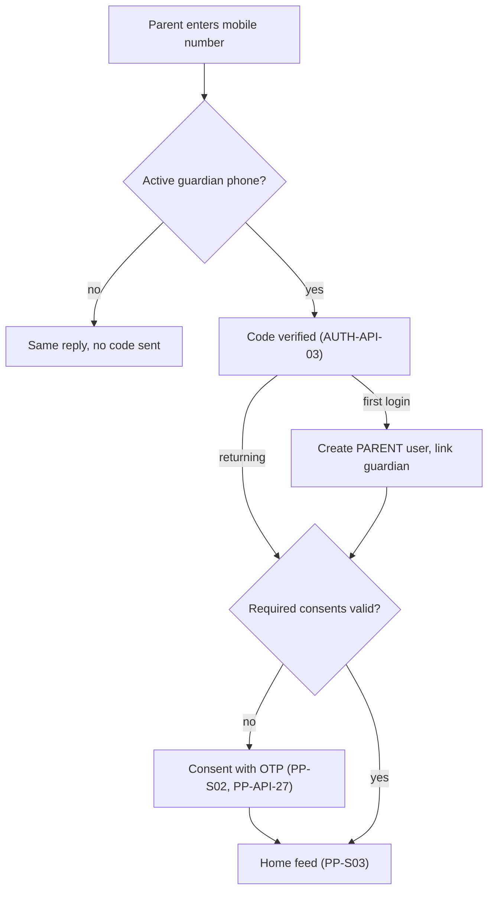
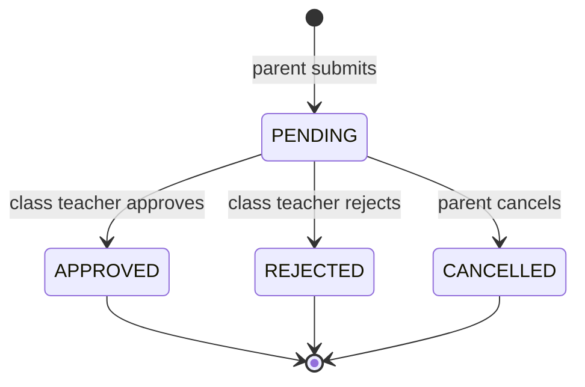
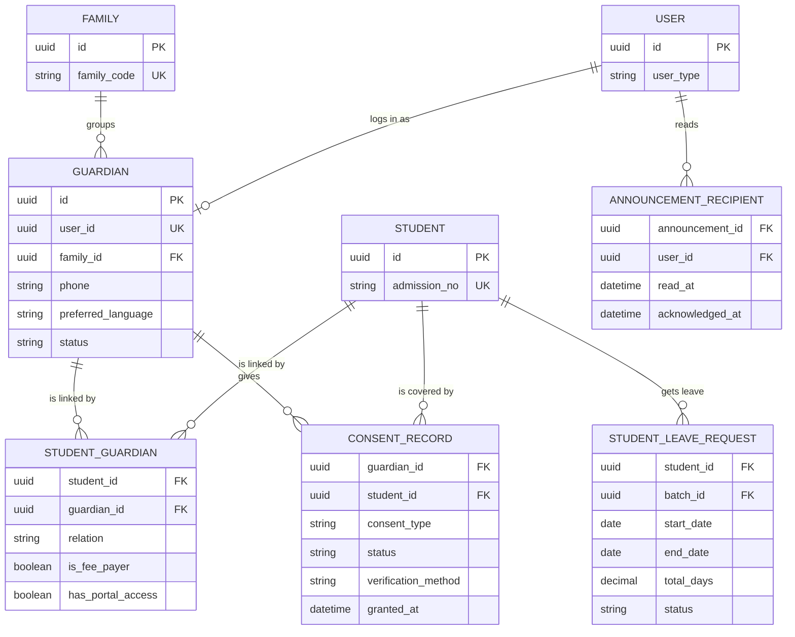

# Parent Portal Module

**In simple words:** The Parent Portal is the phone app that parents open from a WhatsApp link. Sunita Devi logs in with a one-time code, picks Aarav or Ananya, and sees attendance, dues, homework, results and notices. She pays fees online, applies for leave and manages her consents. This chapter defines every screen, rule and endpoint of the portal; parents judge the whole institute by it.

| Item | Value |
|---|---|
| Module code | PP |
| Release phase | Phase 1 (MVP), built on Days 45 to 48; Phase 2 and 3 tabs switch on with their modules |
| Plans | Starter (no Pay Now, EduFlow branding), Growth, Pro, Enterprise (white-label) |
| Main users | Parent; the class teacher, front desk and Accountant answer parent actions |
| Depends on | Student Profile, Attendance, Fees, Payments, Notifications, WhatsApp, Settings |
| Main tables | guardians, families, student_guardians, consent_records, policy_documents, student_leave_requests, announcement_recipients, notification_preferences, device_tokens |

## Objective

1. Give every parent one simple place to see and act on her own children's school data, in English or Hindi, on a cheap Android phone and a slow network.
2. Cut the calls and WhatsApp messages the front desk handles: "Was he present?", "How much is due?", "Send the receipt again".
3. Raise online fee collection towards the canon target of 40% of fee value, through a Pay Now button next to every due.
4. Collect verifiable parental consent (DPDP Act 2023) before any child data is shown, and let the parent withdraw it at any time.
5. Reach the canon adoption target: 70% of active students have a guardian who logged in within the last 30 days.

## Scope

### In scope

- OTP login (one-time code on WhatsApp, email fallback), consent gate and consent centre per child.
- Child switcher, including children who have left; home feed per child.
- Attendance calendar, timetable, homework, exam date sheet, marks, report card PDF, shared teacher remarks.
- Invoices, family checkout (one payment for several children), payment history, invoice and receipt PDFs.
- Leave requests, notice inbox with acknowledgement, limited contact with the class teacher (PP-BR-12).
- Profile, language, notification preferences, certificate and scholarship requests.
- Installable PWA (progressive web app: a website that can be added to the home screen) with a low-bandwidth design.

### Out of scope

- Free-text parent-teacher chat: the schema has no message-thread table, and the BRD keeps it for a Year 2 review.
- Native Android and iOS apps (white-label app add-on, Phase 4).
- Editing the child's profile, advertising, or any tracking of children (DPDP Act, section 9).

### Phase notes

| Phase | What the parent gets |
|---|---|
| Phase 1 (Nov 2026) | Login, consent, switcher, home, attendance, fees, Pay Now, receipts, notices, profile, language, preferences |
| Phase 2 (by 1 Feb 2027) | Timetable, homework, exams, results, report cards, leave, certificates, scholarships, web push |
| Phase 3 (by June 2027) | Library, transport and hostel tabs through LIB-API-37, TRN-API-49 and HST-API-43 to HST-API-46 |

Hindi screens ship before the public launch in January 2027, because the BRD needs the portal in both languages by then.

## User Stories

| ID | As a | I want to | So that | Priority |
|---|---|---|---|---|
| PP-US-01 | Parent | log in with a code sent to my phone | I never need a password | Must |
| PP-US-02 | Parent of two children | switch between Aarav and Ananya in one tap | I do not need two logins | Must |
| PP-US-03 | Parent | see today's attendance and the month percentage first | I know at once if my child reached school | Must |
| PP-US-04 | Parent | see the dues of all my children and pay them in one UPI payment | I pay once, not twice | Must |
| PP-US-05 | Parent | read school notices and confirm that I read them | the school knows I was informed | Must |
| PP-US-06 | Parent | give or withdraw each consent per child | I control how my child's data is used | Must |
| PP-US-07 | Parent | use the portal in Hindi | I understand every word | Must |
| PP-US-08 | Parent | apply for leave with a reason and see the decision | the absence is excused without a written note | Should |
| PP-US-09 | Parent | see homework, the timetable and the exam date sheet | I can help my child prepare | Should |
| PP-US-10 | Parent | see published marks and download the report card | I follow progress without waiting for the PTM | Should |
| PP-US-11 | Parent | read remarks the class teacher shares and reach the school on WhatsApp | I can respond without the teacher's personal number | Should |
| PP-US-12 | Parent | add the portal to my home screen and open it on a slow network | it feels like an app and loads fast | Should |
| PP-US-13 | Class teacher | receive leave requests of my batch automatically | I approve them without paper | Must |

## Workflow

### Login and consent gate

**Figure: Parent login and consent gate**



1. A WhatsApp link (for example the absent alert) opens the portal; after login it lands on the linked screen.
2. AUTH-API-02 gives the same answer for every number, so nobody can test which numbers belong to parents. A code exists only under PP-BR-01.
3. The first correct code creates the `PARENT` user. Missing consents lock everything except the consent and profile screens (PP-BR-03).

### Leave request

**Figure: Student leave request states**



The request (PP-API-21) goes to the class teacher of the child's batch (`Batch.classTeacherId`), who decides with LEV-API-25 or LEV-API-26. Approval marks the covered dates as `LEAVE` in attendance.

### Status lifecycles seen by the parent

| Record | Status | Parent sees | Moved by |
|---|---|---|---|
| Leave request | `PENDING` | "Waiting for Priya Nair", [Cancel] | Parent (PP-API-21, PP-API-22) |
| Leave request | `APPROVED`, `REJECTED`, `CANCELLED` | Decision and teacher's remark, or a greyed row | Class teacher or parent |
| Consent | `GRANTED`, `WITHDRAWN`, `EXPIRED` | Tick with date, or [Give] | Parent (PP-API-27, PP-API-28), expiry job |
| Notice | Unread, read, acknowledged | Bold, normal, "Read on 14 Jul" | PP-API-24, PP-API-25 |
| Payment order | `CREATED`, `ATTEMPTED`, `PAID`, `FAILED`, `EXPIRED` | Texts of PP-BR-07 | Gateway, verify, webhook, expiry job |

## Screens and Wireframes

Every screen is designed at 360 px width first and grows to two columns on a laptop. The parent layout has no staff routes.

| ID | Screen | Users | Purpose |
|---|---|---|---|
| PP-S01 | OTP Login | Parent | Mobile number, 6-box code, resend timer, language |
| PP-S02 | First-Login Consent | Parent | Short notice and required consents per child |
| PP-S03 | Home Feed | Parent | Today, month percent, dues, homework, notices |
| PP-S04 | Attendance Calendar | Parent | Month grid, totals, percent, leave shortcut |
| PP-S05 | Timetable | Parent | Weekly grid and dated class changes |
| PP-S06 | Homework | Parent | Due and past homework with submission status |
| PP-S07 | Exams and Results | Parent | Date sheet, published marks, report cards |
| PP-S08 | Fees and Pay | Parent | Dues of all children, invoice detail, checkout |
| PP-S09 | Payment Result and Receipts | Parent | Success, pending or failed page; payment history |
| PP-S10 | Leave | Parent | Apply, list and cancel leave requests |
| PP-S11 | Notices | Parent | Inbox, detail, attachments, acknowledgement |
| PP-S12 | Teacher Remarks and Contact | Parent | Shared remarks, PTM link, WhatsApp to the school |
| PP-S13 | Privacy and Consents | Parent | Consent centre per child, data requests |
| PP-S14 | Profile and Settings | Parent | Contact fields, language, alert preferences |
| PP-S15 | Requests | Parent | Certificate requests and scholarship applications |

**Screen PP-S01 — OTP Login (Parent, mobile)**

```text
+------------------------------------+
|      Bright Future Public School   |
|           Parent Portal            |
+------------------------------------+
| Mobile number                      |
| [+91 v] [98390 12345__________]    |
|              [Send code]           |
+------------------------------------+
| Code sent on WhatsApp to           |
| +91 98390 12345           [Change] |
| [4] [8] [2] [_] [_] [_]            |
| Wrong code. 3 tries left.          |
| Resend code in 0:24                |
|          [Verify and continue]     |
+------------------------------------+
| Language  (o) English  ( ) Hindi   |
| Staff login                   Help |
+------------------------------------+
```

- Name and logo come from the tenant subdomain; Starter adds "Powered by EduFlow".
- [Send code] calls AUTH-API-02 (purpose `LOGIN`); [Verify and continue] calls AUTH-API-03. The code boxes accept autofill.

**Screen PP-S03 — Home Feed (Parent, mobile)**

```text
+------------------------------------+
| (=) Bright Future PS       [EN|HI] |
+------------------------------------+
| Child [Aarav Sharma - 10-A     v]  |
+------------------------------------+
| Today, Wed 14 Jul 2027             |
| Attendance: ABSENT (marked 09:05)  |
| This month 91.67%  (11 of 12 days) |
| [Apply leave]    [Calendar]        |
+------------------------------------+
| Fees due, all children   Rs 14,800 |
| INV-2027-0912 Aarav  OVERDUE 5,800 |
| INV-2027-0913 Ananya 20 Jul  9,000 |
|                   [Pay Rs 14,800]  |
+------------------------------------+
| Homework due                       |
| Maths Ex 4.2 Q1-10      due 15 Jul |
+------------------------------------+
| Notices (2 unread)                 |
| * PTM on Sat 24 Jul    [Must read] |
| * Unit Test 1 date sheet           |
+------------------------------------+
| [Home] [Attendance] [Fees] [More]  |
+------------------------------------+
```

- The switcher comes from PP-API-03; the rest from PP-API-04 for the selected child.
- The fees card is family-wide; [Pay Rs 14,800] opens PP-S08 with both invoices ticked. [Must read] marks a notice with `requiresAck`.

**Screen PP-S08 — Pay Fees (Parent, mobile)**

```text
+------------------------------------+
| <  Pay fees                        |
+------------------------------------+
| [x] INV-2027-0912  Aarav 10-A      |
|     Tuition Q2        OVERDUE      |
|     Balance 5,800   Pay [5800____] |
| [x] INV-2027-0913  Ananya 6-B      |
|     Tuition Q2        due 20 Jul   |
|     Balance 9,000   Pay [9000____] |
+------------------------------------+
| Pay by (o) UPI  ( ) Card           |
|        ( ) Netbanking              |
| Fee amount           Rs 14,800.00  |
| Convenience fee      Rs      0.00  |
| You pay              Rs 14,800.00  |
+------------------------------------+
|      [Pay Rs 14,800.00 securely]   |
| Money goes straight to the school  |
| bank account through Razorpay.     |
+------------------------------------+
```

- Invoices come from PP-API-13, oldest due first; amounts can be lowered to a part payment (PP-BR-06). The convenience fee line changes with the method before payment.
- [Pay ... securely] calls PP-API-16 with an `Idempotency-Key`, opens Razorpay Checkout, then calls PP-API-17. Without online payment the card says "Please pay at the school office".

**Screen PP-S10 — Leave (Parent, mobile)**

```text
+------------------------------------+
| <  Apply leave                     |
+------------------------------------+
| Child  [Aarav Sharma - 10-A    v]  |
| Type   [Family                 v]  |
| From   [27 Jul 2027] [Full day v]  |
| To     [27 Jul 2027] [Full day v]  |
| School days: 1.0                   |
| Reason                             |
| [Family wedding in Kanpur. Back__] |
| [on 28 July.____________________]  |
| Attach [Choose file] PDF/JPG/PNG   |
+------------------------------------+
| Goes to class teacher Priya Nair   |
|          [Cancel]  [Send request]  |
+------------------------------------+
| My requests                        |
| 30 Jul  Other   0.5 day   PENDING  |
|                           [Cancel] |
| 03 May  Sick    2.0 days  APPROVED |
+------------------------------------+
```

- "School days" follows PP-BR-08; the server recomputes it on save. Early leave adds a "Pickup by" list of guardians with `canPickup`.
- [Send request] calls PP-API-21, [Cancel] calls PP-API-22, the list comes from PP-API-20.

**Screen PP-S13 — Privacy and Consents (Parent, mobile)**

```text
+------------------------------------+
| <  Privacy and consents            |
+------------------------------------+
| Aarav Sharma - 10-A                |
| Required                           |
| [x] Privacy notice v1.2   GRANTED  |
|     12 Dec 2026, OTP       [Read]  |
| [x] Child data use v2.1   GRANTED  |
|     12 Dec 2026, OTP       [Read]  |
| Optional                           |
| [x] WhatsApp messages     GRANTED  |
|                        [Withdraw]  |
| [ ] Photos in school media         |
|                            [Give]  |
+------------------------------------+
| Ananya Sharma - 6-B                |
| 1 consent pending          [Open]  |
+------------------------------------+
| Grievance contact: Rajesh Sharma   |
| [Ask for a copy of my data]        |
+------------------------------------+
```

- Data comes from PP-API-26; [Read] opens the exact notice version. [Give] sends a `CONSENT_VERIFICATION` OTP and calls PP-API-27; [Withdraw] calls PP-API-28.
- [Ask for a copy of my data] calls SET-API-54 (`self`). The same service backs SET-S17 in the *Settings Module*.

## UI Components

| Component | Type | Behaviour |
|---|---|---|
| `ParentShell` | Layout | Top bar, bottom nav (Home, Attendance, Fees, More), offline banner, install prompt (PP-BR-14) |
| `ChildSwitcher` | shadcn `Select` in a bottom `Sheet` | Photo, name, batch, "Left" badge; choice kept in the URL (`?child=`) |
| `OtpInput` | 6 boxes | Numeric keyboard, paste and autofill, 30-second resend timer, tries left |
| `ConsentSheet` | `Sheet` + `Checkbox` | Nothing pre-ticked; required items block [Continue] |
| `TodayCard` | `Card` | Status chip (green, red, amber, grey); "Not marked yet" before the session |
| `DuesCard` | `Card` | Family total and up to 3 invoices; server amounts only |
| `CheckoutButton` | `Button` | Creates one idempotency key per attempt, disables itself while busy |
| `AttendanceCalendar` | Custom grid | 7 columns at 360 px; colour plus letter (P, A, L, H) for colour-blind users |
| `NoticeCard` | `Card` + `Badge` | Bold when unread, pin icon, "Must read" badge, [I have read this] |
| `PdfButton` | `Button` | Fetches a fresh 5-minute link on every tap; shows "Preparing PDF" on 422 |
| States | `Skeleton`, `EmptyState`, `ErrorState` | Skeleton at once; "No homework due"; error with [Try again] |

## Validation Rules

| Field | Rule | Error message shown to user |
|---|---|---|
| Mobile number | India: 10 digits starting 6 to 9; other countries: E.164 | "Enter a valid 10-digit mobile number." |
| OTP code | 6 digits; 10-minute life; 5 tries | "Wrong code. 3 tries left." / "This code has expired. Tap Resend." |
| OTP requests | 30 seconds between sends; 5 per 15 minutes per number | "Too many codes requested. Try again after 15 minutes." |
| Required consent | Both required boxes ticked | "Please accept to continue. The school needs this to show your child's data." |
| Language | `en` or `hi` | "Choose English or Hindi." |
| Leave start date | From today minus 7 days to today plus 60 days | "Leave can start from 7 days ago up to 60 days ahead." |
| Leave end date | Not before the start date; at most 30 calendar days | "One request can cover at most 30 days." |
| Leave dates | No overlap with a `PENDING` or `APPROVED` request of the same child | "A leave request already covers these dates for Aarav." |
| Leave reason | 10 to 1,000 characters | "Please write a reason (at least 10 characters)." |
| Attachment | PDF, JPG or PNG, max 5 MB | "Attach a PDF, JPG or PNG up to 5 MB." |
| Pay amount | Between the part-payment minimum and the balance | "Pay at least ₹500 or the full balance." |

## Business Rules

**PP-BR-01 — Login and user creation.** AUTH-API-02 creates a `LOGIN` code only when the phone matches an `ACTIVE`, not deleted `Guardian` with at least one link where `hasPortalAccess = true`, and `portal.parent_enabled` is true. The code goes by the WhatsApp authentication template (not charged to the tenant wallet), with email as fallback. At the first correct code the API creates a `User` (`userType = PARENT`, `ACTIVE`, `phoneVerifiedAt` = now, `locale` = `preferredLanguage`), gives it the `PARENT` role, sets `Guardian.userId`, accepts a pending invitation and emits `portal.parent.first_login`.

**PP-BR-02 — Own children only.** One helper returns the child IDs of the signed-in guardian. Every `:studentId` is checked against it. Endpoints with a record `:id` (invoice, receipt, report card, leave request, notice) load the record and check its `studentId`. A miss answers `404 NOT_FOUND`, never `403`, so the API never confirms that a record exists.

```typescript
// server/src/modules/parent-portal/own-children.ts
import { prisma } from '../../lib/prisma';
import { redis } from '../../lib/redis';

export async function getOwnChildIds(orgId: string, guardianId: string): Promise<string[]> {
  const key = `pp:children:${orgId}:${guardianId}`;
  const hit = await redis.get(key);
  if (hit) return JSON.parse(hit) as string[];
  const links = await prisma.studentGuardian.findMany({
    where: { organizationId: orgId, guardianId, hasPortalAccess: true, student: { deletedAt: null } },
    select: { studentId: true },
  });
  const ids = links.map((l) => l.studentId);
  await redis.set(key, JSON.stringify(ids), 'EX', 300); // deleted on every link change
  return ids;
}
```

**PP-BR-03 — Consent gate.** Required: `PRIVACY_POLICY` for the guardian and `CHILD_DATA_PROCESSING` for each child, both verified by OTP. A consent is valid when `GRANTED` and `expiresAt` is empty or in the future (SET-BR-14). Without the privacy consent only PP-API-01, PP-API-02, PP-API-26, PP-API-27 and the auth and `self` endpoints work; the rest answer `403 FORBIDDEN` with issue `CONSENT_REQUIRED`. Without child-data consent, that child's data endpoints answer the same, but the money endpoints (PP-API-13 to PP-API-19) keep working, because billing and receipts are needed for the admission contract and tax law.

**PP-BR-04 — Published data only.** Invoices: never `DRAFT` or `CANCELLED`. Marks: only for `PUBLISHED` exams. Report cards: only `PUBLISHED` (`WITHHELD` stays hidden). Homework: `PUBLISHED` or `CLOSED`. Notices: `SENT`, not deleted, not expired, with a recipient row for this user. Remarks: `isSharedWithParent = true`.

**PP-BR-05 — Home feed and attendance percent.** "Today" is the date in the organization timezone; before the session is submitted the status is "Not marked yet". The month percent is month-to-date and uses the shared ATT-BR-13 function.

> **Example:** Wednesday 14 July 2027. July 1 to 14 minus Sundays 4 and 11 gives 12 working days. Aarav: Present 10, Late 1 (6 July), Absent today. Attended = 10 + 1 = 11. Percent = 11 / 12 x 100 = 91.67%.

**PP-BR-06 — Dues and Pay Now.** The family total is the server sum of `balance` over the own children's `ISSUED`, `PARTIALLY_PAID` and `OVERDUE` invoices; the client never calculates. Pay Now appears only when `portal.show_fee_dues` is true, the plan is Growth or higher, and the gateway account is `ACTIVE`, `LIVE` and verified (PAY-BR-12, PAY-BR-24). Each amount is between `min(payments.online_min_part_payment, balance)` and the balance. One order carries `familyId` and the `invoiceSplit` the parent chose, and expires after 30 minutes.

> **Example:** INV-2027-0912 (Aarav) ₹5,800 + INV-2027-0913 (Ananya) ₹9,000 = ₹14,800. By UPI (0%) Sunita pays ₹14,800.00. If the school passes the charge on and she picks a card at 2%: fee = 14,800 x 2% = ₹296.00, GST = 296 x 18% = ₹53.28, total ₹15,149.28 (PAY-BR-13). ₹300 on INV-2027-0912 is refused; the minimum is ₹500.

**PP-BR-07 — Payment result texts.** After checkout the client calls PP-API-17; while the order is `ATTEMPTED` it repeats every 3 seconds for up to 2 minutes.

| Result | Text shown (Hindi from the same catalog) |
|---|---|
| `PAID` | "Payment successful. Receipt RCT-2027-28-01873 is ready." |
| Still confirming | "Payment received, confirming. Please do not pay again. We will send the receipt on WhatsApp." |
| `FAILED` | "Payment failed. No money was taken. If money was deducted, your bank returns it in 5 to 7 working days." |
| `EXPIRED` | "This payment session expired. Nothing was charged. Tap Pay again." |

**PP-BR-08 — Leave routing and day count.** The request copies `campusId` and `batchId` from the child's primary `ACTIVE` enrollment and goes to `Batch.classTeacherId` (else to campus users with `leave.approve_student`). `totalDays` counts school days (`academic.working_days` minus the campus `Holiday` rows), a half first or last day as 0.5. A start up to 7 days back is allowed, so a parent can explain an absence; approval turns those `ABSENT` records into `LEAVE` (LEV-API-25). Only an `ACTIVE` child can get a request.

> **Example:** Ananya, Thursday 5 to Monday 9 August 2027, `endHalf = FIRST_HALF`. 5, 6 and 7 August count 1 each, Sunday 8 August counts 0, 9 August counts 0.5. `totalDays` = 3.5.

**PP-BR-09 — Notices.** Pinned first, then newest. Opening sets `readAt` and raises `readCount` once. Acknowledging needs `requiresAck`, sets `acknowledgedAt` (and `readAt` if empty) and is idempotent.

**PP-BR-10 — Consent withdrawal and alert preferences.** A channel consent stops that channel within one minute and the next channel in `communication.channel_order` is used; in-app always continues. On PP-S14 the parent switches WhatsApp per category (NTF-API-23, NTF-API-24); `ACCOUNT`, which carries OTPs, and in-app cannot be switched off. Withdrawing child-data consent locks that child's data screens, pauses the child's Student Portal login and creates a task for the Organization Admin (SET-BR-14). Records the law requires stay.

**PP-BR-11 — Profile edits.** PP-API-02 may change `email`, `alternatePhone`, `whatsappPhone`, `preferredChannel`, `preferredLanguage`, the address fields and `occupation`. The login phone, names, relation and link flags change only at the office. A new email needs AUTH-API-17 to verify it. Every change is audited with old and new values.

**PP-BR-12 — Limited contact with the class teacher.** There is no free chat. Teacher to parent: shared remarks (PP-API-12), leave `reviewRemarks`, homework feedback. Parent to teacher: the leave reason, a PTM slot with the class teacher (BAT-API-56, BAT-API-57) and feedback after it (BAT-API-59). Anything else: [Message the school on WhatsApp] opens WhatsApp with the campus number and the text "For the class teacher of 10-A (Priya Nair) about Aarav Sharma, BF-2027-0142: ". It lands in the front-desk inbox (WA-API-14), which replies inside the 24-hour window (WA-API-16) or passes it on. The teacher's own number is never shown, which protects teachers from late-night messages.

> **Founder note:** A real teacher-parent thread needs new tables that the schema does not have. Keep it for the Year 2 review in the BRD.

**PP-BR-13 — Language and formats.** Language = `User.locale`, else `Guardian.preferredLanguage`, else the campus or organization locale; values `en` and `hi`. Money uses Indian grouping (₹1,20,000) and arrives as strings. Dates show as "14 Jul 2027". Templates follow the guardian's language, with English as fallback.

**PP-BR-14 — Install prompt.** Shown after the second visit with a login, or right after the first successful payment; never on login, consent or checkout. "Not now" hides it for 30 days. iPhone users get a "Share, then Add to Home Screen" hint. The manifest is per tenant: short name, logo icons, theme colour, `start_url` `/parent`.

**PP-BR-15 — Children who left and plan gating.** A child who is `TRANSFERRED`, `GRADUATED`, `DROPPED_OUT` or `EXPELLED` keeps a "Left" badge. Invoices, receipts, report cards, certificates and attendance history stay readable, and open balances can be paid; leave, homework and timetable are hidden. Endpoints of a module outside the plan answer `403 PLAN_LIMIT_REACHED`; PP-API-01 lists the enabled features so the menu hides those tabs.

## Acceptance Criteria

| ID | Given | When | Then |
|---|---|---|---|
| PP-AC-01 | A number that belongs to no guardian | the parent taps [Send code] | the reply is the same `200` as for a known number and no `otp_codes` row is written |
| PP-AC-02 | Sunita Devi logs in for the first time | she enters the right code | a `PARENT` user is created, `guardians.user_id` is set and `portal.parent.first_login` is emitted once |
| PP-AC-03 | No valid `PRIVACY_POLICY` consent | the client calls PP-API-04 | the API answers `403 FORBIDDEN` with issue `CONSENT_REQUIRED` |
| PP-AC-04 | Sunita grants child-data consent for Aarav | she enters the consent OTP | a `GRANTED` row with `verificationMethod = OTP`, `subjectIsMinor = true` and the notice version is stored |
| PP-AC-05 | Sunita is guardian of Aarav and Ananya only | she calls PP-API-05 with another student's ID | the API answers `404 NOT_FOUND` and returns no data |
| PP-AC-06 | Aarav has 11 attended days out of 12 on 14 July 2027 | the home feed loads | it shows `ABSENT` today and 91.67% for the month |
| PP-AC-07 | Balances of ₹5,800 and ₹9,000 | Sunita opens Fees | the family total is ₹14,800 and no `DRAFT` or `CANCELLED` invoice appears |
| PP-AC-08 | Both invoices are ticked and UPI is chosen | she taps Pay twice within one second | one payment order, one payment and one receipt exist |
| PP-AC-09 | Razorpay has captured the money | she closes the tab before PP-API-17 | the webhook records the payment within one minute and the receipt reaches WhatsApp |
| PP-AC-10 | The organization is on Starter | Sunita opens Fees | no Pay button is shown and PP-API-16 answers `403 PLAN_LIMIT_REACHED` |
| PP-AC-11 | A leave for 27 July 2027 is sent | Priya Nair opens her approval list | the request is there with `batchId` of 10-A and status `PENDING` |
| PP-AC-12 | A request is `APPROVED` | Sunita calls PP-API-22 on it | the API answers `422 BUSINESS_RULE_VIOLATION` and nothing changes |
| PP-AC-13 | Sunita withdraws WhatsApp consent | a fee reminder is sent five minutes later | no WhatsApp message goes out; the next channel is used |
| PP-AC-14 | A report card has status `WITHHELD` | Sunita opens Results | the card is not listed and PP-API-11 answers `404 NOT_FOUND` |

## Edge Cases

| Case | What happens | How the system handles it |
|---|---|---|
| Father and mother share one phone | Two guardian rows, one number | One `PARENT` user per phone; it links to the primary guardian; the office should add a second number |
| Custody flag set to false while logged in | The child must vanish | The link change clears the Redis child cache; the next call answers `404` |
| Priya Nair is staff and parent | Two logins, one phone | The login page asks "Staff or Parent"; each session carries one user type |
| Tab closed during payment | Verify never called | The webhook captures the payment (PAY-BR-14); home shows the invoice paid |
| Counter payment during checkout | Order is larger than the new balance | The capture is still recorded; the extra becomes an advance (PAY-BR-05) and the receipt says so |
| Gateway still in `TEST` mode | Online payment not safe | Pay Now is hidden; the card says "Please pay at the school office" |
| Leave dates are all holidays | `totalDays` = 0 | Refused with "These dates are school holidays." |
| Phone offline | No network | The service worker shows the cached shell and last home feed with "Offline. Data from 09:12." Payment and forms are disabled |

## Database Schema

The portal owns no table alone; it works on rows of other modules behind one ownership check.

| Table | Purpose in the portal | Owner chapter |
|---|---|---|
| `guardians` | The signed-in parent; editable contact fields | *Student Profile Module* |
| `families` | Groups siblings for the family checkout | *Student Profile Module* |
| `student_guardians` | The ownership check and custody flag | *Student Profile Module* |
| `consent_records` | Consent gate and consent centre | *Settings Module* |
| `policy_documents` | Exact notice text per version and language | *Settings Module* |
| `student_leave_requests` | Leave the parent applies for | *Leave Module* |
| `announcement_recipients` | Notice inbox, read and acknowledgement | *Notifications Module* |
| `notification_preferences` | Channel x category choices | *Notifications Module* |
| `device_tokens` | Web push token of the installed PWA (Phase 2) | *Notifications Module* |

Also used without change: `users` and `otp_codes` (*Authentication and Sessions*), `payment_orders`, `payments` and `receipts` (*Payments Module*), `fee_invoices` (*Fees Module*).

### Supporting tables

| Table | Columns (type, default) | Portal rule |
|---|---|---|
| `guardians` | id uuid PK; organization_id; user_id uuid UK; family_id; first_name, last_name varchar(80); gender; email varchar(255); phone varchar(20); alternate_phone, whatsapp_phone; preferred_channel (WHATSAPP); preferred_language varchar(10) (en); occupation, education; annual_income decimal(12,2), currency; address_line1, address_line2, city, state, postal_code, country_code; national_id_encrypted text; status (ACTIVE); anonymized_at; custom_fields jsonb; created_at, updated_at, deleted_at | `phone` is the login; editable fields per PP-BR-11; `national_id_encrypted` never leaves the server |
| `families` | id; organization_id; family_code varchar(30) UK per organization; name varchar(160); primary_guardian_id (no FK); notes; created_at, updated_at, deleted_at | `id` goes into `payment_orders.family_id` |
| `policy_documents` | id; organization_id (null = platform); consent_type; version varchar(20); language (en); title; body text; content_hash char(64); effective_from; retired_at; created_at, updated_at | UK (organization, type, version, language); [Read] shows this exact row |
| `notification_preferences` | id; organization_id; user_id; channel; category; is_enabled (true); created_at, updated_at | UK (organization, user, channel, category) |
| `device_tokens` | id; organization_id; user_id; platform; token varchar(512); device_id; device_name; app_version; locale; is_active (true); last_seen_at; created_at, updated_at | UK (user_id, token); `WEB` for the PWA |

### Table student_guardians

| Column | Type | Null | Default | Notes |
|---|---|---|---|---|
| id | uuid | No | uuid | PK |
| organization_id | uuid | No | - | FK organizations |
| student_id, guardian_id | uuid | No | - | FK students, FK guardians |
| relation | GuardianRelation | No | - | Shown in the switcher |
| is_primary | boolean | No | false | One per student (partial unique index) |
| can_pickup | boolean | No | true | Pickup list on the leave form |
| is_emergency_contact | boolean | No | false | - |
| is_fee_payer | boolean | No | false | Gets fee reminders and receipts |
| receives_communication | boolean | No | true | Notice audience |
| has_portal_access | boolean | No | true | False hides the child (custody) |
| created_at, updated_at | timestamptz | No | now() | - |

### Table consent_records

| Column | Type | Null | Default | Notes |
|---|---|---|---|---|
| id | uuid | No | uuid | PK |
| organization_id | uuid | No | - | FK organizations |
| consent_type | ConsentType | No | - | Required or optional per PP-BR-03 |
| status | ConsentStatus | No | GRANTED | - |
| given_by_user_id, guardian_id, student_id | uuid | Yes | - | FKs; `student_id` null for the privacy notice |
| policy_version, policy_document_id | varchar(20), uuid | No, Yes | - | Exact notice shown |
| inquiry_id | uuid | Yes | - | Consent from an admission lead |
| subject_is_minor | boolean | No | false | True for a child under 18 |
| verification_method, verification_reference, otp_code_id | enum, varchar(100), uuid | Yes | - | `OTP` in the portal |
| verified_at, granted_at, withdrawn_at, expires_at | timestamptz | Yes (granted_at No) | now() for granted_at | Validity window |
| withdrawn_by_user_id, withdrawal_reason | uuid, varchar(255) | Yes | - | Set by PP-API-28 |
| notice_language | varchar(10) | No | en | Language the parent read |
| purposes | jsonb | Yes | - | Itemised purposes |
| regulation | varchar(20) | Yes | - | `DPDP` in India |
| evidence_file_id | uuid | Yes | - | Signed form scan (office only) |
| ip_address, user_agent | varchar(45), varchar(500) | Yes | - | Proof of the portal session |
| created_at, updated_at | timestamptz | No | now() | - |

### Table student_leave_requests

| Column | Type | Null | Default | Notes |
|---|---|---|---|---|
| id | uuid | No | uuid | PK |
| organization_id, campus_id, student_id | uuid | No | - | FKs |
| batch_id | uuid | Yes | - | Batch at request time; routes to the class teacher |
| requested_by_guardian_id, requested_by_user_id | uuid | Yes | - | The signed-in parent |
| category | StudentLeaveCategory | No | OTHER | - |
| start_date, end_date | date | No | - | PP-BR-08 limits |
| start_half, end_half | HalfDaySession | Yes | - | Half first or last day |
| total_days | decimal(4,1) | Yes | - | Server calculation |
| pickup_guardian_id | uuid | Yes | - | Early leave only |
| reason | varchar(1000) | No | - | 10 to 1,000 characters |
| attachment_file_id | uuid | Yes | - | FK file_assets |
| status | ApprovalStatus | No | PENDING | - |
| reviewed_by_id, reviewed_at, review_remarks | uuid, timestamptz, varchar(500) | Yes | - | Teacher decision |
| created_at, updated_at, deleted_at | timestamptz | No, No, Yes | now() | Soft delete |

### Table announcement_recipients

| Column | Type | Null | Default | Notes |
|---|---|---|---|---|
| id | uuid | No | uuid | PK |
| organization_id, announcement_id | uuid | No | - | FKs |
| recipient_type, recipient_id | MessageRecipientType, uuid | No | - | `GUARDIAN` and the guardian id |
| user_id | uuid | Yes | - | The portal inbox filter |
| student_id | uuid | Yes | - | Child the notice is about |
| read_at, acknowledged_at | timestamptz | Yes | - | PP-BR-09 |
| created_at, updated_at | timestamptz | No | now() | - |

### Indexes and constraints

- `guardians`: UK `user_id`; indexes (organization_id, phone), (organization_id, email), (organization_id, family_id); GIN trigram search index.
- `student_guardians`: UK (organization_id, student_id, guardian_id); index (organization_id, guardian_id) serves PP-BR-02.
- `consent_records`: indexes (organization_id, student_id, consent_type), (organization_id, guardian_id, consent_type), (organization_id, consent_type, status).
- `student_leave_requests`: indexes (organization_id, student_id, start_date), (organization_id, campus_id, status, start_date), (organization_id, batch_id, status).
- `announcement_recipients`: UK (organization_id, announcement_id, recipient_type, recipient_id); index (organization_id, user_id, read_at) serves the inbox and unread count.
- Every table starts its indexes with `organization_id` and is protected by RLS (see *Multi-Tenancy and Data Isolation*).

**Figure: Parent Portal tables**



A guardian reaches a child only through `student_guardians`. Consents point to both the guardian and the child. The notice inbox hangs on the user, because one login reads the notices of all children.

## Prisma Schema

Copied from `docs/src/_schema/` (`00-base`, `02-auth`, `04-people`, `05-attendance-leave` and `10-communication`). Long trailing comments sit on the line above their field, and relation lines are compacted; no field is renamed or added.

```prisma
enum Channel {
  IN_APP
  WHATSAPP
  SMS
  EMAIL
  PUSH
}

enum ApprovalStatus {
  PENDING
  APPROVED
  REJECTED
  CANCELLED
}

enum HalfDaySession {
  FIRST_HALF
  SECOND_HALF
}

enum DevicePlatform {
  WEB
  ANDROID
  IOS
  API
}

enum GuardianRelation {
  FATHER
  MOTHER
  GRANDFATHER
  GRANDMOTHER
  BROTHER
  SISTER
  UNCLE
  AUNT
  LEGAL_GUARDIAN
  OTHER
}

enum ConsentType {
  TERMS_OF_SERVICE
  PRIVACY_POLICY
  DATA_PROCESSING
  CHILD_DATA_PROCESSING // verifiable parental consent (DPDP Act s.9, COPPA)
  COMMUNICATION_WHATSAPP
  COMMUNICATION_SMS
  COMMUNICATION_EMAIL
  PHOTO_MEDIA
  THIRD_PARTY_SHARING
}

enum ConsentStatus {
  GRANTED
  WITHDRAWN
  EXPIRED
}

enum ConsentVerificationMethod {
  OTP
  EMAIL_LINK
  SIGNED_FORM
  IN_PERSON
  DIGILOCKER
}

enum StudentLeaveCategory {
  SICK
  FAMILY
  TRAVEL
  EXAM_OR_EVENT
  OTHER
}

enum NotificationCategory {
  ATTENDANCE
  FEES
  EXAMS
  HOMEWORK
  ANNOUNCEMENTS
  ADMISSIONS
  LEAVE
  TIMETABLE
  TRANSPORT
  LIBRARY
  HOSTEL
  PAYROLL
  ACCOUNT // login, OTP, password, security alerts
  SYSTEM
}

enum MessageRecipientType {
  USER
  GUARDIAN
  STUDENT
  STAFF
  LEAD // admission inquiry contact
  OTHER
}

model Guardian {
  id                  String       @id @default(uuid()) @db.Uuid
  organizationId      String       @map("organization_id") @db.Uuid
  userId              String?      @unique @map("user_id") @db.Uuid // linked Parent Portal login
  // household; one Parent Portal login sees every child of the family
  familyId            String?      @map("family_id") @db.Uuid
  firstName           String       @map("first_name") @db.VarChar(80)
  lastName            String?      @map("last_name") @db.VarChar(80)
  gender              Gender?
  email               String?      @db.VarChar(255)
  // E.164; used to match siblings to the same guardian
  phone               String       @db.VarChar(20)
  alternatePhone      String?      @map("alternate_phone") @db.VarChar(20)
  // when different from phone
  whatsappPhone       String?      @map("whatsapp_phone") @db.VarChar(20)
  preferredChannel    Channel      @default(WHATSAPP) @map("preferred_channel")
  preferredLanguage   String       @default("en") @map("preferred_language") @db.VarChar(10)
  occupation          String?      @db.VarChar(100)
  education           String?      @db.VarChar(100)
  // for scholarship eligibility
  annualIncome        Decimal?     @map("annual_income") @db.Decimal(12, 2)
  currency            String?      @db.Char(3) // currency of annualIncome
  addressLine1        String?      @map("address_line1") @db.VarChar(200)
  addressLine2        String?      @map("address_line2") @db.VarChar(200)
  city                String?      @db.VarChar(100)
  state               String?      @db.VarChar(100)
  postalCode          String?      @map("postal_code") @db.VarChar(20)
  countryCode         String?      @map("country_code") @db.Char(2)
  // ciphertext; used for verifiable parental consent where required
  nationalIdEncrypted String?      @map("national_id_encrypted") @db.Text
  status              RecordStatus @default(ACTIVE)
  // PII overwritten after an approved deletion request
  anonymizedAt        DateTime?    @map("anonymized_at") @db.Timestamptz(6)
  customFields        Json?        @map("custom_fields") // cached CustomFieldValue rows
  createdAt           DateTime     @default(now()) @map("created_at") @db.Timestamptz(6)
  updatedAt           DateTime     @updatedAt @map("updated_at") @db.Timestamptz(6)
  deletedAt           DateTime?    @map("deleted_at") @db.Timestamptz(6)

  organization Organization @relation(fields: [organizationId], references: [id], onDelete: Restrict)
  user User? @relation(fields: [userId], references: [id], onDelete: SetNull)
  family Family? @relation(fields: [familyId], references: [id], onDelete: SetNull)
  students                StudentGuardian[]
  consentRecords          ConsentRecord[]
  studentLeaveRequests    StudentLeaveRequest[]    @relation("StudentLeaveRequestedByGuardian")
  studentLeavePickups     StudentLeaveRequest[]    @relation("StudentLeavePickupGuardian")
  // back-relations to FeeReminderLog, Payment, WhatsAppInboundMessage, HostelVisitorLog,
  // PtmBooking and HostelLeaveRequest are omitted here (see 04-people.prisma)

  @@index([organizationId, phone])
  @@index([organizationId, email])
  @@index([organizationId, firstName, lastName])
  @@index([organizationId, familyId])
  // ?q= contains search; needs CREATE EXTENSION pg_trgm in an earlier SQL migration
  @@index([firstName(ops: raw("gin_trgm_ops")), lastName(ops: raw("gin_trgm_ops")), phone(ops: raw("gin_trgm_ops"))], type: Gin, map: "idx_guardians_search_trgm")
  @@map("guardians")
}

model Family {
  id                String    @id @default(uuid()) @db.Uuid
  organizationId    String    @map("organization_id") @db.Uuid
  familyCode        String    @map("family_code") @db.VarChar(30)
  name              String    @db.VarChar(160) // e.g. "Sharma family (Rajesh)"
  // Guardian id (no FK to avoid a circular dependency)
  primaryGuardianId String?   @map("primary_guardian_id") @db.Uuid
  notes             String?   @db.VarChar(500)
  createdAt         DateTime  @default(now()) @map("created_at") @db.Timestamptz(6)
  updatedAt         DateTime  @updatedAt @map("updated_at") @db.Timestamptz(6)
  deletedAt         DateTime? @map("deleted_at") @db.Timestamptz(6)

  organization  Organization   @relation(fields: [organizationId], references: [id], onDelete: Restrict)
  students      Student[]
  guardians     Guardian[]
  paymentOrders PaymentOrder[]
  payments      Payment[]

  @@unique([organizationId, familyCode])
  @@index([organizationId, name])
  @@map("families")
}

model StudentGuardian {
  id                    String           @id @default(uuid()) @db.Uuid
  organizationId        String           @map("organization_id") @db.Uuid
  studentId             String           @map("student_id") @db.Uuid
  guardianId            String           @map("guardian_id") @db.Uuid
  relation              GuardianRelation
  // main contact; one per student: partial unique index in the SQL migration, UNIQUE
  // (organization_id, student_id) WHERE is_primary
  isPrimary             Boolean          @default(false) @map("is_primary")
  canPickup             Boolean          @default(true) @map("can_pickup")
  isEmergencyContact    Boolean          @default(false) @map("is_emergency_contact")
  // receives fee reminders and receipts
  isFeePayer            Boolean          @default(false) @map("is_fee_payer")
  receivesCommunication Boolean          @default(true) @map("receives_communication")
  // false for custody restrictions
  hasPortalAccess       Boolean          @default(true) @map("has_portal_access")
  createdAt             DateTime         @default(now()) @map("created_at") @db.Timestamptz(6)
  updatedAt             DateTime         @updatedAt @map("updated_at") @db.Timestamptz(6)

  organization Organization @relation(fields: [organizationId], references: [id], onDelete: Cascade)
  student      Student      @relation(fields: [studentId], references: [id], onDelete: Cascade)
  guardian     Guardian     @relation(fields: [guardianId], references: [id], onDelete: Cascade)

  @@unique([organizationId, studentId, guardianId])
  @@index([organizationId, guardianId])
  @@map("student_guardians")
}

model PolicyDocument {
  id             String      @id @default(uuid()) @db.Uuid
  // null = EduFlow platform policy shown to every tenant
  organizationId String?     @map("organization_id") @db.Uuid
  consentType    ConsentType @map("consent_type")
  version        String      @db.VarChar(20)
  language       String      @default("en") @db.VarChar(10)
  title          String      @db.VarChar(200)
  body           String      @db.Text
  contentHash    String      @map("content_hash") @db.Char(64) // SHA-256 of body
  effectiveFrom  DateTime    @map("effective_from") @db.Timestamptz(6)
  retiredAt      DateTime?   @map("retired_at") @db.Timestamptz(6)
  createdAt      DateTime    @default(now()) @map("created_at") @db.Timestamptz(6)
  updatedAt      DateTime    @updatedAt @map("updated_at") @db.Timestamptz(6)

  organization Organization? @relation(fields: [organizationId], references: [id], onDelete: Restrict)
  consentRecords ConsentRecord[]

  // Platform rows (organization_id IS NULL) are kept unique by a partial unique index in the SQL
  // migration.
  @@unique([organizationId, consentType, version, language])
  @@index([organizationId, consentType, effectiveFrom])
  @@map("policy_documents")
}

model ConsentRecord {
  id                    String                     @id @default(uuid()) @db.Uuid
  organizationId        String                     @map("organization_id") @db.Uuid
  consentType           ConsentType                @map("consent_type")
  status                ConsentStatus              @default(GRANTED)
  // login that gave the consent
  givenByUserId         String?                    @map("given_by_user_id") @db.Uuid
  // parent giving consent for a child
  guardianId            String?                    @map("guardian_id") @db.Uuid
  // the child whose data is covered
  studentId             String?                    @map("student_id") @db.Uuid
  // version of the notice shown
  policyVersion         String                     @map("policy_version") @db.VarChar(20)
  // exact notice text + language that was shown
  policyDocumentId      String?                    @map("policy_document_id") @db.Uuid
  // consent collected from an admission lead
  inquiryId             String?                    @map("inquiry_id") @db.Uuid
  subjectIsMinor        Boolean                    @default(false) @map("subject_is_minor")
  // DigiLocker transaction / signed-form id
  verificationReference String?                    @map("verification_reference") @db.VarChar(100)
  // OtpCode used for verification (no FK; OTP rows are purged)
  otpCodeId             String?                    @map("otp_code_id") @db.Uuid
  // User id (audit only, no FK)
  withdrawnByUserId     String?                    @map("withdrawn_by_user_id") @db.Uuid
  withdrawalReason      String?                    @map("withdrawal_reason") @db.VarChar(255)
  noticeLanguage        String                     @default("en") @map("notice_language") @db.VarChar(10)
  purposes              Json? // itemised purposes shown in the notice
  // DPDP, GDPR, COPPA, FERPA, PDPL, APP
  regulation            String?                    @db.VarChar(20)
  verificationMethod    ConsentVerificationMethod? @map("verification_method")
  verifiedAt            DateTime?                  @map("verified_at") @db.Timestamptz(6)
  // scanned signed form
  evidenceFileId        String?                    @map("evidence_file_id") @db.Uuid
  ipAddress             String?                    @map("ip_address") @db.VarChar(45)
  userAgent             String?                    @map("user_agent") @db.VarChar(500)
  grantedAt             DateTime                   @default(now()) @map("granted_at") @db.Timestamptz(6)
  withdrawnAt           DateTime?                  @map("withdrawn_at") @db.Timestamptz(6)
  expiresAt             DateTime?                  @map("expires_at") @db.Timestamptz(6)
  createdAt             DateTime                   @default(now()) @map("created_at") @db.Timestamptz(6)
  updatedAt             DateTime                   @updatedAt @map("updated_at") @db.Timestamptz(6)

  organization Organization @relation(fields: [organizationId], references: [id], onDelete: Restrict)
  givenByUser User? @relation(fields: [givenByUserId], references: [id], onDelete: SetNull)
  guardian       Guardian?         @relation(fields: [guardianId], references: [id], onDelete: SetNull)
  student        Student?          @relation(fields: [studentId], references: [id], onDelete: SetNull)
  evidenceFile FileAsset? @relation(fields: [evidenceFileId], references: [id], onDelete: SetNull)
  policyDocument PolicyDocument? @relation(fields: [policyDocumentId], references: [id], onDelete: Restrict)
  inquiry        AdmissionInquiry? @relation(fields: [inquiryId], references: [id], onDelete: SetNull)

  @@index([organizationId, studentId, consentType])
  @@index([organizationId, guardianId, consentType])
  @@index([organizationId, givenByUserId])
  @@index([organizationId, consentType, status])
  @@map("consent_records")
}

model StudentLeaveRequest {
  id                    String               @id @default(uuid()) @db.Uuid
  organizationId        String               @map("organization_id") @db.Uuid
  campusId              String               @map("campus_id") @db.Uuid
  studentId             String               @map("student_id") @db.Uuid
  // batch at the time of the request; routes it to the class teacher
  batchId               String?              @map("batch_id") @db.Uuid
  requestedByGuardianId String?              @map("requested_by_guardian_id") @db.Uuid
  // login that submitted the request
  requestedByUserId     String?              @map("requested_by_user_id") @db.Uuid
  category              StudentLeaveCategory @default(OTHER)
  startDate             DateTime             @map("start_date") @db.Date
  endDate               DateTime             @map("end_date") @db.Date
  // set when the first day is a half day
  startHalf             HalfDaySession?      @map("start_half")
  endHalf               HalfDaySession?      @map("end_half")
  totalDays             Decimal?             @map("total_days") @db.Decimal(4, 1)
  // who collects the child for an early-leave request
  pickupGuardianId      String?              @map("pickup_guardian_id") @db.Uuid
  reason                String               @db.VarChar(1000)
  attachmentFileId      String?              @map("attachment_file_id") @db.Uuid
  status                ApprovalStatus       @default(PENDING)
  reviewedById          String?              @map("reviewed_by_id") @db.Uuid
  reviewedAt            DateTime?            @map("reviewed_at") @db.Timestamptz(6)
  reviewRemarks         String?              @map("review_remarks") @db.VarChar(500)
  createdAt             DateTime             @default(now()) @map("created_at") @db.Timestamptz(6)
  updatedAt             DateTime             @updatedAt @map("updated_at") @db.Timestamptz(6)
  deletedAt             DateTime?            @map("deleted_at") @db.Timestamptz(6)

  organization Organization @relation(fields: [organizationId], references: [id], onDelete: Restrict)
  campus Campus @relation(fields: [campusId], references: [id], onDelete: Restrict)
  student Student @relation(fields: [studentId], references: [id], onDelete: Restrict)
  batch Batch? @relation(fields: [batchId], references: [id], onDelete: SetNull)
  requestedByGuardian Guardian? @relation("StudentLeaveRequestedByGuardian", fields: [requestedByGuardianId], references: [id], onDelete: SetNull)
  pickupGuardian Guardian? @relation("StudentLeavePickupGuardian", fields: [pickupGuardianId], references: [id], onDelete: SetNull)
  requestedByUser User? @relation("StudentLeaveRequestedBy", fields: [requestedByUserId], references: [id], onDelete: SetNull)
  reviewedBy User? @relation("StudentLeaveReviewedBy", fields: [reviewedById], references: [id], onDelete: SetNull)
  attachmentFile FileAsset? @relation(fields: [attachmentFileId], references: [id], onDelete: SetNull)
  attendanceRecords   AttendanceRecord[]

  @@index([organizationId, studentId, startDate])
  @@index([organizationId, campusId, status, startDate])
  @@index([organizationId, batchId, status])
  @@map("student_leave_requests")
}

model AnnouncementRecipient {
  id             String               @id @default(uuid()) @db.Uuid
  organizationId String               @map("organization_id") @db.Uuid
  announcementId String               @map("announcement_id") @db.Uuid
  recipientType  MessageRecipientType @map("recipient_type")
  // id of the Guardian / Student / Staff / User row
  recipientId    String               @map("recipient_id") @db.Uuid
  // login of the recipient when one exists (portal inbox)
  userId         String?              @map("user_id") @db.Uuid
  // the child the notice is about, for parents
  studentId      String?              @map("student_id") @db.Uuid
  readAt         DateTime?            @map("read_at") @db.Timestamptz(6)
  acknowledgedAt DateTime?            @map("acknowledged_at") @db.Timestamptz(6)
  createdAt      DateTime             @default(now()) @map("created_at") @db.Timestamptz(6)
  updatedAt      DateTime             @updatedAt @map("updated_at") @db.Timestamptz(6)

  organization Organization @relation(fields: [organizationId], references: [id], onDelete: Cascade)
  announcement Announcement @relation(fields: [announcementId], references: [id], onDelete: Cascade)
  user         User?        @relation(fields: [userId], references: [id], onDelete: Cascade)
  student      Student?     @relation(fields: [studentId], references: [id], onDelete: Cascade)

  @@unique([organizationId, announcementId, recipientType, recipientId])
  @@index([organizationId, userId, readAt])
  @@map("announcement_recipients")
}

model NotificationPreference {
  id             String               @id @default(uuid()) @db.Uuid
  organizationId String               @map("organization_id") @db.Uuid
  userId         String               @map("user_id") @db.Uuid
  channel        Channel
  category       NotificationCategory
  isEnabled      Boolean              @default(true) @map("is_enabled")
  createdAt      DateTime             @default(now()) @map("created_at") @db.Timestamptz(6)
  updatedAt      DateTime             @updatedAt @map("updated_at") @db.Timestamptz(6)

  organization Organization @relation(fields: [organizationId], references: [id], onDelete: Cascade)
  user         User         @relation(fields: [userId], references: [id], onDelete: Cascade)

  @@unique([organizationId, userId, channel, category])
  // fan-out: who opted out of a channel for a category
  @@index([organizationId, channel, category, isEnabled])
  @@map("notification_preferences")
}

model DeviceToken {
  id             String         @id @default(uuid()) @db.Uuid
  organizationId String         @map("organization_id") @db.Uuid
  userId         String         @map("user_id") @db.Uuid
  platform       DevicePlatform
  // not globally unique: one phone may hold User rows of two organizations
  token          String         @db.VarChar(512)
  deviceId       String?        @map("device_id") @db.VarChar(100)
  deviceName     String?        @map("device_name") @db.VarChar(150)
  appVersion     String?        @map("app_version") @db.VarChar(20)
  locale         String?        @db.VarChar(10)
  // set false when the provider reports the token as invalid
  isActive       Boolean        @default(true) @map("is_active")
  lastSeenAt     DateTime?      @map("last_seen_at") @db.Timestamptz(6)
  createdAt      DateTime       @default(now()) @map("created_at") @db.Timestamptz(6)
  updatedAt      DateTime       @updatedAt @map("updated_at") @db.Timestamptz(6)

  organization Organization @relation(fields: [organizationId], references: [id], onDelete: Cascade)
  user         User         @relation(fields: [userId], references: [id], onDelete: Cascade)

  @@unique([userId, token])
  @@index([organizationId, userId, isActive])
  @@index([token]) // deactivate every row of a token that FCM reports as invalid
  @@map("device_tokens")
}
```

## API Endpoints

Paths start with `/api/v1`. Every endpoint applies PP-BR-02 and PP-BR-03. The portal also calls the `self` endpoints NTF-API-19 to NTF-API-26 (feed, preferences, device tokens) and SET-API-53 to SET-API-55 (data requests). Twins in other modules (STU-API-46, ATT-API-27, HW-API-25, EXM-API-44, BAT-API-54 to BAT-API-59, CRT-API-28, LIB-API-37, TRN-API-49, HST-API-43 to HST-API-46) share these services and are specified in their chapters.

| ID | Method | Path | Permission | Purpose |
|---|---|---|---|---|
| PP-API-01 | GET | `/portal/parent/me` | parentportal.access | Own profile, language, branding, pending consents |
| PP-API-02 | PATCH | `/portal/parent/me` | parentportal.access | Update allowed contact fields and language |
| PP-API-03 | GET | `/portal/parent/children` | parentportal.access | Children for the switcher (batch, photo, badges) |
| PP-API-04 | GET | `/portal/parent/home` | parentportal.access | Home feed per child |
| PP-API-05 | GET | `/portal/parent/children/:studentId/attendance` | parentportal.access | Month calendar and summary |
| PP-API-06 | GET | `/portal/parent/children/:studentId/timetable` | parentportal.access | Weekly timetable and class changes |
| PP-API-07 | GET | `/portal/parent/children/:studentId/homework` | parentportal.access | Homework with submission status |
| PP-API-08 | GET | `/portal/parent/children/:studentId/exams` | parentportal.access | Exam date sheet |
| PP-API-09 | GET | `/portal/parent/children/:studentId/results` | parentportal.access | Published marks by exam |
| PP-API-10 | GET | `/portal/parent/children/:studentId/report-cards` | parentportal.access | Published report cards |
| PP-API-11 | GET | `/portal/parent/report-cards/:id/pdf` | parentportal.access | Report card PDF link |
| PP-API-12 | GET | `/portal/parent/children/:studentId/notes` | parentportal.access | Teacher remarks shared with the parent |
| PP-API-13 | GET | `/portal/parent/fee-invoices` | parentportal.access | Dues and invoice history of all children |
| PP-API-14 | GET | `/portal/parent/fee-invoices/:id` | parentportal.access | Invoice lines and payments |
| PP-API-15 | GET | `/portal/parent/fee-invoices/:id/pdf` | parentportal.access | Invoice PDF link |
| PP-API-16 | POST | `/portal/parent/payment-orders` | parentportal.access | Checkout order for one or more invoices (IK) |
| PP-API-17 | POST | `/portal/parent/payment-orders/:id/verify` | parentportal.access | Verify checkout; return payment and receipt |
| PP-API-18 | GET | `/portal/parent/payments` | parentportal.access | Payment history with receipts |
| PP-API-19 | GET | `/portal/parent/receipts/:id/pdf` | parentportal.access | Receipt PDF link |
| PP-API-20 | GET | `/portal/parent/leave-requests` | parentportal.access | Leave requests of own children |
| PP-API-21 | POST | `/portal/parent/leave-requests` | parentportal.access | Apply leave for a child |
| PP-API-22 | POST | `/portal/parent/leave-requests/:id/cancel` | parentportal.access | Cancel a `PENDING` request |
| PP-API-23 | GET | `/portal/parent/announcements` | parentportal.access | Notice inbox (unread, pinned) |
| PP-API-24 | GET | `/portal/parent/announcements/:id` | parentportal.access | Notice detail; marks read |
| PP-API-25 | POST | `/portal/parent/announcements/:id/acknowledge` | parentportal.access | Confirm "I have read this" |
| PP-API-26 | GET | `/portal/parent/consents` | parentportal.access | Consents per child with policy text |
| PP-API-27 | POST | `/portal/parent/consents` | parentportal.access | Grant consent (OTP-verified) |
| PP-API-28 | POST | `/portal/parent/consents/:id/withdraw` | parentportal.access | Withdraw a consent |
| PP-API-29 | GET | `/portal/parent/certificate-requests` | parentportal.access | List certificate requests |
| PP-API-30 | POST | `/portal/parent/certificate-requests` | parentportal.access | Request a certificate for a child |
| PP-API-31 | GET | `/portal/parent/scholarship-applications` | parentportal.access | Open schemes and own applications |
| PP-API-32 | POST | `/portal/parent/scholarship-applications` | parentportal.access | Apply to an `OPEN` scheme with documents |

Errors common to every PP endpoint:

| Status | Code | When |
|---|---|---|
| 401 | `UNAUTHENTICATED`, `TOKEN_EXPIRED` | No token, or the 15-minute access token expired |
| 403 | `FORBIDDEN` | Not a parent session, or a required consent is missing (`CONSENT_REQUIRED`) |
| 403 | `PLAN_LIMIT_REACHED` | The module behind the endpoint is not in the plan |
| 404 | `NOT_FOUND` | Child or record is not linked to this guardian |
| 429 | `RATE_LIMITED` | More than 100 requests per minute |

### PP-API-03 List children

```http
GET /api/v1/portal/parent/children HTTP/1.1
Authorization: Bearer <accessToken>
```

```json
{
  "success": true,
  "data": [
    {
      "studentId": "4f8d2a6b-3c1e-4b7a-a9d5-6e2f1c0b8d37",
      "name": "Aarav Sharma",
      "admissionNo": "BF-2027-0142",
      "batch": { "id": "9d4b2e71-5c8a-4f3e-b6d0-2a7e1c9f5b84", "name": "10-A" },
      "relation": "MOTHER",
      "status": "ACTIVE",
      "childDataConsent": true,
      "badges": { "todayStatus": "ABSENT", "unreadNotices": 2, "openInvoices": 1 }
    },
    {
      "studentId": "6a2e9c14-7b3d-4f58-8e21-0c9d5b7a3f46",
      "name": "Ananya Sharma",
      "admissionNo": "BF-2027-0143",
      "batch": { "id": "e9a0c517-8d4b-4e72-93af-2b615d7c840e", "name": "6-B" },
      "relation": "MOTHER",
      "status": "ACTIVE",
      "childDataConsent": true,
      "badges": { "todayStatus": "PRESENT", "unreadNotices": 0, "openInvoices": 1 }
    }
  ],
  "meta": { "page": 1, "limit": 20, "total": 2, "totalPages": 1 }
}
```

Only the common errors apply.

### PP-API-04 Home feed

```http
GET /api/v1/portal/parent/home?studentId=4f8d2a6b-3c1e-4b7a-a9d5-6e2f1c0b8d37 HTTP/1.1
Authorization: Bearer <accessToken>
```

```json
{
  "success": true,
  "data": {
    "date": "2027-07-14",
    "today": { "status": "ABSENT", "markedAt": "2027-07-14T03:35:00.000Z" },
    "attendanceMonth": { "month": "2027-07", "workingUnits": 12, "attendedUnits": 11, "percent": "91.67" },
    "dues": {
      "currency": "INR",
      "familyTotal": "14800.00",
      "canPayOnline": true,
      "invoices": [
        { "id": "2c6e8a0b-4d1f-4a7c-9e3b-5f7d9b1c3e58", "invoiceNo": "INV-2027-0912",
          "studentName": "Aarav Sharma", "status": "OVERDUE", "dueDate": "2027-07-10", "balance": "5800.00" },
        { "id": "7f1b3d5e-9a2c-4e6b-8d0f-1a3c5e7b9d24", "invoiceNo": "INV-2027-0913",
          "studentName": "Ananya Sharma", "status": "ISSUED", "dueDate": "2027-07-20", "balance": "9000.00" }
      ]
    },
    "homeworkDue": [
      { "id": "3e5a7c9b-1d2f-4a6c-8b0e-2f4a6c8e0b13", "subject": "Mathematics",
        "title": "Ex 4.2 Q1-10", "dueDate": "2027-07-15", "submissionStatus": "PENDING" }
    ],
    "notices": {
      "unread": 2,
      "latest": [
        { "id": "b5d7f9a1-3c5e-4a7c-9e1b-4f6a8c0e2b47", "title": "PTM on Saturday 24 July",
          "isPinned": true, "requiresAck": true, "sentAt": "2027-07-13T06:30:00.000Z" }
      ]
    }
  }
}
```

| Status | Code | When |
|---|---|---|
| 400 | `VALIDATION_ERROR` | `studentId` missing or not a UUID |

### PP-API-13 List fee invoices

```http
GET /api/v1/portal/parent/fee-invoices?status=OVERDUE,ISSUED&sort=dueDate&page=1&limit=20 HTTP/1.1
Authorization: Bearer <accessToken>
```

The answer lists the invoice objects of PP-API-04 plus `title`, `total`, `amountPaid` and `lateFee`, with `meta`; `studentId` narrows it to one child. An unknown status gives `400 VALIDATION_ERROR`.

### PP-API-16 Create payment order

```http
POST /api/v1/portal/parent/payment-orders HTTP/1.1
Authorization: Bearer <accessToken>
Idempotency-Key: 0b3d5f7a-9c1e-4a2b-8d4f-6a8c0e2b4d69
Content-Type: application/json

{
  "invoices": [
    { "invoiceId": "2c6e8a0b-4d1f-4a7c-9e3b-5f7d9b1c3e58", "amount": "5800.00" },
    { "invoiceId": "7f1b3d5e-9a2c-4e6b-8d0f-1a3c5e7b9d24", "amount": "9000.00" }
  ],
  "method": "upi",
  "platform": "WEB"
}
```

```json
{
  "success": true,
  "data": {
    "order": {
      "id": "e4b6d8f0-2a4c-4e6a-9c1e-3b5d7f9a1c26",
      "status": "CREATED",
      "gateway": "RAZORPAY",
      "gatewayOrderId": "order_Qy2Kd8LmW4pTzr",
      "familyId": "5c7e9a1b-3d5f-4b7d-8e2a-6c8e0a2c4e71",
      "amount": "14800.00",
      "convenienceFee": "0.00",
      "convenienceFeeTax": "0.00",
      "currency": "INR",
      "expiresAt": "2027-07-14T05:40:00.000Z"
    },
    "checkout": {
      "key": "rzp_live_8Hk2VdLq0sXw3T",
      "orderId": "order_Qy2Kd8LmW4pTzr",
      "amountInSmallestUnit": 1480000,
      "name": "Bright Future Public School",
      "description": "INV-2027-0912, INV-2027-0913",
      "allowedMethods": ["upi"]
    }
  }
}
```

| Status | Code | When |
|---|---|---|
| 400 | `VALIDATION_ERROR` | Missing `Idempotency-Key`, empty `invoices`, unknown method |
| 409 | `CONFLICT` | Same key with a different body (PAY-BR-11) |
| 422 | `BUSINESS_RULE_VIOLATION` | Invoice not payable, amount outside PP-BR-06, Pay Now switched off |
| 503 | `SERVICE_UNAVAILABLE` | Razorpay did not answer within 8 seconds |

### PP-API-17 Verify checkout

```http
POST /api/v1/portal/parent/payment-orders/e4b6d8f0-2a4c-4e6a-9c1e-3b5d7f9a1c26/verify HTTP/1.1
Authorization: Bearer <accessToken>
Content-Type: application/json

{
  "razorpayOrderId": "order_Qy2Kd8LmW4pTzr",
  "razorpayPaymentId": "pay_Qy2MfT7cX1hJwa",
  "razorpaySignature": "9c1e3a5b7d9f1c3e5a7b9d0f2b4d6f8a0c1e3a5b7d9f1c3e5a7b9d0f2b4d6f8a"
}
```

```json
{
  "success": true,
  "data": {
    "order": { "id": "e4b6d8f0-2a4c-4e6a-9c1e-3b5d7f9a1c26", "status": "PAID",
      "paidAt": "2027-07-14T05:16:42.000Z" },
    "payment": { "id": "1a3c5e7b-9d0f-4b2a-8c4e-6f8a0b2d4c59", "status": "SUCCESS",
      "amount": "14800.00", "currency": "INR", "methodDetails": { "instrument": "upi" } },
    "receipt": { "id": "7e9b1d3f-5a6c-4e8a-9b0d-2c4e6a8b0d83", "receiptNo": "RCT-2027-28-01873",
      "status": "ISSUED", "pdfReady": false }
  }
}
```

While the gateway still says `authorized`, the answer is `200` with order status `ATTEMPTED`, `"payment": null` and `"retryAfterSeconds": 3` (PP-BR-07).

| Status | Code | When |
|---|---|---|
| 422 | `BUSINESS_RULE_VIOLATION` | Wrong signature, or ids of another order |
| 503 | `SERVICE_UNAVAILABLE` | Status fetch failed; the client retries |

### PP-API-21 Apply leave

```http
POST /api/v1/portal/parent/leave-requests HTTP/1.1
Authorization: Bearer <accessToken>
Content-Type: application/json

{
  "studentId": "4f8d2a6b-3c1e-4b7a-a9d5-6e2f1c0b8d37",
  "category": "FAMILY",
  "startDate": "2027-07-27",
  "endDate": "2027-07-27",
  "startHalf": null,
  "endHalf": null,
  "reason": "Family wedding in Kanpur. Back on 28 July.",
  "attachment": null,
  "pickupGuardianId": null
}
```

```json
{
  "success": true,
  "data": {
    "id": "a1c3e5f7-9b2d-4f6a-8c0e-2d4f6a8c0e39",
    "status": "PENDING",
    "totalDays": "1.0",
    "batch": { "id": "9d4b2e71-5c8a-4f3e-b6d0-2a7e1c9f5b84", "name": "10-A" },
    "approverName": "Priya Nair",
    "upload": null
  }
}
```

With `"attachment": { "fileName": "invite.pdf", "mimeType": "application/pdf", "sizeBytes": 412000 }` the answer carries `upload` with a pre-signed PUT URL valid for 10 minutes, issued after the ownership check.

| Status | Code | When |
|---|---|---|
| 400 | `VALIDATION_ERROR` | Date window, 30-day limit, reason length, file type or size |
| 409 | `CONFLICT` | Overlaps a `PENDING` or `APPROVED` request of the child |
| 422 | `BUSINESS_RULE_VIOLATION` | Child not `ACTIVE`, or `totalDays` is 0 |

### PP-API-25 Acknowledge a notice

```http
POST /api/v1/portal/parent/announcements/b5d7f9a1-3c5e-4a7c-9e1b-4f6a8c0e2b47/acknowledge HTTP/1.1
Authorization: Bearer <accessToken>
```

```json
{
  "success": true,
  "data": {
    "announcementId": "b5d7f9a1-3c5e-4a7c-9e1b-4f6a8c0e2b47",
    "readAt": "2027-07-14T05:02:10.000Z",
    "acknowledgedAt": "2027-07-14T05:02:31.000Z"
  }
}
```

| Status | Code | When |
|---|---|---|
| 422 | `BUSINESS_RULE_VIOLATION` | The notice does not ask for acknowledgement |

### PP-API-27 Grant consent

A first call without `otp` sends a `CONSENT_VERIFICATION` code and returns `otpCodeId`. The second call saves the consent. The service is the one behind SET-API-51.

```http
POST /api/v1/portal/parent/consents HTTP/1.1
Authorization: Bearer <accessToken>
Content-Type: application/json

{
  "consentType": "PHOTO_MEDIA",
  "studentId": "4f8d2a6b-3c1e-4b7a-a9d5-6e2f1c0b8d37",
  "policyDocumentId": "c3e5a7c9-1b3d-4f5a-8c7e-9b1d3f5a7c82",
  "otpCodeId": "9a1b3c5d-7e9f-4a2b-8c4d-6e8f0a2b4c83",
  "otp": "482913"
}
```

```json
{
  "success": true,
  "data": {
    "id": "f2a4c6e8-0b2d-4f6a-8c1e-5a7c9e1b3d58",
    "consentType": "PHOTO_MEDIA",
    "status": "GRANTED",
    "policyVersion": "1.0",
    "noticeLanguage": "hi",
    "subjectIsMinor": true,
    "verificationMethod": "OTP",
    "grantedAt": "2027-07-14T05:20:03.000Z"
  }
}
```

| Status | Code | When |
|---|---|---|
| 400 | `VALIDATION_ERROR` | OTP wrong or expired; notice is not the current version |
| 409 | `CONFLICT` | A valid consent of this type already exists |

## Permissions

| Permission key | SUPER_ADMIN | ORG_ADMIN | PRINCIPAL | TEACHER | ACCOUNTANT | PARENT | STUDENT |
|---|---|---|---|---|---|---|---|
| parentportal.access | No | No | No | No | No | Own | No |

`Own` means the guardian's own children, checked in code. Staff never hold this key, not even ORG_ADMIN, and a custom role can never get it. Staff answer parent actions with their own keys:

| Permission key | SUPER_ADMIN | ORG_ADMIN | PRINCIPAL | TEACHER | ACCOUNTANT | PARENT | STUDENT |
|---|---|---|---|---|---|---|---|
| leave.view_student | Yes | Yes | Campus | Own | No | No | No |
| leave.approve_student | No | Yes | Campus | Own | No | No | No |
| notifications.send | No | Yes | Campus | No | No | No | No |
| whatsapp.send | No | Yes | Campus | No | No | No | No |
| users.invite | No | Yes | Campus | No | No | No | No |
| settings.update | Yes | Yes | No | No | No | No | No |

## Notifications and Events

| Event | Trigger | Channel | Recipient | Template text |
|---|---|---|---|---|
| `portal.parent.first_login` | First OTP login | In-app | Parent | "Welcome to the Bright Future Parent Portal." |
| `student.leave.requested` | PP-API-21 | In-app | Class teacher | "Sunita Devi asked leave for Aarav Sharma (10-A): 27 Jul, 1 day." |
| `student.leave.approved` (LEV) | LEV-API-25 | In-app, WhatsApp | Parent | "Leave for Aarav on 27 Jul is approved by Priya Nair." |
| `student.leave.cancelled` | PP-API-22 | In-app | Class teacher | "Sunita Devi cancelled the leave request for Aarav (30 Jul)." |
| `receipt.issued` (PAY) | Capture of PP-API-16 order | WhatsApp, In-app | Fee payer | "Received ₹14,800 for Aarav and Ananya. Receipt RCT-2027-28-01873." |
| `consent.withdrawn` | PP-API-28 | In-app, Email | Organization Admin | "Sunita Devi withdrew WhatsApp consent for Aarav Sharma." |

`consent.granted`, `announcement.acknowledged`, `certificate.requested`, `scholarship.application.submitted` and `payment.order.created` only update staff inboxes and counters. Every template has a Hindi version (*Notifications Module*).

## Reports and Exports

- Parents get documents, not exports: invoice (PP-API-15), receipt (PP-API-19), report card (PP-API-11) and certificate (CRT-API-29) PDFs. Each call returns a fresh 5-minute link; a PDF still queued answers `422`.
- Staff see portal adoption on the Dashboard: students with a guardian login in the last 30 days divided by active students. Example: 830 / 1,200 = 69.17%, just under the 70% target. Assumption: the nightly snapshot job stores `portalActiveGuardians` and `portalAdoptionPercent` in `daily_metric_snapshots.extra`.
- Notice read and acknowledgement rates come from NTF-API-16.

## Non-Functional Notes

- **Performance.** p95 under 300 ms for PP-API-03 and PP-API-04, under 500 ms for the rest. First load under 3 seconds on 4G, under 6 seconds on slow 3G. Parent JavaScript under 150 KB gzipped, home JSON under 15 KB, photos as 160 px WebP.
- **Caching.** Child set in Redis for 5 minutes; home feed for 60 seconds per child, cleared by attendance, invoice, payment and notice events. The service worker caches the shell and the last home, attendance and invoice responses (network first), never PDFs, links or checkout.
- **Background jobs.** BullMQ runs PDFs, notification fan-out, the daily consent expiry job (01:00, sets `EXPIRED`), payment order expiry and the nightly adoption count.
- **Audit logging.** Consents, profile edits, leave create and cancel, and payment orders write `audit_logs` rows with the guardian as actor.
- **Privacy.** Analytics carry only a hashed guardian id and the screen name, never child data.
- **Plan limits.** Starter: portal without Pay Now, EduFlow branding. Growth and Pro: online payment and Phase 2 tabs. Enterprise: custom domain, no EduFlow branding.
- **i18n and access.** English and Hindi catalogs, Noto Sans Devanagari subset, `Intl.NumberFormat('en-IN')`, 44 px touch targets, WCAG 2.1 AA contrast.

## Test Scenarios

| ID | Scenario | Steps | Expected result |
|---|---|---|---|
| PP-TS-01 | Isolation between parents | Parent B calls PP-API-05 with Aarav's id | `404`, no data; same result across tenants |
| PP-TS-02 | Unknown number | Request an OTP for a non-guardian number | Same `200` answer; no `otp_codes` row |
| PP-TS-03 | OTP abuse | Enter a wrong code 5 times | Code burned; new code only after 15 minutes |
| PP-TS-04 | Consent gate | Call PP-API-04 before consent, then consent and repeat | `403 CONSENT_REQUIRED`, then `200` |
| PP-TS-05 | Family checkout | Pay ₹14,800 by UPI with the Razorpay client mocked | One payment, two allocations, one receipt, both invoices `PAID` |
| PP-TS-06 | Double tap and closed tab | Tap Pay twice, then close the tab before verify | One order and one payment; webhook marks it paid within a minute |
| PP-TS-07 | Starter plan | Open Fees on a Starter tenant | No Pay button; PP-API-16 answers `403 PLAN_LIMIT_REACHED` |
| PP-TS-08 | Leave flow | Apply for 27 July, approve as Priya Nair, try to cancel | `PENDING` then `APPROVED`; cancel answers `422`; attendance shows `LEAVE` |
| PP-TS-09 | Custody change | Office sets `hasPortalAccess = false` for Ananya | Next call for Ananya answers `404`; she leaves the switcher |
