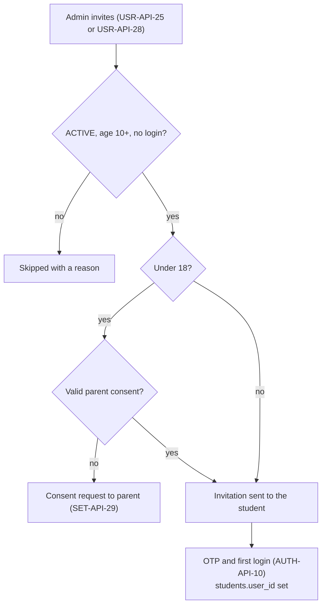
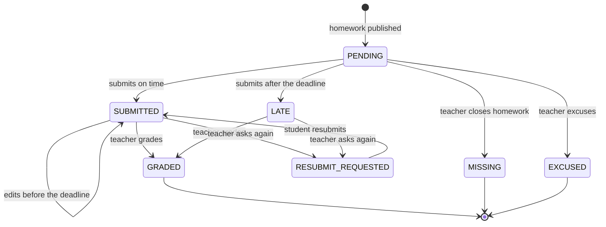
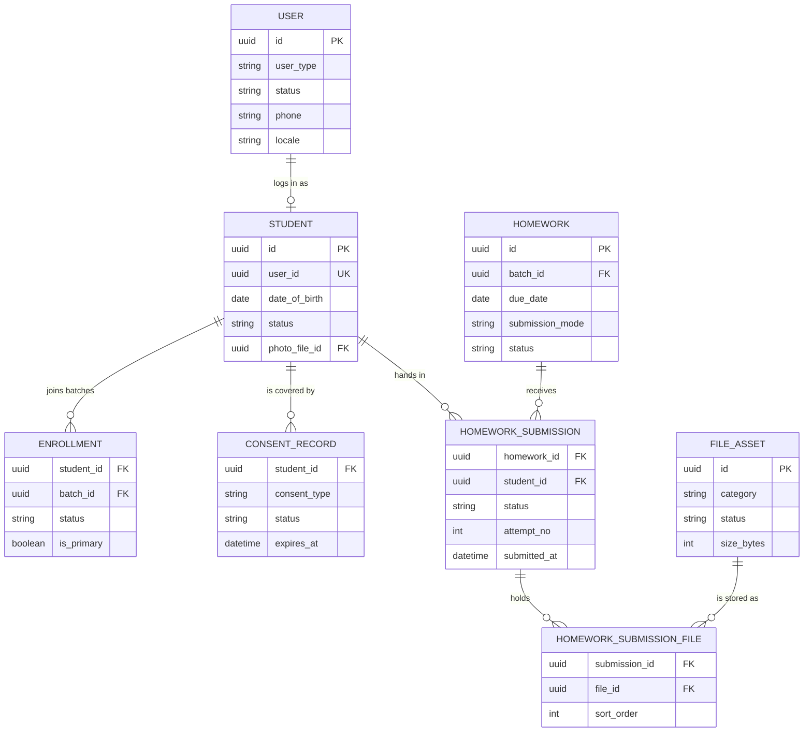

# Student Portal Module

**In simple words:** The Student Portal is the phone app of the learner. Aarav Sharma opens it and sees today's classes, the homework he must hand in, his attendance, exam dates, marks and school notices. He uploads photos of his notebook as homework and asks the office for a bonafide certificate. A child gets a login only after a parent has given consent, and the portal shows no ads and tracks nothing.

| Item | Value |
|---|---|
| Module code | SP |
| Release phase | Phase 2 (V1.0), Days 61 to 120 (prompt P-40); Library, Transport and Hostel tabs in Phase 3 |
| Plans | Growth, Pro, Enterprise; not in Starter. Library, Transport and Hostel tabs need Pro |
| Main users | Student; Organization Admin sets it up; teachers and the Principal answer student actions |
| Depends on | Student Profile, Batch, Timetable, Homework, Exams, Report Cards, Attendance, Notifications, Settings |
| Main tables | users, students, consent_records, invitations, homework_submissions, homework_submission_files, certificate_requests, announcement_recipients |

## Objective

1. Give every student one safe place for the own school day: classes, homework, study material, exams, marks, attendance and notices.
2. Move homework hand-in online. Target: 60% of `ONLINE` homework submissions arrive through the portal by March 2027 (Assumption).
3. Protect children. A minor gets a login only after verifiable parental consent (DPDP Act 2023, section 9). The portal shows only the own record, no ads, no tracking.
4. Take load off parents and the front desk in coaching, where most students are 16 or older.
5. Target (Assumption): 60% of invited students log in at least once in 30 days.

## Scope

### In scope

- Login by invitation after parental consent for minors; one-time code (OTP) or an optional password.
- Home, timetable with dated changes, attendance calendar and percent.
- Homework list and detail, upload of files or typed answers, resubmission, feedback and marks.
- Study materials: notes, DPP sheets (daily practice problems), question papers, video links.
- Date sheet, published marks, report card PDFs, notices, library loans, certificate requests, own fee invoices.
- Profile (photo, language), notification feed and preferences, installable PWA (progressive web app: a website added to the home screen).

### Out of scope

- Chat, comments or any contact between students: the schema has no message tables, and chat between minors needs moderation.
- Editing name, date of birth, contact or address. The student asks for a correction instead (SP-BR-10).
- Leave requests and scholarship applications. Parents raise these in the *Parent Portal Module*.
- Online tests and quizzes (not in the schema), advertising, third-party analytics, native apps (white-label app add-on, Phase 4).

### Phase notes

| Phase | What the student gets |
|---|---|
| Phase 2 (by 1 Feb 2027) | Everything in scope except the Phase 3 tabs |
| Phase 3 (by June 2027) | Library loans, catalogue and holds (LIB-API-33 to LIB-API-36), bus route (TRN-API-50), hostel room (HST-API-47) |
| Phase 4 (by Sep 2027) | White-label Android and iOS apps on the same endpoints; web push becomes native push |

## User Stories

| ID | As a | I want to | So that | Priority |
|---|---|---|---|---|
| SP-US-01 | Student | log in with a code sent to my phone | I do not need my parent's phone every time | Must |
| SP-US-02 | Student | see today's classes, with cancelled and extra classes marked | I reach the right room at the right time | Must |
| SP-US-03 | Student | upload photos of my notebook as homework | I hand in work on time without paper | Must |
| SP-US-04 | Student | read teacher feedback and marks, and redo work when asked | I learn from my mistakes | Must |
| SP-US-05 | Student | see the date sheet, my published marks and my report card | I plan revision and follow my progress | Must |
| SP-US-06 | Student | see my attendance percent | I stay above the 75% rule | Should |
| SP-US-07 | Coaching student | open notes, DPP sheets and lecture links of my batches | I revise at home | Must |
| SP-US-08 | Student | read school notices | I know about holidays and events | Must |
| SP-US-09 | Student | ask for a bonafide certificate | I apply for a bus pass without visiting the office | Should |
| SP-US-10 | Student | see the library books I hold and their due dates | I return them on time and avoid fines | Could |
| SP-US-11 | Student | change my photo and language | the app feels like mine and I understand it | Could |
| SP-US-12 | Parent | decide whether my child gets a login and stop it at any time | my child's data stays under my control | Must |
| SP-US-13 | Organization Admin | invite a whole batch and see who still lacks consent | I switch the portal on in minutes | Must |
| SP-US-14 | Adult coaching student | pay my own fees online when the institute allows it | I do not wait for a parent | Could |

## Workflow

### Account creation and login

**Figure: Student account creation and first login**



1. The Organization Admin invites from SP-S14; ineligible students are skipped with a reason (SP-BR-02).
2. A minor's invitation waits for parental consent; [Ask parent] sends an OTP consent request (SET-API-29).
3. The student confirms an OTP, may set a password and lands on the home screen. Later logins follow SP-BR-03.

### Homework submission

**Figure: Homework submission states seen by the student**



Publishing homework (HW-API-06) creates the `PENDING` rows. The student moves a row only with SP-API-08 (SP-BR-09); every other move belongs to the teacher.

### Status lifecycles seen by the student

| Record | Status | Student sees | Moved by |
|---|---|---|---|
| Homework submission | `PENDING`, `RESUBMIT_REQUESTED` | "To do" (amber), "Redo" (amber) with the teacher's note | Teacher publishes or asks again |
| Homework submission | `SUBMITTED`, `LATE` | "Handed in" (blue), "Handed in late" (grey) | Student (SP-API-08) |
| Homework submission | `GRADED`, `MISSING`, `EXCUSED` | Marks and feedback, "Not handed in" (amber), "Excused" (grey) | Teacher |
| Certificate request | `PENDING`, `APPROVED`, `REJECTED`, `ISSUED`, `CANCELLED` | "Waiting", "Approved", remark, [Download], greyed row | Student (SP-API-18, CRT-API-30), Principal |
| Student login | `INVITED`, `ACTIVE`, `SUSPENDED`, `DEACTIVATED` | Invitation link, portal, "Paused" message, no login | Office, consent service |

## Screens and Wireframes

Screens are designed at 360 px width first, with no staff routes and no third-party content.

| ID | Screen | Users | Purpose |
|---|---|---|---|
| SP-S01 | Login and Invitation | Student | Accept invitation, OTP or password login, language |
| SP-S02 | Home | Student | Today's classes, homework due, attendance, next exam, notices |
| SP-S03 | Timetable | Student | Weekly grid and dated class changes |
| SP-S04 | Homework List | Student | To do, handed in and graded work |
| SP-S05 | Homework Detail and Submit | Student | Task, attachments, upload, feedback |
| SP-S06 | Study Materials | Student | Notes, DPP sheets and links by subject |
| SP-S07 | Exams and Results | Student | Date sheet, published marks, report card PDFs |
| SP-S08 | Attendance | Student | Month calendar, totals and percent |
| SP-S09 | Notices | Student | Inbox and detail |
| SP-S10 | Library | Student | Books issued, due dates, fines, holds |
| SP-S11 | Certificates | Student | Request, track and download certificates |
| SP-S12 | Fees | Student | Own invoices; Pay only when allowed |
| SP-S13 | Profile and Settings | Student | Photo, language, alerts, privacy |
| SP-S14 | Student Portal Setup | Organization Admin | Switch on, set rules, bulk invites with consent status |
| SP-S15 | Consent Needed | Student | Friendly block screen when consent is missing |

**Screen SP-S02 — Home (Student, mobile)**

```text
+------------------------------------+
| (=) Bright Future PS       [EN|HI] |
+------------------------------------+
| Hi Aarav!  10-A    Fri 16 Jul 2027 |
+------------------------------------+
| Today's classes                    |
| 08:00 Maths         Priya Nair     |
| 08:45 Science       Room 12        |
| 09:30 English       CANCELLED      |
| 11:50 Extra Maths   NEW  Room 12   |
+------------------------------------+
| Homework to do (2)                 |
| English essay          due today   |
| Science worksheet 3    due 19 Jul  |
+------------------------------------+
| Attendance this month       96.43% |
| 13.5 of 14 days       [Calendar]   |
+------------------------------------+
| Next exam: Unit Test 2, Mon 26 Jul |
+------------------------------------+
| Notices (1 new)                    |
| * Sports day on Sat 31 Jul         |
+------------------------------------+
| [Home] [Classes] [Work] [More]     |
+------------------------------------+
```

- All cards come from SP-API-03 (SP-BR-08). A homework line opens SP-S05; [Calendar] opens SP-S08.

**Screen SP-S05 — Homework Detail and Submit (Student, mobile)**

```text
+------------------------------------+
| <  Maths - Ex 4.2 Q1-10            |
+------------------------------------+
| Priya Nair       Given 12 Jul 2027 |
| Due Thu 15 Jul, 11:59 pm           |
| Max marks 10    Online submission  |
| Solve Q1 to Q10. Show all steps.   |
| Attachment: [Ex4.2.pdf]            |
+------------------------------------+
| Your work         Status: PENDING  |
| Answer (optional)                  |
| [Q1 x = 4, Q2 x = -3 ...________]  |
| Files (up to 5, 25 MB each)        |
| page1.jpg   0.4 MB      [Remove]   |
| page2.jpg   0.4 MB      [Remove]   |
| [+ Take photo]  [+ Choose file]    |
+------------------------------------+
| Uploading page2.jpg ......... 64%  |
|                [Submit homework]   |
+------------------------------------+
```

- Detail comes from SP-API-07; [Submit homework] calls SP-API-08 twice (SP-BR-09). A 4 MB camera photo is shrunk to about 0.4 MB on the phone.
- After grading, the lower card shows marks and feedback instead of the form.

**Screen SP-S07 — Exams and Results (Student, mobile)**

```text
+------------------------------------+
| <  Exams and results               |
+------------------------------------+
| [Date sheet]  [Results]  [Cards]   |
+------------------------------------+
| Unit Test 1       published 2 Aug  |
| Subject      Marks    Max  Grade   |
| Maths        42.00     50  A1      |
| Science      38.00     50  A2      |
| English      45.00     50  A1      |
| Hindi        40.00     50  A2      |
| Total       165.00    200  82.50%  |
+------------------------------------+
| Half Yearly report card            |
| Published 30 Sep 2027      [PDF]   |
+------------------------------------+
| [Home] [Classes] [Work] [More]     |
+------------------------------------+
```

- The tabs call SP-API-10, SP-API-11 and SP-API-12; [PDF] gets a fresh 5-minute link from SP-API-13. Only published exams appear.

**Screen SP-S13 — Profile and Settings (Student, mobile)**

```text
+------------------------------------+
| <  My profile                      |
+------------------------------------+
| [photo]  Aarav Sharma              |
|          BF-2027-0142   10-A       |
|          Roll no 14                |
| [Change photo]                     |
+------------------------------------+
| Date of birth       18 Mar 2011    |
| House               Blue           |
| Class teacher       Priya Nair     |
| Parent              Sunita Devi    |
| Only the school office can change  |
| these details.   [Ask to correct]  |
+------------------------------------+
| Language   (o) English  ( ) Hindi  |
| Alerts     [Notification settings] |
| Privacy and consents        [Open] |
+------------------------------------+
|                         [Log out]  |
+------------------------------------+
```

- Data from SP-API-01; photo and language save through SP-API-02; [Ask to correct] calls SET-API-54.
- [Notification settings] uses NTF-API-23 and NTF-API-24; [Open] lists consents (SET-API-50), read only for a minor.

**Screen SP-S14 — Student Portal Setup (Organization Admin, web)**

```text
+--------------------------------------------------------------------------+
| EduFlow | Bright Future Public School      [Search students...]   (RS) v |
+------------+-------------------------------------------------------------+
| Dashboard  | Settings > Portals > Student Portal                         |
| Students   +-------------------------------------------------------------+
| Attendance | Student Portal [x] On          Minimum age [ 10 ]           |
| Fees       | Show fees to students [x]      Student payments [ ] Off     |
| Settings < |                                            [Save settings]  |
|  Portals   |-------------------------------------------------------------|
|  Privacy   | Invite students   Batch [10-A v]   Campus [Main v]          |
|  Roles     | [x] Aarav Sharma   16 y  Consent GRANTED  Own phone         |
|            | [x] Kabir Singh    15 y  Consent GRANTED  Parent phone      |
|            | [ ] Meera Joshi    15 y  Consent MISSING  [Ask parent]      |
|            | [ ] Ishaan Rao     16 y  Login ACTIVE     -                 |
|            | 42 students: 38 ready, 3 need consent, 1 has a login        |
|            |                        [Preview message]  [Send invites]    |
+------------+-------------------------------------------------------------+
```

- The rules save through SET-API-03 (groups `portal`, `payments`); the list comes from SET-API-27.
- [Ask parent] calls SET-API-29; [Send invites] calls USR-API-28 and reports skipped rows.

SP-S01 copies the Parent Portal login (PP-S01) plus an invitation step and [Log in with password]. SP-S15 says: "Your parent's permission for this app has ended. Please ask your parent or the school office."

## UI Components

| Component | Type | Behaviour |
|---|---|---|
| `StudentShell` | Layout | Top bar, bottom nav (Home, Classes, Work, More), offline banner; no ad or promo slot anywhere |
| `TodayClasses` | `Card` list | Time, subject, teacher or room; "CANCELLED" struck through, "NEW" badge for extra classes |
| `HomeworkCard` | `Card` + `Badge` | Status chip with colour and word; "due today", "2 days late" |
| `SubmissionUploader` | Custom | Camera or file, phone-side shrink to 1,600 px JPEG at quality 0.8, per-file progress, retry, 5-file cap |
| `PdfButton` | `Button` | Fetches a new 5-minute link on each tap; "Preparing PDF" on `422` |
| `ConsentBlockScreen` | Page | Calm text and the school phone; shown for issue `CONSENT_REQUIRED` |
| States | `Skeleton`, `EmptyState`, `ErrorState` | Skeleton at once; "No homework to do. Well done!"; error with [Try again] |

## Validation Rules

| Field | Rule | Error message shown to user |
|---|---|---|
| Login phone | India: 10 digits starting 6 to 9; other countries: E.164 | "Enter a valid 10-digit mobile number." |
| OTP code | 6 digits; 10-minute life; 5 tries | "Wrong code. 3 tries left." / "This code has expired. Tap Resend." |
| Password (optional) | At least `security.password_min_length` (default 10) characters | "Use at least 10 characters." |
| Answer text | At most 10,000 characters | "Your answer can have at most 10,000 characters." |
| Submission content | Answer text or at least one file | "Add a file or type your answer before you submit." |
| Homework files | At most 5 per attempt | "You can add up to 5 files." |
| Homework file | PDF, JPG, PNG or DOCX; at most 25 MB | "Use a PDF, JPG, PNG or Word file up to 25 MB." |
| Photo | JPG, PNG or WebP; at most 2 MB; at least 200 x 200 px | "Use a clear JPG, PNG or WebP photo up to 2 MB." |
| Certificate type | Allowed for the student's age (SP-BR-11) | "Please ask your parent or the school office for this certificate." |
| Certificate copies | 1 to 5 | "You can ask for 1 to 5 copies." |
| Certificate purpose | 10 to 500 characters | "Tell us why you need it (at least 10 characters)." |
| Open certificate requests | At most 3 `PENDING` | "You already have 3 open requests. Wait for them first." |
| Pay amount (when allowed) | From the part-payment minimum to the balance | "Pay at least ₹500 or the full balance." |

## Business Rules

**SP-BR-01 — Portal switch, plan and settings.** The portal needs module SP in the plan (Growth, Pro, Enterprise) and `portal.student_enabled` = true. A plan miss answers `403 PLAN_LIMIT_REACHED`. A switched-off portal answers `403 FORBIDDEN` with issue `PORTAL_DISABLED`, and the login page says "The Student Portal is not switched on for Bright Future Public School. Please ask the school office."

| Key | Default | Owner chapter | Meaning |
|---|---|---|---|
| `portal.student_enabled` | `false` | *Settings Module* | Student Portal on |
| `portal.student_min_age` | `10` | This chapter (Assumption) | Youngest age that can get a login |
| `portal.student_show_fees` | `true` | This chapter (Assumption) | Fees tab and SP-API-19 |
| `payments.allow_student_payments` | `false` | *Payments Module* | Pay button and SP-API-20 |
| `payments.online_min_part_payment` | `500.00` | *Payments Module* | Smallest online part payment |
| `attendance.min_percent` | `75` | *Attendance Module* | Threshold of the attendance banner |

> **Note:** Assumption: the minimum age is 10 because younger children rarely have their own device, and their parents already see everything. Both new keys belong to the `portal` group, without campus override.

**SP-BR-02 — Who can get a login.** The office invites with USR-API-25 (one student) or USR-API-28 (a batch): `userType = STUDENT`, system role `STUDENT`, `linkedEntity = "Student"`. All four conditions must hold:

1. The student is `ACTIVE`, not deleted, and has no login (`students.user_id` empty).
2. The age on the invitation date is at least `portal.student_min_age`.
3. Under 18: a valid `CHILD_DATA_PROCESSING` consent exists for the student (SET-BR-14).
4. There is an identifier: the student's own phone or email, else the primary guardian's phone. A `PARENT` and a `STUDENT` user may share a phone (the unique key includes `userType`); two `STUDENT` users may not.

USR-API-25 answers `422` with the reason. USR-API-28 lists skipped rows with `NOT_ACTIVE`, `TOO_YOUNG`, `CONSENT_MISSING`, `HAS_LOGIN` or `IDENTIFIER_TAKEN`. The link is valid for 7 days (Assumption); a minor's guardian gets a copy.

> **Example:** On 1 July 2027 the office invites 10-A. Aarav (born 18 March 2011) is 16. Sunita Devi granted child-data consent by OTP on 2 April 2027, so he is invited. Meera Joshi (15) has no consent and is skipped with `CONSENT_MISSING`; a Class 1 child aged 6 is skipped with `TOO_YOUNG`.

```typescript
// shared/src/people/age.ts - full years, both dates as YYYY-MM-DD in the campus timezone
export function ageInYears(dateOfBirth: string, today: string): number {
  const [by, bm, bd] = dateOfBirth.split('-').map(Number);
  const [ty, tm, td] = today.split('-').map(Number);
  let age = ty - by;
  if (tm < bm || (tm === bm && td < bd)) age -= 1; // birthday not reached yet this year
  return age;
}
// ageInYears('2011-03-18', '2027-07-01') === 16; a 29 February birthday turns over on 1 March
```

**SP-BR-03 — Login.** The student page is `{slug}.eduflow.app/student`. AUTH-API-02 sends `userType: "STUDENT"` and creates a code only for an `ACTIVE` student user; every identifier gets the same `200` answer. AUTH-API-03 signs in; AUTH-API-01 works when a password was set. No OTP login creates a student user: the first login is always the invitation (AUTH-API-10), after the consent check. Canon login limits and token lifetimes apply.

**SP-BR-04 — Own record only.** A helper loads the student of the signed-in user and the batch set: batches of `ACTIVE` enrollments in the current academic year (a coaching student may have two). Batch data is filtered by this set; record endpoints compare the row's `studentId`. A miss answers `404 NOT_FOUND`, never `403`, so the API never confirms that a record exists.

**SP-BR-05 — Consent gate.** Under 18 the student needs a valid guardian `CHILD_DATA_PROCESSING` consent. From 18 the student needs an own `PRIVACY_POLICY` consent (`givenByUserId` = the student's user), accepted at invitation or with SET-API-51. Without it only SP-API-01, auth and `self` endpoints work; the rest answer `403 FORBIDDEN` with issue `CONSENT_REQUIRED`, and SP-S15 opens.

- **Withdrawal** (PP-API-28, SET-API-28) suspends the student user, revokes all refresh tokens and deletes the cached context, so the next call is refused. The Organization Admin reactivates with USR-API-07 after checking, because a withdrawal can come from a custody dispute.
- **Turning 18.** The age is computed at each context load. Aarav turns 18 on 18 March 2029; that day SP-API-03 answers `CONSENT_REQUIRED` until he accepts the notice in his own name. Sunita's consent row stays as history.

```typescript
// server/src/modules/student-portal/guard.ts
import type { NextFunction, Request, Response } from 'express';
import { prisma } from '../../lib/prisma';
import { redis } from '../../lib/redis';
import { AppError } from '../../lib/errors';
import { ageInYears, todayInZone } from '@eduflow/shared';

export type StudentCtx = {
  studentId: string; campusId: string; status: string; isMinor: boolean;
  consentOk: boolean; batchIds: string[];
};

async function loadContext(orgId: string, userId: string, tz: string): Promise<StudentCtx> {
  const key = `sp:ctx:${orgId}:${userId}`;
  const hit = await redis.get(key);
  if (hit) return JSON.parse(hit) as StudentCtx;
  const s = await prisma.student.findFirst({
    where: { organizationId: orgId, userId, deletedAt: null },
    select: {
      id: true, campusId: true, status: true, dateOfBirth: true,
      enrollments: {
        where: { status: 'ACTIVE', deletedAt: null, academicYear: { isCurrent: true } },
        select: { batchId: true },
      },
    },
  });
  if (!s) throw new AppError(404, 'NOT_FOUND', 'Student record not found');
  const isMinor = ageInYears(s.dateOfBirth.toISOString().slice(0, 10), todayInZone(tz)) < 18;
  const consent = await prisma.consentRecord.findFirst({
    where: {
      organizationId: orgId, studentId: s.id, status: 'GRANTED',
      consentType: isMinor ? 'CHILD_DATA_PROCESSING' : 'PRIVACY_POLICY',
      ...(isMinor ? {} : { givenByUserId: userId }),
      OR: [{ expiresAt: null }, { expiresAt: { gt: new Date() } }],
    },
    select: { id: true },
  });
  const ctx: StudentCtx = {
    studentId: s.id, campusId: s.campusId, status: s.status, isMinor,
    consentOk: consent !== null, batchIds: s.enrollments.map((e) => e.batchId),
  };
  // 5 minutes; also deleted on enrollment, status, consent or user changes
  await redis.set(key, JSON.stringify(ctx), 'EX', 300);
  return ctx;
}

const OPEN_WITHOUT_CONSENT = new Set(['GET /me']);

// Runs after requirePermission('studentportal.access') and the PORTAL_DISABLED check
export async function studentPortalGuard(req: Request, _res: Response, next: NextFunction) {
  const { orgId, userId, timezone } = req.auth;
  const ctx = await loadContext(orgId, userId, timezone);
  if (!ctx.consentOk && !OPEN_WITHOUT_CONSENT.has(`${req.method} ${req.path}`)) {
    throw new AppError(403, 'FORBIDDEN', 'Consent is required', [
      { field: 'consent', issue: 'CONSENT_REQUIRED' },
    ]);
  }
  req.student = ctx; // record endpoints compare row.studentId with ctx.studentId, else 404
  next();
}
```

**SP-BR-06 — Student status.** `ACTIVE` students use everything. `INACTIVE` and `SUSPENDED` students can read, but SP-API-02, SP-API-08, SP-API-18 and SP-API-20 answer `422` with "Your account is on hold. Please contact the school office." A leaving status (`GRADUATED`, `TRANSFERRED`, `DROPPED_OUT`, `EXPELLED`) makes the *Student Profile Module* deactivate the login (USR-API-08).

**SP-BR-07 — Published and own data only.**

| Data | Shown when |
|---|---|
| Homework (SP-API-06, SP-API-07) | Own batch; `PUBLISHED` or `CLOSED`, not deleted |
| Study materials (SP-API-09) | `isPublished`, not deleted; `batchIds` holds an own batch, or is empty and `courseId` is an own course |
| Date sheet (SP-API-10) | Exam `SCHEDULED`, `ONGOING`, `MARKS_ENTRY` or `PUBLISHED`; paper of an own batch |
| Marks (SP-API-11) | Exam `PUBLISHED`; own `exam_marks` rows only |
| Report cards (SP-API-12, SP-API-13) | `PUBLISHED`; `DRAFT`, `GENERATED` and `WITHHELD` stay hidden |
| Notices (SP-API-14, SP-API-15) | A recipient row for the own user or own student; announcement `SENT`, not deleted |
| Invoices (SP-API-19) | Own student; not `DRAFT` or `CANCELLED`; only when `portal.student_show_fees` is true |
| Library (SP-API-16) | `book_issues` rows of the own student |

**SP-BR-08 — Home screen.** "Today" uses the campus timezone, else the organization's.

- **Classes.** Timetable cells of the own batches for today, overlaid by today's `class_sessions`: `CANCELLED` struck through, `RESCHEDULED` at the new time, `EXTRA`, `DOUBT_CLEARING` and `REVISION` marked "NEW", `ONLINE` with [Join] 10 minutes before the start.
- **Homework to do.** Own `PENDING` or `RESUBMIT_REQUESTED` rows whose homework is `PUBLISHED`.
- **Attendance.** Month to date by ATT-BR-13. An amber banner shows below `attendance.min_percent` when there are at least 20 working units (the ATT-BR-18 floor): "Your attendance is 72.50%. The school expects 75%. Talk to your class teacher if you need help."

> **Example:** Friday 16 July 2027. July 1 to 16 minus Sundays 4 and 11 gives 14 working days. Aarav has Present 12, Late 1 and Half day 1: attended = 12 + 1 + 0.5 = 13.5, percent = 13.5 / 14 x 100 = 96.43%, no banner. English essay (due 16 July) and Science worksheet 3 (due 19 July) are `PENDING` and count; Maths Ex 4.2 is `SUBMITTED` and does not. The card says "Homework to do (2)". A Sharma Classes student with 29 of 40 lectures has 72.50% and sees the banner.

**SP-BR-09 — Homework submission.** SP-API-08 runs in two calls on one path. [Submit homework] starts step 1.

1. **Ask.** The body describes 1 to 5 files. The API runs the checks of step 2 except the content, checks the file rules and the plan storage (`Plan.storageGb`, else `403 PLAN_LIMIT_REACHED`), creates `file_assets` rows (`PENDING_UPLOAD`, category `homework-submission`, `ownerType = "HomeworkSubmission"`) and returns PUT URLs valid for 10 minutes. The submission does not change.
2. **Save.** The body carries `answerText` and the `fileIds`. Each file is confirmed by the service behind CMN-API-05 (size, checksum, virus scan). One transaction, with a row lock, replaces the file rows and sets the text, `submittedAt`, `submittedById`, the status and `attemptNo`. Replaced files become `DELETED`; the audit log keeps their names.

Homework of no own batch answers `404`. Homework that is not `PUBLISHED`, or whose `submissionMode` is `OFFLINE` or `NOT_REQUIRED`, answers `422` ("This homework is checked in class. No upload is needed.").

`submittedAt` is the moment of step 1 when step 2 follows within 30 minutes, else the moment of step 2 (also for text-only work). The status then follows the due end of the *Homework Module*: 23:59:59.999 on `dueDate` in the campus timezone. The grace protects slow networks without leaving the deadline open, and a later recalculation from `submittedAt` gives the same answer.

| Current status | Condition at `submittedAt` | New status | attemptNo |
|---|---|---|---|
| `PENDING` | On or before the due end | `SUBMITTED` | 1 |
| `PENDING` | After the due end, `allowLateSubmission` true | `LATE` | 1 |
| `PENDING` | After the due end, late work not allowed | Refused `422` | - |
| `SUBMITTED` | On or before the due end | `SUBMITTED`, content replaced | Unchanged |
| `RESUBMIT_REQUESTED` | Homework still `PUBLISHED` | `SUBMITTED` (never late: the teacher asked) | +1 |
| `SUBMITTED` after the due end, `LATE`, `GRADED`, `MISSING`, `EXCUSED` | Any | Refused `422` | - |

> **Example:** Maths Ex 4.2 is due Thursday 15 July 2027 in Asia/Kolkata (UTC+5:30), so the due end is 15 July 18:29:59 UTC. Aarav taps Submit at 23:52 IST; step 2 arrives at 00:07 IST, 15 minutes later. `submittedAt` = 23:52 IST, status `SUBMITTED`. Had step 2 arrived at 00:31 (39 minutes later), `submittedAt` would be 00:31 and the status `LATE`.

```typescript
// server/src/modules/student-portal/hand-in.ts
import { fromZonedTime } from 'date-fns-tz';
import { BusinessRuleError } from '../../lib/errors';

type Current =
  | 'PENDING' | 'SUBMITTED' | 'LATE' | 'RESUBMIT_REQUESTED' | 'GRADED' | 'MISSING' | 'EXCUSED';
const GRACE_MS = 30 * 60 * 1000;

// The moment the student tapped Submit: step 1 if step 2 follows within 30 minutes
export function submittedAt(askedAt: Date | null, now: Date): Date {
  return askedAt && now.getTime() - askedAt.getTime() <= GRACE_MS ? askedAt : now;
}

export function nextStatus(p: {
  current: Current; at: Date; dueDate: string; timeZone: string; allowLate: boolean;
}): { status: 'SUBMITTED' | 'LATE'; attemptBump: boolean } {
  if (p.current === 'RESUBMIT_REQUESTED') return { status: 'SUBMITTED', attemptBump: true };
  const dueEnd = fromZonedTime(`${p.dueDate}T23:59:59.999`, p.timeZone); // dueDate YYYY-MM-DD
  const onTime = p.at.getTime() <= dueEnd.getTime();
  if (p.current === 'PENDING') {
    if (onTime) return { status: 'SUBMITTED', attemptBump: false };
    if (p.allowLate) return { status: 'LATE', attemptBump: false };
    throw new BusinessRuleError('HOMEWORK_DEADLINE_PASSED');
  }
  if (p.current === 'SUBMITTED' && onTime) return { status: 'SUBMITTED', attemptBump: false };
  throw new BusinessRuleError('SUBMISSION_LOCKED');
}
```

**SP-BR-10 — Allowed profile edits.** SP-API-02 changes only `locale` (`en` or `hi`) and the photo, which uses two calls like SP-BR-09; the old photo file is kept so the office can restore it. Any other field answers `400 VALIDATION_ERROR`. For student users AUTH-API-15 accepts only `locale` and `timezone`, and `analyticsOptOut` stays true for minors. [Ask to correct] opens a `CORRECTION` request (SET-API-54). Changes are audited.

**SP-BR-11 — Certificate requests.**

| Student | Types allowed in SP-API-18 |
|---|---|
| Under 18 | `BONAFIDE`, `CHARACTER` |
| 18 or older | `BONAFIDE`, `CHARACTER`, `FEE`, `COURSE_COMPLETION`, `TRANSFER` |

`MERIT` and `CUSTOM` certificates are given by the school, never requested. A transfer certificate ends a minor's admission, so only a parent or the office asks for it. A second `PENDING` request of one type answers `409 CONFLICT`. The Principal or Organization Admin decides (CRT-API-13, CRT-API-14); a template fee raises an invoice for the fee payer. The student cancels with CRT-API-30 and downloads issued certificates with CRT-API-31.

**SP-BR-12 — Fees view and optional payment.** SP-API-19 is read only. [Pay] needs `payments.allow_student_payments`, a Growth plan or higher, a live and verified gateway (PAY-BR-12, PAY-BR-24) and an `ACTIVE` student. SP-API-20 takes own invoices only (`familyId` null), sets `payerUserId` to the student, applies the PP-BR-06 limits and expires after 30 minutes. The fee payer guardian receives the receipt.

> **Example:** At Sharma Classes, INV-2027-0457 has a balance of ₹18,000. The minimum is min(₹500, ₹18,000) = ₹500. The student pays ₹6,000 by UPI with no convenience fee. After capture the balance is 18,000 - 6,000 = ₹12,000 and the invoice is `PARTIALLY_PAID`. A ₹400 attempt is refused.

**SP-BR-13 — Library view.** SP-API-16 shows open loans (`ISSUED`, `OVERDUE`) by due date, then the last 10 returns; `LOST` shows "Reported lost". Days late = the larger of 0 and (today - `dueDate`). Fine due = 0 when `fineWaived`, else `fineAmount` - `finePaid`. The *Library Module* sets the fine.

> **Example:** "Wings of Fire" is due Thursday 5 August 2027. On Monday 9 August it is 4 days late. With `fineAmount` ₹8.00 and `finePaid` ₹0.00 the fine due is ₹8.00; after a waiver it is ₹0.00.

**SP-BR-14 — Notices.** Pinned first, then newest. Opening sets `readAt` once. Students have no [I have read this] button; acknowledgement belongs to parents (PP-API-25).

**SP-BR-15 — Age-appropriate design, no ads, no tracking.**

1. No advertising, promotion or third-party script, except Razorpay Checkout on the pay screen when payment is on.
2. PostHog is not loaded for students under 18 (`analyticsOptOut` forced true). Server logs carry a hashed user id, never child data.
3. No other student's name, photo or marks appear anywhere; no leaderboards. Rank (`subjectRank`) shows only in `COACHING` organizations to students of 16 or more, where rank lists are normal in JEE and NEET preparation.
4. Messages to a minor go in-app and by push only; WhatsApp and SMS go to the guardians. Quiet hours (`communication.quiet_hours`) hold pushes except `ACCOUNT`.
5. Plain words, 16 px text, 44 px touch targets, icons with words, calm texts about low attendance or missing work.

**SP-BR-16 — Language and formats.** Language = `users.locale`, else the campus or organization locale (`en`, `hi`). Money arrives as strings with Indian grouping (₹1,20,000); dates show as "16 Jul 2027".

## Acceptance Criteria

| ID | Given | When | Then |
|---|---|---|---|
| SP-AC-01 | Meera Joshi (15) has no child-data consent | the admin invites 10-A | Meera is skipped with `CONSENT_MISSING`; no invitation row for her |
| SP-AC-02 | Minimum age 10; a Class 1 child is 6 | the office calls USR-API-25 | `422` and no invitation |
| SP-AC-03 | Aarav holds a valid invitation | he enters the right OTP | an `ACTIVE` student user is set in `students.user_id`; `portal.student.first_login` fires once |
| SP-AC-04 | A phone without a student login | AUTH-API-02 runs with `userType: "STUDENT"` | the same `200`; no `otp_codes` row |
| SP-AC-05 | Aarav is in 10-A only | he calls SP-API-07 with homework of 10-B | `404 NOT_FOUND` |
| SP-AC-06 | Aarav is signed in | Sunita withdraws child-data consent | next call `CONSENT_REQUIRED`; user `SUSPENDED`; refresh tokens revoked |
| SP-AC-07 | Aarav turns 18 on 18 March 2029 | he opens the portal | only SP-API-01, auth and `self` endpoints work until SET-API-51 |
| SP-AC-08 | Maths Ex 4.2 is due 15 July 2027 (IST) | step 1 runs at 23:52, step 2 at 00:07 | `SUBMITTED`, `attemptNo` 1 |
| SP-AC-09 | Late work is not allowed and the due end passed | Aarav runs step 2 | `422`; the row stays `PENDING` |
| SP-AC-10 | A row is `RESUBMIT_REQUESTED`, attempt 1 | Aarav resubmits | `SUBMITTED`, `attemptNo` 2, `homework.resubmitted` emitted |
| SP-AC-11 | A row is `GRADED` | Aarav runs step 2 | `422`; marks and files unchanged |
| SP-AC-12 | A student session | SP-API-02 carries `dateOfBirth` | `400 VALIDATION_ERROR`; nothing saved |
| SP-AC-13 | Unit Test 2 is in `MARKS_ENTRY` | Aarav calls SP-API-11 | no mark of Unit Test 2 is returned |
| SP-AC-14 | Student payments are off | a student calls SP-API-20 | `422` with issue `STUDENT_PAYMENTS_OFF`; no order row |
| SP-AC-15 | Aarav is 16 | he asks for a `TRANSFER` certificate | `422` with "Please ask your parent or the school office for this certificate." |
| SP-AC-16 | The organization is on Starter | a student calls SP-API-01 | `403 PLAN_LIMIT_REACHED` |

## Edge Cases

| Case | What happens | How the system handles it |
|---|---|---|
| Siblings share the mother's phone | Two students, one number | Ananya is skipped with `IDENTIFIER_TAKEN`; the office adds her email |
| Parent and child share one phone | Two users on one number | Allowed; each login page sends its own `userType` |
| Consent withdrawn while the app is open | Data must stop | Cache deleted; next call `CONSENT_REQUIRED`; SP-S15 opens |
| Batch change in the middle of the year | Old batch homework | The *Homework Module* excuses old `PENDING` rows; handed-in work stays |
| Coaching student in two batches | M1 and a weekend test batch | Both are in the batch set; the timetable shows a clash side by side |
| Upload stops on a weak network | Step 2 never arrives | Submission unchanged; `PENDING_UPLOAD` files are cleared after 24 hours; [Try again] |
| Teacher extends the due date | `LATE` already stored | The *Homework Module* recalculates from `submittedAt`; `GRADED` stays |
| Portal switched off while signed in | Access must stop | Next call `PORTAL_DISABLED`; logins stay for later |
| Shared family phone | The next person could see data | [Log out] revokes the session and clears the service worker cache |
| Library not in the plan | Tab must not show | `library: false` in SP-API-01; SP-API-16 answers `PLAN_LIMIT_REACHED` |
| Dubai campus of an Indian school | Which timezone sets the deadline | The campus timezone (Asia/Dubai) wins |
| Parent and student submit together | Two saves on one row | A row lock orders them; the later save wins; `submittedById` shows who |

## Database Schema

The portal owns no table alone. It writes rows or columns of the tables below and only reads the rest, always behind the SP-BR-04 check.

| Table | Portal use | Owner chapter |
|---|---|---|
| `users` | The student login (`user_type = STUDENT`); `locale` edited | *Authentication and Sessions* |
| `students` | Own record; `photo_file_id` edited | *Student Profile Module* |
| `enrollments` | Batch set of SP-BR-04 | *Batch Module* |
| `consent_records` | Consent gate | *Settings Module* |
| `invitations` | Account creation | *Authentication and Sessions* |
| `homework_submissions`, `homework_submission_files` | Written by SP-API-08 | *Homework Module* |
| `file_assets` | Upload rows for homework and photo | *System Architecture* |
| `certificate_requests` | Written by SP-API-18 | *Certificates Module* |
| `payment_orders` | Written by SP-API-20 when allowed | *Payments Module* |
| `announcement_recipients` | `read_at` set by SP-API-15 | *Notifications Module* |

Read only: `homework`, `homework_attachments`, `study_materials`, `timetable_entries`, `period_slots`, `class_sessions`, `attendance_records`, `exams`, `exam_schedules`, `exam_marks`, `report_cards`, `book_issues`, `fee_invoices`, `receipts`.

### Portal columns of users and students

| Column | Type | Portal rule |
|---|---|---|
| `users.user_type`, `users.status` | UserType, UserStatus | `STUDENT`; `INVITED` until acceptance, `SUSPENDED` after consent withdrawal |
| `users.phone`, `users.email` | varchar(20), varchar(255) | Login identifier; unique per organization and user type |
| `users.locale` | varchar(10) | Edited by SP-API-02 |
| `users.analytics_opt_out` | boolean | Forced true under 18 |
| `students.user_id` | uuid, unique | The only link from login to record |
| `students.date_of_birth`, `students.status` | date, StudentStatus | Age (SP-BR-02, SP-BR-05, SP-BR-11) and SP-BR-06 |
| `students.photo_file_id` | uuid | Edited by SP-API-02 |

### Table homework_submissions

| Column | Type | Null | Default | Notes |
|---|---|---|---|---|
| id | uuid | No | uuid | PK |
| organization_id | uuid | No | - | FK organizations |
| homework_id, student_id | uuid | No | - | FK homework, FK students (both Restrict) |
| status | HomeworkSubmissionStatus | No | PENDING | SP-BR-09 |
| answer_text | text | Yes | - | At most 10,000 characters from the portal |
| submitted_at | timestamptz | Yes | - | Moment of Submit (SP-BR-09) |
| submitted_by_id | uuid | Yes | - | Student or parent user; no FK |
| attempt_no | smallint | No | 1 | +1 after `RESUBMIT_REQUESTED` |
| marks_obtained, grade, feedback | decimal(6,2), varchar(10), text | Yes | - | Teacher only; shown after grading |
| graded_by_id, graded_at | uuid, timestamptz | Yes | - | FK staff; teacher only |
| created_at, updated_at | timestamptz | No | now() | - |

### Table homework_submission_files

| Column | Type | Null | Default | Notes |
|---|---|---|---|---|
| id | uuid | No | uuid | PK |
| organization_id | uuid | No | - | FK organizations |
| submission_id | uuid | No | - | FK homework_submissions (Cascade) |
| file_id | uuid | No | - | FK file_assets (Restrict); must be `ACTIVE` |
| sort_order | int | No | 0 | Upload order |
| created_at, updated_at | timestamptz | No | now() | - |

### Indexes and constraints

- `homework_submissions`: UK (organization_id, homework_id, student_id), one row per student and homework; index (organization_id, student_id, status) serves SP-API-06 and the home card.
- `homework_submission_files`: index (organization_id, submission_id).
- `users`: UK (organization_id, user_type, email) and (organization_id, user_type, phone); partial unique indexes for soft-deleted rows in the SQL migration.
- `students`: UK `user_id`; `consent_records`: index (organization_id, student_id, consent_type) serves the gate.
- Every table is protected by RLS (see *Multi-Tenancy and Data Isolation*).

**Figure: Student Portal tables**



One login reaches one student through `students.user_id`. Enrollments give the batch set, consent rows open the gate, and submissions are the only academic data the student writes.

## Prisma Schema

Copied from `docs/src/_schema/` (`02-auth`, `04-people`, `06-timetable-homework`). Long comments sit above their field and long back-relation lists are shortened; no field is renamed or added. Enums used but not repeated: `Gender`, `BloodGroup` (`00-base`), `MfaMethod` (`02-auth`), `StudentCategory`, `AdmissionType`, `AdmissionQuota` (`04-people`).

```prisma
enum UserType {
  STAFF
  PARENT
  STUDENT
  PLATFORM // EduFlow employees (SUPER_ADMIN); organizationId is null
}

enum UserStatus {
  INVITED
  ACTIVE
  SUSPENDED
  LOCKED
  DEACTIVATED
}

enum StudentStatus {
  ACTIVE
  INACTIVE // temporarily not attending (long leave, fee hold)
  SUSPENDED
  GRADUATED // completed the final course; alumni
  TRANSFERRED // left with a transfer certificate
  DROPPED_OUT
  EXPELLED
}

enum ConsentType {
  TERMS_OF_SERVICE
  PRIVACY_POLICY
  DATA_PROCESSING
  CHILD_DATA_PROCESSING // verifiable parental consent (DPDP Act s.9, COPPA)
  COMMUNICATION_WHATSAPP
  COMMUNICATION_SMS
  COMMUNICATION_EMAIL
  PHOTO_MEDIA
  THIRD_PARTY_SHARING
}

enum ConsentStatus {
  GRANTED
  WITHDRAWN
  EXPIRED
}

enum ConsentVerificationMethod {
  OTP
  EMAIL_LINK
  SIGNED_FORM
  IN_PERSON
  DIGILOCKER
}

enum HomeworkSubmissionMode {
  ONLINE // students / parents upload files or text
  OFFLINE // notebook checked in class; the teacher only marks the status
  NOT_REQUIRED // reading / revision work
}

enum HomeworkSubmissionStatus {
  PENDING
  SUBMITTED
  LATE
  RESUBMIT_REQUESTED
  GRADED
  MISSING
  EXCUSED
}

// Login account. One row per person per organization and user type; PLATFORM users have no
// organization.
// SQL migration adds: CHECK ((user_type = 'PLATFORM') = (organization_id IS NULL)) so a tenant user
// can never have a NULL organization.
model User {
  id                 String     @id @default(uuid()) @db.Uuid
  organizationId     String?    @map("organization_id") @db.Uuid // null ONLY for userType PLATFORM
  userType           UserType   @map("user_type")
  status             UserStatus @default(INVITED)
  email              String?    @db.VarChar(255) // stored lower-case; optional for OTP-only parents
  emailVerifiedAt    DateTime?  @map("email_verified_at") @db.Timestamptz(6)
  phone              String?    @db.VarChar(20) // E.164, e.g. +919876543210
  phoneVerifiedAt    DateTime?  @map("phone_verified_at") @db.Timestamptz(6)
  // bcrypt; null for OTP-only accounts
  passwordHash       String?    @map("password_hash") @db.VarChar(100)
  passwordChangedAt  DateTime?  @map("password_changed_at") @db.Timestamptz(6)
  mustChangePassword Boolean    @default(false) @map("must_change_password")
  firstName          String     @map("first_name") @db.VarChar(80)
  lastName           String?    @map("last_name") @db.VarChar(80)
  avatarUrl          String?    @map("avatar_url") @db.VarChar(500)
  // null = inherit Campus.locale, then Organization.locale
  locale             String?    @db.VarChar(10)
  timezone           String?    @db.VarChar(64)
  // forced true for minors: no tracking of children (DPDP s.9, COPPA)
  analyticsOptOut    Boolean    @default(false) @map("analytics_opt_out")
  // PII overwritten after an approved deletion request; row kept for legal retention
  anonymizedAt       DateTime?  @map("anonymized_at") @db.Timestamptz(6)
  mfaEnabled         Boolean    @default(false) @map("mfa_enabled")
  mfaMethod          MfaMethod? @map("mfa_method")
  // AES-256-GCM encrypted TOTP secret
  mfaSecretEncrypted String?    @map("mfa_secret_encrypted") @db.Text
  mfaRecoveryCodes   Json?      @map("mfa_recovery_codes") // array of bcrypt-hashed one-time codes
  failedLoginCount   Int        @default(0) @map("failed_login_count")
  lockedUntil        DateTime?  @map("locked_until") @db.Timestamptz(6)
  lastLoginAt        DateTime?  @map("last_login_at") @db.Timestamptz(6)
  lastLoginIp        String?    @map("last_login_ip") @db.VarChar(45)
  notificationPrefs  Json?      @map("notification_prefs") // per-channel opt-in/opt-out
  createdById        String?    @map("created_by_id") @db.Uuid // User id (audit only, no FK)
  createdAt          DateTime   @default(now()) @map("created_at") @db.Timestamptz(6)
  updatedAt          DateTime   @updatedAt @map("updated_at") @db.Timestamptz(6)
  deletedAt          DateTime?  @map("deleted_at") @db.Timestamptz(6)

  organization Organization? @relation(fields: [organizationId], references: [id], onDelete: Restrict)

  roles                           UserRole[]
  campuses                        UserCampus[]
  refreshTokens                   RefreshToken[]
  student                         Student? // profile when userType is STUDENT
  fileAssets                      FileAsset[]
  otpCodes                        OtpCode[]
  loginHistories                  LoginHistory[]
  consentRecords                  ConsentRecord[]
  certificateRequestsMade CertificateRequest[] @relation("CertificateRequestRequestedBy")
  paymentOrders                   PaymentOrder[]
  notifications                   Notification[]
  notificationPreferences         NotificationPreference[]
  announcementRecipients          AnnouncementRecipient[]
  deviceTokens                    DeviceToken[]
  // 46 further back-relations (staff, guardian, finance, payroll, analytics)
  // are omitted here; see 02-auth.prisma

  // A PARENT and a STUDENT login may share one phone / email, so uniqueness includes userType;
  // login resolves by identifier + portal.
  // Platform users (organization_id IS NULL) and re-invites after a soft delete are handled by
  // partial unique indexes
  // in the SQL migration (... WHERE deleted_at IS NULL).
  @@unique([organizationId, userType, email])
  @@unique([organizationId, userType, phone])
  @@index([organizationId, email])
  @@index([organizationId, phone])
  @@index([organizationId, userType, status])
  @@index([email])
  @@index([phone])
  @@map("users")
}

// Student master record. Batch membership per year lives in Enrollment.
model Student {
  id                    String           @id @default(uuid()) @db.Uuid
  organizationId        String           @map("organization_id") @db.Uuid
  campusId              String           @map("campus_id") @db.Uuid
  // linked Student Portal login; optional
  userId                String?          @unique @map("user_id") @db.Uuid
  familyId              String?          @map("family_id") @db.Uuid // household; groups siblings
  // e.g. BF-2027-0142, from NumberSequence
  admissionNo           String           @map("admission_no") @db.VarChar(30)
  // copy of the roll number in the current primary enrollment
  rollNo                String?          @map("roll_no") @db.VarChar(20)
  status                StudentStatus    @default(ACTIVE)
  firstName             String           @map("first_name") @db.VarChar(80)
  middleName            String?          @map("middle_name") @db.VarChar(80)
  lastName              String?          @map("last_name") @db.VarChar(80)
  dateOfBirth           DateTime         @map("date_of_birth") @db.Date
  gender                Gender
  bloodGroup            BloodGroup?      @map("blood_group")
  category              StudentCategory? // optional; asked only where the institute needs it
  admissionType         AdmissionType    @default(NEW) @map("admission_type")
  // RTE / staff ward ... drives fee rules and government returns
  admissionQuota        AdmissionQuota   @default(GENERAL) @map("admission_quota")
  isMinority            Boolean          @default(false) @map("is_minority")
  // below poverty line; used by scholarship criteria
  isBpl                 Boolean          @default(false) @map("is_bpl")
  // UDISE+ Permanent Education Number
  penNumber             String?          @map("pen_number") @db.VarChar(20)
  apaarId               String?          @map("apaar_id") @db.VarChar(20)
  boardRegistrationNo   String?          @map("board_registration_no") @db.VarChar(40)
  house                 String?          @db.VarChar(40) // school house for sports and report cards
  // RFID / QR card used for gate attendance
  rfidCardNo            String?          @map("rfid_card_no") @db.VarChar(40)
  religion              String?          @db.VarChar(40)
  nationality           String?          @db.VarChar(60)
  motherTongue          String?          @map("mother_tongue") @db.VarChar(40)
  // Aadhaar / passport ciphertext (AES-256-GCM)
  nationalIdEncrypted   String?          @map("national_id_encrypted") @db.Text
  email                 String?          @db.VarChar(255)
  phone                 String?          @db.VarChar(20)
  addressLine1          String?          @map("address_line1") @db.VarChar(200)
  addressLine2          String?          @map("address_line2") @db.VarChar(200)
  city                  String?          @db.VarChar(100)
  state                 String?          @db.VarChar(100)
  postalCode            String?          @map("postal_code") @db.VarChar(20)
  countryCode           String?          @map("country_code") @db.Char(2)
  // only when different from the current address
  permanentAddress      Json?            @map("permanent_address")
  photoFileId           String?          @map("photo_file_id") @db.Uuid
  admissionDate         DateTime         @map("admission_date") @db.Date
  readmittedOn          DateTime?        @map("readmitted_on") @db.Date
  // class at first admission, printed on the TC
  admittedCourseId      String?          @map("admitted_course_id") @db.Uuid
  // denormalised from the active primary enrollment for fast lists
  currentBatchId        String?          @map("current_batch_id") @db.Uuid
  previousSchool        String?          @map("previous_school") @db.VarChar(200)
  previousClass         String?          @map("previous_class") @db.VarChar(60)
  // TC number of the previous school
  previousTcNo          String?          @map("previous_tc_no") @db.VarChar(40)
  // allergies, conditions; AES-256-GCM, decrypted only for users with students.medical.view; never
  // copied into AuditLog
  medicalNotesEncrypted String?          @map("medical_notes_encrypted") @db.Text
  statusChangedAt       DateTime?        @map("status_changed_at") @db.Timestamptz(6)
  leavingDate           DateTime?        @map("leaving_date") @db.Date
  leavingReason         String?          @map("leaving_reason") @db.VarChar(255)
  // transfer certificate register number issued by us
  tcNo                  String?          @map("tc_no") @db.VarChar(40)
  tcIssuedOn            DateTime?        @map("tc_issued_on") @db.Date
  // IssuedCertificate that closed the record
  tcCertificateId       String?          @unique @map("tc_certificate_id") @db.Uuid
  // PII overwritten after an approved deletion request; row kept for financial/legal retention
  anonymizedAt          DateTime?        @map("anonymized_at") @db.Timestamptz(6)
  retentionUntil        DateTime?        @map("retention_until") @db.Date
  // cached CustomFieldValue rows for fast profile reads
  customFields          Json?            @map("custom_fields")
  // User id (audit only, no FK)
  createdById           String?          @map("created_by_id") @db.Uuid
  createdAt             DateTime         @default(now()) @map("created_at") @db.Timestamptz(6)
  updatedAt             DateTime         @updatedAt @map("updated_at") @db.Timestamptz(6)
  deletedAt             DateTime?        @map("deleted_at") @db.Timestamptz(6)

  organization Organization @relation(fields: [organizationId], references: [id], onDelete: Restrict)
  campus Campus @relation(fields: [campusId], references: [id], onDelete: Restrict)
  user           User?              @relation(fields: [userId], references: [id], onDelete: SetNull)
  photoFile FileAsset? @relation(fields: [photoFileId], references: [id], onDelete: SetNull)
  currentBatch Batch? @relation(fields: [currentBatchId], references: [id], onDelete: SetNull)
  family Family? @relation(fields: [familyId], references: [id], onDelete: SetNull)
  admittedCourse Course? @relation(fields: [admittedCourseId], references: [id], onDelete: SetNull)
  tcCertificate IssuedCertificate? @relation("StudentTransferCertificate", fields: [tcCertificateId], references: [id], onDelete: SetNull)

  guardians                StudentGuardian[]
  enrollments              Enrollment[]
  consentRecords           ConsentRecord[]
  homeworkSubmissions      HomeworkSubmission[]
  examMarks                ExamMark[]
  reportCards              ReportCard[]
  feeInvoices              FeeInvoice[]
  paymentOrders            PaymentOrder[]
  announcementRecipients   AnnouncementRecipient[]
  bookIssues               BookIssue[]
  issuedCertificates       IssuedCertificate[]
  certificateRequests      CertificateRequest[]
  // 33 further back-relations (documents, fees, transport, hostel, analytics)
  // are omitted here; see 04-people.prisma

  @@unique([id, organizationId]) // target of composite tenant-safe foreign keys
  @@unique([organizationId, admissionNo])
  @@unique([organizationId, rfidCardNo])
  @@index([organizationId, familyId])
  @@index([organizationId, admissionQuota])
  // ?q= contains search; needs CREATE EXTENSION pg_trgm in an earlier SQL migration
  @@index([firstName(ops: raw("gin_trgm_ops")), lastName(ops: raw("gin_trgm_ops")), admissionNo(ops: raw("gin_trgm_ops"))], type: Gin, map: "idx_students_search_trgm")
  @@index([organizationId, campusId, status])
  @@index([organizationId, currentBatchId, status])
  @@index([organizationId, firstName, lastName])
  @@index([organizationId, phone])
  @@index([organizationId, admissionDate])
  @@map("students")
}

// Proof of consent (DPDP / GDPR / COPPA): who agreed to what, for which child, and how it was
// verified.
model ConsentRecord {
  id                    String                     @id @default(uuid()) @db.Uuid
  organizationId        String                     @map("organization_id") @db.Uuid
  consentType           ConsentType                @map("consent_type")
  status                ConsentStatus              @default(GRANTED)
  // login that gave the consent
  givenByUserId         String?                    @map("given_by_user_id") @db.Uuid
  // parent giving consent for a child
  guardianId            String?                    @map("guardian_id") @db.Uuid
  // the child whose data is covered
  studentId             String?                    @map("student_id") @db.Uuid
  // version of the notice shown
  policyVersion         String                     @map("policy_version") @db.VarChar(20)
  // exact notice text + language that was shown
  policyDocumentId      String?                    @map("policy_document_id") @db.Uuid
  // consent collected from an admission lead
  inquiryId             String?                    @map("inquiry_id") @db.Uuid
  subjectIsMinor        Boolean                    @default(false) @map("subject_is_minor")
  // DigiLocker transaction / signed-form id
  verificationReference String?                    @map("verification_reference") @db.VarChar(100)
  // OtpCode used for verification (no FK; OTP rows are purged)
  otpCodeId             String?                    @map("otp_code_id") @db.Uuid
  // User id (audit only, no FK)
  withdrawnByUserId     String?                    @map("withdrawn_by_user_id") @db.Uuid
  withdrawalReason      String?                    @map("withdrawal_reason") @db.VarChar(255)
  noticeLanguage String @default("en") @map("notice_language") @db.VarChar(10)
  purposes              Json? // itemised purposes shown in the notice
  // DPDP, GDPR, COPPA, FERPA, PDPL, APP
  regulation            String?                    @db.VarChar(20)
  verificationMethod    ConsentVerificationMethod? @map("verification_method")
  verifiedAt            DateTime?                  @map("verified_at") @db.Timestamptz(6)
  // scanned signed form
  evidenceFileId        String?                    @map("evidence_file_id") @db.Uuid
  ipAddress             String?                    @map("ip_address") @db.VarChar(45)
  userAgent             String?                    @map("user_agent") @db.VarChar(500)
  grantedAt DateTime @default(now()) @map("granted_at") @db.Timestamptz(6)
  withdrawnAt           DateTime?                  @map("withdrawn_at") @db.Timestamptz(6)
  expiresAt             DateTime?                  @map("expires_at") @db.Timestamptz(6)
  createdAt DateTime @default(now()) @map("created_at") @db.Timestamptz(6)
  updatedAt             DateTime                   @updatedAt @map("updated_at") @db.Timestamptz(6)

  organization Organization @relation(fields: [organizationId], references: [id], onDelete: Restrict)
  givenByUser User? @relation(fields: [givenByUserId], references: [id], onDelete: SetNull)
  guardian Guardian? @relation(fields: [guardianId], references: [id], onDelete: SetNull)
  student Student? @relation(fields: [studentId], references: [id], onDelete: SetNull)
  evidenceFile FileAsset? @relation(fields: [evidenceFileId], references: [id], onDelete: SetNull)
  policyDocument PolicyDocument? @relation(fields: [policyDocumentId], references: [id], onDelete: Restrict)
  inquiry AdmissionInquiry? @relation(fields: [inquiryId], references: [id], onDelete: SetNull)

  @@index([organizationId, studentId, consentType])
  @@index([organizationId, guardianId, consentType])
  @@index([organizationId, givenByUserId])
  @@index([organizationId, consentType, status])
  @@map("consent_records")
}

// A student's work for a homework: status, files, marks and teacher feedback.
model HomeworkSubmission {
  id             String                   @id @default(uuid()) @db.Uuid
  organizationId String                   @map("organization_id") @db.Uuid
  homeworkId     String                   @map("homework_id") @db.Uuid
  studentId      String                   @map("student_id") @db.Uuid
  status         HomeworkSubmissionStatus @default(PENDING)
  answerText     String?                  @map("answer_text") @db.Text
  submittedAt    DateTime?                @map("submitted_at") @db.Timestamptz(6)
  // User id of the student or parent (audit only, no FK)
  submittedById  String?                  @map("submitted_by_id") @db.Uuid
  // increases after RESUBMIT_REQUESTED
  attemptNo      Int                      @default(1) @map("attempt_no") @db.SmallInt
  marksObtained  Decimal?                 @map("marks_obtained") @db.Decimal(6, 2)
  grade          String?                  @db.VarChar(10)
  feedback       String?                  @db.Text
  gradedById     String?                  @map("graded_by_id") @db.Uuid // teacher (Staff)
  gradedAt       DateTime?                @map("graded_at") @db.Timestamptz(6)
  createdAt      DateTime                 @default(now()) @map("created_at") @db.Timestamptz(6)
  updatedAt      DateTime                 @updatedAt @map("updated_at") @db.Timestamptz(6)

  organization Organization @relation(fields: [organizationId], references: [id], onDelete: Restrict)
  // homework is soft-deleted; submissions and marks are never cascade-deleted
  homework Homework @relation(fields: [homeworkId], references: [id], onDelete: Restrict)
  student Student @relation(fields: [studentId], references: [id], onDelete: Restrict)
  gradedBy Staff? @relation(fields: [gradedById], references: [id], onDelete: SetNull)
  files        HomeworkSubmissionFile[]

  @@unique([organizationId, homeworkId, studentId])
  @@index([organizationId, studentId, status])
  @@index([organizationId, homeworkId, status])
  @@map("homework_submissions")
}

// File uploaded by the student / parent as part of a homework submission.
model HomeworkSubmissionFile {
  id             String   @id @default(uuid()) @db.Uuid
  organizationId String   @map("organization_id") @db.Uuid
  submissionId   String   @map("submission_id") @db.Uuid
  fileId         String   @map("file_id") @db.Uuid
  sortOrder      Int      @default(0) @map("sort_order")
  createdAt      DateTime @default(now()) @map("created_at") @db.Timestamptz(6)
  updatedAt      DateTime @updatedAt @map("updated_at") @db.Timestamptz(6)

  organization Organization @relation(fields: [organizationId], references: [id], onDelete: Cascade)
  submission HomeworkSubmission @relation(fields: [submissionId], references: [id], onDelete: Cascade)
  file         FileAsset          @relation(fields: [fileId], references: [id], onDelete: Restrict)

  @@index([organizationId, submissionId])
  @@map("homework_submission_files")
}
```

## API Endpoints

Paths start with `/api/v1`. Every endpoint runs the permission check, the plan gate, the `PORTAL_DISABLED` check, SP-BR-04 and SP-BR-05. The portal also calls `self` endpoints (NTF-API-19 to NTF-API-26, SET-API-50 to SET-API-55). Twins with the same key share services: STU-API-51, TT-API-29, HW-API-27 and EXM-API-45 match SP-API-01, SP-API-04, SP-API-08 and SP-API-11. BAT-API-60, SUB-API-22, LIB-API-33 to LIB-API-36, CRT-API-30, CRT-API-31, TRN-API-50 and HST-API-47 add tabs; their chapters specify them.

| ID | Method | Path | Permission | Purpose |
|---|---|---|---|---|
| SP-API-01 | GET | `/portal/student/me` | studentportal.access | Own profile, batch, branding, enabled features |
| SP-API-02 | PATCH | `/portal/student/me` | studentportal.access | Update allowed fields only (photo, language) |
| SP-API-03 | GET | `/portal/student/home` | studentportal.access | Today's classes, homework due, attendance %, notices |
| SP-API-04 | GET | `/portal/student/timetable` | studentportal.access | Weekly timetable and class changes |
| SP-API-05 | GET | `/portal/student/attendance` | studentportal.access | Month calendar and summary |
| SP-API-06 | GET | `/portal/student/homework` | studentportal.access | Homework list with own status |
| SP-API-07 | GET | `/portal/student/homework/:id` | studentportal.access | Detail, attachments, own submission |
| SP-API-08 | POST | `/portal/student/homework/:id/submissions` | studentportal.access | Submit or resubmit work with files |
| SP-API-09 | GET | `/portal/student/study-materials` | studentportal.access | Notes, worksheets, video links of own batches |
| SP-API-10 | GET | `/portal/student/exams` | studentportal.access | Exam date sheet |
| SP-API-11 | GET | `/portal/student/results` | studentportal.access | Published marks by exam |
| SP-API-12 | GET | `/portal/student/report-cards` | studentportal.access | Published report cards |
| SP-API-13 | GET | `/portal/student/report-cards/:id/pdf` | studentportal.access | Report card PDF link |
| SP-API-14 | GET | `/portal/student/announcements` | studentportal.access | Notice inbox |
| SP-API-15 | GET | `/portal/student/announcements/:id` | studentportal.access | Notice detail; marks read |
| SP-API-16 | GET | `/portal/student/library-loans` | studentportal.access | Books issued, due dates, fines |
| SP-API-17 | GET | `/portal/student/certificate-requests` | studentportal.access | Own certificate requests |
| SP-API-18 | POST | `/portal/student/certificate-requests` | studentportal.access | Request a certificate |
| SP-API-19 | GET | `/portal/student/fee-invoices` | studentportal.access | Own dues and invoices (read only by default) |
| SP-API-20 | POST | `/portal/student/payment-orders` | studentportal.access | Checkout order when student payment is on (IK) |
| SP-API-21 | POST | `/portal/student/payment-orders/:id/verify` | studentportal.access | Verify checkout signature |
| SP-API-22 | GET | `/portal/student/receipts/:id/pdf` | studentportal.access | Receipt PDF link |

Errors common to every SP endpoint:

| Status | Code | When |
|---|---|---|
| 401 | `UNAUTHENTICATED`, `TOKEN_EXPIRED` | No token, or the access token expired |
| 403 | `FORBIDDEN` | Not a student session; issue `PORTAL_DISABLED` or `CONSENT_REQUIRED` |
| 403 | `PLAN_LIMIT_REACHED` | The plan lacks SP or the module behind the endpoint |
| 404 | `NOT_FOUND` | The record is not linked to this student |
| 429 | `RATE_LIMITED` | More than 100 requests per minute |

### SP-API-01 Own profile and features

```http
GET /api/v1/portal/student/me HTTP/1.1
Authorization: Bearer <accessToken>
```

```json
{
  "success": true,
  "data": {
    "student": {
      "id": "4f8d2a6b-3c1e-4b7a-a9d5-6e2f1c0b8d37",
      "name": "Aarav Sharma",
      "admissionNo": "BF-2027-0142",
      "rollNo": "14",
      "status": "ACTIVE",
      "dateOfBirth": "2011-03-18",
      "isMinor": true,
      "photoUrl": "https://eduflow-in.s3.ap-south-1.amazonaws.com/a3f9.webp?X-Amz-Expires=300"
    },
    "batches": [
      { "id": "9d4b2e71-5c8a-4f3e-b6d0-2a7e1c9f5b84", "name": "10-A", "course": "Class 10",
        "isPrimary": true, "classTeacher": "Priya Nair" }
    ],
    "academicYear": "2027-28",
    "locale": "en",
    "organization": { "name": "Bright Future Public School", "type": "SCHOOL",
      "timezone": "Asia/Kolkata" },
    "features": {
      "timetable": true, "homework": true, "studyMaterials": true, "exams": true,
      "reportCards": true, "library": true, "certificates": true, "fees": true,
      "payOnline": false, "transport": true, "hostel": false
    },
    "consent": { "ok": true, "type": "CHILD_DATA_PROCESSING",
      "grantedAt": "2027-04-02T05:12:00.000Z" }
  }
}
```

| Status | Code | When |
|---|---|---|
| 200 | - | Also without consent: `consent.ok` is false and the client opens SP-S15 |

### SP-API-02 Update language or photo

```http
PATCH /api/v1/portal/student/me HTTP/1.1
Authorization: Bearer <accessToken>
Content-Type: application/json

{
  "locale": "hi",
  "photoUpload": { "fileName": "aarav.jpg", "mimeType": "image/jpeg", "sizeBytes": 412000 }
}
```

```json
{
  "success": true,
  "data": {
    "locale": "hi",
    "photoUpload": {
      "fileId": "b8d0f2a4-6c8e-4a0c-9e2b-4d6f8a0c2e57",
      "uploadUrl": "https://eduflow-in.s3.ap-south-1.amazonaws.com/b8d0f2a4.jpg?X-Amz-Expires=600",
      "expiresAt": "2027-07-16T04:40:00.000Z"
    }
  }
}
```

After the PUT to S3, a second call `{ "photoFileId": "b8d0f2a4-6c8e-4a0c-9e2b-4d6f8a0c2e57" }` confirms the file and returns the new `photoUrl`.

| Status | Code | When |
|---|---|---|
| 400 | `VALIDATION_ERROR` | A field other than `locale`, `photoUpload`, `photoFileId`; wrong type or size |
| 422 | `BUSINESS_RULE_VIOLATION` | Account on hold (SP-BR-06); file not uploaded or `QUARANTINED` |

### SP-API-03 Home

```http
GET /api/v1/portal/student/home HTTP/1.1
Authorization: Bearer <accessToken>
```

```json
{
  "success": true,
  "data": {
    "date": "2027-07-16",
    "classes": [
      { "start": "08:00", "end": "08:40", "subject": "Mathematics", "teacher": "Priya Nair",
        "room": "Room 12", "change": null },
      { "start": "09:30", "end": "10:10", "subject": "English", "teacher": "Ritu Kapoor",
        "room": "Room 12", "change": "CANCELLED" },
      { "start": "11:50", "end": "12:30", "subject": "Mathematics", "teacher": "Priya Nair",
        "room": "Room 12", "change": "EXTRA", "meetingUrl": null }
    ],
    "homeworkToDo": {
      "count": 2,
      "items": [
        { "id": "5b7d9f1a-3c5e-4a7b-8d0f-2a4c6e8a0b31", "subject": "English",
          "title": "Essay: My favourite festival", "dueDate": "2027-07-16", "status": "PENDING" },
        { "id": "8e0a2c4e-6a8c-4e1b-9d3f-5b7d9f1b3d62", "subject": "Science",
          "title": "Worksheet 3", "dueDate": "2027-07-19", "status": "PENDING" }
      ]
    },
    "attendanceMonth": { "month": "2027-07", "workingUnits": "14", "attendedUnits": "13.5",
      "percent": "96.43", "belowMinimum": false },
    "nextExam": { "exam": "Unit Test 2", "subject": "Mathematics", "date": "2027-07-26" },
    "notices": { "unread": 1, "latest": [
      { "id": "c6e8a0b2-4d6f-4b8a-9c1e-3f5a7c9e1b24", "title": "Sports day on Saturday 31 July",
        "isPinned": false, "sentAt": "2027-07-15T06:30:00.000Z" } ] }
  }
}
```

| Status | Code | When |
|---|---|---|
| 403 | `FORBIDDEN` | Issue `CONSENT_REQUIRED` (SP-BR-05) |

### SP-API-05 Attendance month

```http
GET /api/v1/portal/student/attendance?month=2027-07 HTTP/1.1
Authorization: Bearer <accessToken>
```

```json
{
  "success": true,
  "data": {
    "month": "2027-07",
    "summary": { "present": 12, "late": 1, "halfDay": 1, "absent": 0, "leave": 0,
      "workingUnits": "14", "attendedUnits": "13.5", "percent": "96.43", "minPercent": 75 },
    "days": [
      { "date": "2027-07-14", "status": "LATE" },
      { "date": "2027-07-15", "status": "HALF_DAY" },
      { "date": "2027-07-16", "status": "PRESENT" }
    ]
  }
}
```

`days` holds one entry per marked day of the month; the example shows the last three.

| Status | Code | When |
|---|---|---|
| 400 | `VALIDATION_ERROR` | `month` not `YYYY-MM`, in the future, or before the admission date |

### SP-API-08 Submit homework

Step 1 asks for upload links:

```http
POST /api/v1/portal/student/homework/3e5a7c9b-1d2f-4a6c-8b0e-2f4a6c8e0b13/submissions HTTP/1.1
Authorization: Bearer <accessToken>
Content-Type: application/json

{ "uploads": [
  { "fileName": "page1.jpg", "mimeType": "image/jpeg", "sizeBytes": 402113 },
  { "fileName": "page2.jpg", "mimeType": "image/jpeg", "sizeBytes": 431870 } ] }
```

```json
{
  "success": true,
  "data": {
    "submissionId": "d4f6a8c0-2e4a-4c6e-8a1b-3c5e7a9c1e46",
    "status": "PENDING",
    "uploads": [
      { "fileId": "e1a3c5e7-9b1d-4f3a-8c5e-7a9c1e3b5d68",
        "uploadUrl": "https://eduflow-in.s3.ap-south-1.amazonaws.com/e1a3c5e7.jpg?X-Amz-Expires=600" },
      { "fileId": "f2b4d6f8-0c2e-4a4b-9d6f-8b0d2f4c6e79",
        "uploadUrl": "https://eduflow-in.s3.ap-south-1.amazonaws.com/f2b4d6f8.jpg?X-Amz-Expires=600" }
    ],
    "expiresAt": "2027-07-15T18:32:00.000Z"
  }
}
```

Step 2 saves the work:

```http
POST /api/v1/portal/student/homework/3e5a7c9b-1d2f-4a6c-8b0e-2f4a6c8e0b13/submissions HTTP/1.1
Authorization: Bearer <accessToken>
Content-Type: application/json

{
  "answerText": "Q1 x = 4, Q2 x = -3. Working is on the photos.",
  "fileIds": ["e1a3c5e7-9b1d-4f3a-8c5e-7a9c1e3b5d68", "f2b4d6f8-0c2e-4a4b-9d6f-8b0d2f4c6e79"]
}
```

```json
{
  "success": true,
  "data": {
    "id": "d4f6a8c0-2e4a-4c6e-8a1b-3c5e7a9c1e46",
    "homeworkId": "3e5a7c9b-1d2f-4a6c-8b0e-2f4a6c8e0b13",
    "status": "SUBMITTED",
    "attemptNo": 1,
    "submittedAt": "2027-07-15T18:22:00.000Z",
    "files": [
      { "fileId": "e1a3c5e7-9b1d-4f3a-8c5e-7a9c1e3b5d68", "name": "page1.jpg", "sortOrder": 0 },
      { "fileId": "f2b4d6f8-0c2e-4a4b-9d6f-8b0d2f4c6e79", "name": "page2.jpg", "sortOrder": 1 }
    ]
  }
}
```

`submittedAt` is 23:52 IST, the moment of step 1, because step 2 arrived within 30 minutes (SP-BR-09).

| Status | Code | When |
|---|---|---|
| 400 | `VALIDATION_ERROR` | No text and no file, more than 5 files, wrong type or size, text over 10,000 characters |
| 403 | `PLAN_LIMIT_REACHED` | The files would cross `Plan.storageGb` |
| 422 | `BUSINESS_RULE_VIOLATION` | Not `PUBLISHED`, offline mode, deadline passed without late work, row locked, file not `ACTIVE`, account on hold |

### SP-API-11 Published results

```http
GET /api/v1/portal/student/results?examId=0a2c4e6a-8c0e-4b2d-9f4a-6c8e0a2c4f13 HTTP/1.1
Authorization: Bearer <accessToken>
```

```json
{
  "success": true,
  "data": [
    {
      "exam": { "id": "0a2c4e6a-8c0e-4b2d-9f4a-6c8e0a2c4f13", "name": "Unit Test 1",
        "publishedAt": "2027-08-02T09:00:00.000Z" },
      "papers": [
        { "subject": "Mathematics", "marks": "42.00", "maxMarks": "50.00", "passMarks": "17.00",
          "grade": "A1", "isAbsent": false, "isExempt": false },
        { "subject": "Science", "marks": "38.00", "maxMarks": "50.00", "passMarks": "17.00",
          "grade": "A2", "isAbsent": false, "isExempt": false }
      ],
      "total": { "marks": "165.00", "maxMarks": "200.00", "percent": "82.50" },
      "rank": null
    }
  ],
  "meta": { "page": 1, "limit": 20, "total": 1, "totalPages": 1 }
}
```

The example shows two of the four papers. `rank` stays null in schools (SP-BR-15).

| Status | Code | When |
|---|---|---|
| 400 | `VALIDATION_ERROR` | `examId` is not a UUID |
| 404 | `NOT_FOUND` | The exam is not `PUBLISHED` or not of an own batch |

### SP-API-18 Request a certificate

```http
POST /api/v1/portal/student/certificate-requests HTTP/1.1
Authorization: Bearer <accessToken>
Content-Type: application/json

{ "certificateType": "BONAFIDE", "copies": 1, "purpose": "For the city bus pass application." }
```

```json
{
  "success": true,
  "data": {
    "id": "a9c1e3a5-7b9d-4f1c-8e3a-5c7e9a1c3e57",
    "certificateType": "BONAFIDE",
    "copies": 1,
    "status": "PENDING",
    "campus": "Main Campus",
    "createdAt": "2027-07-16T05:05:00.000Z"
  }
}
```

| Status | Code | When |
|---|---|---|
| 400 | `VALIDATION_ERROR` | Copies outside 1 to 5; purpose under 10 or over 500 characters |
| 409 | `CONFLICT` | A `PENDING` request of the same type exists |
| 422 | `BUSINESS_RULE_VIOLATION` | Type not allowed for the age (SP-BR-11), 3 open requests, account on hold |

### SP-API-20 Create payment order

```http
POST /api/v1/portal/student/payment-orders HTTP/1.1
Authorization: Bearer <accessToken>
Idempotency-Key: 6c8e0a2c-4e6a-4c8e-9a0b-2d4f6a8c0e91
Content-Type: application/json

{ "invoices": [ { "invoiceId": "7a9c1e3b-5d7f-4a9c-8e1b-3d5f7a9c1e22", "amount": "6000.00" } ],
  "method": "upi", "platform": "WEB" }
```

```json
{
  "success": true,
  "data": {
    "order": { "id": "3b5d7f9a-1c3e-4b5d-8f7a-9c1e3b5d7f04", "status": "CREATED",
      "gateway": "RAZORPAY", "gatewayOrderId": "order_Rk4Nf2PqX8sLmd", "familyId": null,
      "amount": "6000.00", "convenienceFee": "0.00", "currency": "INR",
      "expiresAt": "2027-07-16T06:10:00.000Z" },
    "checkout": { "key": "rzp_live_5Tq9WmZr2KcYv1", "orderId": "order_Rk4Nf2PqX8sLmd",
      "amountInSmallestUnit": 600000, "name": "Sharma Classes",
      "description": "INV-2027-0457", "allowedMethods": ["upi"] }
  }
}
```

SP-API-21 then verifies the signature exactly like PP-API-17 and returns the payment and receipt.

| Status | Code | When |
|---|---|---|
| 400 | `VALIDATION_ERROR` | Missing `Idempotency-Key`, empty `invoices`, unknown method |
| 409 | `CONFLICT` | Same key with a different body |
| 422 | `BUSINESS_RULE_VIOLATION` | Issue `STUDENT_PAYMENTS_OFF`; invoice not own or not payable; amount outside SP-BR-12 |
| 503 | `SERVICE_UNAVAILABLE` | Razorpay did not answer in time |

## Permissions

| Permission key | SUPER_ADMIN | ORG_ADMIN | PRINCIPAL | TEACHER | ACCOUNTANT | PARENT | STUDENT |
|---|---|---|---|---|---|---|---|
| studentportal.access | No | No | No | No | No | No | Own |

`Own` means the one student linked to the login, checked in code. Staff never hold this key and a custom role can never get it. Staff run the portal with their own keys:

| Permission key | SUPER_ADMIN | ORG_ADMIN | PRINCIPAL | TEACHER | ACCOUNTANT | PARENT | STUDENT |
|---|---|---|---|---|---|---|---|
| users.invite | No | Yes | Campus | No | No | No | No |
| users.manage | No | Yes | No | No | No | No | No |
| settings.update | Yes | Yes | No | No | No | No | No |
| settings.manage_privacy | View | Yes | No | No | No | No | No |
| homework.grade | Yes | Yes | Campus | Own | No | No | No |
| certificates.approve | No | Yes | Campus | No | No | No | No |

## Notifications and Events

| Event | Trigger | Channel | Recipient | Template text |
|---|---|---|---|---|
| `portal.student.first_login` | AUTH-API-10 | In-app; WhatsApp | Student; guardian | "Aarav has started using the Student Portal. You can stop it in Privacy and consents." |
| `homework.submitted` | SP-API-08 | In-app (digest) | Teacher | "12 new submissions for Maths Ex 4.2 (10-A)." |
| `homework.resubmitted` | SP-API-08 after a redo | In-app | Teacher | "Aarav Sharma resubmitted Maths Ex 4.2 (attempt 2)." |
| `certificate.requested` | SP-API-18 | In-app, Email; WhatsApp | Approvers; guardian of a minor | "Aarav Sharma (10-A) asked for a Bonafide certificate, 1 copy." |
| `homework.graded` (HW) | HW-API-15 | Push, In-app | Student | "Maths Ex 4.2 is checked: 8.50 / 10." |
| `exam.results.published` (EXM) | Exam published | Push, In-app | Student | "Unit Test 1 results are out." |

`payment.order.created` only updates counters. Templates have Hindi versions (*Notifications Module*).

## Reports and Exports

- Students get documents, not exports: report card (SP-API-13), receipt (SP-API-22) and certificate (CRT-API-31) PDFs, each a fresh 5-minute link.
- Staff see portal use on the Dashboard: students active in the last 30 days / invited students. Sharma Classes: 231 / 280 x 100 = 82.50%. Assumption: the nightly snapshot stores `portalActiveStudents` in `daily_metric_snapshots.extra`.
- Online hand-in rates come from HW-API-18; consent coverage by batch comes from SET-API-27.

## Non-Functional Notes

- **Performance.** p95 under 300 ms for SP-API-01 and SP-API-03, under 500 ms for other reads, under 3 seconds for step 2 of SP-API-08 with 5 files. First load under 3 seconds on 4G.
- **Caching.** Student context in Redis for 5 minutes; home for 60 seconds, cleared by attendance, homework, timetable and notice events. The service worker keeps the shell and last home and timetable, never PDFs or checkout.
- **Background jobs.** BullMQ sends invitations, renders PDFs, scans files, expires consents (01:00), clears `PENDING_UPLOAD` files older than 24 hours and counts portal use at night.
- **Audit logging.** SP-API-02, SP-API-08, SP-API-18, SP-API-20 and every login write `audit_logs` rows with the student as actor.
- **Plan limits.** Growth and higher; Library, Transport and Hostel tabs need Pro. Student logins never count as staff users; files count against `Plan.storageGb`.
- **i18n and access.** English and Hindi catalogs, Noto Sans Devanagari, WCAG 2.1 AA contrast.

## Test Scenarios

| ID | Scenario | Steps | Expected result |
|---|---|---|---|
| SP-TS-01 | Isolation | Student B calls SP-API-07 and SP-API-13 with Aarav's ids | `404`, no data; same across tenants |
| SP-TS-02 | Invite eligibility | Bulk invite 10-A with a minor without consent, a child of 6 and a student with a login | Three rows skipped with their codes; the rest invited |
| SP-TS-03 | Consent withdrawal | Sunita withdraws consent while Aarav is signed in | Next call `CONSENT_REQUIRED`; user `SUSPENDED`; refresh fails |
| SP-TS-04 | Turning 18 | Set the clock to 18 March 2029 | `CONSENT_REQUIRED` until SET-API-51, then `200` |
| SP-TS-05 | Upload grace | Step 1 at 23:52 IST, step 2 at 00:07 IST | `SUBMITTED`, `submittedAt` 23:52 IST |
| SP-TS-06 | Late and locked | Late work off: submit after the due end; then submit on a `GRADED` row | `422` both times; rows unchanged |
| SP-TS-07 | Resubmission | Teacher asks for a redo, Aarav resubmits | `attemptNo` 2, `SUBMITTED`, `homework.resubmitted` |
| SP-TS-08 | Profile lock | PATCH `dateOfBirth`, then `locale: "hi"` | `400`, then `200` with an audit row |
| SP-TS-09 | Payment switch | SP-API-20 with the setting off, then on, Razorpay mocked | `422 STUDENT_PAYMENTS_OFF`, then an order; receipt to the fee payer |
| SP-TS-10 | No tracking | Open every screen as a 16-year-old with a network recorder | No PostHog or other third-party call |
