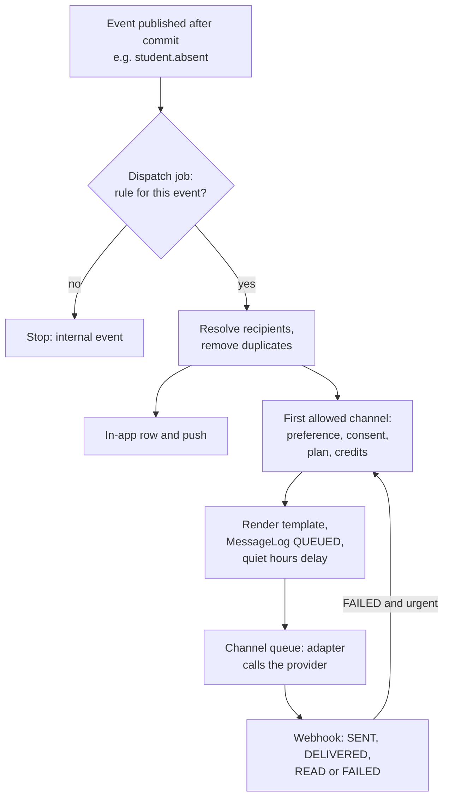
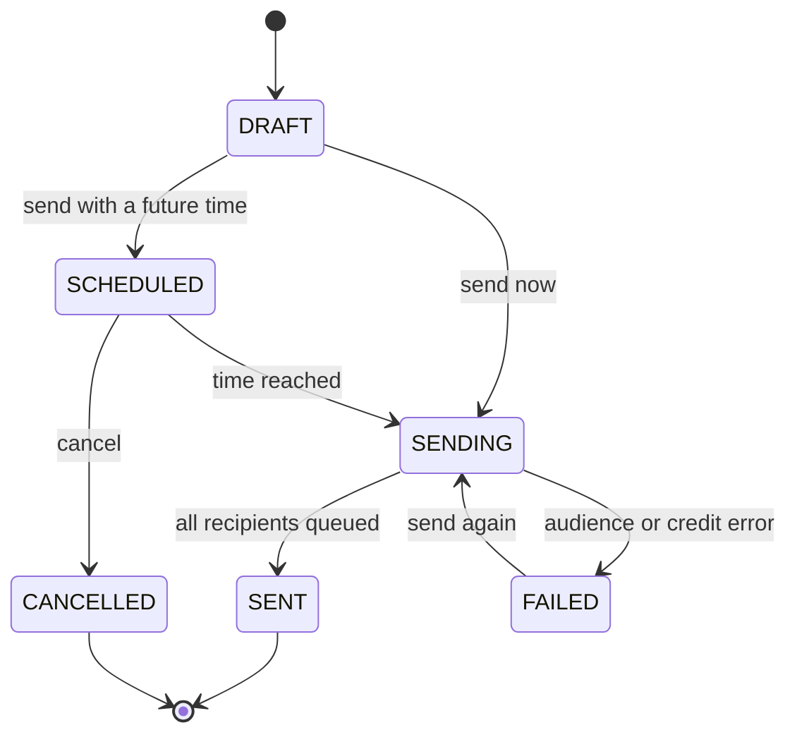
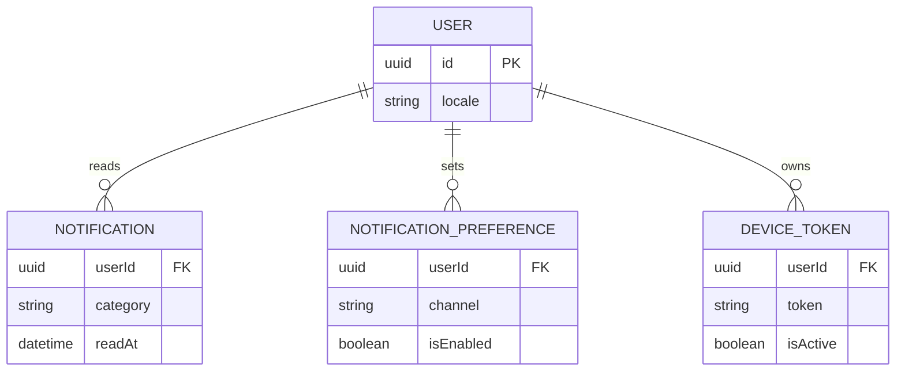
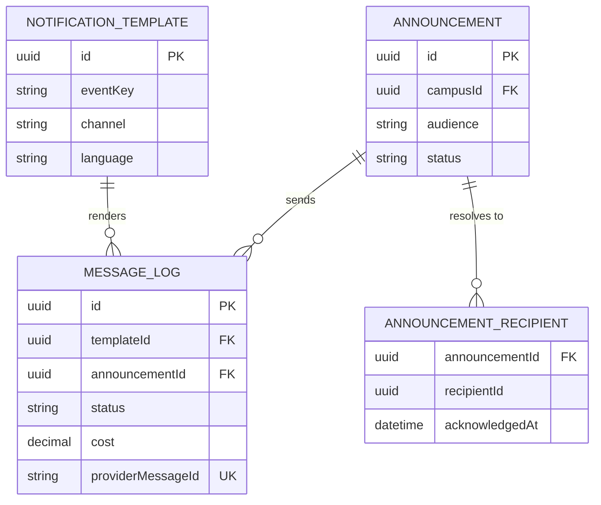

# Notifications Module

**In simple words:** Notifications is the voice of EduFlow. Other modules only say "this happened" (an event). This module decides who must hear about it, in which language, over which channel (in-app, WhatsApp, SMS, email or push) and at what time. It also sends notices to a chosen audience, tracks every message until it is delivered or read, and never sends a paid message without credits.

| Item | Value |
|---|---|
| Module code | NTF |
| Release phase | Phase 1 (MVP): engine, templates, in-app feed, preferences, delivery log. Announcements, push and log export: first pass after Day 60 |
| Plans | Starter (in-app and email only), Growth, Pro, Enterprise |
| Main users | Organization Admin, Principal, Teacher (drafts), Parent, Student; every user reads the own feed |
| Depends on | Settings, Student Profile, Batch, Organizations (plan), WhatsApp, Email, SMS |
| Main tables | `notification_templates`, `notifications`, `notification_preferences`, `announcements`, `announcement_recipients`, `message_logs`, `device_tokens` |

## Objective

1. **Fast alerts.** A transactional message (absence, receipt) leaves EduFlow within 60 seconds of the event (p95), outside quiet hours. The in-app item shows within 5 seconds.
2. **Reach.** At least 95% of guardian messages reach the parent on some channel. Channel fallback closes the gap.
3. **No surprise bills.** No paid message goes out without available credits. A wallet never goes below zero.
4. **One truth.** Every outbound message has one `message_logs` row with status, cost and error. Support can answer "Did Sunita Devi get the receipt?" in under one minute.
5. **Respect.** Quiet hours, preferences and consent are checked for every message. Children never get marketing.

## Scope

### In scope

- Dispatch engine: rules that map events to templates, recipients, priority and channels.
- Templates per event, channel and language: system defaults plus tenant overrides.
- Channel choice with preferences, consent, plan, credits, quiet hours, retries and fallback.
- Provider adapters: Meta WhatsApp, MSG91, Twilio, Amazon SES, FCM (Firebase Cloud Messaging, Google's push service) and in-app.
- Delivery log, resend and summary report.
- Notification centre, preferences, staff digest and device tokens.
- Announcements: audience builder, attachments, scheduling, acknowledgement, credit reservation.

### Out of scope

| Item | Owner chapter |
|---|---|
| WhatsApp numbers, Meta approval, wallet top-ups, inbound chat | *WhatsApp Module* |
| SES sender identities, bounces, suppressions | *Email Module* |
| DLT headers and templates, segment rules, SMS wallet | *SMS Module* |
| Channel order and quiet hours settings | *Settings Module* |
| Full text of every default template | *Notification Template Catalog* |
| Marketing drip campaigns to leads | Not planned; EduFlow is not a marketing tool |

### Phase notes

| When | What ships |
|---|---|
| Day 43 (16 Nov 2026), P-28 | Engine, in-app, templates, preferences, log (NTF-API-01 to 07, 19 to 24, 27 to 29, 31) |
| Day 44, P-29 | WhatsApp adapter and credit checks |
| December 2026 (V1.0 pass) | Announcements (NTF-API-08 to 18), web push (NTF-API-25, 26), log export (NTF-API-30), digest |
| Phase 2, P-31 | Email adapter for all events, SMS adapter and fallback to SMS |
| Phase 4 | Native push through white-label apps |

## User Stories

| ID | As a | I want to | So that | Priority |
|---|---|---|---|---|
| NTF-US-01 | Parent | get a WhatsApp message within minutes when my child is absent | I know at once if something is wrong | Must |
| NTF-US-02 | Parent | switch categories on or off per channel | WhatsApp brings only what matters to me | Must |
| NTF-US-03 | Parent | read all messages in one feed and tap "I have read this" | nothing gets lost in my phone | Must |
| NTF-US-04 | Organization Admin | edit the text of each message in English and Hindi | messages sound like my school | Must |
| NTF-US-05 | Organization Admin | see recipients and credit cost before I send a notice | I never spend credits by mistake | Must |
| NTF-US-06 | Principal | schedule a notice for 07:30 tomorrow to Class 10 parents | parents read it before school | Must |
| NTF-US-07 | Teacher | draft a notice for my batch | the Principal can check and send it | Should |
| NTF-US-08 | Principal | see who has not acknowledged a notice and remind only them | I do not spam parents who already read it | Should |
| NTF-US-09 | Organization Admin | search the delivery log by phone number | I answer "I never got it" calls fast | Must |
| NTF-US-10 | Organization Admin | have urgent alerts move to SMS when WhatsApp fails | safety messages always arrive | Must |
| NTF-US-11 | Teacher | get one daily summary instead of 40 submission pings | my phone stays quiet in class | Should |
| NTF-US-12 | Any user | see an unread badge and mark all as read | I know what is new | Must |
| NTF-US-13 | Organization Admin | hold normal messages during the night | parents are not woken at 23:00 | Must |

## Workflow

**Figure: From a domain event to a delivered message**



A module never sends a message itself. It publishes an event after its commit, so a failed message never touches the business record.

1. **Dispatch.** A listener adds one `notifications` job with the fixed ID `ntf-{eventId}`, so a retry cannot dispatch twice.
2. **Rule.** The job reads the event's rule (NTF-BR-01). No rule means an internal event.
3. **Recipients.** The rule resolves people and removes duplicates (NTF-BR-03).
4. **In-app.** Every recipient with a login gets a `notifications` row at once, plus push when a device token is active.
5. **Channel.** The job takes the first allowed external channel (NTF-BR-04), renders the template (NTF-BR-07, NTF-BR-08) and checks credits (NTF-BR-11).
6. **Queue.** It writes a `QUEUED` log row and adds a `whatsapp`, `sms` or `email` job, delayed by quiet hours (NTF-BR-05).
7. **Track.** The adapter stores `providerMessageId`; webhooks move the status forward (NTF-BR-15). An urgent failure falls back (NTF-BR-14).

**Figure: Announcement lifecycle**



`SENT` means every recipient has a queued message; delivery is counted per message.

**Announcement status (`AnnouncementStatus`)**

| Status | Meaning | Set by | Next |
|---|---|---|---|
| `DRAFT` | Being written; nothing reserved | NTF-API-09 | `SCHEDULED`, `SENDING` |
| `SCHEDULED` | Waits for `scheduledAt`; credits reserved | NTF-API-14 with a time | `SENDING`, `CANCELLED` |
| `SENDING` | Recipients resolved and queued in chunks of 100 | Send job | `SENT`, `FAILED` |
| `SENT` | All recipients queued; `sentAt` set | Send job | End |
| `CANCELLED` | Stopped before sending; reservation released | NTF-API-15 | End |
| `FAILED` | Nothing was queued; reservation released | Send job | `SENDING` |

**Message status (`MessageStatus`)**

| Status | Meaning | Set by |
|---|---|---|
| `QUEUED` | Waiting in a channel queue, maybe for quiet hours | Dispatch job |
| `SENT` | Provider accepted the message; `providerMessageId` stored | Adapter |
| `DELIVERED` | Reached the phone, inbox or device | Webhook; in-app rows start here |
| `READ` | Opened (WhatsApp blue ticks, in-app tap) | Webhook or NTF-API-21 |
| `FAILED` | Final failure; `errorCode` and `error` filled | Adapter or webhook |

## Screens and Wireframes

| ID | Screen | Users | Purpose |
|---|---|---|---|
| NTF-S01 | Bell menu and feed (web) | All staff users | Badge, latest 20 items, mark read |
| NTF-S02 | Notification centre (mobile) | Parent, Student, Teacher | Feed with filters, notice acknowledgement |
| NTF-S03 | My notification settings | All users | Channel x category switches, digest time |
| NTF-S04 | Templates and template editor | Organization Admin | Override default texts |
| NTF-S05 | Notices list | Organization Admin, Principal, Teacher | Drafts, scheduled, sent, with read counts |
| NTF-S06 | Notice composer | Organization Admin, Principal, Teacher | Title, body, audience, channels, schedule, cost |
| NTF-S07 | Notice detail and recipients | Organization Admin, Principal | Delivery and acknowledgement per recipient |
| NTF-S08 | Delivery log and message detail | Organization Admin, Principal | Search, status, error, resend |
| NTF-S09 | Messaging summary | Organization Admin | Counts and cost by channel |
| NTF-S10 | Staff notice inbox | All staff users | Notices sent to staff |

**Screen NTF-S06 — Notice composer (Principal, web)**

```text
+--------------------------------------------------------------------------+
| EduFlow | Bright Future Public School    [Search...]          (AV) v    |
+------------+-------------------------------------------------------------+
| Dashboard  | Notices > New notice                        Status: DRAFT   |
| Students   +-------------------------------------------------------------+
| Attendance | Title [Q2 fee deadline - 10 July_____________________]      |
| Fees       | Message                                                     |
| Notices  < | [Dear Parents, the Quarter 2 fee is due on 10 July 2027.  ] |
|  All       | [Pay in the parent app or at the fee counter.             ] |
|  New       | Attach [+ File]  fee-schedule-q2.pdf (182 KB) [x]           |
| Templates  |-------------------------------------------------------------|
| Delivery   | Audience (o) Parents ( ) Students ( ) Staff ( ) All         |
|  log       | Campus [Main Campus v] Course [Class 10 v] Batch [All v]    |
| Settings   | [ ] Fee defaulters only      [x] Ask to acknowledge         |
|            | Channels [x] In-app [x] WhatsApp [x] SMS [ ] Email [ ] Push |
|            | Send (o) Now ( ) Later [02-07-2027] [07:30 v]               |
|            |-------------------------------------------------------------|
|            | 229 people: WhatsApp 205 | SMS 16 | In-app only 8           |
|            | Cost Rs 27.12 + 16 SMS credits   WhatsApp wallet Rs 1,412.50|
|            |                     [Save draft]  [Preview]  [Send notice]  |
+------------+-------------------------------------------------------------+
```

- The preview line calls NTF-API-13, 800 ms after the last audience change.
- "Send notice" saves (NTF-API-09 or 11), then calls NTF-API-14. A teacher sees "Submit for approval" instead.
- The SMS copy is a short DLT alert with the title only (NTF-BR-08).

**Screen NTF-S02 — Notification centre (Parent, mobile)**

```text
+------------------------------------+
| <  Notifications        [Mark all] |
+------------------------------------+
| [All] [Unread 3] [Fees] [Notices]  |
+------------------------------------+
| * Aarav absent today               |
|   10-A, Wed 14 Jul. Tap to call    |
|   the class teacher.      09:35    |
+------------------------------------+
| * Fee overdue: Rs 6,050            |
|   Aarav Sharma, Quarter 2          |
|   [Pay now]               Tue      |
+------------------------------------+
| * NOTICE  Sports Day on 24 July    |
|   Please confirm you read it.      |
|   [I have read this]      Mon      |
+------------------------------------+
|   Receipt BF/27/000233 Rs 12,000   |
|   Paid by UPI. PDF inside.  2 Jul  |
+------------------------------------+
| [Home] [Fees] [Alerts 3] [More]    |
+------------------------------------+
```

- A star marks unread items; a tap opens the `deepLink` and calls NTF-API-21.
- "I have read this" calls PP-API-25 (NTF-API-18 for staff). Feed: NTF-API-19; badge: NTF-API-20.

**Screen NTF-S04 — Template editor (Organization Admin, web)**

```text
+--------------------------------------------------------------------------+
| EduFlow | Bright Future Public School    [Search...]          (RS) v    |
+------------+-------------------------------------------------------------+
| Settings   | Templates > attendance.absent                               |
|  General   | Event: Student absent       Category: ATTENDANCE            |
|  Comms     +-------------------------------------------------------------+
|  Templates<| Channel [WhatsApp v]  Language [English v]  Source: CUSTOM  |
|  Senders   | Meta template [absent_alert_v2 (en) - APPROVED v]           |
|            | Body                                                        |
|            | [Dear {{guardianName}}, {{studentName}} ({{batchName}}) is ]|
|            | [marked absent today, {{date}}. - {{schoolName}}           ]|
|            | Variables: guardianName, studentName, batchName, date,      |
|            | schoolName                      [+ Insert variable v]       |
|            |-------------------------------------------------------------|
|            | Preview: Dear Sunita Devi, Aarav Sharma (10-A) is marked    |
|            | absent today, 14 Jul 2027. - Bright Future Public School    |
|            |-------------------------------------------------------------|
|            | [Reset to default]  [Send test to me]  [Cancel]  [Save]     |
+------------+-------------------------------------------------------------+
```

- The list (NTF-API-01) shows a chip per channel: Default, Custom or Missing.
- "Save" calls NTF-API-02 or 03; "Reset to default" NTF-API-04; "Send test to me" NTF-API-06.

**Screen NTF-S08 — Delivery log (Organization Admin, web)**

```text
+--------------------------------------------------------------------------+
| EduFlow | Bright Future Public School    [Search...]          (RS) v    |
+------------+-------------------------------------------------------------+
| Notices    | Delivery log                                    [Export]    |
| Templates  | [98xxxx3210_______] [All channels v] [All status v]         |
| Delivery < | From [14-07-2027] To [14-07-2027]  Event [All v]            |
|  log       +-------------------------------------------------------------+
| Summary    | Time  Channel  To            Event             Status  Cost |
| Settings   | 09:35 WhatsApp +9198xxxx3210 attendance.absent FAILED  0.00 |
|            | 09:35 SMS      +9198xxxx3210 attendance.absent DELIVD  1 cr |
|            | 09:35 In-app   Sunita Devi   attendance.absent READ    0.00 |
|            | 11:02 WhatsApp +9198xxxx3210 fees.receipt      READ    0.13 |
|            |-------------------------------------------------------------|
|            | Detail: WhatsApp 09:35:04  Error 131026                     |
|            | "Receiver cannot get WhatsApp messages." Fallback: SMS      |
|            | Retries 0 of 5   Student: Aarav Sharma (BF-2027-0142)       |
|            |                                 [Open student]  [Resend]    |
+------------+-------------------------------------------------------------+
```

- List: NTF-API-27; detail: NTF-API-28. Phones are masked for users without `notifications.send`.
- "Resend" (NTF-API-29) shows on `FAILED` rows only. Cost is rupees for WhatsApp, credits (`cr`) for SMS.

## UI Components

| Component | Type | Behaviour |
|---|---|---|
| `NotificationBell` | shadcn `Popover` + `Badge` | Polls NTF-API-20 every 60 s while visible; "99+" above 99 |
| `NotificationFeed` | Virtual list | Pages of 20; 5-row skeleton; empty: "You are all caught up" |
| `PreferenceMatrix` | `Table` of `Switch` | Categories x channels; locked switches show a lock |
| `TemplateEditor` | `Textarea` + `Command` menu | Inserts variables; live preview; character and segment count |
| `AudienceBuilder` | `RadioGroup` + `Combobox` | Campus, course, batch, role, students, defaulters |
| `ChannelPicker` | `Checkbox` group | Paid channels locked with an "Upgrade" tag on Starter; in-app always on |
| `CostPreview` | `Card` | Recipients, cost, wallet; "Top up" link when short |
| `DeliveryStatusChip` | `Badge` | Icon plus word, never colour alone |
| `ScheduleField` | `Calendar` + `Select` | Shows the organization timezone |
| Error state | `Alert` | "Could not load messages." Retry button; request ID |

## Validation Rules

| Field | Rule | Error message shown to user |
|---|---|---|
| Template `body` variables | Only variables listed for the event | "{{feeAmount}} is not a variable of this event. Use one of: studentName, amount, dueDate." |
| Template `body` length | In-app 1,000; push 240; WhatsApp 1,024; email 20,000 characters | "The message is too long for this channel (max 1,024 characters)." |
| Template `subject` | Required for email and push, 1 to 200 characters | "Add a subject of up to 200 characters." |
| `whatsAppTemplateId` | Required for WhatsApp; `APPROVED`; placeholder count = `variables` | "Pick an approved WhatsApp template with 5 variables." |
| `smsDltTemplateId`, `smsSenderIdId` | Required for SMS in India; body matches the DLT text | "The SMS text must match the registered DLT text exactly." |
| `language` | Enabled language (`en`, `hi` at launch) | "This language is not enabled for your institute." |
| Announcement `title` | 3 to 200 characters | "Give the notice a title of 3 to 200 characters." |
| Announcement `body` | 1 to 5,000 characters | "The notice text must be 1 to 5,000 characters." |
| `channels` | `Channel` values; `IN_APP` implied | "Pick valid channels. In-app is always included." |
| `audienceFilter` ids | Inside the organization, campus and sender scope | "Batch 10-D is not in Main Campus." |
| `attachmentFileIds` | At most 3 `ACTIVE` files; PDF, JPG or PNG; 10 MB each | "Attach up to 3 files of 10 MB each (PDF, JPG or PNG)." |
| `scheduledAt` | At least 5 minutes and at most 90 days ahead | "Pick a time between 5 minutes and 90 days from now." |
| Preference rows | `ACCOUNT` and `IN_APP` stay on | "Security messages and the in-app feed cannot be switched off." |
| Resend | Status `FAILED`, queued in the last 7 days | "Only failed messages from the last 7 days can be resent." |
| Log export range | At most 93 days | "Export at most 93 days at a time." |

## Business Rules

### Rules, priorities and recipients

**NTF-BR-01 — Rule registry.** Each event that sends a message has one rule in code. The template key equals the event name unless the rule names another key. Tenants change texts, or switch a channel off per event by setting its template `INACTIVE`; they never change rules. Events without a rule are internal.

```typescript
// server/src/modules/notifications/rules.ts (shortened)
import type { Channel, NotificationCategory } from '@prisma/client';

export type Priority = 'CRITICAL' | 'HIGH' | 'NORMAL' | 'LOW';
export type RecipientKind =
  | 'GUARDIANS' | 'FEE_PAYER' | 'STUDENT' | 'TEACHER' | 'ACTOR' | 'APPROVERS' | 'ORG_ADMINS';

export interface NotificationRule {
  event: string; // domain event from the endpoint registry
  templateKey: string; // NotificationTemplate.eventKey
  category: NotificationCategory;
  priority: Priority;
  recipients: RecipientKind[];
  channels: Channel[]; // external channels in preference order; IN_APP is always added
  fallback: boolean; // try the next channel after a final failure
  digest?: boolean; // LOW items that staff may receive as one daily summary
}

export const RULES: NotificationRule[] = [
  { event: 'student.absent', templateKey: 'attendance.absent', category: 'ATTENDANCE',
    priority: 'HIGH', recipients: ['GUARDIANS'], channels: ['WHATSAPP', 'SMS', 'EMAIL'],
    fallback: true },
  { event: 'receipt.issued', templateKey: 'fees.receipt', category: 'FEES',
    priority: 'HIGH', recipients: ['FEE_PAYER'], channels: ['WHATSAPP', 'SMS', 'EMAIL'],
    fallback: true },
  { event: 'fee.invoice.overdue', templateKey: 'fees.reminder.overdue', category: 'FEES',
    priority: 'NORMAL', recipients: ['FEE_PAYER'], channels: ['WHATSAPP', 'SMS', 'EMAIL'],
    fallback: false },
  { event: 'transport.student.not_boarded', templateKey: 'transport.student.not_boarded',
    category: 'TRANSPORT', priority: 'CRITICAL', recipients: ['GUARDIANS'],
    channels: ['PUSH', 'WHATSAPP', 'SMS'], fallback: true },
  { event: 'homework.submitted', templateKey: 'homework.submitted', category: 'HOMEWORK',
    priority: 'LOW', recipients: ['TEACHER'], channels: [], fallback: false, digest: true },
];
```

**NTF-BR-02 — Priorities.**

| Priority | Examples | Quiet hours | Fallback | Daily paid cap |
|---|---|---|---|---|
| `CRITICAL` | OTP, security, transport, hostel safety, emergency holiday, data breach | Ignored | On failure, or no delivery in 10 minutes | No |
| `HIGH` | Absence, receipt, payment result, fee due today, class cancelled | Held unless bypassed | On failure | No |
| `NORMAL` | Reminders, results, homework, leave, notices | Held | No | Yes |
| `LOW` | Submissions, birthdays, follow-ups due | In-app only | No | - |

**NTF-BR-03 — Recipients.** `GUARDIANS` = linked, `ACTIVE`, not anonymised guardians with `receivesCommunication = true`. `FEE_PAYER` = guardians with `isFeePayer`, else the primary guardian. `STUDENT` = the student's login, in-app and push only; external messages about a child go to guardians. A recipient gets one message per event unless the texts differ (two absent siblings).

> **Example:** An emergency holiday at Main Campus of Bright Future: 1,640 guardian links, 128 guardians with two children. The engine sends 1,640 - 128 = 1,512 messages.

### Channel choice

**NTF-BR-04 — One external channel per message.** A message goes on the first eligible external channel, plus in-app and push for users with a login. The order is the guardian's `preferredChannel`, then `communication.channel_order` (default WhatsApp, SMS, email), limited to the rule's channels. The checks run in this order; the first failing check names the skip reason:

```typescript
export const CHANNEL_CHECKS = [
  'PLAN_FEATURE', // plan_features: whatsapp_sending, sms_sending
  'SENDER_READY', // WhatsApp number or shared sender, SMS header, email identity
  'ADDRESS_VALID', // E.164 phone; email not in email_suppressions
  'CONSENT', // WhatsApp: COMMUNICATION_WHATSAPP GRANTED; SMS: not opted out
  'PREFERENCE_ON', // NTF-BR-06
  'TEMPLATE_READY', // ACTIVE; provider-approved for WhatsApp and Indian SMS
  'CREDITS', // NTF-BR-11
] as const;
```

If nothing is eligible and the guardian has no login, a `FAILED` row with `NO_ELIGIBLE_CHANNEL` and cost 0 shows support why.

> **Example:** Sunita Devi prefers WhatsApp and consented; Bright Future is on Growth, so she gets WhatsApp. Rohan Verma's father has no WhatsApp consent, so he gets SMS. Sharma Classes (Starter) parents get email and in-app only.

**NTF-BR-05 — Quiet hours.** `holdUntil()` from SET-BR-04 runs with `Campus.timezone`, else `Organization.timezone`. A held message stays `QUEUED` with a delayed job. In-app is never held; push is held because it makes a sound. `CRITICAL` messages and the receipt for a parent's own payment go at once.

> **Example:** Priya Nair publishes homework at 22:10 IST; the window is 21:00 to 07:00. In-app shows at once. WhatsApp waits (420 - 1330 + 1440) mod 1440 = 530 minutes and goes at 07:00.

**NTF-BR-06 — Preferences.** No row means "on". `ACCOUNT` and `IN_APP` cannot be switched off. Guardians without a login follow `preferredChannel` and consent. The digest setting is `User.notificationPrefs` = `{ "digest": { "enabled": true, "hour": 18 } }`. Assumption: this chapter fixes that shape.

### Templates and rendering

**NTF-BR-07 — Template and language.** Language = `Guardian.preferredLanguage`, else `User.locale`, `Campus.locale`, `Organization.locale`, cut to the language part (`hi-IN` gives `hi`). Lookup order among `ACTIVE` rows: tenant template in that language, system default in that language, tenant in `en`, system in `en`. Nothing found skips the channel (`TEMPLATE_MISSING`); so does a Meta template that is `PAUSED` or `DISABLED`.

**NTF-BR-08 — Variables.** Placeholders `{{name}}` come from the event's variable list. Values are loaded fresh, because events carry IDs only. A missing value fails the message (`TEMPLATE_VARIABLE_MISSING`); a half-empty text is never sent. SMS writes money as `Rs 10,800`, because the rupee sign makes a text Unicode. WhatsApp gets values as positional parameters in `variables` order. DLT variables are cut to 30 characters.

```typescript
import { TemplateError } from './errors';

const TOKEN = /\{\{(\w+)\}\}/g;

export function render(body: string, allowed: string[], values: Record<string, string>): string {
  return body.replace(TOKEN, (_m, name: string) => {
    if (!allowed.includes(name)) throw new TemplateError('TEMPLATE_VARIABLE_UNKNOWN', name);
    const value = values[name];
    if (value === undefined || value === '') {
      throw new TemplateError('TEMPLATE_VARIABLE_MISSING', name);
    }
    return value.replace(/[\t\n]+/g, ' ').replace(/ {4,}/g, ' '); // WhatsApp rejects these
  });
}
```

> **Example:** By SMS a notice uses the DLT alert "Dear Parent, {#var#} has posted a notice: {#var#}. Please read it in the parent app." The title "Annual Sports Day and Prize Distribution" (40 characters) becomes "Annual Sports Day and Prize..." (30).

### Credits and cost

**NTF-BR-09 — WhatsApp cost.** The wallet unit is `MONEY`. Charge = provider cost x exchange rate x 1.15, rounded to 4 decimals. The difference to the provider cost is `marginAmount`.

> **Example:** Assumption: Meta's India utility rate is Rs 0.1150 (planning value; the *WhatsApp Module* owns live rates). Charge = 0.1150 x 1 x 1.15 = 0.13225, stored as 0.1323. Margin = 0.0173.

**NTF-BR-10 — SMS cost.** The wallet unit is `MESSAGES`: one credit = one segment = Rs 0.25. `cost` holds credits and `currency` stays empty. A GSM text fits 160 characters in one segment. A Hindi text is Unicode: 70 characters in one segment, else 67 per segment. So 150 Hindi characters = ceil(150 / 67) = 3 credits = Rs 0.75.

**NTF-BR-11 — Credit check.** Available = `balance` - `reserved`. A paid row is queued only when available covers its cost; otherwise the channel is skipped (`CREDITS_EXHAUSTED`). The channel job writes one `CONSUME` row when the provider accepts. A `FAILED` message without a provider charge gets one `REFUND` row. Unique keys on `credit_transactions` block double debits.

**NTF-BR-12 — Notice reservation.** NTF-API-14 writes one `RESERVE` row per paid wallet (`idempotencyKey` `ann-{announcementId}-reserve`), or fails with 422. Messages consume from it. A `RELEASE` row returns the rest 24 hours after `SENT`, or at once on cancel.

> **Example:** Dr. Anita Verma's Quarter 2 notice reaches 229 parents: 205 WhatsApp, 16 SMS, 8 in-app only. Reserve = 205 x 0.1323 = Rs 27.1215 plus 16 credits. Three WhatsApp messages fail, so 202 x 0.1323 = Rs 26.7246 is consumed and Rs 0.3969 released.

### Delivery

**NTF-BR-13 — Retries.** Timeouts, HTTP 429 and HTTP 5xx retry 5 times (30 s, 1, 2, 4 min), counted in `retryCount`. Permanent errors (invalid number, not on WhatsApp, template paused, suppressed address, empty wallet) throw `UnrecoverableError` and fail at once.

**NTF-BR-14 — Fallback.** For rules with `fallback: true`, a final failure re-runs channel choice without the channels already tried, as a new log row. `message.fallback_triggered` carries both IDs. For `CRITICAL`, a message still `SENT` after 10 minutes also falls back (job `ntf-fb-{messageLogId}`); a double message is accepted for safety. At most 3 channels are tried.

> **Example:** Aarav's absence alert: WhatsApp accepted at 09:35:04; `FAILED` with Meta error 131026 at 09:35:06; `REFUND` of Rs 0.1323; SMS `DELIVERED` at 09:35:15. Sunita Devi hears within 11 seconds.

**NTF-BR-15 — Status moves forward only.** Ranks: `QUEUED` 0, `SENT` 1, `DELIVERED` 2, `READ` 3. A lower rank is ignored. `FAILED` is accepted only from `QUEUED` or `SENT`. Timestamps are set once; an early `READ` also fills `deliveredAt`.

**NTF-BR-16 — Duplicates and limits.**

1. Fixed job IDs: `ntf-{eventId}` and `msg-{eventId}-{recipientId}-{channel}`.
2. The same template key, entity and recipient within 10 minutes is dropped (`org:{orgId}:ntf:dedupe:{hash}`, TTL 600 s).
3. At most 10 paid `NORMAL` messages per guardian per day; later ones go in-app only. Assumption: 10 is a starting value.
4. BullMQ priorities: `CRITICAL` 1, `HIGH` 2, `NORMAL` 5, notice chunks 10. A receipt never waits behind a campaign.
5. Test sends (NTF-API-06): 10 per user per hour.

**NTF-BR-17 — Digest.** `LOW` items are in-app only. With the digest on, a staff user gets one email (push if no email) at the chosen hour. It lists unread `LOW` items since the last `system.digest` log row. No items means no digest.

> **Example:** At 18:00 Priya Nair gets one email instead of 39 pings: "38 homework submissions (10-A Maths 36, 9-B Maths 2), 1 birthday today (Diya Kapoor)."

### Announcements

**NTF-BR-18 — Audience.** `STAFF` = active staff of the campus. `STUDENTS` = students with an `ACTIVE` enrollment (in-app and push only). `PARENTS` = their guardians with `receivesCommunication`. `STUDENTS_AND_PARENTS` and `ALL` combine them. `audienceFilter` narrows by `courseIds`, `batchIds`, `roleKeys`, `studentIds` and `feeDefaultersOnly` (any overdue balance). Teachers target own batches only, never defaulters. Only the Organization Admin may leave `campusId` empty. Recipients are resolved when sending starts and frozen in `announcement_recipients`.

**NTF-BR-19 — Notice changes.** Only `DRAFT` and `SCHEDULED` notices are editable; editing a scheduled one recomputes the reservation. Deleting a draft sets `deletedAt`. Deleting a sent notice hides it from portals and keeps its logs. `REMIND_PENDING` re-sends to recipients without `acknowledgedAt`, at most twice. `readCount` rises on a recipient's first `readAt`.

**NTF-BR-20 — Retention.** A nightly job deletes read `notifications` rows older than 180 days and unread ones older than 365 days. `message_logs` rows stay; `body` and `variables` are cleared after `privacy.retention_message_body_days` (365). Device tokens idle for 90 days are deleted.

## Acceptance Criteria

- **NTF-AC-01** Given Sunita Devi has WhatsApp consent on Growth, when `student.absent` for Aarav Sharma is published at 09:35, then a WhatsApp row is `QUEUED` within 60 seconds and her in-app item shows within 5 seconds.
- **NTF-AC-02** Given WhatsApp answers error 131026, when the webhook arrives, then the row is `FAILED`, one `REFUND` row exists and an SMS row is `QUEUED` within 10 seconds.
- **NTF-AC-03** Given quiet hours 21:00 to 07:00, when `homework.published` fires at 22:10, then the in-app item shows at once and the WhatsApp row stays `QUEUED` until 07:00.
- **NTF-AC-04** Given Sharma Classes is on Starter, when any event fires, then no WhatsApp or SMS row is created, and a WhatsApp template save returns 403 `PLAN_LIMIT_REACHED`.
- **NTF-AC-05** Given a Hindi template for `attendance.absent`, when guardians are alerted, then language `hi` gets Hindi and `ta` gets English.
- **NTF-AC-06** Given a body with `{{feeAmount}}` that the event does not offer, when saved, then 400 `VALIDATION_ERROR`.
- **NTF-AC-07** Given Rs 15.00 is available in the WhatsApp wallet, when a notice needs Rs 27.12, then NTF-API-14 returns 422 and nothing is reserved or queued.
- **NTF-AC-08** Given a `SCHEDULED` notice, when it is cancelled, then its status is `CANCELLED` and the `RELEASE` amount equals the `RESERVE` amount.
- **NTF-AC-09** Given Priya Nair (teacher), when she sends a notice or drafts one for a batch she does not teach, then 403 `FORBIDDEN`.
- **NTF-AC-10** Given a parent switched `FEES` off for WhatsApp, when a fee reminder fires, then it goes by the next eligible channel and the in-app item still appears.
- **NTF-AC-11** Given a reminder is triggered twice within 10 minutes, when both dispatch, then each recipient has one message.
- **NTF-AC-12** Given `READ` arrives before `DELIVERED`, when both webhooks are processed, then the status stays `READ` and `deliveredAt` equals `readAt`.
- **NTF-AC-13** Given 12 unread items, when the user calls NTF-API-22, then NTF-API-20 returns 0 and no other user's rows change.
- **NTF-AC-14** Given 40 of 229 recipients have not acknowledged, when `REMIND_PENDING` is sent, then 40 messages are queued; a third reminder returns 422.
- **NTF-AC-15** Given a Bright Future user, when he requests a Sharma Classes log ID, then 404 `NOT_FOUND`.

## Edge Cases

| Case | What happens | How the system handles it |
|---|---|---|
| Father and mother share one phone number | Two recipients, one address | One message per address per event; the log names the first guardian |
| Student withdrawn between event and dispatch | Data changed | The job reloads data; `NORMAL` messages stop, receipts and refunds still go |
| Guardian has no phone, no email, no login | Nobody can be reached | `FAILED` row with `NO_ELIGIBLE_CHANNEL`; listed in the unreachable report |
| Meta pauses a WhatsApp template mid-campaign | Queued rows would fail | Its `QUEUED` rows re-run channel choice; admin alerted |
| Wallet empties during the day | Alerts need credits | Alerts use SMS or email; `whatsapp.wallet.exhausted` alerts the admin once |
| Webhook arrives before the row has `providerMessageId` | Row not found | Stored in `webhook_events`; the `webhooks` queue retries up to 8 times |
| FCM reports a token invalid | Push cannot reach | Every row with that token gets `isActive = false` (index on `token`) |
| Parent replies STOP on WhatsApp | Opt-out | The *WhatsApp Module* withdraws consent; later messages use the next channel |
| Notice scheduled at 22:00 | Inside quiet hours | Composer warns; WhatsApp and SMS wait until 07:00; emergencies use `holiday.declared` |
| UAE campus with Asia/Dubai time | Different clock | Quiet hours and digest use `Campus.timezone` |

## Database Schema

Every table has `id` (uuid, PK), `organization_id` (FK; null only for system templates), `created_at` and `updated_at`. The Prisma block is the full column list. Wallet tables belong to the *WhatsApp Module* and *SMS Module*.

| Table | Purpose | Unique keys and indexes |
|---|---|---|
| `notification_templates` | Text per template key, channel and language | Unique (org, `event_key`, `channel`, `language`); partial unique for system rows; (org, `category`, `status`) |
| `notifications` | In-app feed of one user | (org, `user_id`, `read_at`, `created_at`) for the badge; (`created_at`) for retention |
| `notification_preferences` | Channel x category switches | Unique (org, `user_id`, `channel`, `category`) |
| `announcements` | Notices with audience and schedule | (org, `campus_id`, `status`, `created_at`); (org, `status`, `scheduled_at`) for the scheduler |
| `announcement_recipients` | Resolved recipients with read and acknowledgement | Unique (org, `announcement_id`, `recipient_type`, `recipient_id`) |
| `message_logs` | Every external message and every in-app item about a student | Unique (`provider`, `provider_message_id`); 7 indexes starting with org |
| `device_tokens` | Push tokens per user and device | Unique (`user_id`, `token`); (`token`) |

Columns that carry the rules of this chapter:

| Table | Column | Type | Null | Default | Notes |
|---|---|---|---|---|---|
| `notification_templates` | `event_key` | varchar(80) | No | - | Template key, e.g. `fees.receipt` |
| `notification_templates` | `variables` | text[] | No | - | Allowed names, positional order |
| `notification_templates` | `approval_status` | `TemplateApprovalStatus` | No | `NOT_REQUIRED` | Provider approval |
| `notifications` | `read_at` | timestamptz | Yes | - | Null = unread |
| `notification_preferences` | `is_enabled` | boolean | No | true | False = opted out |
| `announcements` | `campus_id` | uuid | Yes | - | FK; null = all campuses |
| `announcements` | `audience_filter` | jsonb | Yes | - | Keys in NTF-BR-18 |
| `announcements` | `recipient_count`, `read_count` | integer | No | 0 | Cached counters |
| `announcement_recipients` | `acknowledged_at` | timestamptz | Yes | - | "I have read this" |
| `message_logs` | `status` | `MessageStatus` | No | `QUEUED` | Moves forward only |
| `message_logs` | `cost`, `provider_cost`, `margin_amount` | decimal(12,4) | No | 0 | Wallet charge and its parts |
| `message_logs` | `body`, `variables` | text, jsonb | Yes | - | Cleared after retention |
| `device_tokens` | `is_active` | boolean | No | true | False after an invalid-token report |

**Figure: Feed tables of one user**



**Figure: Sending tables**



A user owns a feed, switches and device tokens. A notice resolves to recipients and produces log rows; each log row points to the template that rendered it.

## Prisma Schema

Copied from `docs/src/_schema/10-communication.prisma`; `Channel`, `Audience`, `DevicePlatform` and `RecordStatus` come from `00-base.prisma`. Fields and attributes are unchanged; long trailing comments were moved above their fields to fit the page.

```prisma
// 00-base.prisma (shared enums used here)
enum Channel {
  IN_APP
  WHATSAPP
  SMS
  EMAIL
  PUSH
}

enum DevicePlatform {
  WEB
  ANDROID
  IOS
  API
}

// Who a calendar item, holiday or announcement applies to.
enum Audience {
  ALL
  STAFF
  STUDENTS
  PARENTS
  STUDENTS_AND_PARENTS
}

// 10-communication.prisma
enum NotificationCategory {
  ATTENDANCE
  FEES
  EXAMS
  HOMEWORK
  ANNOUNCEMENTS
  ADMISSIONS
  LEAVE
  TIMETABLE
  TRANSPORT
  LIBRARY
  HOSTEL
  PAYROLL
  ACCOUNT // login, OTP, password, security alerts
  SYSTEM
}

// Approval state of a template at the provider (Meta for WhatsApp, DLT for SMS).
enum TemplateApprovalStatus {
  DRAFT
  PENDING
  APPROVED
  REJECTED
  PAUSED
  DISABLED
  NOT_REQUIRED // in-app, push and email templates
}

enum AnnouncementStatus {
  DRAFT
  SCHEDULED
  SENDING
  SENT
  CANCELLED
  FAILED
}

enum MessageStatus {
  QUEUED
  SENT
  DELIVERED
  READ
  FAILED
}

enum MessageProvider {
  META_WHATSAPP
  MSG91
  TWILIO
  AMAZON_SES
  FCM
  INTERNAL // in-app only
}

enum MessageRecipientType {
  USER
  GUARDIAN
  STUDENT
  STAFF
  LEAD // admission inquiry contact
  OTHER
}

// Message template per event, channel and language. organizationId null = EduFlow default used until a
// tenant overrides it.
model NotificationTemplate {
  id                 String                 @id @default(uuid()) @db.Uuid
  // null ONLY for system default templates
  organizationId     String?                @map("organization_id") @db.Uuid
  // e.g. attendance.absent, fees.receipt, fees.reminder.overdue
  eventKey           String                 @map("event_key") @db.VarChar(80)
  channel            Channel
  language           String                 @default("en") @db.VarChar(10)
  category           NotificationCategory
  name               String                 @db.VarChar(120)
  subject            String?                @db.VarChar(200) // email subject / push title
  // text with {{variables}}, e.g. "{{studentName}} was absent on {{date}}"
  body               String                 @db.Text
  // allowed variable names, in order for WhatsApp / DLT positional placeholders
  variables          String[]
  // approved Meta template used for the WHATSAPP channel
  whatsAppTemplateId String?                @map("whats_app_template_id") @db.Uuid
  // registered TRAI DLT content template for the SMS channel (India); language-specific
  smsDltTemplateId   String?                @map("sms_dlt_template_id") @db.Uuid
  smsSenderIdId      String?                @map("sms_sender_id_id") @db.Uuid // SMS header to send with
  approvalStatus     TemplateApprovalStatus @default(NOT_REQUIRED) @map("approval_status")
  isSystem           Boolean                @default(false) @map("is_system")
  status             RecordStatus           @default(ACTIVE)
  // User id (audit only, no FK)
  updatedById        String?                @map("updated_by_id") @db.Uuid
  createdAt          DateTime               @default(now()) @map("created_at") @db.Timestamptz(6)
  updatedAt          DateTime               @updatedAt @map("updated_at") @db.Timestamptz(6)
  deletedAt          DateTime?              @map("deleted_at") @db.Timestamptz(6)

  organization Organization? @relation(fields: [organizationId], references: [id], onDelete: Cascade)
  whatsAppTemplate WhatsAppTemplate? @relation(fields: [whatsAppTemplateId], references: [id], onDelete: SetNull)
  smsSenderId SmsSenderId? @relation(fields: [smsSenderIdId], references: [id], onDelete: SetNull)
  smsDltTemplate SmsDltTemplate? @relation(fields: [smsDltTemplateId], references: [id], onDelete: SetNull)
  messageLogs      MessageLog[]

  // System defaults (organization_id IS NULL) are kept unique by a partial unique index in the SQL
  // migration.
  @@unique([organizationId, eventKey, channel, language])
  @@index([organizationId, category, status])
  @@index([eventKey, channel, language])
  @@map("notification_templates")
}

// In-app notification shown in the bell menu of one user.
model Notification {
  id             String               @id @default(uuid()) @db.Uuid
  organizationId String               @map("organization_id") @db.Uuid
  userId         String               @map("user_id") @db.Uuid
  category       NotificationCategory
  eventKey       String?              @map("event_key") @db.VarChar(80)
  title          String               @db.VarChar(200)
  body           String               @db.VarChar(1000)
  // app route, e.g. /fees/invoices/{id}
  deepLink       String?              @map("deep_link") @db.VarChar(500)
  entityType     String?              @map("entity_type") @db.VarChar(60)
  entityId       String?              @map("entity_id") @db.Uuid
  data           Json? // extra payload for the client
  readAt         DateTime?            @map("read_at") @db.Timestamptz(6)
  createdAt      DateTime             @default(now()) @map("created_at") @db.Timestamptz(6)
  updatedAt      DateTime             @updatedAt @map("updated_at") @db.Timestamptz(6)

  organization Organization @relation(fields: [organizationId], references: [id], onDelete: Cascade)
  user         User         @relation(fields: [userId], references: [id], onDelete: Cascade)

  @@index([organizationId, userId, readAt, createdAt]) // unread list and badge count
  @@index([organizationId, userId, createdAt])
  @@index([createdAt]) // retention cleanup
  @@map("notifications")
}

// A user's opt-in / opt-out per channel and category.
model NotificationPreference {
  id             String               @id @default(uuid()) @db.Uuid
  organizationId String               @map("organization_id") @db.Uuid
  userId         String               @map("user_id") @db.Uuid
  channel        Channel
  category       NotificationCategory
  isEnabled      Boolean              @default(true) @map("is_enabled")
  createdAt      DateTime             @default(now()) @map("created_at") @db.Timestamptz(6)
  updatedAt      DateTime             @updatedAt @map("updated_at") @db.Timestamptz(6)

  organization Organization @relation(fields: [organizationId], references: [id], onDelete: Cascade)
  user         User         @relation(fields: [userId], references: [id], onDelete: Cascade)

  @@unique([organizationId, userId, channel, category])
  // fan-out: who opted out of a channel for a category
  @@index([organizationId, channel, category, isEnabled])
  @@map("notification_preferences")
}

// Notice / circular sent to a filtered audience over one or more channels, now or scheduled.
model Announcement {
  id                String             @id @default(uuid()) @db.Uuid
  organizationId    String             @map("organization_id") @db.Uuid
  campusId          String?            @map("campus_id") @db.Uuid // null = all campuses
  title             String             @db.VarChar(200)
  body              String             @db.Text
  audience          Audience           @default(ALL)
  // { courseIds, batchIds, roleKeys, studentIds, feeDefaultersOnly }
  audienceFilter    Json?              @map("audience_filter")
  channels          Channel[] // IN_APP is always implied
  attachmentFileIds String[]           @map("attachment_file_ids") @db.Uuid // FileAsset ids
  status            AnnouncementStatus @default(DRAFT)
  isPinned          Boolean            @default(false) @map("is_pinned")
  // parents must tap "I have read this"
  requiresAck       Boolean            @default(false) @map("requires_ack")
  scheduledAt       DateTime?          @map("scheduled_at") @db.Timestamptz(6)
  sentAt            DateTime?          @map("sent_at") @db.Timestamptz(6)
  // hidden from the portals after this time
  expiresAt         DateTime?          @map("expires_at") @db.Timestamptz(6)
  recipientCount    Int                @default(0) @map("recipient_count")
  readCount         Int                @default(0) @map("read_count")
  authorId          String?            @map("author_id") @db.Uuid
  createdAt         DateTime           @default(now()) @map("created_at") @db.Timestamptz(6)
  updatedAt         DateTime           @updatedAt @map("updated_at") @db.Timestamptz(6)
  deletedAt         DateTime?          @map("deleted_at") @db.Timestamptz(6)

  organization Organization @relation(fields: [organizationId], references: [id], onDelete: Restrict)
  campus Campus? @relation(fields: [campusId], references: [id], onDelete: Restrict)
  author User? @relation(fields: [authorId], references: [id], onDelete: SetNull)
  recipients   AnnouncementRecipient[]
  messageLogs  MessageLog[]

  @@index([organizationId, campusId, status, createdAt])
  @@index([organizationId, status, scheduledAt]) // scheduler
  @@map("announcements")
}

// One resolved recipient of an announcement with read / acknowledgement tracking.
model AnnouncementRecipient {
  id             String               @id @default(uuid()) @db.Uuid
  organizationId String               @map("organization_id") @db.Uuid
  announcementId String               @map("announcement_id") @db.Uuid
  recipientType  MessageRecipientType @map("recipient_type")
  // id of the Guardian / Student / Staff / User row
  recipientId    String               @map("recipient_id") @db.Uuid
  // login of the recipient when one exists (portal inbox)
  userId         String?              @map("user_id") @db.Uuid
  // the child the notice is about, for parents
  studentId      String?              @map("student_id") @db.Uuid
  readAt         DateTime?            @map("read_at") @db.Timestamptz(6)
  acknowledgedAt DateTime?            @map("acknowledged_at") @db.Timestamptz(6)
  createdAt      DateTime             @default(now()) @map("created_at") @db.Timestamptz(6)
  updatedAt      DateTime             @updatedAt @map("updated_at") @db.Timestamptz(6)

  organization Organization @relation(fields: [organizationId], references: [id], onDelete: Cascade)
  announcement Announcement @relation(fields: [announcementId], references: [id], onDelete: Cascade)
  user         User?        @relation(fields: [userId], references: [id], onDelete: Cascade)
  student      Student?     @relation(fields: [studentId], references: [id], onDelete: Cascade)

  @@unique([organizationId, announcementId, recipientType, recipientId])
  @@index([organizationId, userId, readAt])
  @@map("announcement_recipients")
}

// Every WhatsApp, SMS, email and push message sent, with delivery status and cost. High volume; never
// soft-deleted.
// cost / currency = amount debited from the tenant wallet; providerCost + marginAmount explain it
// (WhatsApp: Meta cost + 15 % margin).
model MessageLog {
  id                   String               @id @default(uuid()) @db.Uuid
  organizationId       String               @map("organization_id") @db.Uuid
  campusId             String?              @map("campus_id") @db.Uuid
  channel              Channel
  provider             MessageProvider
  // phone (E.164), email or device token id
  toAddress            String               @map("to_address") @db.VarChar(255)
  recipientType        MessageRecipientType @map("recipient_type")
  // id of the Guardian / Student / Staff / User / inquiry row
  recipientId          String?              @map("recipient_id") @db.Uuid
  // student the message is about (communication timeline)
  studentId            String?              @map("student_id") @db.Uuid
  templateId           String?              @map("template_id") @db.Uuid
  whatsAppTemplateId   String?              @map("whats_app_template_id") @db.Uuid
  whatsAppAccountId    String?              @map("whats_app_account_id") @db.Uuid // sending number
  smsSenderIdId        String?              @map("sms_sender_id_id") @db.Uuid // SMS header used
  // snapshot of the DLT content template id actually sent
  dltTemplateId        String?              @map("dlt_template_id") @db.VarChar(30)
  // snapshot of the DLT principal entity id
  dltEntityId          String?              @map("dlt_entity_id") @db.VarChar(30)
  // per-country WhatsApp / SMS rates
  recipientCountryCode String?              @map("recipient_country_code") @db.Char(2)
  // MARKETING | UTILITY | AUTHENTICATION | SERVICE
  pricingCategory      String?              @map("pricing_category") @db.VarChar(20)
  // false for free-window / service conversations
  isBillable           Boolean              @default(true) @map("is_billable")
  announcementId       String?              @map("announcement_id") @db.Uuid
  eventKey             String?              @map("event_key") @db.VarChar(80)
  subject              String?              @db.VarChar(200)
  body                 String?              @db.Text // rendered text (OTP values are masked)
  variables            Json? // values used to render the template
  status               MessageStatus        @default(QUEUED)
  providerMessageId    String?              @map("provider_message_id") @db.VarChar(150)
  segments             Int                  @default(1) @db.SmallInt // SMS parts
  // amount charged to the tenant wallet; 4 decimals: per-message prices are fractions of a rupee
  cost                 Decimal              @default(0) @db.Decimal(12, 4)
  currency             String?              @db.Char(3) // wallet currency
  // what Meta / MSG91 / Twilio charges EduFlow
  providerCost         Decimal              @default(0) @map("provider_cost") @db.Decimal(12, 4)
  providerCurrency     String?              @map("provider_currency") @db.Char(3)
  // providerCurrency -> currency at send time (ExchangeRate)
  exchangeRate         Decimal?             @map("exchange_rate") @db.Decimal(18, 8)
  // in the wallet currency
  marginAmount         Decimal              @default(0) @map("margin_amount") @db.Decimal(12, 4)
  errorCode            String?              @map("error_code") @db.VarChar(60)
  error                String?              @db.VarChar(500)
  retryCount           Int                  @default(0) @map("retry_count") @db.SmallInt
  queuedAt             DateTime             @default(now()) @map("queued_at") @db.Timestamptz(6)
  sentAt               DateTime?            @map("sent_at") @db.Timestamptz(6)
  deliveredAt          DateTime?            @map("delivered_at") @db.Timestamptz(6)
  readAt               DateTime?            @map("read_at") @db.Timestamptz(6)
  failedAt             DateTime?            @map("failed_at") @db.Timestamptz(6)
  // User id (audit only, no FK); null for automatic messages
  triggeredById        String?              @map("triggered_by_id") @db.Uuid
  createdAt            DateTime             @default(now()) @map("created_at") @db.Timestamptz(6)
  updatedAt            DateTime             @updatedAt @map("updated_at") @db.Timestamptz(6)

  organization Organization @relation(fields: [organizationId], references: [id], onDelete: Restrict)
  campus Campus? @relation(fields: [campusId], references: [id], onDelete: SetNull)
  student Student? @relation(fields: [studentId], references: [id], onDelete: SetNull)
  template NotificationTemplate? @relation(fields: [templateId], references: [id], onDelete: SetNull)
  whatsAppTemplate WhatsAppTemplate? @relation(fields: [whatsAppTemplateId], references: [id], onDelete: SetNull)
  whatsAppAccount WhatsAppAccount? @relation(fields: [whatsAppAccountId], references: [id], onDelete: SetNull)
  smsSenderId SmsSenderId? @relation(fields: [smsSenderIdId], references: [id], onDelete: SetNull)
  announcement Announcement? @relation(fields: [announcementId], references: [id], onDelete: SetNull)
  creditTransactions CreditTransaction[]
  inboundReplies     WhatsAppInboundMessage[]
  emailSuppressions  EmailSuppression[]
  feeReminderLogs    FeeReminderLog[]

  @@unique([provider, providerMessageId]) // delivery webhooks find the row by this key
  @@index([organizationId, channel, status, createdAt])
  // cost and margin reports, Meta bill reconciliation
  @@index([organizationId, channel, pricingCategory, createdAt])
  @@index([organizationId, campusId, createdAt])
  @@index([organizationId, recipientType, recipientId, createdAt])
  @@index([organizationId, studentId, createdAt])
  @@index([organizationId, announcementId])
  @@index([organizationId, toAddress, createdAt])
  @@map("message_logs")
}

// Push notification token (FCM / APNs) of a user's device.
model DeviceToken {
  id             String         @id @default(uuid()) @db.Uuid
  organizationId String         @map("organization_id") @db.Uuid
  userId         String         @map("user_id") @db.Uuid
  platform       DevicePlatform
  // not globally unique: one phone may hold User rows of two organizations
  token          String         @db.VarChar(512)
  deviceId       String?        @map("device_id") @db.VarChar(100)
  deviceName     String?        @map("device_name") @db.VarChar(150)
  appVersion     String?        @map("app_version") @db.VarChar(20)
  locale         String?        @db.VarChar(10)
  // set false when the provider reports the token as invalid
  isActive       Boolean        @default(true) @map("is_active")
  lastSeenAt     DateTime?      @map("last_seen_at") @db.Timestamptz(6)
  createdAt      DateTime       @default(now()) @map("created_at") @db.Timestamptz(6)
  updatedAt      DateTime       @updatedAt @map("updated_at") @db.Timestamptz(6)

  organization Organization @relation(fields: [organizationId], references: [id], onDelete: Cascade)
  user         User         @relation(fields: [userId], references: [id], onDelete: Cascade)

  @@unique([userId, token])
  @@index([organizationId, userId, isActive])
  @@index([token]) // deactivate every row of a token that FCM reports as invalid
  @@map("device_tokens")
}
```

## API Endpoints

Base URL `/api/v1`, bearer token, tenant from the token. Besides the listed errors, any call may answer 401, 403 `FORBIDDEN` or 429.

| ID | Method | Path | Permission | Purpose |
|---|---|---|---|---|
| NTF-API-01 | GET | `/notification-templates` | notifications.view | Templates: tenant overrides over system defaults |
| NTF-API-02 | POST | `/notification-templates` | notifications.manage | Create override for key + channel + language |
| NTF-API-03 | PATCH | `/notification-templates/:id` | notifications.manage | Update body, subject, provider template, status |
| NTF-API-04 | DELETE | `/notification-templates/:id` | notifications.manage | Remove override; system default applies |
| NTF-API-05 | POST | `/notification-templates/:id/preview` | notifications.view | Render with sample variables |
| NTF-API-06 | POST | `/notification-templates/:id/test` | notifications.manage | Test message to own phone or email |
| NTF-API-07 | GET | `/notification-events` | notifications.view | Event catalog: variables, channels, templates |
| NTF-API-08 | GET | `/announcements` | notifications.view | List notices (status, campus, audience) |
| NTF-API-09 | POST | `/announcements` | notifications.create | Create a `DRAFT` |
| NTF-API-10 | GET | `/announcements/:id` | notifications.view | Detail with delivery counts |
| NTF-API-11 | PATCH | `/announcements/:id` | notifications.update | Edit `DRAFT` or `SCHEDULED`; pin |
| NTF-API-12 | DELETE | `/announcements/:id` | notifications.delete | Delete draft or hide sent notice |
| NTF-API-13 | POST | `/announcements/audience-preview` | notifications.create | Recipients and credit cost |
| NTF-API-14 | POST | `/announcements/:id/send` | notifications.send | Send, schedule or remind; reserve credits (job) |
| NTF-API-15 | POST | `/announcements/:id/cancel` | notifications.send | Cancel `SCHEDULED`; release credits |
| NTF-API-16 | GET | `/announcements/:id/recipients` | notifications.view | Read and acknowledgement per recipient |
| NTF-API-17 | GET | `/announcements/inbox` | self | Notices to the signed-in staff user |
| NTF-API-18 | POST | `/announcements/:id/acknowledge` | self | Staff marks read or acknowledged |
| NTF-API-19 | GET | `/notifications` | self | Own in-app feed |
| NTF-API-20 | GET | `/notifications/unread-count` | self | Bell badge count |
| NTF-API-21 | POST | `/notifications/:id/read` | self | Mark one read |
| NTF-API-22 | POST | `/notifications/read-all` | self | Mark all read |
| NTF-API-23 | GET | `/notification-preferences` | self | Own channel x category matrix |
| NTF-API-24 | PUT | `/notification-preferences` | self | Bulk upsert own preferences |
| NTF-API-25 | POST | `/device-tokens` | self | Register or refresh a push token |
| NTF-API-26 | DELETE | `/device-tokens/:id` | self | Unregister token on logout |
| NTF-API-27 | GET | `/message-logs` | notifications.view | Delivery log, all channels |
| NTF-API-28 | GET | `/message-logs/:id` | notifications.view | Body, variables, error, cost |
| NTF-API-29 | POST | `/message-logs/:id/resend` | notifications.send | Resend a `FAILED` message as a new row |
| NTF-API-30 | POST | `/message-logs/export` | notifications.export | Export the log (job) |
| NTF-API-31 | GET | `/notification-reports/summary` | notifications.view | Counts and cost by channel |

### NTF-API-02 — Create template override

```http
POST /api/v1/notification-templates
Authorization: Bearer <accessToken>
Content-Type: application/json
```

```json
{
  "eventKey": "attendance.absent",
  "channel": "WHATSAPP",
  "language": "en",
  "category": "ATTENDANCE",
  "name": "Absent alert - Bright Future",
  "body": "Dear {{guardianName}}, {{studentName}} ({{batchName}}) is absent today, {{date}}.",
  "variables": ["guardianName", "studentName", "batchName", "date"],
  "whatsAppTemplateId": "3e9b7c1a-2d4f-4a6b-8c0d-5e7f9a1b3c5d"
}
```

```json
{
  "success": true,
  "data": {
    "id": "5b8e1f2a-6c3d-4e7f-9a0b-1c2d3e4f5a6b",
    "eventKey": "attendance.absent",
    "channel": "WHATSAPP",
    "language": "en",
    "approvalStatus": "APPROVED",
    "isSystem": false,
    "status": "ACTIVE",
    "whatsAppTemplate": { "name": "absent_alert_v2", "language": "en", "status": "APPROVED" },
    "updatedAt": "2027-07-01T05:12:44.000Z"
  }
}
```

| Status | Code | When |
|---|---|---|
| 400 | `VALIDATION_ERROR` | Unknown variable, body too long, unknown key |
| 403 | `PLAN_LIMIT_REACHED` | WhatsApp or SMS channel on Starter |
| 409 | `CONFLICT` | An override already exists; use NTF-API-03 |
| 422 | `BUSINESS_RULE_VIOLATION` | Meta template not `APPROVED`, or placeholder count differs |

### NTF-API-09 — Create notice draft

```json
{
  "campusId": "c4a1b2c3-d4e5-4f60-8a71-b2c3d4e5f601",
  "title": "Q2 fee deadline - 10 July",
  "body": "Dear Parents, the Quarter 2 fee is due on 10 July 2027.",
  "audience": "PARENTS",
  "audienceFilter": { "courseIds": ["6d1f0e2a-8b3c-4d5e-9f60-7a8b9c0d1e2f"] },
  "channels": ["WHATSAPP", "SMS"],
  "attachmentFileIds": ["f2c4e6a8-1b3d-4f5a-8c7e-9d0b1a2c3e4f"],
  "requiresAck": true,
  "expiresAt": "2027-07-10T18:29:59.000Z"
}
```

Answer 201 with `status` `DRAFT`.

| Status | Code | When |
|---|---|---|
| 400 | `VALIDATION_ERROR` | Title length, bad channel, more than 3 files |
| 403 | `FORBIDDEN` | Campus not assigned, or a batch the teacher does not teach |
| 404 | `NOT_FOUND` | Course, batch, student or file not in the organization |

### NTF-API-13 — Audience preview

Request: `campusId`, `audience`, `audienceFilter`, `channels`.

```json
{
  "success": true,
  "data": {
    "recipientCount": 229,
    "withLogin": 187,
    "byChannel": { "WHATSAPP": 205, "SMS": 16, "EMAIL": 0, "IN_APP_ONLY": 8 },
    "cost": {
      "WHATSAPP": { "amount": "27.1215", "currency": "INR" },
      "SMS": { "credits": 16 }
    },
    "available": {
      "WHATSAPP": { "amount": "1412.5000", "currency": "INR" },
      "SMS": { "credits": 4210 }
    },
    "sufficient": true
  }
}
```

| Status | Code | When |
|---|---|---|
| 400 | `VALIDATION_ERROR` | Unknown audience or filter key |
| 403 | `FORBIDDEN` | Filter outside the caller's scope |

### NTF-API-14 — Send, schedule or remind

`mode` is `NOW`, `SCHEDULE` or `REMIND_PENDING`. The API reserves credits and answers 202. When sending starts, the job counts again and reserves any difference; a shortfall sets `FAILED`.

```json
{ "mode": "SCHEDULE", "scheduledAt": "2027-07-02T02:00:00.000Z" }
```

```json
{
  "success": true,
  "data": {
    "id": "a7f3c2d1-5e6b-4c7d-9e8f-0a1b2c3d4e5f",
    "status": "SCHEDULED",
    "scheduledAt": "2027-07-02T02:00:00.000Z",
    "reserved": { "WHATSAPP": "27.1215", "SMS": 16 }
  }
}
```

A short wallet gives this error:

```json
{
  "success": false,
  "error": {
    "code": "BUSINESS_RULE_VIOLATION",
    "message": "Not enough WhatsApp credits: need Rs 27.12, available Rs 15.00.",
    "details": [ { "field": "channels", "issue": "Top up the wallet or untick WhatsApp" } ]
  },
  "requestId": "req_8f3a61c2d9"
}
```

| Status | Code | When |
|---|---|---|
| 409 | `CONFLICT` | Send or schedule a notice that is not `DRAFT` or `SCHEDULED`; remind one not `SENT` |
| 422 | `BUSINESS_RULE_VIOLATION` | Credits short; third reminder; no `requiresAck` |

### NTF-API-19 — Own feed

```http
GET /api/v1/notifications?unread=true&category=FEES&page=1&limit=20
Authorization: Bearer <accessToken>
```

```json
{
  "success": true,
  "data": [
    {
      "id": "d41f8a2c-3b5e-4c7d-8e9f-0a1b2c3d4e5f",
      "category": "FEES",
      "eventKey": "fees.reminder.overdue",
      "title": "Fee overdue: Rs 6,050",
      "body": "Aarav Sharma, Quarter 2. Overdue since 10 Jul 2027.",
      "deepLink": "/portal/parent/fee-invoices/9a0b1c2d-3e4f-4a5b-8c6d-7e8f9a0b1c2d",
      "readAt": null,
      "createdAt": "2027-07-13T01:30:05.000Z"
    }
  ],
  "meta": { "page": 1, "limit": 20, "total": 1, "totalPages": 1 }
}
```

| Status | Code | When |
|---|---|---|
| 400 | `VALIDATION_ERROR` | Unknown `category`; `limit` above 100 |

### NTF-API-24 — Save own preferences

```json
{
  "preferences": [
    { "channel": "WHATSAPP", "category": "LIBRARY", "isEnabled": false },
    { "channel": "SMS", "category": "HOMEWORK", "isEnabled": false }
  ],
  "digest": { "enabled": true, "hour": 18 }
}
```

Answer 200 with the full matrix and a `locked` list. Rows equal to the default "on" are deleted.

| Status | Code | When |
|---|---|---|
| 400 | `VALIDATION_ERROR` | Unknown channel or category; `hour` not 0 to 23 |
| 422 | `BUSINESS_RULE_VIOLATION` | Switches off `ACCOUNT` or `IN_APP` |

### NTF-API-29 — Resend a failed message

Optional body `{ "channel": "SMS" }` picks another channel.

```json
{
  "success": true,
  "data": {
    "originalId": "e31c9a4b-7d2e-4f1a-8b3c-5d6e7f809a1b",
    "messageLogId": "0c7d9e1f-2a4b-4c6d-8e0f-1a3b5c7d9e2f",
    "channel": "SMS",
    "status": "QUEUED"
  }
}
```

| Status | Code | When |
|---|---|---|
| 404 | `NOT_FOUND` | Log row not in the caller's scope |
| 422 | `BUSINESS_RULE_VIOLATION` | Not `FAILED`, older than 7 days, or channel not eligible |

### NTF-API-31 — Messaging summary

```http
GET /api/v1/notification-reports/summary?from=2027-07-01&to=2027-07-31
Authorization: Bearer <accessToken>
```

```json
{
  "success": true,
  "data": {
    "byChannel": [
      { "channel": "WHATSAPP", "sent": 18420, "delivered": 17960, "read": 14110,
        "failed": 312, "cost": "2395.6884", "currency": "INR" },
      { "channel": "SMS", "sent": 1480, "delivered": 1431, "read": 0,
        "failed": 49, "credits": 1502 },
      { "channel": "IN_APP", "sent": 40250, "delivered": 40250, "read": 29870,
        "failed": 0, "cost": "0.0000", "currency": "INR" }
    ],
    "fallbacks": 204,
    "unreachable": 37
  }
}
```

`delivered` includes `READ`. WhatsApp cost = (18,420 - 312) x 0.1323 = Rs 2,395.6884, because failed messages were refunded. SMS credits exceed messages where texts had two segments.

| Status | Code | When |
|---|---|---|
| 400 | `VALIDATION_ERROR` | Range over 366 days, or `from` after `to` |

## Permissions

Copied from the permission registry.

| Permission key | SUPER_ADMIN | ORG_ADMIN | PRINCIPAL | TEACHER | ACCOUNTANT | PARENT | STUDENT |
|---|---|---|---|---|---|---|---|
| `notifications.view` | Yes | Yes | Campus | Own | No | No | No |
| `notifications.manage` | Yes | Yes | No | No | No | No | No |
| `notifications.create` | Yes | Yes | Campus | Own | No | No | No |
| `notifications.update` | Yes | Yes | Campus | Own | No | No | No |
| `notifications.delete` | Yes | Yes | Campus | Own | No | No | No |
| `notifications.send` | No | Yes | Campus | No | No | No | No |
| `notifications.export` | No | Yes | No | No | No | No | No |

- `Own` for a teacher = notices she wrote, with their recipients and log rows; she can also read templates and the catalog. She drafts; a Principal or Organization Admin sends.
- Automatic alerts need no `notifications.send`. Feed, preferences, device tokens and the staff inbox are `self` endpoints for every user.

## Notifications and Events

Events emitted by this module:

| Event | Trigger | Channel | Recipient | Template text |
|---|---|---|---|---|
| `announcement.scheduled` | NTF-API-14 with a time | In-app | Author | "Your notice {{title}} will go at {{time}} to {{count}} people." |
| `announcement.sent` | Send job finished | In-app | Author | "{{title}} went to {{count}} people: {{whatsapp}} WhatsApp, {{sms}} SMS." |
| `message.failed` | Over 10% of messages fail in one hour | In-app, Email | Organization Admin | "{{failed}} of {{total}} messages failed in the last hour. Main reason: {{reason}}." |

`notification.created`, `announcement.acknowledged` and the `message.*` status events only feed counters and reports.

**Platform event catalog.** These registry events have a rule; all others are internal. In-app is added for every recipient with a login. Priority is `NORMAL` unless marked. Texts are in the *Notification Template Catalog*.

| Module | Events that send messages | Category | Recipients: channels |
|---|---|---|---|
| ORG | `organization.limit.near`, `.limit.reached`, `organization.suspended`, `subscription.trial.ending`, `.trial.expired`, `.payment_failed`, `.past_due`, `.invoice.issued`, `addon.expired`, `platform.impersonation.started` | SYSTEM | Organization Admin: email |
| AUTH, USR | `auth.otp.requested`, `auth.password.reset_requested`, `auth.account.locked`, `auth.password.changed`, `auth.mfa.disabled`, `auth.token.reuse_detected`, `user.password.reset_by_admin`, `user.suspended`, `user.roles.changed`, `invitation.sent`, `invitation.resent` | ACCOUNT | The user: SMS or WhatsApp (OTP), email (`CRITICAL`) |
| ADM | `admission.inquiry.created`, `admission.demo.scheduled`, `admission.application.submitted`, `.documents_requested`, `.test_scheduled`, `.interview_scheduled`, `.approved`, `.waitlisted`, `.rejected`, `.fee_paid`, `.enrolled` | ADMISSIONS | Lead or applicant: WhatsApp, SMS, email |
| ADM | `admission.inquiry.assigned`, `admission.followup.due` | ADMISSIONS | Assigned staff (`LOW`) |
| STU, TCH, STF | `student.admitted`, `student.note.shared`, `student.transfer.approved` | SYSTEM | Guardians: WhatsApp, email |
| STU, TCH, STF | `student.birthday`, `teacher.batch.assigned`, `staff.document.expiring`, `staff.birthday`, `staff.work_anniversary`, every `*.import.completed` | SYSTEM | Staff concerned (`LOW`) |
| ATT | `student.absent` (key `attendance.absent`, `HIGH`), `student.late` (key `attendance.late`), `attendance.updated`, `student.attendance.low` | ATTENDANCE | Guardians: WhatsApp, SMS, email |
| ATT, LEV | `attendance.session.unlocked`, `staff.absent`, `leave.approval.pending`, `leave.request.approved`, `leave.request.rejected`, `student.leave.requested` | LEAVE, ATTENDANCE | Staff concerned: email |
| LEV | `student.leave.approved`, `student.leave.rejected` | LEAVE | Guardians: WhatsApp |
| BAT | `holiday.declared` (`CRITICAL` if `EMERGENCY`), `calendar.event.published`, `ptm.booking.created`, `ptm.booking.cancelled` | ANNOUNCEMENTS | Campus audience: WhatsApp, SMS, push |
| TT | `substitution.assigned`, `class.session.scheduled`, `class.session.cancelled`, `class.session.rescheduled` (`HIGH`) | TIMETABLE | Teacher, students, guardians: push, WhatsApp |
| HW | `homework.published`, `homework.reminder.sent`, `homework.graded`, `homework.resubmit_requested`, `study_material.published`, `homework.submitted` (`LOW`, digest) | HOMEWORK | Students: push; guardians: WhatsApp for reminders; teacher |
| EXM, RPT | `exam.schedule.published`, `exam.results.published`, `exam.reevaluation.fee_pending`, `.resolved`, `.rejected`, `reportcard.published` | EXAMS | Guardians, students: WhatsApp, email, push |
| EXM, RPT | `exam.marks_entry.opened`, `exam.marks.reopened`, `reportcard.generation.failed` | EXAMS | Teachers, requester: email |
| FEE | `fee.invoice.issued`, `.due_soon`, `.due_today` (`HIGH`), `.overdue` (key `fees.reminder.overdue`), `.cancelled`, `.carried_forward`, `fee.late_fee.applied`, `fee.reminder.sent` | FEES | Fee payer: WhatsApp, SMS, email |
| FEE | `fee.adjustment.requested`, `.approved`, `.rejected`, `fee.invoice.paid`, `fee.invoice.written_off`, `fee.structure.assigned`, `fee.invoices.generated` | FEES | Finance staff: email |
| PAY | `receipt.issued` (key `fees.receipt`), `payment.link.sent`, `payment.failed`, `payment.cheque.bounced`, `payment.cancelled`, `receipt.cancelled`, `refund.processed` | FEES | Payer: WhatsApp with PDF, SMS, email (`HIGH`) |
| PAY | `payment.captured`, `refund.requested`, `refund.approved`, `refund.rejected`, `refund.failed`, `payment.disputed`, `settlement.mismatch`, `dayclose.submitted`, `dayclose.discrepancy` | FEES | Finance staff, Organization Admin: email |
| DSC, SCH | `discount.requested`, `.approved`, `.rejected`, `scholarship.opened`, `scholarship.application.submitted`, `.shortlisted`, `.approved`, `.rejected`, `scholarship.awarded`, `.disbursed`, `scholarship.award.suspended`, `.revoked` | FEES | Approver, requester; guardians: WhatsApp, email |
| PP, SP, SET | `portal.parent.first_login`, `portal.student.first_login`, `consent.requested` | ACCOUNT | The user; guardian: WhatsApp, SMS, email |
| SET | `dsr.received`, `dsr.due_soon`, `data_breach.reported` (`CRITICAL`), `data_breach.notification_due`, `api_key.expiring`, `payment_gateway.verification_failed` | SYSTEM | Organization Admin: email |
| WA, EML, SMS | `whatsapp.wallet.low_balance`, `.exhausted`, `whatsapp.template.rejected`, `.paused`, `whatsapp.account.quality_changed`, `whatsapp.message.received`, `sms.wallet.low_balance`, `.exhausted`, `sms.dlt_template.rejected`, `email.identity.failed` | SYSTEM | Organization Admin, front desk: email |
| LIB | `library.book.due_soon`, `library.book.overdue`, `library.reservation.ready`, `library.fine.charged` | LIBRARY | Borrower: push; guardian: WhatsApp if overdue |
| INV | `inventory.stock.low`, `inventory.purchase_order.submitted`, `.approved`, `.rejected`, `inventory.asset.overdue` | SYSTEM | Store staff, approver: email |
| TRN | `transport.student.boarded`, `.not_boarded`, `.dropped`, `transport.trip.cancelled` (`CRITICAL`) | TRANSPORT | Guardians: push, WhatsApp, SMS |
| TRN | `transport.assignment.created`, `.changed`, `.suspended`, `transport.vehicle.document_expiring`, `transport.driver.licence_expiring`, `transport.maintenance.due` | TRANSPORT | Guardians: WhatsApp; transport staff: email |
| HST | `hostel.student.absent`, `hostel.student.late_entry`, `hostel.leave.overdue` (`CRITICAL`), `hostel.leave.requested`, `.approved`, `.rejected`, `.checked_out`, `.returned`, `hostel.visitor.checked_in` | HOSTEL | Warden; guardians: WhatsApp, SMS |
| PRL | `payroll.payslip.published`, `payroll.loan.requested`, `payroll.loan.approved`, `.rejected`, `payroll.tax_declaration.verified`, `payroll.run.processed`, `.process_failed`, `.approved` | PAYROLL | Staff member, approver: email |
| CRT | `certificate.request.submitted`, `.approved`, `.rejected`, `certificate.issued`, `certificate.sent` | SYSTEM | Approver; requester: WhatsApp, email |
| ANL, AI, CMN | `analytics.schedule.failed`, `ai.insight.critical`, `ai.student.risk_level_changed`, `ai.quota.threshold_reached`, `import.completed`, `.completed_with_errors`, `import.failed`, `export.completed`, `export.failed`, `file.quarantined` | SYSTEM | Job or report owner, Principal, class teacher: email |

## Reports and Exports

| Report | Endpoint | Filters | Users |
|---|---|---|---|
| Messaging summary | NTF-API-31 | Date range, campus | Organization Admin, Principal |
| Delivery log | NTF-API-27; export NTF-API-30 (XLSX, CSV) | Channel, status, event, phone, student, dates | Organization Admin |
| Notice read report | NTF-API-16 | Notice; read, unread, acknowledged | Principal, author |
| Unreachable guardians | NTF-API-27, `errorCode=NO_ELIGIBLE_CHANNEL` | Campus, dates | Organization Admin |

An export is an `ExportJob` with an expiring link and an audit row, because it holds parents' phone numbers.

## Non-Functional Notes

**Performance targets (p95).**

| Operation | Target |
|---|---|
| Badge count (NTF-API-20) | Under 50 ms: one index count |
| Feed page (NTF-API-19) | Under 200 ms |
| Event to `QUEUED` row | Under 10 s outside peaks |
| Notice to 1,500 recipients fully queued | Under 2 minutes, chunks of 100 |
| Delivery log search over one month | Under 1 s |

**Caching.** Resolved templates: 5 minutes under `org:{orgId}:ntf:tpl:{key}:{channel}:{lang}`, cleared by NTF-API-02 to 04. Rules live in memory. The badge is not cached.

**Background jobs.** No new queue is added.

| Job | Queue | Schedule |
|---|---|---|
| Dispatch (`ntf-{eventId}`) | `notifications` | Per event |
| Send one message | `whatsapp`, `sms`, `email`; push on `notifications` | Per message |
| Notice send (`ann-send-{id}`) | `notifications` | Delayed to `scheduledAt` |
| Fallback check (`ntf-fb-{id}`) | `notifications` | 10 minutes after a `CRITICAL` send |
| Digest and reservation release | `notifications` | Hourly tick |
| Retention clean-up | `snapshots` | Nightly 02:30, organization timezone |

**Audit logging.** Template changes, notice send, schedule, cancel and delete, resend and export. Preference changes are not audited.

**Plan limits.**

| Capability | Starter | Growth | Pro | Enterprise |
|---|---|---|---|---|
| In-app, email, templates, preferences, notices | Yes | Yes | Yes | Yes |
| WhatsApp and SMS (prepaid credits) | No | Yes | Yes | Yes |
| Push, digest, fallback to SMS | No | Yes | Yes | Yes |

**Internationalization.** English and Hindi templates at launch; later any language code (for example `ar` for UAE). Dates and money follow the recipient locale and campus timezone. Labels are translated; enum values stay English.

## Test Scenarios

| ID | Scenario | Steps | Expected result |
|---|---|---|---|
| NTF-TS-01 | Absence alert end to end | Mark Aarav absent in 10-A; run the alert job | One WhatsApp row `QUEUED` then `SENT`; in-app row for Sunita Devi; `CONSUME` Rs 0.1323 |
| NTF-TS-02 | Fallback | Mock Meta error 131026 for Sunita's number | WhatsApp `FAILED`, one `REFUND`, SMS row `DELIVERED`, `message.fallback_triggered` once |
| NTF-TS-03 | Quiet hours | Publish homework at 22:10 IST | In-app at once; WhatsApp job delay 530 minutes |
| NTF-TS-04 | Starter plan | Sharma Classes: save a WhatsApp template; fire `fee.invoice.issued` | 403 `PLAN_LIMIT_REACHED`; only email and in-app |
| NTF-TS-05 | Language fallback | Guardian language `hi` with and without a Hindi template | Hindi text when present; else English system default |
| NTF-TS-06 | Credit reservation | Send to 229 parents with Rs 15 available; top up; schedule; cancel | 422; then `RESERVE` Rs 27.1215; equal `RELEASE` on cancel |
| NTF-TS-07 | Teacher scope | As Priya Nair draft for 9-B (not hers); draft for 10-A; call send | 403; 201 `DRAFT`; 403 on send |
| NTF-TS-08 | Duplicate and retry safety | Fire the same event twice; kill the worker during a send | One message per recipient; no second `CONSUME` row |
| NTF-TS-09 | Webhook order | Send `READ` then `DELIVERED` webhooks | Status `READ`; `deliveredAt` equals `readAt` |
| NTF-TS-10 | Tenant isolation | As Bright Future admin, GET a Sharma Classes log ID and template ID | 404 `NOT_FOUND` for both; no data in the error |
