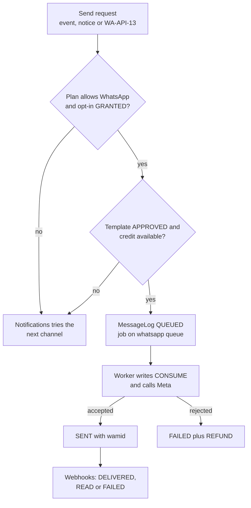
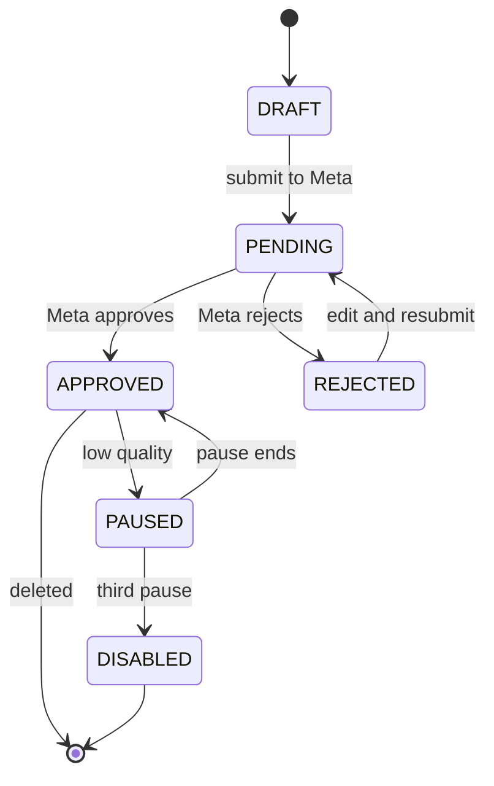
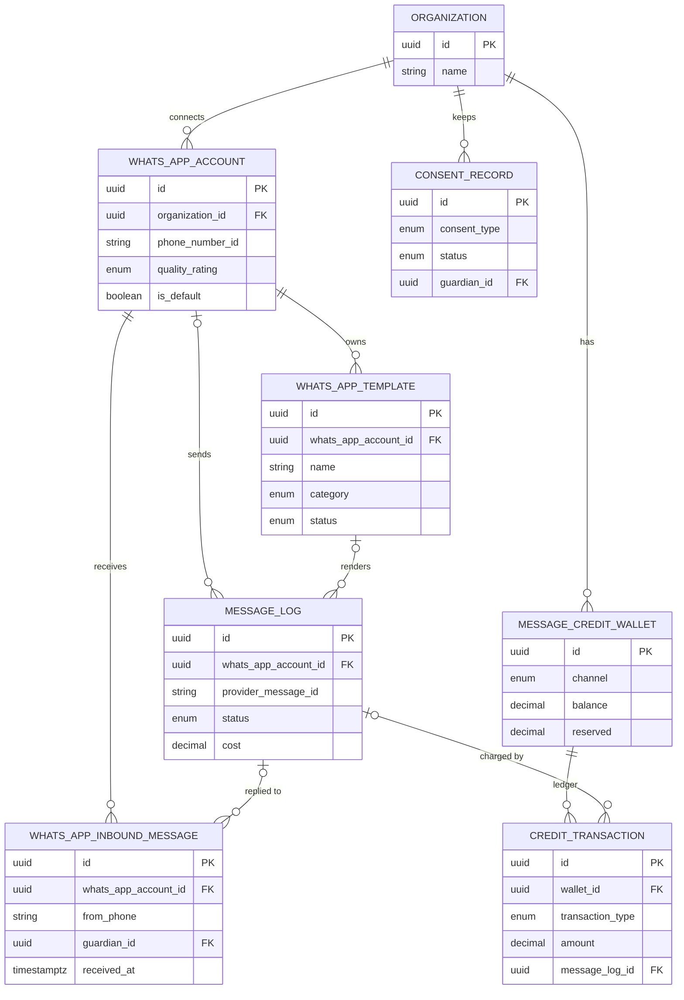

# WhatsApp Module

**In simple words:** Indian parents read WhatsApp, not email. This module connects EduFlow to the WhatsApp Cloud API (Meta's official service for business messages). It sends approved template messages (receipts, fee reminders, absence alerts) and tracks each one until it is read. It keeps proof of every opt-in, shows parents' replies in a front-desk inbox, and charges each message to a prepaid wallet, so there is never a surprise bill.

| Item | Value |
|---|---|
| Module code | WA |
| Release phase | Phase 1 (MVP), built on Day 44 with prompt P-29 |
| Plans | Starter: not included. Growth: shared EduFlow sender. Pro and Enterprise: own number |
| Main users | Organization Admin, Principal, Front Desk (custom role); parents receive and reply |
| Depends on | Notifications, Settings (consent, quiet hours), Organizations (plan, add-ons), Payments (receipts, pay links) |
| Main tables | `whats_app_accounts`, `whats_app_templates`, `whats_app_inbound_messages`, `message_credit_wallets`, `credit_transactions` (plus `message_logs`, `consent_records`) |

## Objective

1. **Reach.** 90% of opted-in guardians get transactional messages on WhatsApp, not SMS.
2. **Speed.** A receipt or absence alert reaches Meta within 60 seconds of the event (p95), outside quiet hours.
3. **Honest cost.** Meta's rate plus 15%, shown before sending. The wallet never goes below zero.
4. **Legal by design.** No alert, reminder or notice goes out without a recorded opt-in. Children never get marketing.
5. **Healthy numbers.** Every connected number stays at quality `GREEN`.
6. **No lost replies.** Inbound messages show in the inbox within 10 seconds and are closed by a named user.

## Scope

### In scope

- Connecting a WABA (WhatsApp Business Account — the business profile at Meta that owns numbers) through Meta's Embedded Signup popup.
- The shared EduFlow sender for Growth; own numbers for Pro and Enterprise.
- Templates: create, submit, sync, delete, with Meta's approval status.
- Template sends with PDF headers and pay-link buttons; price per message; wallet, reservations, refunds, packs and expiry.
- Opt-in and opt-out with proof, including the STOP keyword.
- Delivery and read webhooks, inbound messages, auto-reply and the front-desk inbox.
- Quality rating and messaging-limit tracking; log, summary and export.

### Out of scope

| Item | Owner |
|---|---|
| Which event goes to which channel, fallback, quiet hours | *Notifications Module* |
| Consent notice text and the privacy register | *Settings Module* |
| Selling add-ons and subscription invoices | *Organizations Module* |
| Receipt PDF content and pay-link tokens | *Payments Module* |
| Chatbots, flows, catalogues, WhatsApp payments, click-to-WhatsApp ads | Not before Phase 4 |

### Phase notes

| When | What ships |
|---|---|
| Day 44 (17 Nov 2026), P-29 | Shared sender, system templates, worker, webhooks, wallet, packs, opt-ins (WA-API-12, 13, 17 to 24) |
| Day 45 to 60 | Own numbers, custom templates, inbox, summary (WA-API-01 to 11, 14 to 16, 25) |
| Phase 2 | Log export (WA-API-26), Hindi versions of all system templates, media in the inbox; wallets in AED, USD and AUD |

## User Stories

| ID | As a | I want to | So that | Priority |
|---|---|---|---|---|
| WA-US-01 | Organization Admin | connect our own WhatsApp number in one popup | parents see "Bright Future Public School" as the sender | Must |
| WA-US-02 | Organization Admin on Growth | send WhatsApp alerts without any Meta setup | I start on day one | Must |
| WA-US-03 | Parent | get the fee receipt PDF on WhatsApp right after I pay | I have proof of payment at once | Must |
| WA-US-04 | Parent | tap "Pay now" inside a fee reminder | I pay by UPI in under a minute | Must |
| WA-US-05 | Organization Admin | create a template and see Meta's approval status | I know when I can use it | Must |
| WA-US-06 | Organization Admin | record a parent's opt-in with a signed form | I can prove consent in an audit | Must |
| WA-US-07 | Parent | reply STOP to stop WhatsApp messages | I control my phone | Must |
| WA-US-08 | Front desk staff | read parents' replies in one inbox and answer them | no parent question is ignored | Must |
| WA-US-09 | Organization Admin | see the exact cost before a bulk send | I never overspend the wallet | Must |
| WA-US-10 | Organization Admin | buy a ₹1,999 credit pack by UPI | messages do not stop in admission season | Must |
| WA-US-11 | Organization Admin | get an alert when the wallet falls below ₹200 | I top up before it runs out | Should |
| WA-US-12 | Organization Admin | see my number's quality rating and daily limit | Meta does not block our number | Should |

## Workflow

**Figure: One outbound WhatsApp message**



A "no" at any check hands the message back to the *Notifications Module*, which tries the next channel. Money leaves the wallet only in the worker, one ledger row per message.

1. **Request.** An event such as `receipt.issued`, a notice or WA-API-13 asks for a message.
2. **Checks.** Plan, consent, template and credit (WA-BR-02 to WA-BR-11). A bulk send reserves its total first.
3. **Queue.** A `message_logs` row is written as `QUEUED` with the job ID `wa-{messageLogId}`.
4. **Send.** The worker writes one `CONSUME` row, then calls the Cloud API. A `wamid` (Meta message ID) means `SENT`.
5. **Track.** Webhooks move the row to `DELIVERED`, `READ` or `FAILED`; a failure writes one `REFUND`.

**Inbound.** The webhook stores a parent's message, matches the guardian by phone, handles STOP or START, sends the auto-reply and alerts inbox users (WA-BR-17).

**Figure: Template approval lifecycle**



Meta pauses a template when many parents block or report it: 3 hours the first time, 6 hours the second, and the third pause disables it.

| Status | Meaning | Can send |
|---|---|---|
| `DRAFT` | Saved in EduFlow, not at Meta | No |
| `PENDING` | Submitted; Meta answers within minutes, at most 24 hours | No |
| `APPROVED` | Ready to use | Yes |
| `REJECTED` | `rejectionReason` filled; edit and resubmit | No |
| `PAUSED` | Paused by Meta for low quality | No; fallback channel |
| `DISABLED` | Disabled by Meta; create a new template | No |

**Number health (`whats_app_accounts`)**

| Field | Values | Effect |
|---|---|---|
| `status` | `ACTIVE`, `INACTIVE`, `ARCHIVED` | Only `ACTIVE` sends; `ARCHIVED` after disconnect |
| `qualityRating` | `GREEN`, `YELLOW`, `RED`, `UNKNOWN` | `YELLOW` blocks marketing; `RED` also bulk utility (WA-BR-15) |
| `messagingLimitTier` | `TIER_250`, `TIER_1K`, `TIER_10K`, `TIER_100K`, `TIER_UNLIMITED` | Unique people per rolling 24 hours (WA-BR-14) |

## Screens and Wireframes

| ID | Screen | Users | Purpose |
|---|---|---|---|
| WA-S01 | Numbers and health | Organization Admin, Principal | Numbers, quality, limit, wallet, opt-in coverage |
| WA-S02 | Connect number | Organization Admin | Meta Embedded Signup popup, PIN, campus |
| WA-S03 | Templates and editor | Organization Admin | List by status; create, edit, submit, delete |
| WA-S04 | Send WhatsApp | Organization Admin, Principal | Template, audience, PDF or pay link, cost |
| WA-S05 | Front-desk inbox | Organization Admin, Principal, Front Desk | Parent replies, guardian match, reply in 24 hours |
| WA-S06 | Opt-in register | Organization Admin, Principal | Consent and proof per guardian |
| WA-S07 | Wallet and packs | Organization Admin | Balance, reserved, ledger, threshold, buy pack |
| WA-S08 | WhatsApp log and summary | Organization Admin, Principal | Status and cost per message; totals |
| WA-S09 | Message on the parent's phone | Parent | Receipt and reminder in WhatsApp |

**Screen WA-S01 — Numbers and health (Organization Admin, web)**

```text
+--------------------------------------------------------------------------+
| EduFlow | Bright Future Public School    [Search...]          (RS) v     |
+------------+-------------------------------------------------------------+
| Dashboard  | WhatsApp > Numbers and health             [Connect number]  |
| Students   +-------------------------------------------------------------+
| Fees       | Number          Campus       Quality  Limit/24h  Default    |
| WhatsApp < | +91 522 400 1200 All campuses GREEN   10,000     Yes        |
|  Numbers   |   Bright Future Public School   Synced 09:40   [Sync now]   |
|  Templates | +91 522 400 1300 City Campus  YELLOW  1,000      No         |
|  Inbox     |   BFPS City Campus   2 templates paused   [Edit] [Remove]   |
|  Opt-ins   |-------------------------------------------------------------|
|  Wallet    | Wallet Rs 1,412.50   Reserved Rs 152.15   [Buy credits]     |
|  Log       | Opt-in coverage: 1,046 of 1,187 guardians (88%) [View]      |
| Settings   |-------------------------------------------------------------|
|            | ! City Campus number is YELLOW. Marketing templates are     |
|            |   blocked on it until quality is GREEN. Utility still goes. |
+------------+-------------------------------------------------------------+
```

- The list is WA-API-01; "Sync now" calls WA-API-06. "Connect number" opens WA-S02 (Meta popup, then WA-API-02); "Edit" and "Remove" call WA-API-04 and WA-API-05.
- On Growth the page shows one read-only row "EduFlow Alerts (shared)" and an upgrade card.

**Screen WA-S03 — Template editor (Organization Admin, web)**

```text
+--------------------------------------------------------------------------+
| EduFlow | Bright Future Public School    [Search...]          (RS) v     |
+------------+-------------------------------------------------------------+
| WhatsApp   | Templates > New template                  Status: DRAFT     |
|  Numbers   +-------------------------------------------------------------+
|  Templates<| Number [+91 522 400 1200 v]   Language [English (en) v]     |
|  Inbox     | Name [ptm_invite_oct__________]  Category [Utility v]       |
|  Opt-ins   | Header (o) None ( ) Text ( ) PDF document ( ) Image         |
|  Wallet    | Body                                                        |
|  Log       | [Dear {{1}}, the parent-teacher meeting for {{2}} is on   ] |
|            | [{{3}} at Main Campus. Reply YES.                         ] |
|            | Samples {{1}} [Sunita Devi] {{2}} [Aarav] {{3}} [16 Oct]    |
|            | Footer [Bright Future Public School______]                  |
|            | Buttons [+ Link] [+ Quick reply: YES]                       |
|            |-------------------------------------------------------------|
|            | Preview: Dear Sunita Devi, the parent-teacher meeting for   |
|            | Aarav is on 16 Oct at Main Campus. Reply YES.               |
|            |-------------------------------------------------------------|
|            | Cost: Utility Rs 0.1323 per message (Rs 0.1150 + 15%)       |
|            |              [Delete]  [Save draft]  [Submit to Meta]       |
+------------+-------------------------------------------------------------+
```

- "Save draft" and "Submit to Meta" call WA-API-08 (or WA-API-09) with `submit` false or true.
- The price line comes from the rate card. A `REJECTED` template shows Meta's reason above the body.

**Screen WA-S05 — Front-desk inbox (Front Desk, web)**

```text
+--------------------------------------------------------------------------+
| EduFlow | Bright Future Public School    [Search...]          (KM) v     |
+------------+-------------------------------------------------------------+
| WhatsApp   | Inbox  [Unread 4 v] [All numbers v]  [98xxxx3210______]     |
|  Inbox   < +----------------------+--------------------------------------+
|  Opt-ins   | * Sunita Devi   10:12| Sunita Devi (mother of Aarav, 10-A)  |
|  Log       |   Is school open on  | +91 98xxxx3210  Window: 23 h 41 min  |
|            |   Saturday?          |--------------------------------------|
|            | * Unknown     09:58  | 10:12 Is school open on Saturday?    |
|            |   +91 99xxxx1180     |       Aarav has a cricket match.     |
|            |   Admission for 6th? |                                      |
|            |   Mohd. Imran   Tue  | Auto-reply sent 10:12                |
|            |   Thanks, got the    |--------------------------------------|
|            |   receipt.           | [Yes, school is open on Saturday__]  |
|            |                      | [Attach]  [Mark handled]  [Send]     |
+------------+----------------------+--------------------------------------+
```

- The list is WA-API-14 grouped by phone; opening a thread calls WA-API-15; "Send" calls WA-API-16.
- After 24 hours the reply box becomes "Window closed: send a template". An unknown number offers "Create admission inquiry" (*Student Admission Module*).

**Screen WA-S07 — Wallet and packs (Organization Admin, web)**

```text
+--------------------------------------------------------------------------+
| EduFlow | Bright Future Public School    [Search...]          (RS) v     |
+------------+-------------------------------------------------------------+
| WhatsApp   | WhatsApp wallet                                             |
|  Numbers   +-------------------------------------------------------------+
|  Templates | Balance Rs 1,412.50  Reserved Rs 152.15  Available 1,260.35 |
|  Inbox     | Alert me below Rs [200.00] [Save]    Last 30 days Rs 611.42 |
|  Opt-ins   |-------------------------------------------------------------|
|  Wallet  < | Buy credits (18% GST extra)                                 |
|  Log       | ( ) Rs 499     about 3,770 utility messages                 |
|            | (o) Rs 1,999   about 15,100 utility messages                |
|            | ( ) Rs 7,999   about 60,460 utility messages  [Pay by UPI]  |
|            |-------------------------------------------------------------|
|            | Date    Type      Amount      Balance   Note                |
|            | 14 Jul  CONSUME   -0.1323     1,412.50  Receipt BF/27/000233|
|            | 14 Jul  RESERVE   -152.1450   1,412.63  Notice: Sports Day  |
|            | 01 Jul  PURCHASE  +1,999.00   1,450.13  Pack WA_1999        |
|            |                                    [Previous] [Next]        |
+------------+-------------------------------------------------------------+
```

- Data from WA-API-19 and WA-API-21; "Save" calls WA-API-20. "Pay by UPI" calls WA-API-22 and opens EduFlow's Razorpay checkout, not the school's gateway.
- The estimate is pack value divided by the utility price, rounded down to the nearest 10.

**Screen WA-S09 — Receipt and reminder in WhatsApp (Parent, mobile)**

```text
+------------------------------------+
| <  Bright Future Public School  v  |
|    Business account                |
+------------------------------------+
|  +------------------------------+  |
|  | [PDF] Receipt-BF-27-000233   |  |
|  |       1 page, 84 KB          |  |
|  | Dear Sunita Devi, we received|  |
|  | Rs 12,000 for Aarav Sharma   |  |
|  | (10-A) on 14 Jul 2027.       |  |
|  | Balance due: Rs 0.           |  |
|  |                10:05  (read) |  |
|  +------------------------------+  |
|  +------------------------------+  |
|  | Reminder: Rs 10,800 for Aarav|  |
|  | Sharma is due on 10 Oct 2027.|  |
|  | Reply STOP to opt out.       |  |
|  |------------------------------|  |
|  |        [ Pay now ]           |  |
|  +------------------------------+  |
| [Type a message...]         [Send] |
+------------------------------------+
```

- The receipt is template `fee_receipt` with a document header; "Pay now" opens the pay page of the *Payments Module* (WA-BR-16).
- A reply opens the 24-hour window and appears in WA-S05; "STOP" records an opt-out (WA-BR-05).

## UI Components

| Component | Type | Behaviour |
|---|---|---|
| `NumberHealthCard` | shadcn `Card` + `Badge` | Quality as icon plus word, tier, last sync |
| `EmbeddedSignupButton` | `Button` + Meta JS SDK | Loads the SDK on click; sends the popup result to WA-API-02 |
| `TemplateEditor` | `Form`, `Textarea` | Inserts `{{n}}` in order; live preview; counter 0/1,024 |
| `TemplateStatusChip` | `Badge` | Six statuses; tooltip shows the rejection reason |
| `CostPreview` | `Card` | Recipients, skipped, total cost, wallet after send; "Top up" when short |
| `InboxThreadList` | Virtual list | Unread dot, guardian or "Unknown"; polls every 15 s while visible |
| `ReplyBox` | `Textarea` + countdown | Window left; disabled when closed |
| `ConsentProofDialog` | `Dialog` + upload | Method radio; scan required for signed forms |
| `WalletLedgerTable` | `DataTable` | Server pagination, type filter, 4 decimals |
| States | `Skeleton`, `Alert` | 5-row skeleton; empty "No WhatsApp messages yet"; error with retry |

## Validation Rules

| Field | Rule | Error message shown to user |
|---|---|---|
| `code` (connect) | Required; single use; at most 10 minutes old | "The Meta sign-up did not finish. Please click Connect number again." |
| Template `name` | `^[a-z][a-z0-9_]{0,119}$`; unique per number and language | "Use lowercase letters, digits and _ only, starting with a letter (max 120)." |
| Template `category` | Marketing only on an own number; Authentication only for system templates | "Marketing templates need your own WhatsApp number (Pro plan)." |
| `bodyText` | 1 to 1,024 characters; header and footer up to 60 each | "The message text must be 1 to 1,024 characters." |
| Variables | `{{1}}` to `{{n}}` in order, no gaps, not first or last; one sample each | "Use {{1}}, {{2}} ... in order, with a sample for each. The text cannot start or end with a variable." |
| Buttons | At most one URL button (https, own subdomain) and one quick reply | "Use at most one link button and one quick-reply button." |
| Send `audience` | 1 to 5,000 unique recipients | "Send to between 1 and 5,000 people at a time." |
| Send `variables` | Count equals the template's `variableCount` | "This template needs 3 values. You gave 2." |
| Send `header.fileId` | Active PDF up to 10 MB, or JPG or PNG up to 5 MB | "Attach a PDF of up to 10 MB or an image of up to 5 MB." |
| Opt-in proof | `SIGNED_FORM` needs `evidenceFileId`; `IN_PERSON` needs a note of 5+ characters | "Upload the signed form to record this consent." |
| Opt-in `guardianIds` | 1 to 500; each guardian has a mobile number | "Sunita Devi has no mobile number. Add one first." |

## Business Rules

### Senders and plans

**WA-BR-01 — Two sender models.** Every message leaves from exactly one number.

| Item | Shared EduFlow sender | Own number |
|---|---|---|
| Plans | Growth, or higher without an own number | Pro (up to 3); Enterprise (no limit) |
| Name the parent sees | "EduFlow Alerts" (Assumption) | The institute's verified name |
| Stored as | No tenant row; null account in the log | A `whats_app_accounts` row |
| Templates | EduFlow system templates only | System templates plus own templates |
| Categories | Utility, Authentication | Utility, Authentication, Marketing |
| Inbound messages | Auto-reply only | Front-desk inbox |

The shared number lives in platform configuration, never in a tenant table, because `phone_number_id` is unique among live rows.

**WA-BR-02 — Plan gate.** Starter and `RESTRICTED` organizations send nothing. A trial has Pro features. After a downgrade to Growth, own numbers become `INACTIVE` and the shared sender takes over. Growth calls to connect a number or create a template answer `403 PLAN_LIMIT_REACHED`.

**WA-BR-03 — Sender choice.** The active number of the student's campus; else the default number; else the shared sender.

### Consent and compliance

**WA-BR-04 — Opt-in first.** Every template message needs a `GRANTED` consent of type `COMMUNICATION_WHATSAPP` for the guardian, or for the admission lead through `inquiryId`.

| Method | Where it happens | Proof stored |
|---|---|---|
| `OTP` | Parent Portal login, online admission | `otpCodeId`, `givenByUserId`, IP, user agent |
| `SIGNED_FORM` | Paper form or slip | Scan in `evidenceFileId`; form number |
| `IN_PERSON` | At the counter | Staff note; user in the audit log |
| `EMAIL_LINK` | Link in a welcome email | Click time, IP address |

Each row keeps `policyVersion`, `policyDocumentId` and `noticeLanguage`. `purposes` is `["TRANSACTIONAL"]` or also `"PROMOTIONAL"`. On the shared sender the notice names the institute and "EduFlow Alerts". A login OTP the parent asked for, and a reply inside a window the parent opened, need no WhatsApp consent.

**WA-BR-05 — Opt-out.** `STOP` or `UNSUBSCRIBE` alone in a message sets the consent to `WITHDRAWN` and sends one free confirmation. `START` records a new `GRANTED` row with the inbound message ID as proof. On the shared sender, STOP applies to every organization that messaged that phone in the last 30 days. Jobs check consent again just before sending. A changed guardian mobile number makes the consent `EXPIRED`.

**WA-BR-06 — Marketing.** Needs an own number at quality `GREEN` and `PROMOTIONAL` consent. Never to a `STUDENT` recipient: the DPDP Act 2023 forbids promotion aimed at children. Quiet hours always hold it.

**WA-BR-07 — Not allowed.** Messages without opt-in, bought number lists, groups, free text outside a window, hiding the institute's name, and asking for card numbers, Aadhaar numbers or passwords (Meta Business Messaging Policy). A tenant template containing "OTP", "password" or "card number" is refused.

### Price and wallet

**WA-BR-08 — Price per message.** Meta charges per delivered template message, by category and recipient country. EduFlow charges that rate plus 15%, rounded half up to 4 decimals, in the wallet currency. The rate card is a versioned platform file; USD rates use the day's `exchange_rates` row.

| Category | Typical use | Meta rate, India (Assumption) | Price to institute |
|---|---|---|---|
| `UTILITY` | Receipt, absence, fee due, exam date | ₹0.1150 | ₹0.1323 |
| `AUTHENTICATION` | Login OTP | ₹0.1150 | ₹0.1323 |
| `MARKETING` | Admissions open, new batch | ₹0.8631 | ₹0.9926 |
| `SERVICE` | Free-form reply in the window | ₹0 | ₹0 |

> **Note:** Assumption: planning rates from Meta's public rate card for India; verify before launch.

- Utility, India: 0.1150 x 1.15 = 0.13225, rounded half up = **₹0.1323**; `marginAmount` 0.0173.
- Marketing, India: 0.8631 x 1.15 = 0.992565 = **₹0.9926**; margin 0.1295.
- Utility to a father in Dubai (Assumption $0.0157): 0.0157 x 85 = ₹1.3345; x 1.15 = 1.534675 = **₹1.5347**; margin 0.2002.

```typescript
// server/src/modules/whatsapp/pricing.ts
import { Prisma } from '@prisma/client';

const D = Prisma.Decimal;
const MARKUP = new D('1.15'); // Meta cost + 15 % (canon)

export interface WaPrice {
  providerCost: Prisma.Decimal; // provider currency
  cost: Prisma.Decimal; // wallet currency, charged to the tenant
  marginAmount: Prisma.Decimal; // wallet currency
}

export function priceMessage(metaRate: string, fxRate: string, billable: boolean): WaPrice {
  const zero = new D(0);
  if (!billable) return { providerCost: zero, cost: zero, marginAmount: zero };
  const base = new D(metaRate).mul(fxRate);
  const cost = base.mul(MARKUP).toDecimalPlaces(4, D.ROUND_HALF_UP);
  const marginAmount = cost.minus(base.toDecimalPlaces(4, D.ROUND_HALF_UP));
  return { providerCost: new D(metaRate), cost, marginAmount };
}
```

**WA-BR-09 — Free messages.** A `SERVICE` reply, and a utility template to a phone with an open window on the same number, have `isBillable = false` and cost 0. Meta's `pricing` object in the status webhook is final: one `REFUND` if Meta did not bill, one `ADJUSTMENT` if it billed another category.

**WA-BR-10 — Wallet arithmetic.** `available = balance - reserved`. Each change writes its ledger row in the same transaction; the check `balance >= 0 AND reserved >= 0` blocks overdraw. The worker debits (one `CONSUME` per message) before it calls Meta, so a retry never pays twice. Screens round `balance` and `available` down and `reserved` up.

```sql
-- CONSUME for one message; $3 = part taken from a campaign reservation (0 or $2)
UPDATE message_credit_wallets
SET balance = balance - $2,
    reserved = reserved - $3,
    total_consumed = total_consumed + $2,
    updated_at = now()
WHERE id = $1
  AND organization_id = current_setting('app.current_org')::uuid
  AND (balance - reserved) - ($2 - $3) >= 0
RETURNING balance, reserved;
-- 0 rows: not enough credit -> FAILED with errorCode WALLET_EMPTY, next channel
```

**WA-BR-11 — Bulk reservation.** A send to more than one recipient reserves the full estimate first. `RESERVE` and `RELEASE` rows carry the change of `reserved` in `amount`; their `balanceAfter` is the unchanged balance.

> **Example:** Sports Day notice to 1,150 guardians; balance ₹1,412.50. Reserve 1,150 x 0.1323 = ₹152.1450 (available ₹1,260.3550). Meta accepts 1,138: `CONSUME` ₹150.5574 from the reservation; 12 invalid numbers are never charged. `RELEASE` 152.1450 - 150.5574 = ₹1.5876. Later 5 delivery failures: `REFUND` ₹0.6615. Final balance 1,412.50 - 150.5574 + 0.6615 = **₹1,262.6041**; reserved ₹0.

**WA-BR-12 — Credit packs.** Packs cost ₹499, ₹1,999 and ₹7,999 (canon). The 18% GST is extra and not wallet money: the ₹1,999 pack costs ₹2,358.82 and adds ₹1,999.0000. EduFlow's payment webhook activates the `WHATSAPP_CREDITS` add-on and writes exactly one `PURCHASE` row. Packs expire 12 months after purchase (Assumption, as in *Organizations Module*); spending uses the oldest pack first (`creditsRemaining`).

> **Example:** Packs of ₹1,999 (1 Aug 2027) and ₹499 (1 Mar 2028). By 1 Aug 2028 ₹1,786.60 of the first pack is spent, so one `EXPIRY` row of -₹212.40 is written. A trial gets a `BONUS` of ₹13.23 (100 utility messages) that ends with the trial.

**WA-BR-13 — Low balance.** When `available` falls below `lowBalanceThreshold` (₹200 when empty), `whatsapp.wallet.low_balance` fires, at most once per 24 hours. Below one utility price, `whatsapp.wallet.exhausted` fires and new messages use the next channel.

### Limits, quality, inbound and webhooks

**WA-BR-14 — Messaging limit.** Meta limits how many unique people a number may message in a rolling 24 hours (`messagingLimitTier`). EduFlow counts the distinct billable `to_address` values of the last 24 hours; recipients above the limit wait and are re-checked every 15 minutes.

> **Example:** The City Campus number is on `TIER_1K` and has messaged 420 people today. A notice goes to 750 guardians: 1,000 - 420 = 580 go now and 170 wait. The preview says "580 now, 170 later today".

**WA-BR-15 — Quality rating.** Health sync runs every 6 hours and on each quality webhook. `YELLOW` blocks marketing on that number; `RED` also blocks bulk utility, while single transactional messages still go. A paused template sends its traffic to the next channel.

**WA-BR-16 — Receipts and pay links.** `receipt.issued` uses template `fee_receipt` with a document header. The worker waits for the PDF (5 checks, 10 seconds apart) and sends it as a pre-signed S3 URL valid for 30 minutes, named `Receipt-BF-27-000233.pdf`. Without a PDF it sends `fee_receipt_link` instead. Fee reminders carry the URL button `https://{slug}.eduflow.app/pay/{{1}}` (own number) or `https://app.eduflow.app/pay/{{1}}` (shared sender), where `{{1}}` is the signed pay token from the *Payments Module*.

**WA-BR-17 — Window and inbox.** An inbound message opens a 24-hour window for that phone on that number; staff replies inside it are free. The auto-reply goes at most once per phone per 12 hours, with text and office hours from `communication.whatsapp_auto_reply` (Assumption: a key this chapter adds to the `communication` group). Messages to the shared sender are not stored in any tenant; the platform answers with the institute's phone number.

**WA-BR-18 — Webhook handling.** The webhook stores a `webhook_events` row and answers 200 within 2 seconds. The event ID is the `wamid`, `wamid:status` for statuses, or a payload hash, so replays are ignored. The tenant comes from `metadata.phone_number_id`, or for the shared sender from `message_logs.provider_message_id`. Status only moves forward (`QUEUED`, `SENT`, `DELIVERED`, `READ`); `FAILED` replaces only `QUEUED` or `SENT`. A message still `SENT` after 30 days becomes `FAILED` (`EXPIRED_UNDELIVERED`) and is refunded.

**WA-BR-19 — Disconnect.** Sets `ARCHIVED` and `deletedAt`, keeps logs and templates, and removes the webhook subscription. The default number can go only when it is the last live number. The phone may be connected again later as a new row.

## Acceptance Criteria

| ID | Given | When | Then |
|---|---|---|---|
| WA-AC-01 | Growth institute; Sunita Devi opted in; wallet ₹500 | A receipt is issued for Aarav | `fee_receipt` with PDF `SENT` from the shared sender within 60 s; one `CONSUME` of ₹0.1323 |
| WA-AC-02 | A guardian without WhatsApp consent | A fee reminder is due | No WhatsApp log row; the next channel in `channel_order` is used |
| WA-AC-03 | A Pro admin finished Meta's popup | WA-API-02 gets a valid code and PIN | `ACTIVE` account with health data; default if first; event fires |
| WA-AC-04 | Balance ₹1,412.50, 1,150 opted-in guardians | The Sports Day notice is sent | Reserved ₹152.1450 during the job, ₹0 after; ledger as in WA-BR-11 |
| WA-AC-05 | Available ₹10.00 | A send estimated at ₹41.28 is requested | `422` with "Short by Rs 31.28"; nothing is reserved |
| WA-AC-06 | A `SENT` message | The `failed` webhook arrives 3 times | Status `FAILED`; exactly one `REFUND` row |
| WA-AC-07 | Sunita Devi is opted in | She replies "stop" | Consent `WITHDRAWN` within 1 minute; one confirmation; later templates skip her phone |
| WA-AC-08 | A parent wrote on Monday at 10:12 | Staff reply on Tuesday at 10:13 | `422` "The 24-hour reply window has closed" |
| WA-AC-09 | A parent wrote 20 minutes ago | Staff reply with WA-API-16 | Log row `SERVICE`, `isBillable = false`, cost 0; inbound row gets `readAt` and `handledById` |
| WA-AC-10 | The City Campus number is `YELLOW` | A marketing send uses it | `422` "Marketing is paused on this number"; utility still goes |
| WA-AC-11 | A top-up request | Sent twice with one `Idempotency-Key`; payment webhook replayed | One add-on, one checkout, exactly one `PURCHASE` row |
| WA-AC-12 | A Principal of Main Campus | She opens the inbox | Only threads of numbers of her campus and of all-campus numbers |

## Edge Cases

| Case | What happens | How the system handles it |
|---|---|---|
| Phone is not on WhatsApp | Meta error 131026 | `FAILED`, `REFUND`, next channel; log says "Receiver cannot get WhatsApp messages" |
| Mother and father share one phone | Two recipients, one number | One message per phone, event and student; duplicates dropped before pricing |
| Guardian changes the mobile number | Consent was for the old phone | Consent `EXPIRED`; a new opt-in is needed |
| Status webhook arrives before the send call returns | No log row has the `wamid` yet | The `webhooks` job retries with backoff until the row exists |
| Receipt PDF not ready after 50 s | Document header cannot be filled | `fee_receipt_link` goes instead (WA-BR-16) |
| Admin deletes a template in Meta Business Manager | EduFlow still lists it | Nightly sync soft-deletes it; linked notification templates show "Missing" and fall back |
| Meta moves a template from utility to marketing | Price and rules change | Sync updates `category`; admins get an in-app notice; the shared sender stops using it |
| Access token revoked at Meta | Graph API error 190 | Number `INACTIVE`; admins alerted; messages move to the shared sender |
| Plan downgraded while a notice is scheduled | Own number no longer allowed | Sender chosen again at send time; marketing recipients skipped with a reason |
| Meta API down for 20 minutes | Send calls time out | Retries at 30 s, 1, 2, 4 min; then `FAILED`, `REFUND` and fallback (`message.fallback_triggered`) |

## Database Schema

| Table | Purpose | Owner |
|---|---|---|
| `whats_app_accounts` | Connected own numbers with health | This module |
| `whats_app_templates` | Templates per number and language, with Meta status | This module |
| `whats_app_inbound_messages` | Parent messages to own numbers (the inbox) | This module |
| `message_credit_wallets` | One prepaid wallet per paid channel | This module and *SMS Module* |
| `credit_transactions` | Append-only wallet ledger | This module and *SMS Module* |
| `message_logs`, `consent_records`, `webhook_events` | Message log, consent proof, raw webhooks | *Notifications Module*, *Settings Module*, *Payments Module* |

Every table has `id` (uuid PK, `uuid()`), `organization_id` (FK `organizations`) and `created_at` (`now()`); all but `credit_transactions` have `updated_at`. They are not repeated below.

### Table whats_app_accounts

| Column | Type | Null | Default | Notes |
|---|---|---|---|---|
| `campus_id` | uuid | Yes | | FK `campuses`; null = all campuses |
| `waba_id`, `phone_number_id` | varchar(40) | No | | Meta IDs; the second routes webhooks |
| `display_phone_number` | varchar(20) | No | | |
| `verified_name` | varchar(150) | Yes | | Approved by Meta |
| `access_token_ref` | varchar(255) | No | | Secret store key, never the token |
| `quality_rating` | `WhatsAppQualityRating` | No | `UNKNOWN` | |
| `messaging_limit_tier` | varchar(20) | Yes | | `TIER_1K` and others |
| `is_default` | boolean | No | `false` | |
| `status` | `RecordStatus` | No | `ACTIVE` | |
| `connected_at`, `last_synced_at`, `deleted_at` | timestamptz | Yes | | Soft delete on disconnect |

Indexes: (`organization_id`, `status`), (`organization_id`, `campus_id`), (`phone_number_id`). The SQL migration adds `uq_whatsapp_phone_number_live (phone_number_id) WHERE deleted_at IS NULL` and one default per organization `WHERE is_default AND deleted_at IS NULL`.

### Table whats_app_templates

| Column | Type | Null | Default | Notes |
|---|---|---|---|---|
| `whats_app_account_id` | uuid | No | | FK, cascade |
| `name` | varchar(120) | No | | lower_snake_case at Meta |
| `category` | `WhatsAppTemplateCategory` | No | | |
| `language` | varchar(10) | No | | `en`, `hi` |
| `status` | `TemplateApprovalStatus` | No | `DRAFT` | |
| `meta_template_id` | varchar(60) | Yes | | Set on submit |
| `components` | jsonb | No | | Header, body, footer, buttons as sent |
| `body_text` | text | No | | For preview and search |
| `variable_count` | smallint | No | `0` | |
| `rejection_reason` | varchar(500) | Yes | | From Meta |
| `submitted_at`, `last_synced_at`, `deleted_at` | timestamptz | Yes | | |

Constraints: unique (`organization_id`, `whats_app_account_id`, `name`, `language`); index (`organization_id`, `status`, `category`).

### Table whats_app_inbound_messages

| Column | Type | Null | Default | Notes |
|---|---|---|---|---|
| `whats_app_account_id` | uuid | No | | FK, cascade |
| `wa_message_id` | varchar(150) | No | | Meta `wamid` |
| `from_phone`, `profile_name` | varchar(20), varchar(150) | No, Yes | | E.164 phone; WhatsApp name |
| `message_type` | `WhatsAppMessageType` | No | `TEXT` | |
| `text` | text | Yes | | Cleared after the retention period |
| `media_file_id` | uuid | Yes | | FK `file_assets` |
| `payload` | jsonb | No | | Raw webhook message |
| `reply_to_message_log_id` | uuid | Yes | | FK `message_logs` |
| `guardian_id` | uuid | Yes | | FK `guardians`, matched by phone |
| `received_at` | timestamptz | No | | Starts the window |
| `read_at`, `handled_by_id` | timestamptz, uuid | Yes | | Inbox handling; user ID without FK |

Constraints: unique (`organization_id`, `wa_message_id`); indexes (`organization_id`, `whats_app_account_id`, `received_at`), (`organization_id`, `from_phone`, `received_at`), (`organization_id`, `read_at`).

### Table message_credit_wallets

| Column | Type | Null | Default | Notes |
|---|---|---|---|---|
| `channel`, `unit` | `Channel`, `CreditUnit` | No | | `WHATSAPP`, `MONEY` here |
| `balance`, `reserved` | decimal(12,4) | No | `0` | Change only with a ledger row |
| `currency` | char(3) | Yes | | `INR` in India |
| `total_purchased`, `total_consumed`, `total_refunded` | decimal(12,4) | No | `0` | Running totals |
| `low_balance_threshold` | decimal(12,4) | Yes | | Null = ₹200 |
| `low_balance_notified_at` | timestamptz | Yes | | One alert per 24 hours |

Constraints: unique (`organization_id`, `channel`); index (`organization_id`, `unit`); SQL check `balance >= 0 AND reserved >= 0`.

### Table credit_transactions

| Column | Type | Null | Default | Notes |
|---|---|---|---|---|
| `wallet_id` | uuid | No | | FK, restrict |
| `transaction_type` | `CreditTransactionType` | No | | |
| `unit`, `currency` | `CreditUnit`, char(3) | No, Yes | | Wallet snapshots |
| `amount`, `balance_after` | decimal(12,4) | No | | Plus = credit, minus = debit |
| `idempotency_key` | varchar(100) | Yes | | Rows without a message or pack |
| `message_log_id` | uuid | Yes | | `CONSUME`, `REFUND`, `ADJUSTMENT` |
| `announcement_id` | uuid | Yes | | `RESERVE`, `RELEASE` of a notice |
| `add_on_purchase_id` | uuid | Yes | | `PURCHASE`, `EXPIRY` |
| `description`, `created_by_id` | varchar(255), uuid | Yes | | Text; user ID without FK |

Constraints: unique (`organization_id`, `message_log_id`, `transaction_type`), (`organization_id`, `add_on_purchase_id`, `transaction_type`), (`organization_id`, `idempotency_key`); indexes on wallet, type and announcement. A WA-API-13 bulk send has no announcement, so its reservation rows use `idempotency_key = wa-send-{jobId}-reserve` and `-release`.

In `message_logs` this module fills the sending account (null = shared sender), template, `pricing_category`, `is_billable`, the cost columns of WA-BR-08 and `provider_message_id` (the `wamid`).

**Figure: WhatsApp tables**



An own number owns its templates and inbound messages. Every outbound message is one `MESSAGE_LOG` row, and every rupee that moves is one `CREDIT_TRANSACTION` row.

## Prisma Schema

Copied from `docs/src/_schema/10-communication.prisma`. `Channel` and `RecordStatus` come from `00-base.prisma`. `MessageLog` is printed in *Notifications Module*, `ConsentRecord` in *Settings Module* and `AddOnPurchase` in *Organizations Module*.

```prisma
// Approval state of a template at the provider (Meta for WhatsApp, DLT for SMS).
enum TemplateApprovalStatus {
  DRAFT
  PENDING
  APPROVED
  REJECTED
  PAUSED
  DISABLED
  NOT_REQUIRED // in-app, push and email templates
}

enum WhatsAppTemplateCategory {
  UTILITY
  MARKETING
  AUTHENTICATION
}

enum WhatsAppQualityRating {
  GREEN
  YELLOW
  RED
  UNKNOWN
}

enum WhatsAppMessageType {
  TEXT
  IMAGE
  DOCUMENT
  AUDIO
  VIDEO
  LOCATION
  BUTTON_REPLY
  INTERACTIVE
  OTHER
}

enum CreditUnit {
  MESSAGES // SMS packs: one credit = one SMS segment
  MONEY // WhatsApp: prepaid money balance, charged per message at Meta cost + margin
}

enum CreditTransactionType {
  PURCHASE
  CONSUME
  REFUND // failed message credited back
  ADJUSTMENT
  EXPIRY
  BONUS
  RESERVE // hold for a queued bulk campaign; moves balance into reserved
  RELEASE // unused part of a reservation returned
}

// A tenant's WhatsApp Business Account number connected through the Meta Cloud API.
// phoneNumberId routes inbound webhooks, so it is unique among LIVE rows only (a disconnected number can be reconnected):
//   partial unique index in the SQL migration, uq_whatsapp_phone_number_live (phone_number_id) WHERE deleted_at IS NULL
// One default account per organization: partial unique index WHERE is_default AND deleted_at IS NULL.
model WhatsAppAccount {
  id                 String                @id @default(uuid()) @db.Uuid
  organizationId     String                @map("organization_id") @db.Uuid
  campusId           String?               @map("campus_id") @db.Uuid // null = shared by all campuses
  wabaId             String                @map("waba_id") @db.VarChar(40) // WhatsApp Business Account id
  phoneNumberId      String                @map("phone_number_id") @db.VarChar(40) // Meta phone number id; routes inbound webhooks to the tenant
  displayPhoneNumber String                @map("display_phone_number") @db.VarChar(20)
  verifiedName       String?               @map("verified_name") @db.VarChar(150)
  accessTokenRef     String                @map("access_token_ref") @db.VarChar(255) // reference to the encrypted system-user token in the secrets store
  qualityRating      WhatsAppQualityRating @default(UNKNOWN) @map("quality_rating")
  messagingLimitTier String?               @map("messaging_limit_tier") @db.VarChar(20) // TIER_1K, TIER_10K ...
  isDefault          Boolean               @default(false) @map("is_default")
  status             RecordStatus          @default(ACTIVE)
  connectedAt        DateTime?             @map("connected_at") @db.Timestamptz(6)
  lastSyncedAt       DateTime?             @map("last_synced_at") @db.Timestamptz(6)
  createdAt          DateTime              @default(now()) @map("created_at") @db.Timestamptz(6)
  updatedAt          DateTime              @updatedAt @map("updated_at") @db.Timestamptz(6)
  deletedAt          DateTime?             @map("deleted_at") @db.Timestamptz(6)

  organization    Organization             @relation(fields: [organizationId], references: [id], onDelete: Restrict)
  campus          Campus?                  @relation(fields: [campusId], references: [id], onDelete: Restrict)
  templates       WhatsAppTemplate[]
  inboundMessages WhatsAppInboundMessage[]
  messageLogs     MessageLog[]

  @@index([organizationId, status])
  @@index([organizationId, campusId])
  @@index([phoneNumberId]) // webhook routing
  @@map("whats_app_accounts")
}

// WhatsApp message template registered with Meta (name + language), synced with its approval status.
model WhatsAppTemplate {
  id                String                   @id @default(uuid()) @db.Uuid
  organizationId    String                   @map("organization_id") @db.Uuid
  whatsAppAccountId String                   @map("whats_app_account_id") @db.Uuid
  name              String                   @db.VarChar(120) // lower_snake_case name at Meta
  category          WhatsAppTemplateCategory
  language          String                   @db.VarChar(10) // en, hi, en_US
  status            TemplateApprovalStatus   @default(DRAFT)
  metaTemplateId    String?                  @map("meta_template_id") @db.VarChar(60)
  components        Json // header, body, footer and buttons as sent to Meta
  bodyText          String                   @map("body_text") @db.Text
  variableCount     Int                      @default(0) @map("variable_count") @db.SmallInt
  rejectionReason   String?                  @map("rejection_reason") @db.VarChar(500)
  submittedAt       DateTime?                @map("submitted_at") @db.Timestamptz(6)
  lastSyncedAt      DateTime?                @map("last_synced_at") @db.Timestamptz(6)
  createdAt         DateTime                 @default(now()) @map("created_at") @db.Timestamptz(6)
  updatedAt         DateTime                 @updatedAt @map("updated_at") @db.Timestamptz(6)
  deletedAt         DateTime?                @map("deleted_at") @db.Timestamptz(6)

  organization          Organization           @relation(fields: [organizationId], references: [id], onDelete: Cascade)
  whatsAppAccount       WhatsAppAccount        @relation(fields: [whatsAppAccountId], references: [id], onDelete: Cascade)
  notificationTemplates NotificationTemplate[]
  messageLogs           MessageLog[]

  @@unique([organizationId, whatsAppAccountId, name, language])
  @@index([organizationId, status, category])
  @@map("whats_app_templates")
}

// Message received from a parent on the institute's WhatsApp number (opens the 24-hour reply window).
model WhatsAppInboundMessage {
  id                  String              @id @default(uuid()) @db.Uuid
  organizationId      String              @map("organization_id") @db.Uuid
  whatsAppAccountId   String              @map("whats_app_account_id") @db.Uuid
  waMessageId         String              @map("wa_message_id") @db.VarChar(150) // Meta message id (wamid...)
  fromPhone           String              @map("from_phone") @db.VarChar(20) // E.164
  profileName         String?             @map("profile_name") @db.VarChar(150)
  messageType         WhatsAppMessageType @default(TEXT) @map("message_type")
  text                String?             @db.Text
  mediaFileId         String?             @map("media_file_id") @db.Uuid // media downloaded into S3
  payload             Json // raw message object from the webhook
  replyToMessageLogId String?             @map("reply_to_message_log_id") @db.Uuid // outbound message this one replies to
  guardianId          String?             @map("guardian_id") @db.Uuid // matched by phone number
  receivedAt          DateTime            @map("received_at") @db.Timestamptz(6)
  readAt              DateTime?           @map("read_at") @db.Timestamptz(6) // opened by staff in the inbox
  handledById         String?             @map("handled_by_id") @db.Uuid // User id (audit only, no FK)
  createdAt           DateTime            @default(now()) @map("created_at") @db.Timestamptz(6)
  updatedAt           DateTime            @updatedAt @map("updated_at") @db.Timestamptz(6)

  organization      Organization    @relation(fields: [organizationId], references: [id], onDelete: Cascade)
  whatsAppAccount   WhatsAppAccount @relation(fields: [whatsAppAccountId], references: [id], onDelete: Cascade)
  mediaFile         FileAsset?      @relation(fields: [mediaFileId], references: [id], onDelete: SetNull)
  replyToMessageLog MessageLog?     @relation(fields: [replyToMessageLogId], references: [id], onDelete: SetNull)
  guardian          Guardian?       @relation(fields: [guardianId], references: [id], onDelete: SetNull)

  @@unique([organizationId, waMessageId])
  @@index([organizationId, whatsAppAccountId, receivedAt])
  @@index([organizationId, fromPhone, receivedAt])
  @@index([organizationId, readAt])
  @@map("whats_app_inbound_messages")
}

model MessageCreditWallet {
  id                   String     @id @default(uuid()) @db.Uuid
  organizationId       String     @map("organization_id") @db.Uuid
  channel              Channel // WHATSAPP or SMS
  unit                 CreditUnit
  balance              Decimal    @default(0) @db.Decimal(12, 4) // messages or money, by unit; updated in the same transaction as CreditTransaction
  currency             String?    @db.Char(3) // set when unit is MONEY
  totalPurchased       Decimal    @default(0) @map("total_purchased") @db.Decimal(12, 4)
  reserved             Decimal    @default(0) @db.Decimal(12, 4) // held for queued campaigns (RESERVE / RELEASE rows)
  totalConsumed        Decimal    @default(0) @map("total_consumed") @db.Decimal(12, 4)
  totalRefunded        Decimal    @default(0) @map("total_refunded") @db.Decimal(12, 4)
  lowBalanceThreshold  Decimal?   @map("low_balance_threshold") @db.Decimal(12, 4)
  lowBalanceNotifiedAt DateTime?  @map("low_balance_notified_at") @db.Timestamptz(6)
  createdAt            DateTime   @default(now()) @map("created_at") @db.Timestamptz(6)
  updatedAt            DateTime   @updatedAt @map("updated_at") @db.Timestamptz(6)

  organization Organization        @relation(fields: [organizationId], references: [id], onDelete: Restrict)
  transactions CreditTransaction[]

  @@unique([organizationId, channel])
  @@index([organizationId, unit])
  @@map("message_credit_wallets")
}

// Ledger row of a credit wallet. Append-only: no updatedAt / deletedAt.
// Duplicates are impossible by design: one CONSUME and one REFUND per MessageLog, one PURCHASE per AddOnPurchase
// (a BullMQ retry or a replayed payment webhook hits the unique keys). A manual resend creates a new MessageLog.
model CreditTransaction {
  id              String                @id @default(uuid()) @db.Uuid
  organizationId  String                @map("organization_id") @db.Uuid
  walletId        String                @map("wallet_id") @db.Uuid
  transactionType CreditTransactionType @map("transaction_type")
  unit            CreditUnit // snapshot of the wallet unit
  currency        String?               @db.Char(3) // snapshot when unit is MONEY
  amount          Decimal               @db.Decimal(12, 4) // positive = credit to the wallet, negative = debit
  balanceAfter    Decimal               @map("balance_after") @db.Decimal(12, 4)
  idempotencyKey  String?               @map("idempotency_key") @db.VarChar(100) // job id / request key for rows without a messageLogId
  messageLogId    String?               @map("message_log_id") @db.Uuid // CONSUME / REFUND rows
  announcementId  String?               @map("announcement_id") @db.Uuid // RESERVE / RELEASE rows of a bulk campaign (no FK)
  addOnPurchaseId String?               @map("add_on_purchase_id") @db.Uuid // PURCHASE rows: the credit pack that was bought
  description     String?               @db.VarChar(255)
  createdById     String?               @map("created_by_id") @db.Uuid // User id (audit only, no FK)
  createdAt       DateTime              @default(now()) @map("created_at") @db.Timestamptz(6)

  organization  Organization        @relation(fields: [organizationId], references: [id], onDelete: Restrict)
  wallet        MessageCreditWallet @relation(fields: [walletId], references: [id], onDelete: Restrict)
  messageLog    MessageLog?         @relation(fields: [messageLogId], references: [id], onDelete: SetNull)
  addOnPurchase AddOnPurchase?      @relation(fields: [addOnPurchaseId], references: [id], onDelete: SetNull)

  @@unique([organizationId, messageLogId, transactionType]) // NULL ids never clash: ADJUSTMENT, BONUS, EXPIRY rows are not affected
  @@unique([organizationId, addOnPurchaseId, transactionType])
  @@unique([organizationId, idempotencyKey])
  @@index([organizationId, walletId, createdAt])
  @@index([organizationId, transactionType, createdAt])
  @@index([organizationId, announcementId])
  @@map("credit_transactions")
}
```

## API Endpoints

Paths start with `/api/v1`; the tenant comes from the JWT.

| ID | Method | Path | Permission | Purpose |
|---|---|---|---|---|
| WA-API-01 | GET | `/whatsapp-accounts` | whatsapp.view | List connected numbers |
| WA-API-02 | POST | `/whatsapp-accounts` | whatsapp.manage | Connect a number (Embedded Signup) |
| WA-API-03 | GET | `/whatsapp-accounts/:id` | whatsapp.view | Health: quality, tier |
| WA-API-04 | PATCH | `/whatsapp-accounts/:id` | whatsapp.manage | Update campus, default flag, status |
| WA-API-05 | DELETE | `/whatsapp-accounts/:id` | whatsapp.manage | Disconnect number |
| WA-API-06 | POST | `/whatsapp-accounts/:id/sync` | whatsapp.manage | Refresh name, quality, tier |
| WA-API-07 | GET | `/whatsapp-templates` | whatsapp.view | List templates (status, category, language) |
| WA-API-08 | POST | `/whatsapp-templates` | whatsapp.manage | Create template and submit to Meta |
| WA-API-09 | PATCH | `/whatsapp-templates/:id` | whatsapp.manage | Edit DRAFT or REJECTED template and resubmit |
| WA-API-10 | DELETE | `/whatsapp-templates/:id` | whatsapp.manage | Delete template (also at Meta) |
| WA-API-11 | POST | `/whatsapp-templates/sync` | whatsapp.manage | Pull templates from Meta (job) |
| WA-API-12 | GET | `/whatsapp-messages` | whatsapp.view | Outbound log (status, category, cost) |
| WA-API-13 | POST | `/whatsapp-messages` | whatsapp.send | Send a template; PDF or pay link (job) |
| WA-API-14 | GET | `/whatsapp-inbound-messages` | whatsapp.view | Front-desk inbox (unread, phone, guardian) |
| WA-API-15 | POST | `/whatsapp-inbound-messages/:id/read` | whatsapp.send | Mark read and handled |
| WA-API-16 | POST | `/whatsapp-inbound-messages/:id/reply` | whatsapp.send | Free-form reply inside the 24-hour window |
| WA-API-17 | GET | `/whatsapp-opt-ins` | whatsapp.view | Guardians with consent status and proof |
| WA-API-18 | POST | `/whatsapp-opt-ins` | whatsapp.manage | Record opt-in or opt-out with proof |
| WA-API-19 | GET | `/whatsapp-wallet` | whatsapp.view | Balance, reserved, available, packs |
| WA-API-20 | PATCH | `/whatsapp-wallet` | whatsapp.manage | Set low-balance threshold |
| WA-API-21 | GET | `/whatsapp-wallet/transactions` | whatsapp.view | Wallet ledger (type, date) |
| WA-API-22 | POST | `/whatsapp-wallet/top-ups` | whatsapp.manage | Buy a credit pack; returns checkout (IK) |
| WA-API-23 | GET | `/webhooks/whatsapp` | public | Meta webhook verification handshake |
| WA-API-24 | POST | `/webhooks/whatsapp` | public | Messages, statuses, template and quality updates |
| WA-API-25 | GET | `/whatsapp-reports/summary` | whatsapp.view | Totals and cost by category |
| WA-API-26 | POST | `/whatsapp-messages/export` | whatsapp.export | Export the WhatsApp log (job) |

(IK) = `Idempotency-Key` required; (job) = runs in a BullMQ worker.

### WA-API-02 — Connect a number

The server exchanges the popup's code for a token (kept in the secrets store), subscribes to the WABA webhooks, registers the number with the PIN, reads its health and submits the system templates.

```http
POST /api/v1/whatsapp-accounts
Authorization: Bearer <accessToken>
Content-Type: application/json
```

```json
{
  "code": "AQBx7Kp2Lr9fTz0mWq4",
  "wabaId": "104857362910457",
  "phoneNumberId": "118273645501928",
  "pin": "482913",
  "campusId": null
}
```

```json
{
  "success": true,
  "data": {
    "id": "7c1e4a92-3b5d-4f60-8e27-a19d0c6b5f31",
    "displayPhoneNumber": "+91 522 400 1200",
    "verifiedName": "Bright Future Public School",
    "qualityRating": "GREEN",
    "messagingLimitTier": "TIER_1K",
    "isDefault": true,
    "status": "ACTIVE",
    "campusId": null,
    "connectedAt": "2027-04-02T05:31:20.000Z",
    "templatesSubmitted": 9
  }
}
```

| Status | Code | When |
|---|---|---|
| 400 | `VALIDATION_ERROR` | PIN is not 6 digits; IDs missing |
| 403 | `PLAN_LIMIT_REACHED` | Growth plan, or Pro with 3 live numbers |
| 409 | `CONFLICT` | The number is live in any organization |
| 422 | `BUSINESS_RULE_VIOLATION` | Code expired or used; Meta refused the PIN |
| 503 | `SERVICE_UNAVAILABLE` | Graph API did not answer within 10 seconds |

### WA-API-08 — Create a template

```http
POST /api/v1/whatsapp-templates
Authorization: Bearer <accessToken>
Content-Type: application/json
```

```json
{
  "whatsAppAccountId": "7c1e4a92-3b5d-4f60-8e27-a19d0c6b5f31",
  "name": "ptm_invite_oct",
  "category": "UTILITY",
  "language": "en",
  "bodyText": "Dear {{1}}, the parent-teacher meeting for {{2}} is on {{3}} at Main Campus. Reply YES.",
  "samples": ["Sunita Devi", "Aarav", "16 Oct"],
  "footer": "Bright Future Public School",
  "buttons": [{ "type": "QUICK_REPLY", "text": "YES" }],
  "submit": true
}
```

```json
{
  "success": true,
  "data": {
    "id": "b7d9f1a3-5c2e-4a8b-9d0f-4e6a8c0b2d19",
    "name": "ptm_invite_oct",
    "category": "UTILITY",
    "language": "en",
    "status": "PENDING",
    "metaTemplateId": "1592736480012345",
    "variableCount": 3,
    "submittedAt": "2027-10-05T06:12:44.000Z"
  }
}
```

| Status | Code | When |
|---|---|---|
| 400 | `VALIDATION_ERROR` | Name pattern, variable order, missing samples, too many buttons |
| 403 | `PLAN_LIMIT_REACHED` | Growth plan (shared sender has system templates only) |
| 409 | `CONFLICT` | Name and language exist, or the name was deleted at Meta in the last 30 days |
| 422 | `BUSINESS_RULE_VIOLATION` | Number not `ACTIVE`; marketing on a non-`GREEN` number; forbidden words |

### WA-API-13 — Send a template message

The API resolves the audience, drops numbers without consent and duplicates, reserves credit and answers `202 Accepted`. `variables` takes text or the tokens `{{guardianName}}`, `{{studentName}}`, `{{batchName}}`, `{{dueAmount}}`; `button: "PAY_LINK"` adds each student's pay token.

```http
POST /api/v1/whatsapp-messages
Authorization: Bearer <accessToken>
X-Campus-Id: 4c6e8a0c-2e4a-4c6e-8a0c-2e4a6c8e0a13
Content-Type: application/json
```

```json
{
  "whatsAppTemplateId": "b7d9f1a3-5c2e-4a8b-9d0f-4e6a8c0b2d19",
  "audience": { "batchIds": ["6a0c2e4f-8b1d-4f3a-9c5e-7d9f1b3d5e70"] },
  "variables": ["{{guardianName}}", "{{studentName}}", "16 Oct"],
  "header": null,
  "button": null
}
```

```json
{
  "success": true,
  "data": {
    "jobId": "wa-send-5d7f9b1c",
    "sender": { "type": "OWN", "displayPhoneNumber": "+91 522 400 1200" },
    "recipients": 312,
    "skipped": { "noConsent": 9, "noPhone": 2, "duplicatePhone": 3 },
    "pricingCategory": "UTILITY",
    "unitPrice": "0.1323",
    "estimatedCost": "41.2776",
    "walletAvailableAfter": "1219.0774",
    "sendNow": 312,
    "delayedByLimit": 0
  }
}
```

| Status | Code | When |
|---|---|---|
| 400 | `VALIDATION_ERROR` | Wrong variable count; empty audience; more than 5,000 recipients |
| 403 | `PLAN_LIMIT_REACHED` | Starter plan or `RESTRICTED` organization |
| 404 | `NOT_FOUND` | Template or batch not in this organization or campus |
| 422 | `BUSINESS_RULE_VIOLATION` | Template not `APPROVED`; marketing blocked; credit short ("Short by Rs 31.28" in `details`) |
| 429 | `RATE_LIMITED` | More than 10 bulk sends in one minute |

### WA-API-16 — Reply to a parent

```http
POST /api/v1/whatsapp-inbound-messages/9d1f3b5a-2c4e-4f6a-8b0c-3e5a7c9d1f24/reply
Authorization: Bearer <accessToken>
Content-Type: application/json
```

```json
{ "text": "Yes, school is open on Saturday till 1 pm. Best wishes to Aarav!", "fileId": null }
```

```json
{
  "success": true,
  "data": {
    "messageLogId": "e2c7a9f4-1d3b-4c58-a6e0-7f9b1d3c5a27",
    "status": "QUEUED",
    "pricingCategory": "SERVICE",
    "isBillable": false,
    "cost": "0.0000",
    "windowClosesAt": "2027-10-06T04:42:10.000Z"
  }
}
```

| Status | Code | When |
|---|---|---|
| 400 | `VALIDATION_ERROR` | Empty text or more than 4,096 characters |
| 403 | `FORBIDDEN` | No `whatsapp.send`, or number of another campus |
| 404 | `NOT_FOUND` | Inbound message not found |
| 422 | `BUSINESS_RULE_VIOLATION` | "The 24-hour reply window has closed. Send an approved template instead." |

### WA-API-18 — Record opt-in or opt-out

```http
POST /api/v1/whatsapp-opt-ins
Authorization: Bearer <accessToken>
Content-Type: application/json
```

```json
{
  "guardianIds": ["a4d2e8f1-5b3c-4e6a-9f70-1c8b2d4e6f90"],
  "status": "GRANTED",
  "verificationMethod": "SIGNED_FORM",
  "evidenceFileId": "0e2a4c6e-8f1b-4d3f-a5c7-9e1b3d5f7a82",
  "verificationReference": "Form BF-ADM-2027-0142",
  "purposes": ["TRANSACTIONAL"],
  "policyVersion": "2.1",
  "noticeLanguage": "hi"
}
```

```json
{
  "success": true,
  "data": {
    "recorded": 1,
    "consentIds": ["c6a8e0f2-4b6d-4c8e-a0f2-6b8d0f2a4c35"],
    "skipped": []
  }
}
```

| Status | Code | When |
|---|---|---|
| 400 | `VALIDATION_ERROR` | Signed form without `evidenceFileId`; more than 500 guardians |
| 404 | `NOT_FOUND` | Guardian or evidence file not found |
| 422 | `BUSINESS_RULE_VIOLATION` | Guardian has no mobile number |

### WA-API-19 — Wallet

```http
GET /api/v1/whatsapp-wallet
Authorization: Bearer <accessToken>
```

```json
{
  "success": true,
  "data": {
    "id": "2e4a6c8e-0f2b-4d6f-8a1c-5e7a9c1e3b46",
    "channel": "WHATSAPP",
    "unit": "MONEY",
    "currency": "INR",
    "balance": "1412.5000",
    "reserved": "152.1450",
    "available": "1260.3550",
    "lowBalanceThreshold": "200.0000",
    "unitPrices": { "UTILITY": "0.1323", "AUTHENTICATION": "0.1323", "MARKETING": "0.9926" },
    "packs": [
      { "packCode": "WA_499", "price": "499.00", "gst": "89.82", "total": "588.82" },
      { "packCode": "WA_1999", "price": "1999.00", "gst": "359.82", "total": "2358.82" },
      { "packCode": "WA_7999", "price": "7999.00", "gst": "1439.82", "total": "9438.82" }
    ]
  }
}
```

| Status | Code | When |
|---|---|---|
| 401 | `UNAUTHENTICATED` | No or expired token |
| 403 | `FORBIDDEN` | No `whatsapp.view` |

### WA-API-22 — Buy a credit pack

```http
POST /api/v1/whatsapp-wallet/top-ups
Authorization: Bearer <accessToken>
Idempotency-Key: 8b2f6c1e-topup-wa1999-20271005
Content-Type: application/json
```

```json
{ "packCode": "WA_1999" }
```

```json
{
  "success": true,
  "data": {
    "addOnPurchase": {
      "id": "f1b3d5e7-9a2c-4e6f-8b0d-2a4c6e8f0b57",
      "addOnType": "WHATSAPP_CREDITS",
      "status": "PENDING",
      "totalAmount": "1999.00",
      "taxAmount": "359.82",
      "currency": "INR"
    },
    "checkout": {
      "gateway": "RAZORPAY",
      "orderId": "order_R2kP8sLm4VxQ1a",
      "amountInSmallestUnit": 235882
    }
  }
}
```

| Status | Code | When |
|---|---|---|
| 400 | `VALIDATION_ERROR` | Unknown `packCode`; `Idempotency-Key` missing |
| 403 | `PLAN_LIMIT_REACHED` | Starter plan |
| 409 | `CONFLICT` | Same key with a different body |
| 503 | `SERVICE_UNAVAILABLE` | Gateway did not answer |

### WA-API-23 and WA-API-24 — Meta webhook

WA-API-23 answers Meta's setup check: when `hub.verify_token` equals `WA_WEBHOOK_VERIFY_TOKEN`, it returns `hub.challenge` as plain text with 200; otherwise 403. WA-API-24 checks `X-Hub-Signature-256` (HMAC SHA-256 of the raw body with the Meta app secret), stores the event and returns 200 (WA-BR-18).

```http
POST /api/v1/webhooks/whatsapp
X-Hub-Signature-256: sha256=5f2c0a9e41d7b36c8a1f0e2d4b6c8a0e
Content-Type: application/json
```

```json
{
  "object": "whatsapp_business_account",
  "entry": [{
    "id": "104857362910457",
    "changes": [{
      "field": "messages",
      "value": {
        "messaging_product": "whatsapp",
        "metadata": { "display_phone_number": "915224001200", "phone_number_id": "118273645501928" },
        "statuses": [{
          "id": "wamid.HBgMOTE5ODc2NTQzMjEwFQIAERgSQjM0",
          "status": "read",
          "timestamp": "1815539730",
          "recipient_id": "919876543210",
          "pricing": { "billable": true, "pricing_model": "PMP", "category": "utility" }
        }]
      }
    }]
  }]
}
```

```json
{ "success": true, "data": { "received": true } }
```

| Status | Code | When |
|---|---|---|
| 401 | `UNAUTHENTICATED` | Signature missing or wrong; row kept as `IGNORED`, not processed |
| 503 | `SERVICE_UNAVAILABLE` | Database down; Meta retries later |

```typescript
// server/src/modules/whatsapp/webhooks.whatsapp.ts
webhookRouter.post('/whatsapp', async (req, res) => {
  const rawBody = req.body as Buffer; // express.raw() is mounted on /api/v1/webhooks
  const header = (req.get('X-Hub-Signature-256') ?? '').replace('sha256=', '');
  const signatureValid = isValidHmac(rawBody, header, env.META_APP_SECRET);
  const body = parseJsonOrThrow(rawBody); // VALIDATION_ERROR on bad JSON

  if (!signatureValid) {
    await webhookEvents.insertIfNew({
      organizationId: null, provider: 'WHATSAPP', eventId: `invalid-${sha256Hex(rawBody)}`,
      eventType: 'invalid', signatureValid, payload: body, status: 'IGNORED',
    });
    throw new AppError('UNAUTHENTICATED', 'Invalid webhook signature');
  }

  // One POST can carry many messages and statuses: one webhook_events row each (WA-BR-18)
  for (const item of splitWhatsAppPayload(body)) {
    const saved = await webhookEvents.insertIfNew({
      organizationId: null, // the worker resolves it from phone_number_id or the wamid
      provider: 'WHATSAPP',
      eventId: item.eventId, // wamid, `${wamid}:${status}` or a payload hash
      eventType: item.eventType, // message, status.read, template.status, account.quality
      signatureValid,
      payload: item.payload,
      status: 'RECEIVED',
    });
    if (saved.isNew) {
      await queues.webhooks.add(
        'process-webhook',
        { webhookEventId: saved.id },
        { jobId: `webhook-${saved.id}` },
      );
    }
  }
  res.status(200).json({ success: true, data: { received: true } });
});
```

WA-API-10 is refused with `422` while a notification template still uses the template. WA-API-05 follows WA-BR-19. WA-API-06 allows one call per minute per number.

## Permissions

Copied from the permission registry.

| Permission key | SUPER_ADMIN | ORG_ADMIN | PRINCIPAL | TEACHER | ACCOUNTANT | PARENT | STUDENT |
|---|---|---|---|---|---|---|---|
| `whatsapp.view` | Yes | Yes | Campus | No | No | No | No |
| `whatsapp.manage` | Yes | Yes | No | No | No | No | No |
| `whatsapp.send` | No | Yes | Campus | No | No | No | No |
| `whatsapp.export` | No | Yes | No | No | No | No | No |

- SUPER_ADMIN holds `whatsapp.manage` during audited impersonation to help connect numbers; a top-up still needs the institute's own payment.
- The Front Desk custom role gets `whatsapp.view` and `whatsapp.send` at `Campus` scope: the inbox, not templates or the wallet.
- Parents change consent in the *Parent Portal Module*. Phones are masked (`98xxxx3210`) for users without `whatsapp.send`.

## Notifications and Events

| Event | Trigger | Channel | Recipient | Template text |
|---|---|---|---|---|
| `whatsapp.account.connected` | WA-API-02 | In-app, Email | Organization Admins | "+91 522 400 1200 is connected. 9 templates are with Meta." |
| `whatsapp.account.disconnected` | WA-API-05 or token revoked | In-app, Email | Organization Admins | "+91 522 400 1200 is disconnected. Messages now go from EduFlow Alerts." |
| `whatsapp.account.quality_changed` | Sync or webhook | In-app, Email | Organization Admins | "+91 522 400 1300 is now YELLOW. Marketing is paused on it." |
| `whatsapp.template.approved` | Webhook or sync | In-app | Template creator | "ptm_invite_oct (English) is approved." |
| `whatsapp.template.rejected` | Webhook or sync | In-app, Email | Template creator | "Meta rejected ptm_invite_oct: {{reason}}. Edit and resubmit." |
| `whatsapp.template.paused` | Webhook | In-app | Organization Admins | "Meta paused fee_due_reminder. Reminders go by SMS for now." |
| `whatsapp.message.received` | Inbound webhook | In-app | Users with `whatsapp.send` on that campus | "New WhatsApp from Sunita Devi (Aarav, 10-A): Is school open on Saturday?" |
| `whatsapp.opt_in.recorded` | WA-API-18, START, portal | None (audit) | — | — |
| `whatsapp.opt_out.recorded` | WA-API-18, STOP, portal | WhatsApp (free) | The parent | "You will not get WhatsApp messages from {{schoolName}}. Reply START to join again." |
| `whatsapp.wallet.topped_up` | `PURCHASE` row | In-app, Email | Organization Admins | "Rs 1,999 added to your WhatsApp wallet. New balance: Rs 3,411.50." |
| `whatsapp.wallet.low_balance` | WA-BR-13 | In-app, WhatsApp, Email | Organization Admins | "WhatsApp wallet low: Rs 186.40 left (about 1,400 messages)." |
| `whatsapp.wallet.exhausted` | WA-BR-13 | In-app, Email, SMS | Organization Admins | "WhatsApp wallet is empty. Messages go by SMS or email." |

WhatsApp copies of other modules' events (`receipt.issued`, `fee.invoice.due_soon`) are routed by the *Notifications Module*.

## Reports and Exports

| Report | What it shows | Source | Who |
|---|---|---|---|
| WhatsApp summary (WA-S08) | Sent, delivered, read, failed and cost by day, category, campus and number; read rate | WA-API-25 | `whatsapp.view` |
| WhatsApp log export | One row per message: time, masked phone, template, category, status, error, cost | WA-API-26, Excel or CSV, 93 days at most | `whatsapp.export` |
| Wallet statement | Ledger with opening and closing balance for a month | WA-API-21 | `whatsapp.view` |
| Opt-in coverage | Guardians with, without and withdrawn consent, by campus and batch | WA-API-17 `meta` counts | `whatsapp.view` |
| Meta bill reconciliation | `provider_cost` and `margin_amount` by category and country against Meta's invoice | Platform console | SUPER_ADMIN |

> **Example:** Bright Future, July 2027: 18,420 sent, 17,980 delivered (97.6%), 15,110 read (84.0%); cost 17,980 x ₹0.1323 = ₹2,378.75.

## Non-Functional Notes

| Area | Target or rule |
|---|---|
| Speed | WA-API-13 answers in under 500 ms (p95) for 5,000 recipients |
| Throughput | `whatsapp` queue: concurrency 10, 40 sends per second; 1,200 parents in about 30 s; bulk in chunks of 100 at low priority |
| Webhook | Stored and answered in under 200 ms (p95); processed within 10 s (p95) |
| Retries | 5 attempts from 30 s; invalid number, rejected template, empty wallet not retried |
| Caching | Account by `phone_number_id` in Redis for 10 minutes; rate card 1 hour; the wallet is never cached |
| Scheduled jobs | Template sync 02:00 IST daily; health sync every 6 hours; pack expiry 00:30 daily; undelivered sweep 03:00 daily |
| Audit log | Connect, disconnect, template changes, consent changes, threshold, top-up, replies |
| Security | Tokens only in the secrets store; webhook HMAC check; media in private S3 |
| Retention | Message and inbound text cleared after `privacy.retention_message_body_days` (365); inbound media deleted after 90 days |
| Plan limits | Starter none; Growth shared sender, system templates; Pro 3 numbers, 100 own templates per number; Enterprise no limit |
| Languages | English and Hindi templates at launch, one per language; dates in the organization's timezone |

## Test Scenarios

| ID | Scenario | Steps | Expected result |
|---|---|---|---|
| WA-TS-01 | Receipt on the shared sender | Growth tenant; collect ₹12,000 for Aarav at the counter | `fee_receipt` with PDF `SENT` within 60 s; one `CONSUME` |
| WA-TS-02 | Double send by retry | Kill the worker after the debit; let the job retry | One `CONSUME`, one Meta message |
| WA-TS-03 | Bulk reservation | Send to 1,150 guardians with 12 invalid numbers and 5 delivery failures | Ledger and final balance as in WA-BR-11 |
| WA-TS-04 | Short credit | Available ₹10; send 312 messages | `422` with "Short by Rs 31.28"; nothing reserved |
| WA-TS-05 | Out-of-order webhooks | Post `read`, then `delivered`, then `read` again | Status `READ`; `deliveredAt` filled; one webhook row per event ID |
| WA-TS-06 | STOP keyword | Parent sends "Stop" | Consent `WITHDRAWN`; one free confirmation; next reminder goes by SMS |
| WA-TS-07 | Reply window | Reply 20 minutes after an inbound message, then after 25 hours | First is free and `QUEUED`; second answers `422` |
| WA-TS-08 | Tenant isolation | Bright Future user calls WA-API-15 with a Sharma Classes inbound ID | `404 NOT_FOUND` |
| WA-TS-09 | Signature check | Post a webhook with a changed body | `401`; no `webhook_events` processing |
| WA-TS-10 | Pack purchase replay | Pay for `WA_1999`; replay the payment webhook twice | One `PURCHASE` of 1,999.0000; add-on `ACTIVE` |
